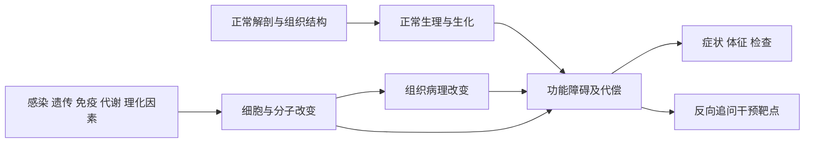

# 全书疾病与基础医学关联

把每个疾病放回这条链上：**正常结构与功能 → 病因作用点 → 分子／细胞损伤 → 组织形态改变 → 功能障碍 → 症状、体征与检查**。最后再理解干预为什么可能有效。

这里的“生理学”回答正常怎样工作，“病理学”回答结构怎样改变，“病理生理学”解释功能怎样失衡。生化、免疫、微生物、遗传和药理帮助补足中间环节。某些功能性疾病没有显著形态病变，不能强行补出病理图像。

## 如何使用

1. 先读所在系统的章级主线，补正常功能。
2. 到逐病表定位疾病，读原文证据和基础机制入口。
3. 用自己的话串起因果链；缺哪一环就回教材，不把关键词共现当成因果证明。
4. 用跨系统对照与闭卷题检查是否真正理解。

## 范围和证据边界

本专题以当前《内科学》第10版的131个章节为范围；653个条目来自当前正文和书末索引重建，包含疾病组、综合征及临床状态，不等于653种互不重叠的独立疾病。未整合西氏内科学，也未引用外部基础医学仓库的未核对笔记。

基础机制卡和代表性因果链是教学综合，附对应原书入口；逐病表的短引文来自当前本地正文。**章节先修知识不等于该章每个疾病都具备该机制；关键词入口仅用于定位，未被包装成逐病因果结论。**仅提及的条目明确保留证据层级。教材学习资料不包含新的治疗方案或剂量推荐。

## 覆盖情况

- 章节：131；逐病条目：653；基础机制：40；代表性因果链：52。
- 仅有提及语境：188。
- 有疾病范围证据：462。
- 教材仅转引：3。
- 完成的是全书范围的关联导航与有来源的学习资料；不将自动定位结果宣称为全部疾病的独立机制论证。

## 分系统学习

| 系统 | 章级主线 | 逐病关联 | 条目数 |
|---|---|---|---|
| 呼吸系统 | [[00_地图/全书疾病与基础医学/系统主线/02_呼吸系统|正常功能—病变—后果]] | [[00_地图/全书疾病与基础医学/逐病关联/02_呼吸系统|逐病证据与入口]] | 97 |
| 循环系统 | [[00_地图/全书疾病与基础医学/系统主线/03_循环系统|正常功能—病变—后果]] | [[00_地图/全书疾病与基础医学/逐病关联/03_循环系统|逐病证据与入口]] | 138 |
| 消化系统 | [[00_地图/全书疾病与基础医学/系统主线/04_消化系统|正常功能—病变—后果]] | [[00_地图/全书疾病与基础医学/逐病关联/04_消化系统|逐病证据与入口]] | 85 |
| 泌尿系统 | [[00_地图/全书疾病与基础医学/系统主线/05_泌尿系统|正常功能—病变—后果]] | [[00_地图/全书疾病与基础医学/逐病关联/05_泌尿系统|逐病证据与入口]] | 56 |
| 血液系统 | [[00_地图/全书疾病与基础医学/系统主线/06_血液系统|正常功能—病变—后果]] | [[00_地图/全书疾病与基础医学/逐病关联/06_血液系统|逐病证据与入口]] | 80 |
| 内分泌与代谢 | [[00_地图/全书疾病与基础医学/系统主线/07_内分泌与代谢|正常功能—病变—后果]] | [[00_地图/全书疾病与基础医学/逐病关联/07_内分泌与代谢|逐病证据与入口]] | 138 |
| 风湿免疫 | [[00_地图/全书疾病与基础医学/系统主线/08_风湿免疫|正常功能—病变—后果]] | [[00_地图/全书疾病与基础医学/逐病关联/08_风湿免疫|逐病证据与入口]] | 24 |
| 理化因素 | [[00_地图/全书疾病与基础医学/系统主线/09_理化因素|正常功能—病变—后果]] | [[00_地图/全书疾病与基础医学/逐病关联/09_理化因素|逐病证据与入口]] | 35 |

## 其他入口

- [[00_地图/全书疾病与基础医学/01_基础机制目录|按基础学科和机制学习]]
- [[00_地图/全书疾病与基础医学/02_跨系统对照|同一机制串联不同系统]]
- [[00_地图/全书疾病与基础医学/03_全书疾病检索|653项疾病快速检索]]
- [[00_地图/全书疾病与基础医学/04_章节覆盖与来源|131章覆盖与来源记录]]
- [[00_地图/全书疾病与基础医学/05_闭卷自测|闭卷推理练习]]
- [[00_地图/全书疾病与基础医学/06_证据边界与待核对|证据层级、旧索引变动与待核对条目]]
