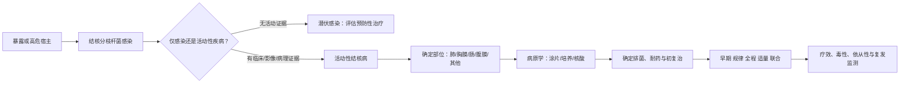

# 结核病学习专题

> [!warning] 使用边界
> 本专题用于教材学习和306复习，内容严格限定于本地《内科学》第10版及既有肺结核卡片；不是最新临床指南，也不替代诊疗决策。涉及具体患者、耐药方案、特殊人群或药物剂量时，应核对现行指南与医嘱。

## 一句话总纲

**先判断感染是否进展为活动性疾病，再取得病原学/病理学证据，随后明确部位、排菌、耐药和治疗史，最后用联合化疗完成杀菌、灭菌与防耐药。**

## 专题导航

| 学习层 | 进入笔记 | 完成后应能输出 |
| --- | --- | --- |
| 总机制 | [[01_感染传播与免疫病理主线]] | 复述“暴露—感染—免疫/变态反应—病理—转归” |
| 诊断 | [[02_肺结核诊断闭环与分型]] | 按证据层级完成六问诊断闭环 |
| 治疗 | [[03_抗结核治疗与药物]] | 解释HRZE、A/B/C/D菌群、耐药与不良反应 |
| 肺外结核 | [[04_肺外结核专题]] | 比较胸膜、肠、腹膜；识别心包和肾上腺线索 |
| 鉴别 | [[05_鉴别诊断与做题陷阱]] | 处理空洞、积液、回盲部病变及NTM陷阱 |
| 复习 | [[06_主动回忆与复习清单]] | 完成闭卷问题和1/3/7/14/30天复习 |
| 审计 | [[07_来源与验证记录]] | 追溯教材、图片、哈希和生成方式 |

## 诊断—治疗总图

## 三种使用方式

- **20分钟速览**：总图 → [[02_肺结核诊断闭环与分型#六问诊断闭环|六问诊断闭环]] → [[03_抗结核治疗与药物#一线药物最小记忆表|一线药物表]] → [[05_鉴别诊断与做题陷阱#高频决策句|高频决策句]]。
- **60分钟系统学习**：按01→05顺序，每页闭卷回答末尾问题。
- **长期复习**：进入[[06_主动回忆与复习清单#复习日程|复习日程]]，把错题追加到既有[[998_疾病卡片/02_呼吸系统疾病/肺结核#做题复盘|肺结核卡片·做题复盘]]。

## 证据地图

- 核心主讲：[[999_附件文件夹/02_内科学第10版_按章节/009_0208_肺结核|教材·肺结核]]。
- 专节主讲：[[999_附件文件夹/02_内科学第10版_按章节/014_0213_胸膜疾病#（二）结核性胸膜炎|教材·结核性胸膜炎]]；[[999_附件文件夹/02_内科学第10版_按章节/040_0407_肠结核和结核性腹膜炎|教材·肠结核和结核性腹膜炎]]。
- 提及级延伸：[[999_附件文件夹/02_内科学第10版_按章节/027_0309_心包疾病|教材·心包疾病]]；[[999_附件文件夹/02_内科学第10版_按章节/097_0707_肾上腺疾病|教材·肾上腺疾病]]。
- 既有备考卡：[[998_疾病卡片/02_呼吸系统疾病/肺结核|肺结核·306疾病卡片]]。

## 原书总览图

![[999_附件文件夹/images/7915f5d78e79a611ef4d60b83b07e4b4b7c7563cccf151f53d1f500924ec36a6.jpg]]

*原书《肺结核》章思维导图；图片保持原始本地文件，不复制、不替换。*

## 完成标准

- [ ] 能区分潜伏感染、活动性结核与非活动性肺结核。
- [ ] 能说出“是否肺结核—是否活动—是否排菌—是否耐药—初治/复治”。
- [ ] 能写出 `2HRZE/4HR` 并解释每个阶段的目的。
- [ ] 能比较结核性胸膜炎、肠结核和结核性腹膜炎的证据入口。
- [ ] 能完成肺癌/肺脓肿/NTM/克罗恩病/恶性积液的关键鉴别。
