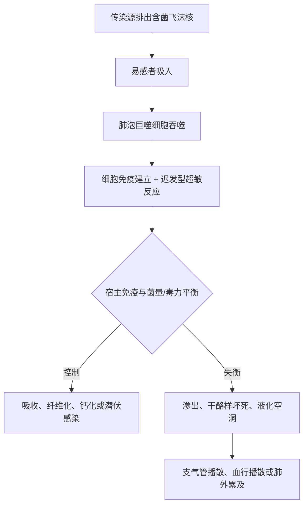

# 感染传播与免疫病理主线

> [!book] 原书入口
> [[999_附件文件夹/02_内科学第10版_按章节/009_0208_肺结核#【流行病学】|流行病学]] · [[999_附件文件夹/02_内科学第10版_按章节/009_0208_肺结核#【结核病在人群中的传播】|人群传播]] · [[999_附件文件夹/02_内科学第10版_按章节/009_0208_肺结核#【结核病在人体的发生与发展】|人体内发生发展]] · [[999_附件文件夹/02_内科学第10版_按章节/009_0208_肺结核#【病理学】|病理学]]

## 一条机制链

## 传播必须拆成四问

| 问题 | 回答框架 | 考试提醒 |
| --- | --- | --- |
| 谁排菌？ | 关注活动性且排菌的肺结核病人 | “感染”不等于“有传染性” |
| 怎么传播？ | 以呼吸道传播主线理解人群传播 | 传播判断要结合排菌与接触场景 |
| 谁易进展？ | HIV/AIDS、糖尿病、硅沉着病、免疫抑制等宿主因素 | 这些是从感染进展为疾病或结局不良的线索 |
| 怎么阻断？ | 早发现、规范治疗、病例管理、接触者评估、潜伏感染预防性治疗 | 卡介苗重点保护儿童严重结核类型，并非可靠预防成人肺结核 |

## 免疫与病理不要分开背

| 病理过程 | 形态关键词 | 临床/影像后果 |
| --- | --- | --- |
| 渗出 | 充血、水肿、炎细胞渗出 | 新鲜病灶、边缘较模糊，可吸收 |
| 增生 | 上皮样细胞、朗格汉斯巨细胞、结核结节 | 肉芽肿性反应、纤维化倾向 |
| 干酪样坏死 | 凝固性坏死样物 | 液化后形成空洞；可播散 |
| 修复 | 吸收、纤维化、钙化 | 可转为非活动性残留影 |

> [!exam] 核心因果
> **细胞免疫有助于控制感染；迟发型超敏反应也参与组织损伤。** 病变不是“细菌单独造成”，而是菌量/毒力与宿主反应共同决定。

## 潜伏、活动与非活动

- **潜伏感染**：已感染，但没有临床结核病，也没有细菌学或影像学活动证据。
- **活动性结核病**：临床症状/体征及病原学、病理学或影像学存在活动证据。
- **非活动性肺结核**：影像以钙化、硬结或纤维化为主，痰不排菌且无症状；这是教材诊断程序中的判断，不等同于“从未感染”。

## 原书自然过程图

![[999_附件文件夹/images/64d9c068cc3a778e005ab6103b9c4dd761c271edd433373734178e83a3746bb0.jpg]]

*图2-8-1：肺结核病自然过程示意图。*

## 闭卷自测

1. 为什么结核病可同时出现控制感染和组织损伤？
2. 干酪样坏死怎样连接“空洞—排菌—传播”？
3. 潜伏感染与活动性结核的分界证据是什么？
4. 为什么免疫抑制者的PPD可能阴性？
5. 卡介苗最值得记住的保护重点是什么？

返回：[[00_结核病学习专题]] · 下一步：[[02_肺结核诊断闭环与分型]]
