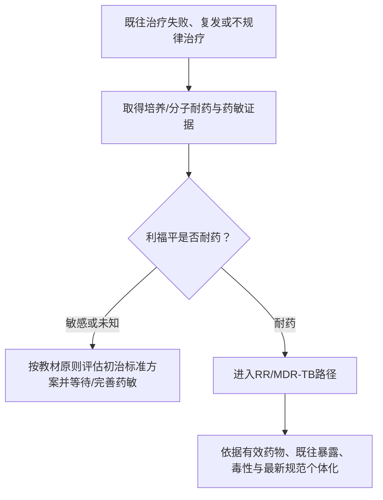

# 抗结核治疗与药物

> [!warning] 用药边界
> 本页是教材记忆框架，不是处方。耐药结核、肝肾功能异常、妊娠、儿童、HIV共病及严重肺外结核必须依据现行规范个体化处理。

> [!book] 原书入口
> [[999_附件文件夹/02_内科学第10版_按章节/009_0208_肺结核#【结核病的化学治疗】|结核病的化学治疗]] · [[999_附件文件夹/02_内科学第10版_按章节/009_0208_肺结核#【MDR-TB 或 RR-TB 的治疗】|MDR/RR-TB治疗]] · [[999_附件文件夹/02_内科学第10版_按章节/009_0208_肺结核#【其他治疗】|其他治疗]] · [[999_附件文件夹/02_内科学第10版_按章节/009_0208_肺结核#【结核病控制策略与措施】|控制策略]]

## 五原则不是口号

| 原则 | 防止的问题 |
| --- | --- |
| 早期 | 尽快降低菌量、组织破坏和传染性 |
| 规律 | 避免有效药物暴露不稳定和选择耐药菌 |
| 全程 | 覆盖半静止/间歇生长菌群，降低复发 |
| 适量 | 在疗效与毒性之间取得平衡 |
| 联合 | 交叉杀菌并防止单药选择耐药突变菌 |

## A/B/C/D菌群与用药逻辑

| 菌群 | 代谢位置/状态 | 教材中的优势药物记忆 | 意义 |
| --- | --- | --- | --- |
| A | 快速繁殖；细胞外、空洞干酪液化部 | H最强，随后S、R、E | 早期杀菌、快速降传染性 |
| B | 半静止；细胞内酸性环境/坏死组织 | Z最强，随后R、H | 灭菌、防复发 |
| C | 间歇短暂生长 | R最强，随后H | 灭菌、防复发 |
| D | 休眠、不繁殖 | 教材称抗结核药无作用 | 解释为什么不能把“联合”理解成无限叠药 |

## 一线药物最小记忆表

| 药物 | 核心定位 | 高频不良反应/监测点 |
| --- | --- | --- |
| H 异烟肼 | 早期杀菌强，细胞内外均有效 | 肝损害、周围神经炎；相关风险时关注维生素B6 |
| R 利福平 | 快速杀菌，对C菌群重要 | 肝损害、过敏；体液橘红；注意相互作用 |
| Z 吡嗪酰胺 | 酸性环境B菌群 | 肝损害、高尿酸血症、关节痛、胃肠不适 |
| E 乙胺丁醇 | 联合方案的重要组成 | 视神经炎；治疗前及过程中关注视力/视野 |
| S 链霉素 | 细胞外碱性环境杀菌 | 耳毒性、前庭损害、肾毒性 |

> [!exam] 记忆钩子
> **H神经+肝，R橘红+肝，Z尿酸+肝，E眼，S耳肾。** 口诀只用于提取，答题仍要写出具体不良反应。

## 标准方案

**初治活动性肺结核常用 `2HRZE/4HR`：**

- 强化期2个月：H、R、Z、E，目标是快速杀菌和降低耐药选择风险。
- 巩固期4个月：H、R，目标是杀灭残留菌群、降低复发。

教材同时记录了特定人群的4个月短程方案信息，但明确指出 `2HRZE/4HR` 仍是较稳妥保守的选择；复习时必须区分“教材主要标准方案”和“特定条件下的新方案”。

## 复治与耐药的决策边界

- **复治不等于机械套用固定复治方案。** 教材强调对复治病人进行药敏并按耐药结果制定方案。
- **MDR-TB**：至少耐异烟肼和利福平；**RR-TB**：利福平耐药。
- 教材列出的长/短程耐药方案具有版本性，临床应用必须再次核对现行指南。

## 治疗监测框架

| 维度 | 复习时要问 |
| --- | --- |
| 疗效 | 症状、影像、痰菌/培养是否按节点改善？ |
| 依从性 | 是否漏药、中断或自行改变方案？ |
| 毒性 | 肝功能、视力、听力/肾功能、尿酸及症状是否异常？ |
| 耐药 | 失败、复发、持续阳性时是否补做培养与药敏？ |
| 传播控制 | 排菌状态、报告转诊和接触者管理是否完成？ |

## 高频陷阱

- 症状好转不等于可以停药。
- 单药或不规律联合治疗都可选择耐药菌。
- 痰菌持续阳性不能只“延长原方案”，必须重新评估依从性、药敏与诊断。
- 糖皮质激素不是肺结核常规基础治疗；仅在教材限定情形并确保有效抗结核治疗时考虑。

## 闭卷自测

1. 五原则分别在防什么？
2. H、R、Z分别对应哪些菌群优势？
3. 写出HRZE五药的一个标志性不良反应。
4. `2HRZE/4HR` 两阶段目的有什么不同？
5. 为什么复治病例不能机械套用固定方案？

返回：[[00_结核病学习专题]] · 下一步：[[04_肺外结核专题]]
