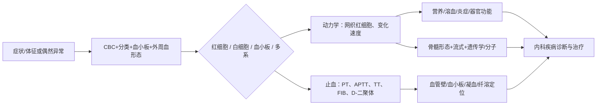

# 血液学学习专题

> [!warning] 使用边界
> 这是本地教材的学习与复习桥接层，不是最新临床指南，也不替代对具体患者的诊疗。阈值、分型、药物与移植/CAR-T适应证用于回到教材定位；临床应用需复核现行规范。

## 一句话总纲

**从症状体征与CBC识别“哪条细胞系/止血环节异常”，用计数—形态—动力学—溶血/营养—凝血—克隆性—组织学逐级缩小范围，再回到内科学完成疾病诊断、分层与治疗。**

## 双库分工

| 层级 | 主要问题 | 入口 |
| --- | --- | --- |
| 诊断学 | 看见什么？先做哪些检查？怎样解释异常？何时取材？ | [诊断学·血液学诊断桥接](obsidian://open?vault=01_32_%E8%AF%8A%E6%96%AD%E5%AD%A6_%E5%89%AF%E6%9C%AC&file=999%E9%99%84%E4%BB%B6%E6%96%87%E4%BB%B6%E5%A4%B9%2F%E8%AF%8A%E6%96%AD%E5%AD%A6%E7%AC%AC10%E7%89%88_%E6%8C%89%E7%AB%A0%E8%8A%82%2F93_%E8%A1%80%E6%B6%B2%E5%AD%A6%E8%AF%8A%E6%96%AD%E6%A1%A5%E6%8E%A5%2F00_%E8%A1%80%E6%B6%B2%E5%AD%A6%E8%AF%8A%E6%96%AD%E6%A1%A5%E6%8E%A5) |
| 内科学 | 为什么异常？属于哪种疾病？如何分层、治疗和随访？ | 本专题各机制模块 |
| 深读补充 | 需要更细的血液学机制与分类时 | [[999_附件文件夹/02_内科学第10版_按章节/91_疾病学习框架/06_血液系统疾病|既有血液系统疾病框架]] |

## 学习导航

| 模块 | 核心输出 |
| --- | --- |
| [[01_首诊入口与CBC]] | 把贫血、感染/白细胞异常、出血、淋巴结/脾大映射到CBC与首轮检查 |
| [[02_红细胞与贫血]] | 用 `MCV × 网织红细胞` 建立贫血分流，再接铁、B12/叶酸和溶血证据 |
| [[03_白细胞与骨髓增殖]] | 区分反应性与克隆性，理解外周血—骨髓—流式—遗传学证据链 |
| [[04_淋巴浆细胞与脾淋巴结]] | 从淋巴结/脾大、M蛋白与器官损害进入淋巴瘤和浆细胞病 |
| [[05_出血凝血与血栓]] | 用出血表型、血小板、PT/APTT/TT/FIB/D-二聚体定位止血环节 |
| [[06_骨髓淋巴结与检查升级]] | 说明何时升级骨髓、淋巴结、流式、细胞遗传与分子检测 |
| [[07_输血移植与细胞治疗]] | 将支持治疗、输血安全、HSCT和CAR-T放回疾病主线 |
| [[08_双向索引与主动回忆]] | 同时完成“疾病→检查”和“异常检查→疾病”的闭卷复习 |
| [[09_来源与验证]] | 查看来源范围、只读边界、图片与校验记录 |

## 总路径

## 三遍学习法

1. **第一遍：异常定位。** 只做[[01_首诊入口与CBC]]，能从一张CBC说出异常细胞系、轻重缓急与复查项。
2. **第二遍：机制分流。** 依次完成红细胞、白细胞/骨髓、淋巴浆细胞、出血凝血四条主线。
3. **第三遍：证据闭环。** 从[[08_双向索引与主动回忆]]反向作答，并到诊断学桥接页核对检查意义。

## 完成标准

- [ ] 能解释为什么“血红蛋白低”还必须看MCV与网织红细胞。
- [ ] 能把白细胞异常先分为反应性/药物或感染相关/克隆性。
- [ ] 能用出血表型和筛查试验初步定位血管壁、血小板、凝血或纤溶。
- [ ] 能说明骨髓形态、流式、染色体/基因分别回答什么问题。
- [ ] 能从检查异常反推出需要优先鉴别的内科疾病，而不是见异常背病名。
