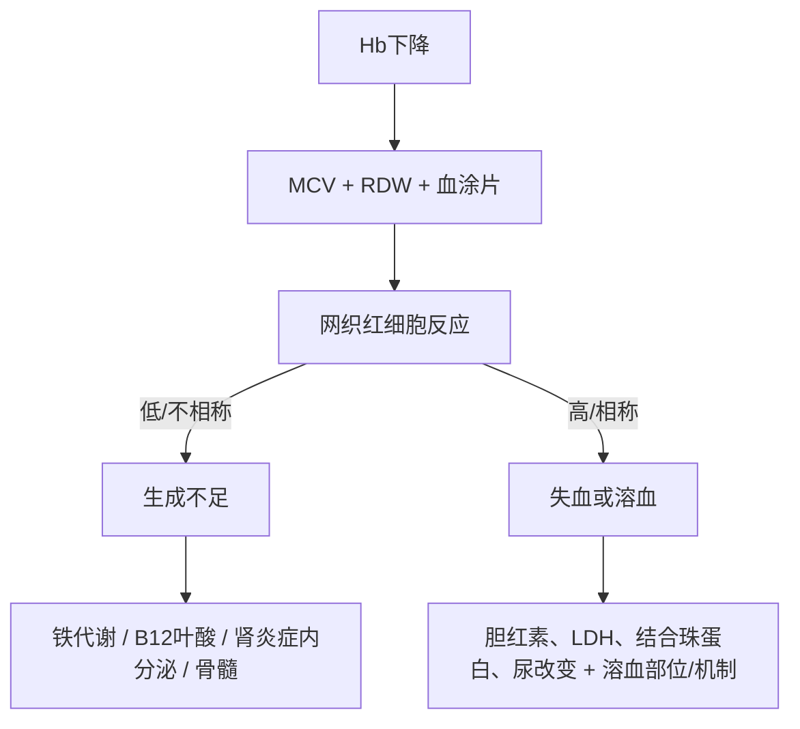

# 红细胞与贫血

> [!book] 内科学入口
> [[999_附件文件夹/02_内科学第10版_按章节/071_0602_贫血概述|贫血概述]] · [[999_附件文件夹/02_内科学第10版_按章节/072_0603_缺铁性贫血|缺铁性贫血]] · [[999_附件文件夹/02_内科学第10版_按章节/073_0604_巨幼细胞贫血|巨幼细胞贫血]] · [[999_附件文件夹/02_内科学第10版_按章节/074_0605_再生障碍性贫血|再生障碍性贫血]] · [[999_附件文件夹/02_内科学第10版_按章节/075_0606_溶血性贫血|溶血性贫血]]

## 两轴先分流

| 轴 | 低/不相称 | 高/相称 | 解释 |
| --- | --- | --- | --- |
| MCV | 小细胞 | 大细胞 | 指向血红素合成、DNA合成等方向，但不能单独定因 |
| 网织红细胞 | 骨髓反应不足 | 骨髓代偿 | 连接生成不足与丢失/溶血；应结合贫血程度校正理解 |

## 三类形态 × 机制

| 形态入口 | 常见机制方向 | 下一组证据 |
| --- | --- | --- |
| 小细胞低色素 | 缺铁、铁利用障碍、珠蛋白/血红素合成异常 | 铁蛋白、转铁蛋白相关指标；病史与慢性炎症；必要时Hb分析 |
| 正细胞 | 急性失血、溶血早期、慢性病/肾病、骨髓生成不足 | 网织红、溶血组合、肾功能/炎症；多系减少时评估骨髓 |
| 大细胞 | B12/叶酸相关DNA合成障碍、药物/肝病等；也可见网织红增多 | 血涂片、B12/叶酸与病因；必要时骨髓 |

## 溶血证据必须成组

- **红细胞寿命缩短/破坏增加**：间接胆红素与LDH等变化提供方向。
- **骨髓代偿**：网织红细胞增多；若不增，要考虑骨髓储备、营养或合并病。
- **血管内/血管外线索**：尿血红蛋白/含铁血黄素与脾大等需结合判断。
- **机制追问**：红细胞内在缺陷，还是免疫、机械、感染/毒物等外在因素。

## 诊断学接力

进入[贫血与红细胞实验路径](obsidian://open?vault=01_32_%E8%AF%8A%E6%96%AD%E5%AD%A6_%E5%89%AF%E6%9C%AC&file=999%E9%99%84%E4%BB%B6%E6%96%87%E4%BB%B6%E5%A4%B9%2F%E8%AF%8A%E6%96%AD%E5%AD%A6%E7%AC%AC10%E7%89%88_%E6%8C%89%E7%AB%A0%E8%8A%82%2F93_%E8%A1%80%E6%B6%B2%E5%AD%A6%E8%AF%8A%E6%96%AD%E6%A1%A5%E6%8E%A5%2F02_%E8%B4%AB%E8%A1%80%E4%B8%8E%E7%BA%A2%E7%BB%86%E8%83%9E%E5%AE%9E%E9%AA%8C%E8%B7%AF%E5%BE%84)，核对CBC指数、涂片、铁/B12/叶酸、溶血和骨髓检查各自回答的问题。

## 易错点

- 铁蛋白受炎症影响，不能脱离临床背景机械解释。
- 大细胞不自动等于巨幼细胞贫血；小细胞不自动等于缺铁。
- 网织红“正常”在明显贫血中可能仍是不相称的低反应。
- 再障应以多系减少和骨髓生成不足主线理解，不用单一贫血指标替代。

## 闭卷自测

1. 画出 `Hb→MCV/RDW→网织红→机制检查` 路径。
2. 缺铁、巨幼细胞、再障、溶血各自最先希望获得哪组证据？
3. 为什么“网织红正常”不一定说明骨髓反应正常？

返回：[[00_血液学学习专题]] · 下一步：[[03_白细胞与骨髓增殖]]
