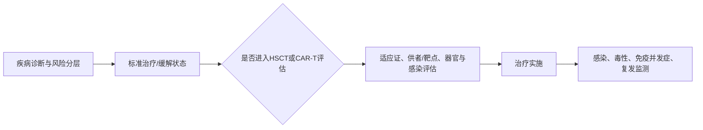

# 输血移植与细胞治疗

> [!book] 内科学入口
> [[999_附件文件夹/02_内科学第10版_按章节/088_0619_输血和输血反应|输血和输血反应]] · [[999_附件文件夹/02_内科学第10版_按章节/089_0620_造血干细胞移植|造血干细胞移植]] · [[999_附件文件夹/02_内科学第10版_按章节/090_0621_CAR-T细胞免疫疗法在血液病中的应用|CAR-T]]

## 把三种治疗放在不同层级

| 层级 | 主要目的 | 学习重点 |
| --- | --- | --- |
| 成分输血 | 支持性纠正携氧、止血或特定成分缺乏 | 指征、相容性、输注过程与不良反应识别 |
| 造血干细胞移植 | 以造血/免疫重建实现疾病控制或替代异常造血 | 适应证、供者/预处理、植入、感染、GVHD、复发 |
| CAR-T | 经工程化T细胞靶向特定抗原 | 适应证与流程；细胞因子释放综合征、神经毒性等安全监测 |

## 输血先记“目的—成分—风险”

- 红细胞、血小板、血浆/相关成分不是“越多越好”，应与具体缺陷和临床状态匹配。
- 输注前重视血型、抗体筛查与交叉配血；输注中出现发热、寒战、呼吸困难、疼痛或低血压等应立即按流程评估。
- 输血反应按免疫/非免疫、急性/迟发思考，并保留标本与记录以支持溯源。

## 移植/CAR-T是疾病路径的一部分

## 诊断学接力

血型、交叉配血与输血前实验入口见[诊断学桥接·输血部分](obsidian://open?vault=01_32_%E8%AF%8A%E6%96%AD%E5%AD%A6_%E5%89%AF%E6%9C%AC&file=999%E9%99%84%E4%BB%B6%E6%96%87%E4%BB%B6%E5%A4%B9%2F%E8%AF%8A%E6%96%AD%E5%AD%A6%E7%AC%AC10%E7%89%88_%E6%8C%89%E7%AB%A0%E8%8A%82%2F93_%E8%A1%80%E6%B6%B2%E5%AD%A6%E8%AF%8A%E6%96%AD%E6%A1%A5%E6%8E%A5%2F05_%E6%B5%86%E7%BB%86%E8%83%9E%E8%BE%93%E8%A1%80%E4%B8%8E%E8%AF%8A%E6%96%AD%E6%93%8D%E4%BD%9C)。

## 闭卷自测

1. 成分输血、HSCT、CAR-T分别解决什么层级的问题？
2. 输血反应发生时，为什么症状识别、停止输注、标本与记录同样重要？
3. HSCT和CAR-T为什么必须连接感染、器官功能和长期复发监测？

返回：[[00_血液学学习专题]] · 下一步：[[08_双向索引与主动回忆]]
