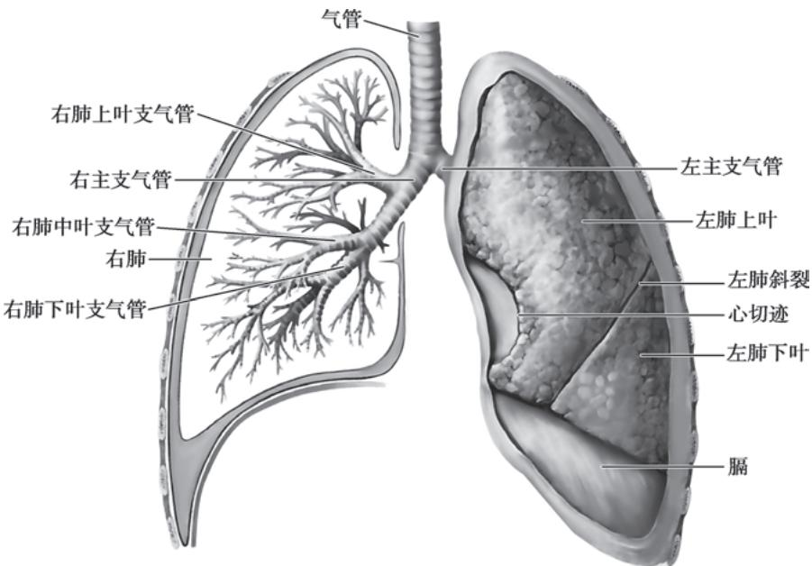
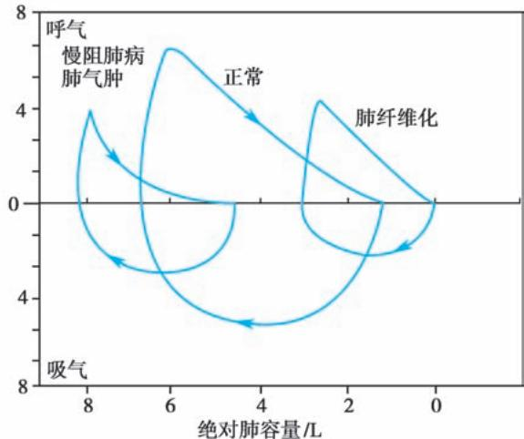

> [!info] 导航
> [[第001章_第一篇_绪论|上一章]] · [[00_章节导航|总目录]] · [[第003章_第2篇第02章_急性上呼吸道感染和急性气管支气管炎|下一章]]

## 第二篇呼吸系统疾病

本章数字资源

呼吸系统疾病造成严重的疾病和社会经济负担，构成对人类和我国人民健康的重大危害。WHO将慢性呼吸系统疾病与心脑血管疾病、恶性肿瘤、糖尿病与代谢性疾病一起定义为影响人类健康的四大类慢性疾病。根据近二十年的国家卫生统计数据，呼吸系统疾病所致死亡高居城乡人口死亡专率的1～4位。中国成人肺部健康研究（CPHS）显示我国20岁及以上人群慢性阻塞性肺疾病（COPD，简称慢阻肺病)患病率8.6%，总患病人数达9990万人。随着我国工业化、现代化进程的加速和生活方式的转型，空气污染、吸烟、人口老龄化等问题陆续出现，呼吸系统疾病愈发成为影响我国人民健康和生命的重大、常见、多发疾病。21世纪以来发生的多次新发呼吸道传染病疫情，如2003年的严重急性呼吸综合征（SARS）、2009年的新型甲型H1N1流感、2013年的禽流感H7N9、2015年的中东呼吸综合征（MERS）以及2019年底2020年初暴发的2019冠状病毒病（COVID-19），我国也称新冠病毒感染，旧称新型冠状病毒肺炎，无不警醒人们，新发呼吸道传染病对人类健康和社会安定的威胁一直存在，需要时刻警惕，创建平疫结合的呼吸道传染病应对体系。

呼吸学科是研究呼吸系统的健康和疾病问题,从而实现健康促进、疾病预防、诊断、控制、治疗和康复的学科。因此,本篇学习重点是掌握呼吸系统解剖和生理特点,认识呼吸系统疾病发生发展及疾病对其影响;认识和解释呼吸系统疾病的常见症状和体征,建立常见呼吸系统疾病的诊断和鉴别诊断思路;知道如何运用呼吸系统检查技术解决临床问题;掌握常见呼吸系统疾病的处理原则和常见呼吸急症的急救措施。

#### 【呼吸系统的结构功能特点】

吸入空气经过呈多级分支状的气道进入肺泡。气管进入胸腔后，分成左、右主支气管。右主支气管分出右上叶支气管和右中间段支气管，后者再分出右中叶和右下叶支气管。左主支气管分出左上叶和左下叶支气管，左上叶支气管分出固有上叶支气管和舌段支气管。这样，右肺被分为上、中、下三叶，左肺被分为上、下两叶。这些支气管再逐渐分出段、亚段支气管、细支气管、呼吸性细支气管、肺泡管、肺泡囊和肺泡。（图2-1-1）

1. 气体交换功能 呼吸系统与体外环境相通,肺具有广泛的呼吸面积,健康成人的总呼吸面积大于 $100 ~m^{2}$ 。成人在静息状态下,每天约有 10 000L 的气体进出呼吸道。氧气经呼吸道吸入,在肺脏进行气体交换,二氧化碳再经呼吸道排出体外,完成气体交换是肺脏最主要的功能。

2. 防御功能 在呼吸过程中,外界环境中的有机或无机粉尘,包括各种微生物、变应原、PM2.5、有害气体及烟草烟雾等,皆可进入呼吸道及肺引起各种疾病。“百脉归肺”,肺循环作为全身各系统血液汇集点,也使肺脏易受各系统疾病体内代谢毒物累及。呼吸系统因其结构功能特点,易受到外界和体内因素侵扰,因而呼吸系统的防御功能至关重要。呼吸系统的防御功能包括物理防御功能(鼻部加温过滤、喷嚏、咳嗽、支气管收缩、黏液纤毛运输系统)、化学防御功能(溶菌酶、乳铁蛋白、蛋白酶抑制剂、抗氧化的谷胱甘肽、超氧化物歧化酶等)、固有免疫(肺泡巨噬细胞、多形核粒细胞)及适应性免疫防御功能(B细胞分泌IgA、IgM等,T细胞免疫反应等)等。当各种原因引起防御功能下降或外界的刺激过强均可引起呼吸系统的损伤或疾病。

3. 代谢功能 肺对某些生物活性物质、脂质及蛋白质、活性氧等物质有代谢功能。

4. 循环调节作用 肺脏接受肺循环,也接受体循环供血。肺动脉从右心室发出并分支,最终形成包绕肺泡的毛细血管网,相当大的表面积有利于气体交换,完成气体交换后的富氧血经肺静脉回流入左心,经体循环支配全身,也经支气管动脉为支气管供血。肺循环具有低压(仅为体循环的 1/10)、低阻及高容的特点,接受全身血液汇集于肺泡毛细血管网,有利于气体交换。同时也通过肺循环过滤掉经静脉系统回流的颗粒物。

  
图 2-1-1 气管、支气管、肺结构示意图

  
扫描图片体验 AR

#### 【呼吸系统疾病范畴】

按照呼吸系统解剖结构和病理生理特点,呼吸系统疾病主要分为以下几类(表2-1-1):①气流受限性肺疾病;②限制性通气障碍性肺疾病;③肺血管疾病。感染、肿瘤作为常见获得性病因影响呼吸系统,导致各种病理变化。睡眠障碍也可导致呼吸系统疾病。这些疾病进展均可导致急性或慢性呼吸衰竭。

#### 【呼吸系统疾病的诊断】

呼吸系统疾病的诊断常涉及多维度。详细的病史采集和体格检查是基础；影像学检查(包括X线和CT等)和肺功能检查对呼吸系统疾病的诊断具有重要意义；实验室化验，包括常规和特殊血液和微生物检查等也对疾病诊断有重要价值；同时，支气管镜、胸腔镜等对于一些呼吸系统疾病的诊断也愈发重要。呼吸系统疾病常需要结合以上多方面信息，进行全面综合分析，总结病例特点，去伪存真、由表及里地获得客观准确的结论。

### （一）病史

详细的病史有助于了解引发呼吸系统疾病的原因和疾病发生的经过，因此应按照诊断学要求详细询问病史，包括环境/职业暴露史、吸烟史、传染病接触史，既往疾病与用药史以及家族遗传疾病史等。

### （二）症状

呼吸系统的局部症状主要有咳嗽、咳痰、咯血、呼吸困难和胸痛等，在不同的肺部疾病中，它们有各自的特点。

1. 咳嗽 咳嗽是呼吸系统疾病最常见的症状。咳嗽按病程分为：

（1）急性咳嗽(病程≤3周):多见于呼吸气道或肺实质的急性损伤或炎症性疾病,如急性上呼吸道感染,急性气管炎、支气管炎,肺炎。常表现急性发作的咳嗽伴发热。

(2) 亚急性咳嗽(病程 $3 \sim 8$ 周): 常见于感冒后咳嗽(又称感染后咳嗽)、细菌性鼻窦炎、哮喘等。

（3）慢性咳嗽(病程＞8周):原因较多,通常可分为两类。一类为胸部影像有明确病变,如慢阻肺病、支气管扩张、间质性肺疾病、肺结核、肺癌等,常伴有咳痰、咯血、气短等;另一类为胸部影像无明确异常,是以咳嗽为主要或唯一症状者,即通常所说的不明原因慢性咳嗽(简称慢性咳嗽),多见于上气道咳嗽综合征(upper airway cough syndrome, UACS)[既往称鼻后滴漏综合征(post-nasal drip syndrome)]、咳嗽变异性哮喘(cough variant asthma, CVA)、胃食管反流病(gastroesophageal reflux disease, GERD)、嗜酸性粒细胞支气管炎和血管紧张素转换酶抑制剂(ACEI)药物性咳嗽。

2. 咳痰 痰液量及其性状、气味对诊断也有一定帮助。白色黏液痰多见于病毒、支原体或衣原 体感染；黄色脓性痰或痰液由白色黏液状转为黄色脓性常提示细菌感染；铁锈样痰可能是肺炎链球菌感染；大量脓性痰常见于肺脓肿或支气管扩张；红棕色胶冻样痰提示可能有肺炎克雷伯菌感染；脓痰有腐臭味提示可能有厌氧菌感染；巧克力色腥味痰提示可能患肺阿米巴病。咳粉红色稀薄泡沫痰伴呼吸困难提示可能有心力衰竭和肺水肿。痰量的增减反映感染的加剧或炎症的缓解，若痰量突然减少，且出现体温升高，可能与支气管引流不畅有关。

表 2-1-1 呼吸系统疾病分类

<table><tr><td>类别</td><td>举例</td></tr><tr><td rowspan="4">气流受限性肺疾病</td><td>支气管哮喘</td></tr><tr><td>慢性阻塞性肺疾病(慢阻肺病)</td></tr><tr><td>支气管扩张</td></tr><tr><td>细支气管炎</td></tr><tr><td>限制性通气障碍性肺疾病</td><td></td></tr><tr><td>肺实质疾病</td><td>间质性肺疾病/弥漫性实质性肺疾病,包括特发性肺纤维化、结节病、过敏性肺炎、尘肺等</td></tr><tr><td rowspan="2">神经肌肉疾病</td><td>肌萎缩侧索硬化症</td></tr><tr><td>吉兰-巴雷综合征</td></tr><tr><td rowspan="3">胸壁/胸膜疾病</td><td>脊柱后、侧凸</td></tr><tr><td>胸腔积液</td></tr><tr><td>胸膜增厚</td></tr><tr><td rowspan="2">肺血管疾病</td><td>肺血栓栓塞症</td></tr><tr><td>肺动脉高压</td></tr><tr><td rowspan="5">感染性肺疾病</td><td>肺炎(社区获得性肺炎、医院获得性肺炎等)</td></tr><tr><td>肺结核</td></tr><tr><td>肺真菌病</td></tr><tr><td>新发呼吸道传染病(COVID-19等)</td></tr><tr><td>气管支气管炎</td></tr><tr><td rowspan="2">恶性肿瘤</td><td>支气管肺癌</td></tr><tr><td>肺转移瘤/癌</td></tr><tr><td>睡眠呼吸障碍性疾病</td><td>睡眠呼吸暂停综合征</td></tr><tr><td rowspan="2">呼吸衰竭</td><td>急性呼吸衰竭</td></tr><tr><td>慢性呼吸衰竭</td></tr></table>

3. 咯血是指来源于气道或肺实质的血管受损出血经咳嗽而排出，可以由很多原因引起，常见于急性支气管炎、肺炎、支气管扩张、肺结核、肺真菌病、肺癌等。咯血多是少量或中量，表现痰中带血丝、血痰或整口鲜血，但有约 $5\% \sim 15\%$ 的病人呈大咯血，甚至威胁生命，这主要与咯血量和/或咯血速度有关。对于咯血的严重程度一直没有十分一致的定义。一般认为24小时咯血量小于 $100\mathrm{ml}$ 或单次咯血量小于 $30\mathrm{ml}$ 为小量咯血，24小时咯血量大于 $500\mathrm{ml}$ 或单次咯血量大于 $100\mathrm{ml}$ 为大量咯血，常见于支气管扩张、肺结核、肺真菌病等，需要紧急处理。

4. 呼吸困难 呼吸困难常主诉为胸闷或气短，可表现在呼吸频率、深度及节律改变等方面。按其发作快慢分为急性、慢性和反复发作性。突发胸痛后出现呼吸困难需考虑气胸，若伴有咯血则要警惕急性肺栓塞。反复发作性呼吸困难且伴有哮鸣音主要见于支气管哮喘。夜间发作性呼吸困难提示左心衰竭或支气管哮喘急性发作。数日或数周内出现的渐进性呼吸困难可提示肺炎、胸腔积液。慢性进行性加重的呼吸困难多见于慢阻肺病和特发性肺纤维化等间质性肺疾病。在分析呼吸困难时还应注意是吸气性还是呼气性呼吸困难，前者见于肿瘤或异物堵塞引起的大气道狭窄，喉头水肿，喉、气管炎症等；后者主要见于支气管哮喘、慢阻肺病等。

5. 胸痛 肺实质内不存在痛觉感受器,故胸痛一般源于各种肺部疾病累及胸膜及咳嗽引起的肌肉疼痛等。胸膜性胸痛一般为单侧、吸气末明显,定位相对清晰,可继发于气胸、肺炎、肿瘤、肺栓塞等。严重肺动脉高压可导致心肌缺血,出现与呼吸无关的心前区钝痛。非呼吸系统疾病引起的胸痛中,最重要的是心绞痛和心肌梗死,其特点是胸骨后或左前胸部位的压榨性胸痛,可放射至左肩。此外,还应注意心包炎、主动脉夹层等所致的胸痛。肋间神经痛、肋软骨炎、带状疱疹、柯萨奇病毒感染引起的胸痛常表现为胸壁表浅部位的疼痛。腹部脏器疾病,如胆石症和急性胰腺炎等有时亦可表现为不同部位的胸痛,须注意鉴别。

### （三）体征

呼吸系统疾病不但表现呼吸系统体征，也可以表现其他系统的体征，因此体检时既要重视胸部的体格检查，又要注意全身的体格检查，如眼、口唇、气管、颈静脉、骨关节、指(趾)等。通过视触叩听对胸部进行检查，并注意两侧对比，以发现异常征象。不同疾病或疾病的不同阶段由于病变的性质、范围不同，胸部体征可以由完全正常到明显异常。肺部听诊现在多用爆裂音（crackles）取代过去常用的啰音（rales）。细爆裂音（fine crackles）非乐音样，吸气晚期可听见，见于心力衰竭或间质性肺疾病。肺纤维化时可听到特征性的Velcro啰音。粗爆裂音（coarse crackles）听起来由口腔传来，在咳嗽后清晰，见于支气管炎等。哮鸣音（wheezes）听起来呈高调乐音样，呼气相明显，有时吸气相也可以听见，常见于哮喘和一些慢阻肺病病人。鼾音（rhonchus）呈低调乐音样，呼气相明显，有时吸气相也可以听见，通常随咳嗽而消失，常见于支气管炎病人。喘鸣音（stridor）呈高调乐音样，不用听诊器即可听到，提示上气道阻塞，如急性喉炎；气管阻塞，如气管肿块或因胸内肿瘤压迫。呼吸音消失见于气道完全阻塞或大量胸腔积液。摩擦音见于胸膜炎。

### （四）实验室和辅助检查

根据病情需要选择相应实验室检查可协助明确病因，揭示疾病活动或损害程度。

1. 实验室检查

（1）常规检查:血常规、红细胞沉降率(ESR)、C反应蛋白(CRP)异常可提示感染或非感染性炎症,白细胞计数增高伴中性粒细胞计数增高常提示细菌感染;病毒感染可见淋巴细胞计数减低;嗜酸性粒细胞增高提示寄生虫感染或过敏性疾病。

（2）痰液检查:漱口后咳出深部痰,痰涂片在每个低倍镜视野里上皮细胞<10个,白细胞>25个或白细胞/上皮细胞>2.5为合格的痰标本。无痰病人可做高渗生理盐水雾化吸入诱导痰。

病原学检查:痰涂片革兰氏染色、抗酸染色和病原菌培养对肺部感染性疾病有重要价值。痰涂片中查到抗酸杆菌是诊断肺结核的重要依据,痰培养出结核分枝杆菌是确诊肺结核最可靠的证据。痰荧光染色检出或培养出丝状真菌一般均提示肺部丝状真菌感染。定量培养细菌 $\geqslant10^{7}cfu/ml$ 可判定为致病菌, $10^{4}\sim10^{7}cfu/ml$ 则可能为致病菌, $<10^{4}cfu/ml$ 则为口腔细菌污染。

痰细胞学检查:痰嗜酸性粒细胞升高对嗜酸性粒细胞性支气管炎有提示意义。痰脱落细胞学检查有助于肺恶性肿瘤的诊断。

（3）病原学检查：呼吸系统疾病微生物检查标本有痰液、血液、咽拭子、支气管肺泡灌洗液、支气管毛刷刷取物、活检肺组织等。检测方法包括：①常规涂片和特异染色，鉴别病原体，如革兰氏阳性菌、阴性菌，抗酸杆菌等；②微生物培养；③免疫学方法检测相应病原(病毒、支原体、军团菌、结核分枝杆菌、真菌等)的抗原/抗体或机体免疫反应，恢复期血清特异性抗体滴度成倍升高则诊断意义更大。④核酸检测，PCR或RT-PCR检测病原体核酸；⑤病原体感染血清标志物检测，如疑似细菌感染检测降钙素原(PCT)，真菌感染做G实验检测真菌表面的1,3-β-D-葡聚糖抗原、GM实验检测曲霉特异的半乳甘露聚糖抗原；⑥宏基因组（metagenomics）分析，对于一些不明原因感染或肺部炎症性病变诊断不明的病人，其检测分析结果对于明确是否感染及特定病原学有一定帮助。

（4）非感染的生物标志：如疑诊风湿免疫相关疾病，通常检测血清类风湿因子、抗核抗体、抗中性粒细胞胞质抗体（ANCA）等；如疑诊肿瘤，检测肿瘤标志物、循环肿瘤细胞等。

2. 影像学检查 影像学诊断在呼吸系统疾病诊治中具有重要意义。影像学的诊断依赖于以影像特征推测病理改变和以影像所在部位推测病变累及的组织器官,因此掌握胸部脏器的解剖、各种疾病的病理改变特点及相应的影像特征是作出正确影像学诊断的基础,影像学诊断还必须结合临床征象。

（1）胸部 X 线(胸片): 胸片常用来明确呼吸系统疾病病变部位、性质及与临床问题的关系。

（2）胸部 CT: 能发现胸片不能发现的病变, 对于明确肺部病变部位、性质以及有关气管、支气管通畅程度有重要价值。增强 CT 对淋巴结肿大、肺内占位性病变有重要的诊断提示意义。CT 肺血管造影 (CTPA) 能发现段水平甚至亚段水平的肺动脉血栓, 是确诊肺栓塞的重要手段。胸部高分辨率 CT (HRCT) 是诊断间质性肺疾病的必备工具, 也是诊断支气管扩张的重要手段。低剂量 CT 应用于肺癌早期筛查, 尽可能减少辐射。

（3）胸部 MRI: 在诊断血管、锁骨上窝区、纵隔、胸膜和胸壁等病变有其独特优势, 但其诊断肺实质疾病的作用不如 CT。

（4）放射性核素扫描:肺通气/灌注显像对肺栓塞和血管病变有诊断价值;全身骨扫描对肺恶性肿瘤骨转移的诊断也有较高参考价值。

（5）正电子发射计算机断层成像(PET-CT):通过组织对氟脱氧葡萄糖(FDG)的摄取,评价病变组织的代谢状态,确定病变的部位及累及的范围,估测病变的性质,从而可以较准确地对肺恶性肿瘤、纵隔淋巴结转移及远处转移进行鉴别诊断。

(6) 胸部超声检查: 可用于胸腔积液的诊断与穿刺定位, 以及紧贴胸膜病变的引导穿刺等。

（7）肺/支气管动脉造影术和栓塞术:对肺动脉高压的分型有指导意义,对咯血有较好的诊治价值。

3. 抗原皮肤试验 哮喘的变应原皮肤试验阳性有助于变应体质的确定和相应抗原的脱敏治疗。结核菌素（PPD）试验阳性的皮肤反应仅说明已受感染或接种过卡介苗，但并不能确定患病。

4. 呼吸生理功能测定 包括血气分析、肺功能测定、6分钟步行试验等。通过这些测定可了解呼吸系统疾病对肺功能损害的性质及程度，对某些肺部疾病的早期诊断具有重要价值。动脉血气分析可以判断是否存在低氧或呼吸衰竭、高碳酸血症和酸碱失衡。肺功能测定主要包括肺通气、肺一氧化碳弥散量（ $\mathrm{D_LCO}$ ），肺通气包括用力肺活量（FVC）、第一秒用力呼气容积（ $\mathrm{FEV}_1$ ）、呼气峰流量（PEF）等。通气功能障碍分为阻塞性、限制性和混合性。阻塞性通气功能障碍多见于小气道疾病，如慢阻肺病、哮喘等。限制性通气功能障碍见于肺组织顺应性下降的疾病，包括肺内疾病（如间质性肺疾病、结节病）和肺外疾病（如胸腔积液、胸膜肥厚、胸廓畸形、呼吸肌功能障碍）。两种通气障碍的特点见表2-1-2和最大呼气流量-容积曲线图(图2-1-2)。弥散功能测定有助于明确换气功能损害情况，以间质性肺疾病、肺血管疾病中体现明显。呼气峰流速（peak expiratory flow rate, PEFR）为是否存在气流受限的另一种测定方式，病人可以自行监测。此外，6分钟步行试验也可综合评价肺部疾患病人的心肺功能，可协助判断疾病严重程度和治疗反应。

5. 胸腔穿刺和胸膜活检 胸腔穿刺用于明确胸腔积液的性质,常规检查和生化检查中的蛋白、糖和乳酸脱氢酶(LDH)可协助明确胸腔积液为渗出性或漏出性。胸腔积液中腺苷脱氨酶水平升高或 $\gamma$ -干扰素释放试验阳性可能提示结核性胸膜炎。癌胚抗原、细胞学检查及细胞染色体分析有助于恶性胸腔积液的诊断。胸膜穿刺活检对肿瘤或结核病变有诊断价值。

6. 支气管镜与胸腔镜检查

（1）可弯曲纤维或电子支气管镜：能弯曲自如、深入到亚段支气管，能直视病变，还能做支气管肺泡灌洗（bronchoalveolar lavage, BAL）、支气管黏膜刷检和活检、经支气管肺活检（transbronchial lung biopsy, TBLB）、经支气管冷冻肺活检（transbronchial lung cryobiopsy, TBLC），以及超声支气管镜（endobronchial ultrasound, EBUS）引导的纵隔肿块或淋巴结的穿刺针吸活检（EBUS-transbronchial needle aspiration,

表 2-1-2 阻塞性和限制性通气功能障碍的肺容量和通气功能的特征性变化

<table><tr><td>检测指标</td><td>阻塞性</td><td>限制性</td></tr><tr><td>VC</td><td>减低或正常</td><td>减低</td></tr><tr><td>RV</td><td>增加</td><td>减低</td></tr><tr><td>TLC</td><td>正常或增加</td><td>减低</td></tr><tr><td>RV/TLC</td><td>明显增加</td><td>正常或略增加</td></tr><tr><td> $FEV_1$ </td><td>减低</td><td>正常或减低</td></tr><tr><td> $FEV_1/FVC$ </td><td>减低</td><td>正常或增加</td></tr><tr><td>MMFR</td><td>减低</td><td>正常或减低</td></tr></table>

注：VC，肺活量；RV，残气量；TLC，肺总量；MMFR，最大呼气中期流速。

  
图 2-1-2 正常人、慢阻肺病和肺纤维化病人在用力吸气和用力呼气时的典型流量-容积曲线

EBUS-TBNA)等。对取得的支气管肺泡灌洗液和支气管黏膜/肺组织进行细胞学、病理学和病原学检查分析，有助于明确疾病的诊断。新近发展的径向探头超声支气管镜(radial probe endobronchial ultrasonograph, RP-EBUS)、电磁导航支气管镜(electromagnetic navigation bronchoscope, ENB)等可引导支气管镜对外周肺病变进行活检，明确疾病性质。

纤维支气管镜还能发挥治疗作用,可通过它取出异物、止血,用高频电刀、激光、微波及药物注射治疗良、恶性肿瘤。借助纤维支气管镜的引导还可以作气管插管。

（2）硬质支气管镜：其管径较粗，现多与可弯曲支气管镜协同应用，主要用于复杂气道介入手术，如肿瘤镜下切除术、气管支架放置术等。

（3）胸腔镜：可以直视观察胸膜病变，并进行胸膜、肺活检，同时可实施胸膜固定术。

7. 肺活检 是确诊肺部疾病的重要方法。获取肺活组织标本的方法主要有以下几种:①经支气管镜、胸腔镜或纵隔镜等内镜;②在 X 线、CT 引导下进行经皮肺活检,适用于非邻近心脏和大血管的肺内病变;③在超声引导下进行经皮肺活检,适用于病变部位贴近胸膜者;④开胸肺活检或电视辅助胸腔镜肺活检,适用于部分间质性肺疾病或其他方式活检未能确诊者。

#### 【呼吸系统疾病的治疗】

呼吸系统疾病治疗方法因病而异,总体原则是“促防诊控治康”六位一体照护呼吸健康。

1. 去除病因或脱离危险因素 对于接触有害物质或刺激性物质引起的呼吸系统疾病如硅沉着病、过敏性肺炎等，病因治疗主要是脱离发病环境。

2. 止咳祛痰对症治疗 咳嗽是一种防御反射,但咳嗽严重影响生活质量,根据病情适当选用中枢镇咳或外周镇咳药物治疗。目前应用的祛痰药主要为黏液溶解剂,作用于黏蛋白的双硫链(—S—S—)使其断裂,降低痰液的黏稠度,常用药物包括氨溴索、乙酰半胱氨酸、羧甲司坦等。

3. 基于病因或发病机制的治疗

（1）抗生素:呼吸系统感染性疾病的病原体主要有细菌、病毒、支原体、衣原体、真菌、寄生虫等,可以根据不同的病原体选择相应的敏感抗生素。抗生素的选用不仅要参考药物敏感试验结果,还要考虑病人脏器功能状况和抗生素的药代动力学特点。详见肺部感染章节。

(2) 支气管扩张剂: 包括 $\beta_{2}$ 受体激动剂 (长效、短效)、胆碱能受体拮抗剂 (长效、短效)、茶碱类药,主要扩张支气管，用于哮喘、慢阻肺病等气流受限性疾病的治疗，根据病情选择相应的制剂、剂型和治疗方案。

（3）抗炎制剂：糖皮质激素，用于哮喘或慢阻肺病的治疗，多采用吸入剂型；用于间质性肺炎、肺血管炎等，多采用系统激素治疗。长期激素应用需要注意监测血压、血糖、血脂，口服激素超过3个月以上者，需要给予二膦酸盐预防骨质疏松症的发生。白三烯受体拮抗剂可以辅助治疗哮喘，尤其适用于阿司匹林哮喘。生物靶向药物包括抗IgE单克隆抗体、抗IL-5单克隆抗体、抗IL-5受体单克隆抗体和抗IL-4受体单克隆抗体，目前主要用于常规治疗不能控制的重度哮喘。详见相关章节。

（4）抗纤维化治疗：详见间质性肺疾病章节。

(5) 抗凝或溶栓治疗: 详见肺栓塞章节。

(6) 肺癌化疗和靶向治疗: 详见肺癌章节。

（7）呼吸介入治疗:借助支气管镜及相应技术进行气道异物取出或肿物切除,支气管狭窄的支架植入治疗等。

（8）氧疗或呼吸支持治疗：详见呼吸衰竭和睡眠呼吸障碍章节。

（9）肺移植：终末期肺疾病病人进行肺移植评估，符合指征，有条件者考虑。

（10）呼吸康复治疗：据病情给予适宜的康复治疗，有利于促进病情恢复，改善病人的生活质量。

（11）呼吸系统疾病的一、二、三级预防：吸烟是肺癌、慢阻肺病、特发性肺纤维化等疾病的重要危险因素，戒烟是预防疾病发生或减慢疾病进展的首要或根本方法。流感疫苗、肺炎疫苗、新型冠状病毒（SARS-CoV-2）疫苗接种，在老年、有基础疾病或免疫低下病人尤其重要，可以预防流感、肺炎、2019冠状病毒病或减少重症的发生。

#### 【我国呼吸系统疾病防治形势与发展方略】

### （一）呼吸系统疾病的严峻形势

呼吸系统疾病是我国常见疾病。慢性呼吸系统疾病方面，慢阻肺病患病率高，40岁及以上人群慢阻肺病病人近1亿，患病率 $13.7\%$ ，并仍呈上升趋势；我国20岁及以上人群哮喘病人总数达4570万，患病率 $4.2\%$ 。WHO已将慢性呼吸系统疾病列入“四大慢病”之一，是“健康中国”行动重点建设内容。急性呼吸系统疾病方面，新发突发呼吸道传染病如SARS-CoV-2感染等公共卫生事件对全社会造成重大影响，至今仍有诸多诊疗难题亟待解决。肺结核近年来发病率呈抬头趋势，且常用化疗药耐药率明显提高。肺癌已成为我国病死率排名第一位的恶性肿瘤。综上，按照系统统计，呼吸系统疾病是我国第一大系统性疾病，其发病率、患病率、死亡率、病死率和疾病负担巨大，对我国人民健康构成严重威胁，呼吸系统疾病的防治形势依然严峻。

### （二）加强呼吸学科体系与能力建设

我国呼吸学科的发展大致可以分为三个阶段。第一个阶段(20世纪50—60年代)，结核病肆虐，该阶段以结核病防治为主要工作内容。第二个阶段(20世纪70—90年代)，以“呼吸四病”/肺源性心脏病防治为主要工作内容，是中国呼吸学科发展的重要时期，肺功能检查、血气分析、支气管镜检查等都是这个时期建设起来的。第三阶段(20世纪90年代以后)是现代呼吸病学阶段，呼吸病学各领域全面开展工作，呼吸病学和危重症医学的捆绑式发展模式已成为呼吸学科发展的基本建制。未来呼吸学科将进一步开展以下主要工作。

1. 不断加强呼吸与危重症医学(PCCM)科的规范化建设,推进呼吸病学与危重症医学的捆绑式发展,推进PCCM专科医师的规范化培训,是呼吸学科发展的定局之举。加强呼吸专病联合体建设,加强不同层级医疗机构及不同发展水平的地区协作。

2. 构建多学科立体交融的现代呼吸学科体系。现代学科交叉明显，呼吸学科需要主动承担责任，在多学科交融的呼吸系统疾病防治领域中发挥主导作用，同时也需要主动协同呼吸系统疾病防治和研究相关的学科，构建多学科立体交融的现代呼吸学科体系。

3. 携手基层医生，推动呼吸系统疾病防治，乃呼吸学科发展的定势之举。

4. 探索和建立呼吸康复治疗体系,如组织管理、宣传教育、呼吸锻炼、家庭氧疗、心理治疗等,促进呼吸系统疾病康复,提高治疗水平。

5. 建立呼吸系统疾病一二三级预防体系。呼吸系统疾病的一级预防，即加强控烟、大气污染防控、疫苗接种等措施，减少慢阻肺病、肺癌、流感、肺炎等的发生。二级预防，即强调早发现、早诊断、早治疗，如体检中肺功能检查、低剂量CT检查可以早期发现慢阻肺病、肺癌等病人，通过早期诊断和及时干预减缓肺功能下降，提高肺癌生存率。三级预防，即临床预防，加强呼吸系统疾病的规范治疗与管理，减慢进展，降低死亡，改善预后，提高生活质量。

(王辰)

  
本章思维导图
