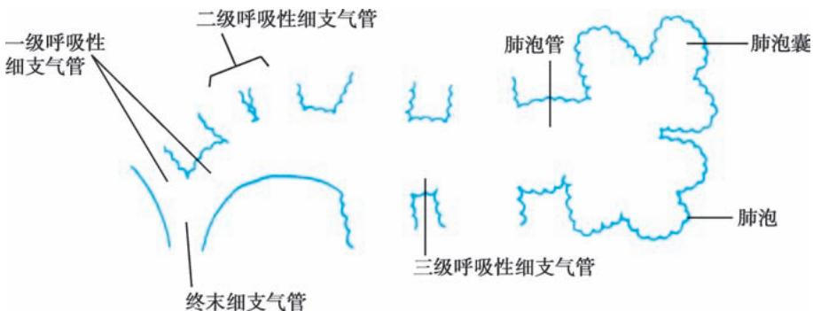

> [!info] 导航
> [[第003章_第2篇第02章_急性上呼吸道感染和急性气管支气管炎|上一章]] · [[00_章节导航|总目录]] · [[第005章_第2篇第04章_支气管哮喘|下一章]]

# 第一节 | 慢性支气管炎

慢性支气管炎（chronic bronchitis）简称慢支炎，是气管、支气管黏膜及其周围组织的慢性非特异性炎症。临床上以咳嗽、咳痰为主要症状，或有喘息，每年发病持续3个月或更长时间，连续2年或2年以上，并排除具有咳嗽、咳痰、喘息症状的其他疾病。

#### 【病因和发病机制】

本病的病因尚不完全清楚,可能是多种环境因素与机体自身因素长期相互作用的结果。

1. 吸烟 吸烟是最重要的环境发病因素,吸烟者慢性支气管炎的患病率比不吸烟者高2\~8倍,吸烟年龄越早,吸烟时间越长,吸烟量越大,发病的危险性就越高。烟草中的焦油、尼古丁和氢氰酸等化学物质具有多种损伤效应,如损伤气道上皮细胞和纤毛运动,使气道净化能力下降;促使支气管黏液腺和杯状细胞增生肥大,黏液分泌增多;刺激副交感神经而使支气管平滑肌收缩,气道阻力增加;使氧自由基产生增多,诱导中性粒细胞释放蛋白酶,破坏肺弹力纤维,诱发肺气肿形成等。

2. 职业/环境粉尘 职业或环境粉尘吸入,如烟雾、变应原等有害颗粒等,浓度过高或接触时间过长,均可能促进慢性支气管炎发病。

3. 空气污染 PM2.5 及大量有害气体如二氧化硫、二氧化氮、氯气等可损伤气道黏膜上皮，使纤毛清除功能下降，黏液分泌增加，为细菌感染创造条件。

4. 感染因素 病毒、支原体、细菌等感染是慢性支气管炎发生发展的重要原因之一。病毒感染以流感病毒、鼻病毒、腺病毒和呼吸道合胞病毒为常见，新型冠状病毒感染也是影响因素之一。细菌感染常继发于病毒感染，常见病原体为肺炎链球菌、流感嗜血杆菌、卡他莫拉菌和葡萄球菌等。这些感染因素同样造成气管、支气管黏膜的损伤和慢性炎症。

5. 其他因素 免疫功能紊乱、气道高反应性、自主神经功能失调、年龄增大等机体因素和气候等环境因素均与慢性支气管炎的发生和发展有关。如老年人肾上腺皮质功能减退，细胞免疫功能下降，溶菌酶活性降低，从而容易造成呼吸道的反复感染。寒冷空气可以刺激腺体增加黏液分泌，纤毛运动减弱，黏膜血管收缩，局部血液循环障碍，有利于继发感染。

#### 【病理】

支气管上皮细胞变性、坏死、脱落，后期出现鳞状上皮化生，纤毛变短、粘连、倒伏、脱失；各级支气管管壁均有多种炎症细胞浸润，以中性粒细胞、淋巴细胞为主，急性发作期可见大量中性粒细胞，严重者为化脓性炎症，黏膜充血、水肿；杯状细胞和黏液腺肥大增生、分泌旺盛，大量黏液潴留；病情继续发展，炎症由支气管壁向其周围组织扩散，黏膜下层平滑肌束可断裂萎缩，黏膜下和支气管周围纤维组织增生；支气管壁的损伤修复过程反复发生，进而引起支气管结构重塑，胶原含量增加，瘢痕形成；进一步发展成阻塞性肺气肿时见肺泡腔扩大，肺泡弹性纤维断裂。

#### 【临床表现】

### （一）症状

缓慢起病，病程长，反复急性发作而使病情加重。主要症状为咳嗽、咳痰或伴有喘息。急性加重系指咳嗽、咳痰、喘息等症状突然加重。急性加重的主要原因是呼吸道感染，病原体可以是病毒、细菌、支原体和衣原体等。

1. 咳嗽 一般晨间咳嗽为主,睡眠时有阵咳或排痰。

2. 咳痰 一般为白色黏液或浆液泡沫性,偶可带血。清晨排痰较多,起床后或体位变动可刺激排痰。

3. 喘息或气急 喘息明显者可能伴发支气管哮喘。若伴肺气肿时可表现为活动后气促。

### （二）体征

早期多无异常体征。急性发作期可在背部或双肺底听到干、湿啰音，咳嗽后可减少或消失。如伴发哮喘可闻及广泛哮鸣音并伴呼气期延长。

#### 【实验室和其他辅助检查】

1. X 线检查 早期可无异常。反复发作者表现为肺纹理增粗、紊乱，呈网状或条索状、斑点状阴影，以双下肺明显。

2. 肺功能检查 早期无异常。如有小气道阻塞时，最大呼气流速-容积曲线在 $75\%$ 和 $50\%$ 肺容量时，流量明显降低。当使用支气管扩张剂后第一秒用力呼气容积 $\left(\mathrm{FEV}_{1}\right)$ 与用力肺活量（FVC）的比值 $\left(\mathrm{FEV}_{1} / \mathrm{FVC}\right) < 70\%$ ，提示已发展为慢阻肺病。

3. 血液检查 细菌感染时可出现白细胞总数和/或中性粒细胞计数增高。

4. 痰液检查 可培养出致病菌。涂片可发现革兰氏阳性菌或革兰氏阴性菌，或大量破坏的白细胞和杯状细胞。

#### 【诊断】

依据咳嗽、咳痰或伴有喘息,每年发病持续3个月,连续2年或2年以上,并排除其他可以引起类似症状的慢性疾病。

#### 【鉴别诊断】

1. 支气管哮喘 部分哮喘病人以刺激性咳嗽为特征,灰尘、油烟、冷空气等容易诱发咳嗽,常有家庭或个人过敏性疾病史。抗生素对其无效,支气管激发试验阳性。

2. 嗜酸性粒细胞性支气管炎 临床症状类似，X线检查无明显改变或肺纹理增加，支气管激发试验多阴性，临床上容易误诊。诱导痰检查嗜酸性粒细胞比例增加（≥3%）可以诊断。

3. 肺结核 常有发热、乏力、盗汗及消瘦等症状。痰液查找抗酸杆菌及胸部 X 线检查可以鉴别。

4. 支气管肺癌 多数有数年吸烟史,顽固性刺激性咳嗽或过去有咳嗽史,近期咳嗽性质发生改变,常有痰中带血。有时表现为反复同一部位的阻塞性肺炎,经抗生素治疗未能完全消退。痰脱落细胞学、胸部 CT 及支气管镜等检查可明确诊断。

5. 特发性肺纤维化 临床经过多缓慢,开始仅有咳嗽、咳痰,偶有气短。听诊在胸背部可闻及爆裂音(Velcro啰音)。血气分析示动脉血氧分压降低,而二氧化碳分压可不升高。高分辨率螺旋CT检查有助诊断。

6. 支气管扩张 典型者表现为反复咳嗽、咳大量脓痰或咯血。高分辨率螺旋 CT 检查可确定诊断。

7. 其他引起慢性咳嗽的疾病 慢性咽炎、上呼吸道咳嗽综合征、胃食管反流、某些心血管疾病（如二尖瓣狭窄）等。

#### 【治疗】

### （一）急性加重期的治疗

1. 控制感染 多依据病人所在地常见病原菌经验性选用抗生素,一般口服,病情严重时静脉给药。如左氧氟沙星 0.5g,每日 1 次;阿奇霉素 0.5g,每日 1 次;头孢呋辛 0.5g,每日 2 次。如果能培养出致病菌,可按药敏试验选用抗生素。

2. 镇咳祛痰 可使用复方甘草合剂 10ml, 每日 3 次; 或溴己新 8\~16mg, 每日 3 次; 或盐酸氨溴索 30mg, 每日 3 次。干咳为主者可用镇咳药物。

3. 平喘 有气喘者可加用支气管扩张剂, 如氨茶碱 0.1g, 每日 3 次, 或用茶碱控释剂; 或 $\beta_{2}$ 受体激动剂吸入; 或抗胆碱药。

### （二）缓解期治疗

1. 应戒烟及避免吸入有害气体和其他有害颗粒。

2. 增强体质,预防感冒。

3. 反复呼吸道感染者可试用免疫调节剂(如流感疫苗、肺炎疫苗、卡介苗多糖核酸、胸腺肽等)或中药。

#### 【预后】

部分病人可控制,不影响工作、学习;部分病人可发展成慢阻肺病。

# 第二节 | 慢性阻塞性肺疾病

慢性阻塞性肺疾病(chronic obstructive pulmonary disease, COPD)简称慢阻肺病, 是一种异质性的肺部疾病, 以因气道异常(支气管炎、细支气管炎)和/或肺泡异常(肺气肿)进而引起慢性呼吸症状(呼吸困难、咳嗽、咳痰)及持续的、进行性加重的气流受限为特征。不可逆气流受限是诊断慢阻肺病的关键, 在吸入支气管扩张剂后, 第一秒用力呼气容积( $FEV_{1}$ )与用力肺活量(FVC)的比值( $FEV_{1}/FVC$ )<70%表明存在持续气流受限。

慢阻肺病与慢性支气管炎和肺气肿(emphysema)有密切关系。如本章第一节所述，慢性支气管炎是指在除外慢性咳嗽的其他已知原因后，病人每年咳嗽、咳痰3个月以上并连续2年者。肺气肿是指肺部终末细支气管远端气腔出现异常持久的扩张，并伴有肺泡和细支气管的破坏，而无明显的肺纤维化。当慢性支气管炎、肺气肿病人肺功能检查出现持续气流受限时，则能诊断为慢阻肺病；如病人只有慢性支气管炎和/或肺气肿，而无持续气流受限，则不能诊断为慢阻肺病。

一些已知病因或具有特征病理表现的疾病也可导致持续气流受限,如支气管扩张症、肺结核纤维化病变、严重的间质性肺疾病、弥漫性泛细支气管炎以及闭塞性细支气管炎等,但均不属于慢阻肺病。

慢阻肺病是呼吸系统疾病中的常见病，患病率和病死率均居高不下。1992年在我国北部和中部地区对102230名农村成年人进行了调查，慢阻肺病的患病率为 $3\%$ 。2018年发布的我国慢阻肺病流行病学调查结果显示，慢阻肺病的患病率占40岁以上人群的 $13.7\%$ 。在我国，慢阻肺病是导致慢性呼吸衰竭和慢性肺源性心脏病最常见的病因，约占全部病例的 $80\%$ 。因肺功能进行性减退，严重影响病人的劳动力和生活质量。

#### 【病因】

本病的病因与慢性支气管炎相似,可能是多种环境因素与机体自身因素长期相互作用的结果。具体见本章第一节。

#### 【发病机制】

1. 炎症机制 气道、肺实质和肺血管的慢性炎症是慢阻肺病的特征性改变，中性粒细胞、巨噬细胞、T淋巴细胞等炎症细胞参与了慢阻肺病的发病过程。中性粒细胞的活化和聚集是慢阻肺病炎症过程的一个重要环节，通过释放中性粒细胞弹性蛋白酶等多种生物活性物质，引起慢性黏液高分泌状态并破坏肺实质。

2. 蛋白酶-抗蛋白酶失衡机制 蛋白水解酶对组织有损伤、破坏作用；抗蛋白酶对弹性蛋白酶等多种蛋白酶具有抑制功能，其中 $\alpha_{1}$ -抗胰蛋白酶( $\alpha_{1}$ -AT)是活性最强的一种。蛋白酶增多或抗蛋白酶不足均可导致组织结构破坏，产生肺气肿。吸入有害气体和有害物质可以导致蛋白酶产生增多或活性增强，抗蛋白酶产生减少或灭活加快；同时氧化应激、吸烟等危险因素也可以降低抗蛋白酶的活性。先天性 $\alpha_{1}$ -AT 缺乏多见于北欧血统的个体，我国尚未见正式报道。

3. 氧化应激机制 许多研究表明慢阻肺病病人的氧化应激增加。氧化物主要有超氧阴离子、羟根、次氯酸、过氧化氢和一氧化氮等。氧化物可直接作用并破坏许多生化大分子如蛋白质、脂质、核酸等，导致细胞功能障碍或细胞死亡，还可以破坏细胞外基质；引起蛋白酶-抗蛋白酶失衡；促进炎症反应，如激活转录因子NF- $\kappa$ B，参与多种炎症介质的转录，如IL-8、TNF- $\alpha$ 以及诱导型一氧化氮合酶（NOS）和环氧合物酶等的转录。

4. 其他机制 如异常肺发育、感染相关、儿童期哮喘、自主神经功能失调、营养不良、气温变化等都有可能参与慢阻肺病的发生、发展。

上述机制共同作用,最终产生两种重要病变:①小气道病变,包括小气道炎症、小气道纤维组织形成、小气道管腔黏液栓等,使小气道阻力明显升高。②肺气肿病变,使肺泡对小气道的正常拉力减小,小气道较易塌陷;同时肺气肿使肺泡弹性回缩力明显降低。这种小气道病变与肺气肿病变共同作用,造成慢阻肺病特征性的持续性气流受限。

#### 【病理】

慢阻肺病的病理改变主要表现为慢性支气管炎及肺气肿的病理变化。慢性支气管炎的病理改变见本章第一节。肺气肿的病理改变可见肺过度膨胀，弹性减退。外观灰白或苍白，表面可见多个大小不一的大疱。镜检见肺泡壁变薄，肺泡腔扩大、破裂或形成大疱，血液供应减少，弹力纤维网破坏。按照累及肺小叶的部位，可将阻塞性肺气肿分为小叶中央型(图2-3-1)、全小叶型(图2-3-2)及介于两者之间的混合型三类，其中以小叶中央型为多见。

  
图 2-3-1 小叶中央型肺气肿

  
图 2-3-2 全小叶型肺气肿

小叶中央型是由于终末细支气管或一级呼吸性细支气管炎症导致管腔狭窄，其远端的二级呼吸性细支气管呈囊状扩张，其特点是囊状扩张的呼吸性细支气管位于二级小叶的中央区。全小叶型是呼吸性细支气管狭窄，引起所属终末肺组织，即肺泡管、肺泡囊及肺泡的扩张，其特点是气肿囊腔较小，遍布于肺小叶内。有时两型存在一个肺内称混合型肺气肿，多在小叶中央型基础上，并发小叶周边区肺组织膨胀。

#### 【病理生理】

慢阻肺病特征性的病理生理变化是持续气流受限致肺通气功能障碍。随着病情的发展，肺组织弹性日益减退，肺泡持续扩大，回缩障碍，则残气量及残气量占肺总量的百分比增加。肺气肿加重导致大量肺泡周围的毛细血管受肺泡膨胀的挤压而退化，致使肺毛细血管大量减少，肺泡间的血流量减少，此时肺泡虽有通气，但肺泡壁无血液灌流，导致生理无效腔气量增大；也有部分肺区虽有血液灌流，但肺泡通气不良，不能参与气体交换，导致功能性分流增加，从而产生通气与血流比例失调。同时，肺泡及毛细血管大量丧失，弥散面积减少，进而导致换气功能发生障碍。通气和换气功能障碍引起缺氧和二氧化碳潴留，可发生不同程度的低氧血症和高碳酸血症，最终出现呼吸衰竭。

#### 【临床表现】

### （一）症状

起病缓慢，病程较长，早期可以没有自觉症状。主要症状包括：

1. 慢性咳嗽 随病程发展可终身不愈。常晨间咳嗽明显,夜间阵咳或排痰。

2. 咳痰 一般为白色黏液或浆液泡沫性痰，偶可带血丝，清晨排痰较多。急性发作期痰量增多，可有脓性痰。

3. 气短或呼吸困难 早期在较剧烈活动时出现,后逐渐加重,以致在日常活动甚至休息时也感到气短,是慢阻肺病的标志性症状。

4. 喘息和胸闷 部分病人特别是重度病人或急性加重时出现喘息。

5. 其他 晚期病人有体重下降,食欲减退等。

### (二) 体征

1. 视诊 胸廓前后径增大,肋间隙增宽,剑突下胸骨下角增宽,称为桶状胸。部分病人呼吸变浅,频率增快,严重者可有缩唇呼吸等。

2. 触诊 双侧语颤减弱。

3. 叩诊 肺部过清音,心浊音界缩小,肺下界和肝浊音界下降。

4. 听诊 两肺呼吸音减弱,呼气期延长,部分病人可闻及湿啰音和/或干啰音。

#### 【实验室和其他辅助检查】

1. 肺功能检查 是判断持续气流受限的主要方法。吸入支气管扩张剂后， $FEV_{1}/FVC<70\%$ 可确定为持续气流受限。肺总量（TLC）、功能残气量（FRC）和残气量（RV）增高，肺活量（VC）减低，表明肺过度充气。

2. 胸部 X 线检查 慢阻肺病早期 X 线胸片无异常变化。以后可出现肺纹理增粗、紊乱等非特异性改变，也可出现肺气肿。X 线胸片改变对慢阻肺病诊断的特异性不高，但对于与其他肺疾病进行鉴别具有重要价值，对于明确自发性气胸、肺炎等常见并发症也十分有用。

3. 胸部 CT 检查 CT 检查可见慢阻肺病小气道病变、肺气肿以及并发症的表现,但其主要临床意义在于排除其他具有相似症状的呼吸系统疾病。高分辨率 CT 对辨别小叶中央型或全小叶型肺气肿以及确定肺大疱的大小和数量,有较高的敏感性和特异性,对预估肺大疱切除或外科减容手术等效果有一定价值。对于由吸烟导致的慢阻肺病病人,推荐以低剂量 CT 扫描进行肺癌筛查。

4. 血气分析 对确定发生低氧血症、高碳酸血症、酸碱平衡失调以及判断呼吸衰竭的类型有重要价值。

5. 其他 慢阻肺病合并细菌感染时,外周血白细胞计数增高,核左移。痰培养可用于病原菌检测。

#### 【诊断与稳定期病情严重程度评估】

### （一）诊断

根据吸烟等高危因素史、临床症状和体征等资料，临床可以怀疑慢阻肺病。肺功能检查确定持续气流受限是慢阻肺病诊断的必备条件，吸入支气管扩张剂后， $FEV_{1}/FVC<70\%$ 为确定存在持续气流受限的界限，若能同时排除其他已知病因或具有特征病理表现的气流受限疾病，则可明确诊断为慢阻肺病。

### （二）稳定期病情严重程度评估

目前多主张对稳定期慢阻肺病采用综合指标体系进行病情严重程度评估。

1. 肺功能评估 可使用 GOLD 分级, 慢阻肺病病人吸入支气管扩张剂后 $FEV_{1}/FVC < 70\%$ , 再依据其 $FEV_{1}$ 下降幅度进行气流受限的严重程度分级, 见表 2-3-1。

2. 症状评估 可采用改良版英国医学研究委员会呼吸困难问卷(mMRC 问卷)评估呼吸困难程度(表 2-3-2),采用慢阻肺病评估测试(COPD assessment test, CAT)问卷评估慢阻肺病病人的健康损害程度。

表 2-3-1 慢阻肺病病人气流受限  
严重程度的肺功能分级

<table><tr><td>肺功能分级</td><td>病人肺功能  $FEV_1$  占预计值的百分比(%pred)</td></tr><tr><td>GOLD 1 级:轻度</td><td> $\geqslant 80$ </td></tr><tr><td>GOLD 2 级:中度</td><td>50~&lt;80</td></tr><tr><td>GOLD 3 级:重度</td><td>30~&lt;50</td></tr><tr><td>GOLD 4 级:极重度</td><td>&lt;30</td></tr></table>

3. 急性加重风险评估 上一年发生 2 次及 2 次以上中度急性加重,或 1 次及 1 次以上需要住院治疗的急性加重,均提示未来急性加重风险增加。

依据上述症状、急性加重风险和肺功能改变等，即可对稳定期慢阻肺病病人的病情严重程度作出综合性评估，并依据该评估结果选择稳定期的主要治疗药物(表2-3-3)。外周血嗜酸性粒细胞计数有可能在预估慢阻肺病急性加重风险及吸入型糖皮质激素（ICS）对急性加重的预防效果有一定价值。

表 2-3-2 mMRC 问卷

<table><tr><td>mMRC 分级</td><td>呼吸困难症状</td></tr><tr><td>0 级</td><td>剧烈活动时出现呼吸困难</td></tr><tr><td>1 级</td><td>平地快步行走或爬缓坡时出现呼吸困难</td></tr><tr><td>2 级</td><td>由于呼吸困难,平地行走时比同龄人慢或需要停下来休息</td></tr><tr><td>3 级</td><td>平地行走 100 米左右或数分钟后即需要停下来喘气</td></tr><tr><td>4 级</td><td>因严重呼吸困难而不能离开家,或在穿衣脱衣时即出现呼吸困难</td></tr></table>

表 2-3-3 稳定期慢阻肺病病人病情严重程度的综合性评估及其主要治疗药物

<table><tr><td>病人综合评估分组</td><td>特征</td><td>上一年急性加重次数</td><td>mMRC分级或CAT评分</td><td>首选治疗药物</td></tr><tr><td>A组</td><td>低风险,症状少</td><td>0或1次中度急性加重(无住院事件)</td><td>0~1级或&lt;10分</td><td>一种支气管扩张剂</td></tr><tr><td>B组</td><td>低风险,症状多</td><td>0或1次中度急性加重(无住院事件)</td><td>≥2级或≥10分</td><td>LABA+LAMA</td></tr><tr><td>E组</td><td>高风险</td><td>≥2次中度急性加重或≥1次住院事件</td><td>不考虑症状评分</td><td>LABA+LAMALABA+LAMA+ICS(血EOS≥300个/μl)</td></tr></table>

注：症状少、高风险的 C 组病人和症状多、高风险的 D 组合并为 E 组，以突出急性加重高风险临床相关性。LABA，长效 $\beta_{2}$ 受体激动剂；LAMA，长效抗胆碱药；ICS，吸入型糖皮质激素；EOS，嗜酸性粒细胞。

在对慢阻肺病病人进行病情严重程度的综合评估时,还应注意慢阻肺病病人的全身合并疾病,如心血管疾病、骨质疏松、焦虑和抑郁、肺癌、感染、代谢综合征和糖尿病等,治疗时应予兼顾。

### （三）急性加重期病情严重程度评估

慢阻肺病急性加重是指14天内，出现以呼吸困难和/或咳嗽、咳痰增加为特征的事件，可伴有呼吸急促和/或心动过速，通常与感染、污染或其他气道损伤因素引起的局部和全身炎症增加有关。

根据临床征象将慢阻肺病急性加重分为 3 级(表 2-3-4)。

表 2-3-4 慢阻肺病急性加重的临床分级

<table><tr><td>分级指标</td><td>轻度</td><td>中度</td><td>重度</td></tr><tr><td>呼吸衰竭</td><td>无</td><td>有</td><td>有</td></tr><tr><td>呼吸频率/(次/分)</td><td>20~30</td><td>&gt;30</td><td>&gt;30</td></tr><tr><td>应用辅助呼吸肌群</td><td>无</td><td>有</td><td>有</td></tr><tr><td>意识状态改变</td><td>无</td><td>无</td><td>有</td></tr><tr><td>低氧血症</td><td>能通过鼻导管或文丘里面罩28%~35%浓度吸氧而改善</td><td>能通过文丘里面罩28%~35%浓度吸氧而改善</td><td>低氧血症不能通过文丘里面罩吸氧或&gt;40%吸氧浓度而改善</td></tr><tr><td>高碳酸血症</td><td>无</td><td>有, $PaCO_{2}$ 增加到50~60mmHg</td><td>有, $PaCO_{2}$ &gt;60mmHg,或存在酸中毒( $pH \leq 7.25$ )</td></tr></table>

#### 【鉴别诊断】

1. 哮喘 慢阻肺病多为中年发病,症状缓慢进展,多有长期吸烟史。哮喘多为儿童或青少年期起病,症状起伏大,常伴有过敏史、鼻炎和/或湿疹等,部分病人有哮喘家族史。大多数哮喘病人的气流受限有显著的可逆性,合理吸入糖皮质激素等药物常能有效控制病情,是其与慢阻肺病相鉴别的一个重要特征。但是,部分病程长的哮喘病人可发生气道重塑,气流受限的可逆性减小,两者的鉴别诊断比较困难。此时应根据临床及实验室所见全面分析，进行鉴别。在少部分病人中这两种疾病可以重叠存在。

2. 其他引起慢性咳嗽、咳痰症状的疾病 如支气管扩张、肺结核、肺癌、特发性肺纤维化、弥漫性泛细支气管炎等，具体见本章第一节。

3. 其他引起劳力性气促的疾病 如冠心病、高血压心脏病、心脏瓣膜疾病等。具体见第三篇循环系统疾病。

4. 其他原因导致的呼吸气腔扩大 呼吸气腔均匀规则扩大而不伴有肺泡壁破坏时,虽不符合肺气肿的严格定义,但临床上也常习惯称为肺气肿,如代偿性肺气肿、老年性肺气肿。临床表现可以出现劳力性呼吸困难和肺气肿体征。需要综合分析临床资料以进行鉴别。

#### 【并发症】

1. 慢性呼吸衰竭 常在慢阻肺病急性加重时发生,其症状明显加重,发生低氧血症和/或高碳酸血症,出现缺氧和二氧化碳潴留的临床表现。

2. 自发性气胸 如有突然加重的呼吸困难,并伴有明显发绀,患侧肺部叩诊为鼓音,听诊呼吸音减弱或消失,应考虑并发自发性气胸,通过 X 线检查可以确诊。

3. 慢性肺源性心脏病 由于慢阻肺病引起肺血管床减少及缺氧致肺动脉收缩和血管重塑,导致肺动脉高压,右心室肥厚扩大,最终发生右心功能不全。

#### 【治疗】

### (一) 稳定期的治疗

1. 教育与管理 其中最重要的是劝导吸烟的病人戒烟,这是减慢肺功能损害最有效的措施,也是最难落实的措施。对吸烟的病人采用多种宣教措施,有条件者可以考虑使用辅助药物。因职业或环境粉尘、刺激性气体所致者,应脱离污染环境。

2. 支气管扩张剂 是现有控制症状的主要措施,可依据病人病情严重程度(参照表 2-3-3)、用药后病人的反应等因素选用。联合应用不同药理机制的支气管扩张剂可增加支气管扩张效果。

（1） $\beta_{2}$ 肾上腺素受体激动剂：短效制剂如沙丁胺醇（salbutamol）气雾剂，每次吸入 $100 \sim 200 \mu \mathrm{g}$ （ $1 \sim 2$ 喷），疗效持续 $4 \sim 6$ 小时，每24小时不超过 $8 \sim 12$ 喷。长效制剂如沙美特罗（salmeterol）、福莫特罗（formoterol）等，每日吸入2次，茚达特罗（indacaterol）、维兰特罗（vilanterol）每日仅吸入1次。

（2）抗胆碱药：短效制剂如异丙托溴铵（ipratropium）气雾剂，每次吸入40～80μg（每喷20μg），持续6～8小时，每天3～4次。长效制剂有噻托溴铵（tiotropium bromide）、格隆溴铵（glycopyrronium bromide）、乌美溴铵（umeclidinium bromide），每日吸入1次。

（3）茶碱类药：茶碱缓释或控释片，0.2g，每12小时1次；氨茶碱，0.1g，每天3次。

3. 吸入型糖皮质激素（ICS）对于已充分使用长效支气管扩张剂维持治疗、急性加重仍未控制的部分病人可考虑联用吸入激素治疗。临床常使用双支气管扩张剂加激素的三联剂型。使用吸入激素的指征有：有慢阻肺病急性加重住院史，每年≥2次中度急性加重，外周血嗜酸性粒细胞计数≥300个/μl，有哮喘病史或伴有哮喘特征的病人，推荐在长效支气管扩张剂基础上加用激素治疗；对于每年1次中度急性加重，外周血嗜酸性粒细胞计数为100～300个/μl的病人，可在长效支气管扩张剂基础上加用激素；对于外周血嗜酸性粒细胞计数＜100个/μl，反复发生肺炎、合并分枝杆菌感染的病人不建议使用激素。常用吸入激素有布地奈德、氟替卡松、倍氯米松。

4. 祛痰药 对痰不易咳出者可应用,常用药物有盐酸氨溴索,30mg,每日3次;乙酰半胱氨酸,0.6g,每日2次;或羧甲司坦,0.5g,每日3次。后两种药物可以降低部分病人急性加重的风险。

5. 其他药物 磷酸二酯酶-4抑制剂罗氟司特用于具有慢阻肺病频繁急性加重病史的病人,可以降低急性加重风险。有研究表明大环内酯类药物(红霉素或阿奇霉素)应用1年可以减少某些频繁急性加重的慢阻肺病病人的急性加重频率,但有可能导致细菌耐药及听力受损。

6. 长期家庭氧疗（LTOT）对慢阻肺病并发慢性呼吸衰竭者可提高生活质量和生存率，对血流动力学、运动能力和精神状态均会产生有益的影响。LTOT的使用指征为：① $PaO_{2}\leqslant55mmHg$ 或

$SaO_{2}\leqslant88\%$ ,伴或不伴高碳酸血症。② $PaO_{2}55\sim60mmHg$ ,或 $SaO_{2}<89\%$ ,伴有肺动脉高压、右心衰竭或红细胞增多症(血细胞比容>0.55)。一般用鼻导管吸氧,氧流量为1.0\~2.0L/min,吸氧时间>15h/d。目的是使病人在海平面、静息状态下,达到 $PaO_{2}\geqslant60mmHg$ 和/或使 $SaO_{2}$ 升至90%以上。

7. 康复治疗 可以使因进行性气流受限、严重呼吸困难而很少活动的病人改善活动能力、提高生活质量,是稳定期病人的重要治疗手段,具体包括呼吸生理治疗、肌肉训练、营养支持、精神治疗与教育等多方面措施。

### （二）急性加重期治疗

1. 确定急性加重的原因(最多见的原因是细菌或病毒感染)及病情的严重程度,根据病情严重程度决定门诊或住院治疗。

2. 支气管扩张剂 药物同稳定期。有严重喘息症状者可给予较大剂量雾化吸入治疗，如应用沙丁胺醇 $500 \mu g$ ，或沙丁胺醇 $1000 \mu g$ 加异丙托溴铵 $250 \sim 500 \mu g$ ，通过小型雾化器给病人吸入治疗以缓解症状。

3. 低流量吸氧 发生低氧血症者可用鼻导管吸氧,或通过文丘里(Venturi)面罩吸氧。鼻导管给氧时,吸入的氧浓度为28%\~30%,应避免吸入氧浓度过高引起二氧化碳潴留。

4. 抗生素 当病人呼吸困难加重,咳嗽伴痰量增加、有脓性痰时,应依据病人所在地常见病原菌及其药物敏感情况积极选用抗生素治疗。门诊可用阿莫西林/克拉维酸、头孢唑肟、头孢呋辛、左氧氟沙星、莫西沙星口服治疗;较重者可应用第三代头孢菌素,如头孢曲松2.0g加于生理盐水中静脉滴注,每天1次。住院病人应根据预计的病原菌及当地细菌耐药情况选用抗生素,如 $\beta$ 内酰胺类/ $\beta$ 内酰胺酶抑制剂联合大环内酯类或呼吸喹诺酮类,一般多静脉滴注给药。如果找到确切的病原菌,应根据药敏结果选用抗生素。

5. 糖皮质激素 对需要住院治疗的急性加重期病人可考虑泼尼松龙 30～40mg/d，也可静脉给予甲泼尼龙 40～80mg，每日 1 次，连续 5 天。

6. 机械通气 对于并发较严重呼吸衰竭的病人可使用机械通气治疗,具体见本篇第十六章。

7. 其他治疗措施 合理补充液体和电解质以保持身体水电解质平衡。注意补充营养,根据病人胃肠功能状况调节饮食,保证热量和蛋白质、维生素等营养素的摄入,必要时可以选用肠外营养治疗。积极排痰治疗,最有效的措施是保持机体有足够体液,使痰液变稀薄;其他措施如刺激咳嗽、叩击胸部、体位引流等方法。积极处理伴随疾病(如冠心病、糖尿病等)及并发症(如自发性气胸、休克、弥散性血管内凝血、上消化道出血、肾功能不全等)。

如病人有呼吸衰竭、肺源性心脏病、心力衰竭，具体治疗方法可参阅有关章节治疗内容。

### （三）内科介入治疗

慢阻肺病的内科介入治疗主要为支气管镜介入术，可通过支气管镜介入减少严重肺气肿病人的肺过度充气。常见的支气管镜介入术包括支气管内单向活瓣、气道旁路支架、肺封堵术、热蒸汽消融术、弹簧圈肺减容术等，需结合临床和影像学进行选择。

### （四）外科治疗

外科方法仅适用于少数有特殊指征的病人，选择适当病例可以取得一定疗效，使病人肺功能有所改善，呼吸困难有所减轻。鉴于较高的手术风险及昂贵的手术费用，选择手术治疗应十分谨慎。手术方式包括肺大疱切除术和肺减容手术。肺移植术为终末期慢阻肺病病人提供了一种新的治疗选择，但存在着技术要求高、供体资源有限、手术费用昂贵等诸多问题。

#### 【预防】

慢阻肺病导致不可逆的气流受限，患病后再行诊治，疗效常不理想，要遵循“促防诊控治康”全面照护的理念，将端口前移，以预防为主。戒烟是预防慢阻肺病最重要的措施，在疾病的任何阶段戒烟都有助于防止慢阻肺病的发生和发展。控制环境污染，减少有害气体或有害颗粒的吸入。积极防治婴幼儿和儿童期的呼吸系统感染。流感疫苗、肺炎链球菌疫苗、细菌溶解物、卡介苗多糖核酸等对防止慢阻肺病病人反复感染可能有益。加强体育锻炼，增强体质，可提高机体免疫力。此外，对于有慢阻肺病高危因素的人群，应定期进行肺功能监测，以尽可能早期发现慢阻肺病并及时予以干预。

(赵建平)
