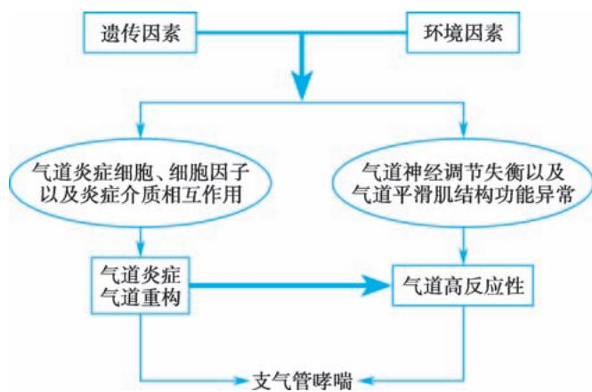

> [!info] 导航
> [[第004章_第2篇第03章_慢性阻塞性肺疾病|上一章]] · [[00_章节导航|总目录]] · [[第006章_第2篇第05章_支气管扩张症|下一章]]

支气管哮喘（bronchial asthma）简称哮喘，是一种以慢性气道炎症和气道高反应性为特征的异质性疾病。临床表现为反复发作的喘息、气急、胸闷或咳嗽等症状，常在夜间及凌晨发作或加重，同时伴有可变的呼气气流受限，其呼吸道症状可随时间变化，且严重程度可变。

#### 【流行病学】

哮喘是世界上最常见的慢性疾病之一,近年来其患病率呈上升趋势。全球约有3.58亿哮喘病人,我国20岁及以上人群的哮喘患病率为4.2%,患病人数达4570万。哮喘病死率为(1.6\~36.7)/10万,目前全世界每年由哮喘导致的死亡人数约35万,多与哮喘长期控制不佳或发作时治疗不及时相关,其中大部分是可预防的。

#### 【病因和发病机制】

### （一）病因

哮喘是一种复杂的、具有多基因遗传倾向的疾病，其发病具有家族集聚现象，亲缘关系越近，患病率越高。近年来，全基因组关联研究（GWAS）的发展给哮喘的易感基因研究带来了革命性的突破。目前采用GWAS鉴定了多个哮喘易感基因，如TSLP、ORMDL3、GSDMB、HLA-DQ、IL-33等。具有哮喘易感基因的人群发病与否受环境因素的影响较大，深入研究基因-环境相互作用将有助于揭示哮喘发病的遗传机制。

环境因素包括变应原性因素,如室内变应原(尘螨、家养宠物、霉菌、蟑螂等)、室外变应原(草花粉、树花粉等)、职业性变应原(油漆活性染料、某些谷物及种子、洗涤剂生产以及酿造和皮革工业中使用的蛋白水解酶、化合物等)、食物(鱼、虾、蛋类、牛奶)、药物(阿司匹林、抗生素),以及非变应原性因素,如大气污染、吸烟、运动、肥胖、精神焦虑紧张等。

### （二）发病机制

哮喘的发病机制尚未完全阐明，目前可概括为气道免疫-炎症机制、神经调节机制及其相互作用。

1. 气道免疫-炎症机制

（1）气道炎症形成机制: 气道慢性炎症反应是由多种炎症细胞、气道结构细胞、炎症介质和细胞因子共同参与、相互作用的结果。

在变应原、污染物或微生物的刺激下，
气道上皮细胞释放白介素（IL）如IL-33、IL-25和胸腺基质淋巴细胞生成素（TSLP）等细胞因子，激活2型辅助性T细胞（Th2）及2型固有淋巴细胞（ILC2）。

一方面，活化的Th2及ILC2产生IL-4、IL-5和IL-13等激活B淋巴细胞并合成特异性IgE，后者结合于肥大细胞和嗜碱性粒细胞等表面的IgE受体。

当变应原再次进入体内，可与结合在细胞表面的IgE交联，激活肥大细胞和嗜碱性粒细胞，使其合成并释放多种活性介质，导致气道平滑肌收缩、黏液分泌增加和炎症细胞浸润，产生哮喘的临床症状，这是一个典型的变态反应过程。

另一方面，活化的Th2及ILC2分泌的IL等细胞因子可直接激活肥大细胞、嗜酸性粒细胞及巨噬细胞等，并使之聚集在气道。

这些细胞进一步分泌多种炎症因子如组胺、白三烯、前列腺素、活性神经肽、嗜酸性粒细胞趋化因子等，构成了一个多种炎症细胞、气道结构细胞、炎症介质相互作用的复杂网络，共同导致气道慢性炎症发生发展。近年来认识到嗜酸性粒细胞在哮喘发病中不仅发挥着终末效应细胞的作用，还具有免疫调节作用。Th17细胞在以中性粒细胞浸润为主的激素抵抗型哮喘和重度哮喘发病中起到了重要作用。

（2）气道高反应性( airway hyperresponsiveness, AHR ): 是指气道对各种刺激因子如变应原、理化因素、运动、药物等呈现的高度敏感状态, 表现为病人接触这些刺激因子时气道出现过强或过早的收缩反应。AHR 是哮喘的基本特征, 可通过支气管激发试验来量化和评估, 有症状的哮喘病人几乎都存在 AHR。当气道受到变应原或其他刺激后, 多种炎症细胞释放炎症介质和细胞因子, 引起气道上皮损伤、上皮下神经末梢裸露等, 共同导致气道慢性炎症, 是 AHR 的重要发生机制之一。长期存在无症状的气道高反应性者出现典型哮喘症状的风险明显增加。然而, 出现 AHR 者并非都是哮喘, 如长期吸烟、接触臭氧、病毒性上呼吸道感染、慢阻肺病等也可出现, 但程度相对较轻。

2. 神经调节机制 
神经因素是哮喘发病的重要环节之一。支气管受复杂的自主神经支配，除肾上腺素能神经、胆碱能神经外，还有非肾上腺素能和非胆碱能（NANC）神经系统。

哮喘病人 $\beta$ 肾上腺素受体功能低下，而对吸入组胺和醋甲胆碱的气道反应性显著增高则提示存在胆碱能神经张力的增加。NANC 神经系统能释放舒张支气管平滑肌的神经介质如血管活性肠肽、一氧化氮及收缩支气管平滑肌的介质如 P 物质、神经激肽，两者平衡失调则可引起支气管平滑肌收缩。
此外，从感觉神经末梢释放的 P 物质、降钙素基因相关肽、神经激肽 A 等导致血管扩张、血管通透性增加和炎症渗出，此即为神经源性炎症。神经源性炎症能通过局部轴突反射释放感觉神经肽而引起哮喘发作。

  
图 2-4-1 哮喘发病机制示意图

有关哮喘发病机制总结于图 2-4-1。

#### 【病理】

气道慢性炎症作为哮喘的基本特征,存在于所有的哮喘病人,
表现为气道上皮下肥大细胞、嗜酸性粒细胞、巨噬细胞、淋巴细胞及中性粒细胞等的浸润,

以及气道黏膜下组织水肿、微血管通透性增加、支气管平滑肌痉挛、纤毛上皮细胞脱落、杯状细胞增殖及气道分泌物增加等病理改变。

若哮喘长期反复发作,可出现支气管平滑肌肥大/增生、气道上皮细胞黏液化生、上皮下胶原沉积和纤维化、血管增生以及基底膜增厚等气道重塑表现。

#### 【临床表现】

1. 症状 
典型症状为发作性伴有哮鸣音的呼气性呼吸困难，可伴有气促、胸闷或咳嗽。症状可在数分钟内发作，并持续数小时至数天，可经平喘药物治疗后缓解或自行缓解。哮喘症状可随时间变化且严重程度可变，夜间及凌晨发作或加重是哮喘的重要临床特征。有些病人尤其是青少年，其哮喘症状在运动时出现，称为运动性哮喘。此外，临床上还存在没有喘息症状的不典型哮喘，病人可表现为发作性咳嗽、胸闷或其他症状。
对以咳嗽为唯一症状的不典型哮喘称为咳嗽变异性哮喘（cough variant asthma, CVA）；对以胸闷为唯一症状的不典型哮喘称为胸闷变异性哮喘（chest tightness variant asthma, CTVA）。

2. 体征 
发作时典型的体征为双肺可闻及广泛的哮鸣音,呼气音延长。
但非常严重的哮喘发作,哮鸣音反而减弱,甚至完全消失,表现为“沉默肺”,是病情危重的表现。
非发作期体检可无异常发现,故未闻及哮鸣音不能排除哮喘。

#### 【实验室和其他检查】

### （一）痰嗜酸性粒细胞计数

大多数哮喘病人诱导痰中嗜酸性粒细胞计数增高( $>2.5\%$ ),且与哮喘症状相关。诱导痰嗜酸性粒细胞计数可作为评价哮喘气道炎症指标之一,也是评估糖皮质激素治疗反应性的敏感指标。

### （二）外周血嗜酸性粒细胞计数

部分哮喘病人外周血嗜酸性粒细胞计数增高。虽然不能作为哮喘诊断的依据，但是外周血嗜酸性粒细胞增高可以作为判定嗜酸性粒细胞为主的哮喘临床表型，可以作为药物的选择和治疗后反应的观察指标。

### （三）肺功能检查

1. 通气功能检测 哮喘发作时呈阻塞性通气功能障碍表现==,用力肺活量(FVC)正常或下降,第一秒用力呼气容积( $FEV{1}$ )、1秒率( $FEV{1}/FVC$ )以及呼气峰流量(PEF)均下降,残气量及残气量与肺总量比值增加==。其中以 $FEV_{1}/FVC<70\%$ 为判断气流受限的最重要指标。缓解期上述通气功能指标可逐渐恢复。症状迁延、反复发作者,其通气功能可逐渐下降。

2. 支气管激发试验（BPT）用于测定气道反应性。常用吸入激发剂为醋甲胆碱和组胺。观察指标包括 $FEV_{1}$ 、PEF 等。
结果判断与采用的激发剂有关，
通常以使 $FEV_{1}$ 下降 20% 所需吸入醋甲胆碱或组胺累积剂量 $\left(\mathrm{PD}_{20}-\mathrm{FEV}_{1}\right)$ 或浓度 $\left(\mathrm{PC}_{20}-\mathrm{FEV}_{1}\right)$ 来表示，如 $FEV_{1}$ 下降 $\geqslant20\%$ ，判断结果为阳性，提示存在气道高反应性。  
BPT 适用于非哮喘发作期、 $FEV_{1}$ 在正常预计值 70% 以上病人的检查。

3. 支气管舒张试验（BDT）用于测定气道的可逆性改变。常用吸入支气管扩张剂有沙丁胺醇、特布他林。当吸入支气管扩张剂20分钟后重复测定肺功能， $\mathrm{FEV}_1$ 较用药前增加 $\geqslant 12\%$ ，且其绝对值增加 $\geqslant 200\mathrm{ml}$ ，判断结果为阳性，提示存在可逆性的气道阻塞。

4. 呼气峰流量（PEF）及其变异率测定 哮喘发作时 PEF 下降。由于哮喘有通气功能时间节律变化的特点，监测 PEF 日间、周间变异率有助于哮喘的诊断和病情评估。PEF 平均每日昼夜变异率（连续 7 天，每日 PEF 昼夜变异率之和 /7）>10%，或 PEF 周变异率 $\{(2 \text{ 周内最高 PEF 值}-\text{最低 PEF 值})/[(2 \text{ 周内最高 PEF 值}+\text{最低 PEF 值})\times1/2]\times100\%>$ 20%，提示存在气道可逆性的改变。

### （四）胸部 X 线/CT 检查

哮喘发作时胸部 X 线可见两肺透亮度增加,呈过度通气状态,缓解期多无明显异常。
胸部 CT 在部分病人可见支气管壁增厚、黏液阻塞。

### （五）特异性变应原检测

外周血变应原特异性 IgE 增高结合病史有助于病因诊断；

血清总 IgE 测定对哮喘诊断价值不大，
但其增高的程度可作为重度哮喘使用抗 IgE 抗体治疗及制定剂量的依据。

体内变应原试验包括变应原皮肤点刺试验和变应原激发试验。

### （六）动脉血气分析
PS：正常值：

严重哮喘发作时可出现缺氧。

由于过度通气可使 $PaCO_{2}$ 下降，pH 上升，表现为呼吸性碱中毒。
若病情进一步恶化，可同时出现缺氧和 $CO_{2}$ 滞留，表现为呼吸性酸中毒。

当 $PaCO_{2}$ 较前增高，即使在正常范围内也要警惕严重气道阻塞的发生。

### （七）呼出气一氧化氮

(FeNO)检测 FeNO 测定可作为评估哮喘控制水平的指标,可用于预判和评估吸入激素治疗的反应。

#### 【诊断】

### (一) 诊断标准

1. 典型哮喘的临床症状和体征

（1）反复发作喘息、气急，伴或不伴胸闷或咳嗽，
夜间及凌晨多发，常与接触变应原、冷空气、理化刺激以及病毒性上呼吸道感染、运动等有关。

(2) 发作时及部分未控制的慢性持续性哮喘, 双肺可闻及散在或弥漫性哮鸣音, 呼气相延长。

（3）上述症状和体征可经治疗缓解或自行缓解。

2. 可变气流受限的客观检查 ①支气管舒张试验阳性；②支气管激发试验阳性；③平均每日PEF昼夜变异率 $>10\%$ 或PEF周变异率 $>20\%$ 。

符合上述症状和体征,同时具备气流受限客观检查中的任一条,并除外其他疾病所引起的喘息、气急、胸闷和咳嗽,可以诊断为哮喘。

咳嗽变异性哮喘或胸闷变异性哮喘:指咳嗽或胸闷作为唯一或主要症状,无喘息和哮鸣音等典型哮喘的临床表现,同时具备可变气流受限客观检查中的任一条,除外其他疾病所引起的咳嗽或胸闷,且哮喘治疗有效。

### （二）哮喘的分期及控制水平分级

根据临床表现,哮喘可分为急性发作期、慢性持续期和临床控制期。

1. 急性发作期 指喘息、气急、胸闷或咳嗽等症状突然发生或症状加重，伴有呼气流量降低，常因接触变应原等刺激物或治疗不当所致。哮喘急性发作时其程度轻重不一，病情加重可在数小时或数天内出现，偶尔可在数分钟内即危及生命，故应对病情作出正确评估并及时治疗。急性发作时严重程度可分为轻度、中度、重度和危重度4级。

（1）轻度：步行或上楼时气短，可有焦虑，呼吸频率轻度增加，闻及散在哮鸣音，肺通气功能和血气检查正常。

（2）中度：稍事活动感气短，讲话常有中断，时有焦虑，呼吸频率增加，可有三凹征，闻及响亮、弥漫的哮鸣音，心率增快，可出现奇脉，使用支气管扩张剂后PEF占预计值的 $60\% \sim 80\%$ ， $\mathrm{SaO}_291\% \sim 95\%$ 。

（3）重度：休息时感气短，端坐呼吸，只能发单字表达，常有焦虑和烦躁，大汗淋漓，呼吸频率＞30次/分，常有三凹征，闻及响亮、弥漫的哮鸣音，心率增快，＞120次/分，常有奇脉，使用支气管扩张剂后PEF占预计值＜60%或绝对值＜100L/min，或作用时间＜2小时， $PaO_{2}$ ＜60mmHg， $PaCO_{2}$ ＞45mmHg， $SaO_{2}$ ≤90%，pH正常或降低。

（4）危重度:病人不能讲话,嗜睡或意识模糊,胸腹矛盾运动,哮鸣音减弱甚至消失,脉率变慢或不规则,严重低氧血症和高碳酸血症,pH降低。

2. 慢性持续期 指病人虽然没有哮喘急性发作，但在相当长的时间内仍有不同频度和不同程度的喘息、咳嗽、胸闷等症状，可伴有肺通气功能下降。初始治疗时，可根据白天、夜间哮喘症状出现的频率和肺功能检查结果，将慢性持续期哮喘病情严重程度分为间歇状态、轻度持续、中度持续和重度持续4级。目前应用最为广泛的慢性持续期哮喘严重性的评估指标为哮喘控制水平，这种评估方法包括目前临床控制评估和未来风险评估，临床控制又可分为良好控制、部分控制和未控制3个等级，具体指标见表2-4-1。

表 2-4-1 哮喘控制水平的分级

<table><tr><td rowspan="2" colspan="2">A:哮喘症状控制</td><td colspan="3">哮喘症状控制水平</td></tr><tr><td>良好控制</td><td>部分控制</td><td>未控制</td></tr><tr><td>过去四周,病人存在:</td><td></td><td>无</td><td>存在1~2项</td><td>存在3~4项</td></tr><tr><td>日间哮喘症状&gt;2次/周</td><td>是□ 否□</td><td></td><td></td><td></td></tr><tr><td>夜间因哮喘憋醒</td><td>是□ 否□</td><td></td><td></td><td></td></tr><tr><td>使用缓解药次数&gt;2次/周</td><td>是□ 否□</td><td></td><td></td><td></td></tr><tr><td>哮喘引起的活动受限</td><td>是□ 否□</td><td></td><td></td><td></td></tr></table>

B: 未来风险评估(急性发作风险, 进展为持续性气流受限, 出现药物不良反应)

与未来不良事件风险增加的相关因素包括：

临床控制不佳；过去一年频繁急性发作；曾因严重哮喘住院； $\mathrm{FEV}_1$ 低；血嗜酸性粒细胞计数较高；FeNO升高；烟草暴露；肥胖；短效 $\beta_{2}$ 受体激动剂（SABA）使用率高、ICS使用不足；频繁使用口服激素、长期高剂量ICS使用

3. 临床控制期 指病人无喘息、气急、胸闷、咳嗽等症状 4 周以上, 近一年内无急性发作, 肺功能正常。

#### 【鉴别诊断】

1. 左心衰竭引起的呼吸困难 该病与重症哮喘症状相似,极易混淆。鉴别要点:病人多有高血压、冠状动脉粥样硬化性心脏病、风湿性心脏病等病史和体征,突发气急,端坐呼吸,阵发性咳嗽,常咳出粉红色泡沫痰,两肺可闻及广泛的湿啰音和哮鸣音,左心界扩大,心率增快,心尖部可闻及奔马律。胸部X线检查可见心脏增大、肺淤血征。若一时难以鉴别,可雾化吸入 $\beta_{2}$ 受体激动剂或静脉注射氨茶碱缓解症状后进一步检查。忌用肾上腺素或吗啡。

2. 慢阻肺病 多见于中老年人,多有长期吸烟史或有害气体接触史,及慢性咳嗽病史,喘息长年存在,有加重期。体检双肺呼吸音明显下降,可有肺气肿体征,两肺或可闻及湿啰音。对于中老年病人,严格区分慢阻肺病和哮喘有时十分困难,用支气管扩张剂联合口服或吸入激素作诊断性治疗可能有所帮助。如病人同时具有哮喘和慢阻肺病的特征,可以诊断哮喘合并慢阻肺病。

3. 上气道阻塞 中央型支气管肺癌、气管支气管结核、复发性多软骨炎等气道疾病或异物气管吸入，导致支气管狭窄或伴发感染时，可出现喘鸣或类似哮喘样呼吸困难，肺部可闻及哮鸣音。但根据病史，特别是出现吸气性呼吸困难，结合痰细胞学或细菌学检查，胸部影像、支气管镜检查，常可明确诊断。

4. 变应性支气管肺曲霉病（ABPA）常以反复哮喘发作为特征，可咳出棕褐色黏稠痰块或树枝状支气管管型。痰嗜酸性粒细胞增加。胸部 CT 可显示近端支气管呈囊状或柱状扩张。曲霉抗原特异性 IgE 阳性，血清总 IgE 显著升高。

#### 【并发症】

严重发作时可并发气胸、纵隔气肿、肺不张；长期反复发作或感染可致慢性并发症，如慢阻肺病、支气管扩张和肺源性心脏病。

#### 【治疗】

虽然目前哮喘不能根治，但长期规范化治疗可使大多数病人达到良好或完全的临床控制。哮喘治疗的目标是长期控制症状，并最大限度地降低相关风险，包括未来哮喘相关死亡、急性发作、持续性气流受限和治疗副作用的风险。即在使用最小有效剂量药物治疗的基础上或不用药物，能使病人与正常人一样生活、学习和工作。

### （一）确定并减少危险因素接触

部分病人能找到引起哮喘发作的变应原或其他非特异刺激因素，使病人脱离并长期避免接触这些危险因素是防治哮喘最有效的方法。

### （二）药物治疗

1. 药物分类和作用特点 哮喘治疗药物分为控制性药物和缓解性药物。前者指需要长期使用的药物，主要用于治疗气道慢性炎症而使哮喘维持临床控制，亦称抗炎药。后者指按需使用的药物，通过迅速解除支气管痉挛从而缓解哮喘症状，亦称支气管扩张药。各类药物介绍见表2-4-2。

表 2-4-2 哮喘治疗药物分类

<table><tr><td>缓解性药物</td><td>控制性药物</td></tr><tr><td>短效 $\beta_{2}$ 受体激动剂(SABA)</td><td>吸入型糖皮质激素(ICS)</td></tr><tr><td>短效吸入型抗胆碱药物(SAMA)</td><td>联合药物(如 ICS+LABA,ICS+LABA+LAMA)</td></tr><tr><td>ICS+福莫特罗</td><td>白三烯调节剂</td></tr><tr><td>短效茶碱</td><td>长效 $\beta_{2}$ 受体激动剂(LABA,不单独使用)</td></tr><tr><td>全身用糖皮质激素</td><td>缓释茶碱</td></tr><tr><td></td><td>抗 IgE 抗体</td></tr><tr><td></td><td>抗 IL-5 抗体/抗 IL-5R 抗体</td></tr><tr><td></td><td>抗 IL-4R 抗体</td></tr><tr><td></td><td>抗 TSLP 抗体</td></tr></table>

（1）糖皮质激素:简称激素,是目前控制哮喘最有效的药物。激素通过作用于气道炎症形成过程中的诸多环节,如抑制嗜酸性粒细胞等炎症细胞在气道的聚集、抑制炎症因子的生成和介质释放、增强平滑肌细胞 $\beta_{2}$ 受体的反应性等,有效抑制气道炎症。分为吸入、口服和静脉用药。

1）吸入：吸入型糖皮质激素（ICS）由于其局部抗炎作用强、全身不良反应少，已成为目前哮喘长期治疗的首选药物。常用药物有倍氯米松（beclomethasone）、布地奈德（budesonide）、氟替卡松（fluticasone）等。根据哮喘病情选择吸入不同ICS剂量，通常需规律吸入1～2周或以上方能起效。虽然吸入ICS全身不良反应少，但少数病人可出现口咽念珠菌感染、声音嘶哑，吸入药后用清水漱口可减轻局部反应和胃肠吸收。长期吸入较大剂量 ICS( $>1\ 000\mu g/d$ ) 者应注意预防全身性不良反应。为减少吸入大剂量激素的不良反应，可采用低、中剂量 ICS 与长效 $\beta_{2}$ 受体激动剂、白三烯调节剂或缓释茶碱联合使用。布地奈德、倍氯米松还有雾化用混悬液制剂，经以压缩空气为动力的射流装置雾化吸入，起效快，在应用短效支气管扩张剂的基础上，可用于轻、中度哮喘急性发作的治疗。

2）口服：常用泼尼松和泼尼松龙。适用于吸入激素无效或需要短期加强治疗的病人。起始30～60mg/d，症状缓解后逐渐减量至≤10mg/d，然后停用或改用吸入剂。不主张长期口服激素用于维持哮喘控制的治疗。

3）静脉：重度或严重哮喘发作时应及早静脉给予激素。可选择琥珀酸氢化可的松，常用量100～400mg/d，或甲泼尼龙，常用量80～160mg/d。地塞米松因在体内半衰期较长、不良反应较多，应慎用。无激素依赖倾向者，可在短期（3～5天）内停药；有激素依赖倾向者应适当延长给药时间，症状缓解后逐渐减量，然后改口服和吸入剂维持。

(2) $\beta_{2}$ 受体激动剂: 主要通过激动气道 $\beta_{2}$ 受体, 舒张支气管、缓解哮喘症状。分为短效 $\beta_{2}$ 受体激动剂 (SABA, 维持 4\~6 小时) 和长效 $\beta_{2}$ 受体激动剂 (LABA, 维持 10\~12 小时), LABA 又可分为快速起效 (数分钟起效) 和缓慢起效 (30 分钟起效) 两种。

1）SABA:有吸入、口服和静脉三种制剂，首选吸入给药。常用药物有沙丁胺醇（salbutamol）和特布他林（terbutaline）。吸入剂包括定量气雾剂（MDI）、干粉剂和雾化溶液。主要不良反应有心悸、骨骼肌震颤、低钾血症等。SABA应按需间歇使用，不建议单用SABA治疗，过度使用SABA会增加哮喘急性发作的风险，在处方SABA作为缓解性药物时，需要联合使用ICS。

2）LABA:与 ICS 联合是目前最常用的哮喘控制性药物。常用 LABA 有沙美特罗（salmeterol）和福莫特罗（formoterol）。福莫特罗属快速起效的 LABA，也可按需用于哮喘急性发作的治疗。目前常用 ICS 加 LABA 的联合制剂有：氟替卡松/沙美特罗吸入干粉剂、布地奈德/福莫特罗吸入干粉剂，二丙酸倍氯米松/福莫特罗气雾剂。特别注意：LABA 不能单独用于哮喘的治疗。

（3）白三烯调节剂：通过调节白三烯的生物活性而发挥抗炎作用，同时可以舒张支气管平滑肌，可作为中、重度哮喘的联合治疗用药，尤适用于阿司匹林哮喘、运动性哮喘和伴有过敏性鼻炎哮喘病人的治疗。常用药物有孟鲁司特（montelukast）。不良反应通常较轻微，少数有皮疹、血管性水肿、转氨酶升高，神经精神症状，停药后可恢复正常。

（4）茶碱类药物:通过抑制磷酸二酯酶,提高平滑肌细胞内的 cAMP 浓度,拮抗腺苷受体,增强呼吸肌的收缩力以及增强气道纤毛清除功能等,从而起到舒张支气管和气道抗炎作用。

1）口服：常用药物有氨茶碱和缓释茶碱，常用剂量每日6～10mg/kg。

2）静脉：氨茶碱首剂负荷剂量为 $4 \sim 6 \, mg/kg$ ，注射速度不宜超过 $0.25 \, \text{mg/(kg} \cdot \text{min)}$ ，维持剂量为 $0.6 \sim 0.8 \, \text{mg/(kg} \cdot \text{h)}$ 。每日最大用量一般不超过 $1.0 \, g$ 。

静脉注射茶碱速度过快可引起严重不良反应，甚至死亡。由于茶碱的“治疗窗”窄，有条件的应在用药期间监测其血药浓度，安全有效浓度为6～15mg/L。发热、妊娠、小儿或老年，患有肝、心、肾功能障碍及甲状腺功能亢进者尤需慎用。合用西咪替丁、喹诺酮类、大环内酯类药物等可影响茶碱代谢而使其排泄减慢，应减少用药量。

（5）抗胆碱药：通过阻断节后迷走神经通路，降低迷走神经张力而起到舒张支气管、减少黏液分泌的作用，但其舒张支气管的作用比 $\beta_{2}$ 受体激动剂弱。分为短效抗胆碱药（SAMA，维持 $4\sim 6$ 小时）和长效抗胆碱药（LAMA，维持24小时）。常用的SAMA异丙托溴铵（ipratropine bromide）有MDI和雾化溶液两种剂型。SAMA主要用于哮喘急性发作的治疗，多与 $\beta_{2}$ 受体激动剂联合应用。少数病人可有口苦或口干等不良反应。常用的LAMA噻托溴铵（tiotropium bromide）是选择性 $\mathbf{M}_1,\mathbf{M}_3$ 受体拮抗剂，作用更强，持续时间更久(可达24小时)。LAMA主要适用于中等剂量或高剂量ICS+LABA不能良好控制的哮喘。ICS+LABA+LAMA三联复合制剂如茚达特罗/格隆溴铵/糠酸莫米松吸入粉雾剂、糠酸氟替卡松/维兰特罗/乌美溴铵干粉剂、倍氯米松/福莫特罗/格隆溴铵等，重度哮喘病人使用吸入型三联复合制剂更为方便。

（6）生物制剂：①抗 IgE 单克隆抗体(omalizumab): 可阻断游离 IgE 与其效应细胞表面 IgE 受体的结合。适用于经高剂量 ICS+LABA 联合治疗后症状仍未控制且血清 IgE 水平增高的重度哮喘。②抗 IL-5 单克隆抗体: 如美泊利单抗(mepolizumab), 通过阻断 IL-5 的作用, 抑制体内嗜酸性粒细胞增多而治疗哮喘。③抗 IL-5 受体(IL-5R)单克隆抗体: 如贝那利珠单抗(benralizumab), 作用于嗜酸性粒细胞表面的 IL-5Rα, 通过抗体依赖的细胞毒作用直接快速地清除嗜酸性粒细胞。④抗 IL-4 受体(IL-4R)单克隆抗体: 如度普利尤单抗(dupilumab), 通过抑制 IL-4 和 IL-13 与 IL-4Rα 结合, 阻断该信号通路介导的 Th2 及 ILC2 激活、炎症介质释放、黏液高分泌、嗜酸性粒细胞聚集等反应。⑤抗 TSLP 单克隆抗体: 可直接阻断 TSLP 与其受体结合, 下调 2 型细胞因子的释放, 抑制 Th2 和 ILC2 介导的免疫炎症级联反应, 有效治疗哮喘气道炎症。目前生物制剂主要推荐用于重度哮喘的附加治疗, 建议基于生物标志物指导生物制剂个体化选择, 并预测治疗反应。

2. 急性发作期的治疗 急性发作的治疗目标是尽快缓解气道痉挛,纠正低氧血症,恢复肺功能,预防进一步恶化或再次发作,防治并发症。

（1）轻度：经 MDI 吸入 SABA，在第 1 小时内每 20 分钟吸入 1～2 喷。随后可调整为每 3～4 小时吸入 1～2 喷。在使用 SABA 时应该同时增加控制性药物 ICS 的剂量，增加的 ICS 剂量至少是基础使用剂量的两倍。如果控制性药物使用的是布地奈德/福莫特罗（160μg/4.5μg 规格），则可以直接增加该药 1～2 吸，但每天不要超过 8 吸。

（2）中度:吸入 SABA(常用雾化吸入),第 1 小时内可持续雾化吸入。联合应用雾化吸入短效抗胆碱药、激素混悬液,也可联合静脉注射茶碱类。如果治疗效果欠佳,尤其是在控制性药物治疗的基础上发生的急性发作,应尽早口服激素,同时吸氧。

（3）重度至危重度：持续雾化吸入SABA，联合雾化吸入短效抗胆碱药、激素混悬液以及静脉茶碱类药物，吸氧。尽早静脉应用激素，待病情得到控制和缓解后改为口服给药。注意维持水、电解质平衡，纠正酸碱失衡，当 $\mathrm{pH} < 7.20$ 且合并代谢性酸中毒时，应适当补碱。经过上述治疗，临床症状和肺功能无改善甚至继续恶化，应及时给予机械通气治疗，其指征主要包括：呼吸肌疲劳、 $\mathrm{PaCO_2}\geqslant 45\mathrm{mmHg}$ 、意识改变(需进行有创机械通气)。此外，应预防呼吸道感染等。

对所有急性发作的病人都应制订个体化的长期治疗方案。

3. 慢性持续期的治疗 慢性持续期的治疗应在评估和监测病人哮喘控制水平的基础上,定期根据长期治疗分级方案进行调整,以维持其控制水平。哮喘长期治疗方案分为5级,见表2-4-3。如果使用该级治疗方案不能够使哮喘得到控制,治疗方案应该升级直至达到哮喘控制为止。如果哮喘症状控制且肺功能稳定3个月以上,可考虑降级治疗。推荐的药物减量方案如下:通常为首先减少激素用量(口服或吸入),再减少使用次数(由每日2次减至每日1次),然后再减去与激素合用的控制性药物,以最低剂量ICS维持治疗直至停药。通常情况下,病人在初诊后2\~4周回访,以后每1\~3个月随访1次。出现哮喘发作时应及时就诊,哮喘发作后2周\~1个月内进行回访。

对于成人哮喘病人的初始治疗,应根据病人具体情况选择合适的级别,或在两相邻级别之间的建议选择高的级别,以保证初始治疗的成功率(表 2-4-4)。

4. 免疫疗法 变应原特异性免疫治疗在过敏起主要作用的哮喘中是一种治疗选择。目前有两种方法：皮下免疫治疗（SCIT）和舌下免疫治疗（SLIT）。对于室内尘螨致敏哮喘（合并过敏性鼻炎）的病人，可考虑在病情得到控制后添加变应原特异性免疫治疗（AIT），但前提是哮喘达到良好控制，疾病严重度为轻中度，最好 $\mathrm{FEV}_1 >$ 预计值的 $70\%$ 。

咳嗽变异性哮喘和胸闷变异性哮喘的治疗原则与典型哮喘相同。

重度哮喘是指使用最高剂量 ICS+LABA 治疗和良好管理触发因素后哮喘仍无法控制或减少高剂量治疗时哮喘恶化。治疗包括:①首先排除病人治疗依从性不佳,去除诱发因素和治疗共患疾病;

表 2-4-3 哮喘病人长期(阶梯式)治疗方案

<table><tr><td>治疗方案</td><td>第1级</td><td>第2级</td><td>第3级</td><td>第4级</td><td>第5级</td></tr><tr><td>推荐选择控制性药物</td><td>按需低剂量ICS+福莫特罗</td><td>按需低剂量ICS+福莫特罗</td><td>低剂量ICS+福莫特罗维持</td><td>中剂量ICS+福莫特罗维持</td><td>附加LAMA,评估表型,考虑高剂量ICS+福莫特罗维持、±抗IgE抗体、抗IL-5/5R抗体、抗IL-4R抗体或抗TSLP抗体</td></tr><tr><td>替代选择控制性药物</td><td>按需使用SABA时即联合低剂量ICS</td><td>低剂量ICS维持</td><td>低剂量ICS+LABA维持</td><td>中高剂量ICS+LABA维持</td><td>附加LAMA,评估表型,考虑高剂量ICS+LABA维持、±抗IgE抗体、抗IL-5/5R抗体、抗IL-4R抗体或抗TSLP抗体</td></tr><tr><td>其他选择控制性药物</td><td></td><td>按需使用SABA时即联合低剂量ICS,或每日LTRA</td><td>中等剂量ICS,或添加LTRA</td><td>添加LAMA或LTRA,或转为高剂量ICS</td><td>添加阿奇霉素或LTRA。作为最后治疗手段,考虑添加低剂量口服糖皮质激素,但需考虑副作用</td></tr><tr><td>首选缓解性药物</td><td colspan="5">按需使用低剂量ICS+福莫特罗</td></tr><tr><td>其他缓解性药物</td><td colspan="5">按需使用SABA(但需要和ICS同时使用)或按需ICS+SABA</td></tr></table>

注: ICS, 吸入型糖皮质激素; LABA, 长效 $\beta_{2}$ 受体激动剂; SABA, 短效 $\beta_{2}$ 受体激动剂; LAMA, 长效抗胆碱药; TSLP, 胸腺基质淋巴细胞生成素; LTRA, 白三烯受体拮抗剂。

表 2-4-4 初始哮喘治疗: 成人和青少年的推荐选择

<table><tr><td>存在症状</td><td>首选初始治疗</td></tr><tr><td>所有病人</td><td>不推荐仅用SABA治疗</td></tr><tr><td>哮喘症状不频繁,少于每月2次</td><td>按需低剂量ICS+福莫特罗使用SABA时同时使用ICS</td></tr><tr><td>每月2次或2次以上,但少于每周4~5天</td><td>按需低剂量ICS+福莫特罗低剂量ICS维持,且按需使用SABA</td></tr><tr><td>大多数日子有哮喘症状;或每周1次或1次以上因哮喘憋醒且肺功能低下</td><td>中等剂量ICS+福莫特罗维持治疗中/高剂量ICS+LABA作为维持治疗</td></tr><tr><td>初始表现为重度未控制的哮喘,也可能需要短期口服糖皮质激素</td><td>附加LAMA评估表型,考虑±生物制剂考虑高剂量ICS+福莫特罗或高剂量ICS+LABA</td></tr></table>

②根据哮喘表型评估结果,考虑给予高剂量 ICS 联合 LABA 或 LAMA 或 LTRA,仍未控制者,或反复急性发作的病人,建议加用生物靶向药物;③支气管热成形术;④添加低剂量口服糖皮质激素作为最后治疗手段,需考虑其副作用。

#### 【哮喘的教育与管理】

哮喘病人的教育与管理是提高疗效、减少复发和提高病人生活质量的重要措施。为每位初诊哮喘病人制订长期防治计划，使病人在医生和专科护士指导下学会自我管理，包括了解哮喘的激发因素及避免诱因的方法、熟悉哮喘发作先兆表现及相应处理办法、学会在家中自行监测病情变化并进行评定、重点掌握峰流速仪的使用方法、坚持记哮喘日记、学会哮喘发作时进行简单的紧急自我处理方法、掌握正确的吸入技术、知道什么情况下应去医院就诊，以及和医生共同制订

防止复发、保持长期稳定的方案。

#### 【预后】

通过长期规范化治疗，儿童哮喘临床控制率可达95%，成人可达80%。轻症病人容易控制；病情重，气道反应性增高明显，出现气道重塑，或伴有其他过敏性疾病者则不易控制，若不及时规范治疗，最终可因反复急性发作危及生命或慢性并发症导致肺功能丧失，或因高剂量药物长期使用而产生副作用。

(沈华浩)

  
本章思维导图
