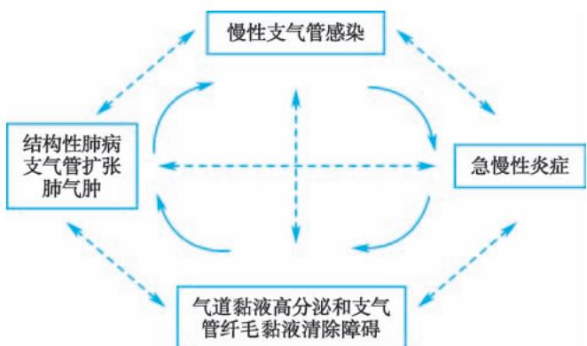
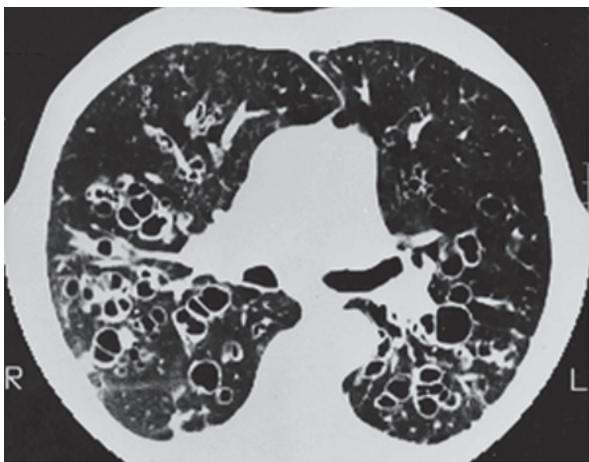
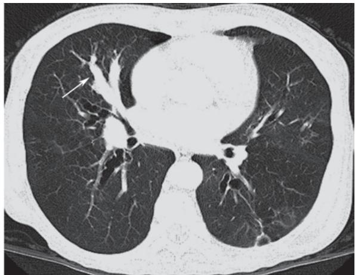
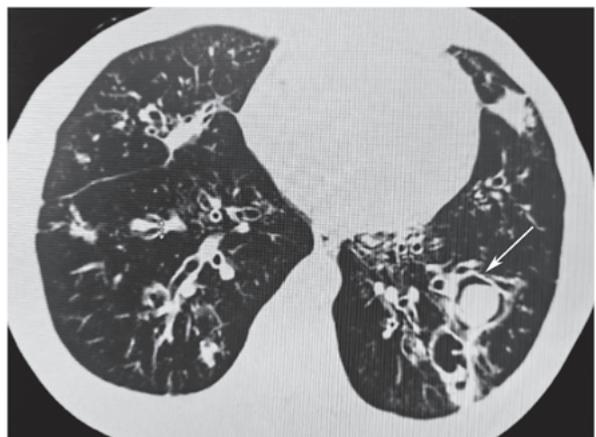

> [!info] 导航
> [[第005章_第2篇第04章_支气管哮喘|上一章]] · [[00_章节导航|总目录]] · [[第007章_第2篇第06章_肺部感染性疾病|下一章]]

本章数字资源

支气管扩张症（bronchiectasis）最早由Laennec描述，

主要指急、慢性呼吸道感染和支气管阻塞后，反复发生支气管化脓性炎症，致使支气管壁结构破坏，管壁增厚，引起支气管异常和持久性扩张的一类异质性疾病的总称，

可以是原发或继发，主要分为囊性纤维化（cystic fibrosis, CF）导致的支气管扩张症和非囊性纤维化导致的支气管扩张症。

本章主要讨论非囊性纤维化导致的支气管扩张症。近年来随着急、慢性呼吸道感染的恰当治疗，
其发病率有减少趋势，但随着CT的普及，
尤其是高分辨率CT的应用，在某些晚期慢阻肺病病人也发现了一定比例的支气管扩张症。

#### 【流行病学】

支气管扩张症的患病率各国报道差别较大,约为(1\~52)/10万。从2000年到2007年美国每年支气管扩张症病人增加8.74%,女性多见,我国报道40岁以上人群中支气管扩张症的患病率可达到1.2%。部分慢阻肺病病人合并支气管扩张的比例高达30%。支气管扩张症病人反复发生呼吸道感染,导致肺功能下降,最后出现呼吸衰竭,整体预后较差。

#### 【病因和发病机制】

本病分为先天性和继发性。
先天性支气管扩张症少见，有些病例无明显病因，但弥漫性支气管扩张常发生于有遗传、免疫或解剖缺陷的病人，如囊性纤维化、纤毛运动障碍和严重的 $\alpha_{1}$ -抗胰蛋白酶缺乏病人(表2-5-1)。

局灶性支气管扩张可源于未进行治疗的肺炎或气道阻塞，例如异物或肿瘤、外源性压迫或肺叶切除后解剖移位。

支气管扩张症的发病机制有“恶性循环”学说。各种诱因导致的慢性支气管的感染，可以引起呼吸道的炎症反应，导致气道黏液高分泌，黏液清除障碍，细菌定植和繁殖，引起气道和肺的结构性破坏，肺功能恶化，促进了肺感染的进一步发生。

实际上，
这些因素之间都会出现相互的作用，
如气道结构性破坏导致引流不通畅，促进细菌的定植和增生等。

在支气管扩张症病人肺内，存在着恶性循环基础上交互作用，
而治疗支气管扩张症需要在各个因素上阻断或逆转恶性循环，促进痰液引流和排出，减少细菌定植和感染，增强呼吸道防御能力，改善气道炎症，降低和预防急性加重，
并改善肺功能和一定程度上的气道重塑(图2-5-1)。
上述疾病损伤了宿主气道清除和防御功能,易发生感染和炎症。

继发性大多为细菌、结核/NTM、病毒、真菌感染后出现。
细菌反复感染可使充满炎症介质和病原菌黏稠脓性液体的气道逐渐扩大，形成瘢痕和扭曲。

支气管壁由于水肿、炎症和新血管形成而变厚。
周围间质组织和肺泡的破坏导致了纤维化、肺气肿，或二者兼有，
合并肺气肿的支气管扩张症病人预后更差，5年生存率明显降低；
合并铜绿假单胞菌定植的病人肺功能下降更为明显。

对下列病人考虑为高危人群,需要进行支气管扩张症的筛查:
①慢性咳嗽咳痰，尤其有脓性痰或咯血病人;
②慢阻肺病频繁急性加重(≥2次/年)，重症哮喘或控制不佳，且曾有痰培养铜绿假单胞菌(+);
③有慢性鼻窦炎、风湿性疾病或其他结缔组织疾病，出现慢性咳嗽咳痰或反复肺部感染病人;
④既往HIV感染、实体器官移植、接受免疫抑制剂治疗出现慢性咳嗽咳痰病人。

#### 【病理和病理生理】

支气管扩张常常是位于段或亚段支气管管壁的破坏和炎性改变，受累管壁的结构，
包括软骨、肌肉和弹性组织被破坏并被纤维组织替代，进而形成三种不同类型：

①柱状扩张：支气管呈均一管形扩张且突然在一处变细，远处的小气道往往被分泌物阻塞；

②囊状扩张：扩张支气管腔呈囊状改变，支气管末端的盲端也呈无法辨认的囊状结构；
③不规则扩张：支气管腔呈不规则改变或串珠样改变。

显微镜下可见支气管炎症和纤维化、支气管壁溃疡、鳞状上皮化生和黏液腺增生。
病变支气管相邻肺实质也可有纤维化、肺气肿、支气管肺炎和肺萎陷。
炎症可致支气管壁血管增多，

表 2-5-1 支气管扩张症的诱发因素

<table><tr><td>种类</td><td>诱发因素及特征</td></tr><tr><td>感染</td><td></td></tr><tr><td>细菌</td><td>铜绿假单胞菌、流感嗜血杆菌、卡他莫拉菌、肺炎克雷伯菌、金黄色葡萄球菌、百日咳杆菌</td></tr><tr><td>真菌</td><td>曲霉菌</td></tr><tr><td>分枝杆菌</td><td>结核分枝杆菌、非结核分枝杆菌(NTM)</td></tr><tr><td>病毒</td><td>腺病毒、流感病毒、单纯疱疹病毒、麻疹病毒</td></tr><tr><td>免疫缺陷或异常</td><td></td></tr><tr><td>原发性</td><td>低免疫球蛋白血症,包括IgG亚群的缺陷(IgG2、IgG4),慢性肉芽肿性疾病</td></tr><tr><td>继发性</td><td>长期服用免疫抑制药物、人类免疫缺陷病毒(HIV)感染、慢性淋巴细胞白血病、肺移植后</td></tr><tr><td>免疫异常</td><td>干燥综合征、ABPA、类风湿关节炎</td></tr><tr><td>先天性遗传疾病</td><td></td></tr><tr><td> $\alpha_{1}$ -抗胰蛋白酶缺乏</td><td>支气管扩张仅见于严重缺乏的病人</td></tr><tr><td>纤毛缺陷</td><td>原发性纤毛不动综合征(PCD)和卡塔格内(Kartagener)综合征</td></tr><tr><td>囊性纤维化</td><td>白种人常见</td></tr><tr><td>先天性结构缺损</td><td></td></tr><tr><td>淋巴管性/淋巴结</td><td>淋巴结病</td></tr><tr><td>黄甲综合征</td><td>指(趾)甲黄色、肥厚,淋巴水肿,慢性胸腔积液三联征</td></tr><tr><td>气管支气管性</td><td>巨气管支气管症、支气管软骨发育缺陷、先天性支气管发育不良、马方(Marfan)综合征</td></tr><tr><td>血管性</td><td>肺隔离症</td></tr><tr><td>其他</td><td></td></tr><tr><td>气道阻塞</td><td>外源性压迫、异物、恶性肿瘤、黏液阻塞、肺叶切除后其余肺叶纠集弯曲</td></tr><tr><td>毒性物质吸入</td><td>氨气、氯气和二氧化氮使气道直接受损,改变结构和功能</td></tr><tr><td>炎症性肠病</td><td>常见于慢性溃疡性结肠炎、肠道的切除加重肺部疾病</td></tr></table>

  
图 2-5-1 支气管扩张症的发病机制

并伴相应支气管动脉扩张及支气管动脉和肺动脉吻合。

支气管扩张症是呼吸科化脓性疾病之一，
由于各种致病因素导致慢性气道炎症、气道内分泌物增多、气道廓清障碍，
出现痰液积聚、气道梗阻，

进而出现病原微生物定植、增生及感染的概率增加，
而反复的细菌感染会加重气道炎症反应及气道壁的破坏和增厚，反过来降低痰液廓清的能力。
50%的支气管扩张症病人可有阻塞性通气功能障碍，限制性通气功能障碍更为常见。

#### 【临床表现】

分为稳定期和急性加重期。稳定期主要症状为持续或反复的咳嗽、咳痰或咳脓痰。

痰液为黏液性、黏液脓性或脓性，可呈黄绿色，
收集后分层（上层为泡沫，中间为浑浊黏液，下层为脓性成分，最下层为坏死组织）。

无明显诱因者常隐匿起病，无症状或症状轻微。

当支气管扩张症伴急性感染时,病人可表现为咳嗽、咳脓痰加重,伴或不伴肺炎。
50%～70%的病例可发生咯血，大咯血常为小动脉被侵蚀或增生的血管被破坏所致。
部分病人以反复咯血为唯一症状,称为“干性支气管扩张症”。

呼吸困难和喘息常提示有广泛的支气管扩张或有潜在的慢阻肺病。体检可闻及湿啰音和干啰音。

病变严重尤其是伴有慢性缺氧、慢性肺源性心脏病和右心衰竭的病人可出现杵状指(趾)及右心衰竭体征。

英国胸科学会(BTS)指南将急性加重定义为48小时内出现:咳嗽程度、咳痰量、脓性痰、呼吸困难或活动耐受度下降、乏力或不适、咯血这6项中的3项及以上症状的恶化,需要进行紧急处理。

#### 【实验室和其他辅助检查】

主要影像学检查包括胸部X线和胸部高分辨率CT，实验室检查包括血常规和炎症标志物如C反应蛋白、免疫球蛋白（IgG、IgA、IgM）、微生物学检查、血气分析，还可以行肺功能检查。其他检查包括鼻窦CT、血IgE、特异性IgE、烟曲霉皮试、类风湿因子、抗核抗体、细胞免疫功能检查、CF和PCD相关检查等，必要时做纤维支气管镜检查等。

1. 影像学检查

（1）胸部 X 线检查: 严重的支气管扩张症可表现为“卷发征”（图 2-5-2），
囊状支气管扩张的气道表现为显著的囊腔，腔内可存在气液平面。
囊腔内无气液平面时，很难与大疱性肺气肿或严重肺间质病变的蜂窝肺鉴别。

（2）胸部高分辨率 CT 扫描(HRCT): HRCT 可在横断面上清楚地显示扩张的支气管(图 2-5-3A)，且兼具无创、易重复、易接受的特点，现已成为支气管扩张症的主要诊断方法，尤其是层厚≤1mm 的高分辨率 CT。正常人左、右支气管内径与并行的肺动脉直径的比值为 0.75 和 0.72，而在支气管扩张症的病人支气管内径/伴行肺动脉直径比值往往 >1。

支气管可呈柱状及囊状改变，气道壁增厚(支气管内径<80% 外径)、黏液阻塞(图 2-5-3B)、树芽征及呼气相可出现“马赛克征”及气体陷闭。

![[a6cef062d4c25299e5a8b9601100e39a85c1546b8c82f0119cad1f9bcd911a8a.jpg]]

图 2-5-2 支气管扩张 X 线胸片表现

当 CT 扫描层面与支气管平行时，扩张的支气管呈“双轨征”或“串珠”状改变；
当 CT 扫描层面与支气管垂直时,扩张的支气管与伴行的肺动脉形成“印戒征”;
当多个囊状扩张的支气管彼此相邻时,则表现为“蜂窝”状或“卷发”状改变。

有部分病人合并曲霉菌感染形成曲霉菌球改变(图2-5-3C)。

（3）支气管碘油造影:可确诊支气管扩张症,但因其为创伤性检查,现已被高分辨率 CT(HRCT)所取代。

2. 实验室检查

（1）血常规及炎症标志物: 

当细菌感染导致支气管扩张症急性加重时, 
血常规白细胞计数、中性粒细胞百分比及 C 反应蛋白可升高。

(2) 血清免疫球蛋白: 

合并免疫功能缺陷者可出现血清免疫球蛋白 (IgG、IgA、IgM) 缺乏。

（3）血气分析:可判断病人是否合并低氧血症和/或高碳酸血症。

（4）微生物学检查:
应留取合格的痰标本送检涂片染色以及痰细菌培养,
痰培养和药敏试验结果可指导抗菌药物的选择,
痰液中找到抗酸杆菌时需要进一步分型是结核分枝杆菌还是非结核分枝杆菌。

（5）病因学：
必要时可检测类风湿因子、抗核抗体、抗中性粒细胞胞质抗体。
怀疑 ABPA 的病人可选择性进行血清 IgE 测定、烟曲霉皮试、曲霉沉淀素检查。
如病人自幼起病，合并慢性鼻窦炎或中耳炎，或合并右位心，需怀疑 PCD 可能，
可行鼻呼出气一氧化氮测定筛查，
疑诊者需进一步取纤毛上皮行电镜检查，必要时行基因检测。

  
A

  
B

  
C  
图 2-5-3 支气管扩张 CT 表现

3. 其他

（1）纤维支气管镜检查:
当支气管扩张呈局灶性且位于段支气管以上时,
可发现弹坑样改变,可通过纤维支气管镜采样用于病原学诊断及病理诊断。
纤维支气管镜检查还可明确出血、扩张或阻塞的部位。

还可经纤维支气管镜进行局部灌洗,采取灌洗液标本进行涂片、细菌学和细胞学检查,协助诊断和指导治疗。

(2) 肺功能测定: 部分病人存在限制性、阻塞性或混合性通气功能障碍。

#### 【诊断与鉴别诊断】

### （一）诊断

根据反复咳脓痰、咯血病史和既往有诱发支气管扩张症的呼吸道感染病史，HRCT显示支气管扩张的异常影像学改变，即可明确诊断为支气管扩张症。诊断支气管扩张症的病人还应进一步仔细询问既往病史、评估呼吸道症状、根据病情完善相关检查以明确病因诊断。

### (二) 评估

1. 病人初次诊断后的评估
痰液检查,包括初诊及定期的痰涂片(包括真菌和抗酸染色),痰培养加药敏试验。
肺部 CT 随访,尤其是肺内出现空洞、无法解释的咯血或痰中带血、治疗反应不佳、反复急性加重等。
肺功能用于评估疾病进展程度和指导药物治疗。
血气分析判断是否存在低氧血症和/或 $CO_{2}$ 潴留。
实验室检查评估病人的炎症反应,免疫状态,是否合并其他病原体感染等。

2. 支气管扩张症危重程度及预后的评估 
由于支气管扩张症病人的异质性较强,肺部影像学和肺功能差异较大,临床症状也有较大的差异,
因此支气管扩张症病人的危重程度评估是依靠临床症状、体征、影像学、肺功能以及实验室检查等多个维度来进行综合的评估。

评估方面,目前常用的是支气管扩张严重指数(bronchiectasis severity index, BSI)和支气管扩张症严重程度分级(E-FACED)评分。

BSI 可用于预测支气管扩张症病人病情恶化、住院、死亡风险等。
总分 0～4 分为轻度，5～8 分为中度，≥9 分为重度。

E-FACED 主要用于预测未来急性加重和住院。
总分 0～3 分为轻度，4～6 分为中度，7～9 分为重度。

### （三）鉴别诊断

需鉴别的疾病主要为慢性支气管炎、肺脓肿、肺结核、先天性肺囊肿、弥漫性泛细支气管炎和支气管肺癌等。仔细研究病史和临床表现，参考影像学、纤维支气管镜和支气管造影的特征常可作出明确的鉴别诊断。下述要点对鉴别诊断有一定参考意义。

1. 慢性支气管炎 多发生在中年以上病人，在气候多变的冬春季节咳嗽、咳痰明显，多咳白色黏液痰，感染急性发作时可出现脓性痰，但无反复咯血史。听诊双肺可闻及散在干、湿啰音。

2. 肺脓肿 起病急,有高热、咳嗽、大量脓臭痰。X线检查可见局部浓密炎症阴影,内有空腔液平。

3. 肺结核 常有低热、盗汗、乏力、消瘦等结核毒性症状，干、湿啰音多局限于上肺，X线胸片和痰结核菌检查可作出诊断。

4. 先天性肺囊肿 X 线检查可见多个边界纤细的圆形或椭圆形阴影,壁较薄,周围组织无炎症浸润。胸部 CT 和支气管造影可协助诊断。

5. 弥漫性泛细支气管炎 有慢性咳嗽、咳痰、活动时呼吸困难及慢性鼻窦炎。
X 线胸片和胸部 CT 显示弥漫分布的小结节影。大环内酯类抗生素治疗有效。

6. 支气管肺癌 多见于 40 岁以上病人, 可伴有咳嗽、咳痰、胸痛, 痰中带血。大咯血少见。影像学、痰细胞学、支气管镜检查等有助于确诊。

#### 【治疗】

1. 治疗基础疾病
对活动性肺结核伴支气管扩张症应积极抗结核治疗,低免疫球蛋白血症可用免疫球蛋白替代治疗。

2. 控制感染 
支气管扩张症病人出现痰量增多及其脓性成分增加等急性感染征象时，需应用抗感染药物。

急性加重期开始抗菌药物治疗前应常规送痰培养，根据痰培养和药敏结果指导抗生素应用，
但在等待培养结果时即应开始经验性抗菌药物治疗。

无铜绿假单胞菌感染高危因素的病人应立即经验性使用对流感嗜血杆菌有活性的抗菌药物
（如氨苄西林/舒巴坦、阿莫西林/克拉维酸），
第二代头孢菌素，第三代头孢菌素（如头孢曲松钠、头孢噻肟），莫西沙星、左氧氟沙星。

对于存在铜绿假单胞菌感染高危因素的病人如存在以下4条中的2条：
①近期住院；
②每年4次以上或近3个月以内应用抗生素；
③重度气流阻塞( $FEV_{1}<30\%$ 预计值)；
④最近2周每日口服泼尼松>10mg]，
可选择具有抗假单胞菌活性的β-内酰胺类抗生素（如头孢他啶、头孢吡肟、哌拉西林/他唑巴坦、头孢哌酮/舒巴坦），
碳青霉烯类（如亚胺培南、美罗培南)，氨基糖苷类，喹诺酮类（环丙沙星或左氧氟沙星），
可单独应用或联合应用。

对于慢性咳脓痰病人，还可考虑使用疗程更长的抗生素，如口服阿莫西林或吸入氨基糖苷类药物，或间断并规则使用单一抗生素以及轮换使用抗生素以加强对下呼吸道病原体的清除。

合并ABPA时，除一般需要糖皮质激素（泼尼松0.5～1mg/kg）外，还需要抗真菌药物（如伊曲康唑）联合治疗，疗程较长。支气管扩张症病人出现肺内空洞，尤其是内壁光滑的空洞，合并或没有合并树芽征，要考虑到不典型分枝杆菌感染的可能，可采用痰抗酸染色、痰培养及痰的微生物分子检测进行诊断。

本病也容易合并结核，病人可以有肺内空洞或肺内结节，渗出合并增殖性改变等，可合并低热、夜间盗汗，需要在随访过程中密切注意上述相关的临床表现。

支气管扩张症病人容易合并曲霉菌的定植和感染，表现为管腔内有曲霉球，或出现慢性纤维空洞样改变，或急性、亚急性侵袭性感染。

曲霉菌的侵袭性感染治疗一般选择伏立康唑。

长期抗生素治疗: 利用十四元环、十五元环等大环内酯类抗生素, 包括阿奇霉素、克拉霉素、红霉素等具有免疫调节作用的特点, 在排除了肝肾功能障碍、心电图未见 Q-T 间期延长和听力未有明显障碍的基础上, 参照国外的研究结果, 给予长期(可达一年)的口服治疗, 在有些支气管扩张症病人可以减少急性加重的频率。

治疗过程中需要监测肝肾功能、心电图和听力。雾化吸入抗生素如妥布霉素可以有效清除定植的微生物,并能减少急性加重,目前已经在临床上开始使用,但疗程上还有待进一步的探索。

病原体清除治疗:对于首次分离出铜绿假单胞菌且病情进展的病人,根据国外的研究结果,
可以给予为期两周的环丙沙星(500mg,2次/日)口服治疗,并于后续三个月吸入妥布霉素治疗。

合并NTM的病人,根据病人的NTM感染的危重程度,是否合并咯血和空洞等进行评估,

如果考虑单纯定植,或病灶局限,病变较轻,并不需要进行抗NTM治疗。

如果判断NTM促进了肺部疾病的进展或有较高的风险,
可以进行至少包含三种药物的抗NTM治疗,最长疗程可达两年。
部分病人因为药物的副作用往往不能耐受两年的疗程。

3. 改善气流受限
4. 建议支气管扩张症病人常规随访肺功能的变化,尤其是已经有阻塞性通气功能障碍的病人。
长效支气管扩张剂(长效 $\beta_{2}$ 受体激动剂、长效抗胆碱药、吸入糖皮质激素联合长效 $\beta_{2}$ 受体激动剂)可改善气流受限并帮助清除分泌物,对伴有气道高反应及可逆性气流受限的病人常有一定疗效。
但由于缺乏循证医学的依据,在支气管扩张剂的选择上,目前并无常规推荐的指征。

4. 清除气道分泌物 包括物理排痰和化痰药物。物理排痰包括:体位引流,一般头低臀部抬高,可配合震动拍击背部协助痰液引流;气道内雾化吸入生理盐水,短时间内吸入高渗生理盐水,或吸入黏液溶解剂如乙酰半胱氨酸等,可有助于痰液的稀释和排出。其他如胸壁震荡、正压通气、主动呼吸训练等合理使用也可以起到排痰作用。药物包括黏液溶解剂、痰液促排剂、抗氧化剂等。乙酰半胱氨酸具有较强的化痰和抗氧化作用。

5. 免疫调节剂 使用一些促进呼吸道免疫增强的药物如细菌细胞壁裂解产物,可以减少支气管扩张症病人的急性发作。部分支气管扩张症病人长期使用十四元环或十五元环大环内酯类抗生素可以减少急性发作和改善病人的症状,但需要注意长期口服抗生素带来的其他副作用,包括心血管、听力、肝功能的损害及出现细菌耐药等。

6. 咯血的治疗 对反复咯血的病人,
如果咯血量少,可以对症治疗或口服卡巴克洛、卡络磺钠、云南白药等。
若出血量中等,可静脉给予垂体后叶素或酚妥拉明;
若出血量大,经内科治疗无效,可考虑介入栓塞治疗或手术治疗。
使用垂体后叶素需要注意低钠血症的产生。

7. 外科治疗 
如支气管扩张为局限性,经充分内科治疗仍顽固反复发作者,可考虑外科手术切除病变肺组织。
如大出血来自增生的支气管动脉,经休息和抗生素等保守治疗不能缓解仍反复大咯血时,
病变局限者可考虑外科手术,否则采用支气管动脉栓塞术治疗。
对于那些尽管采取了所有治疗仍致残的病例,合适者可考虑肺移植。

8. 预防 可考虑应用肺炎球菌疫苗和流感疫苗预防或减少急性发作,
新冠病毒疫苗接种可以降低感染后病情的危重程度和降低病死率。
免疫调节剂对于减轻症状和减少发作有一定帮助。吸烟者应予以戒烟。康复锻炼对于保持肺功能有一定作用。

#### 【预后】

支气管扩张症的预后，取决于支气管扩张范围和有无并发症。支气管扩张范围局限者，积极治疗可改善生命质量和延长寿命。支气管扩张范围广泛者易损害肺功能，甚至发展至呼吸衰竭而引起死亡。大咯血也可严重影响预后。支气管扩张症合并铜绿假单胞菌定植、肺实质损害如肺气肿和肺大疱者预后较差。慢阻肺病病人合并支气管扩张症后死亡率增加。

(宋元林)

  
本章思维导图
