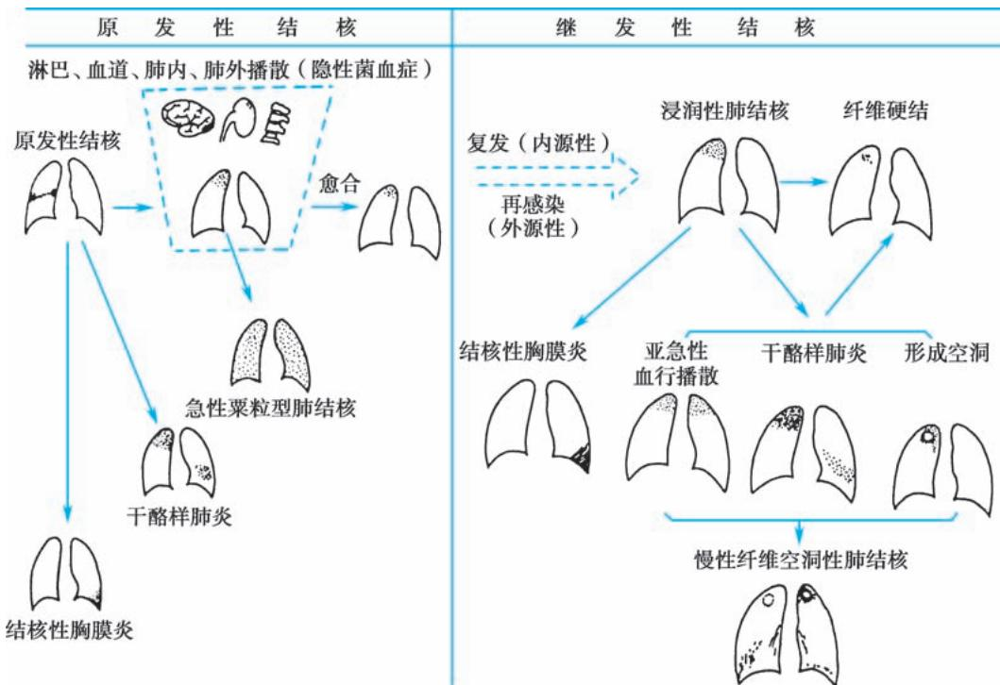
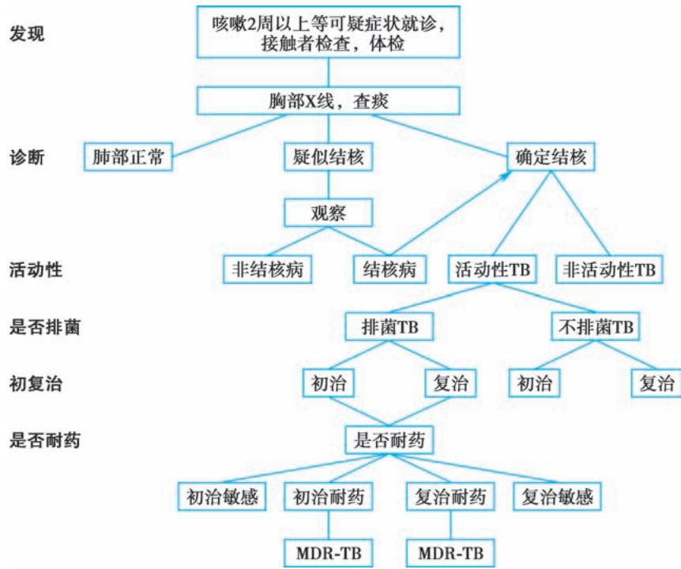
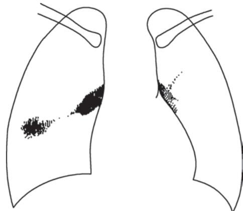
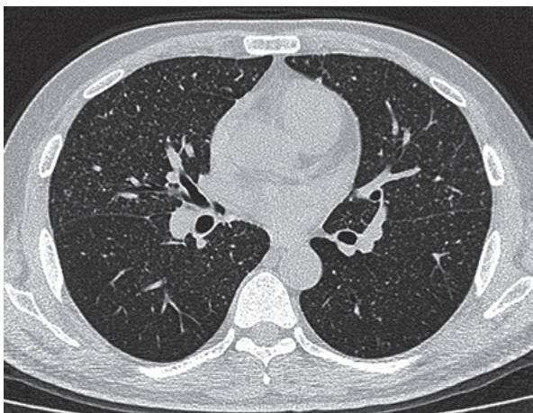
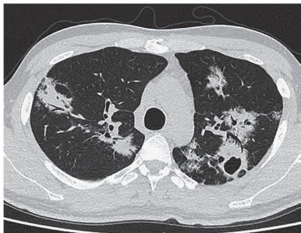
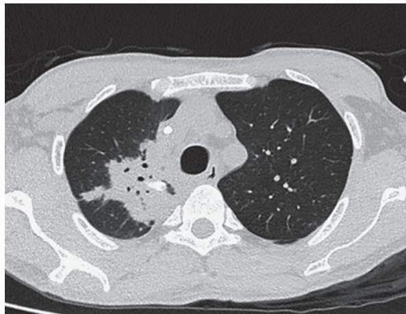
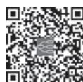

> [!info] 导航
> [[第008章_第2篇第07章_肺脓肿|上一章]] · [[00_章节导航|总目录]] · [[第010章_第2篇第09章_肺癌|下一章]]

肺结核（pulmonary tuberculosis）在 21 世纪仍然是严重危害人类健康的主要传染病，是全球关注的公共卫生和社会问题，也是我国重点控制的主要疾病之一。

自 20 世纪 80 年代以来,结核病疫情出现明显回升并呈现全球性恶化的趋势。进入 21 世纪后,全球结核病的疫情出现缓慢下降,2005 年至 2019 年期间结核病发病率呈下降趋势。但 2021 年全球结核病发病率较 2020 年增加了 3.6%,结核病发病率下降的趋势再次发生逆转。我国作为结核病高负担国家,结核病发病例数占全球的 7.4%。

#### 【流行病学】

1. 全球疫情 全球有 1/3 的人(约 20 亿)曾受到结核分枝杆菌的感染。结核病的流行状况与经济水平相关,结核病的高流行与国内生产总值(GDP)的低水平相对应。2021 年,全球新发结核病数量约为 640 万例,其中 40 万新发结核病例为 HIV 感染者(占 6.7%)。约 160 万人死于结核病,其中有 18.7 万为 HIV 感染者。2021 年全球约新发 45 万例利福平耐药结核病,全球耐药结核病的治疗成功率仍较低(60% 左右)。

2. 我国疫情 2019 年全国结核病监测数据显示,我国有 83.3 万新发结核病例,发病率为 58/10 万;其中新发 HIV 相关结核病 1.4 万例,发病率为 0.95/10 万;HIV 阴性结核病死亡 3.1 万例,HIV 阳性结核病死亡 2 200 例。新发耐多药/利福平耐药结核病(multidrug-resistant or rifampicin-resistant tuberculosis,MDR/RR-TB)6.5 万人,发病率为 4.5/10 万。2008 年后我国结核病疫情呈持续下降趋势,至 2020 年已下降至 47.76/10 万的发病率和 67.05 万的发病人数,2020 年死亡人数仅 1 367 例。2000 年以来,我国结核病的发病率下降了 38.5%,年递减率为 3.2%;死亡率下降了 70.1%,年递减率 7.7%。由于我国结核病疫情比较严重,各地区差异大,西部地区肺结核患病率明显高于全国平均水平。

#### 【结核分枝杆菌】

结核病的病原菌为结核分枝杆菌复合群，包括结核分枝杆菌（Mycobacterium tuberculosis, MTB）、牛分枝杆菌、非洲分枝杆菌和田鼠分枝杆菌。人肺结核的致病菌90%以上为结核分枝杆菌。典型的结核分枝杆菌是细长、稍弯曲、两端圆形的杆菌，痰标本中的结核分枝杆菌可呈现为T、V、Y形以及丝状、球状、棒状等多种形态。结核分枝杆菌抗酸染色呈红色，可抵抗盐酸酒精的脱色作用，故称抗酸杆菌。结核分枝杆菌对干燥、冷、酸、碱等抵抗力强，对紫外线比较敏感，太阳光直射下痰中结核分枝杆菌经2～7小时可被杀死，实验室或病房常用紫外线灯消毒，10W紫外线灯距照射物0.5～1m，照射30分钟具有明显杀菌作用。

结核分枝杆菌为专性需氧菌，营养要求高，增代时间为14～20小时，培养时间一般为2～8周。结核分枝杆菌菌体成分复杂，主要是类脂质、蛋白质和多糖类。类脂质占总量的50%～60%，其中的蜡质约占50%，与结核病的组织坏死、干酪液化、空洞发生以及结核变态反应有关。菌体蛋白质以结合形式存在，是结核菌素的主要成分，诱发皮肤变态反应。多糖类与血清反应等免疫应答有关。

#### 【结核病在人群中的传播】

结核病在人群中的传染源主要是结核病病人,即痰直接涂片阳性者。结核分枝杆菌主要通过呼吸道传播,飞沫传播是肺结核最重要的传播途径。健康人吸入病人咳嗽、打喷嚏时喷出的带菌飞沫,可引起肺部结核菌感染。经消化道和皮肤等其他途径传播现已罕见。

传染性的大小除取决于病人排出结核分枝杆菌量的多少外，还与空间含结核分枝杆菌气溶胶的密度及通风情况、接触的密切程度和时间长短以及个体免疫力的状况有关。通风换气、减少空间气溶胶的密度是减少肺结核传播的有效措施。结核感染后是否发病与宿主免疫力有关，免疫力下降是结核病发病的主要危险因素。导致宿主免疫力下降的主要危险因素包括糖尿病、HIV感染、酗酒、吸烟和营养不良等。COVID-19、硅沉着病、抗肿瘤坏死因子- $\alpha$ （TNF- $\alpha$ ）治疗、透析治疗、免疫抑制剂使用等危险因素，也增加了高危人群罹患结核病的风险。

#### 【结核病在人体的发生与发展】

1. 原发感染 首次吸入含结核分枝杆菌的气溶胶后,是否感染取决于结核分枝杆菌的毒力和肺泡内巨噬细胞固有的吞噬杀菌能力。结核分枝杆菌的类脂质等成分能抵抗溶酶体酶类的破坏作用,如果结核分枝杆菌能够存活下来,并在肺泡巨噬细胞内外生长繁殖,这部分肺组织即出现炎症病变,称为原发病灶。原发病灶中的结核分枝杆菌沿着肺内引流淋巴管到达肺门淋巴结,引起淋巴结肿大。原发病灶和肿大的气管支气管淋巴结合称为原发综合征。原发病灶继续扩大,可直接或经血流播散到邻近组织器官,发生结核病。

当结核分枝杆菌首次侵入人体开始繁殖时，人体通过细胞介导的免疫系统对结核分枝杆菌产生特异性免疫，使原发病灶、肺门淋巴结和播散到全身各器官的结核分枝杆菌停止繁殖，原发病灶炎症迅速吸收或留下少量钙化灶，肿大的肺门淋巴结逐渐缩小、纤维化或钙化，播散到全身各器官的结核分枝杆菌大部分被消灭，这就是原发感染最常见的良性过程。但仍然有少量结核分枝杆菌没有被消灭，长期处于休眠期，成为继发性结核病的来源之一。肺结核的发生发展过程见图2-8-1。

  
图 2-8-1 肺结核病自然过程示意图

2. 结核病免疫和迟发性变态反应 结核分枝杆菌是胞内感染菌,结核病主要的免疫保护机制是以 T 细胞为主的细胞免疫。体液免疫对控制结核分枝杆菌感染的作用不重要。

天然免疫中巨噬细胞是结核感染的主要靶细胞，也是机体抗结核感染的最早起作用和最具有代表性的细胞群。肺泡中的巨噬细胞大量分泌白细胞介素(简称白介素)-1、白介素-6和肿瘤坏死因子(TNF)-α等细胞因子，使细胞和单核细胞聚集到结核分枝杆菌入侵部位，逐渐形成结核肉芽肿，限制结核分枝杆菌扩散并杀灭结核分枝杆菌。巨噬细胞中结核分枝杆菌通过MHCⅡ类分子的抗原提呈给CD4 $^{+}$ T细胞，CD4 $^{+}$ T细胞促进免疫反应，被早期细胞因子如IL-12、IL-18等诱导向Th1型细胞分化。这种CD4 $^{+}$ T细胞能够产生大量的γ-干扰素等细胞因子，进一步激活巨噬细胞，加速吞噬和杀灭结核分枝杆菌。另外有研究说明CD4 $^{+}$ T细胞还参与被感染的细胞的凋亡。T细胞具有独特作用，其与巨噬细胞相互作用和协调,对完善免疫保护作用非常重要。总的来说,CD4 $^{+}$ T 细胞在机体抗结核感染中起着重要作用。CD8 $^{+}$ T 细胞对结核感染的控制作用主要是产生颗粒溶素（granulysin）和穿孔素来直接杀灭结核分枝杆菌。结核病免疫保护机制十分复杂,一些确切机制尚需进一步研究。

1890 年 Koch 观察到, 将结核分枝杆菌皮下注射到未感染的豚鼠, 10～14 日后局部皮肤红肿、溃烂, 形成深的溃疡, 不愈合, 最后豚鼠因结核分枝杆菌播散到全身而死亡。而对 3～6 周前受少量结核分枝杆菌感染和结核菌素皮肤试验阳转的动物, 给予同等剂量的结核分枝杆菌皮下注射, 2～3 日后局部出现红肿, 形成表浅溃烂, 继之较快愈合, 无淋巴结肿大, 无播散和死亡。这种机体对结核分枝杆菌再感染和初感染所表现出不同反应的现象称为 Koch 现象。较快的局部红肿和表浅溃烂是由结核菌素诱导的迟发性变态反应的表现; 结核分枝杆菌无播散, 引流淋巴结无肿大以及溃疡较快愈合是免疫力的反映。免疫力与迟发性变态反应之间关系相当复杂, 尚不十分清楚, 大致认为两者既有相似的方面, 又有独立的一面, 变态反应不等于免疫力。

3. 继发性结核病 继发性结核病与原发性结核病有明显的差异,继发性结核病有明显的临床症状,容易出现空洞和排菌。有传染性继发性结核病的发病,目前认为有两种方式:原发性结核感染时期遗留下来的潜在病灶中的结核分枝杆菌重新活动而发生的结核病,此为内源性复发;据统计约10%的结核分枝杆菌感染者,在一生的某个时期发生继发性结核病。另一种方式是由于受到结核分枝杆菌的再感染而发病,称为外源性重染。两种不同发病方式主要取决于当地的结核病流行病学特点与严重程度。

#### 【病理学】

1. 基本病理变化 结核病的基本病理变化是炎性渗出、增生和干酪样坏死。结核病的病理过程特点是破坏与修复常同时进行，故上述三种病理变化多同时存在，也可以某一种变化为主，且三种病理变化间可相互转化。渗出为主的病变主要出现在结核病炎症初期阶段或病变恶化复发时，可表现为局部中性粒细胞浸润，继之由巨噬细胞及淋巴细胞取代。增生为主的病变发生在机体抵抗力较强、病变恢复阶段，表现为典型的结核结节，直径约为0.1mm，数个结节融合后肉眼可见到。结核结节由淋巴细胞、上皮样细胞、朗汉斯巨细胞以及成纤维细胞组成，中间可出现干酪样坏死。大量上皮样细胞互相聚集融合形成的多核巨细胞称为朗汉斯巨细胞。干酪样坏死为主的病变多在结核分枝杆菌毒力强、感染菌量多、机体超敏反应增强、抵抗力低下等情况发生。干酪样坏死病变镜检时表现为红染、无结构的颗粒状物，含脂质多，肉眼观察呈淡黄色，状似奶酪，故称干酪样坏死。

2. 病理变化转归 抗结核化学治疗问世前，结核病的病理转归特点为吸收愈合缓慢、病情多反复恶化和播散。采用化学治疗后，早期渗出性病变可完全吸收消失或仅留下少许纤维条索。一些增生病变或较小的干酪样坏死病变在化学治疗下也可吸收缩小逐渐纤维化，或纤维组织增生将病变包围，形成散在的小硬结灶。未经化学治疗的干酪样坏死病变常发生液化坏死或形成空洞，含有大量结核分枝杆菌的液化物可经支气管播散到对侧肺或同侧肺其他部位引起新病灶。经化学治疗后，干酪样病变中的大量结核分枝杆菌被杀死，病变逐渐吸收缩小或形成钙化。

#### 【临床表现】

肺结核的临床表现不尽相同,但有共同之处。

##### (一) 症状

1. 呼吸系统症状 咳嗽、咳痰两周以上或咯血是肺结核的常见可疑症状。咳嗽较轻，干咳或少量黏液痰。有空洞形成时，痰量增多，若合并其他细菌感染，痰可呈脓性。若合并支气管结核，表现为刺激性咳嗽。约 1/3 的病人有咯血，多数病人为少量咯血，少数为大咯血。结核病灶累及胸膜时可出现胸痛，为胸膜性胸痛。随呼吸运动和咳嗽加重。呼吸困难多见于干酪样肺炎和大量胸腔积液病人。

2. 全身症状 发热为最常见症状,多为长期午后潮热,即下午或傍晚开始升高,翌晨降至正常。部分病人有倦怠乏力、盗汗、食欲减退和体重减轻等。育龄期女性病人可以有月经不调。

##### （二）体征

多寡不一，取决于病变性质和范围。病变范围较小时，可以没有任何体征；渗出性病变范围较大或干酪样坏死时，则可以有肺实变体征。结核性胸膜炎时可出现胸腔积液体征：气管向健侧移位，患侧胸廓望诊饱满、触觉语颤减弱、叩诊实音、听诊呼吸音消失。支气管结核可有局限性哮鸣音。

少数病人可以有类似风湿热样表现,称为结核性风湿症。多见于青少年女性。常累及四肢大关节,在受累关节附近可见结节性红斑或环形红斑,间歇出现。

#### 【肺结核的诊断】

##### （一）诊断原则

肺结核的诊断是以病原学(包括细菌学和分子生物学)检查结果为主,流行病学史、临床表现、胸部影像学和相关的辅助检查等进行综合分析判断后作出诊断。儿童肺结核的诊断，除痰液病原学检查外,还要重视胃液提取物的病原学检查。

##### （二）诊断方法

1. 影像学检查 胸部影像学检查是早期发现结核病的重要工具。肺结核病影像特点是病变多发生在上叶的尖后段、下叶的背段和后基底段，呈多态性，即浸润、增殖、干酪、纤维钙化病变可同时存在。

胸部 X 线检查是诊断肺结核的常规首选方法,可以发现早期轻微的结核病变,确定病变的范围、部位、形态、密度、与周围组织的关系、病变的伴随影像征象;判断病变性质、有无活动性、有无空洞、空洞大小和洞壁特点等。

胸部 CT 能提高分辨率,对病变细微特征进行评价可早期发现肺内粟粒阴影和减少微小病变的漏诊;能清晰显示各型肺结核病变特点和性质,与支气管的关系,有无空洞以及进展恶化和吸收好转的变化;能准确显示纵隔淋巴结有无肿大。常用于对肺结核的诊断以及与其他胸部疾病的鉴别诊断,也可用于引导穿刺、引流和介入性治疗等。

2. 痰结核分枝杆菌检查 是确诊肺结核病的主要方法,也是制订化疗方案和考核治疗效果的主要依据。每一个有肺结核可疑症状或肺部有异常阴影的病人都必须查痰。

（1）痰标本的收集:肺结核病人的排菌具有间断性和不均匀性的特点,所以要多次查痰。通常初诊病人至少要送3份痰标本,包括清晨痰、夜间痰和即时痰,复诊病人每次送两份痰标本。无痰病人可采用痰诱导技术获取痰标本。

（2）痰涂片检查:是简单、快速、易行和可靠的方法,但欠敏感。每毫升痰中至少含5 000～10 000个细菌时可呈阳性结果。除常采用的齐-尼(Ziehl-Neelsen)染色法外,目前WHO推荐使用LED荧光显微镜检测抗酸杆菌,具有省时、方便的优点,适用于痰检数量较大的实验室。痰涂片检查阳性只能说明痰中含有抗酸杆菌,不能区分是结核分枝杆菌还是非结核分枝杆菌,需结合其他临床资料进一步判断其意义。

（3）培养法：结核分枝杆菌培养为肺结核病提供准确、可靠的结果，灵敏度高于涂片法，常作为结核病诊断的“金标准”。同时也为药物敏感性测定和菌种鉴定提供菌株。沿用的改良罗氏法（Lowenstein-Jensen）结核分枝杆菌培养费时较长，一般为2～8周。近期采用液体培养基和测定细菌代谢产物的BACTEC-TB960法，10日可获得结果并提高10%分离率。

（4）药物敏感性测定：结核病初治失败、复发以及其他复治病人应进行药物敏感性测定，为临床耐药病例的诊断、制订合理的化疗方案以及流行病学监测提供依据。WHO把比例法作为药物敏感性测定的“金标准”。由于采用BACTEC-TB960法以及显微镜观察药物敏感法和噬菌体生物扩增法等新生物技术，使药物敏感性测定时间明显缩短，准确性提高。

（5）分子生物学检查:结核病原学分子生物学诊断技术以 MTB 相关基因为诊断标志物,检测标本中是否含有 MTB 核酸或耐药基因。分子生物学诊断技术敏感性高,特异性强,可快速获取结果,时效性优于传统的培养方法,分子生物学阳性可作为病原学阳性的诊断依据。

目前常用的方法包括:①实时荧光定量 PCR(Xpert MTB/RIF)技术:可检测临床标本中是否存在 MTB 复合群及其对利福平的耐药性。②等温(恒温)扩增技术:主要用于检测临床标本中是否存在 MTB 复合群,包括环介导等温扩增(loop-mediated isothermal amplification,LAMP)、交叉引物扩增（crossing priming amplification, CPA）及实时荧光核酸恒温扩增检测（simultaneous amplification and testing, SAT）技术。

基于高通量测序技术的宏基因组下一代测序（mNGS）和靶向基因测序（targeted NGS, tNGS）技术不依赖于传统的微生物培养，通过对临床样本中微生物的核酸进行测序分析。此技术对结核病的诊断价值仍需进一步评价，对于MTB阳性的检测报告，需要结合临床及其他检测结果等综合判断是否诊断为结核病。

3. 电子支气管镜检查 电子支气管镜检查常应用于支气管结核和淋巴结支气管瘘的诊断，支气管结核表现为黏膜充血、溃疡、糜烂、组织增生、形成瘢痕和支气管狭窄，可以在病灶部位钳取活体组织进行病理学检查和结核分枝杆菌培养。对于肺内结核病灶，可以采集分泌物或灌洗液标本做病原体检查，也可以经支气管肺活检获取标本检查。

4. 免疫学检查 肺结核病为病原微生物感染所造成的疾病,临床上可利用免疫学实验技术检测机体对分枝杆菌,特别是结核分枝杆菌感染造成的免疫反应,帮助临床医师进行鉴别诊断。但由于结核分枝杆菌引起的人体免疫反应比较复杂,免疫学检查结果仅作为肺结核病诊断的辅助参考指标,不能作为确诊和疗效评价指标。

（1）结核菌素试验：结核菌素试验广泛应用于检出结核分枝杆菌的感染，而非检出结核病。结核菌素试验对儿童、少年和青年的结核病诊断有参考意义。由于许多国家和地区广泛推行卡介苗接种，结核菌素试验阳性不能区分是结核分枝杆菌的自然感染还是卡介苗接种的免疫反应。目前 WHO 推荐使用的结核菌素为纯蛋白衍化物（purified protein derivative, PPD）和 PPD-RT23。

结核分枝杆菌感染后需 4～8 周才能建立充分的变态反应,在此之前,结核菌素试验可呈阴性;营养不良、HIV 感染、麻疹、水痘、癌症、严重的细菌感染包括重症结核病如粟粒性肺结核和结核性脑膜炎等,结核菌素试验结果则多为阴性或弱阳性。

（2） $\gamma-$ 干扰素释放试验(interferon-gamma release assays, IGRAs): 通过特异性抗原 ESAT-6 和 GFP-10 与全血细胞共同孵育, 然后检测 $\gamma-$ 干扰素水平或采用酶联免疫斑点试验(ELISPOT)测量计数分泌 $\gamma-$ 干扰素的特异性 T 淋巴细胞, 以判断是否存在结核分枝杆菌感染。可以区分结核分枝杆菌自然感染与卡介苗接种和大部分非结核分枝杆菌感染, 因此诊断结核感染的特异性明显高于 PPD 试验。IGRAs 不能用于确诊或排除活动性结核病, 但对缺少细菌学诊断依据的活动性结核病(如菌阴肺结核等), IGRAs 可在常规诊断依据的基础上, 起到补充或辅助诊断的作用。

##### （三）肺结核的诊断程序

1. 可疑症状病人的筛选 肺结核病人主要的可疑症状为: 咳嗽、咳痰持续两周以上和咯血, 其次是午后低热、乏力、盗汗、月经不调或闭经, 有肺结核接触史或肺外结核。

2. 是否为肺结核 胸部影像学检查发现肺部有异常阴影者,必须通过系统检查确定肺部病变性质为结核性或其他性质。肺结核以病原学、病理学结果作为确诊依据。如一时难以确定,可经系统抗常见病原体感染治疗10～14天后复查,大部分常见病原体感染所致肺炎的胸部影像学会有所变化,肺结核病则变化不大。

3. 有无活动性 如果诊断为肺结核,应进一步明确有无活动性。活动性结核病变在胸部影像学上通常表现为边缘模糊不清的斑片状阴影,可有中心溶解或空洞,或出现播散病灶。胸部影像学表现为钙化、硬结或纤维化,痰检查不排菌,无任何症状,考虑为无活动性肺结核。

4. 是否排菌 确定活动性后还要明确是否排菌,是确定传染源的唯一方法。

5. 是否耐药 通过药物敏感性试验确定是否耐药。

6. 明确初、复治病史询问明确初、复治病人，两者治疗方案迥然不同。

肺结核病的诊断流程见图 2-8-2。

#### 【结核病的分类标准】

根据我国实施的《结核病分类》(WS 196—2017)标准,肺结核可按不同的分类方法进行诊断分类。

  
图 2-8-2 肺结核病的诊断流程

### （一）结核分枝杆菌潜伏感染者

机体内感染了结核分枝杆菌，但没有发生临床结核病，没有临床细菌学或者影像学方面活动性结核的证据。

### （二）活动性结核病

具有结核病相关的临床症状和体征，结核分枝杆菌病原学、病理学、影像学等检查有活动性结核的证据。活动性结核可按照病变部位、病原学检查结果、耐药状况、既往治疗史等分类。

1. 按病变部位分类

（1）肺结核：肺结核病的结核病变可发生在肺、气管、支气管和胸膜等部位。按照病变部位，分为以下5种类型。

1）原发性肺结核：包括原发综合征和胸内淋巴结结核。多见于少年儿童，无症状或症状轻微，多有结核病接触史，结核菌素试验多为强阳性，X线胸片表现为哑铃形阴影，即原发病灶、引流淋巴管炎和肿大的肺门淋巴结，形成典型的原发综合征(图2-8-3)。原发病灶一般吸收较快，可不留任何痕迹。若X线胸片只有肺门淋巴结肿大，则诊断为胸内淋巴结结核。肺门淋巴结结核可呈团块状、边缘清晰和密度高的肿瘤型或边缘不清、伴有炎性浸润的炎症型。

2）血行播散性肺结核：含急性、亚急性和慢性血行播散性肺结核。急性血行播散性肺结核(急性粟粒性肺结

  
图 2-8-3 原发综合征示意图

核)多见于婴幼儿和青少年,特别是营养不良、患传染病和长期应用免疫抑制剂导致免疫力明显下降的小儿,多同时伴有原发性肺结核。成人也可发生急性粟粒性肺结核,起病急,持续高热,中毒症状严重。全身浅表淋巴结肿大,肝、脾大,有时可发现皮肤淡红色粟粒疹,可出现颈项强直等脑膜刺激征,眼底检查约1/3的病人可发现脉络膜结核结节。急性血行播散性肺结核表现为两肺均匀分布的大小、密度一致的粟粒阴影。亚急性、慢性血行播散性肺结核起病较缓,症状较轻,影像学提示双肺弥漫病灶,多分布于两肺的上中部,大小不一,密度不等,可有融合,新鲜渗出与陈旧硬结和钙化病灶共存(图2-8-4)。

3）继发性肺结核：成人肺结核的最常见类型，胸部影像表现多样，包括浸润性肺结核、干酪性肺炎、结核球、慢性纤维空洞性肺结核和毁损肺等。临床特点如下：

A. 浸润性肺结核: 浸润渗出性结核病变和纤维干酪增殖病变多发生在肺尖和锁骨下, 影像学检查表现为小片状或斑点状阴影, 可融合和形成空洞(图 2-8-5)。渗出性病变易吸收, 而纤维干酪增殖病变吸收很慢, 可长期无改变。

  
图 2-8-4 急性粟粒性肺结核 CT 表现  
两肺均匀分布的大小、密度一致的粟粒阴影。

  
图 2-8-5 浸润性肺结核 CT 改变  
双上肺渗出影，沿支气管走行，可见空洞形成，内壁光滑。

浸润性肺结核的空洞性病变,形态不一,多由干酪渗出病变溶解形成洞壁不明显的、多个空腔的虫蚀样空洞;伴有周围浸润病变的新鲜的薄壁空洞,当引流支气管壁出现炎症半堵塞时,因活瓣形成,可出现壁薄的、可迅速扩大和缩小的张力性空洞。出现空洞性病变的浸润性肺结核,多有支气管播散病变,临床症状较多,如发热、咳嗽、咳痰和咯血等,病人痰中经常排菌。应用有效的化学治疗后,出现空洞不闭合,但长期多次查痰阴性,可诊断为“净化空洞”,空洞壁由纤维组织或上皮细胞覆盖。但有些病人空洞还残留一些干酪组织,长期多次查痰阴性,临床上诊断为“开放菌阴综合征”,仍须随访。

B. 干酪性肺炎: 多发生在机体免疫力和体质衰弱、又受到大量结核分枝杆菌感染的病人, 或有淋巴结支气管瘘, 淋巴结中的大量干酪样物质经支气管进入肺内而发生。大叶性干酪性肺炎影像学检查呈大叶性密度均匀磨玻璃状阴影, 逐渐出现溶解区, 呈虫蚀样空洞, 可出现播散病灶(图 2-8-6), 痰中能查出结核分枝杆菌。小叶性干酪性肺炎的症状和体征都比大叶性干酪性肺炎轻, X 线影像呈小叶斑片播散病灶, 多发生在双肺中下部。

C. 结核球: 多由干酪样病变吸收和周边纤维膜包裹或干酪空洞阻塞性愈合而形成。结核球内有钙化灶或液化坏死形成空洞, 同时 80% 以上的结核球有卫星灶, 可作为诊断和鉴别诊断的参考。直径 2\~4cm, 多小于 3cm。

  
图 2-8-6 干酪性肺炎 CT 改变  
右上肺见大片状实变影,可见支气管充气相,局部见钙化灶。

D. 慢性纤维空洞性肺结核和毁损肺:慢性纤维空洞性肺结核和毁损肺的特点是病程长,反复进展恶化,肺组织破坏重,肺功能严重受损,双侧或单侧出现纤维厚壁空洞和广泛的纤维增生,患侧肺组织体积缩小,邻近肺门和纵隔结构牵拉移位,胸廓塌陷,胸膜增厚粘连,其他肺组织出现代偿性肺气肿

和新旧不一的支气管播散病灶等。

4）气管、支气管结核：指发生在气管、支气管的黏膜、黏膜下层的结核病，是肺结核的特殊临床类型。主要表现为气管或支气管壁不规则增厚、管腔狭窄或阻塞，狭窄支气管远端肺组织可出现肺不张或肺实变、支气管扩张及其他部位支气管播散病灶等。

5）结核性胸膜炎：含结核性干性胸膜炎、结核性渗出性胸膜炎、结核性脓胸（见本篇第十三章）。

（2）肺外结核：结核病变发生在肺以外的器官和部位。肺外结核按照病变器官及部位命名。

2. 按病原学检查结果分类 分为病原学阳性、病原学阴性和病原学未查肺结核。病原学阳性包括痰涂片阳性、培养阳性或分子生物学阳性。

痰菌检查记录格式:以涂(+)、涂(-)、培(+)、培(-)、分子生物学(+)表示。当病人无痰或未查痰时,则注明(无痰)或(未查)。

3. 按耐药状况分类 分为敏感肺结核和耐药肺结核,其中耐药肺结核又可分为:单耐药、多耐药、耐多药、广泛耐药和利福平耐药。

4. 按既往治疗史分类 分为初治肺结核和复治肺结核。

（1）初治：有下列情况之一者谓初治：①尚未开始抗结核治疗的病人；②正进行标准化疗方案用药而未满疗程的病人；③不规则化疗未满1个月的病人。

（2）复治：有下列情况之一者为复治：①初治失败的病人；②规则用药满疗程后痰菌又复阳的病人；③结核病不合理或不规律抗结核治疗≥1个月的病人。

### （三）病原学检测阴性肺结核

病原学检测阴性肺结核，定义为结核病病原学检测阴性的肺结核。结核病病原学检测，包括结核分枝杆菌涂片、分离培养及核酸检测均阴性。诊断需要排除其他非结核性肺部疾病；同时符合以下标准，方可诊断为病原学检测阴性肺结核。

肺组织结核须满足以下标准:①典型肺结核胸部影像学表现;②典型肺结核临床表现;③符合任一项免疫学检查结果阳性:结核菌素试验中度以上阳性、 $\gamma$ -干扰素释放试验阳性、结核分枝杆菌抗体阳性;④肺外组织病理证实为结核病变。具备①和②～④中任一项即可诊断。

气管支气管结核须同时满足:①典型的胸部影像学表现;②支气管镜检查镜下改变符合结核病改变。

结核性胸膜炎须同时满足:①典型的胸部影像学改变;②胸腔积液为渗出液,腺苷脱氨酶升高;③符合任一项免疫学检查结果阳性:结核菌素试验中度以上阳性、 $\gamma$ -干扰素释放试验阳性、结核分枝杆菌抗体阳性。

#### 【肺结核的记录方式】

按结核病分类、病变部位、范围、痰菌情况、化疗史程序书写。如：原发性肺结核，右中肺，涂（-），初治；继发性肺结核，双上肺，涂（+），复治。血行播散性肺结核（可注明急性或慢性）；继发性肺结核（可注明浸润性、慢性纤维空洞性等）。并发症（如自发性气胸、肺不张等）、共病（如硅沉着病、糖尿病等）、手术（如肺切除术后、胸廓成形术后等）等诊断，可在化学治疗史后按并发症、共病、手术等顺序书写。

#### 【鉴别诊断】

1. 浸润性肺结核的鉴别 应与细菌性肺炎、肺真菌病和肺寄生虫病等感染性肺疾病相鉴别。通过详细的病史资料、病原学检查或治疗反应可进一步鉴别。

2. 肺结核球的鉴别 应与周围型肺癌、炎性假瘤、肺错构瘤和肺隔离症等相鉴别。周围型肺癌经皮肺穿刺活检或经支气管肺活检病理检查常能确诊。炎性假瘤是一种病因不明的炎性肉芽肿病变，常有慢性肺部感染病史，抗感染治疗后病灶可逐渐缩小。肺错构瘤常为孤立病灶，呈爆米花样阴影。肺隔离症以年轻人多见，不伴肺内感染时可长期无症状，病变好发于肺下叶后基底段，左下肺多见，血管增强CT可见单独血供。

3. 血行播散性肺结核的鉴别 应与支气管肺泡癌、肺含铁血黄素沉着症和弥漫性间质性肺疾病相鉴别。

4. 支气管淋巴结结核的鉴别 应与中央型肺癌、淋巴瘤和结节病相鉴别,通常需要经支气管镜或超声内镜检查取病理确诊。

5. 肺结核空洞的鉴别 应与癌性空洞、肺囊肿和囊性支气管扩张相鉴别。癌性空洞洞壁多不规则，空洞内可见结节状突起，空洞周围无卫星灶，空洞增大速度快。肺囊肿为肺组织先天性异常，多发生在肺上野，并发感染时空腔内可见液平面，周围无卫星灶，未并发感染时可多年无症状，病灶多年无变化。囊性支气管扩张多发生在双肺中下肺野，病人常有咳大量脓痰、咯血病史，薄层CT扫描或支气管碘油造影有助于诊断。

6. 肺结核与非结核分枝杆菌肺病的鉴别 详见本章附录非结核分枝杆菌病。

7. 结核性胸膜炎的鉴别 详见第十三章第一节胸腔积液。

#### 【结核病的化学治疗】

### （一）化学治疗的原则

肺结核化学治疗的原则是早期、规律、全程、适量、联合。整个治疗方案分强化和巩固两个阶段。

### （二）化学治疗的主要作用

1. 杀菌作用 迅速地杀死病灶中大量繁殖的结核分枝杆菌,使病人由传染性转为非传染性,减轻组织破坏,临床上表现为痰菌迅速阴转。

2. 防止耐药菌产生 防止获得性耐药变异菌的出现是保证治疗成功的重要措施,耐药变异菌的产生不仅会造成治疗失败和复发,而且会造成耐药菌的传播。

3. 灭菌 彻底杀灭结核病变中半静止或代谢缓慢的结核分枝杆菌是化学治疗的最终目的,使完成规定疗程治疗后无复发或复发率很低。

### （三）化学治疗的生物学机制

1. 药物对不同代谢状态和不同部位的结核分枝杆菌群的作用 结核分枝杆菌根据其代谢状态分为 A、B、C、D 四个菌群。A 菌群：快速繁殖，大量的 A 菌群多位于巨噬细胞外和肺空洞干酪液化部分，占结核分枝杆菌群的绝大部分。由于细菌数量大，易产生耐药变异菌。B 菌群：处于半静止状态，多位于巨噬细胞内酸性环境和空洞壁坏死组织中。C 菌群：处于半静止状态，可有突然间歇性短暂的生长繁殖，许多生物学特点尚不十分清楚。D 菌群：处于休眠状态，不繁殖，数量很少。抗结核药物对不同菌群的作用各异。抗结核药物对 A 菌群作用强弱依次为异烟肼＞链霉素＞利福平＞乙胺丁醇；对 B 菌群依次为吡嗪酰胺＞利福平＞异烟肼；对 C 菌群依次为利福平＞异烟肼。随着药物治疗作用的发挥和病变变化，各菌群之间也互相变化。通常大多数抗结核药物可以作用于 A 菌群，异烟肼和利福平具有早期杀菌作用，即在治疗的 48 小时内迅速杀菌，使菌群数量明显减少，传染性减少或消失，痰菌阴转。这显然对防止获得性耐药的产生有重要作用。B 和 C 菌群由于处于半静止状态，抗结核药物的作用相对较差，有“顽固菌”之称。杀灭 B 和 C 菌群可以防止复发。抗结核药物对 D 菌群无作用。

2. 耐药性 耐药性是基因突变引起的药物对突变菌的效力降低。治疗过程中如单用一种敏感药，菌群中大量敏感菌被杀死，但少量的自然耐药变异菌仍存活并不断繁殖，最后逐渐完全替代敏感菌而成为优势菌群。结核病变中结核菌群数量愈大，则存在的自然耐药变异菌也愈多。现代化学治疗多采用联合用药，通过交叉杀菌作用防止耐药性产生。联合用药后中断治疗或不规律用药仍可产生耐药性。其产生机制与各种药物开始早期杀菌作用的速度差异有关，某些菌群只有一种药物起灭菌作用，而在菌群再生长期间或菌群延缓生长期间药物抑菌浓度存在差异也可产生耐药性。因此，强调在联合用药的条件下也不能随意中断治疗，短程疗法最好应用全程督导化疗。

3. 间歇化学治疗 间歇化学治疗的主要理论基础是结核分枝杆菌的延缓生长期。结核分枝杆菌接触不同的抗结核药物后产生不同时间的延缓生长期。如接触异烟肼和利福平24小时后分别可有6～9日和2～3日的延缓生长期。药物使结核分枝杆菌产生延缓生长期，就有间歇用药的可能性，而氨硫脲没有延缓生长期，就不适于间歇应用。

4. 顿服 抗结核药物血中高峰浓度的杀菌作用要优于经常性维持较低药物浓度水平的情况。每日剂量一次顿服要比一日2次或3次分服所产生的高峰血药浓度高3倍左右。临床研究已经证实顿服的效果优于分次口服。

### （四）常用抗结核病药物

1. 异烟肼（isoniazid, INH, H）异烟肼是单一抗结核药物中杀菌力特别是早期杀菌力最强者。INH对巨噬细胞内外的结核分枝杆菌均具有杀菌作用。最低抑菌浓度为0.025～0.05μg/ml。口服后迅速吸收，血中药物浓度可达最低抑菌浓度的20～100余倍。脑脊液中药物浓度也很高。用药后经乙酰化而灭活，乙酰化的速度决定于遗传因素。成人剂量每日300mg，顿服；儿童为每日5～10mg/kg，最大剂量每日不超过300mg。结核性脑膜炎和血行播散性肺结核的用药剂量可加大，儿童20～30mg/kg，成人10～20mg/kg。偶可发生药物性肝炎，肝功能异常者慎用，需注意观察。如果发生周围神经炎可服用维生素 $B_{6}$ （吡哆醇）。

2. 利福平（rifampicin，RFP，R）最低抑菌浓度为0.06～0.25μg/ml，对巨噬细胞内外的结核分枝杆菌均有快速杀菌作用，特别是对C菌群有独特的杀菌作用。INH与RFP联用可显著缩短疗程。口服1～2小时后达血药峰浓度，半衰期为3～8小时，有效血药浓度可持续6～12小时，药量加大则持续时间更长。口服后药物集中在肝脏，主要经胆汁排泄，胆汁药物浓度可达200μg/ml。未经变化的药物可再经肠吸收，形成肠肝循环，能保持较长时间的高峰血药浓度，故推荐早晨空腹或早饭前半小时服用。利福平及其代谢物为橘红色，服后大小便、眼泪等为橘红色。成人剂量为每日8～10mg/kg，体重在50kg及以下者为450mg，50kg以上者为600mg，顿服。儿童每日10～20mg/kg。间歇用药为600～900mg，每周2次或3次。用药后如出现一过性转氨酶上升可继续用药，加保肝治疗观察，如出现黄疸应立即停药。流感样症状、皮肤综合征、血小板减少多在间歇疗法出现。妊娠3个月以内者忌用，超过3个月者要慎用。其他常用利福霉素类药物有利福喷丁（rifapentine，RFT），该药血清峰浓度 $\left(\mathrm{C}_{\max }\right)$ 和半衰期分别为10～30μg/ml和12～15小时。RFT的最低抑菌浓度为0.015～0.06μg/ml，比RFP低很多。上述特点说明RFT适于间歇使用。使用剂量为450～600mg，每周2次。RFT与RFP之间完全交叉耐药。

3. 吡嗪酰胺（pyrazinamide, PZA, Z）吡嗪酰胺具有独特的杀菌作用，主要是杀灭巨噬细胞内酸性环境中的B菌群。在6个月标准短程化疗中，PZA与INH和RFP联合用药，是三个不可缺的重要药物。对于新发现初治涂阳病人，PZA仅在头两个月使用，因为使用2个月的效果与使用4个月和6个月的效果相似。成人用药为1.5g/d，每周3次用药为1.5～2.0g/d，儿童每日为30～40mg/kg。常见不良反应为高尿酸血症、肝损害、食欲缺乏、关节痛和恶心。

4. 乙胺丁醇（ethambutol, EMB, E）乙胺丁醇对结核分枝杆菌的最低抑菌浓度为 $0.95 \sim 7.5 \mu \mathrm{g} / \mathrm{ml}$ ，口服易吸收，成人剂量为 $0.75 \sim 1.0 \mathrm{~g} / \mathrm{d}$ ，每周3次用药为 $1.0 \sim 1.25 \mathrm{~g} / \mathrm{d}$ 。不良反应为视神经炎，应在治疗前测定视力与视野，治疗中密切观察，提醒病人发现视力异常应及时就医。鉴于儿童无症状判断能力，故不使用。

5. 链霉素（streptomycin, SM, S）链霉素对巨噬细胞外碱性环境中的结核分枝杆菌有杀菌作用。肌内注射，每日量为 0.75g，每周 5 次；间歇用药每次为 0.75～1.0g，每周 2～3 次。不良反应主要为耳毒性、前庭功能损害和肾毒性等，严格掌握使用剂量，儿童、老人、孕妇、听力障碍和肾功能不良等要慎用或不用。

6. 抗结核药品固定剂量复合制剂的应用 抗结核药品固定剂量复合制剂(fixed-dosecombination, FDC)由多种抗结核药品按照一定的剂量比例合理组成，由于FDC能够有效防止病人漏服某一药品，而且每次服药片数明显减少，对提高病人治疗依从性、充分发挥联合用药的优势具有重要意义，成为预防耐药结核病发生的重要手段。目前FDC的主要使用对象为初治活动性肺结核病人。复治肺结核病人、结核性胸膜炎及其他肺外结核也可以用FDC组成治疗方案。常用抗结核药物的用法、用量及主要不良反应见表2-8-1。

表 2-8-1 常用抗结核药物成人剂量和主要不良反应

<table><tr><td>药名</td><td>缩写</td><td>每日剂量/g</td><td>间歇疗法一日量/g</td><td>主要不良反应</td></tr><tr><td>异烟肼</td><td>H,INH</td><td>0.3</td><td>0.3~0.6</td><td>周围神经炎,偶有肝功能损害</td></tr><tr><td>利福平</td><td>R,RFP</td><td>0.45~0.6*</td><td>0.6~0.9</td><td>肝功能损害、过敏反应</td></tr><tr><td>利福喷丁</td><td>RFT</td><td></td><td>0.45~0.6</td><td>肝功能损害、过敏反应</td></tr><tr><td>链霉素</td><td>S,SM</td><td>0.75~1.0△</td><td>0.75~1.0</td><td>听力障碍、眩晕、肾功能损害</td></tr><tr><td>吡嗪酰胺</td><td>Z,PZA</td><td>1.5~2.0</td><td>2~3</td><td>肠胃不适、肝功能损害、高尿酸血症、关节痛</td></tr><tr><td>乙胺丁醇</td><td>E,EMB</td><td>0.75~1.0**</td><td>1.5~2.0</td><td>视神经炎</td></tr><tr><td>对氨基水杨酸钠</td><td>P,PAS</td><td>8~12***</td><td>10~12</td><td>胃肠不适、过敏反应、肝功能损害</td></tr><tr><td>乙硫异烟胺</td><td>Eto</td><td>0.5~1.0</td><td></td><td>肝、肾毒性,光敏反应</td></tr><tr><td>丙硫异烟胺</td><td>Pro</td><td>0.5~1.0</td><td>0.5~1.0</td><td>肠胃不适、肝功能损害</td></tr><tr><td>阿米卡星</td><td>Am</td><td>0.4~0.6</td><td></td><td>听力障碍、眩晕、肾功能损害</td></tr><tr><td>卡那霉素</td><td>K,Km</td><td>0.75~1.0</td><td>0.75~1.0</td><td>听力障碍、眩晕、肾功能损害</td></tr><tr><td>卷曲霉素</td><td>Cp,CPM</td><td>0.75~1.0</td><td>0.75~1.0</td><td>听力障碍、眩晕、肾功能损害</td></tr><tr><td>氧氟沙星</td><td>Ofx</td><td>0.6~0.8</td><td></td><td>肝、肾毒性,光敏反应</td></tr><tr><td>左氧氟沙星</td><td>Lfx</td><td>0.6~0.75</td><td></td><td>肝、肾毒性,光敏反应</td></tr><tr><td>莫西沙星</td><td>Mfx</td><td>0.4</td><td></td><td></td></tr><tr><td>环丝氨酸</td><td>Cs</td><td>0.5~1.0</td><td></td><td>惊厥、焦虑</td></tr><tr><td colspan="5">固定复合剂</td></tr><tr><td>卫非特(R120,H80,Z250)</td><td>Rifater</td><td>4~5片/顿服</td><td></td><td>同H、R、Z</td></tr><tr><td>卫非宁(R150,H100)</td><td>Riflnah</td><td>3片/顿服</td><td></td><td>同H、R</td></tr></table>

注：\*体重 $< 50\mathrm{kg}$ 用 $0.45\mathrm{g}, > 50\mathrm{kg}$ 用 $0.6\mathrm{g};\mathrm{S},\mathrm{Z},\mathrm{Th}$ 用量亦按体重调节；△老年人每次用 $0.75\mathrm{g}$ ；\*\*前2个月 $25\mathrm{mg / kg}$ ；\*\*\*每日分2次服用(其他药物为每日1次)。

### （五）标准化学治疗方案

为充分发挥化学治疗在结核病防治工作中的作用，解决滥用抗结核药物、化疗方案不合理和混乱造成的治疗效果差、费用高、治疗期过短或过长、药物供应和资源浪费等实际问题，在全面考虑到化疗方案的疗效、不良反应、治疗费用、病人接受性和药源供应等条件下，经国内外严格对照研究证实的化疗方案，可供选择作为标准方案。实践证实，执行标准方案符合投入效益原则。

1. 初治活动性肺结核(含涂阳和涂阴)治疗方案

（1）2HRZE/4HR:①强化期:异烟肼、利福平、吡嗪酰胺和乙胺丁醇,顿服,2个月;②巩固期:异烟肼、利福平,顿服,4个月。

(2) $2 \mathrm{H}_{3} \mathrm{R}_{3} \mathrm{Z}_{3} \mathrm{E}_{3} / 4 \mathrm{H}_{3} \mathrm{R}_{3}$ : ①强化期: 异烟肼、利福平、吡嗪酰胺和乙胺丁醇, 隔日一次或每周 3 次, 2 个月; ②巩固期: 异烟肼、利福平, 隔日一次或每周 3 次, 4 个月。

注意:①如新涂阳肺结核病人治疗至2个月末痰菌检查仍为阳性,则应延长1个月的强化期治疗,巩固期化疗方案及疗程不变,第3个月末增加一次查痰;如第5个月末痰菌阴性,则方案为3HRZE/4HR或 $3H_{3}R_{3}Z_{3}E_{3}$ 。在治疗至第5个月末或疗程结束时痰涂片仍阳性者,为初治失败。②如新涂阴肺结核病人治疗过程中任何一次痰菌检查阳性,均为初治失败。③所有初治失败病人均应进行重新登记,分类为“初治失败”,用复治涂阳肺结核化疗方案治疗。④WHO最新指南推荐:对于≥12岁的药物敏感肺结核病人,可接受为期4个月的短程化疗方案2HPMZ/2HPM(H,异烟肼;P,利福喷丁;M,莫西沙星;Z,吡嗪酰胺);3个月至16岁的儿童和青少年患有非重症结核病,可使用4个月的短程化疗方案 2HRZ(E)/2HR。非重症结核病定义: 外周淋巴结结核; 无气道阻塞的胸内淋巴结结核; 单纯性结核性胸膜炎或非粟粒样、非空洞性、仅局限于一个肺叶的少菌型肺结核。虽然 2022 年 WHO 指南推荐了新的 4 个月短程化疗方案, 但 6 个月 2HRZE/4HR 方案仍是比较稳妥保守的选择, 仍需进一步研究探讨该方案是否适用于我国结核病人群。

2. 复治肺结核病的治疗 复治肺结核病人是指因结核病不合理或不规律抗结核治疗≥1个月，以及初治失败或复发的肺结核病人。WHO 2017年指南以及《中国结核病预防控制工作技术规范(2020年版)》提出，不再规定标准复治方案，应对所有复治肺结核病病人进行药物敏感性试验，根据耐药结果制订个体化治疗方案。分为利福平敏感肺结核和利福平耐药肺结核两大类。对于利福平敏感或耐药性未知的复治肺结核病人，首选按照初治标准化治疗方案对病人进行治疗，耐药者纳入耐药方案治疗。

#### 【MDR-TB 或 RR-TB 的治疗】

耐药结核病,特别是 MDR-TB(至少耐异烟肼和利福平)和 RR-TB(利福平耐药结核病)对全球结核病控制构成严峻的挑战。化学治疗仍然是耐多药结核病的主要治疗手段。规范地制订化疗方案是保障治疗成功的重要措施。

### （一）抗结核药品种类及用药剂量

1. 长程方案使用的抗结核药物 根据 WHO 的推荐意见, 结合我国实际情况, 将 MDR/RR-TB 长程治疗方案中使用的抗结核药物按优先顺序划分为 A、B、C 三组 (表 2-8-2)。

表 2-8-2 利福平耐药长程治疗方案药物剂量表

<table><tr><td>组别</td><td>药物(缩写)</td></tr><tr><td rowspan="3">A组:首选药物</td><td>左氧氟沙星(Lfx)/莫西沙星(Mfx)</td></tr><tr><td>贝达喹啉(Bdq)</td></tr><tr><td>利奈唑胺(Lzd)</td></tr><tr><td rowspan="2">B组:次选药物</td><td>氯法齐明(Cfz)</td></tr><tr><td>环丝氨酸(Cs)</td></tr><tr><td rowspan="10">C组:备选药物</td><td>乙胺丁醇(E)</td></tr><tr><td>德拉马尼(Dlm)</td></tr><tr><td>吡嗪酰胺(Z)</td></tr><tr><td>亚胺培南-西司他丁(Ipm-Cln)</td></tr><tr><td>美罗培南(Mpm)</td></tr><tr><td>阿米卡星(Am)</td></tr><tr><td>链霉素(S)</td></tr><tr><td>卷曲霉素(Cm)</td></tr><tr><td>丙硫异烟胺(Pto)</td></tr><tr><td>对氨基水杨酸(PAS)</td></tr></table>

2. 短程方案使用的抗结核药物 短程方案使用的抗结核药物包括: 莫西沙星 (Mfx)、氯法齐明 (Cfz)、乙胺丁醇 (E)、吡嗪酰胺 (Z)、异烟肼 (高剂量) (H)、丙硫异烟胺 (Pto)、阿米卡星 (Am)。

### （二）治疗方案

治疗方案分长程治疗方案和短程治疗方案，如病人适合短程治疗方案，优先选择短程治疗方案。

1. 长程治疗方案 长程治疗方案是指至少由4种有效抗结核药物组成的18～20个月治疗方案，分为标准化或个体化治疗方案。

（1）治疗方案制订原则：方案包括所有 A 组药物和至少一种 B 组药物；当 A 组药物只能选用 1～2 种时，则选择所有 B 组药物；当 A 组和 B 组药物不能组成方案时可以添加 C 组药物。

（2）推荐的标准化治疗方案：以下为推荐标准化治疗方案，如不能适用推荐的标准化治疗方案，可根据上述治疗方案原则，制订个体化治疗方案。

1）氟喹诺酮类敏感

推荐标准化治疗方案:6Lfx(Mfx) Bdq Lzd(Cs) Cfz /12Lfx(Mfx) Cfz Lzd(Cs)。

2）氟喹诺酮类耐药

推荐标准化治疗方案:6Bdq Lzd Cfz Cs/14 Lzd Cfz Cs。

2. 短程治疗方案 短程 MDR-TB 治疗方案是指疗程为 9～12 个月的 MDR-TB 治疗方案, 这种方案大部分是标准化方案。

(1) 治疗方案

推荐治疗方案:4\~6 Am Mfx Pto Cfz Z H(高剂量)E/5 Mfx Cfz Z E。

治疗分强化期和继续期,如果治疗4个月末痰培养阳性,强化期可延长到6个月;如果治疗6个月末痰培养阳性,判定为失败,转入个体治疗方案进行治疗。

（2）适用人群：未接受或接受短程治疗方案中的二线药物不超过1个月，并且对氟喹诺酮类和二线注射剂敏感的利福平耐药病人，同时排除以下病人：①对短程方案中的任何药物不能耐受或存在药物毒性风险(如药物间的相互作用)；②妊娠；③血行播散性结核病、脑膜或中枢神经系统结核病，或合并HIV的肺外结核病。

#### 【其他治疗】

1. 对症治疗 肺结核的一般症状在合理化疗下很快减轻或消失，无需特殊处理。咯血是肺结核的常见症状，一般少量咯血，多以安慰病人、消除紧张、卧床休息为主，可用氨基己酸、氨甲苯酸、酚磺乙胺、卡巴克洛等药物止血。大咯血时可使用垂体后叶素止血治疗，垂体后叶素收缩小动脉，使肺循环血量减少而达到较好的止血效果。高血压、冠状动脉粥样硬化性心脏病、心力衰竭病人和孕妇禁用。使用垂体后叶素期间需注意低钠血症、低钾血症、腹泻、高血压等不良反应。对支气管动脉破坏造成的大咯血可考虑支气管动脉栓塞术。在大咯血时，病人突然停止咯血，并出现呼吸急促、面色苍白、口唇发绀、烦躁不安等症状时，常为咯血窒息，应及时抢救。

2. 糖皮质激素 糖皮质激素治疗结核病的应用主要是利用其抗炎、抗毒作用。仅用于结核毒性症状严重者。必须确保在有效抗结核药物治疗的情况下使用。使用剂量依病情而定，一般用泼尼松口服每日 20mg，顿服，1～2 周，以后每周递减 5mg，用药时间为 4～8 周。

3. 免疫治疗 结核病的免疫治疗（immunotherapy）是指应用免疫制剂调节机体的免疫状态，使机体对疾病产生适当的免疫应答，从而防治疾病。目前常用的免疫治疗及免疫制剂包括：注射用母牛分枝杆菌、细胞因子（IL-2、γ-干扰素）、胸腺活性提取物（胸腺肽或胸腺五肽）等。

4. 肺结核外科手术治疗 当前肺结核外科手术治疗主要的适应证是经合理化学治疗后无效、多重耐药的厚壁空洞、大块干酪灶、结核性脓胸、支气管胸膜瘘和大咯血保守治疗无效者。

#### 【肺结核与相关疾病】

1. HIV/AIDS 结核病是 HIV/AIDS 最常见的机会感染性疾病, HIV/AIDS 加速了潜伏结核的发展和感染, 是增加结核病发病最危险的因素, 两者互相产生不利影响, 使机体自卫防御能力丧失, 病情迅速发展, 死亡率极高。

2. 肝炎 异烟肼、利福平和吡嗪酰胺均有潜在的肝毒性作用，用药前和用药过程中应定期监测肝功能。在传染性肝炎流行区，确定肝炎的原因比较困难。如肝炎严重，肺结核又必须治疗，可考虑使用 2SHE/10HE 方案。

3. 糖尿病 糖尿病合并肺结核有逐年增高趋势。两病互相影响，糖尿病对肺结核治疗的不利影响比较显著，肺结核的治疗必须在控制糖尿病的基础上才能奏效。

4. 硅沉着病 硅沉着病病人是并发肺结核的高危人群。Ⅲ期硅沉着病病人合并肺结核的比例可高达50%以上。硅沉着病合并肺结核的诊断强调多次查痰，特别是采用培养法。

5. COVID-19 患有结核病的 COVID-19 病人的死亡风险较高,同样,HIV 感染者和 TB/HIV 双重感染者感染 COVID-19 重症化的风险更高,病亡率也更高。其他导致 COVID-19 和结核病不良结局的主要健康危险因素包括糖尿病和吸烟。

#### 【结核病控制策略与措施】

1. 全程督导化学治疗 全程督导化学治疗是指肺结核病人在治疗过程中,每次用药都必须在医务人员或经培训的家庭督导员的直接监督下进行,因故未用药时必须采取补救措施以保证按医嘱规律用药。督导化疗可以提高治疗依从性和治愈率,并减少多耐药病例的发生。

2. 病例报告和转诊 根据《中华人民共和国传染病防治法》，肺结核属于乙类传染病。各级医疗预防机构要专人负责，做到及时、准确、完整地报告肺结核疫情。同时要做好转诊工作。

3. 病例登记和管理 由于肺结核具有病程较长、易复发和具有传染性等特点,必须长期随访,掌握病人从发病、治疗到治愈的全过程。通过对确诊肺结核病例的登记,达到掌握疫情和便于管理的目的。

4. 卡介苗接种 普遍认为卡介苗接种对预防成年人肺结核的效果很差,但对预防常发生在儿童的结核性脑膜炎和粟粒性肺结核有较好作用。新生儿进行卡介苗接种后,仍须注意采取与肺结核病人隔离的措施。

5. 预防性化学治疗 对结核分枝杆菌潜伏感染者进行预防性治疗能减少该人群发生结核病的机会,是结核病预防的重要措施之一。预防性治疗的对象包括:①与病原学阳性肺结核病人密切接触的5岁以下儿童结核潜伏感染者;②HIV感染者及艾滋病病人中的结核潜伏感染者,或感染检测未检出阳性而临床医生认为确有必要进行治疗的个体;③与活动性肺结核病人密切接触的学生等新近潜伏感染者;④其他人群:需使用肿瘤坏死因子治疗、长期应用透析治疗、准备做器官移植或骨髓移植者、硅沉着病病人以及长期应用糖皮质激素或其他免疫抑制剂的结核潜伏感染者。推荐使用的结核潜伏感染者的预防性治疗方案见表2-8-3。

表 2-8-3 结核预防性治疗方案

<table><tr><td rowspan="3">治疗方案</td><td rowspan="3">药物</td><td colspan="4">剂量</td><td rowspan="3">用法</td><td rowspan="3">疗程</td></tr><tr><td colspan="2">成人/(mg/次)</td><td colspan="2">儿童</td></tr><tr><td>&lt;50kg</td><td>≥50kg</td><td>mg/(kg·次)</td><td>最大剂量/(mg/次)</td></tr><tr><td>单用异烟肼方案</td><td>异烟肼</td><td>300</td><td>300</td><td>10</td><td>300</td><td>每日1次</td><td>6~9个月</td></tr><tr><td rowspan="2">异烟肼、利福喷丁联合间歇方案</td><td>异烟肼</td><td>500</td><td>600</td><td>10~15</td><td>300</td><td>每周2次</td><td>3个月</td></tr><tr><td>利福喷丁</td><td>450</td><td>600</td><td>10(&gt;5岁)</td><td>450(&gt;5岁)</td><td></td><td></td></tr><tr><td rowspan="2">异烟肼、利福平联合方案</td><td>异烟肼</td><td>300</td><td>300</td><td>10</td><td>300</td><td>每日1次</td><td>3个月</td></tr><tr><td>利福平</td><td>450</td><td>600</td><td>10</td><td>450</td><td></td><td></td></tr><tr><td>单用利福平方案</td><td>利福平</td><td>450</td><td>600</td><td>10</td><td>450</td><td>每日1次</td><td>4个月</td></tr></table>

## [附] 非结核分枝杆菌病

非结核分枝杆菌（NTM）是指除结核分枝杆菌复合群(包括结核、牛、非洲和田鼠分枝杆菌)以外一大类分枝杆菌的总称，仅少部分对人致病，属机会致病菌。非结核分枝杆菌病(简称 NTM 病)是指人体感染了 NTM，并引起相关组织、脏器的病变，肺部是最常见的受累脏器。

#### 【危险因素】

1. 宿主因素 有肺部基础疾病的人群易患 NTM 肺病, 多继发于支气管扩张、硅沉着病和肺结核病等慢性肺部疾病。胃食管反流、类风湿关节炎、营养不良、HIV 感染等均为 NTM 病的危险因素。

2. 药物因素 免疫抑制剂(包括糖皮质激素、器官移植后或自身免疫病使用的免疫抑制剂、肿瘤

坏死因子- $\alpha$ 抑制剂等)、阿奇霉素、质子泵抑制剂等长期使用可使病人易患NTM病。

3. 环境因素 NTM 在土壤和水中普遍存在,在自然界的分布受到温度和湿度等多种因素影响,分布具有地域差异性。潮热地带、沿海地区 NTM 感染多见。

#### 【NTM 病的传播】

传统观点认为,人或动物可从环境中感染 NTM 而患病,NTM 病一般不会从动物传人或人传人。但近年通过对囊性肺纤维化病人感染的脓肿分枝杆菌菌株进行全基因组测序分析后发现,这些菌株具有高度的同源性,表明脓肿分枝杆菌病可通过人与人之间进行传播,尤其是囊性肺纤维化病人,可能是通过气溶胶或污染物传播,应引起高度关注。

#### 【NTM 肺病】

NTM 肺病是最常见的 NTM 病类型, 其表现酷似肺结核。

1. 临床表现 通常包括持续数月或数年的反复咳嗽、咳痰、咯血等。

2. 胸部影像学检查 表现多样,缺乏特异性,影像学主要有两种类型,纤维空洞性和结节性支气管扩张性,两者的表现可相互重叠。

3. 病原学检测 可采用痰液、诱导痰、肺泡灌洗液、肺活检组织、淋巴结活检组织、胸腔积液等肺内标本检测。抗酸染色涂片检查阳性，但无法区别结核分枝杆菌与非结核分枝杆菌，可通过分枝杆菌分离培养和菌种鉴定或进一步通过 mNGS 或 tNGS 来鉴别。

4. 病理改变 类似于结核病,但非结核分枝杆菌肺病的组织学上改变以类上皮细胞肉芽肿改变多见,无明显干酪样坏死。胶原纤维增生且多呈现玻璃样变,这是与结核病的组织学改变区别的主要特点。

5. 诊断 具有呼吸系统症状和/或全身症状,经胸部影像学检查发现有空洞性病变、多灶性支气管扩张及多发性小结节病变等,排除其他肺部疾病,在确保标本无外源性污染的前提下,符合以下条件之一者可作出 NTM 肺病的诊断。

(1) 痰 NTM 培养 2 次均为同一致病菌。

(2) 支气管肺泡灌洗液 (BALF) 中 NTM 培养阳性 1 次, 阳性度 $++$ 以上。

（3）BALF 中 NTM 培养阳性 1 次, 抗酸杆菌涂片阳性度 ++ 以上。

（4）经支气管镜或其他途径的肺组织活检病理改变符合NTM肺病特征性改变(肉芽肿性炎症或抗酸染色阳性)，并且NTM培养阳性。

（5）经支气管镜或其他途径的肺组织活检病理改变符合NTM肺病特征性改变(肉芽肿性炎症或抗酸染色阳性)，并且痰标本和/或BALF中NTM培养阳性 $\geqslant 1$ 次。

6. 治疗 目前尚无特效治疗 NTM 肺病的化学药物和标准的化疗方案,且多数 NTM 对抗结核药物耐药,故主张抗结核药物与其他抗生素联合使用,方案中药物以 3～5 种为宜,一般情况下,NTM 肺病在抗酸杆菌阴转后仍需继续治疗 18～24 个月,至少 12 个月,与肺结核化疗方案明显不同。

(郭禹标)

  
本章思维导图
