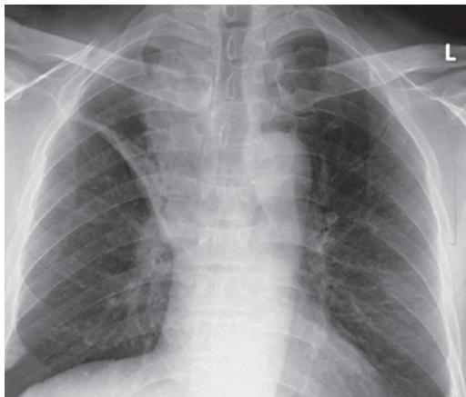
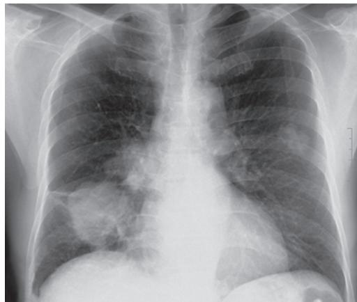
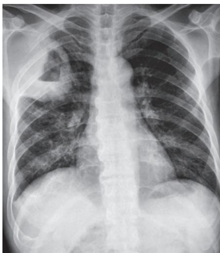
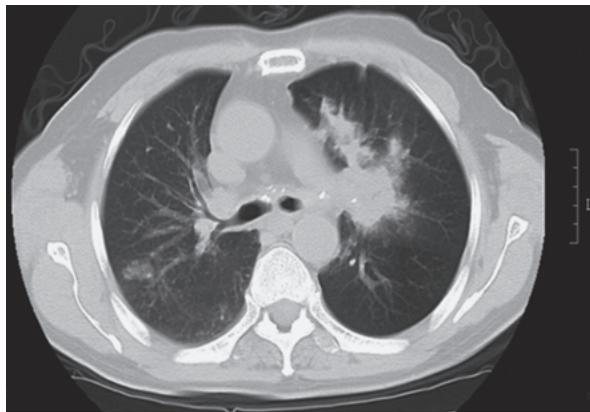
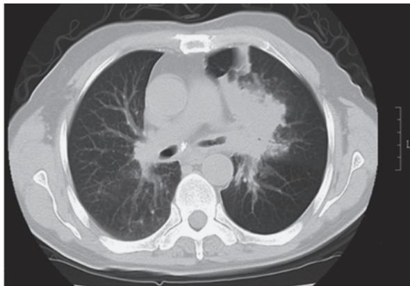
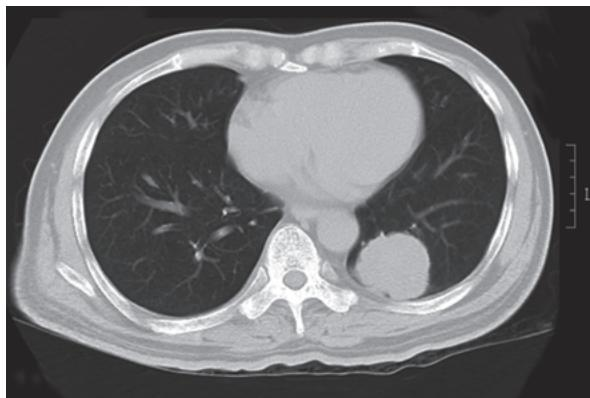
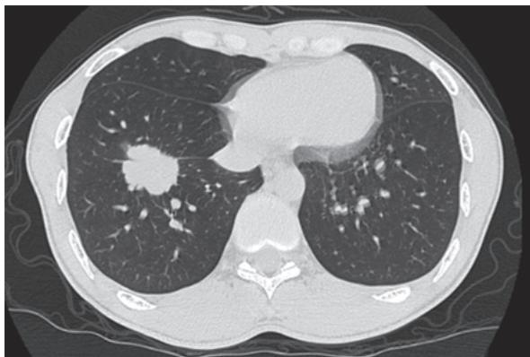

> [!info] 导航
> [[第009章_第2篇第08章_肺结核|上一章]] · [[00_章节导航|总目录]] · [[第011章_第2篇第10章_间质性肺疾病|下一章]]

肺癌（lung cancer）或称原发性支气管癌（primary bronchogenic carcinoma）或原发性支气管肺癌（primary bronchogenic lung cancer），WHO定义为起源于呼吸上皮细胞（支气管、细支气管和肺泡）的恶性肿瘤，是最常见的肺部原发性恶性肿瘤。根据病理类型，肺癌分为小细胞癌和非小细胞癌。发病高峰在55～65岁，男性多于女性，男女比约为2.1：1。临床症状多隐匿，以咳嗽、咳痰、咯血和消瘦等为主要表现，X线影像学主要表现为肺部结节、肿块影等。约75%病人出现症状就诊时已属肺癌晚期，整体5年生存率在20%左右。因此，要提高病人的生存率就必须重视早期诊断和规范化治疗。

#### 【流行病学】

肺癌是全球癌症相关死亡最主要的原因。根据 WHO 公布的数据（GLOBOCAN 2020），2020 年全球新发肺癌数 220.0 万，占所有癌症（不包括非黑色素瘤皮肤癌）发病人数 11.4%，肺癌死亡数 180.0 万，占所有癌症死亡人数 18.0%。过去 20 年间，西方国家男性肺癌发病率和死亡率有所下降，而发展中国家则持续上升；女性肺癌死亡率在世界大部分地区仍在上升。2022 年我国新发肺癌数 87.0 万，其中男性 57.5 万，女性 29.5 万；肺癌死亡数 76.6 万，其中男性 50.5 万，女性 26.1 万。男性发病率和死亡率在所有癌症中列首位，女性发病率仅次于乳腺癌、结肠癌列第三位，死亡率仅次于乳腺癌列第二位，与以往数据相比，发病率和死亡率均呈上升趋势。

#### 【病因和发病机制】

病因和发病机制迄今尚未明确,但有证据显示与下列因素有关。

### （一）吸烟

吸烟是引起肺癌最常见的原因，约85%肺癌病人有吸烟史，包括吸烟和已戒烟者(定义为诊断前戒烟至少12个月)。吸烟20～30包-年(定义为每天1包，吸烟史20～30年)者罹患肺癌的危险性明显增加。一项来自UK Biobank的最新研究发现，无论是宫内接受烟草暴露还是出生后的吸烟行为均会增加肺癌的发生风险，并且开始吸烟年龄越小，肺癌的发生风险越大。与从不吸烟者相比，吸烟者发生肺癌的危险性平均高10倍，重度吸烟者可达10～25倍；儿童、青少年和成年时期习得吸烟行为后，肺癌发病风险分别增加14倍、8倍和5倍，肺癌死亡风险亦增加。已戒烟者罹患肺癌的危险性比那些持续吸烟者降低，但与从未吸烟者相比仍有9倍升高的危险，随着戒烟时间的延长，发生肺癌的危险性逐步降低。吸烟与肺癌之间存在着明确的关系，开始吸烟的年龄越小，吸烟时间越长，吸烟量越大，肺癌的发病率和死亡率越高。

环境烟草烟雾（environmental tobacco smoke, ETS）或称二手烟或被动吸烟也是肺癌的病因之一。来自 ETS 的危险低于主动吸烟，非吸烟者与吸烟者结婚共同生活多年后其肺癌风险增加 20%～30%，且其罹患肺癌的危险性随配偶的吸烟量而升高。烟草已列为 A 级致癌物，吸烟与所有病理类型肺癌的危险性相关。

### （二）职业致癌因子

某些职业的工作环境中存在许多致癌物质。已被确认的致癌物质包括石棉、砷、双氯甲基乙醚、铬、芥子气、镍、氡、镉、铍、多环芳香烃类，以及铀、镭等放射性物质衰变时产生的氡和氡气，电离辐射和微波辐射等。二氧化硅及煤烟也是明确的肺癌致癌物质。这些因素可使肺癌发生危险性增加3～30倍。由于肺癌的形成是一个漫长的过程，其潜伏期可达20年或更久，故不少病人在停止接触致癌物质很长时间后才发生肺癌。

### (三) 空气污染

1. 室外大环境污染 城市中的工业废气、汽车尾气等都有致癌物质，如苯并芘、氧化亚砷、放射性物质、镍、铬化合物、 $SO_{2}$ 、NO以及不燃的脂肪族碳氢化合物等。PM2.5又称为细颗粒物或可吸入肺颗粒物，是大气环境中化学组成最复杂、危害最大的污染物之一，与肺癌的发病率及死亡率相关，且伴随 PM2.5 浓度的升高而增加。有资料显示,城市肺癌发病率明显高于农村。

2. 室内小环境污染 室内被动吸烟、燃料燃烧和烹调过程中均可产生致癌物。室内接触煤烟或其不完全燃烧物为肺癌的危险因素，特别是对女性腺癌的影响较大。烹调时加热所释放出的油烟雾也是不可忽视的致癌因素。

### （四）电离辐射

电离辐射可以是职业性或非职业性的，有来自体外或因吸入放射性粉尘和气体引起的体内照射。不同射线产生的效应也不同，如在日本广岛原子弹释放的是中子和 $\alpha$ 射线，长崎则仅有 $\alpha$ 射线，前者患肺癌的危险性高于后者。美国1978年报道，一般人群中电离辐射 $49.6\%$ 来源于自然界， $44.6\%$ 为医疗照射，其中来自X线诊断的占 $36.7\%$ 。

### （五）饮食与体力活动

有研究显示，成年期水果和蔬菜的摄入量低，肺癌发生的危险性升高。血清中β胡萝卜素水平低的人，肺癌发生的危险性高。也有研究显示，中、高强度的体力活动使发生肺癌的风险下降13%～30%。

### （六）遗传和基因改变

遗传因素与肺癌的相关性受到重视。例如有早期肺癌(60岁前)家族史的亲属罹患肺癌的危险性升高2倍；同样的烟草暴露水平，女性发生肺癌的危险性高于男性；仅约 $11\%$ 的重度吸烟者罹患肺癌，基因敏感性可能在其中起一定的作用。肺癌可能是外因通过内因而发病的，外因可诱发细胞的恶性转化和不可逆的基因改变，包括原癌基因（proto-oncogene）的活化、抑癌基因（tumor suppressor gene）的失活、自反馈分泌环的活化和细胞凋亡的抑制。肺癌的发生是一个多阶段逐步演变的过程，涉及一系列基因改变，多种基因变化的积累才会引起细胞生长和分化的控制机制紊乱，使细胞生长失控而癌变。与肺癌发生关系较为密切的癌基因主要有HER家族、RAS基因家族、MYC基因家族、ALK融合基因、Sox基因以及MDM2基因等。相关的抑癌基因包括TP53、RB1、CDKN2A、NME1、PTEN基因等。与肺癌发生、发展相关的分子发病机制还包括生长因子信号转导通路激活、肿瘤血管生成、细胞凋亡障碍和免疫逃避等。

### （七）其他因素

美国癌症学会将结核列为肺癌的发病因素之一，其罹患肺癌的危险性是正常人群的10倍，主要组织学类型为腺癌。某些慢性肺部疾病如慢阻肺病、结节病、特发性肺纤维化、硬皮病，病毒感染、真菌(黄曲霉)感染等，与肺癌的发生可能也有一定关系。

#### 【分类】

### （一）按解剖学部位分类

1. 中央型肺癌 发生在段及以上支气管的肺癌,以鳞状上皮细胞癌和小细胞肺癌较多见。

2. 周围型肺癌 发生在段支气管以下的肺癌,以腺癌较多见。

### （二）按组织病理学分类

根据2021版WHO肺肿瘤组织学分型标准，肺癌分为非小细胞肺癌和小细胞肺癌两大类，其中，非小细胞肺癌最为常见，约占肺癌总发病率的 $85\%$ 。同时将不典型腺瘤性增生（atypical adenomatous hyperplasia, AAH)和原位腺癌（adenocarcinoma in situ, AIS)归类为腺体前驱病变。

1. 非小细胞肺癌（non-small cell lung cancer, NSCLC）

（1）鳞状上皮细胞癌(简称鳞癌): 目前分为鳞状细胞癌、非特指型(角化型、非角化型和基底细胞样鳞癌)和淋巴上皮癌。典型的鳞癌显示来源于支气管上皮的鳞状上皮细胞化生, 常有细胞角化和/或细胞间桥; 非角化型鳞癌因缺乏细胞角化和/或细胞间桥, 常需免疫组化证实存在鳞状分化; 基底细胞样鳞癌, 其基底细胞样癌细胞成分至少>50%。淋巴上皮癌为低分化的鳞状细胞癌伴有数量不等的淋巴细胞、浆细胞浸润, 90%以上的亚洲病例与EB病毒有关, 而欧美人群中与EB病毒相关性低; 原位杂交EBER大部分阳性, 需注意与鼻咽癌鉴别。免疫组化染色癌细胞CK5/6、p40和p63阳性。

鳞癌多起源于段或亚段的支气管黏膜，并有向管腔内生长的倾向，早期常引起支气管狭窄导致肺不张或阻塞性肺炎。癌组织易变性、坏死，形成空洞或癌性肺脓肿。常见于老年男性。一般生长较慢，转移晚，手术切除机会较多，5年生存率较高，但对化疗和放疗敏感性不如小细胞肺癌。

(2) 腺癌

1）微浸润性腺癌（minimally invasive adenocarcinoma, MIA）：肿瘤以贴壁型成分为主，MIA 肿瘤直径≤3cm，浸润间质最大直径≤5mm，且无支气管、脉管和胸膜侵犯、肿瘤坏死以及气腔内播散。

2）浸润性非黏液腺癌：为形态学或免疫组化具有腺样分化的证据，以 $5\%$ 为标尺记录不同亚型，不再要求归类为某亚型为主的腺癌。常见亚型包括贴壁型、腺泡型、乳头型、微乳头型和实体型，常为多个亚型混合存在。早期浸润性非黏液腺癌分级方案由国际肺癌研究协会（International Association for the Study of Lung Cancer, IASLC）病理委员会提出。根据腺癌中占优势的组织学类型以及高级别结构的占比分成3级：1级为高分化，2级为中分化，3级为低分化。高分化为贴壁为主型无高级别成分，或者伴有 $\leqslant 20\%$ 高级别成分；中分化为腺泡或乳头为主型无高级别成分，或者伴有 $\leqslant 20\%$ 高级别成分；低分化为任何组织学类型腺癌伴有 $\geqslant 20\%$ 的高级别成分。

3）浸润性黏液腺癌：占肺腺癌 $3\%$ ，肿瘤细胞呈杯状细胞或柱状细胞形态，含丰富的细胞内黏液，肿瘤细胞核小，被推挤至细胞一侧，肿瘤周围肺泡内常充满黏液；常呈现为贴壁型生长，包括腺泡型、乳头型、微乳头型、实性型及筛状型等。可与非黏液腺癌混合存在。免疫组化CK7阳性、CK20及CDX2部分阳性，TTF-1及Napsin A多为阴性。

4）胶样型腺癌：发生率约占肺癌的 $0.14\% \sim 0.25\%$ ，以破坏肺泡壁的大量黏液蛋白为特征，且黏液含量一般 $>50\%$ ，免疫组化CDX-20、CK20、Villin均阳性。

5）胎儿型肺腺癌(fetal adenocarcinoma of the lung, FLAC):占肺癌的0.1%～0.5%,病理改变见由类似胎儿肺小管且富含糖原、无纤毛细胞组成的小管形成的腺样结构。分为低级别和高级别胎儿型腺癌,高级别FLAC多见于老年男性,好发年龄为60～70岁,有重度吸烟史,可能出现血清AFP升高,就诊时多为Ⅲ～Ⅳ期。低级别FLAC更多见于年轻女性,30～40岁多发,就诊时多为Ⅰ～Ⅱ期。

6）肠型腺癌（enteric-type adenocarcinoma），发病率低，镜下癌组织形态类似于结直肠腺癌，常呈规则或不规则腺管状、乳头状、筛状分布，分化差时呈实性巢团状，腺腔内常见粉尘样坏死物或明显的核碎裂，有时伴少量黏液样物。有些肠型腺癌表达肠型分化标记（CK7、CK20、CDX-2、Villin、MUC2和HNF4a），而有些病例只有肠型腺癌的形态而缺乏肠型标志物的表达，常需完善临床检查排除胃肠道腺癌。

腺癌是肺癌最常见的类型。女性多见，主要起源于支气管黏液腺，可发生于细小支气管或中央气道，临床多表现为周围型。腺癌可在气管外生长，也可循肺泡壁蔓延，常在肺边缘部形成直径2～4cm结节或肿块。由于腺癌富含血管，局部浸润和血行转移较早，易累及胸膜引起胸腔积液。

（3）大细胞癌：大细胞癌是一种未分化的非小细胞癌，较为少见，占肺癌10%以下，其在细胞学和组织结构及免疫表型等方面缺乏小细胞癌、腺癌或鳞癌的特征。诊断大细胞癌只用手术切除的标本，不适用小活检和细胞学标本。免疫组化及黏液染色鳞状上皮样及腺样分化标志物阴性。大细胞癌的转移较晚，手术切除机会较大。

（4）其他：腺鳞癌、肉瘤样癌、肺NUT癌[伴有睾丸核蛋白（the nuclear protein of the testis, NUT）基因重排]、唾液腺型癌(腺样囊性癌、黏液表皮样癌)等。

2. 小细胞肺癌（small cell lung cancer, SCLC）肺神经内分泌肿瘤包括典型类癌、不典型类癌、小细胞癌和大细胞神经内分泌癌。SCLC 是一种低分化的神经内分泌肿瘤，包括小细胞癌和复合性小细胞癌。小细胞癌细胞小，圆形或卵圆形，胞质少，细胞边缘不清。核呈细颗粒状或深染，核仁缺乏或不明显，核分裂常见。小细胞肺癌细胞质内含有神经内分泌颗粒，具有内分泌和化学受体功能，能分泌 5-羟色胺、儿茶酚胺、组胺、激肽等物质，可引起类癌综合征（carcinoid syndrome）。癌细胞常表达神经内分泌标志物如 CD56、神经细胞黏附分子、突触素和嗜铬粒蛋白。Ki-67 免疫组化对区分 SCLC 和类癌有很大帮助，SCLC 的 Ki-67 增殖指数通常为 50%～100%。

SCLC 以增殖快速和早期广泛转移为特征,初次确诊时 60%～88% 已有脑、肝、骨或肾上腺等转移,只有约 1/3 病人局限于胸内。SCLC 多为中央型,典型表现为肺门肿块和肿大的纵隔淋巴结引起

的咳嗽和呼吸困难。SCLC 对化疗和放疗较敏感。

在所有上皮细胞来源的肺癌中,鳞癌、腺癌、大细胞癌和小细胞癌是主要类型的肺癌,约占所有肺癌的 90%。

#### 【临床表现】

临床表现与肿瘤大小、类型、发展阶段、所在部位、有无并发症或转移有密切关系。5%～15%的病人无症状，仅在常规体检、胸部影像学检查时发现。其余病人或多或少表现与肺癌有关的症状与体征。

### （一）原发肿瘤引起的症状和体征

1. 咳嗽 为早期症状,常为无痰或少痰的刺激性干咳,当肿瘤引起支气管狭窄后可加重咳嗽。多为持续性,呈高调金属音性咳嗽或刺激性呛咳。黏液型腺癌可有大量黏液痰。伴有继发感染时,痰量增加,且呈黏液脓性。

2. 痰血或咯血 多见于中央型肺癌。肿瘤向管腔内生长者可有间歇或持续性痰中带血，如果表面糜烂严重侵蚀大血管，则可引起大咯血。

3. 气短或喘鸣 肿瘤向气管、支气管内生长引起部分气道阻塞，或转移到肺门淋巴结致使肿大的淋巴结压迫主支气管或隆突，或转移引起大量胸腔积液、心包积液、膈肌麻痹、上腔静脉阻塞，或广泛肺部侵犯时，可有呼吸困难、气短、喘息，偶尔表现为喘鸣，听诊时可发现局限或单侧哮鸣音。

4. 胸痛 可有胸部隐痛,与肿瘤的转移或直接侵犯胸壁无关。

5. 发热 肿瘤组织坏死可引起发热。多数发热是由于肿瘤引起的阻塞性肺炎所致,抗生素治疗效果不佳。

6. 消瘦 为恶性肿瘤常见表现,晚期由于肿瘤毒素以及感染、疼痛所致食欲减退,可表现消瘦或恶病质。

### （二）肿瘤局部扩展引起的症状和体征

1. 胸痛 肿瘤侵犯胸膜或胸壁时,产生不规则的钝痛或隐痛,或剧痛,在呼吸、咳嗽时加重。肋骨、脊柱受侵犯时可有压痛点。肿瘤压迫肋间神经,胸痛可累及其分布区域。

2. 声音嘶哑 肿瘤(多见左侧)直接或转移至纵隔淋巴结后压迫喉返神经使声带麻痹,导致声音嘶哑。

3. 吞咽困难 肿瘤侵犯或压迫食管,引起吞咽困难,尚可引起气管-食管瘘,导致纵隔或肺部感染。

4. 胸腔积液 肿瘤转移累及胸膜或肺淋巴回流受阻,可引起胸腔积液。

5. 心包积液 肿瘤可通过直接蔓延侵犯心包,亦可阻塞心脏的淋巴引流导致心包积液。迅速产生或者大量的心包积液可有心脏压塞症状。

6. 上腔静脉阻塞综合征 肿瘤直接侵犯纵隔,或转移的肿大淋巴结压迫上腔静脉,或腔静脉内癌栓阻塞,均可引起静脉回流受阻。表现上肢、颈面部水肿和胸壁静脉曲张。严重者皮肤呈暗紫色,眼结膜充血,视力模糊,头晕、头痛。

7. Horner 综合征 肺上沟瘤（Pancoast tumor）是肺尖部肺癌，可压迫颈交感神经，引起患侧眼睑下垂、瞳孔缩小、眼球内陷，同侧额部与胸壁少汗或无汗，称为 Horner 综合征。

### （三）肿瘤远处转移引起的症状和体征

病理解剖发现，鳞癌病人50%以上有胸外转移，腺癌和大细胞癌病人为80%，小细胞癌病人则95%以上。约1/3有症状的病人是胸腔外转移引起的。肺癌可转移至任何器官系统，累及部位出现相应的症状和体征。

1. 中枢神经系统转移 脑转移可引起头痛、恶心、呕吐等颅内压增高的症状，也可表现眩晕、共济失调、复视、性格改变、癫痫发作，或一侧肢体无力甚至偏瘫等症状。脊髓束受压迫，出现背痛、下肢无力、感觉异常，膀胱或肠道功能失控。

2. 骨骼转移 表现为局部疼痛和压痛,也可出现病理性骨折。常见部位为肋骨、脊椎、骨盆和四肢长骨。多为溶骨性病变。

3. 腹部转移 可转移至肝脏、胰腺、胃肠道，表现为食欲减退、肝区疼痛或腹痛、黄疸、肝大、腹腔积液及胰腺炎症状。肾上腺转移亦常见。

4. 淋巴结转移 锁骨上窝淋巴结是常见部位,多位于胸锁乳突肌附着处的后下方,可单个、多个,固定质硬,逐渐增大、增多,可以融合,多无疼痛及压痛。腹膜后淋巴结转移也较常见。

### （四）肺癌的胸外表现

指肺癌非转移性的胸外表现，可出现在肺癌发现的前后，称之为副肿瘤综合征（paraneoplastic syndrome）。副肿瘤综合征以 SCLC 多见，可以表现为先发症状或复发的首发征象。某些情况下其病理生理学是清楚的，如激素分泌异常；而大多数是未知的，如厌食、恶病质、体重减轻、发热和免疫抑制。

1. 内分泌综合征（endocrine syndromes）内分泌综合征系指肿瘤细胞分泌一些具有生物活性的多肽和胺类物质，如促肾上腺皮质激素（ACTH）、甲状旁腺激素（PTH）、抗利尿激素（ADH）和促性腺激素等，出现相应的临床表现。约 $12\%$ 的肺癌病人出现内分泌综合征。

（1）抗利尿激素分泌失调综合征（SIADH）：表现为低钠血症和低渗透压血症，出现厌食、恶心、呕吐等水中毒症状，还可伴有逐渐加重的嗜睡、易激动、定向障碍、癫痫样发作或昏迷等神经系统症状。低钠血症还可以由于异位心钠肽（ANP）分泌增多引起。大多数病人的症状可在初始化疗后1～4周内缓解。

（2）异位 ACTH 综合征: 表现为库欣综合征 (Cushing syndrome), 如色素沉着、水肿、肌萎缩、低钾血症、代谢性碱中毒、高血糖或高血压等, 但表现多不典型, 向心性肥胖和紫纹罕见。由 SCLC 或类癌引起。

（3）高钙血症：轻症者表现口渴和多尿；重症者可有恶心、呕吐、腹痛、便秘，甚或嗜睡、昏迷。高钙血症是恶性肿瘤最常见的威胁生命的代谢并发症。切除肿瘤后血钙水平可恢复正常。常见于鳞癌病人。

（4）其他:异位分泌促性腺激素主要表现为男性轻度乳房发育,常伴有肥大性肺性骨关节病,多见于大细胞癌。因5-羟色胺等分泌过多引起的类癌综合征,表现为喘息、皮肤潮红、水样腹泻、阵发性心动过速等,多见于SCLC和腺癌。

2. 骨骼-结缔组织综合征（skeletal-connective tissue syndromes）

（1）原发性肥大性骨关节病(hypertrophic primary osteoarthropathy):30%的病人有杵状指(趾),多为NSCLC。受累骨骼可发生骨膜炎,表现疼痛、压痛、肿胀,多在上、下肢长骨远端。X线显示骨膜增厚、新骨形成, $\gamma$ -骨显像病变部位有核素浓聚。

（2）神经-肌病综合征（neurologic-myopathic syndromes）:原因不明,可能与自身免疫反应或肿瘤产生的体液物质有关。

1）肌无力样综合征（Eaton-Lambert syndrome): 类似肌无力的症状, 即随意肌力减退。早期骨盆带肌群及下肢近端肌群无力, 反复活动后肌力可得到暂时性改善。体检腱反射减弱。有些病人化疗后症状可以改善。70% 以上病例对新斯的明试验反应欠佳, 低频反复刺激显示动作电位波幅递减, 高频刺激则引起波幅暂时性升高, 可与重症肌无力鉴别。多见于 SCLC。

2）其他：多发性周围神经炎、亚急性小脑变性、皮质变性和多发性肌炎可由各型肺癌引起；而副肿瘤性脑脊髓炎、感觉神经病变、小脑变性、边缘叶脑炎和脑干脑炎由小细胞肺癌引起，常伴有各种抗神经元抗体的出现，如抗 Hu 抗体、抗 CRMP5 和 ANNA-3 抗体。

3. 血液学异常及其他 1%～8% 的病人有凝血、血栓或其他血液学异常，包括游走性血栓性静脉炎（又称特鲁索综合征，Trousseau syndrome）、伴心房血栓的非细菌性血栓性心内膜炎、弥散性血管内凝血伴出血、贫血，粒细胞增多和红白血病（leukoerythroblastosis）。肺癌伴发血栓性疾病预后较差。

其他还有皮肌炎、黑棘皮症，发生率约1%；肾病综合征和肾小球肾炎发生率 $\leqslant$ 1%。

#### 【影像学及其他检查】

### (一) 影像学检查

1. X 线胸片 发现肺癌最常用的方法之一。但分辨率低,不易检出肺部微小结节和隐蔽部位的

病灶,对早期肺癌的检出有一定的局限性。肺癌 X 线胸片常见特征如下。

（1）中央型肺癌：肿瘤生长在主支气管、叶或段支气管。①直接征象：向管腔内生长可引起支气管阻塞征象。多为一侧肺门类圆形阴影，边缘毛糙，可有分叶或切迹，与肺不张或阻塞性肺炎并存时，下缘可表现为倒S状影像，是右上叶中央型肺癌的典型征象(图2-9-1)。②间接征象：由于肿瘤在支气管内生长，可使支气管部分或完全阻塞，形成局限性肺气肿、肺不张、阻塞性肺炎和继发性肺脓肿等征象。

（2）周围型肺癌：肿瘤发生在段以下支气管。早期多呈局限性小斑片状阴影，边缘不清，密度较淡，也可呈结节、球状、网状阴影或磨玻璃影，易误诊为炎症或结核。随着肿瘤增大，阴影逐渐增大，密度增高，呈圆形或类圆形，边缘常呈分叶状，伴有脐凹征或细毛刺，常有胸膜牵拉(图2-9-2)。如肿瘤向肺门淋巴结转移，可见引流淋巴管增粗成条索状阴影伴肺门淋巴结增大。癌组织坏死与支气管相通后，表现为厚壁、偏心、内缘凹凸不平的癌性空洞(图2-9-3)。继发感染时，空洞内可出现液平面。腺癌经支气管播散后，可表现为类似支气管肺炎的斑片状浸润阴影。侵犯胸膜时引起胸腔积液。侵犯肋骨则引起骨质破坏。

  
图 2-9-1 中央型肺癌  
男性,60岁。右上肺中央型肺癌并阻塞性肺不张、阻塞性肺炎。病理为肺鳞癌。

  
图 2-9-2 周围型肺癌

男性,52岁。右下肺周围型肺癌并右肺门淋巴结、双肺转移。病理为肺高分化腺癌。

2. 胸部 CT 具有更高的分辨率, 可发现肺微小病变和普通 X 线胸片难以显示的部位(如位于心脏后、脊柱旁、肺尖、肋膈角及肋骨头等)。增强 CT 能敏感地检出肺门及纵隔淋巴结肿大, 有助于肺癌的临床分期。螺旋式 CT 可显示直径小于 5mm 的小结节、中央气道内和第 6\~7 级支气管及小血管, 明确病灶与周围气道和血管的关系。低剂量 CT 可以有效发现早期肺癌, 已经取代 X 线胸片成为较敏感的肺结节评估工具。CT 引导下经皮肺病灶穿刺活检是重要的组织学诊断技术。应用 CT 模拟成像功能, 可以引导支气管镜在气道内或经支气管壁进行病灶的活检。肺癌胸部 CT 常见表现见图 2-9-4～图 2-9-6。

3. 胸部 MRI 与 CT 相比, 在明确肿瘤与大血管之间的关系、发现脑实质或脑膜转移上有优越性, 而在发现肺部小病灶 (<5mm) 方面则不如 CT 敏感。

  
图2-9-3 癌性空洞

4. 核素闪烁显像

（1）骨 $\gamma$ 闪烁显像: 可以了解有无骨转移, 其敏感性、特异性和准确性分别为 91%、88% 和 89%。若采用核素标记生长抑素类似物显像则更有助于 SCLC 的分期诊断。

  
A

  
B  
图 2-9-4 小细胞肺癌  
男性，59岁。左肺中央型肺癌，累及左主支气管和上下叶支气管，左肺阻塞性肺炎，肺内多发转移灶。支气管镜病理活检为小细胞肺癌。

  
图 2-9-5 左下肺腺癌  
男性,61岁。左下肺周围型肺癌,病理为肺腺癌。

  
图 2-9-6 右下肺腺癌  
男性,32岁。右下肺周围型肺癌,病理为肺腺癌。

（2）正电子发射断层成像(PET)和PET-CT:PET通过跟踪正电子核素标记的化合物在体内的转移与转变,显示代谢物质在体内的生理变化,能无创性地显示人体内部组织与器官的功能,并可定量分析。PET-CT是将PET和CT整合在一起,病人在检查时经过快速的全身扫描,可以同时获得CT解剖图像和PET功能代谢图像,可同时获得生物代谢信息和精准的解剖定位,对发现早期肺癌和其他部位的转移灶,以及肿瘤分期与疗效评价均优于任何现有的其他影像学检查。需要注意PET-CT阳性的病人仍然需要细胞学或病理学检查进行最终确诊。

### （二）获得病理学诊断的检查

1. 痰液细胞学检查 诊断中央型肺癌最简单方便的无创诊断方法,但有一定的假阳性和假阴性可能。要提高痰检阳性率,必须获得气道深部的痰液,及时送检,至少送检3次。敏感性<70%,分型较为困难,但特异性高。

2. 胸腔积液细胞学检查 胸腔穿刺术可以获取胸腔积液进行细胞学检查,检出率40%\~90%,以明确病理和进行肺癌分期。胸腔积液离心沉淀的细胞块行石蜡包埋、切片和染色,可提高病理阳性诊断率。对位于其他部位的转移性浆膜腔积液亦可行穿刺获取病理证据。

3. 呼吸内镜检查

（1）支气管镜：诊断肺癌的主要方法之一。支气管镜可进入4～5级支气管，帮助肉眼观察近端约1/3的支气管黏膜，并通过活检、刷检以及灌洗等方式进行组织学或细胞学取材，活检、刷检以及灌洗联合应用可以提高检出率。荧光支气管镜是利用肿瘤组织的自体荧光特性有别于正常组织这一原理开发出的气管镜检查技术，联合常规气管镜检查可明显提高对上皮细胞癌变和浸润性肺癌的诊断。对于常规支气管镜无法观察到的病灶，可根据病灶的部位和不同单位的具体条件，通过细或超细支气管镜、X线透视、径向超声探头、电磁导航支气管镜等引导支气管镜技术以获得病理标本。超声支气管镜（EBUS）引导下针吸活检术有助于明确大气道管壁浸润病变、气道外占位性病变和纵隔淋巴结的性质，同时有助于肺癌的TNM分期；外周病变可用小超声探头引导下肺活检。

（2）胸腔镜：用于经支气管镜等方法无法取得病理标本的胸膜下的病变，并可观察胸膜有无转移病变，为制订全面治疗方案提供可靠依据。

（3）纵隔镜：纵隔镜检查取样较多，是鉴别伴纵隔淋巴结肿大的良恶性疾病的有效方法，也是评估肺癌分期和术前评估淋巴结分期的方法之一，但操作创伤及风险相对较大。

4. 针吸活检

（1）经胸壁穿刺肺活检：在 X 线透视、胸部 CT 或超声引导下可进行病灶针吸或切割活检。创伤小、操作简便，可迅速获得结果，适用于紧贴胸壁或离胸壁较近的肺内病灶。

（2）浅表淋巴结活检：锁骨上或腋窝肿大的浅表淋巴结可做针吸活检，也可通过手术对淋巴结活检或切除。操作简便，可在门诊进行。

5. 开胸肺活检 若经上述多项检查仍未能明确诊断,可考虑开胸肺活检。必须根据病人的年龄、肺功能等仔细权衡利弊后决定。

### （三）肿瘤标志物检测

迄今尚无诊断敏感性和特异性高的肿瘤标志物。癌胚抗原（CEA）、神经特异性烯醇酶（NSE）、细胞角蛋白19片段（CYFRA21-1）和胃泌素释放肽前体（ProGRP）检测或联合检测时，对肺癌的诊断和病情的监测有一定参考价值。

### （四）肺癌的基因诊断及其他

肺癌的发生认为是由于原癌基因的激活和抑癌基因的缺失所致，因此癌基因产物如MYC基因扩增，RAS基因突变，抑癌基因RB1、TP53异常等有助于诊断早期肺癌。同时，基因检测可识别靶向药物最佳用药人群。目前主要检测NSCLC病人EGFR基因突变、间变性淋巴瘤激酶（ALK)融合基因和ROS1融合基因重排、BRAF V600突变、RET重排、MET14外显子跳跃突变、NTRK1/2/3重排，扩展基因包括MET扩增或过表达、HER-2等。还可检测耐药基因，如EGFR耐药突变的T790M、C797S以及MET扩增检测等。当难以获取肿瘤组织标本时，可采用外周血游离肿瘤DNA（cell-free tumor DNA, ctDNA）作为补充标本评估基因突变状态，即所谓的“液体活检”。抗程序性细胞死亡蛋白配体1(PD-L1)免疫组化检测可筛选对免疫检查点抑制剂(immune-checkpoint inhibitor)可能获益的NSCLC病人。肿瘤突变负荷(tumor mutation burden, TMB)可能是预测免疫治疗效果的又一标志物，但目前其检测方法及阈值的选择上还无统一的标准。

#### 【诊断与鉴别诊断】

### （一）诊断

肺癌诊断可按下列步骤进行。

1. CT 确定部位 有临床症状或放射学征象怀疑肺癌的病人先行胸部和腹部 CT 检查, 发现肿瘤的原发部位、纵隔淋巴结侵犯和其他解剖部位的播散情况。

2. 组织病理学诊断 怀疑肺癌的病人必须获得组织学标本诊断。肿瘤组织多可通过微创技术获取，如支气管镜、胸腔镜。但不推荐单一痰细胞学确诊肺癌。浅表可扪及的淋巴结或皮肤转移也应活检。如怀疑远处转移病变，也应获得组织标本，如软组织肿块、溶骨性病变、骨髓、胸膜或肝病灶。胸腔积液则应获得足量的细胞团，或胸腔镜检查。目前建议对高度怀疑为Ⅰ期和Ⅱ期肺癌可直接手术切除。

3. 分子病理学诊断 有条件者应在病理学确诊的同时,检测肿瘤组织的 EGFR 基因突变、ALK 融合基因、ROS1 融合基因、BRAF V600、RET、MET14 外显子跳跃突变、KRAS 和 NTRK 等,NSCLC 也可考虑检测 PD-L1 的表达水平,以利于制订个体化的治疗方案。

### （二）鉴别诊断

肺癌常与某些肺部疾病共存，或其影像学的表现与某些疾病相类似，故常易误诊或漏诊，临床应与下列疾病鉴别。

1. 肺结核

（1）肺结核球：见于年轻病人，多无症状。病灶多位于肺上叶尖后段和下叶背段，边界清楚，密度高，可有包膜，有时含钙化点，周围有纤维结节状病灶，多年不变。

（2）肺门淋巴结结核：易与中央型肺癌相混淆，多见于儿童、青年，有发热、盗汗等结核中毒症状。结核菌素试验常阳性，抗结核治疗有效。

（3）急性粟粒性肺结核：年龄较轻，有发热、盗汗等全身中毒症状。X线影像表现为细小、分布均匀、密度较淡的粟粒样结节病灶。腺癌(旧称细支气管肺泡癌)两肺多有大小不等的结节状播散病灶，边界清楚，密度较高，进行性发展和增大。

2. 肺炎 有发热、咳嗽、咳痰等症状，抗生素治疗有效。若无中毒症状，抗生素治疗后肺部阴影吸收缓慢，或同一部位反复发生肺炎时，应考虑肺癌的可能。肺部慢性炎症机化，形成团块状的炎性假瘤，也易与肺癌相混淆。但炎性假瘤往往形态不整，边缘不齐，核心密度较高，易伴有胸膜增厚，病灶长期无明显变化。

3. 肺脓肿 起病急,中毒症状严重,寒战、高热、咳嗽、咳大量脓臭痰等症状。影像学可见均匀的大片状阴影,空洞内常见液平面。癌性空洞病人一般不发热,继发感染时,可有肺脓肿的临床表现,影像学癌肿空洞偏心、壁厚、内壁凹凸不平。支气管镜和痰脱落细胞学检查有助于鉴别。

4. 结核性胸膜炎 应与癌性胸腔积液相鉴别。可参阅本书第十三章胸膜疾病。

5. 肺隐球菌病 可肺内单发或多发结节和肿块,大多位于胸膜下,单发病变易与周围型肺癌混淆。肺活检和血清隐球菌荚膜多糖抗原检测有助于鉴别。

6. 其他 如肺良性肿瘤、淋巴瘤等,需通过组织病理学鉴别。

#### 【肺癌临床分期】

2023年国际肺癌研究学会(IASLC)公布了第9版肺癌TNM分期系统修订稿，见表2-9-1、表2-9-2。对于SCLC，亦可分为局限期和广泛期。局限期指病灶局限于同侧半胸，能安全地被单个放射野包围；广泛期指病灶超过同侧半胸，包括了恶性胸腔积液或心包积液以及血行转移等。

表 2-9-1 肺癌的 TNM 分期

原发肿瘤(T)

 $T_{X}$ :未发现原发肿瘤,或通过痰细胞学或支气管灌洗发现癌细胞,但影像学及支气管镜无法发现

 $T_{0}$ :无原发肿瘤的证据

 $T_{is}$ :原位癌

 $T_{1}$ :肿瘤最大径≤3cm,周围包绕肺组织及脏胸膜,支气管镜见肿瘤侵及叶支气管,未侵及主支气管

 $T_{1a}$ :肿瘤最大径≤1cm

 $T_{1b}$ :肿瘤最大径1~2cm

 $T_{1c}$ :肿瘤最大径&gt;2~3cm

 $T_{2}$ :肿瘤最大径&gt;3~5cm;侵犯主支气管(不常见的表浅扩散型肿瘤,不论体积大小,侵犯限于支气管壁时,虽可能侵犯主支气管,仍为 $T_{1}$ ),但未侵及隆突;侵及脏胸膜;有阻塞性肺炎或者部分或全肺不张。符合以上任何一个条件即归为 $T_{2}$ $T_{2a}$ :肿瘤最大径&gt;3~4cm

 $T_{2b}$ :肿瘤最大径&gt;4~5cm

 $T_{3}$ :肿瘤最大径&gt;5~7cm;直接侵及以下任何一个器官,包括:胸壁(包含肺上沟瘤)、膈神经、心包;全肺肺不张肺炎;同一肺叶出现孤立性癌结节。符合以上任何一个条件即归为 $T_{3}$ $T_{4}$ :肿瘤最大径&gt;7cm;无论大小,侵及以下任何一个器官,包括:纵隔、心脏、大血管、隆突、喉返神经、主气管、食管、椎体、膈肌;同侧不同肺叶内出现孤立癌结节

区域淋巴结(N)

 $N_{X}$ :区域淋巴结无法评估

 $N_{0}$ :无区域淋巴结转移

 $N_{1}$ :同侧支气管周围及(或)同侧肺门淋巴结以及肺内淋巴结转移,包括原发肿瘤直接侵及的肺内淋巴结

<table><tr><td>续表</td></tr><tr><td> $N_{2}$ :同侧纵隔内及(或)隆突下淋巴结转移</td></tr><tr><td> $N_{2a}$ :同侧纵隔内(或隆突下)淋巴结单发转移</td></tr><tr><td> $N_{2b}$ :同侧纵隔内及(或)隆突下淋巴结多发转移</td></tr><tr><td> $N_{3}$ :对侧纵隔、对侧肺门、同侧或对侧前斜角肌及锁骨上淋巴结转移</td></tr><tr><td>远处转移(M)</td></tr><tr><td> $M_{X}$ :远处转移无法评估</td></tr><tr><td> $M_{0}$ :无远处转移</td></tr><tr><td> $M_{1}$ :远处转移</td></tr><tr><td> $M_{1a}$ :局限于胸腔内,包括胸膜播散(恶性胸腔积液、心包积液或胸膜结节)以及对侧肺叶出现癌结节</td></tr><tr><td> $M_{1b}$ :远处器官单发转移灶</td></tr><tr><td> $M_{1c}$ :多个或单个器官多处转移</td></tr><tr><td> $M_{1c1}$ :单个胸腔外器官内的多发转移</td></tr><tr><td> $M_{1c2}$ :多个胸腔外器官的多发转移</td></tr></table>

表 2-9-2 TNM 与临床分期的关系

<table><tr><td>临床分期</td><td>TNM 分期</td></tr><tr><td>隐性癌</td><td> $T_{x}N_{0}M_{0}$ </td></tr><tr><td>0 期</td><td> $T_{is}N_{0}M_{0}$ </td></tr><tr><td>IA 期: IA1</td><td> $T_{1a}N_{0}M_{0}$ </td></tr><tr><td>IA2</td><td> $T_{1b}N_{0}M_{0}$ </td></tr><tr><td>IA3</td><td> $T_{1c}N_{0}M_{0}$ </td></tr><tr><td>IB 期</td><td> $T_{2a}N_{0}M_{0}$ </td></tr><tr><td>IIA 期</td><td> $T_{1}N_{1}M_{0};T_{2b}N_{0}M_{0}$ </td></tr><tr><td>IIB 期</td><td> $T_{3}N_{0}M_{0};T_{2a\sim2b}N_{1}M_{0};T_{1}N_{2a}M_{0}$ </td></tr><tr><td>IIIA 期</td><td> $T_{4}N_{0}M_{0};T_{3}N_{1\sim2a}M_{0};T_{2a\sim2b}N_{2a}M_{0};T_{1a\sim1c}N_{2b}M_{0}$ </td></tr><tr><td>IIIB 期</td><td> $T_{4}N_{2a\sim2b}M_{0};T_{3}N_{2b}M_{0};T_{1a\sim2b}N_{3}M_{0}$ </td></tr><tr><td>IIIC 期</td><td> $T_{3\sim4}N_{3}M_{0}$ </td></tr><tr><td>IVA 期</td><td> $T_{1\sim4}N_{0\sim3}M_{1a\sim1b}$ </td></tr><tr><td>IVB 期</td><td> $T_{1\sim4}N_{0\sim3}M_{1c1\sim2}$ </td></tr></table>

#### 【治疗】

肺癌的治疗应当根据病人的体力活动状态(PS)评分(表2-9-3)、病理学类型(包括分子病理诊断)、侵及范围(临床分期)，采取多学科综合治疗模式，强调个体化治疗。有计划、合理地应用手术、化疗、生物靶向、免疫治疗和放射治疗等手段，以期达到根治或最大程度控制肿瘤，提高治愈率，改善病人的生活质量，延长生存期的目的。

表 2-9-3 体力活动状态(PS)评分

<table><tr><td>评分</td><td>体力活动状态</td></tr><tr><td>0分</td><td>正常</td></tr><tr><td>1分</td><td>可自由行走或从事轻体力劳动,包括一般家务及办公室活动</td></tr><tr><td>2分</td><td>可自由行走及生活自理,但失去工作能力,日间不少于一半时间可起床活动</td></tr><tr><td>3分</td><td>生活部分自理,日间一半时间卧床</td></tr><tr><td>4分</td><td>卧床不起,生活不能自理</td></tr></table>

### （一）手术治疗

是早期肺癌的最佳治疗方法,分为根治性与姑息性手术,应当力争根治性切除,以期达到切除肿瘤、减少肿瘤转移和复发的目的,并可进行 TNM 分期,指导术后综合治疗。

1. NSCLC 主要适用于I期及II期病人，根治性手术切除是首选的治疗手段， $\mathrm{T}_3\mathrm{N}_1$ 和 $\mathrm{T_4N_{0\sim 1}}$ 和部分 $\mathrm{T}_{1\sim 3}\mathrm{N}_2$ 的IIIa期病人需通过多学科讨论采取综合治疗的方法，包括手术治疗联合术后化疗或序贯放化疗，或同步放化疗等。除了I期外，Ⅱ～Ⅲ期肺癌根治性手术后需术后辅助化疗。术前化疗（新辅助化疗）可使原先不能手术的病人降低TNM分期而可以手术。术后根据病人最终病理TNM分期、切缘情况，选择再次手术、术后辅助靶向治疗、化疗、免疫治疗或放疗。对不能耐受肺叶切除的病人也可考虑行楔形切除。

2. SCLC 90% 以上就诊时已有胸内或远处转移,一般不推荐手术治疗。如经病理学纵隔分期方法如纵隔镜、纵隔切开术等检查阴性的 $T_{1\sim2}N_{0}$ 的病人,可考虑肺叶切除和淋巴结清扫,单纯手术无法根治 SCLC,因此所有术后的 SCLC 病人均需采用含铂的两药化疗方案化疗 4～6 个疗程。

### （二）药物治疗

主要包括化疗、免疫治疗和靶向治疗/应用抗血管生成药，用于肺癌晚期或复发病人的治疗。化疗及免疫治疗还可用于手术后病人的辅助化疗、术前新辅助化疗及放疗的联合治疗等。

化疗应当严格掌握适应证，充分考虑病人的疾病分期、体力状况、自身意愿、药物不良反应、生活质量等，避免治疗过度或治疗不足。如病人体力状况评分≤2分，重要脏器功能可耐受者可给予化疗。常用的药物包括铂类(顺铂、卡铂)、吉西他滨、培美曲塞、紫杉类(紫杉醇、多西他赛)、长春瑞滨、依托泊苷和喜树碱类似物(伊立替康)等。目前一线化疗推荐含铂的两药联合方案，二线化疗推荐多西他赛或培美曲塞单药治疗。一般治疗2个周期后评估疗效，密切监测及防治不良反应，并酌情调整药物和/或剂量。

靶向治疗是以肿瘤组织或细胞的驱动基因变异以及肿瘤相关信号通路的特异性分子为靶点，利用分子靶向药物特异性阻断该靶点的生物学功能，选择性从分子水平逆转肿瘤细胞的恶性生物学行为，从而达到抑制肿瘤生长甚至使肿瘤消退的目的。目前靶向治疗主要应用于非小细胞肺癌中的腺癌病人，例如以EGFR突变阳性为靶点EGFR-酪氨酸激酶抑制剂（EGFR-TKI）的厄洛替尼（erlotinib）、吉非替尼（gefitinib）、阿法替尼（afatinib）、奥希替尼（osimertinib）、阿美替尼（almonertinib），ALK重排阳性为靶点的克唑替尼（crizotinib）、艾乐替尼（alectinib）、色瑞替尼（ceritinib）、洛拉替尼（loratinib）、恩沙替尼（ensartinib）等，ROS1重排阳性为靶点的克唑替尼或恩曲替尼（entrutinib），MET14外显子跳跃突变为靶点的谷美替尼（glumetinib），BRAF V600突变阳性为靶点的达拉非尼（dabrafenib）联合曲美替尼（trametinib）和RET融合基因阳性的塞普替尼（septinib）可用于一线治疗或化疗后的维持治疗，对不适合根治性治疗局部晚期和转移的NSCLC有显著的治疗作用，并可延长病人的生存期。靶向治疗成功的关键是选择特异性的标靶人群。

此外，肿瘤血管生成是恶性肿瘤十大特征之一，血管内皮生长因子（VEGF）和VEGF受体2（VEGFR2)结合所介导的信号通路可以控制血管内皮细胞的增殖、存活和迁移，最终导致新生血管形成。肿瘤的发生、发展和转移都依赖于血管生成，而抗VEGF治疗可以有效抑制肿瘤生长并阻止其转移。靶向抗血管生成是治疗肺癌的有效途径之一。目前靶向VEGF通路的血管生成抑制剂主要有以下3类：①VEGF单克隆抗体(贝伐珠单抗)；②VEGFR单克隆抗体(雷莫芦单抗)；③VEGFR酪氨酸激酶抑制剂(索拉菲尼、安罗替尼、尼达尼布、阿帕替尼、瑞戈非尼等)。近年来研究提示，抗血管生成治疗联合化疗、靶向治疗和免疫治疗或单药治疗应用于晚期肺癌均已获得明显疗效。其中贝伐珠单抗(bevacizumab)，联合化疗能明显提高晚期NSCLC的化疗效果并延长肿瘤中位进展时间；安罗替尼是我国自主研发的一种口服、新型小分子多靶点酪氨酸激酶抑制剂，具有抗肿瘤血管生成和抑制肿瘤生长的双重作用，目前对于晚期NSCLC病人三线及以上治疗可明显延长其中位无疾病进展时间及生存时间。

免疫检查点抑制剂(ICIs)采用针对免疫检查点PD-(L)1的单克隆抗体可抑制PD-1与肿瘤细胞表面的 PD-L1 结合,产生一系列抗肿瘤的免疫作用,从而达到抗肿瘤的作用。近年来,ICIs 为晚期驱动基因阴性 NSCLC 的治疗带来重大突破,病人 5 年生存率从化疗时代的 5% 提升至 13.4%～23.2%, ICIs 已成为晚期 NSCLC 的标准治疗。常用免疫检查点抑制剂包括帕博利珠单抗、阿替利珠单抗、卡瑞利珠单抗、信迪利单抗、替雷利珠单抗、舒格利单抗、特瑞普利单抗、阿得贝利单抗。

1. NSCLC 对化疗的反应较差，对于晚期和复发 NSCLC 病人联合化疗方案可缓解症状及提高生活质量，提高生存率，约 30%～40% 的部分缓解率、近 5% 的完全缓解率，中位生存期 9～10 个月，1 年生存率为 30%～40%。目前一线化疗推荐含铂两药联合化疗，如卡铂或顺铂加上紫杉醇、长春瑞滨、吉西他滨、培美曲塞或多西他赛等，治疗 4～6 个周期。对于化疗后肿瘤缓解或疾病稳定而没有发生进展的病人，可给予维持治疗。一线治疗失败者，推荐多西他赛或培美曲赛单药二线化疗，若一线治疗未接受免疫治疗者也可推荐二线治疗使用 ICIs。

对 EGFR 突变阳性的Ⅳ期 NSCLC，一线给予 EGFR-TKI（奥希替尼、阿美替尼、厄洛替尼、吉非替尼和阿法替尼）治疗较一线含铂的两药化疗方案，其治疗反应、无进展生存率（PFS）更具优势，且毒性反应更低。也可用于化疗无效的二线或三线口服治疗。如发生耐药（一般在治疗后 9～13 个月）或疾病进展，如 T790M 突变，可使用奥希替尼、阿美替尼或伏美替尼。对于 ALK 和 ROS1 重排阳性的病人可选择克唑替尼/色瑞替尼等 ALK 抑制剂治疗。对于Ⅳ期非鳞状细胞癌的 NSCLC，若病人无咯血及脑转移，可考虑在化疗基础上联合抗肿瘤血管药物如贝伐珠单抗。若 PD-L1 表达阳性（≥1%）的驱动基因阴性的 NSCLC 病人一线推荐化疗联合免疫治疗；若 PD-L1 高表达（≥50%）的驱动基因阴性的 NSCLC 病人免疫检查点抑制剂治疗获益更明显，也可免疫单药治疗。

2. SCLC 对化疗非常敏感,是治疗的基本方案。一线化疗药物包括依托泊苷或伊立替康联合顺铂或卡铂,共4～6个周期。手术切除的病人推荐辅助化疗。对于局限期SCLC(Ⅱ～Ⅲ期)病人推荐放、化疗为主的综合治疗。对于广泛期病人则以化疗联合免疫治疗为主的综合治疗,常用方案包括依托泊苷+卡铂+阿替利珠单抗、依托泊苷+铂类+度伐利尤单抗、依托泊苷+铂类+阿得贝利单抗或依托泊苷+铂类+斯鲁利单抗。广泛期和脑转移病人,取决于病人是否有神经系统症状,可在全脑放疗之前或之后给予化疗。大多数局限期和几乎所有的广泛期SCLC都会复发。复发SCLC病人根据复发类型选择二线化疗方案或一线化疗方案的再次使用。

### （三）放射治疗

可分为根治性放疗、姑息性放疗、辅助放疗、新辅助化放疗和预防性放疗等。根治性放疗用于病灶局限、因解剖原因不便手术或其他原因不能手术者，若辅以化疗，可提高疗效；姑息性放疗目的在于抑制肿瘤的发展，延迟肿瘤扩散和缓解症状，对肺癌引起的顽固性咳嗽、咯血、肺不张、上腔静脉阻塞综合征有肯定疗效，也可缓解骨转移性疼痛和脑转移引起的症状。辅助放疗适用于术前放疗、术后切缘阳性的病人。预防性放疗适用于全身治疗有效的小细胞肺癌病人全脑放疗。

放疗通常联合化疗治疗肺癌，因分期、治疗目的和病人一般情况的不同，联合方案可选择同步放化疗、序贯放化疗。接受放化疗的病人，潜在毒副反应会增大，应当注意对肺、心脏、食管和脊髓的保护；治疗过程中应当尽可能避免因毒副反应处理不当导致放疗的非计划性中断。

肺癌对放疗的敏感性，以 SCLC 为最高，其次为鳞癌和腺癌，故照射剂量以 SCLC 最小，腺癌最大。一般 40～70Gy 为宜，分 5～7 周照射，常用的放射线有 $^{60}$ 钴 γ 射线，电子束 β 射线和中子加速器等。应注意减少和防止白细胞减少、放射性肺炎和放射性食管炎等放疗不良反应。对全身情况太差，有严重心、肺、肝、肾功能不全者应列为禁忌。放疗时可合理使用更安全、先进的技术，如三维适形放疗技术（3DCRT）和调强放疗技术（IMRT）等。

1. NSCLC 主要适用于:①局部晚期病人,需与化疗结合进行;②因身体原因不能手术的早期NSCLC病人的根治性治疗;③选择性病人的术前、术后辅助治疗;④局部的复发与转移治疗;⑤晚期不可治愈病人的姑息性治疗。

2. SCLC 主要适用于:①局限期 SCLC 经全身化疗后部分病人可以达到完全缓解,但胸内复发和脑转移的风险很高,加用胸部放疗和预防性颅脑放疗不仅可以显著降低局部复发率和脑转移,死亡风险也显著降低。②广泛期 SCLC 病人, 远处转移病灶经过化疗控制后, 加用胸部放疗也可以提高肿瘤控制率, 延长生存期。

### （四）介入治疗

1. 支气管动脉灌注化疗 适用于失去手术指征,全身化疗无效的晚期病人。此方法毒副作用小,可缓解症状,减轻病人痛苦。

2. 经支气管镜介入治疗 ①血卟啉染料激光治疗和 YAG 激光切除治疗: 切除气道腔内肿瘤, 解除气道阻塞和控制出血, 可延长病人的生存期。②经支气管镜行腔内放疗: 可缓解肿瘤引起的阻塞和咯血症状。③超声引导下的介入治疗: 可直接将抗肿瘤药物等注入肿瘤组织内。

### （五）中医药治疗

中医有许多单方、验方，与西药协同治疗肺癌，可减少病人化疗、放疗时的不良反应，促进机体抵抗力的恢复。

#### 【预防】

肺癌预防包括三级预防措施:一级预防指病因预防,提高机体防癌能力,防患于未然。通过去除多种致癌、促癌因素,包括戒烟、改善空气污染、合理饮食、避免劳累等,改造有害环境(生活及职业环境)和改变不良的生活习惯,来消除或减少致癌、促癌因素,从而预防癌症的发生。二级预防指临床前预防。肺癌的治疗效果与预后取决于早诊早治,尽早发现高危人群尤为重要。要求对肺癌高危人群进行肿瘤的筛检普查。多年来国内外一直致力于通过筛查来实现肺癌的早诊早治,并最终降低肺癌相关死亡率。2011年美国国家肺癌筛查试验的随机对照研究结果显示,与X线摄影相比,采用低剂量计算机体层摄影(low-dose computed tomography, LDCT)对肺癌高危人群进行筛查,可使肺癌死亡率下降20%。欧美多家权威医学组织的肺癌筛查指南均推荐在高危人群中采用LDCT进行肺癌筛查。近年来,我国越来越多的医疗机构已开展或拟开展LDCT肺癌筛查,但国内对于这方面的认识及诊疗水平存在较大差异。三级预防指临床防治或康复性预防。其目的是减少癌症病人并发症,防止病情恶化,防止残疾,以提高生活质量。三项任务缺一不可,且相互联系,构成预防肺部肿瘤的全部。

  
本章思维导图

#### 【预后】

肺癌的预后取决于早发现、早诊断、早治疗。由于早期诊断不足致使肺癌的预后差，约80%的病人在确诊后5年内死亡，只有15%的病人在确诊时病变局限，其5年生存率可达50%。

(秦茵茵)
