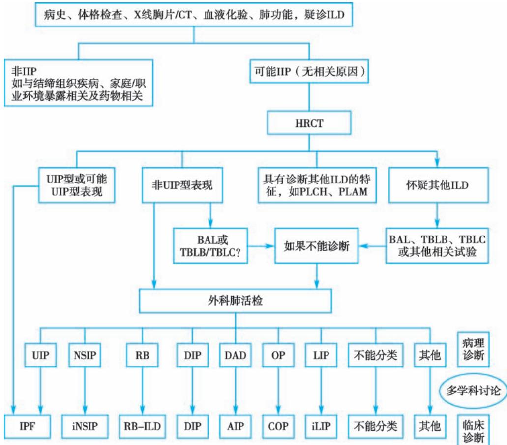
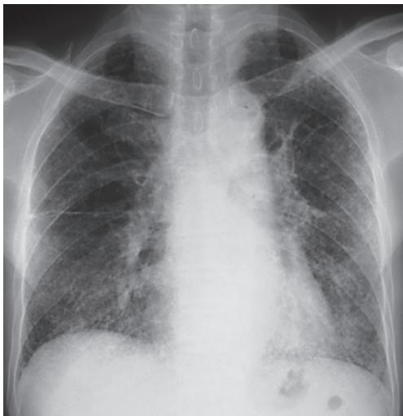
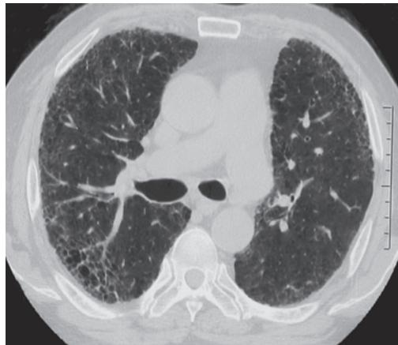
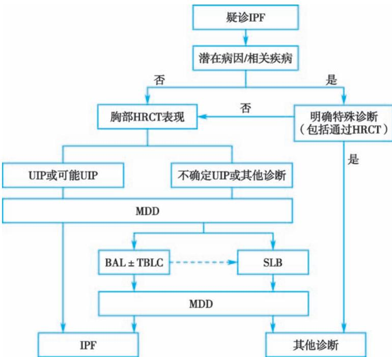
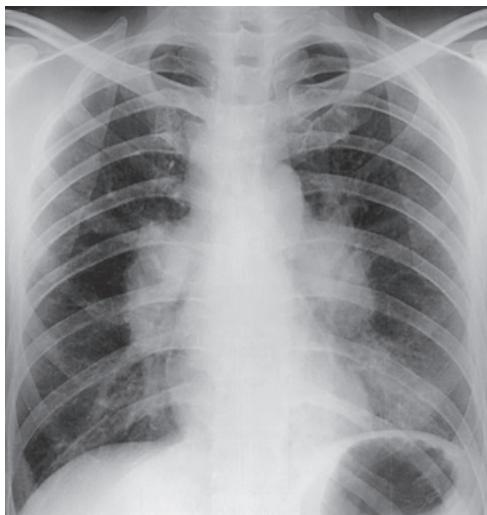
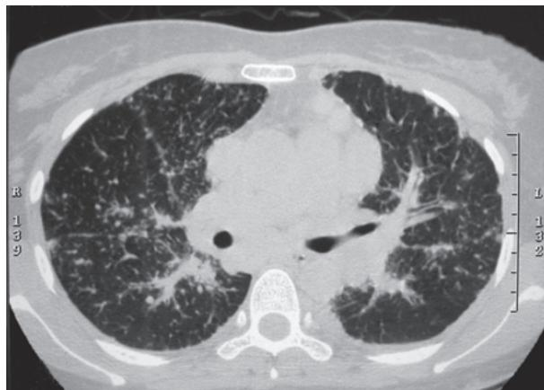

> [!info] 导航
> [[第010章_第2篇第09章_肺癌|上一章]] · [[00_章节导航|总目录]] · [[第012章_第2篇第11章_肺血栓栓塞症|下一章]]

间质性肺疾病（interstitial lung disease, ILD）亦称弥漫性实质性肺疾病（diffuse parenchymal lung disease, DPLD），是一组主要累及肺间质和肺泡腔、导致肺泡-毛细血管功能单位丧失的弥漫性肺疾病。临床主要表现为进行性加重的呼吸困难、限制性通气功能障碍伴弥散功能降低、低氧血症以及影像学上的双肺弥漫性病变，ILD可最终发展为弥漫性肺纤维化和蜂窝肺，导致呼吸衰竭而死亡。

# 第一节 | 间质性肺疾病的分类

间质性肺疾病包括200多种急性和慢性肺部疾病，既有临床常见病，也有临床少见病，其中大多数疾病的病因还不明确。根据病因、临床和病理特点，2002年美国胸科学会（ATS）和欧洲呼吸学会(ERS)将ILD按以下分类：①已知原因的ILD；②特发性间质性肺炎(idiopathic interstitial pneumonia, IIP)；③肉芽肿性ILD；④其他罕见ILD(表2-10-1)。其中特发性间质性肺炎是一组病因不明的间质性肺炎。2013年ATS/ERS将IIP进一步分为三大类：①主要的特发性间质性肺炎；②少见的特发性间质性肺炎；③未能分类的特发性间质性肺炎(表2-10-2)。

## 表 2-10-1 间质性肺疾病的临床分类

1. 已知原因的ILD

1.1 职业或环境因素相关

吸入致敏原——过敏性肺炎

吸入有害粉尘——尘肺病如石棉肺、硅沉着病、硬金属尘肺等

1.2 药物或治疗相关

药物如胺碘酮、博来霉素、甲氨蝶呤、抗肿瘤靶向治疗(如 EGFR-TKI)、免疫治疗(如 PD-1/PD-L1 单克隆抗体),放射线治疗,高浓度氧疗

1.3 结缔组织疾病（connective tissue diseases, CTD）或血管炎相关

系统性硬化症、类风湿关节炎、特发性炎性肌病、干燥综合征、系统性红斑狼疮

ANCA 相关性血管炎: 坏死性肉芽肿性多血管炎、变应性肉芽肿性多血管炎、显微镜下多血管炎

2. 特发性间质性肺炎

3. 肉芽肿性 ILD
结节病(sarcoidosis)

4. 罕见 ILD

4.1 肺淋巴管平滑肌瘤病（pulmonary lymphangioleiomyomatosis, PLAM）

4.2 肺朗格汉斯细胞组织细胞增生症（pulmonary Langerhans cell histiocytosis, PLCH）

4.3 慢性嗜酸性粒细胞性肺炎（chronic eosinophilic pneumonia, CEP）

4.4 肺泡蛋白沉积症（pulmonary alveolar proteinosis, PAP）

4.5 特发性肺含铁血黄素沉着症（idiopathic pulmonary haemosiderosis, IPH）

4.6 肺泡微石症（pulmonary alveolar microlithiasis, PAM）

4.7 肺淀粉样变(pulmonary amyloidosis)

表 2-10-2 特发性间质性肺炎的分类

<table><tr><td></td><td>分类</td><td>临床-影像-病理诊断</td><td>相应影像和/或组织病理形态学类型</td></tr><tr><td rowspan="6">主要的IIP</td><td rowspan="2">慢性纤维化性IP</td><td>特发性肺纤维化(IPF)</td><td>普通型间质性肺炎(UIP)</td></tr><tr><td>特发性非特异性间质性肺炎(iNSIP)</td><td>非特异性间质性肺炎(NSIP)</td></tr><tr><td rowspan="2">吸烟相关性IP</td><td>呼吸性细支气管炎伴间质性肺疾病(RB-ILD)</td><td>呼吸性细支气管炎(RB)</td></tr><tr><td>脱屑性间质性肺炎(DIP)</td><td>DIP</td></tr><tr><td rowspan="2">急性/亚急性IP</td><td>隐源性机化性肺炎(COP)</td><td>机化性肺炎(OP)</td></tr><tr><td>急性间质性肺炎(AIP)</td><td>弥漫性肺泡损伤(DAD)</td></tr><tr><td rowspan="2">罕见的IIP</td><td></td><td>特发性淋巴细胞性间质性肺炎(iLIP)</td><td>LIP</td></tr><tr><td></td><td>特发性胸膜肺实质弹力纤维增生症(iPPFE)</td><td>PPFE</td></tr><tr><td colspan="4">未分类的IIP</td></tr></table>

注：IPF, idiopathic pulmonary fibrosis; NSIP, nonspecific interstitial pneumonia; COP, cryptogenic organizing pneumonia; AIP, acute interstitial pneumonia; RB-ILD, respiratory bronchiolitis-interstitial lung disease; DIP, desquamative interstitial pneumonia; LIP, lymphoid interstitial pneumonia; PPFE, pleuroparenchymal fibroelastosis; UIP, usual interstitial pneumonia; DAD: diffuse alveolar damage。

#### 【诊断】

临床诊断某一种 ILD 是一个动态的过程,需要临床、放射和病理科医生的密切合作,根据所获得的完整资料对先前的诊断进行验证或修订(图 2-10-1)。

### (一) 临床表现

1. 症状 不同 ILD 临床表现不完全一样,多数隐匿起病。呼吸困难/气短是最常见的症状,疾病早期仅在活动时出现,随着疾病进展呈进行性加重。其次是咳嗽,多为持续性干咳,少有咯血、胸痛和喘鸣。如果病人还有全身症状如发热、皮疹、肌肉关节疼痛、关节肿胀、口干、眼干等,通常提示可能存在潜在的结缔组织疾病等。

2. 相关病史 重要的既往史包括结缔组织疾病、肿瘤、脏器移植、心脏病等；药物应用史，尤其一些可以诱发肺纤维化的药物，如胺碘酮、甲氨蝶呤、抗肿瘤靶向治疗（如EGFR-TKI）、免疫治疗（如PD-1/PD-L1单克隆抗体）；肺纤维化家族史；吸烟史包括每天吸烟支数、烟龄及戒烟时间；职业或家居环境暴露史，禽类及发霉环境接触史。这些病史的详细了解对于明确ILD的病因具有重要作用。

3. 体征

（1）爆裂音或 Velcro 啰音:两肺底闻及的吸气末细小的干性爆裂音或 Velcro 啰音是 ILD 的常见体征,尤其是 IPF,也是早期体征。

（2）杵状指：是 ILD 病人一个比较常见的体征，通常提示长期的肺结构破坏和肺功能受损，多见于 IPF。

（3）肺动脉高压和肺心病的体征：ILD 进展到晚期，可以出现肺动脉高压和肺心病，进而表现为发绀、呼吸急促、 $P_{2}>A_{2}$ 、下肢水肿等体征。

（4）系统疾病体征：皮疹、关节肿胀、变形等可能提示结缔组织疾病等。

### （二）影像学评价

绝大多数 ILD 病人 X 线胸片显示弥漫性浸润性阴影,但不具备诊断意义,X 线胸片正常也不能除外 ILD。胸部高分辨率 CT(HRCT)更能细致地显示肺实质异常的程度和性质,能发现 X 线胸片不能显示的病变,是诊断 ILD 的重要工具。ILD 的 HRCT 表现包括网格影、蜂窝影、弥漫性微结节影、牵拉性支气管扩张、磨玻璃样变、肺泡实变、小叶间隔增厚、胸膜下线、囊性病变等。

### （三）肺功能

ILD 病人以限制性通气功能障碍和气体交换障碍为特征，限制性通气功能障碍表现为肺总量（TLC）、肺活量（VC）和用力肺活量（FVC）均减少，肺顺应性降低。第一秒用力呼气容积/用力肺活量 $\left(\mathrm{FEV}_{1}/\mathrm{FVC}\right)$ 正常或增加。气体交换障碍表现为肺一氧化碳弥散量 $\left(\mathrm{D}_{\mathrm{L}}\mathrm{CO}\right)$ 减少，静息时或运动时肺泡-动脉血氧分压差 $\left[\mathrm{P}_{\left(\mathrm{A}-\mathrm{a}\right)}\mathrm{O}_{2}\right]$ 增加和低氧血症。

  
图 2-10-1 间质性肺疾病的诊断流程  
UIP, 普通型间质性肺炎; RB, 呼吸性细支气管炎 (respiratory bronchiolitis); DAD, 弥漫性肺泡损伤 (diffuse alveolar damage); OP, 机化性肺炎 (organizing pneumonia)。

### （四）实验室检查

常规进行全血细胞学、尿液分析、生物化学及肝肾功能、红细胞沉降率(ESR)、C反应蛋白(CRP)检查，结缔组织疾病相关的自身抗体如类风湿因子(RF)、抗核抗体(ANA)、抗中性粒细胞胞质抗体(ANCA)、抗环瓜氨酸肽抗体、炎性肌病抗体等检查。酌情进行巨细胞病毒(CMV)或肺孢子菌(机会性感染)、肿瘤细胞(怀疑肿瘤)等检查，这些检查对ILD的病因或伴随疾病具有提示作用。

### （五）支气管镜检查

支气管镜检查并进行支气管肺泡灌洗(bronchoalveolar lavage, BAL)或/和经支气管肺活检(transbronchial lung biopsy, TBLB)/经支气管冷冻肺活检(transbronchial lung cryobiopsy, TBLC)对于了解弥漫性肺部渗出性病变的性质、鉴别ILD分型具有很大帮助。正常支气管肺泡灌洗液(BALF)细胞学分类为巨噬细胞 $>85\%$ ，淋巴细胞 $\leqslant 7\% \sim 15\%$ ，中性粒细胞 $\leqslant 3\%$ ，嗜酸性粒细胞 $\leqslant 1\%$ 。如果BALF细胞学分析显示淋巴细胞、嗜酸性粒细胞或中性粒细胞增加，各自具有特定的临床意义，能够帮助临床医生缩小鉴别诊断的范围。TBLB取材较小，很多情况下不足以诊断ILD的具体类型。近年来逐渐发展的TBLC可以取得较大块的肺组织，更好地观察肺脏的结构变化，对ILD诊断分型有更大帮助，显示出较好的临床应用前景。

### （六）外科肺活检

外科肺活检包括开胸肺活检(open lung biopsy, OLB)和电视辅助胸腔镜肺活检(video assisted thoracoscopy surgical lung biopsy, VATS-SLB)。对于基于临床、胸部HRCT特征，甚至BAL和TBLB/TBLC等不能明确诊断的ILD，通常需要外科肺活检明确病理改变和确诊。

# 第二节 | 特发性肺纤维化

特发性肺纤维化（idiopathic pulmonary fibrosis, IPF）是一种慢性、进行性、纤维化性间质性肺炎，组织学和/或胸部 HRCT 特征性表现为 UIP，病因不清，好发于老年人。

#### 【流行病学】

IPF是临床最常见的一种特发性间质性肺炎，其发病率呈现上升趋势。美国IPF的患病率和年发病率分别是 $(14\sim 42.7) / 10$ 万人口和 $(6.8\sim 16.3) / 10$ 万人口。我国缺乏相应的流行病学资料，但是临床实践中发现近年来IPF病例呈明显增多的趋势。

#### 【病理改变】

普通型间质性肺炎（UIP）是 IPF 的特征性病理改变类型。UIP 的组织学特征是病变呈致密纤维化、斑片状分布，主要累及胸膜下或小叶间隔。低倍镜下病变时相不一，表现出纤维化病变和正常肺组织相邻存在，致密的纤维瘢痕区伴散在的成纤维细胞灶形成。

#### 【病因和发病机制】

目前为止有关 IPF 的病因仍不清楚。但是认识到遗传易感、衰老、吸烟、环境暴露、病原微生物、慢性吸入等增加 IPF 发生的风险。

IPF 的发病机制还不十分清楚。目前认为 IPF 起源于肺泡上皮反复微小损伤后的异常修复。主要机制包括:①端粒酶基因变异、端粒缩短,导致老化加速;②肺泡上皮损伤和异常激活,细胞自噬降低,产生促纤维化因子如转化生长因子 $\beta(\mathrm{TGF}-\beta)$ 、血小板源生长因子(PDGF)等形成局部促纤维化微环境,干扰上皮再生;③成纤维细胞增生激活转变为肌成纤维细胞,产生过量的细胞外基质沉积,导致纤维瘢痕与蜂窝囊形成,肺结构破坏和功能丧失。肺脏巨噬细胞 M1 型向 M2 型转化、MUC5B 和 TOLLIP 基因变异、微生态改变以及宿主对微生物的反应在肺纤维化形成中发挥了重要作用。

#### 【临床表现】

多于50岁以后发病，呈隐匿起病，主要表现为活动性呼吸困难，渐进性加重，常伴干咳。全身症状不明显，可以有不适、乏力和体重减轻等，但很少发热。75%的病人有吸烟史。

约半数病人可见杵状指,90% 的病人可在双肺基底部闻及吸气末细小的 Velcro 啰音。在疾病晚期可出现明显发绀、肺动脉高压和右心功能不全征象。

#### 【辅助检查】

1. 胸部 X 线 通常显示双肺外带、胸膜下和基底部分布明显的网状或网结节模糊影,伴有蜂窝样变和下叶肺容积缩小(图 2-10-2)。

2. 胸部 HRCT 可以显示 UIP 的特征性改变(图 2-10-3)。HRCT 的典型 UIP 表现为:①病变呈网格、蜂窝样改变伴或不伴牵拉支气管扩张;②病变以胸膜下、基底部分布为主,与病理诊断 UIP 的符合率大于 90%。可能 UIP 表现为:①病变呈网格改变伴牵拉支气管扩张,缺乏蜂窝样改变;②病变以胸膜下、基底部分布为主,与病理诊断 UIP 的符合率达 70%\~89%,因此 HRCT 已成为诊断 IPF 的重要方法,可以替代外科肺活检。凡不符合上述 UIP 的特征性分布和表现形式则可能为不确定 UIP 或非 UIP,则需要活检病理诊断。

3. 肺功能 主要表现为限制性通气功能障碍、弥散量降低伴低氧血症或I型呼吸衰竭。早期静息肺功能可以正常或接近正常，但运动肺功能表现 $\mathrm{P}_{(\mathrm{A - a})}\mathrm{O}_2$ 增加和氧分压降低。

  
图 2-10-2 特发性肺纤维化的胸部 X 线改变 X 线胸片显示双肺弥漫网状影, 胸膜下和基底部尤为明显。

4. 血液化验 血液涎液化糖链抗原(KL-6)增高,ESR、抗核抗体和类风湿因子可能轻度异常,但没有特异性。结缔组织疾病相关自身抗体检查有助于IPF的鉴别。

  
图 2-10-3 特发性肺纤维化的胸部 HRCT 改变胸部 HRCT 显示两肺外带胸膜下分布为主的斑片性网状模糊影,伴有蜂窝状改变。

5. BALF/TBLC BALF 细胞分析多表现为中性粒细胞和/或嗜酸性粒细胞增加。TBLB 对 IPF 无诊断意义。随着 TBLC 应用的增加, 目前认为在有经验的中心可以考虑使用 TBLC 替代 SLB。

6. 外科肺活检(SLB) 对于 HRCT 呈不确定 UIP 或非 UIP 改变, 诊断不清楚, 没有手术禁忌证的病人, 应该考虑外科肺活检。IPF 的组织病理类型是 UIP, UIP 的病理诊断标准为: ①致密纤维化伴肺结构破坏(如毁损性瘢痕组织和/或蜂窝); ②胸膜下和/或间隔旁分布为主的纤维化; ③斑片肺实质纤维化; ④成纤维细胞灶。

#### 【诊断】

1. IPF 诊断标准 ①ILD,但排除了其他原因(如环境、药物和结缔组织疾病等);②HRCT 表现为 UIP 或可能 UIP 型;或③联合 HRCT 和 SLB/TBLC 病理表现诊断 UIP,经过多学科讨论诊断为 IPF(图 2-10-4)。

  
图 2-10-4 IPF 的诊断流程  
MDD, 多学科讨论。

2. IPF 急性加重（acute exacerbation of IPF, AEIPF） IPF 病人出现新的弥漫性肺泡损伤导致急性或显著的呼吸困难恶化即为 AEIPF。诊断标准:①过去或现在诊断 IPF;②1 个月内发生显著的呼吸困难加重;③CT 表现为 UIP 背景下出现新的双侧磨玻璃影伴或不伴实变影;④不能完全由心衰或液体过载解释。

#### 【鉴别诊断】

IPF的诊断需要排除其他原因的ILD。UIP是诊断IPF的“金标准”，但UIP也可见于纤维化性过敏性肺炎、石棉肺病、结缔组织病所致间质性肺病（CTD-ILD）等。过敏性肺炎多有环境抗原暴露史(如饲养鸽子、霉菌接触等)，BAL细胞分析显示淋巴细胞比例增加。石棉肺、硅沉着病或其他职业尘肺多有石棉、二氧化硅或其他粉尘接触史。CTD-ILD多有皮疹、关节炎、全身多系统累及和特异性自身抗体阳性。

IPF 与其他类型 IIP 的鉴别见表 2-10-3。

表 2-10-3 特发性间质性肺炎的临床、影像、病理及预后比较

<table><tr><td>临床-影像-病理诊断</td><td>IPF</td><td>NSIP</td><td>COP</td><td>DIP</td><td>RB-ILD</td><td>LIP</td><td>AIP</td></tr><tr><td>病程</td><td>慢性(&gt;12个月)</td><td>慢性(数月~数年)</td><td>亚急性(&lt;3个月)</td><td>亚急性/慢性(数周~数月)吸烟者</td><td>慢性</td><td>慢性(&gt;12个月)</td><td>急性(1~2周)</td></tr><tr><td>发病年龄/岁</td><td>&gt;50</td><td>50</td><td>55</td><td>40~50</td><td>40~50</td><td>40~50</td><td>50</td></tr><tr><td>男:女</td><td>3:2</td><td>1:1</td><td>1:1</td><td>2:1</td><td>2:1</td><td>1:5</td><td>1:1</td></tr><tr><td rowspan="2">HRCT</td><td>外周、胸膜下、基底部明显</td><td>外周、胸膜下、基底部,对称</td><td>胸膜下、支气管周围</td><td>弥漫,外周、基底部明显</td><td>弥漫</td><td>弥漫,基底部明显</td><td>弥漫,两侧</td></tr><tr><td>网格,蜂窝肺,牵拉性支气管/细支气管扩张,肺结构变形</td><td>磨玻璃影,可有网格,实变(不常见),偶见蜂窝肺</td><td>斑片实变,常常多发,伴磨玻璃影;结节</td><td>磨玻璃影,伴网格</td><td>斑片磨玻璃影,小叶中心结节,气体陷闭,支气管和细支气管壁增厚</td><td>磨玻璃影,小叶中心结节,索条影,薄壁囊腔</td><td>斑片实变,主要影响重力依赖区,斑片磨玻璃影,间或有正常小叶,支气管扩张,肺结构变形</td></tr><tr><td>组织学类型</td><td>UIP</td><td>NSIP</td><td>OP</td><td>DIP</td><td>RB-ILD</td><td>LIP</td><td>DAD</td></tr><tr><td>组织学特征</td><td>时相不一,斑片、胸膜下纤维化,成纤维细胞灶</td><td>时相一致,轻到中度间质炎症</td><td>肺泡腔内机化,呈斑片分布,肺泡结构保持</td><td>肺泡腔巨噬细胞聚集,肺泡间隔炎症、增厚</td><td>轻度纤维化,黏膜下淋巴细胞渗出,斑片、细支气管中心分布,肺泡管内色素巨噬细胞聚集</td><td>密集的间质淋巴细胞渗出,II型肺泡上皮增生,偶见淋巴滤泡</td><td>早期:时相一致,肺泡间隔增厚,肺泡腔渗出,透明膜后期:机化,纤维化</td></tr><tr><td>治疗</td><td>对激素或细胞毒制剂反应差</td><td>对激素反应较好</td><td>对激素反应好</td><td>戒烟/激素效果好</td><td>戒烟/激素效果好</td><td>对激素反应好</td><td>对激素的效果不清楚</td></tr><tr><td>预后</td><td>差,5年病死率50%~80%</td><td>中等,5年病死率&lt;10%</td><td>好,很少死亡</td><td>好,5年病死率5%</td><td>好,5年病死率5%</td><td>中等</td><td>差,病死率&gt;50%,且多在发病后1~2个月内死亡</td></tr></table>

#### 【治疗】

IPF 不可能治愈,治疗目的是延缓疾病进展,改善生活质量,延长生存期。包括抗纤维化药物治疗、非药物治疗、合并症治疗、姑息治疗、疾病的监测、病人教育和自我管理。

1. 抗纤维化药物治疗 循证医学证据证明吡非尼酮（pirfenidone）和尼达尼布（nintedanib）治疗可以减慢IPF肺功能下降。吡非尼酮是一种多效性的吡啶化合物，具有抗炎、抗纤维化和抗氧化特性。尼达尼布是一种多靶点酪氨酸激酶抑制剂，能够抑制血小板源生长因子受体（PDGFR）、血管内皮生长因子受体（VEGFR）以及成纤维细胞生长因子受体（FGFR）。两种药物作为抗纤维化药物，已在临床广泛应用于IPF的治疗。乙酰半胱氨酸，作为一种祛痰药，高剂量（1800mg/d）具有抗氧化、进而抗纤维化作用，研究证实对部分呈TOLLIP基因CC型者可能有用。

2. 非药物治疗 IPF 病人应尽可能进行肺康复训练,静息状态下存在明显的低氧血症( $PaO_{2}<55mmHg$ 或 $SpO_{2}<88\%$ )的病人还应该实行长程氧疗,但是一般不推荐使用机械通气治疗 IPF 所致的呼吸衰竭。

3. 肺移植 IPF 肺移植的 5 年存活率超过 50%, 目前肺移植是终末期 IPF 的唯一有效治疗方法。因此, 如果可能, 应该积极推荐有指征有条件的 IPF 病人考虑肺移植。

4. 合并症治疗 治疗合并存在的胃-食管反流及其他合并症，以减轻或改善相应疾病，对 IPF 合并的肺动脉高压可以酌情选用西地那非、曲前列环素吸入治疗。

5. 对症治疗 减轻病人因咳嗽、呼吸困难、焦虑带来的痛苦,提高生活质量。

6. IPF 急性加重的治疗 由于 IPF 急性加重病情严重、病死率高，虽然缺乏随机对照研究，临床上仍然推荐高剂量激素治疗。氧疗、治疗可能合并的肺部感染、对症支持治疗是 IPF 急性加重病人的主要治疗手段。一般不推荐使用机械通气治疗 IPF 所致的呼吸衰竭，但酌情可以使用无创机械通气。

7. 加强病人教育与自我管理 建议吸烟者戒烟,预防流感和肺炎。

#### 【自然病程与预后】

IPF诊断后中位生存期为2～3年，但IPF自然病程及结局个体差异较大。大多数病人表现为缓慢逐步可预见的肺功能下降；少数病人在病程中反复出现急性加重；极少数病人呈快速进行性发展。影响IPF病人预后的因素包括：呼吸困难、肺功能下降和HRCT纤维化及蜂窝样改变的程度，6分钟步行试验(6MWT)的结果，尤其是这些参数的动态变化。基线状态下 $D_{L}CO<40\%$ 预计值和6MWT时 $SpO_{2}<88\%$ ，6～12个月内FVC绝对值降低10%以上或 $D_{L}CO$ 绝对值降低15%以上都是预测死亡风险的可靠指标。

# 第三节 | 结节病

结节病（sarcoidosis）是一种原因不明的多系统累及的肉芽肿性疾病，主要侵犯肺和淋巴系统，其次是眼部和皮肤。

#### 【流行病学】

由于部分病例无症状和可以自然痊愈,目前没有确切的流行病学数据。结节病多发于中青年(<40岁),女性发病稍高于男性,患病率从不足 $1/10^{5}$ 到高于 $40/10^{5}$ 都有报道,以斯堪的纳维亚和美籍非洲人群的患病率最高,寒冷地区多于热带地区,黑种人多于白种人,呈现出明显的地区和种族差异。

#### 【病因和发病机制】

虽然结节病的确切病因和发病机制不清楚,有待进一步研究,但是目前认为结节病是由于遗传易感者受特定的环境暴露刺激,导致受累脏器局部产生增强的 Th1/Th17 细胞免疫反应,从而形成的肉芽肿性疾病。

#### 【病理】

结节病的特征性病理改变是非干酪样坏死性上皮样细胞性肉芽肿，主要由高分化的单核吞噬细胞(上皮样细胞和巨细胞)与淋巴细胞组成。巨细胞可以有包涵体如舒曼小体(Schauman bodies)和星状小体(asteroid bodies)。肉芽肿的中心主要是 $\mathrm{CD4^{+}}$ 淋巴细胞，而外周主要是 $\mathrm{CD8^{+}}$ 淋巴细胞。结节病性肉芽肿或消散，或发展成纤维化。在肺脏 $75\%$ 的肉芽肿沿淋巴管分布，接近或位于支气管血管鞘、胸膜下或小叶间隔，开胸肺活检或尸检发现半数以上累及血管。此外，气道内或周围受累也常见。

#### 【临床表现】

结节病的临床过程表现多样,与起病的急缓和脏器受累的不同以及肉芽肿的活动性有关,还与种族和地区有关。

### （一）急性结节病

急性结节病（Löfgren syndrome）表现为双肺门淋巴结肿大、关节炎和结节性红斑，常伴有发热、肌肉痛、全身不适。85%的病人于一年内自然缓解。

### （二）亚急性/慢性结节病

约 50% 的结节病无症状，为体检或胸部影像学检查偶尔发现。

1. 系统症状 约 1/3 病人可以有非特异性表现, 如发热、体重减轻、乏力、全身不适和盗汗。

2. 胸内结节病 90% 以上的结节病累及肺脏。临床表现隐匿，30%～50% 有咳嗽、胸痛或呼吸困难，20% 有气道高反应性或伴喘鸣音。

3. 胸外结节病 包括淋巴结、皮肤、眼、心脏、内分泌等多系统累及。

#### 【辅助检查】

### (一) 影像学检查

1. 胸部 X 线检查 90% 以上的病人表现为 X 线胸片异常, 胸片是提示诊断的敏感工具。双侧肺门淋巴结肿大 (BHL), 伴或不伴右侧气管旁淋巴结肿大, 是最常见的征象 (图 2-10-5)。临床上通常根据后前位 X 线胸片对结节病进行分期 (表 2-10-4), 该分期与疾病自然缓解率相关。

  
图 2-10-5 结节病Ⅰ期的胸部 X 线征象 36 岁病人,体检 X 线胸片发现双侧肺门淋巴结肿大,诊断结节病Ⅰ期。

表 2-10-4 结节病的胸部 X 线分期

<table><tr><td>分期</td><td>表现</td></tr><tr><td>0</td><td>无异常 X 线表现</td></tr><tr><td>I</td><td>双侧肺门淋巴结肿大,无肺部浸润影</td></tr><tr><td>II</td><td>双侧肺门淋巴结肿大,伴肺部网状、结节状或片状浸润影</td></tr><tr><td>III</td><td>肺部网状、结节状或片状浸润影,无双侧肺门淋巴结肿大</td></tr><tr><td>IV</td><td>肺纤维化,蜂窝肺,肺大疱,肺气肿</td></tr></table>

2. 胸部 CT/HRCT HRCT 的典型表现为沿着支气管血管束和小叶间隔分布的微小结节, 结节可融合。其他异常有磨玻璃样变、索条带影、蜂窝肺、牵拉性支气管扩张及血管或支气管的扭曲或变形。病变多侵犯上叶, 肺底部相对正常。可见气管前、气管旁、主动脉旁和隆突下区的淋巴结肿大(图 2-10-6)。

3. 核素显像 肉芽肿活性巨噬细胞摄取 $^{67}$ Ga 明显增加, 肉芽肿性病变可被 ${}^{67}$ Ga 显示, 典型病变显示 “熊猫征” (鼻黏膜、双侧泪腺和腮腺显影) 和 “λ” 征 (右侧气管旁和双肺门淋巴结显影), 但通常无诊断特异性。 ${}^{18}$ F-FDG PET 也可以用于结节病的诊断, 通常可发现更加隐匿显示许多微小结节沿淋巴管走行，位于支气管血管旁间质、小叶间隔和胸膜下。纵隔和肺门淋巴结肿大。

  
图 2-10-6 结节病的胸部 HRCT 表现

的病变,以及可以帮助评估心脏结节病,但 ${}^{18}$ F-FDG PET 不能鉴别恶性肿瘤、肺结核和结节病,需要结合其他检查结果。

### （二）肺功能试验

80% 以上的Ⅰ期结节病病人的肺功能正常。Ⅱ期或Ⅲ期结节病的肺功能异常者占 40%～70%，特征性变化是限制性通气功能障碍和弥散量降低及氧合障碍。1/3 以上的病人同时有气流受限。

### （三）支气管镜检查与支气管肺泡灌洗

支气管镜下可以见到因隆突下淋巴结肿大所致的气管隆突增宽，气管和支气管黏膜受累所致的黏膜结节。BALF 检查主要显示淋巴细胞比例增加，CD4/CD8 的比值增加（>3.5）。结节病可以通过经支气管镜活检术（TBB）、TBLB 和 EBUS-TBNA 得到诊断，这些检查的诊断率较高，风险低，成为目前肺结节病的重要确诊手段。一般不需要纵隔镜或外科肺活检。

### （四）血液检查

血管紧张素转换酶（ACE）由结节病肉芽肿的类上皮细胞产生，血清 ACE 水平反映体内肉芽肿负荷，可以辅助判断疾病活动性，因缺乏足够的敏感性和特异性，不能作为诊断指标。其他疾病活动指标包括血清可溶性白介素-2 受体（sIL-2R）、血钙增高等。

### （五）结核菌素试验

对 PPD 5TU 的结核菌素皮肤试验无或弱反应是结节病的特点, 可以用来鉴别结核和结节病。

#### 【诊断】

结节病的诊断应符合三个条件:①临床和胸部影像表现与结节病相符合;②活检证实有非干酪样坏死性类上皮肉芽肿;③除外其他原因。

建立诊断以后,还需要判断疾病累及的脏器范围、分期(如上述)和活动性。活动性判断缺乏严格的标准。起病急、临床症状明显、病情进展较快、重要脏器受累、血清 ACE 增高等,提示属于活动期。

#### 【鉴别诊断】

1. 肺门淋巴结结核 病人较年轻,结核菌素试验多阳性。肺门淋巴结肿大一般为单侧性,有时伴有钙化,可见肺部原发病灶。CT 可见淋巴结中心区有坏死。

2. 淋巴瘤 多有发热、消瘦、贫血等。常累及上纵隔、隆突下等处的纵隔淋巴结，大多为单侧或双侧不对称肿大，淋巴结可呈现融合。结合其他检查及活组织检查可作鉴别。

3. 肺门转移性肿瘤 肺癌和肺外肿瘤转移至肺门淋巴结,均有相应的症状和体征。对可疑原发灶进行进一步的检查可助鉴别。

4. 其他肉芽肿病 过敏性肺炎、铍肺、硅沉着病以及感染性、化学性因素所致的肉芽肿，结合临床资料及相关检查的综合分析有助于与结节病进行鉴别。

#### 【治疗】

结节病近半数无症状,60%～70%的结节病可以自然缓解,慢性病程者仅占10%～30%。因此,对于无活动、无症状的结节病一般无需治疗,但需要随访观察。

结节病出现明显症状、显著肺功能异常和肺实质病变，以及合并肺外表现，尤其累及心脏、神经系统、肝、脾等，需要使用全身糖皮质激素治疗。对于肺结节病，通常起始剂量为泼尼松（或相当剂量的其他激素）0.5mg/(kg·d)或20～40mg/d，2～4周后逐渐减量，5～10mg/d维持，总疗程6～24个月。结节病的复发率为16%～74%，对于有复发倾向的病人，应该适当增加激素的剂量。当糖皮质激素不能耐受或治疗无效，可考虑使用其他免疫抑制剂如甲氨蝶呤、硫唑嘌呤、来氟米特、吗替麦考酚酯，以及生物制剂如英夫利昔单抗（infliximab）或阿达木单抗（adalimumab）。结节病治疗结束后需要每3～6个月随访一次，至少3年或直至病情稳定。

#### 【预后】

结节病的病程和预后变化很大，Ⅰ期肺结节病的自发缓解率为55%～90%，Ⅱ期肺结节病的自发缓解率为40%～70%，Ⅲ期肺结节病的自发缓解率为10%～20%。急性起病者，经治疗或自行缓解，预后较好；而慢性进行性、多脏器功能损害、肺广泛纤维化者则预后较差，总病死率1%～5%。死亡原因常为呼吸功能不全或心脏、中枢神经系统受累所致，75%的死亡与进展型肺结节病有关，但是目前还没能确定重症慢性进展型肺结节病的预后判断指标。

# 第四节 | 其他间质性肺疾病

## 一、过敏性肺炎

过敏性肺炎（HP）也称外源性过敏性肺泡炎（extrinsic allergic alveolitis, EAA），是指易感个体反复吸入有机或无机粉尘抗原后诱发的一种主要通过细胞免疫和体液免疫反应介导的肺部迟发性变态反应性疾病。病理表现为以淋巴细胞浸润为主的慢性肺泡炎症，伴细胞性细支气管炎（气道中心炎症）和散在分布的非干酪样肉芽肿为特征性病理改变。农民肺是HP的典型形式，是农民吸入发霉干草中的嗜热放线菌或热吸水链霉菌孢子所致。吸入含动物蛋白的羽毛和排泄物尘埃引起饲鸟者肺（如鸽子肺、鹦鹉肺），生活在有嗜热放线菌污染的空调或湿化器的环境引起空调器肺等。各种病因所致HP的临床表现相同，可以是急性、亚急性或慢性。

目前根据 HP 的影像学和病理学表现分为非纤维化性 HP 和纤维化性 HP。非纤维化性 HP 一般呈急性或亚急性起病，急性起病者一般在职业或家居环境抗原接触后 4～8 小时出现畏寒、发热、全身不适伴胸闷、呼吸困难和咳嗽。如果脱离抗原接触，病情可于 24～48 小时内恢复。如果持续暴露，反复急性发作导致几周或几个月内逐渐出现持续进行性发展的呼吸困难，伴体重减轻，表现为亚急性形式。纤维化性 HP 一般为慢性长期暴露于变应原，肺脏炎症反复伴异常修复导致纤维化形成，主要表现为进行性发展的呼吸困难伴咳嗽及体重减轻，肺底部可以闻及吸气末 Velcro 啰音，少数有杵状指。

根据明确的抗原接触史,典型的症状发作特点,胸部 HRCT 具有小叶中心性微结节、斑片磨玻璃影,气体陷闭形成的马赛克征、中上肺为著的肺纤维化等特征性表现,BALF 检查显示明显增加的淋巴细胞比例,可以作出相对明确的诊断。TBLB、TBLC 取得的病理资料能进一步支持诊断,一些不典型病例也可能需要外科肺活检。

HP 根本的治疗措施是脱离或避免抗原接触。对于伴有明显的肺部渗出和低氧血症者，激素治疗有助于影像学和肺功能明显改善。

## 二、嗜酸性粒细胞性肺炎

嗜酸性粒细胞性肺炎是一种以肺部嗜酸性粒细胞浸润伴有或不伴有外周血嗜酸性粒细胞增多为特征的临床综合征，既可以是已知原因所致，如单纯性肺嗜酸细胞浸润症（Löffler 综合征）、热带肺嗜酸性粒细胞增多症、变应性支气管肺曲霉病、药物或毒素诱发，又可以是原因不明的疾病，如急性嗜酸性粒细胞性肺炎、慢性嗜酸性粒细胞性肺炎、嗜酸性粒细胞性肉芽肿性多血管炎。

慢性嗜酸性粒细胞性肺炎（CEP）的发病原因不明，最常发生于中年女性，通常于数周或数个月内出现呼吸困难、咳嗽、发热、盗汗、体重减轻和喘鸣，呈现亚急性或慢性病程。X线胸片的典型表现有肺外带的致密肺泡渗出影，中心带清晰，这种表现称作“反肺水肿征”（photographic negative of pulmonary edema），而且渗出性病变多位于上叶。80%的病人有外周血嗜酸性粒细胞增多。血清IgE增高也常见。如果病人有相应的临床和影像学特征，BALF嗜酸性粒细胞大于40%，高度提示嗜酸性粒细胞性肺炎。治疗主要采用糖皮质激素。

## 三、肺朗格汉斯细胞组织细胞增生症

肺朗格汉斯细胞组织细胞增生症（PLCH）是一种多数与吸烟相关的ILD，好发于成年人，临床罕见。早期病变呈细支气管中心分布的朗格汉斯细胞（CD1a染色阳性)浸润性结节，多伴有嗜酸性粒细胞及慢性炎症细胞混合浸润，可伴囊腔形成；晚期病变朗格汉斯细胞可能较少，多形成“星形”纤维化病灶。PLCH起病隐匿，表现为咳嗽和呼吸困难，1/4为胸部影像偶然发现，也有部分病人因气胸就诊发现。X线胸片显示结节或网格结节样渗出性病变，常分布于上叶和中叶肺，肋膈角清晰。HRCT特征性地表现为多发的、大小不一的、囊壁厚薄不等的不规则囊腔，早期多伴有细支气管周围结节（直径1～4mm），主要分布于上、中肺野。主要涉及上、中肺野的多发性囊腔和结节或BALF朗格汉斯细胞超过5%高度提示PLCH的诊断。治疗为首先劝告病人戒烟。对于严重或已经戒烟但仍进行性加重的病人，还可能需要应用糖皮质激素。

## 四、肺淋巴管平滑肌瘤病

肺淋巴管平滑肌瘤病（PLAM）是一种临床罕见病，可以散发，也可以伴发于遗传疾病结节性硬化复合症（tuberous sclerosis complex, TSC）。散发的PLAM几乎只发生于育龄期妇女。病理学为肺泡壁、细支气管壁和血管壁的类平滑肌细胞（LAM细胞，HMB-45 $^{+}$ ）呈弥漫性或结节性增生，导致局限性肺气肿或薄壁囊腔形成。

临床上主要表现为进行性加重的呼吸困难、反复出现的气胸和乳糜胸，偶有咯血。肺功能呈现气流受限和气体交换障碍，晚期伴有限制性通气功能障碍。胸部 HRCT 特征性地显示大小相对均一的薄壁囊腔（直径 2～20mm）弥漫性分布于两侧肺脏。LAM 与 PLCH 在 CT 上的主要区别是 PLCH 一般不影响肋膈角，囊壁更厚且囊形状不规则，疾病早期有更多的结节。

对于 PLAM 目前尚无可逆转病情的治疗方法。近来研究显示,免疫抑制剂西罗莫司可以使一些病人的肺功能稳定或改善。终末期 PLAM 可以考虑肺移植。

## 五、肺泡蛋白沉着症

肺泡蛋白沉着症（pulmonary alveolar proteinosis, PAP）以肺泡腔内积聚大量的表面活性物质形成的脂蛋白为特征，主要是由于体内存在的抗粒细胞-巨噬细胞集落刺激因子（GM-CSF）自身抗体导致肺泡巨噬细胞对表面活性物质的清除障碍所致。PAP常隐匿起病，10%～30%诊断时无症状。常见症状是呼吸困难伴咳嗽，偶有咳痰。X线胸片显示两侧弥漫性的渗出影，分布于肺门周围，形成“蝴蝶”（butterfly）样图案。经常是广泛的肺部渗出与轻微的临床症状不匹配。胸部HRCT特征性的表现为：①磨玻璃影与正常肺组织截然分开，形成“地图”（geographic）样图案；②小叶间隔和小叶内间隔增厚，形成多边形或“不规则铺路石”（crazy paving）样图案。特征性生理功能改变是肺内分流导致的严重低氧血症。BALF特征性地表现为奶白色，稠厚且不透明，静置后沉淀分层，BALF细胞或TBLB组织的过碘酸希夫染色（PAS）阳性可以证实诊断。

1/3 的 PAP 病人可以自行缓解。对于有明显呼吸功能障碍的病人，全肺灌洗是首选和有效的治疗方法。部分病人对 GM-CSF 替代治疗(雾化吸入)的反应良好。

## 六、特发性肺含铁血黄素沉着症

特发性肺含铁血黄素沉着症（idiopathic pulmonary hemosiderosis, IPH）的发病原因不明，多发生于儿童和青少年，以反复发作的弥漫性肺泡出血导致咯血、呼吸困难和缺铁性贫血为临床特点。胸部X线的典型表现是两肺中、下肺野弥漫性分布的边缘不清的磨玻璃状阴影。

主要根据症状和影像学检查作出初步诊断。常规进行 BAL 检查确诊有无肺泡出血，并可以发现隐匿性出血。BALF 发现游离红细胞或含吞噬红细胞的肺泡巨噬细胞提示近期肺泡出血，发现许多含铁血黄素巨噬细胞提示陈旧肺泡出血。同时也应该常规检测相关循环自身抗体（如 anti-GBM、ANCA、ANA 等）以除外其他原因所致的弥漫性肺泡出血。

一般而言,IPH 的临床过程比较轻,尤其在成年人,25% 可以自行缓解。但是弥漫性肺泡出血可导致死亡。治疗以支持治疗为主。糖皮质激素治疗对于改善急性加重期的预后和预防反复出血有益,但是尚无确定的疗效判断指征。

(代华平)
