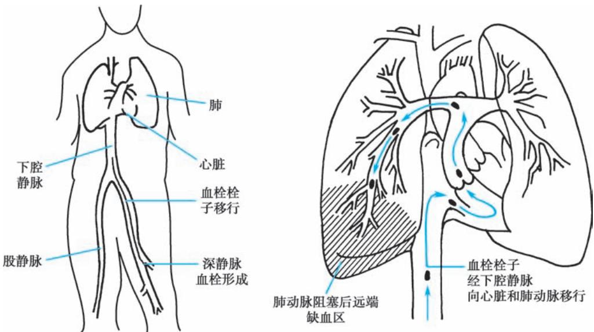
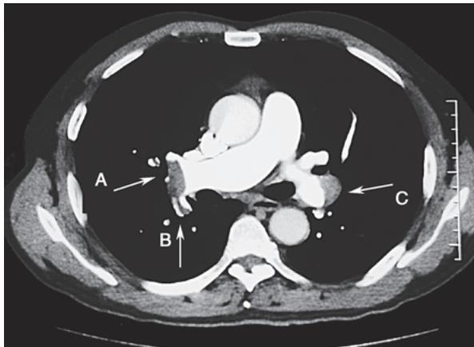

> [!info] 导航
> [[第011章_第2篇第10章_间质性肺疾病|上一章]] · [[00_章节导航|总目录]] · [[第013章_第2篇第12章_肺动脉高压|下一章]]

肺栓塞（pulmonary embolism, PE）是以各种栓子阻塞肺动脉或其分支为发病原因的一组疾病或临床综合征的总称，包括肺血栓栓塞症（pulmonary thromboembolism, PTE）、脂肪栓塞综合征、羊水栓塞、空气栓塞、肿瘤栓塞等。

PTE 为肺栓塞最常见的类型, 是来自静脉系统或右心的血栓阻塞肺动脉或其分支所导致的以肺循环和呼吸功能障碍为主要临床及病理生理特征的疾病。引起 PTE 的血栓主要来源于深静脉血栓形成 (deep venous thrombosis, DVT)。DVT 与 PTE 实质上为一种疾病过程在不同部位、不同阶段的表现, 两者合称为静脉血栓栓塞症 (venous thromboembolism, VTE)。

肺动脉内反复血栓栓塞，以及栓塞后血栓不溶、机化，导致血管慢性化机械阻塞，称为慢性血栓栓塞性肺疾病（chronic thromboembolic pulmonary disease, CTEPD）。后期病情进展，逐渐产生肺血管重塑，导致血管进一步狭窄或闭塞，肺血管阻力（pulmonary vascular resistance, PVR）增加，肺动脉压力进行性增高，经过数月或数年，最终可引起右心室肥厚和右心衰竭，称为慢性血栓栓塞性肺动脉高压（chronic thromboembolic pulmonary hypertension, CTEPH）。

#### 【流行病学】

VTE 发病率随年龄的增加而增加, 年龄 >40 岁的病人较年轻病人风险增高, 大约每 10 年风险增加 1 倍。来自我国 90 家三级医院的统计资料显示, 基于我国住院病人信息统计的 PTE 患病率从 2007 年的 1.2/10 万上升至 2016 年的 7.1/10 万。10 年间, 各家医院诊治 PTE 与 DVT 的病例数不断攀升。

PTE 的致死率及致残率较高。一项国际注册登记研究显示，PTE 的 7 天及 30 天全因病死率分别为 1.9%～2.9% 及 4.9%～6.6%。随着国内医生对 PTE 诊治水平的提高，我国急性 PTE 的住院病死率从 2007 年的 8.5% 已下降为 2016 年的 3.9%。

#### 【危险因素】

任何可以导致静脉血流淤滞、血管内皮损伤和血液高凝状态的因素（Virchow三要素)均为VTE的危险因素，可分为遗传性和获得性两类(表2-11-1)。

遗传性危险因素指由遗传变异引起，常以反复发生的动、静脉血栓形成为主要临床表现。<50岁的病人如无明显诱因反复发生VTE或呈家族性发病倾向，需警惕易栓症的存在。

获得性危险因素指后天获得的易导致 VTE 发生的多种病理生理异常,多为暂时性或可逆性。恶性肿瘤是 VTE 重要的危险因素,肿瘤活动期 VTE 风险显著增加。VTE 与动脉性疾病有某些共同的危险因素,如吸烟、肥胖、高胆固醇血症、高血压病和糖尿病等。心肌梗死和心力衰竭也能够增加 VTE 的风险。年龄是 VTE 发生的独立危险因素,VTE 的发病率随年龄的增长逐渐增高。部分病人经较全面的检查也不能明确危险因素,称为特发性 VTE。部分特发性 VTE 病人存在隐匿性恶性肿瘤,应注意筛查和随访。

#### 【病理和病理生理】

PTE 血栓可来源于下腔静脉、上腔静脉或右心腔，其中大部分来源于下肢深静脉。约 70% 的 PTE 病人可在下肢发现 DVT，而在近端 DVT 病人中，约 50% 的病人存在症状性 PTE。PTE 的形成机制见图 2-11-1。

1. PVR 增加和心功能不全 栓子阻塞肺动脉及其分支达一定程度(30%\~50%)后,因机械阻塞作用等导致 PVR 增加,继而导致了右心室后负荷增加,肺动脉压力升高。右心扩大致室间隔左移,使左心室功能受损。因此,左心室在舒张早期发生充盈受阻,导致心排血量的降低,进而引起体循环低血压、血流动力学不稳定。心排血量下降,主动脉内低血压和右心室压升高,使冠状动脉灌注压下降,特别是右心室内膜下心肌处于低灌注状态。

表 2-11-1 静脉血栓栓塞症常见危险因素

<table><tr><td rowspan="2">遗传性危险因素</td><td colspan="3">获得性危险因素</td></tr><tr><td>血液高凝状态</td><td>血管内皮损伤</td><td>静脉血流淤滞</td></tr><tr><td>抗凝血酶缺乏</td><td>高龄</td><td rowspan="2">手术(多见于全髋关节或膝关节置换)</td><td>瘫痪</td></tr><tr><td>蛋白S缺乏</td><td>恶性肿瘤</td><td>长途航空或乘车旅行</td></tr><tr><td>蛋白C缺乏</td><td>抗磷脂综合征</td><td>创伤/骨折</td><td>急性内科疾病住院</td></tr><tr><td>V因子Leiden突变</td><td>口服避孕药</td><td>中心静脉置管</td><td>居家养老护理</td></tr><tr><td>凝血酶原20210A基因变异</td><td>妊娠/产褥期</td><td>吸烟</td><td></td></tr><tr><td>纤溶酶原缺乏</td><td>静脉血栓个人史</td><td>高同型半胱氨酸血症</td><td></td></tr><tr><td>异常纤维蛋白原血症</td><td>静脉血栓家族史</td><td>肿瘤静脉化疗</td><td></td></tr><tr><td>凝血酶调节蛋白异常</td><td>炎症性肠病</td><td></td><td></td></tr><tr><td>纤溶酶原激活物抑制因子过量</td><td>肥胖</td><td></td><td></td></tr><tr><td>VIII因子水平升高</td><td>肾病综合征</td><td></td><td></td></tr><tr><td>IX因子水平升高</td><td>真性红细胞增多症</td><td></td><td></td></tr><tr><td>XI因子水平升高</td><td>巨球蛋白血症</td><td></td><td></td></tr><tr><td>非“O”血型</td><td>植入人工假体</td><td></td><td></td></tr></table>

  
图 2-11-1 PTE 的形成机制  
外周深静脉血栓形成后脱落，随静脉血流移行至肺动脉内，形成肺动脉内血栓栓塞。

2. 呼吸功能不全 心排血量降低导致混合静脉血氧饱和度下降。PTE 导致血管阻塞、栓塞部位肺血流减少，肺泡无效腔量增大；肺内血流重新分布，而未阻塞血管灌注增加，通气血流比例失调而致低氧血症。约 1/3 的病人因右心房压力增加而出现卵圆孔再开放，产生右向左分流，可能导致严重的低氧血症（同时增加矛盾性栓塞和猝死的风险）。远端小栓子可能造成局部的出血性肺不张，即肺梗死，并引起局部肺泡出血，可表现为咯血，并可伴发胸膜炎和胸腔积液，从而对气体交换产生影响。

3. CTEPH 部分急性 PTE 经治疗后血栓不能完全溶解，血栓机化、肺动脉内膜发生慢性炎症并增厚，发展为慢性 PTE。此外，DVT 多次脱落反复栓塞肺动脉亦为慢性 PTE 形成的一个主要原因。肺动脉血栓机化的同时伴随不同程度的血管重塑、原位血栓形成，导致管腔狭窄或闭塞，PVR 和肺动脉压力逐步升高，形成肺动脉高压。多种影响因素如低氧血症可以加重这一过程，右心后负荷进一步加重，最终可致右心衰竭。

#### 【临床表现】

急性 PTE 临床表现缺乏特异性,严重程度亦有很大差别,轻者无症状,重者可以出现血流动力学不稳定、休克,甚或猝死。诊断过程中也要注意是否存在 DVT 的临床表现。

### (一) 症状

1. 呼吸困难及气促 最多见,尤以活动后明显,静息时可缓解或消失。病人有时主诉突然体位变化、便后、上楼梯时出现胸部“憋闷”。

2. 胸痛 包括胸膜炎样胸痛和心绞痛样疼痛。前者较多见,其特点为深呼吸或咳嗽时疼痛明显加重。后者仅见于少数病人,为胸骨后较剧烈的挤压痛,酷似心绞痛发作。

3. 咯血 见于约 1/3 的病人, 多发生于肺梗死后 24 小时之内, 常为小量咯血, 大咯血少见。

4. 烦躁不安、惊恐甚至濒死感 发生机制不明,可能与胸痛或低氧血症有关。

5. 咳嗽 见于约 1/3 的病人, 多为干咳或有少量白痰。

6. 晕厥 可为急性 PTE 的唯一或首发症状,主要原因是大块血栓栓塞阻塞 50% 以上的肺血管,使心排血量明显减少,引起脑供血不足。部分病人可能与神经反射有关。

各病例可出现以上症状的不同组合。临床上有时出现所谓“肺梗死三联征”，即同时出现呼吸困难、胸痛及咯血，但仅见于约20%的病人。

### (二) 体征

1. 呼吸系统 呼吸频率增快,可见发绀,肺部可闻及哮鸣音和/或细湿啰音,偶可闻及血管杂音;合并肺不张和胸腔积液时出现相应的体征。

2. 循环系统 主要是肺动脉高压、右心功能不全以及左心搏出量急剧减少的体征。窦性心动过速最常见，并可见心律失常如期前收缩、室上性心动过速、心房扑动和心房颤动等；部分病人可闻及肺动脉瓣区第二心音亢进 $\left(\mathrm{P}_{2}>\mathrm{A}_{2}\right)$ 或分裂，少数病人可闻及收缩期喷射性杂音；颈静脉充盈或异常搏动，三尖瓣区可闻及收缩期杂音，可闻及右心奔马律，肝脏增大、肝颈静脉反流征和下肢肿胀等右心衰竭的体征；少数病人有心包摩擦音；病情严重的病人可出现血压下降甚至休克。

3. 其他 可伴发热,多为低热,少数病人可有 $38^{\circ}$ C 以上的发热,可由肺梗死、肺出血、肺不张继发感染等引起,也可由下肢血栓性静脉炎引起。

### （三）DVT 的临床表现

主要表现为患肢肿胀、周径增粗、疼痛或压痛、皮肤色素沉着，行走后患肢易疲劳或肿胀加重。双下肢不对称性肿胀应引起重视。可测量双侧下肢的周径来评价其差别。大、小腿周径的测量点分别为髌骨上缘以上 15cm 处、髌骨下缘以下 10cm 处，双侧相差 >1cm 即考虑有临床意义。约半数以上的下肢 DVT 病人无自觉症状和明显体征。

#### 【诊断】

诊断一般按疑诊、确诊、求因三个步骤进行。

### （一）根据临床情况疑诊 PTE(疑诊)

当病人出现前述临床表现,特别是存在危险因素的病例,出现不明原因的呼吸困难、胸痛、晕厥、休克,或伴有不对称性下肢肿胀、疼痛等,应进行如下检查。

1. 血浆 D-二聚体（D-dimer）D-二聚体对急性 PTE 的诊断敏感度在 92%～100%，对于低度临床可能性疑诊 PTE 病人具有较高的阴性预测价值。采用酶联免疫吸附试验、酶联免疫荧光分析、高敏感度定量微粒凝集法和免疫化学发光分析等行 D-二聚体检测敏感性高，若 D-二聚体＜500μg/L，可基本排除急性 PTE。

D-二聚体的诊断特异性随着年龄的升高而逐渐下降，随年龄调整的 D-二聚体临界值 $[>50$ 岁病人为年龄(岁) $\times 10\mu \mathrm{g} / \mathrm{L}]$ 可使特异度增加。恶性肿瘤、炎症、出血、创伤、手术和坏死等情况可引起 D-二聚体一定水平的升高，需要动态观察，并结合临床解读。

2. 动脉血气分析 肺血管床阻塞 $15\%$ 以上就可以出现低氧血症，急性PTE常表现为低氧血症、低碳酸血症和肺泡-动脉血氧分压差 $\left[\mathrm{P}_{(\mathrm{A - a})}\mathrm{O}_2\right]$ 增大。部分病人的结果可以正常。

3. 血浆肌钙蛋白 包括肌钙蛋白 I(cardiac troponin I, cTNI) 及肌钙蛋白 T(cardiac troponin T, cTNT)。急性 PTE 并发右心功能不全(right ventricular dysfunction, RVD) 可引起肌钙蛋白升高，水平越高，提示心肌损伤程度越严重，预后不良。

4. 脑钠肽（brain natriuretic peptide, BNP）和 N 末端 B 型利钠肽原（N-terminal proBNP, NT-proBNP）BNP 和 NT-proBNP 是心室肌细胞在压力负荷增加或心室扩张时合成和分泌的心源性激素。急性 PTE 病人右心室后负荷增加，室壁张力增高，血 BNP 和 NT-proBNP 水平升高，升高的水平可反映右心功能不全及血流动力学紊乱的严重程度；若无明确心脏基础疾病病人 BNP 或 NT-proBNP 增高，需考虑 PTE 的可能。该指标也可用于评估预后。

5. 心电图 大多数病例呈非特异性的心电图异常。较为多见的是窦性心动过速、 $\mathrm{V}_{1} \sim \mathrm{V}_{4}$ 的T波改变和ST段异常；部分病例可出现 $\mathrm{S}_{\mathrm{I}} \mathrm{Q}_{\mathrm{III}} \mathrm{T}_{\mathrm{III}}$ 征（即I导联S波加深，Ⅲ导联出现Q/q波及T波倒置）。其他心电图改变包括完全或不完全右束支传导阻滞；肺型P波；电轴右偏，顺钟向转位等。心电图的动态改变较静态异常对于提示PTE有更大意义。

6. 超声心动图 在提示 PTE 诊断、发现右心室功能障碍和排除其他心血管疾病方面有重要价值。可发现右心室后负荷增加的征象，在少数 PTE 疑诊病人中，可同时发现右心房、右心室及肺动脉血栓。

通过不同的可能性评估量表可以将 PTE 疑诊病人分为不同程度的临床可能性,最常用的评估是修订版 Geneva 评分和 Wells 评分。

### （二）对疑诊病例进一步明确诊断(确诊)

PTE 的确诊检查包括 CT 肺动脉造影(computed tomography pulmonary angiography, CTPA)、肺通气/灌注显像(ventilation/perfusion imaging, V/Q 显像)、磁共振肺动脉造影(magnetic resonance pulmonary angiography, MRPA)、肺动脉造影等。DVT 确诊影像学检查包括加压静脉超声、CT 静脉造影、核素静脉显像、静脉造影等。

1. CTPA 可直观地显示肺动脉内血栓形态、部位及血管堵塞程度，目前已成为确诊 PTE 的首选检查方法。其直接征象为肺动脉内充盈缺损，部分或完全包围在不透光的血流之间（轨道征），或呈完全充盈缺损，远端血管不显影；间接征象包括肺野楔形、条带状密度增高影或盘状肺不张，中心肺动脉扩张及远端血管分支减少或消失等（图 2-11-2）。

2. V/Q 显像 典型征象是呈肺段分布的肺灌注缺损，并与通气显像不匹配，对远端肺栓塞诊断价值更高。由于许多疾病可以同时影响病人的肺通气和血流状况，致使 V/Q 显像在结果判定上较为复杂，需密切结合临床进行判读。

  
图 2-11-2 CTPA(右肺动脉层面)  
右肺动脉远端血栓(A)延续到右肺下叶背段动脉内(B);左肺动脉远端外侧壁附壁血栓(C)。

V/Q 显像可优先应用于临床可能性低的门

诊病人、年轻病人(尤其是女性病人)、妊娠期病人、对造影剂过敏病人、严重的肾功能不全病人等。

3. MRPA 可直接显示肺动脉内的栓子及 PTE 所致的低灌注区,但对肺段以下水平的 PTE 诊断价值有限。MRPA 无 X 线辐射,不使用含碘造影剂,可以任意方位成像,但对仪器和技术要求高,检查时间长。肾功能严重受损、对碘造影剂过敏或妊娠病人可考虑选择 MRPA。

4. 肺动脉造影 为 PTE 诊断的 “金标准”, 敏感度及特异度均较高。直接征象有肺血管内造影剂充盈缺损, 伴或不伴轨道征的血流阻断; 间接征象有肺动脉造影剂流动缓慢, 局部低灌注, 静脉回流延迟等。如缺乏 PTE 的直接征象, 则不能诊断 PTE。肺动脉造影是一种有创性检查, 发生致命或严重并发症的可能性分别为 0.1% 和 1.5%, 应严格掌握适应证。

疑诊 PTE 的病人,推荐根据是否合并血流动力学障碍采取不同的诊断策略。

（1）血流动力学不稳定的 PTE 疑诊病人: 如条件允许, 建议完善 CTPA 检查以明确诊断或排除 PTE; 如无条件或不适合行 CTPA 检查, 建议行床旁超声心动图检查, 如发现右心负荷增加和/或发现肺动脉或右心腔内血栓证据，在排除其他疾病可能性后，建议按照 PTE 进行治疗。

（2）血流动力学稳定的疑诊病人:CTPA 为首选的确诊检查手段,如存在 CTPA 检查相对禁忌(如造影剂过敏、肾功能不全、妊娠等),建议选择其他影像学确诊检查,包括 V/Q 显像、MRPA。

### （三）寻找 PTE 的成因和危险因素(求因)

1. 明确有无 DVT 对某一病例只要疑诊 PTE, 无论其是否有 DVT 症状, 均应进行下肢深静脉加压超声等检查, 以明确有无 DVT 及栓子的来源。

2. 寻找发生 DVT 和 PTE 的诱发因素 如制动、创伤、长期口服避孕药，以及导致易栓倾向的疾病，如抗磷脂综合征等。抗磷脂抗体检测包括狼疮抗凝物、抗心磷脂抗体、抗 $\beta_{2}$ 糖蛋白 1 抗体。抗磷脂综合征的诊断除临床标准外，需要满足以下实验室标准：间隔至少 12 周，两次抗磷脂抗体检测阳性的，同时排除抗凝药导致的假阳性。

也需要注意病人有无遗传性易栓症倾向,尤其是对于年龄小于50岁,复发性PTE或有突出VTE家族史的病人。中国人群中最常见的易栓症表现包括抗凝血酶、蛋白C和蛋白S遗传性缺陷。在进行抗凝蛋白活性检测及结果解读时,应注意检测的时机、抗凝药物对检测结果的影响。

对不明原因的 PTE 病人及考虑存在遗传性易栓症倾向的病人(早发、复发、少见部位 VTE、家族史)，可考虑进行基因检测；对于老年病人，应警惕潜在的恶性肿瘤并密切随访。

#### 【PTE 的临床分型】

### (一) 急性肺血栓栓塞症

1. 高危 PTE 血流动力学不稳定(表 2-11-2)，提示高危 PTE。临床症状及显著的右心衰竭和血流动力学不稳定表现时，提示早期死亡的高风险(院内或发病 30 天内)。

表 2-11-2 血流动力学不稳定的定义

<table><tr><td>血流动力学不稳定*</td><td>定义</td></tr><tr><td>心搏骤停</td><td>需要心肺复苏</td></tr><tr><td>梗阻性休克</td><td>收缩压&lt;90mmHg或在血容量足够的情况下,仍需升压药物使血压≥90mmHg且外周器官低灌注状态</td></tr><tr><td>持续低血压</td><td>收缩压&lt;90mmHg或收缩压下降≥40mmHg,持续时间超过15分钟,且除外由新发心律失常、低血容量或感染中毒症引起的血压下降</td></tr></table>

注：\*具有以上三种情况中的任意一种即可诊断为血流动力学不稳定。

2. 中危 PTE 血流动力学稳定,但存在右心功能不全(RVD)的影像学证据和/或心脏生物学标志物升高。中高危:RVD 和心脏生物学标志物升高同时存在。中低危:单纯存在 RVD 或心脏生物学标志物升高。

RVD 的诊断标准: 影像学证据包括超声心动图或 CT 提示 RVD, 超声检查符合下述表现: ①右心室扩张(右心室舒张末期内径/左心室舒张末期内径>1.0); ②右心室游离壁运动幅度减低; ③三尖瓣反流速度增快; ④三尖瓣环收缩期位移减低(<17mm)。CTPA 检查符合以下条件也可诊断 RVD: 四腔心层面发现的右心室扩张(右心室舒张末期内径/左心室舒张末期内径>1.0)。

心脏生物学标志物包括 BNP、NT-proBNP、肌钙蛋白。

3. 低危 PTE 血流动力学稳定,不存在 RVD 和心脏生物学标志物升高的 PTE。

### （二）慢性血栓栓塞性肺动脉高压

CTEPH 多存在慢性、进行性发展的肺动脉高压的相关临床表现，如进行性加重的呼吸困难、乏力、运动耐量下降，后期出现右心衰竭；影像学检查证实肺动脉阻塞，常呈多部位、较广泛的阻塞，可见肺动脉内贴血管壁、环绕或偏心分布、有钙化倾向的团块状物等慢性栓塞征象；常可发现 DVT 的存在；海平面，静息状态下，右心导管测量平均肺动脉压（mPAP）≥25mmHg，且除外血管炎、肺动脉肉瘤等；超声心动图检查示右心室壁增厚，符合慢性肺源性心脏病的诊断标准。

#### 【鉴别诊断】

### (一) 合并胸痛的鉴别

1. 急性冠脉综合征 部分 PTE 病人可出现冠状动脉供血不足,心肌缺氧,表现为胸闷、心绞痛样胸痛,心电图有心肌缺血样改变,易误诊为冠心病所致心绞痛或心肌梗死。冠心病有其自身发病特点,心电图和心肌酶水平的动态变化,冠脉造影可以确诊。部分 PTE 与冠心病共存。

2. 动脉夹层 多有高血压,疼痛较剧烈,X线胸片常显示纵隔增宽,心血管超声和胸部CT血管造影检查可见主动脉夹层征象。

### （二）合并呼吸困难的鉴别

1. 肺炎 当 PTE 有咳嗽、咯血、呼吸困难、胸膜炎样胸痛，影像学出现肺不张、肺部阴影等表现，尤其同时合并发热时，需与肺炎鉴别。

2. 支气管哮喘 PTE 病人多有胸闷、气短等表现,需与支气管哮喘鉴别。

### （三）合并胸腔积液的鉴别

PTE 病人可出现胸膜炎样胸痛，合并胸腔积液，需与结核、肺炎、肿瘤、左心功能不全等其他原因所致的胸腔积液相鉴别。

### （四）合并晕厥的鉴别

PTE 有晕厥时,需要与迷走反射性、脑血管性晕厥及心律失常等其他原因所致的晕厥相鉴别。

### （五）合并休克的鉴别

PTE 所致的休克属梗阻性休克，表现为动脉血压低而静脉压升高，需与心源性、低血容量性、分布性休克等相鉴别。

### （六）合并咯血的鉴别

咯血见于多种疾病，需排除消化道出血导致的呕血，需与结核、支气管扩张、肿瘤、左心功能不全等疾病鉴别。

### （七）其他肺动脉腔内占位性病变的鉴别

包括脂肪栓塞综合征、羊水栓塞、空气栓塞、肿瘤栓塞、异物栓塞等，此外还需鉴别肺动脉原发性恶性肿瘤、肺动脉炎等。

#### 【治疗方案及原则】

### （一）一般支持治疗

严密监测呼吸、心率、血压、心电图及血气的变化。

合并低氧血症者,应使用经鼻导管、面罩吸氧或经鼻高流量吸氧;合并呼吸衰竭时,可采用无创机械通气或经气管插管有创机械通气;可应用血管活性药物,如多巴胺、多巴酚丁胺或去甲肾上腺素以维持有效的血流动力学,改善右心功能。

可适当应用镇静剂及止痛剂；应注意保持大便通畅，避免用力。

### (二) 抗凝治疗

1. 抗凝治疗 为 PTE 的基础治疗手段,一旦明确急性 PTE,宜尽早启动抗凝治疗。

（1）适应证：低危 PTE 病人，应给予抗凝治疗；高危 PTE 病人，应先行溶栓治疗，随后使用抗凝治疗；中危 PTE 病人，无论是否溶栓，都应进行抗凝治疗。

（2）禁忌证和并发症：禁忌证包括活动性出血、未控制的严重高血压等，在急性 PTE 时多不是绝对禁忌证。主要并发症是出血。

2. 抗凝药物

(1) 胃肠外抗凝药物

1）普通肝素（UFH）：首选静脉给药，予2000～5000U或按80U/kg静脉注射后以18U/(kg·h)持续静脉泵入，后监测APTT并根据APTT调整剂量。治疗过程中需监测血小板计数，警惕肝素诱导血小板减少症。

2）低分子量肝素（LMWH）：不同种类的 LMWH 的剂量不同，一般按体重给药，1～2 次/日，皮下注射。治疗过程中亦需监测血小板计数。LMWH 由肾脏清除，肾功能不全者应慎用。

3）磺达肝癸钠：为选择性Xa因子抑制剂，通过与抗凝血酶特异性结合，介导对Xa因子的抑制作用。给药方法：5mg每天一次(体重 $< 50\mathrm{kg}$ )，7.5mg每天一次(体重 $50\sim 100\mathrm{kg}$ )，10mg每天一次(体重 $>100\mathrm{kg}$ )，皮下注射，同时根据肾功能调整剂量。

（2）口服抗凝药物：胃肠外初始抗凝治疗启动后，应根据临床情况及时桥接为口服抗凝药物。

1）华法林：最常用，初始剂量一般为3.0～5.0mg，>75岁和出血高危病人应从2.5～3.0mg起始，国际标准化比值（international normalized ratio, INR）达标之后可以每1～2周检测1次INR。推荐INR维持在2.0～3.0，稳定后可每4～12周检测1次。

2）直接口服抗凝药物（DOACs）：直接抑制凝血路径中的某一靶点产生抗凝作用，主要包括直接Xa因子抑制剂与直接凝血酶抑制剂。直接Xa因子抑制剂的代表药物是利伐沙班（rivaroxaban）、阿哌沙班（apixaban）和艾多沙班（edoxaban）等；直接凝血酶抑制剂的代表药物是达比加群酯（dabigatran etexilate）。

病人用药期间一旦发生出血事件,应立即停药,可考虑给予凝血酶原复合物、新鲜冰冻血浆等。

3. 抗凝疗程 对于明确诊断的急性 PTE, 如果无特殊情况, 均应接受至少 3 个月的抗凝治疗。继发于短暂或可逆危险因素的初发病人, 抗凝治疗满 3 个月后, 如果急性 PTE 治愈, 可考虑停药; 对于无短暂或可逆危险因素, 包括复发性 VTE (即至少有一次 PTE 或 DVT 发作)、抗磷脂综合征、遗传性易栓症的病人等, 建议延长抗凝时间; 对初发 PTE 且没有可识别的危险因素、伴持续性危险因素、伴有较轻的短暂或可逆性危险因素的病人, 可考虑延长抗凝时间, 并进一步寻找或去除相关危险因素。对于合并肿瘤的 PTE 病人, 建议长期甚至终身抗凝治疗, 直至肿瘤完全缓解。

### （三）溶栓治疗

溶栓的时间窗一般定为 14 天以内, 应尽可能在急性 PTE 确诊的前提下慎重进行。

溶栓主要适用于高危急性 PTE, 此类病人只要没有溶栓治疗的禁忌证, 就应该积极、尽早地开始溶栓。对于中危 PTE, 不建议常规进行系统性溶栓, 应权衡溶栓治疗的效益和风险, 做出个体化的决定。对于低危 PTE, 不建议溶栓治疗。抗凝治疗过程中血流动力学恶化的病人建议抢救性溶栓治疗。

溶栓治疗的禁忌证分为绝对禁忌证和相对禁忌证(表 2-11-3)。对于致命性高危 PTE, 上述绝对禁忌证亦应被视为相对禁忌证。

表 2-11-3 溶栓禁忌证

<table><tr><td>绝对禁忌证</td><td>相对禁忌证</td></tr><tr><td>结构性颅内疾病</td><td>收缩压&gt;180mmHg</td></tr><tr><td>出血性脑卒中病史</td><td>舒张压&gt;110mmHg</td></tr><tr><td>3个月内缺血性脑卒中</td><td>近期非颅内出血</td></tr><tr><td>活动性出血</td><td>近期侵入性操作</td></tr><tr><td>近期脑或脊髓手术</td><td>近期手术</td></tr><tr><td>近期头部骨折性外伤或头部损伤</td><td>3个月以上缺血性脑卒中</td></tr><tr><td>出血倾向(自发性出血)</td><td>口服抗凝药物(如华法林)治疗</td></tr><tr><td></td><td>创伤性心肺复苏</td></tr><tr><td></td><td>心包炎或心包积液</td></tr><tr><td></td><td>糖尿病视网膜病变</td></tr><tr><td></td><td>妊娠</td></tr><tr><td></td><td>年龄&gt;75岁</td></tr></table>

常用的溶栓药物有尿激酶、链激酶和重组组织型纤溶酶原激活物（rt-PA）。rt-PA 可能对血栓有更快的溶解作用，低剂量溶栓（50mg rt-PA）与 FDA（美国食品药品监督管理局）推荐剂量（100mg rt-PA）相比疗效相似，而安全性更好。

溶栓治疗结束后,2 小时测定 1 次 APTT, 当其水平 < 正常值的 2 倍, 即应重新开始规范的抗凝治疗, 首选 UFH 抗凝。

溶栓治疗的主要并发症为出血。用药前应充分评估出血风险，必要时做好输血准备。溶栓前宜留置外周静脉套管针，以方便溶栓中取血监测。溶栓治疗的其他副作用还有发热、过敏反应（多见于链激酶）、低血压、恶心、呕吐、肌痛、头痛等。

### （四）介入治疗

介入治疗的目的是清除血栓，以利于恢复右心功能并改善症状和生存率。介入治疗包括：经导管碎解和抽吸血栓，或同时进行局部小剂量溶栓。并发症包括：远端栓塞、肺动脉穿孔、肺出血、心脏压塞、心脏传导阻滞或心动过缓、溶血、肾功能不全以及穿刺相关并发症。

对于大多数急性 PTE 病人,不建议常规植入下腔静脉滤器。对于有抗凝禁忌的急性 PTE 病人,为防止下肢深静脉大块血栓再次脱落阻塞肺动脉,可考虑放置下腔静脉滤器,建议应用可回收滤器,通常在 2 周至 4 周之内取出。

### （五）手术治疗

肺动脉血栓切除术可以作为全身溶栓的替代补救措施，适用于经积极内科或介入治疗无效的急性高危 PTE。

### （六）CTEPH 的治疗

包括基础治疗、手术治疗、药物治疗和介入治疗。基础治疗主要包括长期抗凝治疗、家庭氧疗、改善心功能和康复治疗等。对 CTEPH 病人应进行长期抗凝治疗。若阻塞部位处于手术可及的肺动脉近端，首选肺动脉内膜剥脱术治疗。对于远端病变，可以考虑球囊肺动脉成形术。对于不能手术或介入，或者术后存在残余肺动脉高压的病人，可考虑给予针对肺动脉高压的靶向药物治疗。

#### 【预防】

早期识别高危病人并及时预防可以明显降低医院内 VTE 的发生率。对存在发生 DVT-PTE 危险因素的病例，应根据病情轻重、年龄、是否合并其他危险因素等来评估发生 DVT-PTE 的危险性以及出血的风险，给予相应的预防措施。主要预防措施如下。

1. 基本预防 加强健康教育; 注意活动; 避免脱水。

2. 药物预防 对于 VTE 风险高而出血风险低的病人,应考虑进行药物预防:LMWH、UFH、磺达肝癸钠、DOACs 等。对长期接受药物预防的病人,应动态评估预防的效果和潜在的出血风险。

3. 机械预防 对于 VTE 风险高,但是存在活动性出血或有出血风险的病人可给予机械预防,包括间歇充气加压泵、分级加压弹力袜和足底静脉泵等。

(王辰)

  
本章思维导图
