> [!info] 导航
> [[第012章_第2篇第11章_肺血栓栓塞症|上一章]] · [[00_章节导航|总目录]] · [[第014章_第2篇第13章_胸膜疾病|下一章]]

肺动脉高压（pulmonary hypertension, PH）是由多种原因引起的肺动脉压力异常升高的一种病理生理状态，血流动力学诊断标准为：在海平面、静息状态下，右心导管测量平均肺动脉压（mean pulmonary artery pressure, mPAP)≥25mmHg。正常肺循环是一个低压系统，健康成年人在静息状态下mPAP为 $(14\pm3.3)$ mmHg，上限不超过20mmHg。2018年召开的世界肺动脉高压会议提出将PH的血流动力学诊断标准调整为mPAP>20mmHg，但由于该标准尚未得到国内广泛认可，目前临床仍沿用mPAP≥25mmHg的标准。

# 第一节 | 肺动脉高压的分类

1975 年第一次 WHO 肺动脉高压会议将肺动脉高压分为 “原发性” 和 “继发性” 两类, 1998 年根据病理学和血流动力学特点分为 5 大类, 到 2003 年肺动脉高压现代 5 分类框架基本确立并维持至今。2021 年中国肺动脉高压诊治指南修订的分类见表 2-12-1, 具有指导制订治疗方案的作用, 获得国内外学者认可。

表 2-12-1 2021 年中国肺动脉高压诊治指南修订的肺动脉高压分类

<table><tr><td>分类</td><td>亚类</td></tr><tr><td rowspan="12">1. 动脉性肺动脉高压</td><td>1.1 特发性肺动脉高压</td></tr><tr><td>1.2 遗传性肺动脉高压</td></tr><tr><td>1.3 药物和毒物相关肺动脉高压</td></tr><tr><td>1.4 疾病相关性肺动脉高压</td></tr><tr><td>1.4.1 结缔组织病</td></tr><tr><td>1.4.2 HIV 感染</td></tr><tr><td>1.4.3 门静脉高压</td></tr><tr><td>1.4.4 先天性心脏病</td></tr><tr><td>1.4.5 血吸虫病</td></tr><tr><td>1.5 对钙通道阻滞剂长期有效的肺动脉高压</td></tr><tr><td>1.6 具有明显肺静脉/肺毛细血管受累(肺静脉闭塞病/肺毛细血管瘤样增生症)的肺动脉高压</td></tr><tr><td>1.7 新生儿持续性肺动脉高压</td></tr><tr><td rowspan="4">2. 左心疾病所致肺动脉高压</td><td>2.1 射血分数保留的心力衰竭</td></tr><tr><td>2.2 射血分数降低的心力衰竭</td></tr><tr><td>2.3 瓣膜性心脏病</td></tr><tr><td>2.4 导致毛细血管后性肺动脉高压的先天性/获得性心血管病</td></tr><tr><td rowspan="5">3. 肺部疾病和/或低氧所致肺动脉高压</td><td>3.1 阻塞性肺疾病</td></tr><tr><td>3.2 限制性肺疾病</td></tr><tr><td>3.3 其他阻塞性和限制性并存的肺疾病</td></tr><tr><td>3.4 非肺部疾病导致的低氧血症</td></tr><tr><td>3.5 肺发育障碍性疾病</td></tr><tr><td>4. 慢性血栓栓塞性肺动脉高压和/或其他肺动脉阻塞性肺动脉高压</td><td>4.1 慢性血栓栓塞性肺动脉高压4.2 其他肺动脉阻塞性疾病:肺动脉肉瘤或血管肉瘤等恶性肿瘤、肺血管炎、先天性肺动脉狭窄、寄生虫(包虫病)</td></tr><tr><td>5. 未明和/或多因素所致肺动脉高压</td><td>5.1 血液系统疾病(如慢性溶血性贫血、骨髓增殖性疾病)5.2 系统性和代谢性疾病(如结节病、戈谢病、糖原贮积症)5.3 复杂性先天性心脏病5.4 其他(如纤维性纵隔炎)</td></tr></table>

动脉性肺动脉高压、肺部疾病或低氧所致肺动脉高压、CTEPH及未明多因素机制所致肺动脉高压都属于毛细血管前性肺动脉高压，血流动力学特征为 $\mathrm{mPAP} \geqslant 25\mathrm{mmHg}$ ，肺毛细血管楔压（pulmonary capillary wedge pressure, PCWP）或左心室舒张末压 $< 15\mathrm{mmHg}$ 。左心疾病所致肺动脉高压属于毛细血管后性肺动脉高压，血流动力学特征为 $\mathrm{mPAP} \geqslant 25\mathrm{mmHg}$ ，PCWP或左心室舒张末压 $\geqslant 15\mathrm{mmHg}$ 。肺动脉高压的严重程度应根据症状、6分钟步行距离、脑钠肽前体水平、心脏彩超、血流动力学等进行综合分析，可根据静息状态下 $\mathrm{mPAP}$ 水平分为“轻”（ $25 \sim 35\mathrm{mmHg}$ ）、“中”（ $>35 \sim 45\mathrm{mmHg}$ ）、“重”（ $>45\mathrm{mmHg}$ ）三度。

# 第二节 | 特发性肺动脉高压

特发性肺动脉高压（idiopathic pulmonary arterial hypertension, IPAH）是一种不明原因的肺动脉高压，过去被称为原发性肺动脉高压。病理上主要表现为“致丛性肺动脉病”，即由动脉中层肥厚、向心或偏心性内膜增生及丛状损害和坏死性动脉炎等构成的疾病。

#### 【流行病学】

欧洲资料显示成年人肺动脉高压的患病率最低估计为15/100万人，发病率最低估计为2.4/(100万人·年)，IPAH的患病率最低估计为5.9/100万人。1981年美国国立卫生院第一次注册研究数据显示IPAH的平均患病年龄为36岁，近年来老年人更多地被诊断为IPAH，最近的研究统计其平均年龄为50～65岁。目前我国尚无发病率的确切统计资料，一些研究资料表明，IPAH与家族性肺动脉高压病人1年、3年、5年的生存率分别为68%、38.9%、20.8%，接受肺动脉高压靶向药物，病人1年、3年、5年的生存率分别为84.1%、73.7%、70.6%。

#### 【病因和发病机制】

特发性肺动脉高压迄今病因不明,目前认为其发病与遗传因素、自身免疫及肺血管内皮、平滑肌功能障碍等因素有关。

1. 遗传因素 11%～40% 的散发 IPAH 存在骨形成蛋白受体 2(BMPR2) 基因变异。有些病例存在激活素受体样激酶 1(ACVRL1) 基因、endoglin、SMAD9 变异。

2. 免疫与炎症反应 免疫调节作用可能参与 IPAH 的病理过程。有 29% 的 IPAH 病人抗核抗体水平明显升高，但却缺乏结缔组织疾病的特异性抗体。IPAH 病人丛状病变内可见巨噬细胞、T 淋巴细胞和 B 淋巴细胞浸润，提示炎症细胞参与了 IPAH 的发生与发展。

3. 肺血管内皮功能障碍 肺血管收缩和舒张由肺血管内皮分泌的收缩和舒张因子共同调控,前者主要为血栓素 $A_{2}(TXA_{2})$ 和内皮素 -1(ET-1),后者主要是前列环素和一氧化氮(NO)。由于上述因子表达的不平衡,导致肺血管平滑肌收缩,从而引起肺动脉高压。

4. 血管壁平滑肌细胞钾通道缺陷 可见血管平滑肌增生肥大,电压依赖性钾 $\left(\mathrm{K}^{+}\right)$ 通道 $\left(\mathrm{Kv}\right)$ 功能缺陷, $K^{+}$ 外流减少,细胞膜处于除极状态,使 $Ca^{2+}$ 进入细胞内,从而导致血管收缩。

#### 【临床表现】

### （一）症状

IPAH 的症状缺乏特异性，早期通常无症状，仅在剧烈活动时感到不适；随着肺动脉压力的升高，可逐渐出现全身症状。

1. 呼吸困难 是最常见的症状,多为首发症状,主要表现为活动后呼吸困难,进行性加重,以至在静息状态下即感呼吸困难,与心排血量减少、肺通气血流比例失调等因素有关。

2. 胸痛 由于右心后负荷增加、耗氧量增多及冠状动脉供血减少等引起心肌缺血所致，常于活动或情绪激动时发生。

3. 头晕或晕厥 由于心排血量减少,脑组织供血突然减少所致。常在活动时出现,有时休息时也可以发生。

4. 咯血 通常为小量咯血,有时也可出现大咯血而致死亡。

其他症状包括疲乏、无力，往往容易被忽视。10% 的病人出现雷诺现象，增粗的肺动脉压迫喉返神经可引起声音嘶哑（Ortner 综合征）。

### （二）体征

IPAH 的体征均与肺动脉高压和右心室负荷增加有关。

#### 【辅助检查】

1. 血液检查 血红蛋白可增高,与长期缺氧代偿有关;脑钠肽可有不同程度升高,与疾病严重程度及病人预后具有一定相关性。

2. 心电图 心电图不能直接反映肺动脉压升高,但能提示右心增大或肥厚,参见肺源性心脏病部分。

3. 胸部 X 线检查 提示肺动脉高压的 X 线征象(图 2-12-1): ①右下肺动脉干扩张, 其横径≥15mm 或右下肺动脉横径与气管横径比值≥1.07, 或动态观察右下肺动脉干增宽＞2mm; ②肺动脉段明显突出或其高度≥3mm; ③中心肺动脉扩张和外周分支纤细, 形成 “残根” 征; ④圆锥部显著凸出(右前斜位 45°) 或其高度≥7mm; ⑤右心室增大。

4. 超声心动图和多普勒超声检查 是筛查肺动脉高压最重要的无创性检查方法, 多普勒超声心动图估测三尖瓣峰值流速 >3.4m/s 或肺动脉收缩压 >50mmHg 将被诊断为肺动脉高压(表 2-12-2)。

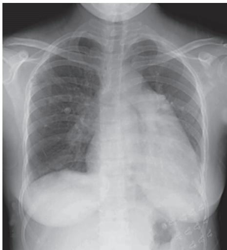  
图 2-12-1 肺动脉高压 X 线胸片正位

表 2-12-2 超声心动图和多普勒超声在肺动脉高压中的评估及临床建议

<table><tr><td>肺动脉高压可能性</td><td>三尖瓣反流峰值流速/(m/s)</td><td>其他“PH征象”</td><td>无PAH或CTEPH危险因素或相关状况</td><td>有PAH或CTEPH危险因素或相关状况</td></tr><tr><td>低</td><td>≤2.8或测量不出</td><td>无</td><td>诊断存疑</td><td>随诊复查Echo</td></tr><tr><td rowspan="2">中</td><td>≤2.8或测量不出</td><td>有</td><td>诊断存疑、随诊</td><td rowspan="2">进一步PH相关检查(包括RHC)</td></tr><tr><td>2.9~3.4</td><td>无</td><td>或复查Echo</td></tr><tr><td rowspan="2">高</td><td>2.9~3.4</td><td>有</td><td rowspan="2">进一步PH相关检查(包括RHC)</td><td rowspan="2">进一步PH相关检查(包括RHC)</td></tr><tr><td>&gt;3.4</td><td>不必要</td></tr></table>

注:其他 PH 征象包括右心室、肺动脉、下腔静脉和右心房的超声心动图征象。

5. 肺功能测定 可有轻到中度限制性通气障碍与弥散功能障碍。

6. 血气分析 多数病人有轻、中度低氧血症，系由通气血流比例失调所致。肺泡高通气导致二氧化碳分压降低。重度低氧血症可能与心排血量下降、合并肺动脉血栓或卵圆孔开放有关。

7. 放射性核素肺通气/灌注显像 IPAH 病人可呈弥漫性稀疏或基本正常,也是排除慢性栓塞性肺动脉高压的重要手段。

8. 右心漂浮导管检查及急性血管反应试验 右心漂浮导管检查是确定肺动脉高压的“金标准”检查,可直接测量肺动脉压力,并测定心排血量,计算肺血管阻力,确定有无左向右分流等,有助于制

订治疗策略。

急性血管反应试验(acute vasoreactivity test)是评价肺血管对短效血管扩张剂的反应性,其目的是筛选出对口服钙通道阻滞剂可能有效的病人。用于该试验的药物有吸入用伊洛前列素、静脉用腺苷和吸入NO。急性血管反应试验阳性标准为mPAP下降≥10mmHg,且mPAP下降到≤40mmHg,同时心排血量增加或保持不变。一般而言,仅有10%～15%的IPAH病人可达到此标准。

#### 【诊断与鉴别诊断】

多普勒超声心动图估测肺动脉收缩压＞50mmHg，结合临床可以诊断肺动脉高压。肺动脉高压的确诊标准是右心导管检查测定平均肺动脉压≥25mmHg。而IPAH属于排除性诊断，必须在除外引起肺动脉高压的各种病因后方可作出诊断。

#### 【治疗】

治疗策略包括:①初始治疗及支持治疗。②急性血管反应试验阳性病人给予高剂量钙通道阻滞剂类药物治疗,急性血管反应试验阴性病人给予靶向药物治疗。③对于治疗反应不佳的病人,联合药物治疗及肺移植。

### （一）初始治疗

建议育龄期女性病人避孕；及时接种流感及肺炎链球菌注射疫苗；予以病人社会心理支持；体力下降病人在药物治疗的基础上进行必要的康复训练；如需要进行手术，首选硬膜外麻醉而非全麻。

### （二）支持治疗

1. 口服抗凝药物 IPAH 病人的尸检显示了血管内原位血栓形成的高患病率, 凝血及纤溶途径异常也有报道, 静脉血栓栓塞症的非特异高危因素包括心衰、制动, 以上都是其进行口服抗凝药物的理论基础。

2. 利尿剂 当失代偿性右心衰竭导致液体潴留、中心静脉压升高、肝脏淤血、腹腔积液和外周水肿时，可使用利尿剂以改善症状。

3. 氧疗 低氧刺激可引起肺血管收缩、红细胞增多而血液黏稠、肺小动脉重塑加速 IPAH 的进展。WHO 功能分级Ⅲ～Ⅳ级和动脉血氧分压持续低于 8kPa（60mmHg）的病人建议进行氧疗，以保持其动脉血氧饱和度持续大于 90%。

4. 地高辛 地高辛能迅速改善 IPAH 的心排血量,并可用于降低 PAH 病人发生房性快速型心律失常的心室率。

5. 贫血和铁状态 铁缺乏与运动能力下降有关,也可能与高死亡率相关,应对病人进行常规的铁状态监测,如有铁缺乏应继续寻找病因,并补充铁制剂。

### (三) 血管扩张药

1. 钙通道阻滞剂（CCB）急性血管反应试验结果阳性是应用 CCB 治疗的指征。CCB 仅对 10%～15% 的 IPAH 病人有效，主要包括硝苯地平、地尔硫草、氨氯地平，心动过缓者倾向于硝苯地平，心动过速者倾向于地尔硫草。需要在治疗 3～4 个月后重新评估其适用性。

2. 前列环素 不仅能扩张血管降低肺动脉压,长期应用尚可逆转肺血管重塑。常用的前列环素类似物有:依前列醇(epoprostenol)、伊洛前列素(iloprost)、贝前列素(beraprost)。另外还有前列环素受体激动剂,如司来帕格。

3. 一氧化氮（NO）NO 吸入是一种选择性地扩张肺动脉而不作用于体循环的治疗方法。但是由于 NO 的作用时间短，且可供吸入的 NO 制备不方便，临床应用尚不普遍。

4. 内皮素受体拮抗剂 常用内皮素受体拮抗剂有: 波生坦(bosentan)、安立生坦(ambrisentan)、马昔腾坦(macitentan)。

5. 磷酸二酯酶(PDE)-5抑制剂 包括西地那非(sildenafil)、他达拉非(tadalafil)、伐地那非(vardenafil)。

6. 可溶性鸟苷酸环化酶(sGC)激动剂 利奥西呱(riociguat),不推荐利奥西呱与PDE-5抑制剂联合应用。

### （四）肺或心肺移植

经积极内科治疗临床效果不佳的病人可以行肺移植治疗。肺静脉闭塞病(PVOD)和肺毛细血管瘤样增生症(PCH)病人的预后差,且缺乏有效的内科治疗方法,一旦被诊断为上述两种疾病即应考虑肺移植。如同时判断伴有心脏结构或功能出现不可逆损害,可考虑行心肺联合移植。

### （五）健康指导

对 IPAH 病人进行生活指导,加强相关卫生知识的宣传教育,增强病人战胜疾病的信心,预防肺部感染。

# 第三节 | 慢性肺源性心脏病

肺源性心脏病（cor pulmonale）简称肺心病，是指由支气管-肺组织、胸廓或肺血管病变致肺血管阻力增加，产生肺动脉高压，继而右心室结构或/和功能改变的疾病。根据起病缓急和病程长短，可分为急性和慢性肺心病两类。急性肺心病常见于急性大面积肺栓塞，详见本篇第十一章肺栓塞。本节重点论述慢性肺心病。

#### 【流行病学】

我国在20世纪70年代的普查结果表明，>14岁人群慢性肺心病的患病率为4.8‰。1992年在北京、湖北、辽宁农村调查102 230例居民的慢性肺心病患病率为4.4‰，其中≥15岁人群的患病率为6.7‰。慢性肺心病的患病率存在地区差异，北方地区患病率高于南方地区，农村患病率高于城市，并随年龄增长而增加。吸烟者比不吸烟者患病率明显增多，男女无明显差异。冬春季节和气候骤然变化时，易出现急性发作。

#### 【病因】

按原发病的不同部位,可分为以下几类。

1. 支气管、肺疾病 以慢阻肺病最为多见，约占 $80\% \sim 90\%$ ，其他包括间质性肺疾病、支气管哮喘、支气管扩张、肺结核等。

2. 胸廓运动障碍性疾病 较少见,严重胸廓或脊椎畸形以及神经肌肉疾病均可引起胸廓活动受限、肺受压、支气管扭曲或变形,导致肺功能受损。气道引流不畅,肺部反复感染,并发肺气肿或纤维化。

3. 肺血管疾病 特发性肺动脉高压、慢性栓塞性肺动脉高压和肺动脉炎均可引起肺血管阻力增加、肺动脉压升高和右心室负荷加重，发展成慢性肺心病。

4. 其他 原发性肺泡通气不足及先天性口咽畸形、睡眠呼吸暂停低通气综合征等均可产生低氧血症，引起肺血管收缩，导致肺动脉高压，发展成慢性肺心病。

#### 【发病机制和病理生理改变】

### （一）肺动脉高压的形成

1. 肺血管阻力增加的功能性因素 肺血管收缩在低氧性肺动脉高压的发生中起着关键作用。缺氧、高碳酸血症和呼吸性酸中毒使肺血管收缩、痉挛，其中缺氧是肺动脉高压形成最重要的因素。

缺氧时收缩血管的活性物质增多，如白三烯、5-羟色胺（5-HT）、血管紧张素Ⅱ、血小板活化因子（PAF）等使肺血管收缩，血管阻力增加。内皮源性舒张因子（EDRF）和内皮源性收缩因子（EDCF）的平衡失调，在缺氧性肺血管收缩中也起一定作用。缺氧使平滑肌细胞膜对 $\mathrm{Ca^{2+}}$ 的通透性增加，细胞内 $\mathrm{Ca^{2+}}$ 含量增高，肌肉兴奋-收缩偶联效应增强，直接使肺血管平滑肌收缩。

高碳酸血症时,由于 $H^{+}$ 产生过多,使血管对缺氧的收缩敏感性增强,致肺动脉压增高。

2. 肺血管阻力增加的解剖学因素 解剖学因素系指肺血管解剖结构的变化,形成肺循环血流动力学障碍。主要原因如下。

（1）肺血管重塑:特发性肺动脉高压的肺动脉病变、CTEPH 的慢性血栓阻塞均是肺血管重塑的常见原因,慢阻肺病、间质性肺疾病等病人慢性缺氧可使肺血管收缩,管壁张力增高,同时缺氧时肺内产生多种生长因子(如多肽生长因子),可直接刺激管壁平滑肌细胞、内膜弹力纤维及胶原纤维增生。

（2）长期反复发作的慢阻肺病及支气管周围炎，可累及邻近肺小动脉，引起血管炎，管壁增厚、管腔狭窄或纤维化，甚至完全闭塞，使肺血管阻力增加，产生肺动脉高压。

（3）肺气肿导致肺泡内压增高，压迫肺泡毛细血管，造成毛细血管管腔狭窄或闭塞。肺泡壁破裂造成毛细血管网的毁损，肺泡毛细血管床减损超过70%时肺循环阻力增大。

（4）血栓形成: 尸检发现, 部分慢性肺心病急性发作期病人存在多发性肺微小动脉原位血栓形成, 引起肺血管阻力增加, 加重肺动脉高压。

3. 血液黏稠度增加和血容量增多 慢性缺氧产生继发性红细胞增多,血液黏稠度增加。缺氧可使醛固酮增加,导致水、钠潴留;缺氧又使肾小动脉收缩,肾血流减少也加重水、钠潴留,血容量增多。血液黏稠度增加和血容量增多,可导致肺动脉压升高。

### （二）心脏病变和心力衰竭

肺循环阻力增加导致肺动脉高压，右心发挥其代偿功能，以克服升高的肺动脉阻力而发生右心室肥厚。肺动脉高压早期，右心室尚能代偿，舒张末期压仍正常。随着病情的进展，特别是急性加重期，肺动脉压持续升高，超过右心室的代偿能力，右心失代偿，右心排血量下降，右心室收缩末期残留血量增加，舒张末期压增高，促使右心室扩大和右心衰竭。

### （三）其他重要脏器的损害

缺氧和高碳酸血症除影响心脏外，尚导致其他重要脏器如脑、肝、肾、胃肠及内分泌系统、血液系统等发生病理改变，引起多脏器的功能损害，详见本篇第十六章。

#### 【临床表现】

### （一）肺、心功能代偿期

1. 症状 咳嗽、咳痰、气促，活动后可有心悸、呼吸困难、乏力和劳动耐力下降。少有胸痛或咯血。

2. 体征 可有不同程度的发绀，原发肺脏疾病体征，如肺气肿体征，干、湿啰音， $P_{2}>A_{2}$ ，三尖瓣区可出现收缩期杂音或剑突下心脏搏动增强，提示有右心室肥厚。部分病人因肺气肿使胸腔内压力升高，阻碍腔静脉回流，可有颈静脉充盈甚至怒张，或使横膈下降致肝界下移。

### （二）肺、心功能失代偿期

1. 呼吸衰竭

（1）症状：呼吸困难加重，常有头痛、失眠、食欲缺乏，白天嗜睡，部分病人甚至出现表情淡漠、神志恍惚、谵妄等肺性脑病的表现。

（2）体征：发绀明显，球结膜充血、水肿，严重时可有视网膜血管扩张、视盘水肿等颅内压升高的表现。腱反射减弱或消失，出现病理反射。因高碳酸血症可出现周围血管扩张的表现，如皮肤潮红、多汗。

2. 右心衰竭

(1) 症状: 明显气促, 心悸、食欲缺乏、腹胀、恶心等。

（2）体征：发绀明显，颈静脉怒张，心率增快，可出现心律失常，剑突下可闻及收缩期杂音，甚至出现舒张期杂音。肝大且有压痛，肝颈静脉回流征阳性，下肢水肿，重者可有腹腔积液。少数病人可出现肺水肿及全心衰竭的体征。

#### 【辅助检查】

1. X 线检查 除肺、胸基础疾病及急性肺部感染的特征外，尚有肺动脉高压征象(图 2-12-2)。

2. 心电图检查 心电图对慢性肺心病的诊断阳性率为 60.1%～88.2%。慢性肺心病的心电图诊

断标准如下:①额面平均电轴≥+90°;② $V_{1}R/S \geqslant 1$ ;③重度顺钟向转位( $V_{5}R/S \leqslant 1$ );④ $R_{V1} + S_{V5} \geqslant 1.05mV$ ;⑤aVR导联R/S或R/Q≥1;⑥ $V_{1} \sim V_{3}$ 呈QS、Qr或qr(酷似心肌梗死,应注意鉴别);⑦肺型P波。具有一条即可诊断。典型慢性肺心病的心电图表现见图2-12-3。

3. 超声心动图检查 超声心动图诊断肺心病的阳性率为60.6%～87.0%。慢性肺心病的超声心动图诊断标准如下：①右心室流出道内径≥30mm；②右心室内径≥20mm；③右心室前壁厚度≥5mm或前壁搏动幅度增强；④左、右心室内径比值<2；⑤右肺动脉内径≥18mm或肺动脉干≥20mm；⑥右室流出道/左房内径>1.4；⑦肺动脉瓣曲线出现肺动脉高压征象者（a波低平或<2mm，或有收缩中期关闭征等）。

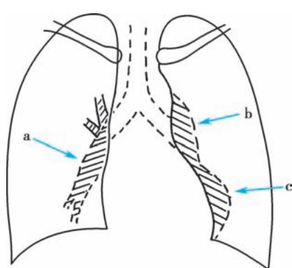  
图 2-12-2 慢性肺心病 X 线胸片正位右下肺动脉干增宽(a)，肺动脉段凸出(b)，心尖上凸(c)。

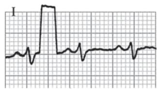

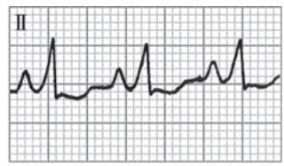

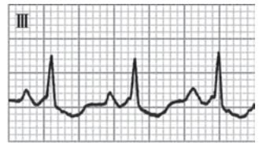

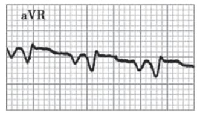

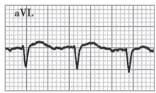

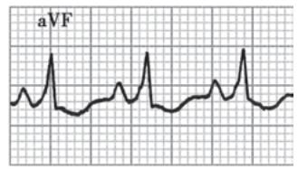

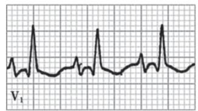

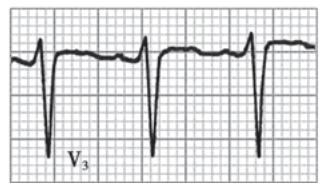  
图 2-12-3 慢性肺心病的心电图改变

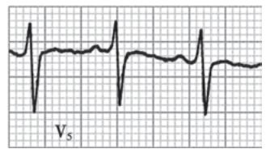  
电轴右偏,顺钟向转位,肺性 P 波, $V_{1}$ 导联 QRS 波群呈 qR, $V_{5}R/S<1$ , $R_{V1}+S_{V5}=1.5mV$ 。

4. 血气分析 可出现低氧血症甚至呼吸衰竭或合并高碳酸血症。

5. 血液化验 红细胞及血红蛋白可升高。全血黏度及血浆黏度可增加，红细胞电泳时间常延长。心功能不全时可伴有肾功能或肝功能异常。

6. 其他 疾病原学检查可以指导抗生素的选用。早期或缓解期慢性肺心病可行肺功能检查评价。

#### 【诊断】

根据病人有慢阻肺病或慢性支气管炎、肺气肿病史，或其他胸肺疾病病史，并出现肺动脉压增高、右心室增大或右心功能不全的征象，如颈静脉怒张、 $P_{2}>A_{2}$ 、剑突下心脏搏动增强、肝大压痛、肝颈静脉反流征阳性、下肢水肿等，心电图、X线胸片、超声心动图有肺动脉增宽和右心增大、肥厚的征象，可以作出诊断。

#### 【鉴别诊断】

1. 冠状动脉粥样硬化性心脏病(冠心病) 慢性肺心病与冠心病均多见于老年人。冠心病多有典型的心绞痛、心肌梗死病史或心电图表现，若有左心衰竭的发作史、原发性高血压、高脂血症、糖尿病病史，则更有助于鉴别。体格检查、X线、心电图、超声心动图检查呈左心室肥厚为主的征象，冠状动脉造影提示冠状动脉狭窄可资鉴别。慢性肺心病合并冠心病时鉴别有较多困难，应详细询问病史，并结合体格检查和有关心、肺功能检查加以鉴别。

2. 风湿性心脏病 风湿性心脏病的三尖瓣疾病,应与慢性肺心病的相对三尖瓣关闭不全相鉴别。前者往往有风湿性关节炎和心肌炎病史,其他瓣膜如二尖瓣、主动脉瓣常有病变,X线、心电图、超声心动图有特殊表现。

3. 原发性心肌病 本病多为全心增大,无慢性支气管、肺疾病史,无肺动脉高压的 X 线表现等(详见第三篇第六章心肌疾病)。

#### 【治疗】

### （一）肺、心功能代偿期

可采用综合治疗措施，延缓基础支气管、肺疾病的进展，预防感染，减少或避免急性加重，加强康复锻炼和营养，需要时长期家庭氧疗或家庭无创呼吸机治疗等，以改善病人的生活质量。继发于慢阻肺病者，具体方法参阅本篇第三章。

### （二）肺、心功能失代偿期

治疗原则为积极控制感染，通畅呼吸道，改善呼吸功能，纠正缺氧和/或二氧化碳潴留，控制呼吸衰竭和心力衰竭，防治并发症。

1. 控制感染 呼吸系统感染是引起慢性肺心病急性加重致肺、心功能失代偿的常见原因，需积极控制感染，抗生素选用参阅本篇第三章和第六章。

2. 控制心力衰竭 慢性肺心病病人一般在积极控制感染、改善呼吸功能、纠正缺氧和二氧化碳潴留后，心力衰竭便能得到改善，病人尿量增多，水肿消退，不需常规使用利尿药和正性肌力药。但对经上述治疗无效或严重心力衰竭病人，可适当选用利尿药、正性肌力药或扩血管药物。

（1）利尿药：通过抑制肾脏钠、水重吸收而增加尿量，消除水肿，减少血容量，减轻右心前负荷的作用。但是利尿药应用后易出现低钾、低氯性碱中毒，痰液黏稠不易排痰和血液浓缩，应注意预防。因此，原则上宜选用作用温和的利尿药，联合保钾利尿药，小剂量、短疗程使用。如氢氯噻嗪25mg，1～3次/日，联用螺内酯20～40mg，1～2次/日。

（2）正性肌力药：慢性肺心病病人由于慢性缺氧及感染，对洋地黄类药物的耐受性低，易致中毒，出现心律失常。因此是否应用应持慎重态度，指征有：①感染已控制，呼吸功能已改善，利尿治疗后右心功能无改善者；②以右心衰竭为主要表现而无明显感染的病人；③合并室上性快速型心律失常，如室上性心动过速、心房颤动(心室率＞100次/分)者；④合并急性左心衰竭的病人。原则上选用作用快、排泄快的洋地黄类药物，小剂量(常规剂量的1/2或2/3)静脉给药，常用毒毛花苷K0.125～0.25mg，或毛花苷丙0.2～0.4mg加入10%葡萄糖溶液内缓慢静脉注射。用药前应注意纠正缺氧，防治低钾血症，以免发生药物毒性反应。低氧血症、感染等均可使心率增快，故不宜以心率作为衡量洋地黄类药物的应用和疗效考核指征。

（3）血管扩张药：对于动脉性肺动脉高压、CTEPH引起的肺心病可应用靶向药物，降低肺血管阻力，但对于慢阻肺病、间质性肺病等所致肺心病者，血管扩张药有可能加重通气血流比例失调，加重缺氧，且在扩张肺动脉的同时也扩张体动脉，容易造成体循环血压下降，反射性产生心率增快、氧分压下降、二氧化碳分压上升等不良反应，因而限制了血管扩张药的临床应用。

3. 防治并发症

（1）肺性脑病：由于呼吸衰竭所致缺氧、二氧化碳潴留而引起的神经精神障碍综合征，常继发于慢阻肺病。诊断肺性脑病必须除外脑血管疾病、感染中毒性脑病、严重电解质紊乱等。治疗参见本篇第十六章呼吸衰竭。

（2）酸碱失衡及电解质紊乱：慢性肺心病失代偿期常合并各种类型的酸碱失衡及电解质紊乱。呼吸性酸中毒以通畅气道、纠正缺氧和解除二氧化碳潴留为主。呼吸性酸中毒合并代谢性酸中毒通常需要补碱治疗，尤其当 $\mathrm{pH} < 7.2$ 时，先补充 $5\%$ 碳酸氢钠 $100\mathrm{ml}$ ，然后根据血气分析结果酌情处理。呼吸性酸中毒合并代谢性碱中毒常合并低钠、低钾、低氯等电解质紊乱，应根据具体情况进行补充。低钾、低氯引起的代谢性碱中毒多是医源性的，应注意预防。

（3）心律失常：多表现为房性期前收缩及阵发性室上性心动过速，其中以紊乱性房性心动过速最具特征性。也可有心房扑动及心房颤动。一般的心律失常经过控制感染，纠正缺氧、酸碱失衡和电解质紊乱后，心律失常可自行消失。如果持续存在，可根据心律失常的类型选用药物，详见第三篇第三章心律失常。

（4）休克：合并休克并不多见，一旦发生则预后不良。发生原因有严重感染、失血(多由上消化道出血所致)和严重心力衰竭或心律失常。

（5）消化道出血:慢性肺心病由于感染、呼吸衰竭、心力衰竭致胃肠道淤血,以及应用糖皮质激素等,常常并发消化道出血,需要预防治疗,一旦发生需要积极处理。

(6) 弥散性血管内凝血 (DIC): 详见第六篇第十七章弥散性血管内凝血。

(7) 深静脉血栓形成: 低剂量普通肝素或低分子量肝素可用于预防。

#### 【预后】

慢性肺心病常反复急性加重,随肺功能的损害病情逐渐加重,多数预后不良,病死率约在10%～15%,但经积极治疗可以延长寿命,提高病人生活质量。

#### 【预防】

主要是防治支气管、肺和肺血管等基础疾病，预防肺动脉高压、慢性肺心病的发生发展。

(代华平)
