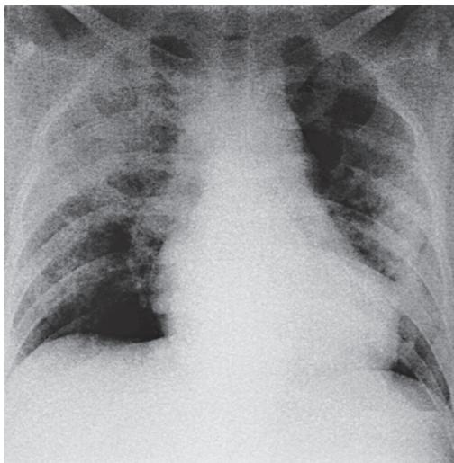

> [!info] 导航
> [[第015章_第2篇第14章_睡眠呼吸障碍|上一章]] · [[00_章节导航|总目录]] · [[第017章_第2篇第16章_呼吸衰竭与呼吸支持技术|下一章]]

本章数字资源

急性呼吸窘迫综合征（acute respiratory distress syndrome, ARDS）是指由各种肺内和肺外致病因素所导致的急性呼吸衰竭。ARDS 的主要病理特征是炎症反应所致急性肺损伤，表现为肺微血管内皮及肺泡上皮受损，肺微血管通透性增高，肺泡腔渗出富含蛋白质的液体，进而导致肺水肿及透明膜形成和大量肺泡不张。主要病理生理改变是肺容积缩小、肺顺应性降低和以分流为主要特征的严重通气血流比例失调。临床表现为呼吸窘迫及难治性低氧血症，肺部影像学显示双肺渗出性改变。

为了强调 ARDS 为一动态发病过程，以便早期干预、提高临床疗效，以及对不同发展阶段的病人按严重程度进行分级，1994 年的美欧 ARDS 联席会议（AECC）同时提出了急性肺损伤（acute lung injury, ALI）和 ARDS 的概念。ALI 和 ARDS 为同一疾病过程的两个阶段，ALI 代表早期和病情相对较轻的阶段，而 ARDS 代表后期病情较严重的阶段，55% 的 ALI 会在 3 天内进展为 ARDS。鉴于用不同名称区分严重程度可能给临床和研究带来困惑，2012 年发表的 ARDS 柏林定义取消了 ALI 命名，统一称为 ARDS，原 ALI 相当于轻度 ARDS。2023 年全球 ARDS 领域的专家们共同提出了 ARDS 新定义，对于 ARDS 肺部病变检测手段、氧合判断前提及标准等做出了新定义。

#### 【病因】

引起 ARDS 的病因很多,可以分为肺内因素(直接因素)和肺外因素(间接因素),但是这些直接和间接因素及其所引起的炎症反应、影像改变及病理生理反应常常相互重叠。ARDS 的常见危险因素列于表 2-15-1。近年来,社会发展和医疗进步导致 ARDS 病因分布发生变化。自 2018 年起,电子烟相关肺损伤成为青年人 ARDS 的新发病因。抗肿瘤治疗的进展使化疗药物和免疫检查点抑制剂相关肺损伤成为药物所致 ARDS 的重要病因之一。此外,病毒感染一直以来都是 ARDS 的主要病因之一,由于 SARS-CoV-2(COVID-19)的大流行,病毒感染所占 ARDS 比例显著增加。

#### 【病理与病理生理】

ARDS 病理过程可大致分为三个阶段: 渗出期、增生期和纤维化期, 三个阶段常重叠存在。

表 2-15-1 急性呼吸窘迫综合征的常见危险因素

<table><tr><td>肺炎</td></tr><tr><td>非肺源性感染中毒症</td></tr><tr><td>胃内容物吸入</td></tr><tr><td>大面积创伤</td></tr><tr><td>肺挫伤</td></tr><tr><td>胰腺炎</td></tr><tr><td>吸入性肺损伤</td></tr><tr><td>重度烧伤</td></tr><tr><td>非心源性休克</td></tr><tr><td>药物过量</td></tr><tr><td>输血相关急性肺损伤</td></tr><tr><td>肺血管炎</td></tr><tr><td>溺水</td></tr></table>

1. 渗出期 ARDS 发病后的前 7 天, 病理上表现为渗出期。在此期, ARDS 的病理改变为弥漫性肺泡损伤 (diffuse alveolar damage, DAD), 主要表现为肺毛细血管内皮细胞和肺泡上皮细胞损伤, I 型肺泡上皮细胞受损坏死, 肺间质和肺泡腔内有富含蛋白质的水肿液及炎症细胞浸润, 肺微血管充血、出血、微血栓形成。经过约 72 小时后, 由凝结的血浆蛋白、细胞碎片、纤维素及残余的肺表面活性物质混合形成透明膜, 伴灶性或大面积肺泡萎陷。ARDS 肺大体表现为暗红色或暗紫红色的肝样变, 重量明显增加, 可见水肿、出血, 切面有液体渗出, 故有 “湿肺” 之称。由于肺泡膜通透性增加与肺表面活性物质减少, 进而引起肺间质和肺泡水肿以及小气道陷闭和肺泡萎陷不张。通过 CT 观察发现, ARDS 肺部形态改变具有两个特点, 一是肺水肿和肺不张在肺内呈 “不均一” 分布, 即在重力依赖区(dependent regions, 仰卧位时靠近背部的肺区)以肺水肿和肺不张为主, 通气功能极差, 而在非重力依赖区 (non-dependent regions, 仰卧位时靠近前胸壁的肺区) 的肺泡通气功能基本正常; 二是由于肺水肿和肺泡萎陷, 使功能残气量和有效参与气体交换的肺泡数量减少, 因而称 ARDS 病人的肺为 “婴儿肺” (baby lung) 或 “小肺” (small lung)。上述病理和肺形态改变可引起肺顺应性降低、肺内分流增加, 造成顽固性低氧血症和呼吸窘迫。呼吸窘迫的发生机制主要有: ①低氧血症刺激颈动脉体和主动脉体化学感受器, 反射性刺激呼吸中枢, 产生过度通气; ②肺充血、水肿刺激毛细血管旁 J 感受器, 反射性使呼吸加深、加快, 导致呼吸窘迫。由于呼吸的代偿, $\mathrm{PaCO}_{2}$ 最初可以表现为降低或正常。另外, 由于微血管闭塞、功能残气量减少导致的肺血管阻力增加会导致肺动脉高压及无效腔增大, 严重者可出现急性肺心病及高碳酸血症。

2. 增生期 通常为 ARDS 发病后 7～21 天, 部分病人肺损伤进一步发展, 出现早期纤维化, 典型组织学改变是炎性渗出液和肺透明膜吸收消散而修复, 亦可见肺泡渗出并机化形成, 其中淋巴细胞增多取代中性粒细胞。此外, 作为修复过程的一部分, II 型肺泡上皮细胞沿肺泡基底膜增殖, 合成分泌新的肺表面活性物质, 并可分化为 I 型肺泡上皮细胞。

3. 纤维化期 尽管多数 ARDS 病人发病 3～4 周后，肺功能得以恢复，仍有部分病人将进入纤维化期，可能需要长期机械通气和/或氧疗。组织学上，早期的肺泡炎性渗出水肿转化为肺泡腔及肺间质纤维化。腺泡结构的显著破坏导致肺组织呈肺气肿样改变和肺大疱形成。以上病理变化导致肺顺应性及可复张性下降，此阶段容易发生气压伤。同时，肺毛细血管床数量显著减少、肺泡间隔增厚、肺微血管内膜的纤维化及微血栓形成致血管闭塞均导致无效腔的增加，从而造成气体交换障碍，形成顽固的高碳酸血症。另外，由于肺微循环阻力的增加，造成了肺循环压力的升高，从而导致肺动脉高压。

#### 【临床表现】

ARDS 大多数于原发病起病后 72 小时内发生,几乎不超过 7 天。除原发病的相应症状和体征外,最早出现的症状是呼吸增快,并呈进行性加重的呼吸困难、发绀,常伴有烦躁、焦虑、出汗等。其呼吸困难的特点是呼吸深快、费力,病人常感到胸廓紧束、严重憋气,即呼吸窘迫,不能用通常的吸氧疗法改善,亦不能用其他原发心肺疾病(如气胸、肺气肿、肺不张、肺炎、心力衰竭)解释。早期体征可无异常,或仅在双肺闻及少量细湿啰音;后期查体多可闻及水泡音,可有管状呼吸音。

#### 【辅助检查】

1. X线胸片及CT 早期可无异常或呈轻度间质改变,表现为边缘模糊的肺纹理增多,继之出现双侧斑片状以至融合成大片状的磨玻璃或实变浸润影(图2-15-1)。其演变过程符合肺水肿的特点,快速多变;后期可出现肺间质纤维化的改变。虽然从准确性来讲CT优于X线胸片,但由于其高辐射以及危重病人转运高风险而限制了CT的广泛应用。目前,ARDS的诊断仍以X线胸片为主。

2. 肺部超声 双侧多发 B 线和/或实变征象为 ARDS 肺部超声表现。超声检查便捷、安全并可实现动态评估。其敏感性好，但特异性一般，且存在操作者间异质性，可能导致假阳性率的增加。因此，该评估需由经过规范培训的超声医师进行。

3. 动脉血气分析 典型的改变为 $PaO_{2}$ 降低， $PaCO_{2}$ 降低，pH 升高。根据动脉血气分析和吸入氧浓度

  
图 2-15-1 ARDS 病人的 X 线胸片显示两肺广泛斑片浸润影

可计算肺氧合功能指标,如氧合指数 $\left(\mathrm{PaO}_{2}/\mathrm{FiO}_{2}\right)$ 、肺泡-动脉血氧分压差 $\left[\mathrm{P}_{\left(\mathrm{A}-\mathrm{a}\right)}\mathrm{O}_{2}\right]$ 、肺内分流(QS/QT)等指标,对建立诊断、严重性分级和疗效评价等均有重要意义。目前在临床上以 $PaO_{2}/FiO_{2}$ 最为常用,正常值为400～500mmHg。早期由于过度通气而出现呼吸性碱中毒,pH可高于正常, $PaCO_{2}$ 低于正常。后期若无效腔通气增加、呼吸肌疲劳或合并代谢性酸中毒，则 $\mathrm{pH}$ 可低于正常， $\mathrm{PaCO_2}$ 高于正常。

4. $SpO_{2}/FiO_{2}$ 当 $SpO_{2}\leqslant97\%$ 时， $SpO_{2}/FiO_{2}$ 与 $PaO_{2}/FiO_{2}$ 呈良好的线性相关。因此在动脉血气无法获及的情况下，可以通过 $SpO_{2}/FiO_{2}$ 替代 $PaO_{2}/FiO_{2}$ 判断病人的氧合情况及 ARDS 严重程度。

5. 床旁呼吸功能监测 ARDS 时肺水肿、肺顺应性降低、出现明显的肺内分流,但无呼吸气流受限。床旁呼吸力学监测常提示低顺应性,阻力相对正常和有高分流率的表现。上述改变对 ARDS 疾病严重性评价和疗效判断有一定的意义。

6. 心脏超声和 Swan-Ganz 导管检查 心脏超声有助于鉴别心源性肺水肿和指导治疗，且具有无创、无辐射、可重复等优点。如条件允许，在诊断 ARDS 时应常规进行心脏超声检查。Swan-Ganz 导管测定肺动脉楔压（PAWP）>18mmHg 可以很好地提示急性左心衰和心源性肺水肿，但需要关注心源性肺水肿和 ARDS 有合并存在的可能性，因此目前认为 PAWP>18mmHg 并非 ARDS 的排除标准，如果呼吸衰竭的临床表现不能完全用左心衰竭解释时，仍应考虑 ARDS 的诊断。另 Swan-Ganz 导管置入损伤大，并发症较多，已不作为鉴别心源性肺水肿的常规检查手段。

#### 【诊断】

根据 ARDS 柏林定义,满足以下四项条件方可诊断 ARDS。

1. 明确诱因下 1 周内出现的急性或进展性呼吸困难。

2. X 线胸片 / 胸部 CT 显示双肺浸润影, 不能完全用胸腔积液、肺叶 / 全肺不张和结节影解释。

3. 呼吸衰竭不能完全用心力衰竭或液体过负荷解释。如果临床没有危险因素,需要用客观检查(如心脏超声)来评价心源性肺水肿。

4. 低氧血症 根据 $\mathrm{PaO}_2 / \mathrm{FiO}_2$ 确立 ARDS 诊断，并将其按严重程度分为轻度、中度和重度 3 种。需要注意的是上述氧合指数中的 $\mathrm{PaO}_2$ 都是在机械通气 PEEP 或 CPAP 不低于 $5\mathrm{cmH}_2\mathrm{O}$ 的条件下测得；所在地海拔超过 $1000\mathrm{m}$ 时，需对 $\mathrm{PaO}_2 / \mathrm{FiO}_2$ 进行校正，校正后的 $\mathrm{PaO}_2 / \mathrm{FiO}_2 = (\mathrm{PaO}_2 / \mathrm{FiO}_2) \times$ （所在地大气压值/760）。

轻度:200mmHg< $PaO_{2}/FiO_{2}\leqslant300mmHg$ 。

中度: $100mmHg < PaO_{2}/FiO_{2} \leq 200mmHg$ 。

重度: $PaO_{2}/FiO_{2}\leqslant100mmHg$ 。

2023 年, ATS 发布了 ARDS 新定义。该定义继续保留了柏林定义中关于在明确诱因下 1 周内出现急性或进展性呼吸困难的时间要求, 增加了可以由经过规范培训的操作者行胸部超声评估双肺病变, 不再强制要求 PEEP 或 CPAP 不低于 $5 \, cmH_{2}O$ 作为诊断的前提条件, 并且引入 $SpO_{2}/FiO_{2}$ 作为氧合评估的指标之一。具体如下:

1. 由各种急性诱发因素如肺炎、肺外感染、创伤、误吸、休克、输血等所诱发。

2. 明确诱因下 1 周内出现的急性呼吸衰竭或呼吸衰竭加重。

3. 需除外主要由心源性/液体过负荷所引起的肺水肿和主要由肺不张导致的低氧血症。

4. X 线胸片或胸部 CT 表现为双侧渗出影, 或胸部超声 (经过规范培训的医生) 提示双侧 B 线或实变征象。

5. 氧合指标

（1）未插管病人：HFNC 流量≥30L/min 或无创正压通气（NPPV）的呼气相气道正压（EPAP）或持续气道正压（CPAP）≥5cmH₂O 前提下，PaO₂/FiO₂≤300mmHg 或 SpO₂/FiO₂≤315mmHg（且 SpO₂≤97%）。

(2) 插管病人

轻度 ARDS: 200mmHg < PaO₂/FiO₂ ≤ 300mmHg 或 235mmHg < SpO₂/FiO₂ ≤ 315mmHg (且 SpO₂ ≤ 97%)。
中度 ARDS: 100mmHg < PaO₂/FiO₂ ≤ 200mmHg 或 148mmHg < SpO₂/FiO₂ ≤ 235mmHg (且 SpO₂ ≤ 97%)。
重度 ARDS: PaO₂/FiO₂ ≤ 100mmHg 或 SpO₂/FiO₂ ≤ 148mmHg (且 SpO₂ ≤ 97%)。

（3）在资源有限地区，不需呼气末正压及HFNC气流量作为前提条件，仅根据 $\mathrm{SpO}_2 / \mathrm{FiO}_2 \leqslant 315\mathrm{mmHg}$ （且 $\mathrm{SpO}_2 \leqslant 97\%$ ）也可诊断ARDS。

#### 【鉴别诊断】

上述 ARDS 的诊断标准是非特异的。因 ARDS 是一组临床综合征, 其病因众多, 因此病因诊断至关重要。建立诊断时必须排除心源性肺水肿、大面积肺不张、大量胸腔积液、弥漫性肺泡出血等，通常能通过详细询问病史、体检、X线胸片、心脏超声及血液化验等作出鉴别。心源性肺水肿病人卧位时呼吸困难加重，咳粉红色泡沫样痰，肺湿啰音多在肺底部，对强心、利尿等治疗效果较好。鉴别困难时，可通过超声心动图检测心室功能等作出判断并指导治疗。

#### 【治疗】

治疗原则包括原发病的治疗、脏器功能支持以及并发症的处理。以下按照现有循证医学证据级别，对治疗方式进行具体阐述。

### （一）原发病的治疗

是治疗 ARDS 的首要原则和基础,应积极寻找 ARDS 诱因并予以充分治疗。感染是 ARDS 的最常见诱因,且 ARDS 也易继发感染,因此对所有 ARDS 病人都应怀疑感染的可能,除非有明确的其他导致 ARDS 的原因存在。治疗上宜根据宿主免疫状态、感染部位、感染严重程度、多重耐药菌感染风险等经验性选择适宜的抗生素。

### （二）纠正缺氧

ARDS 病人氧疗目标为 $PaO_{2}$ 55～80mmHg 或 $SaO_{2}$ 88%～95%。应选择能达到目标氧合的最低吸氧浓度，并根据病人低氧血症的严重程度选择氧疗手段（详见本章第三节呼吸支持技术）。

### （三）机械通气

尽管 ARDS 机械通气的指征尚无统一标准，多数学者认为一旦诊断为 ARDS，应尽早进行机械通气。轻度 ARDS 病人可在密切监护下试用 NPPV。若病人经高浓度吸氧或 NPPV 支持下仍无法改善低氧血症或出现明显呼吸窘迫时，应尽早行有创机械通气。机械通气的目的是维持充分的通气和氧合，以支持脏器功能。由于 ARDS 肺部病变具有 “不均一性” 和 “小肺” 的特点，因此 ARDS 机械通气的关键在于：复张萎陷的肺泡并使其维持开放状态，以增加肺容积和改善氧合，同时避免肺泡过度扩张和反复开闭所造成的损伤。ARDS 的机械通气推荐采用肺保护性通气策略，包括小潮气量通气策略、较高 PEEP、重度 ARDS 病人俯卧位通气等。

1. 小潮气量通气策略 主要指小潮气量及限制平台压。ARDS机械通气强烈推荐采用小潮气量，即 $4\sim 8\mathrm{ml / kg}$ 理想体重，同时将吸气平台压控制在 $30\mathrm{cmH_2O}$ 以下，防止肺泡过度扩张。部分病人实施保护性肺通气策略后可能出现一定程度的 $\mathrm{CO}_{2}$ 潴留和呼吸性酸中毒（ $\mathrm{pH} > 7.2$ ），接受高碳酸血症并继续实施上述通气策略称为允许性高碳酸血症，即容忍高碳酸血症的存在而非将改善高碳酸血症作为通气目标。

2. PEEP 的调节 适当水平的 PEEP 可使萎陷的小气道和肺泡开放, 增加呼气末肺容积, 并可减轻肺损伤和肺泡水肿, 从而改善肺泡弥散功能和通气血流比例, 减少肺内分流, 达到改善氧合和肺顺应性的目的。同时可防止肺泡周期性塌陷开放而产生的剪切伤。推荐对中-重度 ARDS 病人使用较高水平 PEEP。但 PEEP 通气会增加胸内正压, 减少回心血量, 并有加重肺损伤的潜在危险。最佳 PEEP 的确定方式目前还无定论, 可根据中国急性呼吸窘迫综合征研究联盟 (Chi-ARDSnet) 吸氧浓度和 PEEP 对照表格、最佳氧合法、食管压监测、电阻抗断层成像 (EIT) 等方法确定。

3. 俯卧位通气 俯卧位通气通过降低胸腔内压力梯度、使肺内液体重分布、促进分泌物引流等改善通气血流比例，从而改善氧合并降低重度 ARDS 病人的病死率。对于重度 ARDS 病人，强烈推荐每日至少 12 小时的俯卧位通气。操作过程中需密切监测气管导管、血管内置管等管路安全。严重低血压、室性心律失常、颅内压增高、颜面部创伤及不稳定的脊柱骨折等是俯卧位通气的禁忌。

4. 肺复张 为限制气道平台压而采取小潮气量通气往往不利于 ARDS 塌陷肺泡的复张，且 PEEP 维持肺泡开放的效应依赖于吸气期肺泡膨胀的程度。因此，通过短时间增加气道压力，使萎陷肺泡重新开放，从而降低肺内分流，改善氧合。

5. 神经肌肉阻滞剂 ARDS 病人过强的呼吸驱动使病人氧耗及气压伤的风险增加。神经肌肉阻滞剂通过松弛骨骼肌，改善人机协调性、降低氧耗。但长时间应用有增加 ICU 获得性衰弱及呼吸机相关肺炎的风险。对于重度 ARDS 早期伴随难治性低氧血症、人机不协调、高气压伤风险以及需要俯卧位通气的病人，可短时间（不超过 48 小时）应用。

### （四）体外膜肺氧合

（ECMO） ECMO 是一种体外生命支持方式，可以暂时性地支持难治性呼吸和/或循环衰竭病人。但目前针对 ECMO 的临床研究结果并不一致。对于原发病可逆的重度 ARDS 病人可考虑 ECMO 作为挽救性治疗措施。具体指征如下：机械通气时间 <7 天，在肺保护性通气联合俯卧位、神经肌肉阻滞剂及肺复张等措施下，优化呼吸机设置（ $FiO_{2} \geqslant 0.8$ ，潮气量 6ml/kg 理想体重， $PEEP \geqslant 10cmH_{2}O$ ），仍存在严重低氧血症和/或呼吸性酸中毒： $PaO_{2}/FiO_{2} < 50mmHg$ 持续 >3 小时，或 $PaO_{2}/FiO_{2} < 80mmHg$ 持续 >6 小时；或通气频率增加至 35 次/分且调整呼吸机参数使得平台压 $\leqslant 32cmH_{2}O$ 时，pH < 7.25 伴 $PaCO_{2} \geqslant 60mmHg$ 持续 >6 小时。无抗凝禁忌情况下可考虑应用 ECMO 辅助。

### （五）液体管理

ARDS 的炎症反应造成毛细血管通透性增加及肺水肿的形成。与宽松的液体管理策略相比，基于中心静脉压及尿量监测等手段保证组织器官灌注前提下，实施限制性液体管理，可改善病人氧合及缩短机械通气时间，但不能降低死亡率。

### （六）糖皮质激素

糖皮质激素因其强大的抗炎作用，一直以来是 ARDS 药物治疗的研究热点。COVID-19 大流行期间的一项重大进展是发现糖皮质激素对重症 COVID-19 病人有益，因此糖皮质激素是目前 COVID-19 所致 ARDS 的标准治疗之一。但糖皮质激素对于非 COVID-19 ARDS 的临床研究尚未得出一致结论，ARDS 病人不推荐常规应用糖皮质激素治疗。

### （七）抗凝治疗

ARDS 病人由于严重低氧、全身炎症反应、卧床等因素导致高凝状态，易合并下肢深静脉血栓甚至肺栓塞。因此应对 ARDS 病人行血栓风险及出血风险评估，无禁忌者予以预防性抗凝治疗。

### （八）营养支持治疗

ARDS 病人处于高代谢状态，应予以充足的营养支持。对于血流动力学稳定的 ARDS 病人，若无禁忌应尽早（入 ICU 后 24～48 小时内）开启肠内营养治疗。若不能开启肠内营养，可暂时予以肠外营养，并争取尽快过渡为肠内营养。实施俯卧位通气病人，优先考虑幽门后喂养以降低反流、误吸风险。

### （九）呼吸机相关肺炎

（VAP）的预防 呼吸机相关肺炎是 ARDS 病人最常见的并发症，对于机械通气病人应实施呼吸机相关肺炎集束化预防管理措施，以避免 VAP 发生。

### （十）早期康复治疗

ARDS 病人早期康复治疗可降低 ICU 获得性衰弱的发生率，缩短机械通气时长并降低死亡率(详见第十六章附录呼吸康复概要相关内容)。

#### 【预后】

ARDS 的病死率为 26%～44%。预后与原发病和疾病严重程度明显相关。继发于感染中毒症或免疫功能低下并发机会致病菌引起的肺炎病人预后差。ARDS 单纯死于呼吸衰竭者仅占 16%，49% 的病人死于 MODS。老年病人(年龄超过 60 岁)预后不佳。近年来 ARDS 的病死率呈现下降趋势。ARDS 存活者大部分肺脏能完全恢复，部分遗留肺纤维化。

(詹庆元)

  
本章思维导图
