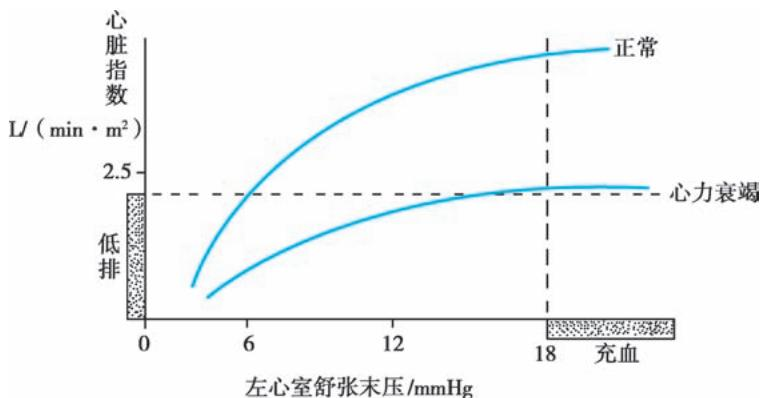
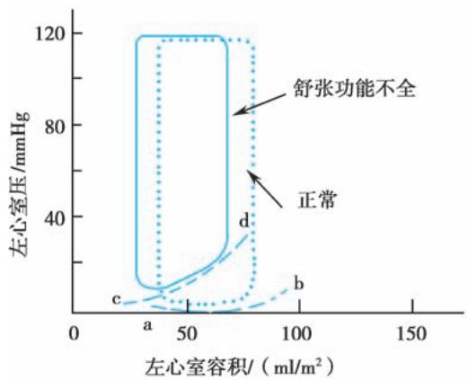
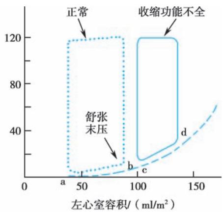

> [!info] 导航
> [[第019章_第3篇第01章_总论|上一章]] · [[00_章节导航|总目录]] · [[第021章_第3篇第03章_心律失常|下一章]]

本章数字资源

心力衰竭（heart failure, HF）是各种原因导致的心脏结构和/或功能异常，使心脏出现收缩和/或充盈障碍，在静息或运动时心排血量下降或心腔内压力增高而引起的一组复杂临床综合征，主要表现为活动耐量下降和液体潴留。心功能不全（cardiac dysfunction）是一个更广泛的概念，伴有临床症状的心功能不全称之为心力衰竭(简称心衰)。

# 第一节 | 心力衰竭总论

#### 【类型】

### （一）按发生的部位分类

左心室代偿功能不全所致为左心衰竭，临床上较为常见。右心室代偿功能不全所致为右心衰竭。左心衰竭和右心衰竭同时存在即为全心衰竭。

### （二）按发生的速度分类

根据心衰发生的速度可分为慢性心衰和急性心衰。

1. 急性心衰 系因急性的严重心肌损害、结构破坏、心律失常或突然加重的心脏负荷，使原本功能正常或处于代偿期的心脏在短时间内发生心功能急剧恶化。可以是初发心衰，也可以是慢性心衰急性加重。

2. 慢性心衰 呈一个缓慢的发展过程,一般均有代偿性心脏扩大或肥厚及其他代偿机制的参与。

### （三）按左心室射血分数分类

根据左心室射血分数（left ventricular ejection fraction, LVEF）进行的心衰分类在临床上具有重要意义，尤其在指导治疗方面。LVEF≤40%者称为射血分数降低的心衰（HF with reduced EF, HFrEF），即传统概念中的收缩性心衰。LVEF为41%～49%者称为射血分数轻度降低型心衰（HF with mildly reduced EF, HFmrEF），以轻度收缩功能障碍为主。LVEF≥50%者称为射血分数保留型心衰（HF with preserved EF, HFpEF），通常存在充盈压升高、舒张功能受损的表现，既往被称为舒张性心衰。大多数HFrEF病人同时存在舒张功能不全，而HFpEF病人也可能同时存在一定程度的收缩功能异常。

需要强调的是，LVEF是动态变化的，在管理全程中需定期监测。对于既往 $\mathrm{LVEF}\leqslant 40\%$ ，在治疗过程发现 $\mathrm{LVEF} > 40\%$ 的病人，称为射血分数改善的心衰（HF with improved EF, HFimpEF）。

#### 【病因】

### (一) 基本病因

1. 心肌收缩力降低

（1）原发性心肌损害：冠状动脉疾病导致缺血性心肌损害如心肌梗死、慢性心肌缺血；炎症导致心肌损害如心肌炎；遗传性心肌病如扩张型心肌病、肥厚型心肌病、致心律失常性右心室心肌病等。

（2）继发性心肌损害:内分泌代谢性疾病(如糖尿病、甲状腺疾病)、系统性浸润性疾病(如心脏淀粉样变)、贮积性疾病(如糖原贮积症、 $\alpha$ -半乳糖苷酶A缺乏症)、结缔组织病、心脏毒性药物等导致的心肌损害。

2. 心室舒张和充盈受限 心室充盈受限是指在静脉回心血量无明显减少的情况下，因心脏本身的病变引起的心脏舒张和充盈障碍。如，肥厚型心肌病时肥厚心肌的顺应性减退，舒张能力降低，使心室舒张期充盈障碍；房颤快心室率时心室舒张期缩短，房室收缩不同步，心室充盈受限。最终导致心室充盈量减少，心排血量降低，体循环、肺循环淤血。

3. 心脏负荷过重

（1）压力负荷(后负荷)过重:见于高血压、主动脉瓣狭窄、肺动脉高压、肺动脉瓣狭窄等左、右心室收缩期射血阻力增加的疾病。心肌首先发生代偿性肥厚以承受增高的工作负荷,维持相对正常的心排血量。长期压力负荷过重超过心肌的代偿能力时,会导致心衰。

（2）容量负荷(前负荷)过重:多见于心脏瓣膜关闭不全及左、右心或动、静脉分流性先天性心脏病,也可见于血容量或组织代谢率增加的疾病,如慢性贫血、甲亢、动静脉瘘等。早期心室腔代偿性扩大,心肌收缩功能尚能代偿,维持相对正常的心排血量。长期容量负荷过重,超过心肌的代偿能力时,会导致心衰。

### (二) 诱因

1. 感染 感染是最常见的诱因。感染引起的发热可增加心率,增加心肌耗氧量,特别是呼吸道感染,如果合并支气管痉挛、黏膜充血和水肿等,还可使肺循环阻力增加,加重右心室后负荷。

2. 心律失常 心房颤动是器质性心脏病最常见的心律失常之一,也是心衰的重要诱因。其他各种类型的快速型心律失常以及严重缓慢型心律失常均可诱发心衰。

3. 心脏前、后负荷增加 钠盐摄入过多、静脉液体输入过多或过快增加心脏前负荷，血压升高增加心脏后负荷。此外，过度劳累、怀孕与分娩、情绪波动、外伤与手术等均可加重心脏负荷，诱发心衰。

4. 治疗不当 在心衰病情稳定阶段,若不恰当停用或减用原有治疗心衰的药物可导致心室重塑再次加重、心衰进一步恶化。

5. 原有心脏病变加重或并发其他疾病 如冠心病发生心肌梗死,风湿性心脏病出现风湿活动,心肌病自然病程进展,合并肾功能不全、贫血等。

#### 【病理生理】

心衰始于危险因素对心脏的作用。起初，通过心脏本身的代偿以及神经体液代偿机制等得以维持正常的心输出量；但这些代偿机制导致进一步心肌损害，加重心室重塑，最终导致失代偿，出现心衰。

### （一）心脏本身机制

1. Frank-Starling 机制 正常心室的心搏出量能在很大幅度内调节,以适应机体运动、应激等需求。心脏前负荷增加时,回心血量增多,心室舒张末期容积增加,心肌收缩力随之增强,从而增加心排血量及心脏做功量,左心室功能曲线见图 3-2-1。

  
图 3-2-1 左心室功能曲线

2. 收缩功能不全 心肌收缩功能减低时, Frank-Starling 机制调节下的心室收缩增强不能维持正常心排血量, 导致心室舒张末压力增高, 心房压、静脉压随之升高, 达到一定程度时可出现肺循环和/或体循环淤血。

3. 舒张功能不全 在心衰发生机制中的重要性越来越受关注。大体上可分为两大类:一是能量供应不足时钙离子回摄入肌质网及泵出胞外的耗能过程受损,导致主动舒张功能障碍,常见于心肌缺血、慢性容量负荷过重和衰老等；二是心室肌顺应性减退及充盈障碍，主要见于心室肥厚和心内膜纤维化，如高血压病、肥厚型心肌病等。舒张与收缩功能不全的心腔压力与容积的变化见图3-2-2。

  
A

  
B  
图 3-2-2 舒张与收缩功能不全的心腔压力与容积的变化

A. 单纯舒张功能不全时压力-容积曲线较正常左移，舒张末容积略减少而以舒张期压力增高为主； $a \rightarrow b$ ，心脏功能正常时，左心室舒张期压力-容积变化曲线； $c \rightarrow d$ ，舒张功能不全时，左心室舒张期压力-容积变化曲线。B. 收缩功能不全时压力-容积曲线较正常右移，收缩期及舒张期容积明显增加的同时舒张末压力增高； $a \rightarrow b$ ，心脏功能正常时，左心室舒张期压力-容积变化曲线； $c \rightarrow d$ ，收缩功能不全时，左心室舒张期压力-容积变化曲线。

### （二）神经体液机制

当心排血量不足，心腔压力升高时，机体全面启动神经体液机制进行代偿，包括：

1. 交感-肾上腺髓质系统增强 心衰病人血中去甲肾上腺素（norepinephrine, NE）水平升高，作用于心肌 $\beta_{1}$ 肾上腺素能受体，增强心肌收缩力并提高心率，从而提高心排血量；作用于 $\alpha$ 受体使外周及腹腔内脏等阻力血管收缩，升高动脉血压，保证心和脑的血流灌注。但周围血管收缩导致心脏后负荷增加及心率加快均使心肌耗氧量增加，NE还对心肌细胞有直接毒性作用，促使心肌细胞凋亡。此外，交感神经兴奋还可使心肌应激性增强而有促心律失常作用。

2. 肾素-血管紧张素-醛固酮系统增强 心排血量降低致肾血流量减低，肾素-血管紧张素-醛固酮系统（renin-angiotensin-aldosterone system, RAAS）过度激活。血管紧张素Ⅱ（angiotensin Ⅱ, ATⅡ）具有明显的收缩血管作用，与NE协同升高动脉血压，醛固酮通过促进水钠潴留而增加循环血量以提高心排血量，保证心、脑等重要器官的血液供应。但RAAS过度激活促进心肌和非心肌细胞肥大或增殖，作用于心脏成纤维细胞，促进胶原合成和心脏纤维化，从而加重心室和血管重塑，加速心肌损伤和心功能恶化。

3. 钠尿肽系统增强 心衰时心室壁张力增加,脑钠肽分泌明显增加,具有抑制肾小管重吸收钠的作用,还能抑制醛固酮和抗利尿激素的分泌,因而可利钠排水、减少心脏的容量负荷;另外,可拮抗ATⅡ的缩血管作用并抑制球旁细胞分泌肾素。

4. 其他体液因子的改变 心衰时除了上述主要神经内分泌系统的代偿机制外,另有众多体液调节因子参与。

精氨酸加压素（arginine vasopressin, AVP）由垂体释放，具有抗利尿和促周围血管收缩作用。心衰时心房牵张感受器敏感性下降，不能抑制AVP释放而使血浆AVP水平升高。AVP通过 $V_{1}$ 受体引起全身血管收缩，通过 $V_{2}$ 受体减少游离水清除，致水潴留增加，同时增加心脏前、后负荷。心衰早期，AVP的效应有一定的代偿作用，而长期的AVP增加将使心衰进一步恶化。

另外,内皮素、一氧化氮、缓激肽以及一些细胞因子、炎性介质等均参与慢性心衰的病理生理过程。

### （三）心室重塑

在心脏功能受损、心腔扩大、心肌肥厚的代偿过程中，心肌细胞、非心肌细胞及胞外基质、胶原纤维网等均发生相应变化，即心室重塑（ventricular remodeling），是心衰发生发展的基本病理机制。除了因为代偿能力有限、代偿机制的负面影响外，心肌细胞的能量供应不足及利用障碍导致心肌细胞坏死，纤维化也是失代偿发生的一个重要因素。心肌细胞减少使心肌整体收缩力下降，纤维化的增加又使心室顺应性下降，重塑更趋明显，形成恶性循环，最终导致不可逆转的终末阶段。

# 第二节 | 慢性心力衰竭

#### 【流行病学】

慢性心力衰竭（chronic heart failure, CHF）是心血管疾病的终末期阶段和最主要的死因。西方成人心衰患病率约为 $1\% \sim 2\%$ ，总患病率呈上升趋势。基于中国高血压调查研究的结果显示我国 $\geqslant 35$ 岁人群心衰患病率约 $1.3\%$ ，估计患病人数890万；基于0.5亿中国城镇职工医疗保险数据的调查发现我国 $\geqslant 25$ 岁人群心衰患病率约为 $1.1\%$ ，估计心衰病人1210万，每年新增300万。其中HFpEF所占比例接近 $50\%$ 。我国心衰的发病率和患病率均在增长。

冠心病、高血压已成为慢性心衰的最主要病因，冠心病居首位，其次为高血压。风湿性心脏病比例则趋下降，但随着人口老龄化，退行性瓣膜病发病增加，总体瓣膜性心脏病仍不可忽视。同时，慢性肺心病和高原性心脏病在我国也具有一定的地域高发性。

#### 【临床表现】

### （一）左心衰竭

以肺循环淤血及心排血量降低为主要表现。

1. 症状

（1）不同程度的呼吸困难：①劳力性呼吸困难：是左心衰竭最早出现的症状。因运动使回心血量增加，左心房压力升高，肺淤血加重。随心衰程度的加重，病人活动耐量进行性减退。②夜间阵发性呼吸困难：病人入睡后突然因憋气而惊醒，被迫取坐位，多于端坐休息后缓解。其发生机制除睡眠平卧时血液重新分配使肺血量增加外，夜间迷走神经张力增加、小支气管收缩、横膈抬高、肺活量减少等也是促发因素。③端坐呼吸：肺淤血达到一定程度时，病人不能平卧，因平卧时回心血量增多且横膈上抬，呼吸更为困难。高枕卧位、半卧位甚至端坐时方可好转。④急性肺水肿：是左心衰竭呼吸困难最严重的形式，可有哮鸣音，称为“心源性哮喘”。

（2）咳嗽、咳痰、咯血：咳嗽、咳痰是肺泡和支气管黏膜淤血所致，开始常于夜间发生，坐位或立位时可减轻，白色浆液性泡沫状痰为其特点，偶可见痰中带血丝。急性左心衰竭发作时可出现粉红色泡沫样痰。长期慢性肺淤血肺静脉压力升高，肺循环和支气管血液循环之间在支气管黏膜下形成侧支，一旦破裂可引起大咯血。

（3）乏力、疲倦、头晕、心悸：是器官、组织灌注不足及代偿性心率加快所致的症状。

（4）少尿及肾功能损害症状：严重的左心衰竭血液再分配时，肾血流量首先减少，可出现少尿。长期慢性的肾血流量减少、肾静脉压力升高可出现肾功能不全的相应症状。

2. 体征

（1）肺部湿啰音：由于肺毛细血管楔压增高，液体渗出到肺泡而出现湿啰音。随着病情的加重，肺部啰音可从局限于肺底部直至全肺。侧卧位时下垂的一侧啰音较多。

（2）心脏体征：除基础心脏病的固有体征外，可有心脏扩大、心率增快及相对性二尖瓣关闭不全的反流性杂音、肺动脉瓣区第二心音亢进、第三心音或第四心音奔马律。

（3）发绀：主要由于呼吸膜水肿、增厚，氧气交换障碍，氧分压下降，还原血红蛋白增加引起，属中央型发绀。

### （二）右心衰竭

以体循环淤血为主要表现。

1. 症状

（1）消化道症状：胃肠道及肝淤血引起腹胀、食欲缺乏、恶心、呕吐等，是右心衰竭最常见的症状。

（2）劳力性呼吸困难:继发于肺部疾病及左心衰竭者呼吸困难较明显。单纯右心衰竭也可出现劳力性呼吸困难,但仍可平卧。其呼吸困难的原因主要是心排血量下降,缺氧所致。此与左心衰竭肺淤血所致的呼吸困难不同。

（3）乏力、疲倦、头晕、心悸：主要由心排血量减少，组织器官灌注不足及代偿性心率加快引起。

2. 体征

（1）水肿：体循环压力升高使软组织出现水肿，表现为始于身体低垂部位的对称性凹陷性水肿。

（2）颈静脉征：颈静脉搏动增强、充盈、怒张是右心衰竭时的主要体征，肝颈静脉反流征阳性则更具特征性。

（3）肝大：肝脾淤血肿大常伴压痛，持续慢性右心衰可致心源性肝硬化。

（4）浆膜腔积液：可表现为胸腔积液，以双侧多见，右侧为甚，主要与体循环和肺循环压同时升高、胸膜毛细血管通透性增加有关。严重右心衰竭，由于肝静脉回流受阻或合并心源性肝硬化，可出现腹腔积液。

（5）心脏体征：除基础心脏病的相应体征外，可出现心率增快、右心室舒张期奔马律、右心扩大和相对性三尖瓣关闭不全的反流性杂音。

### （三）全心衰竭

全心衰竭同时出现左心衰竭和右心衰竭的相关症状及体征。大多数全心衰竭由左心衰竭发展而来，此时右心排血量减少，左心的前负荷减少，呼吸困难等肺淤血症状反而有所减轻。心肌病、心肌炎可左右心室同时受累，起病即表现为全心衰竭。

#### 【分期与分级】

### （一）心力衰竭分期

心衰分期全面描述了病情进展阶段，提出对不同阶段进行相应的治疗。通过治疗只能延缓而不能逆转心衰分期(表 3-2-1)。

表 3-2-1 慢性心力衰竭分期

<table><tr><td>分期</td><td>临床特征</td></tr><tr><td>A期:心衰危险因素阶段 (at risk for heart failure)</td><td>病人存在心衰高危因素,但目前尚无心脏结构或功能异常,也无心衰的症状或体征。</td></tr><tr><td>B期:前心衰阶段 (pre-heart failure)</td><td>病人无心衰的症状或体征,但已出现心脏结构改变、心室充盈压升高或心脏损伤标志物升高,如左心室肥厚、无症状瓣膜性心脏病、既往心肌梗死病史、脑钠肽水平升高、肌钙蛋白水平升高等。</td></tr><tr><td>C期:症状性心衰阶段 (symptomatic heart failure)</td><td>病人已有心脏结构改变或功能异常,既往或目前有心衰的症状和/或体征。</td></tr><tr><td>D期:晚期心衰阶段 (advanced heart failure)</td><td>病人虽经严格优化治疗,仍有明显症状,常伴心源性恶病质,须反复住院。</td></tr></table>

### （二）心力衰竭分级

心力衰竭的严重程度通常采用美国纽约心脏病学会(New York Heart Association, NYHA)的心功能分级方法(表3-2-2)。

表 3-2-2 NYHA 心功能分级

<table><tr><td>分级</td><td>症状</td></tr><tr><td>I级</td><td>日常活动量不受限制,一般活动不引起乏力、呼吸困难等心力衰竭症状。</td></tr><tr><td>II级</td><td>体力活动轻度受限,休息时无自觉症状,一般活动下可出现心力衰竭症状。</td></tr><tr><td>III级</td><td>体力活动明显受限,低于平时一般活动即引起心力衰竭症状。</td></tr><tr><td>IV级</td><td>不能从事任何体力活动,休息状态下也存在心力衰竭症状,活动后加重。</td></tr></table>

这种分级方案的优点是简便易行,但缺点是仅凭病人的主观感受和/或医生的主观评价,短时间内变化的可能性较大,病人个体间的差异也较大。

#### 【辅助检查】

### （一）实验室检查

1. 脑钠肽 脑钠肽是心衰诊断、预后和疗效评估中的重要指标，临床上常用 BNP 及 NT-proBNP。与 BNP 相比，NT-proBNP 半衰期更长，更稳定。

脑钠肽诊断心衰的敏感性、特异性、阴性预测值和阳性预测值均较高。在急性呼吸困难病人中，具有较高的阴性预测价值，BNP/NT-proBNP正常基本可除外急性心衰。BNP<35ng/L或NT-proBNP<125ng/L通常可用于排除慢性心衰，但其敏感度和特异度较急性心衰低。尤其值得注意的是，约20%的HFpEF病人BNP/NT-proBNP水平正常。

脑钠肽水平与心衰预后相关,治疗后脑钠肽水平下降提示预后改善。

脑钠肽水平与年龄、性别和体重有关，老龄和女性升高，肥胖者降低。左心室肥厚、心动过速、心肌缺血、肺动脉栓塞、肾功能不全、感染、败血症等亦可引起脑钠肽升高。

2. 肌钙蛋白 严重心衰或心衰失代偿期病人的肌钙蛋白可有轻微升高,但心衰病人检测肌钙蛋白更重要的目的是明确是否存在急性冠脉综合征。肌钙蛋白升高,特别是同时伴有脑钠肽升高,是心衰预后的强预测因子。

3. 常规检查 包括血常规、尿常规、肝肾功能、电解质、甲状腺功能、血清铁蛋白浓度和转铁蛋白饱和度等。

### （二）心电图

心衰并无特异性心电图表现，但能帮助判断心肌缺血、心律失常等，还可以提供部分治疗适应证(如心房颤动的抗凝治疗、显著心动过缓的起搏治疗、QRS波群增宽的心脏再同步治疗等)。

### (三) 影像学检查

1. 超声心动图 能较准确地评价各心腔大小及瓣膜结构和功能,方便快捷地评估心功能和协助病因判断,是诊断和评估心衰最主要的影像学检查。

（1）收缩功能:主要有射血分数(EF)、周径缩短速度和短径缩短率等指标,以 EF 最常用,推荐改良双平面 Simpson 法测量。EF 虽不够精确,但方便实用。

（2）舒张功能：多普勒超声是临床上最实用的判断舒张功能的方法。反映舒张功能的指标包括： $\mathrm{E / e^{\prime}}$ 、 $\mathrm{E / A}$ 、 $\mathrm{e^{\prime}}$ 、三尖瓣反流峰值速度、肺动脉收缩压（PASP）、左心室纵向应变（GLS）。 $\mathrm{E / e^{\prime}} \geqslant 15$ 可用于确诊 HFpEF, $\mathrm{E / A} < 1.2$ 提示舒张功能减退。在评估舒张功能异常时需关注相关的形态学指标，包括：左心房容积指数（LAVI）、左心室质量指数（LVMI）、室壁厚度、相对室壁厚度（RWT）等。

负荷超声心动图: 运动或药物负荷超声心动图可用于心肌缺血、部分瓣膜性心脏病的评估及HFpEF的诊断。

2. X 线检查 有助于心衰与肺部疾病的鉴别。心影大小及形态也可为病因诊断提供重要参考，但并非所有心衰病人均存在心影增大。

X 线胸片可反映肺淤血,包括:肺门血管影增强、上肺血管影增多、肺动脉增宽、间质性肺水肿、Kerley B 线、肺门呈蝴蝶状、胸腔积液等。

3. 心脏磁共振（cardiac magnetic resonance, CMR）CMR的三维成像技术，可克服心室几何形态对体积计算的影响，能更精确计算收缩末期和舒张末期心室容积，据此计算EF、心搏出量(SV)。对右心室和复杂先天性心脏病具有较好的分辨率。此外，CMR具有较高的组织分辨能力，通过延迟钆增强（late gadolinium enhancement, LGE）等技术可区别缺血性与非缺血性改变、评估心肌纤维化程度、鉴别某些特殊类型心肌病。对于疑似心肌炎、致心律失常性右心室心肌病（ARVC）、心肌淀粉样变、结节病、血色病、病因诊断不明的病人，推荐行CMR检查。

4. 冠状动脉造影（coronary angiography, CAG）对有冠心病危险因素、存在心肌缺血症状、无创检查提示存在心肌缺血的心衰病人，可行冠状动脉造影明确诊断。

5. 放射性核素检查 主要用于行心肌灌注显像评价存活/缺血心肌。另外， $^{99m}$ Tc-DPD/PYP/

HMDP SPECT 骨闪烁扫描可用于检出甲状腺素转运蛋白心肌淀粉样变, $^{18}$ F-FDG PET 可用于鉴别心脏结节病。

### （四）有创性血流动力学检查

可用于重症心衰评估血流动力学状态、判断心脏移植可行性和HFpEF的诊断。常用右心漂浮导管(Swan-Ganz导管)检查，测定各部位的压力及血液含氧量，计算心排血量(CO)、心脏指数(CI)及肺毛细血管楔压(PCWP)、肺阻力等。亦可通过左心导管、左心室造影的方法，测左心室舒张末期容积、左心室收缩末期容积以及据此计算出EF、CO、CI、SV等。

对存在劳力性呼吸困难,通过无创检查不能确诊 HFpEF 但临床仍高度怀疑的病人,Swan-Ganz 导管检查静息状态下 PCWP≥15mmHg 或左心室舒张末压(LVEDP)≥16mmHg、负荷时 PCWP≥25mmHg 可确诊 HFpEF。

### （五）6 分钟步行试验

简单易行、安全方便，通过评定慢性心衰病人的运动耐力评价心衰严重程度和疗效。要求病人在平直走廊里尽快行走，测定 6 分钟步行距离。步行距离＜150m、150～450m 和＞450m 分别为重度、中度和轻度心衰。

### （六）心

-肺运动试验 仅适用于慢性稳定型心衰病人，用于评估心功能、判断心脏移植的可行性、指导运动康复治疗。主要测定参数包括最大耗氧量和无氧阈值。

#### 【诊断与鉴别诊断】

### （一）诊断

首先，根据病史、症状、体格检查、心电图、X线胸片判断有无心衰的可能性；然后，通过脑钠肽检测和超声心动图检查明确是否存在心衰及其类型，再进一步确定其病因和诱因；最后，还需评估病情的严重程度及预后，以及是否存在合并症。

### (二) 鉴别诊断

1. 肺部疾病 心衰最常见的症状为呼吸困难,首先需要与肺部疾病鉴别,包括慢性阻塞性肺气肿、支气管哮喘、肺栓塞等。根据基础疾病史、心脏体征、肺部体征结合肺功能和肺部影像学检查,不难鉴别。

2. 心包积液、缩窄性心包炎 由于腔静脉回流受阻同样可以引起颈静脉怒张、肝大、下肢水肿等类似右心衰竭表现。超声心动图、胸部 CT、CMR 可鉴别。

3. 其他引起水肿的疾病 应与肾性水肿、肝性水肿、低蛋白血症、甲状腺功能减退、下肢静脉功能异常等相鉴别。除基础心脏病体征有助于鉴别外，非心源性水肿不会出现颈静脉怒张等上腔静脉回流受阻的体征。常规实验室检查有助于鉴别。

4. 贫血、肥胖、神经肌肉疾病、衰老所导致的乏力、活动耐量减退 尤其在 HFpEF 诊断时，如无典型的呼吸困难、水肿，仅有乏力、肌力减退等非特异性症状时，需要充分评估心衰与其他合并情况对机体影响孰轻孰重，避免 HFpEF 的过度诊断。

#### 【治疗】

心衰的治疗目标为防止和延缓心衰的发生发展；缓解临床症状，提高生活质量；改善长期预后，降低病死率与再住院率。

### (一) 一般治疗

1. 生活方式管理

（1）病人教育:心衰病人及家属应得到准确的有关疾病知识和管理的指导,内容包括健康的生活方式、适当的诱因规避、规范的药物服用、自我监测、合理的随访计划等。

（2）体重管理: 日常体重监测能简便直观地反映病人体液潴留情况及利尿剂疗效。体重改变往往出现在临床体液潴留症状和体征之前。部分严重慢性心衰病人存在临床或亚临床营养不良, 若出现大量体脂丢失或干重减轻称为心源性恶病质, 往往提示预后不良。

（3）饮食管理:适当限盐有利于减轻心脏容量负荷,但过分严格限盐易导致低钠血症。临床上对一般心力衰竭病人不强调限盐,但对难治性心力衰竭及终末期心力衰竭病人,因存在利尿剂抵抗,适当限盐是合理的。

2. 休息与活动 急性期或病情不稳定病人应限制体力活动,以降低心脏负荷。血流动力学稳定后应适量运动,有利于提高病人的生活质量。建议在心肺功能评估基础上制订个体化、循序渐进的运动方案。

### （二）病因和诱因治疗

1. 病因治疗 是治疗成功的关键,应积极寻找病因,对所有可能导致心脏功能受损的基础疾病尽早进行有效治疗。

2. 消除诱因 常见的诱因为感染,特别是呼吸道感染,应积极抗感染治疗。快心室率心房颤动应尽快控制心室率,必要时复律。应注意排查并纠正潜在的甲状腺功能异常、贫血、肾功能不全、电解质紊乱等。

### (三) 药物治疗

1. 利尿剂 利尿剂是有效控制体液潴留的药物。无论何种心衰，只要存在体液潴留都应使用利尿剂。利尿剂的适量应用至关重要，剂量不足则体液潴留，导致心衰症状加重并减弱改善预后类药物的疗效；剂量过大则容量不足，增加低血压及肾功能恶化的风险。

（1）袢利尿剂：以呋塞米(速尿)为代表，作用于髓袢升支粗段，排钠排钾，为强效利尿剂。使用方法：对轻度心衰病人一般小剂量20mg，每日1次起始，逐渐加量，一般控制体重下降0.5～1.0kg/d直至干重；重度慢性心衰者可增至100mg每日2次；静脉注射效果优于口服。注意低血钾的副作用。

（2）噻嗪类利尿剂：以氢氯噻嗪(双氢克尿噻)为代表，作用于肾远曲小管近端和髓袢升支远端，抑制钠的重吸收，并因 $Na^{+}-K^{+}$ 交换同时降低钾的重吸收，为中效利尿剂。GFR<30ml/min 时作用明显受限。使用方法：轻度心衰可首选此药，12.5～25mg，每日1次起始，逐渐加量，可增至每日75～100mg，分2～3次服用。注意电解质平衡，常与保钾利尿剂合用。因可抑制尿酸排泄会引起高尿酸血症，长期大剂量应用时可能影响糖、脂代谢。

（3）保钾利尿剂：作用于肾远曲小管远端，通过拮抗醛固酮或直接抑制 $Na^{+}-K^{+}$ 交换而具有保钾作用。利尿作用弱，多与上述两类利尿剂联用以加强利尿效果并预防低血钾。常用的有螺内酯、氨苯蝶啶、阿米洛利。使用方法：螺内酯 10～20mg，每日 1 次起始，可增至每日 20～40mg；氨苯蝶啶 25～50mg，每日 1 次起始，可增至每日 200mg。阿米洛利 2.5～5mg，每日 1 次起始，可增至每日 20mg。

（4）AVP受体拮抗剂：通过结合 $V_{2}$ 受体减少水的重吸收，不增加排钠，因此可用于伴有低钠血症、利尿剂抵抗的病人。常用药物有托伐普坦，使用方法：7.5～15mg，每日1次起始使用，最大剂量可增至每日30mg。

2. RAAS 抑制剂

（1）血管紧张素转换酶抑制剂(angiotensin converting enzyme inhibitors, ACEI): 通过抑制 ACE 减少 ATⅡ生成而抑制 RAAS, 通过降低病人神经-体液代偿机制的不利影响, 改善心室重塑。

HFrEF 病人: ACEI 早期足量应用可缓解症状, 延缓心衰进展, 降低死亡率。所有 HFrEF 病人除非存在禁忌, 均推荐使用。

HFmrEF 病人: ACEI 可部分减少 HFmrEF 死亡和心衰住院风险, 可考虑使用。

HFpEF 病人: ACEI 改善 HFpEF 病人预后的证据尚不充分, 在合并存在高血压、心肌梗死等适应证时可考虑使用。

使用方法: ACEI 以小剂量起始, 如能耐受则逐渐加量至靶剂量或最大耐受剂量, 长期维持用药。

副作用主要包括低血压、肾功能一过性恶化、高血钾、干咳和血管性水肿等。血管性水肿和无尿型肾衰竭、妊娠期妇女及ACEI过敏者应禁用；低血压、双侧肾动脉狭窄、血肌酐明显升高（>265μmol/L）和高血钾（>5.5mmol/L）者慎用。开始用药或上调剂量后1～2周内监测肾功能与血钾，后定期复查。

（2）血管紧张素受体抑制剂(angiotensin receptor blockers, ARB): 通过阻断经 ACE 和非 ACE 途径产生的 ATⅡ与 AT₁ 受体结合发挥阻断 RAAS 的效应, 但无抑制缓激肽降解作用, 因此干咳和血管性水肿的副作用较少见。具有 ACEI 适应证的心衰病人治疗首选 ACEI, 对 ACEI 不能耐受者可改用 ARB。

使用方法、副作用及使用注意事项同 ACEI。

（3）血管紧张素受体脑啡肽酶抑制剂(angiotensin receptor neprilysin inhibitor, ARNI): 如沙库巴曲缬沙坦, 通过沙库巴曲代谢产物抑制脑啡肽酶而减少 BNP 的降解, 同时通过缬沙坦阻断 AT $_{1}$ 受体, 抑制 RAAS 过度激活。

HFrEF 病人: ARNI 较 ACEI 进一步降低心衰住院和心血管死亡风险, 改善心衰症状和生活质量。推荐作为 HFrEF 病人的初始治疗; 对于已经使用 ACEI 或 ARB 但仍有心衰症状的病人, 推荐以 ARNI 替代 ACEI 或 ARB。

HFmrEF 病人: ARNI 可部分减少 HFmrEF 病人死亡和心衰住院风险, 可考虑使用。

HFpEF 病人: 女性及 LVEF 相对较低的 HFpEF 病人使用 ARNI 可降低心衰再住院风险, 可考虑使用。

使用方法: 小剂量开始, 每日 50\~100mg, 分 2 次服用, 每 2\~4 周上调剂量, 至目标剂量为每日 400mg, 分 2 次服用。

副作用及使用注意事项同 ACEI, 已知对 ARNI 过敏者禁用。

3. $\beta$ 受体拮抗剂 $\beta$ 受体拮抗剂可抑制交感神经过度激活对心衰代偿的不利作用,保护心肌细胞,改善心室重塑。

HFrEF 和 HFmrEF 病人: 长期应用 $\beta$ 受体拮抗剂治疗能改善 HFrEF 和 HFmrEF 病人左心室功能, 降低死亡率和住院率, 显著降低猝死率。所有病人除非存在禁忌, 均推荐使用。

HFpEF 病人: 目前关于 $\beta$ 受体拮抗剂的证据有限, 不推荐常规用于 HFpEF 治疗。如 HFpEF 病人存在 $\beta$ 受体拮抗剂使用适应证的基础疾病或合并症, 如冠心病、心肌梗死、房颤伴快速心室率等, 推荐使用。

目前已经临床验证的 $\beta$ 受体拮抗剂包括美托洛尔、比索洛尔与卡维地洛。

使用方法: 血流动力学稳定情况下尽早使用, 小剂量起始, 逐渐增加达最大耐受剂量并长期维持。使用禁忌证为支气管痉挛性疾病、严重心动过缓、二度及二度以上房室传导阻滞、严重周围血管疾病(如雷诺病)和重度急性心衰。

突然停用 $\beta$ 受体拮抗剂可致临床症状恶化,应予避免。对于慢性心衰急性失代偿的病人,如无低灌注表现或心源性休克应尽可能维持原有剂量的 $\beta$ 受体拮抗剂治疗。

4. 醛固酮受体拮抗剂（mineralocorticoid receptor antagonist, MRA） MRA 能阻断醛固酮效应，抑制心室重塑，在各类型心衰病人中均被证实能改善预后。推荐使用于各类型症状性慢性心衰病人。

第一代 MRA 螺内酯是目前应用最广泛的醛固酮受体拮抗剂，由于同时拮抗雄激素，长期服用引起男性乳腺增生。每日 20～40mg，分 1～2 次服用。第二代 MRA 依普利酮为选择性醛固酮受体拮抗剂，对雄激素的拮抗作用很弱，副作用明显减少，尤适用于老龄、糖尿病和肾功能不全病人。起始剂量每日 25mg，最大剂量每日 50mg。

MRA 使用的禁忌证包括: 血钾≥5.0mmol/L 或估算的肾小球滤过率(eGFR)≤30ml/(min·1.73m²)。使用过程中需要定期随访肾功能、血钾。

5. 钠-葡萄糖共转运蛋白2抑制剂(sodium-glucose cotransporter 2 inhibitors, SGLT2i) SGLT2i通过抑制近端肾小管钠-葡萄糖的重吸收，促进尿糖和钠的排泄，降低血糖、减轻容量负荷，同时具有改善能量代谢、改善内皮功能、抑制炎症反应和纤维化等多重作用机制，能减少2型糖尿病人群心衰发病和心血管死亡风险，也能降低各EF类型心衰病人心血管死亡和心衰住院风险。推荐使用于所有EF类型心衰病人。

使用方法: 所有病情稳定并无禁忌证的心衰病人均应尽早使用。达格列净或恩格列净, 每次 10mg, 每日 1 次。

SGLT2i 使用的禁忌证包括肾功能不全[达格列净禁用于 eGFR<30ml/(min·1.73m²)，恩格列净禁用于 eGFR<20ml/(min·1.73m²)]、糖尿病、收缩压<95mmHg。使用过程中需要警惕血糖正常的酮症酸中毒、生殖器和软组织感染的风险，避免低血容量状态。

6. 洋地黄类药物 洋地黄类药物通过抑制 $Na^{+}-K^{+}-ATP$ 酶发挥药理作用:①正性肌力作用:促进心肌细胞 $Ca^{2+}-Na^{+}$ 交换,升高细胞内 $Ca^{2+}$ 浓度而增强心肌收缩力。②电生理作用:一般治疗剂量下,洋地黄可抑制心脏传导系统,对房室交界区的抑制最为明显。③迷走神经兴奋作用:作用于迷走神经传入纤维,增加心脏压力感受器的敏感性,反馈抑制中枢神经系统的兴奋冲动。④作用于肾小管细胞,减少钠的重吸收并抑制肾素分泌。

地高辛可改善心衰病人的症状，提高运动耐量，减少住院率，但对生存率无明显改变。适用于应用利尿剂、ACEI/ARB/ARNI、β受体拮抗剂、MRA和SGLT2i后仍持续有症状的HFrEF病人，或症状性心衰伴房颤快心室率者。

使用方法:地高辛每日 0.125～0.25mg,70 岁以上、肾功能损害或低体重的病人应予更小剂量(隔日 0.125mg)。地高辛血药浓度建议维持在 0.5～0.9μg/L。地高辛过量会导致心律失常、胃肠道反应、精神症状。

禁忌证:①病态窦房结综合征、二度及以上房室传导阻滞病人;②心肌梗死急性期(<24小时),尤其是有进行性心肌缺血者;③预激综合征伴房颤或房扑;④肥厚型梗阻性心肌病。

7. 伊伐布雷定（ivabradine）伊伐布雷定为选择性特异性窦房结 $\mathrm{I_f}$ 电流抑制剂，减慢窦性心率，延长舒张期，不影响心脏电传导，无负性肌力作用。适用于在使用 $\beta$ 受体拮抗剂基础上、仍LVEF≤35%、心功能Ⅱ～Ⅳ级、窦性心律、HR≥70次/分的慢性心衰病人。

使用方法:起始剂量每日 5mg, 分 2 次服用; 根据心率逐渐上调剂量, 最大可增加至每日 15mg, 分 2 次服用。如静息心率低于 50 次/分, 或感觉头昏、疲劳, 应减量或者停药。

8. 可溶性鸟苷酸环化酶（soluble guanylate cyclase, sGC）刺激剂 通过直接刺激 sGC，并稳定一氧化氮与 sGC 的结合，增强 NO-sGC-cGMP 信号通路，改善心肌和血管功能。现有的代表药物为维立西呱。适用于近期发生心衰失代偿、经治疗后病情稳定、LVEF<45% 的症状性心衰病人。

使用方法:起始剂量每日2.5mg,1次服用;根据血压每2周逐渐上调剂量,最大可增加至每日10mg,1次服用。如收缩压小于90mmHg,或存在症状性低血压,应减量或者停药。eGFR<15ml/(min·1.73m²)者禁用。

9. 扩血管药物 慢性心衰的治疗不推荐使用血管扩张药物,仅在伴有心绞痛或高血压的病人可考虑联合治疗。存在流出道梗阻或严重瓣膜狭窄者禁用。

### （四）非药物治疗

1. 心脏再同步治疗（cardiac resynchronization therapy, CRT）部分心衰病人存在房室、室间和/或室内收缩不同步，进一步导致心肌收缩功能降低。CRT通过改善收缩同步性增加心排血量，减轻心衰症状，减少住院率并降低死亡率。对已接受最佳药物治疗3个月以上，仍持续存在心衰症状的窦性心律、NYHA分级Ⅱ～Ⅳ级、LVEF≤35%、QRS间期＞130ms的病人，可考虑植入。具有普通起搏器植入指征的病人，如LVEF≤50%，可考虑植入CRT。（参照本篇第三章第八节）

2. 植入型心律转复除颤器（implantable cardioverter defibrillator, ICD）中重度心衰病人逾半数死于恶性室性心律失常所致心脏性猝死，而 ICD 可用于以下病人的一级预防：①优化药物治疗 3 个月以上、LVEF 仍≤35%、NYHA II～III 级者；②心肌梗死 40 天后及血运重建 90 天后，优化药物治疗后 LVEF≤30%，NYHA I 级者。也可用于心搏骤停幸存者或伴血流动力学不稳定的持续性室性心动过速的心衰病人的二级预防。（参照本篇第三章第八节）

3. 左室辅助装置（left ventricular assistant device, LVAD）适用于拟行心脏移植术病人的短期过渡治疗和终末期心衰病人的替代治疗。LVAD 的小型化、精密化、便携化已可实现，有望成为心脏移植的有效替代方法。

4. 心脏移植 是目前治疗终末期心衰的最终治疗方法。准确评估心脏移植适应证至关重要。

# 第三节 | 急性心力衰竭

急性心力衰竭(acute heart failure, AHF)是指心力衰竭急性发作和/或加重的一种临床综合征,可以是急性新发或慢性心衰急性失代偿。

新发急性心衰的常见病因包括急性心肌损害(如急性冠脉综合征和重症心肌炎等)和急性血流动力学障碍(如急性瓣膜功能障碍、高血压危象、严重心律失常和急性肺栓塞等)。

#### 【类型】

### (一) 临床分类

1. 急性左心衰竭 急性发作或加重的左心室收缩力降低、负荷加重，造成急性左心排血量骤降、肺循环压力突然升高，出现急性肺淤血、肺水肿并可伴组织器官灌注不足甚至心源性休克。根据起病速度和病情危急程度可分为慢性心衰急性失代偿、急性肺水肿、心源性休克。常由急性冠脉综合征、高血压危象、严重心律失常、慢性心衰急性失代偿等所致。

2. 急性右心衰竭 右心室心肌收缩力急剧下降或右心室的前后负荷突然加重，引起右心排血量急剧减低和体循环急性淤血，常由右心室梗死、急性大面积肺栓塞所致。

### （二）临床分型

急性心衰根据组织的淤血和灌注情况进行分型，有助于判断病情危重程度并指导治疗。淤血症状和体征主要包括端坐呼吸/夜间阵发性呼吸困难、肺部湿啰音、外周(双侧)水肿、颈静脉怒张、淤血性肝大和肝颈静脉回流征阳性等；低灌注症状和体征主要包括四肢湿冷、神志模糊、少尿、头晕和脉压小等。按有无淤血分为“湿”和“干”型，有无组织低灌注分为“冷”和“暖”型，由此可将急性心衰分为四型：①“干暖”型，无明显淤血也无明显组织低灌注，此型病情最轻；②“干冷”型，无明显淤血但有组织低灌注，大约占 $5\%$ ，多数合并低血容量；③“湿暖”型，有明显淤血但无明显组织低灌注，此型最为常见，多数为慢性心衰急性失代偿；④“湿冷”型，有淤血也有组织低灌注，病情最重。

#### 【临床表现】

突发呼吸困难是急性左心衰竭最主要的临床表现。根据病情的严重程度可依次表现为劳力性呼吸困难、夜间阵发性呼吸困难、端坐呼吸等；体格检查可发现心脏增大、舒张早期或中期奔马律、肺部湿啰音等。早期征兆可表现为部分原来心功能正常的病人出现原因不明的疲乏或运动耐力明显减低、心率增加15～20次/分以上。

急性肺水肿:突发严重呼吸困难、端坐呼吸、烦躁不安,伴恐惧窒息感,呼吸频率可达30\~50次/分,面色灰暗,口唇发绀,大汗淋漓,咳嗽,咳大量粉红色泡沫样痰,可出现大小便失禁。听诊心率快、心尖部常可闻及舒张早期奔马律,两肺满布湿啰音和哮鸣音。

心源性休克: 在血容量充足的情况下存在持续低血压, 收缩压 $\leqslant90mmHg$ (持续 30 分钟以上), 肺毛细血管楔压 (PCWP) $\geqslant18mmHg$ , 心脏指数 (CI) $\leqslant2.2L/(min\cdot m^{2})$ , 伴有组织低灌注的表现, 包括少尿 (尿量 $<0.5ml/(kg\cdot h)$ 甚至无尿, 皮肤苍白和发绀, 四肢湿冷, 意识障碍, 血清乳酸 >2mmol/L, 代谢性酸中毒 (pH <7.35)。

急性右心衰竭: 主要出现体循环淤血及心排血量降低的一些表现, 如低血压、心动过速、少尿、肢端湿冷、颈静脉充盈、肝颈静脉回流征阳性、肝脾大、下肢和骶部水肿等。

#### 【诊断与鉴别诊断】

根据典型症状与体征，一般不难作出诊断。急性左心衰竭病人常出现“心源性哮喘”，应与支气管哮喘、喘息性支气管炎急性加重相鉴别。前者多见于器质性心脏病病人，发作时必须坐起，肺部有干、湿啰音，甚至咳粉红色泡沫样痰；后者多见于青少年有过敏史或中老年有长期慢性支气管炎病史，发作时双肺可闻及典型哮鸣音。测定血浆BNP/NT-proBNP水平对鉴别急性心源性和支气管性哮喘有较大的参考价值。

#### 【治疗】

治疗目标:稳定血流动力学状态,维护脏器灌注和功能,缓解症状;针对病因和诱因的治疗;启动并加强基于循证的治疗,改善远期预后。

### （一）初始评估和紧急干预

首先,需要评估是否存在循环或呼吸衰竭。存在心源性休克病人急性期死亡风险最高,需要尽快纠正休克状态,及早使用血管收缩剂和正性肌力药物,如药物治疗效果不佳,及早行机械循环支持治疗。存在呼吸衰竭的病人采用无创呼吸机持续加压(CPAP)或双水平气道正压(BiPAP)给氧。无创通气不能纠正的呼吸衰竭,及早行有创通气治疗。建议在1小时内纠正休克和呼吸衰竭。

随后，迅速识别出需要针对病因紧急处理的临床情况，包括急性冠脉综合征、高血压急症、严重心律失常、心脏急性机械并发症、急性肺栓塞、重症感染、心脏压塞。尽早给予相应处理，包括急诊血运重建、快速降压、电复律、紧急外科手术、取栓或溶栓、抗感染、心包穿刺。

### （二）一般处理

应尽快开放静脉通道，留置导尿管，心电血压及血氧饱和度监测等。对于存在心源性休克病人，必要时可行有创血流动力学监测。

1. 吸氧 立即高流量鼻管给氧。

2. 体位 半卧位或端坐位, 双腿下垂, 以减少静脉回流。

3. 镇静 吗啡 3～5mg 静脉注射不仅可以使病人镇静，减少躁动所带来的额外的心脏负担，同时可舒张小血管的功能而减轻心脏负荷。建议用于急性肺水肿病人。必要时每间隔 15 分钟重复 1 次，共 2～3 次。老年病人可减量或改为肌内注射。

4. 容量管理 监测 24 小时出入液量。容量超负荷严重者应严格限盐限水、调整输液量和速度，保持液体负平衡，待肺淤血、水肿明显消退，应减少液体负平衡量，逐渐过渡到出入量平衡。评估存在低容量状态者应适当扩容至平衡状态。

### （三）根据临床分型确定治疗方案

“干暖”型调整口服药物即可。“干冷”型首先适当扩容，如低灌注仍无法纠正，可给予正性肌力药物。“湿暖”型若以高血压为主要表现的血管内液体再分布类型，首选血管扩张剂，其次为利尿剂；若以淤血为主要表现的心源性液体潴留类型，首选利尿剂，其次为血管扩张剂，严重利尿剂抵抗病人可采用超滤。“湿冷”型最危重，如收缩压≥90mmHg，则给予血管扩张剂、利尿剂，若治疗效果不佳再使用正性肌力药物；如收缩压＜90mmHg，首选正性肌力药物，若无效则使用血管收缩药物，当低灌注纠正后再使用利尿剂；对药物治疗无反应的病人，应及时行机械循环支持治疗。

### （四）药物治疗

1. 利尿剂 利尿剂的合理使用是急性心衰治疗的关键。有液体潴留证据的急性心衰病人，除非存在未纠正的低灌注状态，均应尽快使用利尿剂。首选静脉使用袢利尿剂，如呋塞米、托拉塞米、布美他尼等。对于发病前未接受口服利尿剂治疗的病人，常用呋塞米，初始剂量为20～40mg静脉注射，或托拉塞米10～20mg静脉注射。之后根据尿量、症状追加，也可选择静脉滴注5～40mg/h，其总剂量在起初6小时呋塞米不超过80mg，起初24小时呋塞米不超过160mg。对于长期使用口服利尿剂的病人，最初静脉剂量应不小于长期每日口服剂量。对于无大出血或严重脱水等明显低血容量因素的急性心衰病人，保持出入量负平衡约为500～1000ml/d；对于严重肺水肿病人，保持出入量负平衡为1000～2000ml/d，甚至可达3000～5000ml/d。

2. 血管扩张剂 可通过降低静脉张力(前负荷)和动脉张力(后负荷)获得双重受益。应用于不存在组织低灌注或低血压的急性心衰病人,收缩压<90mmHg时禁忌使用;使用过程中须密切监测血压变化,小剂量慢速给药。

（1）硝普钠：为动、静脉血管扩张剂，适用于严重心衰、后负荷增加以及伴肺水肿者。起始剂量0.2～0.3μg/(kg·min)静脉滴注，每5～10分钟增加0.5μg/(kg·min)，不超过10μg/(kg·min)，严格控制滴速，避免发生低血压。因含有氰化物，使用不超过72小时。

（2）硝酸酯类：扩张小静脉，降低回心血量，使左室舒张末压及肺血管压降低，适用于急性心衰合并高血压、冠心病心肌缺血、二尖瓣反流者。常用药物包括硝酸甘油、硝酸异山梨酯。病人对此类药物的耐受量个体差异很大。静脉注射硝酸甘油初始剂量5～10μg/min，每5～10分钟增加5～10μg/min，最大剂量 $200 \mu g/min$ 。紧急时可舌下含服硝酸甘油。静脉注射硝酸异山梨酯初始剂量 $1 \sim 2 mg/h$ ，每 5～15 分钟增加 1 mg/h，最大剂量 10 mg/h。硝酸酯类药物持续应用易发生耐药。

（3）α受体拮抗剂：选择性结合α肾上腺素能受体，扩张动脉，降低外周阻力，减轻心脏后负荷，增加心排血量，可用于急性心衰合并高血压、主动脉夹层者。常用药物为乌拉地尔，静脉注射100～400μg/min，根据血压调整剂量。

（4）重组人脑利钠肽（rhBNP）：扩张静脉和动脉，降低前、后负荷，降低PCWP，减轻肺水肿，改善呼吸困难症状。并具有排钠利尿、抑制RAAS和交感神经系统等作用。先以 $1.5\mu \mathrm{g} / \mathrm{kg}$ 静脉冲击后，然后以 $0.0075\sim 0.01\mu \mathrm{g} / (\mathrm{kg}\cdot \mathrm{min})$ 的速度连续静脉滴注。

3. 正性肌力药物 短期静脉应用可增加心排血量,升高血压,缓解组织低灌注,维持重要脏器的功能,但不改善长期预后。适用于低血压(收缩压<90mmHg)和/或组织器官低灌注的病人。有使用适应证的病人建议尽早使用,低灌注状态改善后尽早停用。

（1） $\beta$ 受体激动剂：多巴胺主要作用于多巴胺受体，具有选择性扩张肾动脉和肠系膜动脉、促进利尿的作用。小剂量 $3 \sim 10 \mu \mathrm{g} / (\mathrm{kg} \cdot \mathrm{min})$ 给药时可激动 $\beta_{1}$ 肾上腺素能受体，具有正性肌力作用；中至高剂量给药时可激动 $\alpha$ 肾上腺素能受体，具有血管收缩作用。一般从小剂量起始，逐渐增加剂量。

多巴酚丁胺主要作用于 $\beta_{1}$ 肾上腺素能受体，轻度降低全身血管阻力和 PCWP，增加每搏输出量和心排血量。起始剂量为 $2.5\mu g/(kg\cdot min)$ ，逐渐加量至 $20\mu g/(kg\cdot min)$ 。

慢性心衰急性失代偿病人往往长期、大剂量使用 $\beta$ 受体拮抗剂，此时心脏 $\beta$ 受体已受到抑制，不推荐使用多巴酚丁胺和多巴胺。

（2）磷酸二酯酶抑制剂：兼有正性肌力及降低外周血管和肺血管阻力的作用。需要警惕低血压、心律失常风险。

（3）左西孟旦(levosimendan):通过结合于心肌细胞上的肌钙蛋白C增强心肌收缩,并通过介导三磷酸腺苷敏感的钾通道,扩张冠状动脉和外周血管。其代谢产物也有生物活性,且半衰期为75\~80小时,停药后作用可持续7\~9天。负荷量6\~12μg/kg静脉推注(>10分钟),随后0.05\~0.2μg/(kg·min)静脉滴注维持24小时。

（4）洋地黄类药物：可轻度增加心排血量、降低左心室充盈压。主要适应证是房颤伴快速心室率（>110次/分)者。毛花苷丙0.2～0.4mg缓慢静脉注射10分钟，2～4小时后可再用0.2mg。急性心肌梗死后24小时内、严重心肌缺血、重症心肌炎伴严重心肌损伤的疾病早期应尽量避免使用。低钾血症和低镁血症易发生洋地黄中毒，应监测血钾、镁水平。

4. 血管收缩剂 去甲肾上腺素、肾上腺素等是对外周动脉有显著缩血管作用的药物，重分配血流但以增加左心室后负荷为代价提高血压，保证重要脏器灌注。适用于使用正性肌力药物后仍无明显改善的伴有组织低灌注或显著低血压的病人。心源性休克时，首选去甲肾上腺素。

血管收缩剂可致心律失常、心肌缺血及其他器官损害，用药中应密切监测血压、心律、心率、血流动力学及临床状态变化，当组织灌注恢复时尽早停用。

5. 抗凝治疗 急性心衰住院病人血栓栓塞风险明显增加,抗凝治疗适用于深静脉血栓和肺栓塞发生风险较高且无抗凝禁忌证的病人。

### (五) 非药物治疗

1. 机械通气 包括无创机械通气和气管插管机械通气,应用于合并严重呼吸衰竭经常规治疗不能改善者及心肺复苏病人。

2. 连续性肾脏替代治疗（continuous renal replacement therapy, CRRT）在高容量负荷且对利尿剂抵抗、肾功能严重受损、高钾血症时，可用于代谢废物和液体的滤除，维持体内稳态。

3. 机械辅助循环支持装置 急性心衰经常规药物治疗无明显改善时可考虑使用,尤其是药物不能纠正的心源性休克。

(1) 主动脉内球囊反搏(intra-aortic balloon counterpulsation, IABP): 可用于冠心病急性左心衰病

人,可有效改善心肌灌注、降低心肌耗氧量并增加心排血量。

（2）体外膜肺氧合(ECMO):在心脏不能维持全身灌注或者肺脏不能进行充分气体交换时,提供体外心肺功能支持。主要适用于心脏术后低心排血量、心源性休克、急性暴发性心肌炎、急性心肌梗死、心脏移植术后排斥反应等原因引起的心衰,也可作为体外复苏的手段提高复苏成功率。

（3）左心室辅助装置:在急性心衰时通过辅助心室泵血来维持外周灌注并减少心肌耗氧量,从而减轻心肌损伤。主要适用于各种原因引起的难治性心衰及心源性休克,特别是心脏移植的“桥接”治疗。

### （六）长期管理

病人病情稳定后需要全面评估心衰的病因、诱因及合并症。应注意避免再次诱发急性心衰。对于伴基础心脏病变的急性心衰病人，应针对原发疾病进行积极有效的预防、治疗和康复。

对于慢性心衰失代偿的病人,应恢复或启动慢性心衰的治疗方案,最大程度地优化药物治疗,评估有无器械治疗的指征。

加强病人及家属教育,制订随访计划。

(葛均波)

  
本章思维导图
