> [!info] 导航
> [[第021章_第3篇第03章_心律失常|上一章]] · [[00_章节导航|总目录]] · [[第023章_第3篇第05章_高血压|下一章]]

本章数字资源

# 第一节 | 动脉粥样硬化

动脉粥样硬化（atherosclerosis）的特点是受累动脉的病变从内膜开始，局部先后发生细胞内外的脂质积聚、纤维组织增生和钙质沉着，病变内可见单核巨噬细胞及其他炎症细胞，并有平滑肌细胞的迁移和增生，大量胶原纤维、弹力纤维和蛋白多糖等结缔组织基质形成，动脉中层也可发生逐渐退变和钙化，在此基础上可发生斑块内出血、糜烂或破裂及继发局部血栓形成。由于在动脉内膜积聚的脂质外观呈黄色粥样，因此被称为动脉粥样硬化。动脉粥样硬化相关的心血管疾病被称为动脉粥样硬化性心血管疾病（atherosclerotic cardiovascular disease, ASCVD）。

#### 【病因和危险因素】

病因尚未完全确定。流行病学研究表明不少因素与本病的发生率增加相关,但并非直接因果关系,而是多种因素作用于不同环节所致,这些因素称为危险因素(risk factor)。主要的危险因素如下:

1. 年龄、性别 动脉粥样硬化的发生率随年龄而增加。临床上多见于40岁以上中老年，49岁以后进展较快，近年来发病年龄有年轻化趋势。男性发生率高于女性，发病年龄也较女性提前约10年，可能与雌激素的抗动脉粥样硬化作用有关，但女性在绝经期后发病率迅速增加。年龄和性别属于不可改变的危险因素。

2. 血脂异常 脂质代谢异常是动脉粥样硬化最重要的危险因素。动脉粥样硬化常见于高胆固醇血症，且和累积的胆固醇暴露量有关。家族性高胆固醇血症病人在青少年期就可以发生动脉粥样硬化。实验动物给予高胆固醇饲料可引起动脉粥样硬化。总胆固醇（total cholesterol, TC）、甘油三酯（triglyceride, TG）、低密度脂蛋白胆固醇（low density lipoprotein cholesterol, LDL-C）或极低密度脂蛋白胆固醇（very low density lipoprotein cholesterol, VLDL-C）增高、载脂蛋白B（apo B）增高和高密度脂蛋白胆固醇（high density lipoprotein-cholesterol, HDL-C）减低、载脂蛋白A（apo A）降低都被认为是危险因素，目前最肯定的是LDL-C致动脉粥样硬化作用，脂蛋白(a) $\left[\mathrm{Lp}(\mathrm{a})\right]$ 增高和TG增高也可能是独立的危险因素。临床实践中，LDL-C是防治ASCVD的首要干预靶点，非HDL-C为次要干预靶点。

3. 高血压病 高血压病病人动脉粥样硬化发病率明显增高,可能由于高血压内皮细胞损伤, LDL-C 易于进入动脉壁,并刺激平滑肌细胞增生,进而引起动脉粥样硬化发生及发展。60%～70% 的冠状动脉粥样硬化病人有高血压,高血压病病人患冠心病概率增高 3～4 倍。

4. 糖尿病和糖耐量异常 2型糖尿病诊断成立时，约 $50\%$ 的病人已存在动脉粥样硬化病变，2型糖尿病也被视为“冠心病等危症”。糖尿病病人动脉粥样硬化的发病率较非糖尿病者高出 $2 \sim 4$ 倍，且病变发生更早、更弥漫，进展更迅速，累及血管床更多。糖尿病病人多伴有高脂血症，常见TG升高、HDL-C降低、小而致密LDL(sdLDL)增加。如再伴有高血压，则动脉粥样硬化的发病率明显增高。糖尿病病人还常有凝血因子VIII增高及血小板功能增强，加速动脉粥样硬化血栓形成和引起管腔闭塞。糖耐量异常阶段即可增加动脉粥样硬化发生风险，近年研究认为这与胰岛素抵抗有密切关系。

5. 吸烟 与不吸烟者比较,吸烟者动脉粥样硬化的发病率和病死率增高2\~6倍,且与每日吸烟支数成正比。被动吸烟也是危险因素。烟草中有害成分可导致血管内皮损伤,前列环素释放减少,血小板易在动脉壁黏附聚集而形成血栓。吸烟还可使HDL-C降低、TC增高。另外,烟草所含尼古丁可直接作用于冠状动脉和心肌,引起动脉痉挛和心肌受损。

6. 肥胖 体重指数 (BMI) = 体重 (kg) / [身高 (m)] $^{2}$ , BMI 在 24～27.9kg/m $^{2}$ 为超重, ≥28kg/m $^{2}$ 为肥胖。肥胖可导致 TG 及胆固醇水平增高, 并常伴发高血压病、糖尿病或胰岛素抵抗, 导致动脉粥样硬化发病率明显增高。

7. 家族史 一级亲属男性<55岁、女性<65岁发生临床ASCVD者，考虑存在早发冠心病家族史。常染色体显性遗传所致的家族性高胆固醇血症是这些家族成员常见的患病因素。此外，近年已报道与人类动脉粥样硬化危险因素相关的易感或突变基因有200种以上。

其他的危险因素包括:①A型性格者:精神过度紧张者也易患病,可能与体内儿茶酚胺类物质浓度长期过高有关;②口服避孕药:长期口服避孕药可使血压升高、血脂异常、糖耐量异常,同时改变凝血机制,增加血栓形成机会;③不良生活习惯:高热量、高动物脂肪、高胆固醇、高糖饮食,缺乏体力活动等;④睡眠障碍:包括长期失眠,睡眠时间不足(每天<6小时)。

#### 【发病机制】

曾有多种学说从不同角度阐述本病发病机制。近年来比较公认的学说认为，动脉粥样硬化是内皮损伤(形态或功能)作为始动因素的一种炎症性疾病。

1856 年德国病理学家 Virchow 即提出动脉粥样硬化是动脉内膜炎症的观点,1999 年美国华盛顿大学医学院 Ross R. 教授在他的 “损伤反应学说” 的基础上明确提出 “动脉粥样硬化是一种炎症性疾病”,其发生发展始终伴随炎症反应。

正常动脉壁单层内皮细胞组成的内皮层是血液与组织之间的重要屏障。内皮细胞具有抗血栓作用，协助维持血液的流动性；合成和分泌多种血管活性物质，如一氧化氮、内皮素、前列环素等，协助调节血管平滑肌舒缩功能；分泌多种细胞因子以调节各种细胞的增殖和游走，影响血小板、白细胞黏附等。

动脉粥样硬化是血管壁细胞与血液细胞在炎症因子和增殖因子相互作用下导致的一种血管损伤过程。各种致炎因素，如病原体(肺炎衣原体、疱疹病毒等)、化学物质(氧化LDL-C、血管紧张素Ⅱ、醛固酮、尼古丁、糖基化终产物等)和物理因素(如血流切应力)等持续作用，造成内皮损伤，触发内皮表达黏附分子，如P选择素、血管细胞黏附分子-1(VCAM-1)等介导循环中的单核细胞和淋巴细胞黏附，并穿透内皮。移行至内膜的单核细胞转变成为巨噬细胞，通过清道夫受体吞噬氧化LDL-C，再转变为泡沫细胞形成最早粥样硬化病变脂质条纹，这些炎症细胞合成分泌很多细胞因子和促炎介质，包括单核细胞趋化蛋白-1(MCP-1)、血小板源生长因子(PDGF)、成纤维细胞生长因子(FGF)、肿瘤坏死因子(TNF)-α和白介素(IL)-1等，促进斑块生长和炎症反应。进入内膜的T淋巴细胞识别巨噬细胞和树突状细胞提呈的抗原(如修饰的脂蛋白)同时被激活，产生具有强烈致动脉粥样硬化的细胞因子，如干扰素-γ、TNF和淋巴毒素等，进一步募集炎症细胞，形成级联放大炎症反应。同时，在PDGF和FGF的作用下，平滑肌细胞从中膜迁移至内膜并增殖，亦吞噬脂质成为泡沫细胞的另一重要来源。此外，平滑肌细胞在成纤维介导因子作用下发生显著增殖，合成和分泌胶原蛋白、蛋白多糖和弹性蛋白等，构成斑块的细胞外基质。在上述各种机制的作用下，脂质条纹演变为纤维脂肪病变及纤维斑块。后期炎症细胞凋亡和坏死，释放基质金属蛋白酶(MMPs)，降解斑块纤维帽的胶原使纤维帽变薄，造成斑块破裂和血栓形成。临床研究证实，靶向IL-1β的单克隆抗体卡纳单抗可在不降低血脂的情况下，减少冠心病心血管事件的发生，进一步验证动脉粥样硬化的“炎症假说”。

#### 【病理解剖和病理生理】

动脉粥样硬化主要累及体循环系统的大型肌弹力型动脉(如主动脉)和中型肌弹力型动脉(以冠状动脉和脑动脉最多,肢体各动脉、肾动脉和肠系膜动脉次之,下肢多于上肢),而肺循环动脉极少受累,常见数个组织器官的动脉同时受累。

正常动脉壁由内膜、中膜和外膜三层构成,如图 3-4-1 所示。动脉粥样硬化时相继出现脂质点和条纹、粥样和纤维粥样斑块、复合病变 3 类变化。美国心脏病学会根据其病变发展过程将其细分为以下 6 型。

I型:脂质点。动脉内膜出现小黄点,为小范围的巨噬细胞含脂滴形成泡沫细胞积聚。

Ⅱ型:脂质条纹。动脉内膜见黄色条纹,为巨噬细胞成层并含脂滴,内膜可见平滑肌细胞,也含脂显示动脉壁内膜、中膜和外膜三层结构，右下角是局部再放大示意。

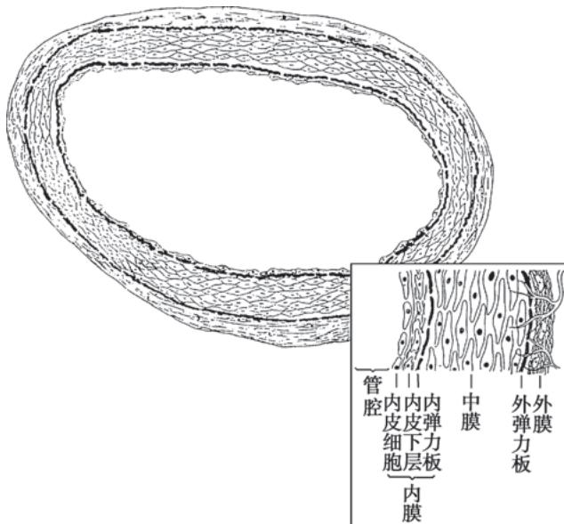  
图 3-4-1 动脉壁结构示意图

滴,有 T 淋巴细胞浸润。

Ⅲ型:斑块前期。细胞外出现较多脂滴，在内膜和中膜平滑肌层之间形成脂核，但尚未形成脂质池。

IV型:粥样斑块。脂质积聚多,形成脂质池,内膜结构破坏,动脉壁变形。

V型:纤维粥样斑块。为动脉粥样硬化最具特征性病变,呈白色斑块突入动脉腔内引起管腔狭窄。斑块表面内膜被破坏而由增生的纤维膜(帽)覆盖于脂质池之上。病变可向中膜扩展,破坏管壁,并同时可有纤维结缔组织增生、变性坏死等继发病变。

VI型:复合病变。为严重病变,由纤维斑块发生出血、坏死、溃疡、钙化和附壁血栓所形成。粥样斑块可因内膜表面破溃而形成粥样溃疡,破溃后粥样物质进入血流成为栓子。

近年来由于冠状动脉影像学尤其是包括血管内超声（IVUS）和光学相干断层扫描（OCT）在内的腔内影像学技术的进展和普及，对不同临床类型冠心病病人的斑块性状有了更直接和更清晰的认识。从临床角度来看，动脉粥样硬化斑块基本上可分为两类：一类是稳定型，即纤维帽较厚而脂质池较小的斑块；另一类是不稳定型(又称为易损型)，其纤维帽较薄，脂质池较大易于破裂。正因不稳定型斑块破裂导致急性缺血性心血管事件的发生。其他导致斑块不稳定的因素包括血流动力学变化、应激、炎症反应等，炎症反应在斑块稳定性和破裂中起着重要作用。斑块不稳定反映纤维帽的机械强度和损伤强度失平衡。斑块破裂释放组织因子和血小板活化因子，使血小板迅速聚集形成白色血栓；同时，斑块破裂导致大量炎症因子释放，上调促凝物质表达，促进纤溶酶原激活剂抑制物-1（PAI-1）的合成，从而加重血栓形成，并演变为红色血栓(图3-4-2、图3-4-3)。血栓形成使血管急性闭塞而导致严重持续性器官缺血。

从动脉粥样硬化的长期影响来看,受累动脉弹性减弱、脆性增加,其管腔逐渐变窄甚至完全闭塞,亦可扩张而形成动脉瘤。视受累动脉和侧支循环建立情况的不同,可引起整个循环系统或个别器官的功能紊乱。

1. 主动脉管壁弹性降低 心脏收缩时,主动脉管壁依靠弹性可适度扩张容纳心脏排出血液而缓冲收缩压的升高,主动脉管壁弹性降低时,该作用减弱,收缩压升高而舒张压降低,脉压增大。主动脉形成动脉瘤时,管壁为纤维组织所取代,不但失去弹性而且向外膨隆。

2. 内脏或四肢动脉管腔狭窄或闭塞 在侧支循环不能代偿的情况下,器官和组织的血液供应发生障碍,导致缺血、坏死或纤维化。

本病病理变化进展缓慢,青少年期即可开始出现脂质条纹,到中年期后开始出现明显的病变导致管腔狭窄,发生器官缺血症状。部分不稳定斑块进展迅速,易发生破裂导致急性缺血事件。现已有不少资料证明,动脉粥样硬化病变进展并非不可逆。积极控制和治疗各种危险因素一段时间后,较早期动脉粥样硬化病变可部分消退。

#### 【临床表现】

主要是相关器官受累后出现的症状。

1. 主动脉粥样硬化 大多数无特异性症状。主动脉广泛粥样硬化病变可出现主动脉弹性降低的相关表现,如收缩压升高、脉压增大等。X线检查可见主动脉结向左上方凸出,有时可见片状或弧状钙质沉着阴影。主动脉粥样硬化可以形成主动脉瘤,也可发生动脉夹层分离。

2. 冠状动脉粥样硬化 将在本章第二节详述。

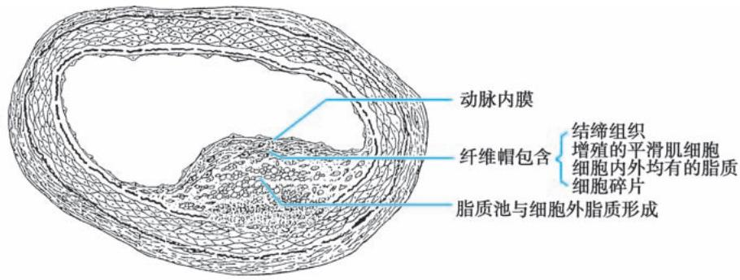

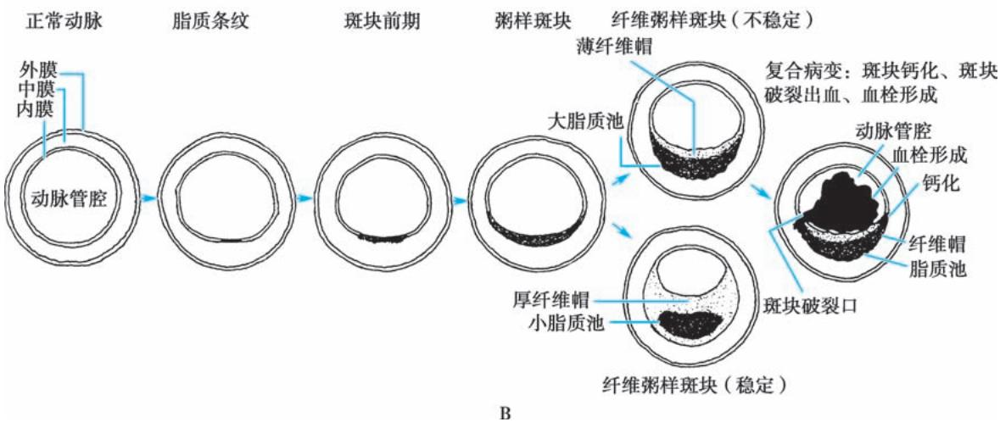  
图 3-4-2 动脉粥样硬化的发生和发展

A. 动脉粥样硬化斑块结构示意图: 显示粥样斑块的纤维帽和它所覆盖的脂质池。B. 动脉粥样硬化进展过程血管横切面结构示意图: 图中深黑色代表血栓、钙化, 淡黑色代表脂质条纹、脂质核和脂质池, 细黑点代表纤维帽。

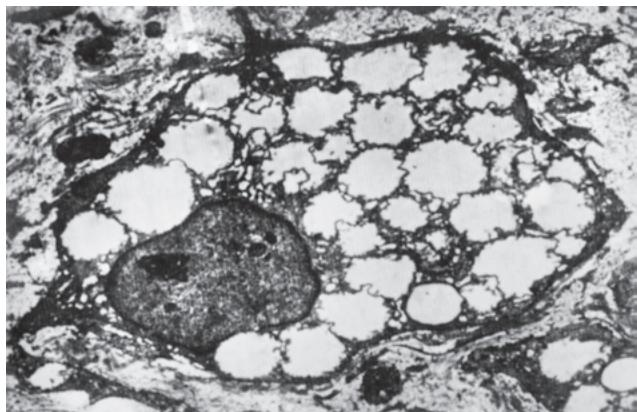  
图 3-4-3 主动脉粥样硬化斑块透视电镜像(×4800) 图示源于平滑肌的泡沫细胞,胞质内充满脂滴。

3. 颅脑动脉粥样硬化 最常侵犯颈内动脉、基底动脉和椎动脉。颈内动脉入脑处为好发区，病变多集中在血管分叉处。粥样斑块造成血管狭窄、脑供血不足或局部血栓形成或斑块破裂、碎片脱落造成脑梗死等脑血管意外；长期慢性脑缺血造成脑萎缩时，可发展为血管性痴呆。

4. 肾动脉粥样硬化 可引起顽固性高血压。55岁以上而突然发生高血压者，应考虑本病的可能。如发生肾动脉血栓形成可引起肾区疼痛、少尿和发热等。长期肾脏缺血可致肾萎缩并发展为肾衰竭。

5. 肠系膜动脉粥样硬化 可能引起消化不良、肠道张力减低、便秘和腹痛等症状。血栓形成时有剧烈腹痛、腹胀和发热。肠壁坏死时可引起便血、麻痹性肠梗阻和休克等。

6. 四肢动脉粥样硬化 以下肢动脉较多见。血供障碍引起下肢发凉、麻木和典型的间歇性跛行，即行走时发生腓肠肌麻木、疼痛以至痉挛，休息后消失，再走时又出现；严重者可持续性疼痛，下肢动脉尤其是足背动脉搏动减弱或消失。动脉完全闭塞可产生坏疽。

#### 【实验室检查】

本病尚缺乏敏感而特异的早期诊断方法。动脉粥样硬化病变的诊断有两个方面:一是形态学方面,包括病变所在部位、范围和程度;另一是功能学方面,评估粥样硬化病变是否导致器官的缺血。结合形态学和功能学的评估指导治疗方案的确定，包括血运重建(介入或外科治疗)的适应证和手术方法。超声可发现体表动脉如颈动脉、下肢动脉壁的斑块，多普勒超声检查有助于判断血流情况。X线检查可发现主动脉增宽、主动脉结突出、管壁钙化等。CT血管造影（CTA）和磁共振显像血管造影（MRA）无创显像动脉粥样硬化病变。结合无创影像技术的功能学方法，例如基于CTA的冠状动脉血流储备分数（CT-FFR）可评估器官缺血程度。心电图、超声心动图、放射性核素和负荷试验结果所示的特征性变化或心肌缺血证据有助于诊断冠状动脉粥样硬化性心脏病。选择性动脉造影可显示管腔狭窄或动脉瘤样病变，联合腔内影像技术和有创功能学评估可全面了解病变的形态和功能，是诊断动脉粥样硬化的最重要手段。动脉粥样硬化病人要关注血糖或脂质代谢异常相关指标。

#### 【诊断与鉴别诊断】

本病发展到出现器官缺血或坏死阶段时，诊断并不困难，但早期诊断很不容易。有动脉粥样硬化危险因素的人群，建议采用超声或其他无创性影像技术筛查动脉粥样硬化斑块，以指导早期预防和干预。年长病人发现血脂异常，X线、超声及动脉造影发现血管狭窄性或扩张性病变或钙化，应首先考虑诊断本病。

主动脉粥样硬化引起的主动脉变化和主动脉瘤，需与梅毒性主动脉炎和主动脉瘤以及纵隔肿瘤相鉴别；多发性大动脉炎、川崎病或其他一些自身免疫病等均可引起动脉管腔的狭窄或扩张，需要和本病相鉴别。各个器官出现缺血或梗死性相关症状时，除了粥样硬化外还需要考虑其他可引起管腔狭窄或闭塞的原因。

#### 【预后】

本病预后随病变部位、程度、血管狭窄发展速度、受累器官受损情况和有无并发症而不同。病变涉及心、脑、肾等重要脏器动脉者预后不良。

#### 【防治】

首先应积极预防动脉粥样硬化的发生。如已发生应积极治疗，防止病变发展并争取逆转。已发生并发症者应及时治疗，防止其恶化，延长病人寿命。

### （一）一般防治措施

1. 积极控制与本病有关的危险因素 包括高血压病、糖尿病、血脂异常、肥胖症等。

2. 合理膳食 控制膳食总热量,以维持正常体重,以 BMI 18.5\~24kg/m $^{2}$ 为正常体重;或以腰围为标准,当女性≥80cm、男性≥85cm 为超标。超重或肥胖者应减少每日进食总热量,减少胆固醇摄入,限制酒及含糖食物摄入。合并有高血压或心力衰竭病人应适量限盐。

3. 适当体力劳动和运动 参加一定的体力劳动和运动,有益于预防肥胖,调整血糖、血脂代谢,控制血压并锻炼循环系统功能等,是预防本病的一项积极措施。运动量应根据身体情况、体力活动习惯和心脏功能状态而定,以不过多增加心脏负担和不引起不适感觉为原则,通常建议每周150分钟(每周5天,每天30分钟)中等量运动,运动要循序渐进,不宜勉强做剧烈活动。

4. 合理安排工作和生活 生活要有规律,保持乐观、愉快的情绪。避免过度劳累和情绪激动。注意劳逸结合,保证充足的睡眠。

5. 提倡戒烟限酒

### （二）药物治疗

主要是调整血脂和防止血栓形成，综合控制危险因素(降血压、控制血糖等)，有靶器官缺血者使用抗缺血药物和靶器官保护药物。

1. 调整血脂药物 目前首选 LDL-C 作为调脂治疗的首要靶点,根据病人危险分层,确定目标值。他汀类药物是首选的降低胆固醇药物,如果单药不能达标或不耐受,联合使用胆固醇吸收抑制剂,前蛋白转化酶枯草溶菌素 9 型 (PCSK9) 抑制剂,或靶向 PCSK9 蛋白合成的小干扰 RNA 药物 (具体参见本章第三节)。TG 明显升高者可用贝特类药物或大剂量鱼油。

2. 抗血小板药物 通过抗血小板黏附和聚集防止血栓形成,避免血管阻塞性病变发展,用于预防动脉血栓形成和栓塞。最常用口服药为阿司匹林、氯吡格雷、普拉格雷、替格瑞洛、吲哚布芬和西洛他唑;静脉药物包括阿昔单抗、替罗非班、埃替非巴肽等药物,临床上根据病人发生缺血事件风险,单药或联合用药。

3. 溶栓和抗凝药物 对动脉内形成血栓导致管腔狭窄或阻塞者,可用溶栓药物,包括链激酶、尿激酶、阿替普酶（rt-PA）、瑞替普酶（r-PA）、替奈普酶（TNK-tPA）、尿激酶原等。肠外抗凝药物包括普通肝素、低分子量肝素、比伐芦定、磺达肝癸钠，口服抗凝药物包括华法林及新型口服抗凝药（NOAC）。

### （三）介入和外科手术

对于狭窄或闭塞血管，特别是冠状动脉、肾动脉和四肢动脉，可通过介入或外科手段进行血运重建，以恢复动脉供血。

# 第二节 | 冠状动脉粥样硬化性心脏病概述

冠状动脉粥样硬化性心脏病（coronary atherosclerotic heart disease）指冠状动脉(冠脉)发生粥样硬化引起管腔狭窄或闭塞，导致心肌缺血、缺氧或坏死而引起的心脏病，简称冠心病（coronary artery disease, CAD；或 coronary heart disease, CHD），亦称缺血性心脏病(ischemic heart disease)。

冠心病是动脉粥样硬化导致器官病变的最常见类型,严重危害人类健康。本病多发于40岁以上成人,男性发病早于女性,经济发达国家发病率较高;近年来发病呈年轻化趋势。

#### 【临床分型】

由于病理解剖和病理生理变化的不同，冠心病有不同的临床表型。1979年WHO曾将其分为五型：①隐匿型或无症状型冠心病；②心绞痛；③心肌梗死；④缺血性心肌病；⑤猝死。近年趋向于根据发病特点和治疗原则不同分为两大类：慢性冠脉综合征（chronic coronary syndrome, CCS）和急性冠脉综合征（acute coronary syndrome, ACS）。CCS也称慢性冠状动脉疾病（chronic coronary disease, CCD），病理上冠脉可有阻塞性病变或无明显阻塞性病变，CCS包括以下情况：伴稳定心绞痛症状和/或呼吸困难的疑似冠心病病人；新发心力衰竭或左心室功能障碍的疑似冠心病病人；ACS后1年内或近期血运重建的无症状或症状稳定病人；初次诊断或血运重建1年以上的无症状或有症状病人；疑似血管痉挛或微血管疾病的心绞痛病人；筛查时发现的无症状CAD病人。ACS包括不稳定型心绞痛（unstable angina, UA）、非ST段抬高型心肌梗死（non-ST-segment elevation myocardial infarction, NSTEMI）、ST段抬高型心肌梗死（ST-segment elevation myocardial infarction, STEMI）和猝死，其中猝死是冠心病中最严重的临床类型。ACS病理上大多数为冠脉粥样病变基础上继发血栓形成和/或痉挛。少部分心肌梗死者没有冠脉阻塞病变（MINOCA），原因包括痉挛、自发性夹层（spontaneous coronary artery dissection, SCAD）或壁内血肿等，以及栓塞和微血管疾病。CCS和ACS为冠心病不同演变阶段，临床表现主要取决于动脉粥样硬化斑块是否稳定，它可以有很长的稳定期，但CCS未来发生心血管事件的风险可能随着时间的推移而改变，如果危险因素控制不充分，生活方式改变和/或药物治疗不理想，或血运重建不成功，斑块发生破裂或侵蚀引起急性血栓事件时就成为ACS。

#### 【发病机制】

当冠脉供血供氧与心肌需血需氧之间发生矛盾,冠脉血流量不能满足心肌代谢的需要就可引起心肌缺血缺氧。暂时的缺血缺氧引起心绞痛,而持续严重的心肌缺血缺氧可引起心肌坏死,即为心肌梗死。

心肌能量的产生要求大量氧供，心肌细胞摄取血液氧含量达到65%～75%，明显高于其他组织。因此心肌平时对血液中氧的摄取已接近于最大量，氧需再增加时已难从血液中更多地摄取氧，只能依靠增加冠脉血流量来提供。正常情况下，冠脉循环有很大储备能力，通过神经和体液调节，其血流量可随身体的生理情况而有显著的变化，使冠脉的供血和心肌的需血保持动态平衡；在剧烈体力活动时，冠脉适当地扩张，血流量可增加到休息时的6～7倍。

决定心肌耗氧量的主要因素包括心率、心肌收缩力和心室壁张力，临床上常以“心率×收缩压”估计心肌耗氧量。由于冠脉血流灌注主要发生在舒张期，心率增加导致舒张期缩短及各种原因导致的舒张压降低显著影响冠脉灌注。冠脉固定狭窄或微血管阻力增加也可导致冠脉血流减少，当冠脉管腔存在显著固定狭窄（50%～75%），安静时尚能代偿，而运动、心动过速、情绪激动造成心肌需氧量增加时，可导致短暂心肌供氧和需氧间的不平衡，这是大多数CCS的发病机制。另一些情况下，由于不稳定性粥样硬化斑块发生破裂、糜烂、侵蚀或出血，继发血小板聚集或血栓形成导致管腔狭窄程度急剧加重，或冠脉发生痉挛，均可使心肌氧供应明显减少，这是引起ACS的主要原因。另外，即使冠脉血流灌注正常,严重贫血时心肌氧供也可显著降低。很多情况下,心肌缺血甚至坏死是需氧量增加和供氧量减少两者共同作用的结果。

心肌缺血后发生缺氧，氧化代谢受抑，致使高能磷酸化合物储备降低，细胞功能随之发生改变。产生痛觉的直接因素可能是在缺血缺氧情况下，心肌内积聚过多的代谢产物，如乳酸、丙酮酸、磷酸等酸性物质或类似激肽的多肽类物质，刺激心脏内自主神经传入纤维末梢，经1～5胸交感神经节和相应脊髓段，传至大脑产生疼痛感觉。这种痛觉反映在与自主神经进入水平相同脊髓段的脊神经所分布区域，即胸骨后及两臂的前内侧与小指，尤其左侧。

# 第三节 | 慢性冠状动脉综合征

慢性冠状动脉综合征（CCS）最常见为慢性稳定型劳力性心绞痛和以心功能不全为主要表现的缺血性心肌病，部分处于渡过ACS后或行血运重建之后稳定期，有些则为无症状隐匿型冠心病。发生心肌缺血的主要原因是存在稳定的心外膜冠脉粥样硬化造成的固定狭窄，在某些因素导致心肌耗氧量增加的情况下诱发心肌急剧暂时性缺血缺氧；但冠脉痉挛或微血管病变的病人没有心外膜血管固定狭窄临床上亦不少见。CCS病人在治疗上有共同之处，通过抗心肌缺血治疗改善症状，稳定或逆转斑块并预防血栓形成，延长病人生存期。

## 一、稳定型心绞痛

稳定型心绞痛（stable angina pectoris）也称劳力性心绞痛。其特点为阵发性的前胸部压榨性疼痛或憋闷感觉，主要位于胸骨后部，可放射至心前区和左上肢尺侧，常发生于劳力负荷增加时，持续数分钟，休息或服用硝酸酯制剂后疼痛消失。疼痛发作的程度、频度、持续时间、性质及诱发因素等在数月内无明显变化。

#### 【发病机制】

当冠脉狭窄或部分闭塞时,其血流量减少,心肌供血量相对比较固定。休息时尚能维持心肌血流的供需平衡,病人可无症状。在劳力、情绪激动、饱食、受寒等情况下,心脏负荷突然增加,使心率增快、心肌张力和收缩力增加等导致心肌氧耗量增加,而存在狭窄的冠脉供血却不能相应地增加以满足心肌需求时,即可引起心绞痛。

#### 【病理解剖和病理生理】

稳定型心绞痛病人的冠脉造影显示:有1、2或3支冠脉狭窄减少＞70%的病变者分别占25%左右,5%～10%有左冠脉主干狭窄;其余约15%的病人冠脉无显著狭窄,提示可能是冠脉痉挛、微血管病变、交感神经过度活动、儿茶酚胺分泌过多或心肌代谢异常等导致心肌血供和氧供不足。

病人心绞痛发作之前，常有血压增高、心率增快、肺动脉压和肺毛细血管楔压增高，反映心脏和肺的顺应性减低。发作时可有左心室收缩力和收缩速度降低、射血速度减慢、左心室收缩压下降、心搏出量和心排血量降低、左心室舒张末期压和血容量增加等左心室收缩和舒张功能障碍的病理生理变化。左心室壁可呈收缩不协调或部分有收缩减弱现象。

#### 【临床表现】

### (一) 症状

心绞痛以发作性胸痛为主要临床表现,疼痛特点为:

1. 诱因 常见诱因包括体力劳动或情绪激动(如愤怒、焦急、过度兴奋等),饱食、寒冷、吸烟、心动过速、休克等亦可诱发。疼痛多发生于劳力或激动的当时,而不在劳累之后。典型稳定型心绞痛常在相似的条件下重复发生。

2. 部位 主要在胸骨体后,可波及心前区,手掌大小范围,也可横贯前胸,界限不清。常放射至左肩、左臂内侧达无名指和小指,或至颈、咽或下颌部。

3. 性质 胸痛常为压迫、发闷或紧缩性，也可有烧灼感，但不像针刺或刀扎样锐性痛，偶伴濒死感。有些病人仅觉胸闷不适或呼吸困难，而非胸痛。发作时病人往往被迫停止正在进行的活动，直至症状缓解。

4. 持续时间 一般持续数分钟至十余分钟, 多为 3\~5 分钟, 不超过半小时。

5. 缓解方式 一般在停止原来诱发症状的活动后即可缓解；硝酸甘油等快速起效的硝酸酯类药物舌下含服或喷吸也能在几分钟内使之缓解。

### （二）体征

平时一般无异常体征。心绞痛发作时常见心率增快、血压升高、表情焦虑、皮肤冷或出汗，有时出现第四或第三心音奔马律。可有暂时性心尖部收缩期杂音，是因乳头肌缺血致功能失调引起二尖瓣关闭不全所致。

#### 【辅助检查】

### （一）实验室检查

血糖、血脂检查可了解冠心病危险因素；胸痛明显者需查血清心肌损伤标志物，包括心肌肌钙蛋白I或T、肌酸激酶（CK）及同工酶（CK-MB），据此与ACS相鉴别；氨基末端脑钠肽前体（NT-proBNP）可了解病人心功能状态；血常规可了解有无贫血；必要时检查甲状腺功能。

### （二）心电图

（ECG）检查

1. 静息时 ECG 约半数病人在正常范围,也可能有陈旧性心肌梗死改变或非特异性 ST 段和 T 波异常。有时出现房室或束支传导阻滞、房性或室性期前收缩等心律失常,但均非特异性。

2. 发作时 ECG 绝大多数病人可出现暂时性心肌缺血引起的 ST 段移位。因心内膜下心肌更容易缺血，故常见反映心内膜下心肌缺血的 ST 段压低 ( $\geqslant0.1mV$ )，发作缓解后恢复 (图 3-4-4)。有时也可以出现 T 波倒置。在平时有 T 波持续倒置的病人，发作时可变为直立 (“假性正常化”)。T 波改变虽然对反映心肌缺血的特异性不如 ST 段压低，但如与平时 ECG 比较有明显差别，也有助于诊断。

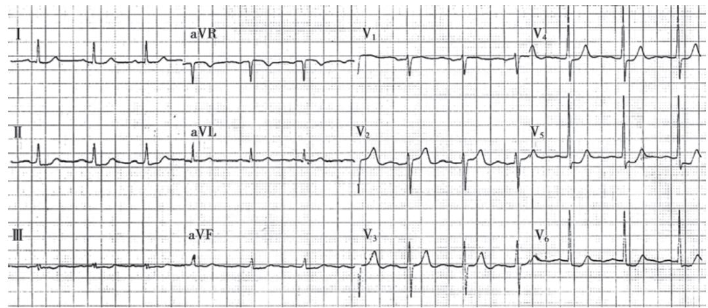  
图 3-4-4 心绞痛发作时的心电图  
I、Ⅱ、Ⅲ、aVF、 $V_{4\sim6}$ 导联 ST 段压低。

3. ECG 负荷试验 最常用的是运动负荷试验,增加心脏负担以激发心肌缺血。运动方式主要为分级活动平板或踏车,其运动强度可逐步升级。前者常用,让受检查者迎着转动的平板就地踏步,以达到按年龄预计可达到的最大心率 $\left(\mathrm{HR}_{\max }\right)$ 或亚极量心率(85%\~90%的 $HR_{max}$ )为负荷目标,前者为极量运动试验,后者为亚极量运动试验。运动中应持续监测ECG改变。运动前、运动中每当运动负荷量增加一次均应记录ECG,运动终止后即刻及此后每2分钟均应重复ECG记录,直至心率恢复至运动前水平。ECG记录时应同步测定血压。运动中出现典型心绞痛、ECG改变主要以ST段水平形或下斜形压低≥0.1mV(J点后60\~80ms)持续2分钟为运动试验阳性标准(图3-4-5)。运动中出现心绞痛、步态不稳、室性心动过速或血压下降时,应立即停止运动。心肌梗死急性期、不稳定型心绞痛、明显心力衰竭、严重心律失常或急性疾病者禁做运动试验。本试验有一定比例的假阳性和假阴性,单纯结果不能作为诊断或排除冠心病的依据。

4. ECG 连续动态监测(Holter) Holter 检查可连续记录并自动分析 24 小时(或更长时间)的 ECG(双极胸导联或同步 12 导联), 可发现 ST 段、T 波改变(ST-T)和各种心律失常。将出现异常 ECG静息时心电图示Ⅱ、Ⅲ、aVF 和 $V_{5}$ 、 $V_{6}$ 导联 ST 段压低；运动时 $V_{5}$ 导联 ST 段 1 分钟开始压低，5 分 18 秒时达到 4mm；运动后 I、Ⅱ、Ⅲ、aVF、 $V_{3}$ 、 $V_{4}$ 、 $V_{5}$ 、 $V_{6}$ 导联均出现 ST 段压低，T 波倒置，8 分钟后仍未恢复，运动试验阳性。

4'  
1'  
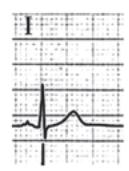

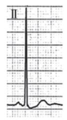

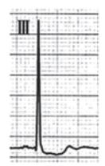

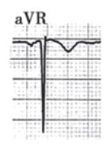  
静息

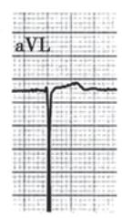

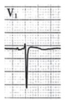

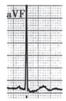

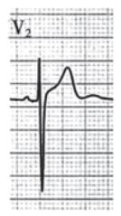

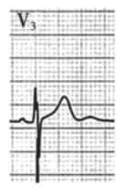

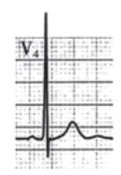

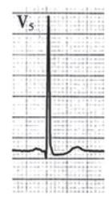

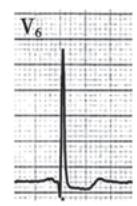  
运动时

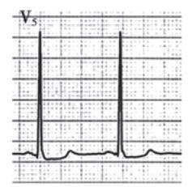  
0'

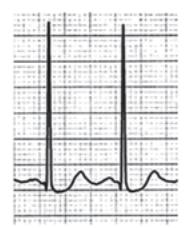

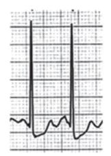

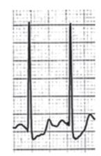  
2'

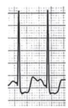  
运动后

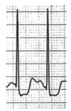  
0'

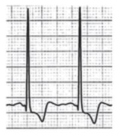  
2'

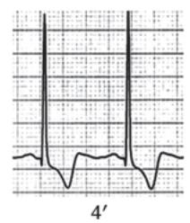

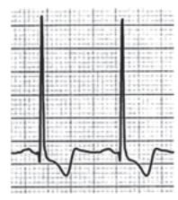  
6'

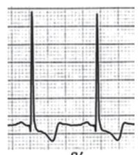  
8'  
图 3-4-5 心电图平板运动试验

表现的时间与病人活动和症状相对照。胸痛发作时相应时间的缺血性 ST-T 改变有助于确定心绞痛诊断，也可检出无痛性心肌缺血。

### （三）CT 血管造影

（CTA）进行冠脉二维或三维重建(图 3-4-6)，用于判断冠脉管腔狭窄程度和管壁钙化情况，对判断管壁内斑块分布范围和性质也有一定意义。冠脉 CTA 有较高阴性预测价值,若未见狭窄病变,一般可不进行有创检查;但其对狭窄程度判断仍有一定局限性,特别当钙化存在时会显著影响判断。近年来,基于冠脉CTA血流储备分数(CT-FFR)可评估冠脉狭窄病变功能,通常以CT-FFR<0.80为诊断心肌缺血界限值,需要冠脉造影进一步明确狭窄程度以决定治疗策略。

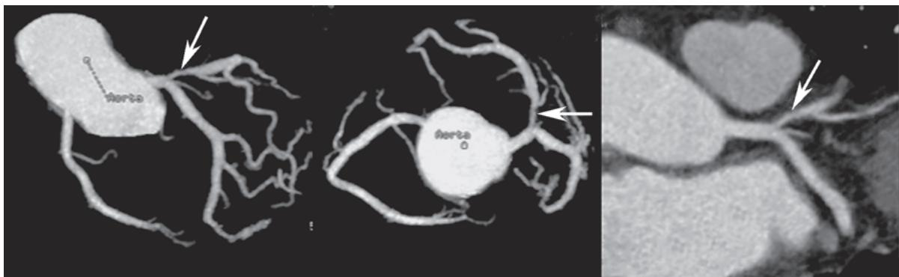  
图 3-4-6 多层螺旋 CT 冠脉成像  
箭头所示为左前降支近段病变，左、中、右图为不同角度所示。

### （四）超声心动图

多数稳定型心绞痛病人静息时超声心动图检查无异常。有陈旧性心肌梗死或严重心肌缺血病人，二维超声心动图可探测到坏死区或缺血区心室壁的运动异常。运动或药物负荷超声心动图可评价负荷状态下心肌灌注情况。超声心动图还有助于发现其他需与冠脉狭窄导致心绞痛相鉴别的疾病如肥厚型梗阻性心肌病、主动脉瓣狭窄等。

### （五）放射性核素检查

1. 心肌灌注显像及负荷试验 ${}^{201}$ Tl(铊)随冠脉血流很快被正常心肌细胞所摄取。静息时铊显像所示灌注缺损主要见于心肌梗死后瘢痕部位。运动后见明显灌注缺损心肌缺血区提示冠脉供血不足。近年来有用 ${}^{99m}$ Tc-MIBI 取代 ${}^{201}$ Tl 作心肌显像，更便于临床推广应用(图 3-4-7)。

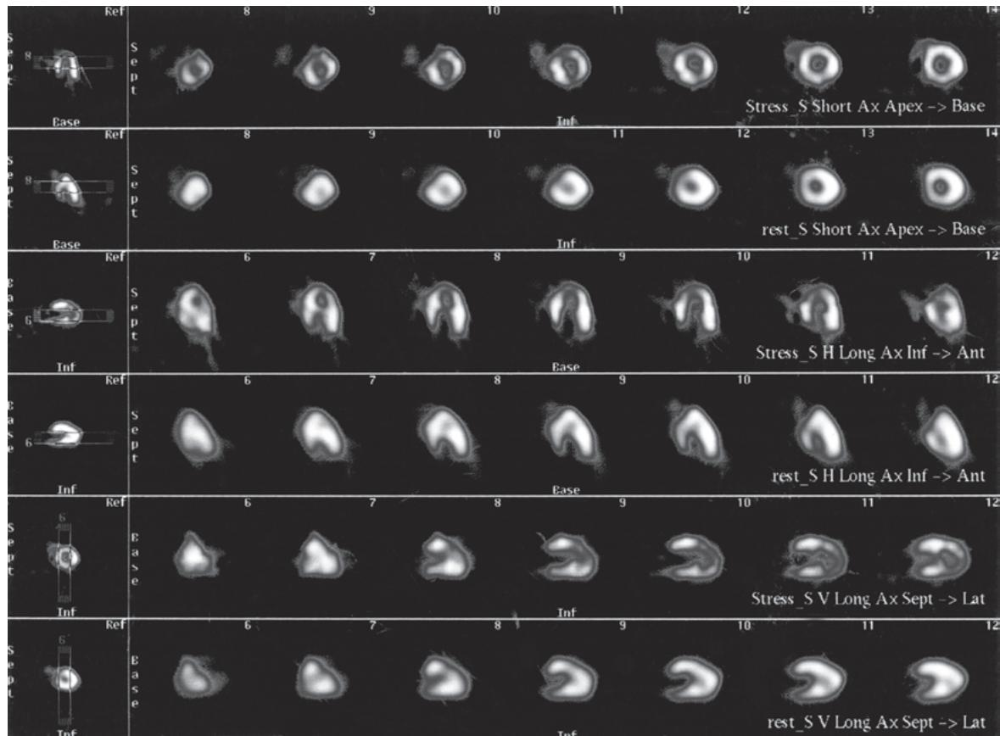  
图 3-4-7 心肌灌注显像

图中第一和第二行分别为负荷和静息状态下左室短轴心尖至心底部(左至右)切面,第三、四行分别为两状态下左室长轴下壁至前壁切面,第五、六行分别为两状态下左室垂直长轴间隔至侧壁切面。图示左室前壁、心尖和下壁近心尖处在负荷状态下有放射性稀疏和缺损,静息状态下再分布可见明显的放射性充填,为心肌缺血表现。

2. 放射性核素心腔造影 应用 ${}^{99m}$ Tc 进行体内红细胞标记, 得到心腔血池显影。通过对心动周期中不同时相的显影图像分析, 测定左心室射血分数及显示心肌缺血区域室壁局部运动障碍。

3. 正电子发射断层心肌显像 利用发射正电子的核素示踪剂如 ${}^{18}F$ 、 ${}^{11}C$ 、 ${}^{13}N$ 等进行心肌显像。除可判断心肌血流灌注情况外，尚可了解心肌代谢情况。通过对心肌血流灌注和代谢显像匹配分析可准确评估心肌活力。

### (六) 冠脉磁共振成像

冠脉磁共振成像 (CMRA) 是冠脉成像的新方法, 无电离辐射、无创。采用呼吸和心电门控技术获得三维 CMRA 是目前最常用的方法。负荷和灌注 MRI 图像还可以显示心肌缺血。成像时间长、空间分辨率低、操作依赖性强等缺陷限制了 CMRA 的广泛应用。

### (七) 有创性检查

1. 冠脉造影 选择性冠脉造影(图 3-4-8)目前仍然是诊断冠心病的“金标准”，用特殊形状的心导管经桡动脉、股动脉或肱动脉送到主动脉根部，分别插入左、右冠脉口，注入少量含碘对比剂，在不同的投射方位下采集摄影，可使左、右冠脉及其主要分支得到清楚显影，发现狭窄性病变的部位并估计其程度。一般认为管腔直径减少70%～75%以上会严重影响血供。

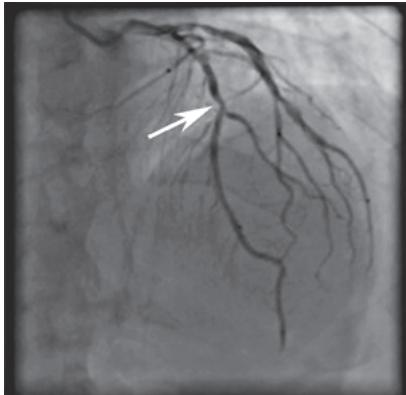  
A

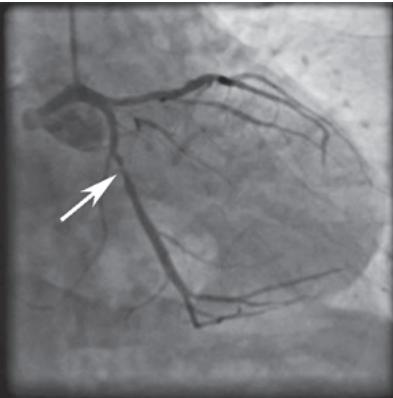  
B

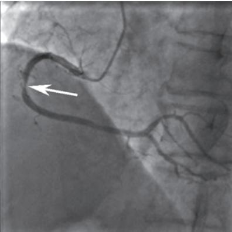  
C  
图 3-4-8 选择性冠脉造影显像

A. 正头位（AP+CRA 30°），箭头所示为左前降支中段的病变部位；B. 右前斜足位（RAO 30°+CAU 30°），箭头所示为左回旋支近中段的病变部位；C. 左前斜位（LAO 45°），箭头所示为右冠状动脉中段病变部位。

2. 其他 IVUS(图 3-4-9)、OCT、冠脉血流储备分数(fractional flow reserve, FFR)测定以及冠脉定量血流分数(quantitative flow ratio, QFR)等形态学或功能学评估技术也可用于冠心病的诊断并有助于指导介入治疗。

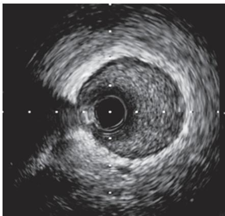  
A

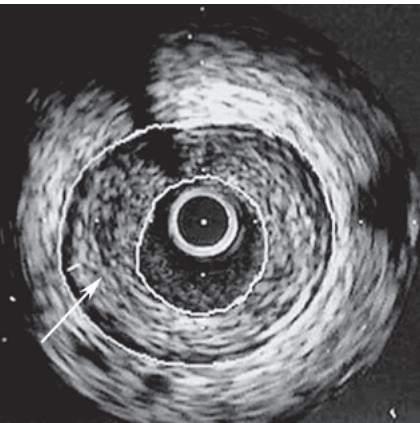  
B  
图 3-4-9 冠脉心血管内超声成像  
A. 基本正常节段血管。B. 冠状动脉粥样硬化病变部位, 箭头所示为斑块; 内圈为管腔横断面, 外圈为外弹力膜, 两圈之间的环形区域为粥样硬化斑块。

### （八）其他检查

胸部 X 线检查对稳定型心绞痛并无特异的诊断意义,一般情况下都是正常的。但有助于了解其他心肺疾病的情况,如有无心脏增大、心衰等。

#### 【诊断与鉴别诊断】

根据典型心绞痛的发作特点,结合年龄和存在冠心病危险因素,除外其他原因所致的心绞痛,一般即可建立诊断。心绞痛发作时 ECG 检查可见 ST-T 改变,症状消失后 ST-T 改变逐渐恢复,支持心绞痛诊断。未捕捉到发作时 ECG 者可行 ECG 负荷试验。冠脉 CTA 有助于无创性评价冠脉管腔狭窄程度及管壁病变性质和分布。冠脉造影可明确病变的严重程度和分布范围,联合腔内影像和功能学技术,有助于诊断和指导进一步治疗。

加拿大心血管病学会(CCS)把心绞痛严重程度分为四级。

I级:一般体力活动(如步行和登楼)不受限,仅在强、快或持续用力时发生心绞痛。

Ⅱ级:一般体力活动轻度受限,快步行走、饭后、寒冷或刮风中、精神应激或醒后数小时内发作心绞痛。一般情况下平地步行200m以上或登楼一层以上受限。

Ⅲ级:一般体力活动明显受限,一般情况下平地步行200m内或登楼一层引起心绞痛。

Ⅳ级:轻微活动或休息时即可发生心绞痛。

鉴别诊断要考虑下列情况：

1. 急性冠脉综合征 不稳定型心绞痛的疼痛部位、性质、发作时心电图改变等与稳定型心绞痛相似，但发作诱因不同，常在休息或较轻微活动下即可诱发。1个月内新发的或明显恶化的劳力性心绞痛也属于不稳定型心绞痛；心肌梗死的疼痛程度更剧烈，持续时间多超过30分钟，甚可长达数小时，可伴有心律失常、心力衰竭或/和休克，含用硝酸甘油多不能缓解，心电图常有典型的动态演变过程。实验室检查示心肌坏死标志物增高；可有白细胞计数增高和红细胞沉降率增快。

2. 其他疾病引起的心绞痛 严重主动脉瓣狭窄或关闭不全、风湿性冠脉炎、梅毒性主动脉炎引起冠脉口狭窄或闭塞、肥厚型心肌病、X综合征等，要根据其临床表现来进行鉴别。其中X综合征多见于女性，ECG负荷试验常阳性但冠脉造影无狭窄病变且无冠脉痉挛证据，预后良好，被认为是冠脉微循环病变所致。

3. 肋间神经痛和肋软骨炎 前者疼痛常累及1～2个肋间，但并不一定局限在胸前，为刺痛或灼痛，多为持续性而非发作性，咳嗽、用力呼吸和身体转动可使疼痛加剧，沿神经走行处有压痛，手臂上举活动时局部有牵拉疼痛；后者则在肋软骨处有压痛。

4. 心脏神经症 病人常诉胸痛,但为短暂(几秒)的刺痛或持久(几小时)的隐痛。病人常喜欢不时地吸一大口气或叹息性呼吸。胸痛部位多在左胸乳房下心尖部附近或经常变动。症状多于疲劳之后出现,而非疲劳当时。轻度体力活动反觉舒适,有时可耐受较重的体力活动而不发生胸痛或胸闷。含用硝酸甘油无效或在10多分钟后才“见效”。常伴有心悸、疲乏、头昏、失眠及其他神经症的症状。

5. 其他系统疾病导致的胸痛 还需与反流性食管炎等食管疾病、膈疝、消化性溃疡、肠道疾病、颈椎病等相鉴别。

#### 【预后】

稳定型心绞痛病人大多数能生存很多年，但有发生急性心肌梗死或猝死的危险。决定预后的主要因素为冠脉病变累及心肌供血的范围和心功能。左冠脉主干病变最为严重，国外统计年病死率可高达30%左右，此后依次为3支、2支与单支病变。左前降支病变一般较其他两支冠脉病变预后差。左心室造影、超声心动图或核素心室腔显影所示射血分数降低和室壁运动障碍也有预后意义。

#### 【治疗】

治疗原则是改善冠脉血供和降低心肌耗氧以改善病人症状,提高生活质量,同时治疗冠脉粥样硬化,预防心肌梗死和死亡,延长生存期。

### （一）发作时治疗

1. 休息 发作时立刻休息,一般在停止活动后症状即逐渐消失。

2. 药物治疗 可使用作用较快的硝酸酯制剂。舌下含服或口腔喷剂起效最快，反复发作也可静脉使用，但要注意耐药的可能。硝酸酯类药物除扩张冠脉、降低阻力、增加冠脉循环的血流量外，还通过对周围血管扩张作用，减少静脉回心血量，降低心脏前后负荷，缓解心绞痛。

（1）硝酸甘油（nitroglycerin）:0.5mg 舌下含化或喷雾剂喷吸 1～2 次。1～2 分钟即开始起效，约半小时后作用消失。延迟见效或完全无效提示病人并非患冠心病或者是严重冠心病。与各种硝酸酯类药物一样，其副作用有头痛、面色潮红、心率反射性加快和低血压等。第一次含用硝酸甘油时应注意有可能发生直立性低血压。

（2）硝酸异山梨酯(isosorbide dinitrate):5～10mg舌下含化。2～5分钟见效，作用维持2～3小时。也有喷雾吸入制剂。

### (二) 缓解期治疗

1. 生活方式调整 尽量避免各种诱发因素。清淡饮食,进食不应过饱;戒烟限酒;减轻精神负担,保障睡眠;调整日常生活与工作量,保持适当体力活动,以不致发生疼痛症状为度;一般不需卧床休息。

2. 药物治疗

(1) 改善缺血、减轻症状从而提高生活质量的药物

1）β受体拮抗剂：抑制心脏β肾上腺素能受体，减慢心率、减弱心肌收缩力、降低血压，降低心肌耗氧量、减少心绞痛发作和增加运动耐量。用药后静息心率降至55～60次/分，严重心绞痛病人如无心动过缓症状可降至50次/分。推荐使用无内在拟交感活性的选择性 $\beta_{1}$ 受体拮抗剂，剂量个体化，从较小剂量开始，逐级增加剂量。临床常用的 $\beta_{1}$ 受体拮抗剂包括美托洛尔普通片（25～100mg，每日2次）、美托洛尔缓释片（47.5～190mg，每日1次）和比索洛尔（5～10mg，每日1次）等。

有严重心动过缓和高度房室传导阻滞、窦房结功能紊乱、有明显支气管痉挛或支气管哮喘的病人禁用。外周血管疾病及严重抑郁亦是相对禁忌证。慢性肺心病病人可小心使用高度选择性的 $\beta_{1}$ 受体拮抗剂。

2）硝酸酯类药物：常用药物包括二硝酸异山梨酯(普通片5～20mg，每日3～4次；缓释片20～40mg，每日1～2次)和单硝酸异山梨酯(普通片20mg，每日2次；缓释片40～60mg，每日1次)等。每天用药时应注意给予足够的无药间期，以减少耐药性的发生。不良反应包括头痛、面色潮红、心率反射性加快和低血压等。

3）钙通道阻滞剂：阻滞钙离子进入细胞内，抑制心肌细胞兴奋-收缩偶联，从而抑制心肌收缩，减少心肌氧耗；扩张冠脉，解除痉挛，改善心内膜下心肌供血；扩张周围血管，降低动脉压，减轻心脏负荷；改善心肌微循环。常用制剂有：非二氢吡啶类药物，包括维拉帕米(普通片40～80mg，每日3次；缓释片240mg，每日1次)、地尔硫草(普通片30～60mg，每日3次；缓释片90mg，每日1次)，这两类药物有负性肌力和负性传导作用，与β受体拮抗剂联合使用需要非常谨慎。二氢吡啶类药物，包括硝苯地平(控释片30mg，每日1次)、氨氯地平（5～10mg，每日1次)等，合并高血压病人更适合。

外周水肿、便秘、心悸、面部潮红是所有钙通道阻滞剂常见副作用。其他不良反应还包括头痛、头晕、虚弱无力等。地尔硫草和维拉帕米能减慢窦房结心率和房室传导，抑制心肌收缩，不能应用于已有严重心动过缓、高度房室传导阻滞和病态窦房结综合征病人，也不建议用于左心室功能不全病人。

4）其他药物：主要用于β受体拮抗剂或者钙通道阻滞剂有禁忌、不耐受或者不能控制症状的情况下。主要有：①曲美他嗪(普通片20～60mg，每日3次；缓释剂35mg，每日2次)，抑制脂肪酸氧化和增加葡萄糖代谢，提高氧利用率而治疗心肌缺血。②尼可地尔（5mg，每日3次），是一种ATP依赖钾离子通道开放剂，除了与硝酸酯类制剂具有相似药理特性外，还可扩张微血管。③伊伐布雷定（5～7.5mg，每日2次），是第一个窦房结 $I_{f}$ 电流选择特异性抑制剂，可用于需要减慢窦性心率的稳定型心绞痛。④雷诺嗪，抑制心肌细胞晚期钠电流，防止钙超载和改善心肌代谢活性。⑤中医中药治疗目前以“活血化瘀”“芳香温通”和“祛痰通络”法最为常用。

(2) 预防心肌梗死,改善预后的药物

1）抗血小板药物

环氧化酶（cycloxygenase, COX）抑制剂：阻断血栓素 $A_{2}$ 合成，达到抗血小板聚集的作用，包括不可逆 COX 抑制剂（阿司匹林）和可逆 COX 抑制剂（吲哚布芬）。阿司匹林是抗血小板治疗的基石，所有病人只要无禁忌都应该使用，最佳剂量为每日 75～150mg，主要不良反应为胃肠道出血或对阿司匹林过敏。吲哚布芬可逆性抑制 COX-1，同时减少血小板因子 3 和 4，减少血小板聚集，且对前列腺素抑制率低，胃肠反应和出血风险少，可用于有出血或消化道损伤风险的病人，维持剂量为 100mg，每日 2 次。

$P_{2}Y_{12}$ 受体拮抗剂: 抑制 ADP 诱导血小板活化。目前, 我国临床上常用氯吡格雷和替格瑞洛。氯吡格雷是第二代 $P_{2}Y_{12}$ 受体拮抗剂, 为前体药物, 需在肝脏中通过细胞色素 P450(CYP 450)酶系中的 CYP2C19 代谢而成为活性代谢物后, 才能不可逆地抑制 $P_{2}Y_{12}$ 受体, 从而抑制血小板聚集反应。主要用于支架植入后以及阿司匹林有禁忌证病人, 常用维持剂量为每日 75mg。CYP2C19 慢代谢基因型病人氯吡格雷抗血小板作用可能减弱。

2）调脂药物

降低 LDL-C 药物:首选他汀类,它抑制肝细胞中胆固醇合成的限速酶乙酰 CoA 还原酶,使肝细胞内胆固醇浓度降低,肝细胞膜表面的 LDL 受体表达增加,有效降低 TC 和 LDL-C,延缓斑块进展并稳定斑块。所有明确诊断为冠心病病人,无论其血脂水平如何,均应给予他汀类药物,并将 LDL-C 降至 1.8mmol/L (70mg/dl) 以下。临床常用的他汀类药物包括阿托伐他汀 (10\~80mg,每晚 1 次)、瑞舒伐他汀 (5\~20mg,每晚 1 次)、匹伐他汀 (1\~2mg,每晚 1 次)、普伐他汀 (20\~40mg,每晚 1 次)、氟伐他汀 (40\~80mg,每晚 1 次)、辛伐他汀 (20\~40mg,每晚 1 次)等,中药血脂康含有天然洛伐他汀也可有效降低胆固醇。他汀类药物的总体安全性很高,但仍应注意监测谷氨酸转氨酶及肌酸激酶等生化指标,及时发现药物可能引起的肝脏损害和肌损伤,尤其大剂量他汀药物强化调脂治疗时,更应注意监测药物安全性。其他降低胆固醇的药物包括胆固醇吸收抑制剂、前蛋白转化酶枯草溶菌素 9 (PCSK9) 抑制剂和靶向 PCSK9 的小干扰核糖核酸 (RNA) 药物英克司兰。胆固醇吸收抑制剂通过选择性抑制小肠胆固醇转运蛋白,有效减少肠道内胆固醇的吸收,降低血浆胆固醇水平以及肝脏胆固醇储量。对于单独应用他汀类药物胆固醇水平不能达标或不能耐受较大剂量他汀治疗的病人,可以联合应用,常用药物有依折麦布 (10mg,每天 1 次)、海博麦布 (10mg,每天 1 次)。PCSK9 抑制剂增加肝细胞表面 LDL 受体再循环,增加 LDL 清除,从而降低 LDL-C 水平。PCSK9 抑制剂的适应证包括杂合子家族性高胆固醇血症或 ASCVD 病人,在控制饮食和最大耐受剂量他汀类药物治疗下仍需进一步降低 LDL-C 的病人,常用药物有依洛尤单抗(皮下注射 140mg,每 2 周一次)、阿利西尤单抗(皮下注射 75mg,每 2 周一次)和托莱西单抗(皮下注射 150mg,每 2 周一次)。英克司兰精准靶向降解肝脏 PCSK9 mRNA,从上游阻断 PCSK9 蛋白合成,最长可每 6 个月皮下注射一针。

降低 TG 药物: 应在严格改变生活方式的基础上, 启动贝特类药物(非诺贝特 200mg, 每天 1 次)或处方级 $\omega-3$ 脂肪酸(如二十五碳五烯酸, 每次 2g, 每天 2 次)治疗。

3）血管紧张素转换酶抑制剂（ACEI）、血管紧张素受体拮抗剂（ARB）或血管紧张素受体脑啡肽酶抑制剂（ARNI）：能使冠心病病人心血管死亡、非致死性心肌梗死等主要终点事件的相对危险性显著降低。稳定型心绞痛合并高血压病、糖尿病、心力衰竭或左心室收缩功能不全的高危病人建议使用ACEI。常用的ACEI类药物包括卡托普利（12.5～50mg，每日3次）、依那普利（5～10mg，每日2次）、培哚普利（4～8mg，每日1次）、雷米普利（5～10mg，每日1次）、贝那普利（10～20mg，每日1次）、赖诺普利（10～20mg，每日1次）等。不能耐受ACEI类药物者可使用ARB或ARNI类药物。

4) $\beta$ 受体拮抗剂: 对心肌梗死后稳定型心绞痛病人, $\beta$ 受体拮抗剂可减少心血管事件的发生。

3. 血运重建治疗 采用药物保守治疗还是血运重建治疗(包括经皮介入治疗或者旁路移植术)需根据病人临床特征、心肌缺血客观依据、冠脉病变解剖特征以及当地医疗中心手术经验等综合判断后决定,对稳定型心绞痛病人而言,只有针对引起心肌缺血的病变进行血运重建,病人才能获益。

（1）经皮冠状动脉介入术(percutaneous coronary intervention, PCI): PCI包括经皮球囊冠脉成形术、冠脉支架植入术和斑块旋磨术、冠脉内激光成形术、冲击波球囊治疗术等。与单纯药物治疗相比，PCI术能使病人生活质量提高(活动耐量增加)，但心肌梗死发生和死亡率无显著差异。支架内再狭窄和支架内血栓是影响其疗效的主要因素。随着新技术尤其是新型药物洗脱支架及新型抗血小板药物的应用，PCI疗效不断提高。除了金属药物洗脱支架外，生物可降解支架和药物洗脱球囊在符合适应证的病人中使用，可取得与金属药物洗脱支架类似疗效，但可以达到冠脉内不长期遗留异物的效果。在没有临床缺血证据的情况下，目前推荐应用FFR或QFR等冠脉生理学技术评估临界病变的功能意义,如有缺血证据的病变(FFR 或 QFR<0.80)亦可考虑介入治疗。

（2）冠状动脉旁路移植术(coronary artery bypass graft, CABG): CABG 通过取病人自身的大隐静脉、桡动脉作为旁路移植材料，一端吻合在主动脉，另一端吻合在病变冠脉段的远端；也可游离左内乳动脉与病变前降支远端吻合，改善病变冠脉分布心肌的血流供应。术后明显改善心绞痛症状和提高病人生活质量。相对来说，CABG 术创伤较大，虽然随手术技能及器械等方面的改进，成功率已大大提高，但围手术期死亡率仍高于 PCI 术，视不同中心经验而异，为 1%～4%，与病人术前冠脉病变、心功能状态及有无其他并发症有关。移植血管还可能闭塞。因此应个体化权衡利弊，慎重选择手术适应证。

有血运重建适应证的病人选择 PCI 还是 CABG, 需要根据冠脉病变的解剖特点、病人对开胸手术的耐受程度及病人意愿等综合考虑。对全身情况能耐受开胸手术者, 左主干合并 2 支以上冠脉病变 (尤其是病变复杂程度评分, 如 SYNTAX 评分较高者), 或多支血管病变合并糖尿病, 病变严重扭曲伴重度钙化者, CABG 应为首选。

#### 【预防】

对稳定型心绞痛除应用药物防止心绞痛再次发作外，还应从阻止或逆转粥样硬化病情进展、预防心肌梗死等方面综合考虑，以改善预后。ABCDE方案指导二级预防有帮助：A.抗血小板、抗心绞痛治疗和应用ACEI/ARB；B.β受体拮抗剂和控制血压；C.控制血脂和戒烟；D.控制饮食和糖尿病治疗；E.健康教育和运动。

## 二、缺血性心肌病

缺血性心肌病（ischemic cardiomyopathy, ICM）属于冠心病的一种特殊类型或晚期阶段，临床表现为新发心衰或左心室功能障碍，可伴有各种心律失常，心脏扩大类似扩张型心肌病。其病理生理基础是冠脉粥样硬化病变使心肌长期缺血、缺氧以至心肌细胞减少、坏死、心肌纤维化、心肌瘢痕形成。

#### 【临床表现】

1. 充血型缺血性心肌病

（1）心绞痛：常见症状之一。多有明确冠心病病史，且绝大多数有1次以上心肌梗死病史。但心绞痛并不是必备症状，有些仅表现为无症状性心肌缺血，直至出现充血型心衰。出现心绞痛病人随着病情进展，充血型心衰逐渐恶化，而心绞痛发作逐渐减轻甚至消失，仅表现为胸闷、乏力、眩晕或呼吸困难等。

（2）心力衰竭：心力衰竭往往在缺血性心肌病发展到一定阶段出现。有些在胸痛发作或心肌梗死早期即有心衰表现，另一些则在较晚期才出现。这是由于急性或慢性心肌缺血坏死引起心肌舒张和收缩功能障碍所致。常表现为劳力性呼吸困难，严重时可出现端坐呼吸和夜间阵发性呼吸困难等表现，伴有疲乏、虚弱症状。心脏听诊第一心音减弱，可闻及舒张中晚期奔马律。两肺底可闻及散在湿啰音。晚期如果合并有右心衰竭，还会出现食欲缺乏、周围性水肿和右上腹闷胀感等症状。体检可见颈静脉充盈或怒张，心界扩大，肝大、压痛，肝颈静脉回流征阳性。

（3）心律失常：长期、慢性心肌缺血导致心肌坏死、顿抑、冬眠及局灶性或弥漫性纤维化直至瘢痕形成，导致心肌电活动障碍。可出现各种类型心律失常，尤以室性期前收缩、心房颤动和束支传导阻滞多见。

（4）血栓和栓塞：心腔内形成血栓并导致栓塞的病例多见于：①心腔明显扩大者；②心房颤动而未积极抗凝治疗者；③心排血量明显降低者。

2. 限制型缺血性心肌病 尽管绝大多数缺血性心肌病病人表现类似于扩张型心肌病,但少数病人的临床表现却主要以左心室舒张功能异常为主,而收缩功能正常或仅轻度异常,类似于限制型心肌病,故被称为限制型缺血性心肌病或者硬心综合征。病人常有劳力性呼吸困难和/或心绞痛,活动受限,也可反复发生肺水肿。

#### 【诊断】

缺血性心肌病诊断需满足以下几点。

1. 有明确心肌坏死或心肌缺血证据,包括:①既往曾发生过心脏事件;②既往有血运重建病史;③虽然没有已知急性冠脉综合征病史,但临床有静息或负荷状态下心肌缺血客观证据,如 ECG 存在提示心肌坏死的病理性 Q 波,或超声心动图存在节段性室壁运动减弱或消失征象,冠脉 CTA 或冠脉造影证实存在冠脉显著狭窄。

2. 心脏明显扩大。

3. 心功能不全的临床表现和/或实验室依据。

同时需排除冠心病的某些并发症，如室间隔穿孔、心室壁瘤和乳头肌功能不全所致二尖瓣关闭不全等。除外其他心脏病或其他原因引起的心脏扩大和心衰。

#### 【鉴别诊断】

需鉴别其他引起心脏增大和心力衰竭的病因。

#### 【防治】

早期预防尤为重要,积极控制冠心病危险因素;改善心肌缺血,预防再次心肌梗死和死亡发生;纠正心律失常。积极治疗心功能不全(药物和器械治疗原则与慢性心力衰竭治疗类同,请参阅相关章节)。

对缺血区域有存活心肌者，血运重建术可显著改善心肌功能。

近年来新治疗技术如自体骨髓干细胞移植、血管内皮生长因子基因治疗等已试用于临床，为缺血性心肌病治疗带来新希望，终末期病人可考虑人工心脏或心脏移植。

## 三、隐匿型冠心病

#### 【诊断】

1. 发病特点 隐匿型冠心病（latent coronary heart disease）或无症状性冠心病是指没有心绞痛症状，但有心肌缺血客观证据的冠心病，其心肌缺血 ECG 表现可见于静息时，也可在负荷状态下才出现，常为动态 ECG 记录所发现，也可为各种影像学检查所证实。

2. 临床表现 可分为三种类型:①有心肌缺血客观证据,但无心绞痛症状;②曾有过心肌梗死病史,现有心肌缺血客观证据,但无症状;③有心肌缺血发作,有时有症状,有时无症状,此类病人居多。糖尿病病人无症状心肌缺血更多见。应及时发现这类病人,并为其提供及早治疗,预防心肌梗死或死亡的发生。

3. 诊断方法 无创性检查是诊断心肌缺血的重要客观依据。根据病人危险度采取不同的检查方法，依据静息、动态或负荷试验 ECG 检查，或进一步颈动脉内-中膜厚度（IMT）、踝肱指数或冠脉 CTA 评估冠脉狭窄和钙化积分，另外心肌灌注显像、冠脉造影或 IVUS 检查都有重要的诊断价值。目前不主张对中低危病人进行影像学检查，也不主张对所有无症状人群进行筛查。

#### 【鉴别诊断】

各种器质性心脏病都可引起缺血性 ST-T 的改变,应加以鉴别。

#### 【防治】

明确诊断为隐匿型冠心病病人应使用药物治疗预防心肌梗死或死亡，并治疗相关危险因素，治疗建议基本同慢性稳定型心绞痛。

在无禁忌证情况下,无症状病人应使用下列药物预防心肌梗死和死亡:①有心肌梗死既往史者应使用阿司匹林和β受体拮抗剂;②确诊CAD或2型糖尿病者应用他汀类药物降脂治疗;③伴糖尿病和/或心脏收缩功能障碍病人应用RAAS抑制剂。

对慢性稳定型心绞痛病人血运重建改善预后的建议也适用于隐匿型冠心病,但目前仍缺乏直接证据。

# 第四节 | 急性冠脉综合征

急性冠脉综合征是一组由急性心肌缺血引起的临床综合征，主要包括==不稳定型心绞痛（UA）、非ST段抬高型心肌梗死（NSTEMI）和ST段抬高型心肌梗死（STEMI）==，冠心病猝死是特殊类型ACS。临床上将急性心肌梗死（acute myocardial infarction, AMI）分为5型：1型是自发性AMI，即原发冠脉不稳定斑块发生破裂、糜烂或侵蚀继发血栓形成所致，最常见；2型是存在继发因素导致的持续性供氧不能满足耗氧所需，例如冠脉痉挛、自发性夹层或壁内血肿等，以及栓塞和微血管疾病；3型是冠心病猝死；4型是与PCI相关；5型是与CABG相关。

## 一、不稳定型心绞痛和非 ST 段抬高型心肌梗死

UA/NSTEMI 合称为非 ST 段抬高型急性冠脉综合征 (non-ST segment elevation acute coronary syndrome, NSTEACS)。UA/NSTEMI 的病因和临床表现相似但心肌缺血程度不同，UA 有新发心肌缺血 (包括静息状态下缺血) 但不伴有心肌坏死，而 NSTEMI 心肌缺血更严重，伴有心肌损害和心肌坏死标志物升高。UA 病人如果没有及时有效治疗，很可能发展成心肌梗死。

UA 没有 STEMI 的特征性 ECG 动态演变的临床特点,根据临床表现可以分为三种类型,见表 3-4-1。

表 3-4-1 不稳定型心绞痛的三种临床表现

<table><tr><td>分类</td><td>临床表现</td></tr><tr><td>静息型心绞痛 (rest angina pectoris)</td><td>发作于休息时,持续时间通常&gt;20分钟</td></tr><tr><td>初发型心绞痛 (new-onset angina pectoris)</td><td>通常在首发症状1~2个月内、很轻的体力活动可诱发(程度至少达CCSIII级)</td></tr><tr><td>恶化型心绞痛 (accelerated angina pectoris)</td><td>在相对稳定的劳力性心绞痛基础上心绞痛逐渐增强(疼痛更剧烈、时间更长或更频繁,按CCS分级至少增加一级水平,程度至少CCSIII级)</td></tr></table>

少部分 UA 病人心绞痛发作有明显诱发因素:①心肌氧耗增加:感染、甲状腺功能亢进或心律失常;②冠脉血流减少:低血压;③血液携氧能力下降:贫血和低氧血症。以上情况称为继发性 UA (secondary UA)。变异型心绞痛(variant angina pectoris)特征为静息心绞痛,表现为一过性 ST 段抬高的动态改变,是 UA 的一种特殊类型,其发病机制为冠脉痉挛。

#### 【病因和发病机制】

UA/NSTEMI 病理机制主要为在不稳定粥样硬化斑块破裂、糜烂或侵蚀基础上血小板聚集、并发血栓形成、冠脉痉挛收缩、微血管栓塞，导致急性或亚急性心肌供氧减少和缺血加重。虽可因劳力负荷诱发，但中止后胸痛并不能立刻缓解。其中，NSTEMI 常因心肌严重的持续性缺血导致心肌坏死，病理上出现灶性或心内膜下心肌坏死。

#### 【临床表现】

1. 症状 UA 病人胸部不适的性质与典型稳定型心绞痛相似,但程度更重,持续时间更长,可达数十分钟,胸痛在休息时也可发生。有如下临床表现者有助于诊断 UA:诱发心绞痛的体力活动阈值突然或持久降低;心绞痛发生频率、严重程度和持续时间增加;出现静息或夜间心绞痛;胸痛放射至新的部位;发作时伴有新的相关症状,如出汗、恶心、呕吐、心悸或呼吸困难。常规休息或舌下含服硝酸甘油只能暂时甚至不能完全缓解。但症状不典型者也不少见,尤其是老年女性和糖尿病病人。

2. 体征 体检可发现一过性第三心音或第四心音,以及由于二尖瓣反流引起的一过性收缩期杂音。

#### 【实验室和辅助检查】

1. 心电图（ECG）急性胸痛病人应在首次医疗接触(first medical contact, FMC)后10分钟内记录ECG。ECG不仅可帮助诊断，而且根据其异常的范围和严重程度可提示预后。症状发作时的ECG尤其有意义，与之前ECG对比，可提高诊断价值。大多数病人胸痛发作时有一过性ST段和T波(低平或倒置)改变，其中ST段的动态改变 $(\geqslant 0.1\mathrm{mV}$ 的抬高或压低)是严重冠脉疾病的表现，可能会发生AMI或猝死。不常见ECG表现为U波倒置。

通常上述 ECG 动态改变可随着心绞痛的缓解而完全或部分消失。若 ECG 改变持续 12 小时以上，则提示 NSTEMI 的可能。若病人具有稳定型心绞痛的典型病史或明确的冠心病病史，即使没有 ECG

改变,也可以根据临床表现作出 UA 的诊断。

2. 连续心电监护 一过性急性心肌缺血并不一定表现为胸痛,出现胸痛前就可发生心肌缺血。连续心电监测可发现无症状或心绞痛发作时 ST 段改变。连续 24 小时心电监测发现有 85%～90% 的心肌缺血可不伴有心绞痛。

3. 冠脉造影和其他侵入性检查 冠脉造影能提供详细的血管相关信息,可明确诊断、指导治疗并评价预后。在长期稳定型心绞痛基础上出现 UA 病人常有多支冠脉病变,而新发静息心绞痛病人可能只有单支冠脉病变。在冠脉造影正常或无阻塞性病变的 UA 病人中,胸痛可能为冠脉痉挛、自发性夹层、冠脉内血栓自发性溶解、微循环灌注障碍所致,其余可能为误诊。

IVUS 和 OCT 可以准确提供斑块分布、性质、大小和有否斑块破溃及血栓形成等更准确的腔内影像信息。

4. 心肌损伤标志物检查 心肌肌钙蛋白(cTn)T及I较传统的CK和CK-MB更敏感、更可靠。在症状发生后24小时内，cTn的峰值超过正常对照值的99个百分位需考虑NSTEMI的诊断：高敏cTn能提高敏感性，就诊时如果指标正常者，需要间隔1～2小时复测，根据动态变化情况及时判断心肌损伤。UA的诊断主要依靠临床表现以及发作时心电图ST-T的动态改变，如cTn阳性意味该病人已发生少量心肌损伤，相比cTn阴性的病人其预后较差。

5. 其他检查 胸部 X 线、超声心动图和放射性核素检查的结果和稳定型心绞痛病人的结果相似,但阳性发现率会更高。

#### 【诊断与鉴别诊断】

根据典型的心绞痛症状、缺血性 ECG 改变(新发或一过性 ST 段压低 $\geqslant0.1mV$ 或 T 波倒置 $\geqslant0.2mV$ ) 以及心肌损伤标志物测定, 可初步作出 UA/NSTEMI 诊断。诊断未明确的症状不典型但病情稳定者, 在出院前可作负荷心电图或负荷超声心动图、心肌灌注显像、冠脉造影等检查。冠脉造影对决定治疗策略有重要意义。尽管 UA/NSTEMI 的发病机制类似 STEMI, 但两者的治疗原则有所不同, 因此需要鉴别诊断, 见本节 “STEMI” 部分。与其他疾病的鉴别诊断参见 “稳定型心绞痛” 部分。

#### 【分级和危险分层】

UA/NSTEMI 病人临床表现严重程度不一,主要是由于基础冠脉病变严重程度和累及范围不同,同时形成急性血栓(进展至 STEMI)的危险性大小不同。Braunwald 根据心绞痛的特点和基础病因,对 UA 提出分级(Braunwald 分级)(表 3-4-2)。危险分层是选择个体化治疗方案尤其是侵入性治疗策略时机的重要参考(表 3-4-3)。GRACE 风险模型纳入了年龄、充血性心力衰竭史、心肌梗死史、静息时心率、收缩压、血肌酐、心电图 ST 段偏移、心肌损伤标志物升高以及是否行血运重建等参数,可用于 UA/NSTEMI 的风险评估。入院后 24 小时内完成的 GRACE 风险评分能评估院内死亡风险,GRACE 评分>140 分为高危,院内死亡风险>3%;109\~140 分为中危,院内死亡风险 1%\~3%;≤108 分为低危,院内死亡风险<1%。

表 3-4-2 不稳定型心绞痛严重程度分级 (Braunwald 分级)

<table><tr><td></td><td>定义</td><td>一年内死亡或心肌梗死发生率</td></tr><tr><td colspan="3">严重程度</td></tr><tr><td>I级</td><td>严重的初发型心绞痛或恶化型心绞痛,无静息疼痛</td><td>7.3%</td></tr><tr><td>II级</td><td>亚急性静息型心绞痛(一个月内发生过,但48小时内无发作)</td><td>10.3%</td></tr><tr><td>III级</td><td>急性静息型心绞痛(在48小时内有发作)</td><td>10.8%</td></tr><tr><td colspan="3">临床环境</td></tr><tr><td>A</td><td>继发性心绞痛,在冠脉狭窄基础上,存在加剧心肌缺血的冠脉以外的疾病</td><td>14.1%</td></tr><tr><td>B</td><td>原发性心绞痛,无加剧心肌缺血的冠脉以外的疾病</td><td>8.5%</td></tr><tr><td>C</td><td>心肌梗死后心绞痛,心肌梗死后两周内发生的不稳定型心绞痛</td><td>18.5%</td></tr></table>

表 3-4-3 不稳定型心绞痛或非 ST 段抬高型心肌梗死的危险分层和治疗策略建议

<table><tr><td>危险分层</td><td>临床标准</td><td>治疗策略建议</td></tr><tr><td>极高危</td><td>血流动力学不稳定或心源性休克药物治疗无效的反复发作或持续性胸痛由进行性心肌缺血导致的急性心衰致命性心律失常或心搏骤停心肌梗死合并机械并发症反复ST-T波动态改变,尤其是伴随间歇性ST段抬高,提示心肌缺血</td><td>符合任意一条者,紧急侵入治疗策略(&lt;2小时)</td></tr><tr><td>高危</td><td>肌钙蛋白上升或下降提示诊断NSTEMIGRACE评分&gt;140ST段和/或T波动态改变(有或无症状)一过性的ST段抬高</td><td>符合任意一条者,早期侵入策略(&lt;24小时)</td></tr><tr><td>中危</td><td>糖尿病肾功能不全[eGFR&lt;60ml/(min·1.73m2)]LVEF&lt;40%或慢性心衰早期心肌梗死后心绞痛PCI史CABG史109&lt;GRACE评分≤140</td><td>符合任意一条者,选择性侵入治疗策略(&lt;72小时)</td></tr><tr><td>低危</td><td>无上述任何一条危险标准和症状无反复发作的病人</td><td>建议在决定有创评估之前先行无创检查(首选影像学检查)以寻找缺血证据</td></tr></table>

#### 【治疗】

### （一）治疗原则

UA/NSTEMI 治疗有两个目的: 即刻缓解缺血症状和预防严重不良后果(即死亡或心肌梗死或再梗死)。治疗包括抗缺血、抗栓和根据危险度分层进行有创治疗。

对可疑 UA 者的第一步关键性治疗就是在急诊室作出恰当的检查评估,按轻重缓急送至适当的部门治疗,并立即开始抗栓和抗心肌缺血治疗;低危病人在急诊治疗观察后可进行运动试验,若结果阴性,可考虑出院继续药物治疗。大部分 UA 病人应入院治疗。对于进行性缺血且对初始药物治疗反应差以及血流动力学不稳定的病人,均应入心脏监护室(加强监测和治疗)。

### （二）一般治疗

病人应立即卧床休息，消除紧张情绪和顾虑，保持环境安静，可以应用小剂量镇静剂和抗焦虑药物，约半数病人通过上述处理可减轻或缓解心绞痛。对于有发绀、呼吸困难或其他高危表现的病人，应给予吸氧，监测血氧饱和度，维持 $SaO_{2}>90\%$ 。同时积极处理可能引起心肌耗氧量增加的疾病。

### (三) 药物治疗

1. 抗心肌缺血药物 主要目的是减少心肌耗氧量(减慢心率或减弱左心室收缩力)或扩张冠脉，缓解心绞痛发作。

（1）硝酸酯类药物：心绞痛发作时，可舌下含服硝酸甘油，每次0.5mg，必要时每间隔3～5分钟重复，若连用3次仍无效，可静脉应用硝酸甘油或硝酸异山梨酯。静脉应用硝酸甘油以5～10μg/min开始，持续滴注，每5～10分钟增加10μg/min，直至症状缓解或出现明显副作用(头痛或低血压)，200μg/min为一般最大推荐剂量。目前建议静脉应用硝酸甘油，在症状消失12～24小时后改用口服制剂。持续静脉应用硝酸甘油24～48小时内可出现药物耐受。常用的口服硝酸酯类药物包括硝酸异山梨酯和5-单硝酸异山梨酯。

（2） $\beta$ 受体拮抗剂：在缓解症状的同时对改善近、远期预后均有重要作用。应尽早用于所有无禁忌证的病人。高危病人可先静脉使用，后改口服；中低度危险病人直接口服。

建议选择具有心脏 $\beta_{1}$ 受体选择性的药物。艾司洛尔是一种快速作用的 $\beta$ 受体拮抗剂，可静脉使用，安全而有效，甚至可用于左心功能减退的病人，药物作用在停药后 20 分钟内消失。口服 $\beta$ 受体拮抗剂剂量应个体化，调整病人安静心率 50～60 次/分。 $\beta$ 受体拮抗剂不单独用于冠脉痉挛。

（3）钙通道阻滞剂：足量 $\beta$ 受体拮抗剂与硝酸酯类药物治疗后仍不能控制缺血症状的病人可口服长效钙通道阻滞剂。对于血管痉挛性心绞痛的病人，可作为首选。

（4）伊伐布雷定：用于 $\beta$ 受体拮抗剂或钙通道阻滞剂有禁忌而需要降低窦性心率者。

2. 抗血小板治疗 药物选择和使用时程要根据病人耐受性、出血和缺血风险动态评估，个体化地制订方案。参见“稳定型心绞痛”部分。

（1）环氧化酶(COX)抑制剂:阿司匹林负荷量150～300mg(未服用过阿司匹林的病人),维持剂量为每日75～100mg,长期服用。对于有出血或消化道损伤风险的病人,可考虑使用吲哚布芬替代(负荷量200mg,维持剂量为每次100mg,每日2次,长期服用)。

（2） $\mathrm{P}_2\mathrm{Y}_{12}$ 受体拮抗剂：替格瑞洛可逆性抑制ADP受体，起效更快，作用更强，是UA/NSTEMI首选 $\mathrm{P}_2\mathrm{Y}_{12}$ 受体拮抗剂，首次 $180\mathrm{mg}$ 负荷量，维持剂量 $90\mathrm{mg}, 2$ 次/日，个别病人可能出现呼吸困难，心脏停搏是少见但严重的副作用，可致晕厥，一般停药后症状可消失。氯吡格雷负荷量为 $300 \sim 600\mathrm{mg}$ ，维持剂量每日 $75\mathrm{mg}$ 。无论是药物治疗还是接受介入干预，UA/NSTEMI病人均建议在阿司匹林基础上，联合应用一种 $\mathrm{P}_2\mathrm{Y}_{12}$ 受体抑制剂，双联抗血小板治疗（DAPT）的时程一般是至少12个月。如果病人有高出血风险，需要降阶治疗，即降低药物的抗血小板强度(替格瑞洛改为氯吡格雷)或缩短DAPT时程至3到6个月。

（3）血小板糖蛋白Ⅱb/Ⅲa受体拮抗剂(GPI):激活的血小板通过GPⅡb/Ⅲa受体与纤维蛋白原结合,导致血小板血栓的形成,这是血小板聚集的最后和唯一途径。阿昔单抗为直接抑制GPⅡb/Ⅲa受体的单克隆抗体,能有效地与血小板表面的GPⅡb/Ⅲa受体结合;目前国内应用替罗非班较多,具有更好的安全性。目前推荐GPI在接受PCI术中使用或保守治疗的病人使用,但不建议常规术前使用GPI。

（4）环核苷酸磷酸二酯酶抑制剂：主要包括西洛他唑和双嘧达莫。

3. 抗凝治疗 除非有禁忌,所有病人均应在抗血小板治疗基础上常规接受肠外抗凝治疗,根据治疗策略以及缺血、出血事件风险选择不同药物。保守治疗的病人抗凝治疗可维持发病后5\~7天,成功PCI术后病人无需常规抗凝治疗。

（1）普通肝素：推荐用量是静脉注射80～85IU/kg后，以15～18IU/(kg·h)静滴维持，监测激活部分凝血酶时间（APTT）调整用量，使APTT控制在50～70秒。静脉应用肝素2～5天为宜，后可改为皮下注射肝素5000～7500IU，每日2次，再治疗1～2天。由于存在发生肝素诱导血小板减少症的可能，在肝素使用过程中需监测血小板计数。

（2）低分子量肝素：与普通肝素相比，低分子量肝素在降低心脏事件发生方面有更优或相等疗效。低分子量肝素具有强烈的抗Xa因子及Ⅱa因子活性作用，并且可以根据体重和肾功能调节剂量，皮下应用，不需要实验室监测，疗效更肯定、使用方便，而且肝素诱导血小板减少症发生率更低。常用药物包括依诺肝素、达肝素和那曲肝素等。

（3）磺达肝癸钠：选择性Xa因子抑制剂，不仅能有效减少心血管事件，而且大大降低出血风险。皮下注射2.5mg，每日1次，采用保守策略的病人尤其在出血风险增加时可作为抗凝药物首选。

（4）比伐芦定：直接抗凝血酶制剂，其有效成分为水蛭素衍生物片段，直接并特异性抑制Ⅱa因子活性，使活化凝血时间明显延长而发挥抗凝作用；可预防接触性血栓形成，作用可逆而短暂，出血事件发生率低。主要用于PCI术中抗凝。先静脉推注0.75mg/kg，再静滴1.75mg/(kg·h)，维持至术后3～4小时。

4. 调脂治疗 UA/NSTEMI 为 ASCVD 中的极高危人群,无论基线血脂水平,均应尽早(24小时内)启用降脂治疗。降脂治疗目标值是 LDL-C<1.4mmol/L(55mg/dl)且与基线相比降低 50%。他汀类药物作为首选,建议使用最大可耐受剂量。单用他汀类药物不能达标或不耐受者,可以联合使用胆固醇吸收抑制剂,或 PCSK9 抑制剂,如果病人基线 LDL-C 水平较高,预估他汀类药物单药不能达标者,也可起始就采用联合降脂方案。

5. RAAS 抑制剂 长期应用 RAAS 抑制剂(包括 ACEI、ARB 或 ARNI)能降低心血管事件发生率,如果不存在低血压或其他已知的禁忌证,应该在 24 小时内给予口服 ACEI、ARB 或 ARNI。

### （四）冠状动脉血运重建术

1. 经皮冠状动脉介入术 随着 PCI 技术的迅速发展,PCI 成为 UA/NSTEMI 病人血运重建的主要方式。根据 NSTE-ACS 心血管事件危险的紧迫程度以及相关并发症的严重程度,选择不同的侵入治疗策略(参见表 3-4-3)。符合任意一条极高危标准者,推荐发病 2 小时之内行紧急冠脉造影,根据造影结果决定血运重建方法,高危病人推荐早期侵入治疗策略,即发病 24 小时内行冠脉造影,中危病人推荐住院期间择期侵入治疗策略,一般 72 小时内行冠脉造影。对于无上述危险标准和症状无反复发作的病人,建议在决定有创评估之前先行无创检查(首选影像学检查)寻找缺血证据,也可以选用冠脉 CTA 了解冠状动脉病变情况。严重左心室功能不全者行 PCI 可能需要心脏辅助装置。

2. 冠状动脉旁路移植术 选择何种血运重建策略主要根据临床因素、术者经验和冠脉病变的解剖特点，冠状动脉旁路移植术最大的受益者是病变严重 PCI 达不到完全血运重建或不适合 PCI 的病人、有多支血管病变的糖尿病病人、合并机械性并发症的病人。

### （五）预后和二级预防

UA/NESTEMI 的急性期一般在 2 个月左右，在此期间发生心肌梗死或死亡的风险最高。尽管住院期间的死亡率低于 STEMI，但其长期心血管事件发生率与 STEMI 接近，因此出院后要坚持长期二级预防药物治疗，包括服用 DAPT 通常为 12 个月，他汀类药物、 $\beta$ 受体拮抗剂和 ACEI/ARB/ARNI，严格控制危险因素，进行有计划及适当的康复和体育锻炼。

## 二、急性 ST 段抬高型心肌梗死

STEMI 是指急性心肌缺血性坏死,大多是在冠脉病变的基础上,发生冠脉血供急剧减少或中断,使相应的心肌严重而持久地急性缺血所致。常见原因为在冠脉不稳定斑块破裂、糜烂、侵蚀基础上继发血栓形成导致冠脉血管持续、完全闭塞,少部分为冠脉开口堵塞,如主动脉夹层撕裂累及冠脉开口,或医源性的,如经导管主动脉瓣植入术导致的冠脉口堵塞,其他少见的原因包括血栓栓塞、自发性夹层或持续的冠脉痉挛。

本病既往在欧美常见,但根据中国心血管病报告的数据,无论是农村还是城市,AMI 发病率在不断增高,死亡率整体呈上升趋势。

#### 【病因和发病机制】

STEMI的基本病因是冠脉粥样硬化基础上一支或多支血管管腔急性闭塞，若持续时间达到20～30分钟以上，即可发生AMI（1型心肌梗死）。大量研究证明，绝大多数STEMI是由于不稳定粥样斑块溃破，继而出血和管腔内血栓形成而使管腔闭塞。

促使斑块破裂出血及血栓形成的诱因有：

1. 晨起 6 时至 12 时交感神经活动增加,机体应激反应性增强,心肌收缩力、心率、血压增高,冠脉张力增高。

2. 在饱餐特别是进食多量脂肪后,血脂增高,血黏稠度增高。

3. 重体力活动、情绪过分激动、血压剧升或用力大便时，左心室负荷明显加重。

4. 休克、脱水、出血、外科手术或严重心律失常，致心排血量骤降，冠脉灌注量锐减。

STEMI 既可发生在频发心绞痛的病人,也可发生在既往无症状者中。STEMI 后发生的严重心律失常、休克或心衰,均可使冠脉灌流量进一步降低,心肌坏死范围扩大。

近来研究显示,约 14% 的 STEMI 病人行冠脉造影未见明显阻塞,即 MINOCA,原因包括斑块破裂或斑块侵蚀、冠脉痉挛、冠脉血栓栓塞(可自溶)、SCAD、Takotsubo 心肌病(应激性心肌病)以及其他类型的 2 型急性心肌梗死。(包括贫血、快慢综合征、呼吸衰竭、低血压、休克、伴或不伴左心室肥厚的重度高血压、重度主动脉瓣疾病、心衰、心肌病以及药物毒素损伤等), 这部分病人治疗策略与阻塞性冠脉疾病不同, 应早期发现并根据不同病因给予个体化治疗。本节主要介绍 1 型 STEMI。

#### 【病理】

### （一）冠脉病变

绝大多数STEMI病人冠脉内可见在粥样斑块的基础上有血栓形成，使管腔闭塞，但是由冠脉痉挛引起管腔闭塞者中，个别可无严重粥样硬化病变。此外，梗死的发生与原来冠脉受粥样硬化病变累及的血管数及其所造成管腔狭窄程度之间未必呈平行关系。

1. 左前降支闭塞，引起左心室前壁、心尖部、下侧壁、前间隔和二尖瓣前乳头肌梗死。

2. 右冠脉闭塞,引起左心室膈面(右冠脉占优势时)、后间隔和右心室梗死,并可累及窦房结和房室结。

3. 左回旋支闭塞, 引起左心室高侧壁、膈面 (左冠脉占优势时) 和左心房梗死, 可能累及房室结。

4. 左主干闭塞，引起左心室广泛梗死。

右心室和左、右心房梗死较少见。

### （二）心肌病变

冠脉闭塞后 20～30 分钟，受其供血的心肌即有少数坏死，开始了 AMI 的病理过程。1～2 小时之间绝大部分心肌呈凝固性坏死，心肌间质充血、水肿，伴多量炎症细胞浸润。坏死的心肌纤维逐渐溶解，形成肌溶灶，随后渐有肉芽组织形成。

继发性病理变化: 在心腔内压力的作用下, 坏死心壁向外膨出, 可产生心脏破裂(心室游离壁破裂、心室间隔穿孔或乳头肌断裂)或逐渐形成心室壁瘤。坏死组织 1～2 周后开始吸收, 并逐渐纤维化, 在 6～8 周形成瘢痕愈合, 称为陈旧性心肌梗死。

#### 【病理生理】

主要出现左心室舒张和收缩功能障碍的一些血流动力学变化,其严重度和持续时间取决于梗死的部位、程度和范围。心脏收缩力减弱、顺应性减低、心肌收缩不协调,左心室压力曲线最大上升速度 $\left(\mathrm{dp}/\mathrm{dt}\right)$ 减低,左心室舒张末期压增高、舒张和收缩末期容量增多。射血分数减低,心搏出量和心排血量下降,心率增快或有心律失常,血压下降。病情严重者,动脉血氧含量降低。大面积AMI病人,可发生泵衰竭——心源性休克或急性肺水肿。右心室AMI少见,其主要病理生理改变是急性右心衰竭的血流动力学异常,右心房压力增高,高于左心室舒张末期压,心排血量减低,血压下降。

心室重构作为 AMI 的后续改变,包括左心室体积增大、形状改变及梗死节段心肌变薄和非梗死节段心肌增厚,其对心室的收缩效应及电活动均有持续不断的影响,需及时对心室重塑进行临床干预。

#### 【临床表现】

与梗死的面积大小、部位、冠脉侧支循环情况密切相关。

### （一）先兆

50%～81.2% 的病人在发病前数日有乏力，胸部不适，活动时心悸、气急、烦躁、心绞痛等前驱症状，其中以初发型心绞痛或恶化型心绞痛最为突出。如及时住院处理，可使部分病人避免发生心肌梗死。

### (二) 症状

1. 疼痛 是最先出现的症状,多发生于清晨,疼痛部位和性质与心绞痛相同,但诱因多不明显,且常发生于安静时,程度较重,持续时间较长,可达数小时或更长,休息和含用硝酸甘油片多不能缓解。病人常烦躁不安、出汗、恐惧,胸闷或有濒死感。少数病人无疼痛,一开始即表现为休克或急性心力衰竭。部分病人疼痛位于上腹部,易误诊为胃穿孔、急性胰腺炎等急腹症;部分病人疼痛放射至下颌、颈部、背部上方,被误认为牙痛或骨关节痛。

2. 全身症状 有发热、心动过速、白细胞增高和红细胞沉降率增快等，由坏死物质被吸收所致。一般在疼痛发生后 24～48 小时出现，程度与梗死范围常呈正相关，体温一般在 38℃ 左右，很少达到 39℃，持续约一周。

3. 胃肠道症状 疼痛剧烈时常伴有频繁的恶心、呕吐和上腹胀痛，与迷走神经受坏死心肌刺激

和心排血量降低、组织灌注不足等有关。肠胀气亦不少见。重症者可发生呃逆。

4. 心律失常 见于 75%～95% 的病人, 多发生在起病 1～2 天, 而以 24 小时内最多见, 可伴乏力、头晕、晕厥等症状。以室性心律失常最多见, 如室性期前收缩频发 (每分钟 5 次以上)、成对出现或呈短阵室速、多源性或落在前一心搏的易损期时 (R on T), 常为心室颤动的先兆。室颤是 STEMI 早期, 特别是入院前主要的死因。房室传导阻滞和束支传导阻滞也较多见, 室上性心律失常则较少, 多发生在心衰者中。前壁 AMI 如发生房室传导阻滞表明梗死范围广泛, 情况严重。

5. 低血压和休克 疼痛时血压下降常见,未必是休克。如疼痛缓解而收缩压仍低于80mmHg,有烦躁不安、面色苍白、皮肤湿冷、脉细而快、大汗淋漓、尿量减少(<20ml/h)、神志迟钝甚至晕厥者,则为休克表现。休克多在起病后数小时至数日内发生,见于约20%的病人,主要是心源性,为心肌广泛(40%以上)坏死、心排血量急剧下降所致,神经反射引起的周围血管扩张屡次要原因,有些病人尚有血容量不足的因素参与。

6. 心力衰竭 主要是急性左心衰竭, 可在起病最初几天内发生, 或在疼痛、休克好转阶段出现, 为 AMI 后心脏舒缩功能显著减弱或不协调所致, 发生率约为 32%\~48%。出现呼吸困难、咳嗽、发绀、烦躁等症状, 严重者可发生肺水肿, 随后可有颈静脉怒张、肝大、水肿等右心衰竭表现。右心室 AMI 者可一开始即出现右心衰竭表现, 伴血压下降。

根据有无心力衰竭表现及其相应血流动力学改变的严重程度,AMI引起的心力衰竭按Killip分级法可分为:

I级 尚无明显心力衰竭。

Ⅱ级 有左心衰竭,肺部啰音<50% 肺野。

Ⅲ级 有急性肺水肿,全肺大、小、干、湿啰音。

Ⅳ级 有心源性休克等不同程度或阶段的血流动力学变化。

STEMI 时,重度左心室衰竭或肺水肿与心源性休克同样是左心室排血功能障碍所引起,两者可以不同程度合并存在,常统称为心脏泵功能衰竭或泵衰竭。在血流动力学上,肺水肿是以左心室舒张末期压及左心房与肺毛细血管楔压的增高为主,而休克则以心排血量和动脉压的降低更为突出。心源性休克是较左心室衰竭程度更为严重的泵衰竭,一定水平的左心室充盈后,心排血指数比左心室衰竭时更低。

Forrester 等对上述血流动力学分级作了调整,并与临床进行对照,分为如下四类:

I类 无肺淤血和周围灌注不足;肺毛细血管楔压(PCWP)和心排血指数(CI)正常。

Ⅱ类 单有肺淤血；PCWP 增高(≥18mmHg)，CI 正常[>2.2L/(min·m²)]。

Ⅲ类 单有周围灌注不足；PCWP 正常（<18mmHg），CI 降低 [ $\leqslant$ 2.2L/(min·m $^{2}$ )]，主要与血容量不足或心动过缓有关。

Ⅳ类 合并有肺淤血和周围灌注不足；PCWP 增高（≥18mmHg），CI 降低 [≤2.2L/(min·m²)]。

在以上两种分级及分类中,都是第四类最为严重。

### (三) 体征

1. 心脏体征 心脏浊音界可正常也可轻度至中度增大。心率多增快，少数也可减慢。心尖区第一心音减弱，可出现第四心音(心房性)奔马律，少数有第三心音(心室性)奔马律，提示心功能不全。 $10\% \sim 20\%$ 的病人在起病第 $2\sim 3$ 天出现心包摩擦音，为反应性纤维性心包炎所致。心尖区可出现粗糙的收缩期杂音或伴收缩中晚期喀喇音，为二尖瓣乳头肌功能失调或断裂所致，室间隔穿孔时可在胸骨左缘 $3\sim 4$ 肋间新出现粗糙的收缩期杂音伴有震颤。可有各种心律失常。AMI病人需要在病程中密切随访体征的变化，及时发现和识别机械性并发症。

2. 血压 除极早期血压可增高外,几乎所有病人都有血压降低。起病前有高血压者,血压可降至正常,且可能不再恢复到起病前的水平,提示心脏泵血功能受损。

3. 其他 可有与心律失常、休克或心力衰竭相关的其他体征。

#### 【实验室和辅助检查】

### （一）心电图

ECG 常有进行性动态改变。对 AMI 的诊断、定位、定范围、估计病情演变和预后都有帮助。急性胸痛病人在 FMC 后 10 分钟内行 ECG 检查的主要目的是及时确定 STEMI 的诊断。

1. 特征性改变

（1）ST段抬高呈弓背向上型，在面向坏死区周围心肌损伤区的导联上出现。

(2) 宽而深的 Q 波 (病理性 Q 波), 在面向透壁心肌坏死区的导联上出现。

(3) T 波倒置, 在面向损伤区周围心肌缺血区的导联上出现。

在背向 AMI 区的导联则出现相反的改变(镜像改变), 即 R 波增高、ST 段压低和 T 波直立并增高。

2. 动态性改变

（1）起病数小时内，可尚无异常或出现异常高大两肢不对称的 T 波，为超急性期改变。

（2）数小时后，ST段明显弓背向上抬高，与直立的T波连接，形成单相曲线。数小时～2日内出现病理性Q波，同时R波减低，是为急性期改变(图3-4-10、图3-4-11)。Q波在3～4天内稳定不变，以后70%～80%的病人永久存在。

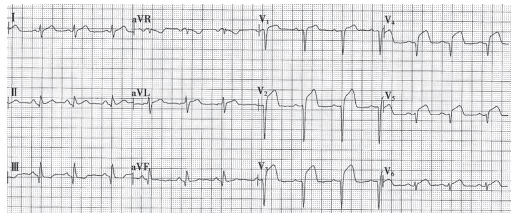  
图 3-4-10 急性前壁心肌梗死的心电图  
图示 $V_{1} \sim V_{5}$ 导联 QRS 波群呈 QS 型, ST 段明显抬高。

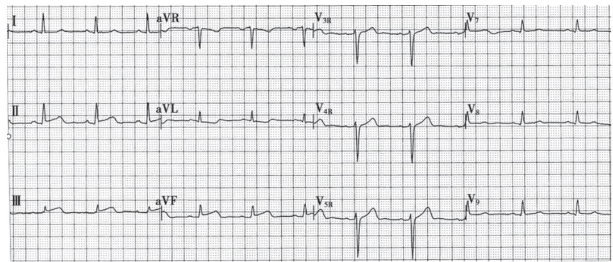  
图 3-4-11 急性下壁心肌梗死的心电图  
图示Ⅱ、Ⅲ、aVF导联ST段抬高。

（3）如不进行治疗干预，ST段抬高持续数日至两周左右，逐渐回到基线水平，T波则变为平坦或倒置，为亚急性期改变。ST段持续抬高者要考虑室壁瘤的形成。

(4) 数周至数月后, T 波呈 V 形倒置, 两肢对称, 波谷尖锐, 为慢性期改变。T 波倒置可永久存在,

也可在数月至数年内逐渐恢复。

3. 定位和定范围 STEMI 的定位和定范围可根据出现特征性改变的导联数来判断(表 3-4-4)。

表 3-4-4 ST 段抬高型心肌梗死的心电图定位诊断

<table><tr><td>导联</td><td>前间隔</td><td>局限前壁</td><td>前侧壁</td><td>广泛前壁</td><td>下壁 $^1$ </td><td>下间壁</td><td>下侧壁</td><td>高侧壁 $^2$ </td><td>正后壁 $^3$ </td></tr><tr><td> $V_1$ </td><td>+</td><td></td><td></td><td>+</td><td></td><td>+</td><td></td><td></td><td></td></tr><tr><td> $V_2$ </td><td>+</td><td></td><td></td><td>+</td><td></td><td>+</td><td></td><td></td><td></td></tr><tr><td> $V_3$ </td><td>+</td><td>+</td><td></td><td>+</td><td></td><td>+</td><td></td><td></td><td></td></tr><tr><td> $V_4$ </td><td></td><td>+</td><td></td><td>+</td><td></td><td></td><td></td><td></td><td></td></tr><tr><td> $V_5$ </td><td></td><td>+</td><td>+</td><td>+</td><td></td><td></td><td>+</td><td></td><td></td></tr><tr><td> $V_6$ </td><td></td><td></td><td>+</td><td></td><td></td><td></td><td>+</td><td></td><td></td></tr><tr><td> $V_7$ </td><td></td><td></td><td>+</td><td></td><td></td><td></td><td>+</td><td></td><td>+</td></tr><tr><td> $V_8$ </td><td></td><td></td><td></td><td></td><td></td><td></td><td></td><td></td><td>+</td></tr><tr><td>aVR</td><td></td><td></td><td></td><td></td><td></td><td></td><td></td><td></td><td></td></tr><tr><td>aVL</td><td></td><td>±</td><td>+</td><td>±</td><td>-</td><td>-</td><td>-</td><td>+</td><td></td></tr><tr><td>aVF</td><td></td><td></td><td></td><td></td><td>+</td><td>+</td><td>+</td><td>-</td><td></td></tr><tr><td>I</td><td></td><td>±</td><td>+</td><td>±</td><td>-</td><td>-</td><td>-</td><td>+</td><td></td></tr><tr><td>II</td><td></td><td></td><td></td><td></td><td>+</td><td>+</td><td>+</td><td>-</td><td></td></tr><tr><td>III</td><td></td><td></td><td></td><td></td><td>+</td><td>+</td><td>+</td><td>-</td><td></td></tr></table>

注：①即膈面。右心室 MI 不易从心电图得到诊断，但 $CR_{4R}$ （负极置于右上肢前臂，正极置于 $V_{4}$ 部位）或 $V_{4R}$ 导联的 ST 段抬高，可作为下壁 MI 扩展到右心室的参考指标。②在 $V_{5}$ 、 $V_{6}$ 、 $V_{7}$ 导联高 1～2 肋处可能有改变。③在 $V_{1}$ 、 $V_{2}$ 、 $V_{3}$ 导联 R 波增高。同理，在前侧壁梗死时， $V_{1}$ 、 $V_{2}$ 导联 R 波也增高。“+”为正面改变，表示典型 ST 段抬高、Q 波及 T 波变化；“-”为反面改变，表示 QRS 波群主波向上，ST 段压低及与 “+” 部位的 T 波方向相反的 T 波；“±”为可能有正面改变。

### （二）超声心动图

二维和 M 型超声心动图有助于了解心室壁的运动和左心室功能，诊断室壁瘤和乳头肌功能失调，检测心包积液及室间隔穿孔等并发症。

### （三）CMR

CMR 可评估 AMI 急性期的心肌水肿，坏死、心肌血流灌注情况和陈旧性 MI 的心肌纤维化瘢痕，评估心室大小、收缩功能和节段性室壁运动异常等，辅助诊断 AMI，检测心包积液、心脏破裂及室间隔穿孔等机械性并发症。

### （四）放射性核素检查

PET 可观察心肌的代谢变化, 是目前唯一能直接评价心肌存活性的影像技术。SPECT 进行 ECG 门控的心血池显像, 可用来评估室壁运动、室壁厚度和整体功能。

### (五) 实验室检查

1. 血常规检查 起病 24～48 小时后白细胞可增至 $(10 \sim 20) \times 10^{9}/L$ ，中性粒细胞增多，嗜酸性粒细胞减少或消失；红细胞沉降率增快；C 反应蛋白（CRP）增高，均可持续 1～3 周。起病数小时至 2 日内血中游离脂肪酸增高。

2. 血清心肌坏死标志物 其增高水平与心肌坏死范围及预后明显相关。①肌红蛋白起病后2小时内升高，12小时内达高峰，24～48小时内恢复正常。②cTnI或cTnT起病3～4小时后升高，cTnI于11～24小时达高峰，7～10天降至正常；cTnT于24～48小时达高峰，10～14天降至正常。这些心肌结构蛋白含量的增高是诊断MI的敏感指标。③肌酸激酶同工酶CK-MB升高，起病后4小时内增高，16～24小时达高峰，3～4天恢复正常，其增高的程度能较准确地反映梗死的范围，其高峰出现时间是否提前有助于判断溶栓治疗是否成功。

对心肌坏死标志物的测定应进行综合评价，肌红蛋白在 AMI 后出现最早，也十分敏感，但特异性不强；cTn 出现稍延迟，而特异性很高，在症状出现后 6 小时内测定为阴性者，建议 1～2 小时后再次复查，如仍为阴性可排除 AMI，持续胸痛者，应再次复查。cTn 的缺点是 AMI 后持续升高时间可长达发病后 10～14 天,对判断在此期间是否有新的梗死不利。CK-MB 虽不如 cTnT 或 cTnI 敏感,但对早期 (<4 小时) AMI 的诊断有较重要价值,一般 3～4 天后恢复正常,若再次升高,提示再发新的梗死。AMI 导致的心肌坏死标志物升高有动态变化过程,高峰过后会降落至正常水平,如果是持续低水平的升高,要考虑其他病因,如心肌炎、某些心肌病、心力衰竭或肾功能不全等。

以往沿用多年的 AMI 心肌酶测定,包括肌酸激酶(CK)、天冬氨酸转氨酶(AST)以及乳酸脱氢酶(LDH),其特异性及敏感性均远不如上述心肌坏死标志物,已不再用于诊断 AMI。

#### 【诊断与鉴别诊断】

根据典型的临床表现,特征性的心电图改变以及实验室检查发现,诊断本病并不困难。对老年病人,突发严重心律失常、休克、心衰而原因未明,或出现较重而持久的胸闷、胸痛或呼吸困难者,都应考虑本病的可能。宜先按 AMI 来处理,并短期内进行心电图、血清心肌坏死标志物测定等动态观察以确定诊断。

鉴别诊断需要考虑以下疾病。

1. 心绞痛 鉴别要点见表 3-4-5。两者本质的区别是缺血程度不同，心绞痛病人为暂时的心肌缺血而无坏死，心肌梗死则为持续的严重缺血导致的心肌坏死。

表 3-4-5 心绞痛和急性心肌梗死的鉴别诊断要点

<table><tr><td>鉴别诊断项目</td><td>心绞痛</td><td>急性心肌梗死</td></tr><tr><td>疼痛</td><td></td><td></td></tr><tr><td>1.部位</td><td>中下段胸骨后</td><td>相同,但可在较低位置或上腹部</td></tr><tr><td>2.性质</td><td>压榨性或窒息性</td><td>相似,但程度更剧烈</td></tr><tr><td>3.诱因</td><td>劳力、情绪激动、受寒、饱食等</td><td>不常有</td></tr><tr><td>4.时限</td><td>短,1~5分钟或15分钟以内</td><td>长,数小时或1~2天</td></tr><tr><td>5.频率</td><td>频繁</td><td>发作不频繁</td></tr><tr><td>6.硝酸甘油疗效</td><td>显著缓解</td><td>作用较差或无效</td></tr><tr><td>气喘或肺水肿</td><td>极少</td><td>可有</td></tr><tr><td>血压</td><td>升高或无显著改变</td><td>可降低,甚至发生休克</td></tr><tr><td>心包摩擦音</td><td>无</td><td>可有</td></tr><tr><td>坏死物质吸收的表现</td><td></td><td></td></tr><tr><td>1.发热</td><td>无</td><td>常有</td></tr><tr><td>2.血白细胞增加(嗜酸性粒细胞减少)</td><td>无</td><td>常有</td></tr><tr><td>3.血沉增快</td><td>无</td><td>常有</td></tr><tr><td>4.血清心肌坏死标志物升高</td><td>无</td><td>有</td></tr><tr><td>心电图变化</td><td>无变化或暂时性ST段和T波变化</td><td>有特征性和动态性变化</td></tr></table>

2. 主动脉夹层 胸痛一开始即达高峰,呈撕裂样,常放射到背、肋、腹、腰和下肢,两上肢的血压和脉搏可有明显差别,可有主动脉瓣关闭不全的表现,偶有意识模糊和偏瘫等神经系统受损症状,D-二聚体可升高,但血清心肌坏死标志物一般正常或仅轻度升高,但需注意A型主动脉夹层累及冠脉开口时亦可并发AMI。超声心动图、X线胸片、胸主动脉CTA或MRA有助于诊断。

3. 急性肺动脉栓塞 可发生胸痛、咯血、呼吸困难和休克，部分可表现为晕厥。有右心负荷急剧增加的表现如发绀、 $P_{2}$ 亢进、颈静脉充盈、肝大、下肢水肿等。心电图示Ⅰ导联S波加深，Ⅲ导联Q波显著，T波倒置，胸导联过渡区左移，右胸导联T波倒置等改变，可资鉴别。常有低氧血症，核素肺通气-灌注扫描异常，超声心动图可见肺动脉压力升高和右心负荷急性增加的表现，肺动脉CTA可检出肺动脉大分支血管的栓塞。需提醒 AMI 和急性肺动脉栓塞时 D-二聚体均可升高,鉴别诊断价值不大。

4. 急腹症 急性胰腺炎、消化性溃疡穿孔、急性胆囊炎、胆石症等，均有上腹部疼痛，还有可能伴休克。仔细询问病史、体格检查、心电图、血清心肌酶和肌钙蛋白测定可协助鉴别。

5. 急性心包炎/心肌炎 尤其是急性非特异性心包炎可有较剧烈而持久的心前区疼痛。但其疼痛与发热同时出现，呼吸和咳嗽时加重，早期即有心包摩擦音，后者和疼痛在心包腔出现渗液时均消失；全身症状一般不如 AMI 严重；心电图除 aVR 导联外，其余导联均有 ST 段弓背向下的抬高，T 波倒置，无异常 Q 波出现。

6. 嗜铬细胞瘤 由于儿茶酚胺的突然升高,病人一般会出现头痛、心悸和出汗,血压波动较大,收缩压达200mmHg,血压升高后又出现急剧下降,可导致休克。儿茶酚胺大量释放可导致冠脉血管弥漫性收缩,可引起心肌缺血,出现ECG上ST段改变,心肌坏死标志物升高,但冠脉往往没有狭窄病变。ECG或超声心动图异常表现缺乏定位性,腹部B超、CT发现肾上腺周围占位性病变,结合血、尿儿茶酚胺和代谢产物的测定有助鉴别诊断。

#### 【并发症】

1. 乳头肌功能失调或断裂（dysfunction or rupture of papillary muscle）总发生率可高达 $50\%$ 。二尖瓣乳头肌因缺血、坏死等使收缩功能发生障碍，造成不同程度的二尖瓣脱垂合并关闭不全，心尖区出现收缩中晚期喀喇音和吹风样收缩期杂音，第一心音可不减弱，可引起心衰。轻症者可以恢复，其杂音可消失。乳头肌整体断裂极少见，多发生在二尖瓣后乳头肌，见于下壁MI，心力衰竭明显，可迅速发生肺水肿，不能及时手术治疗者往往在数日内死亡。

2. 心脏破裂（rupture of the heart）少见，常在起病1周内出现，多为心室游离壁破裂，造成心包积血引起急性心脏压塞而猝死。偶为心室间隔破裂造成穿孔，在胸骨左缘第3～4肋间出现响亮的收缩期杂音，常伴有震颤，可引起心衰和休克而在数日内死亡。心脏破裂也可为亚急性，病人能存活数月。

3. 栓塞（embolism）发生率 1%～6%，见于起病后 1～2 周，可为左心室附壁血栓脱落所致，引起脑、肾、脾或四肢等动脉栓塞。也可因下肢静脉血栓形成部分脱落所致，产生肺动脉栓塞，大块肺栓塞可导致猝死。

4. 心室壁瘤（cardiac aneurysm）或称室壁瘤，主要见于左心室，发生率5%～20%。体格检查可见左侧心界扩大，心脏搏动范围较广，可有收缩期杂音。瘤内发生附壁血栓时，心音减弱。心电图ST段

持续抬高。超声心动图、放射性核素心血池显像以及左心室造影、心脏磁共振可见局部心缘突出，搏动减弱或有反常搏动(图3-4-12、图3-4-13)。室壁瘤可导致心功能不全、栓塞和室性心律失常。

5. 心肌梗死后综合征（post-infarction syndrome）也称 Dressler 综合征，发生率约 1%～3%，于 AMI 后数周至数月内出现，可反复发生。表现为心包炎、胸膜炎或肺炎，有发热、胸痛等症状，发病机制可能为自身免疫反应所致。

#### 【治疗】

强调及早发现,及早住院,并加强住院前的就地处理。治疗原则是尽快恢复梗死心肌的血液灌注(FMC后30分钟内开始溶栓或90分钟内开始介入治疗)以挽救图示左心室前壁心尖部室壁瘤，瘤内有附壁血栓形成(箭头所指)。图中：LA，左心房；LV，左心室；RA，右心房；RV，右心室；TH，血栓。

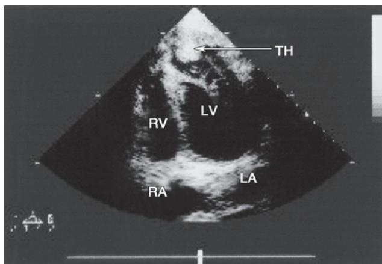  
图 3-4-12 左心室室壁瘤二维超声心动图心尖四腔心显像

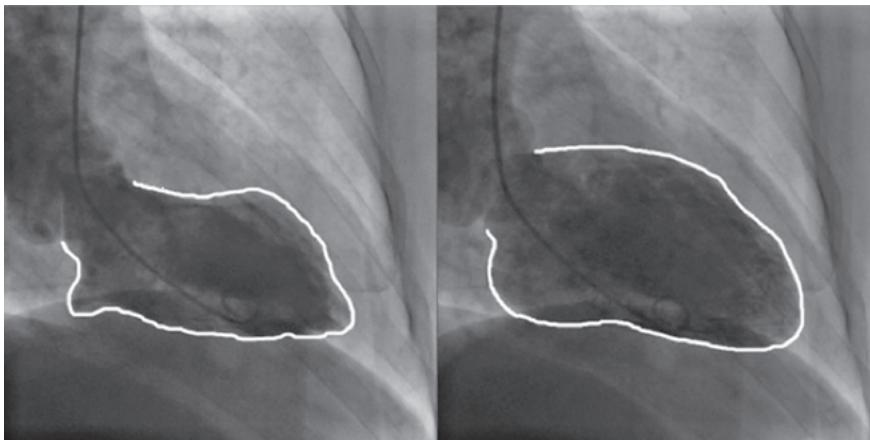  
图 3-4-13 左心室室壁瘤的选择性左心室造影  
左图为收缩期左心室显影,右图为舒张期左心室显影,心尖部收缩活动减弱,测量左心室射血分数(LVEF)为40.1%。

濒死的心肌、防止梗死扩大、缩小心肌缺血范围，保护和维持心脏功能，及时处理严重心律失常、泵衰竭和各种并发症，防止猝死；使病人不但能度过急性期，且康复后还能保持尽可能多的有功能的心肌。急性胸痛病人区域急救网络的建立和及时送至有急诊介入能力的中心救治，对病人预后有重要影响。

### （一）监护和一般治疗

1. 休息 急性期卧床休息,保持环境安静。减少探视,防止不良刺激,解除焦虑。

2. 监测 在 CCU 进行 ECG、血压和呼吸的监测，除颤仪应随时处于备用状态。对于严重泵衰竭者还需监测肺毛细血管楔压和静脉压。密切观察心律、心率、血压和心功能的变化，为适时采取治疗措施，避免猝死提供客观资料。

3. 吸氧 对有呼吸困难和血氧饱和度降低( $<90\%$ )者,最初几日间断或持续通过鼻管面罩吸氧。

4. 护理 急性期 12 小时卧床休息, 若无并发症, 24 小时内应鼓励病人在床上行肢体活动, 若无低血压, 第 3 天就可在病房内走动; 梗死后第 4\~5 天, 逐步增加活动直至每天 3 次步行 100\~150m。饮食易消化并保持大便通畅。

5. 建立静脉通道 保持给药途径畅通。

### （二）解除疼痛

心肌再灌注治疗开通梗死相关血管、恢复缺血心肌的供血是解除疼痛最有效的方法，但在再灌注治疗前可选用下列药物尽快解除疼痛。

1. 吗啡或哌替啶 吗啡 2～4mg 静脉注射或哌替啶 50～100mg 肌内注射，必要时 5～10 分钟后重复，可减轻病人交感神经过度兴奋和濒死感。需注意低血压和呼吸功能抑制的副作用。

2. 硝酸酯类药物 大多数 AMI 病人有应用硝酸酯类药物指征, 而在下壁 MI、可疑右室 MI 或明显低血压的病人, 不适合使用。

3. β受体拮抗剂 能减少心肌耗氧量和改善缺血区的氧供需失衡,缩小MI面积,减少复发性心肌缺血、再梗死、室颤及其他恶性心律失常,对降低急性期病死率有肯定的疗效。无下列情况者,应在发病24小时内尽早常规口服应用:①心力衰竭;②低心排血量状态;③心源性休克危险性增高(年龄>70岁、收缩压<120mmHg、窦性心动过速>110次/分或心率<60次/分,以及距发生STEMI的时间增加);④其他使用禁忌。一般首选心脏选择性药物,从小剂量开始(相当于目标剂量的1/4),逐渐递增,使静息心率降至55\~60次/分。病人有剧烈的缺血性胸痛或伴血压显著升高且其他处理未能缓解时,也可静脉推注美托洛尔,每次5mg;每次推注后观察2\~5分钟,如果心率<60次/分或收缩压<100mmHg,则停止给药,静脉注射总量可达15mg;末次静脉注射后15分钟,继续口服剂量维持。极短作用的静脉注射制剂艾司洛尔50\~200μg/(kg·min),可治疗有β受体拮抗剂相对禁忌证而又希

望减慢心率的病人。

### （三）抗血小板治疗

联合应用包括阿司匹林和 ADP 受体拮抗剂在内的口服抗血小板药物，负荷剂量后给予维持剂量。静脉应用 GPIIb/IIIa 受体拮抗剂主要用于接受直接 PCI 的病人，术中使用。STEMI 病人抗血小板药物选择和用法与 NSTEACS 相同，见本节的 UA/NSTEMI 部分。

### （四）抗凝治疗

除非有禁忌,所有 STEMI 病人无论是否采用溶栓治疗,均应在抗血小板治疗的基础上常规联合抗凝治疗。抗凝治疗可建立和维持梗死相关血管的通畅,并可预防深静脉血栓形成、肺动脉栓塞和心室内血栓形成。直接 PCI 尤其出血风险高时推荐应用比伐芦定。对于 STEMI 合并心室内血栓或合并心房颤动时,需在抗血小板治疗基础上联合直接口服抗凝药抗凝治疗,但需注意出血风险。

### （五）再灌注心肌治疗

起病 3～6 小时，最多在 12 小时内，开通闭塞的冠脉，使得心肌得到再灌注，挽救濒临坏死的心肌或缩小心肌梗死的范围，减轻梗死后心肌重塑，是 STEMI 最重要的治疗措施之一。

近几年新的循证医学证据均支持及时再灌注治疗的重要性。需要强调建立区域性STEMI网络管理系统的必要性，通过高效的院前急救系统制订最优化的再灌注治疗方案。

1. 经皮冠状动脉介入术 若病人在救护车上或无 PCI 能力的医院,但预计 120 分钟内可转运至有 PCI 条件的医院并完成 PCI,则首选直接 PCI 策略,力争在 90 分钟内完成再灌注;或病人在可行 PCI 的医院,则应力争在 60 分钟内完成再灌注。

（1）直接 PCI: 适应证为: ①症状发作 12 小时以内并且有持续新发的 ST 段抬高或新发左束支传导阻滞的病人; ②12～48 小时内若病人仍有心肌缺血证据 (仍然有胸痛和 ECG 变化) 亦可尽早接受介入治疗。

（2）补救性 PCI: 溶栓治疗后仍有明显胸痛, 抬高的 ST 段无明显降低者, 应尽快进行冠脉造影, 如显示 TIMI 0～Ⅱ级血流, 说明相关动脉未再通, 宜立即施行补救性 PCI。

（3）溶栓治疗再通者的 PCI: 溶栓成功后有指征实施急诊血管造影, 必要时进行梗死相关动脉血运重建治疗, 可缓解重度残余狭窄导致的心肌缺血, 降低再梗死的发生; 溶栓成功后稳定的病人, 实施血管造影的最佳时机是 2～24 小时。

2. 溶栓疗法 如果预计直接 PCI 时间大于 120 分钟, 则首选溶栓策略, 力争在 ECG 诊断明确后 10 分钟内给予病人溶栓药物。

（1）适应证：①两个或两个以上相邻导联ST段抬高(胸导联≥0.2mV，肢导联≥0.1mV)，或病史提示AMI伴左束支传导阻滞，起病时间＜12小时，病人年龄＜75岁；②ST段显著抬高的MI病人年龄＞75岁，经慎重权衡利弊仍可考虑，但建议溶栓药物剂量减半；③STEMI发病时间已达12～24小时，但如仍有进行性缺血性胸痛、广泛ST段抬高者也可考虑。

（2）禁忌证：①既往发生过出血性脑卒中，6个月内发生过缺血性脑卒中或脑血管事件；②中枢神经系统受损、颅内肿瘤或畸形；③近期（2～4周）有活动性内脏出血；④未排除主动脉夹层；⑤入院时严重且未控制的高血压（>180/110mmHg）或慢性严重高血压病史；⑥目前正在使用治疗剂量的抗凝药或已知有出血倾向；⑦近期（2～4周）创伤史，包括头部外伤、创伤性心肺复苏或较长时间（>10分钟）的心肺复苏；⑧近期（<3周）外科大手术；⑨近期（<2周）曾有在不能压迫部位的大血管行穿刺术。

（3）溶栓药物的应用：以纤维蛋白溶酶原激活剂激活血栓中纤维蛋白溶酶原，使其转变为纤维蛋白溶酶而溶解冠脉内的血栓。包括非特异性纤溶酶原激活剂和特异性纤溶酶原激活剂两大类，前者同时作用于血栓局部和全身循环中的纤溶酶原，选择性低，因而再通率低且出血风险大，主要包括尿激酶和链激酶，其中链激酶有抗原性，不能重复使用，近年临床上已基本不再使用。后者特异性作用于血栓部位的纤溶酶原，对全身纤溶活性影响较小，出血风险小，建议作为优选。常用溶栓药物和用法见表3-4-6。特异性溶栓药物使用前就需要先给予肝素类抗凝药物，而非特异性溶栓药物给药后血管再通者需要给予抗凝治疗，如果考虑未再通，应进行补救性PCI。

表 3-4-6 不同溶栓药物及其用法

<table><tr><td>药物分类及名称</td><td>用法及用量</td><td>特点</td></tr><tr><td>尿激酶(UK)</td><td>150万U溶于100ml生理盐水,30分钟内静脉滴注</td><td>非特异性溶栓药,不具有纤维蛋白选择性,再通率低</td></tr><tr><td>重组人尿激酶原(pro-UK)</td><td>5mg/支,一次用50mg,先将20mg(4支)用10ml生理盐水溶解后,3分钟静脉推注完毕,其余30mg(6支)溶于90ml生理盐水,于30分钟内静脉滴注完毕</td><td>特异性溶栓药,再通率高,脑出血发生率低</td></tr><tr><td>阿替普酶(rt-PA)</td><td>50mg/支,用生理盐水稀释后静脉注射15mg负荷剂量,后续30分钟内以0.75mg/kg静脉滴注(最多50mg),随后60分钟内以0.5mg/kg静脉滴注(最多35mg)</td><td>特异性溶栓药,再通率高,脑出血发生率低</td></tr><tr><td>瑞替普酶(r-PA)</td><td>2次静脉注射,每次1000万U负荷剂量,间隔30分钟</td><td>特异性溶栓药,两次静脉注射,使用较方便</td></tr><tr><td>替奈普酶(TNK-tPA)</td><td>16mg/支,用注射用水3ml稀释后5~10秒内静脉推注</td><td>特异性溶栓药,再通率高,一次静脉注射,使用方便,适用于院前(救护车)溶栓</td></tr></table>

（4）溶栓再通的判断标准:根据冠脉造影观察血管再通情况直接判断(TIMI分级达到Ⅱ、Ⅲ级者表明血管再通),或根据:①心电图抬高的ST段于2小时内回降>50%;②胸痛2小时内基本消失;③2小时内出现再灌注性心律失常(短暂的加速性室性自主节律,房室或束支传导阻滞突然消失,或下后壁心肌梗死的病人出现一过性窦性心动过缓、窦房传导阻滞或低血压状态);④血清CK-MB酶峰值提前出现(14小时内)等间接判断血栓是否溶解。

3. 紧急冠状动脉旁路移植术 介入治疗失败或溶栓治疗无效而有手术指征者,或合并机械性并发症需要外科手术者,宜争取6\~8小时内施行紧急CABG,但死亡率明显高于择期CABG。

再灌注损伤:急性缺血心肌再灌注时,可出现再灌注损伤,常表现为再灌注性心律失常。各种快速、缓慢型心律失常均可出现,应作好相应的抢救准备。但出现严重心律失常的情况少见,最常见的为一过性非阵发性室性心动过速,对此不必行特殊处理。

### （六）肾素血管紧张素醛固酮系统拮抗剂和血管紧张素受体脑啡肽酶抑制剂

ACEI 有助于改善恢复期心肌的重塑，减少 AMI 的病死率和充血性心力衰竭的发生。除非有禁忌证，应全部选用。ARNI 药物沙库巴曲缬沙坦（25～200mg，每日 2 次）可用于抑制心肌梗死后的心室重塑，降低 MI 后心力衰竭的发生和死亡率。

### （七）调脂治疗

他汀类等调脂药物的使用同 UA/NSTEMI 病人, 见本节 UA/NSTEMI 部分。

### （八）抗心律失常和传导障碍治疗

心律失常必须及时消除，以免演变为严重心律失常甚至猝死(见本篇第三章)。

1. 发生室颤或持续多形性室速时，尽快采用非同步直流电除颤或同步直流电复律。单形性室速药物疗效不满意时也应及早用同步直流电复律。

2. 一旦发现室性期前收缩或室速，立即用利多卡因 50～100mg 静脉注射，每 5～10 分钟重复 1 次，至期前收缩消失或总量已达 300mg，继以 1～4mg/min 的速度静脉滴注维持。如室性心律失常反复出现可用胺碘酮治疗。

3. 对缓慢型心律失常可用阿托品 0.5～1mg 肌内或静脉注射。

4. 房室传导阻滞发展到二度或三度，伴有血流动力学障碍者，宜行临时起搏治疗，待传导阻滞消失后撤除。

5. 室上性快速型心律失常选用美托洛尔、胺碘酮等药物治疗, 若药物治疗不能控制时, 可考虑用

同步直流电复律。AMI 急性期一般不使用维拉帕米。

### （九）抗休克治疗

根据休克纯属心源性，抑或尚有周围血管舒缩障碍或血容量不足等因素存在，而分别处理。

1. 补充血容量 估计有血容量不足或中心静脉压和肺动脉楔压低者，用右旋糖酐40或5%～10%葡萄糖溶液静脉滴注，输液后如中心静脉压上升 $>18cmH_{2}O$ ，PCWP>15～18mmHg，则应停止。右心室梗死时，中心静脉压升高不是补充血容量的禁忌。

2. 应用升压药 补充血容量后血压仍不升,而 PCWP 和 CI 正常时,提示周围血管张力不足,可用多巴胺[起始剂量 $3 \sim 5 \mu g/(kg \cdot min)$ ],或去甲肾上腺素 $2 \sim 8 \mu g/min$ ,亦可选用多巴酚丁胺[起始剂量 $3 \sim 10 \mu g/(kg \cdot min)$ ]静脉滴注。

3. 应用血管扩张剂 经上述处理血压仍不升,而 PCWP 增高,CI 低或周围血管显著收缩以致四肢厥冷并有发绀时,硝普钠 $15 \mu g/min$ 开始静脉滴注,每 5 分钟逐渐增量至 PCWP 降至 $15 \sim 18 mmHg$ ; 硝酸甘油 $10 \sim 20 \mu g/min$ 开始静脉滴注,每 5～10 分钟加量直至左心室充盈压下降。

4. 其他 包括纠正酸中毒、避免脑缺血、保护肾功能，必要时应用洋地黄制剂等。为了降低心源性休克的病死率，有条件的医院考虑用主动脉内球囊反搏术或左心室辅助装置进行辅助循环。

### （十）抗心力衰竭治疗

主要是治疗急性左心衰竭，以应用吗啡(或哌替啶)和利尿剂为主，亦可选用血管扩张剂减轻左心室的负荷，或正性肌力药(参见本篇第二章)。洋地黄制剂可能引起室性心律失常宜慎用。梗死发生后24小时内有右心室梗死的病人应慎用利尿剂。

### （十一）右心室心肌梗死的处理

治疗措施与左心室梗死略有不同。右心室心肌梗死引起右心衰竭伴低血压，而无左心衰竭的表现时，宜扩张血容量。在血流动力学监测下静脉滴注输液，直到低血压得到纠正或PCWP达15mmHg。如输液1～2L低血压仍未能纠正者可用正性肌力药，以多巴酚丁胺为优，不宜用利尿药。伴有房室传导阻滞者可予以临时起搏。

### （十二）其他治疗

下列疗法可能有助于挽救濒死心肌，有防止梗死扩大、缩小缺血范围、加快愈合的作用，但尚未完全成熟或疗效尚有争论，可根据病人具体情况考虑选用。

1. 钙通道阻滞剂 早期如有心率增快等交感神经功能亢进表现,但 $\beta$ 受体拮抗剂禁忌者,可考虑使用钙通道阻滞剂中的地尔硫草,可降低心率和心肌耗氧,缩小心肌梗死面积,但要注意低血压和负性肌力作用,不推荐 AMI 病人常规使用。

2. 伊伐布雷定 $\beta$ 受体拮抗剂有禁忌或最大耐受剂量后窦性心率仍偏快者, 可使用伊伐布雷定降低窦性心率, 从而降低心肌耗氧量。

3. 极化液疗法 氯化钾 1.5g、胰岛素 10U 加入 10% 葡萄糖溶液 500ml 中, 静脉滴注, 1\~2 次/日, 7\~14 天为一疗程。可促进心肌摄取和代谢葡萄糖, 使钾离子进入细胞内, 恢复细胞膜的极化状态, 有利于心脏正常收缩、减少心律失常。

### （十三）康复和出院后治疗

提倡 AMI 恢复后康复治疗，经 2～4 个月的体力活动锻炼后，酌情恢复部分工作或减轻工作负担，以后部分病人可恢复全天工作，但应避免过重体力劳动或精神过度紧张。

#### 【预后】

与梗死范围大小、侧支循环产生情况以及治疗是否及时等有关。AMI相关的死亡一半发生于送到医院前，其中院外死亡中相当高的比例为猝死。因心脏监护室、现代药物治疗进展和再灌注治疗等综合措施的使用，AMI病人的住院死亡率已经由以往的30%降低到目前直接PCI中心的4%左右。死亡多发生在第一周内，尤其在数小时内，发生严重心律失常、休克或心衰者，病死率尤高。

#### 【预防】

在正常人群中预防动脉粥样硬化和冠心病属于一级预防,已有冠心病和 MI 病史者还应预防再次梗死和其他心血管事件,称为二级预防,二级预防可参考 UA/NSTEMI 部分和 ABCDE 方案。

# 第五节 | 冠状动脉疾病的其他表现形式

## 一、冠状动脉痉挛

冠脉痉挛是一种特殊类型的冠脉疾病。造影正常血管或粥样硬化病变部位均可发生痉挛。其临床表现和治疗方案与冠心病有明显的差别。

病人常较年轻,除吸烟外,大多数病人缺乏动脉粥样硬化的经典危险因素。吸烟、酒精和毒品是冠脉痉挛的重要诱发因素。

本病表现为静息性心绞痛，无体力劳动或情绪激动等诱因。发病时间集中在午夜至上午8点之间。病人常因恶性心律失常伴发晕厥。少数病人冠脉持续严重痉挛，可发生AMI甚至猝死。

若冠脉痉挛导致血管闭塞，则临床表现为静息性心绞痛伴心电图一过性ST段抬高。该类病人临床特点鲜明，因静息性发作与稳定型心绞痛不同，因ST段抬高与稳定型心绞痛、UA和NSTEMI不同，因ST段抬高呈一过性与STEMI不同，因此可直接确立诊断(早先称为变异型心绞痛或Prinzmetal心绞痛)。但非闭塞性冠脉痉挛表现为ST段压低或T波改变，此时就难以和一般的心绞痛相鉴别。另外，冠脉痉挛一般具有自行缓解的特性，心电图和常规冠脉造影难以捕捉，长程动态ECG有助于监测到症状发作时的ST段变化，确诊常需行乙酰胆碱或麦角新碱激发试验。

在戒烟、戒酒的基础上，钙通道阻滞剂和硝酸酯类药物是治疗冠脉痉挛的主要手段，考虑微血管痉挛者，可使用尼可地尔。β受体拮抗剂可能会加重或诱发痉挛，不能单独用于变异型心绞痛病人，但伴有固定性狭窄的病人并非禁忌。冠脉痉挛一般预后良好，5年生存率可高达89%～97%，但多支血管或左主干痉挛病人预后不良。

## 二、心肌桥

冠脉通常走行于心外膜下的结缔组织中,如果一段冠脉走行于心肌内,这束心肌纤维被称为心肌桥,而走行于心肌桥下的冠脉被称为壁冠状动脉,主要见于左前降支中段。冠脉造影显示该节段血管管腔收缩期受挤压,舒张期恢复正常或受压程度明显减轻,被称为“挤奶现象”(milking effect)。冠脉造影时心肌桥检出率为0.51%\~16%,尸体解剖时检出率则高达15%\~85%,说明大部分心肌桥并没有临床意义。

由于壁冠状动脉在每一个心动周期的收缩期被挤压,如挤压严重可产生远端心肌缺血,临床上亦可表现为类似心绞痛的症状、心律失常,甚至 AMI 或猝死。另外,心肌桥导致其近端的收缩期前向血流逆转,损伤该处血管内膜,所以该处容易形成动脉粥样硬化斑块。

β受体拮抗剂及钙通道阻滞剂等降低心肌收缩力和心率的药物可有效缓解症状。植入支架会增加冠脉穿孔、内膜增生和再狭窄的发生率，因此并不提倡。手术分离壁冠状动脉(心肌桥松解术)曾被认为能根治此病，但也有再复发的病例。由于壁冠状动脉舒张期灌注压并无明显降低，因此旁路移植术后桥血管闭塞率也显著增高，因此，心肌桥应以药物治疗为主，收缩期压迫明显者避免剧烈运动，药物治疗后仍有缺血症状且壁冠状动脉舒张期也严重受压者，可考虑内乳动脉旁路移植手术。除非绝对需要，也应避免使用硝酸酯类药物及正性肌力药物。

## 三、微血管疾病

冠脉微血管疾病可单独存在或与心外膜冠脉阻塞性病变同时存在。早年将具有心绞痛或类似于心绞痛的症状，有心肌缺血客观依据而冠脉造影无心外膜血管狭窄者诊断为心脏X综合征。此类病人占因胸痛而行冠脉造影检查病人总数的 $10\% \sim 30\%$ 。本病病因尚不清楚，可能与内皮功能异常和微血管病变有关。目前认为冠脉微血管的功能和结构异常均可导致心肌缺血，大部分表现为稳定型心绞痛,也有呈现不稳定型,为 MINOCA 原因之一。

本病以绝经期前女性多见。ECG既可正常，也可有非特异性ST-T改变，近 $20\%$ 的病人可有平板运动试验阳性。运动负荷试验或心房调搏术时可检测到冠状窦乳酸含量增加。血管内超声及多普勒血流测定显示可有冠脉内膜增厚、早期动脉粥样硬化斑块形成及冠脉血流储备降低和冠脉阻力指数升高等异常。

本病的预后通常良好,但由于临床症状的存在,常使得病人反复就医,导致各种检查措施的过度应用、药品的消耗以及生活质量的下降,日常工作受影响。

本病尚无特异性治疗手段，微血管选择性扩张的药物尼可地尔可作为首选，其他抗心肌缺血药物如β受体拮抗剂、硝酸酯类以及钙通道阻滞剂和曲美他嗪也可以改善少部分病人症状，但总体效果不佳。ACEI和他汀类药物具有改善内皮功能的作用，但疗效尚不肯定。可尝试使用中药如麝香保心丸、通心络、宽胸气雾剂等缓解症状。

(钱菊英)

  
本章思维导图
