> [!info] 导航
> [[第023章_第3篇第05章_高血压|上一章]] · [[00_章节导航|总目录]] · [[第025章_第3篇第07章_先天性心血管病|下一章]]

本章数字资源

心肌病（cardiomyopathy, CM）是一组病因和表型异质性高的心肌疾病，其心肌结构和/或功能异常无法以前/后负荷增加或心肌缺血等疾病来诠释。CM病因复杂，可为遗传性或获得性。遗传模式多为常染色体显性遗传，由编码心肌肌节、骨架和桥粒蛋白的基因突变分别导致以心肌肥厚、心腔扩张和心律失常为主要表型的心肌病。某些系统性疾病也与CM有表型重叠。

CM 的分类尚未统一。本章采用《2023 年欧洲心脏病学会心肌病管理指南》的分类法将其分为 5 个临床表型：肥厚型心肌病（HCM）、扩张型心肌病（DCM）、非扩张型左心室心肌病（NDLVC）、致心律失常性右心室心肌病（ARVC）和限制型心肌病（RCM）。其中，NDLVC 为新增类型。

CM 的病因复杂、表型多样,亟需规范化临床诊疗径路,其关键环节是:①将 CM 视为常见临床表现(心力衰竭、心律失常)的原因;②对疑似或确诊者,应先以超声心动图评估心脏形态和功能并初定表型,再以磁共振评估心肌组织特征界定表型并提供病因线索;③必要时作临床及家系筛查,基因及病理检测查找病因或突变基因;④按不同表型、基因型实行全生命周期综合管理及优化治疗;⑤评估表型/基因型-猝死风险、指导心源性猝死(SCD)的预防。

# 第一节 | 肥厚型心肌病

肥厚型心肌病（hypertrophic cardiomyopathy, HCM）是一类以左心室和/或右心室肥厚，伴舒张功能障碍为特征的心肌病，需排除继发于后负荷增加或系统性疾病的心肌肥厚。HCM 发病率成人为 2‰、儿童为 0.02～0.05‰，患病率为 0.29‰，临床表现差异大，部分病人以 SCD 为首发表现，是青少年和运动猝死的重要原因。

#### 【发病机制】

HCM系常染色体显性遗传,半数为家族性,已发现至少8个肌小节蛋白的编码基因突变。约60%的病人有致病/可能致病变异,其中MYH7和MYBPC3突变占70%;40%未检出变异,多为散发病例。本病表型多样,与基因及环境因素相互作用有关。

#### 【病理改变】

解剖特征:多数病例左心室肥厚,尤其是室间隔不对称性肥厚;部分病人肥厚部位不典型。病理特点:心肌细胞排列紊乱、纤维化和瘢痕形成、小血管病变。

#### 【病理生理】

左室流出道梗阻（left ventricular outflow tract obstruction, LVOTO）和心脏舒张功能障碍是本病的病理生理基础。

1. 左室流出道梗阻 室间隔增厚伴或不伴二尖瓣器异常(瓣叶冗长、瓣膜和乳头肌前移),可造成结构性 LVOTO;射血时高速血流流经梗阻处致虹吸作用使收缩期二尖瓣前叶前向运动(systolic anterior motion, SAM),也可功能性加重梗阻。

2. 二尖瓣关闭不全 可继发于 SAM 或由原发性瓣膜病变引起。

3. 心室僵硬度增加 心肌细胞肥厚、纤维化及舒张期钙再摄取异常可致室壁顺应性降低及舒张功能障碍。

4. 相对性心肌缺血 心肌增厚、微血管密度降低、冠脉血流储备受损所致。

5. 神经性调节失衡 HCM 病人运动时可出现心率、血压反应异常,表现为收缩压运动时不能升高>20mmHg、运动高峰时反而下降>20mmHg。

#### 【临床表现】

1. 症状 主要有:①呼吸困难:多数为劳力性、亦可为静息性呼吸困难;②胸部闷痛:约 1/3 病人有劳力性胸闷痛;③心律失常:见于多数病人,但症状性心律失常主要是心房颤动(AF)、室性心动过速(VT)[包括持续性/非持续性(SVT/NSVT)],甚至心室颤动(VF);④心力衰竭(HF):多见于中晚期病人,可有射血分数保留型心衰(HFpEF)或射血分数降低型心衰(HFrEF)的相关症状;⑤晕厥/猝死:多由运动诱发,约 1/6 病人至少有过 1 次晕厥,SCD 可为首发症状。

2. 体征 心脏轻度增大,可闻及第四心音、胸骨左缘3\~4肋间收缩期喷射性杂音、心尖部收缩期吹风样杂音。杂音易变,凡增加心肌收缩、减轻前负荷的药物和动作如正性肌力药、站立、含硝酸甘油等可使杂音增强;反之杂音减弱。

#### 【辅助检查】

1. 心电图检查 心电图(ECG)主要发现(图 3-6-1): QRS 波高电压、ST 段压低、T 波倒置、异常 q 波、室内传导阻滞及心律失常。特征是: ① 固定性 ST 段压低及 T 波倒置而有别于心肌缺血的动态变化; ② 固定性深而对称的 T 波倒置, 提示心尖肥厚; ③ 深而不宽的病理 q 波, 其出现导联与冠脉分布不符而有别于梗死 Q 波。

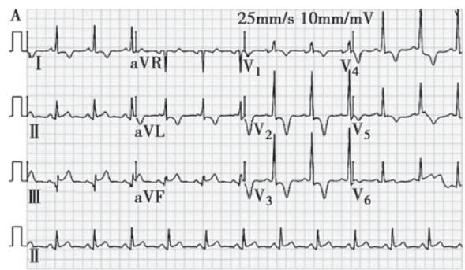

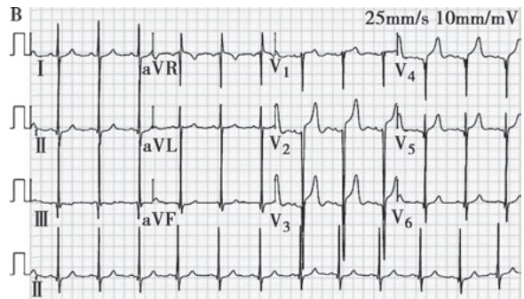

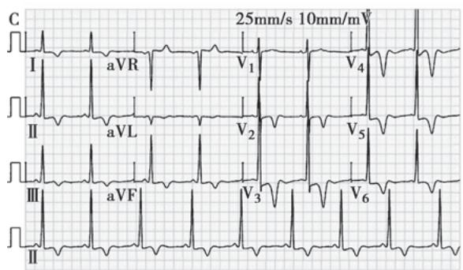

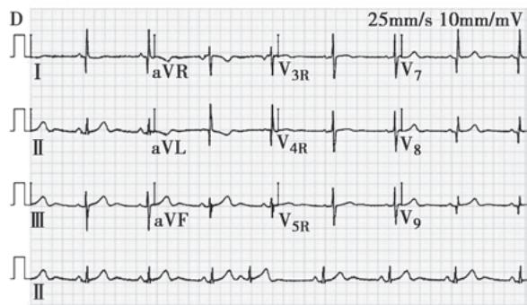  
图 3-6-1 肥厚型心肌病的心电图表现

A. 1 例 56 岁男性左室流出道梗阻肥厚型心肌病病人，可见Ⅱ、Ⅲ、aVF 导联异常 q 波，I、aVL、 $V_{1\sim5}$ 导联 T 波倒置；B. 1 例 23 岁女性室间隔中部梗阻肥厚型心肌病病人，可见Ⅱ、Ⅲ、aVF、 $V_{3\sim6}$ 导联异常 q 波、 $V_{1\sim2}$ 导联 r 波递增不良；C. 1 例 74 岁女性心尖肥厚型心肌病病人，可见广泛导联 T 波倒置，尤其左胸导联固定对称性 T 波倒置；D. 1 例 81 岁女性肥厚非梗阻型心肌病病人，可见 I、aVL、 $V_{4\sim9}$ 导联窄而深的异常 q 波（ $V_{4\sim6}$ 导联未显示）。

2. 超声心动图 经胸超声心动图（TTE）为首选检查方法，可用于初始评估、定期随访、家系筛查及疗效评估。TTE 主要表现为(文末彩图 3-6-2): 室间隔不对称肥厚、LVOTO、SAM、左室舒张功能障碍。须注意: ①肥厚心肌可发生于任何部位; ②静息时无梗阻时应做激发试验, 可让病人取半仰卧位结合瓦氏动作再行多普勒超声检查; 如仍未诱发 LVOTO 压差≥50mmHg, 应做运动而非药物负荷试验。

3. 心脏磁共振 心脏磁共振成像(CMR)可准确评估肥厚心肌的厚度、部位(尤其是心尖部、右室等特殊部位)及纤维化程度。若广泛钆延迟强化(LGE)(≥15%左室质量),则猝死风险高。但CMR检查费时昂贵,适合于TTE诊断困难时。

4. 心肌活检 心内膜心肌活检(EMB)结果有助于 HCM 与其他心肌病鉴别。

5. 基因检测 家系筛查及基因检测对鉴别诊断、预后评估和生育决策有价值。肌小节8个目标基因（MYH7、MYBPC3、TNNI3、TNNT2、TPM1、MYL2、MYL3、ACTCI）应作为一线检测，若阴性可考虑外显子测序。一级亲属基因筛查适合于任何年龄，对基因型阳性、表型阴性者应每隔2～3年重复筛查直到50岁。

#### 【诊断与鉴别诊断】

影像学发现室壁增厚是诊断 HCM 的必备条件,需排除心脏后负荷增加、系统性或代谢性疾病所导致的心肌肥厚,必要时可做 EMB 和基因检测。

### (一) 诊断标准

1. 成人 ①无其他原因可稽情况下,影像学发现左室任意部位舒张末室壁厚度≥15mm 可诊断; ②有家族史或基因检测阳性者,室壁厚度≥13mm 也可诊断。

2. 儿童 ①无家族史且无症状的儿童,左室厚度 z 值(所测值偏离平均值的标准差数) > 2.5 者可诊断; ②有家族史或基因型阳性者,z 值 > 2 也可诊断。

3. 亲属 ①先证者的成年1级亲属左室壁厚度 $>13\mathrm{mm}$ 可诊断；②先证者的儿童1级亲属左室壁厚度 $z$ 值 $< 2$ 但有形态或心电异常，可疑诊但不能单独诊断。

### （二）分型诊断

1. 按血流动力学 ①梗阻型: 梗阻部位峰压差≥30mmHg, 包括静息型和动力型梗阻; ②非梗阻型: 静息或激发时梗阻部位峰压差＜30mmHg。

2. 按肥厚的部位 ①室间隔肥厚型: 最常见, 主要累及室间隔基底部; ②心尖部肥厚型, 主要累及心尖和近心尖部; ③左心室中部肥厚型: 主要累及乳头肌水平室壁; ④右心室肥厚型: 偶见。

### （三）鉴别诊断

需除外较常见的左室负荷增加性心室肥厚，包括高血压、主动脉瓣狭窄、运动员心肌肥厚等。尚需除外较少见的全身性疾病引起的心肌肥厚，如淀粉样变、结节病、戈谢病、糖原贮积症、Fabry病、Danon病、血色病等。

#### 【治疗】

现有治疗方法可否改变梗阻型 HCM 的自然病程尚无定论,故治疗旨在改善症状,减少并发症和预防猝死。

### （一）症状性梗阻型 HCM 病人的药物治疗

1. $\beta$ 受体拮抗剂 $\beta$ 受体拮抗剂是一线治疗药物，包括美托洛尔和比索洛尔等，具有负性变频变力作用，可减轻LVOTO、降低心室充盈压、改善症状。应从小剂量起逐渐滴定至有效剂量或最大耐受量(静息心率 $55\sim 60$ 次/分)。

2. 肌球蛋白抑制剂 玛伐凯泰（mavacamten）是目前唯一获批的心肌肌球蛋白抑制剂，其选择性抑制心肌肌球蛋白重链ATP酶活性，可逆性抑制肌球-肌动蛋白横桥的过量形成，抑制心肌过度收缩，改善心肌顺应性及能量代谢，主要用于有症状、NYHA心功能Ⅱ～Ⅲ级的梗阻型HCM成人病人，但不适合左室射血分数（LVEF）<55%者。

3. 钙通道阻滞剂 非二氢吡啶类钙通道阻滞剂有负性变频变力作用,可减轻梗阻、改善心室充盈及症状,可作为 $\beta$ 受体拮抗剂治疗无效、不耐受或有禁忌者的替代药物,包括维拉帕米或地尔硫草。

4. 其他药物 Ia 类抗心律失常药如丙吡胺、西苯唑啉可用于 $\beta$ 受体拮抗剂和非二氢吡啶类钙通道阻滞剂充分治疗后仍有严重梗阻型 HCM 症状者。

为避免加剧 LVOTO, 应避免脱水和过量饮酒, 慎用动脉扩张剂如二氢吡啶类钙通道阻滞剂、大量利尿剂, 忌用正性肌力药及静脉扩张剂。

### （二）HCM 合并症或并发症的药物治疗

1. 合并心衰 包括 HFpEF 和 HFrEF, 其治疗方法可参阅 “心力衰竭” 部分。

2. 并发房颤 若无禁忌,均应抗凝而不必考虑 $CHA_{2}DS_{2}-VASc$ 评分。

### （三）症状性梗阻型 HCM 病人的手术治疗

室间隔减容术 (SRT) 包括经皮腔内或心肌内室间隔心肌消融、外科室间隔心肌切除, 适应证为: ①临床标准: 充分药物治疗后仍有严重症状 (NYHA心功能Ⅲ～Ⅳ级),或活动相关性严重症状(如反复晕厥)且与LVOTO有关;②梗阻标准:静息或激发时LVOTO峰压差≥50mmHg且与间隔肥厚或SAM相关。对无症状的梗阻型病人或有症状但优化药物治疗有效者,则不推荐SRT。

1. 心肌消融 主要有无水乙醇间隔消融（ASA）、经胸心肌内射频消融。并发症包括传导阻滞、心肌梗死及瘢痕介导的室性心律失常等，发生率<2%。

2. 心肌切除 较之心肌消融,可更显著减轻 LVOTO 及临床症状,并发症包括传导阻滞、AF、室间隔穿孔及主动脉瓣关闭不全,相关死亡<1%。

3. 心脏起搏 人为改变心室的激动顺序以减轻梗阻及症状,但效果不确切。

4. 心脏移植 HCM 终末期病人的最后选择。

### （四）运动建议

基因型阳性但表型阴性者可参加竞技体育运动,多数 HCM 病人可参加低中强度的休闲运动,严重梗阻型 HCM 病人应避免参加竞技体育运动。

### （五）猝死预防

植入型心律转复除颤器（ICD）是猝死幸存者的绝对适应证（2级预防）和猝死高危者的相对适应证（1级预防），但是否植入取决于病人意愿、预测生存期（≥1年）及危险分层，这些指征原则上适合于各表型的CM病人。对HCM病人，指南推荐应用HCM Risk-SCD模型进行危险分层；临床上，猝死高危因素包括：早发家族史、心脏骤停或SVT致血流动力学不稳定史、运动或不明原因的晕厥、左心室肥厚（≥30mm）、心尖室壁瘤、LVEF＜50%、反复NSVT、LGE定量≥15%左室质量。

# 第二节 | 扩张型心肌病

扩张型心肌病（dilated cardiomyopathy, DCM）是一类以左室或双心室扩大伴收缩功能障碍为特征的心肌病，且无法以负荷异常或心肌缺血等来解释。本病发病率为 $0.13\% \sim 0.84\%$ ，预后较差，确诊后5年和10年生存率分别约 $50\%$ 和 $25\%$ 。

#### 【病因和发病机制】

病因未全明。DCM常有家族性发病趋势，遗传方式多为常染色体显性、少数为常染色体隐性或X连锁遗传。病毒感染和自身免疫等获得性病因也参与致病。

1. 基因突变 约 50% 家族性和 30% 散发性 DCM 病人可检出致病基因。较之 HCM, DCM 的致病基因更多, 已报道 50 多种基因突变。其中, 最重要的是心肌骨架蛋白的基因突变尤其是肌联蛋白基因 TTN 截短突变。尚有肌节、闰盘、桥粒、离子通道等蛋白的基因突变, 并与 HCM、ARVC、心肌离子通道病的致病基因重叠。

2. 病毒感染 直接侵袭和由此引发的急慢性炎症和免疫反应是心肌损害并发展为 DCM 的重要机制。

3. 心肌毒物 嗜酒是我国 DCM 的常见病因,化疗药物和某些心肌毒性药物如蒽环类抗肿瘤药、锂制剂、依米丁等也可导致 DCM。

4. 免疫反应 见于肉芽肿性心肌炎、过敏性心肌炎、结缔组织病等,这些疾病伴随的免疫反应可直接或间接地导致 DCM。

5. 内分泌病和代谢异常 某些维生素和微量元素如硒缺乏也能导致 DCM。甲状腺疾病、嗜铬细胞瘤等内分泌代谢性疾病也是常见病因。

6. 其他病因 神经肌肉疾病如 Duchenne、Becker 型肌营养不良也可伴发 DCM。

#### 【病理改变和病理生理】

肉眼见心室扩张、室壁变薄、瘢痕形成、附壁血栓，但瓣膜及冠脉无明显病变。组织学为非特异心肌细胞肥大、变性、坏死、纤维化，可有炎症细胞浸润。

心肌收缩减弱将触发神经-体液机制，导致水钠潴留、心率加快、血管收缩以维持循环，但过度代偿将使更多心肌受损，终因恶性循环而失代偿。

#### 【临床表现】

1. 症状 主要表现为劳力性呼吸困难和耐力下降。晚期可有夜间阵发性呼吸困难和端坐呼吸等左心衰症状，并逐渐出现全心衰症状。合并心律失常时可出现心悸、头晕、黑朦，持续顽固低血压常是终末期表现。

2. 体征 主要为心界扩大,心音减弱,常可闻及第三或第四心音,心率快时呈奔马律,有时可闻及心尖部收缩期杂音。晚期可有左心或全心衰的体征。

#### 【辅助检查】

1. 实验室检查 抗心肌抗体检查可了解 DCM 是否与自身免疫有关。脑钠肽或 N 末端 B 型利钠肽原和心肌肌钙蛋白是心功能、疗效及预后评估的重要标志物。

2. 心电图 无特异性, 可见 QRS 波增宽、R 波递增不良、异常 q 波、ST 压低和 T 波倒置、束支及室内传导阻滞、各种快速型心律失常。

3. 胸部 X 线 可见心影增大、肺淤血、肺水肿、胸腔积液等。

4. 超声心动图 TTE 是 DCM 首选的评估手段。主要表现为(图 3-6-3): 左室扩大、室壁运动减弱、LVEF 降低, 其中室壁运动弥漫性减弱是 DCM 相对特征性的超声表现, 而有别于缺血性心肌病的节段性减弱。

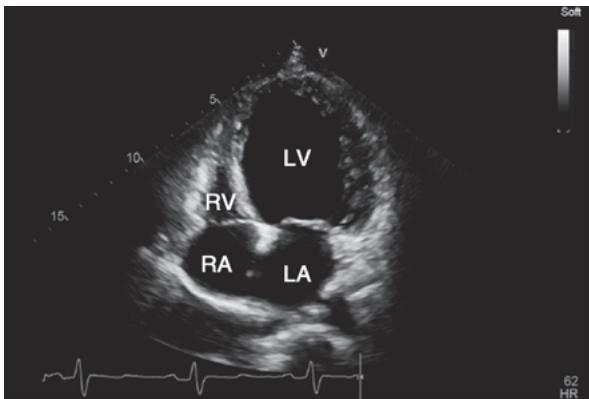  
A

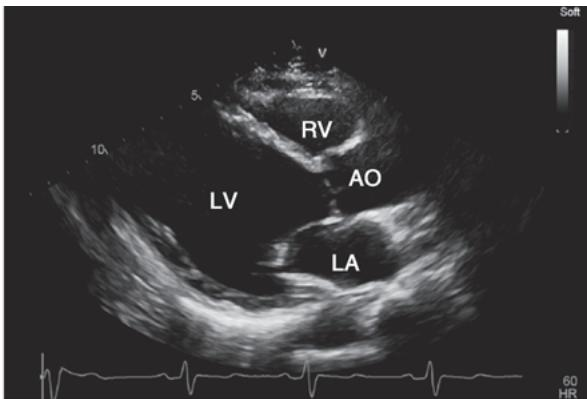  
B

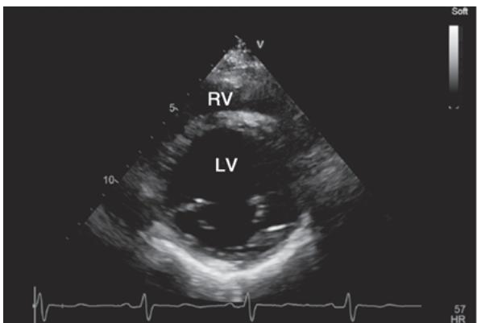  
C

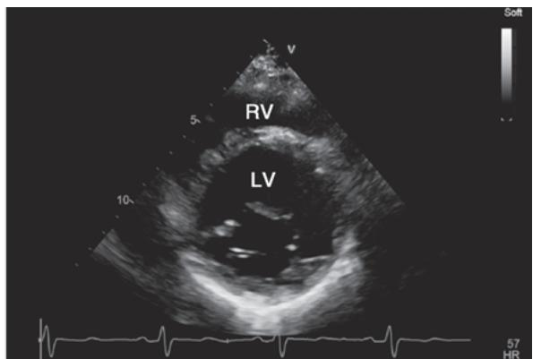  
D  
图 3-6-3 扩张型心肌病超声心动图表现

1 例 32 岁男性扩张型心肌病病人。四腔心、左室长轴切面可见收缩末期左室腔显著扩张（A、B），左室短轴二尖瓣水平切面见收缩（C）和舒张（D）末期心腔面积变化小，动态观察见心室壁各节段运动普遍重度减弱，LVEF 约 10%。AO，主动脉；LA，左房；LV，左室；RA，右房；RV，右室。

5. 心脏磁共振 对诊断、鉴别诊断及预后评估均有很高价值,但其检查费时昂贵而不宜作为首选检查。CMR 不同序列成像及对比增强,除可提供类似 TTE 的诊断信息外,其较强的组织特征分辨能力可为各种心肌疾病的病因甄别提供线索。CMR-LGE 严重程度可预测全因死亡率、心衰住院率和 SCD。

6. 基因检测 目前已知 50 多种基因与 DCM 有关, 最重要的是编码细胞骨架 TTN 基因。对遗传性 DCM 的诊断, 家庭成员基因筛查有助于确诊。

#### 【诊断与鉴别诊断】

1. 诊断依据 除外获得性病因后,有心腔扩大伴 LVEF 降低者可拟诊 DCM。

2. 鉴别诊断 应除外心脏扩大、收缩功能减低的其他继发原因。可通过病史、查体及 TTE、CMR、冠脉造影等检查进行鉴别，必要时做 EMB 及基因检测。

需指出，CMR 提供的心肌组织特征有助于病因鉴别诊断。CMR 发现心肌水肿，提示心肌炎的可能；CMR-LGE 检出的心肌纤维化及其程度和分布模式可协助确诊或除外心肌梗死（心内膜下或透壁分布），也可提供特定的病因线索（如心肌炎的心外膜下分布、结节病的斑片状分布、肌营养不良的广泛侧外壁分布、LMNA 基因携带者呈广泛室间隔中部分布、DSP 和 FLNC 基因截断变异携带者呈广泛环状分布）。

#### 【治疗】

DCM 的现代治疗包括药物、器械及心脏移植等,旨在阻止基础病因介导的心肌损害,阻断心室重塑及神经体液激活,去除心衰诱因,控制心律失常和预防猝死,防治并发症,提高生活质量和延长生存。

### （一）针对病因以及诱因的治疗

应积极寻找和治疗病因，如控制感染、限酒或戒酒、治疗内分泌或自身免疫病，改善营养失衡，纠正贫血、容量负荷过重及电解质紊乱等。

### （二）针对心力衰竭的药物治疗

“新四联” 治疗药物包括肾素血管紧张素系统（RAS）抑制剂（ACEI、ARB、ARNI）、 $\beta$ 受体拮抗剂、SGLT2i 和盐皮质激素受体拮抗剂（MRA）。已证实应用 “新四联” 可降低死亡、改善预后，故若无禁忌，应尽早联合应用，并从低剂量起逐步递增至目标或最大耐受剂量。

1. ACEI/ARB 所有 LVEF<40% 的 HF 病人若无禁忌证均应使用 ACEI 或 ARB。

2. ARNI 经 ACEI/ARB、 $\beta$ 受体拮抗剂和 MRA 充分治疗后仍有症状的 HFrEF 病人，以 ARNI 替代 ACEI 可进一步降低心衰住院与死亡风险。

3. SGLT2i 包括达格列净和恩格列净,对有症状慢性 HFrEF 病人,无论是否存在 2 型糖尿病均推荐用 SGLT2i 以降低住院率和死亡率。

4. $\beta$ 受体拮抗剂 所有LVEF $< 40\%$ 的病人若无禁忌都应使用 $\beta$ 受体拮抗剂，包括卡维地洛、美托洛尔和比索洛尔，宜在RAS抑制剂和利尿剂基础上加用。

5. MRA 包括依普利酮和螺内酯,具有抗心肌纤维化及保钾利尿作用。在 ACEI 和 $\beta$ 受体拮抗剂治疗基础上,仍有症状且无严重肾功能不全者可使用,但应监测血钾。此类药物可致部分男性病人乳房发育及疼痛。

6. 伊伐布雷定 为窦房结 $I_{f}$ 阻滞剂，能减慢心率且无负性肌力作用。经目标剂量的 $\beta$ 受体拮抗剂、ACEI/ARB 和 MRA 治疗后仍有症状，或对 $\beta$ 受体拮抗剂不耐受或禁忌，LVEF $\leqslant$ 35% 且静息窦性心率仍 $\geqslant$ 70 次/分者，加用伊伐布雷定可改善症状与预后。

7. 利尿剂 能有效改善症状。宜从小剂量起,按尿量及体重变化调整剂量。

8. 洋地黄类 主要用于上述药物治疗后仍有症状或不耐受者。

9. 维立西呱 系可溶性鸟苷酸环化酶刺激剂, 可增加 cGMP 生成而发挥舒血管、抗心肌纤维化和抗重塑作用。对最佳药物治疗后仍有症状、NYHA 心功能仍为Ⅲ～Ⅳ级和近期症状恶化者, 维立西呱可减少 HF 住院和死亡率。

### （三）针对心律失常的药物治疗

参阅“心律失常”章节。若并发 AF, 因 DCM 和 AF 均是血栓栓塞的危险因素, 故应长期服用华法林或新型口服抗凝药物。

### （四）心脏再同步治疗

通过植入带左室电极的起搏器，同步起搏左、右室使心室收缩同步化，对部分 HF 病人疗效显著，适应证详见“心力衰竭”章节。

### （五）心室辅助装置及心脏移植

严重 HF 内科治疗无效者可考虑心脏移植。心室辅助装置可用于移植前的桥接治疗及不适合移植晚期病人的长期支持。

### (六) 猝死防治

ICD 适应证: ①心脏骤停史; ②持续性室速伴或不伴晕厥史; ③LVEF≤35%、

NYHA 心功能Ⅱ～Ⅲ级，预期生存≥1 年。须指出，携带高危致病基因（LMNA、EMD、TMEM43、DSP、RBM20、PLN、FLNC 截短变异等）的 DCM 病人应被视为猝死高危者，即使其 LVEF＞35% 也应考虑 ICD 一级预防，特别是存在其他危险因素（如室性心动过速、明显 LGE）者。

#### 【病因明确的 DCM】

以 DCM 为临床表现的部分病人,其病因明确,较为常见的有:

1. 酒精性心肌病 长期大量饮酒可能导致本病。诊断依据为:符合 DCM 的临床表现,长期过量饮酒史(WHO 标准:女性>40g/d,男性>80g/d;饮酒>5 年);既往无其他心脏病史或辅助检查能排除其他引起 DCM 的病因如结缔组织病、内分泌疾病等。若能早期戒酒,多数病人能逐渐改善或恢复。

2. 围生期心肌病 无心脏病女性妊娠最后1个月至产后5个月内发生HF,若符合DCM特点可诊断本病。发病有明显种族特点,黑种人多发。高龄、营养不良、近期妊娠高血压、双胎及宫缩抑制剂与本病发生有一定关系,再孕常可复发。

3. 心肌致密化不全 系胚胎发育中心外膜到心内膜致密化过程提前终止所致,临床表现类似DCM。TTE左室疏松层与致密层比例>2,但其准确性低;CMR是最有效的诊断工具。临床处理类似HF。

4. 心脏气球样变 发生与情绪激动或精神刺激等有关,故又称“心碎综合征”。临床表现为突发胸骨后疼痛伴心电图 ST 段抬高或压低,血管造影无明显冠脉狭窄但心室造影或 TTE 显示心室中部和心尖部收缩期膨出,多数病人经心理治疗和对症处理后左室功能可恢复正常、预后较好。

5. 心动过速性心肌病 多见于 AF 或室上性心动过速, 临床符合 DCM 特点。有效控制心室率或射频消融治疗是关键, 尚需使用阻断神经体液激活的药物。

# 第三节 | 非扩张型左心室心肌病

非扩张型左心室心肌病（non-dilated left ventricular cardiomyopathy, NDLVC）是指在无左心室扩张情况下，左心室存在着非缺血性瘢痕或脂肪替代，伴或不伴整体或局部室壁运动异常；这些心肌病变仅由负荷异常或心肌缺血无法解释。

#### 【发病机制】

遗传背景和基因突变是其主要发病机制,但与 ARVC 和 DCM 有重叠。

#### 【临床表现】

多数 NDLVC 病人无明显症状和体征,但部分病人出现与心律失常或心功能不全的相关症状,少数病人最初表现为严重心律失常如 SVT、VF,甚至猝死。

#### 【辅助检查】

1. 心电图检查 本病某些心电特征可指示潜在遗传病因,如神经肌肉病变和结节病相关性NDLVC常有传导异常,DSP和PLN突变相关性NDLVC常见QRS波低电压。

2. 超声心动图 表现为左室整体或局部收缩功能降低但心腔无明显扩大。

3. 心脏磁共振 CMR-LGE 检出的非缺血性心肌纤维或/和脂肪替代是主要诊断依据, 纤维化分布模式是病因甄别的关键线索, 纤维化程度有预后价值。

4. 心肌活检 检出的心肌组织纤维和脂肪替代是诊断的“金标准”。

5. 基因检测 NDLVC 相关基因主要是 DSP、FLNC（截短变体）、DES、LMNA 或 PLN，但它们与 DCM 和 ARVC 的遗传基础多有重叠，其中 DSP 突变与本病关系最密切。

#### 【诊断与鉴别诊断】

1. 诊断标准 ①影像学无明显左室扩张但存在非缺血性左室瘢痕或脂肪替代,伴或不伴整体或局部室壁运动异常;或无心肌瘢痕或脂肪替代的孤立性整体左室运动功能减退。②临床上可除外继发性、原发性和缺血性心肌病。

2. 鉴别诊断 应与心脏收缩功能减低的其他原发和继发性心肌病鉴别。

#### 【临床管理】

1. 药物治疗 类似于 DCM, 主要为 $\beta$ 受体拮抗剂、ACEI、ARB, 参阅 “本章第二节”。

2. 猝死预防 类似于 DCM, ICD 植入是此表型的治疗重点。1 级预防植入 ICD 需考虑表型及基因型的猝死风险, 可适当降低植入指征: 如携带猝死高危致病基因者, 即使 LVEF > 35% 也应考虑 ICD 植入, 特别是存在其他危险因素 (如室性心动过速、明显 LGE) 者。

# 第四节 | 致心律失常性右心室心肌病

致心律失常性右心室心肌病（arrhythmogenic right ventricular cardiomyopathy, ARVC）是以进展性右心室心肌萎缩并被纤维或/和脂肪替代为特征的心肌疾病。本病发病率为 $0.2 \text{‰} \sim 1.0 \text{‰}$ ，男性易患，多在30岁左右发病，预后差。

#### 【发病机制】

多为家族性常染色体遗传但常伴差异表达和不完全外显。已发现多个连锁位点，较为明确的致病基因至少有10个，主要为5个桥粒蛋白编码基因：桥粒斑菲素蛋白2（PKP2）、桥粒斑蛋白（DSP）、桥粒芯蛋白2（DSG2）、桥粒胶蛋白2（DSC2）和斑珠蛋白（JUP），尚有非桥粒蛋白编码基因。

发病机制尚未完全明确,现认为是一种心肌桥粒病,非桥粒基因可能通过影响桥粒而发挥作用。此外,炎症反应也参与致病。

#### 【临床特征】

1. 心律失常 最常见,表现为进行性心悸、气短和晕厥,情绪激动或劳累等易诱发,可为室早、VT、VF,以反复发作左束支传导阻滞型持续性/非持续性室性心动过速(SVT/NSVT)最具特征。

2. 心脏性猝死 部分病人以 SCD 为首发症状, 多为 $\leqslant$ 35 岁的青年人, 生前多无症状, 情绪激动和剧烈运动是主要诱因。

3. 心力衰竭 多为疾病晚期,年龄多在 40 岁以上,主要为右心衰的表现。

#### 【辅助检查】

1. 心电图检查 复极/除极异常、心律失常是诊断本病的重要指标。体表常规或信号平均心电图可见右胸导联 T 波倒置及 Epsilon 波。室性心律失常尤其是左束支传导阻滞型 SVT/NSVT 具有诊断和预后价值。

2. 经胸超声心动图/心脏磁共振 TTE 和 CMR 是评估本病心脏结构和功能的主要方法, 特征性表现是右室壁运动减弱、反向运动或膨出, 右室射血分数 (RVEF) 降低, CMR-LGE 可检出任一心室的心肌被纤维或/和脂肪替代 (图 3-6-4)。

3. 基因检测 高达 60% 的病人可检出致病或可能致病基因突变,但其外显率不确定(取决于年龄、性别和体力活动),故应反复评估基因变异的致病性。

#### 【诊断与鉴别诊断】

1. 诊断依据 对有右室扩大、左束支传导阻滞型 VT 者，结合临床、心电、影像表现可拟诊 ARVC，必要时做心内膜心肌活检（EMB）及基因检测。

2. 诊断标准 主要诊断标准:①结构功能异常:TTE 或 CMR 示右室弥漫或局限性运动障碍或室壁瘤,RVEF≤40%;②室壁组织异常:CMR 示右室游离壁心肌组织被纤维组织或/和脂肪取代;③复极异常:右胸导联 T 波倒置;④除极/传导异常:右胸导联有 Epsilon 波;⑤心律失常:左束支传导阻滞型 SVT 或 NSVT;⑥家族史:一级亲属中有符合诊断标准、尸检证实或手术病理确诊的病人,病人携带致病或可能致病基因。

3. 鉴别诊断 ①尤尔畸形(Uhl anomaly):又称羊皮纸样右心室,较少见,为先天性右室肌缺如,心室壁薄如纸,仅存心内膜和心外膜,婴幼儿多见,常早期死于HF,无家族性发病倾向;②特发性右室流出道室速:起源于右室流出道的室速,缺乏家族史且预后良好。

#### 【治疗】

主要针对 HF 及心律失常，旨在缓解症状、减少猝死。

1. 药物治疗 可经验性应用抗心律失常药物如 $\beta$ 受体拮抗剂、索他洛尔、胺碘酮、维拉帕米，或胺碘酮与 $\beta$ 受体拮抗剂联用。并发症如 HF、AF、栓塞的治疗见相关章节。

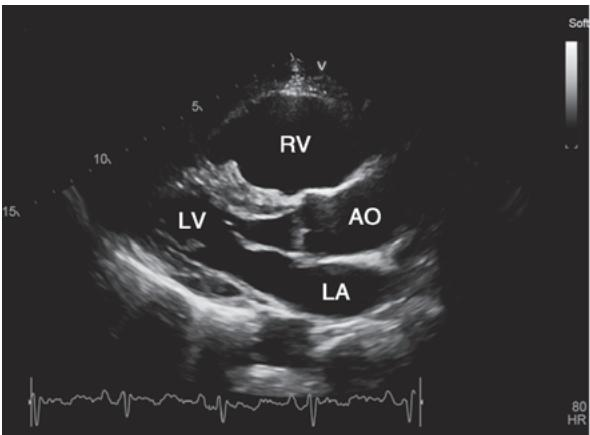  
A

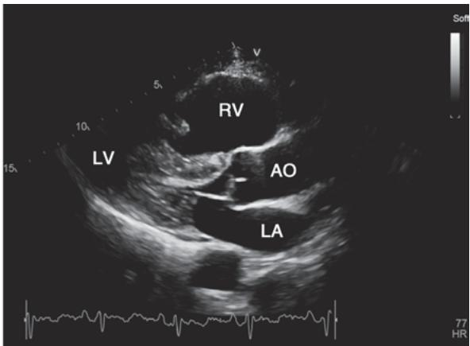  
B

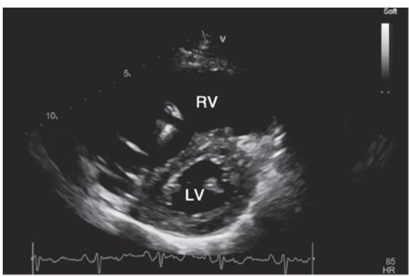  
C

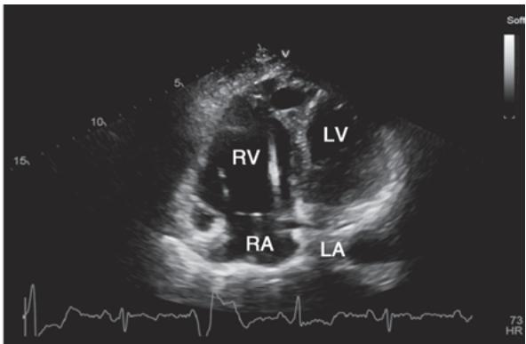  
D

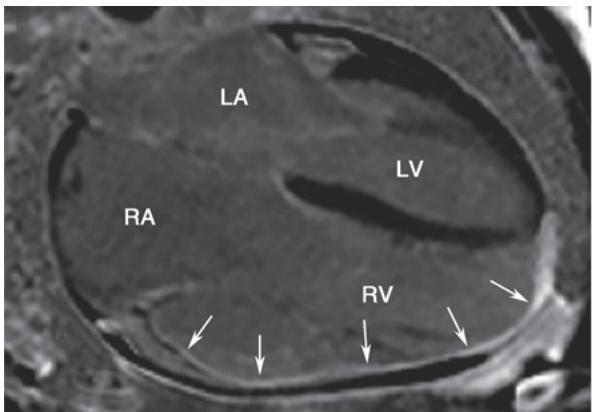  
E

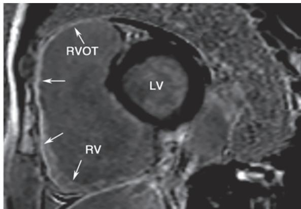  
F  
图 3-6-4 致心律失常性右心室心肌病经胸超声心动图及心脏磁共振表现

1 例男性 70 岁致心律失常性右心室心肌病病人，已植入 ICD。经胸超声心动图胸骨旁左室长轴 [舒张期（A）、收缩期（B）]、短轴（C）、心尖四腔心（D）切面见右室腔高度扩张、室壁菲薄、运动普遍减弱。心脏磁共振钆对比增强相位敏感反转恢复序列（PSIR 序列）显像四腔心位（E）及左室短轴位（F）见右室壁菲薄及纤维组织广泛替代（箭头所指）。AO，主动脉；LA，左房；LV，左室；RA，右房；RV，右室；RVOT，右室流出道。

2. 手术治疗 严重右室功能不全伴难治性室性心律失常者可行心脏移植。

#### 【猝死预防】

猝死幸存者或高危病人植入 ICD 是本病的主要疗法,但是否植入还应考虑病人意愿及预测生存期( $\geqslant$ 1 年)。

高危因素:①猝死幸存者;②有晕厥或血流动力学障碍的持续性/非持续性室速;③QRS波离散度≥40ms;④影像学证实的严重右室扩张、RVEF<40%或左室也受累、LVEF<45%;⑤早期症状重、有晕厥前兆者;⑥携带猝死高危致病基因者。

# 第五节 | 限制型心肌病

限制型心肌病（restrictive cardiomyopathy, RCM）是一组以限制性心室充盈障碍为特征的混合性心肌病，其预后较差，5年生存期仅约30%。

#### 【病因与分类】

本病病因极为复杂,包括遗传性、散发性,或系统性疾病累及。

RCM可分为心肌型和心内膜心肌型。心肌型又可分为：①浸润性/贮积性：细胞内或细胞间异常物质堆积，主要包括淀粉样变、结节病、戈谢病、糖原贮积症、Fabry病、Danon病、血色病等；②非浸润性：包括家族性RCM，部分可能与轻型DCM、HCM等有表型重叠。心内膜心肌型又可分为：①闭塞性，经典的RCM主要累及心内膜，见于心内膜弹力纤维增生症、高嗜酸性粒细胞综合征、放射性损害、蒽环类药物毒性等；②非闭塞性，多为类瘤样浸润或恶性浸润所致。

心肌淀粉样变性(cardiac amyloidosis, CA)是最常见的浸润性RCM。已发现30多种致病蛋白，累及心脏的主要有2个亚型：免疫球蛋白轻链型CA(AL-CA)和甲状腺素转运蛋白型CA(ATTR-CA)，根据有无甲状腺素转运蛋白(TTR)基因突变又可将ATTR-CA分为突变型(ATTRm-CA)和野生型(ATTRwt-CA)。

#### 【病理改变与病理生理】

本病病因复杂、病理改变各异。经典 RCM 的病理改变为心内膜纤维化、钙化及附壁血栓，心内膜下心肌变性坏死及瘢痕形成；各类 RCM 有各自的病理特征，如 CA 的淀粉样物质表现为刚果红染色呈砖红色、偏振光显微镜下呈苹果绿双折光。以上改变导致室壁僵硬、心室充盈严重受限及体循环和肺循环淤血。

#### 【临床表现】

1. 症状 早期主要为 HFpEF 的症状, 如活动耐量下降、呼吸困难等; 随病程进展, 逐渐出现食欲缺乏、腹胀、水肿等。右心衰症状较重为经典 RCM 的特点。

2. 体征 可闻及第四心音奔马律，血压低常预示预后不良。本病病人颈静脉怒张、肝大、腹腔积液、下肢水肿等右心衰体征也较突出。

#### 【辅助检查】

1. 实验室检查 原发病相关的实验室异常,如怀疑 CA 需做血清游离轻链及血尿免疫固定蛋白电泳以寻找浆细胞病的证据;脑钠肽(BNP)、N 末端 B 型利钠肽原(NT-proBNP)和肌钙蛋白是评价 CA 严重程度的生物标志物,三者均与其预后相关。

2. 心电图检查 可见 QRS 波低电压、异常 q 波、ST-T 改变及各种心律失常，全导联低电压与影像学心肌肥厚不相称是 CA 较特殊表现。

3. 胸部 X 线/CT 心房明显增大,偶见心内膜钙化影。CT 可较好辨别心内膜或心包钙化。

4. 经胸超声心动图 TTE 结合多普勒检查是重要的诊断手段,典型表现为:心室充盈严重受限,舒张功能明显减低,双心房显著扩大。若见心肌弥漫性增厚呈毛玻璃样改变提示 CA 的可能,而应变显像(表现为纵向应变峰值绝对值降低)可更早发现收缩功能异常,尤其出现左心室基底和中段的纵向应变降低而心尖部正常(心尖保留征),有助于区分 CA 和其他原因造成的左心室肥厚。

5. 磁共振成像 CMR-LGE 可明确心内膜、心肌及心包病变是否存在及其性质，如炎症、纤维化、瘢痕。若为 CA, CMR 可见 “淀粉样 LGE 模式”，心内膜下 LGE 常见于 AL-CA，透壁 LGE 常见于 ATTR-CA。

6. 心脏核素成像 ${}^{99m}$ Tc 焦磷酸盐 ( ${}^{99m}$ Tc-PYP) 核素扫描或单光子发射计算机断层成像对 ATTR-CA 具有重要诊断价值。研究显示临床疑似 CA 病人中进行 ${}^{99m}$ Tc-PYP 核素扫描，如果心肌摄取为 2 级（与骨摄取相关）或 3 级（高于骨摄取），同时血清/尿液中单克隆免疫球蛋白阴性，可诊断 ATTR-CA，并可在超声心动图或 CMR 出现异常前识别出心肌病变。

7. 心导管检查 舒张期心室压力曲线呈现早期下陷、晚期高原波形，与缩窄性心包炎的表现相类似,但本病特点包括:①肺动脉收缩压明显增高,常>50mmHg;②右室舒张压相对较低,缩窄性心包炎达1/3收缩压峰值以上;③左右心室舒张末压差值>5mmHg。

8. 心肌活检 心肌活检是本病病因诊断的“金标准”，有助于甄别浸润性、贮积性、沉积性心肌病及心内膜心肌病。刚果红染色是目前最常用的检测淀粉样变的病理学方法，免疫组织化学、激光显微切割和/或质谱可用以确认淀粉样纤维的前体蛋白类型。

9. 基因检测 家族性 RCM 多为常染色体显性遗传。致病突变多为心肌肌钙蛋白 I(TNNI3) 和 $\beta$ 肌球蛋白重链 7(MYH7) 的编码基因。对于 ATTR-CA 病人应进行基因检测以区分 ATTRm-CA 和 ATTRwt-CA，有助于预后判定、治疗选择、家族筛查和遗传咨询。

#### 【诊断与鉴别诊断】

1. 诊断依据 对以右心衰和心律失常为主、心房显著扩大者，排除继发性病因后，应考虑 RCM。TTE 限制性心室充盈障碍是主要诊断依据。

2. 鉴别诊断 首先,应在各种 RCM 类型中进行病因学甄别,此方面工作十分复杂,建议参阅相关文献。临床上,可根据 TTE 和 CMR 等影像学特征进行病因学甄别,必要时行 EMB。其次,应与缩窄性心包炎鉴别,两者临床及血流动力学表现相似,可根据影像学检查结果及心导管压力特征进行鉴别。

#### 【治疗】

多数类型 RCM 无特异疗法,仅对症处理,对部分病因明确的 RCM 可对因治疗。

1. 药物治疗 对嗜酸性粒细胞增多症者，糖皮质激素、细胞毒性药物能有效减少嗜酸性粒细胞，阻止心内膜心肌纤维化。AL-CA首选自体造血干细胞治疗，不符合移植条件者可行抗浆细胞化疗和抗淀粉样物质治疗，但疗效并不满意。ATTR-CA的药物治疗目前主要包括抑制TTR合成和稳定TTR。抑制TTR合成，包括通过小干扰RNA以及反义寡核苷酸抑制TTR基因表达，减少TTR蛋白生成。稳定TTR首选甲状腺素转运蛋白稳定剂(氯苯唑酸)，可降低 $30\%$ 全因死亡率。另外，清除TTR淀粉样纤维的药物目前也在研发中。一些遗传性酶缺乏导致的RCM可行酶替代治疗（ERT)或基因治疗，如Fabry病的特异治疗包括ERT、分子伴侣治疗以及基因治疗，ERT是其首选的治疗方法，包括阿加糖酶 $\alpha$ 和阿加糖酶 $\beta$ 。

利尿剂和血管扩张剂可降低心脏前负荷，减轻肺循环和体循环淤血，从而缓解症状，但应从小剂量开始，避免降低心室充盈而影响心排血量；非二氢吡啶类钙通道阻滞剂可改善心室顺应性；β受体拮抗剂能够减慢心率，延长心室充盈时间，降低心肌氧耗，有利于改善心室舒张功能；伴快速型AF或HF者，可小剂量应用洋地黄类药物；有附壁血栓或已发生血栓栓塞者，应予抗凝治疗。

2. 手术治疗 对严重心内膜心肌纤维化者可行心内膜剥脱术,有附壁血栓者行血栓清除术,有适应证者可植入心脏起搏器,还可行心脏移植术。

# 第六节 | 心肌炎

心肌炎（myocarditis）是指感染和非感染性心肌炎性疾病。感染性病原多为病毒，少数是细菌、真菌、立克次体、螺旋体、原虫等；非感染性病因包括理化、药物、过敏、免疫等。病毒性心肌炎（viral myocarditis, VM）是嗜心肌病毒感染引起的心肌炎症损伤。本节重点介绍 VM。

#### 【病因】

嗜心肌病毒主要包括胃肠道病毒如柯萨奇病毒 B3、埃可病毒、脊髓灰质炎病毒等，呼吸道病毒如腺病毒、流感病毒（A、B 型）、细小病毒 B19、冠状病毒（SARS-CoV）等。

#### 【发病机制】

直接作用:病毒直接损害心肌组织包括心肌细胞、间质及微血管。间接作用:病毒经由 T 淋巴细胞介导为主的免疫反应造成心肌组织损伤,尚有多种细胞因子和 NO 等也可参与心肌损害。

#### 【病理改变】

初期可见局灶或弥漫性心肌间质中性粒细胞浸润和心肌细胞变性坏死,其后代之以淋巴细胞、巨噬细胞、浆细胞浸润及肉芽组织形成,晚期有明显间质纤维化伴代偿性心肌肥厚及心腔扩大。

#### 【临床表现】

### (一) 症状

1. 前驱症状 过半病人发病前 1～3 周有发热、全身酸痛、咽痛、呕吐、腹泻等上呼吸道或肠道病毒感染症状。

2. 心脏症状 轻者几乎无症状,可有胸闷胸痛、心悸气促等;重者可出现急性左心衰、肺水肿及心源性休克的症候群。

### (二) 体征

1. 心脏增大 病情轻者心脏不增大,重者可轻至中度增大。

2. 心率改变 心率增快可与体温不平行,累及传导系统可出现心动过缓。

3. 心音改变 第一心音低钝, 可闻及第三、第四心音及奔马律, 提示心肌严重受损; 并发心包炎时, 可闻及心包摩擦音。

4. 心律失常 可出现各种心律失常及不同程度房室传导阻滞。

5. 心力衰竭 可出现急性左心衰、肺水肿及心源性休克的征象。

#### 【辅助检查】

1. 实验室检查 急性期白细胞计数增高、血沉增快、C反应蛋白升高，肌酸激酶同工酶及心肌肌钙蛋白增高，类似心肌梗死表现但持续时间更长。

2. 胸部 X 线检查 可见心影扩大,有心包积液时可呈烧瓶样改变。

3. 心电图检查 常见 QRS 波或 ST-T 波改变、各种心律失常，特别是室性心律失常和房室传导阻滞，偶见异常 q 波。合并急性心包炎可有 aVR 导联以外 ST 段广泛抬高。

4. 超声心动图 轻症者可正常,重症者多可见左室增大,室壁运动普遍减弱、LVEF 减低。合并心包炎者可有心包积液。

5. 心脏磁共振 对心肌炎诊断有较大价值。急性期表现为 $T_{2}$ 信号增加提示水肿，心肌早期钆增强提示心肌充血、延迟钆增强（心外膜下或心肌中层片状强化）提示心肌纤维化。

6. 血清学检测 病毒血清学仅对病因有提示作用,不能作为诊断依据。

7. 心肌活检术 EMB 主要用于病情急重、治疗反应差、原因不明的病人。确诊有赖于检出病毒颗粒、抗原、基因片段或蛋白。

#### 【诊断与鉴别诊断】

1. 诊断依据 主要根据病毒感染前驱症状、心脏相关表现，结合 ECG、TTE、CMR、心肌损伤标志物升高(必要条件)、病原学等证据，排除其他疾病后，可考虑 VM。必要时可做 EMB 协助诊断。

2. 特殊类型 ①拟急性冠脉综合征型: ECG 表现酷似急性心肌梗死,但 “缺血改变” 导联不符合冠脉分布范围,肌钙蛋白升高时间更长,冠脉造影阴性。②拟心力衰竭型:无其他原因可稽,近 2 周至 3 个月新发 HF 或 HF 加重,TTE 或 CMR 示心脏收缩功能受损,但冠脉造影阴性。③暴发性重症心肌炎:暴发性发病,短暂的前驱症状后迅速进展至急性泵衰竭、心源性休克或心脏骤停或死亡。

3. 鉴别诊断 以上特殊类型 VM 极易与急性冠脉综合征、缺血性心肌病、应激性心肌病及其他疾病相混淆，亟需紧急鉴别方可作出治疗决策。

尚需与 VM 鉴别的疾病主要有: $\beta$ 受体功能亢进症、自身免疫病累及心脏、其他非感染性心肌炎（如甲状腺素或儿茶酚胺性心肌病、过敏性心肌炎）。

#### 【治疗】

目前尚无特效治疗，一般采取对症及支持治疗。

### （一）一般治疗

病人应卧床休息，避免劳累，休息时长酌情而定。轻症者3个月内不参加重体力活动；重症者应限制活动3个月以上至心力衰竭好转。

### （二）药物治疗

1. 抗病毒及免疫调节 丙种球蛋白、干扰素- $\alpha$ 早期应用可抑制病毒复制,但其疗效不确切。糖皮质激素可抑制过度免疫反应性损伤,但不主张早期或常规应用,如出现严重心律失常及心源性休克

等情况则应尽早使用。

2. 心肌保护治疗 维生素 C 具有抗氧自由基和心肌保护作用。辅酶 Q 参与氧化磷酸化及能量的生成过程，并有抗氧自由基及膜稳定作用。

3. 纠正心律失常 多数病人可出现各种心律失常,若必要且无禁忌证,胺碘酮与 $\beta$ 受体拮抗剂是较好的治疗选择。缓慢型心律失常及房室传导阻滞可予临时起搏。

### （三）器械治疗

暴发性重症心肌炎进展快、死亡率高，应积极进行心肺器械支持治疗，如气管插管人工通气、主动脉内球囊反搏、体外膜肺氧合等，是降低死亡率的关键。

(陈良龙)

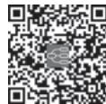  
本章思维导图
