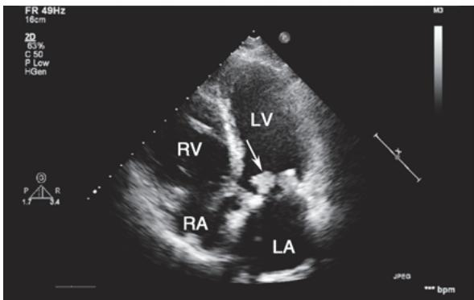
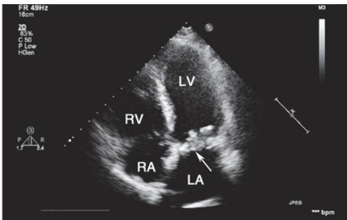

> [!info] 导航
> [[第027章_第3篇第09章_心包疾病|上一章]] · [[00_章节导航|总目录]] · [[第029章_第3篇第11章_心脏骤停与心脏性猝死|下一章]]

感染性心内膜炎（infective endocarditis, IE）是指病原体循血行途径或直接感染心瓣膜、心内膜或邻近大血管内膜所致的感染性疾病，感染最常累及瓣膜，常伴赘生物形成、局部结构与功能受损、终末器官感染性栓塞及全身炎症反应。

近年来，IE的发病率呈增长态势，这与老年退行性瓣膜病、心脏器械植入、医疗操作、静脉药物成瘾者等增多有关。我国尚无确切的发病率数据，2019年全球估测的发病率为每年13.8/10万，男女比例 $\geqslant 2:1$ 。IE的病原谱也有显著变化，最常见病原体由既往的链球菌转变为目前的葡萄球菌(欧美以葡萄球菌居多，我国以链球菌和葡萄球菌居前)，且耐药菌株日益增多。

IE 分类: 按病情、病程急缓, 可分为急性和亚急性; 按感染获得途径, 可分为医院及卫生保健相关性(医源性)、社区获得性、不良行为相关性(如毒瘾者); 按受累瓣膜性质, 可分为自体瓣膜心内膜炎 (native valve endocarditis, NVE) 和人工瓣膜心内膜炎 (prosthetic valve endocarditis, PVE)。

#### 【病因】

1. 易患因素 包括基础心脏病(瓣膜病尤其二尖瓣脱垂、先天性心脏病等)、免疫力低下疾病(艾滋病、免疫抑制、糖尿病等)、心脏器械植入(起搏器、人工瓣膜等)、医疗操作(血液透析、腔内置管和牙科治疗等)、个人行为(静脉药物成瘾、文身等)。

2. 感染病原 包括细菌、真菌、病毒、立克次体、衣原体等。约 90% 社区获得性 IE 由链球菌、葡萄球菌或肠球菌引起(前者居多)，医院获得性或静脉药物成瘾 IE 则多由金黄色葡萄球菌所致。急性 IE 主要由金黄色葡萄球菌引起，亚急性 IE 则多由草绿色链球菌致病。

#### 【发病机制】

实验模型表明,IE 遵循一个可预测的过程:心内膜损伤→血小板和纤维蛋白聚集形成无菌性赘生物→菌血症病原体在无菌性赘生物上种植形成感染性赘生物→赘生物脱落碎片随血流远处播散。同样地,临床上典型的亚急性 IE 也有类似过程,但急性 IE 起病急骤,短期内便可造成瓣膜结构破坏乃至死亡。

#### 【病理改变】

### (一) 心脏病变

1. 赘生物形成 是最具特征的病理变化。赘生物可呈疣状、菜花状、息肉样，其大小不一、活动度较大，偶可堵塞瓣膜口。

2. 侵袭性病灶 感染可直接造成瓣膜破损、腱索断裂，致使瓣膜关闭不全；感染也可侵袭邻近结构导致瓣周、心肌或心包化脓，传导阻滞，室间隔穿孔等。

### （二）心外病变

1. 体循环栓塞 左心系统的赘生物脱落碎片可造成终末脏器(如脑、肾、心、肠及周围血管)梗死、脓肿。

2. 肺循环栓塞 右心系统的赘生物碎片脱落可造成肺梗死、肺脓肿。

3. 迁移性脓肿 系菌血症血流播散至心脏外其他部位所致。

4. 血管壁损害 菌栓栓塞动脉滋养血管或管腔可致管壁坏死、动脉瘤形成。

5. 免疫性损害 系菌血症反复刺激细胞和体液免疫所致,可致脾大、肾小球肾炎、关节炎、心包炎和微血管炎等。

#### 【临床表现】

IE 起病或急或缓。急性 IE 起病急、进展快(数天即可致瓣膜破坏)、中毒症状明显、感染迁移多见,多为金黄色葡萄球菌感染;亚急性 IE 起病缓、进展慢(病程数周至数月)、中毒症状轻、感染迁移少见,病原体以草绿色链球菌多见、其次为肠球菌。临床上两者常有重叠、难以完全分开,其主要症候群如下。

1. 感染症状 几乎所有病人均有发热,典型热型为弛张热,一般<39℃。亚急性者起病隐匿,常有长程不规则低热伴乏力、食欲缺乏、盗汗、消瘦等非特异症状;急性者呈暴发性败血症过程,常有高热、寒战、头痛、背痛、肌肉关节痛。

2. 心脏杂音 高达 85% 的病人有心脏杂音, 可由基础心脏病和/或新发瓣膜损害所致。杂音强度增加、性质变化(海鸥音)或新发杂音颇具特征性, 提示瓣膜损害并导致关闭不全, 多见于急性者特别是主动脉瓣 IE。

3. 周围体征 现已少见,为非特异性,可能是免疫性微血管炎或微栓塞所致,包括:①瘀点,见于任何部位,以锁骨以上皮肤、口腔黏膜和睑结膜常见,病程长者多见;②指(趾)甲下线状出血;③Roth斑,为视网膜卵圆形出血斑,其中心呈白色,亚急性者多见;④Osler结节,为指(趾)垫豌豆大小红紫色痛性结节,亚急性者多见;⑤Janeway损害,为手掌或足底直径1\~4mm无痛性出血红斑,急性者多见。

4. 动脉栓塞 有症状者发生率约 25%，无症状者更多。左心系统赘生物主要造成体循环栓塞，可累及脑、心、肾、脾、肠系膜和四肢等，以脑栓塞最常见，占比 15%～20%；右心系统赘生物主要造成肺循环栓塞。

5. 其他症候 尚有脾大、贫血、杵状指等非特异性表现。

#### 【并发症】

急性 IE 并发症发生率高,是致死、致残的主要原因。

1. 心脏 绝大多数有心脏并发症,包括:①心力衰竭,最常见,多由瓣膜穿孔或腱索断裂并发急性瓣膜关闭不全所致,主动脉瓣受损最多,其次为二、三尖瓣;②心肌脓肿,多见于主动脉瓣周,可致传导阻滞、心包化脓;③心肌梗死,尸检高达50%,但多无症状,主动脉瓣IE多见,多由菌栓引起;④心肌炎症,较少见。

2. 脑部 多数有脑部并发症,但多无症状,仅15%\~30%病人有脑部受累表现:①脑栓塞占半数,大脑中动脉及其分支最常受累;②细菌性脑动脉瘤,除非破裂出血,多无症状;③脑出血,由脑栓塞出血性转化或细菌性动脉瘤破裂所致;④中毒性脑病、化脓性脑膜炎及脑脓肿,多见于急性金黄色葡萄球菌IE。

3. 肾脏 多数有肾损害,包括:①肾梗死,尸检检出率≥50%,但多无症状;②免疫复合物局灶/弥漫性肾小球肾炎,常见于亚急性者;③肾脓肿,少见。

4. 脾脏 脾梗死尸检检出率 44%, 但多无症状, 仅部分病人有左上腹痛伴左肩放射。

5. 肺部 右心系统 IE 肺栓塞发生率高, 易发展为肺坏死、空洞, 甚至脓气胸。

6. 血管 细菌性动脉瘤发生率 3%～5%，多见于亚急性者，受累动脉依次为主动脉近端及窦部、脑、内脏和四肢动脉。

#### 【辅助检查】

### (一) 常规检验

1. 尿液 常有镜下血尿和蛋白尿。肉眼血尿提示肾梗死。红细胞管型和大量蛋白尿提示弥漫性肾小球肾炎。

2. 血液 亚急性者常见正色素正细胞性贫血、白细胞计数正常或轻度升高、轻度核左移；急性者常有白细胞计数增高和明显核左移。血沉几乎均增快。

### （二）免疫学检查

25% 的病人有高丙种球蛋白血症，80% 出现循环免疫复合物，50% 类风湿因子阳性。血清补体降低见于并发弥漫性肾小球肾炎者。

### （三）血培养

是诊断 IE 的主要方法。为确保血培养质量，应遵循下列规范。

1. 采血方法 对亚急性且未经抗生素治疗者,应在入院首日每隔1小时采血1次、共3次;如次日未见细菌生长,应重复采血3次后开始抗生素治疗;对已用抗生素治疗者,若病情允许建议停药2\~7天后采血培养。对急性病人,应在入院后立即每隔1小时采血1次,共3次,然后开始抗生素治疗。

2. 注意事项 本病菌血症为持续性,无需发热时采血;每次采血应更换部位并严格消毒;每次取周围静脉血 20ml 等分,作需氧和厌氧培养至少 3 周,并定期作革兰氏染色和次代培养;首次检出细菌时,2\~3 天后应再采血培养,以评估疗效。

3. 培养阴性 约 2.5%～31% 血培养阴性。常见原因是近期或正在使用抗生素，其次是真菌感染，少数为苛养菌或非典型病原体感染。对使用抗生素但病情允许者可停药并复查血培养；若怀疑真菌感染，特别是人工瓣膜置换、心脏器械植入、静脉置管、导尿及静脉药物成瘾者，应加作真菌培养；若怀疑苛养菌或非典型病原体感染，因需专门培养基且生长慢，可根据当地流行病学特点对包括 Q 热立克次体、巴尔通体、曲霉菌、肺炎支原体、布鲁氏菌、嗜肺军团菌等进行血清学检测；对血液或组织的惠普尔养障体、巴尔通体和真菌可进行特异聚合酶链反应检测。此外，宏基因组下一代测序（mNGS）不依赖于培养，可快速获得病原学诊断。

### （四）心电检查

偶见急性心肌梗死、新发传导阻滞，后者提示主动脉瓣环或室间隔脓肿。

### （五）影像学检查

病灶的影像特征是 IE 诊断的主要证据，也是治疗决策、疗效评估、预后判断的重要依据。用于本病的影像技术主要有：超声心动图（UCG）、X 线计算机断层成像（CT）、单光子发射计算机断层成像（SPECT/ECT）、正电子发射计算机断层成像（PET）、磁共振成像（MRI）。

1. UCG 经胸超声心动图(TTE)及经食管超声心动图(TEE)可发现赘生物、瓣器损害(瓣膜穿孔、腱索断裂、瓣膜反流)、瓣周病变(脓肿及瘘管)、人工瓣破裂等。其中,所测量的赘生物大小(长度)是并发症预测及手术决策的关键指标。TEE 检测赘生物的能力优于 TTE:敏感性分别为 96% 和 75%(NVE)、92% 和 50%(PVE),特异性均约 90%(图 3-10-1),特别是赘生物<3mm,赘生物贴附于人工瓣膜、植入器械及胸部透声差等情况下。因此,TTE 检查阴性或不确定时,应行 TEE 检查或多次复检。

  
A

  
B  
图 3-10-1 感染性心内膜炎经胸超声心动图表现

本例男性,53岁,系二尖瓣生物瓣膜置换术后病人。心尖五腔心切面见生物瓣膜增厚,附着于前瓣的菜花状赘生物舒张期(A)进入左室、收缩期(B)返回瓣口(箭头所示)。LA,左心房;LV,左心室;RA,右心房;RV,右心室。

2. CT CT 检查旨在: ①IE 和心脏并发症的诊断。对瓣周病变的检测优于 TEE, 但对赘生物 < 10mm、瓣膜穿孔和瘘管等病变的检测劣于 TEE。②远处病变和菌血症来源检测。全身和脑部 CT 可评估 IE 的系统并发症; CT 血管造影可发现血管树任何部位的细菌性动脉瘤; 全身 CT 还可发现菌血症的心外来源病灶。总之, CT 发现已被纳入 IE 的主要和次要诊断标准, 从而有助于确诊/排除 IE 及制订治疗决策。尽管 MRI 对神经系统并发症的检测优于 CT, 但在紧急情况下 CT 更可行。

3. MRI 作用类似于 CT, 主要优势在于检测神经系统及脊柱并发症, 但对心脏病变和局部并发症的诊断价值则不如 CT。

4. SPECT 和 PET ${}^{18}$ F-FDG PET-CT 或放射标记的白细胞 SPECT-CT 有可能检出心脏和心外隐蔽性病灶（如人工瓣周或心外感染灶），有助于确诊/排除 IE。

#### 【诊断与鉴别诊断】

1. 疑诊线索 有易患因素者,若有不明原因的持续性发热、心脏杂音变化或新发杂音、周围体征(瘀点、Osler结节、Roth斑等),提示本病的可能。

2. 诊断标准 病理标本培养或检出病原体是诊断的“金标准”，但较难做到。血培养和超声心动图仍是临床诊断 IE 的两大基石：阳性血培养两次且为同一致病菌、超声检出赘生物是诊断的最主要证据，但两者均有一定的阴性率，故仍需结合其他指标综合判断。Duke 诊断标准曾是公认的临床综合诊断标准。在此基础上，2023 年欧洲心脏病学会（ESC）发布了新版 IE 诊断标准（表 3-10-1）。按新标准，确诊应满足：2 项主要标准，或 1 项主要标准 + 至少 3 项次要标准，或 5 项次要标准。疑诊仅满足：1 项主要标准 + 1～2 项次要标准，或 3～4 项次要标准。排除诊断：无论有 / 无确定的替代诊断指标，入院时不符合确诊或疑诊的诊断标准者。

## 表 3-10-1 2023 版 ESC 感染性心内膜炎诊断标准

## 主要标准

## (一) 血培养阳性(符合以下至少一项)

1. 两次不同时间的血培养检出符合典型 IE 的致病微生物(草绿色链球菌、牛链球菌、HACEK 菌群、金黄色葡萄球菌,或者无原发灶的社区获得性肠球菌)。

2. 多次血培养检出符合 IE 的致病微生物(任何细菌的持续性菌血症):①2 次至少间隔 12 小时的血培养阳性;②所有 3 次血培养均阳性,或≥4 次的多数血培养阳性(首次与末次采血间隔≥1 小时)。

3. Q 热立克次体 1 次血培养阳性或 I 期 IgG 抗体滴度 > 1 : 800。

（二）影像学阳性证据(符合以下任一影像技术检出的病变至少一项)

1. 超声心动图（TTE/TEE）: ①赘生物; ②脓肿、假性动脉瘤、心脏内瘘; ③瓣膜穿孔或动脉瘤; ④新发人工瓣膜部分破裂。

2. 心脏 CT/CTA: 自体/人工瓣周病灶等。

3. ${}^{18}$ F-FDG PET-CT: 自体/人工瓣周等部位活动性病灶。

4. 放射标记的白细胞 SPECT-CT: 自体/人工瓣周等部位活动性病灶。

## 次要标准

1. 易患因素: 心脏本身存在中-高危易患因素, 或静脉药物成瘾者。

2. 感染发热:体温>38℃。

3. 栓塞播散: 含影像学发现的无症状病变, 包括: ①体循环、肺循环栓塞/梗死和脓肿; ②血源性骨关节脓毒性并发症(即脊柱炎); ③细菌性动脉瘤; ④颅内缺血/出血病灶; ⑤结膜出血; ⑥Janeway 损害。

4. 免疫现象: 肾小球肾炎, Osler 结节和 Roth 斑, 类风湿因子阳性。

5. 感染证据: 血培养阳性但不符合上述主要标准, 或与 IE 一致的活性致病微生物感染的血清学证据。

3. 鉴别诊断 本病可涉及全身多脏器,临床表现多样且无特异性,需与之鉴别的疾病较多。亚急性者应与风湿热、系统性红斑狼疮、左房黏液瘤、淋巴瘤、隐蔽部位感染、结核病等鉴别;急性者还应与各种脓毒血症鉴别。

#### 【治疗】

主要包括内科及外科治疗。抗生素杀灭清除病原体是治疗成功的标志；若感染难控制、发生或可能发生并发症，则需外科治疗。

### (一) 抗生素治疗

1. 总体原则 对病原未知者、病情急重者应尽快经验治疗；对病原已知者，应遵循药敏及最小抑菌浓度（MIC）缩小治疗范围并选用经验证的特定治疗。

2. 具体原则 ①早期治疗: 连续 3～6 次血培养后即开始治疗; ②联合用药: 成功的治疗有赖于杀菌而非抑菌, 联合用药应包括 2 种具协同作用的繁殖期和静止期杀菌剂; ③长程足量: 按推荐剂量,

NVE 一般需 2～6 周、PVE 需 6～8 周；④静脉用药：以保持稳定而有效的血药浓度；⑤合理选药：根据当地流行病学及药物可得性选药。以上原则有助于消灭赘生物内致病菌、减少复发和耐药，但应注意大剂量长疗程联合用药易发生毒副作用、菌群失调、多重感染等。

3. 经验治疗 适用于病原未知而病情急危重且急需治疗者。治疗前应每隔1小时采血1次、共3次血培养；一旦确定病原体，经验治疗应切换至特定治疗。

经验治疗策略是实现对未知致病菌的充分覆盖，故方案制订应考虑：病人特点（是否用过抗生素及疗效、NVE或PVE、早或晚期PVE）、感染途径(社区获得性或医源性)、流行态势(当地优势病菌及耐药情况)。据此，对社区获得性NVE和晚期PVE，方案应覆盖葡萄球菌、链球菌和肠球菌，可选氨苄西林+耐酶青霉素+庆大霉素三联方案。若青霉素类或β-内酰胺类过敏，分别以头孢唑林或万古霉素联合庆大霉素作为替代方案。对早期PVE或医源性NVE，方案应覆盖甲氧西林耐药/敏感葡萄球菌(MRSA/MSSA)、肠球菌，最好覆盖非HACEK革兰氏阴性菌群，可选万古霉素(或达托霉素)+庆大霉素+利福平三联方案。

4. 特定治疗 适用于病原已知者。治疗策略应按血培养、药敏及 MIC 试验结果,适当缩小治疗范围并选择验证的特定治疗方案。

（1）葡萄球菌：主要根据对甲氧西林敏感与否来确定治疗方案。在获知药敏结果前，首选耐酶青霉素联合氨基糖苷类。对 MSSA，推荐氯唑西林或头孢唑林单药治疗；对青霉素过敏者，可用头孢唑林单药治疗，也可用达托霉素联合头孢唑林或磷霉素两联治疗。对 MRSA，推荐万古霉素单药治疗，也可用达托霉素联合氯唑西林、头孢唑林或磷霉素两联治疗。若为 PVE，首选万古霉素联合利福平和庆大霉素三联治疗。

（2）链球菌：主要根据对青霉素敏感与否来确定治疗方案。对敏感株，推荐青霉素G、阿莫西林或头孢曲松单药治疗。对耐药株，推荐青霉素G(需增加剂量)、阿莫西林或头孢曲松联合庆大霉素两联治疗。对β-内酰胺类过敏者，推荐万古霉素单药治疗；若为PVE，推荐万古霉素联合庆大霉素两联治疗。

（3）肠球菌：主要根据对 $\beta$ -内酰胺类和庆大霉素敏感与否来确定治疗方案。对敏感株，推荐氨苄西林或阿莫西林联合头孢曲松或氨基糖苷类。对氨基糖苷类高度耐药者，推荐氨苄西林或阿莫西林联合头孢曲松；对 $\beta$ -内酰胺类过敏或耐药者，建议万古霉素或替考拉宁联合氨基糖苷类；对万古霉素耐药者，建议达托霉素联合 $\beta$ -内酰胺类或磷霉素。

（4）革兰氏阴性菌：①HACEK 菌群：对不产 $\beta-$ 内酰胺酶者，首选氨苄西林联合庆大霉素；对产 $\beta-$ 内酰胺酶者，首选三代头孢菌素如头孢曲松，喹诺酮类如氟喹诺酮。②非 HACEK 菌群：因其罕见性和严重性，最好早期手术或延长抗生素疗程（≥6 周），药物治疗可联合应用 $\beta-$ 内酰胺类和氨基糖苷类。

（5）真菌：致死率高且抗真菌疗效差，故需降低手术门槛。对假丝酵母，可选高剂量两性霉素B，加或不加氟胞嘧啶；对曲霉菌，伏立康唑是首选药物。建议长期甚至终身口服唑类药物进行抑制性治疗。

### （二）外科治疗

对存在心力衰竭并发症、感染难控及栓塞高危者，应及时考虑手术治疗。NVE 手术适应证如下：

1. 紧急手术（<24 小时）主动脉瓣或二尖瓣 IE 伴有急性重度反流、阻塞或瓣周瘘导致难治性心力衰竭、肺水肿、心源性休克。

2. 择期手术(<7天) ①主动脉瓣或二尖瓣 IE 伴急性重度反流、阻塞引起症状性心力衰竭或 UCG 提示血流动力学异常；②未能控制的局部感染灶(脓肿、假性动脉瘤、瘘、赘生物增大)；③真菌或多重耐药菌感染；④规范抗感染、抗脓毒血症转移灶治疗下血培养仍阳性；⑤二尖瓣或主动脉瓣 IE 在规范抗感染下有过≥1次栓塞事件且赘生物>10mm；⑥二尖瓣或主动脉瓣赘生物>10mm 伴严重瓣膜狭窄或反流；⑦二尖瓣或主动脉瓣 IE 伴单个巨大赘生物(>30mm)。

右心 IE 如存在难治性感染(如真菌感染)或药物治疗下菌血症仍持续>7 天、复发肺动脉栓塞后三尖瓣赘生物>20mm、继发性右心衰竭，需要手术治疗。

#### 【预防】

预防 IE 的最有效措施是良好的口腔卫生习惯和定期的牙科检查，在任何静脉导管插入或其他有创性操作过程中都必须严格无菌操作。使用抗生素预防 IE 较以往减少，对有 IE 易患因素的高危病人，操作时可预防性应用抗生素。

对高危牙科操作时需使用抗生素预防 IE 的高危病人,主要靶标是口腔链球菌,推荐操作开始前 30～60 分钟内使用 1 剂下列抗生素:阿莫西林或氨苄西林 2g,口服或静脉给药。对两药过敏者可用克林霉素 600mg,口服或静脉滴注。其他可供选择的抗生素有头孢唑林、头孢曲松、头孢氨苄。

#### 【预后】

本病预后较差，院内死亡率15%～30%。病人特征、并发症、病原体及超声心动图表现为影响预后的主要因素。死因主要为心力衰竭、肾衰竭、细菌性栓塞、细菌性动脉瘤破裂或严重感染。

#### 【特殊类型 IE】

### （一）人工瓣膜感染性心内膜炎

PVE 是累及人工心脏瓣膜及其周围组织的感染性疾病，最常累及主动脉瓣。近 20 年来，生物瓣膜的应用已多于机械瓣膜，经导管主动脉瓣置换（TAVR）及其他瓣膜（二尖瓣、三尖瓣、肺动脉瓣）的器械修复或瓣膜置换也处于快速发展中并可替代或部分替代外科手术，这给 IE 的临床诊治带来新挑战。

人工瓣膜病人罹患 IE 的风险是普通人群的 50 倍，PVE 的发生率为 1%～6%，年发生率为 0.3%～1.2%，机械和生物瓣膜受累概率相当。TAVR 相关 IE 的发生率首年为 1.0%，此后每年为 1.2%。

瓣膜置换术后 1 年内和 1 年后发生的 IE 分别定义为早期和晚期 PVE。早期与晚期 PVE 的致病菌不同: 早期 PVE 主要为葡萄球菌、革兰氏阴性杆菌和真菌, 而晚期 PVE 与 NVE 类似, 主要为葡萄球菌、链球菌和肠球菌。TAVR 心内膜炎常见病原菌是肠球菌和葡萄球菌, 肠球菌占多。

PVE 的临床表现常不典型、多无发热；即便有发热，也难与普通感染鉴别，尤其在术后早期。对人工瓣膜置换术后持续发热的病人，应该怀疑 PVE 的可能。此时，NVE 所有的评估手段也适合 PVE，尤其是 TEE 或 CT 对明确诊断帮助最大。同样地，也可用 ESC 诊断标准来评估疑似病人。

PVE 的抗生素治疗与 NVE 相似,但疗程需延长至 6\~8 周或更长,且任何联合治疗方案均应加庆大霉素和利福平。PVE 的手术应遵循 NVE 的一般原则,尚需去除所有的感染异物,包括已植入的人工瓣膜及既往手术遗留的瓣膜组织。有瓣膜再置换适应证者,应尽早手术,其适应证为:①瓣周漏、瓣膜关闭不全导致中-重度心力衰竭;②真菌感染;③充分抗生素治疗后仍有持续菌血症;④急性瓣膜阻塞;⑤人工瓣膜位置不稳定;⑥新发心脏传导阻滞。

PVE 是 IE 最严重的形式,住院死亡率高达 20%～40%。预后影响因素:高龄、糖尿病、医源性感染、葡萄球菌或真菌感染、早期 PVE、心力衰竭、脑卒中和心内脓肿等。其中,PVE 有合并症和葡萄球菌感染是不良预后的最强预测因素。

### （二）静脉药物成瘾者感染性心内膜炎

静脉药物成瘾者感染性心内膜炎(intravenous drug abuser-associated infective endocarditis, DAIE)特指发生在静脉注射毒品者的一种主要累及右心系统的IE,最常累及三尖瓣。DAIE发病率是一般人群的30倍,尤其伴有HIV抗体阳性或免疫功能不全病人。金黄色葡萄球菌为主要致病菌(占60%\~90%,且以耐甲氧西林金黄色葡萄球菌菌株为主),其次为链球菌、革兰氏阴性杆菌和真菌。致病菌常源于皮肤,较少来自药物本身。

DAIE 主要临床表现是持续发热、菌血症和多发性感染性肺栓塞。单纯右心衰竭少见，可由肺动脉高压或严重的右心瓣膜反流或梗阻导致。一般三尖瓣受累时无心脏杂音。DAIE 区别于 NVE 的临床特征：①大多累及正常瓣膜，三尖瓣最常见，其次为肺动脉瓣，左心瓣膜较少见；②急性发病多见，常伴肺部迁移性感染灶，X 线可见肺部多处小片状浸润阴影，为三尖瓣或肺动脉瓣赘生物所致的脓毒性肺栓塞；③若亚急性发病，则多见于曾有 IE 史者。

DAIE 抗生素治疗的选择取决于致病菌、成瘾药物和溶剂类型、感染部位。对于多数单纯三尖瓣 DAIE 病人,如满足下列所有条件,可使用苯唑西林(或氯唑西林)治疗 2 周,而不联合庆大霉素:甲氧西林敏感金黄色葡萄球菌感染、无转移性感染灶或脓肿、无心内和心外并发症、无人工瓣膜或左心瓣膜感染、赘生物<20mm、无严重免疫功能低下（CD4>200/μl）。如出现下列情况之一则必须使用4～6周的标准治疗方案：①抗生素治疗后临床反应慢（>96小时）；②右心系统IE合并右心衰竭、急性呼吸衰竭、赘生物>20mm、肺外迁移感染或心外并发症；③静脉药物成瘾者合并严重免疫功能低下（CD4<200/μl）；④出现左心系统IE。

本病病人应避免外科手术,但下列情况时可考虑手术:①严重三尖瓣反流致右心衰竭且对利尿剂反应不佳;②难根除的病原菌(如真菌)感染或充分抗生素治疗至少7天后菌血症仍持续存在;③三尖瓣赘生物>20mm致反复肺动脉栓塞。

年轻伴右心金黄色葡萄球菌感染者病死率在 5% 以下。预后不良因素包括左心瓣膜(尤其是主动脉瓣)受累、赘生物>20mm、革兰氏阴性杆菌或真菌感染,以及 HIV 感染病人 CD4<200/μl。

(陈良龙)

  
本章思维导图
