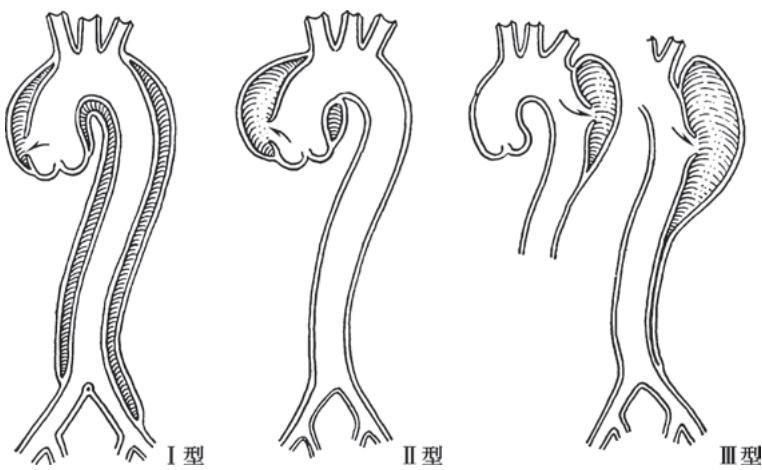

> [!info] 导航
> [[第029章_第3篇第11章_心脏骤停与心脏性猝死|上一章]] · [[00_章节导航|总目录]] · [[第031章_第3篇第13章_心血管神经症|下一章]]

主动脉疾病包括主动脉夹层、主动脉瘤、主动脉缩窄、多发性大动脉炎等。周围血管病包括外周动脉疾病（peripheral arterial disease, PAD）、外周静脉疾病和淋巴系统疾病。本章重点讲述主动脉夹层、下肢动脉硬化闭塞症和静脉血栓症。

# 第一节 | 主动脉夹层

主动脉的血管壁由内膜、中膜和外膜三层结构组成。在各种因素导致主动脉内膜撕裂后，管腔内高速流动的血液将从撕裂口进入管壁中层，并沿血管长轴方向延伸，形成真、假两腔的病理状态，称为主动脉夹层（aortic dissection, AD）。主动脉夹层是一种心血管急危重症，具有发病急、死亡率高的特点。若未能及时诊治，48小时内死亡率高达50%，致死原因包括夹层破裂、进行性纵隔或腹膜后出血、急性心力衰竭等。部分病人出现院前死亡，未进行尸体解剖时常无法准确判断其死因，从而难以获得准确的流行病学资料。据推算，主动脉夹层的年发病率约为 $(2.6\sim3.5)/10$ 万，男性占65%～75%，冬春季发病率更高。在我国，主动脉夹层好发于50～60岁，早于欧美人群的60～70岁，可能与我国人群的高血压知晓率、控制率和达标率较低有关。

#### 【病因、病理与发病机制】

主动脉夹层的病因可分为基因异常、退行性和创伤性三类。基因异常相关的主动脉夹层可以是综合征的一部分，如 Marfan 综合征、Loeys-Dietz 综合征、血管性 Ehlers-Danlos 综合征或 Turner 综合征；也可以是非综合征型，如二叶主动脉瓣、家族性胸主动脉瘤等。退行性主动脉夹层具有散发性，临床最为常见，不与任何已知的基因异常有关。创伤性主动脉夹层可能与钝性损伤或医源性损伤（如主动脉内球囊反搏泵置入、心脏瓣膜及主动脉手术）有关。

主动脉夹层大多数是由于主动脉内膜撕裂后血液进入中层，也有部分病人是由于中层滋养动脉破裂，形成血肿后压力过高撕裂内膜所致。内膜撕裂口多位于窦管交界处或锁骨下动脉附近，这些区域具有较高的剪切力。夹层在向近端或远端延伸过程中，可能会出现真腔受压，分支血管灌注不良，造成相应的脏器缺血。

主动脉夹层的发病机制尚未完全清楚。基质金属蛋白酶活性增高，从而降解主动脉壁的结构蛋白，可能是主动脉夹层的发病机制之一。组织学可见主动脉中层胶原蛋白变性、弹力纤维断裂、平滑肌局灶性丧失、中层空泡变性并充满黏液样物质，慢性期可见纤维样改变。

#### 【分型及分期】

根据夹层起源和主动脉受累部位,可将主动脉夹层按 De Bakey 系统分为三型(图 3-12-1):

I型:夹层起源于升主动脉,扩展超过主动脉弓到降主动脉,甚至腹主动脉,此型最多见。

Ⅱ型:夹层起源并局限于升主动脉。

Ⅲ型:病变起源于降主动脉左锁骨下动脉开口远端,并向远端扩展,可直至腹主动脉(Ⅲa型:仅累及胸降主动脉;Ⅲb型:累及胸、腹主动脉)。

Stanford 分型将主动脉夹层分为 A、B 两型。无论夹层起源于哪一部位，只要累及升主动脉者称为 A 型，相当于 De Bakey I 型和 II 型；夹层起源于胸降主动脉且未累及升主动脉者称为 B 型，相当于 De Bakey III 型。

  
图 3-12-1 主动脉夹层 De Bakey 分型示意图

关于主动脉夹层的临床分期,一般认为起病2周内为急性期,2周至3个月为亚急性期,超过3个月者则为慢性期。体检偶然发现的无症状者通常归为慢性期。

#### 【临床表现】

本病临床表现取决于主动脉夹层的部位、范围和程度、主动脉分支受累情况、有无主动脉瓣关闭不全以及向外破溃等并发症。

### （一）疼痛

疼痛是本病最主要和常见的表现。超过 80% 的病人有突发前胸或胸背部持续性、撕裂样或刀割样剧痛，疼痛剧烈难以忍受，部位往往与夹层病变的起源位置密切相关。Stanford A 型多表现为胸背痛；Stanford B 型则多表现为背痛、腹痛，但两者疼痛部位存在交叉。夹层撕裂累及髂动脉、股动脉时，可出现下肢疼痛。部分病人虽然发生夹层但无明显疼痛，如接受激素治疗或者起病缓慢者。

### （二）血压变化

大多数病人合并高血压，且双上肢或上下肢之间血压相差较大。若出现心脏压塞、血胸或冠状动脉供血受阻而引起心肌梗死，则可能表现为低血压。夹层破裂出血表现为严重休克。

### (三) 心血管系统

1. 主动脉瓣关闭不全和心力衰竭 约半数 Stanford A 型主动脉夹层病人出现主动脉瓣关闭不全。心前区可闻及典型叹气样舒张期杂音且可发生充血型心衰，但在心衰严重或心动过速时杂音可不明显。

2. 心肌梗死 夹层近端的内膜片撕裂后,可能会遮盖冠状窦口,导致急性心肌梗死;多数影响右冠状动脉窦,因此多见下壁心肌梗死。

3. 心脏压塞 详见本篇第九章第二节。

### （四）脏器或者肢体缺血

1. 神经系统缺血 夹层累及颈动脉、无名动脉可造成脑部缺血，病人可有头晕、一过性晕厥、精神失常，严重者发生缺血性脑卒中。向下延伸至第2腰椎水平，可累及脊髓前动脉，出现截瘫、大小便失禁等。

2. 四肢缺血 累及腹主动脉或髂动脉可表现为急性下肢缺血。体检常发现脉搏减弱、消失，肢体发凉和发绀等。

3. 内脏缺血 肾动脉供血受累时，可出现腰痛、血尿、少尿、无尿以及其他肾功能损害症状。肠系膜上动脉受累可引起肠坏死。黄疸及血清氨基转移酶升高则是肝动脉闭塞缺血的表现。

### （五）压迫症状

主动脉夹层进展形成夹层动脉瘤后，可出现压迫症状。如压迫颈交感神经节常出现 Horner 综合征，压迫左侧喉返神经出现声音嘶哑，压迫气管导致呼吸困难，压迫食管出现吞咽困难等。

#### 【辅助检查】

当怀疑主动脉夹层时,可用于诊断主动脉夹层的方法包括经胸主动脉彩超(TTE),经食管主动脉彩超（TEE）、CTA、MRA以及DSA。每种方式在诊断能力、速度、便利性和风险方面各有优缺点。

1. X 线胸片与心电图 无特异性诊断价值。X 线胸片可有主动脉增宽。心电图除在心包积血或夹层累及冠状动脉时，一般无特异性 ST-T 改变。

2. 超声心动图 可显示主动脉夹层真、假腔的状态及血流情况，并排查是否合并主动脉瓣关闭不全和心脏压塞等并发症。其优点是可在床旁检查，无创，无需造影剂，敏感性为 $59\% \sim 85\%$ ，特异性为 $63\% \sim 96\%$ 。受气道内空气的影响，超声探测可能漏诊。经食管超声心动图可引起干呕、心动过速、高血压等，有时需在麻醉条件下进行，临床实践中并不常用。

3. 主动脉 CTA 对比增强 CTA 是评估主动脉夹层最常用的方式, 敏感性和特异性为 98%。采用心电门控技术采集数据, 并使用薄层扫描、64 排以上的设备可减少心脏搏动带来的伪影。主动脉 CTA 可获得破口大小及位置, 夹层累及范围, 识别真腔和假腔, 主动脉分支血管的供血情况, 周围血管入路大小等。其缺点包括造影剂产生的副作用以及电离辐射。

4. 主动脉 MRA 在诊断主动脉夹层时具有很高的灵敏度和特异性。可准确评估主动脉夹层真腔、假腔和累及范围，分支血管形态等。其缺点是扫描时间较长，不适用于有幽闭恐惧症、血流动力学不稳定的病人，较少用于急性主动脉夹层的初步评估。

5. 主动脉 DSA 目前多只在腔内修复术中应用,而不作为术前常规检查手段。

#### 【诊断与鉴别诊断】

对于急性胸痛的病人,应对病人的病史、胸痛性质和体征进行评估(表3-12-1)。根据高危因素的类别(易感因素、疼痛特征、体征)进行评分,符合各类别下一种或多种特征的计为1分,类别数累计≥2分的为高危,类别数为1分的为中危,类别数为0分的属于低危。对于中高危的可疑主动脉夹层病人,应尽快安排相应的影像学检查予以明确诊断。

表 3-12-1 主动脉夹层的高危特征

<table><tr><td>高危病史</td><td>高危胸痛性质</td><td>高危体征</td></tr><tr><td>Marfan 综合征等疾病</td><td>突发性疼痛</td><td>四肢血压显著不等</td></tr><tr><td>既往曾行主动脉介入手术或外科手术</td><td>无法忍受的剧烈疼痛</td><td>低血压或休克</td></tr><tr><td>既往有胸主动脉瘤</td><td>撕裂样或刀割样疼痛</td><td>动脉搏动减弱</td></tr><tr><td>既往有主动脉瓣疾病</td><td></td><td>新发主动脉瓣杂音</td></tr><tr><td>主动脉疾病家族史</td><td></td><td>局灶性神经功能缺失</td></tr></table>

由于本病多以急性胸痛为首要症状,鉴别诊断主要考虑急性冠脉综合征和急性肺栓塞。影像学上,需与主动脉壁间血肿、主动脉穿透性溃疡进行鉴别。此外,夹层可产生多系统血管的压迫,导致组织缺血或夹层破入某些器官,需与相应疾病鉴别。

#### 【治疗】

主动脉夹层诊断明确后,需由主动脉多学科专家团队根据病人的病情、夹层累及范围、起病时间等综合评估,制订最佳治疗方案。

### （一）即刻处理

严密监测血流动力学指标，包括血压、心率、心律及出入液量平衡；凡有心衰或低血压者还应监测中心静脉压、肺毛细血管楔压和心排血量。卧床休息，强效镇痛与镇静，必要时静脉注射吗啡或冬眠治疗。

### （二）随后的治疗决策应按以下原则

1. 急性期病人无论是否采取手术治疗，均应首先给予强化的内科药物治疗。

2. 升主动脉夹层特别是累及主动脉瓣或心包内有积液者宜急诊外科手术。

3. 降主动脉夹层急性期病情进展迅速,病变局部血管直径≥5cm或脏器灌注不良者,应争取介入治疗(主动脉腔内隔绝术)。

### (三) 药物治疗

1. $\beta$ 受体拮抗剂或钙通道阻滞剂在降压的同时,可降低左心室张力和心肌收缩力,减慢心率至

60～80 次/分,防止夹层进一步扩展。对于 $\beta$ 受体拮抗剂不能耐受的病人,可使用非二氢吡啶类钙通道阻滞剂。

2. 降压首选静脉应用硝普钠,迅速将收缩压降至100\~120mmHg或更低,预防夹层延伸。必要时使用其他降压药,如 $\alpha$ 受体拮抗剂、血管紧张素转换酶抑制剂、利尿剂等。血压应降至能保持重要脏器灌注的最低水平,避免出现少尿、心肌缺血及精神症状等重要脏器灌注不良的症状。

### （四）介入治疗

主动脉腔内隔绝术为治疗主动脉夹层的一种有效手段。在主动脉内植入覆膜支架，封闭近端撕裂口，扩大真腔。对于解剖条件适合的 Stanford B 型主动脉夹层，该术式常作为首选策略。近年来，平行支架技术、分支支架、开窗技术和基于 3D 打印技术的定制支架，可有效处理夹层累及重要分支的病例。

### （五）外科手术治疗

开胸外科手术是升主动脉夹层治疗的基石，术中可修补撕裂口、排空假腔并重建主动脉。病变累及冠状动脉或主动脉瓣膜时也可同期处理。

# 第二节 | 下肢动脉硬化闭塞症

下肢动脉硬化闭塞症是动脉粥样硬化累及下肢动脉导致动脉狭窄或闭塞而引起肢体缺血症状的慢性疾病,是全身动脉硬化性疾病在下肢的表现。

#### 【病因和发病机制】

本病是冠心病的等危症，引起冠状动脉粥样硬化的危险因素通常也会引发本病。发病机制参见本篇第四章动脉粥样硬化。吸烟使发病率增加2～5倍，糖尿病使发病率增加2～4倍。

#### 【病理生理】

产生肢体缺血症状的主要病理生理机制是肢体的血供调节功能减退，包括管腔斑块增厚、侧支循环建立不足、代偿性血管扩张不良、一氧化氮产生减少、对血管扩张剂反应减弱和循环中血栓素、血管紧张素Ⅱ、内皮素等血管收缩因子增多，以及一些血液流变学异常，由此导致血供调节失常和微血栓形成。

#### 【临床表现】

本病累及主、髂动脉者占30%，累及股、腘动脉者占80%～90%，而累及胫、腓动脉者占40%～50%。

### （一）症状

典型症状是间歇性跛行和静息痛；肢体运动后引发局部疼痛、紧束、麻木或无力，停止运动后即缓解为其特点。疼痛部位常与病变血管相关；臀部、髋部及大腿部疼痛导致的间歇跛行常提示主动脉和髂动脉部分阻塞。临床最多见的为小腿疼痛性间歇性跛行，常为股、腘动脉狭窄病变。踝、趾间歇性跛行则多为胫、腓动脉病变。病变进一步加重导致血管闭塞时，可出现静息痛。目前临床常用的分期包括 Fontaine 分期和 Rutherford 分级（表 3-12-2）。

表 3-12-2 下肢动脉硬化闭塞症的临床分期

<table><tr><td colspan="2">Fontaine 分期</td><td colspan="3">Rutherford 分级</td></tr><tr><td>分期</td><td>临床表现</td><td>分级</td><td>类别</td><td>临床表现</td></tr><tr><td>I期</td><td>无症状</td><td>0级</td><td>0</td><td>无症状</td></tr><tr><td>IIa期</td><td>轻微间歇性跛行</td><td>I级</td><td>1</td><td>轻微间歇性跛行</td></tr><tr><td>IIb期</td><td>中度至重度间歇性跛行</td><td>I级</td><td>2</td><td>中度间歇性跛行</td></tr><tr><td></td><td></td><td>I级</td><td>3</td><td>重度间歇性跛行</td></tr><tr><td>III期</td><td>缺血性静息痛</td><td>II级</td><td>4</td><td>缺血性静息痛</td></tr><tr><td>IV期</td><td>溃疡或坏疽</td><td>III级</td><td>5</td><td>轻度组织丧失</td></tr><tr><td></td><td></td><td>IV级</td><td>6</td><td>溃疡或坏疽</td></tr></table>

### (二) 体征

1. 狭窄远端的动脉搏动减弱或消失,狭窄部位可闻及收缩期杂音。

2. 患肢温度较低,皮肤薄、亮、苍白,毛发稀疏,趾甲增厚,严重时有水肿、坏疽与溃疡。

3. 肢体位置改变测试。肢体自高位下垂到肤色转红时间 $>10$ 秒和表浅静脉充盈时间 $>15$ 秒，提示动脉有狭窄及侧支形成不良。

#### 【辅助检查】

1. 踝肱指数（ankle brachial index, ABI）临床上最简单和常用的检查方法，为踝动脉收缩压与肱动脉收缩压的比值，正常范围为 $1.0 \sim 1.4, 0.91 \sim 0.99$ 被认为是“临界值”， $<0.90$ 提示存在 PAD。ABI > 1.40 常是血管钙化引起的。利用 ABI 诊断 PAD 的敏感性达 $95\%$ ，但严重狭窄伴侧支循环形成良好时可呈假阴性。

2. 节段性血压测量 如发现节段间有压力阶差则提示其间有动脉狭窄存在。

3. 运动平板负荷试验 以缺血症状出现的运动负荷量和时间客观评价肢体的血供状态。

4. 多普勒超声 随动脉狭窄程度的加重,多普勒血流速度曲线会趋于平坦,结合超声成像结果更可靠。

5. 磁共振血管造影和 CT 血管造影 具有确诊价值。

6. 动脉造影 对手术或经皮介入的治疗决策提供直接依据。

#### 【诊断与鉴别诊断】

当病人有典型间歇性跛行或静息痛的症状与肢体动脉搏动不对称、减弱或消失的体征，再结合危险因素分析及辅助检查的结果，诊断并不困难。但值得注意的是，在确诊病人中有典型间歇性跛行症状者不足20%。

本病应与多发性大动脉炎累及髂动脉者、血栓闭塞性脉管炎(又称 Buerger 病)相鉴别。多发性大动脉炎多见于年轻女性，活动期有全身症状，发热、血沉增快及免疫指标异常，病变部位多发，常累及肾动脉而有肾性高血压。Buerger 病好发于青年男性重度吸烟者，累及全身中、小动脉，上肢也常累及，有反复发作浅静脉炎及雷诺现象。缺血性溃疡伴有剧痛应与神经病变、下肢静脉曲张所致溃疡鉴别。此外，跛行应与椎管狭窄、关节炎、骨筋膜隔室综合征等所致的假性跛行相鉴别。

#### 【治疗】

### （一）内科治疗

戒烟、控制高血压、糖尿病及血脂异常等；清洁、保湿、预防外伤，对有静息痛者可抬高床头，以增加下肢血流，减少疼痛。

1. 运动和康复治疗 规律的有氧运动可改善最大步行距离,须在专业指导下进行,每次 30～45 分钟,每周至少 3 次,至少持续 12 周。推荐的运动方式包括行走、伸踝、屈膝运动。Fontaine IV 级病人不推荐进行常规运动治疗。

2. 抗血小板和抗凝治疗 阿司匹林、氯吡格雷等抗血小板药物可降低下肢动脉闭塞症病人发生心肌梗死、脑卒中、血管源性死亡的风险。西洛他唑具有抗血小板活性和舒张血管的特性，作为治疗间歇性跛行的一线药物。传统抗凝药(如华法林)并不能减少心血管事件的发生，反而可能增加大出血的风险。

3. 前列腺素类药物 可扩张血管,改善间歇性跛行、静息痛等症状。

4. 止痛治疗 可遵循止痛治疗的阶梯原则进行,从非甾体抗炎药开始,如无效再尝试阿片类止痛药物。

5. 抗感染治疗 对于缺血性溃疡或坏疽合并感染的病人,需在病原学检查结果指导下,针对性使用广谱、足量、足疗程的全身抗生素治疗。

### （二）血运重建

经积极内科治疗后仍有静息痛、组织坏疽或生活质量降低致残者可考虑进行血运重建。腔内介入治疗包括动脉内置管溶栓、血栓抽吸、球囊扩张及支架植入等，围手术期并发症发生率低，常作为首选。但对导丝无法通过病变等情况，可选择外科手术治疗，如斑块切除术或血管旁路移植术。

### （三）截肢

对于患有广泛坏死或感染性坏疽并伴有静息痛、不能行走且不适合血运重建的病人，需要进行截肢手术。

#### 【预后】

本病的预后与同时并存的冠心病、脑血管疾病密切相关。间歇性跛行病人5年生存率为70%，10年生存率为50%，大多死于冠心病和脑血管事件。伴有糖尿病及吸烟病人预后更差，约5%病人需行截肢术。

# 第三节 | 静脉血栓症

下肢浅静脉包括大隐静脉、小隐静脉及其分支；下肢深静脉与大动脉伴行。下肢静脉系统疾病以静脉血栓最具临床意义。

#### 【深静脉血栓形成】

深静脉血栓形成（deep venous thrombosis, DVT）是血液在深静脉内异常凝固引起的病症，多发生于下肢，血栓脱落可引起肺栓塞（pulmonary embolism, PE），两者合称为静脉血栓栓塞症（venous thromboembolism, VTE），是同种疾病在不同阶段的表现形式。

### （一）流行病学、病因及发病机制

VTE 是继急性心肌梗死和脑卒中之后第三大常见的血管疾病，且由于人口老龄化等因素，VTE 年均患病率呈不断上升趋势。DVT 主要是由静脉壁损伤、血液淤滞及高凝状态所引起。遗传性危险因素包括抗凝血酶缺乏、C 蛋白缺乏、S 蛋白缺乏、V 因子 Leiden 突变、凝血酶原基因突变等。获得性危险因素包括高龄、VTE 个人史、恶性肿瘤、肥胖等。触发因素如手术、制动、妊娠、过量雌激素等，会增加 DVT 的风险。

### （二）病理

深静脉血栓主要由红细胞组成，伴少量纤维蛋白和血小板。血栓与血管壁仅有轻度粘连，容易脱落造成肺栓塞。DVT发生后，血液回流受阻，远端组织水肿、缺氧，后期可发展为慢性静脉功能不全综合征。

### （三）临床表现

根据发病时间，DVT分为急性期(发病14天内)、亚急性期(发病15～30天)和慢性期(发病超过30天)。根据DVT受累部位可分为近段DVT和远段DVT，前者指血栓累及髂静脉、股静脉和/或腘静脉，后者指血栓仅局限于小腿深静脉。

急性下肢 DVT 主要表现为受累肢体突然肿胀、疼痛，患肢皮温升高，软组织张力增大，受累区水肿，并可伴有压痛。当血栓发生在小腿肌肉静脉丛时，Homans 征阳性（患肢伸直、足被动背屈时，引起小腿后侧肌群疼痛）、Neuhof 征阳性（压迫小腿后侧肌群，引起局部疼痛）。当髂、股静脉及其属支血栓堵塞，静脉回流严重受阻时，极高的组织张力使下肢动脉受压发生肢体缺血，可形成股青肿和股白肿，若不及时处理，可发生休克和静脉性坏疽。

部分病人在慢性期,特别是起病6个月后,会出现下肢静脉功能不全,表现为患肢胀痛、静脉曲张、皮肤瘙痒、色素沉着、湿疹、溃疡等,称为血栓栓塞后综合征。

### （四）诊断

DVT 的临床表现不具有特异性，需结合以下辅助检查进行诊断。

1. D-二聚体 DVT 时, 血液中 D-二聚体的浓度升高。该检测对 DVT 的敏感性超过 95%, 但特异性较低。高龄、炎症、感染、恶性肿瘤等也可使 D-二聚体升高。若 D-二聚体水平正常, 基本上可排除 DVT。

2. 加压超声检查 加压超声检查是诊断 DVT 的首选方法, 对腘静脉或更近端的血栓形成敏感性可达 95%。对于静脉超声难以诊断的病人, 可考虑 CT 或磁共振成像等替代方式。

3. 深静脉造影 临床上已被超声检查所替代,通常仅在计划行介入手术时进行静脉造影。

### （五）治疗

治疗 DVT 的主要目的是预防肺栓塞,特别是病程早期,血栓与血管壁粘连不紧,极易脱落。

1. 卧床 抬高患肢超过心脏水平,直至水肿及压痛消失。

2. 抗凝 对于大多数急性近段 DVT, 为防止血栓增大, 应立即启动抗凝治疗。初始抗凝治疗的选择包括肝素、维生素 K 拮抗剂 (华法林)、口服 Xa 因子抑制剂、直接凝血酶抑制剂。具体选择通常根据临床医生的经验、出血风险、病人合并症、偏好、成本和便利性作出。当选择华法林作为长期抗凝剂时, 必须与肝素重叠用药 4\~5 天, 以确保充分抗凝。调整华法林剂量的指标为凝血酶原时间 INR维持在 2.0～3.0。急性近段 DVT 的抗凝至少 3 个月，以防复发。对复发性病例或恶性肿瘤等高凝状态不能消除的病例，抗凝治疗的持续时间可无限制。

3. 介入治疗 对存在近段 DVT 伴严重肢体肿胀或缺血者, 在起病 14 天内宜尽快行经导管接触性溶栓、经皮机械性血栓清除术。血栓清除后, 若髂静脉狭窄 >50%, 可行球囊扩张和/或支架植入术。

4. 下腔静脉滤器 存在抗凝禁忌证、抗凝治疗过程发生出血等并发症、充分抗凝治疗后仍复发VTE、静脉内有大量急性血栓或游离漂浮血栓者、急性近段DVT拟行介入治疗等情况时，为预防肺栓塞可行经皮下腔静脉滤器置入术。

### （六）预防

至少一半新诊断 VTE 的门诊病人有近期住院史，且大多在住院期间未进行血栓预防。评估入院病人的 VTE 风险，如有指征，应进行适当的血栓预防。

#### 【浅静脉血栓形成】

本症是血栓性浅静脉炎的主要临床表现，在曲张的静脉中也常发生，多伴发于持久、反复静脉输液时。由于静脉壁有不同程度的炎性病变，腔内血栓常与管壁粘连，不易脱落。少部分病人的浅静脉血栓可蔓延，导致深静脉血栓。游走性浅静脉血栓往往是恶性肿瘤的征象，也可见于闭塞性血栓性脉管炎。

本症诊断较容易:沿静脉走向部位疼痛、发红,局部有条索样或结节状压痛区。

治疗多采取支持疗法:①去除病因,如停止输注刺激性液体,去除局部静脉置管的感染因素。②休息,患肢抬高,热敷。③由于本病易复发,宜穿循序减压弹力袜。④止痛:口服双氯芬酸钠或其他非甾体抗炎药、局部外用双氯芬酸钠软膏或肝素软膏,直至症状消退或应用≥2周。⑤若下肢浅静脉血栓与深静脉交汇处≥3cm,血栓长度≥5cm,建议磺达肝癸钠或低分子量肝素抗凝治疗45天;若血栓距深静脉交汇处<3cm或有高危风险因素(如恶性肿瘤、易栓症等),建议抗凝治疗3个月。

(罗建方)

  
本章思维导图
