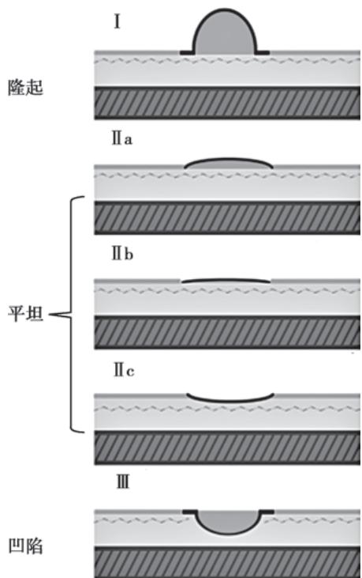

> [!info] 导航
> [[第038章_第4篇第05章_消化性溃疡|上一章]] · [[00_章节导航|总目录]] · [[第040章_第4篇第07章_肠结核和结核性腹膜炎|下一章]]

本章数字资源

胃癌（gastric cancer）是指源于胃黏膜上皮细胞的恶性肿瘤，绝大多数是腺癌；其占胃部恶性肿瘤的95%以上。就全球范围的恶性肿瘤死亡率来说，胃癌高居第三位。我国为胃癌高发区，虽然近年来胃癌发病率有所下降，但死亡率下降并不明显；男性和女性胃癌发病率仍居全部恶性肿瘤的第2位和第5位，死亡率分别居第3位和第2位；其中55～70岁为高发年龄段。

#### 【病因和发病机制】

### （一）感染因素

Hp 感染与胃癌有共同的流行病学特点，胃癌高发区人群 Hp 感染率高；Hp 抗体阳性人群发生胃癌的危险性高于阴性人群。1994 年 WHO 的国际癌症研究机构将 Hp 感染定为人类 I 类(即肯定的)致癌原。此外，EB 病毒和其他感染因素也可能参与胃癌的发生。

### （二）环境和饮食因素

第一代到美国的日本移民胃癌发病率下降约 25%，第二代下降约 50%，至第三代发生胃癌的危险性与当地美国居民相当。故环境因素在胃癌发生中起重要作用，如高盐饮食、亚硝酸盐的摄入、吸食鼻烟、较少食用新鲜菜蔬，甚至酗酒等不良饮食生活习惯。此外火山岩地带、高泥炭土壤、水土含硝酸盐过多、微量元素比例失调或化学污染等可直接或间接经饮食途径参与胃癌的发生。

### （三）遗传因素

10% 的胃癌病人有家族史，具有胃癌家族史者，特别是一级亲属中患胃癌、家族性腺瘤性息肉病（FAP）、林奇（Lynch）综合征、黑斑息肉综合征、幼年性息肉病等，其发病率高于人群2～3倍。少数胃癌属“遗传性胃癌综合征”或“遗传性弥漫性胃癌”。浸润型胃癌的家族发病倾向更显著，提示该型胃癌与遗传因素关系更密切。

在胃癌发生和进程中，DNA 非整倍体（DNA aneuploidy）、某些抑癌基因（TP53、FHIT、APC、DCC、CDKN2A 和 CDH1 等）的表达缺失或受抑制、一些基因（MT-CO2、MST1R 和 VEGFA 等）过表达等可能起着一定的作用。

### （四）癌前变化

或称胃癌前情况（premalignant conditions），分为癌前疾病（即癌前状态，precancerous disease）和癌前病变（precancerous lesion）。前者是指与胃癌相关的胃良性疾病，有发生胃癌的危险性；后者是指较易转变为癌的病理学变化，主要指异型增生。

1. 肠化、萎缩性胃炎及异型增生 根据肠化上皮细胞的类型和分泌黏液的性质,可将肠化分为Ⅰ型完全型肠化、Ⅱ型不完全型小肠型肠化、Ⅲ型不完全型大肠型肠化。理论上讲,Ⅱ型和Ⅲ型肠化尤其是Ⅲ型肠化发生胃癌的风险较高(部分内容参考本篇第四章第二节慢性胃炎)。

对于异型增生,尽管国际上有多种分类或分期方法,但目前我国仍在沿用2019年的WHO判断标准分为5级,主要包括低级别与高级别异型增生(或上皮内瘤变)。

2. 胃息肉 占人群的 0.8%～2.4%。50% 为胃底腺息肉，40% 为增生性息肉，而腺瘤仅占 10%。大于 1cm 的胃底腺息肉癌变率小于 1%，罕见癌变的增生性息肉多发生于肠化和异型增生区域，可形成经典的高分化肠型胃癌。腺瘤则具有较高的癌变率。

3. 残胃炎 癌变常发生于良性病变术后 20 年;与 Billroth I 式相比,Billroth II 式胃切除术后癌变率高 4 倍。

4. 胃溃疡 可因溃疡边缘的炎症、糜烂、再生及异型增生所致。

5. Ménétrier 病 病例报道显示 15% 的该病与胃癌发生相关。

临床上,胃癌可以大致分为肠型胃癌和弥漫性胃癌两大类。根据 Correa 学说,在 Hp 感染、不良环境与不健康饮食等多种因素作用下，胃黏膜可由慢性炎症—萎缩性胃炎—萎缩性胃炎伴肠化—异型增生而逐渐向肠型胃癌演变。在此过程中，胃黏膜细胞增殖和凋亡之间的正常动态平衡被打破。与胃癌发生相关的分子事件包括微卫星不稳定、抑癌基因缺失失活或因高甲基化而失活、某些癌基因或相关基因的扩增等。

#### 【病理】

胃癌的好发部位依次为胃窦、贲门、胃体；而根据浸润深度分为早期和进展期胃癌。早期胃癌是指病灶局限且深度不超过黏膜下层的胃癌，不论有无局部淋巴结转移；病理呈高级别上皮内瘤变或腺癌。进展期胃癌深度超过黏膜下层，已侵入肌层者称中期胃癌；侵及浆膜或浆膜外者称晚期胃癌。病理分期仍需按照国际抗癌联盟（Union for International Cancer Control, UICC）和美国癌症联合委员会（the American Joint Committee on Cancer, AJCC）的TNM分期进行。

### （一）胃癌的组织病理学

WHO 近年将胃癌分为:腺癌(乳头状腺癌、管状腺癌、黏液腺癌、混合型腺癌、肝样腺癌)、腺鳞癌、髓样癌、印戒细胞癌、鳞状细胞癌和未分化癌等。根据癌细胞分化程度可分为高、中、低分化三大类。

### （二）侵袭与转移

胃癌有四种扩散方式：

1. 直接蔓延 侵袭至相邻器官,胃底贲门癌常侵犯食管、肝及大网膜,胃体癌则多侵犯大网膜、肝及胰腺。

2. 淋巴结转移 一般先转移到局部淋巴结,再到远处淋巴结;转移到左锁骨上淋巴结时,称为Virchow 淋巴结。

3. 血行播散 晚期病人可占 60% 以上。最常转移到肝脏, 其次是肺、腹膜、肾上腺, 也可转移到肾、脑、骨髓等。

4. 种植转移 癌细胞侵及浆膜层脱落入腹腔,种植于肠壁和盆腔;如种植于卵巢,称为库肯伯格(Krukenberg)瘤;也可在直肠周围形成结节状肿块。

#### 【临床表现】

1. 症状 80% 的早期胃癌无症状,部分病人可有消化不良症状。进展期胃癌最常见的症状是体重减轻(约 60%)和上腹痛(50%),另有贫血、食欲缺乏、厌食、乏力。

胃癌发生并发症或转移时可出现一些特殊症状，贲门癌累及食管下段时可出现吞咽困难。并发幽门梗阻时可有恶心呕吐，溃疡型胃癌出血时可引起呕血或黑便，继之出现贫血。胃癌转移至肝脏可引起右上腹痛，黄疸和/或发热；腹膜播散者常见腹腔积液；极少数转移至肺可引起咳嗽、呃逆、咯血，累及胸膜可产生胸腔积液而发生呼吸困难；侵及胰腺时，可出现背部放射性疼痛。

2. 体征 早期胃癌无明显体征，进展期胃癌在上腹部可扪及肿块，有压痛。肿块多位于上腹偏右相当于胃窦处。如肿瘤转移至肝脏可致肝大及黄疸，甚至出现腹腔积液。腹膜有转移时也可发生腹腔积液，移动性浊音阳性。侵犯门静脉或脾静脉时有脾大。有远处淋巴结转移时或可扪及Virchow淋巴结，质硬不活动。肛门指检可在直肠膀胱陷凹扪及肿块。

#### 【诊断】

### （一）胃镜

胃镜检查结合黏膜活检是目前最可靠的诊断手段。

1. 早期胃癌 可表现为小的息肉样隆起或凹陷；也可呈平坦样，但黏膜粗糙、触之易出血，斑片状充血及糜烂。胃镜下疑诊者，可用亚甲蓝染色，癌性病变处着色，有助于指导活检部位。放大胃镜、窄带成像和激光共聚焦显微胃镜能更仔细观察细微病变，提高早期胃癌的诊断率。由于早期胃癌在胃镜下缺乏特征性，病灶小，易被忽略，需要内镜医生细致地观察，对可疑病变多点活检。早期胃癌的胃镜下分型见图4-6-1。

2. 进展期胃癌 胃镜下多可作出拟诊，肿瘤表面常凹凸不平，糜烂，有污秽苔，活检时易出血。也可呈深大溃疡，底部覆有污秽灰白苔，溃疡边缘呈结节状隆起，无聚合皱襞，病变处无蠕动。当癌组织发生于黏膜下，可在胃壁内向四周弥漫浸润扩散，同时伴有纤维组织增生，当病变累及胃窦，可造成胃流出道狭窄；当其累及全胃，可使整个胃壁增厚、变硬，称为皮革胃。但这种黏膜下弥漫浸润型胃癌,相对较少,胃镜下可无明显黏膜病变,甚至普通活检也常呈阴性。对于溃疡性病变,可在其边缘和基底部多点活检,甚至可行大块黏膜切除,提高诊断的阳性率。

  
图 4-6-1 早期胃癌的胃镜下分型

胃癌病灶处的超声内镜(EUS)检查可较准确地判断肿瘤侵犯深度,有助于区分早期和进展期胃癌,并了解有无局部淋巴结转移,可作为CT检查的重要补充。

### （二）实验室检查

缺铁性贫血较常见，若伴有粪便隐血阳性，提示肿瘤有长期小量出血。血胃蛋白酶原（PG）I/II显著降低，OLGA或OLGIM的Ⅲ和Ⅳ期是胃癌高风险人群；血清肿瘤标志物如CEA和CA19-9及CA72-4等，可能有助于胃癌早期预警和术后再发的预警，但特异性和灵敏度并不理想。粪便中某些高丰度的微生物，可能是潜在的预警标志物。

### （三）X 线和 CT 检查

当病人有胃镜检查禁忌证时，X 线钡剂造影可能发现胃内的溃疡及隆起型病灶，分别呈龛影或充盈缺损，但难以鉴别其良恶性；如有黏膜皱襞破坏、消失或中断，邻近胃黏膜僵直，蠕动消失，则胃癌可能性大。CT 技术的进步提高了胃癌临床分期的精确度，其与 PET-CT 检查均有助于肿瘤转移的判断。

#### 【并发症】

详见本篇第五章。

#### 【治疗】

早期胃癌无淋巴转移时，可采取内镜治疗；进展期胃癌在无全身转移时，可行手术治疗；肿瘤切除后，应尽可能清除残胃的 Hp 感染。

1. 内镜治疗 早期胃癌可行 EMR 或 ESD 治疗。一般认为 EMR 适应证包括超声内镜证实的无淋巴结转移的黏膜内胃癌；不伴有溃疡且直径小于 2cm 的Ⅱa 病灶、小于 1cm 的Ⅱb 或Ⅱc 病灶等。而 ESD 适应证则包括无溃疡的任何大小的黏膜内肠型胃癌；直径小于 3cm 的、伴有溃疡的黏膜内肠型胃癌；直径小于 3cm 的黏膜下层肠型胃癌，而浸润深度小于 500μm。切除的癌变组织应进行病理检查，如切缘发现癌变或表浅型癌肿侵袭到黏膜下层，需追加手术治疗。

2. 手术治疗 早期胃癌,可行胃部分切除术。进展期胃癌如无远处转移,尽可能根治性切除;伴有远处转移者或伴有梗阻者,则可行姑息手术,保持消化道通畅。外科手术切除加区域淋巴结清扫是目前治疗进展期胃癌的主要手段。胃切除范围可分为近端胃切除、远端胃切除及全胃切除,切除后分别用 Billroth I、Billroth II 及 Roux-en-Y 胃旁路手术重建消化道的连续性。对那些无法通过手术治愈的病人,特别是有梗阻的病人,部分切除肿瘤后,约 50% 病人的症状可获得缓解。

3. 化学治疗 早期胃癌且不伴有任何转移灶者，术后一般不需要化疗。术前化疗即新辅助化疗可使肿瘤缩小，增加手术根治及治愈机会；术后辅助化疗方式主要包括静脉化疗、腹腔内化疗、持续性腹腔温热灌注和淋巴靶向化疗等。单一药物化疗只适于早期需要化疗的病人或不能承受联合化疗者。常用药物有5-氟尿嘧啶（5-FU）、替加氟（FT-207）、丝裂霉素（MMC）、多柔比星（ADM）、顺铂（DDP）或卡铂、亚硝脲类（CCNU、MeCCNU）、依托泊甙（VP-16）等。联合化疗多采用2～3种联合，以免增加药物毒副作用。化疗失败与癌细胞对化疗药物产生耐药性或多药耐药性有关。

4. 其他治疗 除放射治疗和抑制肿瘤血管生成的靶向治疗外,免疫治疗作为新兴起的治疗方法也被临床应用。

免疫检查点抑制剂通过调节肿瘤生态系统中的 T 细胞活性达到杀伤肿瘤细胞的效果。免疫检查点抑制剂包括细胞毒性 T 淋巴细胞相关抗原 4（cytotoxic T lymphocyte-associated antigen-4, CTLA-4）抑制剂、程序性细胞死亡蛋白 1（programmed cell death protein-1, PD-1）抑制剂和程序性细胞死亡蛋白配体 1(programmed cell death-ligand 1, PD-L1)抑制剂,其在胃癌治疗中有一定疗效。

#### 【预后】

胃癌的预后直接与诊断时的分期有关。迄今为止，由于大部分胃癌在确诊时已处于中晚期，5年生存率约7%～34%。

#### 【预防】

1. 具有胃癌高风险因素病人,根除 Hp 有助于预防胃癌发生。

2. 应用内镜、PGI/Ⅱ等随访高危人群。

  
本章思维导图

3. 阿司匹林、COX-2 抑制剂、他汀类药物、抗氧化剂(包括多种维生素和微量元素硒)和绿茶可能具有一定预防作用。

4. 建立良好的生活习惯,积极治疗癌前疾病(见本篇第四章第二节)。

(房静远)
