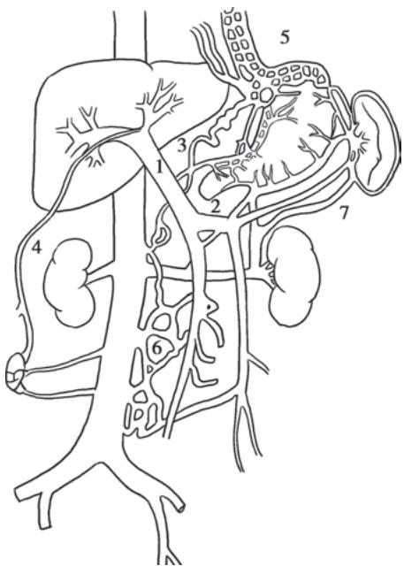
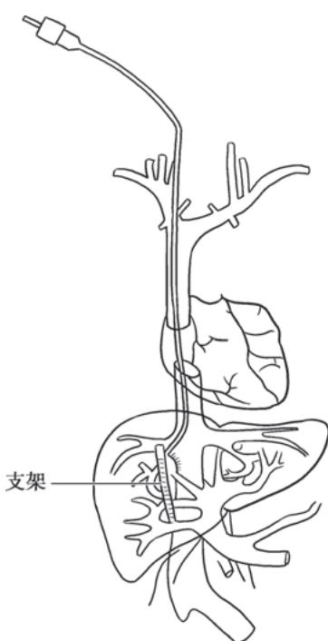

> [!info] 导航
> [[第047章_第4篇第14章_药物性肝病|上一章]] · [[00_章节导航|总目录]] · [[第049章_第4篇第16章_原发性肝癌|下一章]]

本章数字资源

肝硬化(liver cirrhosis)是各种慢性肝病进展至以肝脏慢性炎症、弥漫性纤维化、假小叶、再生结节和肝内外血管增殖为特征的病理阶段,代偿期无明显症状,失代偿期以门静脉高压和肝功能减退为临床特征,病人常因并发食管胃底静脉曲张出血、肝性脑病、感染、肝肾综合征和门静脉血栓等多器官功能慢性衰竭而死亡。

数字人

#### 【病因】

导致肝硬化的病因有10余种,我国目前仍以乙型肝炎病毒(hepatitis B virus, HBV)为主;在欧美国家,酒精及丙型肝炎病毒(hepatitis C virus, HCV)为多见病因。

肝炎病毒、脂肪性肝病、免疫疾病及药物或化学毒物作为肝硬化常见病因，已分别在本篇第十一章至第十四章中详细述及，其他病因包括：

### （一）胆汁淤积

任何原因引起肝内、外胆道梗阻，持续胆汁淤积，皆可发展为胆汁性肝硬化。根据胆汁淤积的原因，可分为原发性和继发性胆汁性肝硬化。

### （二）循环障碍

肝静脉和/或下腔静脉阻塞(如布-加综合征)、慢性心功能不全及缩窄性心包炎(心源性)可致肝脏长期淤血、肝细胞变性及纤维化,终致肝硬化。

### （三）寄生虫感染

血吸虫感染在我国南方依然存在，成熟虫卵被肝内巨噬细胞吞噬后演变为成纤维细胞，形成纤维性结节。由于虫卵在肝内主要沉积在门静脉分支附近，纤维化常使门静脉灌注障碍，所导致的肝硬化常以门静脉高压为突出特征。华支睾吸虫寄生于人肝内外胆管内，所引起的胆道梗阻及炎症可逐渐进展为肝硬化。

### （四）遗传和代谢性疾病

由于遗传或先天性酶缺陷,某些代谢产物沉积于肝脏,引起肝细胞坏死和结缔组织增生。主要有:

1. 铜代谢紊乱 也称肝豆状核变性、Wilson病，是一种常染色体隐性遗传的铜代谢障碍疾病，其致病基因ATP7B定位于13q14，该基因编码产物为转运铜离子的 $\mathrm{P}_1$ 型-ATP酶。由于该酶的功能障碍，致使铜在体内沉积，损害肝、脑等器官而致病。

2. 原发性血色病 因第 6 对染色体上基因异常,导致小肠黏膜对食物内铁吸收转运增加,过多的铁沉积在肝脏,引起纤维组织增生及脏器功能障碍。

3. $\alpha_{1}$ -抗胰蛋白酶缺乏症 $\alpha_{1}$ -抗胰蛋白酶 ( $\alpha_{1}$ -antitrypsin, $\alpha_{1}$ -AT) 是肝脏合成的一种低分子糖蛋白, 由于遗传缺陷, 正常 $\alpha_{1}$ -AT 显著减少, 异常的 $\alpha_{1}$ -AT 分子量小而溶解度低, 大量积聚在肝细胞内, 使肝组织受损, 引起肝硬化。

其他如半乳糖血症、血友病、酪氨酸血症Ⅰ型、遗传性出血性毛细血管扩张症等亦可导致肝硬化。

### （五）原因不明

部分病人难以用目前认识的疾病解释肝硬化的发生，称隐源性肝硬化。在尚未充分甄别上述各种病因前，原因不明肝硬化的结论应谨慎，以免影响肝硬化的对因治疗。

#### 【发病机制及病理】

在各种致病因素作用下,肝脏经历慢性炎症、肝细胞减少、弥漫性纤维化及肝内外血管增殖,逐渐发展为肝硬化。

肝细胞可以下列三种方式消亡:①变性、坏死;②变性、凋亡;③逐渐丧失其上皮特征,转化为间质细胞,即上皮间质转化(epithelial-mesenchymal transition,EMT)。正常成年人肝细胞平均生命周期为200\~300天,缓慢更新,但肝叶部分切除后,肝脏呈现强大的再生能力。在慢性炎症和药物损伤等条件下,成年人受损肝细胞难以再生。

炎症等致病因素激活肝星形细胞,使其增殖和移行,胶原合成增加、降解减少,沉积于窦周隙(Disse 间隙),间隙增宽。部分肝细胞在纤维化微环境下可发生 EMT,促进肝纤维化进展。汇管区和肝包膜的纤维束向肝小叶中央静脉延伸扩展,这些纤维间隔包绕再生结节或将残留肝小叶重新分割,改建成为假小叶,形成典型的肝硬化组织病理特点。

肝纤维化发展的同时，伴有显著的肝内外血管异常增殖。肝内血管增殖使肝窦内皮细胞窗孔变小，数量减少，肝窦内皮细胞间的缝隙消失，基底膜形成，称为肝窦毛细血管化，致使：①肝窦狭窄、血流受阻，肝窦内物质穿过肝窦壁到肝细胞的转运受阻，肝细胞缺氧、养料供给障碍，肝细胞表面绒毛消失，肝细胞功能减退、变性、转化为间质细胞、凋亡增加甚或死亡；②肝内血管阻力增加，门静脉压力升高，在血管内皮生长因子及血小板源生长因子B的正反馈作用下，进一步促进肝内外血管增殖，门静脉高压持续进展。肝内门静脉、肝静脉和肝动脉三个血管系之间失去正常关系，出现交通吻合支等。肝外血管增殖，门静脉属支血容量增加，加重门静脉高压，导致食管胃底静脉曲张（esophagogastric varices, EGV）、脾大、门静脉高压性胃肠病等并发症。

#### 【临床表现】

肝硬化通常起病隐匿,病程发展缓慢,临床上将肝硬化大致分为肝功能代偿期和失代偿期。

### （一）代偿期

大部分病人无症状或症状较轻，可有腹部不适、乏力、食欲减退、消化不良和腹泻等症状，多呈间歇性，常于劳累、精神紧张或伴随其他疾病而出现，休息及助消化的药物可缓解。病人营养状态尚可，肝脏是否肿大取决于不同类型的肝硬化，脾脏因门静脉高压常有轻、中度肿大。肝功能试验检查正常或轻度异常。

### （二）失代偿期

症状较明显，主要有肝功能减退和门静脉高压两类临床表现。

1. 肝功能减退

（1）消化吸收不良：食欲减退、恶心、厌食，腹胀，餐后加重，荤食后易腹泻，多与门静脉高压时胃肠道淤血水肿、消化吸收障碍和肠道菌群失调等有关。

（2）营养不良与肌少症：一般情况较差，消瘦、乏力，精神不振，甚至因衰弱而卧床不起，病人皮肤干枯或水肿。

（3）黄疸：皮肤、巩膜黄染，尿色深，肝细胞进行性或广泛坏死及肝衰竭时，黄疸持续加重，多系肝细胞性黄疸。

（4）出血和贫血：常有鼻腔、牙龈出血及皮肤黏膜瘀点、瘀斑和消化道出血等，与肝合成凝血因子减少、脾功能亢进和毛细血管脆性增加有关。

（5）内分泌失调:肝脏是多种激素转化、降解的重要器官,但激素并不是简单被动地在肝内被代谢降解,其本身或代谢产物均参与肝脏疾病的发生、发展过程。

1）性激素代谢：常见雌激素增多，雄激素减少。前者与肝脏对其灭活减少有关，后者与升高的雌激素反馈抑制垂体促性腺激素释放，从而引起睾丸间质细胞分泌雄激素减少有关。男性病人常有性欲减退、睾丸萎缩、毛发脱落及乳房发育等；女性有月经失调、闭经、不孕等。蜘蛛痣及肝掌的出现，均与雌激素增多有关。

2）肾上腺皮质功能：肝硬化时，合成肾上腺皮质激素重要原料的胆固醇减少，肾上腺皮质激素合成不足；循环中内毒素和促炎因子水平增加，促皮质素释放因子受抑，肾上腺皮质功能减退，促黑素细胞激素增加。病人面部和其他暴露部位的皮肤色素沉着、面色黑黄，晦暗无光，称肝病面容。

3）抗利尿激素：促进腹腔积液形成。

4）甲状腺激素：肝硬化病人血清总 $T_{3}$ 、游离 $T_{3}$ 降低，游离 $T_{4}$ 正常或偏高，严重者 $T_{4}$ 也降低，这些改变与肝病严重程度之间具有相关性。

(6) 不规则低热:肝脏对致热因子等灭活降低,还可因继发性感染所致。

(7) 低白蛋白血症: 病人常有下肢水肿及腹腔积液。

2. 门静脉高压（portal hypertension）多属肝内型，常导致食管胃底静脉曲张出血、腹腔积液、脾大、脾功能亢进、肝肾综合征、肝肺综合征等，是继病因之后推动肝功能减退的重要病理生理环节，是

肝硬化的主要死因之一。

（1）门腔侧支循环形成:持续门静脉高压,促进肝内外血管增殖。肝内分流是纤维隔中的门静脉与肝静脉之间形成的交通支,使门静脉血流绕过肝小叶,通过交通支进入肝静脉;肝外分流形成的常见侧支循环如下(图 4-15-1)。

1）食管胃底静脉曲张(EGV):门静脉系统的胃冠状静脉在食管下段和胃底处,与腔静脉系统的食管静脉、奇静脉相吻合,形成EGV。其破裂出血是肝硬化门静脉高压最常见的并发症,因曲张静脉管壁薄弱、缺乏弹性收缩,难以止血,死亡率高。

2）腹壁静脉曲张：出生后闭合的脐静脉与脐旁静脉在门静脉高压时重新开放及增殖，分别进入上、下腔静脉；脐周腹壁浅静脉血流方向多呈放射状流向脐上及脐下。

3）痔静脉曲张：直肠上静脉经肠系膜下静脉汇入门静脉，其在直肠下段与腔静脉系统髂内静脉的直肠中、下静脉相吻合，形成痔静脉曲张。部分病人因痔疮出血而发现肝硬化。

4）腹膜后吻合支曲张：腹膜后门静脉与下腔静脉之间有许多细小分支，称Retzius静脉。门静脉高压时，Retzius静脉增多和曲张，以缓解门静脉高压。

  
图 4-15-1 门静脉高压侧支循环开放
1. 门静脉; 2. 脾静脉; 3. 胃冠状静脉; 4. 脐静脉; 5. EGV; 6. Retzius 静脉; 7. 脾肾分流。

5）脾肾分流：门静脉的属支脾静脉、胃静脉等可与左肾静脉沟通，形成脾肾分流。

上述侧支循环除导致食管胃底静脉曲张出血（esophagogastric variceal bleeding, EGVB）等致命性事件外，大量异常分流还使肝细胞对各种物质的摄取、代谢及Kupffer细胞的吞噬、降解作用不能得以发挥，从肠道进入门静脉血流的毒素等直接进入体循环，引发一系列病理生理改变，如肝性脑病、肝肾综合征、自发性腹膜炎及药物半衰期延长等。此外，这些异常分流导致的门静脉血流缓慢，也是门静脉血栓形成的原因之一。

（2）脾功能亢进及脾大：脾大是肝硬化门静脉高压较早出现的体征。脾静脉回流阻力增加及门静脉压力逆传到脾，使脾脏被动淤血性肿大，脾组织和脾内纤维组织增生。此外，肠道抗原物质经门体侧支循环进入体循环，被脾脏摄取，抗原刺激脾脏单核巨噬细胞增生，脾功能亢进，外周血呈不同程度血小板及白细胞减少，增生性贫血，易并发感染及出血。血吸虫性肝硬化脾大常较突出。

（3）腹腔积液(ascites):系肝功能减退和门静脉高压的共同结果,是肝硬化失代偿期门静脉循环与体循环失衡的突出的临床表现之一。病人常诉腹胀,大量腹腔积液使腹部膨隆、状如蛙腹,甚至导致脐疝;横膈因此上移,运动受限,致呼吸困难和心悸。腹腔积液形成的机制涉及:①门静脉高压,腹腔内脏血管床静水压增高,组织液回吸收减少而漏入腹腔,是腹腔积液形成的决定性因素;②低白蛋白血症,白蛋白低于30g/L时,血浆胶体渗透压降低,毛细血管内液体漏入腹腔或组织间隙;③有效循环血容量不足,肾血流减少,肾素-血管紧张素系统激活,肾小球滤过率降低,排钠和排尿量减少,参与水钠潴留发生;④肝脏对醛固酮和抗利尿激素灭能作用减弱,导致继发性醛固酮增多和抗利尿激素增多,前者作用于远端肾小管,使钠重吸收增加,后者作用于集合管,使水的吸收增加,水钠潴留,尿量减少;⑤肝淋巴量超过了淋巴循环引流的能力,肝窦内压升高,肝淋巴液生成增多,自肝包膜表面漏入腹腔,参与腹腔积液形成。

#### 【并发症】

### (一) 消化道出血

1. 食管胃底静脉曲张出血（EGVB）门静脉高压是导致 EGVB 的主要原因,临床表现为突发大

量呕血或柏油样便，严重者致出血性休克。

2. 消化性溃疡 门静脉高压使胃黏膜静脉回流缓慢,屏障功能受损,易发生胃十二指肠溃疡甚至出血。

3. 门静脉高压性胃肠病 门静脉属支血管增殖,毛细血管扩张,管壁缺陷,广泛渗血。门静脉高压性胃病,多为反复或持续少量呕血及黑便;门静脉高压性肠病,常呈反复黑便或便血。

### (二) 胆石症

患病率约 30%, 胆囊及肝外胆管结石较常见 (见本篇第十八章)。

### （三）感染

肝硬化病人容易发生感染，与下列因素有关：①门静脉高压使肠黏膜屏障功能降低，通透性增加，肠腔内细菌经过淋巴或门静脉进入血液循环；②肝脏是机体的重要免疫器官，肝硬化使机体的免疫功能严重受损；③脾功能亢进或全脾切除后，免疫功能降低；④肝硬化常伴有糖代谢异常，糖尿病使机体抵抗力降低。感染部位因病人基础疾病状况而异，常见如下：

1. 自发性细菌性腹膜炎（spontaneous bacterial peritonitis, SBP）非腹腔内脏器感染引发的急性细菌性腹膜炎。由于腹腔积液是细菌的良好培养基，肝硬化病人出现腹腔积液后容易导致该病，致病菌多为革兰氏阴性杆菌。

2. 胆道感染 胆囊及肝外胆管结石所致的胆道梗阻或不全梗阻常伴发感染,病人常有腹痛及发热;当有胆总管梗阻时,出现梗阻性黄疸,当感染进一步损伤肝功能时,可出现肝细胞性黄疸。

3. 肺部、肠道及尿路感染 致病菌以革兰氏阴性杆菌常见，同时由于大量使用广谱抗菌药物及其免疫功能减退，厌氧菌及真菌感染日益增多。

### （四）肝性脑病

肝性脑病(hepatic encephalopathy, HE)指在肝硬化基础上因肝功能不全和/或门体分流引起的、以代谢紊乱为基础、中枢神经系统功能失调的综合征。约50%肝硬化病人有脑水肿，病程长者大脑皮质变薄，神经元及神经纤维减少。其发病机制涉及：

1. 氨中毒 是肝性脑病特别是门体分流性肝性脑病的重要发病机制。消化道是氨产生的主要部位，以非离子型氨 $\left(\mathrm{NH}_{3}\right)$ 和离子型氨 $\left(\mathrm{NH}_{4}^{+}\right)$ 两种形式存在，当结肠内pH>6时， $NH_{4}^{+}$ 转为 $NH_{3}$ ，极易经肠黏膜弥散入血；pH<6时， $NH_{3}$ 从血液转至肠腔，随粪排泄。肝衰竭时，肝脏对门静脉输入 $NH_{3}$ 的代谢能力明显减退，体循环血 $NH_{3}$ 水平升高；当有门体分流存在时，肠道的 $NH_{3}$ 不经肝脏代谢而直接进入体循环，血 $NH_{3}$ 增高。体循环 $NH_{3}$ 能透过血脑屏障，通过多方面干扰脑功能：①干扰脑细胞三羧酸循环，脑细胞能量供应不足；②增加脑对酪氨酸、苯丙氨酸、色氨酸等的摄取，它们对脑功能具有抑制作用；③脑内 $NH_{3}$ 升高，增加谷氨酰胺合成，神经元细胞肿胀，导致脑水肿；④ $NH_{3}$ 直接干扰脑神经电活动；⑤弥散入大脑的 $NH_{3}$ 可上调脑星形胶质细胞苯二氮草受体表达，促使氯离子内流，神经传导被抑制。

2. 假性神经递质 肝对肠源性酪胺和苯乙胺清除发生障碍,此两种胺进入脑组织,分别形成β-羟酪胺和苯乙醇胺,由于其化学结构与正常神经递质去甲肾上腺素相似,但不能传递神经冲动或作用很弱,被称为假性神经递质。假性神经递质使脑细胞神经传导发生障碍。

3. 色氨酸 血液循环中色氨酸与白蛋白结合不易通过血脑屏障,肝病时白蛋白合成降低,血中游离色氨酸增多,通过血脑屏障后在大脑中代谢为抑制性神经递质5-羟色胺(5-HT)及5-羟吲哚乙酸,导致HE,尤其与早期睡眠方式及日夜节律改变有关。

4. 锰离子 由肝脏分泌入胆道的锰具有神经毒性, 正常时经肠道排出。肝病时锰不能经胆道排出, 经血液循环进入脑部, 导致 HE。

常见诱因有消化道出血、大量排钾利尿、放腹腔积液、高蛋白饮食、催眠镇静药、麻醉药、便秘、尿毒症、外科手术及感染等。

HE 与其他代谢性脑病相比，并无特征性。临床表现为高级神经中枢的功能紊乱、运动和反射异常，其临床过程分为 5 期(表 4-15-1)。

### （五）门静脉血栓或海绵样变

因门静脉血流淤滞，门静脉主干、肠系膜上静脉、肠系膜下静脉或脾静脉血栓形成。肝脏供血减少，加速肝衰竭；原本肝内型门静脉高压延伸为肝前性门静脉高压，当血栓扩展到肠系膜上静脉，肠管显著淤血，小肠功能逐渐衰退。该并发症较常见，尤其是脾切除术后，门静脉、脾静脉栓塞率可超过55%。门静脉血栓（portal vein thrombosis）的临床表现变化较大，当血栓缓慢形成，局限于门静脉左右支或肝外门静脉，侧支循环丰富，多无明显症状，常被忽视，往往首先由影像学检查发现。门静脉血栓严重阻断入肝血流时，导致难治EGVB、中重度腹胀痛、顽固性腹腔积液、肠坏死及肝性脑病等，腹腔穿刺可抽出血性腹腔积液。

表 4-15-1 肝性脑病临床分期

<table><tr><td>分期</td><td>临床表现及检测</td></tr><tr><td>0期潜伏期</td><td>无行为、性格的异常,无神经系统病理征,脑电图正常,只在心理测试或智力测试时有轻微异常</td></tr><tr><td>1期前驱期</td><td>轻度性格改变和精神异常,如焦虑、欣快激动、淡漠、睡眠倒错、健忘等,可有扑翼样震颤。脑电图多数正常。此期临床表现不明显,易被忽略</td></tr><tr><td>2期昏迷前期</td><td>嗜睡,行为异常(如衣冠不整或随地大小便)、言语不清、书写障碍及定向力障碍。有腱反射亢进、肌张力增高、踝阵挛及Babinski征阳性等神经体征,有扑翼样震颤,脑电图有特征性异常</td></tr><tr><td>3期昏睡期</td><td>昏睡,但可唤醒,醒时尚能应答,常有神志不清或幻觉,各种神经体征持续或加重,有扑翼样震颤,肌张力高,腱反射亢进,锥体束征常阳性。脑电图有异常波形</td></tr><tr><td>4期昏迷期</td><td>昏迷,不能唤醒。病人不能合作而无法引出扑翼样震颤。浅昏迷时,腱反射和肌张力仍亢进;深昏迷时,各种反射消失,肌张力降低。脑电图明显异常</td></tr></table>

门静脉海绵样变（cavernous transformation of the portal vein, CTPV）是指肝门部或肝内门静脉分支部分或完全慢性阻塞后，门静脉主干狭窄、萎缩甚至消失，在门静脉周围形成细小迂曲的网状血管，其形成与脾切除、内镜曲张静脉套扎术（endoscopic variceal ligation, EVL）、门静脉炎、门静脉血栓形成、红细胞增多、肿瘤侵犯等有关。

### （六）电解质和酸碱平衡紊乱

长期钠摄入不足及利尿、大量放腹腔积液、腹泻和继发性醛固酮增多均是导致电解质紊乱的常见原因。低钾低氯血症与代谢性碱中毒容易诱发HE。持续重度低钠血症（＜125mmol/L）易引起肝肾综合征，预后差。

### （七）肝肾综合征

肝肾综合征（hepatorenal syndrome, HRS）病人肾脏无实质性病变，由于严重门静脉高压，内脏高动力循环使体循环血流量明显减少；多种扩血管物质如前列腺素、一氧化氮、胰高血糖素、心房钠尿肽、内毒素和降钙素基因相关肽等不能被肝脏灭活，引起体循环血管床扩张，心功能不全；肾血管收缩，肾脏血流尤其是肾皮质灌注不足，出现肾衰竭。临床主要表现为少尿、无尿及氮质血症。80%的急进型病人约于2周内死亡。缓进型临床较多见，常呈难治性腹腔积液，肾衰竭病程缓慢，可在数个月内保持稳定状态，常在各种诱因作用下转为急进型而死亡。

### （八）肝肺综合征

肝肺综合征（hepatopulmonary syndrome）是在肝硬化基础上，排除原发心肺疾病后，出现呼吸困难及缺氧体征如发绀和杵状指(趾)，这与肺内血管扩张和动脉血氧合功能障碍有关，预后较差。

### (九) 原发性肝癌

见本篇第十六章。

#### 【诊断】

诊断内容包括确定有无肝硬化、寻找肝硬化原因、肝功能评估、肝硬化分期及并发症诊断。

### （一）确定有无肝硬化

影像学见肝轮廓呈波浪样改变，部分肝叶萎缩，超声显示肝回声增强、不均，结节样改变等征象有助于诊断肝硬化。临床诊断失代偿期肝硬化通常依据肝功能减退和门静脉高压两大同时存在的证据群。当肝功能减退和门静脉高压证据不充分、肝硬化的影像学征象不明确时，肝组织病理若查见假小叶形成，可建立诊断。

1. 肝功能减退 包括前述临床表现及反映肝细胞受损、胆红素代谢障碍、肝脏合成功能降低等方面的实验室检查(见本篇第一章)。

2. 门静脉高压 门腔侧支循环形成、脾大及腹腔积液是确定门静脉高压的要点。

（1）体检发现腹壁静脉曲张及胃镜观察到 EGV 部分反映门腔侧支循环形成。门静脉高压时，腹部超声可探及门静脉主干内径 >13mm，脾静脉内径 >8mm，还可检测门静脉的血流速度及方向。腹部增强 CT 及门静脉成像可清晰、灵敏、准确、全面显示多种门静脉属支形态改变、门静脉血栓、海绵样变及动静脉瘘等征象，有利于对门静脉高压状况进行较全面的评估。

（2）脾大、少量腹腔积液、肝脏形态变化均可采用超声、CT及MRI证实，显然较体检更敏感而准确。血小板计数降低是较早出现的门静脉高压的信号，随着脾大、脾功能亢进的加重，红细胞及白细胞计数也降低。

（3）没有感染的肝硬化腹腔积液，通常为漏出液；合并自发性腹膜炎，腹腔积液可呈典型渗出液或介于渗出液、漏出液之间。SAAG≥11g/L时，提示门静脉高压所致腹腔积液的可能性大；而SAAG<11g/L时，提示结核、肿瘤等非门静脉高压所致腹腔积液的可能性大。

### （二）寻找肝硬化原因

诊断肝硬化时，应尽可能搜寻其病因，以利于对因治疗。

### （三）肝功能评估

见本篇第一章。

### （四）肝硬化分期

以往根据是否出现并发症，将肝硬化分为2期，无并发症者为代偿期，一旦出现EVB、腹腔积液、感染、HE等严重并发症者，为失代偿期。近年根据对肝硬化自然史的大量临床资料，提出了4期临床分期(表4-15-2)。肝硬化进入失代偿期后，中位生存时间由代偿期的12年以上降至大约2～4年。部分失代偿期肝硬化病人在有效控制和去除病因、降低门静脉压力及改善肝脏免疫微环境后，进入下列状态并稳定至少12个月，称为再代偿(recompensation):①不依赖利尿剂的腹腔积液消退；②无EGVB复发；③不依赖乳果糖或利福昔明的肝性脑病缓解；④白蛋白和胆红素持续稳定。

表 4-15-2 肝硬化分期

<table><tr><td>肝硬化分期</td><td>EGV</td><td colspan="2">腹腔积液</td><td>临床并发症</td></tr><tr><td>代偿期</td><td></td><td></td><td></td><td></td></tr><tr><td>1期</td><td>无</td><td>无</td><td>无</td><td></td></tr><tr><td>2期</td><td>有</td><td>无</td><td>无</td><td>再代偿</td></tr><tr><td>失代偿期</td><td></td><td></td><td></td><td></td></tr><tr><td>3期</td><td>有/无</td><td>有</td><td>无</td><td></td></tr><tr><td>4期</td><td>有</td><td>有/无</td><td>EGVB、感染、HE、肝肾综合征等</td><td></td></tr></table>

### (五) 并发症诊断

1. EGVB 及门静脉高压性胃肠病 消化内镜、腹部增强 CT 及门静脉成像是重要的检查方法。

2. 胆石症 可采用腹部超声及 MRCP。

3. 自发性细菌性腹膜炎 起病缓慢者多有低热、腹胀或腹腔积液持续不减；病情进展快者，腹痛明显、腹腔积液增长迅速，严重者诱发肝性脑病、出现中毒性休克等。体检发现轻重不等的全腹压痛和腹膜刺激征。腹腔积液外观浑浊，生化及镜检提示为渗出性，腹腔积液可培养出致病菌。

4. 肝性脑病（HE）主要诊断依据为：①有严重肝病和/或广泛门体侧支循环形成的基础及肝性脑病的诱因；②出现前述临床表现；③肝功能生化指标明显异常和/或血氨增高；④头部CT或MRI排除脑血管意外及颅内肿瘤等疾病。少部分肝性脑病病人肝病病史不明确，以精神症状为突出表现，易被误诊。故对有精神症状病人，了解其肝病史及检测肝功能等应作为排除肝性脑病的常规。

5. 门静脉血栓或海绵样变 临床疑诊时,可通过腹部增强 CT 及门静脉成像证实。

6. 肝肾综合征 肝肾综合征的诊断需符合下列条件: ①肝硬化合并腹腔积液; ②急进型 (I型) 血清肌酐浓度在 2 周内升至 2 倍基线值, 或 >226μmol/L (25mg/L), 缓进型 (II型) 血清肌酐 >133μmol/L (15mg/L); ③停利尿剂 >2 天, 并经白蛋白扩容 [1g/(kg·d), 最大量 100g/d] 后, 血清肌酐值没有改善( $>133\mu mol/L$ );④排除休克;⑤近期没有应用肾毒性药物或扩血管药物治疗;⑥排除肾实质性疾病,如尿蛋白>500mg/d,显微镜下红细胞>50个/高倍视野或超声探及肾实质性病变。

7. 肝肺综合征 肝硬化病人有杵状指、发绀及严重低氧血症 $(\mathrm{PaO}_2 < 70\mathrm{mmHg})$ ， $^{99\mathrm{m}}\mathrm{Tc - MAA}$ 扫描及造影剂增强的二维超声心动图可显示肺内毛细血管扩张。

#### 【鉴别诊断】

1. 引起腹腔积液和腹部膨隆的疾病 需与结核性腹膜炎、腹腔内肿瘤、肾病综合征、缩窄性心包炎和巨大卵巢囊肿等鉴别。

2. 肝大及肝脏结节性病变 应除外慢性肝炎、血液病、原发性肝癌和血吸虫病等。

3. 肝硬化并发症 ①上消化道出血应与消化性溃疡、糜烂出血性胃炎、胃癌等鉴别；②肝性脑病应与低血糖、糖尿病酮症酸中毒、尿毒症、脑血管意外、脑部感染和镇静药过量等鉴别；③肝肾综合征应与慢性肾小球肾炎、急性肾小管坏死等鉴别；④肝肺综合征注意与肺部感染、哮喘等鉴别。

#### 【治疗】

对于代偿期病人,治疗旨在延缓肝功能失代偿、预防肝细胞肝癌,争取逆转病变;对于失代偿期病人,则以改善肝功能、治疗并发症、延缓或减少对肝移植需求为目标。

### （一）保护或改善肝功能

1. 去除或减轻病因 抗肝炎病毒治疗及针对其他病因治疗。

2. 慎用损伤肝脏的药物 避免不必要、疗效不明确的药物，减轻肝脏代谢负担。

3. 维护肠内营养 肝硬化时若碳水化合物供能不足,机体将消耗蛋白质供能,加重肝脏代谢负担。肠内营养是机体获得能量的最好方式,对于肝功能的维护、防止肠源性感染十分重要。只要肠道尚可用,应鼓励肠内营养,减少肠外营养。肝硬化常有消化不良,应进食易消化的食物,以碳水化合物为主,蛋白质摄入量以病人可耐受为宜,辅以多种维生素,可给予胰酶助消化。对食欲减退、食物不耐受者,可予预消化的、蛋白质已水解为小肽段的肠内营养剂。肝衰竭或有肝性脑病先兆时,应减少蛋白质的摄入。

4. 保护肝细胞 胆汁淤积时,微创手术解除胆道梗阻,可避免对肝功能的进一步损伤;由于胆汁中鹅脱氧胆酸的双亲性,当与细胞膜持续接触,可溶解细胞膜。可口服熊去氧胆酸降低肝内鹅脱氧胆酸的比例,减少其对肝细胞膜的破坏;也可使用腺苷蛋氨酸等。其他保护肝细胞的药物如多烯磷脂酰胆碱、水飞蓟宾、还原型谷胱甘肽及甘草酸二铵等,虽有一定药理学基础,但普遍缺乏循证医学证据,一般同时选用<2个为宜。

### （二）门静脉高压症状及其并发症治疗

1. 腹腔积液

（1）限制钠、水摄入：氯化钠摄入宜 $< 2.0\mathrm{g / d}$ ，入水量 $< 1000\mathrm{ml / d}$ ，如有低钠血症，则应限制在 $500\mathrm{ml}$ 以内。

（2）利尿：常联合使用保钾及排钾利尿剂，即螺内酯联合呋塞米，剂量比例约为100∶40。一般开始用螺内酯60mg/d+呋塞米20mg/d，逐渐增加至螺内酯100mg/d+呋塞米40mg/d。利尿效果不满意时，应酌情配合静脉输注白蛋白。利尿速度不宜过快，以免诱发肝性脑病、肝肾综合征等。当在限钠饮食和应用大剂量利尿剂时，腹腔积液仍不能缓解，治疗性腹腔穿刺术后迅速再发，即为顽固性腹腔积液。

（3）经颈静脉肝内门体静脉分流术(transjugular intrahepatic portosystemic-shunt, TIPS): 是通过介入途径在肝静脉与门静脉之间建立肝内分流通道，降低门静脉压力，减少或消除由于门静脉高压所致的腹腔积液和 EGVB(图 4-15-2)。与其他治疗门静脉高压的方法比较，TIPS 可有效缓解门静脉高压，增加肾脏血液灌注，显著减少甚至消除腹腔积液。如果能对因治疗，使肝功能稳定或有所改善，可较长期维持疗效，多数 TIPS 术后病人可不需限盐、限水及长期使用利尿剂，减少对肝移植的需求。不建议在严重右心衰竭、充血性心力衰竭(射血分数<40%)、重度瓣膜性心功能不全、重度肺动脉高压(平均肺动脉压>45mmHg)、Ⅲ期以上 HE 的病人应用 TIPS 技术。

（4）排放腹腔积液加输注白蛋白：用于不具备 TIPS 技术、对 TIPS 禁忌及失去 TIPS 机会时顽固性腹腔积液的姑息治疗，一般每放腹腔积液 1000ml，输注白蛋白 8g。该方法缓解症状时间短，易于

  
图 4-15-2 经颈静脉肝内门体静脉分流术 (TIPS)

诱发肝肾综合征、肝性脑病等并发症。

（5）自发性细菌性腹膜炎：选用肝毒性小、主要针对革兰氏阴性杆菌并兼顾革兰氏阳性球菌的抗生素，如头孢哌酮或喹诺酮类等，疗效不满意时，根据治疗反应和药敏结果进行调整。由于自发性腹膜炎容易复发，用药时间不得少于2周。自发性腹膜炎多系肠源性感染，除抗生素治疗外，应注意保持大便通畅、维护肠道菌群。腹腔积液是细菌繁殖的良好培养基，控制腹腔积液也是治疗该并发症的一个重要环节。

2. EGVB 的治疗及预防

（1）一般急救措施和积极补充血容量详见本篇第二十五章。血容量不宜补足，达到基本满足组织灌注、循环稳定即可。急诊外科手术并发症多，死亡率高，目前多不采用。

(2) 止血措施

1）药物：尽早给予收缩内脏血管药物如血管升压素及其类似物（如垂体加压素、特利加压素）、生长抑素及其类似物（如奥曲肽），减少门静脉血流量，降低门静脉压，从而止血。生长抑素及奥曲肽因对全身血流动力学影响较小，不良反应少，是治疗EGVB最常用的药物。生长抑素用法为首剂 $250\mu \mathrm{g}$ 静脉缓注，继以 $250\mu \mathrm{g / h}$ 持续静脉泵入。本品半衰期极短，滴注过程中不能中断，若中断超过5分

钟，应重新注射首剂。生长抑素类似物奥曲肽半衰期较长，首剂 $100 \mu g$ 静脉缓注，继以 $25 \sim 50 \mu g/h$ 持续静脉滴注。特利加压素起始剂量为 2 mg/4 h，出血停止后可改为每次 1 mg，每日 2 次，维持 5 天。对于中晚期肝硬化，可予以第三代头孢类抗生素，既有利于止血，也减少止血后的各种可能感染。

2）内镜治疗：活动性出血时，可紧急采用内镜曲张静脉套扎术(EVL)，这是一种局部断流术，即经内镜用橡皮圈套扎曲张的食管静脉，局部缺血坏死、肉芽组织增生后形成瘢痕，封闭曲张静脉。EVL不能降低门静脉高压，适用于单纯食管静脉曲张不伴胃静脉曲张者。组织胶注射可用于胃或异位静脉曲张出血。

3）血管介入治疗：TIPS对急性大出血的止血率达到95%，对于大出血和估计内镜治疗成功率低的病人应在72小时内(最好24小时内)行TIPS。通常择期TIPS对病人肝功能要求小于Child-Pugh评分B，急性大量EGVB时，TIPS对肝功能的要求可放宽至Child-Pugh评分C14，这与血管介入微创治疗具有创伤小、恢复快、并发症少和疗效确切等特点有关。经球囊导管阻塞下逆行闭塞静脉曲张术（balloon-occluded retrograde transvenous obliteration, BRTO）适合于阻塞伴有胃肾分流的胃曲张静脉。

4）气囊压迫止血：在药物治疗无效且不具备内镜和TIPS操作的大出血时暂时使用，为后续有效止血措施起“桥梁”作用。三腔二囊管经鼻腔插入，注气入胃囊(囊内压50～70mmHg)，向外加压牵引，用于压迫胃底；若未能止血，再注气入食管囊(囊内压为35～45mmHg)，压迫食管曲张静脉。为防止黏膜糜烂，一般持续压迫时间不应超过24小时，放气解除压迫一段时间后，必要时可重复应用。气囊压迫短暂止血效果肯定，但病人痛苦大、并发症较多，不宜长期使用，停用后早期再出血率高。

（3）一级预防:主要针对已有食管胃底静脉曲张,但尚未出血者,包括:①对因治疗。②非选择性β受体拮抗剂通过收缩内脏血管,减少内脏高动力循环。常用普萘洛尔或卡维地洛,治疗剂量应使心率不低于55次/分,收缩压不低于90mmHg。对于顽固性腹腔积液病人,该类药不宜应用。③EVL可用于中度食管静脉曲张。

（4）二级预防:指对已发生过 EGVB 病人,预防其再出血。首次出血后的再出血率可达 60%,死亡率 33%。因此应重视 EGVB 的二级预防,开始的时间应早至出血后的第 6 天。

1）病人在急性出血期间已行 TIPS，止血后可不给予预防静脉曲张出血的药物，但应采用多普勒

超声每 3～6 个月了解分流道是否通畅。

2）病人在急性出血期间未行 TIPS，预防再出血的方法有：①以 TIPS 为代表的部分门体分流术；②包括 EVL、经内镜或血管介入途径向 EGV 注射液态栓塞胶或其他栓塞材料的断流术；③与一级预防相同的药物。如何应用这些方法，理论上应根据门静脉高压的病理生理提出治疗策略，具体治疗措施应在腹部增强 CT 及门静脉成像术的基础上，了解病人门腔侧支循环开放状态、食管胃底静脉曲张程度、有无门静脉血栓、门静脉海绵样变或动静脉瘘等征象，视其肝功能分级、有无禁忌证及病人的意愿选择某项治疗方法。

### （三）肝性脑病（HE）

去除引发HE的诱因、维护肝脏功能、促进氨代谢清除及调节神经递质。

1. 及早识别及去除 HE 发作的诱因

（1）纠正电解质和酸碱平衡紊乱：低钾性碱中毒是肝硬化病人在进食量减少、利尿过度及大量排放腹腔积液后，常出现的内环境紊乱。因此，应重视病人的营养支持，利尿药的剂量不宜过大。

(2) 预防和控制感染。

（3）改善肠内微生态，减少肠内氮源性毒物的生成与吸收。

1）止血和清除肠道积血：上消化道出血是HE的重要诱因之一。止血后清除肠道积血可用：乳果糖口服导泻；生理盐水或弱酸液(如稀醋酸溶液)清洁灌肠。

2）防治便秘：可给予乳果糖，以保证每日排软便1～2次。乳果糖是一种合成的双糖，口服后在小肠不被分解，到达结肠后可被细菌分解为乳酸、乙酸而降低肠道的pH，有利于不产尿素酶的乳酸杆菌生长，使肠道细菌产氨减少；此外，酸性的肠道环境可减少氨的吸收，并促进血液中的氨渗入肠道排出体外。乳果糖可用于各期HE及轻微HE的治疗。

3）口服抗生素：可抑制肠道产尿素酶的细菌，减少氨的生成。常用的抗生素有利福昔明、甲硝唑、左氧氟沙星等。利福昔明具有广谱、强效的抑制肠道细菌生长作用，口服不吸收，只在胃肠道局部起作用，剂量为0.8～1.2g/d，分2～3次口服。由于肝硬化病人肠黏膜屏障功能减弱，口服可吸收抗生素如左氧氟沙星，除了减少肠腔细菌量，也有助杀灭进入门静脉血流中的细菌。

（4）慎用镇静药及损伤肝功能的药物：镇静、催眠、镇痛药及麻醉剂可诱发HE，在肝硬化特别是有严重肝功能减退时应尽量避免使用。当病人出现烦躁、抽搐时禁用阿片类、巴比妥类、苯二氮䓬类镇静剂，可试用异丙嗪、氯苯那敏等抗组胺药。

2. 营养支持治疗 尽可能保证热能供应,避免低血糖;补充各种维生素;酌情输注血浆或白蛋白。急性起病数日内禁食蛋白质(1\~2期肝性脑病可限制在20g/d以内),神志清楚后,从蛋白质20g/d开始逐渐增加至1g/(kg·d)。门体分流对蛋白质不能耐受者应避免大量蛋白质饮食,但仍应保持小量蛋白质的持续补充。

3. 促进体内氨的代谢 常用 L-鸟氨酸-L-天冬氨酸。鸟氨酸能增加氨基甲酰磷酸合成酶和鸟氨酸氨基甲酰转移酶的活性，其本身也可通过鸟氨酸循环合成尿素而降低血氨；天冬氨酸可促进谷氨酰胺合成酶活性，促进脑、肾利用和消耗氨以合成谷氨酸和谷氨酰胺而降低血氨，减轻脑水肿。谷氨酸钠或钾、精氨酸等药物理论上有降血氨作用，临床应用广泛，但尚无证据肯定其疗效。

4. 调节神经递质

（1）氟马西尼：拮抗内源性苯二氮䓬所致的神经抑制，对部分3～4期病人具有促醒作用。静脉注射氟马西尼0.5～1mg，可在数分钟内起效，但维持时间短，通常在4小时之内。

（2）减少或拮抗假性神经递质：支链氨基酸制剂是一种以亮氨酸、异亮氨酸、缬氨酸等为主的复合氨基酸。其机制为竞争性抑制芳香族氨基酸进入大脑，减少假性神经递质的形成。其疗效尚有争议，但对于不能耐受蛋白质的营养不良者，补充支链氨基酸有助于改善其氮平衡。

5. 阻断门体分流 TIPS 术后引起的肝性脑病多是暂时的,随着术后肝功能改善、尿量增加及肠道淤血减轻,肝性脑病多呈自限性,很少需要行减小分流道直径的介入术。对于肝硬化门静脉高压所致严重的侧支循环开放,可通过 TIPS 术联合曲张静脉的介入断流术,阻断异常的门体分流。

### （四）其他并发症治疗

1. 胆石症 应以内科保守治疗为主,由于肝硬化并发胆石症的手术死亡率约 10%,尤其是肝功能 Child-Pugh C 级者,应尽量避免手术。

2. 感染 对肝硬化并发的感染,一旦疑诊,应立即经验性抗感染治疗。自发性细菌性腹膜炎、胆道及肠道感染的抗生素选择,应遵循广谱、足量、肝肾毒性小的原则,首选第三代头孢类抗生素,如头孢哌酮+舒巴坦。其他如氟喹诺酮类、哌拉西林钠+他唑巴坦及碳青霉烯类抗生素,均可根据病人情况使用。一旦培养出致病菌,则应根据药敏试验选择窄谱抗生素。

3. 门静脉血栓 对于急性症状性血栓，一旦出现肠缺血或肠坏死表现，应及时评估外科手术的必要性。对于非急性症状性血栓，可根据血栓的严重程度、范围和动态演变，酌情考虑是否采取抗凝药物治疗。抗凝药物可选择维生素K拮抗剂(如华法林)、肝素类药物(如低分子量肝素)或新型口服抗凝药物(如利伐沙班、达比加群)。TIPS适用于抗凝治疗无效、有抗凝禁忌证、伴有食管胃底静脉曲张出血或难治性腹腔积液等严重并发症的肝硬化病人。

4. 肝硬化低钠血症 轻症者,通过限水可以改善;中至重度者,可选用血管升压素 $V_{2}$ 受体拮抗剂(托伐普坦),增强肾脏处理水的能力,使水重吸收减少,提高血钠浓度。

5. 肝肾综合征 TIPS 有助于减少缓进型转为急进型。肝移植可以同时缓解这两型肝肾综合征，是该并发症有效的治疗方法。在等待肝移植术的过程中，可以采取如下措施保护肾功能：静脉补充白蛋白、使用血管升压素、TIPS、血液透析以及人工肝支持等。

6. 肝肺综合征 吸氧及高压氧舱适用于轻型、早期病人,可以增加肺泡内氧浓度和压力,有助于氧弥散。肝移植可逆转肺血管扩张,使氧分压、血氧饱和度及肺血管阻力均明显改善。

7. 脾功能亢进 以部分脾动脉栓塞和 TIPS 治疗为主;传统的全脾切除术因术后发生门静脉血栓、严重感染的风险较高,已不提倡。

### （五）手术

治疗门静脉高压的各种分流、断流及限流术随着内镜及介入微创技术的应用，已较少应用。由于 TIPS 综合技术具有微创、精准、可重复和有效等优点，在细致的药物治疗配合下，已从以往肝移植前的过渡性治疗方式逐渐成为有效延长生存期的治疗方法。肝移植是对终末期肝硬化治疗的最佳选择，掌握手术时机及尽可能充分做好术前准备可提高手术存活率。

### (六) 病人教育

1. 休息 不宜进行重体力活动及高强度体育锻炼,代偿期病人可从事轻体力劳动,失代偿期病人应多卧床休息。保持情绪稳定,减轻心理压力。

2. 酒精及药物 严格禁酒。避免不必要且疗效不明确的药物、各种解热镇痛抗炎的复方感冒药、不正规的药物偏方及保健品，以减轻肝脏代谢负担，避免肝毒性损伤。失眠病人应在医生指导下慎重使用镇静、催眠药物。

3. 饮食注意 对已有食管胃底静脉曲张者,进食不宜过快、过多,食物不宜过于辛辣和粗糙,在进食带骨的肉类时,应注意避免吞下刺或骨。食物应以易消化、产气少的粮食为主,持续少量的蛋白及脂肪食物为辅,常吃蔬菜水果,调味不宜过于辛辣,保持大便通畅,不宜用力排便。EGVB 的诱因多见于粗糙食物、胃酸侵蚀、腹内压增高及剧烈咳嗽等。未行 TIPS 的肝硬化病人,以低盐饮食为宜;TIPS 术后病人可不必限盐和水。

4. 避免感染 居室应通风,养成良好的个人卫生习惯,避免着凉及不洁饮食。

5. 病因预防 了解肝硬化的病因,坚持使用针对病因的药物,如口服抗乙肝病毒的药物等,病情稳定者,每3\~6个月应进行医疗随访,进行相关的实验室检测和超声、CT及MRI检查。

6. 改善生活工作习惯 有轻微肝性脑病病人的反应力较低,不宜驾车及高空作业。

7. 切断传播途径 应避免乙肝及丙肝病人血液途径的传染,如不宜共用剃须刀等可能有创的生活用品;接触病人开放伤口时,应戴手套。性生活应适当,如没有生育计划,建议使用避孕套。

(刘苓)
