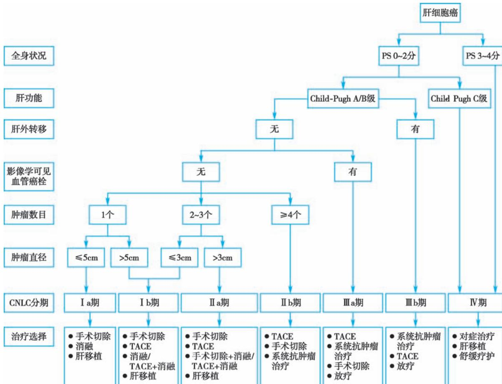

> [!info] 导航
> [[第048章_第4篇第15章_肝硬化|上一章]] · [[00_章节导航|总目录]] · [[第050章_第4篇第17章_急性肝衰竭|下一章]]

本章数字资源

原发性肝癌（primary carcinoma of the liver）指起源于肝细胞和肝内胆管上皮细胞的恶性肿瘤，包括肝细胞癌（hepatocellular carcinoma, HCC）、肝内胆管癌（intrahepatic cholangiocarcinoma, ICC）和混合性肝细胞-胆管癌（combined hepatocellular-cholangiocarcinoma, cHCC-CCA）三种不同的病理类型，其中HCC占75%～85%、ICC占10%～15%，日常所称的“肝癌”指HCC。

#### 【病因和发病机制】

超过 80% 的 HCC 源自肝硬化。因此,任何导致慢性肝损害和最终导致肝硬化的因素都是 HCC 的危险因素。

1. 病毒性肝炎 HBV 感染是我国肝癌的主要病因,西方国家以 HCV 感染常见。HBV 的 DNA 序列和宿主细胞的基因序列同时遭到破坏或发生重新整合,使癌基因激活和抑癌基因失活,从而发生细胞癌变。丙型肝炎致癌机制与 HCV 序列变异,逃避免疫识别而获得持续感染,肝细胞长期炎症、坏死和再生反复发生,积累基因突变,破坏细胞增殖的动态平衡,导致细胞癌变。

2. 黄曲霉毒素 流行病学研究发现,粮食受到黄曲霉毒素污染严重的地区,人群肝癌发病率高,而黄曲霉毒素的代谢产物之一黄曲霉毒素 $B_{1}$ 能通过影响 RAS、TP53 等基因的表达而引起肝癌的发生。

3. 其他肝癌的高危因素 ①饮酒和吸烟,每天摄入酒精超过40\~60g,HCC的风险呈线性增加,吸烟也会增加HCC风险,并与酒精协同作用;②肥胖、糖尿病和代谢综合征是非酒精性脂肪肝的危险因素,可导致脂肪性肝炎、肝硬化和HCC发生;③血吸虫及华支睾吸虫感染。

上述各种因素促使肝细胞在损伤后再生修复的过程中,生物学特征发生变化,基因突变,癌基因表达及抑癌基因受抑,增殖与凋亡失衡。此外,慢性炎症及纤维化过程中的活跃血管增殖,为肝癌的发生发展创造了重要条件。

#### 【病理】

### (一) 大体病理分型

1. 单结节型 界限较清,多呈球形,切面均匀一致,包膜可有或无。单发癌结节直径 $\leqslant5cm$ ,或多发病灶数量 $\leqslant3$ 个且其中最大径 $\leqslant3cm$ 的肝癌称为小肝癌。

2. 结节型 常见,癌结节数目不等,常伴有肝硬化。

3. 弥漫型 少见,癌组织弥漫分布于整个肝脏,不易与肝硬化区分,病人常因肝衰竭而死亡。

4. 巨块型 体积较大, 直径多 >10cm。右叶多见, 可见包膜。切面中心常有坏死及出血; 位于肝包膜附近者, 肿瘤易破裂, 导致腹腔内出血及直接播散。

### （二）组织病理分型

分为 HCC、ICC 和 cHCC-CCA。

1. HCC 最为多见,癌细胞来自肝细胞,异型性明显,胞质丰富,呈多边形,排列成巢状或索状,血窦丰富。正常肝组织的肝动脉供血约占30%,但HCC的肝动脉供血超过90%,这是目前肝癌影像诊断及介入治疗的重要循环基础。

2. ICC 较少见,是指肝内胆管分支衬覆上皮细胞发生的恶性肿瘤,以腺癌最为多见。

3. cHCC-CCA 最少见,是指在同一个肿瘤结节内同时出现 HCC 和 ICC 两种组织成分。

### (三) 转移途径

1. 肝内转移 易侵犯门静脉及分支并形成癌栓,脱落后在肝内引起多发性转移灶。

2. 肝外转移 ① 血行转移: 常转移至肺, 其他部位有脑、肾上腺、肾及骨骼等。甚至可见肝静脉中癌栓延至下腔静脉及右心房；②淋巴转移：常见肝门淋巴结转移，也可转移至胰、脾、主动脉旁及锁骨上淋巴结。③种植转移：少见，从肝表面脱落的癌细胞可种植在腹膜、横膈、盆腔等处，引起血性腹腔积液、胸腔积液，女性可有卵巢转移。

#### 【临床表现】

本病多见于中年男性,男女之比约为3:1。起病隐匿,早期缺乏典型症状。临床症状明显者,病情大多已进入中晚期。本病常在肝硬化的基础上发生,或者以转移病灶症状为首发表现,此时临床容易漏诊或误诊。中晚期临床表现如下:

1. 肝区疼痛 是肝癌最常见的症状,多呈右上腹持续性胀痛或钝痛,与癌肿生长、肝包膜受牵拉有关。如病变侵犯膈,疼痛可牵涉右肩或右背部。当肝表面的癌结节破裂,可突然引起剧烈腹痛,从肝区开始迅速延至全腹,出血量大时可导致休克。

2. 肝大 肝脏进行性增大,质地坚硬,表面凸凹不平,常有大小不等的结节,边缘钝而不整齐,常有不同程度的压痛。肝癌突出于右肋弓下或剑突下时,上腹可呈现局部隆起或饱满;如癌肿位于膈面,则主要表现为膈肌抬高而肝下缘不下移。

3. 黄疸 一般出现在肝癌晚期,多为阻塞性黄疸,少数为肝细胞性黄疸。前者常因癌肿压迫或侵犯胆管或肝门转移性淋巴结肿大而压迫胆管造成阻塞所致;后者可由于癌组织肝内广泛浸润或合并肝硬化、慢性肝炎引起。

4. 肝硬化征象 在失代偿期肝硬化基础上发病者,可表现为腹腔积液迅速增加且难治,腹腔积液多为漏出液;血性腹腔积液系肝癌侵犯肝包膜或向腹腔内破溃引起。门静脉高压导致食管胃底静脉曲张。

5. 全身性表现 进行性消瘦、发热、食欲缺乏、乏力、营养不良和恶病质等。部分病人以转移灶症状首发而就诊。

6. 伴癌综合征 癌肿本身代谢异常或肝癌病人机体内分泌/代谢异常而出现的一组症候群，表现为自发性低血糖症、红细胞增多症；其他罕见的有高钙血症、高脂血症、类癌综合征等。

#### 【并发症】

1. 肝性脑病 是肝癌终末期最严重的并发症,详见本篇第十五章,出现肝性脑病,预后不良。

2. 上消化道出血 上消化道出血约占肝癌死亡原因的 15%, 出血与以下因素有关: ①食管胃底静脉曲张; ②门静脉高压性胃病合并凝血功能障碍而有广泛出血, 大量出血常诱发肝性脑病。

3. 肝癌结节破裂出血 约 10% 肝癌病人发生肝癌结节破裂出血。癌结节破裂可局限于肝包膜下，产生局部疼痛；如包膜下出血快速增多则形成压痛性血肿；也可破入腹腔引起急性腹痛、腹膜刺激征和血性腹腔积液，大量出血可致休克、死亡。

4. 继发感染 病人因长期消耗或化疗、放疗等，抵抗力减弱，容易并发肺炎、自发性腹膜炎、肠道感染和真菌感染等。

#### 【实验室和其他辅助检查】

### （一）肝癌标志物

1. 甲胎蛋白（alpha fetoprotein, AFP）是当前肝癌诊断、疗效监测和复发预测常用的指标。在排除慢性或活动性肝炎、妊娠和生殖腺胚胎瘤的基础上，AFP>400ng/ml高度提示肝癌。AFP轻度升高，应结合影像学及肝功能变化作综合分析或动态观察。检测 AFP 异质体，有助于提高诊断率。

2. 其他肝癌标志物 异常凝血酶原(PIVKA II和DCP)、 $\gamma$ -谷氨酰转移酶同工酶II（ $\gamma$ -GT $_2$ ）、血浆游离微RNA（miRNA）等有助于AFP阴性的肝癌的诊断和鉴别诊断。

### (二) 影像学

1. 超声（US）具有便捷、实时、无创和价格低廉等优势，能检出直径 $>1\mathrm{cm}$ 的肝脏占位性病变。超声造影检查可以动态观察肿瘤血流灌注的变化，鉴别诊断不同性质的肝脏肿瘤，术中应用可显著提升隐匿性小病灶检出率。

2. 增强 CT/MRI 动态增强 CT 和多参数 MRI 扫描是肝脏超声和/或血清 AFP 初筛异常者明确诊断的首选检查方法。MRI为非放射性检查，可以在短期重复进行。动态增强CT和多参数MRI动脉期肝肿瘤呈均匀或不均匀明显强化，门静脉期和/或延迟期肝肿瘤强化低于肝实质，呈“快进快出”表现。肝细胞特异性对比剂钆塞酸二钠（Gd-EOB-DTPA）增强MRI扫描可以提高直径 $< 1.0\mathrm{cm}$ 肝癌的诊断敏感性。

3. 数字减影血管造影(digital subtraction angiography, DSA) 采用经选择性或超选择性肝动脉DSA检查,不仅可以显示肝肿瘤血管,明确肿瘤数目、大小及其血供情况,还可以用于肝癌局部治疗或肝癌自发破裂出血的治疗等。

4. 核医学影像学检查 包括正电子发射计算机断层成像（positron emission tomography-CT, PET-CT）、单光子发射计算机断层成像（single photon emission computed tomography-CT, SPECT-CT）和正电子发射计算机断层磁共振成像（positron emission tomography-MRI, PET-MRI），有助于对肝癌进行分期及疗效评价。

### （三）肝穿刺活体组织检查

肝肿瘤穿刺活检可以明确病灶性质,US或CT引导下细针穿刺行组织学检查是确诊肝癌的可靠方法,其潜在风险是出血和肿瘤针道种植转移。

#### 【诊断】

肝癌的临床诊断应结合肝癌发生的高危因素、影像学特征以及血清学分子标志物综合考虑。依照我国《原发性肝癌诊疗指南(2022年版)》推荐的诊断标准,对于有HBV或HCV感染,或有任何原因引起肝硬化者,满足下列两项中的任一项,即可临床诊断肝癌:

（1）具有两项典型的肝癌影像学特征(动态增强 CT、多参数 MRI、超声造影或肝细胞特异性对比剂 Gd-EOB-DTPA 增强 MRI)，病灶直径≤2cm。

（2）具有一项典型的肝癌影像学特征,同时合并病灶直径>2cm或血清 AFP 升高,特别是持续升高。

以下情况应行肝病灶穿刺活检或密切随访血清 AFP 变化及影像学改变以明确诊断:①病灶直径 $\leqslant2cm$ , 无或只有一项典型的肝癌影像学特征;②病灶直径>2cm, 无典型的肝癌影像学特征。

肝癌诊断分期目前多采用中国肝癌分期方案(China liver cancer staging, CNLC)(图 4-16-1)。此外,巴塞罗那肝癌分期(Barcelona clinic liver cancer staging)也是目前国际应用较为广泛的分期系统,同样根据肝癌数目、大小、有无侵犯转移以及病人肝功能储备的情况进行分期,但与 CNLC 之间存在治疗措施推荐差异。

#### 【鉴别诊断】

肝癌常需与继发性肝癌、肝硬化、肝脓肿等疾病进行鉴别。

1. 继发性肝癌 原发于呼吸道、胃肠道、泌尿生殖道、乳房等处的癌灶常转移至肝，尤以结直肠癌最为常见，呈多发性结节，临床以原发癌表现为主，血清 AFP 检测一般为阴性。

2. 肝硬化结节 增强 CT/MRI 见病灶动脉期强化,呈快进快出,诊断肝癌;若无强化,则考虑为肝硬化结节。AFP>400ng/ml,有助于肝癌诊断。

3. 活动性病毒性肝炎 病毒性肝炎活动时血清 AFP 往往呈短期低浓度升高, 应定期多次随访测定血清 AFP 和 ALT, 或联合检测其他肝癌标志物并进行分析。

4. 肝脓肿 临床表现为发热、肝区疼痛、压痛明显，白细胞计数和中性粒细胞升高。US 检查可发现脓肿的液性暗区。必要时在超声引导下做诊断性穿刺或药物试验性治疗以明确诊断。

5. 肝包虫病 病人常有牧区生活和接触病犬等生活史。

6. 其他肝脏肿瘤或病变 当影像学与肝脏其他良性肿瘤如血管瘤、肝腺瘤、肝局灶性结节性增生等鉴别有困难时,可检测 AFP 等肿瘤标志物,并随访 US、增强 CT/MRI,必要时在 US 或 CT 引导下行肝活检。

#### 【治疗】

肝癌治疗需要多学科参与、多种治疗方法共存。常见治疗方法包括手术切除、消融治疗、肝动脉插管化疗栓塞术（transcatheter arterial chemoembolization, TACE）、肝移植、放射治疗和系统抗肿瘤治疗等多种手段，针对肝癌不同分期选择合理的治疗方法可以得到最佳疗效。

1. 手术治疗 手术切除是肝癌病人获得长期生存的重要手段。切除原则是完整切除肿瘤并保留足够体积且有功能的肝组织,因此需要完善的术前肝脏储备功能评估与肿瘤学评估,术前常采用Child-Pugh评分、吲哚菁绿15分钟滞留率(indocyanine green retention-15,ICGR15)评价肝功能储备情况。一般认为手术切除必须满足下列条件之一:①肝功能Child-Pugh A级、ICGR15<30%;②剩余肝脏体积须占标准肝脏体积30%以上(无肝纤维化或肝硬化者)或40%以上(伴有慢性肝病、肝实质损伤或肝硬化者)。

  
图 4-16-1 中国肝癌临床分期与治疗策略

2. 消融治疗 消融治疗是借助超声、CT 和 MRI 的引导,局部采用物理或化学的方法,对肿瘤病灶靶向定位直接杀灭肿瘤组织的治疗手段,具有创伤小、疗效确切的特点。主要包括射频消融 (radiofrequency ablation, RFA)、微波消融 (microwave ablation, MWA)、经皮穿刺瘤内注射无水乙醇 (percutaneous ethanol injection, PEI) 和高强度聚焦超声消融 (high intensity focused ultrasound ablation, HIFU) 等。

消融治疗对于符合 CNLC 的 Ia 期及部分 Ib 期病人(单个肿瘤、直径≤5cm 或 2～3 个肿瘤、最大直径≤3cm)，可以获得根治性的治疗效果。不能手术切除的直径 3～7cm 的单发肿瘤或多发肿瘤，可以联合 TACE 治疗。

3. 经动脉化疗栓塞 TACE 是经肿瘤的供血动脉注入栓塞剂，阻断肿瘤的供血，使其发生坏死。因具有靶向性好、创伤小、可重复等特点，成为常用的肝癌非手术治疗方法，主要用于 CNLC 的Ⅱb、Ⅲa 和部分Ⅲb 期肝癌病人。TACE 联合外科手术、消融治疗、放射治疗和分子靶向药等综合治疗，可进一步提高 TACE 疗效。

4. 肝移植 肝移植是肝癌根治性治疗方法之一,特别适用于肝功能失代偿、不适合手术切除及消融治疗的小肝癌病人。若肝癌已有大血管侵犯和肝外转移,则不宜行肝移植术。

肝癌肝移植术后采用以哺乳动物雷帕霉素靶蛋白抑制剂为主的免疫抑制,可以减少肿瘤复发率,提高生存率。

5. 放射治疗 肝癌病人手术不能切除者,可以行姑息性放射治疗,或选择放射治疗与 TACE 等联合治疗,延长病人生存时间。

6. 系统抗肿瘤治疗 系统抗肿瘤治疗不仅包括针对肝癌的分子靶向药物治疗、化学治疗、免疫治疗和中医中药治疗，还包括针对肝癌相关基础疾病的治疗，如抗病毒治疗和对症支持治疗等。

由于多数肝癌起病隐匿,首次诊断时超过70%的肝癌病人已经失去接受根治性治疗的机会,系统抗肿瘤治疗在肝癌治疗过程中发挥重要作用。

#### 【预后】

下述情况预后较好:①肝癌直径<5cm,能早期手术;②癌肿包膜完整,分化程度高,尚无癌栓形成;③机体免疫状态良好。如合并肝硬化或有肝外转移者、发生肝癌破裂或消化道出血的病人预后差。

(李延青)

  
本章思维导图
