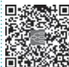

> [!info] 导航
> [[第060章_第5篇第02章_原发性肾小球疾病|上一章]] · [[00_章节导航|总目录]] · [[第062章_第5篇第04章_间质性肾炎|下一章]]

本章数字资源

继发性肾病指肾外疾病,特别是系统性疾病导致的肾损害。近年来由于生活方式改变、人口老龄化及环境因素等,继发性肾病患病率有增加趋势。本章介绍狼疮性肾炎、糖尿病肾脏病、血管炎肾损害和高尿酸肾损害。

# 第一节 | 狼疮性肾炎

狼疮性肾炎(lupus nephritis, LN)是系统性红斑狼疮(SLE)导致的肾脏损害。约 $50\%$ 以上SLE病人存在LN, 是其最重要及最致命的靶器官损害之一, 也是我国终末期肾衰竭的重要原因之一。

#### 【发病机制】

LN 存在遗传易感性、环境因素及免疫异常等多种机制共同致病。肾脏免疫复合物形成与沉积是引起 LN 的主要机制。沉积的免疫复合物激活补体，引起炎症细胞浸润、凝血因子活化及炎症介质释放，导致肾脏损伤。

#### 【病理】

LN 病理表现多样,2018 年国际肾脏病协会(ISN)及肾脏病理学会工作组(RPS)对 LN 的病理分型进行了修订,见表 5-3-1。

表 5-3-1 2018 ISN/RPS LN 病理分型

<table><tr><td>病理分型</td><td>病理表现</td></tr><tr><td>I型,系膜轻微病变性 LN</td><td>光镜下正常,免疫荧光可见系膜区免疫复合物沉积</td></tr><tr><td>II型,系膜增生性 LN</td><td>系膜细胞增生伴系膜区免疫复合物沉积</td></tr><tr><td>III型,局灶性 LN</td><td>50% 以下肾小球表现为毛细血管内或血管外节段或球性细胞增生</td></tr><tr><td>IV型,弥漫性 LN</td><td>50% 以上肾小球表现为毛细血管内或血管外节段或球性细胞增生</td></tr><tr><td>V型,膜性 LN</td><td>光镜和免疫荧光或电镜检查显示球性或节段上皮下免疫沉积物,可以合并发生III型或IV型,也可伴有终末期硬化性 LN</td></tr><tr><td>VI型,终末期硬化性 LN</td><td>≥90% 肾小球呈球性硬化</td></tr></table>

LN 可累及肾小管间质和血管,还有新月体肾炎、血栓性微血管病、狼疮足细胞病等特殊类型。典型的免疫病理表现为肾小球 IgA、IgG、IgM、C3、C4、C1q 均阳性,称为 “满堂亮” (full house) (文末彩图 5-3-1)。病变进展或治疗后可发生病理类型的转换。

#### 【临床表现】

肾外表现详见第八篇第三章。LN的肾脏表现差异大，可为无症状性血尿和/或蛋白尿、肾病综合征、急性肾炎综合征、急进性肾炎综合征等。

蛋白尿最为常见,轻重不一,大量蛋白尿乃至肾病综合征可见于弥漫增生性和/或膜性 LN。多数病人有镜下血尿,肉眼血尿主要见于袢坏死和新月体形成的病人。病人可出现高血压,存在肾血管病变时更常见,甚至发生恶性高血压。

急性肾损伤可见于弥漫增生性 LN, 包括严重的毛细血管内增生性病变和/或局灶坏死性新月体肾炎; 也可见于血管炎和血栓性微血管病。血清抗磷脂抗体阳性病人易并发血栓, 加剧肾功能恶化。

#### 【实验室和其他检查】

尿蛋白和尿红细胞的变化、补体水平、自身抗体滴度如抗 dsDNA 抗体等、血白蛋白、血肌酐等与 LN 的活动和缓解密切相关。肾活检病理改变的活动性及慢性病变及狼疮活动程度对 LN 的诊断、治疗和判断预后有较大价值。部分病人出现治疗效果不佳、复发或病情加重进展时，必要时可行重复肾活检评估。

#### 【诊断与鉴别诊断】

在 SLE 基础上,有肾脏损害表现,如持续性蛋白尿(24 小时尿蛋白>0.5g/d,或>++,尿白蛋白/肌酐>500mg/g)、伴或不伴活动性尿沉渣(除外尿路感染,尿白细胞>5 个/HPF,尿红细胞>5 个/HPF)或管型尿(可为红细胞或颗粒管型等),则可诊断为 LN。LN 易误诊为原发性肾小球疾病,通过检查有无多系统、多器官受累表现,血清 ANA、抗 dsDNA 抗体、抗 Sm 抗体阳性,肾活检病理等可资鉴别。需要与 IgA 肾病、过敏性紫癜性肾炎、ANCA 相关血管炎肾损害、干燥综合征肾损害等鉴别。

#### 【治疗】

LN 的治疗方案以控制病情活动、阻止肾脏病变进展为主要目的。治疗需要综合全身的狼疮疾病活动情况、临床表现、病理特征等制订个体化治疗方案，通常需要诱导治疗到维持治疗的长期治疗及病情监测。

增生性 LN（Ⅲ型或Ⅳ型）：诱导治疗推荐激素联合免疫抑制剂，如激素联合吗替麦考酚酯/环磷酰胺/吗替麦考酚酯加贝利尤单抗/环磷酰胺加贝利尤单抗/吗替麦考酚酯加钙调磷酸酶抑制剂，待病情稳定后转入维持治疗。诱导治疗一般为可根据病情使用甲泼尼龙 0.25～0.5g/d 冲击治疗 1～3 天，使用泼尼松 0.5～1mg/(kg·d)，疗程 2～4 周，此后逐渐减量，直至 5mg/d 维持；同时合用免疫抑制剂治疗，如环磷酰胺静脉疗法（每个月 0.5～1.0g/m²，共 6 次；或者每 2 周 0.5g，共 6 次），或口服 1～1.5mg/(kg·d)；或者吗替麦考酚酯（1.5～2.0g/d，分 2 次口服）。若诱导治疗效果不佳，要进一步分析原因调整治疗方案。维持治疗多采用小剂量激素（泼尼松 5mg/d）联合硫唑嘌呤 [1.5～2mg/(kg·d)] 或吗替麦考酚酯（1～2g/d，分 2 次口服）。肾活检有大量细胞性新月体或纤维素样坏死病变，以及肾外病情活动严重者也可使用甲泼尼龙 15mg/(kg·d) 静脉冲击疗法，1 次/日，3 次为一疗程。

病理表现为Ⅰ型、Ⅱ型或Ⅴ型 LN 者:表现为非肾病水平蛋白尿的病人可予对症支持治疗(ACEI/ARB 降蛋白、降压、调脂、抗凝等)、羟氯喹等,根据肾外表现决定糖皮质激素和免疫抑制剂疗法,如在治疗过程中出现尿蛋白增加或者相关并发症加重,可使用激素联合免疫抑制剂。表现为肾病水平蛋白尿者,糖皮质激素联合免疫抑制剂治疗,如泼尼松联合环磷酰胺或吗替麦考酚酯、环孢素或他克莫司等。Ⅰ型和Ⅱ型 LN 需要结合电镜判断是否存在狼疮足细胞病。

狼疮治疗过程中要注意监测感染、骨质疏松、心血管疾病、肿瘤、妊娠等情况，必要时多学科讨论制订治疗方案。

#### 【预后】

LN 治疗后可长期缓解,但药物减量或停药后易复发,且部分出现病情逐渐加重。LN 病人的主要死因为感染、心脑血管疾病、肿瘤等。近年来由于对 LN 诊断水平的提高,预后明显改善,10 年存活率已提高到 80%～90%。

# 第二节 | 糖尿病肾脏病

糖尿病肾脏病（diabetic kidney disease, DKD）是糖尿病（DM）最重要的并发症之一，临床特征为持续性白蛋白尿排泄增加，和/或估算的肾小球滤过率（eGFR）进行性下降，最终发展为终末期肾病（ESRD）。

#### 【发病机制】

1. 糖代谢异常 DM 状态下肾脏糖代谢明显增强,约 50% 的葡萄糖在肾脏代谢,加重了肾脏糖负荷。高血糖产物如晚期糖基化终末产物一方面导致肾小球基底膜增厚以及滤过膜通透性增高,另一方面还与特异性受体结合而激活细胞,使后者分泌大量炎症介质引起组织损伤。血糖持续升高可激活多元醇通路,使葡萄糖转化为山梨醇和果糖,过多的山梨醇和果糖在细胞内堆积引起细胞内高渗和细胞肿胀破坏。多元醇通路激活还可通过活化二酰甘油-蛋白激酶 C 通路促进转化生长因子 β (TGF-β) 和血管内皮生长因子 (VEGF) 分泌、抑制一氧化氮 (NO) 合酶活性,导致细胞外基质合成增加、肾间质纤维化和肾血管舒缩功能障碍。

2. 肾脏血流动力学改变 近年来认为近端小管中钠、葡萄糖协同转运过强，使钠盐在该处过度重吸收是肾脏血流动力学改变的关键，这种过度重吸收使肾小囊压力降低，肾小球滤过被迫增多，高滤过导致肾小球高灌注、高跨膜压和蛋白尿生成。

3. 激素和细胞因子的作用 DM 状态下肾脏局部 RAS 呈异常活跃状态,血管紧张素Ⅱ(ATⅡ)选择性收缩出球小动脉导致肾内跨膜压增高,ATⅡ通过减少足细胞硫酸乙酰肝素蛋白多糖的合成来破坏肾小球基底膜阴离子屏障完整性,ATⅡ还与高血糖协同作用刺激 TGF-β 产生,TGF-β 通过增加细胞外基质的积聚促进 DKD 肾损伤。在 DKD 发生发展过程中起作用的还有内皮素、结缔组织生长因子、VEGF、胰岛素样生长因子、前列腺素、活性氧及 NO 等细胞因子。

4. 遗传因素 目前认为 DKD 是一个多基因病,遗传因素在决定 DKD 易感性方面起着重要作用。

#### 【病理】

光镜下可以看到肾小球体积肥大，肾小球系膜区基质增加、系膜区增宽。随着病情进展，肾小球基底膜弥漫增厚，基质增生，形成典型的K-W结节(文末彩图5-3-2)，为局灶性、分叶状、周边圆形至椭圆形的系膜病变。以无细胞性玻璃样变基质为核心，是DKD相对特异性的病理改变，称为结节性肾小球硬化症。肾小管的病理改变包括肾小管上皮细胞空泡样变性、肾小管基底膜增厚、肾小管刷状缘减少及肾小管萎缩等。肾间质及血管病理改变包括肾间质纤维化、炎症细胞浸润、小动脉玻璃样变性等。免疫荧光可见IgG及白蛋白沿肾小球基底膜和肾小管基底膜线状沉积。电镜下可见系膜基质增多，基底膜均质性增厚，上皮细胞足突早期节段融合，随病变进展，可见弥漫融合。

#### 【临床表现与分期】

确诊 DKD 后,应根据 eGFR 及尿白蛋白水平进一步判断慢性肾脏病(CKD)分期,同时评估 DKD 进展风险及明确复查频率(表 5-3-2)。建议 DKD 的诊断应包括病因、eGFR 分级和尿白蛋白/肌酐比值(UACR)分级。

表 5-3-2 按 eGFR 和 UACR 分级的 CKD 进展风险及就诊频率

<table><tr><td rowspan="4"></td><td rowspan="4" colspan="3">CKD分期依据病因(C)eGFR(G)白蛋白尿(A)</td><td colspan="3">白蛋白尿分级</td></tr><tr><td>正常至轻度升高</td><td>中度升高</td><td>重度升高</td></tr><tr><td>A1</td><td>A2</td><td>A3</td></tr><tr><td>&lt;30mg/g&lt;3mg/mmol</td><td>30~299mg/g3~29mg/mmol</td><td>≥300mg/g≥30mg/mmol</td></tr><tr><td rowspan="6">eGFR分级/[ml/(min·1.73m2)]</td><td>G1</td><td>正常</td><td>≥90</td><td>1(如有CKD)</td><td>1</td><td>2</td></tr><tr><td>G2</td><td>轻度下降</td><td>60~89</td><td>1(如有CKD)</td><td>1</td><td>2</td></tr><tr><td>G3a</td><td>轻中度下降</td><td>45~59</td><td>1</td><td>2</td><td>3</td></tr><tr><td>G3b</td><td>中重度下降</td><td>30~44</td><td>2</td><td>3</td><td>3</td></tr><tr><td>G4</td><td>重度下降</td><td>15~29</td><td>3</td><td>3</td><td>4</td></tr><tr><td>G5</td><td>肾衰竭</td><td>&lt;15</td><td>4</td><td>4</td><td>4</td></tr></table>

注:表格中的数字为建议每年复查的次数;背景颜色代表 CKD 进展的风险,由浅到深依次为低风险、中风险、高风险、极高风险。

#### 【诊断与鉴别诊断】

DKD通常是根据持续存在的白蛋白尿和/或eGFR下降、同时排除其他病因引起的CKD而作出的临床诊断。在明确DM作为肾损害的病因并排除其他原因引起CKD的情况下，至少具备下列一项者可诊断为DKD：①在3～6个月内的3次检测中至少2次UACR≥30mg/g或24小时尿白蛋白排泄率（UAER）≥30mg/24h；②eGFR<60ml/(min·1.73m²)持续3个月以上；③肾活检符合DKD病理改变。

DM 发生肾损害伴有以下任一情况,需考虑存在非 DM 性肾病的可能,应注意进一步查明病因,必要时行肾活检以明确诊断:①eGFR 短期内迅速下降;②无明显微量蛋白尿,或蛋白尿突然急剧增多,或短时间出现肾病综合征；③尿检提示活动性尿沉渣；④顽固性高血压；⑤已确诊有原发性、继发性肾小球疾病或其他系统性疾病；⑥血管紧张素转换酶抑制剂（ACEI）或血管紧张素受体拮抗剂（ARB）类药物治疗3个月内eGFR下降超过 $30\%$ ；⑦影像学发现肾结石、肾囊肿、马蹄肾等结构异常，或有肾移植病史；⑧肾活检提示有其他肾病的病理学改变。

#### 【治疗】

包括早期干预各种危险因素和 ESRD 的肾脏替代治疗。

1. 饮食治疗 DKD 病人每天总能量摄入为 25～30kcal/kg。未行透析的 DKD 病人，蛋白质摄入量为 0.8g/(kg·d)，透析病人蛋白质摄入量为 1.0～1.2g/(kg·d)。DKD 病人每日钠摄入量应低于 2.3g。

2. 控制血糖 DKD 病人糖化血红蛋白应控制在 $\leqslant7\%$ 。常用的口服降糖药物包括八大类：①双胍类；②α-葡萄糖苷酶抑制剂；③磺酰脲类；④格列奈类；⑤噻唑烷二酮类；⑥二肽基肽酶-4 抑制剂；⑦SGLT2i；⑧胰高血糖素样肽-1 受体激动剂（GLP-1RA）。DKD 病人在选择降糖药时，应优先考虑具有肾脏获益的药物，兼顾病人心、肾功能，根据 eGFR 调整药物剂量。推荐二甲双胍作为 2 型糖尿病（T2DM）合并 DKD $[eGFR\geqslant45ml/(min\cdot1.73m^{2})]$ 病人的一线降糖药物。SGLT2i 和 GLP-1RA 具有不依赖于降糖作用的肾脏保护作用，推荐 T2DM 合并 DKD 的病人只要没有禁忌证均应给予 SGLT2i，若存在禁忌证则推荐使用具有肾脏获益的 GLP-1RA。

3. 控制血压 DKD 病人血压控制目标为 $<130/80mmHg$ ，以 ACEI/ARB 为首选药物。ACEI/ARB 类药物不仅有降压作用，还有降低尿蛋白、延缓肾功能恶化、减少心血管事件并发症等作用，已成为 DKD 病人控制血压、减少尿蛋白和延缓疾病进展的标准策略。血压控制不佳的病人，可加用钙通道阻滞剂、利尿剂、 $\alpha$ 受体拮抗剂等。使用 ACEI/ARB 类药物期间，应定期监测 UACR、血清肌酐及血钾，伴肾动脉狭窄者慎用 ACEI/ARB 类药物。

4. 调脂治疗 DKD 病人低密度脂蛋白胆固醇(LDL-C)目标值<2.6mmol/L, 若合并动脉粥样硬化性心血管疾病, 则 LDL-C 目标值<1.8mmol/L。血清总胆固醇增高为主者首选他汀类降脂药物, 甘油三酯增高为主者选用贝特类药物。

5. 并发症治疗 对并发顽固性水肿、贫血、营养不良、心血管并发症、周围血管病变、周围神经和自主神经病变等的病人应及时给予相应处理，保护肾功能，尽量避免使用肾毒性药物。

6. 透析和移植 当 eGFR<15ml/min, 或伴有不易控制的心力衰竭、严重胃肠道症状、高血压等，应根据条件选用透析、肾移植或胰肾联合移植。

#### 【预后】

DKD预后不佳,影响预后的因素主要包括DM类型、蛋白尿程度、肾功能和肾外心脑血管合并症等病变的严重性。

# 第三节 | 血管炎肾损害

血管炎是指以血管壁的炎症和纤维素样坏死为病理特征的一组疾病。肾脏是血管炎受累的重要靶器官之一，称为血管炎肾损害。本节主要介绍抗中性粒细胞胞质抗体（ANCA）阳性的系统性小血管炎，包括肉芽肿性多血管炎（granulomatosis with polyangiitis, GPA）、显微镜下多血管炎（microscopic polyangiitis, MPA）和嗜酸性肉芽肿性多血管炎（eosinophilic granulomatosis with polyangiitis, EGPA）。ANCA 的主要靶抗原为蛋白酶 3（PR3）和髓过氧化物酶（MPO）。我国以 MPO-ANCA 阳性的 MPA 为主。

#### 【发病机制】

该类疾病的发生是多因素的,涉及 ANCA、中性粒细胞和补体等。

1. ANCA 与中性粒细胞 动物模型发现 MPO-ANCA 可引起新月体肾炎和肺泡小血管炎。体外研究发现, ANCA 可介导中性粒细胞与内皮细胞黏附, ANCA 活化的中性粒细胞发生呼吸爆发和脱颗粒, 释放的活性氧自由基和各种蛋白酶等可引起血管炎。

2. 补体 动物模型及来自病人的研究均证实,补体旁路途径活化参与了该病的发病机制。其中补体活化产物 C5a 可通过 C5a 受体发挥致炎症效应而参与血管炎发病。

#### 【病理】

免疫荧光和电镜检查一般无免疫复合物或电子致密物，或仅呈微量沉着。光镜检查多表现为局灶节段性肾小球毛细血管袢坏死和新月体形成，且病变新旧不等(文末彩图5-3-3)。

#### 【临床表现】

该病可见于各年龄组,但我国以老年人多见。常有发热、疲乏、关节肌肉疼痛和体重下降等非特异性全身症状。化验 ANCA 阳性,CRP 升高,ESR 增快。

肾脏受累时,活动期有血尿,多为镜下血尿,可见红细胞管型,多伴蛋白尿;肾功能受累常见,约半数表现为 RPGN。

本病多系统受累,常见肾外表现包括肺、头颈部和内脏损伤。肺受累主要表现为咳嗽、痰中带血甚至咯血,严重者因肺泡广泛出血发生呼吸衰竭而危及生命。X线胸片可表现为阴影、空洞和肺间质纤维化等。

#### 【诊断与鉴别诊断】

国际上尚无统一、公认的临床诊断标准。目前应用最为广泛的是 2012 年修订的 Chapel Hill 系统性血管炎命名国际会议所制定的分类诊断标准。

中老年病人表现为发热、乏力和肾炎等情况，且血清 ANCA 阳性可考虑该病诊断。本病需要与过敏性紫癜肾损害和狼疮性肾炎鉴别。肾活检可协助确诊和分型。

#### 【治疗】

ANCA 相关小血管炎的治疗分为诱导治疗、维持治疗和复发治疗。

1. 诱导治疗 糖皮质激素联合环磷酰胺是最常用的治疗方案。泼尼松 $1\mathrm{mg} / (\mathrm{kg}\cdot \mathrm{d})$ ，4～6周后逐步减量。联合环磷酰胺，口服剂量 $2\mathrm{mg} / (\mathrm{kg}\cdot \mathrm{d})$ ，持续3～6个月；或静脉冲击 $0.75\mathrm{g} / \mathrm{m}^2$ ，每个月1次，连续6个月。对老年和肾功能不全者酌情减量。糖皮质激素联合利妥昔单抗可用于非重症病人（血肌酐<354μmol/L）或应用环磷酰胺有禁忌的病人。

重症病人,如小动脉纤维素样坏死、大量细胞新月体和肺出血,可加大剂量甲泼尼龙(MP)冲击治疗。血浆置换的主要适应证为合并抗 GBM 抗体、严重肺出血和起病时血肌酐>500μmol/L 者。

2. 维持治疗 小剂量糖皮质激素的基础上, 常用免疫抑制剂包括硫唑嘌呤 $2\mathrm{mg}/(\mathrm{kg}\cdot\mathrm{d})$ 或吗替麦考酚酯 (1.0～1.5g/d, 分 2 次口服), 维持治疗时限至少 18～24 个月。利妥昔单抗也用于维持期治疗。

3. 复发治疗 发生复发性疾病(危及生命或脏器的情况)应再次接受诱导治疗。诱导治疗时未接受利妥昔单抗治疗者,可选激素联合利妥昔单抗方案。

#### 【预后】

恰当的治疗5年生存率达80%。影响预后的独立危险因素包括高龄、严重肺脏累及、继发感染以及严重肾功能衰竭。肺脏存在基础病变是继发肺部感染的独立危险因素。

# 第四节 | 高尿酸肾损害

高尿酸血症(hyperuricemia)是指在正常嘌呤饮食状态下,非同日两次空腹血尿酸男性高于420μmol/L,女性高于360μmol/L。高尿酸肾损害分为急性高尿酸血症性肾病、慢性高尿酸血症性肾病以及尿酸性肾结石。尿酸约2/3由肾脏排泄,1/3由肠道排泄。

#### 【发病机制】

引起高尿酸血症的常见原因包括：

1. 遗传因素 家族性高尿酸血症肾病、次黄嘌呤鸟嘌呤磷酸核糖基转移酶缺陷等。

2. 饮食因素 高嘌呤饮食、高果糖饮食、长期过量饮酒。

3. 药物因素 噻嗪类利尿剂、袢利尿剂、环孢素、他克莫司、吡嗪酰胺等。

4. 容量丢失

5. 低氧血症

6. 骨髓增生性疾病、真性红细胞增多症等。

7. 其他,如肾衰竭、肥胖致代谢综合征、剧烈运动等。

急性高尿酸血症性肾病多见于恶性肿瘤放化疗病人,高浓度的尿酸超过近端肾小管的重吸收能力,滞留在肾小管管腔形成结晶,梗阻在肾小管内引起急性肾损伤。

慢性高尿酸血症引起肾损伤的机制,除了尿酸排泄增加引起肾小管间质损伤或形成肾结石,还包括尿酸结晶引起炎症反应,导致肾小球前动脉病变、肾脏炎症以及使肾素-血管紧张素和环氧化酶-2(COX-2)活化等。

高尿酸尿症者由于尿酸在尿中溶解度不够，在尿液中析出、沉积形成结石。

#### 【病理】

光镜检查:早期仅在髓袢和集合管内出现尿酸盐结晶;进而肾小管上皮细胞损伤和崩解,尿酸盐沉积于肾间质,肾间质继发淋巴细胞和单核细胞浸润、多核巨细胞形成和纤维化,偏振光显微镜下可见白亮的光斑;继续进展,可出现肾小动脉管壁增厚、管腔狭窄、肾小球硬化。尿酸盐结晶在普通切片内被溶解,仅见呈放射状的无色的星芒状结晶,冰冻切片或纯乙醇固定的肾组织中呈蓝色针状结晶。免疫病理学无特殊,电镜可见肾小管上皮细胞内和肾间质出现星芒状结晶。

#### 【临床表现】

急性高尿酸血症性肾病多发生在恶性肿瘤放化疗后1～2天，最常见的临床症状为恶心呕吐、腰痛、腹痛、少尿甚至无尿。常伴肿瘤溶解综合征的特点，如同时出现氮质血症、高钾血症、乳酸酸中毒等。尿液分析常可见尿酸结晶。

慢性高尿酸血症性肾病病人通常存在长期的高尿酸血症，反复发作痛风。肾损害早期表现隐匿，多为尿浓缩功能下降，尿沉渣无有形成分，尿蛋白阴性或微量，后逐渐出现慢性肾脏病。肾小球滤过功能正常时，尿酸排泄分数增加。

尿酸肾结石常见的症状是肾绞痛和血尿，也常在体检发现。查体可发现痛风石或痛风性关节炎。

#### 【诊断与鉴别诊断】

1. 急性高尿酸血症性肾病 多见于肿瘤放化疗后 1～2 天, 出现少尿型急性肾损伤, 伴严重的高尿酸血症, 可高于 $893 \mu mol/L$ 。常需要与药物引起的急性间质性肾炎相鉴别。

2. 慢性高尿酸血症性肾病 典型的痛风病史及逐渐发生肾功能损害、尿常规变化不明显者，可疑诊慢性高尿酸血症性肾病，肾脏病理可在光镜下见到尿酸盐在肾脏内沉积，有助于明确诊断。鉴别诊断需排除其他原因，如铅中毒，其次需要与慢性肾脏病引起血尿酸升高相鉴别，慢性肾脏病引起的血尿酸升高，一般肾脏损伤在先，且尿酸排泄分数常下降。

3. 尿酸肾结石的诊断需首先确认存在肾结石,其次确定是否为尿酸结石。尿酸结石 X 线片上不显影,称阴性结石。

#### 【治疗】

急性高尿酸血症性肾病以预防为主，肿瘤放化疗之前3～5天即可应用黄嘌呤氧化酶抑制剂别嘌呤醇或非布司他减少尿酸生成，也可注射重组尿酸氧化酶拉布立海，将尿酸转化为更具水溶性的终末产物尿囊素，以降低血尿酸。发生高尿酸血症时也可应用上述药物，还可通过水化、利尿和碱化尿液减少尿酸沉积，严重者可行血液透析。

慢性高尿酸血症性肾病病人需要降尿酸治疗：①控制饮食嘌呤的摄入。②抑制尿酸生成的药物主要是黄嘌呤氧化酶抑制剂，包括别嘌呤醇和非布司他。别嘌呤醇主要由肾脏排出体外，肾功能下降时参照GFR减量，重症药疹是别嘌呤醇的严重不良反应，死亡率 $20\% \sim 25\%$ ，HLA-B\*5801为其高风险基因，非布司他通过肝肾双通道代谢。③促尿酸排泄药物可选用苯溴马隆，用于尿酸排泄分数明显下降者。④促进尿酸分解的药物如尿酸氧化酶。慢性肾脏病合并痛风可参照痛风的治疗原则，慢性肾脏病合并无症状高尿酸血症是否需要降尿酸治疗仍有争议。

尿酸肾结石的治疗目的是减小已形成的结石，防止新结石形成。治疗包括低嘌呤饮食，使用别嘌呤醇或非布司他降低血尿酸水平及碱化尿液。

#### 【预后】

急性高尿酸血症性肾病以预防为主,及时治疗预后较好。慢性高尿酸血症性肾损害与高血压、心脑血管疾病密切相关,如无及时防治可进展至尿毒症。

#### 【预防】

除控制饮食中嘌呤的摄入,用药物降低血尿酸水平,一体化治疗病人可能合并的高血压、贫血、电解质紊乱等,从而阻止或逆转高尿酸肾损害的进展,改善预后。

(陈 岁)

本章思维导图
