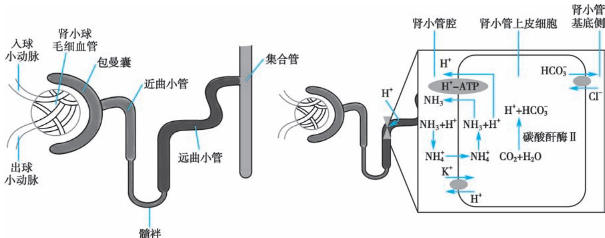

> [!info] 导航
> [[第063章_第5篇第05章_尿路感染|上一章]] · [[00_章节导航|总目录]] · [[第065章_第5篇第07章_肾血管疾病|下一章]]

肾小管疾病是多种病因引起的以肾脏间质-小管病变为主的临床综合征。肾小管疾病可分为原发性和继发性。前者多与遗传缺陷有关，后者多继发于系统性疾病、自身免疫病和代谢性疾病，也可由药物、毒物等引起。病变主要侵犯肾小管和肾间质，常无水肿、高血压，部分病人有口渴、多饮多尿、夜尿增多，部分病人亦有不同程度的肾小球滤过率下降、血浆尿素氮和肌酐升高、贫血，无或少量蛋白尿。由于肾小管在调节水电解质平衡中发挥重要作用，肾小管疾病常常表现为酸碱平衡失调和电解质紊乱，其中又以低血钾为多见。

# 第一节 | 肾小管性酸中毒

肾小管性酸中毒（renal tubular acidosis, RTA）是各种病因导致肾脏酸化功能障碍引起的以阴离子间隙（anion gap, AG）正常的高氯性代谢性酸中毒为特点的临床综合征，可因远端肾小管泌 $\mathrm{H}^+$ 障碍所致，也可因近端肾小管 $\mathrm{HCO}_3^-$ 重吸收障碍所致，或两者皆有。临床特征为高氯性代谢性酸中毒及水、电解质紊乱，可有低钾血症或高钾血症、低钠血症、低钙血症及多尿、多饮、肾性佝偻病或骨软化症、肾结石等。

1935 年 Lightwood 首先描述了 1 例儿童 RTA 病例。1945 年 Bain 报道了首例成人病例。1946 年 Albright 定义其为 “肾小管疾病”，并于 1951 年命名这一综合征。1958 年上海瑞金医院董德长等在国内首次报道 RTA，1967 年 Soriano 等提出远端及近端肾小管性酸中毒两型，1984 年瑞金医院陈庆荣等在国内首次报道了Ⅳ型 RTA。

RTA 按部位和机制分为 4 型(表 5-6-1): 远端肾小管性酸中毒(Ⅰ型, 即 distal renal tubular acidosis, dRTA), 近端肾小管性酸中毒(Ⅱ型, 即 proximal renal tubular acidosis, pRTA), 混合型肾小管性酸中毒(Ⅲ型 RTA), 高血钾型肾小管性酸中毒(Ⅳ型 RTA)。

表 5-6-1 各型 RTA 的特点

<table><tr><td></td><td>I型 RTA</td><td>II型 RTA*</td><td>IV型 RTA</td></tr><tr><td>发病机制</td><td>远端肾小管泌 H+障碍</td><td>近端肾小管重吸收 HCO3-功能障碍</td><td>醛固酮分泌绝对不足或相对减少,导致集合管排出 H+及 K+同时减少</td></tr><tr><td>尿 pH</td><td>尿 pH&gt;5.5</td><td>尿 pH可以维持正常,甚至&lt;5.5</td><td>尿 pH&lt;5.5</td></tr><tr><td>血液</td><td>低血钾、高血氯</td><td>低血钾、高血氯</td><td>高血钾、高血氯</td></tr><tr><td>尿液</td><td>高尿钾、高尿钙、尿总酸和 NH4+显著降低</td><td>高尿钾、高 HCO3-、尿总酸和 NH4+正常</td><td>尿 NH4+减少</td></tr><tr><td>临床表现</td><td>1低血钾引起:夜尿增多,弛缓性瘫痪,心律失常,呼吸肌麻痹2高尿钙、低血钙引起:肾结石和肾钙化,继发甲状旁腺功能亢进,儿童出现生长发育迟缓、佝偻病;成人可以表现为骨痛,骨骼畸形,骨软化或骨质疏松</td><td>1低血钾较明显2继发性II型 RTA 的病人多数还可合并 Fanconi 综合征的表现,如肾性糖尿等3高尿钙较少见,肾结石和肾钙化发生率较低</td><td>酸中毒与高血钾的程度与肾功能损伤程度不成比例</td></tr></table>

注：\*Ⅲ型 RTA 可兼具 I 型和 II 型 RTA 的特点。

## 一、远端肾小管酸中毒

#### 【病因和发病机制】

此型主要由远端肾小管酸化功能障碍引起。根据病因分为原发性和继发性:原发性为远端肾小管先天性功能缺陷,多见于儿童,多数为常染色体显性遗传,少数为常染色体隐性遗传,还可伴有遗传性球形红细胞增多症和感觉神经性耳聋;成人病人多继发于干燥综合征、系统性红斑狼疮等自身免疫病、肝炎病毒感染和肾盂肾炎,此外肾毒性药物如马兜铃酸也是引起继发性dRTA的重要原因。

远端肾小管的泌氢功能主要是由A型闰细胞完成的。 $CO_{2}$ 在碳酸酐酶Ⅱ的作用下与 $H_{2}O$ 结合，生成 $H_{2}CO_{3}$ ，再解离生成 $H^{+}$ 和 $HCO_{3}^{-}$ 。 $H^{+}$ 由 $H^{+}-ATP$ 酶转运至小管腔， $HCO_{3}^{-}$ 由 $Cl^{-}/HCO_{3}^{-}$ 转运体 $AE_{1}$ 转运回血液。 $H^{+}$ 与磷酸盐和 $NH_{3}$ 结合；与磷酸氢根 $(HPO_{4}^{2-})$ 结合为磷酸二氢根 $(H_{2}PO_{4}^{-})$ ；与 $NH_{3}$ 结合后的 $NH_{4}^{+}$ 被主动重吸收后解离成为 $H^{+}$ 和 $NH_{3}, H^{+}$ 可以作为 $H^{+}-ATP$ 酶的底物，而 $NH_{3}$ 可弥散进入管腔。远端肾单位 $H^{+}$ 分泌异常可同时导致尿液酸化程度降低， $NH_{4}^{+}$ 分泌减少。管腔液与管周液间不能产生与维持一个大的氢离子梯度，在酸中毒时尿液不能酸化，尿pH>5.5，尿总酸排量下降(图5-6-1)。

  
图 5-6-1 I 型 RTA 发病机制

#### 【临床表现】

1. 一般表现 乏力、夜尿增多、弛缓性瘫痪和多饮多尿。低血钾可致弛缓性瘫痪、心律失常，甚至呼吸困难和呼吸肌麻痹。

2. 肾脏受累表现 长期低血钾可导致低钾性肾病,主要表现为尿浓缩功能障碍,表现为夜尿增多,个别病人可出现肾性尿崩症,进一步加重低血钾。dRTA时肾小管对钙离子重吸收减少,从而出现高尿钙,引起肾结石和肾钙化。

3. 骨骼系统表现 高尿钙和低血钙会继发甲状旁腺功能亢进,导致高尿磷、低血磷。儿童可表现为生长发育迟缓、佝偻病;成人可表现为骨痛、骨骼畸形、骨软化或骨质疏松。

#### 【实验室检查】

尿常规、血尿电解质、尿酸化功能试验、影像学检查、AG 计算、氯化铵负荷试验、碳酸氢盐重吸收试验、病因检查。

#### 【诊断】

根据病人病史、临床表现、实验室检查即可诊断dRTA:①AG正常的高氯性代谢性酸中毒;②可伴有低钾血症(血 $K^{+}<3.5mmol/L$ )及高尿钾(当血 $K^{+}<3.5mmol/L$ 时,尿 $K^{+}>25mmol/L$ );③即使在严重酸中毒时,尿pH也不会低于5.5;④尿总酸和 $NH_{4}^{+}$ 显著降低(尿总酸<10mmol/L, $NH_{4}^{+}<25mmol/L$ );⑤动脉血pH正常,怀疑有不完全性dRTA作氯化铵负荷试验(有肝病时改为氯化钙负荷试验),如血pH和二氧化碳结合力明显下降,而尿pH>5.5,有助于dRTA的诊断。

#### 【治疗】

继发性 dRTA 应首先治疗原发疾病。针对 dRTA 采用以下治疗。

1. dRTA 多以低血钾为首要表现, 因 dRTA 病人多伴有高血氯, 口服补钾避免使用氯化钾, 应使用枸橼酸钾, 严重低钾者可静脉补钾。

2. 推荐使用枸橼酸合剂(含枸橼酸、枸橼酸钾、枸橼酸钠)纠正酸中毒。也可使用口服碳酸氢钠片剂纠正代谢性酸中毒，严重时可静脉滴注碳酸氢钠。

3. 口服枸橼酸合剂可以增加钙在尿液中的溶解度,从而预防肾结石及肾钙化。使用中性磷酸盐合剂纠正低血磷。对于已发生骨病的病人可以谨慎使用钙剂(如尿钙高应使用柠檬酸钙)及骨化三醇治疗。

## 二、近端肾小管酸中毒

#### 【病因和发病机制】

pRTA由近端肾小管重吸收 $\mathrm{HCO}_3^-$ 功能障碍导致，可分为原发性和继发性。原发性者为遗传性近端肾小管功能障碍，多为常染色体隐性遗传，与基底侧的 $\mathrm{Na}^{+}\text{-HCO}_{3}^{-}$ 协同转运蛋白SLC4A4基因突变相关。继发性见于各种获得性肾小管间质病变，最常见的病因为药物性，如乙酰唑胺、异环磷酰胺、丙戊酸、抗逆转录病毒药物等，其他病因有：①系统性遗传性疾病如Lowe综合征、糖原贮积症、Wilson病、Dent病等；②获得性疾病如重金属中毒、维生素D缺乏、多发性骨髓瘤及淀粉样变等。但继发性pRTA多合并Fanconi综合征，单纯表现为继发性pRTA的少见，常为碳酸酐酶抑制剂所致。

#### 【临床表现】

pRTA 主要表现为高血氯性代谢性酸中毒,与 dRTA 不同,由于远端小管酸化功能正常,pRTA 病人的尿 pH 可以维持正常,在严重代谢性酸中毒的情况下,尿 pH 可降至 5.5 以下。继发性 pRTA 的病人多数合并 Fanconi 综合征的表现,如肾性糖尿等。由于 pRTA 病人无高尿钙,因此少见肾结石或肾钙化。

#### 【诊断】

AG 正常的高血氯性代谢性酸中毒, 可伴有低血钾、高尿钾, 尿中 $HCO_{3}^{-}$ 的升高即可诊断 pRTA。不完全性 pRTA 确诊需行碳酸氢盐重吸收试验。病人口服或者静滴碳酸氢钠后尿 $HCO_{3}^{-}$ 排泄分数 >15% 即可诊断。

#### 【治疗】

1. 纠正酸中毒与电解质紊乱 碳酸氢钠治疗(口服或静脉)。可加用小剂量噻嗪类利尿剂增强近端小管 $HCO_{3}^{-}$ 的重吸收,但碳酸氢钠与噻嗪类利尿剂合用可能会加重低血钾,必须严密监测血钾。

2. 继发性 pRTA 病人 应首先进行病因治疗。

## 三、混合型肾小管酸中毒

混合型肾小管酸中毒的特点是同时存在Ⅰ型和Ⅱ型 RTA。因此其高血氯性代谢性酸中毒明显，尿中同时存在 $HCO_{3}^{-}$ 的大量丢失和 $NH_{3}$ 排出减少，症状较严重。可由碳酸酐酶Ⅱ突变导致，为常染色体隐性遗传，除Ⅲ型 RTA 外还表现为脑钙化、智力发育障碍和骨质疏松。治疗主要为对症治疗，参照Ⅰ型和Ⅱ型 RTA。

## 四、高血钾型肾小管酸中毒

#### 【病因和发病机制】

Ⅳ型 RTA 是由于醛固酮分泌绝对不足或相对减少,导致集合管排出 $H^{+}$ 及 $K^{+}$ 同时减少,从而发生高血钾和高氯性 AG 正常的代谢性酸中毒。

根据发病机制可分为:①醛固酮分泌绝对不足:低肾素血症或低醛固酮血症;②醛固酮分泌相对不足:对醛固酮反应性降低。根据病因可分为先天性和继发性。

#### 【临床表现】

Ⅳ型 RTA 主要表现为高血钾高血氯性 AG 正常的代谢性酸中毒。先天性较少见。继发性者多伴有轻中度肾功能不全，但酸中毒与高血钾的程度与肾功能损伤程度不成比例。尿 $NH_{4}^{+}$ 减少。

#### 【诊断】

高血钾高血氯性 AG 正常的代谢性酸中毒, 尿 $NH_{4}^{+}$ 减少可诊断为Ⅳ型 RTA。血清醛固酮水平可以降低或正常。

#### 【治疗】

1. 停用可能影响醛固酮合成或活性的药物。

2. 口服阳离子交换树脂、袢利尿剂促进排钾；必要时可透析。

3. 口服或静脉使用碳酸氢钠纠正酸中毒,但静脉使用时需注意监测血容量状况,可与袢利尿剂合用减轻容量负荷。

4. 对于醛固酮缺乏,无高血压及容量负荷过重的病人,可给予皮质激素如氟氢可的松(0.1mg/d)治疗。

# 第二节 | Fanconi 综合征

Fanconi 综合征是遗传性或获得性近端肾小管多功能缺陷的疾病,存在近端肾小管多项转运功能缺陷,包括氨基酸、葡萄糖、钠、钾、钙、磷、碳酸氢钠、尿酸和蛋白质等。

#### 【病因】

可分为原发性与继发性。原发者多为常染色体隐性遗传，可单独或与其他先天性遗传性疾病共存。继发性可继发于慢性间质性肾炎、肾髓质囊性病、异常蛋白血症、多发性骨髓瘤、重金属及其他毒物引起的中毒性肾损害等。

#### 【临床表现】

Fanconi 综合征临床表现多种多样,与其原发病及严重程度有关。儿童病人通常为先天性疾病,如胱氨酸病和高酪氨酸血症、肝豆状核变性等代谢性疾病。除了原发性疾病的表现外,还可表现为多饮、多尿、脱水、佝偻病、生长发育迟缓等。老年病人常为获得性疾病,如药物及毒素接触史、异常蛋白血症、多发性骨髓瘤等,临床表现比较隐匿,但尿液和血液检查会有一系列异常。

由于近端肾小管重吸收的物质随着尿液大量丢失，Fanconi综合征表现为非选择性的肾性全氨基酸尿。高磷酸盐尿是导致佝偻病和骨软化症的主要原因。碳酸氢盐尿可以导致Ⅱ型肾小管酸中毒。此外还可有尿葡萄糖、尿钾、尿钠、尿尿酸等的升高。可合并少量蛋白尿，为小分子蛋白尿，晚期可导致肾衰竭。

由于大量的溶质和电解质从尿中丢失,可发生代谢性酸中毒、低钾血症、低钠血症、低尿酸血症、低磷血症等,并出现相应的症状。

#### 【实验室检查】

尿常规、尿糖、尿氨基酸；血、尿电解质；影像学检查和病因检查。

#### 【诊断】

具备上述典型表现即可诊断,其中肾性糖尿、非选择性氨基酸尿、磷酸盐尿为基本诊断条件。

  
本章思维导图

#### 【治疗】

首先应治疗原发性疾病,如为药物或毒物引起,需尽快停用药物,停止毒物接触;其次是对症治疗。近端肾小管酸中毒应处理相关症状(见有关章节)。严重低磷血症需补充中性磷酸盐及骨化三醇。低尿酸血症、氨基酸尿、糖尿等一般不需要特殊治疗。

(付平)
