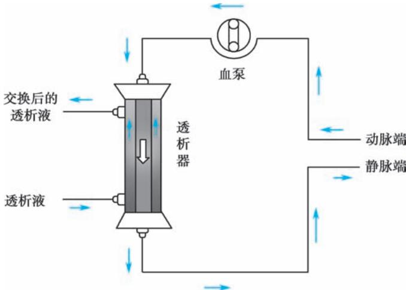

> [!info] 导航
> [[第068章_第5篇第10章_慢性肾衰竭|上一章]] · [[00_章节导航|总目录]] · [[第070章_第6篇第01章_总论|下一章]]

肾脏替代治疗方式包括血液透析、腹膜透析和肾移植。血液透析和腹膜透析可替代肾脏部分排泄功能，成功的肾移植可完全恢复肾脏功能，临床上需根据病人病情选择合适的治疗方式。

#### 【血液透析】

### （一）原理与装置

血液透析（hemodialysis, HD）常用方式包括常规血液透析、血液滤过和血液透析滤过，主要替代肾脏对溶质（主要是小分子溶质）和液体的清除功能，利用半透膜原理，通过溶质交换清除血液内的代谢废物、维持电解质和酸碱平衡，清除过多的液体。溶质清除主要依靠弥散和对流，弥散即溶质依半透膜两侧溶液浓度梯度差从浓度高的一侧向浓度低的一侧移动，对流即依膜两侧压力梯度，水分和小于膜截留分子量的溶质从压力高侧向压力低侧移动。在常规血液透析中弥散起主要作用，血液滤过时对流起重要作用。

血液透析时，血液经血管通路进入体外循环，在蠕动泵的推动下进入透析器与透析液发生溶质交换后再经血管通路回到体内(图5-11-1)。临床常用中空纤维透析器，透析膜材料以改良纤维素膜和合成膜为主。成年病人所需透析膜的表面积通常在 $1.5\sim 2.0\mathrm{m}^2$ 以保证交换面积。

  
图 5-11-1 血液透析体外循环示意图

透析液多用碳酸氢盐缓冲液，并含有钠、钾、钙、镁、氯、葡萄糖等物质。钠离子通常保持在生理浓度，糖尿病病人可使用生理糖浓度透析液。透析用水由透析用水处理设备生产，其质量影响病人的透析质量与长期预后。

### （二）血管通路

动静脉内瘘是目前最理想的永久性血管通路，包括自体动静脉瘘（autogenous arteriovenous fistula, AVF）和移植血管动静脉瘘（graft arteriovenous fistula, GAF）。常用自体动静脉瘘选择桡动脉或肱动脉与头静脉或贵要静脉吻合，使前臂浅静脉“动脉化”，血液流速可达500ml/min，内径≥5mm，便于穿刺。建议在预计开始血液透析前至少3～6个月行内瘘成形术，以便于瘘管成熟、内瘘功能评价或修复，确保有功能的内瘘用于血液透析。对于无法建立自体动静脉瘘者可行移植血管动静脉瘘，但血栓和感染发生率相对较高。

建立血管通路的另一途径是放置经皮双腔深静脉导管,按其类型、用途可分为无隧道和涤纶套的透析导管(non-cuffed catheter,NCC)和带隧道和涤纶套的透析导管(tunneled cuff catheter,TCC),前者应用于短期紧急使用,后者应用于无法行内瘘手术或手术失败的长期血液透析病人。深静脉置管可选择颈内静脉、股静脉或锁骨下静脉,主要并发症为感染、血栓形成和静脉狭窄。

### （三）适应证与治疗

1. 适应证 急性肾损伤和慢性肾衰竭应适时开始血液透析治疗(参见本篇第九章和第十章)。血液透析还可用于急性药物或毒物中毒,药物或毒素分子量低于透析器膜截留分子量、水溶性高、表观容积小、蛋白结合率低、游离浓度高者(如乙醇、水杨酸类药物等)尤其适合血液透析治疗。此外,血液透析还可应用于难治性充血性心力衰竭和急性肺水肿的急救,严重水、电解质、酸碱平衡紊乱等。

2. 抗凝治疗 血液透析时需合理使用抗凝治疗以防止透析器和血液管路中凝血。最常用的抗凝剂是肝素或低分子量肝素，肝素一般首剂量 0.3～0.5mg/kg，每小时追加 5～10mg，根据病人凝血状态个体化调整。病人存在活动性出血或明显出血倾向时，可选择小剂量肝素化、局部枸橼酸抗凝或无抗凝剂方式等。

3. 透析剂量和充分性 根据残余肾功能,血液透析一般每周3次,每次4\~6小时,需调整透析剂量以达到透析充分。透析不充分是引发各种并发症和导致长期透析病人死亡的常见原因。目前临床所用的透析充分性概念以蛋白质代谢为核心,尿素清除指数(Kt/V)是最常用的量化指标,其中K代表透析器尿素清除率,t代表单次透析时间,Kt乘积即尿素清除容积,V为尿素分布容积[约等于干体重(透析后体内过多液体全部或大部分被清除后的病人体重)的0.57],Kt/V表示在该次透析中透析器清除尿素容积占体内尿素分布容积的比例,因此Kt/V可看作是透析剂量的一个指标,以1.2\~1.4较为理想。

### （四）并发症

多数并发症均与血液透析间歇性进行，每次透析血尿素氮等溶质清除过快，细胞内、外液间渗透压失衡相关(表5-11-1)。低血压的发生主要因为短时间内超滤过多过快、有效血容量不足、自主神经病变、服用降压药、透析中进食、心律失常、心包积液、败血症、心肌缺血、透析膜反应等。

表 5-11-1 血液透析的并发症

<table><tr><td>透析失衡综合征</td><td>心律失常</td></tr><tr><td>低血压</td><td>低血糖</td></tr><tr><td>血栓</td><td>出血和急性溶血</td></tr><tr><td>空气栓塞</td><td>透析相关淀粉样变性</td></tr><tr><td>痛性肌痉挛</td><td>蛋白质-能量营养不良</td></tr><tr><td>透析器首次使用综合征</td><td>血小板减少症</td></tr><tr><td>发热</td><td></td></tr></table>

血液透析相关的远期并发症还包括淀粉样变性、蛋白质-能量营养不良等，往往与透析不充分及中、大分子的毒素清除率偏低有关。

对首次透析病人宜采用低效透析，减慢血液流速、缩短透析时间、采用面积较小的透析器等措施可以减少并发症发生。远期并发症的预防主要是提高中、大分子毒素的清除率。

### （五）连续性肾脏替代治疗

连续性肾脏替代治疗（continuous renal replacement therapy, CRRT）是持续、缓慢清除溶质和水分的血液净化治疗技术总称。传统上需24小时维持治疗，可根据病人病情适当调整治疗时间。

CRRT 相比普通血透具有如下特点:①对血流动力学影响小,血渗透压变化小;②可持续清除溶质和水分,维持内环境稳定,并为肠内、外营养创造条件;③以对流清除为主,中、小分子物质同时清除;④可实现床边治疗与急救。因此 CRRT 不仅限于肾脏功能替代,更成为各种危重症救治的重要器官支持措施。适应证包括:重症急性肾损伤和慢性肾衰竭(如合并急性肺水肿、脑水肿、血流动力学不稳定、高分解代谢等)、多器官衰竭、脓毒症、心肺体外循环、急性呼吸窘迫综合征、充血性心力衰竭、重症急性胰腺炎、药物或毒物中毒、挤压综合征等。

#### 【腹膜透析】

### （一）原理与装置

腹膜透析(peritoneal dialysis, PD), 利用病人自身腹膜为半透膜, 通过向腹腔内灌注透析液, 实现血液与透析液之间溶质交换以清除血液内的代谢废物、维持电解质和酸碱平衡, 同时清除过多的液体。腹膜对溶质的转运主要通过弥散, 对水分的清除主要通过超滤。溶质清除效率与毛细血管和腹腔之间的浓度梯度、透析液交换量、腹透液停留时间、腹膜面积、腹膜特性、溶质分子量等相关。水分清除效率主要与腹膜对水通透性、腹膜面积、跨膜压渗透梯度等有关。

腹膜透析装置主要由腹透管、连接系统、腹透液组成。腹透管是腹透液进出腹腔的通路，需手术置入，导管末端最佳位置是膀胱(子宫)直肠窝，因此处为腹腔最低位，且大网膜较少，不易被包绕。腹透管外段通过连接系统连接腹透液。腹透液有渗透剂、缓冲液、电解质三种组分。葡萄糖是目前临床最常用的渗透剂，浓度有1.5%、2.5%、4.25%三种，浓度越高超滤作用越大，相同时间内清除水分越多，临床上需根据病人液体潴留程度选择相应浓度腹透液。新型腹透液利用葡聚糖、氨基酸等作为渗透剂。多采用乳酸盐而非碳酸盐提供碱平衡。

### （二）适应证与治疗

1. 适应证 急性肾损伤和慢性肾衰竭应适时开始腹膜透析治疗(参见本篇第九章和第十章)。因腹膜透析无需特殊设备、对血流动力学影响小、对残余肾功能影响较小、无需抗凝等优势，对某些慢性肾衰竭病人可优先考虑腹膜透析，如婴幼儿、儿童，心血管状态不稳定，存在明显出血或出血倾向，血管条件不佳或反复动静脉造瘘失败，残余肾功能较好，病人家庭卫生条件较佳等。对于某些中毒性疾病、充血型心衰等，如无血液透析条件，也可考虑腹膜透析。但存在腹膜广泛粘连、腹壁病变影响置管、严重腹膜缺损者，不宜选择腹膜透析。

2. 腹膜透析疗法 腹膜透析初始治疗模式有:持续非卧床腹膜透析(continuous ambulatory peritoneal dialysis, CAPD)、日间非卧床腹膜透析、间歇性腹膜透析、自动化腹膜透析,其中 CAPD 是目前最常用的腹膜透析治疗方式,透析剂量为每天 6\~10L,白天交换 3\~5 次,每次留腹 3\~6 小时;夜间交换 1 次,留腹 10\~12 小时。需个体化调整处方,以实现最佳的溶质清除和液体平衡,并尽可能保护残余肾功能。

3. 腹膜转运功能评估 腹膜转运功能采用腹膜平衡试验(peritoneal equilibration test, PET)评估。腹膜转运功能分为高转运、高平均转运、低平均转运、低转运四种类型。高转运者往往溶质清除较好，但超滤困难，容易出现容量负荷过多，低转运者反之。对高转运者，可缩短留腹时间以保证超滤；对低转运者可适当增加透析剂量以增加溶质清除。

4. 透析充分性评估 CAPD 每周尿素清除指数 (Kt/V) ≥1.7, 每周肌酐清除率 (Ccr) ≥50L/1.73m², 且病人无毒素蓄积或容量潴留症状, 营养状况良好为透析充分。

### (三) 并发症

1. 腹膜透析管功能不良 如腹膜透析管移位、腹膜透析管堵塞等。可采用尿激酶溶栓、增加活动、使用轻泻剂等方法以保持大便通畅，如无效需手术复位或重新置管。

2. 感染 腹膜透析相关感染包括腹膜透析相关性腹膜炎、腹膜透析导管出口处感染和隧道感染，是腹膜透析最常见的急性并发症，也是造成技术失败和病人死亡的主要原因之一。

腹膜透析相关腹膜炎的诊断标准为:①腹痛、腹透液浑浊,伴或不伴发热;②透出液白细胞计数>100/mm³,且中性粒细胞占50%以上;③透出液培养有病原微生物生长(3项中符合2项或以上)。腹膜炎一旦诊断明确需立即抗感染治疗。经验抗生素选择需覆盖革兰氏阳性菌和阴性菌(如第一代头孢菌素或万古霉素联合氨基糖甙类或第三代头孢菌素),腹腔内给药,及时根据药敏试验调整抗生素。

疗程至少 2 周,重症或特殊感染需 3 周或更长。如敏感抗生素治疗 5 天仍无改善者,需考虑拔除腹膜透析管。如真菌感染,需立即拔管。

腹膜透析导管出口处感染和隧道感染统称腹膜透析导管相关感染，表现为出口处出现脓性或血性分泌物，周围皮肤红斑、压痛或硬结，伴隧道感染时可有皮下隧道触痛。常见病原菌为金黄色葡萄球菌、表皮葡萄球菌、铜绿假单胞菌等，根据药敏试验使用抗生素，疗程2～3周。

3. 疝和腹膜透析液渗漏 由于大量腹膜透析液留置于腹腔,引起腹内压升高,造成病人腹壁薄弱区形成疝。切口疝最常见,其次是腹股沟疝、脐疝等。对形成疝的病人,应减少腹膜透析液留腹量,或改为夜间透析,同时手术修补。

腹膜透析液渗漏也与腹腔压力增高有关，腹膜透析液通过导管置入处渗入腹壁疏松组织，或通过鞘状突进入阴囊、阴茎，引起生殖器水肿；或自膈肌薄弱区进入胸膜腔，导致胸腹瘘，常需改换为血液透析，如胸腔积液不消退需手术修补。

#### 【肾移植】

肾移植是将来自供体的肾脏通过手术植入受者体内，从而恢复肾脏功能。成功的肾移植可全面恢复肾脏功能，相比于透析病人生活质量最佳、维持治疗费用更低、存活率更高，已成为终末期肾病病人首选治疗方式。目前肾移植手术已较为成熟，对其相关内科问题的管理是影响长期存活率的关键。

### （一）肾移植供、受者评估

肾移植可由尸体供肾或活体供肾，后者肾移植的近、远期效果（人/肾存活）均更好，原因有：供肾缺血时间短、等待移植时间短、移植时机可选择、亲属活体供肾易获得理想的组织配型、术后排斥反应发生率较小等。所有供肾，均需排除可能传播给受者的感染性疾病和恶性肿瘤，并详尽评估肾脏解剖和功能状态。

肾移植适用于各种原因导致的终末期肾病，但需术前全面评估受者状态，包括心肺功能、预期寿命，以及是否合并活动性感染（如病毒性肝炎、结核等）、新发或复发恶性肿瘤、活动性消化道溃疡、进展性代谢性疾病（如草酸盐沉积症）等情况。对其他脏器（如心、肺、肝、胰等）存在严重慢性功能障碍的病人可考虑行器官联合移植。

### （二）免疫抑制治疗

肾移植受者需常规使用免疫抑制剂抑制排斥反应。排斥反应发生机制复杂，单一免疫抑制剂无法完全防止或抑制免疫应答的各个机制，因此不同作用位点的免疫抑制剂常常联合使用。作用互补，可有效抑制排斥反应；同时可避免单一药物大剂量使用而导致副反应增加。

肾移植免疫抑制治疗包括:①预防性用药,常采用以钙调磷酸酶抑制剂(环孢素或他克莫司)为主的二联或三联方案(联合小剂量糖皮质激素、吗替麦考酚酯、硫唑嘌呤、西罗莫司等)长期维持;贝拉西普已被批准用于肾移植排斥治疗,以防止钙调磷酸酶抑制剂的长期用药的毒性。②治疗或逆转排斥反应,常采用甲泼尼龙、抗胸腺细胞球蛋白(ATG)或抗淋巴细胞球蛋白(ALG)等冲击治疗。③诱导治疗,用于移植肾延迟复功、高危排斥、二次移植等病人,常采用ATG、抗CD25单克隆抗体等,继以环孢素或他克莫司为主的免疫抑制治疗。

### （三）移植物排斥反应

是肾移植主要并发症，分为超急性、加速性、急性和慢性排斥反应。

1. 超急性排斥反应 由于术前受者体内存在针对供者的抗体。一般发生在移植肾血管开放后即刻或48小时内。病理表现肾小球毛细血管和微小动脉血栓形成，可致广泛肾皮质坏死。目前尚无有效治疗，可通过术前检测受者群体反应性抗体水平、供受者淋巴毒试验等进行预防。

2. 加速性排斥反应 机制未完全清楚,可能与受者体内存在针对供者抗体有关。常发生在移植术后24小时至7天内,表现为发热、高血压、血尿、移植肾肿胀伴压痛、肾功能快速减退。病理表现以肾小球和间质小动脉病变为主,免疫组化可有肾小管周毛细血管补体C4d沉积。治疗上需加强免疫抑制治疗(如ATG、ALG等),结合丙种球蛋白、血浆置换去除抗体,但效果较差。

3. 急性排斥反应(acute rejection, AR) 是最常见的排斥反应,一般发生于肾移植术后 1\~3 个

月内，但术后任何时期均有可能发生。表现为尿量减少、移植肾肿胀、肾功能减退等。病理可分为T细胞介导的AR与抗体介导的AR，肾活检尤为必要，一旦诊断应及时加强免疫抑制治疗，如甲泼尼龙冲击治疗，T细胞介导者可联合ATG、ALG等治疗，抗体介导者需联合丙种球蛋白、血浆置换去除抗体。

4. 慢性排斥反应 多发生在肾移植术后数月或数年,表现为肾功能进行性减退,常伴有蛋白尿、高血压等。发病机制上以体液免疫反应为主,受者体内存在抗供者特异性抗体。目前无特别有效的疗法,可适当增加免疫抑制强度,对症处理高血压等。如有抗供者特异性抗体,可考虑丙种球蛋白、血浆置换去除抗体。

### （四）预后

肾移植受者术后1年存活率95%以上，5年存活率80%以上，而10年存活率达60%左右，远高于维持血液透析或腹膜透析病人。其主要死亡原因为心血管并发症、感染和肿瘤等。

(叶智明)

  
本章思维导图
