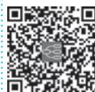

> [!info] 导航
> [[第071章_第6篇第02章_贫血概述|上一章]] · [[00_章节导航|总目录]] · [[第073章_第6篇第04章_巨幼细胞贫血|下一章]]

缺铁性贫血（iron deficiency anemia, IDA）是指机体内贮存铁耗尽（iron depletion, ID），缺铁性红细胞生成（iron deficiency erythropoiesis, IDE）不足导致的贫血。铁缺乏症可分为三个阶段：ID、IDE 和 IDA。IDA 表现为缺铁引起的小细胞低色素性贫血及其他异常。

根据病因可将其分为铁摄入不足(婴幼儿辅食添加不足、青少年偏食等)、需求量增加(孕妇)、吸收不良(胃肠道疾病)、转运障碍(无转铁蛋白血症、肝病、慢性炎症)、丢失过多(妇女月经量增多、痔出血等各种失血)及利用障碍(铁粒幼细胞贫血、铅中毒、慢性病贫血)等类型。

#### 【流行病学】

IDA 是最常见的贫血。WHO 估计, 全球约 1/4 的人口患有贫血, 主要集中于学龄前儿童和女性, 大多数贫血由铁缺乏引起。2016 年全球有超过 1.2 亿 IDA 患者。IDA 在发展中国家、经济不发达地区、婴幼儿、育龄妇女中的发病率明显增高。上海地区人群调查显示: 铁缺乏症的年发病率在 6 个月～2 岁婴幼儿为 75.0%～82.5%、妊娠 3 个月以上妇女为 66.7%、育龄妇女为 43.3%、10～17 岁青少年为 13.2%; 以上人群 IDA 患病率分别为 33.8%～45.7%、19.3%、11.4% 和 9.8%。

#### 【铁代谢】

人体内铁分两部分:其一为功能状态铁,包括血红蛋白铁(占体内铁的67%)、肌红蛋白铁(占体内铁15%)、转铁蛋白铁(3\~4mg)、乳铁蛋白、酶和辅因子结合的铁;其二为贮存铁(男性1000mg,女性300\~400mg),包括铁蛋白和含铁血黄素。铁总量在正常成年男性为50\~55mg/kg,女性35\~40mg/kg。正常人每天造血需20\~25mg铁,主要来自衰老破坏的红细胞。正常人维持体内铁平衡需每天从食物中摄铁1\~1.5mg,妊娠期、哺乳期妇女每天需2\~4mg。动物食品铁吸收率高(可达20%),植物食品铁吸收率低(1%\~7%)。铁吸收部位主要在十二指肠及空肠上段。食物铁状态(三价、二价铁)、胃肠功能(酸碱度等)、体内铁贮量、骨髓造血状态及某些药物(如维生素C)均会影响铁吸收。吸收入血的二价铁经铜蓝蛋白氧化成三价铁,与转铁蛋白结合后转运到组织或通过幼红细胞膜转铁蛋白受体胞饮入细胞内,再与转铁蛋白分离并还原成二价铁,参与形成血红蛋白。最新的研究发现,肝分泌的铁调素是食物铁自肠道吸收和铁从巨噬细胞释放的主要负调控因子。铁调素的表达受机体铁状况、各种致炎因子、细菌、内毒素(脂多糖)和细胞因子等各种因素调节。多余的铁以铁蛋白和含铁血黄素形式贮存于肝、脾、骨髓等器官的单核巨噬细胞系统,待铁需要增加时动用。人体每天排铁不超过1mg,主要通过肠黏膜脱落细胞随粪便排出,少量通过尿、汗液排出,哺乳期妇女还通过乳汁排出。

#### 【病因和发病机制】

### (一) 病因

1. 需铁量增加而铁摄入不足 多见于婴幼儿、青少年、妊娠和哺乳期妇女。婴幼儿需铁量较大，若不补充蛋类、肉类等富含铁的辅食，易造成缺铁。青少年偏食易缺铁。女性月经过多、妊娠或哺乳，需铁量增加，若不补充富含铁食物，易造成 IDA。

2. 铁吸收障碍 常见于胃大部切除术后,胃酸分泌不足且食物快速进入空肠,绕过铁的主要吸收部位(十二指肠),使铁吸收减少。此外,多种原因造成的胃肠道功能紊乱,如长期不明原因腹泻、慢性肠炎、克罗恩病等均可因铁吸收障碍而发生 IDA。

3. 铁丢失过多 长期慢性铁丢失而得不到纠正可造成 IDA, 如慢性胃肠道失血 (包括痔、胃十二指肠溃疡、食管裂孔疝、消化道息肉、胃肠道肿瘤、寄生虫感染、食管胃底静脉曲张破裂等)、月经过多 (如宫内放置节育器、子宫肌瘤及月经失调等妇科异常)、咯血和肺泡出血 (如肺含铁血黄素沉着症、肺出血肾炎综合征、肺结核、支气管扩张、肺癌等)、血红蛋白尿(如阵发性睡眠性血红蛋白尿症、冷抗体型自身免疫性溶血、人工心脏瓣膜、行军性血红蛋白尿等)及其他(如遗传性出血性毛细血管扩张症、慢性肾衰竭行血液透析、多次献血等)。

### （二）发病机制

1. 缺铁对铁代谢的影响 当体内贮存铁减少到不足以补偿功能状态下的铁时,铁代谢指标发生异常:贮存铁指标(铁蛋白、含铁血黄素)减低、血清铁和转铁蛋白饱和度减低、总铁结合力和未结合铁的转铁蛋白升高。转铁蛋白受体表达于红系造血细胞膜表面,其表达量与红细胞内 Hb 合成所需的铁的代谢密切相关,当红细胞内铁缺乏时,转铁蛋白受体脱落进入血液,成为血清可溶性转铁蛋白受体(sTfR)。

2. 缺铁对造血系统的影响 红细胞内缺铁,血红素合成障碍,大量原卟啉不能与铁结合成为血红素,以红细胞游离原卟啉(FEP)的形式积累在红细胞内或与锌原子结合成为锌原卟啉(ZPP),血红蛋白生成减少,红细胞胞质少、体积小,发生小细胞低色素性贫血;严重时粒细胞、血小板的生成也受影响。

3. 缺铁对组织细胞代谢的影响 组织缺铁,细胞中含铁酶和铁依赖酶的活性降低,进而影响患者的精神、行为、体力、免疫功能及患儿的生长发育和智力;缺铁可引起黏膜组织病变和外胚叶组织营养障碍。

#### 【临床表现】

1. 缺铁原发病表现 如消化性溃疡、肿瘤或痔导致的黑便、血便或腹部不适，肠道寄生虫感染导致的腹痛或大便性状改变，妇女月经过多，肿瘤性疾病导致的消瘦，血管内溶血的血红蛋白尿等。

2. 贫血表现 常见症状为乏力、易疲倦、头晕、头痛、眼花、耳鸣、心悸、气短、食欲缺乏等；有皮肤、黏膜苍白、心率增快。

3. 组织缺铁表现 精神行为异常,如烦躁、易怒、注意力不集中、异食癖;体力、耐力下降;易感染;儿童生长发育迟缓、智力低下;口腔炎、舌炎、舌乳头萎缩、口角皲裂、吞咽困难;毛发干枯、脱落;皮肤干燥、皱缩;指/趾甲缺乏光泽、脆薄易裂,重者指/趾甲变平,甚至下凹呈勺状(匙状甲)。

#### 【实验室检查】

1. 血象 呈小细胞低色素性贫血。平均红细胞体积(MCV)低于80fl,平均红细胞血红蛋白含量(MCH)小于27pg,平均红细胞血红蛋白浓度(MCHC)小于320g/L。血涂片中可见红细胞体积小、中央淡染区扩大。网织红细胞计数多正常或轻度增高。白细胞和血小板计数可正常或减低,也有部分患者血小板计数升高。

2. 骨髓象 增生活跃或明显活跃；以红系细胞增生为主，粒系、巨核系细胞无明显异常；红系细胞中以中、晚幼红细胞为主，其体积小、核染色质致密、胞质少、边缘不整齐，有血红蛋白形成不良的表现，即所谓的“核老浆幼”现象。

3. 铁代谢 血清铁低于 $8.95 \mu mol/L$ ，总铁结合力升高，大于 $64.44 \mu mol/L$ ；转铁蛋白饱和度降低，小于 15%，sTfR 浓度超过 8mg/L。血清铁蛋白低于 $12 \mu g/L$ 。骨髓涂片与亚铁氰化钾作用（普鲁士蓝染色）后，在骨髓小粒中无深蓝色的含铁血黄素颗粒；在幼红细胞内铁小粒减少或消失，铁粒幼细胞少于 15%。

4. 红细胞内卟啉代谢 FEP>0.9μmol/L(全血), ZPP>0.96μmol/L(全血), FEP/Hb>4.5μg/g Hb。

5. 血清转铁蛋白受体测定 血清可溶性转铁蛋白受体（sTfR）测定是迄今反映缺铁性红细胞生成的最佳指标，一般 sTfR 浓度 $>26.5\mathrm{nmol / L}$ （ $2.25\mu \mathrm{g / ml}$ ）可诊断缺铁。

#### 【诊断与鉴别诊断】

### (一) 诊断

1. ID ①血清铁蛋白 $< 12\mu \mathrm{g} / \mathrm{L}$ ; ②骨髓铁染色显示骨髓小粒可染铁消失, 铁粒幼细胞少于 $15\%$ ; ③血红蛋白及血清铁等指标尚正常。

2. IDE ①ID 的①+②;②转铁蛋白饱和度<15%;③FEP/Hb>4.5μg/g Hb;④血红蛋白尚正常。

3. IDA ①IDE 的①+②+③；②小细胞低色素性贫血：男性 Hb<120g/L，女性 Hb<110g/L，孕妇 Hb<100g/L；MCV<80fl，MCH<27pg，MCHC<320g/L。

4. 病因诊断 只有明确病因, IDA 才可能根治; 有时缺铁的病因比贫血本身更为严重。如胃肠道恶性肿瘤伴慢性失血, 或胃癌术后残胃癌所致的 IDA, 应多次检查粪便隐血, 必要时做胃肠道 X 线或内镜检查; 月经过多的妇女应检查有无妇科疾病。

### （二）鉴别诊断

应与下列小细胞性贫血鉴别。

1. 铁粒幼细胞贫血 遗传或不明原因导致的红细胞铁利用障碍性贫血。表现为小细胞性贫血，但血清铁蛋白浓度增高、骨髓小粒含铁血黄素颗粒增多、铁粒幼细胞增多，并出现环形铁粒幼细胞。血清铁和转铁蛋白饱和度增高，总铁结合力不低。

2. 珠蛋白生成障碍性贫血 常见为地中海贫血,有家族史,有溶血表现。血涂片中可见多量靶形红细胞,并有珠蛋白肽链合成数量异常的证据,如胎儿血红蛋白或血红蛋白 $A_{2}$ 增高,出现血红蛋白 H 包涵体等。血清铁蛋白、骨髓可染铁、血清铁和转铁蛋白饱和度不低且常增高。

3. 慢性病贫血 慢性炎症、感染或肿瘤等引起的铁代谢异常性贫血。贫血为小细胞性。贮存铁（血清铁蛋白和骨髓小粒含铁血黄素）增多。血清铁、转铁蛋白饱和度、总铁结合力减低。

4. 转铁蛋白缺乏症 系常染色体隐性遗传所致(先天性)或严重肝病、肿瘤继发(获得性)。表现为小细胞低色素性贫血。血清铁、总铁结合力、血清铁蛋白及骨髓含铁血黄素均明显降低。先天性者幼儿时发病,伴发育不良和多脏器功能受累。获得性者有原发病的表现。

#### 【治疗】

治疗 IDA 的原则是:根除病因;补足贮存铁。

1. 病因治疗 积极寻找 ID/IDA 的病因, 如青少年、育龄期女性、妊娠期女性和哺乳期女性等由于铁摄入不足引起的 IDA, 应改善饮食, 补充含铁丰富且易吸收的食物, 如瘦肉、动物肝脏等; 育龄期女性可以预防性补充铁剂, 每日或隔日补充元素铁; 月经过多引起的 IDA 应该寻找月经量过多的原因; 寄生虫感染患者应进行驱虫治疗; 恶性肿瘤患者应进行手术或放、化疗; 消化性溃疡患者应进行抑酸护胃治疗等。

2. 补铁治疗 治疗性铁剂有无机铁和有机铁两类。无机铁以硫酸亚铁为代表，有机铁则包括右旋糖酐铁、葡萄糖酸亚铁、山梨醇铁、富马酸亚铁、琥珀酸亚铁和多糖铁复合物等。无机铁剂的不良反应较有机铁剂明显。首选口服铁剂。如硫酸亚铁0.3g，每日3次；或右旋糖酐铁50mg，每日2～3次。餐后服用胃肠道反应小且易耐受。应注意，进食谷类、乳类和茶等会抑制铁剂的吸收，鱼、肉类、维生素C可加强铁剂的吸收。口服铁剂有效的表现先是外周血网织红细胞增多，高峰在开始服药后5～10天，2周后血红蛋白浓度上升，一般2个月左右恢复正常。铁剂治疗应在血红蛋白恢复正常后至少持续4～6个月，待铁蛋白正常后停药。若口服铁剂不能耐受或胃肠道正常解剖部位发生改变而影响铁的吸收，可用铁剂肌内注射或静脉注射。右旋糖酐铁是最常用的注射铁剂，首次给药须用0.5ml作为试验剂量，1小时后无过敏反应可给足量治疗，注射用铁的总需量按公式计算：(须达到的血红蛋白浓度-患者的血红蛋白浓度) $\left(\mathrm{g}/\mathrm{L}\right)\times0.33\times$ 患者体重(kg)。

#### 【预后】

单纯营养不足者,易恢复正常。继发于其他疾病者,取决于原发病能否根治。

#### 【预防】

重点放在婴幼儿、青少年和妇女的营养保健。对婴幼儿应及早添加富含铁的食品，如蛋类、肝等；对青少年应纠正偏食，定期查、治寄生虫感染；对妊娠期、哺乳期妇女可补充铁剂；对月经期妇女应防治月经过多。做好肿瘤性疾病和慢性出血性疾病的人群防治。

(付蓉)

  
本章思维导图
