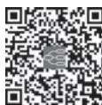

> [!info] 导航
> [[第081章_第6篇第12章_骨髓增殖性肿瘤|上一章]] · [[00_章节导航|总目录]] · [[第083章_第6篇第14章_出血性疾病概述|下一章]]

脾功能亢进（hypersplenism），是一种临床综合征，其共同表现为脾大，一系或多系血细胞减少而骨髓造血细胞相应增生；脾切除后血象可基本恢复，症状缓解。根据病因明确与否，脾功能亢进分为原发性和继发性。

#### 【病因】

原发性脾功能亢进病因未明，较为少见。继发性脾功能亢进常见病因有以下几类。

1. 感染性疾病 传染性单核细胞增多症、亚急性感染性心内膜炎、病毒性肝炎、布鲁菌病、血吸虫病、黑热病及疟疾等。

2. 免疫性疾病 费尔蒂（Felty）综合征、系统性红斑狼疮等。

3. 充血性疾病 充血性心力衰竭、缩窄性心包炎、Budd-Chiari 综合征、肝硬化、门静脉或脾静脉血栓形成等。

4. 血液系统疾病 ①溶血性贫血：遗传性球形红细胞增多症、自身免疫性溶血性贫血、珠蛋白生成障碍性贫血及镰状细胞贫血等。②恶性血液病：各类急慢性白血病、淋巴瘤、淀粉样变性等。③骨髓增殖性肿瘤：真性红细胞增多症、原发性骨髓纤维化等。

5. 脾脏疾病 脾淋巴瘤、脾囊肿、脾血管瘤等。

6. 脂质贮积病 戈谢病、尼曼-皮克病和糖原贮积症等。

7. 其他 恶性肿瘤（如血管肉瘤等）、药物因素、髓外造血等。

#### 【发病机制】

脾功能亢进引起血细胞减少的机制尚未明确，可能与以下因素有关。

1. 过分吞噬 脾有滤血功能。脾是单核巨噬细胞系统的组成部分，血液缓慢流经红髓中巨噬细胞构成的网状过滤床，然后再通过脾血窦内皮间的小裂孔（0.2～0.5μm）回到循环中，在此过程中，血液中的细菌、异物或表面覆盖了抗体及补体的细胞，被巨噬细胞识别并吞噬。另外，血流中衰老、受损、变形能力差的细胞因不能通过裂孔被阻留下来，亦被巨噬细胞识别吞噬。各种原因引起脾大时，经过红髓的血流比例增加，流动更为缓慢，脾的滤血功能亢进，正常或异常的血细胞在脾中阻留或破坏增加，使循环血细胞减少，并可引起骨髓造血代偿性加强。

2. 过分阻留 正常人脾内无储存红细胞的功能，仅有约 1/3 的血小板及少量白细胞（主要为淋巴细胞）被阻留于脾。当脾显著增大时，50%～90% 的血小板、30% 的红细胞以及更多的淋巴细胞被阻留于脾，致外周血细胞减少。

3. 血流动力学异常 脾大常伴随血浆容量增加，血流增加，使脾静脉超负荷，从而引起门静脉压增高。后者又可使脾进一步肿大，脾血流量增加，形成恶性循环。

4.  异常自身抗体 脾参与抗原加工与抗体形成，脾大时单核巨噬细胞会过度合成各种自身抗体，例如抗红细胞抗体、抗血小板抗体等。

5. 免疫-神经内分泌网络 脾的内分泌功能是机体“免疫-神经内分泌”网络调节作用的重要组成部分。脾大或者脾功能亢进时，这种调节作用受到破坏，脾大量分泌血细胞抑制素，将血细胞滞留在脾内，加快血细胞破坏。

临床上脾大和全血细胞减少可能是上述发病机制共同作用的结果。

#### 【临床表现】

绝大多数患者查体时发现不同程度脾大，但也确有少数患者脾未能扪及，须经影像学检查才能确诊。轻至中度的脾大常无症状，明显增大时可产生腹部不适。如在左季肋部出现与呼吸相关的疼痛及摩擦感，常提示脾梗死。

全血细胞减少是脾功能亢进的典型表现。血细胞减少的程度及症状与脾大的程度并不平行。轻度血细胞减少时，临床症状不明显；中重度血细胞减少时，可出现贫血、感染、出血等临床表现。

继发性脾功能亢进可有原发病的表现。

#### 【实验室及影像学检查】

1. 血象 可一系、两系乃至三系血细胞同时减少，细胞形态正常。早期以白细胞或/和血小板减少为主，晚期常发生全血细胞减少。

2. 骨髓象 增生活跃或明显活跃，外周血中减少的血细胞系列，在骨髓常呈显著增生，部分患者可出现血细胞成熟障碍。

3. 影像学检查 超声、CT、MRI等影像学检查均可明确脾脏大小，对脾功能亢进及原发病确诊具有重要意义。此外，可根据门静脉宽度作出门静脉高压的诊断。

4. 放射性核素检查 将 51Cr标记的红细胞通过静脉注入血液循环后，定时测定红细胞在血液循环中的清除率，并测定脾中红细胞阻留指数。

#### 【诊断】

1991 年国内制定的诊断标准：①脾大：绝大多数患者根据体检即可确定，少数体检未扪及或仅于肋下刚扪及脾大者，还须经过超声、CT 或 MRI 等确定。②外周血细胞减少：可一系血细胞减少或多系血细胞同时减少。③增生性骨髓象：骨髓有核细胞增生活跃或明显活跃，部分患者出现轻度血细胞成熟障碍。④脾切除后外周血象接近或恢复正常。⑤51Cr标记的红细胞或血小板注入人体内后行体表放射性测定，脾区体表放射性为肝区2～3倍。诊断以前4 条依据最重要。

#### 【鉴别诊断】

主要与引起脾大疾病和血细胞减少疾病相鉴别。

#### 【治疗】

继发性脾功能亢进者，应首先治疗原发病，若原发病治疗困难，或脾功能亢进明显且原发病允许，可考虑脾切除。原发性脾功能亢进者可采用脾区放射治疗、脾部分栓塞术或脾切除。脾切除指征：①脾大保守治疗无效，造成明显压迫症状；②严重溶血性贫血；③显著血小板减少引起出血；④粒细胞极度减少并有反复感染史。

脾切除后常见并发症是血栓形成和栓塞、感染，须严格掌握适应证。

（高素君）

  
本章思维导图
