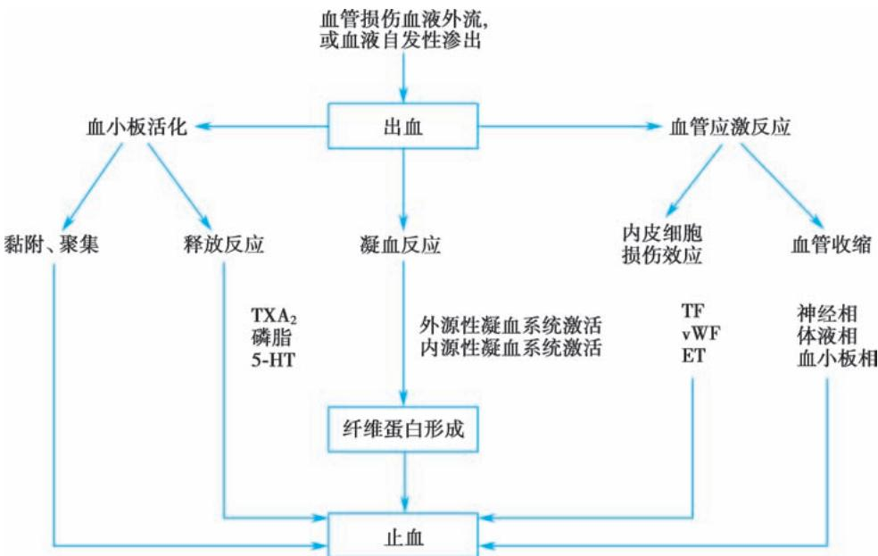
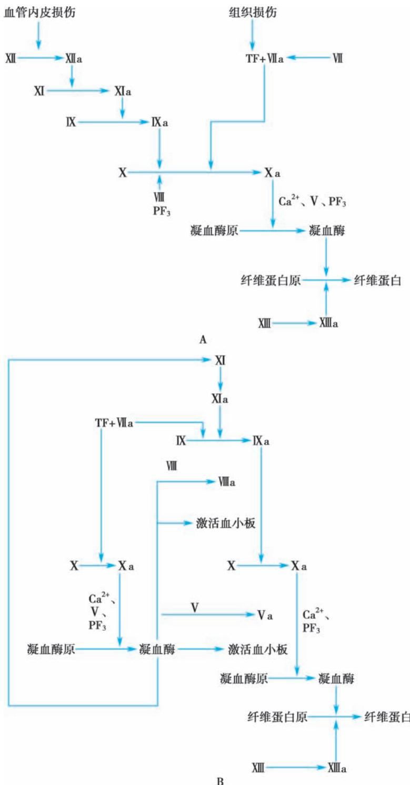
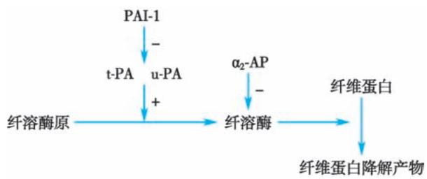

> [!info] 导航
> [[第082章_第6篇第13章_脾功能亢进|上一章]] · [[00_章节导航|总目录]] · [[第084章_第6篇第15章_紫癜性疾病|下一章]]

人体血管受到损伤时，血液可自血管外流或渗出。此时，机体将通过一系列生理性反应使出血停止，即止血。止血过程有多种因素参与，并包含一系列复杂的生理、生化反应。因先天性或遗传性及获得性因素，导致血管、血小板、凝血、抗凝及纤维蛋白溶解等止血机制的缺陷或异常，而引起的以自发性或轻度损伤后过度出血为特征的疾病，称为出血性疾病。

#### 【正常止血机制】

1. 血管因素 血管收缩是人体对出血最早的生理性反应。当血管受损时，局部血管发生收缩，导致管腔变窄、破损伤口缩小或闭合。血管收缩通过神经反射及多种介质调控完成。

受损的血管内皮细胞在止血过程中有下列作用：①表达并释放血管性血友病因子（vWF），导致血小板在损伤部位黏附和聚集；②表达并释放组织因子（TF），启动外源性凝血途径；③基底胶原暴露，激活因子Ⅻ（FⅫ），启动内源性凝血途径；④表达并释放凝血酶调节蛋白（TM），调节抗凝系统。

2. 血小板因素 血管受损时，血小板通过黏附、聚集及释放反应参与止血过程：①血小板糖蛋白Ⅰb（GPⅠb）作为受体，通过vWF的桥梁作用，使血小板黏附于受损内皮下的胶原纤维，形成血小板血栓，机械性修复受损血管；②血小板糖蛋白Ⅱb/Ⅲa复合物（GPⅡb/Ⅲa）通过纤维蛋白原互相连接而致血小板聚集；③聚集后的血小板活化，分泌或释放一系列活性物质，如血栓素A（TXA）、5-羟色胺（5-HT）等。

3 凝血因素上述血管内皮损伤，启动外源及内源性凝血途径，在磷脂等的参与下.经过一系列酶解反应形成纤维蛋白血栓。血栓填塞于血管损伤部位，使出血得以停止。同时，凝血过程中形成的凝血酶等还具有促进血液凝固及止血的重要作用。

止血机制及各相关因素的作用见图6-14-1。

#### 【凝血机制】

血液凝固是由无活性的凝血因子（酶原）通过一系列酶促反应被有序地、逐级放大地激活，转变为有蛋白降解活性的凝血因子的过程，即所谓的“瀑布学说”。凝血的最终结果是血浆中的纤维蛋白原转变为纤维蛋白。

  
图6-14-1 止血机制及主要相关因素的作用  
TXA ，血栓素A ；5-HT，5-羟色胺；TF，组织因子；vWF，血管性血友病因子；ET，内皮素。

### （一） 凝血因子

目前已知直接参与人体凝血过程的凝血因子有 14 个，其命名、生成部位、主要生物学特征及正常血浆浓度等见表6-14-1。

表6-14-1 血浆凝血因子的名称及特性

<table><tr><td>凝血因子</td><td>同义名</td><td>合成部位</td><td>与维生素K的关系</td><td>血浆中浓度/(mg/L)</td><td>被硫酸钡吸附</td><td>血清中</td><td>储存稳定性</td><td>半衰期/h</td></tr><tr><td>I</td><td>纤维蛋白原</td><td>肝、巨核细胞</td><td>-</td><td>2000~4000</td><td>-</td><td>无</td><td>稳定</td><td>72~120</td></tr><tr><td>II</td><td>凝血酶原</td><td>肝</td><td>+</td><td>100~150</td><td>+</td><td>无</td><td>稳定</td><td>60~70</td></tr><tr><td>III</td><td>组织因子,组织凝血活酶</td><td>组织、内皮细胞、单核细胞</td><td>-</td><td>0</td><td></td><td></td><td></td><td></td></tr><tr><td>IV</td><td>钙离子</td><td></td><td></td><td>90~110</td><td></td><td></td><td>稳定</td><td>稳定</td></tr><tr><td>V</td><td>易变因子(前加速素)</td><td>肝</td><td>-</td><td>5~10</td><td>-</td><td>无</td><td>不稳定</td><td>12</td></tr><tr><td>VII</td><td>稳定因子(前转变素)</td><td>肝</td><td>+</td><td>0.5</td><td>+</td><td>有</td><td>不稳定</td><td>3~6</td></tr><tr><td>VIII</td><td>抗血友病球蛋白(AHG)</td><td>肝、脾、巨核细胞</td><td>-</td><td>0.1~0.2</td><td>-</td><td>无</td><td>不稳定(冷冻稳定)</td><td>8~12</td></tr><tr><td>IX</td><td>血浆凝血活酶成分(PTC),christmas因子</td><td>肝</td><td>+</td><td>4~5</td><td>+</td><td>有</td><td>稳定</td><td>18~24</td></tr><tr><td>X</td><td>Stuart-Prowe因子</td><td>肝</td><td>+</td><td>8~10</td><td>+</td><td>有</td><td>尚稳定</td><td>30~40</td></tr><tr><td>XI</td><td>血浆凝血活酶前质(PTA)</td><td>肝</td><td>-</td><td>5</td><td>+</td><td>有</td><td>稳定</td><td>52</td></tr><tr><td>XII</td><td>接触因子,Hageman因子</td><td>肝</td><td>-</td><td>30</td><td>-</td><td>有</td><td>稳定</td><td>60</td></tr><tr><td>XIII</td><td>纤维蛋白稳定因子</td><td>肝、巨核细胞</td><td>-</td><td>10~22</td><td>-</td><td>无</td><td>稳定</td><td>240</td></tr><tr><td>PK</td><td>激肽释放酶原(前激肽释放酶)</td><td>肝</td><td>-</td><td>50</td><td>-</td><td>有</td><td>稳定</td><td>35</td></tr><tr><td>HMWK</td><td>高分子量激肽原</td><td>肝</td><td>-</td><td>70</td><td>-</td><td>有</td><td>稳定</td><td>150</td></tr></table>

### （二） 凝血过程

经典凝血学说认为，凝血过程依其启动环节不同分为外源性（以血液与TF接触为起点，也称 TF 途径）和内源性（以 FⅫ激活为起点）两种途径，在活化的因子Ⅹ（FⅩa）之后直至纤维蛋白形成是共同通路。

1. 凝血活酶生成

（1）外源性凝血途径：血管损伤时，内皮细胞表达 TF 并释入血流。TF 与因子Ⅶ（FⅦ）或活化的因子Ⅶ（FⅦa）在钙离子 $\left( \mathrm { C a } ^ { 2 + } \right)$ 存在的条件下，形成 TF/FⅦ或 $\mathrm { { T F / F V } \mathrm { { l l a } } }$ 复合物，这两种复合物均可激活因子Ⅹ（FⅩ），后者的激活作用远远大于前者，并还有激活因子Ⅸ（FⅨ）的作用。

（2）内源性凝血途径：血管损伤时，内皮完整性破坏，内皮下胶原暴露，FⅫ与带负电荷的胶原接触而激活，转变为活化的因子Ⅻ $\left( \mathrm { { F } \backslash \backslash \Omega \mathrm { { a } } } \right) _ { \circ } \ \mathrm { { F } \backslash \backslash \Omega \mathrm { { a } } }$ 激活因子 $\cdot \mathrm { { M } ( F X ) _ { \circ } }$ 在 $\mathrm { C a } ^ { 2 + }$ 存在的条件下，活化的因子Ⅺ（FⅪa）激活 FⅨ。活化的因子Ⅸ（FⅨa）、因子Ⅷ（FⅧ）及膜表面磷脂（如血小板第 3 因子， $\mathrm { P F } _ { 3 }$ ）在$\mathrm { C a } ^ { 2 + }$ 的参与下形成复合物激活FX。

上述两种途径激活 FⅩ后，凝血过程即进入共同途径。在 $\mathrm { C a } ^ { 2 + }$ 存在的条件下，FⅩa、因子Ⅴ（FⅤ）与磷脂形成复合物，即凝血活酶。

2.凝血酶生成 血浆中无活性的凝血酶原在凝血活酶的作用下，转变为蛋白分解活性极强的凝血酶。凝血酶形成是凝血连锁反应中的关键，除参与凝血反应，还有如下多种作用：①反馈性加速凝血酶原向凝血酶的转变，该作用远远强于凝血活酶；②诱导血小板的不可逆性聚集，加速其活化及释放反应；③激活 FⅪ；④激活因子ⅩⅢ（FⅩⅢ），加速稳定性纤维蛋白形成；⑤激活纤溶酶原，增强纤维蛋白溶解（简称纤溶）活性。

3. 纤维蛋白生成 在凝血酶作用下，纤维蛋白原依次裂解，释出肽 A、肽 B，形成纤维蛋白单体，单体自动聚合，形成不稳定性纤维蛋白，再经活化的因子ⅩⅢ（FⅩⅢa）的作用，形成稳定性交联纤维蛋白。血液凝固过程见图6-14-2A。

  
图6-14-2 血液凝固过程模式图

A.传统的瀑布式凝血反应模式图；B.现代的瀑布式凝血反应模式图。

现代凝血学说认为，凝血过程分为两个阶段，首先是启动阶段，这是通过外源性凝血途径（TF途径）实现的，由此生成少量凝血酶。然后是放大阶段，即少量凝血酶发挥正反馈：激活血小板，磷脂酰丝氨酸由膜内移向膜外发挥磷脂作用；激活 FⅤ；激活 FⅧ；在磷脂与凝血酶原存在条件下激活 FⅪ（FⅪ作为 TF 途径与内在途径连接点）。从而生成足量凝血酶，以完成正常的凝血过程（图 6-14-2B）。

#### 【抗凝与纤维蛋白溶解机制】

除凝血系统外，人体还存在完善的抗凝及纤溶系统。体内凝血与抗凝、纤维蛋白形成与纤维蛋白溶解维持着动态平衡，以保持血流的通畅。

### （一） 抗凝系统的组成和作用

1. 抗凝血酶（AT） AT是人体内最重要的抗凝物质，约占血浆生理性抗凝活性物质的75%。AT生成于肝及血管内皮细胞，主要功能是灭活 FⅩa 及凝血酶，对其他丝氨酸蛋白酶如 FⅨa、FⅪa、FⅫa等亦有一定灭活作用，其抗凝活性与肝素密切相关。

2.  蛋白 C 系统 蛋白 C 系统由蛋白 C（PC）、蛋白 S（PS）、凝血酶调节蛋白（TM）等组成。PC、PS为维生素K依赖性凝血因子，在肝内合成。TM 则主要存在于血管内皮细胞表面，是内皮细胞表面的凝血酶受体。凝血酶与TM 1∶1 结合成复合物，裂解PC，形成活化的PC（APC），APC 以PS 为辅助因子，通过灭活FⅤ及FⅧ而发挥抗凝作用。

3.  组织因子途径抑制物（TFPI） 一种对热稳定的糖蛋白。内皮细胞可能是其主要生成部位。TFPI 的抗凝机制为：①直接对抗 FⅩa；②在 $\mathrm { C a } ^ { 2 + }$ 存在的条件下，与 FⅩa 形成复合物，有抗 TF/FⅦa 复合物的作用。

4. 肝素 为硫酸黏多糖类物质，主要由肺或肠黏膜肥大细胞合成，抗凝作用主要表现为抗 FⅩa及凝血酶。作用与 AT 密切相关：肝素与 AT 结合，致 AT 构型变化，活性中心暴露，变构的 AT 与因子Ⅹa 或凝血酶 1∶1 结合成复合物，致上述两种丝氨酸蛋白酶灭活。近年研究发现，低分子量肝素的抗 FⅩa 作用明显强于肝素钠。此外，肝素还有促进内皮细胞释放组织型纤溶酶原激活物（t-PA）、增强纤溶活性等作用。

### （二） 纤溶系统的组成与激活

1. 组成 纤溶系统主要由纤溶酶原及其激活物、纤溶酶相关抑制物等组成。

（1）纤溶酶原（PLG）：一种单链糖蛋白，主要在脾、嗜酸性粒细胞及肾等部位生成，血管内皮细胞也有纤溶酶原表达。

（2）组织型纤溶酶原激活物（t-PA）：人体内主要的纤溶酶原激活剂，主要在内皮细胞合成。

（3）尿激酶型纤溶酶原激活物（u-PA）：最先由尿中分离而得名，亦称尿激酶（UK）。主要存在形式为前尿激酶（pro-UK）和双链尿激酶型纤溶酶原激活物。

（4）纤溶酶相关抑制物：主要包括 $\alpha _ { 2 } -$ 纤溶酶抑制物 $( \mathbf { \alpha } _ { \alpha _ { 2 } - \mathrm { P I } } ) _ { \mathbf { \alpha } _ { \mathrm { 1 } } }$ -抗胰蛋白酶 $\left( \mathbf { \alpha } _ { \alpha _ { 1 } - \mathrm { A P } } \right)$ 及 $\alpha _ { 2 } -$ 抗纤溶酶 $( \alpha _ { 2 } \mathrm { - A P ) }$ 等数种。有抑制t-PA、纤溶酶等作用。

2. 纤溶系统激活

（1）内源性途径：这一激活途径与内源性凝血过程密切相关。当 FⅫ被激活时，前激肽释放酶经FⅫa作用转化为激肽释放酶，后者使纤溶酶原转变为纤溶酶，致纤溶过程启动。

（2）外源性途径：血管内皮及组织受损伤时，t-PA 或 u-PA 释入血流，裂解纤溶酶原，使之转变为纤溶酶，导致纤溶系统激活。

作为一种丝氨酸蛋白酶，纤溶酶作用于纤维蛋白（原），使之降解为小分子多肽 A、B、C 及一系列碎片，称之为纤维蛋白（原）降解产物（FDP）。纤溶过程见图 6-14-3。

#### 【出血性疾病分类】

按病因及发病机制，可分为以下几种主要类型。

### （一） 血管壁异常

1. 先天性或遗传性 ①遗传性出血性毛细血管扩张症；②家族性单纯性紫癜；③先天性结缔组织病（血管及其支持组织异常）。

  
图6-14-3 纤溶过程示意图

2. 获得性 ①感染：如败血症；②过敏：如过敏性紫癜；③化学物质及药物：如药物性紫癜；④营养不良：如维生素 C 及维生素 PP 缺乏症；⑤代谢及内分泌障碍：如糖尿病、库欣综合征；⑥其他：如结缔组织病、动脉硬化、机械性紫癜、体位性紫癜等。

### （二） 血小板异常

1. 血小板数量异常

（1）血小板减少：①血小板生成减少：如再生障碍性贫血、白血病、放疗及化疗后的骨髓抑制；②血小板破坏过多：发病多与免疫反应等有关，如原发免疫性血小板减少症（ITP）；③血小板消耗过度：如弥散性血管内凝血（DIC）；④血小板分布异常：如脾功能亢进等。

（2）血小板增多（伴血小板功能异常）：原发性血小板增多症。

2.  血小板质量异常

（1）先天性或遗传性：血小板无力症，巨大血小板综合征等。

（2）获得性：由抗血小板药物、感染、尿毒症、异常球蛋白血症等引起。获得性血小板质量异常较多见。

### （三） 凝血异常

1.  先天性或遗传性 ①血友病 A、B；②遗传性 FⅪ缺乏症；③多种罕见的遗传性凝血性障碍疾病，如遗传性凝血酶原、FⅤ、FⅦ、FⅩ缺乏症等。

2. 获得性 ①肝病性凝血障碍；②维生素K缺乏症；③尿毒症性凝血异常等。

### （四） 抗凝及纤维蛋白溶解异常

主要为获得性疾病：①肝素使用过量；②香豆素类药物过量及敌鼠钠中毒；③免疫相关性抗凝物增多；④动物毒素中毒；⑤溶栓药物过量。

### （五） 复合性止血机制异常

1. 先天性或遗传性 血管性血友病（vWD）。

2. 获得性 弥散性血管内凝血（DIC）。

#### 【出血性疾病诊断】

患者的病史和临床表现常可提示出血的原因和诊断。

### （一） 病史

1. 出血特征、包括出血发生的年龄，部位，持续时间出血量，是否有出生时脐带出血及迟发性出血、是否有同一部位反复出血等。一般认为，皮肤、黏膜出血点、紫癜等多为血管、血小板异常所致，深部血肿、关节出血等提示可能与凝血障碍等有关，而创伤、手术后延迟性出血则考虑与纤溶异常有关。

2. 出血诱因 是否为自发性，与手术、创伤及接触或使用药物的关系等。

3. 基础疾病 如肝病、肾病、消化系统疾病、糖尿病、免疫性疾病及某些特殊感染等。

4. 家族史 父系、母系及近亲家族是否有类似疾病或出血病史。

5. 其他 饮食、营养状况、职业及环境等，对于女性患者要明确月经史及是否有经量增多、经期延长及排出较大的血凝块的情况。

### （二） 体格检查

1. 出血体征 出血范围、部位，有无血肿等深部出血、伤口渗血，分布是否对称等。

2. 相关疾病休征 贫血貌肝、脾、淋巴结肿大 黄痕蜘蛛痣 腹水水肿等。关节畸形、皮肤异常扩张的毛细血管团等。

3. 一般体征 如心率、呼吸、血压、末梢循环状况等。

病史及体检对出血性疾病的诊断意义见表6-14-2。

表6-14-2 常见出血性疾病的临床鉴别

<table><tr><td>项目</td><td>血管性疾病</td><td>血小板性疾病</td><td>凝血障碍性疾病</td></tr><tr><td>性别</td><td>女性多见</td><td>女性少见</td><td>80%~90% 发生于男性</td></tr><tr><td>阳性家族史</td><td>较少见</td><td>罕见</td><td>多见</td></tr><tr><td>出生后脐带出血</td><td>罕见</td><td>罕见</td><td>常见</td></tr><tr><td>皮肤紫癜</td><td>常见</td><td>多见</td><td>罕见</td></tr><tr><td>皮肤大块瘀斑</td><td>罕见</td><td>多见</td><td>可见</td></tr><tr><td>血肿</td><td>罕见</td><td>可见</td><td>常见</td></tr><tr><td>关节腔内出血</td><td>罕见</td><td>罕见</td><td>多见</td></tr><tr><td>内脏出血</td><td>偶见</td><td>常见</td><td>常见</td></tr><tr><td>眼底出血</td><td>罕见</td><td>常见</td><td>少见</td></tr><tr><td>月经过多</td><td>少见</td><td>多见</td><td>少见</td></tr><tr><td>手术或外伤后渗血不止</td><td>少见</td><td>可见</td><td>多见</td></tr></table>

### （三） 实验室检查

出血性疾病的临床特点仅有相对的意义，大多数出血性疾病都需要经过实验室检查才能确定诊断。实验室检查应根据筛选、确诊及特殊试验的顺序进行。

1. 筛选试验 出血过筛试验简单易行，可大体估计止血障碍的部位和机制。

（1）血管或血小板异常：出血时间（BT）、血小板计数、形态学检查等。

（2）凝血异常：活化部分凝血活酶时间（APTT）、凝血酶原时间（PT）、凝血酶时间（TT）、纤维蛋白原（Fbg）等。

2. 确诊试验出血过筛试验的灵敏度与特异度较差，此外，某些出血性疾病的过筛试验结果正常；出血过筛试验异常还可能由其他因素所致，在严重的肝功能损伤、尿毒症、口服抗凝药时，也可发生血管、血小板及凝血异常。在出血过筛试验异常且临床上怀疑有出血性疾病时，应进一步选择特殊的或更精确的实验检查以确定诊断。

（1）血管异常：血vWF、内皮素-1（ET-1）及TM测定等。

（2）血小板异常：血小板计数及形态学，血小板聚集试验，血小板表面P-选择素（CD62P）、直接血小板抗原（GPⅡb/Ⅲa 和 GPⅠb/Ⅸ）单克隆抗体固相检测等。国际血栓与止血协会（ISTH）建议使用流式细胞术评估遗传性和获得性血小板数量和功能紊乱。

（3）凝血异常：检测凝血因子的功能及活性，可以明确其血浆水平。

1）凝血第一阶段：测定FⅫ、FⅪ、FⅩ、FⅨ、FⅧ、FⅦ、FⅤ及FTF等抗原及活性。

2）凝血第二阶段：凝血酶原抗原及活性等。

3）凝血第三阶段：纤维蛋白原、异常纤维蛋白原、纤维蛋白单体、FⅩⅢ抗原及活性测定等。

（4）抗凝异常：①AT 抗原及活性或凝血酶-抗凝血酶复合物（TAT）测定；②PC、PS 及 TM 测定；③FⅧ抗体测定；④狼疮抗凝物或抗心磷脂抗体测定。

（5）纤溶异常：①鱼精蛋白副凝（3P）试验、FDP 测定、D-二聚体测定；②纤溶酶原测定；③t-PA、纤溶酶原激活物抑制物（PAI）及纤溶酶-抗纤溶酶复合物（PIC）测定等。

一些常用的出、凝血试验在出血性疾病诊断中的意义见表6-14-3。

表6-14-3 常用的出、凝血试验在出血性疾病诊断中的意义

<table><tr><td rowspan="2">项目</td><td rowspan="2">血管性疾病</td><td rowspan="2">血小板性疾病</td><td colspan="3">凝血异常性疾病</td></tr><tr><td>凝固异常</td><td>纤溶亢进</td><td>抗凝物增多</td></tr><tr><td>BT</td><td>正常或异常</td><td>正常或异常</td><td>正常或异常</td><td>正常</td><td>正常</td></tr><tr><td>血小板计数</td><td>正常</td><td>正常或异常</td><td>正常</td><td>正常</td><td>正常</td></tr><tr><td>PT</td><td>正常</td><td>正常</td><td>正常或异常</td><td>正常或异常</td><td>正常或异常</td></tr><tr><td>APTT</td><td>正常</td><td>正常</td><td>正常或异常</td><td>正常或异常</td><td>正常或异常</td></tr><tr><td>TT</td><td>正常</td><td>正常</td><td>正常或异常</td><td>异常</td><td>异常</td></tr><tr><td>纤维蛋白原</td><td>正常</td><td>正常</td><td>正常或异常</td><td>异常</td><td>正常</td></tr><tr><td>FDP</td><td>正常</td><td>正常</td><td>正常</td><td>异常</td><td>正常</td></tr></table>

### （四） 诊断步骤

按照先常见病、后少见病及罕见病、先易后难、先普通后特殊的原则，逐层深入进行程序性诊断。①确定是否属于出血性疾病；②大致区分是血管、血小板异常，还是凝血障碍或其他疾病；③判断是数量异常还是质量缺陷；④通过病史、家系调查及某些特殊检查，初步确定是先天性、遗传性还是获得性；⑤如为先天性或遗传性疾病，应进行基因及其他分子生物学检测，以确定其病因的准确性质及发病机制。

#### 【出血性疾病的防治】

### （一） 病因防治

主要适用于获得性出血性疾病。

1. 防治基础疾病 如控制感染，积极治疗肝、胆疾病，抑制异常免疫反应等。

2. 避免接触、使用可加重出血的物质及药物 如血管性血友病、血小板功能缺陷症等，应避免使用阿司匹林、吲哚美辛、噻氯匹定等抗血小板药物。凝血障碍所致如血友病等，应慎用抗凝药，如华法林、肝素等。

### （二） 止血治疗

1. 补充血小板和/或相关凝血因子 在紧急情况下输入新鲜血浆或新鲜冷冻血浆是一种可靠的补充或替代疗法，因其含有除 TF、Ca2+ 以外的全部凝血因子。此外，血小板悬液、纤维蛋白原、凝血酶原复合物、冷沉淀物、因子Ⅷ等，亦可根据病情予以补充。

2. 止血药物 目前广泛应用于临床者有以下几类。

（1）收缩血管、增加毛细血管致密度、改善其通透性的药物：如卡巴克洛、曲克芦丁、垂体后叶素、维生素C及糖皮质激素等。

（2）合成凝血相关成分所需的药物：如维生素K等。

（3）抗纤溶药物：如氨基己酸（EACA）、氨甲苯酸（PAMBA）等。

（4）促进止血因子释放的药物：如去氨加压素。

（5）重组活化因子Ⅶ（rFⅦa）：rFⅦa 是一种新的凝血制剂。rFⅦa 直接作用，或者与组织因子组成复合物，促使FⅩ的活化与凝血酶的形成。

（6）局部止血药物：如凝血酶、巴曲酶及吸收性明胶海绵等。

3. 促血小板生成的药物 多种细胞因子调节各阶段巨核细胞的增殖、分化和血小板的生成，目前已用于临床的此类药物包括TPO、白介素-11（IL-11）等。

4. 局部处理 局部加压包扎、固定及手术结扎局部血管等。

### （三） 其他治疗

主要适用于获得性出血性疾病。

1. 免疫治疗 对某些免疫因素相关的出血性疾病，如 ITP、有高滴度抗体的重型血友病 A 和血友病B等，可应用糖皮质激素、抗CD20 单抗等免疫治疗。

2. 血浆置换 对TTP等疾病，通过血浆置换去除抗体或相关致病因素。

3. 手术治疗 包括脾切除、血肿清除、关节成形及置换等。

4. 中医中药 中医学称出血性疾病为“血证”，中药中有止血作用的药物在临床上也时有应用。

5. 基因治疗 基因治疗有望为遗传性出血性疾病患者带来新的希望。

（胡  豫）

  
本章思维导图
