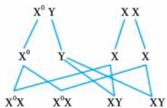
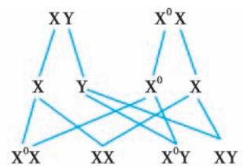
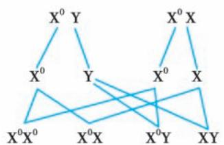
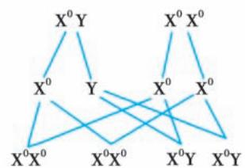

> [!info] 导航
> [[第084章_第6篇第15章_紫癜性疾病|上一章]] · [[00_章节导航|总目录]] · [[第086章_第6篇第17章_弥散性血管内凝血|下一章]]

本章数字资源

凝血障碍性疾病是凝血因子缺乏或功能异常所致的出血性疾病。凝血障碍性疾病大致可分为先天性或遗传性和获得性两类。前者与生俱来，多为单一性凝血因子缺乏，如血友病等；后者发病于出生后，常存在明显的基础疾病，多为复合性凝血因子减少，如维生素K依赖性凝血因子缺乏症等。

# 第一节 | 血友病

血友病（hemophilia）是一组由遗传性凝血活酶生成障碍引起的出血性疾病，包括血友病 A 和血友病B，其中以血友病A较为常见。血友病以阳性家族史、幼年发病、自发或轻度外伤后出血不止、血肿形成及关节出血为特征。我国数据显示，血友病的社会人群发病率为（5～10）/10 万，血友病 A 患者约占 80%～85%，血友病 B 约占 15%～20%。

#### 【病因与遗传规律】

1. 病因 血友病 A 又称遗传性 FⅧ缺乏症，是临床上常见的遗传性出血性疾病。FⅧ在循环中与 vWF 以复合物形式存在。前者被激活后参与 FⅩ的内源性激活；后者作为一种黏附分子，参与血小板与受损血管内皮的黏附，并有稳定及保护 FⅧ的作用。FⅧ基因位于 X 染色体长臂末端（Xq28），当其因遗传或突变而出现缺陷时，人体不能合成足量的 FⅧ，导致内源性途径凝血障碍及出血倾向的发生。

血友病 B 又称遗传性 FⅨ缺乏症。FⅨ为一种单链糖蛋白，被 FⅪa 等激活后参与内源性 FⅩ的激活。FⅨ基因位于 X 染色体长臂末端 $\left( \mathrm { X q } 2 7 \right)$ ）。遗传或突变致其缺陷时，不能合成足够量的 FⅨ，造成内源性途径凝血障碍及出血倾向。

2. 遗传规律 血友病A、B均属X 连锁隐性遗传性疾病。其遗传规律见图6-16-1。

  
血友病A/B患者与正常女性结婚

  
正常男子与血友病A/B携带者结婚

  
血友病A/B患者与女性携带者结婚

  
血友病A/B男性患者与女性患者结婚  
图6-16-1 血友病A、B遗传规律

XY：正常男性；XX：正常女性； $\mathrm { ; X ^ { 0 } Y ; }$ ：血友病 A/B 男性患者； $\mathrm { ; X ^ { 0 } X }$ ：血友病A/B 女性携带者； $\mathrm { ; X ^ { 0 } X ^ { 0 } }$ ：血友病A/B 女性患者。

#### 【临床表现】

1. 出血 出血的严重程度与凝血因子缺乏程度有关。按血浆中凝血因子的活性，可将血友病分为3型：①重型：因子活性低于1%；②中型：因子活性1%～5%；③轻型：因子活性5%～40%。

血友病的出血多为自发性，或轻度外伤、小手术（如拔牙、扁桃体切除）后出血不止，且具备下列特征：①生来就有，伴随终身；②常表现为软组织或深部肌肉内血肿；③负重关节如膝、踝关节等反复出血尤为突出，最终可致关节肿胀、僵硬、畸形，可伴骨质疏松、关节骨化及相应肌肉萎缩。

2. 血肿压迫症状及体征 血肿压迫周围神经可致局部疼痛、麻木及肌肉萎缩；压迫血管可致相应供血部位缺血性坏死或淤血、水肿；压迫输尿管可致排尿障碍；口腔底部、咽后壁、喉及颈部出血可致呼吸困难甚至窒息；肠壁出血可引起肠套叠或梗阻。

3. 血友病的并发症 血友病的并发症可以分为两种，一种是急性出血或者反复出血引起的并发症，如血友病关节病、假肿瘤、骨筋膜隔室综合征等，另一种是替代治疗过程中产生的并发症，如输血相关的病毒性肝炎、HIV等感染及FⅧ/FⅨ抑制物的产生。

#### 【实验室检查】

1. 筛选试验 血小板计数、PT、TT、纤维蛋白原定量正常，APTT 延长，轻型血友病患者 APTT 仅轻度延长或正常。

2. 临床确诊试验 检测与 APTT 延长有关的内源性凝血因子活性，其中 FⅧ活性（FⅧ：C）辅以FⅧ抗原（FⅧ： $\mathbf { A } _ { \mathbf { g } } ^ { \mathbf { g } } )$ 测定和 FⅨ活性辅以 FⅨ抗原测定可以确诊血友病 A 和血友病 B；同时应行 APTT纠正试验、vWF： $\mathrm { A g }$ 测定，必要时行抑制物检测，与获得性凝血因子缺乏症及血管性血友病鉴别。

3. 基因诊断试验 患者及家系成员进行基因检测，确定致病基因，能为同一家族中的携带者检测和产前诊断提供依据。

#### 【诊断与鉴别诊断】

### （一） 诊断参考标准

1.  临床表现 ①男性患者，有或无家族史，有家族史者符合 X 连锁隐性遗传规律，女性患者罕见；②可发生任何部位的出血，以关节、肌肉、深部组织多见，可呈自发性，或发生于轻度损伤、小型手术后，易引起血肿及关节畸形。

2. 实验室检查 见前述。

### （二） 鉴别诊断

主要应与血管性血友病（见本章第二节）、其他遗传性凝血因子缺乏症、获得性凝血因子缺乏症等鉴别。

#### 【治疗与预防】

治疗原则是以替代治疗为主的综合治疗：①加强自我保护，预防损伤出血极为重要；②尽早有效地处理患者出血，避免并发症的发生和发展；③禁用阿司匹林、非甾体抗炎药及其他可能干扰血小板聚集的药物；④家庭治疗及综合性血友病诊治中心的定期随访；⑤重型患者提倡预防治疗；⑥遗传咨询、产前诊断可减少血友病的发生。

1. 替代疗法 目前血友病的治疗仍以替代疗法为主，即补充缺失的凝血因子Ⅷ或因子Ⅸ，是防治血友病出血最重要的措施。根据治疗目的不同，替代治疗可以分为按需治疗及预防治疗。主要制剂有血浆源性和基因重组的凝血因子浓缩物、新鲜冰冻血浆、冷沉淀物以及凝血酶原复合物等，近年来由于新技术的发展及治疗理念的更新，也出现了非因子类创新药物，如 FⅨa 和 FⅩ双特异抗体、抗组织因子途径抑制物（TFPI）抗体等。

FⅧ及 FⅨ的半衰期分别为 8～12 小时及 18～24 小时，故补充 FⅧ须连续静脉滴注或每日 2 次；FⅨ每日1次即可。

FⅧ及 FⅨ剂量：每千克体重输注 1U FⅧ能使体内 FⅧ：C 水平提高 2%；每千克体重输注 1U FⅨ能使体内水平提高1%。最低止血要求FⅧ：C或FX：C达20%以上，出血严重或欲行中型以上手术者，应使FⅧ或FⅨ活性水平达40%以上。

凝血因子的补充一般可采取下列公式计算。

FⅧ剂量（IU）=体重（kg）×所需提高的活性水平（%）÷2

$$
\mathrm{FIX} \text {剂量(IU)} = \text {体重(kg)} \times \text {所需提高的活性水平(} \%
$$

预防治疗是指规律性应用止血药物（凝血因子或非因子类），以增强止血作用、有效预防血友病患者出血。预防治疗的方案应根据患者年龄、临床分型、既往出血情况、治疗目标、有无抑制物、药物代谢特点等因素综合考量确定。

2. 一般治疗 常用止血处理措施及药物见本篇第十四章，关节出血初步处理可遵循RICE原则，即患肢休息制动（rest）、冰敷（ice）、局部压迫（compression）、抬高患肢（elevation）。

3.  家庭治疗 血友病患者的家庭治疗已在国外广泛开展，国内亦已逐步开展。除有抗 FⅧ抗体、病情不稳定、小于 3 岁的患儿外，均可安排家庭治疗。血友病患者及其家属应接受有关疾病的病理、生理、诊断及治疗知识的教育，家庭治疗最初应在专业医师的指导下进行。指导内容除注射技术外，还包括血液病学、矫形外科、精神及心理健康、物理治疗以及艾滋病和病毒性肝炎的预防知识等。

4. 并发症的治疗 经内科治疗不能控制的反复出血，或者无条件进行预防治疗导致的肌肉骨骼并发症，可以在纠正凝血功能的前提下，考虑手术治疗。

合并抑制物的血友病患者，根据产生抑制物的水平及出血情况，主要通过免疫抑制治疗及旁路治疗来改善出血、清除抑制物。

5. 基因疗法 将合成的FⅧ及 FⅨ正常基因，通过载体转导入患者体内，使患者体内产生正常的FⅧ或 FⅨ，因子水平显著提升；目前国外已有多个基因治疗的产品正式进入临床使用，但价格昂贵；国内亦已开展多项基因治疗的临床试验。

# 第二节 | 血管性血友病

血管性血友病（von Willebrand disease，vWD），亦称为 von Willebrand 病，是临床上常见的一种常染色体遗传性出血性疾病，遗传方式存在异质性。以自幼发生的出血倾向、出血时间延长、血小板黏附性降低、瑞斯托霉素诱导的血小板聚集缺陷，以及血浆 vWF 抗原缺乏或结构异常为特点。其发病率约（1～10）/1 000。获得性血管性血友病可在多种疾病的基础上发生，少数患者可无基础疾病。

#### 【病因和发病机制】

vWF 主要存在于内皮细胞、巨核细胞及血小板，其主要生理功能是：①与FⅧ以非共价键结合成 vWF-FⅧ复合物，vWF 增加 FⅧ稳定性、防止其降解，并促进其生成及释放；②vWF 在血小板与血管壁的结合中起着重要的桥梁作用。血小板活化时，vWF 的一端与血小板糖蛋白Ⅰb 结合，另一端则与受损伤血管壁的纤维结合蛋白及胶原结合，使血小板能牢固地黏附于血管内皮。

vWF 基因位于 12 号染色体短臂末端，当其缺陷时，vWF 生成减少或功能异常，伴随 FⅧ：C 减低，血小板黏附、聚集功能障碍。

获得性血管性血友病涉及多种发病机制。最常见的是产生具有抗 vWF 活性的抑制物，主要为IgG；其次为肿瘤细胞吸附 vWF，使血浆 vWF 减少；另外，抑制物可与 vWF 的非活性部位结合形成复合物，加速其在单核巨噬细胞系统的破坏。

#### 【临床表现】

出血倾向是本病的突出表现。与血友病比较，其出血在临床上有以下特征：①出血以皮肤黏膜为主，如鼻出血、牙龈出血、瘀斑等，外伤或小手术（如拔牙）后的出血也较常见；②男女均可发病，女性青春期患者可有月经过多及分娩后大出血；③出血可随年龄增长而减轻，可能与随着年龄增长而vWF活性增高有关；④自发性关节、肌肉出血相对少见，由此致残者亦少。

#### 【实验室检查】

1.  出血筛选检查 包括全血细胞计数、APTT/PT、血浆纤维蛋白原测定。筛选检查结果多正常或仅有 APTT延长且可被正常血浆纠正。

2. 诊断实验 血浆vWF抗原 $\left( \mathbf { \sigma } _ { \mathrm { v } } \mathbb { W } \mathbf { F } { : } \mathrm { A g } \right)$ 测定，血浆vWF瑞斯托霉素辅因子活性（vWF：RCo）以及血浆 FⅧ凝血活性（FⅧ：C）测定。有一项或一项以上诊断实验结果异常者，须进行以下分型诊断实验。

3. vWD 分型诊断实验 包括：①血浆 vWF 多聚体分析；②瑞斯托霉素诱导的血小板聚集（RIPA）；③血浆vWF胶原结合试验（ $\operatorname { v W F } { : \operatorname { C B } } \ )$ ）；④血浆vWF因子Ⅷ结合活性（vWF：FⅧB）。

对有明确出血史或出血性疾病家族史患者，建议分步进行上述实验室检查，以明确 vWD 诊断并排除其他出血相关疾病。

#### 【诊断与分型】

### （一） 诊断要点

1. 有或无家族史，有家族史者多数符合常染色体显性或隐性遗传规律。

2. 有自发性出血或外伤、手术后出血增多史，并符合vWD临床表现特征。

3. 血浆 vWF：Ag＜30% 和/或 $\mathrm { v W F } { : } \mathrm { R C o } { < } 3 0 \%$ ；FⅧ：C＜30% 见于 2N 型和 3 型 vWD。

4. 排除血友病、获得性vWD、血小板型vWD、遗传性血小板病等。

### （二） 鉴别诊断

本病根据 $\mathrm { v W F } { \mathrm { : } } \mathrm { A g }$ 测定可与血友病 A、B 鉴别，根据血小板形态可与巨血小板综合征鉴别。

### （三） 分型

根据 vWD 发病机制，vWD 可分为三种类型：1 型和 3 型 vWD 为 vWF 量的缺陷，2 型 vWD 为 vWF 质的缺陷。2 型 vWD 又可分为 2A、2B、2M 和 2N 四种亚型。vWD 分型诊断参见表6-16-1。

表6-16-1 血管性血友病的常见分型

<table><tr><td>类型</td><td>特点</td></tr><tr><td>1型</td><td>vWF量的部分缺乏</td></tr><tr><td>2型</td><td>vWF质的异常</td></tr><tr><td>2A型</td><td>缺乏高-中分子量 vWF 多聚体,导致血小板依赖性的功能减弱</td></tr><tr><td>2B型</td><td>对血小板膜上 GPIb 亲和性增加,使高分子量 vWF 多聚体缺乏</td></tr><tr><td>2M型</td><td>vWF 依赖性血小板黏附能力降低,vWF 多聚体分析正常</td></tr><tr><td>2N型</td><td>vWF 对因子VIII亲和力明显降低</td></tr><tr><td>3型</td><td>vWF量的完全缺失</td></tr></table>

#### 【治疗】

在出血发作时或围手术期，通过提升血浆 vWF 水平发挥止血效果，并辅以其他止血药物。应根据 vWD 类型和出血发作特征选择治疗方法。反复严重关节、内脏出血者，可以采用预防治疗。

1. 去氨加压素（DDAVP） 通过刺激血管内皮细胞释放储备的vWF，提升血浆vWF水平。适用于1型vWD；对2A、2M、2N型vWD部分有效；对3型vWD无效；对2B型vWD慎用。推荐剂量： ${ \mathrm { . 0 . 3 } } \mu \mathrm { g / k g } .$ ，稀释于30～50ml生理盐水中，缓慢静脉注射（至少 30 分钟）。间隔 12～24 小时可重复使用，但多次使用后疗效下降。DDAVP 副作用有面部潮红、头痛、心率加快等，反复使用可发生水潴留和低钠血症，须限制液体摄入；对有心脑血管疾病的老年患者慎用。

2.  替代治疗 适用于出血发作或围手术期的各型 vWD 患者，以及 DDAVP 治疗无效患者。选用血源性含yWF浓缩制剂或重组vWF制剂.如条件限制可使用冷沉淀物或新鲜血浆，存在输血相关疾病传播风险。使用剂量以 vWD 类型和出血发作特征而定。剂量标定以制剂的 vWF：RCo 或 FⅧ：C为准。

  
本章思维导图

3.  其他治疗 抗纤溶药物：氨基己酸首剂 $4 \sim 5 \mathrm { g }$ ，静脉滴注；后每小时 $1 \mathrm { g }$ 至出血控制；24 小时总量不超过 $2 4 \mathrm { g } _ { \odot }$ 。氨甲环酸 $1 0 \mathrm { m g / k g }$ 静脉滴注，每 8 小时 1 次。抗纤溶药物偶有血栓形成危险，血尿禁用，牙龈出血时可局部使用。此外，局部使用凝血酶或纤维蛋白凝胶对皮肤、黏膜出血治疗有辅助作用。

（胡  豫）
