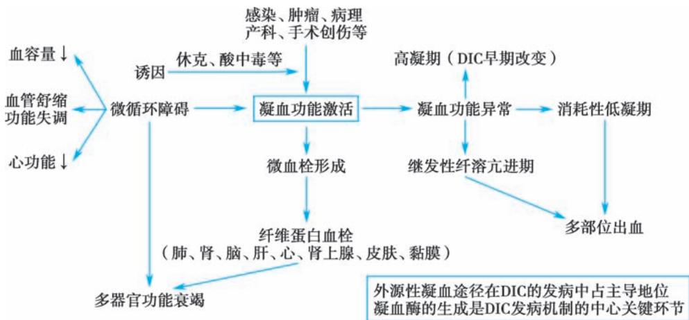

> [!info] 导航
> [[第085章_第6篇第16章_凝血障碍性疾病|上一章]] · [[00_章节导航|总目录]] · [[第087章_第6篇第18章_血栓性疾病|下一章]]

本章数字资源

弥散性血管内凝血（disseminated intravascular coagulation，DIC）是一种获得性临床综合征，是在感染、肿瘤、病理产科、创伤等多种疾病基础上，致病因素损伤微血管体系后导致血管内凝血过度活化和广泛微血栓形成，以致凝血因子大量消耗并继发纤溶亢进，引起以出血及微循环衰竭为特征的临床综合征。DIC的发生率在不同基础疾病中存在较大差异，总发生率约占医院同期住院患者的1/1000左右。

#### 【病因】

DIC 可由多种疾病继发。急性和亚急性 DIC 最常见的原因是：①感染（病原体包括革兰氏阴性、阳性菌，真菌，病毒，立克次体，原虫等）。②恶性肿瘤，最常见于血液系统肿瘤，如急性白血病、淋巴瘤等。③病理产科，常见于羊水栓塞、感染性流产、重症妊娠高血压综合征、HELLP 综合征、胎盘早剥等。此外，严重创伤、大面积烧伤、急性胰腺炎、系统性红斑狼疮、毒蛇咬伤、热射病、某些药物中毒也可引起DIC。慢性DIC主要见于恶性实体瘤、死胎综合征以及进展期肝病等。

#### 【发病机制】

DIC 发病的关键环节是凝血酶生成过量，并引起继发性纤溶亢进。凝血酶的过度生成可大量消耗凝血因子，而且其可结合到血小板和内皮细胞表面的凝血酶受体上，一方面诱导血小板活化聚集；另一方面促使血管内皮细胞释放组织型纤溶酶原激活物（t-PA），其可激活纤溶酶。多数情况下，DIC 的促凝刺激由组织因子（TF）介导。组织损伤可导致过量的 TF 进入血液；恶性肿瘤细胞分泌 TF 或类物质；炎症介质作用下的血管内皮细胞和单核细胞表面 TF 表达上调等因素均可使 TF含量增高。TF 激活外源性凝血途径；微血管体系内皮损伤后，带负电荷的胶原暴露，激活内源性凝血途径。内、外源性凝血途径均可触发凝血酶的形成，进而导致血小板活化和纤维蛋白形成。在急性失代偿 DIC 中，凝血因子消耗的速率超过了肝合成的速率，血小板的过度消耗超出了骨髓巨核细胞生成和释放血小板的代偿能力.其效应反映在实验室检查方面则包括凝血酶原时间（PT）延长，APTT延长，血小板计数降低。DIC 形成的过量纤维蛋白可刺激继发性纤溶亢进的代偿过程，结果导致纤维蛋白（原）降解产物［fibrin（ogen） degradation product，FDP］增多。由于 FDP 是一种强力的抗凝物，故可加重 DIC 的出血症状。血管内纤维蛋白沉积可引起微血管病性红细胞破碎，因此在血涂片上出现破碎红细胞。DIC 时微血管内血栓形成可引起组织坏死和终末器官损伤。有关 DIC 的出血、血栓形成及缺血表现的病理生理机制见图6-17-1。

  
图6-17-1 DIC出血、血栓形成及缺血表现的病理生理机制

#### 【临床表现】

DIC 的临床表现包括原发病的临床表现与 DIC 本身表现两部分。DIC 原发病表现视其性质、强度、持续时间及病因而定。DIC 本身的临床特点有：①出血：急性 DIC 时，出血往往严重而广泛，表现为皮肤瘀点、瘀斑，注射部位的瘀斑；尤其静脉穿刺部位的渗血，具有特征性。一部分患者可出现特征性的肢端皮肤“地图形状”的青紫；牙龈出血、鼻出血、消化道出血、肺出血、血尿、阴道出血等均可发生，颅内出血是 DIC 致死的主要原因之一。②微循环障碍：DIC 时常出现与失血量不成比例的组织、器官低灌注。轻者表现为一过性血压下降，重者出现休克。③血栓栓塞：可出现全身性或局限性微血栓形成。常见部位有肾、肺、肾上腺、皮肤、胃肠道、肝、脑、胰、心等，依据血栓栓塞的不同部位而出现相应的症状，如肺血栓栓塞引起的呼吸窘迫、肾血栓形成导致的肾衰竭，以及指、趾末端坏疽等。④血管内溶血：DIC 出现血管内溶血的概率约 10%～20%，主要表现为黄疸、贫血、血红蛋白尿、少尿甚至无尿等，血涂片可发现红细胞碎片或畸形红细胞。

#### 【实验室和特殊检查】

1. 血液学检查 血常规检查可以提供急性出血、红细胞破坏加速、潜在基础疾病（如白血病）的部分依据。血小板计数下降通常在急性 DIC 早期就可出现；在感染所致 DIC 中，血小板计数下降程度较为明显；血小板计数进行性下降，对DIC的诊断意义更大。

2. 凝血和纤溶检查及结果分析 PT、APTT、凝血酶时间（TT）延长；血浆纤维蛋白原浓度降低；FDP 和 D-二聚体浓度增高；血浆鱼精蛋白副凝（3P）试验阳性。纤维蛋白原浓度，在不同类型、不同分期 DIC 中存在差异。纤维蛋白原是急性时相反应蛋白，在脓毒血症或其他潜在疾病引起的 DIC，由于纤维蛋白原分泌增加，故早期纤维蛋白原浓度可以正常或轻度增高，而动态监测即可发现纤维蛋白原存在持续减少倾向：在急性早幼粒细胞白血病继发的DIC中纤维蛋白原浓度显著降低。因此，纤维蛋白原浓度正常并不能排除 DIC 的诊断。DIC 的纤溶亢进是由纤维蛋白凝块和组织型纤溶酶原激活物（tissue-type plasminogen activator，t-PA）所“激发”。FDP 在 DIC 时浓度增加，但不具备特异性，D-二聚体浓度增加对 DIC 诊断的特异度较高。对于疑难病例或合并存在影响上述实验结果的原发病时，针对性地选用凝血酶-抗凝血酶复合物（TAT），可溶性凝血酶调节蛋白（sTM），α-抗纤溶酶 $\left( \mathbf { \alpha } _ { \mathbf { { \alpha } } _ { 2 } - } \right.$ AP）等指标，有助于诊断和鉴别。

#### 【诊断与鉴别诊断】

DIC 临床表现复杂多变，单一实验室指标不能兼具高灵敏度和高特异度，临床上诊断 DIC 具有一定挑战。2001 年，国际血栓与止血学会（ISTH）DIC 分会给出了一种显性 DIC诊断积分系统，该系统的主要内容见表6-17-1。

表 6-17-1 ISTH 显性 DIC 诊断积分系统

<table><tr><td>1.风险评估</td><td>患者是否存在与典型DIC发病有关的潜在疾病?若回答“是”,则进入下述程序若回答“否”,则不进入下述程序</td></tr><tr><td>2.进行全面的凝血参数检测</td><td>包括血小板计数,凝血酶原时间,纤维蛋白原,可溶性纤维蛋白单体,或纤维蛋白降解产物</td></tr><tr><td>(1)血小板计数/ $\left( \times 10^{9}/L \right)$ </td><td> $>100=0, \leqslant 100=1, \leqslant 50=2$ </td></tr><tr><td>(2)纤溶相关标志物(包括可溶性纤维蛋白单体/纤维蛋白降解产物)</td><td>无增加=0,中度增加=2,显著增加=3</td></tr><tr><td>(3)凝血酶原时间延长</td><td> $<3s=0,3 \sim 6s=1,>6s=2$ </td></tr><tr><td>(4)纤维蛋白原</td><td> $>1.0g/L=0, \leqslant 1.0g/L=1$ </td></tr><tr><td>3.积分计算,将“2”中各分数相加</td><td>积分 $\geqslant 5$ ,符合DIC;每天重复积分积分 $<5$ ,提示非DIC,其后1~2天重复积分</td></tr></table>

上述 DIC 诊断的积分系统所涉及的凝血参数简单易得，指标的选择综合考虑了 DIC 时凝血因子消耗、血小板消耗、纤溶亢进等多个 DIC 发病的病理生理环节，故实用性较强。需要指出的是，ISTH并未指出纤溶相关标志物中度增加和显著增加的标准。根据文献，一般把正常值的 5～10 倍定为中度增加，10 倍以上定为显著增加。

除了 ISTH 显性 DIC 诊断积分系统，国际上还有其他诊断积分系统，我国首个 DIC 积分系统于2017 年 6 月正式写入《弥散性血管内凝血诊断中国专家共识（2017 年版）》 （表 6-17-2），2022 年被ISTH纳入国际指南。

表6-17-2 中国弥散性血管内凝血诊断积分系统（CDSS）

<table><tr><td>积分项</td><td>分数</td></tr><tr><td>存在导致 DIC 的原发病</td><td>2</td></tr><tr><td>临床表现</td><td></td></tr><tr><td>不能用原发病解释的严重或多发性出血倾向</td><td>1</td></tr><tr><td>不能用原发病解释的微循环障碍或休克</td><td>1</td></tr><tr><td>广泛性皮肤、黏膜栓塞,灶性缺血性坏死、脱落及溃疡形成,不明原因的肺、肾、脑等脏器功能衰竭</td><td>1</td></tr><tr><td>实验室指标</td><td></td></tr><tr><td>血小板计数</td><td></td></tr><tr><td>非恶性血液病</td><td></td></tr><tr><td> $\geqslant 100\times 10^{9}/L$ </td><td>0</td></tr><tr><td> $80\sim <100\times 10^{9}/L$ </td><td>1</td></tr><tr><td> $<80\times 10^{9}/L$ </td><td>2</td></tr><tr><td>24小时内下降 $\geqslant 50\%$ </td><td>1</td></tr><tr><td>恶性血液病</td><td></td></tr><tr><td> $<50\times 10^{9}/L$ </td><td>1</td></tr><tr><td>24小时内下降 $\geqslant 50\%$ </td><td>1</td></tr><tr><td>D-二聚体</td><td></td></tr><tr><td> $<5mg/L$ </td><td>0</td></tr><tr><td> $5\sim <9mg/L$ </td><td>2</td></tr><tr><td> $\geqslant 9mg/L$ </td><td>3</td></tr><tr><td>PT 及 APTT 延长</td><td></td></tr><tr><td>PT 延长 $<3s$ 且 APTT 延长 $<10s$ </td><td>0</td></tr><tr><td>PT 延长 $\geqslant 3s$ 或 APTT 延长 $\geqslant 10s$ </td><td>1</td></tr><tr><td>PT 延长 $\geqslant 6s$ </td><td>2</td></tr><tr><td>纤维蛋白原</td><td></td></tr><tr><td> $\geqslant 1.0g/L$ </td><td>0</td></tr><tr><td> $<1.0g/L$ </td><td>1</td></tr></table>

注：①非恶性血液病：每日计分 1 次，≥7 分时可诊断为 DIC；②恶性血液病：临床表现第一项不参与评分，每日计分 1 次，≥6分时可诊断为DIC。

DIC 的鉴别诊断包括：①严重肝病：存在多种凝血因子浓度降低，但严重肝病者多有肝病病史；黄疸、肝功能损害症状较为突出；血小板减少程度较轻或易变，可溶性纤维蛋白单体检出率低等可作为鉴别诊断参考。但须注意严重肝病合并 DIC 的情况。②血栓性血小板减少性紫癜：以血小板减少和微血管病性溶血为突出表现但缺乏凝血因子消耗性降低及纤溶亢进等依据，③原发性纤维蛋白溶解亢进症或“病理性”纤维蛋白溶解亢进症：实验室参数出现低纤维蛋白原血症，FDP 浓度增高，

APTT、PT、TT 异常，FⅤ和 FⅧ：C 减低。原发性纤维蛋白溶解亢进症中血小板计数通常正常，D-二聚体水平正常或仅轻度增高，鱼精蛋白副凝（3P）试验阴性。

#### 【治疗】

DIC的治疗应遵循以下原则。

1.  去除病因，积极治疗原发病 处理任何种类的 DIC 患者，对原发病的治疗非常重要，如感染引起的 DIC，应该给予合适足量的抗生素，并尽快明确感染的部位及判断细菌种类；恶性肿瘤引起的DIC应进行相应的化疗等。

2. 调正凝血稳态 DIC 患者需要抗凝预防血栓或治疗血栓，并防止各种凝血因子及血小板的进一步消耗。肝素治疗是 DIC 的主要抗凝措施，小剂量肝素足以发挥抗凝效果，且具有一定的抗炎作用，应避免肝素剂量过大导致的出血风险增加。使用方法：①普通肝素：一般不超过 12 500U/d，每6 小时用量不超过 2 500U，静脉或皮下注射，根据病情决定疗程，一般连用 3～5 天；②低分子量肝素：剂量为 3000～5000U/d，皮下注射，根据病情决定疗程，一般连用 3～5 天。抗凝治疗禁用于出血型$\mathrm { D I C } _ { \odot }$

3. 替代治疗 包括输注血小板、冷沉淀物、新鲜冰冻血浆等。如果凝血因子及抑制物过度消耗，PT 时间延长超过正常对照的 1.3～1.5 倍，应输入新鲜冷冻血浆或冷沉淀物。当纤维蛋白原浓度低于$1 . 0 \mathrm { g / L }$ ，应输入冷沉淀物以补充。血浆替代疗法应使 PT 控制在比正常对照组多 2～3 秒以内，纤维蛋白原浓度应 $> 1 . 0 \mathrm { g / L }$ 。当患者血小板计数 $< ( 1 0 { \sim } 2 0 ) \times 1 0 ^ { 9 } / \mathrm { L }$ ；或血小板计数 ${ < 5 0 \times 1 0 ^ { 9 } / \mathrm { L } }$ ，有明显出血症状者，可输入血小板。

  
本章思维导图

4. 器官支持治疗 DIC 与多器官功能障碍密切相关，强大的器官支持治疗是挽救 DIC 中晚期患者的重要措施。容量代替品、低血压和酸中毒的纠正以及吸氧等可以改善血流量，增加微循环中氧气的含量。肺、心和肾功能的严密监测能及时指导支持性措施的建立，血管活性药物能改善器官灌注、肾功能，维持电解质的平衡等。

（胡  豫）
