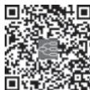

> [!info] 导航
> [[第088章_第6篇第19章_输血和输血反应|上一章]] · [[00_章节导航|总目录]] · [[第090章_第6篇第21章_CAR-T细胞免疫疗法在血液病中的应用|下一章]]

造血干细胞移植（hematopoietic stem cell transplantation，HSCT）是指对患者进行全身照射、化疗和免疫抑制预处理后，将正常供者或自体的造血细胞（hematopoietic cell，HC）输入患者体内，重建患者正常的造血和免疫功能。HC 包括造血干细胞（hematopoietic stem cell，HSC）和祖细胞，表达 CD34 抗原。HSC 具有增殖、分化和自我更新能力，维持终身造血。

经过 60 余年的不断发展，HSCT 已成为重要的临床治疗方法，全世界每年移植病例数都在增加，移植患者无病生存期最长的已超过 30 年。1990 年，美国 E.D.Thomas 医生因在骨髓移植方面的卓越贡献而获诺贝尔生理学或医学奖。

#### 【造血干细胞移植的分类】

按 HC 取自健康供者还是患者本身，HSCT 被分为异体 HSCT 和自体 HSCT（auto-HSCT）。异体 HSCT 又分为异基因造血干细胞移植（allo-HSCT）和同基因造血干细胞移植。后者指遗传基因完全相同的同卵孪生者间的移植，供、受者间不存在移植物被排斥和移植物抗宿主病（graft versus host disease，GVHD）等免疫学问题，此种移植概率不足 1%。按 HSC 取自骨髓、外周血还是脐带血，又分为骨髓移植（bone marrow transplantation，BMT）、外周血干细胞移植（peripheral blood stem cell transplantation，PBSCT）和脐带血移植（cord blood transplantation，CBT）。按供、受者有无血缘关系而分为血缘移植和无血缘移植（unrelated donor transplantation，UDT）。按人类白细胞抗原（human leukocyte antigen，HLA）配型相合的程度，分为 HLA 相合、部分相合和单倍型相合（haploidentical）移植。

#### 【人类白细胞抗原配型】

HLA基因复合体，又称主要组织相容性复合体，定位于人类6号染色体短臂（6p21），在基因数量和结构上具有高度多样性。与 HSCT 密切相关的是 HLA-Ⅰ类抗原 HLA-A、HLA-B、HLA-C 和 HLA-Ⅱ类抗原 DR、DQ、DP。如 HLA 不合，出现 GVHD 和宿主抗移植物反应（hostversus graft reaction，HVGR）的风险显著增加。遗传过程中，HLA 单倍型作为一个遗传单位直接传给子代，因此，同胞间HLA相合概率为25%。过去HLA分型用血清学方法，现多采用DNA基因学分型。无血缘关系间的配型，必须用高分辨分子生物学方法。HLA 基因高分辨至少以 4 位数字来表达，如A\*0101与A\*0102。前两位表示血清学方法检出的A1抗原（HLA的免疫特异性).称低分辨：后两位表示等位基因，DNA 序列不一样，称高分辨。过去无血缘供者先做低分辨存档，需要时再做高分辨，现在中华骨髓库入库高分辨资料比例明显增加。

#### 【供者选择】

auto-HSCT 的供者是患者本身，应能承受大剂量化放疗，能动员采集到未被肿瘤细胞污染的足量造血干细胞。通常情况下，allo-HSCT 的供者首选 HLA 相合同胞，次选 HLA 相合无血缘供者（matched unrelated donor，MUD）、单倍型相合亲缘供者或脐带血干细胞。若有多个 HLA 相合者，则选择年轻、健康、男性、巨细胞病毒（cytomegalovirus，CMV）血清学阴性和红细胞血型相合者。

过去我国实行独生子女政策，同胞供者日益减少，单倍型相合亲缘供者、MUD 等替代供者逐步成为主要干细胞来源，具体供者的选择应充分考虑患者的病情和移植风险，权衡利弊。中国造血干细胞捐献者资料库建立于 1992 年，截至 2022 年底，库容超过 318 万人份，累计捐献 14 551 例。随着 HLA配型等移植相关技术的提高，无血缘 PBSCT 的疗效已接近 HLA 相合同胞供者移植，但目前能找到相合供者的患者比例仍不足50%，且一般须耗时2\~3个月。脐带血中的HC和免疫细胞均相对不成熟，故 CBT 对 HLA 配型要求较低，术后 GVHD 发生概率和严重程度也较低，但因细胞总数有限，造血重建速度较慢，植活率相对低，对大体重儿童和成人进行 CBT 尚有难度。单倍型相合亲缘供者移植为几乎每一位需要 allo-HSCT 患者提供了干细胞来源，十多年来获得了重大进展，在一定程度上解决了 HLA 屏障对供者的限制，我国造血干细胞移植工作者在这一技术体系的发展中作出了令人瞩目的成绩。

#### 【造血细胞的采集】

allo-HSCT 的供者应是健康人，须检查除外感染性、慢性系统性疾病等不适于捐献的情况并签署知情同意书。造血干细胞捐献过程是安全的，不会降低供者的抵抗力，不影响供者健康，采集管道等医疗材料不重复使用，不会传播疾病。

1.  骨髓 骨髓采集已是常规成熟的技术。多采用连续硬膜外麻醉或全身麻醉，以双侧髂后上棘区域为抽吸点。按受者体重，有核细胞数 $( 4 \mathrm { \sim } 6 ) \times 1 0 ^ { 8 } \mathrm { / k g }$ 为一般采集的目标值。为维持供髓者血流动力学稳定并确保其安全，一般在抽髓日前 14 天预先保存供者自身血，在手术中回输。供、受者红细胞血型不一致时，为防范急性溶血反应，须先去除骨髓血中的红细胞和/或血浆。对自体BMT，采集的骨髓血须加入冷冻保护剂，液氮保存或 -80℃深低温冰箱保存，待移植时复温后迅速回输。

2. 外周血 在通常情况下，外周血液中的 HC 很少。采集前须用 G-CSF 动员，使血中 CD34+ HC升高。常用剂量为 $\mathrm { G - C S F } \left( 5 { \sim } 1 0 \right) { \mu } \mathrm { g / \left( \ k g \cdot d \right) }$ ），分 1～2 次，皮下注射 4 天，第 5 天开始用血细胞分离机采集。采集 CD34+ 细胞至少 $2 \times 1 0 ^ { 6 } / \mathrm { k g }$ （受者体重）以保证快速而稳定的造血重建。auto-PBSCT 受者采集前可予化疗［环磷酰胺（CTX），依托泊苷（VP-16）等］进一步清除病灶，当白细胞开始恢复时，按前述健康供者的方法动员采集造血干细胞。自体外周造血干细胞的保存方法同骨髓。

3. 脐带血 脐带血干细胞由特定的脐血库负责采集和保存。采集前须确定新生儿无遗传性疾病。应留取标本进行血型、HLA 配型、有核细胞和 CD34+ 细胞计数，以及各类病原体检测等检查，以确保质量。

#### 【预处理方案】

预处理的目的为：①最大限度清除基础疾病；②抑制受者免疫功能以免排斥移植物。预处理主要采用全身照射（total-body irradiation，TBI）、细胞毒药物和免疫抑制剂。根据预处理的强度，移植又分为传统的清髓性 HSCT 和非清髓性 HSCT（nonmyeloablative HSCT，NST）。介于两者之间的为减低强度预处理（RIC）HSCT。在 NST 中，预处理对肿瘤细胞的直接杀伤作用减弱，主要依靠免疫抑制诱导受者对供者的免疫耐受，使供者细胞能顺利植入，形成稳定嵌合体（chimerism），继而通过移植物中输入的或由 HSC 增殖分化而来的免疫活性细胞，以及以后供者淋巴细胞输注（donorlymphocyte infusion，DLI）发挥移植物抗白血病（graft versus leukemia，GVL）作用，从而达到治愈肿瘤的目的。NST 主要适用于疾病进展缓慢、肿瘤负荷相对低，且对 GVL 较敏感、不适合常规移植、年龄较大（＞50 岁）的患者。NST 预处理方案常含有氟达拉滨（fludarabine）。对大多数患者，尤其是年轻的恶性肿瘤患者仍以传统清髓性预处理为主。常用的预处理方案有：①TBI 分次照射，总剂量为 12Gy，并用 CTX 60mg/（kg·d）连续 2 天；②静脉用白消安 0.8mg/（kg·6h）连用 4 天，联合 CTX 60mg/（kg·d）连用 2 天；③BEAM 方案［卡莫司汀（BCNU） +VP-16+Ara-C+ 美法仑（Mel）］，用于淋巴瘤；④HD-Me方案 $\mathrm { ( M e l ~ 2 0 0 m g / m ^ { 2 } ) }$ ），用于 MM。自体移植和同基因移植因无 GVL 作用，预处理剂量应尽量大些，且选择药理作用协同而不良反应不重叠的药物。

#### 【植活证据和成分输血】

从 BMT 日起，中性粒细胞多在 4 周内回升至 ${ > } 0 . 5 \times 1 0 ^ { 9 } / \mathrm { L }$ ，而血小板回升至 ${ \geqslant } 5 0 \times 1 0 ^ { 9 } / \mathrm { I }$ 的时间多长于 4 周。应用 $\mathrm { G - C S F ~ } 5 \mu \mathrm { g } / \left( \mathrm { ~ } \mathrm { k g } \cdot \mathrm { d } \right)$ ，可缩短粒细胞缺乏时间 5～8 天。PBSCT造血重建快，中性粒细胞和血小板恢复的时间分别为移植后8～10 天和10～12 天。CBT 造血恢复慢，中性粒细胞恢复时间多大于 1 个月，血小板重建需时更长，约有 10% 的 CBT 不能植活。而HLA相合的BMT 或PBSCT，植活率高达97%～99%。GVHD的出现是临床植活证据；另可根据供、受者间性别，红细胞血型和 HLA 的不同，分别通过细胞学和分子遗传学（FISH 技术）方法、红细胞及白细胞抗原转化的实验方法取得植活的实验室证据。对于上述三者均相合者，则可采用短串联重复序列（STR）、单核苷酸多态性（SNP）结合PCR技术分析取证。

HSCT 在造血重建前须输成分血支持。血细胞比容≤0.30 或 Hb≤70g/L 时须输红细胞；有出血且血小板小于正常或无出血但血小板≤20×109/L（也有相当多单位定为≤10×109/L）时须输血小板。为预防输血相关 GVHD，所有含细胞成分的血制品均须照射 25～30Gy，以灭活淋巴细胞。使用白细胞滤器可预防发热反应、血小板无效输注、GVHD 和 HVGR、输血相关急性肺损伤，并可减少 CMV 和EBV 及 HTLV-Ⅰ的血源传播。

#### 【并发症】

HSCT的并发症及其防治，是关系移植成败的重要部分。并发症的发生与大剂量放化疗的毒副作用及移植后患者免疫功能抑制、紊乱有关。虽然多数并发症病因明确，但在某些并发症，多种因素均参与疾病发病过程。此外，患者可同时存在多种并发症表现。allo-HSCT 的并发症发生概率和严重程度显著高于auto-HSCT。

### （一） 预处理毒性

不同的预处理产生不同的毒副作用。早期毒副作用通常有恶心、呕吐、黏膜炎等消化道反应，急性肝肾功能受损，心血管系统毒性作用也不少见。糖皮质激素可减轻放射性胃肠道损伤。口腔黏膜炎常出现在移植后 5～7 天，严重者需阿片类药物镇痛，继发疱疹病毒感染者应用阿昔洛韦和静脉营养支持，一般 7～12 天“自愈”。移植后 5～6 天开始脱发。氯硝西泮或苯妥英钠能有效预防白消安所致的药物性惊厥。美司钠（mesna）、充分水化、碱化尿液、膀胱冲洗和输血支持可以防治高剂量CTX导致的出血性膀胱炎。

移植后长期存活的患者也可因预处理发生晚期并发症，主要包括：①白内障：主要与 TBI 有关，糖皮质激素可促进其发生；②白质脑病：主要见于合并 CNSL 而又接受反复鞘内化疗和全身高剂量放、化疗者；③内分泌紊乱：甲状腺和性腺功能降低、闭经、无精子生成、不育、儿童生长延迟；④继发肿瘤：少数患者几年后继发淋巴瘤或其他实体瘤，也可继发白血病或MDS。

### （二） 感染

移植后由于全血细胞减少、粒细胞缺乏、留置导管、黏膜屏障受损、免疫功能低下等原因，感染相当常见。常采取以下措施预防感染：①保护性隔离，住层流净化室；②无菌饮食；③胃肠道除菌；④免疫球蛋白输注支持；⑤患者、家属及医护人员注意勤洗手、戴口罩等个人卫生。移植后感染一般分为 3 期，早期为移植后 1 个月内，中期为移植后 1 个月到 100 天，晚期为移植 100 天后，各期感染的特点和致病菌有所差别。后期患者的感染风险取决于免疫功能的恢复水平。

1. 细菌感染 移植早期患者易感因素最多，发热可能是感染的唯一表现，通常没有典型的炎症症状和体征。治疗应依照高危粒细胞缺乏患者感染治疗指南尽早进行广谱、足量的静脉抗生素治疗，并及时实施血培养或疑似感染部位的病原学检查，根据感染部位或类型、病原学检查结果和所在医疗单位细菌定植和耐药情况调整治疗。移植中后期患者骨髓造血功能虽基本恢复，但免疫功能仍有缺陷，尤其是存在GVHD、低免疫球蛋白血症的患者仍有较高感染风险。

2.  病毒感染 移植后疱疹病毒感染最为常见。单纯疱疹病毒感染应用阿昔洛韦 5mg/kg，每8 小时 1 次静脉滴注治疗有效。预防时减量口服。为预防晚期带状疱疹病毒激活（激活率为 40%～60%），阿昔洛韦可延长使用至术后 1 年。EBV 和人类疱疹病毒 6 型（HHV-6）感染也不少见，并分别与移植后淋巴细胞增殖性疾病和脑炎密切相关。

CMV 感染是最严重的移植后病毒性感染并发症，多发生于移植后中晚期。CMV 感染的原因是患者体内病毒的激活或是输入了 CMV 阳性的血液制品。对供、受者 CMV 均阴性的患者，必须只输 CMV 阴性的血液。CMV 感染可表现为间质性肺炎（interstitial pneumonia，IP）、CMV 肠炎、CMV肝炎和 CMV 视网膜炎。对其治疗除支持治疗外，还须抗 CMV 治疗，可选药物有更昔洛韦、膦甲酸钠。

3. 真菌感染 氟康唑 400mg/d 口服预防用药大大减少了白念珠菌的感染。但近年来其他类型真菌感染的发生率明显增多，侵袭性真菌感染，尤其是曲霉菌、毛霉感染的治疗仍相当有挑战性。根据诊断结果可选择伊曲康唑、伏立康唑、卡泊芬净、米卡芬净、两性霉素B 等药物。

4.  伊氏肺孢子菌肺炎 移植前 1 周起即预防性服用复方磺胺甲 唑（SMZco，甲氧苄啶 160mg和磺胺甲 唑800mg，一日2 次），每周用2天至免疫抑制剂停用，可显著预防伊氏肺孢子菌肺炎。

### （三） 肝窦阻塞综合征

（hepatic sinusoidal obstruction syndrome，HSOS） 因血管内皮细胞损伤，移植可导致 HSOS、植入综合征、毛细血管渗漏综合征、弥漫性肺泡出血和血栓性微血管病等各类临床综合征。HSOS，原称肝小静脉闭塞症，其临床特征为不明原因的体重增加、黄疸、右上腹痛、肝大和腹水。发病率约 10%，确诊需肝活检。主要由肝血管和窦状隙内皮的细胞毒损伤和局部高凝状态所致。高峰发病时间为移植后2周，一般都在1个月内发病。HSOS发病危险因素一般分为患者相关和移植相关两类。前者包括年龄、体能状况、移植前肝病史/肝功能异常、疾病进展状态、地中海贫血、铁过载、腹部放疗史、应用吉妥珠单抗或奥加伊妥珠单抗。后者主要包括 allo-HSCT（相比 auto-HSCT），HLA 不合/单倍体移植，二次移植，移植物未经去 T 细胞处理，含白消安（BU）或 TBI 的预处理，氟达拉滨、钙调磷酸酶抑制剂（CNI）联合西罗莫司预防 GVHD 等。低剂量肝素［100U/（kg·d）持续静脉滴注 30 天］、前列腺素 $\mathrm { E } _ { 1 }$ 、熊去氧胆酸预防 HSOS 有效。轻、中型 HSOS 的治疗以支持为主，包括限制钠盐摄入，改善微循环和利尿治疗，可自行缓解且无后遗症。重型患者预后差，多因进行性急性肝衰竭、肝肾综合征和多器官衰竭而死亡。

### （四） 移植物抗宿主病

（GVHD） GVHD 是 allo-HSCT 后特有的并发症，是移植治疗相关死亡主要原因之一，由供者 T 细胞攻击受者同种异型抗原所致。产生 GVHD 需三个要素：①移植物中含免疫活性细胞；②受者表达供者没有的组织抗原；③受者处于免疫抑制状态，不能将移植物排斥掉。即使供、受者间 HLA 完全相合，还存在次要组织相容性抗原不相合的情况，仍有 30% 的机会发生严重 GVHD。产生 GVHD 的危险因素包括：供、受者间 HLA 相合程度，有无血缘关系，性别差异，年龄，基础疾病及其所处状态，预处理方式，GVHD 预防方案，移植物特性，感染，组织损伤等。

GVHD 可分为急性 GVHD（acute GVHD，aGVHD）和慢性 GVHD（chronic GVHD，cGVHD）两类，典型 aGVHD 发生于移植后 100 天内，cGVHD 发生于 100 天后。但目前认为 GVHD 的判定除依据发生时间外，更应强调临床表现（表 6-20-1）。aGVHD 主要累及皮肤、消化道和肝，表现为皮肤红斑和斑丘疹、持续性厌食和/或腹泻、肝功能异常等。组织活检虽有助于确诊，但临床诊断更为重要，不能因等待辅助检查而延迟治疗。

表6-20-1 移植物抗宿主病的分类

<table><tr><td>分类</td><td>HSCT或DLI后症状出现时间</td><td>aGVHD特征</td><td>cGVHD特征</td></tr><tr><td>aGVHD</td><td></td><td></td><td></td></tr><tr><td>典型 aGVHD</td><td>≤100天</td><td>有</td><td>无</td></tr><tr><td>持续性、复发性或迟发性 aGVHD</td><td>&gt;100天</td><td>有</td><td>无</td></tr><tr><td>cGVHD</td><td></td><td></td><td></td></tr><tr><td>典型 cGVHD</td><td>无时间限制</td><td>无</td><td>有</td></tr><tr><td>重叠综合征</td><td>无时间限制</td><td>有</td><td>有</td></tr></table>

aGVHD 的临床严重程度分Ⅰ～Ⅳ度（表 6-20-2、表 6-20-3）。Ⅰ度无须全身治疗，Ⅱ～Ⅳ度影响生存及预后，须迅速积极干预。aGVHD 治疗效果不理想，因此，aGVHD 的预防就显得更为重要，主要方法有两种：免疫抑制剂和 T 细胞去除。常用的药物预防方案为环孢素（CsA）联合甲氨蝶呤（MTX）。CsA 通过抑制钙调磷酸酶的作用而阻断Ⅱ-2基因的转录 从而阻断Ⅱ-2依赖性的T细胞增殖和分化。先用 $\mathrm { C s A } \ 2 { \sim } 4 \mathrm { m g } / ( \mathrm { k g } { \cdot } \mathrm { d } )$ 静脉滴注，待消化道反应消失/缓解后改为口服，维持血药浓度在 150～250ng/ml。血清肌酐大于 177μmol/L（2.0mg/dl）时需停药；移植 40 天后每周减少 CsA 剂量 5%，一般至少应用 6 个月。MTX 15mg/m2 于移植后 1 天，10mg/m2 于 3 天、6 天和 11 天，共静脉滴注 4 次。此外，他克莫司（tacrolimus，FK506）、吗替麦考酚酯（mycophenolate mofetil，MMF）也可作为预防用药。针对单倍体移植，G-CSF 和 ATG 的非体外去 T 细胞移植模式和移植后环磷酰胺的使用均能有效降低aGVHD 发生率。从移植物中直接去除 T 细胞也是有效预防 GVHD 的方法，但可增加植入失败、移植后复发和感染风险。

表6-20-2 急性移植物抗宿主病时组织器官的受累程度

<table><tr><td rowspan="2">受累程度</td><td>皮肤</td><td>肝</td><td>消化道</td></tr><tr><td>体表面积计算按烧伤面积表计算</td><td>血总胆红素/ [μmol/L (mg/dl)]</td><td>成人每天腹泻量/ml</td></tr><tr><td>+</td><td>斑丘疹&lt;25% 体表面积</td><td>34~51(2~3)</td><td>500~1000</td></tr><tr><td>++</td><td>斑丘疹占 25%~50% 体表面积</td><td>51~103(3~6)</td><td>1000~1500</td></tr><tr><td>+++</td><td>全身红皮病</td><td>103~257(6~15)</td><td>&gt;1500</td></tr><tr><td>++++</td><td>水疱和皮肤剥脱</td><td>&gt;257(&gt;15)</td><td>严重腹痛和/或肠梗阻</td></tr></table>

表6-20-3 急性移植物抗宿主病的临床分级

<table><tr><td colspan="2">临床分级(度)</td><td>皮肤</td><td>肝</td><td>消化道</td><td>ECOG 体能</td></tr><tr><td>I</td><td>(轻)</td><td>+~++</td><td>0</td><td>0</td><td>0</td></tr><tr><td>II</td><td>(中)</td><td>+~+++</td><td>+</td><td>+</td><td>+</td></tr><tr><td>III</td><td>(重)</td><td>++~+++</td><td>++~+++</td><td>++~+++</td><td>++~+++</td></tr><tr><td>IV</td><td>(极重)</td><td>++~++++</td><td>++~++++</td><td>++~++++</td><td>++~++++</td></tr></table>

重度 aGVHD 治疗较困难。首选药物为甲泼尼龙（1～2）mg/（kg·d）。其他二线药物有抗 IL-2 受体（IL-2RA）单抗、MTX、芦可替尼、MMF、他克莫司、西罗莫司、ATG 等。此外，粪菌移植等新型治疗手段也有应用。

移植后生存期超过6个月的患者，约30%～70%合并cGVHD。cGVHD好发于年龄大、HLA不全相合、无血缘移植、PBSCT 和有 aGVHD 者。cGVHD 可累及全身所有器官和组织，临床表现类似自身免疫病。一线治疗方案为糖皮质激素联合或不联合钙调磷酸酶抑制剂，但须预防感染。

#### 【移植后复发】

部分患者移植后复发，复发概率与疾病危险度分层、移植时本病状态和移植类型等因素有关。多数复发发生于移植后 3 年内，复发者治疗较困难，预后也较差。移植后监测患者可检测残留病水平，对持续较高水平或有增高的高危患者，及时调整免疫抑制治疗强度、联合 DLI、输注 CAR-T 或预防性应用分子靶向药物等治疗有可能降低复发率。二次移植对少数复发患者适合。

#### 【主要适应证】

随着 HSCT技术的日益成熟和相关疾病治疗的发展进步，HSCT的适应证在不断调整中。目前，患者年龄上限逐渐放宽，NST 几乎不受年龄限制。患者具体移植时机和类型的选择须参照治疗指南和实际病情权衡。

1.  非恶性病 ①SAA：对年龄＜50 岁的重型或极重型再障有 HLA 相合同胞者，宜首选 HSCT。②PNH，尤其是合并 AA 特征的患者。③其他疾病：HSCT 能够治疗先天性造血系统疾病和酶缺乏所致的代谢性疾病，如 Fanconi 贫血、镰状细胞贫血、重型珠蛋白生成障碍性贫血、重型联合免疫缺陷病等；对难治性获得性自身免疫病的治疗也在探索中。

2. 恶性病 ①造血系统恶性疾病：HSCT，尤其是 allo-HSCT，是血液系统恶性肿瘤的有效治疗手段，具体详见各病有关章节。一般而言，AML、ALL、MDS 多采用异体移植；淋巴瘤、骨髓瘤多采用自体移植，但也可进行异体移植。②对放、化疗敏感的实体肿瘤也可考虑做auto-HSCT。

#### 【生存质量及展望】

HSCT 的成功开展使很多患者长期存活。大多数存活者身体、心理状况良好，多能恢复正常工作、学习和生活。约10%～15%的存活者存在社会心理问题，cGVHD 是影响生存质量的主要因素。由于我国独生子女家庭众多，因此研究开展无血缘关系供者移植、单倍型相合亲缘供者移植及脐带血干细胞移植意义重大。随着移植技术的不断改进及相关学科的不断发展，HSCT必将能治愈更多的患者。

（徐  杨）

  
本章思维导图
