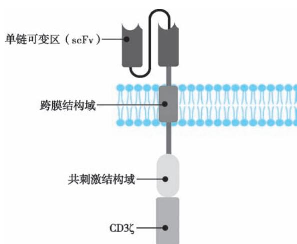
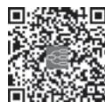

> [!info] 导航
> [[第089章_第6篇第20章_造血干细胞移植|上一章]] · [[00_章节导航|总目录]] · [[第091章_第7篇第01章_总论|下一章]]

本章数字资源

嵌合抗原受体 T 细胞（chimeric antigen receptor T-cell，CAR-T）治疗是指通过基因工程技术，合成由可结合抗原的单链抗体可变区、铰链跨膜区及胞内信号转导结构域组成的 CAR 基因片段，并通过各种载体在体外将 CAR 基因转入 T 细胞改造成 CAR-T 细胞，最后回输到患者体内的一项治疗技术。

CAR-T 细胞治疗在多种血液病，尤其是复发或难治性恶性血液病中取得显著疗效，在提高缓解率的同时也延长了无复发时间，是 21 世纪医学界的革命性进展。自 2017 年 FDA 批准第一个靶向CD19 的 CAR-T 细胞产品用于治疗复发或难治性的急性 B 细胞淋巴细胞白血病（ALL）以来，国内外已有多项批准上市的商品化CAR-T细胞疗法。

#### 【CAR-T的发展历程】

1.  第一代 CAR-T 细胞 第一代 CAR-T 细胞的 CAR 结构嵌合了经典的抗体单链可变区（singlechain variable fragment，scFv）片段，并由铰链区串联CD3ζ胞内信号结构域。将Fv嵌合入TCR恒定区，

赋予 T 细胞类抗体识别特性，使其同时具备抗体样直接识别和细胞免疫毒性的双重特征，提高了靶向杀伤能力。

2. 第二代CAR-T细胞 T细胞的完全激活一方面依赖于胞外TCR与抗原结合传导的第一信号，另一方面也需要共刺激分子受体与其配体结合所传递的第二信号。因此由 scFv、共刺激分子结构域和 CD3 信号转导结构域ζ组成的第二代 CAR-T 细胞产生（图 6-21-1），其中最常用的共刺激分子结构域为CD28 或4-1BB。

3.  第三代 CAR-T 细胞 第三代 CAR-T 细胞技术指在第二代 CAR-T 细胞基础上额外增加一个共刺激分子片段，可为经典 CD28 或 4-1BB，也可为经典信号分子联合 OX40、ICOS、CD27、

  
图 6-21-1 第二代 CAR 结构示意图

CD40-MyD88 等。相比第二代 CAR-T 细胞，第三代 CAR-T 细胞在一些临床前实验数据中表现出更强更持久的作用活性，但也有报道指出其更容易发生T细胞刺激阈值降低从而过度活化，可能诱发细胞因子过量释放等。

4. 第四代 CAR-T 细胞 第四代 CAR-T 细胞又被称为通用细胞因子介导杀伤的重定向 T 细胞（T-cell redirected for universal cytokine-mediated killing，TRUCK），其 CAR 结构中含有一个活化 T 细胞核因子（nuclear factor of activated T cell，NFAT）转录相应元件，可以使 CAR-T 细胞在肿瘤区域分泌特定的转基因蛋白，如细胞因子（IL-12、IL-18、趋化因子等），从而改善抑制性的肿瘤微环境，募集并活化其他免疫细胞进行免疫应答。

#### 【CAR-工适应证】

CAB-T细胞属于“活的细胞”类药物，目前有数款CAB-T细胞产品经国内外临床试验探索后获批上市，用于复发或难治性B细胞淋巴细胞白血病、淋巴瘤及多发性骨髓瘤的二线及以上治疗。靶向 CD19 的 CAR-T 细胞产品包括替沙仑赛（tisagenlecleucel）、阿基仑赛（axicabtageneciloleucel）、利 基 迈 仑 赛（lisocabtagene maraleucel）和 瑞 基 奥 仑 赛（relmacabtagene autoleucel）等，适用于复发或难治性 B 细胞肿瘤。靶向 B 细胞成熟抗原（BCMA）的 CAR-T 细胞产品包括艾基维仑赛（idecabtagene vicleucel）、西达基奥仑赛（ciltacabtagene autoleucel）和伊基奥仑赛，适用于复发或难治性多发性骨髓瘤。此外，复发或难治性血液病患者经过评估后，可纳入合适的 CAR-T 治疗临床试验。

#### 【CAR-T 治疗流程】

1. 筛选患者 根据不同商品化 CAR-T 细胞产品的适应证，或不同临床试验的纳入排除标准，筛选符合条件的患者，收集相应信息并完善相关检查，主要包括：①人口学特征、生命体征、全身症状、既往病史、合并用药；②实验室检查：包括血常规、尿常规、便常规 + 隐血、生化全套、免疫球蛋白定量、出凝血、细胞因子、淋巴细胞亚群、病毒学检测等；③骨髓检查：骨髓涂片、骨髓活检、骨髓流式细胞分析、染色体核型、免疫分型、基因分型、FISH 等；④辅助检查：心电图、心动超声、B 超、CT、PET-CT等；⑤病灶检查：病灶活检病理、免疫组化、FISH、流式细胞术检测以及淋巴细胞抗原受体基因重排检测等。

2. 细胞采集 采集患者成分血（单核细胞）或外周血，用于分离纯化 T 细胞，进而制备 CAR-T 细胞。研究者根据患者血象选择采血方式，建议优先采用单采。采血量根据需要采集的 CD3 阳性细胞量和患者外周血 CD3 阳性细胞的浓度确定。采血环境须保持清洁，严格履行无菌操作要求；采用密闭式采血，最大限度避免微生物污染。单采收集的 T 细胞将会用于后续制备 CAR-T 细胞，因此成功采集是其进行后续复杂生产工艺的重要前提。

3.  清除淋巴细胞治疗 清除淋巴细胞预处理指的是在 CAR-T 细胞回输前，通过化疗的方式清除患者体内的淋巴细胞，不仅能够降低肿瘤负荷至较低水平，还能够清除自身免疫细胞，以促进CAR-T 细胞在体内的扩增和存续。在 CAR-T 细胞治疗前第 5 天至第 3 天给予小剂量化疗，最常见的清除淋巴细胞预处理方案包括环磷酰胺、氟达拉滨和苯达莫司汀等。医生根据患者病情选择合适的化疗方案，常见的化疗方案如下：输注前第 5 天、第 4 天、第 3 天，连续 3 天静脉注射氟达拉滨，注射剂量为 $2 5 { \sim } 3 0 \mathrm { m g / ( \ m } ^ { 2 } { \cdot } \mathrm { d }$ ）；输注前第3 天，同时静脉注射环磷酰胺，注射剂量为 $5 0 0 \mathrm { m g } / \left( \mathrm { m } ^ { 2 } { \cdot } \mathrm { d } \right)$ ）。

4 CAR-工细胞制备 细胞生产条件要求为洁净实验室(万级无尘).免疫细胞培养实验台为百级无尘。取得患者血样后 16 小时内进行 T 细胞分离、纯化。依据血样中 CD3 阳性细胞比例和白细胞计数情况计算分选的血量，获得足量的T细胞。使用慢病毒感染或电转染等方式制备CAR-T细胞，并在体外大量扩增，进行 CAR-T 细胞有效性检测。细胞回输前，取细胞培养上清液送权威的第三方检测机构做安全质控，质控项目包括细菌、真菌、支原体、衣原体和内毒素检测。

5 CAR-工细胞回输 将检测合格的CAB-T细胞交给医生或护士.回输细胞量根据商品化产品说明书或研究计划确定。回输操作前，须记录患者生命体征，包括体温、血压、脉搏和呼吸。回输操作时，将输血器调节至合适速率，先用生理盐水冲管，再将装有重悬的CAR-T细胞的回输袋接入输血器，开始细胞回输。

6. 全程监测管理 CAR-T 细胞回输后 14 天内，一般须住院监测患者发生 CAR-T 相关不良反应的风险，并及时进行干预处理。细胞回输后第 1 个月内，患者需要每周完成随访要求的相关检查，根据患者的病情，也可能增加检测次数：在CAB-T回输后前6个月.每个月均对患者进行有效性随访：在回输半年后，更改为每 3 个月对患者进行一次随访；回输后 1～2 年内，每半年随访一次；在回输 3年后更改为每年进行一次随访。

#### 【CAR-T 治疗并发症】

CAR-T 细胞疗法在 B 细胞血液肿瘤中显示了较高的反应率及完全缓解率。但是，CAR-T 细胞疗法的相关并发症成为制约其应用的重要因素，主要包括：细胞因子释放综合征（cytokine release syndrome，CRS）、免疫效应细胞相关神经毒性综合征（immune effecter cell-associated neurotoxicity syndrome，ICANS）、骨 髓 抑 制、CAR-T 相 关 凝 血 功 能 障 碍（CAR-T-associatedcoagulopathy，CARAC）、感染、肿瘤溶解综合征及 CAR-T 相关噬血细胞性淋巴组织增生症（CAR-T-associated hemophagocytic lymphohistiocytosis，carHLH）等。其中 CRS 和 ICANS 是两种主要并发症，可导致患者治疗过程更加凶险，甚至死亡。因此，提高对 CAR-T 细胞治疗相关并发症的管理可使患者获益并改善预后。

1. 细胞因子释放综合征（CRS） 细胞因子释放综合征是由于淋巴细胞活化，导致大量细胞因子释放（如IL-6等）所引发的临床综合征。CRS在CAR-T细胞治疗B细胞肿瘤的发生率为50%～90%；并且 CRS 的严重程度与患者疾病类型、输注的 CAR-T 细胞剂量、共刺激分子的类型等有关。CRS 的发生机制与单核巨噬系统活化、炎症因子风暴、内皮细胞活化相关。临床表现以发热≥38℃、血流动力学不稳定为特征。目前，临床试验中有几种分级系统可用于评估 CRS 的严重程度，包括 CTCAE 量表、Lee 量表、Penn 分级量表、CARTOX 标准和 ASTCT 共识。

2. 免疫效应细胞相关神经毒性综合征（ICANS） 免疫效应细胞相关神经毒性综合征是指免疫治疗后，由内源性或外源性 T 细胞和/或其他免疫效应细胞激活或参与，引起的一系列神经系统异常的临床症状，见于 20%～60% 的 CAR-T 治疗患者。ICANS 的病理生理学机制尚不明确。目前认为其发病机制可能与血清及脑脊液中炎症因子水平升高、内皮细胞功能障碍、中枢神经系统炎症细胞浸润、星形胶质细胞与小胶质细胞活化相关。

ICANS 表现包括脑病伴意识混乱和行为改变、表达性失语或其他语言障碍、书写困难、构音困难、精细运动障碍、震颤、肌阵挛和头痛。更严重者可表现为迟钝或癫痫发作，需要插管开放气道。罕见情况下恶性脑水肿持续发展，危及生命。ICANS 可与 CRS 同时发生或在 CRS 趋向缓解时发生，有时可延迟至输注后 1 个月发病。ICANS 通常具有自限性，症状多持续 5～17 天。ICANS 的发病时间、持续时间和严重程度与 CAR-T 产品和患者疾病状态相关。ICE 评分指免疫效应细胞相关脑病评分，满分 10 分。除脑病外，ICE 评分还对意识、运动无力程度、癫痫、颅内压升高或脑水肿表现进行评估，以最严重症状对患者分级。

ICANS 的主要治疗是支持治疗和激素。托珠单抗不能缓解 ICANS，甚至可能使 ICANS 恶化。因此当ICANS与CRS同时发生时，ICANS的处理可能优于低级别CRS。虽然低级别神经毒性可自行缓解，但2级以上ICANS 须使用激素。

3. 骨髓抑制 骨髓抑制是恶性血液病患者接受 CAR-T 细胞治疗的常见并发症之一，临床症状表现为贫血、血小板和白细胞减少。可能原因包括：预处理化疗、CRS过程中高水平细胞因子释放、脱靶效应、病毒感染、CRS相关噬血细胞综合征。

4. CAR-T相关凝血功能障碍（CARAC） CARAC是一种与细胞因子的释放有关的临床综合征，在 CAR-T 细胞输注后短期内（大多在 28 天内）急性发作。其特征是出血和/或血栓形成，伴有血小板水平降低和凝血障碍。核心机制是内皮系统激活或损伤，表现为 PT、APTT、TT 延长，Fbg 降低等，可出现重要脏器出血及栓塞，严重时导致 DIC，相关症状包括出血、瘀斑、低血压、呼吸困难和意识模糊等。推荐治疗主要是支持治疗和凝血因子替代治疗，激素和 IL-6 拮抗剂可用于并发 CRS 或严重出血并发症时的治疗。

5. 感染 感染可分为细菌感染、病毒感染和真菌感染。CAR-T 治疗过程中机会性感染很常见，多数感染发生在 CAR-T 细胞输注后早期，也可发生于几周到几个月，在免疫重建之前需要进行预防。发生感染的高危因素包括接受CAR-T治疗前的基线特征、CRS严重程度、糖皮质激素的使用。CAR-T细胞透导的感染相关症状可能包括发热，恶心疲劳加剧头痛，肌痛和不适。迟发感染与B细胞再生障碍延长和使用激素治疗 CRS 和/或 ICANS 有关。治疗应有针对性，长期血细胞减少患者推荐预防性抗生素治疗。

6. B 细胞免疫缺陷 是由靶向 CD19、CD20、CD22 的 CAR-T 细胞对正常 B 细胞或 B 细胞前体细胞发动免疫攻击引发的免疫缺陷，以持续的 B 细胞缺乏和免疫球蛋白缺陷为特征。B 细胞缺乏持续时间长短可作为衡量 CAR-T 细胞在体内持久性的指标。免疫球蛋白缺陷指血清中一种或多种免疫球蛋白水平低于正常值下限的情况，其中以IgG降低最为常见。

7. CAR-T 相关噬血细胞性淋巴组织细胞增生症（carHLH） 噬血细胞性淋巴组织细胞增生症（HLH）是一种由病理性 T 细胞活化引起的炎症综合征，与自然杀伤（NK）细胞功能障碍相关，表现为高铁蛋白血症、凝血功能障碍、高甘油三酯血症和肝转氨酶升高等一系列实验室指标异常。在CAR-T治疗的部分患者中，出现的 HLH 样毒性反应类似于继发性 HLH/巨噬细胞活化综合征，相关症状可能包括发热、脾大、肝大、淋巴结肿大、皮疹、黄疸，肺部问题如咳嗽和呼吸困难。

（胡  豫）

  
本章思维导图
