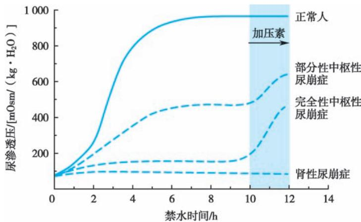

> [!info] 导航
> [[第093章_第7篇第03章_垂体前叶疾病|上一章]] · [[00_章节导航|总目录]] · [[第095章_第7篇第05章_甲状腺疾病|下一章]]

本章数字资源

# 第一节 | 尿崩症

尿崩症（diabetes insipidus，DI）是指精氨酸加压素（arginine vasopressin，AVP；又称抗利尿激素，antidiuretic hormone，ADH）完全/部分缺乏或肾脏对 AVP 不敏感，致肾远曲小管、集合管对水重吸收功能障碍，从而引起的以多尿、烦渴、多饮为特征的一组综合征。尿崩症较少见，可发生于任何年龄，但以青少年为多见，男性多于女性。因 AVP 完全或部分缺乏引起的尿崩症为中枢性尿崩症（centraldiabetes insipidus，CDI），肾 脏 对 AVP 不 敏 感 引 起 者 为 肾 性 尿 崩 症（nephrogenic diabetes insipidus，NDI）。NDI罕见，本节着重介绍CDI。

#### 【病因和发病机制】

中枢性尿崩症是由多种原因影响了 AVP 的合成、转运、储存及释放所致，可分为获得性、遗传性和特发性。

1.  获得性  约 50% 患者是由下丘脑神经垂体及附近部位的肿瘤（如垂体瘤、颅咽管瘤、松果体瘤、转移性肿瘤等）引起。10% 由头部创伤（严重脑外伤、垂体下丘脑部位的手术）所致。此外，少数中枢性尿崩症由脑部感染性疾病（脑膜炎、结核、梅毒等）、朗格汉斯细胞组织细胞增生症或其他肉芽肿病变、血管病变等引起。妊娠期胎盘可产生一种 N 末端氨基肽酶，使体内 AVP 降解加速，导致 AVP 缺乏，临床上可表现多尿、口渴等（妊娠性尿崩症），但一般症状较轻，产后可自行缓解。

2. 遗传性 少数中枢性尿崩症有家族史.呈常染色体显性遗传，由AVP-神经垂体素运载蛋白（AVP-NPⅡ）基因突变所致。此外，X连锁隐性遗传性尿崩症，由女性遗传，男性发病，杂合子女孩可有尿浓缩力差，一般症状轻，可无明显多饮、多尿。Wolfram 综合征（diabetes insipidus，diabetes mellitus，optic atrophy and deafness，DIDMOAD）由 WFS1 基因突变引起，可表现为尿崩症、糖尿病、视神经萎缩、耳聋，为常染色体隐性遗传，但极为罕见。

3. 特发性  约占 30%，临床找不到任何病因，部分患者尸检时发现下丘脑视上核与室旁核神经细胞明显减少或几乎消失，这种退行性病变的原因未明。有研究显示患者血中存在下丘脑室旁核神经核团抗体，即针对AVP合成细胞的自身抗体，并常伴有甲状腺、性腺、胃壁细胞的自身抗体。

#### 【临床表现】

主要临床表现为多尿、烦渴与多饮，喜冷饮，夜尿多，甚至影响睡眠。起病常较急，可有明确的起病日期。尿量多，常超过 50ml/（kg·d），日尿量可多达 4～10L。尿比重常低于 1.005，尿渗透压低于血浆渗透压，一般不超过 300mOsm/（ $\mathrm { k g } \cdot \mathrm { H } _ { 2 } \mathrm { O } \ )$ ），尿色淡如清水。部分患者症状较轻，日尿量仅为 2.5～5L，如限制饮水，尿比重可超过 1.010，尿渗透压可超过血浆渗透压，达 300～600mOsm/$\left( \mathrm { { k g } } \cdot \mathrm { { H } } _ { 2 } \mathrm { { O } } \right)$ ）。

由于低渗性多尿，血浆渗透压常轻度升高，从而兴奋下丘脑口渴中枢（渗透压感受器），患者因烦渴而大量饮水。如有足够的水分供应，患者血钠、血浆渗透压、血肌酐等常在正常范围内。但当病变累及下丘脑口渴中枢时（如大脑前交通动脉瘤及其手术后），口渴感丧失（又称渴感消失性尿崩症），或由于手术、麻醉、颅脑外伤等原因，患者处于意识不清状态，如不及时补充大量水分，可出现严重失水，高钠血症，可表现为肢体极度软弱、发热、精神症状、谵妄甚至死亡。

糖皮质激素缺乏时肾排水能力减弱，因此当尿崩症合并腺垂体功能不全时，尿崩症症状反而会减轻，糖皮质激素替代治疗后症状再现或加重。

三相性尿崩症（triphasic DI）：可由垂体柄断离（如头部外伤、手术）引起。第一阶段（急性期，3～5 天）尿量明显增加，尿渗透压下降；第二阶段（数天）尿量迅速减少，尿渗透压上升及血钠降低（与垂体后叶轴索溶解释放过多AVP有关）；第三阶段为永久性尿崩症。

获得性尿崩症除上述表现，尚可有原发病的症状与体征。

#### 【诊断与鉴别诊断】

典型尿崩症诊断不难。凡有多尿、烦渴、多饮者应考虑本病，可进行禁水-加压素试验明确诊断。无法完成禁水-加压素试验且临床表现典型者，可用去氨加压素进行诊断性治疗。

### （一） 诊断依据

主要诊断依据：①尿量多，常超过 $5 0 \mathrm { m l / ( k g ^ { \bullet } d ) ; }$ ；②尿渗透压低于血浆渗透压，一般低于 $3 0 0 \mathrm { m O s m } / ( \mathrm { k g } \cdot \mathrm { H } _ { 2 } \mathrm { O } )$ ）；③饮水不足时，可有高钠血症；④禁水试验不能使尿渗透压增加，而注射加压素后尿渗透压较注射前增加10% 以上；⑤加压素或去氨加压素治疗有明显效果。

### （二） 诊断方法

1. 禁水-加压素试验 比较禁水前后及使用加压素前后的尿渗透压变化。禁水一定时间，当尿浓缩至最大渗透压而不能再上升时，注射加压素。正常人注射外源性 AVP 后，尿渗透压不再升高，而中枢性尿崩症患者体内AVP缺乏，注射外源性AVP后，尿渗透压明显升高。

方法：禁水时间视患者多尿程度而定，一般从夜间开始（重症患者也可白天进行），禁水 6～16 小时不等，禁水期间每 1～2 小时测血压、体重、尿量、尿渗透压等，当尿渗透压达到高峰平顶［连续两次尿渗透压差＜30mOsm/（kg·H O）］时，抽血测血浆渗透压，然后立即皮下注射加压素（即垂体后叶素）5U.注射后1小时和2小时测尿渗透压。

结果判断：见图 7-4-1。正常人禁水后尿量明显减少，尿渗透压逐渐增加，超过 800mOsm/$\left( \mathrm { { k g } \cdot \mathrm { { H } } _ { 2 } O } \right)$ 。尿崩症患者禁水后尿量仍多，尿渗透压可有一定程度增加，不超过 $8 0 0 \mathrm { m O s m / ( \ k g \cdot H _ { 2 } O ) }$ 。注射加压素后，正常人和原发性烦渴患者尿渗透压变化不大，少数人稍升高但不超过10%。中枢性尿崩症患者注射加压素后尿渗透压明显升高较注射前增加10%以上。AVP缺乏程度越重尿渗透压增加的百分比越多。完全性中枢性尿崩症者 1～2 小时尿渗透压增加 50% 以上；部分性中枢性尿崩症者禁水后尿渗透压可超过血浆渗透压，注射加压素后尿渗透压增加在 10%～50%。肾性尿崩症在禁水后尿液不能浓缩，注射加压素后尿渗透压增加小于 10%。本法简单、可靠，但须在严密观察下进行，以免在禁水过程中出现严重脱水。若患者禁水过程中发生严重脱水（体重下降超过 3% 或血压明显下降），应立即停止试验，让患者饮水。

  
图7-4-1 禁水-加压素试验示意图

2.  血浆 AVP 测定  正常人血浆 AVP（随意饮水）为 2.3～7.4pmol/L，禁水后可明显升高。中枢性尿崩症患者血浆AVP水平降低，禁水后也不增加或增加不多。

### （三） 病因诊断

尿崩症诊断确定之后，必须尽可能明确病因。应进行视野检查、蝶鞍CT或MRI等检查以明确有无垂体或附近的病变。在磁共振 $\mathrm { T } _ { 1 }$ 加权图像上，正常人垂体后叶通常显示为高信号，表现为“亮点”。CDI 的典型 MRI 表现为垂体后叶“亮点”缺失，代表储存的 AVP 颗粒耗竭或缺失。

### （四） 鉴别诊断

1. 肾性尿崩症  由于肾对AVP不敏感所致。可分为遗传性和获得性：①遗传性：约90%患者与AVP受体（V R）基因突变有关，是X连锁隐性遗传性疾病；部分患者由编码水孔蛋白-2（AQP-2，参与AVP受体后信号转导）的基因发生突变所致，为常染色体隐性遗传性疾病。②获得性：继发于肾小管损害、药物（如碳酸锂、庆大霉素）等。该类患者临床上也有多尿、口渴、多饮等症状，禁水试验也无明显尿量减少和尿渗透压升高，但注射加压素后尿渗透压增加小于10%，基础和禁水后血浆AVP均高。

2. 原发性烦渴  常与精神因素有关（即精神性烦渴），部分与药物、下丘脑病变等有关。主要由于精神性疾病、药物等因素引起过量饮水，进而导致多尿，低比重尿，临床上与尿崩症相似。但患者有相应病史及神经精神症状等，一般日间症状明显，但无夜尿增多，不影响睡眠，其 AVP 分泌潜能并不缺乏，禁水-加压素试验结果与正常人类似。

3.  其他疾病  糖尿病患者可有多尿、烦渴、多饮症状，监测血糖、尿糖，容易鉴别。慢性肾脏病（尤其是肾小管疾病）、低钾血症、高钙血症等，均可影响肾浓缩功能而引起多尿、口渴等症状，但有相应原发病的临床特征，且多尿的程度也较轻。

#### 【治疗】

### （一） 激素替代疗法

1. 去氨加压素  即 1-脱氨基-8-右旋精氨酸加压素（desmopressin，DDAVP），为人工合成的加压素类似物。其抗利尿作用强，而无加压作用，不良反应少，为目前治疗中枢性尿崩症的首选药物。用法：口服片剂，每次0.1～0.4mg，每日2～3次，部分患者可睡前服药1次，以控制夜间排尿和饮水次数，得到足够的睡眠和休息。由于剂量的个体差异大，用药必须个体化，严防水中毒的发生。妊娠性尿崩症可以采用 DDAVP，因其不易被 AVP 酶破坏。其他制剂：皮下注射 1～4μg 或鼻内喷雾给药 10～20μg，每日1～2次。

2. 垂体后叶素  从猪或牛脑垂体后叶中提取，内含 AVP，作用能维持 3～6 小时，每日须多次注射，长期应用不便。主要用于脑损伤或手术时出现的尿崩症，每次5～10U，皮下注射。

### （二） 其他抗利尿药物

1. 氢氯噻嗪  每次 25mg，每日 2～3 次，可使尿量减少约一半。其作用机制可能是抑制远曲小管对钠的重吸收，减少机体血容量，刺激肾近曲小管钠水重吸收增加，从而减少输送到集合管（AVP敏感部位）的水分，即减少尿量。对肾性尿崩症也有效。长期服用可引起缺钾、高尿酸血症等，应适当补充钾盐。

2. 卡马西平  能刺激 AVP 分泌，使尿量减少。每次 0.2g，每日 2～3 次。有外周血粒细胞减少、肝损害、疲乏、眩晕等副作用。

### （三） 病因治疗

获得性尿崩症尽量治疗其原发病。

#### 【预后】

预后取决于病因和病情的严重程度。轻度脑损伤或感染引起的尿崩症可完全恢复。特发性尿崩症常属永久性，在充分的饮水供应和适当的抗利尿治疗下，通常可以维持正常的生活，对寿命影响不大。

# 第二节 | 抗利尿不适当综合征

抗利尿不适当综合征（syndrome of inappropriate antidiuresis，SIAD）是指抗利尿激素（ADH，即精氨酸加压素）分泌异常增多或其效应增强，导致水潴留、低钠血症、低血浆渗透压等临床表现的一组综合征。其中，由抗利尿激素分泌异常增多引起，称为抗利尿激素分泌失调综合征（syndrome ofinappropriate secretion of antidiuretic hormone，SIADH），较常见，是低钠血症的最常见原因；ADH 效应增强者，为肾性抗利尿不适当综合征（nephrogenic syndrome of inappropriate antidiuresis，NSIAD），罕见。本节着重介绍SIADH。

#### 【病因和病理生理】

SIADH 常见病因为恶性肿瘤、呼吸系统及神经系统疾病等。部分病因不明者称为特发性SIADH，多见于老年患者。

### （一） 异源性AVP分泌

1. 恶性肿瘤  小细胞肺癌、胰腺癌、淋巴肉瘤、十二指肠癌、霍奇金淋巴瘤等可合成及释放 AVP引起SIADH。其中以小细胞肺癌最多见。

2. 肺部感染性疾病  肺炎、肺结核、肺脓肿、肺曲霉病等可引起 SIADH，可能是由病变的肺组织合成与释放AVP 所致。

### （二） 中枢神经系统疾病

脑外伤、脑脓肿、脑肿瘤、蛛网膜下腔出血、脑血栓形成、脑部急性感染、结核性或其他脑膜炎、卟啉病等都可影响下丘脑-神经垂体功能，使AVP分泌过多。

### （三） 药物

某些药物如抗抑郁药（如选择性 5-羟色胺再摄取抑制剂）、全身麻醉药、巴比妥类、卡马西平、氯磺丙脲等可使AVP分泌过多，引起SIADH。

由于 AVP 释放过多，且不受正常调节机制所控制，肾远曲小管与集合管对水的重吸收增加，尿液不能稀释，游离水不能排出体外，细胞外液容量扩张，血液稀释，血清钠浓度与渗透压下降。同时，细胞内液也处于低渗状态，细胞肿胀，当影响脑细胞功能时，可出现神经系统症状。本综合征血容量正常，一般不出现水肿，因为当细胞外液容量扩张到一定程度，可抑制近曲小管对钠的重吸收，使尿钠排出增加，水分不致在体内潴留过多。加之容量扩张导致心房钠尿肽释放增加，使尿钠排出进一步增加，因此，钠代谢处于负平衡状态，加重低钠血症与低血浆渗透压。此外，醛固酮分泌受到抑制，也增加尿钠的排出。

#### 【临床表现和实验室检查】

主要临床特征是水潴留（稀释性低血钠）、低血浆渗透压，机体血容量正常，一般无水肿。临床症状的轻重与 AVP 分泌量有关，同时取决于水负荷的程度。多数患者在限制水分时，可不表现典型症状。但若水摄入过多，则可出现水潴留及低钠血症表现。患者血清钠一般低于 130mmol/L，但尿钠排出相对较多（一般超过 20mmol/L）。当血清钠浓度低于 120mmol/L 时，可出现食欲减退、恶心、呕吐、肢体软弱无力、嗜睡，甚至精神错乱；当血清钠低于 110mmol/L 时，出现肌力减退，腱反射减弱或消失、惊厥、昏迷，如不及时处理，可导致死亡。本病血浆渗透压常低于 275mOsm$\left( \mathrm { { k g } \cdot \mathrm { { H } _ { 2 } O } } \right)$ ），而尿渗透压可高于血浆渗透压。由于血容量充分，肾小球滤过率增加，血尿素氮、肌酐、尿酸等浓度常降低。血浆AVP相对于血浆渗透压呈不适当的高水平。

#### 【诊断与鉴别诊断】

### （一） 诊断依据

主要诊断依据：①血钠降低（常低于 130mmol/L）；②尿钠增高（常超过 20mmol/L或尿钠排泄率每日＞25mmol）；③血浆渗透压降低［常低于 $2 7 5 \mathrm { { m O s m } / \left( \mathrm { { k g } \cdot H _ { 2 } O } \right) } \cdot$ ］；④尿渗透压＞$1 0 0 \mathrm { m O s m } / ( \mathrm { k g } \cdot \mathrm { H } _ { 2 } \mathrm { O } )$ ）；⑤血尿素氮、肌酐、尿酸常下降；⑥除外肾上腺皮质功能减低、甲状腺功能减退、利尿药使用等原因。

### （二） 病因诊断

恶性肿瘤是常见原因，特别是小细胞肺癌。有时可先出现 SIADH，以后再出现肺癌的影像学改变。其次应除外中枢神经系统疾病、肺部感染、药物等因素。

### （三） 鉴别诊断

1.  肾性抗利尿不适当综合征（NSIAD）  肾小管 AVP 受体 $\left( \mathrm { ~ V ~ } _ { 2 } \mathrm { R } \right)$ 基因突变（如 R137C、R137L），激活受体 G 蛋白的α亚单位，致抗利尿效应增强，是 X 连锁隐性遗传性疾病，其血 AVP 降低。若儿童或多个家庭成员发生低钠血症，或托伐普坦疗效不佳者，应警惕 NSIAD，必要时行血 AVP 和 $\mathrm { V } _ { 2 } \mathrm { R }$ 基因检测。此外，环磷酰胺、舍曲林等药物也可激活肾小管 AVP 受体导致低钠血症，必要时停药后观察。

2. 其他正常血容量性低钠血症  肾上腺皮质功能减退症、恶心呕吐、甲状腺功能减退等也是导致低钠血症的常见原因，应仔细询问病史及完善相关检查进行鉴别。

3. 低血容量性低钠血症  胃肠消化液丧失（如腹泻），胃肠、胆道、胰腺造瘘或胃肠减压等，体内钠丢失超过水丢失，致低钠血症，有相关疾病史及失水表现。血尿素氮、肌酐、尿酸常增高。脑盐耗综合征（cerebral salt wasting syndrome，CSWS）是在颅内疾病的过程中肾不能保存钠而导致进行性钠自尿中大量流失，并带走水分，从而导致低钠血症和细胞外液容量下降。CSWS 的主要临床表现为低钠血症、尿钠增高和低血容量；而SIADH血容量正常，这是与CSWS的主要区别。此外，CSWS对钠和血容量的补充有效，而限水治疗无效，反而使病情恶化。

4. 高血容量性低钠血症  见于严重心力衰竭、肝硬化或肾病综合征等，体内水的增多超过钠的增多，但这些患者各有相应原发病的病史，常伴水肿、腹水。

基于细胞外液容量的低钠血症鉴别要点见表7-4-1。

表7-4-1 基于细胞外液容量的低钠血症鉴别要点

<table><tr><td rowspan="2">临床表现</td><td rowspan="2">高血容量性</td><td rowspan="2">低血容量性</td><td colspan="2">正常血容量性</td></tr><tr><td>SIAD</td><td>其他原因引起</td></tr><tr><td>1. 病史</td><td></td><td></td><td></td><td></td></tr><tr><td>心衰、肝硬化或肾病</td><td>+</td><td>-</td><td>-</td><td>-</td></tr><tr><td>水钠丢失</td><td>-</td><td>+</td><td>-</td><td>-</td></tr><tr><td>皮质醇缺乏或恶心、呕吐</td><td>-</td><td>-</td><td>-</td><td>+</td></tr><tr><td>2. 体格检查</td><td></td><td></td><td></td><td></td></tr><tr><td>水肿或腹水</td><td>+</td><td>-</td><td>-</td><td>-</td></tr><tr><td>3. 实验室检查</td><td></td><td></td><td></td><td></td></tr><tr><td>血尿素、肌酐</td><td>高/正常</td><td>高/正常</td><td>低</td><td>低/正常</td></tr><tr><td>血尿酸</td><td>高</td><td>高</td><td>低</td><td>低</td></tr><tr><td>血钾</td><td>低/正常</td><td>低/正常</td><td>正常</td><td>正常</td></tr><tr><td>血白蛋白</td><td>低/正常</td><td>高/正常</td><td>正常</td><td>正常</td></tr><tr><td>血皮质醇</td><td>正常/高</td><td> $正常/高^a$ </td><td>正常</td><td> $低^b$ </td></tr><tr><td>血浆肾素</td><td>高</td><td>高</td><td>低</td><td> $低^c$ </td></tr><tr><td> $尿钠排泄率^d$ </td><td>低</td><td>低</td><td>高</td><td>高</td></tr></table>

注：“+”表示“有”；“-”表示“无”；a. 若为血容量减少是由于原发性肾上腺皮质功能不全引起，血皮质醇降低。b. 若为恶心和呕吐引起，则血皮质醇正常或偏高。c. 若为继发性肾上腺功能不全，血肾素可能升高。d. 尿钠排泄率（低钠血症患者＞25mmol/d 为尿钠排泄率增高）。

#### 【治疗】

1. 病因治疗  纠正基础疾病。药物引起者须立即停药。

2.  对症治疗  限制水摄入对控制症状十分重要，轻者主要通过限制饮水量，饮水量一般限制在每天08～1.0L，症状即可好转体重下降，血清钠与血渗透压随之上升。严重者可注射味塞米20～40mg，排出水分。严重低钠血症（如＜110mmol/L），可静脉输注 3% 氯化钠溶液，滴速为 1～2ml（kg·h），使血清钠逐步上升，频繁监测血钠（每 2～4 小时 1 次），控制血钠 24 小时内升高不超过 10～12mmol/L。当血钠恢复至 120mmol/L 左右，可停止高渗盐水滴注。如血钠升高过快，有可能引起脑桥中央髓鞘溶解（表现可为发音困难、缄默症、吞咽困难、倦怠、情感变化、瘫痪、癫痫样发作、昏迷和死亡）。

3. 抗利尿激素受体拮抗剂  托伐普坦（tolvaptan）可选择性拮抗位于肾脏集合管细胞的基底膜Ⅱ型 AVP受体（V R），调节集合管对水的通透性，提高对水的清除率，促使血钠浓度提高。每日 1 次，起始剂量 15mg，服药 24 小时后可酌情增加剂量。服药期间，可不必限制患者饮水，同时应注意监测血电解质变化，避免血钠过快上升。常见不良反应为口干、渴感、眩晕、恶心、低血压等。

#### 【预后】

由恶性肿瘤如小细胞肺癌、胰腺癌等所致者，预后不良。由肺部疾病、中枢神经系统疾病、甲状腺功能减退、药物等非肿瘤原因所致者，原发病治疗好转后或停药后，SIADH可随之消失。

（李启富）

  
本章思维导图
