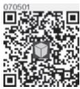
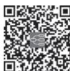

> [!info] 导航
> [[第094章_第7篇第04章_垂体后叶疾病|上一章]] · [[00_章节导航|总目录]] · [[第096章_第7篇第06章_甲状旁腺疾病|下一章]]

  
数字人

# 第一节 | 甲状腺功能亢进症

甲状腺毒症（thyrotoxicosis）是指血液循环中甲状腺激素过多，引起以交感神经兴奋性增高和代谢亢进为主要表现的一组临床综合征。甲状腺毒症包括甲状腺功能亢进症和非甲状腺功能亢进症两种（表 7-5-1）。甲状腺功能亢进症（hyperthyroidism，简称甲亢）是指甲状腺本身产生甲状腺激素过多而引起的甲状腺毒症。非甲状腺功能亢进症是指甲状腺激素合成功能并不亢进，由于甲状腺破坏，滤泡内储存的甲状腺激素进入血液循环，或服用过量外源性甲状腺激素引起的甲状腺毒症。根据甲状腺功能亢进的程度，可以分为临床甲亢（overt hyperthyroidism）和亚临床甲亢（subclinicalhyperthyroidism）。我国成人临床甲亢的患病率为 0.78%，亚临床甲亢患病率 0.44%。

## 表7-5-1 甲状腺毒症的常见原因

## 一、甲状腺功能亢进症

1. 过度刺激促甲状腺激素（TSH）受体

（1）毒性弥漫性甲状腺肿［Graves 病（Graves disease，GD）］

（2）人绒毛膜促性腺激素（HCG）相关性甲亢（绒毛膜癌、葡萄胎、妊娠等）

（3）垂体分泌 TSH 腺瘤（TSH-producing pituitary tumor）

2. 自主甲状腺激素分泌

（1）毒性结节性甲状腺肿

（2）甲状腺自主高功能腺瘤（Plummer disease）

（3）碘致甲状腺功能亢进症（碘甲亢）

## 二、非甲状腺功能亢进症

1. 甲状腺破坏，激素释放增多

（1）亚急性肉芽肿性甲状腺炎（deQuervian 甲状腺炎）

（2）亚急性淋巴细胞性甲状腺炎（产后甲状腺炎/无痛性甲状腺炎）

（3）损伤性甲状腺炎（手术、药物、放射破坏等）

2. 非甲状腺来源的甲状腺激素增多

（1）人为甲状腺毒症（服用过多甲状腺激素药物或食物）

（2）卵巢畸胎瘤（卵巢甲状腺肿伴甲亢）

（3）转移的具有分泌甲状腺激素功能的甲状腺癌

Graves 病（Graves disease，GD）是一种以体内存在促甲状腺激素受体抗体（thyrotropin receptorantibody，TRAb）为特征的多系统自身免疫病，是甲亢主要病因。Graves 病甲亢女性是男性的 4 倍，儿童相对少见，发病率30岁以后趋于稳定，平均发病年龄47岁。本节主要讨论Graves 病。

#### 【病因和发病机制】

Graves 病是在特定的遗传背景下，受环境因素的影响，对 TSH 受体（TSHR）产生自身免疫反应的疾病。其发病与 HLA、CTLA-4、PTPN22、CD40、IL-2R、FCRL3、Tg 和 TSHR 等基因多态性以及染色体失活偏移等有关。环境因素包括感染、碘摄入量、吸烟、应激、药物和环境毒素等。

TSHR 是 Graves 病的主要自身抗原，浸润在甲状腺内的淋巴细胞产生甲状腺自身抗体。在机体免疫耐受机制破坏后，TSHRα亚单位激活 B 淋巴细胞，B 细胞转化为能分泌 TSHR 抗体的浆细胞，产生 TRAb。

TRAb 包括三个亚型：甲状腺刺激性抗体（thyroid stimulating antibody，TSAb）、甲状腺阻断性抗体（thyroid blocking antibody，TBAb）和甲状腺中性抗体。TSAb 是 Graves 病甲亢的致病抗体。TSAb 与TSH竞争性地与 TSH受体（TSHR）α亚单位结合，激活腺苷酸环化酶信号系统，导致甲状腺滤泡上皮细胞增生，产生过量的甲状腺激素。TSAb对TSHR的刺激不受下丘脑-垂体-甲状腺轴的负反馈调节，因此导致甲亢。TBAb 阻断 TSH 与 TSHR 的结合，减少甲状腺激素的合成。Graves 病患者体内两个抗体可以相互转化，占优势的抗体决定甲状腺功能。甲状腺中性抗体不影响甲状腺功能。

#### 【病理】

甲状腺呈不同程度的弥漫性肿大。甲状腺滤泡上皮细胞增生，呈高柱状或立方状，滤泡腔内的胶质减少或消失，滤泡间可见浸润的T细胞、B细胞和浆细胞。

Graves 眼病患者眶后 T 淋巴细胞浸润，脂肪细胞增多，成纤维细胞分泌大量黏多糖和糖胺聚糖，透明质酸增多，眼外肌肿胀，引起突眼。眶后的成纤维细胞和脂肪细胞表面存在 TSHR 和胰岛素样生长因子-1（IGF-1）受体，两个受体被激活后有共同的信号通路。

胫前黏液性水肿病理可见细胞外基质透明质酸、黏多糖堆积、淋巴细胞浸润。肌肉组织肿胀，肌纤维破坏。

#### 【临床表现】

### （一） 甲状腺毒症表现

1.  高代谢症群  增多的甲状腺激素兴奋交感神经、促进新陈代谢、增加对儿茶酚胺的敏感性。蛋白质、葡萄糖和脂肪分解代谢大于合成代谢，产热增加。患者表现为多汗、不耐热、食欲增加、体重下降、乏力、糖耐量异常或原有糖尿病加重。

2. 精神神经系统  表现为烦躁、易激动、失眠、好动、注意力不集中等，严重者出现妄想。伸舌或双手向前平举时有细颤。腱反射活跃，深反射恢复期时间缩短。

3. 心血管系统  由于高代谢和散热增加，导致循环加快。表现为持续性心悸，休息也不能缓解。听诊心率快、第一心音亢进、心律失常，可闻及收缩期杂音。心律失常以窦性心动过速、房性早搏最常见，其次为阵发性或持续性房颤，也可为室性或交界性早搏，偶见房室传导阻滞。收缩压升高、舒张压下降导致脉压增大，可出现毛细血管搏动征、水冲脉等周围血管征。甲亢性心力衰竭属高动力高排出量性心力衰竭，常于心律失常后发生或加重。甲亢控制，心力衰竭可以好转或恢复。

甲状腺毒症性心脏病（thyrotoxic heartdisease）是长期未控制的甲亢所致的心脏病，可出现以下表现之一：①严重心律失常，包括持续性或阵发性房颤、房扑、频发室性期前收缩、二度和三度房室传导阻滞等；②心力衰竭；③心脏扩大；④心绞痛或心肌梗死。同时除外其他原因所致心脏病，如高血压心脏病、冠心病、风湿性心脏病等。

4. 消化系统  表现为易饥饿、多食、消瘦。肠蠕动加快，大便次数增加。可出现肝功能异常，如转氨酶、碱性磷酸酶升高，低蛋白血症，偶伴黄疸。

5. 肌肉骨骼系统  甲状腺毒性肌病（thyrotoxic myopathy）分急性和慢性两种。急性常于数周内出现吞咽困难和呼吸肌麻痹。慢性肌病主要累及肩、髋部等近端肌群，表现为进行性肌无力，伴肌萎缩，登楼、蹲起或梳头困难。甲状腺毒性周期性瘫痪（thyrotoxic periodic paralysis，TPP）表现为四肢瘫痪下肢为主不能站立或行走常伴低钾血症与血清钾向细胞内转移有关。TPP呈自限性或在补钾后好转。主要见于亚洲和拉丁美洲年轻男性患者。GD也能导致胸腺增大，甲亢控制后减小或消失。GD可伴发重症肌无力。

甲状腺毒症患者骨转换增加，尿钙、磷、胶原分解产物排出增多，血 25-羟维生素 $\mathrm { D } _ { 3 }$ 水平降低，可致骨量减少、骨质疏松。

6. 造血系统  白细胞总数和中性粒细胞数量降低，淋巴细胞比例增加，红细胞数量增加，血小板数量和凝血机制正常。偶见伴发特发性血小板减少性紫癜和恶性贫血。

7. 生殖系统  女性常有月经稀少，周期延长，甚至闭经、不孕。男性可出现阳痿，偶见乳腺发育。

8.  皮肤、毛发  由于皮肤血管扩张和多汗而引起皮肤温暖、潮湿。可有色素脱失、白癜风和脱毛。

9. 眼部表现  与甲状腺毒症所致的交感神经兴奋性增高有关。表现为眼球轻度突出，上眼睑轻度挛缩，眼裂增宽，凝视，瞬目减少。眼睑迟落征，即眼睛向下看时上眼睑不能及时随眼球向下移动；眼球滞后，即向上看时眼球滞后于上眼睑运动；集合运动时两眼不能内聚或内聚不充分（Mobius 征）。

10.  甲状腺危象（thyroid storm，thyroid crisis）  也称甲亢危象，死亡率高。临床表现为甲状腺毒症症状急性加重。多发生于较重甲亢未予治疗或治疗不充分的患者。常见诱因有感染、创伤、精神刺激，也可能发生在 <sup>131</sup>I 治疗、甲状腺手术或分娩后。临床表现有高热或超高热、大汗、心悸，心率常在140 次/分以上，烦躁、焦虑不安、谵妄、恶心、呕吐、腹泻，严重者心力衰竭、休克及昏迷。本症的诊断主要靠临床表现综合判断。临床有危象前兆者应按甲亢危象处理。

11.  淡漠型甲亢（masked or apathetic hyperthyroidism）  多见于老年患者。起病隐袭，可表现为充血性心力衰竭伴心律失常、不明原因的体重减轻，高代谢症状不明显，易被误诊为恶性肿瘤、冠心病等疾病。

### （二） Graves病特征性表现

1. 甲状腺肿  甲状腺肿为弥漫性，质地软或韧，无压痛。典型患者甲状腺上下极可以触及细震颤，闻及血管杂音。

2.  Graves 眼病（Graves ophthalmopathy，GO）  GO 又称甲状腺相关性眼病（thyroid-associatedophthalmopathy，TAO）或甲状腺眼病（thyroid eye disease，TED）。25%～50% 的 GD 患者伴有不同程度的 GO，10%～20% 单眼受累。甲亢与 GO 可同时发生或先后发生。5% GO 患者甲状腺功能正常，称为甲状腺功能正常型GO（euthyroid Graves ophthalmopathy，EGO）。GO女性多见，但男性临床表现更重。

临床表现有眼内异物感、胀痛、畏光、流泪、复视、斜视、视力下降，查体见单侧或双侧眼睑退缩、眼球突出，眼睑红肿，结膜充血水肿，泪阜水肿，眼球活动受限，严重者眼球固定。眼睑闭合不全、角膜外露导致暴露性角膜病变。眼眶后视神经受压导致甲状腺相关眼病视神经病变（dysthyroid opticneuropathy，DON）。两者严重时可致失明。

所有的 GO 患者都要评估临床活动度分期和严重程度分级，以决定甲亢和 GO 的治疗方法。GO临床活动度分期采用临床活动性评分（clinical activity score，CAS），评估标准见表 7-5-2。初次评估 7分法 CAS≥3 分或者随诊评估 10 分法 CAS≥4 分即判断 GO 为活动期，否则为非活动期。GO 严重度分级标准有两种，分别见表7-5-3和表7-5-4。

表 7-5-2 GO 临床活动性评分（CAS）（EUGOGO，2021）

<table><tr><td>序号</td><td>项目</td><td>初次就诊</td><td>随诊与上次就诊比较</td><td>评分</td></tr><tr><td>1</td><td>自发性球后疼痛</td><td>√</td><td></td><td>1</td></tr><tr><td>2</td><td>眼球运动时疼痛</td><td>√</td><td></td><td>1</td></tr><tr><td>3</td><td>眼睑充血</td><td>√</td><td></td><td>1</td></tr><tr><td>4</td><td>结膜充血</td><td>√</td><td></td><td>1</td></tr><tr><td>5</td><td>眼睑肿胀</td><td>√</td><td></td><td>1</td></tr><tr><td>6</td><td>球结膜水肿</td><td>√</td><td></td><td>1</td></tr><tr><td>7</td><td>泪阜肿胀</td><td>√</td><td></td><td>1</td></tr><tr><td>8</td><td>突眼度增加≥2mm</td><td></td><td>√</td><td>1</td></tr><tr><td>9</td><td>任一方向眼球运动减少≥8°</td><td></td><td>√</td><td>1</td></tr><tr><td>10</td><td>视力下降≥1行</td><td></td><td>√</td><td>1</td></tr></table>

注：EUGOGO 欧洲甲亢眼病研究组。

表7-5-3 GO严重程度分级标准（美国甲状腺学会）

<table><tr><td>分级</td><td>标准</td></tr><tr><td>0</td><td>无症状或体征(no physical signs or symptoms)</td></tr><tr><td>1</td><td>仅有体征,无症状。体征仅有上睑挛缩、凝视,突眼度在18mm以内(only signs,no symptoms)</td></tr><tr><td>2</td><td>软组织受累(soft tissue involvement)</td></tr><tr><td>3</td><td>眼球突出(proptosis)</td></tr><tr><td>4</td><td>眼外肌受累(extraocular muscle involvement)</td></tr><tr><td>5</td><td>角膜受累(corneal involvement)</td></tr><tr><td>6</td><td>视力丧失(sight loss)</td></tr></table>

表 7-5-4 GO 严重程度分级标准（EUGOGO，2021）

<table><tr><td>严重度</td><td>标准</td><td>生活质量</td></tr><tr><td>轻度</td><td>通常有 $\geqslant 1$ 种以下表现:1. 眼睑退缩 $<2\text{mm}$ 2. 轻度软组织受累3. 眼球突出度不超过正常上限3mm4. 一过性复视或没有复视5. 用润滑型眼药水能缓解角膜暴露症状</td><td>轻微影响生活质量,通常不需要干预</td></tr><tr><td>中重度</td><td>通常有 $\geqslant 2$ 种下述表现:1. 眼睑退缩 $\geqslant 2\text{mm}$ 2. 中度或重度软组织受累3. 眼球突出度超出正常上限 $\geqslant 3\text{mm}$ 4. 间歇性或持续性复视</td><td>影响生活质量,需要干预,但没有威胁视力</td></tr><tr><td>极重度</td><td>出现下述任一情况:1. 甲状腺相关眼病视神经病变(DON)2. 严重暴露性角膜病变</td><td>威胁视力,需要立即干预</td></tr></table>

3.  Graves 皮肤病变  胫前黏液性水肿（pretibial myxedema）见于少数 GD 患者，白种人多见。多发生在胫骨前下1/3部位，也见于踝关节、足背、肩部、手背或手术瘢痕处，偶见于面部，多为对称性。早期皮肤增厚变粗，有大小不等的红褐色斑块或结节，逐渐扩大融合，后期皮肤呈橘皮或树皮样，覆以灰色或黑色疣状物，下肢粗大似象皮腿。指端粗厚（acropachy）少见，手指和脚趾末节肿胀，呈杵状，表面皮肤增厚。

#### 【实验室和其他检查】

1. 促甲状腺激素（TSH）  血清 TSH 是反映甲状腺功能最敏感的指标。目前采用敏感 TSH 检测方法，能够诊断亚临床甲亢，使TSH成为筛查甲亢的第一线指标。

2. 血清总甲状腺激素 $\mathrm { T } _ { 4 }$ 全部由甲状腺产生，每天约产生 $8 0 { \sim } 1 0 0 \mu \mathrm { g }$ 。血中 20% 的 $\mathrm { T } _ { 3 }$ 由甲状腺产生，80% 在外周组织经脱碘酶作用由 $\mathrm { T } _ { 4 }$ 转换而来。血中 99.96% 的 $\mathrm { T } _ { 4 }$ 和 99.5% 以上的 $\mathrm { T } _ { 3 }$ 与蛋白结合，形成结合型甲状腺激素。其中 80%～90% 与甲状腺素结合球蛋白（TBG）结合，其次是甲状腺素转运蛋白和白蛋白等。总甲状腺激素是结合型和游离型甲状腺激素的总和。血清 TBG 浓度以及蛋白与激素结合力的变化都会影响总甲状腺激素测定的结果。如妊娠、雌激素、急性病毒性肝炎、先天因素等可引起 TBG 升高，使 $\mathrm { T T _ { 4 } }$ 和 TT 水平升高；雄激素、糖皮质激素、先天因素等可引起 TBG降低，使 $\mathrm { T T _ { 4 } }$ 和 TT 水平降低。

3 血清游离用状腺激素句括游离甲状腺素 $\left( \mathrm { F T _ { 4 } } \right)$ 和游离三碘甲腺原氨酸 $( \mathrm { F T } _ { 3 } ) _ { \mathfrak { c } }$ 。血中游离甲状腺激素含量甚微，是实现生物效应的主要部分，是诊断临床甲亢的主要指标。大多数甲亢时血清$\mathrm { F T } _ { 3 }$ 与 $\mathrm { F T _ { 4 } }$ 同时升高， $\mathrm { F T } _ { 3 }$ 升高可以早于 $\mathrm { F T _ { 4 \odot } }$ 。如果仅有 $\mathrm { F T } _ { 3 }$ 升高， $\mathrm { F T _ { 4 } }$ 正常，称为 $\mathrm { T } _ { 3 }$ 型甲状腺毒症，常见于甲亢早期、甲亢药物治疗过程中和甲亢缓解后复发。如果仅有 $\mathrm { F T _ { 4 } }$ 升高， $\mathrm { F T } _ { 3 }$ 正常，称为 $\mathrm { T } _ { 4 }$ 型甲状腺毒症。

4. TRAb  未经治疗的 GD 患者，血 TRAb 阳性率可达 80%～100%，是鉴别甲亢病因、诊断 GD的指标之一，对判断病情活动、治疗后是否停药、停药后是否复发有指导作用。目前临床检测的TRAb仅能反映存在有针对TSH受体的自身抗体，不能反映这种抗体的功能，即不能区分TSAb 或TBAb，甲亢状态时，一般将TRAb视为TSAb。通过在转染了人类TSHR 的细胞系中加入血清，测定细胞培养液中的cAMP 水平，能够鉴别TSAb或 $\mathrm { T B A b }$ O

5. TRH 兴奋试验  目前已用敏感 TSH 取代了 TRH 刺激试验诊断甲亢。甲状腺性甲亢时，血$\mathrm { T } _ { 3 } , \mathrm { T } _ { 4 }$ 升高，反馈抑制TSH，TRH刺激下TSH不升高（无反应）支持甲状腺性甲亢的诊断。

6. <sup>131</sup>I 摄取率（RAIU）  诊断甲亢的传统方法，目前已经基本被敏感 TSH 测定所替代。RAIU 正常值因地区而异，通常为3小时5%～25%，24小时20%～45%，高峰在24小时出现。RAIU现在主要用于甲状腺毒症病因的鉴别：甲亢时血清甲状腺激素水平升高，同时 RAIU 也升高或正常，摄取高峰前移。甲状腺破坏所致甲状腺毒症血清甲状腺激素水平升高，RAIU降低，出现分离现象。此外RAIU用于计算<sup>131</sup>I治疗甲亢时需要的活度。妊娠期及哺乳期不能进行RAIU检查。

7. 甲状腺放射性核素扫描  对于诊断毒性甲状腺结节和甲状腺自主高功能腺瘤有意义。有功能的结节或肿瘤区核素大量浓聚（热结节），热结节外甲状腺组织核素稀疏或无核素分布。

8. 甲状腺超声  GD 时甲状腺超声示甲状腺增大，血流量明显增多，甲状腺上、下动脉收缩期峰值血流速度增快，可以用于区别甲状腺破坏引起的甲状腺毒症。

9. CT 和 MRI  眼眶 CT 和 MRI 主要用于评价眼外肌受累的程度，有助于 GO 的诊断，评估 GO临床活动性分期和严重程度分级，排除其他原因所致的突眼。

#### 【诊断】

包括甲状腺毒症的诊断及其病因诊断。典型病例易于诊断，不典型病例易被误诊或漏诊。

1.  甲状腺毒症和甲亢的诊断  血清 $\mathrm { F T _ { 4 } }$ 或 $\mathrm { F T } _ { 3 }$ 升高，结合临床症状，可以诊断甲状腺毒症。甲状腺 RAIU 升高或甲状腺静态显像核素摄取能力增强，提示甲亢。TSH 降低、 $\mathrm { . F T _ { 4 } }$ 或 $\mathrm { F T } _ { 3 }$ 升高，诊断临床甲亢；TSH降低、 $\mathrm { . } \mathrm { T } _ { 3 }$ 和 $\mathrm { T } _ { 4 }$ 正常，诊断亚临床甲亢。

2. GD 的诊断  ①甲亢诊断确立；②甲状腺弥漫性肿大，少数病例可以无甲状腺肿大；③Graves眼病；④胫前黏液性水肿或指端粗厚；⑤TRAb 水平升高。以上标准中，①②项为诊断必备条件，同时③④⑤具备其一，即根据Graves 病特征性临床体征和TRAb作出GD诊断。

#### 【鉴别诊断】

### （一） GD 与破坏性甲状腺毒症的鉴别

破坏性甲状腺毒症（如亚急性甲状腺炎、无痛性甲状腺炎），有高代谢表现和血清甲状腺激素水平升高，但甲状腺RAIU减低，即分离现象。

### （二） GD 与其他甲亢原因的鉴别

毒性结节性甲状腺肿和甲状腺高功能腺瘤患者甲状腺超声可以发现结节或肿瘤，甲状腺核素扫描毒性结节性甲状腺肿患者可见核素分布不均，增强和减弱区呈灶状分布；甲状腺高功能腺瘤患者见“热”结节，结节外甲状腺组织的核素摄取能力受抑制。桥本甲亢时，鉴别困难，需要甲状腺穿刺病理检查或随访病情转变。HCG 相关性甲亢有相关疾病，血 HCG显著升高。碘甲亢者有过量碘摄入史，甲状腺RAIU降低。

### （三） GD 与妊娠期一过性甲状腺毒症的鉴别

妊娠期一过性甲状腺毒症（gestational transientthyrotoxicosis，GTT）是由妊娠期高浓度 HCG 刺激甲状腺 TSHR 所致，常发生在妊娠早期，病情较轻，呈一过性，妊娠中晚期随血 HCG 浓度的下降而缓解。伴有妊娠剧吐、多胎时更易发生。GTT 无须抗甲状腺药物治疗。

### （四） 与其他疾病的鉴别

1. 与甲状腺毒症症状相似  围绝经期综合征妇女情绪不稳、烦躁失眠、阵发潮热、出汗等；糖尿病患者多食、易饥饿、消瘦；结核、慢性感染和恶性肿瘤患者消瘦、低热、恶病质；原发性肌病引起严重肌萎缩等，均须检测甲状腺功能以资鉴别。患有心力衰竭、顽固性心房颤动等疾病，常规治疗效果欠佳者须注意排除甲亢。

2. 与 GD 的体征相似  单纯性甲状腺肿的患者甲状腺肿大，但无甲亢症状，血 $\mathrm { T S H } , \mathrm { T } _ { 4 } , \mathrm { T } _ { 3 }$ 正常，甲状腺 RAIU 可增高，但高峰不前移。突眼的患者要注意排除颅内肿瘤、海绵窦动静脉瘘、眶周炎、眼眶肿瘤等，CT 或MRI有助于明确诊断。

#### 【治疗】

GD 目前尚无病因治疗手段，经典的疗法包括抗甲状腺药物（antithyroid drug，ATD）、放射碘（<sup>131</sup>I）和手术，三种方法各有利弊，ATD最常用。

### （一） 抗甲状腺药物

ATD 是硫代酰胺（thioamide）类化合物，包括咪唑类和硫脲类。咪唑类有甲巯咪唑（methimazole，MMI）和卡比马唑（carbimazole）等；硫脲类有丙硫氧嘧啶（propylthiouracil，PTU）和甲硫氧嘧啶等，我国普遍使用 MMI 和 PTU。MMI 和 PTU 均为 GD 的主要治疗药物。采用ATD 治疗时一般首选 MMI，以下情况可考虑优先使用 PTU：妊娠早期；治疗甲状腺危象时；对 MMI 反应差又不愿意接受 <sup>131</sup>I 和手术治疗者。ATD 作用机制是通过抑制甲状腺过氧化物酶（TPO）活性，抑制碘有机化和碘化酪氨酸偶联，减少甲状腺激素合成。ATD 可能有免疫抑制作用，使 TRAb 下降。ATD治疗GD的治愈率在50% 左右，复发率40%～60%，少数患者需要长期小剂量维持ATD 治疗。

1. 适应证  ATD 适用于所有甲亢患者的初始治疗、甲亢手术前、<sup>131</sup>I 治疗前和治疗后阶段。轻度甲亢、甲状腺较小、TRAb 阴性或轻度升高的 GD 患者选择 ATD，缓解可能性较高。老年患者，身体状况差不能耐受手术者，预期生存时间较短者，手术后复发或既往有颈部手术史又不宜行<sup>131</sup>I 治疗者，需要在短期内迅速控制甲状腺功能者，中重度活动期的GO 患者优先选择ATD治疗。

2. 剂量与疗程  治疗方案分初治期、减量期及维持期，按病情轻重决定药物剂量。①初治期：一般 MMI 10～30mg/d，MMI 血浆半衰期 6 小时，每日 1 次或分 3 次口服。PTU 100～300mg/d，PTU 血浆半衰期为1.5小时，分3次口服。每4周复查甲状腺功能，当 $\mathrm { T } _ { 3 } , \mathrm { T } _ { 4 }$ 接近或恢复正常时减量。②减量期：每 2～4 周减量 1 次，MMI 每次减 5～10mg，PTU 每次减 50～100mg，每 4 周复查甲状腺功能，待 TSH正常后再减至最小维持量。③维持期：MMI 5～10mg/d，PTU 50～100mg/d 或更少，3～6个月监测甲状腺功能。除非发生药物不良反应，一般不宜中断 ATD，并定期随访疗效。在治疗过程中出现甲状腺功能减退（甲减），应减少ATD的剂量，或酌情加用左甲状腺素 $\mathrm { ( L - T _ { 4 } ) }$ ）。

ATD疗程一般为18～24个月。停药须满足以下条件：足疗程、TRAb正常、应用最小的ATD剂量能够维持TSH正常。

3. 治疗效果  甲亢缓解是指 ATD 停药 1 年，TSH 和甲状腺激素正常。甲亢复发是指甲亢缓解1 年后甲亢又有反复。甲亢复发的因素包括男性、吸烟、TRAb 水平升高、甲状腺显著肿大、甲状腺内血流丰富等。临床上暂无很好预测复发的指标，TRAb 正常、低剂量 ATD 适当延长疗程可能对预防复发有益。复发可以选择再用ATD、<sup>131</sup>I或手术治疗。

4. ATD 副作用  ①皮疹：发生率约为 5%。轻度皮疹可以给予抗组胺药。严重皮疹者，需要停药，换用另外一种 ATD、选择 <sup>131</sup>I 或手术治疗。②粒细胞减少和粒细胞缺乏症：粒细胞减少发生率约为 5%，粒细胞缺乏发生率 0.37% 左右。多发生在用药后的 2～3 个月内，也可见于任何时期。如外周血白细胞低于 $3 \times 1 0 ^ { 9 } / \mathrm { I }$ 或中性粒细胞低于 $1 . 5 \times 1 0 ^ { 9 } / \mathrm { L }$ .应考虑停药，并用升白细胞药物。当中性粒细胞低于 ${ 0 . 5 } \times { 1 0 } ^ { 9 } / \mathrm { L }$ 时提示粒细胞缺乏症要紧急救治。因为药物之间存在交叉反应不能换用另外一种ATD。为区分是甲亢还是ATD 所致白细胞减少，必须在治疗前和治疗后定期检测白细胞总数和中性粒细胞计数，同时观察患者发热、咽痛等临床症状。③肝损伤：轻度的肝损伤常见，严重肝损伤发生率为 0.1%～0.2%。由于甲亢可导致肝功能异常，建议在应用 ATD 前后要监测肝功能。PTU 以损伤肝细胞为主，与药物剂量无关，严重者会导致急性肝衰竭。MMI以引起胆汁淤积为主，与药物剂量有关。④血管炎：抗中性粒细胞胞质抗体（ANCA）相关血管炎，主要见于长期应用 PTU 治疗的女性患者，临床表现有发热、关节痛、肌肉痛，重者有咯血、呼吸困难、血尿等。

### （二）

<sup>131</sup>I 治疗 甲亢时甲状腺摄取碘能力增强，<sup>131</sup>I 被甲状腺摄取后释放β射线，破坏甲状腺滤泡细胞，减少甲状腺激素产生，以达到消除甲亢的目的。

1.  适应证和禁忌证 <sup>131</sup>I 尤其适用于下述患者：①ATD 治疗失败或出现严重不良反应者；②有手术禁忌证或手术风险高者；③有颈部手术或外照射史者；④合并肝功能损伤、白细胞减少、血小板减少、周期性瘫痪、心房颤动、糖尿病者；⑤病程较长者；⑥老年患者（特别是伴发心血管疾病者）。育龄女性要在半年后再计划妊娠。对轻度活动期 GO 或中重度非活动期 GO 患者可在 <sup>131</sup>I 治疗后加用糖皮质激素治疗。禁忌证为妊娠期、哺乳期女性；确诊或可疑有甲状腺癌患者。GD 伴中重度活动期GO 患者慎用。

2.  剂量  确定 <sup>131</sup>I 剂量的方法有两种。①计算剂量法：根据估计的甲状腺质量和 RAIU 计算。一般每克甲状腺组织给予 <sup>131</sup>I 的剂量范围为 $2 . 5 9 { \sim } 5 . 5 5 \mathrm { M B q } ( 7 0 { \sim } 1 5 0 \mu \mathrm { C i } ) _ { \odot }$ 。②固定剂量法：根据甲状腺的体积，一次给予固定的剂量。病情较重者先用 ATD 治疗，待症状减轻，停药后服 $^ { 1 3 1 } \mathrm { I } _ { \circ }$ 重症 GD患者，<sup>131</sup>I 治疗后可以短期应用ATD。

3.  治疗效果  甲亢的治愈率达到 85% 以上。<sup>131</sup>I 治疗后 2～4 周症状减轻，甲状腺缩小 $; 6 \sim$ 12 周甲状腺功能恢复至正常。3 个月后如症状和体征无明显缓解或治疗无效，可再次行 <sup>131</sup>I 治疗。甲状腺功能恢复正常和发生甲减均是<sup>131</sup>I治疗甲亢的目的。一旦发生甲减须用甲状腺激素替代治疗。

4. 并发症  ①放射性甲状腺炎：发生在治疗后的 $7 \sim 1 0$ 天。②甲状腺危象，主要发生在未控制的重症甲亢患者。③加重活动期 $\mathrm { G O _ { \circ } }$ 对于活动期 $\mathrm { G O }$ ，<sup>131</sup>I治疗后应用糖皮质激素有一定预防作用。

### （三） 手术治疗

1. 适应证  ①中、重度甲亢，经 ATD 规范治疗无效或不愿长期服药者；②甲状腺肿大、有压迫症状者；③甲亢伴胸骨后甲状腺肿者；④对 ATD 产生严重不良反应、不愿或不宜行 <sup>131</sup>I 治疗或 <sup>131</sup>I 治疗效果不佳者；⑤合并甲状腺恶性肿瘤或原发性甲状旁腺功能亢进症者；⑥伴中重度GO，内科治疗效果不佳者；⑦患者主观愿望要求手术以缩短疗程，迅速改善甲亢症状者。

2. 禁忌证  ①合并较重疾病，全身状况差不能耐受手术者；②妊娠早期及晚期。

3. 术前准备  术前用ATD和β受体拮抗剂充分治疗至症状控制，心率＜80 次/分， $\mathrm { T } _ { 3 } , \mathrm { T } _ { 4 }$ 在正常范围内。于术前2 周开始加服复方碘溶液，每次3～5滴，每日1～3次，以减少术中出血。

4. 手术方式及并发症  首选甲状腺全切除术或近全切除术。手术并发症包括创口出血、呼吸道压迫、感染、喉返神经损伤、暂时性或永久性甲状旁腺功能减退、甲减等，严重者可能诱发甲状腺危象。

### （四） 其他治疗

1. 一般治疗  适当休息，补充足够热量和营养，包括碳水化合物、蛋白质和B 族维生素等。精神紧张、不安或失眠者，可给予镇静剂。适当限制碘的摄入，尽量不用含碘药物和含碘造影剂。仅在手术前和甲状腺危象时使用复方碘化钠溶液。

2. β受体拮抗剂  拮抗β肾上腺素能受体，解除儿茶酚胺效应；大剂量普萘洛尔能阻断外周组织 $\mathrm { T } _ { 4 }$ 向 $\mathrm { T } _ { 3 }$ 的转化。可作为甲亢初治期的辅助治疗，控制甲亢的临床症状。支气管哮喘或喘息型支气管炎患者禁用非选择性 $\beta$ 受体拮抗剂。

### （五） 甲状腺危象的治疗

一旦疑诊或确诊甲状腺危象，须积极抢救。①抑制甲状腺激素合成：最先进行。大剂量PTU可抑制外周组织 $\mathrm { T } _ { 4 }$ 向 $\mathrm { T } _ { 3 }$ 转换，是甲状腺危象时的优先选择。PTU推荐剂量每天 600mg，分次口服或者经胃管注入，最大剂量每天 1200mg。无 PTU 或过敏，可用 MMI，每天60mg，最大剂量每天120mg。剂量可根据个体情况调整，待症状减轻后改用一般治疗剂量。②抑制甲状腺激素释放：服PTU后1～2小时再加用无机碘化物（卢戈碘液），每 $6 { \sim } 8$ 小时4～8滴，以后视病情逐渐减量，一般使用 3～7 天停药。大剂量碘也能抑制甲状腺激素合成。③抑制 $\mathrm { T } _ { 4 }$ 转换为 $\mathrm { T } _ { 3 } { \mathrm { : } }$ ：大剂量PTU、碘剂、普萘洛尔和糖皮质激素均有该作用，在无禁忌证情况下.可联合应用，提高疗效。普萘洛尔60\~80mg每4\~6小时口服1次。氢化可的松50\~100mg或地塞米松2mg每6\~8小时1次静脉滴注。病情缓解后，应逐渐减少并停用。④降低血甲状腺激素浓度：上述常规治疗效果不满意时，可选用血浆置换或血液透析等措施。⑤支持治疗：监护心、肾、脑功能，纠正水、电解质和酸碱平衡紊乱，补充足够的葡萄糖、热量和多种维生素等。⑥对症治疗：吸氧、防治感染。高热者给予物理降温，但避免用乙酰水杨酸类药物。

### （六） Graves眼病的治疗

1. 一般治疗  GO患者均须控制危险因素，如戒烟、控制高胆固醇血症等。选择合适的甲亢治疗方法维持甲状腺功能正常。眼局部对症治疗，如戴有色眼镜、使用人工泪液、用眼罩保护角膜。高枕卧位。

2. GO特殊治疗  包括药物治疗、眼眶局部放射治疗和手术治疗，要根据GO活动性、严重程度、安全性、费用和患者意愿等因素综合考虑。

（1）轻度 GO：活动期可以在控制危险因素前提下随访观察，或给予 6 个月的补硒治疗。稳定期可以观察，必要时做眼部的康复手术。

（2）中重度 GO：活动期治疗方法包括糖皮质激素、靶向免疫抑制剂、眼眶放射治疗和眼眶减压手术等，越早治疗效果越好。稳定期必要时做眼部的康复手术。

1）糖皮质激素：静脉用药的疗效优于口服和眼局部用药。静脉用药常采用冲击疗法，如甲泼尼龙500mg 加入生理盐水静脉滴注，每周1 次，连用6 次，然后减量为250mg，每周1 次，连用6 次，总疗程 12 周。或上述甲泼尼龙冲击治疗方案联合吗替麦考酚酯口服。对于更严重的活动期中重度 GO，应用较大剂量冲击方案：前 6 周甲泼尼龙每次 $0 . 7 5 \mathrm { g }$ ，后 6 周每次 $0 . 5 \mathrm { g }$ （累积剂量 $7 . 5 \mathrm { g } \ \lambda$ ）。糖皮质激素的总剂量不宜超过 $6 . 0 { \sim } 8 . 0 \mathrm { g }$ 。应用糖皮质激素时需要注意药物的副作用，并采取相应的预防和治疗措施。

2）眼眶放射治疗：单独或与糖皮质激素联合应用，可改善眼球活动度以及限制性斜视、复视症状等。常用的总照射剂量为 $2 0 \mathrm { G y }$ ，每次 $2 \mathrm { G y }$ ，共10天，2周内完成；或每次 $1 0 \mathrm { y }$ ，每周1次，共20周完成。禁用于妊娠妇女和伴糖尿病视网膜病变的患者。

3）眼眶减压手术：包括脂肪减压术和骨壁减压术，其目的是扩充眼眶容量，减轻对视神经的压迫。

4）其他药物：替妥木单抗或替妥尤单抗（抗胰岛素样生长因子-1受体单克隆抗体）、托珠单抗（抗IL-6 受体单克隆抗体）和利妥昔单抗（抗 B 细胞表面 CD20 单克隆抗体）等对中重度活动期 GO 治疗有效。传统免疫抑制剂包括环孢素、甲氨蝶呤和硫唑嘌呤等可以和糖皮质激素或眼眶放射治疗联合应用。

（3）威胁视力的 GO：由于严重角膜暴露损伤或甲状腺相关眼病视神经病变（DON）导致视力急剧下降或丧失的，需要紧急治疗。DON 选择大剂量甲泼尼龙静脉冲击，单剂量 500～1 000mg，连续 3 天或 1 周内隔日 1 次，共 2 周。根据治疗反应决定甲泼尼龙序贯静脉治疗，或紧急行眼眶减压术。

### （七） 妊娠期甲亢的治疗

甲亢增加妊娠妇女和胎儿多种并发症的发生风险，如流产、早产、妊娠相关高血压、低体重儿、宫内生长限制等，而妊娠早期因为 HCG 升高可能加重甲亢，故宜于甲状腺功能正常，最好是 TRAb 正常或低水平后再妊娠（母体 TRAb 可以穿过胎盘引起胎儿或者新生儿甲亢）。因为 PTU 和蛋白结合后不易通过胎盘，妊娠期如需 ATD 治疗，首选 PTU，用最小有效剂量，使母体 $\mathrm { F T _ { 4 } }$ 达到正常上限水平或轻微升高，以免 ATD 药物过量导致胎儿甲减或甲状腺肿。哺乳期，如需继续服药，PTU和MMI均可选择，MMI20mg/d或PTU300mg/d以下剂量是安全的，建议服用最低有效剂量。

# 第二节 | 甲状腺功能减退症

甲状腺功能减退症（hypothyroidism，简称甲减）是由各种原因导致的甲状腺激素合成和分泌减少或组织利用不足而引起的全身性低代谢综合征。临床甲减患病率0.3%～1.0%，亚临床甲减4%左右，甲减患病率随年龄增加而升高，女性高于男性。

#### 【分类】

### （一） 根据病变发生的部位

1. 原发性甲减（primaryhypothyroidism）  由于甲状腺病变引起的甲减，占全部甲减的99%以上。

2.  中枢性甲减（central hypothyroidism）  由下丘脑和垂体病变引起的 TRH 或 TSH 产生和分泌减少所致的甲减。由下丘脑病变引起的甲减称为三发性甲减（tertiaryhypothyroidism）。

3.  甲状腺激素抵抗综合征（thyroid hormone resistance syndrome）  由甲状腺激素在外周组织不能发挥正常生物效应引起的综合征。属常染色体显性遗传病，甲状腺激素受体β基因突变最常见。

### （二） 根据甲状腺功能减退的程度分类

原发性甲减分为临床甲减（overt hypothyroidism）和亚临床甲减（subclinical hypothyroidism）。

#### 【病因】

甲减的病因复杂，主要病因是自身免疫损伤，如自身免疫性甲状腺炎（表7-5-5）。

表7-5-5 甲状腺功能减退症的病因

## 原发性或甲状腺性甲减

## 获得性

● 自身免疫性甲状腺炎：桥本甲状腺炎、IgG4 相关性甲状腺炎等

● 甲状腺破坏：甲状腺手术、<sup>131</sup>I治疗、颈部其他疾病放射治疗等

● 一过性甲状腺破坏：无痛性甲状腺炎、产后甲状腺炎，丙型病毒感染等

● 药物：碳酸锂、硫脲类、磺胺类、胺碘酮等阻断 TH 合成或释放；白介素-2、酪氨酸激酶抑制剂、CTLA-4或PD-1/PD-L1单抗等诱导自身免疫破坏甲状腺

●  致甲状腺肿物质：长期大量食用卷心菜、芜菁、甘蓝、木薯等可能影响甲状腺功能

● 碘缺乏和碘过量：中重度碘缺乏使TH合成不足；慢性碘过量影响垂体脱碘酶的活性

● 甲状腺浸润：淀粉样变、血色病、结节病、结核、硬皮病等破坏甲状腺组织

## 先天性

● 甲状腺发育不全或结构异常

● 甲状腺激素合成障碍

● 碘转运或利用缺陷（NIS或pendrin 基因突变）

● 特发性TSH无反应性

● 甲状腺Gs蛋白异常（假性甲状旁腺功能减退症Ⅰa型）

## 中枢性（下丘脑垂体性）或继发性甲减

## 获得性

● 垂体性（继发性）：肿瘤压迫、手术、放射治疗、出血性坏死（希恩综合征）、慢性炎症（淋巴细胞性垂体炎、嗜酸性肉芽肿等）

● 下丘脑性（三发性）：肿瘤压迫、手术、放射治疗、炎症等

● 药物：贝沙罗汀（bexarotene）

## 先天性

● TSH缺乏或结构异常

外周性或非甲状腺性甲减

● 甲状腺激素抵抗综合征

● 编码 MCT8、SECISBP2 的基因突变

● 消耗性甲减：大血管瘤或血管内皮瘤过表达3型脱碘酶，导致甲状腺激素的快速降解

注：CTLA-4，细胞毒性 T 淋巴细胞相关抗原 4（cytotoxic T lymphocyte-associated antigen-4）；PD-1/PD-L1，程序性细胞死亡蛋白-1/配体（programmed cell death protein 1/PD 1 ligand）；TH，甲状腺激素（thyroid hormone）；NIS，钠碘转运体；MCT8，单羧酸转运蛋白（monocarboxylate transporter 8）；SECISBP2，硒半胱氨酸插入序列结合蛋白 2（selenocysteine insertion sequence-binding protein 2）。

#### 【病理】

因病因不同，甲状腺有不同的病理表现。如慢性淋巴细胞性甲状腺炎有大量淋巴细胞和浆细胞浸润，久之滤泡破坏，代以纤维组织，残余滤泡萎缩、细胞扁平、泡腔内充满胶质。原发性甲减由于甲状腺激素减少，对垂体的反馈抑制减弱而使 TSH 细胞增生肥大，甚至发生 TSH 瘤。甲减患者的皮肤和结缔组织有透明质酸和硫酸软骨素 B 形成的黏多糖沉积，PAS 染色阳性，形成黏液性水肿。

#### 【临床表现】

1.  详细询问既往史有助于本病诊断，如甲状腺手术、甲亢 <sup>131</sup>I 治疗、Graves 病、桥本甲状腺炎病史、用药史等。

2. 临床症状  本病发病隐匿，病程较长。临床症状主要以代谢率减低和交感神经兴奋性下降为主，病情轻的早期患者可以没有特异症状。典型患者有乏力、畏寒、少汗、手足肿胀感、体重增加、易困、记忆力减退、关节疼痛、便秘、女性月经周期紊乱、月经量过多、不孕、溢乳。男性甲减可致性欲减退、阳痿和精子减少。

黏液性水肿昏迷（myxedematous coma）是甲减严重状态。多见于老年人或长期甲减未获治疗者，易在寒冷时发病。诱发因素为同时患有严重全身性疾病、中断甲状腺激素治疗、感染、手术或使用麻醉、镇静药物等。临床表现为嗜睡、低体温（＜35℃）、呼吸减慢、心动过缓、血压下降、四肢肌肉松弛、反射减弱或消失，甚至昏迷、休克，可因心、肾衰竭而危及生命。

3. 体格检查  典型患者表情呆滞、反应迟钝、声音嘶哑、听力障碍、面色苍白。黏液性水肿面容为颜面和/或眼睑非凹陷性虚肿，表情呆板、淡漠，呈“假面具样”。鼻、唇增厚，舌厚大、发音不清。皮肤干燥发凉、粗糙脱屑。毛发干燥稀疏、眉毛外 1/3 脱落，指甲厚而脆。由于高胡萝卜素血症，手脚掌皮肤呈姜黄色。脉率缓慢，跟腱反射时间延长。

#### 【实验室检查】

1.  血清 TSH、 $\mathrm { T T _ { 4 } }$ 和 $\mathsf { F T } _ { 4 }$ $\mathrm { F T _ { 4 } }$ 或 $\mathrm { T T _ { 4 } }$ 降低是诊断临床甲减的必备指标。原发性甲减TSH升高先于 $\mathrm { T } _ { 4 }$ 的降低，故血清TSH是评估原发性甲减最敏感的指标。

2. TRH 兴奋试验  可用于甲减病因的鉴别。静脉注射 TRH 后，血清 TSH 不升高，提示为垂体性甲减；延迟升高者为下丘脑性甲减；基础 TSH 升高，TRH 刺激后 TSH 升高更明显，提示原发性甲减。

3. 血清 TPOAb 与 TgAb  血清甲状腺过氧化物酶抗体（TPOAb）或甲状腺球蛋白抗体 $\left( \mathrm { { T g A b } } \right)$ 阳性，提示甲减是由自身免疫性甲状腺炎所致。一般认为TPOAb阳性的意义较为肯定。

4. 其他检查  轻、中度贫血，血清总胆固醇、心肌酶可以升高，少数病例血清催乳素升高、垂体增大。当高度疑为遗传性甲减时，做基因检测，明确病因。

#### 【诊断与鉴别诊断】

### （一） 诊断

原发性甲减：血清 TSH 升高、 $\mathrm { . F T _ { 4 } }$ 和/或 $\mathrm { T T _ { 4 } }$ 减低，严重时血清 $\mathrm { F T } _ { 3 }$ 和/或 $\mathrm { T T } _ { 3 }$ 减低。亚临床甲减：血清 TSH 升高、 $\mathrm { . F T _ { 4 } }$ 和 $\mathrm { T T _ { 4 } }$ 正常。如果 TPOAb 或 $\mathrm { T g A b }$ 阳性，病因考虑为自身免疫性甲状腺炎。中枢性甲减：血清 TSH 减低或者正常且 $\mathrm { F T _ { 4 } }$ 和/或 $\mathrm { T T _ { 4 } }$ 减低。进一步寻找垂体和下丘脑的病因。

### （二） 鉴别诊断

1. 贫血  应与其他原因的贫血鉴别。甲减和恶性贫血在临床和免疫学等方面有很多相似之处，甲状腺功能检查可鉴别。

2. 水肿  慢性肾炎和肾病综合征患者有水肿，血 $\mathrm { T T } _ { 3 } \mathrm { , T T _ { 4 } }$ 下降和血胆固醇增高等表现。肾功能有明显异常、TSH和 $\mathrm { F T } _ { 4 } \mathrm { , F T } _ { 3 }$ 测定可鉴别。

3.  甲状腺功能正常的病态综合征（euthyroid sick syndrome，ESS）  也称低 $\mathrm { T } _ { 3 }$ 综合征 $\left( \mathrm { \ l o w \ T _ { 3 } } \right.$ syndrome），非甲状腺疾病引起，是机体对严重的慢性消耗性疾病的保护性反应。血清 $\mathrm { T } _ { 3 }$ 减低，严重时也可出现 $\mathrm { T } _ { 4 }$ 降低，反三碘甲腺原氨酸 $\left( \mathbf { r } \mathbf { T } _ { 3 } \right)$ 升高。ESS 的发生是由于：①5'-脱碘酶的活性被抑制，在外周组织中 $\mathrm { T } _ { 4 }$ 向 $\mathrm { T } _ { 3 }$ 转换减少， $\mathrm { { T } } _ { 3 }$ 水平减低； $\textcircled{2} \mathrm { T } _ { 4 }$ 的内环脱碘酶被激活， $\mathrm { T } _ { 4 }$ 转换为 $\mathrm { r T } _ { 3 }$ 增加， $\mathrm { . r T } _ { 3 }$ 升高。ESS 很难与中枢性甲减鉴别，中枢性甲减时 $\mathrm { r T } _ { 3 }$ 水平降低有助于鉴别。

4. 蝶鞍增大  应与垂体瘤鉴别。原发性甲减时 TRH 分泌增加可以导致高催乳素血症、溢乳及蝶鞍增大，酷似垂体催乳素瘤。

5. 心包积液  须与其他原因的心包积液鉴别。单纯甲减所致心包积液经甲状腺素治疗后可恢复正常。

#### 【治疗】

1.  甲状腺激素替代治疗  首选左甲状腺素 $\mathrm { ( L - T _ { 4 } ) }$ 单药治疗。治疗的目标是将血清 TSH 和甲状腺激素水平恢复到正常范围内，需要终身服药。治疗的剂量取决于患者的病情、病因、年龄、体重，要个体化。临床甲减时，成年 $\mathrm { L } { - } \mathrm { T } _ { 4 }$ 替代剂量是 $1 . 6 { \sim } 1 . 8 { \mu } \mathrm { g } / \left( \mathrm { k g } ^ { \bullet } \mathrm { d } \right)$ ）；老年患者剂量减少，大约$1 . 0 \mu \mathrm { g } / \left( \mu \mathrm { g } \cdot \mathrm { d } \right.$ ）；妊娠时剂量需要增加 30%～50%。亚临床甲减时，根据 TSH 水平确定 $\mathrm { L } { - } \mathrm { T } _ { 4 }$ 剂量。 $\mathrm { L ^ { - } T _ { 4 } }$ 起始剂量和达到完全替代剂量所需时间要根据患者年龄、心脏状态、特定状况确定。缺血性心脏病患者起始剂量宜小，调整剂量宜慢，防止诱发和加重心脏病。 $\mathrm { T } _ { 4 }$ 的半衰期是 7 天，每天服药 1 次。干甲状腺片来自动物甲状腺，因其甲状腺激素含量不稳定和 $\mathrm { T } _ { 3 }$ 含量过高已很少使用。碘塞罗宁 $\left( \mathrm { L } \mathrm { - } \mathrm { T } _ { 3 } \right)$ 作用快，持续时间短，适用于黏液性水肿昏迷的抢救。补充甲状腺激素，重建下丘脑-垂体-甲状腺轴的平衡一般需要 $4 { \sim } 6$ 周，治疗初期，每 $4 { \sim } 6$ 周测定激素指标，TSH 和 $\mathrm { T } _ { 4 }$ 达标后， $6 \sim 1 2$ 个月复查一次。中枢性甲减患者要依据 $\mathrm { F T _ { 4 } }$ 水平，而非TSH调整剂量。

2. 一般治疗  有贫血者可补充铁剂、维生素 $\mathrm { B } _ { 1 2 }$ 或叶酸，缺碘者应食用加碘盐或补充碘剂。

3. 黏液性水肿昏迷的治疗  ①补充甲状腺激素。首选 $\mathrm { L } { \mathrm { - } } \mathrm { T } _ { 3 }$ 静脉注射，如无注射制剂，可 $\mathrm { L } { \mathrm { - } } \mathrm { T } _ { 3 }$ 片剂鼻饲。或 $\mathrm { L ^ { - } T _ { 4 } }$ 首次静脉注射 $2 0 0 { \sim } 4 0 0 \mu \mathrm { g }$ ，以后每日注射 $1 . 6 \mu \mathrm { g } / \mathrm { k g }$ ，或 $\mathrm { L ^ { - } T _ { 4 } }$ 鼻饲，至患者清醒后改为口服。②保温、吸氧、保持呼吸道通畅，必要时行气管切开、机械通气等。③氢化可的松200～400mg/d持续静脉滴注，患者清醒后逐渐减量。④维持水、电解质及酸碱平衡，根据需要补液，但是入水量不宜过多。⑤控制感染，治疗原发疾病，支持疗法并加强护理。

# 第三节 | 甲状腺炎

甲状腺炎（thyroiditis）是一组多种病因引起的甲状腺炎症。甲状腺炎的分类多种多样。根据病因分为急性感染性（包括细菌、真菌、原虫、蠕虫等）甲状腺炎，亚急性肉芽肿性甲状腺炎，自身免疫、药物或损伤导致的甲状腺炎（表 7-5-6）。本章主要介绍亚急性肉芽肿性甲状腺炎和自身免疫性甲状腺炎。

表7-5-6 甲状腺炎分类  
```txt
急性感染性甲状腺炎(acute infectious thyroiditis)
细菌性(化脓性甲状腺炎)

亚急性甲状腺炎(subacute thyroiditis)
亚急性肉芽肿性甲状腺炎(de Quervain thyroiditis)

亚急性淋巴细胞性甲状腺炎(产后甲状腺炎、无痛性甲状腺炎)

慢性淋巴细胞性甲状腺炎(chronic lymphocytic thyroiditis)
桥本甲状腺炎(Hashimoto thyroiditis, HT)
萎缩性甲状腺炎(atrophic thyroiditis, AT)
IgG4 相关性甲状腺炎(IgG4-related thyroiditis)

其他甲状腺炎(由霉菌、寄生虫感染,放射线、核素、外伤、结节病、淀粉样变等引起)
```

### （一） 亚急性甲状腺炎

亚急性甲状腺炎（subacute thyroiditis）狭义上是指肉芽肿性甲状腺炎（granulomatous thyroiditis，又称 de Quervain 甲状腺炎）、巨细胞性甲状腺炎（giant cell thyroiditis）。最常见，绝大多数可以治愈，一般不遗留甲状腺功能减退症（甲减）。

#### 【病因】

本病约占甲状腺疾病的 5%，男女发病比例 $1 \colon ( 3 { \sim } 6 )$ ，以 40～50 岁女性多见。全年均可发病，以春秋季更为多见。本病病因与病毒感染有关，如流感病毒、柯萨奇病毒、腺病毒和腮腺炎病毒等。

在疾病早期，甲状腺滤泡细胞破坏，已合成的 $\mathrm { T } _ { 3 } , \mathrm { T } _ { 4 }$ 释放入血，导致甲状腺毒症，<sup>131</sup>I 摄取率减低。疾病后期，多数患者的甲状腺滤泡结构和功能恢复正常，仅极少数进展为甲减。

#### 【病理】

病变呈广泛或灶性分布，早期可见滤泡破坏，中性粒细胞浸润，之后较多组织细胞和多核巨噬细胞围绕胶质形成肉芽肿。疾病后期，炎症逐渐消退，可形成不同程度纤维化及滤泡细胞再生的区域。随着疾病的好转，上述病理变化可完全恢复。

#### 【临床表现】

起病前常有上呼吸道感染史。典型病例呈现甲状腺毒症期、甲减期和恢复期三期过程。整个病程约 4～6 个月以上，个别病例反复加重，可达 2 年之久。起病多急骤，颈前疼痛，常先从一侧开始，或始终限于一侧，或逐渐扩大转移到另一侧。受累腺体肿大，疼痛明显，可放射至耳部，吞咽时疼痛加重。伴有发热、疲乏无力、心悸、多汗等全身症状。单侧或双侧甲状腺轻至中度肿大，质地较硬，触痛明显，少数患者有颈部淋巴结肿大。甲减期可出现水肿、怕冷、便秘等症状。

#### 【实验室检查】

视疾病的不同阶段而异。①甲状腺毒症期：血清 $\mathrm { T } _ { 3 } , \mathrm { T } _ { 4 }$ 升高，<sup>131</sup>I 摄取率减低，呈“分离现象”。此期血沉增快，白细胞轻至中度增高，中性粒细胞正常或稍高。甲状腺核素扫描可见无摄取或摄取低下。甲状腺超声示受累区域片状回声减低，虫蚀样改变。②甲减期：TSH 升高， $\mathrm { T } _ { 4 }$ 正常或降低，<sup>131</sup>I摄取率逐渐恢复。③恢复期： $\mathrm { : T _ { 3 } , T _ { 4 } , T S H }$ 和 <sup>131</sup>I摄取率恢复至正常。

#### 【诊断与鉴别诊断】

甲状腺肿大、疼痛，伴发热、乏力、心悸、颈部淋巴结肿大等临床表现；血沉增快；血 $\mathrm { T } _ { 3 } , \mathrm { T } _ { 4 }$ 升高而甲状腺核素摄取能力降低，可确诊。

颈前包块伴疼痛可见于急性化脓性甲状腺炎，甲状腺囊肿、肿瘤或结节急性出血，迅速增长的甲状腺癌，甲状舌管囊肿感染，支气管鳃裂囊肿感染、颈前蜂窝织炎等，须注意鉴别。

#### 【治疗】

本病为自限性疾病，预后良好。轻型患者仅须应用非甾体抗炎药。全身症状较重，发热、甲状腺肿大、压痛明显者，可用非甾体抗炎药。病情严重者可用糖皮质激素治疗，或两药合用，如泼尼松每日 20～40mg，能明显缓解甲状腺疼痛，用药 1～2 周后逐渐减量，疗程 $2 \sim 3$ 个月。少数患者有复发，再次用药仍然有效。甲状腺毒症症状明显，可给予β受体拮抗剂。出现一过性甲减者，可适当服用 $\mathrm { L ^ { - } T _ { 4 } }$ ，直到甲状腺功能恢复正常。发生永久性甲减者须终身 $\mathrm { L ^ { - } T _ { 4 } }$ 替代治疗。

### （二） 自身免疫性甲状腺炎

自身免疫性甲状腺炎（autoimmunethyroiditis，AIT）是血清中存在针对甲状腺的自身抗体，甲状腺内有淋巴细胞浸润，甲状腺受到不同程度破坏的一组疾病，包括桥本甲状腺炎、无痛性甲状腺炎、产后甲状腺炎等。甲状腺功能可以正常，也可出现甲状腺毒症或甲减。本节重点介绍桥本甲状腺炎和无痛性甲状腺炎。

1.  桥本甲状腺炎  桥本甲状腺炎（Hashimoto thyroiditis，HT），是 AIT 的经典类型，1912 年由日本学者 Hakaru Hashimoto 首次报道，表现为甲状腺显著肿大，是原发性甲减的主要原因。HT 患病率在1%～10%，女性是男性的3～4 倍，高发年龄在30～50 岁。

#### 【病因和发病机制】

确切病因未明，与自身免疫有关，具有一定的遗传倾向。以下因素提示自身免疫因素参与发病：①甲状腺有显著的淋巴细胞浸润，细胞毒性 T 细胞和 Th1 型细胞因子参与炎症损伤的过程；②血中存在高滴度的 TPOAb 或 TgAb，TPOAb 具有抗体依赖性的细胞毒（ADCC）作用和补体介导的细胞毒作用；③常与其他自身免疫病如干燥综合征、系统性红斑狼疮、1 型糖尿病等共存；④少数患者TSH受体抗体（TSAb和TBAb）交替出现，导致甲状腺功能变化。碘摄入量是影响本病发生发展的重要环境因素。

#### 【病理】

甲状腺弥漫性肿大，质地韧。甲状腺内有广泛的淋巴细胞、浆细胞浸润，形成淋巴生发中心。甲状腺滤泡结构被破坏，呈小片状，滤泡变小，萎缩，其内胶质稀疏。残余的滤泡细胞增大，胞质嗜酸性染色，称为 Askanazy 细胞。随着病变的进展，出现不同程度的纤维化。发生甲减时，90% 的甲状腺滤泡被破坏。

#### 【临床表现】

多数病例以甲状腺肿或甲减症状就诊。早期没有临床症状，仅表现为 TPOAb 或$\mathrm { T g A b }$ 阳性，甲状腺功能正常。查体可见甲状腺双侧弥漫性轻中度肿大，质地韧，无触痛。少数患者在疾病早期出现甲状腺毒症症状，这是滤泡破坏，甲状腺激素释放入血所致。短期甲状腺毒症过后功能可恢复正常，也可能出现持久性甲减。如果血中存在高滴度 TRAb，TRAb 的两个亚型 TSAb 和 TBAb相互转化，使得患者在不同时间表现为Graves 病甲亢或HT甲减的不同的临床症状。

#### 【实验室检查】

TPOAb 和/或 $\mathrm { T g A b }$ 滴度显著升高是最有意义的诊断指标。发生甲减时，TSH 升高， $\mathrm { T T } _ { 4 } . \mathrm { F T } _ { 4 }$ 正常或降低。<sup>131</sup>I 摄取率减低。甲状腺扫描核素分布不均。甲状腺超声示甲状腺弥漫性肿大，回声不均匀，呈网状，可有结节。

#### 【诊断与鉴别诊断】

甲状腺弥漫性肿大、质韧，特别是伴峡部锥体叶肿大，血清 TPOAb 或 $\mathrm { T g A b }$ 显著升高，可以诊断HT。HT可以伴甲状腺功能正常、甲亢或甲减。

HT 甲状腺肿大质地韧，须与甲状腺癌鉴别。如 HT 者出现甲状腺结节，增长快，或有恶性征象，应做结节细针穿刺细胞病理检查。 $\mathrm { I g } \mathrm { G 4 }$ 相关性甲状腺炎临床表现和 HT 相似，血清 $\mathrm { I g } \mathrm { G 4 }$ 水平升高，确诊依赖粗针穿刺病理学检查。

#### 【治疗】

本病尚无针对病因的治疗措施。仅有甲状腺肿、无甲减者一般不需要治疗。甲状腺肿明显或有甲减者须用左甲状腺素 $\mathrm { ( L - T _ { 4 } ) }$ 治疗。压迫症状明显、药物治疗后不缓解者，可考虑手术治疗。但是手术治疗发生术后甲减的概率甚高。

2. 无痛性甲状腺炎 无痛性甲状腺炎（painless thyroiditis）甲状腺内淋巴细胞仅有局灶性浸润，表现为短暂、可逆性的甲状腺滤泡破坏。任何年龄都可以发病，女性高于男性。患者有甲状腺轻度肿大，呈弥漫性，质地韧，无局部触痛。甲状腺功能变化类似亚急性甲状腺炎，表现为甲状腺毒症期、甲减期和恢复期。本病的甲状腺毒症是由甲状腺滤泡被自身免疫炎症破坏，甲状腺激素入血所致。20%患者遗留永久性甲减，10% 的患者复发。

产后甲状腺炎（postpartum thyroiditis，PPT）是无痛性甲状腺炎的变异型，发生在产后 1 年内。TPOAb 阳性是发生 PPT 的危险因素。典型临床表现分为甲状腺毒症期、甲减期和恢复期，这种典型的PPT占43%，仅有甲状腺毒症期者占46%，仅有甲减期者占11%。20% 的患者遗留永久性甲减。

（单忠艳）

# 第四节 | 甲状腺肿

非毒性甲状腺肿（nontoxic goiter）又称为单纯性甲状腺肿（simple goiter），是指由非炎症和非肿瘤原因所致的甲状腺弥漫性或结节性肿大，且甲状腺功能正常。包括弥漫性非毒性甲状腺肿（diffusenontoxic goiter）和非毒性多结节性甲状腺肿（nontoxic multinodular goiter nontoxic， $\mathrm { M N G } ) _ { \circ }$ 女性发病率是男性的 3～5 倍。根据发病的情况，单纯性甲状腺肿分为地方性甲状腺肿（endemic goiter）和散发性甲状腺肿（sporadic goiter）。一个地区的儿童及青少年中单纯性甲状腺肿患病率超过 5% 或总人群患病率超过10%则称为地方性甲状腺肿。

#### 【病因和发病机制】

1.  碘缺乏  地方性甲状腺肿的主要因素是碘缺乏病（iodine deficiency disorder，IDD）。碘缺乏时甲状腺激素合成不足，反馈性引起垂体分泌TSH增加，刺激甲状腺增生肥大。

碘营养水平可通过尿碘反映，尿碘中位数（median urine iodine，MUI）可评价人群碘营养状态。$\mathrm { M U I ~ 1 0 0 } { \sim } 1 9 9 \mu \mathrm { g } / \mathrm { L }$ 是最适当的碘营养状态， $\mathrm { M U I } { < } 1 0 0 \mu \mathrm { g / L }$ 为碘缺乏，MUI 200～299μg/L 为碘超量，MUI≥ $3 0 0 \mu \mathrm { g } / \mathrm { I }$ 为碘过量。

2. 遗传和环境因素  散发性甲状腺肿病因复杂，遗传缺陷或基因突变可引起甲状腺激素合成障碍，导致甲状腺肿的发生。导致甲状腺肿的常见突变基因包括钠碘转运体（NIS）、甲状腺球蛋白 $\mathrm { ( T g ) }$ 甲状腺过氧化物酶（TPO）、双重氧化酶 2（DUOX2）、TSH 受体（TSHR）和 pendrin 等。胰岛素样生长因子-1（IGF-1）等细胞因子升高也可导致甲状腺肿。环境因素包括食物和水中的碘化物、致甲状腺肿食物（如卷心菜、白菜、花椰菜、甘蓝等）和某些药物（如硫氰酸盐、高氯酸盐、锂盐等），可通过抑制甲状腺激素合成或直接引起甲状腺肿大。吸烟等也可能与甲状腺肿发生相关。

#### 【病理】

甲状腺呈弥漫性或结节性肿大，其病理机制是TSH及其他导致甲状腺增生因子促进甲状腺滤泡上皮细胞增生。病变初期表现为腺体弥漫性滤泡增生，间质血管充血，随着病变进展，部分滤泡增大且富含胶质，部分滤泡退化，后期部分腺体可发生出血、坏死、囊性变、纤维化或钙化，形成结节。

#### 【临床表现】

大多数患者无明显症状，重度肿大的甲状腺可压迫气管或食管而引起呼吸不畅或吞咽困难。甲状腺可呈弥漫性或结节性肿大，质地软到中等。胸骨后甲状腺肿可压迫胸廓入口部分，引致头部和上肢静脉回流受阻，让患者双手上举在头顶合拢，可见面部充血和颈静脉怒张（Pemberton 征）。

#### 【诊断与鉴别诊断】

血清 $\mathrm { T } _ { 4 } . \mathrm { T } _ { 3 } . \mathrm { T S H }$ 基本正常。碘缺乏患者 $\mathrm { T T _ { 4 } }$ 可轻度下降， $\mathrm { T } _ { 3 } / \mathrm { T } _ { 4 }$ 比值增高。血清 $\mathrm { T g }$ 水平正常或增高。TPOAb 和 $\mathrm { T g A b }$ 有助于明确是否存在桥本甲状腺炎。血清碘、尿碘测定有助于碘营养状态评估。

首选甲状腺超声检查明确甲状腺肿特征和程度，是否压迫颈部其他结构，是否存在颈部淋巴结肿大等。非毒性多结节性甲状腺肿中结节的恶变风险与孤立结节相似，必要时行超声引导下细针穿刺细胞学检查（FNA）。核素扫描 $( ^ { 9 9 \mathrm { m } } \mathrm { T c } 0 _ { 4 } ^ { - 1 2 3 } , ^ { 1 2 3 } \mathrm { I }$ 或131J)有助于了解甲状腺功能状态和病因.123I或131I扫描还可明确上纵隔肿块是否为甲状腺组织。CT 或 MRI 主要用于明确甲状腺与邻近组织的关系。吞钡 X 线造影可明确食管是否受压。流速-容量环（flow-volume loop）肺功能检查可明确气管是否存在压迫，通常气管腔受压狭窄超过70% 才产生压迫症状。

#### 【防治】

甲状腺肿一般不需要治疗。碘缺乏者须改善碘营养状态。食盐加碘是目前国际上公认预防碘缺乏病的有效措施。我国曾经是碘缺乏病流行较严重的国家之一，自 1994 年推行普遍食盐加碘（universal salt iodization，USI）防治碘缺乏病，已取得显著成效。目前我国食用盐碘含量为 20～30mg/kg，并且建议根据当地人群实际碘营养水平选择适合本地的食用盐碘含量。由于妊娠和哺乳期妇女尿碘排泄增加和胎儿甲状腺对碘需求的增加等，可导致母体甲状腺激素相对不足，因此妊娠和哺乳期妇女须增加碘摄入。WHO建议妊娠和哺乳期妇女每日碘摄入量为 $2 5 0 \mu \mathrm { g }$ 。

当甲状腺肿引起压迫症状、胸骨后甲状腺肿或影响外观时，首选手术治疗。不能耐受手术的患者可考虑放射性碘治疗，治疗后 1～2 年内甲状腺体积可缩小约 50%，放射性甲状腺肿胀和局部压迫加重等并发症少见。不建议使用超生理剂量的甲状腺素进行 TSH 抑制治疗，因为仅部分患者有效且停药后病情反复，而且过量甲状腺素可增加心律失常和骨量丢失的发生风险。

# 第五节 | 甲状腺结节和甲状腺癌

## 一、  甲状腺结节

甲状腺结节（thyroid nodule）临床常见。在女性和男性触及率分别为 6% 和 2%，人群中高分辨率超声对甲状腺结节检出率可高达 76%。大部分结节为良性结节或囊肿，约 5%～10% 为恶性肿瘤。少数甲状腺结节具有自主分泌甲状腺激素功能。

#### 【病因】

病因和发病机制仍不明。良性甲状腺结节包括多结节性甲状腺肿、甲状腺囊肿、甲状腺滤泡性腺瘤、嗜酸细胞腺瘤以及桥本甲状腺炎和亚急性甲状腺炎等形成的结节。恶性结节绝大多数为甲状腺癌少数为原发性甲状腺淋巴瘤或转移癌

#### 【临床表现】

大部分甲状腺结节无任何临床症状，常在体检或影像学检查时发现。如伴有甲状腺功能异常可出现相应症状。结节可导致压迫症状，气管受压时会出现咳嗽、气促，食管受压时会有吞咽困难，胸骨后甲状腺结节可引起 Pemberton 征。当周围组织受侵犯时提示恶性结节可能，喉返神经受累时会出现声嘶，气管被侵犯时可出现咯血。如甲状腺癌发生远处转移，可出现相应症状，如胸痛、呼吸困难、骨痛和神经系统受累症状。

提示结节为甲状腺癌的危险因素包括：①儿童时期头颈部放射线暴露史；②有甲状腺髓样癌、多发性内分泌腺瘤病 2 型（MEN2）或甲状腺乳头状癌家族史；③年龄＜14 岁或＞70 岁；④男性；⑤结节迅速增大；⑥结节形状不规则、坚硬、固定；⑦异常颈部淋巴结；⑧伴持续性声嘶、发音困难、吞咽困难或呼吸困难。

#### 【实验室检查】

首先行甲状腺功能检查。如TSH下降须行甲状腺核素扫描（<sup>99m</sup>TcO <sup>-</sup>、<sup>123</sup>I或 <sup>131</sup>I）以明确是否为自主高功能结节。具有自主分泌功能的“热”结节的恶性风险极小，一般不须细针穿刺活检（FNA）。如 TSH 正常或升高，超声检查显示有恶性征象（见影像学检查），须行 FNA。TPOAb 和TgAb 有助于排查自身免疫性甲状腺炎。有甲状腺髓样癌或多发性内分泌腺瘤病 2 型家族史的患者应检测血清降钙素及癌胚抗原。血清Tg检测无法鉴别甲状腺结节的良恶性。

#### 【影像学检查】

超声是评估甲状腺结节最重要的影像学检查，对结节良恶性鉴别价值优于 CT或 MRI。超声检查可明确结节的位置、大小、数目、囊实性、回声水平、形态、有无钙化、边缘、血供、与周边解剖结构关系以及颈部淋巴结情况。通过超声征象对结节的良恶性进行危险分层可以指导是否进行 FNA 及下一步处理。提示结节恶性的征象包括：实性、低回声、结节纵横比＞1、微小钙化、边缘不规则、甲状腺外浸润、异常颈部淋巴结等。中、高危结节(实性低回声结节不伴或伴上述恶性征象）直径≥1cm 时须行 FNA；低危结节（实性等回声或高回声结节不伴上述恶性征象）直径≥1.5cm 时行FNA；极低危结节（海绵状或部分囊性结节不伴上述恶性征象）则直径≥2cm 时才建议做 FNA。随着人工智能技术的发展，目前正研究开发用于鉴别甲状腺良恶结节的超声影像人工智能系统。

颈部 CT 或 MRI 主要用于判断甲状腺结节与周围解剖结构的关系，并协助寻找异常颈部淋巴结。核素扫描主要用于判断是否为甲状腺自主高功能结节。<sup>18</sup>F-FDG PET 显像阳性的甲状腺结节恶性风险仅为30%～40%，不能准确判断良恶性。

#### 【细针穿刺活检】

超声引导下 FNA 细胞学检查是目前术前鉴别甲状腺结节良恶性的国际标准，其诊断的灵敏度和特异度均达 90% 以上。根据甲状腺细胞学 Bethesda 报告系统，FNA 细胞学检查结果可分 6 类：Ⅰ类，非诊断性；Ⅱ类，良性；Ⅲ类，意义不明的不典型病变；Ⅳ类，滤泡性肿瘤；Ⅴ类，可疑恶性；Ⅵ类，恶性。Bethesda Ⅲ类、Ⅳ类、Ⅴ类属于细胞学不确定的结节，可行分子检测进一步明确诊断。目前分子检测主要基于基因突变/重排和 mRNA 表达。基因突变/重排组合（BRAF，RAS，RET/PTC，PAX8/PPARG）等 具 有 较 高 阳 性 预 测 值；基 因 组 测 序 分 类 器（genomic sequencingclassifier，GSC）等具有高诊断灵敏度和高阴性预测值，可减少细胞学不确定结节行诊断性手术的比例。

#### 【诊断与鉴别诊断】

甲状腺结节的诊断须结合病史、临床表现、实验室检查和甲状腺超声检查综合判断，超声引导下 FNA 可对结节的良恶性进行准确的评估，也可以进行有效的鉴别诊断。对于FNA细胞学检查为不确定的结节，分子诊断有助于进一步明确诊断。

#### 【治疗】

对临床高度疑似恶性或FNA确定为恶性的结节，须进行外科手术治疗。

甲状腺良性结节须长期随访，且须保持适量碘摄入，不建议进行TSH抑制治疗。

如果临床或超声出现可疑恶性征象或结节体积增大超过 50%（或至少 2 条径线增加超过 20% 且超过2mm），应重复行超声引导下FNA明确诊断。

良性结节出现压迫症状或位于胸骨后首选手术治疗，术后给予左甲状腺素 $\mathrm { ( L - T _ { 4 } ) }$ 替代治疗。甲状腺自主高功能结节可采用手术治疗或放射性碘治疗。超声引导下热消融治疗可作为有压迫症状或影响外观且最大直径≥2cm 的实性结节的治疗选择之一，热消融前须行穿刺活检明确结节为良性。

甲状腺囊肿或囊性为主的结节（囊性体积＞90%）可选择超声引导下经皮无水酒精或聚桂醇注射治疗（PEI/PLI）。

## 二、  甲状腺癌

甲状腺癌（thyroid carcinoma，TC）是内分泌系统最常见的恶性肿瘤。根据组织学特征，源于甲状腺滤泡上皮的恶性肿瘤主要分为分化型甲状腺癌（differentiated thyroid carcinoma，DTC）、甲状腺低分化癌（poorly differentiated thyroid carcinoma，PDTC）和甲状腺未分化癌（anaplastic thyroid carcinoma，ATC）。DTC 主要包括甲状腺乳头状癌（papillary thyroid carcinoma，PTC）、甲状腺滤泡癌（follicularthyroid carcinoma，FTC）和嗜酸性细胞癌（oncocytic carcinoma of the thyroid）等，DTC 占全部甲状腺癌的 90% 以上。DTC 早期患者预后好；ATC 侵袭性强，治疗反应及预后极差。源于甲状腺 C 细胞的恶性肿瘤为甲状腺髓样癌（medullary thyroid carcinoma，MTC）。本节重点介绍 DTC。

#### 【病理】

1. 甲状腺乳头状癌（PTC）  PTC 是甲状腺癌中最常见的病理类型，占总数的 65%～93%。特征性的组织病理表现包括癌组织形成乳头状结构、具有浸润性和典型的PTC细胞核特征（核增大、重叠、拥挤；毛玻璃样核；核沟和核内假包涵体）。PTC 常呈多灶性，且易侵犯腺体内外组织，通常经淋巴系统转移，也可通过血行转移，远处转移常发生于肺和骨。

2. 甲状腺滤泡癌（FTC）  FTC约占甲状腺癌的6%～10%，碘缺乏地区更为常见。FTC镜下可见分化程度不同但结构尚完整的滤泡，缺乏 PTC 细胞核特征；分化差的 FTC 呈实性生长，滤泡结构不完整或呈筛状，肿瘤细胞异型性明显。FTC 与滤泡腺瘤镜下表现相似，单靠穿刺活检标本难以鉴别，须根据手术标本病理检查肿瘤细胞是否侵犯包膜、血管及邻近组织等进行鉴别。FTC 主要通过血行转移至骨、肺和中枢神经系统。

3. 嗜酸性细胞癌  嗜酸性细胞癌约占甲状腺癌的 5%。肿瘤内约 75% 的嗜酸性细胞，肿瘤细胞多排列呈实性或实性/梁状结构，也可见滤泡样排列。无 PTC 核特征及高级别特征（肿瘤性坏死及核分裂象≥3个/2mm<sup>2</sup>）。可通过血行和淋巴系统转移，侵袭性较前两种病理类型强。

#### 【发病机制】

儿童时期头颈部放射线暴露史是甲状腺癌发生的重要风险因素。BRAF V600E 突变、RAS 突变等基因突变和RET/PTC 基因重排等导致 MAPK、PI3K 等信号通路异常激活是甲状腺癌发生的关键。而TERT启动子突变和TP53突变可能是导致肿瘤侵袭的重要因素。

#### 【临床表现】

DTC 在临床上最常表现为甲状腺结节。多数患者无明显临床症状，仅在查体或影像学检查中无意发现。少数情况下，DTC 以颈部淋巴结病理性肿大或远处转移癌为首发表现。气管受压时会出现咳嗽、气促，喉返神经受累时会出现声嘶，食管受压时会有吞咽困难或疼痛。有远处转移者可出现相应器官受累表现。

#### 【诊断】

超声引导下 FNA 是 DTC 术前诊断的国际标准。分子检测有助于对细胞学不确定的结节明确诊断，也可用于 DTC 预后评估，BRAF V600E 突变合并 TERT启动子突变或合并 TP53 突变等提示预后不佳。

颈部超声检查有助于评估颈部淋巴结转移情况，可疑异常淋巴结可行穿刺活检明确。颈部 CT、MRI和 <sup>18</sup>F-FDGPET显像可以评估甲状腺外的组织器官受累情况。

#### 【治疗】

DTC 的治疗主要包括：手术治疗、术后放射性碘（radioactive iodine，RAI）治疗和 TSH 抑制治疗。

1. 手术治疗  手术治疗是 DTC 的首选治疗方法，包括清除原发病灶及清扫受累淋巴结。目前常用术式为甲状腺全切/近全切术和甲状腺单侧腺叶（加峡部）切除术。甲状腺全切/近全切术可清除潜在微小病灶，可降低术后复发率，且有助于术后监测有无残留病灶或复发。原发癌灶局限于单侧腺体内且≤4cm、无腺外侵犯、无淋巴结及远处转移、非侵袭性病理亚型，且无儿童时期头颈部放射线暴露史者可选择用状腺单侧腺叶(加峡部)切除术

术前提示颈部中央区或侧颈区淋巴结转移者须行治疗性淋巴结清扫；如未提示颈部中央区淋巴结受累，对＞4cm 肿瘤、腺外侵犯或侧颈区淋巴结转移等高危复发特征的患者须行预防性中央区淋巴结清扫。

积极监测（active surveillance）可作为癌灶≤1cm、无腺外侵犯和淋巴结转移的非侵袭性PTC亚型的处理方案，即每半年复查甲状腺超声。如监测期间肿瘤增大超过 3mm 或出现新发淋巴结转移应行手术治疗。

最常见的手术并发症包括术后出血、淋巴漏、甲状旁腺功能减退和喉返神经损伤等，老年患者须注意心肺疾病及感染等并发症。

术后病理诊断、TNM 分期及复发风险分层评估（见 TSH 抑制治疗）对术后放射性碘治疗及 TSH抑制治疗具有重要指导作用。

2. 放射性碘治疗（<sup>131</sup>I 治疗）  甲状腺全切术后仍可能在甲状腺床及其周围残留部分甲状腺，影响术后随访监测。<sup>131</sup>I 治疗是清除残留甲状腺的必要手段，同时也是清除残留病灶和远处转移灶的重要手段。<sup>131</sup>I 的摄取主要由钠碘转运体（NIS）表达水平决定，并受 TSH 的刺激。残留的甲状腺及DTC 表达NIS，并对TSH刺激有反应，是进行有效 <sup>131</sup>I治疗的基础。

对有腺外侵犯、血管侵犯、淋巴结转移或侵袭性病理亚型等中、高危复发风险的 DTC 患者，在甲状腺全切术后须行 <sup>131</sup>I 治疗。<sup>131</sup>I 治疗一般于手术后 6～12 周进行。为了提高 DTC 摄碘能力而增加疗效，<sup>131</sup>I 治疗前 2～4 周须低碘饮食（碘摄入量 $< 5 0 \mu \mathrm { g } / \mathrm { d }$ ）；同时使 TSH升高至＞30mU/L，升高 TSH的方法有两种：①暂停服用左甲状腺素 $\left( \mathrm { L } \mathrm { T } _ { 4 } \right) 3 \mathrm { \sim } 4$ 周；②肌内注射人重组 TSH（rhTSH）0.9mg/d，连续2 天，第3 天行<sup>131</sup>I治疗。

根据不同治疗目的，<sup>131</sup>I 治疗可分为：①清甲治疗（剂量 $1 . 1 { \sim } 3 . 7 \mathrm { G B q } )$ ）：清除术后残留甲状腺，有利于随访中通过血清 $\mathrm { T g }$ 和 <sup>131</sup>I 全身显像（whole body scan，WBS）监测有无残留病灶、复发或转移。②辅助治疗（剂量 3.7～5.5GBq）：清除可疑残存微小癌灶，改善疾病特异性生存期及无病生存期。③清灶治疗（剂量 $5 . 5 { \sim } 7 . 4 \mathrm { G B q }$ ）：存在无法手术切除的局部或远处转移病灶。

3.  TSH 抑制治疗  DTC 术后应用 $\mathrm { L ^ { - } T _ { 4 } }$ 进行 TSH 抑制治疗能带来明显临床获益，目的是：①满足机体对甲状腺激素的生理需求；②超生理剂量 $\mathrm { L ^ { - } T _ { 4 } }$ 抑制血清TSH水平，可以减少TSH对DTC细胞表面 TSH 受体的刺激，抑制肿瘤细胞生长，减少肿瘤复发风险。但长期超生理剂量 $\mathrm { L ^ { - } T _ { 4 } }$ 可造成亚临床甲状腺毒症，导致心血管疾病及骨质疏松等风险增高。因此，TSH 抑制治疗须在患者的复发风险和疗效反应与 TSH 抑制治疗的副作用风险之间进行权衡，综合考虑，制订个体化的 TSH 抑制目标。对于低危复发、治疗反应好的患者给予 TSH“相对抑制”；高危复发、治疗反应欠佳的患者须严格抑制TSH水平。患者的TSH抑制治疗副作用风险高，可适当放宽TSH抑制水平。

根据病理亚型、肿瘤侵犯范围、淋巴结转移情况等术后病理特征，可将初治期（术后 1 年内）DTC的复发风险分层为：①低危：腺内的非侵袭性病理亚型且≤5 枚淋巴结受累（转移灶直径＜0.2cm）；②中危：高侵袭性病理亚型、显微镜下腺外侵犯、血管侵犯或＞5 枚淋巴结受累（转移灶直径＜3cm）；③高危：广泛腺外侵犯、肿瘤切除不完全、远处转移、受累淋巴结 $> 3 \mathrm { c m }$ 或肿瘤携带高危突变组合（如BRAF V600E 突变合并 TERT启动子突变或合并 TP53 突变等）。DTC 初始复发风险为低危者血清TSH 控制在 0.5～2mU/L，中危者血清 TSH 控制在 0.1～0.5mU/L，高危者应维持血清 TSH＜0.1mU/L。$\mathrm { L ^ { - } T _ { 4 } }$ 的平均用量为每天 $1 . 5 { \sim } 2 . 5 \mu \mathrm { g } / \mathrm { k g }$ 。

4. 靶向药物  对晚期放射性碘难治性 DTC 患者，多靶点酪氨酸激酶抑制剂索拉非尼（sorafenib）和仑伐替尼（lenvatinib）等具有一定应用前景，须注意药物副作用且需要维持性用药。

#### 【随访】

DTC 的复发多发生于术后 $5 \sim 1 0$ 年内。DTC 术后随访期（术后 1 年后）应对患者进行阶段性的临床评估、血清 $\mathrm { T g }$ 和 $\mathrm { T g A b }$ 以及颈部超声监测，必要时行 $\mathrm { C T } , \mathrm { M R I }$ 、<sup>131</sup>I-WBS、PET-CT 等检查，根据生化指标 $( \mathrm { T g }$ 和 $\mathrm { T g } \mathrm { A b } )$ 和影像学评估DTC治疗效果，并进行DTC疗效反应分层（动态风险分层），可分为疗效满意、疗效不确定、生化疗效不佳、结构性疗效不佳。同时评估患者出现心动过速、骨量减少、骨质疏松、心房颤动等 TSH 抑制治疗的副作用风险。根据 DTC 疗效反应分层和 TSH 抑制治疗副作用风险调整 DTC 患者的 TSH 抑制目标，并制订长期随访治疗的策略，包括局部的颈部淋巴结复发是行颈部淋巴结扩大清扫的指征，而远处转移或局部病灶无法切除且病灶有聚碘功能时，可重复进行<sup>131</sup>I 治疗。

妊娠不增加 DTC 的淋巴结和远处转移的风险，肿瘤无增长者可推迟至产后行手术治疗，在此期间TSH须控制在 0.3～2mU/L之间；如妊娠期DTC 持续增大或发生淋巴结转移，应在妊娠中期行手术治疗。

（肖海鹏）

  
本章思维导图
