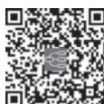

> [!info] 导航
> [[第098章_第7篇第08章_糖尿病|上一章]] · [[00_章节导航|总目录]] · [[第100章_第7篇第10章_血脂异常性疾病|下一章]]

本章数字资源

# 第一节 | 低血糖症

低血糖症（hypoglycemia）是一组多种病因引起的血浆（或血清）葡萄糖水平降低，而引起相应的症状和体征的临床综合征。患者常以交感神经兴奋和/或神经精神及行为异常为主要表现，血糖浓度更低时可以出现癫痫样发作、昏迷和死亡。而当血浆葡萄糖浓度升高后，症状/体征也随之消退。一般引起低血糖症状的血浆葡萄糖阈值为 2.8～3.9mmol/L，然而，对于反复发作的低血糖患者，这一阈值则会更低。

低血糖症可以发生在糖尿病患者或非糖尿病患者。糖尿病患者低血糖症的发生往往与降血糖治疗相关，其首要任务是调整治疗方案，以尽可能减少或避免低血糖的发生。对于非糖尿病患者发生的低血糖症，需要作出精确的病因诊断，在病因明确的基础上选择正确的治疗方案。根据发病机制不同，低血糖症可分为胰岛素介导性和非胰岛素介导性两大类。

#### 【病因】

### （一） 非糖尿病患者的低血糖症

1. 药物  虽然药物因素较少见，仍有多种非降糖药物可导致低血糖，包括乙醇、喹诺酮类、喷他脒（pentamidine）、奎宁、β受体拮抗剂、血管紧张素转换酶抑制剂和IGF-1 等。

2. 引起低血糖症的相关疾病  引起低血糖症的相关疾病可分为胰岛素介导的低血糖和非胰岛素介导的低血糖两大类。

（1）非胰岛素介导的低血糖症：①多由重症疾病所致，如肝衰竭、肾衰竭、心力衰竭、脓毒血症或营养不良。②非胰岛细胞肿瘤也可引起低血糖症，常见的为间叶细胞型或上皮细胞型的巨大肿瘤，这些患者发生低血糖通常是由肿瘤生成加工不完整的 IGF-2 所致，内源性胰岛素的合成相应地受到抑制。③拮抗胰岛素作用的激素分泌不足所致，如肾上腺皮质功能减退症、生长激素缺乏、胰高血糖素缺乏、黏液性水肿昏迷等。非胰岛素介导的低血糖症患者血浆胰岛素水平低或在正常范围。

（2）胰岛素介导的低血糖症：又称内源性高胰岛素血症。当血浆葡萄糖浓度降至低血糖水平，而胰岛素的分泌速率不能相应降低时，就会发生高胰岛素血症性低血糖。对于非糖尿病成年人，内源性高胰岛素血症导致的低血糖可以由以下原因引起：①胰岛β细胞肿瘤。②胰岛β细胞功能性疾病，如非胰岛素瘤性胰源性低血糖综合征（non-insulinoma pancreatogenous hypoglycemia syndrome，NIPHS）。胃旁路术后食物迅速进入肠道，使餐后血糖升高、胰高血糖素样肽分泌增多，刺激胰岛素分泌增加，胰岛素抑制内源性肝糖输出，同时刺激糖的利用，导致餐后胰岛素相对过多而引起低血糖症。③胰岛素自身免疫性低血糖，发生于体内存在针对内源性胰岛素的抗体，或存在胰岛素受体抗体的患者。低血糖症状可以出现在餐后、空腹时，或两种状态下均出现。胰岛素与抗体结合，然后以一种不受调节的方式解离，引起高胰岛素血症和低血糖。对于存在胰岛素受体抗体的患者，低血糖为刺激性抗体激活受体所致。④在非糖尿病患者中也可以发生由服用促胰岛素分泌剂而引起的内源性胰岛素增高所致的低血糖。对于偶发的、隐匿的或低血糖原因不明时，应该考虑医疗因素、药物因素或患者因素导致错误服用促胰岛素分泌剂的可能性。如误服家庭中糖尿病患者的药物，或是部分患者悄悄自用降糖药物或胰岛素。（表7-9-1）

表7-9-1 引起低血糖的病因

<table><tr><td rowspan="2">药物</td><td>胰岛素或促胰岛素分泌剂</td></tr><tr><td>酒精</td></tr><tr><td rowspan="3">危重疾病</td><td>肝、肾及心功能衰竭</td></tr><tr><td>脓毒血症/败血症、疟疾</td></tr><tr><td>重度营养不良</td></tr><tr><td rowspan="3">激素缺乏</td><td>皮质醇缺乏或不足</td></tr><tr><td>胰高血糖素缺乏或不足</td></tr><tr><td>肾上腺素缺乏或不足</td></tr><tr><td>非胰岛细胞肿瘤</td><td>间叶细胞型或上皮细胞型的巨大肿瘤</td></tr><tr><td rowspan="6">内源性高胰岛素血症</td><td>胰岛素瘤</td></tr><tr><td>胰岛β细胞功能紊乱(胰岛β细胞增生)</td></tr><tr><td>非胰岛素瘤性胰源性低血糖综合征</td></tr><tr><td>胃旁路术后</td></tr><tr><td>胰岛素自身免疫低血糖(产生胰岛素抗体、产生胰岛素受体的抗体)</td></tr><tr><td>2型糖尿病早期</td></tr><tr><td>偶然或人为因素</td><td>—</td></tr></table>

婴儿持续性高胰岛素血症性低血糖（persistent hyperinsulinemic hypoglycemia of infancy，PHHI）或先天性高胰岛素血症是婴儿持续性低血糖的最常见病因。

### （二） 糖尿病患者的低血糖

2 型糖尿病早期胰岛素释放延迟，导致餐后胰岛素水平与血糖水平不平行而致低血糖。外源性胰岛素和刺激内源性胰岛素分泌的药物（如促胰岛素分泌剂：格列本脲、格列齐特、格列吡嗪、格列美脲、瑞格列奈、那格列奈）会促进葡萄糖的利用，如果使用不当可以引起低血糖，甚至是严重或致死性低血糖发生。口服降糖药胰岛素增敏剂、α-葡萄糖苷酶抑制剂、胰高血糖素样肽-1（GLP-1）受体激动剂、钠-葡萄糖共转运蛋白 2 抑制剂和二肽基肽酶-4 抑制剂引起低血糖风险很小。这些药物主要通过增加胰岛素敏感性、抑制单糖的吸收或增加尿液中葡萄糖的排除发挥疗效。随着血浆葡萄糖浓度降至正常范围，胰岛素的分泌会适当地减少。GLP-1 受体激动剂虽可刺激胰岛素分泌，但在很大程度上以葡萄糖依赖性方式进行。同时，以葡萄糖依赖性方式抑制胰高血糖素的分泌。当葡萄糖水平降到阈浓度以下，胰岛素也随之下降而胰高血糖素的分泌增加，因此低血糖的风险较小。值得注意的是，当与促胰岛素分泌剂或胰岛素联合应用时，以上所有药物均可增加低血糖风险。

#### 【病理生理】

大脑几乎完全依靠葡萄糖提供能量。由于大脑不能合成和储存葡萄糖，因此，需要持续地从循环中摄取充足的葡萄糖以维持正常的脑功能和生理需要。生理情况下空腹血浆葡萄糖维持在 3.9～6.0mmol/L 范围内。当血糖浓度降低到生理范围以下，不能满足大脑供能需求时，机体通过精细的升糖调节机制，使血糖维持在正常范围。维持血糖平衡依靠神经信号、激素、代谢底物的网络调控其中胰岛素起差主要作用当血浆葡萄糖降低 胰岛素分泌也随之降低同时启动糖原分解和糖异生，维持血糖在生理范围。因此，生理状况下，降低胰岛素分泌是防止低血糖的第一道防线。当血糖下降低于生理范围时，升糖激素分泌增加，胰岛α细胞分泌的胰高血糖素增多是防止低血糖的第二道防线。当胰高血糖素分泌不足以纠正低血糖时，肾上腺素分泌增加，作为第三道防线。当低血糖时间超过 4 小时，皮质醇、生长激素分泌增加以促进葡萄糖的产生并限制葡萄糖的利用，因此糖皮质激素和生长激素对急性低血糖的防御作用甚微。当这些防御因素仍然不能有效地恢复血糖水平时，血糖进一步降低，则出现低血糖的症状和体征。临床上出现低血糖症状和体征的血糖阈值并非是一个固定的数值，而是根据不同病因、低血糖发生的频率和持续时间的不同而存在差异。如血糖控制不佳的糖尿病患者的低血糖阈值往往较高，这些患者出现低血糖症状时血糖可以在正常范围内（又称假性低血糖）；另外，一些情况下低血糖阈值可以偏低，如反复发作低血糖的患者（强化降糖治疗的糖尿病患者、胰岛素瘤患者），出现低血糖症状时的血糖往往更低。有关低血糖症状和血糖水平的对应关系见表 7-9-2。

表7-9-2 低血糖引起机体反应与相应血糖阈值

<table><tr><td>血糖阈值/ [mmol/L (mg/dl)]</td><td>机体反应</td><td>纠正低血糖预防作用</td></tr><tr><td>4.4~4.7(80~85)</td><td>↓胰岛素</td><td>防止低血糖第一道防线</td></tr><tr><td>3.6~3.9(65~70)</td><td>↑胰高血糖素</td><td>防止低血糖第二道防线</td></tr><tr><td>3.6~3.9(65~70)</td><td>↑肾上腺素</td><td>防止低血糖第三道防线</td></tr><tr><td>3.6~3.9(65~70)</td><td>↑皮质醇与生长激素</td><td>低血糖持续4小时以上时分泌,对急性低血糖的纠正作用甚微</td></tr><tr><td>2.8~3.1(50~55)</td><td>出现低血糖症状和体征</td><td>最初表现为饥饿感,可出现Whipple三联征</td></tr><tr><td>&lt;2.8(&lt;50)</td><td>↓意识</td><td>意识、行为异常</td></tr></table>

#### 【临床表现】

### （一） 症状

在进行各种检测明确低血糖病因之前，确定低血糖疾病的证据非常重要。确定存在Whipple三联征有助于证实存在低血糖及相关疾病。Whipple三联征包括：①与低血糖相一致的症状；②症状存在时通过精确方法（通常是静脉血糖而不是家庭快速血糖仪）测得血糖浓度偏低；③血糖水平升高后上述症状缓解。

低血糖的症状主要包括两个方面：自主神经症状（autonomic symptom）和神经低血糖症状（neuroglycopenia symptoms）。

1. 自主神经症状 包括震颤、心悸和售虑(儿茶酚胺介导的肾上腺素能症状).以及出汗、饥饿和感觉异常（乙酰胆碱介导的胆碱能症状）。这些症状在很大程度是由交感神经激活造成的，而非肾上腺髓质激活所致。

2. 神经低血糖症状  包括认知损害、行为改变、精神运动异常，以及血糖浓度更低时出现的癫痫样发作和昏迷。

### （二） 体征

面色苍白和出汗是低血糖的常见体征。心率和收缩压上升，但上升幅度不会很大。偶尔会发生短暂性神经功能缺陷。永久性神经功能损害可见于长期、反复严重低血糖患者和一次严重低血糖未能及时纠正的患者。

### （三） 实验室检查

初始实验室评估的目的是证实 Whipple 三联征。如果之前已证实 Whipple三联征，则检测目的是评价是否为胰岛素所介导的低血糖。糖尿病患者发生可疑低血糖症状时，需要及时测定血糖，并结合目前治疗方案、用药的种类、剂量、与进餐的关系以及运动量情况进行综合考虑。非糖尿病患者发生的疑似低血糖的症状时，则首先需要明确是否存在低血糖，然后进一步获得血糖、胰岛素及相关激素和代谢物的信息，以提供诊断和鉴别诊断的可靠线索。对非糖尿病疑似低血糖的患者应做下列实验室检查。

1. 血糖  正常空腹血糖值的低限一般为 3.9mmol/L（70mg/dl）。对于无糖尿病者，当血糖水平在生理范围内下降时，胰岛素的分泌也随之下降，当血糖浓度降至 3.6～3.9mmol/L（65～70mg/dl）时，升糖激素（胰高血糖素和肾上腺素）的释放增加。在低血糖症状出现前这些激素反应就开始了，因此血糖进一步降低至 2.8～3.1mmol/L（50～55mg/dl）时才会出现症状。值得注意的是，低血糖的阈值是可变的，在临床上要结合患者实际情况进行判别（参见表7-9-2）。

2. 测定血浆相关激素  为了进一步探寻低血糖病因，需要同时测定低血糖症状发作时的血糖、胰岛素、C 肽和β-羟丁酸水平以及胰岛素自身抗体，并且观察注射 1.0mg 胰高血糖素后的血糖反应。通过这些步骤可以鉴别内源性或外源性胰岛素介导的低血糖和可能的病因。

测定血浆（或血清）胰岛素，当血糖浓度低于 3.1mmol/L（55mg/dl）时，免疫化学发光分析（ICMA）测得的血浆胰岛素浓度 18pmol/L（3mU/L）或以上即提示胰岛素过量，符合内源性高胰岛素血症（如胰岛素瘤）的标准。

测定血浆 C 肽水平和胰岛素原可以进一步确认内源性或外源性高胰岛素血症。对于血糖浓度低于 3.1mmol/L（55mg/dl）的患者，若血浆 C 肽浓度 0.6ng/ml（0.2nmol/L）或以上，即可以确定为内源性高胰岛素血症。由于胰岛素具有抑制生酮的效应，因此胰岛素瘤患者血浆β-羟丁酸浓度要低于正常人。在饥饿试验的终点，所有胰岛素瘤患者血浆β-羟丁酸值均为 2.7mmol/L 或更低，而正常人的值升高。禁食 18 小时后β-羟丁酸浓度逐渐升高提示饥饿试验阴性。对于胰岛素和 C 肽水平处于临界范围的低血糖症患者，可通过血浆β-羟丁酸水平和血糖对胰高血糖素的反应进行确诊。

#### 【诊断与鉴别诊断】

对于糖尿病患者发生的低血糖，通过仔细询问糖尿病病史和降糖药应用情况，一般能作出糖尿病相关低血糖的诊断。对于非糖尿病患者临床发生的低血糖，需要进一步确认和鉴别。因为此类患者的低血糖与糖尿病相关低血糖的结局和临床处理有很大不同。

对于非糖尿病患者的低血糖，首先要确立低血糖的诊断。根据低血糖典型表现（Whipple 三联征）可确定：①低血糖症状；②发作时血糖低于 2.8mmol/L；③补充糖后低血糖症状迅速缓解。少数空腹血糖降低不明显或处于非发作期的患者，应多次检测有无空腹或餐后低血糖，必要时采用 48～72 小时饥饿试验。

测定血浆或血清胰岛素、C 肽、β-羟丁酸、相关升糖激素（皮质醇、生长激素等），并结合功能试验，以判断低血糖可能的病因。对于内源性高胰岛素血症患者，应当检测胰岛素抗体以鉴别是否为自身免疫性低血糖。

对于内源性胰岛素介导的低血糖患者，鉴别诊断包括胰岛素瘤、胰岛细胞增生症/胰岛细胞肥大、口服降糖药诱发的低血糖，以及胰岛素自身免疫性低血糖。除了胰岛素抗体或药物引起的低血糖，所有胰岛素介导的低血糖都需要进行定位检查，如 CT、MRI 及经腹超声等，必要时则需要进行其他检查，如超声内镜或选择性动脉钙刺激试验以及同位素标记的生长抑素受体显像。

对于非胰岛素介导的低血糖患者，鉴别诊断包括非降糖药物诱发的低血糖、肝疾病、肾疾病、心脏疾病以及全身性疾病、胰腺外肿瘤、生长激素缺乏、皮质醇缺乏、腺垂体功能减退、黏液性水肿昏迷等。结合肝肾功能、相关升糖激素的检测以及CT或MRI等影像学检查以确定病因。

#### 【预防和治疗】

1. 低血糖的预防  临床医生可以通过掌握低血糖的诊断线索，包括糖尿病史、降糖药物治疗情况（尤其是促胰岛素分泌剂使用情况、胰岛素的剂量、饮食和运动情况、低血糖与进餐关系等）、非降糖药物使用情况、酗酒史，全身相关疾病史（肿瘤、消耗性疾病、营养不良、胃肠道手术）等，从而提出预防策略。对于不明原因的脑功能障碍症状者应及时监测血糖。反复严重低血糖发作且持续时间长者，可引起不可逆转的脑损害，故应及早识别、及时防治。对疑似胰岛素瘤者，应进行进一步定位诊断。对明确诊断胰岛素瘤的患者应进行肿瘤切除。

2. 低血糖的治疗  治疗包括两方面：一是解除神经系统供糖不足的症状，二是纠正导致低血糖症的各种潜在原因。对轻度到中度的低血糖，口服糖水、含糖饮料，或进食糖果、饼干、面包、馒头等即可缓解。对于药物相关性低血糖，应及时停用相关药物。重者和疑似低血糖昏迷的患者，应及时测定血糖，甚至无需血糖结果，及时给予50%葡萄糖溶液60～100ml静脉注射，继以5%～10%葡萄糖溶液静脉滴注，必要时可加用氢化可的松 100mg 和/或胰高血糖素 0.5～1mg 肌内或静脉注射。神志不清者，切忌喂食，以免发生呼吸道窒息。使用胰岛素或促胰岛素分泌剂联合α-葡萄糖苷酶抑制剂的患者，应使用纯葡萄糖来治疗有症状的低血糖。因为α-葡萄糖苷酶抑制剂减慢了其他碳水化合物的消化，碳水化合物的其他形式（如淀粉食物、蔗糖）不能及时纠正含有α-葡萄糖苷酶抑制剂联合治疗引起的低血糖。

# 第二节 | 胰岛素瘤

胰岛素瘤（insulinoma）是最常见的胰腺分泌胰岛素的功能性神经内分泌瘤。其患病情况在普通人群中约（1～4）/100 万。胰岛素瘤可以发生在任何年龄，约 90% 为良性肿瘤，90% 为孤立性，胰腺外异位不到1%，约82%的肿瘤直径小于2cm，临床症状与肿瘤大小不成正比。

#### 【临床表现】

胰岛素瘤临床症状复杂多样，可能与低血糖程度有关。可以表现为自主神经症状（包括心悸、出汗、发抖）和神经低血糖症状（如认知障碍、遗忘、精神症状、癫痫样发作），部分患者可以出现体重增加。低血糖时可表现为心率加快，血压升高。通过静脉血糖检测确定 Whipple 三联征，并进行相关激素检测和功能试验，结合影像学检查和选择性动脉钙刺激静脉取血试验（ASVS）对肿瘤进行定位。具体临床表现及诊断流程见第一节。

#### 【诊断与鉴别诊断】

胰岛素瘤的诊断包括定性诊断和定位诊断。

### （一） 定性诊断

1. Whipple三联征  首先要确定症状是否由低血糖引起，经典的 Whipple 三联征对诊断具有重要意义。①低血糖症状；②发作时血糖低于 2.8mmol/L；③进食或静脉推注葡萄糖可迅速缓解症状。根据 Whipple 三联征大部分患者可以明确的低血糖症诊断。

2. 血浆胰岛素和胰岛素原水平  正常情况下空腹胰岛素水平很低。测定空腹或症状发作时胰岛素水平和血糖，并计算比值，胰岛素（IU/ml）/血糖（mg/dl）比值大于 0.3，对胰岛素瘤诊断具有较大诊断价值。

胰岛素原测定对诊断胰岛素瘤有帮助。胰岛素瘤患者几乎都有胰岛素原水平升高，且胰岛素原与胰岛素比例也升高，正常胰岛素与胰岛素原比例为（6～10）∶1，胰岛素瘤患者可达 1∶1。恶性胰岛素瘤患者胰岛素原水平及比例升高更明显。

3. 72 小时饥饿试验  饥饿试验是最简单可靠的诊断试验，绝大多数胰岛素瘤患者在 72 小时内出现低血糖发作。

（1）方案：72 小时饥饿试验通常是在晚餐后开始，整个过程中应准确记录出现的症状和体征，并进行相应的实验室检测。①准确记录饥饿开始时间；②停用所有非必需的药物；③允许患者饮水；④每 6 小时采集 1 次血液样本用于测定血糖、胰岛素及 C 肽。直至血糖浓度低于 3.3mmol/L（60mg/dl），采集样本的频率应增加至每 1～2 小时 1 次。由于静脉血糖检测结果的获得可能会延迟，试验过程中常采用指尖快速血糖检测来监测患者的血糖变化，但是必须根据静脉血糖值作出终止试验的决定。

（2）试验终点和持续时间：出现以下任何一种情况即可终止饥饿试验：①血糖浓度≤2.5mmol/L（45mg/dl）；②患者出现低血糖症状或体征时；③禁食已 72 小时；④血糖浓度低于 3.1mmol/L（55mg/dl）且之前证实存在 Whipple 三联征。饥饿试验结束时进行以下 2 个步骤：①采集样本用于测定血糖、胰岛素、C 肽、β-羟丁酸；②嘱患者进食或静脉推注葡萄糖。

如果 72 小时饥饿期间没有出现低血糖的症状和体征，且没有测得低血糖，则表明 72 小时饥饿试验结果正常。

### （二） 定位诊断

胰岛素瘤在定性诊断后，定位诊断是手术成败的关键。CT、MRI 及经腹超声检查能发现大部分胰岛素瘤。经腹超声作为优先的初步检查。影像学检查阴性不能排除胰岛素瘤。如果初始影像学未查及胰岛素瘤，则需要进行其他检查，如超声内镜（有时还可以对影像检出的肿瘤进行细针抽吸活检)或选择性动脉钙刺激试验，同位素标记的生长抑素受体显像对定位诊断有一定帮助。近年研究显示，绝大多数胰岛素瘤明显高表达 GLP-1 受体，GLP-1 受体显像技术具有超高灵敏度。

有创检查包括经皮经肝门静脉置管分段采血测定胰岛素（PTPC）或选择性动脉钙刺激静脉取血试验（selective arterial calcium stimulation and venous sampling，ASVS）等。ASVS：钙离子能刺激功能亢进的胰岛β细胞（胰岛素瘤或胰岛细胞增生症）释放胰岛素，但不能刺激正常胰岛β细胞释放胰岛素。应用这一原理，将葡萄糖酸钙选择性注入胃十二指肠动脉、脾动脉和肠系膜上动脉，并随后抽取肝静脉血检测胰岛素水平。如果钙刺激某一动脉情况下测得肝静脉胰岛素水平升高，这个动脉则为胰岛素瘤直接供血的动脉，即肿瘤位于该动脉供血的胰腺区域内，有助于手术定位。其准确率可达90%。

伴有高胰岛素血症的低血糖症且定位不明确时需要与以下疾病相鉴别。

1. 婴儿持续性高胰岛素血症性低血糖（PHHI），也称家族性高胰岛素血症、先天性高胰岛素血症和原发性胰岛细胞增生（胰岛细胞增生症）。

2. 非胰岛素瘤性胰源性低血糖综合征（NIPHS）见于成人，并且也伴有胰岛增大和胰岛细胞增生症。

3. 胰岛素自身免疫性低血糖症发生于存在抗内源性胰岛素或抗胰岛素受体抗体的患者。症状在餐后、空腹或两种状态下均可发生。胰岛素抗体或胰岛素受体抗体的存在可鉴别胰岛素自身免疫性低血糖症与胰岛素瘤。

#### 【治疗】

手术切除胰岛素瘤是首选治疗。对不适合或拒绝进行手术的患者，或有手术无法切除的转移性病变的患者，应该考虑进行内科治疗。预防症状性低血糖的治疗选择包括：二氮嗪，可抑制胰岛素分泌，用于控制低血糖。生长抑素类似物（如奥曲肽、兰瑞肽），通过抑制胰岛素的分泌控制低血糖，但也抑制生长激素，促甲状腺激素和胰高血糖素的分泌。对于二氮嗪难治性的持续性低血糖的患者，奥曲肽是一种合理的选择。对于有转移的恶性胰岛素瘤可用链脲佐菌素、氟尿嘧啶、多柔比星等药物化疗，联合化疗优于单一化疗。对于不能手术切除的肝转移灶，经动脉灌注化疗或栓塞治疗效果良好。近年来随着分子生物学和基因遗传通路的研究不断进展，生物治疗及靶向治疗成为一种新的治疗思路，但临床应用价值有待进一步探索。

#### 【预后】

胰岛素瘤的患者总体生存率与一般人群的预期并无不同。然而恶性胰岛素瘤患者、老年患者的生存率显著降低。

（李小英）

  
本章思维导图
