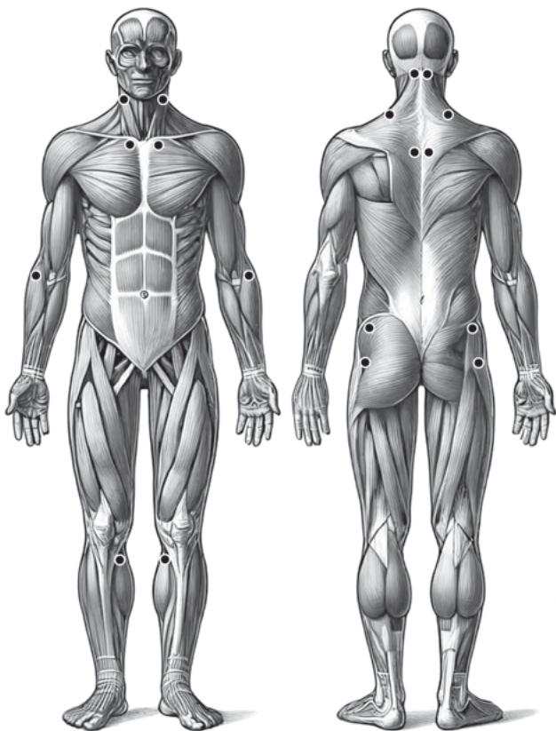
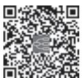

> [!info] 导航
> [[第123章_第8篇第15章_风湿热|上一章]] · [[00_章节导航|总目录]] · [[第125章_第9篇第01章_总论|下一章]]

本章数字资源

纤维肌痛综合征（fibromyalgia syndrome，FMS）是一种以全身弥漫性疼痛及发僵为主要临床特征，常伴有疲乏无力、睡眠障碍、情感异常和认知功能障碍等的慢性疼痛性非关节性风湿性疾病，在特殊部位有压痛点。患病率约为2%，其中女性3%～4%，男性0～5%，随年龄增加呈线性增长。平均年龄为49岁，其中90%为女性，70～79 岁达到患病高峰。

#### 【病因和发病机制】

FMS 病因不清，目前认为与遗传易感、睡眠障碍、神经内分泌紊乱、免疫紊乱、一些体内正常存在的氨基酸浓度改变以及心理因素有关。继发于外伤、骨关节炎、类风湿关节炎、系统性红斑狼疮及肿瘤等称为继发性FMS，如不伴有其他疾患则称为原发性FMS。

本病发病机制不清，有研究证明 FMS 患者肌肉疼痛来源于神经末梢，即疼痛感受器。机械性牵拉、挤压、P 物质、缓激肽、钾离子等化学刺激及缺血性肌肉收缩都会刺激神经末梢，引起肌肉疼痛。约 1/3 患者血清中胰岛素、胰岛素生长因子-1（IGF-1）以及与生长激素有关的氨基酸浓度均降低，而且脑脊液中这些因子浓度变化与FMS患者疼痛有关。另外，FMS还可继发于骨关节炎、椎间盘突出症等疾病，这些疾病引起的外周伤害性疼痛因反复刺激脊髓第二背角神经元，导致中枢敏化作用，最终出现 FMS典型慢性疼痛。

#### 【临床表现】

1. 特征性症状 FMS 核心症状是慢性全身性广泛性肌肉疼痛，大多数伴有皮肤触痛，时轻时重。13% 的患者有广泛性肌肉疼痛，43% 为局限性疼痛，以中轴骨骼（颈、胸、下背部）、肩胛带及骨盆带肌最常见，其他常见部位依次为膝、头、肘、踝、足、上背部、中背部、腕、臀部、大腿和小腿。FMS的疼痛呈弥散性，患者自觉疼痛出现在肌肉、关节、神经和骨骼等多部位，难以准确定位。所有患者均有广泛的压痛点，分布具有一致性，多呈对称性，查体往往有 9 对（18 个）解剖位点压痛。这 18 个解剖点为：枕骨下肌肉附着点两侧，第 5～7 颈椎横突间隙前面的两侧，两侧斜方肌上缘中点，两侧肩胛冈上方近内侧缘的起始部，两侧第 2 肋骨与软骨交界处的外上缘，两侧肱骨外上髁远端 2cm 处，两侧臀部外上象限的臀肌前皱襞处，两侧大转子的后方，两侧膝脂肪垫关节褶皱线内侧（图 8-16-1）。女性比男性患者的压痛点多，具有 11 个以上压痛点的患者中 90% 为女性。软组织损伤、睡眠不足、寒冷及精神压抑均可引起疼痛发作，气候潮湿及气压偏低可加重疼痛。76%～91% 患者可有晨僵，其严重程度与睡眠障碍及病情活动程度有关。FMS 的晨僵感，与 RA 的晨僵以及风湿性多肌痛的“凝胶现象”相似，但是缺乏特异性而不能作为诊断依据。

2. 其他症状 约 90% 患者伴有睡眠障碍，表现为失眠、易醒、多梦及精神不振。一半以上患者出现严重的疲劳甚至感觉无法工作。另外可出现头痛包括偏头痛和枕区或整个头部压迫性钝痛以及头晕、呼吸困难、肢体麻木、感觉异常、抑郁或焦虑等，但神经系统查体往往全部正常。患者常诉关节痛，可伴晨僵，但无关节肿胀等客观体征。30%以上的患者可出现肠易激综合征，包括肠胀气、腹痛、大便不成形及大便次数增多。部分患者有虚弱、盗汗以及口干、眼干等表现，另外可出现膀胱刺激症状、骨盆疼痛、雷诺现象、不宁腿综合征等。天气寒冷潮湿、精神紧张和过度劳累时症状加重，局部受热、精神放松、良好睡眠、适度活动可减轻症状。

#### 【实验室检查】

血沉（ESR）、C 反应蛋白（CRP）、自身抗体等检查往往无异常发现。脑部功能性磁共振成像（fMRI）可发现额叶皮质、杏仁核、海马和扣带回等部位激活反应异常以及相互之间的纤维联络异常。

  
图 8-16-1  FMS 18 个压痛点的部位图示

#### 【诊断】

根据患者存在慢性广泛性肌肉疼痛及发僵，常伴有失眠、易醒、多梦及精神不振等睡眠障碍表现，颈、胸、下背部、肩胛带及骨盆带肌最为常见等症状特点，结合全身可出现多处压痛点的典型体征，在排除风湿性多肌痛、慢性疲劳综合征等疾病后可作出诊断。

参考 2016 年美国风湿病学会（ACR）的诊断标准，满足 3 种条件可被诊断为纤维肌痛综合征：①广泛性疼痛指数（WPI）≥7 分且症状严重程度评分（SSS）≥5 分，或 WPI 在 4～6 分且 SSS≥9 分；②目前存在广泛性疼痛，指至少 5 处区域中的 4 处出现疼痛，但下颌、胸部、腹部的疼痛不包含在内；③症状持续存在3 个月以上，FMS的诊断独立于其他诊断，并且其诊断不能排除其他临床疾病。

#### 【治疗与预后】

由于病因及病理生理机制不明，因此 FMS 无特异性治疗方法，主要是综合治疗，包括适当运动、减轻精神压力和对症镇痛等。

1. 药物治疗 目的是阻断神经触发点，改善精神症状。抗抑郁药为首选治疗药物，能改善睡眠和疲劳，但是对压痛点的疼痛无效。其中，三环类抗抑郁药（TCAs）阿米替林（amitriptyline）应用最为广泛，选择性 5-羟色胺（5-HT）再摄取抑制剂（SSRIs）和高选择性单胺氧化酶抑制剂（MAOIs）也是常用药物，特别是与三环类抗抑郁药联合应用时效果更佳，能明显改善睡眠、减轻疼痛与疲劳，特别是缓解抑郁状态。第 2 代抗惊厥药普瑞巴林（pregabalin）是首个被美国食品药品监督管理局（FDA）批准用于 FMS 的治疗药物。对乙酰氨基酚对部分 FMS 患者有效，曲马多等弱阿片类药物可用于对其他药物治疗无应答的中-重度疼痛患者。

  
本章思维导图

2. 非药物治疗 包括认知行为治疗、热水浴疗法、需氧运动、柔性训练等，也可提高疗效，减少药物不良反应。

FMS 患者常见复发和缓解交替，但无内脏损害，预后良好。

（姜林娣）
