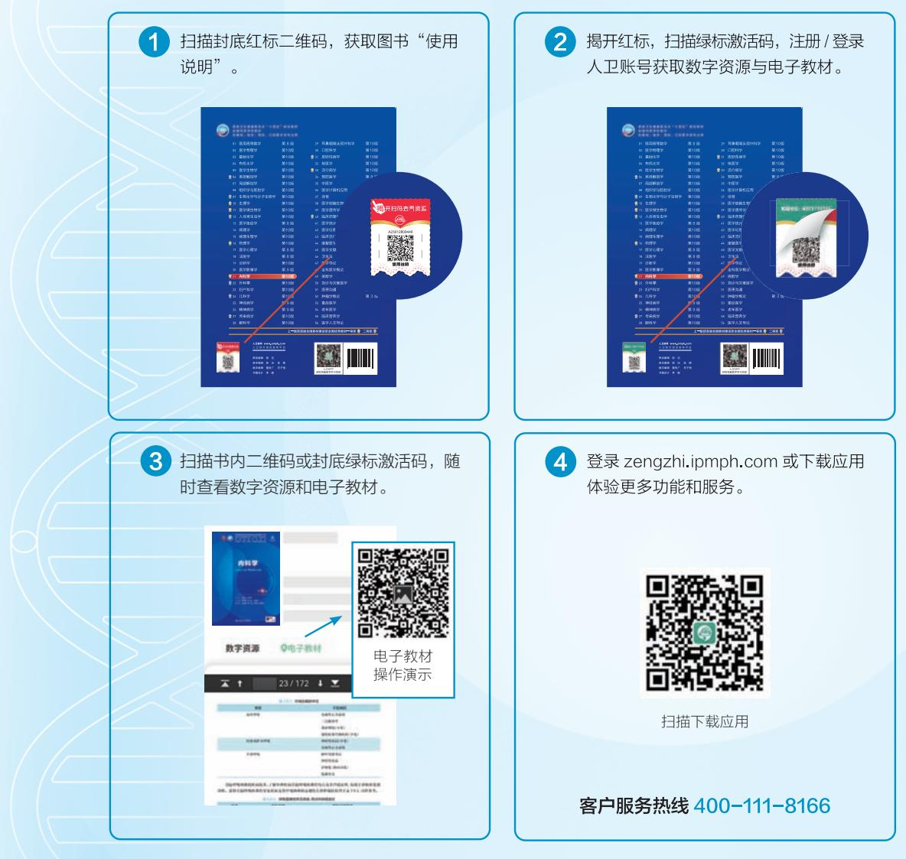
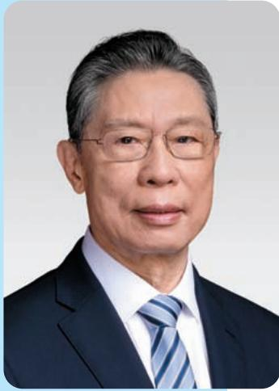
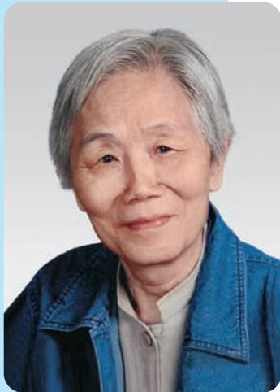
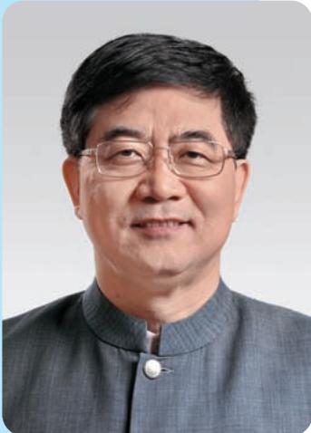
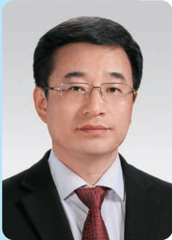
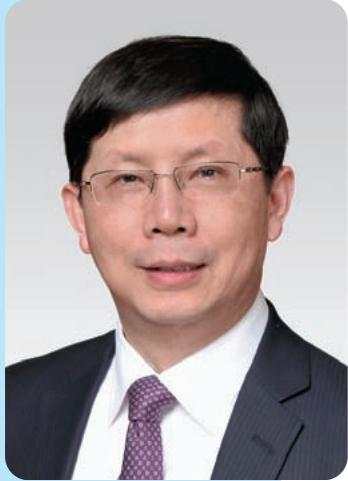
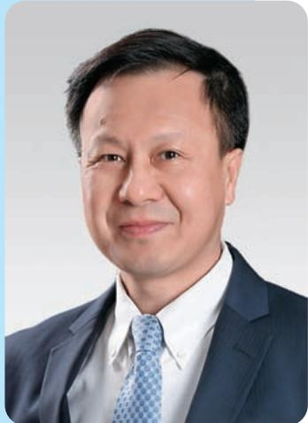
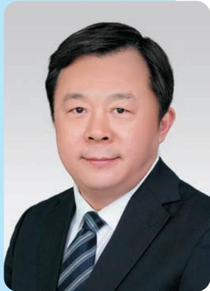
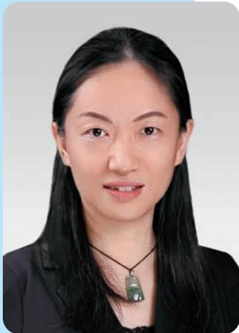

# 前置页

> [!info] 导航
> [[../00_章节导航|总目录]]

## 内科学 Internal Medicine

第10版

主审 | 钟南山 陆再英

主编 | 葛均波 王辰 王建安

副主编 | 肖海鹏 胡豫 余学清 秦茵茵国家卫生健康委员会“十四五”规划教材全国高等学校教材供基础、临床、预防、口腔医学类专业用

# 内科学

## Internal Medicine

## 第 10 版

主审 | 钟南山 陆再英

主 编 | 葛均波 王 辰 王建安

副主编 | 肖海鹏 胡豫 余学清 秦茵茵

数字主编 | 葛均波 王辰

数字副主编 | 胡豫 余学清 秦茵茵 房静远

分篇负责人 | 第一篇 绪论 葛均波  
第二篇 呼吸系统疾病 王辰  
第三篇 循环系统疾病 葛均波  
第四篇 消化系统疾病 房静远  
第五篇 泌尿系统疾病 余学清  
第六篇 血液系统疾病 胡豫  
第七篇 内分泌和代谢性疾病 肖海鹏  
第八篇 风湿免疫病 曾小峰  
第九篇 理化因素所致疾病 柴艳芬

## 人民卫生出版社

·北京·

## 版权所有，侵权必究！

图书在版编目（CIP）数据

内科学 / 葛均波，王辰，王建安主编. -- 10 版. 北京：人民卫生出版社，2024. 7. --（全国高等学校五年制本科临床医学专业第十轮规划教材）. -- ISBN 978-7-117-36571-0

I. R5

中国国家版本馆 CIP 数据核字第 2024Y449X6 号

人卫智网 www.ipmph.com

医学教育、学术、考试、健康，

购书智慧智能综合服务平台

人卫官网 www.pmph.com 人卫官方资讯发布平台

内科学

Neikexue

第10版

主 编: 葛均波 王 辰 王建安

出版发行：人民卫生出版社（中继线 010-59780011）

地址: 北京市朝阳区潘家园南里 19 号

邮编：100021

E - mail: pmph @ pmph.com

购书热线：010-59787592 010-59787584 010-65264830

印刷：

经销：新华书店

开 本: 850×1168 1/16 印张: 61 插页: 2

字 数：1805 千字

版次: 1979 年 12 月第 1 版 2024 年 7 月第 10 版

印 次: 2024 年 7 月第 1 次印刷

标准书号：ISBN 978-7-117-36571-0

定 价: 148.00 元

打击盗版举报电话：010-59787491 E-mail: WQ@pmph.com

质量问题联系电话：010-59787234 E-mail: zhiliang@pmph.com

数字融合服务电话：4001118166 E-mail: zengzhi@pmph.com

于波 哈尔滨医科大学附属第二医院 陈旻湖 中山大学附属第一医院
王辰 中国医学科学院北京协和医院 罗建方 南方医科大学附属广东省人民医院
王玮 中国医科大学附属第一医院 单忠艳 中国医科大学附属第一医院
王卫庆 上海交通大学医学院附属瑞金医院 房静远 上海交通大学医学院附属仁济医院
王建安 浙江大学医学院附属第二医院 赵建平 华中科技大学同济医学院附属同济医院
毛志国 海军军医大学上海长征医院 赵家军 山东第一医科大学附属省立医院
石蓓 遵义医科大学附属医院 赵维莅 上海交通大学医学院附属瑞金医院
叶智明 南方医科大学附属广东省人民医院 赵景宏 陆军军医大学第二附属医院
田字彬 青岛大学附属医院 胡豫 华中科技大学同济医学院附属协和医院
田新平 中国医学科学院北京协和医院 侯明 山东大学齐鲁医院
付平 四川大学华西医院 姜林娣 复旦大学附属中山医院
付蓉 天津医科大学总医院 秦茵茵 广州医科大学附属第一医院
代华平 中日友好医院 秦贵军 郑州大学第一附属医院
刘苓 四川大学华西医院 夏云龙 大连医科大学附属第一医院
刘升云 郑州大学第一附属医院 柴艳芬 天津医科大学总医院
严励 中山大学孙逸仙纪念医院 钱菊英 复旦大学附属中山医院
李强 深圳大学总医院 徐军 中国医学科学院北京协和医院
李小英 复旦大学附属中山医院 徐杨 苏州大学附属第一医院
李为民 四川大学华西医院 徐钢 华中科技大学同济医学院附属同济医院
李延青 山东大学齐鲁医院 徐健 昆明医科大学第一附属医院
李启富 重庆医科大学附属第一医院 高翔 中山大学附属第六医院
杨涛 南京医科大学第一附属医院 高素君 吉林大学第一医院
杨云生 中国人民解放军总医院 郭禹标 中山大学附属第一医院
杨长青 同济大学附属同济医院 黄恺 华中科技大学同济医学院附属协和医院
杨念生 中山大学附属第一医院 葛均波 复旦大学附属中山医院
杨娉婷 中国医科大学附属第一医院 董卫国 武汉大学人民医院
肖海鹏 中山大学附属第一医院 韩飞 浙江大学医学院附属第一医院
余学清 南方医科大学附属广东省人民医院 韩清华 山西医科大学第一医院
沈华浩 浙江大学医学院附属第二医院 曾小峰 中国医学科学院北京协和医院
宋元林 复旦大学附属中山医院 詹庆元 中日友好医院
张志毅 哈尔滨医科大学附属第一医院 缪应雷 昆明医科大学第一附属医院
陈倩 华中科技大学同济医学院附属同济医院 霍勇 北京大学第一医院
陈崴 中山大学附属第一医院 穆荣 北京大学第三医院
陈玉国 山东大学齐鲁医院 瞿介明 上海交通大学医学院附属瑞金医院
陈良龙 福建医科大学附属协和医院

## 编委名单

## 编委（以姓氏笔画为序）

编写秘书 戴宇翔 复旦大学附属中山医院

数字编委

新形态教材是充分利用多种形式的数字资源及现代信息技术，通过二维码将纸书内容与数字资源进行深度融合的教材。本套教材全部以新形态教材形式出版，每本教材均配有特色的数字资源和电子教材，读者阅读纸书时可以扫描二维码，获取数字资源、电子教材。

电子教材是纸质教材的电子阅读版本,其内容及排版与纸质教材保持一致,支持手机、平板及电脑等多终端浏览,具有目录导航、全文检索功能,方便与纸质教材配合使用,进行随时随地阅读。

## 获取数字资源与电子教材的步骤

## 读者信息反馈方式

## 序言

百年大计，教育为本。教育立德树人，教材培根铸魂。

过去几年,面对突如其来的新冠疫情,以习近平同志为核心的党中央坚持人民至上、生命至上,团结带领全党全国各族人民同心抗疫,取得疫情防控重大决定性胜利。在这场抗疫战中,我国广大医务工作者为最大限度保护人民生命安全和身体健康发挥了至关重要的作用。事实证明,我国的医学教育培养出了一代代优秀的医务工作者,我国的医学教材体系发挥了重要的支撑作用。

党的二十大报告提出到 2035 年建成教育强国、健康中国的奋斗目标。我们必须深刻领会党的二十大精神，深刻理解新时代、新征程赋予医学教育的重大使命，立足基本国情，尊重医学教育规律，不断改革创新，加快建设更高质量的医学教育体系，全面提高医学人才培养质量。

尺寸教材,国家事权,国之大者。面对新时代对医学教育改革和医学人才培养的新要求,第十轮教材的修订工作落实习近平总书记的重要指示精神,用心打造培根铸魂、启智增慧、适应时代需求的精品教材,主要体现了以下特点。

1. 进一步落实立德树人根本任务。遵循《习近平新时代中国特色社会主义思想进课程教材指南》要求，努力发掘专业课程蕴含的思想政治教育资源，将课程思政贯穿于医学人才培养过程之中。注重加强医学人文精神培养，在医学院校普遍开设医学伦理学、卫生法以及医患沟通课程基础上，新增蕴含医学温度的《医学人文导论》，培养情系人民、服务人民、医德高尚、医术精湛的仁心医者。

2. 落实 “大健康” 理念。将保障人民全生命周期健康体现在医学教材中，聚焦人民健康服务需求，努力实现 “以治病为中心” 转向 “以健康为中心”，推动医学教育创新发展。为弥合临床与预防的裂痕作出积极探索，梳理临床医学教材体系中公共卫生与预防医学相关课程，建立更为系统的预防医学知识结构。进一步优化重组《流行病学》《预防医学》等教材内容，撤销内容重复的《卫生学》，推进医防协同、医防融合。

3. 守正创新。传承我国几代医学教育家探索形成的具有中国特色的高等医学教育教材体系和人才培养模式，准确反映学科新进展，把握跟进医学教育改革新趋势新要求，推进医科与理科、工科、文科等学科交叉融合，有机衔接毕业后教育和继续教育，着力提升医学生实践能力和创新能力。

4. 坚持新形态教材的纸数一体化设计。数字内容建设与教材知识内容契合，有效服务于教学应用，拓展教学内容和学习过程；充分体现“人工智能+”在我国医学教育数字化转型升级、融合发展中的促进和引领作用。打造融合新技术、新形式和优质资源的新形态教材，推动重塑医学教育教学新生态。

5. 积极适应社会发展,增设一批新教材。包括:聚焦老年医疗、健康服务需求,新增《老年医学》,维护老年健康和生命尊严,与原有的《妇产科学》《儿科学》等形成较为完整的重点人群医学教材体系;重视营养的基础与一线治疗作用,新增《临床营养学》,更新营养治疗理念,规范营养治疗路径,提升营养治疗技能和全民营养素养;以满足重大疾病临床需求为导向,新增《重症医学》,强化重症医学人才的规范化培养,推进实现重症管理关口前移,提升应对突发重大公共卫生事件的能力。

我相信，第十轮教材的修订，能够传承老一辈医学教育家、医学科学家胸怀祖国、服务人民的爱国精神，勇攀高峰、敢为人先的创新精神，追求真理、严谨治学的求实精神，淡泊名利、潜心研究的奉献精神，集智攻关、团结协作的协同精神。在人民卫生出版社与全体编者的共同努力下，新修订教材将全面体现教材的思想性、科学性、先进性、启发性和适用性，以全套新形态教材的崭新面貌，以数字赋能医学教育现代化、培养医学领域时代新人的强劲动力，为推动健康中国建设作出积极贡献。

教育部医学教育专家委员会主任委员

教育部原副部长

2024年5月

## 全国高等学校五年制本科临床医学专业第十轮 规划教材修订说明

全国高等学校五年制本科临床医学专业国家卫生健康委员会规划教材自1978年第一轮出版至今已有46年的历史。近半个世纪以来，在教育部、国家卫生健康委员会的领导和支持下，以吴阶平、裘法祖、吴孟超、陈灏珠等院士为代表的几代德高望重、有丰富的临床和教学经验、有高度责任感和敬业精神的国内外著名院士、专家、医学家、教育家参与了本套教材的创建和每一轮教材的修订工作，使我国的五年制本科临床医学教材从无到有、从少到多、从多到精，不断丰富、完善与创新，形成了课程门类齐全、学科系统优化、内容衔接合理、结构体系科学的由纸质教材与数字教材、在线课程、专业题库、虚拟仿真和人工智能等深度融合的立体化教材格局。这套教材为我国千百万医学生的培养和成才提供了根本保障，为我国培养了一代又一代高水平、高素质的合格医学人才，为推动我国医疗卫生事业的改革和发展作出了历史性巨大贡献，并通过教材的创新建设和高质量发展，推动了我国高等医学本科教育的改革和发展，促进了我国医药学相关学科或领域的教材建设和教育发展，走出了一条适合中国医药学教育和卫生事业发展实际的具有中国特色医药学教材建设和发展的道路，创建了中国特色医药学教育教材建设模式。老一辈医学教育家和科学家们亲切地称这套教材是中国医学教育的“干细胞”教材。

本套第十轮教材修订启动之时，正是全党上下深入学习贯彻党的二十大精神之际。党的二十大报告首次提出要“加强教材建设和管理”，表明了教材建设是国家事权的重要属性，体现了以习近平同志为核心的党中央对教材工作的高度重视和对“尺寸课本、国之大者”的殷切期望。第十轮教材的修订始终坚持将贯彻落实习近平新时代中国特色社会主义思想和党的二十大精神进教材作为首要任务。同时以高度的政治责任感、使命感和紧迫感，与全体教材编者共同把打造精品落实到每一本教材、每一幅插图、每一个知识点，与全国院校共同将教材审核把关贯穿到编、审、出、修、选、用的每一个环节。

本轮教材修订全面贯彻党的教育方针，全面贯彻落实全国高校思想政治工作会议精神、全国医学教育改革发展工作会议精神、首届全国教材工作会议精神，以及《国务院办公厅关于深化医教协同进一步推进医学教育改革与发展的意见》（国办发〔2017〕63号）与《国务院办公厅关于加快医学教育创新发展的指导意见》（国办发〔2020〕34号）对深化医学教育机制体制改革的要求。认真贯彻执行《普通高等学校教材管理办法》，加强教材建设和管理，推进教育数字化，通过第十轮规划教材的全面修订，打造新一轮高质量新形态教材，不断拓展新领域、建设新赛道、激发新动能、形成新优势。

## 其修订和编写特点如下：

1. 坚持教材立德树人课程思政 认真贯彻落实教育部《高等学校课程思政建设指导纲要》，以教材思政明确培养什么人、怎样培养人、为谁培养人的根本问题，落实立德树人的根本任务，积极推进习近平新时代中国特色社会主义思想进教材进课堂进头脑，坚持不懈用习近平新时代中国特色社会主义思想铸魂育人。在医学教材中注重加强医德医风教育，着力培养学生“敬佑生命、救死扶伤、甘于奉献、大爱无疆”的医者精神，注重加强医者仁心教育，在培养精湛医术的同时，教育引导学生始终把人民群众生命安全和身体健康放在首位，提升综合素养和人文修养，做党和人民信赖的好医生。

2. 坚持教材守正创新提质增效 为了更好地适应新时代卫生健康改革及人才培养需求，进一步优化、完善教材品种。新增《重症医学》《老年医学》《临床营养学》《医学人文导论》，以顺应人民健康迫切需求，提高医学生积极应对突发重大公共卫生事件及人口老龄化的能力，提升医学生营养治疗技能，培养医学生传承中华优秀传统文化、厚植大医精诚医者仁心的人文素养。同时，不再修订第9版《卫生学》，将其内容有机融入《预防医学》《医学统计学》等教材，减轻学生课程负担。教材品种的调整，凸显了教材建设顺应新时代自我革新精神的要求。

3. 坚持教材精品质量铸就经典 教材编写修订工作是在教育部、国家卫生健康委员会的领导和支持下，由全国高等医药教材建设学组规划，临床医学专业教材评审委员会审定，院士专家把关，全国各医学院校知名专家教授编写，人民卫生出版社高质量出版。在首届全国教材建设奖评选过程中，五年制本科临床医学专业第九轮规划教材共有13种教材获奖，其中一等奖5种、二等奖8种，先进个人7人，并助力人卫社荣获先进集体。在全国医学教材中获奖数量与比例之高，独树一帜，足以证明本套教材的精品质量，再造了本套教材经典传承的又一重要里程碑。

4. 坚持教材 “三基” “五性” 编写原则 教材编写立足临床医学专业五年制本科教育，牢牢坚持教材 “三基”（基础理论、基本知识、基本技能）和 “五性”（思想性、科学性、先进性、启发性、适用性）编写原则。严格控制纸质教材编写字数，主动响应广大师生坚决反对教材 “越编越厚” 的强烈呼声；提升全套教材印刷质量，在双色印制基础上，全彩教材调整纸张类型，便于书写、不反光。努力为院校提供最优质的内容、最准确的知识、最生动的载体、最满意的体验。

5. 坚持教材数字赋能开辟新赛道 为了进一步满足教育数字化需求,实现教材系统化、立体化建设,同步建设了与纸质教材配套的电子教材、数字资源及在线课程。数字资源在延续第九轮教材的教学课件、案例、视频、动画、英文索引词读音、AR互动等内容基础上,创新提供基于虚拟现实和人工智能等技术打造的数字人案例和三维模型,并在教材中融入思维导图、目标测试、思考题解题思路,拓展数字切片、DICOM等图像内容。力争以教材的数字化开发与使用,全方位服务院校教学,持续推动教育数字化转型。

第十轮教材共有 56 种,均为国家卫生健康委员会 “十四五” 规划教材。全套教材将于 2024 年秋季出版发行,数字内容和电子教材也将同步上线。希望全国广大院校在使用过程中能够多提供宝贵意见,反馈使用信息,以逐步修改和完善教材内容,提高教材质量,为第十一轮教材的修订工作建言献策。

## 主审简介

## 钟南山

中国工程院院士、广州医科大学呼吸内科教授、博士生导师，973计划首席科学家，中华医学会前会长、顾问，“共和国勋章”获得者。爱丁堡大学荣誉教授，伯明翰大学科学博士，首届“港大百周年杰出学者”，首届“英国爱丁堡大学年度国际荣誉杰出校友”。现任广州国家实验室主任、国家呼吸医学中心荣誉主任、国家呼吸系统疾病临床医学研究中心主任。2020年新冠肺炎疫情期间，担任国家卫生健康委高级别专家组组长、新冠疫情联防联控工作机制科研攻关专家组组长。

从事医教研工作超 60 年,是我国呼吸系统疾病防治的领军人物。其先后主持 WHO/GOLD 委员会全球协作课题,国家 973、863、科技攻关计划,国家自然科学基金重大项目等重大课题。在国际权威学术期刊上发表 SCI 论文 500 余篇,总引用次数超过 1 万次,是国内在 NEJM、Lancet、Lancet 子刊、JAMA 等国际 SCI 刊物上学术贡献最突出的科学家之一。出版各类专著包括《呼吸病学》《全民健康十万个为什么》《内科学》(全国规划教材)、《物联网医学》等 20 余部。获得发明专利近 60 余项,实用新型 30 余项。先后获得包括国家科学技术进步奖二等奖、教育部科学技术进步奖一等奖、广东省科技进步奖一等奖等奖励 20 余项,全国白求恩奖章、南粤功勋奖、吴阶平医学奖、中国工程院光华科技成就奖、全国高校黄大年式教师团队、改革先锋、新中国最美奋斗者、何梁何利基金“科学与技术成就奖”、全国创新争先团队奖、共和国勋章等荣誉及奖励数十项。

## 陆再英

陆再英教授毕业后留同济医院内科工作，主要从事心血管专业的医疗、教学及科研工作。她精通英语、德语，作为“改革开放”后我国第一批公派出国人员出国深造，成为中国改革开放后医学界第一位女博士，曾历任大内科主任、诊断学教研室主任。她积极撰写教材和专著，主编《内科学》《诊断学》《英汉医学词汇》等一系列医学教材和参考书籍。她为人师表，作风正派，医德高尚，严谨求实，深受广大患者、学生和同事的一致好评。曾获国家卫生部、中医院管理局和人事部共同颁发的“全国卫生系统先进工作者”“湖北省优秀教师”“湖北省三育人”等光荣称号。所主编的《内科学》（第5版、第6版）均获教育部“全国普通高等学校优秀教材一等奖”。她一直心系年轻医师的发展培养，为他们创造良好的成长环境和发展平台。她先后培养硕士和博士研究生21人，博士后2人。许多研究生在国内外医学机构及高等学府担任学术带头人和领导职务。

## 主编简介

## 葛均波

中国科学院院士,国际著名心血管病专家,长江学者特聘教授、国家杰出青年科学基金获得者。现任复旦大学附属中山医院心内科主任、教授、博士生导师,国家放射与治疗临床医学研究中心主任、上海市心血管病研究所所长、复旦大学生物医学研究院院长、中国医师协会心血管内科医师分会会长、世界心脏联盟常务理事、美国哥伦比亚大学客座教授,曾任中华医学会心血管病分会主任委员、美国心脏病学会国际顾问、亚太介入心脏病学会主席。

长期致力于推动我国重大心血管疾病诊疗技术革新和成果转化，在冠状动脉腔内影像诊断、复杂介入诊疗技术创新、新型器械研发和心血管危重症救治体系建立等方面，开展了卓有成效的研究工作。

先后荣获全国先进工作者、全国创新争先奖章、白求恩奖章、中国医师奖、中国技术市场协会金桥奖突出贡献个人奖、何梁何利基金科学与技术进步奖、中源协和生命医学奖、树兰医学奖、世界杰出华人医师霍英东奖、国际心血管创新大会（ICI）终身成就奖。担任 Cardiology Plus 主编，International Journal of Cardiology、Herz 副主编。共发表 SCI 收录的通信作者论文 600 余篇；主编英文专著 1 部、中文专著 22 部，担任主编的《内科学》(第 9 版)于 2021 年获首届全国教材建设奖全国优秀教材一等奖。作为第一完成人获得国家科技进步奖二等奖、国家技术发明奖二等奖、上海市科技功臣奖、上海市科技进步奖一等奖、上海市技术发明奖一等奖、教育部科技进步奖一等奖等科技奖项 16 项。

## 主编简介

## 王辰

呼吸病学与危重症医学专家,中国工程院院士,美国国家医学科学院、欧洲科学院外籍院士,欧洲科学与艺术学院院士,中国医学科学院学部委员。中国工程院副院长,中国医学科学院北京协和医学院院校长,国家呼吸医学中心主任。担任世界卫生组织(WHO)多项重要专业职务。Chinese Medical Journal(《中华医学杂志英文版》)总编辑。

长期从事呼吸与危重症医学临床、教学与研究工作。主要研究领域包括呼吸病学、群医学及公共卫生。在慢性气道疾病、肺栓塞、呼吸衰竭、新发呼吸道传染病、控制吸烟等领域作出多项重要创新，改善医疗卫生实践。在 New Engl J Med、Lancet 等国际权威期刊发表论文 290 余篇。获得国家科技进步奖特等奖、一等奖、二等奖。

具有中国工程院、中国医学科学院、北京协和医学院、中日友好医院、卫生部科教司、北京医院、北京朝阳医院和北京市呼吸疾病研究所的领导和管理工作经验，所负责单位的学科建设和事业发展取得显著进展。作为学科带头人以先进理念引领我国现代呼吸学科健康发展。推动创立我国住院医师和专科医师规范化培训制度、“4+4”医学教育制度、群医学学科。

## 王建安

中国科学院院士,第十四届全国政协委员,现任经血管植入器械全国重点实验室主任、浙江大学心血管病研究所所长、浙江大学医学院副院长(兼)、浙江大学医学院附属第二医院党委书记、心脏中心主任,国家重大科学研究计划首席科学家,重大专项、重点研发计划等项目负责人,《美国心脏病学会杂志(亚洲刊)》(JACC:Aisa)主编,欧洲心脏先天结构与瓣膜介入大会(CSI)共同主席,中华医学会心血管病学分会副主任委员,World Journal of Emergency Medicine 主编、《中华急诊医学杂志》顾问、《中华心血管病杂志》顾问。

从事教学工作至今30余年。长期围绕动脉粥样硬化、冠心病、心肌梗死、心力衰竭及瓣膜病的介入治疗等领域展开研究工作及临床新技术推动，以第一完成人获国家科学技术进步奖二等奖、省部级重大贡献奖和一等奖多项，以通信作者(含共同)在NEJM、Cell Research、Circulation、JACC、Circulation Research、Science Translational Medicine、PNAS等著名期刊发表论文200余篇，获何梁何利基金“科学与技术进步奖”、谈家桢临床医学奖、吴阶平医药创新奖及白求恩奖章等。

## 副主编简介

## 肖海鹏

教授,博士生导师,现为中山大学常务副校长、中山大学附属第一医院院长、内分泌科首席专家。任中国医师协会内分泌代谢科医师分会副会长、教育部“六卓越一拔尖”2.0计划新医科建设工作组成员、教育部医学教育专家委员会委员等。

从事医教研工作 30 余年,学术成果发表在 BMJ、The Lancet Digital Health 等,主持国家级和省部级等多项课题。主编国家规划教材《临床医学导论》(第 2 版)、《临床基本技能》(第 2 版)和住培教材《内科学 内分泌代谢科分册》(第 2 版),副主编《内科学》(第 9 版)、长学制《内科学》(第 4 版)等。首批全国高校黄大年式教师团队负责人,获国家级教学成果二等奖、教育部宝钢优秀教师奖、欧洲医学教育联盟 Honorary Fellowship 奖项首位中国专家称号、广东省科技进步奖一等奖。

## 胡豫

华中科技大学同济医学院附属协和医院院长，血液病学研究所所长。国家杰出青年科学基金获得者、教育部长江学者特聘教授、国家重点学科带头人。担任中华医学会血液学分会候任主任委员、血栓与止血学组组长、中华医学会内科学分会常委、中国医师协会血液科医师分会副会长、国际血栓与止血学会教育委员会委员、亚太血栓与止血协会常委等。担任本专业国际刊物 Thrombosis and Haemostasis、Thrombosis Research 副主编，《临床急诊杂志》主编、《中华血液学杂志》副主编。

获 2018 年国家科技进步奖二等奖(第一完成人)、2020 年全国创新争先奖章、2020 年全国教书育人楷模、2021 年何梁何利基金 “科学与技术进步奖”、教育部科技进步奖一等奖、湖北省科技进步奖一等奖、湖北省科技成果推广奖、湖北省高等学校教学成果特等奖。

## 副主编简介

## 余学清

广东省人民医院(广东省医学科学院)院长。担任中国生物医学工程协会副会长、中国医院协会副会长、广东省医学会副会长、中华医学会肾脏病学分会第十届委员会主任委员、中国医师协会肾脏内科医师分会第二届委员会会长;《中华肾脏病杂志》总编辑,国际腹膜透析协会(ISPD)前任主席、亚太肾脏病学会(APSN)候任主席、《美国肾脏病杂志》和《国际肾脏病杂志》编委、Nephrology主题编委。

承担各级科研基金 60 多项,包括国家重点研发计划 2 项,国家杰出青年科学基金、国家自然科学基金重点项目、教育部创新团队项目等;发表科研论文 500 多篇,其中 SCI 收录 200 多篇,以第一作者和通信作者发表论文 100 多篇,包括 Nature Genetics、Nature Communications、Cell Metabolism、Science Translational Medicine 等。出版学术专著 17 部,其中主编 8 部。荣获国家科技进步奖二等奖 1 项;中国高校科技进步一等奖;广东省科技进步奖一等奖 2 项;广东省自然科学奖一等奖。

## 秦茵茵

广州医科大学内科教授,博士生导师。广州医科大学南山学院呼吸系统课程整合模块负责人,广州呼吸健康研究院呼吸与危重症医学科病区主任;现任国家临床医学研究中心-中国呼吸肿瘤协作组青年委员会常委、广东省胸部疾病学会呼吸肿瘤全程管理专业委员会主任委员、广东省医师协会呼吸科医师分会间质病与肺癌专业组副组长等多项学术职务。

从事医教研工作28年。主持2项国家自然科学基金项目及广东省本科高校教学质量与教学改革工程建设项目、广东省教育科学“十三五”规划研究项目等省级科研教学课题多项。首批全国高校黄大年式教师团队核心成员，任课程思政案例库《内科学》主编，器官-系统整合教材《呼吸系统与疾病》(第2版)副主编及配套PBL案例库主编。获广东省科学技术奖二等奖、广东省抗击传染性非典型肺炎三等功、广东省杰出青年医学人才、南粤优秀教师等奖项。

健康,是我们人生中最为珍贵的财富,承载着无限的价值。而医学,则是人类捍卫这份珍贵财富的科学使者。在广袤的医学领域中,内科学犹如一座巍然屹立的堡垒,涵盖着人体各系统的秘密,解析着疾病的根源,指引着健康的方向。从病因到临床表现,从预防到治疗,内科学是临床医学的命脉,是医学生成长道路上的基石之一。

对怀揣医学信仰的年轻学子们，《内科学》是探索医学世界的起点，是塑造未来医者形象的摇篮。这本教材承载着历史使命，自1979年初版问世以来已有九次更新，它映照着社会和医学科学的变迁，伴随着时光的脉动，不断汲取新知，不断丰盈内核，获得广大医学院校的认可和盛誉，为我国培育医学人才作出了不可磨灭的贡献。

在全国高等学校五年制本科临床医学专业教材评审委员会和人民卫生出版社的引领与组织下，全体编委在第9版教材的坚实基础上，经过精雕细琢，铸成了第10版既有传承也有创新的面貌。新版《内科学》教材呈现如下特点：

其一,保持科学性、系统性、完整性、权威性和实用性等编写特质。充分满足内科学在教学、科研与临床实践中的多方位需求,保留并提炼内核知识,融入最新发展前沿,巧妙调整全书结构,以切合医学实践脉络。

其二,高度重视基础知识和实践技能的培养。教材概括了近年来的临床实践经验,精选了教学内容,集结成医学生必备的基石——内科学智慧。整体架构以内科各专科分支为纲,秉持“三基”原则,即基础理论、基本知识、基本技能,突显学生须掌握的常见病症、多发疾病等实用临床知识,体现了医学教育对本科生教材的要求。

其三,汇聚了国内外众多资深医学专家的集智成果,涵盖了内科学的最新演变与疾病认知。在第9版基础上,深化了各章节内容,特别是常见病诊疗部分,基于国际和国内最新指南以及循证医学证据,实施了相应更新。增添了若干崭新热门篇章,裁剪了如今不常见疾病内容,对交叉内容进行调整,以杜绝重复之弊,并对疾病名称和专业术语进行必要更替。全书力求言简意赅,焕发与时俱进之光彩。

其四,现代医学教育的发展已经进入数字化时代,本版教材融合丰富数字资源探索新形态教材模式,为学子们提供更为丰富的学习路径。通过多媒体的支持,学生们能够身临其境地感受临床实践,深入了解医学领域的创新进展。预习、复习、自主学习,都得以在丰富多样的学习资源中展开,为学生们的知识探索铺就更加宽广的道路。

这本书不仅是医学院校本科生课堂上的宝贵教材，考虑到广大临床医生的求知需求，也为他们提供了持续教育和自主学习的可靠指南。此外，它还可供正在备考执业医师资格考试、研究生入学考试等的医学界人士参考。

本教材从第 1 版至第 10 版,在充满挑战的医学世界里,每一页都凝聚了全体主编和编委的心血,每一个篇章都是他们深思熟虑的结晶。为编好这本教材,他们倾注了大量的心血、功不可没,在此谨向他们致敬。本书由戴宇翔主任医师出任学术秘书,他尽职尽责地完成了全书稿件的整理、成稿等工作,在此致以诚挚的感谢。

《内科学》第10版由葛均波、王辰、王建安院士担任主编，肖海鹏、胡豫、余学清、秦茵茵教授担任副主编，编写工作实行主编与分篇负责人分级负责制度，各篇负责人（按篇序排列）如下：葛均波（第一篇、第三篇）、王辰（第二篇）、房静远（第四篇）、余学清（第五篇）、胡豫（第六篇）、肖海鹏（第七篇）、曾小峰（第八篇）、柴艳芬（第九篇）。

在编写本教材的过程中,作者们尽一切努力完成编写工作,但难免存在一些不足之处。如果读者在使用本书的过程中发现任何问题或者错误,恳请批评指正。

2024年1月31日

## 目录

## 第一篇 绪论

绪论
1
一、内科学概况 …… 2
二、如何学习内科学 …… 6

呼吸系统疾病
9
第一章 总论 …… 10
第二章 急性上呼吸道感染和急性气管支气管炎 …… 18
第一节 急性上呼吸道感染 …… 18
[附] 流行性感冒 …… 20
第二节 急性气管支气管炎 …… 21
第三章 慢性阻塞性肺疾病 …… 23
第一节 慢性支气管炎 …… 23
第二节 慢性阻塞性肺疾病 …… 25
第四章 支气管哮喘 …… 31
第五章 支气管扩张症 …… 40
第六章 肺部感染性疾病 …… 46
第一节 肺炎概述 …… 46
第二节 细菌性肺炎 …… 50
一、肺炎链球菌肺炎 …… 50
二、葡萄球菌肺炎 …… 52
第三节 病毒性肺炎 …… 53
[附1] 严重急性呼吸综合征 …… 54
[附2] 高致病性人禽流感病毒性肺炎 …… 55
[附3] 2019冠状病毒病 …… 56
第四节 肺炎支原体肺炎、衣原体肺炎与肺军团病 …… 60
一、肺炎支原体肺炎 …… 60
二、肺炎衣原体肺炎 …… 61
三、肺军团病 …… 62
第五节 肺真菌病 …… 63
一、肺念珠菌病 …… 63
二、肺曲霉病 …… 64
三、肺隐球菌病 …… 66

四、肺孢子菌肺炎 …… 66
第七章 肺脓肿 …… 68
第八章 肺结核 …… 71
[附] 非结核分枝杆菌病 …… 84
第九章 肺癌 …… 86
第十章 间质性肺疾病 …… 99
第一节 间质性肺疾病的分类 …… 99
第二节 特发性肺纤维化 …… 102
第三节 结节病 …… 105
第四节 其他间质性肺疾病 …… 108
一、过敏性肺炎 …… 108
二、嗜酸性粒细胞性肺炎 …… 108
三、肺朗格汉斯细胞组织细胞增生症 …… 108
四、肺淋巴管平滑肌瘤病 …… 109
五、肺泡蛋白沉着症 …… 109
六、特发性肺含铁血黄素沉着症 …… 109
第十一章 肺血栓栓塞症 …… 110
第十二章 肺动脉高压 …… 118
第一节 肺动脉高压的分类 …… 118
第二节 特发性肺动脉高压 …… 119
第三节 慢性肺源性心脏病 …… 122
第十三章 胸膜疾病 …… 126
第一节 胸腔积液 …… 126
第二节 气胸 …… 132
第十四章 睡眠呼吸障碍 …… 138
第一节 概述 …… 138
第二节 阻塞性睡眠呼吸暂停 …… 139
第十五章 急性呼吸窘迫综合征 …… 143
第十六章 呼吸衰竭与呼吸支持技术 …… 148
第一节 概述 …… 148
第二节 急性呼吸衰竭 …… 150
第三节 慢性呼吸衰竭 …… 152
第四节 呼吸支持技术 …… 153
一、氧疗 …… 153
二、人工气道的建立与管理 …… 154
三、正压机械通气 …… 155
四、体外膜肺氧合 …… 156[附1] 危重症医学概要 …… 156
[附2] 呼吸康复概要 …… 161

第十七章 烟草病学概要 …… 164

推荐阅读 …… 168

循环系统疾病 169

第一章 总论 …… 170
一、心脏的解剖和生理 …… 170
二、心血管疾病的诊断 …… 171
三、心血管疾病的治疗 …… 174

第二章 心力衰竭 …… 176
第一节 心力衰竭总论 …… 176
第二节 慢性心力衰竭 …… 179
第三节 急性心力衰竭 …… 186

第三章 心律失常 …… 190
第一节 概述 …… 190
第二节 窦性心律失常 …… 195
一、窦性心动过速 …… 196
二、窦性心动过缓 …… 196
三、窦性停搏 …… 196
四、窦房传导阻滞 …… 197
五、病态窦房结综合征 …… 197

第三节 房性心律失常 …… 198
一、房性期前收缩 …… 198
二、房性心动过速 …… 198
三、心房扑动 …… 200
四、心房颤动 …… 200

第四节 房室交界性心律失常 …… 203
一、房室交界性期前收缩 …… 203
二、房室交界性逸搏与心律 …… 204
三、非阵发性房室交界性心动过速 …… 204
四、房室交界区相关的折返性心动过速 …… 204

第五节 室性心律失常 …… 208
一、室性期前收缩 …… 208
二、室性心动过速 …… 209
三、心室扑动与心室颤动 …… 212
[附] 遗传性心律失常综合征 …… 212
第六节 心脏传导阻滞 …… 213
一、房室传导阻滞 …… 214二、室内传导阻滞 …… 216
第七节 抗心律失常药物的合理应用 …… 217
第八节 心律失常的介入治疗和手术治疗 …… 221
一、心脏电复律与电除颤 …… 221
二、心血管植入型电子器械 …… 223
三、导管消融 …… 226

第四章 动脉粥样硬化和冠状动脉粥样硬化性心脏病 …… 227
第一节 动脉粥样硬化 …… 227
第二节 冠状动脉粥样硬化性心脏病概述 …… 232
第三节 慢性冠状动脉综合征 …… 233
一、稳定型心绞痛 …… 233
二、缺血性心肌病 …… 241
三、隐匿型冠心病 …… 242
第四节 急性冠脉综合征 …… 242
一、不稳定型心绞痛和非ST段抬高型心肌梗死 …… 243
二、急性ST段抬高型心肌梗死 …… 247
第五节 冠状动脉疾病的其他表现形式 …… 258
一、冠状动脉痉挛 …… 258
二、心肌桥 …… 258
三、微血管疾病 …… 258

第五章 高血压 …… 260
第一节 原发性高血压 …… 260
第二节 继发性高血压 …… 272
一、肾实质性高血压 …… 272
二、肾血管性高血压 …… 273
三、原发性醛固酮增多症 …… 273
四、嗜铬细胞瘤和副神经节瘤 …… 273
五、皮质醇增多症 …… 274
六、主动脉缩窄 …… 274

第六章 心肌疾病 …… 275
第一节 肥厚型心肌病 …… 275
第二节 扩张型心肌病 …… 278
第三节 非扩张型左心室心肌病 …… 281
第四节 致心律失常性右心室心肌病 …… 282
第五节 限制型心肌病 …… 284
第六节 心肌炎 …… 285

第七章 先天性心血管病 …… 288
第一节 成人常见先天性心血管病 …… 288
一、房间隔缺损 …… 288
二、室间隔缺损 …… 289三、动脉导管未闭 …… 289
四、卵圆孔未闭 …… 290
五、肺动脉瓣狭窄 …… 290
六、二叶主动脉瓣 …… 291
七、三尖瓣下移畸形 …… 291
八、先天性主动脉缩窄 …… 292
九、主动脉窦瘤 …… 293
十、冠状动脉瘘 …… 293
十一、法洛四联症 …… 294
十二、艾森门格综合征 …… 295
第二节 成人先天性心脏病的介入治疗 …… 295
一、经皮球囊肺动脉瓣成形术 …… 295
二、经导管封堵术 …… 296
三、先天性心脏病的其他介入治疗术 …… 298

第八章 心脏瓣膜病 …… 299
第一节 主动脉瓣狭窄 …… 299
第二节 主动脉瓣反流 …… 302
第三节 二尖瓣狭窄 …… 305
第四节 二尖瓣反流 …… 308
第五节 多瓣膜病 …… 312
第六节 风湿热 …… 313

第九章 心包疾病 …… 315
第一节 急性心包炎 …… 315
第二节 心包积液及心脏压塞 …… 317
第三节 缩窄性心包炎 …… 318

第十章 感染性心内膜炎 …… 321

第十一章 心脏骤停与心脏性猝死 …… 328

第十二章 主动脉和周围血管病 …… 335
第一节 主动脉夹层 …… 335
第二节 下肢动脉硬化闭塞症 …… 338
第三节 静脉血栓症 …… 340

第十三章 心血管神经症 …… 342

第十四章 肿瘤心脏病学 …… 344
第一节 肿瘤治疗相关的心功能不全 …… 344
第二节 肿瘤治疗相关的冠状动脉疾病 …… 346
第三节 肿瘤治疗相关的心律失常 …… 347
第四节 肿瘤治疗相关的高血压 …… 348
第五节 肿瘤治疗相关的血栓性疾病 …… 348
第六节 肿瘤治疗相关的其他心血管疾病 …… 348

## 第四篇 消化系统疾病

第十五章 其他心血管疾病 …… 350
第一节 糖尿病与高血压 …… 350
第二节 糖尿病与冠心病 …… 350
第三节 糖尿病与心力衰竭 …… 352

推荐阅读 …… 354

消化系统疾病 355

第一章 总论 …… 356
第一节 常见疾病相关的消化生理、生化功能 …… 356
第二节 消化系统重要诊疗技术 …… 359

第二章 胃食管反流病 …… 363
第三章 食管癌 …… 366
第四章 胃炎 …… 369
第一节 急性胃炎 …… 369
第二节 慢性胃炎 …… 370
第三节 特殊类型的胃炎或胃病 …… 372

第五章 消化性溃疡 …… 374
第六章 胃癌 …… 379
第七章 肠结核和结核性腹膜炎 …… 383
第一节 肠结核 …… 383
第二节 结核性腹膜炎 …… 385

第八章 炎症性肠病 …… 388
第一节 溃疡性结肠炎 …… 388
第二节 克罗恩病 …… 392

第九章 结直肠癌 …… 395
第十章 功能性胃肠病 …… 398
第一节 功能性消化不良 …… 398
第二节 肠易激综合征 …… 399

第十一章 病毒性肝炎 …… 402
第十二章 脂肪性肝病 …… 405
第一节 非酒精性脂肪性肝病 …… 405
第二节 酒精性肝病 …… 406

第十三章 自身免疫性肝病 …… 409
第一节 自身免疫性肝炎 …… 409
第二节 原发性胆汁性胆管炎 …… 410第三节 原发性硬化性胆管炎 412  
第四节 IgG4 相关肝胆疾病 413  

第十四章 药物性肝病 415  
第十五章 肝硬化 417  
第十六章 原发性肝癌 427  
第十七章 急性肝衰竭 432  
第十八章 肝外胆系结石及炎症 434  
第一节 胆囊结石及胆囊炎 434  
第二节 肝外胆管结石及胆管炎 436  
第十九章 胆道系统肿瘤 438  
第一节 胆道系统良性肿瘤 438  
第二节 胆道系统恶性肿瘤 438  
一、胆囊癌 438  
二、胆管癌 439  

第二十章 胰腺炎 441  
第一节 急性胰腺炎 441  
第二节 慢性胰腺炎 447  
第二十一章 胰腺癌 450  
第二十二章 腹痛 452  
第二十三章 慢性腹泻 455  
第二十四章 便秘 458  
第二十五章 消化道出血 460  
推荐阅读 464  

泌尿系统疾病 465  

第一章 总论 466  
第二章 原发性肾小球疾病 473  
第一节 肾小球疾病概述 473  
第二节 急性肾小球肾炎 476  
第三节 急进性肾小球肾炎 477  
第四节 IgA 肾病 478  
第五节 肾病综合征 480  
第六节 无症状性血尿和/或蛋白尿 486  
第七节 慢性肾小球肾炎 487第三章 继发性肾病 …… 490
第一节 狼疮性肾炎 …… 490
第二节 糖尿病肾脏病 …… 491
第三节 血管炎肾损害 …… 493
第四节 高尿酸肾损害 …… 494

第四章 间质性肾炎 …… 496
第一节 急性间质性肾炎 …… 496
第二节 慢性间质性肾炎 …… 497

第五章 尿路感染 …… 499

第六章 肾小管疾病 …… 505
第一节 肾小管性酸中毒 …… 505
一、远端肾小管酸中毒 …… 506
二、近端肾小管酸中毒 …… 507
三、混合型肾小管酸中毒 …… 507
四、高血钾型肾小管酸中毒 …… 507
第二节 Fanconi 综合征 …… 508

第七章 肾血管疾病 …… 509
第一节 肾动脉狭窄 …… 509
第二节 肾动脉栓塞和血栓形成 …… 510
第三节 小动脉性肾硬化症 …… 511
一、良性小动脉性肾硬化症 …… 511
二、恶性小动脉性肾硬化症 …… 512
第四节 肾静脉血栓形成 …… 512

第八章 遗传性肾病 …… 513
第一节 常染色体显性遗传性多囊肾病 …… 513
第二节 Alport 综合征 …… 515

第九章 急性肾损伤 …… 518
第十章 慢性肾衰竭 …… 525
第十一章 肾脏替代治疗 …… 533
推荐阅读 …… 538

血液系统疾病 539

第一章 总论 …… 540
第二章 贫血概述 …… 544
第三章 缺铁性贫血 …… 549

## 第六篇 血液系统疾病

第四章 巨幼细胞贫血 …… 552
第五章 再生障碍性贫血 …… 555
第六章 溶血性贫血 …… 559
第一节 概述 …… 559
第二节 遗传性球形红细胞增多症 …… 561
第三节 红细胞葡萄糖-6-磷酸脱氢酶缺乏症 …… 562
第四节 血红蛋白病 …… 563
一、珠蛋白生成障碍性贫血 …… 563
二、异常血红蛋白病 …… 564
第五节 自身免疫性溶血性贫血 …… 565
一、温抗体型 AIHA …… 565
二、冷抗体型 AIHA …… 566
第六节 阵发性睡眠性血红蛋白尿症 …… 567
第七章 白细胞减少和粒细胞缺乏症 …… 570
第八章 骨髓增生异常性肿瘤 …… 572
第九章 白血病 …… 576
第一节 概述 …… 576
第二节 急性白血病 …… 577
第三节 慢性髓系白血病 …… 585
第四节 慢性淋巴细胞白血病 …… 588
第十章 淋巴瘤 …… 591
第一节 霍奇金淋巴瘤 …… 591
第二节 非霍奇金淋巴瘤 …… 593
第十一章 多发性骨髓瘤 …… 600
第十二章 骨髓增殖性肿瘤 …… 605
第一节 真性红细胞增多症 …… 605
第二节 原发性血小板增多症 …… 606
第三节 原发性骨髓纤维化 …… 607
第十三章 脾功能亢进 …… 610
第十四章 出血性疾病概述 …… 612
第十五章 紫癜性疾病 …… 620
第一节 过敏性紫癜 …… 620
第二节 原发免疫性血小板减少症 …… 622
第三节 血栓性血小板减少性紫癜 …… 624
第十六章 凝血障碍性疾病 …… 626
第一节 血友病 …… 626第二节 血管性血友病 …… 628
第十七章 弥散性血管内凝血 …… 631
第十八章 血栓性疾病 …… 635
第十九章 输血和输血反应 …… 638
第二十章 造血干细胞移植 …… 642
第二十一章 CAR-T 细胞免疫疗法在血液病中的应用 …… 648
推荐阅读 …… 652
内分泌和代谢性疾病 653
第一章 总论 …… 654
第一节 内分泌学原理 …… 654
一、内分泌系统 …… 654
二、激素 …… 654
三、代谢 …… 657
第二节 内分泌和代谢性疾病的诊断 …… 659
一、临床表现 …… 659
二、功能诊断 …… 659
三、定位诊断 …… 660
四、病因诊断 …… 661
第三节 内分泌和代谢性疾病的治疗 …… 661
一、内分泌腺功能亢进的治疗 …… 661
二、内分泌腺功能减退的治疗 …… 662
第二章 下丘脑疾病 …… 663
一、下丘脑的解剖结构与功能 …… 663
二、下丘脑相关疾病 …… 665
第三章 垂体前叶疾病 …… 668
第一节 垂体瘤 …… 668
[附] 催乳素瘤 …… 669
第二节 肢端肥大症和巨人症 …… 671
第三节 腺垂体功能减退症 …… 674
第四节 生长激素缺乏性矮小症 …… 678
第四章 垂体后叶疾病 …… 680
第一节 尿崩症 …… 680
第二节 抗利尿不适当综合征 …… 682
第五章 甲状腺疾病 …… 686
第一节 甲状腺功能亢进症 …… 686第二节 甲状腺功能减退症 …… 693
第三节 甲状腺炎 …… 696
第四节 甲状腺肿 …… 698
第五节 甲状腺结节和甲状腺癌 …… 699
一、甲状腺结节 …… 699
二、甲状腺癌 …… 701

第六章 甲状旁腺疾病 …… 704
第一节 甲状旁腺功能亢进症 …… 704
第二节 甲状旁腺功能减退症 …… 706

第七章 肾上腺疾病 …… 709
第一节 库欣综合征 …… 709
第二节 原发性醛固酮增多症 …… 712
第三节 原发性慢性肾上腺皮质功能减退症 …… 715
第四节 先天性肾上腺皮质增生症 …… 717
一、21-羟化酶缺乏症 …… 718
二、11β-羟化酶缺乏症 …… 718
三、3β-羟类固醇脱氢酶缺陷症 …… 719
四、17α-羟化酶缺陷症 …… 719
五、先天性类脂性肾上腺增生 …… 720
六、先天性肾上腺皮质增生症的治疗 …… 720
第五节 嗜铬细胞瘤 …… 720

第八章 糖尿病 …… 724
第一节 糖尿病 …… 724
第二节 糖尿病酮症酸中毒 …… 743
第三节 高渗高血糖综合征 …… 746

第九章 低血糖症与胰岛素瘤 …… 748
第一节 低血糖症 …… 748
第二节 胰岛素瘤 …… 752

第十章 血脂异常性疾病 …… 754

第十一章 肥胖症 …… 762
[附] 代谢综合征 …… 766

第十二章 水、电解质代谢和酸碱平衡失常 …… 768
第一节 水、钠代谢失常 …… 768
一、失水 …… 769
二、水过多和水中毒 …… 771
三、低钠血症 …… 772
四、高钠血症 …… 773
第二节 钾代谢失常 …… 773
一、钾缺乏和低钾血症 …… 773二、高钾血症 …… 775
第三节 酸碱平衡失常 …… 777
一、代谢性酸中毒 …… 779
二、代谢性碱中毒 …… 779
三、呼吸性酸中毒 …… 780
四、呼吸性碱中毒 …… 780
五、混合型酸碱平衡障碍 …… 780

第十三章 高尿酸血症 …… 783
第十四章 骨质疏松症 …… 787
第十五章 性发育异常疾病 …… 791
第一节 性染色体异常疾病 …… 791
一、Klinefelter 综合征 …… 791
二、Turner 综合征 …… 792
第二节 46,XY 性发育异常 …… 793
一、睾丸发育障碍 …… 793
二、LH/HCG 受体功能缺陷 …… 793
三、雄激素合成异常 …… 793
四、雄激素作用异常 …… 794
第三节 46,XX 性发育异常 …… 794
一、卵巢发育异常 …… 794
二、雄激素过多 …… 794

第十六章 多内分泌腺体疾病 …… 795
第一节 多发性内分泌腺瘤病 …… 795
一、多发性内分泌腺瘤病 1 型 …… 795
二、多发性内分泌腺瘤病 2 型 …… 796
第二节 自身免疫性多内分泌腺综合征 …… 797
一、1 型自身免疫性多内分泌腺综合征 …… 797
二、2 型自身免疫性多内分泌腺综合征 …… 798

第十七章 神经内分泌肿瘤 …… 800
第十八章 异位激素分泌综合征 …… 803
推荐阅读 …… 806

风湿免疫病 807

第一章 总论 …… 808
第二章 类风湿关节炎 …… 814
第三章 系统性红斑狼疮 …… 820

## 第八篇 风湿免疫病

第四章 干燥综合征 …… 827
第五章 脊柱关节炎 …… 831
第一节 总论 …… 831
第二节 强直性脊柱炎 …… 832
第六章 系统性血管炎 …… 835
第一节 概论 …… 835
第二节 大动脉炎 …… 837
第三节 巨细胞动脉炎 …… 839
第四节 结节性多动脉炎 …… 840
第五节 ANCA 相关血管炎 …… 841
第六节 贝赫切特病 …… 842
第七章 特发性炎症性肌病 …… 845
第八章 系统性硬化症 …… 848
第九章 痛风 …… 851
第十章 骨关节炎 …… 855
第十一章 IgG4 相关性疾病 …… 858
第十二章 抗磷脂综合征 …… 862
第十三章 成人斯蒂尔病 …… 865
第十四章 复发性多软骨炎 …… 867
第十五章 风湿热 …… 869
第十六章 纤维肌痛综合征 …… 871
推荐阅读 …… 873

第一章 总论 876  
第二章 中毒 879  
第一节 概述 879  
第二节 农药中毒 889  
一、急性有机磷杀虫药中毒 889  
二、急性百草枯中毒 894  
三、氨基甲酸酯类杀虫剂中毒 896  
四、灭鼠药中毒 897  
第三节 急性毒品中毒 900  
第四节 急性乙醇中毒 905

第五节 镇静催眠药中毒 907  
第六节 急性一氧化碳中毒 911  
第七节 急性亚硝酸盐中毒 913  
第八节 有机溶剂中毒 915  
第九节 毒蛇咬伤中毒 917  

第三章 中暑 922  
第四章 冻僵 925  
第五章 高原病 927  
第六章 淹溺 931  
第七章 电击 934  
推荐阅读 936  

词对照索引 937  

#### 【数字特色：AR模型】
AR模型1 气管、支气管、肺结构 11
AR模型2 心脏结构 170

#### 【数字特色：三维模型】
三维模型1 消化系统解剖结构 356
三维模型2 泌尿系统解剖结构 466
三维模型3 甲状腺解剖结构 654

#### 【数字创新：虚拟仿真数字人】
数字人案例1 肝硬化案例 417
数字人案例2 甲状腺功能亢进症案例 686

## 中英文名词对照索引
