【诊断与鉴别诊断】  根据病史（钠摄入不足、呕吐、腹泻、多尿、大量出汗等）可推测失水的类型和程度，再结合必要的实验室检查确诊。如高热、尿崩症多考虑高渗性失水；呕吐、腹泻多考虑低渗性或等渗性失水。三种失水的比较见表7-12-2。

表7-12-2 三种失水的比较

<table><tr><td>临床表现</td><td>高渗性失水</td><td>等渗性失水</td><td>低渗性失水</td></tr><tr><td>脱水外貌</td><td>不明显</td><td>较明显</td><td>很明显</td></tr><tr><td>口渴</td><td>明显</td><td>有</td><td>无</td></tr><tr><td>肌肉挛痛</td><td>无</td><td>有</td><td>有</td></tr><tr><td>精神状态</td><td>烦躁、谵妄</td><td>烦躁或淡漠</td><td>淡漠、嗜睡</td></tr><tr><td>体温</td><td>升高</td><td>正常或稍低</td><td>正常或稍低</td></tr><tr><td>血压</td><td>正常,严重者下降</td><td>降低</td><td>降低,严重者休克</td></tr><tr><td>尿量</td><td>很少</td><td>减少</td><td>正常,严重者减少</td></tr><tr><td>尿钠</td><td>正常</td><td>减少</td><td>明显减少</td></tr><tr><td>血钠</td><td>&gt;145mmol/L</td><td>130~145mmol/L</td><td>&lt;130mmol/L</td></tr><tr><td>血液浓缩</td><td>+</td><td>+~++</td><td>++~+++</td></tr><tr><td>血浆渗透压</td><td>&gt;310mOsm/(kg·H2O)</td><td>正常</td><td>&lt;280mOsm/(kg·H2O)</td></tr><tr><td>失水、失钠与血浆浓度</td><td>失水&gt;失钠</td><td>平衡</td><td>失水&lt;失钠</td></tr></table>

注：通常指中度以上失水。

【防治】  积极治疗原发病，避免不适当的脱水、利尿、鼻饲高蛋白饮食等，依据失水的类型、程度和机体情况，决定补液方案。

（一） 补液总量 应包括已丢失液体量及继续丢失的液体量两部分。

1. 已丢失量  有4种计算方法。

（1）依据失水程度估算：轻度失水相当于体重的 2%～3%；中度失水相当于体重的 4%～6%，即2400～3600ml；重度失水相当于体重的7%～14%，更重者可达15% 以上。

（2）依据原体重量估算：30～40ml/kg。

（3）依据血钠浓度计算：有 3种计算方法，适用于高渗性失水。

1）丢失量 = 正常体液总量 - 现有体液总量。正常体液总量 = 原体重×0.6，现有体液总量 = 正常血清钠÷实测血清钠×正常体液总量。

2）丢失量=（实测血清钠-正常血清钠）×现体重×0.6/正常血清钠。

3）丢失量=现体重×K×（实测血清钠-正常血清钠）。系数K在男性为4，在女性为3。

（4）依据血细胞比容：适用于估计低渗性失水的失水量。可按下列公式计算：补液量（ml）=［（实测血细胞比容 - 正常血细胞比容）/正常血细胞比容］×体重（kg）×200，正常血细胞比容：男性=0.48，女性 =0.42。

2. 继续丢失量  指就诊后发生的继续丢失量，包括生理需要量（约 1 500ml/d）及继续发生的病理丢失量（如大量出汗、肺呼出、呕吐等）。

以上的公式计算只能大概反映机体的失水量。临床实践中，应根据患者的实际情况适当增减。

（二） 补液种类 高渗、等渗和低渗性失水均有失钠和失水，仅程度不一，均需要补钠和补水。通常，高渗性失水补液中含钠液体约占 1/3，等渗性失水补液中含钠液体约占 1/2，低渗性失水补液中含钠液体约占2/3。

1. 高渗性失水  补水为主，补钠为辅。经口、鼻饲者可直接补充水分，经静脉者可补充 5% 葡萄糖溶液、5%葡萄糖氯化钠溶液或0.9%氯化钠溶液。适当补钾及碱性液。

2. 等渗性失水  补充等渗溶液为主，首选 0.9% 氯化钠溶液，但长期使用可引起高氯性酸中毒。因为正常细胞外液的钠氯比值是 7∶5，0.9% 氯化钠溶液 1000ml+5% 葡萄糖溶液 500ml+5% 碳酸氢钠液100ml的配方更符合生理需要。

3. 低渗性失水  补充高渗液为主。宜将上述配方中的 5% 葡萄糖溶液 500ml 换成 10% 葡萄糖溶液250ml，必要时可再补充适量的3%～5%氯化钠溶液。补液量可按氯化钠 $1 \mathrm { g }$ 含 Na+17mmol 折算，但补充高渗液不能过快，一般以血钠每小时升高 0.5mmol/L 为宜。补钠量可参照下述公式计算：①补钠量 =（125mmol/L- 实测血清钠）×0.6×体重（kg）；②补钠 $\frac { \ d H _ { \mathrm { ~ H ~ } } } { \ d H } = \left( \begin{array} { l } { 1 4 2 \mathrm { { m m o l / L } } } \end{array} \right.$ - 实测血清钠） $\times 0 . 2 \times$ 体重（kg）。0.6×体重 $( \mathrm { { k g } ) }$ 表示机体的体液总量，0.2×体重 $( \mathrm { { k g } ) }$ 表示细胞外液量。一般先补给补钠量的1/3～1/2，复查生化指标后再确定后续治疗方案。

## （三） 补液方法

1. 补液途径  尽量口服或鼻饲，不足部分或中、重度失水者须经静脉补充。

2. 补液速度  宜先快后慢。重症者开始 4～8 小时内补充液体总量的 $1 / 3 \sim 1 / 2$ ，其余在 24～28小时补完。具体的补液速度要根据患者的年龄，心、肺、肾功能和病情而定。

3. 注意事项  ①记录 24 小时出入液体量；②密切监测体重、血压、脉搏、血清电解质和酸碱度；③急需大量快速补液时，宜采用鼻饲法补液；经静脉补充时应监测中心静脉压 $\mathrm { \Lambda } ( < 1 2 0 \mathrm { m m H } _ { 2 } \mathrm { 0 }$ 为宜）；④宜在尿量＞30ml/h 后补钾，一般浓度为 $3 \mathrm { g } / \mathrm { L }$ ，当尿量＞500ml/d 时，日补钾量可达 $1 0 { \sim } 1 2 \mathrm { g } ;$ ；⑤纠正酸碱平衡紊乱。

## 二、 水过多和水中毒

水过多（water excess）是指机体摄入或输入水过多，以致水在体内潴留，引起血液渗透压下降和循环血量增多的一种病理状态。若过多的水进入细胞内，导致细胞内水过多则称为水中毒（waterintoxication）。水过多和水中毒是稀释性低钠血症的病理表现。

【病因和发病机制】  多因水调节机制障碍，而又未限制饮水或不恰当补液引起。

1. 抗利尿激素代偿性分泌增多  其特征是毛细血管静水压升高和/或胶体渗透压下降，总容量过多，有效循环容量减少，体液积聚在组织间隙。常见于右心衰竭、缩窄性心包炎、下腔静脉阻塞、门静脉阻塞、肾病综合征、低蛋白血症、肝硬化等。

2. 抗利尿不适当综合征（SIAD）  详见本篇第四章第二节。其特征是体液总量明显增多，有效循环血容量和细胞内液增加，血钠低，无水肿。

3. 肾排泄水障碍  多见于急性肾衰竭少尿期、急性肾小球肾炎等致肾血流量及肾小球滤过率降低，而摄入水分未加限制时。水、钠滤过率低而肾近曲小管重吸收增加，水、钠进入肾远曲小管减少，水的排泄障碍（如补水过多更易发生），但有效循环血容量大致正常。

4. 肾上腺皮质功能减退症  盐皮质激素和糖皮质激素分泌不足使肾小球滤过率降低，在入水量过多时导致水潴留。

5. 渗透阈重建  肾排泄水功能正常，但能兴奋 ADH 分泌的渗透阈降低（如孕妇），可能与人绒毛膜促性腺激素分泌增多有关。

6. 抗利尿激素用量过多  见于本篇第四章第一节中枢性尿崩症治疗不当时。

## 【临床表现】

1.  急性水过多和水中毒  起病急，精神神经表现突出，如头痛、精神失常、定向力障碍、共济失调、癫痫样发作、嗜睡与躁动交替出现以至昏迷。也可呈颅内高压表现，如头痛、呕吐、血压增高、呼吸抑制、心率缓慢等。

2.  慢性水过多和水中毒  轻度水过多仅有体重增加；当血浆渗透压低于 $2 6 0 \mathrm { m O s m / ( \ k g \cdot H _ { 2 } O ) }$ （血钠 125mmol/L）时，有疲倦、表情淡漠、恶心、食欲减退和皮下组织肿胀等表现；当血浆渗透压降至$2 4 0 { \sim } 2 5 0 \mathrm { m O s m / ( \ k g { \cdot } H _ { 2 } O ) }$ （血钠 115～120mmol/L）时，出现头痛、嗜睡、神志错乱、谵妄等神经精神症状；当血浆渗透压降至 $2 3 0 \mathrm { m O s m } / \left( \mathrm { k g } \cdot \mathrm { H } _ { 2 } \mathrm { O } \right)$ ）（血钠 110mmol/L）时，可发生抽搐或昏迷。血钠在 48 小时内迅速降至108mmol/L 以下可致神经系统永久性损伤或死亡。

【诊断与鉴别诊断】  根据病史，结合临床表现及必要的实验室检查，即可诊断。

应注意与缺钠性低钠血症鉴别。水过多和水中毒时尿钠通常大于 20mmol/L，而缺钠性低钠血症时尿钠明显减少或消失。

【防治】  积极治疗原发病，记录 24 小时出入水量，控制水的摄入量和避免补液过多可预防水过多的发生或其病情的加重。

（一） 轻症水过多和水中毒 限制进水量，使入水量少于尿量。适当服用依他尼酸或呋塞米等 袢利尿药。

（二） 急重症水过多和水中毒 保护心、脑功能，纠正低渗状态。

1. 高容量综合征  以脱水为主，减轻心脏负荷。首选呋塞米或依他尼酸等袢利尿药，如呋塞米20～60mg，每天口服 3～4 次，急重者可用 20～80mg，每 6 小时静脉注射 1 次；依他尼酸 25～50mg，用25% 葡萄糖溶液 40～50ml 稀释后缓慢静脉注射，必要时 2～4 小时后重复注射。有效循环血容量不足者要补充有效血容量，危急病例可采取血液超滤治疗，可用硝普钠、硝酸甘油等减轻心脏负荷。明确为抗利尿激素分泌过多者，除病因治疗，可选用利尿药、地美环素或碳酸锂治疗。

2. 低渗血症（特别是已出现精神神经症状者）  应迅速纠正细胞内低渗状态，除限水、利尿，应使用3%～5%氯化钠溶液，一般剂量为 $5 \sim 1 0 \mathrm { m l / k g } .$ ，严密观察心肺功能变化，调节剂量及滴速，一般以分次补给为宜。治疗中注意纠正钾代谢失常及酸中毒。

## 三、 低钠血症

低钠血症（hyponatremia）是指血清钠＜135mmol/L 的一种病理生理状态，与体内总钠量无关，可见于机体缺钠、水潴留或水与钠都潴留等不同情况。血钠可反映细胞外有效渗透压，并影响细胞内容量，因此低钠血症就是低渗透压的反映，又称为低钠性低渗综合征。

1. 缺钠性低钠血症  即低渗性失水。体内的总钠量和细胞内钠减少，血清钠浓度降低。见于胃肠道消化液丢失、皮肤水盐丢失、体腔转移丢失、肾性失钠、腹水引流等。

2. 稀释性低钠血症  即水过多，血钠被稀释。总钠量可正常或增加，细胞内液和血清钠浓度降低。见于精神性多饮、抗利尿激素分泌失调综合征、应激反应、肝硬化腹水等。

3. 转移性低钠血症  少见。机体缺钠时，钠从细胞外移入细胞内。总体钠正常，细胞内液钠增多，血清钠减少。

4.  特发性低钠血症  由于细胞内蛋白质分解消耗，细胞内渗透压降低，水由细胞内移向细胞外所致。多见于恶性肿瘤、肝硬化晚期、营养不良、年老体衰及其他慢性疾病晚期，亦称消耗性低钠血症。

5.  脑盐耗综合征（cerebral salt wasting syndrome，CSWS）  由于下丘脑或脑干损伤导致下丘脑与肾脏神经联系中断，导致远曲小管出现渗透性利尿，血钠、氯、钾降低，尿中含量增高。

任何存在神经系统受损的患者，在发生低钠血症时均应鉴别 CSWS 和 SIAD。前者血容量降低，伴有失水症状，血浆渗透压降低，尿钠和氯显著升高；后者血容量增多，血浆渗透压和中心静脉压降低，因此容量消耗是诊断CSWS的鉴别要点，血 AVP升高可用于评价血容量减少的程度。

【诊断与鉴别诊断】  参阅低渗性失水、水过多和水中毒部分。高血糖是引起“假性低钠血症”最常见的原因之一，其他因素包括严重脂质异常血症、高蛋白血症等，对于高血糖因素引起者可计算校正血钠浓度=血钠测定值+2.4×（血糖-5.5）/5.5。

【治疗】  积极治疗原发病，并纠正电解质紊乱。

对于颅内疾病引起的CSWS，可补充电解质和水，必要时应用AVP拮抗剂，如托伐普坦、考尼伐坦、莫扎伐普坦等。此外，可用氟氢可的松（fludrocortisone）0.05～0.1mg/次，每日2次，但不宜长期应用。

## 四、 高钠血症

高钠血症（hypernatremia）是指血清钠＞145mmol/L 的一种病理生理状态，机体总钠量可增高、正常或减少。

1. 浓缩性高钠血症  即高渗性失水，最常见。体内总钠减少，而细胞内和血清钠浓度增高。见于单纯性失水或失水多于失钠时。

2.  潴钠性高钠血症  较少见。主要因肾排泄钠减少和/或钠的入量过多所致，如右心衰竭、肾病综合征、肝硬化腹水、库欣综合征、原发性醛固酮增多症、颅脑外伤，以及急、慢性肾衰竭和补碱过多等。

3. 特发性高钠血症  较少见。本症分泌 AVP 的能力并未丧失，但是 AVP 释放的渗透压阈值提高，只有体液达到明显高渗状态时才能释放AVP。

【临床表现和诊断】  浓缩性高钠血症的临床表现及诊断参阅高渗性失水部分。

潴钠性高钠血症以神经精神症状为主要表现，病情轻重与血钠升高的速度和程度有关。初期症状不明显，随着病情发展或在急性高钠血症时，主要呈脑细胞失水表现，如神志恍惚、烦躁不安、抽搐、惊厥、癫痫样发作、昏迷乃至死亡。

特发性高钠血症的症状一般较轻，常伴血浆渗透压升高。特发性高钠血症无明显脱水体征，持续高钠血症，机体仍有AVP 分泌能力，肾小管对AVP 仍有反应性。

【防治】  积极治疗原发病，限制钠的摄入量，防止钠输入过多。

早期补充足量的水分以纠正高渗状态，然后再酌情补充电解质。补液过速、降低高渗状态过快，可能引发脑水肿、惊厥、神经损害，从而导致死亡。浓缩性高钠血症的治疗参照高渗性失水部分。

潴钠性高钠血症除限制钠的摄入，可用 5% 葡萄糖溶液稀释疗法或鼓励多饮水，但必须同时使用排钠性利尿药。因这类患者多有细胞外容量增高，须严密监护心肺功能，防止输液过快、过多，以免导致肺水肿。上述方法未见效且病情加重者，可考虑应用8%葡萄糖溶液做透析疗法。

氢氯噻嗪和氯磺丙脲可缓解特发性高钠血症的症状。

## 第二节 | 钾代谢失常

钾的主要生理作用是维持细胞的新陈代谢、调节渗透压与酸碱平衡、保持神经肌肉的兴奋性和心肌的正常功能。正常成年男性体内钾总量为 50～55mmol/kg，女性为 40～50mmol/kg。体内 98% 的钾分布在细胞内，2%在细胞外，血钾仅占总量的0.3%。

成人每日需钾约 0.4mmol/kg，即 3～4g 钾，主要来源于饮食，肉类、水果、蔬菜等均富含钾，普通膳食每日可供钾 50～100mmol。肾是排钾的主要器官，尿钾占 85%，粪和汗液分别排钾 10% 和 5%。肾有较好的排钠功能，但保钾能力差，即使不摄入钾，每日仍排钾 30～50mmol，尿钾排出量受钾的摄入量、远端肾小管钠浓度、血浆醛固酮和皮质醇的调节。细胞内液的钾约为细胞外液的 30～50 倍，这主要依赖于细胞膜上的 Na+/K+-ATP 酶，它以 3∶2 的比例将 Na+转运出细胞并使 K+进入细胞内，因此Na+/K+-ATP酶是维持细胞钾代谢平衡的重要因素。

## 一、 钾缺乏和低钾血症

低钾血症（hypokalemia）是指血清钾＜3.5mmol/L 的一种病理生理状态。造成低钾血症的主要原因是体内总钾量丢失，称为钾缺乏症（potassium depletion）。临床上，体内总钾量不缺乏，也可因稀释或转移到细胞内而导致血清钾降低；反之，虽然钾缺乏，但如血液浓缩，或钾从细胞内转移至细胞外，血钾浓度又可正常甚至增高。

## 【病因、分类和发病机制】

（一） 缺钾性低钾血症 表现为体内总钾量、细胞内钾和血清钾浓度降低。

1. 摄入钾不足  长期禁食、偏食、厌食，每日钾的摄入量 ${ < } 3 \mathrm { g }$ ，并持续2周以上。

2. 排出钾过多  主要经胃肠或肾丢失过多的钾。

（1）胃肠失钾：因消化液丢失而失钾，见于长期大量的呕吐（如幽门梗阻）、腹泻（如血管活性肠肽瘤、滥用泻药、霍乱等）、胃肠胆道引流或造瘘等。

（2）肾失钾：①肾疾病：急性肾衰竭多尿期、肾小管性酸中毒、失钾性肾病、尿路梗阻解除后利尿、Liddle综合征；②内分泌疾病：原发性或继发性醛固酮增多症、库欣综合征、异位ACTH综合征等；③利尿药：如呋塞米、依他尼酸、布美他尼、氢氯噻嗪、美托拉宗、乙酰唑胺等排钾性利尿药，或甘露醇、山梨醇、高渗糖液等渗透性利尿药；④补钠过多致肾小管钠-钾交换加强，钾排出增多；⑤碱中毒或酸中毒恢复期；⑥某些抗生素，如青霉素、庆大霉素、羧苄西林、多黏菌素B 等。

（3）其他原因所致的失钾：如大面积烧伤、放腹水、腹腔引流、透析、长期高温作业等。

（二） 转移性低钾血症 因细胞外钾转移至细胞内引起，表现为体内总钾量正常，细胞内钾增多，血清钾浓度降低。见于：①代谢性或呼吸性碱中毒或酸中毒的恢复期，一般血 $\mathrm { p H }$ 每升高 0.1，血钾约下降 0.7mmol/L；②使用大量葡萄糖溶液（特别是同时应用胰岛素时）；③周期性瘫痪，如家族性低血钾性周期性瘫痪、Graves 病；④急性应激状态，可致肾上腺素分泌增多，促进钾进入细胞内；⑤棉籽油或氯化钡中毒；⑥使用叶酸、维生素 $\mathrm { B } _ { 1 2 }$ 治疗贫血；⑦反复输入冷存洗涤过的红细胞，因冷存过程中可丢失钾50%左右，进入人体后细胞外钾迅速进入细胞内；⑧低温疗法使钾进入细胞内。

（三） 稀释性低钾血症 细胞外液水潴留时，血钾浓度相对降低，机体总钾量和细胞内钾正常，见于水过多和水中毒，或过多过快补液而未及时补钾时。

【临床表现】  取决于低钾血症发生的速度、程度和细胞内外钾浓度异常的轻重。慢性轻型者的症状轻或无症状，急性而迅速发生的重型者症状往往很重，甚至致命。

## （一） 缺钾性低钾血症

1. 骨骼肌表现  一般血清钾＜3.0mmol/L 时，患者感疲乏、软弱、乏力；＜2.5mmol/L 时，全身性肌无力，肢体软瘫，腱反射减弱或消失，甚而膈肌、呼吸肌麻痹，呼吸困难，吞咽困难，重者可窒息。可伴麻木、疼痛等感觉障碍。病程较长者常伴肌纤维溶解、坏死、萎缩和神经退变等病变。

2. 消化系统表现  恶心、呕吐、厌食、腹胀、便秘、肠蠕动减弱或消失、肠麻痹等，重者肠黏膜下组织水肿。

3. 中枢神经系统表现  萎靡不振、反应迟钝、定向力障碍、嗜睡或昏迷。

4 循环系统表现早期心肌兴奋性增强，心动过速，可有房性、室性期前收缩：重者呈低钾性心肌病，心肌坏死、纤维化。心电图：血钾降至 3.5mmol/L 时，T 波宽而低，QT 间期延长，出现 U 波；重者T 波倒置，ST 段下移，出现多源性期前收缩或室性心动过速；更严重者可因心室扑动、心室颤动、心搏骤停或休克而猝死。

5. 泌尿系统表现  长期或严重失钾可致肾小管上皮细胞变性坏死，尿浓缩功能下降，出现口渴多饮和夜尿多；进而发生失钾性肾病，出现蛋白尿和管型尿等。

6.  酸碱平衡紊乱表现  钾缺乏时细胞内缺钾，细胞外 Na+和 H+进入细胞内，肾远端小管 K+与 Na+交换减少而H+与 $\mathrm { N a ^ { + } }$ 交换增多，故导致代谢性碱中毒、细胞内酸中毒及反常性酸性尿。

（二） 转移性低钾血症 亦称为周期性瘫痪。常在半夜或凌晨突然起病，主要表现为发作性软瘫或肢体软弱乏力，多数以双下肢为主，少数累及上肢，重者累及颈部以上部位和膈肌，1～2 小时达高峰，一般持续数小时，个别可长达数日。

（三） 稀释性低钾血症 主要见于水过多或水中毒时。

【诊断】  一般根据病史，结合血清钾测定可作出诊断。反复发作的周期性瘫痪是转移性低钾血症的重要特点，但其他类型的低钾血症均缺乏特异的症状和体征。特异的心电图表现（如低 T 波、QT间期延长和 U 波）有助于诊断。病因鉴别时，要首先区分肾性（一般尿钾多＞20mmol/L）或肾外性失钾；并对可能病因做相应的检查，必要时测定血浆肾素活性和醛固酮水平。一般情况下，血清钾水平可大致反映缺钾性低钾血症的缺钾程度（血清钾＜3.5mmol/L 表示钾丢失达总量的10%以上）。

【防治】  积极治疗原发病，给予富含钾的食物。对缺钾性低钾血症者，除积极治疗原发病，应及时补钾。

在血容量减少、周围循环衰竭、休克致肾功能障碍时，除非有严重心律失常或呼吸麻痹等紧急情况，应待补充血容量、排尿达到 30～40ml/h 后，继续观察 6 小时，给予补钾。通常在尿量达 500ml/d 以上可予以补钾。

（一） 补钾量 估计方法：①轻度缺钾：血清钾 3.0～3.5mmol/L，可补充钾100mmol（相当于氯化钾8g）；②中度缺钾：血清钾 2.5～3.0mmol/L，可补充钾 300mmol（相当于氯化钾 24g）；③重度缺钾：血清钾 2.0～2.5mmol/L 水平，可补充钾 500mmol（相当于氯化钾 40g）。但一般每日补钾以不超过 200mmol（相当于氯化钾15g）为宜。

## （二） 补钾种类

1. 饮食补钾  肉、青菜、水果、豆类含钾量高，100g约含钾0.2～0.4g，而米、面约含钾0.09～0.14g，蛋约含钾 0.06～0.09g。

2.  药物补钾  ①氯化钾：含钾 13～14mmol/g，最常用。②枸橼酸钾：含钾约 9mmol/g。③醋酸钾：含钾约 10mmol/g。枸橼酸钾和醋酸钾适用于伴高氯血症者（如肾小管性酸中毒）的治疗。④谷氨酸钾：含钾约 4.5mmol/g，适用于肝衰竭伴低钾血症者。⑤门冬氨酸钾镁溶液：含钾 3.0mmol/10ml、镁3.5mmol/10ml，门冬氨酸和镁有助于钾进入细胞内。

## （三） 补钾方法

1. 途径  轻者给予富含钾的食物。口服补钾以氯化钾为首选；为减少胃肠道反应，宜将 10% 氯化钾溶液稀释于果汁或牛奶中餐后口服，或改用氯化钾控释片，或换用 10% 枸橼酸钾，或鼻饲补钾。严重病例须静脉滴注补钾。

2.  速度  一般静脉补钾的速度以 20～40mmol/h 为宜，不能超过 50～60mmol/h。

3. 浓度  常规静脉滴注法补钾，液体以含钾 20～40mmol/L 或氯化钾 1.5～3.0g/L 为宜。需要限制补液量和/或不能口服补钾的严重低钾患者可行深静脉穿刺或插管采用精确的静脉微量输注泵匀速输注。

（四） 注意事项 ①补钾时须检查肾功能和尿量，尿量＞500ml/d 或＞30ml/h 则补钾安全；②低钾血症时将氯化钾加入生理盐水中静脉滴注，如血钾已正常，则将氯化钾加入葡萄糖溶液中静脉滴注，可预防高钾血症和纠正钾缺乏症，如停止静脉补钾 24 小时后血钾仍正常，可改为口服补钾（血钾3.5mmol/L，仍缺钾约 10%）；③对输注较高浓度钾溶液的患者，应持续心脏监护和每小时测定血钾，避免严重高钾血症和/或心脏停搏；④钾进入细胞内较为缓慢，细胞内外的钾平衡时间约 15 小时或更久，故应特别注意输注中和输注后的严密观察，防止发生一过性高钾血症；⑤难治性低钾血症须注意纠正碱中毒和低镁血症；⑥补钾后可加重原有的低钙血症，出现手足搐搦，应及时补给钙剂；⑦不宜长期使用氯化钾肠溶片，以免小肠处于高钾状态引发小肠狭窄、出血、梗阻等并发症。

## 二、 高钾血症

高钾血症（hyperkalemia）是指血清钾浓度＞5.3mmol/L 的一种病理生理状态，此时的体内钾总量可增多(钾过多).正常或缺乏。急性高钾血症是指血清钾在数日内升高:慢性高钾血症是指在1年内高钾血症反复发作，往往存在慢性疾病基础，如慢性肾脏病、慢性心力衰竭、糖尿病、长期服用 RAAS抑制剂等。

## 【病因和发病机制】

（一） 钾过多性高钾血症 其特征是机体钾总量增多致血清钾过高。

1. 肾排钾减少  主要见于肾小球滤过率下降和肾小管排钾减少。前者包括少尿型急性、慢性肾衰竭，后者包括肾上腺皮质功能减退症、低肾素性低醛固酮症、肾小管性酸中毒、氮质血症、长期使用潴钾性利尿药（螺内酯、氨苯蝶啶、阿米洛利等）、β受体拮抗剂、血管紧张素转换酶抑制剂、非甾体抗炎药等。

2. 摄入钾过多  在少尿基础上，常因饮食钾过多、服用含钾丰富的药物、静脉补钾过多过快或输入较大量库存血或放射照射血等引起。

（二） 转移性高钾血症 常由细胞内钾释放或转移到细胞外所致，少尿或无尿诱发或加重病情，但机体总钾量可增多、正常或减少。

1. 组织破坏  细胞内钾进入细胞外液，如重度溶血性贫血，大面积烧伤、创伤，肿瘤接受大剂量化疗，血液透析，横纹肌溶解症等。

2. 细胞膜转运功能障碍  ①代谢性酸中毒时钾转移到细胞外，H+进入细胞内，血 pH 降低，血清钾升高；②严重失水、休克致组织缺氧；③剧烈运动、癫痫持续状态、破伤风等；④高钾性周期性瘫痪；⑤使用琥珀胆碱、精氨酸等药物。

（三） 浓缩性高钾血症 重度失水、失血、休克等致有效循环血容量减少，血液浓缩而钾浓度相对升高，多同时伴有肾前性少尿及排钾减少；休克、酸中毒、缺氧等使钾从细胞内进入细胞外液。

（四） 假性高钾血症 由试管内溶血、静脉穿刺技术不良、血小板增多、白细胞增多等导致细胞内钾外移引起。

【临床表现】  高钾血症引起的临床症状主要与心肌、神经肌肉兴奋性降低相关，严重程度与血钾升高程度和速度以及是否合并其他电解质、水代谢紊乱有关。轻度高钾血症通常无临床症状，而急性的重度高钾血症则可能引起弛缓性麻痹、致死性心律失常，甚至心搏骤停等严重后果。

1.  心脏表现  高钾血症主要影响心肌电生理活动，可表现为心电图改变、传导异常和心律失常。心电图是诊断高钾血症程度的重要参考指标：血清钾＞6mmol/L 时，出现基底窄而高尖的 T 波；7～9mmol/L 时，PR 间期延长，P 波消失，QRS 波群变宽，R 波渐低，S 波渐深，ST 段与 T 波融合；＞9～10mmol/L 时，出现正弦波，QRS 波群延长，T 波高尖；进而心室颤动、蠕动。血压早期升高，晚期降低，出现血管收缩等类缺血症：皮肤苍白、湿冷、麻木、酸痛等。

2. 心脏外表现  血钾轻度升高时，静息电位减小使神经肌肉兴奋性升高，表现为手足感觉异常、震颤或肌痛症状。严重高钾血症时，静息电位显著变小并接近阈电位水平，使快钠通道失活，肌细胞失去兴奋性，因此出现四肢软弱无力，甚至发生弛缓性麻痹。中枢神经系统可表现为烦躁不安或神志不清。高钾血症的其他表现还包括恶心、呕吐和腹痛等消化道症状。

【诊断与鉴别诊断】  有导致血钾增高和/或肾排钾减少的基础疾病，血清钾＞5.3mmol/L 即可确诊。根据血钾升高水平分为轻度（＞5.3～5.5mmol/L）、中度（5.6～6.0mmol/L）和重度（＞6.0mmol/L）高钾血症。血钾水平和体内总钾含量不一定呈平行关系：钾过多时，可因细胞外液水过多或碱中毒而使血钾不高；反之，钾缺乏时也可因血液浓缩和酸中毒而使血钾增高。诊断时须除外血液采样、送检等操作不当引起溶血所致的假性高钾血症，临床有怀疑时应重复送检以明确诊断，避免作出错误的临床处理。

【防治】  早期识别和积极治疗原发病，控制钾摄入，停用升高血钾的药物。高钾血症对机体的重要威胁是心脏抑制，治疗原则是迅速降低血钾水平，保护心脏。

## （一） 对抗钾的心脏抑制作用

1. 乳酸钠或碳酸氢钠液  可碱化血液，促使钾离子进入细胞内；钠拮抗钾的心脏抑制作用；增加远端小管中钠含量和Na+-K+交换，增加尿钾排出量；Na+增加血浆渗透压，从而扩容，稀释性降低血钾；Na+有抗迷走神经作用，提高心率。在急重症时，立即用11.2%乳酸钠液60～100ml(或4%～5%碳酸氢钠100～200ml）静脉滴注。注意事项：①注射中应注意防止诱发肺水肿；②乳酸钠或醋酸钠在肝内代谢成碳酸氢钠，因此肝病患者应慎用；③碳酸氢钠不能与葡萄糖酸钙混合使用，以免出现碳酸钙沉积。

2.  钙剂  可对抗钾的心肌毒性。常用 10% 葡萄糖酸钙或 5% 氯化钙 10～20ml 加等量 25% 葡萄糖溶液，缓慢静脉注射。有心力衰竭者不宜同时使用洋地黄。钙离子并不能影响细胞内外液 K+的分布，但可使静息膜电位与阈电位之间的差距增加，从而稳定心脏兴奋性，因此还须使用其他方法来降低血钾。

3. 葡萄糖和胰岛素  使血清钾转移至细胞内。一般用 25%～50% 葡萄糖溶液，按每 $3 \mathrm { \sim } 4 \mathrm { g }$ 葡萄糖给予1U 普通胰岛素，持续静脉滴注。

4.  选择性 $\beta _ { 2 }$ 受体激动剂  可促进钾转入细胞内。硫酸沙丁胺醇用法为 $1 0 { \sim } 2 0 \mathrm { m g }$ ，溶于 0.9%氯化钠注射液4ml，雾化吸入10 分钟以上；或者0.5mg静脉推注15分钟以上。

5. 高渗盐水  其作用机制与乳酸钠相似，常用 3%～5% 氯化钠溶液 100～200ml 静脉滴注，效果迅速，但可增加循环血容量、高氯性酸中毒、肺水肿，应慎用。若尿量正常，也可应用等渗盐水。

## （二） 促进排钾

1. 排钾性利尿药  包括袢利尿药和噻嗪类利尿药。袢利尿药的排钾效果强于噻嗪类利尿药，袢利尿药中静脉给药的效果优于口服。两类利尿药联合使用效果较好，但肾衰竭时效果不佳。

2. 阳离子交换树脂  该类药不被胃肠道吸收，以自身所含的钠离子或钙离子与结肠中的钾离子交换，减少钾离子吸收入血，促进钾离子通过粪便排出体外。聚苯乙烯磺酸钠， $1 0 { \sim } 2 0 \mathrm { g }$ ，每日口服 $2 \sim$ 3次；或 $4 0 \mathrm { g }$ 加入25%山梨醇液100～200ml中保留灌肠。聚苯乙烯磺酸钙，每日 $1 5 { \sim } 3 0 \mathrm { g }$ ，分 $2 \sim 3$ 次口服。可单独或并用25% 山梨醇液口服，一次 20ml，每日 $2 \sim 3$ 次，合用时应警惕结肠溃疡和坏死、电解质紊乱等风险。

3. 新型钾离子结合剂  包括环硅酸锆钠和帕替罗姆（patiromer）；环硅酸锆钠是一种不可吸收的硅酸锆聚合物，在全胃肠道内高选择性地捕获钾离子，减少肠道内钾离子吸收，从而快速有效地降低血钾水平。起始剂量 $1 0 \mathrm { g }$ ，每日 3 次，口服，维持治疗阶段不宜超过 $1 0 \mathrm { g / d }$ 。不良反应主要是腹泻。帕替罗姆是一种不可吸收的球状有机聚合物，主要在钾离子浓度最高的远端结肠起作用。

4. 透析疗法  血液透析适用于血钾持续＞6mmol/L 或心电图存在异常，且药物治疗效果差的患者，尤其适用于同时合并水负荷过重的心力衰竭患者。连续性静脉-静脉血液滤过适用于顽固性心力衰竭合并高钾血症。腹膜透析适用于需要血液透析降低血钾但血管通路建立困难的患者。

（三） 减少钾的来源 ①停止高钾饮食或含钾药物；②供给高糖高脂饮食或采用静脉营养，以确保足够热量，减少分解代谢所释放的钾；③清除体内积血或坏死组织；④避免应用库存血；⑤控制感染，减少细胞分解。

【预后】  血清钾水平与临床不良事件发生风险之间呈U形曲线关系，血钾＞5.3mmol/L时患者死亡风险显著升高，高钾血症与死亡率增加相关（14%～41%）。

## 第三节 | 酸碱平衡失常

人体主要通过体液缓冲系统调节、肺调节、肾调节和离子交换调节 4 组缓冲对来维持及调节酸碱平衡。其中体液缓冲系统最敏感，包括碳酸氢盐系统、磷酸盐系统、血红蛋白及血浆蛋白系统，尤以碳酸氢盐系统最重要，正常时，碳酸氢盐 $\left[ \mathrm { H C O } _ { 3 } ^ { - } \right.$ ］/碳酸 $\left[ \mathrm { H } _ { 2 } \mathrm { C O } _ { 3 } \right]$ 为 $2 0 : 1 { \mathrm { ~ } } _ { \mathrm { ~ } }$ 。肺调节一般在 10～30 分钟发挥作用主要以 $\mathrm { C O } _ { 2 }$ 形式排出挥发性酸，离子交换调节一般在2～4小时之后发挥作用肾调节量慢，多在数小时之后发生，但其作用强而持久，且是非挥发性酸和碱性物质排出的唯一途径。体液缓冲系统和离子交换是暂时的，过多的酸性或碱性物质最终须依赖肺和肾的清除。如果体内酸和/或碱过多或不足，引起血液氢离子浓度改变，可导致酸碱平衡失常。

【酸碱平衡指标】  临床上主要测定 $\mathrm { p H }$ 、呼吸性和代谢性因素三方面的指标。

1.  pH  为 $\mathrm { H } ^ { + }$ 浓度的负对数值。正常动脉血 pH 为 7.35～7.45，比静脉血约高 0.03，受呼吸和代谢双重因素的影响。 $\mathrm { p H } > 7 . 4 5$ 表示碱中毒；＜7.35 表示酸中毒；7.35～7.45 有三种可能：①酸碱平衡正常；②处于代偿期的酸碱平衡失常； $\textcircled{3}$ 混合型酸碱平衡失常。单凭 $\mathrm { p H }$ 不能区别代谢性或呼吸性、单纯性或复合性酸碱平衡紊乱。人体的 $\mathrm { p H }$ 可耐受范围为 $6 . 8 \sim 7 . 8 $ 。 $\mathrm { \ p H } _ { \mathrm { N R } }$ （非呼吸性 $\mathrm { p H } )$ ）是血标本用 $4 0 \mathrm { m m H } \mathrm { g }$ 的 $\mathrm { C O } _ { 2 }$ 平衡后测定的 $\mathrm { p H }$ ，由于不受呼吸因素的影响，故可反映代谢性酸碱平衡情况。正常动脉血 $\mathrm { \ p H } _ { \mathrm { N R } }$ 为 $7 . 4 0 .$ o

2. H+浓度 正常动脉血的 H+浓度为（40±5）nmol/L，H+浓度与 $\mathrm { p H }$ 呈反对数关系。

3.  二氧化碳分压 $\left( \mathrm { { P a C O } } _ { 2 } \right)$ 为溶解于动脉血中的 $\mathrm { C O } _ { 2 }$ 所产生的压力。正常动脉血为 $3 5 \sim$ 45mmHg，反映肺泡中的 $\mathrm { C O } _ { 2 }$ 浓度，为呼吸性酸碱平衡的重要指标：增高表示通气不足，为呼吸性酸中毒；降低表示换气过度，属呼吸性碱中毒。代谢性因素可使 $\mathrm { P a C O } _ { 2 }$ 呈代偿性改变，代谢性酸中毒时$\mathrm { P a C O } _ { 2 }$ 降低，代谢性碱中毒时升高。

4.  标准碳酸氢盐（standard bicarbonate，SB）  指在标准条件下所测得的 $\mathrm { H C O } _ { 3 } ^ { - }$ 含量。标准条件是指在 $3 7 \%$ 条件下，全血标本与 $\mathrm { P a C O } _ { 2 }$ 为 $4 0 \mathrm { m m H } \mathrm { g }$ 的气体平衡后，使血红蛋白完全氧合所测得的$\mathrm { H C O } _ { 3 } ^ { - }$ -含量。正常值为 $2 2 { \sim } 2 6 \mathrm { m m o l } / \mathrm { L } _ { \circ }$ SB 不受呼吸因素的影响，反映 $\mathrm { H C O } _ { 3 } ^ { - }$ -的储备量，是代谢性酸碱平衡的重要指标。SB 增加提示代谢性碱中毒，减低提示代谢性酸中毒。

5.  实际碳酸氢盐（actual bicarbonate，AB）  指在实际条件下所测得的 $\mathrm { H C O } _ { 3 } ^ { - }$ 含量。AB反映机体实际的 $\mathrm { H C O } _ { 3 } ^ { - }$ 含量，故受呼吸因素的影响。

正常人 $\mathrm { S B } { = } \mathrm { A B } { = } 2 2 { \sim } 2 6 \mathrm { m m o l / L }$ 。SB 增高可能提示代谢性碱中毒或代偿后的呼吸性碱中毒。AB 与 SB 的差值反映呼吸因素对 $\mathrm { H C O } _ { 3 } ^ { - }$ 影响的强度： $\mathrm { A B > S B }$ 表示 $\mathrm { C O } _ { 2 }$ 潴留，提示呼吸性酸中毒；$\mathrm { A B } { < } \mathrm { S B }$ 表示 $\mathrm { C O } _ { 2 }$ 排出增多，提示呼吸性碱中毒；AB 与 SB 均低，而 $\mathrm { A B } { = } \mathrm { S B }$ ，提示失代偿的代谢性酸中毒；而 $\mathrm { A B } { < } \mathrm { S B }$ 则可能为代偿后的代谢性酸中毒或代偿后的呼吸性碱中毒，也可能为代谢性酸中毒和呼吸性碱中毒并存；若 AB 与 SB 均高， $\mathrm { A B } { = } \mathrm { S B }$ ，提示失代偿的代谢性碱中毒；而 $\mathrm { A B > S B }$ 则可能为代偿后的代谢性碱中毒或代偿后的呼吸性酸中毒，也可能为代谢性碱中毒合并呼吸性酸中毒。

6.  缓冲碱（buffer base，BB）  是指血中能作为缓冲的总碱量，包括开放性缓冲阴离子（碳酸氢盐）、非开放性缓冲阴离子（血红蛋白、血浆蛋白、磷酸盐等）的总和。BB 只受血红蛋白浓度的影响，是反映代谢性酸碱平衡的另一指标，BB 减少表示酸中毒，增加表示碱中毒。

7.  碱 剩 余（base excess，BE）或 碱 缺 乏（base deficit，BD）  指 在 温 度 为 $3 7 \sim 3 8 \mathrm { { ^ circ C } } , \mathrm { { C O } } _ { 2 }$ 分压为40mmHg 的标准条件下滴定血液标本，使 $\mathrm { p H }$ 等于 7.40 所消耗的酸量（BE）或碱量（BD），正常值$\left( 0 \pm 2 . 3 \right)$ ）mmol/L。BE 说明 BB 增加，用正值表示；BD 说明 BB 减少，用负值表示。BE 表示代谢性碱中毒，BD表示代谢性酸中毒；BE和BD不受呼吸因素的影响。临床上常用的BE有全血BE（BEb）和细胞外 BE（BEecf，BEHb5）两种。因血液血红蛋白（Hb）的变化可影响 BEb，故测定 BEb 时必须用实际的血液Hb浓度进行校正。

8.  二氧化碳结合力 $\left( \mathrm { C O } _ { 2 } \mathrm { C P } \right)$ 是指血液中 $\mathrm { H C O } _ { 3 } ^ { - }$ 和 $\mathrm { H } _ { 2 } \mathrm { C O } _ { 3 }$ 中 $\mathrm { C O } _ { 2 }$ 含量的总和，正常值 $2 2 \sim$ 29mmol/L。 $\mathrm { C O } _ { 2 } \mathrm { C P }$ 受代谢和呼吸双重因素的影响，减少可能为代谢性酸中毒或代偿后的呼吸性碱中毒，增多可能为代谢性碱中毒或代偿后的呼吸性酸中毒。

9. 阴离子间隙（anion gap，AG）  临床上常用可测定的阳离子减去可测定的阴离子之差表示，阴离子隙 $\left( \mathrm { m m o l / L } \right) = \left( \mathrm { N a ^ { + } } + \mathrm { K ^ { + } } \right) - \left( \mathrm { H C O _ { 3 } ^ { - } } + \mathrm { C l ^ { - } } \right)$ ，或 ${ \bf \mathrm { = } } \mathrm { N a } ^ { + } { - } \left( \mathrm { H C O _ { 3 } } ^ { - } { + } \mathrm { C l } ^ { - } \right)$ ）。AG 正常值 8～16mmol/L，＞16mmol/L常表示有机酸增多的代谢性酸中毒，＜8mmol/L 可能是低蛋白血症所致。

【酸碱平衡失常】  体内产生或摄入的酸性或碱性物质超越了其缓冲、中和与排除的速度和能力，在体内蓄积，即发生酸碱平衡失常。早期由于 $\mathrm { H C O _ { 3 } ^ { - } / H _ { 2 } C O _ { 3 } }$ 等的缓冲，尚能使其比值保持在 $2 0 : 1$ $\mathrm { p H }$ 和 $\mathrm { H } ^ { + }$ 浓度维持在正常范围，称为代偿性酸中毒或碱中毒。当病情严重，代偿失效， $\left[ \mathrm { H C O } _ { 3 } ^ { - } \right] /$ $\left[ \mathrm { H } _ { 2 } \mathrm { C O } _ { 3 } \right]$ 比值不能保持在20:1.pH和 $\mathrm { H } ^ { + }$ 浓度超过正常范围时，则发生失代偿性酸中毒或碱中毒。

## 一、 代谢性酸中毒

简称“代酸”，见第五篇第十章慢性肾衰竭。

## 二、  代谢性碱中毒

简称“代碱”。

【病因和发病机制】  大多数是由各种原因致肾小管 $\mathrm { H C O } _ { 3 } ^ { - }$ - 重吸收过多（如血容量不足、 $\cdot \mathrm { C l ^ { - } }$ - 或钾丧失）引起。

## （一） 近端肾小管碳酸氢盐最大吸收阈增大

1.  容量不足性碱中毒  呕吐、幽门梗阻、胃引流等致大量 HCl 丢失，而肠液中的 $\mathrm { H C O } _ { 3 } ^ { - }$ 因未被胃酸中和而吸收过多，造成碱血症；血容量不足，肾重吸收钠和 $\mathrm { H C O } _ { 3 } ^ { - }$ 增加，出现反常性酸性尿，血$\mathrm { H C O } _ { 3 } ^ { - }$ 和 $\mathrm { p H }$ 升高，导致容量不足性碱中毒。

2. 缺钾性碱中毒  缺钾时，H+ 转入细胞内，肾小管排 $\mathrm { H } ^ { + }$ 增加， $\mathrm { N a } ^ { + } , \mathrm { H C O } _ { 3 } ^ { - }$ 重吸收增多，产生缺钾性代碱，多同时伴有 $\mathrm { C l ^ { - } }$ 缺乏。

3.  低氯性碱中毒  ①胃液丢失造成一过性碱血症，由于肾小管细胞的 Cl- 减少， $\mathrm { N a } ^ { + } , \mathrm { K } ^ { + } , \mathrm { H C O } _ { 3 } ^ { - }$ 再吸收增加；②排钾性利尿药使排 Cl- 多于排 $\mathrm { N a ^ { + } }$ ；③原发性醛固酮增多症致低氯性碱中毒。上述情况经补氯后可纠正碱中毒，故称为“对氯有反应性碱中毒”。

4. 高碳酸血症性碱中毒  慢性呼吸性酸中毒（如通气不足纠正过快， $\mathrm { P a C O } _ { 2 }$ 急剧下降）因肾重吸收 $\mathrm { H C O } _ { 3 } ^ { - }$ 增加而致碱中毒。

（二） 肾碳酸氢盐产生增加 进入终末肾单位的 $\mathrm { N a ^ { + } }$ 增加，一方面促进肾泌酸，另一方面引起肾$\mathrm { H C O } _ { 3 } ^ { - }$ 产生增加（净酸排泌增加），造成肾性代碱。

1. 使用排钾保钠类利尿药  使远端肾小管中钠盐增加。另外，利尿药还可造成血容量减少、低钾血症和低氯血症。

2. 盐皮质激素增加  盐皮质激素过多促进肾小管 $\mathrm { N a ^ { + } }$ 的重吸收，泌H+、泌 $\mathrm { K } ^ { + }$ 增加可导致代碱。

3. Liddle综合征  造成潴钠、排钾，导致肾性代碱。

（三） 有机酸的代谢转化缓慢 是一过性代碱的重要原因。常见于糖尿病酮症酸中毒胰岛素治疗后，血液透析造成醋酸大量摄入等。

【代偿机制】  体内碱性物质增多，缓冲系统即刻将强碱转化为弱碱，使 $\mathrm { H C O } _ { 3 } ^ { - }$ 消耗，而 $\mathrm { H } _ { 2 } \mathrm { C O } _ { 3 }$ 增多，抑制呼吸中枢，肺通气减弱， $\mathrm { C O } _ { 2 }$ 潴留， $\mathrm { H C O } _ { 3 } ^ { - }$ 代偿性增加。肾碳酸酐酶活性减弱而 $\mathrm { H } ^ { + }$ 形成和排泌减少， $\mathrm { N a H C O } _ { 3 }$ 重吸收也减少，使 $\big [ \mathrm { H C O } _ { 3 } ^ { - } \big ] / \big [ \mathrm { H } _ { 2 } \mathrm { C O } _ { 3 } ^ { - } \big ]$ ］代偿性恢复到20∶1， $\mathrm { p H }$ 正常。

【临床表现】  轻者被原发病掩盖。重者呼吸浅慢，由于蛋白结合钙增加、游离钙减少，碱中毒致乙酰胆碱释放增多，神经肌肉兴奋性增高，常有面部及四肢肌肉抽动、手足搐搦，口周及手足麻木。血红蛋白对氧的亲和力增加，致组织缺氧，出现头昏、躁动、谵妄乃至昏迷。伴低钾血症时，可表现为软瘫。

【诊断与鉴别诊断】  积极寻找和区别导致 $\mathrm { H } ^ { + }$ 丢失或碱潴留的原发病因，确诊依赖于实验室检查。 $\mathrm { H C O _ { 3 } ^ { - } \cdot A B \cdot S B \cdot B B \cdot B E }$ 增加；如能除外呼吸因素的影响， $\mathrm { C O } _ { 2 } \mathrm { C P }$ 升高有助于诊断。尿电解质、$\mathrm { p H }$ 、血管紧张素、醛固酮、促肾上腺皮质激素、皮质醇测定等有助于明确病因。失代偿期 $\mathrm { p H } > 7 . 4 5$ $\mathrm { H } ^ { + }$ 浓度＜35nmol/L；缺钾性碱中毒者的血清钾降低，尿呈酸性；低氯性者的血清氯降低，尿 $\mathrm { C l } ^ { - } >$ 10mmol/L。

【防治】  轻、中度者以治疗原发病为主，循环血容量不足时用生理盐水扩容，低钾血症者补钾，低氯血症者给予生理盐水等。严重者亦应首选生理盐水。

避免碱摄入过多，应用排钾性利尿药或罹患盐皮质激素增多性疾病时注意补钾。

其他药物有：①氯化铵：可提供 $\mathrm { C l ^ { - } }$ ，且铵经肝转化后可提供 $\mathrm { H ^ { + } } _ { \circ }$ 。每次 $1 \sim 2 \mathrm { g }$ ，一日 3 次口服；必要时静脉滴注，补充量按每提高细胞外液 Cl- 1mmol，补给氯化铵 0.2mmol，或每降低 $\mathrm { C O } _ { 2 } \mathrm { C P } ~ 0 . 4 5 \mathrm { m m o l / L }$ 每千克体重补给 2% 氯化铵 1ml 计算，用 5% 葡萄糖溶液稀释成 0.9% 等渗溶液，分 $2 \sim 3$ 次静脉滴注，但不能用于肝功能障碍、心力衰竭和伴呼吸性酸中毒的患者。②稀盐酸：直接提供 Cl- 和 H+，一般10% 盐酸 20ml 相当于氯化铵 $3 \mathrm { g } .$ ，可稀释 40 倍，一日 $4 { \sim } 6$ 次口服。③盐酸精氨酸：将 $2 0 \mathrm { g }$ 精氨酸加入 500～1 000ml 配液中缓慢静脉滴注（持续 4 小时以上）。1g 精氨酸可补充 Cl- 和 H+ 各 4.8ml，适用于肝功能不全所致的代碱。④乙酰唑胺：对体液容量增加或水负荷增加的患者，碳酸酐酶抑制剂乙酰唑胺可使肾排出 $\mathrm { H C O } _ { 3 } ^ { - }$ 增加。主要适用于心衰、肝硬化等容量负荷增加性疾病及噻嗪类利尿药所致代碱的治疗，亦适合呼吸性酸中毒合并代碱者。但代酸伴低钾血症、肾上腺皮质功能减退、肝昏迷、肾功能不全、肾结石患者不宜使用。

## 三、 呼吸性酸中毒

简称“呼酸”。见第二篇第十六章呼吸衰竭相关内容。

## 四、 呼吸性碱中毒

简称“呼碱”。

【病因和发病机制】  原发因素为过度换气。 $\mathrm { C O } _ { 2 }$ 的排出速度超过生成速度，导致 $\mathrm { C O } _ { 2 }$ 减少，$\mathrm { P a C O } _ { 2 }$ 下降。

## （一） 中枢性换气过度

1. 非低氧因素所致  ①癔症等换气过度综合征；②脑部外伤或疾病：外伤、感染、肿瘤、脑血管意外；③药物中毒：水杨酸盐、副醛等；④体温过高、环境高温；⑤内源性毒性代谢产物：如肝性脑病、酸中毒等。

2. 低氧因素所致  ①高空、高原、潜水、剧烈运动等缺氧；②阻塞性肺疾病：肺炎、肺间质疾病、支气管阻塞、胸膜及胸廓疾病、肺气肿；③供血不足：心力衰竭、休克、严重贫血等。因缺氧刺激呼吸中枢而导致换气过度。

（二） 外周性换气过度 ①呼吸机管理不当；②胸廓或腹部手术后，因疼痛而不敢深呼气；③胸外伤、肋骨骨折；④呼吸道阻塞突然解除；⑤妊娠或使用黄体酮等药物也可致换气过度。

【代偿机制】 $\mathrm { C O } _ { 2 }$ 减少，呼吸浅而慢，使 $\mathrm { C O } _ { 2 }$ 潴留， $\mathrm { H } _ { 2 } \mathrm { C O } _ { 3 }$ 升高而代偿；当持续较久时，肾排 $\mathrm { H } ^ { + }$ 减少， $\mathrm { H C O } _ { 3 } ^ { - }$ 排出增多， $\mathrm { H C O _ { 3 } ^ { - } / H _ { 2 } C O _ { 3 } }$ 在低水平达到平衡（代偿性呼碱）。

【临床表现】  主要表现为换气过度和呼吸加快。碱中毒可刺激神经肌肉兴奋性增高，急性轻者可有口唇及四肢发麻、刺痛，肌颤；重者有眩晕、昏厥、视物模糊、抽搐；可伴胸闷、胸痛、口干、腹胀等；在碱性环境中，氧合血红蛋白解离降低，组织缺氧，表现为脑电图和肝功能异常。

【诊断与鉴别诊断】  各种原因所致的呼碱的共同特点是换气过度。癔症所致的换气过度综合征常易引起注意，但高温、高热、高空、手术后等所致者易被忽视。确诊依赖于实验室检查： $\mathrm { \textregistered P a C O } _ { 2 }$ 降低，除外代谢因素影响的 $\mathrm { C O } _ { 2 }$ 结合力降低， $\mathrm { A B } { < } \mathrm { S B }$ ；②失代偿期 $\mathrm { p H }$ 升高。

【防治】  主要是病因治疗，如心理疏导解除癔症患者的顾虑，合理给氧，加强呼吸机的管理，积极治疗原发病等。机械通气时调低呼吸频率和潮气量会使 $\mathrm { p H }$ 明显下降；用纸袋罩于口鼻外使患者吸回呼出的 $\mathrm { C O } _ { 2 }$ 亦有一定作用；采取短暂强迫闭气法，含 $5 \% \mathrm { ~ C O } _ { 2 }$ 的氧气吸入法；乙酰唑胺每日 500mg口服有利于排出 $\mathrm { H C O } _ { 3 }$ -。对持续时间较长患者，可试用β肾上腺素能受体拮抗剂减慢呼吸。急危重患者在有严格监视、抢救条件情况下，可用肌松剂阻断自主呼吸，然后气管插管进行辅助呼吸，以减慢呼吸速率和减少潮气量，但须对血 $\mathrm { p H }$ 和 $\mathrm { P a C O } _ { 2 }$ 进行密切监测。

## 五、 混合型酸碱平衡障碍

在临床实践中，酸碱平衡失常几乎均为混合性，且随病情变化和治疗干预而不断改变（表7-12-3）。

表7-12-3 酸碱失衡类型判断

<table><tr><td>第一步</td><td>第二步</td><td>第三步</td><td>第四步</td></tr><tr><td rowspan="3">1.高 $HCO_{3}^{-}$ 高 $PaCO_{2}$ (或一高一正常)</td><td>(1) $PaCO_{2} \times 0.6 >HCO_{3}^{-}$ 或pH&lt;7.4</td><td>代碱合并呼酸呼酸</td><td>1呼酸合并代碱( $HCO_{3}^{-} >^{\Delta\Delta}$ )2代偿性呼酸( $HCO_{3}^{-} = N$ )3失代偿性呼酸( $HCO_{3}^{-} < ^{\Delta}$ )4呼酸合并代酸( $HCO_{3}^{-} < ^{\Delta}$ )</td></tr><tr><td>(2) $PaCO_{2} \times 0.6 = HCO_{3}^{-}$ 或pH=7.4</td><td>呼酸代碱</td><td>1~45~8</td></tr><tr><td>(3) $PaCO_{2} \times 0.6 < HCO_{3}^{-}$ 或pH&gt;7.4</td><td>呼酸合并代碱代碱</td><td>5代碱合并呼酸( $PaCO_{2} >^{\Delta\Delta}$ )6代偿性代碱( $PaCO_{2} = N$ )7失代偿性代碱( $PaCO_{2} < ^{\Delta}$ )8代碱合并呼碱( $PaCO_{2} < ^{\Delta}$ )</td></tr><tr><td>2.高 $HCO_{3}^{-}$ 低 $PaCO_{2}$ </td><td></td><td>呼碱合并代酸代碱合并呼碱</td><td></td></tr><tr><td rowspan="3">3.低 $HCO_{3}^{-}$ 低 $PaCO_{2}$ (或一低一正常)</td><td>(1) $PaCO_{2} \times 0.6 >HCO_{3}^{-}$ 或pH&lt;7.4</td><td>呼碱合并代酸代酸</td><td>1代酸合并呼酸( $PaCO_{2} >^{\Delta\Delta}$ )2代偿性代酸( $PaCO_{2} = N$ )3失代偿性代酸( $PaCO_{2} >^{\Delta\Delta}$ )4代酸合并呼碱( $PaCO_{2} < ^{\Delta}$ )</td></tr><tr><td>(2) $PaCO_{2} \times 0.6 = HCO_{3}^{-}$ 或pH=7.4</td><td>代酸呼碱</td><td>1~45~8</td></tr><tr><td>(3) $PaCO_{2} \times 0.6 < HCO_{3}^{-}$ 或pH&gt;7.4</td><td>代酸合并呼碱呼碱</td><td>5呼碱合并代碱( $HCO_{3}^{-} >^{\Delta\Delta}$ )6代偿性呼碱( $HCO_{3}^{-} = N$ )7失代偿性呼碱( $HCO_{3}^{-} >^{\Delta\Delta}$ )8呼碱合并代酸( $HCO_{3}^{-} < ^{\Delta}$ )</td></tr><tr><td>4.低 $HCO_{3}^{-}$ 高 $PaCO_{2}$ </td><td></td><td>呼酸合并代酸代酸合并呼碱</td><td></td></tr></table>

注：∆∆ 预计代偿值的高值；∆ 预计代偿值的低值；N：预计代偿值范围。

（一） 单因素混合型酸碱平衡失常 致病因素为代谢性的或呼吸性的，有下列几种常见的组合方式。

1. 代偿性混合型酸碱平衡失常  是指在代偿过程中出现的继发性酸碱平衡失常：①代酸伴代偿 性呼碱：原发 $\mathrm { H C O } _ { 3 } ^ { - }$ 减低，代偿导致继发性 $\mathrm { H } _ { 2 } \mathrm { C O } _ { 3 }$ 减低，血 $\mathrm { p H }$ 下降 $\left( \mathrm { H } ^ { + } \right.$ 浓度升高）；②代碱伴代偿性 呼酸：原发 $\mathrm { H C O } _ { 3 } ^ { - }$ 增高，代偿导致继发性 $\mathrm { H } _ { 2 } \mathrm { C O } _ { 3 }$ 增高，血 $\mathrm { p H }$ 升高； $\textcircled{3}$ 呼酸伴代偿性代碱：原发 $\mathrm { P a C O } _ { 2 }$ 增高，代偿导致继发性 $\mathrm { H C O } _ { 3 } ^ { - }$ 增高，血 $\mathrm { p H }$ 下降；④呼碱伴代偿性代酸：原发 $\mathrm { P a C O } _ { 2 }$ 减低，代偿导致继 发性 $\mathrm { H C O } _ { 3 } ^ { - }$ 减低，血 $\mathrm { p H }$ 升高。

2. 加重性混合型酸碱平衡失常  ①混合型代酸，如糖尿病酮症酸中毒伴乳酸性酸中毒；②混合型代碱，如低钾性碱中毒合并低氯性碱中毒；③混合型呼酸，如慢性阻塞性肺气肿伴有脊柱弯曲畸形；④混合型呼碱，如胸外伤伴癔症换气过度综合征。

3. 抵消性混合型酸碱平衡失常  ①代酸并代碱，如糖尿病酮症酸中毒伴低钾性碱中毒；②呼酸并呼碱，如重症肺炎伴通气不足和高热所致的换气过度。

（二） 双因素混合型酸碱平衡 指同时存在代谢性和呼吸性的致病因素。

1. 加重性混合型酸碱平衡失常  ①代酸并呼酸，如糖尿病酮症酸中毒伴严重肺部感染时，血 $\mathrm { p H }$ 明显下降， $\mathrm { H C O } _ { 3 } ^ { - }$ 减少、 ${ \mathrm { . P a C O } } _ { 2 }$ 升高；②代碱并呼碱时，血 $\mathrm { p H }$ 明显升高， $\mathrm { H C O } _ { 3 } ^ { - }$ 增多， $\mathrm { P a C O } _ { 2 }$ 降低。

2. 抵消性混合型酸碱平衡失常  ①代酸并呼碱时，两种酸碱平衡紊乱互相抵消，血 $\mathrm { p H }$ 可正常、升高或降低，但 $\mathrm { H C O } _ { 3 } ^ { - }$ 减少， $\mathrm { P a C O } _ { 2 }$ 降低；②代碱并呼酸时，两种酸碱度互相抵消，血 $\mathrm { p H }$ 可正常、升高或降低，但 $\mathrm { H C O } _ { 3 } ^ { - }$ 增多， $\mathrm { P a C O } _ { 2 }$ 升高。

  
本章思维导图

（三） 三重酸碱失衡 如果 AG＞16mmol/L，结合病史、临床表现等资料提示为代谢性酸中毒，诊断的前三步判断为呼吸性酸中毒+代谢性碱中毒或呼吸性碱中毒+代谢性碱中毒，则最终诊断是呼吸性酸中毒型三重酸碱失衡（代谢性酸中毒+呼吸性酸中毒+代谢性碱中毒）或呼吸性碱中毒型三重酸碱失衡（代谢性酸中毒+呼吸性碱中毒+代谢性碱中毒）。

（李  强）

本章数字资源

高尿酸血症（hyperuricemia，HUA）是嘌呤代谢障碍所致的慢性代谢性疾病。临床上可分为两类，原发性多由先天性嘌呤代谢异常所致，常伴有肥胖、2 型糖尿病、脂质异常血症、高血压、动脉硬化和冠心病等；继发性多由某些系统性疾病或药物所致。

我国 HUA 呈现逐年递增和年轻化趋势，总体患病率约为 17.4%，男性高于女性，青少年 HUA 总患病率为 33.6%。HUA 存在地域差异性：南方高于北方，沿海高于内陆，经济发达地区高于欠发达地区。HUA 已成为继糖尿病、高血压、脂质异常血症后的“第四高”。

【病因和发病机制】  尿酸是人体嘌呤代谢的产物。人体尿酸来源有两种，内源性为自身合成或核酸降解，约占体内总尿酸量的 80%；外源性为摄入嘌呤饮食，约占体内总尿酸量的 20%。正常情况下，人体每天尿酸的产生和排泄基本上保持动态平衡，凡导致血尿酸生成过多和/或排泄减少的因素均可以导致HUA。

嘌呤合成和代谢与尿酸形成途径见图7-13-1。

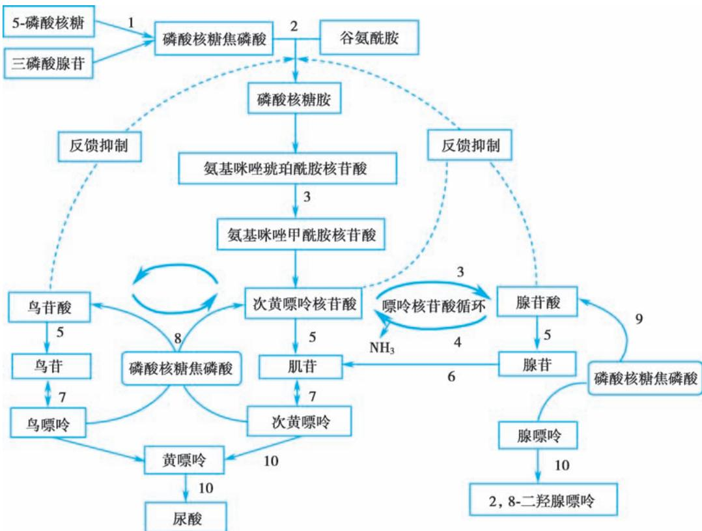  
图7-13-1 嘌呤合成和代谢与尿酸形成途径

1. 磷酸核糖焦磷酸（PRPP）合成酶；2. 磷酸核糖酰胺转移酶；3. 腺苷琥珀酸裂解酶；4. 腺苷酸脱氨酶；5.5′-核苷酸酶；6.腺苷脱氨酶；7.嘌呤核苷酸化酶；8.次黄嘌呤磷酸核糖转移酶（HPRT）；9.腺嘌吟磷酸核糖转移酶(APRT):10 黄嘌呤氧化酶

引自：《高尿酸血症相关疾病诊疗多学科共识》专家组. 中国高尿酸血症相关疾病诊疗多学科专家共识. 中华内科杂志，2017，56（3）：235-248.

## （一） 原发性HUA

1. 尿酸排泄减少  80%～90% 的 HUA 具有尿酸排泄障碍，包括：①肾小管分泌减少，最为重要；②肾小球滤过减少；③肾小管重吸收增多；④尿酸盐结晶沉淀。

2. 尿酸生成增多  由先天性嘌呤代谢障碍引起：①尿酸酶基因失活，是人类罹患 HUA 的主要原因；②尿酸合成过程中关键酶的基因缺陷；③尿酸转运关键离子通道的基因缺陷。

## 3. 混合型  某些患者以上两种因素同时存在。

（二） 继发性 HUA 主要病因有：①某些遗传性疾病，如Ⅰ型糖原贮积症、莱施-奈恩（LeschNyhan）综合征；②某些血液病，如白血病、多发性骨髓瘤、淋巴瘤及恶性肿瘤化疗或放疗后，因尿酸生成过多致 HUA；③慢性肾脏病，因肾小管分泌尿酸减少而使尿酸增高；④某些药物如呋塞米、依他尼酸、吡嗪酰胺、阿司匹林等均能抑制尿酸排泄而导致HUA。

【临床表现】  高尿酸血症患者多于体检时化验发现，仅有血尿酸波动性或持续性增高，称为无症状性 HUA。较多患者伴有肥胖、2 型糖尿病、脂质异常血症、高血压、动脉硬化和冠心病等。从血尿酸增高至关节炎症状出现可长达数年至数十年。约有 5%～12% 的 HUA 患者最终会发展成为痛风（gout），出现反复发作的痛风性急性关节炎、间质性肾炎和痛风石，严重者伴关节畸形或尿酸性尿路结石。

## 【实验室和其他检查】

1. 血尿酸测定  在正常嘌呤饮食状态下空腹采血，采用尿酸酶法测定。

2. 尿尿酸测定  在正常嘌呤饮食期间收集尿液采用酶比色法进行测定。

3. 尿pH  尿液酸碱度主要采用复合pH指示剂法进行测定。

## 【诊断与分型诊断】

1. 诊断依据  HUA 的诊断标准为在正常嘌呤饮食状态下非同日两次空腹血尿酸水平超过正常上限值，即男性和绝经后女性血尿酸＞420μmol/L（7mg/dl），绝经前女性血尿酸＞360μmol/L（6mg/dl）。

2.  分型诊断  低嘌呤饮食 5 天后，留取 24 小时尿检测尿尿酸水平，如果 24 小时尿尿酸排泄＜600mg（3.6mmol）则为尿酸排泄减少型，≥800mg（4.8mmol）则为尿酸产生过多型，其余为混合型。

考虑到肾功能对尿酸排泄的影响，可以用肌酐清除率（Ccr）校正，尿酸排泄分数（FEUA）=（血肌酐×24 小时尿尿酸）/（血尿酸×24 小时尿肌酐），＜7% 为尿酸排泄不良型，7%～12% 之间为混合型，＞12%为尿酸生成过多型。

【鉴别诊断】  应详细询问病史以排除其他系统性疾病及各种药物导致的血尿酸增高。继发性高尿酸血症或痛风具有以下特点：①儿童、青少年、女性和老年人更多见；②高尿酸血症程度较重；③40% 的患者 24 小时尿尿酸排出增多；④肾脏受累多见，痛风肾、尿酸结石发生率较高，甚至发生急性肾衰竭；⑤痛风性关节炎症状较轻或不典型；⑥有明确的相关用药史。

【治疗】  防治目的：①控制 HUA，预防尿酸盐沉积；②防治 HUA 相关的代谢性和心血管危险因素；③防治尿酸结石形成和肾功能损害。

（一） 生活方式改变 生活方式改变是治疗 HUA 的核心，包括健康饮食、戒烟、戒酒、坚持运动和控制体重。饮食应以低嘌呤食物为主（如各种谷类制品、水果、蔬菜、牛奶、奶制品、鸡蛋），严格控制嘌呤含量高的食物（主要包括高果糖饮料、动物内脏、沙丁鱼、凤尾鱼、浓肉汤、啤酒、海味、肉类、豆类等）的摄入量。蛋白质摄入量限制在每日每千克标准体重 1g 左右。鼓励多饮水，使每日尿量在 2000ml以上，以增加尿酸的排泄。避免诱发因素和积极治疗相关疾病等。

（二） 无症状 HUA 的治疗 尽管只有 5%～12% 的 HUA 最终发展成为痛风，但是 HUA 与许多传统的心血管危险因素相关联，大量流行病学研究已经证实HUA是心血管事件的独立危险因素和冠心病死亡的独立危险因素，高尿酸血症还可增加新发肾脏疾病风险并损害肾功能，因此应重视HUA的筛查与诊治。

无症状HUA合并心血管危险因素或心血管疾病（包括高血压、糖耐量减低或糖尿病、脂质异常血症、冠心病、脑卒中、心力衰竭或肾功能异常）时，血尿酸值＞480μmol/L（8mg/dl）给予药物治疗；无心血管危险因素或心血管疾病的 HUA，血尿酸值 ${ > } 5 4 0 up \mu \mathrm { m o l / I }$ （9mg/dl）给予药物治疗。鉴于 HUA 中因尿酸生成增多所致者仅占 10% 左右，绝大多数均由尿酸排泄减少引起。因此在选择治疗方案时，应综合考虑药物的适应证、禁忌证和HUA的分型。

无症状 HUA 治疗目标值：降尿酸治疗的目标是促进晶体溶解和防止晶体形成，需要使血尿酸水平低于单钠尿酸盐的饱和点，因此，血尿酸应 ${ < } 3 6 0 \mu \mathrm { m o l / L }$ （6mg/dl）。

1. 碱化尿液  尿酸在酸性环境中不容易溶解，当尿 $\mathrm { p H }$ 小于 6.0 时须碱化尿液，防止尿酸盐在体内的沉积形成结石，可服用枸橼酸盐制剂、碳酸氢钠等。尿酸性肾结石、胱氨酸结石及低枸橼酸尿患者可服用枸橼酸盐制剂，一般用量 $9 \mathrm { \sim } 1 0 \mathrm { g } / \mathrm { d } _ { \odot }$ 。碳酸氢钠 $0 . 5 { \sim } 1 . 0 \mathrm { g }$ ，每天 3 次，但不可剂量过大及长期应用，以防代谢性碱中毒、高血压、高钾血症等。在服用过程中应复查尿液 $\mathrm { p H }$ ，将尿 $\mathrm { p H }$ 维持在 $6 . 2 \sim$ 6.8最为合适。某些中草药如金钱草、青皮、陈皮等也有碱化尿液的作用。

2.  促进尿酸排泄的药物  其作用机制是抑制肾近曲小管细胞顶侧刷状缘尿酸盐转运蛋白(UBAT1).即抑制肾小管对尿酸的重吸收，促进尿尿酸排泄，从而降低血尿酸浓度。适用于肾功能正常、每日尿尿酸排泄不多的患者。这类药物有苯溴马隆（benzbromarone）、丙磺舒（probenecid）、磺吡酮（sulfinpyrazone）等。

苯溴马隆是临床常用的强效的促尿酸排泄药，成人起始剂量 $2 5 { \sim } 5 0 \mathrm { m g / d }$ ，早餐后服用，1～3 周后根据血尿酸水平调整剂量至 50～100mg/d。肾功能不全时（ $\mathrm { C c r } { < } 6 0 \mathrm { m l / m i n } )$ 剂量调整为 50mg/d。不良反应可有胃肠不适、腹泻、皮疹。相对禁忌证是 24 小时尿尿酸排泄＞600mg（3.6mmol）或已有尿酸性结石形成者。

3.  抑制尿酸生成的药物  其作用机制是竞争性地抑制黄嘌呤氧化酶，使次黄嘌呤、黄嘌呤合成尿酸受阻，能有效减少尿酸生成，从而降低血尿酸的浓度；动员沉积在组织中的尿酸盐，溶解痛风石。这类药物有别嘌醇（allopurinol）、非布司他（febuxostat）、奥昔嘌醇（oxipurinol）、托匹司他（topiroxostat）等。

别嘌醇成人 50mg 起始，一日 1～2 次，每周可递增 50～100mg，至 200～300mg/d，一日 2～3 次。每 2 周测血尿酸水平调量，最大量 $6 0 0 \mathrm { m g / d _ { \odot } }$ 。如 Ccr＜60ml/min，则剂量调整为 50～100mg/d，当 Ccr＜15ml/min 时禁用。非布司他 20～80mg/d。

别嘌醇常见的不良反应为过敏，轻度过敏者（如皮疹）可以采用脱敏治疗；重度过敏者（迟发性血管炎，剥脱性皮炎）常致死，应禁用。HLA-B\*5801 等位基因显著增加超敏反应综合征（AHS）的发生风险，检测阴性才可用药。肾功能不全增加重度过敏的发生危险。其他不良反应为肝损害、血细胞进行性下降、腹泻、头痛、恶心和呕吐等。有研究显示，非布司他增加痛风患者心血管事件死亡风险。

4. 促进尿酸分解的药物  该类药物的作用机制是催化尿酸氧化为水溶性更高的尿囊素从肾排泄，从而降低血尿酸水平。拉布立海（rasburicase）用于具有高危肿瘤溶解综合征的急性 HUA 尤其是化疗所致 HUA，在化疗前或化疗早期使用。重组尿酸酶，如聚乙二醇尿酸酶（培戈洛酶，pegloticase）用于难治性 HUA 患者。该类药物不良反应有过敏反应、溶血、高铁血红蛋白血症。可用于治疗和预防具有高危肿瘤溶解综合征的血液恶性肿瘤病人的急性高尿酸血症，尤其适用于化疗引起的高尿酸血症病人。本品应在化疗前或化疗早期使用。

5.  辅助降低尿酸的药物  氯沙坦用于高血压伴 HUA 患者，非诺贝特用于高甘油三酯血症伴HUA 患者，SGLT2i 或 SGLT1/SGLT2 双抑制剂（索格列净）用于 2 型糖尿病伴 HUA 患者，均有轻度的降尿酸作用。某些中药，如山慈菇、土茯苓、大黄、车前子、薏苡仁、苍术、金钱草、葛根等也具有一定的降低血尿酸作用。

6. 避免应用使血尿酸升高的药物  如利尿药（尤其噻嗪类）、糖皮质激素、胰岛素、环孢素、他克莫司、尼古丁、吡嗪酰胺、烟酸等。阿司匹林对尿酸排泄具有双向调节作用，小剂量（＜2mg/kg）可减少尿酸排泄，大剂量 $( > 3 \mathrm { m g / k g } )$ 则促进尿酸排泄。

7. 合并症及并发症防治  积极控制与血尿酸升高相关的代谢异常及心血管疾病危险因素，如脂质异常血症、高血压、高血糖、脂肪肝及肥胖等。

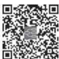  
本章思维导图

【预后】  HUA 总体预后良好，只有 5%～12% 的 HUA 最终会发展成为痛风，经过有效治疗后该比例大幅下降。中国学者基于非靶向代谢组学技术发现 7 种生物标志物（尿嘧啶、甘胆酸、甜菜碱、葫芦巴碱、哌啶酸、肉豆蔻酸、花生四烯酸），建立了风险预测模型，可预测 HUA 患者发生痛风的风险。许多研究显示，HUA 患者中合并慢性肾脏病的比例为 8.4%～13.3%，合并高血压的比例为 30.3%～47.2%，合并脂代谢紊乱的比例为 67%，合并糖尿病的比例为 12.2%，是代谢异常及心血管事件发生发展的独立危险因素，应高度重视，加强防治。

（李  强）

骨质疏松症（osteoporosis，OP）是一种由多种因素导致的以骨量（bone mass）降低和骨组织微结构破坏为特征的骨脆性增加的全身性骨病。按照病因可分为原发性和继发性两类。原发性包括绝经后骨质疏松症（postmenopausal osteoporosis，PMOP，Ⅰ型）、老年性骨质疏松症（Ⅱ型）和特发性骨质疏松症（青少年型）。PMOP 一般发生在女性绝经后 5～10 年内；老年性 OP 一般指 70 岁以后发生的骨质疏松；特发性 OP 主要发生在青少年，病因尚未明。继发性 OP 是指由影响骨代谢的疾病、药物或其他明确病因导致的OP。本章主要介绍原发性OP。

【流行病学】  我国 50 岁以上人群 OP 患病率为 19.2%，65 岁以上为 32.0%。尽管我国 OP 的患病率高，但知晓率及诊断率仍然很低。

【发病机制及危险因素】  OP 是发病机制复杂的疾病，是遗传和环境因素交互作用的结果。为维持正常的生理功能，骨骼需要不断重复地进行时空偶联的骨吸收和骨形成，此过程称为骨重建。骨重建是一个持续的过程：破骨细胞在破骨过程降解局部骨质并形成吸收陷窝，随后由成骨细胞在骨形成过程中形成新骨并填充。成年前骨形成大于骨吸收，逐渐达到峰值骨量（peak bone mass，PBM）；成年期骨重建平衡，维持骨量；此后随年龄增加，骨吸收大于骨形成，造成骨量丢失。骨重建受到内分泌激素、细胞因子及多条信号通路等多重因素的调控，任何导致骨吸收和骨形成失衡的因素都可能导致骨量减少、骨质疏松甚至骨折。

## （一） 骨吸收因素

1. 性激素缺乏  雌激素水平降低会减弱对破骨细胞的抑制作用，导致骨吸收功能增强。绝经时间越早，雌激素缺乏越严重，骨丢失的量也越多。

2.  炎症介质  增龄和雌激素缺乏使免疫系统持续低度活化，处于促炎症状态。炎症介质诱导巨噬细胞集落刺激因子和 $\mathrm { N F - } { \bf { \kappa } } \mathrm { B }$ 受体激活蛋白配体（receptor activator of nuclear factorκB ligand，RANKL）的表达，刺激破骨细胞，造成骨量减少。

3. 活性维生素D缺乏和甲状旁腺激素（PTH）分泌增多  由于高龄和肾功能减退等原因，导致肠钙吸收1，25-二羟维生素 $\mathrm { D } _ { 3 } [ 1 , 2 5 \mathrm { - } \left( \mathrm { O H } \right) _ { 2 } \mathrm { D } _ { 3 } ]$ 生成减少，PTH代偿性分泌增多，导致骨转换加速和骨丢失。

4. 其他因素  年龄相关的生长激素-胰岛素样生长因子轴功能下降、肌少症和体力活动减少可造成骨骼负荷减少，也会使骨吸收增加。

## （二） 骨形成因素

1. 峰值骨量降低  PBM 是影响成年后骨量的重要因素，人体在 30 岁左右达到 PBM。PBM 主要由遗传因素决定，也与种族、脆性骨折家族史、发育、营养和生活方式等相关联。

2. 骨重建功能衰退  成骨细胞的功能与活性缺陷导致骨形成不足和骨丢失，骨重建功能衰退可能是老年性OP 的重要发病原因。

3. 骨质量下降  骨质量主要与遗传因素相关，包括骨的几何形态、矿化程度、微损伤累积、骨矿质与骨基质的理化和生物学特性等。骨质量下降可导致骨脆性增加、骨折风险增高。

（三） 危险因素 $\mathrm { O P }$ 的危险因素分为不可控因素和可控因素。

1. 不可控因素  种族、增龄、女性绝经、脆性骨折家族史等。

2. 可控因素  不健康的生活方式，如体力活动减少、日晒少、过量饮用酒精或含咖啡的饮料、营养失衡、体重过低等，许多疾病和药物也可引起继发性 OP（详见鉴别诊断）。

【临床表现】  初期通常没有明显的临床表现，但随着病情进展、骨量不断丢失、骨微结构破坏，患者会出现骨痛、脊柱变形，甚至骨质疏松性骨折。

1. 骨痛  最常见的是不同程度、不同部位的骨骼疼痛，多无关节红肿及变形，常伴腰腿乏力，双下肢抽搐，弯腰、下蹲、翻身、行走等活动困难或受阻。

2. 身高缩短、脊柱变形  严重 OP 者因椎体压缩性骨折，可出现身高变矮或脊柱驼背畸形等，身高如与年轻时相比缩短≥4cm或较上一年缩短2cm，应高度警惕OP可能。椎体骨折也可能导致胸廓畸形、腹部受压，影响心肺功能等。

3. 骨折  轻微外力作用即可造成脆性骨折，如用力咳嗽、大笑均可导致骨折。常见部位为椎体（胸、腰椎）、肱骨近端、桡骨远端、肋骨、髋部（股骨颈、转子间）、踝部等。骨质疏松性骨折发生后，再骨折的风险显著增高。

4. 并发症  驼背和胸廓畸形者常伴胸闷、呼吸困难，心肺功能下降，易合并心血管疾病和肺部感染。骨折后自理能力下降或丧失、活动受限，长期卧床加重骨丢失，使骨折极难愈合。对患者心理状态也会产生明显影响，如恐惧、焦虑、抑郁、自信心降低等。

## 【实验室和辅助检查】

## （一） 实验室检查

1. 一般项目  血常规、尿常规、肝肾功能、血钙、血磷、血碱性磷酸酶、25-羟维生素D［25-hydroxyvitaminD ，25-（OH）D］和PTH水平，以及尿钙、尿磷和尿肌酐等。

2. 骨转换标志物  是指骨转换过程中产生的中间产物或酶类，分为骨形成指标和骨吸收指标两类，推荐血清Ⅰ型原胶原 N- 端前肽（procollagen type Ⅰ N-prepeptide，P1NP）和血清Ⅰ型胶原交联 C-末端肽（C-terminal telopeptide of type Ⅰ collagen，CTX），分别为反映骨形成和骨吸收灵敏度较高的标志物。

3. 为进一步鉴别诊断的需要，可酌情选择以下检查：红细胞沉降率、性激素、甲状腺功能、尿游离皮质醇、血气分析、尿本周蛋白、血尿轻链等。

## （二） 辅助检查

1. 骨密度  骨密度是指单位体积或单位面积所含的骨量，测量方法较多，目前临床和科研常用的主要是双能 X 线吸收法（dual energy X-ray absorptiometry，DXA）、定量计算机断层成像（quantitativecomputed tomography，QCT）。DXA 是目前国内外公认的 OP 的诊断标准。

2. 其他影像学检查  为了解椎体骨折情况或与其他继发性 OP 相鉴别，可酌情选择椎体 X 线、CT MRI甚至放射性核素骨扫描 骨髓穿刺骨活检等检查

## 【诊断与鉴别诊断】

## （一） 诊断

1. 诊断线索  多为老年人或绝经后女性，有不明原因的慢性腰背疼痛、身材变矮或脊椎畸形，存在OP危险因素如高龄、制动、低体重、长期卧床或服用糖皮质激素等。

2. 诊断标准  诊断应根据临床病史、症状、体征、必要的辅助检查，排除各种原因引起的继发性OP。OP的诊断主要根据骨密度测量结果和/或脆性骨折判断。

（1）基于骨密度测量的诊断：对于绝经后女性、50 岁及以上男性，建议参照 WHO 推荐的诊断标准（表 7-14-1）。DXA 测量的骨密度通常需要转换为T值用于诊断.T值=(骨密度的实测值 - 同种族同性别正常青年人峰值骨密度）/同种族同性别正常青年人峰值骨密度的标准差。

表7-14-1 基于DXA 测定骨密度的分类标准

<table><tr><td>诊断</td><td>T值</td></tr><tr><td>正常</td><td>T值≥-1.0</td></tr><tr><td>骨量减少</td><td>-2.5&lt;T值&lt;-1.0</td></tr><tr><td>骨质疏松</td><td>T值≤-2.5</td></tr><tr><td>严重骨质疏松</td><td>T值≤-2.5+脆性骨折</td></tr></table>

对于儿童、绝经前女性和50岁以下男性，其骨密度水平的判断建议用同种族的Z值表示。Z值=（骨密度测定值 -同种族同性别同龄人骨密度均值）/同种族同性别同龄人骨密度标准差。将 Z 值≤ -2.0视为“低于同年龄段预期范围”或低骨量。

（2）基于脆性骨折的诊断：OP诊断标准见表7-14-2。

表7-14-2 骨质疏松症诊断标准

<table><tr><td>骨质疏松症诊断标准(符合以下三条之一者)</td></tr><tr><td>• 髋骨或椎体脆性骨折</td></tr><tr><td>• DXA 测定中轴骨骨密度或桡骨远端 1/3 骨密度 T 值≤-2.5</td></tr><tr><td>• 骨密度测量符合骨量减少(-2.5+肱骨近端、骨盆或前臂远端脆性骨折</td></tr></table>

（二） 鉴别诊断 在诊断原发性 OP 之前，须排除继发性 OP，下列疾病和药物均可能导致继发性OP。

## 1. 常见疾病

（1）内分泌系统疾病：甲旁亢、甲亢、库欣综合征、性腺功能减退、糖尿病（1 型和 2 型）、垂体前叶功能减退、卵巢早衰（女性绝经年龄＜40 岁）、神经性厌食等。

（2）血液系统疾病：多发性骨髓瘤、白血病、淋巴瘤、镰状细胞贫血和珠蛋白生成障碍性贫血、血友病等。

（3）风湿免疫性疾病：类风湿关节炎、系统性红斑狼疮、强直性脊柱炎、银屑病等。

（4）胃肠道疾病：炎症性肠病、吸收不良、乳糜泻、减重手术等。

（5）神经肌肉疾病：癫痫、肌萎缩、帕金森病、多发性硬化、脑卒中等。

（6）其他疾病：慢性代谢性酸中毒、终末期肾病、器官移植后骨病、慢性阻塞性肺疾病等。

2. 常见药物  很多药物可影响骨代谢，从而引起 OP，如糖皮质激素、质子泵抑制剂、芳香化酶抑制剂、肿瘤化疗药、肝素、抗癫痫药、甲状腺素（过量）、促性腺激素释放激素类似物等。

【骨质疏松的防治】  OP 的预防应贯穿于生命全过程，绝不是成年期或老年期才关注。OP 的防治措施主要包括基础措施、药物干预和康复治疗。

## （一） 基础治疗

1. 调整生活方式  包括加强营养、均衡膳食，保证充足的日照，规律运动，戒烟限酒，尽量避免或减少使用影响骨代谢的药物，避免跌倒等。

## 2. 钙剂和维生素D

（1）钙剂：不论何种 OP 均应补充适量钙剂，使每日元素钙的总摄入量达 800～1200mg。每日膳食约摄入元素钙 400mg，尚需药物补充元素钙 500～600mg/d。常用的钙剂种类有碳酸钙、葡萄糖酸钙、枸橼酸钙等。

（2）维生素 D：除了充足的阳光照射，还可以口服普通维生素 $\mathrm { D } _ { 2 }$ 或维生素 $\mathrm { D } _ { 3 \circ }$ 如存在肠道吸收不良或依从性较差，可使用维生素 D 肌内注射制剂。建议 OP 患者血清 25-（OH）D 水平长期维持在30ng/ml 以上，但也要注意监测，避免25-（OH）D水平过高引起高钙血症。

（二） 抗骨质疏松药物 有效的抗骨质疏松药物治疗可以增加骨密度、降低骨折的发生风险。按作用机制分为骨吸收抑制剂、骨形成促进剂、其他机制类药物等。

1. 骨吸收抑制剂  包括双膦酸盐类、RANKL 单克隆抗体、降钙素、雌激素、选择性雌激素受体调节剂。

（1）双膦酸盐类：是目前临床上应用最为广泛的抗OP药物，它是焦磷酸盐的稳定类似物，其特征为含有 P-C-P 基团，与骨骼羟基磷灰石具有高亲和力，能够特异性结合到骨重建活跃部位，抑制破骨细胞功能，从而抑制骨吸收。目前用于治疗 OP 的双膦酸盐类药物主要包括：①阿仑膦酸钠：阿仑膦酸钠素片 10mg/片，口服，1 片/次，每日 1 次；或 70mg/片，口服，1 片/次，每周 1 次；阿仑膦酸钠维 $\mathrm { D } _ { 3 }$ 片（含阿仑膦酸钠 70mg+维生素 D 2 800U 或 5600U 的复合片剂）口服，1 片/次，每周 1 次。②唑来膦酸：唑来膦酸静脉注射剂，5mg 静脉滴注，每年 1 次。③其他双膦酸盐制剂：利塞膦酸钠、伊班膦酸钠、米诺膦酸等。双膦酸盐类药物总体安全性较好，但须关注胃肠道反应、一过性发热及骨痛等“类流感样”症状，以及肾功能损伤、颌骨坏死、非典型性股骨骨折等不良反应。治疗期间追踪疗效，并监测血钙、磷和骨转换标志物。

（2）RANKL 单克隆抗体：RANKL 与破骨细胞前体和成熟破骨细胞上的受体（RANK）相互作用，RANKL-RANK 相互作用促进破骨细胞的分化成熟和活化，开始骨吸收过程。地舒单抗（denosumab）是一种全人源单克隆抗体（IgG2 类），以高特异性和高亲和力与 RANKL 结合，阻止 RANKL 与其受体RANK 结合，从而抑制破骨细胞形成和活化、减少骨吸收、增加骨密度。建议剂量 60mg，皮下注射，每半年 1 次。地舒单抗总体安全性良好，长期应用略增加颌骨坏死或非典型股骨骨折的风险。同时，应注意地舒单抗不存在药物假期，一旦停用，须序贯双膦酸盐类或其他药物，以防骨密度下降。

（3）降钙素：降钙素是一种钙调节激素，能抑制破骨细胞的活性和减少破骨细胞数量并增加骨量此外它还能有效缓解骨痛及用于治疗高钙血症，目前临床主要使用触降钙素和鳗角降钙素类似物依降钙素。主要制剂：①鲑降钙素：鲑降钙素鼻喷剂，鼻喷 200U，每日或隔日 1 次。鲑降钙素注射剂，每日 50U 皮下或肌内注射。②依降钙素注射剂：每次 20U 肌内注射，每周 1 次；依降钙素注射剂，每次 10U 肌内注射，每周 2 次。长期使用鲑降钙素与恶性肿瘤风险轻微增加相关，建议连续使用时间一般不超过3个月。

（4）雌激素：绝经激素治疗能预防绝经引起的骨转换加速和骨丢失，降低骨折的风险，可用于PMOP 的预防和治疗。提倡女性 60 岁以前或绝经 10 年内启用，不仅能缓解绝经相关症状，还能获得心血管保护。常用制剂和用量：①结合雌激素，常规剂量0.3～0.625mg/d。②戊酸雌二醇 0.5～2mg/d。③17β-雌二醇 1～2mg/d。④替勃龙 1.25～2.5mg/d。⑤雌二醇贴剂 0.05～0.1mg/d。皮肤贴剂可避免药物首经肝及胃肠道，对凝血活性影响小，对肝功能不好和血栓风险的妇女更具优势。注意事项：雌激素治疗期间要定期进行妇科和乳腺检查，子宫内膜癌、乳腺癌、严重肝肾功能障碍、不明原因阴道出血或子宫内膜增生等禁用。

（5）选择性雌激素受体调节剂（selective estrogen receptor modulator，SERM）：这类药物与雌激素受体（estrogen receptor，ER）结合后，在不同靶组织使 ER 空间构象发生改变，从而在不同组织发挥类似或拮抗雌激素的不同生物效应。如雷洛昔芬，该药物在骨骼发挥类雌激素的作用，抑制骨吸收增加骨密度；而在乳腺和子宫则发挥拮抗雌激素的作用，因而不刺激乳腺和子宫。

2.  骨形成促进剂  甲状旁腺激素类似物（parathyroid hormone analogue，PTHa），间断使用小剂量PTHa 能促进骨形成、增加骨量。国内已上市的特立帕肽是重组人甲状旁腺激素氨基端 1-34 片段。临床中特立帕肽注射制剂用法为20μg/次，皮下注射，每日1次，疗程不超过24个月。

## 3. 其他机制类药物

（1）活性维生素 D 及其类似物：目前国内上市的活性维生素 D 及其类似物有阿法骨化醇（1α-羟维生素 D）、骨化三醇［1，25-（OH）D］及艾地骨化醇。更适用于老年人、肾功能减退及 1α-羟化酶缺乏或减少的患者，注意服药期间不宜同时补充较大剂量的钙剂，定期监测血钙和尿钙水平。

（2）维生素 K 类：四烯甲萘醌是维生素 K 的一种同型物，是羧化酶的辅酶，在γ-羧基谷氨酸的形成中起着重要作用。γ-羧基谷氨酸是骨钙素发挥正常生理功能所必需的，具有提高骨量的作用。

（三） OP 性骨折的治疗 治疗原则包括复位、固定、功能锻炼和抗OP治疗。

【预防】  加强卫生宣教，提倡运动和充足的钙摄入，早期发现 OP 易感人群，进行三级预防，降低OP及OP后骨折风险。

（秦贵军）

本章数字资源

性发育异常疾病（disorderofsexdevelopment，DSD）是指染色体、性腺、内生殖器、外生殖器性别不一致的一类疾病。由于染色体核型是诊断性发育异常时首先需要考虑的因素，因此，将性发育异常按照染色体核型的不同划分为以下三类：①性染色体异常 DSD；②46，XY DSD，即睾丸发育异常和女性化；③46，XXDSD，即卵巢发育异常和男性化。性发育异常疾病的分类见表7-15-1。

表7-15-1 性发育异常疾病的分类

<table><tr><td>一、性染色体异常疾病1. 47,XXY(Klinefelter 综合征)2. 45,X(Turner 综合征)3. 45,X/46,XY 嵌合4. 46,XY/46,XX 嵌合二、46,XY 性发育异常疾病1. 睾丸发育障碍(1)完全或部分性腺发育障碍(2)卵睾(3)睾丸退化2. 雄激素合成障碍3. 雄激素抵抗或不敏感</td><td>三、46,XX 性发育异常疾病1. 性腺发育障碍(1)卵巢发育障碍(2)卵睾2. 雄激素过剩(1)3β-羟类固醇脱氢酶 2 型(3β-HSD2)缺陷症(2)21-羟化酶(CYP21A2)缺陷症(3)P450 氧化还原酶(POR)缺陷症(4)11β-羟化酶(CYP11B1)缺陷症(5)芳香化酶(CYP19A1)缺陷症</td></tr></table>

## 第一节 | 性染色体异常疾病

## 一、  Klinefelter 综合征

Klinefelter综合征（克兰费尔特综合征），又称精曲小管发育不全症，是一种非整倍型染色体疾病。该疾病是原发性睾丸功能减退症中最常见的疾病，也是引起男性不育最常见的遗传性疾病。据报道克兰费尔特综合征在新生儿中的发病率约为1/660，不存在种族或地域的差异。

【病因和发病机制】  克兰费尔特综合征的病因是性染色体异常，即患者具有两条或两条以上X 染色体，包括标准核型、变异型等。47，XXY 核型约 40% 是精子减数分裂异常所致，约 60% 是卵子减数分裂异常所致。嵌合体核型（46，XY/47，XXY）是由合子在有丝分裂时发生性染色体不分离所致，在克兰费尔特综合征患者中所占比例约为 10%。克兰费尔特综合征的其他染色体亚型可有48，XXYY、48，XXXY。导致性染色体异常的主要致病原因与父母生育时高龄、遗传因素等有关。

【临床表现】  临床特点为小而质韧的睾丸，雄激素缺乏和不育的表现。

1. 睾丸小  青春期前，患者可能表现为睾丸容积较正常略小；青春期中后期，表现为小而质韧的睾丸，B超监测双侧睾丸的平均容积为4ml，约1/3 的患者存在睾丸下降不良。

2. 第二性征男性化不全  青春期启动的时间正常或延迟，大部分患者可在青春期出现无痛性双侧乳房发育、阴茎小，胡须、腋毛及阴毛稀疏。成年后约70%患者出现性欲和性能力的进行性下降。

3. 其他表现  出生时体重低，头围小，可有身体畸形，如指趾弯曲。青春期，开始特征性的骨骼发育，一般能达到人群平均身高或更高，四肢与躯干比例失调，下部量大于上部量，指距的 1/2 大于上部量。患者存在认知方面的异常，但并非智力水平的整体下降，而是某些方面的缺陷，尤其是语言和执行能力。

4. 伴发异常  雄激素缺乏可导致骨质疏松、肌力下降。患者还可有肥胖、糖耐量减低、糖尿病的表现，且糖尿病导致的死亡风险明显增高。克兰费尔特综合征的患者易发生生殖腺外的恶性生殖细胞肿瘤（如纵隔恶性非精原细胞瘤和中枢神经系统生殖细胞瘤），另外白血病、淋巴瘤等血液系统恶性疾病的发病率也增高。

## 【实验室检查及其他检查】

1. 激素测定  青春期前的黄体生成素（LH）、卵泡刺激素（FSH）、睾酮（T）的基础水平与同龄儿童相比无差异。患儿能够经历同正常男孩相似的青春期启动过程，性激素水平表现为LH、FSH升高，睾酮水平也升高达正常水平或正常值低限。直至青春期中期，患儿的各种性激素异常才充分表现出来：LH、FSH 水平逐渐升高，达到高促性腺激素水平，尤以 FSH 的上升更为明显和迅速。血清睾酮水平下降，并在整个青春期都维持在较低水平。

2. 染色体核型分析  外周血细胞的染色体核型分析可明确诊断。

3. 睾丸 B 超  睾丸容积可通过触诊并与睾丸测量模具比较获得，准确的容积可通过睾丸 B 超确定。

4. 精液分析  精子计数通常为零。

5 睾丸活检 伴随着青春期的启动，睾丸生精小管进行性萎缩和透明样变，间质逐渐纤维化，精原细胞丧失，睾丸支持（Sertoli）细胞退化、间质（Leydig）细胞增生。

## 【诊断与鉴别诊断】

1. 诊断  典型病例根据患者睾丸小而硬、男性乳房发育、呈类无睾体型、第二性征发育不全等临床表现以及上述实验室检查可对本病作出诊断。进行染色体核型分析有特异性诊断意义，有助于对典型与不典型Klinefelter综合征作出鉴别诊断。

2. 鉴别诊断 本病应与低促性腺激素性腺功能减退症鉴别，后者也具有睾丸小、血清T明显减低的特点，但低 LH、FSH 及染色体核型分析可相鉴别。还需要与其他原因的高促性腺激素性腺功能减退症鉴别。

【治疗】  当患者血清睾酮水平低于正常时，即可开始雄激素替代治疗，治疗目标为血睾酮达到正常中等水平，并持续终身治疗，替代治疗目的是改善患者雄激素不足的症状，促进第二性征发育，提高性功能和生活质量，以避免出现雄激素缺乏的症状和后遗症。国内制剂包括肌内注射和口服制剂。庚酸睾酮、十一酸睾酮肌内注射每次 200～250mg，每 2～4 周注射一次。十一酸睾酮等口服制剂，口服后经淋巴系统吸收，适用于长期服用。起始剂量 120～160mg/d，连续使用 2～3 周后，改为维持剂量40～120mg/d，可分为早、晚2次。雄激素替代治疗对患者生育能力无改变。

## 二、  Turner 综合征

Turner综合征（Turner syndrome，特纳综合征）又称先天性卵巢发育不全症，也是一种较为常见的非整倍型染色体疾病，是由于 X 染色体部分或完全缺失以及结构异常所致的一种疾病。在存活的女婴中，其发生率为 1/5 000～1/2 500。

【病因和发病机制】  经典的 Turner 综合征（45，X）核型，约占半数；嵌合体 Turner 综合征（45，X/46，XX）约占1/4；其余1/4 为X染色体异常，如长臂或短臂缺失、等臂染色体或环状染色体等。

【临床表现】  Turner综合征患者的临床表现差异大，典型者表现为身材矮小、性腺发育不全、淋巴水肿和躯体、内脏畸形，轻型者仅表现为最终身高略矮、卵巢早衰等。典型的面容表现为多发黑痣、眼睑下垂、鱼形嘴、斜视。躯体畸形表现为身材矮小（一般＜140cm）、颈粗短、颈蹼、盾状胸、肘外翻等，后发际低至颈部。第二性征发育不全，无乳房发育，无阴毛及腋毛生长，外生殖器为女性幼稚型。可伴发自身免疫病，如自身免疫性甲状腺炎、Graves 病及1型糖尿病等。

【实验室检查】

## （一） 激素测定

1. 性腺激素  雌二醇、孕酮水平低下，而促性腺激素如FSH、LH水平明显升高。

2. 生长激素  患者存在不同程度的生长激素缺乏，可采用胰岛素低血糖试验、精氨酸兴奋试验评价生长激素的分泌能力。

（二） 染色体核型分析 染色体核型分析是确诊该疾病的直接依据。

（三） 影像学检查 确诊 Turner综合征后，需要进行心脏超声及其他内脏超声检查来明确是否存在器官畸形，也可进一步采用CT或MRI检查明确。

【诊断与鉴别诊断】  凡是女孩在儿童期生长缓慢、青春期无月经来潮，且存在多发先天性躯体畸形和内脏畸形者，应考虑到该疾病的可能，尽早进行性激素的测定和染色体核型分析以明确诊断。超声检查发现颈部，如颈后囊性淋巴瘤以及全身水肿、浆膜腔积液、主动脉缩窄及左心发育畸形等，均提示Turner综合征可能。

应与垂体性侏儒症、呆小症及体质性青春期延迟等相鉴别。

## 【治疗】

1. 生长激素的治疗  生长激素的治疗能够使大多数患者的最终身高提高 5～10cm。开始治疗年龄：如果患儿身高明显落后于正常生长曲线的第 5 百分位数时，学龄前（4～5 岁）就应当开始治疗。生长激素常用方法：每晚睡前皮下注射，剂量为0.15U/（kg·d），每4～6个月测定一次身高增长速度。

2. 性激素替代治疗  Turner综合征的患者中，几乎均需要采用雌激素治疗诱导青春期启动，一般是在 15 岁开始。青春期结束后，还需要继续应用雌、孕激素模拟人工周期治疗。青春期及时、恰当地给予雌激素替代治疗非常必要，可确保乳房和子宫的充分发育，以便将来通过接受赠卵实现生育可能，并能有效的预防长期雌激素缺乏引起的骨质疏松和多种代谢紊乱。

## 第二节 | 46，XY 性发育异常

## 一、 睾丸发育障碍

完全型：性腺为条索状组织，外生殖器完全女性化。不完全型：外生殖器部分女性化或女性型外阴伴阴蒂肥大。

## 二、 LH/HCG受体功能缺陷

外生殖器表型多样，重度患者为完全女性型，轻度患者为小阴茎伴尿道下裂。

## 三、 雄激素合成异常

雄激素的合成过程中任一酶活性异常将使雄激素合成通路被阻断，导致46，XY性发育异常。

1. 类固醇激素合成急性调节蛋白缺陷症（先天性类脂性肾上腺增生）肾上腺功能衰竭表现为早发的糖皮质激素缺乏（例如低血糖和色素沉着过度)和盐皮质激素缺乏。

2. P450碳链裂解酶缺陷症  普遍认为CYP11A1严重失活的患儿无法存活。

3. 3β-羟类固醇脱氢酶 2 型缺陷症  表现型为失盐型和不失盐型两种。

4. 17α-羟化酶/17，20-裂解酶缺陷症 表现型女性，青春期第二性征缺失，骨龄延迟，低肾素性高血压和低血钾碱中毒。

5. 17β-羟类固醇脱氢酶3缺陷症  出生时有女性外生殖器，但青春期时会出现进行性的男性化。

6. P450氧化还原酶缺陷症  46，XY 患者外生殖器女性化。

7. 5α-还原酶 2 型缺陷症  出生时均伴有外生殖器发育异常，小阴茎或阴蒂样阴茎、尿道下裂、阴囊裂、盲管阴道等。

## 四、 雄激素作用异常

1.  完全型雄激素不敏感综合征（CAIS）  CAIS 患者具有正常女性表型，性腺为睾丸，可位于腹腔、腹股沟区或大阴唇内。

2. 部分型雄激素不敏感综合征（PAIS）  46，XY 患者出现男性化不全。出生时外生殖器可能有不同程度的发育异常。

## 第三节 | 46，XX性发育异常

## 一、  卵巢发育异常

1. 单纯性46，XX 卵巢发育不良  青春期时由于女性化障碍而表现明显。

2. 46，XX 卵睾及46，XX 睾丸  在极为罕见的情况下，46，XX患者的卵巢中可能包含有睾丸组织（46，XX卵巢睾丸DSD），甚至性腺可以发育为有功能的睾丸（46，XX睾丸DSD）。

## 二、 雄激素过多

如果高雄激素血症出现在胚胎 12 周以前，表现为小阴茎样阴蒂肥大，阴唇部分或几乎完全融合；如果出现在12周以后，则只有阴蒂肥大。包括以下几种。

1. 21-羟化酶缺陷症 有 3 种临床亚型。最多见的是失盐型，患儿常于出生后数日内出现严重的拒乳、呕吐、腹泻、脱水、低血钠、高血钾及酸中毒，此型患者外生殖器男性化程度亦较严重。其次单纯男性化型。非经典型CYP21A2缺陷发病率较低。

2. 11β-羟化酶 1 型缺陷症  表现为低肾素性高血压，部分患者伴有低血钾。进行性男性化，阴蒂肥大，阴唇融合。

3. 3β-羟类固醇脱氢酶 2 型缺陷症  表现为糖皮质激素缺乏的女婴出生时轻度阴蒂肥大（伴或不伴失盐）。

4. 芳香化酶缺陷症  患儿出生时有阴蒂肥大、不同程度的阴唇后融合，阴唇阴囊化，部分患者存在单孔阴道。对所有出生时伴有男性化的46，XX 患儿，当排除21-羟化酶缺陷后，都要考虑芳香化酶缺陷症这一重要诊断。

【性发育异常处理】  性发育异常患者治疗上需要关注性征发育和生育两方面问题。大部分DSD患者在出生时即存在外生殖器发育异常，此期的性别指认尤为重要，最好由一个包括内分泌科、外科、产科，儿科心理科等多学科的合作小组共同商讨对患者作出恰当的性别指认。同时为确保患儿正常的性心理发育性别指认确定后应尽早施行外生殖器整形手术。DSD患者大多存在性激素缺乏 性激素替代是青春期和成年期的主要治疗手段。在促性腺激素缺乏的男性DSD患者可以使用促性腺激素如人绒毛膜促性腺激素，在促性腺激素缺乏的女性DSD患者可给予雌激素和孕激素的周期性替代治疗，做人工月经周期。在先天性肾上腺增生症患者，使用糖皮质激素替代治疗，能显著改善女性男性化体征。DSD 患者的生育能力受到严重影响，多需要借助辅助生殖技术生育，有些 DSD 患者完全失去生育能力。同时心理支持对DSD 患者也具有重要意义。

（李小英）

本章数字资源

## 第一节 | 多发性内分泌腺瘤病

多发性内分泌腺瘤病（multiple endocrine neoplasia，MEN）为一组遗传性多种内分泌器官发生的肿瘤综合征的总称，有 2 个或 2 个以上的内分泌腺体累及。肿瘤可为良性或恶性，可为功能性（分泌活性激素并造成特征性临床表现）或无功能性，可同时出现或先后发生，间隔期长短不一，病情轻重及病程缓急均存在较大异质性。MEN可分为两种类型：多发性内分泌腺瘤病1型（MEN1）及多发性内分泌腺瘤病 2 型（MEN2），后者又分为 2 种亚型：MEN2A、MEN2B。此外，还有不能归属于 MEN1 或MEN2 的混合型 MEN。

## 一、 多发性内分泌腺瘤病1型

MEN1为常染色体显性遗传疾病，又称Wermer综合征，在普通人群中患病率约为（2～20）/10万。MEN1 患者中约 10% 的基因突变属新出现的，称为散发性。MEN1 可有多种临床表现，其发生率在不同家系及同一家系不同患者中变化不一。

【发病机制】 MEN1基因位于第11号染色体，11q13带，编码含610个氨基酸的蛋白质，称为“多发性内分泌腺瘤蛋白”（menin）。MEN1 为抑癌基因，基因缺陷的性质多样化。除全身细胞的基因缺陷，在 MEN1 肿瘤组织中发现MEN1 另一等位基因也发生缺失，MEN1 两个等位基因功能均丧失导致细胞增殖，发生肿瘤，这一现象符合两次打击致肿瘤抑制基因功能丧失致瘤的学说。约 20% 散发性甲状旁腺腺瘤及一部分散发性胰腺内分泌癌、肺类癌亦可出现MEN1基因突变，但此种突变只发生于肿瘤组织而不见于患者的正常细胞，故不形成疾病家族性集聚现象。

【临床表现】

1. 甲状旁腺功能亢进症  为 MEN1 中最常见且最早出现的病变，与腺瘤所致散发性甲旁亢病例相比较，起病较早（20 余岁），男女发病率相仿，在病理上为多个甲状旁腺增生，大小可不一致。诊断依据与一般散发病例相同。甲旁亢所致高钙血症可加重同时并存胃泌素瘤患者的症状，血胃泌素水平更高。

2. 肠胰内分泌瘤  可为功能性或无功能性，包括以下肿瘤：胃泌素瘤，常伴 Zollinger-Ellison 综合征，约占 MEN1 中肠胰瘤的 50%～60%。此种胃泌素瘤的特点为体积小、多中心性，且可为异位性，位于十二指肠黏膜下。诊断依据为同时存在高胃泌素血症及高胃酸分泌，据此可与常见的胃酸缺乏症伴高胃泌素血症相鉴别。必要时可做胰泌素（secretin）兴奋试验，胃泌素瘤患者血浆胃泌素升高。由于MEN中胃泌素瘤体积小，其定位诊断较困难，CT及MRI可检出肝转移性病灶，但对胃泌素瘤往往难以确诊，进一步定位方法包括超声内镜、选择性动脉注射胰泌素后肝静脉采血测胃泌素，以及放射性核素标记奥曲肽扫描等。MEN1 中胰岛素瘤发生率约占起源于胰岛肿瘤的 20%，其余的为胰高血糖素瘤、舒血管肠肽瘤及无功能瘤。MEN1 中胰岛素瘤亦常为多中心性，定位亦较困难，超声内镜检查选择性滴注钙剂后肝静脉采血测胰岛素等有助于定位

3. 垂体瘤  发生率约为 25%，大多为催乳素瘤，可伴或不伴生长激素分泌增多，其次为生长激素瘤、无功能瘤及ACTH瘤伴库欣综合征。MEN1 中垂体瘤甚少为恶性，其诊断、治疗与散发病例相同。

4. 肾上腺腺瘤及其他病变  分泌皮质醇的腺瘤可见于 MEN1，MEN1 中出现库欣综合征有 3 种可能性：①肾上腺腺瘤；②垂体ACTH瘤；③类癌伴异位ACTH综合征，以垂体瘤较多见。在MEN1中甲状腺腺瘤及其他甲状腺疾病亦较为多见。在MEN1 的家族成员中，出现皮下脂肪瘤、皮肤胶原瘤及多发性面部血管纤维瘤者约占 30%～90%，此类表现有助于对这些个体进行筛查，以明确携带 MEN1缺陷基因者。

【治疗】  MEN1 中甲状旁腺功能亢进症的治疗为切除 3 个甲状旁腺，余下的那 1 个切除一半，留下半个甲状旁腺；也有主张做 4 个甲状旁腺全切除的，将外表上最接近正常的 1 个腺体的一半移植于一侧习惯上非主要使用的前臂肌肉中。手术治疗后甲旁亢持续存在或复发的频率均明显高于散发性甲旁亢患者。术后甲旁亢持续存在，即血钙与血甲状旁腺激素均未恢复正常者占 36%；复发者，指血钙恢复正常 3 个月以上甲旁亢又复发者占 16%；而散发病例术后疾病持续存在及复发者分别占 4%及 16%。MEN1 中手术后甲旁亢持续存在发生率高的一个原因是甲状旁腺不止 4 个，或有异位的甲状旁腺组织；复发率高是由于剩余的甲状旁腺组织继续受到促进生长的刺激。

【筛查】  对MEN1患者的家族成员应做全面的病史采集及体检。重要的实验室检查为血钙浓度测定，或做血总钙测定加血浆蛋白测定作校正，从 15 岁起开始定期检查。此外，催乳素、胃泌素及空腹血糖测定也有助于诊断，有条件可进行MEN1基因突变检测。

## 二、 多发性内分泌腺瘤病2型

MEN2 为一常染色体显性遗传病。其患病率约占普通人群的（1～10）/10 万，携带有 MEN2 缺陷基因者，其疾病外显率高于 80%。MEN2 可分为两种独立的综合征：MEN2A（又称 Sipple 综合征）及MEN2B。MEN2A 的临床表现包括甲状腺髓样癌、嗜铬细胞瘤及甲状旁腺功能亢进症；MEN2B 则包括甲状腺髓样癌、嗜铬细胞瘤等，但甲状旁腺功能亢进症少见。

【发病机制】  MEN2 的发病机制是原癌基因 RET发生突变。RET 为一单链穿膜含酪氨酸激酶的蛋白，在许多起源于神经嵴的细胞(如甲状腺、肾上腺、肠内部神经系统等)中表达，在机体的发育上起重要作用。RET 结构上的特征是在其胞外区域近细胞膜处聚集有多个半胱氨酸，在其胞内部分则含有一酪氨酸激酶的结构域。MEN2A 患者 RET基因有突变存在，可为错义突变，或小的 DNA 片段的缺失或插入，均累及前述的半胱氨酸。家族性甲状腺髓样癌者往往可检出 MEN2A 中半胱氨酸突变。MEN2B患者的RET基因突变不涉及MEN2A中的半胱氨酸及家族性甲状腺髓样癌中的氨基酸，其突变的95%以上为第918位密码子甲硫氨酸（Met）变为苏氨酸（Thr）。

## 【临床表现】

1.  甲状腺髓样癌（MTC）  为 MEN2 中最常见且最早出现的病变，而且是决定病程进展的最重要因素。MTC 的病理演变开始时为产生降钙素（calcitonin）的甲状腺滤泡旁细胞增生，以后发展为癌，常为多中心性，并集中于甲状腺的上 1/3 处，此与正常甲状腺内滤泡旁细胞的分布状况相符。全部甲状腺髓样癌中约 1/4 为遗传性的，后者的分布约 45% 为 MEN2A，50% 为单一性家族性 MTC，5%为 MEN2B，MEN2B 中的 MTC 在家族性病例中病情最重、发生最早（常在 5 岁前即出现）、进展最快。MTC 的扩散最初在甲状腺内，继而累及区域性淋巴结，后期可转移至肝、肺、骨骼。病理诊断为分化不良的甲状腺肿瘤，可用免疫组化染色显示降钙素阳性结果。细胞外淀粉样沉积物可与抗降钙素的抗血清起反应，也有助于诊断。

2.  嗜铬细胞瘤  约见于 50% 的 MEN2 患者，多位于肾上腺，常为双侧性，恶性者少见。病理变化亦经过肾上腺髓质增生阶段，以后发展为肿瘤。诊断方法同一般嗜铬细胞瘤病例。

3.  甲状旁腺功能亢进症  MEN2 中的甲旁亢与 MEN1 一样，是由甲状旁腺增生所致，约见于25% 的 MEN2A 患者，而于 MEN2B 中较少见。MEN2 中的甲旁亢对外科手术的反应较好，不似 MEN1中者难治。

MEN2B 患者呈现一些 MEN2A 所不具备的临床表现，包括一些部位（舌、唇、眼睑及胃肠道）的黏膜神经瘤，类马方综合征体态（胸廓凹陷、肢体细长等）。

【治疗】  MEN2 中的甲状腺髓样癌，由于其病变为多中心性，应行全部甲状腺切除术及中心性淋巴结切除，部分甲状腺切除术将出现疾病复发。如同时存在嗜铬细胞瘤，应先切除嗜铬细胞瘤，以免在行甲状腺髓样癌手术时诱发高血压危象或心衰等。MRI以及选择性静脉采血测降钙素有助于发现癌肿转移灶。已有转移者，手术治疗为姑息性，不能根治。化疗及放疗的效果有限，仅适用于晚期的患者。

MEN2 中嗜铬细胞瘤的治疗与散发性者相同，注意 MEN2 中的嗜铬细胞瘤可为双侧性，须加强检查。如为一侧性，则在切除后应密切随访，以便及早发现另一侧肿瘤并及时治疗。

【MEN2的筛查】  由于RET基因突变的部位有限，对MEN2患者的家族成员应争取做基因检测，远较以往测定降钙素的筛查方法可靠。

## 第二节 | 自身免疫性多内分泌腺综合征

自身免疫性多内分泌腺综合征（autoimmune polyglandular syndrome，APS）为一组同时或先后出现的两种以上自身免疫性内分泌腺体或非内分泌腺体疾病，其中内分泌腺体或细胞功能减退占多数，常隐匿起病，可发生于不同年龄段，具有家族发病倾向。APS 患者血中可检测出循环特异性自身抗体，所累及的器官或组织伴有淋巴细胞浸润。根据病因及临床特征，APS 主要分为 APS-1 及 APS-2，其中以APS-2较为多见。

## 一、 1型自身免疫性多内分泌腺综合征

1 型自身免疫性多内分泌腺综合征（APS-1）也称为自身免疫性多内分泌病变-念珠菌病-外胚层发育不良（autoimmune polyendocrinopathy-candidiasis-ectodermal dystrophy，APECED），是一种罕见的常染色体隐性遗传病，主要由自身免疫调节基因（autoimmune regulator）AIRE 突变引起，好发于女性，主要临床表现为皮肤黏膜念珠菌感染及自身免疫性甲状旁腺与肾上腺皮质功能减退等，部分患者还伴有性腺功能减退及牙釉质发育不良等。

【发病机制】  APS-1 的发病机制尚未完全阐明，目前主要认为 APS-1 由位于 21 号染色体短臂上的AIRE 基因突变所引起，该基因可编码免疫相关转录调节蛋白，后者在胸腺抗原提呈上皮细胞和淋巴细胞中高度表达。当AIRE 基因突变后，胸腺中具有抗原特异性的自身反应性 T 细胞发生逃逸，在外周器官或组织被激活后可诱发特定组织自身免疫性破坏。

【临床表现】  APS-1 可累及多个器官或组织出现自身免疫病，临床表现往往与累及器官或组织相关其中以慢性皮肤或黏膜念珠菌病自身免疫性甲状旁腺功能减退症及原发性肾上腺皮质功能减退症（Addison 病）为典型表现，称为 APS-1 三联征，多数患者以皮肤及黏膜念珠菌感染为首发症状。APS-1 患者起病年龄、累及器官数量等往往差异较大，部分可伴有自身免疫性甲状腺功能减退症及 1型糖尿病等。特征性 APS-1 患者在儿童时期即出现三联征中至少两种疾病，部分伴有慢性腹泻或便秘、牙釉质发育不全、自身免疫性肝炎、小脑性共济失调及眼部相关并发症（角膜炎、眼睑炎及视网膜炎）等，女性患者还易合并原发性卵巢功能不全。

1. 慢性反复性念珠菌感染  APS-1 患者易出现皮肤及黏膜慢性反复性念珠菌感染，与抑制性 T淋巴细胞缺乏有关，好发部位为口腔颊部黏膜及指/趾甲等，食管、胃肠道及肺部少见，慢性口腔念珠菌感染患者后期患口腔黏膜癌风险显著增加。

2. 自身免疫性甲状旁腺功能减退  易出现低钙性手足搐搦、癫痫甚至惊厥等神经系统症状，部分患者伴有磷、镁代谢异常等。

3. 自身免疫性肾上腺皮质功能减退症  患者以糖皮质激素缺乏为主要表现，部分可伴有醛固酮缺乏等，出现乏力、恶心、呕吐及直立性低血压，严重者可发生肾上腺危象。

4. 其他自身免疫病  APS-1累及多内分泌或非内分泌腺体时往往合并其他多种自身免疫病。

【实验室检查】  APS-1 临床表型变异较大，其诊断须综合考虑家族史、临床症状、腺体功能及自身抗体水平等，基因突变检测对于APS-1的诊断及分型也具有重要意义。

1. 念珠菌检查  念珠菌检查应作为 APS-1 常规实验室筛查项目，一般可采集口腔或黏膜病变处组织标本涂片后显微镜检查，必要时活检做病理切片或组织培养等，而内镜下食管或胃肠道黏膜病变标本活检对于深部念珠菌感染同样具有重要价值。

2. 激素测定  APS-1 患者伴有自身免疫性内分泌腺体功能减退时，可直接测定该腺体激素及代谢产物水平，必要时行激素兴奋试验等确诊。

3. 抗体检测  APS-1 主要为自身免疫反应介导的组织或细胞破坏，通过测定组织或血浆中自身抗体水平可有助于诊断，如干扰素ω抗体及α抗体等。

【治疗】  针对APS-1患者的治疗主要分为对症治疗、抗真菌治疗及激素替代治疗等。

1.  对症治疗  APS-1 患者出现轻度腹泻、便秘、恶心、乏力及水、电解质代谢紊乱可予以对症处理。

2.  抗真菌治疗  对于慢性口腔或皮肤黏膜念珠菌感染的患者通常须采用抗真菌治疗，皮肤或指/趾甲等局部浅表感染可使用抗真菌药物如伊曲康唑（itraconazole）等，而口腔或深部真菌感染，一般使用两性霉素 B、制霉菌素、酮康唑及氟康唑等，但须监测患者肾功能及其他可能出现的不良反应等。

3. 激素替代治疗  APS-1 患者伴有自身免疫性内分泌腺体功能减退时，体内激素绝对缺乏，应当及时行激素替代治疗，但当合并多个腺体功能减退时，须注意激素补充顺序及剂量等，尤其是伴有肾上腺皮质功能减退症时。

## 二、 2型自身免疫性多内分泌腺综合征

2型自身免疫性多内分泌腺综合征（APS-2）较APS-1更为常见，主要好发于成人，女性多于男性，具有家族聚集倾向。与 APS-1 不同，APS-2 以原发性肾上腺皮质功能不全、自身免疫性甲状腺炎、自身免疫性 1 型糖尿病及原发性性腺功能减退等为主要表现。此外，少数患者可合并淋巴细胞性垂体炎、重症肌无力及活动性肝炎等。

【发病机制】  APS-2 发病机制尚不清楚，遗传易感性及环境因素等在发病过程中具有重要作用。APS-2 遗传特性与人白细胞抗原（HLA）密切相关，HLA 基因主要位于 6 号染色体短臂，该区域约40% 的基因与免疫功能存在相关性。HLA 相关基因突变引起的器官特异性自身免疫，介导多腺体器官组织发生自身免疫性炎症反应，导致多腺体及细胞功能减退。近年来，陆续也有研究表明免疫检查点抑制剂（immune checkpoint inhibitor，ICPi）可作为 APS 新的触发因素，在使用针对免疫检查点“细胞毒性 T 淋巴细胞相关抗原 4（cytotoxic T-lymphocyte-associated antigen-4，CTLA-4）”和“程序性细胞死亡蛋白 1（programmed cell death protein-1，PD-1）”进行免疫治疗的肿瘤患者中，可出现 ICPi 治疗相关的免疫内分泌疾病，例如垂体炎、甲状腺功能减退、原发性肾上腺皮质功能不全及糖尿病等。

【临床表现】  同 APS-1 相似，APS-2 同样可累及多个内分泌腺体或非内分泌组织发生自身免疫性炎症反应。而与 APS-1 不同，APS-2 以自身免疫性甲状腺炎、原发性肾上腺皮质功能不全（Addison病）及自身免疫性1 型糖尿病多见。

1. 自身免疫性甲状腺炎  APS-2 引起的自身免疫病中以自身免疫性甲状腺炎多见，多发生于成人女性患者，血清中往往可测得甲状腺自身抗体。其中以慢性淋巴细胞性甲状腺炎为主，常进展为甲状腺功能减退，少数为 Graves 病，可表现为心慌、手抖、出汗及甲状腺肿大等临床甲亢症状，部分患者也可伴有眼肌型重症肌无力。

2.  原发性肾上腺皮质功能不全  同 APS-1 相似，APS-2 易合并原发性肾上腺皮质功能不全（Addison 病），以糖皮质激素缺乏为主要临床表现，少部分伴有醛固酮缺乏症，血清中往往可测得特异性抗21-羟化酶自身抗体及抗类固醇激素合成酶抗体。

3. 1 型糖尿病  1 型糖尿病是 APS-2 易发生的自身免疫性内分泌疾病，患者体内存在多种胰岛细胞自身抗体，例如谷氨酸脱羧酶抗体（GADA）.酪氨酸磷酸酶样蛋白抗体（IA-2A）及锌转运体8抗体（ZnT8A）等，病理结果常提示胰岛细胞内免疫细胞显著浸润。

4. 其他自身免疫病  APS-2 患者常常也可合并多种其他自身免疫病，包括淋巴细胞性垂体炎、炎症性肠病及疱疹性皮炎等。

【实验室检查及诊断】  APS-2 的实验检查及诊断主要依赖于病史询问、激素水平测定及自身抗体检测等，对于尚不能明确诊断的APS-2患者，应当建立长期随访。

1.  激素测定  针对不同内分泌腺体的激素测定及功能评估对 APS-2 诊断分型有重要意义，而在合并多种内分泌腺体功能减退的 APS-2 患者中，激素水平测定对于疗效评价及预后评估具有重要价值。

2. 抗体测定  特异性自身抗体一般先于临床症状或体征而出现，对血浆及腺体组织中特定自身抗体的测定及动态观察，对 APS-2 患者腺体功能评估及其他潜在腺体功能减退预测和诊断具有较好的临床价值。

【治疗】  与 APS-1 相似，APS-2 的主要治疗策略包括对症治疗、激素抑制或替代治疗等。除Graves病出现功能亢进须进行激素抑制治疗，其余大部分 APS-2 受累的内分泌腺体均出现功能减退，须及时予以激素替代治疗。

（杨  涛）

  
本章思维导图

神经内分泌肿瘤（neuroendocrine neoplasm，NEN）是起源于神经内分泌细胞或肽能神经元的，具有神经内分泌功能特性并表达相关特异性标志物的一类相对少见/罕见的高度异质性肿瘤。NEN 可发生于全身各处，主要为神经内分泌器官（垂体、胸腺及肾上腺等）及非神经内分泌器官（弥散的神经内分泌细胞），如胃肠道及肺等，其中以胃、肠、胰腺等消化器官最常见，约占所有NEN的2/3。

基于其增殖及分化潜能，当前WHO将NEN归纳为分化良好的神经内分泌瘤（neuroendocrinetumor，NET）及低分化的神经内分泌癌（neuroendocrinecancer，NEC）中。神经内分泌肿瘤多为散发性，其具体病因尚不清楚，少部分病例呈家族聚集现象，可能与遗传因素密切相关，如多发性内分泌肿瘤（MEN1）等。

【发病机制】  目前，NEN 发病机制尚不明确，与非内分泌肿瘤不同，NEN 中常见的致癌基因（RAS、FOS 及MYC 等）和抑癌基因（TP53、RB1）极少发生突变。现有研究显示，胰腺和胃肠道神经内分泌肿瘤的发病机制也不完全相同，其中胰腺神经内分泌肿瘤 $\mathrm { ( { p N E N } ) }$ 常见的等位基因缺失位点为染色体 $1 \mathrm { p } \cdot 1 \mathrm { q } \cdot 3 \mathrm { p } \cdot 1 1 \mathrm { p }$ 和 $2 2 \mathrm { p }$ ，而胃肠道 NEN 的缺失位点为 $1 8 \mathrm { q } , 1 8 \mathrm { p } , 9 \mathrm { p }$ 和 $1 6 \mathbf { q } _ { \mathsf { c } }$ 。表观遗传失调被认为可能在 NEN 的发病机制中发挥重要作用，约 5%～10% NEN 的发生与遗传因素存在显著相关性，如 MEN1（80% 以上存在 pNEN）、MEN2、von Hippel-Lindau 病及神经纤维瘤病（NF1）等。此外，某些罕见基因突变（如 CDKN1A、CDKN2B及CKDN2C 基因胚系突变）也与NEN 密切相关。

【病理及分类】  神经内分泌细胞广泛存在于多器官组织中，其主要起源于胚胎期的内胚层，其中以中枢神经、胃肠道、胰腺及内分泌组织最常见。神经内分泌细胞可分泌多种激素及胺类物质，如胃泌素、胰岛素、胰高血糖素、生长抑素、脑啡肽、血管活性肠肽、胆囊收缩素及 P 物质等，但这些激素及类似物在血液循环中半衰期较短（<3.分钟）无法成为有效的循环激素因此往往作为神经介质或旁分泌激素作用于内分泌及消化道等多种腺体。NEN 起源于神经内分泌系统，全身分布广泛。在细胞超微结构上，含多肽/胺、神经元特异性烯醇化酶、突触素和嗜铬粒蛋白等电子致密颗粒。组织形态学上具有细胞体积小、核均匀且有丝分裂率低等特征。

目前，按照肿瘤是否分泌激素并引起典型临床症状，将 NEN 分为功能性神经内分泌肿瘤（functional NEN，F-NEN，约占 20%）和非功能性神经内分泌肿瘤（nonfunctional NEN，NF-NEN，约占80%）两大类。将能从血中检测到活性激素或其产物并产生典型临床表现的 NEN 称为 F-NEN，而将无明确激素产生或无激素相关症状的肿瘤称为 NF-NEN。需要注意的是，部分 NF-NEN 也可分泌大量激素前体但无法转化为具有生物活性的激素以发挥作用；而随着疾病进展，少部分 NF-NEN 也可发展成为F-NEN，因此激素水平的检测和动态观察具有重要意义。F-NEN主要好发于胰腺、小肠、肺及胸腺等组织，包括胰岛素瘤、胰高血糖素瘤、胃泌素瘤、血管活性肠肽瘤及生长抑素瘤等，尤以胰腺最常见，而小肠及肺NEN主要以类癌综合征多见。

【临床表现】  NEN 临床表现主要取决于肿瘤发生位置、分泌激素种类及疾病进展速度等。NFNEN 主要表现为非特异性的消化道症状或肿瘤占位效应及转移浸润等，如进行性吞咽困难、腹痛、腹泻、腹部包块、黄疸、黑便及消瘦等，而临床出现的如复发难治性消化性溃疡、低血糖、糖尿病及高钙血症等往往是 F-NEN 的重要诊断线索，其主要与肿瘤组织分泌的具有生物学活性的物质有关。此外，部分 NEN 常出现“类癌综合征”等临床表现，如皮肤潮红、喘息、心动过速、腹泻、腹痛、肠道出血甚至支气管痉挛等症状。无典型症状的 NEN（如肺类癌）往往在胸部 X 线等检查中被偶然发现，部分肺类癌也可分泌CRH或ACTH等激素，患者可出现库欣综合征等的临床表现。

## 【常见的功能性神经内分泌肿瘤】

1. 胰岛素瘤  胰岛素瘤是胃肠道和胰腺 F-NEN 中最常见的类型之一，肿瘤主要位于胰腺内，大部分为良性肿瘤。其中，95% 胰岛素瘤为散发性孤立存在，但在 MEN1 中约 90% 的病例合并其他部位肿瘤，部分 pNEN 也可分泌多肽（嗜铬粒蛋白及胰多肽等），但这些多肽往往不会引起明显的临床综合征。此外，除胰岛素瘤，其余pNEN 大多为恶性肿瘤。

2.  胃泌素瘤  胃泌素瘤是一种位于胰腺或十二指肠的分泌性 NEN，往往以胃酸分泌过多为主，引起多种临床症状，如腹泻、食管反流及复发难治性消化性溃疡等，也称佐林格-埃利森综合征（Zollinger-Ellison syndrome，ZES），发病年龄多在 35～65 岁之间，通常多发于十二指肠（49%）、胰腺（24%）或相应周围淋巴结（11%）等。散发性胃泌素瘤常因症状不典型而被漏诊，其中约22%胃泌素瘤可发生于MEN1患者，这类患者通常年轻时起病，并伴有多发性肿瘤：另有少数患者可合并多个其他内分泌肿瘤（如甲状腺肿瘤、肾上腺瘤等）。胃泌素瘤病因尚不明确，反复发作性消化性溃疡引起的腹痛往往为最常见的首发症状，大多数溃疡发生在十二指肠，偶见于空肠等。早期胃泌素瘤患者腹痛通常类似于典型的消化性溃疡，但随着疾病进展，出现持续性腹痛且常规药物治疗效果差。晚期患者也可出现肿瘤转移及浸润等相关症状，其中约 50% 恶性胃泌素瘤患者在发现时伴有肝转移。此外，约5%的胃泌素瘤也可分泌ACTH，从而导致库欣综合征等表现。

3. 胰高血糖素瘤  胰高血糖素瘤主要以胰高血糖素过度分泌引起皮炎（坏死性游走性红斑）、糖尿病或糖耐量受损、消瘦、贫血及体重下降等为临床表现。通常患者血浆胰高血糖素水平出现显著升高（＞1000pg/ml），而正常人血浆胰高血糖素水平约为150～200pg/ml。在伴有肾功能不全、急性胰腺炎、肝脏疾病、乳糜泻、严重应激及长时间禁食的患者中，胰高血糖素水平可无显著升高。

4.  血管活性肠肽瘤  血管活性肠肽（vasoactive intestinal peptide，VIP）瘤常发生于胰腺，由异位分泌大量 VIP 而引起血管活性肠肽瘤。在成年人中，VIP 瘤通常好发于胰腺，约占 80%～90%，少数起源于肠道、食管或神经节等。在 10 岁以下青少年、儿童及少数成年人中，VIP 瘤多数为胰腺外神经节瘤或神经节神经母细胞瘤。VIP 瘤通常体积较大且孤立，50%～75% 位于胰腺尾部，40%～70% 在诊断时已发生转移。肿瘤释放的VIP为小肠和大肠分泌的强效刺激物从而导致患者出现典型的临床症状。患者往往伴有严重及大量分泌性水样腹泻（＞1L/d），且禁食后不缓解，易出现严重水电解质平衡紊乱。为了与其他导致大量腹泻的疾病（胃泌素瘤、假性 VIP 瘤等）进行鉴别，应测定患者禁食状态下血浆 VIP 浓度。正常人血浆 VIP 浓度往往小于 190pg/ml，而 90% 以上 VIP 瘤患者血浆 VIP 浓度远高于正常值。

5. 生长抑素瘤  生长抑素瘤常发生于胰腺或小肠上段，异位分泌的生长抑素可抑制胃酸和胰酶分泌，阻碍肠道内氨基酸吸收和胆囊收缩，并抑制多种激素(胆囊收缩素、胃泌素等)的释放。生长抑素瘤极易漏诊或误诊，往往于腹腔探查术、胆囊切除术、内窥镜检查或影像学检查中被偶然发现，因此肿瘤体积往往较大（平均直径约5cm）且多为孤立生长，60%～80%的胰腺生长抑素瘤位于胰腺头部，大部分生长抑素瘤在诊断时已伴有肿瘤转移。此外，约 10% 十二指肠生长抑素瘤患者伴有神经纤维瘤病Ⅰ型（neurofibromatosis typeⅠ，NF1），但通常为无症状性。生长抑素瘤综合征包括糖尿病、胆囊疾病、腹泻（脂肪泻）及体重减轻等，与十二指肠或小肠生长抑素瘤相比，胰腺生长抑素瘤患者中更易出现生长抑素瘤综合征。除了胰腺或肠道，其他部位肿瘤如小细胞肺癌、甲状腺髓样癌、嗜铬细胞瘤和副神经节瘤等，也可分泌生长抑素样免疫反应物，可通过影像学检查或生长抑素受体显像等明确肿瘤位置。

【实验室检查与诊断】  NEN 的诊断主要靠临床表现、激素测定、影像学及病理检查等，其中实验室检查中激素水平的动态监测对NEN抗肿瘤治疗及预后评估具有重要意义。

1. 激素测定 在功能性神经内分泌肿瘤（F-NEN）中.临床诊断过程更强调特异性激素如胃泌素、VIP、胰岛素、胰高血糖素、ACTH、生长抑素及 5-HT 等检测。此外，部分胃肠道和胰腺 NEN 的瘤体组织中也存在多种激素受体如生长抑素受体（SSTR）等，受体显像技术可用于进一步鉴别诊断，为分泌生长抑素类物质的肿瘤治疗提供依据。经皮肝穿刺及脾静脉分段取血等也可提高定位诊断阳性率，但因方法复杂且创伤大，目前临床应用较少。此外，激素激发或抑制试验也有助于胃肠道和胰腺F-NEN 诊断，如饥饿试验可用于胰岛素瘤的诊断；胰泌素和钙剂刺激试验可用于胃泌素瘤诊断等。非功能性NEN 因无特异性症状，定性及定位诊断往往较困难。

2.  特异性标志物检测  血清中生物学标志物的测定对诊断亦有较高的特异性，如嗜铬粒蛋白A、突触囊泡蛋白、神经元特异性烯醇化酶及胰多肽等。嗜铬粒蛋白A、嗜铬粒蛋白B 和分泌粒蛋白Ⅱ（secretogranin Ⅱ，SgⅡ）属于弥散性神经内分泌系统酸性分泌蛋白家族成员，在激素分泌颗粒的形成和分泌中起重要作用。嗜铬粒蛋白 A 对鉴别神经内分泌肿瘤的良恶性具有一定价值。而神经元特异性烯醇化酶作为一种糖酵解烯醇化酶的异构体，可存在于神经内分泌细胞和神经元中，约90%NEN存在此酶，在诊断中具有重要意义。此外，突变基因检测也是确诊的精准方法，可用于判断 DNA 拷贝数、基因表达或突变等。

3. 影像学检查  肿瘤定位诊断对于手术选择和指导治疗具有重要意义，影像学检查是 NEN 定位诊断及后期疗效评估的重要检查手段。胃肠道和胰腺 NEN 定位诊断首先考虑 B 超、CT 或 MRI 等检查，而肺部及胸腺等 NEN 往往首选 CT 进行检查。此外，对于采用抗血管生成药物治疗的患者，CT同样在评估肿瘤血供等方面具有重要意义。生长抑素受体扫描成像及正电子发射断层成像（PET）可用于 NEN 进一步定位及确定转移病灶等。超过 90% 分化良好的 NEN 存在生长抑素（SST1～SST5）受体过表达，其中 SST2 受体表达率最高（约 80%）。生长抑素受体扫描成像主要使用与 SST2 受体高亲和力的放射性同位素标记的生长抑素类似物进行显像。

4. 内镜及超声内镜检查  内镜检查也是 NEN 定位及定性的重要检查方法之一，尤其是对于胃肠道NEN，通过内镜检查和病理活检有助于NEN的诊断和分型。内镜超声也被广泛用于胃肠道和胰腺 NEN 的定位以及胃和直肠 NEN 浸润深度的评估等，电子内镜及超声内镜目前已成为诊断消化系统NEN的重要手段。

5. 病理学检查  病理检查及肿瘤标志物免疫组织化学染色在 NEN 诊断中同样具有重要价值，通过病理染色可判断肿瘤范围大小、有无周围血管或神经浸润及高倍镜下细胞核分裂情况等，有助于鉴别NEN良恶性程度，而肿瘤细胞中特殊标志物的免疫组织化学染色（如神经内分泌细胞嗜银染色），也有助于确定NEN类型。

【治疗及预后】  NEN 治疗往往需要多学科协作。治疗方式主要包括手术治疗、药物治疗及一般治疗等。治疗的主要目的为控制肿瘤分泌激素或活性物质过多导致的临床症状及抑制肿瘤生长扩散，而手术治疗是达到根治的唯一手段。在诊断明确且可耐受手术的 NEN 患者中，评估病情后宜尽早手术切除原发肿瘤病灶。若诊断时患者已出现肿瘤转移或无法耐受手术时，可考虑药物治疗以控制病情，后者也适用于患者术前准备及术后处理等。此外，对于激素分泌过多者，也可选用激素分泌抑制剂或受体拮抗剂等。而对于恶性程度较高的神经内分泌肿瘤，除手术治疗，放疗、化疗、免疫治疗或多种手段联合也具有一定疗效。所有 NEN 患者应坚持终身随访，包括临床症状、生化检测及影像学检查等。由于 NEN 的高度异质性，临床预后取决于肿瘤的部位、功能状态、病理学分化程度和分级分期，以及治疗方式等。

  
本章思维导图

（杨  涛）

本章数字资源

由非内分泌组织起源的肿瘤产生的某种激素或激素样物质，以及内分泌组织肿瘤分泌的（除该内分泌组织正常分泌的激素）其他激素均被称为异位激素（ectopic hormone），其所引起临床综合征称为异位激素分泌综合征（ectopic hormone secretion syndrome）或副肿瘤综合征（paraneoplastic syndrome）。目前，异位激素分泌综合征以非内分泌组织起源的恶性肿瘤占多数。此外，部分肿瘤除了分泌引起临床内分泌综合征的激素，还可产生其他相关激素如神经降压素（neurotensin）、血管活性肠肽（VIP）及生长抑素（somatostatin）等，但这些激素往往不引起明显的临床症状。

【异位激素的性质及特点】  异位激素主要为多肽激素，大多由起源于非内分泌组织的恶性肿瘤产生。肿瘤分泌的异位激素较常见，但导致异位激素分泌综合征的相对较少，可能主要与肿瘤分泌激素量少及生物活性低等有关。此外，异位激素常具有以下特点：①由于肿瘤细胞内基因转录、剪接及蛋白质加工功能不完善，合成激素的前体物、片段或亚基生物学活性常较低，部分激素因缺乏氨基端的信号肽而不能分泌出细胞；②因缺乏激素分泌调控机制，异位激素分泌过程多不受调控，且不能被抑制；③部分异位激素，如垂体糖蛋白激素（如 FSH、LH 和 TSH）可由异位垂体组织产生，极少由垂体外肿瘤产生，主要是由于此类激素的合成需要α和β两个亚基表达，且发生糖基化并形成完整具有生物学活性二聚体等过程需要酶类较多，合成结构完整的糖蛋白激素较困难。

【发病机制】  具有异位激素分泌功能的肿瘤细胞大多属于神经内分泌细胞，主要起源于外胚层神经峪，部分可分化形成内分泌腺体，如垂体、胸腺、甲状腺、甲状旁腺及胰岛等，另有部分细胞散布在消化道黏膜，成为分泌消化道激素的细胞群。此外，在肺、肝、肾及交感神经节中也可见到此类细胞分布，它们具有相似的组织化学特性。正常状态下该类神经内分泌细胞及组织一般不具有激素分泌功能，但在发生肿瘤时，可异源合成和分泌多种激素，该过程被称为“返祖”现象（atavismphenomenon）。

现有研究认为异位激素与肿瘤之间主要存在以下关系：①部分细胞本身存在分泌激素功能，在肿瘤发生及细胞增殖等状态下，激素产生和分泌量大大增加；②部分癌基因可直接激活激素相关基因的转录和表达；③肿瘤组织可异常高表达某些转录因子，促进异位激素产生；④伴瘤激素可通过自分泌或旁分泌的方式刺激肿瘤细胞生长。

【常见的异位激素分泌综合征】

1. 异位 ACTH 综合征  异位 ACTH 综合征是最早发现并被广泛研究的异位激素分泌综合征，多见于 APUD 瘤（胺前体摄取和脱羧细胞肿瘤），主要见于小细胞肺癌及不同部位的类癌，另外胰岛细胞癌、甲状腺髓样癌、嗜铬细胞瘤、神经母细胞瘤、黑色素瘤及肝癌等也可引起。恶性肿瘤中ACTH前体阿黑皮素原（POMC）的表达相对较为常见，但由于缺乏将 ACTH 从其前体 POMC 中裂解出来的酶系，因此 POMC/ACTH 比值往往较高。异位 ACTH 综合征主要分为两种类型：第一型主要为小细胞肺癌患者，多见于男性，病情重，进展快，往往不以向心性肥胖及紫纹等库欣综合征症状为主要表现，而通常表现为高血压、严重低血钾伴肌无力、水肿及明显色素沉着等。第二型主要是肺、胰、肠类癌及嗜铬细胞瘤等，该型患者病程长，病情较轻，临床主要为较典型的库欣综合征表现，须与垂体性库欣病相鉴别。

2. 异位抗利尿激素综合征  异位抗利尿激素综合征为临床常见的肿瘤相关性低钠血症的主要病因之一，主要见于肺癌，尤其是小细胞肺癌等。恶性肿瘤细胞分泌释放大量的 AVP 而出现抗利尿激素分泌失调综合征（SIADH），导致水潴留，出现稀释性低钠血症、尿钠及尿渗透压升高等临床表现。当轻度低钠血症时患者可无明显症状，而当血钠明显下降时(≤125mmol/L).即出现肌力减退，腱反射消失，呈木僵状态，或有抽搐发作，甚至昏迷，须立即治疗。此外，慢性低钠血症时，机体控制脑水肿的适应性反应使脑组织对血钠浓度上升极度敏感，因此补钠过快易引起渗透性脱髓鞘综合征（osmoticmyelinolysis syndrome，OMS）。

3. 肿瘤相关性高钙血症  高钙血症是恶性肿瘤患者最常见的内分泌并发症之一，在所有肿瘤患者中约占 10%。引起高钙血症的主要原因为：①肿瘤异位产生的甲状旁腺激素相关肽（PTHrP）与甲状旁腺激素（PTH）具有高度同源性，可与成骨细胞的 PTH 受体结合而发挥生物学效应，加强破骨细胞分化，促进骨吸收，引起高钙血症。②淋巴瘤等肿瘤组织可高表达 1α-羟化酶，通过将血液循环中已存在的活性维生素 $\mathrm { D } _ { 3 }$ 前体物 $2 5 \mathrm { - \left( \ O H \right) D _ { 3 } }$ 转化为 $1 , 2 5 \mathrm { - } \left( \mathrm { O H } \right) _ { 2 } \mathrm { D } _ { 3 } ,$ ，引起高钙血症。③转移至骨的癌细胞（如肾癌）以及骨内的骨髓瘤细胞可产生一些刺激骨吸收的细胞因子（如肿瘤坏死因子、IL-1 及IL-6 等），引起高钙血症。无骨转移而伴高钙血症的肿瘤多为肺鳞状细胞癌、肾腺癌、乳腺癌、宫颈鳞状细胞癌、卵巢癌及胰腺肿瘤等。高钙血症程度较轻者常无明显症状，患者往往在系统性检查时偶然发现，而重度患者可出现厌食、恶心、呕吐、便秘、疲乏无力、心律失常、嗜睡、抑郁、精神错乱甚至昏迷等，可被误诊为恶性肿瘤脑转移。

4. 肿瘤相关性低血糖症  肿瘤相关性低血糖症也称 Doege-Potter综合征，临床上主要以非胰岛细胞实性纤维瘤导致的低血糖症为特点。病因与肿瘤细胞分泌 IGF-2 有关，后者与胰岛素受体结合并将其激活，使外周组织摄取葡萄糖增加，肝输出葡萄糖减少，导致低血糖。临床表现与胰岛素瘤所致低血糖症状相似，病情常较重，多见于饥饿状态或呈自主性分泌特征，发作时血糖较低，但血清胰岛素水平往往不高，因此可与胰岛素瘤相鉴别。

5. 异位人绒毛膜促性腺激素综合征  人绒毛膜促性腺激素（HCG）正常时由胎盘滋养层细胞产生，正常组织（如肝、结肠）也可产生 HCG。绒癌和畸胎瘤可产生 HCG，但由于含滋养层细胞，不能视为异位 HCG 瘤。目前，已知的产生异位 HCG 的肿瘤有肺部肿瘤、肝母细胞癌、肾癌及肾上腺皮质癌等。具有活性的 HCG 在青春期儿童可引起性早熟，在成年男性可引起乳腺发育，而在成年女性中一般不引起症状，部分可出现不规则子宫出血。

6. 异位 GHRH/GH 分泌综合征  垂体以外的肿瘤可分泌 GHRH，极少数分泌 GH 而引起肢端肥大症。分泌 GHRH 的肿瘤主要为类癌，其次为胰岛细胞瘤，较少见者为嗜铬细胞瘤、副神经节瘤。患者血中 GHRH、GH 及 IGF-1 均可升高，GH 昼夜节律消失。临床表现与垂体性肢端肥大症无明显区别。约 90% 产生 GHRH 的类癌位于胸腔内，而极个别报道指出胰岛细胞瘤也可产生 GH 引起肢端肥大症。

## 【其他异位激素分泌综合征】

1. 肿瘤产生肾素引起高血压  肾肿瘤、小细胞肺癌、肺腺癌、肝癌、胰腺癌和卵巢癌等肿瘤可产生肾素，主要临床表现为醛固酮分泌增多伴高血压和低血钾，可用螺内酯或血管紧张素转换酶抑制剂等治疗。

2. 肿瘤所致骨软化症  间充质肿瘤、前列腺癌和肺癌可引起骨软化症伴严重低血磷及肌无力，应口服或静脉补充磷酸盐并增加维生素D摄入，评估后行手术切除肿瘤。

3. 非垂体肿瘤释放催乳素  较少见，部分肺癌及肾癌可产生和释放催乳素，在女性患者中引起溢乳及闭经，男性患者出现性功能低下及乳房发育等。

## 【实验室检查及诊断】

1.  实验室检查  除了测定异位激素分泌水平，下列检查有助于异位激素分泌综合征的诊断：①影像学检查：针对特定部位如胸、腹、肾上腺等部位进行 X 线、B 超、CT 及 MRI 等检查，明确有无肿瘤及进行肿瘤定位诊断；②血中嗜铬粒蛋白 A 测定：主要存在于神经内分泌细胞的嗜铬性颗粒中，此蛋白可由产生肽类激素细胞产生，可用以辅助不同系统神经内分泌相关肿瘤的定位诊断；③放射性核素 $^ { 1 1 1 } \mathrm { { I n } }$ 标记的奥曲肽显像技术：产生肽类激素的神经内分泌细胞上大多有生长抑素受体，利用核素标记的生长抑素八肽类似物扫描有助于肿瘤的定位。

2. 诊断依据  目前异位激素分泌综合征的主要诊断依据为：①肿瘤和内分泌综合征同时存在，而肿瘤又发生于非正常分泌该激素的内分泌腺组织；②肿瘤患者伴有血或尿中某种激素水平异常升高，并出现相应的临床综合征，而正常状态下该组织或细胞并不合成或分泌该类激素；③激素分泌呈自主性，不能被正常的反馈机制所抑制；④肿瘤经特异性治疗（如手术及放化疗等）后，相应激素水平下降，且因该类激素分泌过量所致的内分泌综合征症状得到逐步缓解或消失；⑤排除其他可引起有关综合征的原因。

【治疗及预后】  目前针对异位激素分泌综合征的治疗原则主要包括手术切除肿瘤原发病灶及抗异位激素治疗等。对于可以进行手术的肿瘤病灶，应当积极寻找并明确肿瘤功能及类型，根据具体病情选择手术、放疗、化疗及联合治疗等方式进行干预，有效控制异位激素分泌过多所导致的症状。对于无法明确或不能去除分泌异位激素的肿瘤病灶，应当予抗异位激素治疗，以缓解病情为主，采用合适药物抑制或阻断激素合成分泌（包括异位激素及其靶腺组织合成分泌的相关激素）。此外，通过手术切除异位激素作用的靶腺组织也是有效控制异位激素作用所致症状的治疗方式之一。

（杨  涛）

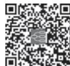  
本章思维导图

## 推荐阅读

［1］GOLDMAN L，SCHAFER A I.Goldman-Cecil Medicine.26th ed.Philadelphia：Elsevier，2019.

［2］JAMESON J L，FAUCI A S，KASPER D L，et al.Harrison’s Principles of Internal Medicine.20th ed.New York：McGraw Hill， 2018.

［3］PAPADAKIS M A，MCPHEE S J，RABOW M W，et al.Current Medical Diagnosis and Treatment 2023.62nd ed.New York：McGraw Hill，2022.

［4］MELMED S，AUCHUS R J，GOLDFINE A B，et al.Williams Textbook of Endocrinology.14th.ed.Philadelphia：Elsevier， 2019.

［5］JOHN P，BILEZIKIAN.Primer on the Metabolic Bone Diseases and Disorders of Mineral Metabolism.9th ed.New Jersey：AJohn Wiley & Sons，Inc.，Publication，2019.

［6］廖二元，袁凌青.内分泌代谢病学.4版.北京：人民卫生出版社，2019.

［7］陈家伦，宁光.临床内分泌学.2版.上海：上海科学技术出版社，2022.

## 第八篇风湿免疫病

本章数字资源

风湿性疾病（rheumatic disease）是一组累及骨与关节及其周围软组织（如肌肉、肌腱、滑膜、滑囊、韧带和软骨等），以及其他相关组织和器官的慢性疾病。风湿性疾病包含 10 大类 100 余种疾病，其病因多种多样，发病机制不甚明了，但多数与自身免疫异常密切相关。风湿性疾病既可是某一局限性区域的病理损伤，也可是全身性疾病，如果不及时诊治，大多数都有致残甚至致死风险，给社会和家庭带来沉重的负担。随着社会发展、卫生水平提高和生活方式改变，风湿性疾病的疾病谱也发生了显著变化，感染相关风湿性疾病已明显减少，而骨关节炎、痛风性关节炎发病率呈上升趋势。随着分子生物学、免疫学、遗传学的研究不断深入，IgG4相关性疾病、自身炎症性疾病等许多新的风湿性疾病不断被认识，再加上生物制剂、小分子靶向药物等多种新药不断涌现，风湿病学的发展显示出了更广阔的前景。

【风湿性疾病范畴和分类】 风湿性疾病病因和发病机制复杂多样，大部分疾病的确切病因尚未明确至令尚无完善分类。目前临床较为常用的分类方法仍是1983年美国风湿病协会（AmericanRheumatism Association，ARA）所制定的分类方法，根据其发病机制、病理和临床特点，将风湿性疾病分为10大类。表8-1-1列举了上述分类方法和常见疾病。

表8-1-1  风湿性疾病范畴和分类

<table><tr><td>疾病分类</td><td>疾病名称</td></tr><tr><td>1.弥漫性结缔组织病</td><td>类风湿关节炎、系统性红斑狼疮、干燥综合征、系统性硬化症、炎症性肌病、系统性血管炎、重叠综合征等</td></tr><tr><td>2.血清阴性脊柱关节病</td><td>强直性脊柱炎、银屑病性关节炎、反应性关节炎、肠病性关节炎、未分化脊柱关节病等</td></tr><tr><td>3.骨关节病</td><td>骨关节炎、关节退行性改变等</td></tr><tr><td>4.遗传、代谢和内分泌疾病相关风湿性疾病</td><td>马方综合征、先天或获得性免疫缺陷病;痛风、焦磷酸钙沉积病;淀粉样变、肢端肥大症、甲减、甲旁亢相关关节病等</td></tr><tr><td>5.与感染相关风湿性疾病</td><td>风湿热、莱姆病、Poncet 综合征等</td></tr><tr><td>6.骨肿瘤</td><td>原发性(滑膜瘤、滑膜肉瘤等);继发性(白血病、多发性骨髓瘤、肿瘤骨转移等)</td></tr><tr><td>7.神经血管疾病</td><td>神经性关节病(Charcot 关节)、压迫性神经病变(周围神经受压、神经根受压等)、反射性交感神经营养不良等</td></tr><tr><td>8.骨与软骨病变</td><td>骨质疏松、骨软化、肥大性骨关节病、弥漫性原发性骨肥厚、骨炎等</td></tr><tr><td>9.关节附属器官相关病变</td><td>关节周围病变(滑囊炎、肌腱病等)、椎间盘病变、特发性下腰痛、其他疼痛综合征(如纤维肌痛综合征)等</td></tr><tr><td>10.其他有关节症状的疾病</td><td>药物相关风湿综合征、慢性活动性肝炎、结节病、维生素C缺乏症、回纹型风湿征等</td></tr></table>

随着疾病研究深入，风湿性疾病分类和诊断标准仍在逐步更新和完善中。近 10 年来系统性红斑狼疮、类风湿关节炎、干燥综合征、系统性硬化症、抗磷脂综合征、脊柱关节炎、系统性血管炎、炎症性肌病等多种风湿性疾病都更新了各自的诊断（分类）标准，部分疾病甚至更新了不止一版，诊断方式也由以前计算条目个数发展为计算不同条目权重评分的总分。新标准的颁布有力推动了风湿性疾病的早期诊治，也促使相关临床研究更加规范、标准。

【病史采集和体格检查】 风湿性疾病涉及多学科、多系统和多脏器，虽然血清自身抗体检查以及各种影像学检查极大地提高了风湿性疾病诊断水平，但认真而详细的病史采集和体格检查，始终是确定诊断和进行鉴别诊断的重要依据。

发病年龄、性别、家族史对诊断具有参考价值，如系统性红斑狼疮（systemic lupus erythematosus，SLE）多见于育龄女性；强直性脊柱炎（ankylosing spondylitis，AS）多见于青年男性，部分有家族史；骨关节炎（osteoarthritis，OA）多见于中老年患者。采集病史时，除了骨、关节和肌肉疼痛这些最常见的症状，还要询问肌肉骨骼系统以外的症状，如脱发、光过敏、雷诺现象、口腔及外阴溃疡、口眼干燥、腮腺肿大以及消化、呼吸、泌尿、神经、血液等系统的相关症状。病程的经过往往体现病理过程，对于有关节疼痛症状的患者，应详细询问其起病形式、受累部位、数目、疼痛性质与程度、功能状况及其演变。如类风湿关节炎（rheumatoid arthritis，RA）多表现为慢性、对称性多外周关节肿痛，后期可出现关节畸形。

体格检查除一般内科系统体格检查外，还应进行皮肤、肌肉、脊柱关节的检查。皮损形态和分布特征对疾病有一定提示 如蝶形红斑提示SLE 眶周紫红色水肿斑，双手关节伸面脱屑性斑丘疹提示皮肌炎（dermatomyositis，DM）。肌肉检查的要点在于有无肌肉萎缩、肌肉压痛及肌力下降。关节检查的要点在于受累关节有无发红、肿胀、压痛以及活动受限。

现将常见累及关节及关节周围附属器官病变的临床特点，和常见弥漫性结缔组织病的特异性临床表现分别列于表8-1-2和表8-1-3。

表8-1-2  常见累及关节及关节周围器官病变的临床特点

<table><tr><td rowspan="2">体格检查</td><td colspan="3">关节病变</td><td colspan="2">关节周围及软组织病变</td></tr><tr><td>骨关节炎</td><td>炎性关节病</td><td>关节痛</td><td>滑囊炎或肌腱炎</td><td>肌肉筋膜病变</td></tr><tr><td>肿</td><td>各异</td><td>是</td><td>无</td><td>是</td><td>无</td></tr><tr><td>红</td><td>无</td><td>各异</td><td>无</td><td>是</td><td>无</td></tr><tr><td>热</td><td>无</td><td>是</td><td>无</td><td>是</td><td>无</td></tr><tr><td>痛</td><td>活动后加重</td><td>是</td><td>各异</td><td>关节周围</td><td>是</td></tr><tr><td>关节活动度</td><td>受限</td><td>受限</td><td>正常或受限</td><td>正常,多因疼痛受限</td><td>正常</td></tr><tr><td>主动/被动运动疼痛</td><td>两者均是</td><td>两者均是</td><td>通常两者均是</td><td>主动&gt;被动</td><td>通常两者均是</td></tr></table>

表8-1-3  常见弥漫性结缔组织病的临床症状及体征

<table><tr><td>疾病名称</td><td>临床表现及体征</td></tr><tr><td>系统性红斑狼疮</td><td>颧部蝶形红斑、环形红斑、盘状红斑,脱发,口腔溃疡、多关节肿痛,颜面、眼睑和下肢水肿,紫癜,精神症状,癫痫,偏瘫,截瘫</td></tr><tr><td>类风湿关节炎</td><td>对称性多关节肿痛,关节变形,晨僵,类风湿结节</td></tr><tr><td>干燥综合征</td><td>口干、眼干、腮腺肿大、猖獗龋、紫癜、夜尿增多、肢体软瘫</td></tr><tr><td>炎症性肌病</td><td>四肢近端肌痛及肌无力、吞咽困难、上眼睑紫红色水肿性红斑、Gottron征、颈部呈V形充血、颈背部及双上臂外侧红斑、技工手、甲周红斑、皮下钙化、干咳、劳力性呼吸困难</td></tr><tr><td>系统性硬化症</td><td>雷诺现象,指端缺血性溃疡,硬指,皮肤肿硬、失去弹性,吞咽困难,反酸,干咳,劳力性呼吸困难,肺底爆裂音,杵状指</td></tr><tr><td>大动脉炎</td><td>发热,盗汗,无脉,颈部、腹部血管杂音,高血压</td></tr><tr><td>ANCA相关血管炎</td><td>鞍鼻、咯血、劳力性呼吸困难、少尿、手足麻木、突眼、可触性紫癜</td></tr><tr><td>贝赫切特病</td><td>口腔溃疡、外阴溃疡、毛囊炎、结节红斑、针刺反应、关节肿痛、葡萄膜炎、视力下降</td></tr></table>

## 【实验室检查】

（一） 常规检查 血、尿、便常规检查以及肝、肾功能的检查是必不可少的，如白细胞数量的变化、溶血性贫血、血小板减低、蛋白尿、镜下血尿都可能与风湿性疾病相关。血沉、C反应蛋白、球蛋白定量、补体的检查对于诊断及病情活动性的判断很有帮助。如RA、血管炎活动伴随炎性指标如血沉增快、C反应蛋白升高；SLE活动时常伴随补体C3、C4下降。

## （二） 特异性检查

1. 自身抗体 患者血清中自身抗体是风湿性疾病的一大特点，即体内产生了针对自身组织、器官、细胞及细胞成分的抗体。自身抗体检测对风湿性疾病的诊断和鉴别诊断有极大帮助。但任何抗体检测灵敏度、特异度有一定范围，且存在一定的假阳性、假阴性率，因此诊断不能单纯根据抗体检查结果，而应该以临床表现为基础。现在应用于风湿病学临床的主要自身抗体有以下5大类。

（1）抗核抗体（anti-nuclear antibody，ANA）：其靶抗原是核酸、组蛋白、非组蛋白及各种蛋白酶等多种物质，除了在细胞核，也在细胞质及细胞器中存在。因此现在对于 ANA 靶抗原的理解，已由传统的细胞核扩大到整个细胞。根据抗原分子的理化特性和分布部位，将 ANA 分成抗 DNA、抗组蛋白、抗非组蛋白、抗核仁抗体及抗其他细胞成分抗体五大类。其中抗非组蛋白抗体中包含一组可被盐水提取的可溶性抗原（extractable nuclear antigen，ENA）的抗体，即抗 ENA 抗体，对于风湿性疾病的鉴别诊断尤为重要，但与疾病的严重程度及活动度无关。ANA 阳性应警惕结缔组织病（connective tissuedisease，CTD）可能，但正常老年人或其他疾病如肿瘤，血清中可能存在低滴度 ANA。不同成分 ANA有其不同临床意义，具有不同的诊断特异度，将在后面各章述及。

（2）类风湿因子（rheumatoid factor，RF）：其靶抗原为变性 IgG 分子的 Fc 片段。变性的 IgG 可在炎症等病理条件下产生，也可以为 IgG 抗体参与免疫应答与相应抗原结合发生变性时产生。因此 RF 阳性不仅可见于 RA、pSS（原发性干燥综合征）、SLE、SSc（系统性硬化症）等多种 CTD，亦见于感染性疾病、肿瘤等其他疾病以及约 5% 正常人群。RF 在 RA 的阳性率为 80% 左右，但特异性较差。

（3）抗中性粒细胞胞质抗体（antineutrophil cytoplasmic antibody，ANCA）：其靶抗原为中性粒细胞胞质的多种成分，其中丝氨酸蛋白酶 3（PR3）和髓过氧化物酶（MPO）与血管炎密切相关。该抗体对血管炎诊断有帮助（详见本篇第六章系统性血管炎）。

（4）抗磷脂抗体（antiphospholipid antibody，APL）：其靶抗原为各种带负电荷的磷脂。目前临床常检测抗心磷脂抗体、抗β 糖蛋白Ⅰ抗体、狼疮抗凝物。这些抗体常见于抗磷脂综合征、SLE等CTD，主要引起凝血系统改变，临床上表现为血栓形成、血小板减少和病理妊娠等。

（5）抗角蛋白抗体谱：其靶抗原为细胞基质中的聚角蛋白微丝蛋白.该组抗体对BA特异度较高，且有助于 RA 的早期诊断。临床常检测抗核周因子（APF）、抗角蛋白（AKA）及环瓜氨酸肽（CCP）。其中 CCP 为根据聚角蛋白微丝蛋白的 cDNA 序列而人工合成的环化肽，抗 CCP 抗体在 RA 诊断中较AKA有更好的灵敏度和特异度。

常用的自身抗体及临床意义见表8-1-4。

2. 人类白细胞抗原（HLA）检测 HLA-B27 与有中轴关节受累的脊柱关节炎密切关联。HLA-B27 在 AS 中阳性率为 90%，亦可见于反应性关节炎、银屑病关节炎等脊柱关节病，在正常人群中也有 10% 的阳性率。此外 HLA-B5 与贝赫切特病（BD），HLA-DR2、DR3 与 SLE，HLA-DR3、B8 与pSS，HLA-DR4 与 RA 也有一定关联。

3. 关节液检查 可通过关节腔穿刺获取关节液，关节液的白细胞计数有助于鉴别炎性、非炎症性和化脓性关节炎。非炎性关节炎白细胞计数往往在 2000×106/L 以下；当白细胞超过 3000×106/L以上，中性粒细胞达 50% 以上，提示炎性关节炎；化脓性关节液不仅外观呈脓性且白细胞数更高。此外在关节液中找到尿酸盐结晶或细菌涂片/培养阳性分别有助于痛风性关节炎和感染性关节炎的诊断。

表8-1-4  抗核抗体谱常见自身抗体及临床意义

<table><tr><td>分类</td><td>抗体</td><td>临床意义</td></tr><tr><td rowspan="2">抗DNA抗体</td><td>抗dsDNA抗体</td><td>抗dsDNA抗体常被作为SLE活动指标,可用于监测SLE病情变化、SLE疾病活动期判断、药物疗效等。</td></tr><tr><td>抗ssDNA抗体</td><td>临床上实用价值不大,一般不用于临床常规检测。</td></tr><tr><td>抗组蛋白抗体</td><td>AHA抗体</td><td>可以在多种CTD中出现,不具有诊断特异性,但AHA检测对CTD尤其是药物性狼疮诊断有重要临床价值。</td></tr><tr><td>抗DNA组蛋白抗体</td><td>抗核小体抗体</td><td>多见于活动性狼疮,特别是狼疮性肾炎,与抗双链DNA抗体和抗Sm抗体等SLE的其他特异性抗体同时检测,可明显提高SLE临床诊断的灵敏度和特异度。</td></tr><tr><td rowspan="8">抗非组蛋白抗体</td><td>抗Sm抗体</td><td>对SLE诊断具有较高特异性,是目前公认的SLE血清标记抗体。</td></tr><tr><td>抗U1RNP抗体</td><td>与雷诺现象相关,对CTD诊断具有重要临床意义。</td></tr><tr><td>抗SSA抗体</td><td>主要见于原发性SS,阳性率达40%~95%,也可见于SLE(20%~60%)、类风湿关节炎、SSc(24%)等。</td></tr><tr><td>抗SSB抗体</td><td>对诊断SS具有高度特异性,是SS的血清较特异的抗体。</td></tr><tr><td>抗核糖体抗体(抗rRNP抗体)</td><td>为SLE特异性自身抗体,阳性率在10%~40%。SLE患者出现抗rRNP抗体与中枢神经系统受累相关。</td></tr><tr><td>抗Scl-70抗体</td><td>为SSc血清标记性抗体,与肺间质病变相关。</td></tr><tr><td>抗Jo-1抗体及抗合成酶抗体</td><td>为炎症性肌病血清标记性抗体,在PM/DM中阳性率为20%~30%,且多数患者伴有间质性肺部疾病和多关节炎/关节痛等。</td></tr><tr><td>抗着丝点抗体(ACA)</td><td>是SSc的局限型CREST综合征的特异性抗体,阳性率可达80%~98%。</td></tr><tr><td>抗核仁抗体</td><td>抗核仁抗体</td><td>约20%~40%的SSc患者抗核仁抗体阳性。</td></tr><tr><td rowspan="2">抗磷脂抗体</td><td>抗心磷脂抗体(ACA)</td><td>中高滴度IgG型和IgM型ACA是诊断APS的重要指标之一。</td></tr><tr><td>抗 $\beta_2$ 糖蛋白I抗体</td><td>中高滴度IgG型和IgM型抗 $\beta_2$ 糖蛋白I抗体是诊断APS的重要指标。</td></tr><tr><td rowspan="2">抗中性粒细胞胞质抗体(ANCA)</td><td>胞质型ANCA(cytoplasmic ANCA,cANCA)靶抗原主要是抗蛋白酶3(proteinase 3,PR3)</td><td>诊断肉芽肿性多血管炎特异度大于90%,且该抗体持续阳性者易复发。</td></tr><tr><td>核周型ANCA(perinuclear ANCA,pANCA)靶抗原主要是髓过氧化物酶(myeloperoxidase,MPO)</td><td>主要与显微镜下多血管炎、嗜酸性肉芽肿性多血管炎相关,特异性稍差。</td></tr><tr><td rowspan="4">类风湿关节炎相关自身抗体</td><td>类风湿因子(rheumatoid factor,RF)</td><td>RF在类风湿关节炎中的阳性率为80%左右,是诊断RA的血清学标准之一,但是5%的正常老年人可阳性,其阳性率随年龄的增高而增加。</td></tr><tr><td>抗环瓜氨酸肽抗体(anti-cyclic citrullinated peptide antibody,anti-CCP)</td><td>是诊断RA的血清学标准之一,亦可更好地预测RA疾病进展和关节影像学改变。抗CCP抗体在早期RA时即可出现。</td></tr><tr><td>抗角蛋白抗体(anti-keratin antibody,AKA)</td><td>RA早期诊断和判断预后的指标之一。</td></tr><tr><td>抗核周因子(anti-perinuclear factor,APF)</td><td>与RA的多关节痛、晨僵及X线骨破坏之间呈明显相关性,可弥补检测RF的不足。</td></tr></table>

注：抗 dsDNA 抗体，抗双链 DNA 抗体；抗 ssDNA 抗体，抗单链 DNA 抗体；SLE，系统性红斑狼疮；CTD，结缔组织病；SS，干燥综合征；SSc，系统性硬化症；PM/DM，多发性肌炎/皮肌炎。

4. 病理 活组织检查所见病理改变对诊断有决定性意义，并有指导治疗的作用。如肾脏活检对于狼疮性肾炎的病理分型、滑膜活检对于关节炎病因的判断、唇腺活检对干燥综合征的诊断，以及肌肉活检对于多发性肌炎/皮肌炎的诊断均有重要意义。

【影像学检查】 影像学是重要的辅助检测手段，一方面有助于各种关节、脊柱受累疾病的诊断、鉴别诊断、疾病分期、药物疗效的判断等；另一方面可用于评估肌肉、骨骼系统以外脏器的受累。X 线是骨和关节检查最常用的影像学技术，有助于诊断、鉴别诊断和随访。可发现软组织肿胀及钙化、骨质疏松、关节间隙狭窄、关节侵蚀脱位、软骨下囊性变等改变。关节 CT 用于检测有多层组织重叠的病变部位，如骶髂关节、股骨头、胸锁关节、椎间盘等，比 X 线敏感性更高；近年来新出现的双能 CT 有助于检查痛风性关节炎患处的痛风结晶。MRI 对骨、软骨及其周围组织（包括肌肉、韧带、肌腱、滑膜）有其特殊的成像表现，因此对软组织和关节软骨损伤、骨髓水肿、缺血性骨坏死、早期微小骨破坏和肌肉炎症等是灵敏可靠的检测手段。此外，近十年来超声在关节的检查中日益发挥重要作用，不仅可以早期发现关节滑膜、软骨的损伤，还能监测病情的变化。

影像学对于其他受累脏器的评估也非常重要，如胸部高分辨率 CT 用于肺间质病变的诊断；头颅 CT、MRI 用于 SLE 的中枢神经受累的评估；血管超声、CT 血管造影（CTA）、磁共振显像血管造影（MRA）、血管造影甚至正电子发射断层成像（PET）检查有助于血管炎的评价等。

【治疗】 风湿性疾病种类繁多，多为慢性疾病，明确诊断后应尽早开始治疗，治疗的目的是维持关节、脏器的功能，缓解相关症状，提高生活质量，改善预后。治疗措施包括一般治疗（宣教、生活方式、物理治疗、锻炼、对症等），药物治疗，手术治疗（矫形、滑膜切除、关节置换等）。抗风湿性疾病药物主要包括非甾体抗炎药（NSAIDs）、糖皮质激素、改变病情的抗风湿药（DMARDs）及生物制剂，现将抗风湿性疾病药物种类和应用原则加以叙述。

1. 非甾体抗炎药（nonsteroidal anti-inflammatory drugs，NSAIDs） 该类药物共同的作用机制是通过抑制环氧化酶（COX），从而抑制花生四烯酸转化为前列腺素，起到抗炎、解热、镇痛的效果。该药应用广泛，起效快，镇痛效果好，但不能控制原发病的病情进展。该类药物对消化道、肾以及心血管系统有一定副作用，临床应用时需要随访，在有消化道及肾脏基础疾病、老年人群中应用时则更要谨慎。选择性COX-2抑制剂可减少胃肠道副作用。

2. 糖皮质激素（glucocorticoid，GC） 该类药物具有强大的抗炎作用和免疫抑制作用，因而被广泛用于治疗风湿性疾病，是治疗多种 CTD 的一线药物。GC 制剂众多，根据半衰期可以分为短效 GC，包括可的松、氢化可的松；中效 GC 包括泼尼松、泼尼松龙、甲泼尼龙、曲安西龙等，长效 GC 包括地塞米松、倍他米松等。其中氢化可的松、泼尼松龙和甲泼尼龙为 11 位羟基化合物，可不经过肝脏转化直接发挥生理效应，因此肝功能不全患者优先选择此类GC。长期大量应用GC不良反应多，包括感染高血压、高糖血症、骨质疏松、撤药反跳、无菌性股骨头坏死、肥胖、精神兴奋、消化性溃疡等。故临床应用时要权衡其疗效和副作用，严格掌握适应证、剂量及疗程，并监测其不良反应。

3. 改善病情的抗风湿药（disease modifying anti-rheumatic drugs，DMARDs） 传统 DMARDs 和靶向 DMARDs，该组药物的共同特点是具有改善病情和延缓病情进展的作用，可以防止和延缓特别是RA 的关节骨结构破坏。其特点是起效慢，通常在治疗 2～4 个月后才显效，病情缓解后宜长期维持。这组药物作用机制各不相同，详见表8-1-5。

4. 生物制剂 通过基因工程制造的单克隆抗体，称为生物制剂，是近三十年来风湿免疫领域最大的进展之一。目前已广泛应用于 RA、脊柱关节炎、SLE、系统性血管炎等的治疗。这类药物是利用抗体的靶向性，通过特异地阻断疾病发病中的某个重要环节而发挥作用。到目前为止，已有数十种生物制剂上市或正处在临床试验阶段。

以肿瘤坏死因子-α（TNF-α）为靶点的生物制剂率先在BA、脊柱关节炎的治疗中获得成功。这类生物制剂可迅速改善病情，阻止关节破坏，改善关节功能。IL-6 受体拮抗剂、共刺激分子 CTLA-4与 IgG1 Fc 片段的融合蛋白（阿巴西普，abatacept）用于治疗 RA；抗 CD20 单克隆抗体（利妥昔单抗，rituximab）已被批准应用于 ANCA 相关血管炎一线治疗，并在治疗难治性 SLE，特别是 SLE 相关肾炎、溶血性贫血、血小板减少等方面获得了不错的疗效。抗 B 细胞刺激因子单抗（贝利尤单抗，belimumab）、泰它西普用于标准治疗疗效不佳的 SLE 患者。同时，补体通路药物、细胞治疗等，在治疗风湿免疫病中也有一定的应用前景。生物制剂发展迅速，已成为抗风湿性疾病药物的重要组成部分。其主要的不良反应是感染，过敏反应等。临床使用时应严格把握适应证注意筛查感染 尤其是乙型肝炎和结核，以免出现严重不良反应。

表 8-1-5  DMARDs 的主要作用机制

<table><tr><td>药名</td><td>作用机制</td></tr><tr><td colspan="2">传统 DMARDs</td></tr><tr><td>柳氮磺吡啶</td><td>本药在肠道分解为5-氨基水杨酸和磺胺吡啶。前者抑制前列腺素并清除吞噬细胞释放的致炎性氧离子。关节炎患者服本药12周后,外周血中活化淋巴细胞减少</td></tr><tr><td>羟氯喹</td><td>通过改变细胞溶酶体的pH,减弱巨噬细胞的抗原提呈功能和IL-1的分泌,也减少淋巴细胞活化</td></tr><tr><td>甲氨蝶呤</td><td>通过抑制二氢叶酸还原酶抑制嘌呤、嘧啶核苷酸的合成,使活化淋巴细胞合成和生长受阻</td></tr><tr><td>来氟米特</td><td>其活性代谢物通过抑制二氢乳清酸脱氢酶,抑制嘧啶核苷酸的合成,使活化淋巴细胞合成、生长受阻</td></tr><tr><td>硫唑嘌呤</td><td>干扰腺嘌呤、鸟嘌呤核苷酸的合成,使活化淋巴细胞合成和生长受阻</td></tr><tr><td>环磷酰胺</td><td>交联DNA和蛋白,使细胞生长受阻</td></tr><tr><td>吗替麦考酚酯</td><td>其活性代谢物通过抑制次黄嘌呤单核苷酸脱氢酶,抑制鸟嘌呤核苷酸,使活化淋巴细胞合成、生长受阻</td></tr><tr><td>环孢素</td><td>通过抑制IL-2的合成和释放,抑制、改变T细胞的生长和反应</td></tr><tr><td>他克莫司</td><td>通过抑制IL-2的合成和释放,抑制、改变T细胞的生长和反应</td></tr><tr><td>雷公藤多苷</td><td>抑制淋巴细胞增殖,减少免疫球蛋白合成</td></tr><tr><td colspan="2">靶向 DMARDs</td></tr><tr><td>托法替布</td><td>JAK激酶抑制剂,阻断JAK/STAT信号转导通路</td></tr><tr><td>巴瑞替尼</td><td>选择性JAK激酶抑制剂,阻断JAK/STAT信号转导通路</td></tr><tr><td>乌帕替尼</td><td>选择性JAK1激酶抑制剂,阻断JAK/STAT信号转导通路</td></tr></table>

5. 辅助性治疗 静脉输注免疫球蛋白、血浆置换、血浆免疫吸附等有一定疗效，作为上述治疗的辅助治疗，可用于一些风湿免疫病患者。

（曾小峰）

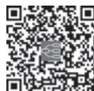  
本章思维导图

本章数字资源

类风湿关节炎（rheumatoid arthritis，RA）是一种以侵蚀性、对称性多关节炎为主要临床表现的慢性、全身性自身免疫病。其确切发病机制不明。基本病理改变为关节滑膜的慢性炎症、血管翳形成，并逐渐出现关节软骨和骨破坏，最终导致关节畸形和功能丧失，是造成人类丧失劳动力和致残的主要原因之一。早期诊断、早期治疗至关重要。本病呈全球性分布，可发生于任何年龄，发病高峰年龄为35～50 岁，女性患病率 2～3 倍于男性。我国 RA 的患病率为 0.42%，但呈现逐年递增趋势，我国 RA的平均发病年龄为47岁。

【病因和发病机制】 病因和发病机制复杂，在遗传、感染、环境等多因素的共同作用下，自身免疫反应导致的免疫损伤和修复是RA发生和发展的基础。

1. 遗传易感性 流行病学调查显示，RA 的发病与遗传因素密切相关，家系调查显示 RA 先证者的一级亲属患RA的概率为11%。大量研究发现HLA-DRB1等位基因突变与RA发病相关。

2. 环境因素 虽然未证实有导致 RA 的直接感染因子，但目前认为一些病原体（如细菌、支原体和病毒等）可能感染并激活的T细胞、B 细胞等淋巴细胞，使其分泌致炎因子，产生自身抗体，影响RA的发病和病情进展；病原微生物的某些成分也可通过分子模拟导致自身免疫反应。吸烟能够显著增加RA发生的风险。

3. 免疫功能紊乱 免疫功能紊乱是 RA 的主要发病机制，活化的 CD4+T 细胞和 MHC Ⅱ类分子复合物阳性的抗原提呈细胞（antigen-presenting cell，APC）浸润关节滑膜。关节滑膜组织的某些特殊成分或体内产生的内源性物质也可能作为自身抗原被 APC 提呈给活化的 CD4+T细胞，启动特异性免疫应答，导致相应的关节炎病变。此外，活化的 B 细胞、巨噬细胞及滑膜成纤维细胞等作为抗原提呈细胞及自身抗体的来源细胞，在RA滑膜炎症性病变的发生及演化中发挥了重要作用。

【病理】 RA 的基本病理改变是滑膜炎。急性期表现为滑膜渗出和细胞浸润。滑膜下层小血管扩张，内皮细胞肿大、细胞间隙增大，间质有水肿和中性粒细胞浸润。病变进入慢性期，滑膜变得肥厚，形成许多绒毛样突起，突向关节腔内或侵入到软骨和软骨下的骨质。绒毛又名血管翳（pannus），有很强的破坏性，是造成关节破坏的病理基础。血管翳在显微镜下呈现为滑膜细胞由原来的 1～3 层增生到 5～10 层或更多，其中大部分为具有巨噬细胞样功能的 A 型细胞及成纤维细胞样的 B 型细胞。滑膜下层有大量淋巴细胞，呈弥漫状分布或聚集成结节状，如同淋巴滤泡。其中大部分为 CD4+T细胞，其次为 B 细胞和浆细胞。还有新生血管和大量被激活的成纤维样细胞以及随后形成的纤维组织。

RA 不仅可以累及关节滑膜，还可以导致关节外的组织和器官损伤，其病理改变为血管炎。RA的血管炎可累及中、小动脉和/或静脉，受累血管内膜有增生、管壁淋巴细胞浸润、纤维素样坏死，导致血管壁增厚、血管腔狭窄或闭塞。类风湿结节是血管炎的一种典型表现，结节中心为纤维素样坏死组织，周围有上皮样细胞浸润，排列成环状，最外层为肉芽组织。

【临床表现】 RA多为慢性起病，以手、腕、足等双侧对称性多关节肿痛为首发表现，常伴有晨僵，可伴有乏力、低热、肌肉酸痛、体重下降等全身症状。少数患者急性起病，在数天内出现典型的关节症状。RA的临床表现具有一定的个体差异性。

（一） 关节表现

1. 晨僵（morning stiffness） 是指关节部位的僵硬和胶着感。晨起明显，活动后减轻。通常持续超过半小时，常被作为判断疾病活动的指标之一，但主观性很强。可见于多种关节炎，但以 RA 最突出。

2. 关节肿胀 多因滑膜增生、关节腔积液和关节周围软组织水肿所致，亦多呈对称性，多伴有关节疼痛。最常出现的部位为腕、掌指、近端指间关节，其次是足趾、膝、踝、肘、肩等关节。

3. 关节痛与压痛 往往是 RA 最早的症状，关节疼痛和压痛部位通常与关节肿胀部位相一致，多为对称性、持续性。疼痛的关节往往伴有压痛。

4. 关节畸形 见于较晚期患者。关节周围肌肉的萎缩、痉挛使畸形更为加重。最为常见的关节畸形是掌指关节的半脱位、手指向尺侧偏斜和呈“天鹅颈（swan neck）”样及“纽扣花（boutonniere）”样畸形，腕和肘关节强直亦较常见。

## 5. 特殊关节

（1）肩、髋关节：由于其周围有较多肌腱等软组织包围，因此很难发现关节肿胀。最常见的症状是局部疼痛和活动受限，髋关节往往表现为臀部及下腰部疼痛。

（2）颞下颌关节：表现为讲话或咀嚼时疼痛加重，严重者有张口受限。

（3）颈椎关节：一些患者会出现颈椎关节受累，特别是病情长期控制不佳者。表现为颈痛、活动受限，最严重的表现为寰枢关节 $\left( \mathbf { C } _ { 1 } { \sim } \mathbf { C } _ { 2 } \right)$ 半脱位，可导致脊髓受压。

6. 关节功能障碍 关节肿痛和结构破坏都会引起关节活动障碍。美国风湿病学会（ACR）将因本病影响生活的程度分为 4 级：Ⅰ级，能照常进行日常生活和各项工作；Ⅱ级，可进行一般的日常生活和某种职业工作，但参与其他活动受限；Ⅲ级，可进行一般的日常生活，但参与某种职业工作或其他活动受限；Ⅳ级，日常生活的自理和参与工作的能力均受限。

## （二） 关节外表现

1. 皮肤类风湿结节 是 RA 最常见的关节外表现，可见于 30%～40% 的患者，多发生在病情活动的患者，男性多见，多有长期大量吸烟史。类风湿结节可发生于任何部位，但多位于关节隆突部及受压部位，如前臂伸面、尺骨鹰嘴下方、跟腱、滑囊等处。结节大小不一，直径数毫米至数厘米不等，质硬、无压痛，呈对称性分布。此外，一些脏器如心、肺、胸膜、眼等亦可累及。其存在提示RA病情活动。

2. 皮肤血管炎 通常见于长病程、血清 RF 阳性且病情活动的 RA 患者，整体发生率不足 10%。其表现各异，包括瘀点、紫癜、指/趾坏疽、梗死、网状青斑等，病情严重者可出现皮肤的深大溃疡。须积极应用免疫抑制剂治疗。

3. 心脏受累 心包炎最常见，多见于 RF 阳性、有类风湿结节的患者。但不足 10% 的患者会出现临床症状，近半数患者可通过超声心动图检查发现。

4. 肺 肺受累很常见，其中男性多于女性，有时可为首发症状。

（1）肺间质病变：是最常见的肺病变，见于约 30% 的患者，主要表现为活动后气短，肺纤维化。肺功能和肺影像学如肺部高分辨率CT检查有助于早期诊断。

（2）胸膜炎：见于约 10% 的患者。为单侧或双侧少量胸腔积液，偶为大量胸腔积液。胸腔积液呈渗出性。

（3）结节样改变：肺内出现单个或多个结节，为肺内的类风湿结节表现。结节有时可液化，形成空洞。尘肺患者合并RA时易出现大量肺结节，称为Caplan 综合征，也称类风湿性尘肺病。临床和胸部X 线表现类似肺内的类风湿结节，数量多，较大。

5. 眼 最常见的表现为继发干燥综合征所致的干眼症，可能合并口干、淋巴结肿大，须结合自身抗体，经口腔科及眼科检查进一步明确诊断。还有一些患者会出现巩膜炎，严重者可出现巩膜溃疡、穿孔，造成视力损害，是严重的关节外表现，其病理改变为巩膜血管炎，常为疾病活动的表现之一。

6 神经系统 神经受压是BA患者出现神经系统病变的常见原因。如正中神经在腕关节处受压可出现腕管综合征。RA继发血管炎可以导致手足麻木或多发性单神经炎 均提示病情活动需要积极治疗。 $\mathrm { C } _ { 1 } { \sim } \mathrm { C } _ { 2 }$ 颈椎受累可出现脊髓病变。

7. 血液系统 贫血是最常见的血液系统表现，贫血程度与关节的炎症程度相关，在关节炎症得以控制后，贫血也可改善。病情活动的 RA 患者常见血小板增多，与疾病活动度相关，病情缓解后可下降。Felty 综合征是指RA患者伴有脾大、中性粒细胞减少，有的患者会伴有贫血和血小板减少。出现 Felty 综合征时关节炎并非都处于活动期，但关节外表现非常突出，很多患者合并有下肢溃疡、类风湿结节、发热、乏力、食欲减退和体重下降等疾病活动的全身表现。

8. 肾 RA 很少出现肾脏病变，偶有轻微膜性肾病、肾小球肾炎、肾内小血管炎以及肾的淀粉样变等。当患者出现肾损害时须警惕是否长期服用NSAIDs等药物。

## 【实验室和其他辅助检查】

（一） 血液学改变 轻至中度贫血，以正细胞正色素性常见，多与病情活动程度相关。活动期患者血小板计数可增高，白细胞计数及分类多正常。免疫球蛋白升高，血清补体大多正常或者轻度升高。

（二） 炎症标志物 血沉（ESR）和 C 反应蛋白（CRP）常升高，是反映病情活动度的主要指标，病情缓解时可降至正常。

## （三） 自身抗体

1. 类风湿因子（RF） 是 RA 患者血清中针对 IgG Fc 片段上抗原表位的一类自身抗体，可分为IgM、IgG 和 IgA 型。常规检测的为 IgM 型 RF，在 RA 患者中阳性率为 75%～80%。但 RF 并非 RA 的特异性抗体，一些慢性感染、其他自身免疫病及 1%～5% 的健康人也可出现 RF 阳性。RF 阴性亦不能排除RA的诊断。

2. 抗瓜氨酸化蛋白抗体（ACPA） 是一类针对含有瓜氨酸化表位自身抗原的抗体的统称，包括抗环瓜氨酸肽（CCP）抗体、抗突变型瓜氨酸化波形蛋白（MCV）抗体、抗核周因子（APF）抗体、抗角蛋白抗体（AKA）和抗聚丝蛋白抗体（AFA）。其中抗 CCP 抗体的灵敏度和特异度均很高，约 75% 的RA 患者可以检测到，且具有很高的特异度（93%～98%），亦可在疾病早期出现，与疾病预后相关。约15%的RA患者RF和ACPA均为阴性，称为血清学阴性RA。

（四） 关节滑液 正常人关节腔内的滑液不超过 3～5ml。关节有炎症时，滑液会增多。RA 患者的滑液呈淡黄色、透明、黏稠状，滑液中的白细胞明显增多，达 5 000～50000×106/L，约 2/3 为多核白细胞。关节滑液检查可用于证实关节炎症，同时可与感染和晶体性关节炎鉴别，如痛风、假性痛风等，但不能通过关节滑液检查确诊RA。

## （五） 影像学检查

1. X 线 双手、腕关节以及其他受累关节的 X 线检查对 RA 诊断、关节病变分期、病变演变的监测均很重要。早期可见关节周围软组织肿胀、关节附近骨质疏松（Ⅰ期）；进而关节间隙变窄（Ⅱ期）；关节面出现虫蚀样改变（Ⅲ期）；晚期可见关节半脱位和纤维性及骨性强直（Ⅳ期）。

2. MRI 对早期诊断极有意义。可以显示关节软组织病变和/或滑膜炎症、水肿与增生、关节积液，以及骨髓水肿等，较X线更敏感。

3. 超声 高频超声能清晰显示关节腔、滑膜、滑囊、关节腔积液、关节软骨厚度等，不仅能够反映滑膜增生情况，亦可通过血流信号反映滑膜的炎症活动程度，还可指导关节穿刺及治疗。

（六） 关节镜及针刺活检 关节镜对 RA 的诊断及治疗均有一定价值，针刺活检是一种操作简单、创伤小的检查方法。

## 【诊断与鉴别诊断】

（一） 诊断 RA 的临床诊断主要基于慢性关节炎的症状和体征、实验室及影像学检查。目前 RA没有诊断标准，但可采用分类标准结合患者的临床表现来进行诊断。目前普遍采用 2010 年美国风湿病学会（ACR）和欧洲抗风湿病联盟（EULAR）联合提出的RA 分类标准和评分系统，见表8-2-1.该标准包括关节受累情况、血清学指标、滑膜炎持续时间和急性时相反应物 4 部分，总得分 6 分及以上可被分类为RA。

表 8-2-1  2010 年 ACR/EULAR 制定的 RA 分类标准

<table><tr><td colspan="2">项目</td><td>评分</td></tr><tr><td>关节受累情况</td><td></td><td>(0~5分)</td></tr><tr><td rowspan="2">中大关节</td><td>1个</td><td>0</td></tr><tr><td>2~10个</td><td>1</td></tr><tr><td rowspan="2">小关节</td><td>1~3个</td><td>2</td></tr><tr><td>4~10个</td><td>3</td></tr><tr><td>至少一个为小关节</td><td>&gt;10个</td><td>5</td></tr><tr><td>血清学</td><td></td><td>(0~3分)</td></tr><tr><td>RF和抗CCP抗体均阴性</td><td></td><td>0</td></tr><tr><td>RF或抗CCP抗体低滴度阳性</td><td></td><td>2</td></tr><tr><td>RF或抗CCP抗体高滴度阳性(正常上限3倍)</td><td></td><td>3</td></tr><tr><td>滑膜炎持续时间</td><td></td><td>(0~1分)</td></tr><tr><td>&lt;6周</td><td></td><td>0</td></tr><tr><td>≥6周</td><td></td><td>1</td></tr><tr><td>急性期反应物</td><td></td><td>(0~1分)</td></tr><tr><td>CRP和ESR均正常</td><td></td><td>0</td></tr><tr><td>CRP或ESR异常</td><td></td><td>1</td></tr></table>

注：受累关节指关节肿胀、疼痛，小关节包括：掌指关节、近端指间关节、第 2～5 跖趾关节、腕关节，不包括拇指腕掌关节、第1跖趾关节和远端指间关节；大关节指肩、肘、髋、膝和踝关节。

## （二） 鉴别诊断 RA须与以下疾病进行鉴别。

1. 骨关节炎 中老年人多发，主要累及膝、踝和脊柱等负重关节，多为非对称性。可有受累关节肿胀和积液。活动时关节疼痛加重，休息后减轻。手骨关节炎常多影响远端指间关节，尤其在远端指间关节出现赫伯登（Heberden）结节和近端指间关节出现布夏尔（Bouchard）结节时有助于诊断。膝关节病变有摩擦感，一般RF、ACPA均阴性。X线示关节边缘呈唇样增生或骨疣形成，关节无破坏，可出现关节间隙狭窄。

2. 强直性脊柱炎 青年男性多见，主要侵犯骶髂关节及脊柱关节。当周围关节受累，特别是以膝、踝、髋关节病变为首发症状者，须与 RA 鉴别。强直性脊柱炎多见于青壮年男性，外周关节受累以非对称性下肢大关节炎为主，极少累及手关节，X 线检查可见骶髂关节骨质破坏、关节融合等。可有家族史，90% 以上患者 HLA-B27 阳性，RF 阴性。

3. 银屑病关节炎 多于银屑病若干年后发生，绝大多数患者关节受累为非对称的，少数患者可出现对称性多关节受累，与 RA 相似。但本病以远端指间关节受累更常见，表现为该关节的附着点炎和手指炎。同时可有骶髂关节炎和脊柱炎，血清RF多阴性。

4. 系统性红斑狼疮 部分患者以指关节肿痛为首发症状，也可有 RF 阳性、ESR 和 CRP 增高，易被误诊为 RA。但本病的关节病变一般为非侵蚀性，且关节外症状如蝶形红斑、脱发、皮疹、蛋白尿等较突出，抗核抗体、抗双链DNA抗体等阳性。

5. 其他关节炎 关节炎类疾病有多种，均各自有其原发病的特点，在充分了解相关的疾病后鉴别一般不难。

（三） 病情判断 判断 RA 的疾病活动性对于治疗方案的选择至关重要，也是衡量治疗是否达标的标准。目前均采用综合指标对 RA 的疾病活动度进行判断，包括晨僵持续时间、关节疼痛和肿胀的数目、炎性指标（如 ESR、CRP 等）、医生和患者对病情严重度和活动度的评估等。临床上常采用对 28个关节进行评估的 DAS28 等标准来评判病情的活动度。此外，还应对影响其预后的因素，包括病程、躯体功能障碍（如HAQ评分）、关节外表现、自身抗体是否阳性，以及早期出现X线提示的骨破坏等进行评估。

【治疗】 目前 RA 不能根治。应按照早期、达标、个体化的治疗原则选择治疗方案，并密切监测病情变化，及时调整治疗，治疗的最终目的是减少致残。治疗的主要目标是达到临床缓解或低疾病活动度。临床缓解的定义是没有明显的炎症活动症状和体征。最佳的治疗方案需要临床医生与患者共同制订。

RA的治疗措施包括：一般治疗、药物治疗、外科治疗等，其中以药物治疗最为重要。

（一） 一般治疗 包括患者教育、休息、关节制动（急性期）、关节功能锻炼（恢复期）和物理疗法等。卧床休息只适宜于急性期、发热以及内脏受累的患者。

（二） 药物治疗 治疗 RA 的常用药物分为六类，即非甾体抗炎药（NSAIDs）、传统 DMARDs、生物 DMARDs、靶向 DMARDs、糖皮质激素（glucocorticoid，GC）及植物药等。初始治疗必须应用一种DMARDs。

1. 非甾体抗炎药（NSAIDs） 具有镇痛抗炎作用，是缓解关节炎症状的常用药，但在控制病情方面作用有限，应与 DMARDs 同服。NSAIDs 可增加心血管事件的发生，因而应谨慎选择药物并以个体化为原则，避免2 种或2种以上NSAIDs同时服用。

2. 传统 DMARDs 包括甲氨蝶呤、来氟米特、柳氮磺吡啶、羟氯喹等，该类药物发挥作用慢，需1～3 个月，不具备明显的镇痛和抗炎作用，但可延缓和控制病情进展。RA 一经确诊，应尽早开始使用传统DMARDs，药物的选择和应用方案要根据患者病情活动性、严重性和进展情况而定，可单用，也可 2 种及以上 DMARDs 药物联合使用。推荐首选甲氨蝶呤治疗。各个 DMARDs 有其不同的作用机制及不良反应，在应用时需谨慎监测。

3. 生物 DMARDs 是近 30 年来 RA 治疗的一个革命性进展，其治疗靶点主要针对在 RA 发病中起重要作用的细胞因子和细胞表面分子。TNF-α抑制剂是首类获批治疗 RA 的生物制剂，其他生物制剂包括IL-1拮抗剂、IL-6拮抗剂、CD20单克隆抗体、细胞毒性 T淋巴细胞相关抗原4（cytotoxic Tlymphocyteantigen-4，CTLA-4）融合蛋白等。目前使用最普遍的是 TNF-α抑制剂、IL-6 拮抗剂。如最初的传统 DMARDs 治疗未能达标，或存在预后不良因素时，应考虑加用生物制剂。为增加疗效和减少不良反应，生物制剂宜与 MTX 联合应用。由于 TNF-α抑制剂有增加一些特殊感染（如结核、肝炎病毒感染）复燃的风险，因此在使用前应进行结核和肝炎病毒感染的筛查。生物制剂主要的副作用包括注射部位反应和输液反应，可能增加感染（如呼吸道感染、带状疱疹病毒感染）的发生风险；有些生物制剂长期使用可能增加发生肿瘤的风险，用药前应除外肿瘤。

4. 靶向 DMARDs 是一类通过选择性抑制 JAK 激酶，来抑制在 RA 发病中起重要作用的致炎性细胞通路的化学合成的靶向治疗药物，具有起效快、临床疗效肯定的特点，已经成为治疗BA的重要药物。目前临床上使用的 JAK 抑制剂包括托法替布、巴瑞替尼、乌帕替尼等。对传统 DMARDs 反应不足的 RA 患者，可以联合 JAK 抑制剂进行治疗。主要的不良反应包括白细胞减少、肝功能损害、感染风险增加（包括病毒性肝炎、结核以及疱疹病毒感染等）。JAK 抑制剂还可能增加心血管事件及血栓事件风险，具有心血管高危因素的患者须谨慎。

5. 糖皮质激素（GC） 有强大的抗炎作用，能迅速缓解关节肿痛症状和全身炎症，因此可作为治疗 RA 的“桥梁治疗（bridge therapy）”药物，即在传统 DMARDs 起效前快速控制活动性疾病，待传统 DMARDs 起效后减停，因此，GC 治疗 RA 的原则是小剂量、短疗程。使用 GC 必须同时应用DMARDs。有关节外表现，如伴有心、肺、眼和神经系统等器官受累，特别是继发血管炎的 RA 患者，应予以中到大量GC治疗。关节腔注射GC可用于控制单个关节炎症，但过频的关节腔穿刺可能增加感染风险，并可发生类固醇晶体性关节炎，一般 1 年内不宜超过 3 次。使用 GC 者均应注意补充钙剂和维生素D，避免骨质疏松。

6. 传统中药及其有效成分 已有多种治疗RA的植物制剂，如雷公藤多苷、白芍总苷、青藤碱等，最常用者为雷公藤多苷，对缓解关节症状有较好作用，长期控制病情的作用尚待进一步研究证实。在使用雷公藤多苷期间，应注意其性腺抑制、胃肠道不适、肝损伤和骨髓抑制等副作用。

（三） 外科治疗 包括人工关节置换和滑膜切除手术，前者适用于较晚期畸形且失去功能的关节，滑膜切除术可使病情得到一定的缓解，但当滑膜再次增生时病情又趋复发，所以必须同时应用DMARDs。

【预后】 RA 患者的预后与病程长短、病情严重程度及治疗是否达标有关。近年来，随着人们对RA 的认识加深、传统 DMARDs 的正确应用以及生物 DMARDs、靶向 DMARDs 的不断涌现，RA 的预后明显改善，经早期诊断、规范化治疗，80%以上RA患者能实现病情缓解。

（田新平）

  
本章思维导图

系统性红斑狼疮（systemic lupus erythematosus，SLE）是一种以致病性自身抗体和免疫复合物形成并介导器官、组织损伤的自身免疫病，临床上常存在多系统受累表现，血清中存在以抗核抗体为代表的多种自身抗体。SLE的患病率因人群而异，全球平均患病率为（12～39）/10万，北欧大约为40/10万，黑种人患病率约为100/10 万。我国患病率为（30.13～70.41）/10 万，以女性多见，尤其是20～40岁的育龄女性。在全世界的种族中，黄种人 SLE 发病率位居第二。通过早期诊断及综合性治疗，本病的预后已较前明显改善。

## 【病因】

## （一） 遗传

1. 流行病学及家系调查 有资料表明SLE患者第1代亲属中患SLE者8倍于无SLE者家庭，单卵双胞胎患SLE者5～10倍于异卵双胞胎。临床上SLE患者的家族中也常有患其他结缔组织病的亲属。

2. 易感基因 多年研究已证明 SLE 是多基因相关疾病。有 HLA Ⅲ类的 C2 或 C4 缺失，HLA Ⅱ类的DR2、DR3频率异常。推测多个基因在某种条件（环境）下相互作用改变了正常免疫耐受而致病。SLE 的发病是很多易感基因异常的叠加效应。然而，现已发现的 SLE 相关基因也只能解释大约 15%的遗传可能性。

## （二） 环境因素

1. 紫外线 紫外线使皮肤上皮细胞出现凋亡，新抗原暴露而成为自身抗原。

2. 药物、化学试剂 一些药物可以使得DNA甲基化程度降低，从而诱发药物相关狼疮。

3. 病毒 如巨细胞病毒、新冠病毒也可诱发疾病。

（三） 雌激素 女性患病明显高于男性，在围绝经期前阶段为9∶1，儿童及老人为3∶1。

【发病机制及免疫异常】 SLE 的发病机制非常复杂，尚未完全阐明。目前认为主要是外来抗原（如病原体、药物等）引起人体 B 细胞活化。易感者因免疫耐受减弱，B 细胞通过交叉反应与模拟自身组织组成成分的外来抗原相结合，并将抗原呈递给 T细胞，使之活化，在 T 细胞活化刺激下，B 细胞得以产生大量不同类型的自身抗体，造成大量组织损伤。

1. 致病性自身抗体 这类自身抗体的特性为：①以 IgG 型为主，与自身抗原有很高的亲和力，如抗 DNA 抗体可与肾组织直接结合导致肾小球损伤；②抗血小板抗体及抗红细胞抗体导致血小板和红细胞破坏，临床出现血小板减少和溶血性贫血；③抗 SSA 抗体经胎盘进入胎儿心脏，引起新生儿心脏传导阻滞；④抗磷脂抗体引起抗磷脂综合征（血栓形成、血小板减少、习惯性自发性流产）；⑤抗核糖体抗体与神经精神狼疮相关。

2. 致病性免疫复合物 SLE 是一个免疫复合物病。免疫复合物（immune complex，IC）由自身抗体和相应自身抗原相结合而成，IC 能够沉积在组织造成组织损伤。本病 IC 增高的原因有：①机体清除IC的机制异常；②IC形成过多（抗体量多）；③因IC的大小不当而不能被吞噬或排出。

3. T 细胞和 NK 细胞功能失调 SLE 患者的 CD8+T 细胞和 NK 细胞功能失调，不能产生抑制CD4+T 细胞的作用，因此在 CD4+T 细胞的刺激下，B 细胞持续活化而产生自身抗体。T 细胞的功能异常导致新抗原不断出现，使自身免疫持续存在。

【病理】 主要病理改变为炎症反应和血管异常，它可以出现在身体任何器官。中小血管因 IC 沉积或抗体直接侵袭而出现管壁的炎症和坏死，继发的血栓使管腔变窄，导致局部组织缺血和功能障碍。受损器官的特征性改变是：①苏木紫小体（细胞核受抗体作用变性为嗜酸性团块）；②“洋葱皮样病变”，即小动脉周围向心性纤维增生显著，明显表现于脾中央动脉，以及心瓣膜的结缔组织反复发生纤维素样变性而形成赘生物。此外，心包、心肌、肺、神经系统等亦可出现上述基本病理变化。SLE 肾脏受累的病理表现详见第五篇第三章第一节狼疮性肾炎。

【临床表现】 临床症状多样，早期症状往往不典型。

1. 全身表现 大多数疾病活动期患者出现各种热型的发热，尤以低、中度热为常见。可有疲倦、乏力、食欲缺乏、肌痛、体重下降等。

2. 皮肤与黏膜表现 80% 的患者在病程中会出现皮疹，包括颧部呈蝶形分布的红斑、盘状红斑、指掌部和甲周红斑、指端缺血、面部及躯干皮疹，其中以鼻梁和双颧颊部呈蝶形分布的红斑最具特征性。SLE 皮疹多无明显瘙痒。口腔及鼻黏膜无痛性溃疡和脱发（弥漫性或斑秃）较常见，常提示疾病活动。

3. 浆膜炎 半数以上患者在急性发作期出现多发性浆膜炎，包括双侧中小量胸腔积液，中小量心包积液。狼疮性肾炎合并肾病综合征引起的低蛋白血症，或 SLE 合并心肌病变或重度肺动脉高压时，都可出现胸腔和心包积液，但并非是狼疮浆膜炎，临床评估狼疮活动性时需要仔细甄别。

4. 肌肉关节表现 关节痛是常见的症状之一，出现在指、腕、膝关节，伴红肿者少见。常出现对称性多关节肿痛。10% 的患者因关节周围肌腱受损而出现 Jaccoud 关节病，其特点为可复的非侵蚀性关节半脱位，可以维持正常关节功能，关节 X 线片多无关节骨破坏。可以出现肌痛和肌无力，5%～10%出现肌炎。有小部分患者在病程中出现股骨头坏死，目前尚不能肯定其是由本病所致，还是糖皮质激素的不良反应之一。

5. 肾脏表现 27.9%～70% 的 SLE 病程中会出现临床肾脏受累。中国 SLE 患者以肾脏受累为首发表现的仅为 25.8%。肾脏受累主要表现为蛋白尿、血尿、管型尿、水肿、高血压，乃至肾衰竭。有平滑肌受累者可出现输尿管扩张和肾积水（详见第五篇第三章第一节狼疮性肾炎）。

6. 心血管表现 患者常出现心包炎，可为纤维蛋白性心包炎或渗出性心包炎，但心脏压塞少见。可出现疣状心内膜炎（Libman-Sacks 心内膜炎），病理表现为瓣膜赘生物，与感染性心内膜炎不同，其常见于二尖瓣后叶的心室侧，且并不引起心脏杂音性质的改变。通常疣状心内膜炎不引起临床症状，但可以脱落引起栓塞，或并发感染性心内膜炎。约 10% 患者有心肌损害，可有气促、心前区不适、心律失常，严重者可发生心力衰竭导致死亡。可以有冠状动脉受累，表现为心绞痛和心电图 ST-T 改变，甚至出现急性心肌梗死。除冠状动脉炎可能参与了发病，抗磷脂抗体导致动脉血栓形成，长期使用糖皮质激素加速了动脉粥样硬化也参与其中。

7. 肺部表现 SLE 所引起的肺间质性病变主要是急性、亚急性的磨玻璃样改变和慢性期的纤维化，表现为活动后气促、干咳、低氧血症，肺功能检查常显示弥散功能下降。约 2% 的患者合并弥漫性肺泡出血（DAH），病情凶险，病死率高达 50% 以上。肺泡灌洗液或肺活检标本的肺泡腔中发现大量充满含铁血黄素的巨噬细胞，或者肺泡灌洗液呈血性，对于 DAH 的诊断具有重要意义。肺动脉高压在 SLE 患者中并不少见，是 SLE 预后不良的因素之一。其发病机制包括肺血管炎、肺小血管舒缩功能异常、肺血栓栓塞和广泛肺间质病变。主要表现为进行性加重的干咳和活动后气短，超声心动图和右心漂浮导管可帮助确定诊断。

8. 神经系统表现 神经精神狼疮（neuropsychiatric systemic lupus erythematosus，NPLE）又称狼疮脑病。中枢神经系统和周围神经系统均可累及。中枢神经系统病变包括癫痫、狼疮性头痛、脑血管病变、无菌性脑膜炎、脱髓鞘综合征、运动障碍、脊髓病、急性意识错乱、焦虑状态、认知功能减退、情绪障碍及精神病等。周围神经系统受累可表现为吉兰-巴雷综合征、自主神经病、单神经病、重症肌无力、脑神经病变、神经丛病及多发性神经病等。引起 NPLE 的病理基础为脑局部血管炎的微血栓、来自Libman-Sacks 心瓣膜赘生物脱落的小栓子，或针对神经细胞的自身抗体，或并存抗磷脂综合征。腰穿脑脊液检查以及磁共振等影像学检查对NPLE诊断有帮助。

9. 消化系统表现 可表现为食欲减退、腹痛、呕吐、腹泻等，其中部分患者以上述症状为首发。早期出现肝损伤与预后不良相关。少数患者可并发急腹症，如胰腺炎、肠坏死、肠梗阻，这些往往与SLE 活动性相关。消化系统症状与肠壁和肠系膜血管炎有关。此外，SLE 还可出现失蛋白肠病和肝脏病变，早期使用糖皮质激素后这些表现通常都会很快得到改善。

10. 血液系统表现 活动性 SLE 中血红蛋白下降、白细胞和/或血小板减少常见。其中 10% 属于 Coombs 试验阳性的溶血性贫血；血小板减少与血清中存在抗血小板抗体、抗磷脂抗体以及骨髓巨核细胞成熟障碍有关。部分患者可有无痛性轻或中度淋巴结肿大。少数患者有脾大。

11. 抗磷脂综合征（antiphospholipid syndrome，APS） 近 1/3 SLE 患者合并抗磷脂抗体阳性，少部分患者可诊断 APS。其临床表现为动脉和/或静脉血栓形成、病理妊娠、血小板减少等，患者出现持续抗磷脂抗体阳性。SLE 患者血清可以出现抗磷脂抗体，但临床表现不一定符合 APS 诊断。（详见本篇第十二章抗磷脂综合征）

12. 干燥综合征 有约30%的SLE患者有继发性干燥综合征并存，有唾液腺和泪腺功能不全（详见本篇第四章干燥综合征）。

13. 眼部表现 约 15% 患者有眼底病变，如视网膜出血、视网膜渗出、视盘水肿等。其原因是视网膜血管炎。另外，血管炎可累及视神经，两者均影响视力，重者可数日内致盲。早期治疗，多数可逆转。

## 【实验室和其他辅助检查】

（一） 一般检查 不同系统受累可出现相应的血、尿常规、肝肾功能、影像学检查等异常。有狼疮脑病者常有脑脊液压力及蛋白含量的升高，但细胞数、氯化物和葡萄糖水平多正常。

（二） 自身抗体 患者血清中可以查到多种自身抗体，可以是 SLE 诊断的标记抗体、疾病活动性的指标还可能提示可能出现的临床亚型，常见的自身抗体依次为抗核抗休谱抗磷脂抗体和抗组织细胞抗体。

1. 抗核抗体谱 出现在 SLE 的有抗核抗体（ANA）、抗双链 DNA（dsDNA）抗体、抗可提取核抗原（ENA）抗体。

（1）ANA：见于几乎所有的 SLE 患者，由于特异度低，因此单纯的 ANA 阳性不能作为 SLE 与其他结缔组织病的鉴别指标。

（2）抗dsDNA抗体：是诊断SLE的特异性抗体，为SLE诊断的标记抗体；多出现在SLE的活动期，抗 dsDNA 抗体的滴度与疾病活动性密切相关，稳定期的患者如抗 dsDNA 滴度增高，提示复发风险较高，需要更加严密的监测。

（3）抗 ENA 抗体谱：是一组临床意义不相同的抗体。①抗 Sm 抗体：是诊断 SLE 的标记抗体。特异度 99%，但灵敏度仅25%，有助于早期和不典型患者的诊断或回顾性诊断。②抗RNP抗体：阳性率 40%，对 SLE 诊断特异性不高，往往与 SLE 的雷诺现象和肺动脉高压相关。③抗 SSA（Ro）抗体：与 SLE 中出现光过敏、血管炎、皮损、白细胞减低、平滑肌受累、新生儿狼疮等相关。④抗 SSB（La）抗体：与抗SSA抗体相关联，与继发干燥综合征有关，但阳性率低于抗SSA（Ro）抗体。⑤抗rRNP抗体：往往提示有NPLE 或其他重要内脏损害。

2. 抗磷脂抗体 包括抗心磷脂抗体、狼疮抗凝物、抗 $\beta _ { 2 }$ 糖蛋白Ⅰ（βGPⅠ）抗体等针对自身不同磷脂成分的自身抗体。结合其特异的临床表现可诊断是否合并有APS。

3. 抗组织细胞抗体 抗红细胞抗体，现以 Coombs 试验测得。抗血小板相关抗体导致血小板减少，抗神经元抗体多见于NPLE。

4. 其他 部分患者血清可出现 RF，少数患者可以出现抗中性粒细胞胞质抗体。

（三） 补体 目前常用的有总补体（CH50）、C3 和 C4 的检测。补体低下，尤其是 C3 低下常提示有 SLE活动。C4低下除表示SLE活动性外，尚可能是SLE易感性（C4缺乏）的表现。

（四） 病情活动度指标 除上述抗 dsDNA 抗体、补体与 SLE 病情活动度相关外，仍有许多指标变化提示狼疮活动。包括脑脊液（CSF）变化、蛋白尿增多和炎症指标升高。后者包括红细胞沉降率（ESR）增快、血清C反应蛋白（CRP）升高等。

（五） 肾活检病理 对狼疮性肾炎的诊断、治疗和预后估计均有价值，尤其对指导狼疮性肾炎治疗有重要意义（详见第五篇第三章第一节狼疮性肾炎）。

（六） X 线及影像学检查 有助于早期发现器官损害。如神经系统磁共振、CT 有助于发现和治疗脑部的梗死性或出血性病灶；胸部高分辨率 CT 有助于发现早期的肺间质性病变。超声心动图对心包积液、心肌、心瓣膜病变、肺动脉高压等的检出有较高的敏感性而有利于早期诊断。

【诊断与鉴别诊断】 目前推荐使用 2012 年系统性红斑狼疮国际协作组（SLICC）或 2019 年欧洲抗风湿病联盟（EULAR）/ 美国风湿病学会（ACR）制定的 SLE 分类标准对疑似 SLE 者进行诊断（表8-3-1）。在 2012 年分类标准中 11 项临床指标和 6 项免疫学指标中，满足 4 条标准，其中包括至少 1条临床标准和至少 1 条免疫学标准，或者肾活检证实为狼疮性肾炎且 ANA 阳性或抗 dsDNA 阳性，即可诊断 SLE。2012 年分类标准灵敏度和特异度分别为 97% 和 84%。需要指出的是，关于 SLE 分类标准的主要是为满足开展 SLE 研究的需要，保证纳入研究患者的均一性。临床上借用此标准虽有助于确诊典型患者，但有部分SLE患者并不满足该标准。

表8-3-1  2012 年系统性红斑狼疮国际协作组（SLICC）推荐的SLE分类标准

<table><tr><td>临床标准</td></tr><tr><td>1.急性或亚急性皮肤狼疮</td></tr><tr><td>2.慢性皮肤狼疮</td></tr><tr><td>3.口腔或鼻咽部溃疡</td></tr><tr><td>4.非瘢痕形成引起的脱发</td></tr><tr><td>5.炎性滑膜炎:医师观察到的两个或以上肿胀关节或者伴有晨僵的压痛关节</td></tr><tr><td>6.浆膜炎</td></tr><tr><td>7.肾脏:尿蛋白/肌酐异常(或24小时尿蛋白&gt;500mg)或红细胞管型</td></tr><tr><td>8.神经系统:癫痫发作、精神异常、多发性单神经炎、脊髓炎、外周或脑神经病变、脑炎(急性精神错乱状态)</td></tr><tr><td>9.溶血性贫血</td></tr><tr><td>10.白细胞减少(&lt; $4 \times 10^{9}$ /L,至少1次)或淋巴细胞减少(&lt; $1 \times 10^{9}$ /L,至少1次)</td></tr><tr><td>11.血小板减少(&lt; $100 \times 10^{9}$ /L,至少1次)</td></tr></table>

## 免疫学标准

1. ANA 高于实验室正常参考值范围

2.抗dsDNA抗体高于实验室正常参考值范围（ELISA方法则要两次均高于实验室正常参考值范围）

3.抗Sm抗体阳性

4. 抗磷脂抗体阳性，包括狼疮抗凝物（梅毒血清试验假阳性）、抗心磷脂抗体（至少 2 次异常或中高滴度）、抗 $\beta _ { 2 } \mathrm { G P I }$ 阳性

5. 低补体：低 C3、低 C4、低 CH50

6.直接Coombs 试验阳性（非溶血性贫血状态）

注：确诊SLE须符合①肾活检证实为狼疮性肾炎且ANA阳性或抗dsDNA阳性：②满足4条标准，包括至少1条临床标准和至少1条免疫学标准。

SLE 存在多系统受累，每种临床表现均须与相应的各系统疾病相鉴别。SLE 可出现多种自身抗体及不典型临床表现，尚需与其他结缔组织病和系统性血管炎等鉴别。有些药物如肼屈嗪等，如长期服用，可引起类似SLE的表现（药物性狼疮），但极少有神经系统表现和肾炎，抗dsDNA抗体、抗Sm抗体阴性，血清补体常正常，可资鉴别。

【病情判断】 诊断明确后则要判定患者的病情以便采取相应的治疗措施。一般来说，可以根据以下三方面来判定。

1. 疾病的活动性或急性发作 依据受累器官的部位和程度来进行判断。如出现脑受累表明病情严重；出现肾病变者，其严重性又高于仅有发热、皮疹者，有肾功能不全者较仅有蛋白尿的狼疮性肾炎为严重。狼疮危象是指急性的危及生命的重症 SLE，包括急进性狼疮性肾炎、严重的中枢神经系统损害、严重的溶血性贫血、血小板减少性紫癜、粒细胞缺乏症、严重心脏损害、严重狼疮性肺炎、弥漫性肺泡出血、严重狼疮性肝炎和严重的血管炎。

有多种标准可用于疾病活动度的评估。现用的标准有 SLEDAI、SLAM、SIS、BILAG 等。较为简明实用的为 SLEDAI，内容见表 8-3-2。根据患者前 10 天内是否出现上述症状进行打分，总分为 105 分，凡总分在 4 分及以下认为病情稳定，5～9 分为轻度活动，10～14 分为中度活动，15 分及以上为重度活动。

表8-3-2  系统性红斑狼疮疾病活动度评分（SLEDAI）

<table><tr><td>评分</td><td>表现</td><td>定义</td></tr><tr><td>8</td><td>抽搐</td><td>近期出现,除外代谢、感染、药物所致者。</td></tr><tr><td>8</td><td>精神病</td><td>由于严重的现实感知障碍导致正常活动能力改变,包括幻觉,思维不连贯、思维奔逸,思维贫乏、不合逻辑,行为异常、行动紊乱、紧张行为。除外尿毒症或药物所致者。</td></tr><tr><td>8</td><td>器质性脑病综合征</td><td>智力改变,如定向力差,记忆力差,智能障碍。起病突然并有波动性,包括意识模糊,注意力减退,不能持续注意周围环境,加上下述至少2项:知觉障碍,语言不连贯,失眠,白天困倦,抑郁或亢奋,除外由代谢、药物或感染引起者。</td></tr><tr><td>8</td><td>视觉障碍</td><td>狼疮视网膜病变:包括细胞样体,视网膜出血,脉络膜出血或渗出性病变,视神经炎。除外由高血压、药物或感染引起者。</td></tr><tr><td>8</td><td>脑神经病变</td><td>近期出现的运动性、感觉性脑神经病变。</td></tr><tr><td>8</td><td>狼疮性头痛</td><td>严重、持续的疼痛,可以是偏头痛,镇静镇痛剂无效。</td></tr><tr><td>8</td><td>脑血管意外</td><td>近期出现,除外动脉粥样硬化。</td></tr><tr><td>8</td><td>血管炎</td><td>破溃、坏死,手指压痛性结节,甲床周围梗死,片状出血,或经活检或血管造影证实为血管炎。</td></tr><tr><td>4</td><td>关节炎</td><td>至少2个关节痛并有炎性体征,如压痛、肿胀或积液。</td></tr><tr><td>4</td><td>肌炎</td><td>近端肌痛,无力并有肌酸激酶(CK)升高,肌电图改变或活检证实有肌炎。</td></tr><tr><td>4</td><td>管型尿</td><td>红细胞管型,颗粒管型或混合管型。</td></tr><tr><td>4</td><td>血尿</td><td>&gt;5个红细胞/高倍视野,除外其他原因。</td></tr><tr><td>4</td><td>蛋白尿</td><td>&gt;0.5g/24h,近期出现或近期增加。</td></tr><tr><td>4</td><td>脓尿</td><td>&gt;5个白细胞/高倍视野,除外感染。</td></tr><tr><td>2</td><td>皮疹</td><td>新出现或反复出现的炎性皮疹。</td></tr><tr><td>2</td><td>脱发</td><td>新出现或反复出现的异常,斑片状或弥漫性脱发。</td></tr><tr><td>2</td><td>黏膜溃疡</td><td>新出现或反复出现的口腔、鼻腔溃疡。</td></tr><tr><td>2</td><td>胸膜炎</td><td>胸膜炎所致胸痛,并有摩擦音或积液或胸膜肥厚。</td></tr><tr><td>2</td><td>心包炎</td><td>心包炎导致疼痛及心包摩擦音或积液(心电图或超声检查证实)。</td></tr><tr><td>2</td><td>低补体</td><td>CH50、C3、C4下降,低于正常范围的低值。</td></tr><tr><td>2</td><td>抗dsDNA升高</td><td>放射免疫分析(RIA,即Farr法)应&gt;25%,或高于正常。</td></tr><tr><td>1</td><td>发热</td><td>&gt;38°C,除外感染。</td></tr><tr><td>1</td><td>血小板减少</td><td>&lt;100×10^9/L。</td></tr><tr><td>1</td><td>白细胞下降</td><td>&lt;3×10^9/L,除外药物所致。</td></tr></table>

2. 脏器功能状态和不可逆损伤 随着 SLE 病情反复发作，造成的组织损伤不断积累叠加，同时长期应用糖皮质激素和免疫抑制剂引起的药物不良反应，均可导致不可逆病变和脏器功能减退，其程度决定了狼疮患者的远期预后。

3. 并发症 动脉粥样硬化、感染、高血压、糖尿病等往往使SLE病情加重，预后更差。

【治疗】 SLE 目前尚不能根治，治疗要个体化，但经合理治疗后可以达到长期缓解。糖皮质激素联合免疫抑制剂依然是主要的治疗方案。治疗原则是急性期积极用药物诱导缓解，尽快控制病情活动；病情缓解后，调整用药，并维持缓解治疗使其保持缓解状态，保护重要脏器功能并减少药物副作用。重视伴发疾病的治疗，包括动脉粥样硬化、高血压、血脂异常、糖尿病、骨质疏松等的预防及治疗。针对患者及家属教育对于加强治疗依从性，保证患者规律随访、及时就诊甚为重要。

（一） 一般治疗 非药物性治疗殊为重要，必须：①进行心理治疗使患者对疾病树立乐观情绪；②急性活动期要卧床休息，病情稳定的慢性患者可适当工作，但注意勿过劳；③及早发现和治疗感染；④避免使用可能诱发狼疮的药物，如避孕药等；⑤避免强阳光暴晒和紫外线照射；⑥缓解期才可进行防疫注射，但尽可能不用活疫苗。

（二） 对症治疗 对发热及关节痛者可辅以非甾体抗炎药，对有高血压、血脂异常、糖尿病、骨质疏松等的患者应予相应的治疗。对于SLE神经精神症状可给予相应的降颅内压、抗癫痫、抗抑郁等治疗。

## （三） 药物治疗

1. 糖皮质激素（简称激素） 在诱导缓解期，根据病情泼尼松剂量为每日 0.5～1mg/kg，病情稳定后 2 周或 6 周后，逐渐减量。如果病情允许，以泼尼松＜10mg/d 的小剂量长期维持。在出现狼疮危象者应进行激素冲击治疗，即甲泼尼龙 500～1000mg，静脉滴注每天 1 次，连用 3～5 天为 1 个疗程。如病情需要，1～2 周后可重复使用，这样能较快控制病情活动，达到诱导缓解的目的。

2. 羟氯喹 SLE患者如无禁忌均建议服用羟氯喹作为基础治疗，可降低疾病活动度、降低发生器官损伤和血栓的风险，改善血脂情况，提高生存率。服用羟氯喹的患者，建议对其进行眼部相关风险评估，高风险的患者建议每年进行1次眼科检查，低风险的患者建议服药第5年起每年进行1次眼科检查。

3. 免疫抑制剂 大多数 SLE 患者，尤其是在病情活动时须选用免疫抑制剂联合治疗，加用免疫抑制剂有利于更好地控制 SLE 活动，保护重要脏器功能，减少复发，以及减少长期激素的需要量和副作用。在有重要脏器受累的 SLE 患者中，诱导缓解期建议首选 CTX 或 MMF 治疗，如无明显副作用，建议至少应用 6 个月。在维持治疗中，可根据病情选择 1～2 种免疫抑制剂长期维持。常用免疫抑制剂见表 8-3-3。

表8-3-3  常见免疫抑制剂用法及副作用

<table><tr><td>免疫抑制剂名称</td><td>用法</td><td>副作用</td></tr><tr><td>环磷酰胺(CTX)</td><td>0.4g,每周1次;或0.5~1.0g/m2体表面积,每3~4周1次;口服剂量为每日1~2mg/kg</td><td>胃肠道反应、脱发、骨髓抑制、诱发感染、肝功能损害、性腺抑制、致畸、出血性膀胱炎、远期致癌性</td></tr><tr><td>吗替麦考酚酯(MMF)</td><td>每日1.5~2g</td><td>胃肠道反应、骨髓抑制、感染、致畸</td></tr><tr><td>环孢素(CsA)</td><td>每日3~5mg/kg</td><td>胃肠道反应、多毛、肝肾功能损伤、高血压、高尿酸血症、高血钾</td></tr><tr><td>他克莫司(FK506)</td><td>每日2~6mg</td><td>高血压、胃肠道反应、高尿酸血症、肝肾功能损伤、高血钾</td></tr><tr><td>硫唑嘌呤(AZA)</td><td>每日50~100mg</td><td>骨髓抑制、胃肠道反应、肝功能损害</td></tr><tr><td>甲氨蝶呤(MTX)</td><td>10~15mg,每周1次</td><td>胃肠道反应、口腔黏膜糜烂、肝功能损害、骨髓抑制,偶见肺纤维化</td></tr><tr><td>来氟米特(LEF)</td><td>每日10~20mg</td><td>腹泻、肝功能损害、皮疹、WBC下降、脱发、致畸</td></tr><tr><td>雷公藤多苷</td><td>20mg,每日2次或每日3次</td><td>生殖系统异常、胃肠道反应、骨髓抑制、肝肾功能损伤、皮损</td></tr></table>

4. 生物制剂 经激素和/或免疫抑制剂治疗效果不佳、不耐受或复发的SLE患者，可考虑使用生物制剂进行治疗。对难治性（经常规治疗效果不佳）或复发性 SLE 患者，使用生物制剂能较为显著地增加患者的完全和部分缓解率，降低疾病活动度、疾病复发率及减少激素用量。目前贝利尤单抗、泰它西普在我国已经获得适应证。尽管利妥昔单抗并未获得适应证，但在国际及国内指南中均提及其对于部分顽固性狼疮性肾炎和血液系统受累患者，可以有效控制病情，减少激素用量。

5. 其他药物治疗 病情危重或治疗困难病例，可根据临床情况选择静脉输注免疫球蛋白（IVIG）、血浆置换等。

【预后】 随着早期诊断的方法增多和 SLE 治疗水平的提高，SLE 的预后已明显改善。目前，SLE患者的生存期已从 20 世纪 50 年代 50% 的 4 年生存率提高至 80% 的 15 年生存率；10 年存活率也已达 90% 以上。急性期患者的死亡原因主要是 SLE 的多脏器严重损害和感染，尤其是伴有严重神经精神狼疮、肺动脉高压和急进性狼疮性肾炎者；慢性肾功能不全和药物（尤其是长期使用大剂量激素）的不良反应，冠状动脉粥样硬化性心脏病等，是SLE远期死亡的主要原因。

  
本章思维导图

随着现代免疫学研究的深入，大样本 SLE 患者队列长期随访资料不断完善，新型治疗药物不断涌现，患者教育和管理策略的加强，SLE 患者的预后必将进一步改善。

（曾小峰）

本章数字资源

干燥综合征（Sjögren syndrome，SS）是一种慢性自身免疫病，主要累及唾液腺和泪腺等外分泌腺，腺体组织见淋巴细胞浸润与炎症，血清中自身抗体阳性，患者出现口干、眼干等症状。SS 还可累及腺体外器官组织，引起系统性表现。SS分为原发性（病因不明）和继发性（继发于其他结缔组织病）两类，本章讲述原发性 SS（primary SS，pSS）。我国 pSS 患病率约为 0.33%～0.77%，好发年龄 30～60 岁，男女比约1∶10。

【发病机制】 确切病因和发病机制不明。研究显示 HLA 基因、固有 / 适应性免疫和表观遗传因素均有参与。T 和 B 淋巴细胞浸润腺体组织，常形成三级淋巴器官（异位的淋巴结样结构），促进自身反应性B细胞分化为浆细胞，产生自身抗体，损害外分泌腺。腺外病变包括上皮组织炎（间质性肾炎、胆管炎）、免疫复合物沉积所致的血管炎（IgA 血管炎、冷球蛋白血症）、细胞或组织特异性自身免疫损害（血小板减少症、共济失调感觉神经节病、视神经脊髓炎谱系疾病）及结外淋巴组织增生（淋巴细胞性间质性肺炎）等。B细胞异常增殖和分化可致高球蛋白血症、促进淋巴瘤形成。

【病理解剖和病理生理】 主要病理特征是外分泌腺（以唇腺活检组织为代表）中出现密集淋巴细胞浸润灶，淋巴细胞＞50 个称为 1 个淋巴细胞聚集灶，形成灶性淋巴细胞性唾液腺炎。pSS 淋巴细胞聚集灶常位于导管周围，与正常黏液腺泡相邻。老年人唾液腺常有腺泡萎缩、纤维化并有散在淋巴细胞浸润，多为非特异性唾液腺炎症所致，并非 $\mathrm { p S S }$ 的特征性病变。灶性评分（指数）是 4mm2 的腺体切面中淋巴细胞聚集灶数目，≥1 个为阳性，是 pSS 组织病理诊断标准。其他外分泌腺，如皮肤（汗腺）、呼吸道、胃肠道和阴道黏膜，以及肾小管、胆小管、胰腺导管等具外分泌腺体功能的器官组织也可出现类似的病理改变。

## 【临床表现】

## （一） 干燥的表现

1. 口腔干燥症 唾液腺病变可引起下述症状：①口干：唾液减少，常频繁喝水，难以进食饼干等干燥食物，须用水送服。②猖獗龋：牙齿逐渐变黑，继而小片脱落，最终只留残根，是本病的特征之一。③舌痛，舌面干、裂，舌乳头萎缩，呈“镜面舌”样改变，口腔可出现溃疡或继发感染。④唾液腺炎：以腮腺受累最常见，累及单侧或双侧，可自行消退。

2. 干燥性角膜结膜炎 泪液分泌减少导致眼睛干涩感、灼烧感、沙砾感或异物感，内眦分泌物黏稠，眼易疲劳，可出现视物模糊。泪液减少导致角膜上皮缺损或干燥性角膜结膜炎。

（二） 腺外表现 可出现全身症状，如乏力、低热等，约 2/3 的患者出现其他外分泌腺体或系统性损害。

1. 肌肉骨骼 关节痛常见，少数发生关节炎，对称性、多个关节受累，但无关节破坏。

2. 肾脏 主要是间质性肾炎和肾小管酸中毒（RTA），表现为酸中毒、低钾血症、肾性尿崩症、肾性骨病、泌尿系结石或肾钙化。pSS是RTA主要病因。肾小球损害相对较少，多为膜性肾病或冷球蛋白血症相关的系膜毛细血管性肾炎。

3. 呼吸系统 气道黏膜分泌减少和气道干燥。肺病变主要是间质性肺炎，以非特异性间质性肺炎（NSIP）和淋巴细胞性间质性肺炎（LIP）多见。pSS 是 LIP 主要病因，CT 见肺实质有薄壁囊泡。

4. 消化系统 咽部、食管干燥或食管运动异常可引起吞咽困难、恶心、烧心及上腹部不适。慢性萎缩性胃炎，胃酸分泌减少，消化不良症状亦常见。可合并肝损害，表现为原发性胆汁性胆管炎和自身免疫性肝炎。胰腺可受累，多为亚临床病变。

5. 神经系统 可出现周围神经病变，多表现为对称性多发性神经病变，感觉性神经病变更突出，表现为四肢对称性手套、袜套样感觉减退，伴有麻木针刺感。脑神经中以三叉神经受累多见并具有特征性，可出现三叉神经痛及面部麻痹感。中枢神经系统也可受累，出现视神经脊髓炎等病变。

6. 血液系统 三系血细胞均可受累。患者淋巴瘤发生率高于普通人群，以非霍奇金淋巴瘤为主，最常见类型为结外黏膜相关淋巴组织边缘区淋巴瘤（MALT）。易发淋巴瘤的危险因素有：持续腺体肿大、脾大和/或淋巴结肿大、紫癜、干燥综合征疾病活动指数（ESSDAI）＞5、类风湿因子（RF）阳性、冷球蛋白血症、低C4血症、唇腺病理有异位生发中心样结构、灶性指数＞3等。

7. 甲状腺疾病 可有甲状腺功能异常或自身免疫性甲状腺炎的表现。

8. 血管炎 皮肤紫癜与 IgA 血管炎和冷球蛋白血症有关。累及较大血管可出现网状青斑或肢体溃疡。

9. 妊娠相关 抗 SSA（Ro）和抗 SSB（La）抗体阳性的孕妇，新生儿出现新生儿狼疮和胎儿心脏传导阻滞风险增加。

## 【辅助检查】

## （一） 血和尿液检查

1. 免疫学检查 85% 患者 ANA 阳性，免疫荧光核型多为均质型或斑点型。抗 SSA（Ro）抗体阳性率为 60%～80%，抗 SSB（La）抗体阳性率约为 50%，它们是 pSS 标记性自身抗体。抗 SSA（Ro）抗体是主要的诊断指标，而抗 SSB（La）抗体不能进一步增加诊断灵敏度，故未纳入诊断标准。部分患者 RF 阳性。CRP 多正常。常有高球蛋白血症，是血沉增快的主因。少数有冷球蛋白血症或意义未明单克隆丙种球蛋白血症（MGUS）。

2. 常规检查 可有贫血、白细胞减少或血小板减少。合并 RTA 者呈高血氯性代谢性酸中毒和反常性低钾血症（通常酸中毒多合并高钾血症）和碱性尿（通常酸中毒时尿液呈酸性）。

## （二） 口腔科检查

1. 唾液流率 是诊断口干燥症的敏感指标，包括未刺激基础唾液流率和动态唾液流率测定两种。前者指非刺激情况下，在一定时间内受检者舌下口底唾液积聚的总量，≤0.1ml/min 为阳性。

2. 唇腺活检 唇腺活检是诊断 pSS 的“金标准”，特征性病理改变是灶性淋巴细胞性唾液腺炎。在详尽的临床及实验室评估后还不能确诊者，应考虑唇腺活检。

## （三） 眼科检查

1. 泪液分泌试验(Schirmer试验) 主要反映泪液分泌功能.具体做法是将折叠的标准无菌滤纸条（Schirmer试纸，5mm×35mm），头端内折放置在下眼睑外中1/3交界处的结膜囊。嘱患者轻轻闭眼，测量 5 分钟后滤纸条润湿长度。在没有局部麻醉的情况下润湿长度≤10mm 表明泪液分泌减少，而≤5mm作为pSS诊断标准。

2. 泪膜破裂时间 反映的是泪膜稳定性。做法是向患者结膜囊内滴入1%荧光素钠溶液（2μl），嘱患者瞬目 3～4 次使荧光素涂布于眼表，然后向前平视，用裂隙灯（钴蓝滤光片，宽光线）扫视角膜，记录从末次瞬目至泪膜出现第一个黑斑（即泪膜出现破裂）的时间，测量 3 次取平均值。泪膜破裂时间≤10秒为阳性，提示泪膜稳定性下降。

3. 角膜结膜染色 是指由于泪液存在质或量方面的异常，角膜和结膜容易损伤，用染色剂可检测到这些损伤。SS 国际临床合作联盟（SICCA）提出角膜结膜染色评分（OSS），采用荧光素钠和丽丝胺绿对角膜和结膜分别染色。根据染色点数量、形态和分布进行评分。角膜结膜染色达到一定严重程度时可提示 SS的诊断。

## 【诊断与鉴别诊断】

1. 诊断标准 目前多采用 2016 年美国风湿病学会（ACR）和欧洲抗风湿病联盟（EULAR）pSS分类诊断标准（表 8-4-1）。须有至少 1 项干燥症状：①每日感到不能忍受的眼干，持续 3 个月以上；②有反复砂子进眼或磨砂感觉；③每日须用人工泪液≥3 次；④每日感觉口干，持续 3 个月以上；⑤吞咽干性食物时须用水送，或至少 1 条 ESSDAI 条目阳性；然后根据 5 条标准评分，合计≥4 分可诊断。

表 8-4-1  2016 年 ACR/EULAR 原发性干燥综合征分类标准

<table><tr><td>项目</td><td>得分</td></tr><tr><td>1.唇腺活检病理提示灶性淋巴细胞性唾液腺炎且灶性指数 $\geqslant 1$ 个灶/ $4mm^{2}$ </td><td>3</td></tr><tr><td>2.抗 SSA(Ro)抗体阳性</td><td>3</td></tr><tr><td>3.至少一只眼睛角膜结膜染色评分(OSS) $\geqslant 5$ 分或孟加拉红染色(van Bijsterveld)评分 $\geqslant 4$ 分*</td><td>1</td></tr><tr><td>4.至少一只眼睛 Schirmer 试验 $\leqslant 5mm/5min^{*}$ </td><td>1</td></tr><tr><td>5.未刺激的唾液流率 $\leqslant 0.1ml/min$ </td><td>1</td></tr></table>

注：诊断需要排除头颈部放疗史、活动性丙型肝炎病毒感染（PCR 证实）、艾滋病、结节病、淀粉样变、移植物抗宿主病、IgG4相关性疾病。\* 服用抗胆碱药物的患者注意停药足够时间后再评估口干及眼干情况。

2. 鉴别诊断 本病表现多样，以腺外症状为首发或突出表现时，如皮疹、关节痛、间质性肺炎、低钾性肌无力、RTA、胆汁性胆管炎、周围神经炎等，要考虑本病。注意与其他引起干燥症状和/或腺体肿大的情况鉴别，如药物或年龄相关的干燥症、IgG4 相关性疾病、结节病、慢性移植物抗宿主病、唾液腺肿瘤、丙型肝炎及HIV感染、糖尿病和情绪焦虑等。

3. 病情评估 ESSDAI 和干燥综合征患者报告指数（ESSPRI）用于评估病情。前者通过计算 12项（全身症状、淋巴结、腺体、关节、皮肤、肺部、肾脏、肌肉、周围神经、中枢神经、血液系统、血清学）评分来评估整体疾病活动程度；后者是评估患者症状严重程度的自我报告，包括干燥、疼痛和乏力三方面症状的视觉模拟量表评分。这些评估较烦琐，多用于研究。

【治疗】 尚无根治方法，仅有干燥表现者给予对症和替代治疗，而合并内脏损害或系统性血管炎者须用糖皮质激素和 / 或免疫抑制剂治疗。

## （一） 口干、眼干的治疗

1. 一般治疗 避免风吹及干燥环境，少量、多次饮水，无糖口香糖可减轻口干症状。避免应用加 重口干的药物，如抗胆碱药物。保持口腔清洁，减少龋齿和口腔继发感染。

2. 人工泪液 人工泪液可缓解干眼症状，预防角膜损伤，减少眼部并发症。夜间还可使用眼膏，以保护角膜、结膜。人工唾液临床少用。

3. 免疫抑制剂滴眼液 局部使用环孢素或他克莫司滴眼液，可抑制眼表炎症，促进泪液分泌、改善中重度眼干症状。

4. 刺激唾液和泪腺的功能 毛果芸香碱可刺激胆碱能受体，促进外分泌腺分泌，剂量为 5mg，每日 3～4 次。副作用为出汗、尿频、肠激惹等。消化道溃疡、哮喘和闭角型青光眼禁用。西维美林作用于外分泌腺的M 受体，特异性更好，剂量为30mg，每日3次。

## （二） 腺外表现的治疗

1. 糖皮质激素 合并显著的高球蛋白血症、脏器受累或疾病活动度较高时考虑激素治疗，根据病情决定用量，泼尼松10～60mg/d，病情危重时可能要短期使用较大剂量的甲泼尼龙。

2. 免疫调节剂/免疫抑制剂 羟氯喹对关节肌肉疼痛、乏力、皮疹、高球蛋白血症及腺体炎症有效，常用 $5 \mathrm { m g / ( \ k g ^ { \bullet } d ) }$ 。免疫抑制剂包括甲氨蝶呤、吗替麦考酚酯、硫唑嘌呤、环孢素、他克莫司、艾拉莫德、来氟米特和环磷酰胺等。

3. 生物制剂 有严重或顽固的器官受累，如严重的冷球蛋白血管炎或顽固的血小板减少，可考虑利妥昔单抗。

4. 其他治疗 关节肌肉疼痛可用非甾体抗炎药。免疫球蛋白静脉滴注，0.4g/（kg·d），连用 3～5天，对部分神经系统受累及严重的免疫性血小板减少有效。出现其他脏器损害应给予相应的治疗，如用枸橼酸钾或枸橼酸合剂纠正肾小管酸中毒。

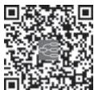  
本章思维导图

【预后】 无内脏损害者预后良好。出现肺间质病变、中枢神经病变、肾功能不全、恶性淋巴瘤者预后较差。

（杨念生）

## 第一节 | 总 论

脊 柱 关 节 炎（spondyloarthritis，SpA），过 去 曾 称 血 清 阴 性 脊 柱 关 节 病（seronegative spondyloarthropathy）或脊柱关节病（spondyloarthropathy），是一组主要累及脊柱和/或外周关节的慢性炎症性疾病，可伴肌腱端炎、指/趾炎、前葡萄膜炎、升主动脉炎等其他临床表现和系统损害，包括强直性脊柱炎（ankylosing spondylitis，AS）、银屑病关节炎（psoriatic arthritis，PsA）、反应性关节炎（reactive arthritis，ReA）、炎症性肠病关节炎（inflammatory bowel disease arthritis，IBDA）及幼年型脊柱关节炎（juvenile-onsetspondyloarthritis）。

流行病学调查显示 SpA 患病率为 0.9%～1.7%。不同亚型 $\mathrm { S p A }$ 具有相同的临床及免疫遗传学特征，主要包括：①常累及中轴关节，临床表现为炎性腰背痛，影像学检查可显示不同程度的骶髂关节炎改变；②外周关节炎常累及下肢大关节，多为不对称性；③常见指/趾炎和附着点炎；④与 HLA-B27 关系密切，有家族聚集患病倾向；⑤类风湿因子（rheumatoid factor，RF）阴性。

国际脊柱关节炎评估协会（ASAS）在 2009 年及 2011 年先后提出了中轴型 SpA（表 8-5-1）和外周型 SpA 分类标准（表 8-5-2）。中轴型 SpA 又分为 AS 和放射学阴性中轴型 SpA（non-radiographicaxial spondyloarthritis，nr-axSpA）。

表8-5-1  ASAS推荐的中轴型脊柱关节炎分类标准

<table><tr><td colspan="3">起病年龄&lt;45岁,腰背痛≥3个月的患者</td></tr><tr><td>影像学提示骶髂关节炎*</td><td>+</td><td>≥1个SpA临床特征**</td></tr><tr><td>或者</td><td></td><td></td></tr><tr><td>HLA-B27</td><td>+</td><td>≥2个SpA临床特征</td></tr></table>

注：\* 影像学提示骶髂关节炎（MRI或X线）：满足①或②。①MRI提示骶髂关节活动性（急性）炎症，即明确的骨髓水肿及骨炎，高度提示与SpA相关的骶髂关节炎：②X线提示双侧2\~4级或单侧3\~4级骶髂关节炎(根据1984年修订的AS纽约标准）。

\*SpA临床特征包括：

（1）炎性腰背痛：至少存在下列5项中的4项：①腰背痛40岁前发病：②隐匿发病：③运动后改善：④休息后无缓解：⑤夜间痛 起床后可缓解

（2）关节炎：曾经或目前存在由医生确诊的急性滑膜炎。

(3）肌腱附着点炎(跟腱)：曾经或目前存在跟腱附着部位或足底筋膜的自发疼痛或压痛。

（4）前葡萄膜炎：由眼科医生确诊的前葡萄膜炎。

（5）指/趾炎：曾经或目前存在由医生确诊的指/趾炎。

（6）银屑病：曾经或目前存在由医生确诊的银屑病。

（7）炎症性肠病：曾经或目前存在由医生确诊的克罗恩病或溃疡性结肠炎。

（8）对非甾体抗炎药反应良好。

（9）SpA家族史·直系或2级亲属中患有AS、银屑病、葡萄膜炎、反应性关节炎或炎症性肠病等。

（10）HLA-B27 阳性。

（11）C反应蛋白升高。

表8-5-2  ASAS推荐的外周型脊柱关节炎分类标准

<table><tr><td>无炎性腰背痛,仅有外周表现(关节炎、附着点炎或指/趾炎)</td></tr><tr><td>加上以下 $\geqslant$ 1项 SpA 临床特征:</td></tr><tr><td>1. 葡萄膜炎</td></tr><tr><td>2. 银屑病</td></tr><tr><td>3. 克罗恩病/溃疡性结肠炎</td></tr><tr><td>4. 前驱感染史</td></tr><tr><td>5. HLA-B27 阳性</td></tr><tr><td>6. 影像学提示骶髂关节炎</td></tr><tr><td>或加上以下 $\geqslant$ 2项 SpA 临床特征:</td></tr><tr><td>1. 关节炎</td></tr><tr><td>2. 肌腱附着点炎(肌腱端炎)</td></tr><tr><td>3. 指/趾炎</td></tr><tr><td>4. 炎性腰背痛既往史</td></tr><tr><td>5. SpA 家族史</td></tr></table>

## 【SpA 临床亚型】

1. 强直性关节炎 详见本章第二节。

2. 银屑病关节炎 一种银屑病相关的慢性关节炎，发病高峰年龄约 40 岁，表现为非对称性关节肿痛、附着点炎、指/趾炎及炎性腰背痛等。关节炎与皮肤损害的严重程度不一定平行，大多数患者关节症状在银屑病发病后出现，亦有少数患者关节炎先于银屑病或与银屑病同时出现。近半数诊断 2 年内出现关节侵蚀破坏，是一种致残性疾病。

3. 炎症性肠病关节炎 克罗恩病或溃疡性结肠炎相关的关节炎，表现为外周关节炎、脊柱炎或骶髂关节炎。外周关节炎常为非对称性，下肢多发，约2/3患者累及膝关节，关节炎常和肠病活动一致，缓解后不遗留关节畸形。约5%～10%患者呈慢性病程，关节炎可持续1年以上。

4. 反应性关节炎 一种关节外部位感染继发的无菌性关节炎。关节症状开始前 1～4 周常有前驱胃肠道或泌尿生殖道感染史。表现为非对称性寡关节炎（2～4 个关节），常累及下肢。关节炎常呈自限性，多在发作后6～12个月内缓解，约15%患者出现慢性关节炎。

5. 幼年型脊柱关节炎 幼年特发性关节炎的一种亚型，诊断平均年龄为 12 岁，男性居多。病程初期表现为关节炎和附着点炎，多为寡关节且呈非对称性，主要累及下肢大关节，部分患者在疾病后期出现骶髂关节和脊柱受累。关节外表现包括前葡萄膜炎、银屑病及炎症性肠病等。

## 第二节 | 强直性脊柱炎

强直性脊柱炎（ankylosing spondylitis，AS）是 SpA 常见的临床亚型，是一种以中轴关节受累为主的慢性炎症性疾病，可伴发关节外表现，严重者可发生脊柱畸形和强直。

【流行病学】 我国AS 的患病率初步调查在0.3%左右，男女之比为（2～4）∶1，女性发病较缓慢且病情较轻。发病年龄通常在15～40岁，10%～20%的AS患者在16岁以前发病，高峰在18～35岁，50岁以上及8岁以下发病者少见。

【发病机制】 遗传和环境因素在本病的发病中起重要作用。AS 的发病存在明显家族聚集倾向，和 HLA-B27 密切相关。健康人群的 HLA-B27 阳性率因种族和地区不同差别很大，如欧洲的白种人为4%～13%，我国为 6%～8%，而我国 AS 患者HLA-B27阳性率高达90% 左右。AS 可能还与泌尿生殖道沙眼衣原体或某些肠道病原菌（如志贺菌、沙门菌和小肠结肠炎耶尔森菌）等感染有关，这些病原体激发了机体炎症和免疫应答，造成组织损伤而参与疾病的发生与发展。

【病理】 AS 的基本病理变化是附着点炎，即肌腱、韧带和关节囊等附着于骨关节部位的非特异炎症、纤维化乃至骨化。初期以淋巴细胞、浆细胞浸润为主，炎症过程引起附着点侵蚀、附近骨髓水肿，进而肉芽组织形成，最后受累部位钙化、新骨形成。在此基础上又发生新的附着点炎症、修复，如此多次反复，最终导致椎体方形变、韧带钙化、脊柱竹节样变等。骶髂关节炎是 AS 患者最早的病理表现可出现滑膜炎，软骨变性，软骨下骨板破坏，肉芽组织增生和纤维化最后关节间隙消失 出现关节融合和骨性强直。AS 外周关节病理变化以非特异性滑膜炎为主。关节外病理表现为虹膜睫状体、主动脉根、主动脉瓣、房室结和肺间质等处的纤维结缔组织炎症。

【临床表现】

（一） 症状 AS全身表现多数较轻微，少数重症患者可有发热、贫血、乏力、消瘦、厌食等。

1. 关节表现 中轴关节受累的首发症状常为炎性下腰背痛，可有夜间痛醒及晨起腰背部僵硬，也可表现为单侧、双侧或交替性臀部、腹股沟向下肢放射的酸痛等。症状在静止、休息时加重，活动后可减轻，对非甾体抗炎药治疗反应良好。病情持续进展者脊柱可自下而上发生强直，并可出现腰椎前凸消失、驼背畸形、颈椎活动受限和扩胸受限。

外周关节受累多表现为以下肢大关节为主的非对称性关节炎，常累及膝、髋、踝和肩关节，较少累及肘及腕关节，反复发作与缓解，关节破坏少见。

髋关节受累见于 25%～35% 的 AS 患者，多出现于发病前 5 年内，单侧受累多见，表现为腹股沟、髋部疼痛及关节屈曲、旋转、内收和外展活动受限，负重体位疼痛加重，致残率高。

肌腱附着点炎多见于足跟、足掌部，也见于膝关节、胸肋关节、脊椎骨突、髂嵴、大转子和坐骨结节等部位，表现为受累部位肿胀。手指或足趾的附着点炎常引起整个指/趾关节弥漫性肿胀，呈腊肠样，称为“腊肠指/趾”。

2. 关节外表现 约 30% 的患者可在病程中出现眼部症状，典型病变为急性前葡萄膜炎，多为单侧发病，亦可双侧交替发作，表现为眼痛、充血、畏光、流泪、视物模糊等；常为自限性，与 AS 疾病活动无明显相关。其他少见的关节外表现包括主动脉瓣关闭不全、心脏传导阻滞、肺纤维化、肾淀粉样变性和IgA肾病等。

（二） 体征 常见体征为骶髂关节压痛，Patrick（4 字）试验阳性，脊柱前屈、后伸、侧弯和转动受限，胸廓活动度减低，枕墙距及指地距>0等。

【辅助检查】

（一） 实验室检查 活动期可有血沉增快和血清C反应蛋白升高。90%以上患者HLA-B27阳性，HLA-B27 阳性增加诊断的可能性，阴性亦不能排除 AS。类风湿因子（RF）和抗核抗体（ANA）通常阴性。

## （二） 影像学检查

1. X 线 骶髂关节 X 线是诊断 AS 的重要依据，主要表现为骶髂关节面模糊，关节周围骨侵蚀破坏，边缘骨质增生硬化，随着病情进展关节间隙狭窄甚至消失。根据纽约标准，骶髂关节 X 线表现可分为 5 个等级：0 级为正常；Ⅰ级为可疑；Ⅱ级为轻度异常，可见局限性侵蚀、硬化，关节边缘模糊，但关节间隙正常；Ⅲ级为明显异常，存在侵蚀、硬化、关节间隙增宽或狭窄、部分强直等 1 项或 1 项以上改变；Ⅳ级为严重异常，表现为完全性关节强直。临床常规拍摄骨盆正位片，除可观察骶髂关节，还便于了解髋关节、坐骨和耻骨联合等部位的病变。

脊柱的 X 线表现有椎体骨质疏松和方形变，椎小关节面模糊，椎旁韧带钙化及骨桥形成。疾病晚期可呈特征性“竹节样变”。

2. CT CT 分辨率高，层面无干扰，能发现骶髂关节轻微的骨侵蚀、硬化等结构改变，较常规 X线敏感性更高。

3. MRI 骶髂关节和脊柱 MRI 检查可发现 AS 中轴关节早期炎症改变。T 压脂像能显示骨髓水肿等炎症改变，T 加权像可见脂肪沉积、骨侵蚀、韧带骨赘或骨桥形成等结构改变。但 MRI 显示的骨髓水肿特异性不强，一些生理情况、感染或代谢性疾病亦可出现骨髓水肿，须仔细鉴别。

【诊断与鉴别诊断】

（一） 诊断 目前临床诊断采用1984年修订的AS 纽约标准，内容包括以下方面。

1. 临床标准 ①腰背痛、晨僵 3 个月以上，疼痛随活动改善，休息后无缓解；②腰椎在前后和侧屈方向活动受限；③胸廓活动度小于同年龄和性别的正常参考值。

2. 放射学标准 骶髂关节炎双侧Ⅱ～Ⅳ级或单侧Ⅲ～Ⅳ级。

3. 诊断 ①肯定 AS：符合放射学标准和 1 项（及以上）临床标准者；②可能 AS：符合 3 项临床标

准，或符合放射学标准而不伴任何临床标准者。

（二） 鉴别诊断 需要与椎间盘突出、脊柱或骶髂关节感染、弥漫性特发性骨肥厚、致密性骨炎、类风湿关节炎、滑膜炎 - 痤疮 - 脓疱疹 - 骨肥厚 - 骨髓炎综合征（synovitis-acne-pustulosis-hyperostosis-osteomyelitis syndrome，SAPHO）、骨关节炎等疾病鉴别。

【治疗】 AS 主要治疗目标是通过控制炎症和症状，防止或延缓关节结构进行性破坏，最大程度恢复躯体功能，避免远期关节畸形，提高生活质量。治疗AS需要药物与非药物相结合。

（一） 非药物治疗 AS 患者非药物治疗包括患者教育、规律锻炼和物理治疗。AS 患者应睡稍硬的床垫，多取低枕仰卧位，保持良好姿势，严格戒烟。合理坚持体育锻炼，针对脊柱、胸廓、髋关节的锻炼更为有效，但须避免过度负重和剧烈运动。其中游泳作为一种非负重运动，对疼痛、社会功能和精神健康方面的改善优于陆地运动。超声波、磁疗、热疗、电疗等对缓解关节肿痛有一定效果，可选择性使用。

## （二） 药物治疗

1. 非甾体抗炎药（NSAIDs） NSAIDs 可迅速改善 AS 患者腰背部疼痛和晨僵症状，减轻关节肿痛，是AS药物治疗的一线用药。选用NSAIDs应个体化，使用某一种NSAIDs以最大剂量治疗2～4周，如疗效不明显则应改用其他不同类别的 NSAIDs。不推荐联用多种 NSAIDs。有高胃肠道风险的患者可选用选择性 COX-2 抑制类 NSAIDs。

2. 传统改善病情抗风湿药（DMARDs） 外周关节受累患者可考虑使用传统 DMARDs 如甲氨蝶呤、柳氮磺吡啶等，目前未证实此类药物对AS 中轴病变有效。

3 生物制剂 经NSAIDs治疗病情仍持续活动者可考虑使用生物制剂.目前常用TNF-α抑制剂和 IL-17 抑制剂。不同种类的 TNF-α抑制剂治疗 AS 疗效相似。合并复发性葡萄膜炎和炎症性肠病的AS患者可优先使用单克隆抗体类TNF-α抑制剂。

4. JAK 抑制剂 JAK 抑制剂如托法替布、乌帕替尼等可通过抑制细胞内 JAK-STAT 通路的信号转导缓解附着点炎和指/趾炎，用于TNF-α抑制剂或IL-17 抑制剂疗效不佳或不耐受患者。

5. 糖皮质激素 对急性葡萄膜炎、肌肉关节炎症可考虑局部注射糖皮质激素，循证医学证据不支持全身应用糖皮质激素治疗中轴关节病变。

（三） 外科治疗 AS 患者出现功能受限或关节畸形显著影响生活质量，如颈胸椎严重后凸、严重的进展性胸椎后凸畸形伴平视能力丧失、顽固性和持续性髋关节痛或髋关节强直于非功能位，充分药物治疗不能有效缓解病情时，可考虑行颈胸段矫形、胸腰段矫形或髋关节置换手术。

  
本章思维导图

【预后】 AS 具有很强的异质性，部分患者病情反复发作、持续进展，部分患者病情可长期处于稳定状态。及时、正确的治疗可降低脊柱和关节畸形的风险。发病早、髋关节受累、HLA-B27 阳性、血沉增快和 C 反应蛋白持续升高是预后不良因素。此外，吸烟、诊断延迟及治疗不合理者预后较差。

（刘升云）

本章数字资源

## 第一节 | 概 论

血管炎（vasculitis）是指在病理上以血管壁炎症为特征的一组炎性自身免疫病，系统性血管炎指累及多个脏器的血管炎。总体来说，系统性血管炎发病率与患病率较低，临床表现复杂多样，可造成重要脏器的不可逆损伤，如不经治疗死亡率较高，是一类危重的自身免疫病。

【命名与分类】 目前采用的是2012年Chapel Hill 会议标准，根据主要受累血管的大小对血管炎进行命名和分类，见表8-6-1。

表 8-6-1  2012 年 Chapel Hill 会议制定的血管炎分类

<table><tr><td>累及大血管的系统性血管炎</td><td>单器官血管炎</td></tr><tr><td>大动脉炎、巨细胞动脉炎</td><td>皮肤白细胞破碎性血管炎</td></tr><tr><td>累及中等大小血管的系统性血管炎</td><td>皮肤动脉炎</td></tr><tr><td>结节性多动脉炎、川崎病</td><td>原发性中枢神经系统血管炎</td></tr><tr><td>累及小血管的系统性血管炎</td><td>孤立性主动脉炎</td></tr><tr><td>ANCA 相关血管炎(AAV)</td><td>与系统性疾病相关的血管炎</td></tr><tr><td>显微镜下多血管炎</td><td>红斑狼疮相关血管炎</td></tr><tr><td>肉芽肿性多血管炎</td><td>类风湿关节炎相关血管炎</td></tr><tr><td>嗜酸性肉芽肿性多血管炎</td><td>结节病相关血管炎</td></tr><tr><td>免疫复合物性小血管炎</td><td>与可能病因相关的血管炎</td></tr><tr><td>抗肾小球基底膜病</td><td>丙肝病毒相关冷球蛋白血症性血管炎</td></tr><tr><td>冷球蛋白性血管炎</td><td>乙肝病毒相关血管炎</td></tr><tr><td>IgA 性血管炎</td><td>梅毒相关主动脉炎</td></tr><tr><td>低补体血症性荨麻疹性血管炎</td><td>血清病相关免疫复合物性血管炎</td></tr><tr><td>累及血管大小可变的系统性血管炎</td><td>药物相关性免疫复合物性血管炎</td></tr><tr><td>贝赫切特病、科根综合征</td><td>药物相关 ANCA 相关血管炎</td></tr><tr><td></td><td>肿瘤相关血管炎</td></tr></table>

## 【病因和发病机制】

（一） 病因 尚不完全清楚。一般认为与遗传、感染和环境因素有关。研究发现，HLA-DRB1\*01、HLA-DRB1\*04 与巨细胞动脉炎易感性相关；HLA-DRB52\*01 与大动脉炎易感性相关；HLA-DP、HLADQ基因与抗中性粒细胞胞质抗体（ANCA）相关血管炎的易感性相关；病毒感染也与血管炎的发病相关，如 10% 的结节性多动脉炎（polyarteritis nodosa，PAN）患者伴有乙型肝炎病毒感染；80% 的混合型冷球蛋白血症患者同时伴有丙型肝炎病毒感染。结核分枝杆菌感染与大血管炎如大动脉炎和白塞病的发病相关；另外，一些药物，如丙硫氧嘧啶、肼屈嗪和可卡因等也能通过诱导ANCA的产生而引起血管炎。

（二） 发病机制 发病机制不清，但可能与遗传、感染、固有免疫系统和获得性免疫系统异常有关。

1. 感染 外来感染原对血管的直接损害在发病中起一定作用。

2. 巨噬细胞及其细胞因子 一些细菌或病毒可通过多种途径激活固有免疫系统，其中包括巨噬细胞。巨噬细胞被激活后，释放促炎性细胞因子如肿瘤坏死因子-α（TNF-α）和白介素-6（IL-6）、IL-1等，导致血管壁炎症。

3. 自身抗体 自身抗体在血管炎发病中起重要作用，其中最重要的是 ANCA。ANCA 是第一个被证实参与血管炎发病的自身抗体。ANCA 的靶抗原为中性粒细胞胞质内的多种成分，如丝氨酸蛋白酶3（PR3）、髓过氧化物酶（MPO）、弹性蛋白酶、乳铁蛋白等，其中PR3和MPO是主要的靶抗原。

4. 补体系统 补体系统是固有免疫反应的重要组成部分。在ANCA相关血管炎中，受到感染原攻击的中性粒细胞可以激活补体旁路途经，释放其中的一些成分，如C5a片段，造成血管与组织脏器损伤。

【病理】 血管炎的基本病理改变是血管壁的炎症和坏死。主要的病理改变有：①血管壁炎症与坏死：表现为包括中性粒细胞、淋巴细胞、巨噬细胞等多种炎症细胞浸润及血管壁的纤维素样坏死，后者是血管炎的特征性病理改变。在一些血管炎中，浸润的炎症细胞还会形成巨细胞，以及由不同炎症细胞组成的肉芽肿，如见于肉芽肿性多血管炎（GPA）的淋巴细胞性肉芽肿和 EGPA 的嗜酸性粒细胞性肉芽肿。②管壁结构破坏：发生炎症反应的血管壁会出现胶原沉积、纤维化，血管壁增厚、管腔狭窄，可继发血栓形成。血管壁的炎症还会造成弹性纤维和平滑肌受损，形成动脉瘤和血管扩张。同一名血管炎患者，可以存在一种以上的血管病理改变，即使在同一受累血管，其病变也常呈节段性。

【诊断】 血管炎诊断较困难，须根据临床表现、实验室检查、病理活检及影像学资料等综合判断，以确定血管炎的类型及病变范围。

(一）临床表现血管炎的临床表现主要取决于受累血管的类型，大小以及受累的器官因此临床表现复杂多样，且无特异性。常见的临床表现包括炎症引起的全身症状以及血管病变所在器官的炎症、缺血改变和功能异常。全身症状有乏力、发热、关节及肌肉疼痛、体重减轻等，脏器受累的表现根据累及器官不同而变化多端，如皮肤受累会出现多种皮疹；肺受累会出现咳嗽、咳痰、咯血、呼吸困难；肾脏受累会出现蛋白尿、血尿、高血压及肾功能不全；神经系统受累患者会出现头痛、眩晕、意识状态改变，以及脑卒中、周围神经病变引起的临床表现等。

恶性肿瘤、感染性心内膜炎、肌纤维发育不良、动脉粥样硬化和非血管炎性栓塞（抗磷脂综合征、弥散性血管内凝血、胆固醇栓塞及肿瘤性栓塞）等疾病可模拟系统性血管炎的临床表现，要注意加以鉴别。

（二） 实验室检查 多数患者会出现血白细胞、血小板计数升高、慢性病贫血；在疾病活动期可出现血沉增快、C反应蛋白升高；肾脏受累者可以出现血尿、蛋白尿、红细胞管型、血肌酐水平升高等。

（三） 特殊检查

1. ANCA 有两种测定 ANCA 的方法，即间接免疫荧光法和酶联免疫吸附试验（ELISA）。间接免疫荧光检查中，中性粒细胞胞质呈荧光阳性则称为 P-ANCA 阳性，当中性粒细胞的细胞核周围呈荧光阳性时，则为 C-ANCA 阳性。ELISA 法测定时若呈 PR3 抗体阳性，即 PR3-ANCA 阳性；ELISA 法测定时若呈 MPO 抗体阳性，即 MPO-ANCA 阳性。ANCA 与小血管炎相关，如 C-ANCA 与肉芽肿性多血管炎（GPA）相关，P-ANCA与显微镜下多血管炎（MPA）和嗜酸性肉芽肿性多血管炎（EGPA）相关等，因此将 GPA、MPA、EGPA 统称为 ANCA 相关血管炎。

2. 抗内皮细胞抗体（AECA） AECA 是近年来在部分大动脉炎、川崎病和贝赫切特病等血管炎患者中发现的一种新抗体，但也可见于多种非血管炎性疾病和感染等疾病，因此对血管炎诊断的灵敏度和特异度不高。

3. 病理 活检是确诊血管炎的“金标准”。血管壁炎症细胞浸润，纤维素样坏死，肉芽肿形成，血管管腔狭窄、闭塞、血栓形成等都支持血管炎的诊断；而血管壁的纤维素样坏死是特征性的病理改变。然而，由于血管炎的病理改变可呈节段性，因此组织活检未见到血管壁炎症亦不能排除血管炎的诊断。

4. 血管造影 是诊断大、中血管炎的重要依据，也是了解病变范围最确切、可靠的方法。可以表现为血管壁增厚、管腔狭窄和血管扩张，甚至血管瘤形成，少数患者可见血栓形成。

5. 血管彩色多普勒超声检查 是非创伤性检查，适用于检查较大的、较浅表的血管管壁、管腔和狭窄状况，且有助于在病程中进行随诊、比较。但其准确性不如血管造影，且与检查者的经验有关。

6. CT 血管 CT 不仅可以观察到受累血管管壁和管腔情况，还能够观察到病变累及的范围，可以取代血管造影，作为诊断大、中血管炎的依据。

7. MRI 血管 MRI 不仅可以观察大血管的管壁与管腔情况，还可以反映管壁是否存在活动炎症，对大血管炎的诊断和病情判断很有价值。

【治疗原则】 一般来说系统性血管炎都是进展性的，不经治疗会引起不可逆的脏器损害，因此血管炎的诊治原则是早期诊断、早期治疗。系统性血管炎的治疗分为诱导缓解与维持缓解两阶段：诱导缓解阶段的目的是控制血管炎的急性炎症，最大限度地恢复脏器功能，减少脏器的不可逆损害；维持缓解阶段的治疗目标是维持疾病处于稳定状态，减少疾病复发，同时避免药物造成的不良反应，控制并发疾病。

糖皮质激素是治疗血管炎的基础药物，是诱导缓解的一线治疗药物。其剂量及用法因病变部位与病情严重程度不同而异。凡有肾、肺、神经系统、心脏及其他重要脏器受累者，不仅需要较大剂量的糖皮质激素治疗，还应及早加用免疫抑制剂。最常用的免疫抑制剂为环磷酰胺（cyclophosphamide，CTX），疗效明确，但不良反应较多，在应用过程中必须密切监测血常规、肝功能等，还要注意其性腺毒性。其他常用免疫抑制剂有硫唑嘌呤、甲氨蝶呤、吗替麦考酚酯、钙调磷酸酶抑制剂如环孢素、他克莫司等。近年来，靶向 CD20 的单克隆抗体的利妥昔单抗（RTX），用于 AAV 的诱导和维持缓解治疗，已有成功的临床试验并获得许可。有急进性肾、肺部损害和病情危重者可进行血浆置换、免疫吸附、静脉注射大剂量免疫球蛋白等治疗。

## 第二节 | 大动脉炎

大动脉炎（Takayasu arteritis，TA）是指累及主动脉及其一级分支的慢性、肉芽肿性全层动脉炎，导致受累动脉狭窄或闭塞，少数可引起动脉扩张或动脉瘤，造成所供血器官缺血，曾称为无脉症、高安病等。TA 的发病率为（0.4～2.6）/10 万，好发于亚洲、中东地区，据估计日本的发病率为 40/10 万，而欧美的发病率为（4.7～8）/10 万，男女发病率之比为 1∶（8～9）。发病年龄为 5～45 岁，约 90% 的患者在30 岁以前发病。

【病因】 本病病因未明，与遗传因素（如HLA-DRB52\*01 单倍体型）、感染（结核分枝杆菌、肺炎衣原体、疱疹病毒等）和性激素有关。

【病理】 病理改变可分为三期：第一期为急性期，炎症始于位于动脉中、外膜交界处的滋养血管，逐渐累及外膜、中膜与内膜。受累动脉管壁出现炎症细胞浸润、片状坏死、形成巨细胞肉芽肿，中膜弹性纤维断裂、平滑肌消失；内膜出现反应性纤维化和基质成分增加。第二期为慢性期，表现为管壁纤维化，可见瘢痕形成、血管增生，伴有散在的炎症反应。第三期为瘢痕期，出现动脉壁全层纤维化、管壁增厚，造成血管狭窄、闭塞；偶合并血栓形成；也可因弹性纤维断裂、平滑肌损伤严重，导致管壁变薄、血管扩张，最终形成动脉瘤。

【临床表现】 临床表现分二期，第一期又称为“无脉前期”或“全身期”，以炎症表现为主，典型的表现为发热、全身不适、盗汗、关节痛、厌食、体重下降，偶有口腔溃疡和结节红斑等；可出现血管受累的表现，如颈部血管疼痛或压痛、背痛；此期因临床表现不特异，漏诊率极高；但仔细查体会在患者颈部、腹部或背部听到血管杂音。第二期为“无脉期”，以组织器官缺血表现为主。受累血管不同，引起的临床表现亦有所不同。经典的是 Numano 提出的 TA 血管分型，共 5 型：①Ⅰ型：累及主动脉弓发出的三支病变，颈动脉和椎动脉狭窄引起头部不同程度缺血，表现为头痛、头晕、视物模糊、视力下降、咀嚼无力、颈痛等，少数患者可以出现脑卒中；锁骨下动脉或腋动脉受累引起上肢无力、发凉、酸痛、麻木等。体格检查时这些受累血管可出现压痛；颈动脉、桡动脉、肱动脉搏动减弱或消失，在颈部和锁骨下窝可闻及血管杂音。②Ⅱ型：累及升、降主动脉及主动脉弓的三个分支，其临床表现与Ⅰ型相似；部分患者会出现背痛，背部听诊可闻及血管杂音。③Ⅲ型：累及降主动脉与双侧肾动脉，临床上主要表现为顽固的高血压，少数患者腹主动脉的分支及下肢动脉也有可能受累，出现腹痛、间歇性跛行；可于背部、腹部闻及血管杂音，下肢血压低于上肢血压。④Ⅳ型：仅累及腹主动脉及双肾动脉，临床表现与Ⅲ型相似，但背部不能闻及杂音。⑤Ⅴ型：累及主动脉全程及其一级分支，可以出现所有前述表现。

## 【辅助检查】

（一） 实验室检查 急性期或疾病活动期可出现血白细胞、血小板计数升高，血沉增快，C 反应蛋白增高等非特异性改变。少数患者AECA 及抗主动脉抗体阳性。

## （二） 影像学检查

1. 彩色多普勒超声 可发现颈部动脉、锁骨下动脉、头臂干、上下肢动脉病变，出现血管壁三层结构界限不清、增厚，管腔狭窄，可呈“通心粉”征；病情重、病程长者可出现管腔闭塞及继发血栓形成；部分患者会出现动脉的瘤样扩张。

2. 动脉造影或 CT 血管造影（CTA） 是确诊大动脉炎的依据。表现为主动脉及其一级分支动脉管壁增厚，管腔狭窄、闭塞，部分患者出现血管扩张和动脉瘤形成。

3. 磁共振显像血管造影（MRA） 不仅能够观察到动脉造影或 CTA 所见的动脉异常，还能看到管壁是否存在炎性水肿信号，既可用于诊断，亦可用于判断疾病的活动状态。

4. PET、PET-MRA 在 PET 检查时，存在活动炎症的动脉管壁对同位素的摄取增加，结合MRA 可用于判断疾病的活动性和活动程度。

【诊断】 2022 年美国 ACR 和欧洲抗风湿病联盟（EULAR）共同制定了新的 TA 分类标准，通过权重积分的形式来对 TA 患者进行分类，其应用前提为患者存在大动脉炎症的临床和影像学证据，且发病年龄≤60 岁，积分≥5 分者，可被分类为 TA（表 8-6-2），但须除外先天性主动脉狭（缩）窄、动脉肌纤维发育不良、动脉粥样硬化、血栓闭塞性脉管炎、贝赫切特病、PAN及胸廓出口综合征等。

表 8-6-2  2022 年 ACR/EULAR 制定的 TA 分类标准

<table><tr><td colspan="2">纳入标准:必须满足以下3个要求</td></tr><tr><td>1. 大血管血管炎</td><td></td></tr><tr><td>2. 诊断年龄≤60岁</td><td></td></tr><tr><td>3. 血管炎的影像学证据</td><td></td></tr><tr><td colspan="2">评分项:</td></tr><tr><td>临床表现</td><td></td></tr><tr><td>1. 女性</td><td>+1</td></tr><tr><td>2. 血管炎引起的心绞痛或缺血性心脏疼痛</td><td>+2</td></tr><tr><td>3. 四肢间歇性跛行</td><td>+2</td></tr><tr><td>血管检查结果</td><td></td></tr><tr><td>1. 动脉杂音</td><td>+2</td></tr><tr><td>2. 上肢动脉搏动减弱</td><td>+2</td></tr><tr><td>3. 颈动脉搏动减弱或压痛</td><td>+2</td></tr><tr><td>4. 双上肢收缩压差≥20mmHg</td><td>+1</td></tr><tr><td>血管造影和超声检查</td><td></td></tr><tr><td>1. 病变动脉数(选择其中一项)</td><td></td></tr><tr><td>1支</td><td>+1</td></tr><tr><td>2支</td><td>+2</td></tr><tr><td>≥3支</td><td>+3</td></tr><tr><td>2. 血管炎累及双侧对称的动脉分支</td><td>+1</td></tr><tr><td>3. 腹主动脉受累,合并肾动脉或肠系膜动脉受累</td><td>+3</td></tr></table>

【治疗】 治疗原则为控制活动性病变、缓解脏器缺血。活动期患者可用泼尼松 1mg/（kg·d），4～6 周后逐渐减量至停用。快速进展性疾病者可予大剂量糖皮质激素（500～1 000mg 甲泼尼龙）冲击治疗。对单用糖皮质激素疗效不佳者可合用免疫抑制剂，如CTX、硫唑嘌呤、甲氨蝶呤、吗替麦考酚酯等。近年来有研究显示 TNF-α拮抗剂和 IL-6 受体单抗治疗有效，用于糖皮质激素联合传统免疫抑制剂复发或激素减量困难的难治性患者。

对因血管狭窄造成重要脏器缺血、威胁患者生命或严重影响患者生活质量者，可采取手术治疗，如血管重建术、支架置入术等，病变广泛者可进行开放性血管搭桥术等；对因严重肾动脉狭窄造成的顽固性高血压，可考虑肾切除术。

【预后】 本病为进展性疾病，极少为自限性，但多数患者预后良好。5 年生存率为 93.8%，10 年生存率为90.9%，主要死亡原因有心力衰竭、心脑血管意外、肾衰竭及手术并发症。

## 第三节 | 巨细胞动脉炎

巨细胞动脉炎（giant cell arteritis，GCA）又称颞动脉炎，是一种发生于老年人的慢性、肉芽肿性动脉全层炎症，病因未明。常累及主动脉弓及其一级分支，尤其是颞动脉。典型表现为颞侧头痛、头皮痛、间歇性下颌运动障碍和视力障碍。本病为 50 岁以上人群发病，发病年龄高峰为 74 岁；发病率为（1.4～27.3）/10 万，患病率地区性差异很大，是西方老年人最常见的血管炎，以北欧患病率最高，亚洲患病率最低。女性发病率比男性高2～4倍。

【病因】 病因不清，但与遗传因素（如 HLA-DRB1\*01、HLA-DRB1\*04 单倍体型）、高龄、血管本身的退行性变以及外来因素，如吸烟、病毒感染等有关。

【病理】 GCA 的病理改变与大动脉炎几乎相同，为累及管壁全层的肉芽肿性动脉炎，血管壁全层有炎症细胞浸润，常有内膜增生和内弹性膜断裂，可有巨细胞肉芽肿性病变。随着病变的发展，可以出现胶原沉积、纤维化，造成管壁增厚、管腔狭窄，可继发血栓形成。

【临床表现】 起病多隐袭。患者可有发热、全身不适、疲劳、关节肌肉疼痛、厌食、体重减轻等。70%的患者表现为一侧或双侧颞部头痛、头皮触痛、颞下颌关节间歇性运动障碍。颞浅动脉增粗、变硬，呈结节状，有压痛；枕后、颜面及耳后动脉亦可受累。30%的患者有头、颈动脉缺血症状，表现为视力下降、复视、眼肌麻痹，甚至失明；听力减退，眩晕亦是常见的症状。15%患者出现主动脉弓及其分支动脉缺血的表现，如上肢间歇性跛行、麻木、无力、脉弱或无脉、血压降低或测不出、双上肢血压不等。40%～60%患者伴有风湿性多肌痛，表现为颈部、肩胛带、骨盆带肌肉酸痛和晨僵，但肌压痛及肌力减弱不显著。

【实验室检查】 贫血、白细胞和血小板计数升高常见，血沉明显增快为 GCA 最突出的实验室检查异常，平均高于50mm/h，C反应蛋白也升高。

【诊断】 50 岁以上老年人新近出现一侧或双侧颞部头痛、颞浅动脉搏动减弱或消失、动脉增粗变硬颞动脉活检有肉芽肿性动脉炎可确诊GCA由于颞动脉病变的节段性分布容易造成活检阴性，因此颞动脉血管造影、CTA、磁共振颞动脉显像以及 PET 发现有颞动脉病变有助于 GCA 的诊断。

【治疗与预后】 本病对糖皮质激素治疗反应十分明显。泼尼松（龙）40～60mg/d，1 周内症状可消失，由于激素减量后本病非常容易复发，因此需小剂量长期维持。对于在激素缓慢减量过程中疾病复发者，可以加用免疫抑制剂，如甲氨蝶呤、硫唑嘌呤、CTX 等。但对于出现视力改变的患者，尤其是视力急剧下降者，则须考虑甲泼尼龙500～1 000mg/d冲击治疗3天。IL-6单抗治疗GCA有良好疗效，且可减少糖皮质激素的使用剂量，已成为GCA的一线治疗药物。大多数患者预后良好。

# 第四节 | 结节性多动脉炎

结节性多动脉炎（polyarteritis nodosa，PAN）是一种累及中、小动脉的坏死性血管炎。估计年发病率（0～8）/100 万，患病率为31/100 万；男性发病多于女性，发病高峰年龄为40～50 岁。

【病因】 迄今为止，PAN 的病因不明。遗传因素和病毒感染的相互作用，与发病相关，既往发现乙型肝炎、丙型肝炎病毒和 HIV 病毒感染与发病相关，但是，随着乙型肝炎疫苗的普遍应用，乙型肝炎病毒感染相关PAN越来越少见，仅占PAN患者的5%以下。

【病理】 中、小动脉的局灶性全层坏死性血管炎，好发于血管分叉处。机体任何部位的动脉均可受累，但却很少累及肺动脉。急性期血管炎症损伤主要表现为纤维素样坏死和多种炎症细胞浸润，正常血管壁结构被完全破坏，形成动脉瘤，可见血栓形成。

【临床表现】 可以分为系统性和单器官性，单器官性以仅局限于皮肤的皮肤型最常见；系统性中包括特发性与HBV感染相关性二种。PAN的临床表现多种多样，系统性可表现为严重的全身多器官病变，部分患者的病情进展较快，而单器官性的病变仅限于受累器官。

## （一） 系统性PAN

1. 全身症状 发热、全身不适、体重减轻、关节肌肉痛是最常见的全身症状，见于90%的患者。

2. 系统症状 根据受累器官、系统等不同可出现相应的临床表现。

（1）神经系统：是PAN最常受累的系统，见于36%～72%的患者，以周围神经受累为主，偶有脑组织血管炎。周围神经受累表现为多发性单神经炎和周围神经炎，如垂腕、垂足、手足麻木、肢体感觉异常等。

（2）肾脏受累：30%～60% 的患者出现不同程度的肾损害，但肾小球本身几乎不受累。肾入球血管受累可引起血肌酐水平升高、高血压、血尿、蛋白尿；肾血管的病变可导致肾的多发梗死。

（3）消化系统：近 40% 的患者会出现胃肠道表现，常见有腹泻、恶心、呕吐、腹痛、胃肠道出血、肠梗死和穿孔、肝功能异常等。

（4）生殖系统：20% 的患者会出现睾丸疼痛、硬结、肿胀，但尸检发现 80% 的男性患者有附睾和睾丸受累。

（5）其他表现：眼部受累患者可以出现结膜炎、角膜炎、葡萄膜炎，一些患者可以出现视网膜血管炎，表现为视物模糊、复视、视力下降，甚至失明；外周血管受累者可出现下肢间歇性跛行、肢体坏疽等；心脏受累可有心脏扩大、心律失常、心绞痛，甚至心肌梗死、心力衰竭。

（二） 皮肤型 PAN 罕见。常见于 40 岁以上的女性，最常见的为皮肤溃疡、网状青斑、皮下结节、白色萎缩及紫癜。多见于下肢，但上肢和躯干亦可受累。易复发。

## 【辅助检查】

1. 实验室检查 一般无特异性，可见轻度贫血，白细胞、血小板计数轻度升高，尿液检查可见蛋白尿、血尿。还可有血沉增快、C 反应蛋白增高、白蛋白下降、球蛋白升高，ANCA 阴性，与乙型肝炎相关者 HBsAg 阳性。

2. 血管造影 肾、肝、肠系膜及其他内脏器官，下肢的中、小动脉有微小动脉瘤形成和节段性狭窄，典型的血管造影表现为节段性扩张和狭窄形成的“念珠样”改变，具有诊断特异性。

3. 病理 受累脏器进行活检，见到肌性血管壁炎症细胞浸润、血管壁纤维素样坏死、弹性纤维破坏、血管狭窄或血管瘤形成可以确诊。

【诊断】 PAN 临床表现多样，缺乏特征性，早期不易确诊。因此发现可疑病例应尽早做病理活检和血管影像检查。1990 年 ACR 的分类标准为：①体重下降：病初即有，无节食或其他因素；②网状青斑：四肢或躯干呈斑点及网状斑；③睾丸痛或触痛：并非由感染、外伤或其他因素所致；④肌痛、无力或下肢触痛：弥漫性肌痛（不包括肩部、骨盆带肌）或肌无力，或小腿肌肉压痛；⑤单神经炎或多发性神经炎：单神经炎、多发性单神经炎或多神经炎的出现；⑥舒张压≥90mmHg：出现舒张压≥90mmHg的高血压；⑦尿素氮或肌酐升高：血尿素氮≥14.3mmol/L 或血肌酐≥133μmol/L，非脱水或阻塞所致；⑧乙型肝炎病毒：HBsAg 阳性或 HBsAb 阳性；⑨动脉造影异常：显示内脏动脉闭塞或动脉瘤，除外其他原因引起；⑩中小动脉活检：血管壁有中性粒细胞或中性粒细胞、单核细胞浸润。在 10 项中有 3 项阳性者即可被分类为PAN，但应排除其他结缔组织病并发的血管炎以及ANCA 相关血管炎。

【治疗】 年龄在65岁以下，没有神经系统、肾脏和心脏损害的特发性系统性PAN，单用糖皮质激素治疗即可；出现上述脏器损害者，则需泼尼松每日 1mg/kg 或相当剂量的糖皮质激素联合免疫抑制剂治疗，首选环磷酰胺；待疾病缓解后，可以采用其他免疫抑制剂如硫唑嘌呤、甲氨蝶呤等维持治疗。由于乙型肝炎相关的系统性 PAN 通常临床病变较特发性 PAN 重、神经系统病变更突出，因此须在抗病毒治疗的同时联合糖皮质激素治疗，抗病毒治疗需 6～12 个月。对于血管炎相关脏器受累控制不佳者，可以联合免疫抑制剂治疗。

【预后】 系统性PAN的预后取决于是否有内脏和中枢神经系统受累及病变严重程度。未经治疗者预后差，5年生存率＜15%，多数患者死亡发生于疾病的第一年，若能积极合理治疗，5年生存率可达83%。

## 第五节 | ANCA相关血管炎

ANCA 相关血管炎（ANCA associated vasculitis，AAV）是一组以血清中能够检测到 ANCA 为最突出特点的系统性小血管炎，主要累及小血管（小动脉、微小动脉、微小静脉和毛细血管），但也可有中等大小动脉受累。包括显微镜下多血管炎（microscopic polyangiitis，MPA）、肉芽肿性多血管炎（GPA）和嗜酸性肉芽肿性多血管炎（EGPA）。

【病因和发病机制】 遗传因素、感染（尤其是细菌感染）与发病关系密切；除 ANCA，感染对血管壁的直接损害也起了很重要的作用。虽然 ANCA 参与发病，但在受累脏器中仅有极少量或无免疫复合物沉积。

【病理】 以小血管全层炎症、坏死，伴或不伴肉芽肿形成为特点，可见纤维素样坏死和中性粒细胞、淋巴细胞、嗜酸性粒细胞等多种细胞浸润，是诊断 AAV的“金标准”。

【临床表现】

1. 全身表现 多数患者有全身症状如发热、关节痛/关节炎、肌痛、乏力、食欲减退和体重下降等。

2. 皮肤、黏膜 是 AAV 最常受累的器官之一，表现为口腔溃疡、皮疹、紫癜、网状青斑、皮肤梗死、溃疡和坏疽，多发指端溃疡常见。

3. 眼部表现 常见表现有结膜炎、角膜炎、巩膜炎、虹膜炎、眼睑炎，眼底检查可以见到视网膜渗出、出血、血管炎表现和血栓形成，少数患者可出现复视、视力下降；一些患者会出现明显的突眼。

4. 耳、鼻、咽喉 喉软骨和气管软骨受累可以出现声嘶、喘鸣、吸气性呼吸困难；耳软骨受累可出现耳廓红、肿、热、痛；鼻软骨受累可以导致鞍鼻；耳部受累以中耳炎、神经性或传导性听力丧失常见；脓血涕、脓血性鼻痂、鼻塞是鼻窦受累的主要表现，一些患者会出现嗅觉减退或丧失。

5. 呼吸系统 咳嗽、咳痰常见，严重者会出现呼吸困难、喘鸣和咯血；肺部影像学上可以见到浸润影、多发结节、空洞和间质病变。

6. 神经系统 神经系统是最常累及的系统之一，以周围神经受累多见，其中多发性单神经炎是最常见的周围神经系统病变；中枢神经系统受累可表现为头痛、器官性意识模糊、抽搐、脑卒中、脑脊髓炎等。

7. 肾脏 血尿、蛋白尿、高血压常见，一些患者血肌酐升高，部分患者会出现急进性肾衰竭。

8. 心脏 一些患者会出现心包积液、心肌病变、心脏瓣膜关闭不全；冠脉受累者可以出现心绞痛、心肌梗死。

9. 腹部 腹痛、血性腹泻、肠穿孔、肠梗阻和腹膜炎表现是AAV腹部受累的常见表现。

【实验室检查】 贫血，白细胞、血小板计数升高等非特异表现常见；蛋白尿、血尿、红细胞管型也是常见异常；血沉增快、C 反应蛋白升高者常见；肾功能损害者血肌酐水平升高；ANCA 阳性是这组血管炎最突出的实验室检查特征。

【诊断与鉴别诊断】 对于这组系统性血管炎目前尚无统一的分类标准，须结合临床表现、血清ANCA 检查、特征性的病理改变与影像学检查综合作出诊断。须与感染、其他系统性结缔组织病和恶性肿瘤相鉴别；尤其要警惕恶性肿瘤和一些感染会模拟AAV的临床表现。

2022年美国ACR/EULAR共同对分类标准进行了更新，采用加权积分的方式对3种AAV从临床表现和实验室检查两方面进行评估。在使用这些分类标准时应明确患者所患疾病为 AAV，且除外了能够引起相似临床表现的其他疾病，如系统性风湿性疾病、感染和恶性肿瘤等模拟疾病。值得注意的是，分类标准的主要目的是将临床表现相似的 AAV 患者进行分类，以观察药物的临床疗效，并非为临床诊断而制定，因此可以作为诊断AAV的参考和依据。

【治疗】 糖皮质激素是一线治疗药物。诱导缓解治疗通常为足量糖皮质激素联合免疫抑制剂，其中最常用的为 CTX；维持缓解治疗主要为小剂量糖皮质激素联合免疫抑制治疗，如硫唑嘌呤、甲氨蝶呤等；近年来，充分的临床研究显示，针对 CD20 的单克隆抗体利妥昔单抗，既可以用于 AAV 的诱导缓解治疗，也可用于维持缓解治疗，成为重症GPA 和MPA诱导缓解治疗的一线药物。

【预后】 预后取决于脏器受累的部位与严重程度。早期诊断和合理治疗已使本病的预后有了明显改观，80% 的患者存活时间已超过5年。延误诊断、未经合理治疗者死亡率仍很高。

## 第六节 | 贝赫切特病

贝赫切特病（Behcet disease，BD）也称白塞病，现统一称为白塞综合征。1937 年由土耳其 Behcet教授首先描述了一种以口腔和外阴溃疡、眼炎为临床特征，并累及多个系统的慢性疾病。病情呈反复发作和缓解交替，除因内脏受损死亡，大部分患者的预后良好。贝赫切特病有较强的地域分布差异，多见于地中海沿岸国家、中国、朝鲜、日本。各地区的发病率差异较大，土耳其最高，为（100～370）/10万，英国最低，为0.6/10 万，中国北方为110/10 万。男性发病略高于女性。

本病依其内脏系统的损害不同而分为血管型、神经型、胃肠型等。血管型指有大、中动脉和/或静脉受累者；神经型指有中枢或周围神经受累者；胃肠型指有胃肠道病变，如溃疡、出血、穿孔等。

【病因】 尚不清楚，可能与遗传因素及感染有关。

【病理】 本病的病理改变为血管炎，受累部位的血管壁有炎症细胞浸润、管壁增厚、管腔狭窄，严重者有血管壁坏死、血管瘤形成，可以见到继发血栓形成。与其他血管炎不同的是，本病可以累及大、中、小及微血管，且动、静脉均可受累。

【临床表现】

## （一） 基本症状

1. 口腔溃疡 反复发作为特点，每年发作至少 3 次，在颊黏膜、舌缘、唇、软腭等处出现不止一个的痛性溃疡，直径一般为 2～3mm，7～14 天后自行消退，不留瘢痕；亦有持续数周不愈后遗瘢痕者。本症状见于98%以上的患者，且是本病的首发症状，是诊断本病最基本而必需的症状。

2. 外阴溃疡 见于约80%的患者，与口腔溃疡性状基本相似。常出现在女性患者的大、小阴唇，其次为阴道；在男性则多见于阴囊和阴茎，也可以出现在会阴或肛门周围。

3. 皮肤病变 呈结节性红斑、痤疮样皮疹、浅表栓塞性静脉炎等不同表现。其中以结节性红斑最为常见，见于 70% 患者，多见于膝以下部位，呈对称性，表面呈红色浸润性皮下结节，有压痛，分批出现，逐渐扩大，7～14 天后其表面色泽转为暗红，有的可自行消退，仅在皮面留有色素沉着，很少破溃。另一种皮疹为带脓头或不带脓头的毛囊炎，见于 30% 患者，面、颈部多见。针刺后或小的皮肤损伤后出现局部红肿或化脓反应也是本病一种较特异的皮肤反应。栓塞性浅静脉炎常在下肢见到，急性期在静脉部位出现条形红肿、压痛，急性期后可以扪及索条状静脉。

4. 眼炎 最常见的眼部病变是葡萄膜炎及由视网膜血管炎造成的视网膜炎，眼炎的反复发作可致视力障碍甚至失明。前葡萄膜炎（即虹膜睫状体炎）伴或不伴前房积脓，对视力影响较轻。视网膜炎可引起视神经萎缩，致视力下降。

（二） 系统性症状 除上述基本症状，部分患者会出现因血管炎引起的内脏系统病变，大多出现在基本症状之后。部分患者在疾病活动时发热、乏力、体重下降等。

1. 消化道受累 又称肠白塞病，大多出现在病情活动患者，按症状出现频率，最多见的是腹痛，并以右下腹痛为常见，伴有局部压痛和反跳痛，其次为恶心、呕吐、腹胀、食欲缺乏、腹泻、吞咽困难等。消化道的基本病变是多发性溃疡，可发生于自食管至降结肠的任何部位，发生率可高达50%。重者合并溃疡出血、肠麻痹、肠穿孔、腹膜炎、瘘管形成、食管狭窄等并发症，甚至可致死。

2. 神经系统 又称神经白塞病，见于 20% 患者，除个别外都在基本症状出现后数个月到数年内出现。脑、脊髓的任何部位都可因小血管炎而受损，临床表现随受累部位不同而异。多起病急骤，根据其症状可分为脑膜脑炎、脑干损害、良性颅内高压、脊髓损害、周围神经系统损害等类型。除中枢神经系统实质受累，中枢神经系统静脉血栓形成亦较常见，患者会出现明显的头痛。

3. 心血管 本病的血管病变指的是大、中血管病变，见于10%患者，又称血管白塞病。①大、中动脉炎：无论是体循环或肺循环的动脉受累都可出现狭窄和动脉瘤，甚至在同一血管这两种病变都会节段性交替出现，大动脉受累较中动脉更为常见。②大、中静脉炎：本病静脉受累的特点是除管壁炎症，尚有明显的血栓形成。大静脉炎主要表现为上、下腔静脉的狭窄和梗阻，在梗阻的远端组织出现水肿，并有相应表现。中静脉的血栓性静脉炎多见于四肢，尤其是下肢，亦见于脑静脉。③心脏：心脏受累不多。可出现主动脉瓣关闭不全、二尖瓣狭窄和关闭不全，亦可出现房室传导阻滞、心肌梗死和心包积液。

4. 关节炎 关节痛见于 30%～50% 的患者，表现为单个关节或少数关节的痛、肿，甚至活动受限。其中以膝关节受累最多见。大多数仅表现为一过性的关节痛，可反复发作，呈自限性。

5. 肺 肺的小动脉炎引起小动脉瘤或局部血管的栓塞，而出现咯血、胸痛、气短等症状。咯血量大者可致命。有肺栓塞者多预后不良。

6. 附睾炎 可累及双侧或单侧，表现为附睾肿大、疼痛和压痛。

（三） 实验室检查 贝赫切特病无特异血清学检查。急性期或疾病活动期可出现贫血、血白细胞和血小板计数升高 血沉增快和C反应蛋白升高：但抗核抗体谱，ANCA.抗磷脂抗体等均无异常。补体水平及循环免疫复合物亦正常，仅有时有轻度球蛋白增高。

（四） 针刺反应 是本病目前唯一的特异性较强的试验。消毒皮肤后用无菌针头在前臂屈面中部刺入皮内然后退出，48 小时后观察针头刺入处的皮肤反应，局部若有红丘疹或红丘疹伴有白疱疹

则视为阳性结果。患者在接受静脉穿刺检查或肌内注射治疗时，也会出现针刺阳性反应。

【诊断与鉴别诊断】 目前广为接受的是2014 年国际白塞病诊断标准（表8-6-3），该标准采用权重积分的方式对每条标准进行评估，总分 4 分以上即可诊断为白塞病。因本病的口腔溃疡、关节炎、血管炎可在多种结缔组织病中出现，因此应与以下疾病相鉴别：反应性关节炎、Steven-Johnson 综合征和系统性红斑狼疮等。

【治疗】 治疗可分为对症治疗、脏器受累和眼炎治疗、手术。

（一） 对症治疗 可根据的不同临床症状选用不同的药物。

1. 糖皮质激素制剂局部应用 ①口腔溃

表8-6-3  国际白塞病诊断标准

<table><tr><td>体征/症状</td><td>评分</td></tr><tr><td>眼病</td><td>2</td></tr><tr><td>生殖器阿弗他溃疡</td><td>2</td></tr><tr><td>口腔阿弗他溃疡</td><td>2</td></tr><tr><td>皮肤病变</td><td>1</td></tr><tr><td>神经系统表现</td><td>1</td></tr><tr><td>血管表现</td><td>1</td></tr><tr><td>针刺试验阳性*</td><td>1</td></tr></table>

注：针刺试验为可选项，口腔阿弗他溃疡：指每年至少有3 次肯定的口腔溃疡。生殖器阿弗他溃疡：指经医师确诊或本人确有把握的外阴溃疡。眼病：包括前葡萄膜炎、后葡萄膜炎、视网膜血管炎、裂隙灯显微镜下的玻璃体内有细胞出现。皮肤病变：包括结节性红斑、假性毛囊炎、丘疹性脓疱疹，未用过糖皮质激素非青春期者出现的痤疮样结节等。

疡者和生殖器溃疡者可局部涂抹软膏；②眼药水或眼药膏对轻型的前葡萄膜炎有一定的疗效。

2. 秋水仙碱 是防止皮肤黏膜病变复发，尤其是结节性红斑和生殖器溃疡复发的首选药物，对口腔溃疡者也有一定疗效。

3. 沙利度胺 对黏膜溃疡，特别是口腔黏膜溃疡有较好的疗效，每日剂量 25～100mg，有引起“海豹胎”畸形的不良反应，孕妇禁服。

（二） 脏器受累和眼炎的治疗 治疗药物主要为糖皮质激素和免疫抑制剂，可根据病变部位和进展情况来选择药物的种类、剂量和途径。白塞综合征合并后葡萄膜炎可以使用糖皮质激素联合硫唑嘌呤、环孢素、干扰素-α或TNF-α抑制剂来治疗。对于出现急性深静脉血栓形成，应使用糖皮质激素联合免疫抑制剂（如硫唑嘌呤、环磷酰胺或环孢素）治疗；胃肠道受累的患者，建议使用糖皮质激素联合硫唑嘌呤或 TNF-α抑制剂治疗；出现中枢神经系统受累者应使用大剂量糖皮质激素联合免疫抑制剂硫唑嘌呤或TNF-α抑制剂治疗。

（三） 手术 有动脉瘤者应结合临床予以介入治疗或手术切除。对于肠道受累引起的穿孔、大出血和肠梗阻等需要进行急诊手术治疗。

  
本章思维导图

【预后】 大部分患者预后良好。有眼病者会出现视力下降，甚至失明。胃肠道溃疡出血、穿孔、肠瘘、吸收不良、感染等严重并发症是导致死亡率高的重要原因。

（田新平）

特发性炎症性肌病（idiopathic inflammatory myopathy，IIM）是一组主要累及横纹肌，伴或不伴皮肤受损为特征的异质性疾病，包括皮肌炎（dermatomyositis，DM）、青少年型 DM、抗合成酶综合征（antisynthetase syndrome）、包 涵 体 肌 炎（inclusion body myositis，IBM）、无 肌 病 性 皮 肌 炎（amyopathicdermatomyositis，ADM）、免疫介导的坏死性肌病（immune-mediated necrotizing myopathy，IMNM）、多发性肌炎（polymyositis，PM）等。主要表现为对称性近端肌无力和肌酶升高，常伴有肌外表现，如皮疹、关节炎、肺间质病变和心脏受累。国外报道发病率为（2.9～33）/10 万，其发病年龄有两个高峰，即10～15岁和45～65岁。我国尚无确切流行病学资料。

【病因】 病因未明，目前多认为是遗传易感个体在感染与非感染因素诱导下由免疫介导的疾病。

【病理学】 IIM 的病理特点为肌纤维肿胀，横纹消失，肌浆透明化，肌纤维细胞核增多，肌组织内炎症细胞浸润。PM 典型的浸润细胞为 CD8+T 细胞，常聚集于肌纤维周围的肌内膜区，形成 CD8+MHCⅠ类分子复合物；DM 主要为 B 细胞和 CD4+T 细胞浸润肌束膜、肌外膜和血管周围，肌束周围肌萎缩，肌纤维表达 MHCⅠ类分子上调。IMNM 的特征为大量肌细胞的坏死和 / 或再生，常伴膜攻击复合物（MAC）的沉积。IBM 的病理学改变与 PM 相似，但具有如红色镶边空泡、包涵体及淀粉样物质沉积等特点。皮肤病理改变无显著特异性。

【临床表现】 以对称性近端肌无力为特征，可累及皮肤、心、肺等器官。

1. 骨骼肌 对称性近端肌无力和肌肉耐力下降为其最突出的临床表现，常亚急性或隐匿性起病，数周至数月发展至高峰。有些患者伴有自发性肌痛与肌肉压痛。骨盆带肌受累时出现髋周及大腿无力，难以蹲下或起立。肩胛带肌群受累时双臂难以上举，半数发生颈屈肌无力。咽和食管上端横纹肌受累可出现声音嘶哑、构音障碍、饮水呛咳、吞咽困难。

2. 皮肤 皮疹可出现在肌炎之前、同时或之后，皮疹与肌肉受累程度常不平行。典型皮疹包括：①向阳疹：眶周的红色或紫红色斑疹，常伴水肿，光敏性皮疹可出现在头面部、胸前 V 区（V 形征）和肩背部（披肩征）；②Gottron 疹：肘关节、膝关节、掌指关节、指间关节伸面紫红色丘疹，上覆细小鳞屑，与 Gottron 疹分布相同的斑疹称为 Gottron 征；③技工手：双手桡侧掌面皮肤出现角化、裂纹，皮肤粗糙脱屑；④甲周病变：甲根皱襞处可见毛细血管扩张性红斑或瘀点等；⑤枪套征：股外侧的皮疹。其他有皮肤萎缩、色素沉着或脱失、毛细血管扩张或皮下钙化。

3. 其他 肺部受累是最常见的肌肉外表现，ILD、胸廓肌肉和膈肌受累均可导致呼吸困难。ILD为最常见的肺部病变，病理上有多种类型，如非特异性间质性肺炎、机化性肺炎、普通型间质性肺炎及弥漫性肺泡损伤，部分患者可表现为快速进展的 ILD（RP-ILD），预后差，死亡率高。出现食管下段扩张和小肠蠕动减弱，可引起反酸、食管炎、吞咽困难、上腹胀痛、吸收障碍等消化道症状。关节受累常表现为手足小关节的对称性非侵蚀性关节炎。部分患者伴发恶性肿瘤，称为肿瘤相关性皮肌炎。心脏受累者有心律失常、心肌病变、充血性心力衰竭等。

4. 包涵体肌炎 好发于中老年人，以缓慢进行性肌无力和肌萎缩为主要临床特点，常被误诊为糖皮质激素不敏感的 PM。常表现为屈指无力；屈腕无力＞伸腕无力；股四头肌无力（≤Ⅳ级）。主要病理特点包括：①炎症细胞浸润 1 个肌纤维的局部，这个肌纤维的其他部分形态完整；②镶边空泡；③细胞内类淀粉样物质沉积·④电镜检查发现管丝包涵体。

5. 无肌病性皮肌炎 特征是存在典型皮肌炎的皮肤损害而无肌肉受累的客观表现，占皮肌炎所有病例的 2%～21%，可累及皮肤以外的全身器官，部分患者可发展为 ILD，有时病情严重且进展迅速。

6. 抗 MDA5 抗体阳性皮肌炎 指抗黑色素瘤分化抗原 5（anti-melanoma differentiation antigen 5，MDA5）抗体阳性的皮肌炎，表现出明显的皮损和 RP-ILD，多发于亚洲地区的女性，其恶化速度快，预后差。

7. 免疫介导的坏死性肌病 其特征是急性或亚急性起病，有严重的近端肌肉无力（下肢为主），可累及颈屈肌、呼吸肌等，常有抗信号识别颗粒（SRP）抗体或抗 HMG-CoA 还原酶（HMGCR）抗体阳性，血清肌酸激酶水平显著升高。糖皮质激素和免疫抑制剂治疗反应不佳，由于存在不可逆性肌肉损伤，部分患者疾病活动缓解后也不能恢复正常的肌力。

## 【辅助检查】

（一） 一般检查 血常规可见轻度贫血，白细胞计数正常或减少，红细胞沉降率和 C 反应蛋白升高或正常，血清肌红蛋白增高，广泛肌肉损伤时可出现肌红蛋白尿。

（二） 血清肌酶谱 肌酸激酶（creatine kinase，CK）、醛缩酶、天冬氨酸转氨酶、丙氨酸转氨酶、乳酸脱氢酶增高，尤以 CK 升高最敏感。不同 IIM 亚型的 CK 水平不同。CK 升高通常在临床复发之前，可用来判断病情进展和治疗效果，但是与肌无力程度并不完全平行。

（三） 自身抗体 在肌炎患者中发现的自身抗体称为肌炎特异性自身抗体（myositis specificautoantibody，MSA）或肌炎相关性自身抗体（myositis-associated autoantibody，MAA），某些 MSA 与肌外表现（如皮肤和肺部受累）的关系比与肌炎本身的关系更密切。在同一个体中共存一个以上的 MSA是罕见的，每个 MSA 都与一种独特的疾病模式或表型相关，这对了解肌炎潜在的免疫致病机制、诊断和制订个体化的治疗方法具有重要意义。

1. 肌炎特异性抗体 肌炎特异性抗体包括：抗氨酰 tRNA 合成酶抗体（抗 Jo-1、PL-7、PL-12、EJ、OJ、KS、Zo和YRS抗体等），其中检出率较高的为抗Jo-1抗体，常表现为肺间质病变、发热、关节炎、“技工手”和雷诺现象，称为“抗合成酶综合征”。抗 Mi-2 抗体是 DM 的经典标志物，分别在约 30% 的成人和10%的青少年DM患者中检测到，此抗体阳性者95%可见皮疹，通常有较轻的肌病，但肺间质病变和恶性肿瘤的风险较低，与糖皮质激素治疗反应良好和预后良好相关。抗 MDA5 抗体多见于 ADM患者，常出现 RP-ILD，预后差。抗 TIF-1γ抗体常与成人恶性肿瘤相关，部分可见暗红色皮疹、日照性红斑、醉酒貌、发际线皮疹等，ILD 少见。抗 NXP2 抗体多见于年轻人，皮疹和肌肉病变均较重，与钙质沉着、缺血性肌肉受累和肿瘤相关。抗 SAE 抗体常伴吞咽困难、色素沉着性皮疹，皮损严重且通常先于肌肉表现，而肌无力、ILD 少见，预后较好。抗 SRP 抗体和抗 HMGCR 抗体为 IMNM 特异性抗体，通常会发展为急性坏死性肌病，伴有明显的肌肉损伤，肌酶显著升高，肌力差，无皮肤表现，很少出现肺间质病变，对糖皮质激素治疗反应差；部分抗 HMGCR 抗体阳性患者有他汀类药物服用史，肌无力明显。抗cN-1A 抗体是唯一与包涵体肌炎相关抗体。

2. 肌炎相关抗体 指在其他可能发生肌炎的情况下出现的自身抗体，包括系统性硬化症和系统性红斑狼疮等。包括抗 SSA（Ro52、Ro60）抗体、抗 SSB（La）抗体、抗 PM-Scl 抗体、抗 Ku 抗体、抗U1RNP 抗体等。

（四） 肌电图 典型肌电图呈肌源性损害：表现为低波幅，短程多相波；插入（电极）性激惹增强，表现为正锐波，自发性纤颤波；自发性、杂乱、高频放电。

（五） 磁共振成像 可用于显示活动性肌肉炎症（水肿），指导活检取材，还可以发现肌酶谱正常者的活动性病变。

（六） 肌活检 约 2/3 的病例呈典型肌炎病理改变；另 1/3 的病例呈非典型变化，甚至正常。免疫病理学检查有利于进一步诊断。

【诊断与鉴别诊断】 目前 IIM 尚无明确的诊断标准，最新的成人和青少年 IIM 分类标准于 2017年由 ACR/EULAR 提出（表 8-7-1）。

表 8-7-1  2017 年 ACR/EULAR 关于特发性炎症性肌病的分类标准

<table><tr><td rowspan="2">变量</td><td colspan="2">评分</td></tr><tr><td>无肌肉活检</td><td>有肌肉活检</td></tr><tr><td>疾病相关症状初发年龄</td><td></td><td></td></tr><tr><td>18~&lt;40岁</td><td>1.3</td><td>1.5</td></tr><tr><td>≥40岁</td><td>2.1</td><td>2.2</td></tr><tr><td>肌无力</td><td></td><td></td></tr><tr><td>客观存在的对称性上肢近端肌无力,通常呈进行性加重</td><td>0.7</td><td>0.7</td></tr><tr><td>客观存在的对称性下肢近端肌无力,通常呈进行性加重</td><td>0.8</td><td>0.5</td></tr><tr><td>颈屈肌肌力弱于颈伸肌</td><td>1.9</td><td>1.6</td></tr><tr><td>下肢近端肌力弱于远端肌力</td><td>0.9</td><td>1.2</td></tr><tr><td>皮肤表现</td><td></td><td></td></tr><tr><td>向阳疹</td><td>3.1</td><td>3.2</td></tr><tr><td>Gottron 疹</td><td>2.1</td><td>2.7</td></tr><tr><td>Gottron 征</td><td>3.3</td><td>3.7</td></tr><tr><td>其他临床表现</td><td></td><td></td></tr><tr><td>吞咽困难或食管运动障碍</td><td>0.7</td><td>0.6</td></tr><tr><td>实验室检查</td><td></td><td></td></tr><tr><td>抗 Jo-1(抗组胺酰 tRNA 合成酶)抗体阳性</td><td>3.9</td><td>3.8</td></tr><tr><td>血清 CK、LDH、AST 或 ALT 升高</td><td>1.3</td><td>1.4</td></tr><tr><td>肌肉活检特征-存在</td><td></td><td></td></tr><tr><td>肌纤维周围单核细胞浸润肌内膜,未侵入肌纤维</td><td></td><td>1.7</td></tr><tr><td>肌束膜和/或血管周围单核细胞浸润</td><td></td><td>1.2</td></tr><tr><td>束周肌萎缩</td><td></td><td>1.9</td></tr><tr><td>镶边空泡</td><td></td><td>3.1</td></tr><tr><td>判定标准(评分总和)</td><td></td><td></td></tr><tr><td>排除特发性炎症性肌病(概率&lt;50%)</td><td>&lt;5.3</td><td>&lt;6.5</td></tr><tr><td>可疑特发性炎症性肌病(50%≤概率&lt;55%)</td><td>5.3~&lt;5.5</td><td>6.5~&lt;6.7</td></tr><tr><td>拟诊特发性炎症性肌病(55%≤概率&lt;90%)</td><td>5.5~&lt;7.5</td><td>6.7~&lt;8.7</td></tr><tr><td>确诊特发性炎症性肌病(概率≥90%)</td><td>≥7.5</td><td>≥8.7</td></tr></table>

符合IIM的患者再根据起病年龄、临床表现和肌活检特征分类。起病年龄＜18岁，伴典型皮疹诊断为青少年型 DM，无典型皮疹诊断幼年型肌炎；起病年龄≥18 岁伴典型皮疹，有肌无力诊断为 DM，无肌无力诊断为 ADM；起病年龄≥18 岁，无典型皮疹，通常诊断为 PM（IMNM），若出现屈指无力且治疗反应不佳或肌活检有镶边空泡诊断为IBM。

【治疗】 治疗应遵循个体化原则，对患者进行全面评估后进行。首选糖皮质激素，初始阶段通常使用 0.75～1mg/（kg·d）泼尼松，持续 4～6 周，监测血清 CK 水平和评估肌力，然后逐渐减量或添加另一种免疫抑制剂，包括甲氨蝶呤、硫唑嘌呤、环磷酰胺、环孢素、他克莫司或吗替麦考酚酯。危重症者可应用甲泼尼龙，免疫抑制剂大剂量免疫球蛋白静脉冲击治疗。皮肤损害者可加用羟氯喹。另外肿瘤坏死因子拮抗剂CD20单抗，JAK抑制剂Ⅱ-6受体单抗，血液净化治疗等已应用于少数病例并取得较好疗效，但缺乏大样本研究。ILD是治疗的重点，也是影响预后的关键。重症患者应卧床休息，但应适时增加运动量，促进肌力恢复。

（徐  健）

本章数字资源

系统性硬化症（systemic sclerosis，SSc）又称硬皮病（scleroderma），是一种以自身免疫、血管病变和纤维化为基本病理特征的复杂自身免疫病，临床上以皮肤增厚和硬化为特征，常影响心血管、肺、消化道、肾、关节等全身器官。

全球范围内，SSc 总体发病率为每年新发病例（8～56）/100 万，患病率为（38～341）/100 万。SSc患者大多为女性，男女比例为 1∶（3～8）。本病虽然少见，却是目前死亡率最高的风湿性疾病之一，疾病负担沉重。

【发病机制】 SSc 发病机制复杂，目前认为是免疫系统功能失调，进而引起血管内皮细胞的损伤和活化，刺激成纤维细胞合成过多的胶原，导致组织纤维化。

发病与遗传易感性、环境、性激素等多因素有关。遗传学研究提示，本病与多种HLA-Ⅱ类基因相关，患者一级亲属发生 SSc 或其他自身免疫病的风险也明显升高。环境因素方面，长期接触聚氯乙烯、有机溶剂、环氧树脂、L-色氨酸、博来霉素、喷他佐辛、紫杉醇、吉西他滨等化学物质可诱发皮肤硬化改变与内脏纤维化；在与煤矿、金矿和硅石尘埃密切接触的人群中，本病患病率较高，提示环境因素在 SSc 发病中占有重要地位。此外，雌激素与本病的发病可能有关，和其他多种自身免疫病一样，女性发病率明显高于男性。对于上述因素之间的相互作用以及具体的发病机制仍须深入研究。

【病理和病理生理】 组织血管病变、细胞外基质增生导致的纤维化是本病的基本病理特点。

1. 血管病变 几乎在所有受SSc影响的器官中都可以出现。病理特征为增生性、闭塞性血管病，中小动脉内膜增生，基底膜增厚；毛细血管稀疏缺失和纤维化。疾病早期可见炎症细胞围绕在血管周围。

2. 纤维化 肌成纤维细胞合成过多细胞外基质，组织胶原纤维水肿与增生。随着病情进展，水肿消退，胶原纤维明显增多导致组织重塑。

【临床表现】

（一） 分型 SSc 可分为4 种亚型。

1. 局限皮肤型 SSc（limited cutaneous systemic sclerosis） 特点为皮肤病变局限于肘（膝）的远端，不超过肘、膝，可有颜面和颈部受累。进展相对较慢，常合并肺动脉高压、严重消化道病变等。抗着丝点抗体（anti-centromere antibody，ACA）阳性率高。

2. 弥漫皮肤型 SSc（diffuse cutaneous systemic sclerosis） 特点为皮肤病变范围广，还可累及肢体近端、胸部和腹部皮肤。本型病情进展快，预后较差。多伴有内脏病变。抗Scl-70 抗体阳性率高。

CREST 综合征为本病的一种特殊类型，表现为软组织钙化（calcinosis）、雷诺现象（Raynaudphenomenon）、食 管 运 动 功 能 障 碍（esophageal dysmotility）、硬 指（sclerodactyly）及 毛 细 血 管 扩 张（telangiectasis）。主要见于局限皮肤型SSc，也可见于弥漫皮肤型SSc。

3. 无皮肤硬化的 SSc（systemic sclerosis sine scleroderma） 少数患者（＜5%）有雷诺现象、特征性的内脏器官表现（如指端溃疡、肺动脉高压等）和血清学异常，但临床无皮肤硬化的表现。

4. SSc 重叠综合征（systemic sclerosis overlap syndrome） 20% 左右的 SSc 患者可以重叠其他结缔组织病，即同时符合两种及两种以上结缔组织病的诊断条件，如类风湿关节炎、系统性红斑狼疮、炎症性肌病等，称为SSc 重叠综合征。SSc 重叠综合征可出现于上述任何一种亚型中。

（二） 症状 除皮肤受累，多系统受累是本病特征。系统检查器官受累情况及定期评估病情进展速度，对制订个体化治疗方案及判断预后非常重要。

1. 雷诺现象 起病隐匿，90% 以上患者首发症状为雷诺现象，可先于本病的其他表现几个月甚至数十年出现。

2. 皮肤 为本病的标志性病变，见于 95% 以上的患者。一般起始于手指及足趾，逐渐向躯体近端蔓延，呈对称性分布。典型皮肤病变一般经过 3 个时期：①肿胀期：皮肤呈非可凹性肿胀。②硬化期：皮肤逐渐紧硬，如被皮革裹住，皮肤不易被提起。面部皮肤受损造成正常皮纹消失，使面容刻板、鼻尖变小、鼻翼萎缩变软，嘴唇变薄、内收，口周皱褶，张口度变小，称“面具脸”。③萎缩期：如疾病不被控制，可出现皮肤萎缩，变得光滑且薄，紧贴皮下的骨面上，关节屈曲挛缩。受累皮肤可有色素沉着或与色素脱失相间，形成“椒盐征”。指端由于缺血，导致指垫组织丧失，出现下陷、溃疡、瘢痕。也可有毛细血管扩张、皮下组织钙化等。

3. 肺 通过高分辨率 CT 可发现 50%～65% 患者有肺间质病变，组织学上以非特异性间质性肺炎为主。另一常见病变是肺动脉高压，在长病程和毛细血管扩张的患者中更常见。如控制欠佳，最终进展为右心衰竭。相较于特发性肺动脉高压患者，其预后更差。

4. 心脏 包括心肌炎、局灶性心肌纤维化、充血性心力衰竭、心室舒张功能减退、心脏传导异常和心包病变等，也是本病主要的死亡原因之一。大部分患者隐匿发病，仅通过心电图、超声心动图和心脏MRI 等检查发现。

5. 胃肠道 90% 以上患者出现消化道异常。食管受累最常见，主要为食管中下段功能失调所致。胃窦和肠道可出现毛细血管扩张，引起消化道出血和贫血。因全胃肠低动力、蠕动缓慢，可出现腹胀和肠管扩张，有利于肠道细菌过度生长，导致吸收不良综合征、假性肠梗阻等并发症。直肠功能异常和肛门括约肌受损可引起大便失禁。下消化道受累患者需特别关注营养不良问题。

6. 肾 肾小管受累常见。1%～14% 患者出现肾危象（renal crisis），表现为急性肾衰竭和/或急进性恶性高血压，常伴其他微血管病表现。如不及时治疗，可在数周内出现肾衰竭，甚至死亡。肾危象多见于弥漫皮肤型 SSc 早期，特别是激素使用量大和抗 RNA 聚合酶Ⅲ阳性患者。早期使用血管紧张素转换酶抑制剂可显著改善预后。

7. 骨关节、肌肉 关节周围皮肤、筋膜、肌腱纤维化可引起关节疼痛、活动度下降，部分病例出现侵蚀性关节炎，晚期关节可僵直固定在畸形位置。指骨可溶解、吸收，指骨变短。

8. 其他 本病常伴疲劳，抑郁表现常见。也可出现口干、眼干症状。神经系统受累包括三叉神经痛、腕管综合征、周围神经病等。男性可出现勃起功能障碍。恶性肿瘤发生风险增加。

（三） 体征 可见雷诺现象、皮肤毛细血管扩张，皮肤水肿、紧硬、萎缩、破溃等，典型病例可见面具脸、椒盐征。指端软组织丧失，指端下陷、溃疡、瘢痕。累及不同脏器及组织，可见相应体征。

【辅助检查】

1. 实验室检查 自身抗体可协助诊断以及判断预后。高达 95% 患者 ANA 阳性。SSc 特征性抗体包括抗拓扑异构酶Ⅰ（Scl-70）抗体，与弥漫皮肤型、进展性肺纤维化、指端溃疡相关；ACA 阳性多见于局限皮肤型和肺动脉高压；抗RNA聚合酶Ⅲ抗体与弥漫皮肤型和肾危象相关。

器官受累者可出现特定血清标志物的升高。如肺间质病变患者常KL-6升高，肺动脉高压及心脏受累患者 NT-proBNP 升高。

2. 影像学检查 高分辨率 CT可用于肺间质病变筛查，也可以发现其他 SSc 相关病变，如食管扩张、肺动脉增宽等。肺功能可协助诊断肺间质病变。

心电图可筛查心律失常情况。肺动脉高压可用超声心动图检查筛查，确诊需要右心导管检查。二维斑点超声检查可用于筛查早期心肌受累。心脏MRI如出现晚期钆增强，提示心肌纤维化。

食管受累者吞钡透视可见食管蠕动减弱、消失，以至整个食管扩张或僵硬。高分辨率食管测压可对是否存在食管动力异常及程度进行判断。胃镜可见典型胃黏膜毛细血管扩张，呈宽条带，被称为“西瓜胃”。

【诊断与鉴别诊断】

1. 诊断 SSc 根据雷诺现象、皮肤表现、特征性内脏受累以及特异性抗体诊断，可依据以下 2013年美国风湿病学会/欧洲抗风湿病联盟制定的 SSc 分类标准（表 8-8-1）和 1980 年美国风湿病协会制定的SSc 分类标准（适合长病程患者）。

表 8-8-1  2013 年 ACR/EULAR 制定的 SSc 分类标准

<table><tr><td>项目</td><td>次级项目</td><td>评分</td></tr><tr><td>近端皮肤受累</td><td>双手手指皮肤增厚,向掌指关节近端延伸(充分标准)</td><td>9</td></tr><tr><td rowspan="2">手指皮肤增厚(仅计算较高得分项目)</td><td>手指肿胀</td><td>2</td></tr><tr><td>硬指(掌指关节远端,近端指间关节近端)</td><td>4</td></tr><tr><td rowspan="2">指尖病变(仅计较高得分项目)</td><td>指尖溃疡</td><td>2</td></tr><tr><td>指尖凹陷性瘢痕</td><td>3</td></tr><tr><td>毛细血管扩张</td><td></td><td>2</td></tr><tr><td>甲襞毛细血管异常</td><td></td><td>2</td></tr><tr><td rowspan="2">肺动脉高压或肺间质病变(最高2分)</td><td>肺动脉高压</td><td>2</td></tr><tr><td>肺间质疾病</td><td>2</td></tr><tr><td>雷诺现象</td><td></td><td>3</td></tr><tr><td rowspan="3">SSc相关的自身抗体(最高3分)</td><td>抗着丝点抗体</td><td>3</td></tr><tr><td>抗拓扑异构酶I抗体</td><td>3</td></tr><tr><td>抗RNA聚合酶III抗体</td><td>3</td></tr></table>

注：同一条目下选最高分值，≥9分即可分类为SSc。灵敏度和特异度分别是 91%和92%。

2. 鉴别诊断 鉴别诊断要排除其他可导致皮肤硬化的疾病。注意两个排他性标准：①皮肤增厚，但不累及手指；②临床表现用其他类似疾病解释更为合理，如肾源性系统性纤维化、泛发性硬斑病、嗜酸性筋膜炎、糖尿病性硬肿病、硬化性黏液水肿、红斑性肢痛症、卟啉病、硬化性苔藓、移植物抗宿主病、糖尿病手关节病等。

【治疗】 早期治疗目标是阻止疾病进展，晚期治疗目标为提高生活质量，延长生存期。治疗方案应进行个体化选择。

1. 免疫抑制剂 重度或进展性患者，应尽早启动免疫抑制剂治疗。常用免疫抑制剂包括环磷酰胺、吗替麦考酚酯、甲氨蝶呤、他克莫司等。常规治疗无效患者，可考虑使用利妥昔单抗、托珠单抗等生物制剂。

2. 抗纤维化药物 对于快速进展肺间质病变，可考虑联合抗纤维化药物，如吡非尼酮、尼达尼布。

3. 血管扩张性药物 对雷诺现象、指端溃疡、肺动脉高压等血管病变，应联合血管扩张性药物。根据病情轻重 选择钙通道阻滞剂PDE-5抑制剂前列环素类似物，内皮素受体拮抗剂鸟苷酸环化酶激动剂利奥西呱等。严重病变还可考虑上述血管扩张性药物联合使用。硬皮病肾危象应尽早启用ACEI 或 ARB 治疗。

4. 糖皮质激素 对皮肤病变、肌炎、肺间质病变的炎症期有一定疗效。但糖皮质激素与 SSc 肾危象的风险增加有关，通常不大剂量使用，且应用时须监测血压和肾功能。

5. 细胞治疗 有小样本研究和个案报告难治性患者接受自体造血干细胞、CD19 CAR-T治疗，对部分预后较差SSc 患者可能有益。

6. 其他 有肢端溃疡者，应注意局部伤口管理。肺间质病变者应适当锻炼以改善心肺功能。质子泵抑制剂可改善胃食管反流、避免微吸入。

【预后】 可死于肺、心脏、肾、消化道等的受累，预后较差。早诊断、给予合理的个体化治疗，是改善预后的最佳途径。

（穆 荣）

本章数字资源

痛风（gout）是单钠尿酸盐沉积在关节所致的晶体性关节炎，其发病基础是嘌呤代谢中尿酸（uriacid）生成过多和/或尿酸排泄障碍导致的高尿酸血症。临床前期为无症状高尿酸血症和/或尿酸盐晶体沉积，临床期表现为反复发作性急性关节炎、慢性痛风石性关节炎等，严重者可出现关节破坏、肾功能损害，常伴发高脂血症、高血压病、糖尿病、动脉硬化及冠心病。

本病见于世界各地，受地域、民族、饮食、年龄等影响，痛风患病率差异较大。据估计，我国痛风患病率为 1%～3%，并呈逐年上升趋势，男女比为 15∶1，平均年龄约为 48 岁，患病率随年龄而增加，且有年轻化趋势。女性患者大多出现在绝经期以后。

【病因和发病机制】 病因和发病机制尚不十分清楚。

1. 高尿酸血症的形成 详见第七篇第十三章高尿酸血症。

2. 痛风的发生 痛风的发病基础为高尿酸血症，5%～12% 高尿酸血症患者会发展为痛风。急性关节炎是由于尿酸盐结晶沉积到关节引起的炎症反应。长期尿酸盐结晶沉积招致中性粒细胞、单核细胞、上皮细胞和巨噬细胞浸润，形成异物结节，即痛风石。痛风根据高尿酸血症的病因分为原发性、继发性和特发性。原发性痛风占绝大多数，由遗传因素和环境因素共同促发，具有一定的家族易感性。继发性痛风是在其他疾病过程中发生或用药的结果，如糖原贮积症、果糖-1-磷酸醛缩酶缺乏、常染色体显性或隐性遗传多囊肾病、慢性肾脏病、药物等。

【临床表现】

（一） 痛风的自然病程 临床多见于 40 岁以上男性，女性多在围绝经期后发病。痛风的自然病程分为临床前期（无症状高尿酸及单钠尿酸盐沉积）和临床期（反复发作的急性关节炎、发作间期及慢性痛风石关节病期）。

1. 临床前期 仅有波动性或持续性高尿酸血症及单钠尿酸盐沉积，持续时间可达数年甚至终身。

2. 急性关节炎期及间歇期 常有以下特点：①多在午夜或清晨突然起病，关节剧痛，数小时内受累关节出现红、肿、热、痛和功能障碍；②单侧第 1 跖趾关节最常见；③发作呈自限性，多于 2 周内自行缓解；④可伴高尿酸血症，但部分急性发作时血尿酸水平正常；⑤关节液或痛风石中发现尿酸盐结晶。⑥秋水仙碱可迅速缓解症状；⑦可伴有发热等。间歇期是指两次痛风发作之间的无症状期。

3. 痛风石及慢性关节病期 痛风石是痛风的特征性临床表现，典型部位在耳廓，关节周围以及鹰嘴、跟腱、髌骨滑囊等处。外观为大小不一的、隆起的黄白色赘生物，表面菲薄，破溃后排出白色粉状或糊状物。慢性痛风石关节炎多见于未规范治疗患者。受累关节非对称性不规则肿胀、疼痛、畸形和功能障碍。关节内大量沉积的痛风石可造成关节骨质破坏。

（二） 肾脏病变和其他共病 痛风患者要特别注意同时存在的肾脏病变、代谢综合征和心脑血管疾病。

1. 肾脏病变 痛风患者尿酸盐可沉积在泌尿系统，导致急性或慢性尿酸盐肾病、尿路结石。

（1）急性肾衰竭：大量尿酸钠结晶堵塞肾小管、肾盂甚至输尿管，患者突然出现少尿甚至无尿，可发展为急性肾衰竭。多由恶性肿瘤放化疗等继发。

（2）慢性痛风性肾病：起病隐匿，多为尿酸钠结晶沉积在远端集合管和肾间质导致的慢性损害。临床表现为尿浓缩功能下降，出现夜尿增多、低比重尿、小分子蛋白尿、白细胞尿、轻度血尿及管型等。晚期可出现肾功能不全及高血压、水肿、贫血等。

（3）尿酸性肾石病：可无明显症状，也可出现肾绞痛、血尿、排尿困难、肾积水、肾盂肾炎或肾周围炎等表现。

## 2. 其他共病

（1）代谢综合征：痛风患者往往伴有肥胖、高脂血症、高血压和糖耐量异常或2型糖尿病等代谢异常。

（2）心血管疾病：高尿酸血症是心血管疾病的独立危险因素，参与心血管疾病发生和发展。

（3）神经系统疾病：高尿酸血症促进缺血性脑卒中的发生，但生理浓度的血尿酸对维持神经系统功能是必要的，过低水平的血尿酸对神经系统反而是有害的。

## 【实验室和其他检查】

1. 常规化验 包括血、尿常规，肝、肾功，血糖，血脂，红细胞沉降率和C 反应蛋白。

2. 血尿酸测定 成年男性血尿酸值为 208～416μmol/L（3.5～7.0mg/dl），女性为 149～358μmol/L（2.5～6.0mg/dl），绝经后接近于男性。血尿酸存在较大波动，应反复监测。

3. 尿尿酸测定 正常饮食24小时尿尿酸排出量少于800mg，为尿酸排泄减少。

4. 关节液或痛风石内容物检查 偏振光显微镜下可见双折光的针形尿酸盐结晶。

5. 超声 关节超声检查可见双轨征或不均匀低回声与高回声混杂团块影。

6. X 线 可见软组织肿胀、软骨缘破坏、关节面不规则，特征性改变为穿凿样、虫蚀样骨质缺损。纯尿酸结石能被X线透过而不显影。

7. CT 与 MRI CT 在受累部位可见不均匀斑点状高密度痛风石影像；双能 CT 能特异性地识别尿酸盐结晶，可作为影像学筛查手段之一，可辅助诊断痛风，但应注意假阳性。MRI 的 $\mathrm { T } _ { 1 }$ 和 $\mathrm { T } _ { 2 }$ 加权图像呈斑点状低信号。

## 【诊断与鉴别诊断】

1. 诊断 目前采用 2015 年美国风湿病学会（ACR）和欧洲抗风湿病联盟（EULAR）共同制定的痛风分类标准（表8-9-1）。

2. 鉴别诊断 应与化脓性关节炎、创伤性关节炎、反应性关节炎、类风湿关节炎、焦磷酸钙沉积病相鉴别。

【预防和治疗】 痛风防治原则：①控制高尿酸血症，预防尿酸盐沉积；②迅速控制急性关节炎发作；③防止尿酸盐结石形成和肾功能损害；④注意共病的控制。

（一） 非药物治疗 痛风患者应遵循下述原则：①限酒；②减少高嘌呤食物摄入；③防止剧烈运动或突然受凉；④减少富含果糖饮料摄入；⑤足量饮水（每日 2 000ml 以上）；⑥控制体重；⑦增加新鲜蔬菜摄入；⑧规律饮食和作息；⑨规律运动；⑩禁烟。

## （二） 药物治疗

1. 急性痛风关节炎的治疗 秋水仙碱、非甾类抗炎药（NSAIDs）和糖皮质激素是急性痛风性关节炎治疗的一线药物，应尽早使用。急性发作期不进行降尿酸治疗，但已服用降尿酸药物者无须停用，以免引起血尿酸波动，导致发作时间延长或再次发作。

（1）非甾类抗炎药：可有效缓解急性痛风关节炎症状。常用药物：吲哚美辛、双氯芬酸、依托考昔等。常见不良反应有胃肠道溃疡及出血，应警惕心血管系统不良反应。活动性消化道溃疡禁用，伴肾功能不全者慎用。

（2）秋水仙碱：小剂量秋水仙碱（1.5mg/d 以内）有效，且不良反应少，在48 小时内使用效果更好。

（3）糖皮质激素：用于 NSAIDs、秋水仙碱治疗无效或禁忌、肾功能不全者。短期口服中等剂量糖皮质激素或关节腔注射对急性痛风关节炎有明显疗效。

2. 发作间歇期和慢性期的处理 痛风患者降尿酸的目标是血尿酸＜6mg/dl（360μmol/L），并长期维持。对有痛风石、慢性痛风关节炎或急性痛风关节炎频繁发作(>2次/年)的患者，降尿酸治疗的目标是血尿酸＜5mg/dl（300μmol/L），但不应低于 3mg/dl（180μmol/L）。当以上情况改善，可将目标调至＜6mg/dl，并终身保持。目前降尿酸药物主要有抑制尿酸生成、促进尿酸排泄药物两类。单一药物

表 8-9-1  2015 年 ACR/EULAR 痛风分类标准

第一步：适用标准（符合准入标准方可应用本标准） 存在至少1个外周关节或滑囊肿胀、疼痛或压痛。第二步：确定标准（“金标准”，直接确诊，不必进入分类诊断） 偏振光显微镜镜检证实在（曾）有症状关节或滑囊或痛风石中存在尿酸钠结晶。

第三步：分类标准（符合准入标准但不符合确定标准时） ≥8分即可诊断痛风。

<table><tr><td>项目</td><td>类别</td><td>评分</td></tr><tr><td>临床表现</td><td></td><td></td></tr><tr><td rowspan="2">受累的有症状关节、滑囊分布</td><td>累及踝关节或足中段(非第1跖趾关节)单或寡关节炎</td><td>1</td></tr><tr><td>累及第1跖趾关节的单或寡关节炎</td><td>2</td></tr><tr><td>发作时关节症状特点:</td><td></td><td></td></tr><tr><td>1受累关节皮肤发红(主诉或查体)</td><td>符合1个特点</td><td>1</td></tr><tr><td>2受累关节触痛或压痛</td><td>符合2个特点</td><td>2</td></tr><tr><td>3活动障碍</td><td>符合3个特点</td><td>3</td></tr><tr><td>发作时间特点(符合以下3条中的2条,无论是否进行抗炎治疗):</td><td></td><td></td></tr><tr><td>1疼痛达峰&lt;24h</td><td rowspan="2">有1次典型发作</td><td rowspan="2">1</td></tr><tr><td>2症状缓解≤14天</td></tr><tr><td>32次发作期间疼痛完全缓解</td><td>反复典型发作</td><td>2</td></tr><tr><td>有痛风石临床证据:</td><td></td><td></td></tr><tr><td>皮下灰白色结节,表面皮肤薄,血供丰富,皮肤破溃后可向外排出粉笔屑样尿酸盐结晶;典型部位;关节、耳廓、鹰嘴滑囊、手指、肌腱(如跟腱)</td><td></td><td>4</td></tr><tr><td>实验室检查</td><td></td><td></td></tr><tr><td>血尿酸水平(尿酸酶法):</td><td></td><td></td></tr><tr><td>应在距离发作4周后、还未行降尿酸治疗的情况下进行检测,有条件者可重复检测;取检测的最高值进行评分</td><td>&lt;4mg/dl(&lt;240μmol/L)6~&lt;8mg/dl(360~&lt;480μmol/L)8~&lt;10mg/dl(480~&lt;600μmol/L)≥10mg/dl(≥600μmol/L)</td><td>-4234</td></tr><tr><td>对发作关节或者滑囊的滑液进行分析(应由受过培训者进行评估)</td><td>未做尿酸盐阴性</td><td>0-2</td></tr><tr><td>影像学特征</td><td></td><td></td></tr><tr><td>存在(曾经)有症状关节滑囊尿酸盐沉积的影像学表现:关节超声有双轨征;双能CT有尿酸盐沉积(任一方式)</td><td></td><td>4</td></tr><tr><td>存在痛风关节损害的影像学证据:X线显示手和/或足至少1处骨侵蚀</td><td></td><td>4</td></tr></table>

疗效不好、血尿酸明显升高、痛风石大量形成时可合用两类降尿酸药物。其他药物有碱性药物和尿酸氧化酶等。降尿酸治疗初期预防性使用小剂量秋水仙碱（0.5～1mg/d）3～6 个月，可减少降尿酸过程中出现的痛风急性发作。

（1）抑制尿酸合成药物：别嘌醇和非布司他抑制黄嘌呤氧化酶活性，减少尿酸合成。别嘌醇起始剂量 50～100mg/d，4 周逐渐增加剂量，最大剂量 600mg/d，不良反应有胃肠道反应、皮疹、药物热、肝功能异常等，肾功能不全者应减少起始剂量，HLA-B\*5801 基因阳性者禁用。非布司他起始剂量 20～

40mg/d，最大剂量 80mg/d，轻中度肾功能不全者无须调整剂量，不良反应有肝功能异常、胃肠道反应、心血管不良事件等，合并冠心病者慎用。

（2）促进尿酸排泄的药物：苯溴马隆抑制近端肾小管尿酸盐转运体对尿酸盐的重吸收，增加尿酸的排泄。初始剂量 25～50mg/d，最大剂量 100mg/d。用药期间，应多饮水、碱化尿液。不良反应有皮疹、胃肠道反应、肝功能异常、肾绞痛等。估计肾小球滤过率＜20ml/min 和尿路结石者禁用。

（3）其他降尿酸药物：尿酸酶制剂拉布立海和培戈洛酶将尿酸转化为尿囊素经肾脏排出，国内尚无适应证，不作为一线药物。

3. 共病的治疗 痛风常伴发代谢综合征中的一种或数种，如高血压、高脂血症、肥胖症、2 型糖尿病等，应积极治疗。降压药应选择氯沙坦或氨氯地平，降脂药选择非诺贝特或阿托伐他汀等。痛风合并慢性肾脏病者时，须使用对肾功能影响小的药物。

  
本章思维导图

（三） 手术治疗 必要时可选择剔除痛风石，对残毁关节进行矫形等手术治疗。

【预后】 痛风早期经规范治疗预后良好，未经规范治疗者可造成关节损毁、生活质量下降、预期寿命降低。

（杨娉婷）

本章数字资源

骨关节炎（osteoarthritis，OA）是一种以关节软骨损害为主，并累及整个关节组织的最常见的异质性关节疾病，最终发生关节软骨退变、纤维化、断裂、溃疡及整个关节面的损害。表现为关节疼痛、僵硬及活动受限。既往认为 OA 是单纯的软骨磨损性疾病，现代医学认为 OA 是与代谢、炎症密切相关的全关节疾病。随着人口老龄化进程加快和肥胖的患病率增加，OA 患病率越来越高。另外，OA 共病现象普遍存在，最常见的共病包括炎症性关节病、高血压、代谢紊乱等。

【流行病学】 本病好发于中老年人，是老年人致残的主要原因。患病率和年龄、性别、民族以及地理因素有关，且因骨关节炎的定义、部位不同而各异。国外报道超过 44 岁的症状性膝 OA 患病率为 7%～17%，我国流行病学调查显示，大于 65 岁人群中，OA 整体患病率为 8.1%。中国人髋关节 OA患病率低于西方人。女性手OA多见，高龄男性髋关节受累多于女性。

## 【病因和发病机制】

1. 病因 OA 主要的发病危险因素包括患者年龄、性别、肥胖、遗传易感性、关节结构及力线异常，创伤，长期从事反复使用某些关节的职业或剧烈的文体活动、吸烟等。

2. 发病机制 OA 的发病是外界多种因素对易感个体作用的结果。生物机械学、生物化学、炎症基因突变及固有免疫为主的免疫学因素都参与了 OA 的发病过程。这些因素引发低级别炎症，最终导致 OA 患者出现关节软骨的特征性改变，并影响到所有关节结构。可以认为 OA 是一组由不同病因和多种因素重叠引发的疾病，因此0A是一种异质性疾病，存在不同的亚型。

【病理】 以关节软骨损害为主，还可以累及整个关节，包括软骨下骨、滑膜、韧带、关节囊和关节周围肌肉，最终发生关节软骨退变、纤维化、断裂、溃疡及整个关节面损害。

1. 软骨 软骨变性是 OA 最基本的病理改变。初起表现为局灶性软化，失去正常弹性，继而出现微小裂隙、粗糙、糜烂、溃疡，软骨大片脱落可致软骨下骨板裸露。镜检可见关节软骨渐进性结构紊乱和变性，软骨细胞减少，基质黏液样变，软骨撕裂或微纤维化，溃疡面可被结缔组织或纤维软骨覆盖及新生血管侵入，最终全层软骨消失。

2. 软骨下骨 软骨下骨可出现骨髓水肿，骨质疏松，随后骨质增厚和硬化，关节边缘骨赘（osteophyte）形成；关节近旁出现骨囊肿。

3. 滑膜 滑膜炎一般为继发性，发生较晚，较类风湿关节炎程度轻。

【临床表现】 一般起病隐匿，进展缓慢。主要表现为受累关节及其周围疼痛、压痛、僵硬、肿胀、关节骨性肥大和功能障碍。临床表现随受累关节不同而异。疼痛多发生于活动后，休息可以缓解。随着病情进展，负重时疼痛加重，甚至出现静息痛，夜间痛。由于正常软骨无神经支配，疼痛主要由关节其他结构（如滑膜、骨膜、软骨下骨及关节周围的肌肉、韧带等）受累引起。晨僵时间较短，一般不超过30分钟。部分患者有疼痛的外周和中枢敏化的表现，疼痛严重而持续者，常伴发焦虑和抑郁状态。

（一） 好发部位 OA好发于膝、髋、颈椎和腰椎等负重关节及远端指间关节、近端指间关节、拇指腕掌关节和第1跖趾关节。也可累及跗骨间关节、踝关节、肩锁关节、颞下颌关节和肘关节。

1. 手 OA 多见于中、老年女性，最常累及远端指间关节，也可见于近端指间关节和拇指腕掌关节。特征性表现为指间关节伸面内、外侧骨样肿大结节，位于远端指间关节者称 Heberden 结节，位于近端指间关节者称 Bouchard 结节，具遗传倾向。近端及远端指间关节水平样弯曲形成蛇样畸形。部分患者可出现屈曲或侧偏畸形。拇指腕掌关节OA可出现“方形手”。

2. 膝 OA 早期以疼痛和僵硬为主，单侧或双侧交替，多发生于上下楼时。体格检查可见关节肿胀、压痛、骨摩擦感以及膝内翻畸形等。随着病情进展，可出现行走时失平衡，下蹲、下楼无力，不能持重、活动受限、关节挛曲。可出现关节在活动过程中突然打软。还可出现关节活动时的“绞锁现象”（可因关节内的游离体或漂浮的关节软骨碎片所致）。

3. 髋关节OA 多见于年长者，男性患病率较高。主要症状为隐匿发生的疼痛，可放射至臀外侧、腹股沟、大腿内侧，有时可集中于膝而忽略真正病变部位。体格检查可见不同程度的活动受限和跛行。

4. 足 OA 以第 1 跖趾关节最常见。症状可因穿过紧的鞋子而加重。跗骨间关节也可累及。部分可出现关节红、肿、热、痛，类似痛风的表现，但疼痛程度较痛风为轻。体征可见骨性肥大和外翻。

## （二） OA的特殊类型

1. 侵蚀性 OA 主要累及指间关节，有疼痛和压痛，可发生冻胶样囊肿，有明显的炎症表现。放射学检查可见明显的骨侵蚀。

2. 弥漫性特发性骨肥厚（diffuse idiopathic skeletal hyperostosis，DISH） 以脊椎边缘骨桥形成及外周关节骨赘形成为特征，多见于老年人，与HLA-B27 不相关。

3. 快速进展性OA 多见于髋关节，疼痛剧烈。6个月内关节间隙减少2mm或以上者即可诊断。

【实验室和影像学检查】 无特异的实验室检查指标。血沉、C 反应蛋白大多正常或轻度增快 / 升高，RF、抗 CCP 抗体和其他自身抗体阴性。放射学检查对本病诊断十分重要，典型 X 线表现为受累关节软骨下骨质硬化、囊变，关节边缘骨赘形成，受累关节间隙非对称性狭窄。放射学表现可能与疼痛情况不一致，这表明疼痛机制复杂且可能和多种因素有关。关节超声和磁共振成像能显示滑膜炎、早期软骨病变，骨髓水肿等关节结构异常，有利于早期诊断。

## 【诊断与鉴别诊断】

1. 诊断 一般依据临床表现和X线检查，并排除其他炎症性关节疾病而诊断。美国风湿病学会提出了关于手、膝和髋OA的分类标准，见表8-10-1～表8-10-3。

表 8-10-1  手 OA 分类标准（1990 年）

临床标准：具有手疼痛、酸痛和晨僵并具备以下4 项中至少3项可诊断手OA

（1）10个指定关节中硬性组织肥大≥2个

（2）远端指间关节硬性组织肥大≥2个

（3）掌指关节肿胀少于3个

（4）10个指定的指关节中关节畸形≥1个

（10个指定关节是指双侧第2、3指远端和近端指间关节及拇指腕掌关节）

表 8-10-2  膝 OA 分类标准（1986 年）

1. 临床标准：具有膝痛并具备以下6项中至少3项可诊断膝OA

（1）年龄≥50岁

（2）晨僵＜30分钟

（3）骨摩擦感

（4）骨压痛

（5）骨性肥大

（6）膝触之不热

2. 临床加放射学标准：具有膝痛和骨赘并具备以下3 项中至少1项可诊断膝OA

（1）年龄≥40岁

（2）晨僵＜30分钟

（3）骨摩擦感

临床加放射学标准：具有髋痛并具备以下3 项中至少2项可诊断髋OA

（1）血沉≤20mm/h

（2）X线示股骨头和/或髋臼骨赘

（3）X 线示髋关节间隙狭窄（上部、轴向和/或内侧）

2. 鉴别诊断 手和膝OA应与类风湿关节炎、银屑病关节炎、痛风、假性痛风等鉴别；髋OA 应与 髋关节结核、股骨头无菌性坏死鉴别。脊柱OA应与脊柱关节炎鉴别。

【治疗】 治疗的目的在于缓解疼痛，保护关节功能，改善生活质量。治疗应个体化，根据不同情况指导患者进行非药物治疗和药物治疗。

（一） 非药物治疗 是 OA 的核心治疗，包括患者教育、运动和必要时减重。运动是 OA 治疗的基石。OA患者无论年龄、并发症、疼痛严重程度抑或功能障碍程度如何，均应将运动锻炼作为核心治疗方案，但要制订个体化方案才能达到最佳效果。肥胖患者减轻体重就可以有效减轻骨关节炎的症状。一些理疗方法如针灸、水疗、蜡疗等也有一定的疗效。

（二） 药物治疗 药物治疗包括控制症状药物、改善病情药物及软骨保护剂。

1 控制症状药物 非甾体抗炎药(NSAIDs)既有镇痛又有抗炎作用是最常用的一类控制0A症状的药物。应使用最低有效剂量短疗程药物种类及剂量的选择应个体化。轻症患者首先局部外用 NSAIDs 制剂和/或辣椒碱乳剂，可减轻关节疼痛，不良反应小。外用药物无法缓解的患者可以口服 NSAIDs。其主要不良反应有胃肠道症状、肾或肝功能损害、增加心血管不良事件发生风险。对部分伴有疼痛敏化患者可给予抗抑郁药物（如度洛西汀等）。应避免全身使用糖皮质激素，但对于急性发作的剧列疼痛，夜间痛，关节积液等严重病例关节内注射激素能迅速缓解症状疗效持续数周至数个月，但在同一关节不应反复注射，注射间隔时间不应短于3个月。

2. 改善病情药物及软骨保护剂 目前尚无公认的保护关节软骨、延缓 OA 进展的理想药物。临床上常用的药物如硫酸氨基葡萄糖、硫酸软骨素、双醋瑞因和关节内注射透明质酸等，循证医学证据不一致，可能有一定的作用。

（三） 手术治疗 对于关节疼痛已严重影响患者的日常生活、非手术治疗无效的患者可行关节置换术，能有效缓解疼痛，恢复关节功能。对于膝关节明显外翻或内翻者，可以进行力线调整手术。

【预后】 该病有一定的致残率。在美国，OA是导致50岁以上男性工作能力丧失的第2位原因，也是中年以上人群丧失劳动能力、生活不能自理的主要原因。

（张志毅）

  
本章思维导图

本章数字资源

IgG4 相关性疾病（IgG4-related disease， $\mathrm { I g ( \it { G 4 } \mathrm { - R D } }$ ）是一种慢性炎症性自身免疫病，可累及几乎全身所有的解剖部位或器官组织，包括腺体、眼眶、鼻窦、腹膜后、胰腺、胆管、肺、肾、淋巴结，甚至血管、脑垂体等。发病高峰为 $5 0 \sim 6 0$ 岁，其中男性占62.7%～65.3%，主要表现为受累脏器的肿胀或者肿块，其典型特征为血清 $\mathrm { I g } \mathrm { G 4 }$ 水平升高和受累组织 $\mathrm { I g ( \it { G 4 } ^ { + } }$ 浆细胞弥漫浸润。其典型病理特征包括大量浆细胞浸润、席纹状纤维化和闭塞性静脉炎。

早在 1995 年，Yoshida 等在既往慢性胰腺炎基础上提出了自身免疫性胰腺炎（autoimmunepancreatitis，AIP）的概念，发现其中部分患者存在胰腺弥漫性肿大，组织学上存在淋巴细胞浸润和纤维化，对激素治疗有效。直到 2000 年 Hamano 发现 AIP 患者存在血清 $\mathrm { I g } \mathrm { G 4 }$ 水平显著升高。目前认为 1 型 AIP 即为 $\mathrm { I g ( \mathrm { \it {4 } - R D } }$ 胰腺受累的表现。以泪腺炎和涎腺炎为表现的，称之为米库利奇（Mikulicz）病，同样被证实是 $\mathrm { I g } \mathrm { G 4 }$ 相关的自身免疫病。

【病因和发病机制】 在疾病发病机制方面，目前认为环境因素、过敏、感染均可促进疾病的发生。既往研究发现，病原体感染导致抗原提呈细胞（antigen-presenting cell，APC）表面模式识别受体的激活可能是导致 $\mathrm { I g ( \it { z } \mathrm { { 4 - R D } } }$ 发生的启动因素。TLR或NLR等模式识别受体激活后，分泌BAFF、APRIL等细胞因子，后者能够激活 B 细胞、促进其产生 $\mathrm { I g } \mathrm { G 4 }$ ，同时进行抗原呈递，促进 $\mathrm { C D 4 ^ { + } T }$ 细胞激活。T 细胞大量激活后分化为 Th1、Th2、Treg、Tfh 等细胞，产生 IL-4、IL-10、IL-13、IL-21 等一系列细胞因子，进一步促进 B 细胞活化、转化为浆母细胞和浆细胞，进一步产生 $\mathrm { I g G 4 } ,$ 。Tfh 细胞产生的细胞因子 IL-21可以反过来激活 Tfh 细胞，促进异位生发中心的形成。最终导致组织器官内 $\mathrm { I g ( } \mathrm { G } 4 ^ { + }$ 的浆细胞浸润。而炎症细胞产生大量的TGF-β和局部组织中成纤维细胞的活化等进一步促进了纤维化的发生。

【病理】 典型表现为浆细胞浸润、席纹状纤维化形成及闭塞性静脉炎。受累组织中浆细胞高表达 $_ \mathrm { I g G 4 , I g G 4 ^ { + } }$ 与 $\mathrm { I g } \mathrm { G } ^ { + }$ 浆细胞的比值常大于 40%。可伴有淋巴滤泡和生发中心形成，嗜酸性粒细胞浸润。伴有淋巴结病、泪腺炎、唾液腺炎者有大量 $\mathrm { I g ( } \mathrm { G } 4 ^ { + }$ 浆细胞浸润（一般大于 50 个 /HPF 且常常大于100 个 /HPF），常伴生发中心形成，血清 IgG4 水平更高，可伴外周血嗜酸性粒细胞升高。而腹膜后纤维化、硬化性肠系膜炎和纤维化纵隔炎中，组织浆细胞浸润数量较少且生发中心少见，席纹状纤维化更常见。

【临床表现】 常为亚急性起病，多因局部组织或脏器肿大，肿块压迫、阻塞或正常结构破坏产生相应的临床表现。可涉及全身各系统，临床表现多样，症状轻重不一。

1. 胰腺 自身免疫性胰腺炎（autoimmune pancreatitis，AIP）中的 1 型称为 IgG4 相关性胰腺炎，占 AIP 的 40%～60%。胰腺受累占 IgG4-RD 患者的 25%～36%，主要表现为弥漫性胰腺肿大，可呈腊肠样改变，也可为胰腺局限性肿块，可伴胰管狭窄、无痛性梗阻性黄疸，甚至类似胰腺癌样表现。胰腺周围水肿可导致“包膜样边缘”的表现。这些患者通常没有胰腺炎的急性发作，部分患者可伴有新发的2型糖尿病。

2. 泪腺和眼眶 32%～49% 患者可表现为泪腺和眶内软组织肿块，表现为眼睑肿胀、眼球突出和复视，视力下降者少见。

3. 唾液腺等腺体 37%～57% 患者有颌下腺、腮腺等对称性肿大，有轻度的口干、眼干症状。唾液腺受累者常伴有颌下和颈部淋巴结肿大。

4. 肝胆系统 约 13%～20% 患者可有胆道受累，为肝外、肝门和/或肝内胆管狭窄，表现为梗阻性黄疸或伴发热。影像学表现可以出现胆管缩窄和狭窄，狭窄呈长节段、形态光滑，导致近端胆管树扩张，胆管壁明显增厚、强化。以肝外胆管段受累为主，最常见为胆总管胰内段，同时胆囊也可增厚和强化。肝脏受累罕见，文献报道的发生率为 2.2%，主要表现为肿块，肝门常受累，几乎都存在硬化性胆管炎。肝脏受累时常伴有肝功能异常。

5. 泌尿系统 表现为腰痛、肾积水、泡沫尿、水肿，尿量减少等，可伴肾功能不全。肾脏受累占7.9%～15.6%，常为肾小管间质性肾炎，表现为肾脏弥漫性肿大，伴单发或多发低密度灶。肾盂、输尿管和膀胱受累时，相应部位可有软组织占位或局灶性增厚，局部梗阻可导致肾积水。前列腺也可受累。

6. 主动脉周围炎/后腹膜纤维化 累及大动脉及其分支，表现为血管壁的炎症及血管壁周围软组织浸润，见于 23%～26% 患者。最常受累血管为肾动脉开口以下的腹主动脉，从而累及后腹膜组织、肾脏、输尿管等，致后腹膜纤维化，多表现为腹痛、腰背痛、水肿、肾积水。其次累及胸主动脉、髂总动脉、左右髂动脉；肠系膜动脉、颈总动脉、锁骨下动脉、主动脉也可累及。常表现为动脉瘤样扩张或动脉瘤形成。

7. 肺 约13%～29%的患者有肺受累，可有干咳、气促、呼吸困难。大部分为影像学异常但无症状者，表现为炎性假瘤、气管/支气管狭窄、间质性肺炎和胸膜炎。

8. 其他 如淋巴结、鼻窦炎、肠系膜、纵隔、硬脑膜、垂体、中耳乳突、声门等可表现为局部占位症状。皮肤主要表现为红斑、丘疹或斑丘疹等。可伴过敏性鼻炎、哮喘等过敏表现。此外，骨髓、心、胃肠道、乳腺、生殖腺亦有报道受累。

【实验室检查】 血清 $\mathrm { I g } \mathrm { G 4 }$ 水平升高为特征。部分患者 $\mathrm { I g E }$ 及血嗜酸性粒细胞水平升高。

B超、CT.MRLPET-CT等影像学检查有助于诊断，表现为组织器官的局限性或弥漫性肿.部分与恶性肿瘤或炎症性病变难以鉴别。IgG4 相关硬化性胆管炎多伴有弥漫或局部胆管或主胰管的不规则狭窄；实质脏器上的肿块在 PET-CT 上可伴有标准摄取值（SUV）升高。组织病理学检查对于诊断和鉴别诊断十分重要。

【诊断】 目前采用 2012 年日本风湿病学会提出的 $\mathrm { I g G 4 - R D }$ 诊断标准和 2019 年 ACR/EULAR 诊断标准。

## （一） 2012年日本风湿病学会IgG4-RD诊断标准

1. 临床检查单个或多个脏器的局限性/弥漫性肿大。

2. 血清 $\mathrm { I g } \mathrm { G 4 }$ 浓度升高 $( \gtrsim 1 3 5 \mathrm { m g / d l } )$ O

3. 组织学表现：①淋巴细胞、浆细胞浸润和纤维化；②IgG4 阳性浆细胞浸润 $( \mathrm { \ p G { 4 } ^ { + } / I g { G } ^ { + } }$ 细胞＞40%， $\mathrm { [ g G 4 ^ { + } }$ 浆细胞＞10个/HPF）。

符合上述3条标准为确诊，符合1+3为可能，符合1+2为疑似。

（二） 2019 年 ACR/EULAR 关于 IgG4-RD 诊断标准（表 8-11-1）

表 8-11-1  2019 年 ACR/EULAR 关于 IgG4-RD 诊断标准

<table><tr><td>计分标准(项目和指标)</td><td>得分</td></tr><tr><td>组织病理学</td><td>0</td></tr><tr><td>活检未提供有效信息</td><td></td></tr><tr><td>大量淋巴细胞浸润</td><td>4</td></tr><tr><td>大量淋巴细胞浸润和闭塞性静脉炎</td><td>6</td></tr><tr><td>大量淋巴细胞浸润和席纹状纤维化,伴或不伴闭塞性静脉炎</td><td>13</td></tr><tr><td>免疫染色#</td><td></td></tr><tr><td> $\text{IgG4}^{+}:\text{IgG}^{+}$ 比例为0~40%或不确定**, $\text{IgG4}^{+}$ 细胞(0~9)个/HPF</td><td>0</td></tr><tr><td> $\text{IgG4}^{+}:\text{IgG}^{+}$ 比例≥41%, $\text{IgG4}^{+}$ 细胞(0~9)个/HPF或不确定;或 $\text{IgG4}^{+}:\text{IgG}^{+}$ 比例为0~40%或不确定, $\text{IgG4}^{+}$ 细胞≥10个/HPF或不确定</td><td>7</td></tr><tr><td> $\text{IgG4}^+:\text{IgG}^+\text{比例为} 41\% \sim 70\%,\text{IgG4}^+\text{细胞}\geqslant 10\text{个/HPF}; \text{或} \text{IgG4}^+:\text{IgG}^+\text{比值}\geqslant 71\%,\text{IgG4}^+\text{细胞}(10\sim50)\text{个/HPF}$ </td><td>14</td></tr><tr><td> $\text{IgG4}^+:\text{IgG}^+\text{比值}\geqslant 71\%,\text{IgG4}^+\text{细胞}\geqslant 51\text{个/HPF}$ </td><td>16</td></tr><tr><td>血清 IgG4 浓度</td><td></td></tr><tr><td>正常或未检测</td><td>0</td></tr><tr><td>高于正常值但低于2倍正常值上限(ULN)</td><td>4</td></tr><tr><td> $(2\sim5)\times\text{ULN}$ </td><td>6</td></tr><tr><td> $>5\times\text{ULN}$ </td><td>14</td></tr><tr><td>双侧泪腺、腮腺、舌下和颌下腺</td><td></td></tr><tr><td>无腺体受累</td><td>0</td></tr><tr><td>一组腺体受累</td><td>6</td></tr><tr><td>两组或更多腺体受累</td><td>14</td></tr><tr><td>胸部</td><td></td></tr><tr><td>未检查或无以下情况</td><td>0</td></tr><tr><td>支气管周围血管和间隔增厚</td><td>4</td></tr><tr><td>胸部椎体旁带样软组织</td><td>10</td></tr><tr><td>胰腺和胆管树</td><td></td></tr><tr><td>未检查或无以下情况</td><td>0</td></tr><tr><td>弥漫性胰腺增大(分叶消失)</td><td>8</td></tr><tr><td>弥漫性胰腺增大和包膜样低强化带</td><td>11</td></tr><tr><td>胰腺(上述任何一种表现)和胆管树受累</td><td>19</td></tr><tr><td>肾</td><td></td></tr><tr><td>未检查或无以下情况</td><td>0</td></tr><tr><td>低补体血症</td><td>6</td></tr><tr><td>肾盂增厚/软组织</td><td>8</td></tr><tr><td>双侧肾皮质低密度区</td><td>10</td></tr><tr><td>腹膜后</td><td></td></tr><tr><td>未检查或无以下情况</td><td>0</td></tr><tr><td>腹主动脉壁弥漫性增厚</td><td>4</td></tr><tr><td>腹主动脉或髂动脉周围环形或前侧方软组织</td><td>8</td></tr></table>

注：# 来自淋巴结、胃肠道黏膜和皮肤的活检标本不可用于免疫染色的评分。  
\*\*“不确定”是指病理医生无法清晰量化浸润的阳性染色细胞的数量，但仍可确定细胞数量至少为 10 个/HPF。由于许多原因（最常与免疫染色的质量相关），病理医生有时无法精确地计数 IgG4+浆细胞的数量，但仍能肯定地将病例归到合适的免疫染色结果组。

1. 入选标准 典型器官（如胰腺、唾液腺、胆管、眼眶、肾、肺、主动脉、腹膜后、硬脊膜或甲状腺）出现特征性的临床或放射学表现（指受累器官增大或出现肿瘤样肿块，不包括：①胆管，倾向于发生狭窄；②主动脉，典型表现是动脉壁增厚或动脉瘤扩张；③肺，支气管血管束增厚多见），或以上器官出现炎症伴不明病因的浆细胞浸润的病理证据

2. 排除标准 ①临床：发热、糖皮质激素无效。②血清学：原因不明的淋巴细胞减少或血小板减少，外周嗜酸性粒细胞增多，ANCA（特别是抗 PR3 或 MPO）阳性，抗 SSA（Ro）或 SSB（La）抗体阳性，抗双链 DNA、抗 RNP 或抗 Sm 抗体阳性，出现其他疾病特异性自身抗体，冷球蛋白血症。③影像学：可疑肿瘤或感染、快速的放射学进展、长骨异常病变符合埃德海姆-切斯特（Erdheim-Chester）病、巨脾。④病理学：细胞浸润提示恶性肿瘤、标志物符合炎性肌纤维母细胞瘤、明显的中性粒细胞性炎症、坏死性血管炎、明显的坏死、以肉芽肿性炎症为主、巨噬细胞/组织细胞疾病的病理学特征。⑤已知诊断如下：多中心卡斯尔曼（Castleman）病、克罗恩病或溃疡性结肠炎（如果仅有胰胆管病变）、桥本甲状腺炎（如果仅累及甲状腺）。

满足入选标准、不满足排除标准，总分≥20分可诊断。

【鉴别诊断】 $\mathrm { I g } \mathrm { G 4 }$ 水平升高可见于多种炎症性疾病、肿瘤和过敏性疾病。因此，须鉴别的疾病有胰腺炎、淋巴瘤、浆细胞瘤、Castleman病、罗萨伊-多尔夫曼（Rosai-Dorfman)病、组织细胞疾病、克罗恩病、原发性硬化性胆管炎、恶性肿瘤、感染、过敏性疾病及其他自身免疫病等。组织病理学检查有助于鉴别诊断。

【治疗和预后】 糖皮质激素治疗有效，泼尼松 $3 0 { \sim } 4 0 \mathrm { m g / d } \  { \left[ \ 0 . 5 { \sim } 0 . 6 \mathrm { m g / ( \ k g \cdot d ) } \right] } ^ { - }$ ］，一般推荐 2～4周后可开始减量，每 1～2 周减 5mg 直至维持剂量，多需要减至 2.5～5mg/d，维持 1～3 年。可加用吗替麦考酚酯、来氟米特、环磷酰胺［口服 $1 { \sim } 2 \mathrm { m g } / ( \mathrm { k g } { \cdot } \mathrm { d } )$ ）或每月 $0 . 5 { \sim } 1 . 0 \mathrm { g / m } ^ { 2 }$ 静脉滴注］、硫唑嘌呤［1～$2 \mathrm { m g / ( \ k g ^ { \bullet } d ) }$ ］、艾拉莫德、甲氨蝶呤等免疫抑制剂。以激素为基础的治疗对 96% 的患者有效，33% 在减药期间复发，停药复发率高达64%。CD20 单抗对复发性或难治性患者有一定的疗效，可减少复发，但感染风险可能增加。近期研究提示，IL-6R 单抗也有较好的疗效。经治疗后大部分患者预后较好。

（姜林娣）

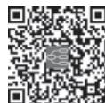  
本章思维导图

抗磷脂综合征（antiphospholipid syndrome，APS）是一种以反复动、静脉血栓形成、病理妊娠、血小板减少为主要临床表现伴抗磷脂抗体持续中、高滴度阳性的自身免疫病，其临床表现复杂多样，全身各个系统均可受累，最突出表现为血管性血栓形成。APS 是获得性易栓症最常见的病因之一，约15%～20% 的深静脉血栓患者、近 1/3 新发青年脑卒中（年龄＜50 岁）患者，以及 10%～15% 的反复流产患者抗磷脂抗体（APL）阳性。30%～40% 的 SLE 患者 APL 阳性，约 10%～15% 的 SLE 患者有APS相关临床表现。

【病因和发病机制】 APS 确切发病机制尚未完全明确，APL 是 APS 发生的决定因素，其结合的主要靶抗原为 $\beta _ { 2 }$ 糖蛋白Ⅰ $( \mathsf { \beta } _ { 2 } \mathrm { { G P I } ) }$ ）。APL 通过多个途径导致血栓形成：APL 与血管内皮细胞细胞膜上的磷脂结合，使得内皮细胞功能受损，导致前列环素 $\mathrm { P G I } _ { 2 }$ 合成和释放减少；APL与血小板磷脂结合，释放血栓素 $\mathrm { A } _ { 2 } .$ ，使得血小板聚集，促进血小板黏附功能激活；APL 与抗凝血酶Ⅲ、蛋白 C、蛋白 S、凝血酶调节蛋白等直接结合，从而启动内源性、外源性凝血机制并使蛋白C 系统抑制引起血栓形成。

【临床表现】 APS的临床症状主要包括如下几个方面。

1. 血栓事件 APS 相关血栓事件的临床表现取决于受累血管的种类、部位和大小，可表现为单一血管或多血管受累（表8-12-1）。静脉栓塞在APS中更常见，最常见部位为下肢深静脉血栓，亦可累及肾、肝、视网膜、上腔和下腔静脉，以及颅内静脉窦等。动脉栓塞最常见的部位为颅内血管，亦可累及冠状动脉、肾动脉、肠系膜动脉等。微血管病变包括皮肤网状青斑、肾病、肺泡出血、肾上腺梗死等。

表 8-12-1  APS 血栓形成的临床表现

<table><tr><td>部位</td><td>静脉</td><td>动脉</td><td>微血管</td></tr><tr><td>肺脏</td><td>肺栓塞,肺动脉高压</td><td>肺梗死</td><td>肺泡出血</td></tr><tr><td>心脏</td><td>—</td><td>急性心肌梗死,冠状动脉旁路移植术后再梗死,缺血性心肌病,心腔内血栓形成</td><td>心肌病变</td></tr><tr><td>神经系统</td><td>颅内静脉窦血栓</td><td>脑卒中,短暂性脑缺血发作,缺血性脊髓炎</td><td>癫痫、舞蹈症、认知功能障碍</td></tr><tr><td>肾脏</td><td>肾静脉血栓</td><td>肾动脉血栓、肾梗死</td><td>APS 肾病</td></tr><tr><td>肝、脾</td><td>Budd-Chiari 综合征,肝小静脉闭塞症</td><td>肝梗死,脾梗死</td><td>—</td></tr><tr><td>胃肠道</td><td>肠系膜静脉血栓,肠坏死,肠穿孔</td><td>肠系膜动脉血栓</td><td>—</td></tr><tr><td>皮肤</td><td>—</td><td>—</td><td>网状青斑,葡萄状青斑,皮肤溃疡</td></tr><tr><td>肢体</td><td>深静脉血栓形成血栓性静脉炎</td><td>肢端坏疽</td><td>慢性下肢溃疡</td></tr><tr><td>大血管</td><td>上腔/下腔静脉综合征</td><td>腹主动脉狭窄,颈内动脉狭窄/闭塞,下肢动脉闭塞</td><td>—</td></tr><tr><td>眼</td><td>视网膜静脉血栓</td><td>视网膜动脉血栓</td><td>—</td></tr><tr><td>肾上腺</td><td>—</td><td>—</td><td>肾上腺梗死</td></tr></table>

少数 APS 患者可在 1 周内出现进行性多个（3 个或 3 个以上）器官的血栓形成，累及脑、肾、肝或心脏等重要脏器造成器官功能衰竭和死亡，并有病理证实小血管内血栓形成，称为灾难性 APS。其发生率约为 1.0%，但病死率高达 50%～70%，往往死于脑卒中、脑病、出血、感染等。其可能的发病机制为血栓风暴及炎症因子风暴。

2. 心脏瓣膜损害 APS 最常见的心脏损害表现之一。临床表现包括瓣膜整体增厚（＞3mm）、瓣叶近中部局限性增厚、瓣缘不规则的结节或者赘生物（Libman-Sacks 心内膜炎）及瓣膜中重度功能异常（反流、狭窄），二尖瓣最为常见，其次为主动脉瓣，但需除外风湿热和感染性心内膜炎病史。病变早期临床可无明显相关症状和体征，多数患者出现瓣膜严重损害或动脉血栓事件筛查病因时才发现。其可能的机制为受累瓣膜在免疫复合物沉积损伤基础上继发纤维素-血小板栓子形成。

3. 血液系统损害 包括血小板减少和溶血性贫血。血小板减少是APS患者常见临床表现之一，发生率为 20%～53%，通常合并 SLE 的 APS 患者更易发生。程度往往为轻度或中度，可能的机制包括抗磷脂抗体直接结合血小板使其活化和聚集、血栓性微血管病消耗、大量血栓形成消耗等。

4. 病理妊娠 APS 患者妊娠丢失往往发生在孕 10 周以后，称为胎儿死亡，亦可发生在更早期，表现为反复妊娠丢失，但此时需要与胚胎染色体异常、内分泌代谢病等病因所致相鉴别。APS 在妊娠中期多表现为胎儿宫内发育迟缓、羊水过少或者胎死宫内，亦可发展为严重的子痫或者子痫前期导致新生儿早产，或者HELLP综合征（溶血、肝酶升高、血小板减少）。

【实验室检查】 常规检查可见血小板减少、自身免疫性溶血性贫血、补体减低，轻度尿蛋白阳性或者异形红细胞；特异性检查指标包括如下几项。

1. 抗磷脂抗体谱 一组以磷脂和/或磷脂结合蛋白为靶抗原的自身抗体总称，是 APS 最具特征的实验室标志物，亦是 APS 患者血栓事件和病理妊娠的主要风险预测因素。其中狼疮抗凝物（lupus anticoagulant，LAC）、抗心磷脂抗体（anticardiolipin antibody，ACA）及抗β 糖蛋白Ⅰ抗体（anti-βglycoprotein-Ⅰ antibody，aβGPⅠ）是纳入 APS 分类标准中的实验室指标。与 ACA、抗βGPⅠ抗体相比，LAC 与血栓形成、病理妊娠之间存在更强的相关性。检测 LAC 是一种功能性试验，是基于 LAC 在体外能延长磷脂依赖的不同途径的凝血时间来确定机体是否存在LAC。

2. 部分患者容易合并其他自身免疫病 因此可见抗核抗体、抗dsDNA抗体、抗ENA抗体阳性。

3. 影像学检查 血管彩色多普勒超声能够准确发现动、静脉血栓。放射性核素肺通气/灌注扫描，螺旋CT 和电子束CT肺血管造影能够诊断肺血栓栓塞症。MRI 可以及早发现颅内微小梗死灶。

【诊断】

1. 诊断 当患者出现如下情况须疑诊 APS：①不明原因的血栓事件；②反复发作的血栓事件；③肠系膜、肝静脉、肾静脉、颅内静脉窦血栓等非常见部位的血栓事件；④青年（＜50 岁）脑卒中、心血管事件；⑤难以解释的神经系统症状：舞蹈症、横贯性脊髓炎、早期血管性痴呆；⑥SLE 及其他结缔组织病合并血栓事件者；⑦难以解释的血小板减少症、自身免疫性溶血性贫血；⑧反复流产或伴有早产的妊娠并发症；⑨网状青斑或者其他血栓事件相关的皮肤表现；⑩实验室检查意外发现 APTT 延长，梅毒血清检测假阳性。

抗磷脂综合征的诊断需要同时依靠临床表现和实验室检查两方面。根据 2006 年悉尼修订的APS分类标准，至少满足一条临床标准和一条实验室标准方可诊断APS（表 8-12-2）。

2. 鉴别诊断 APS的鉴别诊断主要依据不同的临床表现加以鉴别。多种获得性或者遗传因素亦可导致妊娠丢失，和/或血栓栓塞性疾病。静脉栓塞需要与遗传性或者获得性凝血功能异常（如蛋白C、蛋白S、因子Ⅴ莱登突变）、抗凝血酶缺陷症、恶性肿瘤和骨髓增殖性疾病、肾病综合征等鉴别。动脉栓塞需与动脉粥样硬化、栓塞事件、心房颤动、心房黏液瘤、感染性心内膜炎、脂肪栓塞、血栓性血小板减少性紫癜，以及系统性血管炎等鉴别。同时或者先后出现动脉和静脉栓塞时需与肝素诱导性血小板减少症、低纤维蛋白原血症或纤维蛋白原活化因子缺乏症、同型半胱氨酸血症、骨髓增殖性疾病、真性红细胞增多症、阵发性睡眠性血红蛋白尿症、华氏巨球蛋白血症、镰状细胞病、系统性血管炎等鉴别。

表 8-12-2  2006 年悉尼修订的 APS 分类标准

## 临床标准

1. 血栓形成：任何器官/组织发生 1 次或 1 次以上动、静脉或小血管血栓形成（浅表静脉血栓不做诊断指标），必须有客观证据（如影像学、组织病理学等），组织病理学如有血栓形成，必须是血栓部位的血管壁无血管炎表现。

## 2. 病理妊娠

（1）1 次或多次无法解释的形态学正常的胎龄≥10 周胎儿死亡，必须经超声检查或对胎儿直接大体检查表明胎儿形态学正常。

（2）在妊娠 34 周前，因重度子痫或重度子痫前期或严重胎盘功能不全所致 1 次或多次形态正常的新生儿早产。

（3）连续 3 次或 3 次以上无法解释的胎龄＜10 周的自然流产，须除外母亲生殖系统解剖异常，或激素水平异常，或因母亲或父亲染色体异常等因素所致。

## 实验室标准

1. 血浆中狼疮抗凝物阳性：依照国际狼疮抗凝物/磷脂依赖型抗体学术委员会制定的血栓和止血指南进行检测。

2. 采用标准化 ELISA 法检测血清或血浆中抗心磷脂抗体：IgG 型/IgM 型中高效价阳性抗体（IgG 型和IgM 型分别 ${ > } 4 0 \mathrm { I g G }$ 磷脂单位或IgM 磷脂单位，或大于第99百分位数）。

3. 采用标准化 ELISA 法检测血清或血浆抗 $\beta _ { 2 } \mathrm { G P I }$ 抗体：IgG 型/IgM 型阳性（效价大于健康人效价分布的第99百分位数）。

注：ELISA 为酶联免疫吸附试验，上述检测均要求间隔 12 周以上，至少 2 次阳性，如果抗磷脂抗体阳性结果与临床表现之间间隔＜12周，或者间隔超过5年，则不能诊断APS。

【治疗与预后】 APS 的治疗目的主要包括预防血栓和避免妊娠失败。治疗应做到个体化，根据不同患者的不同临床表现，病情严重程度及对治疗药物的反应等制订恰当的治疗方案。除药物治疗亦应包括加强患者教育改善依从性及生活方式调整，包括戒烟、控制体重等。

长期充分抗凝是治疗血栓性 APS 的关键。常用的抗凝药物包括维生素 K 拮抗剂华法林及肝素或低分子量肝素，可单用亦可联合抗血小板药物阿司匹林。一般情况下糖皮质激素和免疫抑制剂在APS 患者无须使用，仅当合并严重血小板减少、溶血性贫血及微血管病变时可以应用。产科 APS 患者可以根据既往有无血栓事件、病理妊娠和是否合并其他 CTD 等因素，选用小剂量阿司匹林（75～100mg 每日）或联合低分子量肝素治疗。灾难性 APS 一线治疗方案为肝素抗凝，联合大剂量糖皮质激素及血浆置换和/或静脉应用免疫球蛋白三联治疗同时积极寻找并控制透因明确有无感染源及筛查恶性肿瘤等。

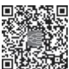  
本章思维导图

APS 患者整体预后相对良好，10 年生存率约为 90.7%，主要死亡原因为血栓事件、出血事件以及合并感染。血栓性 APS 如未规范治疗，5 年血栓事件再发风险超过 50%。未经治疗的产科 APS 妊娠成功率仅为10%～30%，经规范治疗后活产率可显著升高至70%～85%。

（曾小峰）

本章数字资源

成人斯蒂尔病（adult-onset Still disease，AOSD）是一种少见的、病因不明的全身性自身炎症性疾病，主要临床表现为高热、一过性皮疹、关节炎、关节痛、咽痛、肝脾及淋巴结肿大，常伴有白细胞计数升高及血清铁蛋白升高。AOSD 全球发病率为（0.16～0.40）/10 万，20～40 岁为发病高峰年龄，约占全部病例的 70%，女性发病率稍高于男性。AOSD 可分为系统型和关节炎型：系统型以发热及全身系统性症状为主要表现；关节炎型以高热和关节炎为主要表现，全身系统性症状相对较轻，常演变为慢性关节炎。

【发病机制】 AOSD 病因和发病机制尚未完全明确，一般认为与感染、遗传和免疫异常有关。研究发现 AOSD 与感染有着某种联系，一些病原体可能参与或始动了 AOSD 发病，其临床表现酷似细菌性败血症，但多数反复血培养阴性，抗生素无效。遗传学研究显示 AOSD 可能的易感基因有 HLA-B17、HLA-B18、HLA-B35、HLA-DR2、HLA-DR7 等。固有免疫系统过度激活和促炎因子过度产生是AOSD发病机制中的关键环节。AOSD活动期患者血清中存在高水平的IL-1β、TNF-α、IFN-γ、IL-6、IL-18等细胞因子，IL-18和血清铁蛋白水平明显相关，可作为诊断疾病和判断疾病活动度的指标之一。

## 【临床表现】

1. 发热 发热是 AOSD 最突出的症状，几乎见于所有患者，发热持续时间＞1 周，往往贯穿整个疾病过程。最高体温多在 39℃以上，发热高峰 1～2 次/日。热型以弛张热多见，也可呈现稽留热或不规则热。部分患者未经处理体温可自行恢复正常，热退后一般情况良好。

2. 皮疹 AOSD 的典型皮疹为一过性橘红色斑疹或斑丘疹，主要分布在四肢近端、颈部及躯干。皮疹多于高热时出现，热退消失，消退后不留痕迹。少数 AOSD 患者也可出现色素样丘疹、固定性线性荨麻疹和斑块性荨麻疹等持续性非典型的皮疹。

3. 咽痛 疾病早期约70%患者可出现咽痛，多以干痛为主，严重者饮水、吞咽困难，发热时加重，热退后缓解。体检可见咽部充血、咽后壁淋巴滤泡增生，咽拭子培养阴性。

4. 关节肌肉症状 逾 2/3 患者有关节受累，常与发热伴行，表现为关节疼痛或压痛，肿胀较轻，最常受累关节为膝、腕、踝关节。约80% 患者有肌肉疼痛，多不伴肌酶升高及肌电图异常。

5. 脾及淋巴结肿大 AOSD 患者可见脾大和弥漫性对称性淋巴结肿大，淋巴结活检多为反应性增生或慢性非特异性炎症，亦可为坏死性淋巴结炎。

6. 其他 约 80% 患者出现肝大或肝酶升高，多数经治疗可完全恢复。心肺受累可出现心包炎、胸膜炎、机化性肺炎、浸润性肺部疾病、肺泡损伤、肺动脉高压等。

7. 并发症 巨噬细胞活化综合征（macrophage activation syndrome，MAS）是 AOSD 一种严重且危及生命的并发症，发生率为12%～15%。当AOSD患者出现持续性发热、外周血细胞计数进行性下降、纤维蛋白原下降、甘油三酯升高、血清铁蛋白明显升高、肝功能异常时，须警惕MAS 发生。

【实验室检查】 活动期 AOSD 患者外周血白细胞计数升高，常波动在（10～20）×109/L，部分患者可达 $5 0 \times 1 0 ^ { 9 } / \mathrm { L } _ { \odot }$ 中性粒细胞比例升高（>80%）其诊断价值高于白细胞计数。部分患者合并贫血或血小板计数升高，血沉增快和C反应蛋白升高与活动度密切相关，AOSD 患者血清铁蛋白水平显著升高，高于正常参考值 5 倍以上对诊断有重要提示作用，可作为评估疾病活动、监测疗效、预测MAS 风险的标志。骨髓检查可见粒细胞增生活跃，核左移，胞质中有中毒颗粒。绝大多数患者类风

湿因子和抗核抗体阴性，个别可呈低滴度阳性。

## 【诊断与鉴别诊断】

（一） 诊断 本病无特异性血清学、病理学诊断标志，主要依靠临床判断。目前使用的分类标准主要有日本 Yamaguchi 标准、美国 Cush 标准及法国 Fautrel 标准。

日本Yamaguchi 标准临床应用较为广泛，具体如下。

主要标准：发热≥39℃并持续 1 周以上；关节炎/关节痛持续 2 周以上；典型皮疹；白细胞≥10×109/L 且中性粒细胞≥80%。

次要标准：咽痛；淋巴结和/或脾大；肝功能异常；类风湿因子和抗核抗体阴性。

排除标准：排除肿瘤性疾病、感染性疾病和其他风湿性疾病。

符合5条或 5条以上（其中至少2条是主要标准）可考虑诊断AOSD。

（二） 鉴别诊断 诊断 AOSD 须注意与感染、自身免疫或自身炎症性疾病、肿瘤及其他疾病相鉴别。

1. 感染性疾病 感染性疾病的病原体包括细菌、病毒、真菌、寄生虫等，感染除须排查呼吸道、尿道等常见部位，也应注意膈下、肾周、心脏瓣膜等隐匿部位。

2. 自身免疫/自身炎症性疾病 系统性红斑狼疮、炎症性肌病、血管炎等自身免疫病及家族性地中海热、肿瘤坏死因子受体相关周期性综合征等自身炎症性疾病也常出现发热、皮疹、关节痛等症状，可通过皮疹的特点、伴随表现、自身抗体及基因检测等鉴别。

3. 肿瘤性疾病 常需与血液系统肿瘤如淋巴瘤、白血病、骨髓增殖性疾病等鉴别，体格检查须注意有无浅表淋巴结肿大、胸骨压痛等体征。淋巴瘤诸多表现酷似 AOSD，淋巴结、骨髓穿刺等病理活检有助于鉴别。恶性实体肿瘤、心房黏液瘤、副肿瘤综合征等其他肿瘤性疾病亦可出现类似 AOSD表现。

4. 其他疾病 如急性发热性嗜中性细胞皮肤病、亚急性甲状腺炎、组织细胞坏死性淋巴结炎、药物相关超敏反应等。

【治疗】 目前主要的治疗药物有非甾体抗炎药、糖皮质激素、免疫抑制剂、生物制剂及 JAK 抑制剂。轻型患者可首选非甾体抗炎药，约1/4患者可缓解目预后良好。糖皮质激素是本病治疗的首选药物，常用剂量为泼尼松 0.5～1.0mg/（kg·d），对常规剂量激素反应不佳或合并严重并发症者可考虑甲泼尼龙 500～1 000mg/d 静脉滴注，连用 3 天，必要时重复给药。免疫抑制剂如甲氨蝶呤可协同糖皮质激素控制病情，钙调磷酸酶抑制剂更适用于合并肝功能异常和 / 或发生 MAS 的患者，其他一些免疫抑制剂如来氟米特、硫唑嘌呤等也曾报道对本病有效。目前治疗 AOSD 的生物制剂主要包括 IL-6拮抗剂、IL-1 拮抗剂等，可通过靶向阻断致病的细胞因子缓解病情，用于重症、难治、复发和疾病高度活动的患者。部分慢性关节炎型 AOSD 患者使用 TNF-α抑制剂有效。JAK 抑制剂可用于难治性AOSD，有助于疾病缓解和激素减量。严重患者还可采用大剂量免疫球蛋白静脉注射、血浆置换、免疫吸附等方法，其临床疗效有待进一步证实。

  
本章思维导图

【预后】 AOSD 病情、病程多样，临床异质性大，多数患者预后良好。部分 AOSD 患者全身症状或关节炎反复发作，激素减量困难。存在严重肝损伤、心肺受累或合并 MAS 患者预后差，死亡风险高。

（刘升云）

本章数字资源

复发性多软骨炎（relapsing polychondritis，RP）是一种主要累及软骨结构及富含蛋白聚糖成分器官的以复发为特征，免疫介导的罕见系统性疾病。年发病率为（0.35～9.0）/100万，好发于40～60岁，无性别差异。约 1/3 患者可伴发系统性血管炎等风湿性疾病、骨髓增生异常综合征等血液病及恶性肿瘤等。

【发病机制】 发病机制不明，可能与遗传易感人群免疫系统对因创伤、感染、化学侵袭等导致软骨结构破坏而暴露的软骨抗原产生免疫反应有关。

【临床表现】 本病异质性强，临床表现呈现反复发作和缓解的特点。主要表现为耳、鼻、咽喉、气管、支气管的炎症，还可累及心血管、关节、眼、皮肤、肾脏、神经和血液等多个系统。

最常见和特征性的表现是耳廓软骨炎，为突发的耳廓红肿疼痛，不累及耳垂，几天至几周可自行缓解，常反复发作，致外耳廓松弛、塌陷、畸形和局部色素沉着，称为“菜花耳”“松软耳”。外耳道狭窄、中耳炎症、咽鼓管阻塞可导致传导性耳聋。还可累及内耳，出现听力下降和/或前庭功能受累。累及鼻软骨可出现鼻塞、流涕、鼻出血、鼻黏膜糜烂及鼻硬结等，反复发作可导致“鞍鼻”畸形。

约半数患者累及咽喉、气管及支气管软骨，表现为咽喉部疼痛和压痛、声嘶、刺激性咳嗽、呼吸困难和吸气性喘鸣，常合并呼吸道感染。咽喉和会厌软骨炎症可导致上呼吸道塌陷，造成窒息，严重者须行气管切开术。

约 30% 患者可累及心血管系统，表现为心肌炎、心内膜炎、心脏传导阻滞、主动脉瓣关闭不全，以及大、中、小血管炎。

约 70% 患者累及关节，多为非对称性、发作性、非侵蚀性关节炎。眼炎常表现为巩膜炎，可因巩膜变薄出现蓝色巩膜；也可表现为结膜炎、葡萄膜炎、溃疡性或坏死性角膜炎、视网膜血管炎或视神经炎等。皮肤受累可出现结节性红斑、紫癜、黏膜溃疡、网状青斑、指端坏死等。

【辅助检查】 无特异性血清学标志物，抗软骨细胞抗体、抗Ⅱ型胶原抗体及抗 matrilin-1 抗体有助于诊断。肺 CT 和纤维支气管镜检查可发现气管、支气管普遍狭窄。肺功能检查可发现阻塞性通气功能障碍。PET-CT可早期发现无症状的软骨炎。

【诊断与鉴别诊断】 临床上仍沿用1986年Michet 提出的诊断标准（表8-14-1）。

表 8-14-1  1986 年复发性多软骨炎的 Michet 标准

<table><tr><td>主要标准</td><td>次要标准</td></tr><tr><td>1. 明确的发作性耳软骨炎2. 明确的发作性鼻软骨炎3. 明确的发作性喉、气管软骨炎</td><td>1. 眼炎2. 听力下降3. 前庭功能障碍4. 血清阴性多关节炎</td></tr></table>

注：2项主要标准或1项主要标准加2项次要标准可确诊。

耳部病变应与外伤、冻疮、丹毒、慢性感染、痛风、梅毒等鉴别。鼻软骨炎应与各种肉芽肿性疾病如肉芽肿性多血管炎、结核、梅毒等鉴别。空泡-E1 酶-X 连锁-自身炎症和体细胞（VEXAS）综合征患者有相当比例被临床诊断为RP。

【治疗】 急性发作期应卧床休息，保持呼吸道通畅，预防窒息。轻症患者可给予非甾体抗炎药、秋水仙碱。重症患者应用糖皮质激素，起始剂量为 0.5～1mg/（kg·d）。对有咽喉、气管及支气管、眼、内耳受累及系统性血管炎的急性重症患者，糖皮质激素的剂量可酌情增加，或大剂量甲泼尼龙冲击治疗。症状好转后逐渐减量，以最小剂量维持 1～2 年或更长时间。可酌情加用免疫抑制剂如环磷酰胺、甲氨蝶呤、吗替麦考酚酯、来氟米特、硫唑嘌呤、钙调磷酸酶抑制剂等。氨苯砜对部分患者的软骨炎症和关节炎可能有效。对于难治性或反复发作的患者，有小样本报道可使用 TNF-α抑制剂、IL-6受体单抗、IL-1 受体单抗、选择性 T 细胞共刺激调节剂、JAK 抑制剂等。持续气道正压通气可以防止软化的气道塌陷，减轻气道陷闭。对多处或较广泛的气管或支气管狭窄，可以在纤维支气管镜下或 X线引导下置入金属支架。

  
本章思维导图

【预后】 大部分患者表现为慢性病程，预后相对较好。常见的死亡原因是感染、气道受累和血管炎。其他预后不良因素包括心脏瓣膜病变、肾脏病变、合并恶性肿瘤和贫血。

（徐  健）

风湿热（rheumatic fever）是致病性链球菌感染引起的迟发性炎症性后遗症，反复发作后常遗留轻重不等的心脏损害，导致风湿性心脏病。多发于冬春阴雨季节和贫困落后地区。最常见人群为 5～15 岁儿童和青少年。目前全球发病率已经明显降低，但根除本病仍有很大挑战。

【发病机制】 链球菌咽部感染是风湿热发生的必要条件，致风湿型链球菌常为A～C 群，特别是A 群。发病机制尚不完全明了，可能的发病机制如下：与自身抗原相似的链球菌成分，通过分子模拟机制激活自身反应性 B 细胞和 T 细胞，形成免疫复合物引发组织损伤，并通过表位扩展进一步加重组织损伤。

遗传易感性与发病相关，免疫球蛋白重链基因座和人类白细胞抗原Ⅱ类区域存在该病的易感位点。环境因素影响也较大。环境过度拥挤、常规使用抗生素治疗急性咽炎会造成本病高发。

【病理解剖】 风湿热可导致多种组织损伤。典型病理改变为阿绍夫小体（Aschoff body），由结缔组织、淋巴细胞浸润和异常组织细胞中增殖的纤维蛋白变性形成。

心脏瓣膜可增厚、钙化和扭曲，边缘呈新月形，伴 T细胞浸润。最常受累的瓣膜为二尖瓣，其次为主动脉瓣。

【临床表现】

（一） 症状 急性起病，通常在链球菌性咽炎（热带地区可能为链球菌性脓皮病）后 1～5 周内发病。主要表现包括关节炎、心脏炎、舞蹈病、皮下结节和环形红斑，可单独或合并出现。70%～75% 患者表现为急性发热伴关节炎，常伴有心脏炎。

1. 关节炎 最常见的症状，呈急性、多发性、游走性、非致畸性关节炎，膝、踝、肘和腕关节最常受累。持续时间常在1～7天。

2. 心脏炎 典型病例为累及心包、心外膜、心肌和心内膜的全心脏炎，尤其是二尖瓣和主动脉瓣受累最多。心脏表现常在链球菌感染后 3 周内出现。重度或反复发作后，可发生风湿性心脏病和心力衰竭。

3. 舞蹈病 常在链球菌感染后 1～8 个月出现，可以孤立存在，多见于女童。多在 6 周内完全康复，但在妊娠或口服避孕药时可能复发。

4. 环形红斑 无瘙痒，遇热明显，数小时或1～2天消退。

5. 皮下结节 表现为关节伸侧的质硬、无痛性皮下小结节。常对称分布，数量平均 3～4 个。持续1周至数周。

6. 其他临床表现 包括发热、多汗、腹痛等。

（二） 体征 可见环形红斑、皮下结节。窦性心动过速是心脏炎早期表现。心脏瓣膜受累者可见相应体征。

【辅助检查】

（一） 实验室检查

1. 链球菌感染指标：详见表8-15-1。

2. 急性期 80% 患者 ESR 增快和 CRP 升高。

3. 关节滑液分析一般为无菌性炎性液体。

（二） 辅助检查 所有疑似风湿热患者均应行超声心动图/多普勒超声、静息心电图检查。

本章思维导图

## 【诊断与鉴别诊断】

1. 诊断 诊断可根据2015年美国心脏协会修订的Jones 诊断标准（表8-15-1）。

表 8-15-1  2015 年美国心脏协会修订的 Jones 诊断标准

<table><tr><td colspan="2">A.具有1次链球菌感染迹象的患者群体*</td></tr><tr><td>诊断:初发急性风湿热</td><td>2个主要表现,或1个主要表现+2个次要表现</td></tr><tr><td>诊断:复发性急性风湿热</td><td>2个主要表现,或1个主要表现+2个次要表现,或3个次要表现</td></tr><tr><td colspan="2">B.主要表现</td></tr><tr><td>低风险人群</td><td>中高风险人群</td></tr><tr><td>心脏炎</td><td>心脏炎</td></tr><tr><td>•临床和/或亚临床</td><td>•临床和/或亚临床</td></tr><tr><td>关节炎</td><td>关节炎</td></tr><tr><td>•仅多关节炎</td><td>•单关节炎或多关节炎•多关节痛</td></tr><tr><td>舞蹈病</td><td>舞蹈病</td></tr><tr><td>环形红斑</td><td>环形红斑</td></tr><tr><td>皮下结节</td><td>皮下结节</td></tr><tr><td colspan="2">C.次要表现</td></tr><tr><td>低风险人群</td><td>中高风险人群</td></tr><tr><td>多关节痛</td><td>单关节痛</td></tr><tr><td>发热(≥38.5°C)</td><td>发热(≥38°C)</td></tr><tr><td>ESR≥60mm/h和/或CRP≥3.0mg/dl</td><td>ESR≥30mm/h和/或CRP≥3.0mg/dl</td></tr><tr><td>PR间期延长,须考虑年龄变异性(除非心脏炎是主要标准)</td><td>PR间期延长,须考虑年龄变异性(除非心脏炎是主要标准)</td></tr></table>

注，链球菌感染证据指咽拭子培养A群乙型溶血性链球菌阳性：或快速链球菌抗原检测为阳性：或抗0抗体滴度升高或逐渐上升，抗链球菌溶血素O或抗脱氧核糖核酸酶B任一抗体阳性。疑为链球菌感染时，可2周后重复采样一次。  
关节表现中的关节炎和关节痛，心脏表现中的心脏炎和PR间期延长，只能作为符合1条主要或次要表现，而不是2条。

2. 鉴别诊断 多关节疼痛的病因须广泛鉴别，如感染、感染后免疫反应、其他风湿性疾病、恶性肿瘤等。

【治疗】 治疗目标包括 4 个方面：抗生素根除致病性链球菌感染；迅速控制临床症状；控制心力衰竭和舞蹈病等并发症和合并症；预防再次感染。

治疗方案应遵循个体化原则。根除链球菌目的是避免反复发作，首选青霉素。关节炎治疗首选非甾体抗炎药。

【预后】 约 70% 患者可在 2～3 个月内恢复。急性期心脏受累者如不及时合理治疗，可发展为风湿性心脏病，是最常见的获得性瓣膜病。

## 【预防】

1. 一级预防 及时诊断和抗生素治疗链球菌感染，预防风湿热发生。

2. 二级预防 对有明确病史或已患风湿性心脏病者持续应用有效抗生素，避免疾病再发，防止心脏损害加重。

（穆 荣）

本章数字资源

纤维肌痛综合征（fibromyalgia syndrome，FMS）是一种以全身弥漫性疼痛及发僵为主要临床特征，常伴有疲乏无力、睡眠障碍、情感异常和认知功能障碍等的慢性疼痛性非关节性风湿性疾病，在特殊部位有压痛点。患病率约为2%，其中女性3%～4%，男性0～5%，随年龄增加呈线性增长。平均年龄为49岁，其中90%为女性，70～79 岁达到患病高峰。

【病因和发病机制】 FMS 病因不清，目前认为与遗传易感、睡眠障碍、神经内分泌紊乱、免疫紊乱、一些体内正常存在的氨基酸浓度改变以及心理因素有关。继发于外伤、骨关节炎、类风湿关节炎、系统性红斑狼疮及肿瘤等称为继发性FMS，如不伴有其他疾患则称为原发性FMS。

本病发病机制不清，有研究证明 FMS 患者肌肉疼痛来源于神经末梢，即疼痛感受器。机械性牵拉、挤压、P 物质、缓激肽、钾离子等化学刺激及缺血性肌肉收缩都会刺激神经末梢，引起肌肉疼痛。约 1/3 患者血清中胰岛素、胰岛素生长因子-1（IGF-1）以及与生长激素有关的氨基酸浓度均降低，而且脑脊液中这些因子浓度变化与FMS患者疼痛有关。另外，FMS还可继发于骨关节炎、椎间盘突出症等疾病，这些疾病引起的外周伤害性疼痛因反复刺激脊髓第二背角神经元，导致中枢敏化作用，最终出现 FMS典型慢性疼痛。

## 【临床表现】

1. 特征性症状 FMS 核心症状是慢性全身性广泛性肌肉疼痛，大多数伴有皮肤触痛，时轻时重。13% 的患者有广泛性肌肉疼痛，43% 为局限性疼痛，以中轴骨骼（颈、胸、下背部）、肩胛带及骨盆带肌最常见，其他常见部位依次为膝、头、肘、踝、足、上背部、中背部、腕、臀部、大腿和小腿。FMS的疼痛呈弥散性，患者自觉疼痛出现在肌肉、关节、神经和骨骼等多部位，难以准确定位。所有患者均有广泛的压痛点，分布具有一致性，多呈对称性，查体往往有 9 对（18 个）解剖位点压痛。这 18 个解剖点为：枕骨下肌肉附着点两侧，第 5～7 颈椎横突间隙前面的两侧，两侧斜方肌上缘中点，两侧肩胛冈上方近内侧缘的起始部，两侧第 2 肋骨与软骨交界处的外上缘，两侧肱骨外上髁远端 2cm 处，两侧臀部外上象限的臀肌前皱襞处，两侧大转子的后方，两侧膝脂肪垫关节褶皱线内侧（图 8-16-1）。女性比男性患者的压痛点多，具有 11 个以上压痛点的患者中 90% 为女性。软组织损伤、睡眠不足、寒冷及精神压抑均可引起疼痛发作，气候潮湿及气压偏低可加重疼痛。76%～91% 患者可有晨僵，其严重程度与睡眠障碍及病情活动程度有关。FMS 的晨僵感，与 RA 的晨僵以及风湿性多肌痛的“凝胶现象”相似，但是缺乏特异性而不能作为诊断依据。

2. 其他症状 约 90% 患者伴有睡眠障碍，表现为失眠、易醒、多梦及精神不振。一半以上患者出现严重的疲劳甚至感觉无法工作。另外可出现头痛包括偏头痛和枕区或整个头部压迫性钝痛以及头晕、呼吸困难、肢体麻木、感觉异常、抑郁或焦虑等，但神经系统查体往往全部正常。患者常诉关节痛，可伴晨僵，但无关节肿胀等客观体征。30%以上的患者可出现肠易激综合征，包括肠胀气、腹痛、大便不成形及大便次数增多。部分患者有虚弱、盗汗以及口干、眼干等表现，另外可出现膀胱刺激症状、骨盆疼痛、雷诺现象、不宁腿综合征等。天气寒冷潮湿、精神紧张和过度劳累时症状加重，局部受热、精神放松、良好睡眠、适度活动可减轻症状。

【实验室检查】 血沉（ESR）、C 反应蛋白（CRP）、自身抗体等检查往往无异常发现。脑部功能性磁共振成像（fMRI）可发现额叶皮质、杏仁核、海马和扣带回等部位激活反应异常以及相互之间的纤维联络异常。

  
图 8-16-1  FMS 18 个压痛点的部位图示

【诊断】 根据患者存在慢性广泛性肌肉疼痛及发僵，常伴有失眠、易醒、多梦及精神不振等睡眠障碍表现，颈、胸、下背部、肩胛带及骨盆带肌最为常见等症状特点，结合全身可出现多处压痛点的典型体征，在排除风湿性多肌痛、慢性疲劳综合征等疾病后可作出诊断。

参考 2016 年美国风湿病学会（ACR）的诊断标准，满足 3 种条件可被诊断为纤维肌痛综合征：①广泛性疼痛指数（WPI）≥7 分且症状严重程度评分（SSS）≥5 分，或 WPI 在 4～6 分且 SSS≥9 分；②目前存在广泛性疼痛，指至少 5 处区域中的 4 处出现疼痛，但下颌、胸部、腹部的疼痛不包含在内；③症状持续存在3 个月以上，FMS的诊断独立于其他诊断，并且其诊断不能排除其他临床疾病。

【治疗与预后】 由于病因及病理生理机制不明，因此 FMS 无特异性治疗方法，主要是综合治疗，包括适当运动、减轻精神压力和对症镇痛等。

1. 药物治疗 目的是阻断神经触发点，改善精神症状。抗抑郁药为首选治疗药物，能改善睡眠和疲劳，但是对压痛点的疼痛无效。其中，三环类抗抑郁药（TCAs）阿米替林（amitriptyline）应用最为广泛，选择性 5-羟色胺（5-HT）再摄取抑制剂（SSRIs）和高选择性单胺氧化酶抑制剂（MAOIs）也是常用药物，特别是与三环类抗抑郁药联合应用时效果更佳，能明显改善睡眠、减轻疼痛与疲劳，特别是缓解抑郁状态。第 2 代抗惊厥药普瑞巴林（pregabalin）是首个被美国食品药品监督管理局（FDA）批准用于 FMS 的治疗药物。对乙酰氨基酚对部分 FMS 患者有效，曲马多等弱阿片类药物可用于对其他药物治疗无应答的中-重度疼痛患者。

  
本章思维导图

2. 非药物治疗 包括认知行为治疗、热水浴疗法、需氧运动、柔性训练等，也可提高疗效，减少药物不良反应。

FMS 患者常见复发和缓解交替，但无内脏损害，预后良好。

（姜林娣）

## 推荐阅读

［1］FIRESTEIN G S，BUDD R C，GABRIEL S E，et al. Kelley & Firestein’s textbook of Rheumatology. 10th ed. Philadelphia： Elsevier，2017.

［2］HOCHBERG M C，SILMAN A J，SMOLEN J S，et al. Rheumatology. 6th ed.Philadelphia：Elsevier，2015.

［3］GOLDMAN L，SCHAFER A I. Goldman-Cecil Medicine. 26th ed. Philadelphia：Elsevier，2019.

## 第九篇理化因素所致疾病

人类的生活环境中，危害身体健康的物理因素（温度、气压、电流、电离辐射、噪声和机械力等）和化学因素（强酸、强碱、化学毒物、动植物的毒性物质）有许多。本篇主要论述几种常见环境理化因素所致疾病，并以急性发病者为重点。

【物理致病因素】 环境中，引起人体发病的主要物理致病因素有：

1. 高温（high temperature） 作用于人体引起中暑（heat illness）或烧伤（burn）。

2. 低温（low temperature） 在低温环境中意外停留时间较长，易发生冻僵（frozen rigor，frozenstiff）、冻伤。

3. 高气压（high pressure） 水下作业，气压过高，返回地面速度太快时，易发生减压病，此时血液和组织中溶解的氮气释放形成气泡，发生栓塞，导致血液循环障碍和组织损伤。

4. 低气压（low pressure） 常见于高山或高原地区环境，由于空气中氧分压较低，短时间停留出现急性缺氧，发生急性高原病（acute high altitude sickness）。

5. 电流（electrical current） 意外接触不同类型及强度的电流后，可引起电击伤（electrical shockinjury），造成人体组织器官损害。

此外，洪涝灾害、水上操作或水上运动时意外落水可发生淹溺（drowning）。由于颠簸、摇动和旋转等引起晕车、晕船或晕机（即眩晕症），主要与前庭神经功能障碍等因素有关。噪声导致听力损害，强烈的紫外线、红外线致皮肤损伤等。

【化学致病因素】 化学致病因素，可来自自然界（重金属、有毒的动植物毒素），也可来自工业产品（农药、药物、有机溶剂）生产中产生的“三废”（即废水、废气和废渣）污染。因许多无机和有机化学物质具有毒性，称为“毒物（poison）”。毒物可通过呼吸道、消化道或皮肤黏膜等途径进入人体引起中毒（poisoning）。

1. 农药 农药（pesticide）能杀灭有害的动植物。人体意外摄入常可中毒致死。如有机磷杀虫药（organic phosphorus insecticide，OPI）、氨基甲酸酯类杀虫药、灭鼠药和除草剂中毒。

2. 药物 常见过量使用麻醉镇痛药、镇静催眠药和中枢神经系统兴奋药等引起的中毒。长期滥用（abuse）镇静催眠药或麻醉镇痛药会产生药物依赖（drug dependence），突然停药或减量会发生戒断综合征（abstinence syndrome），表现为神经精神异常。

3. 醇类 一次或短时间大量饮酒会发生急性乙醇中毒（acute ethanol poisoning）。误饮甲醇可导致中枢神经系统和视神经损害、代谢性酸中毒，严重可致死。

4 其他 误服清洁剂或有机溶剂等中毒：一氧化碳（carbon monoxide）.氰化物和硫化氢为窒息性化合物，能使机体发生缺氧性中毒；强酸或强碱能引起接触性组织损伤；工业生产排出有毒化学物质，污染空气或水源，长期接触会发生慢性中毒；铊、汞和砷等中毒；有毒化学物品意外泄漏和军用毒剂引起急性中毒；毒蜂蜇伤、毒蛇等咬伤中毒、河鲀毒素和鱼胆等动物毒素中毒；毒蕈、乌头、曼陀罗、夹竹桃等有毒植物中毒。

【理化因素所致疾病防治研究进展】 人类对化学物质中毒的认识较早。公元前 500 年人们就已经认识到，未吸收入血的毒物不引起全身中毒。大多数中毒知识的积累主要来自所报告的中毒病例、流行病学研究和动物实验。20 世纪 30 年代前由于毒理学知识缺乏，对中毒无特殊疗法，只能采用一般清除或支持疗法。此后，开始结合生理学和毒理学研究有效解毒疗法，应用亚硝酸盐- 硫代硫酸钠来治疗氰化物中毒。20 世纪 40 年代用二巯丙醇（BAL）治疗砷中毒。20 世纪 50 年代用依地酸钙钠治疗铅中毒，开展了螯合剂治疗金属中毒的方法，同时碘解磷定用于治疗 OPI 中毒。20世纪 60 年代，我国始用二巯丁二钠（DMS）治疗锑、铅、汞和砷等金属及其化合物中毒。近年来发现，中毒发病机制与受体、自由基、脂质过氧化及细胞内钙稳态有关，这为探索解毒疗法开拓了新思路。20 世纪 70 年代以来，中毒诊断和治疗取得长足进展，这有赖于毒理学的兴起和急诊医学的发展。毒理学从器官到分子水平乃至基因水平深入研究中毒发病机制，药理学对特效解毒药的研究及急诊医学血液净化（blood purification）技术、器官支持技术的发展，大大提高了中毒诊治水平，改善了预后。

人类对物理因素所致疾病的研究要晚于化学物质中毒。近年来，由于工业发展和军事需要，人们开始对环境中有害物理因素对人体健康的影响、人体环境适应性及适应不全进行研究，并取得很大进展。此外，急诊医学先进复苏技术的应用大大提高了对高原病、电击和淹溺等患者的救治水平，降低了致残率和病死率。

【理化因素所致疾病的诊断原则】 理化因素所致疾病的特点是病因明确，有特殊的临床表现。

1. 病因 此类疾病都在一定环境条件下发病，多数病因明确并有相应检测方法。如药物过量或毒物中毒均可通过检测估计出中毒量对空气中的毒物可检测其浓度·环境温度，海拔高度和海水深度等都能测量。随着检测方法增多、灵敏度和特异度提高，对多数理化因素所致疾病的病因可明确诊断。

2. 受损靶部位 多种毒物都有其作用的靶器官和部位，如 OPI 吸收后抑制胆碱酯酶（cholin-esterase，ChE）；四氯化碳主要作用于肝；慢性苯中毒的靶器官是骨髓等。物理致病因素也各有其作用靶部位，如噪声主要作用于听神经；加速运动主要作用于前庭神经。

3. 剂量与效应关系 量效关系是评估理化致病因素作用的基本规律，暴露毒物的量，高、低温环境时间长短等都与病情严重程度相关，可作为判断预后的依据。

4. 流行病学调查分析 大多数理化因素所致疾病的特点是在同一时间可能有多数人发病，利用研究人群发病情况的流行病学调查方法，有助于明确环境中的致病因素和预防发病。

理化因素所致疾病虽然会出现一个或多个器官损伤或衰竭，但临床上往往缺乏特异性表现。诊断时，在考虑环境因素的同时，尚需结合接触史、临床表现和实验室检查，然后再与其他临床表现类似的疾病鉴别，综合分析、判断。

## 【理化因素所致疾病的防治原则】

1. 迅速脱离有害环境和危害因素 这是治疗理化因素所致疾病的首要措施。急性中毒时，尽快脱离毒物接触和清除体内或皮肤上的毒物，如处理局部污染、洗胃，对吸收入血的毒物采用血液净化疗法等。发现中暑或电击伤患者，立即转移到安全环境，再施行急救复苏措施。平时，应加强教育，防患于未然。

2. 稳定患者生命体征 理化因素所致疾病患者易出现神志、呼吸和循环障碍或衰竭，生命体征常不稳定，急救复苏的主要目的是稳定生命体征，加强监护，为进一步处理打下基础。

3. 针对病因和发病机制治疗 急性OPI中毒时，首先应用解毒药（如碘解磷定）使磷酰化胆碱酯酶（phosphoryl cholinesterase）复活，阿托品、盐酸戊乙奎醚抑制毒蕈碱样症状；纳洛酮竞争性结合阿片受体，治疗阿片类药物中毒；氟马西尼与苯二氮䓬受体竞争性结合，用于治疗苯二氮䓬类药物过量和中毒；甲吡唑为乙醇脱氢酶强效抑制剂，甲醇、乙二醇中毒首选；亚甲蓝属氧化还原剂，治疗亚硝酸盐、苯胺，硝基苯中毒等引起的高铁血红蛋白血症：亚硝酸盐-硫代硫酸钠序贯治疗氰化物中毒：二巯丙醇、二巯丙磺钠，巯基与重金属结合形成复合物后经尿液排出，用于治疗于砷、汞、铅、铜、锑等重金属中毒；氧治疗一氧化碳中毒等。

物理因素所致疾病的病因治疗：中暑高热时降温；冻僵时复温；急性高原病主要发病机制是缺氧，给氧是主要治疗措施；减压病主要是由高气压环境快速返回到低气压环境减压过快所致，治疗方法是进入高压氧舱（hyperbaric oxygen chamber）重新加压，再缓慢减压。

4. 对症支持治疗 理化因素所致疾病多无特效疗法，大都采取对症治疗，以减少患者痛苦。部分患者须经器官支持过渡到毒物彻底清除和器官功能恢复。

  
本章思维导图

总之，人类在生存过程中不断受到环境中不同有害因素影响，给人体健康带来危害。因此应学习有关理化因素所致疾病，对可预测的有害因素做好预防。已罹病者，要尽快诊断和进行有效治疗，促进康复。

（柴艳芬）

## 第一节 | 概 述

进入人体的化学物质达到中毒量，导致组织和器官损害而引起的全身性疾病称为中毒。引起中毒的化学物质称毒物。根据毒物来源和用途分为：①工业性毒物；②药物；③农药；④有毒动植物。学习中毒疾病的目的是了解毒物中毒的途径和引起人体致病的规律。掌握和运用这些知识，指导预防和诊治疾病。

根据暴露毒物的毒性、剂量和时间，通常将中毒分为急性中毒（acute poisoning）和慢性中毒（chronic poisoning）两类。急性中毒是指机体一次大剂量暴露，或24 小时内多次暴露于某种或某些有毒物质而引起的急性病理变化，发病急，病情重，变化快，如不积极治疗，常危及生命。慢性中毒是指长时间暴露，毒物进入人体蓄积中毒，起病慢，病程长，常缺乏特异性中毒诊断指标，容易误诊和漏诊。因此，疑有慢性中毒者，要认真询问病史和查体，并进行实验室相关毒物检查分析。慢性中毒常为职业中毒。

## 【病因和中毒机制】

## （一） 病因

1. 职业中毒 在生产过程中，暴露于有毒原料、中间产物或成品，如不注意劳动防护，即可发生中毒。在保管、使用和运输方面，如不遵守安全防护制度，也会发生中毒。

2. 生活中毒 误食、意外接触毒物、用药过量、自杀或谋害等情况下，大量毒物进入人体可引起中毒。

## （二） 中毒机制

## 1. 体内毒物代谢

（1）毒物侵入途径：通常，毒物经消化道、呼吸道或皮肤黏膜等途径进入人体引起中毒。毒物对机体产生毒性作用的快慢、强度和表现与毒物侵入途径和吸收速度有关。①消化道：是生活中毒的常见途径，如有毒食物、OPI 和镇静催眠药等常经口摄入中毒。毒物经口腔或食管黏膜很少吸收。OP和氰化物等在胃中吸收较少，主要由小肠吸收，经过小肠液和酶作用后，毒物性质部分发生改变，然后进入血液循环，经肝脏解毒后分布到全身组织和器官。②呼吸道：因肺泡表面积较大和肺毛细血管丰富，经呼吸道吸入的毒物较经消化道吸收入血的速度快 20 倍，能迅速进入血液循环导致中毒。因此，患者中毒症状严重，病情发展快。职业中毒时，毒物常以粉尘、烟雾、蒸气或气体状态经呼吸道吸入。生活中毒常见病例是一氧化碳中毒。③皮肤黏膜：健康皮肤表面有一层类脂质层，能防止水溶性毒物侵入机体。少数脂溶性毒物（如苯、苯胺、硝基苯、乙醚、三氯甲烷或有机磷化合物等）接触皮肤后易经皮脂腺吸收中毒。损伤皮肤的毒物（如砷化物、芥子气等）也可通过皮肤吸收中毒。皮肤多汗或有损伤时，都可加速毒物吸收。有的毒物也可经球结膜吸收中毒。毒蛇咬伤时，毒液可经伤口入血中毒。

（2）毒物代谢：毒物吸收入血后，与红细胞或血浆中某些成分相结合，分布于全身组织和细胞。脂溶性较大的非电解质毒物在脂肪和部分神经组织中分布量大；不溶于脂类的非电解质毒物，穿透细胞膜的能力差。电解质毒物（如铅、汞、锰、砷和氟等）在体内分布不均匀。大多数毒物在肝内通过氧化、还原、水解和结合等作用进行代谢，然后与组织和细胞内化学物质作用，分解或合成不同化合物。

如乙醇氧化成二氧化碳和水，乙二醇氧化成乙二酸，苯氧化成酚等。大多数毒物代谢后毒性降低，此为解毒过程（detoxification process）。少数毒物代谢后毒性反而增强，如对硫磷氧化为毒性更强的对氧磷。

（3）毒物排泄：进入人体的毒物多数经代谢后排出体外。毒物排泄速度与其组织溶解度、挥发度、排泄和循环器官功能状态有关。肾是排毒的主要器官，水溶性毒物排泄较快，利尿药可加速肾毒物排泄；重金属及生物碱主要由消化道排出，铅、汞和砷尚能由乳汁排出，可致哺乳婴儿中毒；易挥发毒物（如三氯甲烷、乙醚、酒精和硫化氢等）可以原形经呼吸道排出，潮气量越大，排泄毒物作用越强；一些脂溶性毒物可由皮脂腺及乳腺排出，少数毒物经汗液排出时可引起皮炎。有些毒物蓄积在体内一些器官或组织内，排出缓慢，再次释放又可导致中毒。

2. 中毒机制 毒物种类繁多，中毒机制不一，主要包括以下几种。

（1）腐蚀作用：强酸或强碱吸收组织中水分，与蛋白质或脂肪结合，引起接触部位皮肤组织细胞变性和坏死。

（2）组织和器官缺氧：如一氧化碳、硫化氢或氰化物等毒物阻碍氧的吸收、转运或利用。对缺氧敏感的脑和心肌易发生中毒损伤。

（3）麻醉作用：亲脂性强的毒物（如有机溶剂和吸入性麻醉药）易通过血脑屏障进入脑组织，抑制其功能。

（4）抑制酶活性：有些毒物及其代谢物通过抑制酶的活性产生毒性作用。如，OPI 抑制 ChE，氰化物抑制细胞色素氧化酶，含金属离子的毒物能抑制含巯基的酶等。

（5）干扰细胞或细胞器功能：在体内，四氯化碳经酶催化形成三氯甲烷自由基，后者作用于肝细胞膜中不饱和脂肪酸，引起脂质过氧化，使细胞膜的完整性受损，溶酶体破裂、线粒体及内质网变性和肝细胞坏死。酚类如二硝基酚、五氯酚和棉酚等可使线粒体内氧化磷酸化作用解偶联，阻碍三磷酸腺苷形成和贮存。

（6）竞争相关受体：如阿托品过量时，通过竞争性阻断毒蕈碱受体，产生毒性作用。

## 3. 影响毒物作用的因素

（1）毒物状态：毒物的毒性与其化学结构及理化性质密切相关。空气中有毒气溶胶颗粒越小，越易吸入肺，毒性越大。此外，毒物中毒途径、摄入量大小及作用时间长短都直接影响毒物对机体的作用。

（2）机体状态：中毒患者由于性别、年龄、营养及健康状况、生活习惯和对毒物毒性的反应不同，即使是同一毒物中毒，预后也不同。如婴幼儿神经系统对缺氧耐受性强，对一氧化碳中毒有一定抵抗力，老年人则相反。营养不良、过度疲劳和患有重要器官（心、肺、肝或肾）疾病等会降低机体对毒物的解毒或排毒能力。肝硬化患者肝功能减退和肝糖原含量减少，机体抗毒和解毒能力降低，即使摄入某些低于致死剂量的毒物时也可引起死亡。

（3）毒物相互影响：同时摄入两种及以上毒物时，有可能产生毒性相加或抵消作用。例如：一氧化碳可以增强硫化氢的毒性作用；酒精可以增强四氯化碳或苯胺的毒性作用。曼陀罗可以抵消 OPI的毒性作用。

## 【临床表现】

（一） 急性中毒 不同化学物质急性中毒表现不尽相同，严重中毒时共同表现有发绀、昏迷、惊厥、呼吸困难、休克和少尿等。

## 1. 皮肤黏膜表现

（1）皮肤及口腔黏膜灼伤：见于强酸、强碱、甲醛、苯酚、甲酚皂溶液、百草枯等腐蚀性毒物灼伤。硝酸灼伤皮肤黏膜痂皮呈黄色，盐酸灼伤痂皮呈棕色，硫酸灼伤痂皮呈黑色。

（2）皮肤颜色变化：①发绀：引起血液氧合血红蛋白减少的毒物中毒可出现发绀。亚硝酸盐、苯胺或硝基苯等中毒时，血高铁血红蛋白含量增加，出现发绀。②皮肤发红：一氧化碳中毒时皮肤黏膜呈樱桃红色。③黄疸：毒蕈、鱼胆或四氯化碳中毒损害肝脏，出现黄疸。

2. 眼部表现 瞳孔扩大见于阿托品、莨菪碱类中毒；瞳孔缩小见于 OPI、氨基甲酸酯类杀虫药中毒；视神经炎见于甲醇中毒。

## 3. 神经系统表现

（1）昏迷：见于催眠、镇静或麻醉药中毒；有机溶剂中毒；窒息性毒物（如一氧化碳、硫化氢、氰化物）中毒；致高铁血红蛋白毒物中毒；农药（如OPI、拟除虫菊酯杀虫药或溴甲烷）中毒。

（2）谵妄：见于阿托品、乙醇或抗组胺药中毒。

（3）肌颤：见于OPI、氨基甲酸酯类杀虫药中毒或急性异烟肼中毒、丙烯酰胺中毒及铅中毒等。

（4）惊厥：见于窒息性毒物、有机氯或拟除虫菊酯类杀虫药、四亚甲基二砜四胺（毒鼠强）、植物（毒蕈、曼陀罗、苦杏仁）、药物（异烟肼、茶碱类、阿托品）、重金属（铅、铊）等中毒。

（5）瘫痪：见于蛇毒、三氧化二砷、可溶性钡盐或磷酸三邻甲苯酯中毒。

（6）精神失常：见于一氧化碳、二硫化碳、酒精、阿托品、有机溶剂、抗组胺药中毒或药物依赖戒断综合征（withdrawal syndrome）等。

## 4. 呼吸系统表现

（1）呼出特殊气味：乙醇中毒呼出气有酒味；氰化物中毒有苦杏仁味；OPI、黄磷、二甲亚砜、铊或砷中毒时有蒜味；苯酚、甲酚皂溶液中毒有苯酚味；硝基苯中毒有鞋油味；锌或磷化铝中毒可闻及鱼腥味，甲苯或其他溶剂有胶水味。

（2）呼吸加快：水杨酸类、甲醇等中毒兴奋呼吸中枢；刺激性气体（如二氧化氮、氟化氢、硫化氢、氯化氢、溴化氢、磷化氢、二氧化硫等）中毒引起呼吸加快。

（3）呼吸减慢：催眠药或吗啡中毒，抑制呼吸中枢致呼吸麻痹，使呼吸减慢。

（4）肺水肿：吸入刺激性气体（光气、二氧化氮、氯气、氨气、溴化烷、丙烯醛等）、高浓度镉烟尘或镉化物粉尘，OPI 或百草枯等中毒常发生肺水肿。

## 5. 循环系统表现

（1）心律失常·洋地黄，夹竹桃，蟾蜍毒素中毒兴奋迷走神经拟肾上腺素药，三环类抗抑郁药中毒兴奋交感神经，氨茶碱中毒所致心律失常的机制多样。

（2）心搏骤停：①心肌毒性作用：见于洋地黄、奎尼丁、锑剂或依米丁等中毒；②缺氧：窒息性气体（asphyxiating gas）中毒，如一氧化碳、硫化氢、氰化物或苯胺等；③严重低钾血症：见于可溶性钡盐、棉酚或排钾利尿药中毒。

（3）休克：强酸强碱引起严重灼伤致血浆渗出：三氧化二砷中毒引起剧列呕叶和腹泻·麻醉药过量、严重巴比妥类中毒抑制血管中枢致外周血管扩张。以上因素都可通过不同途径引起循环血容量绝对或相对减少，发生休克。

6. 泌尿系统表现 中毒后肾损害：肾小管堵塞（如砷化氢中毒致大量红细胞破坏物堵塞肾小管）、肾缺血或肾小管坏死（如头孢菌素类、氨基糖苷类抗生素、毒蕈和蛇毒等中毒），导致急性肾衰竭，出现少尿或无尿。

7. 血液系统表现 如砷化氢中毒、苯胺或硝基苯等中毒引起溶血性贫血和黄疸；水杨酸类、肝素或双香豆素过量、敌鼠钠盐、溴敌隆和毒蛇咬伤中毒引起止凝血障碍致出血；氯霉素、抗肿瘤药或苯等中毒引起白细胞减少。

8. 发热 见于阿托品、二硝基酚或棉酚等中毒。

## （二） 慢性中毒

1. 神经系统表现 痴呆（见于四乙铅或一氧化碳等中毒）、震颤麻痹综合征（见于一氧化碳、吩噻嗪或锰等中毒）、周围神经病（见于铅、砷或OPI中毒）。

2. 消化系统表现 砷、四氯化碳、三硝基甲苯或氯乙烯中毒引起中毒性肝病。

3. 泌尿系统表现 镉、汞或铅中毒引起中毒性肾损害。

4. 血液系统表现 苯、三硝基甲苯中毒可引起白细胞减少或再生障碍性贫血。

5. 骨骼系统表现 氟中毒可引起氟骨症；黄磷中毒可引起下颌骨坏死。

【诊断】 中毒诊断通常根据接触史、临床表现、实验室毒物检查分析和调查周围环境有无毒物存在，与其他症状相似疾病鉴别后诊断。遇有急性中毒患者时，须向患者同事、家属、保姆、亲友或现场目击者了解情况。蓄意中毒患者，常不能正确提供病史。对慢性中毒患者，如不注意病史和病因，容易误诊和漏诊。诊断职业性中毒必须慎重。

（一） 病史 病史通常包括接触毒物时间、中毒环境和途径、毒物名称和剂量、初步治疗情况和既往生活及健康状况。

1. 毒物接触史 对生活中毒，如怀疑服毒时，要了解患者发病前的生活情况、精神状态、长期用药种类，有无遗留药瓶、药袋，家中药物有无缺少等以判断服药时间和剂量。对一氧化碳中毒要了解室内炉火、烟囱、煤气及同室其他人员情况。食物中毒时，常为集体发病；散发病例，应调查同餐者有无相同症状。水源或食物污染可造成地区流行性中毒，必要时应进行流行病学调查。对职业中毒应询问职业史，包括工种、工龄、接触毒物种类和时间、环境条件、防护措施及工作中是否有过类似情况等。总之，对任何中毒都要了解发病现场情况，查明接触毒物的证据。

2. 既往史 对于中毒患者，尚应了解发病前健康状况、生活习惯、嗜好、情绪、行为改变、用药及经济情况。上述情况都有助于对中毒进行分析判断。

（二） 临床表现 对不明原因突然昏迷、呕吐、惊厥、呼吸困难和休克的患者，或不明原因的发绀、周围神经麻痹、出血、贫血、白细胞减少、血小板减少及肝损伤患者都要想到中毒(表9-2-1)。

表9-2-1  常见急性中毒诊治要点

<table><tr><td></td><td>毒物</td><td>最小致死量</td><td>临床表现</td><td>治疗</td></tr><tr><td rowspan="8">腐蚀性毒物</td><td>强酸</td><td></td><td>皮肤灼伤</td><td>皮肤冲洗</td></tr><tr><td>浓硫酸</td><td>5ml</td><td rowspan="3">吞服致口腔、消化道黏膜腐蚀,休克,食管或胃穿孔,后期食管狭窄</td><td>避免洗胃</td></tr><tr><td>浓硝酸</td><td>5ml</td><td>饮牛奶、蛋清、氢氧化铝凝胶</td></tr><tr><td>浓盐酸</td><td>5ml</td><td>抗休克:输液,镇痛</td></tr><tr><td>强碱</td><td></td><td rowspan="4">同上</td><td>防止食管狭窄</td></tr><tr><td>氢氧化钠</td><td>5g</td><td>皮肤冲洗</td></tr><tr><td>浓氨水</td><td>10ml</td><td>保护剂:牛奶、蛋清</td></tr><tr><td></td><td></td><td>抗休克:输液,镇痛</td></tr><tr><td rowspan="6">金属</td><td>汞</td><td></td><td>高浓度汞蒸气致口腔炎</td><td>脱离接触,应用DMPS或DMS</td></tr><tr><td>镉</td><td></td><td></td><td></td></tr><tr><td>硫酸镉(口服)</td><td>-</td><td>食入镉盐后,出现急性胃肠炎</td><td>尽早洗胃、对症治疗</td></tr><tr><td>氧化镉(吸入)</td><td>-</td><td>吸入高浓度镉烟,出现呼吸道刺激症状,严重者4~10小时后可出现肺水肿</td><td>吸氧、消泡剂(10%硅酮)雾化吸入、肾上腺皮质激素防治肺水肿</td></tr><tr><td>氯化钡</td><td>1g</td><td>食入或吸入可溶性钡盐2~3小时,出现急性胃肠炎,重者引起低钾血症、四肢瘫痪、呼吸肌麻痹和心律失常</td><td>洗胃:2%~5%硫酸镁或硫酸钠;口服硫酸钠30g,或10%硫酸钠10ml缓慢静脉注射,30分钟重复;吸氧,补钾,机械通气</td></tr><tr><td>砷化氢</td><td> $50mg/m^3$ </td><td>吸入数小时至1~2天发生急性溶血,出现血红蛋白尿、贫血,重者2~3天出现急性肾衰竭</td><td>吸氧,碱化尿液防治急性肾衰竭必要时血液净化治疗</td></tr><tr><td rowspan="5">有机溶剂</td><td>甲醇</td><td>30ml</td><td>吸入后,眼、上呼吸道明显刺激现象;饮入后引起胃肠炎、意识和视力障碍、酸中毒</td><td>纠正酸中毒:碳酸氢钠解毒药:甲吡唑</td></tr><tr><td>汽油</td><td> $25g/m^3$ 40ml</td><td>饮入或吸入后,头痛、头晕,重者精神失常、昏迷、惊厥、呼吸麻痹</td><td>避免洗胃,以免汽油或煤油误入气管</td></tr><tr><td>煤油</td><td> $15g/m^3$ 100ml</td><td>误吸发生支气管炎、化学性肺炎</td><td>吸入性肺炎时,吸氧,抗生素</td></tr><tr><td>苯</td><td> $24g/m^3$ 15ml</td><td>吸入大量苯蒸气或饮入大量苯后,出现麻醉现象</td><td>脱离有毒环境保持呼吸道通畅</td></tr><tr><td>四氯化碳</td><td> $90g/m^3$ 30ml</td><td>吸入或饮入,出现麻醉和消化道黏膜刺激征,重者出现肝、肾、心肌损害</td><td>保护肝、肾功能</td></tr><tr><td rowspan="4">刺激性气体</td><td>氨气</td><td> $300mg/m^3$ </td><td rowspan="4">接触或吸入,出现眼、上呼吸道黏膜刺激征,重者2~24小时可发生肺水肿</td><td rowspan="4">脱离有毒环境吸氧缓解支气管痉挛防治肺水肿:糖皮质激素,消泡剂雾化吸入,必要时气管切开</td></tr><tr><td>氯气</td><td>—</td></tr><tr><td>光气</td><td> $20mg/m^3$ </td></tr><tr><td>二氧化氮</td><td>—</td></tr><tr><td rowspan="12">窒息性毒物</td><td>硫化氢</td><td> $1.0g/m^3$ </td><td>吸入,出现眼和上呼吸道黏膜刺激征,心悸、肺水肿、昏迷;吸入高浓度出现昏迷、惊厥,呼吸停止</td><td>脱离有毒环境吸氧机械通气</td></tr><tr><td>氰化物</td><td></td><td rowspan="6">吸入或食入,呼出气苦杏仁味,头晕、头痛、嗜睡、呼吸困难、心率快、血压低、皮肤潮红、昏迷、惊厥、呼吸心跳停止</td><td rowspan="6">脱离有毒环境吸氧解毒药:立即给予亚硝酸异戊酯吸入,3%亚硝酸钠10ml静脉注射,随即50%硫代硫酸钠50ml静脉注射</td></tr><tr><td>氰化氢</td><td> $120mg/m^3$ </td></tr><tr><td>氰化钠</td><td>0.15g</td></tr><tr><td>氰化钾</td><td>0.2g</td></tr><tr><td>木薯</td><td>1000g</td></tr><tr><td>苦杏仁</td><td>30粒</td></tr><tr><td>高铁血红</td><td></td><td rowspan="5">食入亚硝酸盐引起“肠源性发绀”。吸入、食入或皮肤吸收苯胺、硝基苯后,产生发绀。重者昏迷、抽搐,呼吸循环衰竭</td><td rowspan="5">口服中毒时,洗胃用肥皂、清水彻底清洗皮肤污染吸氧解毒药:亚甲蓝机械通气</td></tr><tr><td>蛋白生成性毒物</td><td></td></tr><tr><td>亚硝酸盐</td><td>5g</td></tr><tr><td>苯胺</td><td>4g</td></tr><tr><td>硝基苯</td><td>2ml</td></tr><tr><td rowspan="9">杀鼠剂</td><td>磷化氢</td><td> $27.8mg/m^3$ </td><td rowspan="3">吸入磷化氢后1~3小时头晕、呕吐、胸闷,重者肺水肿、休克、惊厥、昏迷、心律失常、急性肾衰竭食入磷化锌或磷化铝,表现同上</td><td rowspan="3">脱离有毒环境;用0.2%~0.5%硫酸铜溶液洗胃、硫酸钠导泻、复苏及支持治疗</td></tr><tr><td>磷化锌</td><td>2~3g</td></tr><tr><td>磷化铝</td><td>1.5g</td></tr><tr><td>敌鼠钠盐</td><td>0.5~5g</td><td rowspan="3">食后头晕、恶心、呕吐、出血,凝血时间延长</td><td rowspan="3">解毒药:维生素K1,10~20mg,静脉注射,3次/日,连用3~5天;烟酰胺200~400mg,1~2次/日静脉输注</td></tr><tr><td>溴敌隆</td><td>—</td></tr><tr><td>灭鼠灵</td><td>—</td></tr><tr><td>氟乙酰胺</td><td>2~10mg/kg</td><td rowspan="2">口服后恶心、呕吐、烦躁不安、抽搐、昏迷、心律失常、休克、心力衰竭和呼吸衰竭</td><td rowspan="2">解毒药:乙酰胺2.5g,每6~8小时1次,肌内注射,至抽搐停止;治疗脑水肿、抽搐和呼吸衰竭</td></tr><tr><td>氟乙酸钠</td><td>2~10mg/kg</td></tr><tr><td>三氧化二砷(砒霜)</td><td>100mg</td><td>严重胃肠炎、休克,1~3周出现周围神经病、肝损害和皮肤角化</td><td>巯基解毒药:BAL、DMPS、DMS抗休克:补液</td></tr><tr><td>除草剂</td><td>百草枯</td><td>5~15ml(20%)</td><td>口服中毒后,口咽烧灼感、口腔黏膜糜烂,恶心、呕吐、腹痛、腹泻、呕血、黑便、肝肾损害。以后出现胸闷、咳嗽和进行性呼吸困难。1~3周内发生肺间质纤维化</td><td>用清水或2%碳酸氢钠洗胃,然后用15%漂白土或活性炭灌胃吸附毒物,再用硫酸镁、硫酸钠或20%甘露醇导泻。早期行血液灌流或血浆置换及早应用抗氧化剂、糖皮质激素减轻肺水肿和肺纤维化</td></tr><tr><td rowspan="9">中西药物</td><td>水杨酸类</td><td>10~20g</td><td rowspan="2">口服过量时,恶心、呕吐、出汗、面色潮红、出血、呼吸性碱中毒和代谢性酸中毒,低钾血症和低血糖</td><td rowspan="2">碳酸氢钠溶液碱化尿液;纠正低钾血症、代谢性酸中毒;维生素 $K_1$ 10~25mg肌内注射止血;血液透析</td></tr><tr><td>阿司匹林</td><td>20g</td></tr><tr><td>阿托品</td><td>10mg</td><td rowspan="4">口干、吞咽困难、皮肤干燥潮红、瞳孔散大、视力模糊、心动过速,排尿困难、发热;重者谵妄、幻觉、躁动、抽搐、昏迷;大量摄入后,嗜睡、肌纤颤、惊厥、呼吸肌痉挛和窒息</td><td>躁动时:地西泮10mg,肌内注射</td></tr><tr><td>颠茄</td><td>-</td><td>惊厥时:地西泮、苯巴比妥钠</td></tr><tr><td>曼陀罗(洋金花)</td><td>种子9粒</td><td rowspan="2">解毒药:维生素 $B_6$ 200~400mg/d,静脉输注;烟酰胺400mg/d,静脉输注</td></tr><tr><td>异烟肼</td><td>10g</td></tr><tr><td>乌头</td><td>-</td><td rowspan="3">食后数小时,口舌、四肢麻木/肌强直、抽搐;呕吐、腹泻、心动过缓、心律失常;呼吸和循环衰竭</td><td rowspan="3">解毒药:阿托品心动过缓肌内注射阿托品;抗心律失常药;复苏措施</td></tr><tr><td>附子</td><td>-</td></tr><tr><td>雪上一枝蒿(岩乌头)</td><td>-</td></tr><tr><td rowspan="2">有毒动植物</td><td>毒蕈</td><td>0.05g</td><td>1.神经型:食后1~2小时出现副交感神经兴奋症状2.溶血型:食后6~12小时出现胃肠炎症状,继而出现溶血、急性肾衰竭3.肝病型:食后6~24小时出现胃肠炎症状,继而出现急性肝衰竭</td><td rowspan="2">副交感神经兴奋时,可服阿托品;出现阿托品中毒样症状时,可予地西泮;溶血时,用肾上腺皮质激素血红蛋白尿时,碱化尿液贫血时输血巯基解毒药:DMS或DMPS各种毒蕈中毒严重者可行血浆置换排毒:输液利尿呼吸衰竭时,给予吸氧、机械通气、糖皮质激素、血浆置换</td></tr><tr><td>捕蝇蕈斑毒蕈马鞍蕈瓢蕈白毒伞蕈河鲀</td><td>半条或河鲀毒素10μg/kg</td><td>食后1~2小时呕吐、腹泻、舌尖发麻、上睑下垂、四肢瘫痪、昏迷、休克、呼吸衰竭</td></tr></table>

【治疗】  
（一） 治疗原则 ①立即终止毒物接触；②紧急复苏和对症支持治疗；③清除体内尚未吸收的毒物；④应用解毒药；⑤预防并发症。

## （二） 急性中毒治疗

1. 终止继续暴露毒物 立即将患者撤离中毒现场，转到空气新鲜的地方；脱去污染衣物；用温水或肥皂水清洗掉皮肤和毛发上的毒物·用清水彻底冲洗清除眼内毒物·清除伤口处毒物·对特殊毒物清洗与清除的要求见表9-2-2和表9-2-3。

表9-2-2  特殊毒物清洗要求

<table><tr><td>毒物种类</td><td>清洗的要求</td></tr><tr><td>二硫化碳、苯酚、溴苯、苯胺、硝基苯</td><td>用10%酒精冲洗</td></tr><tr><td>磷化锌、黄磷</td><td>用1%碳酸钠溶液冲洗</td></tr><tr><td>酸性毒物(铊、磷、有机磷、溴、溴化烷、汽油、四氯化碳、甲醛、硫酸二甲酯、氯化锌、氨基甲酸酯)</td><td>用5%碳酸氢钠溶液或肥皂水冲洗后,再用清水冲洗</td></tr><tr><td>碱性毒物(氨水、氨、氢氧化钠、碳酸钠、硅酸钠)</td><td>用2%醋酸或3%硼酸、1%枸橼酸溶液冲洗</td></tr></table>

表9-2-3  特殊毒物清除要求

<table><tr><td>毒物种类</td><td>清除的要求</td></tr><tr><td>黄磷</td><td>先用镊子、软毛刷清除毒物颗粒后,再用温水清洗干净</td></tr><tr><td>三氯化磷、三氯氧磷、五氧化二磷、芥子气</td><td>先用纸或布吸去毒物后,再用水清洗(切勿先用水冲洗)</td></tr><tr><td>焦油、沥青</td><td>先用二甲苯清除毒物后,再用清水或肥皂水冲洗皮肤,待水干后,用羊毛脂涂在皮肤表面</td></tr></table>

2. 紧急复苏和对症支持治疗 复苏和支持治疗目的是保护和恢复患者重要器官功能，帮助危重症患者度过危险期。急性中毒昏迷者，保持呼吸道通畅、维持呼吸和循环功能。观察神志、体温、脉搏、呼吸、血压等情况。严重中毒者出现心脏停搏、休克、循环衰竭、呼吸衰竭、肾衰竭、水电解质和酸碱平衡紊乱时，应立即采取有效急救复苏措施，稳定生命体征。惊厥时，选用抗惊厥药，如苯巴比妥、异戊巴比妥或地西泮等；脑水肿时，应用甘露醇或山梨醇和地塞米松等。给予鼻饲或肠外营养。

3. 清除体内尚未吸收的毒物 经口中毒者，早期清除胃肠道尚未吸收的毒物可明显改善病情， 愈早、愈彻底愈好。

（1）催吐：用于意外中毒不能洗胃者。对清醒、合作的经口摄入中毒者，可考虑催吐法。因此法易引起误吸和延迟活性炭应用，还可能引起食管撕裂、胃穿孔、出血等，临床上已不常规应用。昏迷、惊厥、休克、腐蚀性毒物摄入、无呕吐反射者、近期上消化道出血或食管胃底静脉曲张者和孕妇禁用。

1）物理法刺激催吐：用手指或压舌板、筷子刺激咽后壁或舌根诱发呕吐。未见效时，饮温水200～300ml，然后再用上述方法刺激呕吐，如此反复进行，直到呕出清亮胃内容物为止。

2）药物催吐：临床少用。①阿扑吗啡（apomorphine）：吗啡衍生物，半合成中枢性催吐药，具有强多巴胺受体激动效应，直接作用于延髓催吐化学感受区，兴奋呕吐中枢，产生强烈催吐作用。2～5mg，皮下注射，5～10 分钟后即产生催吐作用。给药前先饮水 200～300ml，可增加催吐效果。本品不宜重复应用，禁用于麻醉药中毒、严重心血管疾病、胃和十二指肠溃疡者。②吐根糖浆：直接刺激胃肠黏膜感受器，反射性作用于呕吐中枢引起呕吐。口服 30ml，继而饮水 200ml。20 分钟后出现呕吐，持续30～120 分钟。

（2）洗胃（gastric lavage）

1）适应证：口服毒物 1 小时内者；吸收缓慢的毒物、胃蠕动功能减弱或消失者，可延长至 4～6 小时，对无特效解毒治疗的急性重度中毒，患者就诊时已超过6小时，仍可酌情考虑洗胃。

2）禁忌证：吞服强腐蚀性毒物、食管静脉曲张、惊厥或昏迷患者，不宜进行洗胃。

3）洗胃方法：洗胃时，患者头稍低并转向一侧。应用较大口径胃管，涂液体石蜡润滑后由口腔将胃管向下送入 50cm 左右。如能抽出胃液，证明胃管确在胃内；如不能肯定，可向胃管注适量空气，在胃区听到“咕噜”声，即可确定在胃内。首先吸出全部胃内容物，留送毒物分析。然后，每次向胃内注入35℃左右的温开水200～300ml。注意出入液量平衡一次注入量过多易促使毒物进入肠腔内。反复灌洗，直至洗出液清亮为止。拔胃管时，要先将胃管尾部夹住，以免拔胃管过程中管内液体反流入气管内。

4）洗胃液选择：最常用的洗胃液是温开水。根据进入胃内毒物种类不同，可选用不同的洗胃液，通常洗胃液配制见表9-2-4。

溶剂：口服脂溶性毒物（如汽油或煤油等）时，先用液体石蜡 150～200ml，使其溶解不被吸收，然后洗胃。

解毒药：解毒药与体内存留毒物起中和、氧化和沉淀等化学作用，使其失去毒性。

中和剂：强酸用弱碱（如镁乳、氢氧化铝凝胶等）中和，不用碳酸氢钠，因其遇酸后可生成二氧化碳使胃肠充气膨胀 有穿孔危险。强碱可用弱酸类物质(如食醋，果汁等)中和

表9-2-4  洗胃液配制和应用注意要点

<table><tr><td>洗胃液配制</td><td>毒物种类</td><td>注意要点</td></tr><tr><td>清水或生理盐水</td><td>砷、硝酸银、溴化物及不明原因中毒</td><td></td></tr><tr><td>1:5000高锰酸钾</td><td>镇静催眠药、阿片类、烟碱、生物碱、氰或砷化物、无机磷或士的宁</td><td>对硫磷(1605)等硫代类 OPI 中毒禁用</td></tr><tr><td>2%碳酸氢钠</td><td>OPI、氨基甲酸酯类、拟除虫菊酯类、苯、铊、汞、硫、铬、硫酸亚铁或磷</td><td>敌百虫或强酸(硫酸、硝酸或盐酸)中毒禁用</td></tr><tr><td>0.3%  $H_2O_2$ </td><td>阿片类、士的宁、氰化物或高锰酸钾</td><td></td></tr><tr><td>1%~3% 鞣酸</td><td>吗啡类、辛可芬、洋地黄、阿托品、颠茄、发芽马铃薯或毒蕈</td><td></td></tr><tr><td>0.3% 氧化镁</td><td>阿司匹林或草酸</td><td></td></tr><tr><td>5% 硫酸钠</td><td>氯化钡或碳酸钡</td><td></td></tr><tr><td>5%~10% 硫代硫酸钠</td><td>氯化物、丙烯腈、碘、汞、铬或砷</td><td></td></tr><tr><td>石灰水上清液</td><td>氟化钠、氟硅酸钠或氟乙酰胺</td><td></td></tr><tr><td>10% 活性炭悬浮液</td><td>河鲀或生物碱</td><td></td></tr><tr><td>鸡蛋清</td><td>腐蚀性毒物、硫酸铜或铬酸盐</td><td></td></tr><tr><td>液体石蜡</td><td>硫黄、煤油、汽油</td><td>口服液体石蜡后再用清水洗胃</td></tr><tr><td>10% 面糊</td><td>碘或碘化物</td><td></td></tr></table>

沉淀剂：有些化学物与毒物作用，生成溶解度低、毒性小的物质。乳酸钙或葡萄糖酸钙与氟化物或草酸盐作用，生成氟化钙或草酸钙沉淀。2%～5% 硫酸钠与可溶性钡盐作用，生成不溶性硫酸钡。生理盐水与硝酸银作用生成氯化银。

氧化剂：1∶5000 高锰酸钾液，可使生物碱、蕈类氧化而解毒。

胃黏膜保护剂：吞服腐蚀性毒物时，禁忌洗胃，可用胃黏膜保护剂，如牛奶、蛋清、米汤、植物油等保护胃肠黏膜。

5）洗胃并发症：胃穿孔或出血，吸入性肺炎或窒息等。

（3）活性炭吸附：活性炭是强力吸附剂，能吸附多种毒物。不能被活性炭很好吸附的毒物有乙醇、强酸、强碱、钾、铁、锂、碘、氰化物等。活性炭的效用呈时间依赖性，应在摄毒 1 小时内使用。活性炭结合为一种饱和过程，须应用超过毒物量的足量活性炭来吸附毒物。首次 $1 { \sim } 2 \mathrm { g } / \mathrm { k g }$ ，加水 200ml，由胃管注入，2～4 小时重复应用 $0 . 5 { \sim } 1 . 0 \mathrm { g } / \mathrm { k g }$ ，直至症状改善。活性炭解救对氨基水杨酸盐中毒的理想比例为10∶1，推荐量为 $2 5 { \sim } 1 0 0 \mathrm { g }$ 。应用的主要并发症有呕吐、肠梗阻和吸入性肺炎。

（4）导泻：不推荐单独使用导泻药物清除急性中毒患者的肠道毒物。通常不用油脂类泻药，以免促进脂溶性毒物吸收。洗胃或给予活性炭后，灌入泻药。常用导泻药有甘露醇、山梨醇、硫酸镁、硫酸钠、复方聚乙二醇电解质散等。硫酸镁 15g 溶于水内，口服或由胃管注入。镁离子吸收过多对中枢神经系统有抑制作用。肾衰竭或呼吸衰竭、昏迷和磷化锌、OPI中毒晚期者不宜使用。

（5）灌肠：除腐蚀性毒物中毒，用于口服中毒 6 小时以上、导泻无效及抑制肠蠕动的毒物（巴比妥类、颠茄类或阿片类）中毒者。应用1%温肥皂水连续多次灌肠。

（6）全肠灌洗：全肠灌洗可通过促使排便，加快排出而减少毒物在体内的吸收。用于口服重金属，缓释药物，肠溶药物中毒以及消化道藏毒品者。聚乙二醇溶液不被吸收也不会造成患者水和电解质的紊乱，用于全肠灌洗。

## 4. 促进已吸收毒物排出

（1）强化利尿和改变尿液酸碱度

1）强化利尿：增加尿量促进毒物排出。主要用于以原形由肾排除的毒物中毒。方法为：①快速大量静脉输注 5%～10% 葡萄糖溶液或 5% 葡萄糖氯化钠溶液，每小时 500～1000ml；②同时静脉注射呋塞米20～80mg。有心、肺和肾功能障碍者勿用此疗法。

2）改变尿液酸碱度：根据毒物溶解后酸碱度不同，选用能改变尿液酸碱度以增强毒物排除的液体。①碱化尿液：弱酸性毒物（如苯巴比妥或水杨酸类）中毒，静脉应用碳酸氢钠碱化尿液（pH≥8.0），促使毒物由尿排出；②酸化尿液：碱性毒物（苯丙胺、士的宁和苯环己哌啶）中毒时，静脉输注维生素C（4～8g/d）或氯化铵（2.75mmol/kg，每6小时一次），使尿液pH＜5.0。

（2）供氧：一氧化碳中毒时，吸氧可促使碳氧血红蛋白解离，加速一氧化碳排出。高压氧治疗是一氧化碳中毒的特效疗法。

（3）血液净化：用于血液中毒物浓度明显增高、中毒严重、昏迷时间长、有并发症和经积极支持治疗病情仍日趋恶化者。

1）血液透析（hemodialysis）：清除血液中分子量较小和非脂溶性的毒物（如苯巴比妥、水杨酸类、甲醇、茶碱、乙二醇和锂等）。短效巴比妥类、格鲁米特和 OPI 因有脂溶性，一般不进行血液透析。氯酸盐或重铬酸盐中毒能引起急性肾衰竭，首选血液透析。中毒 12 小时内进行血液透析效果好。如中毒时间过长，毒物与血浆蛋白结合，则不易透出。

2）血液灌流（hemoperfusion）：血液流过装有活性炭或树脂的灌流柱，毒物被吸附后，再将血液输回患者体内。此法能吸附脂溶性或与蛋白质结合的化学物，能清除血液中巴比妥类和百草枯等，是目前最常用的中毒抢救措施。血液灌流时，血液正常成分如血小板、白细胞、凝血因子、葡萄糖、二价阳离子也能被吸附排出。因此，中毒患者进行血液灌流后，需要监测血液成分变化

3）血浆置换（plasmapheresis）：本疗法用于清除游离或与蛋白结合的毒物，特别是生物毒（如蛇毒、蕈中毒）及砷化氢等溶血毒物中毒。一般须在数小时内置换3～5L 血浆。

## 5. 解毒药

（1）金属中毒解毒药：多属螯合剂（chelating agent），常用的有氨羧螯合剂和巯基螯合剂。①依地酸钙钠（disodium calcium ethylene diamine tetraacetate，EDTA $\mathrm { C a } { - } \mathrm { N a } _ { 2 }$ ）：是最常用的氨羧螯合剂，可与多种金属形成稳定而可溶的金属螯合物排出体外，用于治疗铅中毒。1g 加于 5% 葡萄糖溶液 250ml，稀释后静脉输注，每日 1 次，连用 3 天为一疗程，间隔 3～4 天后可重复用药。②二巯丙醇（dimercaprol，BAL）：含有活性巯基（—SH）。巯基解毒药进入体内可与某些金属形成无毒、难解离，但可溶的螯合物后由尿排出。此外，还能夺取已与酶结合的重金属，恢复酶活性，达到解毒目的。用于治疗砷、汞中毒。急性砷中毒治疗剂量：第 1～2 天，2～3mg/kg，每 4～6 小时 1 次，肌内注射，第 3～10 天，每天 2次。本药不良反应有恶心、呕吐、腹痛、头痛或心悸等。③二巯丙磺钠（sodium 2，3-dimercaptopropanesulfonate，DMPS）：作用与二巯丙醇相似，但疗效较好，不良反应少。用于治疗汞、砷、铜或锑等中毒。汞中毒时，用5%二巯丙磺钠5ml.每日1次，肌内注射，用药3天为一疗程，间隔4天后可重复用药。④二巯丁二钠（sodium dimercaptosuccinate，DMS）：用于治疗锑、铅、汞、砷或铜等中毒。急性锑中毒出现心律失常时，首次 2.0g，注射用水 10～20ml 稀释后缓慢静脉注射，此后每小时 1 次，每次 1.0g，连用4～5次。

（2）高铁血红蛋白血症解毒药：亚甲蓝。小剂量亚甲蓝可使高铁血红蛋白还原为正常血红蛋白，用于治疗亚硝酸盐、苯胺或硝基苯等中毒引起的高铁血红蛋白血症。剂量：1% 亚甲蓝 5～10ml（1～2mg/kg）稀释后静脉注射，根据病情可重复应用。注射药液外渗时易引起组织坏死。

（3）氰化物中毒解毒药：中毒后，立即吸入亚硝酸异戊酯。随即，3% 亚硝酸钠溶液 10ml 缓慢静脉注射。继而，用 50% 硫代硫酸钠 50ml 缓慢静脉注射。适量的亚硝酸盐使血红蛋白氧化，产生一定量的高铁血红蛋白，后者与血液中氰化物形成氰化高铁血红蛋白。高铁血红蛋白还能夺取已与氧化型细胞色素氧化酶结合的氰离子；氰离子与硫代硫酸钠作用，转变为毒性低的硫氰酸盐排出体外。

（4）甲吡唑（fomepizole）：甲吡唑和乙醇是治疗乙二醇（ethylene glycol） 和甲醇（methanol）中毒的有效解毒药。甲吡唑和乙醇都是乙醇脱氢酶（ADH）抑制剂，前者较后者作用更强。乙二醇能引起肾衰竭，甲醇能引起视力障碍或失明。在暴露于甲醇和乙二醇后、出现中毒表现前给予甲吡唑，可预防其毒性；出现中毒症状后给予可阻止病情进展。乙二醇中毒患者肾损伤不严重时，应用甲吡唑可避免血液透析。静脉负荷量 15mg/kg，加入 100ml 以上生理盐水中或 5% 葡萄糖溶液，输注 30 分钟以上。维持量10mg/kg，每12小时1次，连用4次。

（5）奥曲肽（octreotide）：能抑制胰岛β细胞作用，用于治疗磺酰脲（sulfonylurea）类药物过量引起的低血糖。其抑制胰岛素分泌的作用是生长抑素的 2 倍。成人剂量 50～100μg，每 8～12 小时皮下注射或静脉输注。

（6）高血糖素（glucagons）：能诱导释放儿茶酚胺，是β受体拮抗药和钙通道阻滞药中毒的解毒剂，也可用于普鲁卡因、奎尼丁和三环类抗抑郁药过量。主要应用指征是心动过缓和低血压。首次剂量5～10mg，静脉注射，可反复给予。维持用药输注速率1～10mg/h。常见不良反应为恶心和呕吐。

## （7）中枢神经抑制剂解毒药

1）纳洛酮（naloxone）：阿片受体拮抗剂，是阿片类麻醉药的解毒药，对麻醉镇痛药引起的呼吸抑制有特异性拮抗作用。纳洛酮对急性酒精中毒有催醒作用，对各种镇静催眠药，如地西泮（diazepam）等中毒也有一定疗效。机体处于应激状态时，促使腺垂体释放β-内啡肽，可引起心肺功能障碍。纳洛酮能拮抗β-内啡肽对机体产生的不利影响。0.4～0.8mg 静脉注射，重症患者1小时后重复1次。

2）氟马西尼（flumazenil）：是苯二氮䓬类中毒的解毒药。

（8）OPI中毒解毒药：应用阿托品、盐酸戊乙奎醚和碘解磷定（pralidoxime iodide，PAM-I）。

6. 预防并发症 惊厥时，保护患者避免受伤；卧床时间较长者，要定时翻身，以免发生坠积性肺炎、压疮（pressure sore）或血栓栓塞性疾患等。

## （三） 慢性中毒的治疗

1. 解毒疗法 慢性铅、汞、砷、锰等中毒可采用金属中毒解毒药。用法详见本节“急性中毒的治疗”部分。

2. 对症疗法 有周围神经病、震颤麻痹综合征、中毒性肝病、中毒性肾病、白细胞减少、血小板减少、再生障碍性贫血的中毒患者，治疗参见有关章节。

## 【预防】

1. 加强防毒宣传 在厂矿、农村、城市居民中结合实际情况，因时、因地制宜地进行防毒宣传，向群众介绍有关中毒的预防和急救知识。在初冬宣传预防煤气中毒常识；喷洒农药或防鼠、灭蚊蝇季节，向群众宣传防治农药中毒常识。

2. 加强毒物管理 严格遵守有关毒物管理、防护和使用规定，加强毒物保管。防止化学物质跑、冒、滴、漏。厂矿中有毒物的车间和岗位，加强局部和全面通风，以排出毒物。遵守车间空气中毒物最高允许浓度规定，加强防毒措施。注意废水、废气和废渣治理。

3. 预防化学性食物中毒 食用特殊的食品前，要了解有无毒性。不吃有毒或变质的动植物性食物。不易辨认有无毒性的蕈类，不可食用。河鲀、木薯、附子等经过适当处理后，可消除毒性，如无把握不要进食。不宜用镀锌器皿存放酸性食品，如清凉饮料或果汁等。

4. 防止误食毒物或用药过量 盛放药物或化学物品的容器要加标签。医院、家庭和托幼机构的消毒液和杀虫药要严加管理。医院用药和发药要执行严格查对制度，以免误服或用药过量。家庭用药应加锁保管，远离孩童。精神病患者用药，更要有专人负责。

5. 预防地方性中毒病 地方饮水中含氟量过高，可引起地方性氟骨症，可通过打深井、换水等方法改善水源，以达到预防目的。地方井水含钡量过高，可引起地方性麻痹病，应设法降低饮水含钡量。棉籽油中含棉酚，食后可引起中毒。棉籽油加碱处理，使棉酚形成棉酚钠盐，即可消除毒性。

（柴艳芬）

## 第二节 | 农药中毒

农药（pesticide）是指用来杀灭害虫、啮齿动物、真菌和莠草等防治农业病虫害的药品。农药种类很多，目前常用的包括杀虫药（OPI、氨基甲酸酯类、拟除虫菊酯类和甲脒类等）、灭鼠药（rodenticide）和除草剂（herbicide）等。截至 2022 年 12 月 31 日，我国登记的农药有效成分 751 种。农药在生产、运输、分销、贮存和使用过程中不注意防护，以及摄入农药污染食物、故意服毒或误服均可发生中毒。

农药在使用过程中因效果不好或对人畜毒性太大而不断被淘汰或被新品种替代。在 20 世纪 50年代，有机氯类杀虫药（organochlorine insecticide，如滴滴涕、甲氧滴滴涕和六六六等）被最早开发和广泛使用。该类药性质稳定，对人畜毒性小，但在土壤、食品和生物体内残存时间持久，可造成环境污染和生态环境破坏。动物实验发现，该类药还能增加肝癌发病率，故许多国家已禁用。20 世纪 60年代，世界各地普遍生产和使用 OPI。据不完全统计，世界上合成的有效 OPI 有数百种，其中大量生产的有 40 余种。20 世纪 70 年代后，相继生产氨基甲酸酯类、拟除虫菊酯类和甲脒类等新型农业杀虫药。1982 年，我国停止生产六六六，并限制使用此类农药。目前，我国不断淘汰对人畜毒性较大的OPI。2007 年起，我国为保护粮食、蔬菜和水果等农产品的质量安全，停止使用对硫磷、甲基对硫磷、甲胺磷、磷胺和久效磷 5 种高毒 OPI。到 2009 年，基本停止有机氯类杀虫药（氯丹、灭蚁灵和滴滴涕）生产、使用和进出口。我国于 2022 年 9 月 1 日起禁止生产、2024 年 9 月 1 日起禁止销售和使用甲拌磷、甲基异柳磷、水胺硫磷、灭线磷原药及制剂。在农业生产中，由于鼠类破坏庄稼，灭鼠药应用广泛，也易引起人体中毒。本节重点介绍OPI、百草枯、氨基甲酸酯类杀虫药和灭鼠药中毒。

## 一、急性有机磷杀虫药中毒

急性有机磷杀虫药中毒（acute organic phosphorus insecticide poisoning，AOPIP）是指 OPI 进入体内抑制乙酰胆碱酯酶（acetylcholinesterase，AChE）活性，引起体内生理效应部位 Ach 大量蓄积，出现毒蕈碱样、烟碱样和中枢神经系统等中毒症状和体征，患者常死于呼吸衰竭。

OPI 属于有机磷酸酯或硫化磷酸酯类化合物，大都为油状液体，呈淡黄色至棕色，稍有挥发性，有大蒜臭味，除敌百虫，难溶于水，不易溶于多种有机溶剂，在酸性环境中稳定，在碱性环境中易分解失效。甲拌磷和三硫磷耐碱，敌百虫遇碱能变成毒性更强的敌敌畏。常用剂型有乳剂、油剂和粉剂等。其基本化学结构式如图 9-2-1。R 和 R′ 为烷基、芳基、羟胺基或其他取代基团，X 为烷氧基、丙基或其他取代基，Y为氧或硫。

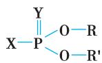  
图 9-2-1  OPI 结构通式

【OPI 分类病因】 由于取代基不同，各种 OPI 毒性相差很大。国内生产的 OPI 的毒性按大鼠急性经口进入体内的半数致死量 $\left( \mathrm { L D } _ { 5 0 } \right)$ 分为4 类，对OPI中毒有效抢救具有重要参考价值。

1. 剧毒类 $\mathrm { L D } _ { 5 0 } { < } 1 0 \mathrm { m g / k g }$ ，如甲拌磷（thimet，3911）、内吸磷（demeton，1059）、对硫磷（parathion，1605）、速灭磷（mevinphos）和特普（tetron，tetraethyl diphosphate，TEPP）等。

2. 高毒类 $\mathrm { L D } _ { 5 0 } ~ 1 0 { \sim } 1 0 0 \mathrm { m g } / \mathrm { k g }$ ，如甲基对硫磷（methylparathion）、甲胺磷（methamidophos）、氧乐果（omethoate）、敌敌畏（dichlorvos，dichlorphos，DDVP）、磷胺（phosphamidon）、久效磷（monocrotophos）、水胺硫磷（isocarbophos）、杀扑磷（methidathion）和砜吸磷（oxydemeton-methyl）等。

3. 中度毒类 $\mathrm { L D } _ { 5 0 } 1 0 0 { \sim } 1 0 0 0 \mathrm { m g } / \mathrm { k g }$ ，如 乐 果（rogor，dimethoate）、倍 硫 磷（fenthion）、除 线 磷（dichlofenthion）、乙硫磷（1240）、敌百虫（dipterex）、乙酰甲胺磷（acephate）、二嗪磷（diazinon）和亚胺硫磷（phosmet）等。

4. 低毒类 $\mathrm { L D } _ { 5 0 } 1 0 0 0 { \sim } 5 0 0 0 \mathrm { m g } / \mathrm { k g }$ ，如马拉硫磷（malathion，karbofos，4049）、辛硫磷（phoxim）、甲基乙酯磷（methylacetophos）、碘硫磷（iodfenphos）、氯硫磷（phosphorus chloride）和溴硫磷（bromophos）等。

【病因】

1. 生产中毒 生产过程中引起中毒的主要是在杀虫药精制、出料和包装过程中，手套破损或衣

服和口罩污染；也可因生产设备密闭不严，OPI跑、冒、滴、漏或污染手、皮肤及吸入中毒。

2. 使用中毒 在使用过程中，施药人员喷洒时，药液污染皮肤或湿透衣服由皮肤吸收，以及吸入空气中OPI；配药时手被原液污染也可引起中毒。

3. 生活中毒 故意吞服、误服、摄入 OPI 污染的水源或食品；滥用 OPI 治疗皮肤病或驱虫也会发生中毒。

【毒物代谢】 OPI 主要经胃肠、呼吸道及皮肤黏膜吸收。吸收后迅速分布至全身各器官，其中以肝内浓度最高，其次为肾、肺、脾等，肌肉和脑内含量最少。OPI 主要在肝内进行生物转化和代谢。有的 OPI 氧化后毒性增强，如对硫磷通过肝细胞微粒体氧化酶系统氧化为对氧磷，后者对 ChE 抑制作用是前者的 300 倍；内吸磷氧化后首先形成亚砜 $_ { \mathrm { R } ^ { \prime } } ^ { \mathrm { R } } > \mathrm { s o }$ ，其抑制 ChE 能力增加 5 倍。OPI 经水解后毒性降低。在肝内，敌百虫侧链脱去氯化氢转化为敌敌畏，毒性增强，而后经水解、脱胺、脱烷基等降解后失去毒性。马拉硫磷在肝内经酯酶水解而解毒。OPI 吸收后 6～12 小时血中浓度达高峰，24 小时内通过肾由尿排泄，48小时后完全排出体外。

OPI 进入人体后，迅速与 ChE 结合形成稳定的磷酰化胆碱酶，失去分解乙酰胆碱（acetylcholine，Ach）能力，Ach 大量蓄积于神经末梢，过度兴奋胆碱能神经，出现一系列毒蕈碱样、烟碱样和中枢神经系统症状。

【中毒机制】 OPI 能抑制许多酶，但对人畜毒性主要表现在抑制 ChE。体内 ChE 分为真性胆碱酯酶（genuine cholinesterase）或乙酰胆碱酯酶（AChE）和假性胆碱酯酶或丁酰胆碱酯酶（butyrylcholineesterase）两类。真性ChE主要存在于脑灰质、红细胞、交感神经节和运动终板中，水解Ach作用最强。假性 ChE 存在于脑白质的神经胶质细胞、血浆、肝、肾、肠黏膜下层和一些腺体中，能水解丁酰胆碱，难以水解Ach。严重肝损害时，其活性减弱。OPI抑制的真性ChE，在神经末梢恢复较快，少部分被抑制的真性 ChE 第二天基本恢复。红细胞真性 ChE 受抑制后，一般不能自行恢复，待数月红细胞再生后才能恢复。假性ChE 对OPI 敏感，但抑制后恢复较快。

OPI毒性作用是与真性ChE 酯解部位结合成稳定的磷酰化胆碱酯酶（图9-2-2），使ChE 丧失分解Ach 能力，致大量Ach积聚引起毒蕈碱、烟碱样和中枢神经系统症状，严重者常死于呼吸衰竭。

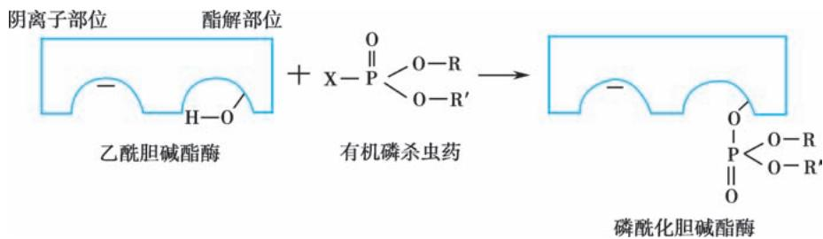  
图9-2-2  真性ChE形成磷酰化胆碱酯酶示意图

长期暴露于OPI，ChE活性明显下降，但临床症状较轻，可能是由于人体对积聚的Ach耐受性增强。【临床表现】

（一） 急性中毒 急性中毒发病时间和症状与毒物种类、剂量、侵入途径和机体状态（如空腹或进餐）密切相关。口服中毒在 10 分钟至 2 小时内发病；吸入者数分钟至半小时内发病；皮肤吸收后约 2～6 小时发病。可为个体、家庭成员或群体中毒。中毒后，出现急性胆碱能危象（acute cholinergiccrisis），表现如下。

1. 毒蕈碱样症状（muscarinic sign） 又称 M 样症状。主要是副交感神经末梢过度兴奋，类似毒蕈碱样作用。平滑肌痉挛，表现为瞳孔缩小、腹痛、腹泻；括约肌松弛，表现为大小便失禁；腺体分泌增加，表现为大汗，流泪和流涎：气道分泌物增多，表现为咳嗽、气促、呼吸困难、双肺于性或湿性啰音，严重者发生肺水肿。

2. 烟碱样症状（nicotinic sign） 又称 N 样症状。在横纹肌神经肌肉接头处 Ach 蓄积过多，出现肌颤、全身肌强直性痉挛，也可出现肌力减退或瘫痪，呼吸肌麻痹引起呼吸衰竭或停止。交感神经节节后纤维末梢释放儿茶酚胺，表现为血压增高和心律失常。

3. 中枢神经系统症状 血 AChE 活性明显降低而脑 AChE 活性＞60% 时，通常不出现中毒症状和体征，脑 AChE 活性＜60% 时，出现头晕、头痛、烦躁不安、谵妄、抽搐和昏迷，有的发生呼吸、循环衰竭，甚至死亡。

4. 局部损害 有些 OPI 接触皮肤后发生过敏性皮炎、皮肤水疱或剥脱性皮炎；污染眼部时，出现结膜充血和瞳孔缩小。

（二） 迟发性多发神经病 急性重度和中度 OPI（甲胺磷、敌敌畏、乐果和敌百虫等）中毒患者，症状消失后 2～3 周可出现迟发性多发神经病（delayed polyneuropathy），表现为感觉、运动型多发性神经病变，主要累及肢体末端，发生下肢瘫痪、四肢肌肉萎缩等。目前认为这种病变不是由 ChE 受抑制引起，可能是 OPI 抑制神经病靶酯酶（neuropathy target esterase，NTE），使其老化所致。全血或红细胞ChE 活性正常；肌电图检查提示神经源性损害。

（三） 中间型综合征 中间型综合征（intermediate syndrome）多发生在重度OPI（甲胺磷、敌敌畏、久效磷）中毒后 24～96 小时及 ChE 复活药用量不足的患者。经治疗胆碱能危象消失、意识清醒或未恢复和迟发性多发神经病发生前，突然出现颈屈肌和四肢近端肌无力，以及第Ⅲ、Ⅶ、Ⅸ、Ⅹ对脑神经支配的肌肉无力，出现上睑下垂、眼外展障碍、面瘫和呼吸肌麻痹，引起通气障碍性呼吸困难或衰竭，可导致死亡。其发生与 ChE 长期受抑制，影响神经肌肉接头处突触后功能有关。全血或红细胞 ChE活性在30%以下。高频重复神经电刺激提示波幅进行性递减。

## 【实验室检查】

1. 血 ChE 活性测定 血 ChE 活性是诊断 OPI 中毒的特异性实验指标，对判断中毒程度、疗效和预后极为重要。以正常人血 ChE 活性作为 100%，急性 OPI 中毒时，ChE 活性在 50%～70% 为轻度中毒；30%～50% 为中度中毒；30% 以下为重度中毒。对长期 OPI 接触者，血 ChE 活性测定可作为生化监测指标。

2. 毒物检测 患者血、尿、粪便或胃内容物中可检测到 OPI 或其特异性代谢产物成分。在体内，对硫磷和甲基对硫磷氧化分解为对硝基酚，敌百虫代谢为三氯乙醇。尿中测出对硝基酚或三氯乙醇有助于诊断上述毒物中毒。OPI的动态血药浓度检测有助于AOPIP的病情评估及治疗。

【诊断与鉴别诊断】

## （一） 诊断 诊断依据如下。

1. OPI 暴露史。

2. OPI 相关中毒症状及体征，特别是出现呼出气大蒜味、瞳孔缩小、多汗、肺水肿、肌纤颤和昏迷。

3. 全血ChE 活性不同程度降低。

4. 血、胃内容物检测出OPI及其代谢物。

此外，诊断时还须注意：乐果和马拉硫磷中毒患者，病情好转后，在数日至 1 周后可突然恶化，可再次出现 OPI 急性中毒症状或突然死亡。此种临床“反跳”现象可能与残留在体内 OPI 重吸收或解毒药停用过早有关。

（二）鉴别诊断 0PI中毒应与中暑，急性胃肠炎或脑炎等鉴别还须与拟除虫菊酯类中毒（皮肤红色丘疹或大疱样损害，血ChE 活性正常）及甲脒类中毒（发绀、瞳孔扩大及出血性膀胱炎）鉴别。

## （三） 急性中毒诊断分级

1. 轻度中毒 仅有M样症状，ChE 活性为50%～70%。

2. 中度中毒 M样症状加重，出现N样症状，ChE 活性为30%～50%。

3. 重度中毒 具有 M、N 样症状，并伴有肺水肿、抽搐、昏迷、呼吸肌麻痹和脑水肿，ChE 活性在30% 以下。

【治疗】

（一） 迅速清除毒物 立即将患者撤离中毒现场。彻底清除未被机体吸收入血的毒物，如迅速脱去污染衣服，用肥皂水清洗污染皮肤、毛发和指甲；眼部污染时，用清水、生理盐水、2% 碳酸氢钠溶液或 3% 硼酸溶液冲洗。口服中毒者，用清水、2% 碳酸氢钠溶液（敌百虫忌用）或 1∶5 000 高锰酸钾溶液（对硫磷忌用）反复洗胃，即首次洗胃后保留胃管，间隔 3～4 小时重复洗胃，直至洗出液清亮为止。然后用硫酸钠 20～40g 溶于 20ml 水，口服，观察 30 分钟，无导泻作用时，再口服或经鼻胃管注入500ml 水。

（二） 紧急复苏 OPI 中毒者常死于肺水肿、呼吸肌麻痹、呼吸衰竭。对上述患者，要紧急采取复苏措施：清除呼吸道分泌物，保持呼吸道通畅，给氧，根据病情应用机械通气。肺水肿应用阿托品，不能应用氨茶碱和吗啡。心脏停搏时，行体外心脏按压复苏等。

（三） 解毒药 在清除毒物过程中，同时应用ChE 复活药和胆碱受体拮抗药治疗。

1. 用药原则 根据病情，要早期、足量、联合和重复应用解毒药，并且选用合理给药途径并择期停药。中毒早期即联合应用抗胆碱药物与ChE 复活药才能取得更好疗效。

2. 胆碱酯酶复活药（cholinesterase reactivator） 肟类化合物能使被抑制的 ChE 恢复活性。原理是肟类化合物吡啶环中季胺氮带正电荷，能被磷酰化胆碱酯酶的阴离子部位吸引，其肟基与磷酰化胆碱酯酶中磷形成结合物，使其与ChE 酯解部位分离，恢复真性ChE 活性（图9-2-3）。

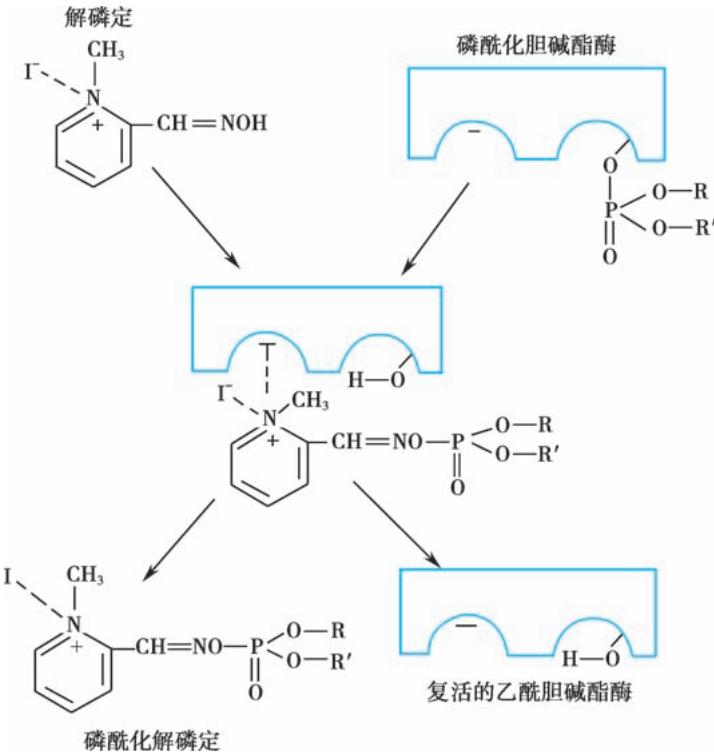  
图9-2-3  真性ChE复活过程示意图

ChE复活药尚能作用于外周N 受体，对抗外周N胆碱受体活性，能有效解除烟碱样毒性作用，对M样症状和中枢性呼吸抑制作用无明显影响。所用药物如下。

（1）氯解磷定（pralidoxime chloride，PAM-Cl，氯磷定）：复活作用强，毒性小，水溶性强，可供静脉或肌内注射，是临床上首选的解毒药。

首次给药要足量 外周N样症状(如肌颤)消失 血液ChE活性恢复至50%～60%以上为药物足量指征。如洗胃彻底，轻度中毒无须重复给药。中度中毒首次足量给药后一般重复 1～2 次即可，重度中毒首次给药后 30～60 分钟未出现药物足量指征时，应重复给药。如口服大量乐果中毒、昏迷时间长、对 ChE 复活药疗效差及血 ChE 活性低者，解毒药维持剂量要大，给药时间可长达 5～7 天。通常，中毒表现消失，血ChE 活性在50%～60%以上，即可停药。

（2）碘解磷定（pralidoxime iodide，PAM-I）：复活作用较差，毒性小，水溶性差，仅能静脉注射。为临床上次选的解毒药。

（3）双复磷（obidoxime， $\mathrm { D M O } _ { 4 } ,$ ）：复活作用强，毒性较大，水溶性强，能静脉或肌内注射。

ChE 复活药对甲拌磷、内吸磷、对硫磷、甲胺磷、乙硫磷和辛硫磷等中毒疗效好，对敌敌畏、敌百虫中毒疗效差，对乐果和马拉硫磷中毒疗效不明显。双复磷对敌敌畏及敌百虫中毒疗效较碘解磷定好。ChE 复活药对中毒 24～48 小时后已老化的 ChE 无复活作用。对 ChE 复活药疗效不佳者，加用胆碱受体拮抗药（表 9-2-5）。

表 9-2-5  OPI 中毒患者用药

<table><tr><td>治疗药</td><td>轻度中毒</td><td>中度中毒</td><td>重度中毒</td></tr><tr><td>胆碱酯酶复活药</td><td></td><td></td><td></td></tr><tr><td>氯解磷定/g</td><td>0.5~0.75</td><td>0.75~1.5</td><td>1.5~2.0</td></tr><tr><td>碘解磷定/g</td><td>0.4</td><td>0.8~1.2</td><td>1.0~1.6</td></tr><tr><td>双复磷/g</td><td>0.125~0.25</td><td>0.5</td><td>0.5~0.75</td></tr><tr><td>胆碱受体拮抗药</td><td></td><td></td><td></td></tr><tr><td>阿托品/mg</td><td>2~4</td><td>5~10</td><td>10~20</td></tr><tr><td>盐酸戊乙奎醚/mg</td><td>1~2</td><td>2~4</td><td>4~6</td></tr></table>

ChE 复活药不良反应有短暂眩晕、视力模糊、复视、血压升高等。用量过大能引起癫痫样发作并抑制 ChE 活性。碘解磷定剂量较大时，还会出现口苦、咽干、恶心。注射速度过快可导致暂时性呼吸抑制；双复磷不良反应较明显，有口周、四肢及全身麻木和灼热感，恶心、呕吐和颜面潮红，剂量过大可引起室性期前收缩和传导阻滞，有的会发生中毒性肝病。

3. 胆碱受体拮抗药（cholinoceptor blocking drug） 胆碱受体分为 M 和 N 两类。M 有三个亚型：$\mathbf { M } _ { 1 } , \mathbf { M } _ { 2 }$ 和 $\mathbf { M } _ { 3 \circ }$ 。肺组织有 $\mathbf { M } _ { 1 }$ 受体，心肌为 M 受体，平滑肌和腺体上主要有 M 受体；N 受体有 $\mathrm { N } _ { 1 }$ 和 $\mathrm { N } _ { 2 }$ 两个亚型，神经节和节后神经元为 $\mathrm { N } _ { 1 }$ 受体，骨骼肌上为 $\mathrm { N } _ { 2 }$ 受体。

由于OPI 中毒时，积聚的Ach首先兴奋中枢N受体，使N 受体迅速发生脱敏反应，对Ach刺激不再敏感，并且脱敏的N受体还能改变M受体构型，使M受体对 $\mathrm { A c h }$ 更加敏感，导致M受体拮抗药（如阿托品）疗效降低。因此，联合应用外周性与中枢性抗胆碱药物具有协同作用。

（1）M 胆碱受体拮抗药：又称外周性抗胆碱药物。阿托品和山莨菪碱、盐酸戊乙奎醚等。

根据病情，阿托品每 10～30 分钟或 1～2 小时给药一次（表 9-2-5），直到患者 M 样症状消失或出现“阿托品化”。阿托品化指征为口干、皮肤干燥、心率增快（90～100 次/分）和肺部湿啰音消失。此时，应减少阿托品剂量或停用。如出现瞳孔明显扩大、神志模糊、烦躁不安、抽搐、昏迷和尿潴留等，即为阿托品中毒，应立即停用阿托品。

（2）N 胆碱受体拮抗药：又称中枢性抗胆碱药物（如东莨菪碱、苯那辛、甲磺酸苯扎托品、丙环定等），对中枢M和N受体作用强，对外周M受体作用弱。

（3）新型抗胆碱药物：盐酸戊乙奎醚（penehyclidine）是我国自主研发的一类新型选择性抗胆碱药物，对外周M受体和中枢M、N受体均有作用。对 $\mathrm { M } _ { 1 } , \mathrm { M } _ { 3 }$ 受体选择性强，对 $\mathbf { M } _ { 2 }$ 受体（位于心脏作用）作用极弱，不增加心率和心肌耗氧量。其较阿托品抗胆碱作用强，清除半衰期长达 10.3 小时，治疗有效剂量小，作用持续时间长。根据中毒严重程度选择首剂用量（表 9-2-5），肌内注射。首次用药须与氯解磷定合用。

根据 OPI 中毒程度选用药物：轻度患者单用胆碱酯酶复活药；中、重度患者可联合应用胆碱酯酶复活药与胆碱受体拮抗药。两药合用时，应减少胆碱受体拮抗药（阿托品）用量，以免发生中毒。

4. 复方制剂 是由胆碱受体拮抗药与胆碱酯酶复活药组成的复方制剂。国内有解磷注射液（每支含阿托品 3mg、苯那辛 3mg 和氯解磷定 400mg）。首次剂量：轻度中毒 1/2～1 支肌内注射；中度中毒 1～2 支；重度中毒 2～3 支。但还须分别另加氯解磷定，轻度中毒 0～0.5g，中度中毒 0.5～1.0g，重度中毒 1.0～1.5g。

对重度患者，症状缓解后逐渐减少解毒药用量，待症状基本消失，全血胆碱酯酶活性升至正常的50%～60%后停药观察，通常至少观察3～7天再出院。

（四） 对症治疗 重度 OPI 中毒患者常伴有多种并发症，如酸中毒、低钾血症、严重心律失常、脑水肿等。特别是合并严重呼吸和循环衰竭时，如处理不及时，应用的解毒药尚未发挥作用，患者就已死亡。

（五） 中间型综合征治疗 立即给予人工机械通气。同时应用氯解磷定每次 1.0g，肌内注射，酌情选择给药间隔时间，连用2～3天，积极对症治疗。

【预防】 向生产和使用 OPI 人员宣传、普及防治中毒常识；在生产和加工 OPI 的过程中，严格执行安全生产制度和操作规程；搬运和应用农药时应做好安全防护。对于慢性接触者，定期体检和测定全血胆碱酯酶活性。

## 二、急性百草枯中毒

百草枯（paraquat，PQ）又名克芜踪（gramoxone），为联吡啶杂环化合物，是一种全球使用的高效能非选择性接触型除草剂，于 1882 年合成，1962 年生产用作农业除草剂，1984 年进入中国。PQ 喷洒后迅速起效，进入土壤迅速失活，对人、畜有很强毒性作用。急性 PQ 中毒（acute paraquat poisoning）是指口服后突出表现为进行性弥漫性肺纤维化，最终死于呼吸衰竭和/或 MODS，病死率高达 90%～100%。PQ 有二氯化物和二硫酸甲酯盐两种，纯品呈白色结晶，易溶于水，在酸或中性溶液中稳定。我国市售的多为 20% 的蓝色溶液。该品无特效解毒药，欧美等 20 多个国家已禁止或严格限制使用百草枯。2012 年 4 月，我国农业部等颁布第 1745 号公告，自 2014 年 7 月 1 日起，撤销 PQ 水剂登记和生产许可，2016 年 7 月 1 日起全面停止 PQ 水剂在国内的销售和使用。近年来，百草枯中毒患者数量明显减少。由于存在敌草快、草甘膦等除草剂与百草枯混配和被百草枯替换等现象，仍时有百草枯中毒病例出现。因此，百草枯中毒诊治仍不能忽视。

【病因和发病机制】 常为口服自杀或误服中毒。成年人口服致死量为 2～6g。也可经皮肤、呼吸道吸收及静脉注射中毒。

口服 PQ，接触部位会出现腐蚀性损伤，吸收后迅速分布到全身组织器官，0.5～4 小时血浓度达高峰，很少与血浆蛋白结合。肺组织（含量为血液的 10 倍或数十倍）及骨骼肌浓度最高。PQ 在人体内很少降解，24 小时后 50%～70% 以原形经肾排出，约 30% 随粪便排出，也可经乳汁排出。实验发现，静脉注射 PQ 6小时后，80%～90% 经肾排出，24小时后几乎完全排出。PQ还可透过血脑屏障引起脑损伤。

PQ 中毒机制尚不完全清楚，主要参与体内细胞氧化还原反应，形成大量氧自由基及过氧化物，引起组织细胞膜脂质过氧化，导致 MODS 或死亡。过氧化物损伤Ⅰ、Ⅱ型肺泡上皮细胞，肺泡表面活性物质生成减少。由于肺组织对 PQ 的主动摄取和蓄积特性，故肺损伤破坏严重，服毒者 4～15 天渐进性出现不可逆性肺纤维化和呼吸衰竭，最终死于顽固性低氧血症。有人称为PQ肺（paraquat lung）。

【病理】 PQ 肺基本病变为增殖性细支气管炎和肺泡炎。1 周内死亡者，肺泡细胞充血、肿胀、变性和坏死，肺泡间隔断裂及融合，出现肺水肿、透明膜形成，肺重量增加；1 周以上死亡者，肺间质细胞增生、肺间质增厚和肺纤维化。肺纤维化多发生在中毒后 5～9 天，2～3 周达高峰。也可见肾小管、肝小叶中央细胞坏死、心肌炎性变及肾上腺皮质坏死等。

【临床表现】 中毒患者表现与毒物摄入途径、量、速度及身体基础健康状态有关。

（一） 局部损伤 接触部位皮肤迟发出现红斑、水疱、糜烂、溃疡和坏死。口服中毒者，口腔、食管黏膜灼伤及溃烂。毒物污染眼部时，可灼伤结膜或角膜。吸入者可出现鼻出血。

## （二） 系统损伤

1. 呼吸系统 吞入 PQ 后主要损伤肺，2～4 天逐渐出现咳嗽、呼吸急促（可因代谢性酸中毒、误吸或急性肺泡炎所致）及肺水肿，也可发生纵隔气肿和气胸。肺损伤者多于 2～3 周死于弥漫性肺纤维化所致的呼吸衰竭。大量口服者 24 小时内发生肺水肿、肺出血，数天内死于 ARDS。中毒后迅速出现发绀和昏迷者，死亡较快。

2. 消化系统 服毒后胸骨后烧灼感、恶心、呕吐、腹痛、腹泻、胃肠道穿孔和出血。1～3 天出现肝损伤和肝坏死。

3. 其他 还可出现心悸、胸闷、气短、中毒性心肌炎症状；头晕、头痛、抽搐或昏迷；PQ 吸收后 24小时发生肾损害，表现血尿、蛋白尿或急性肾衰竭；也可出现溶血性贫血或 DIC、休克。MODS 者常于数天内死亡。

## （三） 临床分型 根据服毒量分型如下。

1. 轻型 摄入量＜20mg/kg，除胃肠道症状，其他症状不明显，多数患者能完全恢复。

2. 中-重型 摄入量 20～40mg/kg，除胃肠道症状可出现多系统受累表现，1～4 天出现肾、肝损伤，数日至2周出现肺损伤，多在2～3 周死于呼吸衰竭。

3. 暴发型 摄入量＞40mg/kg，有严重胃肠道症状，1～4 天死于多器官功能衰竭（MOF）。

## 【实验室检查】

1. 毒物测定 疑为 PQ 中毒时，取患者胃液或血标本检测 PQ。血 PQ 浓度≥30mg/L，预后不良。服毒6 小时后，尿液可测出PQ。

2. 影像学检查 肺 X 线或 CT 检查可协助诊断。早期呈下肺野散在细斑点状阴影，可迅速发展为肺水肿样改变。

【诊断】 根据患者毒物接触史、肺损伤的突出表现及毒物测定诊断。

【治疗】 目前，对PQ中毒患者尚无特效解毒药。

## （一） 复苏

1. 保持气道通畅 监测血氧饱和度或动脉血气。轻、中度低氧血症不宜常规供氧，吸氧会加速氧自由基形成，增强 PQ 毒性，提高病死率。 $\mathrm { P a O } _ { 2 } { < } 4 0 \mathrm { m m H g }$ 或出现 ARDS 时，可吸氧（吸入气氧浓度＞21%），维持PaO ≥70mmHg。严重呼吸衰竭患者，机械通气治疗效果也不理想。

2. 低血压 常为血容量不足所致，应快速静脉补液恢复有效血容量。

3. 器官功能支持 上消化道出血者，应用质子泵抑制药，如奥美拉唑（omeprazole）、兰索拉唑（lansoprazole）或泮托拉唑（pantoprazole）；出现症状性急性肾衰竭者，可考虑血液透析。

## （二） 减少毒物吸收

1. 清除毒物污染 即刻脱去 PQ 污染的衣物，用肥皂水冲洗污染皮肤；口服者，用复方硼砂漱口液或氯己定漱口；眼污染者，用2%～4% 碳酸氢钠溶液冲洗15 分钟，继而生理盐水冲洗。

2. 催吐、洗胃、吸附 口服中毒者，立即刺激咽喉部催吐；用温清水或碱性液体（如肥皂水），每次＜300ml 低压反复洗胃，直至洗出液无色无味。洗胃最好在服毒 1 小时内进行。胃排空障碍或摄入量大者，超过6小时也可以洗胃：洗胃后可给予胃动力药(多潘立酮、莫沙必利)促进排泄。

3. 吸附与导泻 洗胃后，及时给予吸附和导泻。15%的白陶土溶液（成人1 000ml，儿童15ml/kg）或活性炭（成人 100g，儿童 $2 \mathrm { g / k g \Omega } )$ ）口服吸附。也可用蒙脱石散 $6 \mathrm { g }$ 用 50ml 水混匀口服，每 2～3 小时一次。每次服用蒙脱石散 30～60 分钟后序贯口服 20% 甘露醇 100～250ml 导泻，反复多次。导泻药除20%甘露醇，还有硫酸镁、硫酸钠、番泻叶（ $[ 1 0 \sim 1 5 \mathrm { g }$ 加200ml开水浸泡后凉服）和大黄。

## （三） 增加毒物排出

1. 强化利尿 积极充分静脉补液后，应用呋塞米维持尿量在200ml/h。

2. 血液净化 应尽早（2～4小时内）进行，首先选用血液灌流，其PQ清除率为血液透析的5～7倍。

## （四） 其他治疗

1. 免疫抑制药 早期静脉应用大剂量甲泼尼龙、地塞米松和/或环磷酰胺。

2. 抗氧化剂（antioxidant） 如应用大剂量维生素 C 或维生素 E、超氧化物歧化酶（superoxidedismutase，SOD）、乙酰半胱氨酸（acetylcysteine）、还原型谷胱甘肽、乌司他丁（ulilnastatin）或依达拉奉（edaravone）等。大剂量氨溴索也能直接清除体内自由基，减轻百草枯急性肺损伤作用，促进肺泡表面活性物质生成。

3. 抗纤维化药 吡非尼酮（pirfenidone）抑制成纤维细胞生物活性和胶原合成，防止、逆转纤维化及瘢痕形成。

4. PQ 竞争剂 普萘洛尔（10～20mg，口服，3 次/日）可促使与肺组织结合的 PQ 释放。小剂量左旋多巴能竞争性抑制PQ通过血脑屏障。

（五） 中药治疗 贯叶连翘提取物有抗脂质过氧化作用。当归、川芎提取物能增加一氧化氮合成，降低肺动脉压，减轻肺组织损伤。血必净有抑制部分炎症因子活性，减轻中毒器官损伤的作用。

【预防】 预防胜于治疗。PQ 应集中管理使用，严禁私存，严禁在其他除草剂中混入 PQ；盛装 PQ药液器皿应有警告标志，以防误服；使用前应进行安全防护教育，使用时应穿长衣长裤和戴防护镜，不宜暴露皮肤和逆风喷洒。

## 三、氨基甲酸酯类杀虫剂中毒

氨基甲酸酯类杀虫剂中毒（carbamate insecticide poisoning）又称氨基甲酸酯类农药中毒，是指机体经皮肤接触、呼吸道吸入或经口摄入氨基甲酸酯杀虫剂后，导致体内 AChE 活性被抑制，而引起以毒蕈碱样、烟碱样和中枢神经系统症状为特征的临床中毒表现。氨基甲酸酯类杀虫剂主要有萘基氨基甲酸酯类(如西维因)苯基氨基甲酸酯类(如叶蝉散)、杂环二甲基氨基甲酸酯类(如异索威)、杂环用基氨基甲酸酯类（如呋喃丹）、氨基甲酸肟酯类（如涕灭威）等品种，因其对昆虫选择性强、作用迅速、残毒低等特点，目前广泛应用于农业生产。

【病因】 生产中毒主要发生在加工生产、成品包装和使用过程中，生活中毒主要为故意摄入或误服，其他潜在原因有食用被污染的水果、面粉或食用油，以及穿着被污染的衣物。自服或误服中毒者病情较重。

【毒物的吸收和代谢】 多数氨基甲酸酯类杀虫剂可经消化道、呼吸道侵入机体，也可经皮肤黏膜缓慢吸收。吸收后分布于肝、肾、脂肪和肌肉中，其他组织中的含量甚低。在肝进行代谢，一部分经水解、氧化或与葡萄糖醛酸结合而解毒，一部分以原形或其代谢产物的形式迅速由肾排泄，24 小时可排出90%以上。

【发病机制】 氨基甲酸酯类杀虫剂的立体结构式与ACh相似，可与AChE阴离子部位和酯解部位结合，形成可逆性的复合物，即氨基甲酰化，使其失去水解ACh的活性，引起ACh蓄积，刺激胆碱能神经兴奋，产生相应的临床表现。与有机磷不同的是，氨基甲酸酯类是短效AChE抑制剂，会很快从AChE的作用部位上自发水解而使其复活，AChE活性于数小时内恢复，因此不会发生“老化”现象。氨基甲酸酯类中毒的持续时间往往短于同等剂量有机磷造成的中毒，但这两类化学物质中毒的死亡率相近。

【临床表现】 生产中毒主要通过呼吸道和皮肤吸收，中毒后 2～6 小时发病；口服中毒发病较快，可在10～30分钟内出现中毒症状。

临床表现与 OPI 中毒相似，主要为 ACh 蓄积相关的毒蕈碱样、烟碱样和中枢神经系统症状。患者主要临床表现有：头晕、乏力、视力模糊、恶心呕吐、腹痛、流涎、多汗、尿失禁、食欲减退和瞳孔缩小等；重症者可出现肌颤、肌无力、瘫痪、血压下降、意识障碍、抽搐、肺水肿、脑水肿、心肌损害等，可因呼吸衰竭而死亡。另外氨基甲酸酯类中毒患者亦可并发急性胰腺炎，极少数也可发生中间型综合征。

多数氨基甲酸酯杀虫剂较难通过血脑屏障，因此其中枢神经系统中毒症状通常较 OPI 中毒时相对要轻。

【诊断】 根据接触史、临床表现和血 AChE 活性降低，诊断并不困难。需要注意的是氨基甲酸酯类杀虫剂中毒导致的 AChE 活性抑制是可逆的，酶活性通常在 15 分钟降至最低水平，30～40 分钟后可恢复到 50%～60%，60～120 分钟后血 AChE 活性基本恢复正常，因此血 AChE 活性测定在氨基甲酸酯类杀虫剂中毒时应用受限。对诊断困难病例，可考虑测定血、尿、胃灌洗液中的毒物及其代谢产物。另外，若不确定患者是否摄入了氨基甲酸酯类杀虫剂，可尝试性给予阿托品，成人为 1mg，若阿托品激发后未见抗胆碱能效应的症状和体征，则强烈支持AChE 抑制剂中毒。

【鉴别诊断】 本病需要与 OPI 中毒、毒蘑菇（捕蝇菌）中毒相鉴别。需要警惕的是，急性下壁心肌梗死时可产生过度迷走反应，出现类似胆碱酯酶抑制时的临床表现，心电图和心肌损伤标志物的测定有助于鉴别诊断。

## 【治疗】

1. 去污染治疗 对于经皮吸收的中毒患者，应完全脱去污染衣物，用肥皂水或碳酸氢钠溶液充分冲洗接触区域皮肤、毛发、指甲等。口服中毒在4～6小时内就诊者，意识清醒者可考虑催吐，如催吐效果不佳可以用温水或1%～2%碳酸氢钠溶液洗胃，并建议给予活性炭吸附治疗，标准剂量为1g/kg，最大剂量 50g。洗胃和活性炭应用应警惕误吸风险，必要时须在气管插管保护气道和应用阿托品后进行。然后可服用硫酸镁或硫酸钠导泻。施救人员应注意自身和周围他人的防护。

2. 解毒药 应用足量的阿托品是氨基甲酸酯类杀虫剂中毒的重要治疗措施。对于中至重度胆碱能中毒的患者，阿托品起始剂量，成人 2～4mg，静脉注射，如果无效，应每 10～30 分钟重复给药一次，每次剂量加倍，直至症状缓解，维持治疗24小时左右。

ChE 复活药对氨基甲酸酯杀虫剂引起的 AChE 抑制无复活作用，并且会干扰 AChE 自动复活，故在明确诊断氨基甲酸酯类杀虫剂中毒的患者中应禁用 ChE 复活药。当有机磷农药和氨基甲酸酯类杀虫剂混合中毒时，可先使用阿托品，一段时间后再使用ChE 复活药。

3. 对症支持治疗 意识障碍、气道分泌物明显增多或呼吸衰竭者应立即进行气管插管，保持呼吸道通畅。快速诱导插管时，可使用非去极化肌松药（如罗库溴铵），而不应使用琥珀胆碱，以免出现严重神经肌肉阻滞。休克患者进行容量复苏，并须警惕肺水肿、脑水肿加重。抽搐发作时应使用苯二氮䓬类药物控制。

## 四、灭鼠药中毒

灭鼠药（rodenticide）是指可以杀灭啮齿类动物（如鼠类）的化合物。国内外已有 10 余种灭鼠药。目前，灭鼠药广泛用于农村和城市，而多数灭鼠药在摄入后对人畜产生很强的毒力，因此国内群体和散发灭鼠药中毒事件屡有发生。按灭鼠药起效的急缓和灭鼠药毒理作用进行分类，对有效救治灭鼠药中毒具有重要参考价值。

为保护人民生命安全，我国分别于 1976 年和 2002 年，将急性灭鼠药氟乙酰胺、毒鼠强列入禁止使用农药名录，分别于 1982 年和 2003 年在《农药安全使用规定》和《国务院办公厅关于深入开展毒鼠强专项整治工作的通知》中明文规定禁止使用。近 20 年来，这两类灭鼠药中毒人数明显减少，但散发病例时有。目前最常见的是抗凝血类灭鼠药中毒。

## 【中毒分类】

## （一） 按灭鼠药起效急缓分类

1. 急性灭鼠药 鼠食后 24 小时内致死，包括毒鼠强（tetramine，化学名四亚甲基二砜四胺）和氟乙酰胺（fluoroacetamide）。

2. 慢性灭鼠药 鼠食后数天内致死，包括抗凝血类灭鼠药，如敌鼠钠盐（diphacinone-Na）和灭鼠灵［即华法林（warfarin）］等。

## （二） 按灭鼠药的毒理作用分类

## 1. 抗凝血类灭鼠药

（1）第一代抗凝血高毒灭鼠药：灭鼠灵、克灭鼠（coumafuryl）、敌鼠钠盐、氯敌鼠（chlorophacinone）。

（2）第二代抗凝血剧毒灭鼠药：溴鼠隆（brodifacoum）和溴敌隆（bromadiolone）。

2. 兴奋中枢神经系统类灭鼠药 毒鼠强、氟乙酰胺和氟乙酸钠。

3. 其他类灭鼠药 有增加毛细血管通透性药物安妥（ANTU）；抑制烟酰胺代谢药杀鼠优（pyrinuron）；有机磷酸酯类毒鼠磷（phosazetin）；无机磷类杀鼠剂磷化锌（zinc phosphide）；维生素 $\mathrm { B } _ { 6 }$ 拮抗剂鼠立死（crimidine）。

【病因】 灭鼠药中毒的常见原因如下。

1. 误食、误用灭鼠药制成的毒饵。

2. 有意服毒或投毒。

3. 二次中毒 灭鼠药被动、植物摄取后，以原形存留其体内，当人食用或使用中毒的动物或植物后，造成二次中毒。

4. 皮肤接触或呼吸道吸入 在生产加工过程中，经皮肤接触或呼吸道吸入引起中毒。

【中毒机制及解救原理】

1. 毒鼠强 是我国最常见的致命性灭鼠药中毒原因，对人致死量为一次口服 5～12mg（0.1～0.3mg/kg），对中枢神经系统有强烈的兴奋性，中毒后出现剧烈的惊厥。有研究显示导致惊厥的中毒机制是毒鼠强拮抗中枢神经系统抑制性神经递质γ-氨基丁酸（GABA）。当 GABA 对中枢神经系统的抑制作用被毒鼠强拮抗后，出现过度兴奋而导致惊厥。由于其剧烈的毒性和化学稳定性，易造成二次中毒。目前尚无特效解毒剂。

2. 氟乙酰胺 是一种无臭无味的水溶性白色粉末，人口服致死量为0.1～0.5g，容易通过摄入、吸入、眼睛暴露、开放性伤口接触而被吸收。氟乙酰胺在体内经脱氨作用后形成氟乙酸，氟乙酸与辅酶A 结合，在草酰乙酸作用下生成氟柠檬酸。氟柠檬酸与柠檬酸虽在化学结构上相似，但不能被乌头酸酶作用，反而拮抗乌头酸酶，使柠檬酸不能代谢产生乌头酸，中断三羧酸循环，称为“致死代谢合成”。同时，因柠檬酸代谢堆积，丙酮酸代谢受阻，使心、脑、肺、肝和肾细胞发生变性、坏死，导致肺、脑水肿。氟乙酰胺也易造成二次中毒。

乙酰胺（acetamide，解氟灵）为其特效解毒剂，其解毒机制为乙酰胺可与氟乙酰胺竞争酰胺酶等，减少氟乙酰胺转化为氟乙酸，同时可为辅酶A提供乙酰基形成乙酰辅酶A，恢复三羧酸循环。

3. 溴鼠隆、溴敌隆 是全世界最常用的灭鼠剂，对啮齿类动物有剧毒，但对人类的安全性较高。此类灭鼠药通过抑制维生素 K 环氧化物还原酶，干扰肝脏利用维生素 K，使得维生素 K 依赖性凝血因子（包括因子Ⅱ、Ⅶ、Ⅸ、Ⅹ）γ-羧化受阻，使其不能结合钙而失去凝血活性，导致凝血时间延长。其分解产物亚苄基丙酮能严重破坏毛细血管内皮，致使血管壁通透性和脆性增加，易发生出血。维生素K 为其特效解毒剂。

4. 磷化锌 常为粉末、小丸或片剂，是低成本的剧毒灭鼠剂，人致死量 40mg/kg。口服后在胃酸作用下分解产生磷化氢和氯化锌。磷化氢抑制细胞色素氧化酶，致使细胞内呼吸功能障碍；氯化锌对胃黏膜的强烈刺激与腐蚀作用导致胃出血、溃疡。磷化锌吸入后会对心血管、内分泌、肝和肾功能产生严重损害，导致多器官功能衰竭。

磷化锌与硫酸铜反应可生成不溶于水的磷化铜而沉淀，高锰酸钾可使磷化锌转化为磷酸酐而失去毒性，因此口服中毒可使用硫酸铜溶液和高锰酸钾溶液解救。

【临床特点与诊断要点】 详见表9-2-6。

【治疗】 灭鼠药中毒后应尽快进行去污染治疗。对于经皮吸收中毒或有皮肤污染的患者，应完全脱去污染衣物，充分冲洗接触区域皮肤、毛发、指甲等。口服中毒者应尽快进行胃肠道去污染，包括催吐、洗胃、吸附、导泻、全胃肠道灌洗等。具有特效解毒剂的毒物中毒时应尽快使用特效解毒剂。应监测患者生命体征，评估气道、呼吸、循环情况，警惕由洗胃、呕吐及抽搐等引起的气道阻塞风险，必要时进行器官支持治疗。详见表9-2-7。

表9-2-6  灭鼠药中毒的临床特点与诊断要点一览表

<table><tr><td rowspan="2">灭鼠药种类</td><td colspan="3">诊断依据</td></tr><tr><td>中毒病史</td><td>主要临床特点</td><td>诊断要点</td></tr><tr><td>毒鼠强</td><td>误服、误吸、误用与皮肤接触及职业密切接触史</td><td>经呼吸道或消化道黏膜迅速吸收后导致严重阵挛性惊厥和癫痫大发作,常因剧烈抽搐导致窒息、呼吸衰竭;可有恶心、呕吐、腹痛、腹泻、肝功能异常等;部分患者可有心肌受累。</td><td>1.薄层层析法和气相色谱分析,检出血、尿及胃内容物中毒物成分。2.中毒性心肌炎致心律失常和ST段改变。3.心肌酶增高和肺损害。</td></tr><tr><td>氟乙酰胺</td><td>同上</td><td>潜伏期短,起病迅速,神经系统受累最为突出。临床分三型:1.轻型:头痛、头晕、视力模糊、乏力、四肢麻木、抽动、口渴、呕吐、上腹痛。2.中型:除上述,尚有分泌物多、烦躁、呼吸困难、肢体痉挛、心肌损害、血压下降。3.重型:昏迷、惊厥、严重心律失常、瞳孔缩小、肠麻痹、大小便失禁、心肺功能衰竭。</td><td>1.疏靛反应法在中毒患者检测标本中,查出氟乙酰胺或氟乙酸钠代谢产物氟乙酸。2.气相色谱法检出氟乙酸钠。3.血与尿中柠檬酸含量增高、血酮↑↑、血钙↓↓。4.CK明显↑↑↑。5.心肌损伤ECG表现:QT延长,ST-T改变。</td></tr><tr><td>溴鼠隆、溴敌隆</td><td>同上</td><td>1.早期:恶心、呕吐、腹痛、低热、食欲不佳、情绪不稳定。2.中晚期:皮下广泛出血,血尿,鼻和牙龈出血,咯血,呕血,便血和心、脑、肺出血,休克。</td><td>1.出血时间延长,凝血时间和凝血酶原时间延长。2.II、VII、IX、X凝血因子减少或活动度下降。3.血、尿和胃内容物中检出毒物成分。</td></tr><tr><td>磷化锌</td><td>同上</td><td>1.轻者表现:胸闷、咳嗽、口咽/鼻咽发干和灼痛、呕吐、腹痛。2.重者表现:惊厥、抽搐、肌肉抽动、口腔黏膜糜烂、呕吐物有蒜臭味。3.严重者表现:肺水肿、脑水肿、心律失常、昏迷、休克。</td><td>1.检测标本中检出毒物成分。2.血中检出血磷↑↑。3.心、肝和肾功能异常。</td></tr></table>

表9-2-7  灭鼠药中毒治疗一览表

<table><tr><td>灭鼠药种类</td><td>综合疗法</td><td>特效疗法</td></tr><tr><td>毒鼠强</td><td>1. 迅速洗胃:越早疗效越好。2. 吸附、导泻:清水洗胃后,胃管内注入:(1)活性炭50~100g吸附毒物;(2)20%~30%硫酸镁导泻。3. 保护心肌:静脉滴注极化液,1,6-二磷酸果糖和维生素 $B_6$ 。4. 呼吸支持:常有窒息及呼吸衰竭风险,重度中毒者需要进行气管插管与机械通气。5. 禁用阿片类药。</td><td>无特效解毒剂,对症支持治疗为主。1. 抗惊厥:推荐苯巴比妥和地西泮联用,需要尽快彻底控制惊厥。(1)地西泮每次10~20mg静脉注射或50~100mg加入10%葡萄糖溶液250ml静脉滴注,总量200mg。(2)苯巴比妥钠0.1g,每6~12小时肌内注射,用1~3天。(3)羟丁酸钠60~80mg/(kg·h)静脉滴注。(4)异丙酚2~12mg/(kg·h)静脉滴注。(5)硫喷妥钠3mg/(kg·h)间断静脉注射,直至抽搐停止。2. 解毒剂:二巯丙磺钠,第1~2天0.125~0.25g,每8小时一次,肌内注射;第3~4天,0.125g,每12小时一次,肌内注射;第5~7天,0.125g,每天1次,肌内注射。3. 血液净化(血液灌流、血液透析、血浆置换),加速毒鼠强排出体外。</td></tr><tr><td>氟乙酰胺</td><td>1.迅速洗胃:越早越好,使用清水或1:5000高锰酸钾溶液洗胃,使其氧化或转化为不易溶解的氟乙酰(酸)钙而减低毒性。2.活性炭:尽早应用活性炭。3.支持治疗:保护心肌、纠正心律失常;惊厥患者在控制抽搐同时应气管插管保护气道;昏迷患者考虑应用高压氧疗法。</td><td>1.特效解毒剂:乙酰胺,每次2.5~5.0g,肌内注射,3次/日。或按0.1~0.3g/(kg·d)计算总量,分3次肌内注射。重症患者,首次肌内注射剂量为全日量的1/2(即10g),连用5~7天/疗程。2.血液净化(血液灌流、血液透析):考虑用于重度中毒患者。</td></tr><tr><td>溴鼠隆、溴敌隆</td><td>1.立即清水洗胃,催吐,导泻。2.胃管内注入活性炭50~100g吸附毒物。3.胃管内注入20%~30%硫酸镁导泻。</td><td>1.特效对抗剂:维生素 $K_1$ ,须根据疗效反应调整剂量。(1)PT显著延长者:维生素 $K_1$ 5~10mg肌内注射(成人或&gt;12岁儿童);1~5mg肌内注射(≤12岁儿童)。(2)出血患者:初始剂量维生素 $K_1$ 10~20mg(成人或&gt;12岁儿童);5mg(≤12岁儿童)。稀释后缓慢静脉注射,根据治疗反应重复剂量,或静脉滴注维持。2.严重出血患者同时输新鲜冰冻血浆300~400ml。</td></tr><tr><td>磷化锌</td><td>1.皮肤接触中毒:应更换衣服,清洗皮肤。2.吸入中毒:应立即转移患者,置于空气新鲜处。3.口服中毒:应考虑催吐、洗胃、导泻。(1)催吐、洗胃:可使用1%硫酸铜溶液催吐或0.2%~0.5%硫酸铜溶液洗胃,继之使用1:5000高锰酸钾溶液洗胃,反复洗至无蒜臭味、澄清液止,须警惕铜中毒;(2)导泻:洗胃毕后立即导泻,用硫酸钠20~30g或液体石蜡100ml口服导泻。禁用硫酸镁、蓖麻油及其他油类。4.对症支持治疗。</td><td>目前尚无磷化锌中毒特效治疗手段,临床上主要以支持治疗和对症治疗为主。</td></tr></table>

（柴艳芬 徐 军）

## 第三节 | 急性毒品中毒

毒品（narcotics）是指国家规定管制的能使人成瘾的麻醉（镇痛）药（narcotic analgesic）和精神药（psychotropic drug），其具有药物依赖性、危害性和非法性。毒品是一个相对概念，用于治疗即为药品，滥用（abuse，misuse）即为毒品。我国毒品不包括烟草和酒类中的成瘾物质。短时间内滥用、误用或故意使用大量毒品，超过耐受量，产生相应临床表现时称为急性毒品中毒（acute narcotics poisoning）。急性毒品中毒者常死于呼吸或循环衰竭，有时发生意外死亡。急性毒品中毒多见于吸毒者。全球有200多个国家和地区存在毒品滥用。2020年，全球约2.75亿人使用毒品，吸食的毒品主要有大麻、苯丙胺类、海洛因、可卡因和氯胺酮等。我国在毒品滥用预防和管制方面取得显著成效，现有吸毒人数已由2017年底的234.5万降至2022年底的112.4万。受传统毒品获取困难影响，部分吸毒人员为缓解毒瘾，转而寻求其他麻精药品、新精神活性物质及未列管物质进行替代滥用，或交叉滥用非惯用毒品以满足毒瘾。全年查处滥用曲马多、氯硝西泮等麻精药品，以及氟胺酮、合成大麻素等新精神活性物质人数增多。

吸毒除损害身体健康，还给公共卫生、社会、经济和政治带来严重危害。第一次国际禁毒会议于

1909 年在上海召开，13 个国家的代表参加，讨论阿片国际管制问题，并通过了麻醉品管制的“四项原则”，该原则被吸收到国际禁毒公约中。目前毒品中毒已成为许多国家继心、脑血管疾病和恶性肿瘤后的重要致死原因。为号召全球人民共同抵御毒品危害，联合国把每年的 6 月 26 日确定为“国际禁毒日（International Day Against Drug Abuse and Illicit Trafficking）”。为保证人民身体健康和社会安定，我国政府对制毒、贩毒和吸毒行为加大了打击力度。

【毒品分类】 我国将毒品分为麻醉（镇痛）药和精神药两类。本节重点介绍常见毒品。

## （一） 麻醉（镇痛）药

1. 阿片类 阿片（opium，鸦片）是将未成熟的罂粟蒴果浆汁风干获取的干燥物，具有强烈的镇痛、止咳、止泻、麻醉、镇静和催眠等作用。阿片含有 20 余种生物碱（如吗啡、可待因、蒂巴因和罂粟碱等），其中蒂巴因与吗啡和可待因作用相反，改变其化学结构后能形成具有强大镇痛作用的埃托啡。罂粟碱不作用于体内阿片受体。阿片类镇痛药（opioid analgesic）包括天然阿片制剂（natural opiate）、半合成阿片制剂（表9-2-8）和人工合成阿片制剂（表9-2-9），能作用于体内阿片受体，产生镇痛作用。

表9-2-8  天然、半合成阿片制剂

<table><tr><td>天然阿片制剂</td><td>半合成阿片制剂</td></tr><tr><td>吗啡(morphine)</td><td>海洛因(heroin)</td></tr><tr><td>可待因(codeine)</td><td>羟考酮(oxycodone)</td></tr><tr><td>蒂巴因(thebaine)</td><td>氢可酮(hydrocodone)</td></tr><tr><td></td><td>二氢可待因(dihydrocodeine)</td></tr><tr><td></td><td>氢吗啡酮(hydromorphone)</td></tr><tr><td></td><td>羟吗啡酮(oxymorphone)</td></tr><tr><td></td><td>丁丙诺啡(buprenorphine)</td></tr><tr><td></td><td>埃托啡(etorphine)</td></tr><tr><td></td><td>烟酰吗啡(nicomorphine)</td></tr></table>

表 9-2-9  人工合成阿片制剂

<table><tr><td>美沙酮(methadone)</td><td>非那佐辛(phenazocine)</td></tr><tr><td>哌替啶(pethidine)</td><td>曲马多(tramadol)</td></tr><tr><td>芬太尼(fentanyl)</td><td>洛哌丁胺(loperamide)</td></tr><tr><td>阿芬太尼(alfentanil)</td><td>罗通定(rotundine)</td></tr><tr><td>舒芬太尼(sufentanil)</td><td>布桂嗪(bucinnazine)</td></tr><tr><td>雷米芬太尼(remifentanil)</td><td>二氢埃托啡(dihydroetorphine)</td></tr><tr><td>卡芬太尼(carfentanil)</td><td>阿法罗定(alphaprodine)</td></tr><tr><td>喷他佐辛(pentazocine)</td><td></td></tr></table>

2. 可卡因类 包括可卡因、古柯叶和古柯膏等。可卡因（化学名苯甲酰甲基芽子碱，benzoylmethyl ecgonine）为古柯叶中提取的古柯碱。

3. 大麻类（cannabis） 包括大麻叶、大麻树脂和大麻油等，主要含有的精神活性物质包括 $\Delta ^ { 9 } -$ 四氢大麻酚（delta-9-tetrahydrocannabinol， $\Delta ^ { 9 } { \mathrm { - T H C } } )$ ）、大麻二酚、大麻酚及其相应的酸。

## （二） 精神药

1. 中枢抑制药 镇静催眠药（sedative hypnotic drug）和抗焦虑药（antianxiety drug）中毒详见本篇第二章第五节。

2. 中枢兴奋药（central stimulant） 滥用的有苯丙胺（amphetamine，AA）及其衍生物，如甲基苯丙胺（methamphetamine，MA，俗称冰毒）、3，4- 亚甲二氧基苯丙胺（3，4-methylene-dioxyamphetamine，MDA）和 3，4-亚甲二氧基甲基苯丙胺（3，4-methylene-dioxymethamphetamine，MDMA，俗称摇头丸）等。

3. 致幻药（hallucinogen） 包括麦角二乙胺（lysergide）、苯环己哌啶（phencyclidine，PCP）、西洛西宾和麦司卡林等。氯胺酮（ketamine）俗称 K 粉，是 PCP 衍生物，属于第一类精神药品。

【中毒原因】 绝大多数毒品中毒是因为滥用。滥用方式包括口服、吸入（如鼻吸、烟吸或烫吸）、注射（如皮下、肌内、静脉或动脉）或黏膜摩擦（如口腔、鼻腔或直肠）。有时是因为误食、误用或故意大量使用。毒品中毒原因也包括治疗用药过量或频繁用药超过人体耐受。使用毒品者伴以下情况时易发生中毒：①严重肝、肾疾病；②严重肺部疾病；③胃排空延迟；④严重甲状腺或肾上腺皮质功能减退；⑤阿片类与酒精或镇静催眠药同时服用时；⑥体质衰弱老年人。滥用中毒者绝大多数为青少年。

## 【中毒机制】

## （一） 麻醉药

1. 阿片类药 阿片类药入体途径不同，其毒性作用起始时间也不同。口服 1～2 小时、鼻腔黏膜吸入 10～15 分钟、静脉注射 10 分钟、肌内注射 30 分钟或皮下注射约 90 分钟发生作用。阿片类药作用时间取决于肝脏代谢速度。约 90% 以无活性代谢物形式经尿排出，小部分以原形经尿排出，或在胆汁、胃液中随粪便排出。一次用药后.24小时后绝大部分排出体外，48小时后尿中几乎测不出。脂溶性阿片类药（如吗啡、海洛因、丙氧芬、芬太尼和丁丙诺啡）入血后很快分布于体内组织（包括胎盘组织），贮存于脂肪组织，多次给药可延长作用时间。吗啡在肝脏与葡萄糖醛酸结合或脱甲基形成去甲基吗啡；海洛因与阿片受体亲和力低，较吗啡亲脂性大，易通过血脑屏障，血中半衰期 3～9 分钟，经体内酯酶水解成 6-单乙酰吗啡，45 分钟代谢为吗啡在脑内起作用；去甲哌替啶为哌替啶活性代谢产物，神经毒性强，易致抽搐。

体内阿片受体（opioid receptor）主要有 $\mu ( \mu _ { 1 } , \mu _ { 2 } ) _ { \backprime } \kappa$ 和δ三类，集中在痛觉传导通路及相关区域（导水管周围灰质、蓝斑、边缘系统和中缝大核）。此外，还分布于感觉神经末梢、肥大细胞和胃肠道。阿片受体的遗传变异能解释个体间对内源或外源性阿片类物质（opioid）反应的某些差异。阿片受体介导阿片类药的药理效应。成年人与儿童体内阿片受体数目相似。阿片类药分为阿片受体激动药（agonist）和部分激动药（agonist/antagonist）。激动药主要激动 $\mu$ 受体，包括吗啡、哌替啶、美沙酮、芬太尼和可待因等；部分激动药主要激动κ受体，对 $\mu$ 受体有不同程度拮抗作用，此类药有喷他佐辛、丁丙诺啡和布托啡诺等。进入体内的阿片类药通过激活中枢神经系统内阿片受体起作用，产生镇痛、镇静、抑制呼吸、致幻或欣快等作用。长期应用者易产生药物依赖性。阿片依赖性或戒断综合征可能具有共同发病机制，主要是摄入的阿片类药与阿片受体结合，使内源性阿片类物质(内啡肽)生成受抑制，停用阿片类药后，内啡肽不能很快生成补充，就会出现戒断现象。

成年人阿片的口服致死量为 2～5g；吗啡肌内注射急性中毒量为 60mg，致死量约为 250～300mg。首次应用者，口服 120mg 阿片或肌内注射吗啡 30mg 以上即可中毒，药物依赖者 24 小时静脉注射硫酸吗啡 $5 \mathrm { g }$ 也可不出现中毒；可待因中毒剂量200mg，致死量800mg；海洛因中毒量为50～100mg，致死量为 750～1 200mg；哌替啶致死剂量为 1.0g。

2. 可卡因 是一种脂溶性物质，为古老的局麻药，有很强的中枢兴奋作用。通过黏膜吸收后迅速进入血液循环，容易通过血脑屏障，有中枢兴奋和拟交感神经作用，通过使脑内 5-羟色胺（5-HT）和多巴胺转运体失活产生作用。滥用者常有很强的精神依赖性，反复大量应用还会产生生理依赖性，断药后可出现戒断症状，但成瘾性较吗啡和海洛因小。急性中毒剂量个体差异较大，中毒剂量为20mg，致死量为 1 200mg。有时给予 $7 0 \mathrm { k g }$ 重的成年人纯可卡因 70mg 即可立刻死亡。急性可卡因中毒引起多巴胺、肾上腺素、去甲肾上腺素和5-HT释放，这些神经递质作用于不同受体亚型而产生多种效应，其中肾上腺素和去甲肾上腺素能分别引起心率增快、心肌收缩力增加和血压升高。可卡因对心肌细胞 $\mathrm { N a ^ { + } }$ 通道的阻滞作用类似于Ⅰa 类抗心律失常药，急性中毒时偶见心脏传导异常。大剂量中毒时抑制呼吸中枢，静脉注射中毒可使心脏停搏。

3. 大麻 作用机制尚不清楚，急性中毒时与酒精作用相似，产生神经、精神、呼吸和循环系统损害。长期应用产生精神依赖性，而非生理依赖性。

## （二） 精神药

1. 苯丙胺类 AA 是一种非儿茶酚胺的拟交感神经胺，分子量低，吸收后易通过血脑屏障。主要作用机制是促进脑内儿茶酚胺递质（多巴胺和去甲肾上腺素）释放，减少抑制性神经递质 5-HT 的含量，产生神经兴奋和欣快感。急性中毒剂量个体差异很大。健康成年人口服致死量为 20～25mg/kg。MA 毒性是AA的2 倍，静脉注射10mg，数分钟可出现急性中毒，有时2mg即可中毒；吸毒者静脉注射30～50mg、耐药者静脉注射 1 000mg 以上才能发生中毒。

2. 氯胺酮 为新的非巴比妥类静脉麻醉药，静脉给药后首先进入脑组织发挥麻醉作用，绝大部分在肝内代谢转化为去甲氯胺酮，然后进一步代谢为具有活性的脱氢去甲氯胺酮。此外，在肝内还可与葡萄糖醛酸结合。进入体内的氯胺酮小量原形和绝大部分代谢物通过肾排泄。氯胺酮为中枢兴奋性氨基酸递质 N-甲基-D-天冬氨酸（N-methyl-D-aspartate，NMDA）受体特异性拮抗药，选择性阻断痛觉冲动向丘脑-新皮质传导，产生镇痛作用，对脑干和边缘系统有兴奋作用，能使意识与感觉分离。对交感神经有兴奋作用，快速大剂量给予时抑制呼吸；尚有拮抗μ受体和激动κ受体作用。

【诊断】 通常根据滥用相关毒品史、临床表现、实验室检查及解毒药试验进行诊断，同时吸食几种毒品中毒者诊断较为困难。

（一） 用药或吸食史 麻醉类药治疗中毒者病史较清楚。滥用中毒者不易询问出病史，经查体可发现应用毒品的痕迹，如经口鼻烫吸者可见鼻中隔溃疡或穿孔，静脉注射者皮肤可见注射痕迹。

精神药滥用常见于经常出入特殊社交和娱乐场所的青年人。

## （二） 急性中毒临床表现

## 1. 麻醉药

（1）阿片类中毒：常出现昏迷、呼吸抑制和瞳孔缩小（miosis）“三联征”。吗啡中毒时“三联征”典型，并伴发绀和血压降低；海洛因中毒还可出现非心源性肺水肿；哌替啶中毒时可出现抽搐、惊厥或谵妄、心动过速及瞳孔扩大；芬太尼中毒常引起胸壁肌强直；美沙酮中毒出现失明及下肢瘫痪。急性阿片类中毒者，大多数 12 小时内死于呼吸衰竭，存活 48 小时以上者预后较好。此外，阿片类中毒昏迷者还可出现横纹肌溶解、肌红蛋白尿、肾衰竭及腔隙综合征（compartment syndrome）。

（2）可卡因中毒：我国滥用者很少。急性重症中毒时，表现为奇痒难忍、肢体震颤、肌肉抽搐、癫痫大发作，体温和血压升高、瞳孔扩大、心率增快、呼吸急促和反射亢进等。

（3）大麻中毒：一次大量吸食会引起急性中毒，表现为精神和行为异常，如高热性谵妄、惊恐、躁动不安、意识障碍或昏迷。有的出现短暂抑郁状态，悲观绝望，有自杀念头。检查可发现球结膜充血、心率增快和血压升高等。

## 2. 精神药

（1）苯丙胺类中毒：表现为精神兴奋、动作多、焦虑、紧张、幻觉和神志混乱等；严重者，出汗、颜面潮红、瞳孔扩大、血压升高、心动过速或室性心律失常、呼吸增强，高热、震颤、肌肉抽搐、惊厥或昏迷，也可发生高血压伴颅内出血，常见死亡原因为DIC、循环或肝肾衰竭。

（2）氯胺酮中毒：表现为神经精神症状，如精神错乱、语言含糊不清、幻觉，高热及谵妄、肌颤和木僵等。

## （三） 实验室检查

1. 毒物检测 口服中毒时，留取胃内容物、呕吐物或尿液、血液进行毒物定性检查，有条件时测定血药浓度协助诊断。

（1）尿液检查：怀疑海洛因中毒时，可在 4 小时后留尿检查毒物。应用高效液相色谱法可检测尿液AA及代谢产物。尿液检出氯胺酮及其代谢产物也可协助诊断。

## （2）血液检测

1）吗啡：治疗血药浓度为 0.01～0.07mg/L，中毒的血药浓度为 0.1～1.0mg/L，致死血药浓度＞4.0mg/L。

2）美沙酮：治疗血药浓度为 0.48～0.85mg/L，中毒血药浓度为 2.0mg/L，致死血药浓度为 74.0mg/L。

3）苯丙胺：中毒血药浓度为 0.5mg/L，致死血药浓度＞2.0mg/L。

## 2. 其他检查

（1）动脉血气分析：严重麻醉药类中毒者表现为低氧血症和呼吸性酸中毒。

（2）血液生化检查：血糖、电解质和肝肾功能检查。

（四） 鉴别诊断 阿片类镇痛药中毒患者出现谵妄，可能是同时使用其他精神药物或合并脑疾病所致。瞳孔缩小患者应鉴别有无镇静催眠药、吩噻嗪、OPI、可乐定中毒或脑桥出血。海洛因常掺杂其他药（如奎宁、咖啡因或地西泮等），中毒表现不典型时，应想到掺杂物影响。阿片类物质戒断综合征患者无认知改变，出现认知改变者，应寻找其他可能原因。

（五） 诊断性治疗 如怀疑某种毒品中毒，给予相应解毒药后观察疗效有助于诊断。如怀疑吗啡中毒，静脉给予纳洛酮后可迅速缓解。

## 【治疗】

（一） 复苏支持治疗 毒品中毒合并呼吸循环衰竭时，首先应进行复苏治疗。

1. 呼吸支持 呼吸衰竭者应采取以下措施：①保持呼吸道通畅，必要时行气管插管或气管造口；②应用阿托品兴奋呼吸中枢，或应用中枢兴奋药安钠咖（苯甲酸钠咖啡因）、尼可刹米。禁用士的宁或印防己毒素，因其能协同吗啡引起或加重惊厥；③机械通气，应用呼气末正压（PEEP）能有效纠正海洛因或美沙酮中毒所致的非心源性肺水肿。予高浓度吸氧、血管扩张药和袢利尿药。禁用氨茶碱。

2. 循环支持 血压降低者，取头低脚高位，静脉输液，必要时应用血管升压药。丙氧芬诱发的心律失常避免用Ⅰa类抗心律失常药。可卡因中毒引起的室性心律失常应用拉贝洛尔或苯妥英钠治疗。

3. 纠正代谢紊乱 伴有低血糖、酸中毒和电解质紊乱者应给予相应处理。

## （二） 清除毒物

1. 催吐 神志清楚者禁用阿扑吗啡催吐，以防加重毒性。

2. 洗胃 摄入致命剂量毒品时，1 小时内洗胃，先用 0.02%～0.05% 高锰酸钾溶液洗胃，后用50%硫酸镁导泻。

3. 活性炭吸附 应用活性炭混悬液吸附未吸收的毒物。丙氧芬过量或中毒时，由于存在肠肝循环（enterohepatic circulation），多次活性炭疗效较好。

## （三） 解毒药

1. 纳洛酮（naloxone） 可静脉、肌内、皮下注射或气管内给药。阿片中毒者，静脉注射 2mg。阿片依赖中毒者间隔 3～10 分钟重复应用，非依赖性中毒者间隔 2～3 分钟重复应用，总剂量达 15～20mg 仍无效时，应注意是否合并非阿片类毒品（如巴比妥等）中毒、头部外伤、其他中枢神经系统疾病或严重脑缺氧。长半衰期阿片类（如美沙酮）或强效阿片类（如芬太尼）中毒时，须静脉输注纳洛酮。纳洛酮对吗啡的拮抗作用是烯丙吗啡的30 倍。1mg纳洛酮能对抗静脉25mg海洛因的作用。

纳洛酮对芬太尼中毒肌肉强直有效，但不能拮抗哌替啶中毒引起的癫痫发作和惊厥，对海洛因、美沙酮中毒导致的非心源性肺水肿无效。

2. 纳美芬（nalmefene） 治疗吗啡中毒优于纳洛酮。静脉注射 0.1～0.5mg，2～3 分钟渐增剂量，最大剂量 1.6mg/次。

3. 烯丙吗啡（nalorphine，纳洛芬） 化学结构与吗啡相似，对吗啡有直接拮抗作用。用于吗啡及其衍生物或其他镇痛药急性中毒的治疗。5～10mg，肌内注射或静脉注射，必要时每20分钟重复应用，总量不超过40mg。

4. 左洛啡烷（levallorphan，烯丙左吗南） 为阿片拮抗药，能逆转阿片中毒引起的呼吸抑制。对于非阿片类中枢抑制药（如乙醇等）中毒所致的呼吸抑制非但不能逆转，反而加重病情。首次 1～2mg静脉注射，继而5～15分钟后注射0.5mg，连用1～2 次。

5. 纳曲酮（naltrexone） 与纳洛酮结构相似，与阿片受体亲和力强，与μ受体亲和力是纳洛酮的

3.6倍，作用强度是纳洛酮的2倍、烯丙吗啡的17倍。口服吸收迅速，半衰期4～10小时，作用持续时间24小时，主要代谢物和原形由肾排除。适用于阿片类药中毒的解毒和预防复吸。推荐用量50mg/d。

## （四） 对症治疗措施

1. 高热 应用物理降温，如酒精擦浴、冰袋或冰帽等。

2. 惊厥 精神类毒品中毒惊厥者可应用硫喷妥钠或地西泮。

3. 胸壁肌肉强直 应用肌肉松弛药。

4. 严重营养不良者 应给予营养支持治疗。

## 【预防】

1. 加强对麻醉镇痛药和精神药品管理，专人负责保管。

2. 严格掌握适应证、用药剂量和时间，避免滥用和误用。

3. 肝、肾或肺功能障碍患者应避免使用，危重症或年老体弱者应用时减量。

4. 用作治疗药时，勿与有呼吸抑制作用的药物合用。

5. 纳洛酮治疗有效的阿片类物质中毒患者应留观，以防止其作用消退后再次出现阿片类毒性。

（柴艳芬）

## 第四节 | 急性乙醇中毒

乙醇（ethanol）别名酒精，是无色、易燃、易挥发的液体，具有醇香气味，能与水和大多数有机溶剂混溶。一次饮入过量酒精或酒类饮料引起兴奋继而抑制的状态称为急性乙醇中毒（acute ethanopoisoning）或称急性酒精中毒（acute alcohol poisoning）。

【病因】 工业上乙醇是重要的溶剂。酒是含乙醇的饮品，谷类或水果发酵制成的酒含乙醇浓度较低，常以容量浓度（L/L）计，啤酒为3%～5%，黄酒12%～15%，葡萄酒10%～25%；蒸馏形成烈性酒，如白酒、白兰地、威士忌等含乙醇 40%～60%。酒是人们经常食用的饮料，大量饮用含乙醇浓度高的烈性酒易引起中毒。

【发病机制】

（一） 乙醇代谢 乙醇 $\mathrm { ( \ C H _ { 3 } C H _ { 2 } O H ) }$ ）是一种水溶性醇，可快速通过细胞膜，通过胃肠系统吸收，主要是胃（70%）和十二指肠（25%），其余少量在小肠吸收。当胃中无内容物时，血液乙醇水平在摄入后30～90 分钟达到峰值。由肾和肺排出的乙醇至多占总量的 10%，90% 在肝内代谢、分解。乙醇先在肝内由醇脱氢酶氧化为乙醛，乙醛经醛脱氢酶氧化为乙酸，乙酸转化为乙酰辅酶 A 进入三羧酸循环，最后代谢为CO 和H O。乙醇的代谢是限速反应。乙醇清除率为2.2mmol/ （kg·h） ［100mg/（kg·h）］，成人每小时可清除乙醇7g（100% 乙醇 9ml）。血中乙醇浓度下降速度约0.43mmol /h［20mg/（dl·h）］。虽然对血中乙醇浓度升高程度的耐受性个体差异较大，但血液乙醇致死浓度并无差异，大多数成人致死量相当于一次饮纯酒精250～500ml。

## （二） 中毒机制

## 1. 急性毒害作用

（1）中枢神经系统抑制作用：乙醇具有脂溶性，可迅速透过大脑神经细胞膜，并作用于膜上的某些酶而影响细胞功能。乙醇对中枢神经系统的抑制作用，随着剂量的增加，由大脑皮质向下，通过边缘系统小脑 网状结构到延髓，小剂量出现兴奋作用这是由于乙醇作用于大脑细胞突触后膜苯二氮䓬-GABA受体，从而抑制GABA对脑的抑制作用。血中乙醇浓度增高，作用于小脑，引起共济失调；作用于网状结构，引起昏睡和昏迷。极高浓度乙醇抑制延髓中枢，引起呼吸或循环衰竭。

（2）代谢异常：乙醇在肝细胞内代谢生成大量还原型烟酰胺腺嘌呤二核苷酸（NADH），使之与氧化型的比值（NADH/NAD）增高，甚至可高达正常的 2～3 倍。相继发生乳酸增高、酮体蓄积导致的代谢性酸中毒以及糖异生受阻所致的低血糖。

## 2. 耐受性、依赖性和戒断综合征

（1）耐受性：饮酒后产生轻松、兴奋的欣快感。继续饮酒后，产生耐受性，需要增加饮酒量才能达到原有的效果。

（2）依赖性：为了获得饮酒后特殊快感，渴望饮酒，这是精神依赖性。生理依赖性是指机体对乙醇产生的适应性改变，一旦停用则产生难以忍受的不适感。

（3）戒断综合征：长期饮酒后已形成身体依赖，一旦停止饮酒或减少饮酒量，可出现与酒精中毒相反的症状。机制可能是戒酒使酒精抑制 GABA 的作用明显减弱，同时血浆中去甲肾上腺素浓度升高，出现交感神经兴奋症状如多汗、震颤等。

## 3. 长期酗酒的危害

（1）营养缺乏：酒饮料中每克乙醇供给 29.3kJ（7kcal）热量，但不含维生素、矿物质和氨基酸等必需营养成分，因而酒是高热量而无营养成分的饮料。长期大量饮酒时进食减少，可造成明显的营养缺乏。缺乏维生素 $\mathrm { B } _ { 1 }$ 可引起 Wernicke-Korsakoff综合征、周围神经麻痹。叶酸缺乏可引起巨幼细胞贫血。长期饮酒饥饿时，应补充糖和多种维生素。

（2）毒性作用：乙醇对黏膜和腺体分泌有刺激作用，可引起食管炎、胃炎、胰腺炎。乙醇在体内代谢过程中产生的自由基，可引起细胞膜脂质过氧化，造成肝细胞坏死，肝功能异常。

## 【临床表现】

（一） 急性中毒 一次大量饮酒中毒可引起中枢神经系统抑制，症状与饮酒量和血乙醇浓度以及个人耐受性有关，临床上分为三期。

1. 兴奋期 血乙醇浓度达到 11mmol/L（50mg/dl）即感头痛、欣快、兴奋。血乙醇浓度超过16mmol/L（75mg/dl），健谈、饶舌、情绪不稳定、自负、易激怒，可有粗鲁行为或攻击行动，也可能沉默、孤僻。浓度达到22mmol/L（100mg/dl）时，驾车易发生车祸。

注：根据国家标准《车辆驾驶人员血液、呼气酒精含量阈值与检验》 （GB 19522—2010），车辆驾驶人员血液中的酒精含量≥20mg/100ml，＜80mg/100ml 的驾驶行为即为饮酒后驾车；车辆驾驶人员血液中的酒精含量≥80mg/100ml 的驾驶行为即为醉酒后驾车。

2. 共济失调期 血乙醇浓度达到 33mmol/L（150mg/dl），肌肉运动不协调，行动笨拙，言语含糊不清，眼球震颤，视力模糊，复视，步态不稳，出现明显共济失调。浓度达到43mmol/L（200mg/dl），出现恶心、呕吐、困倦。

3. 昏迷期 血乙醇浓度升至 54mmol/L（250mg/dl），患者进入昏迷期，表现为昏睡、瞳孔散大、体温降低。血乙醇浓度超过87mmol/L（400mg/dl），患者陷入深昏迷，心率快、血压下降，呼吸慢而有鼾音，可出现呼吸、循环麻痹而危及生命。

此外，重症患者可并发意外损伤，酸碱失衡，水、电解质紊乱，低血糖症，肺炎，急性肌病，甚至出现急性肾衰竭。

（二） 戒断综合征 长期酗酒者在突然停止饮酒或减少饮酒量后，可发生下列 4 种类型的戒断反应。

1. 单纯性戒断反应 在减少饮酒后 6～24 小时发病。出现震颤、焦虑不安、兴奋、失眠、心动过速、血压升高、大量出汗、恶心、呕吐。多在2～5天内缓解自愈。

2. 酒精性幻觉反应 患者意识清晰，定向力完整。以幻听为主，也可见幻视、错觉及视物变形。多为被害妄想，一般可持续3～4周后缓解。

3. 戒断性惊厥反应 往往与单纯性戒断反应同时发生，也可在其后发生癫痫大发作。多数只发作1～2次，每次数分钟。也可数日内多次发作。

4 震颤谵妄反应 在停止饮酒24～72小时后，也可在7～10小时后发生。患者精神错乱.全身肌肉出现粗大震颤。谵妄是在意识模糊的情况下出现生动、恐惧的幻视，可有大量出汗、心动过速、血压升高等交感神经兴奋的表现。

## 【实验室检查】

1. 血清乙醇浓度 急性酒精中毒时呼出气中乙醇浓度与血清乙醇浓度相当。

2. 动脉血气分析 急性酒精中毒时可见轻度代谢性酸中毒。

3. 血清电解质浓度 急慢性酒精中毒时均可见低血钾、低血镁和低血钙。

4. 血糖浓度 急性酒精中毒时可见低血糖症。

5. 肝功能检查 慢性酒精中毒性肝病时可有明显肝功能异常。

6. 心电图检查 酒精中毒性心肌病可见心律失常和心肌损害。

【诊断与鉴别诊断】 根据饮酒史结合临床表现，如急性酒精中毒的中枢神经抑制症状，呼气酒味；戒断综合征的精神症状和癫痫发作；慢性酒精中毒的营养不良和中毒性脑病等表现；血清或呼出气中乙醇浓度测定可以作出诊断。本病须与引起意识障碍的其他疾病相鉴别，如镇静催眠药中毒、一氧化碳中毒、脑血管意外、糖尿病昏迷、颅脑外伤等。

【治疗】

## （一） 急性中毒

1. 轻症患者无须治疗，兴奋躁动的患者必要时加以约束。

2. 共济失调患者应休息，做好安全防护，以免发生意外损伤。

3. 昏迷患者应注意是否同时服用其他药物。重点是维持重要器官的功能：①维持气道通畅，供氧充足，必要时人工呼吸、气管插管；②维持循环功能，注意血压、脉搏，静脉输入 5% 葡萄糖氯化钠溶液；③心电监测心律失常和心肌损害；④保暖，维持正常体温；⑤维持水、电解质、酸碱平衡，血镁低时补镁。治疗Wernicke 脑病，可肌内注射维生素B 100mg。

4. 强化利尿对急性乙醇中毒无效。严重急性中毒时可进行血液透析，促使体内乙醇排出。透析指征有：血乙醇含量＞108mmol/L（500mg/dl），伴酸中毒或同时服用甲醇或其他可疑药物时。

5. 低血糖是急性乙醇中毒最严重并发症之一，应密切监测血糖水平。急性意识障碍者可考虑静脉注射 50% 葡萄糖 100ml，肌内注射维生素 $\mathrm { B } _ { 1 }$ 、维生素 $\mathrm { B } _ { 6 }$ 各 100mg，以加速乙醇在体内氧化。对烦躁不安或过度兴奋者，可用小剂量地西泮，避免用吗啡、氯丙嗪、苯巴比妥类镇静药。

（二） 戒断综合征 患者应安静休息，保证睡眠。加强营养，给予维生素 $\mathrm { B } _ { 1 }$ 、维生素 $\mathrm { B } _ { 6 \circ }$ 。有低血糖时静脉注射葡萄糖。重症患者宜选用短效镇静药控制症状，而不致嗜睡和共济失调。常选用地西泮，根据病情每 1～2 小时口服地西泮 5～10mg。病情严重者可静脉给药。症状稳定后，可给予维持镇静的剂量，每 8～12 小时服药 1 次。以后逐渐减量，1 周内停药。有癫痫病史者可用苯妥英钠。有幻觉者可用氟哌啶醇。

## （三） 专科会诊 酗酒者应接受精神科医生治疗。

【预后】 急性酒精中毒多数预后良好。若有心、肺、肝、肾病变者，昏迷长达 10 小时以上，或血中乙醇浓度＞87mmol/L（400mg/dl）者，预后较差。饮酒驾车或醉酒驾车者易发生车祸，甚至导致死亡。长期饮酒可导致中毒性脑、周围神经、肝、心肌等病变以及营养不良，预后与疾病的类型和程度有关。早期发现、早期治疗可以好转。

【预防】 急性酒精中毒和其他酒精相关疾病是可预防性疾病，应积极响应 WHO 《2022—2030 年全球酒精行动计划》 （减少有害使用酒精全球战略）。

## 第五节 | 镇静催眠药中毒

镇静催眠药是中枢神经系统抑制药，具有镇静、催眠作用，过大剂量可麻醉全身，包括延髓。一次大剂量服用可引起急性镇静催眠药中毒（acute sedative hypnotic poisoning）。长期滥用催眠药可引起耐药性和依赖性而导致慢性中毒。突然停药或减量可引起戒断综合征。

【病因】 1950 年之前常用的镇静催眠药是巴比妥类，随后由苯二氮䓬类药物取代。当前镇静催眠药主要分为以下几类。

## （一） 苯二氮䓬类

1. 长效类（半衰期＞30 小时） 氯氮䓬（chlordiazepoxide）、地西泮（diazepam）、氟西泮（flurazepam）。

2. 中效类（半衰期6～30小时） 阿普唑仑、奥沙西泮（oxazepam）、替马西泮。

3. 短效类（半衰期＜6小时） 三唑仑（triazolam）。

## （二） 巴比妥类

1. 长效类（作用时间6～8 小时） 巴比妥和苯巴比妥（鲁米那）。

2. 中效类（作用时间3～6小时） 戊巴比妥、异戊巴比妥、布他比妥。

3. 短效类（作用时间2～3小时） 司可巴比妥、硫喷妥钠。

（三） 非巴比妥非苯二氮䓬类（中效至短效） 水合氯醛、格鲁米特（glutethimide，导眠能）、甲喹酮（methaqualone，安眠酮）、甲丙氨酯（meprobamate，眠尔通）。

（四） 吩噻嗪类（抗精神病药） 抗精神病药（antipsychotic）是指能治疗各类精神病及各种精神症状的药物，又称强安定剂或神经阻滞剂。根据药物侧链结构不同可分为三类：①脂肪族：如氯丙嗪（chlorpromazine）；②哌啶类：如硫利达嗪（甲硫达嗪）；③哌嗪类：如奋乃静、氟奋乃静和三氟拉嗪。

## 【发病机制】

（一） 药代动力学 镇静催眠药均具有脂溶性，其吸收、分布、蛋白结合、代谢、排出以及起效时间和作用时间，都与药物的脂溶性有关。脂溶性强的药物易通过血脑屏障，作用于中枢神经系统，起效快，作用时间短，故称为短效药。

## （二） 中毒机制

1. 苯二氮䓬类 中枢神经抑制作用与增强 GABA 能神经的功能有关。在神经突触后膜表面有由苯二氮䓬受体、GABA 受体和氯离子通道组成的大分子复合物。苯二氮䓬类药物与 GABA 受体复合物结合后，可加强 GABA 对 GABA 受体的亲和力，使与 GABA 受体偶联的氯离子通道开放而增强GABA 对突触后的抑制功能。除抑制中枢神经系统，亦可抑制心血管系统，老年人对本类药物敏感性增高。

2. 巴比妥类 对 GABA 能神经，巴比妥类药物与苯二氮䓬类药物作用相似，但由于两者在中枢神经系统的分布有所不同，作用也有所不同。苯二氮䓬类药物主要选择性作用于边缘系统，影响情绪和记忆力。巴比妥类药物分布广泛，通过抑制丙酮酸氧化酶系统从而抑制中枢神经系统，但主要作用于网状结构上行激活系统而引起意识障碍。巴比妥类药物对中枢神经系统的抑制有剂量-效应关系，随着剂量的增加，由镇静、催眠到麻醉，大剂量巴比妥类药物可抑制延髓呼吸中枢，导致呼吸衰竭，亦可抑制血管运动中枢，导致周围血管扩张，出现休克。

3. 非巴比妥非苯二氮䓬类 该类镇静催眠药物对中枢神经系统作用与巴比妥类相似。

4. 吩噻嗪类 主要作用于网状结构，能减轻焦虑紧张、幻觉妄想和病理性思维等精神症状。是药物抑制中枢神经系统多巴胺受体，减少儿茶酚胺生成所致。该类药物又能抑制脑干血管运动和呕吐中枢，阻断α-肾上腺素能受体，还兼具抗组胺及抗胆碱能等作用。

吩噻嗪类药物临床用途较广，其中氯丙嗪使用最广泛。本组药物口服后肠道吸收很不稳定，有抑制肠蠕动作用，在肠内常可滞留很长时间，吸收后分布于全身组织，以脑及肺组织中含量最多，主要经肝代谢，大部分以葡萄糖醛酸盐或硫氧化合物形式排泄。药物排泄时间较长，半衰期达 10～20 小时，作用持续数天。

（三）耐受性、依赖性和戒断综合征、各种镇静催眠药均可产生耐受性和依赖性因而都可引起戒断综合征。发生机制尚未完全阐明。长期服用苯二氮䓬类药物使苯二氮䓬受体减少，是发生耐受的原因之一。长期服用苯二氮䓬类药物，突然停药时，由于苯二氮䓬受体密度上调，故而出现戒断综合征。巴比妥类、非巴比妥类药物以及乙醇发生耐受性、依赖性和戒断综合征的情况更为严重。

【临床表现】

## （一） 急性中毒

1. 巴比妥类药物中毒 一次服用大剂量巴比妥类药物，引起中枢神经系统抑制，症状严重程度与剂量有关。

（1）轻度中毒：嗜睡、情绪不稳定、注意力不集中、记忆力减退、共济失调、发音含糊不清、步态不稳和眼球震颤。

（2）重度中毒：进行性中枢神经系统抑制，由嗜睡到深昏迷。呼吸抑制由呼吸浅而慢到呼吸停止。可出现低血压或休克、肌张力减低、腱反射消失、大疱样皮损等表现。长期昏迷患者可并发肺炎、肺水肿、脑水肿和肾衰竭。

2. 苯二氮䓬类药物中毒 中枢神经系统抑制较轻，主要症状是嗜睡、头晕、眩晕、乏力、言语含糊不清、意识模糊和共济失调。很少出现严重的症状，如长时间深昏迷和呼吸抑制等。如果出现，应考虑是否存在同时服用了其他镇静催眠药或酒等因素。

3. 非巴比妥非苯二氮䓬类药物中毒 其症状虽与巴比妥类中毒相似，但有其自身特点。

（1）水合氯醛中毒：呼出气体有梨样气味，初期瞳孔缩小，后期扩大，可有心律失常、肺水肿、肝肾功能损伤和昏迷等。

（2）格鲁米特中毒：意识障碍有周期性波动。循环系统抑制作用突出，出现低血压、休克等表现，有抗胆碱能神经症状，如瞳孔散大等。

（3）甲喹酮中毒：可有明显的呼吸抑制，出现锥体束征。

（4）甲丙氨酯中毒：与巴比妥类药物中毒相似，常有血压下降。

4. 吩噻嗪类中毒 最常见的为锥体外系反应，临床表现有以下三类：①震颤麻痹综合征；②静坐不能（akathisia）；③急性肌张力障碍反应，如斜颈、吞咽困难和牙关紧闭等。对氯丙嗪类药物过敏的患者，即使是治疗剂量也可因引起剥脱性皮炎、粒细胞缺乏症及胆汁淤积性肝炎而死亡。一般认为当一次剂量达 2～4g 时，可有急性中毒反应。由于这类药物有明显抗胆碱能作用，患者常有心动过速、高热及肠蠕动减少；对α-肾上腺素能受体的拮抗作用导致血管扩张及血压降低。由于药物具有奎尼丁样膜稳定及心肌抑制作用，中毒患者有心律失常、心电图 PR 及 QT 间期延长，ST 段和 T 波变化。一次过量也可有锥体外系症状，中毒后有昏迷和呼吸抑制；全身抽搐少见。

（二） 慢性中毒 长期滥用大量催眠药的患者可发生慢性中毒，除有轻度中毒症状，常伴有精神症状，主要有以下三点。

1. 意识障碍和轻躁狂状态 出现一时性躁动不安或意识蒙眬状态。言语兴奋、欣快、易疲乏，伴有震颤、咬字不清和步态不稳等。

2. 智能障碍 记忆力、计算力和理解力均有明显下降，工作学习能力减退。

3. 人格变化 患者丧失进取心，对家庭和社会失去责任感。

（三） 戒断综合征 长期服用大剂量镇静催眠药患者，突然停药或迅速减少药量时，可发生戒断综合征。主要表现为自主神经兴奋性增高和轻重度神经和精神异常。

1. 轻症 最后一次服药后 1 日内或数日内出现焦虑、易激动、失眠、头痛、厌食、无力和震颤。2～3日后达到高峰，可有恶心、呕吐和肌肉痉挛。

2. 重症 突然停药后 1～2 日出现痫性发作（部分患者也可在停药后 7～8 天出现），有时出现幻觉、妄想、定向力丧失、高热和谵妄，数日至 3 周内恢复，患者用药量多为治疗量 5 倍以上，时间超过1个月。用药量大、时间长而骤然停药者症状严重。

滥用巴比妥类药物者停药后发病较多，较早 且症状较重出现癫痫样发作及轻躁狂状态者较多。滥用苯二氮䓬类药物者停药后发病较晚，原因可能与中间代谢产物排出较慢有关，症状较轻，以焦虑和失眠为主。

## 【实验室检查】

1. 血、尿及胃液药物浓度测定 对诊断有参考意义。血清苯二氮䓬类浓度对判断中毒严重程度有限，因其活性代谢物半衰期及个人药物排出速度不同。

2. 血液生化检查 如血糖、尿素氮、肌酐和电解质等。

## 3. 动脉血气分析

## 【诊断与鉴别诊断】

## （一） 诊断

1. 急性中毒 有服用大量镇静催眠药史，出现意识障碍、呼吸抑制及血压下降。胃液、血液、尿液中检出镇静催眠药或其代谢产物。

2. 慢性中毒 长期滥用大量催眠药，出现轻度共济失调和精神症状。

3. 戒断综合征 长期滥用镇静催眠药突然停药或急速减量后出现震颤、焦虑、失眠、谵妄、精神病性症状和癫痫样发作。

## （二） 鉴别诊断 镇静催眠药中毒应与以下疾病相鉴别。

1. 急性中毒与其他意识障碍病因 了解有无原发性高血压、癫痫、糖尿病、肝病、肾病等既往史，以及一氧化碳、酒精、有机溶剂等毒物接触史。检查有无头部外伤、发热、脑膜刺激征、偏瘫、发绀等。结合必要的实验室检查可作出鉴别诊断。

2. 慢性中毒与躁郁症 慢性中毒轻躁狂状态患者易疲乏，出现震颤和步态不稳等，结合用药史可资鉴别。

3. 戒断综合征与神经精神病相鉴别 原发性癫痫者既往有癫痫发作史。精神分裂症、酒精中毒均可有震颤和谵妄，但前者有既往史，后者有酗酒史。

【治疗】

## （一） 急性中毒的治疗

## 1. 维持昏迷患者重要器官功能

（1）保持气道通畅：深昏迷患者应予气管插管保护气道，并保证氧供和有效的通气。

（2）维持血压：急性中毒出现低血压多由血管扩张所致，应输液补充血容量，如无效，可考虑给予适量多巴胺［10～20μg/（kg·min）作为参考剂量］。

（3）心脏监护：如出现心律失常，酌情给予抗心律失常药。

（4）促进意识恢复：病因未明的急性意识障碍患者，可考虑给予葡萄糖、维生素B 和纳洛酮。

## 2. 清除毒物

（1）洗胃。

（2）活性炭：对吸附各种镇静催眠药有效。巴比妥类药物中毒时可考虑使用多剂活性炭。

（3）碱化尿液与利尿：用呋塞米和碱化尿液治疗，只对长效巴比妥类药物中毒有效，对吩噻嗪类药物中毒无效。

（4）血液净化：血液透析、血液灌流可促进苯巴比妥和吩噻嗪类药物清除，危重患者可考虑应用，尤其是合并心力衰竭和肾衰竭、酸碱失衡和电解质异常、病情进行性恶化患者。苯巴比妥类药物蛋白结合率高，推荐选择血液灌流。血液净化治疗对苯二氮䓬类药物中毒作用有限。

3. 特效解毒药 巴比妥类和吩噻嗪类药物中毒无特效解毒药。氟马西尼（flumazenil）是苯二氮草类受体拮抗剂，能通过竞争抑制苯二氮草受体而阻断苯二氮草类药物的中枢神经系统作用。用法：0.2mg，静脉注射 30 秒，如无反应，再给 0.3mg，如仍然无反应，则每隔 1 分钟给予 0.5mg，最大剂量3mg。此药禁用于已合用可致癫痫发作的药物的情况，特别是合用三环类抗抑郁药的患者；不用于对苯二氮草类药物已有躯体性依赖和为控制癫痫而用苯二氮草类药物的患者，亦不用于颅内压升高者。

4. 对症治疗 多数镇静催眠类药物中毒以对症支持治疗为主，特别是吩噻嗪类药物中毒。吩噻嗪类药物中毒出现低血压时，应积极补充血容量，以维持血压。必要时可考虑去甲肾上腺素或盐酸去氧肾上腺素等α受体激动剂。具有β受体激动作用的升压药物如肾上腺素、异丙肾上腺素及多巴胺，即使是小剂量，也应避免使用，否则可加重低血压（因激动外周β受体有血管扩张作用）。

5. 专科会诊 应请精神科专科医师会诊。

## （二） 慢性中毒的治疗原则

1. 逐步缓慢减少药量，最终停用镇静催眠药。

2. 请精神科专科医师会诊，进行心理治疗。

（三） 戒断综合征 治疗原则是用足量镇静催眠药控制戒断症状，稳定后逐渐减少药量以至停药。具体方法是将原用短效药换成长效药，如地西泮或苯巴比妥。可用同类药，也可调换成另一类药物。地西泮 10～20mg 或苯巴比妥 1.7mg/kg，每小时一次，肌内注射，直至戒断症状消失。然后以其总量为一日量，分为 3～4 次口服，待情况稳定 2 天后，逐渐减少剂量。在减药时，每次给药前观察患者病情，如未出现眼球震颤、共济失调、言语含糊不清，即可减少5%～10%。一般在10～15天内可减完，停药。如有谵妄，可静脉注射地西泮使患者安静。

【预后】 轻度中毒无须治疗即可恢复。中度中毒经精心护理和适当治疗，在 24～48 小时内可恢复。重度中毒患者可能需要3～5 天才能恢复意识。其病死率低于5%。

【预防】 镇静催眠类药物的处方、使用和保管应严加控制，特别是对情绪不稳定和精神不正常者应慎重用药。要防止患者产生对药物的依赖性。长期服用大量催眠药者，包括长期服用苯巴比妥的癫痫患者，不能突然停药，应逐渐减量后停药。

## 第六节 | 急性一氧化碳中毒

在生产和生活环境中，含碳物质不完全燃烧可产生一氧化碳（carbon monoxide，CO）。CO是无色、无臭和无味气体，比重0.967。空气中CO浓度达到12.5%时，有爆炸危险。吸入过量CO引起的中毒称急性 CO 中毒（acute carbon monoxide poisoning），俗称煤气中毒。急性 CO 中毒是常见的生活中毒和职业中毒。

【病因】 工业上，高炉煤气、发生炉煤气含 CO 30%～35%；水煤气含 CO 30%～40%。在炼钢、炼焦和烧窑等生产过程中，如炉门、窑门关闭不严，煤气管道漏气或煤矿瓦斯爆炸产生大量 CO，会导致吸入中毒。失火现场空气中CO浓度高达10%，也可引起现场人员中毒。

日常生活中，CO 中毒最常见的原因是家庭中煤炉取暖及煤气泄漏。煤炉产生的气体含 CO 量高达 6%～30%，应用时不注意防护可发生中毒。每日吸烟 1 包，可使血液碳氧血红蛋白（COHb）浓度升至5%～6%，连续大量吸烟也可致CO中毒。

【发病机制】 CO 吸入后经肺毛细血管膜迅速弥散，与血液中红细胞的血红蛋白结合，形成稳定的COHb。CO 与血红蛋白的亲和力是氧与血红蛋白的亲和力的240 倍。吸入较低浓度CO即可产生大量 COHb。COHb 不能携带氧且不易解离，是氧合血红蛋白解离速度的 1/3 600。CO 与血红蛋白中的血红素部分结合，抑制其他 3 个氧结合位点释放氧至外周组织的能力，导致血红蛋白氧解离曲线左移，加重组织细胞缺氧。CO与还原型细胞色素氧化酶二价铁结合，抑制细胞色素氧化酶活性，影响细胞呼吸和氧化过程，阻碍氧的利用。

CO中毒时，体内血管吻合支少且代谢旺盛的器官（如大脑和心脏）最易遭受损害。脑内小血管迅速麻痹、扩张。脑内三磷酸腺苷（ATP）在无氧情况下迅速耗尽，钠泵运转失常，钠离子蓄积于细胞内而诱发脑细胞水肿。缺氧使血管内皮细胞发生肿胀而造成脑部循环障碍。缺氧时，脑内酸性代谢产物蓄积，使血管通透性增加而产生脑细胞间质水肿。脑血液循环障碍可致脑血栓形成、脑皮质和基底节局灶性的缺血性坏死以及广泛脱髓鞘病变，致使部分患者发生迟发性脑病。

【病理】 急性 CO 中毒在 24 小时内死亡者，血呈樱桃红色；各器官充血、水肿和点状出血。昏迷数日后死亡者，脑组织明显充血、水肿；苍白球出现软化灶；大脑皮质可有坏死灶；海马区因血管供应少，受累明显；小脑有细胞变性；有少数患者大脑半球白质可发生散在性、局灶性脱髓鞘病变；心肌可见缺血性损害或心内膜下多发性梗死。

## 【临床表现】

（一） 急性中毒 正常人血液中 COHb 浓度可达 5%～10%。急性 CO 中毒的症状与血液中COHb 浓度有密切关系，同时也与患者中毒前的健康状况，如有无心、脑血管疾病及中毒时体力活动等情况有关。按中毒程度可分为3级。

1. 轻度中毒 血液 COHb 浓度为 10%～30%。患者有不同程度头痛、头晕、恶心、呕吐、心悸和四肢无力等。原有冠心病的患者可出现心绞痛。脱离中毒环境吸入新鲜空气或氧疗，症状很快消失。

2. 中度中毒 血液 COHb 浓度为 30%～40%。患者出现胸闷、气短、呼吸困难、幻觉、视物不清、判断力降低、运动失调、嗜睡、意识模糊或浅昏迷。口唇黏膜可呈樱桃红色。氧疗后患者可恢复正常且无明显并发症。

3. 重度中毒 血液 COHb 浓度达 40%～60%。迅速出现昏迷、呼吸抑制、肺水肿、心律失常或心力衰竭。患者可呈去皮质综合征状态。部分患者合并吸入性肺炎。受压部位皮肤可出现红肿和水疱。眼底检查可发现视盘水肿。

（二） 迟发型神经精神综合征 急性 CO 中毒患者在意识障碍恢复后，经过 2～60 天的“假愈期”，可出现下列临床表现之一：①精神意识障碍：呈现痴呆、木僵、谵妄状态或去皮质状态；②锥体外系神经障碍：由于基底神经节损害，出现震颤麻痹综合征（表情淡漠、四肢肌张力增高、静止性震颤、前冲步态）；③锥体系神经损害：如偏瘫、病理反射阳性或小便失禁等；④大脑皮质局灶性功能障碍：如失语、失明、不能站立及继发性癫痫；⑤脑神经及周围神经损害：如视神经萎缩、听神经损害及周围神经病变等。CO急性中毒期间发生急性脑损伤的患者出现迟发型神经精神综合征的可能性更高。

## 【实验室检查】

1. 血液 COHb 测定 目前临床上常用直接分光光度法定量测定 COHb 浓度。另外也可用简易方法定性分析，如加碱法：取患者血液 1～2 滴，用蒸馏水 3～4ml 稀释后，加 10% 氢氧化钠溶液 1～2滴，混匀；血液中 COHb 增多时，加碱后血液仍保持淡红色不变，正常血液则呈绿色；通常在 COHb 浓度高达50%时才呈阳性反应。

2. 脑电图检查 可见弥漫性低波幅慢波，与缺氧性脑病进展相平行。

3. 头部CT 检查 脑水肿时可见脑部有病理性密度减低区。

【诊断与鉴别诊断】 根据吸入较高浓度 CO 的接触史，短时间内出现的中枢神经损害的症状和体征，结合及时血液 COHb 测定的结果，按照国家诊断标准《职业性急性一氧化碳中毒诊断标准》（GBZ 23—2002），可作出急性CO中毒诊断。职业性CO中毒多为意外事故，接触史比较明确。疑有生活中毒者，应询问发病时的环境情况，如炉火烟囱有无通风不良或外漏现象，以及同室人有无同样症状等。

急性 CO 中毒应与脑血管意外、脑震荡、脑膜炎、糖尿病酮症酸中毒以及其他中毒引起的昏迷相鉴别。血液 COHb 测定是有价值的诊断指标，但采取血标本要求在脱离中毒现场 8 小时以内尽早抽取静脉血。

【治疗】

（一） 终止 CO 吸入 迅速将患者转移到空气新鲜处，终止 CO 继续吸入。卧床休息，保暖，保持呼吸道畅通。

## （二） 氧疗

1. 吸氧 中毒者给予吸氧治疗，如鼻导管和面罩吸氧。吸入新鲜空气时，COHb 释放出半量 CO约需4小时；吸入纯氧时可缩短至30～40 分钟；吸入3个大气压的纯氧可缩短至20分钟。

2. 高压氧舱治疗 患者在超大气压的条件下用100% 氧气进行治疗.可使C0Hb半衰期缩短，能增加血液中物理溶解氧提高总体氧含量促进氧释放和加速CO排出 可迅速纠正组织缺氧 缩短昏迷时间和病程，预防CO中毒引发的迟发性脑病。

目前尚无高压氧舱统一治疗指征，多数高压氧舱中心把头痛、恶心、COHb 浓度＞25% 作为选择高压氧舱治疗的主要参考标准。临床医师也常用下述情形作为选择高压氧治疗的重要参考标准：昏迷、短暂意识丧失、ECG 提示心肌缺血表现、局灶神经功能缺陷等；孕妇 COHb 浓度超过 20% 或出现胎儿窘迫也应考虑高压氧治疗。

（三） 重要器官功能支持 有严重冠状动脉粥样硬化病变基础的患者，COHb 浓度超过 20% 时有心搏骤停的危险，应密切进行心电监测。无高压氧舱治疗指征的CO中毒患者推荐给予100%氧治疗，直至症状消失及 COHb 浓度降至 10% 以下；有心肺基础疾病患者，建议 100% 氧治疗至 COHb 浓度降至2% 以下。

（四） 防治脑水肿 CO 严重中毒后，脑水肿可在 24～48 小时发展到高峰。在积极纠正缺氧的同时给予脱水治疗。20%甘露醇 $1 { \sim } 2 \mathrm { g } / \mathrm { k g }$ 快速静脉滴注（10ml/min），2～3天后颅内压增高好转可减量。糖皮质激素有助于减轻脑水肿，但其临床价值有待验证。有频繁抽搐者首选地西泮， $1 0 { \sim } 2 0 \mathrm { m g }$ 静脉注射。抽搐停止后再静脉滴注苯妥英钠 $0 . 5 { \sim } 1 \mathrm { g }$ ，可在 $4 { \sim } 6$ 小时内重复应用。

（五） 防治并发症和后遗症 保持呼吸道通畅，必要时行气管插管或气管切开。定时翻身，以防出现压疮和坠积性肺炎。给予营养支持。必要时鼻饲。

（六） 心脏并发症 另外，约三分之一的中到重度 CO 中毒患者会出现心肌损伤，这部分患者的远期死亡率较无心肌损伤患者高 3 倍，因此急性 CO 中毒后建议早期筛查心肌酶，条件允许可完善心脏核素检查，评估心肌受损情况。

【预防】 加强预防 CO 中毒的宣传。居室内火炉要安装烟筒管道，防止管道漏气。厂矿工作人员应认真执行安全操作规程，加强矿井下空气中 CO 浓度的监测和报警。进入高浓度 CO 环境时，要戴好防毒面具。

## 第七节 | 急性亚硝酸盐中毒

急性亚硝酸盐中毒（acute nitrite poisoning）是指由于误食亚硝酸盐或含亚硝酸盐、硝酸盐的食物或饮用亚硝酸盐含量高的井水、蒸锅水而引起的以组织缺氧为主要表现的急性中毒。亚硝酸盐毒性很大，成人摄入 $0 . 2 { \sim } 0 . 5 \mathrm { g }$ 即可引起中毒， $1 { \sim } 3 \mathrm { g }$ 可致死，小儿摄入 $0 . 1 \mathrm { g }$ 即引起急性中毒，甚至死亡。

亚硝酸盐为白色的粉末或结晶，外观与食盐类似，味稍苦或微咸涩，主要以亚硝酸钠或亚硝酸钾形式存在，易溶于水。因其可与肉制品中的肌红素结合而具有防腐、成色、护色的作用，故食品加工业常将其作为防腐剂和发色剂；亚硝酸盐可抑制肉毒梭状芽孢杆菌的产生，可提高食用肉制品的安全性。亚硝酸盐是一种在肉制品生产加工中允许使用的食品添加剂，但其添加量若超过国家卫生标准规定的剂量，易引起中毒。亚硝酸盐与食品蛋白质中的胺类化合物结合生成亚硝胺和亚硝酸胺，在胃肠道酸性条件下转化为亚硝胺，亚硝胺有强烈的致癌作用，长期大量食用含亚硝酸盐的食物存在远期致癌风险；亚硝胺还能通过胎盘屏障进入胎儿体内，对胎儿有致畸形的作用。

我国多地区开展的流行病学调查表明：亚硝酸盐急性中毒的发病率与性别、年龄无关，也无明显的季节性和地域性。中毒场所以集体食堂、酒店餐饮业居多，中毒食物以肉类及其制品（如腌制咸菜）居首位，中毒原因主要是亚硝酸盐的误食误用。潜伏期及病情严重程度与摄入量有关，最短1.5分钟，一般1～3小时，偶有长达20小时。有研究认为，中毒食物中的亚硝酸盐含量平均超过标准值的212倍。

【病因】 常因误食亚硝酸盐而导致中毒，误将亚硝酸盐当食盐、白糖、食用碱等使用。食用亚硝酸盐过量的食品（超标使用亚硝酸盐作为食品添加剂）。有些新鲜蔬菜，如白菜、芹菜、菠菜、韭菜、莴苣、萝卜等，含有较多的硝酸盐或亚硝酸盐，这类蔬菜若糜烂变质、腌制不透（腌制的第2～4天亚硝酸盐含量增加，1～2 周达高峰）或烹调后放置过久，易在硝酸盐还原菌作用下形成亚硝酸盐，摄入过多易引起中毒。另外，长期食用含亚硝酸盐的苦井水可发生中毒。

【发病机制】 亚硝酸盐具有强氧化性，使正常的血红蛋白 $\left( \mathrm { F e } ^ { 2 + } \right)$ 氧化为失去携氧运输能力的高铁血红蛋白 $\left( \mathrm { F e } ^ { 3 + } \right)$ 。一般高铁血红蛋白量超过血红蛋白总量的 1% 时称为高铁血红蛋白血症；达总量的 10% 时，皮肤、黏膜出现发绀，引起全身组织器官缺氧；达总量的 20%～30% 时出现缺氧症状、头痛、疲乏无力；达总量的 50%～60% 时出现心动过速、呼吸浅快、轻度呼吸困难； $; > 6 0 \%$ 时可出现反应迟钝，意识障碍，呼吸、循环衰竭，甚至引起死亡。脑组织细胞对缺氧最敏感，故中枢神经系统最先受累，大脑皮质处于保护性抑制状态，患者出现头痛、头晕、反应迟钝、嗜睡甚至昏迷等表现。若缺氧时间较长，可致循环、呼吸衰竭和中枢神经系统的严重损害。亚硝酸盐还可松弛血管平滑肌致血压降低。

【临床表现】 食入富含硝酸盐的食物时，胃肠道内硝酸盐还原菌（以沙门菌和大肠埃希菌为主）大量繁殖，硝酸盐在其硝基还原作用下转化成亚硝酸盐，机体不能及时将大量的亚硝酸盐分解为氨排出体外，进入血液引起亚硝酸盐中毒，称为肠源性发绀。儿童胃肠功能紊乱或免疫力低下时较易出现，多为散发性。全身皮肤黏膜发绀表现最明显，以口唇及四肢末梢为著。轻者表现为头痛、心慌、恶心、呕吐、腹痛、腹胀等；重者可有口唇青紫、面色发绀、呼吸困难、心律不齐、血压下降，出现休克等表现；极重者伴有抽搐、心力衰竭、呼吸衰竭、肺水肿、脑水肿、昏迷等多器官衰竭的表现。

【实验室检查】 高铁血红蛋白含量显著高于正常；尿亚硝酸盐定性检测阳性；心电图可表现为窦性心动过速；伴有心肌损害时心肌酶偏高。

【诊断】 详细询问病史，结合临床表现、相关实验室检查，尤其是出现不能用基础疾病或者缺氧解释的皮肤黏膜发绀时，应高度怀疑亚硝酸盐中毒。高铁血红蛋白鉴定实验：取 5ml 静脉血在空气中用力震荡 15 分钟，若始终呈深棕色不变色（正常情况下血红蛋白与氧结合变为猩红色），可排除由呼吸循环衰竭引起的缺氧性发绀，考虑为高铁血红蛋白血症。剩余食物或呕吐物、血液毒物分析、血高铁血红蛋白鉴定试验和尿亚硝酸盐定性检查阳性，并且除外泌尿系统感染后可确诊。

【鉴别诊断】 亚硝酸盐中毒除与急性胃肠炎、肠梗阻、冠状动脉粥样硬化性心脏病、肺栓塞、CO中毒相鉴别，还须与以下疾病相鉴别。

1. 杀虫脒中毒 杀虫脒是一种有机氮类农业杀虫剂，中毒后引起高铁血红蛋白血症，杀虫脒中毒伴有其他典型症状：出血性膀胱炎（尿频、尿急、血尿），瞳孔散大。病情急重，病死率高，患者有明确的杀虫脒服用史或接触史。

2. 硫化血红蛋白血症 正常人血液中不含硫化血红蛋白，当血液中硫化血红蛋白含量达到 4%以上或超过 5g/L 时可出现发绀。有些人服用非那西丁或磺胺类等药物后可出现硫化血红蛋白血症，可伴有溶血。硫化血红蛋白形成后在体内外都不能再恢复为血红蛋白，缺乏有效的治疗措施。因此，当亚甲蓝治疗无效时，要考虑到硫化血红蛋白血症的可能。

【治疗】 治疗原则为高流量氧气吸入、建立静脉通道、洗胃、催吐、导泻、使用解毒剂、吸痰、扩容、对症支持处理，注意保暖，密切监测生命体征变化。

1. 氧气吸入 氧流量 4～6L/min，必要时行高压氧疗。高压氧疗尤为适用于严重缺氧伴急性肺水肿、脑水肿、昏迷等患者。高浓度氧可提高血氧张力、提高血氧弥散速度、增加缺血区的血流量、改善微循环血流动力学功能，进而改善脏器缺氧，降低颅内压，减轻肺脑水肿，打破缺氧-水肿的恶性循环，改善缺血缺氧状态，促进侧支循环建立，增加有效弥散面积。另外，血氧分压的增加可加速置换出与高铁血红蛋白结合的亚硝酸盐，恢复亚铁血红蛋白的携氧能力。

2. 解毒药应用 亚甲蓝是亚硝酸盐中毒的特效解毒药，每次 1～2mg/kg，25% 葡萄糖溶液 40ml稀释后，静脉缓慢注射，30～60 分钟后症状不见好转可重复注射 1 次。维生素 C 有较强的还原作用，可阻断体内亚硝酸盐的合成，与亚甲蓝协同作为治疗亚硝酸盐中毒的一线用药。 $1 { \sim } 5 \mathrm { g }$ 加入 5% 葡萄糖溶液500ml中持续静脉滴注。轻度中毒者也可口服维生素 $\mathrm { C } _ { \circ }$ 高渗葡萄糖可提高血浆渗透压，增强解毒功能，为人体增加热量，增强亚甲蓝的作用，还有短暂的利尿作用。重型患者可同时联合肌内注射辅酶A.50U.1～2次/日.以增强亚甲蓝的还原性。

亚甲蓝随浓度的改变，表现出氧化和还原的双重特性。低浓度（1～2mg/kg）的亚甲蓝在还原型烟酰胺腺嘌呤二核苷酸磷酸（NADPH）的作用下使高铁血红蛋白转化为亚铁血红蛋白，恢复其携氧能力。高浓度亚甲蓝（5～10mg/kg）反而使亚铁血红蛋白转化为高铁血红蛋白。使用亚甲蓝的前 10～20 分钟内 SpO 下降，1～2 小时内基本恢复正常，可能是由于大量亚甲蓝进入体内，NADPH 相对较少，氧化型亚甲蓝含量增多，血红蛋白被氧化为高铁血红蛋白。故应小剂量、慢速给药，避免加重缺氧反应。此外还须密切观察患者应用亚甲蓝后球结膜、面色、口唇、四肢末端、尿液颜色变化，若呈蓝色，应立即停药。亚甲蓝液体呈蓝色澄明状，经肾脏完全代谢排出需 3～5 天，反复大剂量应用亚甲蓝易引起体内蓄积中毒，可出现皮肤黏膜及尿液呈蓝色、尿路刺激征、谵妄、兴奋、抽搐、溶血、黄疸、休克等严重不良反应。溶血性贫血、葡萄糖-6-磷酸脱氢酶（G-6-PD）缺乏症者慎用，严重肾功能不全者禁用，另外，亚甲蓝对血管有强刺激性，输注时应避免药液外渗引起组织坏死。

【预防】 加大《中华人民共和国食品安全法》及相关知识的宣传，增强公众对亚硝酸盐的认识，倡导公众改善不良生活习惯，加大亚硝酸盐生产、销售等环节的监管力度。

## 第八节 | 有机溶剂中毒

有机溶剂常用作工业原料、实验的反应介质、稀释剂、清洗剂、去脂剂、黏胶溶剂、萃取剂、防腐剂、内燃机燃料等，品种繁多，达 500 种以上。有机溶剂通常具有以下共同特征：①常温下为液体，挥发性强；②大多易燃、易爆；③脂溶性强，不溶于水或微溶于水；④毒性方面，一般都有刺激和麻醉作用；⑤某些有机溶剂具有特殊毒性，如神经毒、肝肾毒及骨髓抑制作用等。

按化学组成，有机溶剂可分九类。

1. 脂肪开链烃类 正乙烷、汽油、煤油。

2. 脂肪族环烃类 环乙烷、环乙烯、萘烷。

3. 芳香烃类 苯、甲苯、二甲苯、乙苯。

4. 卤代烃类 氯甲烷、溴甲烷、三氯甲烷、四氯化碳、二氯乙烷、三氯乙烯。

5. 醇类 甲醇、乙醇、氯乙醇、三氯丙醇。

6. 醚类 乙醚、异丙醚、二氯乙醚。

7. 酯类 甲酸甲酯、乙酸甲苯酯。

8. 酮类 丙酮、丁酮、庚酮、环己酮、甲基正丁基酮。

9. 其他 二硫化碳、二甲基甲酰胺、二甲基乙酰胺。

【中毒机制】 不同有机溶剂中毒机制有所差异，本节仅简述最常见的苯与苯胺中毒机制。

1. 苯中毒机制 苯的亲脂性很强，且多聚集于细胞膜内，使细胞膜的脂质双层结构肿胀，影响细胞膜蛋白功能，干扰细胞膜的脂质和磷脂代谢，抑制细胞膜的氧化还原功能，导致中枢神经麻醉。

苯代谢产物（邻苯二酚、氢醌和苯醌）通过抑制骨髓基质生成造血干细胞，干扰细胞增殖和分化的调节因子，阻断造血干细胞分化过程而诱发白血病。同时苯的酚类代谢产物，可直接毒害造血细胞，并通过巯基作用导致维生素C 和谷胱甘肽代谢障碍。

2. 苯胺中毒机制 苯胺被吸收后，产生大量的高铁血红蛋白，其本身不仅不能携氧，还会阻碍血红蛋白释放氧，血红蛋白分子含有 4 个二价铁离子，如果有一个被氧化为三价铁离子，就会影响其他二价铁离子对氧的释放，导致组织缺氧，出现高铁血红蛋白血症。同时还原型谷胱甘肽减少，导致红细胞破裂，产生溶血性贫血。另外，苯胺中毒的代谢产物直接毒害珠蛋白分子中的巯基，使珠蛋白转变为不可逆性的变性沉淀物，形成红细胞内海因茨小体，导致红细胞的结构与功能出现缺陷，易遭受单核巨噬细胞破坏，而加重溶血性贫血。

苯胺中毒后，对肝、肾和皮肤均有严重损害，导致肝硬化和肾衰竭，还可导致化学性膀胱炎，出现一过性肉眼血尿。

【中毒表现】 常温、常压下的有机溶剂呈液体状态，易挥发。中毒途径以呼吸道吸入为主，亦可经皮肤接触或消化道吸收中毒，不同有机溶剂有其不同的中毒表现，按各系统的主要症状分类如下。

（一） 神经精神损害 包括苯及苯胺在内的大多数有机溶剂中毒，均可出现不同程度的神经精神损害。

1. 急性中毒 轻者头痛、头昏、眩晕。重者恶心、呕吐、心率慢、血压增高、躁动、谵妄、幻觉、妄想、精神异常、抽搐、昏迷甚至死亡。

## 2. 慢性中毒

（1）神经衰弱综合征：头痛、头晕、失眠、多梦、厌食、倦怠和乏力等。

（2）中毒性脑病：反应迟钝、意识障碍、震颤、活动困难、生活不能自理和中毒性精神病表现。

（3）脑神经损害：①甲醇毒害视神经可导致双目失明；②三氯乙烯可毒害三叉神经，也可导致前庭神经麻痹和听力障碍。

（4）小脑功能障碍综合征：酒精中毒损害小脑功能，导致步态不稳，意向性震颤。

（5）周围神经病：①二硫化碳、正乙烷及甲基正丁基酮中毒损伤周围神经系统导致手足麻木、感觉过敏，手不能持物，肌肉无力，肌肉萎缩以至运动神经传导速度减慢；②三氯乙烯中毒出现周围神经病时伴有毛发粗硬和水肿。

（二） 呼吸道损害 吸入有机溶剂蒸气中毒的患者均有呼吸道损害，有害气体刺激呼吸道黏膜，导致呛咳。

1. 吸入酮类或卤代烷类及酯类蒸气后，导致化学性肺炎、肺水肿。

2. 误吸入汽油及煤油后可致化学性肺炎，甚至肺水肿及渗出性胸膜炎。

（三） 消化道损害 经口服有机溶剂中毒者均有明显的恶心、呕吐等胃肠症状。

乙醇、卤代烃类及二甲基甲酰胺中毒主要影响肝，导致肝细胞变性、坏死，中毒性肝炎、脂肪肝及肝硬化。

## （四） 肾脏损害

1. 酚、醇、卤代烃类中毒后皆可导致急性肾小管坏死、肾小球损害，发生急性肾衰竭，以非少尿型肾衰竭多见。

2. 四氯化碳、二硫化碳及甲苯中毒后可致慢性中毒性肾病。

3. 烃类化合物（汽油）吸入中毒后可导致肺出血肾炎综合征（Goodpasture 综合征）。

## （五） 造血功能损害

1. 亚急性或慢性苯中毒致白细胞减少、再生障碍性贫血，慢性苯中毒可致白血病。

2. 三硝基甲苯可引起高铁血红蛋白血症、溶血和再生障碍性贫血。

## （六） 皮肤损害

1. 有机溶剂急性皮肤损害，如皮肤丘疹、红斑、水肿、水疱、糜烂及溃疡。

2. 有机溶剂慢性皮肤损害，如皮肤角化、脱屑及皲裂。

3. 长期接触石油易导致皮肤色素沉着。

（七） 生殖功能损害 苯、二硫化碳和汽油中毒对女性的损害表现为月经紊乱、性欲减退，受孕率降低，甚至会导致胎儿畸形。对男性损害表现为性欲降低、阳痿和精子异常。

## （八） 心血管损害

1. 苯、汽油、酒精、三氯乙烯、二氯乙烷、四氯化碳和二硫化碳中毒后不仅引起急性或慢性心肌损害，出现各种类型心律失常，还会使心脏对肾上腺素敏感性增强，易致恶性心律失常。

2. 长期接触二硫化碳及慢性乙醇中毒可致动脉粥样硬化。

（九） 有机溶剂复合损害 当机体受到两种以上有机溶剂的毒害时，其毒性可相加或相减。

1. 乙醇可抑制甲醇在肝内代谢，减少甲醇的毒性作用，可作为抢救甲醇中毒的解毒药。

2. 乙醇和其他醇类可增加四氯化碳的毒性而加重肝、肾损害的程度。

【中毒诊断与治疗】 有机溶剂中毒诊断与治疗，不单纯是中毒相关的医学问题，还是政策性很强的工作，应根据国家统一颁布的《职业性急性化学物中毒诊断标准》执行。

（徐  军）

## 第九节 | 毒蛇咬伤中毒

世界上有 3000 多种蛇，其中约 15% 被认为会对人类构成危险，3 000 多种蛇中，毒蛇有 650 种，我国已知的毒蛇约 50 种，其中剧毒蛇 10 余种，主要有：①眼镜蛇科（眼镜蛇、眼镜王蛇、金环蛇、银环蛇）；②蝰蛇科，分为蝰亚科（蝰蛇）、蝮亚科（尖吻蝮、竹叶青、蝮蛇、烙铁头）；③海蛇科（海蛇）。常见且危害较大的毒蛇主要有金环蛇、银环蛇、眼镜蛇和眼镜王蛇，主要分布在长江以南；青环海蛇和长吻海蛇分布在我国东南沿海；蝰蛇、五步蛇、烙铁头、竹叶青和蝮蛇（其中各类蝮蛇数量多且分布范围广泛），主要分布在长江流域和东南、西南各省。全世界每年被毒蛇咬伤（venomous snake bite）者达42万以上 致死者约有20.000～25.000人 其中多数发生在南亚，东南亚和撒哈拉沙漠以南非洲。国内报道每年毒蛇咬伤者达 10 万余人次，被毒蛇咬伤机会较多的人群为农民、渔民、野外工作者、从事毒蛇研究和蛇产业的人员。咬伤部位以手、臂、足和下肢为常见。毒蛇咬伤以夏、秋两季为多见。

【发病机制】

（一） 毒液释放机制 毒蛇口内有毒腺，经排毒导管与毒牙相连（图 9-2-4）。当毒蛇咬人时，毒腺收缩，蛇毒通过排毒导管，经有管道或沟的毒牙，注入人体组织。眼镜蛇科的一些蛇种甚至可以向短距离目标喷射毒液，目标通过黏膜吸收毒液，导致中毒。毒腺内贮有蛇毒液约 0.1～0.5ml，与蛇种、蛇体大小、近期捕食情况等有关，大的蛇可有 5ml，咬时约射出毒腺内贮量的一半。毒蛇液呈淡黄色、琥珀色或无色。蛇毒成分复杂，干蛇毒约 90% 为蛋白质，主要为酶或非酶多肽毒素以及非毒蛋白质。

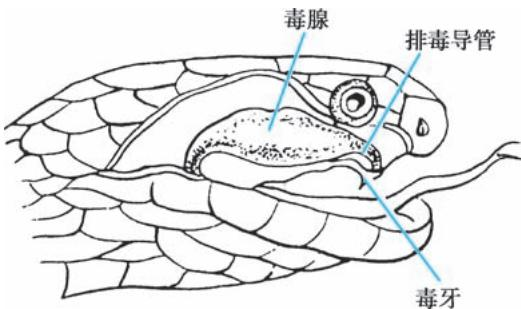  
图9-2-4  毒蛇的毒腺、排毒导管和毒牙模式图

（二） 毒液对伤口局部作用 蛇毒中的神经毒可麻痹感觉神经末梢，引起肢体麻木；阻断运动神经与横纹肌之间的神经冲动，引起瘫痪。所含磷脂酶 $\mathrm { A } _ { 2 }$ 可促使组胺、5-羟色胺和缓动素释放，引起伤口局部组织水肿、炎症反应和疼痛；透明质酸酶使局部炎症进一步扩展。蛋白质溶解酶破坏血管壁，引起出血、损伤组织或局部坏死。

（三） 毒液全身作用机制 蛇毒成分比较复杂，一般分神经毒、血循毒和肌肉毒等。金环蛇、银环蛇、海蛇毒液以神经毒为主；蝰蛇、五步蛇、竹叶青、烙铁头等毒蛇毒液以血循毒为主；眼镜蛇、眼镜王蛇及蝮蛇毒液兼有神经毒和血循毒（混合毒）。此外，海蛇和眼镜蛇还有非常强烈的肌肉毒。

1. 神经毒 具有阻断神经肌肉接头传导的作用，引起横纹肌弛缓性瘫痪，可导致呼吸肌麻痹、严重呼吸衰竭，为临床上主要致死原因。根据作用部位不同，神经毒包括突触前神经毒和突触后神经毒。β-银环蛇毒或蝮蛇毒是突触前神经毒，能抑制运动神经末梢释放神经递质乙酰胆碱；α-银环蛇毒、眼镜蛇毒、眼镜王蛇毒、海蛇毒为突触后神经毒，可与运动终板乙酰胆碱受体结合，使乙酰胆碱失去作用，骨骼肌不能兴奋收缩。银环蛇毒含有两种神经毒，对神经肌肉接头的传导有双重阻断作用，可迅速引起呼吸肌麻痹。此外，神经毒可作用于自主神经系统，抑制颈动脉体化学感受器，加重呼吸衰竭；兴奋肾上腺髓质中的神经受体，释放肾上腺素，使血压升高；胃肠道平滑肌兴奋性先增高，后抑制，出现肠麻痹；毒素还可影响延髓血管运动中枢和呼吸中枢，导致休克和中枢性呼吸衰竭。

## 2. 血循毒

（1）凝血毒和抗凝血毒：蝰蛇和澳大利亚眼镜蛇蛇毒可激活Ⅹ因子，在Ⅴ因子、磷脂、 $\mathrm { J a } ^ { 2 + }$ 参与下，使凝血酶原变成凝血酶。响尾蛇蛇毒可直接作用于纤维蛋白原，引起凝血。蝰蛇科大部分毒蛇的蛇毒中含有凝血酶样物质，使纤维蛋白原直接转变为纤维蛋白，有研究认为其在体外水解纤维蛋白原为纤维蛋白单体，后者凝聚为纤维蛋白，从而促进血液凝固，而在体内则由于水解纤维蛋白原，导致血纤维蛋白原水平下降，但不形成血凝块，表现为双重作用；另外，还可抑制血小板的黏附、聚集，表现为抗凝作用。还有些蛇毒可溶解纤维蛋白原或抑制纤维蛋白活性；促使纤溶酶原转化成纤溶酶；阻抑Ⅴ因子，阻抑凝血酶形成，最终导致出血。

（2）出血毒和溶血毒：蛇毒中的蛋白水解酶能溶解组织蛋白，破坏肌肉组织，损伤血管壁，引起出血和组织坏死。蛇毒中的磷脂酶 $\mathrm { A } _ { 2 }$ 可使毛细血管内皮细胞肿胀、溶解，基底膜中糖蛋白、纤维连接蛋白、Ⅳ型和Ⅴ型胶原及其他基质成分分解，导致毛细血管壁的通透性改变，组织水肿、出血和坏死；蛇毒还可使红细胞膜上卵磷脂变成溶血卵磷脂，从而溶解红细胞膜，引起溶血。有些毒蛇的毒液还含有直接溶血因子，可溶解红细胞膜，如蝰蛇、五步蛇毒液。

（3）心脏血管毒：蛇毒中的蛋白水解酶能释放组胺和血管活性物质；磷脂酶 $\mathrm { A } _ { 2 }$ 也能促释放组胺、5-羟色胺、肾上腺素、缓动素等，使血管扩张、血压下降，甚至休克。蛇毒中的心脏毒能损害心肌细胞结构和功能，使心肌变性、坏死，出现心律失常甚至心搏骤停。眼镜蛇、蝰蛇等含有心脏毒。

3. 肌肉毒 主要包括肌肉毒素（膜毒素）、响尾蛇胺及其类似物、蛋白水解酶和磷脂酶 $\mathbf { A } _ { 2 \circ }$ 。作用靶点一般为骨骼肌而非平滑肌，通过使肌细胞溶解、蛋白水解，引起组织坏死。中华眼镜蛇的肌肉毒主要引起局部组织坏死；海蛇的肌肉毒则能破坏全身骨骼肌细胞，引起肌肉疼痛、无力、肌红蛋白尿、高钾血症和急性肾损伤。

【临床表现】 眼镜蛇科和海蛇科的蛇毒分子小，咬后迅速进入受害者血液循环，因而发病很快；蝰蛇的蛇毒分子较大，由淋巴系统缓慢吸收后才出现症状。眼镜蛇和烙铁头的蛇毒接触黏膜被吸收后可引起全身中毒。根据蛇毒的主要毒性作用，毒蛇咬伤的临床表现可归纳为以下四类。

1. 神经毒损害 被眼镜蛇咬伤后，局部伤口反应较轻，仅有微痒和轻微麻木、疼痛或感觉消失。约 1～6 小时后出现全身中毒症状。首先感到全身不适、四肢无力、头晕、眼花，继而胸闷、呼吸困难、恶心和晕厥。接着出现神经症状并迅速进展，主要为眼睑下垂、视力模糊、斜视、语言障碍、吞咽困难、流涎、眼球固定和瞳孔散大。重症患者呼吸浅快且不规则，最终出现中枢性或周围性呼吸衰竭。

2. 心脏毒和凝血障碍毒损害 被蝰蛇和竹叶青蛇咬伤后，症状大都在0.5～3小时出现。局部有红肿、疼痛，常伴有水疱、出血和坏死。肿胀迅速向肢体近端扩展，并引起局部淋巴结肿痛。全身中毒症状有恶心、呕吐、口干、出汗，少数患者有发热。部分以释放血循毒为主的蛇类（如蝰蛇科的尖吻蝮蛇、竹叶青蛇)咬伤人体后可引起全身广泛出血，包括颅内和消化道出血。大量溶血引起血红蛋白尿出现血压下降、心律失常、循环衰竭和急性肾衰竭。

3. 肌肉毒损害 被海蛇咬伤后局部仅有轻微疼痛，甚至无症状。约 30 分钟至数小时后，患者感觉肌肉疼痛、僵硬和进行性无力；腱反射消失、眼睑下垂和牙关紧闭。横纹肌大量坏死，释放钾离子引起高钾血症，出现严重心律失常；释放的肌红蛋白可堵塞肾小管，引起少尿、无尿，导致急性肾衰竭。海蛇神经毒损害的临床表现与眼镜蛇相似

4. 混合毒损害 一些眼镜蛇、眼镜王蛇、蝰蛇、蝮蛇毒液兼有神经、心脏及出凝血障碍毒，根据临床表现有时很难鉴别是哪一类毒蛇咬伤，这时注意要区分临床表现的主次。眼镜王蛇、泰国眼镜蛇咬伤以神经毒为主，并常常引起呼吸衰竭而致死；中华眼镜蛇咬伤以局部组织坏死为主，常常带来截肢和肢体功能障碍的后遗症；蝮蛇咬伤则以血循毒为主。

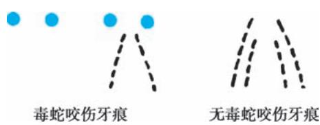

【诊断】 根据致伤蛇外观、伤后临床表现及齿痕等，蛇咬伤的诊断一般并不困难，特别是已确认为某种蛇咬伤或已捕获到致伤蛇时。首先应鉴别是毒蛇咬伤还是无毒蛇咬伤，见表9-2-10和图9-2-5；其次须明确致伤蛇种为何种类型毒蛇，用 ELISA 方法测定伤口渗液、血清、脑脊液和其他体液中的特异蛇毒抗原，约 15～30 分钟即可明确是何种毒蛇咬伤，但国内临床上未常规使用。毒蛇咬伤有时还须与毒蜘蛛或其他昆虫咬伤鉴别。

表9-2-10  毒蛇和非毒蛇咬伤的鉴别

<table><tr><td>项目</td><td>毒蛇</td><td>非毒蛇</td></tr><tr><td>牙痕</td><td>2个针尖大牙痕</td><td>2行或4行锯齿状浅小牙痕</td></tr><tr><td>局部伤口</td><td>水肿、渗血、坏死</td><td>无</td></tr><tr><td rowspan="4">全身症状</td><td>神经毒</td><td>无</td></tr><tr><td>心脏毒和凝血障碍</td><td>无</td></tr><tr><td>出血</td><td>无</td></tr><tr><td>肌肉毒</td><td>无</td></tr></table>

图 9-2-5  蛇咬伤牙痕

【治疗】 毒蛇咬伤的初步急救原则：减少毒素扩散并将患者迅速转运至恰当的医疗中心。蛇咬伤后须密切观察患者神志、血压、脉搏、呼吸、尿量和局部伤口等情况。如不能确切排除毒蛇咬伤，应按毒蛇咬伤观察和处理。抢救要分秒必争。被咬伤者须保持安静，不要惊恐奔走，以免加速毒液吸收和扩散。专业急救人员可在现场对伤口进行必要

处理，非血循毒蛇类咬伤可对伤口做“一”字或“十”字微切口，长度 0.5cm 左右，并进行吸吮或自近端至远端挤压排毒，但不宜做深大切口。血循毒蛇类咬伤不主张切开。非专业急救人员不要切开伤口，以免增加组织坏死和感染机会。

## （一） 局部处理

1. 绷扎 被毒蛇咬伤的肢体应限制活动。用绷带包扎伤口上方的近心端肢体，阻断淋巴回流（图 9-2-6），可延迟蛇毒扩散。避免用止血带，以免影响绑扎部位远端肢体的血液供应，引起组织缺血性坏死。压力绷带法主要推荐用于神经毒毒蛇咬伤急救，但其普遍适用性仍有争议，眼镜蛇咬伤时易造成局部组织坏死，故一般不主张绷扎。

  
手指咬伤绷扎部位

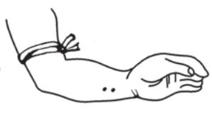  
手掌或前臂咬伤绷扎部位

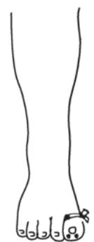  
脚趾咬伤绷扎部位

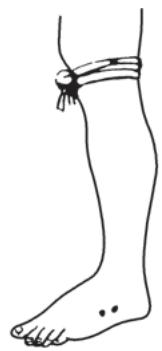  
下肢咬伤绷扎部位  
图9-2-6  蛇咬伤的绷扎部位

2. 伤口清创 在伤口近心端有效绷扎后，立即用凉开水、泉水、肥皂水或1∶5 000高锰酸钾溶液冲洗伤口及周围皮肤，以洗掉伤口外表毒液。留在组织中的残牙用刀尖或针细心剔除。以牙痕为中心做十字切开，深至皮下，然后用手从肢体的近心端向伤口方向及伤口周围反复挤压，促使毒液从切开的伤口排出体外，边挤压边用清水冲洗伤口，冲洗—挤压—排毒须持续 20～30 分钟。为减少毒液吸收，将肢体放在低位。不要因绷扎和清创而延迟应用抗蛇毒血清。

3. 局部封闭 早期局部处理有助于清除伤口残留的蛇毒，使蛇毒分解而失去毒性作用。用法为：糜蛋白酶、胰蛋白酶 4 000U 以 2% 利多卡因 5ml 溶解，不足时可适当用生理盐水稀释至 10ml，在伤口及周围皮下进行浸润注射，并在伤处近心端做环形注射封闭。注射后严密观察病情，注意过敏反应发生。

## （二） 尽早足量使用抗蛇毒血清

抗蛇毒血清是中和蛇毒的特效解毒药，应尽早足量使用。目前国内批准生产的抗蛇毒血清有4 种，均为单价血清，分别是抗眼镜蛇毒血清（1 000IU/支）、抗银环蛇毒血清（10 000U/支）、抗蝮蛇毒血清（6000U/支）、抗五步蛇毒血清（2000U/支）。采用静脉滴注，眼镜王蛇或泰国眼镜蛇咬伤而病情危重者，也可稀释后静脉推注。

另外，我国还有一些“军特药准字”号产品。如成都军区昆明军事研究所研制的精制冻干多价抗蛇毒血清，分别有血循毒类多联抗毒血清、金环蛇类多联抗毒血清、眼镜蛇类多联抗毒血清。此外，还有2种单价冻干抗蛇毒血清：抗蝰蛇毒血清和抗竹叶青蛇毒血清。

1. 应做蛇毒血清皮肤过敏试验，反应阴性时才可使用。阳性者应常规脱敏注射。

2. 根据毒蛇咬伤类型使用相应抗蛇毒血清，对无特异性抗蛇毒血清的类型，可选用相同亚科的抗蛇毒血清。实验和临床研究证明抗五步蛇毒血清和抗蝮蛇毒血清均能中和烙铁头蛇毒或竹叶青蛇毒，抗眼镜蛇毒血清、抗银环蛇毒血清配伍能中和眼镜王蛇毒和泰国眼镜蛇毒，海蛇咬伤可联用抗银环蛇毒血清、抗眼镜蛇毒血清。如蛇种不明，可根据蛇毒的毒性作用类型选择抗蛇毒血清：有神经毒表现的用抗银环蛇毒血清，有血循毒表现的用抗蝮蛇毒血清和/或抗五步蛇毒血清，有混合毒表现的用抗眼镜蛇毒血清或抗蝮蛇毒血清加抗银环蛇毒血清。多价抗蛇毒血清，对蛇种不明者尤其适用。

3. 根据临床症状，结合被蛇咬伤时间来判断中毒程度，决定注射抗蛇毒血清剂量。具体用量和用法最好在相关专家的指导下进行。注意抗蛇毒血清只能中和未与靶器官结合的游离蛇毒。因此，使用血清的时间愈早愈好，力争在伤后2小时内用药。

4. 使用抗蛇毒血清期间应密切观察患者反应，出现过敏性休克者，立即停用，给予抗过敏休克相关治疗。

（三） 中医中药治疗 临床实践证明中医中药在救治毒蛇咬伤方面有丰富的经验和实际的效果。我国研制出的针对毒蛇咬伤的中药制剂有广东蛇药、南通蛇药（即季德胜蛇药片）、上海蛇药、湛江蛇药、云南蛇药、福建蛇药等。以南通蛇药为例，首次口服 20 片，以后每隔 6～8 小时服 10 片，同时将适量药片（10～20 片，以能够覆盖肿胀区域为宜）碾末调制成糊状于伤处肿胀区域外敷，每日 1 次。治疗时间根据症状缓解情况而定

（四） 并发症防治 呼吸衰竭在毒蛇咬伤中出现早，发生率高，常需要数周甚至 10 周以上才能恢复。因此，及时、正确的呼吸支持在毒蛇咬伤救治中尤为关键。休克、心力衰竭、急性肾衰竭及弥散性血管内凝血等急症的及时处理也非常重要。血循毒为主的蛇毒可致弥散性血管内凝血及器官出血，临床上须严密观察，防止意外损伤发生

## （五） 辅助治疗

1. 糖皮质激素 糖皮质激素能抑制和减轻组织过敏反应和坏死，对减轻伤口局部反应和全身中毒症状均有帮助。每日剂量：氢化可的松200～400mg或地塞米松10～20mg，连续3～4天。

2. 山莨菪碱 报道称与地塞米松合用，可改善微循环、减轻蛇毒的中毒反应，有防治 DIC 及MODS 的作用，可连续应用3～4天。

3. 防治感染 蛇咬伤的伤口应按照污染伤口处理，故应常规给予抗生素和破伤风抗毒素1 500U。

【预防】 蛇咬伤属于意外伤害，重点应对蛇类活动活跃地区的居民和易招致蛇咬伤的人群进行蛇咬伤救治及现场急救知识的宣传教育。相关的从业人员要根据情况穿戴防护手套和靴鞋，携带蛇药片以备急需。地方卫生部门应根据属地蛇类分布特点配备相应的抗毒血清，并对各级卫生部门进行蛇咬伤的救治培训，建立健全的蛇伤防治网，从组织上及人力上予以落实，做到任务明确，专人负责。

（柴艳芬）

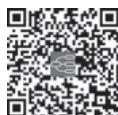  
本章思维导图

中暑（heat illness）是在暑热天气、湿度大及无风环境中，患者因体温调节中枢功能障碍、汗腺功能衰竭和水、电解质丧失过多而出现相关临床表现的疾病。其发生率（17.6～26.5）/10 万，高发地区（如沙特阿拉伯）可达250/10万。气候变化致全球平均气温升高，极端高温事件发生频率、持续时间和强度增加。近 10 年，欧洲、美洲、亚洲等世界多地遭遇极端高温天气。过去 20 年中，65 岁人群高温相关死亡率增加 54%。热（日）射病（heatstroke，sun stroke）是中暑死亡的主要原因。美国，热浪（heatwave）期中暑死亡人数约为非热浪期的 10 倍。美国运动员中，热射病是继脑脊髓损伤和心搏骤停后第三位死亡原因。

【病因】 大气温度升高（＞32℃）、湿度较大（＞60%）、对高热环境不能充分适应，以及工作时间长、剧烈运动或军事训练，又无充分防暑降温措施时极易发生中暑。此外，在室温较高而无空调时，肥胖、营养不良、年老体弱和慢性疾病患者更易发生中暑。据统计，心肌梗死、脑血管意外等疾病可使中暑发生率增加10倍。通常发生中暑的原因有：①环境温度过高：人体能从外界环境获取热量；②产热增加：重体力劳动、发热性疾病、甲状腺功能亢进症和应用某些药物（如苯丙胺）使产热增加；③散热障碍：如湿度大、肥胖、穿透气不良衣服或无风天气等；④汗腺功能障碍：人体主要通过皮肤汗腺散热，系统性硬化症、广泛皮肤瘢痕或先天性无汗症、抗胆碱药物或滥用毒品可抑制出汗。上述因素会促发和导致中暑。

【发病机制】 正常人腋窝温度 36～37.4℃，直肠温度（中心温度）36.9～37.9℃。根据外界环境，下丘脑体温调节中枢通过控制产热和散热来维持体温的相对稳定。

## （一） 体温调节

## 1. 体温调节方式

（1）产热：人体产热主要来自体内氧化代谢过程，运动和寒战也能产生热量。气温在 28℃左右时，静息状态下，人体产热量为 210～252kJ（50.4～60.48kcal）/（h·m2）。体重 70kg 的人，基础代谢产热量约 418.7kJ（100kcal），缺乏降温机制时，体温可升高 1.1℃。人体剧烈运动产热量较静息状态时增加 10～20 倍，约 2 520～3 780kJ（604.8～907.2kcal）/（h·m2），占人体总产热量的 90%。

（2）散热：体温升高时，通过自主神经系统调节皮肤血管扩张，血流量约为正常的20倍，大量出汗促进散热，又会引起水盐丢失。人体与环境之间通过以下方式进行热交换：①辐射（radiation）：约占散热量的 60%。室温在 15～25℃时，辐射是人体主要的散热方式。②蒸发（evaporation）：约占散热量的 25%。在高温环境下，蒸发是人体主要的散热方式。皮肤每蒸发 1L 汗液，散热 2 436kJ（580kcal）。湿度大于 75% 时，蒸发减少。相对湿度达 90%～95% 时，蒸发完全停止。③对流（convection）：约占散热量的 12%。散热速度取决于皮肤与环境的温度差和空气流速。④传导（conduction）：约占散热量的3%。水较空气热传导性强，人体皮肤直接与水接触时，散热速度是正常的20～30 倍。

2. 高温环境适应 通常，在炎热环境中运动可产生 1～2L/h 汗水，有时甚至多达 4L。在热环境每天工作 100 分钟，持续 7～14 天后，才能达到良好热适应。对抗高温时表现为心排血量和出汗量增加，汗液钠含量较正常人少，出汗散热量为正常的 2 倍。训练有素的马拉松运动员，直肠内温度高达42℃而无不适。无此种适应代偿能力者，易发生中暑。

## （二） 高温环境对人体各系统的影响

中暑损伤主要是由于体温过高（＞42℃）对细胞产生直接损伤作用，引起酶变性、线粒体功能障碍、细胞膜稳定性丧失和有氧代谢途径中断，导致多器官功能障碍或衰竭。

1. 中枢神经系统 高热能引起大脑和脊髓细胞快速死亡，继发脑局灶性出血、水肿、颅内压增高和昏迷。小脑浦肯野（Purkinje）细胞对高热反应极为敏感，常发生构音障碍、共济失调和辨距不良。

2. 心血管系统 热射病患者常表现为高动力循环状态，外周血管阻力降低，心动过速（＞180次/分），心脏指数、中心静脉压（CVP）升高。持续高温引起心肌缺血、坏死，促发心律失常，加重心力衰竭，继而心排血量下降，皮肤血流减少，影响散热，形成恶性循环。

3. 呼吸系统 高热时，呼吸频率增快，通气量增加，持续不缓解会引起呼吸性碱中毒。热射病时可致肺血管内皮损伤，发生ARDS。

4. 水和电解质代谢 热适应后第二周，因出汗、排尿丢失及补充不足，体内总钾量减少 20%（500mmol）以上。大量出汗常导致水和钠丢失，引起脱水和电解质紊乱。

5. 肾脏 由于严重脱水、心血管功能障碍和横纹肌溶解等，可发生急性肾衰竭。

6. 消化系统 中暑时的直接热损伤和胃肠道血液灌注减少可引起缺血性溃疡，容易发生消化道大出血。热射病患者，发病2～3天后几乎都有不同程度的肝坏死和胆汁淤积。

7. 血液系统 严重中暑患者，发病后2～3天可出现不同程度的DIC。DIC又可进一步促使重要器官（心、肝、肾）功能障碍或衰竭。

8. 肌肉 劳力性热射病患者，由于肌肉局部温度增加、缺氧和代谢性酸中毒，常发生严重肌损伤，引起横纹肌溶解和血清肌酸激酶升高。

【病理】 热射病患者病死后尸检发现，小脑和大脑皮质神经细胞坏死，特别是 Purkinje 细胞病变较为突出。心脏有局灶性心肌细胞出血、坏死和溶解，心外膜、心内膜和瓣膜组织出血；不同程度肝细胞坏死和胆汁淤积；肾上腺皮质出血。劳力性热射病病死后病理检查可见肌肉组织变性和坏死。

【临床表现】 根据发病机制和临床表现不同，通常将中暑分为热痉挛（heat cramp）、热衰竭（heatexhaustion）和热（日）射病。上述三种情况可顺序发展，也可交叉重叠。

（一） 热痉挛 剧烈活动后，大量出汗和饮用低张液体后出现头痛、头晕和肢体、腹壁肌群痛性痉挛，肢体活动受限，有时腹痛与急腹症表现相似，数分钟缓解，无明显体温升高，无神志障碍。热痉挛也可为热射病早期表现。

（二） 热衰竭 多见于老年人、儿童和慢性病患者，是严重热应激时，体液和体内钠丢失过多引起循环容量不足所致。表现为多汗、疲乏、无力、头晕、头痛、恶心、呕吐和肌痉挛，心率明显增快，直立性低血压或晕厥。中心体温（core body temperature，CBT）升高，不超过 40℃，无神志障碍。实验室检查提示血细胞比容增高、高钠血症、轻度氮质血症和肝功能异常（肝转氨酶可升高至数千单位）。

（三） 热射病 高热（CBT＞40℃）伴神志障碍。早期受损器官依次为脑、肝、肾和心脏。根据患者发病时状态和发病机制，将热射病分为劳力性热射病（exertional heatstroke）和非劳力性热射病（non-exertional heatstroke）两种类型。前者是内源性产热过多，后者是因体温调节功能障碍致散热减少。美国疾病控制与预防中心（CDC）信息显示，发生热射病后，患者中心体温可在 10～15 分钟内飙升至41.1℃或更高。

1. 劳力性热射病 多发生在青壮年人群，剧烈运动或从事体力劳动后数小时发病，约 50% 患者大量出汗，心率 160～180 次/分，脉压增大，可发生横纹肌溶解、急性肾衰竭、肝衰竭（发病 24 小时后肝转氨酶可升至数万单位）、DIC 或MODS，病死率高。

2. 非劳力性热射病 多见于居住在通风不良环境的老年体衰者及产妇，其他高危人群包括精神分裂症、帕金森病、慢性酒精中毒及偏瘫或截瘫患者。84%～100% 患者无汗，皮肤干热和发红，直肠温度最高可达 46.5℃。病初可表现行为异常或痫性发作，继而出现谵妄、昏迷和瞳孔对称缩小，严重者出现低血压、休克、心律失常及心力衰竭、肺水肿和脑水肿。约 5% 患者发生急性肾衰竭，可有轻、中度DIC，常在发病后24 小时左右死亡。

【实验室检查】 严重患者常出现肝、肾、胰和横纹肌损伤的实验室参数改变，应紧急进行有关生化检查，如血清天冬氨酸转氨酶（AST）、丙氨酸转氨酶（ALT）、乳酸脱氢酶（LDH）、肌酸激酶（CK）、凝血功能及动脉血气分析，尽早发现重要器官功能障碍证据。怀疑颅内出血或感染时，应行脑 CT 和脑脊液检查。

【诊断与鉴别诊断】 炎热夏季，遇有高热伴昏迷者首先考虑中暑。热射病应与脑炎、脑膜炎、伤寒、斑疹伤寒、恶性疟疾、甲状腺危象、震颤性谵妄及下丘脑出血、抗胆碱药物中毒或抗精神病药恶性综合征鉴别。

【治疗】 中暑类型和病因不同，但基本治疗措施相同。

（一） 降温治疗 迅速降温是治疗的基础，决定患者预后。降低劳力性热射病患者体温的推荐时间由原来的“黄金1小时”改为“黄金半小时”。

1. 体外降温 将患者转移到通风良好的低温环境，脱去衣服，同时进行皮肤肌肉按摩，促进散热。无虚脱患者，迅速降温的“金标准”是冷水浸浴（cold water immersion，CWI）或冰水浸浴（icewater immersion，IWI），将患者身体（不包括头部）尽可能多地浸入 2.0～14.0℃冷水中，并且不停地搅动水，以保持皮肤表面有冷水，在头顶周围放置用湿毛巾包裹的冰块。此法能在 20 分钟内将体温从43.3℃降至 40.0℃以下。对虚脱者采用蒸发散热降温，如用 15℃冷水反复擦拭皮肤、用电风扇或空气调节器。体温降至39℃时，停止降温。

2. 体内降温 体外降温无效者，用冰盐水进行胃或直肠灌洗，也可用无菌生理盐水进行腹膜腔灌洗或血液透析，或将自体血液体外冷却后回输入体内。

3. 药物降温 热射病患者，解热镇痛药水杨酸盐治疗无效，而且可能有害。迅速降温出现寒战者，给予生理盐水500ml加氯丙嗪25～50mg静脉输注，并监测血压。

## （二） 并发症治疗

1. 昏迷 应进行气管插管，保持呼吸道通畅，防止误吸。颅内压增高者静脉输注甘露醇 $1 { \sim } 2 \mathrm { g } / \mathrm { k g }$ 30～60分钟输入。痫性发作时，静脉输注地西泮。

2. 液体复苏 低血压患者，应静脉输注生理盐水或乳酸钠林格液恢复血容量，最初 4 小时平均补充1 200ml 等张晶体溶液。必要时静脉滴注异丙肾上腺素，勿用血管收缩药，以免影响皮肤散热。

3. 多器官衰竭 应予对症支持治疗。出现横纹肌溶解，尿量至少保持在 $2 \mathrm { m l / \left( k g \cdot h \right) }$ ，尿 $\mathrm { p H } >$ 6.5。心力衰竭合并肾衰竭伴有高钾血症时，慎用洋地黄。持续性无尿、尿毒症和高钾血症是血液透析或腹膜透析指征。应用 H 受体拮抗剂或质子泵抑制剂预防应激性溃疡及上消化道出血。DIC 患者根据病情输注新鲜冰冻血浆和血小板。

## （三） 监测

1. 降温期间连续监测体温变化，逐渐使中心体温降到 $3 7 { \sim } 3 8 \mathrm { ‰}$ 。

2. 放置Foley 导尿管，监测尿量，应保持尿量＞30ml/h。

3. 中暑高热患者，动脉血气结果应予校正。体温超过 37℃时，每升高 $1 \mathrm { { } ^ { \circ } C } , \mathrm { { P a O } } _ { 2 }$ 降低 7.2%，$\mathrm { P a C O } _ { 2 }$ 增加 4.4%，pH 降低 0.015。

4. 发病后 24 小时可出现凝血障碍，更常见于 48～72 小时。应严密监测 DIC 相关的实验室参数（纤维蛋白原、纤维蛋白降解产物、凝血酶原时间和血小板）。

【预后】 热射病病死率为20%～70%，50岁以上患者高达80%。决定预后的不是发病初始体温，而是在发病 30 分钟内的降温速度。如果发病后 30 分钟内能将直肠内温度降至 40℃以下，通常不发生死亡。降温延迟，病死率明显增加。器官衰竭数目决定预后。无尿、昏迷或心力衰竭患者病死率高。昏迷超过6～8小时或出现DIC者预后不良。血乳酸浓度可作为判断预后的指标。

## 【预防】

1. 暑热夏季加强预防中暑宣传教育，穿宽松浅色透气衣服。在阳光下活动时，戴宽边遮阳帽，使用防晒霜。

2. 炎热天气尽量减少户外活动，避免在11：00 —15：00暴露于阳光太久。

3. 改善年老体弱、慢性病患者及产褥期妇女居住环境。

4. 改善高温环境中的工作条件，多饮用渗透压 ${ < } 2 0 0 \mathrm { m O s m } / ( \mathrm { k g } \cdot \mathrm { H } _ { 2 } \mathrm { O } ) ,$ ）的钾、镁和钙盐防暑饮料。

5. 中暑患者恢复后，数周内应避免阳光下剧烈活动。

（柴艳芬）

本章数字资源

冻僵（frozen rigor，frozen stiff）又称意外低体温（accidental hypothermia），是指下丘脑功能正常者处在寒冷（-5℃以下）环境中，其中心体温（CBT）＜35℃并伴有以神经和心血管系统损害为主要表现的全身性疾病，通常暴露于寒冷环境后 6 小时内发病。冻僵患者体温越低，病死率越高。通常 CBT在25～27℃时难以复苏成功。寒冷导致的冻伤（frostbite）或组织坏死不属于本章讨论范畴。

【病因】 大多数患者发病有区域性和季节性。冻僵常见于以下三种情况：①长时间暴露于寒冷环境又无充分保暖措施和热能供给不足时，如登山、滑雪者和驻守在高山寒冷地区的边防军战士等；②年老、体衰、慢性疾病（痴呆、精神病和甲状腺功能减退症）和严重营养不良患者在低室温下也易发生；③意外冷水或冰水淹溺者。

【发病机制】 冻僵严重程度与机体暴露环境的温度、湿度、风速、时间、部位、机体的营养状态及抗寒能力有关。寒冷刺激引起交感神经兴奋，外周血管收缩。随着机体暴露时间延长，组织和细胞发生形态学改变，血管内皮损伤，通透性增强，血液无形成分外渗及有形成分聚集，血栓形成，导致循环障碍和组织坏死。细胞脱水及变性引起代谢障碍。冻僵时，患者 CBT 不同，体内代谢改变不同：①轻度冻僵（CBT 介于 35～32℃）：寒冷刺激致交感神经兴奋性增高，引起皮肤血管收缩，心率及呼吸频率增快，心排血量增加，血压升高，脑血流增加及寒冷性利尿（cold diuresis），机体防御性出现散热减少和基础代谢率增加。寒冷时，肌张力增高和寒战，消耗热量增加，加速寒冷伤害。②中度冻僵（CBT介于32～28℃）：此时体温调节机制衰竭，寒战停止，代谢明显减慢，引起MODS 或MOF。体温每降低1℃，脑血流减少 7%，代谢速度下降约 6%。CBT＜30℃时，窦房结起搏频率减慢引起心动过缓，胰岛素分泌减少，血糖升高，外周组织胰岛素抵抗。③严重冻僵（CBT＜28℃）：内分泌和自主神经系统热储备机制丧失，基础代谢率下降 50%，室颤阈下降，呼吸明显变慢；体温低于 24℃时，全身血管阻力降低，不能测到血压，神智丧失，瞳孔散大，最终死于循环和呼吸衰竭。

## 【临床表现】

1. 轻度冻僵 患者表现疲乏、健忘、多尿、肌颤、血压升高、心率和呼吸加快，逐渐出现不完全性肠梗阻。

2. 中度冻僵 患者表情淡漠、精神错乱、语言障碍、行为异常、运动失调或昏睡。心电图示心房扑动或颤动、室性期前收缩和出现特征性的J波（位于QRS波群与ST段连接处，又称Osborn波）。体温在30℃时，寒战停止、神志丧失、瞳孔扩大和心动过缓。心电图显示PR间期、QRS波群和QT间期延长。

3. 严重冻僵 患者出现少尿、瞳孔对光反应消失、呼吸减慢和心室颤动；体温降至 24℃时，出现僵死样面容；体温≤20℃时，皮肤苍白或青紫、心搏和呼吸停止、瞳孔固定散大，四肢肌肉和关节僵硬，心电图或脑电图示等电位线。

【诊断】 通常根据长期寒冷环境暴露史和临床表现，一般不难诊断，CBT 测定可证实诊断。CBT测定采用两个部位：①直肠测温：应将温度计探极插入 15cm 深处测定体温；②食管测温：将温度计探极放置于喉下24cm深处测取体温。

【治疗】 积极采取急救复苏和支持措施，防止体热进一步丢失。采取安全有效的复温措施，预防并发症。

（一） 现场处理 迅速将患者移至温暖环境，立即脱去潮湿的衣服，用毛毯或厚棉被包裹身体。搬动时要谨慎，以防发生骨折。

## （二） 院内处理

1. 急救处理 在未获得确切死亡证据前，必须积极进行复苏抢救。对于反应迟钝或昏迷者，保持气道通畅，进行气管插管或气管切开，吸入加热的湿化氧气。休克患者复温前，首先恢复有效循环容量。CBT＜30℃者，阿托品、电除颤或植入心脏起搏器常无效。也有报道CBT 20.4℃除颤成功者。

2. 复温技术 根据患者情况，选择复温方法和复温速度。对于老年或心脏病患者，复温应谨慎。

（1）被动复温（passive rewarming）：即通过机体产热自动复温。适用于轻度冻僵者。将患者置于温暖环境中，应用较厚棉毯或棉被覆盖或包裹患者复温，复温速度为0.3～2℃/h。

（2）主动复温（active rewarming）：即将外源性热传递给患者。适用于：①CBT＜32℃；②循环状态不稳定者；③高龄老人；④中枢神经系统功能障碍；⑤内分泌功能低下；⑥疑有继发性低体温者。

1）主动体外复温：直接体表升温法，用于既往体健的急性低体温者。可用气热毯、热水袋或40～42℃温水浴复温，复温速度1～2℃/h。复温时，将复温热源置于胸部。肢体升温增加心脏负荷。

2）主动体内复温：通过静脉输注 40～42℃液体，或吸入 40～45℃湿化氧气，或用 40～45℃灌洗液进行胃、直肠、腹膜腔或胸腔灌洗升温，复温速度为 0.5～1℃/h。也可经体外循环快速复温，复温速度为 10℃/h。

心搏呼吸停止者，如果体温升至 28℃以上仍无脉搏，应行 CPR 及相关药物治疗。体温升至 36℃仍未恢复心搏和呼吸者，可中止复苏。

## 3. 支持和监护措施

## （1）支持措施

1）补充循环容量和热能·静脉输注生理盐水或5%葡萄糖氯化钠溶液（输液量20ml/kg）恢复血容量。低温患者肝脏不能有效代谢乳酸，勿输注乳酸钠林格液。同时，要注意纠正代谢及电解质紊乱，补充热能。

2）维持血压：早期维持平均动脉压（MAP）≥60mmHg。如补充容量和复温后血压未恢复，静脉予多巴胺2～5μg/（kg·min）。血压正常患者，静脉小剂量硝酸甘油可改善重要器官血液灌注。

3）恢复神志：神志障碍者给予纳洛酮和维生素 $\mathrm { B } _ { 1 }$ 治疗。

## （2）监护措施

1）放置鼻胃管：冻僵患者胃肠运动功能减弱，常发生胃扩张或肠麻痹，放置鼻胃管行胃肠减压，以预防呕吐误吸。

2）生命体征监测：通过监测 CBT 评价复温疗效；通常经脉搏血氧仪（pulse oximeter）监测血氧饱和度无意义；持续心电监测，及时发现心律失常；避免放置Swan-Ganz导管，以防引起严重心律失常。

3）血糖监测：复温前，血糖升高（6.2～10.1mmol/L）无须胰岛素治疗，以免发生低血糖。复温后，热能需求增加，胰岛素分泌正常，血糖逐渐恢复正常。

4）放置Foley 导尿管：观察尿量及监测肾功能。

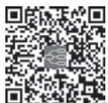  
本章思维导图

4. 并发症治疗 低体温持续时间较长时，常发生非心源性肺水肿、应激性溃疡、胰腺坏死、心肌梗死、脑血管意外和深部静脉血栓形成等并发症。冻僵患者，能诱发支气管黏液溢（bronchorrhea），由于保护性咳嗽反射丧失，常会发生肺不张、吸入性肺炎和复温后肺水肿。出现上述并发症应进行相应处理。

（柴艳芬）

本章数字资源

海拔 3 000m 以上地区称为高原。高原环境空气稀薄，大气压和氧分压低，气候寒冷干燥，紫外线辐射强。由平原移居到高原或短期在高原逗留的人，因对高原环境适应能力不足，发生以缺氧为突出表现的一组疾病称为高原病（high altitude sickness），或称高原适应不全症（unacclimatization to highaltitude），又称高山病（mountain sickness）。高原病也可发生于海拔 3000m 以下地区。急性高原病为自限性，预后相对良好，但发生高原肺水肿和高原脑水肿可致命。随着旅游业的发展，该病发病率与日俱增，并且是高原旅行者常见的病死原因。

【病因】 高原地区由于大气压和氧分压降低，进入高原地区后人体发生缺氧。随着海拔升高，吸入气氧分压明显下降，氧供发生严重障碍。低压性低氧血症是急性高原病的重要原因。海拔 2 400～2 700m 时，动脉血氧饱和度仅轻度降低；海拔 3 500～4 000m 时，动脉血氧饱和度降低到 90% 以下；海拔 5 000m 时，动脉血氧饱和度降低到 75%；海拔 5 500m 以上时，出现严重低氧血症和低碳酸血症，高原适应需要数周或数月，甚至完全不能适应；海拔 7 000m 时，动脉血氧饱和度降低到 60%；海拔上升到 8 000m 时，大气压 268mmHg（35.62kPa），约为海平面（760mmHg）的 1/3，吸入气氧分压仅为56mmHg（7.46kPa）。高原病发病快慢、严重程度和发病率与所攀登高原海拔高度、攀登速度、高原停留时间和个体易感性有关。

【发病机制】 从平原进入高原，为适应低氧环境，机体需要适应性改变，以维持毛细血管内血液与组织间必要的压力阶差。每个人对高原缺氧的适应能力有限，过度缺氧时易发生适应不全。

1. 神经系统 由于大脑代谢旺盛，耗氧量大，大脑皮质对缺氧的耐受性最低。急性缺氧时，最初发生脑血管扩张、血流量增加和颅内压升高，大脑皮质兴奋性增高，出现头痛、多言、失眠和步态不稳。随着缺氧加重，脑细胞无氧代谢加强，ATP生成减少，脑细胞膜钠泵功能障碍，细胞内钠、水潴留，发生高原脑水肿。

2. 呼吸系统 进入高原后，动脉血氧分压降低，刺激颈动脉体和主动脉体化学感受器，出现反射性呼吸加深、加快，使肺泡通气量和动脉血氧分压增加。过度换气呼出CO 增多，导致呼吸性碱中毒。适应能力强者，肾代偿性排出 $\mathrm { H C O } _ { 3 }$ – 增多，以纠正呼吸性碱中毒。急性缺氧致肺小动脉痉挛，持续小动脉痉挛导致平滑肌层增厚，肺循环阻力增高，肺毛细血管楔压明显升高，血管壁通透性增强，血浆渗出增多，发生高原肺水肿。此外，肺泡壁和肺毛细血管损伤、肺泡表面活性物质减少和血管活性物质（花生四烯酸、 $\mathrm { . P G . T X A } _ { 2 } )$ 释放，加重肺毛细血管内皮损伤和渗漏，促使肺水肿加重，出现痰中带血。登山运动员血中内皮素水平较正常人升高 2 倍。内皮素与血管内皮细胞受体结合，通过活化钙通道收缩血管。氧供改善后，血中内皮素水平和肺动脉压下降。慢性高原病者，呼吸中枢对CO 敏感性和外周化学感受器对低氧敏感性降低，肺泡通气不足。长期处于低氧环境可引起肺小动脉平滑肌肥厚及内膜纤维化，从而导致肺动脉高压，最终发生慢性高原病。

3. 心血管系统 高原缺氧刺激颈动脉体和主动脉体化学感受器引起心率增快是机体最早的代偿性反应，心率增快，心排血量增加。急性缺氧时，体内血液重新分布，如皮肤及腹腔器官（特别是肾）血管收缩，使血供减少；心及脑血管扩张，血流量增加。血液重新分布是机体的重要代偿机制，有利于保证重要器官的血液供应。冠状动脉代偿性扩张有一定限度，严重和持久性缺氧将引起心肌损伤。长期移居高原者，肺动脉阻力持续增加导致肺动脉高压。肺动脉高压是机体代偿性改善低氧条件下肺血流灌注的结果，但是肺动脉压持续增高使右心负荷加重，出现右心室肥大，即高原性心脏病。高原性心脏病属于肺源性心脏病。缺氧引起继发性红细胞增多又可增加血液黏滞度，进一步加重心脏负荷。缺氧刺激血儿茶酚胺、抗利尿激素和肾上腺皮质激素分泌增加，肾素-血管紧张素-醛固酮系统活性增强使血压升高，进一步加重高原性心脏病。长期缺氧损伤心肌、破坏肾上腺皮质功能，也可出现收缩压降低和脉压缩小。

4. 造血系统 进入高原后，出现代偿性红细胞增多和血红蛋白增加也是缺氧适应反应。急性缺氧时，主要是刺激外周化学感受器，反射性引起交感神经兴奋性增高，使储血器官释放红细胞，糖无氧酵解增强，血乳酸增多，血 pH 下降，氧解离曲线右移，还原血红蛋白增多，2，3-二磷酸甘油酸（2，3-DPG）合成增加，氧与血红蛋白亲和力降低，使氧易于释放给组织。低氧血症还能刺激促红细胞生成素（erythropoietin）生成，促进骨髓红细胞系统增生，使红细胞数增多及红细胞内血红蛋白含量增加，增强血液携氧能力。

【病理】 高原病的基本病理学特征是细胞肿胀，脑、肺及外周血管常出现血小板、纤维蛋白栓子或静脉血栓。

1. 急性高原反应 没有特征性病理学变化。

2. 高原肺水肿 两肺重量明显增加、充血和水肿。在小气道和肺泡内有纤维蛋白渗出和透明膜形成，肺泡壁与毛细血管壁细胞膜变性，血管明显扩张、充血和通透性增强。肺中、小动脉和肺毛细血管有散在血栓形成。

3. 高原脑水肿 肉眼可见大脑皮质和软脑膜充血，可有脑疝形成。镜下可见脑细胞及其间质水肿、脑组织点状出血，局部有毛细血管损害、红细胞淤滞和血小板聚集，部分脑细胞变性或坏死。

4. 慢性高原病 右心室增大、室壁增厚和室腔扩张。镜下可见心肌细胞浊肿、心肌坏死灶、心肌纤维断裂和间质增生、水肿。右肺下动脉干扩张，肺动脉干弹性纤维消失，肺小动脉中层肌纤维肥大、结缔组织增生和肺细小动脉硬化。

【临床表现】 高原适应不全的速度和程度决定高原病发生的急缓和临床表现。

（一） 急性高原病（acute high altitude sickness） 分为三种类型，彼此可互相交叉或并存。

1. 急性高原反应（acute high altitude reaction） 很常见，未适应者进入高原地区后 6～24 小时发病，出现双额部疼痛、心悸、胸闷、气短、厌食、恶心和呕叶等。中枢神经系统症状与饮酒过量时表现相似。有些病例出现口唇和甲床发绀。通常在高原停留 24～48 小时后症状缓解，数天后症状消失。少数可发展成高原肺水肿和/或高原脑水肿。

2. 高原肺水肿（high altitude pulmonary edema） 是常见且致命的高原病。通常在快速进入高原地区 2～4 天内发病，先有急性高原反应表现，继而心动过速、呼吸困难、干咳加重、端坐呼吸、咳白色或粉红色泡沫样痰，肺部可闻及干、湿啰音。摄盐过多、快速攀登、过劳、寒冷、呼吸道感染、服用安眠药和有高原肺水肿既往史者较易发病。

3. 高原脑水肿（high altitude cerebral edema） 又称神经性高山病（nervous puna），是罕见且严重的急性高原病。大多数于进入高原地区 1～3 天后发病，表现为剧烈头痛伴呕吐、精神错乱、共济失调、幻听、幻视、言语和定向力障碍，随着病情发展，出现步态不稳、嗜睡、木僵或昏迷，有的发生惊厥。

（二） 慢性高原病（chronic high altitude sickness） 又称 Monge 病，较少见。主要发生在久居高原或少数世居海拔4000m 以上的人。有以下几种临床类型。

1. 慢性高原反应（chronic high altitude reaction） 是指急性高原反应持续 3 个月以上不恢复者，表现为头痛、头晕、失眠、记忆力减退、注意力不集中、心悸、气短、食欲缺乏、消化不良、手足麻木和颜面水肿，有时发生心律失常或短暂性昏厥。

2. 高原红细胞增多症 是对高原缺氧的一种代偿性生理适应反应。由于血液黏滞度过高，可有脑血管微小血栓形成。患者常出现头晕、头痛、记忆力减退、失眠或短暂性脑缺血发作，颜面发绀和杵状指。

3. 高原血压改变 久居或世居高原者通常血压偏低（≤90/60mmHg），常伴有头痛、头晕、疲倦和失眠等神经衰弱症状。血压升高时可诊断高原高血压，与原发性高血压表现相似，但很少引起心和肾损害。少数高原高血压患者可转变为高原低血压。

4. 高原心脏病 多见于高原出生的婴幼儿，成年人移居高原 6～12 个月后发病。主要表现为心悸、气短、胸闷、咳嗽、发绀、颈静脉怒张、心律失常、肝大、腹水和下肢水肿。有的患者间断出现睡眠呼吸暂停或打鼾，应与肥胖低通气综合征（Pickwickian 综合征）鉴别。

## 【实验室检查】

1. 血液学检查 急性高原病患者可有轻度白细胞增多；慢性者红细胞计数超过 $7 . 0 \times 1 0 ^ { 1 2 } / \mathrm { I }$ ，血红蛋白浓度超过180g/L，血细胞比容超过0.60。

2. 心电图检查 慢性高原心脏病患者表现电轴右偏、肺型 P 波、右心室肥大劳损、T 波倒置和/或右束支传导阻滞。

3. 胸部 X 线检查 高原肺水肿患者胸片显示双侧肺野弥散性斑片或云絮状模糊阴影。高原心脏病者表现为肺动脉明显突出，右肺下动脉干横径≥15mm，右心室增大。

4. 肺功能检查 动脉血气分析：高原肺水肿患者表现为低氧血症、低碳酸血症和呼吸性碱中毒；高原心脏病者表现为低氧血症和PaCO 增高。慢性高原病患者肺活量减少，峰值呼气流速降低，每分通气量下降。右心导管检查肺动脉压、右心房和右心室压升高，肺毛细血管楔压（PCWP）正常。

## 【诊断与鉴别诊断】

高原病的诊断依据：①进入海拔较高或高原地区后发病；②其症状与海拔高度、攀登速度及有无适应明显相关；③除外类似高原病表现的相关疾病；④氧疗或易地治疗明显有效。此外，不同临床类型高原病应与相关疾病鉴别。

1. 急性高原反应 应与晕车和急性胃肠炎等鉴别。

2. 高原肺水肿 应与肺炎、高原支气管炎、肺栓塞、肺梗死或气胸鉴别。如果出现肺水肿或 ARDS，应与心源性或其他非心源性肺水肿（如药物或神经源性肺水肿）鉴别。

3. 高原脑水肿 应与代谢或中毒性脑病、脑血管意外和颅脑创伤鉴别。

4. 高原红细胞增多症 主要与真性红细胞增多症鉴别，后者常见于中老年人，脾大明显，除红细胞增多还有白细胞和血小板增多，对氧疗和易地治疗无效。

【治疗】

## （一） 急性高原反应

1. 休息 一旦考虑急性高原反应，症状未改善前，应终止攀登，卧床休息和补充液体。

2. 氧疗 经鼻导管或面罩吸氧（1～2L/min）后，几乎全部病例症状可以缓解。

3. 药物治疗 头痛者应口服阿司匹林（650mg）、对乙酰氨基酚（650～1 000mg）、布洛芬（600～800mg）或丙氯拉嗪，恶心呕吐时，肌内注射丙氯拉嗪（或奋乃静）；严重病例，口服地塞米松（4mg，每6小时1 次），或联合应用地塞米松（4mg，每12小时1次）和乙酰唑胺（500mg，午后顿服）。

4. 易地治疗 症状不缓解甚至恶化者，应尽快将患者转送到海拔较低的地区，即使海拔高度下降300m，症状也会明显改善。

## （二） 高原肺水肿

1. 休息 绝对卧床休息，采取半坐位或高枕卧位，注意保暖。

2. 氧疗 应用通气面罩吸入 40%～50% 氧气（6～12L/min）可有效缓解呼吸急促和心动过速。有条件者应用便携式高压（Gamow）气囊治疗。

3. 易地治疗 氧疗无效时，应立即转送到海拔较低的地区。大多数病例转送到海拔 3000m 以下地区两天后即可恢复。

4. 药物治疗 不能及时转运的患者，舌下含化或口服硝苯地平（10mg，4 小时 1 次）降低肺动脉压和改善氧合，从而减轻症状。氨茶碱有解除支气管痉挛、强心、利尿和显著降低肺动脉压作用，0.25g 用 5%～50% 葡萄糖溶液 20～40ml 稀释后缓慢静脉注射，根据病情 4～6 小时重复。呋塞米（40～80mg）静脉注射，减少血容量，减轻心脏负荷。严重者使用糖皮质激素治疗，氢化可的松 200～300mg 或地塞米松 10～20mg 静脉滴注。出现快速心房颤动时，应用洋地黄和抗血小板药物（阿司匹林、双嘧达莫、噻氯匹定或西洛他唑）。通常经上述治疗后，24～48 小时内恢复。

（三） 高原脑水肿 治疗基本与急性高原反应和高原肺水肿相同。早期识别是成功治疗的关键。

1. 易地治疗 如果出现共济失调，立即将患者转送到海拔较低的地区，海拔至少要下降600m。

2. 氧疗 应用通气面罩吸入 40%～50% 氧气（2～4L/min）。不能转送者应行便携式高压气囊治疗。

3. 药物治疗 地塞米松 8mg，静脉注射，继而 4mg，每 6 小时一次。同时静脉给予甘露醇注射液和呋塞米（40～80mg）降低颅内高压。在最初24小时，尿量应保持在900ml以上。

4. 保持气道通畅 昏迷患者注意保持气道通畅，必要时气管插管。因该病患者常存在呼吸性碱中毒，故不宜过度通气。

## （四） 慢性高原病

1. 易地治疗 在可能情况下，应转送到海平面地区居住。

2. 氧疗 夜间给予低流量吸氧（1～2L/min）能缓解症状。

3. 药物 乙酰唑胺（125mg，2次/日）或醋酸甲羟孕酮（20mg，3次/日），能改善氧饱和度。

4. 静脉放血 静脉放血可作为临时治疗措施。

## 【预防】

1. 进入高原前，应进行有关高原环境特点、生活常识及高原病防治知识方面的教育。

2. 有器质性疾病、严重神经衰弱或呼吸道感染患者，不宜进入高原地区。

3. 攀登高原前，进行适应性锻炼；进入高原过程中，坚持阶梯升高原则。如果不能阶梯上升，于攀登前24 小时预防性服用乙酰唑胺（250mg，每8小时一次）和/或地塞米松（4mg，每6小时一次）。

4. 进入高原后，避免剧烈运动，应减少劳动量及劳动强度，适应后逐渐增加劳动量。注意防冻保暖，避免烟酒和服用镇静催眠药，保证充分液体供给。

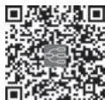  
本章思维导图

【预后】 急性高原病经及时诊断和积极治疗，一般预后良好。高原肺水肿和高原脑水肿，延误诊断和治疗常可致死。高原肺水肿恢复者，再次进入相同高原环境时容易复发。慢性高原病患者转移到平原后，多在1～2个月内恢复，高原心脏病伴有肺动脉高压和右心室肥大者，一般不易恢复。

（柴艳芬）

本章数字资源

人体浸没于水或其他液体后，反射性引起喉痉挛和/或呼吸障碍，发生窒息性缺氧的临床死亡状态称淹溺（drowning）。突然浸没于至少低于体温 5℃的水后出现心脏停搏或猝死，称为淹没综合征（immersion syndrome）。淹没后综合征（postimmersion syndrome）指淹没一段时间恢复后，因肺泡毛细血管内皮损伤和渗漏，引起肺部炎症反应、肺泡表面活性物质减少或灭活而出现的呼吸窘迫，是ARDS的一种类型。

淹溺常发生在夏季，多见于沿海国家和地区。据 WHO 数据报告，2019 年全球每年约有 23.6 万人死于淹溺，半数以上年龄在 30 岁以下。我国每年因淹溺致死者约有 5.9 万人。淹溺事故常见于儿童和青少年，是14 岁以下儿童首位致死原因。男性淹溺人数约为女性的3倍。

## 【病因和发病机制】

（一） 病因 淹溺常见于从事水上运动者（游泳、划船意外等）、跳水者（头颈或脊髓损伤）或潜水员因癫痫、心脏病或心律失常、低血糖发作引起神志丧失；下水前饮酒或服用损害脑功能药物，以及水中运动时间较长致过度疲劳者；也可见于水灾、交通意外或投水自杀者等。

（二） 发病机制 人体溺水后数秒内本能地屏气（＜1 分钟），引起潜水反射（呼吸暂停、心动过缓和外周血管剧烈收缩），以保证心脏和大脑血供。不能屏气后，出现非自发性吸气，水进入气道引起反射性咳嗽，有时出现喉痉挛。气道液体增多时导致严重呼吸障碍、缺氧、高碳酸血症和代谢性酸中毒。脑缺氧严重时，喉痉挛消失，发生窒息和昏迷，继而出现心动过速、心动过缓及无脉性电活动，最终心脏停搏。通常，淹溺过程从溺水到心脏停搏约为数秒到数分钟。

根据浸没介质不同，分为淡水淹溺和海水淹溺。

1. 淡水淹溺（freshwater drowning） 约 90% 淹溺发生于淡水，其中 50% 在游泳池。淡水（江河、湖泊或池塘）较血浆或其他体液渗透压低。浸没后，通过呼吸道或胃肠道进入体内的淡水迅速吸收到血液循环，使血容量增加。严重病例引起溶血，出现高钾血症和血红蛋白尿。淡水吸入最重要的病理生理变化是肺损伤，肺泡表面活性物质灭活，肺顺应性下降、肺泡塌陷萎缩、呼吸膜破坏、肺泡容积急剧减小，发生通气血流比例失调。即使迅速复苏，仍不能终止急性肺损伤过程，出现广泛肺水肿或微小肺不张。此外，肺泡内液体也妨碍正常气体交换，氧合作用发生障碍。

2. 海水淹溺（saltwater drowning） 海水含钠量约是血浆的 3 倍以上。因此，吸入的海水较淡水在肺泡内停留时间长，并能使血液中水进入肺泡腔，导致肺水肿、肺内分流，气体交换减少，发生低氧血症。此外，海水引起肺泡上皮及肺毛细血管内皮细胞损伤，通透性增加，促使肺水肿发生。尽管淡水和海水渗透梯度不同，但是两种淹溺的肺损伤程度相似，都可引起肺顺应性降低、肺水肿、肺内分流、低氧血症和混合性酸中毒。

吸入 1～3ml/kg 淡水或海水即能破坏肺泡表面活性物质，导致肺泡塌陷、肺不张、非心源性肺水肿、肺内分流和通气血流比例失调。淡水与海水淹溺所致的电解质失衡、溶血和液体腔隙转移的发病机制不同。大多数淹溺者猝死原因是严重心律失常。冰水淹溺迅速致死的原因常为心动过缓或心脏停搏。患者突然接触冷水，刺激迷走神经，导致 QT 间期延长及儿茶酚胺大量释放，发生心室颤动或心脏停搏和意识丧失。淹没综合征患者身体与淹溺介质间温差越大，预后越差。如果入水前用冷水润湿脸部和头部可能会有一定预防作用。淹溺引起的低体温有时可延长救治患者的时间，提高存活机会，因为低体温可降低大脑氧耗，延迟细胞缺氧和 ATP 消耗。体温由 37℃降至 20℃的过程中，每降低 1℃，大脑氧耗率约减少 5%。严重脑缺氧，还可促使神经源性肺水肿的发生。

【病理】 尸检发现，大多数淹溺者吸入水量 ${ < } 4 \mathrm { m l / k g }$ 。溺死者双肺含水量多、重量明显增加，有不同程度出血、水肿、肺泡壁破裂。约 70% 溺死者呼吸道有误吸的呕吐物、泥沙或水生植物。继发溺死患者肺泡上皮细胞脱落、出血，有透明膜形成和急性炎性渗出。尚可见急性肾小管坏死性病变。

【临床表现】 淹溺者神志丧失、呼吸停止或大动脉搏动消失，处于临床死亡状态。近乎淹溺患者临床表现个体差异较大，与溺水持续时间长短、吸入介质量多少、吸入介质性质和器官损伤严重程度有关。

1. 症状 近乎淹溺者可有头痛或视觉障碍、剧烈咳嗽、胸痛、呼吸困难和咳粉红色泡沫样痰。溺入海水者，口渴感明显，最初数小时可有寒战和发热。

2. 体征 淹溺者口腔和鼻腔内充满泡沫或泥污，皮肤发绀，颜面肿胀，球结膜充血，肌张力增高；精神和神志状态改变包括烦躁不安、抽搐、昏睡和昏迷；呼吸表浅、急促或停止，肺部可闻及干、湿啰音；心律失常、心音微弱或心搏停止；腹部膨隆，四肢厥冷。

诊断淹溺时，要注意淹溺时间长短、有无头部及颅内损伤。跳水或潜水淹溺者可伴有头部或颈椎损伤。

## 【实验室和其他检查】

1. 血和尿液检查 外周血白细胞轻度增高。淡水淹溺者，血钾升高，血和尿液中可出现游离血红蛋白。海水淹溺者可有高钠血症或高氯血症。严重者，出现DIC实验室表现。

2. 心电图检查 心电图显示窦性心动过速、非特异性 ST段和 T波改变、室性心律失常或完全性心脏传导阻滞。

3. 动脉血气检查 约75%的患者有严重混合性酸中毒，所有患者都有不同程度低氧血症。

4. X 线检查 淹溺后数小时可出现肺浸润和肺水肿，X 线胸片显示斑片状浸润影。较早进行胸部 X 线检查可能会低估肺损伤严重性。住院 12～24 小时吸收好转或进展恶化。疑有颈椎损伤时，应进行颈椎X线检查。早期脑部CT检查无明显益处。脑部MRI能预测患者神经系统预后，淹溺3～4 天后检查较为理想。

【治疗】

## （一） 院前急救

1. 现场急救 尽快将溺水者从水中救出；采取头低俯卧位，行体位引流；迅速清除口、鼻腔中污水、污物、分泌物及其他异物；拍打背部促使气道内液体排出，保持气道通畅。疑有气道异物阻塞的患者，可予海姆立克（Heimlich）急救法排出异物。

2 心肺复苏心搏、呼吸停止者，立即现场施行CPR、气管插管和吸氧。水上救生员救出的淹溺者中仅有 5% 须行 CPR。经旁观者救出的淹溺者中约 30% 须行 CPR。只有经过专门训练的救援者才能在水中进行CPR。复苏期间注意误吸的发生。患者转送过程中，不应停止心肺复苏。

## （二） 院内处理

1. 供氧 吸入高浓度氧或高压氧治疗，根据病情采用机械通气。对溺水者应监测动脉血气。清醒患者可使用面罩或鼻罩持续气道正压吸氧。严重或进行性呼吸窘迫、缺乏气道反射保护、合并头胸部损伤的患者应行气管插管。PaCO 超过 50mmHg，行气管插管和机械通气。经高流量吸氧后血氧饱和度低于90%或PaO 低于60mmHg者须行气道正压通气。

2. 复温 体温过低者，可采用体外或体内复温措施，使中心体温至少达到 $3 0 { \sim } 3 5 \mathrm { ^ { \circ } C }$ 。

3. 脑复苏 有颅内压升高或昏迷者，应用呼吸机增加通气，使 $\mathrm { P a C O } _ { 2 }$ 保持在 25～30mmHg。同时，静脉输注甘露醇降低颅内压，缓解脑水肿。可经验性应用纳洛酮治疗。

4. 抗生素治疗 用于污水淹溺、有感染体征或脓毒症的淹溺者。

5. 处理并发症 对合并惊厥、低血压、心律失常、肺水肿、ARDS、应激性溃疡伴出血、电解质和酸碱平衡失常者进行相应处理。

【预后】 淹溺所致肺损伤和脑缺氧严重程度与吸入介质量、淹溺时间有关，与吸入淡水还是海水无关。治疗 1 小时恢复神志的淹溺者预后好。从水中救出后到自主呼吸恢复的时间越短，预后越好。约 20% 淹溺者恢复后遗留不同程度脑功能障碍、中枢性四肢瘫痪、锥体外系综合征和周围神经或肌肉损伤。有时，持续昏迷、血流动力学不稳定和瞳孔散大的淹溺者也可恢复正常神经功能。近年来，淹溺病死率明显降低。

## 【预防】

1. 对从事水上作业者，定期进行严格健康检查。

2. 有慢性或潜在疾病者，不宜从事水上活动。

3. 酒精能损害判断力和自我保护能力，下水作业前不要饮酒。

4. 进行游泳、水上自救互救知识的学习和技能训练；水上作业时应备用救生器材。

5. 避免在情况复杂的自然水域游泳或在浅水区跳水或潜泳。

6. 下水前要做好充分准备活动，不宜在水温较低水域游泳。

（柴艳芬）

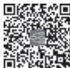  
本章思维导图

本章数字资源

一定量电流（electrical current）通过人体引起不同程度组织损伤或器官功能障碍或猝死称为电击（electrical injury），俗称触电（electrical shock）。电击包括低压电击（≤380V）、高压电击（＞1 000V）和超高压电击或雷击（lightning injury，电压在 10 000 万伏以上）三种电击类型。夏季，天气潮热多雨及人体大量出汗，电击事件增多。雷击多见于户外劳动的农民、建筑工人和运动员等。除洪水，雷击伤害位于天气相关（沙尘暴、寒潮、大风、霜冻）伤害的首位。

【病因】 意外电击常发生于工作或生活中违反用电操作规程者。风暴、地震或火灾致电线断裂时也可遭受意外电击。绝大多数电击发生于青少年男性和从事电作业者。

【发病机制】 电击对人体损伤程度与接触的电压（electric voltage）高低、电流类型［直流电（direct current，DC）和交流电（alternating current，AC）］、电流强度、频率高低、触电部位皮肤电阻（electric resistance）、触电时间长短、电流通过体内途径和所处环境气象条件密切相关。电击时，产生的电阻由电流通过体内途径决定。人体组织电阻由小到大依次为神经、血液、黏膜、肌肉、干燥皮肤、肌腱、脂肪和骨骼。500V 以下 AC 较 DC 危害性更大，能使肌细胞膜除极导致肌肉持续痉挛性收缩，使触电者的手紧紧握住电源线不能脱离开电源，故 AC 对人体伤害较 DC 更大。不同频率 AC 对人体损伤也不同，低频 AC（15～150Hz）较高频 AC 危害性大，50～60Hz 低频家用 AC 更易引起心室颤动。电流强度为60～120mA时可发生心室颤动。

电击损伤包括电流对细胞的直接损伤和电阻产热引起的组织和器官损伤：如皮肤及皮下组织的烧伤；深部组织（肌肉、脂肪和肌腱等）局部水肿，压迫营养血管引起闭塞，发生缺血和坏死；接触超高压电能使组织迅速“炭化（carbonization）”；电流通过中枢神经系统会立即引起呼吸、心搏停止，导致死亡。大多数高压电击是热损伤，病理改变为凝固性坏死。尸检发现，高压电击致死者，中枢神经系统和全身组织器官均有充血、水肿、出血及坏死。

## 【临床表现】

1. 全身表现低压电击者 出现惊恐心悸，头晕，头痛，痛性肌肉收缩和面色苍白等。高压电击特别是雷击时，发生意识丧失，心搏和呼吸骤停。幸存者遗有定向力丧失和痫性发作。部分患者有心肌和心脏传导系统损伤，心电图显示非特异性 ST 段降低、心房颤动或心肌梗死改变。大面积体表烧伤或组织损伤处体液丢失过多时，出现低血容量性休克。直接肾脏损伤、肌肉组织坏死产生的肌球蛋白尿（myoglobulinuria）和肌红蛋白尿（myohemoglobinuria）及溶血后血红蛋白尿（hemoglobinuria）都能促发急性肾衰竭，脱水或血容量不足时更能使病情加速或恶化。

2. 局部表现 触电部位释放电能最大，局部皮肤组织损伤最严重。电击处周围皮肤组织烧伤较轻。如有衣服点燃可出现与触电部位无关的大面积烧伤。电流通过途经的组织和器官可发生隐匿性损伤。高压电击时，电流入口处烧伤严重，烧伤部位组织炭化或坏死成洞，组织解剖结构清楚，常发生前臂腔隙综合征（compartment syndrome）。因肌肉组织损伤、水肿和坏死，肌肉筋膜下组织压力增加，出现神经和血管受压体征，脉搏减弱，感觉及痛觉消失。由于触电后大肌群强直性收缩，可发生脊椎压缩性骨折或肩关节脱位。

3. 并发症和后遗症 电击后 24～48 小时常出现并发症和后遗症：如心肌损伤、严重心律失常和心功能障碍；吸入性肺炎和肺水肿；消化道出血或穿孔、麻痹性肠梗阻；DIC 或溶血；肌球蛋白尿或肌红蛋白尿和急性肾衰竭；骨折、肩关节脱位或无菌性骨坏死；大约半数电击者单侧或双侧鼓膜破裂、听力丧失；烧伤处继发细菌感染。电击后数天到数月可出现上升或横贯性脊髓炎、多发性神经炎或瘫痪等；角膜烧伤、视网膜脱离、单侧或双侧白内障和视力障碍。孕妇电击后，常发生流产、死胎或宫内发育迟缓。

## 【治疗】

1. 切断电源 发现电击患者后，立即切断电源，应用绝缘物将患者与电源隔离。

2. 心肺脑复苏 对心脏停搏和呼吸停止者，立即进行 CPR，挽救患者生命。对所有电击患者，应连续进行 48 小时心电监测，以便发现电击后迟发性心律失常。对心律失常者，选用相关抗心律失常药。

3. 急性肾衰竭 静脉输注乳酸钠林格液，迅速恢复循环容量，维持尿量在 50～75ml/h。出现肌球蛋白尿时，维持尿量在100～150ml/h。同时静脉输注碳酸氢钠（50mmol/L）碱化尿液，使血液pH维持在 7.45 以上，预防急性肾衰竭。严重肌球蛋白尿患者恢复有效血容量后尿量仍未增加时，可在 1L乳酸钠林格液中加入甘露醇 12.5g。尿内肌球蛋白消失后即停用甘露醇。热灼伤者，常有严重血容量不足，恢复有效循环容量前，避免静脉输注甘露醇。严重急性肾衰竭时，根据病情进行血液透析。

4. 外科问题处理 对于广泛组织烧伤、肢体坏死和骨折者，应进行相应处置。坏死组织应进行清创术，预防注射破伤风抗毒素（3000U）。有继发感染者，给予抗生素治疗。对腔隙综合征患者，如果腔隙压力超过 30～40mmHg，需要行筋膜切开减压术。对于肢体电击伤后深部组织损伤情况不明者，可应用动脉血管造影或放射性核素氙-133洗脱术或99mTc 焦磷酸盐肌扫描术检查，指导治疗。

## 【预防】

1. 普及宣传用电常识，经常对所用电器和线路进行检查和检修。

2. 雷雨天气，应关好门窗，留在室内，不宜使用无防雷措施的电视、音响等电器。

3. 从事室外工作者，切勿站在高处或在田野上走动或在树下避雨；不能接触天线、水管或金属装置。

4. 在空旷场地遇到雷电时，立即卧倒，不宜打伞，远离树木和桅杆。

（柴艳芬）

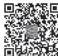  
本章思维导图

## 推荐阅读

［1］RON M WALLS. Rosen’s Emergency Medicine-Concepts and Clinical Practice. 10th ed. Philadelphia：Elsevier，2022.

［2］GOLDMAN L，COONEY K A. Goldman-Cecil Medicine. 27th ed. Philadelphia：Elsevier，2023.

［3］中国医师协会急诊医师分会.急性中毒诊断与治疗中国专家共识.中华急诊医学杂志，2016，25（11）：1361-1375.

［4］BRITCH S C，WALSH S L. Treatment of opioid overdose：current approaches and recent advances. Psychopharmacology，2022，239（7）：2063-2081.

［5］中国医师协会急诊医师分会.急性百草枯中毒诊治专家共识（2022）.中华急诊医学杂志，2022，31（11）：1435-1444.

［6］中国蛇伤救治专家共识专家组. 2018 年中国蛇伤救治专家共识. 中国急救医学，2018，38（12）：1026-1034.

［7］SZPILMAN D，BIERENS J J，HANDLEY A J，et al. Drowning. N Engl J Med，2012，366（22）：2102-2110.

11β- 羟化酶缺乏症　11β-hydroxylase deficiency，11β-OHD 718

1 型糖尿病　type 1 diabetes mellitus，T1DM　724

21- 羟化酶缺乏症　21-hydroxylase deficiency，21-OHD　718

2 小时血糖　2 hours plasma glucose，2hPG　733

2 型糖尿病　type 2 diabetes mellitus，T2DM　724

γ- 干扰素释放试验　interferon-gamma release assays，IGRAs 75

ANCA 相关血管炎　ANCA associated vasculitis，AAV　841

Burkitt 淋巴瘤　Burkitt lymphoma/leukemia，BL　595

CT 肺动脉造影　computed tomography pulmonary angiography，CTPA　113

D-L 抗体　Donath-Landsteiner antibody　566

D- 二聚体　D-dimer　112

Graves 病　Graves disease，GD　686

Graves 眼病　Graves ophthalmopathy，GO　688

H 受体拮抗剂　H -receptor antagonist，H RA　365

IgA 肾病　IgA nephropathy　478

IgG4 相关性疾病　IgG4-related disease，IgG4-RD　858

SARS 冠状病毒　SARS-associated coronavirus，SARS-CoV54

ST 段抬高型心肌梗死　ST-segment elevation myocardial infarction，STEMI　232

## A

阿片　opium　901

艾森门格综合征　Eisenmenger syndrome　295

氨基甲酸酯类杀虫剂中毒　carbamate insecticide poisoning

螯合剂　chelating agent　887

## B

白血病　leukemia　576

包裹性坏死　walled-off necrosis，WON　442

贝赫切特病　Behcet disease，BD　842

本周蛋白　Bence-Jones protein，BJP　601

苯丁酸氮芥　chlorambucil，CLB　590

吡嗪酰胺　pyrazinamide，PZA，Z　80

必需氨基酸　essential amino acids　658

边缘区淋巴瘤　marginal zone lymphoma，MZL　595

变异型心绞痛　variant angina pectoris　243变应性支气管肺曲霉病　allergic bronchopulmonary asper-gillosis，ABPA　65

便秘　constipation　458

丙氨酸转氨酶　alanine aminotransferase，ALT　361

丙硫氧嘧啶　propylthiouracil，PTU　691

丙型肝炎病毒　hepatitis C virus，HCV　417

病毒性肺炎　viral pneumonia　53

不典型腺瘤性增生　atypical adenomatous hyperplasia，AAH 87

不明原因消化道出血　obscure gastrointestinal bleeding，OGIB　460

不稳定型心绞痛　unstable angina，UA　232

## C

彩色多普勒血流显像　color doppler flow imaging，CDFI 172

蚕豆病　favism　562

产后甲状腺炎　postpartum thyroiditis，PPT　698

肠结核　intestinal tuberculosis　383

肠镜　colonoscopy　359

肠上皮化生　intestinal metaplasia　371

肠易激综合征　irritable bowel syndrome，IBS　399

超声内镜　endoscopic ultrasonography，EUS　360

成人斯蒂尔病　adult-onset Still disease，AOSD　865

迟发性多发神经病　delayed polyneuropathy　891

持续非卧床腹膜透析　continuous ambulatory peritoneal dialysis，CAPD　535

垂体瘤　pituitary tumor　668

纯红细胞再生障碍　pure red cell aplasia，PRCA　545

磁共振胆胰管成像　magnetic resonance cholangiopancreatography，MRCP　362

磁共振肺动脉造影　magnetic resonance pulmonary angiography，MRPA　113

促红细胞生成素　erythropoietin，EPO　541

催乳素　prolactin，PRL　669

## D

大动脉炎　Takayasu arteritis，TA　837

代谢　metabolism　657

代谢综合征　metabolic syndrome，MS　766

单纯性甲状腺肿　simple goiter　698单光子发射计算机断层成像　single photon emissioncomputed tomography，SPECT　173单链可变区　single chain variable fragment，scFv　648胆囊结石　cholecystolithiasis　434胆囊炎　cholecystitis　434淡水淹溺　freshwater drowning　931低钾血症　hypokalemia　773低密度脂蛋白胆固醇　low density lipoprotein cholesterol，LDL-C　227低钠血症　hyponatremia　768, 772低血容量性休克　hypovolemic shock　159低血糖症　hypoglycemia　748碘缺乏病　iodine deficiency disorder，IDD　698电机械分离　electromechanical dissociation，EMD　328电流　electrical current　876定量血流分数　quantitative flow ratio，QFR　174动脉导管未闭　patent ductus arteriosus，PDA　289动脉粥样硬化　atherosclerosis　227, 509动脉粥样硬化性心血管疾病　atherosclerotic cardiovasculardisease，ASCVD　227冻僵　frozen rigor，frozen stiff　925毒蛇咬伤　venomous snake bite　917毒蕈碱样症状　muscarinic sign　890多导睡眠监测　polysomnography，PSG　140多发性内分泌腺瘤病　multiple endocrine neoplasia，MEN795多环套扎内镜黏膜切除术　multi-band mucosectomy，MBM367

## E

恶性小动脉性肾硬化症　malignant arteriolar nephrosclerosis 511 二尖瓣反流　mitral regurgitation，MR　308 二尖瓣口面积　mitral valve area，MVA　305 二尖瓣狭窄　mitral stenosis，MS　305 二巯丙醇　dimercaprol，BAL　887

## F

法洛四联症　congenital tetralogy of Fallot　294反流性食管炎　reflux esophagitis，RE　363房间隔缺损　atrial septal defect，ASD　288放射性碘　radioactive iodine，RAI　701非 ST 段抬高型急性冠脉综合征　non-ST segment elevationacute coronary syndrome，NSTEACS　243非 ST 段抬高型心肌梗死　non-ST-segment elevationmyocardial infarction，NSTEMI　232非毒性甲状腺肿　nontoxic goiter　698

非霍奇金淋巴瘤　non-Hodgkin lymphoma，NHL　591, 593 非结合胆红素　unconjugated bilirubin，UCB　36 非酒精性脂肪肝　non-alcoholic fatty liver，NAFL　405 非酒精性脂肪性肝病　non-alcoholic fatty liver disease， NAFLD　405 非扩张型左心室心肌病　non-dilated left ventricular cardiomyopathy，NDLVC　281 非糜烂性反流病　nonerosive reflux disease，NERD　363 非小细胞肺癌　non-small cell lung cancer，NSCLC　87 非甾体抗炎药　non-steroid anti-inflammatory drugs， NSAIDs　369 肥厚型心肌病　hypertrophic cardiomyopathy，HCM　275 肥胖症　obesity　762 肺癌　lung cancer　86 肺孢子菌肺炎　Pneumocystis pneumonia，PCP　66 肺动脉高压　pulmonary hypertension，PH　118 肺结核　pulmonary tuberculosis　71 肺毛细血管楔压　pulmonary capillary wedge pressure， PCWP　119 肺念珠菌病　pulmonary candidiasis　63 肺脓肿　lung abscess　68 肺气肿　emphysema　25 肺曲霉病　pulmonary aspergillosis　64 肺上沟瘤　Pancoast tumor　89 肺栓塞　pulmonary embolism　110, 340 肺血管阻力　pulmonary vascular resistance，PVR　110 肺血栓栓塞症　pulmonary thromboembolism，PTE　110 肺炎　pneumonia　46 肺炎链球菌肺炎　Streptococcal pneumoniae pneumonia　50 肺炎衣原体肺炎　Chlamydia pneumoniae pneumonia　61 肺炎支原体肺炎　Mycoplasmal pneumoniae pneumonia　60 肺隐球菌病　pulmonary cryptococcosis　66 肺源性心脏病　cor pulmonale　122 分布性休克　distributive shock　160 分化综合征　differential syndrome　584 分解代谢　catabolism　658 风湿热　rheumatic fever　313, 869 风湿性疾病　rheumatic disease　808 氟达拉滨　fludarabine，Flu　590 复发性多软骨炎　relapsing polychondritis，RP　867 副肿瘤综合征　paraneoplastic syndrome　90, 803 腹膜透析　peritoneal dialysis，PD　535 腹腔积液　ascites　419 腹痛　abdominal pain　452

## G

干扰素 -α　interferon-α，IFN-α　587

干燥综合征　Sjögren syndrome，SS　827

甘油三酯　triglyceride，TG　227

肝窦阻塞综合征　hepatic sinusoidal obstruction syndrome， HSOS　645

肝肺综合征　hepatopulmonary syndrome　421

肝肾综合征　hepatorenal syndrome，HRS　421

肝素诱导的血小板减少症　heparin-induced

thrombocytopenia，HIT　636

肝细胞癌　hepatocellular carcinoma，HCC　427

肝性脑病　hepatic encephalopathy，HE　420

肝硬化　liver cirrhosis　417

感染性心内膜炎　infective endocarditis，IE　321

感染性休克　septic shock　160

感染中毒症　sepsis　160

干细胞因子　stem cell factor，SCF　544

高级生命支持　advanced life support，ALS　330

高钾血症　hyperkalemia　775

高密度脂蛋白胆固醇　high density lipoprotein-cholesterol，HDL-C　227

高钠血症　hypernatremia　768, 773

高尿酸血症　hyperuricemia，HUA　783

高三尖杉酯碱　homoharringtonine，HHT　587

高渗高血糖综合征　hyperosmolar hyperglycemic syndrome，HHS　746

高血压肾硬化症　hypertensive nephrosclerosis　511

梗阻性休克　obstructive shock　160

功能性胃肠病　functional gastrointestinal disorders，FGIDs 398

功能性消化不良　functional dyspepsia，FD　398

供者淋巴细胞输注　donor lymphocyte infusion，DLI　643

骨骼- 结缔组织综合征　skeletal-connective tissue syndromes 90

骨关节炎　osteoarthritis，OA　855

骨量　bone mass　787

骨髓增生异常性肿瘤　myelodysplastic neoplasms　572

骨髓增殖性肿瘤　myeloproliferative neoplasm，MPN　605

骨质疏松症　osteoporosis，OP　787

冠心病　coronary artery disease，CAD　232

冠状动脉旁路移植术　coronary artery bypass graft，CABG 241

冠状动脉造影　coronary angiography，CAG　181

冠状动脉粥样硬化性心脏病　coronary atherosclerotic heartdisease　232

光学相干断层扫描　optical coherence tomography，OCT174

国际预后指数　international prognostic index，IPI　599

过敏性紫癜　anaphylactoid purpura　620

## H

海因茨小体　Heinz body　562

合成代谢　anabolism　658

红细胞葡萄糖-6- 磷酸脱氢酶（G-6-PD）缺乏症　erythro-

cyte glucose-6-phosphate dehydrogenase deficiency　562

宏基因组下一代测序　metagenomic next generation

sequencing，mNGS　49

呼吸机相关性肺炎　ventilator associated pneumonia，VAP 47

呼吸衰竭　respiratory failure　148

化生　metaplasia　371

环孢素　cyclosporin，CsA　485

环氧化酶　cycloxygenase，COX　239

活动性骨髓瘤　active plasma cell myeloma　601

霍奇金淋巴瘤　Hodgkin lymphoma，HL　591

## J

肌无力样综合征　Eaton-Lambert syndrome　90

积极监测　active surveillance　702

基础生命支持　basic life support，BLS　329

激素　hormone　654

极低密度脂蛋白胆固醇　very low density lipoprotein

cholesterol，VLDL-C　227

急变期　blastic phase or blast crisis，BP/BC　585

急进性肾小球肾炎　rapidly progressive glomerulonephritis，

RPGN　477

急性白血病　acute leukemia，AL　576, 577

急性肺损伤　acute lung injury，ALI　143

急性复发性胰腺炎　recurrent acute pancreatitis，RAP　447

急性腹痛　acute abdominal pain　452

急性肝衰竭　acute liver failure，ALF　432

急性高原病　acute high altitude sickness　876, 928

急性梗阻性化脓性胆管炎　acute obstructive cholangitis 436

急性冠脉综合征　acute coronary syndrome，ACS　232

急性呼吸窘迫综合征　acute respiratory distress syndrome，

急性坏死物集聚　acute necrotic collection，ANC　442

急性间质性肾炎　acute interstitial nephritis，AIN　496

急性排斥反应　acute rejection，AR　536

急性气管支气管炎　acute tracheobronchitis　21

急性上呼吸道感染　acute upper respiratory tract infection

18

急性肾损伤　acute kidney injury，AKI　471

急性肾小球肾炎　acute glomerulonephritis　476

急性生理和慢性健康状况Ⅱ评分　acute physiology and

chronic health evaluation Ⅱ score，APACHE Ⅱ评分　156

急性心包炎　acute pericarditis　315

急性心肌梗死　acute myocardial infarction，AMI　242

急性心力衰竭　acute heart failure，AHF　186

急性血管反应试验　acute vasoreactivity test　121

急性亚硝酸盐中毒　acute nitrite poisoning　913

急性胰腺炎　acute pancreatitis，AP　441

急性乙醇中毒　acute ethanol poisoning　876, 905

急性有机磷杀虫药中毒　acute organic phosphorus insecticide poisoning，AOPIP　889

急性镇静催眠药中毒　acute sedative hypnotic poisoning 907

急性中毒　acute poisoning　879

集落刺激因子　colony-stimulating factor，CSF　541

脊柱关节炎　spondyloarthritis，SpA　831

继发性高血压　secondary hypertension　260

加速期　accelerated phase，AP　585

家族性腺瘤性息肉病　family adenomatous polyposis，FAP395

甲磺酸伊马替尼　imatinib mesylate，IM　586

甲巯咪唑　methimazole，MMI　691

甲状旁腺功能减退症　hypoparathyroidism　706

甲状旁腺功能亢进症　hyperparathyroidism　704

甲状旁腺激素　parathyroid hormone，PTH　704

甲状腺癌　thyroid carcinoma，TC　701

甲状腺刺激性抗体　thyroid stimulating antibody，TSAb 687

甲状腺毒性周期性瘫痪　thyrotoxic periodic paralysis，TPP687

甲状腺毒症　thyrotoxicosis　686

甲状腺功能减退症　hypothyroidism　693

甲状腺功能亢进症　hyperthyroidism　686

甲状腺功能正常的病态综合征　euthyroid sick syndrome，ESS　695

甲状腺激素抵抗综合征　thyroid hormone resistancesyndrome　694

甲状腺结节　thyroid nodule　699

甲状腺髓样癌　medullary thyroid carcinoma，MTC　701

甲状腺危象　thyroid storm，thyroid crisis　688

甲状腺相关眼病视神经病变　dysthyroid optic neuropathy， DON　688

甲状腺炎　thyroiditis　696

甲状腺阻断性抗体　thyroid blocking antibody，TBAb 687

钾离子竞争性酸阻滞剂　potassium-competitive acid blockers，P-CAB　364

假幽门腺化生　pseudopyloric metaplasia　371间变性大细胞淋巴瘤　anaplastic large cell lymphoma，ALCL　596

间质性肺疾病　interstitial lung disease，ILD　99

间质性肺炎　interstitial pneumonia，IP　644

浆细胞病　plasma cell dyscrasia　600

胶囊内镜　capsule endoscopy　360

结合胆红素　conjugated bilirubin，CB　361

结核性腹膜炎　tuberculous peritonitis　385

结节病　sarcoidosis　105

结节性多动脉炎　polyarteritis nodosa，PAN　840

结直肠癌　colorectal cancer　395

戒断综合征　withdrawal syndrome　881

经鼻高流量吸氧　high flow nasal cannula，HFNC　153

经导管二尖瓣缘对缘修复术　transcatheter edge-to-edge repair，TEER　312

经导管主动脉瓣置换术　transcatheter aortic valve replacement，TAVR　302

经颈静脉肝内门体静脉分流术　transjugular intrahepatic portosystemic-shunt，TIPS　423

经内镜逆行胆胰管造影术　endoscopic retrograde cholangiopancreatography，ERCP　360

经皮导管消融肾动脉去交感神经术　catheter-based renal sympathetic denervation，RDN　175

经皮冠状动脉介入术　percutaneous coronary intervention，PCI　174, 240

经皮球囊二尖瓣成形术　percutaneous balloon mitral valvuloplasty，PBMV　307

经皮主动脉瓣球囊成形术　percutaneous balloon aortic valvuloplasty，PBAV　302

经支气管肺活检　transbronchial lung biopsy，TBLB　14

经支气管冷冻肺活检　transbronchial lung cryobiopsy，TBLC　14

精氨酸加压素　arginine vasopressin，AVP　178

胫前黏液性水肿　pretibial myxedema　689

静脉血栓栓塞症　venous thromboembolism，VTE　110,340

酒精性肝病　alcoholic liver disease，ALD　406

局灶节段性肾小球病变　focal segmental lesion　473

局灶节段性肾小球硬化　focal segmental glomerulosclerosis， FSGS　481

巨人症　gigantism　671

巨噬细胞活化综合征　macrophage activation syndrome， MAS　865

巨细胞病毒　cytomegalovirus，CMV　642

巨细胞动脉炎　giant cell arteritis，GCA　839

巨幼细胞贫血　megaloblastic anemia，MA　552

军团菌肺炎　Legionella pneumonia，LP　62

## K

开胸肺活检　open lung biopsy，OLB　101

抗核抗体　anti-nuclear antibody，ANA　810

抗甲状腺药物　antithyroid drug，ATD　691

抗利尿不适当综合征　syndrome of inappropriate antidiuresis，

SIAD　682

抗利尿激素　antidiuretic hormone，ADH　663

抗利尿激素分泌失调综合征　syndrome of inappropriate

secretion of antidiuretic hormone，SIADH　682

抗磷脂综合征　antiphospholipid syndrome，APS　862

抗人表皮生长因子受体 -2　human epidermal growth factor

receptor 2，HER-2　344

咳嗽变异性哮喘　cough variant asthma，CVA　11

可溶性鸟苷酸环化酶　soluble guanylate cyclase，sGC　185

克罗恩病　Crohn disease，CD　388

空腹血糖　fasting plasma glucose，FPG　733

空腹血糖受损　impaired fasting glucose，IFG　725

口服葡萄糖耐量试验　oral glucose tolerance test，OGTT

731

库欣病　Cushing disease　709

库欣综合征　Cushing syndrome　709

溃疡性结肠炎　ulcerative colitis，UC　388

扩张型心肌病　dilated cardiomyopathy，DCM　278

## L

狼疮性肾炎　lupus nephritis，LN　490

酪氨酸激酶抑制剂　tyrosine kinase inhibitor，TKI　586

类癌综合征　carcinoid syndrome　88

类风湿关节炎　rheumatoid arthritis，RA　814

冷凝集素病　cold agglutinin disease，CAD　566

冷凝集素综合征　cold agglutinin syndrome，CAS　566

利福平　rifampicin，RFP，R　80

利妥昔单抗　rituximab　566, 590

连续性肾脏替代治疗　continuous renal replacement therapy，

CRRT　188

链霉素　streptomycin，SM，S　80

良性小动脉性肾硬化症　benign arteriolar nephrosclerosis 511

临床活动性评分　clinical activity score，CAS　688

淋巴瘤　lymphoma　591

磷脂酰肌醇聚糖 A　phosphatidylinositol glycan class A，

PIGA　567

滤泡性淋巴瘤　follicular lymphoma，FL　595

卵圆孔未闭　patent foramen ovale，PFO　290

## M

吗替麦考酚酯　mycophenolate mofetil，MMF　485, 646

慢性白血病　chronic leukemia，CL　576

慢性胆囊炎　chronic cholecystitis　435

慢性肺曲霉病　chronic pulmonary aspergillosis，CPA　64

慢性腹痛　chronic abdominal pain　452

慢性腹泻　chronic diarrhea　455

慢性高原病　chronic high altitude sickness　928

慢性高原反应　chronic high altitude reaction　928

慢性冠脉综合征　chronic coronary syndrome，CCS　232

慢性冠状动脉疾病　chronic coronary disease，CCD　232

慢性间质性肾炎　chronic interstitial nephritis，CIN　497

慢性淋巴细胞白血病　chronic lymphocytic leukemia，CLL

慢性肾小球肾炎　chronic glomerulonephritis　487

慢性肾脏病　chronic kidney disease，CKD　471

慢性髓系白血病　chronic myelogenous leukemia，CML 585

慢性心力衰竭　chronic heart failure，CHF　179

慢性血栓栓塞性肺动脉高压　chronic thromboembolic

pulmonary hypertension，CTEPH　110

慢性血栓栓塞性肺疾病　chronic thromboembolic

pulmonary disease，CTEPD　110

慢性胰腺炎　chronic pancreatitis，CP　447

慢性支气管炎　chronic bronchitis　23

慢性中毒　chronic poisoning　879

慢性阻塞性肺疾病　chronic obstructive pulmonary

冒烟性骨髓瘤　smoldering plasma cell myeloma　602

美国纽约心脏病学会　New York Heart Association，NYHA180

门静脉高压　portal hypertension　418

门静脉海绵样变　cavernous transformation of the portal vein， CTPV　421

门静脉血栓　portal vein thrombosis　421

弥漫大 B 细胞淋巴瘤　diffuse large B-cell lymphoma， DLBCL　595

弥漫性肺泡损伤　diffuse alveolar damage，DAD　143

弥漫性肾小球肾炎　diffuse glomerulonephritis　473

弥漫性实质性肺疾病　diffuse parenchymal lung disease，

弥散性血管内凝血　disseminated intravascular coagulation， DIC　631

免疫检查点抑制剂　immune-checkpoint inhibitor　93, 344

灭鼠药　rodenticide　897

膜性肾病　membranous nephropathy　482

## N

纳洛酮　naloxone　888

钠 - 葡萄糖共转运蛋白 2 抑制剂　sodium-glucosecotransporter 2 inhibitors，SGLT2i　184

脑盐耗综合征　cerebral salt wasting syndrome，CSWS　684, 772

内分泌　endocrine　655

内分泌综合征　endocrine syndromes　90

内镜黏膜切除术　endoscopic mucosal resection，EMR　367

内镜黏膜下剥离术　endoscopic submucosal dissection，

内镜曲张静脉套扎术　endoscopic variceal ligation，EVL421

内镜十二指肠乳头括约肌切开术　endoscopic sphincterotomy，EST　436

内因子　intrinsic factor，IF　553

黏液性水肿昏迷　myxedematous coma　695

尿崩症　diabetes insipidus，DI　680

农药　pesticide　876, 889

## P

脾功能亢进　hypersplenism　610平均肺动脉压　mean pulmonary artery pressure，mPAP118葡萄球菌肺炎　staphylococcal pneumonia　52普通肝素　unfractionated heparin，UH　636

## Q

气道高反应性　airway hyperresponsiveness，AHR　31 气胸　pneumothorax　132

嵌合抗原受体 T 细胞　chimeric antigen receptor T-cell，CAR-T　648

强直性脊柱炎　ankylosing spondylitis，AS　832

羟基脲　hydroxycarbamide，HU　587

桥本甲状腺炎　Hashimoto thyroiditis，HT　697

侵袭性肺曲霉病　invasive pulmonary aspergillosis，IPA　64

去甲肾上腺素　norepinephrine，NE　178

全身显像　whole body scan，WBS　702

全身照射　total-body irradiation，TBI　643

醛固酮受体拮抗剂　mineralocorticoid receptor antagonist， MRA　184

缺铁性贫血　iron deficiency anemia，IDA　549 缺血性肾病　ischemic nephropathy　509 缺血性心肌病　ischemic cardiomyopathy，ICM　241 缺血性心脏病　ischemic heart disease　232

## R

热痉挛　heat cramp　923

热（日）射病　heatstroke，sun stroke　922

热衰竭　heat exhaustion　923

人工瓣膜心内膜炎　prosthetic valve endocarditis，PVE　321 人类 T 淋巴细胞病毒Ⅰ型　human T lymphocytotropic virus-Ⅰ，HTLV-Ⅰ　576

人类白细胞抗原　human leukocyte antigen，HLA　642

妊娠期一过性甲状腺毒症　gestational transient thyrotoxicosis，GTT　690

妊娠糖尿病　gestational diabetes mellitus，GDM　725

溶血　hemolysis　559

溶血性贫血　hemolytic anemia，HA　559

溶血状态　hemolytic state　559

乳头肌功能失调或断裂　dysfunction or rupture of papillarymuscle　253

## S

沙尔科三联征　Charcot triad　436

上皮内瘤变　intraepithelial neoplasia　371

上气道咳嗽综合征　upper airway cough syndrome，UACS11

上消化道出血　upper gastrointestinal bleeding，UGIB　460 社区获得性肺炎　community acquired pneumonia，CAP　46 射频消融术　catheter radiofrequency ablation　174 射血分数保留型心衰　HF with preserved EF，HFpEF　176 射血分数改善的心衰　HF with improved EF，HFimpEF 176

射血分数降低的心衰　HF with reduced EF，HFrEF　176 射血分数轻度降低型心衰　HF with mildly reduced EF， HFmrEF　176

深层分子学反应　deep molecular response，DMR　586深静脉血栓形成　deep venous thrombosis，DVT　110, 340神经精神狼疮　neuropsychiatric systemic lupus erythema-tosus，NPLE　821

神经内分泌癌　neuroendocrine cancer，NEC　800

神经内分泌瘤　neuroendocrine tumor，NET　800

神经内分泌肿瘤　neuroendocrine neoplasm，NEN　800

肾病综合征　nephrotic syndrome，NS　470, 480

肾动脉栓塞　renal artery embolism　510

肾动脉狭窄　renal artery stenosis　509

肾动脉血栓形成　renal artery thrombosis　510

肾静脉血栓形成　renal vein thrombosis，RVT　512

肾素 - 血管紧张素 - 醛固酮系统　renin-angiotensin-aldosterone system，RAAS　178

肾小管间质性肾炎　tubulointerstitial nephritis，TIN　496

肾小管间质性肾炎 - 葡萄膜炎综合征　tubulointerstitia nephritis-uveitis syndrome　496

肾小球　glomerulus　466

肾小球基底膜　glomerular basement membrane，GBM　466

肾小球滤过率　glomerular filtration rate，GFR　466

肾小球轻微病变　minor glomerular lesion　473

肾性抗利尿不适当综合征　nephrogenic syndrome of inappropriate antidiuresis，NSIAD　683

肾性尿崩症　nephrogenic diabetes insipidus，NDI　680

肾血管性高血压　renal vascular hypertension　509

肾炎综合征　nephritis syndrome　470

生长激素缺乏症　growth hormone deficiency，GHD　678

失水　water loss　768

十二指肠溃疡　duodenal ulcer，DU　374

食管癌　carcinoma of esophagus　366

食管胃底静脉曲张　esophagogastric varices，EGV　418

食管胃底静脉曲张出血　esophagogastric variceal bleeding，EGVB　419

食管下括约肌　lower esophageal sphincter，LES　356

室间隔缺损　ventricular septal defect，VSD　289

嗜铬细胞瘤　pheochromocytoma　720

噬血细胞性淋巴组织细胞增生症　hemophagocytic lymphohistiocytosis，HLH　541

首次医疗接触　first medical contact，FMC　243

输血医学　transfusion medicine　541

栓塞　embolism　253

水过多　water excess　768, 771

水中毒　water intoxication　771

睡眠呼吸暂停低通气指数　apnea-hypopnea index，AHI 138

宿主抗移植物反应　host versus graft reaction，HVGR　642

髓外造血　extramedullary hematopoiesis　540

缩窄性心包炎　constrictive pericarditis　318

## T

他克莫司　tacrolimus，FK506　646 糖化白蛋白　glycated albumin，GA　731 糖基磷脂酰肌醇　glycosylphosphatidylinositol，GPI　567 糖耐量减低　impaired glucose tolerance，IGT　725 糖尿病　diabetes mellitus，DM　724 糖尿病肾脏病　diabetic kidney disease，DKD　491, 729 糖尿病酮症酸中毒　diabetic ketoacidosis，DKA　743 糖尿病性视网膜病变　diabetic retinopathy，DR　730 糖调节受损　impaired glucose regulation，IGR　725 套细胞淋巴瘤　mantle cell lymphoma，MCL　595 特发性肺动脉高压　idiopathic pulmonary arterial hypertension，IPAH　119 特发性肺纤维化　idiopathic pulmonary fibrosis，IPF　102 特发性间质性肺炎　idiopathic interstitial pneumonia，IIP 特发性膜性肾病　idiopathic membranous nephropathy，IMN 474

特发性炎症性肌病　idiopathic inflammatory myopathy，IIM 845

特发性胰腺炎　idiopathic pancreatitis　448

体外膜肺氧合　extracorporeal membrane oxygenation，ECMO156

体外心肺复苏　extracorporeal cardiopulmonary resuscitation，ECPR　332

体重指数　body mass index，BMI　140, 764

天冬氨酸转氨酶　aspartate aminotransferase，AST　361

通气 / 灌注显像　ventilation/perfusion imaging　113

痛风　gout　784, 851

## W

外周 T 细胞淋巴瘤（非特指型）　peripheral T-celllymphoma，not otherwise specified，PTCL-NOS　596

外周动脉疾病　peripheral arterial disease，PAD　335

外周血游离肿瘤 DNA　cell-free tumor DNA，ctDNA　93

完全缓解　complete remission，CR　582

危重症医学　critical care medicine　156

微浸润性腺癌　minimally invasive adenocarcinoma，MIA 88

微小病变型肾病　minimal change disease，MCD　481

萎缩　atrophy　371

未分类的肾小球肾炎　unclassified glomerulonephritis　473

胃癌　gastric cancer　379

胃镜　gastroscopy　359

胃溃疡　gastric ulcer，GU　374

胃食管反流病　gastroesophageal reflux disease，GERD 11, 363

稳定型心绞痛　stable angina pectoris　233

无创正压通气　non-invasive positive pressure ventilation，NPPV　155

无脉性电活动　pulseless electrical activity，PEA　328

无痛性甲状腺炎　painless thyroiditis　698

无症状性血尿和 / 或蛋白尿　asymptomatic hematuria andor proteinuria　471, 486

无治疗缓解　treatment free remission，TFR　587

## X

希恩综合征　Sheehan syndrome　674 洗胃　gastric lavage　885 系膜增生性肾小球肾炎　mesangial proliferative glomerulonephritis，MPG　481 系统性红斑狼疮　systemic lupus erythematosus，SLE　820 系统性硬化症　systemic sclerosis，SSc　848

下丘脑　hypothalamus　663

下消化道出血　lower gastrointestinal bleeding，LGIB　460

先天性红细胞生成异常性贫血　congenital dyserythropoietic anemia，CDA　545

先天性肾上腺皮质增生症　congenital adrenal hyperplasia， CAH　717

纤维蛋白（原）降解产物　fibrin（ogen）degradation product， FDP　631

纤维肌发育不良　fibromuscular dysplasia　509

纤维肌痛综合征　fibromyalgia syndrome，FMS　871

限制型心肌病　restrictive cardiomyopathy，RCM　284

相合无血缘供者　matched unrelated donor，MUD　642

消化道出血　gastrointestinal bleeding　460

消化性溃疡　peptic ulcer，PU　374

硝酸甘油　nitroglycerin　238

硝酸异山梨酯　isosorbide dinitrate　239

小肠出血　small intestine bleeding　460

小肠镜　enteroscopy　360

小动脉性肾硬化症　arteriolar nephrosclerosis　511

小细胞肺癌　small cell lung cancer，SCLC　88

心包积液　pericardial effusion　317

心肺复苏　cardiopulmonary resuscitation，CPR　329

心功能不全　cardiac dysfunction　176

心肌病　cardiomyopathy，CM　275

心肌梗死后综合征　post-infarction syndrome　253

心力衰竭　heart failure，HF　176

心室壁瘤　cardiac aneurysm　253

心室重塑　ventricular remodeling　179

心血管神经症　cardiovascular neurosis　342

心源性休克　cardiogenic shock　159

心脏瓣膜病　valvular heart disease，VHD　299

心脏磁共振　cardiac magnetic resonance，CMR　181

心脏破裂　rupture of the heart　253

心脏性猝死　sudden cardiac death，SCD　328

心脏压塞　cardiac tamponade　317

心脏再同步治疗　cardiac resynchronization therapy，CRT 185, 312

心脏骤停　cardiac arrest，CA　328

心脏骤停后综合征　post cardiac arrest syndrome　332

性发育异常疾病　disorder of sex development，DSD　791

胸腔积液　pleural effusion　126

休克　shock　159

血管紧张素受体脑啡肽酶抑制剂　angiotensin receptor

neprilysin inhibitor，ARNI　184

血管紧张素受体抑制剂　angiotensin receptor blockers，

ARB　183

血管紧张素转换酶抑制剂　angiotensin converting enzyme

inhibitors，ACEI　183

血管免疫母细胞性 T 细胞淋巴瘤　angioimmunoblastic T

cell lymphoma，AITL　596

血管内超声　intravascular ultrasound，IVUS　173

血管内皮生长因子　vascular endothelial growth factor，

VEGF　345

血管性血友病　von Willebrand disease，vWD　628

血管性血友病因子裂解蛋白酶　vWF-cleaving protease，

vWF-cp　624

血管性紫癜　vascular purpura　620

血管炎　vasculitis　835

血红蛋白病　hemoglobinopathy　563

血浆置换　plasmapheresis　887

血流储备分数　fractional flow reserve，FFR　174

血清腹腔积液白蛋白梯度　serum ascites albumin gradient，

SAAG　386

血栓栓塞　thromboembolism　635

血栓形成　thrombosis　635

血栓性血小板减少性紫癜　thrombotic thrombocytopenic

purpura，TTP　624

血小板生成素　thrombopoietin，TPO　622

血小板性紫癜　thrombocytic purpura　620

血液病学　hematology　540

血液灌流　hemoperfusion　887

血液透析　hemodialysis，HD　533

血友病　hemophilia　626

血脂异常　dyslipidemia　754

蕈样肉芽肿病 / 塞扎里综合征　mycosis fungoides/Sézary syndrome，MF/SS　596

## Y

亚急性甲状腺炎　subacute thyroiditis　697

烟草病学　tobacco medicine　164

烟碱样症状　nicotinic sign　891

淹没综合征　immersion syndrome　931

淹溺　drowning　876, 931

延迟钆增强　late gadolinium enhancement，LGE　181

严重急性呼吸综合征　severe acute respiratory syndrome，

SARS　54

炎症性肠病　inflammatory bowel disease，IBD　388

腰臀比　waist/hip ratio，WHR　764

药物性肝病　drug induced liver injury，DILI　415

药物依赖　drug dependence　876

伊氏肺孢子菌　Pneumocystis jiroveci　66

医疗急救　emergency medical service，EMS　328

医院获得性肺炎　hospital acquired pneumonia，HAP　46

胰岛素瘤　insulinoma　752

胰瘘　pancreatic fistula　442

胰腺癌　pancreatic cancer　450

胰腺假性囊肿　pancreatic pseudocyst　442

胰腺脓肿　pancreatic abscess　442

移植物抗白血病　graft versus leukemia，GVL　643

移植物抗宿主病　graft versus host disease，GVHD　642

遗传性非息肉病性结直肠癌　hereditary non-polyposis colorectal cancer，HNPCC　395

遗传性球形红细胞增多症　hereditary spherocytosis，HS 561

遗传性胰腺炎　hereditary pancreatitis　447

乙胺丁醇　ethambutol，EMB，E　80

乙型肝炎病毒　hepatitis B virus，HBV　361, 417

异位激素分泌综合征　ectopic hormone secretion syndrome 803

异型增生　dysplasia　371

异烟肼　isoniazid，INH，H　80

抑癌基因　tumor suppressor gene　87

易栓症　thrombophilia　635

意义未明单克隆丙种球蛋白血症　monoclonal gammopathyof undetermined significance，MGUS　603

隐匿型冠心病　latent coronary heart disease　242

营养素　nutrient　658

幽门螺杆菌　Helicobacter pylori，Hp　361

右心功能不全　right ventricular dysfunction，RVD　112

原癌基因　proto-oncogene　87

原发性胆汁性胆管炎　primary biliary cholangitis，PBC409

原发性肝癌　primary carcinoma of the liver　427

原发性高血压　essential hypertension　260

原发性甲减　primary hypothyroidism　694

原发性慢性肾上腺皮质功能减退症　chronic adrenocorticalhypofunction　715

原发性醛固酮增多症　primary aldosteronism　712

原发性硬化性胆管炎　primary sclerosing cholangitis，PSC409

原位腺癌　adenocarcinoma in situ，AIS　87

院内心脏停搏　in-hospital cardiac arrest，IHCA　328

院外心脏停搏　out-of-hospital cardiac arrest，OHCA　328

## Z

再生障碍性贫血　aplastic anemia，AA　545, 555 造血干细胞　hematopoietic stem cell，HSC　540, 642 造血干细胞移植　hematopoietic stem cell transplantation， HSCT　543, 642 造血细胞　hematopoietic cell，HC　642 增生性肾小球肾炎　proliferative glomerulonephritis　473 阵发性冷性血红蛋白尿症　paroxysmal cold hemoglobinuria， PCH　566

阵发性睡眠性血红蛋白尿症　paroxysmal nocturnal hemoglobinuria，PNH　567

整体纵向应变　global longitudinal strain，GLS　345

正电子发射计算机断层成像　positron emission tomography，PET　173

支气管肺泡灌洗　bronchoalveolar lavage，BAL　14

支气管扩张症　bronchiectasis　40

支气管哮喘　bronchial asthma　31

肢端肥大症　acromegaly　671

脂肪性肝病　fatty liver disease，FLD　405

植入型心律转复除颤器　implantable cardioverter defibri-llator，ICD　185

质子泵抑制剂　proton pump inhibitor，PPI　364

致心律失常性右心室心肌病　arrhythmogenic right ventricular cardiomyopathy，ARVC　282

窒息性气体　asphyxiating gas　881

中间型综合征　intermediate syndrome　891

中枢神经系统白血病　central nervous system leukemia，CNSL　579

中枢性甲减　central hypothyroidism　694

中枢性尿崩症　central diabetes insipidus，CDI　680

中枢性睡眠呼吸暂停　central sleep apnea，CSA　138

肿瘤突变负荷　tumor mutation burden，TMB　93

肿瘤心脏病学　cardio-oncology　344

中毒　poisoning　876

中毒性巨结肠　toxic megacolon　389

中暑　heat illness　876, 922

主动脉瓣反流　aortic regurgitation，AR　302

主动脉瓣狭窄　aortic stenosis　299

主动脉夹层　aortic dissection，AD　335

主动脉内球囊反搏　intra-aortic balloon counterpulsation，IABP　188

紫癜　purpura　620

自动体外除颤仪　automated external defibrillator，AED329

自发性夹层　spontaneous coronary artery dissection，SCAD232

自发性细菌性腹膜炎　spontaneous bacterial peritonitis，SBP　420

自身免疫性多内分泌腺综合征　autoimmune polyglandular syndrome，APS　797

自身免疫性肝炎　autoimmune hepatitis，AIH　409

自身免疫性甲状腺炎　autoimmune thyroiditis，AIT　697

自身免疫性溶血性贫血　autoimmune hemolytic anemia，AIHA　565

自身免疫性胰腺炎　autoimmune pancreatitis，AIP　447,858

自体瓣膜心内膜炎　native valve endocarditis，NVE　321

总胆固醇　total cholesterol，TC　227

总胆红素　total bilirubin，TB　361

总体生存率　overall survival，OS　586

阻塞性睡眠呼吸暂停　obstructive sleep apnea，OSA　138

阻塞性睡眠呼吸暂停低通气综合征　obstructive sleep apnea

hypopnea syndrome，OSAHS　138

组织多普勒超声心动图　tissue doppler imaging，TDI　172

组织型纤溶酶原激活物　tissue-type plasminogen activator， t-PA　632

左侧门静脉高压　left side portal hypertension，LSPH　442

左室辅助装置　left ventricular assistant device，LVAD　185

左心室射血分数　left ventricular ejection fraction，LVEF

A  
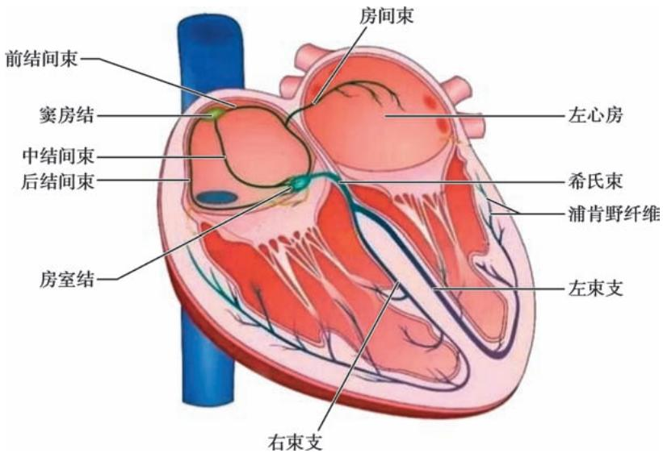  
图3-3-1  心脏传导系统示意图

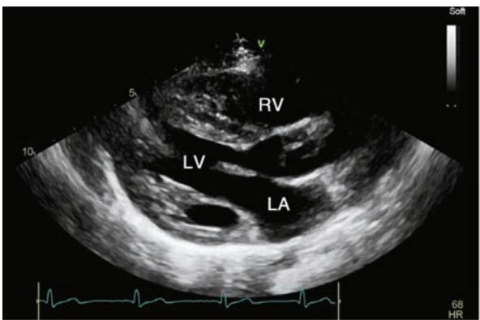

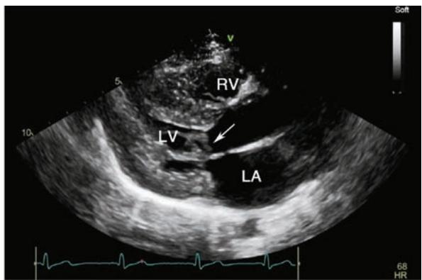  
B

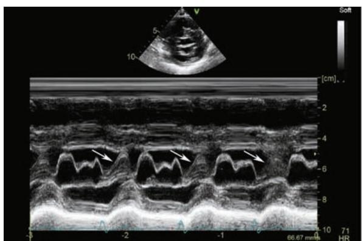  
C

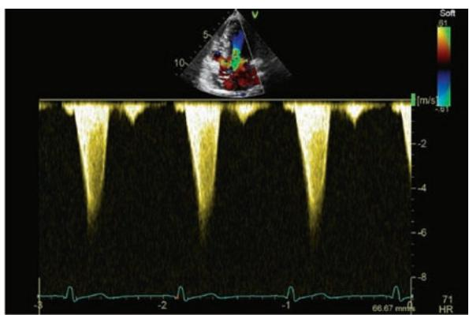  
D  
图3-6-2  肥厚型心肌病超声心动图表现

1例56岁男性左室流出道肥厚型梗阻性心肌病病人，左室流出道长轴及短轴切面可见左室壁显著增厚以室间隔增厚为甚（A、B、C），收缩末期二维（B）及 M 型（C）超声心动图可见二尖瓣前叶前向运动并与肥厚的室间隔共同造成流出道梗阻（箭头所指），心尖五腔心切面连续多普勒超声测得左室流出道峰压差为 $1 4 4 \mathrm { { m m H g } ( D ) }$ 。LA 左房:JV 左室：RV 右室。

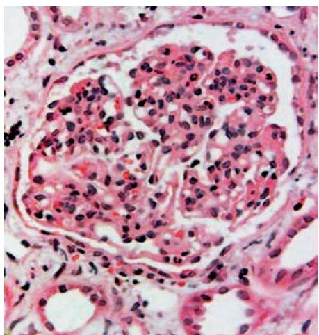  
图 5-2-1  肾小球内皮细胞弥漫增生，中性粒细胞浸润（HE×400）

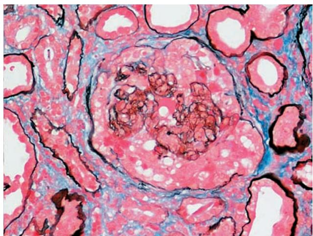  
图5-2-2  毛细血管袢破坏，新月体形成（PASM×200）

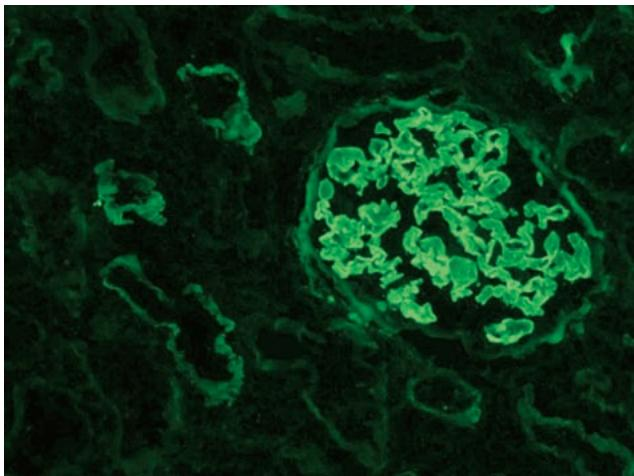  
图5-2-3  IgG呈线条状沿肾小球毛细血管壁分布

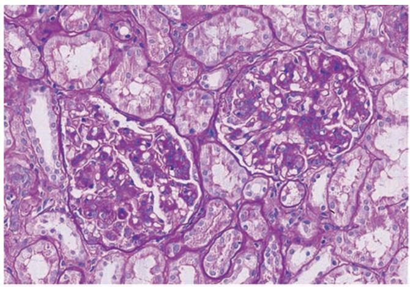  
A

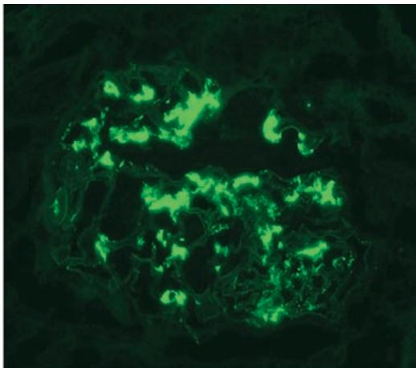  
B  
图5-2-4  IgA 肾病病理图（系膜增生性肾小球肾炎病理表现）  
A. 光镜下肾小球系膜细胞和系膜基质弥漫增生（PAS染色）；B. 免疫荧光检查 $\mathrm { I g A }$ 在肾小球的系膜区沉积。

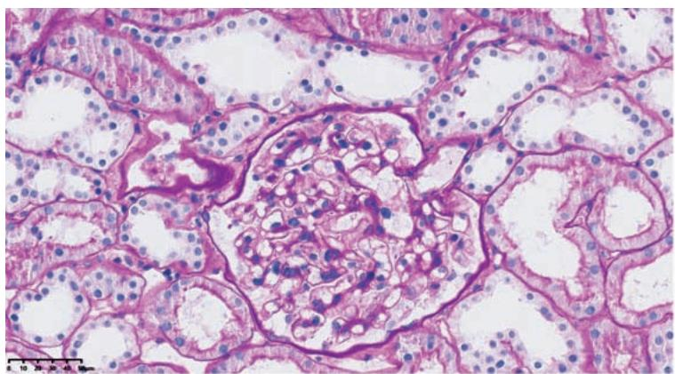  
A

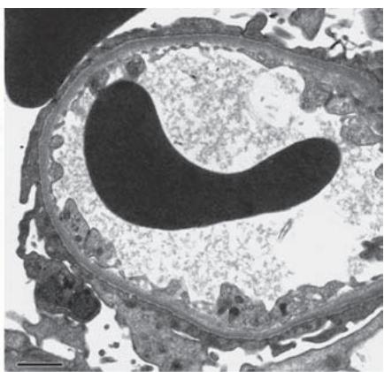  
B  
图5-2-6  微小病变型肾病病理图  
A.光镜下正常肾小球（PAS染色）；B.电镜下肾小球（广泛的肾小球脏层上皮细胞足突融合）。

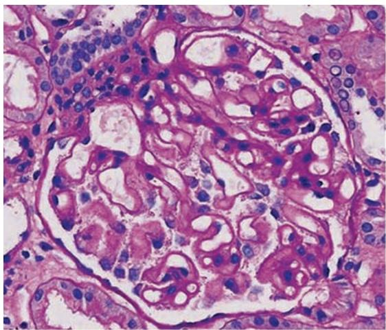  
A

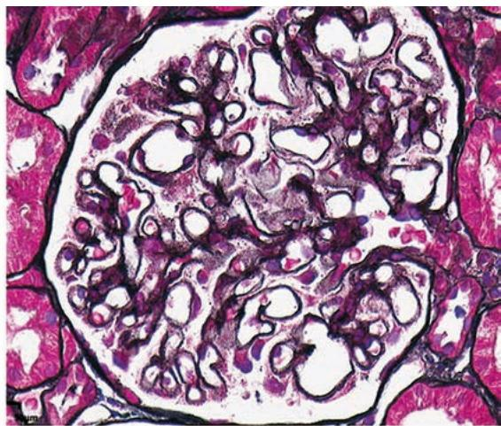  
B  
图5-2-9  膜性肾病病理图  
A.光镜下肾小球基底膜僵硬增厚（PAS染色）；B. 基底膜增厚，可见钉突形成（嗜银染色）。

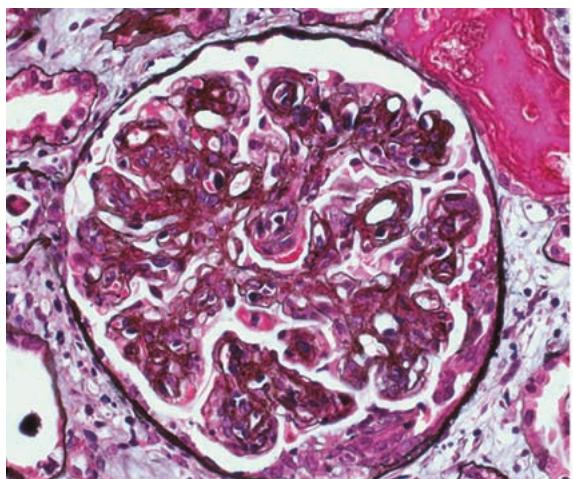  
A

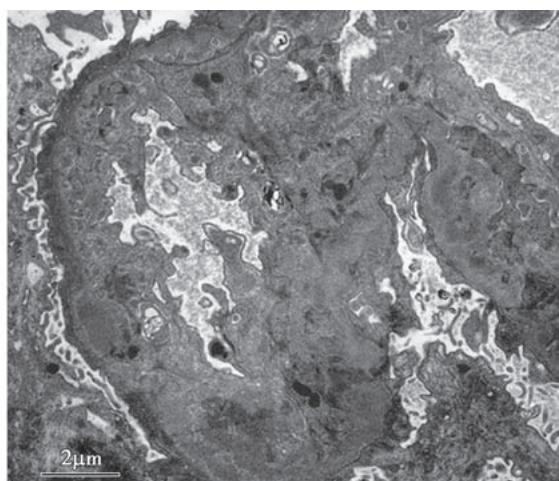  
B  
图5-2-11  系膜毛细血管性肾小球肾炎病理图  
A.光镜下肾小球毛细血管袢呈“双轨征”（嗜银染色）；B.电镜下系膜区和内皮下可见电子致密物沉积。

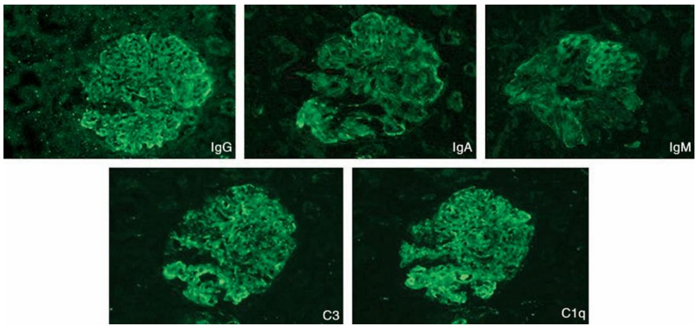  
图5-3-1  狼疮性肾炎免疫荧光呈现“满堂亮”

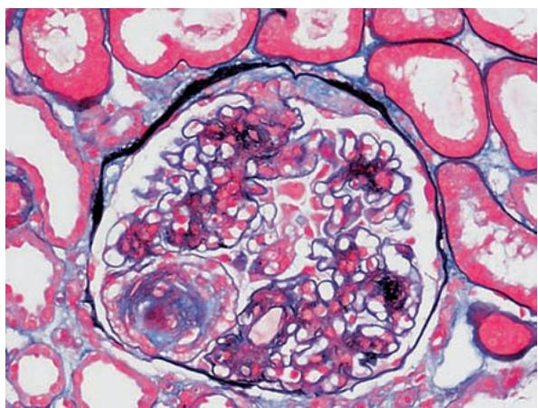  
图 5-3-2  糖尿病肾脏病 K-W 结节（PASM×200）

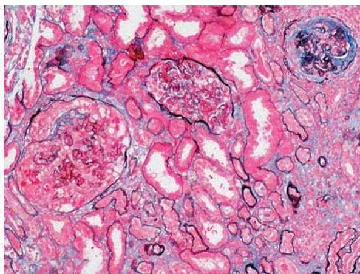  
图 5-3-3  ANCA 相关小血管炎肾损害，新月体新旧不等（PASM×100）

01 医用高等数学 第8版 29 耳鼻咽喉头颈外科学 第10版
02 医学物理学 第10版 30 口腔科学 第10版
03 基础化学 第10版 31 皮肤性病学 第10版
04 有机化学 第10版 32 核医学 第10版
05 医学生物学 第10版 33 流行病学 第10版
06 系统解剖学 第10版 34 预防医学 第8版
07 局部解剖学 第10版 35 中医学 第10版
08 组织学与胚胎学 第10版 36 医学计算机应用 第7版
09 生物化学与分子生物学 第10版 37 体育 第7版
10 生理学 第10版 38 医学细胞生物学 第7版
11 医学微生物学 第10版 39 医学遗传学 第8版
12 人体寄生虫学 第10版 40 临床药理学 第7版
13 医学免疫学 第8版 41 医学统计学 第8版
14 病理学 第10版 42 医学伦理学 第6版
15 病理生理学 第10版 43 临床流行病学与循证医学 第6版
16 药理学 第10版 44 康复医学 第7版
17 医学心理学 第8版 45 医学文献检索与论文写作 第6版
18 法医学 第8版 46 卫生法 第6版
19 诊断学 第10版 47 医学导论 第6版
20 医学影像学 第9版 48 全科医学概论 第6版
21 内科学 第10版 49 麻醉学 第5版
22 外科学 第10版 50 急诊与灾难医学 第4版
23 妇产科学 第10版 51 医患沟通 第3版
24 儿科学 第10版 52 肿瘤学概论 第3版
25 神经病学 第9版 53 重症医学
26 精神病学 第9版 54 老年医学
27 传染病学 第10版 55 临床营养学
28 眼科学 第10版 56 医学人文导论

上一版获首届全国教材建设奖全国优秀教材 一等奖 二等奖

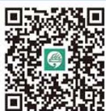  
人卫APP获取海量医学学习资源

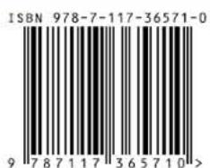

定价：148.00元