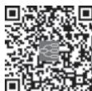
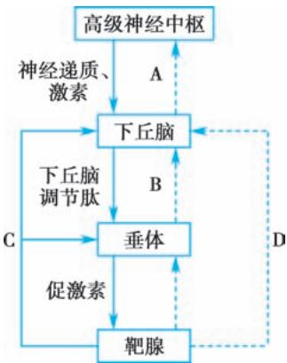
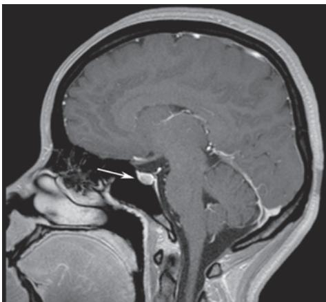
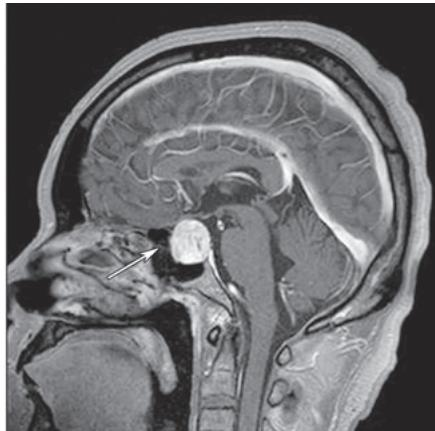
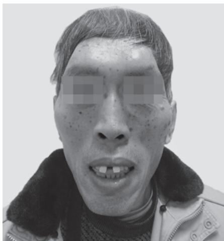
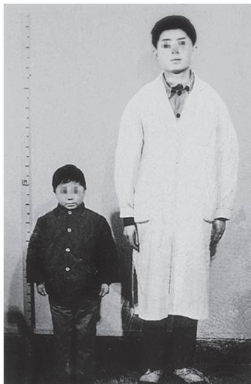
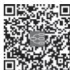
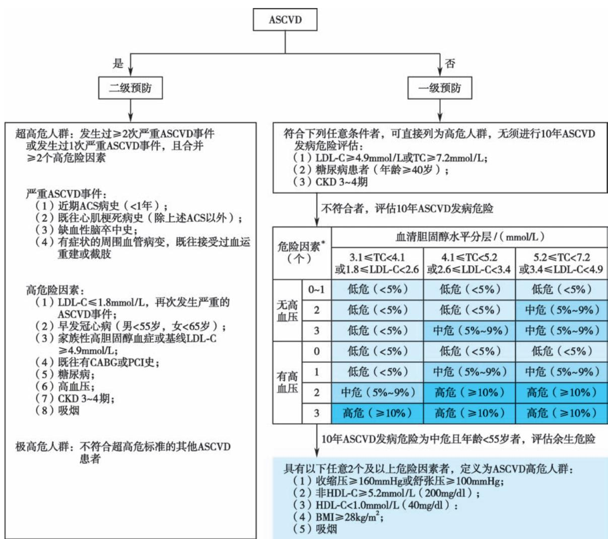

白细胞减少（leukopenia）指成人外周血白细胞总数持续低于 $4 . 0 \times 1 0 ^ { 9 } / \mathrm { L } _ { \odot }$ 中性粒细胞减少症（neutropenia）是指外周血中性粒细胞绝对计数在成人低于 $2 . 0 \times 1 0 ^ { 9 } / \mathrm { L }$ ，儿童≥10岁低于 $1 . 8 \times 1 0 ^ { 9 } / \mathrm { L }$ 或＜10岁低于 $1 . 5 \times 1 0 ^ { 9 } / \mathrm { L }$ ；中性粒细胞绝对计数低于 ${ 0 . 5 } \times { 1 0 } ^ { 9 } / { \mathrm { I } }$ 时，称为粒细胞缺乏症（agranulocytosis）。

【病因和发病机制】 骨髓是产生中性粒细胞的唯一场所，分为增殖池和成熟储存池。成人每天约产生中性粒细胞 $1 \times 1 0 ^ { 9 } / \mathrm { k g }$ ，其中约90%贮存于骨髓，约10%释放入外周血液，后者约一半进入循环血中（称为循环池），另一半黏附于小血管壁（称为边缘池），两者之间可以自由交换，构成动态平衡。中性粒细胞在血液循环中约6～7小时后进入组织或炎症部位，通过程序性细胞死亡及巨噬细胞的吞噬作用清除。

中性粒细胞减少症的病因可为先天性和获得性，以后者多见。根据细胞动力学，中性粒细胞减少症的病因和发病机制分为三大类：生成减少、破坏或消耗过多、分布异常（表 6-7-1）。成人中性粒细胞减少症的主要原因是生成减少和自身免疫性破坏，而分布异常很少见。

表6-7-1 中性粒细胞减少症的病因及发病机制

<table><tr><td>发病机制</td><td>病因</td></tr><tr><td>生成减少</td><td>(1)骨髓损伤:电离辐射、化学毒物、细胞毒药物是最常见的继发性原因,可直接损伤或抑制造血干/祖细胞及早期分裂细胞;某些药物可引起剂量依赖性骨髓抑制或特异性免疫反应。*(2)骨髓浸润:骨髓造血组织被白血病、骨髓瘤及转移瘤细胞等浸润,可影响骨髓正常造血细胞增殖。(3)成熟障碍:维生素 $B_{12}$ 、叶酸缺乏,MDS,某些先天性中性粒细胞减少等,可引起早期粒细胞成熟障碍,骨髓增殖池细胞可正常或增多,而成熟储存池细胞减少,也称为无效造血。(4)感染:见于病毒、细菌感染。其机制为中性粒细胞消耗增加和感染时负性造血调控因子增多等。(5)先天性中性粒细胞减少,多伴有基因改变。</td></tr><tr><td>破坏或消耗过多</td><td></td></tr><tr><td>1.免疫性因素</td><td>(1)药物:是中性粒细胞减少症最常见的原因之一,可能与剂量无关,往往停药后可恢复。(2)自身免疫性因素:见于自身免疫病,如系统性红斑狼疮、类风湿关节炎等。</td></tr><tr><td>2.非免疫性因素</td><td>(1)消耗增多:重症感染时,中性粒细胞在血液或炎症部位消耗增多。(2)脾功能亢进:大量中性粒细胞在脾内滞留、破坏增多。</td></tr><tr><td>分布异常</td><td>(1)粒细胞转移至边缘池:中性粒细胞转移至边缘池,导致循环池的粒细胞相对减少。见于先天性假性粒细胞减少、严重的细菌感染、营养不良等。(2)粒细胞滞留于肺血管内:如血液透析开始后2~15分钟,粒细胞暂时性减少。</td></tr><tr><td colspan="2">注:*可导致白细胞减少的常用药物包括:细胞毒抗肿瘤药物(烷化剂、抗代谢药等),解热镇痛抗炎药(氨基比林、布洛芬等),抗生素(氯霉素、青霉素、磺胺类药物等),抗结核药(异烟肼、利福平等),抗疟药(氯喹、伯氨喹等),抗甲状腺药(甲硫氧嘧啶/丙硫氧嘧啶、甲巯咪唑等),降血糖药(甲苯磺丁脲等),抗惊厥/癫痫药(苯妥英钠、苯巴比妥等),降压药(卡托普利等),免疫调节药(硫唑嘌呤、吗替麦考酚酯等),抗精神病药(氯丙嗪等)等。</td></tr></table>

【临床表现】 中性粒细胞减少症的临床表现常随其减少程度及原发病而异。根据其减少程度分为轻度 ${ > } 1 . 0 \times 1 0 ^ { 9 } / \mathrm { L }$ 、中度 $\left( 0 . 5 { \sim } 1 . 0 \right) { \times } 1 0 ^ { 9 } / \mathrm { L }$ 和重度 ${ < } 0 . 5 \times 1 0 ^ { 9 } / \mathrm { L }$ 。轻度减少者，发生感染机会较少，临床上无特殊症状。中、重度减少者易发生感染，尤其是重度减少者，若持续时间较长，可发生严重感染，患者出现寒战、高热等症状。常见的感染部位是呼吸道、消化道及尿道，重者发生败血症、感染性休克。粒细胞严重缺乏时，感染部位不能形成有效的炎症反应，常无脓液或仅有少量脓液，如肺部感染X线检查可无炎症浸润阴影。

## 【实验室检查】

1. 常规检查 血常规检查发现白细胞减少，中性粒细胞减少，淋巴细胞百分比增加。因粒细胞减少原因不同，骨髓象表现各异。

2. 特殊检查 中性粒细胞特异性抗体测定用于判断是否存在抗粒细胞自身抗体。肾上腺素试验促使边缘池中性粒细胞进入循环池，以鉴别假性粒细胞减少。氢化可的松试验用于测定骨髓粒细胞储备功能。对于自幼发病、反复感染或有家族史，怀疑有先天性中性粒细胞减少或先天性骨髓衰竭性疾病的患者，可行二代测序检测。

【诊断与鉴别诊断】 根据血常规检查的结果即可作出白细胞减少、中性粒细胞减少症或粒细胞缺乏症的诊断。注意排除检查方法上的误差以及正常生理因素（运动、妊娠、季节等）、年龄和种族、采血部位等影响，必要时要复查，包括外周血细胞形态分析等。

鉴别中性粒细胞减少症的病因对治疗很重要，注意了解有无药物、化学物质、放射线的接触史或放化疗史，有无感染性疾病、自身免疫病、肿瘤性疾病病史等。注意中性粒细胞减少症发病的年龄、程度、发作的速度、持续时间及周期性，是否有基础疾病及家族史等。若有脾大，注意脾功能亢进的可能。

## 【治疗】

1. 病因治疗 对可疑的药物或其他致病因素，应立即停止接触。继发性减少者应积极治疗原发病，病情缓解或控制后，粒细胞可恢复正常。

2. 感染防治 轻度减少者一般不需药物治疗。中度减少者感染风险增加，应注意预防，减少出入公共场所，保持卫生，去除慢性感染灶，不主张预防性应用抗生素。患粒细胞缺乏症者极易发生严重感染，应采取无菌隔离措施。患者出现发热应行病原学检查，以明确感染类型和部位，立即经验性应用广谱抗生素治疗，待得到病原和药敏结果后再调整用药，同时注意二重感染（特别是真菌感染）的防治。

3. 促进粒细胞生成 重组人粒细胞集落刺激因子（rhG-CSF）和重组人粒细胞-巨噬细胞集落刺激因子（rhGM-CSF）可促进中性粒细胞增殖和释放，并增强其吞噬、杀菌及趋化功能。rhG-CSF 一般剂量为 2～10μg/（kg·d），常见的副作用有发热，肌肉、骨骼酸痛，皮疹等。依据中性粒细胞减少症的病因不同，rhG-CSF应用的指征和剂量不尽相同。

4. 免疫抑制剂 自身免疫性粒细胞减少症和免疫机制所致的粒细胞缺乏症可用糖皮质激素、环孢素等免疫抑制剂治疗。

5. 造血干细胞移植 是先天性粒细胞缺乏症、骨髓衰竭等疾病的可治愈性治疗方法。

【预后】 与中性粒细胞减少症的程度、持续时间、进展情况、病因及治疗措施有关。轻、中度者，若不进展则预后较好。粒细胞缺乏症者，随着广谱抗生素的应用，病死率有所下降，但预后仍取决于是否及时去除病因。

（高素君）

  
本章思维导图

骨髓增生异常性肿瘤（myelodysplastic neoplasms），又称骨髓增生异常综合征（myelodysplasticsyndrome，MDS），是一组起源于造血干细胞，以血细胞减少和形态发育异常为特征的异质性髓系肿瘤性疾病。任何年龄男、女均可发病，约80%患者大于60岁。

【病因和发病机制】 原发性 MDS 的确切病因尚不明确，继发性 MDS 见于烷化剂、拓扑异构酶抑制剂、放射线、有机毒物等的密切接触者。

MDS 是起源于造血干细胞的克隆性疾病，异常克隆细胞在骨髓中分化、成熟障碍，出现病态、无效造血，并呈现出向急性髓系白血病（AML）转化的高风险趋势。部分 MDS 患者可有造血细胞基因突变，或表观遗传学改变，或染色体异常，或骨髓造血微环境异常，这些异常改变可能参与 MDS 的多因素、多步骤、连续动态的发生、发展过程。

【分型及临床表现】 法- 美- 英（FAB）协作组主要根据 MDS 患者外周血、骨髓中的原始细胞比例、形态学改变及单核细胞数量，将 MDS 分为 5 型：难治性贫血（refractory anemia，RA）、环形铁粒幼细胞性难治性贫血（RA with ringed sideroblast，RAS/RARS）、难治性贫血伴原始细胞增多（RA withexcess blast，RAEB）、难治性贫血伴原始细胞增多转变型（RAEB in transformation，RAEB-t）、慢性粒- 单核细胞性白血病（chronic myelomonocytic leukemia，CMML）。MDS 的分型见表 6-8-1。

表 6-8-1 MDS 的 FAB 分型

<table><tr><td>FAB 类型</td><td>外周血</td><td>骨髓</td></tr><tr><td>RA</td><td>原始细胞&lt;1%</td><td>原始细胞&lt;5%</td></tr><tr><td>RAS</td><td>原始细胞&lt;1%</td><td>原始细胞&lt;5%,环形铁粒幼细胞&gt;有核红细胞 15%</td></tr><tr><td>RAEB</td><td>原始细胞&lt;5%</td><td>原始细胞 5%~20%</td></tr><tr><td>RAEB-t</td><td>原始细胞≥5%</td><td>原始细胞&gt;20% 而&lt;30%;或幼粒细胞出现 Auer 小体</td></tr><tr><td>CMML</td><td>原始细胞&lt;5%,单核细胞绝对值&gt; $1 \times 10^{9}/L$ </td><td>原始细胞 5%~20%</td></tr></table>

WHO 第五版造血和淋巴组织肿瘤分类标准更强调从遗传的角度定义疾病分型，并明确 MDS 伴低原始细胞（MDS-LB）和 MDS 伴原始细胞增多（MDS-IB）这两个类型，删除了“MDS，不能分类”这一类型，见表 6-8-2。WHO 引入了术语“骨髓增生异常性肿瘤”来取代“骨髓增生异常综合征”，强调了其肿瘤性质，认为骨髓原始细胞达 20% 仍是 MDS 与 AML 诊断的截断值，但在治疗方面 MDS-IB2可被视为等同于AML。

几乎所有的 MDS 患者都有贫血症状，如乏力、疲倦。约 60% 的 MDS 患者有中性粒细胞减少，由于同时存在中性粒细胞功能低下，使得 MDS 患者容易发生感染，约有 20% 的 MDS 患者死于感染。40%～60%的MDS 患者有血小板减少，随着疾病进展可出现进行性血小板减少。

## 【实验室检查】

1. 血象和骨髓象 持续一系或多系血细胞减少：血红蛋白＜100g/L、中性粒细胞 $< 1 . 8 \times 1 0 ^ { 9 } / \mathrm { L }$ 、血小板＜ $\mathrm { : 1 0 0 \times 1 0 ^ { 9 } / L _ { c } }$ 。骨髓增生度多在活跃以上，少部分呈增生减低。MDS 患者的形态发育异常见表6-8-3。

表 6-8-2 MDS 第五版 WHO 分型

<table><tr><td>分型</td><td>原始细胞</td><td>细胞遗传学</td><td>基因突变</td></tr><tr><td colspan="4">MDS伴特定遗传学异常</td></tr><tr><td>MDS伴低原始细胞和孤立5q缺失(MDS-5q)</td><td>骨髓&lt;5%且外周血&lt;2%</td><td>孤立5q-,或伴除-7和7q-外的1种其他异常</td><td></td></tr><tr><td>MDS伴低原始细胞和SF3B1突变(MDS-SF3B1) $^{1}$ </td><td>骨髓&lt;5%且外周血&lt;2%</td><td>不伴5q-、-7或复杂核型</td><td>SF3B1</td></tr><tr><td>MDS伴TP53双等位基因失活(MDS-biTP53)</td><td>骨髓和外周血&lt;20%</td><td>多为复杂核型</td><td>≥2个TP53突变,1个TP53突变伴1个TP53拷贝数缺失或拷贝中性杂合性缺失</td></tr><tr><td colspan="4">形态学定义的MDS</td></tr><tr><td>MDS伴低原始细胞(MDS-LB)</td><td>骨髓&lt;5%且外周血&lt;2%</td><td></td><td></td></tr><tr><td>低增生MDS(MDS-h) $^{2}$ </td><td></td><td></td><td></td></tr><tr><td>MDS伴原始细胞增多(MDS-IB)</td><td></td><td></td><td></td></tr><tr><td>MDS-IB1</td><td>骨髓5%~9%或外周血2%~4%</td><td></td><td></td></tr><tr><td>MDS-IB2</td><td>骨髓10%~19%或外周血5%~19%或出现Auer小体</td><td></td><td></td></tr><tr><td>MDS伴纤维化(MDS-f)</td><td>骨髓5%~19%:外周血2%~19%</td><td></td><td></td></tr></table>

注：1≤15% 环形铁粒幼细胞可替代 SF3B1 突变，命名为“MDS 伴低原始细胞和环形铁粒幼细胞”。2 定义为骨髓增生≤25%（根据年龄调整）。

表6-8-3 MDS 的常见形态发育异常

<table><tr><td>细胞结构</td><td>红系细胞</td><td>粒系细胞</td><td>巨核系细胞</td></tr><tr><td rowspan="6">细胞核</td><td>核出芽</td><td>核分叶减少</td><td>小巨核细胞</td></tr><tr><td>核间桥</td><td>(假 Pelger-Huët;pelgeriod)</td><td>核少分叶</td></tr><tr><td>核碎裂</td><td>不规则核分叶增多</td><td>多核(正常巨核细胞为单核分叶)</td></tr><tr><td>多核</td><td></td><td></td></tr><tr><td>核多分叶</td><td></td><td></td></tr><tr><td>巨幼变</td><td></td><td></td></tr><tr><td rowspan="4">细胞质</td><td>环状铁粒幼细胞</td><td>胞体小或异常增大</td><td></td></tr><tr><td>空泡</td><td>颗粒减少或无颗粒</td><td></td></tr><tr><td>PAS 染色阳性</td><td>假 Chediak-Higashi 颗粒</td><td></td></tr><tr><td></td><td>Auer 小体</td><td></td></tr></table>

2. 细胞遗传学检查 40%～70% 的 MDS 有克隆性染色体核型异常，多为缺失性改变，以 +8、-5$\mathrm { d e l } \left( \mathrm { 5 q } \right) _ { \mathrm { v { c } } } - 7 / \mathrm { d e l } \left( \mathrm { 7 q } \right) _ { \mathrm { , d e l } } \left( \mathrm { 2 0 q } \right)$ ）最为常见。利用荧光原位杂交技术（FISH），可提高细胞遗传学异常的检出率。

3.  病理检查 骨髓病理活检可提供患者骨髓内细胞增生程度、巨核细胞数量、原始细胞群体、骨髓纤维化及肿瘤骨髓转移等重要信息，有助于排除其他可能导致血细胞减少的因素或疾病。

4. 免疫学检查 流式细胞术可检测到 MDS 患者骨髓细胞表型存在异常，对于低危组 MDS 与非克隆性血细胞减少症的鉴别诊断有一定价值。

5.  分子生物学检查 MDS 常见基因突变包括 TET2、RUNX1、ASXL1、DNMT3A、EZH2、SF3B1 等，基因的突变状态对MDS 的鉴别诊断和危险分层有重要应用价值。

【诊断与鉴别诊断】 根据患者血细胞减少和相应的症状，以及形态发育异常、细胞遗传学异常、病理学改变，MDS 的诊断不难确立。虽然形态发育异常是 MDS 的特征，但有形态发育异常不等于就是MDS。MDS 的诊断尚无“金标准”，是一个除外性诊断，常应与以下疾病鉴别。

1. 慢性再生障碍性贫血（CAA） 常须与低增生 MDS 鉴别。低增生 MDS 的网织红细胞可正常或升高，外周血可见到有核红细胞，骨髓形态发育异常明显，早期细胞比例不低或增加，40%～60% 的MDS 患者可检出核型异常，而CAA一般无上述异常。

2. 阵发性睡眠性血红蛋白尿症（PNH） 也可出现全血细胞减少和形态发育异常，但 PNH 检测可发现外周血细胞表面锚链蛋白缺失，Ham试验阳性及血管内溶血的改变。

3. 巨幼细胞贫血 MDS 患者细胞形态发育异常可见巨幼变，易与巨幼细胞贫血混淆，但后者是由于叶酸、维生素 $\mathrm { B } _ { 1 2 }$ 缺乏所致，补充后可纠正贫血，而 MDS 的叶酸、维生素 $\mathrm { B } _ { 1 2 }$ 不低，用叶酸、维生素$\mathrm { B } _ { 1 2 }$ 治疗无效。

【治疗及预后】 MDS 患者自然病程和预后差异较大，风险分层对于治疗选择具有重要意义。修订的 MDS 国际预后积分系统（IPSS-R）依据患者血细胞减少的数量、骨髓中原始细胞比例及染色体核型来评价预后，指导治疗（表 6-8-4）。此外，近期国际预后工作组提议将 MDS 相关的 31 个基因突变纳入，形成了新的IPSS-M 预后模型。对于IPSS-R≤3.5分的MDS 患者，治疗主要是改善造血、提高生活质量，采用支持治疗、促造血、去甲基化药物和生物反应调节剂等治疗，而其余较高危组 MDS 主要是改善自然病程，采用去甲基化药物、化疗和造血干细胞移植。

表 6-8-4 修订的 MDS 国际预后积分系统（IPSS-R）

<table><tr><td>评分</td><td>细胞遗传学*</td><td>骨髓原始细胞/%</td><td>血红蛋白/(g/L)</td><td>中性粒细胞绝对值/(×109/L)</td><td>血小板/(×109/L)</td></tr><tr><td>0</td><td>极好</td><td>≤2</td><td>≥100</td><td>≥0.8</td><td>≥100</td></tr><tr><td>0.5</td><td></td><td></td><td></td><td>&lt;0.8</td><td>50~&lt;100</td></tr><tr><td>1</td><td>好</td><td>&gt;2~&lt;5</td><td>80~&lt;100</td><td></td><td>&lt;50</td></tr><tr><td>1.5</td><td></td><td></td><td>&lt;80</td><td></td><td></td></tr><tr><td>2</td><td>中等</td><td>5~10</td><td></td><td></td><td></td></tr><tr><td>3</td><td>差</td><td>&gt;10</td><td></td><td></td><td></td></tr><tr><td>4</td><td>极差</td><td></td><td></td><td></td><td></td></tr></table>

注：<sup>\*</sup> 极好：del（11q），-Y；好：正常核型，del（20q），del（12p），del（5q）/del（5q）附加另一种异常；中等： $+ 8 , \mathrm { d e l } ( 7 \mathrm { q } ) , \mathrm { i } ( 1 7 \mathrm { q } )$ +19及其他1个或2个独立克隆的染色体异常；差：-7，inv（3）/t（3q）/del（3q），-7/7q-附加另一种异常，复杂核型（3个）；极差：复杂核型（3 个以上）。IPSS-R 危险度分类：极低危（very low，VL）：≤1.5 分，低危（low，L）：＞1.5～≤3 分，中危（intermediate，Int）：＞3～≤4.5 分，高危组（high，H）：＞4.5～≤6 分，极高危（very high，VH）：＞6 分。

1. 支持治疗 严重贫血和有出血症状者可输注红细胞和血小板，粒细胞减少和缺乏者应注意防治感染。长期输血致铁过载者应祛铁治疗。

2. 促造血治疗 可考虑使用EPO、雄激素等，能使部分患者造血功能改善。

3.  生物反应调节剂 沙利度胺及来那度胺对伴单纯 $\mathrm { d e l } \left( 5 _ { \mathrm { q } } \right)$ 的 MDS 有较好疗效。ATG 和/或环孢素可用于少部分极低危组 MDS。

4.  去甲基化药物 去甲基化药物（如阿扎胞苷和地西他滨）能逆转 MDS 抑癌基因启动子 DNA过甲基化，改变基因表达，减少输血量，并提高生活质量，延迟向 AML 转化。约 90% 阿扎胞苷治疗有效的患者在6 个疗程内获得治疗反应。

5. 联合化疗 IPSS-R 评分＞3.5 分的 MDS 患者可采用 AML 诱导方案或预激方案，且老年或身体机能较差的患者对于预激方案的耐受性优于常规 AML 化疗方案。此外，预激方案也可和去甲基化药物联用。

6. 异基因造血干细胞移植 是目前唯一可能治愈 MDS 的疗法。IPSS-R 评分＞3.5 分的 MDS 患者首先应考虑是否适合移植，尤其是年轻、原始细胞增多和伴有预后不良染色体核型者。其余相对低危组患者伴输血依赖且去甲基化药物治疗无效者，也可考虑在铁负荷降低后行移植。

（徐  杨）

  
本章思维导图

本章数字资源

## 第一节 | 概 述

白血病（leukemia）是一类造血干/祖细胞的恶性克隆性疾病，因白血病细胞自我更新增强、增殖失控、分化障碍、凋亡受阻，而停滞在细胞发育的不同阶段。在骨髓和其他造血组织中，白血病细胞大量增生、累积，使正常造血受抑制，并浸润其他器官和组织。

根据白血病细胞的分化成熟程度和自然病程，将白血病分为急性和慢性两大类。急性白血病（acute leukemia，AL）的细胞分化停滞在较早阶段，多为原始细胞及早期幼稚细胞，病情发展迅速，自然病程仅几个月。慢性白血病（chronic leukemia，CL）的细胞分化停滞在较晚的阶段，多为较成熟幼稚细胞和成熟细胞，病情发展缓慢，自然病程为数年。其次，根据主要受累的细胞系列可将 AL 分为急性淋巴细胞白血病（acute lymphoblastic leukemia，ALL）和急性髓系白血病（acute myelogenousleukemia，AML）。CL 则分为慢性髓系白血病（chronic myelogenous leukemia，CML）、慢性淋巴细胞白血病（chronic lymphocytic leukemia，CLL）及少见类型的白血病如毛细胞白血病、幼淋巴细胞白血病等。

【发病情况】 我国白血病发病率约为（3～4）/10万。在恶性肿瘤中，白血病死亡率居第6位（男）和第7位（女）；儿童及35 岁以下成人中，则居第1位。男性发病率略高于女性（1.81∶1）。

我国 AML、ALL 和 CML 的年发病率约为 1.62/10 万，0.69/10 万，0.7/10 万。CLL 的年发病率约为（2～3）/10 万，近年有些地区报道发病率有上升趋势。成人 AL 中以 AML 多见，儿童以 ALL 多见。CML 随年龄增长发病率逐渐升高。CLL 在 50 岁以后发病才明显增多。我国白血病发病率与亚洲其他国家相近，低于欧美国家。

【病因和发病机制】 人类白血病的病因尚不完全清楚。

1. 生物因素 主要是病毒感染和免疫功能异常。成人 T 细胞白血病/淋巴瘤（ATL）可由人类 T淋巴细胞病毒Ⅰ型（human T lymphocytotropic virus-Ⅰ，HTLV-Ⅰ）所致。病毒感染机体后，可作为内源性病毒整合并潜伏在宿主细胞内，在某些理化因素作用下，被激活表达而诱发白血病；或作为外源性病毒在外界以横向方式传播感染，直接致病。部分免疫功能异常者，如某些自身免疫病患者，患白血病风险会增加。

2. 物理因素 包括X射线、γ射线等电离辐射。1911年首次报道了放射工作者发生白血病的病例。日本广岛及长崎受原子弹袭击后，幸存者中白血病发病率比未受照射的人群高 30 倍和 17 倍，患者多为 AL 和 CML。研究表明，大面积和大剂量照射可导致骨髓抑制和机体免疫力下降，DNA 突变、断裂和重组，导致白血病的发生。

3. 化学因素 多年接触苯以及含有苯的有机溶剂与白血病的发生有关。乙双吗啉是乙亚胺的衍生物，具有极强的致染色体畸变和致白血病作用。抗肿瘤药物中烷化剂和拓扑异构酶Ⅱ抑制剂有致白血病的作用。化学物质所致的白血病以AML 为多。

4. 遗传因素 家族性白血病约占白血病的 0.7%。单卵孪生子，如果一个人发生白血病，另一个人的发病率为1/5，比双卵孪生者高12倍。Down综合征（唐氏综合征）有21号染色体三体改变，其白血病发病率达 50/10 万，是正常人群的 20 倍。Fanconi 贫血、Bloom 综合征（侏儒面部毛细血管扩张）、共济失调-毛细血管扩张症及先天性免疫球蛋白缺乏症等患者的白血病发病率均较高。

5. 其他血液病 某些血液病最终可能发展为白血病，如 MDS、PNH 等，亦有淋巴瘤和骨髓瘤继发白血病的报道，但具体机制不明。

白血病的发生可能是多步骤的，目前认为至少有两类分子事件共同参与发病，即所谓的“二次打击”学说。其一，各种原因所致的造血细胞内一些基因的决定性突变（如RAS、MYC 等基因突变），激活某种信号通路，导致克隆性异常造血细胞生成，此类细胞获得增殖和/或生存优势，多有凋亡受阻；其二，一些遗传学改变（如形成 PML::RARA 等融合基因）可能会涉及某些转录因子，导致造血细胞分化阻滞或分化紊乱。

## 第二节 | 急性白血病

急性白血病（acute leukemia，AL）是造血干/祖细胞的恶性克隆性疾病，发病时骨髓中异常的原始细胞及幼稚细胞（白血病细胞）大量增殖，并抑制正常造血，可广泛浸润肝、脾、淋巴结等各种脏器。表现出贫血、出血、感染和浸润等征象。

【分类】 AL 的分型方法有法美英（FAB）分型和 WHO 分型，而临床实践中则主要选择 WHO分型。FAB 分型是基于对患者骨髓涂片细胞形态学和组织化学染色的观察和计数，是最基本的诊断学依据。WHO 分型是整合了白血病细胞形态学（morphology）、免疫学（immunology）、细胞遗传学（cytogenetics）和分子生物学（molecular biology） （简称 MICM）特征的新分型系统，可为患者治疗方案的选择及预后判断提供帮助。

## （一） AL 的 FAB 分型

1.  AML 的 FAB 分型 $\mathbf { M } _ { 0 }$ （急性髓细胞性白血病微分化型，minimally differentiated AML）：骨髓原始细胞＞30%，无嗜天青颗粒及 Auer小体，核仁明显，光镜下髓过氧化物酶（MPO）及苏丹黑 B 阳性细胞＜3%；在电镜下，MPO 阳性；CD33 或 CD13 等髓系抗原可呈阳性，淋系抗原通常为阴性。血小板抗原阴性。

$\mathbf { M } _ { 1 }$ （急性粒细胞白血病未分化型，AML without maturation）：原始粒细胞（Ⅰ型 +Ⅱ型，原始粒细胞质中无颗粒为Ⅰ型，出现少数颗粒为Ⅱ型）占骨髓非红系有核细胞（NEC，指不包括浆细胞、淋巴细胞、肥大细胞、巨噬细胞及所有红系有核细胞的骨髓有核细胞）的 90% 以上，其中至少 3% 的细胞为 MPO阳性。

$\mathbf { M } _ { 2 } ( \mathbf { \Sigma }$ （急性粒细胞白血病部分分化型，AML with maturation）：原始粒细胞占骨髓 NEC 的 30%～89%，其他粒细胞≥10%，单核细胞＜20%。

M（急性早幼粒细胞白血病，acute promyelocytic leukemia，APL）：骨髓中以颗粒增多的早幼粒细胞为主，此类细胞在NEC 中≥30%。

$\mathrm { M } _ { 4 }$ （急性粒- 单核细胞白血病，acute myelomonocytic leukemia，AMMoL）：骨髓中原始细胞占 NEC的30% 以上，各阶段粒细胞≥20%，各阶段单核细胞≥20%。

$\mathrm { M _ { 4 } E o \left( \ A M L \ v i t h \ e o s i n o p h i l i a \right) : }$ ：除上述 $\mathrm { M } _ { 4 }$ 型特点，嗜酸性粒细胞在NEC 中≥5%。

$\mathrm { M } _ { 5 }$ （急性单核细胞白血病，acute monocytic leukemia，AMoL）：骨髓 NEC 中原始单核细胞、幼稚单核细胞≥30%，且原始单核细胞、幼稚单核细胞及单核细胞≥80%。原始单核细胞≥80% 为 $\mathrm { M } _ { 5 a } . { < } 8 0 \%$ 为 $\mathrm { M } _ { 5 \mathrm { b } }$ 。

$\mathrm { M } _ { 6 }$ （红白血病，erythroleukemia，EL）：骨髓中幼红细胞≥50%，NEC中原始细胞（Ⅰ型+Ⅱ型）≥30%。

M（急性巨核细胞白血病，acute megakaryoblastic leukemia，AMeL）：骨髓中原始巨核细胞≥30%。血小板抗原阳性，血小板过氧化酶阳性。

## 2.  ALL 的 FAB 分型

$\mathrm { L } _ { 1 }$ ：原始和幼稚淋巴细胞以小细胞（直径≤ $1 2 \mu \mathrm { m } )$ ）为主。

$\mathrm { L } _ { 2 } { \mathrm { : } }$ ：原始和幼稚淋巴细胞以大细胞（直径 $> 1 2 \mu \mathrm { m } \big )$ ）为主。

L（Burkitt 型）：原始和幼稚淋巴细胞以大细胞为主，大小较一致，细胞内有明显空泡，胞质嗜碱性，染色深。

## （二） AL的WHO分型

## 1. AML 的 WHO 分型（第五版）

（1）伴重现性遗传学异常的AMLAPL 伴 PML::RARAAML 伴 RUNX1::RUNX1T1AML 伴 CBFB::MYH11AML 伴 DEK::NUP214AML 伴 RBM15::MRTFAAML 伴 BCR::ABL1AML 伴 KMT2A 重排AML 伴 MECOM 重排AML 伴 NUP98 重排AML 伴 NPM1 突变AML 伴 CEBPA 突变AML，骨髓增生异常相关AML 伴其他特定遗传学改变（2）由分化定义的AMLAML 微分化型AML 未成熟型AML 成熟型急性嗜碱性粒细胞白血病急性粒-单核细胞白血病急性单核细胞白血病急性红细胞白血病急性巨核细胞白血病2. ALL 的WHO分型（第五版）（1）原始B淋巴细胞白血病B-ALL，非特指型（NOS）B-ALL伴高超二倍体B-ALL 伴亚二倍体B-ALL 伴 21 号染色体内部扩增（iAMP21）B-ALL 伴 BCR::ABL1 融合B-ALL 伴 BCR::ABL1 样特征B-ALL 伴 KMT2A 重排B-ALL 伴 ETV6::RUNX1 融合B-ALL 伴 ETV6::RUNX1 样特征B-ALL 伴 TCF3::PBX1 融合B-ALL 伴 IGH::IL3 融合B-ALL 伴 TCF3::HLF 融合B-ALL伴其他特定遗传学异常（2）原始T淋巴细胞白血病

T-ALL，非特指型（NOS）

早期前体T淋巴细胞白血病（ETP-ALL）

【临床表现】 AL 起病急缓不一。起病急者可以突然高热，也可以是严重的出血。缓慢起病者常出现面色苍白、皮肤紫癜，月经过多或拔牙后出血难止，而在就医时被发现。

## （一） 正常骨髓造血功能受抑制表现

1. 贫血 部分患者因病程短，可无贫血。半数患者就诊时已有重度贫血，尤其是继发于MDS者。

2.  发热 半数患者以发热为早期表现。可低热，体温亦可高达 39～40℃以上，伴有畏寒、出汗等。虽然白血病本身可导致发热，但也须排除合并感染的可能性。感染可发生在各个部位，以口腔炎、牙龈炎、咽峡炎最常见，可发生溃疡或坏死；肺部感染、肛周炎、肛旁脓肿亦常见，严重时可有血流感染。最常见的致病菌为革兰氏阴性杆菌，如肺炎克雷伯菌、铜绿假单胞菌、大肠埃希菌、硝酸盐阴性不动杆菌等；革兰氏阳性球菌感染的发病率有所上升，如金黄色葡萄球菌、表皮葡萄球菌、肠球菌等。长期应用抗生素及粒细胞缺乏者，可出现真菌感染，如念珠菌、曲霉菌、隐球菌等。因患者伴有免疫功能缺陷，可发生病毒感染，如单纯疱疹病毒、带状疱疹病毒、巨细胞病毒感染等。偶见耶氏肺孢子菌病。

3.  出血 近 40% 以出血为早期表现。出血可发生在全身各部位，皮肤瘀点、瘀斑，鼻出血，牙龈出血，月经过多较多见。眼底出血可致视力障碍。APL 易并发凝血异常而出现全身广泛性出血。颅内出血时会出现头痛、呕吐、双侧瞳孔不等大，甚至昏迷、死亡。有资料表明 AL 死于出血者占62.24%，其中 87% 为颅内出血。大量白血病细胞在血管中淤滞及浸润、血小板减少、凝血异常以及感染是出血的主要原因。

## （二） 白血病细胞增殖浸润的表现

1. 淋巴结和肝、脾大 淋巴结肿大以 ALL 较多见。纵隔淋巴结肿大常见于 $\mathrm { T } { \mathrm { - A L L L } } _ { \circ }$ 肝、脾大多为轻至中度，除CML急性变外，巨脾罕见。

2. 骨骼和关节 常有胸骨下段局部压痛。可出现关节痛、骨痛，尤以儿童多见。发生骨髓坏死时，可引起骨剧痛。

3. 眼部 部分 AML 可伴粒细胞肉瘤，或称绿色瘤，常累及骨膜，以眼眶部位最常见，可引起眼球突出、复视或失明。

4. 口腔和皮肤 AL，尤其是 $\mathrm { M } _ { 4 }$ 和 $\mathrm { M } _ { 5 }$ ，白血病细胞浸润可使牙龈增生、肿胀；皮肤可出现蓝灰色斑丘疹，局部皮肤隆起、变硬，呈紫蓝色结节。

5.  中枢神经系统 是白血病最常见的髓外浸润部位。多数化疗药物难以通过血脑屏障，不能有效杀灭隐藏在中枢神经系统的白血病细胞，因而引起中枢神经系统白血病（central nervous systemleukemia，CNSL）。轻者表现为头痛、头晕，重者有呕吐、颈项强直，甚至抽搐、昏迷。CNSL 可发生在疾病各个时期，尤其是治疗后缓解期，以ALL最常见，儿童尤甚，其次为 $\mathrm { M } _ { 4 } , \mathrm { M } _ { 5 }$ 和 $\mathrm { M } _ { 2 }$ 。

6. 睾丸 多为一侧睾丸无痛性肿大，另一侧虽无肿大，但在活检时往往也发现有白血病细胞浸润。睾丸白血病多见于ALL化疗缓解后的幼儿和青年，是仅次于CNSL的白血病髓外复发的部位。

此外，白血病可浸润其他组织器官。肺、心、消化道、泌尿生殖系统等均可受累。

【实验室检查】

1.  血象 大多数患者白细胞增多， ${ > } 1 0 \times 1 0 ^ { 9 } / \mathrm { L }$ 者称为白细胞增多性白血病。也有白细胞计数正常或减少，低者可 ${ < 1 . 0 \times 1 0 ^ { 9 } } / \mathrm { L }$ ，称为白细胞不增多性白血病。血涂片分类检查可见数量不等的原始和幼稚细胞，但部分白细胞不增多性白血病病例血涂片可未检出原始细胞。患者常有不同程度的正常细胞性贫血，少数患者血涂片上红细胞大小不等，可找到幼红细胞。约 50% 的患者血小板低于${ 6 0 \times 1 0 ^ { 9 } / \mathrm { L } }$ ..晚期血小板往往极度减少。

2.  骨髓象 是诊断 AL 的主要依据和必做检查。FAB 分型将原始细胞≥骨髓有核细胞（ANC）的 30% 作为 AL 的诊断标准，WHO 分型则将这一比例降至≥20%，且对伴有重现性遗传学异常的

AML取消了原始细胞≥20% ANC的要求（具有BCR::ABL1融合的AML和具有CEBPA突变的AML除外）。多数AL骨髓有核细胞显著增生，以原始细胞为主；少数AL骨髓增生低下，称为低增生性 $\mathrm { { A L } _ { \circ } }$

3. 细胞化学 主要用于协助形态鉴别各类白血病。常见AL的细胞化学鉴别见表 $6 { - } 9 { - } 1 _ { \odot }$ 。

表6-9-1 常见AL 的细胞化学鉴别

<table><tr><td></td><td>急性淋巴细胞白血病</td><td>急性粒细胞白血病</td><td>急性单核细胞白血病</td></tr><tr><td>髓过氧化物酶(MPO)</td><td>(-)</td><td>分化差的原始细胞(-)~(+)分化好的原始细胞(+)~(+++)</td><td>(-)~(+)</td></tr><tr><td>糖原染色(PAS)</td><td>(+)成块或粗颗粒状</td><td>(-)或(+)弥漫性淡红色或细颗粒状</td><td>(-)或(+)弥漫性淡红色或细颗粒状</td></tr><tr><td>非特异性酯酶(NSE)</td><td>(-)</td><td>(-)~(+)NaF抑制&lt;50%</td><td>(+)NaF抑制≥50%</td></tr></table>

4.  免疫学检查 根据白血病细胞表达的系列相关抗原，确定其来源。造血干/祖细胞表达CD34，APL 细胞通常表达 CD13、CD33 和 CD117，不表达 HLA-DR 和 CD34，还可表达 $\mathrm { { C D 9 } _ { \circ } }$ 其他常用的免疫分型标志见表 6-9-2。急性混合细胞白血病包括急性双表型（白血病细胞同时表达髓系和淋系抗原）和双克隆（两群来源各自干细胞的白血病细胞分别表达髓系和淋系抗原）白血病，其髓系和一个淋系积分均＞2。

表6-9-2 白血病免疫学积分系统（EGIL，1998）

<table><tr><td>分值</td><td>B系</td><td>T系</td><td>髓系</td></tr><tr><td rowspan="3">2</td><td>CyCD79a</td><td>CD3</td><td>CyMPO</td></tr><tr><td>CyCD22</td><td>TCRα/β</td><td></td></tr><tr><td>CyIgM</td><td>TCRγ/δ</td><td></td></tr><tr><td rowspan="4">1</td><td>CD19</td><td>CD2</td><td>CD117</td></tr><tr><td>CD20</td><td>CD5</td><td>CD13</td></tr><tr><td>CD10</td><td>CD8</td><td>CD33</td></tr><tr><td></td><td>CD10</td><td>CD65</td></tr><tr><td rowspan="3">0.5</td><td>TdT</td><td>TdT</td><td>CD14</td></tr><tr><td>CD24</td><td>CD7</td><td>CD15</td></tr><tr><td></td><td>CD1a</td><td>CD64</td></tr></table>

注：Cy，胞质内；TCR，T细胞受体。

5. 细胞遗传学和分子生物学检查 白血病常伴有特异的细胞遗传学（染色体核型）和分子生物学改变（如融合基因、基因突变）。例如 99% 的 APL 有 t（15；17） $\left( { \bf q } 2 2 ; { \bf q } 1 2 \right)$ ），该易位使 15 号染色体上的PML（早幼粒细胞白血病基因）与17号染色体上RARA（维A酸受体基因）形成PML::RARA融合基因。这是APL发病及用全反式维A酸及砷剂治疗有效的分子基础。AL常见染色体和分子学异常见表6-9-3和表 6-9-4。

6. 血液生化检查 血清尿酸浓度增高，特别在化疗期间。尿酸排泄量增加，甚至出现尿酸结晶。患者发生DIC 时可出现凝血象异常。血清乳酸脱氢酶（LDH）可增高。

出现 CNSL 时，脑脊液压力升高，白细胞数增加，蛋白质增多，而糖定量减少。涂片中可找到白血病细胞。

【诊断与鉴别诊断】 根据临床表现、血象和骨髓象特点，诊断白血病一般不难。但因白血病细胞MICM 特征的不同，治疗方案及预后亦随之改变，故初诊患者应尽力获得全面 MICM 资料，以便评价预后，指导治疗，并应注意排除下述疾病。

表6-9-3 AML 常见的遗传异常的预后意义

<table><tr><td>预后</td><td>遗传异常</td></tr><tr><td>良好</td><td> $t(8;21)(q22;q22.1)/RUNX1::RUNX1T1^{1,2}$ inv(16)(p13.1q22)或 $t(16;16)(p13.1;q22)/CBFB::MYH11^{1,2}$  $NPM1$ 突变 $^{1,3}$ ,无 $FLT3-ITD$  $CEBPA$  bZIP框内突变 $^{4}$ </td></tr><tr><td>中等</td><td> $NPM1$ 突变,伴 $FLT3-ITD^{1,3}$ 野生型 $NPM1$ 突变,伴 $FLT3-ITD$ (无不良风险遗传因素) $t(9;11)(p21.3;q23.3)/MLLT3::KMT2A^{1,5}$ 细胞遗传学和/或分子学异常未归类为良好或不良</td></tr><tr><td>不良</td><td> $t(6;9)(p23.3;q34.1)/DEK::NUP214$  $t(v;11q23.3)/KMT2A$ 重排 $^{6}$  $t(9;22)(q34.1;q11.2)/BCR::ABL1$  $t(8;16)(p11.2;q13.3)/KAT6A::CREBBP$ inv(3)(q21.3q26.2)或 $t(3;3)(q21.3;q26.2)/GATA2,MECOM(EVI1)$  $t(3q26.2;v)/MECOM(EVI1)$ 重排 $-5$ 或 $del(5q);-7;-17/abn(17p)$ 复杂核型 $^{7}$ 单体核型 $^{8}$  $ASXL1,BCOR,EZH2,RUNX1,SF3B1,SRSF2,STAG2,U2AF1$ ,或 $ZRSR2$ 突变 $^{9}$  $TP53$ 突变 $^{10}$ </td></tr></table>

注：<sup>1</sup> 主要基于在强化治疗患者中观察到的结果。根据可检测残留病变的分析结果，初始风险类别可能在治疗过程中发生变化。  
<sup>2</sup> KIT或FLT3突变不会改变风险类别。  
<sup>3</sup> AML伴NPM1突变和高危细胞遗传学异常的归类为预后不良组。  
<sup>4</sup> 仅影响CEBPA基因bZIP结构域的框内突变（不论是单等位基因还是双等位基因突变），与良好结局相关。  
<sup>5</sup> t（9；11） （p21.3；q23.3）的存在优先于罕见，共存的预后不良基因突变。  
<sup>6</sup> 不包括KMT2A部分串联重复（PTD）。  
<sup>7</sup> 复杂核型：≥3 个不相关的染色体异常而无其他定义亚型的重现性遗传学异常；排除具有 3 个或更多三体（或多体）且无结构异常的超二倍体核型。  
8单体核型：存在≥2个不同的染色体单体(不包括X或Y染色体缺失).或一个常染色体单体，合并至少一种结构性染色体异常（不包括核心结合因子AML）。  
<sup>9</sup> 目前如果这些标志物与预后良好的AML亚型同时发生，则不应用作不良预后标志物。  
<sup>10</sup> 无论TP53 等位基因状态如何（单等位基因或双等位基因突变），TP53突变的等位基因比例至少为10%；TP53突变与复杂核型和单体核型AML显著相关。

表6-9-4 ALL 常见染色体和分子学异常的检出率

<table><tr><td>染色体核型</td><td>基因</td><td>发生率(成人)</td><td>发生率(儿童)</td></tr><tr><td>超二倍体(&gt;50条染色体)</td><td>—</td><td>7%</td><td>25%</td></tr><tr><td>亚二倍体(&lt;44条染色体)</td><td>—</td><td>2%</td><td>1%</td></tr><tr><td> $^*t(9;22)(q34;q11.2):Ph^+$ </td><td>BCR::ABL1</td><td>25%</td><td>2%~4%</td></tr><tr><td>t(12;21)(p13;q22)</td><td>ETV6::RUNX1(TEL::AML1)</td><td>2%</td><td>22%</td></tr><tr><td>t(v;11q23):如t(4;11)、t(9;11)、t(11;19)</td><td>KMT2A(MLL)</td><td>10%</td><td>8%</td></tr><tr><td>t(1;19)</td><td>TCF3::PBX1(E2A::PBX1)</td><td>3%</td><td>6%</td></tr><tr><td>t(5;14)(q31;q32)</td><td>IL3::IGH</td><td>&lt;1%</td><td>&lt;1%</td></tr><tr><td>t(8;14),t(2;8),t(8;22)</td><td>MYC</td><td>4%</td><td>2%</td></tr><tr><td>t(1;14)(p32;q11)</td><td>TAL-1</td><td>12%</td><td>7%</td></tr><tr><td>t(10;14)(q24;q11)</td><td>HOX11(TLX1)</td><td>8%</td><td>1%</td></tr><tr><td>t(5;14)(q35;q32)</td><td>HOX11L2</td><td>1%</td><td>3%</td></tr></table>

注：<sup>\*</sup> 伴 t（9；22） （q34；q11.2）的 ALL 又称 Ph<sup>+</sup>ALL。

1. 骨髓增生异常性肿瘤 该病除病态造血外，外周血中有原始和幼稚细胞，全血细胞减少和染色体异常，易与白血病相混淆。但骨髓中原始细胞小于20%。

2. 某些感染引起的白细胞异常 如传染性单核细胞增多症，血象中出现异形淋巴细胞，但形态与原始细胞不同，血清中嗜异性抗体效价逐步上升，病程短，可自愈。百日咳、传染性淋巴细胞增多症、风疹等病毒感染时，血象中淋巴细胞增多，但淋巴细胞形态正常，病程良性。骨髓原始细胞、幼稚细胞不增多。

3. 巨幼细胞贫血 巨幼细胞贫血有时可与红白血病混淆。但前者骨髓中原始细胞不增多，幼红细胞PAS 反应常为阴性，予以叶酸、维生素 $\mathrm { B } _ { 1 2 }$ 治疗有效。

4. 急性粒细胞缺乏症恢复期 在药物或某些感染引起的粒细胞缺乏症的恢复期，骨髓中原始粒细胞、幼粒细胞增多。但该病多有明确病因，血小板正常，原始粒细胞、幼粒细胞中无 Auer小体及染色体异常。短期内骨髓粒细胞成熟，恢复正常。

【治疗】 根据患者的 MICM 结果及临床特点进行预后危险分层，按照患方意愿、经济能力，选择并设计完整、系统的治疗方案。考虑到治疗需要，减少患者反复穿刺的痛苦，建议留置深静脉导管。适合行异基因造血干细胞移植（allo-HSCT）者应抽血做HLA配型。

## （一） 一般治疗

1.  紧急处理高白细胞血症 循环血液中白细胞数 ${ \mathrm { > } } 1 0 0 \times 1 0 ^ { 9 } / \mathrm { L }$ ，可导致白细胞淤滞症，表现为呼吸困难、低氧血症、反应迟钝、言语不清、颅内出血等。病理学显示白血病血栓栓塞与出血并存，高白细胞不仅会增加患者早期死亡率，也会增加髓外白血病的发病率和复发率。因此当血中白细胞＞$1 0 0 \times 1 0 ^ { 9 } / \mathrm { L }$ 时，可紧急使用血细胞分离机进行单采，清除过高的白细胞（APL一般不推荐），同时给予碱化、水化和化疗。可根据白血病类型给予相应方案化疗，也可先进行所谓化疗前短期预处理：对 ALL患者给予地塞米松 $1 0 \mathrm { m g / m } ^ { 2 }$ ，静脉注射；对 AML 患者给予羟基脲 1.5～2.5g/6h（总量 $6 \sim 1 0 \mathrm { g / d } \AA )$ ），约 36小时，然后进行联合化疗。须预防白血病细胞溶解诱发的高尿酸血症、酸中毒、电解质紊乱、凝血异常等并发症。

2. 防治感染 白血病患者常伴有粒细胞减少或缺乏，特别在化疗、放疗后粒细胞缺乏将持续相当长时间，此时患者宜住在层流病房或消毒隔离病房。G-CSF 可缩短粒细胞缺乏期，用于 ALL，老年、强化疗或伴感染的 $\mathrm { A M L _ { \circ } }$ 发热应做细菌培养和药敏试验，并迅速进行经验性抗生素治疗。详见本篇第七章。

3. 成分输血支持 严重贫血可吸氧、输浓缩红细胞，维持 $\mathrm { H b } { > } 8 0 \mathrm { g } / \mathrm { L }$ ，但白细胞淤滞时不宜马上输红细胞，以免进一步增加血黏度。血小板计数过低会引起出血，须输注单采血小板悬液。为防止异体免疫反应所致的无效输注和发热反应，输血时可采用白细胞滤器去除成分血中的白细胞。为预防输血相关移植物抗宿主病（TA-GVHD），输血前应对含细胞成分的血液进行辐照 $( 2 5 { \sim } 3 0 \mathrm { G y }$ ），以灭活其中的淋巴细胞。

4. 防治高尿酸血症肾病 由于白血病细胞大量破坏（化疗时更甚），血清和尿中尿酸浓度增高，积聚在肾小管引起阻塞而发生高尿酸血症肾病。因此应鼓励患者多饮水。最好 24 小时持续静脉补液，使每小时尿量 ${ > } 1 0 0 \mathrm { m l / m } ^ { 2 }$ 并保持碱性尿。在化疗同时给予别嘌醇，每次 100mg，每日 3 次，以抑制尿酸合成。少数患者应用别嘌醇后会出现严重皮肤过敏，应予注意。当患者出现少尿、无尿、肾功能不全时，应按急性肾衰竭处理。

5. 维持营养 白血病是严重消耗性疾病，特别是化疗、放疗引起患者消化道黏膜炎及功能紊乱时。应注意补充营养，维持水、电解质平衡，给予患者高蛋白、高热量、易消化食物，必要时经静脉补充营养。

（二） 抗白血病治疗 抗白血病治疗的第一阶段是诱导缓解治疗，主要方法是联合化疗，目标是使患者迅速获得完全缓解（complete remission，CR）。所谓CR，即白血病的症状和体征消失，外周血无原始细胞，无髓外白血病；骨髓三系血细胞造血恢复，原始细胞＜5%；外周血中性粒细胞 ${ > } 1 . 0 { \times } 1 0 ^ { 9 } / \mathrm { I }$ L，血小板 ${ \geq } 1 0 0 \times 1 0 ^ { 9 } / \mathrm { L }$ 。

达到 CR 后进入抗白血病治疗的第二阶段，即缓解后治疗，主要方法为化疗和 HSCT。诱导缓解获 CR 后，体内的白血病细胞由发病时的 $( \ 1 0 ^ { 1 0 } { \sim } 1 0 ^ { 1 2 } ) / \mathrm { I }$ 降至 $( 1 0 ^ { 8 } { \sim } 1 0 ^ { 9 } ) / \mathrm { L }$ ，这些残留的白血病细胞称为可检测残留病（MRD），MRD 水平可预测复发，必须定期进行监测。MRD 持续阴性的患者有望获长期无病生存（DFS）甚至治愈（DFS持续10年以上）。

1. ALL 治疗 经过化疗方案的不断优化，目前儿童 ALL 的长期 DFS 已经达到 80% 以上；青少年ALL宜采用儿童方案治疗。随着支持治疗的加强、多药联合和高剂量化疗方案以及HSCT的应用，成人 ALL 的 CR 率可达 80%～90%，预后亦有很大改善。ALL 治疗方案的选择需要考虑患者年龄、ALL亚型、治疗后的MRD、是否有干细胞供体和靶向治疗药物等多重因素。

（1）诱导缓解治疗：长春新碱（VCR）和泼尼松（P）组成的 VP 方案是 ALL 的基本方案。VP 方案能使 50% 的成人 ALL 获 CR，CR 期 3～8 个月。VCR 主要毒副作用为末梢神经炎和便秘。VP 加蒽环类药物（如柔红霉素，即 DNR）组成 DVP 方案，CR 率可提高至 70% 以上，但需要警惕蒽环类药物的心脏毒性。DVP 再加左旋门冬酰胺酶 $\left( \mathrm { L } { \mathrm { - } } \mathrm { A s p } \right)$ ）或培门冬酶（ $\left( \mathrm { P E G - A s p } \right)$ ）即为 DVLP 方案，是目前ALL 常采用的诱导方案。L-Asp 或 $\mathrm { P E G - A s p }$ 可提高患者无病生存率，主要副作用为肝功能损害、胰腺炎、凝血因子及白蛋白合成减少和过敏反应。在 DVLP 基础上加用其他药物，包括环磷酰胺（CTX）或阿糖胞苷（Ara-C），以及基于 CTX、VCR、多柔比星、地塞米松的 $_ \mathrm { H y p e r - C V A D }$ 方案［环磷酰胺、长春新碱、多柔比星、地塞米松（第一阶段）与大剂量甲氨蝶呤 +阿糖胞苷（第二阶段）交替治疗］都可提高部分ALL的CR率和无病生存率。

（2）缓解后治疗：缓解后治疗一般分强化巩固和维持治疗两个阶段。强化巩固治疗主要有化疗和HSCT两种方式，目前化疗多数采用间歇重复原诱导方案，定期给予其他强化方案的治疗。强化治疗时化疗药物剂量宜大，不同种类要交替轮换使用以避免蓄积毒性，如高剂量甲氨蝶呤（HD MTX）、Ara-C、6- 巯基嘌呤（6-MP）和 $\mathrm { L } { \mathrm { - } } \mathrm { A s p }$ 或 $\mathrm { P E G - A s p }$ 。HD MTX 的主要副作用为黏膜炎症、肝肾功能损害，故在治疗时需要充分水化、碱化，并及时应用亚叶酸钙解救。对于 ALL（除成熟 B-ALL），即使经过强烈诱导和巩固治疗，仍须给予维持治疗。口服 6-MP 和 MTX 的同时间断给予 VP 方案化疗是普遍采用的有效的维持治疗方案。如未行 allo-HSCT，ALL 在缓解后的巩固维持治疗一般须持续 2～3 年，定期检测 MRD 并根据 ALL 亚型决定巩固和维持治疗的强度和时间。各年龄组诱导缓解后 MRD 阳性的 B-ALL 患者还可采用 CD19/CD3 双抗清除残留白血病细胞后行allo-HSCT。

另外，Ph<sup>+</sup>ALL 诱导缓解化疗可联用酪氨酸激酶抑制剂（TKI，如伊马替尼或达沙替尼）进行靶向治疗，CR 率可提高至 90%～95%。TKI 推荐持续应用至维持治疗结束。allo-HSCT 联合 TKI 的治疗也可使患者生存时间及生活质量进一步提高。

（3）中枢神经系统白血病（CNSL）的防治和睾丸白血病的治疗：中枢神经系统和睾丸因存在血脑屏障和血睾屏障，很多化疗药物无法进入，是白血病细胞的“庇护所”。“庇护所”白血病的预防是AL 治疗必不可少的环节，对 ALL 尤为重要。CNSL 的预防要贯穿于 ALL 治疗的整个过程。CNSL 的防治措施包括颅脊椎照射、鞘内注射化疗（如 MTX、Ara-C、糖皮质激素）和/或高剂量的全身化疗（如HD MTX、Ara-C）。颅脊椎照射疗效确切，但其不良反应如认知障碍、继发肿瘤、内分泌受损和神经毒性（如白质脑病）限制了其应用。现在多采用早期强化全身治疗和鞘内注射化疗预防 CNSL 发生，而颅脊椎照射仅作为 CNSL 发生时的挽救治疗。对于睾丸白血病患者，即使仅有单侧睾丸白血病也要进行双侧照射和全身化疗。

复发指 CR 后在外周血重新出现白血病细胞或骨髓原始细胞＞5%（除外其他原因，如巩固化疗后骨髓重建等），或髓外出现白血病细胞浸润，多在 CR 后两年内发生，以骨髓复发最常见，此时可选择原诱导化疗方案或含 HD Ara-C 的联合方案，或者 CD19/CD3 双抗、CD22 抗体偶联药物为基础的挽救治疗。但 ALL 一旦复发，不管采用何种化疗方案，总的二次缓解期通常短暂，长期生存率低。靶向 CD19 的嵌合抗原受体 T 细胞（CAR-T）治疗可使约 90% CD19 阳性的复发 ALL 患者获得 CR。目前靶向 CD19、CD22、CD20 的单靶点或双靶点 CAR-T 细胞常用于治疗 B-ALL，而靶向 CD7 的 CAR-T细胞治疗 T-ALL 仍在临床试验中。髓外复发以 CNSL 最常见。单纯髓外复发者多能同时检出骨髓MRD，血液学复发会随之出现。因此在进行髓外局部治疗的同时，须行全身化疗。

异基因造血干细胞移植（allo-HSCT）对治愈成人 ALL 至关重要。allo-HSCT 可使 40%～65%的患者长期存活。主要适应证为：①复发难治 ALL。②CR 2 期 $\mathrm { { A L L } _ { \circ } }$ ③CR 1 期高危 ALL：如细胞遗传学分析为 Ph<sup>+</sup> 染色体、亚二倍体者；MLL 基因重排阳性者； $\mathrm { W B C } { \geq } 3 0 { \times } 1 0 ^ { 9 } / \mathrm { L }$ 的前 B-ALL 和WBC≥ $1 0 0 \times 1 0 ^ { 9 } / \mathrm { L }$ 的 T-ALL；获 CR 时间＞4～6 周；CR 后在巩固维持治疗期间 MRD 持续存在或仍不断增多者。详见本篇第二十章。

2. AML 治疗 近年来，由于有强化疗、HSCT 及有力的支持治疗，60 岁以下 AML 患者的预后有很大改善，约30%～50%的AML（非APL）患者可望长期生存。

（1）诱导缓解治疗：①AML（非 APL）：采用蒽环类药物联合标准剂量 Ara-C（即 3+7 方案）化疗，最常用的是 IA 方案（I 为 IDA，即伊达比星）和 DA（D 为 DNR）方案，60 岁以下患者的总 CR 率为50%～80%。在好的支持治疗下，IDA $1 2 \mathrm { m g / ( \ m } ^ { 2 } { \cdot } \mathrm { d } \mathrm { ) }$ ）的 IA 方案与 $\mathrm { D N R \ 6 0 { \sim } 9 0 m g / ( \ m ^ { 2 } { \cdot } d ) }$ 的 DA 方案均取得较高的 CR 率。我国学者率先以高三尖杉酯碱（HHT）替代 IDA 或 DNR，组成 HA 方案诱导治疗 AML，CR 率为 60%～65%。HA 与 DNR、阿克拉霉素（Acla）等蒽环类药物联合组成 HAD、HAA等方案，可进一步提高 CR 率。老年或不适合强化疗的患者可采用低强度化疗，如去甲基化药物联合BCL-2 抑制剂，该方案诱导缓解率不低于标准的 3+7 方案。靶向药物（如 FLT3 抑制剂、IDH抑制剂等）常联合应用于伴有 FLT3 基因突变或者IDH基因突变患者，可提高该类患者的诱导缓解率。中、大剂量Ara-c联合蒽环类的方案不能提高CB率，但可延长年轻患者的无病生存时间。1个疗程获CR 者无病生存时间长，2 个标准疗程仍未获 CR 者提示存在原发耐药，须换化疗方案或行 allo-HSCT。②APL：目前趋势以全反式维 A 酸（ATRA）联合砷剂（如三氧化二砷，ATO）为主，必要时加羟基脲或蒽环类药物降白细胞。ATRA 作用于 RARA 可诱导带有 PML::RARA 的 APL 细胞分化成熟，剂量为$2 0 { \sim } 4 5 \mathrm { m g } / ( \mathrm { m } ^ { 2 } { \cdot } \mathrm { d } )$ 。砷剂作用于 PML，小剂量能诱导 APL 细胞分化，大剂量能诱导其凋亡。治疗过程中须警惕出现分化综合征（differential syndrome），初诊时白细胞较高及治疗后迅速上升者易发生，可能与细胞因子大量释放和黏附分子表达增加有关。临床表现为发热、肌肉骨骼疼痛、呼吸窘迫、肺间质浸润、胸腔积液、心包积液、体重增加、低血压、急性肾衰竭甚至死亡。一旦出现上述任一表现，应给予糖皮质激素治疗，并予吸氧、利尿，可暂停ATRA。除分化综合征外，ATRA的其他不良反应有头痛、颅内压增高、肝功能损害等；ATO 的其他不良反应有肝功能损害、心电图 QT 间期延长等。APL 合并凝血功能障碍和出血者积极输注血小板、新鲜冰冻血浆和冷沉淀，可减少由出血导致的早期死亡。

（2）缓解后治疗：其特点如下：①AML 的 CNSL 发生率不到 3%，对初诊 $\mathrm { W B C } { \geq } 4 0 { \times } 1 0 ^ { 9 } / \mathrm { L }$ 、伴髓外病变、 $\mathrm { . M . / M _ { 5 } }$ 、伴 t（8；21）或 inv（16）的患者应在 CR 后做脑脊液检查并鞘内预防性用药至少 1 次，以进行 CNSL 筛查。而 APL 患者 CR 后至少预防性鞘内用药 3 次。②AML（非 APL）比 ALL 治疗时间明显缩短。③APL 在获得分子学缓解后可采用 ATRA 以及砷剂等药物交替维持治疗近 2 年，其间应定期监测并维持PML::RARA融合基因阴性。

年龄小于 60 岁的 AML 患者，根据表 6-9-3 的危险度分组选择相应的治疗方案。预后不良组首选 allo-HSCT；预后良好组（非 APL）首选大剂量 Ara-C 为基础的化疗，复发后再行 allo-HSCT；预后中等组，allo-HSCT 和大剂量 Ara-C 为主的化疗均可采用。无法行 allo-HSCT 的预后不良组、部分预后良好组以及预后中等组患者均可考虑行自体HSCT。无法进行危险度分组者参照预后中等组治疗，若初诊时白细胞≥ ${ \mathrm { : 1 0 0 \times 1 0 ^ { 9 } / L } }$ ，则按预后不良组治疗。因年龄、并发症等原因无法采用上述治疗者，也可用常规剂量的不同药物组成化疗方案，轮换巩固维持，但仅约10%～15%患者能长期生存。

HDAra-C最严重的并发症是小脑性共济失调，发生后必须停药。皮疹、发热、眼结膜炎也常见可用糖皮质激素常规预防

（3）复发和难治 AML 的治疗：①靶向治疗药物（如FLT3 抑制剂、IDH抑制剂等）；②中、大剂量阿糖胞苷组成的联合方案；③无交叉耐药的新药组成联合化疗方案；④HSCT；⑤临床试验。再诱导达CR 后应尽快行 allo-HSCT。复发的 APL 选用 ATO±ATRA±蒽环类化疗再诱导，CR 后融合基因转阴者行自体HSCT 或砷剂（不适合移植者）巩固治疗，融合基因仍阳性者考虑allo-HSCT 或临床试验。

3. 老年 AL 的治疗 多数大于 60 岁的 AL 患者化疗须减量用药，以降低治疗相关死亡率。少数体质好、支持条件佳者可采用类似年轻患者的方案进行治疗。年龄＜70 岁、一般状况良好、重要脏器功能基本正常、伴有预后不良因素、有合适供者的患者，可采用非清髓预处理的 allo-HSCT。由 MDS转化而来、继发于某些理化因素、耐药、重要器官功能不全、不良核型及基因突变携带者，更应强调个体化治疗。近年来 BCL-2 抑制剂联合去甲基化药物，CD3/CD19 双抗及 TKI 等靶向治疗药物正在改变老年患者的治疗格局。

【预后】 AL 若不经特殊治疗，平均生存期仅 3 个月左右，短者甚至在诊断数天后即死亡。经过现代治疗，不少患者可长期存活。对于 ALL，1～9 岁且白细胞 ${ < 5 0 \times 1 0 ^ { 9 } / \mathrm { L } }$ 并伴有超二倍体或 t（12；21）者预后最好，80% 以上患者能够获得长期无病生存甚至治愈。APL 若能避免早期死亡则预后良好，多可治愈。老年、高白细胞的 AL 预后不良。染色体及一些分子标志能提供独立预后信息（参照表6-9-3）。继发性AL、复发、多药耐药、需多疗程化疗才能缓解以及合并髓外白血病的AL预后较差。需要指出的是，某些指标的预后意义随治疗方法的改进而变化，如随着酪氨酸激酶抑制剂的应用，Ph<sup>+</sup>ALL的预后逐渐改善。

## 第三节 | 慢性髓系白血病

慢性髓系白血病（chronic myelogenous leukemia，CML），又称慢性粒细胞白血病，俗称慢粒，是一种发生在多能造血干细胞的恶性骨髓增殖性肿瘤（为获得性造血干细胞恶性克隆性疾病），主要涉及髓系。外周血粒细胞显著增多，在受累的细胞系中，可找到Ph染色体和/或BCR::ABL1融合基因。病程发展缓慢，多数脾大。CML 自然病程分为慢性期（chronic phase，CP）、加速期（accelerated phase，AP）和急变期（blastic phase or blast crisis，BP/BC）。

【临床表现和实验室检查】 CML 在我国年发病率为（0.39～0.55）/10万。在各年龄组均可发病，国内中位发病年龄 45～50 岁，男性多于女性。起病缓慢，早期常无自觉症状。患者可因健康检查或因其他疾病就医时发现血象异常或脾大而被确诊。

（一） 慢性期（CP） CP 一般持续 1～4 年。患者有乏力、低热、多汗或盗汗、体重减轻等代谢亢进的症状，由于脾大而自觉有左上腹坠胀感。常以脾大为最显著体征，往往就医时已达脐或脐以下，质地坚实，平滑，无压痛。如果发生脾梗死，则脾区压痛明显，并有摩擦音。明显肝大者较少见。部分患者胸骨中下段压痛。当白细胞显著增高时，可有眼底充血及出血。白细胞极度增高时，可发生白细胞淤滞症。

1. 血象 白细胞数明显增高，常超过20×10<sup>9</sup>/L，可达100×10<sup>9</sup>/L以上，血涂片中粒细胞显著增多，可见各阶段粒细胞，以中性中幼、晚幼和杆状核粒细胞居多；原始（Ⅰ+Ⅱ）细胞＜10%；嗜酸、嗜碱性粒细胞增多，后者有助于诊断。血小板可在正常水平，近半数患者增多；晚期血小板逐渐减少，并出现贫血。

2. 中性粒细胞碱性磷酸酶（NAP） 活性减低或呈阴性反应。治疗有效时 NAP 活性可以恢复，疾病复发时又下降，合并细菌性感染时可略升高。

3. 骨髓象 骨髓增生明显至极度活跃，以粒细胞为主，粒红比例明显增高，其中中性中幼、晚幼及杆状核粒细胞明显增多，原始细胞＜10%。嗜酸、嗜碱性粒细胞增多。红细胞相对减少。巨核细胞正常或增多，晚期减少。偶见戈谢（Gaucher）细胞。

4. 细胞遗传学及分子生物学检查 95%以上的CML细胞中出现Ph染色体（小的22号染色体），显带分析为 t（9；22） （q34；q11）。9 号染色体长臂上ABL1 原癌基因易位至 22 号染色体长臂的断裂点簇集区（BCR），形成 BCR::ABL1 融合基因。其编码的蛋白主要为 $\mathrm { P } _ { 2 1 0 } , \mathrm { P } _ { 2 1 0 }$ 具有酪氨酸激酶活性。Ph 染色体可见于粒、红、单核、巨核及淋巴细胞中。不足 5% 的 CML 有 BCR::ABL1 融合基因阳性而Ph染色体阴性。

5. 血液生化检查 血清及尿中尿酸浓度增高。血清LDH增高。

（二） 加速期（AP） AP 可维持几个月到数年。常有发热、虚弱、进行性体重下降、骨骼疼痛，逐渐出现贫血和出血；脾持续或进行性肿大；原来治疗有效的药物包括酪氨酸激酶抑制剂（tyrosinekinase inhibitor，TKI）无效；外周血或骨髓原始细胞≥10%；外周血嗜碱性粒细胞＞20%；不明原因的血小板进行性减少或增加；Ph 染色体阳性细胞中又出现其他染色体异常，如：+8、双 Ph 染色体、17 号染色体长臂的等臂［i（17q）］等。

（三） 急变期（BC） 为CML的终末期，临床与AL类似。多数发展为急性髓系白血病，少数发展为急性淋巴细胞白血病或急性单核细胞白血病，偶有巨核细胞及红细胞等类型的急性变。急性变预后极差，往往在数月内死亡。外周血或骨髓中原始细胞＞20%或出现髓外原始细胞浸润。

【诊断与鉴别诊断】 凡有不明原因的持续性白细胞数增高，根据典型的血象、骨髓象改变，脾大，Ph 染色体阳性和 / 或 BCR::ABL1 融合基因阳性即可作出诊断。Ph 染色体尚可见于 1%AML、5% 儿童 ALL 及 25% 成人 ALL，应注意鉴别。不具有 Ph 染色体和 BCR::ABL1 融合基因而临床特征类似于CML的疾病，归入骨髓增生异常性肿瘤 / 骨髓增殖性肿瘤。其他需要鉴别的疾病如下。

1. 其他原因引起的脾大 血吸虫病、慢性疟疾、黑热病、肝硬化、脾功能亢进等均有脾大，但均有各自原发病的临床特点，并且血象及骨髓象无 CML 的典型改变。Ph 染色体及 BCR::ABL1 融合基因均阴性。

2. 类白血病反应 常并发于严重感染、恶性肿瘤等基础疾病，并有相应原发病的临床表现。粒细胞胞质中常有中毒颗粒和空泡。嗜酸性粒细胞和嗜碱性粒细胞不增多。NAP 反应强阳性。Ph 染色体及BCR::ABL1融合基因阴性。血小板和血红蛋白大多正常。原发病控制后，白细胞恢复正常。

3. 骨髓纤维化 原发性骨髓纤维化脾大显著，血象中白细胞增多，并出现幼粒细胞等，易与CML混淆。但骨髓纤维化外周血白细胞数一般比 CML 少，多不超过 $3 0 \times 1 0 ^ { 9 } / \mathrm { L }$ 。NAP 阳性。此外幼红细胞持续出现于外周血中，红细胞形态异常，特别是泪滴状红细胞易见。Ph 染色体及BCR::ABL1 融合基因阴性。患者可存在 JAK2 V617F、CALR、MPL 基因突变。多次多部位骨髓穿刺干抽。骨髓活检网状纤维染色阳性。

【治疗】 CML 治疗应着重于慢性期早期，避免疾病转化，力争细胞遗传学和分子生物学水平的缓解，一旦进入加速期或急变期（统称进展期）则预后不良。

## （一） CML CP 的治疗

1. 高白细胞血症紧急处理 见本章第二节，须并用羟基脲和别嘌醇。对于白细胞计数极高或有白细胞淤滞症表现的CP患者，可以行治疗性白细胞单采。明确诊断后，首选TKI药物治疗。

2. 分子靶向治疗 第一代TKI甲磺酸伊马替尼（imatinib mesylate，IM）为2-苯胺嘧啶衍生物，能特异性阻断 ATP 在ABL1 激酶上的结合位置，使酪氨酸残基不能磷酸化，从而抑制BCR::ABL1阳性细胞的增殖。IM 治疗 CML 患者完全细胞遗传学缓解率 92%，10 年总体生存率（overall survival，OS）可达 84%。IM 耐药与基因点突变、BCR::ABL1 基因扩增和表达增加、P 糖蛋白过度表达有关，随意减停药物容易产生BCR::ABL1 激酶区的突变，发生继发性耐药。第二代 TKI 如尼洛替尼（nilotinib）、达沙替尼（dasatinib）治疗 CML 能更快速获得深层分子学反应（deep molecular response，DMR），逐渐成为CML 一线治疗方案的可选药物。第三代 TKI 如奥雷巴替尼（Olverembatinib）等可以克服ABL1 激酶区T315I 突变，为该类患者治疗提供了新的选择。

TKI治疗期间可发生白细胞、血小板减少和贫血的血液学毒性，以及水肿、头痛、皮疹、胆红素升高等非血液学毒性。在开始 TKI 治疗后的第 3、6、12、18 个月及其后均须规范进行疗效监测，对判定为治疗失败的患者须进行ABL1 激酶区基因突变检查，并根据突变形式以及患者对药物的反应更换

TKI，或考虑造血干细胞移植。服药的依从性以及严密监测对于获得最佳疗效非常关键。CML CP 治疗反应定义详见表 $6 { - } 9 { - } 5 _ { \circ }$ 对于已经达到稳定 DMR 至少 2 年的 CML CP 患者，停用 TKI，无治疗缓解（treatment free remission，TFR）可视为新的目标。

表 6-9-5 CML CP 的治疗反应定义

<table><tr><td>血液学反应(HR)</td><td>完全血液学反应(CHR)</td><td>PLT&lt;450×10^9/L,WBC&lt;10×10^9/L,外周血中无髓系不成熟细胞,嗜碱性粒细胞百分比&lt;0.05,无疾病的症状和体征,可触及的脾大已消失</td></tr><tr><td rowspan="5">细胞遗传学反应(CyR)</td><td>完全CyR(CCyR)</td><td>Ph+细胞=0</td></tr><tr><td>部分CyR(PCyR)</td><td>Ph+细胞1%~35%</td></tr><tr><td>次要CyR(MinorCyR)</td><td>Ph+细胞36%~65%</td></tr><tr><td>微小CyR(MiniCyR)</td><td>Ph+细胞66%~95%</td></tr><tr><td>无反应(NoCyR)</td><td>Ph+细胞&gt;95%</td></tr><tr><td rowspan="4">分子学反应(MR)</td><td>主要分子学反应(MMR/MR3.0)</td><td>BCR::ABL1^IS≤0.1%</td></tr><tr><td>MR4.0</td><td>BCR::ABL1^IS≤0.01%或BCR::ABL1^IS=0(ABL1拷贝数&gt;10 000)</td></tr><tr><td>MR4.5</td><td>BCR::ABL1^IS≤0.0032%或BCR::ABL1^IS=0(ABL1拷贝数&gt;32 000)</td></tr><tr><td>MR5.0</td><td>BCR::ABL1^IS≤0.001%或BCR::ABL1^IS=0(ABL1拷贝数&gt;100 000)</td></tr></table>

注：IS，国际标准化。

3. 干扰素 干扰素-α（interferon-α，IFN-α）是分子靶向药物出现之前的首选药物。目前用于不适合 TKI 和 allo-HSCT 的患者及妊娠期患者。TKI 具有生殖毒性，所以不易透过血胎盘屏障的 $\mathrm { I F N - } \alpha$ 常作为各期妊娠患者的安全选择。

## 4.  其他药物治疗

（1）羟基脲（hydroxycarbamide，HU）：细胞周期特异性化疗药，起效快，用药后两三天白细胞即下降，停药后又很快回升。单独应用 HU 目前限于高龄、具有合并症、TKI 和 $\mathrm { I F N - } \alpha$ 均不耐受的患者，以及用于高白细胞淤滞时的降白细胞处理。

（2）其他药物：包括Ara-C、高三尖杉酯碱（homoharringtonine，HHT）、砷剂、白消安等。

5.  异基因造血干细胞移植（allo-HSCT） allo-HSCT 依然是 CML 治疗的重要手段，适用于至少两种 TKI 不耐受或耐药以及加速期、急变期患者。移植前为进展期的患者移植后可考虑采用预防性TKI 治疗。

## （二） 进展期CML 的治疗

AP 和 BC 统称为 CML 的进展期。CML 进入进展期之后，需要评估患者的细胞遗传学、分子学BCR::ABL1 水平以及 BCR::ABL1 激酶区的突变。AP 患者，如果既往未使用过 TKI 治疗，可以采用加量的一代或者二代 TKI（IM 600～800mg/d 或尼洛替尼 800mg/d 或达沙替尼 140mg/d）使患者回到CP，如未达最佳疗效，应立即行allo-HSCT治疗。BC患者，明确急变类型后，可以在加量的TKI基础上，加以联合化疗方案使患者回到 CP，而后立即行 allo-HSCT 治疗。allo-HSCT 干细胞来源不再受限于全相合供体，可以考虑行单倍型相合亲缘供体移植。移植后须辅以TKI治疗以减少复发，必要时行预防性供体淋巴细胞输注以增加移植物抗白血病效应。移植后复发可以用供体淋巴细胞输注±TKI 治疗以求再缓解。

进展期 CML 总体预后不佳，TKI 可以改善移植预后。有报道 TKI 联合 allo-HSCT 治疗进展期CML，3 年 OS 达 59%。

【预后】 影响CML预后的因素包括：患者初诊时的风险评估（年龄，脾脏大小，外周血血小板计数，外周血原始细胞、嗜酸性粒细胞、嗜碱性粒细胞分类百分数等）、疾病治疗的方式（对TKI的耐受性）、病情的演变。TKI作为一线治疗药物应用以来，CML患者生存期显著延长，10年生存率达85%～90%。

## 第四节 | 慢性淋巴细胞白血病

慢性淋巴细胞白血病（chronic lymphocytic leukemia，CLL）是一种进展缓慢的成熟 B 淋巴细胞增殖性肿瘤，以外周血，骨髓、脾和淋巴结等淋巴组织中出现大量克隆性 B 淋巴细胞为特征。CLL 细胞形态上类似成熟淋巴细胞，但免疫学表型和功能异常。CLL均起源于成熟B细胞，病因及发病机制尚未完全明确。本病在西方国家是较常见的成人白血病，但在亚洲发病率显著下降。

【临床表现】 本病好发于老年人群，男性患者多见。起病缓慢，诊断时多无自觉症状，超过半数患者在常规体检或因其他疾病就诊时才被发现。有症状者早期可表现为乏力、疲倦、消瘦、低热、盗汗等。约 60%～80% 的患者存在淋巴结肿大，多见于头颈部、锁骨上、腋窝、腹股沟等部位。肿大淋巴结一般为无痛性，质韧、无粘连，随病程进展可逐渐增大或融合。CT 扫描可发现纵隔、腹膜后、肠系膜淋巴结肿大。肿大的淋巴结可压迫气管、上腔静脉、胆道或输尿管而出现相应症状。半数以上患者有轻至中度的脾大，肝大多为轻度，胸骨压痛少见。晚期患者可出现贫血、血小板减少和粒细胞减少，常并发感染。由于免疫功能失调，约 10%～15% 的 CLL 患者可并发自身免疫病，如自身免疫性溶血性贫血（AIHA）、原发免疫性血小板减少症（ITP）等。部分患者可转化为 Richter综合征（CLL 转化为弥漫大B细胞淋巴瘤或霍奇金淋巴瘤等）。

## 【实验室检查】

1. 血象 以淋巴细胞持续性增多为主要特征，外周血单克隆 B 淋巴细胞绝对值通常 ${ \geqslant } 5 \times 1 0 ^ { 9 } / \mathrm { L }$ 。大多数患者的白血病细胞形态与成熟小淋巴细胞类同，胞质少，胞核染色质呈凝块状。多数患者外周血涂片可见破碎细胞（涂抹细胞），少数患者细胞形态异常，胞体较大，不成熟，胞核有深切迹（Reider细胞）。偶可见原始淋巴细胞。中性粒细胞比值降低。随病情进展，可出现血小板减少和贫血。

2. 骨髓象 有核细胞增生明显活跃或极度活跃，淋巴细胞≥40%，以成熟淋巴细胞为主。红系、粒系及巨核系细胞增生受抑，至晚期可明显减少。伴有溶血时，幼红细胞可代偿性增生。

3. 免疫学检查 免疫表型检查是目前CLL疾病诊断和疗效监测的重要手段，目前大多使用流式细胞仪进行检测。CLL细胞具有单克隆性，呈现B细胞免疫表型特征。细胞膜表面免疫球蛋白 $\mathrm { ( S m I g ) }$ 为弱阳性表达，多为 $\mathrm { I g M }$ 或 $\mathrm { I g M }$ 和 $\mathrm { I g D }$ 型，呈κ或λ单克隆轻链型；CD5、CD19、CD23 阳性；CD200 强阳性；CD20、CD22、CD11c 弱阳性；FMC7、CD79b 阴性或弱阳性；CD10、Cyclin D1 阴性。可应用 RMH免疫标志积分进行鉴别，CLL 积分为 4～5 分，其他 B 细胞慢性淋巴增殖性疾病为 0～2 分。积分≤3分时建议应用荧光原位杂交（FISH）技术检测，除外套细胞淋巴瘤（MCL）等，并参考 CD200、CD43 的表达情况。另外，LEF1在CLL 阳性、MCL阴性也有助于鉴别。

4. 细胞遗传学检查 由于 CLL 细胞有丝分裂较少，染色体异常检出率较低。间期 FISH 技术可检测到＞80%的患者存在染色体异常。如 $1 3 \mathrm { q } 1 4$ 缺失（50%）、12号染色体三体（20%）、 $1 1 \mathrm { q } 2 2 \mathrm { - } 2 3$ 缺失、$1 7 \mathrm { p } 1 3$ 缺失和 $6 \mathbf { q }$ 缺失等。接受免疫治疗及化疗的患者，单纯 $1 3 \mathrm { q } 1 4$ 缺失提示预后良好，12 号染色体三体和正常核型预后中等， $1 7 \mathrm { p } 1 3$ 及 $1 1 \mathrm { q } 2 2 \mathrm { - } 2 3$ 缺失预后差。

5.  分子生物学检查 约 50%～60% 的 CLL 发生免疫球蛋白重链可变区（IGHV）基因体细胞突变，IGHV突变的 CLL 患者生存期长，IGHV无突变的 CLL 患者预后较差。约 5%～8% 的初诊 CLL 存在 TP53 基因突变（该基因位于 $1 7 \mathrm { p } 1 3 \ )$ ），与疾病进展有关，对治疗有抵抗，生存期短。此外近年来发现CLL 中存在 SF3B1、NOTCH1、MYD88 等基因突变，可能与 CLL 发病和耐药相关。

【诊断与鉴别诊断】 CLL 的诊断标准如下：①外周血单克隆 B 淋巴细胞（ $\mathrm { \Omega } _ { \mathrm { \Omega } } ( \mathrm { D } 1 9 ^ { + }$ 细胞）计数${ \geqslant } 5 \times { 1 0 } ^ { 9 } / \mathrm { I }$ ，且持续≥3 个月（如具有典型的 CLL 免疫表型、形态学等特征，则时间长短对 CLL 的诊断意义不大）；B淋巴细胞 ${ < } 5 \times 1 0 ^ { 9 } / \mathrm { L }$ ，如存在CLL细胞骨髓浸润所致的血细胞减少，也可诊断CLL。②外周血涂片中特征性表现为小的、形态成熟的淋巴细胞显著增多，外周血淋巴细胞中不典型淋巴细胞及幼稚淋巴细胞≤55%。③典型的免疫表型特征：CD5、CD19、CD23、CD200、CD43 阳性，CD10、FMC7、CCDN 阴性，SmIg、CD20、CD79b 弱表达。

## 但须与下列疾病相鉴别。

1. 病毒感染引起的反应性淋巴细胞增多症 淋巴细胞增多呈多克隆性和暂时性，淋巴细胞计数随感染控制可逐步恢复正常。

2. 其他 B 细胞慢性淋巴增殖性疾病 侵犯骨髓的其他 B 细胞慢性淋巴增殖性疾病（如滤泡性淋巴瘤、套细胞淋巴瘤、脾边缘区淋巴瘤等）与 CLL 易混淆，前者除具有原发病病史外，细胞形态学、淋巴结及骨髓病理、免疫表型特征及细胞遗传学与CLL不同。

3. 毛细胞白血病（HCL） 多数为全血细胞减少伴脾大，淋巴结肿大不常见，易于鉴别。但少数患者白细胞升高达 $( 1 0 { \sim } 3 0 ) \times 1 0 ^ { 9 } \mathrm { L } _ { \circ }$ 外周血及骨髓中可见“毛细胞”，即有纤毛状胞质突出物的HCL细胞，抗酒石酸酸性磷酸酶染色反应阳性，CD5 阴性，高表达 CD25、CD11c、CD103 和 CD123，以及具有特征性的 BRAF V600E 突变。

【临床分期】 疾病分期目的在于选择治疗方案及预后评估。常用分期标准包括 Rai 和 Binet 分期（表6-9-6）。推荐应用CLL 国际预后指数（CLL-IPI）进行综合预后评估。

表 6-9-6 Rai 和 Binet 分期

<table><tr><td>分期</td><td>标准</td></tr><tr><td colspan="2">Rai 分期</td></tr><tr><td>0</td><td>仅 MBC $\geqslant 5 \times 10^{9}$ /L</td></tr><tr><td>I</td><td>MBC $\geqslant 5 \times 10^{9}$ /L+ 淋巴结肿大</td></tr><tr><td>II</td><td>MBC $\geqslant 5 \times 10^{9}$ /L+ 肝和/或脾肿大  $\pm$  淋巴结肿大</td></tr><tr><td>III</td><td>MBC $\geqslant 5 \times 10^{9}$ /L+Hb $< 110g/L \pm$  淋巴结/肝/脾肿大</td></tr><tr><td>IV</td><td>MBC $\geqslant 5 \times 10^{9}$ /L+PLT $< 100 \times 10^{9}$ /L $\pm$  淋巴结/肝/脾肿大</td></tr><tr><td colspan="2">Binet 分期</td></tr><tr><td>A</td><td>MBC $\geqslant 5 \times 10^{9}$ /L, Hb $\geqslant 100g/L$ , PLT $\geqslant 100 \times 10^{9}$ /L,  $< 3$ 个淋巴区域受累</td></tr><tr><td>B</td><td>MBC $\geqslant 5 \times 10^{9}$ /L, Hb $\geqslant 100g/L$ , PLT $\geqslant 100 \times 10^{9}$ /L,  $\geqslant 3$ 个淋巴区域受累</td></tr><tr><td>C</td><td>MBC $\geqslant 5 \times 10^{9}$ /L, Hb $< 100g/L$  和/或 PLT $< 100 \times 10^{9}$ /L</td></tr></table>

注：淋巴区域包括颈、腋下、腹股沟（单侧或双侧均计为 1 个区域）、肝和脾。MBC，单克隆 B 淋巴细胞计数。免疫性血细胞减少不作为分期标准。

【治疗】CLL为惰性白血病 并非所有患者在确诊后都需要立刻治疗。回顾性研究结果表明过早治疗并不能延长患者生存期，目前认为早期（Rai 0～Ⅱ期或 Binet A 期）患者多无须治疗，定期观察随访。出现下列情况之一说明疾病处于活动状态，建议开始治疗：①疾病相关症状，包括 6 个月内无其他原因出现体重减少≥10%、极度疲劳、非感染性发热（超过 38℃）≥2 周、盗汗；②脾大（肋下缘＞6cm）或进行性 / 症状性脾大；③淋巴结进行性肿大或最大直径 $> 1 0 \mathrm { c m } ;$ ；④进行性外周血淋巴细胞增多，2个月内增加＞50%，或淋巴细胞倍增时间＜6个月，如初始淋巴细胞 ${ < } 3 0 \times 1 0 ^ { 9 } / \mathrm { L }$ ，不能单凭倍增时间作为治疗指征；⑤自身免疫性溶血性贫血和 / 或免疫性血小板减少症对皮质类固醇反应不佳；⑥骨髓进行性衰竭：贫血和/或血小板减少进行性加重：⑦CLJ导致的有症状的脏器功能异常（如皮肤，肾。肺、脊柱等）。

既往 CLL 治疗多为姑息性，以减轻肿瘤负荷、改善症状为主要目的。近来随着新型药物的出现，治疗效果不断提升，发现治疗后获得完全缓解（CR）的患者生存期较部分缓解和无效者延长。

（一） 分子靶向治疗 CLL 细胞内存在 BTK、PI3K、Syk 等多种分子信号通路异常激活，针对以上信号通路的特异性抑制剂可能成为治疗CLL的药物。目前针对BTK通路的特异性抑制剂伊布替尼、泽布替尼、奥布替尼、阿可替尼等已成为CLL的一线推荐用药。BCL-2抑制剂维奈克拉也已经应用于CLL患者的一线和挽救治疗，特别是具有TP53突变、17p-等不良遗传学特征的CLL患者。

## （二） 化学治疗

1.  烷化剂 苯丁酸氮芥（chlorambucil，CLB），对初治 CLL 单药治疗反应率 50%～60%，但 CR 率不足10%。目前多用于年龄较大、不能耐受其他药物化疗或有并发症的患者。环磷酰胺，疗效与CLB相当，组成 COP 或 CHOP 方案并不优于单药。苯达莫司汀（bendamustine）是一种新型烷化剂，兼具有抗代谢功能和烷化剂作用，单药治疗 CLL，在初治或复发难治性患者，均显示了较高的治疗反应率和CR率。

2.  嘌呤类似物 氟达拉滨（fludarabine，Flu），总反应率约 60%～80%，CR 率达 20%～30%，中位缓解期约是 CLB 的 2 倍，但二者总生存期无差异。烷化剂耐药者换用 Flu 仍有效。嘌呤类似物联合烷化剂，如Flu 联合环磷酰胺（FC 方案），优于单用Flu，能有效延长初治CLL 的无进展生存期，也可用于治疗难治复发CLL。

3. 糖皮质激素 主要用于合并自身免疫性血细胞减少时的治疗，一般不单独应用，但大剂量甲泼尼龙对难治性CLL，尤其是17p缺失患者有较高的治疗反应率。

（三） 免疫治疗 利妥昔单抗（rituximab）是人鼠嵌合型抗 CD20 单克隆抗体，对于表达 CD20 的CLL 细胞有显著的治疗作用，但因 CLL 细胞表面 CD20 表达较少、血浆中存在可溶性 CD20 分子，利妥昔单抗在 CLL 患者体内清除过快，须加大剂量或密度才能有效。新型人源化抗 CD20 单克隆抗体奥妥珠单抗相较于利妥昔单抗更优，也应用于 CLL 的一线治疗中。抗 CD20 单克隆抗体联合化疗药物可以产生协同抗肿瘤效应，提高患者治疗的总体反应率和生存率。

（四） 造血干细胞移植 大多数 CLL 患者无须将造血干细胞移植作为一线治疗方案，但是对高危或复发难治患者可作为二线治疗方案。allo-HSCT可使部分患者长期存活甚至治愈。

（五） 并发症治疗 因低γ球蛋白血症、中性粒细胞缺乏及老龄，CLL患者极易感染，甚至导致患者死亡，因此应积极治疗和预防。反复感染或严重低γ球蛋白血症患者可静脉输注免疫球蛋白。并发 AIHA 或 ITP 者可用糖皮质激素治疗。有明显淋巴结肿大或巨脾、局部压迫症状明显者，在化疗效果不理想时，也可考虑放射治疗缓解症状。

  
本章思维导图

【预后】 CLL 是一种高度异质性疾病，从终身无须治疗到疾病短期快速进展，病程长短不一。CLL 患者多死于骨髓衰竭导致的严重感染、贫血和出血。CLL 临床可发生转化，如 Richter综合征等。近年来 CLL 的治疗发展迅速，单克隆抗体联合化疗的免疫化学治疗模式显著提高患者的治疗反应率和生存率，而针对 B 细胞信号通路的特异性抑制剂和嵌合抗原受体 T 细胞免疫疗法等新型治疗方法有望进一步提高临床疗效。

（徐  杨）

本章数字资源

淋巴瘤（lymphoma）起源于淋巴结和淋巴组织，其发生大多与免疫应答过程中淋巴细胞增殖分化产生的某种免疫细胞恶变有关，是血液系统的恶性肿瘤。

按组织病理学改变，淋巴瘤可分为霍奇金淋巴瘤（Hodgkin lymphoma，HL）和非霍奇金淋巴瘤（non-Hodgkin lymphoma，NHL）两大类。1832 年 Thomas Hodgkin 报告了一种淋巴结肿大合并脾大的疾病，现称为霍奇金淋巴瘤。1846 年 Virchow 从白血病中区分出一种称为淋巴瘤或淋巴肉瘤（lymphosarcoma）的疾病，即现在的非霍奇金淋巴瘤。

淋巴瘤发病率为血液肿瘤之首，我国淋巴瘤发病率为 6.41/10 万，男女发病率相似，HL 占所有淋巴瘤的8%～11%。HL发病年龄呈双峰，第一个发病高峰年龄在15～30岁，第二个高峰在55岁以上。

【病因和发病机制】 一般认为感染及免疫因素起重要作用，理化因素及遗传因素等也有不可忽视的作用。病毒学说颇受重视。

用荧光免疫法检查 HL 患者的血清，可发现部分患者有高效价抗 EB（Epstein-Barr）病毒抗体。HL 患者的淋巴结在电镜下可见EB病毒颗粒，在20%HL的R-S细胞（Reed-Sternberg细胞）中也可找到EB病毒。80%以上的Burkitt淋巴瘤患者血清中EB病毒抗体滴度明显增高，而非Burkitt（伯基特）淋巴瘤患者滴度增高者仅占14%；普通人群中滴度高者发生Burkitt淋巴瘤的机会也明显增多，提示EB病毒可能是Burkitt淋巴瘤的病因。此外，EB病毒也是移植后淋巴瘤和AIDS相关淋巴瘤的病因之一。

日本的成人 T 细胞白血病/淋巴瘤有明显的家族集中趋势，且呈地区性流行。20 世纪 70 年代后期，一种逆转录病毒—人类 T 淋巴细胞病毒Ⅰ型（HTLV-Ⅰ）被证明是成人 T 细胞白血病/淋巴瘤的病因（见本篇第九章）。另一种逆转录病毒 HTLV-Ⅱ近年来被认为与 T 细胞皮肤淋巴瘤（蕈样肉芽肿病）的发病有关。边缘区淋巴瘤合并 HCV 感染，经干扰素和利巴韦林治疗 HCV RNA 转阴时，淋巴瘤可获得部分或完全缓解。幽门螺杆菌（Hp）抗原的存在与胃结外黏膜相关淋巴组织边缘区淋巴瘤（胃MALT淋巴瘤）发病有密切的关系，抗Hp治疗可改善其病情，Hp可能是该类淋巴瘤的病因。

免疫功能低下也与淋巴瘤的发病有关。遗传性或获得性免疫缺陷患者伴发淋巴瘤者较正常人为多，器官移植后长期应用免疫抑制剂而发生恶性肿瘤者，其中 1/3 为淋巴瘤。干燥综合征患者中淋巴瘤的发病率比一般人高。

## 第一节 | 霍奇金淋巴瘤

HL 主要原发于淋巴结，特点是淋巴结进行性肿大，典型的病理特征是 R-S 细胞存在于不同类型反应性炎症细胞的特征背景中，并伴有不同程度纤维化。

【病理和分型】 目前采用 2016 年 WHO 的淋巴造血系统肿瘤分类，分为结节性淋巴细胞为主型HL和经典 HL两大类。结节性淋巴细胞为主型占 HL的 5%，经典型占 HL的 95%。显微镜下特点是在炎症细胞背景下散在肿瘤细胞，即 R-S 细胞及其变异型细胞，R-S 细胞的典型表现为巨大双核和多核细胞，直径为 25～30μm，核仁巨大而明显，可伴毛细血管增生和不同程度的纤维化。在国内，经典HL 中混合细胞型（MCHL）最为常见，其次为结节硬化型（NSHL）、富于淋巴细胞型（LRHL）和淋巴细胞消减型（LDHL）。

（一） 结节性淋巴细胞为主型 HL（NLPHL） 95% 以上为结节性，镜下以单一小淋巴细胞增生为主，其内散在大瘤细胞（呈爆米花样）。免疫学表型为大量CD20<sup>+</sup> 的小B 细胞，形成结节或结节样结构。结节中有CD20<sup>+</sup> 的肿瘤性大B细胞，称作淋巴和组织细胞（L/H）型R-S细胞，几乎所有病例中L/H 型 R-S 细胞呈 CD20<sup>+</sup>、CD79a<sup>+</sup>、bc16<sup>+</sup>、CD45<sup>+</sup>、CD75<sup>+</sup>，约一半病例上皮细胞膜抗原阳性（EMA<sup>+</sup>），免疫球蛋白轻链和重链常呈阳性，不表达CD15 和CD30。

## （二） 经典HL（CHL）

1. 结节硬化型 约 20%～40% 的 R-S 细胞通常表达 CD20、CD15 和 CD30。有光镜下具有双折光胶原纤维束分隔，病变组织呈结节状和“腔隙型”R-S细胞三大特点。

2. 富于淋巴细胞型 大量成熟淋巴细胞，R-S细胞少见。

3. 混合细胞型 可见嗜酸性粒细胞、淋巴细胞、浆细胞等，在多种细胞成分中出现多个 R-S 细胞伴坏死。免疫组化瘤细胞CD30、CD15、PAX-5呈阳性，可有IgH或TCR 基因重排。

4. 淋巴细胞消减型 淋巴细胞显著减少，大量R-S细胞，可有弥漫性纤维化及坏死灶。

## 【临床表现及分期】

## （一） 临床表现

1. 淋巴结肿大 首发症状常是无痛性颈部或锁骨上淋巴结进行性肿大（占 60%～80%），其次为腋下淋巴结肿大。肿大的淋巴结可以活动，也可互相粘连，融合成块，触诊有软骨样感觉。

2. 淋巴结外器官受累 表现为少数 HL 可浸润器官组织，或因深部淋巴结肿大压迫引起各种相应症状（见本章第二节）。

3.  全身症状 发热、盗汗、瘙痒及消瘦等全身症状较多见。30%～40% 的 HL 患者以原因不明的持续发热为起病症状。这类患者一般年龄稍大，男性较多，常有腹膜后淋巴结累及。周期性发热（Pel-Ebstein 热）约见于 1/6 的患者。可有局部及全身皮肤瘙痒，多发生于年轻女性。瘙痒可为 HL 的唯一全身症状。

4. 其他 5%～16% 的 HL 患者发生带状疱疹。饮酒后引起的淋巴结疼痛是 HL 患者所特有，但并非每一个HL患者都如此。

（二） 临床分期 目前临床广泛应用的分期方法是 Ann Arbor分期系统，其将 HL 分为Ⅰ～Ⅳ期。其中Ⅰ～Ⅳ期按淋巴结病变范围区分，脾和咽淋巴环淋巴组织分别记为一个淋巴结区域。结外病变定为Ⅳ期，包括骨髓、肺、骨或肝受侵犯此分期方案NHL也参照使用。

Ⅰ期：单个淋巴结区域（Ⅰ）或局灶性单个结外器官（ⅠE）受侵犯。

Ⅱ期：在膈肌同侧的两组或多组淋巴结受侵犯（Ⅱ）或局灶性单个结外器官及其区域淋巴结受侵犯，伴或不伴横膈同侧其他淋巴结区域受侵犯（ⅡE）。

注：受侵淋巴结区域数目应以下角标的形式标明（如Ⅱ）。

Ⅲ期：横膈上、下淋巴结区域同时受侵犯（Ⅲ），可伴有局灶性相关结外器官（ⅢE）、脾受侵犯（ⅢS）或两者皆有（ⅢE+S）。

Ⅳ期：弥漫性（多灶性）单个或多个结外器官受侵犯，伴或不伴相关淋巴结肿大，或孤立性结外器官受侵犯伴远处（非区域性）淋巴结肿大。如肝或骨髓受累，即使局限也属Ⅳ期。

全身症状分组：分为A、B 两组。凡无以下症状者为A 组，有以下症状之一者为B 组：①不明原因发热大于38℃；②盗汗；③半年内体重下降10% 以上。

累及的部位可采用下列记录符号：E，结外；X，直径 10cm 以上的巨块；M，骨髓；S，脾；H，肝；O，骨骼；D，皮肤；P，胸膜；L，肺。

## 【实验室检查】

1. 血液和骨髓检查 HL 常有轻度或中度贫血，部分患者嗜酸性粒细胞增多。骨髓被广泛浸润或发生脾功能亢进时，血细胞减少。骨髓涂片找到B-S细胞是HL骨髓浸润的依据，活检可提高阳性率。

2. 影像学及病理学检查 参照本章第二节。

【诊断与鉴别诊断】 参照本章第二节。

【治疗】 HL 是一种相对少见但治愈率较高的恶性肿瘤，治疗上主要采用化疗加放疗的综合治疗。较早时期 MOPP 方案化疗完全缓解率为 80%，5 年生存率 75%，长期无病生存率 50%，但有相当比例的患者出现第二肿瘤和不孕。ABVD 方案（表 6-10-1）的缓解率和 5 年无病生存率均优于 MOPP方案，目前 ABVD 已成为 HL 的首选化疗方案。维布妥昔单抗（BV）是靶向 CD30 的抗体偶联药物，对于Ⅲ、Ⅳ期HL患者，BV-AVD方案有更好的生存获益。

表6-10-1 霍奇金淋巴瘤的主要化疗方案

<table><tr><td>方案</td><td>药物</td><td>用法</td><td>备注</td></tr><tr><td rowspan="4">MOPP</td><td>(M)氮芥</td><td> $4mg/(m^{2} \cdot d)$ 静脉注射,第1天及第8天</td><td rowspan="3">如氮芥改为环磷酰胺 $600mg/m^{2}$ 静脉注射,即为COPP方案</td></tr><tr><td>(O)长春新碱</td><td>1~2mg静脉注射,第1天及第8天</td></tr><tr><td>(P)丙卡巴肼</td><td> $70mg/(m^{2} \cdot d)$ 口服,第1~14天</td></tr><tr><td>(P)泼尼松</td><td>40mg/d口服,第1~14天</td><td>疗程间休息2周</td></tr><tr><td rowspan="4">ABVD</td><td>(A)多柔比星</td><td> $25mg/m^{2}$ </td><td rowspan="4">4种药均在第1及第15天静脉注射1次,疗程间休息2周</td></tr><tr><td>(B)博来霉素</td><td> $10mg/m^{2}$ </td></tr><tr><td>(V)长春碱</td><td> $6mg/m^{2}$ </td></tr><tr><td>(D)达卡巴嗪</td><td> $375mg/m^{2}$ </td></tr><tr><td rowspan="4">BV-AVD</td><td>(BV)维布妥昔单抗</td><td>1.2mg/kg</td><td rowspan="4">4种药均在第1天及第15天静脉注射1次,疗程间休息2周</td></tr><tr><td>(A)多柔比星</td><td> $25mg/m^{2}$ </td></tr><tr><td>(V)长春碱</td><td> $6mg/m^{2}$ </td></tr><tr><td>(D)达卡巴嗪</td><td> $375mg/m^{2}$ </td></tr></table>

1. 结节性淋巴细胞为主型 此型淋巴瘤多为ⅠA 期，预后多良好。ⅠA 期可单纯淋巴结切除、等待观察或累及野照射20～30Gy，Ⅱ期以上同早期HL治疗。

2. 早期（Ⅰ、Ⅱ期）HL 的治疗 给予适量全身化疗，而放疗趋向于降低放疗的总剂量，缩小照射野的范围。化疗采用ABVD方案。预后良好组2～4疗程ABVD+受累野放疗 $3 0 { \sim } 4 0 \mathrm { G y }$ ；预后差组4～6 疗程 ABVD+ 受累野放疗 30～40Gy。

3.  晚期（Ⅲ、Ⅳ期）HL 的治疗 化疗中进展或早期复发，应考虑挽救性高剂量化疗及 HSCT。BV-AVD是目前推荐选用的治疗方案，化疗前有大肿块或化疗后肿瘤残存者需做放疗。

4. 复发难治性 HL 的治疗 首程放疗后复发可采取常规化疗；化疗抵抗或不能耐受化疗，再分期为临床Ⅰ、Ⅱ期行放射治疗；常规化疗缓解后复发可行二线化疗或高剂量化疗及自体造血干细胞移植（auto-HSCT）。免疫疗法 PD-1抑制剂可用于治疗复发性或难治性（R/R）经典型HL。

## 第二节 | 非霍奇金淋巴瘤

非霍奇金淋巴瘤（non-Hodgkin lymphoma，NHL）包含了一组具有不同的组织病理学特点和生物学特征的淋巴瘤，易发生早期远处扩散。WHO淋巴组织肿瘤分类将每一种淋巴瘤类型确定为独立疾病，2016 年提出了最新一版分类，增加了一些新的病理类型，对某些种类进行了更名和细胞起源分类等（表6-10-2）。比如，增加了“高级别B细胞淋巴瘤”，该种淋巴瘤包括两类：①高级别B细胞淋巴瘤，非特指型。该型取代了 2008 年版的“介于 DLBCL 和 Burkitt 淋巴瘤之间不能分类的 B 细胞淋巴瘤（BCLU）”的概念，特点是 MYC、BCL2 和/或 BCL6 重排阴性。②指伴有 MYC、BCL2 和/或 BCL6 重排的高级别B细胞淋巴瘤：即通常所说的“双重打击淋巴瘤”如BCLU伴以上基因重排也归至该类。

表6-10-2 WHO淋巴组织肿瘤分型（2016 年版）

<table><tr><td>前驱淋巴性肿瘤</td><td>成熟B细胞来源淋巴瘤</td><td>成熟T和NK细胞淋巴瘤</td></tr><tr><td>母细胞性浆细胞样树突状细胞肿瘤</td><td>慢性淋巴细胞白血病/小淋巴细胞淋巴瘤</td><td>T幼淋巴细胞白血病</td></tr><tr><td>谱系未定的急性白血病</td><td>单克隆性B淋巴细胞增多症*</td><td>T大颗粒淋巴细胞白血病</td></tr><tr><td>急性未分化白血病</td><td>B细胞幼淋巴细胞白血病</td><td>慢性NK细胞淋巴增殖性疾病</td></tr><tr><td>混合表型急性白血病,有/无重现性遗传学异常</td><td>脾边缘带淋巴瘤</td><td>侵袭性NK细胞白血病</td></tr><tr><td>前驱淋巴性肿瘤</td><td>毛细胞白血病</td><td>儿童系统性EBV+T细胞淋巴瘤*</td></tr><tr><td>B淋巴母细胞白血病/淋巴瘤,非特殊类型</td><td>脾B细胞淋巴瘤/白血病,不能分类</td><td>种痘样水疱病样淋巴组织增生性疾病*</td></tr><tr><td>B淋巴母细胞白血病/淋巴瘤伴重现性细胞遗传学异常</td><td>脾弥漫性红髓小B细胞淋巴瘤</td><td>成人T细胞淋巴瘤/白血病</td></tr><tr><td>T淋巴母细胞白血病/淋巴瘤</td><td>毛细胞白血病变异型</td><td>结外NK/T细胞淋巴瘤,鼻型</td></tr><tr><td></td><td>淋巴浆细胞淋巴瘤</td><td>肠病相关T细胞淋巴瘤</td></tr><tr><td></td><td>华氏(Waldenström)巨球蛋白血症</td><td>单形性向表皮肠道T细胞淋巴瘤*</td></tr><tr><td></td><td>单克隆免疫球蛋白沉积病*</td><td>胃肠道惰性T细胞淋巴组织增生性疾病*</td></tr><tr><td></td><td>结外黏膜相关淋巴组织边缘区淋巴瘤(MALT淋巴瘤)</td><td>肝脾T细胞淋巴瘤</td></tr><tr><td></td><td>淋巴结边缘区淋巴瘤</td><td>皮下脂膜炎样T细胞淋巴瘤</td></tr><tr><td></td><td>小儿淋巴结边缘区淋巴瘤</td><td>蕈样肉芽肿病</td></tr><tr><td></td><td>滤泡性淋巴瘤</td><td>塞扎里(Sézary)综合征</td></tr><tr><td></td><td>原位滤泡瘤*</td><td>原发性皮肤CD30+T细胞淋巴组织增生性疾病</td></tr><tr><td></td><td>十二指肠球部滤泡性淋巴瘤*</td><td>淋巴瘤样丘疹病</td></tr><tr><td></td><td>小儿滤泡性淋巴瘤*</td><td>原发性皮肤间变性大细胞淋巴瘤</td></tr><tr><td></td><td>伴IRF4重排大B细胞淋巴瘤*</td><td>原发性皮肤γδT细胞淋巴瘤</td></tr><tr><td></td><td>原发性皮肤滤泡中心淋巴瘤</td><td>原发性皮肤侵袭性亲表皮CD8+细胞毒性T细胞淋巴瘤*</td></tr><tr><td></td><td>套细胞淋巴瘤</td><td>原发性皮肤肢端CD8+T细胞淋巴瘤*</td></tr><tr><td></td><td>原位套细胞瘤*</td><td>原发性皮肤CD4+小/中型T细胞淋巴组织增生性疾病*</td></tr><tr><td></td><td>弥漫大B细胞淋巴瘤(DLBCL),NOS</td><td>外周T细胞淋巴瘤,NOS</td></tr><tr><td></td><td>生发中心B细胞型*</td><td>血管免疫母细胞性T细胞淋巴瘤</td></tr><tr><td></td><td>活化B细胞型*</td><td>滤泡T细胞淋巴瘤*</td></tr><tr><td></td><td>富于T细胞/组织细胞的大B细胞淋巴瘤</td><td>结内外周T细胞淋巴瘤,呈Tfh表型*</td></tr><tr><td></td><td>原发性中枢神经系统(CNS)DLBCL</td><td>间变性大细胞淋巴瘤,ALK+</td></tr><tr><td></td><td>原发性皮肤DLBCL,腿型</td><td>间变性大细胞淋巴瘤,ALK-*</td></tr><tr><td></td><td>EBV+DLBCL,NOS*</td><td>乳房植入物相关的间变性大细胞淋巴瘤*</td></tr><tr><td></td><td>EBV+黏膜皮肤溃疡*</td><td></td></tr><tr><td></td><td>DLBCL相关慢性炎症</td><td></td></tr><tr><td></td><td>淋巴瘤样肉芽肿病</td><td></td></tr><tr><td></td><td>原发性纵隔(胸腺)大 B 细胞淋巴瘤</td><td></td></tr><tr><td></td><td>血管内大 B 细胞淋巴瘤</td><td></td></tr><tr><td></td><td>ALK+ 大 B 细胞淋巴瘤</td><td></td></tr><tr><td></td><td>浆母细胞性淋巴瘤</td><td></td></tr><tr><td></td><td>原发性渗出性淋巴瘤</td><td></td></tr><tr><td></td><td>HHV8+DLBCL, NOS*</td><td></td></tr><tr><td></td><td>Burkitt 淋巴瘤</td><td></td></tr><tr><td></td><td>伴 11q 异常的 Burkitt 样淋巴瘤 *</td><td></td></tr><tr><td></td><td>伴 MYC、BCL2 和/或 BCL6 重排的高级别 B 细胞淋巴瘤 *</td><td></td></tr><tr><td></td><td>高级别 B 细胞淋巴瘤, NOS*</td><td></td></tr><tr><td></td><td>介于 DLBCL 和经典霍奇金淋巴瘤之间的不能分类的 B 细胞淋巴瘤</td><td></td></tr></table>

注：<sup>\*</sup> 表示与2008 WHO 分类的不同之处；NOS指“非特指型”。

以下对临床最为常见的几种NHL类型进行介绍。

1.  弥漫大 B 细胞淋巴瘤（diffuse large B-cell lymphoma，DLBCL） 是 NHL 中最常见的一种类型，约占成人 NHL 的 35%～40%。DLBCL 是一种具有异质性的侵袭性 B 细胞淋巴瘤，最常发生于中老年人群，典型症状为进行性淋巴结肿大。病理表现为正常淋巴结结构被弥漫浸润的大淋巴细胞替代。超过半数的患者在诊断时即处于进展期。少数患者可由惰性淋巴瘤进展或转化而来。2016 年版WHO分型根据细胞起源把DLBCL进一步分为生发中心型与活化B细胞型。

DLBCL 对免疫联合化学治疗敏感，利妥昔单抗、环磷酰胺、多柔比星、长春新碱联合泼尼松（R-CHOP）方案是目前 DLBCL 的标准治疗方案。有超过 70% 的患者获得疾病缓解，但最终只有50%～60% 的患者获得长期无病生存。大剂量化疗联合自体造血干细胞移植可治愈一线治疗复发的DLBCL患者。近年来，靶向药物、细胞治疗等新型治疗技术手段的涌现，或可改善患者的预后。

2.  滤泡性淋巴瘤（follicular lymphoma，FL） 是生发中心淋巴瘤，为 B 细胞来源，CD10<sup>+</sup>，BCL-6<sup>+</sup>，BCL-2<sup>+</sup>，伴 t（14；18）。多见老年发病，常有脾和骨髓累及，属于“惰性淋巴瘤”，化疗反应好，但不能治愈，病程长，反复复发或转成侵袭性。

3. 边缘区淋巴瘤（marginal zone lymphoma，MZL） 边缘区指淋巴滤泡及滤泡外套之间的结构，从此部位发生的淋巴瘤是B细胞来源，属于“惰性淋巴瘤”的范畴。按累及部位不同，可分为3种亚型：①结外黏膜相关淋巴组织边缘区淋巴瘤（MALT）：是发生在结外淋巴组织边缘区的淋巴瘤，可有t（11；18）。进一步可分为胃 MALT 和非胃 MALT 淋巴瘤。②脾边缘区淋巴瘤：临床表现为贫血和脾大，淋巴细胞增多，伴或不伴绒毛状淋巴细胞。③淋巴结边缘区淋巴瘤：是发生在淋巴结边缘区的淋巴瘤。

4.  套细胞淋巴瘤（mantle cell lymphoma，MCL） 来源于滤泡外套 $\mathrm { C D 5 ^ { + } }$ 的 B 细胞，其特征性标志是细胞遗传学 $\mathbf { t } \left( ~ 1 1 ; 1 4 \right) \left( \mathbf { q } 1 3 ; \mathbf { q } 3 2 \right)$ 异常导致 Cyclin D1 核内高表达。临床上老年男性多见，占 NHL的6%～8%。本型发展迅速，中位存活期2～3年，属侵袭性淋巴瘤，化疗完全缓解率较低。

5.  Burkitt 淋巴瘤（Burkitt lymphoma/leukemia，BL） 由形态一致的小无裂细胞组成。细胞大小介于大淋巴细胞和小淋巴细胞之间，胞质有空泡，核仁圆，侵犯血液和骨髓时即为 $\mathrm { A L L } \mathrm { L } _ { 3 }$ 型。CD20<sup>+</sup>，CD22<sup>+</sup>，CD5<sup>-</sup>。 $\operatorname { t } left( 8 ; 1 4 )$ 与MYC 基因重排有诊断意义，增生极快，是严重的侵袭性 $\mathrm { N H L _ { \circ } }$ 在流行区儿童多见，颌骨累及是其特点；在非流行区，病变主要累及回肠末端和腹部脏器。2016 年版 WHO 分型Burkitt 淋巴瘤新增加“伴 $1 1 \mathbf { q }$ 异常的 Burkitt 样淋巴瘤”这一变型。Burkitt 淋巴瘤几乎所有的病例均有MYC 重排。而这一变型无MYC 重排并且有 11q 异常，过表达 PAFAH1B2。该变型主要发生于儿童及年轻成年人，主要表现为结内病变，形态学及免疫表型与经典Burkitt 淋巴瘤类似。

6.  血管免疫母细胞性 T 细胞淋巴瘤（angioimmunoblastic T cell lymphoma，AITL） 是一种侵袭性T 细胞淋巴瘤，占 NHL 的 2%。好发于老年人，临床表现为发热，淋巴结肿大，Coombs 试验阳性，伴多株高免疫球蛋白血症。预后较差，传统化疗和大剂量化疗加 HSCT 等治疗方法对于 AITL预后改善的价值有限。

7.  间变性大细胞淋巴瘤（anaplastic large cell lymphoma，ALCL） 属于侵袭性的 T 细胞来源的NHL，占NHL的2%～7%，临床进展迅速。瘤细胞形态大小不一，可类似R-S细胞，有时可与HL混淆。细胞呈CD30<sup>+</sup>，常有t（2；5）染色体异常，常有ALK基因阳性。

8.  外 周 T 细 胞 淋 巴 瘤（非 特 指 型）（peripheral T-cell lymphoma，not otherwise specified，PTCL-NOS） 是指起源于成熟的（胸腺后）T 细胞和 NK 细胞的一组异质性较大的恶性肿瘤。在我国，PTCL发病例数约占NHL的25%～30%，显著高于欧美国家的10%～15%。呈侵袭性，预后不良。

9.  蕈样肉芽肿病/ 塞扎里综合征（mycosis fungoides/Sézary syndrome，MF/SS） 常见为蕈样肉芽肿病，侵及末梢血液者称为 Sézary 综合征。临床属惰性淋巴瘤类型。增生的细胞为成熟的辅助性 T细胞，呈 CD3<sup>+</sup>、CD4<sup>+</sup>、CD8<sup>-</sup>。

【临床表现】 无痛性、进行性的淋巴结肿大或局部肿块是淋巴瘤共同的临床表现，NHL具有以下特点：①全身性。淋巴结和淋巴组织遍布全身且与单核巨噬细胞系统、血液系统相互沟通，故淋巴瘤可发生在身体的任何部位。其中淋巴结、扁桃体、脾及骨髓是最易受到累及的部位，也可累及肺、肝、胃肠道等结外器官。可伴发热、盗汗、体重减轻等全身症状。②多样性。累及组织器官不同，受压迫或浸润的范围和程度不同，引起的症状也不同。③随年龄增长而发病增多，男性较女性为多；除惰性淋巴瘤外，一般发展迅速。④NHL 对各器官的压迫和浸润较 HL 多见，常以高热或各器官、系统症状为主要临床表现。咽淋巴环病变可有吞咽困难、鼻塞、鼻出血及颌下淋巴结肿大。胸部以肺门及纵隔受累最多，半数有肺部浸润或胸腔积液，可致咳嗽、胸闷、气促、肺不张及上腔静脉压迫综合征等。累及胃肠道的部位以回肠为多，其次为胃，临床表现有腹痛、腹泻和腹部包块，常因肠梗阻或大量出血施行手术而确诊。肝大、黄疸仅见于较晚期病例，原发于脾的 NHL 较少见。腹膜后淋巴结肿大可压迫输尿管，引起肾盂积水。肾损害主要为肾肿大、高血压、肾功能不全及肾病综合征。中枢神经系统病变以累及脑膜、脊髓为主。硬膜外肿块可导致脊髓压迫症。骨骼损害以胸椎、腰椎最常见，表现为骨痛、腰椎或胸椎破坏、脊髓压迫症等。皮肤受累表现为肿块、皮下结节、浸润性斑块、溃疡等。约 20%的NHL患者在晚期累及骨髓，发展成淋巴瘤细胞白血病。

## 【实验室检查和特殊检查】

（一） 血液和骨髓检查 NHL 白细胞数多正常，伴有淋巴细胞绝对或相对增多。部分患者的骨髓涂片中可找到淋巴瘤细胞。晚期发生淋巴瘤细胞白血病时，可呈现白血病样血象和骨髓象。

（二） 血清学检查 疾病活动期有血沉增快，血清 LDH 升高提示预后不良。如血清碱性磷酸酶活性或血钙增加，提示累及骨骼。B 细胞 NHL 可并发抗人球蛋白试验阳性或阴性的溶血性贫血，少数可合并 M 蛋白血症（血液中单克隆免疫球蛋白升高而引发的临床综合征），中枢神经系统累及时脑脊液中蛋白升高，脑脊液流式细胞学可检出异常淋巴瘤细胞。

（三） 影像学检查 诊断淋巴瘤不可缺少的影像学检查包括B超、CT、MRI 及PET-CT。

1. 浅表淋巴结的检查 B超检查和放射性核素显像，可以发现体检时容易遗漏的病灶。

2. 纵隔与肺的检查 胸部X线摄片可了解纵隔增宽、肺门增大、胸腔积液及肺部病灶等情况，胸部CT可确定纵隔与肺门淋巴结肿大。

3. 腹腔、盆腔淋巴结的检查 CT 是腹部检查的首选方法，CT 阴性而临床上怀疑淋巴结肿大时，可考虑做下肢淋巴造影。B 超检查的准确性不及 CT，重复性差，受肠内气体干扰较严重，但在无 CT设备时仍不失为一种可替代的检查方法。

4. 肝、脾的检查 CT、B 超、放射性核素显像及 MRI 只能查出单发或多发结节，难以发现弥漫性浸润或粟粒样小病灶。一般认为有两种以上影像学检查同时显示实质性占位性病变时，才能确定肝、脾受累。

5.  正电子发射计算机断层成像 CT（PET-CT） 可以显示淋巴瘤病灶及部位。是一种根据生化影像进行肿瘤定性、定位的诊断方法。目前已把 PET-CT 作为临床分期及评价淋巴瘤疗效的重要指标。

（四） 病理学检查 选取较大的淋巴结，完整地取出，避免挤压，切开后在玻片上做淋巴结印片，然后置于固定液中。淋巴结印片瑞氏（Wright）染色后做细胞病理形态学检查，固定的淋巴结经切片和HE染色后做组织病理学检查。深部淋巴结可依靠B超或CT引导下穿刺活检，做细胞病理形态学检查。对切片进行免疫组化染色及FISH检测进一步确定淋巴瘤亚型。

免疫酶标和流式细胞仪测定淋巴瘤细胞的分化抗原，对 NHL 的细胞表型进行分析，可为淋巴瘤进一步分型诊断提供依据。细胞分裂中期的染色体显带检查对 NHL 某些类型的亚型诊断有帮助。

## 【诊断与鉴别诊断】

（一） 诊断 进行性、无痛性淋巴结肿大者，应做淋巴结印片及病理切片或淋巴结穿刺物涂片检查。疑皮肤淋巴瘤时可做皮肤活检及印片。伴有血细胞数量异常、血清碱性磷酸酶增高或有骨骼病变时，可做骨髓活检和涂片寻找 R-S 细胞或 NHL 细胞，了解骨髓受累的情况。根据组织病理学检查结果，作出淋巴瘤的诊断和分类分型诊断。应采用单克隆抗体、细胞遗传学和分子生物学技术，按WHO的淋巴组织肿瘤分型（2016年版）标准分型（见表6-10-2）。

（二） 分期诊断 根据组织病理学作出淋巴瘤的诊断和分类分型诊断后，还须根据淋巴瘤的分布范围，按照Ann Arbor（1971年）提出的HL临床分期方案分期。

## （三） 鉴别诊断

1. 与其他淋巴结肿大疾病相鉴别 局部淋巴结肿大须排除淋巴结炎和恶性肿瘤转移。结核性淋巴结炎多局限于颈的两侧，可彼此融合，与周围组织粘连，晚期由于软化、破溃而形成窦道。

2. 以发热为主要表现的淋巴瘤 与结核病、败血症、结缔组织病、坏死性淋巴结炎和恶性组织细胞病等鉴别。

3. 结外淋巴瘤 与相应器官的其他恶性肿瘤相鉴别。

【治疗】 NHL 多中心发生的倾向使其临床分期的价值和扩大照射的治疗作用不如 HL，决定了其治疗策略应以化疗为主。

## （一） 以化疗为主的化、放疗结合的综合治疗

1. 惰性淋巴瘤 B 细胞惰性淋巴瘤包括小淋巴细胞淋巴瘤、淋巴浆细胞淋巴瘤、边缘区淋巴瘤和滤泡性淋巴瘤等。T细胞惰性淋巴瘤指蕈样肉芽肿病/Sézary 综合征。惰性淋巴瘤发展较慢，化疗、放疗有效，但不易缓解。Ⅰ期和Ⅱ期放疗或化疗后存活可达 10 年，部分患者有自发性肿瘤消退，故Ⅲ期和Ⅳ期主张观察和等待的姑息治疗原则。如病情有所进展，可用苯丁酸氮芥或环磷酰胺口服作为老年患者的治疗方案。苯达莫司汀能够杀伤 $\mathrm { G } _ { 0 }$ 期细胞，因此对惰性淋巴瘤各亚型都展现了不错的肿瘤控制作用。

Ⅲ期和Ⅳ期患者化疗后虽会多次复发，但中位生存时间也可达 10 年，联合化疗可用 COP 方案或CHOP方案（表 6-10-3）。进展不能控制者可试用FC（氟达拉滨、环磷酰胺）方案。

2. 侵袭性淋巴瘤 B细胞侵袭性淋巴瘤包括弥漫大B细胞淋巴瘤、套细胞淋巴瘤和Burkitt淋巴瘤等。T 细胞侵袭性淋巴瘤包括血管免疫母细胞性 T 细胞淋巴瘤、间变性大细胞淋巴瘤和外周 T 细胞淋巴瘤等。

侵袭性淋巴瘤不论分期均应以化疗为主 对化疗后残留肿块，存在局部巨大肿块或中枢神经系统累及者，可行局部放疗扩大照射（25Gy）作为化疗的补充。

表6-10-3 非霍奇金淋巴瘤的常用联合化疗方案

<table><tr><td colspan="2">方案及药物</td><td>剂量和用法</td></tr><tr><td rowspan="4">CHOP2~3周一疗程</td><td>环磷酰胺</td><td> $750mg/m^{2}$ ,静脉滴注,第1天</td></tr><tr><td>多柔比星</td><td> $50mg/m^{2}$ ,静脉滴注,第1天</td></tr><tr><td>长春新碱</td><td> $1.4mg/m^{2}$ ,静脉推注,第1天(最大剂量2mg/次)</td></tr><tr><td>泼尼松</td><td>100mg/d,口服,第1~5天</td></tr><tr><td rowspan="5">R-CHOP2周或3周一疗程</td><td>利妥昔单抗</td><td> $375mg/m^{2}$ ,静脉滴注,第1天</td></tr><tr><td>环磷酰胺</td><td> $750mg/m^{2}$ ,静脉滴注,第2天</td></tr><tr><td>多柔比星</td><td> $50mg/m^{2}$ ,静脉滴注,第2天</td></tr><tr><td>长春新碱</td><td> $1.4mg/m^{2}$ ,静脉推注,第2天(最大剂量2mg/次)</td></tr><tr><td>泼尼松</td><td>100mg/d,口服,第2~6天</td></tr><tr><td rowspan="5">EPOCH2~3周一疗程</td><td>依托泊苷</td><td> $50mg/(m^{2}·d)$ ,持续静脉滴注,第1~4天</td></tr><tr><td>多柔比星</td><td> $10mg/(m^{2}·d)$ ,持续静脉滴注,第1~4天</td></tr><tr><td>长春新碱</td><td> $0.4mg/(m^{2}·d)$ ,持续静脉滴注,第1~4天</td></tr><tr><td>泼尼松</td><td> $60mg/m^{2}$ ,一日2次,口服,第1~5天</td></tr><tr><td>环磷酰胺</td><td> $750mg/(m^{2}·d)$ ,静脉滴注,第5天</td></tr><tr><td rowspan="4">ESHAP3周一疗程用于复发淋巴瘤</td><td>依托泊苷</td><td> $40mg/(m^{2}·d)$ ,静脉滴注2小时,第1~4天</td></tr><tr><td>甲泼尼龙</td><td> $500mg/(m^{2}·d)$ ,静脉滴注,第1~4天</td></tr><tr><td>顺铂</td><td> $25mg/(m^{2}·d)$ ,静脉滴注,第1~4天</td></tr><tr><td>阿糖胞苷</td><td> $2g/m^{2}$ ,静脉滴注3小时,第5天</td></tr></table>

注：药物剂量仅供参考，需按具体情况酌情增减。

CHOP 方案为侵袭性 NHL 的标准治疗方案。CHOP 方案每 2～3 周为 1 个疗程，4 个疗程不能缓解，应改变化疗方案。完全缓解后巩固2个疗程，但化疗不应少于6个疗程。长期维持治疗并无益处。本方案的5 年无进展生存率达41%～80%。

R-CHOP 方案，即化疗前加用利妥昔单抗（375mg/m<sup>2</sup>），可获得更好的疗效，是 DLBCL 治疗的经典方案。近 10年随访结果表明，8个疗程R-CHOP使DLBCL患者的总生存时间延长达4.9年。

血管免疫母细胞性 T 细胞淋巴瘤及 Burkitt 淋巴瘤进展较快，如不积极治疗，几周或几个月内即会死亡，应采用强烈的化疗方案予以治疗。大剂量环磷酰胺组成的化疗方案对 Burkitt 淋巴瘤有治愈作用，应考虑使用。

3. 新药 免疫调节剂来那度胺（lenalidomide）联合化疗；西达本胺（chidamide）为HDAC抑制剂，治疗T细胞淋巴瘤；伊布替尼（ibrutinib）是布鲁顿酪氨酸激酶（BTK）抑制剂，治疗MCL及CLL。

复发/难治患者的治疗通常采用与一线方案无交叉耐药的二线方案，挽救方案包括：可选择 ICE（异环磷酰胺、卡铂、依托泊苷）、DHAP（地塞米松、卡铂、高剂量阿糖胞苷）、MINE（异环磷酰胺、米托蒽醌、依托泊苷）、Hyper-CVAD 方案等。

## （二） 生物治疗

1. 单克隆抗体 NHL 大部分为 B 细胞性，90% 表达 CD20。结节性淋巴细胞为主型的 HL 也高密度表达 CD20。凡 CD20 阳性的 B 细胞淋巴瘤，均可用 CD20 单抗（利妥昔单抗）治疗。与化疗联合应用可明显提高惰性或侵袭性 B 细胞淋巴瘤的完全缓解率，延长无病生存时间。对 B 细胞淋巴瘤在HSCT 前用利妥昔单抗做体内净化，可以提高移植治疗的疗效。

2. 干扰素 对蕈样肉芽肿病等有部分缓解作用。

3. 抗 Hp的药物 局限期的胃MALT淋巴瘤经抗Hp治疗后部分患者症状改善，淋巴瘤消失。

4. CAR-T 细胞免疫治疗 即嵌合抗原受体 T 细胞免疫疗法，CAR-T 细胞免疫治疗的出现给了复发/难治 B 细胞淋巴瘤患者更多生存和长期缓解的希望。CAR-T 细胞治疗是一种免疫疗法，通过基因工程技术，将患者自身的 T 细胞激活，并转染编码肿瘤嵌合抗原受体的基因，将普通的 T 细胞改造成 CAR-T 细胞，CAR-T 细胞可以专门识别体内的肿瘤细胞，并通过免疫作用释放多种效应因子，高效地杀伤肿瘤细胞，达到治疗恶性肿瘤的目的。

（三） HSCT 60 岁以下、重要脏器功能正常、缓解期短、难治易复发的侵袭性淋巴瘤患者，若一线方案治疗有效，可进行造血干细胞移植，以期最大限度地杀灭肿瘤细胞，取得较长期缓解和无病存活。

（四） 手术治疗 合并脾功能亢进者如有脾切除指征，可行脾切除术以提高血象，为以后化疗创造有利条件。

【预后】 淋巴瘤的治疗已取得了很大进步，HL已成为化疗可治愈的肿瘤之一。

HLⅠ期与Ⅱ期 5 年生存率在 90% 以上，Ⅳ期为 31.9%；有全身症状者较无全身症状者差；儿童及老年人的预后一般比中青年差；女性在接受治疗后的预后较男性好。

1993 年 ShiPP 等提出了 NHL 的国际预后指数（international prognostic index，IPI），将预后分为低危、低中危、高中危、高危四类（表6-10-4），IPI评分沿用至今，适用于全部NHL。年龄大于60 岁、分期为Ⅲ期或Ⅳ期、结外病变≥2 个、体能状况 ECOG 评分≥2 分、血清 LDH 升高是 5 个预后不良的指标，各计1 分，可根据病例具有的IPI分数来初步判断NHL的预后。

表6-10-4 非霍奇金淋巴瘤的预后

<table><tr><td>预后</td><td>IPI分数</td><td>CR率</td><td>2年生存率</td><td>5年生存率</td></tr><tr><td>低危</td><td>0~1</td><td>87%</td><td>84%</td><td>73%</td></tr><tr><td>低中危</td><td>2</td><td>67%</td><td>66%</td><td>50%</td></tr><tr><td>高中危</td><td>3</td><td>55%</td><td>54%</td><td>43%</td></tr><tr><td>高危</td><td>4~5</td><td>44%</td><td>34%</td><td>26%</td></tr></table>

（赵维莅）

  
本章思维导图

本章数字资源

浆细胞病（plasma cell dyscrasia）是克隆性浆细胞或产生免疫球蛋白的 B 淋巴细胞过度增殖所引起的一组疾病，以血清或尿中出现过量的单克隆免疫球蛋白或其轻链或重链片段为主要特征。

本组疾病包括：多发性骨髓瘤、意义未明的单克隆免疫球蛋白血症、浆细胞瘤（包括孤立性浆细胞瘤和髓外浆细胞瘤）、原发性系统性轻链型淀粉样变性、原发性浆细胞白血病、华氏巨球蛋白血症、轻链沉积病、POEMS 综合征、重链病。本章主要介绍多发性骨髓瘤。

多发性骨髓瘤（multiple myeloma，MM）是一种由恶性浆细胞克隆性增殖所致的疾病，主要特点为单克隆浆细胞在骨髓中恶性增殖并广泛浸润，常常伴有血或尿中单克隆免疫球蛋白或/和轻链增加，正常造血细胞增生和免疫球蛋白分泌受到抑制。常见临床表现为骨痛、贫血、肾功能损害、血钙增高和感染等。MM 常见于中老年人，男性多于女性。MM 的发病率约占全部肿瘤的 1%，在许多国家是第二常见血液系统肿瘤。我国MM发病率约为2/10万低于西方发达国家（约5/10万）但有逐年增加的趋势。

【病因和发病机制】 病因不明。遗传、电离辐射、化学物质、病毒感染、抗原刺激等可能与MM 的发病有关。尽管发病机制尚不清楚，但对 MM 分子机制的研究显示 MM 是一种由复杂的基因组改变和表观遗传学异常所驱动的恶性肿瘤。遗传学的不稳定性是其主要特征，表现为明显多变的染色体异常核型，同时骨髓瘤细胞与骨髓微环境的相互作用进一步促进了骨髓瘤细胞增殖和耐药的发生。

【临床表现】

1.  骨骼损害 骨痛为本病的主要症状，常为首发症状，随病情发展而加重。以腰、骶部，胸骨，肋骨疼痛最为常见。由于肿瘤细胞对骨质的破坏，常可发生病理性骨折，以及并发高钙血症，骨折大多发生于肋骨，锁骨，胸、腰椎等部位。MM 骨病的发生主要是由破骨细胞和成骨细胞活性失衡所致。

2.  贫血 贫血为本病的另一常见表现。因贫血发生缓慢，贫血症状多不明显，多为轻、中度贫血。贫血的发生主要由红细胞生成减少所致，与骨髓瘤细胞浸润抑制造血以及肾功能不全等有关。

3. 肾功能损害 肾脏损害是 MM 常见且较为特征性的临床表现。初诊时部分患者存在肾功能不全甚至肾衰竭。患者可以尿量减少、泡沫尿、颜面或下肢水肿等症状就诊。肾功能损害的发生与MM 分型相关，IgD型最常见，轻链型次之。肾衰竭也是MM 的主要致死原因之一。

4. 高钙血症 食欲缺乏、呕吐、乏力、意识模糊、多尿或便秘等。主要由广泛的溶骨性改变和肾功能不全所致。

5. 感染 正常多克隆免疫球蛋白及中性粒细胞减少，免疫力下降，容易发生各种感染，如细菌性肺炎和尿路感染，甚至败血症。病毒感染以带状疱疹多见。

6. 高黏滞综合征 头昏、眩晕、眼花、耳鸣、手指麻木、视力减退、充血性心力衰竭、意识障碍甚至昏迷。血清中M 蛋白增多，可使血液黏滞度过高，引起血流缓慢、组织淤血和缺氧。部分患者的M 蛋白成分为冷球蛋白，可引起微循环障碍，出现雷诺现象。

7.  出血倾向 鼻出血、牙龈出血和皮肤紫癜多见。出血的机制：①血小板减少，且 M 蛋白包裹在血小板表面，影响血小板的功能；②凝血障碍：M 蛋白与纤维蛋白单体结合，影响纤维蛋白多聚化，M蛋白还可直接影响凝血因子的活性；③血管壁因素：高免疫球蛋白血症和淀粉样变性损伤血管壁。

8. 淀粉样变性 少数患者可发生淀粉样变性，常见舌体、腮腺肿大，心肌肥厚、心脏扩大，腹泻或便秘，皮肤苔藓样变，外周神经病变及肝、肾功能损害等。心肌淀粉样变性严重时可猝死。

9. 神经系统损害 肌肉无力、肢体麻木和痛觉迟钝等。脊髓压迫是较为严重的神经受损表现。MM 的神经损害的病因包括骨髓瘤细胞浸润、肿块压迫、高钙血症、高黏滞综合征、淀粉样变性、单克隆轻链和/或其片段的沉积等。

10. 髓外浸润 以肝、脾、淋巴结和肾多见，因骨髓瘤细胞的局部浸润和淀粉样变性所致。肝、脾大一般为轻度。淋巴结肿大者较为少见。其他组织，如甲状腺、肾上腺、卵巢、睾丸、肺、皮肤、胸膜、心包、消化道和中枢神经系统也可受累。

## 【实验室和其他检查】

（一） 血象 患者多有不同程度的正常细胞性贫血，少数为低色素性。红细胞在血涂片上呈“缗钱状”排列。白细胞计数多数正常，但也可增多或减少。血小板计数多数正常，有时可减少。

（二） 骨髓 骨髓中原始、幼稚浆细胞异常增生，比例在10% 以上，最高可达70%～95%。骨髓瘤细胞大小形态不一，成堆出现。可见双核或多核，核内可见核仁1～4个。

（三） 血清 M 蛋白鉴定 血清中出现 M 蛋白是本病的突出特点。血清蛋白电泳可见染色浓而密集、单峰突起的M 蛋白，正常免疫球蛋白减少。进行M 蛋白免疫分型时常常做以下检测：①血清蛋白电泳；②免疫球蛋白定量；③血清总蛋白、白蛋白定量检测；④血清免疫固定电泳；⑤血清游离轻链定量及受累与非受累游离轻链的比值。

（四） 尿液检查 多数患者早期尿常规可无异常发现，但轻链型、IgD 型 MM 患者因肾功能易受损害，尿常规异常可以是首发甚至唯一的临床表现，可出现蛋白尿、管型尿等。约35%～65%MM患者的尿中可检出本周蛋白（Bence-Jones protein，BJP），本周蛋白是从患者肾中排出的轻链，或为κ链，或为λ链。

## （五） 血液学检查

1. 血钙、血磷、碱性磷酸酶测定 因骨质广泛破坏，出现高钙血症。晚期肾功能不全时血磷可升高。本病主要为溶骨性改变，血清碱性磷酸酶正常或轻度增高。

2.  血清 $\beta _ { 2 }$ 微球蛋白 $\beta _ { 2 }$ 微球蛋白可由浆细胞分泌，与肿瘤负荷相关，肾功能不全时由于肾小球滤过功能受损，患者的血清 $\beta _ { 2 }$ 微球蛋白会增高得更加显著。

3. 血清总蛋白、白蛋白 约 95% 患者血清总蛋白高于正常值，球蛋白增多，白蛋白减少与预后密切相关。

4. C 反应蛋白（CRP）和血清乳酸脱氢酶（LDH） CRP可反映疾病的严重程度。LDH 与肿瘤细胞活动有关，反映肿瘤负荷。

5. 肌酐（Cr）和尿素氮（BUN） 伴肾功能不全时可升高。

（六） 细胞遗传学 目前常用的细胞遗传学检测方法为染色体显带技术和荧光原位杂交技术(FISH)。MM的遗传学改变多为同时包含数量和结构改变的复杂核型异常，所有染色体均可受累。目前已明确一些与预后有关的染色体改变，如亚二倍体、del（17p）、t（4；14）、t（14；16）、t（14；20）、1q扩增等，提示预后不良。

（七） 影像学检查 影像学的检查是评估 MM 骨病的主要方法。骨病变 X 线表现：①典型病变为圆形、边缘清楚如凿孔样的多个大小不等的溶骨性损害，常见于颅骨、骨盆、脊柱、股骨、肱骨等处；②病理性骨折，常发生于脊柱、肋骨等部位。长期以来 X 线检查因成本低廉、辐射量低、简单易行而被广泛应用于 MM 的骨骼评估，但由于其灵敏度较低，并且难以发现骨外病变，目前国内外指南已将灵敏度更高的全身低剂量CT或全身MRI、PET-CT 作为评估MM 骨病的首选推荐。

## 【诊断标准、分型、分期与鉴别诊断】

## （一） 诊断标准

1. 活动性骨髓瘤（active plasma cell myeloma，又称有症状骨髓瘤）诊断标准（表 6-11-1），须满足第1条，加上第2条中任何1项。

表6-11-1 活动性（有症状）骨髓瘤诊断标准  
```txt
1. 骨髓单克隆浆细胞比例≥10% 和/或组织活检证明为浆细胞瘤
2. 骨髓瘤引起的相关表现
(1) 靶器官损害表现 (CRAB)
[C]校正血清钙>2.75mmol/L
[R]肾功能损害(肌酐清除率<40ml/min 或血清肌酐>177μmol/L)
[A]贫血(血红蛋白低于正常下限 20g/L 以上或<100g/L)
[B]溶骨性破坏,影像学检查(X 线片、CT 或 PET-CT)显示 1 处或多处溶骨性病变
(2) 无靶器官损害表现,但出现以下 1 项或多项指标异常(SLiM)
[S]骨髓单克隆浆细胞比例≥60%
[Li]受累/非受累血清游离轻链比≥100(受累轻链至少≥100mg/L)
[M]MRI 检查出现>1 处 5mm 以上局灶性病变
```

注：由于克隆性浆细胞合成及分泌免疫球蛋白能力的差异，有 1%～2% 的骨髓瘤患者 M 蛋白鉴定阴性，骨髓浆细胞≥10%，诊断为“不分泌型 $\mathrm { M M } ^ { \dprime }$ ”；校正血清钙（mmol/L）= 血清总钙（mmol/L）-0.025×血清白蛋白浓度（g/L）+1.0（mmol/L）。

2. 冒烟性骨髓瘤（smoldering plasma cell myeloma，又称无症状骨髓瘤）须满足第 3 条，加上第 1条和/或第2 条（表6-11-2）。

表6-11-2 冒烟性骨髓瘤诊断标准

<table><tr><td>1. 血清单克隆 M 蛋白 $\geqslant$ 30g/L 或 24 小时尿轻链 $\geqslant$ 0.5g</td></tr><tr><td>2. 骨髓单克隆浆细胞比例 10%~59%</td></tr><tr><td>3. 无相关器官及组织的损害(无 SLiM、CRAB 等终末器官损害表现,以及淀粉样变性)</td></tr></table>

（二） 分型 根据异常增殖的免疫球蛋白类型分为 $\mathrm { I g G }$ 型、 $\mathrm { J g A }$ 型、 $\mathrm { . | g D }$ 型、 $\mathrm { . } \mathrm { { g M } }$ 型、 $\mathrm { J g E }$ 型、轻链型，每一种又根据轻链类型分为κ型和λ型，共12种亚型；此外还包括双克隆型和不分泌型。

（三） 分期 按照传统的迪里-萨蒙（Durie-Salmon，DS）分期体系（表 6-11-3）和国际分期体系（ISS）及修订的国际分期体系（R-ISS） （表 6-11-4）进行分期。前者主要反映肿瘤负荷和临床进程，后两者主要用于预后判断。

表 6-11-3 Durie-Salmon 分期体系

<table><tr><td>分期</td><td>分期标准</td></tr><tr><td rowspan="5">I期</td><td>满足以下所有条件</td></tr><tr><td>1. 血红蛋白&gt;100g/L</td></tr><tr><td>2. 血清钙≤2.65mmol/L(11.5mg/dl)</td></tr><tr><td>3. 骨骼X线片:骨骼结构正常或骨型孤立性浆细胞瘤</td></tr><tr><td>4. 血清或尿骨髓瘤蛋白产生率低:1IgG&lt;50g/L;2IgA&lt;30g/L;3本周蛋白&lt;4g/24h</td></tr><tr><td>II期</td><td>不符合I期和III期的所有患者</td></tr><tr><td rowspan="5">III期</td><td>满足以下1个或多个条件</td></tr><tr><td>1. 血红蛋白&lt;85g/L</td></tr><tr><td>2. 血清钙&gt;2.65mmol/L(11.5mg/dl)</td></tr><tr><td>3. 骨骼检查中溶骨病变大于3处</td></tr><tr><td>4. 血清或尿骨髓瘤蛋白产生率高:1IgG&gt;70g/L;2IgA&gt;50g/L;3本周蛋白&gt;12g/24h</td></tr><tr><td>亚型</td><td></td></tr><tr><td>A亚型</td><td>肾功能正常,肌酐清除率&gt;40ml/min或血清肌酐水平&lt;177μmol/L(2.0mg/dl)</td></tr><tr><td>B亚型</td><td>肾功能不全,肌酐清除率≤40ml/min或血清肌酐水平≥177μmol/L(2.0mg/dl)</td></tr></table>

表6-11-4 国际分期体系（ISS）及修订的国际分期体系（R-ISS）

<table><tr><td>分期</td><td>ISS的标准</td><td>R-ISS的标准</td></tr><tr><td>I</td><td>血清 $\beta_{2}$ 微球蛋白&lt;3.5mg/L,白蛋白≥35g/L</td><td>ISS I期和非细胞遗传学高危同时LDH水平正常</td></tr><tr><td>II</td><td>介于I期和III期之间</td><td>介于R-ISSI期和III期之间</td></tr><tr><td>III</td><td>血清 $\beta_{2}$ 微球蛋白≥5.5mg/L</td><td>ISS III期同时细胞遗传学高危或者LDH水平高于正常</td></tr></table>

注：细胞遗传学高危指间期荧光原位杂交检出del（17p），t（4；14），t（14；16）。

（四） 鉴别诊断 MM 须与下列疾病鉴别。

1. 反应性浆细胞增多症 可由慢性炎症、伤寒、系统性红斑狼疮、肝硬化、转移癌等引起。浆细胞一般不超过15% 且无形态异常，免疫表型为CD38+、CD56- 且不伴有M蛋白，IGH基因重排阴性。

2.  意 义 未 明 单 克 隆 丙 种 球 蛋 白 血 症（monoclonal gammopathy of undetermined significance，MGUS） 血清和/或尿液中出现 M 蛋白，骨髓中单克隆浆细胞增多但未达到 MM 诊断标准，且无相关器官及组织损害的证据。

3. 华氏巨球蛋白血症（WM） 血清和/或尿液中出现单克隆IgM，骨髓或其他组织中有淋巴样浆细胞浸润。FISH 常无t（11；14）等IGH易位，分子生物学检测常常有MYD88 L265P突变。

4. AL 型淀粉样变性 又称原发性系统性轻链型淀粉样变性，是单克隆轻链变性、沉积造成的组织和器官的损伤。活检组织刚果红染色阳性。

5. 引起骨痛和骨质破坏的疾病 如骨转移癌、老年性骨质疏松症、肾小管性酸中毒及甲状旁腺功能亢进症等，因成骨过程活跃，常伴血清碱性磷酸酶升高。如查到原发病变或骨髓涂片找到成堆的癌细胞将有助于鉴别。

【治疗】

（一） 治疗原则

1. 对有症状的MM 应采用系统治疗，包括诱导治疗、巩固治疗（含干细胞移植）及维持治疗。

2. 无症状骨髓瘤暂不推荐治疗。

（二） 治疗 有症状骨髓瘤的治疗如下。

1. 诱导治疗 患者的年龄（原则上≤70 岁）、体能及共存疾病状况决定其 HSCT 条件的适合性。移植候选患者在选择透导治疗方案时须避免选择对干细胞有毒性的药物尽可能避免使用烷化剂以及亚硝基脲类药物，含来那度胺的方案应≤4 个疗程，以免干细胞动员采集失败和/或造血重建延迟。初始治疗可选下述方案。

● 硼替佐米/地塞米松（VD）

● 来那度胺/地塞米松（Rd）

● 来那度胺/硼替佐米/地塞米松（RVD）

● 硼替佐米/多柔比星/地塞米松（PAD）

● 硼替佐米/环磷酰胺/地塞米松（VCD）

● 硼替佐米/沙利度胺/地塞米松（VTD）

● 沙利度胺/多柔比星/地塞米松（TAD）

● 沙利度胺/环磷酰胺/地塞米松（TCD）

● 来那度胺/环磷酰胺/地塞米松（RCD）

不适合移植的患者的诱导治疗方案，除以上方案外还可选用以下方案。

● 美法仑/醋酸泼尼松/硼替佐米（VMP）

● 美法仑/醋酸泼尼松/沙利度胺（MPT）

● 达雷妥尤单抗/美法仑/醋酸泼尼松/硼替佐米（Dara‑VMP）

● 达雷妥尤单抗/来那度胺/地塞米松（DRd）

2. 自体造血干细胞移植（auto-HSCT） 肾功能不全及老年并非移植禁忌证。相比于晚期移植，早期移植者无事件生存期更长。

3. 巩固治疗 为进一步提高疗效及反应深度，以强化疾病控制，对于诱导治疗或 auto-HSCT 后未获最大疗效的患者，可采用原诱导方案短期巩固治疗2～4个疗程。

4. 维持治疗 可选用来那度胺、硼替佐米、伊沙佐米、沙利度胺单药或联合糖皮质激素治疗。

5. 异基因造血干细胞移植 年轻、高危、复发难治患者可考虑allo-HSCT。

## 6.  支持治疗

（1）骨病的治疗：推荐所有需要治疗的有症状的 MM 患者静脉使用双膦酸盐或皮下注射地舒单抗。双膦酸盐适用于所有有症状的MM 患者。肾功能不全患者优先推荐使用地舒单抗。有长骨病理性骨折、脊柱骨折压迫脊髓或脊柱不稳者可行外科手术治疗。低剂量放疗（10～30Gy）可以作为姑息治疗，用于不能控制的疼痛、即将发生的病理性骨折或脊髓压迫。

（2）高钙血症：水化、利尿，使用地舒单抗、双膦酸盐、大剂量糖皮质激素和/或降钙素。

（3）肾功能不全：水化、利尿，以避免肾功能不全；减少尿酸形成和促进尿酸排泄；有肾衰竭者，应积极透析；避免使用非甾体抗炎药和静脉造影剂；长期使用双膦酸盐须监测肾功能。

（4）贫血：可考虑使用EPO治疗。

（5）感染：如反复发生感染或出现危及生命的感染，可考虑静脉使用免疫球蛋白；若治疗方案中包括大剂量地塞米松，应预防伊氏肺孢子菌肺炎和真菌感染。

（6）凝血/血栓：对接受以沙利度胺或来那度胺为基础的方案的患者，建议预防性抗凝治疗。

（7）高黏滞血症：有症状者可行血浆置换。

  
本章思维导图

【预后】 MM 自然病程具有高度异质性，生存期差别较大。MM 至今仍被认为是一种不可治愈的肿瘤。但是随着新药及造血干细胞移植等的应用，患者的生存时间得到了显著的延长。适合移植的患者中位总生存时间接近 10 年，不适合移植的患者可达 4～5 年。影响预后的因素有：年龄、血清LDH水平、肾功能、ISS及R-ISS 分期，以及细胞遗传学异常等。

（胡  豫）

骨髓增殖性肿瘤（myeloproliferative neoplasm，MPN）指分化相对成熟的一系或多系髓系细胞克隆性增殖所致的一组肿瘤性疾病。1951 年，William Dameshek 将慢性髓系白血病（chronicmyelogenous leukemia，CML）、真 性 红 细 胞 增 多 症（polycythemia vera，PV）、原 发 性 血 小 板 增 多 症（essential thrombocythemia，ET）、原发性骨髓纤维化（primary myelofibrosis，PMF）命名为骨髓增殖性疾病（myeloproliferative disorder，MPD），2008 年 WHO 将 MPD 更名为 MPN，现将上述四种疾病统称为经典型MPN。MPN 病程长，随病程进展，部分可转化为其他疾病，或可出现各亚型之间相互转化。

本章着重介绍 PV、ET、PMF，又称为 BCR::ABL1 阴性骨髓增殖性肿瘤（BCR::ABL1 negative MPN）。

## 第一节 | 真性红细胞增多症

真性红细胞增多症（PV），是一种由造血干细胞获得性基因突变导致的以红细胞异常增多为主的慢性 MPN，常伴有白细胞和血小板增高、脾大。血栓形成和出血是主要临床表现。以老年多见，中位发病年龄60 岁，男女比为1.8∶1。

【发病机制】 90%～95%患者可发现JAK2 V617F基因突变，约3%患者存在JAK2 EXON12突变。可伴有其他基因异常。

【临床表现】 起病隐匿，大多数患者在体检时发现，约 1/3 患者有症状。由于血液黏滞度增高可致血流缓慢和组织缺氧，出现以下临床症状。

1. 非特异性症状 头痛、虚弱和盗汗。

2. 多血质表现 面部红紫、结膜充血等。

3. 血栓形成和出血 血栓形成是常见并发症，见于约 1/3 初诊患者，动脉血栓的发生率高于静脉血栓。常见的血栓事件为脑血管意外、心肌梗死、深静脉血栓、肺栓塞等。出血仅见于少数患者（1%～10%），与血管内膜损伤、血小板功能异常等因素有关。

4. 皮肤瘙痒 见于约40% PV患者，温水浴或搔抓后加重，原因不明。

5. 肝、脾大 约 70% 有脾大，40% 有肝大，可出现上腹部不适、消化不良等症状；若发生脾梗死，则引起脾区疼痛。

6. 其他 高尿酸血症，少数患者出现继发性痛风、肾结石及肾功能损害；因血容量增加，约半数患者合并继发性高血压。10%～16%合并消化性溃疡。

【实验室检查】

1. 血象 RBC、Hb和HCT增高。消化道出血或过度放血时，可出现小细胞低色素性贫血。晚期合并骨髓纤维化可出现贫血，外周血中可见泪滴状红细胞。60%患者白细胞增高，晚期可出现不成熟粒细胞。中性粒细胞碱性磷酸酶积分增高。50%患者血小板增多。血小板计数超过（1000～1500）×10<sup>9</sup>/L 与出血风险增加有关，与血栓风险无关。

2. 骨髓象 骨髓涂片，骨髓活检常见全髓(红系，粒系，巨核系细胞)增殖。骨髓病理需要进行网状纤维染色，明确是否存在骨髓纤维化。

3. 血液生化 多数患者血尿酸增加。EPO水平减低或正常。

4.  基因检测 可检测到 JAK2 V617F 或 JAK2 EXON12 突变。其他基因突变包括 TET2（22%）、ASXL1（12%）、SH2B3 等。

5. 染色体 15%～20%患者可检出染色体核型异常。

6. 红细胞集落培养 PV 患者的爆裂型红细胞集落生成单位（BFU-E）可在无 EPO 的培养基中生长，形成内源性红细胞集落，曾是PV 最特异的诊断试验。

## 【诊断与鉴别诊断】

## （一） 诊断（2022 年WHO标准）

1.  主要标准 ①Hb，男性＞165g/L，女性＞160g/L；或 HCT，男性＞0.49，女性＞0.48。②骨髓活检提示相对于年龄而言的全髓细胞高增生，包括显著的红系、粒系细胞增生和多形性、大小不等的成熟巨核细胞增殖。③存在 JAK2 V617F 突变或 JAK2 EXON12 突变。

## 2. 次要标准 血清EPO低于正常值。

主要标准②在以下情况不要求：主要标准③和次要标准同时满足，且 Hb 男性 ${ \mathrm { > } } 1 8 5 { \mathrm { g / L } }$ ，女性＞165g/L，或 HCT 男性＞0.55，女性＞0.49。

符合3 项主要标准，或前2项主要标准和次要标准可诊断PV。

（二） 鉴别诊断 须与继发性红细胞增多、相对性红细胞增多相鉴别。

1. 继发性红细胞增多 主要由各种原因导致 EPO 增多，刺激骨髓红系细胞过度反应所致。常见原因：高海拔、COPD、发绀性先天性心脏病、一氧化碳中毒、吸烟、肾脏疾病等。

2. 相对性红细胞增多 多由于血浆容量减少引起假性红细胞增多。

【治疗】 治疗目标是避免血栓形成，控制疾病相关症状，延缓疾病进展。多血质期要控制 HCT＜0.45。

（一） 静脉放血 开始阶段每周1～2次，每次300～450ml，HCT＜0.45后可延长放血间隔时间。对合并心脑血管症状的患者应采用少量多次放血的原则。红细胞单采术可在短时间内快速降低HCT。

（二） 血栓预防 首选口服小剂量阿司匹林，100mg/d；不能耐受阿司匹林的患者可口服氯吡格雷或双嘧达莫。

（三） 降细胞治疗 高危患者应接受降细胞治疗，羟基脲或干扰素为一线用药。干扰素相较于羟基脲，能更大程度达到血液学及分子学反应。年轻患者（＜60 岁）首选干扰素。常用干扰素α，（9～25）×10<sup>6</sup>U/周（分3次皮下注射）；羟基脲 $1 0 { \sim } 2 0 \mathrm { m g / ( \ k g \cdot d ) }$ ），根据血常规调整剂量。

（四） JAK2 抑制剂 2014 年 12 月美国 FDA 批准将芦可替尼用于对羟基脲耐药或不耐受的患者，起始剂量10mg，每日2次，口服。若停药应在7～10 日内逐渐减停，避免直接停药。

【预后】 未经治疗的症状性 PV 患者自诊断起中位生存时间为 6～18 个月，而经治疗的患者中位生存时间为 14～18.9 年。采用血栓风险分组、国际工作组 PV 生存预后积分系统（IWG-PV）进行血栓风险及生存期评估。

## 第二节 | 原发性血小板增多症

原发性血小板增多症（ET）为造血干细胞克隆性疾病，其特征为外周血血小板计数增多，骨髓中巨核细胞过度增殖，部分患者伴有血栓或出血并发症。发病高峰年龄50～70 岁。

【发病机制】 约80%的ET患者检出JAK2V617F、CALR或MPL基因突变，偶有LNK突变。此外，可存在主要涉及表观遗传学和组蛋白结构改变的基因突变。

【临床表现】 起病缓慢，患者早期可无任何临床症状，仅在进行血细胞计数检查时偶然发现。血栓形成是 ET 发病和死亡的主要原因，主要是动脉血栓形成。严重出血较血栓形成少见。可有疲劳、乏力，轻度脾大。

【实验室检查】

（一） 血象 持续血小板增多， ${ \geq } 4 5 0 \times 1 0 ^ { 9 } / \mathrm { L }$ ，部分患者超过 $1 0 0 0 \times 1 0 ^ { 9 } / \mathrm { L }$ 。Hb 正常，合并出血可出现贫血。白细胞计数多正常，偶可轻度升高，分类正常。血涂片显示血小板体积增大，染色差。

（二） 骨髓检查 骨髓增生程度正常，以巨核细胞增生为主，胞体大，胞核过分叶呈鹿角样。骨髓病理缺乏明显的网状纤维。

（三） 基因检测 JAK2 V617F 突变 50%～60%，CALR 突变 15%～35%，MPL 突变 2%～4%，以上三类基因突变统称为驱动突变。20%～30% ET 患者可检出至少一种非驱动突变，如 TET2、ASXL1、IDH1/2、SRSF2、SF3B1、U2AF1、TP53 等。

（四） 细胞遗传学 无Ph染色体，5% 的患者可发现核型异常。

## 【诊断与鉴别诊断】

## （一） 诊断（2022 年 WHO 标准）

1.  主要标准 ①血小板计数持续≥450×10<sup>9</sup>/L；②骨髓活检示巨核细胞高度增生，胞体大、核过分叶的成熟巨核细胞数量增多，粒系、红系细胞无显著增生或左移，且网状纤维 0 级或 1 级；③不满足BCR::ABL1阳性CML、PV、PMF、MDS及其他髓系肿瘤的诊断标准；④有JAK2、CALR或MPL基因突变。

2. 次要标准 存在其他克隆性证据或排除反应性血小板增多症。

符合4项主要标准或前3项主要标准和次要标准即可诊断ET。

## （二） 鉴别诊断

1. 反应性血小板增多症 见于感染、炎症、肿瘤、缺铁性贫血、脾切除术后等。

2. 其他伴血小板增多的血液系统疾病 其他 MPN、骨髓增生异常/骨髓增殖性肿瘤伴环形铁粒幼细胞和血小板增多（MDS/MPN-RS-T）等（鉴别诊断详见各章）。

【治疗】 治疗目标是预防和治疗血栓并发症，依据血栓风险分组制订治疗方案，血小板数应控制在＜600×10<sup>9</sup>/L。年龄≤60 岁，无血栓史的低危无症状患者无须治疗；而年龄＞60 岁，和 / 或有血栓史的中高危患者则须积极治疗。

1. 抗血小板治疗 推荐所有具有应用指征的 ET 患者使用阿司匹林，血小板＞1 000×10<sup>9</sup>/L 可增加出血风险。

2. 降细胞治疗 常用药物有羟基脲、干扰素，用法参见PV治疗。血小板单采术可迅速降低血小板数量，常用于妊娠、手术前准备以及骨髓抑制药不能奏效时。

【预后】 采用 ET 血栓国际预后积分（IPSET-thrombosis）和 ET 国际预后积分（IPSET）系统分别进行血栓风险及生存期评估。

## 第三节 | 原发性骨髓纤维化

原发性骨髓纤维化（PMF）是一种起源于造血干细胞的克隆性MPN，其特征是外周血出现幼红细胞、幼粒细胞、泪滴状红细胞，骨髓纤维化和髓外造血，常导致肝、脾大。诊断时中位发病年龄65～70岁。

【发病机制】 发病机制尚不完全清楚。早期的研究证实PMF患者骨髓中Ⅰ型、Ⅲ型、Ⅳ型和Ⅴ型胶原均有增生，以Ⅲ型为主。JAK2-STAT5信号途径激活是其主要的发病分子基础。此外，约80%的患者还存在其他基因突变，特别是表观遗传学调控基因和剪接因子编码基因。近期研究发现，间充质干细胞、内皮细胞、单核细胞和T淋巴细胞也通过分泌前纤维化和前炎症细胞因子参与了PMF的发生。

【临床表现】 约 30% 的患者在起病时无自觉症状，或有乏力、体质性症状（发热、盗汗、体重减轻等）及脾大引起的腹胀感，严重者可有骨痛（特别是下肢骨痛）、发热、贫血、出血等。90% 患者有不同程度脾大，40%～80% 患者存在肝大。肾上腺、肾被膜下和淋巴结等部位的髓外造血灶有时伴有高度纤维化而形成纤维造血性髓外肿瘤，亦可见于其他部位。

## 【实验室和其他检查】

1. 血象 大部分患者为正细胞正色素性贫血，外周血可见有核红细胞，成熟红细胞形态大小不一，常发现泪滴状红细胞，有辅助诊断价值。白细胞数增多，可见幼粒细胞，1/3 患者血小板增多。约10%全血细胞减少。

2. 骨髓象 穿刺常呈“干抽”。骨髓活检病理切片常为粒系细胞增生明显，巨核系细胞高度增生，伴有形态异常。红细胞增生减低。银染色可见网状纤维增生，HE 染色可见胶原纤维增生。根据活检结果可将PMF分为4级，见表6-12-1。

表6-12-1 骨髓纤维化分级

<table><tr><td>分级</td><td>所见特征</td></tr><tr><td>MF-0</td><td>无交叉分散的线型网硬蛋白,与正常骨髓一致</td></tr><tr><td>MF-1</td><td>许多交叉松散的网硬蛋白,尤其在血管周围区域</td></tr><tr><td>MF-2</td><td>广泛交叉的弥漫而密集的网硬蛋白增多,偶见常由胶原构成的灶性厚纤维束和/或局灶性骨硬化</td></tr><tr><td>MF-3</td><td>广泛交叉的弥漫而密集的网硬蛋白增多,以及由胶原构成粗糙的厚纤维束,通常伴有骨硬化</td></tr></table>

3.  基因检测 JAK2 V617F 突变 50%～60%，CALR 突变 20%～35%，MPL 突变 5%～8%。不存在以上三类驱动突变称为三阴性 PMF；多数 PMF 患者可检出至少一种非驱动突变，常见突变包括ASXL1、IDH1/2、SRSF2、U2AF1、EZH2、SF3B1、TP53 等。

4. 细胞遗传学 无Ph染色体，约40% 的患者有异常染色体核型。

5.  生化 血尿酸、LDH 常增高，中性粒细胞碱性磷酸酶活性增高。EPO 水平应作为常规检查，以便判断贫血患者是否适合EPO治疗。

6. 其他 超声、CT、MRI检查评估肝、脾及髓外造血情况。CT和MRI可用于测定脾脏容积。

## 【诊断与鉴别诊断】

（一） 诊断（2022 年 WHO 诊断标准） WHO 2022 分型将 PMF 分为纤维化前期（pre-PMF）和纤维化期（overt-PMF），对应诊断标准如下。

1. pre-PMF确诊 需要满足以下 3项主要标准及至少1 项次要标准。

（1）主要标准：①骨髓活检有巨核细胞增生和异型巨核细胞，无显著的网状纤维增多（≤MF-1），年龄调整后的骨髓增生程度显著增高，粒系细胞增殖而红系细胞常减少；②不满足 PV、BCR::ABL1 阳性 CML、MDS 或其他髓系肿瘤的诊断标准；③有 JAK2 V617F、CALR、MPL 基因突变，或无上述突变但有其他克隆性增殖标志（如 ASXL1、EZH2、TET2、IDH1/IDH2、SRSF、SF3B1），或无继发性骨髓纤维化证据。

（2）次要标准（以下检查需要连续检测两次）：①非合并疾病导致的贫血；②白细胞计数≥11×10<sup>9</sup>/L；③可触及的脾大；④血清LDH水平增高。

2. overt-PMF 确诊 需要满足以下3项主要标准及至少1项次要标准。

（1）主要标准：①有巨核细胞增生和异型巨核细胞，伴有网状纤维和/或胶原纤维化（MF-2 或MF-3）；②和③同 pre-PMF。

（2）次要标准（以下检查需要连续检测两次）：①～④同pre-PMF；⑤外周血可见幼红、幼粒细胞。

（二） 鉴别诊断 本病须与各种原因引起的脾大相鉴别。还需要重视pre-PMF与ET之间的鉴别诊断。此外，血液系统肿瘤如 CML、淋巴瘤、骨髓瘤等以及恶性肿瘤骨髓转移，均有可能引起继发性骨髓纤维组织增生，也应与本病鉴别。

【治疗】 治疗策略依据患者的预后分组制订。目前主要是依据 PMF 患者贫血、脾大、体质性症状等临床表现选择相应的治疗。

1. 支持治疗 贫血和血小板减少需要输红细胞和血小板，长期红细胞输注应注意铁过载，配合铁螯合剂治疗。

2. 贫血治疗 雄激素（达那唑、司坦唑醇）、糖皮质激素、免疫调节剂（沙利度胺、来那度胺）、促红细胞生成素（适用于 EPO＜100IU/L）均有升高血红蛋白作用，可联合应用，前两者还可增加血小板数量。

3.  缩脾治疗 白细胞和血小板明显增多、有显著脾大而骨髓造血障碍不是很明显时可用羟基脲、干扰素，但缩脾效果不佳。

4. JAK2 抑制剂 芦可替尼是非选择性 JAK 抑制剂，其缩脾效果优于羟基脲、干扰素，同时具有抑制炎症因子释放的作用，是治疗中、高危伴有症状性脾大或明显体质性症状 PMF 患者的首选。须根据血小板计数调整芦可替尼的起始剂量。

5. 脾切除 指征：①有症状的门静脉高压（如静脉曲张出血、腹水）；②药物难治的显著脾大伴有疼痛或合并严重恶病质；③依赖输血的贫血。但是，脾切除后可使肝迅速增大，应慎重考虑。

6. 放疗 对于髓外造血引起的压迫症状，可考虑低剂量放疗。

7. HSCT 是目前唯一可治愈本病的方法，但合并有较高的治疗相关死亡率。对于预计中位生存期小于5年且符合移植条件者，应权衡异基因造血干细胞移植相关合并症的风险。

【预后】 根据国际预后积分系统（IPSS）和动态国际预后积分系统（DIPSS）对患者进行预后分组。

（高素君）

  
本章思维导图

脾功能亢进（hypersplenism），是一种临床综合征，其共同表现为脾大，一系或多系血细胞减少而骨髓造血细胞相应增生；脾切除后血象可基本恢复，症状缓解。根据病因明确与否，脾功能亢进分为原发性和继发性。

【病因】 原发性脾功能亢进病因未明，较为少见。继发性脾功能亢进常见病因有以下几类。

1. 感染性疾病 传染性单核细胞增多症、亚急性感染性心内膜炎、病毒性肝炎、布鲁菌病、血吸虫病、黑热病及疟疾等。

2. 免疫性疾病 费尔蒂（Felty）综合征、系统性红斑狼疮等。

3. 充血性疾病 充血性心力衰竭、缩窄性心包炎、Budd-Chiari 综合征、肝硬化、门静脉或脾静脉血栓形成等。

4. 血液系统疾病 ①溶血性贫血：遗传性球形红细胞增多症、自身免疫性溶血性贫血、珠蛋白生成障碍性贫血及镰状细胞贫血等。②恶性血液病：各类急慢性白血病、淋巴瘤、淀粉样变性等。③骨髓增殖性肿瘤：真性红细胞增多症、原发性骨髓纤维化等。

5. 脾脏疾病 脾淋巴瘤、脾囊肿、脾血管瘤等。

6. 脂质贮积病 戈谢病、尼曼-皮克病和糖原贮积症等。

7. 其他 恶性肿瘤（如血管肉瘤等）、药物因素、髓外造血等。

【发病机制】 脾功能亢进引起血细胞减少的机制尚未明确，可能与以下因素有关。

1. 过分吞噬 脾有滤血功能。脾是单核巨噬细胞系统的组成部分，血液缓慢流经红髓中巨噬细胞构成的网状过滤床，然后再通过脾血窦内皮间的小裂孔（0.2～0.5μm）回到循环中，在此过程中，血液中的细菌、异物或表面覆盖了抗体及补体的细胞，被巨噬细胞识别并吞噬。另外，血流中衰老、受损、变形能力差的细胞因不能通过裂孔被阻留下来，亦被巨噬细胞识别吞噬。各种原因引起脾大时，经过红髓的血流比例增加，流动更为缓慢，脾的滤血功能亢进，正常或异常的血细胞在脾中阻留或破坏增加，使循环血细胞减少，并可引起骨髓造血代偿性加强。

2. 过分阻留 正常人脾内无储存红细胞的功能，仅有约 1/3 的血小板及少量白细胞（主要为淋巴细胞）被阻留于脾。当脾显著增大时，50%～90% 的血小板、30% 的红细胞以及更多的淋巴细胞被阻留于脾，致外周血细胞减少。

3. 血流动力学异常 脾大常伴随血浆容量增加，血流增加，使脾静脉超负荷，从而引起门静脉压增高。后者又可使脾进一步肿大，脾血流量增加，形成恶性循环。

4.  异常自身抗体 脾参与抗原加工与抗体形成，脾大时单核巨噬细胞会过度合成各种自身抗体，例如抗红细胞抗体、抗血小板抗体等。

5. 免疫-神经内分泌网络 脾的内分泌功能是机体“免疫-神经内分泌”网络调节作用的重要组成部分。脾大或者脾功能亢进时，这种调节作用受到破坏，脾大量分泌血细胞抑制素，将血细胞滞留在脾内，加快血细胞破坏。

临床上脾大和全血细胞减少可能是上述发病机制共同作用的结果。

【临床表现】 绝大多数患者查体时发现不同程度脾大，但也确有少数患者脾未能扪及，须经影像学检查才能确诊。轻至中度的脾大常无症状，明显增大时可产生腹部不适。如在左季肋部出现与呼吸相关的疼痛及摩擦感，常提示脾梗死。

全血细胞减少是脾功能亢进的典型表现。血细胞减少的程度及症状与脾大的程度并不平行。轻度血细胞减少时，临床症状不明显；中重度血细胞减少时，可出现贫血、感染、出血等临床表现。

继发性脾功能亢进可有原发病的表现。

## 【实验室及影像学检查】

1. 血象 可一系、两系乃至三系血细胞同时减少，细胞形态正常。早期以白细胞或/和血小板减少为主，晚期常发生全血细胞减少。

2. 骨髓象 增生活跃或明显活跃，外周血中减少的血细胞系列，在骨髓常呈显著增生，部分患者可出现血细胞成熟障碍。

3. 影像学检查 超声、CT、MRI等影像学检查均可明确脾脏大小，对脾功能亢进及原发病确诊具有重要意义。此外，可根据门静脉宽度作出门静脉高压的诊断。

4. 放射性核素检查 将 <sup>51</sup>Cr标记的红细胞通过静脉注入血液循环后，定时测定红细胞在血液循环中的清除率，并测定脾中红细胞阻留指数。

【诊断】 1991 年国内制定的诊断标准：①脾大：绝大多数患者根据体检即可确定，少数体检未扪及或仅于肋下刚扪及脾大者，还须经过超声、CT 或 MRI 等确定。②外周血细胞减少：可一系血细胞减少或多系血细胞同时减少。③增生性骨髓象：骨髓有核细胞增生活跃或明显活跃，部分患者出现轻度血细胞成熟障碍。④脾切除后外周血象接近或恢复正常。⑤<sup>51</sup>Cr标记的红细胞或血小板注入人体内后行体表放射性测定，脾区体表放射性为肝区2～3倍。诊断以前4 条依据最重要。

【鉴别诊断】 主要与引起脾大疾病和血细胞减少疾病相鉴别。

【治疗】 继发性脾功能亢进者，应首先治疗原发病，若原发病治疗困难，或脾功能亢进明显且原发病允许，可考虑脾切除。原发性脾功能亢进者可采用脾区放射治疗、脾部分栓塞术或脾切除。脾切除指征：①脾大保守治疗无效，造成明显压迫症状；②严重溶血性贫血；③显著血小板减少引起出血；④粒细胞极度减少并有反复感染史。

脾切除后常见并发症是血栓形成和栓塞、感染，须严格掌握适应证。

（高素君）

  
本章思维导图

人体血管受到损伤时，血液可自血管外流或渗出。此时，机体将通过一系列生理性反应使出血停止，即止血。止血过程有多种因素参与，并包含一系列复杂的生理、生化反应。因先天性或遗传性及获得性因素，导致血管、血小板、凝血、抗凝及纤维蛋白溶解等止血机制的缺陷或异常，而引起的以自发性或轻度损伤后过度出血为特征的疾病，称为出血性疾病。

## 【正常止血机制】

1. 血管因素 血管收缩是人体对出血最早的生理性反应。当血管受损时，局部血管发生收缩，导致管腔变窄、破损伤口缩小或闭合。血管收缩通过神经反射及多种介质调控完成。

受损的血管内皮细胞在止血过程中有下列作用：①表达并释放血管性血友病因子（vWF），导致血小板在损伤部位黏附和聚集；②表达并释放组织因子（TF），启动外源性凝血途径；③基底胶原暴露，激活因子Ⅻ（FⅫ），启动内源性凝血途径；④表达并释放凝血酶调节蛋白（TM），调节抗凝系统。

2. 血小板因素 血管受损时，血小板通过黏附、聚集及释放反应参与止血过程：①血小板糖蛋白Ⅰb（GPⅠb）作为受体，通过vWF的桥梁作用，使血小板黏附于受损内皮下的胶原纤维，形成血小板血栓，机械性修复受损血管；②血小板糖蛋白Ⅱb/Ⅲa复合物（GPⅡb/Ⅲa）通过纤维蛋白原互相连接而致血小板聚集；③聚集后的血小板活化，分泌或释放一系列活性物质，如血栓素A（TXA）、5-羟色胺（5-HT）等。

3 凝血因素上述血管内皮损伤，启动外源及内源性凝血途径，在磷脂等的参与下.经过一系列酶解反应形成纤维蛋白血栓。血栓填塞于血管损伤部位，使出血得以停止。同时，凝血过程中形成的凝血酶等还具有促进血液凝固及止血的重要作用。

止血机制及各相关因素的作用见图6-14-1。

【凝血机制】 血液凝固是由无活性的凝血因子（酶原）通过一系列酶促反应被有序地、逐级放大地激活，转变为有蛋白降解活性的凝血因子的过程，即所谓的“瀑布学说”。凝血的最终结果是血浆中的纤维蛋白原转变为纤维蛋白。

  
图6-14-1 止血机制及主要相关因素的作用  
TXA ，血栓素A ；5-HT，5-羟色胺；TF，组织因子；vWF，血管性血友病因子；ET，内皮素。

（一） 凝血因子 目前已知直接参与人体凝血过程的凝血因子有 14 个，其命名、生成部位、主要生物学特征及正常血浆浓度等见表6-14-1。

表6-14-1 血浆凝血因子的名称及特性

<table><tr><td>凝血因子</td><td>同义名</td><td>合成部位</td><td>与维生素K的关系</td><td>血浆中浓度/(mg/L)</td><td>被硫酸钡吸附</td><td>血清中</td><td>储存稳定性</td><td>半衰期/h</td></tr><tr><td>I</td><td>纤维蛋白原</td><td>肝、巨核细胞</td><td>-</td><td>2000~4000</td><td>-</td><td>无</td><td>稳定</td><td>72~120</td></tr><tr><td>II</td><td>凝血酶原</td><td>肝</td><td>+</td><td>100~150</td><td>+</td><td>无</td><td>稳定</td><td>60~70</td></tr><tr><td>III</td><td>组织因子,组织凝血活酶</td><td>组织、内皮细胞、单核细胞</td><td>-</td><td>0</td><td></td><td></td><td></td><td></td></tr><tr><td>IV</td><td>钙离子</td><td></td><td></td><td>90~110</td><td></td><td></td><td>稳定</td><td>稳定</td></tr><tr><td>V</td><td>易变因子(前加速素)</td><td>肝</td><td>-</td><td>5~10</td><td>-</td><td>无</td><td>不稳定</td><td>12</td></tr><tr><td>VII</td><td>稳定因子(前转变素)</td><td>肝</td><td>+</td><td>0.5</td><td>+</td><td>有</td><td>不稳定</td><td>3~6</td></tr><tr><td>VIII</td><td>抗血友病球蛋白(AHG)</td><td>肝、脾、巨核细胞</td><td>-</td><td>0.1~0.2</td><td>-</td><td>无</td><td>不稳定(冷冻稳定)</td><td>8~12</td></tr><tr><td>IX</td><td>血浆凝血活酶成分(PTC),christmas因子</td><td>肝</td><td>+</td><td>4~5</td><td>+</td><td>有</td><td>稳定</td><td>18~24</td></tr><tr><td>X</td><td>Stuart-Prowe因子</td><td>肝</td><td>+</td><td>8~10</td><td>+</td><td>有</td><td>尚稳定</td><td>30~40</td></tr><tr><td>XI</td><td>血浆凝血活酶前质(PTA)</td><td>肝</td><td>-</td><td>5</td><td>+</td><td>有</td><td>稳定</td><td>52</td></tr><tr><td>XII</td><td>接触因子,Hageman因子</td><td>肝</td><td>-</td><td>30</td><td>-</td><td>有</td><td>稳定</td><td>60</td></tr><tr><td>XIII</td><td>纤维蛋白稳定因子</td><td>肝、巨核细胞</td><td>-</td><td>10~22</td><td>-</td><td>无</td><td>稳定</td><td>240</td></tr><tr><td>PK</td><td>激肽释放酶原(前激肽释放酶)</td><td>肝</td><td>-</td><td>50</td><td>-</td><td>有</td><td>稳定</td><td>35</td></tr><tr><td>HMWK</td><td>高分子量激肽原</td><td>肝</td><td>-</td><td>70</td><td>-</td><td>有</td><td>稳定</td><td>150</td></tr></table>

（二） 凝血过程 经典凝血学说认为，凝血过程依其启动环节不同分为外源性（以血液与TF接触为起点，也称 TF 途径）和内源性（以 FⅫ激活为起点）两种途径，在活化的因子Ⅹ（FⅩa）之后直至纤维蛋白形成是共同通路。

## 1. 凝血活酶生成

（1）外源性凝血途径：血管损伤时，内皮细胞表达 TF 并释入血流。TF 与因子Ⅶ（FⅦ）或活化的因子Ⅶ（FⅦa）在钙离子 $\left( \mathrm { C a } ^ { 2 + } \right)$ 存在的条件下，形成 TF/FⅦ或 $\mathrm { { T F / F V } \mathrm { { l l a } } }$ 复合物，这两种复合物均可激活因子Ⅹ（FⅩ），后者的激活作用远远大于前者，并还有激活因子Ⅸ（FⅨ）的作用。

（2）内源性凝血途径：血管损伤时，内皮完整性破坏，内皮下胶原暴露，FⅫ与带负电荷的胶原接触而激活，转变为活化的因子Ⅻ $\left( \mathrm { { F } \backslash \backslash \Omega \mathrm { { a } } } \right) _ { \circ } \ \mathrm { { F } \backslash \backslash \Omega \mathrm { { a } } }$ 激活因子 $\cdot \mathrm { { M } ( F X ) _ { \circ } }$ 在 $\mathrm { C a } ^ { 2 + }$ 存在的条件下，活化的因子Ⅺ（FⅪa）激活 FⅨ。活化的因子Ⅸ（FⅨa）、因子Ⅷ（FⅧ）及膜表面磷脂（如血小板第 3 因子， $\mathrm { P F } _ { 3 }$ ）在$\mathrm { C a } ^ { 2 + }$ 的参与下形成复合物激活FX。

上述两种途径激活 FⅩ后，凝血过程即进入共同途径。在 $\mathrm { C a } ^ { 2 + }$ 存在的条件下，FⅩa、因子Ⅴ（FⅤ）与磷脂形成复合物，即凝血活酶。

2.凝血酶生成 血浆中无活性的凝血酶原在凝血活酶的作用下，转变为蛋白分解活性极强的凝血酶。凝血酶形成是凝血连锁反应中的关键，除参与凝血反应，还有如下多种作用：①反馈性加速凝血酶原向凝血酶的转变，该作用远远强于凝血活酶；②诱导血小板的不可逆性聚集，加速其活化及释放反应；③激活 FⅪ；④激活因子ⅩⅢ（FⅩⅢ），加速稳定性纤维蛋白形成；⑤激活纤溶酶原，增强纤维蛋白溶解（简称纤溶）活性。

3. 纤维蛋白生成 在凝血酶作用下，纤维蛋白原依次裂解，释出肽 A、肽 B，形成纤维蛋白单体，单体自动聚合，形成不稳定性纤维蛋白，再经活化的因子ⅩⅢ（FⅩⅢa）的作用，形成稳定性交联纤维蛋白。血液凝固过程见图6-14-2A。

  
图6-14-2 血液凝固过程模式图

A.传统的瀑布式凝血反应模式图；B.现代的瀑布式凝血反应模式图。

现代凝血学说认为，凝血过程分为两个阶段，首先是启动阶段，这是通过外源性凝血途径（TF途径）实现的，由此生成少量凝血酶。然后是放大阶段，即少量凝血酶发挥正反馈：激活血小板，磷脂酰丝氨酸由膜内移向膜外发挥磷脂作用；激活 FⅤ；激活 FⅧ；在磷脂与凝血酶原存在条件下激活 FⅪ（FⅪ作为 TF 途径与内在途径连接点）。从而生成足量凝血酶，以完成正常的凝血过程（图 6-14-2B）。

【抗凝与纤维蛋白溶解机制】 除凝血系统外，人体还存在完善的抗凝及纤溶系统。体内凝血与抗凝、纤维蛋白形成与纤维蛋白溶解维持着动态平衡，以保持血流的通畅。

## （一） 抗凝系统的组成和作用

1. 抗凝血酶（AT） AT是人体内最重要的抗凝物质，约占血浆生理性抗凝活性物质的75%。AT生成于肝及血管内皮细胞，主要功能是灭活 FⅩa 及凝血酶，对其他丝氨酸蛋白酶如 FⅨa、FⅪa、FⅫa等亦有一定灭活作用，其抗凝活性与肝素密切相关。

2.  蛋白 C 系统 蛋白 C 系统由蛋白 C（PC）、蛋白 S（PS）、凝血酶调节蛋白（TM）等组成。PC、PS为维生素K依赖性凝血因子，在肝内合成。TM 则主要存在于血管内皮细胞表面，是内皮细胞表面的凝血酶受体。凝血酶与TM 1∶1 结合成复合物，裂解PC，形成活化的PC（APC），APC 以PS 为辅助因子，通过灭活FⅤ及FⅧ而发挥抗凝作用。

3.  组织因子途径抑制物（TFPI） 一种对热稳定的糖蛋白。内皮细胞可能是其主要生成部位。TFPI 的抗凝机制为：①直接对抗 FⅩa；②在 $\mathrm { C a } ^ { 2 + }$ 存在的条件下，与 FⅩa 形成复合物，有抗 TF/FⅦa 复合物的作用。

4. 肝素 为硫酸黏多糖类物质，主要由肺或肠黏膜肥大细胞合成，抗凝作用主要表现为抗 FⅩa及凝血酶。作用与 AT 密切相关：肝素与 AT 结合，致 AT 构型变化，活性中心暴露，变构的 AT 与因子Ⅹa 或凝血酶 1∶1 结合成复合物，致上述两种丝氨酸蛋白酶灭活。近年研究发现，低分子量肝素的抗 FⅩa 作用明显强于肝素钠。此外，肝素还有促进内皮细胞释放组织型纤溶酶原激活物（t-PA）、增强纤溶活性等作用。

## （二） 纤溶系统的组成与激活

1. 组成 纤溶系统主要由纤溶酶原及其激活物、纤溶酶相关抑制物等组成。

（1）纤溶酶原（PLG）：一种单链糖蛋白，主要在脾、嗜酸性粒细胞及肾等部位生成，血管内皮细胞也有纤溶酶原表达。

（2）组织型纤溶酶原激活物（t-PA）：人体内主要的纤溶酶原激活剂，主要在内皮细胞合成。

（3）尿激酶型纤溶酶原激活物（u-PA）：最先由尿中分离而得名，亦称尿激酶（UK）。主要存在形式为前尿激酶（pro-UK）和双链尿激酶型纤溶酶原激活物。

（4）纤溶酶相关抑制物：主要包括 $\alpha _ { 2 } -$ 纤溶酶抑制物 $( \mathbf { \alpha } _ { \alpha _ { 2 } - \mathrm { P I } } ) _ { \mathbf { \alpha } _ { \mathrm { 1 } } }$ -抗胰蛋白酶 $\left( \mathbf { \alpha } _ { \alpha _ { 1 } - \mathrm { A P } } \right)$ 及 $\alpha _ { 2 } -$ 抗纤溶酶 $( \alpha _ { 2 } \mathrm { - A P ) }$ 等数种。有抑制t-PA、纤溶酶等作用。

## 2. 纤溶系统激活

（1）内源性途径：这一激活途径与内源性凝血过程密切相关。当 FⅫ被激活时，前激肽释放酶经FⅫa作用转化为激肽释放酶，后者使纤溶酶原转变为纤溶酶，致纤溶过程启动。

（2）外源性途径：血管内皮及组织受损伤时，t-PA 或 u-PA 释入血流，裂解纤溶酶原，使之转变为纤溶酶，导致纤溶系统激活。

作为一种丝氨酸蛋白酶，纤溶酶作用于纤维蛋白（原），使之降解为小分子多肽 A、B、C 及一系列碎片，称之为纤维蛋白（原）降解产物（FDP）。纤溶过程见图 6-14-3。

【出血性疾病分类】 按病因及发病机制，可分为以下几种主要类型。

## （一） 血管壁异常

1. 先天性或遗传性 ①遗传性出血性毛细血管扩张症；②家族性单纯性紫癜；③先天性结缔组织病（血管及其支持组织异常）。

  
图6-14-3 纤溶过程示意图

2. 获得性 ①感染：如败血症；②过敏：如过敏性紫癜；③化学物质及药物：如药物性紫癜；④营养不良：如维生素 C 及维生素 PP 缺乏症；⑤代谢及内分泌障碍：如糖尿病、库欣综合征；⑥其他：如结缔组织病、动脉硬化、机械性紫癜、体位性紫癜等。

## （二） 血小板异常

## 1. 血小板数量异常

（1）血小板减少：①血小板生成减少：如再生障碍性贫血、白血病、放疗及化疗后的骨髓抑制；②血小板破坏过多：发病多与免疫反应等有关，如原发免疫性血小板减少症（ITP）；③血小板消耗过度：如弥散性血管内凝血（DIC）；④血小板分布异常：如脾功能亢进等。

（2）血小板增多（伴血小板功能异常）：原发性血小板增多症。

## 2.  血小板质量异常

（1）先天性或遗传性：血小板无力症，巨大血小板综合征等。

（2）获得性：由抗血小板药物、感染、尿毒症、异常球蛋白血症等引起。获得性血小板质量异常较多见。

## （三） 凝血异常

1.  先天性或遗传性 ①血友病 A、B；②遗传性 FⅪ缺乏症；③多种罕见的遗传性凝血性障碍疾病，如遗传性凝血酶原、FⅤ、FⅦ、FⅩ缺乏症等。

2. 获得性 ①肝病性凝血障碍；②维生素K缺乏症；③尿毒症性凝血异常等。

（四） 抗凝及纤维蛋白溶解异常 主要为获得性疾病：①肝素使用过量；②香豆素类药物过量及敌鼠钠中毒；③免疫相关性抗凝物增多；④动物毒素中毒；⑤溶栓药物过量。

## （五） 复合性止血机制异常

1. 先天性或遗传性 血管性血友病（vWD）。

2. 获得性 弥散性血管内凝血（DIC）。

【出血性疾病诊断】 患者的病史和临床表现常可提示出血的原因和诊断。

## （一） 病史

1. 出血特征、包括出血发生的年龄，部位，持续时间出血量，是否有出生时脐带出血及迟发性出血、是否有同一部位反复出血等。一般认为，皮肤、黏膜出血点、紫癜等多为血管、血小板异常所致，深部血肿、关节出血等提示可能与凝血障碍等有关，而创伤、手术后延迟性出血则考虑与纤溶异常有关。

2. 出血诱因 是否为自发性，与手术、创伤及接触或使用药物的关系等。

3. 基础疾病 如肝病、肾病、消化系统疾病、糖尿病、免疫性疾病及某些特殊感染等。

4. 家族史 父系、母系及近亲家族是否有类似疾病或出血病史。

5. 其他 饮食、营养状况、职业及环境等，对于女性患者要明确月经史及是否有经量增多、经期延长及排出较大的血凝块的情况。

## （二） 体格检查

1. 出血体征 出血范围、部位，有无血肿等深部出血、伤口渗血，分布是否对称等。

2. 相关疾病休征 贫血貌肝、脾、淋巴结肿大 黄痕蜘蛛痣 腹水水肿等。关节畸形、皮肤异常扩张的毛细血管团等。

3. 一般体征 如心率、呼吸、血压、末梢循环状况等。

病史及体检对出血性疾病的诊断意义见表6-14-2。

表6-14-2 常见出血性疾病的临床鉴别

<table><tr><td>项目</td><td>血管性疾病</td><td>血小板性疾病</td><td>凝血障碍性疾病</td></tr><tr><td>性别</td><td>女性多见</td><td>女性少见</td><td>80%~90% 发生于男性</td></tr><tr><td>阳性家族史</td><td>较少见</td><td>罕见</td><td>多见</td></tr><tr><td>出生后脐带出血</td><td>罕见</td><td>罕见</td><td>常见</td></tr><tr><td>皮肤紫癜</td><td>常见</td><td>多见</td><td>罕见</td></tr><tr><td>皮肤大块瘀斑</td><td>罕见</td><td>多见</td><td>可见</td></tr><tr><td>血肿</td><td>罕见</td><td>可见</td><td>常见</td></tr><tr><td>关节腔内出血</td><td>罕见</td><td>罕见</td><td>多见</td></tr><tr><td>内脏出血</td><td>偶见</td><td>常见</td><td>常见</td></tr><tr><td>眼底出血</td><td>罕见</td><td>常见</td><td>少见</td></tr><tr><td>月经过多</td><td>少见</td><td>多见</td><td>少见</td></tr><tr><td>手术或外伤后渗血不止</td><td>少见</td><td>可见</td><td>多见</td></tr></table>

（三） 实验室检查 出血性疾病的临床特点仅有相对的意义，大多数出血性疾病都需要经过实验室检查才能确定诊断。实验室检查应根据筛选、确诊及特殊试验的顺序进行。

1. 筛选试验 出血过筛试验简单易行，可大体估计止血障碍的部位和机制。

（1）血管或血小板异常：出血时间（BT）、血小板计数、形态学检查等。

（2）凝血异常：活化部分凝血活酶时间（APTT）、凝血酶原时间（PT）、凝血酶时间（TT）、纤维蛋白原（Fbg）等。

2. 确诊试验出血过筛试验的灵敏度与特异度较差，此外，某些出血性疾病的过筛试验结果正常；出血过筛试验异常还可能由其他因素所致，在严重的肝功能损伤、尿毒症、口服抗凝药时，也可发生血管、血小板及凝血异常。在出血过筛试验异常且临床上怀疑有出血性疾病时，应进一步选择特殊的或更精确的实验检查以确定诊断。

（1）血管异常：血vWF、内皮素-1（ET-1）及TM测定等。

（2）血小板异常：血小板计数及形态学，血小板聚集试验，血小板表面P-选择素（CD62P）、直接血小板抗原（GPⅡb/Ⅲa 和 GPⅠb/Ⅸ）单克隆抗体固相检测等。国际血栓与止血协会（ISTH）建议使用流式细胞术评估遗传性和获得性血小板数量和功能紊乱。

（3）凝血异常：检测凝血因子的功能及活性，可以明确其血浆水平。

1）凝血第一阶段：测定FⅫ、FⅪ、FⅩ、FⅨ、FⅧ、FⅦ、FⅤ及FTF等抗原及活性。

2）凝血第二阶段：凝血酶原抗原及活性等。

3）凝血第三阶段：纤维蛋白原、异常纤维蛋白原、纤维蛋白单体、FⅩⅢ抗原及活性测定等。

（4）抗凝异常：①AT 抗原及活性或凝血酶-抗凝血酶复合物（TAT）测定；②PC、PS 及 TM 测定；③FⅧ抗体测定；④狼疮抗凝物或抗心磷脂抗体测定。

（5）纤溶异常：①鱼精蛋白副凝（3P）试验、FDP 测定、D-二聚体测定；②纤溶酶原测定；③t-PA、纤溶酶原激活物抑制物（PAI）及纤溶酶-抗纤溶酶复合物（PIC）测定等。

一些常用的出、凝血试验在出血性疾病诊断中的意义见表6-14-3。

表6-14-3 常用的出、凝血试验在出血性疾病诊断中的意义

<table><tr><td rowspan="2">项目</td><td rowspan="2">血管性疾病</td><td rowspan="2">血小板性疾病</td><td colspan="3">凝血异常性疾病</td></tr><tr><td>凝固异常</td><td>纤溶亢进</td><td>抗凝物增多</td></tr><tr><td>BT</td><td>正常或异常</td><td>正常或异常</td><td>正常或异常</td><td>正常</td><td>正常</td></tr><tr><td>血小板计数</td><td>正常</td><td>正常或异常</td><td>正常</td><td>正常</td><td>正常</td></tr><tr><td>PT</td><td>正常</td><td>正常</td><td>正常或异常</td><td>正常或异常</td><td>正常或异常</td></tr><tr><td>APTT</td><td>正常</td><td>正常</td><td>正常或异常</td><td>正常或异常</td><td>正常或异常</td></tr><tr><td>TT</td><td>正常</td><td>正常</td><td>正常或异常</td><td>异常</td><td>异常</td></tr><tr><td>纤维蛋白原</td><td>正常</td><td>正常</td><td>正常或异常</td><td>异常</td><td>正常</td></tr><tr><td>FDP</td><td>正常</td><td>正常</td><td>正常</td><td>异常</td><td>正常</td></tr></table>

（四） 诊断步骤 按照先常见病、后少见病及罕见病、先易后难、先普通后特殊的原则，逐层深入进行程序性诊断。①确定是否属于出血性疾病；②大致区分是血管、血小板异常，还是凝血障碍或其他疾病；③判断是数量异常还是质量缺陷；④通过病史、家系调查及某些特殊检查，初步确定是先天性、遗传性还是获得性；⑤如为先天性或遗传性疾病，应进行基因及其他分子生物学检测，以确定其病因的准确性质及发病机制。

## 【出血性疾病的防治】

（一） 病因防治 主要适用于获得性出血性疾病。

1. 防治基础疾病 如控制感染，积极治疗肝、胆疾病，抑制异常免疫反应等。

2. 避免接触、使用可加重出血的物质及药物 如血管性血友病、血小板功能缺陷症等，应避免使用阿司匹林、吲哚美辛、噻氯匹定等抗血小板药物。凝血障碍所致如血友病等，应慎用抗凝药，如华法林、肝素等。

## （二） 止血治疗

1. 补充血小板和/或相关凝血因子 在紧急情况下输入新鲜血浆或新鲜冷冻血浆是一种可靠的补充或替代疗法，因其含有除 TF、Ca<sup>2+</sup> 以外的全部凝血因子。此外，血小板悬液、纤维蛋白原、凝血酶原复合物、冷沉淀物、因子Ⅷ等，亦可根据病情予以补充。

2. 止血药物 目前广泛应用于临床者有以下几类。

（1）收缩血管、增加毛细血管致密度、改善其通透性的药物：如卡巴克洛、曲克芦丁、垂体后叶素、维生素C及糖皮质激素等。

（2）合成凝血相关成分所需的药物：如维生素K等。

（3）抗纤溶药物：如氨基己酸（EACA）、氨甲苯酸（PAMBA）等。

（4）促进止血因子释放的药物：如去氨加压素。

（5）重组活化因子Ⅶ（rFⅦa）：rFⅦa 是一种新的凝血制剂。rFⅦa 直接作用，或者与组织因子组成复合物，促使FⅩ的活化与凝血酶的形成。

（6）局部止血药物：如凝血酶、巴曲酶及吸收性明胶海绵等。

3. 促血小板生成的药物 多种细胞因子调节各阶段巨核细胞的增殖、分化和血小板的生成，目前已用于临床的此类药物包括TPO、白介素-11（IL-11）等。

4. 局部处理 局部加压包扎、固定及手术结扎局部血管等。

（三） 其他治疗 主要适用于获得性出血性疾病。

1. 免疫治疗 对某些免疫因素相关的出血性疾病，如 ITP、有高滴度抗体的重型血友病 A 和血友病B等，可应用糖皮质激素、抗CD20 单抗等免疫治疗。

2. 血浆置换 对TTP等疾病，通过血浆置换去除抗体或相关致病因素。

3. 手术治疗 包括脾切除、血肿清除、关节成形及置换等。

4. 中医中药 中医学称出血性疾病为“血证”，中药中有止血作用的药物在临床上也时有应用。

5. 基因治疗 基因治疗有望为遗传性出血性疾病患者带来新的希望。

（胡  豫）

  
本章思维导图

本章数字资源

紫癜（purpura）性疾病约占出血性疾病总数的 1/3，包括血管性紫癜（vascular purpura）和血小板性紫癜（thrombocytic purpura）。前者由血管壁结构或功能异常所致，如遗传性出血性毛细血管扩张症、过敏性紫癜、单纯性紫癜、老年性紫癜、坏血病等。血小板性紫癜由血小板数量减少或功能异常所致。血小板数量减少，包括再生障碍性贫血、白血病、脾功能亢进、免疫性血小板减少症和血栓性血小板减少性紫癜等；血小板功能异常，包括血小板病、血小板无力症、尿毒症、异常球蛋白血症、阿司匹林等药物引起的继发性血小板功能异常等。临床上以皮肤、黏膜出血为主要表现。

## 第一节 | 过敏性紫癜

过敏性紫癜（anaphylactoid purpura）又称 IgA 血管炎，是一种以 IgA 为主的免疫复合物的沉积为特征，主要累及细小血管和毛细血管，以非血小板减少性皮肤可触性紫癜、腹痛、关节炎、肾炎为临床特征的疾病，既往也被称为 Henoch-Schönlein 综合征。实验室检查无特异性。本病多见于儿童和青少年，男性多于女性，秋冬季相对高发。

【病因】 尚不明确，可能的病因如下。

1. 感染 以乙型溶血性链球菌引起的上呼吸道感染最多见，其他如幽门螺杆菌、金黄色葡萄球菌、肺炎支原体、副流感病毒等。

2. 药物和食物 抗生素类，如克拉霉素、阿莫西林、头孢菌素类。解热镇痛抗炎药，如保泰松、水杨酸类等。抗 TNF 药物及其他，如异烟肼、噻嗪类利尿药等。目前尚无明确证据证明食物过敏可导致过敏性紫癜。

3. 遗传因素 本病存在遗传好发倾向，主要涉及 HLA 基因、家族性地中海基因、血管内皮生长因子基因等。

【发病机制】 不明，以IgA 介导的体液免疫异常为主，各种刺激因子（如感染原等）激活具有遗传易感性的患者的 T 细胞，使其功能紊乱，致 B 细胞多克隆活化，分泌 IgA、IgG、IgM、IgE 和 IL-21、IL-6等炎症因子，形成 IgA 免疫复合物，引发异常免疫应答，其中 IgA 沉积于小血管壁引起自身炎症反应和组织损伤在本病发病中起重要作用，而大分子 IgA -IgG 循环免疫复合物沉积于肾脏是过敏性紫癜性肾炎的重要发病机制。

【临床表现】 多数患者发病前 1～3 周有全身不适、低热、乏力及上呼吸道感染等前驱症状，随之出现典型临床表现。

1. 皮肤紫癜 最常见，通常略高起皮肤，故称为“可触性”紫癜，大小不等，呈紫红色，压之不褪色，可融合成片，严重时可融合成疱，甚至发生中心性坏死。一般 7～14 天逐渐消退，可成批反复出现，以四肢远端和臀部多见，伸侧为主，呈对称性分布。

2. 胃肠道症状 表现为腹痛、呕吐、腹泻及便血等。腹痛最常见，常为阵发性绞痛，伴压痛但无腹肌紧张，反跳痛少见。可并发肠套叠、肠梗阻、肠穿孔及出血性小肠炎。腹部症状与紫癜多同时发生，偶可发生于紫癜之前。

3. 关节症状 可表现为关节肿痛及功能障碍等。多发生于膝、踝、肘、腕等关节，呈游走性、反复性发作，数日而愈，不遗留关节畸形。

4.  肾脏损害 可出现血尿、蛋白尿。约 10%～20% 的青少年和成人患者出现进行性肾功能损害，少数病例可迁延数月或数年，发展为慢性肾炎或肾病综合征。

5. 其他 睾丸炎、头痛及各种神经精神症状、咯血及间质性肺炎等。视神经炎、吉兰-巴雷综合征、蛛网膜下腔出血、腮腺炎、心肌炎等很少见。

## 【实验室检查】

1. 血、尿、便常规检查 ①血常规检查：白细胞正常或增多，中性粒细胞可增高。血小板计数正常或升高。②尿常规检查：可有血尿、蛋白尿、管型尿。③粪便隐血可阳性。

2. 血小板功能及凝血 血小板功能正常，部分患者出血时间（BT）延长，纤维蛋白原、D-二聚体升高。

3. 血清学检查 血肌酐、尿素氮多数正常，急性肾炎和急进性肾炎者可升高，少数患者转氨酶、 心肌酶升高。部分患者血清IgA升高，抗中性粒细胞胞质抗体IgA升高。

4. 影像学检查 影像学检查对消化道受累患者的早期诊断和鉴别诊断有重要作用。CT 表现为多发阶段性肠壁水肿增厚、肠管狭窄、肠系膜水肿、肠系膜淋巴结肿大等。

5. 皮肤活检 典型改变为白细胞破裂性血管炎，血管周围中性粒细胞及嗜酸性粒细胞浸润。免疫荧光可见 $\mathrm { I g A . I g M }$ 、C3、纤维蛋白沉积。

## 【诊断与鉴别诊断】

1.  诊断标准 欧洲抗风湿病联盟/国际儿童风湿病研究组织/欧洲儿童风湿病学会（EULARPRINTO/PRES）2010 标准如下。

典型皮疹（必要条件）伴下述至少一条：①弥漫性腹痛；②组织病理：伴 IgA 沉积的白细胞破裂性血管炎或伴 IgA 沉积的膜增生性肾小球肾炎；③关节炎/关节痛；④肾脏受累表现（血尿：红细胞管型，＞5 个红细胞/高倍视野；蛋白尿：尿蛋白＞0.3g/24h）。

部分患者仅表现为单纯皮疹而无其他症状，因此，对于有典型皮疹急性发作者排除相关疾病后可以临床诊断，对于皮疹不典型者，仍须严格按标准诊断，必要时行皮肤活检。

2. 鉴别诊断 本病须与：①继发性变应性皮肤血管炎；②原发免疫性血小板减少症；③风湿性关节炎；④肾小球肾炎；⑤系统性红斑狼疮；⑥外科急腹症等进行鉴别。

【治疗】 本病具有自限性，单纯皮疹通常不需要治疗干预，治疗包括控制急性症状和影响预后的因素（如关节痛、腹痛及肾损害）。

（一） 一般治疗 胃肠道损害时注意控制饮食，轻症者可进食少量少渣易消化食物，严重腹痛或呕吐者可给予营养要素饮食，或暂时禁饮食，并给予胃肠外营养支持治疗。

（二） 抗感染治疗 急性期呼吸道或胃肠道感染可适当给予抗感染治疗。

（三） 药物治疗

1. 对症治疗

（1）维生素C和曲克芦丁等：增加血管抗力，降低血管通透性。

（2）非甾体抗炎药：用于有关节症状的患者。

（3）阿托品或山莨菪碱：用于腹痛者；呕吐严重者可用止吐药。

（4）血管紧张素Ⅱ受体拮抗剂（ARB）/血管紧张素转换酶抑制剂（ACEI）：适用于轻/中度蛋白尿者。

## 2. 肾上腺糖皮质激素与免疫抑制剂

（1）肾上腺糖皮质激素：泼尼松 1～2mg/（kg·d）。重症者可用甲泼尼龙 5～10mg/（kg·d），或地塞米松 10～15mg/d，疗程一般不超过 30 天，用于胃肠道症状、关节肿痛、血管神经性水肿及有急进性肾炎或肾病综合征等严重肾脏病变者。

（2）免疫抑制剂：吗替麦考酚酯、硫唑嘌呤、环孢素或他克莫司等，用于糖皮质激素反应不佳或依赖者。

（3）其他治疗：如静脉输注免疫球蛋白（IVIG）、血浆置换、白细胞去除法等，有待进一步大样本临床对照研究以确定其疗效。

【预后】 近期预后与消化道症状有关，远期预后与肾炎有关，约有2%的患者发展为终末期肾炎，预后较差。

## 第二节 | 原发免疫性血小板减少症

原发免疫性血小板减少症（primary immune thrombocytopenia，ITP）既往也叫特发性血小板减少性紫癜，是一种以血小板过度破坏和血小板生成减少为特点的自身免疫病，也是临床上最为常见的出血性疾病。年发病率约为（5～10）/10 万，男女发病率相近，育龄期女性发病率高于男性，60 岁以上人群的发病率为60 岁以下人群的2倍，且出血风险随年龄增高而增加。本节主要讲述成人ITP。

【病因和发病机制】 病因迄今未明。发病机制如下。

1. 血小板破坏增加 约 50%～70% 的 ITP 患者血浆和血小板表面可检测到一种或多种抗血小板糖蛋白自身抗体。自身抗体致敏的血小板被单核巨噬细胞系统吞噬破坏。另外，ITP 患者的细胞毒性T细胞（CTL）可直接破坏血小板。

2. 血小板生成不足 自身抗体可损伤巨核细胞或抑制巨核细胞释放血小板，造成 ITP 患者血小板生成不足；活化的 CTL 细胞可通过抑制巨核细胞凋亡使血小板生成障碍。另外，ITP 患者血浆血小板生成素（thrombopoietin，TPO）水平相对不足是血小板生成减少的另一重要机制。

## 【临床表现】

1. 反复的皮肤黏膜出血 表现为皮肤黏膜瘀点、瘀斑，鼻出血，牙龈出血，月经过多及外伤后止血不易等，严重者可发生内脏及颅内出血。部分患者仅有血小板减少而无出血症状。

2. 乏力 部分患者有明显的乏力症状。

3. 其他 出血过多或长期月经过多可出现失血性贫血。

## 【实验室检查】

1. 血常规 血小板计数减少，血小板平均体积偏大。部分患者可有正细胞或小细胞低色素性贫血。血细胞形态无异常。

2. 出、凝血及血小板功能检查 凝血功能正常，出血时间延长，束臂试验阳性。血小板功能一般正常。

3. 骨髓象 骨髓巨核细胞数正常或增加；巨核细胞成熟障碍，幼稚巨核细胞增加，产板型巨核细胞显著减少。

4. 血清学检查 TPO 水平正常或轻度升高。约 70% 的患者抗血小板糖蛋白自身抗体阳性。伴自身免疫性溶血性贫血（Evans 综合征）的患者Coombs 试验可阳性，血清胆红素水平升高。

## 【诊断与鉴别诊断】

（一） 诊断要点 ITP 目前仍是临床排除性诊断，诊断要点有：①至少 2 次检查血小板计数减少，血细胞形态无异常；②体检脾一般不大；③骨髓检查巨核细胞数正常或增多，有成熟障碍；④排除其他继发性血小板减少症。

出血程度分级：应用出血评分系统量化 ITP 患者出血情况，以及进行风险评估。该系统分为年龄和出血症状两个部分。ITP患者的出血评分=年龄评分+出血症状评分（所有出血症状中最高的分值）。

（二） 鉴别诊断 须排除假性血小板减少；遗传性或先天性血小板减少综合征；继发性血小板减少症，如再生障碍性贫血、脾功能亢进、骨髓增生异常性肿瘤、白血病、系统性红斑狼疮、药物性免疫性血小板减少等。

## （三） 分型与分期

1. 新诊断的ITP 指确诊后3个月以内的ITP患者。

2. 持续性ITP 指确诊后3～12个月血小板持续减少的ITP患者。

3. 慢性ITP 指血小板减少持续超过12 个月的ITP患者。

4.  重症 ITP 指血小板 ${ < } 1 0 \times 1 0 ^ { 9 } / \mathrm { L }$ ，伴活动性出血，或出血评分≥5分。

5.  难治性 ITP 指对一线治疗药物、二线治疗中的促血小板生成药物及利妥昔单抗治疗均无效，或脾切除无效/术后复发，进行诊断再评估仍确诊为ITP的患者。

【治疗】 ITP 目前尚无根治的方法，治疗应以毒性最小为目标，维持血小板在安全水平以上，减少和预防出血，提高患者生活质量，治疗过程中应遵循个体化原则，兼顾患者意愿，实行个体化治疗。对于无明显出血倾向，血小板计数高于 $3 0 \times 1 0 ^ { 9 } / \mathrm { L }$ ，并且无手术、创伤，不从事增加出血风险的工作或活动的ITP患者，发生出血的风险较小，可予以观察随访。若患者有活动性出血（出血症状评分≥2分），不论血小板减少程度如何，都应给予治疗。

（一） 一般治疗 有明显出血倾向者，应严格卧床，避免使用任何引起或加重出血的药物，禁用抗血小板药物，有效地控制高血压及避免创伤等。

（二） 急症处理 用于血小板低于 ${ 1 0 \times 1 0 ^ { 9 } / \mathrm { L } }$ 伴广泛、严重出血者；疑有或已发生颅内出血者；近期将实施手术或分娩者。

1. 静脉输注免疫球蛋白（IVIG） 400mg/（kg·d）×5天；或 $1 . 0 \mathrm { g } / \left( \mathrm { k g } \cdot \mathrm { d } \right) \times 2$ 天。

2. 大剂量甲泼尼龙 1g/d，静脉滴注3天，随后逐渐减量。

3. 促血小板生成药物 如重组人血小板生成素（rhTPO）、艾曲泊帕（eltrombopag）、海曲泊帕及罗普司亭（romiplostim）等。

## 4. 血小板输注

5. 其他 如长春碱类药物、急症脾切除等。

病情危急者可联合应用以上治疗措施。

## （三） 新诊断患者的一线治疗

1. 糖皮质激素 一般为首选治疗。

（1）大剂量地塞米松（HD-DXM）：40mg/d×4 天，无效者 10 天后可重复一次。高龄、糖尿病、高血压、青光眼等患者应慎用。

（2）泼尼松：1mg/（kg·d），最大剂量 80mg/d，起效后应尽快减量，6～8 周内停用。如需维持治疗，安全剂量不宜超过5mg/d。2 周内泼尼松治疗无效者应尽快减停。

2. IVIG 用法同急症处理，主要用于：①ITP 的急症处理；②不能耐受肾上腺糖皮质激素或者脾切除前准备；③合并妊娠或分娩前。IgA缺乏和肾功能不全者慎用。

（四） ITP 的二线治疗 适用于初始激素治疗失败或半年内复发或有禁忌证的患者。

## 1. 药物治疗

（1）促血小板生成药物：包括：rhTPO、艾曲泊帕、海曲泊帕、阿伐曲泊帕及罗普司亭等。约 1～2周起效，停药后疗效一般不能维持，须个体化维持治疗。用药过程中要注意血栓形成风险。

（2）抗 CD20 单克隆抗体：375mg/m<sup>2</sup> 或 100mg/次静脉滴注，每周 1 次，共 4 次，或 $3 7 5 \mathrm { m g } / \mathrm { m } ^ { 2 }$ 单次给药，通常在首次用药后4～8 周内起效。活动性乙型肝炎者禁用。

2. 脾切除 用于糖皮质激素正规治疗无效、泼尼松安全剂量（5mg/d）不能维持疗效，以及使用糖皮质激素有禁忌且ITP确诊至少12～24个月以上者。在脾切除前，须对ITP的诊断进行重新评价。术前2周可行疫苗接种（肺炎球菌、脑膜炎奈瑟菌、流感嗜血杆菌）。须注意患者血栓及感染的风险。

## （五） ITP的三线治疗

1. 地西他滨 $3 . 5 \mathrm { m g } / ( \mathrm { m } ^ { 2 } { \cdot } \mathrm { d } ) \times 3$ 天，间隔3周后再次给药，共3～6周期，3周期无效患者应停用。

2. 全反式维A酸（ATRA） 20mg/d，分2次口服，与达那唑（400mg/d，分2次口服）联合应用16周。

3. 其他 长春新碱、环孢素、硫唑嘌呤、吗替麦考酚酯等免疫抑制剂，因缺乏足够的循证医学证据，须个体化选择用药。

## 第三节 | 血栓性血小板减少性紫癜

血栓性血小板减少性紫癜（thrombotic thrombocytopenic purpura，TTP）是一种较少见的以微血管病性溶血、血小板减少性紫癜、神经系统异常、不同程度的肾损害及发热为主要临床表现的严重的弥散性微血管血栓-出血综合征。

【发病机制】 现已证实 TTP 是因患者血管性血友病因子裂解蛋白酶（vWF-cleaving protease，vWF-cp，也称 ADAMTS13）缺乏或活性降低所致。血管性血友病因子（vWF）在血浆中以分子量 50万～2 000 万Da 的多聚体形式存在。当 ADAMTS13 缺乏或活性降低时，不能正常降解超大分子 vWF（UL-vWF），聚集的 UL-vWF 具有超强的黏附能力，促进血小板黏附与聚集，在微血管内形成广泛的血小板血栓，血小板消耗性减少，继发出血；微血管管腔狭窄，出现受累组织器官损伤或功能障碍；红细胞通过狭窄的管腔时被破坏，出现溶血。因不激活凝血级联反应途径，故PT和APTT正常。

【分类】 根据发病机制可分为先天性微血管病性溶血性贫血（遗传性TTP）和免疫性TTP。

1.  遗传性 TTP 也称为 Upshaw-Schulman 综合征，是由 ADAMTS13 基因突变，导致酶活性严重降低（＜10%）或缺乏所致，常在感染、应激或妊娠等诱发因素作用下发病。

2. 免疫性TTP 患者体内产生抗ADAMTS13自身抗体（抑制物），中和或抑制ADAMTS13活性，导致其活性降低（＜10%），是 TTP 的主要临床类型。多数病因不明，少数继发于妊娠、药物、自身免疫病、严重感染、肿瘤、造血干细胞移植等。

## 【临床表现】

典型 TTP 的临床表现包括五联征，即微血管病性溶血、血小板减少、神经系统症状及体征、肾损害、发热。血小板减少以皮肤黏膜和视网膜出血为主，严重者可发生内脏及颅内出血。神经精神症状可表现为头痛、意识紊乱、淡漠、失语、视力减退、谵妄和偏瘫等，变化多端。微血管病性溶血表现为皮肤、巩膜黄染，尿色加深。肾脏表现有蛋白尿、血尿和不同程度的肾功能损害。发热见于半数患者。

## 【实验室检查】

1. 血象 不同程度贫血，网织红细胞升高，破碎红细胞大于1%；血小板减少。

2. 血生化检查 血清非结合胆红素升高，血清结合珠蛋白下降，LDH 升高，血尿素氮及肌酐不同程度升高。

3. 出、凝血检查 APTT、PT及纤维蛋白原检测多正常。vWF多聚体分析可见UL-vWF。

4.  血浆 ADAMTS13 活性及抑制物检查 ADAMTS13 活性明显降低（＜10%），免疫性 TTP 患者同时伴有抑制物阳性。

5. 基因突变分析 遗传性TTP者，可发现ADAMTS13基因纯合或复杂杂合突变。

## 【诊断与鉴别诊断】

1. 诊断要点 TTP 诊断不具特异性，具备 TTP 临床表现（常有微血管病性溶血性贫血和血小板减少）及典型的血象和血生化改变，可疑诊 TTP，并立即行血浆 ADAMTS13 活性检测，如果活性水平＜10%，即可确诊。

2.  鉴别诊断 需要与溶血尿毒症综合征（HUS）、弥散性血管内凝血（DIC）、HELLP 综合征、Evans 综合征、系统性红斑狼疮（SLE）、阵发性睡眠性血红蛋白尿症（PNH）及子痫等疾病鉴别。

【治疗】 本病病情凶险，病死率高。对高度疑似和确诊病例，应尽快开始治疗，但输注血小板应十分谨慎，仅在出现危及生命的严重出血时才考虑使用。

（一） 血浆置换和输注新鲜冷冻血浆 血浆置换为首选治疗，采用新鲜血浆或新鲜冰冻血浆（FFP），每次 40～60ml/kg，每日 1 次，直至血小板计数恢复正常至少 48 小时，以后可逐渐延长置换间隔，直至停止。

暂时无条件行血浆置换或遗传性TTP患者，可输注新鲜血浆或FFP，推荐剂量20～40ml/（kg·d）。

## （二） 药物治疗

1. 糖皮质激素 可与血浆置换联用，静脉用甲泼尼龙1g/d，连用3天，或口服泼尼松1mg/（kg·d），根据病情逐渐减量至停用。

2.  抗 CD20 单克隆抗体 选择性耗竭 B 淋巴细胞，降低 ADAMTS13 抑制物滴度，推荐剂量：$3 7 5 \mathrm { m g / m } ^ { 2 }$ ，每周 1次，连用4次。用药与血浆置换的间隔建议为20～24 小时。

3. 卡普赛珠单抗（caplacizumab） 一种人源化抗 vWF 抗体，可抑制 vWF 多聚体与血小板 GPⅠb的相互作用，防止血栓形成。推荐剂量：首次 10mg 静脉输注，次日起每日 10mg 皮下注射，停止血浆置换后仍须持续使用30天。

4. 免疫抑制剂 硼替佐米、环孢素等，用于难治/复发的免疫性TTP患者。

5. 其他 IVIG、抗血小板药物、乙酰半胱氨酸及补充叶酸、输红细胞等支持治疗。

（侯  明）

  
本章思维导图

本章数字资源

凝血障碍性疾病是凝血因子缺乏或功能异常所致的出血性疾病。凝血障碍性疾病大致可分为先天性或遗传性和获得性两类。前者与生俱来，多为单一性凝血因子缺乏，如血友病等；后者发病于出生后，常存在明显的基础疾病，多为复合性凝血因子减少，如维生素K依赖性凝血因子缺乏症等。

## 第一节 | 血友病

血友病（hemophilia）是一组由遗传性凝血活酶生成障碍引起的出血性疾病，包括血友病 A 和血友病B，其中以血友病A较为常见。血友病以阳性家族史、幼年发病、自发或轻度外伤后出血不止、血肿形成及关节出血为特征。我国数据显示，血友病的社会人群发病率为（5～10）/10 万，血友病 A 患者约占 80%～85%，血友病 B 约占 15%～20%。

## 【病因与遗传规律】

1. 病因 血友病 A 又称遗传性 FⅧ缺乏症，是临床上常见的遗传性出血性疾病。FⅧ在循环中与 vWF 以复合物形式存在。前者被激活后参与 FⅩ的内源性激活；后者作为一种黏附分子，参与血小板与受损血管内皮的黏附，并有稳定及保护 FⅧ的作用。FⅧ基因位于 X 染色体长臂末端（Xq28），当其因遗传或突变而出现缺陷时，人体不能合成足量的 FⅧ，导致内源性途径凝血障碍及出血倾向的发生。

血友病 B 又称遗传性 FⅨ缺乏症。FⅨ为一种单链糖蛋白，被 FⅪa 等激活后参与内源性 FⅩ的激活。FⅨ基因位于 X 染色体长臂末端 $\left( \mathrm { X q } 2 7 \right)$ ）。遗传或突变致其缺陷时，不能合成足够量的 FⅨ，造成内源性途径凝血障碍及出血倾向。

2. 遗传规律 血友病A、B均属X 连锁隐性遗传性疾病。其遗传规律见图6-16-1。

  
血友病A/B患者与正常女性结婚

  
正常男子与血友病A/B携带者结婚

  
血友病A/B患者与女性携带者结婚

  
血友病A/B男性患者与女性患者结婚  
图6-16-1 血友病A、B遗传规律

XY：正常男性；XX：正常女性； $\mathrm { ; X ^ { 0 } Y ; }$ ：血友病 A/B 男性患者； $\mathrm { ; X ^ { 0 } X }$ ：血友病A/B 女性携带者； $\mathrm { ; X ^ { 0 } X ^ { 0 } }$ ：血友病A/B 女性患者。

## 【临床表现】

1. 出血 出血的严重程度与凝血因子缺乏程度有关。按血浆中凝血因子的活性，可将血友病分为3型：①重型：因子活性低于1%；②中型：因子活性1%～5%；③轻型：因子活性5%～40%。

血友病的出血多为自发性，或轻度外伤、小手术（如拔牙、扁桃体切除）后出血不止，且具备下列特征：①生来就有，伴随终身；②常表现为软组织或深部肌肉内血肿；③负重关节如膝、踝关节等反复出血尤为突出，最终可致关节肿胀、僵硬、畸形，可伴骨质疏松、关节骨化及相应肌肉萎缩。

2. 血肿压迫症状及体征 血肿压迫周围神经可致局部疼痛、麻木及肌肉萎缩；压迫血管可致相应供血部位缺血性坏死或淤血、水肿；压迫输尿管可致排尿障碍；口腔底部、咽后壁、喉及颈部出血可致呼吸困难甚至窒息；肠壁出血可引起肠套叠或梗阻。

3. 血友病的并发症 血友病的并发症可以分为两种，一种是急性出血或者反复出血引起的并发症，如血友病关节病、假肿瘤、骨筋膜隔室综合征等，另一种是替代治疗过程中产生的并发症，如输血相关的病毒性肝炎、HIV等感染及FⅧ/FⅨ抑制物的产生。

## 【实验室检查】

1. 筛选试验 血小板计数、PT、TT、纤维蛋白原定量正常，APTT 延长，轻型血友病患者 APTT 仅轻度延长或正常。

2. 临床确诊试验 检测与 APTT 延长有关的内源性凝血因子活性，其中 FⅧ活性（FⅧ：C）辅以FⅧ抗原（FⅧ： $\mathbf { A } _ { \mathbf { g } } ^ { \mathbf { g } } )$ 测定和 FⅨ活性辅以 FⅨ抗原测定可以确诊血友病 A 和血友病 B；同时应行 APTT纠正试验、vWF： $\mathrm { A g }$ 测定，必要时行抑制物检测，与获得性凝血因子缺乏症及血管性血友病鉴别。

3. 基因诊断试验 患者及家系成员进行基因检测，确定致病基因，能为同一家族中的携带者检测和产前诊断提供依据。

## 【诊断与鉴别诊断】

## （一） 诊断参考标准

1.  临床表现 ①男性患者，有或无家族史，有家族史者符合 X 连锁隐性遗传规律，女性患者罕见；②可发生任何部位的出血，以关节、肌肉、深部组织多见，可呈自发性，或发生于轻度损伤、小型手术后，易引起血肿及关节畸形。

## 2. 实验室检查 见前述。

（二） 鉴别诊断 主要应与血管性血友病（见本章第二节）、其他遗传性凝血因子缺乏症、获得性凝血因子缺乏症等鉴别。

【治疗与预防】 治疗原则是以替代治疗为主的综合治疗：①加强自我保护，预防损伤出血极为重要；②尽早有效地处理患者出血，避免并发症的发生和发展；③禁用阿司匹林、非甾体抗炎药及其他可能干扰血小板聚集的药物；④家庭治疗及综合性血友病诊治中心的定期随访；⑤重型患者提倡预防治疗；⑥遗传咨询、产前诊断可减少血友病的发生。

1. 替代疗法 目前血友病的治疗仍以替代疗法为主，即补充缺失的凝血因子Ⅷ或因子Ⅸ，是防治血友病出血最重要的措施。根据治疗目的不同，替代治疗可以分为按需治疗及预防治疗。主要制剂有血浆源性和基因重组的凝血因子浓缩物、新鲜冰冻血浆、冷沉淀物以及凝血酶原复合物等，近年来由于新技术的发展及治疗理念的更新，也出现了非因子类创新药物，如 FⅨa 和 FⅩ双特异抗体、抗组织因子途径抑制物（TFPI）抗体等。

FⅧ及 FⅨ的半衰期分别为 8～12 小时及 18～24 小时，故补充 FⅧ须连续静脉滴注或每日 2 次；FⅨ每日1次即可。

FⅧ及 FⅨ剂量：每千克体重输注 1U FⅧ能使体内 FⅧ：C 水平提高 2%；每千克体重输注 1U FⅨ能使体内水平提高1%。最低止血要求FⅧ：C或FX：C达20%以上，出血严重或欲行中型以上手术者，应使FⅧ或FⅨ活性水平达40%以上。

凝血因子的补充一般可采取下列公式计算。

FⅧ剂量（IU）=体重（kg）×所需提高的活性水平（%）÷2

$$
\mathrm{FIX} \text {剂量(IU)} = \text {体重(kg)} \times \text {所需提高的活性水平(} \%
$$

预防治疗是指规律性应用止血药物（凝血因子或非因子类），以增强止血作用、有效预防血友病患者出血。预防治疗的方案应根据患者年龄、临床分型、既往出血情况、治疗目标、有无抑制物、药物代谢特点等因素综合考量确定。

2. 一般治疗 常用止血处理措施及药物见本篇第十四章，关节出血初步处理可遵循RICE原则，即患肢休息制动（rest）、冰敷（ice）、局部压迫（compression）、抬高患肢（elevation）。

3.  家庭治疗 血友病患者的家庭治疗已在国外广泛开展，国内亦已逐步开展。除有抗 FⅧ抗体、病情不稳定、小于 3 岁的患儿外，均可安排家庭治疗。血友病患者及其家属应接受有关疾病的病理、生理、诊断及治疗知识的教育，家庭治疗最初应在专业医师的指导下进行。指导内容除注射技术外，还包括血液病学、矫形外科、精神及心理健康、物理治疗以及艾滋病和病毒性肝炎的预防知识等。

4. 并发症的治疗 经内科治疗不能控制的反复出血，或者无条件进行预防治疗导致的肌肉骨骼并发症，可以在纠正凝血功能的前提下，考虑手术治疗。

合并抑制物的血友病患者，根据产生抑制物的水平及出血情况，主要通过免疫抑制治疗及旁路治疗来改善出血、清除抑制物。

5. 基因疗法 将合成的FⅧ及 FⅨ正常基因，通过载体转导入患者体内，使患者体内产生正常的FⅧ或 FⅨ，因子水平显著提升；目前国外已有多个基因治疗的产品正式进入临床使用，但价格昂贵；国内亦已开展多项基因治疗的临床试验。

## 第二节 | 血管性血友病

血管性血友病（von Willebrand disease，vWD），亦称为 von Willebrand 病，是临床上常见的一种常染色体遗传性出血性疾病，遗传方式存在异质性。以自幼发生的出血倾向、出血时间延长、血小板黏附性降低、瑞斯托霉素诱导的血小板聚集缺陷，以及血浆 vWF 抗原缺乏或结构异常为特点。其发病率约（1～10）/1 000。获得性血管性血友病可在多种疾病的基础上发生，少数患者可无基础疾病。

【病因和发病机制】 vWF 主要存在于内皮细胞、巨核细胞及血小板，其主要生理功能是：①与FⅧ以非共价键结合成 vWF-FⅧ复合物，vWF 增加 FⅧ稳定性、防止其降解，并促进其生成及释放；②vWF 在血小板与血管壁的结合中起着重要的桥梁作用。血小板活化时，vWF 的一端与血小板糖蛋白Ⅰb 结合，另一端则与受损伤血管壁的纤维结合蛋白及胶原结合，使血小板能牢固地黏附于血管内皮。

vWF 基因位于 12 号染色体短臂末端，当其缺陷时，vWF 生成减少或功能异常，伴随 FⅧ：C 减低，血小板黏附、聚集功能障碍。

获得性血管性血友病涉及多种发病机制。最常见的是产生具有抗 vWF 活性的抑制物，主要为IgG；其次为肿瘤细胞吸附 vWF，使血浆 vWF 减少；另外，抑制物可与 vWF 的非活性部位结合形成复合物，加速其在单核巨噬细胞系统的破坏。

【临床表现】 出血倾向是本病的突出表现。与血友病比较，其出血在临床上有以下特征：①出血以皮肤黏膜为主，如鼻出血、牙龈出血、瘀斑等，外伤或小手术（如拔牙）后的出血也较常见；②男女均可发病，女性青春期患者可有月经过多及分娩后大出血；③出血可随年龄增长而减轻，可能与随着年龄增长而vWF活性增高有关；④自发性关节、肌肉出血相对少见，由此致残者亦少。

【实验室检查】

1.  出血筛选检查 包括全血细胞计数、APTT/PT、血浆纤维蛋白原测定。筛选检查结果多正常或仅有 APTT延长且可被正常血浆纠正。

2. 诊断实验 血浆vWF抗原 $\left( \mathbf { \sigma } _ { \mathrm { v } } \mathbb { W } \mathbf { F } { : } \mathrm { A g } \right)$ 测定，血浆vWF瑞斯托霉素辅因子活性（vWF：RCo）以及血浆 FⅧ凝血活性（FⅧ：C）测定。有一项或一项以上诊断实验结果异常者，须进行以下分型诊断实验。

3. vWD 分型诊断实验 包括：①血浆 vWF 多聚体分析；②瑞斯托霉素诱导的血小板聚集（RIPA）；③血浆vWF胶原结合试验（ $\operatorname { v W F } { : \operatorname { C B } } \ )$ ）；④血浆vWF因子Ⅷ结合活性（vWF：FⅧB）。

对有明确出血史或出血性疾病家族史患者，建议分步进行上述实验室检查，以明确 vWD 诊断并排除其他出血相关疾病。

## 【诊断与分型】

## （一） 诊断要点

1. 有或无家族史，有家族史者多数符合常染色体显性或隐性遗传规律。

2. 有自发性出血或外伤、手术后出血增多史，并符合vWD临床表现特征。

3. 血浆 vWF：Ag＜30% 和/或 $\mathrm { v W F } { : } \mathrm { R C o } { < } 3 0 \%$ ；FⅧ：C＜30% 见于 2N 型和 3 型 vWD。

4. 排除血友病、获得性vWD、血小板型vWD、遗传性血小板病等。

（二） 鉴别诊断 本病根据 $\mathrm { v W F } { \mathrm { : } } \mathrm { A g }$ 测定可与血友病 A、B 鉴别，根据血小板形态可与巨血小板综合征鉴别。

（三） 分型 根据 vWD 发病机制，vWD 可分为三种类型：1 型和 3 型 vWD 为 vWF 量的缺陷，2 型 vWD 为 vWF 质的缺陷。2 型 vWD 又可分为 2A、2B、2M 和 2N 四种亚型。vWD 分型诊断参见表6-16-1。

表6-16-1 血管性血友病的常见分型

<table><tr><td>类型</td><td>特点</td></tr><tr><td>1型</td><td>vWF量的部分缺乏</td></tr><tr><td>2型</td><td>vWF质的异常</td></tr><tr><td>2A型</td><td>缺乏高-中分子量 vWF 多聚体,导致血小板依赖性的功能减弱</td></tr><tr><td>2B型</td><td>对血小板膜上 GPIb 亲和性增加,使高分子量 vWF 多聚体缺乏</td></tr><tr><td>2M型</td><td>vWF 依赖性血小板黏附能力降低,vWF 多聚体分析正常</td></tr><tr><td>2N型</td><td>vWF 对因子VIII亲和力明显降低</td></tr><tr><td>3型</td><td>vWF量的完全缺失</td></tr></table>

【治疗】 在出血发作时或围手术期，通过提升血浆 vWF 水平发挥止血效果，并辅以其他止血药物。应根据 vWD 类型和出血发作特征选择治疗方法。反复严重关节、内脏出血者，可以采用预防治疗。

1. 去氨加压素（DDAVP） 通过刺激血管内皮细胞释放储备的vWF，提升血浆vWF水平。适用于1型vWD；对2A、2M、2N型vWD部分有效；对3型vWD无效；对2B型vWD慎用。推荐剂量： ${ \mathrm { . 0 . 3 } } \mu \mathrm { g / k g } .$ ，稀释于30～50ml生理盐水中，缓慢静脉注射（至少 30 分钟）。间隔 12～24 小时可重复使用，但多次使用后疗效下降。DDAVP 副作用有面部潮红、头痛、心率加快等，反复使用可发生水潴留和低钠血症，须限制液体摄入；对有心脑血管疾病的老年患者慎用。

2.  替代治疗 适用于出血发作或围手术期的各型 vWD 患者，以及 DDAVP 治疗无效患者。选用血源性含yWF浓缩制剂或重组vWF制剂.如条件限制可使用冷沉淀物或新鲜血浆，存在输血相关疾病传播风险。使用剂量以 vWD 类型和出血发作特征而定。剂量标定以制剂的 vWF：RCo 或 FⅧ：C为准。

  
本章思维导图

3.  其他治疗 抗纤溶药物：氨基己酸首剂 $4 \sim 5 \mathrm { g }$ ，静脉滴注；后每小时 $1 \mathrm { g }$ 至出血控制；24 小时总量不超过 $2 4 \mathrm { g } _ { \odot }$ 。氨甲环酸 $1 0 \mathrm { m g / k g }$ 静脉滴注，每 8 小时 1 次。抗纤溶药物偶有血栓形成危险，血尿禁用，牙龈出血时可局部使用。此外，局部使用凝血酶或纤维蛋白凝胶对皮肤、黏膜出血治疗有辅助作用。

（胡  豫）

本章数字资源

弥散性血管内凝血（disseminated intravascular coagulation，DIC）是一种获得性临床综合征，是在感染、肿瘤、病理产科、创伤等多种疾病基础上，致病因素损伤微血管体系后导致血管内凝血过度活化和广泛微血栓形成，以致凝血因子大量消耗并继发纤溶亢进，引起以出血及微循环衰竭为特征的临床综合征。DIC的发生率在不同基础疾病中存在较大差异，总发生率约占医院同期住院患者的1/1000左右。

【病因】 DIC 可由多种疾病继发。急性和亚急性 DIC 最常见的原因是：①感染（病原体包括革兰氏阴性、阳性菌，真菌，病毒，立克次体，原虫等）。②恶性肿瘤，最常见于血液系统肿瘤，如急性白血病、淋巴瘤等。③病理产科，常见于羊水栓塞、感染性流产、重症妊娠高血压综合征、HELLP 综合征、胎盘早剥等。此外，严重创伤、大面积烧伤、急性胰腺炎、系统性红斑狼疮、毒蛇咬伤、热射病、某些药物中毒也可引起DIC。慢性DIC主要见于恶性实体瘤、死胎综合征以及进展期肝病等。

【发病机制】 DIC 发病的关键环节是凝血酶生成过量，并引起继发性纤溶亢进。凝血酶的过度生成可大量消耗凝血因子，而且其可结合到血小板和内皮细胞表面的凝血酶受体上，一方面诱导血小板活化聚集；另一方面促使血管内皮细胞释放组织型纤溶酶原激活物（t-PA），其可激活纤溶酶。多数情况下，DIC 的促凝刺激由组织因子（TF）介导。组织损伤可导致过量的 TF 进入血液；恶性肿瘤细胞分泌 TF 或类物质；炎症介质作用下的血管内皮细胞和单核细胞表面 TF 表达上调等因素均可使 TF含量增高。TF 激活外源性凝血途径；微血管体系内皮损伤后，带负电荷的胶原暴露，激活内源性凝血途径。内、外源性凝血途径均可触发凝血酶的形成，进而导致血小板活化和纤维蛋白形成。在急性失代偿 DIC 中，凝血因子消耗的速率超过了肝合成的速率，血小板的过度消耗超出了骨髓巨核细胞生成和释放血小板的代偿能力.其效应反映在实验室检查方面则包括凝血酶原时间（PT）延长，APTT延长，血小板计数降低。DIC 形成的过量纤维蛋白可刺激继发性纤溶亢进的代偿过程，结果导致纤维蛋白（原）降解产物［fibrin（ogen） degradation product，FDP］增多。由于 FDP 是一种强力的抗凝物，故可加重 DIC 的出血症状。血管内纤维蛋白沉积可引起微血管病性红细胞破碎，因此在血涂片上出现破碎红细胞。DIC 时微血管内血栓形成可引起组织坏死和终末器官损伤。有关 DIC 的出血、血栓形成及缺血表现的病理生理机制见图6-17-1。

  
图6-17-1 DIC出血、血栓形成及缺血表现的病理生理机制

【临床表现】 DIC 的临床表现包括原发病的临床表现与 DIC 本身表现两部分。DIC 原发病表现视其性质、强度、持续时间及病因而定。DIC 本身的临床特点有：①出血：急性 DIC 时，出血往往严重而广泛，表现为皮肤瘀点、瘀斑，注射部位的瘀斑；尤其静脉穿刺部位的渗血，具有特征性。一部分患者可出现特征性的肢端皮肤“地图形状”的青紫；牙龈出血、鼻出血、消化道出血、肺出血、血尿、阴道出血等均可发生，颅内出血是 DIC 致死的主要原因之一。②微循环障碍：DIC 时常出现与失血量不成比例的组织、器官低灌注。轻者表现为一过性血压下降，重者出现休克。③血栓栓塞：可出现全身性或局限性微血栓形成。常见部位有肾、肺、肾上腺、皮肤、胃肠道、肝、脑、胰、心等，依据血栓栓塞的不同部位而出现相应的症状，如肺血栓栓塞引起的呼吸窘迫、肾血栓形成导致的肾衰竭，以及指、趾末端坏疽等。④血管内溶血：DIC 出现血管内溶血的概率约 10%～20%，主要表现为黄疸、贫血、血红蛋白尿、少尿甚至无尿等，血涂片可发现红细胞碎片或畸形红细胞。

## 【实验室和特殊检查】

1. 血液学检查 血常规检查可以提供急性出血、红细胞破坏加速、潜在基础疾病（如白血病）的部分依据。血小板计数下降通常在急性 DIC 早期就可出现；在感染所致 DIC 中，血小板计数下降程度较为明显；血小板计数进行性下降，对DIC的诊断意义更大。

2. 凝血和纤溶检查及结果分析 PT、APTT、凝血酶时间（TT）延长；血浆纤维蛋白原浓度降低；FDP 和 D-二聚体浓度增高；血浆鱼精蛋白副凝（3P）试验阳性。纤维蛋白原浓度，在不同类型、不同分期 DIC 中存在差异。纤维蛋白原是急性时相反应蛋白，在脓毒血症或其他潜在疾病引起的 DIC，由于纤维蛋白原分泌增加，故早期纤维蛋白原浓度可以正常或轻度增高，而动态监测即可发现纤维蛋白原存在持续减少倾向：在急性早幼粒细胞白血病继发的DIC中纤维蛋白原浓度显著降低。因此，纤维蛋白原浓度正常并不能排除 DIC 的诊断。DIC 的纤溶亢进是由纤维蛋白凝块和组织型纤溶酶原激活物（tissue-type plasminogen activator，t-PA）所“激发”。FDP 在 DIC 时浓度增加，但不具备特异性，D-二聚体浓度增加对 DIC 诊断的特异度较高。对于疑难病例或合并存在影响上述实验结果的原发病时，针对性地选用凝血酶-抗凝血酶复合物（TAT），可溶性凝血酶调节蛋白（sTM），α-抗纤溶酶 $\left( \mathbf { \alpha } _ { \mathbf { { \alpha } } _ { 2 } - } \right.$ AP）等指标，有助于诊断和鉴别。

【诊断与鉴别诊断】 DIC 临床表现复杂多变，单一实验室指标不能兼具高灵敏度和高特异度，临床上诊断 DIC 具有一定挑战。2001 年，国际血栓与止血学会（ISTH）DIC 分会给出了一种显性 DIC诊断积分系统，该系统的主要内容见表6-17-1。

表 6-17-1 ISTH 显性 DIC 诊断积分系统

<table><tr><td>1.风险评估</td><td>患者是否存在与典型DIC发病有关的潜在疾病?若回答“是”,则进入下述程序若回答“否”,则不进入下述程序</td></tr><tr><td>2.进行全面的凝血参数检测</td><td>包括血小板计数,凝血酶原时间,纤维蛋白原,可溶性纤维蛋白单体,或纤维蛋白降解产物</td></tr><tr><td>(1)血小板计数/ $\left( \times 10^{9}/L \right)$ </td><td> $>100=0, \leqslant 100=1, \leqslant 50=2$ </td></tr><tr><td>(2)纤溶相关标志物(包括可溶性纤维蛋白单体/纤维蛋白降解产物)</td><td>无增加=0,中度增加=2,显著增加=3</td></tr><tr><td>(3)凝血酶原时间延长</td><td> $<3s=0,3 \sim 6s=1,>6s=2$ </td></tr><tr><td>(4)纤维蛋白原</td><td> $>1.0g/L=0, \leqslant 1.0g/L=1$ </td></tr><tr><td>3.积分计算,将“2”中各分数相加</td><td>积分 $\geqslant 5$ ,符合DIC;每天重复积分积分 $<5$ ,提示非DIC,其后1~2天重复积分</td></tr></table>

上述 DIC 诊断的积分系统所涉及的凝血参数简单易得，指标的选择综合考虑了 DIC 时凝血因子消耗、血小板消耗、纤溶亢进等多个 DIC 发病的病理生理环节，故实用性较强。需要指出的是，ISTH并未指出纤溶相关标志物中度增加和显著增加的标准。根据文献，一般把正常值的 5～10 倍定为中度增加，10 倍以上定为显著增加。

除了 ISTH 显性 DIC 诊断积分系统，国际上还有其他诊断积分系统，我国首个 DIC 积分系统于2017 年 6 月正式写入《弥散性血管内凝血诊断中国专家共识（2017 年版）》 （表 6-17-2），2022 年被ISTH纳入国际指南。

表6-17-2 中国弥散性血管内凝血诊断积分系统（CDSS）

<table><tr><td>积分项</td><td>分数</td></tr><tr><td>存在导致 DIC 的原发病</td><td>2</td></tr><tr><td>临床表现</td><td></td></tr><tr><td>不能用原发病解释的严重或多发性出血倾向</td><td>1</td></tr><tr><td>不能用原发病解释的微循环障碍或休克</td><td>1</td></tr><tr><td>广泛性皮肤、黏膜栓塞,灶性缺血性坏死、脱落及溃疡形成,不明原因的肺、肾、脑等脏器功能衰竭</td><td>1</td></tr><tr><td>实验室指标</td><td></td></tr><tr><td>血小板计数</td><td></td></tr><tr><td>非恶性血液病</td><td></td></tr><tr><td> $\geqslant 100\times 10^{9}/L$ </td><td>0</td></tr><tr><td> $80\sim <100\times 10^{9}/L$ </td><td>1</td></tr><tr><td> $<80\times 10^{9}/L$ </td><td>2</td></tr><tr><td>24小时内下降 $\geqslant 50\%$ </td><td>1</td></tr><tr><td>恶性血液病</td><td></td></tr><tr><td> $<50\times 10^{9}/L$ </td><td>1</td></tr><tr><td>24小时内下降 $\geqslant 50\%$ </td><td>1</td></tr><tr><td>D-二聚体</td><td></td></tr><tr><td> $<5mg/L$ </td><td>0</td></tr><tr><td> $5\sim <9mg/L$ </td><td>2</td></tr><tr><td> $\geqslant 9mg/L$ </td><td>3</td></tr><tr><td>PT 及 APTT 延长</td><td></td></tr><tr><td>PT 延长 $<3s$ 且 APTT 延长 $<10s$ </td><td>0</td></tr><tr><td>PT 延长 $\geqslant 3s$ 或 APTT 延长 $\geqslant 10s$ </td><td>1</td></tr><tr><td>PT 延长 $\geqslant 6s$ </td><td>2</td></tr><tr><td>纤维蛋白原</td><td></td></tr><tr><td> $\geqslant 1.0g/L$ </td><td>0</td></tr><tr><td> $<1.0g/L$ </td><td>1</td></tr></table>

注：①非恶性血液病：每日计分 1 次，≥7 分时可诊断为 DIC；②恶性血液病：临床表现第一项不参与评分，每日计分 1 次，≥6分时可诊断为DIC。

DIC 的鉴别诊断包括：①严重肝病：存在多种凝血因子浓度降低，但严重肝病者多有肝病病史；黄疸、肝功能损害症状较为突出；血小板减少程度较轻或易变，可溶性纤维蛋白单体检出率低等可作为鉴别诊断参考。但须注意严重肝病合并 DIC 的情况。②血栓性血小板减少性紫癜：以血小板减少和微血管病性溶血为突出表现但缺乏凝血因子消耗性降低及纤溶亢进等依据，③原发性纤维蛋白溶解亢进症或“病理性”纤维蛋白溶解亢进症：实验室参数出现低纤维蛋白原血症，FDP 浓度增高，

APTT、PT、TT 异常，FⅤ和 FⅧ：C 减低。原发性纤维蛋白溶解亢进症中血小板计数通常正常，D-二聚体水平正常或仅轻度增高，鱼精蛋白副凝（3P）试验阴性。

## 【治疗】 DIC的治疗应遵循以下原则。

1.  去除病因，积极治疗原发病 处理任何种类的 DIC 患者，对原发病的治疗非常重要，如感染引起的 DIC，应该给予合适足量的抗生素，并尽快明确感染的部位及判断细菌种类；恶性肿瘤引起的DIC应进行相应的化疗等。

2. 调正凝血稳态 DIC 患者需要抗凝预防血栓或治疗血栓，并防止各种凝血因子及血小板的进一步消耗。肝素治疗是 DIC 的主要抗凝措施，小剂量肝素足以发挥抗凝效果，且具有一定的抗炎作用，应避免肝素剂量过大导致的出血风险增加。使用方法：①普通肝素：一般不超过 12 500U/d，每6 小时用量不超过 2 500U，静脉或皮下注射，根据病情决定疗程，一般连用 3～5 天；②低分子量肝素：剂量为 3000～5000U/d，皮下注射，根据病情决定疗程，一般连用 3～5 天。抗凝治疗禁用于出血型$\mathrm { D I C } _ { \odot }$

3. 替代治疗 包括输注血小板、冷沉淀物、新鲜冰冻血浆等。如果凝血因子及抑制物过度消耗，PT 时间延长超过正常对照的 1.3～1.5 倍，应输入新鲜冷冻血浆或冷沉淀物。当纤维蛋白原浓度低于$1 . 0 \mathrm { g / L }$ ，应输入冷沉淀物以补充。血浆替代疗法应使 PT 控制在比正常对照组多 2～3 秒以内，纤维蛋白原浓度应 $> 1 . 0 \mathrm { g / L }$ 。当患者血小板计数 $< ( 1 0 { \sim } 2 0 ) \times 1 0 ^ { 9 } / \mathrm { L }$ ；或血小板计数 ${ < 5 0 \times 1 0 ^ { 9 } / \mathrm { L } }$ ，有明显出血症状者，可输入血小板。

  
本章思维导图

4. 器官支持治疗 DIC 与多器官功能障碍密切相关，强大的器官支持治疗是挽救 DIC 中晚期患者的重要措施。容量代替品、低血压和酸中毒的纠正以及吸氧等可以改善血流量，增加微循环中氧气的含量。肺、心和肾功能的严密监测能及时指导支持性措施的建立，血管活性药物能改善器官灌注、肾功能，维持电解质的平衡等。

（胡  豫）

本章数字资源

血栓形成（thrombosis）是指在一定条件下，血液有形成分在血管内（多数为小血管）形成栓子，造成血管部分或完全堵塞、相应部位血供或血液回流障碍的病理过程。根据血栓组成成分可分为血小板血栓、红细胞血栓、纤维蛋白血栓、混合血栓等。按发生血栓形成的血管类型可分为动脉血栓、静脉血栓及微血管血栓。

血栓栓塞（thromboembolism）是血栓从形成部位脱落，在随血流移动的过程中部分或全部堵塞某些血管，引起相应组织和/或器官缺血、缺氧、坏死（动脉血栓）及淤血、水肿（静脉血栓）的病理过程。

以上两种病理过程所引起的疾病，临床上称为血栓性疾病。

【病因和发病机制】 本类疾病的病因可分为遗传性因素和获得性因素，后者又包括多种生理性状态、疾病以及药物因素（如肝素、避孕药、抗纤溶药物、门冬酰胺酶等）。血栓形成发病机制十分复杂，迄今尚未完全阐明，但有关血栓形成的基本条件及机制，Virchow 提出的血栓形成“三要素”即血管壁损伤、血液成分改变、血液流变学异常的理论至今仍适用。下列是近年来围绕“三要素”对血栓形成发病机制研究的一些认识。

（一） 血管壁损伤 血管内皮细胞能生成和释放一些生物活性物质，分别具有抗血栓形成和促血栓形成作用。当血管内皮细胞因机械（如动脉粥样硬化）、化学（如药物）、生物（如细菌、病毒及内毒素）、免疫及血管自身病变等因素受损伤时，其抗栓和促栓机制失衡，如 vWF、血小板活化因子释放增多促进血小板的黏附、聚集和活化；内皮素-1 增多，前列环素（PGI）减少导致血管壁痉挛；TF 表达增高使促凝活性增强；抗凝活性下降；纤溶机制异常。上述因素均促进血栓的形成。

## （二） 血液成分改变

1. 血小板活性增强 血管内皮损伤、血流切应力改变、某些药物和各种疾病（如肺源性心脏病）都可导致血小板功能亢进、活性增强，从而形成血栓。

2. 凝血因子异常 包括疾病引起的纤维蛋白原增加，不良生活习惯等原因引起的因子Ⅶ活性增高，手术、创伤使凝血因子Ⅷ、Ⅸ、Ⅹ增多，先天性凝血因子Ⅴ、Ⅷ增多等均可促使血栓形成。

3.  抗凝系统减弱 包括遗传性或获得性的抗凝蛋白含量及活性异常：①抗凝血酶（AT）减少或缺乏；②蛋白 C（PC）及蛋白 S（PS）缺乏症；③由 FⅤ等结构异常引起的活化蛋白 C 抵抗（APC-R）现象。

4. 纤溶活性降低 临床常见有：①纤溶酶原结构或功能异常，如异常纤溶酶原血症等；②纤溶酶原激活物（PA）释放障碍；③纤溶酶原激活物抑制物过多。这些因素导致人体对纤维蛋白的清除能力下降，有利于血栓形成及增大。

（三） 血液流变学异常 各种原因引起的血液黏滞度增高、红细胞变形能力下降等，均可导致全身或局部血流缓慢甚至淤滞，为血栓形成创造条件。如高纤维蛋白原血症、高脂血症、脱水、红细胞增多症等。

【临床表现】

（一） 易栓症（thrombophilia） 是指存在易发生血栓的遗传性或获得性缺陷。遗传性易栓症的特点是有血栓家族史，无明显诱因的多发性、反复的血栓形成，年轻时（＜45 岁）发病，对常规抗血栓治疗效果不佳，较常见的是遗传性 PC 缺陷症。获得性易栓症可见于恶性肿瘤、肾病综合征及抗磷脂综合征。

## （二） 不同类型血栓形成的临床特点

1. 静脉血栓 最为多见。常见于深静脉如腘静脉、股静脉等。主要表现有：①血栓形成的局部肿胀、疼痛；②血栓远端血液回流障碍：如远端水肿、胀痛、皮肤颜色改变等；③血栓脱落后栓塞血管引起相关脏器功能障碍，如肺栓塞等。

2. 动脉血栓 多见于冠状动脉、脑动脉、肠系膜动脉及肢体动脉等。临床表现有：①发病多较突然，可有局部剧烈疼痛，如心绞痛、腹痛、肢体剧烈疼痛等；②相关供血部位组织缺血、缺氧所致的器官、组织结构及功能异常，如心肌梗死、心力衰竭、心源性休克、心律失常、意识障碍及偏瘫等；③血栓脱落引起脑栓塞、肾栓塞、脾栓塞等相关症状及体征；④供血组织缺血性坏死引发的临床表现，如发热等。

3. 微血管血栓 多见于 DIC、TTP 等。临床表现往往缺乏特异性，主要为皮肤黏膜栓塞性坏死、微循环衰竭及器官功能障碍。

【诊断】 本病的诊断要点如下。

1. 存在血栓形成的高危因素 如动脉粥样硬化、糖尿病、肾病、恶性肿瘤、妊娠、肥胖、易栓症、近期手术及创伤、长期使用避孕药等。

## 2. 各种血栓形成及栓塞的症状、体征

3.  影像学检查 临床上以彩色多普勒血流成像最为常用，是安全、无创、可重复的血栓筛查手段；血管造影术以往一直是诊断血栓形成的“金标准”；CT 血管造影（CTA）及磁共振显像血管造影（MRA）也能直接显示全身大部分血管的栓子，一定程度上可取代血管造影术，尤其对于病情严重、老年和有动、静脉插管禁忌证者更为合适；此外，放射性核素显像也是检测血栓的方法之一。

4. 血液学检查 可根据上述血栓形成机制的三大要素，结合患者病情择项进行检查。对于反复及多发血栓形成的患者，还应进行家系调查，考虑做易栓症筛查和分子诊断。

【治疗】

（一） 去除血栓形成诱因，治疗基础疾病 如防治动脉粥样硬化，控制糖尿病、感染，治疗肿瘤等。

（二） 抗血栓治疗 临床上，根据血栓形成发生的部位和时程，采取不同的治疗措施。

1. 溶栓治疗和介入溶栓 主要用于新近的血栓形成或血栓栓塞。应选择性应用于有肢体坏疽风险的深静脉血栓形成（DVT）患者、血流动力学不稳定的肺栓塞患者等。对动脉血栓最好在发病 3小时之内进行，最晚不超过 6 小时；对静脉血栓应在发病的急性或亚急性期实施，最晚不超过 2 周。通过静脉注射溶栓药物或应用导管将溶栓药物注入局部，以溶解血栓，恢复正常血供。常用溶栓药物有尿激酶（UK）、链激酶（SK）、组织型纤溶酶原激活物（t-PA）等。

溶栓治疗的监测指标有：①血纤维蛋白原（Fbg），维持在 1.2～1.5g/L 水平；②血 FDP 检测，其在400～600mg/L 为宜；③APTT 和 TT 为正常对照的 1.5～2.5 倍。

2.  静脉血栓治疗原则 抗凝以普通肝素（unfractionated heparin，UH）和低分子量肝素治疗为首选，对肝素过敏或肝素诱导的血小板减少症（heparin-induced thrombocytopenia，HIT）患者，则选用其他抗凝药物如阿加曲班等，总疗程一般不宜超过 10 日；长期抗凝以华法林治疗为主，也可考虑戊聚糖类以及凝血酶或FXa的直接抑制剂等新型抗凝药物(如达比加群 利伐沙班依度沙班、阿哌沙班）。抗凝治疗使用剂量应谨慎、个体化，一般以 APTT 监测肝素治疗剂量，以 INR 监测华法林的治疗剂量。静脉血栓形成抗凝治疗的疗程可参考经典的美国胸科医师协会（ACCP）指南。

3.  动脉血栓治疗原则 须持续抗血小板治疗。临床上，阿司匹林、氯吡格雷和血小板糖蛋白Ⅱb/Ⅲa（GPⅡb/Ⅲa）拮抗剂是当前抗血小板药物的主体。吲哚布芬也是可替代的选择。

4. 陈旧性血栓治疗原则 对陈旧性血栓经内科治疗效果不佳而侧支循环形成不良者，可考虑手术治疗，即手术取出血栓或切除栓塞血管段并重新吻合或行血管搭桥术。

5. 易栓症治疗原则 急性期治疗与一般血栓形成相似；根据不同病因，急性期后应长期（6～12个月）或终身抗凝，预防复发，同时注意长期用药的不良反应（如出血）；易栓症患者在暴露于其他血栓形成危险因素时应考虑预防性抗凝治疗。

（三） 对症和一般治疗 包括镇痛、纠正器官衰竭、扩张血管、改善循环等。可应用降黏药物、钙通道阻滞剂、血管扩张剂及中草药制剂等辅助药物。

（胡  豫）

  
本章思维导图

输血是一种治疗方法，广泛用于临床各科，对改善病情、提高疗效、减少死亡意义重大。

## 【输血种类】

（一） 按血源分类 分自体、异体输血两种。

1. 自体输血 当患者需要时，输入自己预先贮存或失血回收的血液，称为自体输血。

自体输血有三种形式：①稀释式自体输血：为减少手术中的血细胞丢失，在手术前采出患者一定量的血液，同时补充晶体液和胶体液，使血液处于稀释状态，采出的血液于手术后期回输给患者。②保存式自体输血：把自己的血液预先贮存起来，待将来自己需要时回输。③回收式自体输血：采用自体血回收装置，回收自己在外伤、手术中或手术后的失血，并将其安全回输。

自体输血适应证：①拟择期手术而预期术中须输血者（术前无贫血）；②需要避免分娩时异体输血的孕妇；③有严重异体输血反应病史者；④稀有血型或曾发生配血困难者；⑤边远地区供血困难而可能需要输血者；⑥预存自体血以备急需时用的健康人。

自体输血禁忌证：①可能患败血症或正在使用抗生素者；②肝、肾功能异常者；③有严重心、肺疾病者；④贫血、出血和血压偏低者；⑤曾在献血中或献血后 12 小时内发生虚脱或意识丧失者；⑥采血可能诱发自身疾病发作或加重者。

自体输血有下列优点：①可避免血液传播疾病；②避免同种异体输血引起的同种免疫反应及可能的差错；③可节约血源，缓解血液供需矛盾。

2. 异体输血 当患者需要时，输入与患者血型相同的他人（多数为献血员）提供的血液或血液成分，称为异体输血，即通常泛指的“输血”。本章以后讨论的内容主要基于此类输血。

异体输血适用于多种临床需血状态。

（二） 按血液成分分类 可分为输全血及成分血两大类。

1. 输全血 安全输入定量源于异体或自体的全部血液成分，即输全血。全血制品包括：新鲜血和库存血。此种输血主要为患者补充红细胞和血浆，特别是库存全血几乎不含或微含血小板、粒细胞（库存时间愈长，含量愈微），某些凝血因子也会因库存而降解。因要顾及起效速度和节约血源，输全血不是被提倡的输血形式。

2. 成分输血 分离或单采合适供者的某种（或某些）血液成分并将其安全地输给患者，称为成分血输注。成分血制品包括：红细胞（浓缩红细胞、洗涤红细胞、冰冻保存的红细胞、红细胞悬液）、血小板、浓缩粒细胞悬液、血浆、血浆冷沉淀物及各类血浆成分（白蛋白、球蛋白、纤维蛋白原、因子Ⅷ、凝血酶原复合物）等。成分输血的有效成分含量高、治疗针对性强、效率高、节约血源，是今后发展的方向。

（三） 按输血方式分类 出于治疗的需要，输血可采用非常规方式，如加压输血、加氧输血和置换输血等。

1. 加压输血 当患者发生急性大出血时，可采用加压输血，即通过物理方法（适度挤压输血袋；抬高输血袋，增大其与患者的垂直距离；注射器加压等）加压，快速输血。

2.  加氧输血 贫血患者合并急性呼吸窘迫综合征时，为改善体内缺氧状态，可采用加氧输血。必须保证体外氧合红细胞的加氧过程不污染、不损伤红细胞。氧合红细胞通过静脉输给患者，即所谓的加氧输血。

3. 置换输血 当患者血浆内出现某些异常物质（如抗凝物、溶血素、胆红素、M 蛋白、外源性有害物质等），且其量远超过患者的自体净化能力时，应予血浆置换。即用血浆单采设备单采出患者一定量的血浆（成人每次 2 000～3000ml），并同时补充相应量的正常人血浆（可予 1/4 晶体液）；血浆置换往往需要每日一次，连续数日。该方法在血栓性血小板减少性紫癜（TTP）/溶血尿毒症综合征（HUS）时列为首选。

某些新生儿溶血可行换血治疗。

4. 常规输血 相对于上述非常规输血方式，不加压、不加氧、不置换式输血或血液成分，即常规输血。

【输血程序】 完成一次输血治疗，程序上至少包含申请输血、供血、核血、输血、输血后评价。

（一） 申请输血 申请输血主要由医护人员完成。主管医师应严格掌握输血适应证，并向患者或家属说明输血可能发生的不良反应及经血传播疾病的可能性，患者或家属同意后在《输血治疗同意书》上签字；无家属签字的无自主意识患者的紧急输血，应报医院职能部门或主管领导同意备案并记入病历；主管医师逐项填写《临床输血申请单》，主治医师核准签字。护理人员持《临床输血申请单》和贴好标签的试管，当面核对患者姓名、年龄、病案号、病室、床号、血型和诊断后采集血样。再由医护人员或专门人员将受血者血样与《临床输血申请单》送交输血科（血库），双方逐项核对后完成科室输血申请。

（二） 供血 地方血站（血液中心）根据当地医疗需血情况，依据国家相关法规，制订有关血源、采血、贮血、检血、供血计划并完成。对供血必须严格质检，保证各项指标符合国家有关规定。

（三） 核血 医院输血科（血库）接受当地血站或血液中心供血后，应及时核对所供血的质、量、包装、血袋封闭、标签填写、贮存时间、运送方式等是否符合国家有关规定；并进一步核检供血是否符合《临床输血申请单》的要求，如成分（全血或何种成分血）、量、血型、处理方式（洗涤、冻存、浓缩）等。供、受者血型鉴定是医院输血科的一项重要任务。常见的血型系统包括 ABO 血型、Rh 血型和其他血型系统（如 Lewis、Kell、Duffy、Kidd 等），需要进行正定、反定技术鉴别。为防止供、受者罕见血型失配，还应做“交叉配血”，即直接交叉相容配血实验（供者红细胞+ 受者血清）、间接交叉相容配血实验（受者红细胞+ 供者血清），观察是否发生凝集反应，并填写交叉配血实验报告单。当确信供血各项指标均符合要求且全部核血记录完整无误时，方可向科室发血。

（四） 输血 科室医护人员到输血科领血时，应与输血科人员共同查对《临床输血申请单》、交叉配血实验报告单、血袋标签和血液外观等，双方确信无误并办好签字手续后方能发血、领血。血到科室后，由 2 名医护人员再次逐项核对供血是否符合相应的《临床输血申请单》要求，确定各项指标符合要求且记录完整；治疗班护士到受血者床头再次核实受血者姓名、年龄、性别、血型、疾病诊断、科室床号、住院号等项目后，采用标准输血器和严格无菌技术执行输血医嘱。输血过程中，医护人员均应密切观察受血者反应（包括神志、体温、呼吸、脉搏、血压等）和病情变化，若有异常，严重者应立即停止输血，迅速查明原因并做相应处理，同时妥善保管原袋余血，记录异常反应情况并报输血科和医务科。

（五） 输血后评价 输血结束后，护士应认真检查受血者静脉穿刺部位有无血肿或渗血，并做相应处理，应将输血有关化验单存入病历。主管医师要对输血疗效作出评价，还要防止可能出现的迟发性输血相关性溶血等。

【输血适应证】 基于不同的治疗目的，输血可作为不同的治疗手段，也就有不同的适应证。

1. 替代治疗 这是输血在临床上最早、最主要的用途。其适应证为原发性、继发性血液成分（包括各种血细胞成分和血浆成分）减少性或缺乏性疾病，如各类贫血、血小板减少、血浆凝血因子缺乏（包括各类血友病等）、低白蛋白血症、低转铁蛋白血症、低丙种球蛋白血症等。当这些血液成分减少到一定的程度时，机体将无法代偿，进而影响脏器的功能甚至危及生命，故不得不“缺什么补什么”，即“替代”性输血（血液成分）治疗。

2. 免疫治疗 自 20 世纪 80 年代以来，人们发现自身抗体介导的组织损伤性疾病（如原发免疫性血小板减少症、自身免疫性溶血性贫血、免疫相关性全血细胞减少等）用静脉输注免疫球蛋白治疗有效。

近年来，白血病患者经异基因造血干细胞移植后，定期进行供者淋巴细胞输注（DLI），可发挥供者淋巴细胞抗宿主残留白血病细胞的作用。

3. 置换治疗 血液中某些成分（如M蛋白、胆红素、尿素氮等）过多，或出现异常成分（如溶血素、毒物等），使内环境紊乱，进而危及患者生命时，均可采用“边去除、边输注”的置换输血治疗。这仅是一种“救急疗法”，意在治“标”，应结合针对病因的治疗措施，方能取得较好疗效。

4. 移植治疗 广义地讲，造血干细胞移植受者在完成预处理（放疗/化疗）后所接受的造血干细胞（源于异体或自体骨髓、外周血等）移植，即为在特定条件下的“成分输血”。

【输血不良反应】 输血不良反应是指在输血过程中或输血后，受血者发生了与输血相关的新的异常表现或疾病，包括溶血性和非溶血性两大类。

（一） 溶血性不良反应 输血中或输血后，输入的红细胞或受血者本身的红细胞被过量破坏，即发生输血相关性溶血。溶血反应仅占输血反应的 0.1%，然而一旦发生，病死率较高。输血相关性溶血分急、慢性两类。输血前进行不规则抗体检验，可显著降低溶血发生率（不规则抗体，一般是将抗-A、抗-B、抗-AB排除在外的其他抗体，较为多见的Rh 血型系统和P血型系统就属于此类）。

1. 急性输血相关性溶血 指在输血中或输血后数分钟至数小时内发生的溶血。常出现高热、寒战、心悸、气短、腰背痛、血红蛋白尿甚至尿闭、急性肾衰竭和DIC表现等，严重者可导致死亡。实验室检查提示血管内溶血。该类溶血的原因有：①供、受血者血型不合（ABO 血型或其亚型不合、Rh 血型不合）；②血液保存、运输或处理不当；③受血者患溶血性疾病等。处理该类溶血应及时、周全，如：立即终止输血，应用大剂量糖皮质激素，碱化尿液、利尿，保证血容量和水电解质平衡，纠正低血压，防治肾衰竭和 DIC，必要时行透析、血浆置换或换血疗法等。

2. 慢性输血相关性溶血 又称迟发性输血相关性溶血，常表现为输血数日后出现黄疸、网织红细胞升高等。多见于稀有血型不合、首次输血后致敏产生同种抗体、再次输该供者红细胞后发生同种免疫性溶血。处理基本同急性输血相关性溶血。

## （二） 非溶血性不良反应

1. 发热 非溶血性发热是最常见的输血反应，发生率可达 40% 以上。其主要表现是输血过程中发热、寒战；暂时停止输血，用解热镇痛药或糖皮质激素处理有效。造成该不良反应的原因有：①输入的血液制品中含有致热原，包括药物及其他各种有机或无机的杂质，细菌性或病毒性致热原，以及患者机体免疫反应中白细胞破裂释放的内源性致热原等；②受血者多次受血后产生同种白细胞或/和血小板抗体。预防该不良反应的常用方法是：输血前过滤去除血液中所含致热原、白细胞及其碎片。使用白细胞过滤器有助于降低非溶血性发热反应的发生率。

2. 过敏反应 输血过程中或输血后，受血者出现荨麻疹、血管神经性水肿，重者为全身皮疹、喉头水肿、支气管痉挛、过敏性休克等。过敏反应是由 $\mathrm { I g A }$ 同种免疫、异型变应原、不同个体间 IgG 重链抗原性存在差异等引起的，也有部分过敏反应见于先天性 IgA 缺乏的个体。处理该不良反应时，一要减慢甚至停止输血，二要抗过敏治疗，发生支气管痉挛时须解痉治疗，喉头水肿伴有严重呼吸困难者须做气管切开，有循环衰竭时应进行抗休克处理。

3.  传播疾病 经输血传播的感染性疾病主要有各型病毒性肝炎、获得性免疫缺陷综合征（AIDS）、巨细胞病毒感染、梅毒感染、疟原虫感染，以及污染血导致的各种可能的病原微生物感染。该类不良反应的预防主要是：控制献血员资质，以及血液采集、贮存、运送、质检、输注等环节的无菌化。

4. 输血相关急性肺损伤（TRALI） 是献血者血浆中存在的人类白细胞抗原抗体（抗-HLA）或中性粒细胞特异性抗体，引起中性粒细胞在输血者的肺血管内聚集并激活补体，导致肺毛细血管内皮损伤和肺间质水肿等的一组临床病症，是输血所致的严重不良反应之一，死亡率很高。应立即给予对症支持治疗，积极抢救，严密观察患者生命体征，尽早给予肾上腺皮质激素治疗。

5.  血小板无效输注（PTR） PTR 的发生不仅增加了输注成本，还影响了患者的血小板输注效果，直接危害患者的健康。引起 PTR 的原因有很多，其中输血次数、输注量、器官移植、妊娠等因素可刺激机体产生血小板抗体，导致 PTR，反复输血是 PTR 的主要原因。血小板抗体阳性患者更容易发生PTR，因此对反复输血的患者进行血小板抗体的检测对后续配型输注具有重要的指导意义。

6.  其他 如输血相关循环超负荷（transfusion-associated circulatory overload，TACO）、输血相关呼吸困难等。多次输血或红细胞，可致受血者铁负荷过量。反复异体输血，可使受血者产生同种血细胞（如血小板、白细胞等）抗体，继之发生无效输注、发热、过敏甚至溶血反应。异体输新鲜全血（富含白细胞），可发生输血相关移植物抗宿主病。大量输入枸橼酸钠（ACD）抗凝血或血浆，会螯合受血者的血浆游离钙，若不及时补钙，则可加重出血。大量输注库存血时还可出现酸碱失衡、枸橼酸中毒、高血钾等，须引起注意。

【输血规范】 应严格执行《中华人民共和国献血法》和国家卫生健康委员会颁布的《医疗机构临床用血管理办法》 《临床输血技术规范》。

（付  蓉）

  
本章思维导图

造血干细胞移植（hematopoietic stem cell transplantation，HSCT）是指对患者进行全身照射、化疗和免疫抑制预处理后，将正常供者或自体的造血细胞（hematopoietic cell，HC）输入患者体内，重建患者正常的造血和免疫功能。HC 包括造血干细胞（hematopoietic stem cell，HSC）和祖细胞，表达 CD34 抗原。HSC 具有增殖、分化和自我更新能力，维持终身造血。

经过 60 余年的不断发展，HSCT 已成为重要的临床治疗方法，全世界每年移植病例数都在增加，移植患者无病生存期最长的已超过 30 年。1990 年，美国 E.D.Thomas 医生因在骨髓移植方面的卓越贡献而获诺贝尔生理学或医学奖。

【造血干细胞移植的分类】 按 HC 取自健康供者还是患者本身，HSCT 被分为异体 HSCT 和自体 HSCT（auto-HSCT）。异体 HSCT 又分为异基因造血干细胞移植（allo-HSCT）和同基因造血干细胞移植。后者指遗传基因完全相同的同卵孪生者间的移植，供、受者间不存在移植物被排斥和移植物抗宿主病（graft versus host disease，GVHD）等免疫学问题，此种移植概率不足 1%。按 HSC 取自骨髓、外周血还是脐带血，又分为骨髓移植（bone marrow transplantation，BMT）、外周血干细胞移植（peripheral blood stem cell transplantation，PBSCT）和脐带血移植（cord blood transplantation，CBT）。按供、受者有无血缘关系而分为血缘移植和无血缘移植（unrelated donor transplantation，UDT）。按人类白细胞抗原（human leukocyte antigen，HLA）配型相合的程度，分为 HLA 相合、部分相合和单倍型相合（haploidentical）移植。

【人类白细胞抗原配型】 HLA基因复合体，又称主要组织相容性复合体，定位于人类6号染色体短臂（6p21），在基因数量和结构上具有高度多样性。与 HSCT 密切相关的是 HLA-Ⅰ类抗原 HLA-A、HLA-B、HLA-C 和 HLA-Ⅱ类抗原 DR、DQ、DP。如 HLA 不合，出现 GVHD 和宿主抗移植物反应（hostversus graft reaction，HVGR）的风险显著增加。遗传过程中，HLA 单倍型作为一个遗传单位直接传给子代，因此，同胞间HLA相合概率为25%。过去HLA分型用血清学方法，现多采用DNA基因学分型。无血缘关系间的配型，必须用高分辨分子生物学方法。HLA 基因高分辨至少以 4 位数字来表达，如A\*0101与A\*0102。前两位表示血清学方法检出的A1抗原（HLA的免疫特异性).称低分辨：后两位表示等位基因，DNA 序列不一样，称高分辨。过去无血缘供者先做低分辨存档，需要时再做高分辨，现在中华骨髓库入库高分辨资料比例明显增加。

【供者选择】 auto-HSCT 的供者是患者本身，应能承受大剂量化放疗，能动员采集到未被肿瘤细胞污染的足量造血干细胞。通常情况下，allo-HSCT 的供者首选 HLA 相合同胞，次选 HLA 相合无血缘供者（matched unrelated donor，MUD）、单倍型相合亲缘供者或脐带血干细胞。若有多个 HLA 相合者，则选择年轻、健康、男性、巨细胞病毒（cytomegalovirus，CMV）血清学阴性和红细胞血型相合者。

过去我国实行独生子女政策，同胞供者日益减少，单倍型相合亲缘供者、MUD 等替代供者逐步成为主要干细胞来源，具体供者的选择应充分考虑患者的病情和移植风险，权衡利弊。中国造血干细胞捐献者资料库建立于 1992 年，截至 2022 年底，库容超过 318 万人份，累计捐献 14 551 例。随着 HLA配型等移植相关技术的提高，无血缘 PBSCT 的疗效已接近 HLA 相合同胞供者移植，但目前能找到相合供者的患者比例仍不足50%，且一般须耗时2\~3个月。脐带血中的HC和免疫细胞均相对不成熟，故 CBT 对 HLA 配型要求较低，术后 GVHD 发生概率和严重程度也较低，但因细胞总数有限，造血重建速度较慢，植活率相对低，对大体重儿童和成人进行 CBT 尚有难度。单倍型相合亲缘供者移植为几乎每一位需要 allo-HSCT 患者提供了干细胞来源，十多年来获得了重大进展，在一定程度上解决了 HLA 屏障对供者的限制，我国造血干细胞移植工作者在这一技术体系的发展中作出了令人瞩目的成绩。

【造血细胞的采集】 allo-HSCT 的供者应是健康人，须检查除外感染性、慢性系统性疾病等不适于捐献的情况并签署知情同意书。造血干细胞捐献过程是安全的，不会降低供者的抵抗力，不影响供者健康，采集管道等医疗材料不重复使用，不会传播疾病。

1.  骨髓 骨髓采集已是常规成熟的技术。多采用连续硬膜外麻醉或全身麻醉，以双侧髂后上棘区域为抽吸点。按受者体重，有核细胞数 $( 4 \mathrm { \sim } 6 ) \times 1 0 ^ { 8 } \mathrm { / k g }$ 为一般采集的目标值。为维持供髓者血流动力学稳定并确保其安全，一般在抽髓日前 14 天预先保存供者自身血，在手术中回输。供、受者红细胞血型不一致时，为防范急性溶血反应，须先去除骨髓血中的红细胞和/或血浆。对自体BMT，采集的骨髓血须加入冷冻保护剂，液氮保存或 -80℃深低温冰箱保存，待移植时复温后迅速回输。

2. 外周血 在通常情况下，外周血液中的 HC 很少。采集前须用 G-CSF 动员，使血中 CD34<sup>+</sup> HC升高。常用剂量为 $\mathrm { G - C S F } \left( 5 { \sim } 1 0 \right) { \mu } \mathrm { g / \left( \ k g \cdot d \right) }$ ），分 1～2 次，皮下注射 4 天，第 5 天开始用血细胞分离机采集。采集 CD34<sup>+</sup> 细胞至少 $2 \times 1 0 ^ { 6 } / \mathrm { k g }$ （受者体重）以保证快速而稳定的造血重建。auto-PBSCT 受者采集前可予化疗［环磷酰胺（CTX），依托泊苷（VP-16）等］进一步清除病灶，当白细胞开始恢复时，按前述健康供者的方法动员采集造血干细胞。自体外周造血干细胞的保存方法同骨髓。

3. 脐带血 脐带血干细胞由特定的脐血库负责采集和保存。采集前须确定新生儿无遗传性疾病。应留取标本进行血型、HLA 配型、有核细胞和 CD34<sup>+</sup> 细胞计数，以及各类病原体检测等检查，以确保质量。

【预处理方案】 预处理的目的为：①最大限度清除基础疾病；②抑制受者免疫功能以免排斥移植物。预处理主要采用全身照射（total-body irradiation，TBI）、细胞毒药物和免疫抑制剂。根据预处理的强度，移植又分为传统的清髓性 HSCT 和非清髓性 HSCT（nonmyeloablative HSCT，NST）。介于两者之间的为减低强度预处理（RIC）HSCT。在 NST 中，预处理对肿瘤细胞的直接杀伤作用减弱，主要依靠免疫抑制诱导受者对供者的免疫耐受，使供者细胞能顺利植入，形成稳定嵌合体（chimerism），继而通过移植物中输入的或由 HSC 增殖分化而来的免疫活性细胞，以及以后供者淋巴细胞输注（donorlymphocyte infusion，DLI）发挥移植物抗白血病（graft versus leukemia，GVL）作用，从而达到治愈肿瘤的目的。NST 主要适用于疾病进展缓慢、肿瘤负荷相对低，且对 GVL 较敏感、不适合常规移植、年龄较大（＞50 岁）的患者。NST 预处理方案常含有氟达拉滨（fludarabine）。对大多数患者，尤其是年轻的恶性肿瘤患者仍以传统清髓性预处理为主。常用的预处理方案有：①TBI 分次照射，总剂量为 12Gy，并用 CTX 60mg/（kg·d）连续 2 天；②静脉用白消安 0.8mg/（kg·6h）连用 4 天，联合 CTX 60mg/（kg·d）连用 2 天；③BEAM 方案［卡莫司汀（BCNU） +VP-16+Ara-C+ 美法仑（Mel）］，用于淋巴瘤；④HD-Me方案 $\mathrm { ( M e l ~ 2 0 0 m g / m ^ { 2 } ) }$ ），用于 MM。自体移植和同基因移植因无 GVL 作用，预处理剂量应尽量大些，且选择药理作用协同而不良反应不重叠的药物。

【植活证据和成分输血】 从 BMT 日起，中性粒细胞多在 4 周内回升至 ${ > } 0 . 5 \times 1 0 ^ { 9 } / \mathrm { L }$ ，而血小板回升至 ${ \geqslant } 5 0 \times 1 0 ^ { 9 } / \mathrm { I }$ 的时间多长于 4 周。应用 $\mathrm { G - C S F ~ } 5 \mu \mathrm { g } / \left( \mathrm { ~ } \mathrm { k g } \cdot \mathrm { d } \right)$ ，可缩短粒细胞缺乏时间 5～8 天。PBSCT造血重建快，中性粒细胞和血小板恢复的时间分别为移植后8～10 天和10～12 天。CBT 造血恢复慢，中性粒细胞恢复时间多大于 1 个月，血小板重建需时更长，约有 10% 的 CBT 不能植活。而HLA相合的BMT 或PBSCT，植活率高达97%～99%。GVHD的出现是临床植活证据；另可根据供、受者间性别，红细胞血型和 HLA 的不同，分别通过细胞学和分子遗传学（FISH 技术）方法、红细胞及白细胞抗原转化的实验方法取得植活的实验室证据。对于上述三者均相合者，则可采用短串联重复序列（STR）、单核苷酸多态性（SNP）结合PCR技术分析取证。

HSCT 在造血重建前须输成分血支持。血细胞比容≤0.30 或 Hb≤70g/L 时须输红细胞；有出血且血小板小于正常或无出血但血小板≤20×10<sup>9</sup>/L（也有相当多单位定为≤10×10<sup>9</sup>/L）时须输血小板。为预防输血相关 GVHD，所有含细胞成分的血制品均须照射 25～30Gy，以灭活淋巴细胞。使用白细胞滤器可预防发热反应、血小板无效输注、GVHD 和 HVGR、输血相关急性肺损伤，并可减少 CMV 和EBV 及 HTLV-Ⅰ的血源传播。

【并发症】 HSCT的并发症及其防治，是关系移植成败的重要部分。并发症的发生与大剂量放化疗的毒副作用及移植后患者免疫功能抑制、紊乱有关。虽然多数并发症病因明确，但在某些并发症，多种因素均参与疾病发病过程。此外，患者可同时存在多种并发症表现。allo-HSCT 的并发症发生概率和严重程度显著高于auto-HSCT。

（一） 预处理毒性 不同的预处理产生不同的毒副作用。早期毒副作用通常有恶心、呕吐、黏膜炎等消化道反应，急性肝肾功能受损，心血管系统毒性作用也不少见。糖皮质激素可减轻放射性胃肠道损伤。口腔黏膜炎常出现在移植后 5～7 天，严重者需阿片类药物镇痛，继发疱疹病毒感染者应用阿昔洛韦和静脉营养支持，一般 7～12 天“自愈”。移植后 5～6 天开始脱发。氯硝西泮或苯妥英钠能有效预防白消安所致的药物性惊厥。美司钠（mesna）、充分水化、碱化尿液、膀胱冲洗和输血支持可以防治高剂量CTX导致的出血性膀胱炎。

移植后长期存活的患者也可因预处理发生晚期并发症，主要包括：①白内障：主要与 TBI 有关，糖皮质激素可促进其发生；②白质脑病：主要见于合并 CNSL 而又接受反复鞘内化疗和全身高剂量放、化疗者；③内分泌紊乱：甲状腺和性腺功能降低、闭经、无精子生成、不育、儿童生长延迟；④继发肿瘤：少数患者几年后继发淋巴瘤或其他实体瘤，也可继发白血病或MDS。

（二） 感染 移植后由于全血细胞减少、粒细胞缺乏、留置导管、黏膜屏障受损、免疫功能低下等原因，感染相当常见。常采取以下措施预防感染：①保护性隔离，住层流净化室；②无菌饮食；③胃肠道除菌；④免疫球蛋白输注支持；⑤患者、家属及医护人员注意勤洗手、戴口罩等个人卫生。移植后感染一般分为 3 期，早期为移植后 1 个月内，中期为移植后 1 个月到 100 天，晚期为移植 100 天后，各期感染的特点和致病菌有所差别。后期患者的感染风险取决于免疫功能的恢复水平。

1. 细菌感染 移植早期患者易感因素最多，发热可能是感染的唯一表现，通常没有典型的炎症症状和体征。治疗应依照高危粒细胞缺乏患者感染治疗指南尽早进行广谱、足量的静脉抗生素治疗，并及时实施血培养或疑似感染部位的病原学检查，根据感染部位或类型、病原学检查结果和所在医疗单位细菌定植和耐药情况调整治疗。移植中后期患者骨髓造血功能虽基本恢复，但免疫功能仍有缺陷，尤其是存在GVHD、低免疫球蛋白血症的患者仍有较高感染风险。

2.  病毒感染 移植后疱疹病毒感染最为常见。单纯疱疹病毒感染应用阿昔洛韦 5mg/kg，每8 小时 1 次静脉滴注治疗有效。预防时减量口服。为预防晚期带状疱疹病毒激活（激活率为 40%～60%），阿昔洛韦可延长使用至术后 1 年。EBV 和人类疱疹病毒 6 型（HHV-6）感染也不少见，并分别与移植后淋巴细胞增殖性疾病和脑炎密切相关。

CMV 感染是最严重的移植后病毒性感染并发症，多发生于移植后中晚期。CMV 感染的原因是患者体内病毒的激活或是输入了 CMV 阳性的血液制品。对供、受者 CMV 均阴性的患者，必须只输 CMV 阴性的血液。CMV 感染可表现为间质性肺炎（interstitial pneumonia，IP）、CMV 肠炎、CMV肝炎和 CMV 视网膜炎。对其治疗除支持治疗外，还须抗 CMV 治疗，可选药物有更昔洛韦、膦甲酸钠。

3. 真菌感染 氟康唑 400mg/d 口服预防用药大大减少了白念珠菌的感染。但近年来其他类型真菌感染的发生率明显增多，侵袭性真菌感染，尤其是曲霉菌、毛霉感染的治疗仍相当有挑战性。根据诊断结果可选择伊曲康唑、伏立康唑、卡泊芬净、米卡芬净、两性霉素B 等药物。

4.  伊氏肺孢子菌肺炎 移植前 1 周起即预防性服用复方磺胺甲 唑（SMZco，甲氧苄啶 160mg和磺胺甲 唑800mg，一日2 次），每周用2天至免疫抑制剂停用，可显著预防伊氏肺孢子菌肺炎。

（三） 肝窦阻塞综合征（hepatic sinusoidal obstruction syndrome，HSOS） 因血管内皮细胞损伤，移植可导致 HSOS、植入综合征、毛细血管渗漏综合征、弥漫性肺泡出血和血栓性微血管病等各类临床综合征。HSOS，原称肝小静脉闭塞症，其临床特征为不明原因的体重增加、黄疸、右上腹痛、肝大和腹水。发病率约 10%，确诊需肝活检。主要由肝血管和窦状隙内皮的细胞毒损伤和局部高凝状态所致。高峰发病时间为移植后2周，一般都在1个月内发病。HSOS发病危险因素一般分为患者相关和移植相关两类。前者包括年龄、体能状况、移植前肝病史/肝功能异常、疾病进展状态、地中海贫血、铁过载、腹部放疗史、应用吉妥珠单抗或奥加伊妥珠单抗。后者主要包括 allo-HSCT（相比 auto-HSCT），HLA 不合/单倍体移植，二次移植，移植物未经去 T 细胞处理，含白消安（BU）或 TBI 的预处理，氟达拉滨、钙调磷酸酶抑制剂（CNI）联合西罗莫司预防 GVHD 等。低剂量肝素［100U/（kg·d）持续静脉滴注 30 天］、前列腺素 $\mathrm { E } _ { 1 }$ 、熊去氧胆酸预防 HSOS 有效。轻、中型 HSOS 的治疗以支持为主，包括限制钠盐摄入，改善微循环和利尿治疗，可自行缓解且无后遗症。重型患者预后差，多因进行性急性肝衰竭、肝肾综合征和多器官衰竭而死亡。

（四） 移植物抗宿主病（GVHD） GVHD 是 allo-HSCT 后特有的并发症，是移植治疗相关死亡主要原因之一，由供者 T 细胞攻击受者同种异型抗原所致。产生 GVHD 需三个要素：①移植物中含免疫活性细胞；②受者表达供者没有的组织抗原；③受者处于免疫抑制状态，不能将移植物排斥掉。即使供、受者间 HLA 完全相合，还存在次要组织相容性抗原不相合的情况，仍有 30% 的机会发生严重 GVHD。产生 GVHD 的危险因素包括：供、受者间 HLA 相合程度，有无血缘关系，性别差异，年龄，基础疾病及其所处状态，预处理方式，GVHD 预防方案，移植物特性，感染，组织损伤等。

GVHD 可分为急性 GVHD（acute GVHD，aGVHD）和慢性 GVHD（chronic GVHD，cGVHD）两类，典型 aGVHD 发生于移植后 100 天内，cGVHD 发生于 100 天后。但目前认为 GVHD 的判定除依据发生时间外，更应强调临床表现（表 6-20-1）。aGVHD 主要累及皮肤、消化道和肝，表现为皮肤红斑和斑丘疹、持续性厌食和/或腹泻、肝功能异常等。组织活检虽有助于确诊，但临床诊断更为重要，不能因等待辅助检查而延迟治疗。

表6-20-1 移植物抗宿主病的分类

<table><tr><td>分类</td><td>HSCT或DLI后症状出现时间</td><td>aGVHD特征</td><td>cGVHD特征</td></tr><tr><td>aGVHD</td><td></td><td></td><td></td></tr><tr><td>典型 aGVHD</td><td>≤100天</td><td>有</td><td>无</td></tr><tr><td>持续性、复发性或迟发性 aGVHD</td><td>&gt;100天</td><td>有</td><td>无</td></tr><tr><td>cGVHD</td><td></td><td></td><td></td></tr><tr><td>典型 cGVHD</td><td>无时间限制</td><td>无</td><td>有</td></tr><tr><td>重叠综合征</td><td>无时间限制</td><td>有</td><td>有</td></tr></table>

aGVHD 的临床严重程度分Ⅰ～Ⅳ度（表 6-20-2、表 6-20-3）。Ⅰ度无须全身治疗，Ⅱ～Ⅳ度影响生存及预后，须迅速积极干预。aGVHD 治疗效果不理想，因此，aGVHD 的预防就显得更为重要，主要方法有两种：免疫抑制剂和 T 细胞去除。常用的药物预防方案为环孢素（CsA）联合甲氨蝶呤（MTX）。CsA 通过抑制钙调磷酸酶的作用而阻断Ⅱ-2基因的转录 从而阻断Ⅱ-2依赖性的T细胞增殖和分化。先用 $\mathrm { C s A } \ 2 { \sim } 4 \mathrm { m g } / ( \mathrm { k g } { \cdot } \mathrm { d } )$ 静脉滴注，待消化道反应消失/缓解后改为口服，维持血药浓度在 150～250ng/ml。血清肌酐大于 177μmol/L（2.0mg/dl）时需停药；移植 40 天后每周减少 CsA 剂量 5%，一般至少应用 6 个月。MTX 15mg/m<sup>2</sup> 于移植后 1 天，10mg/m<sup>2</sup> 于 3 天、6 天和 11 天，共静脉滴注 4 次。此外，他克莫司（tacrolimus，FK506）、吗替麦考酚酯（mycophenolate mofetil，MMF）也可作为预防用药。针对单倍体移植，G-CSF 和 ATG 的非体外去 T 细胞移植模式和移植后环磷酰胺的使用均能有效降低aGVHD 发生率。从移植物中直接去除 T 细胞也是有效预防 GVHD 的方法，但可增加植入失败、移植后复发和感染风险。

表6-20-2 急性移植物抗宿主病时组织器官的受累程度

<table><tr><td rowspan="2">受累程度</td><td>皮肤</td><td>肝</td><td>消化道</td></tr><tr><td>体表面积计算按烧伤面积表计算</td><td>血总胆红素/ [μmol/L (mg/dl)]</td><td>成人每天腹泻量/ml</td></tr><tr><td>+</td><td>斑丘疹&lt;25% 体表面积</td><td>34~51(2~3)</td><td>500~1000</td></tr><tr><td>++</td><td>斑丘疹占 25%~50% 体表面积</td><td>51~103(3~6)</td><td>1000~1500</td></tr><tr><td>+++</td><td>全身红皮病</td><td>103~257(6~15)</td><td>&gt;1500</td></tr><tr><td>++++</td><td>水疱和皮肤剥脱</td><td>&gt;257(&gt;15)</td><td>严重腹痛和/或肠梗阻</td></tr></table>

表6-20-3 急性移植物抗宿主病的临床分级

<table><tr><td colspan="2">临床分级(度)</td><td>皮肤</td><td>肝</td><td>消化道</td><td>ECOG 体能</td></tr><tr><td>I</td><td>(轻)</td><td>+~++</td><td>0</td><td>0</td><td>0</td></tr><tr><td>II</td><td>(中)</td><td>+~+++</td><td>+</td><td>+</td><td>+</td></tr><tr><td>III</td><td>(重)</td><td>++~+++</td><td>++~+++</td><td>++~+++</td><td>++~+++</td></tr><tr><td>IV</td><td>(极重)</td><td>++~++++</td><td>++~++++</td><td>++~++++</td><td>++~++++</td></tr></table>

重度 aGVHD 治疗较困难。首选药物为甲泼尼龙（1～2）mg/（kg·d）。其他二线药物有抗 IL-2 受体（IL-2RA）单抗、MTX、芦可替尼、MMF、他克莫司、西罗莫司、ATG 等。此外，粪菌移植等新型治疗手段也有应用。

移植后生存期超过6个月的患者，约30%～70%合并cGVHD。cGVHD好发于年龄大、HLA不全相合、无血缘移植、PBSCT 和有 aGVHD 者。cGVHD 可累及全身所有器官和组织，临床表现类似自身免疫病。一线治疗方案为糖皮质激素联合或不联合钙调磷酸酶抑制剂，但须预防感染。

【移植后复发】 部分患者移植后复发，复发概率与疾病危险度分层、移植时本病状态和移植类型等因素有关。多数复发发生于移植后 3 年内，复发者治疗较困难，预后也较差。移植后监测患者可检测残留病水平，对持续较高水平或有增高的高危患者，及时调整免疫抑制治疗强度、联合 DLI、输注 CAR-T 或预防性应用分子靶向药物等治疗有可能降低复发率。二次移植对少数复发患者适合。

【主要适应证】 随着 HSCT技术的日益成熟和相关疾病治疗的发展进步，HSCT的适应证在不断调整中。目前，患者年龄上限逐渐放宽，NST 几乎不受年龄限制。患者具体移植时机和类型的选择须参照治疗指南和实际病情权衡。

1.  非恶性病 ①SAA：对年龄＜50 岁的重型或极重型再障有 HLA 相合同胞者，宜首选 HSCT。②PNH，尤其是合并 AA 特征的患者。③其他疾病：HSCT 能够治疗先天性造血系统疾病和酶缺乏所致的代谢性疾病，如 Fanconi 贫血、镰状细胞贫血、重型珠蛋白生成障碍性贫血、重型联合免疫缺陷病等；对难治性获得性自身免疫病的治疗也在探索中。

2. 恶性病 ①造血系统恶性疾病：HSCT，尤其是 allo-HSCT，是血液系统恶性肿瘤的有效治疗手段，具体详见各病有关章节。一般而言，AML、ALL、MDS 多采用异体移植；淋巴瘤、骨髓瘤多采用自体移植，但也可进行异体移植。②对放、化疗敏感的实体肿瘤也可考虑做auto-HSCT。

【生存质量及展望】 HSCT 的成功开展使很多患者长期存活。大多数存活者身体、心理状况良好，多能恢复正常工作、学习和生活。约10%～15%的存活者存在社会心理问题，cGVHD 是影响生存质量的主要因素。由于我国独生子女家庭众多，因此研究开展无血缘关系供者移植、单倍型相合亲缘供者移植及脐带血干细胞移植意义重大。随着移植技术的不断改进及相关学科的不断发展，HSCT必将能治愈更多的患者。

（徐  杨）

  
本章思维导图

## CAR-T 细胞免疫疗法在血液病中的应用

本章数字资源

嵌合抗原受体 T 细胞（chimeric antigen receptor T-cell，CAR-T）治疗是指通过基因工程技术，合成由可结合抗原的单链抗体可变区、铰链跨膜区及胞内信号转导结构域组成的 CAR 基因片段，并通过各种载体在体外将 CAR 基因转入 T 细胞改造成 CAR-T 细胞，最后回输到患者体内的一项治疗技术。

CAR-T 细胞治疗在多种血液病，尤其是复发或难治性恶性血液病中取得显著疗效，在提高缓解率的同时也延长了无复发时间，是 21 世纪医学界的革命性进展。自 2017 年 FDA 批准第一个靶向CD19 的 CAR-T 细胞产品用于治疗复发或难治性的急性 B 细胞淋巴细胞白血病（ALL）以来，国内外已有多项批准上市的商品化CAR-T细胞疗法。

## 【CAR-T的发展历程】

1.  第一代 CAR-T 细胞 第一代 CAR-T 细胞的 CAR 结构嵌合了经典的抗体单链可变区（singlechain variable fragment，scFv）片段，并由铰链区串联CD3ζ胞内信号结构域。将Fv嵌合入TCR恒定区，

赋予 T 细胞类抗体识别特性，使其同时具备抗体样直接识别和细胞免疫毒性的双重特征，提高了靶向杀伤能力。

2. 第二代CAR-T细胞 T细胞的完全激活一方面依赖于胞外TCR与抗原结合传导的第一信号，另一方面也需要共刺激分子受体与其配体结合所传递的第二信号。因此由 scFv、共刺激分子结构域和 CD3 信号转导结构域ζ组成的第二代 CAR-T 细胞产生（图 6-21-1），其中最常用的共刺激分子结构域为CD28 或4-1BB。

3.  第三代 CAR-T 细胞 第三代 CAR-T 细胞技术指在第二代 CAR-T 细胞基础上额外增加一个共刺激分子片段，可为经典 CD28 或 4-1BB，也可为经典信号分子联合 OX40、ICOS、CD27、

  
图 6-21-1 第二代 CAR 结构示意图

CD40-MyD88 等。相比第二代 CAR-T 细胞，第三代 CAR-T 细胞在一些临床前实验数据中表现出更强更持久的作用活性，但也有报道指出其更容易发生T细胞刺激阈值降低从而过度活化，可能诱发细胞因子过量释放等。

4. 第四代 CAR-T 细胞 第四代 CAR-T 细胞又被称为通用细胞因子介导杀伤的重定向 T 细胞（T-cell redirected for universal cytokine-mediated killing，TRUCK），其 CAR 结构中含有一个活化 T 细胞核因子（nuclear factor of activated T cell，NFAT）转录相应元件，可以使 CAR-T 细胞在肿瘤区域分泌特定的转基因蛋白，如细胞因子（IL-12、IL-18、趋化因子等），从而改善抑制性的肿瘤微环境，募集并活化其他免疫细胞进行免疫应答。

【CAR-工适应证】 CAB-T细胞属于“活的细胞”类药物，目前有数款CAB-T细胞产品经国内外临床试验探索后获批上市，用于复发或难治性B细胞淋巴细胞白血病、淋巴瘤及多发性骨髓瘤的二线及以上治疗。靶向 CD19 的 CAR-T 细胞产品包括替沙仑赛（tisagenlecleucel）、阿基仑赛（axicabtageneciloleucel）、利 基 迈 仑 赛（lisocabtagene maraleucel）和 瑞 基 奥 仑 赛（relmacabtagene autoleucel）等，适用于复发或难治性 B 细胞肿瘤。靶向 B 细胞成熟抗原（BCMA）的 CAR-T 细胞产品包括艾基维仑赛（idecabtagene vicleucel）、西达基奥仑赛（ciltacabtagene autoleucel）和伊基奥仑赛，适用于复发或难治性多发性骨髓瘤。此外，复发或难治性血液病患者经过评估后，可纳入合适的 CAR-T 治疗临床试验。

## 【CAR-T 治疗流程】

1. 筛选患者 根据不同商品化 CAR-T 细胞产品的适应证，或不同临床试验的纳入排除标准，筛选符合条件的患者，收集相应信息并完善相关检查，主要包括：①人口学特征、生命体征、全身症状、既往病史、合并用药；②实验室检查：包括血常规、尿常规、便常规 + 隐血、生化全套、免疫球蛋白定量、出凝血、细胞因子、淋巴细胞亚群、病毒学检测等；③骨髓检查：骨髓涂片、骨髓活检、骨髓流式细胞分析、染色体核型、免疫分型、基因分型、FISH 等；④辅助检查：心电图、心动超声、B 超、CT、PET-CT等；⑤病灶检查：病灶活检病理、免疫组化、FISH、流式细胞术检测以及淋巴细胞抗原受体基因重排检测等。

2. 细胞采集 采集患者成分血（单核细胞）或外周血，用于分离纯化 T 细胞，进而制备 CAR-T 细胞。研究者根据患者血象选择采血方式，建议优先采用单采。采血量根据需要采集的 CD3 阳性细胞量和患者外周血 CD3 阳性细胞的浓度确定。采血环境须保持清洁，严格履行无菌操作要求；采用密闭式采血，最大限度避免微生物污染。单采收集的 T 细胞将会用于后续制备 CAR-T 细胞，因此成功采集是其进行后续复杂生产工艺的重要前提。

3.  清除淋巴细胞治疗 清除淋巴细胞预处理指的是在 CAR-T 细胞回输前，通过化疗的方式清除患者体内的淋巴细胞，不仅能够降低肿瘤负荷至较低水平，还能够清除自身免疫细胞，以促进CAR-T 细胞在体内的扩增和存续。在 CAR-T 细胞治疗前第 5 天至第 3 天给予小剂量化疗，最常见的清除淋巴细胞预处理方案包括环磷酰胺、氟达拉滨和苯达莫司汀等。医生根据患者病情选择合适的化疗方案，常见的化疗方案如下：输注前第 5 天、第 4 天、第 3 天，连续 3 天静脉注射氟达拉滨，注射剂量为 $2 5 { \sim } 3 0 \mathrm { m g / ( \ m } ^ { 2 } { \cdot } \mathrm { d }$ ）；输注前第3 天，同时静脉注射环磷酰胺，注射剂量为 $5 0 0 \mathrm { m g } / \left( \mathrm { m } ^ { 2 } { \cdot } \mathrm { d } \right)$ ）。

4 CAR-工细胞制备 细胞生产条件要求为洁净实验室(万级无尘).免疫细胞培养实验台为百级无尘。取得患者血样后 16 小时内进行 T 细胞分离、纯化。依据血样中 CD3 阳性细胞比例和白细胞计数情况计算分选的血量，获得足量的T细胞。使用慢病毒感染或电转染等方式制备CAR-T细胞，并在体外大量扩增，进行 CAR-T 细胞有效性检测。细胞回输前，取细胞培养上清液送权威的第三方检测机构做安全质控，质控项目包括细菌、真菌、支原体、衣原体和内毒素检测。

5 CAR-工细胞回输 将检测合格的CAB-T细胞交给医生或护士.回输细胞量根据商品化产品说明书或研究计划确定。回输操作前，须记录患者生命体征，包括体温、血压、脉搏和呼吸。回输操作时，将输血器调节至合适速率，先用生理盐水冲管，再将装有重悬的CAR-T细胞的回输袋接入输血器，开始细胞回输。

6. 全程监测管理 CAR-T 细胞回输后 14 天内，一般须住院监测患者发生 CAR-T 相关不良反应的风险，并及时进行干预处理。细胞回输后第 1 个月内，患者需要每周完成随访要求的相关检查，根据患者的病情，也可能增加检测次数：在CAB-T回输后前6个月.每个月均对患者进行有效性随访：在回输半年后，更改为每 3 个月对患者进行一次随访；回输后 1～2 年内，每半年随访一次；在回输 3年后更改为每年进行一次随访。

【CAR-T 治疗并发症】 CAR-T 细胞疗法在 B 细胞血液肿瘤中显示了较高的反应率及完全缓解率。但是，CAR-T 细胞疗法的相关并发症成为制约其应用的重要因素，主要包括：细胞因子释放综合征（cytokine release syndrome，CRS）、免疫效应细胞相关神经毒性综合征（immune effecter cell-associated neurotoxicity syndrome，ICANS）、骨 髓 抑 制、CAR-T 相 关 凝 血 功 能 障 碍（CAR-T-associatedcoagulopathy，CARAC）、感染、肿瘤溶解综合征及 CAR-T 相关噬血细胞性淋巴组织增生症（CAR-T-associated hemophagocytic lymphohistiocytosis，carHLH）等。其中 CRS 和 ICANS 是两种主要并发症，可导致患者治疗过程更加凶险，甚至死亡。因此，提高对 CAR-T 细胞治疗相关并发症的管理可使患者获益并改善预后。

1. 细胞因子释放综合征（CRS） 细胞因子释放综合征是由于淋巴细胞活化，导致大量细胞因子释放（如IL-6等）所引发的临床综合征。CRS在CAR-T细胞治疗B细胞肿瘤的发生率为50%～90%；并且 CRS 的严重程度与患者疾病类型、输注的 CAR-T 细胞剂量、共刺激分子的类型等有关。CRS 的发生机制与单核巨噬系统活化、炎症因子风暴、内皮细胞活化相关。临床表现以发热≥38℃、血流动力学不稳定为特征。目前，临床试验中有几种分级系统可用于评估 CRS 的严重程度，包括 CTCAE 量表、Lee 量表、Penn 分级量表、CARTOX 标准和 ASTCT 共识。

2. 免疫效应细胞相关神经毒性综合征（ICANS） 免疫效应细胞相关神经毒性综合征是指免疫治疗后，由内源性或外源性 T 细胞和/或其他免疫效应细胞激活或参与，引起的一系列神经系统异常的临床症状，见于 20%～60% 的 CAR-T 治疗患者。ICANS 的病理生理学机制尚不明确。目前认为其发病机制可能与血清及脑脊液中炎症因子水平升高、内皮细胞功能障碍、中枢神经系统炎症细胞浸润、星形胶质细胞与小胶质细胞活化相关。

ICANS 表现包括脑病伴意识混乱和行为改变、表达性失语或其他语言障碍、书写困难、构音困难、精细运动障碍、震颤、肌阵挛和头痛。更严重者可表现为迟钝或癫痫发作，需要插管开放气道。罕见情况下恶性脑水肿持续发展，危及生命。ICANS 可与 CRS 同时发生或在 CRS 趋向缓解时发生，有时可延迟至输注后 1 个月发病。ICANS 通常具有自限性，症状多持续 5～17 天。ICANS 的发病时间、持续时间和严重程度与 CAR-T 产品和患者疾病状态相关。ICE 评分指免疫效应细胞相关脑病评分，满分 10 分。除脑病外，ICE 评分还对意识、运动无力程度、癫痫、颅内压升高或脑水肿表现进行评估，以最严重症状对患者分级。

ICANS 的主要治疗是支持治疗和激素。托珠单抗不能缓解 ICANS，甚至可能使 ICANS 恶化。因此当ICANS与CRS同时发生时，ICANS的处理可能优于低级别CRS。虽然低级别神经毒性可自行缓解，但2级以上ICANS 须使用激素。

3. 骨髓抑制 骨髓抑制是恶性血液病患者接受 CAR-T 细胞治疗的常见并发症之一，临床症状表现为贫血、血小板和白细胞减少。可能原因包括：预处理化疗、CRS过程中高水平细胞因子释放、脱靶效应、病毒感染、CRS相关噬血细胞综合征。

4. CAR-T相关凝血功能障碍（CARAC） CARAC是一种与细胞因子的释放有关的临床综合征，在 CAR-T 细胞输注后短期内（大多在 28 天内）急性发作。其特征是出血和/或血栓形成，伴有血小板水平降低和凝血障碍。核心机制是内皮系统激活或损伤，表现为 PT、APTT、TT 延长，Fbg 降低等，可出现重要脏器出血及栓塞，严重时导致 DIC，相关症状包括出血、瘀斑、低血压、呼吸困难和意识模糊等。推荐治疗主要是支持治疗和凝血因子替代治疗，激素和 IL-6 拮抗剂可用于并发 CRS 或严重出血并发症时的治疗。

5. 感染 感染可分为细菌感染、病毒感染和真菌感染。CAR-T 治疗过程中机会性感染很常见，多数感染发生在 CAR-T 细胞输注后早期，也可发生于几周到几个月，在免疫重建之前需要进行预防。发生感染的高危因素包括接受CAR-T治疗前的基线特征、CRS严重程度、糖皮质激素的使用。CAR-T细胞透导的感染相关症状可能包括发热，恶心疲劳加剧头痛，肌痛和不适。迟发感染与B细胞再生障碍延长和使用激素治疗 CRS 和/或 ICANS 有关。治疗应有针对性，长期血细胞减少患者推荐预防性抗生素治疗。

6. B 细胞免疫缺陷 是由靶向 CD19、CD20、CD22 的 CAR-T 细胞对正常 B 细胞或 B 细胞前体细胞发动免疫攻击引发的免疫缺陷，以持续的 B 细胞缺乏和免疫球蛋白缺陷为特征。B 细胞缺乏持续时间长短可作为衡量 CAR-T 细胞在体内持久性的指标。免疫球蛋白缺陷指血清中一种或多种免疫球蛋白水平低于正常值下限的情况，其中以IgG降低最为常见。

7. CAR-T 相关噬血细胞性淋巴组织细胞增生症（carHLH） 噬血细胞性淋巴组织细胞增生症（HLH）是一种由病理性 T 细胞活化引起的炎症综合征，与自然杀伤（NK）细胞功能障碍相关，表现为高铁蛋白血症、凝血功能障碍、高甘油三酯血症和肝转氨酶升高等一系列实验室指标异常。在CAR-T治疗的部分患者中，出现的 HLH 样毒性反应类似于继发性 HLH/巨噬细胞活化综合征，相关症状可能包括发热、脾大、肝大、淋巴结肿大、皮疹、黄疸，肺部问题如咳嗽和呼吸困难。

（胡  豫）

  
本章思维导图

## 推荐阅读

［1］张之南，沈悌.血液病诊断及疗效标准.3 版.北京：科学出版社，2007.

［2］王吉耀，葛均波，邹和建.实用内科学.16版. 北京：人民卫生出版社，2022.

［3］KAUSHANSKY K，LICHTMAN M，PRCHAL J，et al.Williams Hematology.9th ed.New York：McGraw-Hill，2015.

［5］SWERDLOW S H，CAMPO E，HARRIS N L，et al.WHO classification of tumours of haematopoietic and lymphoid tissues. Lyon：IARC Press，2017.

［4］王振义，李家增，阮长耿，等.血栓与止血基础理论与临床.3版.上海：上海科学技术出版社，2004.

［6］中华医学会血液学分会血栓与止血学组.易栓症诊断与防治中国指南（2021年版）.中华血液学杂志，2021，42 （11）：881-888.

［7］韩为东，梁爱斌，钱文斌.CAR-T细胞治疗NHL毒副作用临床管理路径指导原则. 北京：清华大学出版社，2021.

## 第七篇内分泌和代谢性疾病

本章数字资源

  
三维模型

## 第一节 | 内分泌学原理

## 一、  内分泌系统

内分泌系统主要由内分泌腺（包括垂体、甲状腺、甲状旁腺、胰岛、肾上腺、性腺等）和分布在脑（尤其下丘脑）、脂肪、心血管、呼吸道、消化道、泌尿生殖系统等的内分泌组织和细胞组成。

## 二、 激素

（一） 激素的定义与分类 激素（hormone）由内分泌腺和内分泌组织细胞产生，作用于特异性靶器官，引发一系列的生理效应，并可以通过反馈机制进行调节。

激素根据化学结构分为四类。

1. 肽类激素和蛋白质激素 均由氨基酸残基组成分子的一级结构，主要句括小分子神经肽如促性腺激素释放激素（GnRH）、促甲状腺激素释放激素（TRH）和生长抑素等；大分子蛋白质例如胰岛素、甲状旁腺激素、生长激素和催乳素等。这类激素经基因转录、翻译成为蛋白质和肽类激素前体，经裂解或加工形成具有活性的物质而发挥作用。如胰岛素原包含一个胰岛素分子和一个连接肽（C肽）在高尔基体水解后形成胰岛素

2. 胺类激素和氨基酸衍生物激素  其原料为氨基酸，胺类激素主要包括肾上腺素、去甲肾上腺素、血清素（5-羟色胺）和褪黑素；氨基酸衍生物激素主要包括甲状腺激素。肾上腺素、去甲肾上腺素、多巴胺由酪氨酸转化而来。血清素经色氨酸羟化和脱羧而成。甲状腺素 $\mathrm { ( T _ { 4 } ) }$ 和小部分三碘甲腺原氨酸 $\left( \mathrm { T } _ { 3 } \right)$ 是活化的碘离子在甲状腺过氧化物酶的作用下，与甲状腺球蛋白分子上的酪氨酸残基结合而成的。

3 类固醇激素以胆固醇为前体物质 为脂溶性激素，在肾上腺皮质睾丸，卵巢或其他组织内（胎盘、肝、脂肪、大脑、皮肤）经多种酶作用后，转变为糖皮质激素（如皮质醇）、盐皮质激素（如醛固酮）、雄激素（如睾酮与双氢睾酮）、雌激素（如雌二醇）和孕激素（如孕酮）等。维生素 $\mathrm { D } _ { 3 }$ （胆钙化醇）由皮肤7-脱氢胆固醇在紫外线和一定温度条件下合成，然后经肝25-羟化酶羟化为25-羟维生素 $\mathrm { D } _ { 3 } \big [ 2 5 - \big ( \mathrm { O H } \big ) \mathrm { D } _ { 3 }$ 25-羟胆钙化醇］，再经肾 1α-羟化酶羟化，形成具有活性的 1，25-二羟维生素 $\mathrm { D } _ { 3 } [ 1 , 2 5 - \left( \mathrm { O H } \right) _ { 2 } \mathrm { D } _ { 3 }$ 骨化三醇］。

4. 脂肪酸衍生物  多为花生四烯酸衍生物，主要包括前列腺素类、血栓素类和白三烯类生物活性物质。

## （二） 激素的合成、释放与分泌

1. 激素的合成与释放  激素是根据机体需求实时合成并释放到胞外发挥作用的。激素的合成与释放受到各种信号调节，主要有两种形式：①第一种方式主要见于肽类激素等，其由经典基因表达途径合成后储存于囊泡中，接收到释放信号后，激素通过胞吐作用排出至胞外。②第二种方式主要见于类固醇激素和脂肪酸衍生物等，前体物质在各种酶作用下形成相应激素后直接释放至胞外发挥作用，无需囊泡。大部分激素储备量较少，而甲状腺激素是例外，其合成后储存于滤泡中，可以满足 2 个月的生理需要。

## 2. 激素的分泌

（1）激素分泌的方式：主要包括：①内分泌（endocrine），经典的作用方式，激素通过血液转运到达其作用的靶组织；②旁分泌（paracrine），激素产生后作用于同一组织的邻近细胞，如睾丸间质细胞合成睾酮，睾酮既可以分泌入血，也可以作用于局部睾丸生精细胞，调节精子形成；③自分泌（autocrine），激素分泌后作用于自身分泌细胞，如乳腺上皮细胞产生的胰岛素样生长因子-1（IGF-1）；④胞内分泌（intracrine），即细胞内合成的激素可以直接作用在自身细胞，如乳腺可合成雌激素调节自身细胞代谢；⑤神经内分泌（neuroendocrine），神经激素由神经细胞分泌，借轴浆流动至末梢释放，如下丘脑的视上核和室旁核合成精氨酸加压素（AVP）/抗利尿激素（ADH），经下丘脑-垂体神经束移行至垂体后叶再分泌入血；⑥腔分泌（solinocrine），存在于胃肠道、支气管和泌尿生殖道等管道结构器官，如胃泌素等可直接作用于管道内膜细胞调节其功能。

（2）激素分泌的特点：激素的分泌具有节律性，可以受到外界环境（如季节、光照、进食和应激）的影响。女性的促性腺激素和性激素是以月（即卵泡成熟和排卵所需时间）为周期分泌的典型。褪黑素、生长激素、皮质醇等激素分泌具有昼夜节律（circadian rhythm）。正常成人早晨 8 时的血皮质醇水平最高，在午夜 0 时降至最低。睡眠节律的紊乱将影响激素的分泌。激素分泌节律的消失提示某些内分泌疾病，如库欣综合征的皮质醇分泌昼夜节律消失。

激素还具有脉冲性分泌的特点，如下丘脑 GnRH 每 1～2 小时形成一次脉冲性分泌，垂体黄体生成素（LH）/卵泡刺激素（FSH）的分泌有赖于 GnRH 的脉冲性分泌，若 GnRH 持续分泌反而抑制 LHFSH的分泌。

在激素清除率相对恒定状态下，激素的节律性和脉冲性分泌对激素浓度测定产生重要影响。血液激素浓度测定应根据不同激素的节律性和脉冲性来确定采样的时间和频率，24 小时尿液标本可反映激素全天分泌总量但无法确定其节律变化。例如早晨 8 时和午夜 0 时血浆皮质醇分别代表皮质醇分泌的峰值和谷值，而 24 小时尿游离皮质醇则反映皮质醇总量。生长激素的脉冲性分泌明显，IGF-1则相对稳定，可用来衡量生长激素的分泌情况。另外，激素组分的不均一性也会影响测定值。激素组分包括激素原，活性激素变异体，活性激素单体、二聚体、多聚体，激素的分解片段等，分析测定结果时，必须考虑测定的组分范围及其临床意义。

（三） 激素的转运与代谢 血液循环中的激素有游离和结合两种状态，游离激素可发挥激素相应的作用，而结合激素则是为了储备和转运。激素转运载体多为蛋白质，肽类激素较少与血浆蛋白结合，而胺类激素、氨基酸衍生物激素和类固醇激素则主要和血浆蛋白结合，因而半衰期较长。血浆蛋白主要包括特异性不高但结合容量大的白蛋白及各种激素特异性转运蛋白，如甲状腺素结合球蛋白(TBG）.性激素结合球蛋白（SHBG）、皮质醇结合球蛋白（CBG).IGF结合蛋白（IGFBP).GH结合蛋白（GHBP）等，这些血浆蛋白提供了一个储存库，使激素水平保持稳定。

有的激素在进入血流时已经具有生物活性，如生长激素（GH）和胰岛素。有的激素则需要活化的过程，如睾酮需要在男性泌尿生殖道和肝的 5α-还原酶作用下活化转为双氢睾酮；维生素 $\mathrm { D } _ { 3 }$ 在肝和肾羟化后才具有生物活性。

肽类激素半衰期短，约 3～7 分钟。例如甲状旁腺激素（PTH）的半衰期只有 2 分钟，手术中测定其浓度可以确定甲状旁腺腺瘤是否已被完全切除。类固醇激素和氨基酸衍生物激素等的半衰期依激素类型和分子结构而异，多为数小时，少数可长达数周以 $\mathrm { { \perp } } { \circ }$ 。如 $\mathrm { T } _ { 4 }$ 的半衰期为 7 天，在甲减替代治疗时需要1个月以上才能达到新的稳态。激素在体内代谢可影响其半衰期，如25-(0H)D半衰期约2\~3 周，而 $1 , 2 5 \mathrm { - } \left( \mathrm { O H } \right) _ { 2 } \mathrm { D } _ { 3 }$ 半衰期明显缩短，约为 6～8 小时。激素多在肝、肾和外周组织降解为无活性的代谢产物，肝、肾功能减退可影响激素灭活，如肝功能严重障碍者雌激素降解明显减慢，半衰期延长而致男性患者出现女性化表现。

（四） 激素的作用机制 激素与相应受体结合后发挥作用。根据受体所在部位不同，分为胞内（核或胞质）受体激素和膜受体激素两大类。

1. 胞内（核或胞质）受体激素  类固醇激素、1，25-（OH）D 、维 A 酸和甲状腺激素等通过扩散、主动摄取或“转位”等方式穿过靶细胞膜进入细胞内，与分布于胞核或胞质内的特异性受体结合，形成激素-受体复合物，受体变构后形成“活性复合物”，并与靶基因 DNA 结合，活化或抑制基因，产生相应的生物学功能。之后激素-受体复合物因亲和性下降而解离，激素被灭活，而受体可被再循环利用。此类激素有许多天然或人工合成的激动剂（agonist）和拮抗剂（antagonist）。激动剂的作用是通过延长激素半衰期、增加激素-受体复合物的亲和力等加强激素作用；激素拮抗剂的作用相反，可使激素作用减弱或消失。

2. 膜受体激素  肽类激素、神经递质、生长因子和前列腺素等亲水性激素，不能自由通过脂溶性的细胞膜，须与靶细胞膜特异受体结合并激活受体，产生中间化合物以调节细胞功能，此中间化合物称为“第二信使”。激素-受体的相互作用迅速而可逆，但膜受体激素血浓度很低，只有高亲和性受体才能从血液或细胞外液中“捕获”到特异的激素。受体具有两种结合位点，即高亲和性-低结合容量位点和低亲和性-高结合容量位点，且受体与相应激素的结合具有高度特异性，相对应的激素（或激素类似物）与受体结合的亲和力最高。但非靶细胞也可存在数目不等的受体，如淋巴细胞，性腺细胞和脑细胞也存在小量的胰岛素受体，其作用未明。必须指出，一些类固醇激素的效应细胞也存在膜受体。

膜受体包括细胞外段、跨膜段和细胞内段。细胞外段负责识别激素，细胞内段负责启动细胞内的信号系统。细胞内信号系统是通过细胞内信号蛋白的共价键修饰和活化实现的。膜受体根据结构不同，一般可分为四类：①G 蛋白耦联受体（G protein-coupled receptor，GPCR）；②含激酶活性受体（receptor kinase，RK）；③激酶交联受体（receptor-linked kinase，RLK）；④配体门控离子通道受体（receptor of ligand-gated ion channel，RLGIC）。

相应激素与膜受体结合迅速而可逆，且可通过一个或多个信号通路转导信号和级联扩增（cascade amplification）信号发挥作用。膜受体在细胞内实现生物作用的分子通路很多，主要有：①第二信使介导的信号通路（包括腺苷酸环化酶-cAMP-蛋白激酶 A 通路、磷脂酰肌醇-Ca<sup>2+</sup> 信号通路、DAG-蛋白激酶 C 通路、cGMP-蛋白激酶 C 通路、一氧化氮合酶-一氧化氮通路等）；②含酪氨酸激酶受体-信号转导蛋白-丝裂原活化蛋白激酶信号通路；③细胞因子-STAT 信号通路；④第二信使-蛋白激酶-DNA（基因表达）信号通路等。

受体合成或降解速率决定膜受体数目并调节激素的活性。此外，膜受体-激素结合力、激素穿膜信号转导和级联扩增反应等也是激素活性的重要调节因素。基础状态下受体在膜上呈弥散性分布，受体与激素结合后形成激素-受体复合物，由胞膜的小窝（caveolae）内化（internalization）进入胞质内，形成内体（endosome）。内体与溶酶体融合后被消化、降解，或进入受体的再循环途径，而激素一般均被分解灭活。

## （五） 激素的调节

1. 激素的反馈调节  反馈调节是激素最主要的调节方式。循环激素的生理浓度是依赖内分泌激素分泌量与清除量的平衡维持的。激素的分泌严格地被循环浓度调节，这个浓度对于靶细胞的生理活动是最适当的。常见的内分泌调节轴如下。

（1）下丘脑-垂体-靶腺轴：下丘脑-垂体-靶腺（甲状腺、肾上腺皮质、性腺）间存在相互依存、相互制约的反馈性调节关系（图 7-1-1）。有负反馈和正反馈调节。负反馈是指下丘脑-垂体分泌激素刺激各自靶腺分泌，靶腺激素过高时反馈抑制相应的下丘脑-垂体激素分泌，从而保持靶腺激素浓度在正常范围内，同时垂体激素也可负反馈抑制下丘脑激素分泌以保持垂体激素正常分泌。正反馈调节作用相反，即血中靶腺激素增高时刺激下丘脑-垂体激素分泌，主要见于性激素与下丘脑-垂体激素间的调节。月经周期的卵泡期，FSH/LH 刺激卵巢，雌激素分泌逐渐增加，达一定程度接近排卵时，增高的雌激素兴奋下丘脑-垂体，FSH/LH分泌骤然增加，促进排卵。

（2）肾素-血管紧张素-醛固酮轴：调节血压、血容量、水与电解质平衡的重要调节系统，心房钠尿

  
图 7-1-1 下丘脑- 垂体- 靶腺轴的反馈调节

A. 超短反馈调节；B. 短反馈调节；C. 正反馈调节；D. 长负反馈调节。实线表示兴奋；虚线表示抑制。

肽（ANP）、抗利尿激素（ADH、AVP）等亦参与此调节轴。肾、心脏、卵巢、睾丸等组织均可合成和分泌血管紧张素Ⅱ和血管紧张素转换酶，形成的局部调节系统对组织功能和组织重构有重要影响。

（3）能量代谢调节系统：脂肪细胞可合成和分泌百余种激素，如瘦素（leptin）和脂联素（adiponectin）等。这些激素和机体的营养状态以及体重之间形成负反馈调节环，控制个体的能量摄取、能量消耗、碳水化合物与脂肪代谢。同时此调节系统亦是神经-内分泌-营养调节网络的一部分。

（4）甲状旁腺激素-降钙素-1，25-二羟维生素 D 调节系统：主要调节骨代谢，维持血液和细胞外液钙、磷、镁等的相对稳定。骨代谢调节主要涉及三种主要激素 PTH、降钙素（CT）和 1， $, 2 5 \mathrm { - \left( \ O H \right) _ { 2 } D _ { 3 } }$ 以及三个主要器官（骨、肾和肠），但骨骼的发育、生长、成熟和代谢还受其他许多激素调节，如 GH、甲状腺激素、性激素、糖皮质激素、胰岛素和 IGF-1等；骨组织内亦有复杂的局部调节机制，涉及激素众多，如护骨因子（OPG）、NF-κB 受体激活蛋白（RANK）、RANK 配体（RANKL）等，从而将骨吸收和骨形成耦联，维持骨组织的正常代谢。

2. 激素间相互作用的方式  内分泌和代谢等生理活动的调节有赖于多种激素间的相互作用，包括以下几种方式。

（1）整合作用：激素可选择性调节不同生理过程，最终完成对同一生理结局的调控。如低血糖时，机体分泌胰岛素减少，而胰高血糖素和糖皮质激素等分泌增多，从而达到提升血糖的目的。

（2）协同作用：多种激素可发挥相似作用，完成同一生理过程。如低血糖时，肾上腺素、胰高血糖素、糖皮质激素和生长激素可通过不同的机制，协同起到升高血糖的作用，尤其在严重低血糖时更为明显。

（3）拮抗作用：即一种激素可对抗另一种激素的作用。如胰岛素可降低血糖，从而拮抗肾上腺素、胰高血糖素、糖皮质激素和生长激素等的升糖作用。

## 3. 内分泌系统和其他系统的相互作用

（1）神经-内分泌-免疫调节网络：神经、内分泌和免疫系统间可共享信息分子及其受体，且其信号转导过程也相似，同时三者之间有广泛和密切的相互调节，从而组成相互依赖和调节的网络，共同调节机体的生命活动。三大系统可同时感受机体内外环境的变化并对感受的信息进行加工、处理、存储和整合，从而协调一致，并根据机体整体的需要作出反应。

（2）神经-内分泌-营养调节网络：由中枢神经系统、神经内分泌系统（如下丘脑）和效应器官组织（如脂肪组织和肠道）等，共同组成体内能量代谢调节网络，并对各种食物和营养素等产生生理或生化反应，表现为饥饿或饱食感及对食欲的反应等主观感觉。此调节系统的研究进展主要表现在以下几个方面：下丘脑神经核团分泌多种与食欲有关的激素［如增强食欲的神经肽 Y 和抑制食欲的阿黑皮素原（POMC）等］；脂肪细胞分泌的瘦素和胃黏膜细胞分泌的胃促生长素（ghrelin）可作用在下丘脑，从而调节控制食欲的激素分泌；胰岛素、胰高血糖素、肾上腺素等也参与体内能量代谢调节。以上系统分别作用于下丘脑的摄食中枢和效应器官组织（如脂肪组织和胃肠道），调节进食量、能量代谢和体脂储量等。目前胰高血糖素样肽-1（GLP-1）受体激动剂可作用于神经-内分泌-营养调节网络，用于治疗糖尿病和肥胖症。

## 三、  代谢

代谢（metabolism）是人体生命活动的基本形式。通过代谢，机体同外界进行物质交换和转化，体内对摄入的物质进行分解、利用与更新，为个体的生存、活动、生长、发育、生殖和维持内环境稳定提供物质与能量。代谢包括合成代谢和分解代谢两个过程。合成代谢（anabolism）指从外界摄入的营养物质进入机体内后，通过一系列化学反应合成较大分子并转化为自身物质的过程，并以糖原、蛋白质、脂肪及其化合物的形式在体内储存，这一反应过程需要耗能。分解代谢（catabolism）是体内的糖原、蛋白质和脂肪等大分子物质分解为小分子物质的降解过程，常伴随能量的生成与释放。中间代谢是指营养物质进入机体后在体内进行合成和分解代谢过程中的一系列化学反应。如某一环节出现障碍，即引起代谢性疾病（metabolic disease）。营养性疾病和代谢性疾病的关系密切。如：维生素 D 缺乏症常表现为钙磷代谢异常；能量摄入不足可致营养不良症，而能量摄入过多可致肥胖症和糖尿病等。

（一） 营养素 人类为了维持生存、生长发育，进行各种生命活动，要从外界摄入食物以供给能量、构成组织和调节机体机能，这些物质称为营养素（nutrient）。营养素包括了碳水化合物、脂肪、蛋白质、维生素、矿物质、膳食纤维和水七大类。

1. 宏量营养素  碳水化合物、蛋白质、脂肪属于宏量营养素（macronutrient）。宏量营养素进入体内后经消化、吸收、代谢，产生葡萄糖、氨基酸、脂肪酸及甘油，并通过一系列化学反应，合成较大分子并转变为自身物质，如糖原、蛋白质、脂肪及其他化合物，在体内储存。部分氨基酸是维持机体正常功能所必需，但自身不能合成，必须体外补给，称必需氨基酸（essential amino acids）。作为能量来源，碳水化合物、蛋白质、脂肪在体内可以相互转换。

2.  矿物质  又称无机盐，主要生理作用包括构成人体组成成分（如骨、牙）、维持细胞膜的通透性，维持正常的渗透压和酸碱平衡，维持神经和肌肉的正常兴奋性，参与、介导或调节多种酶、激素及特殊蛋白活性。如钙离子可作为第二信使参与调节脂肪酶、腺苷酸环化酶的活性，也在凝血过程中参与纤维蛋白原向纤维蛋白的转化。矿物质在体内不能合成，必须从食物和水中摄取，体内组织器官分布不均匀，各种矿物质元素之间存在协同或拮抗作用，部分矿物质需要量少，生理需要量与中毒剂量的范围窄，过量易中毒。矿物质又分为常量元素（macroelement）和微量元素（microelement）两类。常量元素在体内含量较多，如钙、镁、钠、氯、磷、钾。微量元素在人体组织中含量极少；在人体内可测得60 种以上微量元素，其中 14 种（铁、氟、锌、铜、镍、硒、钒、锡、锰、碘、钼、铬、钴和硅）有特殊生理功能，为人体所必需，故称必需微量元素。

3. 维生素  人和动物为维持正常的生理功能而必须从食物中获得的一类微量有机物质。其存在于天然食物中，一般不能在人体内自身合成或合成很少，人体需要量很少，虽然既不供应热能也不构成机体组织，但十分重要，常以辅酶或辅基的形式参与酶的功能。维生素在维持人体生长发育、代谢和器官功能，延缓衰老等方面具有重要作用。维生素可分为脂溶性（维生素A、D、E和K）和水溶性（维生素B 族和维生素C）两类。

维生素与必需微量元素一起合称为微量营养素（micronutrient）。虽然微量营养素消耗甚微，但许多微量营养素具有重要的生理作用（如酶催化作用），故摄入不足可引起营养性或代谢性疾病。

4. 膳食纤维  可促进消化道蠕动，防止便秘，排出有害物质，预防肠道肿瘤，并有控制体重，降低血糖和血脂等作用。

机体对各种营养素都有一定的需要量、适宜摄入量和可耐受最高摄入量，如一种或多种营养物质摄入不足、过多或比例不适，或因机体的器质性或功能性疾病导致营养素失衡，则会发生营养性疾病。

（二） 营养素的消化、吸收、代谢与排泄 食物进入胃肠道，在消化液、酶等作用下，转变为单糖、氨基酸、短链和中链脂肪酸以及甘油，与水、盐、维生素等一起被吸收入血，中性脂肪和多数长链脂肪酸则经淋巴入血，到达肝和周围组织被利用，合成物质或提供能量。机体自身的物质，亦随时被分解提供能量或合成新的物质。各种营养物质的中间代谢受基因控制，酶、激素和神经内分泌负责调节。代谢底物的质和量、辅助因子、体液组成、离子浓度等反应环境，以及中间和最终产物的质和量等对调节中间代谢亦起一定作用。中间代谢所产生的物质，除被机体储存或重新利用外，最后以水、二氧化碳、含氮物质或其他代谢产物的形式，经肺、肾、肠、皮肤黏膜等排出体外。

当机体对一种或多种营养物质摄入、合成或排泄异常时，会导致营养性疾病。例如能量摄取超过消耗引起肥胖症，肝硬化失代偿期白蛋白合成障碍引起低白蛋白血症，腹泻导致低钾血症。在一些特殊情况下，如发热、甲状腺功能亢进症、肿瘤、慢性消耗性疾病、大手术后以及生长发育、妊娠等，机体需要营养物质增加，如供应不足可致营养缺乏。

（三） 能量代谢 机体内能量的供给和消耗处于动态平衡。每日总能量消耗由基础代谢能量消耗（占 50%～70%）和体力活动能量消耗组成。基础代谢能量消耗因性别、年龄、身高和体重不同而异；机体除基础代谢能量消耗外，常因生长、发育、妊娠、哺乳等情况而使所需的能量增加，称为特殊功能活动消耗。60 岁后能量消耗每年下降约 0.7%。体力活动耗能的需求因活动强度和持续时间的不同而异，如轻、中、重体力活动所需能量约为基础代谢能量的 30%、50%、100%。机体在代谢过程中，需要将体外宏量营养素中的能量转为机体自身贮存的能量和代谢所需的能量。其转化效率的个体差异很大。在能量物质的消化、吸收、代谢、转化和排泄过程中，任何环节的功能障碍，如底物不足或过剩、调节代谢的酶和激素或其他因素异常、进行代谢的组织的结构或功能异常等，均可导致代谢性疾病。如碳水化合物吸收不良可由于消化道炎症、消化道解剖结构或功能缺陷、葡萄糖转运体异常等引起；遗传性代谢病如苯丙酮尿症是由苯丙氨酸羟化酶缺乏引起。

## 第二节 | 内分泌和代谢性疾病的诊断

内分泌代谢病可分为临床型和亚临床型，临床型疾病常有典型症状及体征，结合实验室检查易于诊断。亚临床型疾病无典型临床表现，仅有实验室检查轻度异常。内分泌代谢病的诊断应包括功能诊断、定位诊断（解剖诊断）和病因诊断三个方面，必要时进行分型和分期。

## 一、 临床表现

（一） 病史 询问疾病发生的时间顺序、持续时间、轻重缓急有助于提供疾病的诊断线索，如 1 型糖尿病通常起病急，患者“三多一少”症状明显，而 2 型糖尿病起病较缓和，可能无典型“三多一少”症状。嗜铬细胞瘤常有阵发性高血压病史。伴随症状有助于判断疾病的严重程度，如对糖尿病患者的心血管、肾、眼部、四肢及神经系统症状的问诊有助于判断是否合并慢性并发症。既往史有助于病因的诊断，如妇女垂体前叶功能减退症常有产后大出血的病史，Nelson（纳尔逊）综合征有双侧肾上腺切除术史。个人史、用药史有助于了解有无外界因素或医源性因素导致疾病的可能，如利尿药、甘草制剂等可引起低钾血症；糖皮质激素可引起医源性库欣综合征。月经史、婚育史对于性腺疾病尤为重要。家族史的询问有助于遗传性内分泌代谢病的诊断和家族中无症状者的筛查，如线粒体基因突变糖尿病具有母系遗传特点。甲状腺髓样癌须注意家族遗传。

（二） 症状和体征 不同的内分泌代谢病有其特殊的症状和体征，患者的体型、特殊面容、生活习惯变化等均有助于提供疾病的诊断线索：如甲状腺功能亢进症的消瘦、多汗等高代谢综合征；Graves眼病的突眼；库欣综合征的向心性肥胖、满月脸及皮肤紫纹；Addison 病的皮肤色素沉着；肢端肥大症的特殊面容及手脚变大；糖尿病的多饮、多尿、多食和体重下降等。

## 二、 功能诊断

（一） 激素相关的生化检测 血液或尿液中电解质等生化异常是反映激素水平异常的间接证据，也可用于疾病的鉴别。例如，原发性醛固酮增多症由于醛固酮分泌增多，出现低钾血症合并代谢性碱中毒、尿钾不适当排出增多；肾小管性酸中毒则表现为低钾血症合并代谢性酸中毒；库欣综合征由于糖皮质激素增多，出现高血糖、高血钠、低血钾；肾上腺皮质功能减退导致低血钠、高血钾及空腹低血糖；原发性甲状旁腺功能亢进症由于甲状旁腺激素增多，出现高钙血症、低磷血症，尿钙排出增多：甲状旁腺功能减退症则出现低钙血症，

（二） 激素及其代谢产物测定 测定血、尿激素水平是反映内分泌腺功能的直接指标，也是内分泌代谢病诊断的重要依据，如根据血中促甲状腺激素及甲状腺激素水平判断甲状腺功能，24 小时尿游离皮质醇是诊断库欣综合征的主要实验室指标。测定血、尿激素代谢产物亦可反映激素水平，如测定血甲氧基肾上腺素（MN）和甲氧基去甲肾上腺素（NMN）可判断体内儿茶酚胺的水平；尿 17-羟皮质类固醇、17-酮类固醇反映皮质醇的水平。随着检测技术的发展，由第一代放射免疫分析（radioimmunoassay，RIA），到第二代免疫放射分析（immunoradiometric assay，IRMA）和第三代免疫化学发光分析（immunochemiluminescent assay，ICMA）、化学发光免疫分析（chemiluminescenceimmunoassay，CLIA）等，检测灵敏度不断提升，大大地推动了内分泌代谢病诊疗水平的发展。

分析激素及其代谢产物的测定结果时要注意：①激素及其代谢产物的正常参考范围有年龄和性别之差；②激素分泌具有节律性，需要限定特定采血时间及正常参考范围，如根据皮质醇昼夜节律，需要检测早晨 8 时、下午 4 时和午夜 0 时血浆皮质醇浓度；性激素水平在女性月经周期中具有节律变化，一般于月经来潮第 2～3 天采血检测性激素；③激素分泌具有脉冲性，为了减少误差，激素测定至少需要重复 1 次；④激素测定方法不同，其特异度和灵敏度的差异可带来检测误差；⑤测定结果分析须结合调节轴上下游激素或产物进行分析；⑥激素分泌及测定受睡眠、饮食、药物、体内存在的特异性或非特异性抗体及全身状态的影响，临床上要综合多项资料全面分析，如应激状态下促肾上腺皮质激素、皮质醇及儿茶酚胺浓度会增加；过量生物素的使用（常用于保健品及治疗多发性硬化）可干扰激素与抗体的结合，进而影响甲状腺激素、促甲状腺激素、卵泡刺激素（FSH）、黄体生成素（LH）等激素的测定。

（三） 激素分泌的动态试验 根据激素反馈调节机制可以通过激素分泌动态试验进一步检测腺体的功能状态、明确病变部位，包括兴奋试验和抑制试验。

1. 兴奋试验  兴奋试验的目的是检测内分泌腺的激素储备量，考虑内分泌功能减退时使用。如ACTH 兴奋试验用于检查肾上腺皮质产生皮质醇的储备功能，胰岛素低血糖试验可用于评估腺垂体产生GH 的功能。

2. 抑制试验  抑制试验的目的是检测内分泌腺合成与释放激素是否不受反馈性调节，考虑内分泌功能亢进时使用。例如小剂量地塞米松抑制试验用于检测皮质醇是否过度分泌，口服葡萄糖耐量试验可用于检测腺垂体分泌GH的自主性。

## 三、 定位诊断

确定某种激素分泌异常后，需要进行定位诊断以确定病变的部位，明确是腺体功能异常还是存在异常分泌激素的肿瘤。

（一） 影像学检查 超声、X 线、CT、MRI 和超声内镜等影像学检查对内分泌系统疾病有定位价值，不同部位病变根据情况选择不同检查手段，如 MRI 在垂体病变的诊断中具有优势，而超声在甲状腺和甲状旁腺疾病的诊断中更具优势。某些微小的病灶需要进行 MRI 或 CT 薄层（＜3mm）和动态增强扫描以提高阳性检出率。

（二） 核素显像 甲状腺核素扫描（<sup>123</sup>I、<sup>131</sup>I 或 <sup>99m</sup>Tc）可用于评价甲状腺结节的功能，甲状旁腺核素扫描（<sup>99m</sup>Tc-MIBI）可用于甲状旁腺功能亢进症的病灶定位。正电子发射计算机断层成像（PET-CT）可定位原发肿瘤及转移瘤灶，如采用可被内分泌肿瘤细胞摄取的特定放射性核素标记，可以定位不同类型的内分泌肿瘤。<sup>18</sup>F-DOPA PET-CT 可用于定位嗜铬细胞瘤/副神经节瘤，<sup>68</sup>Ga-Exendin-4 PET-CT 可用于胰岛素瘤的定位，<sup>68</sup>Ga-DOTATATE PET-CT 可定位表达生长抑素受体的神经内分泌肿瘤，<sup>68</sup>Ga-Pentixafor PET-CT 可用于原发性醛固酮增多症的定位诊断，<sup>18</sup>F-Fluorocholine PET-CT 用于甲状旁腺增生/腺瘤的定位。

（三）静脉插管采血将静脉导管置于内分泌腺的流出端静脉采血样检测激素的浓度可以明确病变部位。如肾上腺静脉采血（AVS）可用于判断原发性醛固酮增多症是单侧病变还是双侧病变，岩下窦采血（IPSS）可以用于判断升高的 ACTH 是否为垂体来源，用于鉴别库欣病和异位 ACTH综合征。

## 四、 病因诊断

（一） 免疫学检查 通过测定血浆中存在的相关自身抗体可确定疾病与自身免疫有关，如谷氨酸脱羧酶抗体（GADA）对 1 型糖尿病诊断具有重要意义，Graves 病可检出 TSH 受体抗体（TRAb），而桥本甲状腺炎中可检出甲状腺过氧化物酶抗体（TPOAb）及甲状腺球蛋白抗体（TgAb）。

（二） 病理学检查 穿刺活检是取得病理诊断的重要手段。如甲状腺细针穿刺活检（FNA）常用于判断甲状腺结节性质，其操作简单，创伤小。手术后切除的组织做病理学检查可明确疾病的病因，但内分泌腺肿瘤的良、恶性鉴别往往需结合肿瘤的生物学行为（如包膜侵犯、血管侵犯）才能明确。免疫组化染色有助于鉴定激素成分和明确肿瘤细胞的来源。

（三） 染色体检查 一些内分泌和代谢性疾病是由染色体异常引起的，如 Turner综合征缺失一个X染色体（或嵌合体或X染色体畸形）；Klinefelter综合征则多一个X 染色体或嵌合染色体。

（四） 分子生物学检查 分子生物学技术可明确一些内分泌腺肿瘤、代谢酶缺陷和许多激素抵抗综合征或过敏感综合征的病因。例如青少年中的成年发病型糖尿病（MODY）发病常与 GCK基因突变等有关；CYP21A2基因突变是先天性肾上腺皮质增生症的常见病因；甲状腺激素抵抗综合征与甲状腺激素受体（TRβ）基因突变有关；多发性内分泌腺瘤病 1 型常与MEN1 基因突变有关。对于大多数内分泌遗传疾病，全外显子测序可有效识别致病变异；对于有典型表型的内分泌疾病，可只进行目标单基因或易感基因的检测。

## 第三节 | 内分泌和代谢性疾病的治疗

## 一、 内分泌腺功能亢进的治疗

（一） 药物治疗 用药物抑制或阻断激素的合成或分泌是治疗内分泌腺功能亢进症的常用方法，如用咪唑类或硫脲类药物治疗甲亢·用多巴胺受体激动剂治疗垂体催乳素瘤·用米托坦或美替拉酮治疗皮质醇增多症等。激素受体拮抗剂可以竞争性抑制激素与其受体结合，如螺内酯治疗原发性醛固酮增多症：环丙孕酮治疗中枢性性早熟，此外还可以利用激素之间的拮抗作用比如生长抑素可用于生长激素瘤、胰岛素瘤、胰高血糖素瘤、胃泌素瘤和血管活性肠肽瘤的治疗。激素类似物也具有治疗作用，如促性腺激素释放激素类似物可通过减少性腺激素的产生，而用于性早熟、多囊卵巢综合征和子宫内膜异位症等疾病的治疗。

（二） 手术治疗 用于切除激素分泌性肿瘤或增生性的腺体组织，减少激素过度的合成、分泌以及减轻局部压迫症状。如垂体瘤、Graves 病、甲状腺自主高功能腺瘤、甲状旁腺腺瘤、肾上腺皮质腺瘤、嗜铬细胞瘤等均可以手术治疗。围手术期应采取充分的措施保证生命体征的平稳，术后须评估相应腺体功能，必要时给予替代治疗。

（三） 核素治疗 某些内分泌腺有浓聚某种化合物（一般为激素合成的底物或底物类似物）的功能，可通过核素标记该化合物，破坏内分泌腺，达到治疗目的；内分泌肿瘤细胞表面表达生长抑素受体等，通过核素标记生长抑素类似物，利用生长抑素类似物对生长抑素受体的特异性结合，将标记的放射性同位素导向肿瘤，即肽受体放射性核素疗法（PRRT）。常用于内分泌肿瘤、神经内分泌肿瘤或非肿瘤性内分泌腺功能亢进症的治疗。如用<sup>131</sup>I治疗Graves 病，用 <sup>131</sup>I-MIBG 治疗嗜铬细胞瘤等。

（四） 放射治疗 常作为手术和药物治疗的辅助手段。X 射线、γ射线和带电粒子如电子、质子和重离子可用于内分泌腺肿瘤治疗。放射治疗产生的电离辐射损伤靶区肿瘤细胞 DNA，导致细胞死亡或抑制细胞生长，如垂体生长激素瘤术后对肿瘤残存组织可进行放射治疗

（五） 介入治疗和消融治疗 常规手术无法切除且无法耐受药物治疗的肾上腺、甲状腺、甲状旁腺和胰岛肿瘤，可采用高选择性动脉介入栓塞治疗或消融治疗。

（六） 分子靶向治疗 许多内分泌腺肿瘤（癌）的发生与一些原癌基因激活或肿瘤抑制基因失活有关，因此针对这些基因的分子靶向治疗对这些内分泌腺瘤（癌）可能有效。如随着对甲状腺癌发病分子机制的深入探索，许多靶向药物已被证实能有效治疗甲状腺癌，包括酪氨酸激酶抑制剂（tyrosinekinase inhibitor，TKI）、BRAF抑制剂和RET抑制剂等。研究表明，这些分子靶向药物能有效地抑制甲状腺癌细胞的生长，在晚期甲状腺癌的治疗中取得一定疗效。而对于存在局部进展或远处转移的神经内分泌肿瘤，mTOR通路抑制剂等分子靶向治疗为患者提供了一种新的有效的治疗方案。

（七） 免疫治疗 随着免疫检查点抑制剂（immune checkpoint inhibitor，ICI）在肿瘤治疗中的广泛应用，针对内分泌腺肿瘤（癌）的免疫治疗研究也日益受到关注。

## 二、 内分泌腺功能减退的治疗

内分泌腺功能减退的病因除了有自身免疫炎症、手术切除或同位素破坏、肿瘤、感染等，还包括腺体发育异常、激素合成酶缺陷、激素基因缺陷（变异型激素）、激素受体或受体后缺陷、激素作用障碍等。

（一） 激素替代治疗 激素替代疗法有助于改善内分泌功能减退的临床表现。如胰岛素替代治疗 1 型糖尿病，左甲状腺素 $\mathrm { ( L - T _ { 4 } ) }$ 替代治疗甲状腺功能减退症。替代治疗要注意：①疗效监测。如$\mathrm { L ^ { - } T _ { 4 } }$ 替代治疗原发性甲状腺功能减退症须监测血清 TSH 以判断疗效。②根据药理学特点给药。根据激素的化学性质，给药的途径可以为口服、静脉注射、皮下注射或者吸入等，激素替代治疗时要尽量模拟生理节律给药。③根据生理或病理状态调整用量。激素所需量随年龄和体内、外环境变化而波动，如在应激时糖皮质激素替代治疗的用量须成倍增加。④和其他药物的相互作用。如卡马西平可以诱导细胞色素P450酶活性增强，加快糖皮质激素的代谢。⑤注意不良反应。比如胰岛素注射可出现低血糖、体重增加等。

（二）药物治疗、利用化学药物刺激激素分泌或增强激素的作用可治疗某些内分泌腺功能减退症，磺酰脲类药物或胰岛素增敏剂治疗 2 型糖尿病。部分先天性代谢性疾病是由于作为酶反应辅助因子的维生素合成不足 或由于酶缺陷以致与维生素辅酶因子的亲和力降低所致补充相应维生素可纠正代谢异常。例如胱硫醚 $\beta$ 合成酶缺乏所致的高胱氨酸尿症，须给予低甲硫氨酸饮食，并试用大剂量维生素 $\mathrm { B } _ { 6 }$ 及叶酸。

（三） 器官、组织或细胞移植 可进行同种器官、组织或细胞移植，以期达到纠正内分泌腺功能减退的目的，如通过遗体捐献来源的胰腺、胰岛或人多能干细胞分化的胰岛细胞移植治疗 1 型糖尿病；将甲状旁腺碎片移植到前臂肌肉组织中以治疗原发性甲状旁腺功能减退症等。

  
本章思维导图

（四）病因治疗、针对发病机制的治疗包括用基因工程合成的酶治疗代谢酶缺陷症·避免接触透发物质，例如葡萄糖-6-磷酸脱氢酶缺乏者，避免进食蚕豆和避免阿司匹林、磺胺类等药物；苯丙酮尿症患者限制含苯丙氨酸的食物摄入亦有良好防治效果。

（肖海鹏）

本章数字资源

下丘脑（hypothalamus）又称丘脑下部，位于大脑腹面、丘脑的下方，是哺乳动物大脑进化上高度保守的部分。作为神经内分泌中枢，不仅产生释放激素调节垂体功能，下丘脑还有调节摄食、体温、睡眠、水平衡、血压以及自主神经功能等多方面作用。

## 一、 下丘脑的解剖结构与功能

## （一） 下丘脑解剖结构

1. 下丘脑解剖结构  下丘脑是位于间脑下部的一个楔形的微小组织，主要由灰质组成。间脑内有第三脑室，在大脑的矢状切面上，可见第三脑室侧壁的后方有一突出部位，此为丘脑，其下即为下丘脑。下丘脑向下伸展与垂体柄相连。从脑的腹侧面看，下丘脑为一明显的隆起，在其后是成对的乳头体，中间是漏斗的隆起。成年人的下丘脑重约 $4 \mathrm { g }$ （占全部脑重量的 1% 以下）。丘脑内存在许多神经核，并借助于传入和传出神经纤维与脑及脑干联系。

下丘脑可分为四个区，由前向后为视前区、视上区、结节区和乳头区；每个区分为三带，由第三脑室往外侧分别为室旁带、内侧带和外侧带。

2. 与垂体的联系  下丘脑的正中隆起下端与垂体柄相连，和垂体的距离最近，关系最密切，是下丘脑对垂体功能进行调节的最重要部位，也是各种促垂体激素排出必经的共同通道。

下丘脑与神经垂体有神经联系。下丘脑的视上核及室旁核，其轴突形成视上(室旁)-垂体束下丘脑中部和后部的神经纤维形成结节-垂体束。视上（室旁）-垂体束和结节-垂体束的神经纤维经由垂体柄进入神经垂体（又称垂体后叶），神经激素沿轴突下行至垂体后叶的神经垂体贮存，神经垂体实际上是下丘脑的延续部分：下丘脑与腺垂体为神经-血管联系下丘脑的神经轴突在正中隆起、垂体柄处与垂体门脉系统的第一微血管丛相接，促垂体激素在此处释放入血，然后沿门脉血管到达腺垂体，兴奋（或抑制）腺垂体激素的分泌。不同的门脉血管引流下丘脑促垂体区的不同部位。

## （二） 下丘脑功能

1. 下丘脑神经核团的功能分区  下丘脑不同部位和不同核团的功能及形态并不相同。

（1）下丘脑-垂体-性腺轴调节：①下丘脑前部：与促性腺激素的分泌有关，在雌激素的兴奋作用下（正反馈作用），引起月经中期促性腺激素主要是黄体生成素（LH）释放，促进排卵。②下丘脑中后部：也影响促性腺激素的分泌，受雌激素的抑制（负反馈作用），此区域与促性腺激素的经常性分泌有关。③前腹部的室旁核和弓状核：此区神经元表达KISS1 基因，其转录产物为 kisspeptin。kisspeptin在青春期发育的启动与下丘脑-垂体-性腺轴的功能调节中起了重要作用，其靶细胞为正中隆起的促性腺激素释放激素（GnRH）神经元。

（2）下丘脑-垂体-甲状腺轴调节：下丘脑前部与促甲状腺激素（TSH）的分泌有关；前腹部的室旁核亦含有许多促甲状腺激素释放激素（TRH）细胞，可调节TSH的分泌。

（3）下丘脑-垂体-肾上腺轴调节：控制ACTH分泌的区域较为广泛，因此下丘脑损害不容易使正中隆起的促肾上腺皮质激素释放激素（CRH）浓度下降。

（4）水盐代谢调节：正中视前核位于第三脑室前沿，是下丘脑渗透压敏感区之一；室旁核，位于下丘脑的室周带，分泌催产素或抗利尿激素（antidiuretic hormone，ADH）的神经元相对集中。视上核区，主要位于视交叉及视束之外侧，分泌抗利尿激素。下丘脑附近有若干渗透压敏感区，可感受到血浆渗透压1%的微弱变化，引起抗利尿激素和催产素的分泌量改变。

（5）昼夜节律调节：视交叉上核，位于视交叉上方，同下丘脑前部的睡眠中枢以及下丘脑后部的觉醒中枢共同调节睡眠-觉醒周期及昼夜节律。

（6）食欲中枢：腹内侧核为饱食中枢，下丘脑外侧区为摄食中枢，两者都与食欲的调节有关。

（7）体温中枢：下丘脑前部视前区及下丘脑后部与体温调节有关。

2. 下丘脑神经分泌细胞的功能  下丘脑的神经分泌细胞兼有神经细胞和内分泌腺细胞的特性。下丘脑的神经分泌细胞具有以下几种主要功能：①神经递质功能；②神经调质功能；③信号整合功能：可将接收到的多种信号整合为一种信号，并以某种神经激素为介导，作用于其他神经细胞或靶细胞；④靶细胞功能：许多神经分泌细胞膜或细胞内含有多种激素受体，可接受循环血液或旁分泌而来的激素，并作出相应的激素分泌反应。按形态可分为以下几类。

（1）大神经分泌细胞：细胞体积较大，位于下丘脑的视上核及室旁核，其轴突形成视上（室旁）-垂体束，轴突末梢终止于神经垂体（垂体后叶）内，小部分终止于正中隆起。视上核主要产生 ADH，而室旁核主要合成催产素，但这两个神经核团还可合成许多其他激素。神经分泌激素沿轴突下降，储存于神经垂体内。

（2）小神经分泌细胞：此类细胞产生多种调节垂体激素的神经肽，包括促进或抑制腺垂体激素分泌的各种释放激素或释放抑制激素。神经纤维起源于下丘脑底部、弓状核（漏斗核）、腹内侧核、室周核及视交叉上核，终止于正中隆起。

（3）其他细胞：下丘脑正中隆起的神经胶质细胞称为伸长细胞，而神经垂体所含的另一种特殊分化的星形胶质细胞称为垂体细胞。伸长细胞和垂体细胞与血管紧密相连。这些细胞通过调节周围血管的“开放”和“关闭”来调控下丘脑激素的释放。因此，伸长细胞和垂体细胞具有血-脑脊液屏障功能，但垂体细胞还表达阿片肽、ADH 受体和β-肾上腺素能受体，可接受多种激素或神经递质的调节；伸长细胞可能具有下丘脑神经轴突的“操纵功能”，调节垂体门脉系统的物质转运。

## （三） 下丘脑的内分泌功能及调控

1. 下丘脑分泌的激素  下丘脑除可合成和分泌促性腺激素释放激素（GnRH）、生长激素释放激素（GHRH）、生长抑素（somatostatin，SS）、促甲状腺激素释放激素（TRH）、促肾上腺皮质激素释放激素（CRH）、促黑素细胞激素释放因子（MRF）、催乳素释放抑制因子（PIF）、ADH 和催产素等调节性多肽（表 7-2-1），还可分泌许多神经递质和神经调质、细胞因子、生长因子、兴奋性氨基酸和一氧化氮（NO）等。另外，下丘脑神经分泌细胞又含有各种激素受体，接受旁分泌/自分泌激素、垂体激素、循环血的激素与代谢物的反馈调节。

下丘脑激素与垂体激素之间基本上是促激素与靶激素一一对应的关系，但也有特殊性，如 TRH具有双重作用，可兴奋 TSH 和 PRL 的分泌；GnRH 兴奋 LH 和 FSH 的分泌；生长抑素抑制 GH 和其他激素释放。

2. 靶腺激素反馈调节  内分泌腺所分泌的靶腺激素对下丘脑-垂体的相应促激素起反馈调节作用（长环负反馈调节），但作用的部位有所区别。例如，肾上腺皮质激素和性激素的反馈作用部位以下丘脑为主，而甲状腺激素的反馈作用部位主要在垂体。此外，靶腺激素还可能作用于下丘脑以上的更高级神经由枢，靶腺激素的作用性质往往为负反馈调节即当血由浓度升高时抑制下丘脑-垂体相应激素的分泌。性激素的作用较复杂，下丘脑中部（尤其是弓状核）与垂体促性腺激素的经常性（张力性）分泌有关，雌二醇及孕酮对此部位的 GnRH 有抑制作用（负反馈）。在月经周期的中期，与排卵有关的促性腺激素急剧分泌受下丘脑前部、视上区神经细胞的调节，而性激素对此部位的GnRH分泌有兴奋作用（正反馈调节）。

垂体激素对下丘脑的相应促激素也有负反馈调节作用（短环负反馈调节），其途径有两种：一种是通过全身血液循环到达下丘脑，另一种可能是沿门脉血管周围间隙或门脉系统的血液反流传递至下丘脑。

表7-2-1 下丘脑分泌的激素及其主要生理作用

<table><tr><td>下丘脑分泌激素</td><td>生理作用</td></tr><tr><td>GH 释放激素(GHRH)</td><td>刺激垂体释放 GH</td></tr><tr><td>生长抑素(SS)</td><td>抑制 GH/胰岛素/胰高血糖素分泌</td></tr><tr><td>PRL 释放抑制因子(PIF)</td><td>抑制 PRL 分泌</td></tr><tr><td>促甲状腺激素释放激素(TRH)</td><td>刺激垂体分泌 TSH 和 PRL</td></tr><tr><td>促肾上腺皮质激素释放激素(CRH)</td><td>刺激垂体分泌 ACTH 及 MSH</td></tr><tr><td>促性腺激素释放激素(GnRH)</td><td>刺激垂体分泌 LH 及 FSH</td></tr><tr><td>促黑素细胞激素释放因子(MRF)</td><td>兴奋 MSH 的释放和合成</td></tr><tr><td>促黑素细胞激素抑制因子(MRIF)</td><td>抑制 MSH 的释放和合成</td></tr><tr><td>促食欲素(orexin)</td><td>促进食欲</td></tr><tr><td>抗利尿激素(ADH)</td><td>调节水代谢,调节肝细胞分泌凝血因子IV</td></tr><tr><td>催产素(OXT)</td><td>促进子宫平滑肌收缩,乳腺排乳,加速精子发育成熟</td></tr><tr><td>胃促生长素(ghrelin)</td><td>促进生长激素分泌,增强食欲,减少脂肪利用,增加胃酸分泌,促进胃肠动力,增加体重</td></tr><tr><td>黑色素浓集素(MCH)</td><td>调节下丘脑-垂体-肾上腺轴;刺激神经垂体分泌催产素;调节感觉、进食行为和能量代谢</td></tr><tr><td>垂体腺苷酸环化酶激活肽</td><td>增加垂体细胞多种激素释放;刺激胃酸分泌、促进胃肠蠕动;刺激胰岛素分泌;舒张血管</td></tr><tr><td>kisspeptin</td><td>调节促性腺激素和性腺类固醇激素分泌</td></tr></table>

注：GH，生长激素；TSH，促甲状腺激素；PRL，催乳素；ACTH，促肾上腺皮质激素；MSH，黑素细胞刺激素；LH，黄体生成素；FSH，卵泡刺激素。

3. 神经系统，神经递质和细胞因子调节 神经系统对下丘脑-垂体-靶腺起重要调节作用。光.声、气味对哺乳动物的性腺活动影响已为人所熟知。手术、创伤等应激通过外周传入神经兴奋垂体-肾上腺皮质激素分泌。这些感觉刺激通过中脑网状结构和大脑边缘系统（边缘系统-中脑环路）影响下丘脑内分泌功能。高级神经活动对内分泌功能也起调节作用，如精神紧张、焦虑可引起下丘脑-垂体-肾上腺皮质活动增强（应激反应）。

近年来的研究表明，肽类神经递质（如阿片肽）对下丘脑激素的释放有明显的影响。如给人注射脑啡肽或β-内啡肽可抑制下丘脑 CRH和GnRH的释放 刺激下丘脑释放 TRH和 GHRH。单胺能神经递质可直接与释放下丘脑激素的肽能神经元发生突触联系调节肽能神经元的活动。

细胞因子自分泌、旁分泌和内分泌调节作用也很明显。如细胞因子白介素（IL-1）抑制下丘脑GnRH和TRH分泌，刺激下丘脑多巴胺释放。肿瘤坏死因子 $- \alpha \left( \mathrm { T N F - } \alpha \right)$ 可能兴奋GnRH 的分泌。

## 二、 下丘脑相关疾病

【病因与分类】  下丘脑综合征是各种病理因素导致的一系列内分泌、代谢、神经及其他系统的症状和体征。不同下丘脑区域和核团的功能损伤，将导致相应的异常（表7-2-2）。

按病因分类可分为：①先天性疾病：包括获得性（发育畸形、外伤、脑室内出血等）及遗传性（家族性尿崩症、Prader-Willi 综合征、Wolfram 综合征）；②肿瘤：包括原发性颅脑肿瘤、转移性肿瘤；③免疫性疾病：特发性尿崩症、淋巴细胞性漏斗神经垂体炎；④浸润性疾病：朗格汉斯细胞组织细胞增生症、白血病、结节病等；⑤营养代谢性疾病：神经性厌食、核黄疸；⑥退行性病变：胶质瘢痕、帕金森病；⑦感染：脑膜炎、结核、梅毒、病毒感染等；⑧血管病变：动脉瘤、蛛网膜下腔出血等；⑨外伤：出生创伤、头颅损伤、手术等；⑩功能性疾病：癫痫、药物、心理社会剥夺综合征； 其他：辐射、甲苯暴露等。

表7-2-2 下丘脑功能有关的神经和区域及其病损导致的异常

<table><tr><td>下丘脑功能</td><td>相关神经核和区域</td><td>病损导致的异常</td></tr><tr><td>水代谢</td><td>视上核、室旁核、室周器</td><td>尿崩症、原发性高钠血症、SIADH</td></tr><tr><td>体温调节</td><td>下丘脑前部视前区、下丘脑后部</td><td>高体温、低体温</td></tr><tr><td>食欲调控</td><td>腹内侧核(饱食中枢)、下丘脑外侧区(摄食中枢)</td><td>下丘脑性肥胖、恶病质、神经性厌食、间脑综合征、间脑性糖尿病</td></tr><tr><td>睡眠/觉醒周期和昼夜节律</td><td>腹外侧视前区、下丘脑前部(睡眠中枢),包括结节区的下丘脑后部(觉醒中枢)、视交叉上核</td><td>嗜睡、睡眠/觉醒周期逆转、运动不能性缄默、昏迷</td></tr><tr><td>内脏自主功能</td><td>后内侧区(交感),下丘脑前部视前区(副交感)</td><td>交感激活、副交感激活</td></tr><tr><td>情绪表达和行为</td><td>腹内侧核、下丘脑中部、后部、尾部</td><td>假怒、害怕或恐惧、冷漠、性欲亢进行为</td></tr><tr><td>记忆</td><td>腹内侧核、乳头体</td><td>短期记忆丧失</td></tr><tr><td>垂体前叶功能调控</td><td>弓状核、视前核、视交叉上核、室旁核、正中隆起</td><td>功能亢进综合征、功能减退综合征</td></tr></table>

注：SIADH，抗利尿激素分泌失调综合征。

【临床表现】  下丘脑的体积很小，其内的神经核和神经纤维有密切联系。因此，各种不同的病损造成的神经和下丘脑功能异常可导致同样的症状和体征。而病损的性质可为损伤性或兴奋性，涉及同样的下丘脑神经核或神经纤维的临床综合征可以是不同的，例如视前区的慢性、损伤性的病损可导致低体温和失眠症，而该部位急性、兴奋性的病损则导致高体温和嗜睡。此外，下丘脑疾病的临床表现也与年龄有关。青春期前的促性腺激素不足导致性幼稚症，然而青春期后的促性腺激素不足则造成性征的退化，但第二性征不会消失。青春期前由于下丘脑病损影响了 GHRH 功能，患者可因 GH缺乏导致身材矮小，而在成人则仅仅表现为GH缺乏综合征。

1.  内分泌功能障碍表现  临床表现多种多样，患者可有一种或多种内分泌功能异常的表现：①多种下丘脑释放激素缺乏引起全垂体功能减退造成生长发育障碍性腺，甲状腺和肾上腺皮质功能减退等；②下丘脑 GHRH 分泌亢进者引起肢端肥大症或巨人症，GHRH 缺乏则导致身材矮小；③下丘脑 TRH 分泌过多或过少引起下丘脑性甲亢或甲减；④CRH 分泌过多可引起库欣综合征；⑤GnRH分泌过多引起性早熟，GnRH 缺乏者引起性腺发育迟缓、闭经、性欲减退、生殖无能、嗅觉功能障碍等；⑥下丘脑 ADH 分泌过多引起抗利尿激素分泌失调综合征，缺乏者表现为中枢性尿崩症；⑦PRL 释放因子分泌过多或 PRL 释放抑制因子分泌减少，可发生溢乳综合征或闭经-溢乳综合征及性腺功能减退，PRL释放因子减少或PRL释放抑制因子分泌增加则引起PRL缺乏症。

2. 神经系统表现  下丘脑疾病常伴有下列非内分泌功能受损的一种或多种表现。

（1）嗜睡和失眠：下丘脑后部病变时多数患者表现为嗜睡少数表现为失眠，嗜睡的类型有：①发作性睡眠，患者可随时发作睡眠，持续数分钟至数小时。②深睡眠症，发作时可持续性睡眠数天至数周睡眠期间常可喊醒进食，排便等然后再度入睡。③发作性嗜睡-贪食综合征患者于深睡眠醒后暴饮暴食，多伴有肥胖。此综合征除可与下丘脑功能失常有关，还可能与情感紊乱有关，部分患者锂盐治疗有效。

（2）多食肥胖或顽固性厌食消瘦：病变累及下丘脑腹内侧核或结节区附近时，患者因多食而肥胖，可伴生殖器发育不良（如 Prader-Willi 综合征、Bardet-Biedl 综合征等）。病变累及下丘脑的腹内侧核时，可有厌食、体重下降、皮肤萎缩、毛发脱落、肌肉软弱、不耐寒、心动过缓和基础代谢率降低等表现。

（3）发热或体温过低：可表现为低热、体温过低或过高。高热者热型为弛张热或不规则热，肢体冰冷，躯干温暖，心率与呼吸可正常。一般退热药无效。

（4）精神障碍：为腹内侧核及视前区有病变的突出表现，主要有过度兴奋、哭笑无常、定向力障碍、幻觉及易激怒等。

（5）其他：以疼痛较为多见，可伴多汗（或汗闭）、手足发绀、括约肌功能障碍及下丘脑癫痫。视交叉受损时可伴视力减退、视野缺损或偏盲。血压时高时低，瞳孔散大、缩小或不对等。下丘脑前方及下行至延髓中的自主神经纤维受损时，可引起胃及十二指肠消化性溃疡等表现。

## 【诊断与鉴别诊断】

1. 早期诊断线索  当临床上遇到下列情况时须考虑下丘脑疾病可能：①临床特征不能用单一的靶腺或单纯的垂体损害解释；②具备内分泌功能紊乱症状的同时伴肥胖、多食、消瘦、厌食、嗜睡、精神失常及体温异常等，而不能用其他疾病解释；③颅内压增高伴视力下降或视野缺损，或合并尿崩症、性腺功能低下、溢乳者；④伴有生长发育不良、嗅觉障碍、畸形者；⑤虚弱者，尤其是伴有血皮质醇降低或自身免疫病的患者；⑥低 $\mathrm { T } _ { 3 } / \mathrm { T } _ { 4 }$ 综合征。

## 2. 定位诊断和病因诊断

（1）定位诊断：下丘脑的病变部位与临床表现之间的关系大致为：①视前区受损时，有自主神经功能障碍；②下丘脑前部视前区受损时，伴有高热；③下丘脑前部受损时，有摄食障碍表现；④下丘脑前部、视上核和室旁核受损时，可伴有中枢性特发性高钠血症、尿崩症或抗利尿激素分泌失调综合征；⑤下丘脑腹内侧正中隆起受损时，有性功能减退，ACTH、GH和PRL分泌异常以及尿崩症等表现；⑥下丘脑中部外侧区受损时，多伴有厌食和体重下降；⑦下丘脑腹内侧核受损时，伴有贪食、肥胖和性格改变；⑧下丘脑后部损伤时，常有意识改变、嗜睡、运动功能减退和低体温；⑨乳头体与第三脑室壁受损时，可有精神错乱和严重记忆障碍。

（2）病因诊断：病因诊断要结合病史、症状、体征、实验室检查及其他辅助检查综合判断。因血液中的下丘脑激素水平很低，一般不能测得，所以下丘脑疾病的诊断更多地依赖于垂体激素水平的检测及激素分泌的动态试验。如低促性腺激素性腺功能减退和继发性甲减，可分别用 GnRH和 TRH兴奋试验确定病变是在下丘脑还是垂体。必要时，进一步结合影像学检查、脑脊液分析等，进一步明确疾病性质（功能性或器质性）、病变的程度和范围等。

3. 鉴别诊断  注意与原发性靶腺（甲状腺、肾上腺、性腺、垂体）功能异常、神经衰弱和精神分裂症等相鉴别。

【治疗】  下丘脑疾病多数病情较轻，发展缓慢，但常伴有精神和心理障碍；少数（如血管性和肿瘤性下丘脑疾病）病情进展较快，严重影响生活质量。下丘脑疾病的治疗应尽量去除病因。如感染者应抗感染治疗；药物引起者则立即停用有关药物；精神因素引起者须进行精神治疗。肿瘤引起的下丘脑疾病可采取手术切除或放射治疗的方式。不能根治病因者（如下丘脑遗传性疾病）或去除病因后仍遗留功能减退者应采用对症（激素替代等）治疗。

（李小英）

  
本章思维导图

本章数字资源

## 第一节 | 垂体瘤

垂体瘤（pituitary tumor）是一组起源于垂体和胚胎期颅咽管上皮细胞的肿瘤，占颅内肿瘤的10%～20%，多数为良性。垂体瘤可表现为垂体激素过度分泌或分泌不足，以及肿瘤局部压迫症状，亦有部分患者缺乏临床表现。

【病因和分类】  按照内分泌功能状态，垂体瘤主要分为功能性和无功能两大类。功能性垂体瘤主要包含催乳素（PRL）瘤、生长激素（GH）瘤、促肾上腺皮质激素（ACTH）瘤、促甲状腺激素（TSH）瘤、黄体生成素/卵泡刺激素（LH/FSH）瘤及混合瘤。无功能垂体瘤不分泌具有生物学活性的激素，但可合成和分泌某些激素的片段（如α亚单位）。其中，PRL 瘤、GH 瘤和无功能垂体瘤为最常见的三类垂体瘤。

此外，按照肿瘤大小，垂体瘤可分为微腺瘤（直径＜10mm）和大腺瘤（直径≥10mm）（图 7-3-1）。按照肿瘤生长类型，垂体瘤可分为扩张型和浸润型。按照发生部位，垂体瘤还可分为原发瘤和转移瘤（乳腺癌、肺癌、胃肠道恶性肿瘤等均可转移至垂体）。

  
A

  
B  
图 7-3-1 垂体瘤（垂体 MRI）  
A. 垂体微腺瘤；B. 垂体大腺瘤。

【发病机制】  垂体瘤的发生可能与垂体细胞自身缺陷和下丘脑调控失常有关。某一垂体细胞发生基因突变，引起癌基因激活和/或抑癌基因的失活，下丘脑随之出现调控失常。在内外因素促进下，单克隆的突变细胞不断增殖，最终发展为垂体瘤。

部分患者呈家族性。多发性内分泌腺瘤病 1 型（MEN1）、G 蛋白调节亚单位（Gsα）、芳烃受体相互作用蛋白（AIP）等基因突变诱发一种或多种垂体腺瘤。MEN1 基因突变后功能丧失，常引起甲状旁腺、胰岛及垂体出现肿瘤；GNAS（为编码 Gsα的基因）突变后激活腺苷酸环化酶，可引起腺瘤细胞分裂增多和生长激素过度分泌；AIP突变与家族性垂体腺瘤相关，常引起GH瘤或GH-PRL瘤。

【临床表现】

（一） 激素分泌异常 可因激素分泌过多引起相应综合征，也可因肿瘤增大压迫正常垂体组织或垂体柄，而使相应垂体激素分泌减少。后者可引起继发性性腺、肾上腺皮质、甲状腺功能减退症和生长激素缺乏等，但临床表现较轻、进展缓慢。垂体激素分泌过多或缺乏的临床表现详见各有关章节。

## （二） 占位效应

1. 头痛  肿瘤压迫鞍膈时可出现头痛，累及痛觉敏感组织（如大血管壁）时可呈顽固性头痛，突破鞍膈后头痛反而减轻。此外，肿瘤对硬脑膜的挤压和牵拉作用可致中脑导水管受压，出现头痛、恶心、呕吐等症状。

2. 脑神经受压  垂体瘤向鞍上生长可压迫视交叉、视神经和视束，压迫视交叉可出现视野缺损、颞侧偏盲，压迫视神经或视束可引起视神经萎缩、视力减退，如视网膜静脉回流受阻则可表现为视盘水肿。肿瘤向前生长压迫嗅神经、嗅束后可引起嗅觉丧失。肿瘤向蝶鞍两侧扩展可引起海绵窦综合征（动眼、滑车、外展和三叉神经受损），表现为瞳孔散大、光反射消失、眼睑下垂、复视、眼球运动受限、三叉神经第1/2 支分布区痛觉减退、角膜反射消失等。

3. 其他脑组织受侵犯  垂体瘤侵犯额叶或颞叶可引起癫痫样抽搐、偏瘫、锥体束征及精神症状，侵犯下丘脑可引起尿崩症、嗜睡、体温调节紊乱、自主神经功能异常等症状，侵犯鞍底或蝶窦可引起脑脊液鼻漏。

4. 垂体卒中  垂体瘤出现瘤体内出血时可引起垂体卒中，可表现为严重头痛、恶心呕吐、低钠血症、视力急剧减退、眼外肌麻痹、昏睡、昏迷、脑膜刺激征和颅内压增高，严重者发生垂体危象。垂体MRI或CT可明确诊断。

【诊断与鉴别诊断】  详细的病史询问和体格检查（如神经系统、眼底、视力、视野检查等）可为垂体瘤诊断提供重要线索。垂体瘤的功能诊断包括垂体激素检测和功能试验。影像诊断主要采用MRI，因其不仅可发现直径小于 3mm 的微腺瘤，还能显示邻近组织结构和肿瘤侵犯部位。最终诊断取决于病理检查及免疫组织化学检测。

需与垂体瘤相鉴别的疾病包括 Rathke 囊肿、颅咽管瘤、淋巴细胞性垂体炎、视神经胶质瘤、异位松果体瘤、颈内动脉瘤、球后视神经炎、脑膜瘤，以及空泡蝶鞍综合征、鞍上生殖细胞瘤、垂体转移癌等。

【治疗】  主要目标：①纠正激素分泌紊乱；②缓解肿瘤占位效应；③尽可能保留垂体结构和功能；④防治肿瘤复发；⑤减少并发症。

1. 手术治疗  除 PRL 瘤外，其他垂体瘤的首选治疗一般为手术。最主要的手术方式为经蝶手术（利用鼻道和鼻窦解剖关系到达蝶鞍），治愈率为 70%～80%，复发率为 5%～15%，术后并发症包括暂时性尿崩症，脑脊液鼻漏，局部血肿、脓肿，感染发生率低，死亡率＜1%。垂体大腺瘤已向鞍上或鞍旁侵犯者须考虑开颅经额途径，此时手术治愈率降低、术后并发症风险增加。

2. 药物治疗  功能性肿瘤可选择药物治疗。溴隐亭常用于 PRL 瘤和 GH 瘤，ACTH 瘤可使用。生长抑素类似物常用于 GH 瘤，TSH 瘤、LH/FSH 瘤亦可使用。药物的具体用法详见各类垂体瘤相关章节。

3. 放射治疗  放射治疗主要作为手术的辅助治疗，其指征包括术后肿瘤残余较大且药物控制不佳、患者拒绝手术、肿瘤复发等。决定疗效的因素除了照射剂量，还有放疗的操作经验。放疗方法包括常规放疗、三维适形/立体定向放疗、质子外照射等。放疗后多有垂体功能减退，以 GH、LH/FSH、ACTH 缺乏较常见，此外还有视神经炎、视力减退和脑萎缩等并发症，临床上应谨慎选择。

## ［附］  催乳素瘤

催乳素（prolactin，PRL）瘤是最常见的功能性垂体瘤，占全部垂体腺瘤的 25%～40%，多为良性。临床上30%～75%闭经溢乳的女性有PRL瘤，约8%阳痿、5%男性不育者有高PRL血症。PRL瘤的年发病率为（3～7）/10 万人，女性发病率显著高于男性。女性微腺瘤占 2/3，大腺瘤占 1/3；绝经后女性多为大腺瘤，男性几乎都是大腺瘤。

【病因和发病机制】  PRL 瘤可分为家族性和散发性，其中散发性较多见。散发性 PRL 瘤发病可能与催乳素释放因子（PRF）与催乳素释放抑制因子（PIF）调节异常有关。PRL细胞功能紊乱亦有可能参与 PRL 瘤发病。此外，雌激素可促进 PRL 细胞增生，以及 PRL 的合成与分泌；妊娠也可使原有PRL瘤增大，促进PRL瘤形成。家族性PRL瘤与MEN1 （多发性内分泌腺瘤病1型）、PRKAR1A（Carney综合征）、CDKN1B（多发性内分泌腺瘤病4 型）、AIP（家族性孤立性垂体腺瘤）等基因突变有关。

【临床表现】  PRL瘤临床表现主要包含高 PRL血症相关临床表现和肿瘤占位效应。

女性患者常见临床表现为闭经和溢乳，前者是由过多 PRL 抑制下丘脑促性腺激素释放激素（GnRH）和垂体促性腺激素分泌所致，后者是由于其直接作用于乳腺。部分患者为月经稀发。对于仍存在月经的患者，因黄体期的异常可导致不孕。女性患者停经后可以导致雌激素减少，使骨量减少而增加骨折风险。

男性患者起病隐匿，常表现为性欲减退、勃起功能障碍、生精减退、男性不育、乳房发育、第二性征减退，少数可出现溢乳。男性患者就诊较晚，往往为大腺瘤，伴有压迫症状，如头痛、视野缺损，甚至有颅内高压、头痛、呕吐等，压迫正常垂体后可导致甲状腺、肾上腺、性腺功能减退。PRL 瘤偶可见于儿童，表现为占位效应或青春发育延迟。

【诊断】  闭经、溢乳为女性 PRL 瘤的典型临床表现，但部分患者可能无症状。PRL 瘤的诊断包括定性及定位诊断两方面。

1.  定性诊断  旨在明确是否有高 PRL 血症。正常人血液 PRL 基础浓度一般 ${ < } 2 0 \mu \mathrm { g } / \mathrm { L }$ 。如果PRL基础值在 $2 0 { \sim } 2 0 0 \mu \mathrm { g } / \mathrm { L }$ 之间时应当怀疑PRL瘤，如 ${ > } 2 0 0 \mu \mathrm { g } / \mathrm { I }$ 则PRL瘤的可能性极大。须注意，生理性、药物性等因素均可导致PRL升高，诊断PRL瘤时应仔细鉴别。

此外，测量血液 PRL 基础浓度时可能会出现假阳性和假阴性结果。若血 PRL 水平显著增高$( > 1 0 0 0 \mu \mathrm { g } / \mathrm { L } )$ ）而患者无临床症状，需要除外巨催乳素血症（macroprolactinemia）。巨催乳素血症是由于 PRL 分子聚合为二聚体或多聚体，或 PRL 与其抗体结合形成复合物，虽然其生物活性低但可影响免疫检测结果，可在聚乙二醇沉淀处理样本后再测定。另外，垂体大腺瘤分泌高浓度的 PRL 时，钩状效应（hook effect）可能会使 PRL 浓度假性偏低。该效应是指血 PRL 浓度过高，导致放射免疫分析和化学发光分析检测的捕获抗体和标记抗体都达到饱和，阻碍抗体-抗原-抗体夹心复合物的形成，产生假性低值。可按1∶100稀释血清样本后再检测。

2. 定位诊断  旨在明确PRL升高的原因。下丘脑-垂体区 MRI 扫描有助于定位诊断，同时了解肿瘤对周围组织的压迫情况。若无法找到病因，可诊断为特发性高 PRL 血症，应定期复查血 PRL 及鞍区 MRI。

## 【鉴别诊断】

1. 生理性  PRL合成和分泌主要受下丘脑多巴胺抑制调节，也受促甲状腺激素释放激素（TRH）和雌激素刺激调节。生理上，PRL 对妊娠期乳腺发育和产后乳汁分泌有积极作用。饮食、运动和睡眠会增加血清 PRL 水平。妊娠、哺乳、应激等因素均可导致 PRL 升高。但生理性 PRL 升高一般不超过$1 0 0 \mu \mathrm { g } / \mathrm { L }$ 。

2. 病理性  可引起 PRL 升高的病理性因素包括下丘脑垂体柄受损（如颅咽管瘤、脑膜瘤、肉芽肿浸润性疾病、Rathke 囊肿等占位性病变，以及外伤、放射等损伤）、垂体疾病（如垂体大腺瘤压迫、淋巴细胞性垂体炎、肢端肥大症），以及系统性疾病（如慢性肾衰竭、原发性甲状腺功能减退症、肝硬化）等。

3. 药物性  可引起 PRL 升高的药物包括神经肽、多巴胺通路药物（如氯丙嗪、甲氧氯普胺、奋乃静、甲基多巴）、抗高血压药（如拉贝洛尔、利血平、维拉帕米）、 $\mathbf { { \cal { H } } } _ { 2 }$ 受体拮抗剂（如西咪替丁、雷尼替丁）、口服避孕药、抗精神病药(如氯丙嗪、利培酮、异丙嗪、奋乃静).阿片制剂和阿片受体激动剂(如海洛因、美沙酮、吗啡）、抗抑郁药物（如三环类抗抑郁药、选择性 5-羟色胺再摄取抑制剂）。为确定是否为药物引起，可停药或换药数天后复查血PRL。

【治疗】  无临床表现的微腺瘤无须治疗，但应定期随访临床表现、PRL水平及瘤体大小。治疗指征包括大腺瘤、逐渐增大的微腺瘤，以及不育、溢乳、男性乳房发育、睾酮不足、月经稀少或闭经，以及痤疮和多毛等临床表现较显著者。治疗方式主要包括药物和手术，放射治疗作为三线选择，现已少用。

1. 药物治疗  多数 PRL瘤的首选治疗方式是口服多巴胺受体激动剂（溴隐亭和卡麦角林），既可以减少肿瘤的 PRL 分泌，又可减小肿瘤的体积。溴隐亭应从小剂量开始，即从睡前 1.25mg 开始，如患者能耐受，可在 1 周左右增加到治疗量。剂量的调整依据血 PRL 水平，在保证最佳疗效的情况下，尽可能给予最低有效剂量，每日最大剂量不能高于20mg。卡麦角林可作为PRL瘤的初始治疗选择之一，其有效性较好、不良反应较少。卡麦角林初始剂量为一次 0.25mg，每周 2 次，或者一次 0.5mg，每周1次，在晚餐或睡前给药可减少恶心或困倦等不良反应的发生。

多巴胺激动剂可以使 70%～90% 的患者获得较好疗效，甚至痊愈。对于应用小剂量药物即能维持 PRL 正常且 MRI 检查肿瘤基本消失的患者，药物继续治疗 2 年后可试行停药；如停药后血 PRL 水平再次升高，则须长期服用药物治疗。对于 PRL 大腺瘤患者，在多巴胺激动剂治疗后血 PRL 水平虽然正常，但肿瘤体积未缩小，应评估手术指征。

2. 手术治疗  手术指征：药物治疗无效、效果欠佳者，不能耐受不良反应、拒绝药物治疗者，巨大垂体腺瘤伴有明显视力减退、视野缺损者，侵袭性肿瘤伴有脑脊液鼻漏者，以及希望接受手术治疗的复发性 PRL 瘤患者。术后应常规复查垂体激素及垂体影像学，结合激素变化情况，了解肿瘤切除程度。每半年或1年复查1次。手术后仍有肿瘤残余的患者，需要进一步采用药物或放射治疗。

3. 妊娠期相关处理  多巴胺受体激动剂对胎儿安全性较高，患者怀孕后自发流产、胎死宫内、胎儿畸形等发生率与正常妊娠期妇女相近，但药物治疗期间发生妊娠，原则上应停止用药。个别患者由于黄体功能维持的需要，可在妊娠 12 周后停药。大腺瘤患者，宜在多巴胺受体激动剂治疗腺瘤缩小后妊娠，妊娠期间可全程用药，并严密监测，必要时终止妊娠。正常人怀孕后 PRL 水平逐渐升高，但一般不超过 300～400μg/L。

## 第二节 | 肢端肥大症和巨人症

肢端肥大症（acromegaly）和巨人症（gigantism）指由生长激素（growth hormone，GH）过度分泌所引起的一组综合征。发生于青春期前表现为巨人症，较少见；发生在青春期后表现为肢端肥大症，以骨骼、软组织、内脏增生肥大为主要特征，较多见；青春期前发病，但病情一直进展至成年后，既有巨人症又有肢端肥大症的表现者称为肢端肥大性巨人症，临床罕见。本节重点介绍肢端肥大症。

本症年发病率约为10/100 万，男女发病比例无显著差异。

【病因和发病机制】  由分泌 GH 的垂体肿瘤引起，垂体外肿瘤、遗传相关性肢端肥大症较为罕见。

1.  垂体肿瘤  最多见，占 95% 以上。根据 GH 分泌颗粒的密度和细胞角蛋白的表达模式，病理上可分为致密颗粒型 GH 瘤（densely granulated somatotroph adenoma，DGSA）、稀疏颗粒型 GH 瘤（sparsely granulated somatotroph adenoma，SGSA）。DGSA 常见于 50 岁以上，主要由大且数量可观的嗜酸性细胞质细胞组成，免疫组化染色显示 GH 弥漫强阳性表达，低分子量细胞角蛋白核周呈弥漫强阳性表达，生长抑素类似物治疗效果好。SGSA 多见于年轻人，主要由嫌色细胞或弱嗜酸性细胞组成，70% 以上的瘤细胞含有特征性的纤维小体（核旁角蛋白聚集小体），GH 呈局灶弱阳性表达，对生长抑素类似物治疗反应差。

2. 垂体外肿瘤  如异位GH 分泌瘤（如胰岛细胞癌）、促性腺激素释放激素（GnRH）瘤（如下丘脑错构瘤、胰岛细胞瘤、支气管类癌等）。

3.  遗传相关性肢端肥大症  如多发性内分泌腺瘤病（MEN1、MEN4）、家族性孤立性垂体腺瘤、Carney 综合征或 McCune-Albright 综合征等。

本症发病机制尚不十分清楚，约 40% 的散发性 GH 腺瘤与 Gsα 发生点突变有关。GNAS 基因一旦发生突变，Gsα则被长期激活，导致GH腺瘤的发生。

## 【临床表现】

（一） 巨人症 常始于幼年，身高明显高于同龄儿童，持续长高直至青春期骨骺闭合，达到 1.8m（女性）及 2.0m（男性）或以上。软组织可表现为面部粗糙、手脚增厚增大。若垂体瘤持续发展可导致腺垂体功能减退，精神不振、全身无力、毛发脱落、性欲减退等。过多 GH 可导致糖耐量异常或糖尿病，并可继发多种心血管并发症。

（二） 肢端肥大症 其临床表现取决于肿瘤类型、大小、发展速度，GH 分泌水平和邻近组织受压情况。患者不仅存在 GH 分泌过多，还可伴发促性腺激素、促甲状腺激素（TSH）、促肾上腺皮质激素（ACTH）分泌不足的表现。

## 1. GH过度分泌的表现

（1）骨骼和关节：眉弓和颧骨高突，额骨增生、肥大，下颌增大前突，齿间隙增宽伴咬合困难或错位。枕骨粗隆凸出。胸骨突出、肋骨延长且前端增宽呈念珠状，胸廓前后径增大，呈桶状。椎体延长、加宽、增厚，其前部增生较两侧为甚，呈明显后弯和/或侧弯畸形。椎间孔四周骨质增生，压迫神经根而致腰背痛。手脚掌骨宽厚如铲状，手指、足趾增宽，平底足。四肢大关节软骨增厚，手指关节骨增生，可伴少量非炎症性渗出液。骨关节症状常见，发生顺序为腕管综合征、背痛及周围关节痛。

（2）皮肤及软组织：皮肤改变以头面部最明显，与骨骼改变共同形成肢端肥大症的特殊面容（图7-3-2）。皮肤及软组织增厚，额部有深皱褶，皮肤线纹减少。鼻肥大，唇厚舌大、声带厚长，扁桃体、腭

垂及软腭增厚。声音低沉，女性声音变粗，睡眠时出现鼾声。外耳肥厚、鼓膜增厚，可使咽鼓管阻塞，偶伴耳鸣、耳聋。皮脂腺增生肥大，皮肤多油脂，可有皮肤色素沉着、黑棘皮病和多毛。汗腺肥大，出汗多（为病情活动的重要指征）。毛囊扩大，女性多毛。部分患者伴皮赘及多发性神经纤维瘤。

（3）糖代谢异常：过多的 GH 可诱导胰岛素抵抗，约有60%患者出现糖耐量异常，约30%患者出现糖尿病。

（4）钙磷代谢：血磷明显增加，血钙处于正常水平或高限。

（5）心血管系统：高血压发生比例为33%～46%，以舒张压升高更为显著，随年龄增长而增加。此外，还有心律失常、心肌肥厚、心脏扩大、左心室舒张功能降低、动脉粥样硬化等表现。

（6）呼吸系统：打鼾、憋气、嗜睡、阻塞性睡眠呼吸暂停综合征，以及活动后呼吸困难。

  
图 7-3-2 垂体生长激素瘤肢端肥大症患者  
患者鼻唇肥厚、眉弓及颧骨高突、齿间隙增宽伴咬合困难、皮肤色素沉着。

（7）生殖系统：男性性欲减退、阳痿，女性性欲减退、不孕、月经紊乱、闭经，可有溢乳。

（8）致肿瘤作用：GH瘤患者结肠息肉、结肠癌、甲状腺癌、肺癌等疾病发生率可能增加。

2. GH 瘤压迫表现  较大的垂体瘤可压迫、侵犯周围组织，除引起垂体功能减退，还可出现头痛、视野缺损、视物模糊、视力减退、下丘脑功能障碍，甚至垂体卒中等。

【诊断与鉴别诊断】  起病相对隐匿，不少患者发病 7～10 年后才被最终确诊。肢端肥大症患者常合并不同程度的高血压、糖尿病、心肌病及阻塞性睡眠呼吸暂停综合征等，其死亡率明显高于正常人。因此，早期发现、早期诊断及治疗对患者预后极为重要。

## （一） 定性诊断

1. 胰岛素样生长因子-1（IGF-1）  血 IGF-1 是反映慢性 GH 过度分泌的最佳指标。血 IGF-1 浓度在 24 小时变化很小，能反映 GH 的生物学作用。若患者有典型肢端肥大症临床表现，结合血 IGF-1升高即可确诊。值得注意的是，老年人的 IGF-1 浓度较年轻者降低。此外，甲减、营养不良、肝肾衰竭、口服雌激素等会导致IGF-1 降低。不典型患者需要GH抑制试验协助诊断。

## 2.  GH

（1）血清 GH：生理状态下，人 GH 呈脉冲式分泌，具有昼夜节律性。正常人在运动、应激、急性低血糖时，GH可明显升高。肢端肥大症患者的GH分泌丧失昼夜节律性，且24小时GH分泌水平增高，脉冲次数增加。在糖尿病控制不佳、肾衰竭、营养不良，以及应激或睡眠状态下，基础 GH 水平也可增高。因此，单次随机GH水平不能作为肢端肥大症诊断的可靠依据。

（2）GH 抑制试验：为临床确诊肢端肥大症和巨人症的“金标准”，亦为目前评估各种药物、手术及放射治疗疗效的常用指标。患者口服 $7 5 \mathrm { g }$ 葡萄糖，分别于服葡萄糖前30分钟，服葡萄糖后30分钟、60 分钟、90 分钟和 120 分钟采血测 GH 浓度，多数肢端肥大症患者 GH 水平不被抑制（判断标准：口服葡萄糖耐量试验后 GH 不能被抑制至＜1μg/L）。其他动态试验，如生长激素释放激素（GHRH）兴奋试验、促甲状腺激素释放激素（TRH）兴奋试验、多巴胺抑制试验、精氨酸抑制试验等对诊断肢端肥大症也有一定价值。

3.  其他垂体功能的评估  应行血催乳素（PRL）、卵泡刺激素（FSH）、黄体生成素（LH）、TSH、ACTH 水平及其相应靶腺功能测定，了解有无其他垂体激素过度分泌或腺垂体功能减退。如患者有显著的多尿、烦渴及多饮等症状，要评估垂体后叶功能。

## （二） 定位诊断

1. MRI  垂体 MRI 是首选的影像学检查手段。垂体 MRI 组织分辨率高，不仅能显示垂体腺瘤内出血、坏死和囊性变，还能显示肿瘤与周围组织的关系，如视交叉、海绵窦等是否受压，肿瘤是否侵犯邻近组织。

2. CT  垂体 CT 对评价蝶鞍骨质破坏情况、发现病变内及周边钙化灶较敏感，但在显示微腺瘤方面敏感性较差。胸部或腹部CT主要用于诊断或排除垂体外肿瘤。

3. 其他影像学检查  必要时可用核素标记的奥曲肽显像，或正电子发射断层成像（PET）等协助诊断和观察疗效。

（三） 合并症评估 所有肢端肥大症患者都应进行相关合并症的评估，包括血压、血脂、血糖、心电图、心脏彩超、呼吸睡眠功能等检测；可考虑结肠镜筛查结肠癌；如触及甲状腺结节则须行甲状腺超声。对于合并高血压、心血管疾病、糖尿病、骨关节炎和睡眠呼吸暂停的患者，应该长期监测和严格管理。

（四） 鉴别诊断 非典型病例应与下列疾病鉴别。

1.  非垂体 GH 瘤所致的肢端肥大症/巨人症  主要包括分泌 GHRH 的肿瘤、非 GH 分泌的垂体瘤两类。类癌、胰腺癌、小细胞肺癌、子宫内膜癌、肾上腺癌和嗜铬细胞瘤等均可分泌 GHRH，促进 GH 过度分泌；由于其病程短，一般缺乏肢端肥大症/巨人症的典型表现，升高的 GH 和 IGF-1 不被葡萄糖抑制，但血 GHRH 增高，而垂体 GH 瘤者血 GHRH 正常或降低。PRL 瘤、ACTH 瘤、TSH 瘤等非 GH 分泌的垂体瘤亦可同时合成和分泌少量的 GH，其临床特点是肢端肥大症/巨人症的表现很轻。

2.  体质性巨人和身材过长  胎儿生长过度主要见于糖尿病母亲分娩的巨大胎儿、脑性巨人症（Sotos 综合征）、Weaver综合征等。产后生长过度主要见于家族性高身材、McCune-Albright 综合征、马方综合征、Klinefelter综合征、脆性X综合征、同型半胱氨酸血症等。

3. 单纯性凸颌症  常被怀疑为早期肢端肥大症，血GH 和IGF-1正常。

4. 皮肤骨膜肥厚症  有家族聚集特点，多发生于青年男性，其外表与肢端肥大症相似，手、脚增大，皮肤粗糙，毛孔增大，多汗等。X 线可显示典型的增生性骨关节病。垂体显示无肿瘤，血 GH 和IGF-1 正常。

5. 妊娠面容  有些妊娠期妇女面容变得丑陋，也可有垂体体积增大、视野改变、糖尿病等，但这些现象于分娩数周后消失。

【治疗】  治疗目标：①控制 GH 相关生化指标；②缩小肿瘤、防止复发；③控制心脑血管、呼吸和代谢等方面的合并症；④保留垂体功能、重建内分泌平衡。主要治疗方案包括手术、药物、放射治疗。

（一） 手术治疗 GH 瘤无论是大腺瘤还是小腺瘤，是否有侵袭，经蝶手术治疗为首选。一般而言，蝶鞍内微腺瘤（直径＜10mm）最适宜手术切除，而大腺瘤，尤其是向鞍上发展或伸向海绵窦者手术治愈率降低。手术的目的在于切除肿瘤。微腺瘤切除后痊愈率可达 90%，大腺瘤则低于 50%。手术并发症有尿崩症、脑脊液鼻漏、脑膜炎、腺垂体功能减退等。

（二） 药物治疗 手术后效果不佳者、不适合手术的患者（如全身情况较差难以承受手术）、不愿接受手术者均可选择药物治疗。主要药物包括生长抑素类似物、多巴胺受体激动剂、GH受体拮抗剂。

1.  生长抑素类似物  又称生长抑素受体配体（somatostatin receptor ligand，SRL），可与肿瘤细胞的生长抑素受体结合，抑制 GH 分泌。奥曲肽长效剂型起始剂量为 20mg，最大剂量为 30mg；兰瑞肽长效剂型起始剂量为90mg，最大剂量为120mg。两种长效剂型为肌肉深部注射，每4周给药1次，使用后应定期进行评估（包括测定 GH、IGF-1），根据患者病情调整剂量。生长抑素类似物治疗一般耐受良好，治疗初期可能出现恶心、腹部不适、腹胀感、稀便和脂肪吸收不良，但大多会自行缓解。SRL 治疗后 40%～70% 的患者血 GH 和 IGF-1 水平降至正常，70%～80% 患者腺瘤体积缩小。

2.  多巴胺受体激动剂  多巴胺受体激动剂（dopamine receptor agonist，DA）可与肿瘤细胞的 D<sub>2</sub>受体结合，抑制 GH 分泌。尽管该类药物疗效不如生长抑素类似物，但其优势在于可口服给药。卡麦角林的初始剂量为0.5mg/次、每周1次，必要时可逐渐增量至2mg/周。溴隐亭初始剂量为1.25mg/次，每日2～3次，可根据病情逐渐增加至每日10～20mg。

3.  GH 受体拮抗剂  GH 受体拮抗剂（GH receptor antagonist，GHRA）通过竞争性地与 GH 受体结合而阻断 GH 的生物学作用，降低血 IGF-1 水平。培维索孟，初始剂量为 10mg/d，皮下注射，可根据病情调整至 15～30mg/d。

（三） 放射治疗 放射治疗起效慢、获益有限、副作用发生率高，通常将其列为三线治疗方案。适用于手术无法完全切除肿瘤、药物治疗不能控制肿瘤生长等。放射治疗虽能有效降低 GH、IGF-1 水平，但其疗效常须待放疗后6个月至2 年才出现。

【预后及疗效评价】  肢端肥大症患者预后较差，病残率和病死率较高。接受治疗后，患者应定期随访临床表现、生化检测（如血清IGF-1水平）、影像学检查（如垂体MRI）等。

## 第三节 | 腺垂体功能减退症

腺垂体功能减退症（又称垂体前叶功能减退症）是指各种病因损伤下丘脑、下丘脑-垂体通路、垂体而导致一种或多种垂体前叶激素分泌不足所致的临床综合征。患病率为（29～45.5）/10 万，发病率约为42/100 万。男女均可发病，约50% 的患者有3种或以上腺垂体激素缺乏。围生期女性因腺垂体缺血坏死所致的腺垂体功能减退症称为希恩综合征（Sheehansyndrome）。

由垂体本身病变引起的腺垂体功能减退症称为原发性腺垂体功能减退症，由下丘脑或下丘脑-垂体通路病变引起的称为继发性腺垂体功能减退症。根据涉及的腺垂体激素种类的多少可分为全腺垂体功能减退症（全部腺垂体激素缺乏）、部分腺垂体功能减退症（多种腺垂体激素缺乏）和单一（孤立）腺垂体激素缺乏症（单一腺垂体激素缺乏）。

【病因和发病机制】  腺垂体功能减退症的病因包括获得性、遗传性（包括垂体瘤、鞍旁肿瘤、垂体缺血坏死、颅脑损伤、鞍区手术、放射治疗、浸润性病变、感染、垂体炎、垂体卒中等），以及特发性（原因不明），见表 7-3-1。

## 一、获得性

1. 垂体及附近肿瘤，包括原发性鞍内、鞍旁肿瘤和转移性肿瘤等

2. 垂体缺血性坏死，如希恩综合征等

3. 蝶鞍区手术、创伤和放疗

4. 感染，如脑炎、脑膜炎、流行性出血热、梅毒或疟疾等

5. 浸润性病变，如结节病、组织细胞增生症、肝豆状核变性等

6. 垂体炎，如淋巴细胞性、肉芽肿性、黄瘤性、浆细胞性或 IgG4 相关性垂体炎等

7. 垂体卒中

8. 其他，如空泡蝶鞍等

## 二、遗传性

如 POU1F1、PROP1、HESX1 基因突变，Kallmann 综合征、Prader-Willi 综合征等

## 三、特发性

原因不明

1. 垂体及其附近肿瘤  垂体肿瘤是腺垂体功能减退症最常见的原因。其引起腺垂体功能减退的机制为：肿瘤破坏正常垂体组织或压迫垂体组织·肿瘤压迫垂体柄导致垂体血供障碍或影响下丘脑释放激素传输至腺垂体；垂体瘤出血导致垂体卒中等。大部分垂体大腺瘤的患者都有一种或多种垂体激素缺乏，其中最常见的是GH、FSH和LH缺乏。一些鞍区附近的肿瘤如颅咽管瘤、生殖细胞瘤、脑膜瘤、胶质瘤、错构瘤等也可压迫垂体，导致腺垂体功能减退。

2. 垂体缺血性坏死  围生期由于前置胎盘、胎盘滞留、子宫收缩无力等，引起大出血、休克，可使垂体前叶缺血坏死和纤维化而致腺垂体功能减退（希恩综合征）。腺垂体缺乏动脉直接血供，依靠来源于垂体门脉系统的密集毛细血管网供血，一旦发生缺血时难以建立侧支循环；加上妊娠期腺垂体增生肥大，易遭受缺血性损害。神经垂体的血液供应不依赖垂体门脉系统，围生期大出血一般不引起神经垂体坏死。随着经济的发展，该类疾病在我国逐渐减少。

3. 蝶鞍手术或创伤，垂体瘤摘除术常导致腺垂体功能减退·严重颅脑创伤可引起下丘脑，垂体的出血，坏死和纤维化：垂体柄挫伤可阻断下丘脑与门脉系统的联系，或损伤垂体门脉系统而致腺垂体缺血梗死，导致部分性或完全性腺垂体功能减退，常伴有神经垂体功能减退。

4. 放射性损伤  鞍区放射治疗、全身放射性治疗均可导致腺垂体功能减退症。放射性损伤导致的腺垂体功能减退症可以发生在治疗后数年。因此，放射治疗后的患者需要定期评估腺垂体功能。放射性损伤大多不累及神经垂体。

5. 感染，浸润性病变结核，梅毒，直菌等可引起下丘脑-垂体损伤。结节病，组织细胞增生症。肝豆状核变性、血色病等也可侵犯下丘脑-垂体，导致腺垂体功能减退。结节病和组织细胞增生症常伴有尿崩症。

6. 空泡蝶鞍综合征  空泡蝶鞍是由于先天性鞍膈薄弱导致蛛网膜疝入蝶鞍中，也可继发于垂体梗死后。空泡蝶鞍使垂体组织受压、垂体柄移位。若 90% 以上的垂体组织被压缩或萎缩，则导致垂体功能减退。

7. 垂体炎  以淋巴细胞性垂体炎最为常见，其垂体前叶由弥漫性的淋巴细胞、浆细胞浸润，主要发生于女性，通常在妊娠或分娩后首次发病，可伴轻度PRL升高和血沉增快，常合并其他自身免疫病。自身免疫性垂体炎可表现为单一腺垂体激素缺乏或部分或全部腺垂体激素缺乏，有类似垂体瘤的影像学表现，MRI/CT 对其鉴别困难，易被误诊为垂体瘤，必要时可行穿刺活检。较为少见的垂体炎包括肉芽肿性 黄瘤性 浆细胞性或JgG4相关性垂体炎等

8. 垂体卒中  病因通常是垂体瘤内突然出血，但也见于产后、糖尿病、高血压、休克等患者。瘤体突然增大，压迫正常垂体组织和邻近神经组织，可表现为突发性鞍旁压迫综合征和/或脑膜刺激征及腺垂体功能减退症。起病急，常有头痛、恶心、呕吐、低钠血症，严重者发生垂体危象。MRI/CT可明确诊断。

9.  遗传性  罕见。先天性腺垂体发育不全（如 POU1F1 和 PROP1 基因突变可使 GH、PRL 和TSH 分泌细胞发育障碍，导致相应激素分泌障碍；HESX1 基因突变除了有多种垂体激素分泌缺陷，可有鞍膈和视神经束发育不全）。此外，也见于先天性下丘脑功能紊乱（如Kallmann综合征、Prader-Will综合征等）。

【临床表现】  腺垂体功能减退症起病隐匿，症状多变，缺乏特异性，常表现为乏力、食欲缺乏、闭经、低血钠、低血糖、低血压等。部分患者无临床症状，仅能通过激素水平测定或功能试验诊断。也可以急性起病，且病情危重。本症的临床表现取决于垂体激素缺乏的程度、种类、相应靶腺的萎缩程度等。由垂体腺瘤或放疗导致的垂体功能减退，GH 和 FSH、LH 分泌不足常最早出现，其次为 TSH、ACTH分泌不足。

1. LH 和FSH缺乏综合征  LH和 FSH缺乏可致性腺功能减退，为腺垂体功能减退症最常见的表现。女性患者可表现为产后无乳，闭经，乳房萎缩，性欲减退或消失，阴道分泌物减少，性交疼痛，不孕，阴毛、腋毛脱落等。男性表现为性欲减退，阳痿，胡须、阴毛和腋毛稀少，睾丸萎缩，肌肉减少，脂肪增加等。血雌二醇/睾酮减低，而FSH/LH未相应增高。

2. GH 缺乏综合征  儿童期表现为生长停滞，成人期表现为肌肉质量减少和力量减弱、耐力下降、中心性肥胖、注意力和记忆力受损、血脂异常、骨质疏松等。因症状无特异性，常常被忽视。

3. TSH 缺乏综合征  TSH 缺乏导致继发性甲状腺功能减退，其表现与原发性甲状腺功能减退症相似（见本篇第五章），前者血甲状腺激素 $\left( \mathrm { F T } _ { 3 } , \mathrm { F T } _ { 4 } \right)$ ）降低，但 TSH 降低或正常。原发性甲状腺功能减退症血 TSH升高。

4. ACTH 缺乏综合征  ACTH 缺乏导致继发性肾上腺皮质功能减退症，其表现与原发性慢性肾上腺皮质功能减退症相似（见本篇第七章），两者血浆皮质醇常＜140nmol/L（5μg/dl），不同的是本症由于血 ACTH 降低（也可正常），故有皮肤色素减退、面色苍白、乳晕色素浅淡，而原发性者因血 ACTH 升高，皮肤色素加深。

5. 垂体及其附近肿瘤压迫综合征  可有头痛、视力减退，有时可出现颅内压增高的症状、体征。病变累及下丘脑者可出现神经性厌食、体温调节障碍等下丘脑综合征相关临床表现。

垂体功能减退性危象（简称垂体危象）是内科急症之一。在全垂体功能减退症基础上，各种应激如感染、败血症、腹泻、呕吐、失水、饥饿、寒冷、急性心肌梗死、脑血管意外、手术、外伤、麻醉及使用镇静药、安眠药、降糖药等均可诱发垂体危象。患者可表现为高热（＞40℃）、低温（＜35℃）、低血糖、低血钠、低血压（休克）、神志不清、谵妄、抽搐、昏迷等严重垂危状态。

【诊断】  本症起病缓慢，症状缺乏特异性，容易误诊。临床上出现原因不明的乏力、食欲缺乏、闭经、低血钠、低血糖、低血压（休克）时均要警惕本症。分娩时大出血、休克的病史，以及产后无乳、闭经对希恩综合征的诊断很有价值。对可疑患者应及时进行腺垂体功能减退症的相关评估。

诊断主要依据包括病史、临床表现、血中激素水平测定和腺垂体功能试验等方面内容。若靶腺激素（血皮质醇、甲状腺激素、雌二醇/睾酮）水平降低，而对应的垂体促激素（ACTH、TSH、FSH/LH）水平降低或正常，均提示存在腺垂体功能减退症。绝经后女性血 FSH/LH 不高也提示存在本症。对轻症患者可行腺垂体功能试验（如胰岛素低血糖试验、ACTH 兴奋试验、GnRH 兴奋试验等）协助诊断（表7-3-2）。必要时进行影像学检查，MRI 为首选。

值得注意，服用糖皮质激素的患者也表现为血浆皮质醇降低和ACTH降低，须仔细询问用药史并通过体格检查（如库欣综合征满月脸、多血质外貌）进行鉴别。

【治疗】  包括病因治疗和激素替代治疗。激素替代治疗要求尽量符合生理要求，既要改善症状，又需避免过量。

（一）病因治疗腺垂体功能减退症可由多种病因引起应针对病因治疗。肿瘤患者可选择手术、放疗和化疗。淋巴细胞性垂体炎可用糖皮质激素治疗。对于鞍区占位性病变，首先必须解除压迫及破坏作用，减轻和缓解颅内高压症状。患者宜尽量避免感染、过度劳累和应激刺激。

表7-3-2 腺垂体功能减退症相关试验

<table><tr><td>激素</td><td>相关试验</td><td>结果</td></tr><tr><td rowspan="3">GH</td><td>胰岛素低血糖试验:静脉注射胰岛素(0.05~0.15U/kg),在试验前及试验开始后30分钟、45分钟、60分钟和90分钟时抽血测葡萄糖和GH</td><td>正常参考值:出现低血糖(&lt;2.2mmol/L)时血GH应&gt;5μg/L</td></tr><tr><td>精氨酸试验:静脉输注精氨酸(0.5g/kg至30g,不超过30分钟),在起始时、30分钟、60分钟、90分钟、120分钟时采血测GH</td><td>正常参考值:GH峰值&gt;3μg/L</td></tr><tr><td>左旋多巴试验:口服左旋多巴500mg,在起始时、30分钟、60分钟、90分钟、120分钟时采血测GH</td><td>正常参考值:GH峰值&gt;3μg/L</td></tr><tr><td rowspan="2">ACTH</td><td>胰岛素低血糖试验:静脉注射胰岛素(0.05~0.15U/kg),在试验前及试验开始后30分钟、45分钟、60分钟和90分钟时抽血测葡萄糖和皮质醇</td><td>如果出现低血糖(&lt;2.2mmol/L),正常人皮质醇增加应超过194nmol/L或达到&gt;550nmol/L</td></tr><tr><td>ACTH 兴奋试验:ACTH 0.25mg(或25单位)肌内注射或静脉注射,在起始时、30分钟和60分钟时抽血测皮质醇</td><td>正常人试验后血皮质醇&gt;500nmol/L</td></tr><tr><td>LH/FSH</td><td>GnRH 兴奋试验:静脉注射 GnRH 100μg,在起始时、30分钟和60分钟时抽血测 LH 和 FSH</td><td>正常成人试验后血 LH 增加超过10IU/L、FSH 增加超过2IU/L</td></tr></table>

## （二） 激素替代治疗

1.生长激素缺乏的治疗 补充生长激素有助于改善患者生活质量和减少并发症 替代剂量尚无统一标准，需个体化。但因生长激素长期替代治疗可能增加肿瘤发生和肿瘤复发的疑虑尚未完全消除，且价格昂贵，因此其在本症患者中的长期应用价值有待深入研究。

2.  促性腺激素缺乏的治疗  对于无生育需求者，性激素替代是合适的治疗方法。女性雌孕激素替代治疗可以使患者恢复月经，提高生活质量，但建议在绝经后停止性激素补充。男性患者可用睾酮替代治疗。有生育需求者，可采用促性腺激素替代治疗或促性腺激素释放激素脉冲治疗。

3. TSH 缺乏的治疗  继发性的甲状腺功能减退与原发性者一样，采用甲状腺激素替代治疗。须注意，血TSH测定无助于继发性者的疗效评估，应参考血甲状腺激素（如 $\mathrm { F T } _ { 3 } \mathrm { , F T _ { 4 } ) }$ 水平调节药物剂量。对同时有 ACTH 和 TSH 缺乏的患者，应首先补充糖皮质激素，因为单纯甲状腺激素替代治疗会加剧ACTH缺乏的临床表现。

4. ACTH 缺乏的治疗  确诊后须尽快补充生理剂量的肾上腺皮质激素。糖皮质激素的替代剂量需要依据临床情况而定，一般为每日 10～20mg 氢化可的松（如早晨 10mg、中午 5mg、晚上5mg，不超过 30mg/d）或泼尼松（如早晨 5mg 及午后 2.5mg）。在治疗过程中，要定期随访评估，根据患者的状态、体重、血压、血糖、血脂等调节剂量。测定血浆 ACTH、皮质醇或尿游离皮质醇对疗效评估无意义。

（三） 垂体危象处理 一旦怀疑有垂体危象，须立即进行治疗，并在治疗前留血待测相关激素。危象时的处理：①纠正低血糖：立即以50%葡萄糖溶液40～80ml静脉注射，继以5%葡萄糖氯化钠溶液持续静脉滴注。②足量糖皮质激素：补液中加入氢化可的松，200～300mg/d，分次应用，或地塞米松5～10mg/d，分次应用。③纠正失水和电解质紊乱：给予 5% 葡萄糖氯化钠溶液静脉输注，血钠严重降低的患者，需要给予高浓度的氯化钠溶液。④纠正休克：经过以上治疗，多数患者血压逐渐回升。在一些严重患者，经上述治疗后血压恢复不满意者，仍需要使用升压药和综合抗休克治疗。⑤其他：感染是最常见的诱因，需要根据患者的情况选择抗生素抗感染治疗；低体温者需要用热水袋、电热毯等将患者体温回升至 35℃以上，并在使用肾上腺皮质激素后开始用小剂量甲状腺素治疗；高热者需要物理和化学降温；慎用镇静药。

## 第四节 | 生长激素缺乏性矮小症

生长激素缺乏性矮小症又称儿童生长激素缺乏症（growth hormone deficiency，GHD），指儿童期因垂体前叶分泌的生长激素缺乏或生长激素生物效应不足所致的躯体生长障碍，可为单一性生长激素缺乏，也可伴有腺垂体其他激素缺乏。按病因可为特发性、获得性和遗传性；按病变部位可分为下丘脑性和垂体性。

【病因和发病机制】

1. 特发性  病因不明。可能由于下丘脑-垂体功能或结构的异常，导致生长激素（GH）分泌不足。部分患者在接受生长激素释放激素（GHRH）治疗后，GH 水平升高，生长加速，提示有些患者的病因在下丘脑。部分患儿有围生期异常，如臀位产、横位产、生后窒息等，可能是 GHD 导致的胎儿宫内转位障碍。

2.  获得性  本病可继发于下丘脑-垂体病变，如先天性垂体异常，或来自中枢神经系统的肿瘤（颅咽管瘤、生殖细胞肿瘤、垂体瘤、脑膜瘤、胶质瘤、Rathke 囊肿、蛛网膜囊肿等）；颅内感染（脑炎、脑膜炎）及肉芽肿病变；手术、创伤、放射损伤等，病变可影响下丘脑-腺垂体的结构和功能，引起获得性生长激素缺乏症。

3. 遗传性  至少有三分之一的GHD患者有家族史，可表现为常染色体显性、隐性遗传或X连锁遗传。分子生物学研究已明确部分患者存在下丘脑-垂体发育的转录因子（如POU1F1和PROP1）的基因突变，或生长激素基因（GH1）缺失/突变，或生长激素受体及下游信号转导过程的基因突变等。其中，转录因子突变多表现为复合性垂体激素缺乏，如GH、PRL、TSH、促性腺激素缺乏。

生长激素不敏感综合征：本综合征是由于靶细胞对 GH 不敏感而引起的一种矮小症。本病多呈常染色体隐性遗传。其病因复杂多样，多数为 GH 受体基因突变（Laron 综合征），少数因 GH 受体后信号转导障碍、胰岛素样生长因子-1（IGF-1）基因突变或IGF-1受体异常等因素引起。

【临床表现】

1.  生长迟缓  本病患者出生时身长、体重往往正常，数月后躯体生长迟缓，但常不被发觉。多在 2～3 岁后与同龄儿童的身高差别愈见显著，但生长并不完全停止，只是生长速度缓慢，生长速度低

于正常速度 1SD（一般指 2～4 岁每年低于 5.5cm、4 岁至青春期每年低于 4～5cm）。体态一般尚匀称，成年后多仍保持童年体形和外貌，营养状态一般良好。成年身高一般不超过 130cm（图7-3-3），但最终身高与生长激素缺乏的程度、时间都有关系。

2. 性腺发育障碍  患者至青春期，性器官常不发育，第二性征缺如，声音尖锐，体型偏胖。男性呈小阴茎，与幼儿相似，睾丸细小，可伴隐睾症，无阴毛和腋毛；女性可表现为原发性闭经，乳房发育差，子宫和附件均小。单一性GH缺乏者可出现性器官发育与第二性征，但往往明显延迟。

3.  智力与年龄相称  智力发育一般正常，但在精神方面可因身材矮小而有自卑感、心情忧郁。

4. 骨发育延迟和骨代谢异常  临床上通常选用左手腕部进行 X 线摄片来观察骨骺骨化中心的成熟程度，即骨龄。未治疗过的 GHD 患儿的骨龄较正常同龄儿童显著落后 2 年或 2 年以上。除骨骼成熟缓慢，骨转换水平也较低，骨量减少甚至出现骨质疏松。X线摄片可见长骨短小，骨龄幼稚，骨化中心发育迟缓，骨骺久不融合。

  
图7-3-3 生长激素缺乏性矮小症患者与同龄正常人对比。

5. Laron 综合征（侏儒综合征）  罕见。呈常染色体隐性遗传，是 GH 受体基因突变所致，患者有严重 GH 缺乏的临床表现，如身材矮小，蓝巩膜，肘关节活动受限，头相对较大，鞍鼻，前额凸出，外生殖器和睾丸细小，性发育延迟等。但血浆 GH 水平正常或升高，IGF-1、胰岛素样生长因子结合蛋白-3（IGFBP-3）降低。本病患者对外源性 GH 治疗无反应，目前唯一有效的治疗措施是使用重组人IGF-1 替代治疗。

## 【诊断与鉴别诊断】

（一） 主要诊断依据 ①身材矮小（身高为同年龄同性别正常人均值 -2SD 以下），生长速度缓慢，可伴性发育障碍等临床特征。②骨龄检查较实际年龄落后 2 年以上。③血 IGF-1 和 IGFBP-3 水平测定：GH刺激肝脏分泌IGF-1，GH的促进生长作用大部分是由循环中的IGF-1介导，因此测定IGF-1水平可反映 GH 的分泌状态。已发现 6 种 IGFBP，分别称为 IGFBP-1～IGFBP-6，其中 IGFBP-3 占 92%，可反映 GH 的分泌状态。④GH 激发试验：因生长激素呈脉冲式分泌，测定随机血 GH 浓度对诊断价值不大。临床上常需要进行至少两个 GH 激发试验协助诊断，包括胰岛素低血糖、左旋多巴、精氨酸、可乐定等激发手段（见本章第三节）。本症患者激发试验后 GH 峰值常低于 5μg/L（完全性 GHD），5～10μg/L 为部分性 GHD。⑤排除导致生长缓慢的其他疾病，如呆小病、染色体畸变（如 Turner综合征）、慢性肝肾疾病等。

生长激素缺乏性矮小症确诊后，尚需进一步寻找致病原因。应做视野检查、蝶鞍 CT 或 MRI 等除外肿瘤，必要时进行染色体和基因检测。特发性者临床上无明显原因。

## （二） 鉴别诊断

1. 全身性疾病所致的身材矮小症  儿童期心脏、肝、肾、胃肠等脏器的慢性疾病和各种慢性感染（如结核、血吸虫病、钩虫病等），均可导致生长发育障碍。可根据其原发病的临床表现加以鉴别，且血GH 和 IGF-1 正常或升高。

2. 体质性生长发育延迟  生长发育较同龄儿童延迟，16～17岁尚未开始发育，因而身材矮小，但智力正常，无内分泌系统或全身性慢性疾病的证据，血浆中 GH、IGF-1 正常。一旦开始发育，骨骼生长迅速，性成熟良好，最终身高可达正常人标准。

3.  呆小病  甲状腺功能减退症发生于胎儿或新生儿，可引起明显生长发育障碍，称为呆小病。患者除身材矮小，常伴有甲状腺功能减退症的其他表现，智力常迟钝低下。

4. 先天性卵巢发育不全症（Turner综合征）  Turner综合征是女性患者由于一条 X 染色体部分或全部缺乏而导致的性染色体疾病，身材矮小，性器官发育不全，常有原发性闭经，伴有颈蹼、肘外翻等先天性畸形。血清GH水平不低。典型病例染色体核型为45，X。

5.  其他  如特发性矮小症、家族性矮小症、骨软骨发育不良、宫内发育迟缓、Prader-Willi 综合征等。

## 【治疗】

1. 人生长激素  基因重组人 GH（rhGH）临床治疗生长激素缺乏性矮小症效果显著。治疗初始剂量一般为每日 20～50μg/kg（日制剂），睡前皮下注射；或每周 0.16～0.24mg/kg（周制剂）。根据生长速度、IGF-1 水平等调整剂量。注射 rhGH 的局部及全身不良反应较少，可能的不良反应有重度超敏反应、水钠潴留（导致下肢水肿或腕管综合征）、轻度糖耐量异常等，因此仍须关注过敏、血糖、血压等情况。禁忌证有恶性肿瘤病史、颅内高压、增生性视网膜病变。

2. 重组人 IGF-1  近年已用于治疗重度 GH 不敏感综合征。早期诊断、早期治疗者效果较好，80～120μg/kg，每日餐前或餐后20分钟内皮下注射2次。不良反应有低血糖等。

继发性生长激素缺乏性矮小症应针对原发病进行治疗。

（李启富）

本章数字资源

## 第一节 | 尿崩症

尿崩症（diabetes insipidus，DI）是指精氨酸加压素（arginine vasopressin，AVP；又称抗利尿激素，antidiuretic hormone，ADH）完全/部分缺乏或肾脏对 AVP 不敏感，致肾远曲小管、集合管对水重吸收功能障碍，从而引起的以多尿、烦渴、多饮为特征的一组综合征。尿崩症较少见，可发生于任何年龄，但以青少年为多见，男性多于女性。因 AVP 完全或部分缺乏引起的尿崩症为中枢性尿崩症（centraldiabetes insipidus，CDI），肾 脏 对 AVP 不 敏 感 引 起 者 为 肾 性 尿 崩 症（nephrogenic diabetes insipidus，NDI）。NDI罕见，本节着重介绍CDI。

【病因和发病机制】  中枢性尿崩症是由多种原因影响了 AVP 的合成、转运、储存及释放所致，可分为获得性、遗传性和特发性。

1.  获得性  约 50% 患者是由下丘脑神经垂体及附近部位的肿瘤（如垂体瘤、颅咽管瘤、松果体瘤、转移性肿瘤等）引起。10% 由头部创伤（严重脑外伤、垂体下丘脑部位的手术）所致。此外，少数中枢性尿崩症由脑部感染性疾病（脑膜炎、结核、梅毒等）、朗格汉斯细胞组织细胞增生症或其他肉芽肿病变、血管病变等引起。妊娠期胎盘可产生一种 N 末端氨基肽酶，使体内 AVP 降解加速，导致 AVP 缺乏，临床上可表现多尿、口渴等（妊娠性尿崩症），但一般症状较轻，产后可自行缓解。

2. 遗传性 少数中枢性尿崩症有家族史.呈常染色体显性遗传，由AVP-神经垂体素运载蛋白（AVP-NPⅡ）基因突变所致。此外，X连锁隐性遗传性尿崩症，由女性遗传，男性发病，杂合子女孩可有尿浓缩力差，一般症状轻，可无明显多饮、多尿。Wolfram 综合征（diabetes insipidus，diabetes mellitus，optic atrophy and deafness，DIDMOAD）由 WFS1 基因突变引起，可表现为尿崩症、糖尿病、视神经萎缩、耳聋，为常染色体隐性遗传，但极为罕见。

3. 特发性  约占 30%，临床找不到任何病因，部分患者尸检时发现下丘脑视上核与室旁核神经细胞明显减少或几乎消失，这种退行性病变的原因未明。有研究显示患者血中存在下丘脑室旁核神经核团抗体，即针对AVP合成细胞的自身抗体，并常伴有甲状腺、性腺、胃壁细胞的自身抗体。

【临床表现】  主要临床表现为多尿、烦渴与多饮，喜冷饮，夜尿多，甚至影响睡眠。起病常较急，可有明确的起病日期。尿量多，常超过 50ml/（kg·d），日尿量可多达 4～10L。尿比重常低于 1.005，尿渗透压低于血浆渗透压，一般不超过 300mOsm/（ $\mathrm { k g } \cdot \mathrm { H } _ { 2 } \mathrm { O } \ )$ ），尿色淡如清水。部分患者症状较轻，日尿量仅为 2.5～5L，如限制饮水，尿比重可超过 1.010，尿渗透压可超过血浆渗透压，达 300～600mOsm/$\left( \mathrm { { k g } } \cdot \mathrm { { H } } _ { 2 } \mathrm { { O } } \right)$ ）。

由于低渗性多尿，血浆渗透压常轻度升高，从而兴奋下丘脑口渴中枢（渗透压感受器），患者因烦渴而大量饮水。如有足够的水分供应，患者血钠、血浆渗透压、血肌酐等常在正常范围内。但当病变累及下丘脑口渴中枢时（如大脑前交通动脉瘤及其手术后），口渴感丧失（又称渴感消失性尿崩症），或由于手术、麻醉、颅脑外伤等原因，患者处于意识不清状态，如不及时补充大量水分，可出现严重失水，高钠血症，可表现为肢体极度软弱、发热、精神症状、谵妄甚至死亡。

糖皮质激素缺乏时肾排水能力减弱，因此当尿崩症合并腺垂体功能不全时，尿崩症症状反而会减轻，糖皮质激素替代治疗后症状再现或加重。

三相性尿崩症（triphasic DI）：可由垂体柄断离（如头部外伤、手术）引起。第一阶段（急性期，3～5 天）尿量明显增加，尿渗透压下降；第二阶段（数天）尿量迅速减少，尿渗透压上升及血钠降低（与垂体后叶轴索溶解释放过多AVP有关）；第三阶段为永久性尿崩症。

获得性尿崩症除上述表现，尚可有原发病的症状与体征。

【诊断与鉴别诊断】  典型尿崩症诊断不难。凡有多尿、烦渴、多饮者应考虑本病，可进行禁水-加压素试验明确诊断。无法完成禁水-加压素试验且临床表现典型者，可用去氨加压素进行诊断性治疗。

（一） 诊断依据 主要诊断依据：①尿量多，常超过 $5 0 \mathrm { m l / ( k g ^ { \bullet } d ) ; }$ ；②尿渗透压低于血浆渗透压，一般低于 $3 0 0 \mathrm { m O s m } / ( \mathrm { k g } \cdot \mathrm { H } _ { 2 } \mathrm { O } )$ ）；③饮水不足时，可有高钠血症；④禁水试验不能使尿渗透压增加，而注射加压素后尿渗透压较注射前增加10% 以上；⑤加压素或去氨加压素治疗有明显效果。

## （二） 诊断方法

1. 禁水-加压素试验 比较禁水前后及使用加压素前后的尿渗透压变化。禁水一定时间，当尿浓缩至最大渗透压而不能再上升时，注射加压素。正常人注射外源性 AVP 后，尿渗透压不再升高，而中枢性尿崩症患者体内AVP缺乏，注射外源性AVP后，尿渗透压明显升高。

方法：禁水时间视患者多尿程度而定，一般从夜间开始（重症患者也可白天进行），禁水 6～16 小时不等，禁水期间每 1～2 小时测血压、体重、尿量、尿渗透压等，当尿渗透压达到高峰平顶［连续两次尿渗透压差＜30mOsm/（kg·H O）］时，抽血测血浆渗透压，然后立即皮下注射加压素（即垂体后叶素）5U.注射后1小时和2小时测尿渗透压。

结果判断：见图 7-4-1。正常人禁水后尿量明显减少，尿渗透压逐渐增加，超过 800mOsm/$\left( \mathrm { { k g } \cdot \mathrm { { H } } _ { 2 } O } \right)$ 。尿崩症患者禁水后尿量仍多，尿渗透压可有一定程度增加，不超过 $8 0 0 \mathrm { m O s m / ( \ k g \cdot H _ { 2 } O ) }$ 。注射加压素后，正常人和原发性烦渴患者尿渗透压变化不大，少数人稍升高但不超过10%。中枢性尿崩症患者注射加压素后尿渗透压明显升高较注射前增加10%以上。AVP缺乏程度越重尿渗透压增加的百分比越多。完全性中枢性尿崩症者 1～2 小时尿渗透压增加 50% 以上；部分性中枢性尿崩症者禁水后尿渗透压可超过血浆渗透压，注射加压素后尿渗透压增加在 10%～50%。肾性尿崩症在禁水后尿液不能浓缩，注射加压素后尿渗透压增加小于 10%。本法简单、可靠，但须在严密观察下进行，以免在禁水过程中出现严重脱水。若患者禁水过程中发生严重脱水（体重下降超过 3% 或血压明显下降），应立即停止试验，让患者饮水。

  
图7-4-1 禁水-加压素试验示意图

2.  血浆 AVP 测定  正常人血浆 AVP（随意饮水）为 2.3～7.4pmol/L，禁水后可明显升高。中枢性尿崩症患者血浆AVP水平降低，禁水后也不增加或增加不多。

（三） 病因诊断 尿崩症诊断确定之后，必须尽可能明确病因。应进行视野检查、蝶鞍CT或MRI等检查以明确有无垂体或附近的病变。在磁共振 $\mathrm { T } _ { 1 }$ 加权图像上，正常人垂体后叶通常显示为高信号，表现为“亮点”。CDI 的典型 MRI 表现为垂体后叶“亮点”缺失，代表储存的 AVP 颗粒耗竭或缺失。

## （四） 鉴别诊断

1. 肾性尿崩症  由于肾对AVP不敏感所致。可分为遗传性和获得性：①遗传性：约90%患者与AVP受体（V R）基因突变有关，是X连锁隐性遗传性疾病；部分患者由编码水孔蛋白-2（AQP-2，参与AVP受体后信号转导）的基因发生突变所致，为常染色体隐性遗传性疾病。②获得性：继发于肾小管损害、药物（如碳酸锂、庆大霉素）等。该类患者临床上也有多尿、口渴、多饮等症状，禁水试验也无明显尿量减少和尿渗透压升高，但注射加压素后尿渗透压增加小于10%，基础和禁水后血浆AVP均高。

2. 原发性烦渴  常与精神因素有关（即精神性烦渴），部分与药物、下丘脑病变等有关。主要由于精神性疾病、药物等因素引起过量饮水，进而导致多尿，低比重尿，临床上与尿崩症相似。但患者有相应病史及神经精神症状等，一般日间症状明显，但无夜尿增多，不影响睡眠，其 AVP 分泌潜能并不缺乏，禁水-加压素试验结果与正常人类似。

3.  其他疾病  糖尿病患者可有多尿、烦渴、多饮症状，监测血糖、尿糖，容易鉴别。慢性肾脏病（尤其是肾小管疾病）、低钾血症、高钙血症等，均可影响肾浓缩功能而引起多尿、口渴等症状，但有相应原发病的临床特征，且多尿的程度也较轻。

【治疗】

## （一） 激素替代疗法

1. 去氨加压素  即 1-脱氨基-8-右旋精氨酸加压素（desmopressin，DDAVP），为人工合成的加压素类似物。其抗利尿作用强，而无加压作用，不良反应少，为目前治疗中枢性尿崩症的首选药物。用法：口服片剂，每次0.1～0.4mg，每日2～3次，部分患者可睡前服药1次，以控制夜间排尿和饮水次数，得到足够的睡眠和休息。由于剂量的个体差异大，用药必须个体化，严防水中毒的发生。妊娠性尿崩症可以采用 DDAVP，因其不易被 AVP 酶破坏。其他制剂：皮下注射 1～4μg 或鼻内喷雾给药 10～20μg，每日1～2次。

2. 垂体后叶素  从猪或牛脑垂体后叶中提取，内含 AVP，作用能维持 3～6 小时，每日须多次注射，长期应用不便。主要用于脑损伤或手术时出现的尿崩症，每次5～10U，皮下注射。

## （二） 其他抗利尿药物

1. 氢氯噻嗪  每次 25mg，每日 2～3 次，可使尿量减少约一半。其作用机制可能是抑制远曲小管对钠的重吸收，减少机体血容量，刺激肾近曲小管钠水重吸收增加，从而减少输送到集合管（AVP敏感部位）的水分，即减少尿量。对肾性尿崩症也有效。长期服用可引起缺钾、高尿酸血症等，应适当补充钾盐。

2. 卡马西平  能刺激 AVP 分泌，使尿量减少。每次 0.2g，每日 2～3 次。有外周血粒细胞减少、肝损害、疲乏、眩晕等副作用。

（三） 病因治疗 获得性尿崩症尽量治疗其原发病。

【预后】  预后取决于病因和病情的严重程度。轻度脑损伤或感染引起的尿崩症可完全恢复。特发性尿崩症常属永久性，在充分的饮水供应和适当的抗利尿治疗下，通常可以维持正常的生活，对寿命影响不大。

## 第二节 | 抗利尿不适当综合征

抗利尿不适当综合征（syndrome of inappropriate antidiuresis，SIAD）是指抗利尿激素（ADH，即精氨酸加压素）分泌异常增多或其效应增强，导致水潴留、低钠血症、低血浆渗透压等临床表现的一组综合征。其中，由抗利尿激素分泌异常增多引起，称为抗利尿激素分泌失调综合征（syndrome ofinappropriate secretion of antidiuretic hormone，SIADH），较常见，是低钠血症的最常见原因；ADH 效应增强者，为肾性抗利尿不适当综合征（nephrogenic syndrome of inappropriate antidiuresis，NSIAD），罕见。本节着重介绍SIADH。

【病因和病理生理】  SIADH 常见病因为恶性肿瘤、呼吸系统及神经系统疾病等。部分病因不明者称为特发性SIADH，多见于老年患者。

## （一） 异源性AVP分泌

1. 恶性肿瘤  小细胞肺癌、胰腺癌、淋巴肉瘤、十二指肠癌、霍奇金淋巴瘤等可合成及释放 AVP引起SIADH。其中以小细胞肺癌最多见。

2. 肺部感染性疾病  肺炎、肺结核、肺脓肿、肺曲霉病等可引起 SIADH，可能是由病变的肺组织合成与释放AVP 所致。

（二） 中枢神经系统疾病 脑外伤、脑脓肿、脑肿瘤、蛛网膜下腔出血、脑血栓形成、脑部急性感染、结核性或其他脑膜炎、卟啉病等都可影响下丘脑-神经垂体功能，使AVP分泌过多。

（三） 药物 某些药物如抗抑郁药（如选择性 5-羟色胺再摄取抑制剂）、全身麻醉药、巴比妥类、卡马西平、氯磺丙脲等可使AVP分泌过多，引起SIADH。

由于 AVP 释放过多，且不受正常调节机制所控制，肾远曲小管与集合管对水的重吸收增加，尿液不能稀释，游离水不能排出体外，细胞外液容量扩张，血液稀释，血清钠浓度与渗透压下降。同时，细胞内液也处于低渗状态，细胞肿胀，当影响脑细胞功能时，可出现神经系统症状。本综合征血容量正常，一般不出现水肿，因为当细胞外液容量扩张到一定程度，可抑制近曲小管对钠的重吸收，使尿钠排出增加，水分不致在体内潴留过多。加之容量扩张导致心房钠尿肽释放增加，使尿钠排出进一步增加，因此，钠代谢处于负平衡状态，加重低钠血症与低血浆渗透压。此外，醛固酮分泌受到抑制，也增加尿钠的排出。

【临床表现和实验室检查】  主要临床特征是水潴留（稀释性低血钠）、低血浆渗透压，机体血容量正常，一般无水肿。临床症状的轻重与 AVP 分泌量有关，同时取决于水负荷的程度。多数患者在限制水分时，可不表现典型症状。但若水摄入过多，则可出现水潴留及低钠血症表现。患者血清钠一般低于 130mmol/L，但尿钠排出相对较多（一般超过 20mmol/L）。当血清钠浓度低于 120mmol/L 时，可出现食欲减退、恶心、呕吐、肢体软弱无力、嗜睡，甚至精神错乱；当血清钠低于 110mmol/L 时，出现肌力减退，腱反射减弱或消失、惊厥、昏迷，如不及时处理，可导致死亡。本病血浆渗透压常低于 275mOsm$\left( \mathrm { { k g } \cdot \mathrm { { H } _ { 2 } O } } \right)$ ），而尿渗透压可高于血浆渗透压。由于血容量充分，肾小球滤过率增加，血尿素氮、肌酐、尿酸等浓度常降低。血浆AVP相对于血浆渗透压呈不适当的高水平。

## 【诊断与鉴别诊断】

（一） 诊断依据 主要诊断依据：①血钠降低（常低于 130mmol/L）；②尿钠增高（常超过 20mmol/L或尿钠排泄率每日＞25mmol）；③血浆渗透压降低［常低于 $2 7 5 \mathrm { { m O s m } / \left( \mathrm { { k g } \cdot H _ { 2 } O } \right) } \cdot$ ］；④尿渗透压＞$1 0 0 \mathrm { m O s m } / ( \mathrm { k g } \cdot \mathrm { H } _ { 2 } \mathrm { O } )$ ）；⑤血尿素氮、肌酐、尿酸常下降；⑥除外肾上腺皮质功能减低、甲状腺功能减退、利尿药使用等原因。

（二） 病因诊断 恶性肿瘤是常见原因，特别是小细胞肺癌。有时可先出现 SIADH，以后再出现肺癌的影像学改变。其次应除外中枢神经系统疾病、肺部感染、药物等因素。

## （三） 鉴别诊断

1.  肾性抗利尿不适当综合征（NSIAD）  肾小管 AVP 受体 $\left( \mathrm { ~ V ~ } _ { 2 } \mathrm { R } \right)$ 基因突变（如 R137C、R137L），激活受体 G 蛋白的α亚单位，致抗利尿效应增强，是 X 连锁隐性遗传性疾病，其血 AVP 降低。若儿童或多个家庭成员发生低钠血症，或托伐普坦疗效不佳者，应警惕 NSIAD，必要时行血 AVP 和 $\mathrm { V } _ { 2 } \mathrm { R }$ 基因检测。此外，环磷酰胺、舍曲林等药物也可激活肾小管 AVP 受体导致低钠血症，必要时停药后观察。

2. 其他正常血容量性低钠血症  肾上腺皮质功能减退症、恶心呕吐、甲状腺功能减退等也是导致低钠血症的常见原因，应仔细询问病史及完善相关检查进行鉴别。

3. 低血容量性低钠血症  胃肠消化液丧失（如腹泻），胃肠、胆道、胰腺造瘘或胃肠减压等，体内钠丢失超过水丢失，致低钠血症，有相关疾病史及失水表现。血尿素氮、肌酐、尿酸常增高。脑盐耗综合征（cerebral salt wasting syndrome，CSWS）是在颅内疾病的过程中肾不能保存钠而导致进行性钠自尿中大量流失，并带走水分，从而导致低钠血症和细胞外液容量下降。CSWS 的主要临床表现为低钠血症、尿钠增高和低血容量；而SIADH血容量正常，这是与CSWS的主要区别。此外，CSWS对钠和血容量的补充有效，而限水治疗无效，反而使病情恶化。

4. 高血容量性低钠血症  见于严重心力衰竭、肝硬化或肾病综合征等，体内水的增多超过钠的增多，但这些患者各有相应原发病的病史，常伴水肿、腹水。

基于细胞外液容量的低钠血症鉴别要点见表7-4-1。

表7-4-1 基于细胞外液容量的低钠血症鉴别要点

<table><tr><td rowspan="2">临床表现</td><td rowspan="2">高血容量性</td><td rowspan="2">低血容量性</td><td colspan="2">正常血容量性</td></tr><tr><td>SIAD</td><td>其他原因引起</td></tr><tr><td>1. 病史</td><td></td><td></td><td></td><td></td></tr><tr><td>心衰、肝硬化或肾病</td><td>+</td><td>-</td><td>-</td><td>-</td></tr><tr><td>水钠丢失</td><td>-</td><td>+</td><td>-</td><td>-</td></tr><tr><td>皮质醇缺乏或恶心、呕吐</td><td>-</td><td>-</td><td>-</td><td>+</td></tr><tr><td>2. 体格检查</td><td></td><td></td><td></td><td></td></tr><tr><td>水肿或腹水</td><td>+</td><td>-</td><td>-</td><td>-</td></tr><tr><td>3. 实验室检查</td><td></td><td></td><td></td><td></td></tr><tr><td>血尿素、肌酐</td><td>高/正常</td><td>高/正常</td><td>低</td><td>低/正常</td></tr><tr><td>血尿酸</td><td>高</td><td>高</td><td>低</td><td>低</td></tr><tr><td>血钾</td><td>低/正常</td><td>低/正常</td><td>正常</td><td>正常</td></tr><tr><td>血白蛋白</td><td>低/正常</td><td>高/正常</td><td>正常</td><td>正常</td></tr><tr><td>血皮质醇</td><td>正常/高</td><td> $正常/高^a$ </td><td>正常</td><td> $低^b$ </td></tr><tr><td>血浆肾素</td><td>高</td><td>高</td><td>低</td><td> $低^c$ </td></tr><tr><td> $尿钠排泄率^d$ </td><td>低</td><td>低</td><td>高</td><td>高</td></tr></table>

注：“+”表示“有”；“-”表示“无”；a. 若为血容量减少是由于原发性肾上腺皮质功能不全引起，血皮质醇降低。b. 若为恶心和呕吐引起，则血皮质醇正常或偏高。c. 若为继发性肾上腺功能不全，血肾素可能升高。d. 尿钠排泄率（低钠血症患者＞25mmol/d 为尿钠排泄率增高）。

## 【治疗】

1. 病因治疗  纠正基础疾病。药物引起者须立即停药。

2.  对症治疗  限制水摄入对控制症状十分重要，轻者主要通过限制饮水量，饮水量一般限制在每天08～1.0L，症状即可好转体重下降，血清钠与血渗透压随之上升。严重者可注射味塞米20～40mg，排出水分。严重低钠血症（如＜110mmol/L），可静脉输注 3% 氯化钠溶液，滴速为 1～2ml（kg·h），使血清钠逐步上升，频繁监测血钠（每 2～4 小时 1 次），控制血钠 24 小时内升高不超过 10～12mmol/L。当血钠恢复至 120mmol/L 左右，可停止高渗盐水滴注。如血钠升高过快，有可能引起脑桥中央髓鞘溶解（表现可为发音困难、缄默症、吞咽困难、倦怠、情感变化、瘫痪、癫痫样发作、昏迷和死亡）。

3. 抗利尿激素受体拮抗剂  托伐普坦（tolvaptan）可选择性拮抗位于肾脏集合管细胞的基底膜Ⅱ型 AVP受体（V R），调节集合管对水的通透性，提高对水的清除率，促使血钠浓度提高。每日 1 次，起始剂量 15mg，服药 24 小时后可酌情增加剂量。服药期间，可不必限制患者饮水，同时应注意监测血电解质变化，避免血钠过快上升。常见不良反应为口干、渴感、眩晕、恶心、低血压等。

【预后】  由恶性肿瘤如小细胞肺癌、胰腺癌等所致者，预后不良。由肺部疾病、中枢神经系统疾病、甲状腺功能减退、药物等非肿瘤原因所致者，原发病治疗好转后或停药后，SIADH可随之消失。

（李启富）

  
本章思维导图

  
数字人

## 第一节 | 甲状腺功能亢进症

甲状腺毒症（thyrotoxicosis）是指血液循环中甲状腺激素过多，引起以交感神经兴奋性增高和代谢亢进为主要表现的一组临床综合征。甲状腺毒症包括甲状腺功能亢进症和非甲状腺功能亢进症两种（表 7-5-1）。甲状腺功能亢进症（hyperthyroidism，简称甲亢）是指甲状腺本身产生甲状腺激素过多而引起的甲状腺毒症。非甲状腺功能亢进症是指甲状腺激素合成功能并不亢进，由于甲状腺破坏，滤泡内储存的甲状腺激素进入血液循环，或服用过量外源性甲状腺激素引起的甲状腺毒症。根据甲状腺功能亢进的程度，可以分为临床甲亢（overt hyperthyroidism）和亚临床甲亢（subclinicalhyperthyroidism）。我国成人临床甲亢的患病率为 0.78%，亚临床甲亢患病率 0.44%。

## 表7-5-1 甲状腺毒症的常见原因

## 一、甲状腺功能亢进症

1. 过度刺激促甲状腺激素（TSH）受体

（1）毒性弥漫性甲状腺肿［Graves 病（Graves disease，GD）］

（2）人绒毛膜促性腺激素（HCG）相关性甲亢（绒毛膜癌、葡萄胎、妊娠等）

（3）垂体分泌 TSH 腺瘤（TSH-producing pituitary tumor）

## 2. 自主甲状腺激素分泌

（1）毒性结节性甲状腺肿

（2）甲状腺自主高功能腺瘤（Plummer disease）

（3）碘致甲状腺功能亢进症（碘甲亢）

## 二、非甲状腺功能亢进症

1. 甲状腺破坏，激素释放增多

（1）亚急性肉芽肿性甲状腺炎（deQuervian 甲状腺炎）

（2）亚急性淋巴细胞性甲状腺炎（产后甲状腺炎/无痛性甲状腺炎）

（3）损伤性甲状腺炎（手术、药物、放射破坏等）

2. 非甲状腺来源的甲状腺激素增多

（1）人为甲状腺毒症（服用过多甲状腺激素药物或食物）

（2）卵巢畸胎瘤（卵巢甲状腺肿伴甲亢）

（3）转移的具有分泌甲状腺激素功能的甲状腺癌

Graves 病（Graves disease，GD）是一种以体内存在促甲状腺激素受体抗体（thyrotropin receptorantibody，TRAb）为特征的多系统自身免疫病，是甲亢主要病因。Graves 病甲亢女性是男性的 4 倍，儿童相对少见，发病率30岁以后趋于稳定，平均发病年龄47岁。本节主要讨论Graves 病。

【病因和发病机制】  Graves 病是在特定的遗传背景下，受环境因素的影响，对 TSH 受体（TSHR）产生自身免疫反应的疾病。其发病与 HLA、CTLA-4、PTPN22、CD40、IL-2R、FCRL3、Tg 和 TSHR 等基因多态性以及染色体失活偏移等有关。环境因素包括感染、碘摄入量、吸烟、应激、药物和环境毒素等。

TSHR 是 Graves 病的主要自身抗原，浸润在甲状腺内的淋巴细胞产生甲状腺自身抗体。在机体免疫耐受机制破坏后，TSHRα亚单位激活 B 淋巴细胞，B 细胞转化为能分泌 TSHR 抗体的浆细胞，产生 TRAb。

TRAb 包括三个亚型：甲状腺刺激性抗体（thyroid stimulating antibody，TSAb）、甲状腺阻断性抗体（thyroid blocking antibody，TBAb）和甲状腺中性抗体。TSAb 是 Graves 病甲亢的致病抗体。TSAb 与TSH竞争性地与 TSH受体（TSHR）α亚单位结合，激活腺苷酸环化酶信号系统，导致甲状腺滤泡上皮细胞增生，产生过量的甲状腺激素。TSAb对TSHR的刺激不受下丘脑-垂体-甲状腺轴的负反馈调节，因此导致甲亢。TBAb 阻断 TSH 与 TSHR 的结合，减少甲状腺激素的合成。Graves 病患者体内两个抗体可以相互转化，占优势的抗体决定甲状腺功能。甲状腺中性抗体不影响甲状腺功能。

【病理】  甲状腺呈不同程度的弥漫性肿大。甲状腺滤泡上皮细胞增生，呈高柱状或立方状，滤泡腔内的胶质减少或消失，滤泡间可见浸润的T细胞、B细胞和浆细胞。

Graves 眼病患者眶后 T 淋巴细胞浸润，脂肪细胞增多，成纤维细胞分泌大量黏多糖和糖胺聚糖，透明质酸增多，眼外肌肿胀，引起突眼。眶后的成纤维细胞和脂肪细胞表面存在 TSHR 和胰岛素样生长因子-1（IGF-1）受体，两个受体被激活后有共同的信号通路。

胫前黏液性水肿病理可见细胞外基质透明质酸、黏多糖堆积、淋巴细胞浸润。肌肉组织肿胀，肌纤维破坏。

## 【临床表现】

## （一） 甲状腺毒症表现

1.  高代谢症群  增多的甲状腺激素兴奋交感神经、促进新陈代谢、增加对儿茶酚胺的敏感性。蛋白质、葡萄糖和脂肪分解代谢大于合成代谢，产热增加。患者表现为多汗、不耐热、食欲增加、体重下降、乏力、糖耐量异常或原有糖尿病加重。

2. 精神神经系统  表现为烦躁、易激动、失眠、好动、注意力不集中等，严重者出现妄想。伸舌或双手向前平举时有细颤。腱反射活跃，深反射恢复期时间缩短。

3. 心血管系统  由于高代谢和散热增加，导致循环加快。表现为持续性心悸，休息也不能缓解。听诊心率快、第一心音亢进、心律失常，可闻及收缩期杂音。心律失常以窦性心动过速、房性早搏最常见，其次为阵发性或持续性房颤，也可为室性或交界性早搏，偶见房室传导阻滞。收缩压升高、舒张压下降导致脉压增大，可出现毛细血管搏动征、水冲脉等周围血管征。甲亢性心力衰竭属高动力高排出量性心力衰竭，常于心律失常后发生或加重。甲亢控制，心力衰竭可以好转或恢复。

甲状腺毒症性心脏病（thyrotoxic heartdisease）是长期未控制的甲亢所致的心脏病，可出现以下表现之一：①严重心律失常，包括持续性或阵发性房颤、房扑、频发室性期前收缩、二度和三度房室传导阻滞等；②心力衰竭；③心脏扩大；④心绞痛或心肌梗死。同时除外其他原因所致心脏病，如高血压心脏病、冠心病、风湿性心脏病等。

4. 消化系统  表现为易饥饿、多食、消瘦。肠蠕动加快，大便次数增加。可出现肝功能异常，如转氨酶、碱性磷酸酶升高，低蛋白血症，偶伴黄疸。

5. 肌肉骨骼系统  甲状腺毒性肌病（thyrotoxic myopathy）分急性和慢性两种。急性常于数周内出现吞咽困难和呼吸肌麻痹。慢性肌病主要累及肩、髋部等近端肌群，表现为进行性肌无力，伴肌萎缩，登楼、蹲起或梳头困难。甲状腺毒性周期性瘫痪（thyrotoxic periodic paralysis，TPP）表现为四肢瘫痪下肢为主不能站立或行走常伴低钾血症与血清钾向细胞内转移有关。TPP呈自限性或在补钾后好转。主要见于亚洲和拉丁美洲年轻男性患者。GD也能导致胸腺增大，甲亢控制后减小或消失。GD可伴发重症肌无力。

甲状腺毒症患者骨转换增加，尿钙、磷、胶原分解产物排出增多，血 25-羟维生素 $\mathrm { D } _ { 3 }$ 水平降低，可致骨量减少、骨质疏松。

6. 造血系统  白细胞总数和中性粒细胞数量降低，淋巴细胞比例增加，红细胞数量增加，血小板数量和凝血机制正常。偶见伴发特发性血小板减少性紫癜和恶性贫血。

7. 生殖系统  女性常有月经稀少，周期延长，甚至闭经、不孕。男性可出现阳痿，偶见乳腺发育。

8.  皮肤、毛发  由于皮肤血管扩张和多汗而引起皮肤温暖、潮湿。可有色素脱失、白癜风和脱毛。

9. 眼部表现  与甲状腺毒症所致的交感神经兴奋性增高有关。表现为眼球轻度突出，上眼睑轻度挛缩，眼裂增宽，凝视，瞬目减少。眼睑迟落征，即眼睛向下看时上眼睑不能及时随眼球向下移动；眼球滞后，即向上看时眼球滞后于上眼睑运动；集合运动时两眼不能内聚或内聚不充分（Mobius 征）。

10.  甲状腺危象（thyroid storm，thyroid crisis）  也称甲亢危象，死亡率高。临床表现为甲状腺毒症症状急性加重。多发生于较重甲亢未予治疗或治疗不充分的患者。常见诱因有感染、创伤、精神刺激，也可能发生在 <sup>131</sup>I 治疗、甲状腺手术或分娩后。临床表现有高热或超高热、大汗、心悸，心率常在140 次/分以上，烦躁、焦虑不安、谵妄、恶心、呕吐、腹泻，严重者心力衰竭、休克及昏迷。本症的诊断主要靠临床表现综合判断。临床有危象前兆者应按甲亢危象处理。

11.  淡漠型甲亢（masked or apathetic hyperthyroidism）  多见于老年患者。起病隐袭，可表现为充血性心力衰竭伴心律失常、不明原因的体重减轻，高代谢症状不明显，易被误诊为恶性肿瘤、冠心病等疾病。

## （二） Graves病特征性表现

1. 甲状腺肿  甲状腺肿为弥漫性，质地软或韧，无压痛。典型患者甲状腺上下极可以触及细震颤，闻及血管杂音。

2.  Graves 眼病（Graves ophthalmopathy，GO）  GO 又称甲状腺相关性眼病（thyroid-associatedophthalmopathy，TAO）或甲状腺眼病（thyroid eye disease，TED）。25%～50% 的 GD 患者伴有不同程度的 GO，10%～20% 单眼受累。甲亢与 GO 可同时发生或先后发生。5% GO 患者甲状腺功能正常，称为甲状腺功能正常型GO（euthyroid Graves ophthalmopathy，EGO）。GO女性多见，但男性临床表现更重。

临床表现有眼内异物感、胀痛、畏光、流泪、复视、斜视、视力下降，查体见单侧或双侧眼睑退缩、眼球突出，眼睑红肿，结膜充血水肿，泪阜水肿，眼球活动受限，严重者眼球固定。眼睑闭合不全、角膜外露导致暴露性角膜病变。眼眶后视神经受压导致甲状腺相关眼病视神经病变（dysthyroid opticneuropathy，DON）。两者严重时可致失明。

所有的 GO 患者都要评估临床活动度分期和严重程度分级，以决定甲亢和 GO 的治疗方法。GO临床活动度分期采用临床活动性评分（clinical activity score，CAS），评估标准见表 7-5-2。初次评估 7分法 CAS≥3 分或者随诊评估 10 分法 CAS≥4 分即判断 GO 为活动期，否则为非活动期。GO 严重度分级标准有两种，分别见表7-5-3和表7-5-4。

表 7-5-2 GO 临床活动性评分（CAS）（EUGOGO，2021）

<table><tr><td>序号</td><td>项目</td><td>初次就诊</td><td>随诊与上次就诊比较</td><td>评分</td></tr><tr><td>1</td><td>自发性球后疼痛</td><td>√</td><td></td><td>1</td></tr><tr><td>2</td><td>眼球运动时疼痛</td><td>√</td><td></td><td>1</td></tr><tr><td>3</td><td>眼睑充血</td><td>√</td><td></td><td>1</td></tr><tr><td>4</td><td>结膜充血</td><td>√</td><td></td><td>1</td></tr><tr><td>5</td><td>眼睑肿胀</td><td>√</td><td></td><td>1</td></tr><tr><td>6</td><td>球结膜水肿</td><td>√</td><td></td><td>1</td></tr><tr><td>7</td><td>泪阜肿胀</td><td>√</td><td></td><td>1</td></tr><tr><td>8</td><td>突眼度增加≥2mm</td><td></td><td>√</td><td>1</td></tr><tr><td>9</td><td>任一方向眼球运动减少≥8°</td><td></td><td>√</td><td>1</td></tr><tr><td>10</td><td>视力下降≥1行</td><td></td><td>√</td><td>1</td></tr></table>

注：EUGOGO 欧洲甲亢眼病研究组。

表7-5-3 GO严重程度分级标准（美国甲状腺学会）

<table><tr><td>分级</td><td>标准</td></tr><tr><td>0</td><td>无症状或体征(no physical signs or symptoms)</td></tr><tr><td>1</td><td>仅有体征,无症状。体征仅有上睑挛缩、凝视,突眼度在18mm以内(only signs,no symptoms)</td></tr><tr><td>2</td><td>软组织受累(soft tissue involvement)</td></tr><tr><td>3</td><td>眼球突出(proptosis)</td></tr><tr><td>4</td><td>眼外肌受累(extraocular muscle involvement)</td></tr><tr><td>5</td><td>角膜受累(corneal involvement)</td></tr><tr><td>6</td><td>视力丧失(sight loss)</td></tr></table>

表 7-5-4 GO 严重程度分级标准（EUGOGO，2021）

<table><tr><td>严重度</td><td>标准</td><td>生活质量</td></tr><tr><td>轻度</td><td>通常有 $\geqslant 1$ 种以下表现:1. 眼睑退缩 $<2\text{mm}$ 2. 轻度软组织受累3. 眼球突出度不超过正常上限3mm4. 一过性复视或没有复视5. 用润滑型眼药水能缓解角膜暴露症状</td><td>轻微影响生活质量,通常不需要干预</td></tr><tr><td>中重度</td><td>通常有 $\geqslant 2$ 种下述表现:1. 眼睑退缩 $\geqslant 2\text{mm}$ 2. 中度或重度软组织受累3. 眼球突出度超出正常上限 $\geqslant 3\text{mm}$ 4. 间歇性或持续性复视</td><td>影响生活质量,需要干预,但没有威胁视力</td></tr><tr><td>极重度</td><td>出现下述任一情况:1. 甲状腺相关眼病视神经病变(DON)2. 严重暴露性角膜病变</td><td>威胁视力,需要立即干预</td></tr></table>

3.  Graves 皮肤病变  胫前黏液性水肿（pretibial myxedema）见于少数 GD 患者，白种人多见。多发生在胫骨前下1/3部位，也见于踝关节、足背、肩部、手背或手术瘢痕处，偶见于面部，多为对称性。早期皮肤增厚变粗，有大小不等的红褐色斑块或结节，逐渐扩大融合，后期皮肤呈橘皮或树皮样，覆以灰色或黑色疣状物，下肢粗大似象皮腿。指端粗厚（acropachy）少见，手指和脚趾末节肿胀，呈杵状，表面皮肤增厚。

## 【实验室和其他检查】

1. 促甲状腺激素（TSH）  血清 TSH 是反映甲状腺功能最敏感的指标。目前采用敏感 TSH 检测方法，能够诊断亚临床甲亢，使TSH成为筛查甲亢的第一线指标。

2. 血清总甲状腺激素 $\mathrm { T } _ { 4 }$ 全部由甲状腺产生，每天约产生 $8 0 { \sim } 1 0 0 \mu \mathrm { g }$ 。血中 20% 的 $\mathrm { T } _ { 3 }$ 由甲状腺产生，80% 在外周组织经脱碘酶作用由 $\mathrm { T } _ { 4 }$ 转换而来。血中 99.96% 的 $\mathrm { T } _ { 4 }$ 和 99.5% 以上的 $\mathrm { T } _ { 3 }$ 与蛋白结合，形成结合型甲状腺激素。其中 80%～90% 与甲状腺素结合球蛋白（TBG）结合，其次是甲状腺素转运蛋白和白蛋白等。总甲状腺激素是结合型和游离型甲状腺激素的总和。血清 TBG 浓度以及蛋白与激素结合力的变化都会影响总甲状腺激素测定的结果。如妊娠、雌激素、急性病毒性肝炎、先天因素等可引起 TBG 升高，使 $\mathrm { T T _ { 4 } }$ 和 TT 水平升高；雄激素、糖皮质激素、先天因素等可引起 TBG降低，使 $\mathrm { T T _ { 4 } }$ 和 TT 水平降低。

3 血清游离用状腺激素句括游离甲状腺素 $\left( \mathrm { F T _ { 4 } } \right)$ 和游离三碘甲腺原氨酸 $( \mathrm { F T } _ { 3 } ) _ { \mathfrak { c } }$ 。血中游离甲状腺激素含量甚微，是实现生物效应的主要部分，是诊断临床甲亢的主要指标。大多数甲亢时血清$\mathrm { F T } _ { 3 }$ 与 $\mathrm { F T _ { 4 } }$ 同时升高， $\mathrm { F T } _ { 3 }$ 升高可以早于 $\mathrm { F T _ { 4 \odot } }$ 。如果仅有 $\mathrm { F T } _ { 3 }$ 升高， $\mathrm { F T _ { 4 } }$ 正常，称为 $\mathrm { T } _ { 3 }$ 型甲状腺毒症，常见于甲亢早期、甲亢药物治疗过程中和甲亢缓解后复发。如果仅有 $\mathrm { F T _ { 4 } }$ 升高， $\mathrm { F T } _ { 3 }$ 正常，称为 $\mathrm { T } _ { 4 }$ 型甲状腺毒症。

4. TRAb  未经治疗的 GD 患者，血 TRAb 阳性率可达 80%～100%，是鉴别甲亢病因、诊断 GD的指标之一，对判断病情活动、治疗后是否停药、停药后是否复发有指导作用。目前临床检测的TRAb仅能反映存在有针对TSH受体的自身抗体，不能反映这种抗体的功能，即不能区分TSAb 或TBAb，甲亢状态时，一般将TRAb视为TSAb。通过在转染了人类TSHR 的细胞系中加入血清，测定细胞培养液中的cAMP 水平，能够鉴别TSAb或 $\mathrm { T B A b }$ O

5. TRH 兴奋试验  目前已用敏感 TSH 取代了 TRH 刺激试验诊断甲亢。甲状腺性甲亢时，血$\mathrm { T } _ { 3 } , \mathrm { T } _ { 4 }$ 升高，反馈抑制TSH，TRH刺激下TSH不升高（无反应）支持甲状腺性甲亢的诊断。

6. <sup>131</sup>I 摄取率（RAIU）  诊断甲亢的传统方法，目前已经基本被敏感 TSH 测定所替代。RAIU 正常值因地区而异，通常为3小时5%～25%，24小时20%～45%，高峰在24小时出现。RAIU现在主要用于甲状腺毒症病因的鉴别：甲亢时血清甲状腺激素水平升高，同时 RAIU 也升高或正常，摄取高峰前移。甲状腺破坏所致甲状腺毒症血清甲状腺激素水平升高，RAIU降低，出现分离现象。此外RAIU用于计算<sup>131</sup>I治疗甲亢时需要的活度。妊娠期及哺乳期不能进行RAIU检查。

7. 甲状腺放射性核素扫描  对于诊断毒性甲状腺结节和甲状腺自主高功能腺瘤有意义。有功能的结节或肿瘤区核素大量浓聚（热结节），热结节外甲状腺组织核素稀疏或无核素分布。

8. 甲状腺超声  GD 时甲状腺超声示甲状腺增大，血流量明显增多，甲状腺上、下动脉收缩期峰值血流速度增快，可以用于区别甲状腺破坏引起的甲状腺毒症。

9. CT 和 MRI  眼眶 CT 和 MRI 主要用于评价眼外肌受累的程度，有助于 GO 的诊断，评估 GO临床活动性分期和严重程度分级，排除其他原因所致的突眼。

【诊断】  包括甲状腺毒症的诊断及其病因诊断。典型病例易于诊断，不典型病例易被误诊或漏诊。

1.  甲状腺毒症和甲亢的诊断  血清 $\mathrm { F T _ { 4 } }$ 或 $\mathrm { F T } _ { 3 }$ 升高，结合临床症状，可以诊断甲状腺毒症。甲状腺 RAIU 升高或甲状腺静态显像核素摄取能力增强，提示甲亢。TSH 降低、 $\mathrm { . F T _ { 4 } }$ 或 $\mathrm { F T } _ { 3 }$ 升高，诊断临床甲亢；TSH降低、 $\mathrm { . } \mathrm { T } _ { 3 }$ 和 $\mathrm { T } _ { 4 }$ 正常，诊断亚临床甲亢。

2. GD 的诊断  ①甲亢诊断确立；②甲状腺弥漫性肿大，少数病例可以无甲状腺肿大；③Graves眼病；④胫前黏液性水肿或指端粗厚；⑤TRAb 水平升高。以上标准中，①②项为诊断必备条件，同时③④⑤具备其一，即根据Graves 病特征性临床体征和TRAb作出GD诊断。

## 【鉴别诊断】

（一） GD 与破坏性甲状腺毒症的鉴别 破坏性甲状腺毒症（如亚急性甲状腺炎、无痛性甲状腺炎），有高代谢表现和血清甲状腺激素水平升高，但甲状腺RAIU减低，即分离现象。

（二） GD 与其他甲亢原因的鉴别 毒性结节性甲状腺肿和甲状腺高功能腺瘤患者甲状腺超声可以发现结节或肿瘤，甲状腺核素扫描毒性结节性甲状腺肿患者可见核素分布不均，增强和减弱区呈灶状分布；甲状腺高功能腺瘤患者见“热”结节，结节外甲状腺组织的核素摄取能力受抑制。桥本甲亢时，鉴别困难，需要甲状腺穿刺病理检查或随访病情转变。HCG 相关性甲亢有相关疾病，血 HCG显著升高。碘甲亢者有过量碘摄入史，甲状腺RAIU降低。

（三） GD 与妊娠期一过性甲状腺毒症的鉴别 妊娠期一过性甲状腺毒症（gestational transientthyrotoxicosis，GTT）是由妊娠期高浓度 HCG 刺激甲状腺 TSHR 所致，常发生在妊娠早期，病情较轻，呈一过性，妊娠中晚期随血 HCG 浓度的下降而缓解。伴有妊娠剧吐、多胎时更易发生。GTT 无须抗甲状腺药物治疗。

## （四） 与其他疾病的鉴别

1. 与甲状腺毒症症状相似  围绝经期综合征妇女情绪不稳、烦躁失眠、阵发潮热、出汗等；糖尿病患者多食、易饥饿、消瘦；结核、慢性感染和恶性肿瘤患者消瘦、低热、恶病质；原发性肌病引起严重肌萎缩等，均须检测甲状腺功能以资鉴别。患有心力衰竭、顽固性心房颤动等疾病，常规治疗效果欠佳者须注意排除甲亢。

2. 与 GD 的体征相似  单纯性甲状腺肿的患者甲状腺肿大，但无甲亢症状，血 $\mathrm { T S H } , \mathrm { T } _ { 4 } , \mathrm { T } _ { 3 }$ 正常，甲状腺 RAIU 可增高，但高峰不前移。突眼的患者要注意排除颅内肿瘤、海绵窦动静脉瘘、眶周炎、眼眶肿瘤等，CT 或MRI有助于明确诊断。

【治疗】  GD 目前尚无病因治疗手段，经典的疗法包括抗甲状腺药物（antithyroid drug，ATD）、放射碘（<sup>131</sup>I）和手术，三种方法各有利弊，ATD最常用。

（一） 抗甲状腺药物 ATD 是硫代酰胺（thioamide）类化合物，包括咪唑类和硫脲类。咪唑类有甲巯咪唑（methimazole，MMI）和卡比马唑（carbimazole）等；硫脲类有丙硫氧嘧啶（propylthiouracil，PTU）和甲硫氧嘧啶等，我国普遍使用 MMI 和 PTU。MMI 和 PTU 均为 GD 的主要治疗药物。采用ATD 治疗时一般首选 MMI，以下情况可考虑优先使用 PTU：妊娠早期；治疗甲状腺危象时；对 MMI 反应差又不愿意接受 <sup>131</sup>I 和手术治疗者。ATD 作用机制是通过抑制甲状腺过氧化物酶（TPO）活性，抑制碘有机化和碘化酪氨酸偶联，减少甲状腺激素合成。ATD 可能有免疫抑制作用，使 TRAb 下降。ATD治疗GD的治愈率在50% 左右，复发率40%～60%，少数患者需要长期小剂量维持ATD 治疗。

1. 适应证  ATD 适用于所有甲亢患者的初始治疗、甲亢手术前、<sup>131</sup>I 治疗前和治疗后阶段。轻度甲亢、甲状腺较小、TRAb 阴性或轻度升高的 GD 患者选择 ATD，缓解可能性较高。老年患者，身体状况差不能耐受手术者，预期生存时间较短者，手术后复发或既往有颈部手术史又不宜行<sup>131</sup>I 治疗者，需要在短期内迅速控制甲状腺功能者，中重度活动期的GO 患者优先选择ATD治疗。

2. 剂量与疗程  治疗方案分初治期、减量期及维持期，按病情轻重决定药物剂量。①初治期：一般 MMI 10～30mg/d，MMI 血浆半衰期 6 小时，每日 1 次或分 3 次口服。PTU 100～300mg/d，PTU 血浆半衰期为1.5小时，分3次口服。每4周复查甲状腺功能，当 $\mathrm { T } _ { 3 } , \mathrm { T } _ { 4 }$ 接近或恢复正常时减量。②减量期：每 2～4 周减量 1 次，MMI 每次减 5～10mg，PTU 每次减 50～100mg，每 4 周复查甲状腺功能，待 TSH正常后再减至最小维持量。③维持期：MMI 5～10mg/d，PTU 50～100mg/d 或更少，3～6个月监测甲状腺功能。除非发生药物不良反应，一般不宜中断 ATD，并定期随访疗效。在治疗过程中出现甲状腺功能减退（甲减），应减少ATD的剂量，或酌情加用左甲状腺素 $\mathrm { ( L - T _ { 4 } ) }$ ）。

ATD疗程一般为18～24个月。停药须满足以下条件：足疗程、TRAb正常、应用最小的ATD剂量能够维持TSH正常。

3. 治疗效果  甲亢缓解是指 ATD 停药 1 年，TSH 和甲状腺激素正常。甲亢复发是指甲亢缓解1 年后甲亢又有反复。甲亢复发的因素包括男性、吸烟、TRAb 水平升高、甲状腺显著肿大、甲状腺内血流丰富等。临床上暂无很好预测复发的指标，TRAb 正常、低剂量 ATD 适当延长疗程可能对预防复发有益。复发可以选择再用ATD、<sup>131</sup>I或手术治疗。

4. ATD 副作用  ①皮疹：发生率约为 5%。轻度皮疹可以给予抗组胺药。严重皮疹者，需要停药，换用另外一种 ATD、选择 <sup>131</sup>I 或手术治疗。②粒细胞减少和粒细胞缺乏症：粒细胞减少发生率约为 5%，粒细胞缺乏发生率 0.37% 左右。多发生在用药后的 2～3 个月内，也可见于任何时期。如外周血白细胞低于 $3 \times 1 0 ^ { 9 } / \mathrm { I }$ 或中性粒细胞低于 $1 . 5 \times 1 0 ^ { 9 } / \mathrm { L }$ .应考虑停药，并用升白细胞药物。当中性粒细胞低于 ${ 0 . 5 } \times { 1 0 } ^ { 9 } / \mathrm { L }$ 时提示粒细胞缺乏症要紧急救治。因为药物之间存在交叉反应不能换用另外一种ATD。为区分是甲亢还是ATD 所致白细胞减少，必须在治疗前和治疗后定期检测白细胞总数和中性粒细胞计数，同时观察患者发热、咽痛等临床症状。③肝损伤：轻度的肝损伤常见，严重肝损伤发生率为 0.1%～0.2%。由于甲亢可导致肝功能异常，建议在应用 ATD 前后要监测肝功能。PTU 以损伤肝细胞为主，与药物剂量无关，严重者会导致急性肝衰竭。MMI以引起胆汁淤积为主，与药物剂量有关。④血管炎：抗中性粒细胞胞质抗体（ANCA）相关血管炎，主要见于长期应用 PTU 治疗的女性患者，临床表现有发热、关节痛、肌肉痛，重者有咯血、呼吸困难、血尿等。

（二） <sup>131</sup>I 治疗 甲亢时甲状腺摄取碘能力增强，<sup>131</sup>I 被甲状腺摄取后释放β射线，破坏甲状腺滤泡细胞，减少甲状腺激素产生，以达到消除甲亢的目的。

1.  适应证和禁忌证 <sup>131</sup>I 尤其适用于下述患者：①ATD 治疗失败或出现严重不良反应者；②有手术禁忌证或手术风险高者；③有颈部手术或外照射史者；④合并肝功能损伤、白细胞减少、血小板减少、周期性瘫痪、心房颤动、糖尿病者；⑤病程较长者；⑥老年患者（特别是伴发心血管疾病者）。育龄女性要在半年后再计划妊娠。对轻度活动期 GO 或中重度非活动期 GO 患者可在 <sup>131</sup>I 治疗后加用糖皮质激素治疗。禁忌证为妊娠期、哺乳期女性；确诊或可疑有甲状腺癌患者。GD 伴中重度活动期GO 患者慎用。

2.  剂量  确定 <sup>131</sup>I 剂量的方法有两种。①计算剂量法：根据估计的甲状腺质量和 RAIU 计算。一般每克甲状腺组织给予 <sup>131</sup>I 的剂量范围为 $2 . 5 9 { \sim } 5 . 5 5 \mathrm { M B q } ( 7 0 { \sim } 1 5 0 \mu \mathrm { C i } ) _ { \odot }$ 。②固定剂量法：根据甲状腺的体积，一次给予固定的剂量。病情较重者先用 ATD 治疗，待症状减轻，停药后服 $^ { 1 3 1 } \mathrm { I } _ { \circ }$ 重症 GD患者，<sup>131</sup>I 治疗后可以短期应用ATD。

3.  治疗效果  甲亢的治愈率达到 85% 以上。<sup>131</sup>I 治疗后 2～4 周症状减轻，甲状腺缩小 $; 6 \sim$ 12 周甲状腺功能恢复至正常。3 个月后如症状和体征无明显缓解或治疗无效，可再次行 <sup>131</sup>I 治疗。甲状腺功能恢复正常和发生甲减均是<sup>131</sup>I治疗甲亢的目的。一旦发生甲减须用甲状腺激素替代治疗。

4. 并发症  ①放射性甲状腺炎：发生在治疗后的 $7 \sim 1 0$ 天。②甲状腺危象，主要发生在未控制的重症甲亢患者。③加重活动期 $\mathrm { G O _ { \circ } }$ 对于活动期 $\mathrm { G O }$ ，<sup>131</sup>I治疗后应用糖皮质激素有一定预防作用。

## （三） 手术治疗

1. 适应证  ①中、重度甲亢，经 ATD 规范治疗无效或不愿长期服药者；②甲状腺肿大、有压迫症状者；③甲亢伴胸骨后甲状腺肿者；④对 ATD 产生严重不良反应、不愿或不宜行 <sup>131</sup>I 治疗或 <sup>131</sup>I 治疗效果不佳者；⑤合并甲状腺恶性肿瘤或原发性甲状旁腺功能亢进症者；⑥伴中重度GO，内科治疗效果不佳者；⑦患者主观愿望要求手术以缩短疗程，迅速改善甲亢症状者。

2. 禁忌证  ①合并较重疾病，全身状况差不能耐受手术者；②妊娠早期及晚期。

3. 术前准备  术前用ATD和β受体拮抗剂充分治疗至症状控制，心率＜80 次/分， $\mathrm { T } _ { 3 } , \mathrm { T } _ { 4 }$ 在正常范围内。于术前2 周开始加服复方碘溶液，每次3～5滴，每日1～3次，以减少术中出血。

4. 手术方式及并发症  首选甲状腺全切除术或近全切除术。手术并发症包括创口出血、呼吸道压迫、感染、喉返神经损伤、暂时性或永久性甲状旁腺功能减退、甲减等，严重者可能诱发甲状腺危象。

## （四） 其他治疗

1. 一般治疗  适当休息，补充足够热量和营养，包括碳水化合物、蛋白质和B 族维生素等。精神紧张、不安或失眠者，可给予镇静剂。适当限制碘的摄入，尽量不用含碘药物和含碘造影剂。仅在手术前和甲状腺危象时使用复方碘化钠溶液。

2. β受体拮抗剂  拮抗β肾上腺素能受体，解除儿茶酚胺效应；大剂量普萘洛尔能阻断外周组织 $\mathrm { T } _ { 4 }$ 向 $\mathrm { T } _ { 3 }$ 的转化。可作为甲亢初治期的辅助治疗，控制甲亢的临床症状。支气管哮喘或喘息型支气管炎患者禁用非选择性 $\beta$ 受体拮抗剂。

（五） 甲状腺危象的治疗 一旦疑诊或确诊甲状腺危象，须积极抢救。①抑制甲状腺激素合成：最先进行。大剂量PTU可抑制外周组织 $\mathrm { T } _ { 4 }$ 向 $\mathrm { T } _ { 3 }$ 转换，是甲状腺危象时的优先选择。PTU推荐剂量每天 600mg，分次口服或者经胃管注入，最大剂量每天 1200mg。无 PTU 或过敏，可用 MMI，每天60mg，最大剂量每天120mg。剂量可根据个体情况调整，待症状减轻后改用一般治疗剂量。②抑制甲状腺激素释放：服PTU后1～2小时再加用无机碘化物（卢戈碘液），每 $6 { \sim } 8$ 小时4～8滴，以后视病情逐渐减量，一般使用 3～7 天停药。大剂量碘也能抑制甲状腺激素合成。③抑制 $\mathrm { T } _ { 4 }$ 转换为 $\mathrm { T } _ { 3 } { \mathrm { : } }$ ：大剂量PTU、碘剂、普萘洛尔和糖皮质激素均有该作用，在无禁忌证情况下.可联合应用，提高疗效。普萘洛尔60\~80mg每4\~6小时口服1次。氢化可的松50\~100mg或地塞米松2mg每6\~8小时1次静脉滴注。病情缓解后，应逐渐减少并停用。④降低血甲状腺激素浓度：上述常规治疗效果不满意时，可选用血浆置换或血液透析等措施。⑤支持治疗：监护心、肾、脑功能，纠正水、电解质和酸碱平衡紊乱，补充足够的葡萄糖、热量和多种维生素等。⑥对症治疗：吸氧、防治感染。高热者给予物理降温，但避免用乙酰水杨酸类药物。

## （六） Graves眼病的治疗

1. 一般治疗  GO患者均须控制危险因素，如戒烟、控制高胆固醇血症等。选择合适的甲亢治疗方法维持甲状腺功能正常。眼局部对症治疗，如戴有色眼镜、使用人工泪液、用眼罩保护角膜。高枕卧位。

2. GO特殊治疗  包括药物治疗、眼眶局部放射治疗和手术治疗，要根据GO活动性、严重程度、安全性、费用和患者意愿等因素综合考虑。

（1）轻度 GO：活动期可以在控制危险因素前提下随访观察，或给予 6 个月的补硒治疗。稳定期可以观察，必要时做眼部的康复手术。

（2）中重度 GO：活动期治疗方法包括糖皮质激素、靶向免疫抑制剂、眼眶放射治疗和眼眶减压手术等，越早治疗效果越好。稳定期必要时做眼部的康复手术。

1）糖皮质激素：静脉用药的疗效优于口服和眼局部用药。静脉用药常采用冲击疗法，如甲泼尼龙500mg 加入生理盐水静脉滴注，每周1 次，连用6 次，然后减量为250mg，每周1 次，连用6 次，总疗程 12 周。或上述甲泼尼龙冲击治疗方案联合吗替麦考酚酯口服。对于更严重的活动期中重度 GO，应用较大剂量冲击方案：前 6 周甲泼尼龙每次 $0 . 7 5 \mathrm { g }$ ，后 6 周每次 $0 . 5 \mathrm { g }$ （累积剂量 $7 . 5 \mathrm { g } \ \lambda$ ）。糖皮质激素的总剂量不宜超过 $6 . 0 { \sim } 8 . 0 \mathrm { g }$ 。应用糖皮质激素时需要注意药物的副作用，并采取相应的预防和治疗措施。

2）眼眶放射治疗：单独或与糖皮质激素联合应用，可改善眼球活动度以及限制性斜视、复视症状等。常用的总照射剂量为 $2 0 \mathrm { G y }$ ，每次 $2 \mathrm { G y }$ ，共10天，2周内完成；或每次 $1 0 \mathrm { y }$ ，每周1次，共20周完成。禁用于妊娠妇女和伴糖尿病视网膜病变的患者。

3）眼眶减压手术：包括脂肪减压术和骨壁减压术，其目的是扩充眼眶容量，减轻对视神经的压迫。

4）其他药物：替妥木单抗或替妥尤单抗（抗胰岛素样生长因子-1受体单克隆抗体）、托珠单抗（抗IL-6 受体单克隆抗体）和利妥昔单抗（抗 B 细胞表面 CD20 单克隆抗体）等对中重度活动期 GO 治疗有效。传统免疫抑制剂包括环孢素、甲氨蝶呤和硫唑嘌呤等可以和糖皮质激素或眼眶放射治疗联合应用。

（3）威胁视力的 GO：由于严重角膜暴露损伤或甲状腺相关眼病视神经病变（DON）导致视力急剧下降或丧失的，需要紧急治疗。DON 选择大剂量甲泼尼龙静脉冲击，单剂量 500～1 000mg，连续 3 天或 1 周内隔日 1 次，共 2 周。根据治疗反应决定甲泼尼龙序贯静脉治疗，或紧急行眼眶减压术。

（七） 妊娠期甲亢的治疗 甲亢增加妊娠妇女和胎儿多种并发症的发生风险，如流产、早产、妊娠相关高血压、低体重儿、宫内生长限制等，而妊娠早期因为 HCG 升高可能加重甲亢，故宜于甲状腺功能正常，最好是 TRAb 正常或低水平后再妊娠（母体 TRAb 可以穿过胎盘引起胎儿或者新生儿甲亢）。因为 PTU 和蛋白结合后不易通过胎盘，妊娠期如需 ATD 治疗，首选 PTU，用最小有效剂量，使母体 $\mathrm { F T _ { 4 } }$ 达到正常上限水平或轻微升高，以免 ATD 药物过量导致胎儿甲减或甲状腺肿。哺乳期，如需继续服药，PTU和MMI均可选择，MMI20mg/d或PTU300mg/d以下剂量是安全的，建议服用最低有效剂量。

## 第二节 | 甲状腺功能减退症

甲状腺功能减退症（hypothyroidism，简称甲减）是由各种原因导致的甲状腺激素合成和分泌减少或组织利用不足而引起的全身性低代谢综合征。临床甲减患病率0.3%～1.0%，亚临床甲减4%左右，甲减患病率随年龄增加而升高，女性高于男性。

## 【分类】

## （一） 根据病变发生的部位

1. 原发性甲减（primaryhypothyroidism）  由于甲状腺病变引起的甲减，占全部甲减的99%以上。

2.  中枢性甲减（central hypothyroidism）  由下丘脑和垂体病变引起的 TRH 或 TSH 产生和分泌减少所致的甲减。由下丘脑病变引起的甲减称为三发性甲减（tertiaryhypothyroidism）。

3.  甲状腺激素抵抗综合征（thyroid hormone resistance syndrome）  由甲状腺激素在外周组织不能发挥正常生物效应引起的综合征。属常染色体显性遗传病，甲状腺激素受体β基因突变最常见。

（二） 根据甲状腺功能减退的程度分类 原发性甲减分为临床甲减（overt hypothyroidism）和亚临床甲减（subclinical hypothyroidism）。

【病因】  甲减的病因复杂，主要病因是自身免疫损伤，如自身免疫性甲状腺炎（表7-5-5）。

表7-5-5 甲状腺功能减退症的病因

## 原发性或甲状腺性甲减

## 获得性

● 自身免疫性甲状腺炎：桥本甲状腺炎、IgG4 相关性甲状腺炎等

● 甲状腺破坏：甲状腺手术、<sup>131</sup>I治疗、颈部其他疾病放射治疗等

● 一过性甲状腺破坏：无痛性甲状腺炎、产后甲状腺炎，丙型病毒感染等

● 药物：碳酸锂、硫脲类、磺胺类、胺碘酮等阻断 TH 合成或释放；白介素-2、酪氨酸激酶抑制剂、CTLA-4或PD-1/PD-L1单抗等诱导自身免疫破坏甲状腺

●  致甲状腺肿物质：长期大量食用卷心菜、芜菁、甘蓝、木薯等可能影响甲状腺功能

● 碘缺乏和碘过量：中重度碘缺乏使TH合成不足；慢性碘过量影响垂体脱碘酶的活性

● 甲状腺浸润：淀粉样变、血色病、结节病、结核、硬皮病等破坏甲状腺组织

## 先天性

● 甲状腺发育不全或结构异常

● 甲状腺激素合成障碍

● 碘转运或利用缺陷（NIS或pendrin 基因突变）

● 特发性TSH无反应性

● 甲状腺Gs蛋白异常（假性甲状旁腺功能减退症Ⅰa型）

## 中枢性（下丘脑垂体性）或继发性甲减

## 获得性

● 垂体性（继发性）：肿瘤压迫、手术、放射治疗、出血性坏死（希恩综合征）、慢性炎症（淋巴细胞性垂体炎、嗜酸性肉芽肿等）

● 下丘脑性（三发性）：肿瘤压迫、手术、放射治疗、炎症等

● 药物：贝沙罗汀（bexarotene）

## 先天性

● TSH缺乏或结构异常

外周性或非甲状腺性甲减

● 甲状腺激素抵抗综合征

● 编码 MCT8、SECISBP2 的基因突变

● 消耗性甲减：大血管瘤或血管内皮瘤过表达3型脱碘酶，导致甲状腺激素的快速降解

注：CTLA-4，细胞毒性 T 淋巴细胞相关抗原 4（cytotoxic T lymphocyte-associated antigen-4）；PD-1/PD-L1，程序性细胞死亡蛋白-1/配体（programmed cell death protein 1/PD 1 ligand）；TH，甲状腺激素（thyroid hormone）；NIS，钠碘转运体；MCT8，单羧酸转运蛋白（monocarboxylate transporter 8）；SECISBP2，硒半胱氨酸插入序列结合蛋白 2（selenocysteine insertion sequence-binding protein 2）。

【病理】  因病因不同，甲状腺有不同的病理表现。如慢性淋巴细胞性甲状腺炎有大量淋巴细胞和浆细胞浸润，久之滤泡破坏，代以纤维组织，残余滤泡萎缩、细胞扁平、泡腔内充满胶质。原发性甲减由于甲状腺激素减少，对垂体的反馈抑制减弱而使 TSH 细胞增生肥大，甚至发生 TSH 瘤。甲减患者的皮肤和结缔组织有透明质酸和硫酸软骨素 B 形成的黏多糖沉积，PAS 染色阳性，形成黏液性水肿。

## 【临床表现】

1.  详细询问既往史有助于本病诊断，如甲状腺手术、甲亢 <sup>131</sup>I 治疗、Graves 病、桥本甲状腺炎病史、用药史等。

2. 临床症状  本病发病隐匿，病程较长。临床症状主要以代谢率减低和交感神经兴奋性下降为主，病情轻的早期患者可以没有特异症状。典型患者有乏力、畏寒、少汗、手足肿胀感、体重增加、易困、记忆力减退、关节疼痛、便秘、女性月经周期紊乱、月经量过多、不孕、溢乳。男性甲减可致性欲减退、阳痿和精子减少。

黏液性水肿昏迷（myxedematous coma）是甲减严重状态。多见于老年人或长期甲减未获治疗者，易在寒冷时发病。诱发因素为同时患有严重全身性疾病、中断甲状腺激素治疗、感染、手术或使用麻醉、镇静药物等。临床表现为嗜睡、低体温（＜35℃）、呼吸减慢、心动过缓、血压下降、四肢肌肉松弛、反射减弱或消失，甚至昏迷、休克，可因心、肾衰竭而危及生命。

3. 体格检查  典型患者表情呆滞、反应迟钝、声音嘶哑、听力障碍、面色苍白。黏液性水肿面容为颜面和/或眼睑非凹陷性虚肿，表情呆板、淡漠，呈“假面具样”。鼻、唇增厚，舌厚大、发音不清。皮肤干燥发凉、粗糙脱屑。毛发干燥稀疏、眉毛外 1/3 脱落，指甲厚而脆。由于高胡萝卜素血症，手脚掌皮肤呈姜黄色。脉率缓慢，跟腱反射时间延长。

## 【实验室检查】

1.  血清 TSH、 $\mathrm { T T _ { 4 } }$ 和 $\mathsf { F T } _ { 4 }$ $\mathrm { F T _ { 4 } }$ 或 $\mathrm { T T _ { 4 } }$ 降低是诊断临床甲减的必备指标。原发性甲减TSH升高先于 $\mathrm { T } _ { 4 }$ 的降低，故血清TSH是评估原发性甲减最敏感的指标。

2. TRH 兴奋试验  可用于甲减病因的鉴别。静脉注射 TRH 后，血清 TSH 不升高，提示为垂体性甲减；延迟升高者为下丘脑性甲减；基础 TSH 升高，TRH 刺激后 TSH 升高更明显，提示原发性甲减。

3. 血清 TPOAb 与 TgAb  血清甲状腺过氧化物酶抗体（TPOAb）或甲状腺球蛋白抗体 $\left( \mathrm { { T g A b } } \right)$ 阳性，提示甲减是由自身免疫性甲状腺炎所致。一般认为TPOAb阳性的意义较为肯定。

4. 其他检查  轻、中度贫血，血清总胆固醇、心肌酶可以升高，少数病例血清催乳素升高、垂体增大。当高度疑为遗传性甲减时，做基因检测，明确病因。

## 【诊断与鉴别诊断】

（一） 诊断 原发性甲减：血清 TSH 升高、 $\mathrm { . F T _ { 4 } }$ 和/或 $\mathrm { T T _ { 4 } }$ 减低，严重时血清 $\mathrm { F T } _ { 3 }$ 和/或 $\mathrm { T T } _ { 3 }$ 减低。亚临床甲减：血清 TSH 升高、 $\mathrm { . F T _ { 4 } }$ 和 $\mathrm { T T _ { 4 } }$ 正常。如果 TPOAb 或 $\mathrm { T g A b }$ 阳性，病因考虑为自身免疫性甲状腺炎。中枢性甲减：血清 TSH 减低或者正常且 $\mathrm { F T _ { 4 } }$ 和/或 $\mathrm { T T _ { 4 } }$ 减低。进一步寻找垂体和下丘脑的病因。

## （二） 鉴别诊断

1. 贫血  应与其他原因的贫血鉴别。甲减和恶性贫血在临床和免疫学等方面有很多相似之处，甲状腺功能检查可鉴别。

2. 水肿  慢性肾炎和肾病综合征患者有水肿，血 $\mathrm { T T } _ { 3 } \mathrm { , T T _ { 4 } }$ 下降和血胆固醇增高等表现。肾功能有明显异常、TSH和 $\mathrm { F T } _ { 4 } \mathrm { , F T } _ { 3 }$ 测定可鉴别。

3.  甲状腺功能正常的病态综合征（euthyroid sick syndrome，ESS）  也称低 $\mathrm { T } _ { 3 }$ 综合征 $\left( \mathrm { \ l o w \ T _ { 3 } } \right.$ syndrome），非甲状腺疾病引起，是机体对严重的慢性消耗性疾病的保护性反应。血清 $\mathrm { T } _ { 3 }$ 减低，严重时也可出现 $\mathrm { T } _ { 4 }$ 降低，反三碘甲腺原氨酸 $\left( \mathbf { r } \mathbf { T } _ { 3 } \right)$ 升高。ESS 的发生是由于：①5'-脱碘酶的活性被抑制，在外周组织中 $\mathrm { T } _ { 4 }$ 向 $\mathrm { T } _ { 3 }$ 转换减少， $\mathrm { { T } } _ { 3 }$ 水平减低； $\textcircled{2} \mathrm { T } _ { 4 }$ 的内环脱碘酶被激活， $\mathrm { T } _ { 4 }$ 转换为 $\mathrm { r T } _ { 3 }$ 增加， $\mathrm { . r T } _ { 3 }$ 升高。ESS 很难与中枢性甲减鉴别，中枢性甲减时 $\mathrm { r T } _ { 3 }$ 水平降低有助于鉴别。

4. 蝶鞍增大  应与垂体瘤鉴别。原发性甲减时 TRH 分泌增加可以导致高催乳素血症、溢乳及蝶鞍增大，酷似垂体催乳素瘤。

5. 心包积液  须与其他原因的心包积液鉴别。单纯甲减所致心包积液经甲状腺素治疗后可恢复正常。

## 【治疗】

1.  甲状腺激素替代治疗  首选左甲状腺素 $\mathrm { ( L - T _ { 4 } ) }$ 单药治疗。治疗的目标是将血清 TSH 和甲状腺激素水平恢复到正常范围内，需要终身服药。治疗的剂量取决于患者的病情、病因、年龄、体重，要个体化。临床甲减时，成年 $\mathrm { L } { - } \mathrm { T } _ { 4 }$ 替代剂量是 $1 . 6 { \sim } 1 . 8 { \mu } \mathrm { g } / \left( \mathrm { k g } ^ { \bullet } \mathrm { d } \right)$ ）；老年患者剂量减少，大约$1 . 0 \mu \mathrm { g } / \left( \mu \mathrm { g } \cdot \mathrm { d } \right.$ ）；妊娠时剂量需要增加 30%～50%。亚临床甲减时，根据 TSH 水平确定 $\mathrm { L } { - } \mathrm { T } _ { 4 }$ 剂量。 $\mathrm { L ^ { - } T _ { 4 } }$ 起始剂量和达到完全替代剂量所需时间要根据患者年龄、心脏状态、特定状况确定。缺血性心脏病患者起始剂量宜小，调整剂量宜慢，防止诱发和加重心脏病。 $\mathrm { T } _ { 4 }$ 的半衰期是 7 天，每天服药 1 次。干甲状腺片来自动物甲状腺，因其甲状腺激素含量不稳定和 $\mathrm { T } _ { 3 }$ 含量过高已很少使用。碘塞罗宁 $\left( \mathrm { L } \mathrm { - } \mathrm { T } _ { 3 } \right)$ 作用快，持续时间短，适用于黏液性水肿昏迷的抢救。补充甲状腺激素，重建下丘脑-垂体-甲状腺轴的平衡一般需要 $4 { \sim } 6$ 周，治疗初期，每 $4 { \sim } 6$ 周测定激素指标，TSH 和 $\mathrm { T } _ { 4 }$ 达标后， $6 \sim 1 2$ 个月复查一次。中枢性甲减患者要依据 $\mathrm { F T _ { 4 } }$ 水平，而非TSH调整剂量。

2. 一般治疗  有贫血者可补充铁剂、维生素 $\mathrm { B } _ { 1 2 }$ 或叶酸，缺碘者应食用加碘盐或补充碘剂。

3. 黏液性水肿昏迷的治疗  ①补充甲状腺激素。首选 $\mathrm { L } { \mathrm { - } } \mathrm { T } _ { 3 }$ 静脉注射，如无注射制剂，可 $\mathrm { L } { \mathrm { - } } \mathrm { T } _ { 3 }$ 片剂鼻饲。或 $\mathrm { L ^ { - } T _ { 4 } }$ 首次静脉注射 $2 0 0 { \sim } 4 0 0 \mu \mathrm { g }$ ，以后每日注射 $1 . 6 \mu \mathrm { g } / \mathrm { k g }$ ，或 $\mathrm { L ^ { - } T _ { 4 } }$ 鼻饲，至患者清醒后改为口服。②保温、吸氧、保持呼吸道通畅，必要时行气管切开、机械通气等。③氢化可的松200～400mg/d持续静脉滴注，患者清醒后逐渐减量。④维持水、电解质及酸碱平衡，根据需要补液，但是入水量不宜过多。⑤控制感染，治疗原发疾病，支持疗法并加强护理。

## 第三节 | 甲状腺炎

甲状腺炎（thyroiditis）是一组多种病因引起的甲状腺炎症。甲状腺炎的分类多种多样。根据病因分为急性感染性（包括细菌、真菌、原虫、蠕虫等）甲状腺炎，亚急性肉芽肿性甲状腺炎，自身免疫、药物或损伤导致的甲状腺炎（表 7-5-6）。本章主要介绍亚急性肉芽肿性甲状腺炎和自身免疫性甲状腺炎。

表7-5-6 甲状腺炎分类  
```txt
急性感染性甲状腺炎(acute infectious thyroiditis)
细菌性(化脓性甲状腺炎)

亚急性甲状腺炎(subacute thyroiditis)
亚急性肉芽肿性甲状腺炎(de Quervain thyroiditis)

亚急性淋巴细胞性甲状腺炎(产后甲状腺炎、无痛性甲状腺炎)

慢性淋巴细胞性甲状腺炎(chronic lymphocytic thyroiditis)
桥本甲状腺炎(Hashimoto thyroiditis, HT)
萎缩性甲状腺炎(atrophic thyroiditis, AT)
IgG4 相关性甲状腺炎(IgG4-related thyroiditis)

其他甲状腺炎(由霉菌、寄生虫感染,放射线、核素、外伤、结节病、淀粉样变等引起)
```

（一） 亚急性甲状腺炎 亚急性甲状腺炎（subacute thyroiditis）狭义上是指肉芽肿性甲状腺炎（granulomatous thyroiditis，又称 de Quervain 甲状腺炎）、巨细胞性甲状腺炎（giant cell thyroiditis）。最常见，绝大多数可以治愈，一般不遗留甲状腺功能减退症（甲减）。

【病因】  本病约占甲状腺疾病的 5%，男女发病比例 $1 \colon ( 3 { \sim } 6 )$ ，以 40～50 岁女性多见。全年均可发病，以春秋季更为多见。本病病因与病毒感染有关，如流感病毒、柯萨奇病毒、腺病毒和腮腺炎病毒等。

在疾病早期，甲状腺滤泡细胞破坏，已合成的 $\mathrm { T } _ { 3 } , \mathrm { T } _ { 4 }$ 释放入血，导致甲状腺毒症，<sup>131</sup>I 摄取率减低。疾病后期，多数患者的甲状腺滤泡结构和功能恢复正常，仅极少数进展为甲减。

【病理】  病变呈广泛或灶性分布，早期可见滤泡破坏，中性粒细胞浸润，之后较多组织细胞和多核巨噬细胞围绕胶质形成肉芽肿。疾病后期，炎症逐渐消退，可形成不同程度纤维化及滤泡细胞再生的区域。随着疾病的好转，上述病理变化可完全恢复。

【临床表现】  起病前常有上呼吸道感染史。典型病例呈现甲状腺毒症期、甲减期和恢复期三期过程。整个病程约 4～6 个月以上，个别病例反复加重，可达 2 年之久。起病多急骤，颈前疼痛，常先从一侧开始，或始终限于一侧，或逐渐扩大转移到另一侧。受累腺体肿大，疼痛明显，可放射至耳部，吞咽时疼痛加重。伴有发热、疲乏无力、心悸、多汗等全身症状。单侧或双侧甲状腺轻至中度肿大，质地较硬，触痛明显，少数患者有颈部淋巴结肿大。甲减期可出现水肿、怕冷、便秘等症状。

【实验室检查】  视疾病的不同阶段而异。①甲状腺毒症期：血清 $\mathrm { T } _ { 3 } , \mathrm { T } _ { 4 }$ 升高，<sup>131</sup>I 摄取率减低，呈“分离现象”。此期血沉增快，白细胞轻至中度增高，中性粒细胞正常或稍高。甲状腺核素扫描可见无摄取或摄取低下。甲状腺超声示受累区域片状回声减低，虫蚀样改变。②甲减期：TSH 升高， $\mathrm { T } _ { 4 }$ 正常或降低，<sup>131</sup>I摄取率逐渐恢复。③恢复期： $\mathrm { : T _ { 3 } , T _ { 4 } , T S H }$ 和 <sup>131</sup>I摄取率恢复至正常。

【诊断与鉴别诊断】  甲状腺肿大、疼痛，伴发热、乏力、心悸、颈部淋巴结肿大等临床表现；血沉增快；血 $\mathrm { T } _ { 3 } , \mathrm { T } _ { 4 }$ 升高而甲状腺核素摄取能力降低，可确诊。

颈前包块伴疼痛可见于急性化脓性甲状腺炎，甲状腺囊肿、肿瘤或结节急性出血，迅速增长的甲状腺癌，甲状舌管囊肿感染，支气管鳃裂囊肿感染、颈前蜂窝织炎等，须注意鉴别。

【治疗】本病为自限性疾病，预后良好。轻型患者仅须应用非甾体抗炎药。全身症状较重，发热、甲状腺肿大、压痛明显者，可用非甾体抗炎药。病情严重者可用糖皮质激素治疗，或两药合用，如泼尼松每日 20～40mg，能明显缓解甲状腺疼痛，用药 1～2 周后逐渐减量，疗程 $2 \sim 3$ 个月。少数患者有复发，再次用药仍然有效。甲状腺毒症症状明显，可给予β受体拮抗剂。出现一过性甲减者，可适当服用 $\mathrm { L ^ { - } T _ { 4 } }$ ，直到甲状腺功能恢复正常。发生永久性甲减者须终身 $\mathrm { L ^ { - } T _ { 4 } }$ 替代治疗。

（二） 自身免疫性甲状腺炎 自身免疫性甲状腺炎（autoimmunethyroiditis，AIT）是血清中存在针对甲状腺的自身抗体，甲状腺内有淋巴细胞浸润，甲状腺受到不同程度破坏的一组疾病，包括桥本甲状腺炎、无痛性甲状腺炎、产后甲状腺炎等。甲状腺功能可以正常，也可出现甲状腺毒症或甲减。本节重点介绍桥本甲状腺炎和无痛性甲状腺炎。

1.  桥本甲状腺炎  桥本甲状腺炎（Hashimoto thyroiditis，HT），是 AIT 的经典类型，1912 年由日本学者 Hakaru Hashimoto 首次报道，表现为甲状腺显著肿大，是原发性甲减的主要原因。HT 患病率在1%～10%，女性是男性的3～4 倍，高发年龄在30～50 岁。

【病因和发病机制】  确切病因未明，与自身免疫有关，具有一定的遗传倾向。以下因素提示自身免疫因素参与发病：①甲状腺有显著的淋巴细胞浸润，细胞毒性 T 细胞和 Th1 型细胞因子参与炎症损伤的过程；②血中存在高滴度的 TPOAb 或 TgAb，TPOAb 具有抗体依赖性的细胞毒（ADCC）作用和补体介导的细胞毒作用；③常与其他自身免疫病如干燥综合征、系统性红斑狼疮、1 型糖尿病等共存；④少数患者TSH受体抗体（TSAb和TBAb）交替出现，导致甲状腺功能变化。碘摄入量是影响本病发生发展的重要环境因素。

【病理】  甲状腺弥漫性肿大，质地韧。甲状腺内有广泛的淋巴细胞、浆细胞浸润，形成淋巴生发中心。甲状腺滤泡结构被破坏，呈小片状，滤泡变小，萎缩，其内胶质稀疏。残余的滤泡细胞增大，胞质嗜酸性染色，称为 Askanazy 细胞。随着病变的进展，出现不同程度的纤维化。发生甲减时，90% 的甲状腺滤泡被破坏。

【临床表现】  多数病例以甲状腺肿或甲减症状就诊。早期没有临床症状，仅表现为 TPOAb 或$\mathrm { T g A b }$ 阳性，甲状腺功能正常。查体可见甲状腺双侧弥漫性轻中度肿大，质地韧，无触痛。少数患者在疾病早期出现甲状腺毒症症状，这是滤泡破坏，甲状腺激素释放入血所致。短期甲状腺毒症过后功能可恢复正常，也可能出现持久性甲减。如果血中存在高滴度 TRAb，TRAb 的两个亚型 TSAb 和 TBAb相互转化，使得患者在不同时间表现为Graves 病甲亢或HT甲减的不同的临床症状。

【实验室检查】  TPOAb 和/或 $\mathrm { T g A b }$ 滴度显著升高是最有意义的诊断指标。发生甲减时，TSH 升高， $\mathrm { T T } _ { 4 } . \mathrm { F T } _ { 4 }$ 正常或降低。<sup>131</sup>I 摄取率减低。甲状腺扫描核素分布不均。甲状腺超声示甲状腺弥漫性肿大，回声不均匀，呈网状，可有结节。

【诊断与鉴别诊断】  甲状腺弥漫性肿大、质韧，特别是伴峡部锥体叶肿大，血清 TPOAb 或 $\mathrm { T g A b }$ 显著升高，可以诊断HT。HT可以伴甲状腺功能正常、甲亢或甲减。

HT 甲状腺肿大质地韧，须与甲状腺癌鉴别。如 HT 者出现甲状腺结节，增长快，或有恶性征象，应做结节细针穿刺细胞病理检查。 $\mathrm { I g } \mathrm { G 4 }$ 相关性甲状腺炎临床表现和 HT 相似，血清 $\mathrm { I g } \mathrm { G 4 }$ 水平升高，确诊依赖粗针穿刺病理学检查。

【治疗】  本病尚无针对病因的治疗措施。仅有甲状腺肿、无甲减者一般不需要治疗。甲状腺肿明显或有甲减者须用左甲状腺素 $\mathrm { ( L - T _ { 4 } ) }$ 治疗。压迫症状明显、药物治疗后不缓解者，可考虑手术治疗。但是手术治疗发生术后甲减的概率甚高。

2. 无痛性甲状腺炎 无痛性甲状腺炎（painless thyroiditis）甲状腺内淋巴细胞仅有局灶性浸润，表现为短暂、可逆性的甲状腺滤泡破坏。任何年龄都可以发病，女性高于男性。患者有甲状腺轻度肿大，呈弥漫性，质地韧，无局部触痛。甲状腺功能变化类似亚急性甲状腺炎，表现为甲状腺毒症期、甲减期和恢复期。本病的甲状腺毒症是由甲状腺滤泡被自身免疫炎症破坏，甲状腺激素入血所致。20%患者遗留永久性甲减，10% 的患者复发。

产后甲状腺炎（postpartum thyroiditis，PPT）是无痛性甲状腺炎的变异型，发生在产后 1 年内。TPOAb 阳性是发生 PPT 的危险因素。典型临床表现分为甲状腺毒症期、甲减期和恢复期，这种典型的PPT占43%，仅有甲状腺毒症期者占46%，仅有甲减期者占11%。20% 的患者遗留永久性甲减。

（单忠艳）

## 第四节 | 甲状腺肿

非毒性甲状腺肿（nontoxic goiter）又称为单纯性甲状腺肿（simple goiter），是指由非炎症和非肿瘤原因所致的甲状腺弥漫性或结节性肿大，且甲状腺功能正常。包括弥漫性非毒性甲状腺肿（diffusenontoxic goiter）和非毒性多结节性甲状腺肿（nontoxic multinodular goiter nontoxic， $\mathrm { M N G } ) _ { \circ }$ 女性发病率是男性的 3～5 倍。根据发病的情况，单纯性甲状腺肿分为地方性甲状腺肿（endemic goiter）和散发性甲状腺肿（sporadic goiter）。一个地区的儿童及青少年中单纯性甲状腺肿患病率超过 5% 或总人群患病率超过10%则称为地方性甲状腺肿。

## 【病因和发病机制】

1.  碘缺乏  地方性甲状腺肿的主要因素是碘缺乏病（iodine deficiency disorder，IDD）。碘缺乏时甲状腺激素合成不足，反馈性引起垂体分泌TSH增加，刺激甲状腺增生肥大。

碘营养水平可通过尿碘反映，尿碘中位数（median urine iodine，MUI）可评价人群碘营养状态。$\mathrm { M U I ~ 1 0 0 } { \sim } 1 9 9 \mu \mathrm { g } / \mathrm { L }$ 是最适当的碘营养状态， $\mathrm { M U I } { < } 1 0 0 \mu \mathrm { g / L }$ 为碘缺乏，MUI 200～299μg/L 为碘超量，MUI≥ $3 0 0 \mu \mathrm { g } / \mathrm { I }$ 为碘过量。

2. 遗传和环境因素  散发性甲状腺肿病因复杂，遗传缺陷或基因突变可引起甲状腺激素合成障碍，导致甲状腺肿的发生。导致甲状腺肿的常见突变基因包括钠碘转运体（NIS）、甲状腺球蛋白 $\mathrm { ( T g ) }$ 甲状腺过氧化物酶（TPO）、双重氧化酶 2（DUOX2）、TSH 受体（TSHR）和 pendrin 等。胰岛素样生长因子-1（IGF-1）等细胞因子升高也可导致甲状腺肿。环境因素包括食物和水中的碘化物、致甲状腺肿食物（如卷心菜、白菜、花椰菜、甘蓝等）和某些药物（如硫氰酸盐、高氯酸盐、锂盐等），可通过抑制甲状腺激素合成或直接引起甲状腺肿大。吸烟等也可能与甲状腺肿发生相关。

【病理】  甲状腺呈弥漫性或结节性肿大，其病理机制是TSH及其他导致甲状腺增生因子促进甲状腺滤泡上皮细胞增生。病变初期表现为腺体弥漫性滤泡增生，间质血管充血，随着病变进展，部分滤泡增大且富含胶质，部分滤泡退化，后期部分腺体可发生出血、坏死、囊性变、纤维化或钙化，形成结节。

【临床表现】  大多数患者无明显症状，重度肿大的甲状腺可压迫气管或食管而引起呼吸不畅或吞咽困难。甲状腺可呈弥漫性或结节性肿大，质地软到中等。胸骨后甲状腺肿可压迫胸廓入口部分，引致头部和上肢静脉回流受阻，让患者双手上举在头顶合拢，可见面部充血和颈静脉怒张（Pemberton 征）。

【诊断与鉴别诊断】  血清 $\mathrm { T } _ { 4 } . \mathrm { T } _ { 3 } . \mathrm { T S H }$ 基本正常。碘缺乏患者 $\mathrm { T T _ { 4 } }$ 可轻度下降， $\mathrm { T } _ { 3 } / \mathrm { T } _ { 4 }$ 比值增高。血清 $\mathrm { T g }$ 水平正常或增高。TPOAb 和 $\mathrm { T g A b }$ 有助于明确是否存在桥本甲状腺炎。血清碘、尿碘测定有助于碘营养状态评估。

首选甲状腺超声检查明确甲状腺肿特征和程度，是否压迫颈部其他结构，是否存在颈部淋巴结肿大等。非毒性多结节性甲状腺肿中结节的恶变风险与孤立结节相似，必要时行超声引导下细针穿刺细胞学检查（FNA）。核素扫描 $( ^ { 9 9 \mathrm { m } } \mathrm { T c } 0 _ { 4 } ^ { - 1 2 3 } , ^ { 1 2 3 } \mathrm { I }$ 或131J)有助于了解甲状腺功能状态和病因.123I或131I扫描还可明确上纵隔肿块是否为甲状腺组织。CT 或 MRI 主要用于明确甲状腺与邻近组织的关系。吞钡 X 线造影可明确食管是否受压。流速-容量环（flow-volume loop）肺功能检查可明确气管是否存在压迫，通常气管腔受压狭窄超过70% 才产生压迫症状。

【防治】  甲状腺肿一般不需要治疗。碘缺乏者须改善碘营养状态。食盐加碘是目前国际上公认预防碘缺乏病的有效措施。我国曾经是碘缺乏病流行较严重的国家之一，自 1994 年推行普遍食盐加碘（universal salt iodization，USI）防治碘缺乏病，已取得显著成效。目前我国食用盐碘含量为 20～30mg/kg，并且建议根据当地人群实际碘营养水平选择适合本地的食用盐碘含量。由于妊娠和哺乳期妇女尿碘排泄增加和胎儿甲状腺对碘需求的增加等，可导致母体甲状腺激素相对不足，因此妊娠和哺乳期妇女须增加碘摄入。WHO建议妊娠和哺乳期妇女每日碘摄入量为 $2 5 0 \mu \mathrm { g }$ 。

当甲状腺肿引起压迫症状、胸骨后甲状腺肿或影响外观时，首选手术治疗。不能耐受手术的患者可考虑放射性碘治疗，治疗后 1～2 年内甲状腺体积可缩小约 50%，放射性甲状腺肿胀和局部压迫加重等并发症少见。不建议使用超生理剂量的甲状腺素进行 TSH 抑制治疗，因为仅部分患者有效且停药后病情反复，而且过量甲状腺素可增加心律失常和骨量丢失的发生风险。

## 第五节 | 甲状腺结节和甲状腺癌

## 一、  甲状腺结节

甲状腺结节（thyroid nodule）临床常见。在女性和男性触及率分别为 6% 和 2%，人群中高分辨率超声对甲状腺结节检出率可高达 76%。大部分结节为良性结节或囊肿，约 5%～10% 为恶性肿瘤。少数甲状腺结节具有自主分泌甲状腺激素功能。

【病因】  病因和发病机制仍不明。良性甲状腺结节包括多结节性甲状腺肿、甲状腺囊肿、甲状腺滤泡性腺瘤、嗜酸细胞腺瘤以及桥本甲状腺炎和亚急性甲状腺炎等形成的结节。恶性结节绝大多数为甲状腺癌少数为原发性甲状腺淋巴瘤或转移癌

【临床表现】  大部分甲状腺结节无任何临床症状，常在体检或影像学检查时发现。如伴有甲状腺功能异常可出现相应症状。结节可导致压迫症状，气管受压时会出现咳嗽、气促，食管受压时会有吞咽困难，胸骨后甲状腺结节可引起 Pemberton 征。当周围组织受侵犯时提示恶性结节可能，喉返神经受累时会出现声嘶，气管被侵犯时可出现咯血。如甲状腺癌发生远处转移，可出现相应症状，如胸痛、呼吸困难、骨痛和神经系统受累症状。

提示结节为甲状腺癌的危险因素包括：①儿童时期头颈部放射线暴露史；②有甲状腺髓样癌、多发性内分泌腺瘤病 2 型（MEN2）或甲状腺乳头状癌家族史；③年龄＜14 岁或＞70 岁；④男性；⑤结节迅速增大；⑥结节形状不规则、坚硬、固定；⑦异常颈部淋巴结；⑧伴持续性声嘶、发音困难、吞咽困难或呼吸困难。

【实验室检查】  首先行甲状腺功能检查。如TSH下降须行甲状腺核素扫描（<sup>99m</sup>TcO <sup>-</sup>、<sup>123</sup>I或 <sup>131</sup>I）以明确是否为自主高功能结节。具有自主分泌功能的“热”结节的恶性风险极小，一般不须细针穿刺活检（FNA）。如 TSH 正常或升高，超声检查显示有恶性征象（见影像学检查），须行 FNA。TPOAb 和TgAb 有助于排查自身免疫性甲状腺炎。有甲状腺髓样癌或多发性内分泌腺瘤病 2 型家族史的患者应检测血清降钙素及癌胚抗原。血清Tg检测无法鉴别甲状腺结节的良恶性。

【影像学检查】  超声是评估甲状腺结节最重要的影像学检查，对结节良恶性鉴别价值优于 CT或 MRI。超声检查可明确结节的位置、大小、数目、囊实性、回声水平、形态、有无钙化、边缘、血供、与周边解剖结构关系以及颈部淋巴结情况。通过超声征象对结节的良恶性进行危险分层可以指导是否进行 FNA 及下一步处理。提示结节恶性的征象包括：实性、低回声、结节纵横比＞1、微小钙化、边缘不规则、甲状腺外浸润、异常颈部淋巴结等。中、高危结节(实性低回声结节不伴或伴上述恶性征象）直径≥1cm 时须行 FNA；低危结节（实性等回声或高回声结节不伴上述恶性征象）直径≥1.5cm 时行FNA；极低危结节（海绵状或部分囊性结节不伴上述恶性征象）则直径≥2cm 时才建议做 FNA。随着人工智能技术的发展，目前正研究开发用于鉴别甲状腺良恶结节的超声影像人工智能系统。

颈部 CT 或 MRI 主要用于判断甲状腺结节与周围解剖结构的关系，并协助寻找异常颈部淋巴结。核素扫描主要用于判断是否为甲状腺自主高功能结节。<sup>18</sup>F-FDG PET 显像阳性的甲状腺结节恶性风险仅为30%～40%，不能准确判断良恶性。

【细针穿刺活检】  超声引导下 FNA 细胞学检查是目前术前鉴别甲状腺结节良恶性的国际标准，其诊断的灵敏度和特异度均达 90% 以上。根据甲状腺细胞学 Bethesda 报告系统，FNA 细胞学检查结果可分 6 类：Ⅰ类，非诊断性；Ⅱ类，良性；Ⅲ类，意义不明的不典型病变；Ⅳ类，滤泡性肿瘤；Ⅴ类，可疑恶性；Ⅵ类，恶性。Bethesda Ⅲ类、Ⅳ类、Ⅴ类属于细胞学不确定的结节，可行分子检测进一步明确诊断。目前分子检测主要基于基因突变/重排和 mRNA 表达。基因突变/重排组合（BRAF，RAS，RET/PTC，PAX8/PPARG）等 具 有 较 高 阳 性 预 测 值；基 因 组 测 序 分 类 器（genomic sequencingclassifier，GSC）等具有高诊断灵敏度和高阴性预测值，可减少细胞学不确定结节行诊断性手术的比例。

【诊断与鉴别诊断】  甲状腺结节的诊断须结合病史、临床表现、实验室检查和甲状腺超声检查综合判断，超声引导下 FNA 可对结节的良恶性进行准确的评估，也可以进行有效的鉴别诊断。对于FNA细胞学检查为不确定的结节，分子诊断有助于进一步明确诊断。

【治疗】  对临床高度疑似恶性或FNA确定为恶性的结节，须进行外科手术治疗。

甲状腺良性结节须长期随访，且须保持适量碘摄入，不建议进行TSH抑制治疗。

如果临床或超声出现可疑恶性征象或结节体积增大超过 50%（或至少 2 条径线增加超过 20% 且超过2mm），应重复行超声引导下FNA明确诊断。

良性结节出现压迫症状或位于胸骨后首选手术治疗，术后给予左甲状腺素 $\mathrm { ( L - T _ { 4 } ) }$ 替代治疗。甲状腺自主高功能结节可采用手术治疗或放射性碘治疗。超声引导下热消融治疗可作为有压迫症状或影响外观且最大直径≥2cm 的实性结节的治疗选择之一，热消融前须行穿刺活检明确结节为良性。

甲状腺囊肿或囊性为主的结节（囊性体积＞90%）可选择超声引导下经皮无水酒精或聚桂醇注射治疗（PEI/PLI）。

## 二、  甲状腺癌

甲状腺癌（thyroid carcinoma，TC）是内分泌系统最常见的恶性肿瘤。根据组织学特征，源于甲状腺滤泡上皮的恶性肿瘤主要分为分化型甲状腺癌（differentiated thyroid carcinoma，DTC）、甲状腺低分化癌（poorly differentiated thyroid carcinoma，PDTC）和甲状腺未分化癌（anaplastic thyroid carcinoma，ATC）。DTC 主要包括甲状腺乳头状癌（papillary thyroid carcinoma，PTC）、甲状腺滤泡癌（follicularthyroid carcinoma，FTC）和嗜酸性细胞癌（oncocytic carcinoma of the thyroid）等，DTC 占全部甲状腺癌的 90% 以上。DTC 早期患者预后好；ATC 侵袭性强，治疗反应及预后极差。源于甲状腺 C 细胞的恶性肿瘤为甲状腺髓样癌（medullary thyroid carcinoma，MTC）。本节重点介绍 DTC。

## 【病理】

1. 甲状腺乳头状癌（PTC）  PTC 是甲状腺癌中最常见的病理类型，占总数的 65%～93%。特征性的组织病理表现包括癌组织形成乳头状结构、具有浸润性和典型的PTC细胞核特征（核增大、重叠、拥挤；毛玻璃样核；核沟和核内假包涵体）。PTC 常呈多灶性，且易侵犯腺体内外组织，通常经淋巴系统转移，也可通过血行转移，远处转移常发生于肺和骨。

2. 甲状腺滤泡癌（FTC）  FTC约占甲状腺癌的6%～10%，碘缺乏地区更为常见。FTC镜下可见分化程度不同但结构尚完整的滤泡，缺乏 PTC 细胞核特征；分化差的 FTC 呈实性生长，滤泡结构不完整或呈筛状，肿瘤细胞异型性明显。FTC 与滤泡腺瘤镜下表现相似，单靠穿刺活检标本难以鉴别，须根据手术标本病理检查肿瘤细胞是否侵犯包膜、血管及邻近组织等进行鉴别。FTC 主要通过血行转移至骨、肺和中枢神经系统。

3. 嗜酸性细胞癌  嗜酸性细胞癌约占甲状腺癌的 5%。肿瘤内约 75% 的嗜酸性细胞，肿瘤细胞多排列呈实性或实性/梁状结构，也可见滤泡样排列。无 PTC 核特征及高级别特征（肿瘤性坏死及核分裂象≥3个/2mm<sup>2</sup>）。可通过血行和淋巴系统转移，侵袭性较前两种病理类型强。

【发病机制】  儿童时期头颈部放射线暴露史是甲状腺癌发生的重要风险因素。BRAF V600E 突变、RAS 突变等基因突变和RET/PTC 基因重排等导致 MAPK、PI3K 等信号通路异常激活是甲状腺癌发生的关键。而TERT启动子突变和TP53突变可能是导致肿瘤侵袭的重要因素。

【临床表现】  DTC 在临床上最常表现为甲状腺结节。多数患者无明显临床症状，仅在查体或影像学检查中无意发现。少数情况下，DTC 以颈部淋巴结病理性肿大或远处转移癌为首发表现。气管受压时会出现咳嗽、气促，喉返神经受累时会出现声嘶，食管受压时会有吞咽困难或疼痛。有远处转移者可出现相应器官受累表现。

【诊断】  超声引导下 FNA 是 DTC 术前诊断的国际标准。分子检测有助于对细胞学不确定的结节明确诊断，也可用于 DTC 预后评估，BRAF V600E 突变合并 TERT启动子突变或合并 TP53 突变等提示预后不佳。

颈部超声检查有助于评估颈部淋巴结转移情况，可疑异常淋巴结可行穿刺活检明确。颈部 CT、MRI和 <sup>18</sup>F-FDGPET显像可以评估甲状腺外的组织器官受累情况。

【治疗】  DTC 的治疗主要包括：手术治疗、术后放射性碘（radioactive iodine，RAI）治疗和 TSH 抑制治疗。

1. 手术治疗  手术治疗是 DTC 的首选治疗方法，包括清除原发病灶及清扫受累淋巴结。目前常用术式为甲状腺全切/近全切术和甲状腺单侧腺叶（加峡部）切除术。甲状腺全切/近全切术可清除潜在微小病灶，可降低术后复发率，且有助于术后监测有无残留病灶或复发。原发癌灶局限于单侧腺体内且≤4cm、无腺外侵犯、无淋巴结及远处转移、非侵袭性病理亚型，且无儿童时期头颈部放射线暴露史者可选择用状腺单侧腺叶(加峡部)切除术

术前提示颈部中央区或侧颈区淋巴结转移者须行治疗性淋巴结清扫；如未提示颈部中央区淋巴结受累，对＞4cm 肿瘤、腺外侵犯或侧颈区淋巴结转移等高危复发特征的患者须行预防性中央区淋巴结清扫。

积极监测（active surveillance）可作为癌灶≤1cm、无腺外侵犯和淋巴结转移的非侵袭性PTC亚型的处理方案，即每半年复查甲状腺超声。如监测期间肿瘤增大超过 3mm 或出现新发淋巴结转移应行手术治疗。

最常见的手术并发症包括术后出血、淋巴漏、甲状旁腺功能减退和喉返神经损伤等，老年患者须注意心肺疾病及感染等并发症。

术后病理诊断、TNM 分期及复发风险分层评估（见 TSH 抑制治疗）对术后放射性碘治疗及 TSH抑制治疗具有重要指导作用。

2. 放射性碘治疗（<sup>131</sup>I 治疗）  甲状腺全切术后仍可能在甲状腺床及其周围残留部分甲状腺，影响术后随访监测。<sup>131</sup>I 治疗是清除残留甲状腺的必要手段，同时也是清除残留病灶和远处转移灶的重要手段。<sup>131</sup>I 的摄取主要由钠碘转运体（NIS）表达水平决定，并受 TSH 的刺激。残留的甲状腺及DTC 表达NIS，并对TSH刺激有反应，是进行有效 <sup>131</sup>I治疗的基础。

对有腺外侵犯、血管侵犯、淋巴结转移或侵袭性病理亚型等中、高危复发风险的 DTC 患者，在甲状腺全切术后须行 <sup>131</sup>I 治疗。<sup>131</sup>I 治疗一般于手术后 6～12 周进行。为了提高 DTC 摄碘能力而增加疗效，<sup>131</sup>I 治疗前 2～4 周须低碘饮食（碘摄入量 $< 5 0 \mu \mathrm { g } / \mathrm { d }$ ）；同时使 TSH升高至＞30mU/L，升高 TSH的方法有两种：①暂停服用左甲状腺素 $\left( \mathrm { L } \mathrm { T } _ { 4 } \right) 3 \mathrm { \sim } 4$ 周；②肌内注射人重组 TSH（rhTSH）0.9mg/d，连续2 天，第3 天行<sup>131</sup>I治疗。

根据不同治疗目的，<sup>131</sup>I 治疗可分为：①清甲治疗（剂量 $1 . 1 { \sim } 3 . 7 \mathrm { G B q } )$ ）：清除术后残留甲状腺，有利于随访中通过血清 $\mathrm { T g }$ 和 <sup>131</sup>I 全身显像（whole body scan，WBS）监测有无残留病灶、复发或转移。②辅助治疗（剂量 3.7～5.5GBq）：清除可疑残存微小癌灶，改善疾病特异性生存期及无病生存期。③清灶治疗（剂量 $5 . 5 { \sim } 7 . 4 \mathrm { G B q }$ ）：存在无法手术切除的局部或远处转移病灶。

3.  TSH 抑制治疗  DTC 术后应用 $\mathrm { L ^ { - } T _ { 4 } }$ 进行 TSH 抑制治疗能带来明显临床获益，目的是：①满足机体对甲状腺激素的生理需求；②超生理剂量 $\mathrm { L ^ { - } T _ { 4 } }$ 抑制血清TSH水平，可以减少TSH对DTC细胞表面 TSH 受体的刺激，抑制肿瘤细胞生长，减少肿瘤复发风险。但长期超生理剂量 $\mathrm { L ^ { - } T _ { 4 } }$ 可造成亚临床甲状腺毒症，导致心血管疾病及骨质疏松等风险增高。因此，TSH 抑制治疗须在患者的复发风险和疗效反应与 TSH 抑制治疗的副作用风险之间进行权衡，综合考虑，制订个体化的 TSH 抑制目标。对于低危复发、治疗反应好的患者给予 TSH“相对抑制”；高危复发、治疗反应欠佳的患者须严格抑制TSH水平。患者的TSH抑制治疗副作用风险高，可适当放宽TSH抑制水平。

根据病理亚型、肿瘤侵犯范围、淋巴结转移情况等术后病理特征，可将初治期（术后 1 年内）DTC的复发风险分层为：①低危：腺内的非侵袭性病理亚型且≤5 枚淋巴结受累（转移灶直径＜0.2cm）；②中危：高侵袭性病理亚型、显微镜下腺外侵犯、血管侵犯或＞5 枚淋巴结受累（转移灶直径＜3cm）；③高危：广泛腺外侵犯、肿瘤切除不完全、远处转移、受累淋巴结 $> 3 \mathrm { c m }$ 或肿瘤携带高危突变组合（如BRAF V600E 突变合并 TERT启动子突变或合并 TP53 突变等）。DTC 初始复发风险为低危者血清TSH 控制在 0.5～2mU/L，中危者血清 TSH 控制在 0.1～0.5mU/L，高危者应维持血清 TSH＜0.1mU/L。$\mathrm { L ^ { - } T _ { 4 } }$ 的平均用量为每天 $1 . 5 { \sim } 2 . 5 \mu \mathrm { g } / \mathrm { k g }$ 。

4. 靶向药物  对晚期放射性碘难治性 DTC 患者，多靶点酪氨酸激酶抑制剂索拉非尼（sorafenib）和仑伐替尼（lenvatinib）等具有一定应用前景，须注意药物副作用且需要维持性用药。

【随访】  DTC 的复发多发生于术后 $5 \sim 1 0$ 年内。DTC 术后随访期（术后 1 年后）应对患者进行阶段性的临床评估、血清 $\mathrm { T g }$ 和 $\mathrm { T g A b }$ 以及颈部超声监测，必要时行 $\mathrm { C T } , \mathrm { M R I }$ 、<sup>131</sup>I-WBS、PET-CT 等检查，根据生化指标 $( \mathrm { T g }$ 和 $\mathrm { T g } \mathrm { A b } )$ 和影像学评估DTC治疗效果，并进行DTC疗效反应分层（动态风险分层），可分为疗效满意、疗效不确定、生化疗效不佳、结构性疗效不佳。同时评估患者出现心动过速、骨量减少、骨质疏松、心房颤动等 TSH 抑制治疗的副作用风险。根据 DTC 疗效反应分层和 TSH 抑制治疗副作用风险调整 DTC 患者的 TSH 抑制目标，并制订长期随访治疗的策略，包括局部的颈部淋巴结复发是行颈部淋巴结扩大清扫的指征，而远处转移或局部病灶无法切除且病灶有聚碘功能时，可重复进行<sup>131</sup>I 治疗。

妊娠不增加 DTC 的淋巴结和远处转移的风险，肿瘤无增长者可推迟至产后行手术治疗，在此期间TSH须控制在 0.3～2mU/L之间；如妊娠期DTC 持续增大或发生淋巴结转移，应在妊娠中期行手术治疗。

（肖海鹏）

  
本章思维导图

## 第一节 | 甲状旁腺功能亢进症

甲状旁腺功能亢进症（hyperparathyroidism，简称甲旁亢）可分为原发性、继发性和三发性 3种。原发性甲旁亢是由甲状旁腺组织本身的异常（肿瘤或增生）引起的甲状旁腺激素（parathyroidhormone，PTH）合成与分泌过多，导致血钙增高和血磷降低。继发性甲旁亢是指由各种原因所致的低钙血症刺激甲状旁腺分泌过多的 PTH，常见于肾功能不全、维生素 D 缺乏和小肠吸收不良等。三发性甲旁亢是在继发性甲旁亢的基础上，由于腺体受到持久和强烈的刺激，发展为功能自主的增生或腺瘤，自主分泌过多的 PTH，主要见于慢性肾功能不全、肾移植后和长期服磷的患者。本节着重介绍原发性甲旁亢。

【流行病学】  资料显示，原发性甲旁亢的发病率约为 1/1 000～1/500，女性∶男性约为 3∶1，多为绝经后女性。此症多为散发性，但在某些患者，是家族性疾病的一部分，原发性甲旁亢是多发性内分泌腺瘤病（MEN）的主要临床表现之一。

【病因和病理】  甲旁亢的甲状旁腺组织病理有甲状旁腺腺瘤、增生或腺癌3种。大多数病因不明。

1. 腺瘤  约占总数的 80%～85%，绝大多数为单个腺瘤，较少有 2 个或以上腺瘤。这些腺瘤是甲状旁腺主细胞的同源细胞，可能为细胞突变所致。腺瘤体积一般较小，有完整的包膜，有时在组织学上腺瘤与增生不易区分。

2. 增生  约占总数的 15%，常累及所有腺体，但可以某个腺体增大为主。腺体增生常见的原因为慢性肾衰竭所致的低钙血症、高磷血症和血清 $1 , 2 5 \mathrm { - } \left( \mathrm { O H } \right) _ { 2 } \mathrm { D } _ { 3 }$ 水平降低，刺激甲状旁腺细胞增生。外形不规则，无包膜。但有时增生组织周围可形成假包膜，易误认为多发性甲状旁腺腺瘤。

3. 腺癌  约不足 1% 的病例为甲状旁腺腺癌。早期与腺瘤鉴别困难，确诊的组织学证据包括血管侵犯、周围神经侵犯、穿透包膜并在邻近组织中生长和/或转移。

【病理生理】  该病主要特点是相对血钙水平有不适当的 PTH 分泌。PTH 对骨骼和肾发挥直接作用，对肠道上皮细胞发挥间接作用，总的效应表现为血钙升高。

在骨骼，PTH分泌增多使骨钙溶解释放入血，引起高钙血症，开始可为间歇性，大多数患者仅有轻度高血钙(2.7～2.8mmol/L).随后可有较明显的高钙血症。由于肿瘤的自主性，高血钙不能抑制PTH的分泌，故血钙持续增高。持续增多的PTH，引起广泛骨吸收、脱钙等改变，严重时可形成纤维囊性骨炎（棕色瘤）。血钙过高还可导致迁徙性钙化，钙在软组织沉积引起关节疼痛等。

在肾脏，PTH可促进 $2 5 \mathrm { - \left( \ O H \right) D _ { 3 } }$ 转化为活性更高的 $1 , 2 5 \mathrm { - } \left( \mathrm { O H } \right) _ { 2 } \mathrm { D } _ { 3 }$ .后者可促进肠道钙的吸收进一步加重高钙血症。从肾小球滤过的钙增多，尿钙排出增加；同时，肾小管对无机磷重吸收减少，尿磷排出增多，血磷降低。PTH促进骨基质分解，黏蛋白、羟脯氨酸等代谢产物自尿排泄增多，形成尿路结石（多为草酸钙结石）或肾钙盐沉着症（nephrocalcinosis），加重肾负荷，影响肾功能，严重时甚至发展为肾功能不全。PTH 还抑制肾小管重吸收碳酸氢盐，使尿液呈碱性，进一步促使肾结石的形成，同时引起高血氯性酸中毒，后者使游离钙增加，加重高钙血症症状。

此外，高浓度钙离子可刺激胃泌素的分泌，胃壁细胞分泌胃酸增加，形成高胃酸性多发性胃、十二指肠溃疡；还可激活胰腺导管内胰蛋白酶原，导致急性胰腺炎。

【临床表现】  本病的主要临床表现可归纳为以下几方面。

1. 高钙血症  高钙血症的表现涉及多个系统，症状的出现与血钙升高的程度、速度、持续时间及患者的忍耐性有关。许多血钙轻度升高的原发性甲旁亢者常无明显临床表现。①中枢神经系统：可出现记忆力减退、情绪不稳定、淡漠、性格改变等。②神经肌肉系统：可出现倦怠、肌无力，以近端肌肉为著，长期可出现肌萎缩，常伴有肌电图异常。③消化系统：可表现为食欲减退、便秘、恶心、呕吐。约5% 的患者伴有急性或慢性胰腺炎发作。一般胰腺炎时血钙降低，如患者血钙正常或增高，应考虑原发性甲旁亢存在的可能性。也可引起顽固性多发性消化性溃疡。④软组织钙化影响肌腱、软骨等处，可引起非特异性关节痛。⑤皮肤钙盐沉积可引起皮肤瘙痒。

严重病例可出现重度高钙血症（血清钙＞3.5mmol/L），伴明显脱水，可出现幻觉、狂躁，甚至昏迷，危及生命，应紧急处理。

2. 骨骼系统  患者早期可出现骨痛，主要发生于腰背部、髋部、肋骨与四肢，局部有压痛。后期主要表现为典型的纤维囊性骨炎，常发生于远端指/趾骨和颅骨骨膜下骨吸收、骨囊肿、长骨棕色瘤、骨质疏松和骨折，可出现骨骼畸形、行走困难，甚至卧床不起。

3. 泌尿系统  除高钙血症，原发性甲旁亢最常见的并发症为肾结石，约见于 20% 的患者。长期高血钙可影响肾小管的浓缩功能，出现多尿、夜尿、口渴等症状，出现肾实质钙化及反复发作的肾绞痛与血尿。结石可诱发尿路感染或引起尿路梗阻，或进一步发展成慢性肾盂肾炎，影响肾功能。肾钙质沉着症可导致肾功能逐渐减退，最终可引起肾功能不全。

4. 其他  原发性甲旁亢患者可有家族史，常为 MEN 的一部分，为常染色体显性遗传。可与垂体瘤及胰岛细胞瘤同时存在，即MEN1型。也可与嗜铬细胞瘤及甲状腺髓样癌同时存在，即MEN2A型，该型中通常原发性甲旁亢较轻，发生率也较低。另外约 1/3 患者属无症状型甲旁亢，或仅有一些非本病特有的症状，经检查血钙而发现。

## 【实验室和辅助检查】

1. 血  血清钙（即总钙）呈现持续性增高或波动性增高，因此，必要时须反复测定。当血清白蛋白低于 40g/L 时，其每降低 10g/L，血清钙下降 0.2mmol/L。因此，低白蛋白血症时需要使用血清白蛋白水平校正血清钙。计算公式：矫正血清钙（mmol/L）= 实测血清钙+0.02×［40- 血清白蛋白（g/L）］。血清游离钙测定结果较血清钙测定对诊断高钙血症更为敏感，且不受白蛋白水平的影响。

血清磷一般降低，但在肾功能不全时血清磷可不低。血清碱性磷酸酶常增高，在骨骼病变比较显著的患者尤为明显。血氯常升高，可出现代谢性酸中毒。

2. 尿  血钙升高时，尿钙常增加。但由于 PTH 可增加肾小管钙的重吸收，当血清钙升高不明显时，尿钙增加可不明显。尿磷常增高，由于受饮食等因素的影响，诊断意义不如尿钙。

3. 血清 PTH 测定  测定血清 PTH 可直接了解甲状旁腺功能。全段 PTH（1～84 个氨基酸）测定是原发性甲状旁腺功能亢进症的主要诊断依据。血 PTH 水平增高结合血清钙水平一起分析有助于鉴别原发性和继发性甲旁亢。

4. X 线检查  X 线表现与病变的严重程度和病程相关。典型表现为普遍性骨质稀疏、弥漫性脱钙：头颅相显示毛玻璃样或颗粒状；特征性的骨膜下吸收，以指骨最为常见，外侧骨膜下皮质呈不规则锯齿样；纤维囊性骨炎在骨的局部形成大小不等的透亮区，长骨骨干多见。腹部 X 线平片示肾或输尿管结石、肾钙化。

5. 骨密度测定和骨超声速率检查  显示骨量丢失和骨强度减低。

## 【诊断与鉴别诊断】

1. 甲旁亢的定性诊断  根据病史、高血钙的临床表现、尿路结石和骨骼病变，加上实验室高钙血症和高 PTH 血症并存，诊断基本可以确定（血钙正常的原发性甲旁亢除外）。实验室检查往往还伴有低磷血症、血清碱性磷酸酶增高、尿钙增高。

2. 甲旁亢的定位诊断  定性诊断之后，尚需颈部超声检查、放射性核素检查［如 <sup>99m</sup>Tc-甲氧基异丁基异腈（MIBI）扫描、颈部和纵隔CT扫描等］进行定位诊断，这对手术治疗十分重要。

3. 鉴别诊断  甲旁亢应与其他引起高钙血症的疾病鉴别。

恶性肿瘤：有些肿瘤（如肺癌、肾癌等）分泌 PTH 相关蛋白（PTHrP），可与 PTH 受体结合，产生与PTH 相似的作用，从而引起高钙血症与低磷血症。此类患者血清 PTH 常降低，且常有原发恶性肿瘤的临床表现。

其他引起高钙血症的疾病如结节病、维生素 D 过量等，其血 PTH 正常或降低。长期制动、应用锂剂和噻嗪类利尿药也可引起轻度高钙血症，但停药后可恢复正常。在年轻无症状患者或血 PTH 仅轻度增高者，要筛查家族性低尿钙性高钙血症。

继发性甲旁亢患者血清PTH可明显增高，但血清钙常降低，多见于慢性肾功能不全及维生素D缺乏症。

此外，还应与代谢性骨病如骨质疏松症、骨质软化症等鉴别。

【治疗】  手术是原发性甲旁亢的首选治疗方法。若年老、体弱不能手术，也可试用药物治疗。

1. 手术治疗  手术适应证：有症状的原发性甲旁亢。无手术禁忌证，定位明确。无症状的原发性甲旁亢，但合并以下任一情况：①高钙血症，血钙高于正常上限 0.25mmol/L（1mg/dl）；②肾脏损害，肌酐清除率低于 60ml/min；③任何部位骨密度值低于峰值骨量 2.5 个标准差（T值＜-2.5），和/或出现脆性骨折；④年龄小于50 岁；⑤患者不能接受常规随访。

手术切除腺瘤是该病最佳治疗方法。如手术成功，血钙和 PTH 短期内可降至正常，甚至术后可出现低钙血症。低钙血症须补充钙剂和维生素 D，如手足搐搦明显也可静脉缓慢推注 10% 葡萄糖酸钙10～20ml。甲状旁腺手术的并发症包括喉返神经损伤和永久性甲状旁腺功能减退症。

2. 药物治疗  对不选择手术治疗、手术失败或不能耐受手术的患者必须保持足够的水化，避免使用噻嗪类利尿药及长期制动。双膦酸盐能够抑制破骨细胞活性，减少骨吸收，有降低血钙的作用，并对甲状旁腺功能亢进症的低骨量起到预防或一定程度的逆转作用。西那卡塞是一种钙变构激活剂（拟钙剂），可与钙敏感受体跨膜区相结合，从而激活通路，减少 PTH 分泌，降低血钙，但这种药物国内尚未被批准用于原发性甲旁亢，是否适合长期应用尚不确定。西咪替丁可抑制 PTH 的合成和/或分泌，目前应用较少。

3. 高钙危象的处理  甲旁亢患者血清钙＞3.5mmol/L 时，可严重危及生命，称高钙危象，应予以紧急处理。①补液扩容是高钙危象治疗的第一步，可大量滴注生理盐水，根据失水情况每天给予 4～6L。大量生理盐水一方面可纠正失水，另一方面，大量钠从尿中排出可促使钙从尿中排出。补水同时应严密监测电解质和心功能情况。②双膦酸盐，如帕米膦酸钠 60mg，静脉输注 1 次，以 10ml 注射用水稀释，加入 1 000ml 液体（生理盐水或 5% 葡萄糖溶液）中。也可用唑来膦酸 4mg，静脉输注 15～30 分钟，用 1 次，约 90% 的患者 3～5 天血钙达到正常，可持续 1～3 周。③呋塞米 40～60mg 静脉注射，促使尿钙排出，但同时可导致镁与钾的丧失，应适当补充，避免使用噻嗪类利尿药。④降钙素（calcitonin）可抑制骨质吸收，2～8U/（kg·d）皮下或肌内注射。但在 24～48 小时后降钙素会出现快速耐受。⑤血液透析或腹膜透析降低血钙，疗效显著。当血清钙降至3.0mmol/L以下时，则相对安全。⑥糖皮质激素（氢化可的松或地塞米松）静脉滴注或静脉注射。

【预后】  手术成功者，高钙血症和高 PTH 血症被纠正，不再形成新的泌尿系统结石，术后 1～2周骨痛开始减轻，6～12个月症状明显改善，骨结构修复需1～2年或更久。

## 第二节 | 甲状旁腺功能减退症

甲状旁腺功能减退症（hypoparathyroidism，简称甲旁减）是指 PTH 分泌过少和/或效应不足而引起的一组临床综合征。其临床特点是手足搐搦、癫痫样发作、低钙血症和高磷血症。临床常见类型有特发性甲旁减、继发性甲旁减、低血镁性甲旁减和新生儿甲旁减，少见类型包括假性甲旁减等。

【病因和发病机制】  PTH 生成减少、分泌受抑制或 PTH 作用障碍，三者中任何一个环节均可引起甲旁减。

1. PTH 生成减少  有继发性和特发性两种。前者的常见原因是外科手术或颈部放射治疗损毁甲状旁腺。特发性甲旁减病因未明，可能与 PTH 生物合成异常或钙离子受体激活突变有关，甲状旁腺缺如极为罕见。自身免疫性甲旁减多在 10 岁以前发病，从症状发生到确诊常历经数年，确诊时甲状旁腺功能已基本丧失。患者血中可检出甲状旁腺抗体，也可检出肾上腺皮质、甲状腺或胃壁细胞抗体。还可伴有其他自身免疫病，如原发性甲状腺功能减退症、恶性贫血和 Addison 病等。新生儿甲旁减多为暂时性，与甲状旁腺发育不成熟有关。

2. PTH 分泌受抑制  严重低镁血症可暂时性抑制 PTH 分泌，引起可逆性的甲旁减，因为镁离子为PTH释放所必需。低镁血症还可影响PTH对周围组织的作用。

3. PTH 作用障碍  由于 PTH 受体或受体后缺陷，PTH 对其靶器官（骨、肾）组织细胞的作用受阻，从而导致PTH抵抗，致甲状旁腺增生和PTH分泌增多，称为假性甲旁减，本病为一种遗传性疾病，部分可并发典型的Albright 遗传性骨营养不良。

【病理生理】  低血钙和高血磷是甲旁减的临床生化特征。PTH 缺乏可以产生以下病理生理改变：①破骨作用减弱，骨吸收降低。②肾合成 1，25-（OH）D 减少，使肠钙吸收减少。③肾小管钙重吸收降低而尿钙排出增加。但当血清钙降至约 1.75mmol/L 以下时，由于血钙浓度过低，尿钙可显著降低。④肾排磷减少，血清磷增高，磷携带钙离子向骨及软组织沉积，部分患者骨密度增加，因不是成骨细胞活性增加所致的骨生成，且骨转换减慢，所以血清 ALP 正常。⑤长期低钙血症可引起基底神经节钙化，皮肤、毛发、指甲等外胚层病变，在儿童可影响智力发育。

【临床表现】  甲状旁腺功能减退的症状取决于血钙降低的程度、下降的速度和持续时间。

1. 低钙血症增高神经肌肉兴奋性  可出现指端或口周麻木和刺痛，手足与面部肌肉痉挛，严重时出现手足搐搦（血清钙一般＜2mmol/L），典型表现为双侧拇指强烈内收，掌指关节屈曲，指间关节伸展，腕、肘关节屈曲，呈鹰爪状（助产士手）。有时双足也呈强直性伸展，膝关节与髋关节屈曲。体检可发现面神经叩击征（Chvostek 征）阳性、束臂加压试验（Trousseau 征）阳性。

2. 神经、精神表现  有些患者在严重的低钙血症或血钙水平急性下降时，可出现惊厥或癫痫样全身抽搐，常误诊为癫痫大发作。常由感染、过劳和情绪等因素诱发，女性在月经期前后更易发作。长期慢性低钙血症还可引起锥体外系症状，包括典型的帕金森病表现，纠正低血钙可使症状改善。慢性甲旁减患者可出现精神症状，包括烦躁、易激动、抑郁或其他精神异常。

3. 外胚层组织营养变性  低血钙引起白内障颇为常见，约占甲旁减患者的 50%，纠正低血钙可使白内障不再发展。出现牙齿发育障碍，牙齿钙化不全，牙釉质发育障碍等。长期甲旁减患者由于微血管痉挛，供血不足，易出现皮肤干燥、脱屑，指甲出现纵嵴，毛发粗而干，易脱落，易患念珠菌感染。

4 其他 转移性钙化多见于脑基底节(苍白球、壳核和尾状核).常对称性分布，并可能成为癫痫的重要原因，也是本病特征性表现。其他软组织、肌腱、脊柱旁韧带等均可发生钙化。心电图检查可发现QT间期延长，ST-T改变。脑电图可出现癫痫样波。

【实验室检查】  多次测定血清钙（即总钙）＜2.2mmol/L者，证实存在低血钙。有症状者，血清总钙一般≤1.88mmol/L，血清游离钙≤0.95mmol/L。由于40%～45%的血钙为蛋白结合钙，因此应注意低白蛋白血症对血清钙的影响，计算公式：矫正血清钙（mmol/L）=实测血清钙+0.02×［40-血清白蛋白（g/L）］。

多数患者血清磷增高，部分正常。尿钙、尿磷排出量减少。血碱性磷酸酶正常。血 PTH 多数低于正常，也可在正常范围，因低钙血症对甲状旁腺是一种强烈刺激，血清总钙≤1.88mmol/L 时，血PTH值应增加 5～10 倍，所以低钙血症时，如血 PTH 水平在正常范围，仍属甲状旁腺功能减退。因此，检测血PTH时应同时测定血钙，两者一并分析。假性甲旁减患者由于PTH抵抗，PTH可高于正常。

【诊断与鉴别诊断】  本病常有手足搐搦反复发作史。Chvostek征与Trousseau征阳性。实验室检查如有血钙降低（常低于2mmol/L）、血磷增高（常高于2mmol/L），且能排除肾功能不全者，诊断基本可以确定。

在特发性甲旁减的患者，临床上常无明显病因，可有家族史，血清 PTH 测定结果降低。手术后甲旁减常于甲状腺或甲状旁腺手术后发生。

特发性甲旁减尚需与下列疾病鉴别。

1.  假性甲状旁腺功能减退症（pseudohypoparathyroidism，PHP）  本病是一种具有以低钙血症和高磷血症为特征的显性或隐性遗传性疾病，可分为Ⅰ型与Ⅱ型。典型患者可伴有发育异常、智力发育迟缓、体态矮胖、脸圆，可见掌骨（跖骨）缩短，特别是对称性第 4 与第 5 掌骨缩短。由于 PTH 受体或受体后缺陷，周围器官对 PTH 无反应（PTH 抵抗），PTH 分泌增加。本病的治疗基本上与特发性甲状旁腺功能减退症相同。

2. 严重低镁血症（血清镁低于0.4mmol/L）  患者也可出现低血钙与手足搐搦，血清PTH可降低。但低镁纠正后，血清钙和PTH可较快恢复正常。

3. 其他  如代谢性或呼吸性碱中毒、维生素D缺乏、肾功能不全、慢性腹泻、钙吸收不良等，应加以鉴别。

【治疗】  甲旁减和假性甲旁减是终身性疾病，治疗目的是：①控制症状，包括中止手足搐搦发作，使血清钙恢复正常或接近正常；②减少甲旁减并发症的发生。

（一） 急性低钙血症的治疗 当发生手足搐搦、喉痉挛、哮喘、惊厥或癫痫样大发作时，即刻静脉注射10%葡萄糖酸钙10\~20ml.注射时间以10～15分钟为宜，必要时4～6小时后重复注射，每日酌情 1～3 次不等。可采用持续静脉滴注 10% 葡萄糖酸钙 100ml（含元素钙 900mg，稀释于生理盐水或葡萄糖溶液 500～1000ml 内，速度以每小时不超过元素钙 $4 \mathrm { m g / k g }$ 体重为宜），定期监测血清钙水平，避免发生高钙血症，以免出现致死性心律失常。若发作严重可短期内辅以地西泮或苯妥英钠肌内注射，以迅速控制搐搦与痉挛。

（二） 间歇期处理 提倡维生素D 和钙剂治疗联合应用。

1. 钙剂  应长期补充，每日服 $1 { \sim } 3 \mathrm { g }$ 的元素钙，分次口服，以碳酸钙为主（供给 $1 \mathrm { g }$ 元素钙需要：碳酸钙 $2 . 5 \mathrm { g }$ ，乳酸钙 $7 . 7 \mathrm { g }$ ，葡萄糖酸钙 $1 1 \mathrm { g }$ 或氯化钙 $3 . 7 \mathrm { g } \mathrm { ) }$ ）。维持血钙接近正常水平为宜。妊娠期、哺乳期妇女和小儿酌加。血钙升高后，磷肾阈相应降低，尿磷排出增加，血磷随之下降，常不需降低血磷的药物。饮食中注意摄入高钙、低磷食物。

2. 维生素 D 及其衍生物  由于甲旁减患者缺乏 PTH，活性维生素 D 的生成受阻，需要给予活性维生素 D 才能迅速纠正肠钙吸收障碍，常用的有：①1， $2 5 \mathrm { - \left( \ O H \right) _ { 2 } D _ { 3 } }$ （骨化三醇），剂量为 0.25～2.0μg/d或更大剂量，分次口服，一般服药1～3天后可见血钙上升； $\textcircled { 2 } 1 \alpha \textmd { - } ( \mathrm { O H } ) D _ { 3 } ($ （阿法骨化醇）， $0 . 5 { \sim } 3 . 0 { \mu } \mathrm { g } / \mathrm { d }$ 摄入后经肝 25-羟化酶作用转变成 $1 , 2 5 \mathrm { - } \left( \mathrm { O H } \right) _ { 2 } \mathrm { D } _ { 3 }$ 发挥作用；③普通维生素 D，包括维生素 $\mathrm { D } _ { 2 }$ 和维生素 $\mathrm { D } _ { 3 }$ ，甲旁减时肾 $1 \alpha \cdot$ 羟化作用减弱，外源性维生素 D 转变为活性维生素 D 的过程受到障碍，故需要较大剂量。在肝转换为25-（OH）D，维持体内25-（OH）D 正常水平，能够使血钙更趋稳定。

甲旁减时，肾小管重吸收钙减少，肾小球滤出钙的排泄量增加，易出现明显的高尿钙，因而应用钙剂和维生素 D 及其衍生物治疗的目标是减轻、控制临床症状，而不是将血钙提到正常范围，宜将血清钙保持在 2.0～2.25mmol/L 之间。如此可防止手足搐搦发作，同时使尿钙不至过高，以避免尿路结石和肾钙质沉积，并防止维生素 D 中毒。若血钙接近正常，而尿钙排出增加，为降低尿路结石的风险，可给予噻嗪类利尿药口服。

3. 补镁  对伴有低镁血症者，应立即补充镁，如25% 的硫酸镁10～20ml 加入5% 葡萄糖注射液500ml 中静脉滴注，剂量视血镁降低程度而定。低镁血症纠正后，低钙血症也可能随之好转。

4.  重组人甲状旁腺激素（recombinant human parathyroid hormone，rhPTH）  尽管使用了大剂量钙剂和活性维生素 D，仍有部分甲旁减患者的血钙不能维持到目标水平，此外，长期口服大剂量钙剂和活性维生素 D 容易引起高尿钙和肾结石等。使用 PTH 替代治疗的优势是在纠正低钙血症的同时显著降低了尿钙水平，不会发生高尿钙等。 $\mathrm { \Phi _ { r h P T H } }$ 与天然PTH相同，已在国外获批为甲旁减的辅助用药但费用相对昂贵，限制了应用的普及性，其用法为每1～2天皮下注射1次，起始剂量为 $5 0 \mu \mathrm { g }$ 。

【预防】 在甲状腺及甲状旁腺手术时，应避免甲状旁腺损伤或切除过多，以预防手术后甲旁减的发生。

（秦贵军）

## 第一节 | 库欣综合征

库欣综合征（Cushingsyndrome）为各种病因造成肾上腺分泌过多糖皮质激素（主要是皮质醇）所致病症的总称，其中以垂体促肾上腺皮质激素（ACTH）分泌亢进所引起的库欣病（Cushingdisease）最为多见。

## 【病因分类】

1. 依赖 ACTH 的库欣综合征  包括：①库欣病：由垂体分泌 ACTH 过量引起，垂体多有微腺瘤，少数为大腺瘤；②异位 ACTH 综合征：由垂体以外肿瘤分泌大量 ACTH 引起；③异位促肾上腺皮质激素释放激素（CRH）综合征：肿瘤异位分泌CRH刺激垂体ACTH细胞增生，ACTH分泌增加。

2. 不依赖 ACTH 的库欣综合征  包括：①肾上腺皮质腺瘤；②肾上腺皮质癌；③原发性色素沉着结节性肾上腺皮质病，可伴或不伴Carney 综合征；④ACTH 非依赖性双侧肾上腺大结节性增生。

【临床表现】  库欣综合征主要是由皮质醇长期分泌过多引起的蛋白质、脂肪、糖、电解质代谢的严重紊乱，并引发其他多种激素分泌异常所导致的各种临床症状和体征。其临床表现各异，轻重不一，通常由于肾上腺癌和异位ACTH分泌大量皮质醇，发病较急，病情较重；而肾上腺瘤和库欣病的皮质醇高分泌相对较低，发病较缓，病情较轻。其典型病例表现如下。

1. 向心性肥胖、满月脸、多血质外貌  面圆而呈暗红色，锁骨上窝、颈背部和腹部脂肪堆积增多，具有典型的满月脸、鲤鱼嘴、水牛背、锁骨上窝脂肪垫和悬垂腹特征，四肢相对瘦小。多血质外貌与皮肤菲薄、微血管易透见，以及红细胞计数、血红蛋白增多有关。

2. 全身肌肉及神经系统  肌无力，下蹲后起立困难。常有不同程度的精神、情绪变化，如情绪不稳定、烦躁、失眠，严重者精神变态，个别可发生类偏狂。

3. 皮肤表现  皮肤薄，微血管脆性增加，轻微损伤即可引起瘀斑。常于下腹部、大腿内外侧等处出现紫纹（宽度＞1cm），手、脚、指/趾甲、肛周常出现真菌感染。异位 ACTH 综合征患者及库欣病较重患者皮肤色素沉着、颜色加深。

4. 心血管表现  高血压常见，与糖皮质激素潴钠排钾，激活肾素-血管紧张素系统，增强心血管系统对血管活性物质的加压作用的反应，抑制血管舒张系统及激活盐皮质激素受体等有关。长期高血压可并发左心室肥大、心力衰竭和脑血管意外。由于凝血功能异常、脂代谢紊乱，易发生动静脉血栓，使心血管并发症发生率增加。

5. 对感染抵抗力减弱  长期皮质醇分泌增多使免疫功能减弱，肺部感染多见；化脓性细菌感染不容易局限化，可发展成蜂窝织炎、菌血症。患者在感染后炎症反应往往不显著，发热不明显，易于漏诊而造成严重后果。

6. 性功能障碍  女性患者由于肾上腺雄激素产生过多以及皮质醇对垂体促性腺激素的抑制作用，可出现多毛、痤疮、月经减少、不规则甚至闭经。若出现明显男性化（乳房萎缩、生须、喉结增大、阴蒂肥大），要警惕肾上腺皮质癌。男性患者性欲降低，阴茎缩小，睾丸变软。

7. 代谢障碍  大量皮质醇促进肝糖异生，并有拮抗胰岛素的作用，减少外周组织对葡萄糖的利用，肝糖输出增加，引起糖耐量减低，甚或糖尿病。明显的低血钾性碱中毒主要见于肾上腺皮质癌和异位ACTH综合征。低血钾使患者乏力加重，部分患者因潴钠而有水肿。病程较久者出现骨质疏松，脊椎可发生压缩畸形，身材变矮。儿童患者生长发育受抑制。

## 【各种类型的病因及临床特点】

1.  库欣病  最常见，约占库欣综合征的 70%。垂体病变最多见者为 ACTH 微腺瘤（直径＜10mm），约见于 80% 库欣病患者，大部分病例在切除微腺瘤后可治愈。ACTH 微腺瘤并非完全自主性，仍可被大剂量外源性糖皮质激素抑制，也可受 CRH 兴奋。约 10% 患者为 ACTH 大腺瘤，伴肿瘤占位表现，可向鞍外伸展。少数为恶性肿瘤，伴远处转移。少数患者垂体无腺瘤，而呈 ACTH 细胞增生，可能原因为下丘脑功能紊乱。双侧肾上腺皮质弥漫性增生，主要是产生糖皮质激素的束状带细胞增生肥大，有时分泌雄激素的网状带细胞亦增生。

2. 异位 ACTH 综合征  由垂体以外的肿瘤组织分泌过量 ACTH 引起，多见于小细胞肺癌、支气管类癌、胸腺类癌、胰腺肿瘤等，约占库欣综合征的15%，临床上可分为两型：①缓慢发展型：肿瘤恶性度较低，如类癌，病史可数年，临床表现及实验室检查类似库欣病；②迅速进展型：肿瘤恶性度高，发展快，临床不出现典型库欣综合征表现，血ACTH，血、尿皮质醇升高特别明显。

3. 肾上腺皮质腺瘤  约占库欣综合征的 10%～15%，多见于成人。腺瘤呈圆形或椭圆形，直径大多3～4cm，包膜完整。起病较缓慢，病情中等度，多毛及雄激素增多表现少见。

4. 肾上腺皮质癌  占库欣综合征 5% 以下，病情重，进展快。瘤体积大，直径 5～6cm 或更大，肿瘤浸润可穿过包膜，晚期可转移至淋巴结、肝、肺、骨等部位。呈现重度库欣综合征表现，伴显著高血压、低血钾、碱中毒。可产生过量雄激素，女性多毛、痤疮、阴蒂肥大、声音低沉。可有腹痛、背痛、侧腹痛，体检可触及肿块。

5.  原发性色素沉着结节性肾上腺皮质病  表现为不依赖 ACTH 的双侧肾上腺小结节性增生。患者多为儿童或青年，一部分患者的临床表现同一般库欣综合征；另一部分为家族性，呈显性遗传，往往伴皮肤黏膜斑点样色素沉着及蓝痣，皮肤、乳房、心房黏液瘤，睾丸肿瘤，垂体生长激素瘤等，称为 Carney 综合征。患者血中 ACTH 低或测不到，大剂量地塞米松不能抑制。肾上腺体积正常或轻度增大，含许多结节，小者仅显微镜下可见，大者直径可达 5mm，多为棕色或黑色，结节间皮质萎缩。发病机制与蛋白激酶 A 的调节亚基 1α（PRKAR1A）发生突变、PKA 信号通路被激活有关。

6. ACTH 非依赖性肾上腺大结节性增生  双侧肾上腺增大，含有多个直径在 5mm 以上的良性结节 一般无色素沉着。垂体CTMRI检查皆无异常发现。病情进展较腺瘤患者为缓。其病因与肾上腺皮质细胞上异位表达抑胃肽（GIP）、黄体生成素/人绒毛膜促性腺激素（LH/HCG）、精氨酸加压素、5-羟色胺等的受体有关，这些受体被相应配体激活后使肾上腺皮质产生过量的皮质醇，如 GIP 引起者餐后皮质醇分泌增多，而在清晨空腹时血皮质醇浓度并不高，甚至偏低；LH/HCG 所致库欣综合征者的症状在妊娠期及绝经后出现。

【诊断与鉴别诊断】

## （一） 诊断依据

1. 临床表现  有典型症状体征者，从外观即可作出诊断，但早期的以及不典型病例，特征性症状不明显或未被重视，而以某一系统症状就医者易于漏诊。

2. 各型库欣综合征共有的糖皮质激素分泌异常  皮质醇分泌增多，失去昼夜分泌节律，且不能被小剂量地塞米松抑制。①血浆皮质醇昼夜节律，正常成人早晨 6：00～8：00 血皮质醇水平最高，午夜最低。库欣综合征患者血皮质醇昼夜节律消失，午夜血皮质醇浓度高于 200nmol/L。②尿游离皮质醇多在 304nmol/24h 以上，因其能反映血中游离皮质醇水平，且较少受其他色素干扰，诊断价值高。③小剂量地塞米松抑制试验：每6小时口服地塞米松0.5mg，或每8小时服0.75mg，连服2天，第二天尿17-羟皮质类固醇不能被抑制到对照值的50%以下，或尿游离皮质醇不能抑制到55nmol/24h以下；也可采用一次口服地塞米松法，测第 1 日血浆皮质醇作为对照值，当天午夜口服地塞米松 1mg，次日晨血浆皮质醇不能抑制到对照值的50%以下。小剂量地塞米松抑制试验血皮质醇被抑制到50nmol/L以下可排除库欣综合征。

（二） 病因诊断 甚为重要，不同病因患者的治疗不同，须熟悉并掌握上述各型的临床特点，结合影像学检查，血、尿皮质醇增高程度，血 ACTH 水平（增高或仍处于正常范围提示为 ACTH 依赖型）及地塞米松抑制试验结果，往往可作出正确的病因诊断及处理。最困难者为库欣病和异位 ACTH 综合征中缓慢发展型的鉴别，异位 ACTH 综合征患者血 ACTH，血、尿皮质醇增高较为明显，大剂量地塞米松抑制试验抑制作用较差，而库欣病患者不能被小剂量地塞米松抑制试验抑制，却能被大剂量地塞米松抑制试验抑制；若两者仍不能被区分，可作岩下窦静脉采血比较ACTH水平在岩下窦与外周静脉血的比值进行鉴别。胸部病变占异位ACTH综合征的60% 左右，常规做胸部CT 薄层检查，如未发现病变做腹部影像学检查。

不同病因引起的库欣综合征的鉴别见表7-7-1。

表7-7-1 不同病因库欣综合征的实验室及影像学检查鉴别诊断

<table><tr><td>检查项目</td><td>垂体性库欣病</td><td>肾上腺皮质腺瘤</td><td>肾上腺皮质癌</td><td>异位ACTH综合征</td></tr><tr><td>尿17-羟皮质类固醇</td><td>一般中度增多,约55~83μmol/24h</td><td>同库欣病</td><td>明显增高约110~138μmol/24h</td><td>较肾上腺癌更高</td></tr><tr><td>尿17-酮皮质类固醇</td><td>中度增多,69μmol/24h左右</td><td>可为正常或增高</td><td>明显增高,可达173μmol/24h以上</td><td>明显增高,173μmol/24h以上</td></tr><tr><td>血、尿皮质醇</td><td>轻中度升高</td><td>轻中度升高</td><td>重度升高</td><td>较肾上腺癌更高</td></tr><tr><td>大剂量地塞米松抑制试验 $^{\text{1}}$ </td><td>多数能被抑制,少数不能被抑制</td><td>不能被抑制</td><td>不能被抑制</td><td>不能被抑制,少数可被抑制</td></tr><tr><td>血浆ACTH测定</td><td>清晨略高于正常,晚上不像正常那样下降</td><td>降低</td><td>降低</td><td>明显增高,低度恶性者可轻度增高</td></tr><tr><td>低血钾性碱中毒</td><td>严重者可有</td><td>无</td><td>常有</td><td>常有</td></tr><tr><td>蝶鞍X线片</td><td>小部分患者蝶鞍扩大</td><td>不扩大</td><td>不扩大</td><td>不扩大</td></tr><tr><td>蝶鞍区CT扫描,MRI</td><td>大多示微腺瘤,少数示大腺瘤</td><td>无垂体瘤表现</td><td>无垂体瘤表现</td><td>无垂体瘤表现</td></tr><tr><td>肾上腺超声检查,CT扫描,MRI</td><td>两侧肾上腺增大</td><td>显示肿瘤</td><td>显示肿瘤</td><td>两侧肾上腺增大</td></tr></table>

注：<sup>①</sup>每次 2mg，每 6 小时口服 1 次，连续 2 天，第 2 天尿 17-羟皮质类固醇或尿游离皮质醇降至对照值的 50% 以下者，表示被抑制。

（三） 鉴别诊断 ①肥胖症患者可有高血压、糖耐量减低、月经少或闭经，腹部可有条纹（大多数为白色有时可为淡红色但较细)。尿游离皮质醇不高 血皮质醇昼夜节律保持正常。②酗酒兼有肝损伤者可出现假性库欣综合征，包括临床症状，血、尿皮质醇增高，不被小剂量地塞米松抑制，在戒酒1 周后，生化异常即消失。③抑郁症患者尿游离皮质醇、17-羟皮质类固醇、17-酮皮质类固醇可增高，也可不被地塞米松正常地抑制，但无库欣综合征的临床表现。

【治疗】  应根据不同的病因做相应的治疗。

## （一） 库欣病

1. 经蝶窦垂休手术 库欣病首选经蝶窦入路手术治疗。大部分患者可找到微腺瘤 摘除瘤后可治愈，少数患者手术后可复发。垂体大腺瘤和侵袭性肿瘤患者的手术成功率较低。经蝶窦手术创伤小，并发症较少，术后可发生暂时性垂体-肾上腺皮质功能不足，须补充糖皮质激素，直至垂体-肾上腺功能恢复正常。

2. 放射治疗  放射治疗作为二线辅助治疗，适用于手术失败或术后复发患者。分次外照射治疗或立体定向放疗可使约 50%～60% 的患者在 3～5 年内达到高皮质醇血症的良好控制，在儿童效果较佳。垂体功能减退为放疗的主要不良后果，须定期监测垂体功能。

3. 双侧肾上腺切除术  对于经蝶窦手术或垂体放疗失败、ACTH 来源不确定、药物不易控制高皮质醇血症的患者可进行双侧肾上腺切除术，能使其皮质醇水平快速降低，临床症状改善。术后因永久性肾上腺皮质功能减退须终身进行糖皮质激素和盐皮质激素替代治疗。由于术后存在发生 Nelson综合征的危险，应监测垂体MRI和血ACTH水平。

4. 药物治疗  可选用针对垂体的药物作为辅助治疗，多巴胺受体激动剂卡麦角林和生长抑素受体类似物帕瑞肽对部分库欣综合征患者有效。经上述治疗仍未满意奏效者可用肾上腺皮质激素合成阻滞药。

（二） 肾上腺皮质腺瘤 手术切除可获根治。与开腹手术比较，经腹腔镜切除一侧肿瘤术后恢复较快。腺瘤大多为单侧，术后须较长期使用氢化可的松（每日约 20～30mg）或可的松（每日约 25.0～37.5mg）做替代治疗，因为长时期高皮质醇血症抑制垂体及健侧肾上腺的功能。在肾上腺功能逐渐恢复时，可的松的剂量也随之递减，大多数患者于 6 个月至 1 年或更久可逐渐停用替代治疗。

（三） 肾上腺皮质癌 应尽可能早期手术治疗。未能根治或已有转移者用肾上腺皮质激素合成阻滞药治疗，减少肾上腺皮质激素的产生。

（四） 原发性色素沉着结节性肾上腺皮质病和 ACTH 非依赖性肾上腺大结节性增生 行双侧肾上腺切除术，术后进行激素替代治疗。

（五） 异位 ACTH 综合征 应治疗原发性恶性肿瘤，视具体病情选择手术、放疗和化疗。如能根治，库欣综合征可以缓解；如不能根治，则需要用肾上腺皮质激素合成阻滞药。

（六） 阻滞肾上腺皮质激素合成的药物 ①米托坦（双氯苯二氯乙烷，o，p’-DDD）：可使肾上腺皮质束状带及网状带萎缩、出血、细胞坏死，主要用于肾上腺癌。开始每天 2～6g，分 3～4 次口服，必要时可增至每日 8～10g，有消化系统和神经系统不良反应。用药期间为避免肾上腺皮质功能不足，须适当补充糖皮质激素。②美替拉酮（甲吡酮，metyrapone）：能抑制肾上腺皮质 11β-羟化酶，从而抑制皮质醇的生物合成，每天 2～6g，分 3～4 次口服。不良反应有食欲减退、恶心、呕吐等。③氨鲁米特（aminoglutethimide）：抑制胆固醇转变为孕烯醇酮，使皮质激素合成受阻，对肾上腺癌不能根治的病例有一定疗效，每日用量为 0.75～1.0g，分次口服。④酮康唑（ketoconazole）：可使皮质类固醇合成减少，开始时每日1000～1200mg，维持量每日600～800mg。少数患者可出现严重肝功能损害。

（七） 库欣综合征患者进行垂体或肾上腺手术前后的处理 一旦切除垂体或肾上腺病变，皮质醇分泌量锐减，有发生急性肾上腺皮质功能不全的危险，故手术前后需要妥善处理。于麻醉前静脉注射氢化可的松 100mg，以后每 6 小时 1 次 100mg，次日起剂量渐减，5～7 天后可视病情改为口服生理维持剂量。剂量和疗程应根据疾病的病因、手术后临床状况及肾上腺皮质功能检查而定。

【预后】  经有效治疗后，病情可望在数月后逐渐好转，向心性肥胖等症状减轻，尿糖消失，月经恢复，甚至可受孕。精神状态也有好转，血压下降。如病程已久，肾血管已有不可逆损害，则血压不易下降到正常。癌症的疗效取决于是否早期发现及能否完全切除。腺瘤如早期切除，预后良好。库欣病患者治疗后的疗效不一，应定期观察有无复发，或有无肾上腺皮质功能不足。如患者皮肤色素沉着逐渐加深，提示有Nelson 综合征的可能性。

## 第二节 | 原发性醛固酮增多症

原发性醛固酮增多症（primary aldosteronism）简称原醛症，是由肾上腺皮质病变引起醛固酮分泌增多，导致潴钠排钾、体液容量扩增、肾素-血管紧张素系统受抑制，表现为高血压和低血钾的临床综合征。在高血压患者中原醛症患病率约为10%。

【病因分类】

1.  醛固酮瘤  多见，大多为一侧腺瘤，直径大多介于 1～2cm。患者血浆醛固酮浓度与血浆

ACTH 的昼夜节律平行，而对血浆肾素的变化无明显反应。少数腺瘤患者取站立位后引起的肾素升高可导致醛固酮增多，称为肾素反应性腺瘤。

2. 特发性醛固酮增多症（简称特醛症）  亦多见。双侧肾上腺球状带增生，有时伴结节。病因可能与对血管紧张素Ⅱ的敏感性增强有关，血管紧张素转换酶抑制剂可使患者醛固酮分泌减少，高血压、低血钾改善。

3. 糖皮质激素可治性醛固酮增多症（GRA）  多于青少年期起病，可为家族性，为常染色体显性遗传，也可为散发性。肾上腺呈大、小结节性增生，其血浆醛固酮浓度与ACTH的昼夜节律平行，给予生理替代量的糖皮质激素数周后可使醛固酮分泌量、血压、血钾恢复正常。发病机制为：11β-羟化酶基因 5′端调控序列和醛固酮合成酶基因的编码序列融合形成一个嵌合基因，此基因产物具有醛固酮合成酶活性，在束状带表达，受ACTH 而不受血管紧张素Ⅱ调控。

4. 醛固酮癌  少见，为分泌大量醛固酮的肾上腺皮质癌，往往还分泌糖皮质激素、雄激素。组织学上与腺瘤鉴别较为困难，肿瘤体积大，直径多在5cm以上，切面常显示出血、坏死，CT或超声常见钙化。

5. 异位醛固酮分泌性腺瘤或腺癌  极罕见，可发生于肾内的肾上腺残余组织或卵巢内。

【病理生理】  过量醛固酮引起潴钠、排钾，细胞外液增多，血容量增加，血管壁内及血液循环钠离子浓度增加，血管对去甲肾上腺素的反应加强等，从而引起高血压。细胞外液增多，引起体内排钠系统的反应，肾近曲小管重吸收钠减少，心房钠尿肽分泌增多，从而使钠代谢达到近于平衡的状态，此种情况称为对盐皮质激素的“脱逸”现象。大量失钾引起一系列神经、肌肉、心脏及肾的功能障碍。细胞内钾离子丢失后，钠、氢离子增加，细胞内 $\mathrm { p H }$ 下降，细胞外液氢离子减少，pH 上升呈碱血症。碱中毒时细胞外液游离钙减少，加上醛固酮促进尿镁排出，故可出现肢端麻木和手足搐搦。

【临床表现】  原醛症的发展可分为以下阶段：①早期：仅有高血压，无低血钾症状，醛固酮分泌增多及肾素-血管紧张素系统受抑制，导致血浆醛固酮/肾素活性比值上升；②高血压，轻度钾缺乏期：血钾轻度下降或呈间歇性低血钾，或在某种诱因下（如用利尿药）出现低血钾；③高血压，严重钾缺乏期。主要临床表现如下。

1. 高血压  为最常出现的症状，随着病情进展，血压逐渐升高，使用常用降血压药效果不及一般原发性高血压，部分患者可呈难治性高血压，出现心血管病变、脑卒中。

2. 神经肌肉功能障碍  ①肌无力及周期性瘫痪：血钾愈低，肌肉受累愈重。常见诱因为劳累，或服用氢氯噻嗪、呋塞米等促进排钾的利尿药。麻痹多累及下肢，严重时累及四肢，甚至出现呼吸、吞咽困难。②肢端麻木，手足搐搦：在低钾严重时，由于神经肌肉兴奋性降低，手足搐搦可较轻或不出现，而在补钾后，手足搐搦变得明显。

3.  肾脏表现  ①慢性失钾致肾小管上皮细胞呈空泡样变性，浓缩功能减退，伴多尿，尤其夜尿多，继发口渴、多饮；②常易并发尿路感染；③尿蛋白增多，少数发生肾功能减退。

4.  心脏表现  ①心电图呈低血钾图形：QT 间期延长，T 波增宽、低平或倒置，U 波明显，T 波、U波相连成驼峰状。②心律失常：较常见者为阵发性室上性心动过速，最严重时可发生心室颤动。

5. 其他表现  儿童患者有生长发育障碍，与长期缺钾等代谢紊乱有关。缺钾时胰岛素的释放减少，作用减弱，可出现糖耐量减低。

【实验室检查】

1.  血、尿生化检查  ①低血钾：一般在 2～3mmol/L，严重者更低。低血钾往往呈持续性，也可为间歇性。早期患者血钾正常。②高血钠：血钠一般在正常高限或略高于正常。③碱血症：血 pH和 $\mathrm { C O } _ { 2 }$ 结合力为正常高限或略高于正常。④尿钾高：在低血钾条件下（低于 3.5mmol/L），尿钾仍在25mmol/24h 以上。⑤尿 $\mathrm { p H }$ ：中性或偏碱性。

2. 醛固酮测定  血浆醛固酮浓度及尿醛固酮排出量受体位及钠摄入量的影响，立位及低钠时升高。原醛症中血浆、尿醛固酮皆增高。正常成人参考值：血浆醛固酮卧位时 50～250pmol/L，立位时80～970pmol/L（血浆醛固酮 pmol/L 换算成 ng/dl 时除以 27.7）；尿醛固酮于钠摄入量正常时为 6.4～

86nmol/24h，低钠摄入时为 47～122nmol/24h，高钠摄入时为 0～13.9nmol/24h。原醛症伴严重低血钾者，醛固酮分泌受抑制，血、尿醛固酮增高可不太显著。

3. 肾素活性、血管紧张素Ⅱ测定  患者血浆肾素活性、血管紧张素Ⅱ基础值降低，有时在可测范围之下。正常参考值前者为（0.55±0.09）ng/（ml·h），后者为（26.0±1.9）pg/ml。经肌内注射呋塞米（0.7mg/kg 体重）并在立位 2 小时后，正常人血浆肾素活性、血管紧张素Ⅱ较基础值增加数倍，原醛症患者兴奋值较基础值只有轻微增加或无反应。

【诊断与病因诊断】  高血压及低血钾的患者，血浆及尿醛固酮增高，而血浆肾素活性、血管紧张素Ⅱ降低，螺内酯能纠正电解质代谢紊乱并降低高血压，则诊断可成立。经检出试验和证实试验诊断为原醛症的患者须进行分型检查进一步明确病因，主要鉴别醛固酮瘤及特发性原醛症，也须考虑少见的病因。醛固酮瘤患者的血压一般较特醛症者高，低血钾、碱中毒更为明显，血、尿醛固酮水平更高。

（一） 动态试验 观察上午取立位前后血浆醛固酮浓度变化：正常人在隔夜卧床后，上午 8 时测血浆醛固酮，继而保持卧位到中午 12 时，血浆醛固酮浓度下降，和血浆 ACTH、皮质醇浓度的下降相一致；取立位时，血浆醛固酮上升，这是由于站立后肾素-血管紧张素升高的作用超过 ACTH 的影响。特醛症患者在上午 8 时至 12 时取立位时血浆醛固酮上升明显，并超过正常人，而醛固酮瘤患者血浆醛固酮不上升，反而下降。

（二） 筛查试验 血浆醛固酮（ng/dl）/ 血浆肾素活性［ng/（ml·h）］比值（aldosterone-renin ratio，ARR）是原醛症的最佳检出试验，ARR＞30，可考虑为原醛症。原醛症患者血醛固酮通常＞15ng/dl。

（三） 确诊试验 对于 ARR 超过切点值，血醛固酮仅轻度升高或在正常范围，不伴低血钾的高血压患者，应做证实试验确诊原醛症。在静卧位下 4 小时内静脉滴注 2000ml 生理盐水，通常正常人血醛固酮水平抑制到5ng/dl 以下，而原醛症患者则在10ng/dl 以上。

（四） 影像学检查 可协助鉴别肾上腺腺瘤与增生，并可确定腺瘤的部位。肿瘤体积大，直径达5cm或更大者，提示肾上腺癌。

1. 肾上腺B型超声检查  对直径大于1.3cm 的醛固酮瘤可显示出来，小腺瘤则难以和特发性增生相鉴别。

2.  肾上腺 CT 和 MRI  高分辨率的 CT 可检出直径小至 5mm 的肿瘤，但较小的肿瘤完全被正常组织所包围时，则检出较为困难。特醛症在 CT 扫描时表现为正常或双侧弥漫性增大。MRI 也可用于醛固酮瘤的定位诊断，MRI对醛固酮瘤检出的灵敏度较 CT高，但特异度较CT低。

（五） 肾上腺静脉血激素测定 如上述方法皆不能确定病因，可做肾上腺静脉导管术，采双侧肾上腺静脉血测定醛固酮/皮质醇比值，此法有助于确定单侧或双侧肾上腺醛固酮分泌过多，对原醛症的分型诊断、治疗方式选择、疾病转归及预后的判断非常重要。

【鉴别诊断】  对于有高血压、低血钾的患者，鉴别诊断至为重要，误诊将导致错误的治疗。须和以下疾病加以鉴别。

（一） 非醛固酮所致盐皮质激素过多综合征 患者呈高血压、低血钾性碱中毒，肾素-血管紧张素系统受抑制，但血、尿醛固酮不高，反而降低。按病因可再分为2组。

1. 真性盐皮质激素过多综合征  患者因合成肾上腺皮质激素酶系缺陷，导致产生大量具盐皮质激素活性的类固醇（脱氧皮质酮）。应采用糖皮质激素补充治疗。

（1）17α-羟化酶缺陷：出现以下生化及临床异常：①雄激素及雌激素合成受阻，于女性引起性幼稚症，男性呈假两性畸形。②糖皮质激素合成受阻，血、尿皮质醇低，血 17-羟孕酮低，血 ACTH 升高。③盐皮质激素合成途径亢进，伴孕酮、脱氧皮质酮、皮质酮升高，引起潴钠、排钾、高血压、高血容量，抑制肾素-血管紧张素活性，导致醛固酮合成减少。

（2）11β-羟化酶缺陷：引起以下生化及临床症状。①血、尿皮质醇低，ACTH高。②雄激素合成增加，男性呈不完全性性早熟，女性出现不同程度男性化，呈假两性畸形。③脱氧皮质酮产生增多，造成盐皮质激素过多综合征。

上述两种酶系缺陷皆伴有双侧肾上腺增大，可被误诊为增生型醛固酮增多症，甚至有误行肾上腺切除术者。

2.  表象性盐皮质激素过多综合征（apparent mineralocorticoid excess，AME）  其病因为先天性11β-羟类固醇脱氢酶（11β-HSD）缺陷，不能将皮质醇转变为无活性的皮质素，皮质醇作用于盐皮质激素受体，引起盐皮质激素过多的临床表现，多见于儿童和青年人。表现为严重高血压，低血钾性碱中毒，血浆肾素活性和醛固酮降低，血浆皮质醇正常，尿 17-羟皮质类固醇及游离皮质醇降低。此病用螺内酯治疗有效，部分患者用地塞米松也可奏效。

（二） Liddle 综合征 是常染色体显性遗传病，病因为肾小管上皮细胞钠通道基因突变使其处于激活状态，导致钠重吸收过多，排钾泌氢增加。患者表现为高血压，血浆肾素活性和醛固酮降低，并常伴低血钾，用螺内酯无效，阿米洛利、氨苯蝶啶可纠正低血钾，降低血压。

（三） 伴高血压、低血钾的继发性醛固酮增多症 肾素活性过高所致继发性醛固酮增多症可伴高血压、低血钾，需与原醛症鉴别。肾素过多症又可分为原发性或继发性。原发性者由分泌肾素的肿瘤所引起，继发性者因肾缺血所致。

1. 分泌肾素的肿瘤  多见于青年人，高血压、低血钾均甚为严重，血浆肾素活性极高。肿瘤可分为两类：①肾小球旁细胞肿瘤；②Wilms瘤及卵巢肿瘤。

2. 继发性肾素增高所致醛固酮增多  包括：①高血压病的恶性型，肾缺血引起肾素活性水平增高，部分患者可呈低血钾，进展快，常有氮质血症或尿毒症。②肾动脉狭窄所致高血压，进展快，在上腹中部或肋脊角区可闻及血管杂音。放射性核素肾图显示患者肾功能异常，肾动脉造影可确诊。③一侧肾萎缩，也可引起严重高血压及低血钾。

【治疗】  醛固酮瘤的根治方法为手术切除。特发性增生者手术效果差，应采用药物治疗。有时难以确定是腺瘤还是特发性增生，可先用药物治疗随访其发展，定期做影像学检查，有时原来未能发现的小腺瘤，在随访过程中可显现出来。

1. 手术治疗  单侧腹腔镜肾上腺切除术是单侧原醛症（醛固酮瘤和单侧肾上腺结节性增生）患者首先推荐的治疗方法。术前宜低盐饮食、口服螺内酯作准备，以纠正低血钾，并降低高血压。每日螺内酯 120～240mg，分次口服，待血钾正常、血压下降后，减至维持量时，即可进行手术。腺瘤手术效果较好，术后电解质紊乱得以纠正，多尿、多饮症状消失，大部分患者血压降至正常或接近正常。

2. 药物治疗  对于不能手术的肿瘤患者以及特发性增生患者，用螺内酯治疗，用法同手术前准备。长期应用螺内酯可出现男子乳腺发育、阳痿，女子月经不调等不良反应，可改为氨苯蝶啶或阿米洛利，以助排钠潴钾。必要时加用降血压药物。

钙通道阻滞剂可使一部分原醛症患者醛固酮产生减少，血钾和血压恢复正常。对特醛症患者，血管紧张素转换酶抑制剂也可奏效。

GRA 可用糖皮质激素治疗，通常成人地塞米松每日 0.5～1mg，用药后 3～4 周症状缓解，一般血钾上升较快而高血压较难纠正，可加用其他降血压药治疗，如钙通道阻滞剂等。于儿童，地塞米松的剂量为 0.05～0.1mg/（kg·d），也可用氢化可的松 12～15mg/m<sup>2</sup> 体表面积，分 3 次服用，后者对儿童生长发育的影响较小。

醛固酮癌预后不良，发现时往往已失去手术根治机会，化疗药物如米托坦、氨鲁米特、酮康唑等可暂时减轻醛固酮分泌过多所致的临床症状，但对病程演变无明显改善。

## 第三节 | 原发性慢性肾上腺皮质功能减退症

原发性慢性肾上腺皮质功能减退症（chronic adrenocortical hypofunction），又称 Addison 病，是由双侧肾上腺的绝大部分被毁所致，主要表现为糖、盐皮质激素分泌不足。继发性者由下丘脑-垂体病变引起，盐皮质激素分泌不受影响。

## 【病因】

1. 感染  肾上腺结核为常见病因，常先有或同时有肺、肾、肠等其他部位结核病灶。肾上腺被上皮样肉芽肿及干酪样坏死病变所替代，继而出现纤维化病变，肾上腺钙化常见。肾上腺真菌感染的病理过程与肾上腺结核相近。艾滋病后期可伴有肾上腺皮质功能减退，多为隐匿性，一部分可有明显临床表现。坏死性肾上腺炎常由巨细胞病毒感染引起。严重脑膜炎奈瑟菌感染可引起急性肾上腺皮质功能减退症。严重败血症，尤其于儿童可引起肾上腺内出血伴功能减退。

2. 自身免疫性肾上腺炎  两侧肾上腺皮质被毁，呈纤维化，伴淋巴细胞、浆细胞、单核细胞浸润，髓质一般不受累。大多数患者血中可检出抗肾上腺的自身抗体。近半数患者伴其他器官特异性自身免疫病，称为自身免疫性多内分泌腺体综合征（autoimmune polyendocrine syndrome，APS），多见于女性；而不伴其他内分泌腺病变的单一性自身免疫性肾上腺炎多见于男性。APSⅠ型见于儿童，主要表现为肾上腺功能减退、甲状旁腺功能减退、黏膜皮肤白念珠菌病、卵巢早衰，呈常染色体隐性遗传。APSⅡ型见于成人，主要表现为肾上腺功能减退、自身免疫性甲状腺疾病、1型糖尿病，呈显性遗传。

3. 其他较少见病因  恶性肿瘤转移、淋巴瘤、白血病浸润、淀粉样变性、双侧肾上腺切除、放射治疗破坏、肾上腺酶系抑制药如美替拉酮、氨鲁米特、酮康唑或细胞毒性药物如米托坦 $\left( { \bf o } , { \bf p } ^ { \mathrm { , } } { \bf - D D D } \right)$ ）的长期应用、血管栓塞等。

肾上腺脑白质营养不良症（adrenoleukodystrophy）为先天性长链脂肪酸代谢异常疾病，脂肪酸β-氧化受阻，累及神经组织与分泌类固醇激素的细胞，致肾上腺皮质及性腺功能低下，同时出现神经损害。

【临床表现】  最具特征者为全身皮肤色素加深，暴露处、摩擦处、乳晕、瘢痕等处尤为明显，黏膜色素沉着见于齿龈、舌部、颊黏膜等处，是垂体ACTH、黑素细胞刺激素分泌增多所致。

其他症状包括：①神经、精神系统：乏力，淡漠，易疲劳，重者嗜睡、意识模糊，可出现精神失常。②胃肠道：食欲减退，嗜咸食，胃酸过少，消化不良；有恶心、呕吐、腹泻者，提示病情加重。③心血管系统：血压降低，心脏缩小，心音低钝；可有头昏、眼花、直立性昏厥。④代谢障碍：糖异生作用减弱，可出现低血糖症状。⑤肾：排泄水负荷的能力减弱，在大量饮水后可出现稀释性低钠血症；糖皮质激素缺乏及血容量不足时，抗利尿激素释放增多，也是造成低血钠的原因。⑥生殖系统：女性阴毛、腋毛减少或脱落、稀疏，月经失调或闭经，但病情轻者仍可生育；男性常有性功能减退。⑦对感染、外伤等各种应激的抵抗力减弱。⑧如病因为结核且病灶活跃，或伴有其他脏器活动性结核者，常有低热、盗汗等症状，体质虚弱，消瘦更严重。

肾上腺危象：为本病急骤加重的表现。常发生于感染、创伤、手术、分娩、过劳、大量出汗、呕吐、腹泻、失水或突然中断糖皮质激素治疗等应激情况下。表现为恶心、呕叶、腹痛或腹泻、严重脱水、血压降低、心率快、脉细弱、精神失常，常有高热、低血糖症、低钠血症，血钾可低可高。如不及时抢救，可发展至休克、昏迷、死亡。

## 【实验室检查】

（一） 血液生化 可有低血钠、高血钾。脱水严重时低血钠可不明显，高血钾一般不重，如十分明显须考虑肾功能不全或其他原因。少数患者可有轻度或中度高血钙（糖皮质激素有促进肾、肠排钙作用），如有低血钙和高血磷则提示同时合并有甲状旁腺功能减退症。脱水明显时有氮质血症，可有空腹低血糖，糖耐量试验示低平曲线。

（二） 血常规检查 常有正细胞正色素性贫血，少数患者合并有恶性贫血。白细胞分类示中性粒细胞减少，淋巴细胞相对增多，嗜酸性粒细胞明显增多。

## （三） 激素检查

1. 基础血、尿皮质醇，尿17-羟皮质类固醇测定

2.  血浆基础 ACTH 测定  明显增高，超过 55pmol/L，常介于 88～440pmol/L（正常人低于 18pmol/L），而继发性肾上腺皮质功能减退者ACTH浓度降低。

3.  血醛固酮、肾素测定  原发性肾上腺皮质功能减退症患者血醛固酮可低于正常或在正常低限，而血浆肾素活性升高；继发性肾上腺皮质功能减退症者血肾素活性、醛固酮水平正常。

4. ACTH 兴奋试验  在静脉注射人工合成 ACTH（1-24）250μg 前及后 30 分钟、60 分钟测血皮质醇，ACTH 兴奋后血皮质醇峰值＜500nmol/L 提示为肾上腺皮质功能减退。对于病情较严重、疑有肾上腺皮质功能不全者，同时静脉注射（或静脉滴注）地塞米松及 ACTH，在注入 ACTH 前、后测血浆皮质醇，如此既可进行诊断检查，又可同时开始治疗。

（四） 影像学检查 结核病患者 X 线片、CT 或 MRI 可示肾上腺增大及钙化阴影。其他感染、出血、转移性病变在CT扫描时也显示肾上腺增大，而自身免疫病所致者肾上腺不增大。

【诊断与鉴别诊断】  本病需与一些慢性消耗性疾病相鉴别。最具诊断价值者为 ACTH 兴奋试验，本病患者储备功能低下，而非本病患者，经ACTH兴奋后，血、尿皮质类固醇明显上升（有时需连续兴奋2～3日）。

对于急症患者，有下列情况应考虑肾上腺危象：所患疾病不太重而出现严重循环虚脱，脱水、休克、衰竭，不明原因的低血糖，难以解释的呕吐，体检时发现色素沉着、白斑病、体毛稀少、生殖器发育差。

【治疗】

（一） 基础治疗 使患者明了疾病的性质，应终身使用肾上腺皮质激素。

1. 糖皮质激素替代治疗  根据身高、体重、性别、年龄、体力劳动强度等，确定合适的基础量。宜模仿生理性激素分泌昼夜节律，在清晨睡醒时服全日量的 2/3，下午 4 时前服余下 1/3。于一般成人，每日剂量开始时约氢化可的松 20～30mg 或可的松 25～37.5mg，以后可逐渐减量，氢化可的松 15～20mg或相应量可的松。在有发热等并发症时适当加量。

2. 食盐及盐皮质激素  食盐的摄入量应充分，每日至少8～10g，如有大量出汗、腹泻时应酌情增加食盐摄入量，大部分患者在服用氢化可的松和充分摄盐后即可获满意效果。有的患者仍感头晕、乏力、血压偏低，则需加用盐皮质激素，可每日口服氟氢可的松，上午 8 时一次口服 0.05～0.1mg。如有水肿、高血压、低血钾则应减量。

（二） 病因治疗 如有活动性结核者，应积极给予抗结核治疗。补充替代剂量的肾上腺皮质激素并不影响对结核病的控制。如病因为自身免疫病，则应检查是否有其他腺体功能减退，如存在，则需进行相应治疗。

（三） 肾上腺危象治疗 为内科急症，应积极抢救。①补充液体：典型的危象患者液体损失量约达细胞外液的 1/5，故于初治的第 1、2 日内应迅速补充生理盐水，每日 2000～3000ml。对于以糖皮质激素缺乏为主、脱水不甚严重者补盐水量适当减少。补充葡萄糖溶液以避免低血糖。②糖皮质激素：立即静脉注射氢化可的松 100mg，使血皮质醇浓度达到正常人在发生严重应激时的水平。以后每6 小时加入补液中静脉滴注100mg，第2、3天可减至每日300mg，分次静脉滴注。如病情好转，继续减至每日200mg，继而100mg。呕吐停止，可进食者，可改为口服。③积极治疗感染及其他诱因。

（四） 外科手术或其他应激时治疗 在发生严重应激时，应每天给予氢化可的松总量约 300mg或更多。大多数外科手术应激为时短暂，故可在数日内逐步减量，直到维持量。较轻的短暂应激，每日给予氢化可的松100mg即可，以后酌情递减。

## 第四节 | 先天性肾上腺皮质增生症

先天性肾上腺皮质增生症（congenital adrenal hyperplasia，CAH）是因肾上腺皮质激素生物合成过程中某种酶的先天性缺陷，导致肾上腺皮质激素合成不足所致的一组常染色体隐性遗传病。肾上腺皮质激素合成不足对下丘脑-垂体-肾上腺轴的负反馈抑制减弱，ACTH 分泌过多，造成肾上腺皮质增生和缺陷酶作用的前体物质堆积。其临床和生化改变取决于缺陷酶的种类和程度，可表现为糖、盐皮质激素和性激素的水平改变，以及由此引发的临床表现、体征和生化变化。CAH 主要包括 21-羟化 酶 缺 乏 症（21-hydroxylase deficiency，21-OHD）、11β- 羟 化 酶 缺 乏 症（11β-hydroxylase deficiency，11β-OHD）、3β- 羟类固醇脱氢酶（3β-hydroxysteroid dehydrogenase，3β-HSD）缺陷症、17α- 羟化酶缺陷症（17α-hydroxylase deficiency，17α-OHD）、胆固醇碳链裂解酶（P450scc）缺乏症和类固醇激素合成急性调节蛋白（steroidogenic acute regulatory protein，StAR）缺乏症等，以 21-OHD 最为常见，占 90% 以上，其次为11β-OHD，占5%～8%，其他类型均罕见。

## 一、 21-羟化酶缺乏症

【发病机制】  21-OHD 是由 CYP21A2 基因突变所致。21-羟化酶缺陷使孕酮和 17-羟孕酮不能转化为脱氧皮质酮（DOC）和 11-脱氧皮质醇，造成皮质醇和醛固酮合成障碍，皮质醇减少，故对下丘脑-垂体的负反馈作用减弱，导致 21-羟化酶作用的前体物（包括 17-羟孕酮、孕烯醇酮、17-羟孕烯醇酮和孕酮）产生过多，而转化为肾上腺雄激素（包括脱氢表雄酮、雄烯二酮和睾酮）。依临床表现分为单纯男性化型、失盐型和非经典型。

## 【临床表现】

1. 单纯男性化型  21-羟化酶不完全缺陷，可少量合成皮质醇和醛固酮，故仅出现雄激素过多所致的男性化表现。女孩出生时外生殖器即出现不同程度的假两性畸形：阴蒂肥大、阴唇融合和尿生殖窦，此症是女性假两性畸形的最常见原因。女性常有原发性闭经或月经不规则，多伴不孕和多毛。男孩表现为同性性早熟，出生时多无症状，因雄激素持续刺激，6 月龄时生长加速并性早熟，4～6 岁时更甚，表现为阴茎大，出现阴毛、腋毛、痤疮、变声等，躯体高大而肌肉强健，但因骨骺闭合过早，以致最终身高低于预期身高。男性出现小睾丸和无精子症。

2. 失盐型  21-羟化酶完全缺乏，表现为雄激素过多伴醛固酮缺乏和肾素活性增加症状。出现低血钠、高血钾和高尿钠，血容量降低，低血压，脱水和代谢性酸中毒等表现。甚或出现严重的“失盐危象”，即在出生后 2 周内，发生低血容量、低血糖的肾上腺危象。若未及时诊断和治疗，患儿可很快出现休克甚至死亡。

3. 非经典型  或称迟发型，与经典型相比，21-羟化酶缺陷的程度较轻，故临床表现也轻，一般女婴不会出现明显的假两性畸形。发病年龄不一，多在肾上腺功能初现年龄阶段出现症状，其临床表现差异较大。男孩为痤疮、胡须、阴毛早现，性早熟，生长加速及骨龄超前；女孩亦可出现雄激素过多所致的男性化表现，以及初潮延迟、原发性闭经、多囊卵巢综合征（PCOS）等。成年后男女生育力可呈低下。

【诊断】  本病诊断主要依据临床表现、生化和激素水平及基因突变检测。任何外生殖器模糊伴失盐、低血压或低血糖新生儿都应考虑 21-羟化酶缺乏症的诊断。其中血 17-羟孕酮浓度增高是诊断21-OHD 的重要指标，通常 17-羟孕酮＞300nmol/L 为经典型，＜6nmol/L 可排除非经典型。而对于症状轻微的非经典型，17-羟孕酮基础值不足以提供诊断依据时，ACTH 兴奋试验可帮助诊断，在静脉给予人工合成的 ACTH 250μg 后 60 分钟，17-羟孕酮超过 30nmol/L，考虑非经典型 21-OHD 的诊断。由于在其他类固醇激素合成酶缺陷患者中 ACTH 兴奋后 17-羟孕酮也会升高，同步检测皮质醇、DOC、11-脱氧皮质醇、17-羟孕烯醇酮、脱氢表雄酮（DHEA）和雄烯二酮有助于各种酶缺陷的鉴别。对临床不能确诊的21-OHD，或须与其他相关疾病鉴别时，必须做基因诊断确诊，其基因型和表型有很好的相关性。

## 二、 11β-羟化酶缺乏症

【发病机制】  11β-羟化酶是肾上腺皮质生物合成糖、盐皮质激素所共同需要的。人类有两种11β-羟化酶的同工酶，即CYP11B1和CYP11B2，分别参与皮质醇和醛固酮的生物合成。因此，一旦基因缺陷，11-脱氧皮质醇不能发生 11 位羟化，皮质醇产生受阻，而 DOC 的 11 位、18 位羟化和 18 位氧化也不能发生，不能产生醛固酮。皮质醇合成减少，则 ACTH 反馈性增加，产生过量的皮质醇和醛固酮前体物质，转入肾上腺雄激素合成途径，同时DOC作为一种弱盐皮质激素可抑制肾素，进一步降低醛固酮。CYP11B1基因突变可致皮质醇合成缺陷，而CYP11B2基因突变可致醛固酮合成缺陷。

【临床表现】  经典型 11β-OHD 因 DOC 增加，可出现高血钠、低血钾、碱中毒及高血容量等表现，约 2/3 患者血压升高，同时由于肾上腺雄激素分泌增加，出现与 21-OHD 类似的单纯男性化表型。非经典型者的血压往往正常或轻度升高，出生时外生殖器一般正常，女孩在青春期前后可出现轻度阴蒂肥大、多毛和月经稀少等高雄激素血症的表现，男孩出现性早熟体征。

【诊断】  11β-OHD 的血浆 DOC 水平增高，使血浆肾素活性被抑制而降低，其与 21-OHD 的主要区别是高血压，而高雄激素血症和体征与21-OHD类似。在非经典型者给予ACTH刺激后血11-脱氧皮质醇和DOC 明显升高有助于诊断。

## 三、 3β-羟类固醇脱氢酶缺陷症

【发病机制】  3β-HSD 是催化生物活性较弱的 $\Delta ^ { 5 _ { - } }$ 类固醇转化为生物活性较强 $\Delta ^ { 4 } -$ -类固醇的必需酶，若其缺陷，则 $\Delta ^ { 5 _ { - } }$ 孕烯醇酮、17-羟孕烯醇酮、DHEA 不能分别转化为孕酮、17-羟孕酮和雄烯二酮，以致皮质醇、醛固酮和雄激素合成皆受阻。

【临床表现】  经典型患者因肾上腺和性腺中 3β-HSD 的活性十分低，在男性患者不能产生足够睾酮，以致外生殖器男性分化不全而出现男性假两性畸形，表现为小阴茎、尿道下裂等不同程度的外生殖器发育不良。女性患者由于大量的DHEA在外周组织转化为睾酮，出现女性假两性畸形，表现为阴蒂肥大、阴唇融合等。由于糖皮质激素和盐皮质激素严重不足，出生后即可出现厌食、恶心、呕吐、脱水、低血钠、高血钾等肾上腺皮质功能不全表现，严重者因循环衰竭而死亡。与非经典型 21-OHD类似，非经典型 3β-HSD 缺陷症患者出生时往往无异常表现，至青春发育期前后女性可出现多毛、痤疮、月经稀少和不孕等雄激素过多的表现，类似多囊卵巢综合征。

【诊断】  经典型有特征性的失盐、男孩外生殖器男性分化不全、女孩男性化表现，血浆孕烯醇酮、17-羟孕烯醇酮和 DHEA 水平升高，Δ<sup>5</sup>-类固醇 $/ \Delta ^ { 4 } -$ 类固醇比值升高，诊断较容易。而非经典型的临床表现轻微，上述指标变化不显著，则须进行 ACTH 兴奋试验来确诊，ACTH 刺激下 17-羟孕烯醇酮/17-羟孕酮比值和17-羟孕烯醇酮/皮质醇比值升高是重要的诊断依据。若须排除肾上腺或卵巢分泌类固醇的肿瘤，则行地塞米松加炔诺酮抑制试验，本病可被抑制而肾上腺或卵巢分泌性肿瘤均不受抑制，应进一步行超声、CT或MRI 检查明确诊断。

## 四、 17α-羟化酶缺陷症

【发病机制】  17α-OHD 由编码该酶的 CYP17A1基因突变所致。CYP17A1 基因编码 17α-羟化酶和 17，20-裂解酶，孕烯醇酮和孕酮在 17α-羟化酶催化下转化为 17-孕烯醇酮和 17-羟孕酮，再在 17，20-裂解酶催化下转化为DHEA和雄烯二酮，这两个酶缺陷可引起不同程度的肾上腺糖皮质激素及性激素合成下降，而孕烯醇酮向盐皮质激素转化增加。

【临床表现】  由于皮质醇和性激素合成受阻，而 DOC 和皮质酮增加，临床表现为血容量增加、高血压、低血钾、碱中毒及性发育异常，由于皮质酮具有一定程度的糖皮质激素活性，肾上腺皮质功能不足症状轻不会出现肾上腺危象，果性患者可出现假两性畸形外生殖器号女性幼稚型有盲端阻道尿道下裂，但无子宫和卵巢，可伴隐睾和乳房发育。女性患者表现为性幼稚，青春期第二性征不发育、原发性闭经、无阴毛和腋毛。由于性激素缺乏不能提供足够的负反馈调节，促性腺激素明显升高，呈现高促性腺激素性性腺功能减退，骨龄延迟。非典型 17α-OHD 妇女可因月经不规律或不孕就诊，卵泡期孕酮升高、雌二醇降低，而血钾、血压、外生殖器正常。

【诊断】  若临床发现男性假两性畸形或女性幼稚型外生殖器，青春期第二性征不发育，原发性闭经同时伴低血钾，代谢性碱中毒和低肾素性高血压，则应怀疑本病。实验室检查血浆肾素活性、醛固酮、11-脱氧皮质醇、17α-羟孕酮、雄激素、雌激素、皮质醇降低，孕烯醇酮、孕酮、DOC、皮质酮、FSH、LH和 ACTH 升高，诊断即可确立。若表现和生化改变不典型，进行 ACTH 和 HCG 兴奋试验有助于明确诊断。

## 五、 先天性类脂性肾上腺增生

【发病机制】  本症为 STAR 和 CYP11A1 基因突变所致。类固醇激素合成急性调节蛋白（StAR）负责将胞质中胆固醇转运至线粒体内膜，然后在 CYP11A1 基因编码的胆固醇碳链裂解酶（P450scc）作用下转化为孕烯醇酮，是类固醇激素合成的起始和限速步骤。当两者缺陷时，均可导致糖皮质激素、盐皮质激素和性激素合成障碍。另外，由于大量胆固醇和脂质积聚于肾上腺皮质细胞内，呈明显增生的脂肪样外貌。

【临床表现】  P450scc 和 StAR 缺乏症的临床表现高度相似，出现明显的肾上腺皮质功能不全、性腺功能减退、严重的失盐症状及皮肤色素加深。男性呈幼稚型外生殖器，青春期亦不发育。女孩则可因性激素类固醇合成障碍程度不同而表现各异，生殖器可呈幼稚型，也可出现青春期发育。相比较于StAR 缺乏症，P450scc 缺乏症患者起病较晚，早期症状较轻。

【诊断】  患儿出生后较早即可出现肾上腺皮质功能不全症状和外生殖器的异常，男性假两性畸形，女性性幼稚。血尿各种类固醇激素水平均降低，而血浆ACTH和肾素活性升高。

## 六、 先天性肾上腺皮质增生症的治疗

1. 糖皮质激素替代治疗  为各种类型 CAH 共同的主要治疗方法。给予适量的外源性糖皮质激素既可替代内源性糖皮质激素的不足，又可反馈抑制ACTH 过量分泌而减少各种前体物质、雄激素的过多分泌，从而达到改善症状、阻止骨骼成熟加速和性腺发育提前的目的。儿童患者推荐氢化可的松每天 10～20mg/m<sup>2</sup>，分 2～3 次口服，达到成人身高后 15～25mg/d，分 2 次口服，药物剂量因人而异，终身使用，在各种应激情况下均应酌情增加剂量。

2. 盐皮质激素替代治疗  对于伴有失盐表现的 CAH 者，必须在补充糖皮质激素同时进行适量的盐皮质激素替代治疗。在适当增加饮食中食盐量的同时，每日给予一定量的氟氢可的松（常用剂量：婴幼儿为 0.05～0.15mg/d，年长儿和成人为 0.15～0.30mg/d）。但在绝大多数失盐型 CAH 患者，成年后可停止盐皮质激素的替代治疗。

目前本症患者的激素替代疗法仍为终身性的，故应定期监测相关的类固醇激素、生化指标、骨龄及生长速度，注意患者的临床症状、体征变化，随时调整所需剂量。性分化异常的纠正应根据患者CAH 亚型、染色体核型检查，明确患者遗传性别，再结合患者实际临床表现进行相关整形手术。其他对症治疗包括降压、补钾、纠正电解质和酸碱平衡紊乱等。本症的早期诊断，尤其是产前诊断，对CAH某些类型的预后至关重要。

## 第五节 | 嗜铬细胞瘤

嗜铬细胞瘤（pheochromocytoma）起源于肾上腺髓质、交感神经节或其他部位的嗜铬组织，持续或间断地释放大量儿茶酚胺，引起持续性或阵发性高血压和多个器官功能及代谢紊乱，约 10% 为恶性肿瘤。本病以20～50岁最多见。

【肿瘤部位及生化特征】  嗜铬细胞瘤位于肾上腺者约占 80%～90%，大多为一侧性，少数为双侧性，多发性者较多见于儿童和家族性患者。肾上腺外嗜铬细胞瘤称为副神经节瘤，可来自胸、腹部和盆腔的脊椎旁交感神经链，也可来自沿颈部和颅底分布的舌咽、迷走神经的副交感神经节，主要位于腹部，多在腹主动脉旁（约占 10%～15%），也可位于胸内、颈部、颅内。肾上腺外肿瘤可为多中心的，局部复发的比例较高。

肾上腺髓质的嗜铬细胞瘤可产生去甲肾上腺素和肾上腺素，以前者为主，极少数只分泌肾上腺素，家族性者以肾上腺素为主；肾上腺外的嗜铬细胞瘤，除主动脉旁嗜铬体所致者，只产生去甲肾上腺素，不能合成肾上腺素，因为将去甲肾上腺素转变为肾上腺素的苯乙醇胺 N-甲基转移酶需要高浓度的皮质醇才能激活，只有肾上腺髓质及主动脉旁嗜铬体才具备此条件。

嗜铬细胞瘤可产生多种肽类激素，其中一部分可能引起嗜铬细胞瘤中一些不典型的症状，如面部潮红（舒血管肠肽、P 物质）、便秘（鸦片肽、生长抑素）、腹泻（血管活性肠肽、血清素、胃动素）、面色苍白、血管收缩（神经肽 Y）及低血压或休克（舒血管肠肽、肾上腺髓质素）等。此肿瘤还可释放嗜铬粒蛋白至血中，该蛋白血中浓度增高可协助诊断。

【临床表现】  由于肿瘤的起源位置不同，儿茶酚胺分泌的量、类型和方式的差异，嗜铬细胞瘤的临床表现多种多样。

## （一） 心血管系统表现

1. 高血压  为最主要症状，有阵发性和持续性两型，持续性者亦可有阵发性加剧。

（1）阵发性高血压型：为特征性表现。发作时血压骤升，收缩压可达 200～300mmHg，舒张压可达 130～180mmHg；伴剧烈头痛，面色苍白，大汗淋漓，心动过速，心前区及上腹部紧迫感，可有心前区疼痛、心律失常、焦虑、恐惧感、恶心、呕吐、视物模糊、复视。特别严重者可并发急性左心衰竭或脑血管意外。发作终止后，可出现面颊部及皮肤潮红、全身发热、流涎、瞳孔缩小等迷走神经兴奋症状。诱发因素可为情绪激动、体位改变、吸烟、创伤、小便、大便、灌肠、扪压肿瘤、麻醉诱导和药物（如组胺、胍乙啶、胰高血糖素、甲氧氯普胺）等。发作时间一般数分钟，长者可达 1～2 小时或更久。发作频繁者一日数次，少者数月一次。其中高血压发作时所伴随的头痛、心悸、多汗三联症对于嗜铬细胞瘤的诊断有重要意义。

（2）持续性高血压型：对高血压患者有以下情况者，要考虑嗜铬细胞瘤的可能性：对常用降压药效果不佳，但对α受体拮抗药、钙通道阻滞剂有效；伴交感神经过度兴奋（多汗、心动过速）、高代谢（低热、体重降低）、头痛、焦虑、烦躁，伴直立性低血压或血压波动大。发生直立性低血压的原因，可能为循环血容量不足，以及维持站立位血压的反射性血管张力下降。部分患者（往往是儿童或少年）病情发展迅速，呈急进型（恶性）高血压过程，眼底损害严重，短期内可出现视神经萎缩，以致失明，可发生氮质血症、心力衰竭、高血压脑病。须迅速用抗肾上腺素药控制病情，并及时手术治疗。

2. 低血压、休克  本病可发生低血压，甚至休克；或高、低血压交替反复发作，多器官功能障碍。低血压和休克的发生可有下述原因：①肿瘤骤然发生出血、坏死，以致停止释放儿茶酚胺；②大量儿茶酚胺引起严重心律失常或心力衰竭，致心排血量锐减；③由于肿瘤主要分泌肾上腺素，兴奋β受体，促使周围血管扩张；④大量儿茶酚胺使血管强烈收缩、组织缺氧、微血管通透性增加，血容量减少；⑤肿瘤分泌多种扩血管物质。

3. 心脏表现  大量儿茶酚胺可引起儿茶酚胺性心肌病，伴心律失常。部分患者可发生心肌退行性变、坏死、炎性改变。患者可因心肌损害发生心力衰竭，或因持久性血压过高而发生心肌肥厚、心脏扩大、心力衰竭、非心源性肺水肿。心电图可出现透壁性心肌梗死图形。

## （二） 代谢紊乱

1. 基础代谢增高  肾上腺素可作用于中枢神经及交感神经系统控制下的代谢过程，使患者耗氧量增加。代谢亢进可引起发热、消瘦。

2. 糖代谢紊乱  肝糖原分解、糖异生增加，而胰岛素分泌受抑制，引起血糖升高，糖耐量减低。

3. 脂代谢紊乱  脂肪分解加速，血游离脂肪酸增高。

## （三） 其他临床表现

1. 消化系统  肠蠕动及张力减弱，可引起便秘，甚至肠扩张。儿茶酚胺可使胃肠壁内血管发生增殖性及闭塞性动脉内膜炎，可造成肠坏死、出血、穿孔。儿茶酚胺可减弱胆囊收缩，胆汁潴留引起胆石症。

2. 腹部肿块  约15%的患者可触及腹部肿块，并因压迫肿瘤而致血压升高。

3. 泌尿系统  病程长、病情重者可发生肾功能减退。膀胱内嗜铬细胞瘤患者排尿时常引起高血压发作，可出现膀胱扩张、无痛性肉眼血尿。

4. 血液系统  在大量肾上腺素作用下，血容量减少，血细胞重新分布，外周血中白细胞增多。

5. 伴发其他疾病  嗜铬细胞瘤可伴发于一些因基因突变而致的遗传性疾病，如多发性内分泌腺瘤病2型（RET基因突变）、神经纤维瘤病Ⅰ型（NF1基因突变）、希佩尔-林道病（vonHippel-Lindau 病，VHL 基因突变）以及琥珀酸脱氢酶（SDH）不同亚型胚系突变引起的家族性副神经节瘤。遗传性嗜铬细胞瘤常为多发性，手术治疗后易复发。

【诊断与鉴别诊断】  本病的早期诊断甚为重要，肿瘤多为良性，为可治愈的继发性高血压病，切除肿瘤后大多数患者可恢复正常，而未被诊断者有巨大的潜在危险，可在药物、麻醉、分娩、手术等情况下诱发高血压危象或休克。对临床提示本病者，应做以下检查。

1. 血、尿儿茶酚胺及其代谢物测定  血或尿儿茶酚胺及其代谢物甲氧基肾上腺素（metanephrine，MN）、甲氧基去甲肾上腺素（normetanephrine，NMN）和香草扁桃酸（vanillylmandelic acid，VMA）升高是诊断嗜铬细胞瘤的主要依据，其中MN、NMN的灵敏度和特异度最高。阵发性高血压者平时儿茶酚胺可不明显升高，而在发作后才高于正常，故须测定发作后血或尿儿茶酚胺。摄入咖啡、可乐类饮料及左旋多巴、拉贝洛尔、普萘洛尔、四环素等药物可导致假阳性结果；休克、低血糖、高颅内压可使内源性儿茶酚胺增高。

2. 药理试验  对于持续性高血压患者，尿儿茶酚胺及代谢物明显增高，不必做药理试验。对于阵发性者，如果一直等不到发作，可考虑做胰高血糖素激发试验。但由于药理试验的灵敏度和特异度差，并有潜在风险，通常不推荐使用。

3. 影像学检查  应在用α受体拮抗剂控制高血压后进行。可用以下方法：①超声：可进行肾上腺及肾上腺外（如心脏等处）肿瘤定位检查，对直径 1cm 以上的肾上腺肿瘤，阳性率较高。②CT：90%以上的肿瘤可准确定位，对胸、腹和盆腔组织有很好的空间分辨率，并可发现肺部转移病灶。由于瘤体出血、坏死，CT 显示常呈不均质性。③MRI：适用于探查颅底和颈部副神经节瘤、已有肿瘤转移的患者、CT 检查显示体内存留金属异物伪影，以及儿童、孕妇等需要减少放射性暴露的人群。④放射性核素标记的间碘苄胍（MIBG）闪烁显像：MIBG可被肾上腺素能囊泡浓集故用此物做闪烁显像豆显示儿茶酚胺的肿瘤，特别适用于转移性、复发性或肾上腺外肿瘤，并可显示其他的神经内分泌瘤。⑤生长抑素受体显像·嗜铬细胞瘤和副神经节瘤可有生长抑素受体表达利用放射性核素标记的生长抑素类似物奥曲肽做闪烁显像，有助于定位诊断。⑥<sup>18</sup>F-FDG PET-CT 和<sup>18</sup>F-DOPA PET-CT 显像：可用于转移性嗜铬细胞瘤和副神经节瘤的定位诊断。

本病须与中枢性交感神经兴奋性增高引起的高血压相鉴别，后者血、尿儿茶酚胺升高，也可出现心悸、多汗、焦虑、心排血量增多等症状，须做可乐定抑制试验以鉴别儿茶酚胺是来自交感神经还是嗜铬细胞瘤。

【治疗】  嗜铬细胞瘤手术切除前应采用α受体拮抗剂控制血压，如血压未能满意控制，可加用钙通道阻滞剂。使用α受体拮抗剂后出现持续性心动过速（心率＞120 次/分）或室上性快速型心律失常，或伴有儿茶酚胺心肌病的患者才可考虑加用β受体拮抗剂，绝不能在未使用α受体拮抗剂之前先用β受体拮抗剂，以免发生急性心功能不全。服药至少 2 周，并摄入正常或含盐较多的饮食（心衰者除外），待血压、心率得到控制，血容量恢复后再行手术。

常用的α受体拮抗剂为作用时间较长的酚苄明，开始时每日口服 2 次，每次 10mg，按需逐渐加量至血压得到控制。不良反应有鼻黏膜充血而致鼻塞，心动过速，直立性低血压等。选择性的α受体拮抗剂哌唑嗪、多沙唑嗪也可获满意效果，并可避免全部α受体拮抗的不良后果。起始用小剂量以避免严重的直立性低血压，半衰期较短，可较灵活调节用量。哌唑嗪起始口服 0.5mg 或 1mg，了解患者对此药的敏感性，以后按需增加剂量。多沙唑嗪起始剂量 2mg，每日 1 次，可酌情逐渐加量至每日 32mg。

当患者骤发高血压危象时，应积极抢救：立即静脉缓慢推注酚妥拉明（phentolamine）1～5mg，同时密切观察血压，当血压下降至 160/100mmHg 左右停止推注，继之以 10～15mg 溶于 5% 葡萄糖生理盐水500ml中缓慢静脉滴注。也可静脉滴注硝普钠降低血压。

切除嗜铬细胞瘤有一定危险性，必须在富有经验的外科医师和麻醉师主持下施行。在麻醉诱导期，手术过程中，尤其在接触肿瘤时，可出现血压急骤升高和/或心律失常。对血压骤增者，可采用速效的α受体拮抗剂酚妥拉明静脉推注，继之以静脉滴注或用硝普钠静脉滴注。对心律失常者，可用β 受体拮抗剂或其他抗心律失常药，如利多卡因等。肿瘤被切除后，如患者血压明显下降或出现低血压，则应立即停用α受体拮抗剂并快速补充血容量，维持中心静脉压正常，必要时使用血管活性药物。

嗜铬细胞瘤切除后，一般术后 1 周内儿茶酚胺恢复正常，75% 的患者在 1 个月内血压恢复正常，25% 的患者血压仍持续增高，但血压水平也较术前降低，并且用一般的降压药物可获得满意的疗效。由于嗜铬细胞瘤有可能为多发性或复发性，故术后应随访观察。

恶性嗜铬细胞瘤的治疗较困难，一般对放疗和化疗不敏感，可用抗肾上腺素药作对症治疗。也可用酪氨酸羟化酶抑制剂α-甲基间酪氨酸阻碍儿茶酚胺的生物合成。<sup>131</sup>I-MIBG 治疗可获一定效果，用后血压可下降，儿茶酚胺的排出量减少。已发生转移的恶性嗜铬细胞瘤预后不一，重者在数月内死亡，少数可存活 10 年以上，5 年生存率约为 45%。转移最常见的部位为骨骼、肝、淋巴结、肺，其次为脑、胸膜、肾等。

（王卫庆）

  
本章思维导图

## 第一节 | 糖尿病

糖尿病（diabetes mellitus，DM）是一组由多病因引起的以慢性高血糖为特征的代谢性疾病，是由胰岛素分泌和/或作用缺陷所引起。长期碳水化合物、脂肪及蛋白质代谢紊乱可引起多系统损害，导致眼、肾、神经、心脏、血管等组织器官慢性进行性病变、功能减退及衰竭；病情严重或应激时可发生急性严重代谢紊乱，如糖尿病酮症酸中毒（DKA）、高渗高血糖综合征。

我国传统医学对糖尿病已有认识，属“消渴”症的范畴，早在公元前 2 世纪，《黄帝内经》已有论述。

糖尿病是由遗传和环境因素的复合病因引起的临床综合征，但目前其病因和发病机制仍未完全阐明。

糖尿病是常见病、多发病，是严重威胁人类健康的世界性公共卫生问题。目前在世界范围内，糖尿病患病率和患病人数急剧上升，据国际糖尿病联盟（IDF）统计：2021 年全球成年糖尿病人数已达5.37 亿，较 2019 年增加近 16%，预计到 2045 年全球糖尿病患病总人数将达到 7.83 亿；2021 年全球因糖尿病死亡人数达 670 万。近 40 多年来，随着我国经济高速发展、生活方式西方化、城市化和人口老龄化、肥胖率上升，我国糖尿病患病率也呈快速增长趋势：1980 年我国成人糖尿病患病率为 0.67%，2007 年达 9.7%，2017 年更高达 11.7%。糖尿病前期的比例更高。更为严重的是我国约有 50% 的糖尿病未被诊断；而已接受治疗者，糖尿病控制状况也不理想。另外，2 型糖尿病早发（年龄≤40 岁）的比率正在增加，儿童和青少年 2 型糖尿病的患病率也显著增加，目前已成为超重和肥胖儿童的关键健康问题。IDF数据显示，截至2021年我国成人糖尿病数量为1.41亿。

【糖尿病分型】  糖尿病分型是依据对糖尿病病因、病理生理和临床表现的认识而建立的综合分型。糖尿病的分型随着对糖尿病本质认识的进步和深化而逐渐丰富，但目前的认识尚不完善，不同学术组织推荐的分型也存在差异和争议，故现行的分型分类在今后还会不断修改、充实、完善。

以下是2019 年WHO糖尿病专家委员会更新的糖尿病分型标准。

（一） 1 型糖尿病（type 1 diabetes mellitus，T1DM） 主要是免疫介导的胰岛β细胞破坏，常导致胰岛素绝对缺乏。

（二） 2 型糖尿病（type 2 diabetes mellitus，T2DM） 从以胰岛素抵抗为主伴胰岛素进行性分泌不足，到以胰岛素进行性分泌不足为主伴胰岛素抵抗。

（三） 混合型糖尿病

1. 缓慢进展的免疫介导成人糖尿病  与成人中缓慢进展的 T1DM 相似，其差异是前者具有代谢综合征的特征，保留更多的胰岛β细胞功能，表达单一自身抗体（特别是GAD65抗体）和携带TCF7L2基因多态性。

2. 酮症倾向的 2型糖尿病  是一种非免疫介导的酮症倾向糖尿病，可有酮症并有严重胰岛素缺乏表现，随后进入缓解期，并不依赖胰岛素治疗。

（四） 其他特殊类型糖尿病 是在不同水平上（从环境因素到遗传因素或两者间的相互作用）病因学相对明确的一类高血糖状态。

## 1. 单基因糖尿病

（1）胰岛β细胞功能的单基因缺陷：①青年人中的成年发病型糖尿病（maturity-onset diabetesmellitusoftheyoung，MODY）；②线粒体基因突变糖尿病；③新生儿糖尿病；④其他。

（2）胰岛素作用的单基因缺陷：①胰岛素受体基因突变（A 型胰岛素抵抗、多诺霍综合征、Rabson-Mendenhall 综合征）；②家族性部分脂肪营养不良；③先天性全身脂肪营养不良；④其他。

2. 胰腺外分泌疾病  胰腺炎、创伤/胰腺切除术、胰腺肿瘤、胰腺囊性纤维化病、血色病、纤维钙 化性胰腺病等。

3. 内分泌疾病  库欣综合征、肢端肥大症、嗜铬细胞瘤、胰高血糖素瘤、甲状腺功能亢进症、生长抑素瘤等。

4. 药物或化学品所致的糖尿病  糖皮质激素、甲状腺激素、噻嗪类利尿药、α肾上腺素受体激动剂、β肾上腺素受体激动剂、苯妥英钠、喷他脒、烟酸、灭鼠优、干扰素-α、免疫检查点抑制剂等。

5. 感染  先天性风疹、巨细胞病毒感染等。

6. 不常见的免疫介导性糖尿病  僵人（stiff-person）综合征、抗胰岛素受体抗体等。

7. 其他与糖尿病相关的遗传综合征  21-三体综合征、弗里德赖希型共济失调（Friedreich 共济失调）、亨廷顿（Huntington）病、克兰费尔特（Klinefelter）综合征、劳 - 穆 - 比（Laurence-Moon-Biedl）综合征、强直性肌营养不良、卟啉病、普拉德-威利（Prader-Willi）综合征、Turner综合征等。

（五） 未分类糖尿病 对于不能明确归类的新诊断糖尿病可暂时归为该类别。

（六） 妊娠期首次发现高血糖 指妊娠期间首次发现的高血糖状态，分为两类。

1.  妊娠期间的糖尿病（diabetes mellitus in pregnancy）  妊娠期间首次诊断的糖尿病，诊断标准与非妊娠状态一致。

2.  妊娠糖尿病（gestational diabetes mellitus，GDM）  妊娠期间发生的糖代谢异常，诊断切点低于非妊娠的糖尿病诊断阈值。

妊娠期首次发现高血糖不包括孕前已诊断或已患糖尿病的患者，后者称为糖尿病合并妊娠。

糖尿病患者中 T2DM 最多见，占 90%～95%。T1DM 在亚洲较少见，但在某些国家和地区发病率较高，估计我国T1DM占糖尿病的比例小于5%。

【病因、发病机制和自然史】  糖尿病的病因和发病机制极为复杂，至今未完全阐明。不同类型其病因不尽相同，即使在同一类型中也存在异质性。总的来说，遗传因素及环境因素共同参与其发病。胰岛素由胰岛β细胞合成和分泌，经血液循环到达体内各组织器官的靶细胞，与特异受体结合并引发细胞内物质代谢效应，在这过程中任何一个环节发生异常均可导致糖尿病。

在糖尿病的自然进程中，无论其病因如何，都会经历几个阶段：患者已在相当长时间内存在糖尿病相关的病理生理改变（如自身免疫抗体阳性、胰岛素抵抗、胰岛β细胞功能缺陷），但糖耐量仍正常；随病情进展首先出现糖调节受损（impaired glucose regulation，IGR），包括空腹血糖受损（impairedfasting glucose，IFG）和 /或糖耐量减低（impaired glucose tolerance，IGT），IGR 代表了正常葡萄糖稳态和糖尿病高血糖之间的中间代谢状态，一般称“糖尿病前期”；最后进展至糖尿病。

（一） T1DM 绝大多数是免疫介导性，遗传因素和环境因素共同参与其发病。某些外界因素（如病毒感染、化学毒物和饮食等）作用于有遗传易感性的个体，激活 T 淋巴细胞介导的一系列自身免疫反应，引起选择性胰岛β细胞破坏和功能衰竭，体内胰岛素分泌不足进行性加重，最终导致糖尿病。部分 T1DM 病因不明，胰岛β细胞破坏与人类白细胞抗原（HLA）无关，也无相应的基因类型，且缺乏自身免疫反应的证据。随着儿童、青少年超重和肥胖发病率升高，部分 T1DM 也存在胰岛素抵抗，后者在T1DM的发病和/或病情加速恶化中也起一定作用。

1. 遗传因素 在同卵双生子中T1DM同病率达30%～40%.提示遗传因素在 T1DM 发病中起重要作用。T1DM 遗传易感性涉及许多基因，包括 HLA 基因和非 HLA 基因，现尚未被完全识别。已知位于 6 号染色体短臂的 HLA 基因为主效基因，贡献了近 50% 的遗传易感性，其他为次效基因。

HLA-Ⅰ、HLA-Ⅱ类分子分别参与了 CD8<sup>+</sup> 及 CD4<sup>+</sup>T 淋巴细胞的免疫耐受和免疫损伤，从而参与了T1DM 的发病。特定的 HLA 基因型与针对胰岛β细胞的自身免疫反应的发生密切相关，HLA 区域内与 T1DM 相关性最高的位点是 HLA-DR 和 HLA-DQ，易感基因有促发个体产生自身抗体和胰岛炎的倾向，但尚不足以引起显性糖尿病。其他非 HLA 基因也可能参与了 T1DM 的易感性。近年还发现许多调节胰岛β细胞凋亡和胰岛素分泌的基因也参与从胰岛炎进展为糖尿病的过程。同时，表观遗传学调控影响基因表达和功能也可能在T1DM的发病中起重要作用。

遗传背景不同的T1DM，其病因、发病机制及临床表现具有高度个体异质性。

2. 环境因素  环境因素在T1DM发病中起重要作用。

（1）病毒感染：已知相关的病毒包括风疹病毒、腮腺炎病毒、柯萨奇病毒、脑心肌炎病毒和巨细胞病毒等，近年肠道病毒也备受关注。病毒感染可直接损伤胰岛β细胞，还可损伤胰岛β细胞而暴露其抗原成分、打破自身免疫耐受，进而启动针对胰岛β细胞的自身免疫反应。

（2）化学毒物和饮食因素：链脲佐菌素和四氧嘧啶诱导的糖尿病动物模型，以及灭鼠剂吡甲硝苯脲所造成的人类糖尿病可以是非免疫介导性胰岛β细胞破坏（急性损伤）或免疫介导性胰岛β细胞破坏（小剂量、慢性损伤）。

（3）共生微生物：肠道菌群等共生微生物的构成失衡和代谢产物与T1DM 的发病密切相关。

3. 自身免疫  许多证据支持 T1DM 为自身免疫病：①遗传易感性与 HLA 区域密切相关；②常伴发其他自身免疫病；③早期病理改变为胰岛炎；④已发现近 90% 新诊断的 T1DM 患者血清中存在针对胰岛β细胞的单株抗体；⑤免疫抑制治疗可预防小剂量链脲佐菌素所致的动物糖尿病；⑥同卵双生子中有糖尿病的一方从无糖尿病一方接受胰腺移植后迅速发生胰岛炎和胰岛β细胞破坏。

（1）体液免疫：已发现90%新诊断的T1DM患者血清中存在针对胰岛β细胞的自身抗体，比较重要的有胰岛细胞抗体（ICA）、胰岛素抗体（IAA）、谷氨酸脱羧酶（GAD65）抗体、酪氨酸磷酸酶样蛋白抗体（IA-2A及IA-2BA）、锌转运体8抗体（ZnT8A）等。出现两种自身抗体阳性，今后发生T1DM的可能性达到70%。自身抗体检测可预测T1DM的发病，确定高危人群，协助糖尿病分型及指导治疗。

（2）细胞免疫：细胞免疫异常在 T1DM 发病中起更重要作用。细胞免疫失调表现为致病性和保护性T 淋巴细胞比例失衡，其所分泌的细胞因子或其他介质相互作用紊乱，其间关系错综复杂。一般认为发病经历 3 个阶段：①免疫系统被激活；②免疫细胞释放各种细胞因子；③胰岛β细胞受到激活的T淋巴细胞影响，或在各种细胞因子或其他介质单独或协同作用下，受到直接或间接的高度特异性的自身免疫性攻击，导致胰岛炎、胰岛β细胞破坏。

4. T1DM 的自然史  T1DM 的发生发展经历以下阶段：①个体具有遗传易感性，临床无任何异常；②某些环境触发事件如病毒感染引起少量胰岛β细胞破坏并启动长期、慢性的自身免疫过程；此过程呈持续性或间歇性，其间伴随胰岛β细胞的再生；随后可检测出各种胰岛细胞自身抗体；胰岛β细胞数目开始减少，但仍能维持糖耐量正常；③胰岛β细胞持续损伤达到一定程度时（儿童、青少年起病者通常只残存 10%～20% 胰岛β细胞；成年起病者，起病时残存的胰岛β细胞可达 40%），胰岛素分泌不足，出现糖耐量异常或临床糖尿病，须用外源性胰岛素治疗；④胰岛β细胞几乎完全消失，须依赖外源性胰岛素维持生命。T1DM 的自然病程在不同个体发展不同，儿童、青少年起病者往往进展较快，而成年起病者进展较慢，在临床上有时难以与MODY 或T2DM鉴别。

（二） T2DM 也是由遗传因素及环境因素共同作用而引起的多基因遗传性复杂病，是一组异质性疾病，目前对T2DM 的病因和发病机制仍然认识不足。

1. 遗传因素  同卵双生子中 T2DM 的同病率接近 100%，但起病和病情进展则受环境因素影响而变异甚大。其遗传特点为：①参与发病的基因很多，至今全球已定位了超过 100 个易感位点，分别影响糖代谢过程中的某个环节：②每个基因参与发病的程度不等，大多数为次效基因，可能有个别为主效基因；③每个基因只是赋予个体某种程度的易感性，并不足以致病，也不一定是致病所必需；④多基因异常的总效应形成遗传易感性。T2DM的遗传易感性存在种族差异。

2. 环境因素  包括年龄增长、现代生活方式、营养过剩、体力活动不足、子宫内环境以及空气污染、应激、化学毒物等。

## 3. 发病机制

（1）胰岛素抵抗和胰岛β细胞功能缺陷：组织（特别是肝和骨骼肌）的胰岛素抵抗和胰岛β细胞功能缺陷所导致的不同程度的胰岛素缺乏是 T2DM 发病的两个主要环节。两者在不同患者发病过程中的重要性不同，同一患者在疾病进程中两者的相对重要性也可能发生变化。存在胰岛素抵抗的情况下，如果胰岛β细胞能代偿性增加胰岛素分泌，则可维持血糖正常；当胰岛β细胞功能失代偿时，就会发生T2DM。

1）胰岛素抵抗：指胰岛素作用的靶器官（主要是肝、肌肉和脂肪组织）对胰岛素作用的敏感性降低。

胰岛素抵抗是 T2DM 的特性，现认为可能是多数 T2DM 发病的始发因素，且产生胰岛素抵抗的遗传背景也会影响胰岛β细胞对胰岛素抵抗的代偿能力。T2DM 胰岛素抵抗的发生机制至今尚未完全阐明。目前主要有脂质超载和炎症两种论点，且两者相互交叉，互有补充。

2）胰岛β细胞功能缺陷：在 T2DM 的发病中起关键作用，胰岛β细胞对胰岛素抵抗的失代偿是导致 T2DM 发病的最后共同机制。从糖耐量正常到 IGR 到 T2DM 的进程中，胰岛β细胞功能呈进行性减退。

T2DM 胰岛β细胞功能缺陷主要表现为：①胰岛素分泌量的缺陷：T2DM 早期空腹胰岛素水平正常或升高，葡萄糖刺激后胰岛素分泌代偿性增多，由于存在胰岛素抵抗，胰岛素水平实际上处于相对不足状态：随着疾病进展，胰岛素最大分泌水平逐渐降低、低于正常。②胰岛素分泌模式异常：胰岛素快速分泌减弱及昼夜节律紊乱，即胰岛素脉冲式分泌缺陷。静脉注射葡萄糖后或高糖钳夹试验第一时相胰岛素分泌减弱或消失，口服葡萄糖-胰岛素释放试验中早时相胰岛素分泌延迟、减弱或消失；疾病早期第二时相（或晚时相）胰岛素分泌呈代偿性升高及峰值后移，当病情进一步发展则对葡萄糖和非葡萄糖刺激反应均减退。③胰岛素分泌质的缺陷：胰岛素原/胰岛素的比例增加。

目前造成胰岛β细胞缺陷的病因和易感因素、导致胰岛β细胞损害的启动因素和加重机制仍不明确，可能涉及多因素，且可能主要是由基因决定的。在糖尿病发病过程中，线粒体功能异常、三羧酸循环碳的提供和消耗异常、单磷酸腺苷活化蛋白激酶（AMPK）/丙二酰辅酶 A、甘油三酯（TG）/游离脂肪酸（FFA）循环、子宫内或生命早期的内分泌激素改变和营养不良等引起的胰岛β细胞数量减少等都可能是胰岛β细胞缺陷的先天因素；糖脂毒性、氧化应激、内质网应激等则可能是胰岛β细胞缺陷的始动因素；而糖脂毒性、氧化应激和内质网应激、胰岛炎症、糖基化终末产物在胰岛的堆积、脂肪和/或淀粉样物质在胰岛的沉积等，导致胰岛β细胞对葡萄糖的敏感性下降、胰岛β细胞去分化（或转分化）和/或过度凋亡等使胰岛β细胞的结构和功能进一步恶化。

另外，肥胖，特别是中心性肥胖，与胰岛素抵抗、胰岛β细胞功能缺陷以及T2DM的发生密切相关。

（2）胰岛α细胞功能异常和肠促胰液素分泌缺陷：胰高血糖素在维持血糖稳态中起重要作用。正常情况下，进餐后血糖升高刺激胰岛β细胞分泌胰岛素以及肠道 L 细胞分泌胰高血糖素样肽-1（GLP-1，肠促胰液素的一种），进而抑制胰岛α细胞分泌胰高血糖素，使肝糖输出减少，防止出现餐后高血糖。T2DM 患者由于胰岛素分泌不足、胰岛α/β细胞比例显著增加、胰岛α细胞对葡萄糖的敏感性下降、GLP-1 水平下降，导致胰高血糖素分泌增多，肝糖输出增加。

GLP-1 分泌缺陷在 T2DM 发病中也起重要作用。GLP-1 可刺激胰岛β细胞葡萄糖介导的胰岛素合成和分泌、抑制胰高血糖素分泌、延缓胃内容物排空、抑制食欲及摄食、促进胰岛β细胞增殖和减少凋亡、改善血管内皮功能和保护心脏功能等。已证实，T2DM患者糖负荷后GLP-1的释放曲线低于正常个体；提高T2DM患者GLP-1水平，可观察到葡萄糖依赖性的胰岛素分泌增加和胰高血糖素分泌减少，并可恢复胰岛α细胞对葡萄糖的敏感性。

（3）胃与小肠功能及肠道微生物异常：迷走神经功能障碍引起胃排空异常、小肠葡萄糖吸收增加、肠道菌群种类及功能异常可能也参与了T2DM的发生发展。

（4）大脑结构及功能异常：大脑可以通过调控食欲、情绪、认知以及外周组织葡萄糖的代谢从而影响机体胰岛素敏感性；某些特定区域（如下丘脑）存在葡萄糖感应系统，可感知及响应循环中的葡萄糖含量，在血糖稳态调控中发挥重要作用。T2DM 患者可能出现上述调控区域的结构及功能受损。

（5）免疫失衡及慢性炎症：T2DM 患者存在免疫失衡及全身性慢性低度炎症，导致机体胰岛素抵抗，增加内质网应激，升高血糖。

（6）肾排糖减少：T2DM 患者肾对葡萄糖的最大重吸收能力升高，升高肾糖阈。

4. T2DM 的自然史  T2DM 早期存在胰岛素抵抗而胰岛β细胞可代偿性增加胰岛素分泌，此时血糖可维持正常；当胰岛β细胞无法分泌足够的胰岛素以代偿胰岛素抵抗，则会进展为 IGR 和糖尿病。IGR 和糖尿病早期部分患者仅通过生活方式干预即可使血糖得到控制，多数患者则须在此基础上使用降糖药使血糖达理想控制；随胰岛β细胞分泌胰岛素功能进行性下降，部分患者须应用胰岛素控制高血糖，但不依赖外源性胰岛素维持生命；而随着病情进展，也有相当一部分患者须依赖胰岛素控制血糖及维持生命。

## 【临床表现】

## （一） 基本临床表现

1. 代谢紊乱症状群  血糖升高后因渗透性利尿引起多尿，继而口渴多饮；外周组织对葡萄糖利用障碍，脂肪分解增多，蛋白质代谢负平衡，渐见乏力、消瘦，儿童生长发育受阻；患者常易饥饿、多食。故糖尿病的临床表现常被描述为“三多一少”，即多尿、多饮、多食和体重减轻。可有皮肤瘙痒，尤其外阴瘙痒。血糖升高较快时可使眼房水、晶状体渗透压改变而引起屈光改变致视物模糊。许多患者无任何症状，仅于健康检查或因各种疾病就诊检验时发现高血糖。

## 2. 并发症和/或伴发病  见下文。

## （二） 常见类型糖尿病的临床特点

1. T1DM  诊断时临床表现变化很大，可以是轻度非特异性症状、典型“三多一少”症状或昏迷。多数青少年患者起病较急，症状较明显；如未及时诊断治疗，可因出现 DKA 而诊断。多数 T1DM患者起病初期都需要胰岛素治疗，使代谢恢复正常，但此后可能在持续数周至数月不等的时间里需要的胰岛素剂量很小，即所谓“蜜月期”，这是由于胰岛β细胞功能得到部分恢复。某些成年患者起病缓慢，早期临床表现不明显，经历一段或长或短的无须胰岛素治疗的阶段。多数 T1DM 患者血浆基础胰岛素水平低于正常，葡萄糖刺激后胰岛素分泌曲线低平。70%～90% 的 T1DM 在诊断时胰岛β细胞自身抗体检查阳性；部分患者急性起病，胰岛β细胞功能明显减退甚至衰竭，但胰岛β细胞自身抗体检查阴性。

2. T2DM  为一组异质性疾病。可发生在任何年龄，但多见于成人，常在 40 岁以后起病；多数起病隐匿，症状相对较轻，半数以上无任何症状；不少患者因慢性并发症、伴发病或仅于健康检查时发现。常有家族史。很少自发性发生 DKA，但在应激、严重感染等诱因下也可发生；部分老年 T2DM 可因发生高渗高血糖综合征而诊断。临床上与肥胖症、血脂异常、高血压等疾病常同时或先后发生。由于诊断时患者所处的疾病病程不同 其胰岛β细胞功能表现差异较大有此早期肥胖患者血浆其础胰岛素水平正常或增高，葡萄糖刺激后胰岛素分泌高峰延迟，餐后 3～5 小时血浆胰岛素水平不适当升高，引起反应性低血糖，可成为这些患者的首发临床表现。

## 3. 某些特殊类型糖尿病

（1）青年人中的成年发病型糖尿病（MODY):是一组高度异质性的单基因遗传病。目前已确定至少有 14 个亚型。主要临床特征：①有三代或以上家族发病史，且符合常染色体显性遗传规律；②发病年龄小于25岁；③无酮症倾向，至少5年内无须用胰岛素治疗。

（2）线粒体基因突变糖尿病：临床特征为：①母系遗传；②发病早，胰岛β细胞功能逐渐减退，自身抗体阴性；③身材多消瘦；④常伴神经性耳聋或其他神经肌肉表现。

（3）糖皮质激素所致糖尿病：部分患者应用糖皮质激素后可诱发糖尿病，常常与剂量和使用时间相关，有胰岛素抵抗或胰岛β细胞功能障碍的人群更易发生。多数患者停用后糖代谢可恢复正常。无论以往有无糖尿病，使用糖皮质激素时均应监测血糖，首选胰岛素控制高血糖。

4.  妊娠糖尿病（GDM）  GDM 通常是在妊娠中、末期出现，一般只有轻度无症状性血糖增高。GDM 妇女分娩后血糖一般可恢复正常，但未来发生T2DM的风险显著增加。

## 【并发症】

（一） 急性严重代谢紊乱 指DKA和高渗高血糖综合征，见下文。

（二） 感染性疾病 糖尿病患者容易并发各种感染，血糖控制差者更易发生，也更严重。肾盂肾炎和膀胱炎多见于女性患者，容易反复发作，严重者可发生肾及肾周脓肿、肾乳头坏死。疖、痈等皮肤化脓性感染可反复发生，有时可引起脓毒血症。皮肤真菌感染如足癣、体癣也常见。真菌性阴道炎和前庭大腺炎是女性患者常见并发症，多为白念珠菌感染所致。糖尿病合并肺结核的发生率显著增高，易扩展播散，且影像学表现多不典型，易致漏诊或误诊。

（三） 慢性并发症 可累及全身各组织器官，微血管病变、动脉粥样硬化性血管病变及神经病变是糖尿病慢性并发症最基本的病理改变，三种病理改变可单独出现，或以不同组合同时或先后出现。慢性并发症可在诊断糖尿病前就已存在，有些患者因并发症作为线索而发现糖尿病。糖尿病使心脏、脑和周围血管疾病风险增加 2～7 倍；与非糖尿病人群相比，糖尿病人群全因死亡、心血管病死亡和下肢截肢风险均明显增高。糖尿病是导致成人失明、非创伤性截肢、终末期肾病的主要原因；其中心血管疾病是糖尿病患者致残、致死的主要原因。

糖尿病慢性并发症发病机制极其复杂，尚未完全阐明，与遗传易感性、胰岛素抵抗、高血糖、慢性低度炎症状态、血管内皮细胞功能紊乱、凝血异常等多种因素有关。高血糖导致血管损伤与多元醇途径激活、晚期糖基化终末产物产生增加、蛋白激酶 C 途径激活及己糖胺通路激活等有关；高血糖时线粒体电子传递链过氧化物产生过量引起氧化应激，是以上各条途径的共同机制。

1. 微血管病变  微血管是指微小动脉和微小静脉之间、管腔直径在 100μm 以下的毛细血管及微血管网。微血管病变是糖尿病的特异性并发症，其典型改变是微血管基底膜增厚和微循环障碍。微血管病变可累及全身各组织器官，主要表现在视网膜、肾、神经和心肌组织，其中以糖尿病肾脏病和视网膜病变尤为重要。

（1）糖尿病肾脏病（diabetickidneydisease，DKD）：糖尿病所致的慢性肾脏病。DKD病理改变复杂，涉及肾小球、肾小管和肾间质。

肾小球病变是 DKD 特异性的病理改变，早期表现为肾小球肥大，肾小球毛细血管基底膜增厚和系膜基质轻度增宽，随病程进展系膜增宽程度逐步加重，并可见系膜溶解；中晚期见结节性肾小球硬化，K-W 结节形成，有高度特异性，与糖尿病进展及不良预后相关；终末期进展为弥漫性肾小球硬化，最常见，但特异性较低，类似病变也可见于系膜毛细血管性肾小球肾炎和系统性红斑狼疮肾炎等疾病；此外，在进展期还可出现一些渗出性病变。入球和出球小动脉可出现玻璃样变，具有较大的诊断意义，亦常见动脉内膜增厚。

近年发现，肾小管间质病变（如肾间质纤维化、肾小管萎缩、肾间质血管病变等）在DKD肾功能损害进展中起重要作用，发生甚至可以早于肾小球病变。其在DKD发生发展中的作用有待进一步探究。

DKD 临床上以持续性蛋白尿和/或肾小球滤过率进行性下降为主要特征。目前参照慢性肾脏病（chronic kidney disease，CKD）的分期及评估指标，采用估算的肾小球滤过率（eGFR）与尿白蛋白/肌酐比值（UACR）联合评估方法（GA 分期法）对 DKD 进行临床分期，其中 G 代表 eGFR 水平，分为G1～5；A 代表白蛋白尿水平，分为 A1～3。根据 GA 分期评估 DKD 的严重程度、预测预后、指导制订治疗和随访策略（表7-8-1）。

表 7-8-1 CKD 按 eGFR 和 UACR 分期及其进展风险

<table><tr><td rowspan="2">CKD分期</td><td rowspan="2">肾脏损害程度(eGFR水平)</td><td rowspan="2">GFR分级/[ml/(min·1.73m2)]</td><td colspan="3">白蛋白尿分期</td></tr><tr><td>A1(UACR&lt;30mg/g)</td><td>A2(UACR 30~&lt;300mg/g)</td><td>A3(UACR≥300mg/g)</td></tr><tr><td>G1</td><td>正常</td><td>≥90</td><td>低风险</td><td>中风险</td><td>高风险</td></tr><tr><td>G2</td><td>轻度下降</td><td>60~89</td><td>低风险</td><td>中风险</td><td>高风险</td></tr><tr><td>G3a</td><td>轻中度下降</td><td>45~59</td><td>中风险</td><td>高风险</td><td>极高风险</td></tr><tr><td>G3b</td><td>中重度下降</td><td>30~44</td><td>高风险</td><td>极高风险</td><td>极高风险</td></tr><tr><td>G4</td><td>重度下降</td><td>15~29</td><td>极高风险</td><td>极高风险</td><td>极高风险</td></tr><tr><td>G5</td><td>肾衰竭</td><td>&lt;15</td><td>极高风险</td><td>极高风险</td><td>极高风险</td></tr></table>

DKD 是终末期肾衰的主要原因，是 T1DM 的主要死因；在 T2DM，其严重性仅次于心、脑血管疾病。DKD 是 CKD 的一种重要类型，糖尿病患者除可发生肾微血管病变，也常合并高血压、血脂异常、动脉粥样硬化和/或其他慢性肾疾病，这些因素共同引起及促进了糖尿病患者 CKD 的发生和发展，且多数糖尿病 CKD 的发病涉及多个因素，临床很难区别。病理检查在慢性肾损害病因鉴别中具有重要价值，临床鉴别困难时可行肾活检病理检查，是诊断 DKD［指糖尿病性肾小球病（diabeticglomerulopathy，DG）］及与非糖尿病性肾病（NDKD）鉴别的“金标准”，但肾活检所见组织学改变与临床表现和临床肾功能指标改变程度之间缺乏恒定的相关性。

（2）糖尿病性视网膜病变（diabetic retinopathy，DR）：是糖尿病视网膜微血管病变引起的一系列病变，是糖尿病特有的并发症。病程超过10 年的糖尿病患者常合并程度不等的DR，是糖尿病失明的主要原因。目前沿用 2014 年中华医学会眼科学分会眼底病学组提出的 DR 分型分期方法，将 DR 分为两大型、六期。Ⅰ期（轻度非增生期）：仅有毛细血管瘤样膨出改变。Ⅱ期（中度非增生期）：视网膜出血硬性渗出和/或棉绒斑Ⅲ期(重度非增生期)，每一象限视网膜内出血≥20个出血占或者至小2 个象限已有明确的静脉“串珠样”改变，或者至少 1 个象限存在视网膜内微血管异常；当患眼同时具备重度非增生期的 2 条及以上特征时，被定义为“极重度非增生期糖尿病视网膜病变”。Ⅳ期（增生早期）：出现视网膜新生血管或视盘新生血管。Ⅴ期（纤维增生期）：出现纤维血管膜，可伴视网膜前出血或玻璃体积血。Ⅵ期（增生晚期）：出现牵拉性视网膜脱离，可合并纤维血管膜、视网膜前积血或玻璃体积血。Ⅰ⁓Ⅲ期为非增生型DR（NPDR），Ⅳ⁓Ⅵ期为增生型DR（PDR）。糖尿病黄斑水肿（DME）指由黄斑区毛细血管渗漏所致的视网膜增厚，主要影响中心视力。当出现 PDR 时，常伴有 DKD 及神经病变。

（3）其他：当糖尿病导致的心脏结构和功能改变无法归因于冠状动脉疾病或高血压时，称为糖尿病心肌病，可能是心脏微血管病变和心肌代谢紊乱所致，可发生心力衰竭、心律失常、心源性休克和猝死。可与其他心脏病共存。

2.  动脉粥样硬化性心血管疾病（ASCVD）  动脉粥样硬化的易患因素（如肥胖、高血压、血脂异常等)在糖尿病(主要是T2DM）人群中的发生率均明显增高 导致糖尿病人群动脉粥样硬化的患病率较高，发病更早，病情进展较快。动脉粥样硬化主要侵犯主动脉、冠状动脉、脑动脉、肾动脉和肢体动脉等引起冠心病，缺血性或出血性脑血管病，肾动脉硬化，肢体动脉硬化等。心脑血管疾病是糖尿病患者的主要死因。

3. 神经系统并发症  是糖尿病最常见的慢性并发症，可累及神经系统任何一部分。病因复杂，可能涉及 ASCVD 和微血管病变、代谢因素、自身免疫机制以及生长因子不足等。

（1）中枢神经系统并发症：①伴随严重 DKA、高渗高血糖综合征或低血糖症出现的神志改变；②脑卒中；③脑老化加速及阿尔茨海默病等。

（2）糖尿病周围神经病变：常见的类型有：①弥漫性神经病变：分为远端对称性多发性神经病变和自主神经病变。远端对称性多发性神经病变是最常见的类型，以手足远端感觉运动神经受累最多见，通常为对称性，典型者呈手套或袜套式分布；下肢较上肢严重，更早出现肢端感觉异常，可伴痛觉过敏、疼痛；后期感觉丧失，可伴运动神经受累，手足小肌群萎缩，出现感觉性共济失调及神经性关节病（Charcot 关节）；腱反射早期亢进，后期减弱或消失，音叉振动觉减弱或消失；电生理检查可早期发现感觉和运动神经传导速度减慢。自主神经病变：多影响胃肠、心血管、泌尿生殖系统等；临床表现为胃排空延迟（胃轻瘫）、腹泻（饭后或午夜）、便秘等；直立性低血压、无症状型心肌梗死、QT间期延长等，严重者可发生心源性猝死；残余尿量增加、尿失禁、尿潴留等；其他还有阳痿、瞳孔改变、排汗异常等。②单神经病变：可累及任何脑神经或脊神经，但以动眼、正中及腘神经最常见，一般起病急，表现为病变神经分布区域疼痛，常为自限性。同时累及多条单神经的神经病变称为多灶性单神经炎，须与多发性神经病变相鉴别。③神经根或神经丛病变：最常见为腰段多发神经根病变，典型表现为先出现股、髋和臀部疼痛，后发展为骨盆近端肌群软弱、萎缩。

诊断糖尿病周围神经病变时须排除其他病因引起的神经病变。

4. 糖尿病足  指与下肢远端神经异常和不同程度周围血管病变相关的足部溃疡、感染和/或深层组织破坏。是糖尿病最严重和治疗费用最多的慢性并发症之一，是糖尿病非创伤性截肢的最主要原因。轻者表现为足部畸形、皮肤干燥和发凉、胼胝；重者可出现足部溃疡、坏疽，导致截肢、死亡。

5. 其他  糖尿病还可引起白内障、青光眼、虹膜睫状体病变等。口腔疾病常见，而口腔疾病患者也常有糖代谢异常。某些皮肤病变为糖尿病特异性，大多数为非特异性。糖尿病患者肝癌、胰腺癌、膀胱癌等的发病率升高。抑郁、焦虑和认知功能损害等也较常见。

【实验室检查】

## （一） 糖代谢异常严重程度或控制程度的检查

1.  尿糖测定  尿糖阳性是诊断糖尿病的重要线索。但尿糖阳性只提示血糖值超过肾糖阈（约10mmol/L），尿糖阴性不能排除糖尿病可能。

2.  血糖测定和口服葡萄糖耐量试验（oral glucose tolerance test，OGTT）  血糖值反映的是瞬间血糖状态，通过抽静脉血或取毛细血管血采集血浆、血清或全血进行测定。如血细胞比容正常，血浆、血清血糖数值可较全血血糖高 15%。诊断糖尿病时必须用静脉血测定血糖，治疗过程中随访血糖控制情况可用便携式血糖仪测定末梢血糖。

当血糖高于正常范围而又未达到糖尿病诊断标准时，须进行 OGTT。OGTT 应在无摄入任何热量8 小时后，清晨空腹进行，成人口服 75g 无水葡萄糖，溶于 250～300ml 水中，5～10 分钟内饮完，测定空腹及开始饮葡萄糖水后2小时静脉血葡萄糖。儿童服糖量按1.75g/kg 体重计算，总量不超过75g。

如下因素可影响 OGTT 结果的准确性：试验前连续 3 日膳食中碳水化合物摄入不足、长期卧床或极少活动、应激情况、应用药物（如噻嗪类利尿药、糖皮质激素等）等。因此急性疾病或应激情况时不宜行 OGTT，试验前 3 天内摄入足量碳水化合物；试验前 3～7 天停用可能影响结果的药物；试验过程中，受试者不喝茶及咖啡、不吸烟、不做剧烈运动。

3.  糖化血红蛋白（GHbA1）和糖化白蛋白（glycated albumin，GA）测定  GHbA1 是葡萄糖或其他糖与血红蛋白的氨基发生非酶催化反应(一种不可逆的蛋白糖化反应)的产物，其量与血糖浓度呈正相关。GHbA1有a、b、c三种，以GHbA1c（HbA1c）最为重要。正常人HbA1c占血红蛋白总量的3%～6%，不同实验室的参考值有一定差异。HbA1c 是目前诊断糖尿病及反映血糖控制情况的重要指标，血糖控制不良者 HbA1c 升高，并与血糖升高的程度和持续时间相关。由于红细胞在血液循环中的寿命约为 120 天，因此 HbA1c 可反映患者近 8～12 周平均血糖水平。需要注意 HbA1c 受检测方法、有无贫血和血红蛋白异常疾病，红细胞转换速度及年龄等诸多因素的影响。另外，HbA1c不能反映瞬时血糖水平及血糖波动情况，也不能确定是否发生过低血糖。

血清白蛋白同样也可与葡萄糖发生非酶催化的糖化反应而形成GA.其形成的量也与血糖浓度和持续时间相关，正常值为 11%～17%。由于白蛋白在血中半衰期为 19 天，故 GA 可反映患者近 2～3周内平均血糖水平，是评价糖尿病患者短期血糖控制情况的良好指标，但合并某些影响白蛋白更新速度的疾病时（如肾病综合征、肝硬化），GA检测结果会受到影响。

4.  自我血糖监测（SMBG）  指利用便携式血糖仪测定末梢血糖（BGM）或连续葡萄糖监测（CGM）的自我监测。CGM 通过葡萄糖传感器连续监测皮下组织间液的葡萄糖浓度变化。

## （二） 胰岛β细胞功能检查

1.  胰岛素释放试验  正常人空腹基础血浆胰岛素为 35～145pmol/L（5～20mU/L），口服 $7 5 \mathrm { g }$ 无水葡萄糖（或 $1 0 0 \mathrm { g }$ 标准面粉制作的馒头）后，血浆胰岛素在30～60 分钟上升至高峰，峰值为基础值的5～10倍，3～4 小时恢复到基础水平。本试验反映基础和葡萄糖介导的胰岛素释放功能。

2. C 肽释放试验  方法同上。正常人空腹基础值不小于 400pmol/L，高峰时间同上，峰值为基础值的5～6倍。也反映基础和葡萄糖介导的胰岛素释放功能。

3. 其他检测胰岛β细胞功能的方法  如静脉注射葡萄糖-胰岛素释放试验和高糖钳夹试验可了解葡萄糖介导的胰岛素释放第一时相；胰高血糖素-C 肽刺激试验和精氨酸-C 肽刺激试验可了解非葡萄糖介导的胰岛素分泌功能等。

（三） 胰岛素抵抗的评估 目前尚无公认适合临床应用的统一胰岛素抵抗评估指标。

简易人体学指标（如体重指数、腰围、腰臀比等）、血胰岛素水平等可用于临床日常粗略判断胰岛素抵抗及严重程度。

高胰岛素正葡萄糖钳夹是国际上认可的评价胰岛素抵抗的“金标准”，但不适合临床常规应用。稳态模型评价胰岛素抵抗指数（HOMA-IR）、定量胰岛素敏感检测指数（QUICKI）等是简单高效的评估胰岛素抵抗的方法，但须注意各种评估方法的适用人群和影响因素。

（四） 有关病因和发病机制的检查 GAD65、ICA、IAA、IA-2A及ZnT8A的联合检测；基因分析等。

（五） 并发症检查 急性严重代谢紊乱时的酮体、电解质、酸碱平衡检查；心、肝、肾、脑、眼、口腔、血管以及神经系统的各项检查等。

【诊断与鉴别诊断】  在临床工作中要善于发现糖尿病，早期诊断和治疗。糖尿病诊断以血糖异常升高作为依据，血糖的正常值和糖代谢异常的诊断切点是依据血糖值与糖尿病特异性并发症（如视网膜病变）发生风险的关系来确定的。如单纯检查空腹血糖，糖尿病漏诊率高，必要时同时检查餐后血糖，或进行 $\mathrm { O G T T _ { \circ } }$ 诊断时应注意是否符合糖尿病诊断标准、分型、有无并发症（及严重程度）和伴发病或加重糖尿病的因素存在。

（一） 诊断线索 ①三多一少症状。②以糖尿病各种急、慢性并发症或伴发病首诊的患者。③高危人群：有 IGR 史、年龄≥35 岁、超重或肥胖、T2DM 的一级亲属、GDM 史、缺乏体力活动者、多囊卵巢综合征、长期接受抗抑郁药物治疗或有类固醇类药物使用史等。

此外，35 岁以上健康体检或因各种疾病、手术住院时应常规筛查糖尿病。

（二） 诊断标准 我国目前采用国际上通用的糖尿病诊断和分类标准（表 7-8-2 和表 7-8-3），要点如下。

表7-8-2 糖尿病诊断标准

<table><tr><td>诊断标准</td><td>静脉血浆葡萄糖或 HbA1c 水平</td></tr><tr><td>典型糖尿病症状</td><td></td></tr><tr><td>加上随机血糖</td><td> $\geqslant 11.1$ mmol/L</td></tr><tr><td>或加上空腹血糖(FPG)</td><td> $\geqslant 7.0$ mmol/L</td></tr><tr><td>或加上 OGTT 2 小时血糖(2hPG)</td><td> $\geqslant 11.1$ mmol/L</td></tr><tr><td>或加上 HbA1c</td><td> $\geqslant 6.5\%$ </td></tr><tr><td colspan="2">无糖尿病典型症状者,须改日复查确认</td></tr></table>

注：典型糖尿病症状包括烦渴多饮、多尿、多食、不明原因体重下降。

表7-8-3 糖代谢状态分类（WHO 糖尿病专家委员会报告）

<table><tr><td rowspan="2">糖代谢状态分类</td><td colspan="2">静脉血浆葡萄糖/(mmol/L)</td></tr><tr><td>空腹血糖(FPG)</td><td>糖负荷后2小时血糖(2hPG)</td></tr><tr><td>正常血糖(NGR)</td><td>&lt;6.1</td><td>&lt;7.8</td></tr><tr><td>空腹血糖受损(IFG)</td><td>6.1~&lt;7.0</td><td>&lt;7.8</td></tr><tr><td>糖耐量减低(IGT)</td><td>&lt;7.0</td><td>7.8~&lt;11.1</td></tr><tr><td>糖尿病(DM)</td><td>≥7.0</td><td>≥11.1</td></tr></table>

注：国际糖尿病专委会建议的IFG 界限值为5.6～6.9mmol/L。

1. 糖尿病诊断是基于空腹血糖（fasting plasma glucose，FPG）、随机血糖（任意时间点）、OGTT 中 2小时血糖（2 hours plasma glucose，2hPG）或 HbA1c。空腹指至少 8 小时内无任何热量摄入；任意时间指一日内任何时间，不考虑上一次进餐时间及食物摄入量。随机血糖不能用来诊断IFG或IGT。

2. 严重疾病或应激情况下，可发生应激性高血糖，这种代谢紊乱常为暂时性和自限性，不能根据此时血糖诊断糖尿病，必须在应激消除后复查才能明确其糖代谢状况。

3. 儿童糖尿病诊断标准与成人相同。

4. 妊娠糖尿病（GDM）：孕前未确诊，妊娠期产前检查发现血糖升高、使用普通糖尿病诊断标准诊断的T1DM或T2DM，称妊娠期间的糖尿病。如初次检查结果正常，则在妊娠 24～28 周行75g OGTT，达到或超过下列至少一项指标：FPG≥5.1mmol/L，1hPG≥10.0mmol/L 和/或 2hPG≥8.5mmol/L，诊断为GDM。

5. 关于应用HbA1c诊断糖尿病：HbA1c是临床上评估糖尿病患者长期血糖控制情况和调整治疗方案的重要依据。随着我国 HbA1c 检测标准化程度逐步提高，也将 HbA1c≥6.5% 作为糖尿病的补充诊断标准。如果有影响 HbA1c 检测的因素，应使用无干扰的检测方法或根据静脉血糖的水平诊断糖尿病。

（三） 鉴别诊断 注意鉴别其他原因所致尿糖阳性。

（四） 分型 糖尿病是一组高度异质性的疾病。2019 年 WHO 对糖尿病分类更新目的是推荐一种在世界各地不同环境下可行的分类方法，将临床诊治放在优先地位，指导临床医生在诊断时将糖尿病个体进行分型并选择适当的治疗方法。

根据目前的分类，T1DM 和 T2DM 是主要的两种类型。由于 T1DM 和 T2DM 缺乏明确的临床、生化或遗传学标志 两者鉴别主要根据临床特点和发展过程 从发病年龄 起病急缓症状轻重体重有否 DKA 倾向、是否依赖外源性胰岛素维持生命等方面，结合胰岛β细胞自身抗体和胰岛β细胞功能检查而进行综合分析判断；而且从上述各方面而言，二者的区别都是相对的。有些患者可能同时具有T1DM 和 T2DM 的特点，不能明确归为 T1DM 或 T2DM，称为“混合型糖尿病”。此外，单基因糖尿病和各种继发性糖尿病归入“特殊类型糖尿病”，因为病因相对明确，部分患者可进行相应的精准治疗。部分糖尿病患者诊断初期无法明确分型暂时归入“未分类糖尿病”待进一步依据对治疗的初始反应、胰岛β细胞功能的动态变化及基因检测等再重新评估和进行合适的分型。

（五） 并发症和伴发病的诊断 对糖尿病各种并发症及伴随的肥胖、高血压、血脂异常、脂肪肝、阻塞性睡眠呼吸暂停、恶性肿瘤、认知功能障碍、焦虑症、抑郁症等也须进行相应检查和诊断，及时治疗。

T1DM 应根据症状和体征进行自身免疫病的筛查。

【糖尿病管理】糖尿病管理的近期目标是控制高血糖和相关代谢紊乱以消除糖尿病症状防止急性严重代谢紊乱，争取T2DM缓解·远期目标是预防和/或延缓糖尿病慢性并发症的发生和发展维持健康和良好的学习、劳动能力，保障儿童生长发育，提高患者的生活质量、降低病死率、争取正常或接近正常寿命。

随着对糖尿病本质的认识逐步丰富和深化，糖尿病管理理念也不断更新：强调注重患者自我管理、教育与支持，以及以患者为中心的多学科团队协同管理模式；防治并重；血糖控制强调以并发症防治为中心，早期和长期、积极而理性地控制多重心血管危险因素，力求全面达标；综合考虑患者的临床特征及患者的偏好、需求而制订个体化治疗措施（表7-8-4）。

重视对糖尿病患者的医疗综合评估，包括患者自我管理情况、并发症和合并症情况和管理、营养状态、社会心理状态和支持等。在患者首次就诊时即应进行完整的医疗评估，后续随访也应定期进行。

长期良好血糖控制可延缓新诊断的糖尿病患者微血管病变的发生、发展；早期良好控制血糖可能对 ASCVD 有长期的保护作用（代谢记忆效应），尚可保护胰岛β细胞功能以及改善胰岛素敏感性；全面控制多重危险因素可明显降低微血管病变和 ASCVD 的发生风险和死亡风险。IDF 提出糖尿病综合管理五个要点（有“五驾马车”之称）：糖尿病教育、医学营养治疗、运动治疗、血糖监测和药物治疗。

表7-8-4 2 型糖尿病综合控制目标（2020年中国2型糖尿病防治指南）

<table><tr><td>检测指标</td><td>目标值</td><td>检测指标</td><td>目标值</td></tr><tr><td>毛细血管血糖/(mmol/L)</td><td></td><td>男性</td><td>&gt;1.0</td></tr><tr><td>空腹</td><td>4. 4~7.0</td><td>女性</td><td>&gt;1.3</td></tr><tr><td>非空腹</td><td>&lt;10.0</td><td>TG/(mmol/L)</td><td>&lt;1.7</td></tr><tr><td>HbA1c/%</td><td>&lt;7.0</td><td>LDL-C/(mmol/L)</td><td></td></tr><tr><td>血压/mmHg</td><td>&lt;130/80</td><td>未合并 ASCVD</td><td>&lt;2.6</td></tr><tr><td>总胆固醇/(mmol/L)</td><td>&lt;4.5</td><td>合并 ASCVD</td><td>&lt;1.8</td></tr><tr><td>HDL-C/(mmol/L)</td><td></td><td>体重指数/(kg/m2)</td><td>&lt;24.0</td></tr></table>

注：2023 年《中国血脂管理指南》推荐：糖尿病合并 ASCVD LDL-C＜1.4mmol/L；ASCVD 风险为高危 LDL-C＜1.8mmol/L；ASCVD 风险为低、中危 LDL-C＜2.6mmol/L。

（一） 糖尿病高血糖的管理策略和治疗流程 糖尿病是一组高度异质性疾病，目前真正能实行个体化治疗的仅限于部分单基因糖尿病和继发性糖尿病。T1DM基本病理生理变化是胰岛素绝对缺乏，注射胰岛素是基本治疗选择。遗传及环境因素在 T2DM 个体发病中的作用差异很大，目前主要根据临床特征制订个体治疗方案；未来发展趋势是根据临床特征、遗传学、病理生理学、组学等将 T2DM区别为不同亚型，制订个体化精准防治方案。

体重管理达标和维持是肥胖和超重 T2DM 预防和管理核心。健康的生活方式应贯穿糖尿病治疗的始终。

血糖控制在糖尿病综合管理中具有重要意义。应依据患者病情特征及其经济水平、文化程度、对治疗的依从性，医疗条件等多种因素 为T2DM患者制订个体化的管理路径，降糖治疗方案以及HbA1c 控制目标。

对不合并 ASCVD、ASCVD 高风险或 CKD 的 T2DM 患者，应将血糖、体重管理达标和维持作为治疗的主要目标。降糖方案和药物选择应综合考虑降糖目标、超重和肥胖、低血糖风险、可及性和成本等因素。对于 T2DM 来说，二甲双胍因具有良好降糖疗效、降糖外潜在获益、优良的性价比和可及性，应早用，且尽量保留在治疗方案中；基线血糖较高的新诊断患者（如 HbA1c≥7.5%），可直接开始联用2 种降糖药物；基线血糖很高患者（如 HbA1c≥9.0% 或 FPG≥11.1mmol/L），可直接采用短期胰岛素强化降糖治疗。两种降糖药联合治疗血糖仍不达标者，可采用三种降糖药联合。如血糖仍不达标，则应将治疗方案调整为多次皮下胰岛素注射或持续皮下胰岛素输注（continuous subcutaneous insulininfusion，CSII，又称胰岛素泵）。

对已确诊 ASCVD 或 ASCVD 高风险、心衰、CKD 的 T2DM 患者，治疗的重点是延缓慢性并发症的进展、降低心脑肾事件发生风险、改善患者结局。更加强调 ASCVD 危险因素的综合控制及长期安全平稳控制血糖。降糖药选择方面，即使 HbA1c 已达标，如果没有禁忌证，推荐治疗方案中包括有心血管和肾脏获益证据的 GLP-1 受体激动剂（GLP-1RA）和/或钠-葡萄糖共转运蛋白 2 抑制剂（SGLT-2i）。

对大多数非妊娠成人，HbA1c 的合理控制目标为＜7%；而对病程短、预期寿命长、无明显心血管疾病等的患者，可考虑更严格的 HbA1c 目标（如≤6.5%）；对于有严重低血糖史、预期寿命有限、已有显著微血管病变或ASCVD 等的患者，应采用较为宽松的HbA1c目标（如≥8.0%）。

强调跟踪随访，应定期（每3～6个月）评估药物治疗方案和用药行为，及时调整治疗方案，力求达到安全平稳降糖、早期和长期综合达标。

（二） 糖尿病健康教育 是重要的基础管理措施，是决定糖尿病管理成败的关键。包括糖尿病防治专业人员的培训和继续医学教育、患者及其家属和公众的糖尿病防治教育。糖尿病自我管理教育和支持（DSMES）强调以患者为核心，使患者掌握疾病管理的知识和技能。鼓励应用互联网、移动APP软件等新辅助学习技术。

（三） 医学营养治疗（medical nutrition therapy，MNT） 是综合管理的基础措施。主要目标：帮助患者养成良好的饮食习惯、达到良好的代谢控制、减少 ASCVD 的危险因素、改善患者健康状况、达到并维持健康体重。营养师为患者制订个体化的 MNT方案：确定总能量，合理、均衡地分配各种营养物质，科学进餐。

1. 合理控制总热量  低于理想体重者、儿童、孕妇、哺乳期妇女、伴有消耗性疾病者，能量摄入可适当增加10%～20%；肥胖者酌减，使体重逐渐恢复至理想体重的±5%左右。患者每天总能量根据理想体重、劳动强度而定。理想体重的估算：理想体重（kg）= 身高（cm）-105。成人正常体重者完全卧床时每日每千克理想体重给予能量15～20kcal，休息状态下25～30kcal，轻体力劳动30～35kcal，中度体力劳动 35～40kcal，重体力劳动 40kcal 以上。不推荐糖尿病患者长期接受极低能量（＜800kcal/d）的营养治疗。

2.  营养物质分配  膳食中碳水化合物供给量应占总热量的 50%～60%，不同种类碳水化合物引起血糖增高的速度和程度有很大不同，可用食物血糖生成指数（GI）来衡量。GI是反映食物引起血糖应答特性的生理学指标。GI≤55% 为低 GI 食物，＞55%～＜70% 为中 GI 食物，GI≥70% 为高 GI 食物。糖尿病患者应选择低 GI 食物。应限制单、双糖的摄入，可适量摄入糖醇和非营养性甜味剂。

蛋白质摄入量应占总热量的 15%～20%，成年患者每日的蛋白质摄入量为 0.8～1.2g/kg 体重；孕妇、哺乳期妇女、营养不良或伴消耗性疾病者增至 1.5～2.0g/kg 体重；显性蛋白尿的患者建议 0.8g/kg体重，GFR下降患者为0.6g/kg体重，同时补充复方α-酮酸制剂。至少有1/2应来自动物蛋白质，以保证必需氨基酸的供给。

每日脂肪摄入量占总热量的 20%～30%，其中饱和脂肪酸摄入量小于总能量的 10%，胆固醇摄入量＜300mg/d。

富含膳食纤维的食品可延缓食物吸收，降低餐后血糖高峰，并增加饱腹感；建议成人摄入量为25～30g/d。每日摄入食盐应限制在 5g以下。戒烟限酒。

3. 合理餐次分配  确定每日饮食总热量和糖类、蛋白质、脂肪的组成比例后，按每克糖类、蛋白质产热 4kcal，每克脂肪产热 9kcal，将热量换算为食品后制订食谱，并根据个体生活习惯、病情，配合药物治疗需要进行三餐分配。规律饮食、定时定量，注意进餐顺序。

4. 随访  极为重要，根据患者病情变化及时调整营养治疗方案。

（四） 运动治疗 在糖尿病的管理中占重要地位，尤其对肥胖的 T2DM 患者；运动有助于控制血糖和体重。在医师指导下开展有规律的合适运动，循序渐进，并长期坚持。久坐时应每隔 30 分钟进行一次短暂的身体活动，建议成人 T2DM 每周进行 150 分钟中等强度有氧运动及 2～3 次中等强度的阻抗运动。运动前、后要监测血糖。运动量大或激烈运动时应调整食物及药物，以免发生低血糖。为避免血糖波动过大，T1DM 患者体育锻炼宜在餐后进行。血糖＞14～16mmol/L、近期频繁发作低血糖或者血糖波动较大、有糖尿病急性并发症和严重慢性并发症者暂不适宜运动。

## （五） 病情监测 包括血糖监测、ASCVD 危险因素和并发症的监测。

血糖监测基本指标包括空腹血糖、餐后血糖和 HbA1c。建议患者进行 SMBG，BGM 可帮助治疗过程随访血糖控制情况，指导调整治疗方案；CGM 可以提供更全面的血糖信息，特别是全天血糖波动情况及无症状低血糖的识别。

基于 CGM 数据计算的葡萄糖目标范围内时间（TIR）是评价血糖控制情况和治疗决策合理性的一种有效指标。TIR 是指 24 小时内葡萄糖在目标范围内（通常为 3.9～10.0mmol/L）的时间或其所占的百分比，一般推荐TIR控制目标＞70%，但须高度个体化。

HbA1c 是评价长期血糖控制情况和调整治疗方案的重要依据，患者初诊时都应常规检查，开始治疗时每 3 个月检测 1 次，血糖达标后每年也应至少监测 2 次。也可用 GA 来评价近 2～3 周的血糖控制情况。

对于糖尿病前期和糖尿病的人群，每次就诊时均应测量血压；每年至少 1 次全面了解血脂以及心、肾、神经、眼底等情况，尽早给予相应处理。

（六） 高血糖的药物治疗 包括口服药物和注射制剂两大类。在饮食和运动不能使血糖控制达标时应及时使用降糖药物。

1. 口服降糖药物  T2DM 是进展性疾病，为使血糖控制达标，临床上多数患者需药物治疗，且常常需要多种口服降糖药物联合治疗。

（1）双胍类（biguanide）：目前广泛应用的是二甲双胍（metformin），二甲双胍是T2DM的基础用药。二甲双胍通过激活 AMPK 信号系统而发挥多方面的代谢调节作用：抑制肝葡萄糖输出、改善外周组织对胰岛素的敏感性、抑制肠壁细胞摄取葡萄糖、提高GLP-1水平等使血糖降低；并可改善血脂谱、增加纤溶系统活性、降低血小板聚集性、抑制动脉壁平滑肌细胞和成纤维细胞生长等，有助于延缓或改善糖尿病血管并发症。可使HbA1c下降1%～2%，不增加体重。

适应证：①作为 T2DM 治疗一线用药，可单用或联合其他药物。②本品可单药治疗或与胰岛素联合治疗10 岁及以上的儿童和青少年患者。

禁忌证或不适应证：①eGFR＜30ml/min 时禁用；eGFR＜45ml/min 时，应评估治疗获益和风险，如需要使用，应减少药物剂量。②T2DM 合并急性严重代谢紊乱、肝功能不全、严重感染、缺氧、外伤、大手术、孕妇和哺乳期妇女，慢性胃肠病、慢性营养不良等不宜使用。③T1DM 不宜单独使用本药。④对药物过敏或有严重不良反应者。⑤酗酒者。

不良反应：①消化道反应：是主要副作用，进餐时服药，从小剂量开始、逐渐增加剂量，可减少此不良反应；②皮肤过敏反应；③乳酸性酸中毒：为最严重的副作用，少见，须严格按照推荐用药；④单独用药极少引起低血糖，但与胰岛素或促胰岛素分泌剂联合使用时可增加低血糖发生风险；⑤长期使用可能导致维生素B 缺乏。

临床应用：中国人群二甲双胍最佳有效剂量 2 000mg/d，成人最大推荐剂量 2550mg/d。GFR＞60ml/min 者使用静脉注射碘造影剂时须停用二甲双胍；GFR 45～60ml/min 者在造影前 48 小时须停用；所有患者在检查完成48小时后复查肾功能无恶化时可恢复服用。

## （2）促胰岛素分泌剂

1）磺酰脲类（sulfonylurea，SU）：刺激胰岛β细胞分泌胰岛素，其促胰岛素分泌作用不依赖于血糖浓度。SU 降血糖作用的前提是机体尚保存一定数量有功能的胰岛β细胞。SU 可以使 HbA1c 降低1%～2%。常用有：格列本脲、格列吡嗪(及格列吡嗪控释片）.格列齐特(及格列齐特缓释片）.格列喹酮和格列美脲。

适应证：单药用于新诊断的T2DM非肥胖患者、饮食和运动治疗血糖控制不理想时。随着疾病进展，

SU常需与其他作用机制的降糖药或胰岛素联用。当T2DM晚期胰岛β细胞功能衰竭时，SU不再有效。

禁忌证或不适应证：T1DM，有严重并发症或胰岛β细胞功能很差的T2DM，儿童和青少年糖尿病，孕妇、哺乳期妇女，大手术围手术期，全胰腺切除术后，对SU过敏或有严重不良反应者等。

不良反应：①低血糖反应：常见而重要，常发生于老年患者、肝肾功能不全、药物剂量过大、体力活动过度、进食不规则或减少等；②体重增加；③皮肤过敏反应；④偶见肝功能损害、胆汁淤滞性黄疸；⑤心血管系统：某些 SU 可减弱心肌缺血的预处理能力，但目前尚无证据证实其会增加 T2DM 患者心血管疾病的发病率和病死率。

临床应用：从小剂量开始，早餐前半小时服用，逐渐增加剂量，剂量较大时改为早、晚餐前两次服药。格列本脲作用强，容易引起低血糖，老年人及肝、肾、心功能不好者慎用；格列吡嗪、格列齐特和格列喹酮作用较温和，较适用于老年人。轻度肾功能减退时几种药物均仍可使用，中度肾功能减退时宜使用格列喹酮，重度肾功能减退时格列喹酮也不宜使用。不宜同时使用两种 SU，也不宜与其他促胰岛素分泌剂合用。

2）格列奈类（glinide）：非磺酰脲类促胰岛素分泌剂，通过刺激胰岛素的早时相分泌而降低餐后血糖，具有吸收快、起效快和作用时间短的特点。于餐前或进餐时口服。可使 HbA1c 降低 0.5%～1.5%。

适应证：同SU，较适合于T2DM 早期餐后高血糖阶段或以餐后高血糖为主的老年患者。

禁忌证或不适应证：与SU相同。

不良反应：可发生低血糖和体重增加，但较SU 轻。

临床应用；①瑞格列奈：为苯甲酸衍生物，每次 0.5～4mg，每日 3 次；②那格列奈：为 D-苯丙氨酸衍生物，每次60～120mg，每日3次；③米格列奈钙，每次10mg，每日3次。

（3）过氧化物酶体增殖物激活受体（PPAR）激活剂

1）噻唑烷二酮类（thiazolidinedione，TZD）：激活 PPARγ，增加靶组织对胰岛素的敏感性；还可促进脂肪组织从内脏转移至皮下。可以使HbA1c下降0.7%～1.0%。

适应证：可单独或与其他降糖药联合治疗T2DM，尤其是肥胖、胰岛素抵抗明显者。

禁忌证或不适应证：不宜用于 T1DM、孕妇、哺乳期妇女和儿童。有心力衰竭［纽约心脏学会（NYHA）心功能分级Ⅱ级以上］、活动性肝病或转氨酶升高超过正常上限 2.5 倍、严重骨质疏松和骨折病史的患者应禁用。现有或既往有膀胱癌病史或存在不明原因肉眼血尿的患者禁用吡格列酮。

不良反应：单独使用不导致低血糖，但与胰岛素或促胰岛素分泌剂联用可增加低血糖发生风险。体重增加和水肿是常见副作用，与胰岛素合用会更明显。另与骨折和心力衰竭等风险增加相关。

临床应用：①罗格列酮：4～8mg/d，每日1次或分2次口服；②吡格列酮：15～30mg/d，每日1次口服。

2）西格列他钠（chiglitazar sodium）：同时适度激活 PPARα、PPARγ和 PPARδ，诱导下游与胰岛素敏感性、脂肪酸氧化、能量转化和脂质转运等功能相关的靶基因表达，同时抑制与胰岛素抵抗相关的PPARγ磷酸化。可以使 HbA1c 下降 1.4%。

适应证：可单独或与其他降糖药联合治疗T2DM，尤其是肥胖、胰岛素抵抗明显或血脂异常者。

禁忌证或不适应证；T1DM、DKA患者。

不良反应：单用通常不导致低血糖，但与胰岛素或促胰岛素分泌剂联用可增加低血糖发生风险。可发生水肿、体重增加，但较轻。

临床应用：32～48mg，每日1次。

（4）α-葡萄糖苷酶抑制剂（AGI）：抑制小肠黏膜刷状缘的α-葡萄糖苷酶，延迟碳水化合物吸收，降低餐后高血糖。可使HbA1c降低0.5%～0.8%，不增加体重。

适应证：适用于以碳水化合物为食物主要成分，空腹血糖正常（或升高不太明显）而餐后血糖明显升高者。可单用或与其他降糖药合用。T1DM 患者在胰岛素治疗基础上加用 AGI 有助于降低餐后高血糖和血糖波动。

禁忌证或不适应证：通常无全身毒性反应，但肝、肾功能不全者仍应慎用。不宜用于胃肠功能紊乱者、孕妇、哺乳期妇女和儿童。T1DM患者不宜单独使用。

不良反应：常见为胃肠道反应，从小剂量开始，逐渐加量可减少不良反应。单用不引起低血糖，但如与 SU 或胰岛素合用，仍可发生低血糖，一旦发生，应直接给予葡萄糖口服或静脉注射，进食双糖或淀粉类食物无效。

临床应用：①阿卡波糖：50～100mg，每日 3 次；②伏格列波糖：0.2～0.3mg，每日 3 次；③米格列醇：50～100mg，每日 3 次；④桑枝总生物碱片：50～100mg，每日 3 次。应在进食第一口食物后立即服用。

（5）二肽基肽酶-4（DPP-4）抑制剂：抑制DPP-4活性、减少内源性GLP-1失活，提高GLP-1 水平，增强葡萄糖依赖性胰岛素分泌、减少餐后胰高血糖素分泌。可使 HbA1c 降低 0.5%～1.0%。不增加体重。

适应证：单独使用，或与其他口服降糖药或胰岛素联用治疗T2DM。

禁忌证或不适应证：孕妇、儿童和对DPP-4抑制剂有超敏反应的患者，T1DM或 DKA 患者。

不良反应：总体不良反应发生率低。单独使用不增加低血糖发生的风险，可能出现超敏反应、肝酶升高、上呼吸道感染、胰腺炎、关节痛等。整体心血管安全性良好，阿格列汀和沙格列汀不增加心血管事件风险，但可能增加心力衰竭住院风险。

临床应用：常用①沙格列汀5mg，每日1次；②西格列汀100mg，每日1次；③维格列汀50mg，每日1～2 次；④利格列汀 5mg，每日 1 次；⑤阿格列汀 25mg，每日 1 次。肾功能不全的患者应根据 eGFR调整药物剂量（利格列汀除外）。

（6）钠-葡萄糖共转运蛋白2抑制剂（SGLT-2i):抑制近端肾小管管腔侧细胞膜上的 SGLT-2而抑制葡萄糖重吸收，降低肾糖阈、促进尿葡萄糖排泄，降低血糖。可使 HbA1c 降低 0.5%～1.2%，有减轻体重和降低血压作用，还可减少尿蛋白排泄、降低尿酸和 TG 水平、升高 HDL-C。部分 SGLT-2i 可减少合并 ASCVD 的 T2DM 患者全因死亡和心血管死亡，降低心血管事件复合终点、心衰住院风险和肾脏事件复合风险。

适应证：单独使用，或与其他降糖药及胰岛素联合治疗T2DM。

禁忌证或不适应证：T1DM，慢性营养不良患者。使用时须注意各种制剂对eGFR的要求。

不良反应：总体不良反应发生率低。单用不增加低血糖风险，联用胰岛素或促胰岛素分泌剂时可增加低血糖发生风险。可能出现生殖道和尿道感染，多数轻到中度。某些药物可能增加截肢风险和骨折风险。可引起正常血糖的DKA，在使用期间应密切监测，明确诊断者应立即停用。

临床应用：常用①达格列净 5～10mg，每日 1 次；②卡格列净 100～300mg，每日 1 次；③恩格列净10～25mg，每日1次；④艾托格列净5mg，每日1次；⑤恒格列净5～10mg，每日1 次。

（7）葡萄糖激酶激活剂（GKA）：作用于胰岛、肠道内分泌细胞以及肝等的葡萄糖激酶靶点，改善葡萄糖刺激的胰岛素和GLP-1分泌，减轻胰岛素抵抗。可使HbA1c 降低约1%。

适应证：单独或与二甲双胍联用治疗T2DM。

禁忌证或不适应证：T1DM、DKA或高血糖高渗状态。

不良反应：可能出现转氨酶升高及血脂异常。

临床应用：多格列艾汀75mg，每日2 次，早、晚餐前1小时内服用。

## 2. 注射制剂

（1）胰岛素：是控制高血糖的重要和有效手段。

1）适应证：①T1DM；②各种严重的糖尿病急性或慢性并发症；③手术、妊娠和分娩；④新诊断且与 T1DM 鉴别困难的消瘦糖尿病患者；⑤新诊断的 T2DM 伴有明显高血糖；⑥在糖尿病病程中无明显诱因出现体重显著下降者；⑦T2DM胰岛β细胞功能明显减退者；⑧某些特殊类型糖尿病。

2）胰岛素和胰岛素类似物的分类：根据来源和化学结构的不同，可分为动物胰岛素、人胰岛素和胰岛素类似物；按作用起效快慢和维持时间，又可分为短效、中效、长效和预混胰岛素；胰岛素类似物分为速效、长效、预混胰岛素类似物和双胰岛素类似物（表 7-8-5）。目前，每周注射一次的胰岛素周制剂已获批上市，吸入型胰岛素和智能胰岛素也处于研发阶段。

表7-8-5 已在国内上市的胰岛素和胰岛素类似物制剂主要种类的特点（皮下注射）

<table><tr><td>胰岛素制剂</td><td>起效时间</td><td>峰值时间</td><td>作用持续时间</td></tr><tr><td colspan="4">胰岛素</td></tr><tr><td>短效(RI)</td><td>15~60min</td><td>2~4h</td><td>5~8h</td></tr><tr><td>中效胰岛素(NPH)</td><td>2.5~3h</td><td>5~7h</td><td>13~16h</td></tr><tr><td>长效胰岛素(PZI)</td><td>3~4h</td><td>8~10h</td><td>长达20h</td></tr><tr><td>精蛋白生物合成人胰岛素(预混30R)</td><td>0.5h</td><td>2~12h</td><td>14~24h</td></tr><tr><td>精蛋白生物合成人胰岛素(预混50R)</td><td>0.5h</td><td>2~3h</td><td>10~24h</td></tr><tr><td colspan="4">胰岛素类似物</td></tr><tr><td>门冬胰岛素</td><td>10~15min</td><td>1~2h</td><td>4~6h</td></tr><tr><td>赖脯胰岛素</td><td>10~15min</td><td>1.0~1.5h</td><td>4~5h</td></tr><tr><td>谷赖胰岛素</td><td>10~15min</td><td>1.0~1.5h</td><td>3~5h</td></tr><tr><td>甘精胰岛素</td><td>2~3h</td><td>无峰</td><td>长达30h</td></tr><tr><td>地特胰岛素</td><td>3~4h</td><td>3~14h</td><td>长达24h</td></tr><tr><td>德谷胰岛素</td><td>1h</td><td>无峰</td><td>长达42h</td></tr><tr><td>门冬胰岛素30</td><td>10~20min</td><td>1~4h</td><td>14~24h</td></tr><tr><td>门冬胰岛素50</td><td>10~20min</td><td>1~4h</td><td>14~24h</td></tr><tr><td>精蛋白锌重组赖脯胰岛素(25R)</td><td>15min</td><td>30~70min</td><td>16~24h</td></tr><tr><td>精蛋白锌重组赖脯胰岛素(50R)</td><td>15min</td><td>30~70min</td><td>16~24h</td></tr><tr><td>德谷门冬双胰岛素</td><td>10~15min</td><td>1.2h</td><td>超过24h</td></tr></table>

短效胰岛素皮下注射后产生作用快，持续时间短，也可经静脉注射用于抢救DKA。短效胰岛素和速效胰岛素类似物餐前皮下注射主要控制一餐饭后高血糖。中效胰岛素主要有中性精蛋白胰岛素（NPH），主要用于提供基础胰岛素，可控制两餐饭后高血糖。长效胰岛素有精蛋白锌重组人胰岛素（PZI）和长效胰岛素类似物；长效制剂无明显作用高峰，主要提供基础胰岛素。

胰岛素类似物是通过应用 DNA 重组技术合成并对其氨基酸序列进行修饰，也能与胰岛素受体结合，功能及作用与人胰岛素相似。目前已有多种胰岛素类似物上市，可提供符合临床需要的速效、长效、预混制剂、双胰岛素类似物。胰岛素类似物控制血糖的能力与人胰岛素相似，但在模拟生理性胰岛素分泌和减少低血糖发生风险方面优于人胰岛素。

常用速效胰岛素类似物：①赖脯胰岛素（insulin lispro）；②门冬胰岛素（insulin aspart）；③谷赖胰岛素（insulin glulisine）。因氨基酸序列修饰使胰岛素分子自我聚合能力减弱，能保持单聚体或二聚体状态，皮下注射后吸收加快，通常 15 分钟起效，30～60 分钟达峰，持续 2～5 小时，更符合进餐时的生理需求。速效胰岛素类似物可于进餐前注射。

常用长效胰岛素类似物：①甘精胰岛素（insulin glargine）；②地特胰岛素（insulin detemir）；③德谷胰岛素（insulin degludec）。长效胰岛素类似物提供的基础胰岛素水平较稳定，血糖控制较好，可降低症状性和夜间低血糖的风险。

使用注意事项：胰岛素制剂类型、注射技术、注射部位、患者反应性差异、胰岛素抗体形成等均可影响胰岛素的起效时间、作用强度和持续时间。胰岛素不能冷冻保存，应避免温度过高、过低及剧烈晃动。预混制剂由于其比例固定，仅适用于血糖波动性小且容易控制的患者。胰岛素“笔”型注射器使用预先装满胰岛素（或胰岛素类似物）的笔芯，使用方便且便于携带。接受胰岛素治疗前患者应接受教育，掌握正确的胰岛素注射技术；开始治疗后须对患者进行跟踪，鼓励和指导患者进行自我血糖监测。

3）使用原则和方法：①应在综合治疗基础上进行；②治疗方案应力求模拟生理性胰岛素分泌模式；③从小剂量开始，根据血糖水平逐渐调整至合适剂量。

T1DM：一经诊断就应开始胰岛素治疗并须终身替代治疗。由于患者残余胰岛β细胞数量和功能有差异，胰岛素治疗方案要注意个体化。①部分 T1DM 或缓慢进展的免疫介导成人糖尿病患者早期可短期使用预混胰岛素（或胰岛素类似物）每日 2～3 次注射。但预混胰岛素不宜用于 T1DM 的长期治疗。②多数患者须采用多次皮下注射胰岛素或 CSII 方案，尤其胰岛β细胞功能已衰竭或妊娠时。初始剂量为 0.2～0.4U/（kg·d）；其中全天剂量的 40%～60% 提供基础胰岛素，剩余部分分别用于每餐前。如每餐前 20～30 分钟皮下注射短效胰岛素（或餐前即时注射速效胰岛素类似物），睡前注射中效或长效胰岛素（或长效胰岛素类似物）。胰岛β细胞功能特别差、血糖波动大者可另于早餐前给予一次小剂量中效或长效胰岛素以维持日间的基础胰岛素水平。CSII是更接近生理性胰岛素分泌模式的胰岛素治疗方法，低血糖发生风险较少。此外，新的胰岛素泵闭环技术有望打造“人工胰腺”，在T1DM的应用前景值得期待。

T2DM：在如下情况下应考虑起始胰岛素治疗：①经生活方式干预和较大剂量多种降糖药联合治疗，血糖仍未达标；②在糖尿病病程中，出现无明显诱因的体重显著下降时；③对症状显著，血糖明显升高的新诊断 T2DM，诊断时即可考虑胰岛素治疗，可以联用或不联用其他降糖药。可根据患者的具体情况，选择基础胰岛素（通常白天继续服用口服降糖药，睡前注射中效胰岛素或长效胰岛素类似物）、预混胰岛素或双胰岛素类似物，根据患者的血糖水平，选择每日 1～2 次的注射方案；当使用每日2 次注射方案时，应停用促胰岛素分泌剂。T2DM 胰岛素替代治疗的适应证主要包括：胰岛β细胞功能明显减退、口服降糖药治疗反应差伴体重减轻或持续性高血糖、消瘦且分型困难的糖尿病等；治疗方案可为每天注射 2 次预混胰岛素或每天注射 2～3 次预混胰岛素类似物，也可以采用餐时+基础的多次皮下注射胰岛素、CSII等方案。

总而言之，可先为患者制订试用方案，逐渐调整至达到良好血糖控制。

采用胰岛素替代治疗后，有时早晨空腹血糖仍然较高，可能的原因：①夜间胰岛素剂量不足；②黎明现象（dawn phenomenon）：即夜间血糖控制良好，也无低血糖发生，仅于黎明短时间内出现高血糖，可能是由于清晨皮质醇、生长激素等分泌增多所致；③索莫吉现象（Somogyiphenomenon）：即在夜间曾有低血糖，在睡眠中未被察觉，但导致体内胰岛素拮抗激素分泌增加，继而发生低血糖后的反跳性高血糖。夜间多次测定血糖，有助于鉴别早晨高血糖的原因。

采用强化胰岛素治疗时，低血糖症发生率增加，应及早识别和处理。2 岁以下幼儿、老年患者、已有严重并发症者或低血糖高风险者均不宜采用强化胰岛素治疗。

急性应激容易促使糖尿病患者代谢紊乱恶化。此时不论哪一种类型糖尿病，也不论原用哪一类药物，均应使用胰岛素以度过急性期，如需静脉滴注葡萄糖溶液，应加入短效胰岛素。待应激消除后再调整糖尿病治疗方案。目前建议危重症患者的血糖维持在7.8～10.0mmol/L 较合适。

4）不良反应：主要是低血糖，与剂量过大、注射不规范和/或饮食失调有关。胰岛素治疗初期可因钠潴留而发生轻度水肿，可自行缓解；部分患者出现视物模糊，为晶状体屈光改变所致，常于数周内自然恢复。

各种胰岛素制剂因本身来源、结构、成分特点及含有一定量的辅料或杂质，故有抗原性和致敏性。胰岛素过敏反应通常表现为注射部位瘙痒或荨麻疹样皮疹，罕见严重过敏反应。处理包括更换胰岛素制剂、使用抗组胺药和糖皮质激素以及脱敏疗法等，严重者须停用或暂时中断胰岛素治疗。脂肪营养不良是指注射部位皮下脂肪萎缩或增生，停止在该部位注射后可缓慢自然恢复，经常更换注射部位可防止其发生。

（2）GLP-1 受体激动剂（GLP-1RA）：可葡萄糖依赖性地刺激胰岛素合成和分泌；可减少胰高血糖素释放；作用于中枢神经系统调节食欲；促进棕色脂肪组织生热作用和白色脂肪组织分解增加能量消耗；延迟胃排空等。

目前我国临床使用的GLP-1RA均须皮下注射，可使HbA1c降低1.0%～1.5%，且有显著的降低体重作用。已上市或即将上市的有：①日（注射）制剂：艾塞那肽、利司那肽、利西拉来、利拉鲁肽、阿必鲁肽、贝那鲁肽；②周（注射）制剂：司美格鲁肽、度拉糖肽、艾塞那肽周制剂、洛塞那肽等。司美格鲁肽口服片剂已上市；GLP-1/GIP 双受体激动剂替尔泊肽已获批用于 T2DM 管理；GIP/GLP-1/胰高血糖素三受体激动剂处于研发阶段。

适应证：可单独或与其他降糖药联用治疗 T2DM，尤其是肥胖、胰岛素抵抗明显者。部分 GLP-1RA具有心血管保护作用，适用于合并ASCVD 或高危的T2DM患者。

禁忌证或不适应证：禁用于 T1DM、DKA、多发性内分泌腺瘤病 2 型、有甲状腺髓样癌史或家族史的患者。有胰腺炎、胆囊疾病史、胃轻瘫或既往接受过胃部手术患者慎用。须注意各种制剂对 eGFR的要求。司美格鲁肽慎用于伴增生型糖尿病视网膜病变者。

不良反应：常见是胃肠道不适，包括恶心、呕吐、腹泻、食欲减退、腹胀等，随着用药时间延长而减轻；其次是上呼吸道感染和注射部位结节；低血糖的发生率很低；可使心率增快，导致心悸；胰腺炎、皮炎等罕见。临床研究显示司美格鲁肽治疗早期部分患者糖尿病视网膜病变有加重的现象。

临床应用：①艾塞那肽起始 $5 \mu \mathrm { g }$ ，每日 2 次，后可将剂量增加至 $1 0 \mu \mathrm { g }$ ，每日 2 次。长效艾塞那肽缓释剂型，每周 1 次。②利拉鲁肽起始 0.6mg，每日 1 次；后剂量渐增加至每日 1.2～1.8mg。③贝那鲁肽起始每次 0.1mg，每日 3 次。④司美格鲁肽起始 0.25mg，每周 1 次；治疗糖尿病最大推荐剂量为1mg/周。⑤度拉糖肽起始 0.75mg，每周 1 次，最大推荐剂量为 1.5mg。⑥洛塞那肽起始 0.1mg，每周 1次，最大推荐剂量为0.2mg。

（七） 糖尿病的体重管理和代谢手术 体重管理是糖尿病综合管理的重要内容，超重或肥胖患者减重有助于血糖控制、减少对降糖药物的需求，有利于控制ASCVD危险因素。首选生活方式干预，必要时可加用减重药物。选择降糖药物时，应考虑药物对体重的影响。SGLT-2i、GLP-1RA 及 GLP-1GIP双受体激动剂等药物在糖尿病及减重治疗中有较好应用前景。

生活方式干预联合或不联合药物治疗未能有效地减轻体重，且血糖控制不佳者，可以考虑代谢手术。研究证实，代谢手术可明显改善肥胖 T2DM 患者的体重、高血糖、血脂异常。代谢手术应该在具有多学科团队、有治疗糖尿病和胃肠外科疾病经验的大医院进行。术前应全面评估患者对治疗的依从性、心理健康情况、是否有酒精或药物滥用史、相关精神疾病病史等；手术后患者应接受长期生活方式支持，终身随访。目前代谢手术治疗的适应证、禁忌证及具体术式尚未完全统一，且现有临床证据多来自非亚裔人群。开展相关治疗应严格规范手术的适应证，权衡利弊，保证治疗效果的同时降低手术长、短期并发症发生的风险。

（八） 胰腺移植和胰岛细胞移植 成功的胰腺移植或胰肾联合移植可解除患者对胰岛素的依赖，改善生活质量。治疗对象主要为 T1DM 患者，目前尚局限于伴终末期肾病的 T1DM 患者，或经胰岛素强化治疗仍难以达到控制目标，且反复发生严重代谢紊乱者；然而，移植后必须长期应用免疫抑制剂。同种异体胰岛移植可使部分 T1DM 患者血糖水平维持正常达数年，但供者来源的短缺和需要长期应用免疫抑制剂限制了该方案在临床的应用；且移植后随访 5 年的患者中不依赖胰岛素治疗的比例低于 10%。近年 T1DM 的细胞治疗，特别是干细胞治疗领域取得进展，具有潜在的应用前景，但尚处于临床前研究阶段。

（九） 糖尿病慢性并发症的防治原则 糖尿病慢性并发症是患者致残、致死的主要原因，强调早期防治。T1DM病程≥5年者、所有T2DM患者在确诊时及以后每年应进行慢性并发症筛查。应早期、积极、全面控制 ASCVD 危险因素。

1. 所有合并高血压的患者应居家监测血压；血压一般应控制在 130/80mmHg 以下。可选择血管紧张素转换酶抑制剂（ACEI）、血管紧张素Ⅱ受体拮抗剂（ARB）、钙通道阻滞剂、小剂量利尿药、选择性β受体拮抗剂、血管紧张素受体-脑啡肽酶抑制剂等药物，首选ACEI或ARB；常需要多种降压药物联合应用，对于服用三类降压药物（包括利尿药）而血压仍未达标的患者，可考虑给予盐皮质激素受体拮抗剂治疗。

2. 生活方式干预是糖尿病血脂管理的基础，调脂治疗的首要目标是 LDL-C 达标。处理血脂异常前应全面评估 ASCVD 总体危险，2023 年《中国血脂管理指南》推荐糖尿病合并 ASCVD 患者 LDL-C＜1.4mmol/L；ASCVD 高风险者 LDL-C＜1.8mmol/L；ASCVD 风险为低中危者 LDL-C＜2.6mmol/L。首选他汀类药物并长期坚持使用；如 TG＞5.6mmol/L，应先用贝特类药物、高纯度ω-3 脂肪酸或烟酸类药物，以减少急性胰腺炎发生风险；如他汀类药物治疗不能耐受，可考虑使用胆固醇吸收抑制剂或PCSK9 抑制剂等。他汀类药物治疗 LDL-C 未达标，或未控制的混合性血脂异常，可考虑他汀类药物与其他调脂药联合，如他汀类药物+胆固醇吸收抑制剂，或他汀类药物+贝特类药物或高纯度ω-3 脂肪酸；仍不能达标或基线 LDL-C 水平较高，且预计他汀联合胆固醇吸收抑制剂也难以达标的超高危患者，可联合应用 PCSK9 抑制剂等，以进一步降低心血管事件风险。应定期随访疗效与不良反应，并调整治疗方案，以求长期达标。

3. 小剂量阿司匹林（75～150mg/d）用于 ASCVD 病史的糖尿病患者的二级预防；对不适用者，可用氯吡格雷（75mg/d）替代。对于伴有 ASCVD 危险因素、年龄≥50 岁且出血风险未增加的患者，可考虑将小剂量阿司匹林作为一级预防策略。

4. 严格的血糖控制可预防或延缓 DKD 的发生和进展。T2DM 合并心肾高风险时选用降糖药物应优先考虑有肾脏获益证据的 SGLT-2i 和 GLP-1RA。已有微量白蛋白尿而血压正常的早期肾病患者，应用ACEI或ARB可延缓肾脏病的进展。一旦进展至临床肾病期，治疗的重点是控制高血压和减慢 GFR 下降速度；ACEI 或 ARB 除可降低血压，还可减少蛋白尿和延缓 GFR 下降，在此基础上联用新型非甾体类盐皮质激素受体拮抗剂可进一步控制血压、降低蛋白尿、减少肾和心血管事件风险。对于 UACR≥300mg/g 的患者，推荐将 UACR 降低 30% 或更多，以减缓肾病的发展。临床肾病期患者宜适当控制饮食蛋白质含量，并以优质动物蛋白为主；推荐补充复方α-酮酸进一步延缓 GFR 下降。尽早使用促红细胞生成素或低氧透导因子脯氨酰羟化酶抑制剂(HF-PHI)纠正贫血。纠正维生素D-钙磷失衡可明显改善进展期患者的生活质量和预后。应比NDKD 患者更早启动肾脏替代治疗。

5. 综合眼科检查包括散瞳后眼底检查、彩色眼底照相；必要时行荧光素眼底血管造影检查；光学相干断层扫描可更清晰显示视网膜血管的空间分布特征，帮助发现早期视网膜血管异常，因其无创，也适用于随访。重度 NPDR 应尽早接受全视网膜激光光凝治疗；PDR 患者存在威胁视力情况时（如玻璃体积血不吸收或合并白内障/虹膜新生血管、视网膜前出现纤维增殖或视网膜被牵拉或脱离等）应尽早行玻璃体切割术；抗血管内皮生长因子（VEGF）药物现已成为威胁视力的糖尿病性黄斑水肿一线治疗方案，有条件时推荐阈值下微脉冲激光联合抗VEGF药物治疗。妊娠期间更须严密随访。

6. 早期严格控制血糖及长期平稳控糖是糖尿病神经病变最重要和有效的防治方法；如甲钴胺、前列腺素类似物，醛糖还原酶抑制剂，α-硫辛酸等有一定的作用：糖尿病神经病变疼痛严重者可选用抗惊厥药、选择性 5-羟色胺和去甲肾上腺素再摄取抑制剂、三环类抗抑郁药物或阿片类药物等对症处理。

7. 所有患者都应定期行足部检查（包括足部查体、保护性感觉的测试、下肢动脉病变检查等），足部自我护理的教育；对高危足应防止外伤，积极治疗血管和神经病变。对于足溃疡及高危足患者推荐多学科管理，给予规范化处理，以降低截肢率和医疗费用。

（十） 妊娠合并高血糖状态的管理 妊娠合并高血糖与自然流产、子痫、胎儿畸形或死亡、巨大儿、新生儿低血糖或高胆红素血症和呼吸窘迫综合征等母婴并发症有关，孕前和孕期良好的血糖控制可降低这些风险。糖尿病患者应计划妊娠，孕前应由糖尿病医师和妇产科医师共同评估是否适合妊娠。由于导致母婴并发症风险与妊娠前 10 周期间的 HbA1c 升高有关，因而糖尿病妇女应接受胰岛素治疗，使血糖控制达标后（理想为 HbA1c＜6.5%）再受孕；尽早对 GDM 进行诊断，确诊后即按诊疗常规进行管理。孕期的医学营养治疗目标是保证孕妇和胎儿营养需要，维持血糖正常，避免饥饿性酮症。GDM 患者往往经生活方式干预已可达到血糖控制目标。如果需要，孕期应选用胰岛素控制高血糖，可每天多次注射胰岛素和CSII；我国目前尚未批准任何其他类型的降糖药用于妊娠期高血糖的管理。密切监测血糖，TIR 可帮助 T1DM 患者孕期血糖达标。孕期血糖控制建议餐前 3.9～5.3mmol/L，餐后 1hPG＜7.8mmol/L，2hPG＜6.7mmol/L，在不发生明显低血糖的情况下争取 HbA1c 达到＜6%。密切监测胎儿情况和孕妇的血压、肾功能、眼底等。根据胎儿和母亲的具体情况，选择分娩时间和方式。产后关注新生儿低血糖症的预防和处理。鼓励GDM 孕妇母乳喂养以降低产后发生T2DM的风险，并在产后4～12周筛查是否有永久性糖尿病，如血糖正常，至少每3年进行一次糖尿病筛查。

（十一） 围手术期管理 择期手术前应对糖尿病并发症进行全面评估，尽量将HbA1c降至＜8%。接受大、中型手术者应至少在手术前 3 天开始使用或改用胰岛素治疗，宜采用餐时+基础的多次皮下注射胰岛素或 CSII。须急诊手术而又存在酸碱、水电解质平衡紊乱者应及时纠正。密切监测血糖，围手术期血糖控制在 7.8～10.0mmol/L 较安全，在无明显低血糖的情况下可要求更严格的目标，特别在拟行心脏手术或其他精细手术的患者，尽可能控制血糖在 6.1～7.8mmol/L 或 5.6～10.0mmol/L。术后恢复期再调整糖尿病治疗方案。

（十二） 移植后糖尿病 器官移植后免疫抑制剂的使用可能导致糖代谢异常，而糖代谢异常又会损害移植器官，应筛查及管理高血糖。

（十三） 免疫接种 根据年龄为儿童和成人糖尿病患者接种常规推荐的疫苗。

【糖尿病预防】  政府、卫生部门、社会各界共同参与糖尿病的预防、治疗、教育、保健计划。提倡健康的生活方式，加强对糖尿病高危人群的管理，鼓励超重肥胖者减重及维持健康体重。二甲双胍、α-糖苷酶抑制剂、吡格列酮等药物可以预防高危人群发生 T2DM 或延缓其发病；泰普利单抗（teplizumab）被 FDA 批准用于 T1DM 的预防。

## 第二节 | 糖尿病酮症酸中毒

糖尿病酮症酸中毒（diabetic ketoacidosis，DKA）是最常见的糖尿病急症，是胰岛素不足和拮抗胰岛素激素过多共同作用所致的严重代谢紊乱综合征以高血糖酮症和高阻离子间隙酸中毒为主要表现。酮体包括β-羟丁酸、乙酰乙酸和丙酮。胰岛素缺乏致三大代谢紊乱，不仅血糖明显升高，而且脂肪分解增加，脂肪酸在肝经β-氧化产生大量乙酰辅酶A，由于糖代谢紊乱，草酰乙酸不足，乙酰辅酶A不能进入三羧酸循环氧化供能而缩合成酮体；同时由于蛋白分解增加，血中成糖、成酮氨基酸增加，使血糖、血酮进一步升高。DKA 经历几个阶段：①早期血酮升高称酮血症，尿酮排出增多称酮尿症，统称为酮症；②酮体中β-羟丁酸和乙酰乙酸为酸性代谢产物，消耗体内储备碱，初期血pH正常（代偿性酮症酸中毒），晚期血 pH 下降（失代偿性酮症酸中毒）；③病情进一步发展，出现神志障碍，称糖尿病酮症酸中毒昏迷。延误诊断和缺乏合理处理可导致患者死亡。

【诱因】  T1DM 患者有自发 DKA 倾向，T2DM 患者在一定诱因作用下也可发生 DKA。感染是DKA 最常见诱因，其他包括胰岛素治疗中断或不适当减量、各种应激、酗酒以及使用某些药物（如糖皮质激素、免疫检查点抑制剂、抗精神病药物、SGLT-2i 等）。另有2%～10% 原因不明。

【病理生理】

1. 酸中毒  β-羟丁酸、乙酰乙酸以及蛋白质分解产生的有机酸增加，循环衰竭、肾排出酸性代谢产物减少导致酸中毒，酸中毒可使胰岛素敏感性降低：组织分解增加K+从细胞内逸出·抑制组织氧利用和能量代谢；严重酸中毒使微循环功能恶化，降低心肌收缩力，导致低体温和低血压。当血 pH降至 7.2 以下时，刺激呼吸中枢引起呼吸加深加快；pH 低至 7.0～7.1 时，可抑制呼吸中枢和中枢神经功能、诱发心律失常。

2. 严重失水  高血糖、高血酮和各种酸性代谢产物引起渗透性利尿，酮体从肺排出带走大量水分，厌食、恶心、呕吐使水分入量减少，共同引起细胞外失水；血浆渗透压增加，水从细胞内向细胞外转移引起细胞内失水。严重失水、血容量减少和微循环障碍可致低血容量性休克；肾灌注减少导致少尿或无尿，严重者发生急性肾衰竭。

3. 电解质平衡紊乱  渗透性利尿使钠、钾、氯、磷酸根等大量丢失，厌食、恶心、呕吐使电解质摄入减少，引起电解质代谢紊乱。DKA 时体内总钠缺失，但因失水血液浓缩，就诊时血钠水平可表现为正常、低于或高于正常。胰岛素作用不足， $\mathrm { . K ^ { + } }$ 从细胞内逸出导致细胞内失钾，体内严重缺钾；由于血液浓缩、肾功能减退时 $\mathrm { K } ^ { + }$ 滞留以及酸中毒致 $\mathrm { K } ^ { + }$ 从细胞内转移到细胞外，因此血钾浓度可正常甚至增高。随着治疗过程中补液（稀释作用），尿 K<sup>+</sup>排出增加，纠正酸中毒和应用胰岛素使 $\mathrm { K } ^ { + }$ 从细胞外转入细胞内，可出现严重低血钾。

失水、严重酸中毒、循环障碍可导致脑细胞失水、中枢神经系统功能障碍；此外，治疗不当（如过快、过多补充碳酸氢钠）会导致反常性脑脊液酸中毒加重，或血糖下降过快或输液过多过快、渗透压不平衡等可导致脑缺氧加重和继发性脑水肿。

【临床表现】  早期三多一少症状加重；酸中毒失代偿后，疲乏、食欲减退、恶心呕吐，多尿、口干、头痛、嗜睡，呼吸深快，呼气中有烂苹果味（丙酮）；后期严重失水，尿量减少、眼眶下陷、皮肤黏膜干燥，血压下降、心率加快，四肢厥冷；晚期不同程度意识障碍，昏迷。少数患者表现为腹痛，酷似急腹症，易误诊。虽然患者常有感染，但其临床表现可能被 DKA 的表现所掩盖，且因外周血管扩张而体温不高，甚至偏低，是预后不良的表现。

【实验室检查】  血糖增高，一般为 11.1～33.3mmol/L，≥33.3mmol/L 时多伴有高血糖高渗状态或有肾功能障碍。但 DKA 时也有部分患者血糖＜11.1mmol/L，与患者就诊前使用胰岛素、营养摄入减少、妊娠、合并晚期肝病和使用SGLT-2i等因素有关。

测定血清β-羟基丁酸盐有助于确定诊断，也可检测尿酮。血酮体≥3mmol/L 或尿酮体阳性++以上为 DKA 诊断的重要标准之一。

血实际碳酸氢盐（AB）和标准碳酸氢盐 $\mathrm { ( S B ) } { < } 1 8 \mathrm { m m o l / L } , \mathrm { C O } _ { 2 }$ 结合力降低，酸中毒失代偿后血$\mathrm { p H } { < } 7 . 3$ ；碱剩余负值增大，阴离子间隙增大，与 $\mathrm { H C O } _ { 3 } ^ { - }$ 降低大致相等。

血钾在治疗前可正常、偏低或偏高；血钠、血氯降低；血尿素氮和肌酐常偏高；血浆渗透压轻度上升。

即使无胰腺炎，也可出现血清淀粉酶和脂肪酶升高，治疗后数天内降至正常。即使无合并感染，也可出现白细胞数及中性粒细胞比例升高。

【诊断与鉴别诊断】  早期诊断是决定治疗成败的关键，临床上对于原因不明的恶心呕吐、酸中毒、失水、休克和昏迷患者，尤其是呼吸有酮味（烂苹果味）、血压低而尿量多者，不论有无糖尿病病史，均应考虑到本病的可能性。立即查末梢血糖、血酮、尿糖、尿酮，同时抽血查血糖、血β-羟丁酸、尿素氮、肌酐、电解质、血气分析等以诊断或排除本病。

如血糖＞11mmol/L伴酮尿和酮血症，血 $\mathrm { p H } { < } 7 . 3$ 和/或血 $\mathrm { H C O } _ { 3 } ^ { - }$ 浓度＜18mmol/L 可诊断为 DKA。服用SGLT-2i的患者DKA时可无明显高血糖，因此仔细询问用药史是此类人群诊断的关键。

明确DKA诊断后，须判断酸中毒严重程度： $\mathrm { p H } { < } 7 . 3$ 或血 $\mathrm { H C O } _ { 3 }$ <sup>-</sup>浓度＜18mmol/L 为轻度； $\mathrm { \ p H } { < } 7 . 2 5$ 或血 $\mathrm { H C O } _ { 3 }$ <sup>-</sup>浓度＜15mmol/L 为中度； $\mathrm { ; p H } { < } 7 . 0$ 或血 $\mathrm { H C O } _ { 3 }$ <sup>-</sup>浓度＜10mmol/L 为严重酸中毒。酸中毒的程度是判断DKA严重程度的重要指标。

鉴别诊断主要包括：①其他类型糖尿病昏迷：低血糖昏迷、高渗高血糖综合征、乳酸性酸中毒。②其他疾病所致昏迷：尿毒症、脑血管意外等。部分患者以 DKA 作为糖尿病的首发表现，某些病例以其他疾病或诱发因素为主诉，有些患者DKA与尿毒症或脑卒中共存等使病情更为复杂，应注意辨别。

【治疗】  对酮症患者，仅须给予足量胰岛素及补充液体，消除诱因，严密观察病情，定期查血糖、血酮，调整胰岛素剂量，直到酮症消失。对有酸中毒甚至昏迷患者，一旦诊断应立即积极抢救。

治疗原则：尽快补液以恢复血容量、纠正失水状态，降低血糖，纠正电解质及酸碱平衡失调，同时积极寻找和消除诱因，防治并发症，降低病死率。

（一） 补液 是治疗的关键环节，及时建立静脉通路至关重要，只有在有效组织灌注改善、恢复后，胰岛素的生物效应才能充分发挥。轻度脱水不伴酸中毒者可以口服补液，中度以上 DKA 患者须进行静脉补液。DKA 失水量可达体重 10% 以上，输液量和速度的掌握非常重要，补液的基本原则为“先快后慢，先盐后糖”。通常先使用生理盐水；开始时输液速度较快，在 1～2 小时内输入 0.9% 氯化钠注射液 1 000～2000ml，前 4 小时输入所计算失水量 1/3 的液体，以便尽快补充血容量、改善周围循环和保护肾功能。如治疗前已有低血压或休克，经快速输液仍不能有效升高血压，应输入胶体溶液并采用其他抗休克措施。以后根据血压、心率、每小时尿量、末梢循环情况及有无发热、吐泻等决定输液量和速度；老年患者及有心、肾疾病患者必要时根据中心静脉压指导治疗。24 小时输液量应包括已失水量和部分继续失水量。当血糖降至 13.9mmol/L 左右时，须补充含糖液体，每 2～4g 葡萄糖中加入 1U 短效胰岛素，直至血酮、血糖均得到控制。鼓励患者喝水，无呕吐、胃肠胀气或上消化道出血者也可使用胃管灌注温0.9%氯化钠注射液或温开水，但要分次、少量、缓慢，避免呕吐而造成误吸。对心、肾功能不全患者，严密监测血浆渗透压，心、肺、肾功能和神志状态，调整补液量和速度。

（二） 胰岛素治疗 可以采用皮下注射胰岛素联合积极液体管理的方案治疗轻度 DKA，但对于中度或重度 DKA，应静脉滴注小剂量短效胰岛素，即每小时给予胰岛素 0.1U/kg 体重，使血清胰岛素浓度维持在 100～200mU/L，以发挥抑制脂肪分解和酮体生成的最大效应，以及相当强的降低血糖效应，而促进钾离子运转的作用较弱。通常将短效胰岛素加入生理盐水中持续静脉滴注（应另建输液途径）。对于重症患者，可先首剂静脉注射胰岛素 0.1U/kg，随后以 0.1U/（kg·h）持续静脉滴注，以保持血糖每小时下降 2.8～4.2mmol/L。若开始治疗第 1 小时内血糖下降不足 10%，或血酮下降速度＜0.5mmol/（L·h），且液体补充已较充分，可酌情增加胰岛素剂量。当血糖降至 13.9mmol/L 左右时，开始输入 5% 葡萄糖溶液（或葡萄糖氯化钠注射液），并按比例加入胰岛素，根据血糖调整输液中胰岛素的比例；如患者进食，还须皮下注射相应剂量的胰岛素；直至 DKA 缓解。DKA 可以再次发生和反弹性血糖升高，须监测病情变化，及时调整治疗方案。病情稳定后过渡到胰岛素常规皮下注射。

（三） 纠正电解质及酸碱平衡失调 钾补充在 DKA 治疗中至关重要。因治疗前的血钾水平不能真实反映体内缺钾程度，补钾应根据血钾和尿量进行。治疗前血钾低于正常，在开始胰岛素和补液治疗时立即开始补钾；若血钾＜3.3mmol/L，应优先补钾治疗，当血钾升至 3.3mmol/L 时，再开始胰岛素治疗，以免发生致死性心律失常、心搏骤停和呼吸肌麻痹。治疗前血钾正常、尿量＞40ml/h，在开始胰岛素及补液治疗时也应开始补钾。治疗前血钾正常、尿量＜30ml/h，暂缓补钾，待尿量增加后再开始补钾。治疗前血钾高于正常，暂缓补钾。治疗过程中定期监测血钾和尿量，调整补钾量和速度。病情恢复后仍应继续口服钾盐数天。

本症酸中毒主要由酮体中酸性代谢产物引起，经输液和胰岛素治疗后，酸中毒可自行纠正，一般不必补碱；但严重酸中毒影响心血管、呼吸和神经系统功能，血 pH≤6.9 时应给予相应治疗。补碱不宜过多过快，应采用等渗碳酸氢钠（1.25%～1.4%）溶液，如可用 5% 碳酸氢钠溶液 84ml 加注射用水至300ml，配成 1.4% 等渗溶液，缓慢静脉输注（1 小时以上），一般仅给1～2 次。治疗中每2 小时测定1 次血 pH，直至达到并维持在 7.0 以上。应在补碱前纠正低钾血症。补碱过多、过快可致血钾下降、脑脊液反常性酸中毒加重、组织缺氧加重和诱发脑水肿等。

（四） 处理诱发因素和防治并发症 在抢救过程中要注意治疗措施之间的协调，重视防治重要并发症，特别是脑水肿和肾衰竭，维持重要脏器功能。

1. 休克  如休克严重且经快速输液后仍不能纠正，应详细检查并分析原因，如确定有无合并感染或急性心肌梗死，给予相应措施。

2. 严重感染  是本症常见诱因，亦可继发于本症。因 DKA 可引起低体温和血白细胞数升高，故不能以有无发热或血象改变来判断，应积极处理。

3. 心力衰竭、心律失常  年老或合并冠心病者补液过多可导致心力衰竭和肺水肿，应注意预防。可根据血压、心率、中心静脉压、尿量等调整输液量和速度，酌情应用利尿药和正性肌力药。血钾过低、过高均可引起严重心律失常，应加强监测，及时治疗。

4. 肾衰竭  是本症主要死因之一，与既往有无肾脏病变、失水和休克程度及持续时间、是否延误治疗等相关。治疗过程中密切观察尿量变化，及时处理。

5. 脑水肿  病死率甚高，应着重预防、早期发现和治疗。脑水肿常与脑缺氧、补碱或补液不当、血糖下降过快等有关。如经治疗后血糖有所下降，酸中毒改善，但昏迷反而加重，或虽然一度清醒又再次昏迷，或出现烦躁、心率慢而血压偏高、肌张力增高，应警惕脑水肿的可能。可给予地塞米松、呋塞米，或给予白蛋白。慎用甘露醇。

6. 低血糖  加强血糖监测，并在血糖降至 13.9mmol/L 时静脉输液改用含糖液。

（五） 护理 良好的护理是抢救 DKA 的重要环节，预防压疮和继发性感染。细致观察病情变化，准确记录生命体征、出入水量等。

抢救重症 DKA 是一门艺术，在掌握治疗原则的基础上，根据病情变化个体化治疗是抢救成功的关键。

【预防】  强调预防为主。良好的血糖控制及医患有效沟通，预防并及时处理感染等诱因是预防DKA的关键。当身体不适时，应监测血糖、血酮或尿酮，早期识别和就医。

## 第三节 | 高渗高血糖综合征

高渗高血糖综合征（hyperosmolar hyperglycemic syndrome，HHS）是糖尿病急性代谢紊乱的另一临床类型，以严重高血糖、高血浆渗透压、脱水为特点，无明显酮症，患者可有不同程度的意识障碍或昏迷。部分患者可伴有酮症。主要见于老年T2DM患者，超过2/3 患者既往无糖尿病病史。

诱因为引起血糖增高和脱水的因素：急性感染、外伤、手术、脑血管意外等应激状态，使用糖皮质激素、利尿药、甘露醇等药物，水摄入不足或失水，透析治疗，静脉高营养疗法等。有时因误诊而输入大量葡萄糖溶液，或因口渴而摄入大量含糖饮料，可诱发本病或使病情恶化。

HHS 起病缓慢，最初表现为多尿、多饮，但多食不明显或食欲反而减退，以致常被忽视。逐渐出现严重脱水和神经精神症状，患者反应迟钝、烦躁或淡漠、嗜睡，逐渐陷入昏迷、抽搐，晚期尿少甚至无尿。就诊时呈严重脱水，可有神经系统损害的定位体征，易被误诊为脑卒中。与 DKA 相比，失水更为严重、神经精神症状更为突出，但无酸中毒样大呼吸。

实验室检查：血糖达到或超过 33.3mmol/L，一般有效血浆渗透压达到或超过 $3 2 0 \mathrm { m O s m } / \left( \mathrm { k g } \cdot \mathrm { H } _ { 2 } \mathrm { O } \right)$ 可诊断本病，有效血浆渗透压［mOsm/（kg·H O）］=2×（血 Na<sup>+</sup>+血 K<sup>+</sup>）+血糖（均以 mmol/L 计算）。血钠正常或增高。尿酮体阴性或弱阳性，一般无明显酸中毒，借此与 DKA 鉴别，但有时二者可同时存在。

本症病情危重、并发症多，病死率高于 DKA，强调早期诊断和治疗。临床上凡遇原因不明的脱水、休克、意识障碍及昏迷均应考虑到本病的可能性，尤其是血压低而尿量多者，无论有无糖尿病病史，均应进行有关检查以明确诊断。

治疗原则同 DKA。本症失水比 DKA 更严重，可达体重的 10%～15%，输液要更积极、小心，24小时补液量可达 6 000～10 000ml，补液速度与 DKA 治疗相仿，第 1 小时给予 1.0～1.5L，随后补液速度根据脱水改善程度、血浆渗透压（治疗开始时应每小时检测或计算有效血浆渗透压）、尿量等调整，一般有效血浆渗透压每小时下降速度为 $3 { \sim } 8 \mathrm { m O s m } / ( \mathrm { k g } { \cdot } \mathrm { H } _ { 2 } \mathrm { O } )$ 。目前多主张治疗开始时用等渗溶液（如 0.9% 氯化钠溶液），因大量输入等渗液不会引起溶血，有利于恢复血容量，纠正休克，改善肾血流量，恢复肾调节功能；休克患者应另予血浆或全血；如无休克或休克已纠正，在输入生理盐水后血浆渗透压高于 $3 5 0 \mathrm { m O s m } / \left( \mathrm { k g } \cdot \mathrm { H } _ { 2 } \mathrm { O } \right)$ ），血钠高于 155mmol/L，可考虑输入适量低渗溶液（如 0.45% 氯化钠溶液）。视病情可考虑同时给予胃肠道口服补液。应注意高血糖是维持血容量的重要因素，如血糖迅速降低而补液不足，将导致血容量和血压进一步下降。胰岛素治疗方法与 DKA 相似，因本症患者对胰岛素较敏感，因而胰岛素用量较小，以 $0 . 0 5 { \sim } 0 . 1 0 / ( \mathrm { k g } { \cdot } \mathrm { h } )$ ）的速率静脉滴注胰岛素。当血糖降至16.7mmol/L 时须补充含糖液，每 $2 \sim 4 \mathrm { g }$ 葡萄糖加入1U 短效胰岛素，监测血糖，调整输液中胰岛素的比例使血糖维持在 13.9～16.7mmol/L，直至 HHS 缓解。

补钾原则同DKA，一般不补碱。

治疗过程有可能从脑细胞脱水转为脑水肿，患者可一直处于昏迷状态，或稍有好转后又陷入昏迷，须密切注意病情变化，及早发现和处理。

连续性肾脏替代治疗（CRRT）有利于减少严重 HHS 患者发生多器官功能障碍综合征的风险，降低病死率。

HHS的预防原则同DKA。

（严  励）

  
本章思维导图

本章数字资源

## 第一节 | 低血糖症

低血糖症（hypoglycemia）是一组多种病因引起的血浆（或血清）葡萄糖水平降低，而引起相应的症状和体征的临床综合征。患者常以交感神经兴奋和/或神经精神及行为异常为主要表现，血糖浓度更低时可以出现癫痫样发作、昏迷和死亡。而当血浆葡萄糖浓度升高后，症状/体征也随之消退。一般引起低血糖症状的血浆葡萄糖阈值为 2.8～3.9mmol/L，然而，对于反复发作的低血糖患者，这一阈值则会更低。

低血糖症可以发生在糖尿病患者或非糖尿病患者。糖尿病患者低血糖症的发生往往与降血糖治疗相关，其首要任务是调整治疗方案，以尽可能减少或避免低血糖的发生。对于非糖尿病患者发生的低血糖症，需要作出精确的病因诊断，在病因明确的基础上选择正确的治疗方案。根据发病机制不同，低血糖症可分为胰岛素介导性和非胰岛素介导性两大类。

【病因】

## （一） 非糖尿病患者的低血糖症

1. 药物  虽然药物因素较少见，仍有多种非降糖药物可导致低血糖，包括乙醇、喹诺酮类、喷他脒（pentamidine）、奎宁、β受体拮抗剂、血管紧张素转换酶抑制剂和IGF-1 等。

2. 引起低血糖症的相关疾病  引起低血糖症的相关疾病可分为胰岛素介导的低血糖和非胰岛素介导的低血糖两大类。

（1）非胰岛素介导的低血糖症：①多由重症疾病所致，如肝衰竭、肾衰竭、心力衰竭、脓毒血症或营养不良。②非胰岛细胞肿瘤也可引起低血糖症，常见的为间叶细胞型或上皮细胞型的巨大肿瘤，这些患者发生低血糖通常是由肿瘤生成加工不完整的 IGF-2 所致，内源性胰岛素的合成相应地受到抑制。③拮抗胰岛素作用的激素分泌不足所致，如肾上腺皮质功能减退症、生长激素缺乏、胰高血糖素缺乏、黏液性水肿昏迷等。非胰岛素介导的低血糖症患者血浆胰岛素水平低或在正常范围。

（2）胰岛素介导的低血糖症：又称内源性高胰岛素血症。当血浆葡萄糖浓度降至低血糖水平，而胰岛素的分泌速率不能相应降低时，就会发生高胰岛素血症性低血糖。对于非糖尿病成年人，内源性高胰岛素血症导致的低血糖可以由以下原因引起：①胰岛β细胞肿瘤。②胰岛β细胞功能性疾病，如非胰岛素瘤性胰源性低血糖综合征（non-insulinoma pancreatogenous hypoglycemia syndrome，NIPHS）。胃旁路术后食物迅速进入肠道，使餐后血糖升高、胰高血糖素样肽分泌增多，刺激胰岛素分泌增加，胰岛素抑制内源性肝糖输出，同时刺激糖的利用，导致餐后胰岛素相对过多而引起低血糖症。③胰岛素自身免疫性低血糖，发生于体内存在针对内源性胰岛素的抗体，或存在胰岛素受体抗体的患者。低血糖症状可以出现在餐后、空腹时，或两种状态下均出现。胰岛素与抗体结合，然后以一种不受调节的方式解离，引起高胰岛素血症和低血糖。对于存在胰岛素受体抗体的患者，低血糖为刺激性抗体激活受体所致。④在非糖尿病患者中也可以发生由服用促胰岛素分泌剂而引起的内源性胰岛素增高所致的低血糖。对于偶发的、隐匿的或低血糖原因不明时，应该考虑医疗因素、药物因素或患者因素导致错误服用促胰岛素分泌剂的可能性。如误服家庭中糖尿病患者的药物，或是部分患者悄悄自用降糖药物或胰岛素。（表7-9-1）

表7-9-1 引起低血糖的病因

<table><tr><td rowspan="2">药物</td><td>胰岛素或促胰岛素分泌剂</td></tr><tr><td>酒精</td></tr><tr><td rowspan="3">危重疾病</td><td>肝、肾及心功能衰竭</td></tr><tr><td>脓毒血症/败血症、疟疾</td></tr><tr><td>重度营养不良</td></tr><tr><td rowspan="3">激素缺乏</td><td>皮质醇缺乏或不足</td></tr><tr><td>胰高血糖素缺乏或不足</td></tr><tr><td>肾上腺素缺乏或不足</td></tr><tr><td>非胰岛细胞肿瘤</td><td>间叶细胞型或上皮细胞型的巨大肿瘤</td></tr><tr><td rowspan="6">内源性高胰岛素血症</td><td>胰岛素瘤</td></tr><tr><td>胰岛β细胞功能紊乱(胰岛β细胞增生)</td></tr><tr><td>非胰岛素瘤性胰源性低血糖综合征</td></tr><tr><td>胃旁路术后</td></tr><tr><td>胰岛素自身免疫低血糖(产生胰岛素抗体、产生胰岛素受体的抗体)</td></tr><tr><td>2型糖尿病早期</td></tr><tr><td>偶然或人为因素</td><td>—</td></tr></table>

婴儿持续性高胰岛素血症性低血糖（persistent hyperinsulinemic hypoglycemia of infancy，PHHI）或先天性高胰岛素血症是婴儿持续性低血糖的最常见病因。

（二） 糖尿病患者的低血糖 2 型糖尿病早期胰岛素释放延迟，导致餐后胰岛素水平与血糖水平不平行而致低血糖。外源性胰岛素和刺激内源性胰岛素分泌的药物（如促胰岛素分泌剂：格列本脲、格列齐特、格列吡嗪、格列美脲、瑞格列奈、那格列奈）会促进葡萄糖的利用，如果使用不当可以引起低血糖，甚至是严重或致死性低血糖发生。口服降糖药胰岛素增敏剂、α-葡萄糖苷酶抑制剂、胰高血糖素样肽-1（GLP-1）受体激动剂、钠-葡萄糖共转运蛋白 2 抑制剂和二肽基肽酶-4 抑制剂引起低血糖风险很小。这些药物主要通过增加胰岛素敏感性、抑制单糖的吸收或增加尿液中葡萄糖的排除发挥疗效。随着血浆葡萄糖浓度降至正常范围，胰岛素的分泌会适当地减少。GLP-1 受体激动剂虽可刺激胰岛素分泌，但在很大程度上以葡萄糖依赖性方式进行。同时，以葡萄糖依赖性方式抑制胰高血糖素的分泌。当葡萄糖水平降到阈浓度以下，胰岛素也随之下降而胰高血糖素的分泌增加，因此低血糖的风险较小。值得注意的是，当与促胰岛素分泌剂或胰岛素联合应用时，以上所有药物均可增加低血糖风险。

【病理生理】  大脑几乎完全依靠葡萄糖提供能量。由于大脑不能合成和储存葡萄糖，因此，需要持续地从循环中摄取充足的葡萄糖以维持正常的脑功能和生理需要。生理情况下空腹血浆葡萄糖维持在 3.9～6.0mmol/L 范围内。当血糖浓度降低到生理范围以下，不能满足大脑供能需求时，机体通过精细的升糖调节机制，使血糖维持在正常范围。维持血糖平衡依靠神经信号、激素、代谢底物的网络调控其中胰岛素起差主要作用当血浆葡萄糖降低 胰岛素分泌也随之降低同时启动糖原分解和糖异生，维持血糖在生理范围。因此，生理状况下，降低胰岛素分泌是防止低血糖的第一道防线。当血糖下降低于生理范围时，升糖激素分泌增加，胰岛α细胞分泌的胰高血糖素增多是防止低血糖的第二道防线。当胰高血糖素分泌不足以纠正低血糖时，肾上腺素分泌增加，作为第三道防线。当低血糖时间超过 4 小时，皮质醇、生长激素分泌增加以促进葡萄糖的产生并限制葡萄糖的利用，因此糖皮质激素和生长激素对急性低血糖的防御作用甚微。当这些防御因素仍然不能有效地恢复血糖水平时，血糖进一步降低，则出现低血糖的症状和体征。临床上出现低血糖症状和体征的血糖阈值并非是一个固定的数值，而是根据不同病因、低血糖发生的频率和持续时间的不同而存在差异。如血糖控制不佳的糖尿病患者的低血糖阈值往往较高，这些患者出现低血糖症状时血糖可以在正常范围内（又称假性低血糖）；另外，一些情况下低血糖阈值可以偏低，如反复发作低血糖的患者（强化降糖治疗的糖尿病患者、胰岛素瘤患者），出现低血糖症状时的血糖往往更低。有关低血糖症状和血糖水平的对应关系见表 7-9-2。

表7-9-2 低血糖引起机体反应与相应血糖阈值

<table><tr><td>血糖阈值/ [mmol/L (mg/dl)]</td><td>机体反应</td><td>纠正低血糖预防作用</td></tr><tr><td>4.4~4.7(80~85)</td><td>↓胰岛素</td><td>防止低血糖第一道防线</td></tr><tr><td>3.6~3.9(65~70)</td><td>↑胰高血糖素</td><td>防止低血糖第二道防线</td></tr><tr><td>3.6~3.9(65~70)</td><td>↑肾上腺素</td><td>防止低血糖第三道防线</td></tr><tr><td>3.6~3.9(65~70)</td><td>↑皮质醇与生长激素</td><td>低血糖持续4小时以上时分泌,对急性低血糖的纠正作用甚微</td></tr><tr><td>2.8~3.1(50~55)</td><td>出现低血糖症状和体征</td><td>最初表现为饥饿感,可出现Whipple三联征</td></tr><tr><td>&lt;2.8(&lt;50)</td><td>↓意识</td><td>意识、行为异常</td></tr></table>

## 【临床表现】

（一） 症状 在进行各种检测明确低血糖病因之前，确定低血糖疾病的证据非常重要。确定存在Whipple三联征有助于证实存在低血糖及相关疾病。Whipple三联征包括：①与低血糖相一致的症状；②症状存在时通过精确方法（通常是静脉血糖而不是家庭快速血糖仪）测得血糖浓度偏低；③血糖水平升高后上述症状缓解。

低血糖的症状主要包括两个方面：自主神经症状（autonomic symptom）和神经低血糖症状（neuroglycopenia symptoms）。

1. 自主神经症状 包括震颤、心悸和售虑(儿茶酚胺介导的肾上腺素能症状).以及出汗、饥饿和感觉异常（乙酰胆碱介导的胆碱能症状）。这些症状在很大程度是由交感神经激活造成的，而非肾上腺髓质激活所致。

2. 神经低血糖症状  包括认知损害、行为改变、精神运动异常，以及血糖浓度更低时出现的癫痫样发作和昏迷。

（二） 体征 面色苍白和出汗是低血糖的常见体征。心率和收缩压上升，但上升幅度不会很大。偶尔会发生短暂性神经功能缺陷。永久性神经功能损害可见于长期、反复严重低血糖患者和一次严重低血糖未能及时纠正的患者。

（三） 实验室检查 初始实验室评估的目的是证实 Whipple 三联征。如果之前已证实 Whipple三联征，则检测目的是评价是否为胰岛素所介导的低血糖。糖尿病患者发生可疑低血糖症状时，需要及时测定血糖，并结合目前治疗方案、用药的种类、剂量、与进餐的关系以及运动量情况进行综合考虑。非糖尿病患者发生的疑似低血糖的症状时，则首先需要明确是否存在低血糖，然后进一步获得血糖、胰岛素及相关激素和代谢物的信息，以提供诊断和鉴别诊断的可靠线索。对非糖尿病疑似低血糖的患者应做下列实验室检查。

1. 血糖  正常空腹血糖值的低限一般为 3.9mmol/L（70mg/dl）。对于无糖尿病者，当血糖水平在生理范围内下降时，胰岛素的分泌也随之下降，当血糖浓度降至 3.6～3.9mmol/L（65～70mg/dl）时，升糖激素（胰高血糖素和肾上腺素）的释放增加。在低血糖症状出现前这些激素反应就开始了，因此血糖进一步降低至 2.8～3.1mmol/L（50～55mg/dl）时才会出现症状。值得注意的是，低血糖的阈值是可变的，在临床上要结合患者实际情况进行判别（参见表7-9-2）。

2. 测定血浆相关激素  为了进一步探寻低血糖病因，需要同时测定低血糖症状发作时的血糖、胰岛素、C 肽和β-羟丁酸水平以及胰岛素自身抗体，并且观察注射 1.0mg 胰高血糖素后的血糖反应。通过这些步骤可以鉴别内源性或外源性胰岛素介导的低血糖和可能的病因。

测定血浆（或血清）胰岛素，当血糖浓度低于 3.1mmol/L（55mg/dl）时，免疫化学发光分析（ICMA）测得的血浆胰岛素浓度 18pmol/L（3mU/L）或以上即提示胰岛素过量，符合内源性高胰岛素血症（如胰岛素瘤）的标准。

测定血浆 C 肽水平和胰岛素原可以进一步确认内源性或外源性高胰岛素血症。对于血糖浓度低于 3.1mmol/L（55mg/dl）的患者，若血浆 C 肽浓度 0.6ng/ml（0.2nmol/L）或以上，即可以确定为内源性高胰岛素血症。由于胰岛素具有抑制生酮的效应，因此胰岛素瘤患者血浆β-羟丁酸浓度要低于正常人。在饥饿试验的终点，所有胰岛素瘤患者血浆β-羟丁酸值均为 2.7mmol/L 或更低，而正常人的值升高。禁食 18 小时后β-羟丁酸浓度逐渐升高提示饥饿试验阴性。对于胰岛素和 C 肽水平处于临界范围的低血糖症患者，可通过血浆β-羟丁酸水平和血糖对胰高血糖素的反应进行确诊。

【诊断与鉴别诊断】  对于糖尿病患者发生的低血糖，通过仔细询问糖尿病病史和降糖药应用情况，一般能作出糖尿病相关低血糖的诊断。对于非糖尿病患者临床发生的低血糖，需要进一步确认和鉴别。因为此类患者的低血糖与糖尿病相关低血糖的结局和临床处理有很大不同。

对于非糖尿病患者的低血糖，首先要确立低血糖的诊断。根据低血糖典型表现（Whipple 三联征）可确定：①低血糖症状；②发作时血糖低于 2.8mmol/L；③补充糖后低血糖症状迅速缓解。少数空腹血糖降低不明显或处于非发作期的患者，应多次检测有无空腹或餐后低血糖，必要时采用 48～72 小时饥饿试验。

测定血浆或血清胰岛素、C 肽、β-羟丁酸、相关升糖激素（皮质醇、生长激素等），并结合功能试验，以判断低血糖可能的病因。对于内源性高胰岛素血症患者，应当检测胰岛素抗体以鉴别是否为自身免疫性低血糖。

对于内源性胰岛素介导的低血糖患者，鉴别诊断包括胰岛素瘤、胰岛细胞增生症/胰岛细胞肥大、口服降糖药诱发的低血糖，以及胰岛素自身免疫性低血糖。除了胰岛素抗体或药物引起的低血糖，所有胰岛素介导的低血糖都需要进行定位检查，如 CT、MRI 及经腹超声等，必要时则需要进行其他检查，如超声内镜或选择性动脉钙刺激试验以及同位素标记的生长抑素受体显像。

对于非胰岛素介导的低血糖患者，鉴别诊断包括非降糖药物诱发的低血糖、肝疾病、肾疾病、心脏疾病以及全身性疾病、胰腺外肿瘤、生长激素缺乏、皮质醇缺乏、腺垂体功能减退、黏液性水肿昏迷等。结合肝肾功能、相关升糖激素的检测以及CT或MRI等影像学检查以确定病因。

【预防和治疗】

1. 低血糖的预防  临床医生可以通过掌握低血糖的诊断线索，包括糖尿病史、降糖药物治疗情况（尤其是促胰岛素分泌剂使用情况、胰岛素的剂量、饮食和运动情况、低血糖与进餐关系等）、非降糖药物使用情况、酗酒史，全身相关疾病史（肿瘤、消耗性疾病、营养不良、胃肠道手术）等，从而提出预防策略。对于不明原因的脑功能障碍症状者应及时监测血糖。反复严重低血糖发作且持续时间长者，可引起不可逆转的脑损害，故应及早识别、及时防治。对疑似胰岛素瘤者，应进行进一步定位诊断。对明确诊断胰岛素瘤的患者应进行肿瘤切除。

2. 低血糖的治疗  治疗包括两方面：一是解除神经系统供糖不足的症状，二是纠正导致低血糖症的各种潜在原因。对轻度到中度的低血糖，口服糖水、含糖饮料，或进食糖果、饼干、面包、馒头等即可缓解。对于药物相关性低血糖，应及时停用相关药物。重者和疑似低血糖昏迷的患者，应及时测定血糖，甚至无需血糖结果，及时给予50%葡萄糖溶液60～100ml静脉注射，继以5%～10%葡萄糖溶液静脉滴注，必要时可加用氢化可的松 100mg 和/或胰高血糖素 0.5～1mg 肌内或静脉注射。神志不清者，切忌喂食，以免发生呼吸道窒息。使用胰岛素或促胰岛素分泌剂联合α-葡萄糖苷酶抑制剂的患者，应使用纯葡萄糖来治疗有症状的低血糖。因为α-葡萄糖苷酶抑制剂减慢了其他碳水化合物的消化，碳水化合物的其他形式（如淀粉食物、蔗糖）不能及时纠正含有α-葡萄糖苷酶抑制剂联合治疗引起的低血糖。

## 第二节 | 胰岛素瘤

胰岛素瘤（insulinoma）是最常见的胰腺分泌胰岛素的功能性神经内分泌瘤。其患病情况在普通人群中约（1～4）/100 万。胰岛素瘤可以发生在任何年龄，约 90% 为良性肿瘤，90% 为孤立性，胰腺外异位不到1%，约82%的肿瘤直径小于2cm，临床症状与肿瘤大小不成正比。

【临床表现】  胰岛素瘤临床症状复杂多样，可能与低血糖程度有关。可以表现为自主神经症状（包括心悸、出汗、发抖）和神经低血糖症状（如认知障碍、遗忘、精神症状、癫痫样发作），部分患者可以出现体重增加。低血糖时可表现为心率加快，血压升高。通过静脉血糖检测确定 Whipple 三联征，并进行相关激素检测和功能试验，结合影像学检查和选择性动脉钙刺激静脉取血试验（ASVS）对肿瘤进行定位。具体临床表现及诊断流程见第一节。

【诊断与鉴别诊断】  胰岛素瘤的诊断包括定性诊断和定位诊断。

## （一） 定性诊断

1. Whipple三联征  首先要确定症状是否由低血糖引起，经典的 Whipple 三联征对诊断具有重要意义。①低血糖症状；②发作时血糖低于 2.8mmol/L；③进食或静脉推注葡萄糖可迅速缓解症状。根据 Whipple 三联征大部分患者可以明确的低血糖症诊断。

2. 血浆胰岛素和胰岛素原水平  正常情况下空腹胰岛素水平很低。测定空腹或症状发作时胰岛素水平和血糖，并计算比值，胰岛素（IU/ml）/血糖（mg/dl）比值大于 0.3，对胰岛素瘤诊断具有较大诊断价值。

胰岛素原测定对诊断胰岛素瘤有帮助。胰岛素瘤患者几乎都有胰岛素原水平升高，且胰岛素原与胰岛素比例也升高，正常胰岛素与胰岛素原比例为（6～10）∶1，胰岛素瘤患者可达 1∶1。恶性胰岛素瘤患者胰岛素原水平及比例升高更明显。

3. 72 小时饥饿试验  饥饿试验是最简单可靠的诊断试验，绝大多数胰岛素瘤患者在 72 小时内出现低血糖发作。

（1）方案：72 小时饥饿试验通常是在晚餐后开始，整个过程中应准确记录出现的症状和体征，并进行相应的实验室检测。①准确记录饥饿开始时间；②停用所有非必需的药物；③允许患者饮水；④每 6 小时采集 1 次血液样本用于测定血糖、胰岛素及 C 肽。直至血糖浓度低于 3.3mmol/L（60mg/dl），采集样本的频率应增加至每 1～2 小时 1 次。由于静脉血糖检测结果的获得可能会延迟，试验过程中常采用指尖快速血糖检测来监测患者的血糖变化，但是必须根据静脉血糖值作出终止试验的决定。

（2）试验终点和持续时间：出现以下任何一种情况即可终止饥饿试验：①血糖浓度≤2.5mmol/L（45mg/dl）；②患者出现低血糖症状或体征时；③禁食已 72 小时；④血糖浓度低于 3.1mmol/L（55mg/dl）且之前证实存在 Whipple 三联征。饥饿试验结束时进行以下 2 个步骤：①采集样本用于测定血糖、胰岛素、C 肽、β-羟丁酸；②嘱患者进食或静脉推注葡萄糖。

如果 72 小时饥饿期间没有出现低血糖的症状和体征，且没有测得低血糖，则表明 72 小时饥饿试验结果正常。

（二） 定位诊断 胰岛素瘤在定性诊断后，定位诊断是手术成败的关键。CT、MRI 及经腹超声检查能发现大部分胰岛素瘤。经腹超声作为优先的初步检查。影像学检查阴性不能排除胰岛素瘤。如果初始影像学未查及胰岛素瘤，则需要进行其他检查，如超声内镜（有时还可以对影像检出的肿瘤进行细针抽吸活检)或选择性动脉钙刺激试验，同位素标记的生长抑素受体显像对定位诊断有一定帮助。近年研究显示，绝大多数胰岛素瘤明显高表达 GLP-1 受体，GLP-1 受体显像技术具有超高灵敏度。

有创检查包括经皮经肝门静脉置管分段采血测定胰岛素（PTPC）或选择性动脉钙刺激静脉取血试验（selective arterial calcium stimulation and venous sampling，ASVS）等。ASVS：钙离子能刺激功能亢进的胰岛β细胞（胰岛素瘤或胰岛细胞增生症）释放胰岛素，但不能刺激正常胰岛β细胞释放胰岛素。应用这一原理，将葡萄糖酸钙选择性注入胃十二指肠动脉、脾动脉和肠系膜上动脉，并随后抽取肝静脉血检测胰岛素水平。如果钙刺激某一动脉情况下测得肝静脉胰岛素水平升高，这个动脉则为胰岛素瘤直接供血的动脉，即肿瘤位于该动脉供血的胰腺区域内，有助于手术定位。其准确率可达90%。

伴有高胰岛素血症的低血糖症且定位不明确时需要与以下疾病相鉴别。

1. 婴儿持续性高胰岛素血症性低血糖（PHHI），也称家族性高胰岛素血症、先天性高胰岛素血症和原发性胰岛细胞增生（胰岛细胞增生症）。

2. 非胰岛素瘤性胰源性低血糖综合征（NIPHS）见于成人，并且也伴有胰岛增大和胰岛细胞增生症。

3. 胰岛素自身免疫性低血糖症发生于存在抗内源性胰岛素或抗胰岛素受体抗体的患者。症状在餐后、空腹或两种状态下均可发生。胰岛素抗体或胰岛素受体抗体的存在可鉴别胰岛素自身免疫性低血糖症与胰岛素瘤。

【治疗】  手术切除胰岛素瘤是首选治疗。对不适合或拒绝进行手术的患者，或有手术无法切除的转移性病变的患者，应该考虑进行内科治疗。预防症状性低血糖的治疗选择包括：二氮嗪，可抑制胰岛素分泌，用于控制低血糖。生长抑素类似物（如奥曲肽、兰瑞肽），通过抑制胰岛素的分泌控制低血糖，但也抑制生长激素，促甲状腺激素和胰高血糖素的分泌。对于二氮嗪难治性的持续性低血糖的患者，奥曲肽是一种合理的选择。对于有转移的恶性胰岛素瘤可用链脲佐菌素、氟尿嘧啶、多柔比星等药物化疗，联合化疗优于单一化疗。对于不能手术切除的肝转移灶，经动脉灌注化疗或栓塞治疗效果良好。近年来随着分子生物学和基因遗传通路的研究不断进展，生物治疗及靶向治疗成为一种新的治疗思路，但临床应用价值有待进一步探索。

【预后】  胰岛素瘤的患者总体生存率与一般人群的预期并无不同。然而恶性胰岛素瘤患者、老年患者的生存率显著降低。

（李小英）

  
本章思维导图

本章数字资源

血脂异常（dyslipidemia）通常指血清中胆固醇（cholesterol，CH）、甘油三酯（triglyceride，TG）及低密度脂蛋白胆固醇（low-density lipoprotein cholesterol，LDL-C）水平升高，高密度脂蛋白胆固醇（high-density lipoprotein cholesterol，HDL-C）水平降低。由于在血浆中脂质以脂蛋白的形式存在，血脂异常表现为脂蛋白异常血症（dyslipoproteinemia）。血脂异常可导致动脉粥样硬化，引起冠心病、脑卒中等心脑血管疾病。血脂异常的有效防治对降低心血管病患病率、提高生活质量具有重要意义。

【血脂、载脂蛋白和脂蛋白】  血脂是血浆中的中性脂肪［胆固醇（CH）、甘油三酯（TG）］和类脂（磷脂、糖脂、固醇及类固醇等）的总称。在人体内 CH主要以游离 CH和胆固醇酯的形式存在，甘油分子中的 3 个羟基被脂肪酸酯化形成 TG。血脂不溶于水，与载脂蛋白（apolipoprotein，apo）结合形成脂蛋白被运输和利用。

载脂蛋白是脂质转运的载体，参与脂代谢相关酶活性的调节及细胞膜受体的识别和结合。已发现有20多种载脂蛋白，按组成分为apo A、apo B、apo C、apo D、apo E。根据氨基酸序列的差异，每一型又分若干亚型，apo A 分为 A1、A2、A4；apo B 分为 B48、B100；apo C 分为 C1、C2、C3；apo E 分为 E1、E3等。载脂蛋白还包括一种长度多变、可与LDL结合的apo（a）。

血浆脂蛋白是由载脂蛋白和 CH、TG、磷脂（PL）等组成的球形大分子复合物。血浆脂蛋白分为6 类：乳糜微粒（CM）、极低密度脂蛋白（VLDL）、中间密度脂蛋白（IDL）、低密度脂蛋白（LDL）、高密度脂蛋白（HDL）及脂蛋白（a）［Lp（a）］。各类脂蛋白的组成、理化特性、来源、代谢途径及生理功能各异（表 7-10-1）。

表7-10-1 脂蛋白的主要特性和功能

<table><tr><td>分类</td><td>水合密度/(g/ml)</td><td>颗粒直径/nm</td><td>主要脂质成分</td><td>主要载脂蛋白</td><td>来源</td><td>功能</td></tr><tr><td>CM</td><td>&lt;0.950</td><td>80~500</td><td>TG</td><td>B48、A1、A2</td><td>小肠合成</td><td>转运外源性TG到外周组织</td></tr><tr><td>VLDL</td><td>0.950~1.006</td><td>30~80</td><td>TG</td><td>B100、E、Cs</td><td>肝脏合成</td><td>转运内源性TG到外周组织</td></tr><tr><td>IDL</td><td>1.006~1.019</td><td>27~30</td><td>TG、CH</td><td>B100、E</td><td>VLDL分解代谢</td><td>LDL前体,部分经肝脏代谢</td></tr><tr><td>LDL</td><td>1.019~1.063</td><td>20~27</td><td>CH</td><td>B100</td><td>VLDL和IDL分解代谢</td><td>转运CH到外周组织,经LDL受体介导其摄取和利用,与ASCVD直接相关</td></tr><tr><td>HDL</td><td>1.063~1.210</td><td>8~10</td><td>CH、PL</td><td>A1、A2、Cs</td><td>肝脏和小肠合成</td><td>逆向转运CH,HDL-C与ASCVD呈负相关</td></tr><tr><td>Lp(a)</td><td>1.055~1.085</td><td>26</td><td>CH</td><td>B100、(a)</td><td>apo(a)和LDL形成的复合物</td><td>可能与ASCVD相关</td></tr></table>

脂蛋白的代谢途径：外源性代谢途径，即饮食摄入的 CH 和 TG 在小肠中合成 CM 及其代谢过程；内源性代谢途径，即由肝脏合成的VLDL转变为IDL、LDL及LDL被肝脏或其他器官代谢的过程。此外，还存在CH逆转运途径，即HDL将CH从周围组织转运到肝脏进行代谢再循环。

1. 乳糜微粒（CM）  颗粒最大，密度最小，其 TG 含量约占 90%。CM 的主要功能是把外源性 TG运送到肝外组织。CM 不能进入动脉壁内，一般不引起动脉粥样硬化，但易诱发急性胰腺炎；CM 残粒可被巨噬细胞表面受体所识别而摄取，与动脉粥样硬化有关。

2.  极低密度脂蛋白（VLDL）  由肝合成，TG 含量约占 55%，与 CM 统称为富含 TG 的脂蛋白。VLDL的主要功能是把内源性TG运送到肝外组织，同时向外周组织间接或直接运送CH。在没有CM存在的血清中，TG 浓度能反映VLDL的水平。VLDL水平升高是冠心病的危险因素。

3.  低密度脂蛋白（LDL）  由 VLDL 和 IDL 中 TG 水解形成。LDL 颗粒中 CH 约占 50%，是胆固醇含量最多的脂蛋白，故称为富含CH的脂蛋白，其载脂蛋白95%以上为apoB100。LDL的主要功能是将 CH 转运到肝外组织，与 LDL 受体结合，介导 CH 的摄取和利用。单纯性高 CH 血症时，胆固醇浓度的升高与血清 LDL-C 水平呈平行关系。LDL是导致动脉粥样硬化的主要危险因素。LDL分为 7个亚型，其中 LDL 3～7 为小而致密的 LDL（sLDL），容易进入动脉壁内。sLDL 和氧化修饰的 LDL 具有很强的致动脉粥样硬化作用。

4. 高密度脂蛋白（HDL）  主要由肝和小肠合成，其蛋白质和脂质含量约各占一半，载脂蛋白以apoA1和apoA2为主。HDL主要功能是将CH从周围组织转运到肝进行再循环或以胆酸的形式排泄，此过程称为 CH 逆转运。HDL 包含多种亚组分，其抗动脉粥样硬化特性存在差异。低 HDL-C 是动脉粥样硬化性心血管疾病（ASCVD）的独立危险因素。

5.  Lp（a） 是一类独立的由肝合成的脂蛋白，其载脂蛋白除含有 apo B100，还含有 apo（a）。血清 $\mathrm { L p } \left( \mathrm { a } \right)$ 水平主要由遗传因素决定，与 apo（a）的大小呈负相关。Lp（a）是 ASCVD 和钙化性主动脉瓣狭窄的独立危险因素。

【血脂异常分类】  血脂异常的常用分类方法有表型分类、病因分类及临床分类，其中临床分类较为实用。

（一） 表型分类 WHO 根据脂蛋白的种类和严重程度将血脂异常分为 5 型（表 7-10-2），其中第Ⅱ型又分为2个亚型。Ⅱa、Ⅱb和Ⅳ型较常见。

表7-10-2 脂蛋白异常血症表型分类

<table><tr><td>类型</td><td>TC</td><td>TG</td><td>CM</td><td>VLDL</td><td>LDL</td><td>风险</td></tr><tr><td>I</td><td> $\uparrow \rightarrow$ </td><td> $\uparrow \uparrow$ </td><td> $\uparrow \uparrow$ </td><td> $\uparrow \uparrow$ </td><td> $\uparrow \rightarrow$ </td><td>易发胰腺炎</td></tr><tr><td>IIa</td><td> $\uparrow \uparrow$ </td><td> $\rightarrow$ </td><td> $\rightarrow$ </td><td> $\rightarrow$ </td><td> $\uparrow \uparrow$ </td><td>易发冠心病</td></tr><tr><td>IIb</td><td> $\uparrow \uparrow$ </td><td> $\uparrow \uparrow$ </td><td></td><td> $\uparrow$ </td><td> $\uparrow$ </td><td>易发冠心病</td></tr><tr><td>III</td><td> $\uparrow \uparrow$ </td><td> $\uparrow \uparrow$ </td><td> $\uparrow$ </td><td> $\uparrow$ </td><td> $\downarrow$ </td><td>易发冠心病</td></tr><tr><td>IV</td><td> $\uparrow \rightarrow$ </td><td> $\uparrow \uparrow$ </td><td> $\rightarrow$ </td><td> $\uparrow \uparrow$ </td><td> $\rightarrow$ </td><td>易发冠心病</td></tr><tr><td>V</td><td> $\uparrow$ </td><td> $\uparrow \uparrow$ </td><td> $\uparrow \uparrow$ </td><td> $\uparrow$ </td><td> $\uparrow \rightarrow$ </td><td>易发胰腺炎</td></tr></table>

注：↑示水平升高；→示水平正常；↓示水平降低。

## （二） 病因分类

1. 原发性血脂异常  通常是由遗传因素引起的，而没有明确可引起血脂异常的继发因素，如疾病、药物等所致的血脂异常。可以是单基因突变（如家族性高 CH 血症，familial hypercholesterolemia，FH）或多基因突变（通常称为散发性或多基因性脂蛋白异常血症）。

2. 继发性血脂异常  是指由导致血清脂质和脂蛋白代谢改变的潜在的系统性疾病、代谢状态改变、不健康饮食以及某些药物引起的血脂异常。

（三） 临床分类 临床上将血脂异常分为高 CH 血症、高 TG 血症、混合性高脂血症和低 HDL-C血症（表 7-10-3）。

【病因和发病机制】  脂质来源、脂蛋白合成及代谢过程关键酶异常或降解过程受体通路障碍等，均可导致血脂异常。

表7-10-3 血脂异常的临床分类

<table><tr><td>类型</td><td>TC</td><td>TG</td><td>HDL-C</td><td>对应 WHO 分类</td></tr><tr><td>高 CH 血症</td><td>↑ ↑</td><td>→</td><td>→</td><td>IIa</td></tr><tr><td>高 TG 血症</td><td>→</td><td>↑ ↑</td><td>→</td><td>IV、I</td></tr><tr><td>混合型高脂血症</td><td>↑ ↑</td><td>↑ ↑</td><td>→</td><td>IIb、III、IV、V</td></tr><tr><td>低 HDL-C 血症</td><td>→</td><td>→</td><td>↓</td><td></td></tr></table>

注：↑示水平升高；→示水平正常；↓示水平降低。

（一） 原发性血脂异常 原发性血脂异常大多是单一基因或多个基因突变所致，具有家族聚集性，有明显的遗传倾向。

家族性脂蛋白异常血症由基因缺陷所致。家族性脂蛋白脂肪酶（LPL）缺乏症和家族性 apo C2缺乏症可造成 CM、VLDL 降解障碍，引起Ⅰ型、Ⅴ型脂蛋白异常血症。引起家族性高 CH 血症的基因突变包括编码 LDL 受体基因的功能缺失型突变、编码与 LDL 受体结合的 apo B 基因突变、分解 LDL受体的前蛋白转化酶枯草溶菌素 9（PCSK9）的基因的功能获得型突变、转运 LDL 受体到细胞膜表面的 LDL 受体调整蛋白基因突变等，主要表现为Ⅱ型脂蛋白异常血症。LDL 受体基因功能缺失型突变是家族性高CH血症的最常见病因。

家族性高TG血症通常是由参与TG代谢的LPL、apoC2 或apoA5 基因突变所致。

## （二） 继发性血脂异常

1. 甲状腺功能减退症（甲减）、库欣综合征、糖尿病、肝肾疾病、系统性红斑狼疮、骨髓瘤及多囊卵巢综合征等可引起继发性血脂异常，上述疾病通过不同机制影响脂质或脂蛋白的合成、转运及代谢等环节。

2.  某些药物长期应用  可引起继发性血脂异常，如噻嗪类利尿药可引起血清总胆固醇（TC）、TG、VLDL 及 LDL 升高，HDL 降低；长期大量使用糖皮质激素可促进脂肪分解，引起血浆 TC 和 TG 水平升高。

3. 不健康饮食和酒精  摄取富含饱和脂肪酸和胆固醇的饮食可引起胆固醇水平升高；过量摄入单一碳水化合物、酒精可导致高甘油三酯血症。

【临床表现】  血脂异常可见于不同年龄、性别的人群，明显血脂异常患者常有家族史。血脂水平随年龄而升高，至 50～60 岁达到高峰，其后趋于稳定或有所下降。中青年女性血脂水平低于男性，但绝经期后显著升高，常高于同龄男性。

1. 黄色瘤、早发性角膜环及眼底改变  黄色瘤是一种异常的局限性皮肤隆起，由脂质局部沉积引起，颜色可为黄色、橘黄色或棕红色，多呈结节、斑块或丘疹形状，质地柔软，常见于眼睑周围。血脂异常患者可出现角膜环，位于角膜外缘，呈灰白色或白色，由角膜脂质沉积所致，常发生于 40 岁以下。严重的高TG血症可出现脂血症眼底改变。

2. 动脉粥样硬化  脂质在血管内皮下沉积引起动脉粥样硬化，导致心脑血管和周围血管病变。家族性血脂异常可于青春期前发生冠心病，甚至心肌梗死。严重的高 CH 血症可出现游走性多关节炎。严重的高TG血症（＞5.6mmol/L）可引起急性胰腺炎。

【实验室检查】  血脂异常通过实验室检查进行诊断及分型。基本检测项目为血浆或血清 TC、TG、LDL-C及HDL-C。检查前应空腹（禁食12～14 小时），抽血前的一餐忌食高脂食物和酒精。

## 【诊断与鉴别诊断】

（一） 诊断 详细询问病史，包括饮食和生活习惯、引起继发性血脂异常的相关病史、用药史及家族史。体格检查须注意有无黄色瘤、角膜环及脂血症眼底改变等。

血脂异常的诊断采用《中国血脂管理指南（2023 年）》关于我国血脂合适水平及异常分层标准（表 7-10-4）。

表7-10-4 血脂异常诊断及分层标准

<table><tr><td>分层</td><td>TC/(mmol/L)</td><td>LDL-C/(mmol/L)</td><td>HDL-C/(mmol/L)</td><td>非HDL-C/(mmol/L)</td><td>TG/(mmol/L)</td><td>Lp(a)/(mg/L)</td></tr><tr><td>理想水平</td><td></td><td>&lt;2.6</td><td></td><td>&lt;3.4</td><td></td><td></td></tr><tr><td>合适水平</td><td>&lt;5.2</td><td>&lt;3.4</td><td></td><td>&lt;4.1</td><td>&lt;1.7</td><td>&lt;300</td></tr><tr><td>边缘升高</td><td>5.2~6.19</td><td>3.4~4.09</td><td></td><td>4.1~4.89</td><td>1.7~2.29</td><td></td></tr><tr><td>升高</td><td>≥6.2</td><td>≥4.1</td><td></td><td>≥4.9</td><td>≥2.3</td><td>≥300</td></tr><tr><td>降低</td><td></td><td></td><td>&lt;1.0</td><td></td><td></td><td></td></tr></table>

注：参考标准仅针对ASCVD 一级预防低危人群。表中所列数值是干预前空腹12小时测定的血脂水平。

（二） 筛查 早期检出血脂异常患者并对其血脂进行动态监测，是防治 ASCVD 的必要措施。建议20～40岁成人至少每5年1次，40岁以上男性和绝经期后女性至少每年检测1次血脂；ASCVD及其高危人群，应每 3～6 个月检测 1 次。首次发现血脂异常时应在 2～4 周内复查，若仍异常，即可确立诊断。

血脂筛查的重点人群：①有血脂异常、冠心病或动脉粥样硬化家族史，尤其是直系亲属中有早发冠心病或其他动脉粥样硬化病史；②有 ASCVD 病史；③有多项 ASCVD 危险因素（高血压、糖尿病、肥胖、过量饮酒以及吸烟史）；④有皮肤或肌腱黄色瘤。

（三） 鉴别诊断 对原发性血脂异常，如家族性脂蛋白异常血症可进行基因诊断。继发性血脂异常多存在原发病的临床表现和病理特征，尤其要对下列疾病引起的继发性血脂异常进行鉴别。

1. 甲状腺功能减退症  甲减患者常伴发血脂异常，多表现为Ⅱa型（单纯高胆固醇血症）或Ⅱb型（混合型高脂血症）。甲减引起血脂异常的主要机制是，甲状腺激素分泌减少导致LDL-C摄取减少、CH合成增加及转化减少。促甲状腺激素（TSH）可以直接调控脂质代谢，促进 CH 和 TG 合成、抑制 CH转化。

2. 库欣综合征  血脂异常多表现为Ⅱb型（混合型高脂血症）。

3.  肾病综合征  高脂血症是肾病综合征临床特征之一，TC、LDL-C、sLDL、apo B、apo C2、apo E、Lp（a）等均有不同程度升高。肾病综合征引起血脂异常的主要机制是低白蛋白血症导致脂蛋白合成增加和分解减少。

【治疗】

## （一） 治疗原则

1. 继发性血脂异常以治疗原发病为主  如甲减、糖尿病经控制后，血脂谱可有明显改善。若原发病经过治疗恢复正常一段时间后，仍存在血脂异常，应给予调脂治疗。

2. 根据 ASCVD 危险程度决定干预策略  进行危险评估时，按照是否患有 ASCVD 划分为一级预防和二级预防。在 ASCVD 的人群中，将发生过≥2 次严重 ASCVD 事件，或 1 次严重 ASCVD 事件合并≥2 个高危险因素者列为超高危人群，其他 ASCVD 患者列为极高危人群。在尚无 ASCVD 的人群中，符合以下条件之一者为高危人群：①LDL-C≥4.9mmol/L 或 TC≥7.2mmol/L；②年龄≥40 岁的糖尿病患者；③慢性肾脏病（CKD）3～4期。不具有上述情况的个体，在决定是否需要调脂治疗前，应根据LDL-C或TC 水平、有无高血压及其他ASCVD危险因素进行未来10 年间ASCVD总体发病危险评估，并按照 ASCVD 10 年发病平均危险进行危险分层，将＜5%，5%～9% 及≥10% 分别定义为低危、中危及高危（图7-10-1）。

此外，对 10 年 ASCVD 发病危险程度为中危且年龄低于 55 岁的人群，须进行 ASCVD 余生危险评估，以便对高危个体早期干预。上述人群中，如存在以下危险因素≥2 项，其 ASCVD 余生危险为高危：①收缩压≥160mmHg 或舒张压≥100mmHg；②非 HDL-C≥5.2mmol/L；③HDL-C＜1.0mmol/L；④体重指数（BMI）≥28kg/m<sup>2</sup>；⑤吸烟。

  
图7-10-1 中国成人ASCVD 总体发病风险评估流程图

注：ASCVD，动脉粥样硬化性心血管疾病。ACS，急性冠脉综合征。LDL-C，低密度脂蛋白胆固醇。CABG，冠状动脉旁路移植术。PCI，经皮冠状动脉介入术。TC，总胆固醇。CKD，慢性肾脏病。HDL-C，高密度脂蛋白胆固醇。BMI，体重指数。1mmHg=0.133kPa。危险因素的水平均为干预前水平。<sup>\*</sup>危险因素包括吸烟、低 HDL-C、年龄≥45/55 岁(男性/女性)。＜40岁的糖尿病患者危险分层参见特殊人群糖尿病部分。

引自：中国血脂管理指南（2023年）。

3. LDL-C 升高是导致 ASCVD 发病的关键因素，将降低 LDL-C 作为首要干预靶点  高 TG 血症CM 残粒脂蛋白水平升高，增加动脉粥样硬化风险，非HDL-C可作为次要干预靶点。

根据 ASCVD 总体危险分层，设定调脂治疗干预靶点的达标值（表 7-10-5）。针对 LDL-C 基线值较高不能达标者，LDL-C至少应降低50%。极高危和超高危人群即使LDL-C基线水平在达标值以内，仍应将 LDL-C 进一步降低 50%。

表 7-10-5 不同 ASCVD 危险人群降 LDL-C/非 HDL-C 治疗达标值

<table><tr><td>危险等级</td><td>LDL-C/(mmol/L)</td><td>推荐类别</td><td>证据等级</td></tr><tr><td>低危</td><td>&lt;3.4</td><td>IIa</td><td>B</td></tr><tr><td>中、高危</td><td>&lt;2.6</td><td>I</td><td>A</td></tr><tr><td>极高危</td><td>&lt;1.8,且较基线降低幅度&gt;50%</td><td>I</td><td>A</td></tr><tr><td>超高危</td><td>&lt;1.4,且较基线降低幅度&gt;50%</td><td>I</td><td>A</td></tr></table>

注：非 HDL-C 目标水平 =LDL-C+0.8mmol/L。

（二） 治疗性生活方式干预 首先推荐健康生活方式，包括合理膳食、适度增加身体活动、控制体重及戒烟限酒等。无论是否选择药物治疗，都必须坚持生活方式干预。

1.  合理膳食  改善饮食结构，根据患者血脂异常的程度、分型、性别、年龄及劳动强度等制定食谱。在每日必需营养和总能量基础上，限制 CH 摄入量（＜300mg/d），补充植物固醇（2～3g/d）。限制饱和脂肪酸摄入量（占总能量比例一般人群＜10%，高 CH 血症患者＜7%），脂肪摄入优先选择富含ω-3 多不饱和脂肪酸的食物。摄入碳水化合物占总能量 50%～60%，补充可溶性膳食纤维（10～25g/d）。

2.  增加运动  每天 30 分钟中等强度运动，每周 5～7 天，保持合适的体重指数（BMI 20.0～23.9kg/m<sup>2</sup>）。对于ASCVD 患者应通过运动负荷试验充分评估其安全性。

3. 其他  戒烟、限盐、限制饮酒、禁烈性酒。

## （三） 药物治疗

1.  他汀类  他汀类药物竞争性抑制体内 CH 合成限速酶（HMG-CoA 还原酶）活性，减少 CH 合成，同时加速LDL分解代谢，还可抑制VLDL合成。显著降低血清TC、LDL-C 和apo B，也在一定程度上降低TG，并轻度升高HDL-C。

他汀类药物适用于高CH血症、混合性高脂血症及ASCVD。目前国内临床常用的他汀类药物和每天剂量范围：洛伐他汀（lovastatin，10～80mg），辛伐他汀（simvastatin，5～40mg），普伐他汀（pravastatin，10～40mg），氟伐他汀（fluvastatin，10～40mg），阿托伐他汀（atorvastatin，10～80mg），瑞舒伐他汀（rosuvastatin，10～20mg）。

应用他汀类药物后，少数患者可出现转氨酶升高、肌痛、肌炎及血清肌酸激酶升高，极少数可发生横纹肌溶解而致急性肾衰竭。可更换他汀类药物种类、减少剂量、隔日服用或更换非他汀类药物。他汀类药物不宜与环孢素、雷公藤、环磷酰胺、大环内酯类抗生素以及吡咯类抗真菌药（如酮康唑）等合用。儿童、孕妇、哺乳期和准备生育的妇女不宜服用。长期应用他汀类药物有增加新发糖尿病的风险。

2. 前蛋白转化酶枯草溶菌素 9（PCSK9）抑制剂  通过抑制 PCSK9 阻止 LDL 受体降解，从而促进 LDL-C 的清除。目前获批上市的有依洛尤单抗（evolocumab）和阿利西尤单抗（alirocumab）。依洛尤单抗140mg 或阿利西尤单抗75mg，每两周1次皮下注射，安全性和耐受性好，最常见的副作用包括注射部位发痒和流感样症状。此外，PCSK9小干扰RNA可直接与编码PCSK9蛋白的mRNA结合，通过RNA干扰作用抑制肝生成PCSK9蛋白，降低血液中LDL-C水平。此类药物英克司兰钠（inclisiran）已在我国获批上市，注射一剂疗效可维持半年，属于超长效 PCSK9 抑制剂，安全性和耐受性好，最常见的副作用是注射部位的不适。

3.  肠道 CH 吸收抑制剂  依折麦布（ezetimibe）作用于小肠细胞刷状缘，抑制胆固醇吸收。适用于高 CH 血症和以 TC 升高为主的混合性高脂血症，单独或与他汀类药物联合使用。推荐剂量为10mg，每天1次。常见不良反应为一过性头痛和消化道症状。妊娠期和哺乳期禁用。

4. 普罗布考（probucol）  促进LDL通过非受体途径清除，降低TC和LDL-C。适用于高CH血症，尤其是家族性高 CH 血症（FH）和黄色素瘤患者。常用剂量为 0.5g，每天 2 次口服。常见不良反应为恶心，偶见QT 间期延长。室性心律失常、QT间期延长、低血钾、妊娠期和哺乳期患者禁用。

5. 胆酸螯合剂  在肠道内与胆汁酸不可逆结合，阻断胆汁酸的肠肝循环，促使胆汁酸随粪便排出，减少 CH 的重吸收。适用于高 CH 血症和以 TC 升高为主的混合性高脂血症。临床常用制剂和每天剂量范围：考来烯胺（cholestyramine，4～16g），考来替泊（colestipol，5～20g），考来维仑（colesevelam，$1 . 8 7 5 { \sim } 4 . 3 7 5 \mathrm { g } )$ ）。与他汀类药物联用可明显提高降脂疗效。常见不良反应为恶心、呕吐、腹胀、腹痛、便秘。可干扰其他药物的吸收，如叶酸、地高辛、贝特类、他江类、抗生素、甲状腺素及脂溶性维生素等。异常β脂蛋白血症和血清TG＞4.5mmol/L 为绝对禁忌证。

6. 贝特类  激活过氧化物酶体增殖物激活受体α（PPARα），降低血清 TG、升高 HDL-C 水平，促进 VLDL 和 TG 分解以及 CH 的逆向转运。适用于高 TG 血症和以 TG 升高为主的混合性高脂血症。临床常用制剂：非诺贝特（fenofibrate，0.1g，每天 3 次，或微粒型 $0 . 2 \mathrm { g }$ 每天 1 次）；苯扎贝特（bezafibrate，$0 . 2 \mathrm { g }$ ，每天 3 次，或缓释型 $0 . 4 \mathrm { g }$ 每晚 1 次）。常见不良反应与他汀类药物类似。贝特类能增强抗凝药物作用，联合使用时须调整抗凝药物剂量。禁用于肝肾功能不良者、儿童、妊娠期和哺乳期妇女。

7. 烟酸类  抑制脂肪组织中脂肪酶活性、减少游离脂肪酸入肝、减少 VLDL 分泌。适用于高 TG血症和以 TG升高为主的混合性高脂血症。烟酸（nicotinicacid）推荐剂量为 $1 \sim 2 \mathrm { g }$ ，每天睡前1 次，建议从小剂量（0.375～0.5g/d）开始，4 周后增至推荐剂量。烟酸类衍生物阿昔莫司（acipimox）0.25g，每天 1～3 次，餐后口服。大剂量使用时可降低 TC、LDL-C 及 TG，升高 $\mathrm { H D L - C _ { \circ } }$ 常见不良反应包括面部潮红、瘙痒和胃肠道症状，偶见肝功能损害、高尿酸血症等。阿昔莫司副作用较少。

8.  高纯度鱼油制剂  鱼油主要成分为ω-3 脂肪酸（omega-3 fatty acid），包括二十碳五烯酸（EPA）和二十二碳六烯酸（DHA）等，通过减少TG合成与分泌、增加TG从VLDL颗粒中清除，降低TG水平。适用于高 TG血症和以TG升高为主的混合性高脂血症。不良反应少见。有出血倾向者禁用。

## 9. 其他调脂药物

（1）三磷酸腺苷柠檬酸裂解酶抑制剂：贝派度酸（bempedoic acid）属于胆固醇合成抑制剂，用于治疗LDL-C 不达标的杂合子型家族性高CH血症（HeFH）或ASCVD 患者。总体安全性、耐受性好。

（2）血管生成素样蛋白 3 抑制剂：依维库人单抗（evinacumab）通过结合血管生成素样蛋白 3，抑制其功能，增加脂肪酸的分解和胆固醇的清除，在美国被批准用于治疗纯合子家族性高 CH 血症（HoFH）。

10.  中药  中医学认为高脂血症的主要病机是脾、肾、肝等脏腑功能紊乱，导致气机郁滞、痰浊化生，瘀阻脉络。治疗基本原则是化痰、活血、理气。具有调脂作用的中药有山楂、苦工、绞股蓝、石菖蒲等，可选用具有降脂作用的中成药有血脂康、脂必妥、蒲参胶囊等。中药可与其他调脂药物联用。

11. 调脂药物的选择和联合应用  调脂药物的选择和联合方案的制订须依据患者血脂异常的分型、药物调脂作用机制以及药物的其他作用特点等。药物联合应用的优势在于提高血脂达标率和降低不良反应发生率。

（1）高 CH 血症：首选他汀类，如中等强度他汀治疗 LDL-C 不达标或不耐受，可考虑联合应用依折麦布或 PCSK9 抑制剂。如双联药物治疗 LDL-C 仍不达标，可采用他汀类联合依折麦布和 PCSK9抑制剂三联药物治疗。联合方案可实现 LDL-C 快速达标，总体安全及耐受性良好，心血管获益证据充分。

（2）高TG 血症：可选用贝特类、烟酸类或ω-3 脂肪酸。当血清TG≥1.7mmol/L 时，首先应用治疗性生活方式干预。对于严重高 TG 血症（空腹 TG≥5.6mmol/L）患者，应采用贝特类、高纯度ω-3 脂肪酸、烟酸类药物之间的两种或以上联合。

（3）混合型高脂血症：如以 TC 与 LDL-C 增高为主，首选他汀类；如以 TG 增高为主，首选贝特类。如 TC、LDL-C 与 TG 均显著升高，可考虑他汀类与贝特类或 $\Theta ^ { - 3 }$ 脂肪酸联合用药，他汀类与贝特类联用时，可明显改善血脂谱，但发生不良反应概率增加，应从小剂量开始并严密监测肌酶和肝酶。由于大剂量ω-3脂肪酸可增加出血风险 不宜长期应用。

## （四） 其他治疗措施

1. 脂蛋白血浆置换  是 FH 的重要辅助治疗措施，可使 LDL-C 降低 55%～70%。最佳治疗频率为每周 1 次。也用于极个别对他汀类药物过敏或不能耐受的严重难治性高胆固醇血症者。该治疗价格昂贵，有创且存在感染风险。

2. 手术治疗  对极严重的高胆固醇血症，如HoFH或对药物无法耐受的严重高胆固醇血症患者，可考虑手术治疗，包括部分回肠末段切除术、门腔静脉分流术及肝移植术等。

（五） 治疗过程的监测 调脂治疗一般是长期的，甚至是终身的。对不同个体来说，同一治疗措施或药物的疗效和副作用差异很大，应严密监测血脂水平及其他相关指标。非药物治疗者，开始 3～6个月应复查血脂，如达标则继续非药物治疗，但仍须每6～12个月复查1次。首次服用调脂药物者，应于用药 4～6 周内复查血脂、转氨酶及肌酸激酶；如血脂达标且无不良反应，逐步减为每 3～6 个月复查 1 次；如治疗 1～3 个月血脂仍未达标，应调整药物剂量或种类，或联合应用不同作用机制的调脂药物。每次调整药物种类或剂量均须在4～6周内复查血脂、转氨酶及肌酸激酶。

【预防和预后】  血脂异常的预防措施主要包括普及健康教育，提倡均衡饮食，增加体力活动及体育运动，预防肥胖，避免不良生活习惯，并与肥胖症、糖尿病及心血管疾病等慢性病防治工作的宣教相结合。经积极的综合治疗，本病预后良好。

（赵家军）

  
本章思维导图

肥胖症（obesity）是一种由遗传、环境等多种因素相互作用引起的以体内脂肪过度蓄积为特征的慢性代谢性疾病。肥胖症是高血压、糖尿病、心脑血管疾病、肿瘤等慢性非传染性疾病的重要危险因素和病理基础。肥胖症及其相关疾病不仅严重损害患者的身心健康，影响生活质量，还可能缩短预期寿命。在全面提升国民健康水平，实现人民健康与经济社会协调发展的过程中，我们需要重视肥胖症的防治，推进健康中国建设。

【流行病学】  世界肥胖地图报告，2020 年全球肥胖症患者人数达 9.88 亿，占人口总数的 14%，2035 年全球肥胖人数预计高达 20 亿，人数占比升至 24%。中国是全世界肥胖发病率升高速度最快的国家之一。全国统计数据（2015—2019 年）显示，6 岁以下儿童的超重率为 6.8%、肥胖率为 3.6%；6～17 岁儿童和青少年的超重率为 11.1%、肥胖率为 7.9%；成人（≥18 岁）的超重率为 34.3%、肥胖率为16.4%。我国居民超重率和肥胖率呈现出城市高于农村，东、中、西部地区依次降低的特征。

【分类】  按病因和发病机制，肥胖症可分为原发性和继发性两大类。原发性肥胖症不由特定疾病、药物使用或其他明确病因引起，这种类型的肥胖症最常见。而继发性肥胖症是由特定的病理生理状况引起，如库欣综合征、原发性甲状腺功能减退及皮质类固醇使用等。

依据脂肪分布部位，肥胖可分为中心性肥胖（腹型肥胖）和周围性肥胖（皮下脂肪型肥胖）。中心性肥胖以脂肪主要分布于腹部为特征，内脏脂肪增加，腰部增粗，呈现“苹果形”肥胖，多见于男性。周围性肥胖以脂肪积聚于股部、臀部等处为特征，呈现“梨形”肥胖，多见于女性。

根据是否伴发的代谢性心血管危险因素（高血糖、高血压和血脂异常），肥胖可分为代谢正常性肥胖和代谢异常性肥胖。与代谢正常性肥胖患者相比，代谢异常性肥胖患者有较高的肥胖相关并发症发病风险。

【病因和发病机制】  原发性肥胖症通常是由能量摄入持续超过能量消耗而引起的，是遗传、环境、社会及心理等多种因素相互作用的结果。

1. 遗传因素  肥胖症有家族聚集倾向，大部分原发性肥胖症为多基因遗传，是多种微效基因作用叠加的结果，如体脂量和肥胖症相关基因（FTO）、黑皮质素 4 受体基因（MC4R）等。部分肥胖症由单基因突变引起，如 Laurence-Moon-Biedl 综合征和 Prader-Willi 综合征等遗传综合征。新近发现了数种单基因突变引起肥胖，如瘦素（LEP）、瘦素受体（LEPR）、阿黑皮素原（POMC）、激素原转换酶-1（PCSK1）、黑皮素4 受体（MC4R）及过氧化物酶体增殖物激活受体γ（PPARG）等基因。

目前认为“节俭基因学说”是肥胖发生的重要机制。人类在食物短缺的情况下能有效利用能源生存下来，在食物丰富时可引起（腹型）肥胖和胰岛素抵抗。节俭基因（腹型肥胖易感基因）是多个基因构成的组合，包括β 肾上腺素能受体、激素敏感性脂肪酶、PPARγ、PCSK1、胰岛素受体底物-1（IRS-1）等基因。

2.  环境因素  摄入过多热量和缺乏运动是导致肥胖症患病率增加的主要环境因素。膳食模式也有一定影响，动物源性食品、深加工食品、含糖饮料及油炸食品等高糖高脂食品消费量激增显著增加肥胖的风险。吸烟、饮酒、睡眠及生物钟节律紊乱等也增加肥胖发生风险。生命早期宫内不良环境的暴露（如宫内异常的代谢环境、胎儿期母体营养不良及电磁场暴露等）和出生低体重通过影响胎儿期或婴幼儿早期的内分泌代谢系统，使儿童和青少年期更易发生肥胖。此外，多种环境内分泌干扰物，如邻苯二甲酸盐、二 英及多氯联苯等，通过阻断激素受体或干扰激素信号的正常转导，引起或加重肥胖。

3.  社会心理因素  社会经济地位影响饮食和运动选择，如经济困难者可能更多选择高热量食物。心理问题，如抑郁和焦虑，可能与饮食失衡相关，压力可能增加对高糖和高脂肪食物的偏好。

## 【病理生理机制】

1. 能量平衡和体重调节  能量平衡和体重调节是由中枢和外周信号相互作用的复杂生理过程，由中枢神经系统、肝、脂肪、骨骼肌、胃肠道及胰腺等共同参与，受神经系统和内分泌系统双重调节。下丘脑是机体能量平衡调节的关键部位，下丘脑弓状核有各种食欲调节神经元，神经肽 Y（NPY）和刺鼠相关蛋白（AgRP）可增加食欲，POMC 和可卡因-苯丙胺调节转录物（CART）可抑制食欲。影响下丘脑食欲中枢的信号包括传入神经信号（以迷走神经为主，传入来自内脏的信息，如胃肠膨胀程度等）、激素信号（如瘦素、胰岛素、各种肠肽等）以及代谢产物（如葡萄糖）等。上述信号经过整合后通过神经-体液途径传出信号到靶器官，通过调控胃酸分泌量、胃肠排空速率、激素分泌及产热等，保持个体能量平衡。外周循环中参与能量代谢调节的重要激素包括：瘦素、脂联素、胰岛素、胃促生长素（ghrelin）、胰高血糖素样肽-1（GLP-1）、甘丙肽（galanin）、生长激素、甲状腺素及肾上腺素等。神经-体液调节途径的异常，可导致能量失衡，当摄入的能量持续超过消耗的能量时，会导致脂肪积累和体重增加，从而引发肥胖。

2.  脂肪组织和脂肪细胞  人体脂肪组织分为三种，白色脂肪、棕色脂肪和米色脂肪，白色脂肪是人体中最常见的脂肪类型，主要负责储存能量。棕色脂肪的主要功能是能量消耗。米色脂肪，也称棕白色脂肪，是介于白色和棕色脂肪之间的类型。它在静息状态下储存能量，而在寒冷或特定刺激下，能产生热量，促进能量消耗。交感神经兴奋作用于棕色脂肪组织，通过β-肾上腺素能受体引起脂肪分解产生热量。脂肪细胞是一种高度分化的细胞，可以贮存和释放能量，而且能分泌数十种脂肪细胞因子、激素或其他调节物，包括瘦素、抵抗素（resistin）、脂联素（adiponectin）、肿瘤坏死因子-α（TNF-α）、血浆纤溶酶原激活物抑制物-1（PAI-1）、血管紧张素原及游离脂肪酸（FFA）等，在机体代谢和内环境稳定中发挥重要作用。肥胖患者的脂肪细胞数量增多（增生型）和/或体积增大（肥大型），伴脂肪组织炎症反应如吞噬细胞和其他免疫细胞浸润，脂肪因子分泌增多，出现胰岛素抵抗和低度的系统炎症（C 反应蛋白、白介素-6、TNF-α等因子轻度升高）。

3“调定点”上调体重调定点是人体通过调控食欲和能量消耗来保持体重稳定的生理机制当体重偏离设定点，人体会自动调整以恢复平衡。然而，长期高热量和高脂肪饮食引起肥胖，持续体重增加可引起体重调定点不可逆升高，即调定点上调。可逆性体重增加是脂肪细胞增大的结果，当引起体重增加的原因去除后，脂肪细胞缩小，体重恢复。不可逆性体重增加是脂肪细胞数目增加和体积增大的结果，体重恢复困难。

4.  其他  此外，年龄、炎症和肠道菌群失调也与肥胖密切相关。随着年龄增长，新陈代谢率降低，导致能量过剩转化为脂肪。同时，年龄增长影响激素水平引发肥胖，特别是围绝经期女性，雌激素下降易导致腹部肥胖。肥胖、炎症反应与胰岛素抵抗密切相关，互相影响，形成恶性循环。肠道菌群失调产生的内毒素血症也是引发炎症反应、导致肥胖的重要因素。

【临床表现】  肥胖症可见于任何年龄和性别，多有进食过多和/或运动不足，常有肥胖家族史。轻度肥胖症多无症状；中重度肥胖症可引起气急、关节痛、肌肉酸痛，以及焦虑、忧郁等，发生肥胖相关并发症或伴发症；严重肥胖症患者可出现自卑、抑郁等精神心理问题。肥胖者的体型通常呈现出脂肪堆积明显的特征，如腹部、臀部、大腿和上臂等部位的脂肪明显增多。

【肥胖相关并发症】  肥胖症是多种疾病的基础疾病，常与糖耐量异常或糖尿病、血脂异常、脂肪肝、高血压及冠心病等疾病同时存在。肥胖症还可伴随或并发阻塞性睡眠呼吸暂停综合征、张力性尿失禁、胃食管反流综合征、胆囊疾病、高尿酸血症和痛风、骨关节病、静脉血栓、生育功能受损（女性出现多囊卵巢综合征），以及导致某些肿瘤（女性乳腺癌、子宫内膜癌，男性前列腺癌、结肠和直肠癌等）发病率增高等，且麻醉或手术并发症增多。

## 【诊断与鉴别诊断】

（一） 诊断 详细询问病史，包括个人饮食、生活习惯、体力活动、病程、家族史、有无引起肥胖的用药史、有无心理障碍等，有无引起继发性肥胖疾病史如库欣综合征、甲状腺功能减退症等。并发症和伴发病须进行相应检查，如糖尿病、血脂异常、高血压等。

肥胖症的评估包括测量身体肥胖程度、体脂含量及脂肪分布。常用的测量方法如下。

1.  体重指数（body mass index，BMI）  BMI $\left( \mathrm { k g } / \mathrm { m } ^ { 2 } \right) =$ 体重 $( \mathrm { { k g } ) / }$ ［身高 $\left( \mathbf { \Phi } _ { \mathbf { m } } \right) \mathbf { \bar { \Phi } } ^ { 2 } .$ 。我国成人超重和肥胖的判定标准： $\mathrm { B M I } 1 8 . 5 { \sim } 2 3 . 9 \mathrm { k g / m } ^ { 2 }$ 为正常， $2 4 . 0 { \sim } 2 7 . 9 \mathrm { k g } / \mathrm { m } ^ { 2 }$ 为超重， ${ \geq } 2 8 . 0 \mathrm { k g } / \mathrm { m } ^ { 2 }$ 为肥胖。BMI 不能准确地描述体内脂肪的分布情况，不能区分脂肪和肌肉的含量，肌肉发达的人往往容易被误判。

2.  体重（body weight，BW）  理想体重（kg）= 身高（cm）-105 或［身高 $\mathrm { ( ~ c m ) - 1 0 0 ~ ] \times 0 . 9 }$ （男性）或×0.85（女性）。理想体重±10.0% 为正常，超过理想体重 10.0%～19.9% 为超重，超过理想体重20.0% 为肥胖。

3. 腰围  受试者站立位，双足分开 25～30cm，使体重均匀分配，在髂前上棘与第 12 肋下缘连线的中点水平，绕腹部一周的长度。男性腰围≥90cm、女性腰围≥85cm 作为中心性肥胖的切点。腰围是WHO推荐的用于评价中心性肥胖的首选指标。

4.  腰臀比（waist/hip ratio，WHR）  臀围：测量环绕臀部的骨盆最突出点的周径。WHO 建议WHR 男性＞0.9，女性＞0.85 诊断为中心性肥胖。但腰臀比相近的个体体重可以相差很大，该指标和腹部内脏脂肪堆积的相关性低于腰围。

5.  腰围身高比（waist to height ratio，WHtR）  是腰围除以身高的比值，WHtR 大于 0.5，反映腹部脂肪积累过多。

6.  体脂含量  是指人体内脂肪组织的总量，通常以百分比表示。男性的理想体脂含量通常在10%到20%之间，女性的理想体脂含量通常在20% 到30%之间。

7. CT 或 MRI  测量皮下脂肪厚度或内脏脂肪量，是评估体内脂肪分布最准确的方法，但不作为常规检查。

（二） 鉴别诊断 继发性肥胖症主要根据原发病的临床表现和实验室检查特点进行诊断。常见的继发性肥胖如下。

1. 库欣综合征  向心性肥胖，常有满月脸、水牛背，内脏脂肪明显增加而四肢相对较瘦，血皮质醇增高或正常。

2. 下丘脑性肥胖  脂肪分布以面、颈部及躯干部显著，皮肤细嫩，手指尖细，常伴有智力减退、性腺发育不良、尿崩症、甲状腺及肾上腺皮质功能不全等，头颅 CT 或 MRI 及内分泌功能测定有助于明确诊断。

3. 原发性甲状腺功能减退  常伴基础代谢率明显降低，体重增加程度多为中度，可有黏液性水肿。甲状腺功能测定可鉴别。

4. Laurence-Moon-Biedl综合征  常染色体隐性遗传病，婴儿期发病，表现为肥胖、智力低下、视网膜色素变性、多指/趾或并指/趾畸形及生殖器发育不良等。

5. Prader-Willi 综合征  染色体 15q11.2-q13 缺失所致。生长发育迟缓，身材矮小，手足小，智力低下。婴儿期喂养困难，语言发育差。儿童期因食欲旺盛进食过多、嗜睡导致肥胖。双额径窄，杏仁样眼睛，外眼角上斜，斜视。上唇薄，齿裂异常，小下颌，耳畸形。性腺发育不良，男性隐睾。

6. 药物  抗精神病药、糖皮质激素等用药史。

【治疗】  治疗的关键是减少热量摄取及增加热量消耗。制订个体化减重目标极为重要。强调以饮食、运动等行为治疗为主的综合治疗，必要时辅以药物或手术治疗。继发性肥胖症针对原发病进行治疗。各种并发症及伴发病给予相应处理。

（一） 生活方式治疗 通过健康教育使患者及其家属对肥胖症及其危害有正确认识，采取健康的生活方式，包括合理饮食和适量运动，并长期坚持，是治疗肥胖症最重要的措施。

1.  营养治疗  是肥胖的最基本治疗方法，主要通过限制患者热量摄入，使摄入热量小于消耗。关键是限制碳水化合物和脂肪摄入量，同时供给充足的营养素，如必需氨基酸、维生素、矿物质等。尤其应注意足量蛋白质供给，以减少减重造成的蛋白质丢失。

首先要确定合适的热量摄入量，每日所需总热量 = 理想体重（kg）×每千克体重所需热量（kcal/kg）（表 7-11-1）。

表7-11-1 成人每日热量供给量表  
单位：kcal/ kg

<table><tr><td>体型</td><td>卧床</td><td>轻体力劳动</td><td>中体力劳动</td><td>重体力劳动</td></tr><tr><td>消瘦</td><td>30</td><td>35</td><td>40</td><td>40~45</td></tr><tr><td>正常</td><td>20~25</td><td>30</td><td>35</td><td>40</td></tr><tr><td>超重或肥胖</td><td>15~20</td><td>20~25</td><td>30</td><td>35</td></tr></table>

其次，须确定适当的营养素分配比例，分配原则是蛋白质占总热量的 20%～25%，脂肪占 25%～30%，碳水化合物占 45%～60%。蛋白质应以优质蛋白为主（≥50%），如蛋、奶、肉、鱼及大豆蛋白质。摄入足够新鲜蔬菜和水果。尽量减少摄入高脂及油炸食品、高糖及含糖食物及饮料、深加工食品等，减少在外就餐及外卖点餐。

常用的减重膳食方案主要包括限制热量平衡膳食（calorie restrict diet，CRD）、低热量膳食（lowcalorie diet，LCD）、低碳水化合物膳食（low carbohydrate diet，LCD）、高蛋白质膳食（high protein diet，HPD）、轻断食膳食（intermittent fasting）及时间限制膳食（time-restricted feeding，TRF）等。

限制热量平衡膳食是在限制能量摄入的同时保证基本营养需求，应具有合理的营养素分配比例。CRD有3种方法：①在目标摄入量基础上按一定比例递减（减少30%～50%）；②在目标摄入量基础上每日减少500kcal；③每日热量供给1000～1500kcal。该方法适用于所有需要控制体重者。

低热量膳食也称限制热量饮食，在满足蛋白质、维生素、矿物质、膳食纤维及水的基础上，适量减少脂肪和碳水化合物的摄取，成人每日摄入热量不低于 1 000kcal。极低热量膳食指每日摄入 400～800kcal 热量，主要来自蛋白质，脂肪和碳水化合物摄入受到严格限制。该方法不适合妊娠期和哺乳期妇女及生长发育期的青少年。

低碳水化合物膳食是指膳食中碳水化合物供能比≤40%，脂肪供能比≥30%，蛋白质摄入量相对增加，限制或不限制总能量摄入的一类饮食。极低碳水化合物膳食以膳食中碳水化合物供能比≤20%为目标，生酮饮食是其一特殊类型。

高蛋白质膳食，每日蛋白质摄入量占总热量的 20%～30% 或 1.5～2.0g/kg 体重。该方法有助于改善单纯性肥胖伴血脂异常，适用于单纯性肥胖患者。

轻断食膳食也称间歇式断食指1周内5天正常饮食，其他2天(非连续)摄取平日热量的1/4的饮食模式。该方法有益于控制体重和改善代谢，不适用于存在低血糖风险、低血压及体质弱的患者，长期使用可能导致营养不良或酮症。

时间限制膳食是一种更为灵活的模式，要求人们在特定时间窗口内进食，而在其他时间完全不吃或只摄入非常少量的热量。如，一个常见的形式是 16∶8，即每天有 16 小时的禁食和 8 小时的进食窗口。与其他模式相比，更易于让患者接受和坚持。

2.  运动干预  合理的运动干预能减轻体重、改善血压、血脂及胰岛素抵抗，降低高血压、2 型糖尿病及癌症的发生风险，降低全因死亡率和心血管疾病死亡率，提高肌肉质量和骨密度，以及减轻焦虑和抑郁，改善心理健康、认知健康及睡眠等。

运动方式和运动量应符合患者具体情况注意循序渐进有心血管并发症和肺功能欠佳的患者必须更为慎重，根据实际情况制订个体化运动处方。中重度以上肥胖患者常合并存在脂肪肝、2 型糖尿病、高血压及冠心病等肥胖相关疾病，这些肥胖症患者运动时，应首先保证运动安全性。部分合并肥胖相关疾病的患者常需要服用药物，应指导患者合理安排服药时间和运动时间的间隔，以避免运动相关低血糖、低血压及脂肪肝加重等事件发生。

（二） 药物治疗 药物治疗的适应证：①食欲旺盛，餐前饥饿难忍，每餐进食量较多；②合并高血糖、高血压、血脂异常及脂肪肝；③合并负重关节疼痛；④肥胖引起呼吸困难或有阻塞性睡眠呼吸暂停综合征；⑤BMI≥24kg/m<sup>2</sup> 有上述合并症情况，或 BMI≥28kg/m<sup>2</sup> 不论是否有合并症，经过 3～6 个月单纯控制饮食和增加活动量仍不能减重 5%，甚至体重仍有上升趋势者，可考虑用药物辅助治疗。下列情况不宜应用减重药物：①儿童；②妊娠和哺乳期妇女；③对该类药物有严重不良反应者；④有严重的心脏病、肝病或肾病的患者；⑤某些精神疾病的患者；⑥正在服用可能与减重药物产生相互作用的药物的患者。

1. 肠道脂肪酶抑制剂  奥利司他（orlistat）是胃肠道胰脂肪酶和胃脂肪酶抑制剂，减少脂肪的吸收。治疗早期有轻度消化系统副作用如肠胃胀气、大便次数增多及脂肪便等，可影响脂溶性维生素吸收，已有引起严重肝损害的报道，应引起警惕。推荐剂量为120mg，每天3次，随餐服用。

2. 兼有减重作用的降糖药物  GLP-1 受体激动剂可通过抑制食欲、减少胃排空、促进白色脂肪棕色化发挥减重作用。代表药物为利拉鲁肽（liraglutide）和司美格鲁肽（semaglutide），已获批用于肥胖症的治疗。二甲双胍可促进组织摄取葡萄糖和增加胰岛素的敏感性，有一定的减重作用，但尚未获批用于肥胖症的治疗，其不良反应主要是胃肠道反应。此外，葡萄糖依赖性胰岛素释放肽（GIP）/GLP-1双受体激动剂，如替尔泊肽（tirzepatide），已在我国获批用于成年肥胖症患者的治疗。

（三） 外科治疗 外科治疗仅用于重度肥胖、减重失败而又有严重并发症患者。目前国内最常用的手术方式为腹腔镜胃袖状切除术，占 95% 以上。减重手术通过降低体重可显著降低严重肥胖患者的心血管死亡和全因死亡率。外科治疗可引起营养不良、贫血、消化道狭窄等，须严格把握适应证。术前应对患者全身情况进行充分评估和针对性处理，特别是并发糖尿病、高血压及心肺功能不全等的患者。

【预防】  肥胖症的发生与遗传和环境有关，环境因素的可变性为预防肥胖提供了可能性。应做好宣传教育工作，鼓励人们采取健康的生活方式。应早期发现有肥胖趋势的个体，并对高危个体进行个体化指导。预防肥胖应从儿童时期开始，尤其是加强对青少年的健康教育。

## ［附］  代谢综合征

代谢综合征（metabolic syndrome，MS）是指人体的蛋白质、脂肪及碳水化合物等物质发生代谢紊乱的病理状态，是一组复杂的代谢紊乱综合征。MS 的中心环节是肥胖和胰岛素抵抗。MS 是心脑血管疾病的危险因素，心血管事件的发生率及死亡风险是正常人群的 2～3 倍。我国 MS 发病率逐年升高，总体患病率已达33.9%，加强该病的预防、早期诊断及干预是改善国民健康的迫切需要。

【病因和发病机制】  MS 是遗传与环境因素相互作用的结果。MS 各组分的发生发展过程密切相关、相互影响，可能存在共同的病理生理基础。胰岛素抵抗（insulin resistance，IR）是MS的中心环节，而肥胖（特别是中心性肥胖）与 IR 密切相关。IR 指胰岛素作用的靶器官（肝、肌肉、脂肪组织等）对胰岛素敏感性降低。在病程早期，机体为了克服 IR，代偿性分泌过多胰岛素，引起高胰岛素血症。IR 和高胰岛素血症与肥胖及 MS 的病理变化互为因果，关系错综复杂。肥胖引起 IR 的机制与脂肪细胞来源的激素/细胞因子水平异常有关，如游离脂肪酸（FFA）、肿瘤坏死因子-α（TNF-α）、瘦素、抵抗素及纤溶酶原激活物抑制物-1（PAI-1）等的增多及脂联素的不足。

IR 通过多种直接或间接机制参与 MS 相关疾病的发生。①2 型糖尿病（T2DM）：IR 状态下，胰岛β细胞通过代偿性分泌胰岛素维持血糖正常，当胰岛β细胞出现功能缺陷，导致 IR 失代偿时，则发生 T2DM。②高血压：高胰岛素血症刺激交感神经，增加心排血量，引起血管收缩和平滑肌增殖，肾对钠的重吸收增加等。③血脂异常：IR 状态下，胰岛素抑制 FFA 释放的作用减弱，极低密度脂蛋白(VLDL）合成增加，脂蛋白脂肪酶(LPL)活性降低，使乳糜颗粒（CM）和VLDL分解减少。富含TG的脂蛋白（CM和VLDL）增加，在胆固醇酯转运蛋白（CETP）和肝脂酶（HL）作用下小而密的LDL（sLDL）生成增加。富含 TG 的脂蛋白增加也使 HDL（特别是 HDL-2）减少。TG 增加、sLDL 增加及 HDL 降低是 MS 血脂异常的特征。④血管内皮细胞功能异常：IR 状态下，血糖增高、sLDL 增加、脂肪因子水平异常引起血管内皮细胞释放 NO 减少和血管舒张功能降低。⑤血液凝溶异常：IR 状态下，纤维蛋白原、血管性血友病因子（vWF）及 PAI-1 增加，抗血小板聚集作用降低，引起高凝状态。⑥慢性低度炎症状态：肥胖相关代谢病理变化引起促炎性细胞因子增多、急性期反应产物增加及炎症信号通路激活，发生慢性低度炎症反应。

IR 并非 MS 发生的唯一机制。MS 人群并不一定都有 IR，而有 IR 的人群也不一定都发生 MS，提示这种心血管病多种代谢危险因素集结在个体的现象，可能具有更为复杂或多元的病理基础。

【临床表现】  MS 的临床表现即其所包含各个疾病及其并发症、伴发病的临床表现，这些疾病可同时或先后出现。各疾病的临床表现，如肥胖症、血脂异常、糖尿病、高血压、冠心病和脑卒中等，分别见于相应章节。

【诊断】  代谢综合征诊断标准为具备以下 3 项或更多项：①腹型肥胖（即中心性肥胖）：腰围男性≥90cm，女性≥85cm；②高血糖：空腹血糖≥6.1mmol/L（110mg/dl）或糖负荷后 2 小时血糖≥7.8mmol/L（140mg/dl）和/或已确诊为糖尿病并治疗者；③高血压：血压≥130/85mmHg 和/或已确诊为高血压并治疗者；④空腹 TG≥1.7mmol/L（150mg/dl）；⑤空腹 HDL-C＜1.04mmol/L（40mg/dl）。

【防治】  防治 MS 的主要目标是预防心血管病，对已有心血管病者须预防心血管事件再发。原则上先采用生活方式干预，如果不能达到目标，则应对各种危险因素进行药物治疗。

1. 生活方式干预  合理饮食、适当运动、减轻体重及戒烟是防治MS的基础措施。

2.  药物治疗  针对各种组分如糖尿病、高血压、血脂异常和肥胖等，选用相应药物治疗，控制达标。

3.  治疗目标  ①体重：在 1 年内减轻 7%～10%，争取 BMI 和腰围正常化。②血压：糖尿病患者＜130/80mmHg，非 糖 尿 病 患 者＜140/90mmHg。③LDL-C＜2.6mmol/L、TG＜1.7mmol/L、HDL-C＞1.04mmol/L（男）或 1.3mmol/L（女）。④空腹血糖＜6.1mmol/L、糖负荷后 2 小时血糖＜7.8mmol/L 及HbA1c＜7%。

（赵家军）

  
本章思维导图

本章数字资源

## 水、电解质代谢和酸碱平衡失常

生物细胞的活动和代谢都必须在液态环境中进行。正常情况下，机体体液及其组分的波动范围很小，以保持体液容量、电解质、渗透压和酸碱度等的相对恒定。炎热、剧烈运动、某些疾病、创伤、感染等因素可引起机体内外环境发生变化，如机体代偿则内环境保持相对稳定，若失代偿则引起体液的代谢紊乱，造成水、电解质和酸碱平衡失调，重者可危及生命。

正常人的总体液量占体重的百分比随年龄增长而下降（表 7-12-1）。体液分布在细胞内外，其总量的 2/3 为细胞内液（约占体重的 30%～40%），细胞内液对维持细胞生理功能具有重要作用，但细胞内液的量及其中所含物质的交换均需细胞外液才能进行。细胞外液包括血浆和组织间液，二者维持动态平衡，其中血浆是血容量的主要成分。

表 7-12-1 水占体重的百分比  
单位：%

<table><tr><td>人群分类</td><td>总水量</td><td>细胞内液</td><td>血浆</td><td>组织间液</td></tr><tr><td>婴儿</td><td>75</td><td>45</td><td>4</td><td>26</td></tr><tr><td>成年男性</td><td>60</td><td>40</td><td>5</td><td>15</td></tr><tr><td>成年女性</td><td>50</td><td>35</td><td>4</td><td>11</td></tr></table>

成人每日需水量约 1 500～2500ml，机体摄入的水分绝大部分来源于饮水及食物中的水，少量来源于体内代谢过程产生的内生水（300ml/d)。当有效循环血容量减少，体液高渗或口腔黏膜于燥时刺激下丘脑的渴感中枢，引起口渴而增加水的摄入，当摄入量达到一定程度后，渴感消失。水的排泄主要依赖于抗利尿激素、醛固酮和肾的调节，汗液及呼吸也起部分调节作用：肾的日排水量约 800～1 000ml，皮肤排出量约 500ml，肠道排出量约 100～150ml，呼吸道排出量约 350ml。在上述调节机制作用下，机体每日摄入量与排出量达到平衡。

体液中的溶质分为电解质和非电解质两类。细胞外液的主要电解质有 $\mathrm { N a } ^ { + } , \mathrm { C l } ^ { - } , \mathrm { H C O } _ { 3 } ^ { - }$ ；细胞内液的主要电解质有 $\mathrm { K } ^ { + }$ 和 $\mathrm { H P O } _ { 4 } ^ { 2 - }$ 。血浆渗透压可用冰点渗透压计测定，或用下列公式计算：血浆渗透压$[ \mathrm { m O s m / ( \ k g \cdot H _ { 2 } O \ ) } ] = 2 \times$ （血 $\mathrm { N a } ^ { + } +$ 血 K<sup>+</sup>）+血糖+尿素氮（单位均为 mmol/L）。血浆渗透压正常范围为$2 8 0 { \sim } 3 1 0 \mathrm { m O s m / ( \ k g { \cdot } H _ { 2 } O ) }$ ），低于 $2 8 0 \mathrm { m O s m / ( \ k g \cdot H _ { 2 } O ) }$ 为低渗，高于 $3 1 0 \mathrm { m O s m } / \left( \mathrm { k g } \cdot \mathrm { H } _ { 2 } \mathrm { O } \right)$ 为高渗。由于尿素氮能自由通过细胞膜，不能构成细胞外液的有效渗透压，因此在计算血浆有效渗透压时亦可省略尿素氮，血浆有效渗透压 $[ \mathrm { m O s m / ( \ k g \cdot H _ { 2 } O \ O ) } ] { = } 2 \times ( \mathrm { M I L \ N a ^ { + } + H [ \mathrm { f l } \ K ^ { + } ) }$ +血糖。 $\mathrm { N a ^ { + } }$ 为血浆中的主要阳离子，占血浆阳离子总量的 92% 左右，其含量占总渗透压比例的 50%，是维持血浆渗透压平衡的主要因素。

在水、电解质和酸碱平衡失常诊疗过程中，应详细分析病史、体征和实验室检查结果等，必要时立即复查或追踪观察化验结果，严密观察病情变化，分清主次、轻重、缓急，给予及时而恰当的处理。

## 第一节 | 水、钠代谢失常

水、钠代谢失常相伴发生。临床上多分为失水（water loss）、水过多（water excess）、低钠血症（hyponatremia）和高钠血症（hypernatremia）等，单纯性水（或钠）增多或减少较少见。

## 一、  失水

失水是指体液丢失所造成的体液容量不足。根据水和电解质（主要是 Na<sup>+</sup>）丢失的比例和性质，临床上将失水分为高渗性失水、等渗性失水和低渗性失水。

## 【病因】

## （一） 高渗性失水

1. 摄水不足  ①昏迷、创伤、拒食、吞咽困难、淡水供应断绝；②脑外伤、脑卒中等致渴感中枢迟 钝或渗透压感受器不敏感。

## 2.  失水过多

（1）经肾丢失：①中枢性或肾性尿崩症；②糖尿病酮症酸中毒、高渗性昏迷、高钙血症等；③长期鼻饲高蛋白流质等所致的溶质性利尿（鼻饲综合征）；④使用高渗葡萄糖溶液、甘露醇、山梨醇、尿素等脱水药物或非溶质性利尿药。

（2）肾外丢失：①大量出汗；②烧伤开放性治疗丢失大量低渗液；③哮喘持续状态、过度换气、气管切开等使肺呼出的水分增多2～3倍。

（3）水向细胞内转移：剧烈运动或惊厥等使细胞内小分子物质增多，渗透压增高，水转入细胞内。

## （二） 等渗性失水

1. 消化道丢失  呕吐、腹泻、胃肠引流或肠梗阻等致消化液丢失。

2. 皮肤丢失  大面积烧伤、剥脱性皮炎等渗出性皮肤病变。

3. 组织间液贮积  胸、腹腔炎性渗出液的引流，反复大量放胸、腹水等。

## （三） 低渗性失水

1. 补充水分过多  高渗性或等渗性失水时补充水分过多。

2. 肾丢失  ①过量使用噻嗪类、呋塞米等排钠性利尿药；②肾小管中存在大量不被吸收的溶质（如尿素），抑制钠和水的重吸收；③失盐性肾炎、急性肾衰竭多尿期、肾小管性酸中毒、糖尿病酮症酸中毒；④肾上腺皮质功能减退症。

## 【临床表现】

## （一） 高渗性失水

1. 轻度失水  失水多于失钠，细胞外液量减少，渗透压升高。当失水量达体重的2%～3%时，渴感中枢兴奋，刺激抗利尿激素释放，水重吸收增加，尿量减少，尿比重增高。如伴有多饮，一般不造成细胞外液容量不足和渗透压异常；如伴渴感减退，可发生高渗性失水。

2. 中度失水  当失水量达体重的 4%～6% 时，醛固酮分泌增加和血浆渗透压升高，此时口渴严重，咽下困难，声音嘶哑；有效循环容量不足，心率加快；皮肤干燥、弹性下降；进而因细胞内失水出现乏力、头晕、烦躁。

3. 重度失水  当失水量达7%～14%时，脑细胞失水严重，出现神经系统症状如躁狂、谵妄、定向力失常、幻觉、晕厥和脱水热。当失水量超过 15% 时，可出现高渗性昏迷、低血容量性休克、尿闭及急性肾衰竭，死亡率高。

（二） 等渗性失水及低渗性失水 等渗性失水时，有效循环血容量和肾血流量减少，出现少尿、口渴，重者血压下降，但渗透压基本正常。低渗性脱水早期即发生有效循环血容量不足和尿量减少，但无口渴；重者导致细胞内低渗和细胞水肿。临床上，依据缺钠的程度大致分轻、中、重三度。

1. 轻度失水  当每千克体重缺钠8.5mmol（血浆钠130mmol/L左右）时，血压可在100mmHg以上，患者有疲乏、无力、尿少、口渴、头晕等。尿钠极低或测不出。

2.  中度失水  当每千克体重丢失钠在 8.5～12.0mmol（血浆钠 120mmol/L 左右）时，血压降至100mmHg以下，表现为恶心、呕吐、肌肉挛痛、手足麻木、静脉下陷及直立性低血压。尿钠测不出。

3.  重度失水  当每千克体重丢失钠在 12.8～21.0mmol（血浆钠 110mmol/L 左右）时，血压降至80mmHg以下，出现四肢发凉、体温低、脉细数等休克表现，并伴木僵等神经症状，严重者昏迷。