## 第二节 | 慢性胃炎

慢性胃炎（chronic gastritis）是指由多种病因引起的慢性胃黏膜炎症病变，临床常见。其患病率一般随年龄增长而增加，特别是中年以上更为常见。Hp感染是最常见的病因。目前，胃镜及活检组织病理学检查是诊断和鉴别诊断慢性胃炎的主要手段。

【分类】关于慢性胃炎的分类方法繁多。我国临床上基本分为慢性浅表性胃炎(目前称慢性非萎缩性胃炎)、慢性萎缩性胃炎和特殊类型胃炎。近年 WHO 新颁布了 ICD-11 的疾病分类中,慢性胃炎又基本上按照病因被分为自身免疫性胃炎、Hp 相关性胃炎等十大类。

## 【病因和发病机制】

1. Hp 感染 Hp 经口进入胃内,部分可被胃酸杀灭,部分则附着于胃窦部黏液层,依靠其鞭毛穿过黏液层,定居于黏液层与胃窦黏膜上皮细胞表面,一般不侵入胃腺和固有层内。一方面避免了胃酸的杀菌作用,另一方面难以被机体的免疫机能清除。Hp 产生的尿素酶可分解尿素,产生的氨可中和反渗入黏液内的胃酸,形成有利于 Hp 定居和繁殖的局部微环境,使感染慢性化。

Hp凭借其产生的氨及空泡毒素导致细胞损伤；促进上皮细胞释放炎症介质；菌体细胞壁Lewis X、Lewis Y抗原引起自身免疫反应；多种机制使炎症反应迁延或加重。其对胃黏膜炎症发展的转归取决于Hp毒株及毒力、宿主个体差异和胃内微生态环境等多因素的综合结果。

2. 碱性十二指肠液胃反流 各种原因引起的胃肠道动力异常、肝胆道疾病及远端消化道梗阻导致的长期碱性十二指肠液反流，可引起胃黏膜慢性炎症。

3. 药物和毒物 服用 NSAIDs(阿司匹林)甚至选择性 COX-2 抑制剂, 是反应性胃病的常见病因。许多毒素也可能损伤胃黏膜, 其中乙醇最为常见。迅速摄入乙醇后, 内镜下常表现为黏膜下出血, 活检不伴明显黏膜炎症。乙醇和 NSAIDs 两者联合作用将对胃黏膜产生更强的损伤。

4. 自身免疫 胃体腺壁细胞除分泌盐酸外,还分泌一种黏蛋白,称为内因子。它能与食物中的维生素 $B_{12}$ (外因子) 结合形成复合物,使之不被酶消化;到达回肠后,维生素 $B_{12}$ 得以吸收。

当体内出现针对壁细胞或内因子的自身抗体时，自身免疫性的炎症反应导致壁细胞总数减少、泌酸腺萎缩、胃酸分泌降低；内因子减少可导致维生素 $B_{12}$ 吸收不良，出现巨幼红细胞性贫血，称之为恶性贫血。本病在北欧发病率较高，以往在我国相对少见但近年发现其并非罕见。

5. 年龄因素和其他与其他器官的衰老一样,老年人胃黏膜也可出现退行性改变;加之 Hp 感染率较高,使胃黏膜修复再生功能降低,炎症慢性化,可引起胃腺体萎缩和化生。

【胃镜及组织学病理】胃镜下,慢性非萎缩性胃炎的黏膜可充血水肿或黏膜皱襞肿胀增粗;萎缩性胃炎的黏膜色泽变淡,皱襞变细而平坦,黏液减少,黏膜变薄,有时可透见黏膜下血管纹理。新悉

尼胃炎分类和近年慢性胃炎可操作的胃炎评价系统（operative link for gastritis assessment, OLGA）和可操作的肠上皮化生评价系统（operative link for gastritis intestinal metaplasia, OLGIM）分级诊断均要求胃镜检查至少应取5块组织活检，部位如图4-4-1所示。

不同病因所致胃黏膜损伤和修复过程中产生的慢性胃炎组织学变化如下。

1. 炎症 以淋巴细胞、浆细胞为主的慢性炎症细胞浸润，基于炎症细胞浸润的深度分为轻、中、重度。由于 Hp 感染常呈簇状分布，胃窦黏膜炎症也有多病灶分布的特点，也常伴有淋巴滤泡。

活动性炎症的特征是出现中性粒细胞。其存在于固有膜、

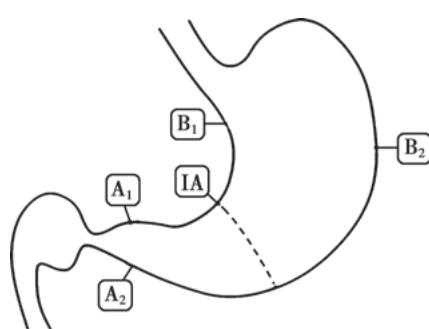

图 4-4-1 慢性胃炎诊断活检部位 $A_{1} \sim A_{2}$ ，胃窦小弯及大弯，黏液分泌腺；IA，胃角小弯，早期萎缩及肠化好发部位； $B_{1} \sim B_{2}$ ，胃体前后壁，泌酸腺。

小凹上皮和腺管上皮之间，严重者可形成小凹脓肿。

2. 萎缩（atrophy）病变扩展至腺体深部，腺体破坏、数量减少，固有层纤维化。根据是否伴有化生而分为非化生性萎缩及化生性萎缩。以胃角为中心，波及胃窦及胃体的多灶萎缩发展为胃癌的风险增加。

3. 化生（metaplasia）长期慢性炎症使胃黏膜表层上皮和腺体为杯状细胞和幽门腺细胞所取代。其分布范围越广或程度越重，发生胃癌的风险越大。胃腺化生分为2种：①肠上皮化生（intestinal metaplasia），简称肠化，以杯状细胞为特征的肠腺替代了胃固有腺体；②假幽门腺化生（pseudopyloric metaplasia），泌酸腺的颈黏液细胞增生，形成幽门腺样腺体，它与幽门腺在组织学上一般难以区别，需根据活检部位作出判断。

判断肠化的危害大小,必要时也可参考肠化分型(见胃癌章节)。

4. 异型增生（dysplasia）又称不典型增生，是细胞在再生过程中过度增生和分化缺失，增生的上皮细胞拥挤、有分层现象，核增大失去极性，有丝分裂象增多，腺体结构紊乱。WHO国际癌症研究协会推荐使用的术语是上皮内瘤变（intraepithelial neoplasia）。目前将低级别上皮内瘤变基本等同于低级别异型增生，而高级别上皮内瘤变包括重度异型增生和原位癌。异型增生是胃癌的癌前病变，轻度者常可逆转为正常；重度者有时与高分化腺癌不易区别，应密切观察。

在慢性炎症向胃癌发展的进程中,胃癌前情况(premalignant conditions)包括萎缩、肠化和异型增生等。我国临床医生通常将其分为胃癌前状态(即胃癌前疾病,伴有或不伴有肠化的慢性萎缩性胃炎、胃息肉、胃溃疡和残胃及Ménétrier病等)和癌前病变(即异型增生)两部分。

【临床表现】大多数病人无明显症状，即便有症状也多为非特异性。可表现为中上腹不适、饱胀、钝痛、烧灼痛等，也可有食欲缺乏、嗳气、泛酸、恶心等消化不良症状。症状的轻重与胃镜和病理组织学所见不成比例。体征多不明显，有时上腹轻压痛。自身免疫性胃炎合并恶性贫血者常有全身衰弱、乏力，可出现明显的厌食、体重减轻、贫血，甚或四肢远端或双下肢对称性麻木、行走不稳等神经系统症状，一般消化道症状较少。NSAIDs(包括阿司匹林)所致者多数病人症状不明显，或仅有轻微上腹不适或隐痛。危重病应激者症状被原发疾病所掩盖，可致上消化道出血，病人可以突然呕血和/或黑便为首发症状。

【诊断】胃镜及组织学检查是慢性胃炎诊断的关键,仅仅依靠临床表现不能确诊。病因诊断除通过了解病史外,可进行下列实验室检测。

1. Hp 检测 详见本篇第一章。

2. 血清测定 血清抗壁细胞抗体、内因子抗体、胃蛋白酶原（pepsinogen, PG）Ⅰ和Ⅱ及其比值、胃泌素-17及维生素 $B_{12}$ 水平测定，有助于诊断自身免疫性胃炎；怀疑胃神经内分泌肿瘤时，则需查胃泌素-34或全胃泌素。

【治疗】大多数成人胃黏膜均有轻度非萎缩性胃炎(浅表性胃炎),如 Hp 阴性且无糜烂及无症状,可不予药物治疗。如慢性胃炎波及黏膜全层或呈活动性,出现癌前情况如肠化、假幽门腺化生、萎缩及异型增生可予短期或长期间歇治疗。

## (一) 对因治疗

1. Hp 相关胃炎 单独应用表 4-4-1 所列药物, 均不能有效根除 Hp。这些抗生素在酸性环境下不能正常发挥其抗菌作用, 需要联合 PPI 抑制胃酸后, 才能使其发挥作用。目前倡导的联合方案为含有铋剂的四联方案, 即 1 种 PPI+2 种抗生素和 1 种铋剂, 疗程 10～14 天。由于各地抗生素耐药情况不同, 抗生素及疗程的选择应视当地耐药情况而定。

2. 十二指肠-胃反流 可用保护胃黏膜、改善胃肠动力等药物。

3. 胃黏膜营养因子缺乏 补充复合维生素,恶性贫血者需终身注射维生素 $B_{12}$ 。

（二）对症治疗 可用药物适度抑制或中和胃酸，促动力剂或消化酶制剂可缓解胃动力不足或消化酶不足引起的腹胀等症状，黏膜保护剂可缓解腹痛与反酸等症状。

表 4-4-1 具有杀灭和抑制 Hp 作用的药物

<table><tr><td>抗生素</td><td>克拉霉素、阿莫西林、甲硝唑、替硝唑、喹诺酮类抗生素、呋喃唑酮、四环素等</td></tr><tr><td>PPI</td><td>埃索美拉唑、奥美拉唑、兰索拉唑、泮托拉唑、雷贝拉唑、艾普拉唑等</td></tr><tr><td>铋剂</td><td>枸橼酸铋钾、果胶铋等</td></tr></table>

（三）癌前情况处理 在根除 Hp 的前提下,适量补充复合维生素和含硒药物及某些中药等。对药物不能逆转的局灶高级别上皮内瘤变(含重度异型增生和原位癌),可在胃镜下行黏膜下剥离术,并应视病情定期随访。

（四）病人教育 Hp 主要在家庭内传播，避免导致母婴传播的不良习惯喂食，并提倡分餐制以减少感染 Hp 的机会。同时食物应多样化，避免偏食，注意补充多种营养物质；不吃霉变食物；少吃熏制、腌制、富含硝酸盐和亚硝酸盐的食物，多吃新鲜食品；避免过于粗糙、浓烈、辛辣食物及大量长期饮酒；戒烟；保持良好的心理状态及充足睡眠。

【预后】慢性非萎缩性胃炎预后良好；肠化通常难以逆转；部分病人萎缩可以改善或逆转；轻度异型增生可逆转，但重度者易转变为癌。对有胃癌家族史、食物营养单一、常食熏制或腌制食品的病人，需警惕肠化、萎缩及异型增生向胃癌的进展。

## 第三节 | 特殊类型的胃炎或胃病

【腐蚀性胃炎】吞服强酸、强碱、砷、磷、氯化汞等所致。强酸常在口唇、咽部黏膜留下不同颜色的烧灼痂；强碱所致的严重组织坏死多呈黏膜透明肿胀。严重者可发生消化道出血、上消化道穿孔、腹膜炎。幸存者常遗留食管和/或胃流出道狭窄。

对腐蚀性胃炎，应暂时禁食，给予肠外营养，密切监护。内镜检查有助于指导治疗，但须小心谨慎。可放置鼻胃管，清洗或稀释腐蚀剂，引流胃液，防止食管完全狭窄及梗阻。若不清楚腐蚀剂，可饮用牛奶或蛋清进行稀释。对有喉头水肿、呼吸困难者，可考虑气管切开。对胃穿孔、急性腹膜炎应手术修补。对后期出现瘢痕狭窄、吞咽梗阻，则需手术或胃镜下扩张或安置支架治疗。

【感染性胃炎】大多数非 Hp 感染的感染性胃炎病人机体存在免疫缺陷,如获得性免疫缺陷病毒感染、大剂量应用糖皮质激素和免疫抑制剂、化疗期间或之后及垂危状态。

1. 细菌感染 化脓性炎症多由葡萄球菌、 $\alpha$ -溶血链球菌或大肠埃希菌引起，胃手术及化疗常为其诱因。临床表现为突发上腹痛，恶心呕吐，呕吐物呈脓样、含有坏死黏膜，胃扩张，有明显压痛和局部肌紧张、发热。胃黏膜大片坏死脱落或扩展至胃壁，常伴有败血症。严重坏死、穿孔可导致化脓性腹膜炎，由于基础疾病多致全身性衰竭、营养不良，死亡率高。其他可有结核及梅毒等细菌感染。

2. 病毒感染 巨细胞病毒可发生于胃或十二指肠，胃镜下可见局部或弥漫性胃黏膜皱襞粗大。组织切片中可见受染细胞体积增大3～4倍，细胞核内可见嗜酸性包涵体，酷似猫头鹰眼，颇具特征性。

【克罗恩病】 克罗恩病可累及整个消化道,但主要见于小肠、回盲部、结肠,也可发生于胃。胃克罗恩病多见于胃窦,常与近端十二指肠克罗恩病共存。其组织病理特点详见本篇第八章第二节。

【嗜酸细胞性胃炎】是一种病因未明的少见疾病，胃壁炎症以嗜酸性粒细胞浸润和外周血嗜酸性粒细胞增多为特征，不伴有肉芽肿或血管炎性病变，虽然胃壁各层均可受累，多数病变以其中一层为主。胃黏膜活检在诊断中至关重要，除明显嗜酸性粒细胞浸润外甚至形成嗜酸性小凹脓肿、坏死伴中性粒细胞浸润和上皮再生。但当病变仅累及肌层或浆膜下层时，靠胃黏膜活检难以作出诊断。病变范围可累及胃和小肠或仅局限于胃。本病可能因变应原与胃肠组织接触后在胃肠壁内发生抗原抗体反应，释放出组胺类血管活性物质。

临床表现有上腹疼痛、恶心、呕吐，抑酸剂难以缓解腹痛，常伴有腹泻，外周血嗜酸性粒细胞增高。

本病常为自限性,但部分患者症状可持续存在或复发。治疗可用糖皮质激素。

【淋巴细胞性胃炎】其特征为胃黏膜表面及小凹内淋巴细胞密集浸润。其与内镜下疣状胃炎相关，后者以结节、皱襞增厚和糜烂为特征。根除Hp可显著改善胃上皮内淋巴细胞浸润、胃体炎症和消化不良症状。故淋巴细胞性胃炎可能为伴发Hp感染的胃黏膜相关淋巴样组织（mucosa-associated lymphoid tissue, MALT）淋巴瘤的癌前疾病。

内镜下,淋巴细胞性胃炎表现为胃黏膜皱襞粗大,结节样和口疮样糜烂(疣状胃炎)。活检显示固有层扩大,伴浆细胞、淋巴细胞浸润,偶见中性粒细胞浸润。

【Ménétrier 病】属增生性胃病，即巨大肥厚性胃炎。胃镜下见胃体皱襞粗大、肥厚、扭曲呈脑回状，胃窦黏膜多正常。因胃黏液分泌增多，较多蛋白质从胃液中丢失，常引起低蛋白血症。此症多见于男性，病因不明。诊断本病时，应注意除外胃黏膜的癌性浸润和淋巴瘤。本病无特效治疗且具有一定的癌变率。

(房静远)

  
本章思维导图

本章数字资源

消化性溃疡(peptic ulcer, PU)指胃、十二指肠黏膜发生的炎性缺损，与胃液的胃蛋白酶消化和胃酸作用有关，病变穿透黏膜肌层或达更深层次。消化性溃疡也可发生于食管-胃吻合口及胃-空肠吻合口或附近，还可发生于含有胃黏膜的 Meckel 憩室等。

【流行病学】PU是一种全球性常见病，男性多于女性，可发生于任何年龄段；不同年龄时期患病率存在差异，约有 $10\%$ 的人其一生中患过本病。十二指肠溃疡（duodenal ulcer, DU）多于胃溃疡（gastric ulcer, GU）。DU多见于青壮年，GU多见于中老年。过去30年随着 $\mathrm{H}_2\mathrm{RA}$ 、PPI等抑酸药物的应用，PU及其并发症发生率明显下降。近年阿司匹林等NSAIDs药物应用增多，老年消化性溃疡发病率有所增高。

【病因和发病机制】PU 病因和发病机制是多因素的,损伤与防御修复不足是发病机制的两个方面。

1. 胃酸与胃蛋白酶 胃蛋白酶是 PU 发病的重要因素, 其活性依赖于胃液的 pH, pH 为 2\~3 时, 胃蛋白酶原易被激活; pH 大于 4 时, 胃蛋白酶失活。因此, 抑制胃酸可同时降低胃蛋白酶的活性。

PU 发生的机制是致病因素引起胃酸、胃蛋白酶对胃黏膜的侵袭作用与黏膜屏障的防御能力间失去平衡。侵袭作用增强或/和防御能力减弱均可导致 PU 的产生。GU 和 DU 同属于 PU。

2. Hp Hp 感染是 PU 的另一个重要致病因素。DU 病人的 Hp 感染率可高达 90% 以上，GU 的 Hp 阳性率为 60%～90%。另外，Hp 阳性率高的人群，PU 的患病率也较高。根除 Hp 有助于 PU 的愈合及显著降低溃疡复发。

3. 药物 长期服用阿司匹林、布洛芬、吲哚美辛等 NSAIDs 易发生 PU。糖皮质激素、氯吡格雷、双膦酸盐、西罗莫司等药物与 PU 发生也有一定关系。

4. 黏膜防御与修复异常 胃黏膜的防御和修复功能对维持黏膜的完整性、促进溃疡愈合非常重要。胃黏膜活检是常见的临床操作，造成的医源性局灶溃疡不经药物治疗即可迅速修复自愈，反映了胃黏膜强大的自我防御与修复能力。防御功能受损、修复能力下降，对溃疡的发生和转归都具有影响。

5. 遗传易感性 部分 PU 病人有明显的家族史, 存在遗传易感性。

6. 其他 大量饮酒、长期吸烟及应激是 PU 的常见诱因。胃石症病人因胃石的长期机械摩擦刺激可产生 GU；放疗可引起胃或十二指肠溃疡。PU 亦可与其他疾病合并发生，如胃泌素瘤、克罗恩病、肝硬化、慢阻肺病、休克、全身严重感染、急性心肌梗死、脑卒中等。少见的感染性疾病，单纯疱疹病毒、结核、巨细胞病毒等感染累及胃或十二指肠产生溃疡。

【病理】不同病因的 PU, 好发病部位存在差异。典型的 GU 多见于胃角附近及胃窦小弯侧, NSAIDs 引起的 GU 常见于胃大弯和胃窦, 活动期 PU 一般为单个, 也可多个, 呈圆形或卵圆形。多数活动性溃疡直径 <10mm, 边缘较规整, 周围黏膜常有充血水肿, 表面覆以渗出物形成的白苔或黄苔, 底部由肉芽组织构成。溃疡深者可累及胃、十二指肠壁肌层或浆膜层, 累及血管时可引起大出血, 侵及浆膜层时易引起穿孔; 溃疡愈合后产生瘢痕。DU 的形态与 GU 相似, 多发生在球部, 以紧邻幽门的前壁或后壁多见, DU 可因反复发生溃疡而致十二指肠球部变形, 瘢痕收缩可形成狭窄或假性憩室等。

【临床表现】

（一）症状 典型症状为上腹痛，性质可有钝痛、隐痛、灼痛、胀痛、剧痛、饥饿样不适，疼痛部位、性质与溃疡部位、大小、多少等有关。特点：①慢性过程，可达10余年或更长时间；②反复或周期性发作，发作期可为数周或数月，发作有季节性，典型者多在季节变化时发生，如秋冬和冬春之交发病；

③部分病人有与进餐相关的节律性上腹痛，餐后痛多见于 GU，饥饿痛或夜间痛、进餐缓解多见于 DU；
④腹痛可被抑酸或抗酸剂缓解。

部分病人仅表现上腹胀、上腹部不适、厌食、嗳气、反酸等消化不良症状。还有少部分无症状性溃疡病人无腹痛或消化不良症状，而以消化道出血、穿孔等并发症为首发症状，可见于任何年龄，以长期服用 NSAIDs 病人及老年人多见。

（二）体征 发作时剑突下、上腹部或右上腹部可有局限性压痛，缓解后可无明显体征。

## (三) 特殊溃疡

1. 复合溃疡 指胃和十二指肠均有活动性溃疡,多见于男性,幽门变形、狭窄、梗阻发生率较高。

2. 幽门管溃疡 餐后很快发生疼痛, 易出现幽门梗阻、出血和穿孔等并发症。

3. 球后溃疡 指发生在十二指肠降段、水平段的溃疡。多位于十二指肠降段的初始部及乳头附近，溃疡多在后内侧壁。疼痛可向右上腹及背部放射。

4. 巨大溃疡 指直径>2cm 的溃疡,常见于有 NSAIDs 服用史及老年病人。巨大十二指肠球部溃疡常在后壁,易发展为穿透性溃疡,周围形成炎性团块,疼痛可剧烈而顽固、放射至背部,老年人也可没有症状。巨大 GU 并不一定都是恶性。

5. 老年人溃疡及儿童期溃疡 老年人溃疡临床表现多不典型,常无症状或症状不明显,疼痛多无规律,可表现为体重减轻和贫血。由于 NSAIDs 药物在老年人使用广泛,老年人溃疡有增加的趋势。

儿童期溃疡主要发生于学龄儿童,腹痛可在脐周,可表现出恶心或呕吐,可能与幽门、十二指肠水肿和痉挛有关。

6. 难治性溃疡 经正规抗溃疡治疗而溃疡仍未愈合。可能的因素有:①病因尚未去除,如仍有Hp感染,继续服用NSAIDs等致溃疡药物等;②穿透性溃疡;③特殊病因,如克罗恩病、胃泌素瘤、放疗术后等;④某些疾病或药物影响抗溃疡药物吸收或效价降低;⑤误诊,如胃或十二指肠恶性肿瘤;⑥不良诱因存在,包括吸烟、酗酒及精神应激等。

## 【并发症】

（一）出血 PU 是上消化道出血中最常见的病因。在我国约占非静脉曲张破裂出血病因的 50%～70%，DU 较 GU 多见。当 PU 侵蚀周围或深处的血管，可产生不同程度的出血。轻者表现为大便隐血试验阳性、黑便，重者出现大出血，可表现为呕血或暗红色血便。

（二）穿孔 当溃疡穿透胃、十二指肠壁时，发生穿孔。目前约 1/3～1/2 的穿孔与服用 NSAIDs 有关，多见于老年病人，穿孔前可以没有症状。穿透、穿孔临床常有三种后果：

1. 溃破入腹腔引起弥漫性腹膜炎 呈突发剧烈腹痛,持续而加剧,先出现于上腹,继之延及全腹。体征有腹壁板样僵直,压痛、反跳痛,肝浊音界消失,部分病人出现休克。

2. 穿透累及周围实质性脏器，如肝、胰、脾等(穿透性溃疡) 慢性病史，腹痛规律改变，变为顽固或持续。如穿透累及至胰腺，腹痛放射至背部，血淀粉酶可升高。

3. 穿破入空腔器官形成瘘管 DU 可以穿破胆总管,形成胆瘘;GU 可穿破入十二指肠或横结肠,形成肠瘘。

（三）幽门梗阻 根据梗阻程度，包括不全梗阻和完全梗阻。临床症状表现为上腹胀痛，餐后加重，呕吐后腹痛可有缓解，呕吐物可为宿食；严重呕吐可致失水，低氯、低钾性碱中毒；体重下降、营养不良。体检可见胃蠕动波及闻及振水声等。多由DU或幽门管溃疡反复发作所致，炎性水肿和幽门平滑肌痉挛所致暂时梗阻可因药物治疗、溃疡愈合而缓解；严重瘢痕或与周围组织粘连、恶变引起胃流出道狭窄或变形，表现为持续性或进展性梗阻。

（四）癌变 反复发作、病程持续时间长的 GU 癌变风险高，DU 一般不发生癌变。胃镜结合活检有助于明确良恶性溃疡的鉴别诊断。

【辅助检查】

1. 上消化道内镜检查及活检 上消化道内镜检查是 PU 诊断的首选方法和 “金标准”, 通过检查:①确定有无病变、部位及分期;②鉴别良恶性溃疡;③治疗效果的评价;④对合并出血者给予止血治疗;⑤对合并狭窄梗阻病人给予扩张或支架治疗;⑥超声内镜检查,评估胃或十二指肠壁、溃疡深度、病变与周围器官的关系、淋巴结数目和大小等。GU应常规在溃疡边缘取活检,关于活检块数尚无定论,一般溃疡周边4个部位的活检多能达到诊断需要。部分GU在胃镜下难以区别良恶性,有时需多次活检和病理检查,甚至超声内镜评估或穿刺活检。对GU迁延不愈,需要排除恶性病变的,应多点活检,正规治疗8周后应复查胃镜,必要时再次活检和病理检查,直到溃疡完全愈合。

2. X 线钡剂造影 随着内镜技术的普及和发展,上消化道钡剂造影应用得越来越少,但钡剂(包括其他造影剂)造影有其特殊意义,适用于:①了解胃的运动情况;②胃镜禁忌者;③不愿接受上消化道内镜检查者和没有胃镜检查条件时。气钡双重造影能较好地显示胃肠黏膜形态,溃疡的钡剂造影直接征象为龛影、黏膜聚集,间接征象为胃大弯侧痉挛性切迹、狭窄、十二指肠球部激惹及球部畸形等。钡剂造影总体效果逊于内镜检查,且无法通过活检进行病理诊断。

3. CT 检查 CT 检查对穿透性溃疡或穿孔有较高价值, 可以发现穿孔周围组织炎症、包块、积液, 对于游离气体的显示甚至优于立位 X 线胸片。另外, 对幽门梗阻也有鉴别诊断意义。口服造影剂后 CT 检查可能显示出胃壁中断、穿孔周围组织渗出、增厚等。

## 4. 实验室检查

（1）Hp 检测:有 PU 病史者,无论溃疡处于活动还是瘢痕期,均应 Hp 检测,详见本篇第一章。

（2）其他检查：血常规、粪便隐血有助于了解溃疡有无活动性出血。

【诊断】慢性病程,周期性发作,节律性上腹痛,NSAIDs服药史等是疑诊PU的重要病史。上消化道内镜检查可以确诊。不能接受内镜检查者,可通过上消化道钡剂造影诊断,若发现龛影,亦可诊断溃疡,但难以区分其良恶性。

## 【鉴别诊断】

1. 其他引起慢性上腹痛的疾病 PU 诊断确立,但部分病人在 PU 愈合后仍有症状或症状不缓解,应注意诱因是否解除,是否有慢性肝、胆、胰疾病,功能性消化不良及其他腹部疾病与 PU 并存等。

2. 胃癌 上消化道内镜发现胃溃疡时,应注意与恶性溃疡相鉴别,典型胃癌溃疡形态多不规则,常>2cm,边缘不规则,底部凹凸不平、覆污秽状苔。

3. 胃泌素瘤(佐林格-埃利森综合征, Zollinger-Ellison syndrome) 胃泌素瘤系一种胃、肠、胰神经内分泌肿瘤。胃泌素由胃、上段小肠黏膜的 G 细胞分泌, 具有促进胃酸分泌、细胞增殖、胃肠运动等作用。胃泌素瘤以多发溃疡、部位不典型、易出现溃疡并发症、对正规抗溃疡药物疗效差, 可出现腹泻、高胃酸分泌、血胃泌素水平升高等特征。胃泌素瘤通常较小, 约 80% 位于 “胃泌素瘤” 三角区内 (即胆囊与胆总管汇合点、十二指肠第二部分与第三部分交界处、胰腺颈部与体部交界处组成的三角区内), 其他少见的部位包括胃、肝脏、骨骼、心脏、卵巢、淋巴结等; 50% 以上的胃泌素瘤为恶性, 部分病人发现时已有转移。临床疑诊胃泌素瘤时, 应检测血胃泌素水平; 增强 CT 或磁共振扫描或 PET-CT 有助于发现肿瘤。PPI 可减少胃酸分泌、控制症状, 应尽可能手术切除肿瘤。

【治疗】PU 治疗目标为:去除病因,控制症状,促进溃疡愈合、预防复发和避免并发症。

（一）药物治疗 自20世纪70年代以后，PU药物治疗经历了 $\mathrm{H}_2\mathrm{RA}$ 、PPI和根除Hp三个里程碑式的进展，使溃疡愈合率显著提高，并发症发生率显著降低，相应的外科手术明显减少。

## 1. 抑制胃酸分泌

（1） $\mathrm{H}_2\mathrm{RA}:\mathrm{H}_2\mathrm{RA}$ 是治疗PU的主要药物之一，疗效好，用药方便，价格适中，长期使用不良反应少。常用药物有法莫替丁、尼扎替丁、雷尼替丁。表4-5-1所列 $\mathrm{H}_2\mathrm{RA}$ 治疗GU和DU的6周愈合率分别达 $80\% \sim 95\%$ 和 $90\% \sim 95\%$ 。

（2）PPI: PPI 是治疗消化性溃疡的首选药物。PPI 入血, 进入到胃黏膜壁细胞酸分泌小管中, 酸性环境下转化为活性结构, 与质子泵即 $H^{+}-K^{+}-ATP$ 酶结合, 抑制该酶的活性从而抑制胃酸的分泌。PPI 可在 2～3 天内控制溃疡症状, 对一些难治性溃疡的疗效优于 $H_{2}RA$ , 治疗典型的胃和十二指肠溃疡 4 周的愈合率分别为 80%～96% 和 90%～100%。值得注意的是治疗 GU 时,需排除溃疡型胃癌的可能,因 PPI 治疗可减轻其症状,掩盖病情。

表 4-5-1 常用 ${\mathrm{H}}_{2}\mathrm{{RA}}$

<table><tr><td>通用药名</td><td>规格/mg</td><td>治疗剂量/mg</td><td>维持剂量/mg</td></tr><tr><td>法莫替丁(famotidine)</td><td>20</td><td>20,每日2次</td><td>20,每晚1次</td></tr><tr><td>尼扎替丁(nizatidine)</td><td>150</td><td>150,每日2次</td><td>150,每晚1次</td></tr><tr><td>雷尼替丁(ranitidine)</td><td>150</td><td>150,每日2次</td><td>150,每晚1次</td></tr></table>

常用的 PPI 列于表 4-5-2。PPI 是酸依赖性的，在酸性胃液中不稳定，口服时不宜破坏药物外裹的保护膜。PPI 的肠衣保护膜在小肠 pH≥6 情况下，被溶解释放，吸收入血。

表 4-5-2 常用各种 PPI

<table><tr><td>通用药名</td><td>规格/mg</td><td>治疗剂量/mg</td><td>维持剂量/mg</td></tr><tr><td>奥美拉唑(omeprazole)</td><td>10,20</td><td>20,每日1次</td><td>20,每日1次</td></tr><tr><td>兰索拉唑(lansoprazole)</td><td>30</td><td>30,每日1次</td><td>30,每日1次</td></tr><tr><td>泮托拉唑(pantoprazole)</td><td>20</td><td>40,每日1次</td><td>20,每日1次</td></tr><tr><td>雷贝拉唑(rabeprazole)</td><td>10</td><td>20,每日1次</td><td>10,每日1次</td></tr><tr><td>埃索美拉唑(esomeprazole)</td><td>20,40</td><td>40,每日1次</td><td>20,每日1次</td></tr><tr><td>艾普拉唑(ilaprazole)</td><td>10</td><td>10,每日1次</td><td>10,每日1次</td></tr></table>

（3）P-CAB: P-CAB 与钾离子竞争壁细胞上 $H^{+}-K^{+}-ATP$ 酶，抑制酸分泌。与 PPI 不同，P-CAB 在酸环境中是稳定的，不需要酸环境激活，起作用更快，用药个体差异小和不良反应少。在治疗 GU、DU 愈合率，预防长期 NSAIDs 及低剂量阿司匹林诱导的溃疡疗效与 PPI 相似。

2. 根除 Hp PU 不论活动与否, Hp 阳性病人均应根除 Hp, 药物选用及疗程见本篇第四章第二节。根除 Hp 可显著降低溃疡的复发率。

## 3. 保护胃黏膜

（1）铋剂：铋剂类药物分子量较大，在酸性溶液中呈胶体状，与溃疡基底面的蛋白形成蛋白-铋复合物，覆于溃疡表面，阻隔胃酸、胃蛋白酶对黏膜的侵袭损害。由于PPI的性价比高和广泛使用，铋剂已不作为PU的单独治疗药物。但被推荐为根除Hp的四联药物治疗方案的主要组成之一。服药后常见舌苔和粪便变黑。肾脏为铋的主要排泄器官，故肾功能不良者，应忌用铋剂。

（2）弱碱性抗酸剂：常用铝碳酸镁、磷酸铝、硫糖铝、氢氧化铝凝胶等。这些药物可中和胃酸，起效较快，可短暂缓解疼痛，但很难治愈溃疡，已不作为治疗PU的主要或单独药物。

4. PU 的治疗方案及疗程 为了达到溃疡愈合,抑酸药物的疗程通常为 4～6 周,一般推荐 DU 的 PPI 疗程为 4 周,GU 疗程为 6～8 周,P-CAB 药物疗程证据需进一步积累,可参照 PPI。根除 Hp 所需的 1～2 周疗程可重叠在 4～8 周的抑酸药物疗程内,也可在抑酸疗程结束后进行。

5. 维持治疗 GU 愈合后, 大多数病人可以停药。但对溃疡多次复发, 在去除常见诱因的同时, 要进一步查找是否存在其他病因, 并给予维持治疗, 即较长时间服用维持剂量的 $H_{2}RA$ 或 PPI (见表 4-5-1、表 4-5-2); 疗程因人而异, 短者 3\~6 个月, 长者 1\~2 年, 或视具体病情延长用药时间。

（二）病人教育 适当休息，减轻精神压力；改善进食规律、戒烟、戒酒及少饮浓茶、浓咖啡等。停服不必要的 NSAIDs、其他对胃有刺激或引起恶心不适的药物，如确有必要服用 NSAIDs 和其他药物，建议和食物一起或餐后服用，或遵医嘱加用保护胃黏膜的药物。

## （三）内镜治疗及外科手术

1. 内镜治疗 PU 出血的内镜下治疗包括溃疡表面喷洒蛋白胶、出血部位注射 1:10 000 肾上腺素、出血点钳夹和热凝固术等，有时采取2种以上内镜治疗方法联合应用。结合PPI持续静脉滴注对PU活动性出血止血成功率达95%以上。溃疡出血病灶的内镜下特点和治疗策略见表4-5-3。

表 4-5-3 PU 出血的内镜特点与治疗策略

<table><tr><td>内镜特点</td><td>再出血率/%</td><td>治疗策略</td></tr><tr><td>活动性动脉出血</td><td>90</td><td>PPI+内镜下治疗,必要时血管介入治疗或手术</td></tr><tr><td>裸露血管</td><td>50</td><td>PPI+内镜下治疗</td></tr><tr><td>血凝块</td><td>25~30</td><td>PPI,必要时内镜下治疗</td></tr><tr><td>溃疡不伴血迹</td><td>&lt;5</td><td>PPI</td></tr></table>

PU 合并幽门变形或狭窄引起梗阻,可首先选择内镜下气囊扩张术治疗,若需要可反复多次扩张,解除梗阻。

2. 外科治疗 PPI 的广泛应用及内镜治疗技术的不断发展,使大多数 PU 及其并发症已不需要外科手术治疗。但在下列情况时,要考虑手术治疗:①并发消化道大出血经药物、内镜及血管介入治疗无效时;②急性穿孔、慢性穿透溃疡;③瘢痕性幽门梗阻,内镜治疗无效;④GU 疑有癌变。外科手术不只是单纯切除溃疡病灶,而是通过手术永久地减少胃酸和胃蛋白酶分泌的能力。

手术治疗并发症:术后胃出血、十二指肠残端破裂、胃肠吻合口破裂或瘘、术后梗阻、倾倒综合征、胆汁反流性胃炎、吻合口溃疡及缺铁性贫血等。

  
本章思维导图

【预后】有效的药物治疗可使消化性溃疡愈合率达到95%以上,青壮年病人PU死亡率接近于零,老年病人主要死于严重的并发症,尤其是大出血和急性穿孔,病死率<1%。

(杨云生)

本章数字资源

胃癌（gastric cancer）是指源于胃黏膜上皮细胞的恶性肿瘤，绝大多数是腺癌；其占胃部恶性肿瘤的95%以上。就全球范围的恶性肿瘤死亡率来说，胃癌高居第三位。我国为胃癌高发区，虽然近年来胃癌发病率有所下降，但死亡率下降并不明显；男性和女性胃癌发病率仍居全部恶性肿瘤的第2位和第5位，死亡率分别居第3位和第2位；其中55～70岁为高发年龄段。

【病因和发病机制】

（一）感染因素 Hp 感染与胃癌有共同的流行病学特点，胃癌高发区人群 Hp 感染率高；Hp 抗体阳性人群发生胃癌的危险性高于阴性人群。1994 年 WHO 的国际癌症研究机构将 Hp 感染定为人类 I 类(即肯定的)致癌原。此外，EB 病毒和其他感染因素也可能参与胃癌的发生。

（二）环境和饮食因素 第一代到美国的日本移民胃癌发病率下降约 25%，第二代下降约 50%，至第三代发生胃癌的危险性与当地美国居民相当。故环境因素在胃癌发生中起重要作用，如高盐饮食、亚硝酸盐的摄入、吸食鼻烟、较少食用新鲜菜蔬，甚至酗酒等不良饮食生活习惯。此外火山岩地带、高泥炭土壤、水土含硝酸盐过多、微量元素比例失调或化学污染等可直接或间接经饮食途径参与胃癌的发生。

（三）遗传因素 10% 的胃癌病人有家族史，具有胃癌家族史者，特别是一级亲属中患胃癌、家族性腺瘤性息肉病（FAP）、林奇（Lynch）综合征、黑斑息肉综合征、幼年性息肉病等，其发病率高于人群2～3倍。少数胃癌属“遗传性胃癌综合征”或“遗传性弥漫性胃癌”。浸润型胃癌的家族发病倾向更显著，提示该型胃癌与遗传因素关系更密切。

在胃癌发生和进程中，DNA 非整倍体（DNA aneuploidy）、某些抑癌基因（TP53、FHIT、APC、DCC、CDKN2A 和 CDH1 等）的表达缺失或受抑制、一些基因（MT-CO2、MST1R 和 VEGFA 等）过表达等可能起着一定的作用。

（四）癌前变化 或称胃癌前情况（premalignant conditions），分为癌前疾病（即癌前状态，precancerous disease）和癌前病变（precancerous lesion）。前者是指与胃癌相关的胃良性疾病，有发生胃癌的危险性；后者是指较易转变为癌的病理学变化，主要指异型增生。

1. 肠化、萎缩性胃炎及异型增生 根据肠化上皮细胞的类型和分泌黏液的性质,可将肠化分为Ⅰ型完全型肠化、Ⅱ型不完全型小肠型肠化、Ⅲ型不完全型大肠型肠化。理论上讲,Ⅱ型和Ⅲ型肠化尤其是Ⅲ型肠化发生胃癌的风险较高(部分内容参考本篇第四章第二节慢性胃炎)。

对于异型增生,尽管国际上有多种分类或分期方法,但目前我国仍在沿用2019年的WHO判断标准分为5级,主要包括低级别与高级别异型增生(或上皮内瘤变)。

2. 胃息肉 占人群的 0.8%～2.4%。50% 为胃底腺息肉，40% 为增生性息肉，而腺瘤仅占 10%。大于 1cm 的胃底腺息肉癌变率小于 1%，罕见癌变的增生性息肉多发生于肠化和异型增生区域，可形成经典的高分化肠型胃癌。腺瘤则具有较高的癌变率。

3. 残胃炎 癌变常发生于良性病变术后 20 年;与 Billroth I 式相比,Billroth II 式胃切除术后癌变率高 4 倍。

4. 胃溃疡 可因溃疡边缘的炎症、糜烂、再生及异型增生所致。

5. Ménétrier 病 病例报道显示 15% 的该病与胃癌发生相关。

临床上,胃癌可以大致分为肠型胃癌和弥漫性胃癌两大类。根据 Correa 学说,在 Hp 感染、不良环境与不健康饮食等多种因素作用下，胃黏膜可由慢性炎症—萎缩性胃炎—萎缩性胃炎伴肠化—异型增生而逐渐向肠型胃癌演变。在此过程中，胃黏膜细胞增殖和凋亡之间的正常动态平衡被打破。与胃癌发生相关的分子事件包括微卫星不稳定、抑癌基因缺失失活或因高甲基化而失活、某些癌基因或相关基因的扩增等。

【病理】胃癌的好发部位依次为胃窦、贲门、胃体；而根据浸润深度分为早期和进展期胃癌。早期胃癌是指病灶局限且深度不超过黏膜下层的胃癌，不论有无局部淋巴结转移；病理呈高级别上皮内瘤变或腺癌。进展期胃癌深度超过黏膜下层，已侵入肌层者称中期胃癌；侵及浆膜或浆膜外者称晚期胃癌。病理分期仍需按照国际抗癌联盟（Union for International Cancer Control, UICC）和美国癌症联合委员会（the American Joint Committee on Cancer, AJCC）的TNM分期进行。

（一）胃癌的组织病理学 WHO 近年将胃癌分为:腺癌(乳头状腺癌、管状腺癌、黏液腺癌、混合型腺癌、肝样腺癌)、腺鳞癌、髓样癌、印戒细胞癌、鳞状细胞癌和未分化癌等。根据癌细胞分化程度可分为高、中、低分化三大类。

## （二）侵袭与转移 胃癌有四种扩散方式：

1. 直接蔓延 侵袭至相邻器官,胃底贲门癌常侵犯食管、肝及大网膜,胃体癌则多侵犯大网膜、肝及胰腺。

2. 淋巴结转移 一般先转移到局部淋巴结,再到远处淋巴结;转移到左锁骨上淋巴结时,称为Virchow 淋巴结。

3. 血行播散 晚期病人可占 60% 以上。最常转移到肝脏, 其次是肺、腹膜、肾上腺, 也可转移到肾、脑、骨髓等。

4. 种植转移 癌细胞侵及浆膜层脱落入腹腔,种植于肠壁和盆腔;如种植于卵巢,称为库肯伯格(Krukenberg)瘤;也可在直肠周围形成结节状肿块。

## 【临床表现】

1. 症状 80% 的早期胃癌无症状,部分病人可有消化不良症状。进展期胃癌最常见的症状是体重减轻(约 60%)和上腹痛(50%),另有贫血、食欲缺乏、厌食、乏力。

胃癌发生并发症或转移时可出现一些特殊症状，贲门癌累及食管下段时可出现吞咽困难。并发幽门梗阻时可有恶心呕吐，溃疡型胃癌出血时可引起呕血或黑便，继之出现贫血。胃癌转移至肝脏可引起右上腹痛，黄疸和/或发热；腹膜播散者常见腹腔积液；极少数转移至肺可引起咳嗽、呃逆、咯血，累及胸膜可产生胸腔积液而发生呼吸困难；侵及胰腺时，可出现背部放射性疼痛。

2. 体征 早期胃癌无明显体征，进展期胃癌在上腹部可扪及肿块，有压痛。肿块多位于上腹偏右相当于胃窦处。如肿瘤转移至肝脏可致肝大及黄疸，甚至出现腹腔积液。腹膜有转移时也可发生腹腔积液，移动性浊音阳性。侵犯门静脉或脾静脉时有脾大。有远处淋巴结转移时或可扪及Virchow淋巴结，质硬不活动。肛门指检可在直肠膀胱陷凹扪及肿块。

【诊断】

（一）胃镜 胃镜检查结合黏膜活检是目前最可靠的诊断手段。

1. 早期胃癌 可表现为小的息肉样隆起或凹陷；也可呈平坦样，但黏膜粗糙、触之易出血，斑片状充血及糜烂。胃镜下疑诊者，可用亚甲蓝染色，癌性病变处着色，有助于指导活检部位。放大胃镜、窄带成像和激光共聚焦显微胃镜能更仔细观察细微病变，提高早期胃癌的诊断率。由于早期胃癌在胃镜下缺乏特征性，病灶小，易被忽略，需要内镜医生细致地观察，对可疑病变多点活检。早期胃癌的胃镜下分型见图4-6-1。

2. 进展期胃癌 胃镜下多可作出拟诊，肿瘤表面常凹凸不平，糜烂，有污秽苔，活检时易出血。也可呈深大溃疡，底部覆有污秽灰白苔，溃疡边缘呈结节状隆起，无聚合皱襞，病变处无蠕动。当癌组织发生于黏膜下，可在胃壁内向四周弥漫浸润扩散，同时伴有纤维组织增生，当病变累及胃窦，可造成胃流出道狭窄；当其累及全胃，可使整个胃壁增厚、变硬，称为皮革胃。但这种黏膜下弥漫浸润型胃癌,相对较少,胃镜下可无明显黏膜病变,甚至普通活检也常呈阴性。对于溃疡性病变,可在其边缘和基底部多点活检,甚至可行大块黏膜切除,提高诊断的阳性率。

  
图 4-6-1 早期胃癌的胃镜下分型

胃癌病灶处的超声内镜(EUS)检查可较准确地判断肿瘤侵犯深度,有助于区分早期和进展期胃癌,并了解有无局部淋巴结转移,可作为CT检查的重要补充。

（二）实验室检查 缺铁性贫血较常见，若伴有粪便隐血阳性，提示肿瘤有长期小量出血。血胃蛋白酶原（PG）I/II显著降低，OLGA或OLGIM的Ⅲ和Ⅳ期是胃癌高风险人群；血清肿瘤标志物如CEA和CA19-9及CA72-4等，可能有助于胃癌早期预警和术后再发的预警，但特异性和灵敏度并不理想。粪便中某些高丰度的微生物，可能是潜在的预警标志物。

（三）X 线和 CT 检查 当病人有胃镜检查禁忌证时，X 线钡剂造影可能发现胃内的溃疡及隆起型病灶，分别呈龛影或充盈缺损，但难以鉴别其良恶性；如有黏膜皱襞破坏、消失或中断，邻近胃黏膜僵直，蠕动消失，则胃癌可能性大。CT 技术的进步提高了胃癌临床分期的精确度，其与 PET-CT 检查均有助于肿瘤转移的判断。

【并发症】详见本篇第五章。

【治疗】早期胃癌无淋巴转移时，可采取内镜治疗；进展期胃癌在无全身转移时，可行手术治疗；肿瘤切除后，应尽可能清除残胃的 Hp 感染。

1. 内镜治疗 早期胃癌可行 EMR 或 ESD 治疗。一般认为 EMR 适应证包括超声内镜证实的无淋巴结转移的黏膜内胃癌；不伴有溃疡且直径小于 2cm 的Ⅱa 病灶、小于 1cm 的Ⅱb 或Ⅱc 病灶等。而 ESD 适应证则包括无溃疡的任何大小的黏膜内肠型胃癌；直径小于 3cm 的、伴有溃疡的黏膜内肠型胃癌；直径小于 3cm 的黏膜下层肠型胃癌，而浸润深度小于 500μm。切除的癌变组织应进行病理检查，如切缘发现癌变或表浅型癌肿侵袭到黏膜下层，需追加手术治疗。

2. 手术治疗 早期胃癌,可行胃部分切除术。进展期胃癌如无远处转移,尽可能根治性切除;伴有远处转移者或伴有梗阻者,则可行姑息手术,保持消化道通畅。外科手术切除加区域淋巴结清扫是目前治疗进展期胃癌的主要手段。胃切除范围可分为近端胃切除、远端胃切除及全胃切除,切除后分别用 Billroth I、Billroth II 及 Roux-en-Y 胃旁路手术重建消化道的连续性。对那些无法通过手术治愈的病人,特别是有梗阻的病人,部分切除肿瘤后,约 50% 病人的症状可获得缓解。

3. 化学治疗 早期胃癌且不伴有任何转移灶者，术后一般不需要化疗。术前化疗即新辅助化疗可使肿瘤缩小，增加手术根治及治愈机会；术后辅助化疗方式主要包括静脉化疗、腹腔内化疗、持续性腹腔温热灌注和淋巴靶向化疗等。单一药物化疗只适于早期需要化疗的病人或不能承受联合化疗者。常用药物有5-氟尿嘧啶（5-FU）、替加氟（FT-207）、丝裂霉素（MMC）、多柔比星（ADM）、顺铂（DDP）或卡铂、亚硝脲类（CCNU、MeCCNU）、依托泊甙（VP-16）等。联合化疗多采用2～3种联合，以免增加药物毒副作用。化疗失败与癌细胞对化疗药物产生耐药性或多药耐药性有关。

4. 其他治疗 除放射治疗和抑制肿瘤血管生成的靶向治疗外,免疫治疗作为新兴起的治疗方法也被临床应用。

免疫检查点抑制剂通过调节肿瘤生态系统中的 T 细胞活性达到杀伤肿瘤细胞的效果。免疫检查点抑制剂包括细胞毒性 T 淋巴细胞相关抗原 4（cytotoxic T lymphocyte-associated antigen-4, CTLA-4）抑制剂、程序性细胞死亡蛋白 1（programmed cell death protein-1, PD-1）抑制剂和程序性细胞死亡蛋白配体 1(programmed cell death-ligand 1, PD-L1)抑制剂,其在胃癌治疗中有一定疗效。

【预后】胃癌的预后直接与诊断时的分期有关。迄今为止，由于大部分胃癌在确诊时已处于中晚期，5年生存率约7%～34%。

## 【预防】

1. 具有胃癌高风险因素病人,根除 Hp 有助于预防胃癌发生。

2. 应用内镜、PGI/Ⅱ等随访高危人群。

  
本章思维导图

3. 阿司匹林、COX-2 抑制剂、他汀类药物、抗氧化剂(包括多种维生素和微量元素硒)和绿茶可能具有一定预防作用。

4. 建立良好的生活习惯,积极治疗癌前疾病(见本篇第四章第二节)。

(房静远)

本章数字资源

## 第一节 | 肠结核

肠结核（intestinal tuberculosis）是结核分枝杆菌引起的肠道慢性特异性感染性疾病，常继发于肺结核。近年因 HIV 感染率增高、免疫抑制剂和生物制剂的广泛使用等原因，部分人群免疫力低下，导致本病的发病有所增加。

【病因和发病机制】90%以上的肠结核由人型结核分枝杆菌引起,因呼吸道结核感染而吞下含菌痰液或与开放性肺结核病人共餐被感染。该菌为抗酸菌,很少受胃酸影响,进入肠道后多在回盲部引起病变。这是因为:①含结核分枝杆菌的肠内容物在回盲部停留,增加局部黏膜的感染机会;②回盲部富有淋巴组织,细菌易侵犯淋巴组织。

少数因饮用带菌牛奶或乳制品而发生牛型结核分枝杆菌肠结核。此外，本病也可由血行播散引起，见于粟粒性肺结核；或由腹(盆)腔内结核病灶直接蔓延引起。

【病理】肠结核最常见的部位是回盲部,也可累及末端回肠和结直肠。人体对不同数量和毒力结核菌的免疫力和过敏反应程度可导致不同的病理特点。

1. 溃疡型肠结核 肠壁的集合淋巴组织和孤立淋巴滤泡首先受累,表现为充血、水肿,进一步发展为干酪样坏死,并形成边缘不规则、深浅不一的溃疡。病灶可累及周围腹膜或邻近肠系膜淋巴结,引起局限性结核性腹膜炎或淋巴结结核。因病变肠段常与周围组织发生粘连,多不发生急性穿孔,慢性穿孔形成腹腔脓肿或肠瘘亦少见。在病变修复过程中,纤维组织增生和瘢痕形成可导致肠管狭窄。因溃疡基底多有闭塞性动脉内膜炎,较少发生大出血。

2. 增生型肠结核 病变多局限在回盲部,黏膜下层及浆膜层可有大量结核肉芽肿和纤维组织增生,使局部肠壁增厚、僵硬;亦可见瘤样肿块突入肠腔。上述病变均可使肠腔狭窄,引起梗阻。

3. 混合型肠结核 兼有上述两种病变。

【临床表现】肠结核病人临床表现非特异性,症状因肠道不同的病理特点而异。

1. 腹痛 多位于右下腹或脐周,间歇发作,餐后加重,常伴腹鸣,排便或肛门排气后缓解。症状可能与进餐引起胃肠反射或肠内容物通过炎性狭窄肠段,引起肠痉挛或加重肠梗阻有关。

2. 大便习惯改变 溃疡型肠结核常伴腹泻,大便呈糊样,不伴里急后重。有时腹泻与便秘交替,增生型肠结核便秘症状多见。少数病人可有消化道出血。

3. 腹部肿块 多位于右下腹,质中、较固定、轻至中度压痛,多见于增生型肠结核;而溃疡型者亦可因病变肠段和周围肠段、肠系膜淋巴结粘连形成腹块。

4. 全身症状和肠外结核表现 结核毒血症症状多见于溃疡型肠结核，为长期不规则低热、盗汗、消瘦、贫血、乏力和食欲缺乏，如同时有活动性肠外结核也可呈弛张热或稽留热。

并发症以肠梗阻及合并结核性腹膜炎多见。

【实验室和其他检查】

1. 实验室检查 血沉多明显增快,可作为评估结核病活动程度的指标之一。大便中可见少量脓细胞与红细胞。结核菌素试验呈强阳性或 $\gamma$ -干扰素释放试验阳性均有助于本病的诊断。

2. 影像学检查 CT/MRI 肠道显像见病变部位通常在回盲部附近,很少累及空肠,可见腹腔淋巴结中央坏死或钙化等改变。溃疡型肠结核,X 线钡剂灌肠可见钡剂于病变肠段排空增快,充盈不佳,而在病变的上、下肠段钡剂充盈良好，称为 X 线钡剂激惹征。增生型者肠黏膜呈结节状改变，肠腔变窄、肠段缩短变形、回肠盲肠正常角度消失。

3. 结肠镜 内镜下见病灶处黏膜充血水肿、环形溃疡、回盲瓣固定开放、炎性息肉及肠腔狭窄等表现。病灶处活检，发现肉芽肿、干酪样坏死或抗酸杆菌，可以确诊本病。黏膜组织聚合酶链式反应（TB-qPCR）阳性可协助诊断。

【诊断与鉴别诊断】以下情况应考虑本病:①中青年病人有肠外结核。②有腹痛、腹泻、便秘等症状;右下腹压痛、腹块或原因不明的肠梗阻,伴有发热、盗汗等结核毒血症症状。③X线钡剂检查发现激惹征或其他影像学提示溃疡、肠管变形和肠腔狭窄等征象。④结肠镜检查发现主要位于回盲部的炎症、溃疡、炎性息肉或肠腔狭窄。⑤结核菌素试验强阳性或γ-干扰素释放试验阳性。如肠黏膜活组织病理检查发现干酪样肉芽肿,具确诊意义;活检组织中找到抗酸杆菌,TB-qPCR和培养阳性有助诊断。对高度怀疑肠结核的病例,如抗结核治疗2\~6周症状明显改善,2\~3个月后肠镜检查病变明显改善或好转,可作出肠结核的临床诊断。

鉴别诊断需考虑下列疾病：

1. 克罗恩病 鉴别要点列于表 4-7-1, 鉴别困难者, 可先行诊断性抗结核治疗。偶有病人两种疾病可以共存。手术探查和术后病理有助鉴别。

表 4-7-1 肠结核与克罗恩病的鉴别

<table><tr><td>鉴别要点</td><td>肠结核</td><td>克罗恩病</td></tr><tr><td>肠外结核</td><td>多见</td><td>一般无</td></tr><tr><td>病程</td><td>复发不多</td><td>病程长,缓解与复发交替</td></tr><tr><td>瘘管、腹腔脓肿、肛周病变</td><td>少见</td><td>可见</td></tr><tr><td>病变节段性分布</td><td>常无</td><td>多节段</td></tr><tr><td>溃疡形状</td><td>环行、不规则</td><td>纵行、裂沟状</td></tr><tr><td>结核菌素试验</td><td>强阳性</td><td>阴性或阳性</td></tr><tr><td>抗结核治疗</td><td>症状改善,肠道病变好转</td><td>无明显改善,肠道病变无好转</td></tr><tr><td>抗酸杆菌染色</td><td>可阳性</td><td>阴性</td></tr><tr><td>干酪样肉芽肿</td><td>可有</td><td>无</td></tr></table>

2. 原发性肠道淋巴瘤 因病理类型不同临床表现多样且无特异性,内镜下活组织病理检查阳性率低,影像学检查可见腹膜后和肠系膜淋巴结显著肿大,免疫组织化学检查可协助诊断,不少病例需经手术后病理确诊。

3. 阿米巴病或血吸虫病性肉芽肿 既往有感染史,脓血便常见,粪便常规或孵化检查可发现相关病原体。结肠镜检查有助鉴别诊断,相应特效治疗有效。

4. 其他 应注意与右半结肠癌、伤寒、肠放线菌病等鉴别。

【治疗】 治疗目的是消除症状、改善全身情况、促使病灶愈合及防治并发症。

1. 抗结核化学药物治疗 是本病治疗的关键。药物的选择、用法、疗程详见第二篇第八章。治疗药物选择需要兼顾安全性、有效性、耐受性和药代动力学特点，重视耐药结核病个体化治疗。

2. 对症治疗 腹痛可用抗胆碱药,摄入不足或腹泻严重者应注意纠正水、电解质与酸碱平衡紊乱,不完全性肠梗阻病人需进行胃肠减压。

3. 手术治疗 适应证: ①完全性肠梗阻或不完全性肠梗阻内科治疗无效者; ②急性肠穿孔, 或慢性肠穿孔瘘管形成经内科治疗而未能闭合者; ③肠道大量出血经积极抢救不能有效止血者; ④诊断困难需开腹探查者。

4. 病人教育 应多休息,避免合并其他感染。加强营养,根据肠道梗阻情况,选择暂时禁饮食或给予易消化、营养丰富的食物。按时服药,坚持全疗程治疗;定期随访,评价疗效,监测药物不良反应。

【预后】本病的预后取决于早期诊断与及时治疗。当病变尚在渗出性阶段,经治疗后可痊愈,预后良好。

【预防】加强肺结核早期诊断和治疗,重视奶制品和餐具的消毒,讲究日常卫生,增强机体抵抗力。

## 第二节 | 结核性腹膜炎

结核性腹膜炎（tuberculous peritonitis）是由结核分枝杆菌引起的慢性弥漫性腹膜感染。本病可见于任何年龄，以中青年多见，男女之比约为1∶2。

【病因和发病机制】本病多继发于肺结核或体内其他部位结核病，主要感染途径以腹腔内的结核病灶直接蔓延为主，少数可由淋巴、血行播散引起粟粒性结核性腹膜炎。

【病理】按病理特点可分为渗出、粘连、干酪三种类型，前两型多见，三者可混合存在。

1. 渗出型 腹膜充血、水肿, 表面覆有纤维蛋白渗出物, 可伴黄(灰)白色细小、可融合结节。腹腔积液通常呈草黄色或淡血性, 偶为乳糜性。

2. 粘连型 大量纤维组织增生和蛋白沉积使腹膜、肠系膜明显增厚。肠袢相互粘连时可发生肠梗阻。

3. 干酪型 多由渗出型或粘连型演变而来,可兼具上述两型病理特点,并发症常见。以干酪坏死病变为主,坏死的肠系膜淋巴结参与其中,形成结核性脓肿。病灶可累及邻近器官,如穿透空腔脏器或腹壁可形成窦道或瘘管。

【临床表现】因原发病灶、感染途径、机体反应性及病理类型的不同而异。多起病缓慢，早期症状轻，不易发现；少数起病急骤，以急性腹痛或骤起高热为主。

1. 全身症状 结核毒血症常见,主要表现为低热或中等热,呈弛张热或稽留热,可有盗汗。高热伴有明显毒血症者,主要见于渗出型、干酪型,或见于伴有粟粒性肺结核、干酪样肺炎等严重的结核病病人。后期常有营养不良,出现消瘦、水肿、贫血、舌炎、口角炎、维生素A缺乏症等。

2. 腹痛 常位于脐周、下腹或全腹，呈持续或阵发性隐痛。偶可表现为急腹症，系因肠系膜淋巴结结核或腹腔内其他结核的干酪样坏死病灶溃破引起，也可由肠结核急性穿孔引起。

3. 腹胀 常有腹胀感,伴腹部膨隆,因结核毒血症或腹膜炎伴有肠功能紊乱所致。如有腹腔积液,一般以少量至中量多见。

4. 腹壁柔韧感 常有揉面感,系腹膜受刺激或因慢性炎症而增厚、腹壁肌张力增高、腹壁与腹腔内脏器粘连引起的腹壁触诊感觉,并非特征性体征。腹部压痛多较轻,如压痛明显且有反跳痛时,提示干酪型结核性腹膜炎。

5. 腹部肿块 多见于粘连型或干酪型，以脐周为主。肿块多由增厚的大网膜、肿大的肠系膜淋巴结、粘连成团的肠袢或干酪样坏死脓性物积聚而成，其大小不一，边缘不整，表面不平，可呈结节感，活动度小，可伴压痛。

6. 其他 腹泻常见,一般 3\~4 次/日,大便多呈糊样。多由腹膜炎所致的肠功能紊乱引起。有时腹泻与便秘交替出现。可并发肠梗阻、肠瘘及腹腔脓肿等。

【实验室和其他检查】

1. 血液检查 可有轻度至中度贫血。有腹腔结核病灶急性扩散或干酪型病人，白细胞计数可增高。病变活动时血沉增快。

2. 结核菌素试验及 $\gamma$ -干扰素释放试验 结核菌素试验强阳性有助于本病诊断。 $\gamma$ -干扰素释放试验具有较高阴性预测值和敏感性，但特异性欠佳。

3. 腹腔积液检查 腹腔积液多为草黄色渗出液，静置后可自然凝固，少数为浑浊或淡血性，偶见乳糜性，比重一般超过1.018，蛋白质定性试验阳性，定量在 $30\mathrm{g / L}$ 以上，白细胞计数超过 $500\times 10^{6} / \mathrm{L}$ ，以淋巴细胞或单核细胞为主。但有时因低白蛋白血症，腹腔积液蛋白含量减少，检测血清腹腔积液白蛋白梯度（serum ascites albumin gradient, SAAG） $< 11\mathrm{g / L}$ 有助于诊断。腹腔积液腺苷脱氨酶（ADA）活性常增高，但需排除恶性肿瘤，如ADA同工酶ADA2升高则对本病诊断有一定特异性。腹腔积液普通细菌培养结果阳性率低，腹腔积液浓缩后行结核分枝杆菌培养或动物接种可明显提高阳性率。

4. 腹部影像学检查 超声、CT、磁共振可见增厚的腹膜、腹腔积液、腹腔内包块及瘘管。腹部 X 线平片可见肠系膜淋巴结钙化影。X 线造影可发现肠粘连、肠结核、肠瘘、肠腔外肿块等征象。

5. 腹腔镜检查 适用于诊断有困难者。镜下可见腹膜、网膜、内脏表面有散在或集聚的灰白色结节，浆膜失去正常光泽，腹腔内条索状或幕状粘连；组织病理检查有确诊价值。腹腔镜检查禁用于有广泛腹膜粘连者。

## 【诊断与鉴别诊断】

（一）诊断 有以下情况应考虑本病：①中青年病人，有结核感染史或接触史，伴有其他器官结核病证据；②长期发热原因不明，伴有腹痛、腹胀、腹腔积液、腹壁柔韧感或腹部包块；③腹腔积液为渗出液，以淋巴细胞为主，普通细菌培养阴性，ADA（尤其是 ADA2）明显增高；④影像学检查发现肠粘连、腹膜增厚、肠梗阻或散在钙化点；⑤结核菌素试验强阳性或 γ-干扰素释放试验阳性。

典型病例可作出临床诊断,予以抗结核治疗有效时可确诊。不典型病例,在排除禁忌证后,可行腹腔镜检查并取活检。

## (二) 鉴别诊断

## 1. 以腹腔积液为主要表现者

（1）腹腔恶性肿瘤：包括腹膜转移癌、恶性淋巴瘤、腹膜间皮瘤等。如腹腔积液找到癌细胞，腹腔肿瘤可确诊。腹腔积液细胞学检查为阴性时可依靠影像学、内镜等检查寻找原发灶。

（2）肝硬化腹腔积液：多为漏出液， $\mathrm{SAAG} \geqslant 11\mathrm{g/L}$ ，且腹腔积液白蛋白 $< 25\mathrm{g/L}$ ，伴失代偿期肝硬化典型表现。合并原发性细菌性腹膜炎时腹腔积液可为渗出液，但腹腔积液以多形核细胞为主，普通细菌培养阳性。如腹腔积液白细胞计数升高但以淋巴细胞为主，普通细菌培养阴性，而有结核病史、接触史或伴有其他器官结核病灶，应注意肝硬化合并结核性腹膜炎的可能。

（3）其他疾病引起的腹腔积液：如慢性胰源性腹腔积液、结缔组织病、Meigs综合征、布-加（Budd-Chiari）综合征及缩窄性心包炎等。

2. 以腹部包块为主要表现者 根据腹部包块的部位、性状与腹部肿瘤(肝癌、结肠癌、卵巢癌等)及克罗恩病等鉴别。

3. 以发热为主要表现者 需与引起长期发热的其他疾病鉴别。

4. 以急性腹痛为主要表现者 结核性腹膜炎可因干酪样坏死灶溃破而引起急性腹膜炎,或因肠梗阻而发生急性腹痛,需与其他可引起急腹症的病因鉴别。

【治疗】尽早给予合理、足疗程的抗结核化学药物治疗，以达到早日康复、避免复发和防止并发症。

1. 营养支持治疗 加强营养支持治疗,改善营养状态。

2. 抗结核化学药物治疗 详见第二篇第八章。对粘连或干酪型病例，由于大量纤维增生，药物不易进入病灶，应联合用药，适当延长疗程。

3. 腹腔穿刺治疗 大量腹腔积液时,可适当放腹腔积液以减轻症状。

4. 手术治疗 适应证包括:①并发完全性或不完全性肠梗阻,内科治疗无好转者;②急性肠穿孔,或腹腔脓肿经抗生素治疗未见好转者;③肠瘘经抗结核化疗与加强营养而未能闭合者;④本病诊断有困难,不能排除恶性肿瘤时可手术探查。

5. 病人教育 同本章第一节。

【预防】对肺、肠、肠系膜淋巴结、输卵管等结核病的早期诊断与积极治疗，有助于预防本病。

(缪应雷)

  
本章思维导图

本章数字资源

炎症性肠病（inflammatory bowel disease, IBD）是一组病因未明的慢性非特异性肠道炎症性疾病。主要包括溃疡性结肠炎（ulcerative colitis, UC）和克罗恩病（Crohn disease, CD）。

【病因和发病机制】IBD的确切病因未明。目前研究认为与环境、遗传及肠道微生态等多因素相互作用导致机体免疫失衡有关。

1. 环境因素 近百年来,全球 IBD 发病率持续增高,这一现象首先出现在经济发达的北美及欧洲。既往该病在我国少见,随着经济的发展,我国发病率逐渐上升,这提示环境因素发挥了重要作用。至于哪些环境因素发挥关键作用,目前尚未明了。

2. 遗传因素 IBD 发病具有遗传倾向,病人一级亲属发病率显著高于普通人群,单卵双胞发病率显著高于双卵双胞。虽然在白色人种中发现某些基因(如 NOD2)突变与 IBD 发病相关,但尚未发现与我国 IBD 发病密切相关的基因。这一现象反映了不同种族、人群遗传背景不同。

3. 肠道微生态 IBD 病人存在肠道微生态失衡,表现为菌群丰度与多样性下降。使用基因工程技术构建免疫缺陷的 IBD 动物模型必须在肠道微生物存在的前提下才发生炎症反应,说明肠道微生物在 IBD 的发生发展中起重要作用。

4. 免疫失衡 各种因素引起 Th1、Th2 及 Th17 炎症通路激活，炎症因子（如 TNF- $\alpha$ 、IFN- $\gamma$ 、IL-1 $\beta$ 、IL-6、IL-12、IL-23 等）分泌增多，炎症因子/抗炎因子失衡，导致肠道黏膜持续炎症，屏障功能损伤。

IBD 的发病机制可概括为: 环境因素作用于遗传易感者, 在肠道微生物参与下引起机体免疫失衡, 损伤肠黏膜屏障, 导致肠黏膜持续炎症损伤。

## 第一节 | 溃疡性结肠炎

溃疡性结肠炎（UC）主要表现为慢性腹痛、腹泻及黏液脓血便，主要累及结直肠，呈连续性病变。多见于青壮年，亦可见于儿童或老年人。男女发病率无明显差别。以轻、中度病人占多数，但重症也不少见，应引起重视。

【病理】病变主要局限于结直肠黏膜与黏膜下层，呈连续性弥漫性分布。病变多自直肠开始，逆行向结肠近段发展，可累及全结肠甚至末段回肠。活动期结肠黏膜固有层内弥漫性中性粒细胞、淋巴细胞、浆细胞、嗜酸性粒细胞浸润，可见黏膜糜烂、溃疡、隐窝炎及隐窝脓肿。慢性期隐窝结构紊乱，腺体萎缩变形、排列紊乱及数目减少，杯状细胞减少，出现潘氏细胞化生及炎性息肉。

由于结肠病变一般限于黏膜与黏膜下层,很少累及肌层,因此结肠穿孔、瘘管或腹腔脓肿等少见。少数重症病人炎症累及结肠壁全层,可发生中毒性巨结肠,表现为肠壁重度充血、肠腔膨大、肠壁变薄。当溃疡累及肌层至浆膜层,可致急性穿孔。

【临床表现】反复发作的腹泻、黏液脓血便及腹痛是UC的主要症状。多为亚急性起病，少数急性起病。病程呈慢性经过，发作与缓解交替，少数病人症状持续并逐渐加重。病情轻重与病变范围、临床分型等有关。

## （一）消化系统表现

1. 腹泻和黏液脓血便是本病活动期最重要的临床表现。大便次数及便血的程度与病情轻重有关，轻者排便2～3次/日，便血少或无；重者排便>10次/日，明显黏液脓血便，甚至大量便血。

2. 腹痛 多有轻至中度腹痛，为左下腹或下腹隐痛，亦可累及全腹。常有里急后重感，便后腹痛缓解。轻者可无腹痛或仅有腹部不适。重者如并发中毒性巨结肠或炎症波及腹膜，可有持续剧烈腹痛。

3. 其他症状 可有腹胀、食欲缺乏、恶心、呕吐等。

4. 体征 轻、中度病人仅有左下腹轻压痛，有时可触及痉挛的降结肠或乙状结肠。重度病人可有腹部明显压痛。若出现腹肌紧张、反跳痛、肠鸣音减弱等体征，应警惕中毒性巨结肠、肠穿孔等并发症。

## （二）全身反应

1. 发热 一般出现在中、重度病人，呈低至中度发热，高热多提示病情进展、严重感染或并发症存在。

2. 营养不良 衰弱、消瘦、贫血、低白蛋白血症、水与电解质紊乱等多出现在重症或病情持续活动者。

（三）肠外表现 包括口腔复发性溃疡、结节性红斑、坏疽性脓皮病、外周关节炎、巩膜外层炎、前葡萄膜炎等。骶髂关节炎、强直性脊柱炎、原发性硬化性胆管炎及少见的淀粉样变性等，可与UC共存，但与UC本身的疾病活动度不完全平行。

（四）临床分型 按其病程、严重程度、病变范围及病期进行综合分型：

1. 临床类型 ①初发型,指无既往史的首次发作;②慢性复发型,临床上最多见,指缓解后再次出现症状,常表现为发作期与缓解期交替。

2. 疾病分期 分为活动期与缓解期。活动期按严重程度分为轻、中、重度。轻度指排便≤3次/日，便血轻或无，体温＜37.8℃，脉搏＜90次/分，血红蛋白＞105g/L，血沉＜20mm/h。重度指腹泻≥6次/日，明显血便，体温＞37.8℃、脉搏＞90次/分，血红蛋白＜105g/L，血沉＞30mm/h。介于轻度与重度之间为中度。

3. 病变范围 分为直肠炎、左半结肠炎(病变范围在结肠脾曲以远)及广泛结肠炎(病变累及结肠脾曲以近乃至全结肠)。

## 【并发症】

1. 中毒性巨结肠（toxic megacolon）约 $5\%$ 的重症UC病人可出现中毒性巨结肠。此时结肠病变广泛而严重，肠壁张力减退，结肠蠕动消失，肠内容物与气体大量积聚，致急性结肠扩张，一般以横结肠最为严重。常因低血钾、钡剂灌肠、使用抗胆碱药或阿片类制剂而诱发。临床表现为病情急剧恶化，毒血症明显，有脱水与电解质紊乱，出现肠型、腹部压痛，肠鸣音消失。血白细胞计数显著升高。X线腹部平片可见结肠扩张，结肠袋形消失。易引起急性肠穿孔，预后差。

2. 癌变 多见于广泛结肠炎、病程漫长者。病程 $>20$ 年的病人发生结肠癌风险较普通人群增高 $10 \sim 15$ 倍。

3. 其他并发症 结肠大出血发生率约 3%; 肠穿孔的发生多与中毒性巨结肠有关; 肠梗阻少见, 发生率远低于 CD。

## 【实验室和其他检查】

1. 血液 贫血、白细胞计数增加、血沉增快及 C 反应蛋白增高均提示 UC 处于活动期。怀疑合并巨细胞病毒（cytomegalovirus, CMV）感染时，可行血清 CMV IgM 及 CMV DNA 检测。

2. 粪便 肉眼观常有黏液脓血，显微镜检查见红细胞和脓细胞。粪便钙卫蛋白增高提示肠黏膜炎症处于活动期。应注意通过粪便病原学检查，排除感染性肠炎。怀疑合并艰难梭菌（Clostridium difficile）感染时，可通过细菌培养、毒素检测及PCR等方法证实。

3. 结肠镜 是本病诊断与鉴别诊断的最重要手段之一。检查时,应尽可能观察全结肠及末段回肠,确定病变范围,并取黏膜活检。但重症病人不宜做全结肠镜,应以乙状结肠镜检查替代,以免加重病情或诱发中毒性巨结肠。UC病变呈连续性、弥漫性分布,从直肠开始逆行向近端扩展。内镜下所见黏膜改变有:①血管纹理模糊、紊乱或消失,充血、水肿、脆性增加,易出血,脓性分泌物附着;②病变明显处见弥漫性糜烂和多发性浅溃疡；③慢性病变常见黏膜粗糙，呈细颗粒状，炎性息肉及桥状黏膜，在反复溃疡愈合、瘢痕形成过程中结肠变形缩短、结肠袋变浅或消失。

4. X 线钡剂灌肠 不作为常规检查手段,可作为结肠镜检查有禁忌证或无法完成全结肠检查时的补充。主要 X 线征有:①黏膜粗乱和/或颗粒样改变;②多发性浅溃疡,表现为管壁边缘毛糙呈毛刺状或锯齿状以及见小龛影,亦可有炎性息肉而表现为多个小的圆形或卵圆形充盈缺损;③肠管缩短,结肠袋消失,肠壁变硬,可呈铅管状。重度 UC 病人不宜做钡剂灌肠检查,以免加重病情或诱发中毒性巨结肠。

【诊断与鉴别诊断】具有持续或反复发作腹泻和黏液脓血便、腹痛、里急后重，伴有(或不伴)不同程度全身症状者，在排除慢性细菌性痢疾、阿米巴痢疾、慢性血吸虫病、肠结核等感染性肠炎及结肠CD、缺血性肠炎、药物性肠炎、放射性肠炎等基础上，具有结肠镜检查表现中至少1条及黏膜活检组织学改变可以诊断本病。一个完整的诊断应包括临床类型、严重程度、病变范围、病情分期及并发症。

病程短的初发病例及临床表现、结肠镜改变不典型者，暂不作出诊断，可随访3～6个月，根据病情变化再作出诊断。

本病病理组织学改变无特异性,多种病因均可引起类似的肠道炎症改变,故只有在仔细排除各种可能有关的疾病后才能作出本病诊断。

UC需与下列疾病鉴别：

1. 感染性肠炎 ①各种细菌感染如志贺菌、沙门菌等，可引起腹泻、黏液脓血便、里急后重等症状，易与UC混淆，粪便致病菌培养可分离出致病菌，抗生素可治愈。②阿米巴肠炎，病变主要累及右半结肠，也可累及左侧结肠。溃疡较深，边缘潜行，溃疡间的黏膜多正常。粪便或结肠镜取溃疡渗出物检查可找到溶组织阿米巴滋养体或包囊，血清抗阿米巴抗体阳性，抗阿米巴治疗有效。③血吸虫病，有疫水接触史，常有肝脾大，粪便检查可发现血吸虫卵，孵化毛蚴阳性。结肠镜检查在急性期可见黏膜黄褐色颗粒，活检黏膜压片或组织病理检查发现血吸虫卵，血清血吸虫抗体检测亦有助于鉴别。④其他感染性肠炎，如肠结核、真菌性肠炎、抗生素相关性肠炎、HIV感染合并的结肠炎等。

2. 结肠 CD 与 CD 的鉴别要点列于表 4-8-1。少数情况下，临床上会遇到两病一时难以鉴别者，此时可诊断为结肠炎分型待定。如手术切除全结肠后组织学检查仍不能鉴别者，则诊断为未定型结肠炎。

表 4-8-1 UC 与结肠 CD 的鉴别

<table><tr><td>鉴别要点</td><td>UC</td><td>结肠 CD</td></tr><tr><td>症状</td><td>脓血便多见</td><td>脓血便较少见</td></tr><tr><td>病变分布</td><td>连续性</td><td>节段性</td></tr><tr><td>直肠受累</td><td>绝大多数</td><td>少见</td></tr><tr><td>肠腔狭窄</td><td>少见,中心性</td><td>多见、偏心性</td></tr><tr><td>溃疡及黏膜</td><td>溃疡浅,黏膜弥漫性充血水肿、颗粒状,脆性增加</td><td>纵行溃疡、黏膜呈鹅卵石样,病变间的黏膜正常</td></tr><tr><td>组织病理</td><td>固有膜全层弥漫性炎症、隐窝脓肿、隐窝结构明显异常、杯状细胞减少</td><td>非干酪样肉芽肿、裂隙状溃疡、黏膜下层淋巴细胞聚集</td></tr></table>

3. 结直肠癌 多见于中年以后,直肠癌病人经直肠指检常可触到肿块,结肠镜检查及活检可确诊。须注意 UC 也可发生结肠癌变。

4. 肠易激综合征 粪便可有黏液但无脓血,隐血试验阴性,粪便钙卫蛋白浓度多正常。结肠镜检查无器质性病变证据。

5. 其他 药物性肠炎、缺血性结肠炎、放射性肠炎、过敏性紫癜、胶原性结肠炎、结肠息肉病、结肠憩室炎等。

【治疗】目标是诱导并维持症状缓解以及黏膜愈合,防治并发症,改善病人生命质量。根据病情

严重程度、病变部位选择合适的治疗药物。

## （一）控制炎症反应

1. 氨基水杨酸制剂 包括 5-氨基水杨酸（5-ASA）和柳氮磺吡啶（SASP），用于轻、中度 UC 的诱导缓解及维持治疗。诱导治疗期 5-ASA 3～4g/d 口服，症状缓解后相同剂量或减量维持治疗。5-ASA 灌肠剂适用于病变局限在直肠及乙状结肠者，栓剂适用于病变局限在直肠者。SASP 疗效与 5-ASA 相似，但不良反应较 5-ASA 多见。

2. 糖皮质激素 5-ASA疗效不佳的中度病人及重度病人的首选治疗。口服泼尼松0.75～1mg/(kg·d)，重度病人可根据具体情况先予静脉滴注，如氢化可的松200～300mg/d或甲泼尼龙40～60mg/d。症状好转后再改为甲泼尼龙口服。糖皮质激素只用于活动期的诱导缓解，症状控制后应予逐渐减量至停药，不宜长期使用。减量期间加用免疫抑制剂或5-ASA维持治疗。

激素抵抗指相当于泼尼松 $0.75 \, \text{mg/(kg} \cdot \text{d)}$ 治疗超过 4 周，疾病仍处于活动期。激素依赖指：①虽能维持缓解，但激素治疗 3 个月后，泼尼松仍不能减量至 $10 \, mg/d$ ；②停用激素 3 个月内复发。

重度 UC 静脉使用糖皮质激素治疗无效时, 可应用抗肿瘤坏死因子- $\alpha$ (TNF- $\alpha$ ) 单抗英夫利昔 5mg/kg 或环孢素 2～4mg/(kg·d) 静脉滴注作为补救治疗, 大部分病人可取得暂时缓解而避免急诊手术。

3. 免疫抑制剂 用于 5-ASA 维持治疗疗效不佳、症状反复发作及激素依赖者的维持治疗。由于起效慢，不单独作为活动期的诱导治疗。常用制剂有硫唑嘌呤及巯嘌呤，常见不良反应是胃肠道症状及骨髓抑制，治疗前注意检测与嘌呤类药物代谢密切相关的基因 NUDT15，若为纯合子变异应避免使用此类药物。使用期间应定期监测血白细胞计数。不耐受者可选用甲氨蝶呤。维持治疗的疗程根据具体病情决定。

4. 生物制剂及口服小分子药物 生物制剂抗 TNF- $\alpha$ 单抗如英夫利昔单抗(infliximab)及阿达木单抗(adalimumab)、抗人 $\alpha_{4}\beta_{7}$ 整合素单抗维得利珠单抗(vedolizumab)、抗 IL-12/IL-23 单抗乌司奴单抗(ustekinumab)、口服小分子药物非受体型酪氨酸蛋白激酶(Janus kinase,JAK)抑制剂如乌帕替尼(upadacitinib)等,在 UC 的诱导缓解及维持缓解方面均有较好疗效,应根据病人病情个体化选择上述药物。

（二）对症治疗 及时纠正水、电解质紊乱；严重贫血者可输血，低白蛋白血症者应补充白蛋白。病情严重者应禁食，并予全胃肠外营养治疗。

腹痛使用抗胆碱药、腹泻使用止泻药如地芬诺酯或洛哌丁胺治疗时应慎重。在重症病人应禁用，因有诱发中毒性巨结肠的危险。

对重度活动有继发感染者，应积极抗感染治疗。艰难梭菌、巨细胞病毒及 EB 病毒感染常发生于长期使用激素或免疫抑制剂的病人，导致症状复发或加重，应及时予以检测及治疗。

## (三) 病人教育

1. 活动期病人应充分休息,调节好情绪,避免心理压力过大。

2. 急性活动期可给予流质或半流质饮食,病情好转后改为富营养、易消化的少渣饮食,不宜过于辛辣。注重饮食卫生,避免肠道感染性疾病。

3. 按医嘱服药及定期随访,不要擅自停药。反复复发者,应有长期治疗的心理准备。

（四）手术治疗 紧急手术指征:中毒性巨结肠经积极内科治疗无效、大出血及肠穿孔。择期手术指征:①并发结肠癌变;②内科治疗效果不佳、药物副反应大不能耐受、严重影响病人生活质量。一般采用全结肠切除加回肠储袋肛管吻合术。

【预后】本病呈慢性过程,大部分病人反复发作。轻度及长期缓解者预后较好。病情严重、慢性持续活动或频繁反复发作、合并感染、出现并发症如中毒性巨结肠、老年病人预后较差。近年来由于治疗水平提高,病死率已明显下降。病程漫长者癌变危险性增加,病程8年以上的广泛结肠炎和15年以上的左半结肠炎病人,应行监测性结肠镜检查,视具体情况每1～2年一次。

## 第二节 | 克罗恩病

克罗恩病(CD)是一种慢性炎性肉芽肿性疾病,可累及全消化道,但以末段回肠及邻近结肠多见,呈节段性分布。以腹痛、腹泻、体重下降为主要临床表现,常有发热、疲乏等全身表现,肛周脓肿或瘘管等局部表现,以及关节、皮肤、眼、口腔黏膜等肠外表现。

本病以青少年多见,发病高峰年龄为18\~35岁,男女患病率相近。

【病理】

1. CD 大体形态特点 ①节段性分布；②病变黏膜呈纵行溃疡及鹅卵石样外观，早期可呈鹅口疮样溃疡；③累及肠壁全层，肠壁增厚变硬，肠腔狭窄。溃疡穿孔可引起局部脓肿，或穿透至其他肠段、器官、腹壁，形成内瘘或外瘘。肠壁浆膜纤维素样坏死、慢性穿孔均可引起肠粘连。

2. CD 的组织学特点 ①非干酪样肉芽肿,由类上皮细胞和多核巨细胞构成,可发生在肠壁各层和局部淋巴结;②裂隙溃疡,呈缝隙状,可深达黏膜下层、肌层甚至浆膜层;③肠壁各层炎症,伴固有膜底部和黏膜下层淋巴细胞聚集、黏膜下层增宽、淋巴管扩张及神经节炎等。

【临床表现】起病大多隐匿、缓慢，从发病早期出现症状至确诊有时需数月至数年。病程呈慢性、长短不等的活动期与缓解期交替，迁延不愈。少数急性起病，可表现为急腹症，部分病人被误诊为急性阑尾炎。腹痛、腹泻和体重下降是本病的主要表现。但临床表现复杂多变，与临床类型、病变部位、病期及并发症有关。

## （一）消化系统表现

1. 腹痛 为最常见症状。多位于右下腹或脐周，间歇性发作。体检时常有腹部压痛，多位于右下腹。如出现持续性腹痛和明显压痛，提示炎症波及腹膜或腹腔内脓肿形成。

2. 腹泻 粪便多为糊状,可有血便,但次数增多及黏液脓血便通常没有 UC 明显。病变累及下段结肠或肛门直肠者,可有黏液脓血便及里急后重。

3. 腹部包块 见于 10%～20% 病人, 多由于肠粘连、肠壁增厚、肠系膜淋巴结肿大、内瘘或局部脓肿形成所致。多位于右下腹与脐周。

4. 瘤管形成 是 CD 较为常见且较为特异的临床表现, 是透壁性炎性病变穿透肠壁全层至肠外组织或器官的结果。分为内瘘和外瘘, 前者可通向其他肠段、肠系膜、膀胱、输尿管、阴道、腹膜后等处, 后者通向腹壁或肛周皮肤。肠段之间内瘘形成可致腹泻加重及营养不良。肠瘘通向的组织与器官因粪便污染可致继发性感染。外瘘或通向膀胱、阴道的内瘘均可见粪便与气体排出。

5. 肛门周围病变 包括肛门周围瘘管、脓肿及肛裂等病变。有时肛周病变可为本病的首发症状。

（二）全身表现 本病全身表现较多且较明显,主要有:

1. 发热 与肠道炎症活动及继发感染有关。间歇性低热或中度热常见，少数病人以发热为主要症状，甚至较长时间不明原因发热后才出现消化道症状。出现高热时应注意合并感染或脓肿形成。

2. 营养障碍 由慢性腹泻、进食减少及慢性感染等因素所致。主要表现为体重下降，可有贫血、低白蛋白血症和维生素缺乏等表现。青春期前发病者常伴有生长发育迟滞。

（三）肠外表现 本病肠外表现与 UC 的肠外表现相似,但发生率较高,以口腔黏膜溃疡、皮肤结节性红斑、关节炎及眼病为常见。

（四）临床分型 有助于全面估计病情和预后，制订治疗方案。

1. 疾病行为（B）可分为非狭窄非穿透型 $\left(\mathrm{B}_{1}\right)$ 、狭窄型 $\left(\mathrm{B}_{2}\right)$ 和穿透型 $\left(\mathrm{B}_{3}\right)$ 以及伴有肛周病变（P）。各型可有交叉或互相转化。

2. 病变部位（L）可分为回肠末段型 $\left(L_{1}\right)$ 、结肠型 $\left(L_{2}\right)$ 、回结肠型 $\left(L_{3}\right)$ 和上消化道型 $\left(L_{4}\right)$ 。 $L_{1}$ 、 $L_{2}$ 、 $L_{3}$ 可同时合并 $L_{4}$ 。

3. 严重程度 根据主要临床表现的严重程度及并发症计算 CD 活动指数 (CDAI), 用于区分疾病活动期与缓解期、估计病情严重程度 (轻、中、重) 和评定疗效。

【并发症】肠狭窄引起的肠梗阻最常见,其次是肠壁穿透引起的腹腔脓肿,偶可并发肠急性穿孔或大量便血。炎症迁延不愈者癌变风险增加。

## 【实验室和其他检查】

1. 实验室检查 详见本章第一节。

2. 内镜检查 结肠镜应作为 CD 的常规首选检查, 镜检应达回肠末端。镜下一般表现为节段性、非对称性的各种黏膜炎症。其中具有特征性的表现为非连续性病变、纵行溃疡和鹅卵石样外观。胶囊内镜适用于怀疑小肠 CD 者, 检查前应先排除肠腔狭窄, 避免胶囊滞留。小肠镜适用于病变局限于小肠, 其他检查手段无法诊断, 特别是需要取组织学活检者。

3. 影像学检查 CT 或磁共振肠道显像（CTE/MRE）可反映肠壁的炎症改变、病变分布的部位和范围、狭窄的存在、肠腔外并发症如瘘管形成、腹腔脓肿或蜂窝织炎等，可作为小肠 CD 的常规检查。活动期 CD 典型的 CTE/MRE 表现为肠壁明显增厚、肠黏膜明显强化伴有肠壁分层改变，黏膜内环和浆膜外环明显强化，呈“靶征”或“双晕征”；肠系膜血管增多、扩张、扭曲，呈“梳样征”；相应系膜脂肪密度增高、模糊；肠系膜淋巴结肿大等。肛周磁共振有助于确定肛周病变的位置和范围、了解瘘管类型及其与周围组织的解剖关系。

胃肠钡剂造影及钡剂灌肠检查阳性率比较低，已被内镜及 CTE/MRE 所代替。对于条件有限的单位仍可作为 CD 的检查手段。可见肠黏膜皱襞粗乱、纵行溃疡或裂沟、鹅卵石征、假息肉、多发性狭窄或肠壁僵硬、瘘管形成、肠管假憩室样扩张等征象，病变呈节段性分布特性。

腹部超声检查方便价廉，对判断病变肠段炎症程度，发现瘘管、脓肿和炎性包块有一定价值，可用于疾病随访过程的监测及引导腹腔脓肿的穿刺引流。

【诊断与鉴别诊断】对慢性起病,反复腹痛、腹泻、体重下降,特别是伴有肠梗阻、腹部压痛、腹部包块、肠瘘、肛周病变、发热等表现者,临床上应考虑本病,需行内镜及影像学检查;如内镜或影像学表现符合本病特征,则可拟诊CD;如病理组织学支持本病的诊断,同时排除其他病因后,可以考虑诊断为CD。由于本病的诊断缺乏“金标准”,下列征象符合越多,CD的可能性越大:①病变呈非连续性或节段性;②鹅卵石样外观或纵行溃疡;③肠壁呈全层炎性反应;④非干酪样肉芽肿;⑤裂沟、瘘管;⑥肛周病变。

对初次诊断的病人,应随访观察3\~6个月,以便进一步确立诊断。

CD 需与各种肠道感染性或非感染性炎症疾病及肠道肿瘤鉴别；急性发作时须除外阑尾炎；慢性者常需与肠结核、肠淋巴瘤进行鉴别；病变仅累及结肠者应与 UC 进行鉴别。

1. 肠结核 鉴别要点见本篇第七章表 4-7-1。

2. 肠淋巴瘤 临床表现为非特异性的胃肠道症状,如腹痛、腹部包块、体重下降、肠梗阻、消化道出血等较为多见,与 CD 鉴别有一定困难。如 X 线检查见一肠段内广泛侵蚀、呈较大的指压痕或充盈缺损,超声或 CT 检查肠壁明显增厚、腹腔淋巴结肿大,有利于淋巴瘤的诊断。淋巴瘤一般进展较快。小肠镜下活检或必要时手术探查可获病理确诊。

3. UC 鉴别要点见本章第一节表 4-8-1。

4. 急性阑尾炎 腹泻少见,常有转移性右下腹痛,压痛限于麦氏点,血常规检查白细胞计数增高更为显著。

5. 其他 如血吸虫病、阿米巴肠炎、其他感染性肠炎(耶尔森菌、空肠弯曲菌、艰难梭菌等)、贝赫切特病、药物性肠病(如 NSAIDs 所致)、嗜酸性粒细胞性肠炎、缺血性肠炎、放射性肠炎、胶原性结肠炎、各种肠道恶性肿瘤以及各种原因引起的肠梗阻,应根据各疾病临床特点加以鉴别。

【治疗】 CD 治疗目标为诱导和维持缓解,预防并发症,改善生命质量。治疗的关键目标是黏膜愈合。通常需要药物维持治疗以预防复发。

## （一）控制炎症反应

## 1. 活动期

（1）糖皮质激素：对控制疾病活动有较好疗效，适用于活动期 CD 病人的症状缓解，剂量为泼尼松 $0.75 \sim 1 \, \text{mg/(kg} \cdot \text{d)}$ 。病变局限在回肠末端、回盲部或升结肠的轻至中度病人可考虑使用局部作用的激素布地奈德，口服剂量每次 3 mg，3 次/日。

（2）免疫抑制剂：硫唑嘌呤或巯嘌呤适用于激素治疗无效或依赖的病人，剂量为硫唑嘌呤1.5～2.5mg/(kg·d)或巯嘌呤0.75～1.5mg/(kg·d)，该类药起效慢，约需3～4个月才能达到最大治疗效果。不良反应主要是白细胞减少等骨髓抑制表现，应用时应严密监测。对硫唑嘌呤或巯嘌呤不耐受者可换用甲氨蝶呤。

（3）生物制剂及口服小分子药物：近年针对IBD炎症通路的各种生物制剂及口服小分子药物在治疗IBD取得良好疗效。生物制剂包括抗TNF- $\alpha$ 单克隆抗体如英夫利昔单抗及阿达木单抗、阻断淋巴细胞向肠道炎症部位迁移的维得利珠单抗、抗IL-12/IL-23与受体结合的乌司奴单抗，口服小分子药物如JAK抑制剂乌帕替尼，上述药物均被证实对传统治疗无效的活动性CD有效，可用于CD的诱导缓解与维持治疗。

（4）全肠内营养:对于常规药物治疗效果欠佳或不能耐受者,特别是青少年病人,全肠内要素饮食对控制症状、降低炎症反应有帮助。

（5）抗菌药物:主要用于并发感染的治疗,如合并腹腔脓肿或肛周脓肿,在充分引流的前提下使用抗生素。常用有硝基咪唑类及喹诺酮类药物,也可根据药敏试验选用抗生素。

2. 缓解期 硫唑嘌呤或巯嘌呤是常用的维持治疗药物,常用于糖皮质激素诱导缓解后的维持治疗。使用生物制剂或 JAK 抑制剂诱导缓解的病人,通常使用同种药物维持治疗。

（二）对症治疗 注意纠正水、电解质紊乱，贫血者可输血，低白蛋白血症者输注人血白蛋白。有营养风险及营养不良应给予营养支持治疗。全肠内要素饮食除营养支持外，还有助于诱导缓解。腹痛、腹泻明显时可酌情使用抗胆碱药或止泻药。合并感染者给予广谱抗生素治疗。

（三）手术治疗 因手术后复发率高，故手术适应证主要是针对并发症，包括肠梗阻、腹腔脓肿、急性穿孔、不能控制的大量出血及癌变。

瘘管的治疗比较复杂,需内外科医生密切配合,根据具体情况决定个体化治疗方法,包括内科治疗与手术治疗。

对于病变局限且已经切除者,术后可定期随访。大多数病人需使用药物预防复发,免疫抑制剂、生物制剂及 JAK 抑制剂均可用于术后复发的预防。

（四）病人教育 吸烟是疾病活动及复发的危险因素，强调病人必须戒烟。其他注意事项同本章第一节。

  
本章思维导图

【预后】虽然少数病人可自行缓解,但大多数病人易反复发作,迁延不愈。规范的治疗对缓解症状,提高黏膜愈合率,恢复病人正常生活非常重要。部分病人在其病程中因出现并发症而需手术治疗。

(陈旻湖)

本章数字资源

结直肠癌（colorectal cancer）即大肠癌，包括结肠癌和直肠癌，通常指结直肠腺癌（colorectal adenocarcinoma），约占全部结直肠恶性肿瘤的95%。结肠癌和直肠癌是全球常见的恶性肿瘤，新发病例和病死人数分别居所有恶性肿瘤的第3位和第2位。在我国，结直肠癌发病率和死亡率均居全部恶性肿瘤的第3～5位，2015年新发生38.8万例；东南沿海地区发病率高于西北部，城市高于农村，男性高于女性。

## 【病因和发病机制】

（一）环境因素 过多摄入高脂肪或红肉、膳食纤维不足等是诱发结直肠癌的重要环境因素。此外，吸烟、环境致癌物和诱变物、含有血红素铁的食物、杂环胺(来自炭烤和油炸的肉和鱼)、较少食用水果和非淀粉类蔬菜以及肠道微生态失调也可能促进结直肠癌发生。

肠道微生态(肠菌等微生物及其代谢产物)失调,如具核梭形杆菌等致病菌的肠黏膜聚集等亦参与结直肠癌的发生发展,甚至影响结直肠癌的防治。

（二）遗传因素 从遗传学观点，可将结直肠癌分为遗传性(家族性)和非遗传性(散发性)。前者包括家族性腺瘤性息肉病(family adenomatous polyposis, FAP)和遗传性非息肉病性结直肠癌(hereditary non-polyposis colorectal cancer, HNPCC, 现称 Lynch 综合征)。散发性结直肠癌主要是由环境因素引起基因突变，但遗传因素在其发生中亦起重要作用。

散发性结直肠癌发生和进程中,以下相关基因出现异常:APC、DCC及TP53基因的失活,KRAS、PIK3CA甚至BRAF基因的突变过表达,DNA错配修复基因的缺失,等等。

## (三) 高危因素

1. 结直肠腺瘤 是结直肠癌最主要的癌前疾病。具备以下三项条件之一者即为高危的进展性腺瘤:①腺瘤直径≥10mm;②绒毛状腺瘤或混合性腺瘤而绒毛状结构超过25%;③伴有高级别上皮内瘤变。

2. 其他息肉样新生物 包括锯齿状病变[部分增生性息肉、广基型无蒂锯齿状腺瘤/息肉（SSA/P）、传统锯齿状腺瘤（TSA）、增生性息肉病等]、错构瘤(幼年性息肉综合征、Peutz-Jeghers 综合征、多发性错构瘤综合征、Gardner 综合征、Turcot 综合征、Canada-Cronkhite 综合征)等，亦有癌变倾向。

3. 炎症性肠病 特别是溃疡性结肠炎可发生癌变,多见于幼年起病、病变范围广而病程长或伴有原发性硬化性胆管炎者。

4. 其他高危人群或高危因素 除前述情况外,还包括:①大便隐血阳性;②有结直肠癌家族史;③本人有癌症史;④长期吸烟、过度摄入酒精、肥胖、少活动、年龄>50岁;⑤符合下列6项中的任意2项者:慢性腹泻、慢性便秘、黏液脓血便、慢性阑尾炎或阑尾切除史、慢性胆囊炎或胆囊切除史、长期精神压抑;⑥有盆腔放疗史者。

结直肠癌发生的途径有 3 条: 腺瘤—腺癌途径(含锯齿状途径)、从无到有(de novo)途径和炎症—癌症途径, 其中最主要的是腺瘤—腺癌途径。

【病理】据我国有关资料分析,国人结直肠癌中直肠癌的比例较欧美为高;但近年国内右半结肠癌发病率有增高趋势。

1. 病理形态 早期结直肠癌是指癌局限于结直肠黏膜及黏膜下层，进展期结直肠癌则为癌已侵入固有肌层。进展期结直肠癌病理大体分为肿块型、浸润型和溃疡型3型。

2. 组织学分类 常见的组织学类型有腺癌、腺鳞癌、梭形细胞癌、鳞状细胞癌和未分化癌等；腺癌最多见，包括筛状粉刺型腺癌、髓样癌、微乳头癌、黏液腺癌、锯齿状腺癌和印戒细胞癌等6个变型。

3. 临床病理分期 采用美国癌症联合委员会(AJCC)/国际抗癌联盟(UICC)提出的结直肠癌TNM分期系统,对结直肠癌进行病理学分期。改良的Dukes分期法将结直肠癌分为A、B、C、D四期。
4. 转移途径 本病的转移途径包括直接蔓延、淋巴转移和血行播散。

【临床表现】本病男性发病率高于女性。我国结直肠肿瘤(包括结直肠癌和腺瘤等)发病率从50岁开始明显上升，75～80岁达到高峰，然后缓慢下降。但30岁以下的青年结直肠癌并非罕见。

结直肠癌起病隐匿，早期常仅见粪便隐血阳性，随后可出现下列临床表现。

1. 排便习惯与粪便性状改变 常为本病最早出现的症状。多表现为血便或粪便隐血阳性，出血量多少与肿瘤大小、溃疡深度等因素相关。有时表现为顽固性便秘，大便形状变细。也可表现为腹泻，或腹泻与便秘交替，粪质无明显黏液脓血，多见于右侧结直肠癌。

2. 腹痛 多见于右侧结直肠癌。表现为右腹钝痛，或同时涉及右上腹、中上腹。因病变可使胃结肠反射加强，可出现餐后腹痛。结直肠癌并发肠梗阻时腹痛加重或为阵发性绞痛。

3. 直肠及腹部肿块 多数直肠癌病人经指检可发现直肠肿块,质地坚硬,表面呈结节状,局部肠腔狭窄,指检后的指套上可有血性黏液。腹部肿块提示已届中晚期,其位置则取决于癌的部位。

4. 全身情况 可有贫血、低热，多见于右侧结直肠癌。晚期病人有进行性消瘦、恶病质、腹腔积液等。右侧结直肠癌以全身症状、贫血和腹部包块为主要表现；左侧结直肠癌则以便血、腹泻、便秘和肠梗阻等症状为主。并发症见于晚期，主要有肠梗阻、肠出血及癌肿腹腔转移引起的相关并发症。

## 【实验室和其他检查】

1. 粪便隐血 粪便隐血试验对本病的诊断虽无特异性,亦非确诊手段,但方法简便易行,可作为普查筛检或早期诊断的线索。

2. 结肠镜 对结直肠癌具确诊价值,能直接观察全结直肠肠壁、肠腔改变,并确定肿瘤的部位、大小,初步判断浸润范围,取活检可获确诊。早期结直肠癌的内镜下形态分为隆起型和平坦型。

结肠镜下黏膜染色可显著提高微小病变尤其是平坦型病变的发现率。采用染色放大结肠镜技术结合腺管开口分型有助于判断病变性质和浸润深度。超声内镜技术有助于判断结直肠癌的浸润深度，对结直肠癌的T分期准确性较高，有助于判定是否适合内镜下治疗。

3. X 线钡剂灌肠 可作为结直肠肿瘤的辅助检查,但其诊断价值不如结肠镜检查。目前仅用于不愿接受肠镜检查、肠镜检查有禁忌或肠腔狭窄内镜难以通过但需窥视狭窄近段结肠者。钡剂灌肠可发现结肠充盈缺损、肠腔狭窄、黏膜皱襞破坏等征象,显示癌肿部位和范围。

4. CT 结肠成像 主要用于了解结直肠癌肠壁和肠外浸润及转移情况,有助于进行临床分期,以制订治疗方案,对术后随访亦有价值。但对早期诊断价值有限,且不能对病变活检,对细小或扁平病变存在假阴性结果,因粪便干扰可出现假阳性结果。

【诊断与鉴别诊断】有高危因素的个体出现排便习惯与粪便性状改变、腹痛、贫血等症状时，应及早进行结肠镜检查。诊断主要依赖结肠镜检查和黏膜活检病理检查。早期结直肠癌病灶局限且深度不超过黏膜下层，不论有无局部淋巴结转移；病理呈高级别上皮内瘤变或腺癌。

右侧结直肠癌应注意和肠阿米巴病、肠结核、血吸虫病、阑尾病变、克罗恩病等鉴别。左侧结直肠癌则需与痔、功能性便秘、慢性细菌性痢疾、血吸虫病、溃疡性结肠炎、克罗恩病、结直肠息肉、憩室炎等鉴别。发现腹部肿块时，注意与黏膜或黏膜下良性肿瘤、子宫内膜异位症、炎性肿块鉴别；出现梗阻时则需与克罗恩病、放疗损伤等鉴别；如遇下消化道出血则与IBD、痔疮、感染性结肠炎、缺血性结肠炎等鉴别；遇到腹痛则也应考虑与憩室炎、IBD、IBS和缺血性肠病鉴别；而排便习惯改变则需与感染性腹泻、IBD、IBS或药物治疗副作用鉴别。

【治疗】治疗关键在于早期发现与早期诊断,以利于根治。

1. 外科治疗 本病唯一根治方法是癌肿早期切除。对已有广泛癌转移者，如病变肠段已不能切除,可进行姑息手术缓解肠梗阻。对原发性肿瘤已行根治性切除、无肝外病变证据的肝转移病人,也可行肝叶切除术。

鉴于部分结直肠癌病人术前未能完成全结肠检查,存在第二处原发性结直肠癌(异时癌)的风险,对这些病人推荐术后3\~6个月即行首次结肠镜检查。

2. 结肠镜治疗 结直肠腺瘤癌变和黏膜内的早期癌可经结肠镜用高频电凝切除、内镜下黏膜切除术（EMR）或内镜黏膜下剥离术（ESD），回收切除后的病变组织进行病理检查，如癌未累及基底部则可认为治疗完成；如累及根部，则需追加手术，彻底切除有癌组织的部分。

对左半结肠癌形成肠梗阻者,可在内镜下安置支架,解除梗阻,一方面可缓解症状,更重要的是有利于减少术中污染,增加Ⅰ期吻合的概率。

3. 化疗 结直肠癌对化疗一般不敏感,早期癌根治后一般不需化疗,中晚期癌术后常用化疗作为辅助治疗。新辅助化疗可降低肿瘤临床分期,有助于手术切除肿瘤。5-氟尿嘧啶(5-FU)、甲酰四氢叶酸(LV)、奥沙利铂(三药组成mFOLFOX6方案)是常用的化疗药物。

4. 放射治疗 主要用于直肠癌,术前放疗可提高手术切除率和降低术后复发率;术后放疗仅用于手术未能根治或术后局部复发者。术前与术后放疗相结合的“三明治疗法”,可降低Ⅱ期或Ⅲ期直肠癌和直肠乙状结肠癌病人局部复发风险,提高肿瘤过大、肿瘤已固定于盆腔器官病人的肿瘤切除率。

5. 靶向治疗 抑制人类血管内皮生长因子(VEGF)的单克隆抗体(如贝伐单抗)、抑制表皮生长因子受体(EGFR)的单克隆抗体(如西妥昔单抗),可调控肿瘤生长的关键环节。该两种药物皆已被批准用于晚期结直肠癌的治疗。

6. 免疫检查点抑制剂治疗 免疫检查点抑制剂疗效有限,单独应用多限于错配修复基因缺陷型(mismatch repair gene defect type, dMMR)/MSI-H亚型,而其约占结直肠癌的15%和转移性结直肠癌的5%。目前我国药监局已批准帕博利珠单抗单药用于KRAS、NRAS和BRAS基因野生型。药物方案包括单药、双药、联合化疗或联合靶向药物治疗等。

【预后】预后取决于临床分期、病理组织学情况、早期诊断和手术能否根治等因素。外生性肿瘤和息肉样肿瘤病人的预后比溃疡性肿瘤和浸润性肿瘤要好；手术病理分期穿透肠壁的肿瘤侵袭的深度以及周围淋巴结扩散的程度是影响病人预后的重要因素；分化程度低的肿瘤比分化良好的肿瘤预后要差。

【预防】结直肠癌具有明确的癌前疾病,且其发展到中晚期癌有相对较长时间,这为有效预防提供了机会。

首先,针对高危人群进行筛查以及早发现病变。通过问卷调查和粪便隐血试验等筛出高危者再行进一步检查,包括肛门指诊、乙状结肠镜和全结肠镜检查等。间期结直肠癌（interval CRC），即筛查后未发现而在下一次筛查之前发现的结直肠癌，是评估结直肠癌筛查措施的质量及有效性的一个重要指标。

其次，针对腺瘤一级预防和腺瘤内镜下摘除后的二级预防，可采取下列措施：①生活方式调整：加强体育锻炼，少食用红肉，增加膳食纤维摄入，戒烟。②化学预防：高危人群（>50岁，特别是男性、有结直肠肿瘤或其他癌家族史、吸烟、超重或有胆囊手术史、血吸虫病史等），可考虑用阿司匹林或COX-2抑制剂（如塞来昔布）进行预防，但长期使用需注意药物不良反应。适当补充维生素A/C/E、叶酸、钙剂和维生素D、硒、鱼油，他汀类药物等也可能有一定预防作用。③定期结肠镜检查：结肠镜下摘除结直肠腺瘤可预防结直肠癌发生，内镜术后仍需视病人情况定期复查肠镜，以及时切除再发腺瘤。④积极治疗炎症性肠病：控制病变范围和程度，促进黏膜愈合，有利于减少癌变。

(房静远)

本章数字资源

功能性胃肠病（functional gastrointestinal disorders, FGIDs）是一组慢性、反复发作的胃肠道症状、而无器质性改变的胃肠道功能性疾病，临床表现主要是胃肠道(包括咽、食管、胃、胆道、小肠、大肠和肛门)的相关症状，因症状特征而有不同命名。FGIDs与消化道动力紊乱、内脏高敏感性、黏膜和免疫功能改变、肠道菌群变化以及中枢神经系统处理功能异常有关，近年来更重视肠-脑互动异常的机制。这类疾病共同特点是虽非致命性疾病，但病人生活质量显著下降。临床上，以功能性消化不良和肠易激综合征多见。

## 第一节 | 功能性消化不良

功能性消化不良（functional dyspepsia, FD）是起源于胃十二指肠但不能用器质性、系统性或代谢性疾病解释的一个或一组症状，以餐后饱胀、早饱、中上腹痛、烧灼感症状为主，也可见腹胀、嗳气、恶心和呕吐。

【病因和发病机制】多种因素参与 FD 的发生发展过程。

1. 胃、十二指肠动力异常 主要表现为胃排空延迟和胃容受性舒张功能下降。FD 病人中存在胃排空延迟的比例接近 40%，固体食物的胃排空速度明显减慢，近半数的 FD 病人存在胃容受性舒张功能受限。

2. 内脏感觉过敏 FD 病人对机械扩张高敏感反应可能是餐后腹痛、嗳气、恶心、饱胀等症状的重要原因。FD 病人餐后对胃扩张的高敏感与进餐相关症状的严重程度显著相关。

3. 胃酸、感染和饮食等可能参与 FD 发病 部分 FD 病人的症状酷似消化道溃疡,应用抑酸药物可取得较好的疗效。饮食和感染是 FD 的重要诱发因素。

不同的病理生理机制可能与 FD 症状多样性有关,但 FD 的病理生理机制之间并非完全独立,而是相互影响、交互作用。中枢调控异常参与胃肠动力紊乱和内脏感觉异常等发生,多种因素引起的“肠-脑互动异常”是 FD 发病的重要机制。

【临床表现】起病多缓慢，呈持续性或反复发作，许多病人有饮食、精神等诱发因素。常以某一个或某一组症状为主，在病程中症状也可发生变化。主要症状包括餐后饱胀、早饱感、中上腹痛、中上腹灼热感、嗳气、食欲缺乏、恶心和呕吐等。

1. 餐后饱胀和早饱常与进食密切相关 餐后饱胀是指正常餐量即出现饱胀感；早饱是指有饥饿感但进食后不久即有饱感。

2. 中上腹痛 为常见症状,常与进食有关,表现为餐后痛,亦可无规律性,部分病人表现为中上腹灼热感。

3. 消化道外表现 不少病人同时伴有失眠、焦虑、抑郁、头痛、注意力不集中等症状。

【诊断与鉴别诊断】符合以下标准可考虑诊断FD。①存在以下一项或多项：餐后饱胀不适、早饱、中上腹痛、中上腹烧灼感症状；②呈持续或反复发作的慢性过程(症状出现至少6个月，近3个月症状符合以上诊断标准)；③常规检查(包括胃镜检查)未发现可解释症状的器质性、系统性或代谢性疾病的证据。

FD 病人以特异性症状分为两个亚型:①餐后不适综合征(postprandial distress syndrome, PDS), 特点是餐后饱胀不适和/或早饱不适感, 进餐诱发症状, 并持续存在于餐后; ②上腹痛综合征(epigastricpain syndrome, EPS), 特点是上腹痛和/或上腹烧灼不适, 与进食无明确关系。临床上两个亚型重叠比较常见。

需要与 FD 鉴别的疾病如下: 胃和十二指肠的各种器质性疾病如消化性溃疡和胃癌等; 各种肝胆胰疾病如慢性病毒性肝炎、慢性胆囊炎和慢性胰腺炎等; 可引起类似上消化道症状的全身性或其他系统疾病如糖尿病、肾病、风湿免疫病和精神神经性疾病等; 非甾体抗炎药或其他药物引起的消化不良; 其他功能性胃肠病和动力障碍性疾病如胃食管反流病和肠易激综合征等。

【治疗】旨在缓解症状、提高病人的生活质量。

（一）一般治疗 对 FD 病人要做好安慰、教育指导和坦诚的沟通，充分告知其明确的诊断，使病人确信 FD 不危及生命，消除病人的恐惧疑虑状态。尽可能取得病人的配合，提高治疗依从性。建议病人建立良好的生活和饮食习惯，减少摄入刺激和产气食物，避免高脂饮食。

## (二) 药物治疗

1. 抑酸药物 PPI 或 $H_{2}RA$ 是控制 FD 病人症状的有效方式, 可作为 EPS 的首选治疗方法。 $H_{2}RA$ 、标准剂量 PPI 和小剂量 PPI 均可显著改善 FD 症状, 长期大剂量 PPI 应用并不能增加疗效, 反而可能会引起药物不良反应。

2. 促胃肠动力药 促动力药物是 PDS 有效的治疗手段, 可缓解部分 FD 病人的症状。西尼必利、伊托必利、莫沙必利、多潘立酮、曲美布汀等药物可通过不同机制促进消化道动力, 改善消化不良症状, 提高病人生活质量。

3. 助消化药 消化酶制剂可作为治疗消化不良的辅助用药,改善与进餐相关的上腹胀、食欲差等症状。

4. 神经调节剂 适用于常规药物治疗效果欠佳且伴随焦虑抑郁症状明显者。常用药物包括三环类抗抑郁药、去甲肾上腺素和特异性选择性5-羟色胺再摄取抑制剂等，宜从小剂量开始，注意药物的不良反应。可以根据FD病人的亚型和心理障碍表现选择神经调节剂。

中成药和穴位刺激对部分 FD 病人有效。

（三）心理治疗 心理治疗可作为症状严重且药物治疗效果不佳的 FD 病人的补救措施。心理治疗有助于病人学习积极应对方式、调整与症状相关的认知，减少对症状的关注，从而减轻 FD 症状、改善生活质量。

【预后】FD 的症状可以反复、间断性发作,虽影响生活质量,但呈良性过程。

## 第二节 | 肠易激综合征

肠易激综合征（irritable bowel syndrome, IBS）是一种以腹痛伴排便习惯改变而无器质性病变的功能性肠病。临床上除腹痛外，腹胀或腹部不适症状也比较常见，常伴随腹泻或便秘。虽然各年龄段人群均有发病，但以中青年常见。

【病因和发病机制】内脏高敏感性、胃肠动力异常和肠道免疫激活等多种因素共同作用引起肠-脑互动异常。

1. 内脏高敏感性 内脏高敏感性是指内脏组织对于刺激的感受性增强。直肠气囊充气试验表明，IBS病人充气疼痛阈值明显低于对照组。大量研究表明，IBS病人对胃肠道充盈扩张、肠平滑肌收缩等生理现象敏感性增强，易产生腹胀、腹痛和腹部不适症状，控制内脏高敏感性可改善IBS的症状。内脏高敏感性是IBS的核心发病机制。

2. 胃肠动力异常 胃肠动力异常不仅表现在结肠,食管、胃、小肠和直肠肛门等部位也存在一定程度的动力学异常。便秘型 IBS 病人结肠传输时间延长,进食刺激促进 IBS 病人的乙状结肠压力幅度上升,结肠推进性运动频率增高、幅度增加。

3. 肠道免疫激活 细菌、病毒感染均可引起肠黏膜炎症和免疫细胞释放炎症细胞因子,引起肠道功能紊乱。IBS 病人肠黏膜肥大细胞、肠嗜铬细胞、T 淋巴细胞、中性粒细胞等炎症免疫细胞黏膜浸润增多，释放生物活性物质增加，诱发全身和肠道局部炎症细胞因子反应，这些细胞因子作用于肠道神经和免疫系统，削弱肠黏膜屏障作用，诱发 IBS 症状。

4. 肠道微生态失衡 IBS 病人存在肠道微生态失衡,表现为菌群多样性、黏膜相关菌群种类和菌群比例改变。在黏膜相关菌群中,拟杆菌、梭状芽孢杆菌比例增加,双歧杆菌比例下降,而粪便乳酸杆菌和双歧杆菌的比例降低,以链球菌和大肠埃希菌为主的兼性厌氧菌比例升高。但是肠道微生态参与 IBS 发病的具体机制仍待进一步研究。

5. 精神心理障碍 精神心理因素与神经内分泌、免疫系统相互作用，并通过肠-脑互动影响胃肠运动和内脏敏感性，参与 IBS 的发生。

【临床表现】起病隐匿,症状反复发作或慢性迁延,病程可长达数年至数十年,但不影响全身健康状况。精神、饮食等因素常诱发或加重症状。常见的临床表现是腹痛或腹部不适、排便习惯和粪便性状的改变。

1. 腹痛和腹部不适 几乎所有 IBS 病人都有不同程度的腹痛,部位不定,以下腹和左下腹多见,排便或排气后缓解。极少有睡眠中痛醒者。

2. 腹泻 IBS 常排便较急, 粪便呈糊状或稀水样, 一般每日 3\~5 次左右, 少数严重发作期可达 10 余次, 可带有黏液, 但无脓血。

3. 便秘 常有排便困难,粪便干结、量少,呈羊粪状或细杆状,表面可附黏液。常伴腹胀、排便不净感。

4. 肠道外表现 部分病人同时有失眠、焦虑、抑郁、头昏、头痛等精神症状。

【诊断与鉴别诊断】符合以下标准可考虑诊断 IBS: ①反复发作的腹痛、腹胀和腹部不适与排便相关,伴有粪便性状或/和排便频率的改变; ②呈持续或反复发作的慢性过程(症状出现至少6个月,近3个月症状符合以上诊断标准); ③常规检查(包括结肠镜检查)未发现可解释症状的器质性、系统性或代谢性疾病的证据。

根据排便异常时粪便性状,通常是参照粪便性状量表(从固体粪便到水样腹泻分为1\~7型,见图4-10-1)把IBS分为4个亚型:①IBS便秘型,特点是>1/4的排便为1型或2型,且<1/4的排便为

6型或7型；②IBS腹泻型，特点是 $>1 / 4$ 的排便为6型或7型，且 $<  1 / 4$ 的排便为1型或2型；③IBS混合型，特点是 $>1 / 4$ 的排便为1型或2型，且 $>1 / 4$ 的排便为6型或7型；④IBS不定型，符合IBS的诊断标准，但排便习惯不符合以上3型的任何一型。

由于多种疾病与 IBS 症状类似,应注意与结直肠癌、炎症性肠病、乳糜泻、乳糖不耐受等器质性或代谢性疾病鉴别。

【治疗】旨在改善病人症状,提高生活质量、消除顾虑。

（一）一般治疗 建立良好的医患沟通和信任关系是取得满意疗效的基础。告知病人 IBS 是功能性疾病，不会危及生命，消除病人的恐病疑虑。了解 IBS 的促发因素，并设法予以去除。指导病人建立良好的生活方式和饮食习惯，避免摄入诱发症状的食物。

（二）药物治疗

1. 解痉剂 肠道平滑肌解痉剂如匹维溴铵、奥替溴铵、曲美布汀、阿尔维林，可以选择性作用于平滑肌相应离子通道，从而缓解肠道平滑肌痉挛，达到止痛效果。抗胆碱药可作为缓解腹痛的短期对症治疗，不适于长期应用。

2. 止泻剂 腹泻病人可根据病情适当选用止泻药。洛哌丁胺作用于肠壁阿片受体，减少乙酰胆碱释放，继而抑制肠蠕动并促进肠道水电解质吸收,降低排便频率,增加粪便硬度。蒙脱石散可吸附肠道内毒素,促进肠黏膜细胞吸收功能,减少水样泻和黏液便次数,临床常用。

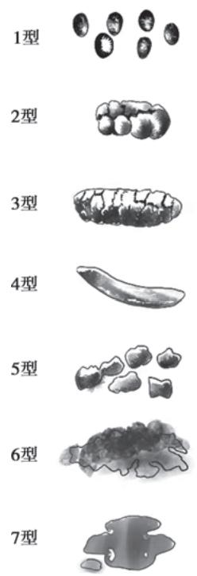  
图 4-10-1 粪便性状量表

3. 渗透性泻剂 渗透性泻剂在肠腔内形成高渗环境,促进肠道分泌,从而软化粪便、加快肠道传输。应用聚乙二醇可显著提高便秘型 IBS 病人的自主排便频率,降低粪便硬度,有效缓解便秘症状。

4. 促分泌剂 鸟苷酸环化酶 C 激动剂和选择性氯离子通道激动剂, 可以通过激活肠上皮细胞相关离子通道促进肠上皮细胞分泌, 从而软化粪便、促进肠道蠕动, 改善便秘症状。鸟苷酸环化酶 C 激动剂还可调节便秘型 IBS 病人的内脏感觉, 显著改善病人便秘的同时缓解腹痛症状。

5. 神经递质调节药 常规药物治疗效果欠佳的病人,可以考虑应用神经递质药物,后者可以降低痛觉感受和内脏高敏感性、调节胃肠动力,有效改善 IBS 症状。临床常用药物包括小剂量三环类抗抑郁药物和部分选择性 5-羟色胺再摄取抑制剂等。

此外，肠道不吸收的抗生素(主要是利福昔明)，短期应用可以改善肠道菌群失调，调节肠道炎症，治疗 IBS 病人腹痛、腹胀和腹泻症状。益生菌可调节肠道菌群，缓解 IBS 病人腹胀、腹痛和腹泻症状，少数研究表明对便秘有效。中药和针灸可减轻 IBS 病人症状。

（三）心理和行为疗法 IBS 病人常有认知偏差和抑郁、焦虑表现，对于症状严重且顽固、经一般治疗和药物治疗无效者，应考虑心理行为治疗，包括认知行为治疗、催眠疗法、应急管控和放松治疗等。

【预后】 IBS 呈良性过程,症状可反复或间歇发作,影响生活质量。

(李延青)

  
本章思维导图

本章数字资源

病毒性肝炎是指由嗜肝病毒所引起的肝脏感染性疾病，病理学上以肝细胞坏死、变性和炎症反应为特点。临床表现差异很大，包括无症状和亚临床型(隐性感染)、自限性的急性无黄疸型和黄疸型肝炎、慢性肝炎，少数发展为重症肝炎、肝衰竭。其他非嗜肝病毒，如EB病毒、巨细胞病毒（CMV）等感染后，也可以造成肝功能损伤，不纳入本节。

【病因和发病机制】 病毒性肝炎的病因至少有五种：

1. 甲型肝炎病毒（HAV）为 RNA 病毒，通过粪-口途径由不洁食物、饮水等传播，潜伏期 2～6 周，以儿童和青年多见，病程 1～2 个月，为急性自限性。

2. 乙型肝炎病毒（HBV）为分子量较小的 DNA 病毒，主要经血（如不安全注射等）、母婴及性接触等途径传播，潜伏期 1～6 个月，各组人群均可见，全球逾 2 亿人为慢性 HBV 感染者，目前我国 HBV 感染携带率约 6%。HBV 是我国感染携带率最高的肝炎病毒；根据基因差异，HBV 可分为 9 个基因型（A～I 型），我国以 C 型和 B 型多见。

3. 丙型肝炎病毒（HCV）为 RNA 病毒，主要经血液传播，性接触和母婴途径有较高的感染风险，潜伏期 1～6 个月，易变异，是慢性化最高的肝炎病毒；我国 HCV 感染率约为 0.6%。根据核苷酸序列同源程度，可将 HCV 分为 6 个 (1～6) 基因型，各型又由若干亚型 (a、b、c) 组成，如 1a、1b、2a、2b、3a、3b 等，基因型分布具有明显地域性。我国以 1b 型和 2a 型为主。

4. 丁型肝炎病毒（HDV）为 RNA 病毒，分子量较小、有缺陷，不能单独感染致病，必须在 HBV-DNA 病毒的辅助下才能复制增殖，即 HDV 的感染需同时或先有 HBV-DNA 病毒感染的基础，主要通过血源传播，潜伏期 1～6 个月，各组人群均可见。

5. 戊型肝炎病毒（HEV）也为 RNA 病毒，主要经粪-口途径由不洁食物、饮水等传播，潜伏期 2～8 周，人群普遍易感，病程大多为急性、自限性，但部分免疫功能低下者可呈慢性感染。

嗜肝病毒引起肝细胞的损伤，主要包括感染者的免疫应答因素和病毒因素。肝炎病毒进入肝脏后，激活机体的免疫反应，细胞毒性T淋巴细胞（CTL）直接作用于肝细胞，也可分泌多种细胞因子如肿瘤坏死因子 $\alpha$ （TNF-α）、干扰素 $\gamma$ （IFN-γ）等，引起肝细胞死亡；病毒感染后，肝组织局部的炎症细胞(中性粒细胞、巨噬细胞等)浸润可导致组织损害。HAV、HBV所致的肝脏损伤主要就是由免疫应答所致。其他嗜肝病毒除了免疫应答的因素外，还有病毒本身也对肝细胞造成损害。

HBV、HCV感染慢性化的机制主要由于宿主的免疫应答减弱、免疫耐受形成，也与病毒分子变异和分泌相关分子，使其逃避机体的免疫反应有关。

【临床表现和分型】

1. 临床表现 甲型肝炎和戊型肝炎起病急，前期常有发热、畏寒、腹痛、恶心等症状，继而出现明显厌食、乏力、尿色加深如浓茶、皮肤巩膜黄染，黄疸出现3～5天后，上述症状逐渐缓解。孕妇和老人罹患戊型肝炎，易发展为重症肝炎、肝衰竭，表现为极度乏力、食欲缺乏，黄疸进行性加深（总胆红素常>171μmol/L），凝血酶原时间显著延长，并发肝性脑病、肾衰竭和消化道出血等。

HBV、HCV感染人体后可造成急性肝炎、慢性肝炎和无症状携带者，少数可发生重症肝炎、肝衰竭。急性期的症状为乏力、厌食、尿色加深、肝区疼痛；慢性肝炎大多为非特异性症状，如乏力、腹胀、右上腹隐痛、学习或工作精力减退等。部分慢性肝炎如持续进展，可发展至肝硬化(详见本篇第十五章)，出现肝脏储备功能下降和门静脉高压的相关症状。部分HBV或HCV携带者，虽有病毒感染的标志,但无明显临床症状和生化指标的异常,称为无症状携带者。

HDV 是与 HBV 重叠或协同感染的, 可使乙肝病人的肝炎病情复发或加重。

## 2. 临床分型

(1) 急性期: ①急性黄疸型; ②急性无黄疸型。

（2）重症肝炎：①急性肝衰竭，起病2周内发生肝衰竭；②亚急性肝衰竭，发病15天至26周内出现肝衰竭症状；③慢加急性肝衰竭（acute on chronic liver failure, ACLF），是在慢性肝病基础上出现的急性肝衰竭；④慢性肝衰竭，在肝硬化基础上逐渐发生肝衰竭。

（3）慢性期：主要见于部分 HBV 和 HCV 感染者；少数免疫功能减退者（如使用免疫抑制剂者）感染 HEV 后也可呈慢性感染。临床分型为：①慢性肝炎；②合并肝硬化。

## 【实验室和辅助检查】

1. 病原血清学检查 HAV、HEV 感染时, 如 IgM 抗体 (抗-HAV IgM 和抗-HEV IgM) 阳性, 提示现症感染 (如初次阴性, 可间隔 1\~2 周复查), 如 IgG 抗体阳性, 则提示既往感染, 或本次感染的恢复期。

HBV 感染相关的血清学标志物包括 HBsAg、抗-HBs 抗体、HBeAg、抗-HBe 抗体、抗-HBc 抗体和抗 HBc-IgM。HBsAg 阳性表示 HBV 感染；抗-HBs 抗体为保护性抗体，其阳性表示对 HBV 有免疫力，见于乙肝康复及接种乙肝疫苗者；抗-HBc IgM 阳性多见于急性乙肝及慢性乙肝急性发作；血清中很难检测到 HBcAg，但可检出抗-HBc 抗体，只要感染过 HBV，无论病毒是否被清除，此抗体多为阳性。

血清中抗-HCV抗体阳性者，提示已有HCV的感染；应进一步检测HCV-RNA，以确定是否为现症感染。血清抗-HCV抗体滴度越高，HCV-RNA检出的可能性越大。

HDV 感染后, 血清可检测出 HDAg 或 HDV-RNA, 或抗-HD 抗体、抗-HD IgM。HBV、HCV 和 HDV 感染时, 可从血中检测到病毒分子 (HBV-DNA、HCV-RNA 和 HDV-RNA) 的复制滴度。

2. 肝功能生化指标 常见 ALT、AST 明显升高, 也可见总胆红素、结合胆红素增高; 胆汁淤积型病人可见总胆汁酸和碱性磷酸酶增高; 重症肝炎、肝衰竭时, 有凝血酶原时间延长、凝血酶原活动度下降和白蛋白浓度降低。

3. 影像学检查 超声、CT 或 MRI 在炎症期可见肝脏均匀性肿大、脾脏轻度肿大；在肝纤维化、肝硬化阶段，常见肝脏表面不均匀呈波浪状甚至结节状，脾脏中重度肿大，可见食管和/或胃底静脉曲张，失代偿期肝硬化可见腹腔积液。

4. 病理学检查 各种病毒性肝炎的基本病理变化是相同的,其特点包括:①肝细胞变性、坏死;②炎症和渗出反应;③肝细胞再生;④慢性化时不同程度的肝纤维化,甚至肝硬化结节。

轻症感染可见肝细胞气球样变性、点状坏死，或灶性坏死、融合性坏死，Kupffer细胞增生，汇管区炎症细胞浸润，或伴有淤胆；病变严重时，可在汇管区（1区）和中央静脉（3区）及两者之间（2区）形成带状坏死，即桥接坏死（bridging necrosis）。慢性肝炎时，可见肝小叶周围碎屑样坏死，淋巴细胞和单核细胞聚集、浸润，常见毛玻璃样肝细胞，胆管上皮细胞肿胀、排列不规则。不同程度的肝纤维化、肝硬化，则是慢性肝病的共同病理改变，如慢性乙型肝炎和慢性丙型肝炎。

【诊断与鉴别诊断】诊断需根据流行病学、症状、体征、肝生化检查、病原学和血清学检查，结合病人的具体情况和动态变化进行综合分析，必要时可行肝活检组织检查。病毒性肝炎的诊断要求：①病因诊断；②临床类型诊断。如：病毒性肝炎，甲型，急性黄疸型；病毒性肝炎，乙型，慢加急性肝衰竭。

急性病毒性肝炎需要与药物性或中毒性肝损伤区别,主要根据流行病学史、服药或接触毒物史和血清学标志进行鉴别;慢性肝炎需要与自身免疫性肝病、Wilson病、脂肪性肝病、药物或职业中毒性肝病以及肝癌相鉴别。

【治疗】病毒性肝炎病因不同,临床表现多样,变化较多,治疗要根据不同类型、不同病期区别对待。

1. 一般治疗 ①休息:急性肝炎早期,应住院或留家隔离治疗休息;慢性肝炎应适当休息,病情好转后应注意动静结合,恢复期逐渐增加活动,但仍需避免过劳。②饮食与营养:急性肝炎者食欲缺乏,应进易消化、富含维生素的清淡饮食;若食欲明显减退且有恶心呕吐者,可短期静脉滴注10%\~20%的葡萄糖溶液、维生素和电解质等。肝炎病人禁止饮酒。

2. 保肝治疗 肝功能异常者,可适当选用还原型谷胱甘肽、甘草酸制剂、双环醇、维生素E等抗炎、减轻过氧化损伤等药物。伴有肝内胆汁淤积的病人,可选用熊去氧胆酸、腺苷蛋氨酸等。

3. 抗病毒治疗 甲型肝炎和戊型肝炎,不需要抗病毒治疗;HDV与HBV协同感染所致急性肝炎时,无需抗病毒处理,与HBV叠加感染造成慢性肝炎加重时,可试用干扰素(IFN- $\alpha$ )。

HBV 感染所致的急性乙肝,一般不需要抗病毒治疗,但出现以下情况之一可使用抗病毒治疗,以降低慢性化发生:①HBV-DNA>2 000U/ml(相当于 $10^{4}$ 拷贝/ml);②感染时间>4 周,而 HBV-DNA 及 HBsAg 仍未阴转者;③若能行基因分型,C 基因型及 D 基因型者需抗病毒治疗。

HBV感染所致的慢性乙肝，常需要抗病毒治疗，其指征为：①HBeAg阳性病人，HBV-DNA≥20 000U/ml(相当于 $10^{5}$ 拷贝/ml); HBeAg阴性病人，HBV-DNA≥2 000U/ml(相当于 $10^{4}$ 拷贝/ml); ②ALT持续升高≥2倍正常值上限（upper limit of normal value, ULN); ③肝硬化，无论有无病毒复制。

乙肝抗病毒药物主要有核苷类似物(如替诺福韦、恩替卡韦、替比夫定等)和干扰素[如普通干扰素 $\alpha$ (IFN-α) 和聚乙二醇干扰素（Peg IFN-α）]。对于初治乙肝病人，优先推荐选用恩替卡韦、替诺福韦或长效干扰素（Peg IFN-α）。

针对 HCV 的感染,无论急慢性丙肝,所有 HCV-RNA 阳性病人均应抗病毒治疗。丙肝抗病毒药物和方案主要包括:①直接抗病毒药物（direct-acting antiviral agents, DAA),如索磷布韦/维帕他韦、格卡瑞韦/哌仑他韦等;②PR 方案,即聚乙二醇干扰素（Peg IFN-α）联合利巴韦林(ribavirin);③DAA 联合 PR 方案。以口服 DAA 方案首选。

无论是乙肝还是丙肝，一旦进入肝硬化阶段，则禁用干扰素抗病毒治疗。

4. 人工肝或者肝移植 对各型重症肝炎病人,可以运用人工肝或者肝移植进行治疗。

## 【预后和预防】

1. 甲型肝炎和戊型肝炎 大都为自限性疾病,不易发展为慢性,一般预后良好;但孕妇和老人的戊型肝炎易发展为重症肝炎,病死率可达20%。

2. 乙型肝炎 慢性化率约为 10%，全球逾 2 亿人为慢性 HBV 感染者。病人肝硬化的年发生率为 2%～10%，失代偿期肝硬化 5 年生存率为 14%～35%。肝硬化病人 HCC 年发生率为 3%～6%。HDV 的感染可加重乙肝的病情。

3. 丙型肝炎 慢性化率为 $55\% \sim 85\%$ 。感染HCV时年龄在40岁以上、男性、嗜酒（ $50\mathrm{g / d}$ 以上）、合并感染HIV并导致免疫功能低下者，可促进疾病进展。一旦发展成为肝硬化，丙肝相关的肝癌年发生率为 $2\% \sim 4\%$ 。自从DAA治疗方案应用后，慢性丙肝的临床预后显著改善。

  
本章思维导图

针对 HAV、HBV 和 HEV 的感染,已有相关的疫苗注射可以预防,其中戊肝疫苗是我国科研人员在全球率先研发成功的;但目前尚无针对 HCV 和 HDV 感染的预防疫苗。避免与感染者的过度接触、避免医源性传播(不规范使用注射器、血制品等)、避免性乱交,都是预防肝炎的有效措施。

(杨长青)

脂肪性肝病(fatty liver disease, FLD), 也称为代谢相关脂肪性肝病(metabolic-dysfunction associated fatty liver disease, MAFLD; metabolic-dysfunction associated steatotic liver disease, MASLD), 是以肝细胞脂肪过度贮积和脂肪变性为特征的临床病理综合征。肥胖、饮酒、糖尿病、营养不良、部分药物、妊娠以及感染等是 FLD 发生的危险因素。根据组织学特征, 将 FLD 分为脂肪肝和脂肪性肝炎; 根据有无长期过量饮酒的病因, 又分为非酒精性脂肪性肝病和酒精性脂肪性肝病。

## 第一节 | 非酒精性脂肪性肝病

非酒精性脂肪性肝病（non-alcoholic fatty liver disease, NAFLD）是指除外酒精和其他明确的肝损害因素所致的，以肝脏脂肪变性为主要特征的临床病理综合征，包括非酒精性脂肪肝（non-alcoholic fatty liver, NAFL），也称单纯性脂肪肝，以及由其演变的非酒精性脂肪性肝炎（non-alcoholic steatohepatitis, NASH; metabolic-dysfunction associated steatohepatitis, MASH）、脂肪性肝纤维化、肝硬化甚至肝癌。NAFLD现已成为西方国家和我国最常见的肝脏疾病，也是心脑血管疾病的独立危险因素。

【病因和发病机制】NAFLD的病因较多，高能量饮食、含糖饮料、久坐少动等生活方式，肥胖、2型糖尿病、高脂血症、代谢综合征、营养不良等单独或共同成为NAFLD的易感因素。“多重打击”学说可以解释部分NAFLD的发病机制。第一次打击主要是肥胖、2型糖尿病、高脂血症等伴随的胰岛素抵抗，引起肝细胞内脂质过量沉积。第二次打击是脂质过量沉积的肝细胞发生脂质过氧化和氧化应激，导致线粒体功能障碍、炎症因子的产生，肝星状细胞的激活，从而产生肝细胞的炎症、坏死。第三次打击是肠源性内毒素血症介导的炎症因子通过门静脉作用于肝脏细胞，导致肝细胞损伤，并激活肝星状细胞和巨噬细胞，引起内质网应激，肝纤维化也可加重疾病的进展。另外，肠道菌群紊乱也与NAFLD的发生相关，如高脂饮食会减少菌群多样性，减低普氏菌属数量，增加厚壁菌门与拟杆菌门的比率，升高了肠道能量的吸收效率；其他如遗传背景、慢性心理应激、免疫功能紊乱，在NAFLD的发生发展中也有一定的作用。

【病理】NAFLD的病理改变以大泡性或大泡性为主的肝细胞脂肪变性为特征。根据肝内脂肪变、炎症和纤维化的程度，将NAFLD分为单纯性脂肪性肝病、脂肪性肝炎，后者可进展为病变程度更为严重的脂肪性肝纤维化、肝硬化甚至肝癌。

1. 单纯性脂肪性肝病 肝小叶内 $>30\%$ 的肝细胞发生脂肪变，以大泡性脂肪变性为主。不伴有肝细胞的炎症、坏死及纤维化。

2. 脂肪性肝炎(NASH) 腺泡小叶中央(3区)出现气球样肝细胞,腺泡点灶状坏死,门管区(1区)炎症伴(或)门管区周围炎症。3区出现窦周/细胞周围纤维化,可扩展到门管区及其周围,出现局灶性或广泛的桥接纤维化。

【临床表现】NAFLD 起病隐匿,发病缓慢,常无症状。少数病人可有乏力、右上腹轻度不适、肝区隐痛或上腹胀痛等非特异症状。严重 NASH 可出现黄疸、食欲缺乏、恶心、呕吐等症状,部分病人可有肝大。NAFLD 发展至肝硬化失代偿期,临床表现与其他原因所致肝硬化相似。

【实验室和其他检查】

1. 实验室检查 单纯性脂肪性肝病时,肝功能基本正常,或有 $\gamma$ -谷氨酰转移酶( $\gamma$ -GT)轻度升高；NASH 时，多见血清转氨酶和 $\gamma$ -GT 水平升高，通常以 ALT、AST 升高为主。部分病人甘油三酯、尿酸、转铁蛋白和空腹血糖升高或糖耐量异常。

2. 影像学检查 超声诊断脂肪性肝病的准确率高达 $70\% \sim 80\%$ 左右；利用超声在脂肪组织中传播出现显著衰减的特征，也可定量肝脂肪变程度。CT平扫肝脏密度普遍降低，肝/脾CT平扫密度比值 $\leqslant 1$ 可明确脂肪性肝病的诊断，根据肝/脾CT密度比值还可判断脂肪性肝病的程度。磁共振波谱成像是无创评估肝脏脂肪较好的方法。超声瞬时弹性成像或实时剪切波弹性成像技术，通过检测肝脏脂肪受控衰减参数（controlled attenuation parameters, CAP），也可以量化评估肝脂肪变。

3. 病理学检查 肝穿刺活组织检查是确诊 NAFLD 的主要方法,对鉴别局灶性脂肪性肝病与肝肿瘤、某些少见疾病如血色病、胆固醇酯贮积病和糖原贮积病等有重要意义,也是判断预后的最敏感和特异的方法。

【诊断与鉴别诊断】临床诊断标准为:凡具备下列第1～3项和第4或第5项中任何一项者即可诊断为NAFLD。①有易患因素:肥胖、2型糖尿病、高脂血症等;②无饮酒史或饮酒折合乙醇量男性每周<140g、女性每周<70g;③除外病毒性肝炎、药物性肝病、全胃肠外营养、肝豆状核变性和自身免疫性肝病等可导致脂肪肝的特定疾病;④符合脂肪性肝病的影像学诊断标准;⑤肝组织学改变符合脂肪性肝病的病理学诊断标准。

【治疗】

（一）病因治疗 针对病因的治疗，如治疗糖尿病、高脂血症，对多数单纯性脂肪性肝病和NASH有效。生活方式的改变，如低糖低脂饮食、体育运动，在NAFLD的治疗中至关重要。对于肥胖的NAFLD病人，减重3%～5%可改善肝脂肪变，减重7%～10%能够改善肝脏酶学和组织学的异常，并减少心脑血管疾病发生的风险。

（二）药物治疗 单纯性脂肪性肝病一般无需药物治疗，通过改变生活方式即可。对于NASH特别是合并进展性肝纤维化病人，使用维生素E、甘草酸制剂、多烯磷脂酰胆碱等，可减轻脂质过氧化。胰岛素受体增敏剂如二甲双胍、吡格列酮，以及胰高血糖素样肽-1（glucagon-like peptide 1, GLP-1）受体激动剂，可用于合并2型糖尿病的NAFLD病人；伴有血脂高的NAFLD可在综合治疗的基础上应用降血脂药物；肠道益生菌可减少内毒素的产生和能量的过度吸收。

（三）其他治疗 BMI>35kg/m $^{2}$ 且对改变生活方式和药物治疗无反应者,可通过减重手术进行治疗。

## （四）病人教育

1. 控制饮食、增加运动,是治疗肥胖相关 NAFLD 的最佳措施。减肥过程中应使体重平稳下降,注意监测体重及肝功能。

2. 注意纠正营养失衡,禁酒,不宜乱服药,在服降血脂药物期间应遵医嘱定期复查肝功能。

【预后】NAFLD 是心脑血管疾病的独立危险因素,部分脂肪性肝炎可发展为肝硬化甚至肝癌,其预后与病毒性肝炎后肝硬化、酒精性肝硬化相似。单纯性脂肪性肝病如积极治疗,可完全恢复。脂肪性肝炎如能及早发现、积极治疗,多数能逆转。

## 第二节 | 酒精性肝病

酒精性肝病（alcoholic liver disease, ALD）是由于大量饮酒所致的肝脏疾病。其疾病谱包括酒精性肝炎、酒精性脂肪肝、酒精性肝纤维化和肝硬化，可发展至肝癌。本病在欧美国家多见，近年我国的发病率也有上升，我国部分地区40～50岁人群酒精性肝病的患病率在10%以上。

【病因和发病机制】乙醇损害肝脏可能涉及下列多种机制:①乙醇的中间代谢物乙醛是高度反应活性分子,能与蛋白质结合形成乙醛-蛋白加合物,后者不仅对肝细胞有直接损伤作用,而且可以作为新抗原诱导细胞及体液免疫反应,导致肝细胞受免疫反应的攻击;②乙醇代谢的耗氧过程导致小叶中央区缺氧；③乙醇在肝细胞微粒体的乙醇氧化途径中产生活性氧，导致肝损伤；④大量饮酒可致肠道菌群失调、肠道屏障功能受损，引起肠源性内毒素血症，加重肝脏损伤；⑤长期大量饮酒病人血液中酒精浓度过高，肝内血管收缩、血流和氧供减少，且酒精代谢时氧耗增加，导致肝脏微循环障碍和低氧血症，肝功能进一步恶化。

增加酒精性肝病发生的危险因素有:①饮酒量及时间,一般认为,短期反复大量饮酒,如两周内平均每日乙醇摄取量>80g,可发生酒精性肝炎;平均每日乙醇摄入40g,>5年可发展为慢性酒精性肝病。②遗传易感因素,如乙醇脱氢酶(ADH)和乙醛脱氢酶(ALDH)的基因型,被认为与酒精性肝病的发生密切相关。③性别,同样的酒摄入量,女性比男性易患酒精性肝病,与女性体内ADH含量较低有关。④其他肝病,如HBV或HCV感染可增加酒精性肝病发生的危险性,并可使酒精性肝损害加重。⑤肥胖,是酒精性肝病的独立危险因素。⑥营养不良。

【病理】酒精性肝病病理学改变主要为大泡性或大泡性为主伴小泡性的混合性肝细胞脂肪变性。依据病变肝组织是否伴有炎症反应和纤维化，可分为酒精性脂肪肝、酒精性肝炎、酒精性肝纤维化和酒精性肝硬化。

1. 酒精性脂肪肝 乙醇所致肝损害首先表现为肝细胞脂肪变性,轻者散在单个肝细胞或小片状肝细胞受累,主要分布在小叶中央(3区),进一步发展呈弥漫分布。肝细胞无炎症、坏死,小叶结构完整。

2. 酒精性肝炎、肝纤维化 肝细胞坏死、中性粒细胞浸润、小叶中央区肝细胞内出现酒精性透明小体（Mallory 小体）为酒精性肝炎的特征，严重的可出现融合性坏死和/或桥接坏死。窦周/细胞周围纤维化和中央静脉周围纤维化，可扩展到门管区，中央静脉周围硬化性玻璃样坏死，局灶性或广泛的门管区星芒状纤维化，严重的可出现局灶性或广泛的桥接纤维化。

3. 酒精性肝硬化 肝小叶结构完全毁损,代之以假小叶形成和广泛纤维化,大体形态为小结节性肝硬化。根据纤维间隔是否有界面性肝炎,分为活动性和静止性。

【临床表现】临床表现一般与饮酒量和嗜酒时间长短有关,部分病人可在长时间内没有任何肝脏的症状和体征。

酒精性肝炎临床表现与组织学损害程度相关。常发生在近期(数小时至数周)大量饮酒后,出现全身不适、食欲缺乏、恶心呕吐、乏力、肝区疼痛等症状。可有低热,黄疸,肝大并有触痛。严重者可发生急性肝衰竭。

酒精性脂肪肝常无症状或症状轻微,可有乏力、食欲缺乏、右上腹隐痛或不适,肝脏有不同程度的肿大。

酒精性肝硬化临床表现与其他原因引起的肝硬化相似,可伴有慢性酒精中毒的表现,如精神神经症状、慢性胰腺炎等。

部分嗜酒者停止饮酒后可出现戒断症状，表现为四肢发抖、出汗、失眠、兴奋、躁动、乱语；戒断症状严重者如果不及时抢救，也可能会导致死亡。

【实验室和其他检查】

1. 实验室检查 酒精性脂肪肝可有血清 AST、ALT 轻度升高。酒精性肝炎 AST 升高比 ALT 升高明显，AST/ALT 常大于 2, γ-GT 常升高，TB、PT 和平均红细胞体积（MCV）等指标也可有不同程度的改变，联合检测有助于诊断酒精性肝病；其中 AST/ALT > 2、γ-GT 和 MCV 升高，为酒精性肝病的特点。

2. 影像学检查 同本章第一节。

3. 病理学检查 肝活组织检查是确定酒精性肝病及分期分级的可靠方法, 是判断其严重程度和预后的重要依据。但很难与其他病因引起的肝损害鉴别。

【诊断与鉴别诊断】饮酒史是诊断酒精性肝病的必备依据,应详细询问病人饮酒的种类、每日摄入量、持续饮酒时间和饮酒方式等。目前酒精摄入的安全阈值尚有争议。我国现有的酒精性肝病诊断标准为:长期饮酒史(>5年),折合乙醇量男性≥40g/d,女性≥20g/d;或2周内有大量饮酒史,折合乙醇量 $>80\mathrm{g / d}$ 。乙醇量换算公式为：乙醇量 $(\mathrm{g}) =$ 饮酒量 $(\mathrm{ml})\times$ 乙醇含量 $(\%)\times 0.8$

酒精性肝病的诊断思路为:①是否存在肝病;②肝病是否与饮酒有关;③是否合并其他肝病;④如确定为酒精性肝病,则其临床病理属哪一阶段。可根据饮酒史、临床表现及有关实验室及其他检查进行分析,必要时可行肝穿刺活检组织学检查。

本病应与非酒精性脂肪性肝病、病毒性肝炎、药物性肝损害、自身免疫性肝病等其他肝病及其他原因引起的肝硬化进行鉴别。酒精性肝病和慢性病毒性肝炎关系密切，慢性乙型、丙型肝炎病人对酒敏感度增高，容易发生酒精性肝病；反之，酒精性肝病病人对病毒性肝炎易感性也增加。

## 【治疗】

1. 病人教育 戒酒是治疗酒精性肝病病人最重要的措施。戒酒能显著改善各个阶段病人的组织学改变和生存率，并可减轻门静脉压力及减缓向肝硬化发展的进程。因此，对酒精性肝病病人，医护人员和家人要给予鼓励和关心，帮助病人尽早戒酒。

2. 营养支持 长期嗜酒者,酒精取代了食物所提供的热量,故蛋白质和维生素摄入不足而引起营养不良。所以酒精性肝病病人需要良好的营养支持,在戒酒的基础上应给予高热量、高蛋白、低脂饮食,并补充多种维生素(如维生素 B、C、K)。

3. 药物治疗 多烯磷脂酰胆碱可稳定肝窦内皮细胞膜和肝细胞膜，降低脂质过氧化，减轻肝细胞脂肪变性及其伴随的炎症和纤维化。美他多辛可加快乙醇代谢。N-乙酰半胱氨酸能补充细胞内谷胱甘肽，具有抗氧化作用。糖皮质激素用于治疗酒精性肝病尚有争论，但对重症酒精性肝炎可缓解症状，改善生化指标。其他药物，如S-腺苷蛋氨酸、甘草酸制剂也有一定疗效。酒精戒断症状严重者，除对症处理外，可考虑应用纳洛酮、苯二氮䓬类镇静剂和维生素。

4. 防治门静脉高压及肝移植 酒精性肝硬化病人,门静脉高压发生早,应注意监测和防治(参见“肝硬化”章节)。严重酒精性肝硬化病人可考虑肝移植,但要求病人肝移植前戒酒3\~6个月,并且无严重的其他脏器的酒精性损害。

  
本章思维导图

【预后】酒精性脂肪肝一般预后良好，戒酒后可部分恢复。酒精性肝炎如能及时治疗和戒酒，大多可恢复。若不戒酒，酒精性脂肪肝可直接或经酒精性肝炎阶段发展为酒精性肝硬化，甚至肝癌。主要死亡原因为肝衰竭及肝硬化相关并发症。

(杨长青)

自身免疫性肝病主要包括自身免疫性肝炎（autoimmune hepatitis, AIH）、原发性胆汁性胆管炎（primary biliary cholangitis, PBC）、原发性硬化性胆管炎（primary sclerosing cholangitis, PSC）及这三种疾病中任何两者兼有的重叠综合征；近年来IgG4相关性肝胆疾病也被归为此类。其共同特点是由机体免疫功能紊乱导致肝脏出现病理性炎症损伤。

遗传易感性是自身免疫性肝病的主要因素,在此基础上病毒感染、药物和环境因素可能是促发因素,调节性 T 细胞(regulatory T cell,Treg 细胞)数量及功能的失衡是病人免疫紊乱的主要机制之一。

## 第一节 | 自身免疫性肝炎

自身免疫性肝炎由机体对肝细胞产生自身抗体及 T 细胞介导的自身免疫应答所致。

【病因和发病机制】在 AIH 发病机制中主要的自身抗原为去唾液酸糖蛋白受体（ASGP-R）和微粒体细胞色素 P450ⅡD6。自身反应性 T 细胞及其抗原提呈细胞是 AIH 发病的另一必要条件。补体系统和趋化因子也参与了 AIH 的体液免疫损伤机制。

【临床表现】女性多发,男女比例为1:5,好发于20\~55岁。大部分AIH病人起病缓慢,轻者甚至无症状,病变活动时有乏力、腹胀、食欲缺乏、瘙痒、黄疸等症状。早期肝大伴压痛,常有脾大、蜘蛛痣等。约25%病人可有急性发作过程。

活动期 AIH 常有肝外表现,如持续发热、急性游走性大关节炎及多形性红斑等。该病可重叠其他自身免疫病,如原发性胆汁性胆管炎、原发性硬化性胆管炎、桥本甲状腺炎、溃疡性结肠炎、类风湿关节炎、干燥综合征等。

【实验室检查】

1. 肝功能检查 ALT 及 AST 常呈轻到中度升高。

2. 免疫学检查 以自身抗体阳性、IgG 和/或 γ 球蛋白升高为特征。自身抗体包括抗核抗体（ANA）、抗平滑肌抗体（anti-SMA）、抗中性粒细胞胞质抗体（pANCA）、抗可溶性肝抗原抗体（抗-SLA 抗体）/抗肝胰抗体（抗-LP 抗体）、抗肌动蛋白抗体（抗-actin 抗体）、抗肝肾微粒体抗体-1（抗-LKM-1 抗体）、抗 1 型肝细胞溶质抗原抗体（抗-LC-1 抗体）等。这些血清免疫学改变缺乏特异性，亦见于其他急、慢性肝炎等。

3. 病理学检查 汇管区(1区)界面型肝炎和淋巴浆细胞浸润、小叶内(2区)肝细胞玫瑰样花环以及淋巴细胞对肝细胞的穿透现象,被认为是典型的AIH组织学改变。严重时可有桥接坏死、多小叶坏死或融合性坏死。汇管区炎症一般不侵犯胆管系统,无脂肪变性及肉芽肿。

【诊断及临床分型】表4-13-1列出的AIH诊断积分系统，有助于诊断。ANA或SMA阳性者为1型，约占AIH病例的 $90\%$ ；LKM-1和/或LC-1阳性者为2型，以儿童多见。少数AIH病人自身抗体阴性，可能存在目前尚不能检出的其他抗体。与慢性隐源性肝病的区别是后者对糖皮质激素治疗无效。自身免疫性肝炎可与其他自身免疫性肝病如PBC、PSC等并存，称为重叠综合征。

【治疗】目前主要采用非特异性免疫抑制剂。多数 AIH 对免疫抑制治疗有应答, 治疗指征: ① 转氨酶水平≥3 倍 ULN、IgG≥1.5 倍 ULN; ② 组织学见桥接样坏死、多小叶坏死或中央静脉周围炎; ③ 初发 AIH、ALT 和/或 AST≥10 倍 ULN；④除肝损伤外，伴出凝血异常：INR≥1.5。不符合上述条件者治疗视临床情况而定。

表 4-13-1 简化 AIH 诊断积分系统

<table><tr><td>变量</td><td>标注</td><td>分值</td><td>备注</td></tr><tr><td>ANA或SMA</td><td> $\geqslant 1:40$ </td><td>1分</td><td></td></tr><tr><td>ANA或SMA或LKM-1或SLA,或LC-1</td><td> $\geqslant 1:80$  $\geqslant 1:40$ 阳性</td><td>2分</td><td>多项同时出现,最多2分</td></tr><tr><td>IgG</td><td>&gt;正常上限&gt;1.10倍正常上限</td><td>1分2分</td><td></td></tr><tr><td>肝组织学</td><td>符合AIH</td><td>1分</td><td>典型AIH表现:界面型肝炎、汇管区和小叶淋巴浆细胞浸润、肝细胞玫瑰样花环</td></tr><tr><td>排除病毒性肝炎</td><td>是</td><td>2分</td><td></td></tr></table>

注：≥6分，AIH可能；≥7分，确诊AIH。ANA，血清核抗体；SMA，抗平滑肌抗体；LKM-1，抗肝肾微粒体抗体-1；SLA，抗可溶性肝抗原；LC-1，抗1型肝细胞溶质抗原抗体；AIH，自身免疫性肝炎；IgG，血清免疫球蛋白。

成人治疗方案为:①优先推荐泼尼松联合硫唑嘌呤治疗,泼尼松起始30～40mg/d,4周内逐渐减至10～15mg/d;硫唑嘌呤50mg/d或1～1.5mg/(kg·d)。联合疗法特别适用于下述自身免疫性肝炎病人:绝经后妇女、骨质疏松、脆性糖尿病、肥胖、痤疮、情绪不稳及高血压病人。②大剂量泼尼松单独疗法,起始40～60mg/d,4周内逐渐减至15～20mg/d。单独疗法适用于合并血细胞减少、巯基嘌呤甲基转移酶缺乏、妊娠、恶性肿瘤的AIH病人。③非肝硬化的AIH病人也可以选用布地奈德替代泼尼松(起始剂量3mg,每天3次,后减为每天2次维持)。

治疗应强调个体化处理。疗程一般应维持3年以上，或获得生化指标缓解后至少2年。2次以上复发者，以最小剂量长期维持治疗。合并胆汁淤积，或AIH+PBC重叠综合征、AIH+PSC重叠综合征者，可加用熊去氧胆酸。对免疫抑制剂无效者，可试用环孢素、吗替麦考酚酯、他克莫司或利妥昔单抗等治疗。

无疾病活动或自动缓解期的 AIH、非活动性肝硬化，可暂不考虑行免疫抑制治疗，但应长期密切随访（如每隔 3～6 个月随访 1 次）。对于轻微炎症活动（血清氨基转移酶水平＜3 倍 ULN、IgG＜1.5 倍 ULN）或病理轻度界面炎的 AIH 病人，需平衡免疫抑制治疗的益处和风险，可暂不启动免疫抑制治疗，而使用甘草制剂等保肝抗炎，并严密观察，如病人出现明显的临床症状，或出现明显炎症活动，再进行免疫抑制治疗。

【预后】自身免疫性肝炎预后差异较大，在获得生化指标缓解后一般预后较好，10年总体生存率约为80%～93%。初诊时是否有肝硬化、治疗有无应答及治疗后是否反复发作，是影响长期预后的主要因素。

## 第二节 | 原发性胆汁性胆管炎

原发性胆汁性胆管炎（primary biliary cholangitis, PBC）旧称原发性胆汁性肝硬化（primary biliary cirrhosis, PBC），是肝内小胆管慢性进行性非化脓性炎症而导致的慢性胆汁淤积性疾病。

【病因和发病机制】遗传与环境因素相互作用导致免疫功能紊乱。自身免疫性胆管上皮细胞损伤机制涉及:①体液免疫。抗线粒体抗体（AMA）在体液免疫中起关键作用,其阳性率达到90%\~95%。AMA识别的抗原主要分布于线粒体内膜上,主要的自身抗原分子是多酶复合物中的丙酮酸脱氢酶复合物。②细胞免疫。胆管上皮细胞异常表达HLA-DR及HLA-DQ抗原分子,引起自身抗原特异性T淋巴细胞介导的细胞毒性作用,持续损伤胆小管。

【临床表现】多见于中年女性,男女比例约为1:9。该病起病隐匿、缓慢,自然病程大致可分为4期:①临床前期,AMA阳性、无症状、肝功能正常,可长达十几年,多在筛查时发现。②肝功能异常无症状期,无症状者约占首次诊断的20%\~60%,因血清碱性磷酸酶(ALP)水平升高而检测AMA确定诊断。多于2\~4年内出现症状。③肝功能异常症状期。④肝硬化期。

后两期的临床表现如下:早期症状较轻,乏力和皮肤瘙痒为最常见首发症状,约78%病人有乏力,瘙痒比乏力更具特异性,发生率为20%\~70%。瘙痒常在黄疸前数个月至2年左右出现,常于夜间加剧。

因长期肝内胆汁淤积导致分泌和排泄至肠腔的胆汁减少,影响脂肪的消化吸收,可有脂肪泻和脂溶性维生素吸收障碍,出现皮肤粗糙、色素沉着和夜盲症(维生素A缺乏)、骨软化和骨质疏松(维生素D缺乏)、出血倾向(维生素K缺乏)等。由于胆小管阻塞,血中脂类总量和胆固醇持续增高,可形成眼睑黄色瘤,为组织细胞吞噬多量胆固醇所致。多数病例肝大,并随黄疸加深而逐渐增大,压痛不明显,逐渐发展至肝硬化。

本病常合并其他自身免疫病，如干燥综合征、甲状腺炎、类风湿关节炎等。

## 【实验室和辅助检查】

1. 尿、粪检查 尿胆红素阳性,尿胆原正常或减少,粪色变浅。

2. 肝功能试验 血清胆红素多中度增高,以结合胆红素增高为主,反映了胆管缺失和碎屑样坏死的严重程度。血清胆固醇常增高,肝衰竭时降低。ALP与 $\gamma$ -GT在黄疸及其他症状出现前多已增高,ALP升高是PBC最突出的生化异常。

3. 免疫学检查 95% 以上病人 AMA 阳性, 滴度 >1:40 有诊断意义, 是 PBC 特异性指标, 尤其是 $M_{2}$ 亚型阳性率可达 90%\~95%, 很多病人临床症状出现前 6\~10 年血清 AMA 已呈阳性。约 50% 的 PBC 病人 ANA 阳性。除 AMA 外, 对 PBC 较特异性的抗体还包括 ANA 中的抗肝脂蛋白抗体 (SP100)、抗核骨架蛋白抗体 (GP210) 等, 在 AMA 阴性时可作为重要标志。血清免疫球蛋白增加, 特别是 IgM。

4. 影像学检查 超声、CT、MRI、MRCP 或 ERCP 常用于评估疾病进展以及排除肝胆系统的肿瘤和结石等胆道疾病，当 PBC 进展到肝硬化时，可有门静脉高压表现。

5. 组织学检查 组织学表现及分期: ①Ⅰ期, 胆管炎期, 损伤的胆管周围可见密集的淋巴细胞浸润, 如形成非干酪型肉芽肿者称为旺炽性胆管病变, 是 PBC 的特征性病变, 多见于Ⅰ期和Ⅱ期; ②Ⅱ期, 汇管区周围炎期, 损伤更广泛, 汇管区内小叶间胆管数量减少; ③Ⅲ期, 进行性肝纤维化期, 汇管区及其周围炎症、纤维化, 汇管区扩大增宽, 可形成汇管区至汇管区的桥接样纤维索; ④Ⅳ期, 肝硬化期, 有明显的肝硬化和再生结节, 结节周围肝细胞胆汁淤积, 可见毛细胆管胆栓。

【诊断与鉴别诊断】无症状病人, AMA、ALP 和 IgM 检测有助于发现早期病例。中年女性, 临床表现为皮肤瘙痒、乏力、黄疸、肝大, 伴有胆汁淤积性黄疸的生化改变而无肝外胆管阻塞证据时要考虑本病。

具备以下三项诊断标准中的两项即可诊断 PBC: ①存在胆汁淤积的生化证据, 以 ALP、 $\gamma$ -GT 明显升高为主; ②AMA、AMA- $M_{2}$ 、GP210、SP100 之一出现阳性; ③肝组织学检查符合 PBC 改变。

鉴别诊断应注意排除肝内外胆管阻塞引起的继发性胆汁性肝硬化。还应与自身免疫性肝炎、胆汁淤积型药物性肝损伤等鉴别。

## 【治疗】

1. 熊去氧胆酸（UDCA）是目前推荐用于PBC治疗的首选药物，剂量为 $13\sim 15\mathrm{mg / (kg\cdot d)}$ 。该药可增加胆汁酸的分泌，拮抗疏水性胆汁酸的细胞毒作用，保护胆管细胞和肝细胞。对UDCA治疗有反应者， $90\%$ 的病人在 $6\sim 9$ 个月内得到改善。

2. 其他治疗 UDCA 无效病例可视病情试用布地奈德、贝特类降脂药(非诺贝特、苯扎贝特)和奥贝胆酸(obeticholic acid, OCA)。脂肪泻可补充中链甘油三酯辅以低脂饮食。脂溶性维生素缺乏时补充维生素 A、 $D_{3}$ 、K，并注意补钙。瘙痒严重者可使用离子交换树脂考来烯胺。

【预后】PBC预后差异很大，有症状者平均生存期为 $10\sim 15$ 年。出现食管胃底静脉曲张者，3年生存率仅为 $60\%$ 。预后不佳的因素包括：对UDCA无应答、老年、血清总胆红素进行性升高、GP210阳性、肝脏合成功能下降和组织学病变持续进展。

## 第三节 | 原发性硬化性胆管炎

原发性硬化性胆管炎（primary sclerosing cholangitis, PSC）以特发性肝内外胆管炎症和纤维化为特征，导致多灶性胆管狭窄，临床以慢性胆汁淤积为主要表现。多以中年男性为主，男女之比为2:1。约50%～70%的PSC病人伴发溃疡性结肠炎。

【病因和发病机制】特殊类型的 HLA 遗传背景在 PSC 发病中起着重要作用。自身免疫性因素、感染、肠道菌群紊乱或其他不明的病因入侵并攻击胆管上皮细胞，引起胆管损伤。

【临床表现】PSC 起病隐匿，15%～55% 的病人诊断时无症状，仅在体检时因发现 ALP 升高或因炎症性肠病时得以诊断。典型症状为黄疸和瘙痒，其他可有乏力、体重减轻和肝脾大等。黄疸呈波动性、反复发作；并发胆管炎、胆管结石甚至胆管癌时可伴有右上腹痛，中低热或高热及寒战。明显的胆管狭窄、梗阻，导致急性肝损伤甚至发展至肝衰竭。出现慢性胆汁淤积者大多已有胆道狭窄或肝硬化，除门静脉高压症状外，常有脂溶性维生素缺乏、代谢性骨病等。

根据胆管受损部位,可将 PSC 分为三型。①大胆管型:损伤累及肝外较大胆管,约占 PSC 病例的 90%;②小胆管型:损伤累及较小胆管,影像学无异常发现;③全胆管型:肝内外大小胆管均受累。

【实验室检查】

（一）血清生化检查 通常伴有 ALP、 $\gamma$ -GT 升高，而 ALT、AST 正常；若 ALT、AST 显著升高，需考虑存在急性胆道梗阻或重叠有 AIH。

（二）免疫学检查 PSC 特异性自身抗体目前尚未发现。33%～85% 的 PSC 病人血清核周型抗中性粒细胞胞质抗体（pANCA）阳性；50% 的病人血 IgM 轻至中度升高、免疫复合物增加、补体 C3 减少；循环 CD8 $^{+}$ T 细胞绝对数减少，CD4/CD8 比值增高。

(三) 影像学检查 是诊断 PSC 的主要方法。

1. 经内镜逆行胆胰管造影术（ERCP）是诊断 PSC 的“金标准”，肝内外胆管多灶性、短节段性、环状狭窄，胆管壁僵硬缺乏弹性、似铅管样，狭窄上端的胆管可扩张呈串珠样；严重者可呈长段狭窄和胆管囊状或憩室样扩张，当肝内胆管广泛受累时，可有枯树枝样改变。

2. 磁共振胰胆管成像（MRCP）因其非侵入性特点，成为疑诊 PSC 的首选影像学检查。影像表现近似 ERCP，呈肝内胆管多处不连续或呈“虚线”状，肝外胆管粗细不均，边缘毛糙欠光滑。

3. 腹部超声 显示肝内散在片状强回声及胆总管管壁增厚、胆管局部不规则狭窄及扩张等，胆囊壁增厚，胆汁淤积。

（四）病理学检查 PSC 的诊断主要依赖影像学，肝活检是非必需的。但当病变累及肝内小胆管时，需要肝组织检查，组织病理呈肝内胆管广泛纤维化，典型改变为同心圆性洋葱皮样纤维化。

【诊断与鉴别诊断】PSC 的诊断主要基于 ALP、 $\gamma$ -GT 异常,胆道影像学示肝内外胆管多灶性狭窄;累及肝内小胆管时可有典型的 PSC 组织病理学改变。

需要与继发性硬化性胆管炎相鉴别。继发性硬化性胆管炎是一组临床特征与PSC相似，但病因明确的疾病。常见病因包括胆总管结石、胆道手术创伤、反复发作的化脓性胆管炎、胆道肿瘤性疾病（胆总管癌、肝细胞癌侵及胆管、壶腹部癌、胆总管旁淋巴结转移压迫）、IgG4相关硬化性胆管炎等。有些不典型的PSC，还需与PBC、AIH、药物性肝损伤、慢性活动性肝炎、酒精性肝病等相鉴别。

【治疗】

(一) 药物 中等剂量的 UDCA $\left[17\sim23\mathrm{mg}/(\mathrm{kg}\cdot\mathrm{d})\right]$ 可以改善病人肝脏生化指标、肝纤维化程度及胆道影像学表现。合并急性细菌性胆管炎的病人应给予有效的广谱抗生素。PSC 晚期常发生脂肪泻、维生素吸收不良综合征和骨质疏松症，可适量补充维生素 D 等脂溶性维生素。严重瘙痒者可用考来烯胺。

（二）内镜 PSC 所致的胆道梗阻累及多级胆管树，对于肝外胆管及肝内大胆管的显性狭窄，可应用 ERCP 球囊扩张术或支架置入术，改善皮肤瘙痒和胆管炎等并发症。

## (三) 介入或手术

1. 经皮肝穿刺胆道引流（percutaneous transhepatic cholangial drainage, PTCD）当无法行 ERCP 时可行 PTCD 置管引流，也可利用 PTCD 术经皮置入导丝至壶腹部，再行 ERCP 置入支架。

2. 姑息手术 适于非肝硬化的 PSC 病人以及肝门或肝外胆管显著狭窄、有明显胆汁淤积或复发性胆管炎、不能经微创术改善黄疸和胆管炎者。

3. 肝移植 适于终末期 PSC 病人。肝移植后 PSC 病人 5 年生存率为 80%～85%，约 20% 的 PSC 在术后 10 年内复发。

【预后】在 PSC 缺少有效治疗措施的情况下,疾病从诊断发展至死亡或进行肝移植的中位时间约为 12～18 年。胆管癌是 PSC 病人的首位死亡原因。有症状的 PSC 病人随访 6 年后合并肝衰竭、胆管癌等可高达 41%。

## 第四节 | IgG4 相关肝胆疾病

IgG4 相关肝胆疾病是累及多器官或组织的 IgG4 相关性疾病在肝胆器官的表现,这类慢性进行性炎症性疾病以淋巴浆细胞性浸润和组织纤维化为主,伴血清和组织中 IgG4 升高。

【病因和发病机制】IgG4 主要是由 Treg 细胞介导调节、由浆细胞产生的一种抗体。它因结构的特殊性，与免疫球蛋白的主要成分 IgG1 不同，不能激活补体途径，也不能交联抗原，失去与抗原形成免疫复合物的能力。它可以通过轻链与轻链的结合、轻链与重链的结合，形成自身免疫复合物。遗传研究已证实 HLA-DRB1\*0405、HLA-DQβ1\*57 与本病相关，在特定遗传背景下，无论是自身免疫还是感染因素，均可导致 Th2 细胞激活和自我增殖，引起 Treg 细胞的聚集，刺激浆细胞产生大量的 IgG4。

【临床表现】男性多见,男女病人比例大约(2\~4):1。

1. IgG4 相关硬化性胆管炎(IgG4-SC) 常表现为结合胆红素升高,皮肤瘙痒、腹痛、食欲减退、体重下降等,80% 的 IgG4-SC 常合并 1 型自身免疫性胰腺炎(详见本篇第二十章)。

2. IgG4 相关自身免疫性肝炎（IgG4-AIH）起病缓慢，轻者甚至无症状，病变活动时表现有乏力、腹胀、食欲缺乏、黄疸等，可发展为肝硬化。

## 【实验室和辅助检查】

1. 血清生化检查 IgG4-SC 病人早期表现为以 ALP 和 $\gamma$ -GT 明显升高为主的肝功能异常, 病情进展可见结合胆红素、总胆汁酸浓度明显升高; IgG4-AIH 病人则以 ALT、AST 反复升高为主, 伴有 ALP 也升高的肝功能损害。

2. 免疫学检查 血清中 IgG4 水平的明显升高是 IgG4 相关肝胆疾病的共同特点,部分病人还伴有 IgE 水平的升高,总 IgG 也升高,而 IgA 和 IgM 则降低。IgG4-AIH 病人还可有自身抗体 ANA 和/或抗 SMA 阳性。

3. 病理学检查 组织学可见显著的淋巴细胞及浆细胞浸润,免疫组化可见病灶中出现大量 IgG4 阳性的浆细胞,病灶组织的席纹状纤维化和闭塞性静脉炎是该病的共同病理特点。

4. 影像学检查 IgG4-SC 病人常见胆总管下端显著狭窄,或合并肝门区胆管节段性狭窄,病变处胆管壁明显增厚;IgG4-AIH 病人可见肝脾大。

## 【诊断与鉴别诊断】

1. IgG4-SC 血清 IgG4 水平 > 1350mg/L; 肝功能改变以 ALP 和 γ-GT 明显升高为主; 影像学可见胆总管下端或肝门区胆管狭窄,狭窄处胆管壁环形增厚;病理可见显著的淋巴细胞和浆细胞浸润,IgG4阳性浆细胞>10个细胞/高倍视野或IgG4阳性浆细胞>40%,胆管壁可见席纹状纤维化和闭塞性静脉炎。IgG4-SC需要与自身免疫性肝病中的PSC、PBC相鉴别。

2. IgG4-AIH 符合 AIH 明确诊断的积分要求; 血清 IgG4 阳性(>1 350mg/L); 病理可见 IgG4 阳性浆细胞浸润(>10 个细胞/高倍视野)或 IgG4 阳性浆细胞>40%, 以门静脉区尤为明显。临床需要与单纯 AIH 相鉴别。

【治疗】对于所有活动的、初治的 IgG4 相关肝胆疾病，首选糖皮质激素进行诱导缓解，除非病人存在糖皮质激素治疗的禁忌证。起始泼尼松剂量为 30～40mg/d [或 0.6mg/(kg·d)]，维持 2～4 周后开始减量，之后每 1～2 周，根据病人症状、血清学指标及影像学表现递减剂量 5mg。为预防复发，推荐泼尼松 2.5～5.0mg/d 维持。对于维持治疗方案目前尚存在争议，亚洲研究者多主张用泼尼松龙 2.5～5.0mg/d 维持治疗 1～3 年。复发病人可通过初始治疗剂量的激素获得缓解。

对单一激素治疗不能控制疾病，且长期激素治疗带来明显毒副作用者，可选用激素和免疫抑制剂(如硫唑嘌呤、他克莫司等)联合治疗。对于复发或不能耐受激素治疗的病人可以考虑应用B细胞消耗性生物制剂(如利妥昔单抗，rituximab)。对IgG4-SC病人，可辅以UDCA或贝特类降脂药物；对IgG4-AIH病人，可辅以抗氧化剂等保肝药物。部分严重的IgG4-SC可通过ERCP置入支架或手术治疗。

  
本章思维导图

【预后】IgG4 相关肝胆疾病应用糖皮质激素治疗的短期效果非常明显,大部分病人预后良好,然而长期预后尚不明确。IgG4 水平越高、嗜酸性粒细胞计数越高,发生多器官受累的可能性越大。部分病人在疾病进展过程中发展为恶性肿瘤。

(杨长青)

药物性肝病（drug induced liver injury, DILI）指由各类处方或非处方的化学药物、生物制剂、传统中药、天然药、保健品、膳食补充剂及其代谢产物乃至辅料等所诱发的肝损伤。随着新的药物种类增多，药物性肝病的发病率呈逐年上升趋势，年发病率约（1～10）/10万。临床可表现为急性或慢性肝损伤，可进展为肝硬化，严重者可致急性肝衰竭甚至死亡。

【发病机制】药物性肝病的发病机制通常分为两大类，即药物的直接肝毒性和特异质性肝毒性作用，前者指摄入体内的药物和/或其代谢产物对肝脏产生的直接损伤；后者的机制涉及代谢异常、线粒体损伤和氧化应激、免疫损伤、炎症应答及遗传因素。目前发现CYP450酶及HLA抗原的遗传多态性与药物性肝病的发生密切相关。

## 【临床分型】

（一）固有型、特异质型和间接型 是基于发病机制的分型。①固有型：由药物的直接肝毒性引起，往往呈剂量依赖，通常可预测，潜伏期短，个体差异不显著，此型相对少见，因收益明显大于风险的药物才能批准上市。②特异质型：仅在接触该药物的少数人群发生，通常被认为与药物剂量无关，且无法根据已知的药理作用预测，其发生主要与独特的宿主特征相关，如代谢特异质和免疫特异质。③间接型：是因为某些药物通过改变或加剧先前存在的肝脏疾病(如慢性病毒性肝炎或脂肪肝)，或通过改变病人的免疫系统状态而间接导致的肝损伤。例如大剂量激素或某些单抗药物导致的病毒性肝炎再激活、激发免疫导致的免疫介导的肝损伤，如免疫检查点抑制剂导致的肝损伤、药物诱导的自身免疫样肝炎（DI-AIH）等。

（二）急性和慢性 是基于病程的分型。急性 DILI 是指由药物本身或其代谢产物引起的肝损害，病程一般在 3 个月以内，不超过 6 个月。慢性 DILI 定义为：DILI 发生 6 个月后，血清 ALT、AST、ALP 及 TB 仍持续异常，或存在门静脉高压或慢性肝损伤的影像学和组织学证据。在临床上，急性 DILI 占绝大多数，其中 6%～20% 可发展为慢性。胆汁淤积型 DILI 相对易于进展为慢性。

（三）肝细胞损伤型、胆汁淤积型、混合型和肝血管损伤型 是基于受损靶细胞类型的分类。

1. 肝细胞损伤型 临床表现类似病毒性肝炎，血清 ALT 水平显著升高，其诊断标准为 ALT≥3 倍 ULN，且 R 值≥5。R=(ALT 实测值/ALT ULN)/(ALP 实测值/ALP ULN)；常于停药后 1～2 个月恢复正常；组织学特征为肝细胞坏死伴汇管区嗜酸性粒细胞、淋巴细胞浸润。

2. 胆汁淤积型 主要表现为黄疸和痛痒, ALP≥2 倍 ULN 且 R 值≤2; 组织学特征为毛细胆管型胆汁淤积。

3. 混合型 临床和病理兼有肝细胞损伤和淤胆的表现, ALT≥3 倍 ULN 和 ALP≥2 倍 ULN, 且 R 值介于 2\~5。

4. 肝血管损伤型 相对少见,发病机制尚不清楚。临床类型包括肝窦阻塞综合征/肝小静脉闭塞病、紫癜性肝病、布-加综合征、肝汇管区硬化和门静脉栓塞等。

## 【实验室和辅助检查】

1. 实验室检查 血清 ALT 水平是评价肝细胞损伤的敏感指标,80% 的 AST 存在于线粒体,其升高反映肝细胞受损更为严重;药物致肝细胞或胆管受损可引起胆红素、ALP 及 $\gamma$ -GT 升高。

2. 影像学检查 超声检查对肝硬化、肝占位性病变、脂肪肝和肝血管病变具有一定诊断价值。CT 对于肝硬化、肝占位性病变的诊断价值优于超声检查。

3. 肝组织活检 在药物性肝病的诊断中，肝组织活检主要用于排除其他肝胆疾病所造成的肝损伤；若肝组织中出现嗜酸性粒细胞浸润、小泡型脂滴或重金属沉着，有助于DILI的诊断。

## 【诊断与鉴别诊断】

1. 诊断 主要根据用药史、停用药物后的恢复情况、再用药时的反应、实验室有肝细胞损伤及胆汁淤积的证据确定诊断。当临床诊断有困难时，可采用国际上常用的 RUCAM 评分系统协助诊断。

2. 鉴别诊断 本病需与各型病毒性肝炎、非酒精性脂肪性肝病、酒精性肝病、自身免疫性肝病、代谢性/遗传性疾病（Wilson病、血色病及 $\alpha_{1}$ -抗胰蛋白酶缺乏症等）等相鉴别。

【治疗】首先须停用和防止再使用导致肝损伤的相关药物,早期清除和排泄体内药物,并尽可能避免使用药理作用或化学结构相同或相似的药物;其次是对已存在肝损伤或肝衰竭病人进行对症支持治疗。

还原型谷胱甘肽（GSH）为体内主要的抗氧化剂，具有清除自由基、抑制胞膜脂质过氧化作用，可减轻肝损伤。甘草类药物除具有抗脂质过氧化作用外，还能降低血清转氨酶水平。多烯磷脂酰胆碱可与膜结合，起到修复、稳定、保护生物膜的作用。S-腺苷蛋氨酸通过转硫基作用，促进谷胱甘肽和半胱氨酸的生成，从而对抗自由基所造成的肝损伤；其在体内合成的牛磺酸与胆酸结合后可增加胆酸的可溶性，对肝内胆汁淤积有一定的防治作用。重型病人可选用N-乙酰半胱氨酸（NAC）。NAC可清除多种自由基，临床越早应用效果越好。成人一般用法：50～150mg/(kg·d)，总疗程不低于3天。治疗过程中应严格控制给药速度，以防不良反应。熊去氧胆酸（UDCA）为内源性亲水性胆汁酸，可改善肝细胞和胆管细胞的分泌，并有免疫调节作用。糖皮质激素对DILI的疗效尚缺乏随机对照研究，应严格掌握治疗适应证，宜用于超敏或自身免疫征象明显且停用肝损伤药物后生化指标改善不明显或继续恶化的病人，并应充分权衡治疗收益和可能的不良反应。

对肝衰竭的重症病人治疗包括:对症支持治疗、清除毒性药物(人工肝治疗)、防治并发症及必要时进行肝移植。

【预后】多数病人及时停药后预后良好，肝损伤严重者预后较差。据报道，不同类型药物性肝病的病死率有差异，肝细胞型约12.7%、胆汁淤积型约7.8%、混合型约2.4%。

  
本章思维导图

【预防】①有药物过敏史或过敏体质者、肝肾功能障碍者、新生儿及营养障碍者应注意药物的选择和剂量；②尽量避免使用具有潜在肝毒性的药物；③加强对新药治疗时不良反应的监测。

(陈倩)

本章数字资源

肝硬化(liver cirrhosis)是各种慢性肝病进展至以肝脏慢性炎症、弥漫性纤维化、假小叶、再生结节和肝内外血管增殖为特征的病理阶段,代偿期无明显症状,失代偿期以门静脉高压和肝功能减退为临床特征,病人常因并发食管胃底静脉曲张出血、肝性脑病、感染、肝肾综合征和门静脉血栓等多器官功能慢性衰竭而死亡。

数字人

【病因】导致肝硬化的病因有10余种,我国目前仍以乙型肝炎病毒(hepatitis B virus, HBV)为主;在欧美国家,酒精及丙型肝炎病毒(hepatitis C virus, HCV)为多见病因。

肝炎病毒、脂肪性肝病、免疫疾病及药物或化学毒物作为肝硬化常见病因，已分别在本篇第十一章至第十四章中详细述及，其他病因包括：

（一）胆汁淤积 任何原因引起肝内、外胆道梗阻，持续胆汁淤积，皆可发展为胆汁性肝硬化。根据胆汁淤积的原因，可分为原发性和继发性胆汁性肝硬化。

（二）循环障碍 肝静脉和/或下腔静脉阻塞(如布-加综合征)、慢性心功能不全及缩窄性心包炎(心源性)可致肝脏长期淤血、肝细胞变性及纤维化,终致肝硬化。

（三）寄生虫感染 血吸虫感染在我国南方依然存在，成熟虫卵被肝内巨噬细胞吞噬后演变为成纤维细胞，形成纤维性结节。由于虫卵在肝内主要沉积在门静脉分支附近，纤维化常使门静脉灌注障碍，所导致的肝硬化常以门静脉高压为突出特征。华支睾吸虫寄生于人肝内外胆管内，所引起的胆道梗阻及炎症可逐渐进展为肝硬化。

（四）遗传和代谢性疾病 由于遗传或先天性酶缺陷,某些代谢产物沉积于肝脏,引起肝细胞坏死和结缔组织增生。主要有:

1. 铜代谢紊乱 也称肝豆状核变性、Wilson病，是一种常染色体隐性遗传的铜代谢障碍疾病，其致病基因ATP7B定位于13q14，该基因编码产物为转运铜离子的 $\mathrm{P}_1$ 型-ATP酶。由于该酶的功能障碍，致使铜在体内沉积，损害肝、脑等器官而致病。

2. 原发性血色病 因第 6 对染色体上基因异常,导致小肠黏膜对食物内铁吸收转运增加,过多的铁沉积在肝脏,引起纤维组织增生及脏器功能障碍。

3. $\alpha_{1}$ -抗胰蛋白酶缺乏症 $\alpha_{1}$ -抗胰蛋白酶 ( $\alpha_{1}$ -antitrypsin, $\alpha_{1}$ -AT) 是肝脏合成的一种低分子糖蛋白, 由于遗传缺陷, 正常 $\alpha_{1}$ -AT 显著减少, 异常的 $\alpha_{1}$ -AT 分子量小而溶解度低, 大量积聚在肝细胞内, 使肝组织受损, 引起肝硬化。

其他如半乳糖血症、血友病、酪氨酸血症Ⅰ型、遗传性出血性毛细血管扩张症等亦可导致肝硬化。

（五）原因不明 部分病人难以用目前认识的疾病解释肝硬化的发生，称隐源性肝硬化。在尚未充分甄别上述各种病因前，原因不明肝硬化的结论应谨慎，以免影响肝硬化的对因治疗。

【发病机制及病理】在各种致病因素作用下,肝脏经历慢性炎症、肝细胞减少、弥漫性纤维化及肝内外血管增殖,逐渐发展为肝硬化。

肝细胞可以下列三种方式消亡:①变性、坏死;②变性、凋亡;③逐渐丧失其上皮特征,转化为间质细胞,即上皮间质转化(epithelial-mesenchymal transition,EMT)。正常成年人肝细胞平均生命周期为200\~300天,缓慢更新,但肝叶部分切除后,肝脏呈现强大的再生能力。在慢性炎症和药物损伤等条件下,成年人受损肝细胞难以再生。

炎症等致病因素激活肝星形细胞,使其增殖和移行,胶原合成增加、降解减少,沉积于窦周隙(Disse 间隙),间隙增宽。部分肝细胞在纤维化微环境下可发生 EMT,促进肝纤维化进展。汇管区和肝包膜的纤维束向肝小叶中央静脉延伸扩展,这些纤维间隔包绕再生结节或将残留肝小叶重新分割,改建成为假小叶,形成典型的肝硬化组织病理特点。

肝纤维化发展的同时，伴有显著的肝内外血管异常增殖。肝内血管增殖使肝窦内皮细胞窗孔变小，数量减少，肝窦内皮细胞间的缝隙消失，基底膜形成，称为肝窦毛细血管化，致使：①肝窦狭窄、血流受阻，肝窦内物质穿过肝窦壁到肝细胞的转运受阻，肝细胞缺氧、养料供给障碍，肝细胞表面绒毛消失，肝细胞功能减退、变性、转化为间质细胞、凋亡增加甚或死亡；②肝内血管阻力增加，门静脉压力升高，在血管内皮生长因子及血小板源生长因子B的正反馈作用下，进一步促进肝内外血管增殖，门静脉高压持续进展。肝内门静脉、肝静脉和肝动脉三个血管系之间失去正常关系，出现交通吻合支等。肝外血管增殖，门静脉属支血容量增加，加重门静脉高压，导致食管胃底静脉曲张（esophagogastric varices, EGV）、脾大、门静脉高压性胃肠病等并发症。

【临床表现】肝硬化通常起病隐匿,病程发展缓慢,临床上将肝硬化大致分为肝功能代偿期和失代偿期。

（一）代偿期 大部分病人无症状或症状较轻，可有腹部不适、乏力、食欲减退、消化不良和腹泻等症状，多呈间歇性，常于劳累、精神紧张或伴随其他疾病而出现，休息及助消化的药物可缓解。病人营养状态尚可，肝脏是否肿大取决于不同类型的肝硬化，脾脏因门静脉高压常有轻、中度肿大。肝功能试验检查正常或轻度异常。

（二）失代偿期 症状较明显，主要有肝功能减退和门静脉高压两类临床表现。

## 1. 肝功能减退

（1）消化吸收不良：食欲减退、恶心、厌食，腹胀，餐后加重，荤食后易腹泻，多与门静脉高压时胃肠道淤血水肿、消化吸收障碍和肠道菌群失调等有关。

（2）营养不良与肌少症：一般情况较差，消瘦、乏力，精神不振，甚至因衰弱而卧床不起，病人皮肤干枯或水肿。

（3）黄疸：皮肤、巩膜黄染，尿色深，肝细胞进行性或广泛坏死及肝衰竭时，黄疸持续加重，多系肝细胞性黄疸。

（4）出血和贫血：常有鼻腔、牙龈出血及皮肤黏膜瘀点、瘀斑和消化道出血等，与肝合成凝血因子减少、脾功能亢进和毛细血管脆性增加有关。

（5）内分泌失调:肝脏是多种激素转化、降解的重要器官,但激素并不是简单被动地在肝内被代谢降解,其本身或代谢产物均参与肝脏疾病的发生、发展过程。

1）性激素代谢：常见雌激素增多，雄激素减少。前者与肝脏对其灭活减少有关，后者与升高的雌激素反馈抑制垂体促性腺激素释放，从而引起睾丸间质细胞分泌雄激素减少有关。男性病人常有性欲减退、睾丸萎缩、毛发脱落及乳房发育等；女性有月经失调、闭经、不孕等。蜘蛛痣及肝掌的出现，均与雌激素增多有关。

2）肾上腺皮质功能：肝硬化时，合成肾上腺皮质激素重要原料的胆固醇减少，肾上腺皮质激素合成不足；循环中内毒素和促炎因子水平增加，促皮质素释放因子受抑，肾上腺皮质功能减退，促黑素细胞激素增加。病人面部和其他暴露部位的皮肤色素沉着、面色黑黄，晦暗无光，称肝病面容。

3）抗利尿激素：促进腹腔积液形成。

4）甲状腺激素：肝硬化病人血清总 $T_{3}$ 、游离 $T_{3}$ 降低，游离 $T_{4}$ 正常或偏高，严重者 $T_{4}$ 也降低，这些改变与肝病严重程度之间具有相关性。

(6) 不规则低热:肝脏对致热因子等灭活降低,还可因继发性感染所致。

(7) 低白蛋白血症: 病人常有下肢水肿及腹腔积液。

2. 门静脉高压（portal hypertension）多属肝内型，常导致食管胃底静脉曲张出血、腹腔积液、脾大、脾功能亢进、肝肾综合征、肝肺综合征等，是继病因之后推动肝功能减退的重要病理生理环节，是

肝硬化的主要死因之一。

（1）门腔侧支循环形成:持续门静脉高压,促进肝内外血管增殖。肝内分流是纤维隔中的门静脉与肝静脉之间形成的交通支,使门静脉血流绕过肝小叶,通过交通支进入肝静脉;肝外分流形成的常见侧支循环如下(图 4-15-1)。

1）食管胃底静脉曲张(EGV):门静脉系统的胃冠状静脉在食管下段和胃底处,与腔静脉系统的食管静脉、奇静脉相吻合,形成EGV。其破裂出血是肝硬化门静脉高压最常见的并发症,因曲张静脉管壁薄弱、缺乏弹性收缩,难以止血,死亡率高。

2）腹壁静脉曲张：出生后闭合的脐静脉与脐旁静脉在门静脉高压时重新开放及增殖，分别进入上、下腔静脉；脐周腹壁浅静脉血流方向多呈放射状流向脐上及脐下。

3）痔静脉曲张：直肠上静脉经肠系膜下静脉汇入门静脉，其在直肠下段与腔静脉系统髂内静脉的直肠中、下静脉相吻合，形成痔静脉曲张。部分病人因痔疮出血而发现肝硬化。

4）腹膜后吻合支曲张：腹膜后门静脉与下腔静脉之间有许多细小分支，称Retzius静脉。门静脉高压时，Retzius静脉增多和曲张，以缓解门静脉高压。

  
图 4-15-1 门静脉高压侧支循环开放
1. 门静脉; 2. 脾静脉; 3. 胃冠状静脉; 4. 脐静脉; 5. EGV; 6. Retzius 静脉; 7. 脾肾分流。

5）脾肾分流：门静脉的属支脾静脉、胃静脉等可与左肾静脉沟通，形成脾肾分流。

上述侧支循环除导致食管胃底静脉曲张出血（esophagogastric variceal bleeding, EGVB）等致命性事件外，大量异常分流还使肝细胞对各种物质的摄取、代谢及Kupffer细胞的吞噬、降解作用不能得以发挥，从肠道进入门静脉血流的毒素等直接进入体循环，引发一系列病理生理改变，如肝性脑病、肝肾综合征、自发性腹膜炎及药物半衰期延长等。此外，这些异常分流导致的门静脉血流缓慢，也是门静脉血栓形成的原因之一。

（2）脾功能亢进及脾大：脾大是肝硬化门静脉高压较早出现的体征。脾静脉回流阻力增加及门静脉压力逆传到脾，使脾脏被动淤血性肿大，脾组织和脾内纤维组织增生。此外，肠道抗原物质经门体侧支循环进入体循环，被脾脏摄取，抗原刺激脾脏单核巨噬细胞增生，脾功能亢进，外周血呈不同程度血小板及白细胞减少，增生性贫血，易并发感染及出血。血吸虫性肝硬化脾大常较突出。

（3）腹腔积液(ascites):系肝功能减退和门静脉高压的共同结果,是肝硬化失代偿期门静脉循环与体循环失衡的突出的临床表现之一。病人常诉腹胀,大量腹腔积液使腹部膨隆、状如蛙腹,甚至导致脐疝;横膈因此上移,运动受限,致呼吸困难和心悸。腹腔积液形成的机制涉及:①门静脉高压,腹腔内脏血管床静水压增高,组织液回吸收减少而漏入腹腔,是腹腔积液形成的决定性因素;②低白蛋白血症,白蛋白低于30g/L时,血浆胶体渗透压降低,毛细血管内液体漏入腹腔或组织间隙;③有效循环血容量不足,肾血流减少,肾素-血管紧张素系统激活,肾小球滤过率降低,排钠和排尿量减少,参与水钠潴留发生;④肝脏对醛固酮和抗利尿激素灭能作用减弱,导致继发性醛固酮增多和抗利尿激素增多,前者作用于远端肾小管,使钠重吸收增加,后者作用于集合管,使水的吸收增加,水钠潴留,尿量减少;⑤肝淋巴量超过了淋巴循环引流的能力,肝窦内压升高,肝淋巴液生成增多,自肝包膜表面漏入腹腔,参与腹腔积液形成。

【并发症】

## (一) 消化道出血

1. 食管胃底静脉曲张出血（EGVB）门静脉高压是导致 EGVB 的主要原因,临床表现为突发大

量呕血或柏油样便，严重者致出血性休克。

2. 消化性溃疡 门静脉高压使胃黏膜静脉回流缓慢,屏障功能受损,易发生胃十二指肠溃疡甚至出血。

3. 门静脉高压性胃肠病 门静脉属支血管增殖,毛细血管扩张,管壁缺陷,广泛渗血。门静脉高压性胃病,多为反复或持续少量呕血及黑便;门静脉高压性肠病,常呈反复黑便或便血。

(二) 胆石症 患病率约 30%, 胆囊及肝外胆管结石较常见 (见本篇第十八章)。

（三）感染 肝硬化病人容易发生感染，与下列因素有关：①门静脉高压使肠黏膜屏障功能降低，通透性增加，肠腔内细菌经过淋巴或门静脉进入血液循环；②肝脏是机体的重要免疫器官，肝硬化使机体的免疫功能严重受损；③脾功能亢进或全脾切除后，免疫功能降低；④肝硬化常伴有糖代谢异常，糖尿病使机体抵抗力降低。感染部位因病人基础疾病状况而异，常见如下：

1. 自发性细菌性腹膜炎（spontaneous bacterial peritonitis, SBP）非腹腔内脏器感染引发的急性细菌性腹膜炎。由于腹腔积液是细菌的良好培养基，肝硬化病人出现腹腔积液后容易导致该病，致病菌多为革兰氏阴性杆菌。

2. 胆道感染 胆囊及肝外胆管结石所致的胆道梗阻或不全梗阻常伴发感染,病人常有腹痛及发热;当有胆总管梗阻时,出现梗阻性黄疸,当感染进一步损伤肝功能时,可出现肝细胞性黄疸。

3. 肺部、肠道及尿路感染 致病菌以革兰氏阴性杆菌常见，同时由于大量使用广谱抗菌药物及其免疫功能减退，厌氧菌及真菌感染日益增多。

（四）肝性脑病 肝性脑病(hepatic encephalopathy, HE)指在肝硬化基础上因肝功能不全和/或门体分流引起的、以代谢紊乱为基础、中枢神经系统功能失调的综合征。约50%肝硬化病人有脑水肿，病程长者大脑皮质变薄，神经元及神经纤维减少。其发病机制涉及：

1. 氨中毒 是肝性脑病特别是门体分流性肝性脑病的重要发病机制。消化道是氨产生的主要部位，以非离子型氨 $\left(\mathrm{NH}_{3}\right)$ 和离子型氨 $\left(\mathrm{NH}_{4}^{+}\right)$ 两种形式存在，当结肠内pH>6时， $NH_{4}^{+}$ 转为 $NH_{3}$ ，极易经肠黏膜弥散入血；pH<6时， $NH_{3}$ 从血液转至肠腔，随粪排泄。肝衰竭时，肝脏对门静脉输入 $NH_{3}$ 的代谢能力明显减退，体循环血 $NH_{3}$ 水平升高；当有门体分流存在时，肠道的 $NH_{3}$ 不经肝脏代谢而直接进入体循环，血 $NH_{3}$ 增高。体循环 $NH_{3}$ 能透过血脑屏障，通过多方面干扰脑功能：①干扰脑细胞三羧酸循环，脑细胞能量供应不足；②增加脑对酪氨酸、苯丙氨酸、色氨酸等的摄取，它们对脑功能具有抑制作用；③脑内 $NH_{3}$ 升高，增加谷氨酰胺合成，神经元细胞肿胀，导致脑水肿；④ $NH_{3}$ 直接干扰脑神经电活动；⑤弥散入大脑的 $NH_{3}$ 可上调脑星形胶质细胞苯二氮草受体表达，促使氯离子内流，神经传导被抑制。

2. 假性神经递质 肝对肠源性酪胺和苯乙胺清除发生障碍,此两种胺进入脑组织,分别形成β-羟酪胺和苯乙醇胺,由于其化学结构与正常神经递质去甲肾上腺素相似,但不能传递神经冲动或作用很弱,被称为假性神经递质。假性神经递质使脑细胞神经传导发生障碍。

3. 色氨酸 血液循环中色氨酸与白蛋白结合不易通过血脑屏障,肝病时白蛋白合成降低,血中游离色氨酸增多,通过血脑屏障后在大脑中代谢为抑制性神经递质5-羟色胺(5-HT)及5-羟吲哚乙酸,导致HE,尤其与早期睡眠方式及日夜节律改变有关。

4. 锰离子 由肝脏分泌入胆道的锰具有神经毒性, 正常时经肠道排出。肝病时锰不能经胆道排出, 经血液循环进入脑部, 导致 HE。

常见诱因有消化道出血、大量排钾利尿、放腹腔积液、高蛋白饮食、催眠镇静药、麻醉药、便秘、尿毒症、外科手术及感染等。

HE 与其他代谢性脑病相比，并无特征性。临床表现为高级神经中枢的功能紊乱、运动和反射异常，其临床过程分为 5 期(表 4-15-1)。

（五）门静脉血栓或海绵样变 因门静脉血流淤滞，门静脉主干、肠系膜上静脉、肠系膜下静脉或脾静脉血栓形成。肝脏供血减少，加速肝衰竭；原本肝内型门静脉高压延伸为肝前性门静脉高压，当血栓扩展到肠系膜上静脉，肠管显著淤血，小肠功能逐渐衰退。该并发症较常见，尤其是脾切除术后，门静脉、脾静脉栓塞率可超过55%。门静脉血栓（portal vein thrombosis）的临床表现变化较大，当血栓缓慢形成，局限于门静脉左右支或肝外门静脉，侧支循环丰富，多无明显症状，常被忽视，往往首先由影像学检查发现。门静脉血栓严重阻断入肝血流时，导致难治EGVB、中重度腹胀痛、顽固性腹腔积液、肠坏死及肝性脑病等，腹腔穿刺可抽出血性腹腔积液。

表 4-15-1 肝性脑病临床分期

<table><tr><td>分期</td><td>临床表现及检测</td></tr><tr><td>0期潜伏期</td><td>无行为、性格的异常,无神经系统病理征,脑电图正常,只在心理测试或智力测试时有轻微异常</td></tr><tr><td>1期前驱期</td><td>轻度性格改变和精神异常,如焦虑、欣快激动、淡漠、睡眠倒错、健忘等,可有扑翼样震颤。脑电图多数正常。此期临床表现不明显,易被忽略</td></tr><tr><td>2期昏迷前期</td><td>嗜睡,行为异常(如衣冠不整或随地大小便)、言语不清、书写障碍及定向力障碍。有腱反射亢进、肌张力增高、踝阵挛及Babinski征阳性等神经体征,有扑翼样震颤,脑电图有特征性异常</td></tr><tr><td>3期昏睡期</td><td>昏睡,但可唤醒,醒时尚能应答,常有神志不清或幻觉,各种神经体征持续或加重,有扑翼样震颤,肌张力高,腱反射亢进,锥体束征常阳性。脑电图有异常波形</td></tr><tr><td>4期昏迷期</td><td>昏迷,不能唤醒。病人不能合作而无法引出扑翼样震颤。浅昏迷时,腱反射和肌张力仍亢进;深昏迷时,各种反射消失,肌张力降低。脑电图明显异常</td></tr></table>

门静脉海绵样变（cavernous transformation of the portal vein, CTPV）是指肝门部或肝内门静脉分支部分或完全慢性阻塞后，门静脉主干狭窄、萎缩甚至消失，在门静脉周围形成细小迂曲的网状血管，其形成与脾切除、内镜曲张静脉套扎术（endoscopic variceal ligation, EVL）、门静脉炎、门静脉血栓形成、红细胞增多、肿瘤侵犯等有关。

（六）电解质和酸碱平衡紊乱 长期钠摄入不足及利尿、大量放腹腔积液、腹泻和继发性醛固酮增多均是导致电解质紊乱的常见原因。低钾低氯血症与代谢性碱中毒容易诱发HE。持续重度低钠血症（＜125mmol/L）易引起肝肾综合征，预后差。

（七）肝肾综合征 肝肾综合征（hepatorenal syndrome, HRS）病人肾脏无实质性病变，由于严重门静脉高压，内脏高动力循环使体循环血流量明显减少；多种扩血管物质如前列腺素、一氧化氮、胰高血糖素、心房钠尿肽、内毒素和降钙素基因相关肽等不能被肝脏灭活，引起体循环血管床扩张，心功能不全；肾血管收缩，肾脏血流尤其是肾皮质灌注不足，出现肾衰竭。临床主要表现为少尿、无尿及氮质血症。80%的急进型病人约于2周内死亡。缓进型临床较多见，常呈难治性腹腔积液，肾衰竭病程缓慢，可在数个月内保持稳定状态，常在各种诱因作用下转为急进型而死亡。

（八）肝肺综合征 肝肺综合征（hepatopulmonary syndrome）是在肝硬化基础上，排除原发心肺疾病后，出现呼吸困难及缺氧体征如发绀和杵状指(趾)，这与肺内血管扩张和动脉血氧合功能障碍有关，预后较差。

(九) 原发性肝癌 见本篇第十六章。

【诊断】 诊断内容包括确定有无肝硬化、寻找肝硬化原因、肝功能评估、肝硬化分期及并发症诊断。

（一）确定有无肝硬化 影像学见肝轮廓呈波浪样改变，部分肝叶萎缩，超声显示肝回声增强、不均，结节样改变等征象有助于诊断肝硬化。临床诊断失代偿期肝硬化通常依据肝功能减退和门静脉高压两大同时存在的证据群。当肝功能减退和门静脉高压证据不充分、肝硬化的影像学征象不明确时，肝组织病理若查见假小叶形成，可建立诊断。

1. 肝功能减退 包括前述临床表现及反映肝细胞受损、胆红素代谢障碍、肝脏合成功能降低等方面的实验室检查(见本篇第一章)。

2. 门静脉高压 门腔侧支循环形成、脾大及腹腔积液是确定门静脉高压的要点。

（1）体检发现腹壁静脉曲张及胃镜观察到 EGV 部分反映门腔侧支循环形成。门静脉高压时，腹部超声可探及门静脉主干内径 >13mm，脾静脉内径 >8mm，还可检测门静脉的血流速度及方向。腹部增强 CT 及门静脉成像可清晰、灵敏、准确、全面显示多种门静脉属支形态改变、门静脉血栓、海绵样变及动静脉瘘等征象，有利于对门静脉高压状况进行较全面的评估。

（2）脾大、少量腹腔积液、肝脏形态变化均可采用超声、CT及MRI证实，显然较体检更敏感而准确。血小板计数降低是较早出现的门静脉高压的信号，随着脾大、脾功能亢进的加重，红细胞及白细胞计数也降低。

（3）没有感染的肝硬化腹腔积液，通常为漏出液；合并自发性腹膜炎，腹腔积液可呈典型渗出液或介于渗出液、漏出液之间。SAAG≥11g/L时，提示门静脉高压所致腹腔积液的可能性大；而SAAG<11g/L时，提示结核、肿瘤等非门静脉高压所致腹腔积液的可能性大。

（二）寻找肝硬化原因 诊断肝硬化时，应尽可能搜寻其病因，以利于对因治疗。

（三）肝功能评估 见本篇第一章。

（四）肝硬化分期 以往根据是否出现并发症，将肝硬化分为2期，无并发症者为代偿期，一旦出现EVB、腹腔积液、感染、HE等严重并发症者，为失代偿期。近年根据对肝硬化自然史的大量临床资料，提出了4期临床分期(表4-15-2)。肝硬化进入失代偿期后，中位生存时间由代偿期的12年以上降至大约2～4年。部分失代偿期肝硬化病人在有效控制和去除病因、降低门静脉压力及改善肝脏免疫微环境后，进入下列状态并稳定至少12个月，称为再代偿(recompensation):①不依赖利尿剂的腹腔积液消退；②无EGVB复发；③不依赖乳果糖或利福昔明的肝性脑病缓解；④白蛋白和胆红素持续稳定。

表 4-15-2 肝硬化分期

<table><tr><td>肝硬化分期</td><td>EGV</td><td colspan="2">腹腔积液</td><td>临床并发症</td></tr><tr><td>代偿期</td><td></td><td></td><td></td><td></td></tr><tr><td>1期</td><td>无</td><td>无</td><td>无</td><td></td></tr><tr><td>2期</td><td>有</td><td>无</td><td>无</td><td>再代偿</td></tr><tr><td>失代偿期</td><td></td><td></td><td></td><td></td></tr><tr><td>3期</td><td>有/无</td><td>有</td><td>无</td><td></td></tr><tr><td>4期</td><td>有</td><td>有/无</td><td>EGVB、感染、HE、肝肾综合征等</td><td></td></tr></table>

## (五) 并发症诊断

1. EGVB 及门静脉高压性胃肠病 消化内镜、腹部增强 CT 及门静脉成像是重要的检查方法。

2. 胆石症 可采用腹部超声及 MRCP。

3. 自发性细菌性腹膜炎 起病缓慢者多有低热、腹胀或腹腔积液持续不减；病情进展快者，腹痛明显、腹腔积液增长迅速，严重者诱发肝性脑病、出现中毒性休克等。体检发现轻重不等的全腹压痛和腹膜刺激征。腹腔积液外观浑浊，生化及镜检提示为渗出性，腹腔积液可培养出致病菌。

4. 肝性脑病（HE）主要诊断依据为：①有严重肝病和/或广泛门体侧支循环形成的基础及肝性脑病的诱因；②出现前述临床表现；③肝功能生化指标明显异常和/或血氨增高；④头部CT或MRI排除脑血管意外及颅内肿瘤等疾病。少部分肝性脑病病人肝病病史不明确，以精神症状为突出表现，易被误诊。故对有精神症状病人，了解其肝病史及检测肝功能等应作为排除肝性脑病的常规。

5. 门静脉血栓或海绵样变 临床疑诊时,可通过腹部增强 CT 及门静脉成像证实。

6. 肝肾综合征 肝肾综合征的诊断需符合下列条件: ①肝硬化合并腹腔积液; ②急进型 (I型) 血清肌酐浓度在 2 周内升至 2 倍基线值, 或 >226μmol/L (25mg/L), 缓进型 (II型) 血清肌酐 >133μmol/L (15mg/L); ③停利尿剂 >2 天, 并经白蛋白扩容 [1g/(kg·d), 最大量 100g/d] 后, 血清肌酐值没有改善( $>133\mu mol/L$ );④排除休克;⑤近期没有应用肾毒性药物或扩血管药物治疗;⑥排除肾实质性疾病,如尿蛋白>500mg/d,显微镜下红细胞>50个/高倍视野或超声探及肾实质性病变。

7. 肝肺综合征 肝硬化病人有杵状指、发绀及严重低氧血症 $(\mathrm{PaO}_2 < 70\mathrm{mmHg})$ ， $^{99\mathrm{m}}\mathrm{Tc - MAA}$ 扫描及造影剂增强的二维超声心动图可显示肺内毛细血管扩张。

## 【鉴别诊断】

1. 引起腹腔积液和腹部膨隆的疾病 需与结核性腹膜炎、腹腔内肿瘤、肾病综合征、缩窄性心包炎和巨大卵巢囊肿等鉴别。

2. 肝大及肝脏结节性病变 应除外慢性肝炎、血液病、原发性肝癌和血吸虫病等。

3. 肝硬化并发症 ①上消化道出血应与消化性溃疡、糜烂出血性胃炎、胃癌等鉴别；②肝性脑病应与低血糖、糖尿病酮症酸中毒、尿毒症、脑血管意外、脑部感染和镇静药过量等鉴别；③肝肾综合征应与慢性肾小球肾炎、急性肾小管坏死等鉴别；④肝肺综合征注意与肺部感染、哮喘等鉴别。

【治疗】对于代偿期病人,治疗旨在延缓肝功能失代偿、预防肝细胞肝癌,争取逆转病变;对于失代偿期病人,则以改善肝功能、治疗并发症、延缓或减少对肝移植需求为目标。

## （一）保护或改善肝功能

1. 去除或减轻病因 抗肝炎病毒治疗及针对其他病因治疗。

2. 慎用损伤肝脏的药物 避免不必要、疗效不明确的药物，减轻肝脏代谢负担。

3. 维护肠内营养 肝硬化时若碳水化合物供能不足,机体将消耗蛋白质供能,加重肝脏代谢负担。肠内营养是机体获得能量的最好方式,对于肝功能的维护、防止肠源性感染十分重要。只要肠道尚可用,应鼓励肠内营养,减少肠外营养。肝硬化常有消化不良,应进食易消化的食物,以碳水化合物为主,蛋白质摄入量以病人可耐受为宜,辅以多种维生素,可给予胰酶助消化。对食欲减退、食物不耐受者,可予预消化的、蛋白质已水解为小肽段的肠内营养剂。肝衰竭或有肝性脑病先兆时,应减少蛋白质的摄入。

4. 保护肝细胞 胆汁淤积时,微创手术解除胆道梗阻,可避免对肝功能的进一步损伤;由于胆汁中鹅脱氧胆酸的双亲性,当与细胞膜持续接触,可溶解细胞膜。可口服熊去氧胆酸降低肝内鹅脱氧胆酸的比例,减少其对肝细胞膜的破坏;也可使用腺苷蛋氨酸等。其他保护肝细胞的药物如多烯磷脂酰胆碱、水飞蓟宾、还原型谷胱甘肽及甘草酸二铵等,虽有一定药理学基础,但普遍缺乏循证医学证据,一般同时选用<2个为宜。

## （二）门静脉高压症状及其并发症治疗

## 1. 腹腔积液

（1）限制钠、水摄入：氯化钠摄入宜 $< 2.0\mathrm{g / d}$ ，入水量 $< 1000\mathrm{ml / d}$ ，如有低钠血症，则应限制在 $500\mathrm{ml}$ 以内。

（2）利尿：常联合使用保钾及排钾利尿剂，即螺内酯联合呋塞米，剂量比例约为100∶40。一般开始用螺内酯60mg/d+呋塞米20mg/d，逐渐增加至螺内酯100mg/d+呋塞米40mg/d。利尿效果不满意时，应酌情配合静脉输注白蛋白。利尿速度不宜过快，以免诱发肝性脑病、肝肾综合征等。当在限钠饮食和应用大剂量利尿剂时，腹腔积液仍不能缓解，治疗性腹腔穿刺术后迅速再发，即为顽固性腹腔积液。

（3）经颈静脉肝内门体静脉分流术(transjugular intrahepatic portosystemic-shunt, TIPS): 是通过介入途径在肝静脉与门静脉之间建立肝内分流通道，降低门静脉压力，减少或消除由于门静脉高压所致的腹腔积液和 EGVB(图 4-15-2)。与其他治疗门静脉高压的方法比较，TIPS 可有效缓解门静脉高压，增加肾脏血液灌注，显著减少甚至消除腹腔积液。如果能对因治疗，使肝功能稳定或有所改善，可较长期维持疗效，多数 TIPS 术后病人可不需限盐、限水及长期使用利尿剂，减少对肝移植的需求。不建议在严重右心衰竭、充血性心力衰竭(射血分数<40%)、重度瓣膜性心功能不全、重度肺动脉高压(平均肺动脉压>45mmHg)、Ⅲ期以上 HE 的病人应用 TIPS 技术。

（4）排放腹腔积液加输注白蛋白：用于不具备 TIPS 技术、对 TIPS 禁忌及失去 TIPS 机会时顽固性腹腔积液的姑息治疗，一般每放腹腔积液 1000ml，输注白蛋白 8g。该方法缓解症状时间短，易于

  
图 4-15-2 经颈静脉肝内门体静脉分流术 (TIPS)

诱发肝肾综合征、肝性脑病等并发症。

（5）自发性细菌性腹膜炎：选用肝毒性小、主要针对革兰氏阴性杆菌并兼顾革兰氏阳性球菌的抗生素，如头孢哌酮或喹诺酮类等，疗效不满意时，根据治疗反应和药敏结果进行调整。由于自发性腹膜炎容易复发，用药时间不得少于2周。自发性腹膜炎多系肠源性感染，除抗生素治疗外，应注意保持大便通畅、维护肠道菌群。腹腔积液是细菌繁殖的良好培养基，控制腹腔积液也是治疗该并发症的一个重要环节。

## 2. EGVB 的治疗及预防

（1）一般急救措施和积极补充血容量详见本篇第二十五章。血容量不宜补足，达到基本满足组织灌注、循环稳定即可。急诊外科手术并发症多，死亡率高，目前多不采用。

## (2) 止血措施

1）药物：尽早给予收缩内脏血管药物如血管升压素及其类似物（如垂体加压素、特利加压素）、生长抑素及其类似物（如奥曲肽），减少门静脉血流量，降低门静脉压，从而止血。生长抑素及奥曲肽因对全身血流动力学影响较小，不良反应少，是治疗EGVB最常用的药物。生长抑素用法为首剂 $250\mu \mathrm{g}$ 静脉缓注，继以 $250\mu \mathrm{g / h}$ 持续静脉泵入。本品半衰期极短，滴注过程中不能中断，若中断超过5分

钟，应重新注射首剂。生长抑素类似物奥曲肽半衰期较长，首剂 $100 \mu g$ 静脉缓注，继以 $25 \sim 50 \mu g/h$ 持续静脉滴注。特利加压素起始剂量为 2 mg/4 h，出血停止后可改为每次 1 mg，每日 2 次，维持 5 天。对于中晚期肝硬化，可予以第三代头孢类抗生素，既有利于止血，也减少止血后的各种可能感染。

2）内镜治疗：活动性出血时，可紧急采用内镜曲张静脉套扎术(EVL)，这是一种局部断流术，即经内镜用橡皮圈套扎曲张的食管静脉，局部缺血坏死、肉芽组织增生后形成瘢痕，封闭曲张静脉。EVL不能降低门静脉高压，适用于单纯食管静脉曲张不伴胃静脉曲张者。组织胶注射可用于胃或异位静脉曲张出血。

3）血管介入治疗：TIPS对急性大出血的止血率达到95%，对于大出血和估计内镜治疗成功率低的病人应在72小时内(最好24小时内)行TIPS。通常择期TIPS对病人肝功能要求小于Child-Pugh评分B，急性大量EGVB时，TIPS对肝功能的要求可放宽至Child-Pugh评分C14，这与血管介入微创治疗具有创伤小、恢复快、并发症少和疗效确切等特点有关。经球囊导管阻塞下逆行闭塞静脉曲张术（balloon-occluded retrograde transvenous obliteration, BRTO）适合于阻塞伴有胃肾分流的胃曲张静脉。

4）气囊压迫止血：在药物治疗无效且不具备内镜和TIPS操作的大出血时暂时使用，为后续有效止血措施起“桥梁”作用。三腔二囊管经鼻腔插入，注气入胃囊(囊内压50～70mmHg)，向外加压牵引，用于压迫胃底；若未能止血，再注气入食管囊(囊内压为35～45mmHg)，压迫食管曲张静脉。为防止黏膜糜烂，一般持续压迫时间不应超过24小时，放气解除压迫一段时间后，必要时可重复应用。气囊压迫短暂止血效果肯定，但病人痛苦大、并发症较多，不宜长期使用，停用后早期再出血率高。

（3）一级预防:主要针对已有食管胃底静脉曲张,但尚未出血者,包括:①对因治疗。②非选择性β受体拮抗剂通过收缩内脏血管,减少内脏高动力循环。常用普萘洛尔或卡维地洛,治疗剂量应使心率不低于55次/分,收缩压不低于90mmHg。对于顽固性腹腔积液病人,该类药不宜应用。③EVL可用于中度食管静脉曲张。

（4）二级预防:指对已发生过 EGVB 病人,预防其再出血。首次出血后的再出血率可达 60%,死亡率 33%。因此应重视 EGVB 的二级预防,开始的时间应早至出血后的第 6 天。

1）病人在急性出血期间已行 TIPS，止血后可不给予预防静脉曲张出血的药物，但应采用多普勒

超声每 3～6 个月了解分流道是否通畅。

2）病人在急性出血期间未行 TIPS，预防再出血的方法有：①以 TIPS 为代表的部分门体分流术；②包括 EVL、经内镜或血管介入途径向 EGV 注射液态栓塞胶或其他栓塞材料的断流术；③与一级预防相同的药物。如何应用这些方法，理论上应根据门静脉高压的病理生理提出治疗策略，具体治疗措施应在腹部增强 CT 及门静脉成像术的基础上，了解病人门腔侧支循环开放状态、食管胃底静脉曲张程度、有无门静脉血栓、门静脉海绵样变或动静脉瘘等征象，视其肝功能分级、有无禁忌证及病人的意愿选择某项治疗方法。

（三）肝性脑病（HE）去除引发HE的诱因、维护肝脏功能、促进氨代谢清除及调节神经递质。

## 1. 及早识别及去除 HE 发作的诱因

（1）纠正电解质和酸碱平衡紊乱：低钾性碱中毒是肝硬化病人在进食量减少、利尿过度及大量排放腹腔积液后，常出现的内环境紊乱。因此，应重视病人的营养支持，利尿药的剂量不宜过大。

(2) 预防和控制感染。

（3）改善肠内微生态，减少肠内氮源性毒物的生成与吸收。

1）止血和清除肠道积血：上消化道出血是HE的重要诱因之一。止血后清除肠道积血可用：乳果糖口服导泻；生理盐水或弱酸液(如稀醋酸溶液)清洁灌肠。

2）防治便秘：可给予乳果糖，以保证每日排软便1～2次。乳果糖是一种合成的双糖，口服后在小肠不被分解，到达结肠后可被细菌分解为乳酸、乙酸而降低肠道的pH，有利于不产尿素酶的乳酸杆菌生长，使肠道细菌产氨减少；此外，酸性的肠道环境可减少氨的吸收，并促进血液中的氨渗入肠道排出体外。乳果糖可用于各期HE及轻微HE的治疗。

3）口服抗生素：可抑制肠道产尿素酶的细菌，减少氨的生成。常用的抗生素有利福昔明、甲硝唑、左氧氟沙星等。利福昔明具有广谱、强效的抑制肠道细菌生长作用，口服不吸收，只在胃肠道局部起作用，剂量为0.8～1.2g/d，分2～3次口服。由于肝硬化病人肠黏膜屏障功能减弱，口服可吸收抗生素如左氧氟沙星，除了减少肠腔细菌量，也有助杀灭进入门静脉血流中的细菌。

（4）慎用镇静药及损伤肝功能的药物：镇静、催眠、镇痛药及麻醉剂可诱发HE，在肝硬化特别是有严重肝功能减退时应尽量避免使用。当病人出现烦躁、抽搐时禁用阿片类、巴比妥类、苯二氮䓬类镇静剂，可试用异丙嗪、氯苯那敏等抗组胺药。

2. 营养支持治疗 尽可能保证热能供应,避免低血糖;补充各种维生素;酌情输注血浆或白蛋白。急性起病数日内禁食蛋白质(1\~2期肝性脑病可限制在20g/d以内),神志清楚后,从蛋白质20g/d开始逐渐增加至1g/(kg·d)。门体分流对蛋白质不能耐受者应避免大量蛋白质饮食,但仍应保持小量蛋白质的持续补充。

3. 促进体内氨的代谢 常用 L-鸟氨酸-L-天冬氨酸。鸟氨酸能增加氨基甲酰磷酸合成酶和鸟氨酸氨基甲酰转移酶的活性，其本身也可通过鸟氨酸循环合成尿素而降低血氨；天冬氨酸可促进谷氨酰胺合成酶活性，促进脑、肾利用和消耗氨以合成谷氨酸和谷氨酰胺而降低血氨，减轻脑水肿。谷氨酸钠或钾、精氨酸等药物理论上有降血氨作用，临床应用广泛，但尚无证据肯定其疗效。

## 4. 调节神经递质

（1）氟马西尼：拮抗内源性苯二氮䓬所致的神经抑制，对部分3～4期病人具有促醒作用。静脉注射氟马西尼0.5～1mg，可在数分钟内起效，但维持时间短，通常在4小时之内。

（2）减少或拮抗假性神经递质：支链氨基酸制剂是一种以亮氨酸、异亮氨酸、缬氨酸等为主的复合氨基酸。其机制为竞争性抑制芳香族氨基酸进入大脑，减少假性神经递质的形成。其疗效尚有争议，但对于不能耐受蛋白质的营养不良者，补充支链氨基酸有助于改善其氮平衡。

5. 阻断门体分流 TIPS 术后引起的肝性脑病多是暂时的,随着术后肝功能改善、尿量增加及肠道淤血减轻,肝性脑病多呈自限性,很少需要行减小分流道直径的介入术。对于肝硬化门静脉高压所致严重的侧支循环开放,可通过 TIPS 术联合曲张静脉的介入断流术,阻断异常的门体分流。

## （四）其他并发症治疗

1. 胆石症 应以内科保守治疗为主,由于肝硬化并发胆石症的手术死亡率约 10%,尤其是肝功能 Child-Pugh C 级者,应尽量避免手术。

2. 感染 对肝硬化并发的感染,一旦疑诊,应立即经验性抗感染治疗。自发性细菌性腹膜炎、胆道及肠道感染的抗生素选择,应遵循广谱、足量、肝肾毒性小的原则,首选第三代头孢类抗生素,如头孢哌酮+舒巴坦。其他如氟喹诺酮类、哌拉西林钠+他唑巴坦及碳青霉烯类抗生素,均可根据病人情况使用。一旦培养出致病菌,则应根据药敏试验选择窄谱抗生素。

3. 门静脉血栓 对于急性症状性血栓，一旦出现肠缺血或肠坏死表现，应及时评估外科手术的必要性。对于非急性症状性血栓，可根据血栓的严重程度、范围和动态演变，酌情考虑是否采取抗凝药物治疗。抗凝药物可选择维生素K拮抗剂(如华法林)、肝素类药物(如低分子量肝素)或新型口服抗凝药物(如利伐沙班、达比加群)。TIPS适用于抗凝治疗无效、有抗凝禁忌证、伴有食管胃底静脉曲张出血或难治性腹腔积液等严重并发症的肝硬化病人。

4. 肝硬化低钠血症 轻症者,通过限水可以改善;中至重度者,可选用血管升压素 $V_{2}$ 受体拮抗剂(托伐普坦),增强肾脏处理水的能力,使水重吸收减少,提高血钠浓度。

5. 肝肾综合征 TIPS 有助于减少缓进型转为急进型。肝移植可以同时缓解这两型肝肾综合征，是该并发症有效的治疗方法。在等待肝移植术的过程中，可以采取如下措施保护肾功能：静脉补充白蛋白、使用血管升压素、TIPS、血液透析以及人工肝支持等。

6. 肝肺综合征 吸氧及高压氧舱适用于轻型、早期病人,可以增加肺泡内氧浓度和压力,有助于氧弥散。肝移植可逆转肺血管扩张,使氧分压、血氧饱和度及肺血管阻力均明显改善。

7. 脾功能亢进 以部分脾动脉栓塞和 TIPS 治疗为主;传统的全脾切除术因术后发生门静脉血栓、严重感染的风险较高,已不提倡。

（五）手术 治疗门静脉高压的各种分流、断流及限流术随着内镜及介入微创技术的应用，已较少应用。由于 TIPS 综合技术具有微创、精准、可重复和有效等优点，在细致的药物治疗配合下，已从以往肝移植前的过渡性治疗方式逐渐成为有效延长生存期的治疗方法。肝移植是对终末期肝硬化治疗的最佳选择，掌握手术时机及尽可能充分做好术前准备可提高手术存活率。

## (六) 病人教育

1. 休息 不宜进行重体力活动及高强度体育锻炼,代偿期病人可从事轻体力劳动,失代偿期病人应多卧床休息。保持情绪稳定,减轻心理压力。

2. 酒精及药物 严格禁酒。避免不必要且疗效不明确的药物、各种解热镇痛抗炎的复方感冒药、不正规的药物偏方及保健品，以减轻肝脏代谢负担，避免肝毒性损伤。失眠病人应在医生指导下慎重使用镇静、催眠药物。

3. 饮食注意 对已有食管胃底静脉曲张者,进食不宜过快、过多,食物不宜过于辛辣和粗糙,在进食带骨的肉类时,应注意避免吞下刺或骨。食物应以易消化、产气少的粮食为主,持续少量的蛋白及脂肪食物为辅,常吃蔬菜水果,调味不宜过于辛辣,保持大便通畅,不宜用力排便。EGVB 的诱因多见于粗糙食物、胃酸侵蚀、腹内压增高及剧烈咳嗽等。未行 TIPS 的肝硬化病人,以低盐饮食为宜;TIPS 术后病人可不必限盐和水。

4. 避免感染 居室应通风,养成良好的个人卫生习惯,避免着凉及不洁饮食。

5. 病因预防 了解肝硬化的病因,坚持使用针对病因的药物,如口服抗乙肝病毒的药物等,病情稳定者,每3\~6个月应进行医疗随访,进行相关的实验室检测和超声、CT及MRI检查。

6. 改善生活工作习惯 有轻微肝性脑病病人的反应力较低,不宜驾车及高空作业。

7. 切断传播途径 应避免乙肝及丙肝病人血液途径的传染,如不宜共用剃须刀等可能有创的生活用品;接触病人开放伤口时,应戴手套。性生活应适当,如没有生育计划,建议使用避孕套。

(刘苓)

本章数字资源

原发性肝癌（primary carcinoma of the liver）指起源于肝细胞和肝内胆管上皮细胞的恶性肿瘤，包括肝细胞癌（hepatocellular carcinoma, HCC）、肝内胆管癌（intrahepatic cholangiocarcinoma, ICC）和混合性肝细胞-胆管癌（combined hepatocellular-cholangiocarcinoma, cHCC-CCA）三种不同的病理类型，其中HCC占75%～85%、ICC占10%～15%，日常所称的“肝癌”指HCC。

【病因和发病机制】超过 80% 的 HCC 源自肝硬化。因此,任何导致慢性肝损害和最终导致肝硬化的因素都是 HCC 的危险因素。

1. 病毒性肝炎 HBV 感染是我国肝癌的主要病因,西方国家以 HCV 感染常见。HBV 的 DNA 序列和宿主细胞的基因序列同时遭到破坏或发生重新整合,使癌基因激活和抑癌基因失活,从而发生细胞癌变。丙型肝炎致癌机制与 HCV 序列变异,逃避免疫识别而获得持续感染,肝细胞长期炎症、坏死和再生反复发生,积累基因突变,破坏细胞增殖的动态平衡,导致细胞癌变。

2. 黄曲霉毒素 流行病学研究发现,粮食受到黄曲霉毒素污染严重的地区,人群肝癌发病率高,而黄曲霉毒素的代谢产物之一黄曲霉毒素 $B_{1}$ 能通过影响 RAS、TP53 等基因的表达而引起肝癌的发生。

3. 其他肝癌的高危因素 ①饮酒和吸烟,每天摄入酒精超过40\~60g,HCC的风险呈线性增加,吸烟也会增加HCC风险,并与酒精协同作用;②肥胖、糖尿病和代谢综合征是非酒精性脂肪肝的危险因素,可导致脂肪性肝炎、肝硬化和HCC发生;③血吸虫及华支睾吸虫感染。

上述各种因素促使肝细胞在损伤后再生修复的过程中,生物学特征发生变化,基因突变,癌基因表达及抑癌基因受抑,增殖与凋亡失衡。此外,慢性炎症及纤维化过程中的活跃血管增殖,为肝癌的发生发展创造了重要条件。

【病理】

## (一) 大体病理分型

1. 单结节型 界限较清,多呈球形,切面均匀一致,包膜可有或无。单发癌结节直径 $\leqslant5cm$ ,或多发病灶数量 $\leqslant3$ 个且其中最大径 $\leqslant3cm$ 的肝癌称为小肝癌。

2. 结节型 常见,癌结节数目不等,常伴有肝硬化。

3. 弥漫型 少见,癌组织弥漫分布于整个肝脏,不易与肝硬化区分,病人常因肝衰竭而死亡。

4. 巨块型 体积较大, 直径多 >10cm。右叶多见, 可见包膜。切面中心常有坏死及出血; 位于肝包膜附近者, 肿瘤易破裂, 导致腹腔内出血及直接播散。

（二）组织病理分型 分为 HCC、ICC 和 cHCC-CCA。

1. HCC 最为多见,癌细胞来自肝细胞,异型性明显,胞质丰富,呈多边形,排列成巢状或索状,血窦丰富。正常肝组织的肝动脉供血约占30%,但HCC的肝动脉供血超过90%,这是目前肝癌影像诊断及介入治疗的重要循环基础。

2. ICC 较少见,是指肝内胆管分支衬覆上皮细胞发生的恶性肿瘤,以腺癌最为多见。

3. cHCC-CCA 最少见,是指在同一个肿瘤结节内同时出现 HCC 和 ICC 两种组织成分。

## (三) 转移途径

1. 肝内转移 易侵犯门静脉及分支并形成癌栓,脱落后在肝内引起多发性转移灶。

2. 肝外转移 ① 血行转移: 常转移至肺, 其他部位有脑、肾上腺、肾及骨骼等。甚至可见肝静脉中癌栓延至下腔静脉及右心房；②淋巴转移：常见肝门淋巴结转移，也可转移至胰、脾、主动脉旁及锁骨上淋巴结。③种植转移：少见，从肝表面脱落的癌细胞可种植在腹膜、横膈、盆腔等处，引起血性腹腔积液、胸腔积液，女性可有卵巢转移。

【临床表现】本病多见于中年男性,男女之比约为3:1。起病隐匿,早期缺乏典型症状。临床症状明显者,病情大多已进入中晚期。本病常在肝硬化的基础上发生,或者以转移病灶症状为首发表现,此时临床容易漏诊或误诊。中晚期临床表现如下:

1. 肝区疼痛 是肝癌最常见的症状,多呈右上腹持续性胀痛或钝痛,与癌肿生长、肝包膜受牵拉有关。如病变侵犯膈,疼痛可牵涉右肩或右背部。当肝表面的癌结节破裂,可突然引起剧烈腹痛,从肝区开始迅速延至全腹,出血量大时可导致休克。

2. 肝大 肝脏进行性增大,质地坚硬,表面凸凹不平,常有大小不等的结节,边缘钝而不整齐,常有不同程度的压痛。肝癌突出于右肋弓下或剑突下时,上腹可呈现局部隆起或饱满;如癌肿位于膈面,则主要表现为膈肌抬高而肝下缘不下移。

3. 黄疸 一般出现在肝癌晚期,多为阻塞性黄疸,少数为肝细胞性黄疸。前者常因癌肿压迫或侵犯胆管或肝门转移性淋巴结肿大而压迫胆管造成阻塞所致;后者可由于癌组织肝内广泛浸润或合并肝硬化、慢性肝炎引起。

4. 肝硬化征象 在失代偿期肝硬化基础上发病者,可表现为腹腔积液迅速增加且难治,腹腔积液多为漏出液;血性腹腔积液系肝癌侵犯肝包膜或向腹腔内破溃引起。门静脉高压导致食管胃底静脉曲张。

5. 全身性表现 进行性消瘦、发热、食欲缺乏、乏力、营养不良和恶病质等。部分病人以转移灶症状首发而就诊。

6. 伴癌综合征 癌肿本身代谢异常或肝癌病人机体内分泌/代谢异常而出现的一组症候群，表现为自发性低血糖症、红细胞增多症；其他罕见的有高钙血症、高脂血症、类癌综合征等。

## 【并发症】

1. 肝性脑病 是肝癌终末期最严重的并发症,详见本篇第十五章,出现肝性脑病,预后不良。

2. 上消化道出血 上消化道出血约占肝癌死亡原因的 15%, 出血与以下因素有关: ①食管胃底静脉曲张; ②门静脉高压性胃病合并凝血功能障碍而有广泛出血, 大量出血常诱发肝性脑病。

3. 肝癌结节破裂出血 约 10% 肝癌病人发生肝癌结节破裂出血。癌结节破裂可局限于肝包膜下，产生局部疼痛；如包膜下出血快速增多则形成压痛性血肿；也可破入腹腔引起急性腹痛、腹膜刺激征和血性腹腔积液，大量出血可致休克、死亡。

4. 继发感染 病人因长期消耗或化疗、放疗等，抵抗力减弱，容易并发肺炎、自发性腹膜炎、肠道感染和真菌感染等。

## 【实验室和其他辅助检查】

## （一）肝癌标志物

1. 甲胎蛋白（alpha fetoprotein, AFP）是当前肝癌诊断、疗效监测和复发预测常用的指标。在排除慢性或活动性肝炎、妊娠和生殖腺胚胎瘤的基础上，AFP>400ng/ml高度提示肝癌。AFP轻度升高，应结合影像学及肝功能变化作综合分析或动态观察。检测 AFP 异质体，有助于提高诊断率。

2. 其他肝癌标志物 异常凝血酶原(PIVKA II和DCP)、 $\gamma$ -谷氨酰转移酶同工酶II（ $\gamma$ -GT $_2$ ）、血浆游离微RNA（miRNA）等有助于AFP阴性的肝癌的诊断和鉴别诊断。

## (二) 影像学

1. 超声（US）具有便捷、实时、无创和价格低廉等优势，能检出直径 $>1\mathrm{cm}$ 的肝脏占位性病变。超声造影检查可以动态观察肿瘤血流灌注的变化，鉴别诊断不同性质的肝脏肿瘤，术中应用可显著提升隐匿性小病灶检出率。

2. 增强 CT/MRI 动态增强 CT 和多参数 MRI 扫描是肝脏超声和/或血清 AFP 初筛异常者明确诊断的首选检查方法。MRI为非放射性检查，可以在短期重复进行。动态增强CT和多参数MRI动脉期肝肿瘤呈均匀或不均匀明显强化，门静脉期和/或延迟期肝肿瘤强化低于肝实质，呈“快进快出”表现。肝细胞特异性对比剂钆塞酸二钠（Gd-EOB-DTPA）增强MRI扫描可以提高直径 $< 1.0\mathrm{cm}$ 肝癌的诊断敏感性。

3. 数字减影血管造影(digital subtraction angiography, DSA) 采用经选择性或超选择性肝动脉DSA检查,不仅可以显示肝肿瘤血管,明确肿瘤数目、大小及其血供情况,还可以用于肝癌局部治疗或肝癌自发破裂出血的治疗等。

4. 核医学影像学检查 包括正电子发射计算机断层成像（positron emission tomography-CT, PET-CT）、单光子发射计算机断层成像（single photon emission computed tomography-CT, SPECT-CT）和正电子发射计算机断层磁共振成像（positron emission tomography-MRI, PET-MRI），有助于对肝癌进行分期及疗效评价。

（三）肝穿刺活体组织检查 肝肿瘤穿刺活检可以明确病灶性质,US或CT引导下细针穿刺行组织学检查是确诊肝癌的可靠方法,其潜在风险是出血和肿瘤针道种植转移。

【诊断】肝癌的临床诊断应结合肝癌发生的高危因素、影像学特征以及血清学分子标志物综合考虑。依照我国《原发性肝癌诊疗指南(2022年版)》推荐的诊断标准,对于有HBV或HCV感染,或有任何原因引起肝硬化者,满足下列两项中的任一项,即可临床诊断肝癌:

（1）具有两项典型的肝癌影像学特征(动态增强 CT、多参数 MRI、超声造影或肝细胞特异性对比剂 Gd-EOB-DTPA 增强 MRI)，病灶直径≤2cm。

（2）具有一项典型的肝癌影像学特征,同时合并病灶直径>2cm或血清 AFP 升高,特别是持续升高。

以下情况应行肝病灶穿刺活检或密切随访血清 AFP 变化及影像学改变以明确诊断:①病灶直径 $\leqslant2cm$ , 无或只有一项典型的肝癌影像学特征;②病灶直径>2cm, 无典型的肝癌影像学特征。

肝癌诊断分期目前多采用中国肝癌分期方案(China liver cancer staging, CNLC)(图 4-16-1)。此外,巴塞罗那肝癌分期(Barcelona clinic liver cancer staging)也是目前国际应用较为广泛的分期系统,同样根据肝癌数目、大小、有无侵犯转移以及病人肝功能储备的情况进行分期,但与 CNLC 之间存在治疗措施推荐差异。

【鉴别诊断】肝癌常需与继发性肝癌、肝硬化、肝脓肿等疾病进行鉴别。

1. 继发性肝癌 原发于呼吸道、胃肠道、泌尿生殖道、乳房等处的癌灶常转移至肝，尤以结直肠癌最为常见，呈多发性结节，临床以原发癌表现为主，血清 AFP 检测一般为阴性。

2. 肝硬化结节 增强 CT/MRI 见病灶动脉期强化,呈快进快出,诊断肝癌;若无强化,则考虑为肝硬化结节。AFP>400ng/ml,有助于肝癌诊断。

3. 活动性病毒性肝炎 病毒性肝炎活动时血清 AFP 往往呈短期低浓度升高, 应定期多次随访测定血清 AFP 和 ALT, 或联合检测其他肝癌标志物并进行分析。

4. 肝脓肿 临床表现为发热、肝区疼痛、压痛明显，白细胞计数和中性粒细胞升高。US 检查可发现脓肿的液性暗区。必要时在超声引导下做诊断性穿刺或药物试验性治疗以明确诊断。

5. 肝包虫病 病人常有牧区生活和接触病犬等生活史。

6. 其他肝脏肿瘤或病变 当影像学与肝脏其他良性肿瘤如血管瘤、肝腺瘤、肝局灶性结节性增生等鉴别有困难时,可检测 AFP 等肿瘤标志物,并随访 US、增强 CT/MRI,必要时在 US 或 CT 引导下行肝活检。

【治疗】肝癌治疗需要多学科参与、多种治疗方法共存。常见治疗方法包括手术切除、消融治疗、肝动脉插管化疗栓塞术（transcatheter arterial chemoembolization, TACE）、肝移植、放射治疗和系统抗肿瘤治疗等多种手段，针对肝癌不同分期选择合理的治疗方法可以得到最佳疗效。

1. 手术治疗 手术切除是肝癌病人获得长期生存的重要手段。切除原则是完整切除肿瘤并保留足够体积且有功能的肝组织,因此需要完善的术前肝脏储备功能评估与肿瘤学评估,术前常采用Child-Pugh评分、吲哚菁绿15分钟滞留率(indocyanine green retention-15,ICGR15)评价肝功能储备情况。一般认为手术切除必须满足下列条件之一:①肝功能Child-Pugh A级、ICGR15<30%;②剩余肝脏体积须占标准肝脏体积30%以上(无肝纤维化或肝硬化者)或40%以上(伴有慢性肝病、肝实质损伤或肝硬化者)。

  
图 4-16-1 中国肝癌临床分期与治疗策略

2. 消融治疗 消融治疗是借助超声、CT 和 MRI 的引导,局部采用物理或化学的方法,对肿瘤病灶靶向定位直接杀灭肿瘤组织的治疗手段,具有创伤小、疗效确切的特点。主要包括射频消融 (radiofrequency ablation, RFA)、微波消融 (microwave ablation, MWA)、经皮穿刺瘤内注射无水乙醇 (percutaneous ethanol injection, PEI) 和高强度聚焦超声消融 (high intensity focused ultrasound ablation, HIFU) 等。

消融治疗对于符合 CNLC 的 Ia 期及部分 Ib 期病人(单个肿瘤、直径≤5cm 或 2～3 个肿瘤、最大直径≤3cm)，可以获得根治性的治疗效果。不能手术切除的直径 3～7cm 的单发肿瘤或多发肿瘤，可以联合 TACE 治疗。

3. 经动脉化疗栓塞 TACE 是经肿瘤的供血动脉注入栓塞剂，阻断肿瘤的供血，使其发生坏死。因具有靶向性好、创伤小、可重复等特点，成为常用的肝癌非手术治疗方法，主要用于 CNLC 的Ⅱb、Ⅲa 和部分Ⅲb 期肝癌病人。TACE 联合外科手术、消融治疗、放射治疗和分子靶向药等综合治疗，可进一步提高 TACE 疗效。

4. 肝移植 肝移植是肝癌根治性治疗方法之一,特别适用于肝功能失代偿、不适合手术切除及消融治疗的小肝癌病人。若肝癌已有大血管侵犯和肝外转移,则不宜行肝移植术。

肝癌肝移植术后采用以哺乳动物雷帕霉素靶蛋白抑制剂为主的免疫抑制,可以减少肿瘤复发率,提高生存率。

5. 放射治疗 肝癌病人手术不能切除者,可以行姑息性放射治疗,或选择放射治疗与 TACE 等联合治疗,延长病人生存时间。

6. 系统抗肿瘤治疗 系统抗肿瘤治疗不仅包括针对肝癌的分子靶向药物治疗、化学治疗、免疫治疗和中医中药治疗，还包括针对肝癌相关基础疾病的治疗，如抗病毒治疗和对症支持治疗等。

由于多数肝癌起病隐匿,首次诊断时超过70%的肝癌病人已经失去接受根治性治疗的机会,系统抗肿瘤治疗在肝癌治疗过程中发挥重要作用。

【预后】下述情况预后较好:①肝癌直径<5cm,能早期手术;②癌肿包膜完整,分化程度高,尚无癌栓形成;③机体免疫状态良好。如合并肝硬化或有肝外转移者、发生肝癌破裂或消化道出血的病人预后差。

(李延青)

  
本章思维导图

急性肝衰竭（acute liver failure, ALF）多是由药物、肝毒性物质、病毒、酒精等因素诱发的一组临床综合征，病人肝功能急剧恶化，表现为意识障碍和凝血功能紊乱等，多见于中青年人，发病迅速，病死率高。

【病因和发病机制】在我国,引起肝衰竭的首要因素是乙型肝炎病毒,其引起的慢加急性(亚急性)肝衰竭最为常见。其他常见病因包括药物性肝损伤、病毒性肝炎、自身免疫性肝病及休克或低血压引起的缺血性肝损伤。然而仍有约15%的病人病因不明。

发病机制涉及内毒素及细胞因子介导的免疫炎症损伤，肝微循环障碍，细胞凋亡，肝细胞再生受抑，肝脏能量代谢及解毒功能丧失，所导致的多器官功能衰竭进而加速肝衰竭病人死亡。

【组织病理】肝细胞坏死体积≥肝实质的2/3，或亚大块坏死(约占肝实质的1/2～2/3)，或桥接坏死(较广泛的融合性坏死并破坏肝实质结构)，存活肝细胞严重变性，肝窦网状支架塌陷或部分塌陷。

## 【体格检查及实验室检查】

1. 体格检查 检查病人精神状态,评估是否存在肝性脑病并确定程度分级。注意是否存在慢性肝病的体征。

2. 实验室检查 ①一般检查包括: 血常规、动脉血气分析、动脉血乳酸; ②凝血功能: 凝血酶原时间、INR; ③血生化: 肝肾功能、血糖、血电解质; ④病毒性肝炎血清学; ⑤自身免疫性标志物。

## 【诊断与鉴别诊断】

（一）临床诊断 急性起病，2周内出现2度及以上肝性脑病，并有以下表现者：①极度乏力，有明显厌食、腹胀、恶心、呕吐等严重消化道症状；②短期内黄疸进行性加深，TB常≥171μmol/L，出现酶胆分离现象；③出血倾向明显，血浆凝血酶原活动度（PTA）≤40%（或INR≥1.5），且排除其他原因；④肝脏进行性缩小。

## (二) 鉴别诊断

1. 胆道梗阻及严重的胆道感染 一般黄疸深,而肝功能损害轻,ALT上升幅度小,并常有发热、腹痛、肝大等特点。

2. 淤胆型肝炎 黄疸较深时易误诊为肝衰竭,但此病消化道症状轻,血清 ALT 升高及 PT 延长不明显,病人有明显皮肤瘙痒及粪便颜色变浅,极少出现肝性脑病、出血及腹腔积液。

3. 肝性脑病 应与其他原因引起的昏迷相鉴别。

【治疗】

（一）对因治疗 对有明确病因的 ALF 需立刻进行对因治疗。对乙酰氨基酚（APAP）过量引起的 ALF 可用 N-乙酰半胱氨酸（NAC）治疗；毒蕈中毒的 ALF 病人可用青霉素和水飞蓟素治疗；药物性肝损伤者（DILI）应及时停药；病毒性肝炎病人需抗病毒治疗；自身免疫性肝炎病人可考虑糖皮质激素治疗；急性妊娠期脂肪肝病人需及时终止妊娠。

## (二) 常规治疗

1. 内科监护 大多数 ALF 病人都会出现不同程度循环功能障碍、脑水肿和颅内高压，显著增加了 ALF 病人死亡率。因此，对 ALF 病人对因治疗的同时需给予持续重症监护支持治疗。

2. 支持治疗 对于 ALF 预后改善具有重要意义,具体措施如下:①绝对卧床休息,减少体力消耗,减轻肝脏负荷。②给予高糖、低脂、低蛋白营养,补充足量维生素和微量元素,给予支链氨基酸支持。③补充新鲜血浆、人血白蛋白,改善微循环,防止或减轻脑水肿及腹腔积液;冷沉淀可改善凝血功能障碍。④纠正电解质、酸碱平衡。

3. 脑水肿及肝性脑病治疗 脑水肿和颅内高压是 ALF 最严重的并发症, 可因脑疝而致命。治疗中应避免补液过多, 对已出现颅内高压病人, 应给予甘露醇、高渗盐水、巴比妥类药物及低温治疗等。糖皮质激素不宜应用于控制 ALF 病人的颅内高压。肝性脑病的治疗详见本篇第十五章。

4. 抗感染 及时发现潜在的细菌或真菌感染,根据病原学结果尽早采取抗感染治疗。

5. 防治出血 短期使用 PPI 预防应激性溃疡出血。ALF 病人只有在出血或侵入性操作前, 可适当补充血小板。

6. 纠正代谢紊乱 监测整体营养状况及电解质水平,及时纠正代谢紊乱;适时给予足够的肠外或肠内营养。

7. 人工肝支持 人工肝是治疗肝衰竭的有效方法之一,其治疗机制是基于肝细胞的强大再生能力,通过一个体外的机械、理化和生物装置,清除各种有害物质,补充必需物质,改善内环境,暂时替代衰竭肝脏的部分功能,为肝细胞再生及肝功能恢复创造条件或等待机会进行肝移植。

8. 肝移植 是治疗肝衰竭的有效手段,应掌握恰当时机实施。

【预后】病因是 ALF 重要的预后预测指标之一。对乙酰氨基酚、甲型肝炎、休克、怀孕有关的疾病所致的 ALF，移植后生存率＞50%，而其他病因所致的 ALF 移植后生存率＜25%。性别、年龄、入院时肝脏、临床及生化状态以及恶化高峰期肝性脑病的程度、凝血酶原时间、INR、肾功能、胆红素水平、血钠、动脉血 pH 等均影响病人预后。

(陈倩)

  
本章思维导图

## 第一节 | 胆囊结石及胆囊炎

胆囊结石（cholecystolithiasis）指发生在胆囊的结石，是常见疾病；胆囊炎（cholecystitis）是胆囊结石的常见并发症，也可在无胆囊结石时发生。

【危险因素及成石机制】

1. 危险因素 包括: >40 岁、女性、妊娠、口服避孕药和雌激素替代治疗、某些降脂药、肠外营养、肥胖和体重快速减轻、糖尿病、肝硬化及胆囊动力下降等。他汀类药物、维生素 C、咖啡、植物蛋白和坚果、多不饱和脂肪和单不饱和脂肪可能对预防胆囊结石有益。

2. 成石机制 胆汁中的胆固醇、卵磷脂和胆盐共同维系着胆汁的稳定，当胆固醇呈过饱和状态时，易于析出结晶而形成结石。在胆囊结石形成过程中，黏液糖蛋白、黏多糖、大分子蛋白、免疫球蛋白、二价金属阳离子如钙和镁离子及氧自由基起了重要成石作用。此外，胆囊收缩能力减低，胆囊内胆汁淤滞也有利于结石形成。

【病理】急性胆囊炎胆囊壁出现水肿和急性炎症；严重者可有胆囊壁坏死和坏疽，胆囊液呈脓性、血性或黑褐色胆汁。胆囊管长时间结石嵌顿，胆囊扩张，其内充满白色的黏液样胆汁。

非结石性胆囊炎的病理表现为胆囊缺血、扩张、内皮损伤及胆囊坏死。

【临床表现】胆囊结石主要见于成年人,可分为三类:①无症状;②有症状;③出现并发症。其自然病程一般按上述顺序发展。

（一）无症状胆囊结石 无临床症状，仅在其他腹部检查、手术时偶然发现。

（二）有症状胆囊结石 症状出现与结石的大小、部位、是否合并感染、梗阻及胆囊的功能有关。小胆石有时出现严重症状，主要临床表现为：

1. 消化不良等胃肠道症状 大多数病人仅在进食后,特别是进油腻食物后出现上腹部或右上腹部隐痛不适、饱胀,伴嗳气、呃逆等,常被误诊为“胃病”。

2. 胆绞痛 是胆囊结石的典型表现,疼痛位于上腹部或右上腹部,呈阵发性,或者持续疼痛阵发性加剧,可向肩胛部和背部放射,多伴恶心、呕吐。常发生在饱餐、进食油腻食物后,因胆囊收缩、结石移位并嵌顿于胆囊壶腹部或颈部、胆囊排空胆汁受阻、胆囊内压力升高及胆囊平滑肌强力收缩而发生绞痛。

（三）胆囊结石的并发症

1. 急性胆囊炎 急性胆囊炎发作最初 24 小时以内多以化学性炎症为主,24 小时后,细菌感染逐渐增加,感染致病菌多从胆道逆行进入胆囊或经血液循环/淋巴途径进入胆囊,在胆汁流出不畅时造成感染,严重者可发展为化脓性胆囊炎。致病菌主要是革兰氏阴性杆菌,以大肠埃希菌、肺炎克雷伯菌常见。如胆囊管梗阻未解除,胆囊内压继续升高,胆囊壁血管受压导致血供障碍,继而缺血坏疽,则为坏疽性胆囊炎。坏疽性胆囊炎常并发胆囊穿孔,多发生在胆囊底部和颈部。

临床表现为持续性右上腹疼痛，可向右肩或背部放射。发热常见，体温常 $<38.5^{\circ}C$ ，可伴有上腹或右上腹肌紧张、墨菲征阳性或右上腹包块。未经治疗的急性胆囊炎症状可在1周左右缓解；但如发生胆囊坏疽、胆囊穿孔、胆囊肠瘘、胆石性肠梗阻和气肿性胆囊炎等严重并发症，可危及生命。

2. 胆囊积液 胆囊结石长期嵌顿或阻塞胆囊管但未合并感染时,胆囊黏膜吸收胆汁中的胆色

素,并分泌黏液性物质,积液为无色透明。

3. 继发性胆总管结石及胆源性胰腺炎 详见本章第二节及本篇第二十章第一节。

4. 米里齐(Mirizzi)综合征 持续嵌顿于胆囊颈部/胆囊管的较大的结石压迫肝总管或反复发作的炎症,致肝总管狭窄或胆囊胆管瘘,结石部分或全部堵塞肝总管引起反复发作的胆囊炎、胆管炎及梗阻性黄疸;其形成的解剖学基础是胆囊管与肝总管伴行过长或者胆囊管与肝总管汇合位置过低。

5. 胆囊十二指肠/结肠瘘、胆石性肠梗阻 结石压迫引起胆囊炎症、慢性穿孔，可造成胆囊十二指肠瘘或胆囊结肠瘘；大的结石通过瘘管进入肠道，阻塞于回肠末段引起肠梗阻。

6. 慢性胆囊炎(chronic cholecystitis) 90% 以上的病人有胆囊结石,炎症反复发作,可使胆囊与周围组织粘连、囊壁增厚并逐渐瘢痕化,胆囊萎缩,失去功能。慢性胆囊炎急性发作时,一般触及不到胆囊。

7. 胆囊癌 结石及炎症的长期刺激可诱发胆囊癌, >10 年胆囊结石病史、结石直径大于 3cm 者, 发生癌变的风险增加。

（四）急性非结石性胆囊炎 急性非结石性胆囊炎是一种胆囊急性炎性、坏死性疾病，约占急性胆囊炎病例的10%，常见于住院和危重病人，并发症和病死率较高。临床表现比较隐匿，可有不明原因发热、血白细胞增多或不明确的腹部不适，也可能出现黄疸或右上腹包块。诊断明确时，多已有胆囊坏死、坏疽和穿孔，并可出现脓毒血症、休克和腹膜炎等并发症。

【实验室和其他检查】腹部超声是胆囊结石首选的检查方法，胆石呈强回声，后方可见声影，并随体位移动。CT、MRI和MRCP也可显示胆囊结石。

急性胆囊炎病人常有血白细胞增多伴中性粒细胞比例增高，腹部超声可发现胆囊结石、胆囊壁增厚或水肿。慢性胆囊炎超声检查可发现胆囊萎缩、壁增厚。

## 【诊断与鉴别诊断】

1. 无并发症的胆囊结石 腹部超声等影像学确定有胆囊结石。有症状者需与消化性溃疡、胃炎、胃肿瘤、功能性消化不良、胰腺疾病、功能性胆囊疾病、Oddi括约肌功能障碍、右侧输尿管结石、急性冠脉综合征等鉴别。

2. 急性胆囊炎 右上腹或上腹部疼痛、发热及血白细胞增多,墨菲征阳性或扪及右上腹包块时,应疑诊急性胆囊炎;确诊可通过腹部超声等影像学检查,发现胆囊肿大、胆囊壁水肿或合并胆囊结石引起的梗阻等证据。

急性胆囊炎需与急性胰腺炎、阑尾炎、消化性溃疡、急性胃肠炎、功能性胆囊疾病、Oddi括约肌功能障碍、急性小肠或结肠疾病、右肾及输尿管疾病、右肺及胸膜炎和急性冠脉综合征等鉴别。

【治疗】迄今尚无证据表明使用药物或其他非手术疗法能完全溶解或排尽结石，胆囊结石的治疗主要是手术切除胆囊，取石、保留胆囊的微创手术尚在探索中。

1. 无并发症的胆囊结石 多采取观察的策略,待病人出现症状时,采取相应的治疗措施。但有下列情况时,即使无症状也应考虑手术治疗:①胆囊壁增厚、钙化或瓷性胆囊;②胆囊萎缩、胆囊息肉进行性增大;③结石直径>3cm;④胆囊结石>10年;⑤有糖尿病、心肺疾病的老年病人;⑥上腹部其他择期手术时;⑦儿童胆囊结石。

2. 急性胆囊炎 一般治疗包括禁食,呕吐腹胀的病人可放置鼻胃管胃肠减压;静脉补液、纠正电解质紊乱和止痛;早期病原体难以确定时,可予经验性抗生素治疗,选用头孢菌素或碳青霉烯类抗生素。对反复发作、伴有胆囊结石的急性胆囊炎,应考虑胆囊切除术。

对于非结石性急性胆囊炎病人,推荐有血培养和药敏试验结果后,予以抗生素治疗,视病情转归,切除胆囊或胆囊造瘘。

胆囊切除术适用于择期手术或急性发作炎症较轻的病人。腹腔镜胆囊切除术（laparoscopic cholecystectomy, LC）是首选术式，具有创伤小、痛苦少、术后恢复快、住院时间短，遗留瘢痕小等优点。没有腹腔镜条件时，也可行开腹胆囊切除。经皮经肝胆囊穿刺引流术可减低胆囊内压，适用于病情危重又不宜手术的化脓性胆囊炎病人，急性期过后再择期手术。

## 第二节 | 肝外胆管结石及胆管炎

肝外胆管结石（calculus of extrahepatic duct）可分为原发性和继发性两种。

【病因和发病机制】原发性胆总管结石多数为棕色胆色素结石或混合性结石，通常发生于有复发性或持续性胆道感染的病人。十二指肠乳头旁憩室、胆汁淤积、胆道蛔虫病史，增加原发性胆管结石的风险。继发性肝外胆管结石指胆囊结石或肝内胆管结石排至肝外胆管内而发生的结石，在肝外胆管结石中约占85%。

【临床表现】症状的有无取决于结石是否造成胆道梗阻和感染。当结石未引起胆道梗阻，病人可无任何症状。但当结石阻塞胆管并继发感染时，则可出现以下并发症。

（一）急性梗阻性化脓性胆管炎（acute obstructive cholangitis）典型表现为腹痛、寒战高热和黄疸，称为沙尔科三联征（Charcot triad）。

1. 腹痛 发生于剑突下及右上腹部,多为绞痛,呈阵发性发作或持续性疼痛伴阵发性加剧,可向右肩背部放射伴恶心、呕吐。常在进食油腻食物后诱发。

2. 寒战、高热 胆管梗阻后胆管内压升高,常常继发感染,细菌和毒素可经毛细胆管经肝窦逆流入血,发生脓毒血症、感染性休克、DIC等,一般主要表现为弛张热,体温可高达39\~40℃。

3. 黄疸 结石阻塞胆管后,病人可出现尿色深黄及皮肤、巩膜黄染,部分病人可伴皮肤瘙痒。

大部分阻塞部位以上胆管扩张，胆结石可漂浮上移而缓解梗阻。小结石也可通过十二指肠乳头排入十二指肠，症状可自行缓解。因此，肝外胆管结石的黄疸可呈间歇性和波动性。如结石嵌顿没有解除，炎症进一步加重，病人可出现谵妄、淡漠或昏迷以及血压下降等。在 Charcot 三联征基础上出现神志障碍、休克则称为雷诺五联征（Reynolds pentad），是一种非常危险的情况，死亡率高，需急诊胆道减压引流治疗。

（二）急性和慢性胆管炎 结石引起胆道阻塞、胆汁淤滞、感染造成胆管壁黏膜充血、水肿，加重胆管梗阻；反复的胆管炎使管壁纤维化并增厚、狭窄，可引起近端胆管扩张等。病人可有上腹痛、黄疸等症状。

（三）肝损伤和胆源性胰腺炎 胆管结石、胆管炎可致肝细胞坏死及胆源性肝脓肿，反复感染和肝损伤可进展为胆汁性肝硬化；结石嵌顿于壶腹部时可引起急性胰腺炎(详见本篇第二十章)。

【实验室和其他检查】

1. 实验室检查 血清总胆红素及结合胆红素增高,血清转氨酶和碱性磷酸酶升高,尿中胆红素升高,尿胆原降低或消失,粪中尿胆原减少。当合并胆管炎时,白细胞总数及中性粒细胞升高。

2. 影像学检查 腹部超声检查诊断性价比高,可作为一种首选方法。MRCP 是一种无创诊断方法,准确性优于腹部超声,被视为首选方法,可发现结石并明确大小和部位。经内镜逆行胆胰管造影术(ERCP)诊断肝外胆管结石阳性率最高(见图 4-1-2),是肝外胆管结石诊断的“金标准”,并可行内镜十二指肠乳头括约肌切开术(endoscopic sphincterotomy, EST)和取石术,同时达到诊断和治疗的目的。

【诊断与鉴别诊断】根据典型的腹痛,寒战、高热和黄疸,结合血清总胆红素和结合胆红素增高、影像学检查发现胆管内有结石等证据,可以确定诊断。肝外胆管结石需要与急性胆囊炎、急性胰腺炎、急性胃肠炎、消化性溃疡、右肾绞痛、肠绞痛以及胆道系统恶性肿瘤等相鉴别。

【治疗】

1. 一般治疗 短期禁食,静脉给予水、电解质、营养等支持治疗,维持酸碱平衡,重症病人吸氧,监护生命体征。

2. 抗感染 抗生素对多数(70%\~80%)急性胆管炎治疗有效,初始抗生素治疗,在没有血培养和药敏试验结果时,可经验性首选三代头孢菌素加甲硝唑,或者选用喹诺酮类抗生素加甲硝唑,或单用碳青霉烯类抗生素。感染难以控制时，可根据血培养及药敏结果指导抗生素的应用。

3. 内镜治疗 胆总管结石及感染首选经内镜 EST 取石、引流，内镜治疗具有创伤小、痛苦小、住院时间短及可以反复取石等优点，对老年病人尤其适宜。对于巨大结石、胆管下段狭窄等取石困难或高危病人，可先置入胆管支架引流解除胆管梗阻，择期内镜下取石、碎石或外科手术治疗。

(杨云生)

  
本章思维导图

## 第一节 | 胆道系统良性肿瘤

胆道系统良性肿瘤主要包括胆囊和胆管的良性病变,胆管良性肿瘤少见。

【病理】胆囊良性肿瘤以胆囊腺瘤多见,其他病变包括胆囊腺肌瘤、胆固醇性息肉、炎性息肉、增生性息肉等。

【临床表现】胆囊良性肿瘤多无症状,常在超声检查时发现。部分病人可表现为上腹不适、食欲减退,查体可有右上腹压痛。胆管良性肿瘤多见于中老年,男女发病率相似,可出现胆道梗阻及继发感染症状,亦可发生胆道出血。

【诊断】主要依靠腹部超声检查,但难以明确病变性质。其他辅助诊断方法有:①常规超声加彩色多普勒超声或声学血管造影检查;②超声内镜(EUS);③CT增强扫描;④超声导引下经皮细针穿刺活检。ERCP对胆道梗阻部位有定位诊断价值,也可以明确病变性质。

【治疗】对于胆囊良性肿瘤,病变>10mm者,恶变风险增加,应手术切除胆囊;如果存在息肉样病变且症状归因于胆囊,或息肉样病变大小为6\~9mm并存在恶性肿瘤风险者,可推荐进行胆囊切除术。

## 第二节 | 胆道系统恶性肿瘤

胆道恶性肿瘤较为少见,主要包括胆囊癌(gallbladder cancer, GBC)和胆管癌(cholangiocarcinoma, CC),约占所有消化系统肿瘤的3%。绝大多数胆道恶性肿瘤为腺癌,侵袭性强,发现时多为晚期,预后极差。目前,胆道恶性肿瘤全球发病率呈现上升趋势,以亚洲国家最为常见。

## 一、胆囊癌

胆囊癌是胆道常见的恶性肿瘤,位列消化道肿瘤发病第6位。胆囊癌病人5年总体生存率仅为5%。
【病因】

1. 胆石症 约 85% 的胆囊癌病人合并胆囊结石。胆囊结石病人患胆囊癌的风险是无结石人群的 13.7 倍；单个结石 >3cm 者发生胆囊癌的风险是 <1cm 结石病人的 10 倍。胆结石合并慢性炎症是胆囊癌最常见的危险因素。

2. 胆囊息肉 约 60% 为假性息肉,无癌变可能。少数 >10mm,合并胆囊结石、胆囊炎,单发息肉或无蒂息肉且息肉生长速度快,以及腺瘤样息肉,癌变风险增加。

3. 胆囊慢性炎症 胆囊慢性炎症伴有囊壁不均匀钙化被认为是癌前病变；胆囊壁因钙化而形成质硬、易碎的瓷性胆囊，与胆囊癌高度相关。

4. 其他可能的危险因素 “保胆取石” 术后胆囊、先天性胰胆管汇合异常、胆囊腺肌症、胆道感染、肥胖与糖尿病、年龄＞65 岁、女性、吸烟、化学暴露等。

【病理和临床分期】胆囊癌可位于胆囊底部、体部、颈部及胆囊管。胆囊癌可分为肿块型和浸润型。其病理组织类型以腺癌为主，占80%～90%。沿淋巴引流方向转移较多见，肝转移常见。胆囊癌TNM分期有助于治疗和预后的判断。

【临床表现】胆囊癌起病隐匿，早期多无特异性症状；进展期出现上腹痛、右上腹包块、黄疸。腹痛无特异性，出现腹部包块和进行性黄疸提示已进入晚期，常伴有腹胀、食欲缺乏、体重减轻、贫血、肝大，甚至全身衰竭。

## 【实验室和影像学检查】

1. 实验室检查 肿瘤标志物 CEA、CA19-9、CA125 等均可升高, 其中 CA19-9 较为敏感, 但无特异性。细针穿刺胆囊取胆汁行肿瘤标志物检查更有诊断意义。

2. 影像学检查 超声作为首选筛查手段,可用于初步诊断和随访。CT 和/或 MRI、EUS 可进一步判断肿瘤浸润程度及肝脏、血管受累情况,以及是否有淋巴结转移及远处转移。PET-CT 有助于判断局部和全身转移病灶。

【病理学】获得病理组织学或细胞学标本的方法包括手术活检、胆汁脱落细胞学检查以及穿刺活检等。

【诊断】影像学阳性发现及肿瘤标志物显著升高,临床可作出初步诊断。病理组织学和/或细胞学检查是确诊胆囊癌的唯一依据。

【治疗】首选手术切除，根治性切除手术是唯一可能治愈胆囊癌的方法。手术强调尽可能实施切缘阴性的胆囊癌根治术。胆囊癌的非手术治疗有化疗、放疗、分子靶向治疗和免疫治疗。

【预防】出现下列危险因素时应考虑行胆囊切除术：①直径＞3cm 的胆囊结石；②合并有胆囊壁不均匀钙化、点状钙化或多个细小钙化的胆囊炎以及瓷性胆囊；③胆囊息肉直径≥1cm；胆囊息肉直径＜1cm 合并胆囊结石、胆囊炎；单发或无蒂的息肉迅速增长（6 个月增长速度＞3mm）；④合并胆囊结石、胆囊炎的胆囊腺肌症；⑤胰胆管汇合异常合并胆囊占位性病变；⑥胆囊结石合并糖尿病。出现下列情况时，建议间隔 6～12 个月动态检查胆囊：①胆囊息肉；②年龄超过 65 岁，特别是女性；③肥胖者；④有胆石症或胆囊癌家族史者。

## 二、胆管癌

胆管癌是起源于肝内外胆管的恶性肿瘤，分为肝内胆管癌(intrahepatic cholangiocarcinoma, ICC)及肝外胆管癌(extrahepatic cholangiocarcinoma, ECC)。肝外胆管癌又分为肝门部胆管癌和远端胆管癌。

【病因】胆管癌的危险因素包括原发性硬化性胆管炎、肝硬化、肝吸虫病、肥胖、Lynch综合征、慢性病毒性肝炎、胆石症、胆道形态异常和炎症性肠病等。

【临床表现】肝内胆管癌病人早期常无特殊临床症状，随着病情的进展，可出现腹部不适、体重下降、肝脏肿大或可触及腹部包块，胆道梗阻相对少见。肝门部或肝外胆管癌病人常有黄疸，且随病程延长而逐渐加深，大便色浅灰白、尿色深黄和皮肤瘙痒，常伴有倦怠、乏力、体重减轻等全身表现。右上腹痛、畏寒和发热提示伴有胆管炎。

## 【实验室和影像学检查】

1. 实验室检查 CA19-9 和 CEA 对于胆管癌的诊断和治疗监测有一定意义,但敏感度和特异度都比较低。

2. 影像学检查 超声是首选方法,有助于鉴别肿块与结石,初步确定梗阻的部位,评估门静脉受侵程度;CT可显示肝内外胆管周围组织受累情况,为判断病变分期及手术可能性提供依据;MRI检查可清晰显示肿瘤范围、是否伴肝内转移。MRCP可较好地显示胆道分支,可对胆管受累范围进行全面评估。十二指肠镜可直视壶腹部的远端胆管癌;近年兴起的经口胆道镜等检查可直视胆管内病变,并行活检。

【病理学】病理标本主要来源于引流胆汁脱落细胞、ERCP引导下的胆道细胞刷检、胆道镜活检、细针穿刺或体外B超或CT引导下经皮穿刺活检组织。可借助液基细胞、特殊染色、免疫组化、分子病理等技术，明确病变性质。

【诊断】根据典型的胆管癌影像特点,可作出临床诊断;明确诊断需依靠病理学。

  
本章思维导图

【治疗】手术切除是治疗胆管癌的首选方法。手术尽可能达到切缘阴性，同时清扫淋巴结。对不能切除者，新辅助化疗方案有可能使肿瘤降期，增加根治性手术切除的机会。对肿瘤不能切除且有胆道梗阻的病人，置入胆道支架可引流胆汁，缓解症状，提高存活率。复杂肝门部肿瘤可使用ERCP下鼻导管引流或经皮胆道引流。解除胆道梗阻后，可进行全身或局部治疗，包括化疗、分子靶向治疗、免疫治疗或联合治疗。内镜引导的腔内射频消融和光动力治疗，可控制肿瘤局部进展，延长病人生存期。

(高翔)

本章数字资源

## 第一节 | 急性胰腺炎

急性胰腺炎（acute pancreatitis, AP）是多种病因导致胰腺组织自身消化所致的胰腺水肿、出血及坏死等炎症性损伤。临床以急性上腹痛及血淀粉酶或脂肪酶升高为特点。多数病人病情轻，预后好；少数病人可伴发多器官功能障碍及胰腺局部并发症，死亡率高。

【病因】

1. 胆道疾病 胆石症及胆道感染等是 AP 的主要病因。由于胰管与胆总管汇合成共同通道开口于十二指肠壶腹部，一旦结石、蛔虫嵌顿在壶腹部，胆管内炎症或胆石移行时损伤 Oddi 括约肌等，将使胰管流出道不畅，胰管内高压。微小胆石容易导致 AP，因其在胆道系统内的流动性，增加了临床诊断的困难。

2. 酒精 酒精可促进胰液分泌,当胰管流出道不能充分引流大量胰液时,胰管内压升高,引发腺泡细胞损伤。酒精在胰腺内氧化代谢时产生大量活性氧,也有助于激活炎症反应。此外,酒精常与胆道疾病共同导致 AP。

3. 胰管阻塞 胰管结石、蛔虫、狭窄、肿瘤(壶腹周围癌、胰腺癌)可引起胰管阻塞和胰管内压升高。胰腺分裂是一种胰腺导管的先天发育异常,即主、副胰管在发育过程中未能融合,大部分胰液经狭小的副乳头引流,容易发生引流不畅导致胰管内高压。

4. 十二指肠降段疾病 球后穿透溃疡、邻近十二指肠乳头的肠憩室炎等炎症可直接波及胰腺。

5. 手术与创伤 腹腔手术、腹部钝挫伤等损伤胰腺组织，导致胰腺严重血液循环障碍，均可引起AP。ERCP插管时导致的十二指肠乳头水肿或注射造影剂压力过高等也可引发本病。

6. 代谢障碍 高甘油三酯血症可能因脂球微栓影响胰腺微循环，以及胰酶分解甘油三酯致毒性脂肪酸损伤细胞，从而引发或加重 AP。当血甘油三酯≥11.3mmol/L，实验研究提示极易发生 AP。I 型高脂蛋白血症多见于小儿或非肥胖、非糖尿病青年，因严重高甘油三酯血症而反复发生 AP，此为原发性高甘油三酯血症 AP。肥胖病人发生 AP 后，因严重应激、炎症反应，血甘油三酯水平迅速升高，外周血样本可呈明显脂血状态，常作为继发的病因加重、加速 AP 发展。

甲状旁腺肿瘤、维生素 D 过多等所致的高钙血症可致胰管钙化、促进胰酶提前活化而促发本病。

7. 药物 噻嗪类利尿剂、硫唑嘌呤、糖皮质激素、磺胺类等药物可促发 AP, 多发生在服药最初 1\~2 个月, 与剂量无明确相关。

8. 感染及全身炎症反应 可继发于急性流行性腮腺炎、甲型流感、肺炎衣原体感染、传染性单核细胞增多症、柯萨奇病毒等，常随感染痊愈而自行缓解。在全身炎症反应时，作为受损的靶器官之一，胰腺也可有急性炎症损伤。

9. 过度进食 进食量是否过度因人而异,难以量化。进食后分泌的胰液不能经胰管流出道顺利排至十二指肠,胰管内压升高,即可引发 AP。进食尤其是荤食,也因此常成为 AP 的诱因,应仔细寻找潜在的病因。一般单纯过度进食作为病因的 AP 相对较少。

10. 其他 各种自身免疫性的血管炎、胰腺主要血管栓塞等血管病变可影响胰腺血供,这一病因在临床相对少见。遗传性相关及自身免疫相关胰腺炎在慢性胰腺炎章节探讨。少数病因不明者,称为特发性 AP。

【发病机制】各种致病因素导致胰管内高压，腺泡细胞内 $Ca^{2+}$ 水平显著上升，溶酶体在腺泡细胞内提前激活酶原（如胰蛋白酶原），大量活化的胰酶消化胰腺自身。①损伤腺泡细胞，激活炎症反应的枢纽分子核因子- $\kappa B$ ，它的下游系列炎症介质如肿瘤坏死因子- $\alpha$ 、白介素-1、花生四烯酸代谢产物（前列腺素、血小板活化因子）、活性氧等均可增加血管通透性，导致大量炎性渗出。②胰腺微循环障碍使胰腺出血、坏死。炎症过程中参与的众多因素可以正反馈方式相互作用，使炎症逐级放大，当超过机体的抗炎能力时，炎症向全身扩展，出现多器官炎症性损伤及功能障碍。

## 【病理】

（一）胰腺急性炎症性病变 可分为急性水肿型及急性出血坏死型胰腺炎。急性水肿型可发展为急性出血坏死型，其进展速度可在数小时至数天。

1. 急性水肿型 较多见,病变累及部分或整个胰腺。胰腺肿大、充血、水肿和炎症细胞浸润,可有轻微的局部坏死。

2. 急性出血坏死型 相对较少,胰腺内有灰白色或黄色斑块的脂肪组织坏死,出血严重者,胰腺呈棕黑色并伴有新鲜出血,坏死灶外周有炎症细胞浸润,常见静脉炎和血栓。

## （二）胰腺局部并发症

1. 急性胰周液体积聚 AP 早期, 胰腺内、胰周较多渗出液积聚, 没有纤维隔, 可呈单灶或多灶状, 约半数病人在病程中自行吸收。

2. 胰瘘(pancreatic fistula) 胰腺炎症致胰管破裂,胰液从胰管漏出,即为胰瘘。胰内瘘是难以吸收的胰腺假性囊肿及胰性胸、腹腔积液的原因。胰液经腹腔引流管或切口流出体表,为胰外瘘。

3. 胰腺假性囊肿（pancreatic pseudocyst）及胰性胸、腹腔积液 含有胰内瘘的渗出液积聚，常难以吸收，病程1个月左右，纤维组织增生形成囊壁，包裹而成胰腺假性囊肿，形态多样、大小不一。与真性囊肿的区别在于，由肉芽或纤维组织构成的囊壁缺乏上皮，囊内无菌生长，含有胰酶。大量胰腺炎性渗出伴胰内瘘可导致胰性胸、腹腔积液。

4. 胰腺坏死 单纯胰腺实质坏死、胰周脂肪坏死及胰腺实质伴胰周脂肪坏死发生的概率分别约为 $5\%$ 、 $20\%$ 及 $75\%$ 。早期急性坏死物集聚（acute necrotic collection, ANC）含有实性及液体成分，通常边界不清。1个月左右，随着病变周围网膜包裹、纤维组织增生，这些实性及液性坏死物被包裹、局限，称为包裹性坏死（walled-off necrosis, WON）。

5. 胰腺脓肿（pancreatic abscess）胰周积液、胰腺假性囊肿或胰腺坏死感染，发展为脓肿。

6. 左侧门静脉高压（left side portal hypertension, LSPH）胰腺坏死严重、大量渗出、假性囊肿压迫和迁延不愈的炎症，导致脾静脉血栓形成，继而脾大、胃底静脉曲张。

（三）AP 导致的多器官炎性损伤病理 全身炎症反应可波及全身其他脏器如小肠、肺、肝、肾等，各脏器呈急性炎症病理改变。

【临床表现】根据病情程度,AP 临床表现多样。

1. 急性腹痛 是绝大多数病人的首发症状,常较剧烈,多位于中左上腹甚至全腹,部分病人腹痛向背部放射。病人病初可伴有恶心、呕吐,轻度发热。常见体征:中上腹压痛,肠鸣音减少,轻度脱水貌。

2. 急性多器官功能障碍及衰竭 在上述症状基础上,腹痛持续不缓解、腹胀逐渐加重,可陆续出现循环、呼吸、肠、肾及肝衰竭,表 4-20-1 列出了多器官功能障碍的部分症状及体征。

3. 胰腺局部并发症 急性液体积聚、胰腺坏死、胰性腹腔积液时，病人腹痛、腹胀明显；病情进展迅速时，可伴有休克及腹腔间隔室综合征。大量胰性胸腔积液时，病人呼吸困难。病程早期出现胸腔积液，提示易发展为重症急性胰腺炎。胰腺坏死出血量大且持续时，除休克难以纠正，血性腹腔积液可在胰酶的协助下渗至皮下，常在两侧腹部出现 Grey-Turner 征或在脐周出现 Cullen 征。

假性囊肿 $< 5\mathrm{cm}$ 时，6周内约 $50\%$ 可自行吸收；囊肿大时，可有明显腹胀及上、中消化道梗阻等症状。从ANC到WON，可能是无菌的，也可能是感染性的。胰腺实质坏死 $>30\%$ 时，感染概率明显增加。胰腺感染通常发生在 AP 发作 2 周后，少部分胰腺坏死的病人可在起病后 1 周，即发生感染，表现为：①体温＞38.5℃，白细胞计数＞16×10 $^{9}$ /L。②腹膜刺激征范围超过腹部两个象限；若腹膜后间隙有感染，可表现为腰部明显压痛，甚至可出现腰部丰满、皮肤发红或凹陷性水肿。③CT 发现 ANC 或 WON 内有气泡征。④胰腺脓肿病人因病程长，除发热、腹痛外，常有消瘦及营养不良症状及体征。胰腺坏死病人痊愈后，根据坏死范围而出现程度不同的胰腺外分泌功能不足表现，如进食不耐受，餐后腹胀、腹痛，进食少，持续轻泻甚至脂肪泻，营养不良等。

表 4-20-1 AP 多器官功能障碍的症状、体征及相应的病理生理改变

<table><tr><td>症状及体征</td><td>病理生理改变</td></tr><tr><td>低血压、休克</td><td>大量炎性渗出、严重炎症反应及感染</td></tr><tr><td>呼吸困难</td><td>肺间质水肿、成人呼吸窘迫综合征、胸腔积液,严重肠麻痹及腹膜炎</td></tr><tr><td>腹痛、腹胀、呕吐、全腹膨隆、张力较高,广泛压痛及反跳痛,移动性浊音阳性,肠鸣音少而弱,甚至消失</td><td>肠麻痹、腹膜炎、腹腔间隔室综合征</td></tr><tr><td>少尿、无尿</td><td>休克、肾功能不全</td></tr><tr><td>黄疸加深</td><td>胆总管下端梗阻,肝损伤或肝衰竭</td></tr><tr><td>格雷-特纳(Grey-Turner)征,卡伦(Cullen)征</td><td>胰腺出血坏死</td></tr><tr><td>体温持续升高或不降</td><td>严重炎症反应及感染</td></tr><tr><td>意识障碍,精神失常</td><td>胰性脑病</td></tr><tr><td>上消化道出血</td><td>应激性溃疡,左侧门静脉高压</td></tr><tr><td>猝死</td><td>严重心律失常</td></tr></table>

左侧门静脉高压可在重症急性胰腺炎早期发生，随胰腺、胰周炎症消退而呈一过性。当胰腺、胰周炎症迁延，伴有假性囊肿、脓肿等并发症时，LSPH将难以逆转。病人因胃底静脉曲张，而有黑便、呕血甚至致命性大出血。

## 【辅助检查】

## (一) 诊断 AP 的重要血清标志物

1. 淀粉酶 AP 时, 血清淀粉酶于起病后 2\~12 小时开始升高, 48 小时开始下降, 持续 3\~5 天。由于唾液腺也可产生淀粉酶, 当病人无急腹症而有血淀粉酶升高时, 应考虑其来源于唾液腺。循环中淀粉酶可通过肾脏排泄, AP 时尿淀粉酶因此升高; 但轻度的肾功能改变将影响尿淀粉酶检测的准确性和特异性, 故对临床诊断价值不大。

2. 脂肪酶 血清脂肪酶于起病后 24～72 小时开始升高, 持续 7～10 天, 其敏感性和特异性均略优于血淀粉酶。

血清淀粉酶、脂肪酶的高低与病情程度无确切关联，部分重症胰腺炎病人胰酶可正常或轻度升高。胰源性胸腔积液、腹腔积液、胰腺假性囊肿囊液的上述两个胰酶水平常明显升高。

（二）反映 AP 病理生理变化的实验室检测指标(表 4-20-2)

表 4-20-2 反映 AP 病理生理变化的实验室检测指标

<table><tr><td>检测指标</td><td>病理生理变化</td></tr><tr><td>白细胞↑</td><td>炎症或感染</td></tr><tr><td>C反应蛋白&gt;150mg/L</td><td>炎症反应</td></tr><tr><td>血糖升高</td><td>胰岛素释放减少、胰高血糖素释放增加、胰腺坏死;急性应激反应</td></tr><tr><td>TB、AST、ALT↑</td><td>胆道梗阻、肝损伤</td></tr><tr><td>白蛋白↓</td><td>大量炎性渗出、肝损伤</td></tr><tr><td>尿素氮、肌酐↑</td><td>休克、肾功能不全</td></tr><tr><td>血氧分压↓</td><td>成人急性呼吸窘迫综合征</td></tr><tr><td>血钙&lt;2mmol/L</td><td> $Ca^{2+}$ 内流入腺泡细胞,胰腺坏死</td></tr><tr><td>血甘油三酯↑</td><td>既可能是AP的病因,也可能是急性应激反应所致</td></tr><tr><td>血钠、钾、pH异常</td><td>肾功能受损、内环境紊乱</td></tr></table>

## （三）胰腺等脏器影像变化

1. 腹部超声 是 AP 的常规初筛影像检查,因常受胃肠道积气的干扰,对胰腺形态观察多不满意,但可了解胆囊及胆管情况,是胰腺炎胆源性病因的初筛方法。当胰腺发生假性囊肿时,常用腹部超声诊断、随访及协助穿刺定位。

2. 腹部 CT 和 MRI CT 平扫最初应用于胰腺炎诊断,有助于确定胰周炎性改变及胸、腹腔积液;增强 CT 有助于确定胰腺坏死程度,一般宜在起病 1 周左右进行(表 4-20-3)。MRI 有助于确定胆道病变及胰周液体积聚情况。

3. 超声内镜 辅助胆道情况诊断,避免不必要的 ERCP 治疗。有助于胰腺局部病变、胰腺炎病因的判断。

表 4-20-3 急性胰腺炎 CT 评分

<table><tr><td>积分</td><td>胰腺炎症反应</td><td>胰腺坏死</td><td>胰腺外并发症</td></tr><tr><td>0</td><td>胰腺形态正常</td><td>无坏死</td><td></td></tr><tr><td>2</td><td>胰腺+胰周炎性改变</td><td>坏死&lt;30%</td><td>胸、腹腔积液,脾、门静脉血栓,胃流出道梗阻等</td></tr><tr><td>4</td><td>单发或多个积液区或胰周脂肪坏死</td><td>坏死&gt;30%</td><td></td></tr></table>

注:评分≥4 分为 MSAP 或 SAP。

【诊断】作为常见急腹症之一,诊断内容包括如下。

1. 确定是否为 AP 应具备下列 3 条中任意 2 条: ①急性、持续中上腹痛; ②血淀粉酶或脂肪酶 > 正常值上限 3 倍; ③AP 的典型影像学改变。此诊断一般应在病人就诊后 48 小时内明确。

2. 确定 AP 程度 根据器官衰竭 (organ failure, OF)、胰腺坏死及胰腺感染情况 (表 4-20-4)，将 AP 程度分为下列 4 种程度：①轻症急性胰腺炎 (mild acute pancreatitis, MAP); ②中度重症急性胰腺炎 (moderately severe acute pancreatitis, MSAP); ③重症急性胰腺炎 (severe acute pancreatitis, SAP); ④危重急性胰腺炎 (critical acute pancreatitis, CAP)。

表 4-20-4 AP 程度诊断

<table><tr><td></td><td>MAP</td><td>MSAP</td><td>SAP</td><td>CAP</td></tr><tr><td rowspan="2">器官衰竭</td><td>无</td><td>≤48小时内恢复</td><td>&gt;48小时</td><td>&gt;48小时</td></tr><tr><td>和</td><td>和/或</td><td>或</td><td>和</td></tr><tr><td>胰腺坏死</td><td>无</td><td>无菌性</td><td>感染性</td><td>感染性</td></tr></table>

关于器官衰竭,主要依据呼吸、循环及肾功能的量化指标进行评价(表4-20-5)。上述器官评分≥2分,则存在器官功能衰竭。肠功能衰竭表现为腹腔间隔室综合征。急性肝衰竭表现为病程中出现2期及以上肝性脑病,并伴有:①极度乏力,明显厌食、腹胀、恶心、呕吐等严重消化道症状;②短期内黄疸进行性加深;③出血倾向明显,血浆凝血酶原活动度≤40%(或INR≥1.5),且排除其他原因;④肝脏进行性缩小。

表 4-20-5 器官功能衰竭的改良 Marshall 评分

<table><tr><td></td><td>0</td><td>1</td><td>2</td><td>3</td><td>4</td></tr><tr><td>呼吸( $PaO_{2}/FiO_{2}$ )</td><td>&gt;400</td><td>301~400</td><td>201~300</td><td>101~200</td><td>&lt;101</td></tr><tr><td>循环(收缩压/mmHg)</td><td>&gt;90</td><td>&lt;90补液后可纠正</td><td>&lt;90补液不能纠正</td><td>&lt;90pH&lt;7.3</td><td>&lt;90pH&lt;7.2</td></tr><tr><td>肾脏[肌酐/(μmol/L)]</td><td>&lt;134</td><td>134~169</td><td>170~310</td><td>311~439</td><td>&gt;439</td></tr></table>

注： $PaO_{2}$ 为动脉血氧分压，正常值：95～100mmHg； $FiO_{2}$ 为吸入气氧浓度，空气（21%），纯氧2L/min（25%），纯氧4L/min（30%），纯氧6～8L/min（40%），纯氧9～10L/min（50%）。

胰腺感染通常根据前述临床表现及实验室检测可建立诊断,高度怀疑胰腺感染而临床证据不足时,可在 CT、超声引导下行胰腺或胰周穿刺,抽取物涂片查细菌或培养。

3. 寻找病因 住院期间应努力使 $80\%$ 以上病人的病因得以明确, 尽早解除病因有助于缩短病程、预防 SAP 及避免日后复发。胆道疾病仍是 AP 的首要病因, 应注意多个病因共同作用的可能。CT 主要用于 AP 病情程度的评估, 在胆胰管病因搜寻方面建议采用 MRCP。

【鉴别诊断】急性胰腺炎常需与胆石症、消化性溃疡、心肌梗死及急性肠梗阻等鉴别，详见本系列教材相应章节。这些急腹症时，血淀粉酶及脂肪酶水平也可升高，但通常低于正常值的2倍。

【治疗】AP 治疗的两大任务:①寻找并去除病因;②控制炎症。

AP,即使是SAP,应尽可能采用内科及微创治疗。临床实践表明,SAP时手术创伤将加重全身炎症反应,增加死亡率。如诊断为胆源性AP,应尽可能在本次住院期间完成内镜治疗或在康复后择期行胆囊切除术,避免今后复发。胰腺局部并发症,如有明显临床症状的胰腺假性囊肿、胰腺脓肿及左侧门静脉高压,可通过内镜或外科手术治疗。

（一）监护 从炎症反应到器官功能障碍直至器官衰竭，可经历时间不等的发展过程，病情变化较多，应予细致监护，根据症状、体征(见表4-20-1)、实验室检测(见表4-20-2)、影像学变化(见表4-20-3)及时了解病情发展。高龄、肥胖 $\left(\mathrm{BMI}\geqslant28\mathrm{kg}/\mathrm{m}^{2}\right)$ 、妊娠等病人是SAP的高危人群，采用APACHE II评分有助于动态评估病情程度。该评分系统包括急性生理评分、年龄评分及慢性健康评分三部分，急性疾病的严重度通过量化多项生理学参数而予以评估。评估方法为：下载APACHE II评分软件，输入可在多数医院获得的APACHE II评分所列参数即可。病人APACHE II评分 $\geqslant8$ ，发生SAP的概率约为70%，也是SAP的高危人群。

## （二）器官支持

1. 液体复苏 旨在迅速纠正组织缺氧,也是维持血容量及水、电解质平衡的重要措施。起病后若有循环功能障碍,24小时内是液体复苏的黄金时期。MSAP病人在没有大量失血情况下,补液量宜控制在3500\~4000ml/d。在用晶体溶液进行液体复苏时,应注意补充乳酸钠林格平衡液,避免大量生理盐水扩容,导致氯离子堆积。缺氧致组织中乳酸堆积,代谢性酸中毒较常见,应积极补充碳酸氢钠。重症病人胰腺大量渗液,蛋白丢失,应注意补充白蛋白,才能有效维持脏器功能。补液量及速度虽可根据中心静脉压进行调节,但AP时常有明显腹胀、麻痹性肠梗阻,中心静脉压可因此受影响,参考价值有限。进入SAP,补液量应根据每日情况调整,不宜大量补液。液体复苏临床观察指标有:心率、呼吸、血压、尿量、血气分析及pH、血尿素氮、肌酐等。

2. 呼吸功能 轻症病人可予鼻导管、面罩给氧，力争使动脉血氧饱和度 $>95\%$ 。当出现急性肺损伤、呼吸窘迫时，应给予正压机械通气，并根据尿量、血压、动脉血 $\mathrm{pH}$ 等参数调整补液量，总液量宜 $< 2000\mathrm{ml}$ ，可适当使用利尿剂。

3. 肠功能维护 导泻及口服抗生素有助于减轻肠腔内细菌、毒素在肠屏障功能受损时的细菌移位及减轻肠道炎症反应。导泻可减少肠腔内细菌过生长，促进肠蠕动，有助于维护肠黏膜屏障。可予以芒硝(硫酸钠)40g+开水600ml分次饮入。大便排出后，可给予乳果糖，保持大便每1～2日1次。

口服抗生素可用左氧氟沙星 0.5g, 每日 1 次, 联合甲硝唑每次 0.2g, 每日 3 次, 疗程 4 天。胃肠减压有助于减轻腹胀, 必要时可以使用。

4. 连续性血液净化 当病人出现难以纠正的急性肾功能不全时,连续性血液净化通过具有选择或非选择性吸附剂的作用,清除部分体内有害的代谢产物或外源性毒物,达到净化血液的目的。SAP早期使用,有助于清除部分炎症介质,有利于病人肺、肾、脑等重要器官功能改善和恢复,避免疾病进一步恶化。

## (三) 减少胰液分泌

1. 禁食 食物是胰液分泌的天然刺激物,起病后短期禁食,降低胰液分泌,减少胰酶对胰腺的自身消化。让胰腺休息一直是治疗 AP 的理论基础,但 AP 时,腺泡细胞处于广泛凋亡甚至是坏死状态,胰腺外分泌功能严重受损,通过禁食抑制胰液分泌对胰腺炎的治疗效果有限。病初 48 小时内禁食,有助于缓解腹胀和腹痛。

2. 生长抑素及其类似物 胃肠黏膜 D 细胞合成的生长抑素可抑制胰泌素和缩胆囊素刺激的胰液基础分泌。

## （四）控制炎症

1. 液体复苏 成功的液体复苏是早期控制 AP 引发全身炎症反应的关键措施之一。

2. 生长抑素 是机体重要的抗炎多肽, AP 时, 循环及肠黏膜生长抑素水平显著降低, 胰腺及全身炎症反应可因此加重。外源性补充生长抑素或生长抑素类似物奥曲肽不仅可抑制胰液的分泌, 更重要的是有助于控制胰腺及全身炎症反应。对于轻症病人, 可在起病初期予以生长抑素 $250 \mu g/h$ 或奥曲肽 $25 \mu g/h$ , 持续静脉滴注共 3 天。对于 SAP 高危病人或 MSAP 病人, 宜在起病后 48 小时内予以生长抑素 $500 \mu g/h$ 或奥曲肽 $50 \mu g/h$ , 3～4 天后分别减量为 $250 \mu g/h$ 或 $25 \mu g/h$ , 疗程 4～5 天, 这不仅有助于预防 SAP 的发生, 也可部分缓解 SAP。

3. 早期肠内营养 肠道是全身炎症反应的策源地,早期肠内营养有助于控制全身炎症反应。

（五）镇痛 多数病人在静脉滴注生长抑素或奥曲肽后，腹痛可得到明显缓解。对严重腹痛者，可肌内注射哌替啶止痛，每次50～100mg。由于吗啡可增加Oddi括约肌压力、胆碱能受体拮抗剂如阿托品可诱发或加重肠麻痹，故均不宜使用。

（六）急诊内镜治疗去除病因 对胆总管结石性梗阻、急性化脓性胆管炎、胆源性败血症等胆源性急性胰腺炎应尽早行内镜十二指肠乳头括约肌切开术、取石术、放置鼻胆管引流等，既有助于降低胰管内高压，又可迅速控制胰腺炎症及感染。这种微创对因治疗，疗效肯定，创伤小，可迅速缓解症状、改善预后、缩短病程、节省治疗费用，避免AP复发。

（七）预防和抗感染 AP 本是化学性炎症，但在病程中极易感染，是病情向重症发展甚至死亡的重要原因之一。其感染源多来自肠道，预防胰腺感染可采取：①导泻及口服抗生素(前已详述)；②尽早恢复肠内营养，有助于受损的肠黏膜修复，减少细菌移位；③当胰腺坏死>30%时，胰腺感染风险增加，可预防性静脉给予亚胺培南或美罗培南7～10天，有助于减少坏死胰腺继发感染。

疑诊或确定胰腺感染时，应选择针对革兰氏阴性菌和厌氧菌的、能透过血胰屏障的抗生素，如碳青霉烯类、第三代头孢菌素+抗厌氧菌类、喹诺酮+抗厌氧菌类，疗程7～14天，抗生素选择推荐采用降阶梯策略。随着AP进展，胰腺感染细菌谱也相应变化，菌群多从单一菌和革兰氏阴性菌(大肠埃希菌为主)为主，向多重菌和革兰氏阳性菌转变。此外，如疑有真菌感染，可经验性应用抗真菌药。

（八）早期肠内营养 旨在改善胃肠黏膜屏障，减轻炎症反应，防治细菌移位及胰腺感染。一般AP起病后获得及时、有效治疗，MAP及MSAP病人可在病后48～72小时开始经口肠内营养。如病人腹胀症状明显，难以实施肠内营养时，可在呕吐缓解、肠道通畅时再恢复经口肠内营养。恢复饮食宜从易消化的少量碳水化合物食物开始，辅以消化酶，逐渐增加食量和少量蛋白质，直至恢复正常饮食。对于病程长，因较大的胰腺假性囊肿或WON致上消化道不全梗阻病人，可在内镜下行胃造瘘，安置空肠营养管，进行肠内营养。

（九）择期内镜、腹腔镜或手术去除病因 胆总管结石、胰腺分裂、胰管先天性狭窄、胆囊结石、慢性胰腺炎、壶腹周围癌、胰腺癌等多在 AP 恢复后择期手术，尽可能选用微创方式。

## （十）胰腺局部并发症

1. 胰腺假性囊肿 <4cm 的囊肿几乎均可自行吸收。>6cm 者或多发囊肿则自行吸收的机会较小，在观察 6～8 周后，若无缩小和吸收的趋势，则需要引流。其方式包括：经皮穿刺引流、内镜引流、外科引流。

2. 胰腺脓肿的处理 在充分抗生素治疗后,脓肿不能吸收,可行腹腔引流或灌洗,如仍不能控制感染,应施行坏死组织清除和引流手术。

（十一）病人教育 ①在急性胰腺炎早期，应告知患方病人存在的SAP高危因素及可能的不良预后；②积极寻找AP病因，在病史采集、诊疗等方面取得患方配合；③治疗性ERCP在AP诊疗中的重要作用；④呼吸机或连续性血液净化的必要性；⑤肠内营养的重要性及实施要点；⑥对有局部并发症者，指导病人出院后定期随访。

【预后】轻症病人常在1周左右康复，不留后遗症。重症病人死亡率约15%，经积极抢救器官衰竭、幸免于死亡的病人多有胰腺假性囊肿、WON、胰腺脓肿和脾静脉栓塞等并发症，遗留不同程度胰腺功能不全。未去除病因的部分病人可经常复发AP，反复炎症及纤维化可演变为慢性胰腺炎。

【预防】积极治疗胆胰疾病,适度饮酒及进食,部分病人需严格戒酒。

## 第二节 | 慢性胰腺炎

慢性胰腺炎（chronic pancreatitis, CP）是由于各种原因导致的胰腺局部或弥漫性的慢性进展性炎症，伴随胰腺内外分泌功能的不可逆损害。临床上表现为反复发作性或持续性腹痛、腹泻或脂肪泻、消瘦、黄疸、腹部包块和糖尿病。

【病因和发病机制】 CP 病因复杂,涉及多种因素,其发病通常需要一个急性胰腺炎的前哨事件来启动炎症过程。此后,多种病因或危险因素维持炎症反应,导致进行性的纤维化。一些遗传变异、自身免疫可不需要急性胰腺炎的启动,促进特发性 CP 隐匿起病。

1. 各种胆胰管疾病 感染、炎症或结石引起胆总管下段或胰管和胆管交界处狭窄或梗阻，胰液流出受阻，引起急性复发性胰腺炎（recurrent acute pancreatitis, RAP），在此基础上逐渐发展为 CP。我国胆道系统疾病常见，是我国 CP 常见原因之一。

2. 酒精 饮酒一直都被认为是 CP 的首要病因。然而根据 CP 的病理及影像学特征, 只有不到 10% 的酗酒者最终发展为 CP。临床实践观察到, 多数长期大量饮酒者并无 CP 的客观证据, 仅表现为消化不良。实验研究表明, 酒精并非直接导致 CP, 但在胰管梗阻等因素的协同下, 可致酒精性 RAP, 逐渐进展为 CP。酒精可与其他伴随因素如吸烟一起, 共同加重胰腺钙化的发生。

3. B 组柯萨奇病毒 此病毒可引起急性胰腺炎,且病毒滴度越高,引起急性胰腺炎的可能性越大,若此时缺乏组织修复,则可能进展为 CP。在 B 组柯萨奇病毒感染期间,饮用酒精可加重病毒诱导的胰腺炎,阻碍胰腺受损后的再生,饮酒剂量越大,持续时间越长,胰腺的再生就越困难。因此,酒精可能通过增强组织内病毒感染或复制,影响组织愈合和使胰腺炎症慢性化。

4. 遗传性胰腺炎（hereditary pancreatitis）病人多有家族史，临床以RAP为特点，多在幼年发病，常进展为CP并伴有高胰腺癌发病率。遗传分析是重要的诊断工具。其表现形式各异，大多数具有常染色体显性遗传模式，涉及最常见的基因包括阳离子胰蛋白酶原基因、丝氨酸蛋白酶抑制剂基因、囊性纤维化跨膜转导调节因子基因，基因通过激活胰蛋白酶腺泡内活化、导管阻塞、影响蛋白质折叠等方式，导致胰腺炎的发生。

5. 自身免疫性胰腺炎（autoimmune pancreatitis, AIP） AIP 病人血清中有多种免疫抗体产生，如 IgG4（见本篇第十三章）、抗碳酸酐酶抗体Ⅱ和Ⅳ、抗乳铁蛋白抗体、抗核抗体、抗胰蛋白酶抗体及抗分泌型胰蛋白酶抑制物抗体等，体液免疫、细胞免疫、补体系统、淋巴毒素参与致病。

6. 高钙血症 血液、胰腺实质中钙浓度升高易激活胰酶,持续高钙血症者,RAP风险增加。高钙血症可降低胰管和组织间隙间的屏障作用,钙离子更多地进入胰液中,高浓度钙离子在碱性胰液中易形成沉积,促进胰管结石形成。

7. 营养因素 食物中饱和脂肪酸及低蛋白饮食可促进 CP 或胰腺退行性病变的发生。部分热带胰腺炎与此有关。

8. 特发性胰腺炎（idiopathic pancreatitis）排除其他潜在病因可考虑诊断。常表现为20～30岁发病的早发型及60～70岁发病的迟发型两类，可能与吸烟、轻度基因突变、解剖异常等不确定病因有关。

【病理】CP病变程度轻重不一。炎症可局限于胰腺小叶，也可累及整个胰腺。胰腺腺泡萎缩，弥漫性纤维化或钙化；胰管有多发性狭窄和囊状扩张，管内有结石、钙化和蛋白栓子。胰管阻塞区可见局灶性水肿、炎症和坏死，也可合并假性囊肿。上述改变具有进行性和不可逆性的特点。后期胰腺变硬，表面苍白呈不规则结节状，胰腺萎缩和体积缩小。纤维化病变也常累及脾静脉和门静脉，造成狭窄、梗阻或血栓形成，从而导致左侧门静脉高压。

AIP 组织学表现为非钙化性胰腺腺管的破坏和腺泡组织的萎缩，I 型 -AIP（IgG4-AIP）组织病理学特点为胰管周围广泛的淋巴细胞及浆细胞浸润、胰腺实质斑片状或席纹状纤维化、免疫组化见胰腺内大量 IgG4 阳性细胞浸润，上述病理改变也可出现在胆管、胆囊、肾、肺、腮腺等器官。Ⅱ型 -AIP 组织学特征为导管中心性胰腺炎，大量中性粒细胞浸润致胰腺导管内微脓肿形成，导管上皮细胞破坏、管腔狭窄。

## 【临床表现】

## (一) 症状

1. 腹痛 反复发作的上腹痛，初为间歇性，以后转为持续性上腹痛，平卧位时加重，前倾坐位、弯腰、侧卧蜷曲时疼痛可减轻。有时腹痛部位不固定，累及全腹，亦可放射至背部或前胸。腹痛程度轻重不一，严重者需用麻醉剂才能缓解疼痛。腹痛常因饮酒、饱食或高脂食物诱发，急性发作时常伴有血淀粉酶及脂肪酶升高。腹痛的发病机制可能主要与胰管梗阻与狭窄等原因所致的胰管高压有关，其次是胰管本身的炎症、胰腺缺血、假性囊肿以及合并的神经炎等。

2. 胰腺外分泌功能不全的表现 慢性胰腺炎后期,由于胰腺外分泌功能障碍可引起食欲减退、食后上腹饱胀,消瘦,营养不良,水肿,以及维生素A、D、E、K缺乏等症状。部分病人由于胰腺外分泌功能明显不足而出现腹泻,大便每日3\~4次,色淡、量多、有气泡、恶臭,大便内脂肪量增多并有不消化的肌肉纤维。

3. 胰腺内分泌功能不全的表现 由于慢性胰腺炎引起胰腺 $\beta$ 细胞破坏, 半数病人可发生糖尿病。

（二）体征 多数病人仅有腹部轻压痛。当并发胰腺假性囊肿时，腹部可扪及包块。当胰头肿大、胰管结石及胰腺囊肿压迫胆总管时，可出现黄疸。AIP 常呈进行性加重的无痛性黄疸，易被误诊为胰腺癌或胆管癌。

【辅助检查】

## (一) 影像学

1. X 线腹部平片 部分病人可见胰腺区域的钙化灶、结石影。

2. 腹部超声和 EUS 胰实质回声增强、主胰管狭窄或不规则扩张及分支胰管扩张、胰管结石、假性囊肿等。EUS 由于探头更接近胰腺组织，对 CP 和胰腺癌均可提供更为准确的信息。

3. 腹部 CT 及 MRI 胰腺增大或缩小、轮廓不规则、胰腺钙化、胰管不规则扩张或胰腺假性囊肿等改变。IgG4-AIP 胰腺呈“腊肠样”肿胀或胰头局部结节样占位，主胰管局部狭窄。

4. ERCP 及 MRCP ERCP 是 CP 形态学诊断和分期的重要依据。胰管侧支扩张是该疾病最早期的特征。其他表现有主胰管和侧支胰管的多灶性扩张、狭窄和形态不规则、结石造成的充盈缺损及黏液栓等。MRCP 可显示胰管扩张的程度和结石位置，并能明确部分 CP 的病因。近年来已逐渐取代诊断性 ERCP 在 CP 中的作用。

（二）胰腺内、外分泌功能测定 血糖测定、糖耐量试验及血胰岛素水平可反映胰腺内分泌功能。粪便弹性蛋白酶水平下降是胰腺外分泌功能不足的证据之一。

（三）免疫学检测 IgG4-AIP 病人血清 IgG4 水平 > 1350mg/L，其他 AIP 抗核抗体及类风湿因子可呈阳性。

【诊断与鉴别诊断】诊断思路在于首先确定有无 CP，然后寻找其病因。当临床表现提示 CP 时，可通过影像技术获得胰腺有无钙化、纤维化、结石、胰管扩张及胰腺萎缩等形态学资料，收集 CP 的证据，并进一步了解胰腺内外分泌功能，排除胰腺肿瘤。

需要鉴别的常见疾病包括:胆道疾病、小肠性吸收功能不良、慢性肝病等。胰腺炎性包块与胰腺癌鉴别尤为重要,且有一定难度,需要 EUS 引导下行细针穿刺活组织检查,甚至开腹手术探查。

【治疗】 CP 治疗目标是:消除病因,控制症状,改善胰腺功能、治疗并发症和提高生活质量等。

## (一) 腹痛

1. 药物 口服胰酶制剂、皮下注射奥曲肽及非阿片类止痛药可缓解部分腹痛。顽固性、非梗阻性疼痛可行 CT、EUS 引导下腹腔神经阻滞术。

2. 内镜 解除胰管梗阻,缓解胰管内高压引发的临床症状。ERCP 下行胰管括约肌切开、胰管取石术及胰管支架置入术使许多病人避免或延缓了手术干预,成为一线治疗。对于内镜不能取出的胰管结石病人,可以考虑体外冲击波碎石和液电碎石治疗。

3. 手术 当内镜治疗失败或疼痛复发时可考虑手术治疗。

（二）胰腺外分泌功能不全 采用高活性、肠溶胰酶替代治疗并辅助饮食疗法，胰酶应于餐中服用，同时应用 PPI 或 $H_{2}RA$ 抑制胃酸分泌，可减少胃酸对胰酶的破坏，提高药物疗效。胰酶剂量可根据病人腹泻、腹胀的程度进行调节。

（三）糖尿病 给予糖尿病饮食，尽量口服降糖药替代胰岛素，由于 CP 常同时存在胰高血糖素缺乏，小剂量的胰岛素也可诱发低血糖的发生，胰岛素治疗的剂量需个体化调节。

（四）AIP 常用泼尼松口服，初始剂量为 30～40mg/d，症状缓解后逐渐减量至 5～10mg/d。大多数病人病情因此得以控制，但不能完全逆转胰腺的形态学改变。

（五）外科治疗 CP 的手术指征:①内科或内镜处理不能缓解的疼痛;②胰管结石、胰管狭窄伴胰管梗阻;③发生胆道梗阻、十二指肠梗阻、门静脉高压和胰性腹腔积液或囊肿等并发症。

（六）病人教育 CP 病人须禁酒、戒烟，避免过量高脂、高蛋白饮食。长期脂肪泻病人，应注意补充脂溶性维生素及维生素 $B_{12}$ 、叶酸，适当补充各种微量元素。

【预后】积极治疗可缓解症状,但不易根治。晚期病人多死于并发症。

(刘苓)

本章思维导图

本章数字资源

胰腺癌（pancreatic cancer）是指起源于胰腺导管上皮及腺泡细胞的恶性肿瘤，具有恶性程度高、起病隐匿、进展迅速及预后不良等特点。胰腺癌早期症状不典型，进展期可出现腹部不适或腹痛、消瘦以及消化道症状等，当出现典型症状时常已处于晚期，治疗效果多不理想。

胰腺癌在全球范围内发病率呈上升趋势,40岁以上人群好发,男性略高于女性,总体5年生存率约10%,在我国恶性肿瘤中发病率居第八位,死亡率居第六位。

【发病机制】病因尚未完全阐明,一般认为是基因和环境等多种因素共同作用的结果。高危因素及人群包括:①长期大量吸烟;②肥胖;③慢性胰腺炎,特别是家族性胰腺炎病人;④糖尿病;⑤男性和绝经期后的女性;⑥胰腺癌家族史;⑦某些遗传性疾病病人:Peutz-Jeghers 综合征、家族性非典型多发性多痣-黑素瘤综合征、常染色体隐性共济失调毛细血管扩张症、BRCA2 基因及 PALB2 基因的常染色体显性遗传突变、Lynch 综合征、家族性腺瘤性息肉病。

【病理解剖和病理生理】大多数(90%)胰腺癌为导管细胞癌,常位于胰头,可压迫胆道、侵犯十二指肠及堵塞主胰管。肿瘤质地坚实,切面常呈灰黄色,可有出血及坏死。少数为腺泡细胞癌,胰腺头、体、尾部均可出现。肿瘤常呈分叶状,棕色或黄色,质地软,可有局灶坏死。其他少见的病理类型包括棘皮癌和囊腺癌等。

胰腺癌进展迅速，易发生早期转移。胰腺癌转移的方式包括直接蔓延、淋巴转移、血行转移以及沿神经鞘转移。癌组织可直接蔓延至胆总管末端、胃、十二指肠、左肾、脾及邻近大血管；经淋巴管转移至邻近器官、肠系膜及主动脉周围等处的淋巴结；经血液循环转移至肝、肺、骨、脑和肾上腺等器官；沿神经鞘浸润或压迫邻近神经如十二指肠、胰腺和胆囊壁神经。

【临床表现】起病隐匿、病程短、进展迅速，出现明显症状时，多已处于晚期。

1. 腹部不适或腹痛 常为首发症状。多数病人可出现腹部不适或腹痛，进食后或仰卧时加重，弯腰或屈膝时可减轻。进展期肿瘤侵犯腹腔神经丛可导致持续性剧烈的腹痛和/或腰背痛。

2. 消瘦 早期即可出现,多伴有乏力等症状,晚期常呈恶病质状态。

3. 消化道症状 肿瘤阻塞胆总管下端和胰管时,胆汁和胰液不能进入十二指肠,常出现消化不良症状。晚期肿瘤侵及胃和十二指肠壁可发生消化道梗阻和/或出血。

4. 黄疸 约 90% 病人伴有黄疸。

5. 症状性糖尿病 约 50% 病人在诊断时伴有糖尿病,少数病人起病初期可出现糖尿病症状或原有糖尿病症状突然加重。

6. 精神症状 部分病人可出现焦虑和/或抑郁等精神症状。

7. 其他症状 部分病人可出现持续或间歇性低热、游走性血栓性静脉炎或动脉血栓。

【辅助检查】

## （一）实验室检查

1. 血液生化检查 早期无特异性改变,肿瘤阻塞胰管时可有血淀粉酶一过性升高、空腹和/或餐后血糖升高及糖耐量试验异常,累及肝脏、阻塞胆管时可引起丙氨酸转氨酶、天冬氨酸转氨酶、胆汁酸及胆红素等升高。

2. 血液肿瘤标志物检查 CA19-9 常升高, 其水平检测可作为辅助诊断、疗效评估及复发监测的重要手段。部分病人不表达 CA19-9, 可结合 CA125 和 / 或 CEA 等其他肿瘤标志物辅助诊断。

## (二) 影像学检查

1. 腹部超声 广泛应用于胰腺癌筛查,但易受胃肠道气体干扰及操作者经验水平影响。

2. CT 平扫检查多呈低密度或等密度改变,增强扫描可表现为明显的低密度改变,还可显示肿瘤与周围结构的关系,了解血管受侵犯情况等。

3. MRI 可见边界不清、形态不规则的稍长 $T_{1}$ 、稍长 $T_{2}$ 异常信号，DWI 呈高信号，ADC 信号减低，动态增强动脉期强化程度低于周围胰腺组织，可用于评估肿瘤向周围组织浸润生长、血管受累以及淋巴结转移等情况。

4. EUS 图像显示较腹部超声清晰,呈局限性低回声区,回声不均,边缘不规则。超声内镜引导细针穿刺抽吸术(EUS-FNA)可获取组织病理学标本,提高肿瘤检出率。

5. ERCP 表现为主胰管及其主要分支的狭窄、扩张、阻塞及扭曲等,可行胰液及胆汁相关细胞学检查或组织病理学诊断。

6. MRCP 无需造影剂即可清楚显示胰胆管系统。

（三）组织病理学和细胞学检查 通过 EUS-FNA、CT 或超声引导下经皮细针穿刺活检，或剖腹探查中穿刺活检可进行组织病理学和细胞学检查。

【诊断与鉴别诊断】早期诊断困难,当出现明显上腹痛、进行性消瘦、食欲减退、黄疸等症状或影像学发现胰腺癌征象时,绝大多数病人已处于晚期。

胰腺癌的临床表现缺乏特异性，应与慢性胰腺炎、壶腹癌及胆总管癌等相鉴别。

1. 慢性胰腺炎 常呈慢性病程,有反复的急性发作史,腹泻(主要为脂肪泻)较明显,黄疸少见,影像学检查可发现胰腺钙化。EUS-FNA有助于明确诊断。

2. 壶腹癌 黄疸出现早,可呈波动性,大便隐血试验阳性。内镜检查可发现十二指肠乳头处隆起的菜花样肿物。

3. 胆总管癌 恶性程度较高。肿瘤致胆总管狭窄或闭塞时，黄疸进行性加重，出现陶土样大便。

【治疗】目前提倡采用多学科综合治疗（MDT）模式，常见治疗方法包括手术治疗、化学治疗、放射治疗、介入治疗及支持治疗等。

1. 手术治疗 早期手术切除是胰腺癌病人获得治愈和长期生存的唯一有效方法,主要包括胰十二指肠切除术(Whipple 手术)和胰体尾、脾切除术。

2. 化学治疗 化学治疗可应用于不同分期的胰腺癌病人,常用药物包括5-氟尿嘧啶、吉西他滨及白蛋白结合型紫杉醇等。

3. 放射治疗 放射治疗是胰腺癌的重要局部治疗手段之一,可用于无法手术切除的胰腺癌病人,也可用于临界可切除的术前新辅助治疗和局部进展期胰腺癌病人的治疗等。

4. 介入治疗 介入治疗包括经动脉灌注化疗、消融治疗、经皮肝穿刺胆道引流、胆道支架植入、消化道支架植入、出血栓塞治疗及癌痛腹腔神经丛阻滞治疗等。

5. 支持治疗 支持治疗主要包括缓解疼痛和改善营养状况,目的在于预防或减轻相关临床症状,提高病人生活质量。

【预后】胰腺癌预后差,总体5年生存率约10%,中位生存时间约3\~6个月,术后5年生存率仅约20%。

【预防】胰腺癌的一级预防是干预高危因素，二级预防是对高危人群进行早发现、早诊断、早治疗，三级预防是对病人采取积极有效的治疗措施，延长生存期，提高生活质量。

(董卫国)

本章思维导图

本章数字资源

腹痛（abdominal pain）是临床常见症状，多由腹部脏器的器质性疾病或功能性疾病所致，也可由腹腔以外或全身性疾病引起。根据接受痛觉的神经不同分为内脏痛（visceral pain）、躯体痛（somatic pain）和牵涉痛（referred pain）。内脏痛主要由交感神经、副交感神经传导，对机械牵拉、缺血、炎症及化学刺激敏感，而对切割、针刺、电灼等不敏感，定位多不准确。躯体痛由壁腹膜和膈肌的体神经传导，对机械、炎症及化学刺激敏感，定位多较清晰准确。牵涉痛亦称放射痛，由腹腔脏器疾病引起的远隔体表部位的疼痛或疼痛过敏，其机制可能为患病内脏的神经传入纤维与发生牵涉痛的躯体组织神经传入纤维在同一水平汇聚到脊髓同一后角神经元有关。临床上可按起病缓急分为急性腹痛（acute abdominal pain）和慢性腹痛（chronic abdominal pain）。急性腹痛起病急、病情重、变化快，轻者可呈自限过程，重者可危及生命。慢性腹痛起病慢、可反复发作，病因不明者，病程可迁延，急性与慢性腹痛可交替发生。

【病因】腹痛可根据病变解剖部位和性质分为腹部疾病及腹部以外疾病或全身性疾病引起的腹痛。

## (一) 腹部疾病

1. 急性炎症 急性胆囊炎、胆道结石、急性胆管炎、急性胰腺炎、急性胃肠炎、急性阑尾炎、急性腹膜炎、炎症性肠病、急性出血坏死性肠炎、急性肠系膜淋巴结炎、急性肠憩室炎、急性肾盂肾炎等。

2. 慢性炎症 慢性胃炎、慢性胆囊炎及胆道感染、慢性病毒性肝炎、慢性胰腺炎、慢性阑尾炎、结核性腹膜炎、炎症性肠病及腹腔淋巴结炎等。

3. 溃疡或穿孔 消化性溃疡,小肠、大肠溃疡及胃、肠、胆囊穿孔等。

4. 脏器阻塞、扭转或缺血 急性胃扭转、肠梗阻、肠套叠、大网膜扭转、肠粘连、十二指肠壅积症、肠系膜血管栓塞、胆道蛔虫症、泌尿系统结石、缺血性肠病、腹内疝及腹股沟疝等。

5. 脏器肿大及破裂出血 肝淤血、肝炎、肝脓肿、肝癌、肝癌破裂、脾脓肿、脾肿瘤及肝、脾破裂及腹主动脉瘤破裂等。

6. 肿瘤 胃癌、原发性十二指肠癌、小肠肿瘤、淋巴瘤、结肠癌及肝癌、胆囊癌、胆管癌、腹膜肿瘤、腹膜后肿瘤、肾上腺肿瘤及肾肿瘤等。

7. 功能性疾病 功能性腹痛及消化不良、肠易激综合征及功能性便秘等。

8. 腹壁疾病 腹壁外伤、脓肿及带状疱疹等。

## （二）腹部以外疾病或全身性疾病

1. 胸部疾病 急性心肌梗死、急性心包炎、急性右心衰竭、肋间神经痛、膈胸膜炎、反流性食管炎、食管裂孔疝、大叶性肺炎、肺梗死、胸椎结核或肿瘤等。

2. 盆腔疾病 膀胱癌、慢性膀胱炎、前列腺癌、子宫内膜炎、急性输卵管炎、卵巢囊肿蒂扭转、妊娠子宫扭转、异位妊娠、卵巢破裂、急性和慢性盆腔炎等。

3. 代谢障碍性疾病 腹痛是血卟啉病主要和突出的症状,糖尿病酮症酸中毒、肾上腺皮质功能减退症等偶可引起腹痛。

4. 风湿免疫性疾病 腹型过敏性紫癜、腹型风湿热、系统性红斑狼疮、多发性结节性动脉炎等。

5. 血液系统疾病 急性溶血、急性白血病、镰状细胞贫血及骨髓增生异常性肿瘤等。

6. 神经源性疾病 腹型癫痫、脊髓或周围神经病变或肿瘤、椎间盘突出等。

7. 理化因素 铅中毒、铊中毒、毒品中毒等。

## 【临床表现】

（一）腹痛部位 腹痛部位多为病变脏器所在位置，但应注意有无放射痛和牵涉痛。弥漫性或部位不定的腹痛多见于急性弥漫性腹膜炎、机械性肠梗阻、急性出血坏死性肠炎、血卟啉病、铅中毒、腹型过敏性紫癜等。

（二）腹痛程度和性质 腹痛的程度在一定意义上可反映病变的轻重。慢性胃炎或胃、十二指肠溃疡多为中上腹持续性隐痛；胆石症或泌尿系统结石常为阵发性绞痛，疼痛剧烈；急性胰腺炎多为上腹部持续性钝痛或刀割样疼痛，呈阵发性加剧；胃、十二指肠溃疡穿孔多为突发的中上腹剧烈刀割样痛或烧灼样痛，而持续性、广泛性剧烈腹痛伴腹肌紧张或板样强直，提示急性弥漫性腹膜炎；绞痛多由空腔脏器痉挛、扩张或梗阻引起，常呈阵发性，间歇期可无腹痛，如小肠梗阻、胆道或输尿管结石并发梗阻等；转移性右下腹痛多为急性阑尾炎的临床表现；阵发性剑突下钻顶样疼痛是胆道蛔虫症的典型表现。

（三）诱发与缓解因素 急性胃肠炎常有不洁饮食史；胆囊炎或胆石症常有进食油腻食物史；急性胰腺炎常有酗酒或暴饮暴食史；部分机械性肠梗阻与腹部手术有关；腹部受外力作用后引起的剧痛并有休克者，多由肝、脾破裂所致；进食或服用抑酸药腹痛缓解，可能与消化性溃疡有关；解痉药物可缓解的腹痛多由平滑肌痉挛所致；呕吐后可缓解的上腹痛多由胃、十二指肠病变引起。

（四）发作时间 周期性、节律性上腹痛多见于胃、十二指肠溃疡；餐后痛可能由消化不良，胆、胰疾病所致；子宫内膜异位症所致腹痛多与月经周期相关；卵泡破裂所致腹痛常发生在月经间期。

（五）与体位的关系 胃食管反流病病人烧灼痛在卧位或前倾位时明显，而直立时减轻；胰腺疾病病人仰卧位时疼痛明显，而前倾位或俯卧位时减轻；胃黏膜脱垂病人左侧卧位时疼痛可减轻；十二指肠壅积症病人膝胸位或俯卧位时，腹痛及呕吐等症状可缓解。

## (六) 伴随症状

1. 腹痛伴发热、寒战 多见于急性胆囊炎、急性梗阻性化脓性胆管炎、肝脓肿和腹腔脓肿，也可见于腹腔外感染性疾病。

2. 腹痛伴黄疸 多与肝胆胰疾病有关,也可见于急性溶血性贫血。

3. 腹痛伴休克 伴贫血者可能是由腹腔脏器破裂(如肝、脾或异位妊娠破裂)所致;不伴贫血者可见于胃肠穿孔、绞窄性肠梗阻、肠扭转、急性出血坏死性胰腺炎等。

4. 腹痛伴呕吐 提示食管、胃肠疾病，呕吐量大时提示胃肠道梗阻等。

5. 腹痛伴反酸、嗳气 见于消化性溃疡、胃炎或消化不良等。

6. 腹痛伴腹泻 提示肠道炎症、溃疡或肿瘤等。

7. 腹痛伴血便 见于肠套叠、缺血性肠病、溃疡性结肠炎、细菌性痢疾或肠道肿瘤等。

8. 腹痛伴血尿 可能为泌尿系统疾病(如结石)所致。

## 【辅助检查】

## （一）实验室检查

1. 血常规 血白细胞总数及中性粒细胞比例升高提示存在炎症；嗜酸性粒细胞升高应考虑腹型过敏性紫癜、寄生虫感染或嗜酸性粒细胞性胃肠炎等。

2. 尿常规和其他尿液检查 菌尿和脓尿提示泌尿系统感染；血尿提示泌尿系统结石、肿瘤或外伤；血红蛋白尿提示急性溶血；尿糖和尿酮体阳性提示糖尿病酮症；胆红素尿提示梗阻性黄疸；疑诊血卟啉病时应检测尿卟啉；怀疑铅中毒时应检测尿铅含量；疑诊异位妊娠时应检测尿妊娠试验。

3. 大便常规和隐血试验 大便肉眼观察、隐血试验、镜下常规细胞检查、病菌培养、脂滴检查有助于临床诊断。

4. 血生化 血清淀粉酶高于正常上限 3 倍提示急性胰腺炎。肝肾功能、血糖、电解质等检查结果异常也有助于明确腹痛病因。

5. 肿瘤标志物 血清甲胎蛋白( $\alpha$ -fetoprotein, AFP)和癌胚抗原(carcinoembryonic antigen, CEA)等肿瘤标志物升高应怀疑肿瘤的可能。

6. 诊断性穿刺 腹痛诊断不明确且伴有腹腔积液时,应行腹腔穿刺检查。

## (二) 影像学检查

1. X线 胸、腹部X线平片是急性腹痛病人重要的影像学检查，膈下发现游离气体、液气平面有助于诊断胃肠穿孔、肠梗阻等；X线钡剂造影或钡剂灌肠检查可以发现消化性溃疡和消化道肿瘤等。

2. 超声 有助于胆道结石、胆管扩张、肝胆胰脾肿大、腹腔肿瘤、腹腔囊肿、腹腔积液等疾病诊断；异位妊娠可见宫腔外孕囊或盆腔积液。

3. CT 和 MRI 对腹腔内实质脏器的炎症、脓肿、血管性疾病、肿瘤及脏器外伤等均有较高的诊断价值。

4. 内镜 应用胃肠镜可以直接观察消化道病变; ERCP 和 EUS 检查有助于胆道和胰腺疾病的诊断; 膀胱镜可用于诊断膀胱炎症、结石或肿瘤; 腹腔镜检查对腹腔炎症、肿瘤或粘连有较高的诊断价值。

（三）其他检查 心电图检查有助于鉴别心绞痛、心肌梗死引起的上腹痛；脑电图检查可用于诊断腹型癫痫；血管造影可用于诊断肠系膜上静脉血栓形成等内脏血管病变。

（四）手术探查 在急性腹痛病因不明、保守治疗无效、病情转危的紧急情况下，为挽救生命可考虑手术探查。

【诊断与鉴别诊断】腹痛是临床常见症状，因腹痛的病因、性质、疼痛部位、严重程度、伴随症状及既往病史多各有特点，故需在问诊时全面了解病史、腹痛的特点，结合辅助检查作出腹痛病因的初步诊断。

【治疗】腹痛应针对病因进行治疗,尽快评估病人的全身情况,判断病情是否危重及凶险程度,及时启动相应的对症治疗措施。对尚不能明确病因者,应密切观察,对症适度治疗,并进一步明确病因以确定治疗方式。

1. 呼吸和循环维护 气道维护、吸氧、静脉输液补充有效血容量，纠正水、电解质和酸碱平衡紊乱等。

2. 胃肠减压 适宜于胃肠梗阻、急性胰腺炎病人等。

3. 止痛剂 止痛剂能缓解病人腹痛,缓解其烦躁,放松腹肌,可有助于发现腹部阳性体征。既往认为急腹症病人在诊断未明确前不宜给予止痛剂,以免掩盖病情、改变体征,延误诊断和治疗,但目前没有证据表明使用止痛剂会掩盖腹部体征或引起病死率、致残率升高。随着影像学的快速发展,为急腹症诊断提供了极有价值的客观证据,适量止痛剂的应用可能不会延误临床诊断或影响手术决定。

4. 灌肠和泻药 在排除肠坏死、肠穿孔等疾病后可慎重选择使用。

5. 抗生素 有明确感染病灶时,应予以抗生素治疗。

  
本章思维导图

6. 手术探查 经密切观察和积极治疗后,腹痛不缓解,腹部体征不减轻,全身情况无好转反而加重时,对诊断不明、有危及生命的腹腔内出血、穿孔、肠梗阻、严重腹膜炎等情况时,可考虑开腹探查,挽救生命。

(田字彬)

腹泻是一种症状,可以出现在很多疾病,指排便次数增多(>3次/日),或粪便量增加(>200g/d)伴排便性状和次数改变,或粪质稀薄(含水量>85%)。临床上根据病程可分为急性和慢性腹泻两大类,病程短于4周者为急性腹泻、≥4周或长期反复发作者为慢性腹泻(chronic diarrhea)。除病程长短外,病史、大便特点、病理生理改变、内镜、活检等都是腹泻分类、诊断和鉴别诊断的重要依据。

【腹泻类型】根据病理生理机制,腹泻可分为以下4种。但在临床上,不少腹泻往往并非由单一机制引起,而是多种机制并存,共同作用下发生。

1. 渗透性腹泻（osmotic diarrhea）渗透性腹泻是由于肠腔内存在高渗食物或药物，导致肠腔内渗透压升高，体液水分大量进入肠腔所致。临床特点是禁食或停用药物后腹泻减轻或停止，常见于器质性消化不良、服入难以消化吸收的食物、食物不耐受及黏膜转运机制障碍导致的高渗性腹泻。

2. 分泌性腹泻（secretory diarrhea）分泌性腹泻是由于肠黏膜受到刺激而致水、电解质分泌过多，导致分泌、吸收失衡，而引起的腹泻。分泌性腹泻具有如下特点：①每日大便量＞1L（可多达10L）；②大便为水样，无脓血；③粪便的pH多为中性或碱性；④禁食48小时后腹泻仍持续存在，大便量仍大于500ml/d。

3. 渗出性腹泻（exudative diarrhea）肠黏膜发生炎症、溃疡等病变时，导致肠黏膜完整性受到破坏，大量体液渗出到肠腔，引起腹泻，亦称炎症性腹泻。炎症引起的肠道吸收不良、动力紊乱、肠腔内微生态改变等病理生理异常在炎性腹泻中亦起到重要作用。通常可分为感染性和非感染性两类，前者多见于细菌、病毒、寄生虫、真菌等的病原体感染引起；后者多见于自身免疫病、肿瘤、放疗、营养不良等导致肠黏膜坏死、渗出。

渗出性腹泻的特点是粪便含有渗出液或血液成分,甚至血液。肉眼脓血便常见于左半结肠或全结肠病变。小肠病变引起的渗出及出血,常与粪质均匀地混在一起,除非有大量渗出或蠕动过快,一般无肉眼脓血,需显微镜检查发现。

4. 动力异常性腹泻（motility-related diarrhea）肠道蠕动过快，肠内容物快速通过肠腔，与肠黏膜接触时间过短，影响消化与吸收，导致水、电解质吸收减少，发生腹泻。动力异常性腹泻的特点是便急、粪便不成型或水样便，粪便不带渗出物和血液，往往伴有肠鸣音亢进或腹痛。

引起肠道蠕动过快的原因有:①物理刺激,如腹部或肠道受到寒冷刺激;②药物,如莫沙必利、新斯的明等;③精神神经因素,如精神心理应激、甲状腺素、5-羟色胺、P物质、血管活性肠肽异常增多等;④肠神经病变,如糖尿病;⑤胃肠道手术,食物过多进入远端肠道。

【诊断与鉴别诊断】慢性腹泻的诊断旨在明确病因。由于胃肠、肝胆胰及全身诸多疾病都可导致腹泻，可从年龄、性别、起病方式、病程、腹泻次数及粪便特点、腹泻与腹痛的关系、伴随症状和体征、缓解与加重因素等病史方面收集临床资料，初步判断腹泻病因(表4-23-1)，并结合体征、实验室及影像学资料建立诊断。

慢性腹泻应与大便失禁区别,后者为不自主排便,一般由支配肛门直肠的神经肌肉性疾病或盆底疾病所致。辅助检查有助于诊断与鉴别诊断。

（一）实验室检查

1. 粪便检查 包括大便隐血试验,涂片查白细胞、红细胞、未消化的食物、寄生虫及虫卵,苏丹Ⅲ染色检测大便脂肪,涂片查粪便细菌、真菌,大便细菌培养等。

表 4-23-1 小肠性腹泻与结肠性腹泻的鉴别要点

<table><tr><td></td><td>小肠性腹泻</td><td>结肠性腹泻</td></tr><tr><td>腹痛</td><td>脐周</td><td>下腹部或左下腹</td></tr><tr><td>粪便</td><td>常常量多,多为稀便,可含脂肪,黏液少见,味臭</td><td>量少,肉眼可见脓、血,有黏液</td></tr><tr><td>大便次数</td><td>2~10次/日</td><td>次数可以更多</td></tr><tr><td>里急后重</td><td>无</td><td>可有</td></tr><tr><td>体重减轻</td><td>常见</td><td>可见</td></tr></table>

2. 血液检查 血常规、血电解质、肝肾功能、血气分析等检测有助于慢性腹泻的诊断与鉴别诊断。血胃肠激素或多肽测定对于诊断和鉴别胃肠胰神经内分泌肿瘤引起的分泌性腹泻有重要诊断价值。

3. 小肠功能检查 右旋木糖吸收试验、维生素 $\mathrm{B}_{12}$ 吸收试验、小肠细菌过度生长检测等有助于了解小肠的吸收功能。

## （二）影像及内镜检查

1. 影像学 超声可了解有无肝胆胰疾病。腹部平片、钡餐、钡灌肠、CT 以及选择性血管造影，有助于观察胃肠道肠壁、肠腔形态、血液供应及发现胃肠道肿瘤、评估胃肠运动等。螺旋 CT 仿真内镜有助于提高肠道病变的检出率和准确性。PET-CT 有助于发现高代谢病灶。肠道磁共振成像有助于观察肠壁、肠腔形态。MRCP 对诊断胰胆管、胆囊病变有很高的诊断价值。

2. 内镜 胃肠镜对上消化道、结肠肿瘤和炎症等病变引起的慢性腹泻具有重要诊断价值。胶囊内镜对诊断小肠病变有重要价值，可作为小肠疾病首选方法。推进式小肠镜可观察十二指肠和空肠上段，气囊小肠镜可观察整个小肠，并可进行小肠活检及吸取空肠液作实验室检查和培养，有助于乳糜泻（又名麦胶性肠病）、热带口炎性腹泻、小肠吸收不良综合征、某些寄生虫感染、克罗恩病、小肠淋巴瘤、非特异性溃疡等疾病的诊断。ERCP对胆、胰疾病相关的慢性腹泻有重要诊断及治疗意义。

【治疗】针对病因治疗,但相当部分的慢性腹泻需根据其病理生理特点给予对症和支持治疗。

（一）病因治疗 感染性腹泻需针对病原体进行治疗。抗生素相关腹泻须停止抗生素或调整原来使用的抗生素，可加用益生菌。粪菌移植是治疗肠道难辨梭状芽胞杆菌感染性腹泻的有效手段。

乳糖不耐受和麦胶性肠病需分别剔除食物中的乳糖或麦胶成分。过敏或药物相关性腹泻应避免接触变应原和停用有关药物。高渗性腹泻应停止服用高渗的药物或饮食。胆盐重吸收障碍引起的腹泻可用考来烯胺吸附胆汁酸而止泻。慢性胰腺炎可补充胰酶等消化酶。炎症性肠病可选用氨基水杨酸制剂、糖皮质激素及免疫抑制剂等治疗。消化道肿瘤应手术切除或化疗，生长抑素及其类似物可用于类癌综合征及胃肠胰神经内分泌肿瘤的辅助治疗。

## （二）对症治疗

1. 维持水、电解质平衡 纠正腹泻所引起的水、电解质紊乱和酸碱平衡失调。

2. 营养支持治疗 对严重营养不良者,应给予肠内或肠外营养支持治疗。谷氨酰胺是体内氨基酸池中含量最多的氨基酸,它虽为非必需氨基酸,但它是生长迅速的肠黏膜细胞所需的氨基酸,与肠黏膜免疫功能、蛋白质合成有关。对弥漫性肠黏膜受损或肠黏膜萎缩者,谷氨酰胺是黏膜修复的重要营养物质,可补充谷氨酰胺辅助治疗。

3. 止泻 在针对病因治疗同时,可根据病人腹泻的病理生理特点,酌情选用表 4-23-2 列出的止泻剂。对于感染性腹泻,在感染未得到有效控制时,不宜或谨慎选用止泻药,尤其是动力性止泻剂。

表 4-23-2 常用止泻剂

<table><tr><td>主要作用机制</td><td>药物</td></tr><tr><td rowspan="3">收敛、吸附、保护黏膜</td><td>双八面体蒙脱石散</td></tr><tr><td>次碳酸铋</td></tr><tr><td>药用炭</td></tr><tr><td rowspan="2">减少肠蠕动</td><td>地芬诺酯</td></tr><tr><td>洛哌丁胺</td></tr><tr><td>抑制肠道过度分泌</td><td>消旋卡多曲、生长抑素</td></tr><tr><td>中医药</td><td>黄连素</td></tr></table>

(杨云生)

  
本章思维导图

本章数字资源

便秘（constipation）是指每周排便少于3次、粪便干硬和排便困难。排便困难包括排便费力、排便时间延长及肛门阻塞、下坠感和排便不尽感，常需手法辅助排便。当便秘持续＞12周时则称为慢性便秘，我国成人便秘患病率约为4%～6%，60岁以上人群慢性便秘患病率可高达22%，女性多于男性，随年龄增长便秘患病率增加。

【病因和发病机制】便秘病因可分为功能性便秘和器质性便秘。功能性疾病致便秘的病理生理学机制尚不完全清楚，可能与结肠传输、排便功能紊乱及肠道微生态失衡等有关，可分为慢传输型（STC）、正常传输型（NTC）、排便障碍型(排便不协调)及混合型便秘。便秘常见原因如下：

1. 肛门、结直肠疾病和盆底疾病 肛门脱垂(脱肛)、炎症性肠病、肠结核、外伤后期及肠吻合术后的狭窄、结直肠肿瘤及转移所致肠狭窄、直肠内折叠、直肠前突、盆底失弛缓症、会阴下降及先天性巨结肠等。

2. 系统性疾病 甲状腺功能减退、糖尿病、高钙血症、风湿免疫性疾病、淀粉样变性及皮肌炎、硬皮病等。

3. 神经系统疾病 帕金森病、多发性硬化、意识障碍、脊髓损伤、脑梗死及脑萎缩等。

4. 饮食及药物因素 食量过少、饮水不足、食物精细、食用蔬菜水果偏少及久坐、卧床、运动不足等因素对肠道刺激不足或使肠动力减弱可引发便秘。长期服用吗啡类、精神类、钙通道阻滞剂及抗胆碱能等药物也可引起继发性便秘。

5. 精神与心理因素 精神紧张、焦虑、抑郁、睡眠障碍、童年时期的创伤性经历、生活中的慢性应激和负性生活事件及外出旅游等生活规律改变均可使自主神经紊乱，导致排便规律改变引发便秘。

【临床表现】每周排便次数少于3次,排便困难,每次排便时间长,排出粪便干结且排便量少,可伴肛门阻塞感、下坠感或排便不尽感,常伴有下腹胀痛、食欲减退、疲乏无力及头晕、烦躁、焦虑、失眠等症状。部分病人可因用力排坚硬粪块而伴肛门疼痛、肛裂及痔出血等。

【诊断与鉴别诊断】便秘诊断是以临床症状为基础,详细询问病史、细致的体格检查及必要的实验和物理检查对便秘的诊断及鉴别诊断至关重要,对伴有便血、黑粪、粪便隐血试验阳性、发热、贫血、体重下降及腹部包块等报警症状的病人,应进行充分检查,除外器质性便秘。

1. 内镜 结肠镜检查可直接观察结、直肠黏膜是否存在病变，用于排除结直肠器质性疾病，对具有便血、贫血、体重下降、腹部包块等报警症状的便秘病人应尽快进行结肠镜检查。

2. 胃肠道 X 线 胃肠钡餐造影检查对了解胃肠运动功能有参考价值。正常情况下，钡剂在 12～18 小时内可达结肠脾曲，24～72 小时内应全部从结肠排出，便秘时可有排空延迟。钡剂灌肠造影检查能发现结肠扩张、乙状结肠冗长和肠腔狭窄等病变，有助于便秘的病因诊断。

3. 结肠传输试验 利用不透 X 线的标志物, 口服后定时拍摄腹平片, 追踪观察标志物在结肠内运行的时间、部位, 判断结肠内容物运行的速度及受阻部位, 有助于评估慢传输型或出口梗阻型便秘。也可采用放射性核素扫描测定结肠通过时间, 核素法能使受检者所受射线照射较少, 但所需设备较为昂贵。

4. 排粪造影 通过钡剂灌肠模拟排便过程,了解肛门、直肠及盆底肌在排便时动态变化,用于直肠前突、盆底失弛缓症等出口梗阻型便秘的诊断。

5. 肛管直肠压力测定 将压力测定装置置入直肠内, 检测评估肛门收缩和放松状态下内外括约

肌、盆底肌、直肠功能及协调情况，辅助出口梗阻型便秘的诊断。

6. 肛门肌电图检查 肛门肌电图是检查盆底肌异常的常规检查技术,利用电生理技术检查盆底肌中耻骨直肠肌、外括约肌的功能,可辅助诊断肌源性便秘。还可用于盆底肌痉挛综合征、耻骨直肠肌综合征、直肠脱垂和会阴下降综合征等诊断。

【治疗】根据不同类型的便秘选择不同的治疗方法,以缓解症状、恢复正常肠道动力和排便生理功能为目的。

（一）器质性便秘 针对病因治疗，可临时选用泻药，缓解便秘症状。

（二）功能性便秘 个体化对症治疗，目的为消除病人疑虑、减少便秘发作频率、减轻症状严重程度及提高生活质量。

1. 饮食治疗及心理干预 增加膳食纤维进食和多饮水,养成定时排便习惯,增加体能运动,避免滥用泻药等。膳食纤维本身不被吸收,纤维素具有亲水性,能吸收肠腔水分,增加粪便容量,刺激结肠蠕动,增强排便能力,缓解便秘症状。富含膳食纤维的食物有麦麸及蔬菜、水果等。在排除器质性便秘后,可对病人进行适当的心理干预,消除病人疑虑,使其树立治疗信心,增强病人治疗依从性。

2. 药物治疗 可酌情选用泻剂类药物、促动力药、促分泌药、电解质液及润滑剂等。

（1）泻剂类药物：通过刺激肠道分泌和减少吸收、增加肠腔内渗透压和流体静力压而发挥导泻作用。一般分为刺激性泻剂（如大黄、番泻叶、酚酞、蓖麻油等）、盐性泻剂（如硫酸镁等）、渗透性泻剂（如甘露醇、乳果糖等）、膨胀性泻剂（如麸皮、甲基纤维素、聚乙二醇、琼脂等）及润滑性泻剂（如液体石蜡、甘油等）。刺激性泻剂起效快、效果好，但长期应用可导致药物依赖、结肠黑变病。渗透性泻剂副作用较少，可较长时间服用。急性便秘可选择盐类泻剂、刺激性泻剂及润滑性泻剂，但时间应＜1周。慢性便秘以膨胀性泻剂为宜，不宜长期服用刺激性泻剂。对粪便嵌塞者，可用手法辅助或盐水等灌肠。

（2）促动力药及促分泌药：常用促动力药物有高选择性 $5\mathrm{-HT_4}$ 受体激动剂莫沙必利和普芦卡必利，通过刺激肠肌间神经元，促进胃肠平滑肌蠕动，促进小肠和大肠的运转，改善便秘症状。促分泌药物主要有芦比前列酮（lubiprostone）、利那洛肽（linaclotide），芦比前列酮能选择性激活氯离子通道，促进氯离子、钠离子和水转移至肠腔，利那洛肽作用于肠上皮细胞鸟苷酸环化酶C受体，促进氯离子分泌，两种促分泌药物均可较好改善便秘症状，其中利那洛肽还能提高结肠疼痛阈值，缓解腹部不适和疼痛。

（3）益生菌:益生菌可防止有害菌的定植和入侵,补充益生菌可改变肠道微生态,调节肠道正常蠕动,对缓解便秘和腹胀可能有一定作用。常用的微生态制剂有双歧三联活菌、乳酸菌素片、酪酸梭菌片等。

3. 生物反馈疗法 生物反馈疗法是通过直肠测压和肌电设备使病人直观地感知其排便时盆底肌的功能状态,通过学习纠正重建直肠肛管反射,改善排便时肌群的协调运动,增加排便次数,对部分直肠、肛门盆底肌功能紊乱的便秘有效。

4. 手术治疗 对长期药物治疗无效的顽固性便秘病人,可基于医患共同决策,慎重考虑选择手术治疗。

(田字彬)

本章思维导图

消化道出血（gastrointestinal bleeding）是指从食管到肛门之间的消化道出血，按照出血部位可分为上消化道出血、小肠出血和下消化道出血，其中以上消化道出血最常见。临床表现为呕血、黑粪或血便等，轻者可无症状，重者伴有贫血及血容量减少，甚至休克，危及生命。

## 【部位与病因】

1. 上消化道出血（upper gastrointestinal bleeding, UGIB）是内科常见急症，指十二指肠悬韧带以近的消化道，包括食管、胃、十二指肠、胆管和胰管等病变引起的出血。病因可分为非静脉曲张性出血和静脉曲张性出血两类。最常见的病因包括消化性溃疡、上消化道肿瘤、应激性溃疡、急慢性上消化道黏膜炎症。其他病因有：①食管疾病，如食管贲门黏膜撕裂伤（Mallory-Weiss tear）、食管损伤（器械检查、异物或放射性损伤；强酸、强碱等化学剂所致损伤）、食管憩室炎、主动脉瘤破入食管等。②胃十二指肠疾病，如息肉、黏膜下恒径动脉破裂出血（Dieulafoy病）、胃间质瘤、血管瘤、异物或放射性损伤、吻合口溃疡、十二指肠憩室、胃泌素瘤等。③静脉曲张性出血，如食管胃底静脉曲张破裂出血、门静脉高压性胃病、十二指肠异位静脉曲张破裂出血等。④胆道出血，如胆管或胆囊结石、胆道蛔虫病、胆囊或胆管癌、胆道术后损伤、肝癌或肝血管瘤破入胆道等。⑤胰腺疾病累及十二指肠，如胰腺癌或急性胰腺炎并发脓肿溃破等。

2. 小肠出血（small intestine bleeding）指十二指肠悬韧带至回盲部之间的出血。小肠出血可以由消化道自身疾病所致，也可由全身疾病及使用治疗药物后引发。年龄是重要因素，不同年龄出血的病因不尽相同。年轻病人（16～40岁）常见病因有克罗恩病、小肠腺瘤、梅克尔憩室、Dieulafoy病、血管病变、乳糜泻、非特异性肠炎（如免疫性、感染性）等；中年病人（41～65岁）常见病因有血管病变、小肠肿瘤、非特异性肠炎、肠道溃疡、药物相关性出血等；老年病人（>65岁）常见病因有血管病变、NSAIDs相关性溃疡、小肠肿瘤、非特异性炎症和溃疡、乳糜泻等；少见病因有异位曲张静脉破裂、腹主动脉-小肠瘘、子宫内膜异位症、转移性癌、异物等。

3. 下消化道出血（lower gastrointestinal bleeding, LGIB）为回盲部以远的结直肠、肛管出血。常见病因包括痔、肛裂、肠息肉、结肠癌、肠道憩室、静脉曲张、炎症性病变（溃疡性结肠炎、缺血性肠炎、感染性肠炎等）、放射性肠炎、神经内分泌肿瘤、血管病变及肠套叠等。

4. 全身性疾病 不具特异性地累及部分消化道,也可弥散于全消化道。①血管性疾病:如过敏性紫癜、动脉粥样硬化、结节性多动脉炎、系统性红斑性狼疮、遗传性出血性毛细血管扩张、弹性纤维假黄瘤及恶性萎缩性丘疹病(Degos病)等;②血液病:如血友病、原发性血小板减少性紫癜、白血病、弥散性血管内凝血及其他凝血机制障碍;③其他:如尿毒症、流行性出血热或钩端螺旋体病等。

5. 不明原因消化道出血（obscure gastrointestinal bleeding, OGIB）为经上消化道内镜、结肠镜、胶囊内镜、小肠镜和影像学检查后仍未明确病因的持续或反复发作的消化道出血，适用于全消化道。

【临床表现】消化道出血的临床表现取决于出血量、出血速度、出血部位及性质，与病人的年龄及循环功能的代偿能力有关。

1. 呕血 是 UGIB 的特征性表现。出血量大者常有呕血，出血量少则可无呕血。出血速度慢，呕血多呈棕褐色或咖啡色；短期出血量大，血液未经胃酸充分混合即呕出，则为鲜红或有血块。

2. 黑便 呈柏油样,黏稠而发亮。多见于 UGIB、高位小肠出血乃至右半结肠出血,如血在肠腔停留较久亦可呈柏油样。

3. 便血 多为小肠出血或下消化道出血的临床表现, UGIB 出血量 >1 000ml, 可有便血, 大便呈暗红色血便, 甚至鲜血。

4. 失血性周围循环衰竭 急性大量失血由于循环血容量迅速减少而导致周围循环衰竭。表现为头晕、心慌、乏力，突然起立发生晕厥、肢体冷感、心率加快、血压偏低等。严重者呈休克状态。

5. 贫血和血象变化 急性大量出血后均有失血性贫血,但在出血的早期,血红蛋白浓度、红细胞计数与血细胞比容可无明显变化。在出血后,组织液渗入血管内,使血液稀释,一般须经3\~4小时及以上才出现贫血,出血后24\~72小时血液稀释到最大限度。贫血程度除取决于失血量外,还和出血前有无贫血基础、出血后液体平衡状况等因素有关。出血24小时内网织红细胞计数即见增高,出血停止后逐渐降至正常。长期慢性失血病人可有缺铁性贫血表现。

急性出血病人为正细胞正色素性贫血，在出血后骨髓有明显代偿性增生，可暂时出现大细胞性贫血；慢性失血则呈小细胞低色素性贫血。

6. 发热与氮质血症 消化道大量出血后,部分病人在24小时内出现低热,持续数日至1周后降至正常。一般出血后数小时血尿素氮开始上升,约24\~48小时达高峰,大多不高于14.3mmol/L(40mg/dl),出血停止3\~4日后降至正常。

【诊断】

（一）确定消化道出血 根据呕血、黑粪、血便和失血性周围循环衰竭的临床表现，呕吐物或黑粪隐血试验呈强阳性，血红蛋白浓度、红细胞计数及血细胞比容下降的实验室证据，可诊断消化道出血，但须除外消化道以外的出血因素，如：①需鉴别咯血与呕血；②口、鼻、咽喉部出血；③食物及药物引起的黑粪，如动物血、炭粉、铁剂或铋剂等。

（二）出血程度的评估和周围循环状态的判断 病情严重度与失血量呈正相关:每日消化道出血>5ml,粪便隐血试验阳性;每日出血量超过50ml,可出现黑便;胃内积血量>250ml可引起呕血。一次出血量<400ml时,因轻度血容量减少可由组织液及脾脏贮血所补充,多不引起全身症状。出血量>400ml,可出现头晕、心悸、乏力等症状。短时间内出血量>1000ml,可有休克表现。

当病人消化道出血未及时排除,可通过观察其循环状态判断出血程度。早期循环血容量不足,可有直立性低血压,即由平卧位改为坐位时,血压下降幅度>15\~20mmHg、心率增快>10次/分。当收缩压<90mmHg、心率>120次/分,面色苍白、四肢湿冷、烦躁不安或神志不清,则表明有严重大出血及休克。

（三）判断出血是否停止 由于肠道内积血需经约3日才能排尽，故黑便不提示继续出血。下列情况应考虑有消化道活动性出血：①反复呕血，或黑粪(血便)次数增多，肠鸣音活跃；②周围循环状态经充分补液及输血后未见明显改善，或虽暂时好转而又恶化；③血红蛋白浓度、红细胞计数与血细胞比容继续下降；④补液与尿量足够的情况下，血尿素氮持续或再次升高；⑤胃管抽出物有较多新鲜血。

## （四）判断出血部位及病因

1. 病史与体检 体格检查应该包括生命体征和精神状态,以及心肺查体、腹部查体等全身体格检查,并应进行肛门指诊。

2. 胃镜和结肠镜 是诊断 UGIB 和 LGIB 病因、部位和出血情况的首选方法，对于出血病灶可进行及时、准确的止血治疗。内镜检查多主张在血流动力学稳定后 12～24 小时内进行检查，称急诊胃镜和结肠镜检查。这是因为急性糜烂出血性胃炎可在短短几天内愈合而不留痕迹，血管异常多在活动性出血或近期出血期间才易于发现。急诊胃镜和结肠镜检查前，需先纠正休克、补充血容量、改善贫血及使用止血药物。在体循环相对稳定时，及时进行内镜检查，根据病变特点行内镜下止血治疗。

3. 胶囊内镜及小肠镜 胶囊内镜是诊断小肠出血的一线检查方法,对黏膜面表浅病灶和中小血管的检出能力较强,对小肠出血诊断阳性率为 38%～83%。在此基础上发现的病变,可用推进式小肠镜从口侧或肛侧进入小肠,进行活检或内镜治疗。

4. 影像学 X 线钡剂造影有助于发现肠道憩室及较大的隆起或凹陷样肿瘤，但在急性消化道出血期间不宜选择该项检查，除其敏感性低，更重要的是可能影响之后的内镜、血管造影检查及手术治疗。腹部 CT 对于有腹部包块、肠梗阻征象的病人有一定的诊断价值。对于可能存在小肠狭窄（如存在手术史、放疗史或疑诊克罗恩病等）的病人，小肠 CT 造影（CT enterography, CTE）可替代胶囊内镜作为首诊手段。当内镜未能发现病灶、估计有消化道动脉性出血时，可行选择性血管造影，若见造影剂外溢，则是消化道出血最可靠的征象，可立即予以经导管栓塞止血。也可选择红细胞标记核素扫描，其优势在于在核素的半衰期内，可以对间歇性出血的病人进行连续扫描。超声、CT 及 MRI 有助于了解肝胆胰病变，是诊断胆道出血的常用方法。

5. 手术探查 各种检查不能明确出血灶,持续大出血危及病人生命,必须手术探查。有些微小病变特别是血管病变手术探查亦不易发现,此时可借助术中内镜检查帮助寻找出血灶。

（五）预后估计 早期识别再出血及死亡危险性高的病人，并予加强监护和积极治疗，此为急性消化道大量出血处理的重点。下列情况死亡率较高：①高龄病人，>65岁；②合并严重疾病，如心、肺、肝、肾功能不全，脑血管意外等；③本次出血量大或短期内反复出血；④食管胃底静脉曲张出血伴肝衰竭；⑤消化性溃疡基底血管裸露。

【治疗】消化道大量出血病情急、变化快，抗休克、迅速补充血容量治疗应放在一切医疗措施的首位。

（一）一般急救措施 卧位,保持呼吸道通畅,避免呕血时吸入引起窒息,必要时吸氧,活动性出血期间禁食。

严密监测病人生命体征，如心率、血压、呼吸、尿量及神志变化；观察呕血与黑粪、血便情况；定期复查血红蛋白浓度、红细胞计数、血细胞比容与血尿素氮；必要时行中心静脉压测定；对老年及病情严重病人根据情况进行心电监护。

（二）积极补充血容量 尽快建立有效的静脉输液通道和补充血容量，必要时留置中心静脉导管。立即查血型和配血，在配血过程中，可先输平衡液或葡萄糖盐水甚至胶体扩容剂。输液量以维持组织灌注为目标，尿量是有价值的参考指标。应注意避免因输液过快、过多而引起肺水肿，原有心脏病或老年病人必要时可根据中心静脉压调节输入量。以下征象对血容量补充有指导作用：意识恢复；四肢末端由湿冷、青紫转为温暖、红润，肛温与皮温差减少（<1℃）；脉搏及血压正常；尿量＞0.5ml/(kg·h)；中心静脉压改善。下列情况为输浓缩红细胞的指征：①收缩压＜90mmHg，或较基础收缩压降低幅度＞30mmHg；②心率增快（>120次/分）；③血红蛋白＜70g/L。对于患有心血管疾病的病人，建议适当提高输血阈值。

（三）止血措施 在治疗原发疾病基础上，根据消化道不同部位病变进行止血。

1. UGIB 分为非静脉曲张性出血和静脉曲张性出血,本章介绍非静脉曲张性出血的止血,静脉曲张性出血的止血详见本篇第十五章。一般情况下,消化性溃疡出血病人急性期应停用阿司匹林和其他 NSAIDs。对于需要使用抗血小板药物治疗的冠心病病人,应进行多学科会诊,若心血管并发症发生风险高于消化道出血风险,则应尽快恢复抗血小板药物治疗,并同时联用抑酸药物。

（1）抑制胃酸分泌：血小板聚集及血浆凝血功能所诱导的止血作用需在 $\mathrm{pH} > 6.0$ 时才能有效发挥，而且新形成的凝血块在 $\mathrm{pH} < 5.0$ 的胃液中会迅速被消化。因此，抑制胃酸分泌，提高胃内 $\mathrm{pH}$ 具有止血作用。常用药物为PPI，并应早期静脉给药。内镜检查前静脉给予PPI可改善出血灶的内镜下表现；建议内镜治疗后再出血风险高的病人继续接受静脉PPI治疗，可降低其再出血率；出血停止后改为口服PPI治疗，剂量及用药时间取决于具体出血疾病。

（2）内镜治疗：约80%消化性溃疡出血不经特殊处理可自行止血，部分病人则可能持续出血或再出血。再出血风险低的病人可在门诊治疗，而高风险的病人(如溃疡出血病灶具有活动性动脉出血、裸露血管、血凝块附着等内镜特点)需给予积极的内镜下治疗及住院治疗。内镜止血方法包括注射药物、热凝止血及机械止血。药物注射可选用1：10 000肾上腺素盐水、高渗钠-肾上腺素溶液等，其优点为简便易行；热凝止血包括高频电凝、氩离子凝固术、热探头、微波等方法，止血效果可靠，但需要一定的设备与技术经验；机械止血主要采用各种止血夹，尤其适用于活动性出血，但对某些部位的病灶难以操作。临床证据表明，在药物局部注射治疗的基础上，联合1种热凝或机械止血方法，可以提高局部病灶的止血效果。

（3）介入治疗：内镜治疗不成功时，可通过血管介入栓塞胃十二指肠动脉，上消化道各供血动脉之间侧支循环丰富，栓塞后组织坏死风险较低。

（4）手术治疗：药物、内镜及介入治疗仍不能止血、持续出血将危及病人生命时，必须不失时机地进行手术。

2. 小肠出血 NSAIDs 导致的小肠溃疡及糜烂,应避免和停止该类药物的使用。小肠、黏膜下静脉和黏膜毛细血管发育不良导致的出血常可自行停止,但再出血率可高达 50%。

（1）缩血管药物:常用生长抑素或生长抑素类似物,通过其收缩内脏血管的作用而止血。剂量及用法详见本篇第十五章。

（2）糖皮质激素及生物制剂：通过快速控制原发病用于治疗自身免疫病导致的出血(如克罗恩病、肠白塞病等)。

（3）内镜治疗：内镜如能发现出血病灶，可在内镜下止血，高频电凝、氩离子凝固器烧灼治疗或血管夹可使黏膜下层小血管残端凝固或闭塞，适用于病灶较局限的病人；小肠息肉可在内镜下切除。

（4）血管介入:各种病因的动脉性出血,药物及内镜不能止血时,可行肠系膜上、下动脉造影栓塞治疗。由于小肠出血栓塞治疗容易导致肠缺血,严重可引起肠坏死,需选用微导管超选择至出血灶责任动脉,选用弹簧圈栓塞止血。对于弥漫出血、血管造影检查无明显异常征象者或无法超选择性插管的消化道出血病人,可经导管动脉内注入止血药物,使小动脉收缩,血流量减少,达到止血目的。

（5）手术指征：①梅克尔（Meckel）憩室；②肿瘤；③经内科、内镜及介入治疗仍出血不止，危及生命，无论出血病变是否确诊，均是紧急手术的指征。对于出血病因并非十分确定者，术中内镜检查是必不可少的辅助手段。

## 3. 下消化道出血

（1）痔疮：可予以直肠栓剂、注射硬化剂及结扎疗法等治疗。

(2) 息肉: 可予以内镜下切除治疗。

（3）溃疡性结肠炎：详见本篇第八章。

（4）血管病变:可予以内镜下止血治疗,同前;止血效果差时,可行血管介入栓塞治疗。

(5) 过敏性紫癜: 可予以糖皮质激素治疗。

(6) 各种肿瘤: 可予以手术或内镜切除治疗。

（7）经药物、内镜及介入治疗仍出血不止，危及生命，无论出血病变是否确诊，均有手术指征。

(高翔)

本章思维导图

## 推荐阅读

[1] FELDMAN M, FRIEDMAN L S, BRANDT L J. Sleisenger and Fordtran's Gastrointestinal and Liver Disease. 11th ed. Philadelphia: Elsevier, 2021.

[2] HAMID M. SAID. Physiology of the Gastrointestinal Tract. 6th ed. London: Elsevier, 2018.

[3] SCHIFF E R, MADDREY W C, REDDY K R. Schiff's diseases of the liver. 12th ed. Oxford: Wiley, 2017.

[4] GLODMAN L, SCHAFER A I. Goldman-Cecil Medicine. 26th ed. Philadelphia: Elsevier, 2019.

[5] CHEN W Q, ZHENG R S, Baade P D, et al. Cancer Statistics in China, 2015. CA-A Cancer J for Clin, 2016, 66.

[6] BOXHOORN L, VOERMANS R P, BOUWENSE S A, et al. Acute pancreatitis. Lancet, 2020(396): 726-734.

[7] SHIMIZU K, ITO T, IRISAWA A, et al. Evidence-based clinical practice guidelines for chronic pancreatitis 2021. J of Gastroenterol, 2022(57): 709-724.

[8] DANAN G, TESCHKE R. RUCAM in Drug and Herb Induced Liver Injury: The Update. Int J Mol Sci, 2016, 17(1): 14-46.

[9] YOSHIJI H, NAGOSHI S, AKAHANE T, et al. Evidence-based clinical practice guidelines for Liver Cirrhosis 2020. J Gastroenterol, 2021, 56(7): 593-619.

[10] BIGGINS S W, ANGELI P, GARCIA-TSAO G, et al. Diagnosis, Evaluation, and Management of Ascites, Spontaneous Bacterial Peritonitis and Hepatorenal Syndrome: 2021 Practice Guidance by the American Association for the Study of Liver Diseases. Hepatology, 2021, 74(2): 1014-1048.

[11] LAINE, L. CLINICAL PRACTICE. Upper Gastrointestinal Bleeding due to a Peptic Ulcer. N Engl J Med, 2016, 374(24): 2367-2376.

[12] 王吉耀, 葛均波, 邹和建. 实用内科学. 16 版. 北京: 人民卫生出版社, 2022.

## 第五篇泌尿系统疾病

本章数字资源

  
三维模型

泌尿系统由肾脏、输尿管、膀胱、尿道、前列腺(男性)及相关的血管、神经等组成。其主要功能包括滤过功能(生成和排泄尿液,排除体内的代谢废物和水);重吸收和排泌功能(调节机体内环境稳态、保持水电解质及酸碱平衡);内分泌功能(调节血压、红细胞生成和钙磷及骨代谢等)。本篇主要讨论内科范畴的常见肾脏疾病。

【肾脏的解剖结构】人体有两个肾脏,左右各一个,位于腹膜后脊柱两旁,约为第12胸椎至第3腰椎的位置。右肾较左肾位置低0.5至1个椎体。中国成人肾脏的长、宽和厚度分别为10.5～11.5cm、5.0～7.2cm和2.0～3.0cm,形似蚕豆。男性一个肾脏重量为100～140g,女性略轻。

肾脏的外缘隆起，内缘凹陷，凹陷中央称肾门，是肾血管、淋巴管、输尿管及神经出入肾脏的部位。在肾脏的冠状切面上，肾实质分为表层的肾皮质及内侧的肾髓质，肾髓质形成底端朝向肾皮质，尖端伸向肾乳头的肾锥体。

肾单位是肾脏最基本的结构和功能单位。每个肾脏约有100万个肾单位。肾单位包括肾小体和肾小管两部分。肾小体由肾小球毛细血管丛和周围包绕的肾小囊(鲍曼囊)两部分组成；进出毛细血管丛的分别是入球小动脉和出球小动脉(图5-1-1A、B)。肾小球（glomerulus）是肾单位的重要组成部分，通常“肾小球”这一名词被用来泛指整个肾小体(图5-1-1B、C)。肾小球毛细血管丛由3种主要细胞(内皮细胞、脏层上皮细胞、系膜细胞)、基底膜和系膜组成。内皮细胞呈扁平状覆盖于毛细血管壁内侧，胞体布满小孔(窗孔)，是肾小球滤过屏障的首层。内皮细胞带有负电荷，与肾小球基底膜(glomerular basement membrane, GBM)、脏层上皮细胞的足突构成肾小球的滤过屏障。肾小球基底膜厚度为270～350nm，是一完整的半透膜；电镜下可见由内疏松层、致密层和外疏松层组成。脏层上皮细胞有较多足状突起，又称足细胞。足细胞是终末分化细胞，足突间形成了指状镶嵌的交叉突起，附着于基底膜上，足突间的裂隙为裂孔。足细胞对于维持肾小球滤过屏障的完整性至关重要。足细胞相关蛋白，包括Nephrin、Podocin、Podocalyxin等，构成了肾小球滤过屏障的分子筛，是保障滤过功能的重要分子屏障。这些足细胞相关蛋白的异常会损害滤过屏障的结构完整和稳定，导致蛋白尿。肾小球毛细血管间有系膜组织，包括系膜细胞和基质，起支撑肾小球毛细血管丛、调节肾小球滤过率等多种作用。

肾小管包括近端小管、髓袢降支及升支、远端小管及集合管；集合管汇集尿液流经肾乳头至肾盏并最终至输尿管(图 5-1-1A)。肾小管不同的节段由高度分化、形态和功能截然不同的各种上皮细胞构成，具有明显的极性。肾小管在其管腔侧和基底膜侧分布着不同的转运蛋白，是水和溶质定向转运的结构和物质基础。

肾小球旁器位于肾小球的血管极，由致密斑、球旁细胞、极周细胞、球外系膜细胞构成。球旁细胞由出、入球小动脉平滑肌细胞在血管极处衍化为上皮样细胞。致密斑细胞呈高柱状，由远端小管接近血管极时，紧靠肾小球一侧的上皮细胞分化而来。致密斑位于入球小动脉与出球小动脉形成的交角里，感受流经肾小管液中的钠离子浓度，并通过调节球旁颗粒细胞释放肾素，从而调节入球小动脉的血管张力，以此来调节肾小球滤过率，此过程称为管-球反馈。

【肾脏的生理功能】肾脏的生理功能主要是排泄代谢产物,调节水、电解质和酸碱平衡,维持机体内环境稳定,以及内分泌功能。

1. 肾小球滤过功能 肾脏接收的血流灌注约占心排血量的 25%。滤过功能是肾脏最重要的生理功能,也是临床最常用的评估肾功能的参数。肾小球滤过率(glomerular filtration rate, GFR)成人静息状态下男性约为 $120 \, \text{ml}/(\text{min} \cdot 1.73 \, \text{m}^2)$ ，女性约低 10%。GFR 与年龄有关，25～30 岁时达到高峰，此后随年龄增长而逐渐降低。GFR 主要取决于肾小球血流量、有效滤过压、滤过膜面积和毛细血管通透性等因素。

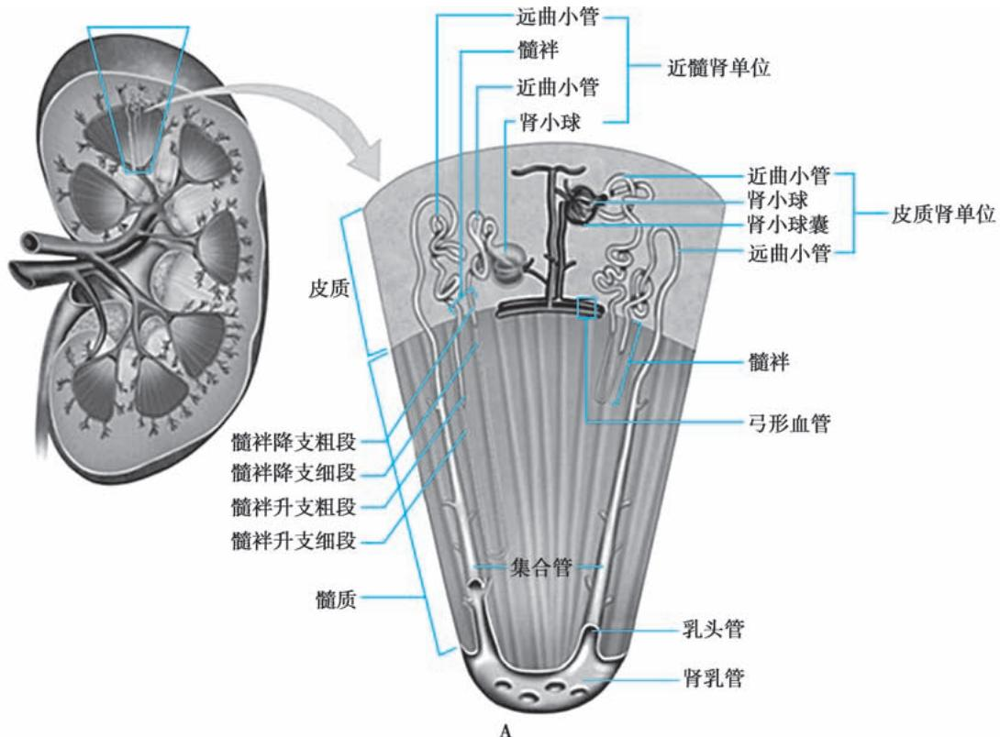

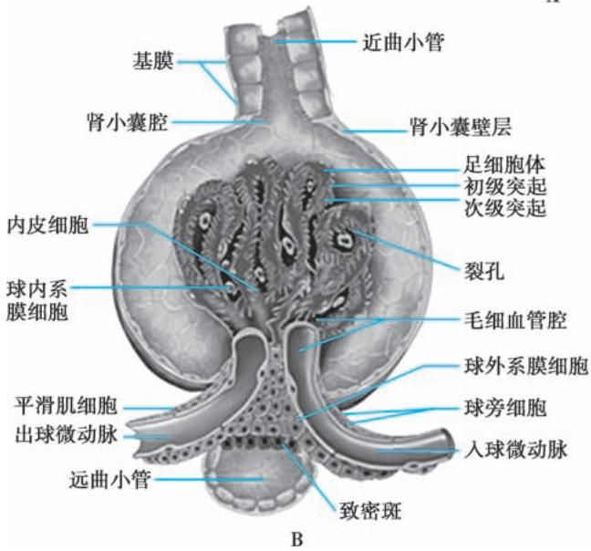

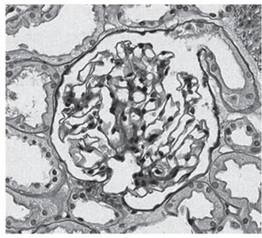  
图 5-1-1 肾单位结构  
A. 肾单位组成; B. 肾小球示意图; C. 光镜下的肾小球 (PAS)。

2. 肾小管重吸收和分泌功能 肾小球每日滤过生成 180L 的原尿, 其中 99% 的水、全部的葡萄糖和氨基酸、大部分的电解质及碳酸氢根等被肾小管和集合管重吸收回血液, 形成终尿约 1.5L。

近端肾小管是重吸收的主要部位，被滤过的葡萄糖、氨基酸全部被重吸收； $Na^{+}$ 通过 $Na^{+}-K^{+}-ATP$ 酶主动重吸收， $HCO_{3}^{-}$ 和 $Cl^{-}$ 随 $Na^{+}$ 一起转运。近端肾小管除具有重吸收功能外，还参与有机酸的排泌。尿酸可从肾小球滤过，但多数在肾小管重吸收，又再分泌到肾小管管腔中。除有机酸和尿酸外，药物如抗生素和造影剂，也以此方式排出。

髓袢在髓质渗透压梯度形成中起重要作用。水在髓袢降支细段可以自由穿透，而 $Na^{+}$ 和 $Cl^{-}$ 却不能自由穿透，使管腔内的水分在经过内髓部的高渗区时被迅速重吸收；而降支细段一旦折为升支细段，则水不能自由穿透，而 $Na^{+}$ 和 $Cl^{-}$ 却能自由穿透，从而维持髓质区的高渗，故髓袢细段对尿液的浓缩功能至关重要。

远端肾小管,特别是连接小管是调节尿液最终成分的主要场所。这些小管上皮细胞可重吸收 $Na^{+}$ 、排出 $K^{+}$ 以及分泌 $H^{+}$ 和 $NH_{4}^{+}$ ,醛固酮可加强上述作用。

3. 肾脏的内分泌功能 肾脏具有重要的内分泌功能,能够参与合成和分泌肾素、促红细胞生成素(EPO)、1,25-二羟维生素 $D_{3}$ 、前列腺素和激肽类物质。参与人体的血流动力学调节,红细胞生成,钙、磷代谢及骨代谢等。

肾脏产生 EPO 受肾脏皮质和外髓部局部组织氧含量调节, EPO 从肾脏分泌经血液循环作用于骨髓的红系祖细胞, 促进红细胞增生。

肾脏是产生 1α-羟化酶的最重要场所,25-羟维生素 D₃ 在 1α-羟化酶作用下形成 1,25-二羟维生素 D₃,是生物活性最强的维生素 D。1,25-二羟维生素 D₃ 通过调节胃肠道钙、磷吸收,尿排泄,骨转运,甲状旁腺激素分泌等,维持血钙磷平衡,保持骨骼正常的矿物化。

【肾脏疾病的临床表现】肾脏疾病的临床表现包括肾脏疾病本身的临床症状及肾脏功能受损引起的各系统的症状，包括尿色异常、尿量异常、水肿、乏力等。继发性肾病尚可见原发病及其他器官受损的表现，如皮疹、关节痛、口腔溃疡、脱发等。

1. 血尿 血尿分为肉眼血尿和显微镜下血尿。尿色肉眼无异常，新鲜尿沉渣检查每高倍视野红细胞超过3个，称为镜下血尿。尿色加深、尿色发红或呈洗肉水样，称为肉眼血尿。

2. 蛋白尿 蛋白尿常表现为尿泡沫增多。尿蛋白定性试验阳性或尿蛋白定量超过 150mg/d，称为蛋白尿。

3. 水肿 水肿是肾脏病常见的临床表现。肾性水肿多出现在组织疏松部位，如眼睑；身体下垂部位，如脚踝和胫前部位，长期卧床时则最易出现在骶尾部。

4. 高血压 高血压是肾脏疾病常见临床表现,所有高血压病人均应排查有无肾脏疾病,尤其是年轻病人。肾性高血压分为肾血管性和肾实质性高血压两大类。水钠潴留是肾实质性高血压最主要的发病机制,肾素-血管紧张素-醛固酮系统也在发病中起重要作用。

【肾脏疾病的检查】肾脏疾病的检查主要包括:尿液检查、肾功能检查、影像学检查和肾脏病理学检查。

## (一) 尿液检查

1. 尿常规检查 包括尿液外观、理化检查、尿沉渣检查、生化检查。尿常规检查是早期发现和诊断肾脏疾病的重要线索。尿常规检查需要留取清洁新鲜尿液，避免污染和放置时间过长。

2. 尿相差显微镜检查 用于判别尿中红细胞的来源,肾小球源性血尿表现为红细胞形态改变,棘形红细胞>5%或尿中红细胞以变异型红细胞为主。如尿中出现红细胞管型,可帮助诊断肾小球源性血尿。

## 3. 尿蛋白检测

（1）尿蛋白定量:主要有两种方法:①24小时尿蛋白定量>150mg可诊断为蛋白尿,>3.5g为大量蛋白尿。②随机尿白蛋白/肌酐比值:正常<30mg/g,30\~300mg/g为微量白蛋白尿,>300mg/g为蛋白尿。如果尿白蛋白/肌酐比值明显增高(500\~1000mg/g),也可以选择测定尿总蛋白/肌酐比值。留取24小时尿液费时烦琐,尿液不易留全;而随机尿检测易受体位和运动等影响,故在选择检测方法和判断结果时需综合考虑。

（2）尿白蛋白检测:在糖尿病等疾病导致肾脏损伤时,尿白蛋白排泄率升高远早于尿总蛋白排泄率的升高。其检测方法包括24小时尿白蛋白定量和随机尿白蛋白/肌酐比值两种。

4. 其他尿液成分检测 如尿 $\beta_{2}$ 微球蛋白反映近端肾小管重吸收功能； $\kappa$ 或 $\lambda$ 轻链的检测有助于异常球蛋白血症的诊断。尿钠检测有助于了解钠盐摄入情况；尿钾检测有助于肾小管酸中毒和低钾血症的诊断；尿尿素检测有助于计算病人蛋白质摄入量，判断病人营养状态。

## （二）肾功能检查

1. 血清肌酐检测 血清肌酐检测是临床评估肾小球滤过功能最常用的方法,检测快速简便,但敏感性较低,不能反映早期肾损害,常于肾小球滤过功能损害50%时才开始升高。血清肌酐浓度还受性别、年龄、肌肉量、蛋白质摄入量、药物(如西咪替丁等)影响。

2. 估算的肾小球滤过率（estimated GFR, eGFR）用于估算 GFR 的公式包括 Cockcroft-Gault 公式、MDRD 公式和慢性肾脏病流行病学研究（CKD-EPI）公式。

（1）Cockcroft-Gault 公式: 未采用同位素稀释质谱法检测血清肌酐标准化, 目前临床不推荐使用。

$$
\mathrm{CCr} = \{\left[ (1 4 0 - \text {Age}) \times \text {体重} \right] / (7 2 \times \mathrm{Scr}) \} \times 0. 8 5 (\text {女性})
$$

注：Ccr 为肌酐清除率；Age 为年龄，岁；体重，kg；Scr 为血清肌酐，mg/dl。

(2) MDRD 公式: eGFR < 60ml/(min·1.73m²) 的病人中, MDRD 公式的准确性优于 CKD-EPI 公式。

$$
\mathrm{eGFR} = 1 7 5 \times \mathrm{Scr} - 1. 1 5 4 \times \mathrm{Age} - 0. 2 0 3 \times 0. 7 4 2 (\text {女性}) \times 1. 2 1 0 (\text {非洲裔})
$$

（3）CKD-EPI 公式: 目前临床上推荐的评估 GFR 计算公式(表 5-1-1), 2021 年发布了 CKD-EPI 2021 公式, 是不包含种族变量的 CKD-EPI 公式(表 5-1-2)。

表 5-1-1 CKD-EPI 公式

<table><tr><td>性别</td><td>Scr/(mg/dl)</td><td>Scys*/(mg/L)</td><td>eGFR计算公式</td></tr><tr><td></td><td></td><td></td><td>CKD-EPI肌酐公式</td></tr><tr><td rowspan="2">女性</td><td>≤0.7</td><td></td><td>144×(Scr/0.7)-0.329×0.993Age×1.159(黑种人)</td></tr><tr><td>&gt;0.7</td><td></td><td>144×(Scr/0.7)-1.209×0.993Age×1.159(黑种人)</td></tr><tr><td rowspan="2">男性</td><td>≤0.9</td><td></td><td>141×(Scr/0.9)-0.411×0.993Age×1.159(黑种人)</td></tr><tr><td>&gt;0.9</td><td></td><td>141×(Scr/0.9)-1.209×0.993Age×1.159(黑种人)</td></tr><tr><td></td><td></td><td></td><td>CKD-EPI Cystatin C公式</td></tr><tr><td></td><td></td><td>≤0.8</td><td>133×(Scys/0.8)-0.499×0.996Age×0.932(女性)</td></tr><tr><td></td><td></td><td>&gt;0.8</td><td>133×(Scys/0.8)-1.328×0.996Age×0.932(女性)</td></tr><tr><td></td><td></td><td></td><td>CKD-EPI肌酐和Cystatin C公式</td></tr><tr><td rowspan="2">女性</td><td>≤0.7</td><td>≤0.8</td><td>130×(Scr/0.7)-0.248×(Scys/0.8)-0.375×0.995Age×1.08(黑种人)</td></tr><tr><td></td><td>&gt;0.8</td><td>130×(Scr/0.7)-0.248×(Scys/0.8)-0.711×0.995Age×1.08(黑种人)</td></tr><tr><td rowspan="2">女性</td><td>&gt;0.7</td><td>≤0.8</td><td>130×(Scr/0.7)-0.601×(Scys/0.8)-0.375×0.995Age×1.08(黑种人)</td></tr><tr><td></td><td>&gt;0.8</td><td>130×(Scr/0.7)-0.601×(Scys/0.8)-0.711×0.995Age×1.08(黑种人)</td></tr><tr><td rowspan="2">男性</td><td>≤0.9</td><td>≤0.8</td><td>135×(Scr/0.9)-0.207×(Scys/0.8)-0.375×0.995Age×1.08(黑种人)</td></tr><tr><td></td><td>&gt;0.8</td><td>135×(Scr/0.9)-0.207×(Scys/0.8)-0.711×0.995Age×1.08(黑种人)</td></tr><tr><td rowspan="2">男性</td><td>&gt;0.9</td><td>≤0.8</td><td>135×(Scr/0.9)-0.601×(Scys/0.8)-0.375×0.995Age×1.08(黑种人)</td></tr><tr><td></td><td>&gt;0.8</td><td>135×(Scr/0.9)-0.601×(Scys/0.8)-0.711×0.995Age×1.08(黑种人)</td></tr></table>

注：\*为血清 Cystatin C (mg/L)。

表 5-1-2 CKD-EPI 2021 公式

<table><tr><td>性别</td><td>Scr/(mg/dl)</td><td>Cystatin C/(mg/L)</td><td>eGFR 计算公式</td></tr><tr><td></td><td></td><td></td><td>CKD-EPI 2021 肌酐公式</td></tr><tr><td rowspan="2">女性</td><td>≤0.7</td><td></td><td> $144 \times (Scr/0.7)^{-0.241} \times 0.994^{Age}$ </td></tr><tr><td>&gt;0.7</td><td></td><td> $144 \times (Scr/0.7)^{-1.200} \times 0.994^{Age}$ </td></tr><tr><td rowspan="2">男性</td><td>≤0.9</td><td></td><td> $142 \times (Scr/0.9)^{-0.302} \times 0.994^{Age}$ </td></tr><tr><td>&gt;0.9</td><td></td><td> $142 \times (Scr/0.9)^{-1.200} \times 0.994^{Age}$ </td></tr><tr><td></td><td></td><td></td><td>CKD-EPI 2021 肌酐和 CystatinC 公式</td></tr><tr><td rowspan="2">女性</td><td rowspan="2">≤0.7</td><td>≤0.8</td><td> $130 \times (Scr/0.7)^{-0.219} \times (Scys/0.8)^{-0.323} \times 0.996^{Age}$ </td></tr><tr><td>&gt;0.8</td><td> $130 \times (Scr/0.7)^{-0.219} \times (Scys/0.8)^{-0.778} \times 0.996^{Age}$ </td></tr><tr><td rowspan="2">女性</td><td rowspan="2">&gt;0.7</td><td>≤0.8</td><td> $130 \times (Scr/0.7)^{-0.544} \times (Scys/0.8)^{-0.323} \times 0.996^{Age}$ </td></tr><tr><td>&gt;0.8</td><td> $130 \times (Scr/0.7)^{-0.544} \times (Scys/0.8)^{-0.778} \times 0.996^{Age}$ </td></tr><tr><td rowspan="2">男性</td><td rowspan="2">≤0.9</td><td>≤0.8</td><td> $135 \times (Scr/0.9)^{-0.144} \times (Scys/0.8)^{-0.323} \times 0.996^{Age}$ </td></tr><tr><td>&gt;0.8</td><td> $135 \times (Scr/0.9)^{-0.144} \times (Scys/0.8)^{-0.778} \times 0.996^{Age}$ </td></tr><tr><td rowspan="2">男性</td><td rowspan="2">&gt;0.9</td><td>≤0.8</td><td> $135 \times (Scr/0.9)^{-0.544} \times (Scys/0.8)^{-0.323} \times 0.996^{Age}$ </td></tr><tr><td>&gt;0.8</td><td> $135 \times (Scr/0.9)^{-0.544} \times (Scys/0.8)^{-0.778} \times 0.996^{Age}$ </td></tr></table>

注: CKD-EPI 2021 公式是不包含种族变量的 CKD-EPI 公式。

3. 内生肌酐清除率 根据血肌酐浓度和 24 小时尿肌酐排泄量计算。由于尿肌酐有部分由肾小管排泌, 故内生肌酐清除率高于 GFR, 但在血液透析和腹膜透析病人中, 残余肾功能的检测仍然使用该方法。

4. 菊糖清除率和同位素测定 菊糖清除率既往被作为肾小球滤过率测定的“金标准”，但因为操作烦琐无法在临床常规使用，主要用于研究。目前临床使用同位素方法测定肾小球滤过率，其准确性接近菊糖清除率，可用的同位素标记物质有 $^{99m}$ Tc等。

以上测定肾小球滤过率的方法按准确性由高到低依次为菊糖清除率、同位素法测定、内生肌酐清除率、eGFR和血肌酐，可根据需要选择适当的方法。对于肾脏疾病的高危人群和肾脏疾病病人，可采用准确性高的方法，以免漏诊。

（三）影像学检查 包括超声检查、静脉尿路造影、CT、MRI、肾血管造影、放射性核素检查等。

（四）肾脏病理学检查 肾脏疾病所需的病理学检查标本多来自于经皮肾穿刺活检术。这是一种有创检查，但是对肾脏疾病的诊断、病情评估、预后判断和指导治疗非常有价值。肾穿刺活检组织病理检查一般包括光镜、免疫荧光、电镜3项检查，特殊检查需要通过特殊染色，如刚果红染色等。通过对肾小球、肾小管、肾间质及血管病变的分析，并结合临床对疾病作出最终诊断。

【肾脏疾病常见综合征】肾脏疾病常以临床综合征的形式出现,但相互之间可能有重叠。

1. 肾病综合征（nephrotic syndrome, NS）表现为大量蛋白尿（>3.5g/d），低白蛋白血症（<30g/L），常伴有水肿和/或高脂血症。肾病综合征病因可为原发性肾小球疾病（如微小病变肾病、膜性肾病、局灶节段性肾小球硬化等）和继发性肾小球疾病（如糖尿病肾脏病、狼疮性肾炎等）。

2. 肾炎综合征（nephritis syndrome）以肾小球源性血尿为主要特征，常伴有蛋白尿。可有水肿、高血压和/或肾功能损害。按起病急缓和转归，可分为以下3种类型。①急性肾炎综合征：急性起病，多见于儿童。常有前驱感染，如急性扁桃体炎或皮肤感染。临床上最典型的为链球菌感染后急性肾小球肾炎。②急进性肾炎综合征：主要特征是短时间内出现进行性加重的肾功能损害。可见于抗肾小球基底膜病、抗中性粒细胞胞质抗体相关性血管炎、重症狼疮性肾炎、IgA肾病等。③慢性肾炎综合征:缓慢起病,早期病人常无明显症状,或仅有水肿、乏力等,血尿和蛋白尿迁延不愈或逐渐加重,随着病情进展可逐渐出现高血压和/或肾功能损害。

3. 无症状性血尿和/或蛋白尿（asymptomatic hematuria and/or proteinuria）是指血尿和/或轻、中度蛋白尿，不伴有水肿、高血压等症状。常见于多种原发性肾小球疾病(如 IgA 肾病等)和肾小管-间质病变。

4. 急性肾损伤（acute kidney injury, AKI）是指各种原因引起的血肌酐在 48 小时内绝对值升高 $\geqslant26.5\mu mol/L$ 或较基础值升高 $\geqslant50\%$ 或尿量 $<0.5ml/(kg\cdot h)$ ，持续超过 6 小时。临床主要表现为少尿、无尿，含氮代谢产物在血中潴留，水、电解质及酸碱平衡紊乱等。AKI 最重要的是区分是肾前性、肾性还是肾后性原因。

5. 慢性肾脏病（chronic kidney disease, CKD）是指肾脏损伤或肾小球滤过率 $< 60\mathrm{ml} / (\min \cdot 1.73\mathrm{m}^2)$ ，时间 $>3$ 个月；其中肾脏损伤定义为肾脏病理学异常或血、尿中的肾脏损伤标志物异常、肾小管功能异常所致的电解质等异常、肾脏影像学检查异常、肾移植病史。终末期肾病是CKD的严重阶段，临床主要表现为消化系统症状、心血管并发症、贫血及肾性骨病等。

【肾脏疾病的诊断】肾脏疾病的诊断应尽可能作出病因诊断、病理诊断、功能诊断和并发症诊断，以确切反映疾病的性质和程度，为选择治疗方案和判定预后提供依据。

1. 病因诊断 首先区别是原发性还是继发性肾病。原发性肾病包括免疫反应介导的肾炎、泌尿系统感染性疾病、肾血管疾病、肾结石、肾肿瘤及先天性肾病等；继发性肾病可继发于肿瘤、代谢、自身免疫等疾病，也可见于各种药物、毒物等对肾脏造成的损害。

2. 病理诊断 对肾炎、肾病综合征、急性肾损伤及原因不明的蛋白尿和/或血尿，可通过肾穿刺活检明确病理类型及病因、指导治疗和评估预后。

3. 功能诊断 临床上对于诊断 AKI 和 CKD 的病人, 还要进行肾功能的分期诊断。根据血肌酐和尿量的变化, AKI 分为 1\~3 期, 详见本篇第九章。根据肾小球滤过率下降程度, CKD 分为 1\~5 期, 详见本篇第十章。

4. 并发症诊断 肾脏病特别是急、慢性肾衰竭可引起全身各个系统并发症，包括中枢神经、呼吸及循环系统等。

【肾脏疾病防治原则】肾脏疾病依据其病因、发病机制、病变部位、病理诊断和功能诊断的不同，选择相应的治疗方案。治疗原则包括去除诱因，一般治疗，针对病因和发病机制的治疗，合并症及并发症的治疗和肾脏替代治疗。

【一般治疗】包括避免过度劳累,去除感染等诱因,避免接触肾毒性药物或毒物,采取健康的生活方式(如戒烟、限制饮酒、休息与锻炼相结合、控制情绪等)以及合理的饮食。

## 【针对病因及发病机制的治疗】

1. 免疫抑制治疗 肾脏疾病尤其是免疫介导的原发性和继发性肾小球疾病,如 IgA 肾病和狼疮性肾炎等,其发病机制主要是异常的免疫反应,所以治疗常包括糖皮质激素及免疫抑制剂治疗。某些血液净化治疗(如免疫吸附、血浆置换等)能有效清除体内自身抗体和抗原-抗体复合物,可用于治疗危重的免疫相关性肾病,尤其是重症狼疮性肾炎和血管炎相关性肾损害等。

2. 针对非免疫发病机制的治疗 高血压、高血脂、高血糖、高尿酸血症、蛋白尿等非免疫因素在肾脏疾病的发生和发展过程中起重要作用，针对这些因素的干预治疗是保护肾脏功能的重要措施。血管紧张素转换酶抑制剂（ACEI）或血管紧张素Ⅱ受体拮抗剂（ARB）既可以抑制肾内过度激活的肾素-血管紧张素系统，降低血压，又能够降低肾小球内压力，从而减少尿蛋白的排泄，因此，是肾功能保护的重要治疗措施。SGLT2i是一种新的降糖药，通过抑制近曲肾小管葡萄糖的重吸收使葡萄糖从尿液排出，降低血糖；多项研究已经显示SGLT2i可降低糖尿病和非糖尿病肾脏病病人的蛋白尿，延缓肾功能进展。此外，控制血糖、尿酸、调节血脂水平也是肾脏治疗的综合措施。

3. 并发症的防治 在肾脏疾病的进展过程中可有多种并发症,如高血压、心脑血管疾病、肾性贫血、骨矿物化代谢异常等，尤其是心脑血管疾病，是 CKD 的重要死亡原因。因此，CKD 病人从一开始就面临着尿毒症及心脑血管疾病的双重风险。这些并发症不仅影响肾脏疾病病人的生活质量和寿命，还可能进一步加重肾脏疾病的进展，形成恶性循环，严重影响病人预后。因此，必须重视 CKD 并发症的早期防治。

  
本章思维导图

4. 肾脏替代治疗 尽管积极治疗,仍然有部分 CKD 病人进展至终末期肾病。当病人发生严重的 AKI 或发展至终末期肾病阶段,必须依靠肾脏替代治疗维持内环境的稳定。肾脏替代治疗包括血液透析、腹膜透析和肾移植。血液透析是以人工半透膜为透析膜,血液和透析液在膜两侧反向流动,通过弥散、对流、吸附等原理排出血液中的代谢废物,补充钙、碳酸氢根等机体必需的物质;同时,清除多余的水分,从而部分替代肾脏功能。腹膜透析的原理与血液透析相似,只是以病人的腹膜替代人工半透膜作为透析膜。成功的肾移植无疑是肾脏替代治疗的首选,不仅可以恢复肾脏的排泄功能,还可以恢复其内分泌功能。但是肾移植术后,病人需长期使用糖皮质激素及免疫抑制剂以预防和抗排斥反应。

(余学清)

## 第一节 | 肾小球疾病概述

肾小球疾病是一组以血尿、蛋白尿、水肿、高血压和不同程度的肾功能损害等为主要临床表现的肾脏疾病，病变通常累及双侧肾小球，是我国慢性肾衰竭的主要病因。其病因、发病机制、病理改变、临床表现、病程和预后不尽相同。根据病因可分为原发性、继发性和遗传性三大类。原发性肾小球疾病系指病因不明者；继发性肾小球疾病系指继发于全身性疾病的肾小球损害，如狼疮性肾炎、糖尿病肾脏病等；遗传性肾小球疾病为遗传基因突变所致的肾小球疾病，如Alport综合征等。

本章主要介绍原发性肾小球疾病,目前仍是我国终末期肾病最主要的病因。

【原发性肾小球疾病的分类】原发性肾小球疾病可根据临床表现和肾脏活检病理改变进行分型。

（一）临床分型 原发性肾小球疾病的临床分型是根据临床表现分为相应的临床综合征，一种综合征常包括多种不同类型的疾病或病理改变。详细内容参见有关章节。

1. 急性肾小球肾炎(acute glomerulonephritis)。

2. 急进性肾小球肾炎（rapidly progressive glomerulonephritis）。

3. 慢性肾小球肾炎(chronic glomerulonephritis)。

4. 无症状性血尿和/或蛋白尿(asymptomatic hematuria and/or proteinuria)。

5. 肾病综合征 (nephrotic syndrome)。

（二）病理分型 肾小球疾病病理分型的基本原则是依据病变的性质和病变累及的范围。根据病变累及的肾小球范围可分为局灶性(累及肾小球数<50%)和弥漫性病变(累及肾小球数≥50%);根据病变累及的毛细血管袢面积分为节段性(累及血管袢面积<50%)和球性病变(累及血管袢面积≥50%)。

1. 肾小球轻微病变 (minor glomerular lesion) 包括微小病变型肾病 (minimal change disease, MCD)。

2. 局灶节段性肾小球病变(focal segmental lesion) 包括局灶节段性肾小球硬化(focal segmental glomerulosclerosis, FSGS) 和局灶性肾小球肾炎(focal glomerulonephritis)。

3. 弥漫性肾小球肾炎（diffuse glomerulonephritis）

(1) 膜性肾病 (membranous nephropathy, MN)。

（2）增生性肾小球肾炎(proliferative glomerulonephritis):①系膜增生性肾小球肾炎(mesangial proliferative glomerulonephritis);②毛细血管内增生性肾小球肾炎(endocapillary proliferative glomerulonephritis);③系膜毛细血管性肾小球肾炎(mesangial capillary glomerulonephritis),包括膜增生性肾小球肾炎(membranoproliferative glomerulonephritis,MPGN)Ⅰ型和Ⅲ型;④致密物沉积病(dense deposit disease),又称为膜增生性肾小球肾炎Ⅱ型;⑤新月体性肾小球肾炎(crescentic glomerulonephritis)。

（3）硬化性肾小球肾炎(sclerosing glomerulonephritis)。

4. 未分类的肾小球肾炎（unclassified glomerulonephritis）

肾小球疾病的临床和病理类型之间存在一定联系,但两者之间没有必然的对应关系,即相同的临床表现可来源于不同的病理类型,而同一病理类型又可呈现不同的临床表现。因此,肾活检是确定肾小球疾病病理类型和病变程度的必需手段,而正确的病理诊断又必须与临床密切结合。临床工作中,一般首先需要对肾小球疾病进行临床分型,然后在适当的条件下进行病理学评估。

【发病机制】原发性肾小球疾病的发病机制尚未完全明确。多数肾小球疾病是免疫反应介导性炎症疾病。一般认为，免疫反应是肾小球疾病的始动机制，在此基础上炎症介质(如补体、细胞因子、活性氧等)参与，最后导致肾小球损伤并产生临床症状。在肾小球疾病的慢性进展过程中也有非免疫、非炎症机制参与。此外，遗传因素在肾小球疾病的易感性、疾病的严重性和治疗反应方面起重要作用。

（一）免疫反应 包括体液免疫和细胞免疫。体液免疫如循环免疫复合物（circulating immune complex, CIC）、原位免疫复合物（in situ immune complex）以及自身抗体在肾小球疾病发病机制中的作用已得到公认；细胞免疫在某些类型肾小球疾病中的作用也得到了重视。

## 1. 体液免疫

（1）循环免疫复合物沉积:某些外源性抗原(如致肾炎链球菌的某些成分)或内源性抗原(如DNA的降解产物)可刺激机体产生相应抗体,在血液循环中形成CIC,并在某些情况下沉积于肾小球或为肾小球所捕捉,激活相关的炎症介质而致肾小球损伤。多个抗原抗体分子形成网络样结构、单核巨噬细胞系统吞噬功能和/或肾小球系膜清除功能降低、补体成分或功能缺陷等原因使CIC易沉积于肾小球而致病。CIC在肾小球内的沉积主要位于系膜区和/或内皮下。

（2）原位免疫复合物形成：系指血液循环中游离抗体(或抗原)与肾小球固有抗原(如GBM抗原或足细胞的抗原)或种植于肾小球的外源性抗原(或抗体)相结合，在肾脏局部形成免疫复合物，并导致肾脏损伤。原位免疫复合物的沉积主要位于GBM上皮细胞侧。除经典的抗GBM肾炎外，特发性膜性肾病（idiopathic membranous nephropathy, IMN）也是一种主要由原位免疫复合物介导的疾病。肾小球足细胞上的M型磷脂酶 $\mathrm{A}_2$ 受体是IMN的主要识别抗原，循环中抗磷脂酶 $\mathrm{A}_2$ 受体特异性抗体与其相结合形成原位免疫复合物，激活补体导致足细胞损伤，导致蛋白尿。

（3）自身抗体: 自身抗体如抗中性粒细胞胞质抗体(ANCA)可以通过与中性粒细胞、血管内皮细胞以及补体活化的相互作用引起肾小球的免疫炎症反应, 导致典型的寡免疫复合物沉积性肾小球肾炎。

2. 细胞免疫 细胞免疫在肾小球肾炎发病机制中的作用已为许多学者所重视。肾炎动物模型及部分人类肾小球肾炎均提供了细胞免疫的证据。在微小病变型肾病，肾小球内没有体液免疫参与的证据，而主要表现为 T 细胞功能异常，且体外培养发现病人淋巴细胞可释放血管通透性因子，导致肾小球足细胞足突融合。近年来的研究显示，辅助性 T 细胞不同亚类之间比例失衡在肾小球疾病的发病中也起到重要作用。

（二）炎症反应 免疫反应需引起炎症反应才能导致肾小球损伤及其临床症状。炎症介导系统可分成炎症细胞和炎症介质两大类，炎症细胞可产生炎症介质，炎症介质又可趋化、激活炎症细胞，各种炎症介质间又相互促进或制约，形成一个十分复杂的网络关系。

1. 炎症细胞 主要包括中性粒细胞、单核巨噬细胞、致敏 T 淋巴细胞、嗜酸性粒细胞及血小板等。炎症细胞可产生多种炎症介质，造成肾小球炎症病变。近年发现肾小球固有细胞（如系膜细胞、内皮细胞和足细胞）具有多种免疫球蛋白和炎症介质的受体，也能分泌多种炎症介质和细胞外基质（ECM），它们在免疫介导性肾小球炎症中并非单纯的无辜受害者，而有时是主动参与者。

2. 炎症介质 炎症介质可通过收缩或舒张血管,影响肾脏局部的血流动力学及肾小球毛细血管通透性;可分别作用于肾小球及间质小管等不同细胞,通过影响细胞的活化和增殖、自分泌和旁分泌,影响 ECM 的聚集和降解,从而介导炎症损伤及其硬化病变。

（三）非免疫因素 免疫介导性炎症在肾小球病致病中起主要作用和/或起始作用，在慢性进展过程中存在着非免疫机制参与，主要包括肾小球毛细血管内高压力、蛋白尿、高脂血症等，这些因素有时成为病变持续、恶化的重要原因。肾实质损害后，剩余的健存肾单位可发生血流动力学变化，导致肾小球毛细血管内压力增高,促进肾小球硬化。此外,大量蛋白尿是肾小球病变进展的独立危险因素。

## 【临床表现】

1. 蛋白尿 正常的肾小球滤过膜允许分子量小于2万～4万Da的蛋白质顺利通过，因此，肾小球滤过的原尿中主要为小分子蛋白质(如溶菌酶、 $\beta_{2}$ 微球蛋白、轻链蛋白等)，而白蛋白(分子量6.9万Da)及分子量更大的免疫球蛋白含量较少。经肾小球滤过的原尿中，95%以上的蛋白质被近曲小管重吸收，故正常人终尿中蛋白质含量极低（＜150mg/d），其中约一半蛋白质成分来自远曲小管和髓袢升支分泌的Tamm-Horsfall蛋白及尿道分泌的其他组织蛋白；另一半蛋白质成分为白蛋白、免疫球蛋白、轻链蛋白、 $\beta_{2}$ 微球蛋白和多种酶等血浆蛋白。正常人临床上尿常规蛋白定性试验不能测出。当尿蛋白超过150mg/d，尿蛋白定性阳性，称为蛋白尿。若尿蛋白量大于3.5g/d，则称为大量蛋白尿。

肾小球滤过膜由肾小球毛细血管内皮细胞、基底膜和脏层上皮细胞(足细胞)所构成,滤过膜屏障作用包括:①分子屏障,肾小球滤过膜仅允许较小的蛋白质分子通过;②电荷屏障,内皮及足细胞膜含涎蛋白,而基底膜含硫酸类肝素,使肾小球滤过膜带负电荷,通过同性电荷相斥原理,阻止带负电荷的血浆蛋白(如白蛋白)滤过。上述任一屏障的损伤均可引起蛋白尿,肾小球性蛋白尿常以白蛋白为主。光镜下肾小球结构正常的微小病变型肾病病人大量蛋白尿主要为电荷屏障损伤所致;当分子屏障被破坏时,尿中还可出现除白蛋白以外更大分子的血浆蛋白,如免疫球蛋白、C3等,提示肾小球滤过膜有较严重的结构损伤。

2. 血尿 离心后尿沉渣镜检每高倍视野红细胞超过3个为显微镜下血尿，1L尿中含1ml血液即呈现肉眼血尿。肾小球疾病特别是肾小球肾炎，其血尿常为无痛性、全程性血尿，可呈镜下或肉眼血尿，持续性或间发性。血尿可分为单纯性血尿，也可伴蛋白尿、管型尿，如血尿病人伴较大量蛋白尿和/或管型尿(特别是红细胞管型)，多提示为肾小球源性血尿。

以下两项检查帮助区分血尿来源:①新鲜尿沉渣相差显微镜检查。变形红细胞尿为肾小球源性,均一形态正常红细胞尿多数为非肾小球源性。但是当肾小球病变严重时(如新月体形成)也可出现均一形态正常的红细胞尿。②尿红细胞容积分布曲线。肾小球源性血尿常呈非对称曲线,其峰值红细胞容积小于静脉峰值红细胞容积;非肾小球源性血尿常呈对称性曲线,其峰值红细胞容积大于静脉峰值红细胞容积。

肾小球源性血尿产生的主要原因为 GBM 断裂,红细胞通过该裂缝时受血管内压力挤压受损,受损的红细胞其后通过肾小管各段又受不同渗透压和 pH 作用,呈现变形红细胞血尿,红细胞容积变小,甚至破裂。

3. 水肿 肾性水肿的基本病理生理改变为水、钠潴留。肾小球疾病时水肿可分为两大类：①肾病性水肿。主要由于长期、大量蛋白尿造成血浆蛋白过低，血浆胶体渗透压降低，液体从血管内渗入组织间隙，产生水肿；同时，由于有效血容量减少，刺激肾素-血管紧张素-醛固酮系统激活、抗利尿激素分泌增加，肾小管重吸收水、钠增多，进一步加重水肿。此外，近年的研究提示，某些原发于远端肾单位的水、钠潴留因素可能在肾病性水肿上起一定作用，这种作用独立于肾素-血管紧张素-醛固酮系统。②肾炎性水肿。主要是由于肾小球滤过率下降，而肾小管重吸收功能基本正常，造成“球-管失衡”和肾小球滤过分数（肾小球滤过率/肾血浆流量）下降，导致水、钠潴留。肾炎性水肿时，血容量常增加，伴肾素-血管紧张素-醛固酮系统活性抑制、抗利尿激素分泌减少，因高血压、毛细血管通透性增加等因素而使水肿持续和加重。肾病性水肿组织间隙蛋白质含量低，水肿多从下肢部位开始；而肾炎性水肿组织间隙蛋白质含量高，水肿多从眼睑、颜面部开始。

4. 高血压 肾小球疾病常伴高血压,慢性肾小球肾炎病人高血压的发生率约为61%,慢性肾衰竭病人90%出现高血压。肾小球疾病高血压的发生机制:①水、钠潴留。血容量增加引起容量依赖性高血压。②肾素分泌增多。肾实质缺血刺激肾素-血管紧张素分泌增加,小动脉收缩,外周阻力增加,引起肾素依赖性高血压。③肾内降压物质分泌减少。肾实质损害时,肾内前列腺素系统、激肽释放酶-激肽系统等降压物质生成减少,也是肾性高血压的原因之一。此外,一些其他因素如心房钠尿肽、交感神经系统和其他内分泌激素等均直接或间接地参与肾性高血压的发生。肾小球疾病所致的高血压多数为容量依赖型,少数为肾素依赖型。但两型高血压常混合存在,有时很难截然分开。

5. 肾功能异常 部分急性肾小球肾炎可出现一过性的氮质血症或急性肾损伤,急进性肾小球肾炎常出现肾功能急剧恶化甚至发生肾衰竭;慢性肾小球肾炎病人随着病程进展常出现不同程度的肾功能损害,部分病人最终进展至终末期肾病。

## 第二节 | 急性肾小球肾炎

急性肾小球肾炎（acute glomerulonephritis）简称急性肾炎（AGN），是以急性肾炎综合征为主要临床表现的一组疾病。特点为急性起病，血尿、蛋白尿、水肿和高血压，可伴有一过性肾功能不全。多见于链球菌感染后，其他细菌、病毒及寄生虫感染亦可引起。本节主要介绍链球菌感染后急性肾小球肾炎。

【病因和发病机制】本病主要为乙型溶血性链球菌“致肾炎菌株”感染所致，如扁桃体炎、猩红热和脓疱疮等。本病系感染诱发的免疫反应所致。针对链球菌致病抗原如蛋白酶外毒素B等的抗体可能与肾小球内成分发生交叉反应、循环或原位免疫复合物诱发补体异常活化等均可能参与致病，导致肾小球内炎症细胞浸润。

【病理表现】肾脏体积可增大。光镜下见弥漫性肾小球毛细血管内皮细胞及系膜细胞增生，急性期可伴有中性粒细胞和单核细胞浸润(文末彩图5-2-1)。病变严重时，毛细血管袢管腔狭窄或闭塞。肾间质水肿及灶状炎症细胞浸润。免疫病理IgG及C3呈粗颗粒状沿肾小球毛细血管壁和/或系膜区沉积。电镜见肾小球上皮细胞下有驼峰状电子致密物沉积。

【临床表现和实验室检查】多见于儿童,男性略多。常于感染后2周起病,相当于抗原免疫后产生抗体的时间。本病起病急,轻者呈亚临床型(仅尿常规及血清C3异常);典型者呈急性肾炎综合征表现,重症者可发生急性肾损伤。临床均有肾小球源性血尿,约30%为肉眼血尿。可伴有轻、中度蛋白尿,少数可呈肾病综合征范围的蛋白尿。80%的病人可有晨起眼睑及下肢水肿,可有一过性高血压。少数重症病人可发生充血性心力衰竭,常与水、钠潴留有关。

起病初期血清 C3 及总补体下降,8 周内逐渐恢复正常,对本病具有诊断意义。病人血清抗链球菌溶血素 O(ASO) 滴度升高,提示近期内曾有过链球菌感染。

【诊断与鉴别诊断】链球菌感染后1～3周发生急性肾炎综合征，伴血清C3一过性下降，可临床诊断急性肾炎。若血肌酐持续升高或2个月病情尚未见好转应及时肾穿刺活检，以明确诊断。

本病需要与其他表现为急性肾炎综合征的肾小球疾病鉴别:①其他病原体感染后的急性肾炎。应寻找其他病原菌感染的证据,病毒感染后常不伴血清补体降低,少有水肿和高血压,肾功能一般正常,临床过程自限。②膜增生性肾小球肾炎(MPGN)。临床上常伴肾病综合征,50%\~70%病人有持续性低补体血症,8周内不恢复。③IgA肾病。部分病人有前驱感染,通常在感染后数小时至数日内出现肉眼血尿,部分病人血清IgA升高,血清C3一般正常,病情无自愈倾向。

当临床诊断困难时,急性肾炎综合征病人需考虑进行肾活检以明确诊断、指导治疗。肾活检的指征为:①少尿1周以上或进行性尿量减少伴肾功能恶化者;②病程超过2个月而无好转趋势者;③急性肾炎综合征伴肾病综合征者。

【治疗】支持及对症治疗为主。急性期卧床休息，静待肉眼血尿消失、水肿消退及血压恢复正常。同时限盐、利尿消肿以降血压和预防心脑血管并发症的发生。

本病急性肾炎发作时感染灶多数已经得到控制,如无现症感染证据,不需要使用抗生素。反复发作慢性扁桃体炎,病情稳定后可考虑扁桃体摘除。

【预后】本病为自限性疾病,多数病人预后良好。约6%～18%病例遗留尿异常和/或高血压而转为 “慢性”, 或于 “临床痊愈” 多年后又出现肾小球肾炎表现。一般认为老年、持续高血压、大量蛋白尿或肾功能不全者预后较差; 散发者较流行者预后差。

## 第三节 | 急进性肾小球肾炎

急进性肾小球肾炎（rapidly progressive glomerulonephritis, RPGN）即急进性肾炎，是在急性肾炎综合征基础上，肾功能快速进展，病理类型为新月体肾炎的一组疾病。

【病因和发病机制】根据免疫病理 RPGN 可分为三型,每型病因和发病机制各异:①Ⅰ型,又称抗肾小球基底膜(GBM)型,因抗 GBM 抗体与 GBM 抗原结合诱发补体活化而致病;②Ⅱ型,又称免疫复合物型,因循环免疫复合物在肾小球沉积或原位免疫复合物形成而致病;③Ⅲ型,为寡免疫复合物沉积型,肾小球内无或仅微量免疫球蛋白沉积,多与 ANCA 相关小血管炎相关。

约半数 RPGN 病人有前驱上呼吸道感染病史。接触某些有机化学溶剂、碳氢化合物如汽油，可能与 RPGN I 型密切相关。丙硫氧嘧啶（PTU）和肼屈嗪等可引起 RPGN III 型。

【病理】肾脏体积常增大。病理类型为新月体肾炎。光镜下多数(50%以上)肾小球大新月体形成(占肾小球囊腔50%以上)，病变早期为细胞新月体(文末彩图5-2-2)，后期为纤维新月体。另外，Ⅱ型常伴有肾小球毛细血管内皮细胞和系膜细胞增生，I型和Ⅲ型可见肾小球节段性纤维素样坏死。免疫病理学检查是分型的主要依据，I型IgG及C3呈线条状沿肾小球毛细血管壁分布(文末彩图5-2-3)；Ⅱ型IgG及C3呈颗粒状或团块状沉积于系膜区及毛细血管壁；Ⅲ型肾小球内无或仅有微量免疫沉积物。电镜下Ⅱ型可见电子致密物在系膜区和内皮下沉积，I型和Ⅲ型无电子致密物。

【临床表现和实验室检查】我国以Ⅱ型略为多见。Ⅰ型好发于中青年，Ⅲ型常见于中老年病人，男性略多。

多数病人起病急,病情可急骤进展。在急性肾炎综合征基础上,早期出现少尿或无尿,肾功能快速进展乃至尿毒症。病人可伴有不同程度贫血,Ⅱ型约半数伴肾病综合征,Ⅲ型常有发热、乏力、体重下降等系统性血管炎的表现。

免疫学检查主要有抗 GBM 抗体阳性（Ⅰ型）、狼疮相关自身抗体阳性（Ⅱ型）和 ANCA 阳性（Ⅲ型）。此外，Ⅱ型病人的血液循环免疫复合物及冷球蛋白可呈阳性，并可伴血清 C3 降低。

【诊断与鉴别诊断】急性肾炎综合征伴肾功能急剧恶化均应怀疑本病，并及时肾活检以明确诊断。

急进性肾炎应与下列疾病鉴别。

## （一）引起急性肾损伤的非肾小球疾病

1. 急性肾小管坏死 常有明确的肾缺血(如休克、脱水)和中毒(如肾毒性抗生素)等诱因,实验室检查以肾小管损害为主(尿钠增加、低比重尿及低渗透压尿)。

2. 急性过敏性间质性肾炎 常有用药史,部分病人有药物过敏反应(低热、皮疹等;血和尿嗜酸性粒细胞增加),必要时肾活检确诊。

3. 梗阻性肾病 常突发无尿,影像学检查可协助确诊。

## （二）引起急进性肾炎综合征的其他肾小球疾病

1. 原发性肾小球疾病 重症急性肾炎或重症膜增生性肾炎也可发生急性肾损伤,但肾脏病理不一定为新月体肾炎,肾活检可明确诊断。

2. 继发性急进性肾炎 肺出血肾炎综合征(Goodpasture 综合征)、系统性红斑狼疮、过敏性紫癜肾炎均可引起新月体肾炎,依据系统受累的临床表现和特异性实验室检查可资鉴别。

【治疗】应及时明确病因诊断和免疫病理分型,尽早开始强化免疫抑制治疗。

## （一）强化疗法

1. 血浆置换疗法 每日或隔日 1 次,每次置换血浆 2～4L,直到血清自身抗体(如抗 GBM 抗体、ANCA)转阴,一般需 7 次以上。适用于Ⅰ型和Ⅲ型。此外,对于肺出血的病人,首选血浆置换。

2. 甲泼尼龙冲击 甲泼尼龙 0.5～1.0g 静脉滴注, 每日或隔日 1 次, 3 次为一疗程。一般 1～3 个疗程。该疗法主要适用Ⅱ、Ⅲ型。

上述强化疗法需配合糖皮质激素[口服泼尼松 $1\mathrm{mg / (kg\cdot d)}$ ，6～8周后渐减]及细胞毒药物[环磷酰胺口服 $2\sim 3\mathrm{mg / (kg\cdot d)}$ ，或静脉滴注 $0.6\sim 0.8\mathrm{g}/$ 月，累积量一般不超过 $8\mathrm{g}$ ]。

（二）支持对症治疗 凡是达到透析指征者，应及时透析。对强化治疗无效的晚期病例或肾功能已无法逆转者，则有赖于长期维持透析。肾移植应在病情静止半年，特别是I型病人血中抗GBM抗体转阴后半年进行。

【预后】及时明确的诊断和早期强化治疗,可改善预后。影响预后的主要因素:①免疫病理类型。Ⅲ型较好,Ⅰ型差,Ⅱ型居中。②早期强化治疗。少尿、血肌酐大于600μmol/L,病理显示广泛慢性病变时预后差。③老年病人预后相对较差。

## 第四节 | IgA 肾病

IgA 肾病（IgA nephropathy）是指肾小球系膜区以 IgA 沉积为主的肾小球疾病，是目前世界范围内最常见的原发性肾小球疾病。IgA 肾病的发病有明显的地域差别，在欧洲和亚洲约占原发性肾小球疾病的 15%～40%，是我国最常见的肾小球疾病，也是终末期肾病（end stage renal disease, ESRD）的重要病因。IgA 肾病可发生于任何年龄，但以 20～30 岁男性为多见。

【病因和发病机制】IgA肾病的发病机制目前尚不完全清楚。由于IgA肾病免疫荧光检查以IgA和C3在系膜区的沉积为主，提示本病可能是由于循环中的免疫复合物在肾脏内沉积、激活补体而致肾损害。大多数IgA肾病病人及其直系亲属循环中存在着铰链区半乳糖缺陷的IgA分子，而且主要是多聚 $\mathrm{IgA}_1$ 。目前研究认为，感染等二次“打击”刺激自身抗体的产生，免疫复合物形成并沉积于肾小球产生炎症反应，继而刺激系膜细胞增殖和系膜外基质集聚等，最终导致肾小球硬化和间质纤维化。遗传因素在IgA肾病发病中也起着重要作用，IgA肾病的全基因组关联分析研究发现多个易感位点，分别与免疫反应、黏膜免疫以及补体激活密切相关。

【病理】IgA肾病的主要病理特点是肾小球系膜细胞增生和基质增多(文末彩图5-2-4)。病理变化多种多样，病变程度轻重不一，可涉及肾小球肾炎几乎所有的病理类型，如系膜增生性肾小球肾炎、轻微病变性肾小球肾炎、局灶性增生性肾小球肾炎、毛细血管内增生性肾小球肾炎、新月体性肾小球肾炎、局灶节段性肾小球硬化和增生硬化性肾小球肾炎等。IgA肾病目前广泛采用牛津分型，具体包括：系膜细胞增生（M0/1）、内皮细胞增生（E0/1）、节段性硬化或粘连（S0/1）及肾小管萎缩或肾间质纤维化（T0/1/2）、细胞或细胞纤维性新月体（C0/1/2）等5项主要病理指标。免疫荧光可见系膜区IgA为主的颗粒样或团块样沉积，伴或不伴毛细血管袢分布，常伴C3的沉积，但C1q少见。也可有IgG、IgM沉积，与IgA的分布相似，但强度较弱。电镜下可见系膜区电子致密物呈团块状沉积。

【临床表现】IgA 肾病起病隐匿,常表现为无症状性血尿,伴或不伴蛋白尿,往往体检时才发现。有些病人起病前数小时或数日内有上呼吸道或消化道感染等前驱症状,主要表现为发作性的肉眼血尿,可持续数小时或数日,肉眼血尿常为无痛性,可伴少量蛋白尿,多见于儿童和年轻人。全身症状轻重不一,可表现为全身不适、乏力和肌肉疼痛等。

约 20%～50% 的病人有高血压,少数病人可发生恶性高血压。部分病人表现为肾病综合征及不同程度的肾功能损害。

【实验室检查】尿液检查可表现为镜下血尿或肉眼血尿，以畸形红细胞为主；约60%的病人伴有不同程度蛋白尿，有些病人可表现为肾病综合征（>3.5g/d）。

30%～50% 的病人伴有血 IgA 水平增高,但与疾病的严重程度及病程不相关。血清补体水平多数正常。

【诊断与鉴别诊断】年轻病人出现镜下血尿和/或蛋白尿，尤其是与上呼吸道感染有关的血尿，临床上应考虑IgA肾病的可能。本病的确诊有赖于肾活检免疫病理检查。IgA肾病主要应与下列疾病相鉴别。

1. 急性链球菌感染后肾炎 此病潜伏期较长(7～21天),有自愈倾向。IgA 肾病潜伏期短,呈反复发作,结合实验室检查(如血 IgA 水平增高、血 C3 水平的动态变化、ASO 试验阳性等),尤其是肾活检可资鉴别。

2. 非 IgA 系膜增生性肾小球肾炎 与 IgA 肾病极为相似,确诊有赖于肾活检。

3. 其他继发性系膜 IgA 沉积 如过敏性紫癜性肾炎、慢性肝病肾损害等,相应的病史及实验室检查可资鉴别。

4. 薄基底膜肾病 临床表现为持续性镜下血尿,多有阳性家族史,肾活检免疫荧光检查 IgA 阴性,电镜可见肾小球基底膜弥漫变薄。

5. 泌尿系统感染 伴有发热、腰痛，易与尿中红、白细胞增多的 IgA 肾病病人混淆，但 IgA 肾病病人反复中段尿细菌培养阴性，抗生素治疗无效。

【治疗】本病的临床表现、病理改变和预后差异较大，治疗需根据不同的临床表现、病理类型等综合制订合理的治疗方案。

1. 单纯镜下血尿 此类病人一般预后较好,大多数病人肾功能可长期维持在正常范围,一般无特殊治疗,但需要定期监测尿蛋白和肾功能。应注意避免过度劳累、预防感染和避免使用肾毒性药物。

2. 反复发作性肉眼血尿 对于感染后反复出现肉眼血尿或尿检异常加重的病人,应积极控制感染,选用无肾毒性的抗生素,如青霉素80万单位,肌内注射,2次/日;或口服红霉素、头孢菌素等;慢性扁桃体炎反复发作的病人,建议行扁桃体摘除术。

3. 伴蛋白尿 建议选用 ACEI 或 ARB 治疗并逐渐增加至可耐受的剂量, 尽量将尿蛋白控制在 <0.5g/d, 延缓肾功能进展。经过 3～6 个月优化支持治疗(包括口服 ACEI/ARB 和控制血压)后, 如尿蛋白仍持续 >1g/d 且 GFR >50ml/(min·1.73m²) 的病人, 可给予糖皮质激素治疗, 每日泼尼松 0.6～1.0mg/kg, 4～8 周后逐渐减量, 总疗程 6～12 个月。对于免疫抑制剂(如环磷酰胺、硫唑嘌呤、吗替麦考酚酯等)的获益仍存在争议。

4. 肾病综合征 肾脏病理如表现为微小病变型,可选用激素治疗(详细治疗见本章第五节肾病综合征),常可获较好疗效;如肾脏病理改变为膜增生性肾小球肾炎等,疗效常较差,尤其是合并大量蛋白尿且难于控制的病人,肾脏损害呈持续性进展,预后差。

5. 急性肾衰竭 IgA 肾病表现为急性肾衰竭,主要为新月体肾炎或伴毛细血管袢坏死以及红细胞管型阻塞肾小管所致。若肾活检提示为细胞性新月体肾炎,临床上常呈肾功能急剧恶化,应及时给予大剂量激素和细胞毒药物强化治疗(详见本章第三节急进性肾小球肾炎的治疗)。若病人已达到透析指征,应给予透析治疗。

6. 高血压 控制血压可保护肾功能,延缓慢性肾脏病的进展。临床研究表明,ACEI 或 ARB 可良好地控制 IgA 肾病病人的血压,减少蛋白尿。

7. 慢性肾衰竭 参见本篇第十章慢性肾衰竭。

8. 其他 靶向释放剂型（TRF）——布地奈德作为一种在回肠末端释放的新型激素制剂，目前已成为全球首个IgA肾病的靶向药物。若IgA肾病病人的诱因同某些食品引起的黏膜免疫反应有关，则应避免这些食物的摄入。IgA肾病病人一般可耐受妊娠，但若合并持续的未控制的高血压、肾小球滤过率 $< 60\mathrm{ml} / (\min \cdot 1.73\mathrm{m}^2)$ 或肾组织病理表现为严重的肾小球、肾血管或间质病变者，不宜妊娠。

【预后】IgA 肾病 10 年肾脏存活率为 80%～85%，20 年约为 65%，但是个体差异很大，有些病人长期预后良好，但有些病人快速进展为肾衰竭。持续难以控制的高血压和蛋白尿（尤其是蛋白尿持续 >1g/d）；肾功能损害；肾活检病理表现为肾小球硬化、间质纤维化和肾小管萎缩，或伴大量新月体形成时，常提示预后欠佳。

## 第五节 | 肾病综合征

肾病综合征（nephrotic syndrome, NS）是一组以大量蛋白尿（>3.5g/d）、低白蛋白血症（血清白蛋白＜30g/L）、水肿、高脂血症为基本特征的临床综合征。其中前两项为诊断的必备条件。

【病因】NS 按病因可分为原发性和继发性两大类。原发性 NS 表现为不同类型的病理改变, 常见的有: ①微小病变型肾病; ②系膜增生性肾小球肾炎; ③局灶节段性肾小球硬化; ④膜性肾病; ⑤系膜毛细血管性肾小球肾炎。肾病综合征的分类和常见病因见表 5-2-1。

表 5-2-1 肾病综合征的分类和常见病因

<table><tr><td>分类</td><td>儿童</td><td>青少年</td><td>中老年</td></tr><tr><td rowspan="4">原发性</td><td rowspan="4">微小病变型肾病</td><td>系膜增生性肾小球肾炎</td><td rowspan="4">膜性肾病</td></tr><tr><td>微小病变型肾病</td></tr><tr><td>局灶节段性肾小球硬化</td></tr><tr><td>系膜毛细血管性肾小球肾炎</td></tr><tr><td rowspan="4">继发性</td><td>过敏性紫癜肾炎</td><td>狼疮性肾炎</td><td>糖尿病肾脏病</td></tr><tr><td>乙型肝炎病毒相关性肾炎</td><td>过敏性紫癜肾炎</td><td>肾淀粉样变性</td></tr><tr><td>狼疮性肾炎</td><td>乙型肝炎病毒相关性肾炎</td><td>骨髓瘤性肾病</td></tr><tr><td></td><td></td><td>淋巴瘤或实体肿瘤性肾病</td></tr></table>

## 【病理生理】

1. 大量蛋白尿 在正常生理情况下,肾小球滤过膜具有分子屏障及电荷屏障作用。若上述屏障功能受损,将导致大量血浆蛋白持续从肾小球滤过膜通过,是蛋白尿形成的病理生理基础。在此基础上,凡是增加肾小球内压力及导致高灌注、高滤过的因素(如高血压、高蛋白饮食或大量输注血浆蛋白)均可加重尿蛋白的排出。尿液中主要含白蛋白和与白蛋白近似分子量的蛋白。大分子蛋白如纤维蛋白原、 $\alpha_{1}$ 和 $\alpha_{2}$ 巨球蛋白等,因无法通过肾小球滤过膜,从而在血浆中的浓度保持不变。

2. 低白蛋白血症 肾病综合征时大量白蛋白从尿中丢失，促进肝脏代偿性合成白蛋白增加，同时由于近端肾小管摄取滤过蛋白增多，也使肾小管分解蛋白增加。当肝脏白蛋白合成增加不足以克服丢失和分解时，则出现低白蛋白血症。此外，肾病综合征病人因胃肠道黏膜水肿导致食欲减退、蛋白质摄入不足、吸收不良或丢失，进一步加重低蛋白血症。长期大量的蛋白丢失会导致病人营养不良和生长发育迟缓。

除血浆白蛋白减少外，血浆的某些免疫球蛋白(如 IgG)和补体成分、抗凝及纤溶因子、金属结合蛋白及内分泌激素结合蛋白也可减少，尤其是肾小球病理改变严重、大量蛋白尿和非选择性蛋白尿时更为显著。少数病人在临床上表现为甲状腺功能减退，但会随着肾病综合征的缓解而恢复。

3. 水肿 低白蛋白血症引起血浆胶体渗透压下降，使水分从血管腔内进入组织间隙，是造成肾病综合征水肿的主要原因。此外，部分病人有效循环血容量不足，激活肾素-血管紧张素-醛固酮系统，促进水钠潴留。而在静水压正常、渗透压减低的末梢毛细血管，发生跨毛细血管性液体渗漏和水肿。也有研究发现，部分NS病人的血容量并不减少甚或增加，血浆肾素水平正常或下降，提示NS病人的水钠潴留并不依赖于肾素-血管紧张素-醛固酮系统的激活，而是肾脏原发水钠潴留的结果。

4. 高脂血症 病人表现为高胆固醇血症和/或高甘油三酯血症，并可伴有低密度脂蛋白（LDL）、极低密度脂蛋白（VLDL）及脂蛋白a[Lp(a)]的升高，高密度脂蛋白（HDL）正常或降低。高脂血症发生的主要原因是肝脏脂蛋白合成的增加和外周组织利用及分解减少。高胆固醇血症的发生与肝脏合成过多富含胆固醇和载脂蛋白B的LDL及LDL受体缺陷致LDL清除减少有关。高甘油三酯血症在NS中也很常见，其产生的原因更多是由于分解减少而非合成增多。

## 【病理类型及其临床特征】

1. 微小病变型肾病（minimal change disease, MCD）光镜下肾小球无明显病变，近端肾小管上皮细胞可见脂肪变性。免疫病理检查阴性。电镜下的特征性改变是广泛的肾小球脏层上皮细胞足突融合(图 5-2-5、文末彩图 5-2-6)。

MCD 占儿童原发性肾病综合征的 80%～90%，占成人原发性肾病综合征的 5%～10%。部分药物性肾损害（如非甾体抗炎药、锂制剂等）和肿瘤（如霍奇金淋巴瘤等）也可有类似改变。本病男性多于女性，儿童发病率高，成人发病率相对降低，但 60 岁后发病率又呈现一小高峰，60 岁以上的病人，高血压和肾功能损害较为多见。典型的临床表现为肾病综合征，约 15% 的病人有镜下血尿。

30%～40% 病人可在发病后数月内自发缓解。90% 病例对糖皮质激素治疗敏感，尿蛋白可在数周内迅速减少至阴性，血清白蛋白逐渐恢复正常水平，最终可达临床完全缓解，但本病复发率高达60%。若反复发作或长期大量蛋白尿未得到控制，可发生病理类型的转变，预后欠佳。一般认为，成人的治疗缓解率和缓解后复发率均较儿童低。

2. 系膜增生性肾小球肾炎（mesangial proliferative glomerulonephritis, MPG）光镜下可见肾小球系膜细胞和系膜基质弥漫增生，依其增生程度可分为轻、中、重度。免疫病理检查可将本组疾病分为IgA肾病及非IgA系膜增生性肾小球肾炎。前者以IgA沉积为主，后者以IgG或IgM沉积为主，常伴有C3于肾小球系膜区或系膜区及毛细血管壁呈颗粒状沉积。电镜下显示系膜增生，在系膜区可见到电子致密物(图5-2-7)。

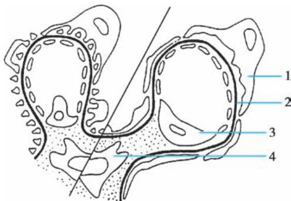  
图 5-2-5 微小病变型肾病示意图

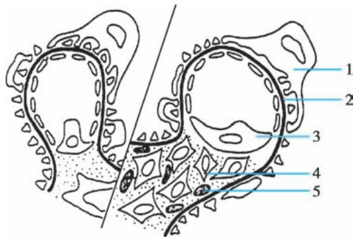  
图 5-2-7 系膜增生性肾小球肾炎示意图  
左: 正常肾小球; 右: 病变肾小球。1. 上皮细胞足突消失; 2. 基底膜; 3. 内皮细胞; 4. 系膜细胞。  
左: 正常肾小球; 右: 病变肾小球。1. 上皮细胞; 2. 基底膜; 3. 内皮细胞; 4. 系膜细胞; 5. 免疫复合物。

本病在我国发病率高，约占原发性肾病综合征的 $30\%$ ，显著高于西方国家(约 $10\%$ )。本病男性多于女性，好发于青少年。约 $50\%$ 的病人有上呼吸道感染等前驱感染，甚至表现为急性肾炎综合征，部分病人为隐匿起病。本组疾病中，非IgA系膜增生性肾小球肾炎病人约 $50\%$ 表现为NS, $70\%$ 伴有血尿；IgA肾病病人几乎均有血尿，约 $15\%$ 表现为NS。

多数病人对激素和细胞毒药物有良好的反应,50%以上的病人经激素治疗后可获完全缓解。其治疗效果与病理改变的轻重程度有关,病理改变轻者疗效较好,病理改变重者则疗效较差。

3. 局灶节段性肾小球硬化(focal segmental glomerulosclerosis, FSGS) 光镜下可见病变呈局灶、节段分布, 表现为受累节段的硬化(系膜基质增多、毛细血管闭塞、球囊粘连等), 相应的肾小管萎缩、肾间质纤维化。免疫荧光显示 IgM 和 C3 在肾小球受累节段呈团块状沉积。电镜下可见肾小球上皮细胞足突广泛融合、基底膜塌陷, 系膜基质增多, 电子致密物沉积。

根据硬化部位及细胞增殖的特点, FSGS 可分为以下 5 种亚型: ①经典型, 硬化部位主要位于血管极周围的毛细血管袢; ②塌陷型, 外周毛细血管袢皱缩、塌陷, 呈节段或球性分布, 显著的足细胞增生肥大和空泡变性; ③顶端型, 硬化部位主要位于尿极; ④细胞型, 局灶性系膜细胞和内皮细胞增生同时可有足细胞增生、肥大和空泡变性；⑤非特异型，无法归属上述亚型，硬化可发生于任何部位，常有系膜细胞及基质增生。其中非特异型最为常见，约占半数以上。

该类型占 NS 的 20%～25%。以青少年多见，男性多于女性，多为隐匿起病，部分病例可由微小病变型肾病转变而来。临床主要表现为大量蛋白尿，多数病人伴有血尿，或出现肉眼血尿；病情较轻者也可表现为无症状性血尿和/或蛋白尿。本病确诊时约半数病人有高血压，约 30% 有肾功能损害。

多数顶端型 FSGS 糖皮质激素治疗有效，预后良好。塌陷型治疗反应差，进展快，多于 2 年内进入终末期肾病。其余各型的预后介于两者之间。过去认为 FSGS 对糖皮质激素治疗效果很差，近年研究表明近半数病人治疗有效，但起效较慢，平均缓解期为 4 个月。肾病综合征能否缓解与预后密切相关，缓解者预后好，不缓解者 6～10 年超过半数进入终末期肾病。

4. 膜性肾病（membranous nephropathy）光镜下可见肾小球弥漫性病变，毛细血管基底膜弥漫增厚，早期仅于肾小球基底膜上皮侧见少量散在分布的嗜复红小颗粒（Masson染色）；进而有钉突形成(嗜银染色)，基底膜逐渐增厚。免疫荧光检查可见IgG和C3细颗粒状沿肾小球毛细血管壁沉积，也可伴IgA和IgM的沉积。电镜下早期可见GBM上皮侧有排列整齐的电子致密物，常伴有广泛足突融合(图5-2-8、文末彩图5-2-9)。

本病好发于中老年,男性多见,发病高峰年龄为50\~60岁。通常起病隐匿,70%\~80%的病人表现为肾病综合征,约30%伴有镜下血尿,一般无肉眼血尿。常在发病5\~10年后逐渐出现肾功能损害。循环中抗磷脂酶 $A_{2}$ 受体特异性抗体(PLA2R)水平可协助膜性肾病的诊断、治疗疗效及复发监测等。本病易发生血栓栓塞并发症,肾静脉血栓发生率可高达40%\~50%。因此,膜性肾病病人如有突发性腰痛或肋腹痛,伴血尿、蛋白尿加重,肾功能损害,应注意肾静脉血栓形成。如有突发性胸痛、呼吸困难,应注意肺栓塞。

膜性肾病约占我国原发性肾病综合征的 20%。约有 20%～35% 的病人临床表现可自发缓解。约 60%～70% 的早期膜性肾病病人(尚未出现钉突)经糖皮质激素和细胞毒药物治疗后可达临床缓解。但随疾病逐渐进展,病理变化加重,疗效则较差。本病多呈缓慢进展,中国、日本的研究显示,10年肾脏存活率为 80%～90%,明显较西方国家预后好。

5. 系膜毛细血管性肾小球肾炎（mesangial capillary glomerulonephritis）光镜下较常见的病理改变为系膜细胞和系膜基质弥漫重度增生，并可插入到肾小球基底膜和内皮细胞之间，肾小球基底膜呈分层状增厚，使毛细血管袢呈“双轨征”。免疫病理检查常见IgG和C3呈颗粒状沿系膜区及毛细血管壁沉积。电镜下系膜区和内皮下可见电子致密物沉积(图5-2-10、文末彩图5-2-11)。

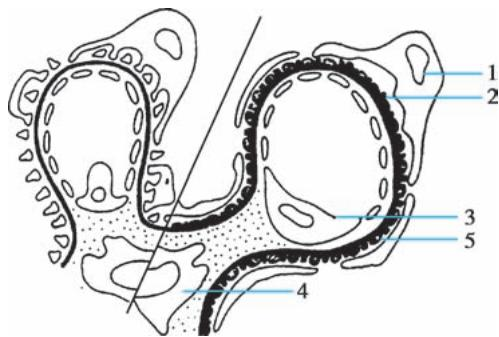  
图 5-2-8 膜性肾病示意图

左: 正常肾小球; 右: 病变肾小球。1. 上皮细胞; 2. 基底膜; 3. 内皮细胞; 4. 系膜细胞; 5. 免疫复合物。

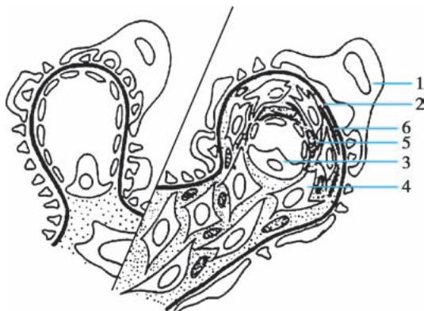  
图 5-2-10 系膜毛细血管性肾小球肾炎示意图  
左: 正常肾小球; 右: 病变肾小球。1. 上皮细胞;  
2. 基底膜; 3. 内皮细胞; 4. 系膜细胞; 5. 免疫复合物;  
6. 基底膜样物质。

该病理类型约占我国原发性肾病综合征的 10%～20%。本病好发于青少年，男女比例大致相等。约 1/4～1/3 的病人常在上呼吸道感染后表现为急性肾炎综合征；约 50%～60% 的病人表现为肾病综合征，几乎所有病人均伴有血尿，其中少数为发作性肉眼血尿；其余少数病人表现为无症状性血尿和蛋白尿。肾功能损害、高血压及贫血出现早，病情多持续进展。50%～70% 病例的血清 C3 持续降低，对提示本病有重要意义。

本病目前尚无有效的治疗方法,激素和细胞毒药物仅在部分儿童病例有效,在成年人治疗效果不理想。有学者认为使用抗凝药,如双嘧达莫、阿司匹林、吲哚布芬等对肾功能有一定的保护作用。本病预后较差,病情持续进行性发展,约50%的病人在10年内发展至终末期肾衰竭。肾移植术后常复发。

## 【并发症】

1. 感染 感染是 NS 常见并发症,与病人蛋白质营养不良、免疫功能紊乱及应用糖皮质激素治疗有关。常见感染部位为呼吸道、泌尿道、皮肤及腹膜,常见的病原体包括肺炎链球菌、溶血性链球菌等。感染是肾病综合征的常见并发症,由于使用糖皮质激素,其感染的临床症状常不明显;感染是导致肾病综合征复发和疗效不佳的主要原因。

2. 血栓和栓塞 由于血液浓缩(有效血容量减少)及高脂血症造成血液黏稠度增加。此外,因某些蛋白质从尿中丢失,肝代偿性合成蛋白质增加,引起机体凝血、抗凝和纤溶系统失衡;加之肾病综合征时血小板过度激活、应用利尿剂和糖皮质激素等进一步加重高凝状态。因此,NS容易发生血栓、栓塞并发症,以肾静脉血栓最为常见,发生率约10%\~50%,其中3/4病例因慢性形成,临床并无症状;此外,肺血管、下肢静脉、下腔静脉、冠状血管和脑血管血栓或栓塞并不少见,是直接影响肾病综合征治疗效果和预后的重要原因。

3. 急性肾损伤 因有效血容量不足而致肾血流量下降,可诱发肾前性氮质血症。经扩容、利尿后可得到恢复。少数病例可出现急性肾损伤,尤以微小病变型肾病者居多,发生多无明显诱因,表现为少尿甚或无尿,扩容利尿无效。目前机制不明,推测与肾间质高度水肿压迫肾小管和大量管型堵塞肾小管有关,即上述变化形成肾小管管腔内高压,引起肾小球滤过率骤然减少,又可诱发肾小管上皮细胞损伤、坏死,从而导致急性肾损伤。

4. 蛋白质及脂肪代谢紊乱 长期低蛋白血症可导致营养不良、小儿生长发育迟缓；免疫球蛋白减少造成机体免疫力低下，易致感染；金属结合蛋白丢失可使微量元素（铁、铜、锌等）缺乏；内分泌激素结合蛋白不足可诱发内分泌紊乱（如低 $\mathrm{T}_{3}$ 综合征等）；药物结合蛋白减少可能影响某些药物的药代动力学（使血浆游离药物浓度增加、排泄加速），影响药物疗效。高脂血症增加血液黏稠度，促进血栓、栓塞并发症的发生，还将增加心血管系统并发症，并可促进肾小球硬化和肾小管-间质病变的发生，促进肾脏病变的慢性进展。

【诊断与鉴别诊断】诊断包括3个方面:①明确是否为肾病综合征;②确认病因:必须首先除外继发性病因和遗传性疾病,才能诊断为原发性肾病综合征;最好能进行肾活检,作出病理诊断。③判定有无并发症。

需进行鉴别诊断的主要包括以下疾病。

1. 乙型肝炎病毒相关性肾炎 多见于儿童及青少年,临床主要表现为蛋白尿或 NS,常见的病理类型为膜性肾病,其次为系膜毛细血管性肾小球肾炎等。主要诊断依据包括:①血清乙型肝炎病毒抗原阳性。②有肾小球肾炎临床表现,并除外其他继发性肾小球肾炎。③肾活检组织中找到乙型肝炎病毒抗原。我国为乙型肝炎高发区,对乙型肝炎病人、儿童及青少年蛋白尿或肾病综合征病人,尤其是膜性肾病病人,应认真鉴别和排除。

2. 狼疮性肾炎 以生育年龄女性多见,常有发热、皮疹、关节痛等多系统受损表现,血清抗核抗体、抗 ds-DNA 抗体、抗 SM 抗体阳性,补体 C3 下降,肾活检免疫病理呈 “满堂亮”。

3. 过敏性紫癜肾炎 好发于青少年,有典型的皮肤紫癜,常伴关节痛、腹痛及黑便,多在皮疹出现后1\~4周出现血尿和/或蛋白尿,典型皮疹有助于鉴别诊断。

4. 糖尿病肾脏病 好发于中老年,肾病综合征常见于病程 10 年以上的糖尿病病人。早期可发现尿微量白蛋白排出增加,以后逐渐发展成大量蛋白尿,甚至肾病综合征的表现。糖尿病病史及特征性眼底改变有助于鉴别诊断。肾活检表现为肾小球基底膜增厚和系膜基质增生,进展期典型损害为 Kimmelstiel-Wilson 结节 (K-W 结节) 形成。

5. 肾淀粉样变性 好发于中老年,肾淀粉样变性是全身多器官受累的一部分。原发性淀粉样变性主要累及心、肾、消化道(包括舌)、皮肤和神经;继发性淀粉样变性常继发于慢性化脓性感染、结核、恶性肿瘤等疾病,主要累及肾脏、肝和脾等器官。肾受累时体积增大,常呈肾病综合征。常需肾活检确诊,肾活检组织刚果红染色淀粉样物质呈砖红色,偏光显微镜下呈绿色双折射光特征。电镜表现为特征性细纤维丝样结构。

6. 骨髓瘤性肾病 好发于中老年,男性多见,病人可有多发性骨髓瘤的特征性临床表现,如骨痛、血清单株球蛋白增高、蛋白电泳 M 带及尿本周蛋白阳性,骨髓象显示浆细胞异常增生(占有核细胞的 15% 以上),并伴有质的改变。多发性骨髓瘤累及肾小球时可出现肾病综合征。

## 【治疗】

（一）一般治疗 应适当注意休息，避免到公共场所和预防感染。病情稳定者应适当活动，以防止静脉血栓形成。

给予正常量的优质蛋白[富含必需氨基酸的动物蛋白0.8～1.0g/(kg·d)]饮食。热量要保证充分，每日不应少于30～35kcal/kg。尽管病人丢失大量尿蛋白，但由于高蛋白饮食增加肾小球高滤过，加重蛋白尿并促进肾脏病变进展，故不主张病人摄入高蛋白饮食。

水肿明显者应低盐 $(<2\mathrm{g}/\mathrm{d})$ 饮食。为减轻高脂血症，应少进富含饱和脂肪酸(动物油脂)的饮食，而多吃富含多聚不饱和脂肪酸(如植物油、鱼油)及富含可溶性纤维(如燕麦、米糠及豆类)的饮食。

## (二) 对症治疗

1. 利尿消肿 对肾病综合征病人利尿治疗的原则是不宜过快过猛，以免造成血容量不足、加重血液高黏滞倾向，诱发血栓、栓塞并发症。

（1）噻嗪类利尿剂：主要作用于髓袢升支厚壁段和远曲小管前段，通过抑制钠和氯的重吸收，增加钾的排泄而利尿。常用氢氯噻嗪25mg，每日3次口服。长期服用应防止低钾、低钠血症。

（2）袢利尿剂：主要作用于髓袢升支，对钠、氯和钾的重吸收具有强力的抑制作用。常用呋塞米(速尿) $20\sim 120\mathrm{mg / d}$ ，分次口服或静脉注射。在渗透性利尿药物应用后随即给药效果更好。应用袢利尿剂时需谨防低钠血症及低钾低氯性碱中毒。

（3）潴钾利尿剂：主要作用于远曲小管后段，排钠、排氯，但潴钾，适用于低钾血症的病人。单独使用时利尿作用不显著，可与噻嗪类利尿剂合用。常用醛固酮拮抗剂螺内酯20mg，每日3次。长期服用需防止高钾血症，对肾功能不全病人应慎用。

（4）渗透性利尿剂：通过提高血浆胶体渗透压，使组织中水分重吸收入血，同时在肾小管管腔内形成高渗状态，减少水、钠的重吸收而达到利尿目的。常用的有低分子右旋糖酐、羟乙基淀粉代血浆等。但在尿量 $< 400\mathrm{ml / d}$ 的病人应慎用，因为此类药物易与Tamm-Horsefall糖蛋白和尿中的白蛋白在肾小管管腔内形成管型而堵塞肾小管，并由于其高渗作用导致肾小管上皮细胞变性、坏死，导致急性肾损伤。

（5）提高血浆胶体渗透压：血浆或白蛋白等静脉输注可提高血浆胶体渗透压，促进组织中水分回吸收并利尿，如继而用呋塞米60～120mg加于葡萄糖溶液中缓慢静脉滴注，通常能获得良好的利尿效果。多用于低血容量或利尿剂抵抗、严重低蛋白血症的病人。

2. 减少尿蛋白 持续性大量蛋白尿本身可导致肾小球高滤过、加重肾小管-间质损伤、促进肾小球硬化，是影响肾小球疾病预后的重要因素。已证实减少尿蛋白可以有效延缓肾功能的恶化。

血管紧张素转换酶抑制剂（ACEI）或血管紧张素Ⅱ受体拮抗剂（ARB），除有效控制高血压外，均可通过降低肾小球内压和直接影响肾小球基底膜对大分子的通透性，有不依赖于降低全身血压的减少尿蛋白作用。用ACEI或ARB降低尿蛋白时，所用剂量一般比常规降压剂量大，才能获得良好疗效。

近年来的临床研究证实，在使用 ACEI 或 ARB 基础上，联合使用 SGLT2i，可进一步减少蛋白尿。其主要作用机制是通过抑制近端小管葡萄糖和钠重吸收，收缩入球小动脉，以降低肾小球内高压。

（三）免疫抑制治疗 糖皮质激素和细胞毒药物仍然是治疗肾病综合征的主要药物，原则上应根据肾活检病理结果选择治疗药物及确定疗程。

1. 糖皮质激素(以下简称激素) 通过抑制免疫炎症反应、抑制醛固酮和抗利尿激素分泌、影响肾小球基底膜通透性等综合作用而发挥其利尿、消除尿蛋白的疗效。使用原则为:①起始足量,常用药物为泼尼松 $1\mathrm{mg}/(\mathrm{kg}\cdot \mathrm{d})$ , 口服8周, 必要时可延长至12周; ②缓慢减药, 足量治疗后每 $2\sim 3$ 周减原用量的 $10\%$ , 当减至 $20\mathrm{mg/d}$ 时病情易复发, 应更加缓慢减量; ③长期维持, 最后以最小有效剂量 $(10\mathrm{mg/d})$ 再维持半年左右。激素可采取全日量顿服, 维持用药期间两日量隔日一次顿服, 以减轻激素的副作用。水肿严重、有肝功能损害或泼尼松疗效不佳时, 应更换为甲泼尼龙(等剂量)口服或静脉滴注。因地塞米松半衰期长, 副作用大, 现已少用。

长期应用激素的病人可出现感染、药物性糖尿病、骨质疏松等副作用，少数病例还可能发生股骨头无菌性缺血性坏死，需加强监测。

2. 细胞毒药物 这类药物可用于“激素依赖型”或“激素抵抗型”的病人,协同激素治疗。若无激素禁忌,一般不作为首选或单独治疗用药。

（1）环磷酰胺：是国内外最常用的细胞毒药物，在体内被肝细胞微粒体羟化，代谢产物具有较强的免疫抑制作用。应用剂量为 $2\mathrm{mg}/(\mathrm{kg}\cdot\mathrm{d})$ ，分 1～2 次口服；或 200mg，隔日静脉注射。累积量达 6～8g 后停药。主要副作用为骨髓抑制及肝损害，并可出现性腺抑制（尤其是男性）、脱发、胃肠道反应及出血性膀胱炎。

（2）苯丁酸氮芥：苯丁酸氮芥 2mg，每日 3 次口服，共服用 3 个月，由于毒副作用及疗效欠佳，目前已少使用。

3. 钙调神经蛋白抑制剂 环孢素（cyclosporin, CsA）属钙调神经蛋白抑制剂，能选择性抑制辅助性T细胞及T细胞毒效应细胞，已作为二线药物用于治疗激素及细胞毒药物无效的难治性肾病综合征。常用量为 $3\sim 5\mathrm{mg / (kg\cdot d)}$ ，分2次空腹口服，服药期间需监测并维持其血药浓度谷值为 $100\sim$ $200\mathrm{ng / ml}$ 。服药 $2\sim 3$ 个月后缓慢减量，疗程至少1年。副作用有肝肾毒性、高血压、高尿酸血症、多毛及牙龈增生等。他克莫司(tacrolimus, FK506)也属钙调神经蛋白抑制剂，但肾毒性副作用小于环孢素，成人起始治疗剂量为 $0.05\mathrm{mg / (kg\cdot d)}$ ，血药浓度保持在 $5\sim 8\mathrm{ng / ml}$ ，疗程为半年至1年。

4. 吗替麦考酚酯 吗替麦考酚酯（mycophenolate mofetil, MMF）在体内代谢为霉酚酸，后者为次黄嘌呤单核苷酸脱氢酶抑制剂，抑制鸟嘌呤核苷酸的经典合成途径，故而选择性抑制 T、B 淋巴细胞增殖及抗体形成，达到治疗目的。常用量为 1.5～2g/d，分 2 次口服，共用 3～6 个月，减量维持半年。已广泛用于肾移植后排斥反应，副作用相对较小。近年一些报道表明，该药对部分难治性肾病综合征有效，尽管尚缺乏大宗病例的前瞻对照研究结果，但已受到重视。

5. 利妥昔单抗 利妥昔单抗是靶向 CD20 的生物制剂, 可清除表达 CD20 的 B 细胞, 诱导治疗常用方法为 $375 \, mg/m^{2}$ , 每周 1 次, 共使用 4 次, 或者 1000mg, 每 2 周 1 次, 共 2 次, 后续根据病情及 CD19 阳性 B 淋巴细胞计数调整治疗方案。目前研究报道对膜性肾病和激素依赖的 MCD 等类型具有较好的疗效, 但长期应用的疗效及风险仍需要进一步评估。

应用激素及细胞毒药物治疗肾病综合征可有多种方案,原则上应以增强疗效的同时最大限度地减少副作用为宜。对于是否应用激素治疗、疗程长短以及是否使用细胞毒药物等应结合病人肾小球病理类型、年龄、肾功能和有否相对禁忌证等情况不同而区别对待,制订个体化治疗方案。

（四）并发症防治 肾病综合征的并发症是影响病人长期预后的重要因素，应积极防治。

1. 感染 通常在激素治疗时无需应用抗生素预防感染,否则不但达不到预防目的,反而可能诱发真菌二重感染。一旦发现感染,应及时选用对致病菌敏感、强效且无肾毒性的抗生素积极治疗,有明确感染灶者应尽快去除。严重感染难控制时应考虑减少或停用激素,但需视病人具体情况决定。

2. 血栓及栓塞并发症 一般认为, 当血清白蛋白低于 20g/L 时, 提示存在高凝状态, 即应开始预防性抗凝治疗。可给予肝素钠 1875～3750U 皮下注射，每 6 小时 1 次；或选用低分子量肝素 4000～5000U，皮下注射，每日 1～2 次，维持试管法凝血时间于正常的一倍；也可服用华法林，维持凝血酶原时间 INR 于 1.5～2.5。抗凝同时可辅以抗血小板药，如双嘧达莫、利伐沙班、阿司匹林等。对已发生血栓、栓塞者应尽早（6 小时内效果最佳，但 3 天内仍可望有效）给予尿激酶或链激酶全身或局部溶栓，同时配合抗凝治疗，抗凝药一般应持续应用半年以上。抗凝及溶栓治疗时均应避免药物过量导致出血。

3. 急性肾损伤 肾病综合征并发急性肾损伤如处理不当可危及病人生命,若及时给予正确处理,大多数病人可望恢复。可采取以下措施:①袢利尿剂,对袢利尿剂仍有效者应予以较大剂量,以冲刷阻塞的肾小管管型;②血液透析,利尿无效,并已达到透析指征者,应给予血液透析以维持生命,并在补充血浆制品后适当脱水,以减轻肾间质水肿;③原发病治疗,因其病理类型多为微小病变型肾病,应予以积极治疗;④碱化尿液,可口服碳酸氢钠碱化尿液,以减少管型形成。

4. 蛋白质及脂肪代谢紊乱 在肾病综合征缓解前常难以完全纠正代谢紊乱,但应调整饮食中蛋白质和脂肪的量和结构(如前所述),力争将代谢紊乱的影响减少到最低限度。降脂药物可选择降胆固醇为主的β-羟-β-甲戊二酸单酰辅酶A还原酶抑制剂,或降甘油三酯为主的氯贝丁酯类。肾病综合征缓解后高脂血症可自然缓解,则无需再继续药物治疗。

【预后】影响 NS 预后的因素主要有:①病理类型,微小病变型肾病和轻度系膜增生性肾小球肾炎预后较好,系膜毛细血管性肾炎、FSGS 及重度系膜增生性肾小球肾炎预后较差。早期膜性肾病也有一定的缓解率,晚期则难于缓解。②临床表现,大量蛋白尿、严重高血压及肾功能损害者预后较差。③激素治疗效果,激素敏感者预后相对较好,激素抵抗者预后差。④并发症,反复感染导致 NS 经常复发者预后差。

## 第六节 | 无症状性血尿和/或蛋白尿

无症状性血尿和/或蛋白尿(asymptomatic hematuria and/or proteinuria)指仅表现为肾小球源性血尿和/或轻至中度蛋白尿,不伴水肿、高血压及肾功能损害的一组肾小球疾病,通常通过实验室检查发现。在没有肾穿刺活检获取病理时,用本病来描述这组疾病。

【病理】本组疾病可由多种病理类型的原发性肾小球疾病所致,但病理改变多较轻,如轻微病变性肾小球肾炎(肾小球中仅有节段性系膜细胞及基质增生)、轻度系膜增生性肾小球肾炎及局灶节段性肾小球肾炎(局灶性肾小球病,病变肾小球内节段性内皮及系膜细胞增生)等。

【临床表现】多无症状,常因体检提示镜下血尿或蛋白尿而发现,无水肿、高血压和肾功能损害;部分病人高热或剧烈运动后出现一过性血尿,短期内消失。反复发作的单纯性血尿,尤其是和上呼吸道感染密切相关者应注意 IgA 肾病的可能。有家族史的持续单纯性血尿者需注意薄基底膜肾病。

【实验室检查】尿液分析可有镜下血尿和/或蛋白尿(尿蛋白>0.5g/24h,但通常<2.0g/24h,以白蛋白为主);相差显微镜尿红细胞形态检查和/或尿红细胞容积分布曲线测定可判定血尿性质为肾小球源性血尿。免疫学检查抗核抗体、抗双链DNA抗体、免疫球蛋白、补体等均正常。部分IgA肾病病人可有血IgA水平的升高;肾功能及影像学检查如B超、静脉肾盂造影、CT或MRI等常无异常发现。

对于单纯血尿者不一定行肾活检，因为这类病例预后通常良好，且有 $5\% \sim 15\%$ 的病人肾活检后仍不能确诊。血尿伴蛋白尿病人的病情及预后一般较单纯性血尿病人稍重。在临床上无法鉴别为IgA肾病或其他肾病，建议行肾穿刺活检评估病情和协助治疗。如病人随访中出现血尿、蛋白尿加重和/或肾功能恶化，应尽快做肾活检明确诊断。

【诊断与鉴别诊断】无症状血尿和/或蛋白尿临床上无特殊症状,易被忽略,故应加强临床随访。此外,尚需排除其他原因所致的可能。

相差显微镜检查尿红细胞位相和/或尿红细胞容积分布曲线测定有助于鉴别血尿来源。肾小球来源的红细胞以畸形为主，典型者呈“芽孢样”。非肾小球源性血尿者需注意胡桃夹综合征（左肾静脉压迫综合征）和外科性血尿的可能，如尿路结石、肿瘤或炎症。泌尿系统超声或CT可协助鉴别。如确定为肾小球源性血尿，又无水肿、高血压及肾功能减退时，即应考虑诊断此病。需注意的是，诊断本病前必须小心除外其他肾小球疾病可能，如全身性疾病（ANCA相关性血管炎、狼疮性肾炎、过敏性紫癜肾炎等）、Alport综合征、薄基底膜肾病及非典型的急性肾炎恢复期等。依据临床表现、家族史和实验室检查予以鉴别，必要时需依赖肾活检方能确诊。

对无症状单纯蛋白尿者，需做尿蛋白定量和尿蛋白成分分析、尿蛋白电泳以区分蛋白尿性质，必要时应做尿本周蛋白检查及血清蛋白免疫电泳。尤其是病人尿常规中蛋白定性试验时提示蛋白量不多，但24小时尿蛋白定量出现大量蛋白尿时，需高度注意单克隆免疫球蛋白增多症的可能。在作出诊断前还必须排除假性蛋白尿(如肿瘤引起大量血尿时)、溢出性蛋白尿、功能性蛋白尿(仅发生于剧烈运动、发热或寒冷时)、体位性蛋白尿(见于青少年，直立时脊柱前凸所致，卧床后蛋白尿消失)等性质蛋白尿，需注意排除左肾静脉压迫综合征，以及其他继发性肾小球疾病(如糖尿病肾脏病、肾淀粉样变、多发性骨髓瘤等)。必要时行肾活检确诊。

相较于单纯性的无症状血尿或蛋白尿，血尿合并蛋白尿（≥0.5g/d）者为慢性肾小球肾炎的可能性显著增大。这类肾小球疾病进展的风险高，是肾穿刺活检确认病理类型的指征。

如进行了肾穿刺活检,获得病理学结果后,以病理诊断替代本病。

【治疗】尿蛋白定量 $< 1.0\mathrm{g / d}$ ，以白蛋白为主，而无血尿者，称为单纯性蛋白尿，一般预后良好，很少发生肾功能损害。但近年的研究显示，有小部分尿蛋白在 $0.5\sim 1.0\mathrm{g / d}$ 的病人，肾活检病理改变并不轻，应引起重视。

发现进展趋势和避免肾毒性因素暴露是本病的管理重点。诊疗原则包括:①定期检查和追踪(每3～6个月1次),监测尿常规、肾功能和血压的变化。女性病人在妊娠前及怀孕期间更需加强监测。②保护肾功能、避免肾损伤的因素(参见本章第一节)。③对蛋白尿病人(尤其>1.0g/d)者,建议考虑使用ACEI/ARB类药物治疗,治疗时需监测血压。④对合并慢性扁桃体炎反复发作,尤其是与血尿、蛋白尿发生密切相关的病人,可待急性期过后行扁桃体摘除术。⑤随访中如出现高血压或肾功能损害按慢性肾小球肾炎治疗。⑥可适当用中医药辨证施治,但需避免肾毒性中药。

【预后】无症状性血尿或/和蛋白尿可长期迁延，预后较好，也可时轻时重；大多数病人的肾功能可长期维持稳定，少数病人自动痊愈，有部分病人尿蛋白增多，出现高血压和肾功能损害。

## 第七节 | 慢性肾小球肾炎

慢性肾小球肾炎（chronic glomerulonephritis）简称慢性肾炎，以蛋白尿、血尿、高血压和水肿为基本临床表现，起病方式不同，病情迁延并缓慢进展，可有不同程度的肾功能损害，部分病人最终发展至终末期肾衰竭。

【病因和发病机制】慢性肾炎大多由不同病因的原发性肾小球疾病发展而来，仅少数由急性肾炎发展所致(直接迁延或临床痊愈若干年后再现)。慢性肾炎的病因、发病机制和病理类型不尽相同，但起始因素多为免疫介导性炎症。此外，高血压、大量蛋白尿、高血脂、高尿酸等非免疫非炎症因素也起了重要作用(参见本章第一节)。

【病理】慢性肾炎可见多种肾脏病理类型,主要为系膜增生性肾小球肾炎(包括 IgA 和非 IgA 系膜增生性肾小球肾炎)、系膜毛细血管性肾小球肾炎、膜性肾病及局灶节段性肾小球硬化等。病变进展至晚期,所有病理类型均可进展为程度不等的肾小球硬化,相应肾单位的肾小管萎缩、肾间质纤维化;肾脏体积缩小、肾皮质变薄。

【临床表现和实验室检查】慢性肾炎可发生于任何年龄,但以中青年为主,男性多见。多数起病缓慢、隐匿。慢性肾炎临床表现呈多样性,个体间差异较大,早期病人可无特殊症状,病人可有食欲缺乏、乏力、疲倦和腰部疼痛；可有轻到中度水肿；部分病人有高血压。肾功能可正常或有不同程度的损害，肾功能中到重度损害时，可出现贫血、电解质紊乱、代谢性酸中毒等一系列临床表现。

当慢性肾炎病人某一方面临床表现突出时，临床易发生误诊。如部分病人血压水平较高，血压(特别是舒张压)持续性中等以上程度升高，严重者可有眼底出血、渗出，甚至视盘水肿，易误诊为原发性高血压。增生性肾炎(如系膜毛细血管性肾小球肾炎、IgA肾病等)感染后急性发作时易误诊为急性肾炎，应注意鉴别。

慢性肾炎肾功能慢性进展,进展速度与病理类型和严重程度有关(如系膜毛细血管性肾小球肾炎进展较快,膜性肾病进展较慢),但也与治疗是否合理相关。临床上高蛋白饮食、控制不佳的高血压、低血压、严重贫血、感染、劳累、高尿酸、肾毒性药物等,都可在短期内加快肾功能进展,及时去除诱因和适当治疗后病情可一定程度缓解,但也可能发展至不可逆的慢性肾衰竭。

实验室检查多为轻度尿异常, 尿蛋白常在 1\~3g/d 之间, 可有镜下血尿、管型尿。尿相差显微镜尿红细胞形态检查和/或尿红细胞容积分布曲线测定可判定血尿为肾小球源性血尿。肾功能正常或轻度受损(肌酐清除率下降), 持续数年, 肾功能逐渐恶化, 最后进入终末期肾衰竭。

B 超检查早期肾脏大小正常,晚期可出现双肾对称性缩小、皮质变薄。肾脏活体组织检查可明确原发病的病理类型,对于指导治疗和预后评估具有重要价值。

【诊断与鉴别诊断】病人尿检异常(蛋白尿、血尿)，伴或不伴水肿及高血压，病史达3个月以上，无论有无肾功能损害均应考虑此病，在除外继发性肾小球肾炎及遗传性肾小球肾炎后，临床上可诊断为慢性肾炎。

慢性肾炎主要应与下列疾病鉴别。

1. 继发性肾小球疾病 如狼疮性肾炎、过敏性紫癜肾炎、糖尿病肾脏病等，依据相应的病史、临床表现及特异性实验室检查，一般不难鉴别。

2. Alport 综合征 常起病于青少年,常有家族史(多为 X 连锁显性遗传),病人可有眼(球形晶状体等)、耳(神经性耳聋)、肾(血尿,轻、中度蛋白尿及进行性肾功能损害)异常。

3. 其他原发性肾小球疾病 ①无症状性血尿和/或蛋白尿:临床上轻型慢性肾炎应与无症状性血尿和/或蛋白尿相鉴别,后者无水肿、高血压和肾功能减退;②感染后急性肾炎:有前驱感染并以急性发作起病的慢性肾炎需与此病相鉴别。两者的潜伏期不同,血清 C3 的动态变化有助鉴别;此外,疾病的转归不同,慢性肾炎无自愈倾向,呈慢性进展,可资鉴别。

4. 原发性高血压肾损害 血压明显增高的慢性肾炎需与原发性高血压引起的继发性肾损害(即良性小动脉性肾硬化症)鉴别,后者先有较长期高血压病史,其后再出现肾损害,临床上远曲小管功能损伤(如尿浓缩功能减退、夜尿增多)多较肾小球功能损伤早,尿改变轻微(微量至轻度蛋白尿<2.0g/d,以中、小分子蛋白质为主,可有轻度镜下血尿),常有高血压的其他靶器官(心、脑)并发症和眼底改变。

5. 慢性肾盂肾炎和梗阻性肾病 慢性肾盂肾炎多有反复发作的泌尿系统感染史,并有影像学及肾功能异常(详见本篇第五章),尿沉渣中常有白细胞,尿细菌学检查阳性可资鉴别。梗阻性肾病多有泌尿系统梗阻的病史,慢性者影像学常有多发性肾结石、肾盂扩张并积水、肾脏萎缩等征象。

【治疗】慢性肾炎的治疗应以延缓肾功能恶化、改善临床症状及防治心脑血管并发症为主要目的。

1. 积极控制高血压和减少尿蛋白 高血压和蛋白尿是加速肾小球硬化、促进肾功能恶化的重要因素,应积极控制高血压、减少蛋白尿。高血压的治疗目标:大多数成年病人目标收缩压应<120mmHg。尿蛋白的治疗目标:争取减少至<1g/d。

高血压病人应限盐 $\left(\mathrm{NaCl}<5\mathrm{g/d}\right)$ ，如有水、钠潴留，可选用噻嗪类利尿剂或袢利尿剂。 $Ccr<30ml/min$ 时，噻嗪类无效应改用袢利尿剂。利尿效果欠佳时，可使用袢利尿剂和其他不同机制的利尿剂协同治疗，如醛固酮拮抗剂、血管升压素 $V_{2}$ 受体拮抗剂。利尿剂一般不宜过多和长久使用，注意避免电解质紊乱。其他降压药如 ACEI 或 ARB、 $\beta$ 受体拮抗剂、 $\alpha$ 受体拮抗剂及钙离子通道阻滞剂等亦可应用。血压控制欠佳时，可联合使用多种抗高血压药物将血压控制到靶目标值。如无禁忌证，应尽量首选具有肾脏保护作用的降压药如 ACEI 或 ARB 类药物。

多年研究证实，ACEI或ARB除具有降压作用外，还有减少蛋白尿和延缓肾功能恶化的肾脏保护作用。后两种作用是通过对肾小球血流动力学的特殊调节作用(扩张入球和出球小动脉，但对出球小动脉扩张作用大于入球小动脉)，降低肾小球内高压、高灌注和高滤过，并能通过非血流动力学作用(如抑制细胞因子、减少细胞外基质的蓄积)延缓肾小球硬化，为治疗慢性肾炎高血压和/或蛋白尿的首选药物。为减少蛋白尿，ACEI或ARB类药物常高于常规的降压剂量，逐渐增加剂量至可耐受的最大剂量。肾功能损害的病人应用ACEI或ARB要防止高血钾和急性肾损伤，血肌酐大于 $264\mu \mathrm{mol} / \mathrm{L}$ （ $3\mathrm{mg / dl}$ ）时在严密观察下使用，应监测病人的血钾和肾功能；必要时联合排钾利尿剂或钾结合剂；如存在低血容量或应用ACEI或ARB后血肌酐短期内上升超过基础值 $30\%$ ，应及时停药。

SGLT2i 近年也开始应用于慢性肾脏病合并蛋白尿的病人中。无论是否合并糖尿病，使用该药物都能改善肾小球高滤过状态，改善肾脏缺氧，从而减少蛋白尿，延缓肾功能的进展。

2. 限制食物中蛋白质及磷的入量 根据病人肾功能的状况给予优质低蛋白饮食 $[0.6\sim 1.0\mathrm{g}/(\mathrm{kg}\cdot \mathrm{d})]$ ，同时控制饮食中磷的摄入。保证热量的摄入，防止负氮平衡。在低蛋白饮食2周后可使用必需氨基酸或 $\alpha-$ 酮酸 $[0.1\sim 0.2\mathrm{g / (kg\cdot d)}]$ 。

3. 糖皮质激素和细胞毒药物 一般不主张积极应用,但是如果病人肾功能正常或轻度受损,病理类型对免疫治疗敏感,且尿蛋白较多、无禁忌证者可试用,无效者则应及时逐步撤去。

4. 避免加重肾脏损害的因素 感染、劳累、妊娠及肾毒性药物(如氨基糖苷类抗生素、非甾体类解热镇痛药、含马兜铃酸的中药如关木通、广防己等)均可能损伤肾脏,导致肾功能恶化,应予以避免。

5. 防治心脑血管并发症 吸烟、肥胖、高血脂、高血糖、缺乏运动等都是心脑血管疾病可干预的高危因素，应积极干预治疗，避免心脑血管疾病的发生。

【预后】慢性肾炎病情迁延,病变缓慢进展,最终进展至慢性肾衰竭。病变进展速度个体差异很大,主要取决于肾脏病理类型和严重程度、是否采取有效治疗措施以及是否避免各种危险因素等。

(余学清)

  
本章思维导图

本章数字资源

继发性肾病指肾外疾病,特别是系统性疾病导致的肾损害。近年来由于生活方式改变、人口老龄化及环境因素等,继发性肾病患病率有增加趋势。本章介绍狼疮性肾炎、糖尿病肾脏病、血管炎肾损害和高尿酸肾损害。

## 第一节 | 狼疮性肾炎

狼疮性肾炎(lupus nephritis, LN)是系统性红斑狼疮(SLE)导致的肾脏损害。约 $50\%$ 以上SLE病人存在LN, 是其最重要及最致命的靶器官损害之一, 也是我国终末期肾衰竭的重要原因之一。

【发病机制】 LN 存在遗传易感性、环境因素及免疫异常等多种机制共同致病。肾脏免疫复合物形成与沉积是引起 LN 的主要机制。沉积的免疫复合物激活补体，引起炎症细胞浸润、凝血因子活化及炎症介质释放，导致肾脏损伤。

【病理】 LN 病理表现多样,2018 年国际肾脏病协会(ISN)及肾脏病理学会工作组(RPS)对 LN 的病理分型进行了修订,见表 5-3-1。

表 5-3-1 2018 ISN/RPS LN 病理分型

<table><tr><td>病理分型</td><td>病理表现</td></tr><tr><td>I型,系膜轻微病变性 LN</td><td>光镜下正常,免疫荧光可见系膜区免疫复合物沉积</td></tr><tr><td>II型,系膜增生性 LN</td><td>系膜细胞增生伴系膜区免疫复合物沉积</td></tr><tr><td>III型,局灶性 LN</td><td>50% 以下肾小球表现为毛细血管内或血管外节段或球性细胞增生</td></tr><tr><td>IV型,弥漫性 LN</td><td>50% 以上肾小球表现为毛细血管内或血管外节段或球性细胞增生</td></tr><tr><td>V型,膜性 LN</td><td>光镜和免疫荧光或电镜检查显示球性或节段上皮下免疫沉积物,可以合并发生III型或IV型,也可伴有终末期硬化性 LN</td></tr><tr><td>VI型,终末期硬化性 LN</td><td>≥90% 肾小球呈球性硬化</td></tr></table>

LN 可累及肾小管间质和血管,还有新月体肾炎、血栓性微血管病、狼疮足细胞病等特殊类型。典型的免疫病理表现为肾小球 IgA、IgG、IgM、C3、C4、C1q 均阳性,称为 “满堂亮” (full house) (文末彩图 5-3-1)。病变进展或治疗后可发生病理类型的转换。

【临床表现】肾外表现详见第八篇第三章。LN的肾脏表现差异大，可为无症状性血尿和/或蛋白尿、肾病综合征、急性肾炎综合征、急进性肾炎综合征等。

蛋白尿最为常见,轻重不一,大量蛋白尿乃至肾病综合征可见于弥漫增生性和/或膜性 LN。多数病人有镜下血尿,肉眼血尿主要见于袢坏死和新月体形成的病人。病人可出现高血压,存在肾血管病变时更常见,甚至发生恶性高血压。

急性肾损伤可见于弥漫增生性 LN, 包括严重的毛细血管内增生性病变和/或局灶坏死性新月体肾炎; 也可见于血管炎和血栓性微血管病。血清抗磷脂抗体阳性病人易并发血栓, 加剧肾功能恶化。

【实验室和其他检查】 尿蛋白和尿红细胞的变化、补体水平、自身抗体滴度如抗 dsDNA 抗体等、血白蛋白、血肌酐等与 LN 的活动和缓解密切相关。肾活检病理改变的活动性及慢性病变及狼疮活动程度对 LN 的诊断、治疗和判断预后有较大价值。部分病人出现治疗效果不佳、复发或病情加重进展时，必要时可行重复肾活检评估。

【诊断与鉴别诊断】在 SLE 基础上,有肾脏损害表现,如持续性蛋白尿(24 小时尿蛋白>0.5g/d,或>++,尿白蛋白/肌酐>500mg/g)、伴或不伴活动性尿沉渣(除外尿路感染,尿白细胞>5 个/HPF,尿红细胞>5 个/HPF)或管型尿(可为红细胞或颗粒管型等),则可诊断为 LN。LN 易误诊为原发性肾小球疾病,通过检查有无多系统、多器官受累表现,血清 ANA、抗 dsDNA 抗体、抗 Sm 抗体阳性,肾活检病理等可资鉴别。需要与 IgA 肾病、过敏性紫癜性肾炎、ANCA 相关血管炎肾损害、干燥综合征肾损害等鉴别。

【治疗】 LN 的治疗方案以控制病情活动、阻止肾脏病变进展为主要目的。治疗需要综合全身的狼疮疾病活动情况、临床表现、病理特征等制订个体化治疗方案，通常需要诱导治疗到维持治疗的长期治疗及病情监测。

增生性 LN（Ⅲ型或Ⅳ型）：诱导治疗推荐激素联合免疫抑制剂，如激素联合吗替麦考酚酯/环磷酰胺/吗替麦考酚酯加贝利尤单抗/环磷酰胺加贝利尤单抗/吗替麦考酚酯加钙调磷酸酶抑制剂，待病情稳定后转入维持治疗。诱导治疗一般为可根据病情使用甲泼尼龙 0.25～0.5g/d 冲击治疗 1～3 天，使用泼尼松 0.5～1mg/(kg·d)，疗程 2～4 周，此后逐渐减量，直至 5mg/d 维持；同时合用免疫抑制剂治疗，如环磷酰胺静脉疗法（每个月 0.5～1.0g/m²，共 6 次；或者每 2 周 0.5g，共 6 次），或口服 1～1.5mg/(kg·d)；或者吗替麦考酚酯（1.5～2.0g/d，分 2 次口服）。若诱导治疗效果不佳，要进一步分析原因调整治疗方案。维持治疗多采用小剂量激素（泼尼松 5mg/d）联合硫唑嘌呤 [1.5～2mg/(kg·d)] 或吗替麦考酚酯（1～2g/d，分 2 次口服）。肾活检有大量细胞性新月体或纤维素样坏死病变，以及肾外病情活动严重者也可使用甲泼尼龙 15mg/(kg·d) 静脉冲击疗法，1 次/日，3 次为一疗程。

病理表现为Ⅰ型、Ⅱ型或Ⅴ型 LN 者:表现为非肾病水平蛋白尿的病人可予对症支持治疗(ACEI/ARB 降蛋白、降压、调脂、抗凝等)、羟氯喹等,根据肾外表现决定糖皮质激素和免疫抑制剂疗法,如在治疗过程中出现尿蛋白增加或者相关并发症加重,可使用激素联合免疫抑制剂。表现为肾病水平蛋白尿者,糖皮质激素联合免疫抑制剂治疗,如泼尼松联合环磷酰胺或吗替麦考酚酯、环孢素或他克莫司等。Ⅰ型和Ⅱ型 LN 需要结合电镜判断是否存在狼疮足细胞病。

狼疮治疗过程中要注意监测感染、骨质疏松、心血管疾病、肿瘤、妊娠等情况，必要时多学科讨论制订治疗方案。

【预后】 LN 治疗后可长期缓解,但药物减量或停药后易复发,且部分出现病情逐渐加重。LN 病人的主要死因为感染、心脑血管疾病、肿瘤等。近年来由于对 LN 诊断水平的提高,预后明显改善,10 年存活率已提高到 80%～90%。

## 第二节 | 糖尿病肾脏病

糖尿病肾脏病（diabetic kidney disease, DKD）是糖尿病（DM）最重要的并发症之一，临床特征为持续性白蛋白尿排泄增加，和/或估算的肾小球滤过率（eGFR）进行性下降，最终发展为终末期肾病（ESRD）。

【发病机制】

1. 糖代谢异常 DM 状态下肾脏糖代谢明显增强,约 50% 的葡萄糖在肾脏代谢,加重了肾脏糖负荷。高血糖产物如晚期糖基化终末产物一方面导致肾小球基底膜增厚以及滤过膜通透性增高,另一方面还与特异性受体结合而激活细胞,使后者分泌大量炎症介质引起组织损伤。血糖持续升高可激活多元醇通路,使葡萄糖转化为山梨醇和果糖,过多的山梨醇和果糖在细胞内堆积引起细胞内高渗和细胞肿胀破坏。多元醇通路激活还可通过活化二酰甘油-蛋白激酶 C 通路促进转化生长因子 β (TGF-β) 和血管内皮生长因子 (VEGF) 分泌、抑制一氧化氮 (NO) 合酶活性,导致细胞外基质合成增加、肾间质纤维化和肾血管舒缩功能障碍。

2. 肾脏血流动力学改变 近年来认为近端小管中钠、葡萄糖协同转运过强，使钠盐在该处过度重吸收是肾脏血流动力学改变的关键，这种过度重吸收使肾小囊压力降低，肾小球滤过被迫增多，高滤过导致肾小球高灌注、高跨膜压和蛋白尿生成。

3. 激素和细胞因子的作用 DM 状态下肾脏局部 RAS 呈异常活跃状态,血管紧张素Ⅱ(ATⅡ)选择性收缩出球小动脉导致肾内跨膜压增高,ATⅡ通过减少足细胞硫酸乙酰肝素蛋白多糖的合成来破坏肾小球基底膜阴离子屏障完整性,ATⅡ还与高血糖协同作用刺激 TGF-β 产生,TGF-β 通过增加细胞外基质的积聚促进 DKD 肾损伤。在 DKD 发生发展过程中起作用的还有内皮素、结缔组织生长因子、VEGF、胰岛素样生长因子、前列腺素、活性氧及 NO 等细胞因子。

4. 遗传因素 目前认为 DKD 是一个多基因病,遗传因素在决定 DKD 易感性方面起着重要作用。

【病理】光镜下可以看到肾小球体积肥大，肾小球系膜区基质增加、系膜区增宽。随着病情进展，肾小球基底膜弥漫增厚，基质增生，形成典型的K-W结节(文末彩图5-3-2)，为局灶性、分叶状、周边圆形至椭圆形的系膜病变。以无细胞性玻璃样变基质为核心，是DKD相对特异性的病理改变，称为结节性肾小球硬化症。肾小管的病理改变包括肾小管上皮细胞空泡样变性、肾小管基底膜增厚、肾小管刷状缘减少及肾小管萎缩等。肾间质及血管病理改变包括肾间质纤维化、炎症细胞浸润、小动脉玻璃样变性等。免疫荧光可见IgG及白蛋白沿肾小球基底膜和肾小管基底膜线状沉积。电镜下可见系膜基质增多，基底膜均质性增厚，上皮细胞足突早期节段融合，随病变进展，可见弥漫融合。

【临床表现与分期】确诊 DKD 后,应根据 eGFR 及尿白蛋白水平进一步判断慢性肾脏病(CKD)分期,同时评估 DKD 进展风险及明确复查频率(表 5-3-2)。建议 DKD 的诊断应包括病因、eGFR 分级和尿白蛋白/肌酐比值(UACR)分级。

表 5-3-2 按 eGFR 和 UACR 分级的 CKD 进展风险及就诊频率

<table><tr><td rowspan="4"></td><td rowspan="4" colspan="3">CKD分期依据病因(C)eGFR(G)白蛋白尿(A)</td><td colspan="3">白蛋白尿分级</td></tr><tr><td>正常至轻度升高</td><td>中度升高</td><td>重度升高</td></tr><tr><td>A1</td><td>A2</td><td>A3</td></tr><tr><td>&lt;30mg/g&lt;3mg/mmol</td><td>30~299mg/g3~29mg/mmol</td><td>≥300mg/g≥30mg/mmol</td></tr><tr><td rowspan="6">eGFR分级/[ml/(min·1.73m2)]</td><td>G1</td><td>正常</td><td>≥90</td><td>1(如有CKD)</td><td>1</td><td>2</td></tr><tr><td>G2</td><td>轻度下降</td><td>60~89</td><td>1(如有CKD)</td><td>1</td><td>2</td></tr><tr><td>G3a</td><td>轻中度下降</td><td>45~59</td><td>1</td><td>2</td><td>3</td></tr><tr><td>G3b</td><td>中重度下降</td><td>30~44</td><td>2</td><td>3</td><td>3</td></tr><tr><td>G4</td><td>重度下降</td><td>15~29</td><td>3</td><td>3</td><td>4</td></tr><tr><td>G5</td><td>肾衰竭</td><td>&lt;15</td><td>4</td><td>4</td><td>4</td></tr></table>

注:表格中的数字为建议每年复查的次数;背景颜色代表 CKD 进展的风险,由浅到深依次为低风险、中风险、高风险、极高风险。

【诊断与鉴别诊断】DKD通常是根据持续存在的白蛋白尿和/或eGFR下降、同时排除其他病因引起的CKD而作出的临床诊断。在明确DM作为肾损害的病因并排除其他原因引起CKD的情况下，至少具备下列一项者可诊断为DKD：①在3～6个月内的3次检测中至少2次UACR≥30mg/g或24小时尿白蛋白排泄率（UAER）≥30mg/24h；②eGFR<60ml/(min·1.73m²)持续3个月以上；③肾活检符合DKD病理改变。

DM 发生肾损害伴有以下任一情况,需考虑存在非 DM 性肾病的可能,应注意进一步查明病因,必要时行肾活检以明确诊断:①eGFR 短期内迅速下降;②无明显微量蛋白尿,或蛋白尿突然急剧增多,或短时间出现肾病综合征；③尿检提示活动性尿沉渣；④顽固性高血压；⑤已确诊有原发性、继发性肾小球疾病或其他系统性疾病；⑥血管紧张素转换酶抑制剂（ACEI）或血管紧张素受体拮抗剂（ARB）类药物治疗3个月内eGFR下降超过 $30\%$ ；⑦影像学发现肾结石、肾囊肿、马蹄肾等结构异常，或有肾移植病史；⑧肾活检提示有其他肾病的病理学改变。

【治疗】包括早期干预各种危险因素和 ESRD 的肾脏替代治疗。

1. 饮食治疗 DKD 病人每天总能量摄入为 25～30kcal/kg。未行透析的 DKD 病人，蛋白质摄入量为 0.8g/(kg·d)，透析病人蛋白质摄入量为 1.0～1.2g/(kg·d)。DKD 病人每日钠摄入量应低于 2.3g。

2. 控制血糖 DKD 病人糖化血红蛋白应控制在 $\leqslant7\%$ 。常用的口服降糖药物包括八大类：①双胍类；②α-葡萄糖苷酶抑制剂；③磺酰脲类；④格列奈类；⑤噻唑烷二酮类；⑥二肽基肽酶-4 抑制剂；⑦SGLT2i；⑧胰高血糖素样肽-1 受体激动剂（GLP-1RA）。DKD 病人在选择降糖药时，应优先考虑具有肾脏获益的药物，兼顾病人心、肾功能，根据 eGFR 调整药物剂量。推荐二甲双胍作为 2 型糖尿病（T2DM）合并 DKD $[eGFR\geqslant45ml/(min\cdot1.73m^{2})]$ 病人的一线降糖药物。SGLT2i 和 GLP-1RA 具有不依赖于降糖作用的肾脏保护作用，推荐 T2DM 合并 DKD 的病人只要没有禁忌证均应给予 SGLT2i，若存在禁忌证则推荐使用具有肾脏获益的 GLP-1RA。

3. 控制血压 DKD 病人血压控制目标为 $<130/80mmHg$ ，以 ACEI/ARB 为首选药物。ACEI/ARB 类药物不仅有降压作用，还有降低尿蛋白、延缓肾功能恶化、减少心血管事件并发症等作用，已成为 DKD 病人控制血压、减少尿蛋白和延缓疾病进展的标准策略。血压控制不佳的病人，可加用钙通道阻滞剂、利尿剂、 $\alpha$ 受体拮抗剂等。使用 ACEI/ARB 类药物期间，应定期监测 UACR、血清肌酐及血钾，伴肾动脉狭窄者慎用 ACEI/ARB 类药物。

4. 调脂治疗 DKD 病人低密度脂蛋白胆固醇(LDL-C)目标值<2.6mmol/L, 若合并动脉粥样硬化性心血管疾病, 则 LDL-C 目标值<1.8mmol/L。血清总胆固醇增高为主者首选他汀类降脂药物, 甘油三酯增高为主者选用贝特类药物。

5. 并发症治疗 对并发顽固性水肿、贫血、营养不良、心血管并发症、周围血管病变、周围神经和自主神经病变等的病人应及时给予相应处理，保护肾功能，尽量避免使用肾毒性药物。

6. 透析和移植 当 eGFR<15ml/min, 或伴有不易控制的心力衰竭、严重胃肠道症状、高血压等，应根据条件选用透析、肾移植或胰肾联合移植。

【预后】DKD预后不佳,影响预后的因素主要包括DM类型、蛋白尿程度、肾功能和肾外心脑血管合并症等病变的严重性。

## 第三节 | 血管炎肾损害

血管炎是指以血管壁的炎症和纤维素样坏死为病理特征的一组疾病。肾脏是血管炎受累的重要靶器官之一，称为血管炎肾损害。本节主要介绍抗中性粒细胞胞质抗体（ANCA）阳性的系统性小血管炎，包括肉芽肿性多血管炎（granulomatosis with polyangiitis, GPA）、显微镜下多血管炎（microscopic polyangiitis, MPA）和嗜酸性肉芽肿性多血管炎（eosinophilic granulomatosis with polyangiitis, EGPA）。ANCA 的主要靶抗原为蛋白酶 3（PR3）和髓过氧化物酶（MPO）。我国以 MPO-ANCA 阳性的 MPA 为主。

【发病机制】该类疾病的发生是多因素的,涉及 ANCA、中性粒细胞和补体等。

1. ANCA 与中性粒细胞 动物模型发现 MPO-ANCA 可引起新月体肾炎和肺泡小血管炎。体外研究发现, ANCA 可介导中性粒细胞与内皮细胞黏附, ANCA 活化的中性粒细胞发生呼吸爆发和脱颗粒, 释放的活性氧自由基和各种蛋白酶等可引起血管炎。

2. 补体 动物模型及来自病人的研究均证实,补体旁路途径活化参与了该病的发病机制。其中补体活化产物 C5a 可通过 C5a 受体发挥致炎症效应而参与血管炎发病。

【病理】免疫荧光和电镜检查一般无免疫复合物或电子致密物，或仅呈微量沉着。光镜检查多表现为局灶节段性肾小球毛细血管袢坏死和新月体形成，且病变新旧不等(文末彩图5-3-3)。

【临床表现】该病可见于各年龄组,但我国以老年人多见。常有发热、疲乏、关节肌肉疼痛和体重下降等非特异性全身症状。化验 ANCA 阳性,CRP 升高,ESR 增快。

肾脏受累时,活动期有血尿,多为镜下血尿,可见红细胞管型,多伴蛋白尿;肾功能受累常见,约半数表现为 RPGN。

本病多系统受累,常见肾外表现包括肺、头颈部和内脏损伤。肺受累主要表现为咳嗽、痰中带血甚至咯血,严重者因肺泡广泛出血发生呼吸衰竭而危及生命。X线胸片可表现为阴影、空洞和肺间质纤维化等。

【诊断与鉴别诊断】 国际上尚无统一、公认的临床诊断标准。目前应用最为广泛的是 2012 年修订的 Chapel Hill 系统性血管炎命名国际会议所制定的分类诊断标准。

中老年病人表现为发热、乏力和肾炎等情况，且血清 ANCA 阳性可考虑该病诊断。本病需要与过敏性紫癜肾损害和狼疮性肾炎鉴别。肾活检可协助确诊和分型。

【治疗】 ANCA 相关小血管炎的治疗分为诱导治疗、维持治疗和复发治疗。

1. 诱导治疗 糖皮质激素联合环磷酰胺是最常用的治疗方案。泼尼松 $1\mathrm{mg} / (\mathrm{kg}\cdot \mathrm{d})$ ，4～6周后逐步减量。联合环磷酰胺，口服剂量 $2\mathrm{mg} / (\mathrm{kg}\cdot \mathrm{d})$ ，持续3～6个月；或静脉冲击 $0.75\mathrm{g} / \mathrm{m}^2$ ，每个月1次，连续6个月。对老年和肾功能不全者酌情减量。糖皮质激素联合利妥昔单抗可用于非重症病人（血肌酐<354μmol/L）或应用环磷酰胺有禁忌的病人。

重症病人,如小动脉纤维素样坏死、大量细胞新月体和肺出血,可加大剂量甲泼尼龙(MP)冲击治疗。血浆置换的主要适应证为合并抗 GBM 抗体、严重肺出血和起病时血肌酐>500μmol/L 者。

2. 维持治疗 小剂量糖皮质激素的基础上, 常用免疫抑制剂包括硫唑嘌呤 $2\mathrm{mg}/(\mathrm{kg}\cdot\mathrm{d})$ 或吗替麦考酚酯 (1.0～1.5g/d, 分 2 次口服), 维持治疗时限至少 18～24 个月。利妥昔单抗也用于维持期治疗。

3. 复发治疗 发生复发性疾病(危及生命或脏器的情况)应再次接受诱导治疗。诱导治疗时未接受利妥昔单抗治疗者,可选激素联合利妥昔单抗方案。

【预后】恰当的治疗5年生存率达80%。影响预后的独立危险因素包括高龄、严重肺脏累及、继发感染以及严重肾功能衰竭。肺脏存在基础病变是继发肺部感染的独立危险因素。

## 第四节 | 高尿酸肾损害

高尿酸血症(hyperuricemia)是指在正常嘌呤饮食状态下,非同日两次空腹血尿酸男性高于420μmol/L,女性高于360μmol/L。高尿酸肾损害分为急性高尿酸血症性肾病、慢性高尿酸血症性肾病以及尿酸性肾结石。尿酸约2/3由肾脏排泄,1/3由肠道排泄。

【发病机制】引起高尿酸血症的常见原因包括：

1. 遗传因素 家族性高尿酸血症肾病、次黄嘌呤鸟嘌呤磷酸核糖基转移酶缺陷等。

2. 饮食因素 高嘌呤饮食、高果糖饮食、长期过量饮酒。

3. 药物因素 噻嗪类利尿剂、袢利尿剂、环孢素、他克莫司、吡嗪酰胺等。

4. 容量丢失

5. 低氧血症

6. 骨髓增生性疾病、真性红细胞增多症等。

7. 其他,如肾衰竭、肥胖致代谢综合征、剧烈运动等。

急性高尿酸血症性肾病多见于恶性肿瘤放化疗病人,高浓度的尿酸超过近端肾小管的重吸收能力,滞留在肾小管管腔形成结晶,梗阻在肾小管内引起急性肾损伤。

慢性高尿酸血症引起肾损伤的机制,除了尿酸排泄增加引起肾小管间质损伤或形成肾结石,还包括尿酸结晶引起炎症反应,导致肾小球前动脉病变、肾脏炎症以及使肾素-血管紧张素和环氧化酶-2(COX-2)活化等。

高尿酸尿症者由于尿酸在尿中溶解度不够，在尿液中析出、沉积形成结石。

【病理】光镜检查:早期仅在髓袢和集合管内出现尿酸盐结晶;进而肾小管上皮细胞损伤和崩解,尿酸盐沉积于肾间质,肾间质继发淋巴细胞和单核细胞浸润、多核巨细胞形成和纤维化,偏振光显微镜下可见白亮的光斑;继续进展,可出现肾小动脉管壁增厚、管腔狭窄、肾小球硬化。尿酸盐结晶在普通切片内被溶解,仅见呈放射状的无色的星芒状结晶,冰冻切片或纯乙醇固定的肾组织中呈蓝色针状结晶。免疫病理学无特殊,电镜可见肾小管上皮细胞内和肾间质出现星芒状结晶。

【临床表现】急性高尿酸血症性肾病多发生在恶性肿瘤放化疗后1～2天，最常见的临床症状为恶心呕吐、腰痛、腹痛、少尿甚至无尿。常伴肿瘤溶解综合征的特点，如同时出现氮质血症、高钾血症、乳酸酸中毒等。尿液分析常可见尿酸结晶。

慢性高尿酸血症性肾病病人通常存在长期的高尿酸血症，反复发作痛风。肾损害早期表现隐匿，多为尿浓缩功能下降，尿沉渣无有形成分，尿蛋白阴性或微量，后逐渐出现慢性肾脏病。肾小球滤过功能正常时，尿酸排泄分数增加。

尿酸肾结石常见的症状是肾绞痛和血尿，也常在体检发现。查体可发现痛风石或痛风性关节炎。

## 【诊断与鉴别诊断】

1. 急性高尿酸血症性肾病 多见于肿瘤放化疗后 1～2 天, 出现少尿型急性肾损伤, 伴严重的高尿酸血症, 可高于 $893 \mu mol/L$ 。常需要与药物引起的急性间质性肾炎相鉴别。

2. 慢性高尿酸血症性肾病 典型的痛风病史及逐渐发生肾功能损害、尿常规变化不明显者，可疑诊慢性高尿酸血症性肾病，肾脏病理可在光镜下见到尿酸盐在肾脏内沉积，有助于明确诊断。鉴别诊断需排除其他原因，如铅中毒，其次需要与慢性肾脏病引起血尿酸升高相鉴别，慢性肾脏病引起的血尿酸升高，一般肾脏损伤在先，且尿酸排泄分数常下降。

3. 尿酸肾结石的诊断需首先确认存在肾结石,其次确定是否为尿酸结石。尿酸结石 X 线片上不显影,称阴性结石。

【治疗】急性高尿酸血症性肾病以预防为主，肿瘤放化疗之前3～5天即可应用黄嘌呤氧化酶抑制剂别嘌呤醇或非布司他减少尿酸生成，也可注射重组尿酸氧化酶拉布立海，将尿酸转化为更具水溶性的终末产物尿囊素，以降低血尿酸。发生高尿酸血症时也可应用上述药物，还可通过水化、利尿和碱化尿液减少尿酸沉积，严重者可行血液透析。

慢性高尿酸血症性肾病病人需要降尿酸治疗：①控制饮食嘌呤的摄入。②抑制尿酸生成的药物主要是黄嘌呤氧化酶抑制剂，包括别嘌呤醇和非布司他。别嘌呤醇主要由肾脏排出体外，肾功能下降时参照GFR减量，重症药疹是别嘌呤醇的严重不良反应，死亡率 $20\% \sim 25\%$ ，HLA-B\*5801为其高风险基因，非布司他通过肝肾双通道代谢。③促尿酸排泄药物可选用苯溴马隆，用于尿酸排泄分数明显下降者。④促进尿酸分解的药物如尿酸氧化酶。慢性肾脏病合并痛风可参照痛风的治疗原则，慢性肾脏病合并无症状高尿酸血症是否需要降尿酸治疗仍有争议。

尿酸肾结石的治疗目的是减小已形成的结石，防止新结石形成。治疗包括低嘌呤饮食，使用别嘌呤醇或非布司他降低血尿酸水平及碱化尿液。

【预后】急性高尿酸血症性肾病以预防为主,及时治疗预后较好。慢性高尿酸血症性肾损害与高血压、心脑血管疾病密切相关,如无及时防治可进展至尿毒症。

【预防】除控制饮食中嘌呤的摄入,用药物降低血尿酸水平,一体化治疗病人可能合并的高血压、贫血、电解质紊乱等,从而阻止或逆转高尿酸肾损害的进展,改善预后。

(陈 岁)

本章思维导图

本章数字资源

间质性肾炎，又称肾小管间质性肾炎（tubulointerstitial nephritis, TIN）。TIN 可原发于肾小管间质，也可继发于肾小球或肾血管疾病。本章主要讨论原发性 TIN。

## 第一节 | 急性间质性肾炎

急性间质性肾炎（acute interstitial nephritis, AIN）又称急性肾小管间质性肾炎（acute tubulointerstitial nephritis, ATIN），是由多种病因引起，突发肾功能减退，以肾间质水肿和炎症细胞浸润为主要病理表现的一组临床病理综合征，肾小球及肾血管多无受累或病变较轻。

【病因和发病机制】AIN 病因多种多样,以药物和感染最常见。

（一）药物 药物或其代谢产物在肾间质中可成为半抗原，模拟肾间质的内源性结构，诱发免疫炎症反应。但不同药物，机制可不一致。

1. 抗生素 青霉素类;抗结核药物如利福平、乙胺丁醇;磺胺类;万古霉素;环丙沙星;头孢菌素类;红霉素类等。

2. 非甾体抗炎药（NSAIDs）非选择性环氧化酶抑制剂如布洛芬、萘普生、对乙酰氨基酚、吲哚美辛、双氯芬酸等；选择性环氧化酶-2抑制剂如塞来昔布。

3. 消化性溃疡病药物 $H_{2}RA$ 如雷尼替丁; PPI 如奥美拉唑。

4. 神经或精神疾病药物 苯巴比妥、苯妥英钠、丙戊酸钠、卡马西平等。

5. 抗肿瘤药物 全反式维 A 酸、免疫学检查点抑制剂等。

6. 其他 别嘌呤醇、硫唑嘌呤、青霉胺、丙硫氧嘧啶、环孢素、金制剂、去甲基麻黄素、华法林、干扰素等。

（二）全身性感染 各种病原体导致的全身性感染会诱发肾间质炎症反应；亦可直接感染肾脏，诱发肾间质内的适应性免疫反应。包括布鲁氏菌病、白喉、军团菌感染、链球菌感染、支原体肺炎、传染性单核细胞增多症、巨细胞病毒病、钩端螺旋体病、梅毒和弓形虫病等。

（三）原发肾脏感染 包括肾盂肾炎、肾结核和肾真菌感染等。

（四）自身免疫病 包括肾小管间质性肾炎-葡萄膜炎综合征（tubulointerstitial nephritis-uveitis syndrome, TINU 综合征）、继发于结缔组织病（如系统性红斑狼疮、原发性干燥综合征、坏死性血管炎和 IgG4 相关疾病）和移植肾 T 细胞介导的急性排斥反应等。

（五）特发性 指临床表现为急性肾损伤，肾脏病理表现为典型 AIN，但临床难以明确病因。部分病人经动态监测病情进展可最终明确病因。

【病理表现】灶状或弥漫分布的单个核细胞(T淋巴细胞及单核细胞)浸润,T细胞为混合型,但主要为CD4 $^{+}$ T淋巴细胞,另外还可见中性粒细胞、浆细胞和嗜酸性粒细胞(尤其在药物引起者中);可见间质水肿,导致肾小管彼此分离以及肾脏肿大;严重情况下可见肾小管基底膜受损;有时可见肾间质内非坏死性上皮细胞肉芽肿;炎症细胞还可侵入小管壁引起小管炎,重者可有局灶性肾小管坏死,其范围常与肾功能损害程度相关;急性期无肾间质纤维化;除少数可有系膜增生外,肾小球及血管常正常。免疫荧光检查多为阴性。

NSAIDs 导致者肾小球在光镜下无明显改变,电镜下可见足细胞足突融合,与微小病变病理相似。

【临床表现】大部分病人表现为无症状血清肌酐升高或尿检异常。有症状者，临床表现轻重不一,无特异性。在感染或药物相关 AIN 中,病人可表现发热和腰背疼痛。不到 1/3 的病人可有过敏反应,表现为斑丘疹、发热和嗜酸性粒细胞增多。

20%～50% 的病人可出现少尿或无尿，伴程度不等的氮质血症。肾功能减退的速度取决于免疫反应的严重程度，由数天至数周。如病人再次暴露于致病的药物，可能会出现急骤的肾功能减退。

尿液检查中部分病人有血尿，少数为肉眼血尿；部分病人可有无菌性脓尿，少数病人可见嗜酸性粒细胞尿；尿沉渣中可见红细胞管型或白细胞管型；尿蛋白量常为少至中等量，绝大部分小于2g/d，一般小于1g/d；肾病范围的蛋白尿少见，除非同时合并肾小球微小病变，如少数NSAIDs或干扰素导致的AIN。肾小管功能损害突出，常见肾性糖尿、小分子蛋白尿，尿 $\beta_{2}$ 微球蛋白、N-乙酰- $\beta$ -D-氨基葡萄糖苷酶（NAG）等排出增多，尿比重及渗透压降低。可见I型肾小管酸中毒，偶见Fanconi(范科尼)综合征，电解质紊乱。

系统性疾病导致以间质性肾炎为主要表现时，还可见相应基础疾病的临床和实验室证据。如系统性红斑狼疮继发者伴随ANA及抗dsDNA抗体阳性，原发性干燥综合征时抗SSA抗体、抗SSB抗体阳性，IgG4相关疾病肾损害者血清IgG4亚型水平升高。

超声或 CT 检查提示双肾大小正常或轻度增大。超声检查提示肾脏皮质回声增强,可能和弥漫性的间质炎症细胞浸润有关。

【诊断与鉴别诊断】典型的病例根据用药史、感染史或全身疾病史，结合实验室检查结果可作出诊断。确定诊断则依赖肾活检。

鉴别诊断:造成急性肾损伤的 AIN 主要需与其他可导致急性肾损伤的病因鉴别,包括急性肾小管坏死(ATN)、急进性肾小球肾炎(RPGN)等。此外,符合 AIN 的临床表现者,还需鉴别 AIN 是原发于肾间质,还是继发于肾小球疾病如 FSGS、IgA 肾病、狼疮性肾炎、糖尿病肾脏病等。

【治疗】

1. 去除病因 停用可疑药物;感染相关者合理应用抗生素治疗全身或局部感染。

2. 支持疗法 对症治疗。急性肾损伤若合并高钾血症、肺水肿等肾脏替代治疗指征时，应行血液净化支持。

3. 免疫抑制剂 对于非感染性 AIN(尽量肾穿刺活检明确病理), 可考虑使用口服泼尼松 0.75\~1mg/(kg·d), 肾功能多在用药后 1\~2 周内改善, 建议使用 4\~6 周后再缓慢减量。若肾功能没有改善, 可考虑加用吗替麦考酚酯、环磷酰胺等。用药 6 周无效, 提示病变已慢性化, 继续治疗无进一步收益, 应减停免疫抑制剂。

【预后】及时识别 AIN 并干预治疗是其预后良好的重要前提,但仍有部分病人可能会进展为慢性肾脏病。

## 第二节 | 慢性间质性肾炎

慢性间质性肾炎（chronic interstitial nephritis, CIN）又称慢性肾小管间质性肾炎（chronic tubulointerstitial nephritis, CTIN），与 AIN 类似，也是由多种病因引起，以肾小管间质功能障碍为主要表现的一组疾病或临床综合征。与 AIN 不同之处为，其病程长，起病隐匿，常缓慢进展至慢性肾衰竭，病理也以慢性病变为主要表现，肾小管萎缩、肾间质纤维化突出。

【病因】

（一）遗传性疾病 如线粒体基因突变。

（二）代谢紊乱 包括高钙血症、肾钙盐沉积、高草酸尿症、低钾血症、高尿酸血症、胱氨酸贮积症、甲基丙二酸血症等。

## (三) 肾毒性药物或毒物

1. 解热镇痛抗炎药物 如 NSAIDs 等。

2. 重金属 如镉、铅、锂、汞等。

3. 中草药 如含马兜铃酸的中药。

4. 免疫抑制剂 如环孢素、他克莫司等。

5. 抗肿瘤药物 如铂类、甲氨蝶呤、亚硝脲类烷化剂等。

（四）自身免疫病 多血管炎性肉芽肿、IgG4 相关疾病、干燥综合征、系统性红斑狼疮、TINU 综合征、结节病等。

（五）血液系统疾病 多发性骨髓瘤、轻链沉积病、淋巴瘤、镰状细胞贫血等。

(六) 感染 复杂性肾盂肾炎、肾结核、HIV感染、EB病毒感染、黄色肉芽肿性肾盂肾炎等。

（七）梗阻性肾病 肿瘤、结石、尿道梗阻、膀胱输尿管反流等。

(八) 囊性肾病 幼年肾单位肾痨-髓质囊肿病、多囊肾等。

（九）其他 血管疾病、高血压、缺血、放射相关肾损害等。

【病理表现】肾脏大体可表现形态不规则和萎缩。光镜下主要表现为肾间质纤维化，可有斑片状的慢性炎症细胞为主的间质浸润；可见肾小管管腔扩张，肾小管上皮细胞脱落，肾小管基底膜增厚或破坏，以及肾小管萎缩。肾小球早期可正常或改变不明显，被球旁纤维化组织包绕，晚期则会出现节段性或球性肾小球硬化。随疾病进展，会出现慢性血管壁增厚。

不同病因者病理表现不尽相同。伴尿路梗阻的慢性肾盂肾炎的双肾大小不一，表面高低不平，部分与包膜粘连，肾盂和肾盏可有不同程度的扩张。止痛剂肾病典型改变为肾髓质损伤，肾小管细胞内可见黄褐色脂褐素样色素，穿过萎缩皮质部的髓放线呈颗粒状肥大，髓质间质细胞减少、细胞外基质聚集。肾乳头坏死早期表现为肾小管周微血管硬化及片状肾小管坏死，晚期可见坏死灶并形成钙化灶。钙调神经蛋白抑制剂(环孢素、他克莫司)相关肾病表现为血管增生硬化性病变如小动脉壁玻璃样变性、增厚甚至管腔闭塞，伴随肾小管萎缩、间质纤维化的条带分布的肾小球缺血硬化。慢性高尿酸肾病常可伴肾小动脉硬化及肾小球硬化，冰冻或酒精固定标本在偏振光显微镜下可见到肾小管或肾间质内的尿酸结晶，尤以髓质部为常见。低钾性肾病肾髓质部可见广泛的肾小管严重空泡变性。高钙性肾病可见肾小管钙化及肾间质多发钙化灶。

【临床表现】主要表现血清肌酐升高和肾小管间质损害导致的症状和体征，缓慢隐匿进展，包括持续低比重尿、夜尿增多、乏力和恶心等。

不同病因者临床表现不尽相同,止痛剂肾病可出现肾乳头坏死,临床表现为肾绞痛及肉眼血尿;IgG4 相关肾病可合并腹膜后纤维化导致梗阻性肾病;中草药相关肾损害可表现获得性 Fanconi 综合征。

尿液检查可见固定比重尿、肾性糖尿和非肾病范围蛋白尿(通常 $<1.5g/d$ )，可见尿红细胞、尿白细胞和颗粒管型。常可见无菌性脓尿。

随肾小球滤过功能减退的进展,常可见不同程度的代谢性酸中毒和高磷血症。合并肾小管酸中毒常见。60%～90% 的病人早期即存在不同程度贫血,与肾小球滤过功能受损程度不平行。

典型影像学表现可见肾脏体积缩小、萎缩性瘢痕和肾皮质包膜不规则，偶可见肾乳头坏死。

【诊断与鉴别诊断】需仔细询问病人病史，主要包括滥用镇痛药史或其他特殊药物，重金属、毒物等接触史，慢性肾盂肾炎史，以及相应的系统性疾病史等。多起病隐匿，多尿、夜尿增多突出。

常规实验室检查需评估肾功能、电解质(钾、钙、磷)、尿酸等；尿液分析提示固定低比重尿（1.010左右），偶可见肾性糖尿、蛋白尿(通常 $< 1.5\mathrm{g / d}$ ，小分子蛋白增多)、尿红细胞、尿白细胞和颗粒管型等。特殊病因的筛查还需要行血和尿的蛋白电泳、自身免疫病相关检查(如抗核抗体、抗中性粒细胞胞质抗体、IgG4等)、感染相关检查(如尿抗酸杆菌)等。

最终确诊主要靠病理检查,临床疑诊时应尽早进行肾穿刺。

鉴别诊断:高血压及动脉粥样硬化所致的肾损害、不完全梗阻性肾病也以肾小管间质损害为主要特征,应从病史、服药史等进行鉴别。

【治疗】应积极去除致病因素,如停用相关药物,清除感染,但由于 CIN 起病隐匿,发现时多已呈肾脏纤维化为主的慢性化、不可逆损伤,去除致病因素常不能逆转病情。此时,治疗多以对症支持为主:疾病早期使用 ACEI/ARB;控制高血压;纠正电解质紊乱和酸碱平衡失调;使用促红细胞生成素或低氧诱导因子脯氨酰羟化酶抑制剂(HIF-PHI)等纠正肾性贫血。

(韩飞)

本章数字资源

尿路感染（urinary tract infection, UTI）是指多种病原体侵犯尿路上皮或组织引起的炎症反应。病原体包括细菌、真菌、支原体、衣原体、病毒和寄生虫等。本章主要介绍由细菌(不包括结核分枝杆菌)引起的尿路感染。

【尿路感染的分类】根据有无临床症状,分为症状性尿路感染和无症状细菌尿,后者有真性细菌尿而无临床症状。

根据感染发生部位可分为上尿路感染(输尿管开口以上尿路部分)和下尿路感染(输尿管开口以下尿路部分),前者主要为肾盂肾炎,后者主要为膀胱炎。

根据病人感染发生时不同的尿路状态,分为非复杂性和复杂性尿路感染。前者主要发生在无尿路相关解剖或功能异常及合并症的女性病人。复杂性尿路感染病人常存在危险因素,如男性、孕妇、具有尿路解剖或功能异常、留置导尿管、合并糖尿病等免疫功能低下的疾病。

根据发作次数,分为孤立发作和反复发作性尿路感染(6个月以内发作≥2次或1年内≥3次)。反复发作性尿路感染分为再感染和复发,再感染是指由新的病原体致病,复发是因同一病原体持续存在导致的感染再次发作。

【流行病学】临床常见的尿路感染多为细菌感染。据统计，约90%表现为膀胱炎，约10%是肾盂肾炎。婴幼儿期，因男婴尿道畸形的发生率更高，尿路感染的发病率略高于女婴。儿童期后，尿路感染更常见于女性。男性尿道口到膀胱的距离较长，而女性尿道短而宽，致病菌易进入，且尿道口离肛门和阴道较近，易受粪便和阴道分泌物污染，故女性尿路感染的发病率远高于男性，50%～80%的女性一生中至少会发生一次尿路感染。由于糖尿病、前列腺疾病、留置导尿管等因素，65岁以上老年人尿路感染发病率增高，女性和男性的发病率分别为20%和10%左右。尿路感染也是最常见的医院获得性感染之一，大多与留置导尿有关。尿路感染易反复发作，约27%的病人可在6个月内再次发生，约3%的病人在6个月内感染可超过3次。

## 【病因和发病机制】

（一）致病菌 尿路感染最常见的致病菌是革兰氏阴性杆菌，其中以大肠埃希菌最为常见。在社区获得性感染中，约85%由大肠埃希菌引起，其次是变形杆菌、克雷伯菌等革兰氏阴性杆菌，以及粪肠球菌、腐生葡萄球菌等革兰氏阳性球菌。

复杂性尿路感染致病菌多样，仍以革兰氏阴性杆菌多见(以大肠埃希菌、克雷伯菌、变形杆菌和铜绿假单胞菌为主)，其次为革兰氏阳性球菌，少数由真菌引起。我国复杂性尿路感染致病菌的特点是大肠埃希菌感染比例降低，而产超广谱β-内酰胺酶的革兰氏阴性耐药菌株和革兰氏阳性球菌(如肠球菌和金黄色葡萄球菌)感染比例增加。

## （二）发病机制

## 1. 感染途径

（1）上行感染:致病菌经尿道上行至膀胱、输尿管及肾盂肾盏的感染称为上行感染,约占尿路感染的95%。正常情况下阴道前庭和尿道口周围定居着少量肠道菌群,但并不致病。某些因素如性生活、尿路梗阻、医源性操作和生殖器感染等可导致上行感染的发生。

（2）血行感染：指致病菌从感染灶侵入血流，通过血液循环到达泌尿系统引起感染。此种感染途径少见,不足 2%。多发生于有慢性基础疾病或接受免疫抑制剂治疗的病人。常见致病菌有金黄色葡萄球菌、沙门菌属、铜绿假单胞菌和念珠菌属。

（3）直接感染：泌尿系统周围组织或器官存在炎症时，致病菌可直接侵入到泌尿系统导致感染。

（4）淋巴道感染：盆腔和下腹部器官发生感染时，致病菌可从淋巴道感染泌尿系统，临床罕见。

2. 机体防御功能 正常情况下,进入膀胱的致病菌很快被清除,机体的防御功能减弱会增加尿路感染的风险。机体的防御机制包括:①女性正常阴道菌群对致病菌的防御作用;②排尿的冲刷作用;③尿道和膀胱黏膜的防御能力;④尿液中高浓度尿素、低 pH、高渗透压和有机酸等抗菌因素;⑤前列腺液中的抗菌成分;⑥尿道括约肌的天然屏障作用。

## 3. 易感因素

（1）尿路梗阻:任何导致尿流不畅的因素,如结石、前列腺增生、狭窄、肿瘤等均可导致尿液积聚,细菌不易被冲洗清除,在尿流淤积处大量繁殖引起感染。同时,梗阻以上部位压力增加,影响组织血液供应和黏膜抵抗力,故易于发生感染。

（2）泌尿系统结构异常:肾发育不全、肾盂及输尿管畸形、移植肾、多囊肾病等均是尿路感染的易感因素。

（3）机体免疫力低下：糖尿病、使用免疫抑制剂、长期卧床、肾移植术后、严重的慢性疾病、艾滋病、体弱及高龄者。

（4）性别和性生活：女性尿路感染发生率高，性生活时可将尿道口周围的致病菌挤压入尿道和膀胱诱发感染。

（5）膀胱输尿管反流：输尿管壁内段瓣膜及膀胱开口处黏膜可防止尿液从膀胱输尿管口反流至输尿管。当其功能或结构异常时，可使尿液从膀胱逆流到输尿管，甚至肾盂，诱发感染。

（6）妊娠：2%～8% 的妊娠妇女可发生尿路感染，与孕期输尿管平滑肌松弛和蠕动功能减弱、暂时性膀胱-输尿管活瓣关闭不全及妊娠后期子宫增大致尿液引流不畅有关。

（7）医源性因素:导尿、留置导尿管、膀胱镜和输尿管镜检查、逆行性尿路造影等可损伤尿路,将致病菌带入泌尿系统,引发尿路感染。单次导尿后,尿路感染发生率为1%～2%,留置导尿管1天感染发生率约50%,超过3天者,感染发生率可达90%以上。

（8）其他因素：①合并各种慢性肾脏病引起肾实质瘢痕，使部分肾单位尿流不通畅，易发生尿路感染；②宿主基因突变等遗传因素与尿路感染反复发作有关；③神经源性膀胱。

4. 细菌的致病力 细菌黏附于尿道上皮的能力与尿路感染密切相关。大肠埃希菌是尿路感染最主要的致病菌，但并不是所有的大肠埃希菌菌株都可以引起尿路感染，其致病力与抗原成分有关。大肠埃希菌有 O、H、K 三种抗原，具有大量 K 抗原易引起肾盂肾炎。大肠埃希菌表面的 P 型和 I 型菌毛也是影响其致病力的重要因素，P 型和 I 型菌毛可以与尿道上皮细胞表面的特定受体结合，使细菌在尿道定植和繁殖，引起尿道上皮细胞凋亡、脱落，在尿路感染中发挥关键作用。

## 【病理改变】

1. 急性膀胱炎（acute cystitis）主要表现为膀胱黏膜血管扩张、充血，上皮细胞肿胀、黏膜下组织充血、水肿及炎症细胞浸润，重者可有点状或片状出血甚至黏膜溃疡。

2. 急性肾盂肾炎（acute pyelonephritis）可累及单侧或双侧肾脏。表现为局限或广泛肾盂肾盏黏膜充血、水肿，表面有脓性分泌物，黏膜下可有细小脓肿，可见大小不一、尖端指向肾乳头的楔形炎症病灶。病灶内有不同程度的肾小管上皮细胞肿胀、坏死、脱落，肾小管管腔内有白细胞管型。肾间质水肿，有中性粒细胞浸润和小脓肿形成。炎症剧烈时可有广泛性出血，较大的炎症病灶愈合后局部形成瘢痕。肾小球一般无形态学改变。

3. 慢性肾盂肾炎（chronic pyelonephritis）肾脏体积缩小、表面不光滑，肾盂肾盏粘连、变形，肾乳头瘢痕形成，肾小管萎缩，肾间质淋巴-单核细胞浸润及纤维化，晚期可出现肾小球硬化。

## 【临床表现】

(一) 急性膀胱炎 发病突然,在成年人尿路感染中最为常见,主要表现为尿频、尿急、尿痛(尿路刺激征)。可出现耻骨上膀胱区疼痛不适、尿道烧灼感，尿液浑浊，可有肉眼血尿。一般无全身感染症状。

## (二) 肾盂肾炎

## 1. 急性肾盂肾炎

（1）泌尿系统症状：尿路刺激征、血尿，患侧或双侧腰部疼痛，肋脊角有明显压痛或叩击痛。

（2）全身症状：寒战、高热，可伴头痛、恶心、呕吐和食欲减退等。

2. 慢性肾盂肾炎 临床表现复杂,全身及泌尿系统局部表现均不典型。多由泌尿系统存在梗阻或畸形等复杂因素导致尿路感染迁延不愈或反复发作而引起。主要表现为夜尿增多、低比重尿、白细胞尿等,可伴低热、不同程度的腰部酸痛,病情持续可发展为慢性肾衰竭。

（三）无症状细菌尿（asymptomatic bacteriuria, ASB）病人有真性细菌尿，常缺乏任何临床症状和体征，诊断依靠尿细菌培养。

（四）复杂性尿路感染 常发生于泌尿系统结构或功能异常及合并其他基础疾病的病人，临床治疗困难，治疗失败的风险增加，严重者可进展为全身性、重症感染。

【并发症】 尿路感染如及时治疗,并发症很少,但伴有糖尿病等基础疾病的复杂性尿路感染未及时治疗或治疗不当,可出现严重并发症。

1. 肾乳头坏死 指肾乳头及其邻近肾髓质缺血性坏死。主要表现为寒战、高热，剧烈腰痛、腹痛和血尿等，可同时伴发败血症和/或急性肾损伤。

2. 肾周围脓肿 严重肾盂肾炎可能导致肾周围脓肿，除原有症状加剧外，常出现明显的单侧腰痛，且在向健侧弯腰时疼痛加剧。B超、腹部X线平片、泌尿系统CT和MRI等检查有助于诊断。

3. 尿源性脓毒血症 指由泌尿系统感染引起的脓毒血症,其临床表现为寒战、高热、全身炎症反应、器官功能障碍,严重者可出现感染性休克,甚至危及生命。常见危险因素包括高龄、糖尿病、使用免疫抑制剂、尿路梗阻、留置导尿管或泌尿外科手术等。

## 【实验室和辅助检查】

## (一) 尿液检查

1. 肉眼观察 尿液外观浑浊,对诊断症状性尿路感染敏感性较高,但特异性较低。

2. 尿常规检查 可有白细胞尿、血尿和蛋白尿，白细胞酯酶常阳性；尿液亚硝酸盐还原试验阳性可见于大肠埃希菌等革兰氏阴性杆菌引起的尿路感染。尿沉渣镜检白细胞数 $>5$ 个/HPF称为白细胞尿或脓尿，对尿路感染诊断意义较大。部分尿路感染病人有镜下血尿，多为均一性红细胞尿。膀胱炎可出现肉眼血尿，部分肾盂肾炎病人尿中可见白细胞管型。

## 3. 尿细菌学检查

（1）尿细菌涂片：清洁中段尿沉渣涂片细菌数 $>1$ 个/HPF，提示尿路感染。本法操作简单，检出率达 $80\% \sim 90\%$ ，可初步判断有无细菌及细菌种类，对及时选择敏感抗生素治疗具有重要参考价值。

（2）尿细菌培养：是诊断尿路感染的关键手段。于治疗前留取清洁中段尿、导尿或膀胱穿刺尿做细菌培养，其中膀胱穿刺是最精确的标本留取方法，但为有创性操作，因此，临床常采用清洁中段尿细菌培养。尿细菌培养可出现假阳性或假阴性结果。假阳性主要见于：①清洁中段尿收集不规范，标本被污染；②尿标本未低温保存运输，存放超过1小时。假阴性主要见于：①近7天内使用过抗生素；②尿液在膀胱内停留时间不足2小时；③饮水过多，尿液被稀释；④感染灶排菌呈间歇性；⑤收集清洁中段尿时，消毒药混入尿标本中。

符合下列指标之一者,即为真性细菌尿:①清洁中段尿沉渣涂片细菌数>1个/HPF;②膀胱穿刺尿细菌培养阳性;③清洁中段尿细菌培养计数 $\geqslant10^{5}CFU/ml$ (CFU为菌落形成单位)。

（二）血液检查 急性肾盂肾炎时血白细胞计数升高，中性粒细胞也常增多，血沉可增快，C反应蛋白、降钙素原和IL-6等水平升高。尿源性脓毒血症时血液细菌培养可阳性。慢性肾盂肾炎肾功能受损时，可出现肾小球滤过率下降、血肌酐升高等。

（三）影像学检查 反复发作性尿路感染，怀疑有泌尿系统畸形、结石或梗阻时，应进行影像学检查。首选泌尿系统超声检查，其次如腹部X线平片、泌尿系统CT或MRI检查、静脉尿路造影、肾静态显像等影像学检查可了解尿路情况，及时发现有无结石、梗阻、反流、畸形等导致尿路感染易发或反复发作的因素。不推荐对女性非复杂性膀胱炎病人行静脉尿路造影或膀胱镜检查。

【诊断】

（一）尿路感染的诊断 尿路感染的诊断需要依靠临床症状和体征，同时结合尿常规和尿细菌学检查。凡是真性细菌尿者均可诊断为尿路感染。临床如有急性非复杂性膀胱炎症状(尿路刺激征或膀胱区不适)，清洁中段尿细菌培养计数 $\geqslant 10^{3}\mathrm{CFU / ml}$ 即可诊断尿路感染；有急性非复杂性肾盂肾炎症状(寒战、发热和腰痛等)，清洁中段尿细菌培养计数 $\geqslant 10^{4}\mathrm{CFU / ml}$ 即可诊断尿路感染。无症状细菌尿则需两次清洁中段尿细菌培养为同一菌种，且计数 $\geqslant 10^{5}\mathrm{CFU / ml}$ 。当女性有明显尿路刺激征，尿白细胞增多，清洁中段尿细菌培养计数 $\geqslant 10^{2}\mathrm{CFU / ml}$ ，且为常见致病菌时，也可拟诊为尿路感染。

复杂性尿路感染的诊断包括两个条件:①清洁中段尿细菌培养计数 $\geqslant10^{5}CFU/ml$ ;②伴有泌尿系统结构或功能异常,或合并其他易发感染的基础疾病。对治疗反应差或反复发作的尿路感染,应积极寻找是否存在泌尿系统畸形、梗阻、糖尿病或其他导致机体抵抗力下降的因素。

## 1. 定位诊断

（1）根据临床表现定位:下尿路感染相关症状包括尿路刺激征、耻骨上膀胱区疼痛不适,可有肉眼血尿;上尿路感染除了尿路刺激征等排尿不适症状外,多以全身症状就诊,包括寒战、发热、腰痛、恶心、呕吐等。

（2）根据实验室检查定位:出现下列情况提示上尿路感染:①输尿管导尿或膀胱冲洗后行尿细菌培养阳性;②尿沉渣镜检有白细胞管型,并排除间质性肾炎、狼疮性肾炎等疾病;③肾小管功能受损的表现;④血液检查:血白细胞和中性粒细胞升高,C反应蛋白升高,血液细菌培养阳性。

2. 慢性肾盂肾炎的诊断 判断是急性还是慢性肾盂肾炎,除反复发作的尿路感染病史之外,尚需结合影像学及肾脏功能检查:①肾外形凹凸不平且双肾大小不等;②静脉肾盂造影可见肾盂肾盏变形、缩窄;③持续性肾小管间质功能损害。具备上述第①、②条的任何一项再加第③条可诊断慢性肾盂肾炎。

## （二）尿路感染的鉴别诊断

1. 尿道综合征 常见于女性,有尿路刺激征等排尿不适症状,但多次检查均无真性细菌尿。可能与膀胱逼尿肌和膀胱括约肌功能不协调、妇科或肛周疾病、精神焦虑等有关,但要注意除外衣原体或支原体感染。

2. 泌尿系统结核 尿路刺激症状更为明显,一般抗生素治疗无效,尿沉渣可找到抗酸杆菌,尿培养结核分枝杆菌阳性而普通细菌培养为阴性。静脉肾盂造影可发现肾实质虫蚀样缺损等表现。部分病人伴有肾外结核,正规抗结核治疗有效可帮助鉴别。经抗生素治疗无效者应注意除外有无泌尿系统结核。

3. 慢性肾小球肾炎 慢性肾盂肾炎当出现肾功能减退、高血压时应与慢性肾小球肾炎相鉴别。后者多为双侧肾脏受累，且肾小球功能受损较肾小管功能受损突出，并常有较明确的蛋白尿、血尿和水肿病史；而前者常有尿路刺激征，尿细菌学检查阳性，影像学检查可表现为双肾不对称性缩小。

4. 邻近器官炎症 阴道炎、宫颈炎、生殖器溃疡或淋病等可通过妇科检查及分泌物检验等明确。男性需与前列腺炎或前列腺增生鉴别。部分尿路感染可表现腹痛、发热、血白细胞升高等，需与急性阑尾炎、急性盆腔炎等鉴别，通过病史、体格检查、尿常规、尿细菌学检查、影像学检查可鉴别。

【治疗】

（一）一般治疗 包括对症治疗、碱化尿液、多饮水和勤排尿。尿路感染反复发作者应积极寻找病因，及时去除诱发因素。

（二）抗感染治疗 清洁中段尿细菌培养结合药敏试验，不仅有助于明确诊断，也可指导抗生素的使用。

1. 用药原则 ①选用致病菌敏感的抗生素。初发尿路感染在无尿细菌培养和药敏试验结果前，首选对革兰氏阴性杆菌有效的抗生素，治疗3天症状无改善者应按药敏试验结果调整用药。②选择在尿液和肾脏药物浓度高的抗生素。③选用肾毒性小、副作用少的抗生素，并根据肝、肾功能情况调整给药剂量。④在单一药物治疗失败、严重感染、混合感染或出现耐药菌时应联合用药。⑤根据不同类型尿路感染选择抗生素的种类、剂量及疗程。

常用的抗生素包括磺胺类、 $\beta$ -内酰胺类(青霉素类、头孢菌素类)以及喹诺酮类(如诺氟沙星、氧氟沙星等)。

## 2. 不同类型尿路感染的治疗

（1）急性膀胱炎：治疗目的在于杀灭致病菌，缓解症状并防止感染扩散。对女性非复杂性膀胱炎，推荐口服给药，主要有以下方法。

1）单剂量疗法：首次发生的可使用单剂量抗生素。常用高剂量甲氧苄啶/磺胺甲噁唑（TMP-SMZ）320mg/1600mg，一次顿服；磷霉素氨丁三醇3g，一次顿服。单剂量疗法副作用小、依从性好，但复发率较高，其疗效不及短程疗法。

2）短程疗法：一线治疗可采用呋喃妥因50～100mg，每日3次，连用5日；TMP-SMZ 160mg/800mg，每日2次，连用3日；匹美西林0.4g，每日2次，3～5日。备选治疗方案可选择左氧氟沙星（0.5g，每日1次，连用3日）及第二代头孢菌素（如头孢呋辛酯、头孢克洛等）。与单剂量疗法相比，短程疗法更有效，且可降低尿路感染再发率，是目前推荐使用的治疗方案。

3）7天疗法：妊娠女性、老年、糖尿病、免疫力低下及男性病人可采用较长疗程，抗感染治疗7天。

无论何种疗法，在停服抗生素7天后需行尿细菌培养。如结果阴性表示急性膀胱炎已治愈，如仍有真性细菌尿，应继续给予抗生素治疗至2周疗程。

（2）肾盂肾炎：急性肾盂肾炎的治疗目的是杀灭致病菌、预防和控制脓毒血症的发生并防止复发。因其常累及肾间质，有发生菌血症的风险，应选择在尿液、肾脏及血液中均有较高药物浓度的抗生素。在留取尿细菌学检查标本后应立即选用对革兰氏阴性杆菌有效的药物，72小时显效者无需换药，否则应按药敏试验结果更换抗生素。

1）病情较轻者：一般口服抗生素治疗2～3天即显效，需根据临床效果和尿细菌培养结果评估用药，完成7～14天疗程。常用喹诺酮类(如环丙沙星0.5g，每日2次；或左氧氟沙星0.5g，每日1次)、半合成青霉素类(如阿莫西林-克拉维酸钾0.457g，每日2次)、头孢菌素类(头孢呋辛酯0.25g，每日2次)或TMP-SMZ 160mg/800mg，每日2次。治疗14天后如尿细菌学检查仍阳性，应根据药敏试验结果选用有效的抗生素继续治疗4～6周。

2）严重感染全身中毒症状明显者：应住院治疗并静脉给药。常用药物包括环丙沙星0.4g，每日2次；左氧氟沙星0.5g，每日1次；头孢噻肟钠2g，每日3次；头孢曲松钠1～2g，每日1次；头孢吡肟2g，每日2次；哌拉西林/他唑巴坦钠2.25～4.5g，每日3次。必要时可使用碳青霉烯类抗生素或联合用药。病情严重且尿细菌培养提示革兰氏阳性球菌感染，应经验性选择万古霉素治疗。氨基糖苷类抗生素肾毒性较大，需慎用。经上述治疗若症状好转，可于体温正常后继续静脉使用抗生素治疗3天，再改为口服抗生素治疗至2周疗程。治疗72小时无好转者，应按药敏试验结果更换敏感抗生素。经治疗仍持续发热者，应注意肾盂肾炎的并发症。

慢性肾盂肾炎常为复杂性尿路感染，其治疗关键是积极寻找并去除易感因素。慢性肾盂肾炎急性发作的治疗原则同急性肾盂肾炎。

（3）尿源性脓毒血症：尿源性脓毒血症死亡率高，可在短时间内快速进展，对可疑者应立即静脉使用广谱抗生素和早期液体复苏，之后根据尿细菌培养及药敏试验结果调整用药。泌尿系统梗阻是最常见的诱发因素，应积极解除梗阻。

（4）反复发作性尿路感染：急性感染期治疗与首次发作相同。需检查是否存在泌尿系统解剖或功能异常，积极去除感染诱发因素。治疗可采用短程疗法进行经验性用药，再根据尿细菌培养及药敏试验结果选择针对性药物治疗。在急性感染期治疗后，可采取多饮水、勤排尿、阴道局部使用雌激素、性生活后单次口服抗生素或长程、低剂量使用抗生素等预防措施，防止复发。

## （三）其他类型尿路感染的治疗

1. 无症状细菌尿 无症状细菌尿是否治疗目前存在争议,我国指南认为绝经前和非妊娠期女性、老年人、糖尿病、脊髓损伤和留置导尿管的病人、儿童无症状细菌尿无需主动筛查和治疗。有下述情况者建议常规筛查和治疗:①妊娠期女性;②即将接受可能损伤黏膜的泌尿系统外科手术病人。上述病人可根据药敏试验结果选择抗生素治疗,主张短程疗法。

2. 妊娠期尿路感染 妊娠期急性膀胱炎可选用呋喃妥因或头孢菌素等治疗3～7天。急性肾盂肾炎应静脉使用抗生素治疗，经验性治疗优选第三代头孢菌素，后根据药敏试验结果选择敏感且对胎儿危害较小的药物，疗程2周。反复发生尿路感染者，可使用呋喃妥因长程、低剂量抑菌治疗。

3. 儿童尿路感染 儿童尿路感染需结合影像学检查,排除泌尿系统发育畸形,在留取尿细菌培养的同时应开始抗生素治疗。抗生素的选择和成人类似,但考虑对儿童软骨发育的影响,一般不选用喹诺酮类抗生素,用药剂量根据体重调整。

4. 导管相关尿路感染 尽量避免使用留置导管,有明确使用指征时,缩短留置导管时间。定时更换导管可减少尿路感染的发生,抗生素或生理盐水冲洗膀胱无明显预防作用并可能增加感染机会。大多数无症状导管相关细菌尿不推荐使用抗生素治疗,伴明显全身症状如寒战、发热等,按复杂性尿路感染治疗。

5. 糖尿病并发尿路感染 治疗原则为严格控制血糖,合理使用抗生素。女性糖尿病无症状细菌尿者无需抗生素治疗,严重尿路感染者应联合使用抗生素并静脉给药。糖尿病并发上尿路感染者发生肾乳头坏死的概率较高,如临床表现为高热、剧烈腰痛和血尿,尤其是伴肾绞痛或有坏死组织从尿中排出,要高度警惕肾乳头坏死,应加强抗生素治疗和解除尿路梗阻。

6. 复杂性尿路感染 对于存在复杂因素的尿路感染,应采用 14 天疗法或更长程的治疗,同时尽力去除感染诱发因素,治疗合并症。在治疗结束后 2 周需进行尿细菌学检查,以确定细菌是否被完全清除。

## (四) 疗效评定

1. 治愈 症状消失,尿细菌学检查阴性,分别在疗程结束后2周、6周复查尿细菌仍阴性。

2. 治疗失败 治疗后尿细菌仍阳性,或治疗后尿细菌阴性,但2周或6周复查尿细菌又转为阳性,且为同一种菌株。

【预后和预防】非复杂性尿路感染病人经及时治疗，总体预后较好。复杂性尿路感染临床治愈率低，容易复发，需积极去除易感因素。高龄、伴有糖尿病等基础疾病或使用免疫抑制剂的病人，尿源性脓毒血症的发生率增高。尿源性脓毒血症预后差，死亡率约为30%。若革兰氏阴性杆菌引起的脓毒血症对经验治疗耐药，病人死亡率会明显升高。

  
本章思维导图

尿路感染重在预防，坚持多饮水、勤排尿，注意会阴部清洁、避免尿路器械的使用及严格无菌操作、减少留置导尿的概率和时间都有助于降低尿路感染的发生。膀胱输尿管反流者推荐“二次排尿”，即每次排尿后数分钟再排尿一次。要尽量去除或改善复杂因素，避免反复发作的尿路感染。

(赵景宏)

肾小管疾病是多种病因引起的以肾脏间质-小管病变为主的临床综合征。肾小管疾病可分为原发性和继发性。前者多与遗传缺陷有关，后者多继发于系统性疾病、自身免疫病和代谢性疾病，也可由药物、毒物等引起。病变主要侵犯肾小管和肾间质，常无水肿、高血压，部分病人有口渴、多饮多尿、夜尿增多，部分病人亦有不同程度的肾小球滤过率下降、血浆尿素氮和肌酐升高、贫血，无或少量蛋白尿。由于肾小管在调节水电解质平衡中发挥重要作用，肾小管疾病常常表现为酸碱平衡失调和电解质紊乱，其中又以低血钾为多见。

## 第一节 | 肾小管性酸中毒

肾小管性酸中毒（renal tubular acidosis, RTA）是各种病因导致肾脏酸化功能障碍引起的以阴离子间隙（anion gap, AG）正常的高氯性代谢性酸中毒为特点的临床综合征，可因远端肾小管泌 $\mathrm{H}^+$ 障碍所致，也可因近端肾小管 $\mathrm{HCO}_3^-$ 重吸收障碍所致，或两者皆有。临床特征为高氯性代谢性酸中毒及水、电解质紊乱，可有低钾血症或高钾血症、低钠血症、低钙血症及多尿、多饮、肾性佝偻病或骨软化症、肾结石等。

1935 年 Lightwood 首先描述了 1 例儿童 RTA 病例。1945 年 Bain 报道了首例成人病例。1946 年 Albright 定义其为 “肾小管疾病”，并于 1951 年命名这一综合征。1958 年上海瑞金医院董德长等在国内首次报道 RTA，1967 年 Soriano 等提出远端及近端肾小管性酸中毒两型，1984 年瑞金医院陈庆荣等在国内首次报道了Ⅳ型 RTA。

RTA 按部位和机制分为 4 型(表 5-6-1): 远端肾小管性酸中毒(Ⅰ型, 即 distal renal tubular acidosis, dRTA), 近端肾小管性酸中毒(Ⅱ型, 即 proximal renal tubular acidosis, pRTA), 混合型肾小管性酸中毒(Ⅲ型 RTA), 高血钾型肾小管性酸中毒(Ⅳ型 RTA)。

表 5-6-1 各型 RTA 的特点

<table><tr><td></td><td>I型 RTA</td><td>II型 RTA*</td><td>IV型 RTA</td></tr><tr><td>发病机制</td><td>远端肾小管泌 H+障碍</td><td>近端肾小管重吸收 HCO3-功能障碍</td><td>醛固酮分泌绝对不足或相对减少,导致集合管排出 H+及 K+同时减少</td></tr><tr><td>尿 pH</td><td>尿 pH&gt;5.5</td><td>尿 pH可以维持正常,甚至&lt;5.5</td><td>尿 pH&lt;5.5</td></tr><tr><td>血液</td><td>低血钾、高血氯</td><td>低血钾、高血氯</td><td>高血钾、高血氯</td></tr><tr><td>尿液</td><td>高尿钾、高尿钙、尿总酸和 NH4+显著降低</td><td>高尿钾、高 HCO3-、尿总酸和 NH4+正常</td><td>尿 NH4+减少</td></tr><tr><td>临床表现</td><td>1低血钾引起:夜尿增多,弛缓性瘫痪,心律失常,呼吸肌麻痹2高尿钙、低血钙引起:肾结石和肾钙化,继发甲状旁腺功能亢进,儿童出现生长发育迟缓、佝偻病;成人可以表现为骨痛,骨骼畸形,骨软化或骨质疏松</td><td>1低血钾较明显2继发性II型 RTA 的病人多数还可合并 Fanconi 综合征的表现,如肾性糖尿等3高尿钙较少见,肾结石和肾钙化发生率较低</td><td>酸中毒与高血钾的程度与肾功能损伤程度不成比例</td></tr></table>

注：\*Ⅲ型 RTA 可兼具 I 型和 II 型 RTA 的特点。

## 一、远端肾小管酸中毒

【病因和发病机制】此型主要由远端肾小管酸化功能障碍引起。根据病因分为原发性和继发性:原发性为远端肾小管先天性功能缺陷,多见于儿童,多数为常染色体显性遗传,少数为常染色体隐性遗传,还可伴有遗传性球形红细胞增多症和感觉神经性耳聋;成人病人多继发于干燥综合征、系统性红斑狼疮等自身免疫病、肝炎病毒感染和肾盂肾炎,此外肾毒性药物如马兜铃酸也是引起继发性dRTA的重要原因。

远端肾小管的泌氢功能主要是由A型闰细胞完成的。 $CO_{2}$ 在碳酸酐酶Ⅱ的作用下与 $H_{2}O$ 结合，生成 $H_{2}CO_{3}$ ，再解离生成 $H^{+}$ 和 $HCO_{3}^{-}$ 。 $H^{+}$ 由 $H^{+}-ATP$ 酶转运至小管腔， $HCO_{3}^{-}$ 由 $Cl^{-}/HCO_{3}^{-}$ 转运体 $AE_{1}$ 转运回血液。 $H^{+}$ 与磷酸盐和 $NH_{3}$ 结合；与磷酸氢根 $(HPO_{4}^{2-})$ 结合为磷酸二氢根 $(H_{2}PO_{4}^{-})$ ；与 $NH_{3}$ 结合后的 $NH_{4}^{+}$ 被主动重吸收后解离成为 $H^{+}$ 和 $NH_{3}, H^{+}$ 可以作为 $H^{+}-ATP$ 酶的底物，而 $NH_{3}$ 可弥散进入管腔。远端肾单位 $H^{+}$ 分泌异常可同时导致尿液酸化程度降低， $NH_{4}^{+}$ 分泌减少。管腔液与管周液间不能产生与维持一个大的氢离子梯度，在酸中毒时尿液不能酸化，尿pH>5.5，尿总酸排量下降(图5-6-1)。

  
图 5-6-1 I 型 RTA 发病机制

## 【临床表现】

1. 一般表现 乏力、夜尿增多、弛缓性瘫痪和多饮多尿。低血钾可致弛缓性瘫痪、心律失常，甚至呼吸困难和呼吸肌麻痹。

2. 肾脏受累表现 长期低血钾可导致低钾性肾病,主要表现为尿浓缩功能障碍,表现为夜尿增多,个别病人可出现肾性尿崩症,进一步加重低血钾。dRTA时肾小管对钙离子重吸收减少,从而出现高尿钙,引起肾结石和肾钙化。

3. 骨骼系统表现 高尿钙和低血钙会继发甲状旁腺功能亢进,导致高尿磷、低血磷。儿童可表现为生长发育迟缓、佝偻病;成人可表现为骨痛、骨骼畸形、骨软化或骨质疏松。

【实验室检查】 尿常规、血尿电解质、尿酸化功能试验、影像学检查、AG 计算、氯化铵负荷试验、碳酸氢盐重吸收试验、病因检查。

【诊断】根据病人病史、临床表现、实验室检查即可诊断dRTA:①AG正常的高氯性代谢性酸中毒;②可伴有低钾血症(血 $K^{+}<3.5mmol/L$ )及高尿钾(当血 $K^{+}<3.5mmol/L$ 时,尿 $K^{+}>25mmol/L$ );③即使在严重酸中毒时,尿pH也不会低于5.5;④尿总酸和 $NH_{4}^{+}$ 显著降低(尿总酸<10mmol/L, $NH_{4}^{+}<25mmol/L$ );⑤动脉血pH正常,怀疑有不完全性dRTA作氯化铵负荷试验(有肝病时改为氯化钙负荷试验),如血pH和二氧化碳结合力明显下降,而尿pH>5.5,有助于dRTA的诊断。

【治疗】继发性 dRTA 应首先治疗原发疾病。针对 dRTA 采用以下治疗。

1. dRTA 多以低血钾为首要表现, 因 dRTA 病人多伴有高血氯, 口服补钾避免使用氯化钾, 应使用枸橼酸钾, 严重低钾者可静脉补钾。

2. 推荐使用枸橼酸合剂(含枸橼酸、枸橼酸钾、枸橼酸钠)纠正酸中毒。也可使用口服碳酸氢钠片剂纠正代谢性酸中毒，严重时可静脉滴注碳酸氢钠。

3. 口服枸橼酸合剂可以增加钙在尿液中的溶解度,从而预防肾结石及肾钙化。使用中性磷酸盐合剂纠正低血磷。对于已发生骨病的病人可以谨慎使用钙剂(如尿钙高应使用柠檬酸钙)及骨化三醇治疗。

## 二、近端肾小管酸中毒

【病因和发病机制】pRTA由近端肾小管重吸收 $\mathrm{HCO}_3^-$ 功能障碍导致，可分为原发性和继发性。原发性者为遗传性近端肾小管功能障碍，多为常染色体隐性遗传，与基底侧的 $\mathrm{Na}^{+}\text{-HCO}_{3}^{-}$ 协同转运蛋白SLC4A4基因突变相关。继发性见于各种获得性肾小管间质病变，最常见的病因为药物性，如乙酰唑胺、异环磷酰胺、丙戊酸、抗逆转录病毒药物等，其他病因有：①系统性遗传性疾病如Lowe综合征、糖原贮积症、Wilson病、Dent病等；②获得性疾病如重金属中毒、维生素D缺乏、多发性骨髓瘤及淀粉样变等。但继发性pRTA多合并Fanconi综合征，单纯表现为继发性pRTA的少见，常为碳酸酐酶抑制剂所致。

【临床表现】pRTA 主要表现为高血氯性代谢性酸中毒,与 dRTA 不同,由于远端小管酸化功能正常,pRTA 病人的尿 pH 可以维持正常,在严重代谢性酸中毒的情况下,尿 pH 可降至 5.5 以下。继发性 pRTA 的病人多数合并 Fanconi 综合征的表现,如肾性糖尿等。由于 pRTA 病人无高尿钙,因此少见肾结石或肾钙化。

【诊断】 AG 正常的高血氯性代谢性酸中毒, 可伴有低血钾、高尿钾, 尿中 $HCO_{3}^{-}$ 的升高即可诊断 pRTA。不完全性 pRTA 确诊需行碳酸氢盐重吸收试验。病人口服或者静滴碳酸氢钠后尿 $HCO_{3}^{-}$ 排泄分数 >15% 即可诊断。

## 【治疗】

1. 纠正酸中毒与电解质紊乱 碳酸氢钠治疗(口服或静脉)。可加用小剂量噻嗪类利尿剂增强近端小管 $HCO_{3}^{-}$ 的重吸收,但碳酸氢钠与噻嗪类利尿剂合用可能会加重低血钾,必须严密监测血钾。

2. 继发性 pRTA 病人 应首先进行病因治疗。

## 三、混合型肾小管酸中毒

混合型肾小管酸中毒的特点是同时存在Ⅰ型和Ⅱ型 RTA。因此其高血氯性代谢性酸中毒明显，尿中同时存在 $HCO_{3}^{-}$ 的大量丢失和 $NH_{3}$ 排出减少，症状较严重。可由碳酸酐酶Ⅱ突变导致，为常染色体隐性遗传，除Ⅲ型 RTA 外还表现为脑钙化、智力发育障碍和骨质疏松。治疗主要为对症治疗，参照Ⅰ型和Ⅱ型 RTA。

## 四、高血钾型肾小管酸中毒

【病因和发病机制】Ⅳ型 RTA 是由于醛固酮分泌绝对不足或相对减少,导致集合管排出 $H^{+}$ 及 $K^{+}$ 同时减少,从而发生高血钾和高氯性 AG 正常的代谢性酸中毒。

根据发病机制可分为:①醛固酮分泌绝对不足:低肾素血症或低醛固酮血症;②醛固酮分泌相对不足:对醛固酮反应性降低。根据病因可分为先天性和继发性。

【临床表现】Ⅳ型 RTA 主要表现为高血钾高血氯性 AG 正常的代谢性酸中毒。先天性较少见。继发性者多伴有轻中度肾功能不全，但酸中毒与高血钾的程度与肾功能损伤程度不成比例。尿 $NH_{4}^{+}$ 减少。

【诊断】高血钾高血氯性 AG 正常的代谢性酸中毒, 尿 $NH_{4}^{+}$ 减少可诊断为Ⅳ型 RTA。血清醛固酮水平可以降低或正常。

【治疗】

1. 停用可能影响醛固酮合成或活性的药物。

2. 口服阳离子交换树脂、袢利尿剂促进排钾；必要时可透析。

3. 口服或静脉使用碳酸氢钠纠正酸中毒,但静脉使用时需注意监测血容量状况,可与袢利尿剂合用减轻容量负荷。

4. 对于醛固酮缺乏,无高血压及容量负荷过重的病人,可给予皮质激素如氟氢可的松(0.1mg/d)治疗。

## 第二节 | Fanconi 综合征

Fanconi 综合征是遗传性或获得性近端肾小管多功能缺陷的疾病,存在近端肾小管多项转运功能缺陷,包括氨基酸、葡萄糖、钠、钾、钙、磷、碳酸氢钠、尿酸和蛋白质等。

【病因】可分为原发性与继发性。原发者多为常染色体隐性遗传，可单独或与其他先天性遗传性疾病共存。继发性可继发于慢性间质性肾炎、肾髓质囊性病、异常蛋白血症、多发性骨髓瘤、重金属及其他毒物引起的中毒性肾损害等。

【临床表现】Fanconi 综合征临床表现多种多样,与其原发病及严重程度有关。儿童病人通常为先天性疾病,如胱氨酸病和高酪氨酸血症、肝豆状核变性等代谢性疾病。除了原发性疾病的表现外,还可表现为多饮、多尿、脱水、佝偻病、生长发育迟缓等。老年病人常为获得性疾病,如药物及毒素接触史、异常蛋白血症、多发性骨髓瘤等,临床表现比较隐匿,但尿液和血液检查会有一系列异常。

由于近端肾小管重吸收的物质随着尿液大量丢失，Fanconi综合征表现为非选择性的肾性全氨基酸尿。高磷酸盐尿是导致佝偻病和骨软化症的主要原因。碳酸氢盐尿可以导致Ⅱ型肾小管酸中毒。此外还可有尿葡萄糖、尿钾、尿钠、尿尿酸等的升高。可合并少量蛋白尿，为小分子蛋白尿，晚期可导致肾衰竭。

由于大量的溶质和电解质从尿中丢失,可发生代谢性酸中毒、低钾血症、低钠血症、低尿酸血症、低磷血症等,并出现相应的症状。

【实验室检查】 尿常规、尿糖、尿氨基酸；血、尿电解质；影像学检查和病因检查。

【诊断】具备上述典型表现即可诊断,其中肾性糖尿、非选择性氨基酸尿、磷酸盐尿为基本诊断条件。

  
本章思维导图

【治疗】首先应治疗原发性疾病,如为药物或毒物引起,需尽快停用药物,停止毒物接触;其次是对症治疗。近端肾小管酸中毒应处理相关症状(见有关章节)。严重低磷血症需补充中性磷酸盐及骨化三醇。低尿酸血症、氨基酸尿、糖尿等一般不需要特殊治疗。

(付平)

肾血管疾病包括肾动脉和肾静脉病变。通过改变肾小球血流动力学、超滤和肾小管功能，肾血管疾病可以显著影响肾脏功能。肾动脉病变包括肾动脉狭窄、栓塞、血栓形成及小动脉性肾硬化症；肾静脉病变主要见于肾静脉血栓形成。

## 第一节 | 肾动脉狭窄

【病因及病理生理】肾动脉狭窄（renal artery stenosis）常由动脉粥样硬化、纤维肌发育不良引起，其他病因还包括血管炎、神经纤维瘤病、外源性压迫、创伤和放射后损伤等。肾动脉狭窄在人群中整体患病率相对较低，但随着年龄的增长患病率增加，在顽固性高血压人群中的患病率显著升高。

动脉粥样硬化（atherosclerosis）是肾动脉狭窄最常见的原因，约占肾动脉狭窄病例的90%，主要见于老年人和有传统心血管高危因素的病人，是引起继发性高血压的重要病因，与升高的心血管发病率和死亡率相关。动脉粥样硬化导致的肾动脉狭窄常位于肾动脉开口处或近端1/3处。纤维肌发育不良（fibromuscular dysplasia）导致的肾动脉狭窄主要见于相对年轻、缺乏心血管危险因素的人群，比动脉粥样硬化少见。肾动脉介入干预对纤维肌发育不良导致的肾动脉狭窄有较高治愈成功率，因此，正确诊断很有意义。纤维肌发育不良引起的狭窄常位于肾动脉中段或远端。

肾动脉狭窄常引起肾血管性高血压（renal vascular hypertension），这是由于肾缺血刺激肾素分泌，体内肾素-血管紧张素-醛固酮系统（RAAS）活化，外周血管收缩，水、钠潴留而形成。动脉粥样硬化所致肾动脉狭窄还能引起缺血性肾病（ischemic nephropathy），患侧肾脏缺血导致肾小球硬化、肾小管萎缩及肾间质纤维化，逐步进展成为慢性肾衰竭。纤维肌发育不良性肾动脉狭窄虽然也引起显著的肾脏血流动力学改变，但由于不合并动脉粥样硬化相关的心血管危险因素，肾功能受损少见。

【临床表现】肾动脉狭窄的主要临床表现由肾血管性高血压和缺血性肾病引起。典型的肾血管性高血压常表现为顽固性高血压，对大剂量联用多种降压药反应不佳。缺血性肾病可伴或不伴肾血管性高血压，主要表现为肾功能缓慢、进行性减退。肾小管对缺血敏感，其功能减退常在先，出现夜尿增多、尿比重及渗透压降低等远端肾小管浓缩功能障碍表现，而后肾小球滤过率下降。尿常规改变轻微，表现为轻度蛋白尿，可出现少量红细胞及管型。后期肾脏体积缩小，两肾大小常不对称，反映两侧肾动脉狭窄程度不等。

由动脉粥样硬化引起者常有肾外其他系统的动脉粥样硬化表现,如急性冠脉综合征、脑卒中及外周动脉硬化等。对可能从肾动脉血管成形术获益的动脉粥样硬化性肾动脉狭窄病人,可以考虑用多普勒超声、CT血管成像或者MR血管成像来筛查。

纤维肌发育不良的病人常诉头痛和波动性耳鸣。对新近出现高血压的年轻病人，尤其是女性，如果没有其他心血管危险因素和高血压家族史，应怀疑纤维肌发育不良的诊断，推荐行肾动脉多普勒超声筛检。因纤维肌发育不良性肾动脉狭窄的病人常可从肾动脉血管成形术获益，若多普勒超声提示狭窄，应进一步行肾动脉造影。

【诊断】纤维肌发育不良性肾动脉狭窄的临床表现常通过肾动脉介入治疗获得缓解,及时的诊断非常重要。而对动脉粥样硬化性肾动脉狭窄,明确诊断主要对药物的选择有影响,肾动脉介入血管成形术可能的获益甚微。

多普勒超声可以观察肾动脉情况并测量血流速,当肾动脉收缩期峰值血流速度>180cm/s 提示肾动脉狭窄,是纤维肌发育不良非常好的筛检手段。但超声医师的经验、病人体型、肠胀气等因素对检查可靠性的影响较大。

多排 CT 血管成像可以迅速诊断肾动脉狭窄,敏感性接近 90%,特异性超过 90%。但碘对比剂在肾小球滤过率下降的病人中使用受限,且血管壁的显著钙化会影响动脉狭窄程度的准确估算。

使用钆对比剂增强的 MR 血管成像可应用于轻度肾功能受损的病人,但由于有引发肾源性系统性纤维化的风险,对重度肾功能受损和终末期肾病的病人是禁忌的。此外 MR 血管成像容易受运动伪影影响,对纤维肌发育不良可能引起的肾动脉远端狭窄辨别力低。

肾动脉造影能准确显示肾动脉狭窄部位、范围、程度及侧支循环形成情况，是诊断肾动脉狭窄的“金标准”，但考虑到肾动脉造影带来的侵入性损伤，常在无创性检查无法明确诊断时考虑采用。

放射性核素检查(包括卡托普利肾显像试验)、外周血浆肾素活性(plasma renin activity, PRA)检查以及肾静脉肾素测定都能在一定程度上反映肾动脉狭窄后发生的病理生理变化,但因为敏感性和特异性差,不适用于疑似病人的初始检查,仅在少数临床情况有意义。

【治疗】

1. 纤维肌发育不良性肾动脉狭窄 对纤维肌发育不良性肾动脉狭窄的病人,经皮球囊扩张血管成形术是首选治疗。即便对于血压控制良好的病人,考虑到狭窄有逐步进展到肾动脉闭塞的可能,依然需行经皮球囊扩张血管成形术。术后肾动脉再狭窄率较低,通常无需植入肾动脉支架。

经皮球囊扩张血管成形术术后需密切监测血压，每3～4个月评估一次肾脏功能。血管成形术后约50%的病人血压控制能得到改善。对持续性高血压的病人，推荐ACEI或ARB类药物治疗。

2. 动脉粥样硬化性肾动脉狭窄 对动脉粥样硬化性肾动脉狭窄主要靠药物治疗,同时要仔细管理好危险因素,比如控制血压、血脂、血糖。服用低剂量阿司匹林,以及他汀类药物治疗,可能给病人带来获益。

降血压药物应该包括 ACEI 或 ARB 类药物。ACEI 或 ARB 通常耐受良好，但在初始用药或增加剂量时仍需谨慎监测血清肌酐水平和 eGFR。血清肌酐水平显著升高或 eGFR 迅速降低提示存在双侧肾动脉狭窄或单侧有功能的肾动脉狭窄，此时应停用 ACEI 和 ARB，考虑行肾动脉血管成形术。

迄今为止，动脉粥样硬化性肾动脉狭窄血管成形术的随机对照试验（RCT）在血压控制、降压药物的减少、肾功能改善、心血管事件发生率和全因死亡率等方面均未能显示出超越积极药物治疗的优势。但对一些特定的病人，如对药物治疗无效的突发严重高血压、应用ACEI或ARB后肾功能迅速下降以及不能用其他原因解释的反复急性肺水肿发作，肾动脉血管成形术可能带来临床获益。

## 第二节 | 肾动脉栓塞和血栓形成

肾动脉栓塞和血栓形成都可以引起肾动脉主干和分支的急性闭塞，出现相应临床表现。

【流行病学和病理生理】肾动脉栓塞(renal artery embolism)通常发生在单侧肾脏,但15%\~30%的病人可发生双侧肾动脉的栓塞。节段性肾梗死较整个肾脏梗死多见。肾动脉栓塞的栓子主要来源于心脏(约占90%),心房颤动时心房内血栓是最常见来源,左心室血栓、心脏瓣膜病、细菌性和非细菌性心内膜炎、心房黏液瘤等也可以是栓子的来源。心脏外的栓子来源包括主动脉斑块、附壁血栓和穿过房间隔缺损或卵圆孔未闭的反常血栓。

肾动脉血栓形成(renal artery thrombosis)相对少见,可以并发在进展性肾动脉粥样硬化的基础上,或与易栓状态(如抗磷脂抗体综合征)相关,也可由炎症性疾病引起,比如大动脉炎、梅毒、血栓闭塞性脉管炎、系统性血管炎等。肾动脉结构异常,如动脉瘤、纤维肌发育不良,可在原位形成血栓。钝性外伤或减速性损伤引起的动脉内膜撕裂、挫伤或后腹膜血肿压迫等,可引起急性的血栓形成。经皮肾动脉球囊扩张术等临床操作可引起医源性血栓形成。

【临床表现】根据肾动脉闭塞的程度、范围以及合并症情况,临床表现呈多样性特征,易与肾绞痛、肾盂肾炎等常见泌尿系统病症混淆。

对有肾动脉基础疾病且已建立侧支循环的肾脏,肾动脉闭塞可能不会引起肾梗死或仅引起小范围的梗死,临床症状也很轻微。

肾动脉主干或大分支发生急性闭塞可引起肾梗死，出现患侧剧烈腰肋痛、恶心、呕吐及血尿。疼痛可位于腹部、背部或胸部，半数病人也可能感觉不到疼痛。无尿提示双侧肾脏均有累及，或是孤立肾的肾动脉主干闭塞。尿液检验常提示血尿和轻度蛋白尿。血液检查的变化不特异，可见白细胞计数升高，血清天冬氨酸转氨酶（AST）、乳酸脱氢酶（LDH）和碱性磷酸酶（ALP）升高。尿LDH水平升高对诊断肾动脉闭塞相对较特异。单侧肾梗死，血清肌酐和尿素氮水平常一过性升高，而双侧肾梗死或孤立肾发生梗死引起的肾功能受损会严重得多，持续时间也更长。

【诊断】CT平扫和增强是肾动脉闭塞可靠的诊断手段，迅速且准确性高，可以同时发现有无相关的创伤。增强CT可显示肾动脉主干或分支的充盈缺损，受累动脉供应区域的肾组织不强化。对eGFR<30ml/min的病人，考虑到对比剂肾病的风险较高，一般认为应尽可能避免使用碘对比剂。增强MR诊断准确性高，可以替代增强CT，但对3b期以上的CKD病人(见表5-3-2)，增强MR所需的钆对比剂是禁忌的。放射性同位素肾图能显示肾脏节段性或广泛性肾灌注下降，临床上曾广泛应用于肾动脉闭塞的诊断，现在很大程度上已被CT/MR替代。超声检查的敏感性低，不推荐用来诊断。介入血管造影属侵入性操作，有一定的创伤性，在诊断无法明确或考虑经皮血管再通的时候可以采用。

此外，对怀疑血栓性肾动脉闭塞的病人，需行超声心动图来排查心脏内的血栓。对非创伤性血栓形成导致的肾动脉闭塞，应评估有无易栓症、血管炎或进展性的动脉粥样硬化。

【治疗】尽快开通血管是急性肾动脉栓塞或血栓形成治疗的重点。

对非创伤性肾动脉血栓形成的治疗包括全身肝素或低分子量肝素抗凝，维持7～10天。在抗凝第3天加上口服华法林并持续使用1年，维持INR在2.0～3.0；其他新型的直接口服抗凝药有效性和安全性还没有被充分证实。此外，经皮肾动脉内干预，包括溶栓、取栓和支架植入，都可成功治疗急性肾动脉闭塞，但缺乏与药物治疗对照的RCT研究。外科血管重建手术的死亡率比药物治疗高，也未能提升肾功能挽救成功率，不作为一线推荐，仅在双侧肾动脉同时栓塞或孤立肾的动脉栓塞时考虑。

对创伤性肾动脉血栓形成,外科手术是治疗首选,但应尽早进行才能挽救肾功能。

肾动脉栓塞或血栓形成还应通过积极的药物治疗来控制血压。充分补液水化也是必要的。

## 第三节 | 小动脉性肾硬化症

小动脉性肾硬化症(arteriolar nephrosclerosis)又称高血压肾硬化症(hypertensive nephrosclerosis)，临床常见，是导致终末期肾病的第二位病因(约占25%)。本病分为良性小动脉性肾硬化症(benign arteriolar nephrosclerosis)与恶性小动脉性肾硬化症(malignant arteriolar nephrosclerosis)。

## 一、良性小动脉性肾硬化症

【病因】由长期未控制良好的高血压引起,高血压持续5\~10年即可出现良性小动脉性肾硬化症的病理改变和相关临床表现。

【病理】本病主要影响肾小球前小动脉，引起入球小动脉玻璃样变，小叶间动脉及弓状动脉肌内膜增厚，造成动脉管腔狭窄，供血减少。然后继发缺血性肾实质损害，致肾小球硬化、肾小管萎缩及肾间质纤维化。

【临床表现】肾小管对缺血敏感,故首先出现肾小管浓缩功能障碍表现,如夜尿多、低比重及低渗透压尿。当肾小球缺血病变发生后,尿检可出现轻度异常(轻度蛋白尿,少量红细胞及管型),肾小球功能渐进受损,肾小球滤过率下降,逐渐进展至终末期肾病。肾损害的同时,常伴随高血压的眼底、心、脑并发症。

【防治】本病应注重预防,积极治疗高血压,血压控制达标是防止肾脏损害的关键。合并糖尿病或有肾损害时,大多数指南建议的达标血压为<130/80mmHg。在药物选择上,ACEI/ARB显示出独立于降压之外的肾脏保护效应。良性小动脉性肾硬化症发生后,控制高血压仍然是延缓肾损害进展的关键。

## 二、恶性小动脉性肾硬化症

【病因】恶性小动脉性肾硬化症是恶性高血压引起的肾损害,属于高血压急症的肾脏表现,病人常同时出现视网膜出血、脑病等恶性高血压的其他靶器官损害。恶性高血压常发生在高血压病人不规律服用降压药,以及滥用可卡因、苯丙胺等引起高肾上腺素能状态的药物等情况。

【病理】本病主要累及肾小球前小动脉，但是病变性质及程度与良性小动脉性肾硬化症不同，表现为入球小动脉、小叶间动脉及弓状动脉的纤维素样坏死，肾小球塌陷。在小叶间动脉和弓状动脉，动脉壁细胞增生，基质沉积，出现内膜增厚、分层，血管切面呈“洋葱皮”样外观，动脉管腔高度狭窄，乃至闭塞，在受损血管周围有细胞浸润。肾实质病变进展十分迅速，很快导致肾小球硬化、肾小管萎缩及肾间质纤维化。

【临床表现】可出现肉眼或镜下血尿、蛋白尿等肾炎综合征表现，肾功能进行性恶化，常于发病数周至数月后出现少尿，进入终末期肾病。眼底检查可见视盘水肿。同时伴有中枢神经系统受损表现（如头痛、惊厥发作甚至昏迷等）和心脏病变（如充血性心力衰竭），甚至出现微血管病性溶血性贫血。

【防治】恶性高血压是内科急症，应及时控制严重高血压，防止威胁生命的心、脑、肾并发症发生。但血压也不能下降过快、过低，应尽可能降低靶器官低灌注的风险。推荐方案是通过静脉用降压药，在治疗开始第1小时使血压的降幅不超过初始血压的20%～25%；随后的第2～6小时，血压降幅维持在初始血压的25%左右，或舒张压100～110mmHg（两项标准参照高值）。收缩压通常在第1小时降到160mmHg左右，在后面24小时缓慢降到140mmHg左右。根据病人对降压治疗的耐受度，接下来的24～48小时，将血压控制在140/90mmHg以下。

若恶性小动脉性肾硬化症已发生并已出现肾衰竭，应及时进行透析治疗。部分病人在血压控制后肾血管损害可以得到一定程度恢复，从而避免维持性透析。

## 第四节 | 肾静脉血栓形成

【流行病学和发病机制】肾静脉血栓形成（renal vein thrombosis, RVT）可发生在单侧或双侧肾静脉的主干或分支，临床表现隐匿。在肾病综合征和肾细胞癌并发RVT最常见，约5%～62%肾病综合征病人可发生RVT，尤其在膜性肾病好发。创伤、口服避孕药、低血容量等都有病例报道。RVT诱发因素包括高凝状态和肾静脉血流减缓。没有基础风险因素者自发RVT罕见。

【临床表现】RVT的临床表现取决于肾静脉阻塞的范围、程度和快慢等。急性RVT时病人可出现恶心呕吐，患侧腰肋痛，血白细胞升高，血尿，肾功能受损，影像学检查可发现患侧肾体积增大。这些表现易与肾绞痛或肾盂肾炎混淆。慢性RVT起病相对隐匿，可引起肾小管功能异常，出现肾性糖尿、氨基酸尿、尿液酸化功能障碍和高磷酸盐尿等。肾病综合征并发RVT可出现尿蛋白显著增多。 $10\% \sim 30\%$ 的慢性RVT可出现血栓脱落引起的肺栓塞，肺通气-血流灌注扫描异常，其中大多数病人没有症状。

【诊断】急性 RVT 病人常合并有易栓症，增强 CT 可见患肾体积增大、肾盏牵张、输尿管压迹。肾静脉造影仅在病人发生急性肾损伤，需要行肾静脉取栓或溶栓时考虑。慢性的肾静脉血栓常在因其他原因行影像学检查时偶然发现。肾细胞癌相关的血栓常延伸到下腔静脉，偶可抵达右心水平。肾病综合征的病人并不建议常规行 RVT 的筛查，但在有相应临床表现提示时，可以考虑行增强 CT。

【治疗】急性和慢性 RVT 的治疗是用低分子量肝素或肝素抗凝 7～10 天，在第 3 天加用口服华法林，持续至少 1 年，维持目标 INR 在 2.0～3.0。新型口服抗凝药在 RVT 的临床应用还缺乏证据。对血栓危险因素持续存在的病人，抗凝治疗须长期维持。急性 RVT 伴有急性肾损伤的病人可以考虑肾静脉局部溶栓或全身纤溶治疗。此外，应积极治疗原发病，注意维持水电解质平衡。

(毛志国)

## 第一节 | 常染色体显性遗传性多囊肾病

常染色体显性遗传性多囊肾病（autosomal dominant polycystic kidney disease, ADPKD）是最常见的单基因遗传性肾病，患病率为1/1000～1/400，以双肾广泛囊肿形成并进行性增大为主要表现，最终导致肾衰竭。ADPKD是一种系统性疾病，除肾脏表现外，还可伴多种肾外表现，包括肝囊肿、颅内动脉瘤、心脏瓣膜异常等。

## 【病因和发病机制】

1. 分子遗传学机制 ADPKD 多由位于染色体 16p13.3 的 PKD1（占发病人数的 85%）和位于染色体 4q22-23 的 PKD2 基因突变引起。PKD1 和 PKD2 分别编码多囊蛋白 -1（ploycystin-1，PC1）和多囊蛋白 -2（ploycystin-2，PC2），它们的基因突变可导致肾小管扩张和囊肿形成。

2. 纤毛致病学说和“二次打击”学说 PC1 和 PC2 蛋白均表达于肾小管上皮细胞初级纤毛，它们的结构和功能异常引起小管上皮细胞异常增生、囊腔内液体积聚及细胞外基质重建，直至小管扩张和囊肿形成。在感染、中毒等后天因素作用下，PKD 杂合子正常等位基因发生体细胞突变，导致囊肿发生和进展，被称为“二次打击”学说。

【临床表现】ADPKD 临床表现差异较大,多为成年发病,常累及多个器官。

## (一)肾脏表现

1. 肾囊肿 双肾广泛囊肿形成,随病程进展不断增多、增大。部分病人出现腹部肿块,质硬,表面呈结节状,随呼吸移动。

2. 结石 约 20% 的病人合并肾结石, 大多为尿酸和/或草酸钙结石。

3. 感染 是病人发热的首要原因,主要表现为膀胱炎、肾盂肾炎、囊肿感染以及肾周脓肿。

4. 囊肿出血和肉眼血尿 由囊壁血管破裂、结石、感染或癌变引起。约 40% 的病人在病程中出现由囊壁血管破裂引起的肉眼血尿，并反复发作。

5. 疼痛 腰腹部疼痛见于约 60% 的病人, 是最常见的早期症状之一。急性疼痛可由肾囊肿破裂出血、尿路梗阻或合并感染引起, 慢性疼痛多由增大的肾脏或囊肿牵拉包膜、肾蒂或压迫邻近组织所致。

6. 高血压 是最常见的早期表现之一, 见于约 30% 的儿童病人、约 60% 合并肾衰竭的病人, 在终末期肾病病人中高达 80%。

7. 贫血 与其他病因引起的肾衰竭病人相比,ADPKD病人的贫血出现晚且程度轻。

8. 蛋白尿 一般为持续性蛋白尿,定量多 $< 1\mathrm{g} / 24\mathrm{h}$ , 是促进肾功能恶化的重要危险因素。

9. 慢性肾衰竭 60 岁以上的病人约 50% 进入终末期肾病。

## (二) 肾外表现

1. 囊性病变 可累及肝、胰、脾、卵巢、蛛网膜及松果体等。其中肝囊肿发生率最高,但肝功能异常少见。

2. 非囊性病变 包括心脏瓣膜异常、结肠憩室、颅内动脉瘤和腹壁疝等。颅内动脉瘤是最主要的早期死亡原因，少数病人存在血管痉挛性头痛。约 30% 的病人可发生二尖瓣脱垂。

【诊断】ADPKD 诊断主要依据家族史、临床表现、影像学检查和基因检测。

（一）临床诊断标准 ADPKD 诊断标准分为主要诊断标准和次要诊断标准，见表 5-8-1，只要同时符合主要诊断标准和任意一项次要诊断标准即可确诊。

表 5-8-1 ADPKD 临床诊断标准

<table><tr><td>主要诊断标准</td><td>次要诊断标准</td></tr><tr><td>肾皮、髓质布满多个液性囊肿</td><td>多囊肝</td></tr><tr><td>明确的ADPKD家属遗传史</td><td>肾衰竭</td></tr><tr><td></td><td>心脏瓣膜异常</td></tr><tr><td></td><td>结肠憩室</td></tr><tr><td></td><td>颅内动脉瘤</td></tr><tr><td></td><td>腹壁疝</td></tr><tr><td></td><td>胰腺囊肿</td></tr></table>

## （二）诊断方法

1. 家族史 病人常有明确的家族遗传史,呈常染色体显性遗传特征,子代发病率为约 50%,男女均等。

2. 影像学检查 超声、CT 和 MRI 均可用于诊断。

（1）超声：是首选的诊断方法，经济且安全，判断标准见表5-8-2。彩超表现为肾内数个大小不等的囊肿，囊壁间有花色血流。

表 5-8-2 ADPKD 的超声诊断和排除标准

<table><tr><td rowspan="2">标准</td><td colspan="3">年龄/岁</td></tr><tr><td>15~&lt;40</td><td>40~&lt;60</td><td>≥60</td></tr><tr><td>诊断标准</td><td>单/双侧肾囊肿≥3个</td><td>每侧肾囊肿≥2个</td><td>每侧肾囊肿≥4个</td></tr><tr><td>排除标准</td><td>无</td><td>每侧肾囊肿&lt;2个</td><td>每侧肾囊肿&lt;2个</td></tr></table>

(2) CT: 肾脏体积增大, 双肾广泛大小不等的囊肿, CT 值 8\~20Hu 之间。

（3）MRI:精确度高,判断标准见表5-8-3。通过MRI方法计算囊肿与正常肾组织截面积比值,能客观量化ADPKD的进展速度。

表 5-8-3 ADPKD 的 MRI 诊断和排除标准

<table><tr><td>标准</td><td>肾囊肿个数</td><td>标准</td><td>肾囊肿个数</td></tr><tr><td>诊断标准</td><td>肾囊肿总数 $\geqslant 10$ 个</td><td>排除标准</td><td>肾囊肿总数 $<5$ 个</td></tr></table>

（三）基因检测 以下情况可考虑基因检测:①无明确家族遗传史的散发病例;②影像学不典型或与其他囊性肾病鉴别困难时;③生殖咨询;④儿童疑似病人的早期诊断;⑤家族史阳性的活体肾脏捐献者。

【鉴别诊断】ADPKD需要与以下囊肿性肾病进行鉴别诊断。

1. 常染色体隐性遗传多囊肾病（autosomal recessive polycystic kidney disease, ARPKD）新生儿患病率约为 1/26500，与单基因 PKHD1 基因突变有关。大多数病人出生时就患有肾衰竭或已进入到终末期肾病，并伴有先天性肝纤维化和先天性肝内胆管囊状扩张症（Caroli 病）。

2. 多囊性肾发育不良 是婴儿最常见的囊肿性肾病,存活者多为单侧病变,发育不良的一侧肾脏广泛囊肿形成,无泌尿功能。对侧肾脏可无囊肿,常代偿性肥大或因输尿管梗阻而出现积水。

3. 单纯性肾囊肿（simply renal cyst, SRC）约 50% 的病人 40 岁以后发病，发病率随年龄增长而上升。一般无家族史，肾脏体积正常，典型肾囊肿为单腔，位于皮质，囊肿周围通常无小囊肿分布，无肝囊肿等肾外表现，呈良性经过。

4. 获得性肾囊肿（acquired renal cystic disease, ARCD）常见于血液透析持续10年以上的病人，无家族史，一般无临床症状，需警惕囊肿并发恶性肿瘤。

5. 髓质海绵肾（medullary sponge kidney, MSK）因髓质集合管扩张形成肾囊肿，常伴钙质沉积和肾结石等，尿路造影典型表现为肾盏前有刷状条纹或小囊肿。

【治疗】治疗原则包括一般治疗、控制并发症及药物治疗，目标为延缓疾病进展。

（一）一般治疗 足量饮水，避免剧烈的接触性运动。高血压时应低盐饮食，肾衰竭时注意纠正水电解质及酸碱平衡紊乱。

## （二）控制并发症

1. 高血压 应严格控制血压,延缓疾病进展,降压药物首选 ACEI 或 ARB 类药物。

2. 泌尿系统感染 选用敏感且易穿透囊壁的脂溶性抗生素,血或尿细菌培养和药敏试验可用于指导抗生素的选择。

3. 出血 囊肿破裂出血引起的血尿呈自限性,通常以卧床休息为主,无效的病人可行选择性肾动脉栓塞治疗。

4. 疼痛 急性疼痛针对病因进行治疗,慢性疼痛卧床休息并观察,疼痛持续或较重者应参照WHO的阶梯止痛疗法,仍不能缓解者可考虑囊肿穿刺抽液术或囊肿去顶减压术。

5. 终末期肾病 进展至终末期肾病需行肾脏替代治疗,包括肾移植、血液透析或腹膜透析。

6. 多囊肝 大多无需治疗。可根据病情选择肝囊肿穿刺及硬化治疗、囊肿去顶减压术、部分肝切除术或肝移植术。

7. 颅内动脉瘤 直径 $< 7\mathrm{mm}$ 、无症状的动脉瘤可暂缓处理，直径 $>10\mathrm{mm}$ 的动脉瘤或快速增大、有症状者应采取介入或手术治疗。

（三）药物治疗 选择性血管升压素 $V_{2}$ 受体（vasopressin $V_{2}$ receptor, $VPV_{2}R$ ）抑制剂托伐普坦（tolvaptan）可有效抑制 ADPKD 的囊肿生长，已在临床应用于疾病进展较快的成年病人。

## 第二节 | Alport 综合征

Alport 综合征（Alport syndrome, AS）是以血尿、蛋白尿和进行性肾功能减退为主要临床表现，伴或不伴感觉神经性耳聋、眼部病变等肾外表现的一种遗传性肾小球疾病。

【病因和发病机制】Alport综合征是由编码IV型胶原 $\alpha_{3} \sim \alpha_{6}$ 链的基因 $COL4A3 \sim COL4A6$ 突变所致， $COL4A6$ 突变极少见。Alport综合征遗传方式见表5-8-4，其中X连锁遗传AS(X-linked AS,XLAS)最为常见，约占 $85\%$ ， $10\% \sim 15\%$ 的病人为常染色体隐性遗传AS(autosomal recessive AS,ARAS)，常染色体显性遗传AS(autosomal dominant AS,ADAS)少见，近年来又发现了双基因(digenic)变异的遗传方式。

表 5-8-4 Alport 综合征遗传方式

<table><tr><td>遗传方式</td><td>突变基因</td><td>遗传状态</td></tr><tr><td rowspan="2">X连锁遗传</td><td rowspan="2">COL4A5;COL4A5合并COL4A6</td><td>半合子(男性)</td></tr><tr><td>杂合子(女性)</td></tr><tr><td>常染色体隐性遗传</td><td rowspan="2">COL4A3或COL4A4</td><td>隐性(纯合或复合杂合)</td></tr><tr><td>常染色体显性遗传</td><td>显性(杂合)</td></tr><tr><td rowspan="3">双基因遗传</td><td rowspan="3">COL4A3合并COL4A4;COL4A5合并COL4A3或COL4A4</td><td>隐性(COL4A3和COL4A4反式突变)</td></tr><tr><td>显性(COL4A3和COL4A4顺式突变)</td></tr><tr><td>非孟德尔式遗传(COL4A5和COL4A3或COL4A4突变)</td></tr></table>

【临床表现】 Alport 综合征的临床表现因遗传方式不同而具有异质性。

## (一)肾脏表现

1. 血尿 血尿是最常见的临床表现,病人在儿童期即可表现为无症状、持续性镜下血尿,上呼吸道感染后可出现肉眼血尿。X 连锁遗传型男性、常染色体隐性遗传型病人几乎 100% 存在镜下血尿,X 连锁遗传型女性病人 90% 以上有镜下血尿。

2. 蛋白尿 X 连锁遗传型男性、常染色体隐性遗传型病人随年龄增长及血尿的持续迟早会出现蛋白尿，甚至发展为肾病综合征。蛋白尿在 X 连锁遗传型女性、常染色体显性遗传型病人中也较为常见。

3. 进行性肾功能减退 X 连锁遗传和双基因遗传型男性、常染色体隐性遗传型病人发病早且病情重, 其进展速度存在家系差异, 约 50% 在青春期发展为终末期肾病。X 连锁遗传和双基因遗传型女性、常染色体显性遗传型病人则发病较晚, 病情较轻, 但仍有进展至终末期肾病的风险。

## (二) 肾外表现

1. 听力改变 表现为感觉神经性耳聋,多为双侧受累,可不对称。听力损伤从高频范围开始,随年龄增长逐渐累及全音域,可通过纯音测听而发现。

2. 眼部病变 较常见。包括前圆锥形晶状体、黄斑周围点状和斑点状视网膜病变及视网膜赤道部病变，一般不影响视力，但随肾功能下降而进展。

3. 其他 Alport 综合征病人还可能出现弥漫性平滑肌瘤和心脑血管病变,如主动脉扩张、夹层或动脉瘤,二尖瓣脱垂、室间隔畸形以及脑动脉瘤等。

【诊断】 Alport 综合征的诊断主要依靠临床表现、组织病理、家系分析及基因检测。

## （一）组织病理检查

1. 肾活检组织病理检查 光镜下肾小球多为轻微病变，随病程进展可出现节段或弥漫系膜细胞增生、局灶节段性肾小球硬化等病理改变。免疫荧光多为阴性。特征性病理改变为电镜下肾小球基底膜（GBM）弥漫增厚或厚薄不均且伴有致密层分裂。GBM致密层可增厚至 $1200\mathrm{nm}$ （正常为 $100\sim$ $350\mathrm{nm}$ )，并伴有不规则的内、外轮廓线，可呈“篮网状”改变。

2. IV型胶原 $\alpha$ 链免疫荧光检测 肾脏及皮肤组织IV型胶原 $\alpha$ 链免疫荧光检测可用于诊断。正常情况下，IV型胶原 $\alpha_{3},\alpha_{4}$ 链在GBM、远端肾小管基底膜（dTBM）沉积，而IV型胶原 $\alpha_{5}$ 链在GBM、鲍曼囊（BC）、dTBM、皮肤表皮基底膜（EBM）沉积，免疫荧光检测呈连续线样沉积。X连锁遗传型和常染色体隐性遗传型病人IV型胶原 $\alpha_{3}\sim \alpha_{5}$ 链沉积出现异常(表5-8-5)。

表 5-8-5 Alport 综合征病人Ⅳ型胶原 α 链免疫荧光检测结果

<table><tr><td colspan="2">IV型胶原α链</td><td>GBM</td><td>BC</td><td>dTBM</td><td>EBM</td></tr><tr><td rowspan="3">XLAS男性</td><td> $\alpha_{3} (IV)$ 链</td><td>阴性</td><td>—</td><td>阴性</td><td>—</td></tr><tr><td> $\alpha_{4} (IV)$ 链</td><td>阴性</td><td>—</td><td>阴性</td><td>—</td></tr><tr><td> $\alpha_{5} (IV)$ 链</td><td>阴性</td><td>阴性</td><td>阴性</td><td>阴性</td></tr><tr><td rowspan="3">XLAS女性</td><td> $\alpha_{3} (IV)$ 链</td><td>阳性,不连续</td><td>—</td><td>阳性,不连续</td><td>—</td></tr><tr><td> $\alpha_{4} (IV)$ 链</td><td>阳性,不连续</td><td>—</td><td>阳性,不连续</td><td>—</td></tr><tr><td> $\alpha_{5} (IV)$ 链</td><td>阳性,不连续</td><td>阳性,不连续</td><td>阳性,不连续</td><td>阳性,不连续</td></tr><tr><td rowspan="3">ARAS</td><td> $\alpha_{3} (IV)$ 链</td><td>阴性</td><td>—</td><td>阴性</td><td>—</td></tr><tr><td> $\alpha_{4} (IV)$ 链</td><td>阴性</td><td>—</td><td>阴性</td><td>—</td></tr><tr><td> $\alpha_{5} (IV)$ 链</td><td>阴性</td><td>阳性,连续</td><td>阳性,连续</td><td>阳性,连续</td></tr></table>

（二）基因检测 敏感性和特异性高，为首选诊断性检查。因突变类型决定疾病进展，基因检测较组织病理检查更有助于预后判断。全外显子或基因芯片测序是检测 COL4A3～COL4A6 基因突变的常用方法。另外，需对确诊病人的一级亲属进行基因检测或基因变异验证。

临床主要表现为持续性肾小球源性血尿或血尿伴蛋白尿的病人若具有上述任何一种组织病理特征性改变或 COL4A3～COL4A6 基因突变，即可确诊 Alport 综合征（图 5-8-1）。

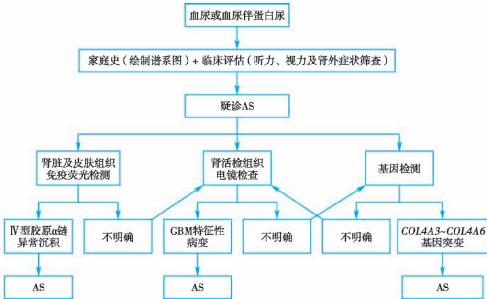  
图 5-8-1 Alport 综合征的诊断思路

【鉴别诊断】Alport综合征需要与薄基底膜肾病、局灶节段性肾小球硬化及IgA肾病等鉴别。GBM超微结构改变、肾脏及皮肤组织IV型胶原 $\alpha$ 链免疫荧光检测及基因检测有助于鉴别。

【治疗】Alport综合征尚无特效治疗药物，目前的治疗策略为早期干预，延缓疾病进展。推荐使用ACEI或ARB类药物，以减少尿蛋白和抑制肾间质纤维化。对于X连锁遗传型男性、常染色体隐性遗传、双基因遗传型病人，以及无法明确遗传方式但表现为血尿伴蛋白尿的病人，应立即启动ACEI或ARB类药物治疗。另外，及时进行听力和眼部病变的筛查与评估，以便进行听力和视力保护。若进展至终末期肾病，则需进行肾脏替代治疗。

(赵景宏)

  
本章思维导图

急性肾损伤（acute kidney injury, AKI）是由各种病因引起短时间内肾功能快速减退而导致的临床综合征，表现为肾小球滤过率（GFR）下降，伴有肌酐、尿素氮等潴留，水、电解质和酸碱平衡紊乱，重者出现多系统并发症。AKI 是常见危重病症，涉及临床各科，发病率在住院病人中约为 10%～15%，在重症监护病房中可高达 50%。研究表明大约 10% 的 AKI 病人需要接受肾脏替代治疗，住院病人中 AKI 相关的死亡率达 23%。此外，存活 AKI 病人远期发生慢性肾脏病（chronic kidney disease, CKD）及终末期肾病风险显著增加。

【病因和分类】AKI病因众多,根据病因发生的解剖部位可分为肾前性、肾性和肾后性三大类。肾前性AKI是指各种原因引起肾实质血流灌注减少而导致肾小球滤过率下降,约占AKI的55%。肾性AKI是指出现肾实质损伤,包括肾缺血和肾毒性药物或毒素导致急性肾小管坏死(acute tubular necrosis, ATN)、急性间质性肾炎(acute interstitial nephritis, AIN)、肾小球疾病和肾血管疾病等,约占AKI的40%,其中以急性肾小管坏死最为常见。肾后性AKI系急性尿路梗阻所致,梗阻可发生在从肾盂到尿道的尿路中任何部位,约占AKI的5%。

【发病机制和病理生理】

（一）肾前性 AKI 肾前性 AKI 由肾脏血流灌注不足所致，见于细胞外液容量减少，或虽细胞外液容量正常但有效循环容量下降，或某些药物引起肾小球毛细血管灌注压降低（包括肾前小动脉收缩或肾后小动脉扩张）。常见病因包括：①有效血容量不足，包括大量出血、胃肠道液体丢失、肾脏液体丢失、皮肤黏膜体液丢失和向细胞外液转移等；②心排血量降低，见于心脏疾病、肺动脉高压、肺栓塞、正压机械通气等；③全身血管扩张，多由药物、脓毒血症、肝硬化失代偿期、变态反应等引起；④肾动脉收缩，常由药物、高钙血症、脓毒血症等所致；⑤肾血流自主调节反应受损，多由血管紧张素转换酶抑制剂、血管紧张素Ⅱ受体拮抗剂、非甾体抗炎药、环孢素和他克莫司等药物引起。

在肾前性 AKI 早期, 肾血流自我调节机制通过调节肾小球出球和入球小动脉血管张力来维持 GFR 和肾血流量相对稳定。如果不早期干预, 肾实质缺血加重, 引起肾小管细胞损伤, 进而发展为肾性 AKI。从肾脏血流灌注不足进展至缺血性肾损伤是一个连续过程, 预后主要取决于起始病因严

重程度、持续时间以及是否反复出现后续肾损伤。

（二）肾性 AKI 引起肾性 AKI 的病因众多，可累及肾单位和间质任何部位。以肾缺血和肾毒性物质导致肾小管上皮细胞损伤最为常见，通常称为 ATN，其他还包括 AIN、肾血管疾病、肾小球疾病和肾移植排斥反应等。

ATN 常由缺血所致,也可由肾毒性药物引起,常发生在多因素综合作用基础上,如老年、合并糖尿病等。不同病因、不同病理损害类型的 ATN 可有不同始动机制和持续发展机

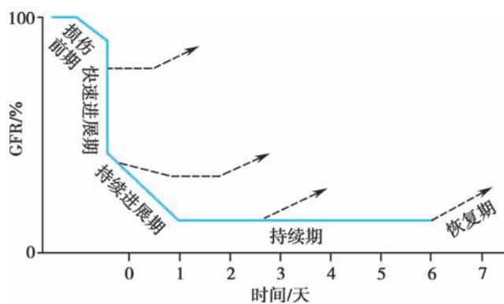  
图 5-9-1 急性肾损伤病程演变示意图

制,但均涉及 GFR 下降及肾小管上皮细胞损伤两个方面。从肾前性 AKI 进展至缺血性 ATN 一般经历四个阶段:起始期、进展期、持续期和恢复期(图 5-9-1)。

1. 起始期(持续数小时至数周) 由于肾血流量下降引起肾小球滤过压下降、上皮细胞坏死脱落形成管型从而阻塞肾小管、肾小球滤出液回漏进入间质等原因,导致 GFR 下降。缺血性损伤在近端肾小管的 $S_{3}$ 段和髓袢升支粗段髓质部分最为明显。如肾血流量不能及时恢复,细胞损伤进一步加重可引起细胞凋亡和坏死。

2. 进展期(持续数天至数周) 肾内微血管充血明显,伴持续组织缺氧和炎症反应,病变以皮髓交界处最为明显。GFR 进行性下降。

3. 持续期(常持续 1～2 周) GFR 仍保持在低水平(常为 5～10ml/min), 尿量常减少, 出现尿毒症并发症。但肾小管细胞不断修复、迁移、增殖, 以重建细胞和肾小管的完整性。此期全身血流动力学改善但 GFR 持续低下。

4. 恢复期(持续数天至数月) 肾小管上皮细胞逐渐修复、再生,细胞及器官功能逐步恢复,GFR开始改善。此期如果肾小管上皮细胞功能延迟恢复,溶质和水的重吸收功能相对肾小球滤过功能也延迟恢复,可伴随明显多尿和电解质紊乱(早期高钾血症和后期低钾血症)等。

肾毒性 ATN 由各种肾毒性物质引起,包括外源性及内源性肾毒性物质,发生机制主要与直接肾小管损伤、肾内血管收缩、肾小管梗阻等有关。外源性肾毒性物质以药物最为常见,包括氨基糖苷类抗生素和铂类抗肿瘤药物等,其次为重金属、化学毒物、生物毒素(某些蕈类、鱼胆等)及微生物感染等。内源性肾毒性物质包括肌红蛋白、血红蛋白、骨髓瘤轻链蛋白、尿酸盐、钙以及草酸盐等。

AIN 是肾性 AKI 的重要病因,主要分为四类。①药物所致:通常由非甾体抗炎药、青霉素类、头孢菌素类和磺胺类、华法林等药物引起,发病机制主要为Ⅳ型变态反应;②感染所致:主要见于细菌或病毒感染等;③系统性疾病:见于系统性红斑狼疮、干燥综合征、冷球蛋白血症及原发性胆汁性肝硬化等;④特发性:原因不明。

肾血管疾病导致肾性 AKI 包括肾脏微血管和大血管病变。血栓性血小板减少性紫癜、溶血尿毒症综合征、HELLP 综合征 (溶血、肝酶升高、血小板减少) 等肾脏微血管疾病均可引起肾小球毛细血管血栓形成和微血管闭塞, 最终导致 AKI。肾脏大血管病变如动脉粥样硬化斑块破裂和脱落导致肾脏微栓塞和胆固醇栓塞, 或主动脉夹层累及肾动脉甚至肾动脉夹层影响肾脏供血, 继而引起 AKI。

肾小球疾病导致肾性 AKI 主要见于原发性和继发性新月体肾炎,以及狼疮性肾炎、IgA 肾病等急性加重。

（三）肾后性 AKI 肾后性 AKI 主要见于尿路梗阻病人。尿路功能性梗阻主要是指神经源性膀胱等。尿路器质性梗阻包括双侧肾结石、肾乳头坏死、血凝块、膀胱癌等引起的尿路腔内梗阻，腹膜后纤维化、结肠癌、淋巴瘤等引起的尿路腔外梗阻，尿酸盐、草酸盐、阿昔洛韦、磺胺类药物、甲氨蝶呤及骨髓瘤轻链蛋白在肾小管内形成结晶，以及大量细胞管型和蛋白管型导致的肾小管梗阻。

【病理】由于病因和病变程度不同,病理改变可有显著差异。肉眼见肾脏增大、质软,剖面可见髓质呈暗红色,皮质肿胀,因缺血而苍白。典型缺血性 ATN 光镜检查见肾小管上皮细胞片状和灶性坏死,从基膜上脱落,造成肾小管管腔管型堵塞。近端小管 $S_{3}$ 段坏死最为严重,其次为髓袢升支粗段髓质部分。如基底膜完整性存在,则肾小管上皮细胞可迅速再生,否则肾小管上皮细胞不能完全再生。肾毒性 ATN 形态学变化最明显部位在近端肾小管曲部和直部,肾小管细胞坏死不如缺血性 ATN 明显。AIN 病理特征是间质炎症细胞浸润,嗜酸性粒细胞浸润是药物所致 AIN 的重要病理学特征。

【临床表现】AKI临床表现差异大，与病因和所处临床分期不同有关。明显的症状常出现于肾功能严重减退时，常见症状包括乏力、食欲缺乏、恶心、呕吐和尿量减少，容量过多时可出现急性左心衰竭。AKI首次诊断常基于实验室检查异常，特别是血清肌酐（serum creatinine, Scr）绝对或相对升高，而不是基于临床症状与体征。

以下以 ATN 为例介绍肾性 AKI 的临床病程。

1. 起始期 此期病人常遭受一些已知或未知 ATN 病因的打击, 如低血压、缺血、脓毒症和肾毒性药物等, 但尚未发生明显肾实质损伤。在此阶段如能及时采取有效措施, AKI 常可逆转。但随着肾小管上皮细胞损伤加重, GFR 逐渐下降, 进入进展期。

2. 进展期和维持期 一般持续7～14天，但也可短至数天或长至4～6周。GFR进行性下降。部分病人可出现少尿（＜400ml/d）和无尿（＜100ml/d），但也有些病人尿量在400ml/d以上，后者称为非少尿型AKI。但不论尿量是否减少，随着肾功能减退，临床上可出现一系列尿毒症表现，主要是尿毒症毒素潴留和水、电解质及酸碱平衡紊乱所致。AKI全身表现包括消化系统症状，如食欲减退、恶心、呕吐、腹胀及腹泻等，严重者可发生消化道出血；呼吸系统表现主要是容量过多导致急性肺水肿和感染；循环系统多因尿少和水钠潴留出现高血压和心力衰竭、肺水肿的表现，以及因毒素滞留、电解质紊乱、贫血和代谢性酸中毒引起心律失常及心肌病变；神经系统受累可出现意识障碍、躁动、谵妄、抽搐、昏迷等尿毒症脑病症状；血液系统受累可有出血倾向和贫血。感染是AKI常见而严重的并发症。在AKI同时或疾病发展过程中还可并发多脏器功能障碍综合征，死亡率极高。此外，水、电解质和酸碱平衡紊乱多表现为水过多、代谢性酸中毒、高钾血症、低钠血症、低钙和高磷血症等。

3. 恢复期 GFR 逐渐升高,并恢复正常或接近正常。少尿型病人开始出现尿量增多,继而出现多尿,再逐渐恢复正常。与 GFR 相比,肾小管上皮细胞功能恢复相对延迟,常需数月后才能恢复。部分病人最终遗留不同程度的肾脏结构和功能损伤。

## 【实验室与辅助检查】

1. 血液检查 可有贫血,早期程度常较轻,如肾功能长时间不恢复,则贫血程度可以较重。另外,某些引起 AKI 的基础疾病本身也可引起贫血,如大出血和严重感染等。Scr 和尿素氮进行性上升,高分解代谢病人上升速度较快,横纹肌溶解引起肌酐上升更快。血清钾浓度升高,血 pH 和碳酸氢根离子浓度降低,血钙降低,血磷升高。

2. 尿液检查 不同病因所致 AKI 的尿检异常相差甚大。肾前性 AKI 时无蛋白尿和血尿，可见少量透明管型。ATN 时可有少量蛋白尿，以小分子蛋白为主；尿沉渣检查可见肾小管上皮细胞、上皮细胞管型和颗粒管型及少许红细胞、白细胞等；因肾小管重吸收功能减退，尿比重降低且较固定，多在 1.015 以下，尿渗透压 $<350\mathrm{mOsm}/(\mathrm{kg}\cdot\mathrm{H}_{2}\mathrm{O})$ ，尿与血渗透压之比 $<1.1$ ，尿钠含量增高，滤过钠排泄分数 $(\mathrm{FE}_{\mathrm{Na}}) > 1\%$ 。 $\mathrm{FE}_{\mathrm{Na}}$ 计算公式为： $\mathrm{FE}_{\mathrm{Na}} = (\text{尿钠/血钠}) / (\text{尿肌酐/血清肌酐}) \times 100\%$ 。注意尿液检查须在输液、使用利尿剂前进行，否则会影响结果。AIN 时可有少量蛋白尿，且以小分子蛋白为主；血尿较少，为非畸形红细胞；可有轻度白细胞尿，药物所致者可见少量嗜酸性粒细胞，当尿液嗜酸细胞占总白细胞比例 $>5\%$ 时，称为嗜酸细胞尿；可有明显肾小管功能障碍表现， $\mathrm{FE}_{\mathrm{Na}} > 1\%$ 。肾小球疾病引起者可出现大量蛋白尿或血尿，且以畸形红细胞为主， $\mathrm{FE}_{\mathrm{Na}} < 1\%$ 。肾后性 AKI 尿检异常多不明显，可有轻度蛋白尿、血尿，合并感染时可出现白细胞尿， $\mathrm{FE}_{\mathrm{Na}} < 1\%$ 。

3. 影像学检查 尿路超声检查有助于排除尿路梗阻及与 CKD 鉴别。如高度怀疑存在梗阻，可作逆行性或静脉肾盂造影。CT 血管造影、MRI 或放射性核素检查对了解血管病变有帮助，明确诊断仍需行肾血管造影，但造影剂的使用可能加重肾损伤。

4. 肾活检 肾活检是 AKI 鉴别诊断重要手段。在排除了肾前性及肾后性病因后，拟诊肾性 AKI 但不能明确病因时，可考虑行肾活检明确诊断。

【诊断】根据原发病因,肾小球滤过功能急性进行性减退,结合相应临床表现、实验室与影像学检查,一般不难作出诊断。

按照国际 AKI 临床实践指南, 符合以下情况之一者即可临床诊断 AKI: ①48 小时内 Scr 升高 $\geqslant0.3mg/dl$ ( $\geqslant26.5\mu mol/L$ ); ②7 天内 Scr 较基础值升高 $\geqslant50\%$ ; ③尿量减少 $[<0.5ml/(kg\cdot h)$ , 持续时间 $\geqslant6$ 小时]。(表 5-9-1)

表 5-9-1 急性肾损伤的分期标准 (2012 KDIGO 指南)

<table><tr><td>分期</td><td>血清肌酐标准</td><td>尿量标准</td></tr><tr><td>1期</td><td>绝对值升高 $\geqslant 0.3mg/dl$ ( $\geqslant 26.5\mu mol/L$ )或较基础值相对升高 $\geqslant 50\%$ ,但&lt;1倍</td><td> $<0.5ml/(kg·h)$ ( $\geqslant 6$ 小时,但&lt;12小时)</td></tr><tr><td>2期</td><td>相对升高 $\geqslant 1$ 倍,但&lt;2倍</td><td> $<0.5ml/(kg·h)$ ( $\geqslant 12$ 小时,但&lt;24小时)</td></tr><tr><td>3期</td><td>升高至 $\geqslant 4.0mg/dl$ ( $\geqslant 353.6\mu mol/L$ )或相对升高 $\geqslant 2$ 倍或开始时肾脏替代治疗或&lt;18岁病人估算肾小球滤过率下降至 $<35ml/(min·1.73m^{2})$ </td><td> $<0.3ml/(kg·h)$ ( $\geqslant 24$ 小时)或无尿 $\geqslant 12$ 小时</td></tr></table>

注:KDIGO,改善全球肾脏病预后组织。

需要注意的是,单独用尿量改变作为诊断与分期标准时,必须考虑其他影响尿量的因素,如尿路梗阻、血容量状态、使用利尿剂等。此外,由于 Scr 影响因素众多且敏感性较差,故并非肾损伤最佳标志物。某些反映新型生物标志物如胱抑素 C(cystatin C)、中性粒细胞明胶酶相关脂质运载蛋白(NGAL)和胰岛素样生长因子结合蛋白-7(IGFBP-7)等,可能有助于早期诊断及预测 AKI 病人预后,值得深入研究。

【鉴别诊断】详细询问病史和体格检查有助于寻找 AKI 可能的病因。AKI 诊断和鉴别诊断的步骤包括:①判断病人是否存在肾损伤及其严重程度;②是否存在需要紧急处理的严重并发症;③评估肾损伤发生时间,是否为急性发生及有无 CKD 基础;④明确 AKI 病因。先筛查肾前性和肾后性因素,再评估可能的肾性 AKI 病因。确定为肾性 AKI 后,应鉴别是肾小管-间质病变或肾小球、肾血管病变。系统筛查 AKI 肾前性、肾性、肾后性病因有助于尽早准确诊断,及时采取针对性治疗。

1. 是否存在肾损伤 对存在 AKI 高危因素病人应主动监测尿量及 Scr, 及时发现 AKI。既往无 CKD 史及基础 Scr 检测值缺如者, 可利用 MDRD 公式反向估算基础 Scr 值。

2. 是否存在需要紧急处理的严重并发症 肾功能减退常继发内环境紊乱,严重者可猝死,需及时识别。部分病人临床表现隐匿,初诊需常规进行心肺听诊、心电图及血生化检查,快速评估是否存在需要紧急处理的并发症,如严重高钾血症和代谢性酸中毒等。

3. 评估肾损伤发生时间 肾功能减退应明确是急性还是慢性肾功能减退，CKD各阶段均可因各种病因出现急性加重，通过详细病史询问、体格检查、相关实验室及影像学检查可资鉴别。提示AKI的临床线索包括有引起AKI的病因，如导致有效血容量不足的各种疾病和血容量不足表现（直立性低血压、低血压等）、肾毒性药物或毒物接触史、泌尿系统梗阻等；肾功能快速减退表现，如短时间内出现进行性加重的尿量减少、胃肠道症状甚至Scr进行性升高等；由血容量不足所致者可见皮肤干燥、弹性差，脉搏加快，低血压或脉压缩小；由药物所致者可见皮疹；因尿量减少出现水钠潴留时，可见水肿，甚至肺部湿啰音等；影像学检查提示肾脏大小正常或增大，实验室检查提示无明显贫血、无明显继发性甲状旁腺功能亢进和钙磷代谢紊乱等。

4. 明确 AKI 的病因 以 ATN 为例,与其他类型 AKI 鉴别如下。

（1）与肾前性 AKI 鉴别：肾前性血流灌注不足是 AKI 最常见原因，应详细询问病程中有无引起容量绝对或相对不足的原因，以及近期有无非甾体抗炎药、血管紧张素转换酶抑制剂和血管紧张素Ⅱ受体拮抗剂等药物使用史。体检时应注意有无容量不足的常见体征，包括心动过速、全身性或直立性低血压、黏膜干燥、皮肤弹性差等。肾前性 AKI 时，实验室检查可见血尿素氮/血清肌酐比值常大于 20:1（需排除胃肠道出血所致尿素产生增多、消瘦所致肌酐生成减少等），尿沉渣常无异常改变，尿液浓缩伴尿钠下降， $FE_{Na}$ 常 <1%，肾衰指数常 <1（表 5-9-2）。肾衰指数计算公式为：肾衰指数 = 尿钠/(尿肌酐/血清肌酐)。

表 5-9-2 急性肾损伤时尿液诊断指标

<table><tr><td>尿液检查</td><td>肾前性 AKI</td><td>缺血性 ATN</td></tr><tr><td>尿比重</td><td>&gt;1.018</td><td>&lt;1.012</td></tr><tr><td>尿渗透压/ [mOsm/(kg·H2O)]</td><td>&gt;500</td><td>&lt;250</td></tr><tr><td>尿钠/(mmol/L)</td><td>&lt;10</td><td>&gt;20</td></tr><tr><td>尿肌酐/血清肌酐</td><td>&gt;40</td><td>&lt;20</td></tr><tr><td>血尿素氮(mg/dl)/血清肌酐(mg/dl)</td><td>&gt;20</td><td>&lt;10~15</td></tr><tr><td>钠排泄分数</td><td>&lt;1%</td><td>≥1%</td></tr><tr><td>肾衰指数</td><td>&lt;1</td><td>≥1</td></tr><tr><td>尿沉渣</td><td>透明管型</td><td>棕色颗粒管型</td></tr></table>

临床上怀疑肾前性 AKI 时, 可进行被动抬腿 (passive leg raising, PLR) 试验或补液试验, 即输液 (5% 葡萄糖 200\~250ml) 并静脉注射利尿剂 (呋塞米 40\~100mg), 如果补足血容量后血压恢复正常, 尿量增加, 则支持肾前性 AKI 诊断。低血压时间过长, 特别是老年人伴心功能不全时, 补液后尿量不增多应怀疑肾前血流灌注不足已发展为 ATN。PLR 模拟内源性快速补液, 病人基础体位为 45° 半卧位, 上身放平后, 双下肢被动抬高 45° 持续 1 分钟, 病人回心血量增加约 250\~450ml, PLR 后每搏输出量增加 >10% 定义为对容量有反应性。

（2）与肾后性 AKI 鉴别:既往有泌尿系统结石、盆腔脏器肿瘤或手术史病人,突然完全性无尿、间歇性无尿或伴肾绞痛,应警惕肾后性 AKI。膀胱导尿兼有诊断和治疗意义。超声等影像学检查可资鉴别。

（3）与肾小球或肾脏微血管疾病鉴别:病人有肾炎综合征或肾病综合征表现,部分病人可有相应肾外表现(光过敏、咯血、免疫学指标异常等),蛋白尿常较严重,血尿及管型尿显著,肾功能减退相对缓慢,常需数周,很少完全无尿。应尽早肾活检病理检查,以明确诊断。

（4）与 AIN 鉴别: 主要依据 AIN 病因及临床表现, 如药物过敏或感染史、明显肾区疼痛等。药物引起者尚有发热、皮疹、关节疼痛、血嗜酸性粒细胞增多等。鉴别有困难时应尽早肾活检病理检查, 以明确诊断。

（5）与急性肾动脉闭塞和肾静脉血栓形成鉴别:急性肾动脉闭塞常见于肾动脉栓塞、血栓、主动脉夹层分离,偶由血管炎所致。多见于动脉粥样硬化病人。心脏附壁血栓脱落也是引起肾动脉闭塞的常见原因。急性肾静脉血栓罕见,常发生于成人肾病综合征、肾细胞癌、肾区外伤或严重脱水的肾病患儿,多伴有下腔静脉血栓形成,常出现下腔静脉阻塞综合征、严重腰痛和血尿。肾血管影像学检查有助于确诊。

【治疗】AKI并非单一疾病,不同病因、不同类型AKI,其治疗方法有所不同。总体治疗原则是:尽早识别并纠正可逆病因,维持水、电解质和酸碱平衡,促进肾功能恢复,适当营养支持,积极防治并发症,适时进行肾脏替代治疗。

1. 早期病因干预治疗 在 AKI 起始期及时干预可最大限度减轻肾脏损伤,促进肾功能恢复。强调尽可能停用所有肾毒性药物,尽快纠正可逆性病因,确保维持合适的容量状态和灌注压,包括扩容、维持血流动力学稳定、改善低蛋白血症、降低后负荷以改善心排血量、停用影响肾灌注药物、调节外周血管阻力至正常范围等。

继发于肾小球肾炎、小血管炎的 AKI 常需应用糖皮质激素和/或免疫抑制剂治疗。临床上怀疑 AIN 时，需尽快明确并停用可疑药物，确诊为药物所致者及时给予糖皮质激素治疗。

肾后性 AKI 应尽早解除尿路梗阻,如前列腺肥大应通过膀胱留置导尿,肿瘤压迫输尿管可放置输尿管支架或行经皮肾盂造瘘术。

2. 营养支持治疗 可优先通过胃肠道提供营养(包括管饲),酌情限制水分、钠盐和钾盐摄入,不能口服者需静脉营养,营养支持总量与成分要根据临床情况增减。AKI 任何阶段总能量摄入为 20～30kcal/(kg·d),能量供给包括碳水化合物 3～5g(最高 7g)/(kg·d)、脂肪 0.8～1.0g/(kg·d)、蛋白质或氨基酸摄入量 0.8～1.0g/(kg·d)。高分解代谢、接受肾脏替代治疗(renal replacement therapy,RRT)、连续性肾脏替代治疗(continuous renal replacement therapy,CRRT)患者蛋白质或氨基酸摄入量酌情增加。静脉补充脂肪乳剂以中、长链混合液为宜,氨基酸补充则包括必需和非必需氨基酸。危重症病人血糖靶目标应控制在 6.11～8.27mmol/L(110～149mg/dl)。

观察每日出入液量和体重变化,每日补液量应为显性失液量加上非显性失液量减去内生水量,每日大致进液量可按前一日尿量加500ml计算,肾脏替代治疗时补液量可适当放宽。

3. 并发症治疗 密切随访 Scr、尿素氮和血电解质变化。高钾血症是 AKI 的主要死因之一，当血钾 >6mmol/L 或心电图有高钾表现或有神经、肌肉症状时需紧急处理。措施包括：①停用一切含钾药物和/或食物。②对抗钾离子心肌毒性：10% 葡萄糖酸钙稀释后静脉推注。③转移钾至细胞内：葡萄糖与胰岛素合用促进糖原合成，使钾离子向细胞内转移（50% 葡萄糖 50～100ml 或 10% 葡萄糖 250～500ml，加常规胰岛素 6～12U 静脉输注，葡萄糖与常规胰岛素比值约为 4:1）；伴代谢性酸中毒者补充碱剂，既可纠正酸中毒又可促进钾离子向细胞内流（5% NaHCO₃ 250ml 静脉滴注）。④清除钾：离子交换树脂（口服 1～2 小时起效，灌肠 4～6 小时起效，每 50g 降钾树脂使血钾下降 0.5～1.0mmol/L）或者选择性钾离子结合剂、利尿剂（多使用袢利尿剂，以增加尿量促进钾离子排泄，但不建议常规使用利尿剂治疗 AKI）、急诊透析（腹膜透析 2L/h 可交换 5mmol K⁺，血液透析降钾最为有效）。应注意反复检测血钾水平，调整治疗方案，防止反弹。

及时纠正代谢性酸中毒,可选用 5% NaHCO $_{3}$ 125～250ml 静脉滴注。对于严重酸中毒病人,如静脉血 HCO $_{3}^{-}$ <12mmol/L 或动脉血 pH<7.15～7.2 时,纠正酸中毒的同时紧急透析治疗。

AKI 心力衰竭病人对利尿剂反应较差,对洋地黄制剂疗效也差,且易发生洋地黄中毒。药物治疗多以扩血管为主,减轻心脏前负荷。通过透析超滤脱水,纠正容量过负荷缓解心衰症状最为有效。

感染是 AKI 常见并发症,也是死亡主要原因之一,应尽早使用抗生素。根据细菌培养和药物敏感试验选用对肾脏无毒性或低毒性药物,并按肌酐清除率调整用药剂量。

4. 肾脏替代治疗 RRT 是 AKI 治疗的重要组成部分, 包括腹膜透析、间歇性血液透析和 CRRT 等。

AKI时RRT目的包括“肾脏替代”和“肾脏支持”。前者是干预因肾功能严重减退而出现可能危及生命的严重内环境紊乱，主要是纠正严重水、电解质、酸碱失衡和氮质血症。其中紧急透析指征包括预计内科保守治疗无效的严重代谢性酸中毒(动脉血 $\mathrm{pH} < 7.2$ )、高钾血症（ $\mathrm{K}^{+} > 6.5\mathrm{mmol / L}$ 或出现严重心律失常等）、积极利尿治疗无效的严重肺水肿，以及严重尿毒症症状如脑病、心包炎、癫痫发作等；“肾脏支持”是支持肾脏维持机体内环境稳定，清除炎症介质、尿毒症毒素等各种致病性物质，防治可引起肾脏进一步损害的因素，减轻肾脏负荷，促进肾功能恢复，并在一定程度上支持其他脏器功能，为原发病和并发症治疗创造条件，如充血性心力衰竭时清除过多体液、肿瘤化疗时清除肿瘤细胞坏死产生的大量代谢产物等。

重症 AKI(出现威胁生命的容量、电解质、酸碱平衡紊乱等)倾向于早期开始肾脏替代治疗，RRT 治疗模式的选择以安全、有效、简便、经济为原则。血流动力学严重不稳定，或合并急性脑损伤者，CRRT 更具优势。提倡目标导向的肾脏替代治疗，即针对临床具体情况，首先明确病人治疗需求，确定 RRT 具体治疗目标，根据治疗目标决定 RRT 时机、剂量及模式，并在治疗期间依据疗效进行动态调整，从而实行目标导向的精准肾脏替代治疗。AKI 进行 RRT 治疗的目标如下：①维持容量、电解质、酸碱平衡；②预防肾脏的进一步损害；③促进肾脏功能恢复；④使其他治疗（包括抗生素、营养支持）不受限制。

5. 恢复期治疗 AKI 恢复期早期,威胁生命的并发症依然存在,治疗重点仍为维持水、电解质和酸碱平衡,控制氮质血症,治疗原发病和防止各种并发症。部分 ATN 病人多尿期持续较长,补液量应逐渐减少,以缩短多尿期。AKI 存活病人需按照 CKD 诊治相关要求长期随访治疗。

【预后】AKI 结局与原有疾病严重性及合并症严重程度有关。肾前性 AKI 如能早期诊断和治疗，肾功能常可恢复至基础水平，死亡率小于 10%；肾后性 AKI 及时（尤其是 2 周内）解除梗阻，肾功能也大多恢复良好。根据肾损伤严重程度不同，肾性 AKI 死亡率在 30%～80%，部分病人 AKI 后肾功能无法恢复，特别是 CKD 基础上发生 AKI，肾功能常无法恢复至基础水平，且加快进入终末期肾病阶段。原发病为肾小球肾炎或血管炎者，受原发病本身病情发展影响，肾功能也不一定完全恢复至基础水平。

  
本章思维导图

【预防】AKI发病率及死亡率居高不下，预防极为重要。积极治疗原发病，及时去除AKI发病诱因，纠正发病危险因素，是AKI预防的关键。AKI防治应遵循分期处理原则：高危病人即将或已受到AKI发病病因打击时，应酌情采取针对性预防措施，包括及时纠正肾前性因素，维持血流动力学稳定等。出血性休克扩容首选补充等张晶体溶液，血管源性休克在扩容同时适当使用缩血管药物，腹腔间隔室综合征病人及时纠正腹腔内高压。全面评估高危病人暴露于肾毒性药物或诊断、治疗性操作的必要性，尽量避免使用肾毒性药物。必须使用时，应注意根据肾功能调整剂型、剂量、用法等以降低药物肾毒性，并密切监测肾功能。

(徐钢)

本章数字资源

慢性肾衰竭（chronic renal failure, CRF）是各种慢性肾脏病（chronic kidney disease, CKD）持续进展至后期的共同结局。它是以代谢产物潴留，水、电解质及酸碱平衡失调和全身各系统症状为表现的一种临床综合征。

## 【定义、病因和发病机制】

## (一) 定义和分期

1. CKD 各种原因引起的肾脏结构或功能异常≥3个月，包括出现肾脏损伤标志(白蛋白尿、尿沉渣异常、肾小管相关病变、组织学检查异常及影像学检查异常)或有肾移植病史，伴或不伴肾小球滤过率(GFR)下降；或不明原因的GFR下降 $\left[\leqslant60\mathrm{ml}/(\mathrm{min}\cdot1.73\mathrm{m}^{2})\right]\geqslant3$ 个月。临床上常用血肌酐或/和胱抑素C来计算eGFR。

目前国际公认的慢性肾脏病分期依据肾脏病预后质量倡议（K/DOQI）制定的指南分为1～5期，见表5-10-1。该分期方法根据GFR将CKD分为5期。单纯GFR轻度下降（60～89ml/min）而无肾损害表现者，不能认为存在CKD；只有当GFR＜60ml/(min·1.73m²)时，才可按CKD3期对待。另外，改善全球肾脏病预后组织（KDIGO）建议对血肌酐计算的eGFR处于45～59ml/(min·1.73m²)、无肾损伤标志物的人群进一步以胱抑素C计算的eGFR来判断是否为CKD。

表 5-10-1 K/DOQI 对慢性肾脏病的分期及建议

<table><tr><td>分期</td><td>特征</td><td>GFR/ [ml/(min·1.73m2)]</td><td>防治目标与措施</td></tr><tr><td>1</td><td>GFR 正常或升高</td><td>≥90</td><td>CKD 病因诊治,缓解症状保护肾功能,延缓 CKD 进展</td></tr><tr><td>2</td><td>GFR 轻度降低</td><td>60~89</td><td>评估、延缓 CKD 进展降低心血管病风险</td></tr><tr><td>3a</td><td>GFR 轻到中度降低</td><td>45~59</td><td>延缓 CKD 进展</td></tr><tr><td>3b</td><td>GFR 中到重度降低</td><td>30~44</td><td>评估、治疗并发症</td></tr><tr><td>4</td><td>GFR 重度降低</td><td>15~29</td><td>综合治疗,肾脏替代治疗准备</td></tr><tr><td>5</td><td>ESRD</td><td>&lt;15 或透析</td><td>适时肾脏替代治疗</td></tr></table>

2. CRF CRF 的概念早于 CKD, 指慢性肾脏病引起的 GFR 下降及与此相关的代谢紊乱和临床症状组成的综合征, 对应 CKD 定义中 GFR 下降至失代偿期的那一部分群体。CRF 无明确诊断标准, 多等同于 CKD 4～5 期。

（二）患病率与病因 CKD 是世界各国所面临的重要公共卫生问题。2017 年全球有 6.975 亿 CKD 病人，约占全球人口的 9.1%。据 2022 年的数据，我国 CKD 患病率为 8.2%。

CKD病因主要包括糖尿病肾脏病、高血压肾小动脉硬化、原发性与继发性肾小球肾炎、肾小管间质疾病(慢性间质性肾炎、慢性肾盂肾炎、高尿酸性肾病、梗阻性肾病等)、肾血管疾病、遗传性肾病(多囊肾病、遗传性肾炎)等。在发达国家，糖尿病肾脏病、高血压肾小动脉硬化是CKD的主要病因；在中国等发展中国家，最常见病因仍是原发性肾小球肾炎，近年来糖尿病肾脏病导致CKD的患病率明显增加，有可能将成为导致我国CKD的首要病因。

（三）CKD 进展的危险因素 CKD 通常进展缓慢，但在某些诱因下短期内可急剧加重、恶化。因此，临床上一方面需要积极控制渐进性发展的危险因素，延缓病情进展；另一方面需注意短期内是否存在急性加重的诱因，以消除可逆性诱因，争取肾功能的好转。

1. CKD 渐进性发展的危险因素 包括高血糖、高血压、蛋白尿(包括微量白蛋白尿)、低蛋白血症、吸烟等。此外,贫血、高脂血症、高同型半胱氨酸血症、老年、营养不良、尿毒症毒素(如甲基胍、甲状旁腺激素、酚类)蓄积等,在 CKD 病程进展中也起一定作用。

2. CKD 急性加重、恶化的危险因素 主要有:①累及肾脏的疾病(原发性或继发性肾小球肾炎、高血压、糖尿病、缺血性肾病等)复发或加重;②有效血容量不足(低血压、脱水、大出血或休克等);③肾脏局部血供急剧减少(如肾动脉狭窄病人应用 ACEI、ARB 等药物);④严重高血压未能控制;⑤肾毒性药物;⑥泌尿道梗阻;⑦其他:严重感染、高钙血症、肝衰竭、心力衰竭等。在上述因素中,因有效血容量不足或肾脏局部血供急剧减少致残余肾单位低灌注、低滤过状态,是导致肾功能急剧恶化的主要原因之一;肾毒性药物特别是非甾体抗炎药、氨基糖苷类抗生素、造影剂、含有马兜铃酸的中草药等的不当使用,也是导致肾功能恶化的常见原因。在 CKD 病程中出现的肾功能急剧恶化,如处理及时得当,可使病情有一定程度的逆转;但如诊治延误,或这种急剧恶化极为严重,则病情呈不可逆性进展。

(四) CKD 的发病机制 CKD 进展的机制尚未完全阐明, 可能与以下因素有关。

1. 肾单位高灌注、高滤过 CKD 时残余肾单位肾小球出现高灌注和高滤过状态会导致肾小球硬化和残余肾单位进一步丧失。高灌注和高滤过刺激肾小球系膜细胞增殖和基质增加；损伤内皮细胞和增加血小板集聚；引起炎症细胞浸润、系膜细胞凋亡增加等，因而肾小球硬化不断发展，肾单位进行性丧失。

2. 肾单位高代谢 CKD 时残余肾单位肾小管高代谢状况, 是肾小管萎缩、间质纤维化和肾单位进行性损害的重要原因之一。

3. 肾组织上皮细胞表型转化 在某些生长因子(如 TGF- $\beta_{1}$ )或炎症因子的诱导下,肾小管上皮细胞、肾小球上皮细胞(如包曼囊上皮细胞或足细胞)、肾间质成纤维细胞等均可转化为肌成纤维细胞,在肾间质纤维化和肾小球硬化过程中起重要作用。

4. 细胞外基质增生 CKD 肾组织内部分细胞因子和生长因子(如 TGF- $\beta_{1}$ 、白细胞介素-1、血管紧张素Ⅱ、内皮素-1 等)高表达,基质金属蛋白酶表达下调,金属蛋白酶组织抑制物及纤溶酶原激活抑制物表达上调,对细胞外基质增生起重要的促进作用。

5. 其他 多种慢性肾脏病动物模型提示,肾脏固有细胞凋亡增多与肾小球硬化、间质纤维化有密切关系。此外,醛固酮增多也参与肾小球硬化和间质纤维化的过程。

（五）尿毒症症状的发生机制 尿毒症症状及体内各器官系统损害的原因主要有：

1. 肾脏排泄和代谢功能下降,导致水、电解质和酸碱平衡失调,如水、钠潴留,高血压,代谢性酸中毒等。

2. 尿毒症毒素的毒性作用。尿毒症毒素是由于功能肾单位减少，不能充分排泄体内代谢废物或降解某些激素、肽类等而在体内蓄积并引起各种症状和体征的物质。尿毒症毒素可分为小分子物质、中分子物质和大分子物质三类。①小分子物质(分子量<500Da)，包括钾、磷、 $\mathrm{H^{+}}$ 、氨基酸及氮代谢产物等，以尿素氮最多，其他如胍类(如甲基胍、琥珀胍酸等)、各种胺类、酚类等均可在体内蓄积，引起临床症状。②中分子物质(分子量 $500\sim 5000\mathrm{Da}$ )，包括多肽类、蛋白质类物质等，它们的蓄积与CKD远期并发症相关，如尿毒症脑病、内分泌紊乱、细胞免疫功能低下等。甲状旁腺激素（PTH）是最常见的中分子物质，可引起肾性骨营养不良、软组织钙化等。③大分子物质(分子量>5000Da)，如核糖核酸酶、 $\beta_{2}$ 微球蛋白、维生素A等也具有某些毒性。此外，晚期糖基化终末产物、终末氧化蛋白产物和氨甲酰化蛋白质、氨甲酰化氨基酸等，也是潜在的尿毒症毒素。

3. 肾脏的内分泌功能障碍,如促红细胞生成素(erythropoietin,EPO)分泌减少可引起肾性贫血,骨化三醇 $\left[1,25-\left(\mathrm{OH}\right)_{2}\mathrm{D}_{3}\right]$ 产生不足可致肾性骨病。另外,持续炎症状态、营养素(如必需氨基酸、水溶性维生素、微量元素等)的缺乏也可引起或加重尿毒症的症状。

## 【临床表现与诊断】

（一）临床表现 CKD 不同阶段的临床表现各异。CKD 1～3 期病人可以无任何症状，或仅有乏力、腰酸、夜尿增多、食欲减退等轻度不适。进入 CKD 3b～4 期以后，上述症状更趋明显。到 CKD 5 期时，可出现急性左心衰竭、严重高钾血症、消化道出血、中枢神经系统障碍等，甚至有生命危险。

1. 水、电解质代谢紊乱 CKD 时常出现各种电解质代谢紊乱和酸碱平衡失调, 其中以代谢性酸中毒和水、钠平衡紊乱最为常见。

（1）代谢性酸中毒:在部分轻中度 CKD $\left[\mathrm{GFR}>25\mathrm{ml}/(\mathrm{min}\cdot1.73\mathrm{m}^{2}),\text{或血肌酐}<350\mu\mathrm{mol/L}\right]$ 病人,由于肾小管分泌氢离子障碍或肾小管碳酸氢盐的重吸收能力下降,可引起阴离子间隙正常的高氯血症性代谢性酸中毒,即肾小管性酸中毒。当 GFR 降低 $<25\mathrm{ml}/(\mathrm{min}\cdot1.73\mathrm{m}^{2})$ 或血肌酐 $>350\mu\mathrm{mol/L}$ 时,代谢产物如磷酸、硫酸等酸性物质因肾排泄障碍而潴留,可发生高阴离子间隙性代谢性酸中毒,即“尿毒症性酸中毒”。

多数病人能耐受轻度慢性酸中毒,但如动脉血 $HCO_{3}^{-}<15mmol/L$ , 则有较明显症状, 如食欲缺乏、呕吐、虚弱无力、呼吸深长等, 与酸中毒时体内多种酶活性受抑制有关。

（2）水、钠代谢紊乱：水、钠潴留，导致稀释性低钠血症，可表现为不同程度的皮下水肿或/和体腔积液，常伴有血压升高，严重时导致左心衰竭和脑水肿。少数病人由于长期低钠饮食、进食差、呕吐等，可出现低钠血症、低血容量状态，临床上需注意鉴别。

（3）钾代谢紊乱：当 GFR 降至 20～25ml/(min·1.73m²) 或更低时，肾脏排钾能力下降，易出现高钾血症；尤其当钾摄入过多、酸中毒、感染、创伤、溶血、出血、输血等情况发生时，更易出现高钾血症。需要注意的是，某些药物容易引起高钾血症，如 ACEI/ARB、保钾利尿剂等，在肾功能不全的病人中应用此类药物时应特别注意。有时由于钾摄入不足、胃肠道丢失过多、应用排钾利尿剂等因素，也可出现低钾血症。

（4）钙磷代谢紊乱：在 CKD 早期，血钙、血磷仍能维持在正常范围，通常不引起临床症状。随病情进展，肾小球滤过率继续下降、尿磷排出减少时，血磷浓度逐渐升高。低钙血症主要与钙摄入不足、活性维生素 D 缺乏、高磷血症、代谢性酸中毒等因素有关。钙磷代谢紊乱可进一步促进甲状旁腺激素（PTH）分泌增加，出现继发性甲状旁腺功能亢进，部分病人甚至形成甲状旁腺腺瘤。

（5）镁代谢紊乱：当 $GFR<20ml/(min\cdot1.73m^{2})$ 时，由于肾脏排镁减少，常有轻度高镁血症。病人可无任何症状，但不宜使用含镁的药物，如含镁的抗酸药、泻药等。低镁血症也偶可出现，与镁摄入不足或过多应用利尿剂有关。

2. 蛋白质、糖类、脂类和维生素代谢紊乱

（1）蛋白质代谢紊乱：一般表现为蛋白质代谢产物蓄积(氮质血症)，也可有白蛋白、必需氨基酸水平下降等。上述代谢紊乱主要与蛋白质分解增多或/和合成减少、负氮平衡、肾脏排出障碍等因素有关。

（2）糖代谢异常:主要表现为糖耐量减低和低血糖症两种情况,前者多见。糖耐量减低主要与胰高血糖素水平升高、胰岛素受体障碍等因素有关,可表现为空腹血糖水平或餐后血糖水平升高,但一般较少出现自觉症状。

（3）脂代谢紊乱：主要表现为高脂血症，多数表现为轻到中度高甘油三酯血症，少数病人表现为轻度高胆固醇血症，或两者兼有；有些病人血浆极低密度脂蛋白（VLDL）、脂蛋白a[Lp(a)]水平升高，高密度脂蛋白（HDL）水平降低。

（4）维生素代谢紊乱：在 CKD 中也很常见，如血清维生素 A 水平增高、维生素 $B_{6}$ 及叶酸缺乏等，常与饮食摄入不足、某些酶活性下降有关。

3. 心血管系统表现 心血管病变是慢性肾脏病病人的常见并发症和最主要死因。尤其进入终末期肾病阶段，心血管事件及动脉粥样硬化性心血管疾病的发生比普通人群升高约15～20倍，死亡率进一步增高（占尿毒症死因45%～60%）。

（1）高血压和左心室肥厚：大部分病人存在不同程度的高血压，多由于水钠潴留、肾素-血管紧张素增高和/或某些舒张血管的因子产生不足所致。高血压可引起动脉硬化、左心室肥厚和心力衰竭。贫血以及血液透析动静脉内瘘的使用，会引起心高搏出量状态，加重左心室负荷和左心室肥厚。

（2）心力衰竭：随着肾功能的不断恶化，心力衰竭患病率明显增加，至尿毒症期可达65%～70%。其原因多与水、钠潴留，高血压及尿毒症心肌病变有关。发生急性左心衰竭时可出现呼吸困难、不能平卧、肺水肿等症状，但一般无明显发绀。

（3）尿毒症性心肌病:可能与代谢废物的潴留及贫血等因素有关,部分病人可伴有冠状动脉粥样硬化性心脏病。各种心律失常的出现,与心肌损伤、缺氧、电解质紊乱、尿毒症毒素蓄积等有关。

（4）心包病变:心包积液在 CKD 病人中常见,其原因多与尿毒症毒素蓄积、低蛋白血症、心力衰竭等有关,少数情况下也可能与感染、出血等因素有关。轻者可无症状,重者可有心音低钝、遥远,少数情况下还可有心脏压塞。心包炎可分为尿毒症性和透析相关性;前者已较少见,后者的临床表现与一般心包炎相似,心包积液多为血性。

（5）血管钙化和动脉粥样硬化:由于高磷血症、钙分布异常和“血管保护性蛋白”(如 $\alpha$ -球蛋白)缺乏而引起的血管钙化,在 CKD 心血管病变中起着重要作用。动脉粥样硬化往往进展迅速,血液透析病人的病变程度较非透析病人为重。除冠状动脉外,脑动脉和全身周围动脉亦可发生动脉粥样硬化和钙化。

4. 呼吸系统症状 体液过多或酸中毒时均可出现气短、气促，严重酸中毒可致呼吸深长（Kussmaul呼吸）。体液过多、心功能不全可引起肺水肿或胸腔积液。由尿毒症毒素诱发的肺泡毛细血管渗透性增加、肺充血，可引起“尿毒症肺水肿”，此时肺部X线检查可出现“蝴蝶翼”征。

5. 胃肠道症状 消化系统症状通常是 CKD 进展到尿毒症阶段最早的表现。主要表现有食欲缺乏、恶心、呕吐、口腔有尿味。消化道出血也较常见，发生率比正常人明显增高，多是由于胃黏膜糜烂或消化性溃疡所致。

6. 血液系统表现 主要为肾性贫血、出血倾向和血栓形成倾向。多数病人均有轻、中度贫血，主要由于肾组织分泌EPO减少所致，故称为肾性贫血；同时与缺铁、营养不良、红细胞寿命缩短、胃肠道慢性失血、炎症等因素有关。晚期CKD病人有出血倾向，多与血小板功能降低有关，部分病人也可有凝血因子活性降低。有轻度出血倾向者可出现皮下或黏膜出血点、瘀斑，重者则可发生胃肠道出血、脑出血等。血栓形成倾向指透析病人的血管通路容易因血栓堵塞，可能与抗凝血酶Ⅲ活性下降、纤维溶解不足、血管内皮细胞损伤有关。

7. 神经肌肉系统症状 早期可有疲乏、失眠、注意力不集中，其后会出现性格改变、抑郁、记忆力减退、判断力降低。尿毒症严重时常有反应淡漠、谵妄、惊厥、幻觉、昏迷、精神异常等表现，即“尿毒症脑病”。周围神经病变也很常见，以感觉神经障碍为著，最常见的是肢端袜套样分布的感觉丧失，也可有肢体麻木、烧灼感或疼痛感、深反射迟钝或消失，并可有神经肌肉兴奋性增加（如肌肉震颤、痉挛、不宁腿综合征），以及肌萎缩、肌无力等。初次透析病人可发生透析失衡综合征，表现为恶心、呕吐、头痛，重者可出现惊厥。

8. 内分泌功能紊乱 主要表现有: ①肾脏本身内分泌功能紊乱, 如 $1,25-(OH)_{2}D_{3}$ 不足、EPO 缺乏和肾内肾素-血管紧张素Ⅱ过多。②糖耐量异常和胰岛素抵抗, 与骨骼肌及外周器官摄取糖能力下降、酸中毒、肾脏降解小分子物质能力下降有关。③下丘脑-垂体内分泌功能紊乱, 催乳素、促黑色素激素、黄体生成素、卵泡刺激素、促肾上腺皮质激素等水平增高。④外周内分泌腺功能紊乱: 大多数病人均有继发性甲状旁腺功能亢进(血 PTH 升高), 部分病人(大约 1/4)有轻度甲状腺素水平降低; 其他如性腺功能减退等, 也相当常见。

9. 骨骼病变 慢性肾脏病病人存在钙、磷等矿物质代谢及内分泌功能紊乱[如 PTH 升高、1,25-(OH) $_{2}$ D $_{3}$ 不足等],导致矿物质异常、骨病、血管及软组织钙化等临床综合征,称之为慢性肾脏病-矿物质和骨异常（CKD-mineral and bone disorder, CKD-MBD）。CKD出现的骨矿化和代谢异常称为肾性骨营养不良，包括高转化性骨病、低转化性骨病和混合性骨病，以高转化性骨病最多见。在非透析病人中骨骼X线发现异常者约35%，而出现骨痛、行走不便和自发性骨折相当少见（少于10%）。但骨活检约90%可发现异常，故早期诊断要靠骨活检。

（1）高转化性骨病:主要由于 PTH 过高引起,破骨细胞过度活跃引起骨盐溶解、骨质重吸收增加,骨胶原基质破坏,而代以纤维组织,形成纤维囊性骨炎,易发生肋骨骨折,而动员入血的矿物质又在其他软组织沉积,形成转移性钙化灶。X 线检查可见转移性钙化、骨骼囊样缺损(如指骨、肋骨)及骨质疏松(如脊柱、骨盆、股骨等处)等表现。

（2）低转化性骨病：主要包括骨软化症和骨再生不良。骨软化症主要由于骨化三醇不足或铝中毒引起骨组织钙化障碍，导致未钙化骨组织过分堆积，成人以脊柱和骨盆表现最早且突出，可有骨骼变形。骨再生不良主要与血 PTH 浓度相对偏低、某些成骨因子不足而不能维持骨的再生有关；透析病人如长期过量应用活性维生素 D、钙剂或透析液钙含量偏高，则可能使血 PTH 浓度相对偏低。

（3）混合型骨病：是指以上两种因素均存在，兼有纤维性骨炎和骨软化的组织学特点。

（4）透析相关性淀粉样变骨病（DRA）：只发生于透析多年以后，可能是由于 $\beta_{2}$ 微球蛋白淀粉样变沉积于骨所致，X线片在腕骨和股骨头有囊肿性变，可发生自发性股骨颈骨折。

（二）诊断 CKD 诊断并不困难，主要依据病史、肾功能检查及相关临床表现。但其临床表现复杂，各系统表现均可成为首发症状，因此临床医师应当十分熟悉 CKD 的病史特点，仔细询问病史和查体，并重视肾功能的检查，以尽早明确诊断，防止误诊。对既往病史不明，或存在近期急性加重诱因的病人，需与 AKI 鉴别，是否存在贫血、低钙血症、高磷血症、血 PTH 升高、肾脏缩小等有助于本病与 AKI 鉴别。具有肾活检指征的病人，可行肾活检以明确病理类型，积极寻找引起肾功能恶化的可逆因素，延缓 CKD 进展至终末期。

（三）鉴别诊断 CKD 与肾前性氮质血症的鉴别并不困难，在有效血容量补足 48～72 小时后肾前性氮质血症病人肾功能即可恢复，而 CKD 肾功能则难以恢复。

CKD 与 AKI 的鉴别多数情况下并不困难,往往根据病人病史即可作出鉴别。在病人病史欠详时,可借助影像学检查(如 B 超,CT 等)或肾图检查结果进行分析,如双肾明显缩小(需注意糖尿病肾脏病、肾脏淀粉样变性、多囊肾、双肾多发囊肿等疾病肾脏往往不缩小),或肾图提示慢性病变,则支持 CKD 的诊断。

CKD 有时可发生急性加重或伴发急性肾损伤。如慢性肾衰本身已相对较重，或其病程加重过程未能反映急性肾损伤的演变特点，则称之为“CRF 急性加重”（acute progression of CRF）。如果 CKD 较轻，而急性肾损伤相对突出，且其病程发展符合 AKI 演变过程，则可称为“CRF 基础上 AKI”（acute kidney injury on CRF），其处理原则基本与急性肾损伤相同。

## 【预防与治疗】

（一）早期防治对策和措施 早期诊断，积极有效治疗原发疾病，避免和纠正造成肾功能进展、恶化的危险因素，是 CKD 防治的基础，也是保护肾功能和延缓 CKD 进展的关键。

CKD 的防治是系统性、综合性的，同时也需要个体化对策。对 CKD 病人开展长期随访和管理，有针对性地对病人进行治疗，延缓 CKD 进展。首先要提高对 CKD 的警觉，重视询问病史、查体和肾功能的检查，即使对正常人群，也需每年筛查 1 次，努力做到早期诊断。同时，对已有的肾脏疾患或可能引起肾损害的疾患（如糖尿病、高血压病等）进行及时有效的治疗，并需每年定期检查尿常规、肾功能等至少 2 次，以早期发现 CKD。

对诊断为 CKD 的病人,要采取各种措施延缓 CKD 进展至终末期肾病。其基本对策是:①坚持病因治疗,如对高血压病、糖尿病肾脏病、肾小球肾炎等,坚持长期合理治疗。②避免和消除肾功能急剧恶化的危险因素。③阻断或抑制肾单位损害渐进性发展的各种途径,保护健存肾单位。对病人血压、血糖、尿蛋白定量、血肌酐上升幅度、GFR 下降幅度等指标,都应当控制在 “理想范围” (表 5-10-2)。

表 5-10-2 CKD-CRF 病人治疗目标

<table><tr><td>项目</td><td>目标</td></tr><tr><td>血压</td><td></td></tr><tr><td>CKD 1~5期(尿白蛋白/肌酐≥30mg/g)</td><td>&lt;130/80mmHg</td></tr><tr><td>CKD 1~5期(尿白蛋白/肌酐&lt;30mg/g)</td><td>&lt;140/90mmHg</td></tr><tr><td>血糖(糖尿病病人)</td><td>空腹5.0~7.2mmol/L,睡前6.1~8.3mmol/L</td></tr><tr><td>HbA1c(糖尿病病人)</td><td>&lt;6.5%~8.0%</td></tr><tr><td>蛋白尿</td><td>&lt;0.5g/24h</td></tr><tr><td>GFR下降速度</td><td>&lt;4ml/(min·1.73m2·年)</td></tr><tr><td>Scr升高速度</td><td>&lt;50μmol/(L·年)</td></tr></table>

1. 及时、有效地控制高血压 控制高血压对保护靶器官具有重要作用。目前 CKD 病人血压控制目标为 130/80mmHg 以下。但需注意治疗的个体化，避免过度降压的副作用。2021 年 KDIGO 指南提出 CKD 合并高血压病人的血压控制目标为 120/80mmHg 以下，但目前支持中国 CKD 合并高血压病人强化降压的证据仍较为有限。

2. 肾素-血管紧张素-醛固酮系统抑制剂的应用 ACEI 和 ARB 类药物具有良好降压作用,还可减少肾小球高滤过、减轻蛋白尿,主要通过扩张出球小动脉实现。此外,ACEI 和 ARB 类药物还能减少心肌重塑,降低心血管事件的发生率。但应注意双侧肾动脉狭窄、血肌酐>256μmol/L、明显血容量不足的情况下,应慎用使用此类药物。此外,新型非甾体类盐皮质激素受体拮抗剂非奈利酮已被证明可显著减缓糖尿病相关 CKD 进展、减少糖尿病相关 CKD 病人心血管事件发生风险。

3. 严格控制血糖 严格控制血糖,使糖尿病病人空腹血糖控制在 5.0～7.2mmol/L(睡前 6.1～8.3mmol/L),糖化血红蛋白(HbA1c)＜6.5%～8.0%,可延缓 CKD 进展。

4. 控制蛋白尿 尽可能将蛋白尿控制在 $< 0.5\mathrm{g} / 24\mathrm{h}$ , 或明显减轻微量白蛋白尿, 均可改善疾病长期预后, 包括延缓病程进展和提高生存率。

5. 钠-葡萄糖共转运蛋白 2 抑制剂的应用 SGLT2i 可以抑制葡萄糖在肾脏近曲小管的重吸收，目前已被证实具有强效降糖效果。此外，无论是否合并糖尿病，SGLT2i 均可以显著减缓 CKD 进展。

6. 胰高血糖素样肽-1受体激动剂的应用 胰高血糖素样肽-1受体(glucagon-like peptide 1 receptor, GLP-1R)激动剂是一类新型降糖药,研究认为可降低糖尿病合并CKD病人的心血管事件,改善肾脏预后。

7. 其他 积极纠正贫血、应用他汀类药物、戒烟等，可能对肾功能有一定保护作用。

（二）营养治疗 限制蛋白饮食是治疗的重要环节，能够减少含氮代谢产物生成，减轻症状及相关并发症，甚至可能延缓病情进展。CKD 1～2期病人，无论是否有糖尿病，推荐蛋白摄入量0.8～1g/(kg·d)。从CKD 3期起至没有进行透析治疗的病人，推荐蛋白摄入量0.6～0.8g/(kg·d)。血液透析及腹膜透析病人蛋白质摄入量为1.0～1.2g/(kg·d)。在低蛋白饮食中，约50%的蛋白质应为高生物价蛋白，如蛋、瘦肉、鱼、牛奶等。如有条件，在低蛋白饮食0.6g/(kg·d)的基础上，可同时补充适量0.075～0.12g/(kg·d)α-酮酸制剂。

无论应用何种饮食治疗方案,都必须摄入足量热量,一般为 $30 \sim 35 \text{kcal/(kg} \cdot \text{d)}$ , 此外还需注意补充维生素及叶酸等营养素以及控制钾、磷等的摄入。磷摄入量一般应 $<800 \text{mg/d}$ 。

## （三）CKD 及其并发症的药物治疗

## 1. 纠正酸中毒和水、电解质紊乱

（1）纠正代谢性酸中毒：主要为口服碳酸氢钠，轻者 $1.5\sim 3.0\mathrm{g / d}$ 即可；中、重度病人 $3\sim 15\mathrm{g / d}$ ，必要时可静脉输入。可将纠正酸中毒所需的碳酸氢钠总量分 $3\sim 6$ 次给予，在 $48\sim 72$ 小时或更长时间后基本纠正酸中毒。对有明显心衰的病人，要防止碳酸氢钠输入量过多，输入速度宜慢，以免心脏负荷加重。

（2）水、钠紊乱的防治：为防止出现水、钠潴留需适当限制钠摄入量，指南推荐钠摄入量不应超过2g/d(氯化钠摄入量不应超过5g/d)。也可根据需要应用袢利尿剂(呋塞米、布美他尼等)。噻嗪类利尿剂及保钾利尿剂对中、重度CKD病人避免应用，因为此时疗效甚差，并可致血钾、尿酸升高及药物蓄积。对严重肺水肿、急性左心衰竭者，常需及时给予血液透析或连续性肾脏替代治疗(CRRT)，以免延误治疗时机。

对轻、中度低钠血症，一般不必积极处理，而应分析其不同原因，只对真性缺钠者谨慎补充钠盐。对严重缺钠的低钠血症者，也应有步骤地逐渐纠正低钠状态。对“失钠性肾炎”病人，因其肾脏失钠较多，故需要积极补钠，但这种情况比较少见。

（3）高钾血症的防治：首先应积极预防高钾血症的发生。CKD 3期以上的病人应适当限制钾摄入。当 GFR<10ml (min·1.73m²) 或血清钾水平>5.5mmol/L 时，则应更严格地限制钾摄入。

对已有高钾血症病人,除了纠正一切可能导致高钾血症的诱因(如ACEI/ARB类药物),还应采取更积极的措施:①积极纠正酸中毒,除口服碳酸氢钠外,必要时(血钾>6mmol/L)可静脉给予碳酸氢钠,根据病情需要4\~6小时后还可重复给药;②给予袢利尿剂,静脉或肌内注射呋塞米40\~80mg(或布美他尼2\~4mg),必要时将剂量增至每次100\~200mg,静脉注射;③应用葡萄糖-胰岛素溶液输入[葡萄糖(g):胰岛素(U)=(4\~6):1)];④口服聚磺苯乙烯,一般每次5\~20g,3次/日,增加肠道钾排出,其中以聚苯乙烯磺酸钙更为常用,因为离子交换过程中只释放出钙,不释放出钠,不致增加钠负荷;⑤对内科治疗不能纠正的严重高钾血症(血钾>6.5mmol/L),应及时给予血液透析治疗。

2. 高血压的治疗 对高血压进行及时、合理的治疗，不仅是为了控制高血压的症状，也是为了保护心、肾、脑等靶器官。一般非透析病人应控制血压130/80mmHg以下，维持透析病人血压不超过140/90mmHg。ACEI、ARB、钙通道阻滞剂、袢利尿剂、β受体拮抗剂、血管扩张剂等均可应用，以ACEI、ARB、钙通道阻滞剂应用较为广泛。有研究分析显示ACEI及ARB均可显著降低病人肾衰竭的发生率，ACEI还可以降低病人全因死亡率。ACEI及ARB有使血钾升高及一过性血肌酐升高的可能，在使用过程中，应注意观察血钾和血肌酐水平的变化，在肾功能重度受损的人群中尤其应慎用。鉴于上述潜在风险，国际指南目前尚不推荐将ACEI和ARB联合使用。

3. 贫血的治疗 如排除失血、造血原料缺乏等因素，透析病人若血红蛋白<100g/L可考虑开始应用重组人促红细胞生成素（recombinant human erythropoietin, rHuEPO）治疗，避免血红蛋白下降至90g/L以下；非透析病人若血红蛋白<100g/L，建议基于血红蛋白下降率、评估相关风险后，个体化决定是否开始使用rHuEPO治疗。一般开始用量为每周80～120U/kg，分2～3次(或每次2000～3000U，每周2～3次)，皮下或静脉注射，并根据病人血红蛋白水平、血红蛋白升高速率等调整剂量；以皮下注射更为理想，既可达到较好疗效，又可节约用量的1/4～1/3。对非透析病人，目前趋向于小剂量rHuEPO疗法（2000～3000U，每周1～2次），疗效佳，副作用小。血红蛋白上升至110～120g/L即达标，不建议维持血红蛋白>130g/L。在维持达标的前提下，每个月调整用量1次，适当减少rHuEPO用量。个别透析病人对rHuEPO低反应，应当首先分析影响rHuEPO疗效的原因，有针对性地调整治疗方案。新型缺氧诱导因子脯氨酰羟化酶抑制剂罗沙司他是一种口服纠正贫血的药物，为肾性贫血病人提供了新的剂型选择。

缺铁是影响 rHuEPO 疗效的重要原因。根据铁贮备、利用等指标评估，可分为绝对缺铁与功能性缺铁两大类。在应用 rHuEPO 时，应同时监测血清铁蛋白、转铁蛋白饱和度，重视补充铁剂。口服铁剂有琥珀酸亚铁、硫酸亚铁等，但部分透析病人口服铁剂吸收较差，常需经静脉途径补充铁，常用为蔗糖铁。最新研究也指出，CKD 3～5 期的非透析病人也可能需要静脉途径补充铁剂。

除非存在需要快速纠正贫血的并发症(如急性出血、急性冠脉综合征等), CKD 贫血病人通常不建议输注红细胞治疗。因其不仅存在输血相关风险,而且可导致致敏状态,影响肾移植疗效。

4. 低钙血症、高磷血症和肾性骨营养不良的治疗 对明显低钙血症病人，可口服 $1,25 - (\mathrm{OH})_{2}\mathrm{D}_{3}$ （骨化三醇）， $0.25\mu \mathrm{g} / \mathrm{d}$ ，连服 $2\sim 4$ 周；如血钙和症状无改善，可将用量增加至 $0.5\mu \mathrm{g} / \mathrm{d}$ ；血钙纠正后，非透析病人不推荐常规使用骨化三醇。凡口服骨化三醇的病人，治疗中均需要监测血钙、磷、甲状旁腺激素浓度，使维持性透析病人血全片段甲状旁腺激素（intact parathyroid hormone，iPTH）保持在 $150\sim 300\mathrm{pg / ml}$ 。对于iPTH明显升高（ $>500\mathrm{pg / ml}$ ）时，如无高磷高钙，可考虑行骨化三醇冲击治疗；新型拟钙剂西那卡塞对于继发性甲状旁腺亢进有较好的治疗作用，可用于合并高磷高钙的病人；iPTH极度升高（ $>1000\mathrm{pg / ml}$ ）时需警惕甲状旁腺腺瘤的发生，可借助超声、SPECT甲状旁腺造影等检查协助诊断，必要时行外科手术切除。

$\mathrm{GFR} < 30 \mathrm{ml} / (\min \cdot 1.73 \mathrm{~m}^2)$ 时，除限制磷摄入外，可应用磷结合剂口服，如碳酸钙（含钙 $40 \%$ ）、醋酸钙（含钙 $25 \%$ ）、司维拉姆、碳酸镧等，餐中服用效果最好。应尽可能限制含钙磷结合剂的使用。对明显高磷血症 $>2.26 \mathrm{mmol} / \mathrm{L}$ 或血清钙浓度升高者，则应暂停应用钙剂，以防止转移性钙化的加重。司维拉姆、碳酸镧为新型不含钙的磷结合剂，可有效降低血磷水平而不增加血钙水平。

5. 防治感染 感染是导致 CKD 病人死亡的第二主要病因。平时应注意预防各种病原体感染。抗生素的选择和应用原则与一般感染相同，但剂量需要根据 GFR 水平调整。在疗效相近的情况下，应选用肾毒性最小的药物。

6. 高脂血症的治疗 非透析病人与一般高血脂病人治疗原则相同,应积极治疗,但应警惕降脂药物所致疾病。对于50岁以上的非透析慢性肾脏病病人,即使血脂正常,仍可考虑服用他汀类药物预防心血管疾病。对维持透析病人,高脂血症的标准宜放宽,血胆固醇水平保持在6.5\~7.8mmol/L(250\~300mg/dl),血甘油三酯水平保持在1.7\~2.3mmol/L(150\~200mg/dl)为宜。而对于透析病人,一般不建议预防性服用他汀类药物。

7. 口服吸附疗法和导泻疗法 口服氧化淀粉、活性炭制剂或大黄制剂等，均是应用胃肠道途径增加尿毒症毒素的排出。这些疗法主要应用于非透析病人，对减轻氮质血症起到一定辅助作用，但不能依赖这些疗法作为治疗的主要手段，同时需注意并发营养不良，加重电解质紊乱、酸碱平衡紊乱的可能。

8. 其他 ①糖尿病肾衰竭病人随着 GFR 下降, 因胰岛素灭活减少, 需相应调整胰岛素用量, 一般应逐渐减少。②高尿酸血症, 如有痛风, 参考相关章节。有研究显示别嘌呤醇治疗高尿酸血症有助于延缓肾功能恶化, 并减少心血管疾病风险, 但需大规模循证医学证据证实。③皮肤瘙痒: 口服抗组胺药物, 控制高磷血症及强化透析, 对部分病人有效。

  
本章思维导图

（四）肾脏替代治疗 对于 CKD 4 期以上或预计 6 个月内需要接受透析治疗的病人，建议进行肾脏替代治疗准备。肾脏替代治疗时机目前尚不确定。通常对于非糖尿病肾脏病病人，当 GFR <10ml/(min·1.73m²) 并有明显尿毒症症状和体征，则应进行肾脏替代治疗。对糖尿病肾脏病病人，可适当提前至 GFR <15ml/(min·1.73m²) 时安排肾脏替代治疗。肾脏替代治疗包括血液透析、腹膜透析和肾脏移植。血液透析和腹膜透析疗效相近，各有优缺点，临床上可互为补充。但透析疗法仅可部分替代肾脏的排泄功能（对小分子溶质的清除，仅相当于正常肾脏 10%～15%），也不能代替肾脏内分泌和代谢功能，开始透析病人仍需积极纠正肾性高血压、肾性贫血等。肾移植是目前最佳的肾脏替代疗法，成功的肾移植可恢复正常的肾功能（包括内分泌和代谢功能）。

(付平)

肾脏替代治疗方式包括血液透析、腹膜透析和肾移植。血液透析和腹膜透析可替代肾脏部分排泄功能，成功的肾移植可完全恢复肾脏功能，临床上需根据病人病情选择合适的治疗方式。

【血液透析】

（一）原理与装置 血液透析（hemodialysis, HD）常用方式包括常规血液透析、血液滤过和血液透析滤过，主要替代肾脏对溶质（主要是小分子溶质）和液体的清除功能，利用半透膜原理，通过溶质交换清除血液内的代谢废物、维持电解质和酸碱平衡，清除过多的液体。溶质清除主要依靠弥散和对流，弥散即溶质依半透膜两侧溶液浓度梯度差从浓度高的一侧向浓度低的一侧移动，对流即依膜两侧压力梯度，水分和小于膜截留分子量的溶质从压力高侧向压力低侧移动。在常规血液透析中弥散起主要作用，血液滤过时对流起重要作用。

血液透析时，血液经血管通路进入体外循环，在蠕动泵的推动下进入透析器与透析液发生溶质交换后再经血管通路回到体内(图5-11-1)。临床常用中空纤维透析器，透析膜材料以改良纤维素膜和合成膜为主。成年病人所需透析膜的表面积通常在 $1.5\sim 2.0\mathrm{m}^2$ 以保证交换面积。

  
图 5-11-1 血液透析体外循环示意图

透析液多用碳酸氢盐缓冲液，并含有钠、钾、钙、镁、氯、葡萄糖等物质。钠离子通常保持在生理浓度，糖尿病病人可使用生理糖浓度透析液。透析用水由透析用水处理设备生产，其质量影响病人的透析质量与长期预后。

（二）血管通路 动静脉内瘘是目前最理想的永久性血管通路，包括自体动静脉瘘（autogenous arteriovenous fistula, AVF）和移植血管动静脉瘘（graft arteriovenous fistula, GAF）。常用自体动静脉瘘选择桡动脉或肱动脉与头静脉或贵要静脉吻合，使前臂浅静脉“动脉化”，血液流速可达500ml/min，内径≥5mm，便于穿刺。建议在预计开始血液透析前至少3～6个月行内瘘成形术，以便于瘘管成熟、内瘘功能评价或修复，确保有功能的内瘘用于血液透析。对于无法建立自体动静脉瘘者可行移植血管动静脉瘘，但血栓和感染发生率相对较高。

建立血管通路的另一途径是放置经皮双腔深静脉导管,按其类型、用途可分为无隧道和涤纶套的透析导管(non-cuffed catheter,NCC)和带隧道和涤纶套的透析导管(tunneled cuff catheter,TCC),前者应用于短期紧急使用,后者应用于无法行内瘘手术或手术失败的长期血液透析病人。深静脉置管可选择颈内静脉、股静脉或锁骨下静脉,主要并发症为感染、血栓形成和静脉狭窄。

## （三）适应证与治疗

1. 适应证 急性肾损伤和慢性肾衰竭应适时开始血液透析治疗(参见本篇第九章和第十章)。血液透析还可用于急性药物或毒物中毒,药物或毒素分子量低于透析器膜截留分子量、水溶性高、表观容积小、蛋白结合率低、游离浓度高者(如乙醇、水杨酸类药物等)尤其适合血液透析治疗。此外,血液透析还可应用于难治性充血性心力衰竭和急性肺水肿的急救,严重水、电解质、酸碱平衡紊乱等。

2. 抗凝治疗 血液透析时需合理使用抗凝治疗以防止透析器和血液管路中凝血。最常用的抗凝剂是肝素或低分子量肝素，肝素一般首剂量 0.3～0.5mg/kg，每小时追加 5～10mg，根据病人凝血状态个体化调整。病人存在活动性出血或明显出血倾向时，可选择小剂量肝素化、局部枸橼酸抗凝或无抗凝剂方式等。

3. 透析剂量和充分性 根据残余肾功能,血液透析一般每周3次,每次4\~6小时,需调整透析剂量以达到透析充分。透析不充分是引发各种并发症和导致长期透析病人死亡的常见原因。目前临床所用的透析充分性概念以蛋白质代谢为核心,尿素清除指数(Kt/V)是最常用的量化指标,其中K代表透析器尿素清除率,t代表单次透析时间,Kt乘积即尿素清除容积,V为尿素分布容积[约等于干体重(透析后体内过多液体全部或大部分被清除后的病人体重)的0.57],Kt/V表示在该次透析中透析器清除尿素容积占体内尿素分布容积的比例,因此Kt/V可看作是透析剂量的一个指标,以1.2\~1.4较为理想。

（四）并发症 多数并发症均与血液透析间歇性进行，每次透析血尿素氮等溶质清除过快，细胞内、外液间渗透压失衡相关(表5-11-1)。低血压的发生主要因为短时间内超滤过多过快、有效血容量不足、自主神经病变、服用降压药、透析中进食、心律失常、心包积液、败血症、心肌缺血、透析膜反应等。

表 5-11-1 血液透析的并发症

<table><tr><td>透析失衡综合征</td><td>心律失常</td></tr><tr><td>低血压</td><td>低血糖</td></tr><tr><td>血栓</td><td>出血和急性溶血</td></tr><tr><td>空气栓塞</td><td>透析相关淀粉样变性</td></tr><tr><td>痛性肌痉挛</td><td>蛋白质-能量营养不良</td></tr><tr><td>透析器首次使用综合征</td><td>血小板减少症</td></tr><tr><td>发热</td><td></td></tr></table>

血液透析相关的远期并发症还包括淀粉样变性、蛋白质-能量营养不良等，往往与透析不充分及中、大分子的毒素清除率偏低有关。

对首次透析病人宜采用低效透析，减慢血液流速、缩短透析时间、采用面积较小的透析器等措施可以减少并发症发生。远期并发症的预防主要是提高中、大分子毒素的清除率。

（五）连续性肾脏替代治疗 连续性肾脏替代治疗（continuous renal replacement therapy, CRRT）是持续、缓慢清除溶质和水分的血液净化治疗技术总称。传统上需24小时维持治疗，可根据病人病情适当调整治疗时间。

CRRT 相比普通血透具有如下特点:①对血流动力学影响小,血渗透压变化小;②可持续清除溶质和水分,维持内环境稳定,并为肠内、外营养创造条件;③以对流清除为主,中、小分子物质同时清除;④可实现床边治疗与急救。因此 CRRT 不仅限于肾脏功能替代,更成为各种危重症救治的重要器官支持措施。适应证包括:重症急性肾损伤和慢性肾衰竭(如合并急性肺水肿、脑水肿、血流动力学不稳定、高分解代谢等)、多器官衰竭、脓毒症、心肺体外循环、急性呼吸窘迫综合征、充血性心力衰竭、重症急性胰腺炎、药物或毒物中毒、挤压综合征等。

## 【腹膜透析】

（一）原理与装置 腹膜透析(peritoneal dialysis, PD), 利用病人自身腹膜为半透膜, 通过向腹腔内灌注透析液, 实现血液与透析液之间溶质交换以清除血液内的代谢废物、维持电解质和酸碱平衡, 同时清除过多的液体。腹膜对溶质的转运主要通过弥散, 对水分的清除主要通过超滤。溶质清除效率与毛细血管和腹腔之间的浓度梯度、透析液交换量、腹透液停留时间、腹膜面积、腹膜特性、溶质分子量等相关。水分清除效率主要与腹膜对水通透性、腹膜面积、跨膜压渗透梯度等有关。

腹膜透析装置主要由腹透管、连接系统、腹透液组成。腹透管是腹透液进出腹腔的通路，需手术置入，导管末端最佳位置是膀胱(子宫)直肠窝，因此处为腹腔最低位，且大网膜较少，不易被包绕。腹透管外段通过连接系统连接腹透液。腹透液有渗透剂、缓冲液、电解质三种组分。葡萄糖是目前临床最常用的渗透剂，浓度有1.5%、2.5%、4.25%三种，浓度越高超滤作用越大，相同时间内清除水分越多，临床上需根据病人液体潴留程度选择相应浓度腹透液。新型腹透液利用葡聚糖、氨基酸等作为渗透剂。多采用乳酸盐而非碳酸盐提供碱平衡。

## （二）适应证与治疗

1. 适应证 急性肾损伤和慢性肾衰竭应适时开始腹膜透析治疗(参见本篇第九章和第十章)。因腹膜透析无需特殊设备、对血流动力学影响小、对残余肾功能影响较小、无需抗凝等优势，对某些慢性肾衰竭病人可优先考虑腹膜透析，如婴幼儿、儿童，心血管状态不稳定，存在明显出血或出血倾向，血管条件不佳或反复动静脉造瘘失败，残余肾功能较好，病人家庭卫生条件较佳等。对于某些中毒性疾病、充血型心衰等，如无血液透析条件，也可考虑腹膜透析。但存在腹膜广泛粘连、腹壁病变影响置管、严重腹膜缺损者，不宜选择腹膜透析。

2. 腹膜透析疗法 腹膜透析初始治疗模式有:持续非卧床腹膜透析(continuous ambulatory peritoneal dialysis, CAPD)、日间非卧床腹膜透析、间歇性腹膜透析、自动化腹膜透析,其中 CAPD 是目前最常用的腹膜透析治疗方式,透析剂量为每天 6\~10L,白天交换 3\~5 次,每次留腹 3\~6 小时;夜间交换 1 次,留腹 10\~12 小时。需个体化调整处方,以实现最佳的溶质清除和液体平衡,并尽可能保护残余肾功能。

3. 腹膜转运功能评估 腹膜转运功能采用腹膜平衡试验(peritoneal equilibration test, PET)评估。腹膜转运功能分为高转运、高平均转运、低平均转运、低转运四种类型。高转运者往往溶质清除较好，但超滤困难，容易出现容量负荷过多，低转运者反之。对高转运者，可缩短留腹时间以保证超滤；对低转运者可适当增加透析剂量以增加溶质清除。

4. 透析充分性评估 CAPD 每周尿素清除指数 (Kt/V) ≥1.7, 每周肌酐清除率 (Ccr) ≥50L/1.73m², 且病人无毒素蓄积或容量潴留症状, 营养状况良好为透析充分。

## (三) 并发症

1. 腹膜透析管功能不良 如腹膜透析管移位、腹膜透析管堵塞等。可采用尿激酶溶栓、增加活动、使用轻泻剂等方法以保持大便通畅，如无效需手术复位或重新置管。

2. 感染 腹膜透析相关感染包括腹膜透析相关性腹膜炎、腹膜透析导管出口处感染和隧道感染，是腹膜透析最常见的急性并发症，也是造成技术失败和病人死亡的主要原因之一。

腹膜透析相关腹膜炎的诊断标准为:①腹痛、腹透液浑浊,伴或不伴发热;②透出液白细胞计数>100/mm³,且中性粒细胞占50%以上;③透出液培养有病原微生物生长(3项中符合2项或以上)。腹膜炎一旦诊断明确需立即抗感染治疗。经验抗生素选择需覆盖革兰氏阳性菌和阴性菌(如第一代头孢菌素或万古霉素联合氨基糖甙类或第三代头孢菌素),腹腔内给药,及时根据药敏试验调整抗生素。

疗程至少 2 周,重症或特殊感染需 3 周或更长。如敏感抗生素治疗 5 天仍无改善者,需考虑拔除腹膜透析管。如真菌感染,需立即拔管。

腹膜透析导管出口处感染和隧道感染统称腹膜透析导管相关感染，表现为出口处出现脓性或血性分泌物，周围皮肤红斑、压痛或硬结，伴隧道感染时可有皮下隧道触痛。常见病原菌为金黄色葡萄球菌、表皮葡萄球菌、铜绿假单胞菌等，根据药敏试验使用抗生素，疗程2～3周。

3. 疝和腹膜透析液渗漏 由于大量腹膜透析液留置于腹腔,引起腹内压升高,造成病人腹壁薄弱区形成疝。切口疝最常见,其次是腹股沟疝、脐疝等。对形成疝的病人,应减少腹膜透析液留腹量,或改为夜间透析,同时手术修补。

腹膜透析液渗漏也与腹腔压力增高有关，腹膜透析液通过导管置入处渗入腹壁疏松组织，或通过鞘状突进入阴囊、阴茎，引起生殖器水肿；或自膈肌薄弱区进入胸膜腔，导致胸腹瘘，常需改换为血液透析，如胸腔积液不消退需手术修补。

【肾移植】肾移植是将来自供体的肾脏通过手术植入受者体内，从而恢复肾脏功能。成功的肾移植可全面恢复肾脏功能，相比于透析病人生活质量最佳、维持治疗费用更低、存活率更高，已成为终末期肾病病人首选治疗方式。目前肾移植手术已较为成熟，对其相关内科问题的管理是影响长期存活率的关键。

（一）肾移植供、受者评估 肾移植可由尸体供肾或活体供肾，后者肾移植的近、远期效果（人/肾存活）均更好，原因有：供肾缺血时间短、等待移植时间短、移植时机可选择、亲属活体供肾易获得理想的组织配型、术后排斥反应发生率较小等。所有供肾，均需排除可能传播给受者的感染性疾病和恶性肿瘤，并详尽评估肾脏解剖和功能状态。

肾移植适用于各种原因导致的终末期肾病，但需术前全面评估受者状态，包括心肺功能、预期寿命，以及是否合并活动性感染（如病毒性肝炎、结核等）、新发或复发恶性肿瘤、活动性消化道溃疡、进展性代谢性疾病（如草酸盐沉积症）等情况。对其他脏器（如心、肺、肝、胰等）存在严重慢性功能障碍的病人可考虑行器官联合移植。

（二）免疫抑制治疗 肾移植受者需常规使用免疫抑制剂抑制排斥反应。排斥反应发生机制复杂，单一免疫抑制剂无法完全防止或抑制免疫应答的各个机制，因此不同作用位点的免疫抑制剂常常联合使用。作用互补，可有效抑制排斥反应；同时可避免单一药物大剂量使用而导致副反应增加。

肾移植免疫抑制治疗包括:①预防性用药,常采用以钙调磷酸酶抑制剂(环孢素或他克莫司)为主的二联或三联方案(联合小剂量糖皮质激素、吗替麦考酚酯、硫唑嘌呤、西罗莫司等)长期维持;贝拉西普已被批准用于肾移植排斥治疗,以防止钙调磷酸酶抑制剂的长期用药的毒性。②治疗或逆转排斥反应,常采用甲泼尼龙、抗胸腺细胞球蛋白(ATG)或抗淋巴细胞球蛋白(ALG)等冲击治疗。③诱导治疗,用于移植肾延迟复功、高危排斥、二次移植等病人,常采用ATG、抗CD25单克隆抗体等,继以环孢素或他克莫司为主的免疫抑制治疗。

（三）移植物排斥反应 是肾移植主要并发症，分为超急性、加速性、急性和慢性排斥反应。

1. 超急性排斥反应 由于术前受者体内存在针对供者的抗体。一般发生在移植肾血管开放后即刻或48小时内。病理表现肾小球毛细血管和微小动脉血栓形成，可致广泛肾皮质坏死。目前尚无有效治疗，可通过术前检测受者群体反应性抗体水平、供受者淋巴毒试验等进行预防。

2. 加速性排斥反应 机制未完全清楚,可能与受者体内存在针对供者抗体有关。常发生在移植术后24小时至7天内,表现为发热、高血压、血尿、移植肾肿胀伴压痛、肾功能快速减退。病理表现以肾小球和间质小动脉病变为主,免疫组化可有肾小管周毛细血管补体C4d沉积。治疗上需加强免疫抑制治疗(如ATG、ALG等),结合丙种球蛋白、血浆置换去除抗体,但效果较差。

3. 急性排斥反应(acute rejection, AR) 是最常见的排斥反应,一般发生于肾移植术后 1\~3 个

月内，但术后任何时期均有可能发生。表现为尿量减少、移植肾肿胀、肾功能减退等。病理可分为T细胞介导的AR与抗体介导的AR，肾活检尤为必要，一旦诊断应及时加强免疫抑制治疗，如甲泼尼龙冲击治疗，T细胞介导者可联合ATG、ALG等治疗，抗体介导者需联合丙种球蛋白、血浆置换去除抗体。

4. 慢性排斥反应 多发生在肾移植术后数月或数年,表现为肾功能进行性减退,常伴有蛋白尿、高血压等。发病机制上以体液免疫反应为主,受者体内存在抗供者特异性抗体。目前无特别有效的疗法,可适当增加免疫抑制强度,对症处理高血压等。如有抗供者特异性抗体,可考虑丙种球蛋白、血浆置换去除抗体。

（四）预后 肾移植受者术后1年存活率95%以上，5年存活率80%以上，而10年存活率达60%左右，远高于维持血液透析或腹膜透析病人。其主要死亡原因为心血管并发症、感染和肿瘤等。

(叶智明)

  
本章思维导图

## 推荐阅读

[1] GOLDMAN L, SCHAFER A I. Goldman-Cecil Medicine. 26th ed. Philadelphia: Elsevier, 2019.

[2] JOHNSON R J, FLOEGE J, TONELLI M. Comprehensive Clinical Nephrology. 7th ed. Missouri: Elsevier, 2023.

[3] SKORECKI K, CHERTOW G M, MARSDEN P A, et al. Brenner and Rector's The Kidney. 10th ed. Philadelphia: W. B. Saunders, 2016.

[4] 王海燕, 赵明辉. 肾脏病学. 4 版. 北京: 人民卫生出版社, 2021.

## 第六篇血液系统疾病

血液病学（hematology）是以血液和造血组织为主要研究对象的医学科学的一个独立分支学科。血液系统主要由造血组织和血液组成。

## 【血液系统结构】

1. 造血组织与造血功能 造血组织是指生成血细胞的组织，包括骨髓、胸腺、淋巴结、肝、脾、胚胎及胎儿的造血组织。

不同时期的造血部位不同,可分为胚胎期、胎儿期及出生后三个阶段的造血期:即中胚叶造血期、肝脾造血期及骨髓造血期。卵黄囊是胚胎期最早出现的造血场所。卵黄囊退化后,由肝、脾代替其造血功能。胎儿第4\~5个月起,肝、脾造血功能逐渐减退,骨髓、胸腺及淋巴结开始出现造血活动,出生后仍保持造血功能。青春期后胸腺逐渐萎缩,淋巴结生成淋巴细胞和浆细胞。骨髓成为出生后造血的主要器官,当骨髓没有储备力量时,一旦需要额外造血,即由骨髓以外的器官(如肝、脾)来参与造血,发生所谓髓外造血(extramedullary hematopoiesis)。

2. 血细胞生成与造血调节 现已公认各种血液细胞与免疫细胞均起源于共同的骨髓造血干细胞（hematopoietic stem cell, HSC），自我更新与多向分化是 HSC 的两大特征。血细胞的发育如图 6-1-1 所示。

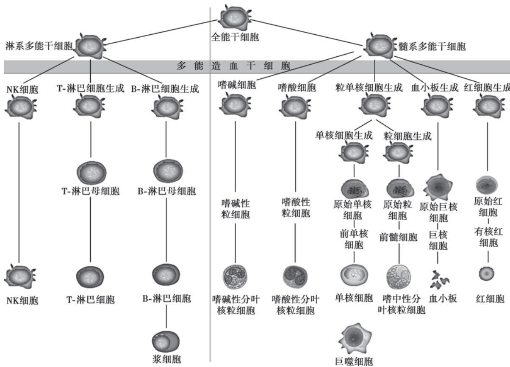  
图 6-1-1 血细胞发育示意图

可以根据细胞表面抗原的特征来识别 HSC。多能 HSC 主要为 CD34 $^{+}$ 的细胞群体，缺乏属于各系细胞特有的抗原 (Lin 抗原)。随着造血干细胞的分化成熟，细胞表面 CD34 抗原的表达逐渐减少。髓系的祖细胞有 CD34、CD33 等抗原，淋巴系的祖细胞除了有 CD34 抗原，还有 CD38 和 HLA-DR 等抗原。目前研究发现 CD34 $^{+}$ 细胞占骨髓有核细胞的 1%，在外周血中大约是 0.05%。

血细胞生成除需要 HSC 外,尚需正常造血微环境及正、负造血调控因子的存在。造血组织中的非造血细胞成分,包括微血管系统、神经成分、网状细胞、基质及其他结缔组织,统称为造血微环境。造血微环境可直接与造血细胞接触或释放某些因子,影响或诱导造血细胞的生成。

调控造血功能的体液因子，包括刺激各种祖细胞增殖的正调控因子，如促红细胞生成素（erythropoietin, EPO）、集落刺激因子（colony-stimulating factor, CSF）及白细胞介素-3（IL-3）等，同时亦有各系的负调控因子，如肿瘤坏死因子- $\alpha$ （TNF- $\alpha$ ）及干扰素- $\gamma$ （IFN- $\gamma$ ）等，二者互相制约，维持体内造血功能的恒定。

【血液系统疾病的分类】血液系统疾病指原发(如白血病)或主要累及血液和造血器官的疾病(如缺铁性贫血)。血液系统疾病分类如下。

1. 红细胞疾病 如各类贫血和红细胞增多症等。

2. 粒细胞疾病 如粒细胞缺乏症、中性粒细胞分叶功能不全(Pelger-Huët畸形)、惰性白细胞综合征及类白血病反应等。

3. 单核细胞和巨噬细胞疾病 如炎症性组织细胞增多症等。

4. 淋巴细胞和浆细胞疾病 如各类淋巴瘤,急、慢性淋巴细胞白血病,噬血细胞性淋巴组织细胞增生症(hemophagocytic lymphohistiocytosis,HLH),多发性骨髓瘤等。

5. 造血干细胞疾病 如再生障碍性贫血、阵发性睡眠性血红蛋白尿症、骨髓增生异常性肿瘤（MDS）、骨髓增殖性肿瘤（MPN）以及急性髓系白血病（AML）等。

## 6. 脾功能亢进

7. 出血性及血栓性疾病 如血管性紫癜、血小板减少性紫癜、凝血障碍性疾病、弥散性血管内凝血以及血栓性疾病等。

血液病学除了血液系统疾病外,还包括输血医学(transfusion medicine)及造血干细胞移植。

【血液系统疾病的诊断】血液病具有许多与其他疾病不同的特点,这是由血液和造血组织本身的特点决定的。由于血液以液体形式存在,不停地在体内循环,灌注着每一个器官的微循环,因此血液病的表现多为全身性。同时由于血液是执行不同生理功能的血细胞和血浆成分的综合体,并且与造血组织共同构造一个完整的动态平衡系统,血液病的症状与体征多种多样,往往缺乏特异性;实验室检查在血液病诊断中占有突出地位;继发性血液学异常比原发性血液病更多见,几乎全身所有器官和组织的病变都可引起血象的改变,甚至有些还可引起严重或持久的血象异常,酷似原发性血液病。

（一）病史采集 血液病的常见症状有贫血，出血倾向，发热，肿块，肝、脾、淋巴结肿大，骨痛等。对每一个患者，应了解这些症状的有无及特点。还应询问有无药物、毒物或放射性物质接触史，营养及饮食习惯，手术史，月经史、孕产史及家族史等。

（二）体格检查 皮肤、黏膜颜色有无改变，有无黄疸、出血点及结节或斑块；舌乳头是否正常；胸骨有无压痛；浅表淋巴结、肝、脾有无肿大，腹部有无肿块等。

## (三) 实验室检查

1. 正确的血细胞计数、血红蛋白测定以及血涂片细胞形态学的详细观察是最基本的诊断方法，常可反映骨髓造血病理变化。

2. 网织红细胞计数 反映骨髓红细胞的生成功能。

3. 骨髓检查及细胞化学染色 包括骨髓穿刺液涂片及骨髓活检，对某些血液病（如白血病、骨髓瘤、骨髓纤维化等）有确诊价值，对某些血液病（如增生性贫血）有参考价值。细胞化学染色对急性白血病的鉴别诊断是必不可少的，如髓过氧化物酶、碱性磷酸酶、非特异性酯酶染色等。

4. 出血性疾病检查 出血时间、凝血时间、凝血酶原时间、白陶土部分凝血活酶时间、纤维蛋白原定量测定为基本的检查。尚可做血块回缩试验、血小板聚集和黏附试验以了解血小板功能，亦有凝血因子检测以评估体内凝血因子活性。

5. 溶血性疾病检查 常用的试验有游离血红蛋白测定、血浆结合珠蛋白测定、Rous 试验、尿隐血（血管内溶血）；酸化血清溶血试验、蔗糖溶血试验（阵发性睡眠性血红蛋白尿症）；红细胞渗透脆性试验（遗传性球形红细胞增多症）；高铁血红蛋白还原试验（红细胞葡萄糖-6-磷酸脱氢酶缺乏）；抗人球蛋白试验（自身免疫性溶血性贫血）等，以确定溶血原因。

6. 生化及免疫学检查 如缺铁性贫血的铁代谢检查,自身免疫性血液疾病及淋巴系统疾病常伴有的免疫球蛋白的异常、细胞免疫功能的异常及抗血细胞抗体异常。应用特异性单克隆抗体进行的免疫学分型已成为急性白血病诊断标准之一。免疫组化是淋巴瘤诊断所必需的检查。

7. 细胞遗传学及分子生物学检查 如染色体检查及基因诊断。

8. 造血细胞的培养与检测技术

9. 影像学检查 除超声、CT、MRI 等常用影像学检查方法, SPECT、正电子发射计算机断层成像 (PET-CT) 等技术能用于骨髓、淋巴、肝胆及其他髓外病变显像, 为血液病的诊断提供很大帮助。

10. 放射性核素体外分析 应用于红细胞寿命测定。

11. 组织病理学检查 如淋巴结或浸润包块的活检、脾活检以及体液细胞学检查。淋巴结活检对诊断淋巴瘤，以及鉴别淋巴结瘤、淋巴结炎、转移癌有意义；脾活检主要用于脾显著增大的疾病；体液细胞学检查包括胸腔积液、腹水和脑脊液中的瘤细胞(或白血病细胞)的检查，对诊断、治疗和预后判断有价值。

血液病的实验室检查项目繁多,应综合分析,全面考虑,从中选择恰当的检查来达到确诊目的。

## 【血液系统疾病的治疗】

（一）一般治疗 包括饮食与营养，以及精神与心理治疗。

（二）去除病因 使患者脱离致病因素的作用。

## （三）保持正常血液成分及功能

1. 补充造血所需营养 巨幼细胞贫血时,补充叶酸和/或维生素 $B_{12}$ ;缺铁性贫血时补充铁剂。

2. 刺激造血 如慢性再生障碍性贫血时应用雄激素刺激造血; 粒细胞减少时应用粒细胞集落刺激因子刺激中性粒细胞释放等。

3. 脾切除 脾切除,即去除体内最大的单核巨噬细胞系统器官,减少血细胞的破坏与潴留,从而延长血细胞的寿命。脾切除对遗传性球形红细胞增多症所致的溶血性贫血有确切疗效。

4. 过继免疫治疗 如给予干扰素,或在异基因造血干细胞移植后进行供者淋巴细胞输注(DLI)。

5. 成分输血及抗生素的使用 严重贫血或失血时输注红细胞；血小板减少，有出血危险时补充血小板；白细胞减少，有感染时予以有效的抗感染药物治疗。

## （四）去除异常血液成分和抑制异常功能

1. 化疗 联合使用作用于不同细胞周期的化疗药物可杀灭病变细胞。

2. 放疗 利用 $\gamma$ 射线、X 射线等电离辐射杀灭白血病或淋巴瘤细胞。

3. 诱导分化 我国科学家发现全反式维 A 酸(all-trans retinoic acid, ATRA)、三氧化二砷(arsenic trioxide, ATO)通过诱导分化,可加速异常早幼粒细胞的凋亡,或使其分化为正常成熟的粒细胞,是特异性去除白血病细胞的新途径。

4. 治疗性血液成分单采 通过血细胞分离器选择性地去除血液中某一成分,可用于治疗 MPN、白血病等。血浆置换术可治疗巨球蛋白血症、某些自身免疫病、同种免疫性疾病及血栓性血小板减少性紫癜等。

5. 免疫抑制 使用糖皮质激素、环孢素及抗淋巴/胸腺细胞球蛋白等, 减少淋巴细胞数量, 抑制其异常功能，以治疗自身免疫性溶血性贫血、再生障碍性贫血及异基因造血干细胞移植时发生的移植物抗宿主病等。

6. 抗凝及溶栓治疗 如弥散性血管内凝血时,为防止凝血因子进一步消耗,采用肝素抗凝。血小板过多时,为防止血小板异常聚集,可使用双嘧达莫等药物。一旦有血栓形成,可使用尿激酶等溶栓,以恢复血流通畅。

(五) 靶向治疗 如应用酪氨酸激酶抑制剂治疗慢性髓系白血病(CML)。

（六）表观遗传学抑制 如组蛋白脱乙酰酶（HDAC）口服抑制剂西达本胺，用于治疗复发及难治性外周T细胞淋巴瘤；去甲基化药物地西他滨一线治疗老年MDS及AML。

（七）造血干细胞移植（hematopoietic stem cell transplantation, HSCT）通过预处理，去除异常的骨髓造血组织，然后植入健康的 HSC，重建造血与免疫系统，是一种可能根治血液系统恶性肿瘤和遗传性疾病等的综合性治疗方法。

（八）细胞免疫治疗 嵌合抗原受体 T 细胞（CAR-T）免疫治疗在急性淋巴细胞白血病（ALL）及非霍奇金淋巴瘤治疗中有显著作用。

【血液病学的进展与展望】近10年来，血液学，特别是血液恶性肿瘤学，是当今世界医学研究中最引人注目的学科之一。从18世纪发现血细胞以来，近300年的基础与临床的结合使血液病的研究进入了崭新的纪元；自19世纪发现白血病以来，到21世纪儿童ALL和成人急性早幼粒细胞白血病（APL）治愈率已达到75%；血液系统恶性肿瘤的诊断已从形态学发展到分子生物学、基因学的高水平阶段；治疗已从既往的化疗进展到诱导分化、靶基因治疗、HSCT治疗、细胞免疫治疗，成为治疗恶性肿瘤的新典范。

未来血液病学的发展方向是探索新的治疗靶点,以及生物效应治疗、基因治疗等领域,血液学的发展必将带动其他医学领域的发展。

(胡豫)

本章思维导图

贫血是指单位容积循环血液中血红蛋白(Hb)浓度,红细胞数量(RBC)及血细胞比容(HCT)低于本地区、相同年龄和性别人群的参考值下限的一种临床症状,是最常见的临床症状之一。临床上常以血红蛋白(Hb)浓度来代替。我国血液病学家认为在我国海平面地区,成年男性Hb<120g/L,成年女性(非妊娠)Hb<110g/L,妊娠期女性Hb<100g/L即为贫血。

国外一般都以 1972 年 WHO 制定的诊断标准为基础, 即在海平面地区, 静脉 Hb 低于以下水平可诊断为贫血: 6 个月到 <6 岁儿童 110g/L, 6\~14 岁儿童 120g/L, 成年男性 130g/L, 成年女性 (非妊娠) 120g/L, 妊娠期女性 110g/L。应注意, 婴儿、儿童及妊娠期女性的 Hb 浓度较成人低, 久居高原地区居民的 Hb 正常值较海平面居民为高。同时在妊娠、低蛋白血症、充血性心力衰竭、脾大及巨球蛋白血症时, 血浆容量增加, 此时即使红细胞数量是正常的, 但因血液被稀释, Hb 浓度降低, 容易被误诊为贫血; 在脱水或失血等循环血容量减少时, 由于血液浓缩, Hb 浓度增高, 即使红细胞数量减少, 有贫血也不容易表现出来, 容易漏诊。因此, 在判定有无贫血时, 应考虑上述影响因素。

【分类】基于不同的临床特点,贫血有不同的分类。如:按贫血进展速度分急、慢性贫血;按红细胞形态分大细胞性贫血、正常细胞性贫血和小细胞低色素性贫血(表6-2-1);按Hb浓度分轻度、中度、重度和极重度贫血(表6-2-2);按骨髓红系细胞增生情况分增生不良性贫血(如再生障碍性贫血)和增生性贫血(除再生障碍性贫血以外的贫血)等。虽然这些分类对辅助诊断和指导治疗有一定意义,但下列依据发病机制和/或病因的分类更能反映贫血的病理本质。

表 6-2-1 贫血的细胞学分类

<table><tr><td>类型</td><td>MCV/fl</td><td>MCHC/(g/L)</td><td>常见疾病</td></tr><tr><td>大细胞性贫血</td><td>&gt;100</td><td>&gt;360</td><td>伴网织红细胞大量增生的溶血性贫血、骨髓增生异常性肿瘤、肝疾病</td></tr><tr><td>正常细胞性贫血</td><td>80~100</td><td>320~360</td><td>再生障碍性贫血、纯红细胞再生障碍性贫血、溶血性贫血、骨髓病性贫血、急性失血性贫血</td></tr><tr><td>小细胞低色素性贫血</td><td>&lt;80</td><td>&lt;320</td><td>缺铁性贫血、铁粒幼细胞贫血、珠蛋白生成障碍性贫血</td></tr></table>

注：MCV，平均红细胞体积；MCHC，平均红细胞血红蛋白浓度。

表 6-2-2 贫血的严重程度划分标准

<table><tr><td>贫血严重程度</td><td>血红蛋白浓度/(g/L)</td></tr><tr><td>极重度</td><td>&lt;30</td></tr><tr><td>重度</td><td>30~59</td></tr><tr><td>中度</td><td>60~90</td></tr><tr><td>轻度</td><td>&gt;90</td></tr></table>

（一）红细胞生成减少性贫血 红细胞生成主要取决于三大因素：造血细胞、造血调节、造血原料。①造血细胞：包括多能造血干细胞、髓系干/祖细胞及各期红系细胞。②造血调节：包括细胞调节和因子调节。细胞调节如骨髓基质细胞、淋巴细胞的影响和造血细胞本身的凋亡(程序化死亡)；因子调节如干细胞因子(stem cell factor, SCF)、白细胞介素(IL)、粒细胞-巨噬细胞集落刺激因子(GM-CSF)、粒细胞集落刺激因子(G-CSF)、促红细胞生成素(EPO)、血小板生成素(TPO)、转化生长因子(TGF)、TNF和IFN等正负调控因子。③造血原料:是指造血细胞增殖、分化、代谢以及细胞构建必需的物质,如蛋白质、脂类、维生素(叶酸、维生素 $B_{12}$ 等)、微量元素(如铁、铜、锌)等。这些因素中的任何一种发生异常都可能导致红细胞生成减少,进而发生贫血。

## 1. 造血干/祖细胞异常所致贫血

（1）再生障碍性贫血（aplastic anemia, AA): AA 的发病与原发和继发的造血干/祖细胞缺陷有关，是一种骨髓造血功能衰竭性贫血。

（2）纯红细胞再生障碍(pure red cell aplasia, PRCA): PRCA是指骨髓红系细胞造血功能衰竭所致贫血，可分为先天性和后天性两类。先天性PRCA即Diamond-Blackfan综合征，为遗传所致；后天性PRCA包括原发性、继发性两亚类。20世纪70代以来，有学者发现部分原发性PRCA患者血清中有自身EPO或幼红细胞抗体。继发性PRCA主要有药物相关型、感染相关型(细菌和病毒，如微小病毒B19、肝炎病毒等)、自身免疫病相关型、淋巴细胞增殖性疾病相关型(如胸腺瘤、淋巴瘤、浆细胞病和淋巴细胞白血病等)、部分髓系恶性克隆性疾病相关型(如白血病前期)以及再障危象等。根据疾病进程和病人年龄，可将PRCA分为急性型、慢性幼儿型(先天性)和慢性成人型。

（3）先天性红细胞生成异常性贫血（congenital dyserythropoietic anemia, CDA): CDA 是一类由遗传性红系干/祖细胞良性克隆异常所致的，以红系细胞无效造血和形态异常为特征的难治性贫血。根据遗传方式，该病可分为常染色体隐性遗传型和常染色体显性遗传型。

（4）造血系统恶性克隆性疾病:包括骨髓增生异常性肿瘤及各类造血系统肿瘤性疾病。这些疾病由于多能造血干细胞或髓系干/祖细胞发生了质的异常,高增生、低分化,甚至造血调节也受到影响,从而使正常成熟红细胞减少而发生贫血。

## 2. 造血调节异常所致贫血

（1）骨髓基质细胞受损所致贫血：骨髓坏死、骨髓纤维化、骨髓硬化症、石骨症、各种髓外肿瘤性疾病的骨髓转移以及各种感染或非感染性骨髓炎，均可因损伤骨髓基质细胞及造血微环境（也可损伤造血细胞）而影响血细胞生成，导致贫血。

（2）淋巴细胞功能亢进所致贫血:T 细胞功能亢进可通过细胞毒性 T 细胞直接杀伤(穿孔素), 和/或 T 细胞因子介导造血细胞凋亡而使造血功能衰竭(如 AA);B 细胞功能亢进可产生抗骨髓细胞自身抗体,进而破坏或抑制造血细胞导致造血功能衰竭(免疫相关性全血细胞减少)。

（3）造血调节因子水平异常所致贫血：肾功能不全、垂体或甲状腺功能减退、肝病等均可因EPO生成不足而导致贫血。肿瘤性疾病或某些病毒感染会诱导机体产生较多的TNF、IFN、炎症因子等造血负调控因子，故也会抑制造血，导致贫血。近年发现铁调素（hepcidin）是调节饮食中铁吸收和巨噬细胞中铁释放的主要激素，贫血和低氧时其分泌减少，促进红细胞对铁的利用，然而，感染和促炎性细胞因子诱导铁调素分泌，使血浆中游离铁浓度减低，导致铁利用障碍。慢性病贫血即属此类。

（4）造血细胞凋亡亢进所致贫血：有学者提出阵发性睡眠性血红蛋白尿症（PNH）有“双重发病机制”：一为 PIGA 基因突变，PNH 克隆细胞获得内在抗凋亡特性，异常造血干细胞克隆扩增；二为 T 细胞介导的正常造血细胞凋亡。AA 的髓系造血功能衰竭主要是凋亡所致。

## 3. 造血原料不足或利用障碍所致贫血

（1）叶酸或维生素 $B_{12}$ 缺乏或利用障碍所致贫血:由于各种生理或病理因素导致机体叶酸或维生素 $B_{12}$ 绝对或相对缺乏或利用障碍所引起的巨幼细胞贫血,是临床上常见的贫血之一。

（2）缺铁和铁利用障碍性贫血:这是临床上最常见的贫血。缺铁和铁利用障碍影响血红素合成，故有学者称该类贫血为血红素合成异常性贫血。该类贫血的红细胞形态变小,中央淡染区扩大,属于小细胞低色素性贫血。

（二）红细胞破坏过多性贫血 即溶血性贫血(HA)。

(三) 失血性贫血 失血性贫血根据失血速度分急性和慢性,根据失血量分轻、中、重度,根据失血的病因分出、凝血性疾病(如免疫性血小板减少症、血友病和严重肝病等)和非出、凝血性疾病(如外伤、肿瘤、结核、支气管扩张、消化性溃疡、肝病、痔、泌尿生殖系统疾病等)。慢性失血性贫血往往合并缺铁性贫血。

【临床表现】贫血最常见的全身症状为乏力,临床表现与5个因素有关:贫血的病因(包括引起贫血的相关疾病),贫血导致血液携氧能力下降的程度,贫血时血容量下降的程度,发生贫血的速度和血液、循环、呼吸等系统对贫血的代偿和耐受能力。贫血的主要临床表现如下。

1. 神经系统 头痛、眩晕、萎靡、晕厥、失眠、多梦、耳鸣、眼花、记忆力减退、注意力不集中是贫血常见的症状。其中有些是贫血导致脑组织缺氧所致，有些是急性失血性贫血引起血容量不足或血压降低所致，有些是严重的溶血引起高胆红素血症或高游离血红蛋白血症所致，有些是引起贫血的原发病（如白血病中枢神经系统浸润）所致，甚至可能是贫血并发颅内或眼底出血（如再生障碍性贫血）所致。肢端麻木可由贫血并发的末梢神经炎所致，特别多见于维生素 $B_{12}$ 缺乏性巨幼细胞贫血。小儿患缺铁性贫血时可哭闹不安、躁动甚至影响智力发育。

2. 皮肤黏膜 苍白是贫血时皮肤、黏膜的主要表现,其机制主要是贫血通过神经体液调节引起有效血容量重新分布,为保障重要脏器(如脑、心、肾、肝、肺等)供血,相对次要器官和结构(如皮肤、黏膜)则供血减少;另外,由于单位容积血液内红细胞和Hb含量减少,也会引起皮肤、黏膜颜色变淡。粗糙、缺少光泽甚至形成溃疡是贫血时皮肤、黏膜的另一类表现,这除了与贫血导致皮肤、黏膜供血减少和营养不足有关,还可能与贫血的原发病(如叶酸、维生素 $B_{12}$ 缺乏,缺铁以及自身免疫病等)有关。溶血性贫血(特别是血管外溶血性贫血)可引起皮肤、黏膜黄染,某些造血系统肿瘤性疾病引起的贫血可并发皮肤损害(如绿色瘤等)。

3. 呼吸系统 轻度贫血,由于机体有一定的代偿和适应能力,平静时呼吸次数可能不增加;活动后机体处于低氧和二氧化碳分压升高的状态,刺激呼吸中枢,进而引起呼吸加快、加深。重度贫血时,即使平静状态也可能气短甚至端坐呼吸。另外,贫血的并发症和引起贫血的原发病也可能影响呼吸系统,如再生障碍性贫血合并呼吸道感染、白血病性贫血引起呼吸系统浸润、红斑狼疮性贫血并发“狼疮肺”、长期反复输血导致“含铁血黄素肺”等,均可引起相应的肺部症状、体征和X线表现。

4. 循环系统 急性失血性贫血时循环系统的主要表现是对低血容量的反应,如外周血管的收缩、心率的加快、主观感觉的心悸等。非失血性贫血由于血容量不低,故循环系统的主要表现是心脏对组织缺氧的反应:轻度贫血时,安静状态下可无明显表现,仅活动后有心悸、心率加快;中、重度贫血时,无论何种状态均可出现心悸和心率加快,且贫血愈重,活动量愈大,心脏负荷愈重,症状愈明显;长期贫血,心脏超负荷工作且供血不足,会导致贫血性心脏病,此时不仅有心率变化,还可有心律失常、心脏结构异常,甚至心功能不全。多次输血导致的“血色病”,也会引起心功能不全和心率、心律的改变。某些引起贫血的原发病累及心脏和血管,也会出现相应的改变。

5. 消化系统 凡是能引起贫血的消化系统疾病，在贫血前或贫血同时可有原发病的表现。某些消化系统以外的疾病可引起贫血，也可同时累及消化系统。贫血本身可影响消化系统，出现功能甚至结构的改变，如消化腺分泌减少甚至腺体萎缩，进而导致消化功能减低、消化不良，出现腹部胀满、食欲减低、排便规律和粪便性状的改变等。长期慢性溶血可合并胆道结石和/或炎症。缺铁性贫血可有吞咽异物感。钩虫病引起的缺铁性贫血可合并异食癖。巨幼细胞贫血或恶性贫血可引起舌炎、舌乳头萎缩、牛肉舌、镜面舌等。

6. 泌尿系统 肾性贫血在贫血前和贫血同时有原发肾疾病的临床表现。血管外溶血出现胆红素尿和高尿胆原尿；血管内溶血出现游离血红蛋白和含铁血黄素尿，重者甚至可发生游离血红蛋白堵塞肾小管，进而引起少尿、无尿、急性肾衰竭。急性重度失血性贫血可因血容量不足而致肾血流量减少，进而引起少尿甚至无尿，持续时间过长可致肾功能不全。

7. 内分泌系统 孕妇分娩时,因大出血发生贫血,可导致垂体缺血坏死而发生希恩综合征。长期贫血会影响甲状腺、性腺、肾上腺、胰腺的功能，会改变EPO和胃肠激素的分泌。某些自身免疫病不仅可影响造血系统，还可同时累及一个甚至数个内分泌器官，导致激素分泌异常。

8. 生殖系统 对男性,长期贫血会使睾丸的生精细胞缺血、坏死,进而影响睾酮的分泌,减弱男性特征;对女性,贫血除影响女性激素的分泌,还可因合并凝血因子及血小板量或质的异常而导致月经过多。

9. 免疫系统 所有继发于免疫系统疾病的贫血,均有原发免疫系统疾病的临床表现。贫血本身也会引起免疫系统的改变,如红细胞减少会降低红细胞在抵御病原微生物感染过程中的调理素作用,红细胞膜上补体受体 1(CR1)的减少会影响机体的非特异性免疫功能。贫血患者反复输血会影响 T 细胞亚群。某些治疗贫血的药物能改变患者的免疫功能。

10. 血液系统 外周血的改变主要表现在血细胞量、形态和生化成分上，某些情况下还可合并血浆或血清成分的异常。血细胞量的改变首先是红细胞减少，相应的Hb、血细胞比容减低以及网织红细胞量的改变，其次是有时合并白细胞或血小板量的异常（包括白细胞分类的异常）。血细胞形态的改变包括大、小、正细胞性贫血，以及异形红细胞、异形白细胞和血小板。红细胞生化成分的异常有两方面：一是红细胞内合成较多2,3-二磷酸甘油酸(2,3-DPG)，以降低Hb对氧的亲和力，使氧解离曲线右移，组织获得更多的氧；二是因贫血种类不同而异的改变，如红细胞膜、酶、Hb的异常以及某些贫血时并发的白细胞和血小板质的改变。血浆或血清成分的改变多见于浆细胞病性贫血（M蛋白增多及钙、磷水平变化等）、溶血性贫血（游离Hb增高、结合珠蛋白降低、血钾增高、间接或结合胆红素增高等）、合并弥散性血管内凝血的贫血（血浆各类凝血因子、纤溶成分均发生异常）、肝病性贫血和肾性贫血（低蛋白血症和代谢产物累积）等。造血器官的改变主要在骨髓，不同类型的贫血，骨髓有核细胞的多寡（即增生度）不同；不同病因或不同发病机制的贫血，其骨髓粒、红、单核、巨核、淋巴细胞系各阶段的形态、比例、位置、超微结构、组化反应、抗原表达、染色体核型、癌基因重排、过度表达以及体外干/祖细胞集落培养等情况可能千差万别；造血系统肿瘤性疾病所致的贫血可能还会合并肝、脾、淋巴结肿大；溶血性贫血可能合并肝或脾大；骨髓纤维化和脾功能亢进性贫血合并脾大。

【诊断】应详细询问现病史、既往史、家族史、营养史、月经史、生育史及危险因素暴露史等。从现病史了解贫血发生的时间、速度、程度、并发症、可能诱因、干预治疗的反应等。既往史可提供贫血的原发病线索。家族史提供发生贫血的遗传背景。营养史、月经史和生育史对铁、叶酸或维生素 $B_{12}$ 等造血原料缺乏所致的贫血、失血性贫血有辅助诊断价值。危险因素(射线、化学毒物或药物、疫区或病原微生物等)暴露史对造血组织受损和感染相关性贫血的诊断至关重要。

全面体检有助于了解:①贫血对各系统的影响:皮肤、黏膜苍白程度,心率或心律改变,呼吸姿势或频率异常等;②贫血的伴随表现:溶血(如皮肤、黏膜、巩膜黄染,胆道炎症体征,肝大或脾大等)、出血(如皮肤、黏膜紫癜或瘀斑,眼底、中枢神经系统、泌尿生殖道或消化道出血体征等)、浸润(如皮肤绿色瘤、皮下肿物、淋巴结肿大、肝大或脾大等)、感染(如发热及全身反应、感染灶体征等)、营养不良(如皮肤、黏膜或毛发干燥,黏膜溃疡,舌乳头萎缩,匙状甲或神经系统深感觉障碍等)、自身免疫反应(如皮肤、黏膜损害,关节损害)等。

贫血的实验室检查分为血常规、骨髓和贫血发病机制检查。

1. 血常规检查 血常规检查可以确定有无贫血,贫血是否伴白细胞或血小板数量的变化。红细胞参数(MCV、MCH及MCHC)反映红细胞大小及Hb改变,为明确贫血的病理机制提供相关线索。Hb测定为贫血严重程度的判定提供依据。网织红细胞计数间接反映骨髓红系细胞增生(或对贫血的代偿)情况。外周血涂片可观察红细胞、白细胞、血小板数量或形态改变,有否疟原虫和异常细胞等。

2. 骨髓检查 包括骨髓细胞涂片分类和骨髓活检。涂片分类反映骨髓细胞的增生程度、细胞成分、比例和形态变化。活检反映骨髓造血组织的结构、增生程度、细胞成分和形态变化。骨髓检查可提示贫血时造血功能是否正常及造血组织是否出现肿瘤性改变，是否有坏死、纤维化或大理石变，是否增生减低。与血常规结果矛盾时，应做多部位骨髓检查。

3. 贫血的发病机制检查 包括缺铁性贫血的铁代谢及引起缺铁的原发病检查;巨幼细胞贫血的血清叶酸和维生素 $\mathrm{B}_{12}$ 水平测定，以及导致此类造血原料缺乏的原发病检查；失血性贫血的原发病检查；溶血性贫血的红细胞寿命检测（CO呼气试验)，以及红细胞膜、酶、珠蛋白、血红素、自身抗体、同种抗体或PNH克隆等检查；骨髓造血功能衰竭性贫血的造血干细胞异常（如染色体、抗原表达、细胞周期、功能、基因等）、T细胞调控（T细胞亚群及其分泌的因子）、B细胞调控（骨髓细胞自身抗体）检查，以及造血系统肿瘤性疾病和其他系统继发贫血的原发病检查。

分析从采集病史、体格检查和实验室检查获得的有关贫血的临床资料,通常可以查明贫血的发病机制或病因,作出贫血的疾病诊断。

【治疗】贫血性疾病的治疗分“对症”和“对因”两类。

1. 对症治疗 目的是减轻重度血细胞减少对患者的致命影响,为对因治疗发挥作用赢得时间。具体内容包括:重度贫血患者、老年人或合并心肺功能不全的贫血患者应输红细胞,纠正贫血,改善体内缺氧状态;急性大量失血患者应及时输全血或输红细胞及血浆,迅速恢复血容量并纠正贫血;对贫血合并出血者,应根据出血机制的不同采取不同的止血治疗(如重度血小板减少应输注血小板);对贫血合并感染者,应酌情给予抗感染治疗;对贫血合并其他脏器功能不全者,应根据脏器的不同及功能不全的程度而给予不同的支持治疗;先天性溶血性贫血多次输血并发血色病者应给予祛铁治疗。

  
本章思维导图

2. 对因治疗 实乃针对贫血发病机制的治疗。如缺铁性贫血补铁及治疗导致缺铁的原发病；巨幼细胞贫血补充叶酸或维生素 $B_{12}$ ；溶血性贫血应用糖皮质激素或脾切除；遗传性球形红细胞增多症脾切除有肯定疗效；造血干细胞质异常性贫血采用造血干细胞移植；AA采用抗淋巴/胸腺细胞球蛋白、环孢素及造血正调控因子(如雄激素、G-CSF、GM-CSF或EPO等)；慢性病贫血及肾性贫血采用EPO；肿瘤性贫血采用化疗或放疗；免疫相关性贫血采用免疫抑制剂；各类继发性贫血治疗原发病等。

(付蓉)

缺铁性贫血（iron deficiency anemia, IDA）是指机体内贮存铁耗尽（iron depletion, ID），缺铁性红细胞生成（iron deficiency erythropoiesis, IDE）不足导致的贫血。铁缺乏症可分为三个阶段：ID、IDE 和 IDA。IDA 表现为缺铁引起的小细胞低色素性贫血及其他异常。

根据病因可将其分为铁摄入不足(婴幼儿辅食添加不足、青少年偏食等)、需求量增加(孕妇)、吸收不良(胃肠道疾病)、转运障碍(无转铁蛋白血症、肝病、慢性炎症)、丢失过多(妇女月经量增多、痔出血等各种失血)及利用障碍(铁粒幼细胞贫血、铅中毒、慢性病贫血)等类型。

【流行病学】IDA 是最常见的贫血。WHO 估计, 全球约 1/4 的人口患有贫血, 主要集中于学龄前儿童和女性, 大多数贫血由铁缺乏引起。2016 年全球有超过 1.2 亿 IDA 患者。IDA 在发展中国家、经济不发达地区、婴幼儿、育龄妇女中的发病率明显增高。上海地区人群调查显示: 铁缺乏症的年发病率在 6 个月～2 岁婴幼儿为 75.0%～82.5%、妊娠 3 个月以上妇女为 66.7%、育龄妇女为 43.3%、10～17 岁青少年为 13.2%; 以上人群 IDA 患病率分别为 33.8%～45.7%、19.3%、11.4% 和 9.8%。

【铁代谢】人体内铁分两部分:其一为功能状态铁,包括血红蛋白铁(占体内铁的67%)、肌红蛋白铁(占体内铁15%)、转铁蛋白铁(3\~4mg)、乳铁蛋白、酶和辅因子结合的铁;其二为贮存铁(男性1000mg,女性300\~400mg),包括铁蛋白和含铁血黄素。铁总量在正常成年男性为50\~55mg/kg,女性35\~40mg/kg。正常人每天造血需20\~25mg铁,主要来自衰老破坏的红细胞。正常人维持体内铁平衡需每天从食物中摄铁1\~1.5mg,妊娠期、哺乳期妇女每天需2\~4mg。动物食品铁吸收率高(可达20%),植物食品铁吸收率低(1%\~7%)。铁吸收部位主要在十二指肠及空肠上段。食物铁状态(三价、二价铁)、胃肠功能(酸碱度等)、体内铁贮量、骨髓造血状态及某些药物(如维生素C)均会影响铁吸收。吸收入血的二价铁经铜蓝蛋白氧化成三价铁,与转铁蛋白结合后转运到组织或通过幼红细胞膜转铁蛋白受体胞饮入细胞内,再与转铁蛋白分离并还原成二价铁,参与形成血红蛋白。最新的研究发现,肝分泌的铁调素是食物铁自肠道吸收和铁从巨噬细胞释放的主要负调控因子。铁调素的表达受机体铁状况、各种致炎因子、细菌、内毒素(脂多糖)和细胞因子等各种因素调节。多余的铁以铁蛋白和含铁血黄素形式贮存于肝、脾、骨髓等器官的单核巨噬细胞系统,待铁需要增加时动用。人体每天排铁不超过1mg,主要通过肠黏膜脱落细胞随粪便排出,少量通过尿、汗液排出,哺乳期妇女还通过乳汁排出。

## 【病因和发病机制】

## (一) 病因

1. 需铁量增加而铁摄入不足 多见于婴幼儿、青少年、妊娠和哺乳期妇女。婴幼儿需铁量较大，若不补充蛋类、肉类等富含铁的辅食，易造成缺铁。青少年偏食易缺铁。女性月经过多、妊娠或哺乳，需铁量增加，若不补充富含铁食物，易造成 IDA。

2. 铁吸收障碍 常见于胃大部切除术后,胃酸分泌不足且食物快速进入空肠,绕过铁的主要吸收部位(十二指肠),使铁吸收减少。此外,多种原因造成的胃肠道功能紊乱,如长期不明原因腹泻、慢性肠炎、克罗恩病等均可因铁吸收障碍而发生 IDA。

3. 铁丢失过多 长期慢性铁丢失而得不到纠正可造成 IDA, 如慢性胃肠道失血 (包括痔、胃十二指肠溃疡、食管裂孔疝、消化道息肉、胃肠道肿瘤、寄生虫感染、食管胃底静脉曲张破裂等)、月经过多 (如宫内放置节育器、子宫肌瘤及月经失调等妇科异常)、咯血和肺泡出血 (如肺含铁血黄素沉着症、肺出血肾炎综合征、肺结核、支气管扩张、肺癌等)、血红蛋白尿(如阵发性睡眠性血红蛋白尿症、冷抗体型自身免疫性溶血、人工心脏瓣膜、行军性血红蛋白尿等)及其他(如遗传性出血性毛细血管扩张症、慢性肾衰竭行血液透析、多次献血等)。

## （二）发病机制

1. 缺铁对铁代谢的影响 当体内贮存铁减少到不足以补偿功能状态下的铁时,铁代谢指标发生异常:贮存铁指标(铁蛋白、含铁血黄素)减低、血清铁和转铁蛋白饱和度减低、总铁结合力和未结合铁的转铁蛋白升高。转铁蛋白受体表达于红系造血细胞膜表面,其表达量与红细胞内 Hb 合成所需的铁的代谢密切相关,当红细胞内铁缺乏时,转铁蛋白受体脱落进入血液,成为血清可溶性转铁蛋白受体(sTfR)。

2. 缺铁对造血系统的影响 红细胞内缺铁,血红素合成障碍,大量原卟啉不能与铁结合成为血红素,以红细胞游离原卟啉(FEP)的形式积累在红细胞内或与锌原子结合成为锌原卟啉(ZPP),血红蛋白生成减少,红细胞胞质少、体积小,发生小细胞低色素性贫血;严重时粒细胞、血小板的生成也受影响。

3. 缺铁对组织细胞代谢的影响 组织缺铁,细胞中含铁酶和铁依赖酶的活性降低,进而影响患者的精神、行为、体力、免疫功能及患儿的生长发育和智力;缺铁可引起黏膜组织病变和外胚叶组织营养障碍。

## 【临床表现】

1. 缺铁原发病表现 如消化性溃疡、肿瘤或痔导致的黑便、血便或腹部不适，肠道寄生虫感染导致的腹痛或大便性状改变，妇女月经过多，肿瘤性疾病导致的消瘦，血管内溶血的血红蛋白尿等。

2. 贫血表现 常见症状为乏力、易疲倦、头晕、头痛、眼花、耳鸣、心悸、气短、食欲缺乏等；有皮肤、黏膜苍白、心率增快。

3. 组织缺铁表现 精神行为异常,如烦躁、易怒、注意力不集中、异食癖;体力、耐力下降;易感染;儿童生长发育迟缓、智力低下;口腔炎、舌炎、舌乳头萎缩、口角皲裂、吞咽困难;毛发干枯、脱落;皮肤干燥、皱缩;指/趾甲缺乏光泽、脆薄易裂,重者指/趾甲变平,甚至下凹呈勺状(匙状甲)。

## 【实验室检查】

1. 血象 呈小细胞低色素性贫血。平均红细胞体积(MCV)低于80fl,平均红细胞血红蛋白含量(MCH)小于27pg,平均红细胞血红蛋白浓度(MCHC)小于320g/L。血涂片中可见红细胞体积小、中央淡染区扩大。网织红细胞计数多正常或轻度增高。白细胞和血小板计数可正常或减低,也有部分患者血小板计数升高。

2. 骨髓象 增生活跃或明显活跃；以红系细胞增生为主，粒系、巨核系细胞无明显异常；红系细胞中以中、晚幼红细胞为主，其体积小、核染色质致密、胞质少、边缘不整齐，有血红蛋白形成不良的表现，即所谓的“核老浆幼”现象。

3. 铁代谢 血清铁低于 $8.95 \mu mol/L$ ，总铁结合力升高，大于 $64.44 \mu mol/L$ ；转铁蛋白饱和度降低，小于 15%，sTfR 浓度超过 8mg/L。血清铁蛋白低于 $12 \mu g/L$ 。骨髓涂片与亚铁氰化钾作用（普鲁士蓝染色）后，在骨髓小粒中无深蓝色的含铁血黄素颗粒；在幼红细胞内铁小粒减少或消失，铁粒幼细胞少于 15%。

4. 红细胞内卟啉代谢 FEP>0.9μmol/L(全血), ZPP>0.96μmol/L(全血), FEP/Hb>4.5μg/g Hb。

5. 血清转铁蛋白受体测定 血清可溶性转铁蛋白受体（sTfR）测定是迄今反映缺铁性红细胞生成的最佳指标，一般 sTfR 浓度 $>26.5\mathrm{nmol / L}$ （ $2.25\mu \mathrm{g / ml}$ ）可诊断缺铁。

## 【诊断与鉴别诊断】

## (一) 诊断

1. ID ①血清铁蛋白 $< 12\mu \mathrm{g} / \mathrm{L}$ ; ②骨髓铁染色显示骨髓小粒可染铁消失, 铁粒幼细胞少于 $15\%$ ; ③血红蛋白及血清铁等指标尚正常。

2. IDE ①ID 的①+②;②转铁蛋白饱和度<15%;③FEP/Hb>4.5μg/g Hb;④血红蛋白尚正常。

3. IDA ①IDE 的①+②+③；②小细胞低色素性贫血：男性 Hb<120g/L，女性 Hb<110g/L，孕妇 Hb<100g/L；MCV<80fl，MCH<27pg，MCHC<320g/L。

4. 病因诊断 只有明确病因, IDA 才可能根治; 有时缺铁的病因比贫血本身更为严重。如胃肠道恶性肿瘤伴慢性失血, 或胃癌术后残胃癌所致的 IDA, 应多次检查粪便隐血, 必要时做胃肠道 X 线或内镜检查; 月经过多的妇女应检查有无妇科疾病。

## （二）鉴别诊断 应与下列小细胞性贫血鉴别。

1. 铁粒幼细胞贫血 遗传或不明原因导致的红细胞铁利用障碍性贫血。表现为小细胞性贫血，但血清铁蛋白浓度增高、骨髓小粒含铁血黄素颗粒增多、铁粒幼细胞增多，并出现环形铁粒幼细胞。血清铁和转铁蛋白饱和度增高，总铁结合力不低。

2. 珠蛋白生成障碍性贫血 常见为地中海贫血,有家族史,有溶血表现。血涂片中可见多量靶形红细胞,并有珠蛋白肽链合成数量异常的证据,如胎儿血红蛋白或血红蛋白 $A_{2}$ 增高,出现血红蛋白 H 包涵体等。血清铁蛋白、骨髓可染铁、血清铁和转铁蛋白饱和度不低且常增高。

3. 慢性病贫血 慢性炎症、感染或肿瘤等引起的铁代谢异常性贫血。贫血为小细胞性。贮存铁（血清铁蛋白和骨髓小粒含铁血黄素）增多。血清铁、转铁蛋白饱和度、总铁结合力减低。

4. 转铁蛋白缺乏症 系常染色体隐性遗传所致(先天性)或严重肝病、肿瘤继发(获得性)。表现为小细胞低色素性贫血。血清铁、总铁结合力、血清铁蛋白及骨髓含铁血黄素均明显降低。先天性者幼儿时发病,伴发育不良和多脏器功能受累。获得性者有原发病的表现。

【治疗】 治疗 IDA 的原则是:根除病因;补足贮存铁。

1. 病因治疗 积极寻找 ID/IDA 的病因, 如青少年、育龄期女性、妊娠期女性和哺乳期女性等由于铁摄入不足引起的 IDA, 应改善饮食, 补充含铁丰富且易吸收的食物, 如瘦肉、动物肝脏等; 育龄期女性可以预防性补充铁剂, 每日或隔日补充元素铁; 月经过多引起的 IDA 应该寻找月经量过多的原因; 寄生虫感染患者应进行驱虫治疗; 恶性肿瘤患者应进行手术或放、化疗; 消化性溃疡患者应进行抑酸护胃治疗等。

2. 补铁治疗 治疗性铁剂有无机铁和有机铁两类。无机铁以硫酸亚铁为代表，有机铁则包括右旋糖酐铁、葡萄糖酸亚铁、山梨醇铁、富马酸亚铁、琥珀酸亚铁和多糖铁复合物等。无机铁剂的不良反应较有机铁剂明显。首选口服铁剂。如硫酸亚铁0.3g，每日3次；或右旋糖酐铁50mg，每日2～3次。餐后服用胃肠道反应小且易耐受。应注意，进食谷类、乳类和茶等会抑制铁剂的吸收，鱼、肉类、维生素C可加强铁剂的吸收。口服铁剂有效的表现先是外周血网织红细胞增多，高峰在开始服药后5～10天，2周后血红蛋白浓度上升，一般2个月左右恢复正常。铁剂治疗应在血红蛋白恢复正常后至少持续4～6个月，待铁蛋白正常后停药。若口服铁剂不能耐受或胃肠道正常解剖部位发生改变而影响铁的吸收，可用铁剂肌内注射或静脉注射。右旋糖酐铁是最常用的注射铁剂，首次给药须用0.5ml作为试验剂量，1小时后无过敏反应可给足量治疗，注射用铁的总需量按公式计算：(须达到的血红蛋白浓度-患者的血红蛋白浓度) $\left(\mathrm{g}/\mathrm{L}\right)\times0.33\times$ 患者体重(kg)。

【预后】单纯营养不足者,易恢复正常。继发于其他疾病者,取决于原发病能否根治。

【预防】重点放在婴幼儿、青少年和妇女的营养保健。对婴幼儿应及早添加富含铁的食品，如蛋类、肝等；对青少年应纠正偏食，定期查、治寄生虫感染；对妊娠期、哺乳期妇女可补充铁剂；对月经期妇女应防治月经过多。做好肿瘤性疾病和慢性出血性疾病的人群防治。

(付蓉)

  
本章思维导图

本章数字资源

巨幼细胞贫血（megaloblastic anemia, MA）是由脱氧核糖核酸（DNA）合成障碍所引起的一组贫血，主要是体内缺乏叶酸和/或维生素 $B_{12}$ ，亦可因遗传或药物因素等导致的获得性 DNA 合成障碍引起。本病的特点是呈大细胞性贫血，骨髓内出现巨幼红细胞、粒细胞及巨核细胞系列。此类贫血的幼红细胞 DNA 合成障碍，故又有学者称之为幼红细胞增殖异常性贫血。

根据缺乏物质的种类,该病可分为单纯叶酸缺乏性贫血、单纯维生素 $B_{12}$ 缺乏性贫血及叶酸和维生素 $B_{12}$ 同时缺乏性贫血。根据病因可分为:①摄入不足:叶酸或维生素 $B_{12}$ 摄入不足;②吸收不良:胃肠道疾病、药物干扰和内因子抗体形成(恶性贫血);③代谢异常:肝病、某些抗肿瘤药物的影响;④需要增加:哺乳期、妊娠期女性;⑤利用障碍:嘌呤、嘧啶自身合成异常或化疗药物影响等。

【流行病学】巨幼细胞贫血具有地区性,我国以山西和陕西等地较多见,患病率可达5.3%;恶性贫血在我国则相对少见。

## 【病因和发病机制】

## （一）叶酸代谢及缺乏的原因

1. 叶酸代谢和生理作用 叶酸由蝶啶、对氨基苯甲酸及L-谷氨酸组成，属B族维生素，富含于新鲜水果、蔬菜、肉类食品中。食物中的叶酸经长时间烹煮，可损失 $50\% \sim 90\%$ 。叶酸主要在十二指肠及近端空肠吸收。每日需从食物中摄入叶酸 $200\mu \mathrm{g}$ 。食物中多聚谷氨酸型叶酸经肠黏膜细胞产生的解聚酶作用，转变为单谷氨酸或双谷氨酸型叶酸后进入小肠黏膜上皮细胞，再经叶酸还原酶催化及还原型烟酰胺腺嘌呤二核苷酸磷酸（NADPH）作用还原为二氢叶酸 $\left(\mathrm{FH}_2\right)$ 和四氢叶酸 $\left(\mathrm{FH}_4\right)$ ，后者再转变为有生理活性的 $N^5$ -甲基四氢叶酸 $\left(N^5 -\mathrm{FH}_4\right)$ ，经门静脉入肝。其中一部分 $N^5 -\mathrm{FH}_4$ 经胆汁排泄到小肠后重新吸收，即叶酸的肠肝循环。血浆中 $N^5 -\mathrm{FH}_4$ 与白蛋白结合后转运到组织细胞(经叶酸受体)。在细胞内，经维生素 $\mathbf{B}_{12}$ 依赖性甲硫氨酸合成酶的作用， $N^5 -\mathrm{FH}_4$ 转变为 $\mathrm{FH}_4$ ，一方面为DNA合成提供一碳基团如甲基（—CH₃）、亚甲基（—CH₂—）和甲酰基（—CH=O）等；另一方面， $\mathrm{FH}_4$ 经多聚谷氨酸叶酸合成酶的作用再转变为多聚谷氨酸型叶酸，并成为细胞内辅酶。人体内叶酸储存量为 $5\sim 20\mathrm{mg}$ ，近1/2在肝脏。叶酸主要经尿和粪便排出体外，每日排出 $2\sim 5\mu \mathrm{g}$ 。

2. 叶酸缺乏的原因 ①摄入减少:主要原因是食物加工不当,如烹调时间过长或温度过高,破坏大量叶酸;其次是偏食,食物中蔬菜、肉、蛋类减少。②需要量增加:妊娠期妇女每天叶酸的需要量是400\~600μg,生长发育的儿童及青少年以及慢性反复溶血、白血病、肿瘤、甲状腺功能亢进及长期慢性肾衰竭用血液透析治疗的患者,叶酸的需要量都会增加,如补充不足就可导致叶酸缺乏。③吸收障碍:腹泻、小肠炎症、肿瘤、手术,以及某些药物(抗癫痫药物、柳氮磺吡啶、乙醇等)影响叶酸的吸收。④利用障碍:抗核苷酸合成药物如甲氨蝶呤、甲氧苄啶、氨苯蝶啶、氨基蝶呤和乙胺嘧啶等均可干扰叶酸的利用;一些先天性酶缺陷(甲基 $FH_{4}$ 转移酶、 $N^{5},N^{10}$ -亚甲基 $FH_{4}$ 还原酶、 $FH_{2}$ 还原酶和亚氨甲基转移酶)可影响叶酸的利用。⑤叶酸排出增加:血液透析、酗酒可增加叶酸排出。

## （二）维生素 $\mathrm{B}_{12}$ 代谢及缺乏的原因

1. 维生素 $B_{12}$ 代谢和生理作用 维生素 $B_{12}$ 在人体内以甲基钴胺素形式存在于血浆，以 5-脱氧腺苷钴胺素形式存于肝及其他组织。正常人每日需维生素 $B_{12}$ 1μg，主要来源于动物肝、肾、肉，鱼、蛋及乳品类等食品。食物中的维生素 $B_{12}$ 与蛋白结合，经胃酸和胃蛋白酶消化，与蛋白分离，再与胃黏膜壁细胞合成的 R 蛋白结合成 R-维生素 $B_{12}$ 复合物 (R- $B_{12}$ )。R- $B_{12}$ 进入十二指肠，经胰蛋白酶作用，

R 蛋白被降解。两分子维生素 $B_{12}$ 又与同样来自胃黏膜上皮细胞的内因子 (intrinsic factor, IF) 结合形成 $IF-B_{12}$ 复合物。IF 保护维生素 $B_{12}$ 不受胃肠道分泌液破坏，到达回肠末端与该处肠黏膜上皮细胞刷状缘的 $IF-B_{12}$ 受体结合并进入肠上皮细胞，继而经门静脉入肝。人体内维生素 $B_{12}$ 的储存量约为 2～5mg，其中 50%～90% 在肝。维生素 $B_{12}$ 主要经粪便、尿排出体外。

## 2. 维生素 $B_{12}$ 缺乏的原因

（1）摄入减少:完全素食者因摄入减少导致维生素 $B_{12}$ 缺乏,正常时,每天有 $5\sim10\mu g$ 的维生素 $B_{12}$ 随胆汁进入肠腔,胃壁分泌的内因子足够帮助重吸收胆汁中的维生素 $B_{12}$ ,故素食者一般约 $10\sim15$ 年才会发展为维生素 $B_{12}$ 缺乏。

（2）吸收障碍:这是维生素 $B_{12}$ 缺乏最常见的原因,可见于:①内因子缺乏,如恶性贫血、胃切除、胃黏膜萎缩等;②胃酸和胃蛋白酶缺乏;③胰蛋白酶缺乏;④肠道疾病;⑤先天性内因子缺乏或维生素 $B_{12}$ 吸收障碍;⑥药物(对氨基水杨酸、新霉素、二甲双胍、秋水仙碱和苯乙双胍等)影响;⑦肠道寄生虫(如阔节裂头绦虫病)或细菌大量繁殖可消耗维生素 $B_{12}$ 。

（3）利用障碍:先天性转钴蛋白Ⅱ（TCⅡ）缺乏引起维生素 $B_{12}$ 输送障碍;麻醉药氧化亚氮可将钴胺氧化而抑制甲硫氨酸合成酶。

（三）发病机制 叶酸的各种活性形式，包括 $N^5$ -甲基 $\mathrm{FH}_4$ 和 $N^5, N^{10}$ -亚甲基 $\mathrm{FH}_4$ 作为辅酶，为DNA合成提供一碳基团。其中最重要的是胸苷酸合成酶催化dUMP甲基化形成dTMP，继而形成dTTP。由于叶酸缺乏，dTTP形成减少，DNA合成障碍，DNA复制延迟。而RNA合成所受影响不大，细胞内RNA/DNA比值增大，造成细胞体积增大，胞核发育滞后于胞质，形成巨幼变。骨髓中红系、粒系和巨核系细胞发生巨幼变，分化成熟异常，在骨髓中过早死亡，导致全血细胞减少。DNA合成障碍也累及黏膜上皮组织，影响口腔和胃肠道功能。维生素 $\mathbf{B}_{12}$ 缺乏导致甲硫氨酸合成酶催化同型半胱氨酸转变为甲硫氨酸障碍，这一反应由 $N^5$ -甲基 $\mathrm{FH}_4$ 提供甲基。因此， $N^5$ -甲基 $\mathrm{FH}_4$ 转化为 $\mathrm{FH}_4$ 障碍，继而引起 $N^5, N^{10}$ -亚甲基 $\mathrm{FH}_4$ 合成减少。后者是dUMP形成dTTP的甲基供体，故dTTP合成和DNA合成障碍。维生素 $\mathbf{B}_{12}$ 缺乏还可引起神经精神异常。其机制与两个维生素 $\mathbf{B}_{12}$ 依赖性酶(L-甲基丙二酰-CoA变位酶和甲硫氨酸合成酶)的催化反应发生障碍有关。前酶催化反应障碍导致神经髓鞘合成障碍，并有奇数碳链脂肪酸或支链脂肪酸掺入髓鞘中；后酶催化反应障碍引起神经细胞甲基化反应受损。

药物干扰核苷酸合成也可引起巨幼细胞贫血。

## 【临床表现】

1. 血液系统表现 起病缓慢,常有面色苍白、乏力、耐力下降、头晕、头昏、心悸等贫血表现。重者全血细胞减少,反复感染和出血。少数患者可出现轻度黄疸。

2. 消化系统表现 口腔黏膜、舌乳头萎缩，反复发作的舌炎，舌面光滑，舌乳头消失，呈“牛肉样舌”，可伴舌痛。胃肠道黏膜萎缩可引起食欲缺乏、恶心、腹胀、腹泻或便秘。

3. 神经系统表现和精神症状 对称性远端肢体麻木、深感觉障碍；共济失调或步态不稳；味觉、嗅觉降低；锥体束征阳性、肌张力增高、腱反射亢进；视力下降、黑矇征；重者可有大小便失禁。叶酸缺乏者有易怒、妄想等精神症状。维生素 $B_{12}$ 缺乏者有抑郁、失眠、记忆力下降、谵妄、幻觉、妄想甚至精神错乱等表现。

## 【实验室检查】

1. 血象 呈大细胞性贫血, MCV、MCH 均增高, MCHC 正常。网织红细胞计数可正常或轻度增高。重者全血细胞减少。血涂片中可见红细胞大小不等、中央淡染区消失, 有大椭圆形红细胞、点彩红细胞等; 中性粒细胞核分叶过多 (5 叶核占 5% 以上或出现 6 叶以上核), 亦可见巨型杆状核粒细胞。

2. 骨髓象 增生活跃或明显活跃。红系细胞增生显著、巨幼变(胞体大,胞质较胞核成熟,“核幼浆老”);粒系细胞也有巨幼变,成熟粒细胞多分叶;巨核细胞体积增大,分叶过多。骨髓铁染色常提示贮铁增多。

3. 血清维生素 $\mathrm{B}_{12}$ 、叶酸及红细胞叶酸含量测定 血清维生素 $\mathrm{B}_{12}$ 低于 $74\mathrm{pmol / L}$ （ $100\mathrm{ng / ml}$ ）（维生素 $\mathrm{B}_{12}$ 缺乏）。血清叶酸低于 $6.8\mathrm{nmol / L}$ （ $3\mathrm{ng / ml}$ ），红细胞叶酸低于 $227\mathrm{nmol / L}$ （ $100\mathrm{ng / ml}$ ）（叶酸缺乏）。

4. 其他 ①胃酸降低、内因子抗体及希林(Schilling)试验(测定放射性核素标记的维生素 $B_{12}$ 吸收情况)阳性(恶性贫血);②尿同型半胱氨酸24小时排泄量增加(维生素 $B_{12}$ 缺乏);③血清非结合胆红素可稍增高。

【诊断】①有叶酸、维生素 $B_{12}$ 缺乏的病因及临床表现；②外周血呈大细胞性贫血，中性粒细胞核分叶过多；③骨髓呈典型巨幼变，无其他病态造血表现；④血清叶酸和/或维生素 $B_{12}$ 水平降低；⑤试验性治疗有效。叶酸或维生素 $B_{12}$ 治疗1周左右网织红细胞上升者，应考虑叶酸或维生素 $B_{12}$ 缺乏。

## 【鉴别诊断】

1. 造血系统肿瘤性疾病 如急性红白血病、骨髓增生异常性肿瘤，骨髓可见巨幼变等病态造血表现，叶酸、维生素 $B_{12}$ 水平不低且补充后无效。

2. 有红细胞自身抗体的疾病 如温抗体型自身免疫性溶血性贫血、Evans 综合征、免疫相关性全血细胞减少，不同阶段的红细胞可因抗体附着而“变大”，又有血清非结合胆红素增高，少数患者尚合并内因子抗体阳性，故极易与单纯叶酸、维生素 $B_{12}$ 缺乏引起的 MA 混淆。其鉴别点是此类患者有自身免疫病的特征，用免疫抑制剂方能显著纠正贫血。

3. 合并高黏滞血症的贫血 如多发性骨髓瘤,因 M 蛋白成分黏附于红细胞而使红细胞呈“缗钱状”,血细胞自动计数仪测出的 MCV 偏大,但骨髓瘤的特异表现是 MA 所没有的。

4. 非造血系统疾病 甲状腺功能减退症、肿瘤化疗后等。

## 【治疗】

（一）原发病的治疗 有原发病(如胃肠道疾病、自身免疫病等)的 MA, 应积极治疗原发病; 用药后继发的 MA, 应酌情停药。

## （二）补充缺乏的营养物质

1. 叶酸缺乏 口服叶酸,每次 5\~10mg,每日 3 次,用至贫血表现完全消失;若无原发病,无须维持治疗;如同时有维生素 $B_{12}$ 缺乏,则须同时注射维生素 $B_{12}$ ,否则可加重神经系统损伤。

2. 维生素 $B_{12}$ 缺乏 肌内注射维生素 $B_{12}$ ，每次 $500\mu g$ ，每周 2 次；无维生素 $B_{12}$ 吸收障碍者可口服维生素 $B_{12}$ 片剂 $500\mu g$ ，每日 1 次；若有神经系统表现，治疗维持半年到 1 年；恶性贫血患者，治疗维持终身。

【预防】加强营养知识教育,纠正偏食及不良烹调习惯,不酗酒。对高危人群可予适当干预措施,如婴幼儿及时添加辅食;青少年和妊娠妇女多补充新鲜蔬菜,亦可口服小剂量叶酸或维生素 $B_{12}$ 预防;应用干扰核苷酸合成的药物进行治疗的患者,应同时补充叶酸和维生素 $B_{12}$ 。

  
本章思维导图

【预后】巨幼细胞贫血的预后与原发病有关。一般患者在进行适当治疗后可得到很快反应，临床症状迅速改善，神经系统症状恢复较慢或不恢复。网织红细胞一般于治疗后5～7天开始升高，血红蛋白可在1～2个月内恢复正常。多数患者预后良好。

(付蓉)

再生障碍性贫血（aplastic anemia, AA, 简称再障）是一种可能由不同病因和机制引起的骨髓造血功能衰竭症。主要表现为骨髓造血功能低下、全血细胞减少及由此所致的贫血、出血、感染综合征。

根据目前国际上普遍沿用的 Camitta 标准(1976)确定 AA 严重程度,通常将 AA 分为重型(SAA)和非重型(NSAA)。从病因上 AA 可分为先天性(遗传性)和后天性(获得性)。获得性 AA 根据是否有明确诱因分为继发性和原发性,原发性 AA 即无明确病因者。近年来多数学者认为 T 细胞功能异常亢进,通过细胞毒性 T 细胞直接杀伤,和/或淋巴因子介导的造血干细胞过度凋亡引起的骨髓衰竭,是获得性 AA 的主要发病机制。

【流行病学】AA 的年发病率在欧美为 $(0.47 \sim 1.37)/10$ 万, 日本为 $(1.47 \sim 2.4)/10$ 万, 我国为 0.74/10 万; 可发生于各年龄段, AA 高发年龄分别为 15～25 岁和 65～69 岁; 男、女发病率无明显差别。

【病因和发病机制】多数病因不明确,可能为:①病毒感染,特别是肝炎病毒、微小病毒 B19 等。②化学因素,特别是氯霉素类抗生素、磺胺类药物、抗肿瘤药以及苯等。抗肿瘤药与苯对骨髓的抑制与剂量相关,但抗生素、磺胺类药物及杀虫剂引起的再障与剂量关系不大,但与个人敏感性有关。③长期接触 X 射线、镭及放射性核素等可影响 DNA 的复制,抑制细胞有丝分裂,干扰骨髓细胞生成,造血干细胞数量减少。传统学说认为,在一定遗传背景下,AA 作为一组后天暴露于某些致病因子后获得的异质性 “综合征”,可能通过三种机制发病:原发、继发性造血干/祖细胞(“种子”)缺陷,造血微环境(“土壤”)异常及免疫(“虫子”)异常。目前认为 T 淋巴细胞异常活化、功能亢进造成骨髓损伤在原发性获得性 AA 发病机制中占主要地位,新近研究显示遗传背景在 AA 发病中也可能发挥一定作用,如端粒酶基因突变及其他体细胞突变等。

1. 造血干/祖细胞缺陷 包括量和质的异常。AA 患者骨髓 CD34 $^{+}$ 细胞较正常人明显减少，减少程度与病情相关；有学者报道，AA 造血干/祖细胞集落形成能力显著降低，在体外对造血生长因子（HGF）反应差，免疫抑制治疗后恢复造血不完全，部分 AA 有单克隆造血证据，且可向造血干细胞质异常的阵发性睡眠性血红蛋白尿症（PNH）、骨髓增生异常性肿瘤（MDS）甚至白血病转化。

2. 造血微环境异常 AA 患者骨髓活检除发现造血细胞减少外,还有骨髓 “脂肪化”,静脉窦壁水肿、出血,毛细血管坏死;部分 AA 患者骨髓基质细胞体外培养生长情况差,其分泌的各类造血调控因子明显不同于正常人;骨髓基质细胞受损的 AA 患者,造血干细胞移植不易成功。

3. 免疫异常 AA 患者外周血及骨髓淋巴细胞比例增高, T 细胞亚群失衡, 辅助性 T 细胞 1 型 (Th1)、CD8 $^{+}$ T 细胞和 $\gamma\delta$ T 细胞比例增高, T 细胞分泌的造血负调控因子 (IL-2、IFN- $\gamma$ 、TNF) 明显增多, 髓系细胞凋亡亢进, 多数患者免疫抑制治疗有效。

【临床表现】

（一）重型再生障碍性贫血（SAA）起病急，进展快，病情重；少数可由非重型进展而来。

1. 贫血 多呈进行性加重,苍白、乏力、头昏、心悸和气短等症状明显。

2. 感染 多数患者有发热,体温在 $39^{\circ}$ C 以上,个别患者自发病到死亡均处于难以控制的高热之中。以呼吸道感染最常见,病原体以革兰氏阴性杆菌、金黄色葡萄球菌和真菌为主,常合并败血症。

3. 出血 均有不同程度的皮肤、黏膜及内脏出血。皮肤表现为出血点或大片瘀斑，口腔黏膜有血疱，有鼻出血、牙龈出血、眼结膜出血等。深部脏器出血时可见呕血、咯血、便血、血尿、阴道出血、眼底出血和颅内出血，后者常危及患者的生命。

（二）非重型再生障碍性贫血（NSAA）起病和进展较缓慢，病情较重型轻。

1. 贫血 慢性病程, 常见苍白、乏力、头昏、心悸、活动后气短等。输血后症状改善, 但不持久。

2. 感染 高热比重型少见,感染相对易控制,很少持续1周以上。上呼吸道感染常见,其次为牙龈炎、支气管炎、扁桃体炎,而肺炎、败血症等重症感染少见。常见感染菌种为革兰氏阴性杆菌和各类球菌。

3. 出血 出血倾向较轻，以皮肤、黏膜出血为主，内脏出血少见。多表现为皮肤出血点、牙龈出血，女性患者有阴道出血。出血较易控制。久治无效者可发生颅内出血。

## 【实验室检查】

1. 血象 SAA 呈重度全血细胞减少: 重度正细胞正色素性贫血, 网织红细胞百分比多在 0.5% 以下, 且绝对值 $<15 \times 10^{9}/L$ ; 白细胞计数多 $<2 \times 10^{9}/L$ , 中性粒细胞 $<0.5 \times 10^{9}/L$ , 淋巴细胞比例明显增高; 血小板计数 $<20 \times 10^{9}/L$ 。NSAA 也呈全血细胞减少, 但达不到 SAA 的程度。

2. 骨髓象 SAA 多部位骨髓增生重度减低, 粒系、红系及巨核细胞明显减少且形态大致正常, 淋巴细胞及非造血细胞比例明显增高, 骨髓小粒皆空虚。NSAA 多部位骨髓增生减低, 可见较多脂肪滴, 粒系、红系及巨核细胞减少, 淋巴细胞及网状细胞、浆细胞比例增高, 多数骨髓小粒空虚。骨髓活检显示全切片增生减低, 造血组织减少, 脂肪组织和/或非造血细胞增多, 无异常细胞。

3. 其他相关检查 CD4：CD8 比值减低，Th1：Th2 比值增高，CD8 $^{+}$ T 细胞和 $\gamma\delta$ T 细胞比例增高，血清 IL-2、IFN- $\gamma$ 、TNF 水平增高；骨髓细胞染色体核型正常，骨髓铁染色示贮铁增多，中性粒细胞碱性磷酸酶染色强阳性；溶血检查均阴性。

## 【诊断与鉴别诊断】

## (一) 诊断

1. AA 诊断标准 ①全血细胞减少,网织红细胞百分比<1%,淋巴细胞比例增高;②一般无肝、脾大;③骨髓多部位增生减低(<正常50%)或重度减低(<正常25%),造血细胞减少,非造血细胞比例增高,骨髓小粒空虚(有条件者做骨髓活检可见造血组织均匀减少);④除外引起全血细胞减少的其他疾病,如PNH、Fanconi贫血、Evans综合征、免疫相关性全血细胞减少等。

2. AA 分型诊断标准 ①SAA I 型: 又称 AAA, 发病急, 贫血进行性加重, 常伴严重感染和/或出血。血象具备下述三项中两项: 网织红细胞绝对值 $<15 \times 10^{9}/L$ , 中性粒细胞 $<0.5 \times 10^{9}/L$ 和血小板 $<20 \times 10^{9}/L$ 。骨髓增生广泛重度减低。如 SAA I 型的中性粒细胞 $<0.2 \times 10^{9}/L$ , 则为极重型再障 (VSAA)。②NSAA: 又称 CAA, 指达不到 SAA I 型诊断标准的 AA。如 NSAA 病情恶化, 临床、血象及骨髓象达 SAA I 型诊断标准时, 称 SAA II 型。

## (二) 鉴别诊断

1. 阵发性睡眠性血红蛋白尿症（PNH）典型患者有血红蛋白尿，易鉴别。不典型者无血红蛋白尿，全血细胞减少，骨髓可增生减低，易误诊为 AA, PNH 患者骨髓或外周血可发现 CD55 $^{-}$ 、CD59 $^{-}$ 的各系血细胞。

2. 骨髓增生异常性肿瘤（MDS） MDS 中的难治性贫血（RA）有全血细胞减少，网织红细胞有时不高甚至降低，骨髓也可低增生，这些易与 AA 混淆。但 RA 有病态造血现象，早期髓系细胞相关抗原（CD34）表达增多，可有染色体核型异常等。

3. 自身抗体介导的全血细胞减少 包括 Evans 综合征和免疫相关性全血细胞减少。前者可测及外周成熟血细胞的自身抗体，后者可测及骨髓未成熟血细胞的自身抗体。这两类患者可有全血细胞减少、骨髓增生减低，但外周血网织红细胞或中性粒细胞百分比往往不低甚或偏高，骨髓红系细胞比例不低且易见“红系造血岛”，Th1：Th2 比值降低（Th2 细胞比例增高）、CD5 $^{+}$ B 细胞比例增高，血清 IL-4 和 IL-10 水平增高，对糖皮质激素、大剂量静脉滴注免疫球蛋白、CD20 单克隆抗体或环磷酰胺的治疗反应较好。

4. 急性白血病（AL）特别是白细胞减少和低增生性 AL，早期肝、脾、淋巴结不大，外周两系或三系血细胞减少,易与 AA 混淆。仔细观察血象及多部位骨髓,可发现原始粒细胞、原始单核细胞或原始(幼稚)淋巴细胞明显增多。部分急性早幼粒细胞白血病可表现为全血细胞减少,但骨髓细胞形态学检查、染色体易位 t(15;17) 和 PML::RARA 基因存在可帮助鉴别。

5. 急性造血功能停滞 常由感染和药物引起,儿童与营养不良有关,起病多伴高热,贫血重,进展快,多误诊为再障。病情有自限性,不需特殊治疗,2\~6周可恢复。

6. 肿瘤性疾病因放疗/化疗所致骨髓抑制 常有明确肿瘤疾病史,发病前接受放疗/化疗,经促造血治疗后恢复。

7. 其他 噬血细胞综合征也可出现全血细胞减少及骨髓噬血现象,但多有感染诱因、高热、肝脾大,甚至出现黄疸、腹水,骨髓中成熟组织细胞明显增生且可有噬血现象。

## 【治疗】

## (一) 支持治疗

1. 保护措施 预防感染(注意饮食及环境卫生,SAA 保护性隔离,酌情预防性给予抗真菌治疗);避免出血(防止外伤及剧烈活动);杜绝接触各类危险因素(包括对骨髓有损伤作用和抑制血小板功能的药物);必要的心理护理。

## 2. 对症治疗

（1）纠正贫血:通常认为血红蛋白低于60g/L且患者对贫血耐受较差时,可输血,但应防止输血过多。

（2）控制出血：用促凝血药(止血药)，如酚磺乙胺等。合并血浆纤溶酶活性增高者可用抗纤溶药，如氨基己酸(泌尿生殖系统出血患者禁用)。女性子宫出血可肌内注射丙酸睾酮。输浓缩血小板对血小板减少引起的严重出血有效。当输注任意供者的血小板无效时，应改输 HLA 配型相配的血小板。凝血因子不足(如肝炎)时，应予纠正。

（3）控制感染:感染性发热,应取可疑感染部位的分泌物或尿、便、血液等做细菌培养和药敏试验,并用广谱抗生素治疗;待细菌培养和药敏试验有结果后再换用敏感的窄谱抗生素。长期广谱抗生素治疗可诱发真菌感染和肠道菌群失调,真菌感染可用抗真菌药物等。

（4）护肝治疗：AA 常合并肝功能损害，应酌情选用护肝药物。

（5）祛铁治疗：长期反复输血超过20U和/或血清铁蛋白超过 $1000\mu \mathrm{g} / \mathrm{L}$ ，有条件可进行肝、心脏MRI检查，明确铁过载程度，根据血细胞数量和脏器功能情况酌情给予祛铁治疗。

（6）疫苗接种：已有一些报道提示接种疫苗可导致骨髓衰竭或AA复发，故除非绝对需要，否则不主张接种疫苗。造血干细胞移植后，推荐AA患者规律接种的疫苗除外。

## （二）针对发病机制的治疗

## 1. 免疫抑制治疗

（1）抗淋巴/胸腺细胞球蛋白(ALG/ATG):主要用于SAA。兔源 ATG 3～5mg/(kg·d)连用5天，猪源 ALG 20～30mg/(kg·d)连用5天；用药前须做过敏试验；用药过程中用糖皮质激素防治过敏反应；静脉滴注 ATG 不宜过快，每日剂量应维持点滴 12～16 小时；可与环孢素(CsA)组成强化免疫抑制方案。

（2）环孢素：适用于全部 AA。3～5mg/(kg·d) 左右，疗程一般长于 1 年。使用时应个体化，应参照患者造血功能和 T 细胞免疫恢复情况、药物不良反应（如肝、肾功能损害，牙龈增生及消化道反应）、血药浓度等调整用药剂量和疗程。

（3）其他：有学者使用 CD3 单克隆抗体、吗替麦考酚酯（MMF）、环磷酰胺、甲泼尼龙等治疗 SAA。

## 2. 促造血治疗

（1）雄激素:适用于全部 AA。常用四种:司坦唑醇 2mg,每日 3 次;十一酸睾酮 40\~80mg,每日 3 次;达那唑 0.2g,每日 3 次;丙酸睾酮 100mg/d 肌内注射。疗程及剂量应视药物的作用效果和不良反应(如男性化、肝功能损害等)调整。

（2）造血生长因子：适用于全部AA，特别是SAA。常用粒细胞-巨噬细胞集落刺激因子（GM-CSF）或粒细胞集落刺激因子（G-CSF），剂量为 $5\mu g/(kg\cdot d)$ ；促红细胞生成素（EPO），常用 $50\sim100U/(kg\cdot d)$ 。一般在免疫抑制治疗SAA后使用，剂量可酌减，维持3个月以上为宜。血小板受体激动剂艾曲泊帕和海曲泊帕，已获批治疗难治SAA，起始剂量艾曲泊帕为75mg/d、海曲泊帕为7.5mg/d，根据疗效可每2周增加25mg/d（2.5mg/d）进行剂量爬坡，最大剂量为150mg/d（15mg/d）。重组人血小板生成素（rhTPO），已有单中心研究显示其对AA的疗效，ATG后每周3次，每次15000U，可提高患者的血液学缓解率及促进骨髓恢复造血。白细胞介素-11（IL-11）据报道也可与免疫抑制治疗（IST）联合，有效治疗AA。

3. 造血干细胞移植 对 40 岁以下,无感染及其他并发症,有 HLA 相合同胞供者的 SAA 患者,可考虑首选异基因造血干细胞移植。

## 【AA 的疗效标准】

1. 完全缓解（CR）血红蛋白 100g/L 以上，中性粒细胞达 $1.5 \times 10^{9}/L$ ，血小板达 $100 \times 10^{9}/L$ ，随访 1 年以上未复发。

2. 部分缓解（PR）脱离成分血输注，或至少一系细胞数目增加2倍或达正常，或任何一系血细胞基线水平上升：血红蛋白 $>30\mathrm{g / L}$ ，中性粒细胞达 $>0.5\times 10^{9} / \mathrm{L}$ ，血小板 $>20\times 10^{9} / \mathrm{L}$ 。

## 3. 无效(NR) 未能达到上述有效指标。

【预防】加强劳动和生活环境保护,避免暴露于各类射线,不过量接触有毒化学物质(如苯类化合物等),尽量少用、不用可能损伤骨髓的药物。

  
本章思维导图

【预后】如治疗得当,NSAA患者多数可缓解甚至治愈,仅少数进展为SAAⅡ型。SAA发病急、病情重、以往病死率极高( $>90\%$ );近10年来,随着治疗方法的改进,SAA的预后明显改善,但仍约1/3的患者死于感染和出血。

(付蓉)

## 第一节 | 概述

【定义】溶血（hemolysis）是红细胞遭到破坏，寿命缩短的过程。骨髓具有正常造血6～8倍的代偿能力，当溶血超过骨髓的代偿能力，引起的贫血即为溶血性贫血（hemolytic anemia, HA）；当溶血发生而骨髓能够代偿时，可无贫血，称为溶血状态（hemolytic state）。HA占全部贫血的5%左右，可发生于各个年龄阶段。

【临床分类】溶血性贫血有多种临床分类方法,按发病和病情可分为急性溶血和慢性溶血(详见临床表现);按溶血的部位可分为血管内溶血和血管外溶血(详见发病机制);按病因可分为红细胞自身异常所致的 HA 和红细胞外部因素所致的 HA,如下所述。

## （一）红细胞自身异常所致的 HA

## 1. 红细胞膜异常

（1）遗传性红细胞膜异常：如遗传性球形红细胞增多症、遗传性椭圆形红细胞增多症、遗传性棘形红细胞增多症、遗传性口形红细胞增多症等。

(2) 获得性血细胞膜糖基磷脂酰肌醇(GPI)锚链膜蛋白异常: 如阵发性睡眠性血红蛋白尿症(PNH)。

## 2. 遗传性红细胞酶缺陷

(1) 磷酸戊糖途径酶缺陷: 如葡萄糖-6-磷酸脱氢酶(G-6-PD)缺乏症等。

(2) 无氧糖酵解途径酶缺陷: 如丙酮酸激酶缺乏症等。

此外,核苷酸代谢酶系、氧化还原酶系等缺陷也可导致 HA。

## 3. 遗传性珠蛋白生成障碍

（1）珠蛋白肽链结构异常：如异常血红蛋白病。

(2) 珠蛋白肽链数量异常: 如珠蛋白生成障碍性贫血, 即地中海贫血。

## （二）红细胞外部因素所致的 HA

## 1. 免疫性 HA

（1）自身免疫性 HA: 温抗体型或冷抗体型(冷凝集素型、D-L 抗体型)HA; 原发性或继发性(如 SLE、病毒或药物等)HA。

(2) 同种免疫性 HA: 如血型不相容性输血反应、新生儿 HA 等。

## 2. 血管性 HA

（1）微血管病性 HA: 如血栓性血小板减少性紫癜/溶血尿毒症综合征（TTP/HUS）、弥散性血管内凝血（DIC）、败血症等。

(2) 瓣膜病: 如钙化性主动脉瓣狭窄及人工心脏瓣膜等。

（3）血管壁受到反复挤压：如行军性血红蛋白尿。

## 3. 生物因素 蛇毒、疟疾、黑热病等。

4. 理化因素 大面积烧伤、血浆中渗透压改变和化学因素(如苯肼、亚硝酸盐类等中毒),可因引起获得性高铁血红蛋白血症而溶血。

【发病机制】不同病因导致的 HA, 红细胞破坏的机制不同(详见各论)。但红细胞被破坏的部位分为血管内和血管外溶血, 并产生相应的临床表现及实验室改变。另外, 骨髓内的幼红细胞在释放入血液循环之前已在骨髓内破坏,其本质是一种血管外溶血,称为无效性红细胞生成或原位溶血,常见于巨幼细胞贫血等。

## （一）红细胞破坏增加

1. 血管内溶血 指红细胞在血液循环中被破坏,释放游离血红蛋白,导致血红蛋白血症。游离的血红蛋白随即被血浆结合珠蛋白结合,该复合体被运至肝实质后,血红蛋白中的血红素被代谢降解为铁和胆绿素,胆绿素被进一步代谢降解为胆红素。

如果发生大量血管内溶血，超过了结合珠蛋白的处理能力，游离血红蛋白可从肾小球滤过，若血红蛋白量超过近曲小管重吸收能力，则出现血红蛋白尿。血红蛋白尿的出现说明有快速血管内溶血。被肾近曲小管上皮细胞重吸收的血红蛋白分解为卟啉、珠蛋白及铁，铁以铁蛋白或含铁血黄素的形式沉积在肾小管上皮细胞中，随上皮细胞脱落而由尿液排出，形成含铁血黄素尿，是慢性血管内溶血的特征。

2. 血管外溶血 指红细胞被脾脏等单核巨噬细胞系统吞噬破坏,释放出的血红蛋白分解为珠蛋白和血红素。后者被进一步分解为胆红素。

无论血红蛋白的破坏发生于何处，胆红素都是其终产物之一。游离胆红素入血后经肝细胞摄取，与葡萄糖醛酸结合形成结合胆红素随胆汁排入肠道，经肠道细菌作用还原为粪胆原并随粪便排出。少量粪胆原又被肠道重吸收入血并通过肝细胞重新随胆汁排泄到肠道中，即“粪胆原的肠肝循环”；其中小部分粪胆原通过肾脏随尿排出，称为尿胆原。当溶血程度超过肝脏处理胆红素的能力时，会发生溶血性黄疸。慢性血管外溶血由于长期高胆红素血症，导致肝细胞受损，可出现结合胆红素升高。

（二）红系细胞代偿性增生 骨髓红系细胞代偿性增生，外周血网织红细胞比例增加，可达5%～20%。血涂片可见有核红细胞，严重溶血时尚可见幼粒细胞。骨髓涂片检查显示骨髓增生活跃，红系细胞比例增高，以中幼和晚幼红细胞为主，粒红比例可倒置。部分红细胞内含有核碎片，如Howell-Jolly小体和Cabot环。

【临床表现】急性 HA 多为血管内溶血,起病急骤,临床表现为严重的腰背及四肢酸痛,伴头痛、呕吐、寒战,随后出现高热、面色苍白、血红蛋白尿、黄疸。严重者出现周围循环衰竭和急性肾衰竭。

慢性 HA 多为血管外溶血，临床表现有贫血、黄疸、脾大。长期高胆红素血症可并发胆石症和肝功能损害。慢性溶血病程中，感染等诱因可使溶血加重，发生溶血危象及再障危象。慢性重度溶血性贫血时，长骨部分的黄髓可变成红髓，骨髓腔扩大，骨皮质变薄，骨骼变形。髓外造血可致肝、脾大。

【实验室检查】除血常规等贫血的一般实验室检查外，HA的实验室检查可根据上述发病机制分为三个方面：①红细胞破坏增加的检查；②红系细胞代偿性增生的检查；③针对溶血病因的检查。前两者属于HA的筛查试验(表6-6-1)，用于确定是否存在溶血及溶血部位。后者为HA的特殊检查，将在各论中讨论。

表 6-6-1 溶血性贫血的筛查试验

<table><tr><td colspan="2">红细胞破坏增加的检查</td><td colspan="2">红系细胞代偿性增生的检查</td></tr><tr><td rowspan="3">胆红素代谢</td><td>血游离胆红素升高</td><td>网织红细胞计数</td><td>升高</td></tr><tr><td>尿胆原增多</td><td>外周血涂片</td><td>可见有核红细胞</td></tr><tr><td>尿胆红素阴性</td><td></td><td>破碎红细胞</td></tr><tr><td>血浆游离血红蛋白*</td><td>升高</td><td></td><td>红细胞形态异常</td></tr><tr><td>血清结合珠蛋白*</td><td>降低</td><td>骨髓检查</td><td>红系细胞增生旺盛</td></tr><tr><td>血红蛋白尿*</td><td>阳性</td><td></td><td>粒细胞、红细胞比例降低或倒置</td></tr><tr><td>尿含铁血黄素*</td><td>阳性</td><td></td><td></td></tr><tr><td>红细胞寿命测定( $^{51}Cr$ 标记)</td><td>缩短(临床较少应用)</td><td></td><td></td></tr></table>

注：\*为血管内溶血的实验室检查。

## 【诊断与鉴别诊断】

1. 诊断 根据 HA 的临床表现, 实验室检查有贫血、红细胞破坏增多、骨髓红系细胞代偿性增生的证据, 可确定 HA 的诊断及溶血部位。通过详细询问病史及 HA 的特殊检查可确定 HA 的病因和类型。

2. 鉴别诊断 以下几类临床表现易与 HA 混淆: ①贫血伴网织红细胞增多: 如失血性、缺铁性或巨幼细胞贫血的恢复早期; ②非胆红素尿性黄疸: 如家族性非溶血性黄疸 (Gilbert 综合征等); ③幼粒幼红细胞贫血伴轻度网织红细胞增多: 如骨髓转移瘤等。以上情况虽类似 HA, 但本质不是溶血, 缺乏红细胞破坏增多的实验室证据, 故容易鉴别。

【治疗】

1. 病因治疗 针对 HA 发病机制的治疗, 如糖皮质激素、脾切除、C5 抑制剂等, 见各论。

2. 对症治疗 针对贫血及 HA 引起的并发症等的治疗, 如输注红细胞, 纠正急性肾衰竭、休克、电解质紊乱, 抗血栓形成等。

(高素君)

## 第二节 | 遗传性球形红细胞增多症

遗传性球形红细胞增多症（hereditary spherocytosis, HS）是一种由遗传性红细胞膜缺陷导致的溶血性贫血，临床特点为程度不一的贫血、黄疸和脾大。外周血可见球形红细胞增多，红细胞渗透脆性增高。

【病因和发病机制】约 75% 为常染色体显性遗传,15% 为常染色体隐性遗传,无家族史的散发病例可能为基因突变所致。

病理基础为红细胞膜蛋白基因异常,导致膜骨架蛋白缺陷,细胞膜脂质丢失,细胞膜面积减少,球形变。球形红细胞的变形性和柔韧性降低,当通过脾脏时容易被破坏,出现血管外溶血性贫血。脾脏不仅扣留破坏球形红细胞,脾脏微环境也不利于红细胞的生存,低 pH、低葡萄糖、ATP 减少以及附近巨噬细胞产生的局部高浓度氧自由基都可对细胞膜造成进一步损伤,造成球形红细胞的变形性进一步降低,加速在脾脏破坏。

【临床表现】任何年龄均可发病。贫血，黄疸和脾大是HS最常见的临床表现。由于遗传方式和膜蛋白缺陷程度不同，临床表现轻重不一。最常见的诱因为感染，持久的重体力活动可加重溶血。

常见的并发症为胆囊结石（50%），少见的并发症有下肢复发性溃疡、慢性红斑性皮炎、痛风、髓外造血性肿块。严重者常因感染诱发溶血危象、再障危象。此外，饮食中叶酸供给不足或机体对叶酸需求增加可诱发巨幼细胞贫血危象。

【诊断】慢性血管外溶血的症状、体征和实验室依据(见本章第一节)，外周血球形红细胞增多（>10%），红细胞渗透脆性增加，结合阳性家族史，可作出明确诊断。若家族史阴性，须排除自身免疫性溶血性贫血等原因造成的继发性球形红细胞增多；部分不典型患者诊断需要借助其他实验，如伊红-5-马来酰亚胺结合试验、红细胞膜蛋白组分分析、膜蛋白基因突变分析等。

【治疗】HS主要治疗方法是脾切除。术后 $90\%$ 的患者贫血及黄疸可改善，但球形红细胞依然存在。脾切除最主要的并发症是感染，特别是肺炎链球菌败血症(尤其是 $< 6$ 岁的小儿)；另一并发症是缺血性心脏病。故须严格掌握适应证，尤其是婴幼儿患者，手术时机尽可能延迟到6岁以后。手术方式应首选腹腔镜。手术前、后须按期接种肺炎链球菌三联疫苗。贫血严重时输注红细胞，注意补充叶酸，防止叶酸缺乏而加重贫血或诱发危象。

本病预后良好,少数死于溶血危象或脾切除后并发症。

(高素君)

## 第三节 | 红细胞葡萄糖-6-磷酸脱氢酶缺乏症

红细胞葡萄糖-6-磷酸脱氢酶(G-6-PD)缺乏症(erythrocyte glucose-6-phosphate dehydrogenase deficiency)是指参与红细胞磷酸戊糖旁路代谢的G-6-PD活性降低和/或酶性质改变导致的以溶血为主要表现的一种遗传性疾病,是已发现的20余种遗传性红细胞酶病中最常见的一种。全世界患者超过4亿,以东半球热带和亚热带多见。我国的发病率呈“南高北低”的趋势,华南、西南地区为高发区。

【发病机制】G-6-PD基因位于X染色体(Xq28)。本病为X连锁不完全显性遗传,男性多于女性。根据患者基因型与临床表现的关系、酶活性与G-6-PD晶体三维结构突变位点的关联,将G-6-PD缺乏症分为5种多态性分型。

发病机制尚未完全明了。G-6-PD 参与的磷酸戊糖旁路代谢途径是红细胞产生还原型烟酰胺腺嘌呤二核苷酸磷酸（NADPH）的唯一来源。NADPH 是红细胞重要的还原物质，可将氧化型谷胱甘肽（GSSG）还原为还原型谷胱甘肽（GSH）。G-6-PD 缺乏导致红细胞不能产生足够的 NADPH，GSH 显著减少，使红细胞对氧化攻击的敏感性增高，Hb 的巯基遭受氧化损伤，形成高铁血红蛋白和变性 Hb，沉积在红细胞膜，形成海因茨小体（Heinz body），使红细胞变形性明显下降，易被单核巨噬细胞吞噬破坏，发生血管外溶血；而细胞膜脂质过氧化作用则是血管内溶血急性发作的主要机制。

【临床表现】除少数罕见病例，G-6-PD缺乏症只在氧化应激情况下才出现临床表现。有溶血的患者与一般溶血性疾病的临床表现大致相同。根据诱发溶血的原因分为以下5种临床类型，分别为药物性溶血、蚕豆病、新生儿溶血、先天性非球形红细胞性溶血性贫血、感染性溶血，以前两者多见。

1. 药物性溶血 典型表现为服用氧化性药物后 2～3 天急性血管内溶血发作，1 周左右贫血最严重，甚至发生周围循环衰竭或肾衰竭。溶血程度与酶缺陷类型有关。停药后 7～10 天溶血逐渐停止，是由于新生红细胞具有接近正常的 G-6-PD 活性，故常为自限性 (Gd $^{A-}$ )。但也可呈非自限性 (Gd $^{Med}$ )。重复用药可再度发作。如间歇或持续小量用药，可发生慢性溶血。

常见的药物包括:抗疟药(伯氨喹、奎宁等),解热镇痛抗炎药(阿司匹林、对乙酰氨基酚等),硝基呋喃类(呋喃唑酮),磺胺类,砜类(氨苯砜),其他(维生素K、丙磺舒、萘、苯肼等)。

2. 蚕豆病(favism) 多见于10岁以下儿童,男性多于女性。40%的患者有家族史。发病集中于每年蚕豆成熟季节(3—5月)。起病急,一般食用新鲜蚕豆或其制品后2小时至几天(通常1\~2天,最长15天)突然发生急性血管内溶血。溶血程度与食用蚕豆的量无关。多数患者停止食用后可自行恢复,严重病例需要输血及糖皮质激素治疗,并采取措施避免急性肾衰竭。

【实验室检查】

1. 筛选试验 国内常用高铁血红蛋白还原试验、荧光斑点试验、硝基四氮唑蓝纸片法。可半定量判定G-6-PD活性，分为正常、中度及严重异常。因其干扰因素多，特异性较低，多作为初筛实验或辅助参考。

2. 酶活性定量测定 是确定 G-6-PD 缺乏最可靠的方法, 具有确诊价值。但在急性溶血期及恢复期 G-6-PD 活性可正常或接近正常。通常在急性溶血 2～3 个月后复查能较为准确反映患者的 G-6-PD 活性。

3. 基因突变型分析 用于鉴定 G-6-PD 基因突变的类型和多态性,也可用于产前诊断。

4. 红细胞海因茨小体生成试验 G-6-PD 缺乏的红细胞内可见海因茨小体, 计数 $>5\%$ 有诊断意义。但海因茨小体也可见于其他原因引起的溶血, 故该试验缺乏特异性。

【诊断】G-6-PD缺乏症的诊断主要依靠实验室证据。对于有阳性家族史，病史中有急性溶血特征，有食用蚕豆或服药等诱因者，应考虑本病并进行相关检查。如筛选试验中有两项中度异常或一项严重异常，或定量测定异常即可确立诊断。

【治疗】在没有外源性氧化剂作用的情况下,绝大多数 G-6-PD 缺陷者的红细胞表现正常,因此 G-6-PD 缺陷本身不需要治疗。原则以预防为主,去除诱因,控制感染,对症处理。对急性溶血者,应去除诱因,注意纠正水、电解质、酸碱失衡和肾功能不全等。输注红细胞(避免亲属血)可改善病情。患本病的新生儿发生溶血伴核黄疸,可换血、光疗或注射苯巴比妥。

(高素君)

## 第四节 | 血红蛋白病

血红蛋白病（hemoglobinopathy）是一组遗传性溶血性贫血。分为珠蛋白肽链合成数量异常（珠蛋白生成障碍性贫血）和异常血红蛋白病两大类。血红蛋白由亚铁血红素和珠蛋白组成。每一个血红蛋白含有2对珠蛋白肽链，一对为α链（α链和ξ链），另一对为非α链（ε、β、γ及δ链）。每一条肽链和一个血红素连接，构成一个血红蛋白单体。人类血红蛋白由2对（4条）血红蛋白单体聚合而成。正常人出生后有三种血红蛋白：①血红蛋白A（HbA，α₂β₂，占95%以上）；②血红蛋白A₂（HbA₂，α₂δ₂，占2%\~3%）；③胎儿血红蛋白（HbF，α₂γ₂，约占1%）。

## 一、珠蛋白生成障碍性贫血

珠蛋白生成障碍性贫血原名地中海贫血、海洋性贫血，因某个或多个珠蛋白基因异常引起一种或一种以上珠蛋白肽链合成减少或缺乏，导致珠蛋白肽链比例失衡，引起正常血红蛋白合成不足和过剩的珠蛋白肽链在红细胞内聚集形成不稳定产物。前者引起小细胞低色素性贫血，后者可导致无效红细胞生成(骨髓内破坏)及溶血。根据受抑制的肽链不同，分为 $\alpha, \beta, \delta, \delta\beta$ 和 $\gamma\beta$ 珠蛋白生成障碍性贫血，最常见的为 $\alpha$ 和 $\beta$ 珠蛋白生成障碍性贫血。本病呈世界性分布，多见于东南亚、地中海地区，我国西南、华南一带为高发地区。

（一） $\alpha$ 珠蛋白生成障碍性贫血 主要为 $\alpha$ 珠蛋白基因缺失所致，少数可由 $\alpha$ 珠蛋白基因发生点突变或数个碱基缺失引起，导致 $\alpha$ 珠蛋白肽链合成完全或部分不足，呈常染色体隐性遗传。正常人自父母双方各继承2个 $\alpha$ 珠蛋白基因 $(\alpha \alpha / \alpha \alpha)$ 。患者临床表现的严重程度取决于遗传缺陷 $\alpha$ 基因的数目。 $\alpha$ 链合成减少使含有此链的三种血红蛋白（ $\mathrm{HbA}, \mathrm{HbA}_2, \mathrm{HbF}$ ）合成减少。在胎儿及新生儿导致 $\gamma$ 链过剩，聚合形成 $\mathrm{HbBart}(\gamma_4)$ ；在成人导致 $\beta$ 链过剩，形成血红蛋白 $\mathrm{H}(\mathrm{HbH}, \beta_4)$ 。这两种血红蛋白对氧有高度亲和力，造成组织缺氧；由于 $\gamma_4$ 和 $\beta_4$ 四聚体是可溶性的，所以在骨髓内的红细胞不出现明显沉淀，故 $\alpha$ 珠蛋白生成障碍性贫血没有严重的无效造血。然而， $\mathrm{HbH}$ 可在红细胞老化时沉淀，形成包涵体(靶形红细胞)，造成红细胞僵硬和膜损伤，导致红细胞在脾脏被破坏，引起溶血。根据 $\alpha$ 基因缺失的数目和临床表现分为以下几类。

1. 静止型(1个 $\alpha$ 基因异常)、标准型(2个 $\alpha$ 基因异常) $\alpha$ 珠蛋白生成障碍性贫血 静止型为携带者, $\alpha/\beta$ 链合成比0.9,接近正常1.0,无临床症状。标准型患者, $\alpha/\beta$ 链合成比约0.6,无明显临床表现,红细胞呈小细胞低色素性。经煌焦油蓝温育后,少数红细胞内有HbH包涵体。血红蛋白电泳无异常发现。

2. HbH 病（3 个 α 基因异常）α/β 链合成比 0.3～0.6，临床表现为轻至中度贫血。患儿出生时情况良好，生长发育正常，出生 1 年后出现贫血和脾大。妊娠、感染或服用氧化剂药物可加重贫血。红细胞低色素性明显，可见靶形红细胞，红细胞渗透脆性降低。可见大量 HbH 包涵体，血红蛋白电泳分析 HbH 占 5%～40%。

3. Hb Bart 胎儿水肿综合征(4 个 $\alpha$ 基因异常) $\alpha$ 链绝对缺乏, $\gamma$ 链自相聚合成 Hb Bart ( $\gamma_{4}$ ), 是 $\alpha$ 珠蛋白生成障碍性贫血中最严重的类型。胎儿多在妊娠 30～40 周宫内死亡。如非死胎, 则娩出的婴儿发育不良, 皮肤苍白, 全身水肿, 可有轻度黄疸, 腹水较多, 胸腔、心包常有积液, 肝、脾显著肿大, 心脏明显肥大, 称为 Hb Bart 胎儿水肿综合征。患儿多在出生数小时内因严重缺氧而死亡。血红蛋白电泳见 Hb Bart 占 80%～100%。

（二）β珠蛋白生成障碍性贫血 β珠蛋白基因缺陷导致β珠蛋白肽链合成受抑，称为β珠蛋白生成障碍性贫血，呈常染色体隐性遗传。正常人自父母双方各继承一个β珠蛋白基因，若继承了异常的β基因，则β链合成减少或缺乏，直接影响正常血红蛋白的合成，引起α链相对增多，γ链和δ链可代偿性合成，致HbA₂(α₂δ₂)和HbF(α₂γ₂)增多。未结合的α链极难溶解，在红细胞前体及其子代细胞中沉淀，造成红细胞膜损伤，导致红系前体细胞在骨髓内破坏(无效红细胞生成)；少数能进入外周的红细胞，很快被脾和肝清除。脾进行性肿大导致的血液稀释也加重贫血。由此造成的严重贫血可使循环中EPO水平增高，骨髓和髓外造血组织增生明显，造成骨骼畸形和不同程度的生长和代谢紊乱。根据贫血的严重程度，分为以下类型。

1. 轻型 临床可无症状或轻度贫血,偶有轻度脾大。血红蛋白电泳 $HbA_{2}$ 大于 3.5% (4%\~8%), HbF 正常或轻度增加 (<5%)。

2. 中间型 中度贫血, 脾大。少数有轻度骨骼改变, 性发育延迟。可见靶形红细胞, 红细胞呈小细胞低色素性。HbF 可达 10%。

3. 重型(Cooley 贫血)为纯合子β珠蛋白生成障碍性贫血。患儿出生后半年逐渐面色苍白，贫血进行性加重，黄疸及肝、脾大。生长发育迟缓，骨质疏松，甚至发生病理性骨折；额部隆起，鼻梁凹陷，眼距增宽，呈特殊面容。血红蛋白常低于60g/L，呈小细胞低色素性贫血。靶形红细胞占10%～35%。骨髓红系造血显著增生，细胞外铁及内铁增多。血红蛋白电泳HbF高达30%～90%，HbA多低于40%甚至为0。红细胞渗透脆性明显减低。X线检查见颅骨板障增厚，皮质变薄，骨小梁条纹清晰，似短发直立状。

珠蛋白生成障碍性贫血是遗传性疾病,根据家族史、临床表现和实验室检查结果,临床诊断不难。采用限制性内切酶酶谱法、PCR及寡核苷酸探针杂交法等进行基因分析,可进一步作出基因诊断。

【治疗和预防】根据疾病类型及病情程度，主要是对症治疗，如输红细胞，防治继发性血色病及脾切除。对诱发溶血的因素(如感染)等应积极防治。脾切除适用于输血量不断增加，伴脾功能亢进及明显压迫症状者。患者如存在铁过载应给予祛铁治疗。输血依赖成人β珠蛋白生成障碍性贫血可应用红细胞成熟剂，即TGF-β抑制剂罗特西普（luspatercept）进行治疗。异基因造血干细胞移植是目前根治β珠蛋白生成障碍性贫血的唯一方法，对有HLA匹配的供者的应作为首选治疗。基因治疗已有成功报道。

虽然轻型患者无须治疗，但患者间婚配可能产生重型珠蛋白生成障碍性贫血患儿，产前基因诊断可有效预防严重珠蛋白生成障碍性贫血胎儿出生，对遗传保健有重要意义。

## 二、异常血红蛋白病

异常血红蛋白病是一组遗传性珠蛋白肽链结构异常的血红蛋白病。90%以上表现为单个氨基酸替代，其余少见的异常包括双氨基酸的替代、缺失、插入、链延伸、链融合。结构异常可发生于任何一种珠蛋白肽链，但以 $\beta$ 珠蛋白肽链受累为常见。肽链结构改变可导致血红蛋白功能和理化性质的变化或异常，表现为溶解度降低形成聚集体(如血红蛋白S)、氧亲和力变化、形成不稳定血红蛋白或高铁血红蛋白等，以溶血、发绀、血管阻塞为主要临床表现，绝大多数为常染色体显性遗传病。

（一）镰状细胞贫血 又称血红蛋白 S(HbS) 病, 主要见于黑种人, 是由 β 珠蛋白肽链第 6 位谷氨酸被缬氨酸替代所致。HbS 在缺氧情况下形成溶解度很低的螺旋形多聚体, 使红细胞扭曲成镰状细胞(镰变)。造成以下病理改变: ① 溶血: 这类细胞机械脆性增高, 变形性差, 易发生血管外和血管内溶血; ② 血管阻塞: 是由僵硬的红细胞在微循环中淤滞所致, 亦与血管内皮的炎性活化有关。

杂合子一般不发生镰变和贫血。纯合子多于出生半年后出现临床表现。主要症状为:①溶血:黄疸、贫血及肝、脾大;②急性事件:病情可急剧加重或出现危象,血管阻塞危象最为常见,可造成肢体或脏器的疼痛或功能障碍,甚至坏死,其他急性事件包括再障危象、巨幼细胞贫血危象和脾扣留危象等,病情可急剧变化,甚至危及生命。

红细胞镰变试验时可见大量镰状红细胞，血红蛋白电泳发现 HbS 将有助于诊断。本病的治疗主要是对症治疗，包括各种急性事件、危象的预防和处理，抗感染、补液和输血等，羟基脲能够诱导 HbF 合成，HbF 有抗镰变作用，可以在一定程度上缓解病情和疼痛。异基因造血干细胞移植为根治本病的措施。多次输血的患者须注意铁过载。

（二）不稳定血红蛋白病 本病是由于珠蛋白肽链氨基酸替换或缺失，导致血红蛋白空间构象改变，形成不稳定血红蛋白，有120余种。不稳定的珠蛋白肽链在细胞内发生沉淀，形成海因茨小体，使红细胞变形性降低和膜通透性增加，易于在脾脏内被破坏。本病呈常染色体显性遗传，杂合子发病。轻者无贫血，发热或氧化性药物可诱发溶血。患者海因茨小体生成试验阳性，异丙醇试验及热变性试验阳性。本病一般无须特殊治疗，应控制感染和避免服用磺胺类及其他氧化性药物。

（三）血红蛋白 M(HbM) 病 HbM 是由于珠蛋白肽链氨基酸组成改变,使血红素中的铁易于氧化为高铁 $\left(\mathrm{Fe}^{3+}\right)$ 状态,至今共发现 7 种变异类型。本病的发病率很低,为常染色体显性遗传,患者均为杂合子型。患者可有发绀,溶血多不明显。实验室检查可见高铁血红蛋白增高,但一般不超过 30%,有异常血红蛋白吸收光谱。本病不需治疗。

（四）氧亲和力异常的血红蛋白病 本病是由于珠蛋白肽链发生氨基酸替代，改变了血红蛋白的立体空间构象，造成其氧亲和力的异常(增高或降低)，氧解离曲线的改变(左移或右移)，引起血液向组织供氧能力的改变。氧亲和力降低的血红蛋白病，血红蛋白的输氧功能不受影响，动脉血氧分压和组织氧合正常，但因高铁血红蛋白增多，出现发绀。氧亲和力增高的血红蛋白病，存在氧解离障碍，导致动脉血氧饱和度下降和组织缺氧，可出现代偿性红细胞增多。氧亲和力增高的血红蛋白病更具有病理和临床意义，测定氧解离曲线有助于与真性红细胞增多症相鉴别，如出现明显的血液高黏滞征象应予对症治疗。

（五）其他 HbE 病是由于 β 珠蛋白肽链第 26 位谷氨酸被赖氨酸替代，因谷/赖氨酸理化性质相同，故对血红蛋白稳定性和功能影响不大。为常染色体不完全显性遗传，杂合子不发病，纯合子仅有轻度溶血，呈小细胞低色素性贫血，靶形红细胞增多（25%～75%）。HbE 病为我国最常见的异常血红蛋白病，广东及云南省多见。血红蛋白电泳 HbE 可高达 90%，HbE 在氧化剂存在时不稳定，异丙醇试验多呈阳性。

(高素君)

## 第五节 | 自身免疫性溶血性贫血

自身免疫性溶血性贫血（autoimmune hemolytic anemia, AIHA）是因机体免疫功能紊乱，产生抗自身红细胞抗体和/或补体，并与红细胞膜抗原结合，致使红细胞破坏加速的一种 HA。年发病率为 $(0.8 \sim 3.0)/10$ 万。

根据病因明确与否,分为原发性和继发性 AIHA;根据自身抗体与红细胞的最适反应温度,分为温抗体型、冷抗体型和温冷抗体混合型 AIHA。

## 一、温抗体型 AIHA

【病因和发病机制】约占 AIHA 的 70%～80%，主要为抗体 IgG，其次为补体 C3，少数为 IgA 和 IgM，37℃下最活跃，为不完全抗体，吸附于红细胞表面。致敏的红细胞主要在单核巨噬细胞系统内被破坏，发生血管外溶血。IgG 和 C3 同时存在，溶血最重；C3 单独存在，溶血最轻。研究发现 AIHA 存在 Th1/Th2 细胞失衡，Th2 细胞功能异常，如 IL-4、IL-6、IL-10 升高；以及 Treg 细胞异常。

约 50% 的温抗体型 AIHA 原因不明, 常见的继发性病因有: ① 淋巴细胞增殖性疾病, 如淋巴瘤等; ② 自身免疫病, 如 SLE 等; ③ 感染, 特别是病毒感染; ④ 实体瘤; ⑤ 药物; ⑥ 免疫缺陷: 如造血干细胞移植/实体器官移植等。

【临床表现】多为慢性血管外溶血，起病缓慢，成年女性多见，以贫血、黄疸和脾大为特征，1/3患者有贫血及黄疸，半数以上有轻、中度脾大，1/3有肝大。长期高胆红素血症可并发胆石症和肝功能损害。可并发血栓栓塞性疾病，以抗磷脂抗体阳性者多见。感染等诱因可使溶血加重，发生溶血危象及再障危象。10%～20%的患者可合并免疫性血小板减少，称为Evans综合征。

继发性患者常有原发病的表现。

## 【实验室检查】

1. 血象及骨髓象 贫血轻重不一,多呈正细胞正色素性;网织红细胞百分比明显升高,极个别可高达50%;白细胞及血小板多正常,急性溶血阶段白细胞可增多。外周血涂片可见红细胞形态改变,球形红细胞明显增多,少数见有核红细胞和 Howell-Jolly 小体;骨髓增生活跃,红细胞系显著增生,粒/红比例倒置。再障危象时骨髓增生减低,全血细胞减少,网织红细胞减低,甚至缺如。

2. 抗人球蛋白试验(Coombs 试验) 为确诊 AIHA 的“金标准”。分为直接抗人球蛋白试验(DAT, 检测红细胞表面是否结合了不完全性抗体), 以及间接抗人球蛋白试验(IAT, 检测血浆中有无游离抗体)。

## 3. 溶血相关的其他实验室检查 见本章第一节。

【诊断】有溶血性贫血的临床表现和实验室证据，DAT阳性，冷凝集素效价在正常范围，近4个月内无输血和特殊药物应用史，可诊断本病。少数Coombs试验阴性者须与其他溶血性贫血(特别是遗传性球形红细胞增多症)鉴别。另外，依据能否查到病因可诊断为继发性或原发性AIHA。

【治疗】

（一）病因治疗 积极寻找病因，治疗原发病。

## （二）控制溶血发作

1. 糖皮质激素 首选治疗,有效率 80% 以上。常用泼尼松 $1 \sim 1.5 \, \text{mg/(kg} \cdot \text{d)}$ ,亦可用相应剂量的地塞米松、甲泼尼龙等静脉滴注。糖皮质激素用至血细胞比容大于 0.30 或者 Hb 水平稳定于 100g/L 以上时再考虑减量。足量糖皮质激素治疗 3 周后病情无改善,则视为激素治疗无效。

2. 利妥昔单抗（rituximab）是针对 B 淋巴细胞表面 CD20 抗原的单克隆抗体，用于治疗 AIHA 主要是因为其能清除 B 淋巴细胞。指征：①糖皮质激素无效；②激素耐药：泼尼松维持量 >10mg/d 才能维持疗效；③有激素应用禁忌证或不能耐受；④脾切除术后复发。常用方案每周 $375mg/m^{2}$ ，连用 4 周，有效率 80%。利妥昔单抗有取代脾切除成为 AIHA 首选二线治疗方案的趋势。

3. 脾切除 有效率约 60%。指征:①糖皮质激素无效;②激素耐药;③有激素应用禁忌证或不能耐受。术后复发病例再用糖皮质激素治疗仍可有效。

4. 其他免疫抑制剂 指征: ①糖皮质激素和脾切除无效患者; ②有脾切除禁忌证; ③泼尼松维持量 >10mg/d。常用环磷酰胺、硫唑嘌呤、吗替麦考酚酯（MMF）或环孢素等, 多与糖皮质激素同用。

5. 其他 达那唑联合糖皮质激素对部分患者有效。大剂量免疫球蛋白静脉注射对部分 AIHA 患者有效。

（三）输血 尽量避免或减少输血，贫血症状严重者可输洗涤红细胞，且速度应缓慢。输血指征为：①暴发型 AIHA；②溶血危象；③可能危及生命的重度贫血。

## 二、冷抗体型 AIHA

AIHA 中抗体在 $31^{\circ}$ C 以下才能有效与红细胞抗原发生反应的称为冷抗体， $0 \sim 5^{\circ}$ C 时亲和力最强。约占 AIHA 的 $20\% \sim 30\%$ 。冷抗体分为两种：① 冷凝集素，可引起冷凝集素病（cold agglutinin disease, CAD）和冷凝集素综合征（cold agglutinin syndrome, CAS）；② IgG 型双相溶血素，即 D-L 抗体（Donath-Landsteiner antibody），可引起阵发性冷性血红蛋白尿症（paroxysmal cold hemoglobinuria, PCH）。

1. CAD 和 CAS CAD 是一定义明确的临床病理类型; CAS 患者存在明确相关疾病, 如感染、自身免疫病、B细胞淋巴瘤或其他肿瘤。二者抗体多为IgM，是完全抗体。遇冷时IgM可直接使红细胞发生凝集，引起末梢发绀；同时能激活补体，发生血管内溶血。未溶血的红细胞在流经身体深部复温后，冷凝集素脱落，留有C3和C4片段，在肝脏中被巨噬细胞清除，发生慢性血管外溶血。临床表现为末梢部位发绀，受暖后消失，伴贫血、血红蛋白尿等。冷凝集素试验阳性。DAT阳性者多为C3型。

2. PCH 发病率低,分为原发性和继发性 PCH,多为急性发作。继发性多见于病毒感染后。D-L 抗体 $20^{\circ}$ C 以下时吸附于红细胞上并固定补体,当复温至 $37^{\circ}$ C 时补体被迅速激活导致血管内溶血。临床表现为血红蛋白尿,伴发热、腰背痛、恶心、呕吐等;发作多呈自限性,仅持续 1\~2 天。冷热溶血试验(D-L 试验)阳性可以诊断。

治疗:针对病因进行治疗;保暖是最重要的治疗措施;有症状者应接受利妥昔单抗治疗或使用其他细胞毒性免疫抑制剂;补体抑制剂亦可控制部分 CAD/CAS 溶血发作。激素疗效不佳,脾切除无效。

(高素君)

## 第六节 | 阵发性睡眠性血红蛋白尿症

阵发性睡眠性血红蛋白尿症（paroxysmal nocturnal hemoglobinuria, PNH）是一种后天获得性的造血干细胞基因突变所致的红细胞膜缺陷性溶血性疾病，是一种良性克隆性疾病。临床表现以血管内溶血性贫血为主，可伴有血栓形成和骨髓衰竭。典型患者有特征性间歇发作的睡眠后血红蛋白尿。发病高峰年龄在20～40岁，国内男性发病多于女性。

【病因和发病机制】本病是由一个或多个造血干细胞X染色体上磷脂酰肌醇聚糖A（phosphatidylinositol glycan class A, PIGA）基因突变所致。PIGA的蛋白产物是糖基转移酶，是合成糖基磷脂酰肌醇（glycosylphosphatidylinositol, GPI）锚所必需的。异常的造血干细胞及其所有子代细胞(红细胞、粒细胞、单核细胞、淋巴细胞及血小板)GPI锚合成障碍，使得需要通过GPI锚才能链接在细胞膜上的多种功能蛋白(称为GPI锚链蛋白)缺失。补体调节蛋白CD55(衰变加速因子)和CD59(反应性溶血膜抑制因子)属于锚链蛋白，前者可抑制补体C3转化酶的形成，后者能阻止液相的补体C9转变成膜攻击复合物。成熟红细胞膜缺乏CD55和CD59，是PNH发生血管内溶血的基础。

PNH 患者的血液是正常和异常细胞的 “嵌合体”，不同患者 PIGA 突变克隆的大小差别显著。此外，PIGA 基因表型的嵌合决定 GPI 锚链蛋白的缺失程度。PNH Ⅲ型细胞为完全缺失；Ⅱ型细胞为部分缺失；Ⅰ型细胞表达正常。患者体内各型细胞数量与溶血程度有关。

PNH 具有血栓形成倾向,机制尚未明确,可能与血小板被补体激活、溶血造成的促凝物质增加、纤维蛋白生成及溶解活性异常等因素有关。

【临床表现】

1. 贫血 可有不同程度的贫血。除血管内溶血可致贫血,少部分患者可转为 AA-PNH 综合征,因骨髓衰竭导致贫血;若溶血频繁发作,因持续含铁血黄素尿而引起缺铁,导致贫血加重。

2. 血红蛋白尿 晨起血红蛋白尿是本病典型表现,约 1/4 患者以此为首发症状,重者尿液外观呈酱油样或红葡萄酒样;伴乏力、胸骨后及腰腹疼痛、发热等;轻者仅为尿隐血试验阳性。睡眠后溶血加重的机制尚未阐明,可能与睡眠中血液酸化有关。此外,感染、输血、劳累、铁剂治疗等可诱发血红蛋白尿。

3. 血细胞减少的表现 PNH 为骨髓衰竭性疾病,除贫血外,可出现中性粒细胞及血小板减少。中性粒细胞减少及功能缺陷可致各种感染,如支气管、肺、泌尿系统感染等。血小板减少可有出血倾向,严重出血为本病死因之一。

4. 血栓形成 患者有血栓形成倾向,约 1/3 患者并发静脉血栓形成,常发生于不同寻常的部位。肝静脉较常见,引起布-加(Budd-Chiari)综合征,为 PNH 最常见的死亡原因。其次为肠系膜、脑静脉和下肢深静脉等，并引起相应临床表现。动脉栓塞少见。我国患者血栓形成较欧美少见，发生率为8%～18%，以肢体浅静脉为主，内脏血栓少见。

5. 平滑肌功能障碍 腹痛、食管痉挛、吞咽困难及勃起功能障碍为常见症状，可能与溶血产生大量游离血红蛋白，使一氧化氮（NO）耗竭致平滑肌功能障碍有关。

## 【实验室检查】

（一）血象 贫血常呈正细胞或大细胞性，也可出现小细胞低色素性贫血；网织红细胞增多，但不如其他 HA 明显；粒细胞通常减少；血小板多为中到重度减少。约半数患者全血细胞减少。血涂片可见有核红细胞和红细胞碎片。

（二）骨髓象 骨髓增生活跃或明显活跃，尤以红系明显，有时可呈增生低下骨髓象。长期尿铁丢失过多，铁染色示骨髓内、外铁减少。

（三）血管内溶血检查 见本章第一节。

（四）诊断性试验 针对 PNH 红细胞的补体敏感性及血细胞膜上 GPI 锚链膜蛋白缺乏的相关检查。

1. 流式细胞术检测 CD55 和 CD59 粒细胞、单核细胞、红细胞膜上的 CD55 和 CD59 表达下降。

2. 流式细胞术检测嗜水气单胞菌溶素变异体 嗜水气单胞菌产生的嗜水气单胞菌溶素前体可以特异性地结合CPI锚链蛋白。通过流式细胞术检测外周血粒细胞和单核细胞经荧光标记的气单胞溶菌素变异体(fluorescent aerolysin, FLAER)，可以区分GPI蛋白阳性和阴性细胞。目前FLAER一般用于有核细胞的检测，不能评价成熟红细胞PNH克隆，是PNH检测的新方法，更敏感、更特异，特别是对检测微小PNH克隆敏感性更高，且不受输血和溶血的影响。

3. 特异性血清学试验 酸化血清溶血试验(Ham 试验)、蔗糖溶血试验、蛇毒因子溶血试验、微量补体敏感试验,这些试验敏感度和特异度均不高。

【诊断与鉴别诊断】临床表现符合 PNH, 实验室检查具备以下 1 项或 2 项者均可诊断, 1、2 两项可以相互佐证。

1. 酸化血清溶血试验(Ham 试验)、蔗糖溶血试验、蛇毒因子溶血试验、尿隐血(或尿含铁血黄素)等试验中,凡符合下述任何一种情况即可诊断。

(1) 两项以上阳性。

（2）一项阳性但是具备下列条件：①两次以上阳性。②有溶血的其他直接或间接证据，或有肯定的血红蛋白尿出现。③能除外其他溶血性疾病。

2. 流式细胞术检测发现,外周血中 CD55 或 CD59 阴性的中性粒细胞或红细胞>10%(5%\~10%为可疑),或 FLAER 阴性细胞>1%。

本病须与自身免疫性 HA(尤其是阵发性冷性血红蛋白尿症或冷凝集素综合征)、骨髓增生异常性肿瘤及 AA 等鉴别。

## 【PNH 分类(国际 PNH 工作组)】

1. 经典型 PNH 该类患者有典型的溶血和/或血栓形成, LDH 显著增高, 并除外其他骨髓衰竭性疾病 (BMF), 流式细胞术检测 GPI 中性粒细胞 >50%。

2. 合并其他骨髓衰竭性疾病 如 AA、MDS 或骨髓纤维化 (MF)，常伴溶血的生化指标的微量异常，流式细胞术检测 GPI 中性粒细胞 <50%。

3. 亚临床型 PNH 患者有微量 PNH 克隆, 使用高敏感的流式细胞检测手段可见 <10% 的 GPI 中性粒细胞, 但没有溶血和血栓的实验室和临床证据。

【治疗】

## （一）支持对症治疗

1. 输血 必要时输注红细胞,宜采用去白红细胞。

2. 雄激素 可用十一酸睾酮、达那唑、司坦唑醇等刺激红细胞生成。

3. 免疫抑制剂 PNH-AA 可予免疫抑制剂(如环孢素)治疗。

4. 铁剂 如有缺铁证据,应予小剂量(常规量的 1/10\~1/3)铁剂治疗,如有溶血应停用。

## （二）控制溶血发作

1. 抗补体单克隆抗体 经典型 PNH 一线治疗为以依库珠单抗（Eculizumab）为代表的补体通路抑制剂。Eculizumab 是人源化抗补体 C5 的单克隆抗体，阻止膜攻击复合物的形成。可显著减轻血管内溶血，减少血栓形成，延长生存期。推荐剂量每周静脉滴注 600mg，持续 4 周，第 5 周剂量增加至 900mg，以后每 2 周给药一次。应用前须接种脑膜炎奈瑟菌疫苗，每 2.5 至 3 年重复接种一次。该药虽能控制溶血症状，但无法彻底治愈 PNH，并且有发生突破性溶血的可能性。

2. 糖皮质激素 对部分患者有效。可给予泼尼松 $0.25 \sim 1 \, \text{mg/(kg} \cdot \text{d)}$ ，为避免长期应用的副作用，应酌情短周期应用。

3. 碳酸氢钠 口服或静脉滴注 5% 碳酸氢钠, 碱化血液、尿液。

4. 抗氧化药物 对细胞膜有保护作用,如大剂量维生素 E,效果并不肯定。

（三）血栓形成的防治 对发生血栓者应给予抗凝治疗。对是否采取预防性抗凝治疗尚无定论。

（四）异基因造血干细胞移植 仍是目前唯一可能治愈本病的方法。但PNH并非恶性病，且移植有一定风险，应严格掌握适应证。

【预后】无补体通路抑制剂的时代,PNH患者中位生存期为10～15年。应用依库珠单抗后，PNH患者生存期明显延长，累计生存率可与相同年龄和性别的健康人群相当。部分病程较长的患者病情逐渐减轻，出现不同程度的自发缓解。主要死亡原因是感染、血栓形成和出血。PNH除可转变成AA，少数患者转化为MDS或急性白血病，预后不良。

(付蓉)

  
本章思维导图