本章数字资源

心血管系统由心脏、动脉、静脉和毛细血管组成，血液在血管中循环流动。心血管系统的主要功能是物质运输，血液将消化系统吸收的营养物质和肺吸收的氧运送到全身器官的组织和细胞，同时将组织和细胞的代谢产物、多余的水和二氧化碳运送到肾、肺、皮肤等排出体外，以保证身体新陈代谢的正常进行。内分泌器官和分散在体内各处的内分泌细胞所分泌的激素及生物活性物质亦由心血管系统输送到相应的靶器官，以实现体液调节。同时心血管系统对维持人体内酸碱平衡、体温调节以及实现防卫功能等均具有重要作用。另外，心血管系统本身还具有内分泌功能，心肌细胞、血管平滑肌细胞和内皮细胞等可产生心房钠尿肽、肾素、血管紧张素等多种生物活性物质参与机体的功能调节。

## 一、心脏的解剖和生理

【心脏的解剖】

（一）心脏结构 心脏是一个中空器官，分为左、右心房和心室四个腔。全身的静脉血由上、下腔静脉口入右心房，而心脏本身的静脉血由冠状窦口入右心房。右心房的静脉血经三尖瓣口流入右心室，再由右心室前上方肺动脉瓣流入肺动脉，由肺进行气体交换后形成动脉血，通过左右各两个肺静脉口流入左心房，再经二尖瓣流入左心室，最后由左心室上方主动脉瓣口射入主动脉(图3-1-1)。

（二）心脏传导系统 某些心肌细胞可以自发地发生动作电位，具有自律性和兴奋性。心脏传导系统包括窦房结、房室结、房室束和浦肯野纤维。窦房结是心脏正常的起搏点，自律性最高，位于右心房壁内，窦房结内的兴奋传至心房肌，使心房肌收缩。同时兴奋可经结间束下传至房间隔下部的房室结，由房室结发出房室束进入心室，房室束进入室间隔分成左、右束支，分别沿心室内膜下行，最后以细小分支即浦肯野纤维分布于心室肌，引起心室收缩。

（三）冠状动脉 冠状动脉是供应心脏本身血液的血管，分为左、右冠状动脉(图 3-1-2)。

  
扫描图片体验 AR

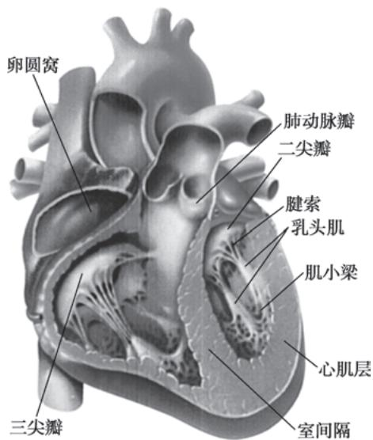  
图 3-1-1 心脏结构

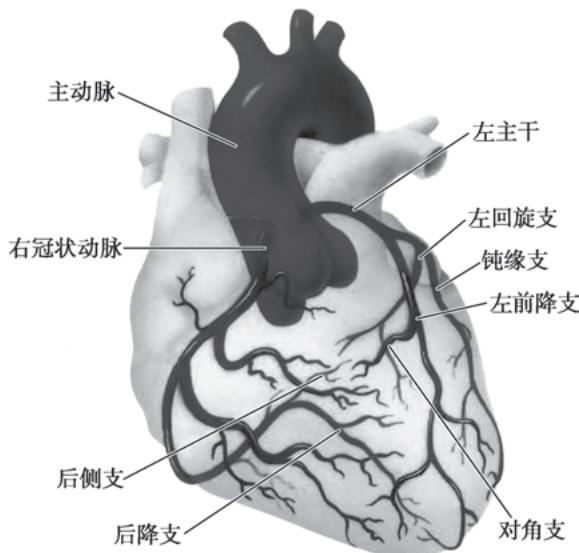  
图 3-1-2 冠状动脉

## 1. 左冠状动脉

（1）左主干：起源于主动脉根部冠状动脉左窦，然后分为左前降支和左回旋支，有时亦发出第三支血管，即中间支。

（2）左前降支：沿肺动脉前行至前室间沟，下行至心尖或绕过心尖；其主要分支包括间隔支动脉和对角支。

（3）左回旋支：绕向后于左心耳下到达左房室沟；其主要分支为钝缘支。

2. 右冠状动脉 大部分起源于主动脉根部冠状动脉右窦，下行至右房室沟，绝大多数延续至后室间沟；其分支包括：圆锥支、窦房结动脉、锐缘支，远端分为后降支和后侧支。

## 【心脏的生理】

（一）心肌动作电位 心肌动作电位分为：

1. 除极过程 0 期。

2. 复极过程 ①1期(快速复极初期); ②2期(平台期); ③3期(快速复极末期); ④4期(静息期)。

了解动作电位对各类抗心律失常药物及离子通道疾病有重要意义。

（二）压力和容积曲线变化 通过对心房、心室、主动脉压力和容积曲线的认识,可以很好地理解整个收缩舒张过程(图 3-1-3)。

## 1. 心室收缩期

（1）等容收缩期:室内压大幅度升高,心室容积不变。

（2）快速射血期:由于大量血液进入主动脉,主动脉压相应增高,约占总射血量的70%,伴随心室容积迅速缩小。

（3）减慢射血期:心室内压和主动脉压都相应由峰值逐步下降。约占总射血量的 30%，心室容积继续缩小。

## 2. 心室舒张期

（1）等容舒张期：心室内压急剧下降，心室容积不变。

（2）快速充盈期：血液由心房快速流入心室，心室容积增大。

（3）减慢充盈期：血液充盈速度减慢，心室容积进一步增大。

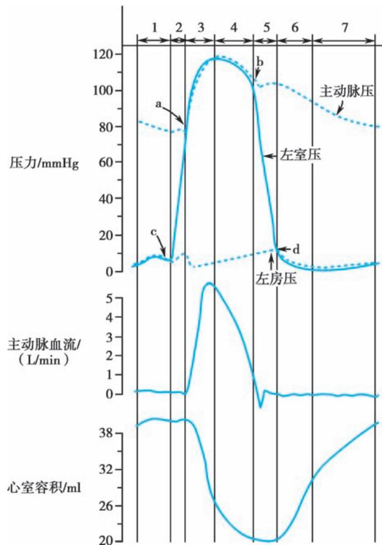  
图 3-1-3 心房、心室、主动脉压力和容积曲线变化  
a. 主动脉瓣开放；b. 主动脉瓣关闭；c. 二尖瓣关闭；d. 二尖瓣开放。

## 二、心血管疾病的诊断

【症状、体征和实验室检查】诊断心血管疾病应根据病史、临床症状和体征、实验室检查和器械检查等资料作出综合分析。

（一）症状 心血管疾病的常见症状有发绀、呼吸困难、胸闷、胸痛、心悸、水肿、晕厥，其他症状还包括咳嗽、头痛、头晕或眩晕、上腹胀痛、恶心、呕吐、声音嘶哑等。上述症状也见于一些其他系统的疾病，因此分析时要作出仔细的鉴别。

（二）体征 体征对诊断心血管疾病多数具特异性，尤其有助于诊断心脏瓣膜病、先天性心脏病、

心包炎、心力衰竭和心律失常。心血管疾病常见体征如下。

1. 视诊 主要观察一般情况、呼吸状况(是否存在端坐呼吸等), 是否存在发绀、贫血、颈静脉怒张、水肿、心前区隆起、心尖和心前区异常搏动等。此外, 环形红斑、皮下结节等有助于诊断风湿热, 两颧呈紫红色有助于诊断二尖瓣狭窄和肺动脉高压, 皮肤黏膜的瘀点、Osler 结节、Janeway 点等有助于诊断感染性心内膜炎, 杵状指(趾)有助于诊断右至左分流的先天性心脏病。

2. 触诊 先全手掌,再小鱼际触诊,主要判断是否存在心尖搏动异常、有无震颤和心包摩擦感、毛细血管搏动、静脉充盈或异常搏动、脉搏的异常变化、肝颈静脉反流征、肝脾大、下肢水肿等。

3. 叩诊 采用轻叩确定心脏相对浊音界(叩诊音由清变浊), 判断是否存在心脏增大; 先叩左界, 后右界; 从左侧心尖搏动最强点外 2\~3cm 处开始, 由外向内, 逐个肋间向上, 直至第二肋间; 右界需先叩出肝上界, 然后于其上一肋间由外向内, 逐个肋间向上, 直至第二肋间。

4. 听诊 听诊内容包括心率、心律、心音强度、心音分裂、心脏杂音、额外心音、心包摩擦音、肺部啰音、周围动脉的杂音和“枪击声”等。各听诊区听诊顺序为心尖区（二尖瓣听诊区）、肺动脉瓣听诊区、主动脉瓣听诊区、主动脉瓣第二听诊区、三尖瓣听诊区。

（三）实验室检查 实验室检查主要包括血常规、尿常规、各种生化检查，包括血脂检查、心肌损伤标志物如血肌钙蛋白、肌红蛋白和心肌酶的测定；心力衰竭标志物脑钠肽的测定等。此外微生物和免疫学检查，如感染性心内膜炎时微生物培养、病毒核酸及抗体等检查；风湿性心脏病时有关链球菌抗体和炎症反应(如抗“O”、血沉、C反应蛋白)的检查。

## 【辅助检查】

## （一）非侵入性检查

1. 血压测定 包括诊所血压、动态血压监测和家庭自测血压。诊所血压包括传统的医生测量血压和较新研究中采用的诊所自测血压，诊所自测血压比医生测量要低。24小时动态血压监测有助于早期高血压病的诊断，可协助鉴别继发性高血压、难治性高血压、白大衣高血压以及隐匿性高血压，指导合理用药。家庭自测血压简便易行，适合病人进行自我监测。

2. 心电图检查 包括常规心电图、24小时动态心电图、心电图运动负荷试验、遥测心电图、心室晚电位和心率变异性分析等。

（1）常规心电图：分析内容主要包括心率、节律、各传导时间、波形振幅和形态等，了解是否存在各种心律失常、心肌缺血/梗死、房室肥大或电解质紊乱等。

（2）运动负荷试验: 是目前诊断冠心病最常用的一种辅助手段。通过运动增加心脏负荷而诱发心肌缺血, 从而出现缺血性心电图改变的试验方法。常用运动平板试验。

（3）动态心电图：又称 Holter 监测，可连续记录 24～72 小时心电信号，以提高对非持续性心律失常及短暂心肌缺血发作的检出率。

## 3. 心脏超声检查

（1）M型超声心动图：将心脏各层的解剖结构回声以运动曲线的形式予以显示，有助于深入分析心脏的活动。目前主要用于检测主动脉根部、二尖瓣和左心室的功能活动。

（2）二维超声心动图: 是各种心脏超声检查技术中最重要和最基本的方法, 也是临床上应用最广泛的检查。它能实时显示心脏的结构和运动状态。常用的切面包括胸骨旁左室长轴切面、胸骨旁主动脉短轴切面、心尖四腔切面等。

（3）多普勒超声心动图：包括彩色多普勒血流显像（color doppler flow imaging, CDFI）和频谱多普勒，可分析血流发生的时间、方向、流速以及血流性质。在二维超声基础上应用多普勒技术可很好地观察心脏各瓣膜的功能。另外，近年来组织多普勒超声心动图（tissue doppler imaging, TDI）技术快速进步，日益成为评价心脏收缩、舒张功能以及左心室充盈血流动力学的主要定量手段。

（4）经食管超声心动图：由于食管位置接近心脏，因此提高了许多心脏结构，尤其是后方心内结构如房间隔、左侧心瓣膜及左侧心腔病变(如左房血栓等)的可视性和分辨率。

（5）心脏声学造影:声学造影是将含有微小气泡的溶液经血管注入体内,把对比剂微气泡作为载体,对特定的靶器官进行造影,使靶器官显影,从而为临床诊断提供重要依据。右心系统声学造影在发绀型先天性心脏病诊断上仍具有重要价值。而左心系统与冠状动脉声学造影则有助于确定心肌灌注面积、了解冠状动脉血液状态及储备能力、判定存活心肌、了解侧支循环情况以及评价血运重建的效果。

（6）实时三维心脏超声：可以更好地对心脏大小、形状及功能进行定量分析，尤其是对手术计划中异常病变进行定位，还可指导某些心导管操作包括右心室心肌活检等。

4. X 线胸片 能显示出心脏及大血管的大小、形态、位置和轮廓,能观察心脏与毗邻器官的关系和肺内血管的变化。

5. 心脏 CT 以往心脏 CT 主要用于观察心脏结构、心肌、心包和大血管改变，而近几年，冠状动脉 CT 血管造影（CTA）逐渐成为评估冠状动脉粥样硬化的无创成像方法，显示冠状动脉主要分支病变情况、冠状动脉解剖异常和桥血管情况，是筛查和诊断冠心病的重要手段。

6. 心脏 MRI 心脏 MRI 除了可以观察心脏结构、功能、心肌和心包病变外，采用延迟增强技术可定量测定心肌瘢痕大小，识别存活的心肌，也用来鉴别诊断各种心肌疾病。

7. 心脏核医学 正常或有功能的心肌细胞可选择性摄取某些显像药物，摄取量与该部位冠状动脉灌注血流量成正比，也与局部心肌细胞的功能或活性密切相关。可以定量分析心肌灌注、心肌存活和心脏功能。显像技术包括心血池显像、心肌灌注显像、心肌代谢显像等。临床上常用的显像剂包括 $^{201}\mathrm{Tl}$ 、 $^{99\mathrm{m}}\mathrm{Tc}$ -MIBI及 $^{18}\mathrm{F}$ -FDG等。常用的成像技术包括单光子发射计算机断层成像（single photon emission computed tomography, SPECT）和正电子发射计算机断层成像（positron emission tomography, PET）。与SPECT相比，PET特异性、敏感性更高。

## （二）侵入性检查

1. 右心导管检查 是一种微创介入技术。将心导管经周围静脉送入上下腔静脉、右心房、右心室、肺动脉及其分支，在腔静脉及右侧心腔进行血流动力学、血氧和心排血量测定；可经导管内注射对比剂进行腔静脉、右心房、右心室和肺动脉造影，以了解血流动力学改变，用于诊断先天性心脏病、判断手术适应证和评估心功能状态。

临床上可应用漂浮导管在床旁经静脉(多为股静脉或颈内静脉)利用压力变化将气囊导管送至肺动脉的远端,可持续床旁血流动力学测定,主要用于急性心肌梗死、心力衰竭、休克等有明显血流动力学改变的危重病人的监测。

## 2. 左心导管检查

（1）左心导管检查: 将导管经周围动脉送入主动脉、左心室等处进行压力测定和心血管造影, 可了解左心室功能、室壁运动及心腔大小、主动脉瓣和二尖瓣功能。

（2）选择性冠状动脉造影：可记录冠状动脉全部血管及分支的走行、分布、解剖和功能异常（包括动脉粥样硬化、血栓、先天性异常或冠状动脉痉挛），同时可记录冠状动脉间和冠状动脉自身侧支循环情况，是诊断冠状动脉疾病的传统“金标准”。尽管CTA等无创影像学技术的不断进步，冠状动脉造影仍然是最普遍应用于确诊有无冠状动脉疾病并据此制订治疗方案的影像方法。

3. 心脏电生理检查 心脏电生理检查是以记录标测心内心电图和应用各种特定的电脉冲刺激，借以诊断和研究心律失常的一种方法。对导管消融治疗心律失常更是必需的检查。

## 4. 腔内成像技术

（1）心腔内超声：将带超声探头的导管经周围静脉送入右心系统，显示的心脏结构图像清晰，对瓣膜介入手术及房间隔穿刺等有较大帮助。

（2）血管内超声(intravascular ultrasound, IVUS): 将小型超声换能器安装于心导管顶端, 送入血管腔内, 可显示冠状动脉的横截面图像, 可评价冠状动脉病变的性质, 定量测定其管径面积、斑块大小和性质、斑块负荷等, 对评估冠脉病变严重程度、指导并优化介入治疗、评价疗效及判断预后等都有重要价值。

（3）光学相干断层扫描（optical coherence tomography, OCT): 将利用红外线的成像导丝送入血管内, 可显示冠状动脉的横截面图像, 其成像分辨率较血管内超声提高约 10 倍。在评估冠脉病变严重程度、指导介入治疗策略、评价治疗结果等方面的意义和 IVUS 类似。

## 5. 血管狭窄功能性判断

（1）血流储备分数（fractional flow reserve, FFR): 是指在冠状动脉存在狭窄病变的情况下, 该血管所供心肌区域能获得的最大血流与同一区域理论上正常情况下所能获得的最大血流之比。通过置入压力导丝测定病变两端的压力获得。FFR 常用于对临界和多支病变是否行介入治疗进行功能学评价。我国和欧美指南均推荐应用 FFR 指导冠心病病人的血管重建。

（2）定量血流分数（quantitative flow ratio, QFR): 是一种不需要使用压力导丝和腺苷, 通过冠脉造影的三维重建与血流动力学分析获得血流储备分数 (FFR) 的新技术。QFR 具有较好的准确率、灵敏度和特异性, 与 FFR 检测结果一致性较高, 由于 QFR 不需要冠脉内应用器械, 减少操作时间和费用, 有望成为心肌缺血功能学评估的替代方案, 进一步优化冠脉介入治疗策略。

6. 心内膜和心肌活检 利用活检钳夹取心脏组织,以了解心脏组织结构及其病理变化,对于心肌炎、心肌病、心脏淀粉样变性、心肌纤维化等疾病具有确诊意义。对心脏移植后排斥反应的判断及疗效评价具有重要意义。一般多采用经静脉右心室途径在透视引导下实施,偶用经动脉左心室途径。右心室间隔活检是最常用的位置,其优势在于造成心脏穿孔的风险相对较低,而且不会带来脑卒中风险。

7. 心包穿刺 是有/无 X 线透视或心脏超声引导下借助穿刺针直接刺入心包腔的诊疗技术。其目的是:①引流心包腔内积液,降低心包腔内压,是急性心脏压塞的急救措施;②通过穿刺抽取心包积液,做生化测定,涂片寻找细菌和病理细胞,做细菌培养,明确心包积液的原因,以鉴别诊断各种性质的心包疾病;③通过心包穿刺,注射抗生素等药物进行治疗。

## 三、心血管疾病的治疗

（一）药物治疗 虽然目前治疗心血管疾病的方法越来越多，但是药物治疗仍然是基础，是最为重要和首选的方法之一。治疗心血管疾病的常用药物常按作用机制进行分类，包括血管紧张素转换酶抑制剂（ACEI）类、血管紧张素受体拮抗剂（ARB）类、β受体拮抗剂、硝酸酯类、利尿剂、α受体拮抗剂、正性肌力药物、调脂类药物、抗心律失常药、钙通道阻滞剂、抗栓药物等。新型的心血管治疗药物包括新型口服抗凝药、胆固醇吸收抑制剂（依折麦布）、前蛋白转化酶枯草溶菌素9型（PCSK9）抑制剂和小干扰RNA（siRNA）药物英克司兰，以及治疗心衰的血管紧张素受体脑啡肽酶抑制剂（ARNI）和钠-葡萄糖共转运蛋白2（SGLT2）抑制剂等。药物的药理作用、适应证、禁忌证、毒副作用及应用注意事项对临床实践都非常重要，同时个体化治疗也是药物治疗成功的关键。

（二）介入治疗 介入治疗已经成为心脏疾病非常重要的治疗手段，其技术不断发展，适应证不断扩大，极大地改善了病人的预后和生活质量。

1. 经皮冠状动脉介入术（percutaneous coronary intervention, PCI）治疗冠心病的一种最常用、最成熟的介入技术，它是在血管造影仪的引导下，通过特制的导管、导丝、球囊、支架等，对狭窄或阻塞的冠状动脉进行血运重建的治疗方法。操作器械的改进，尤其是药物支架的出现大大改善了冠心病病人的预后和生活质量。目前还有药物球囊、生物可吸收支架等新技术应用于临床。

2. 射频消融术（catheter radiofrequency ablation）射频消融术是将电极导管经静脉或动脉送入心腔特定部位，释放射频电流导致局部心内膜及心内膜下心肌凝固性坏死，达到阻断快速型心律失常异常传导束和起源点的介入性技术。这种方法创伤小，并且随着三维标测系统的出现，手术成功率显著提高，已成为治疗各种快速型心律失常，包括心房颤动等的重要治疗策略。

3. 冷冻消融 为心律失常治疗的新技术。通过液态制冷剂的吸热蒸发,带走组织热量,使目标消融部位温度降低,异常电生理的细胞组织遭到破坏,从而消除心律失常。和传统射频消融相比,冷冻消融更易于医生操作,缩短了手术时间,治疗有效性高,并减少血栓等严重并发症,降低病人疼痛度。目前主要应用于阵发性房颤的介入治疗。

4. 脉冲电场消融（pulsed field ablation, PFA）PFA是一种利用脉冲电场为能量的新型消融系统。通过设计适当的脉冲电场，采用短时程、高电压的多个电脉冲来进行消融能量的释放，使得消融过程为非热能消融，有效地诱导细胞发生电穿孔，使细胞外离子进入细胞，当高浓度 $\mathrm{Ca}^{2+}$ 进入时，细胞碎裂死亡。由于PFA对电场阈值较高的组织损伤可逆，而心肌组织的电场损伤阈值很低（ $400\mathrm{V/cm}$ ），因此可在不产热的情况下损伤心肌细胞，具有组织选择性，可保护消融组织周围的关键结构，相比现有的心脏消融技术，具有安全、有效和高效率的优点。

5. 经皮导管消融肾动脉去交感神经术（catheter-based renal sympathetic denervation, RDN）通过阻断肾脏传出神经从而抑制交感神经系统、肾素-血管紧张素轴和血压升高的恶性循环。目前主要用于治疗顽固性高血压，其有效性和安全性仍有待于更多临床研究结果的进一步支持。

6. 心脏起搏器植入术 统称为心血管植入性电子装置（cardiovascular implanted electronic devices, CIED），主要包括治疗缓慢型心律失常的普通心脏起搏器（pacemaker）、心脏再同步治疗（cardiac resynchronization therapy, CRT）起搏器和植入型心律转复除颤器（implantable cardioverter defibrillator, ICD）。普通心脏起搏包括单腔及双腔起搏模式，近年来无导线起搏及传导束生理性起搏得到了逐渐普及。CRT通过冠状窦将左心室导线送入心脏静脉起搏左心室心外膜下心肌或通过传导束起搏纠正室间或室内不同步，改善伴有心室电机械活动不同步的收缩性心衰患者的心功能，并降低死亡率。ICD能明显降低心脏性猝死（sudden cardiac death, SCD）高危患者的SCD和总死亡率，是目前防止SCD最有效的方法。近年来其内置算法、程控设置及非经静脉途径植入的ICD有了很多发展。

7. 先天性心脏病经皮封堵术 包括室间隔缺损、房间隔缺损和动脉导管未闭的封堵术。这类手术创伤小、康复快，效果可以和外科修补手术相媲美。我国先天性心脏病的介入治疗水平处于世界领先地位。

8. 心脏瓣膜的介入治疗 从20世纪80年代开始的瓣膜球囊扩张成形技术到21世纪初的经皮瓣膜植入或修补技术，瓣膜病的介入治疗技术进展迅速，适应证不断扩大。其中主动脉瓣、二尖瓣和肺动脉瓣狭窄的介入治疗技术日趋成熟，瓣膜反流疾病的介入治疗也在不断探索中。

（三）外科治疗 包括冠状动脉旁路移植手术、心脏瓣膜修补及置换手术、先天性心脏病矫治手术、心包剥离术、心脏移植等。

（四）其他治疗 筛选致病基因对于遗传性或家族倾向性心脏病的防治具有重要意义。干细胞移植和血管新生治疗在动物实验取得许多进展，具有良好的应用前景。分子心脏病学也终将为临床实践带来更多更新的诊疗方案。

(葛均波)

  
本章思维导图

本章数字资源

心力衰竭（heart failure, HF）是各种原因导致的心脏结构和/或功能异常，使心脏出现收缩和/或充盈障碍，在静息或运动时心排血量下降或心腔内压力增高而引起的一组复杂临床综合征，主要表现为活动耐量下降和液体潴留。心功能不全（cardiac dysfunction）是一个更广泛的概念，伴有临床症状的心功能不全称之为心力衰竭(简称心衰)。

## 第一节 | 心力衰竭总论

【类型】

（一）按发生的部位分类 左心室代偿功能不全所致为左心衰竭，临床上较为常见。右心室代偿功能不全所致为右心衰竭。左心衰竭和右心衰竭同时存在即为全心衰竭。

（二）按发生的速度分类 根据心衰发生的速度可分为慢性心衰和急性心衰。

1. 急性心衰 系因急性的严重心肌损害、结构破坏、心律失常或突然加重的心脏负荷，使原本功能正常或处于代偿期的心脏在短时间内发生心功能急剧恶化。可以是初发心衰，也可以是慢性心衰急性加重。

2. 慢性心衰 呈一个缓慢的发展过程,一般均有代偿性心脏扩大或肥厚及其他代偿机制的参与。

（三）按左心室射血分数分类 根据左心室射血分数（left ventricular ejection fraction, LVEF）进行的心衰分类在临床上具有重要意义，尤其在指导治疗方面。LVEF≤40%者称为射血分数降低的心衰（HF with reduced EF, HFrEF），即传统概念中的收缩性心衰。LVEF为41%～49%者称为射血分数轻度降低型心衰（HF with mildly reduced EF, HFmrEF），以轻度收缩功能障碍为主。LVEF≥50%者称为射血分数保留型心衰（HF with preserved EF, HFpEF），通常存在充盈压升高、舒张功能受损的表现，既往被称为舒张性心衰。大多数HFrEF病人同时存在舒张功能不全，而HFpEF病人也可能同时存在一定程度的收缩功能异常。

需要强调的是，LVEF是动态变化的，在管理全程中需定期监测。对于既往 $\mathrm{LVEF}\leqslant 40\%$ ，在治疗过程发现 $\mathrm{LVEF} > 40\%$ 的病人，称为射血分数改善的心衰（HF with improved EF, HFimpEF）。

【病因】

## (一) 基本病因

## 1. 心肌收缩力降低

（1）原发性心肌损害：冠状动脉疾病导致缺血性心肌损害如心肌梗死、慢性心肌缺血；炎症导致心肌损害如心肌炎；遗传性心肌病如扩张型心肌病、肥厚型心肌病、致心律失常性右心室心肌病等。

（2）继发性心肌损害:内分泌代谢性疾病(如糖尿病、甲状腺疾病)、系统性浸润性疾病(如心脏淀粉样变)、贮积性疾病(如糖原贮积症、 $\alpha$ -半乳糖苷酶A缺乏症)、结缔组织病、心脏毒性药物等导致的心肌损害。

2. 心室舒张和充盈受限 心室充盈受限是指在静脉回心血量无明显减少的情况下，因心脏本身的病变引起的心脏舒张和充盈障碍。如，肥厚型心肌病时肥厚心肌的顺应性减退，舒张能力降低，使心室舒张期充盈障碍；房颤快心室率时心室舒张期缩短，房室收缩不同步，心室充盈受限。最终导致心室充盈量减少，心排血量降低，体循环、肺循环淤血。

## 3. 心脏负荷过重

（1）压力负荷(后负荷)过重:见于高血压、主动脉瓣狭窄、肺动脉高压、肺动脉瓣狭窄等左、右心室收缩期射血阻力增加的疾病。心肌首先发生代偿性肥厚以承受增高的工作负荷,维持相对正常的心排血量。长期压力负荷过重超过心肌的代偿能力时,会导致心衰。

（2）容量负荷(前负荷)过重:多见于心脏瓣膜关闭不全及左、右心或动、静脉分流性先天性心脏病,也可见于血容量或组织代谢率增加的疾病,如慢性贫血、甲亢、动静脉瘘等。早期心室腔代偿性扩大,心肌收缩功能尚能代偿,维持相对正常的心排血量。长期容量负荷过重,超过心肌的代偿能力时,会导致心衰。

## (二) 诱因

1. 感染 感染是最常见的诱因。感染引起的发热可增加心率,增加心肌耗氧量,特别是呼吸道感染,如果合并支气管痉挛、黏膜充血和水肿等,还可使肺循环阻力增加,加重右心室后负荷。

2. 心律失常 心房颤动是器质性心脏病最常见的心律失常之一,也是心衰的重要诱因。其他各种类型的快速型心律失常以及严重缓慢型心律失常均可诱发心衰。

3. 心脏前、后负荷增加 钠盐摄入过多、静脉液体输入过多或过快增加心脏前负荷，血压升高增加心脏后负荷。此外，过度劳累、怀孕与分娩、情绪波动、外伤与手术等均可加重心脏负荷，诱发心衰。

4. 治疗不当 在心衰病情稳定阶段,若不恰当停用或减用原有治疗心衰的药物可导致心室重塑再次加重、心衰进一步恶化。

5. 原有心脏病变加重或并发其他疾病 如冠心病发生心肌梗死,风湿性心脏病出现风湿活动,心肌病自然病程进展,合并肾功能不全、贫血等。

【病理生理】心衰始于危险因素对心脏的作用。起初，通过心脏本身的代偿以及神经体液代偿机制等得以维持正常的心输出量；但这些代偿机制导致进一步心肌损害，加重心室重塑，最终导致失代偿，出现心衰。

## （一）心脏本身机制

1. Frank-Starling 机制 正常心室的心搏出量能在很大幅度内调节,以适应机体运动、应激等需求。心脏前负荷增加时,回心血量增多,心室舒张末期容积增加,心肌收缩力随之增强,从而增加心排血量及心脏做功量,左心室功能曲线见图 3-2-1。

  
图 3-2-1 左心室功能曲线

2. 收缩功能不全 心肌收缩功能减低时, Frank-Starling 机制调节下的心室收缩增强不能维持正常心排血量, 导致心室舒张末压力增高, 心房压、静脉压随之升高, 达到一定程度时可出现肺循环和/或体循环淤血。

3. 舒张功能不全 在心衰发生机制中的重要性越来越受关注。大体上可分为两大类:一是能量供应不足时钙离子回摄入肌质网及泵出胞外的耗能过程受损,导致主动舒张功能障碍,常见于心肌缺血、慢性容量负荷过重和衰老等；二是心室肌顺应性减退及充盈障碍，主要见于心室肥厚和心内膜纤维化，如高血压病、肥厚型心肌病等。舒张与收缩功能不全的心腔压力与容积的变化见图3-2-2。

  
A

  
B  
图 3-2-2 舒张与收缩功能不全的心腔压力与容积的变化

A. 单纯舒张功能不全时压力-容积曲线较正常左移，舒张末容积略减少而以舒张期压力增高为主； $a \rightarrow b$ ，心脏功能正常时，左心室舒张期压力-容积变化曲线； $c \rightarrow d$ ，舒张功能不全时，左心室舒张期压力-容积变化曲线。B. 收缩功能不全时压力-容积曲线较正常右移，收缩期及舒张期容积明显增加的同时舒张末压力增高； $a \rightarrow b$ ，心脏功能正常时，左心室舒张期压力-容积变化曲线； $c \rightarrow d$ ，收缩功能不全时，左心室舒张期压力-容积变化曲线。

（二）神经体液机制 当心排血量不足，心腔压力升高时，机体全面启动神经体液机制进行代偿，包括：

1. 交感-肾上腺髓质系统增强 心衰病人血中去甲肾上腺素（norepinephrine, NE）水平升高，作用于心肌 $\beta_{1}$ 肾上腺素能受体，增强心肌收缩力并提高心率，从而提高心排血量；作用于 $\alpha$ 受体使外周及腹腔内脏等阻力血管收缩，升高动脉血压，保证心和脑的血流灌注。但周围血管收缩导致心脏后负荷增加及心率加快均使心肌耗氧量增加，NE还对心肌细胞有直接毒性作用，促使心肌细胞凋亡。此外，交感神经兴奋还可使心肌应激性增强而有促心律失常作用。

2. 肾素-血管紧张素-醛固酮系统增强 心排血量降低致肾血流量减低，肾素-血管紧张素-醛固酮系统（renin-angiotensin-aldosterone system, RAAS）过度激活。血管紧张素Ⅱ（angiotensin Ⅱ, ATⅡ）具有明显的收缩血管作用，与NE协同升高动脉血压，醛固酮通过促进水钠潴留而增加循环血量以提高心排血量，保证心、脑等重要器官的血液供应。但RAAS过度激活促进心肌和非心肌细胞肥大或增殖，作用于心脏成纤维细胞，促进胶原合成和心脏纤维化，从而加重心室和血管重塑，加速心肌损伤和心功能恶化。

3. 钠尿肽系统增强 心衰时心室壁张力增加,脑钠肽分泌明显增加,具有抑制肾小管重吸收钠的作用,还能抑制醛固酮和抗利尿激素的分泌,因而可利钠排水、减少心脏的容量负荷;另外,可拮抗ATⅡ的缩血管作用并抑制球旁细胞分泌肾素。

4. 其他体液因子的改变 心衰时除了上述主要神经内分泌系统的代偿机制外,另有众多体液调节因子参与。

精氨酸加压素（arginine vasopressin, AVP）由垂体释放，具有抗利尿和促周围血管收缩作用。心衰时心房牵张感受器敏感性下降，不能抑制AVP释放而使血浆AVP水平升高。AVP通过 $V_{1}$ 受体引起全身血管收缩，通过 $V_{2}$ 受体减少游离水清除，致水潴留增加，同时增加心脏前、后负荷。心衰早期，AVP的效应有一定的代偿作用，而长期的AVP增加将使心衰进一步恶化。

另外,内皮素、一氧化氮、缓激肽以及一些细胞因子、炎性介质等均参与慢性心衰的病理生理过程。

（三）心室重塑 在心脏功能受损、心腔扩大、心肌肥厚的代偿过程中，心肌细胞、非心肌细胞及胞外基质、胶原纤维网等均发生相应变化，即心室重塑（ventricular remodeling），是心衰发生发展的基本病理机制。除了因为代偿能力有限、代偿机制的负面影响外，心肌细胞的能量供应不足及利用障碍导致心肌细胞坏死，纤维化也是失代偿发生的一个重要因素。心肌细胞减少使心肌整体收缩力下降，纤维化的增加又使心室顺应性下降，重塑更趋明显，形成恶性循环，最终导致不可逆转的终末阶段。

## 第二节 | 慢性心力衰竭

【流行病学】慢性心力衰竭（chronic heart failure, CHF）是心血管疾病的终末期阶段和最主要的死因。西方成人心衰患病率约为 $1\% \sim 2\%$ ，总患病率呈上升趋势。基于中国高血压调查研究的结果显示我国 $\geqslant 35$ 岁人群心衰患病率约 $1.3\%$ ，估计患病人数890万；基于0.5亿中国城镇职工医疗保险数据的调查发现我国 $\geqslant 25$ 岁人群心衰患病率约为 $1.1\%$ ，估计心衰病人1210万，每年新增300万。其中HFpEF所占比例接近 $50\%$ 。我国心衰的发病率和患病率均在增长。

冠心病、高血压已成为慢性心衰的最主要病因，冠心病居首位，其次为高血压。风湿性心脏病比例则趋下降，但随着人口老龄化，退行性瓣膜病发病增加，总体瓣膜性心脏病仍不可忽视。同时，慢性肺心病和高原性心脏病在我国也具有一定的地域高发性。

【临床表现】

（一）左心衰竭 以肺循环淤血及心排血量降低为主要表现。

## 1. 症状

（1）不同程度的呼吸困难：①劳力性呼吸困难：是左心衰竭最早出现的症状。因运动使回心血量增加，左心房压力升高，肺淤血加重。随心衰程度的加重，病人活动耐量进行性减退。②夜间阵发性呼吸困难：病人入睡后突然因憋气而惊醒，被迫取坐位，多于端坐休息后缓解。其发生机制除睡眠平卧时血液重新分配使肺血量增加外，夜间迷走神经张力增加、小支气管收缩、横膈抬高、肺活量减少等也是促发因素。③端坐呼吸：肺淤血达到一定程度时，病人不能平卧，因平卧时回心血量增多且横膈上抬，呼吸更为困难。高枕卧位、半卧位甚至端坐时方可好转。④急性肺水肿：是左心衰竭呼吸困难最严重的形式，可有哮鸣音，称为“心源性哮喘”。

（2）咳嗽、咳痰、咯血：咳嗽、咳痰是肺泡和支气管黏膜淤血所致，开始常于夜间发生，坐位或立位时可减轻，白色浆液性泡沫状痰为其特点，偶可见痰中带血丝。急性左心衰竭发作时可出现粉红色泡沫样痰。长期慢性肺淤血肺静脉压力升高，肺循环和支气管血液循环之间在支气管黏膜下形成侧支，一旦破裂可引起大咯血。

（3）乏力、疲倦、头晕、心悸：是器官、组织灌注不足及代偿性心率加快所致的症状。

（4）少尿及肾功能损害症状：严重的左心衰竭血液再分配时，肾血流量首先减少，可出现少尿。长期慢性的肾血流量减少、肾静脉压力升高可出现肾功能不全的相应症状。

## 2. 体征

（1）肺部湿啰音：由于肺毛细血管楔压增高，液体渗出到肺泡而出现湿啰音。随着病情的加重，肺部啰音可从局限于肺底部直至全肺。侧卧位时下垂的一侧啰音较多。

（2）心脏体征：除基础心脏病的固有体征外，可有心脏扩大、心率增快及相对性二尖瓣关闭不全的反流性杂音、肺动脉瓣区第二心音亢进、第三心音或第四心音奔马律。

（3）发绀：主要由于呼吸膜水肿、增厚，氧气交换障碍，氧分压下降，还原血红蛋白增加引起，属中央型发绀。

（二）右心衰竭 以体循环淤血为主要表现。

## 1. 症状

（1）消化道症状：胃肠道及肝淤血引起腹胀、食欲缺乏、恶心、呕吐等，是右心衰竭最常见的症状。

（2）劳力性呼吸困难:继发于肺部疾病及左心衰竭者呼吸困难较明显。单纯右心衰竭也可出现劳力性呼吸困难,但仍可平卧。其呼吸困难的原因主要是心排血量下降,缺氧所致。此与左心衰竭肺淤血所致的呼吸困难不同。

（3）乏力、疲倦、头晕、心悸：主要由心排血量减少，组织器官灌注不足及代偿性心率加快引起。

## 2. 体征

（1）水肿：体循环压力升高使软组织出现水肿，表现为始于身体低垂部位的对称性凹陷性水肿。

（2）颈静脉征：颈静脉搏动增强、充盈、怒张是右心衰竭时的主要体征，肝颈静脉反流征阳性则更具特征性。

（3）肝大：肝脾淤血肿大常伴压痛，持续慢性右心衰可致心源性肝硬化。

（4）浆膜腔积液：可表现为胸腔积液，以双侧多见，右侧为甚，主要与体循环和肺循环压同时升高、胸膜毛细血管通透性增加有关。严重右心衰竭，由于肝静脉回流受阻或合并心源性肝硬化，可出现腹腔积液。

（5）心脏体征：除基础心脏病的相应体征外，可出现心率增快、右心室舒张期奔马律、右心扩大和相对性三尖瓣关闭不全的反流性杂音。

（三）全心衰竭 全心衰竭同时出现左心衰竭和右心衰竭的相关症状及体征。大多数全心衰竭由左心衰竭发展而来，此时右心排血量减少，左心的前负荷减少，呼吸困难等肺淤血症状反而有所减轻。心肌病、心肌炎可左右心室同时受累，起病即表现为全心衰竭。

## 【分期与分级】

（一）心力衰竭分期 心衰分期全面描述了病情进展阶段，提出对不同阶段进行相应的治疗。通过治疗只能延缓而不能逆转心衰分期(表 3-2-1)。

表 3-2-1 慢性心力衰竭分期

<table><tr><td>分期</td><td>临床特征</td></tr><tr><td>A期:心衰危险因素阶段 (at risk for heart failure)</td><td>病人存在心衰高危因素,但目前尚无心脏结构或功能异常,也无心衰的症状或体征。</td></tr><tr><td>B期:前心衰阶段 (pre-heart failure)</td><td>病人无心衰的症状或体征,但已出现心脏结构改变、心室充盈压升高或心脏损伤标志物升高,如左心室肥厚、无症状瓣膜性心脏病、既往心肌梗死病史、脑钠肽水平升高、肌钙蛋白水平升高等。</td></tr><tr><td>C期:症状性心衰阶段 (symptomatic heart failure)</td><td>病人已有心脏结构改变或功能异常,既往或目前有心衰的症状和/或体征。</td></tr><tr><td>D期:晚期心衰阶段 (advanced heart failure)</td><td>病人虽经严格优化治疗,仍有明显症状,常伴心源性恶病质,须反复住院。</td></tr></table>

（二）心力衰竭分级 心力衰竭的严重程度通常采用美国纽约心脏病学会(New York Heart Association, NYHA)的心功能分级方法(表3-2-2)。

表 3-2-2 NYHA 心功能分级

<table><tr><td>分级</td><td>症状</td></tr><tr><td>I级</td><td>日常活动量不受限制,一般活动不引起乏力、呼吸困难等心力衰竭症状。</td></tr><tr><td>II级</td><td>体力活动轻度受限,休息时无自觉症状,一般活动下可出现心力衰竭症状。</td></tr><tr><td>III级</td><td>体力活动明显受限,低于平时一般活动即引起心力衰竭症状。</td></tr><tr><td>IV级</td><td>不能从事任何体力活动,休息状态下也存在心力衰竭症状,活动后加重。</td></tr></table>

这种分级方案的优点是简便易行,但缺点是仅凭病人的主观感受和/或医生的主观评价,短时间内变化的可能性较大,病人个体间的差异也较大。

## 【辅助检查】

## （一）实验室检查

1. 脑钠肽 脑钠肽是心衰诊断、预后和疗效评估中的重要指标，临床上常用 BNP 及 NT-proBNP。与 BNP 相比，NT-proBNP 半衰期更长，更稳定。

脑钠肽诊断心衰的敏感性、特异性、阴性预测值和阳性预测值均较高。在急性呼吸困难病人中，具有较高的阴性预测价值，BNP/NT-proBNP正常基本可除外急性心衰。BNP<35ng/L或NT-proBNP<125ng/L通常可用于排除慢性心衰，但其敏感度和特异度较急性心衰低。尤其值得注意的是，约20%的HFpEF病人BNP/NT-proBNP水平正常。

脑钠肽水平与心衰预后相关,治疗后脑钠肽水平下降提示预后改善。

脑钠肽水平与年龄、性别和体重有关，老龄和女性升高，肥胖者降低。左心室肥厚、心动过速、心肌缺血、肺动脉栓塞、肾功能不全、感染、败血症等亦可引起脑钠肽升高。

2. 肌钙蛋白 严重心衰或心衰失代偿期病人的肌钙蛋白可有轻微升高,但心衰病人检测肌钙蛋白更重要的目的是明确是否存在急性冠脉综合征。肌钙蛋白升高,特别是同时伴有脑钠肽升高,是心衰预后的强预测因子。

3. 常规检查 包括血常规、尿常规、肝肾功能、电解质、甲状腺功能、血清铁蛋白浓度和转铁蛋白饱和度等。

（二）心电图 心衰并无特异性心电图表现，但能帮助判断心肌缺血、心律失常等，还可以提供部分治疗适应证(如心房颤动的抗凝治疗、显著心动过缓的起搏治疗、QRS波群增宽的心脏再同步治疗等)。

## (三) 影像学检查

1. 超声心动图 能较准确地评价各心腔大小及瓣膜结构和功能,方便快捷地评估心功能和协助病因判断,是诊断和评估心衰最主要的影像学检查。

（1）收缩功能:主要有射血分数(EF)、周径缩短速度和短径缩短率等指标,以 EF 最常用,推荐改良双平面 Simpson 法测量。EF 虽不够精确,但方便实用。

（2）舒张功能：多普勒超声是临床上最实用的判断舒张功能的方法。反映舒张功能的指标包括： $\mathrm{E / e^{\prime}}$ 、 $\mathrm{E / A}$ 、 $\mathrm{e^{\prime}}$ 、三尖瓣反流峰值速度、肺动脉收缩压（PASP）、左心室纵向应变（GLS）。 $\mathrm{E / e^{\prime}} \geqslant 15$ 可用于确诊 HFpEF, $\mathrm{E / A} < 1.2$ 提示舒张功能减退。在评估舒张功能异常时需关注相关的形态学指标，包括：左心房容积指数（LAVI）、左心室质量指数（LVMI）、室壁厚度、相对室壁厚度（RWT）等。

负荷超声心动图: 运动或药物负荷超声心动图可用于心肌缺血、部分瓣膜性心脏病的评估及HFpEF的诊断。

2. X 线检查 有助于心衰与肺部疾病的鉴别。心影大小及形态也可为病因诊断提供重要参考，但并非所有心衰病人均存在心影增大。

X 线胸片可反映肺淤血,包括:肺门血管影增强、上肺血管影增多、肺动脉增宽、间质性肺水肿、Kerley B 线、肺门呈蝴蝶状、胸腔积液等。

3. 心脏磁共振（cardiac magnetic resonance, CMR）CMR的三维成像技术，可克服心室几何形态对体积计算的影响，能更精确计算收缩末期和舒张末期心室容积，据此计算EF、心搏出量(SV)。对右心室和复杂先天性心脏病具有较好的分辨率。此外，CMR具有较高的组织分辨能力，通过延迟钆增强（late gadolinium enhancement, LGE）等技术可区别缺血性与非缺血性改变、评估心肌纤维化程度、鉴别某些特殊类型心肌病。对于疑似心肌炎、致心律失常性右心室心肌病（ARVC）、心肌淀粉样变、结节病、血色病、病因诊断不明的病人，推荐行CMR检查。

4. 冠状动脉造影（coronary angiography, CAG）对有冠心病危险因素、存在心肌缺血症状、无创检查提示存在心肌缺血的心衰病人，可行冠状动脉造影明确诊断。

5. 放射性核素检查 主要用于行心肌灌注显像评价存活/缺血心肌。另外， $^{99m}$ Tc-DPD/PYP/

HMDP SPECT 骨闪烁扫描可用于检出甲状腺素转运蛋白心肌淀粉样变, $^{18}$ F-FDG PET 可用于鉴别心脏结节病。

（四）有创性血流动力学检查 可用于重症心衰评估血流动力学状态、判断心脏移植可行性和HFpEF的诊断。常用右心漂浮导管(Swan-Ganz导管)检查，测定各部位的压力及血液含氧量，计算心排血量(CO)、心脏指数(CI)及肺毛细血管楔压(PCWP)、肺阻力等。亦可通过左心导管、左心室造影的方法，测左心室舒张末期容积、左心室收缩末期容积以及据此计算出EF、CO、CI、SV等。

对存在劳力性呼吸困难,通过无创检查不能确诊 HFpEF 但临床仍高度怀疑的病人,Swan-Ganz 导管检查静息状态下 PCWP≥15mmHg 或左心室舒张末压(LVEDP)≥16mmHg、负荷时 PCWP≥25mmHg 可确诊 HFpEF。

（五）6 分钟步行试验 简单易行、安全方便，通过评定慢性心衰病人的运动耐力评价心衰严重程度和疗效。要求病人在平直走廊里尽快行走，测定 6 分钟步行距离。步行距离＜150m、150～450m 和＞450m 分别为重度、中度和轻度心衰。

（六）心-肺运动试验 仅适用于慢性稳定型心衰病人，用于评估心功能、判断心脏移植的可行性、指导运动康复治疗。主要测定参数包括最大耗氧量和无氧阈值。

## 【诊断与鉴别诊断】

（一）诊断 首先，根据病史、症状、体格检查、心电图、X线胸片判断有无心衰的可能性；然后，通过脑钠肽检测和超声心动图检查明确是否存在心衰及其类型，再进一步确定其病因和诱因；最后，还需评估病情的严重程度及预后，以及是否存在合并症。

## (二) 鉴别诊断

1. 肺部疾病 心衰最常见的症状为呼吸困难,首先需要与肺部疾病鉴别,包括慢性阻塞性肺气肿、支气管哮喘、肺栓塞等。根据基础疾病史、心脏体征、肺部体征结合肺功能和肺部影像学检查,不难鉴别。

2. 心包积液、缩窄性心包炎 由于腔静脉回流受阻同样可以引起颈静脉怒张、肝大、下肢水肿等类似右心衰竭表现。超声心动图、胸部 CT、CMR 可鉴别。

3. 其他引起水肿的疾病 应与肾性水肿、肝性水肿、低蛋白血症、甲状腺功能减退、下肢静脉功能异常等相鉴别。除基础心脏病体征有助于鉴别外，非心源性水肿不会出现颈静脉怒张等上腔静脉回流受阻的体征。常规实验室检查有助于鉴别。

4. 贫血、肥胖、神经肌肉疾病、衰老所导致的乏力、活动耐量减退 尤其在 HFpEF 诊断时，如无典型的呼吸困难、水肿，仅有乏力、肌力减退等非特异性症状时，需要充分评估心衰与其他合并情况对机体影响孰轻孰重，避免 HFpEF 的过度诊断。

【治疗】心衰的治疗目标为防止和延缓心衰的发生发展；缓解临床症状，提高生活质量；改善长期预后，降低病死率与再住院率。

## (一) 一般治疗

## 1. 生活方式管理

（1）病人教育:心衰病人及家属应得到准确的有关疾病知识和管理的指导,内容包括健康的生活方式、适当的诱因规避、规范的药物服用、自我监测、合理的随访计划等。

（2）体重管理: 日常体重监测能简便直观地反映病人体液潴留情况及利尿剂疗效。体重改变往往出现在临床体液潴留症状和体征之前。部分严重慢性心衰病人存在临床或亚临床营养不良, 若出现大量体脂丢失或干重减轻称为心源性恶病质, 往往提示预后不良。

（3）饮食管理:适当限盐有利于减轻心脏容量负荷,但过分严格限盐易导致低钠血症。临床上对一般心力衰竭病人不强调限盐,但对难治性心力衰竭及终末期心力衰竭病人,因存在利尿剂抵抗,适当限盐是合理的。

2. 休息与活动 急性期或病情不稳定病人应限制体力活动,以降低心脏负荷。血流动力学稳定后应适量运动,有利于提高病人的生活质量。建议在心肺功能评估基础上制订个体化、循序渐进的运动方案。

## （二）病因和诱因治疗

1. 病因治疗 是治疗成功的关键,应积极寻找病因,对所有可能导致心脏功能受损的基础疾病尽早进行有效治疗。

2. 消除诱因 常见的诱因为感染,特别是呼吸道感染,应积极抗感染治疗。快心室率心房颤动应尽快控制心室率,必要时复律。应注意排查并纠正潜在的甲状腺功能异常、贫血、肾功能不全、电解质紊乱等。

## (三) 药物治疗

1. 利尿剂 利尿剂是有效控制体液潴留的药物。无论何种心衰，只要存在体液潴留都应使用利尿剂。利尿剂的适量应用至关重要，剂量不足则体液潴留，导致心衰症状加重并减弱改善预后类药物的疗效；剂量过大则容量不足，增加低血压及肾功能恶化的风险。

（1）袢利尿剂：以呋塞米(速尿)为代表，作用于髓袢升支粗段，排钠排钾，为强效利尿剂。使用方法：对轻度心衰病人一般小剂量20mg，每日1次起始，逐渐加量，一般控制体重下降0.5～1.0kg/d直至干重；重度慢性心衰者可增至100mg每日2次；静脉注射效果优于口服。注意低血钾的副作用。

（2）噻嗪类利尿剂：以氢氯噻嗪(双氢克尿噻)为代表，作用于肾远曲小管近端和髓袢升支远端，抑制钠的重吸收，并因 $Na^{+}-K^{+}$ 交换同时降低钾的重吸收，为中效利尿剂。GFR<30ml/min 时作用明显受限。使用方法：轻度心衰可首选此药，12.5～25mg，每日1次起始，逐渐加量，可增至每日75～100mg，分2～3次服用。注意电解质平衡，常与保钾利尿剂合用。因可抑制尿酸排泄会引起高尿酸血症，长期大剂量应用时可能影响糖、脂代谢。

（3）保钾利尿剂：作用于肾远曲小管远端，通过拮抗醛固酮或直接抑制 $Na^{+}-K^{+}$ 交换而具有保钾作用。利尿作用弱，多与上述两类利尿剂联用以加强利尿效果并预防低血钾。常用的有螺内酯、氨苯蝶啶、阿米洛利。使用方法：螺内酯 10～20mg，每日 1 次起始，可增至每日 20～40mg；氨苯蝶啶 25～50mg，每日 1 次起始，可增至每日 200mg。阿米洛利 2.5～5mg，每日 1 次起始，可增至每日 20mg。

（4）AVP受体拮抗剂：通过结合 $V_{2}$ 受体减少水的重吸收，不增加排钠，因此可用于伴有低钠血症、利尿剂抵抗的病人。常用药物有托伐普坦，使用方法：7.5～15mg，每日1次起始使用，最大剂量可增至每日30mg。

## 2. RAAS 抑制剂

（1）血管紧张素转换酶抑制剂(angiotensin converting enzyme inhibitors, ACEI): 通过抑制 ACE 减少 ATⅡ生成而抑制 RAAS, 通过降低病人神经-体液代偿机制的不利影响, 改善心室重塑。

HFrEF 病人: ACEI 早期足量应用可缓解症状, 延缓心衰进展, 降低死亡率。所有 HFrEF 病人除非存在禁忌, 均推荐使用。

HFmrEF 病人: ACEI 可部分减少 HFmrEF 死亡和心衰住院风险, 可考虑使用。

HFpEF 病人: ACEI 改善 HFpEF 病人预后的证据尚不充分, 在合并存在高血压、心肌梗死等适应证时可考虑使用。

使用方法: ACEI 以小剂量起始, 如能耐受则逐渐加量至靶剂量或最大耐受剂量, 长期维持用药。

副作用主要包括低血压、肾功能一过性恶化、高血钾、干咳和血管性水肿等。血管性水肿和无尿型肾衰竭、妊娠期妇女及ACEI过敏者应禁用；低血压、双侧肾动脉狭窄、血肌酐明显升高（>265μmol/L）和高血钾（>5.5mmol/L）者慎用。开始用药或上调剂量后1～2周内监测肾功能与血钾，后定期复查。

（2）血管紧张素受体抑制剂(angiotensin receptor blockers, ARB): 通过阻断经 ACE 和非 ACE 途径产生的 ATⅡ与 AT₁ 受体结合发挥阻断 RAAS 的效应, 但无抑制缓激肽降解作用, 因此干咳和血管性水肿的副作用较少见。具有 ACEI 适应证的心衰病人治疗首选 ACEI, 对 ACEI 不能耐受者可改用 ARB。

使用方法、副作用及使用注意事项同 ACEI。

（3）血管紧张素受体脑啡肽酶抑制剂(angiotensin receptor neprilysin inhibitor, ARNI): 如沙库巴曲缬沙坦, 通过沙库巴曲代谢产物抑制脑啡肽酶而减少 BNP 的降解, 同时通过缬沙坦阻断 AT $_{1}$ 受体, 抑制 RAAS 过度激活。

HFrEF 病人: ARNI 较 ACEI 进一步降低心衰住院和心血管死亡风险, 改善心衰症状和生活质量。推荐作为 HFrEF 病人的初始治疗; 对于已经使用 ACEI 或 ARB 但仍有心衰症状的病人, 推荐以 ARNI 替代 ACEI 或 ARB。

HFmrEF 病人: ARNI 可部分减少 HFmrEF 病人死亡和心衰住院风险, 可考虑使用。

HFpEF 病人: 女性及 LVEF 相对较低的 HFpEF 病人使用 ARNI 可降低心衰再住院风险, 可考虑使用。

使用方法: 小剂量开始, 每日 50\~100mg, 分 2 次服用, 每 2\~4 周上调剂量, 至目标剂量为每日 400mg, 分 2 次服用。

副作用及使用注意事项同 ACEI, 已知对 ARNI 过敏者禁用。

3. $\beta$ 受体拮抗剂 $\beta$ 受体拮抗剂可抑制交感神经过度激活对心衰代偿的不利作用,保护心肌细胞,改善心室重塑。

HFrEF 和 HFmrEF 病人: 长期应用 $\beta$ 受体拮抗剂治疗能改善 HFrEF 和 HFmrEF 病人左心室功能, 降低死亡率和住院率, 显著降低猝死率。所有病人除非存在禁忌, 均推荐使用。

HFpEF 病人: 目前关于 $\beta$ 受体拮抗剂的证据有限, 不推荐常规用于 HFpEF 治疗。如 HFpEF 病人存在 $\beta$ 受体拮抗剂使用适应证的基础疾病或合并症, 如冠心病、心肌梗死、房颤伴快速心室率等, 推荐使用。

目前已经临床验证的 $\beta$ 受体拮抗剂包括美托洛尔、比索洛尔与卡维地洛。

使用方法: 血流动力学稳定情况下尽早使用, 小剂量起始, 逐渐增加达最大耐受剂量并长期维持。使用禁忌证为支气管痉挛性疾病、严重心动过缓、二度及二度以上房室传导阻滞、严重周围血管疾病(如雷诺病)和重度急性心衰。

突然停用 $\beta$ 受体拮抗剂可致临床症状恶化,应予避免。对于慢性心衰急性失代偿的病人,如无低灌注表现或心源性休克应尽可能维持原有剂量的 $\beta$ 受体拮抗剂治疗。

4. 醛固酮受体拮抗剂（mineralocorticoid receptor antagonist, MRA） MRA 能阻断醛固酮效应，抑制心室重塑，在各类型心衰病人中均被证实能改善预后。推荐使用于各类型症状性慢性心衰病人。

第一代 MRA 螺内酯是目前应用最广泛的醛固酮受体拮抗剂，由于同时拮抗雄激素，长期服用引起男性乳腺增生。每日 20～40mg，分 1～2 次服用。第二代 MRA 依普利酮为选择性醛固酮受体拮抗剂，对雄激素的拮抗作用很弱，副作用明显减少，尤适用于老龄、糖尿病和肾功能不全病人。起始剂量每日 25mg，最大剂量每日 50mg。

MRA 使用的禁忌证包括: 血钾≥5.0mmol/L 或估算的肾小球滤过率(eGFR)≤30ml/(min·1.73m²)。使用过程中需要定期随访肾功能、血钾。

5. 钠-葡萄糖共转运蛋白2抑制剂(sodium-glucose cotransporter 2 inhibitors, SGLT2i) SGLT2i通过抑制近端肾小管钠-葡萄糖的重吸收，促进尿糖和钠的排泄，降低血糖、减轻容量负荷，同时具有改善能量代谢、改善内皮功能、抑制炎症反应和纤维化等多重作用机制，能减少2型糖尿病人群心衰发病和心血管死亡风险，也能降低各EF类型心衰病人心血管死亡和心衰住院风险。推荐使用于所有EF类型心衰病人。

使用方法: 所有病情稳定并无禁忌证的心衰病人均应尽早使用。达格列净或恩格列净, 每次 10mg, 每日 1 次。

SGLT2i 使用的禁忌证包括肾功能不全[达格列净禁用于 eGFR<30ml/(min·1.73m²)，恩格列净禁用于 eGFR<20ml/(min·1.73m²)]、糖尿病、收缩压<95mmHg。使用过程中需要警惕血糖正常的酮症酸中毒、生殖器和软组织感染的风险，避免低血容量状态。

6. 洋地黄类药物 洋地黄类药物通过抑制 $Na^{+}-K^{+}-ATP$ 酶发挥药理作用:①正性肌力作用:促进心肌细胞 $Ca^{2+}-Na^{+}$ 交换,升高细胞内 $Ca^{2+}$ 浓度而增强心肌收缩力。②电生理作用:一般治疗剂量下,洋地黄可抑制心脏传导系统,对房室交界区的抑制最为明显。③迷走神经兴奋作用:作用于迷走神经传入纤维,增加心脏压力感受器的敏感性,反馈抑制中枢神经系统的兴奋冲动。④作用于肾小管细胞,减少钠的重吸收并抑制肾素分泌。

地高辛可改善心衰病人的症状，提高运动耐量，减少住院率，但对生存率无明显改变。适用于应用利尿剂、ACEI/ARB/ARNI、β受体拮抗剂、MRA和SGLT2i后仍持续有症状的HFrEF病人，或症状性心衰伴房颤快心室率者。

使用方法:地高辛每日 0.125～0.25mg,70 岁以上、肾功能损害或低体重的病人应予更小剂量(隔日 0.125mg)。地高辛血药浓度建议维持在 0.5～0.9μg/L。地高辛过量会导致心律失常、胃肠道反应、精神症状。

禁忌证:①病态窦房结综合征、二度及以上房室传导阻滞病人;②心肌梗死急性期(<24小时),尤其是有进行性心肌缺血者;③预激综合征伴房颤或房扑;④肥厚型梗阻性心肌病。

7. 伊伐布雷定（ivabradine）伊伐布雷定为选择性特异性窦房结 $\mathrm{I_f}$ 电流抑制剂，减慢窦性心率，延长舒张期，不影响心脏电传导，无负性肌力作用。适用于在使用 $\beta$ 受体拮抗剂基础上、仍LVEF≤35%、心功能Ⅱ～Ⅳ级、窦性心律、HR≥70次/分的慢性心衰病人。

使用方法:起始剂量每日 5mg, 分 2 次服用; 根据心率逐渐上调剂量, 最大可增加至每日 15mg, 分 2 次服用。如静息心率低于 50 次/分, 或感觉头昏、疲劳, 应减量或者停药。

8. 可溶性鸟苷酸环化酶（soluble guanylate cyclase, sGC）刺激剂 通过直接刺激 sGC，并稳定一氧化氮与 sGC 的结合，增强 NO-sGC-cGMP 信号通路，改善心肌和血管功能。现有的代表药物为维立西呱。适用于近期发生心衰失代偿、经治疗后病情稳定、LVEF<45% 的症状性心衰病人。

使用方法:起始剂量每日2.5mg,1次服用;根据血压每2周逐渐上调剂量,最大可增加至每日10mg,1次服用。如收缩压小于90mmHg,或存在症状性低血压,应减量或者停药。eGFR<15ml/(min·1.73m²)者禁用。

9. 扩血管药物 慢性心衰的治疗不推荐使用血管扩张药物,仅在伴有心绞痛或高血压的病人可考虑联合治疗。存在流出道梗阻或严重瓣膜狭窄者禁用。

## （四）非药物治疗

1. 心脏再同步治疗（cardiac resynchronization therapy, CRT）部分心衰病人存在房室、室间和/或室内收缩不同步，进一步导致心肌收缩功能降低。CRT通过改善收缩同步性增加心排血量，减轻心衰症状，减少住院率并降低死亡率。对已接受最佳药物治疗3个月以上，仍持续存在心衰症状的窦性心律、NYHA分级Ⅱ～Ⅳ级、LVEF≤35%、QRS间期＞130ms的病人，可考虑植入。具有普通起搏器植入指征的病人，如LVEF≤50%，可考虑植入CRT。（参照本篇第三章第八节）

2. 植入型心律转复除颤器（implantable cardioverter defibrillator, ICD）中重度心衰病人逾半数死于恶性室性心律失常所致心脏性猝死，而 ICD 可用于以下病人的一级预防：①优化药物治疗 3 个月以上、LVEF 仍≤35%、NYHA II～III 级者；②心肌梗死 40 天后及血运重建 90 天后，优化药物治疗后 LVEF≤30%，NYHA I 级者。也可用于心搏骤停幸存者或伴血流动力学不稳定的持续性室性心动过速的心衰病人的二级预防。（参照本篇第三章第八节）

3. 左室辅助装置（left ventricular assistant device, LVAD）适用于拟行心脏移植术病人的短期过渡治疗和终末期心衰病人的替代治疗。LVAD 的小型化、精密化、便携化已可实现，有望成为心脏移植的有效替代方法。

4. 心脏移植 是目前治疗终末期心衰的最终治疗方法。准确评估心脏移植适应证至关重要。

## 第三节 | 急性心力衰竭

急性心力衰竭(acute heart failure, AHF)是指心力衰竭急性发作和/或加重的一种临床综合征,可以是急性新发或慢性心衰急性失代偿。

新发急性心衰的常见病因包括急性心肌损害(如急性冠脉综合征和重症心肌炎等)和急性血流动力学障碍(如急性瓣膜功能障碍、高血压危象、严重心律失常和急性肺栓塞等)。

【类型】

## (一) 临床分类

1. 急性左心衰竭 急性发作或加重的左心室收缩力降低、负荷加重，造成急性左心排血量骤降、肺循环压力突然升高，出现急性肺淤血、肺水肿并可伴组织器官灌注不足甚至心源性休克。根据起病速度和病情危急程度可分为慢性心衰急性失代偿、急性肺水肿、心源性休克。常由急性冠脉综合征、高血压危象、严重心律失常、慢性心衰急性失代偿等所致。

2. 急性右心衰竭 右心室心肌收缩力急剧下降或右心室的前后负荷突然加重，引起右心排血量急剧减低和体循环急性淤血，常由右心室梗死、急性大面积肺栓塞所致。

（二）临床分型 急性心衰根据组织的淤血和灌注情况进行分型，有助于判断病情危重程度并指导治疗。淤血症状和体征主要包括端坐呼吸/夜间阵发性呼吸困难、肺部湿啰音、外周(双侧)水肿、颈静脉怒张、淤血性肝大和肝颈静脉回流征阳性等；低灌注症状和体征主要包括四肢湿冷、神志模糊、少尿、头晕和脉压小等。按有无淤血分为“湿”和“干”型，有无组织低灌注分为“冷”和“暖”型，由此可将急性心衰分为四型：①“干暖”型，无明显淤血也无明显组织低灌注，此型病情最轻；②“干冷”型，无明显淤血但有组织低灌注，大约占 $5\%$ ，多数合并低血容量；③“湿暖”型，有明显淤血但无明显组织低灌注，此型最为常见，多数为慢性心衰急性失代偿；④“湿冷”型，有淤血也有组织低灌注，病情最重。

【临床表现】突发呼吸困难是急性左心衰竭最主要的临床表现。根据病情的严重程度可依次表现为劳力性呼吸困难、夜间阵发性呼吸困难、端坐呼吸等；体格检查可发现心脏增大、舒张早期或中期奔马律、肺部湿啰音等。早期征兆可表现为部分原来心功能正常的病人出现原因不明的疲乏或运动耐力明显减低、心率增加15～20次/分以上。

急性肺水肿:突发严重呼吸困难、端坐呼吸、烦躁不安,伴恐惧窒息感,呼吸频率可达30\~50次/分,面色灰暗,口唇发绀,大汗淋漓,咳嗽,咳大量粉红色泡沫样痰,可出现大小便失禁。听诊心率快、心尖部常可闻及舒张早期奔马律,两肺满布湿啰音和哮鸣音。

心源性休克: 在血容量充足的情况下存在持续低血压, 收缩压 $\leqslant90mmHg$ (持续 30 分钟以上), 肺毛细血管楔压 (PCWP) $\geqslant18mmHg$ , 心脏指数 (CI) $\leqslant2.2L/(min\cdot m^{2})$ , 伴有组织低灌注的表现, 包括少尿 (尿量 $<0.5ml/(kg\cdot h)$ 甚至无尿, 皮肤苍白和发绀, 四肢湿冷, 意识障碍, 血清乳酸 >2mmol/L, 代谢性酸中毒 (pH <7.35)。

急性右心衰竭: 主要出现体循环淤血及心排血量降低的一些表现, 如低血压、心动过速、少尿、肢端湿冷、颈静脉充盈、肝颈静脉回流征阳性、肝脾大、下肢和骶部水肿等。

【诊断与鉴别诊断】根据典型症状与体征，一般不难作出诊断。急性左心衰竭病人常出现“心源性哮喘”，应与支气管哮喘、喘息性支气管炎急性加重相鉴别。前者多见于器质性心脏病病人，发作时必须坐起，肺部有干、湿啰音，甚至咳粉红色泡沫样痰；后者多见于青少年有过敏史或中老年有长期慢性支气管炎病史，发作时双肺可闻及典型哮鸣音。测定血浆BNP/NT-proBNP水平对鉴别急性心源性和支气管性哮喘有较大的参考价值。

【治疗】 治疗目标:稳定血流动力学状态,维护脏器灌注和功能,缓解症状;针对病因和诱因的治疗;启动并加强基于循证的治疗,改善远期预后。

## （一）初始评估和紧急干预

首先,需要评估是否存在循环或呼吸衰竭。存在心源性休克病人急性期死亡风险最高,需要尽快纠正休克状态,及早使用血管收缩剂和正性肌力药物,如药物治疗效果不佳,及早行机械循环支持治疗。存在呼吸衰竭的病人采用无创呼吸机持续加压(CPAP)或双水平气道正压(BiPAP)给氧。无创通气不能纠正的呼吸衰竭,及早行有创通气治疗。建议在1小时内纠正休克和呼吸衰竭。

随后，迅速识别出需要针对病因紧急处理的临床情况，包括急性冠脉综合征、高血压急症、严重心律失常、心脏急性机械并发症、急性肺栓塞、重症感染、心脏压塞。尽早给予相应处理，包括急诊血运重建、快速降压、电复律、紧急外科手术、取栓或溶栓、抗感染、心包穿刺。

（二）一般处理 应尽快开放静脉通道，留置导尿管，心电血压及血氧饱和度监测等。对于存在心源性休克病人，必要时可行有创血流动力学监测。

1. 吸氧 立即高流量鼻管给氧。

2. 体位 半卧位或端坐位, 双腿下垂, 以减少静脉回流。

3. 镇静 吗啡 3～5mg 静脉注射不仅可以使病人镇静，减少躁动所带来的额外的心脏负担，同时可舒张小血管的功能而减轻心脏负荷。建议用于急性肺水肿病人。必要时每间隔 15 分钟重复 1 次，共 2～3 次。老年病人可减量或改为肌内注射。

4. 容量管理 监测 24 小时出入液量。容量超负荷严重者应严格限盐限水、调整输液量和速度，保持液体负平衡，待肺淤血、水肿明显消退，应减少液体负平衡量，逐渐过渡到出入量平衡。评估存在低容量状态者应适当扩容至平衡状态。

（三）根据临床分型确定治疗方案“干暖”型调整口服药物即可。“干冷”型首先适当扩容，如低灌注仍无法纠正，可给予正性肌力药物。“湿暖”型若以高血压为主要表现的血管内液体再分布类型，首选血管扩张剂，其次为利尿剂；若以淤血为主要表现的心源性液体潴留类型，首选利尿剂，其次为血管扩张剂，严重利尿剂抵抗病人可采用超滤。“湿冷”型最危重，如收缩压≥90mmHg，则给予血管扩张剂、利尿剂，若治疗效果不佳再使用正性肌力药物；如收缩压＜90mmHg，首选正性肌力药物，若无效则使用血管收缩药物，当低灌注纠正后再使用利尿剂；对药物治疗无反应的病人，应及时行机械循环支持治疗。

## （四）药物治疗

1. 利尿剂 利尿剂的合理使用是急性心衰治疗的关键。有液体潴留证据的急性心衰病人，除非存在未纠正的低灌注状态，均应尽快使用利尿剂。首选静脉使用袢利尿剂，如呋塞米、托拉塞米、布美他尼等。对于发病前未接受口服利尿剂治疗的病人，常用呋塞米，初始剂量为20～40mg静脉注射，或托拉塞米10～20mg静脉注射。之后根据尿量、症状追加，也可选择静脉滴注5～40mg/h，其总剂量在起初6小时呋塞米不超过80mg，起初24小时呋塞米不超过160mg。对于长期使用口服利尿剂的病人，最初静脉剂量应不小于长期每日口服剂量。对于无大出血或严重脱水等明显低血容量因素的急性心衰病人，保持出入量负平衡约为500～1000ml/d；对于严重肺水肿病人，保持出入量负平衡为1000～2000ml/d，甚至可达3000～5000ml/d。

2. 血管扩张剂 可通过降低静脉张力(前负荷)和动脉张力(后负荷)获得双重受益。应用于不存在组织低灌注或低血压的急性心衰病人,收缩压<90mmHg时禁忌使用;使用过程中须密切监测血压变化,小剂量慢速给药。

（1）硝普钠：为动、静脉血管扩张剂，适用于严重心衰、后负荷增加以及伴肺水肿者。起始剂量0.2～0.3μg/(kg·min)静脉滴注，每5～10分钟增加0.5μg/(kg·min)，不超过10μg/(kg·min)，严格控制滴速，避免发生低血压。因含有氰化物，使用不超过72小时。

（2）硝酸酯类：扩张小静脉，降低回心血量，使左室舒张末压及肺血管压降低，适用于急性心衰合并高血压、冠心病心肌缺血、二尖瓣反流者。常用药物包括硝酸甘油、硝酸异山梨酯。病人对此类药物的耐受量个体差异很大。静脉注射硝酸甘油初始剂量5～10μg/min，每5～10分钟增加5～10μg/min，最大剂量 $200 \mu g/min$ 。紧急时可舌下含服硝酸甘油。静脉注射硝酸异山梨酯初始剂量 $1 \sim 2 mg/h$ ，每 5～15 分钟增加 1 mg/h，最大剂量 10 mg/h。硝酸酯类药物持续应用易发生耐药。

（3）α受体拮抗剂：选择性结合α肾上腺素能受体，扩张动脉，降低外周阻力，减轻心脏后负荷，增加心排血量，可用于急性心衰合并高血压、主动脉夹层者。常用药物为乌拉地尔，静脉注射100～400μg/min，根据血压调整剂量。

（4）重组人脑利钠肽（rhBNP）：扩张静脉和动脉，降低前、后负荷，降低PCWP，减轻肺水肿，改善呼吸困难症状。并具有排钠利尿、抑制RAAS和交感神经系统等作用。先以 $1.5\mu \mathrm{g} / \mathrm{kg}$ 静脉冲击后，然后以 $0.0075\sim 0.01\mu \mathrm{g} / (\mathrm{kg}\cdot \mathrm{min})$ 的速度连续静脉滴注。

3. 正性肌力药物 短期静脉应用可增加心排血量,升高血压,缓解组织低灌注,维持重要脏器的功能,但不改善长期预后。适用于低血压(收缩压<90mmHg)和/或组织器官低灌注的病人。有使用适应证的病人建议尽早使用,低灌注状态改善后尽早停用。

（1） $\beta$ 受体激动剂：多巴胺主要作用于多巴胺受体，具有选择性扩张肾动脉和肠系膜动脉、促进利尿的作用。小剂量 $3 \sim 10 \mu \mathrm{g} / (\mathrm{kg} \cdot \mathrm{min})$ 给药时可激动 $\beta_{1}$ 肾上腺素能受体，具有正性肌力作用；中至高剂量给药时可激动 $\alpha$ 肾上腺素能受体，具有血管收缩作用。一般从小剂量起始，逐渐增加剂量。

多巴酚丁胺主要作用于 $\beta_{1}$ 肾上腺素能受体，轻度降低全身血管阻力和 PCWP，增加每搏输出量和心排血量。起始剂量为 $2.5\mu g/(kg\cdot min)$ ，逐渐加量至 $20\mu g/(kg\cdot min)$ 。

慢性心衰急性失代偿病人往往长期、大剂量使用 $\beta$ 受体拮抗剂，此时心脏 $\beta$ 受体已受到抑制，不推荐使用多巴酚丁胺和多巴胺。

（2）磷酸二酯酶抑制剂：兼有正性肌力及降低外周血管和肺血管阻力的作用。需要警惕低血压、心律失常风险。

（3）左西孟旦(levosimendan):通过结合于心肌细胞上的肌钙蛋白C增强心肌收缩,并通过介导三磷酸腺苷敏感的钾通道,扩张冠状动脉和外周血管。其代谢产物也有生物活性,且半衰期为75\~80小时,停药后作用可持续7\~9天。负荷量6\~12μg/kg静脉推注(>10分钟),随后0.05\~0.2μg/(kg·min)静脉滴注维持24小时。

（4）洋地黄类药物：可轻度增加心排血量、降低左心室充盈压。主要适应证是房颤伴快速心室率（>110次/分)者。毛花苷丙0.2～0.4mg缓慢静脉注射10分钟，2～4小时后可再用0.2mg。急性心肌梗死后24小时内、严重心肌缺血、重症心肌炎伴严重心肌损伤的疾病早期应尽量避免使用。低钾血症和低镁血症易发生洋地黄中毒，应监测血钾、镁水平。

4. 血管收缩剂 去甲肾上腺素、肾上腺素等是对外周动脉有显著缩血管作用的药物，重分配血流但以增加左心室后负荷为代价提高血压，保证重要脏器灌注。适用于使用正性肌力药物后仍无明显改善的伴有组织低灌注或显著低血压的病人。心源性休克时，首选去甲肾上腺素。

血管收缩剂可致心律失常、心肌缺血及其他器官损害，用药中应密切监测血压、心律、心率、血流动力学及临床状态变化，当组织灌注恢复时尽早停用。

5. 抗凝治疗 急性心衰住院病人血栓栓塞风险明显增加,抗凝治疗适用于深静脉血栓和肺栓塞发生风险较高且无抗凝禁忌证的病人。

## (五) 非药物治疗

1. 机械通气 包括无创机械通气和气管插管机械通气,应用于合并严重呼吸衰竭经常规治疗不能改善者及心肺复苏病人。

2. 连续性肾脏替代治疗（continuous renal replacement therapy, CRRT）在高容量负荷且对利尿剂抵抗、肾功能严重受损、高钾血症时，可用于代谢废物和液体的滤除，维持体内稳态。

3. 机械辅助循环支持装置 急性心衰经常规药物治疗无明显改善时可考虑使用,尤其是药物不能纠正的心源性休克。

(1) 主动脉内球囊反搏(intra-aortic balloon counterpulsation, IABP): 可用于冠心病急性左心衰病

人,可有效改善心肌灌注、降低心肌耗氧量并增加心排血量。

（2）体外膜肺氧合(ECMO):在心脏不能维持全身灌注或者肺脏不能进行充分气体交换时,提供体外心肺功能支持。主要适用于心脏术后低心排血量、心源性休克、急性暴发性心肌炎、急性心肌梗死、心脏移植术后排斥反应等原因引起的心衰,也可作为体外复苏的手段提高复苏成功率。

（3）左心室辅助装置:在急性心衰时通过辅助心室泵血来维持外周灌注并减少心肌耗氧量,从而减轻心肌损伤。主要适用于各种原因引起的难治性心衰及心源性休克,特别是心脏移植的“桥接”治疗。

（六）长期管理 病人病情稳定后需要全面评估心衰的病因、诱因及合并症。应注意避免再次诱发急性心衰。对于伴基础心脏病变的急性心衰病人，应针对原发疾病进行积极有效的预防、治疗和康复。

对于慢性心衰失代偿的病人,应恢复或启动慢性心衰的治疗方案,最大程度地优化药物治疗,评估有无器械治疗的指征。

加强病人及家属教育,制订随访计划。

(葛均波)

  
本章思维导图

## 第一节 | 概述

正常情况下心脏以一定范围的频率,发生有规律的搏动,这种搏动的冲动起源于窦房结(sinoatrial node, SAN),以一定的顺序和频率传导至心房和心室,协调心脏各部位同步收缩,形成一次心脏搏动,周而复始,为正常节律。心律失常(cardiac arrhythmia)是指心脏冲动的频率、节律、起源部位、传导速度或激动次序的异常,可见于生理情况,更多见于病理性状态,包括心脏本身疾病和非心脏疾病。

【心脏传导系统】心脏传导系统由负责正常心电冲动形成与传导的特殊心肌组成,包括窦房结,结间束,房室结,希氏束,左、右束支和浦肯野纤维(文末彩图 3-3-1)。

窦房结是心脏正常窦性心律的起搏点，位于上腔静脉入口与右心房后壁的交界处，呈梭形，长10～20mm，宽2～3mm，距心外膜下不足1mm，主要由P(起搏)细胞与T(移行)细胞组成。窦房结通常起搏频率为60～100次/分，冲动在P细胞形成后，通过T细胞传导至窦房结以外的心房组织。窦房结动脉55%～60%起源于右冠状动脉，40%～45%起源于左冠状动脉回旋支。

结间束连接窦房结与房室结，分成前、中、后三束，前结间束向左心房发出分支称为房间束，又称Bachmann束。房室结系心脏传导系统的中转站，是冲动从心房传到心室的关键枢纽。房室结上部为移行细胞区，与心房肌接续；中部为致密部，肌纤维交织排列；下部纤维呈纵向行走，延续至希氏束。房室结是最重要的次级起搏点，频率一般为40～60次/分。房室结的血供通常来自右冠状动脉，占85%～90%，其余来自回旋支。

希氏束为索状结构，长15～20mm，起自房室结前下缘，包裹在纤维鞘内，穿越中央纤维体后，行走于室间隔嵴上，分成左、右束支。左束支稍后分为左前分支和左后分支，分别进入两组乳头肌。由于左束支最先抵达室间隔左室面，遂使该区域成为心室最早的激动部位。右束支沿室间隔右侧面行进，至前乳头肌根部分成许多细小分支，其主干细而长，易受损伤而发生传导阻滞。左、右束支的终末部呈树枝状分布，潜行于心内膜下，组成浦肯野纤维网，支配各个心室肌细胞。这些组织的血液供应来自左冠状动脉的前降支和右冠状动脉的后降支。

正常心电活动的顺序是冲动在窦房结形成后，由结间束、房间束和普通心房肌传递，抵达左心房和房室结；冲动在房室结内传导速度极为缓慢，形成生理性房室延搁，抵达希氏束后传导再度加速，束支与浦肯野纤维的传导速度均极为快捷，使全部心室肌几乎同时激动，最后冲动抵达心外膜，完成一次心动周期。

心脏传导系统接受迷走神经与交感神经双重调节。迷走神经兴奋可抑制窦房结的自律性与传导性，延长窦房结与周围组织的不应期，减慢房室结的传导并延长其不应期；交感神经的作用与迷走神经相反。

【心律失常病因】心律失常的病因可分为遗传性和后天获得性。

遗传性心律失常多为基因突变导致的离子通道病，使心肌细胞离子流发生异常。目前已明确的遗传性心律失常包括长QT间期综合征、短QT间期综合征、Brugada综合征、儿茶酚胺敏感性室性心动过速、早期复极综合征等，部分心房颤动(如孤立性或家族性房颤)和预激综合征病人也具有基因突变位点。此外，进行性心脏传导疾病、肥厚型心肌病、致心律失常性右心室心肌病和左室致密化不全等心肌病、特发性心室颤动、心律失常性猝死综合征等也与遗传因素有关。临床上确定或怀疑遗传性心律失常导致的心脏性猝死幸存者及其直系亲属，应进行相关基因检测和风险评估。

后天获得性心律失常中，生理性因素如运动、情绪变化等可引起交感神经兴奋而产生快速型心律失常，或因睡眠等迷走神经兴奋导致缓慢型心律失常，通常情况下心脏交感神经与迷走神经处于相互制约平衡中，当平衡失调时可发生各类快速型或缓慢型心律失常。病理性因素又可分为心脏本身、全身性和其他器官障碍等。心脏本身的因素主要为各种器质性心脏病，包括冠心病、高血压心脏病、心脏瓣膜病、心肌病、心肌炎、感染性心内膜炎以及先天性心脏病等；全身性因素包括药物毒性作用、各种原因的电解质与酸碱平衡紊乱、神经与体液调节功能失调等；心脏以外的其他器官发生功能性或结构性改变时亦可诱发心律失常，如甲亢、贫血、重度感染和脑卒中等。此外，胸部手术（尤其是心脏手术）、全身麻醉和各种心脏介入性诊疗等均可诱发心律失常。

【心律失常分类】心律失常按发生部位分为室上性(包括窦性、房性、房室交界性)和室性心律失常两大类；按发生机制分为冲动形成异常和冲动传导异常两大类；按发生时心率的快慢，分为快速型与缓慢型心律失常两大类。本章主要依据心律失常发生的部位、机制以及心率快慢进行综合分类。

## （一）冲动形成异常

1. 窦性心律失常 ①窦性心动过速；②窦性心动过缓；③窦性心律不齐；④窦性停搏、病态窦房结综合征。

## 2. 异位心律

（1）主动性异位心律：①期前收缩(房性、房室交界性、室性)；②阵发性心动过速(房性、房室交界性、房室折返性、室性)与非阵发性心动过速；③心房扑动、心房颤动；④心室扑动、心室颤动。

（2）被动性异位心律：①房性逸搏及房性逸搏心律(罕见)；②交界性逸搏及交界性逸搏心律；③室性逸搏及室性逸搏心律。

## （二）冲动传导异常

1. 生理性 主要为干扰及干扰性房室分离。

2. 传导阻滞 ①窦房传导阻滞；②房内传导阻滞与房间传导阻滞；③房室传导阻滞（一度、二度和三度房室传导阻滞）；④室内传导阻滞（左束支、右束支和分支传导阻滞）。

3. 折返与旁路异常传导 ① 房室结折返性心动过速、室内折返性心动过速等；② 伴旁路的房室折返性心动过速、心室预激和短PR综合征等。

（三）冲动起源异常与冲动传导异常并存 反复心律和并行心律等，以室性并行心律最为常见。

（四）人工心脏起搏参与的心律 包括 DDD(R) 和 VVI(R) 起搏器所具有的时间周期、起搏、感知与自身心律的相互影响等。

【心律失常发生机制】心律失常的发生机制包括冲动形成异常和/或冲动传导异常。

（一）冲动形成异常 冲动形成异常包括自律性异常和触发活动。

自律性异常:是指具有自律性的心肌细胞如窦房结、结间束、房室结和希氏束-浦肯野纤维等因自主神经系统兴奋性改变或其内在病变,导致不适当的冲动发放;或无自律性的心肌细胞,如心房和心室肌细胞,在病理状态下出现异常自律性,如心肌缺血、药物、电解质紊乱、儿茶酚胺增多等均可导致自律性异常增高而形成各种快速型心律失常;前者为正常节律点的自律性异常,后者为异常节律点形成。自律性异常可引起两种类型心律失常,一类是异位自律点频率超过窦房结频率而主导心脏节律,称为主动异位心律(期前收缩或自主性心动过速);另一类是由于窦房结频率减慢或冲动被阻滞时,异位冲动夺获心室,称为被动异位心律(逸搏或逸搏心律)。

触发活动（triggered activity）: 是指心房、心室与希氏束-浦肯野纤维在动作电位复极过程中或复极结束后出现的膜电位振荡，又称后除极，这种电位振荡达到阈电位后即可引起一次新的除极和兴奋反应，形成触发活动，持续的反复激动即构成快速型心律失常，可见于儿茶酚胺浓度增高、心肌缺血再灌注、低血钾、高血钙及洋地黄中毒时。后除极包括早期后除极和晚期/延迟后除极，前者发生于动作

C

电位 2 相或 3 相, 主要与内向钙电流 ( $I_{Ca}$ ) 有关; 后者发生于动作电位 4 相, 主要与细胞内钙离子浓度增高时的时相性波动有关。

## （二）冲动传导异常 冲动传导异常包括折返、传导阻滞和异常传导等。

1. 折返 是快速型心律失常最常见的发生机制。折返形成与维持的三个必备条件是折返环路、单向传导阻滞和缓慢传导。此时心脏两个或多个部位的传导性与不应期各不相同，包括传导速度快而不应期长的快径( $\beta$ 径)和传导速度慢而不应期短的慢径( $\alpha$ 径)，快径与慢径相互连接形成一个闭合环；在特定情况下，如期前收缩时，其中一条通道因前次激动传导仍处于传导不应期而发生单向传导阻滞，期前收缩的激动则沿另一条通路缓慢下传，当缓慢传导时间足够长使得原先处于不应期的通道有足够时间恢复兴奋性时，激动可沿该通路回传形成一次折返，冲动在环内反复循环，产生持续而快速的心律失常(图3-3-2)。折返机制形成的心动过速的典型特征是发作呈突发突止，且常由期前收缩诱发，也易被期前收缩或快速程序刺激所终止。折返可分为微折返和大折返，前者包括房室结内、心房内或浦肯野纤维和心室肌之间的微小折返，后者如房室折返和束支之间的折返等。目前认为，折返的组织学基础包括解剖性折返(如旁道参与的折返)和功能性折返两种情况，其中功能性折返没有解剖范围限制，可发生于电生理特性不同的相邻纤维组织中，这些组织的兴奋性、不应期以及细胞间电阻的各异向性使得折返得以启动和维持，且心肌电生理的功能异质性可以是固定的，抑或动态变化的，这可能是导致心动过速和颤动的病理基础。

A  
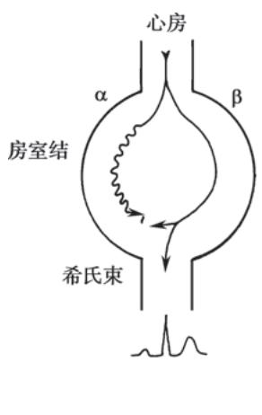

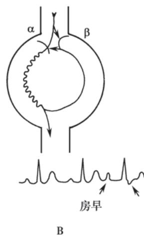

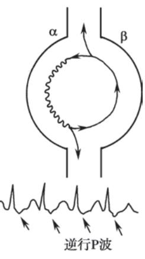  
图 3-3-2 房室结内折返示意图

图示房室结内 $\alpha$ 与 $\beta$ 路径, $\alpha$ 路径传导速度慢, 不应期短; $\beta$ 路径传导速度快, 不应期长。A. 窦性心律时冲动沿 $\beta$ 路径前传至心室, PR 间期正常, 冲动同时循 $\alpha$ 路径前传, 但遭遇不应期未能抵达希氏束; B. 房性期前收缩受阻于 $\beta$ 路径, 由 $\alpha$ 路径缓慢传导至心室, PR 间期延长, 由于传导缓慢, $\beta$ 路径有足够时间恢复兴奋性, 冲动经 $\beta$ 路径逆向传导返回心房, 完成单次折返, 产生一个心房回波; C. 心房回波再循 $\alpha$ 路径前传, 折返持续, 引起房室结内折返性心动过速。

2. 传导阻滞 当冲动传导至某处心肌,如适逢生理性不应期,可形成生理性阻滞或干扰现象。传导障碍并非由于生理性不应期所致者,称为病理性传导阻滞。

3. 异常传导 主要是传导途径异常,可存在一条或多条旁道。房室旁道是最常见的异常途径,少见的旁道包括心房-希氏束、房室结-心室纤维和分支-心室纤维等。窦性或房性冲动经房室旁道提前传导至心室可引起心室预激,房室旁道和正常房室传导途径之间折返而发生房室折返性心动过速。

【心律失常的诊断】

（一）病史 心律失常的诊断应从详尽采集病史开始，让病人客观描述发生心悸等症状时的感受，病史通常能提供对诊断有用的线索。病史询问包括：①发作诱因和频度，起止方式，发作时症状和体征；②既往是否有类似心律失常发作史，以及家族成员中是否有类似发作史；③是否有已知心脏疾病病史；④是否有引起心脏病变的全身性疾病，如甲亢；⑤是否有服药史，尤其是抗心律失常药物、洋地黄类药物和影响电解质的药物；⑥是否置入心脏永久起搏器等。

（二）体格检查 体格检查首要的重点是确定是否存在心血管疾病。检查心率与节律可发现期前收缩、心房颤动、心动过速或过缓等心律失常；完全性房室传导阻滞或房室分离时心律规则，因PR间期不同，第一心音强度亦随之变化。左束支传导阻滞可闻及第二心音反常分裂。

## (三) 心电图检查

1. 静息心电图 是诊断心律失常最重要的无创伤性检查技术,常规心电图分析原则:①根据P波形态特征判断基本心律是窦性心律还是异位心律。②测定P-P或R-R间期,计算心房率或心室率有无心动过速或过缓以及心律不齐。③测定P-R间期和Q-T间期,判断有无延长或缩短。④比较P-P间期和R-R间期,寻找心房律和心室律的关系;并根据各导联波形特征及ST-T改变等特征判断心律失常种类及心肌缺血等。同时,心电图可发现预激综合征的δ波、Brugada综合征特有的右胸导联ST段异常和致心律失常性右心室心肌病的Epsilon波等。高频QRS(high-frequency QRS,Hyper Q)心电技术是一种有潜力的心电图分析方法,高频QRS技术使用150\~250Hz的高频滤通器提取QRS波高频信号,通过对采集信号的波形成像,包括频率、振幅和形态等进行智能分析,来提供更多的心脏电生理信息,可作为常规心电图ST-T改变评估心肌缺血的补充指标,协助冠心病的诊断筛查和危险分层,有助于识别心源性猝死风险人群。信号平均心电图(signal-averaged electrocardiography,SAECG)是使用信号处理技术放大体表心电图中的细微变化,常用于识别QRS波群终末部的低振幅信号,被称为心室晚电位,通常表示心室延迟激动,与心肌梗死后室性心律失常风险的增加有关。

2. 运动心电图 是最广泛使用的一种心电图负荷试验，除常用于检测冠心病引起的心肌缺血和评估预后外，亦用于明确心肌缺血是否合并相关心律失常；评估已知或可疑运动诱发的室性心律失常（如儿茶酚胺敏感性室性心动过速）风险；评估有或无症状的心室预激病人，窦性心律情况下行运动试验如果经显性旁道的传导突然消失，提示该心室预激病人房颤情况下发生快速传导和致命性室性心律失常风险较低；评估已知运动诱发室性心律失常病人对药物或导管消融治疗的疗效等。但应注意，正常人进行运动试验，亦可发生期前收缩和心动过速，如房性期前收缩、室性期前收缩和房性心动过速等。

3. 持续心电监测 是筛查和诊断心律失常的常用方法,主要包括动态心电图(Holter ECG monitoring,简称 Holter)、事件记录器(event recorder)和植入型心电监测仪(insertable cardiac monitor, ICM)等。动态心电图是最常用的无创性持续心电监测技术,由美国生物物理学博士 Norman J. Holter 于 1957 年始创,1961 年用于临床,其检查使用一种小型便携式记录器,连续记录 24\~72 小时心电图,监测中病人日常活动均不受限,主要用于心律失常和心肌缺血检查,包括了解心悸与晕厥等症状的发生是否与心律失常有关,明确心律失常或心肌缺血发作与日常活动的关系、昼夜分布特征、心率变异与 QT 间期变异,以及协助评价抗心律失常药物、起搏器或植入型心律转复除颤器的疗效等。事件记录器适用于间歇发作且不频繁的心律失常诊断,其大小类似于半张信用卡,可携带 30 天,记录发生心律失常及其前后的心电图,通过直接回放或经有线或无线网络传输心电图至接收端后进行心律失常诊断分析。近年来发展的一些可穿戴式心电监测装置(wearable ECG monitor)可通过 4G 或 5G 无线网络实现实时记录病人心电信息,通过云端数据存储和数据分析,理论上可无限期长时间记录心电信息。

植入型心电监测仪是一种植入皮下的微型有创心电监测装置，植入手术简单、寿命可达3年、信号采集更精确，并具有远程监测功能，从而使心律失常的诊断和随访更为方便快捷。目前ICM主要用于明确反复发作的不明原因晕厥是否与心律失常相关，协助心房颤动诊疗的监测和管理等。

（四）经食管心脏电生理检查 经食管心脏电生理检查，又称为食管心房调搏术，由于解剖上左心房后壁毗邻食管，将食管电极经鼻腔送入食管的心房水平，可记录心房和心室电活动(即食管心电图)，并能进行心房快速起搏或程序电刺激。食管心电图能清晰地识别心房与心室电活动，确定房室电活动的关系，鉴别室上性心动过速的类型，以及宽QRS室上性心动过速与室性心动过速的甄别，经食管快速起搏心房可使预激图形更为清晰，有助于确定不典型预激综合征病人。应用电刺激可诱发与终止心动过速,评估窦房结功能,终止药物无效的某些折返性室上性心动过速。食管电生理检查简单易行、安全性高(图 3-3-3),但随着心腔内电生理检查等技术的普及开展,目前临床使用较少。

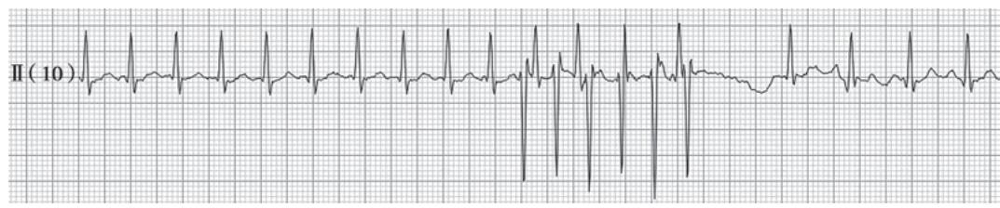  
图 3-3-3 经食管快速心房起搏终止室上性心动过速

图示室上性心动过速、频率 166 次/分。经食管电极发放心房起搏信号(频率为 220 次/分)后,心动过速终止。

（五）心腔内电生理检查 心腔内电生理检查是将几根多电极导管经静脉和/或动脉置于心腔内的不同部位辅以8～12通道以上多导生理仪同步记录各部位电活动，包括高位右心房、希氏束、冠状窦(反映左心房和左心室电活动)和右心室。同时可应用程序电刺激和快速心房或心室起搏，测定心脏不同组织的电生理功能。心腔内电生理检查及治疗主要应用于：①诊断性应用：确诊心律失常及其类型，并明确心律失常的起源部位与发生机制。②治疗性应用：以电刺激终止心动过速发作或评价某项治疗措施能否防止电刺激诱发的心动过速；植入性器械能否正确识别与终止电刺激诱发的心动过速；通过电极导管，以不同种类的能量(射频、冷冻、超声等)消融参与心动过速形成的心肌(即导管消融术)，以达到治愈心动过速的目的。③判断预后：通过电刺激确定病人是否易于诱发室性心动过速、有无发生心脏性猝死的危险。常见需要进行心腔内电生理检查的适应证包括：

1. 窦房结功能测定 临床怀疑病态窦房结综合征,但缺乏心电图证据时,心腔内电生理检查测定窦房结功能有助于明确诊断,测定指标包括窦房结恢复时间(sinus node recovery time, SNRT)、窦房传导时间(sinoatrial conduction time, SACT)、窦房结变时功能不全和固定频率等。正常人SNRT<1500ms,若SNRT>1600ms则为可疑病态窦房结综合征,若SNRT>2000ms则确诊病态窦房结综合征。

2. 房室传导功能与室内传导阻滞 一度或二度Ⅰ型房室传导阻滞最常发生于房室结，二度Ⅱ型房室传导阻滞最常发生于希氏束。体表心电图往往不能准确判断房室与室内传导阻滞的部位，电生理检查则可明确阻滞的确切部位。检查内容包括：测定房室结维持1∶1传导的最高心房起搏频率（正常≥130次/分）；以程序心房刺激测定房室结与希氏束-浦肯野纤维的不应期以及各种传导间期，包括PA（反映心房内传导）、AH（反映房室结传导）、HV（反映希氏束-浦肯野纤维传导）；室内（希氏束分叉以下）阻滞时HV间期显著延长，当超过80ms常提示发生完全性房室传导阻滞的危险性极高。

3. 心动过速 心腔内电生理检查可明确心动过速发病机制，如房室结折返性心动过速存在双径路或多径路折返性传导，程序刺激可见典型跳跃征象（即AH间期突然延长 $>50\mathrm{ms}$ ，提示传导从快径转至慢径）。当出现以下几种情况时应进行心腔内电生理检查：①室上性或室性心动过速反复发作伴有明显症状；②发作不频繁难以明确诊断；③鉴别室上性心动过速伴有室内差异性传导或室性心动过速有困难者；④进行系列的心电生理-药理学试验以确定抗心律失常药物疗效，评价各种非药物治疗方法的效果；⑤心内膜标测确定心动过速的起源部位，并同时进行导管消融治疗。

4. 不明原因晕厥 经全面的病史询问、体格检查及无创伤性心脏检查仍未能明确晕厥病因者，可考虑行心腔内电生理检查。

5. 诊断性药物试验 常用药物试验包括阿托品试验、异丙肾上腺素试验和 ATP 试验等, 其中阿托品试验和异丙肾上腺素试验常用于病态窦房结综合征的诊断、房室传导阻滞的定性定位诊断, 以及室上性心动过速和室性心动过速的诱发和导管消融疗效判定等; ATP 试验常用于终止正在发作的室上性心动过速或鉴定隐匿性旁道等。

（六）三维心脏电生理标测系统 常规心腔内电生理标测基于数字减影血管造影（DSA）影像，对于复杂心律失常的空间定位不准确，手术成功率不高，使得手术时间与X线曝光时间较长。心脏三维标测系统是近年来迅速发展并广泛应用的新标测技术，以其直观性强、标测效率和安全性高、减少X线曝光剂量和学习曲线短等优势，已广泛应用于所有复杂心律失常导管消融治疗。临床上常应用的三维标测系统包括Carto和EnSite两个系统。Carto三维标测系统是基于磁场定位提供模型稳定的心脏三维电解剖图，EnSite三维标测系统是基于电场定位提供电位精准的心脏三维电解剖图。随着技术更新迭代，最新一代Carto和EnSite三维标测系统均融合了磁场和电场双定位模式，助力于构建更稳定、更精准的心脏三维电解剖图；另外，还能将心脏三维电解剖图与多排螺旋CT或MRI增强扫描所获得的心腔血管的三维解剖图融合，以便更加真实准确地反映心腔大血管解剖形态和相关位置关系；同时，通过心腔内导管采集的全心腔内心电活动信息，经系统运算后还能直观地显示出心动过速的起源、传导径路、折返激动环路、缓慢传导区域等重要信息，更方便理解心律失常发生机制并制订导管消融策略。近年来逐渐兴起的绿色电生理理念，即在三维标测系统和心腔内超声指导下，以达到无射线或极低剂量射线完成心律失常的电生理检查和导管消融治疗的目的。

（七）心脏影像学 心脏影像学检查有助于评估心脏结构和功能异常与心律失常的关系。超声心动图是最常用的心脏影像学检查，包括经胸超声心动图（transthoracic echocardiography, TTE）、经食管超声心动图（transesophageal echocardiography, TEE）和心腔内超声心动图（intracardiac echocardiography, ICE）。临床常用TTE评估心脏结构和功能异常与心律失常的关系，例如合并心室收缩功能障碍和心腔扩大的各类心肌病或心肌炎病人，更易发生快速型室性心律失常；三尖瓣下移畸形（Ebstein畸形）病人更易引起房室折返性心动过速。ICE是将微型超声探头安装在心导管的顶端，经外周血管（动脉或静脉）输送至心腔内对心脏及其邻近组织进行实时高质量成像和/或血流动力学测定的超声成像技术，可直接显示心脏解剖结构，有助于明确心脏内各部位之间的解剖关系，已逐渐开始应用于电生理学领域，指导各种心脏介入手术。此外，心脏磁共振成像（MRI）近年来也常被用于协助筛查心肌梗死后心肌瘢痕负荷，观察致心律失常性右心室心肌病病人心肌纤维脂质浸润，以及检测影响心律失常易感性的其他结构变化等。增强MRI和 $^{18}$ F-氟代脱氧葡萄糖正电子发射断层扫描与计算机断层扫描（ $^{18}$ F-FDG PET-CT）已用于心脏结节病的诊断与治疗反应评估。

（八）直立倾斜试验（head-up tilt testing, HUT） 直立倾斜试验是评价自主神经功能的一种常用方法，通过改变病人体位，造成人体循环血量在重力作用下向下肢分布，引发人体神经介导反射活动，进而诱导反射性晕厥的发生。直立倾斜试验阳性表现为：血压下降（如收缩压下降＞20～30mmHg、舒张压下降＞10mmHg）、心率显著降低＜40次/分或心脏停搏＞3秒、脑灌注降低，出现晕厥先兆，甚至意识丧失等；部分可表现心率异常增快＞120次/分或增加超过30次/分。HUT常用于诊断反复不明原因晕厥、鉴别血管迷走神经性晕厥与直立性低血压和体位性心动过速综合征等。

（九）基因检测 基因检测常用于反复发生恶性心律失常甚至猝死的幸存者，以及发病年龄较轻、具有家族遗传史且高度怀疑离子通道病的病人。离子通道病种类繁多，同一种离子通道的不同变异可有不同的临床表型，而同一种临床表型可由不同离子通道病产生。目前初步明确的常见离子通道病包括长QT间期综合征、短QT间期综合征、Brugada综合征、早期复极综合征、儿茶酚胺敏感性室性心动过速、特发性心室颤动、遗传性心脏传导阻滞及家族性心房颤动等。基因检测有助于筛查家系中潜在的病人，明确基因缺陷及基因型与表型的关系，并指导治疗方案，然而目前仍有很多离子通道病的致病基因尚未完全阐明。

## 第二节 | 窦性心律失常

正常窦性心律的冲动起源于窦房结,频率为60～100次/分。心电图显示窦性心律的P波在I、Ⅱ、aVF导联直立,aVR导联倒置;PR间期为0.12～0.20秒。窦性心律失常是由于窦房结冲动发放频率的异常或窦性冲动向心房的传导受阻所导致的心律失常。根据心电图及临床表现分为窦性心动过速、窦性心动过缓、窦性停搏、窦房传导阻滞以及病态窦房结综合征。

## 一、窦性心动过速

成人窦性心律的频率超过100次/分为窦性心动过速（sinus tachycardia）(图3-3-4)。目前临床上分为生理性窦性心动过速和不适当窦性心动过速。生理性窦性心动过速通常见于健康人、吸烟、饮茶或咖啡、饮酒、体力活动及情绪激动时；也可见于某些病理状态，如发热、甲亢、贫血、休克、心肌缺血、心力衰竭以及应用肾上腺素、阿托品等药物时。不适当窦性心动过速是指在静息状态下心率的持续性增快，或心率的增快与生理、情绪激动、病理状态或药物作用无关或不相一致，其发生机制不明，可能与窦房结本身的自律性增强，或自主神经对窦房结的调节异常有关。窦性心动过速通常逐渐开始和终止，频率大多在 $100\sim 150$ 次/分。窦性心动过速的治疗应针对病因和去除诱发因素，如治疗心力衰竭、纠正贫血、控制甲亢等。必要时单用或联合应用 $\beta$ 受体拮抗剂、非二氢吡啶类钙通道阻滞剂（如地尔硫草）；如上述药物无效或不能耐受，可选用窦房结内向电流 $\mathrm{I_f}$ 抑制剂伊伐布雷定。

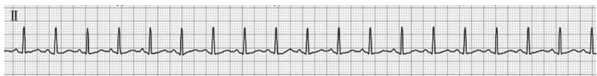  
图 3-3-4 窦性心动过速  
Ⅱ导联的 P 波正向, PR 间期 0.13 秒, 心率 115 次/分。

## 二、窦性心动过缓

成人窦性心律的频率低于60次/分称为窦性心动过缓（sinus bradycardia）(图3-3-5)。窦性心动过缓常同时伴有窦性心律不齐(不同PP间期的差异 $>0.12$ 秒)。窦性心动过缓常见于健康的青年人、运动员及睡眠状态；其他原因包括颅内疾病、严重缺氧、低温、甲状腺功能减退和血管迷走性晕厥等，以及应用拟胆碱药物、胺碘酮、 $\beta$ 受体拮抗剂、非二氢吡啶类钙通道阻滞剂或洋地黄类等药物；窦房结病变和急性下壁心肌梗死亦常发生窦性心动过缓。无症状的窦性心动过缓通常无需治疗。如因心率过慢，出现心排血量不足症状如头晕、黑朦、乏力，可应用阿托品或异丙肾上腺素等药物，但长期应用往往效果不确定，易发生严重副作用，故应考虑心脏起搏治疗。

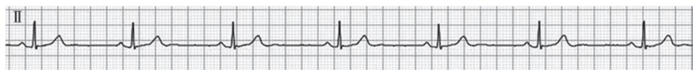  
图 3-3-5 窦性心动过缓  
Ⅱ导联的 P 波正向, PR 间期 0.18 秒, 心率 48 次/分。

## 三、窦性停搏

窦性停搏或窦性静止（sinus pause or sinus arrest）是指窦房结不能产生冲动。心电图表现为在较正常PP间期显著长的间期内无P波发生，或P波与QRS波均不出现，长的PP间期与基本窦性PP间期无倍数关系(图3-3-6)。长时间的窦性停搏后，下位的潜在起搏点，如房室交界处或心室，可发出单个逸搏或逸搏性心律控制心室。窦性停搏多见于窦房结变性与纤维化、急性下壁心肌梗死、脑血管意外等病变以及迷走神经张力增高或颈动脉窦过敏；此外，应用洋地黄类药物、乙酰胆碱等亦可引起窦性停搏。过长时间的窦性停搏（>3秒）且无逸搏发生时，病人可出现黑矇、短暂意识障碍或晕厥，严重者可发生阿-斯(Adams-Stokes)综合征，甚至死亡。治疗可参照病态窦房结综合征。

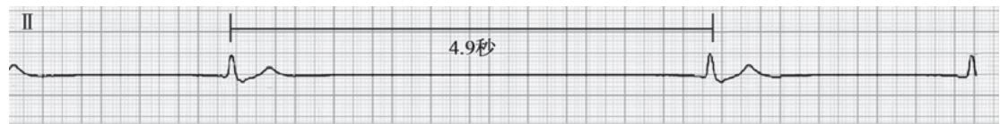  
图 3-3-6 窦性停搏伴室性逸搏  
Ⅱ导联无窦性 P 波, 最长 RR 间期 4.9 秒, QRS 波群宽大畸形, 时间 0.12 秒。

## 四、窦房传导阻滞

窦房传导阻滞（sinoatrial block, SAB）指窦房结冲动传导至心房时发生延缓或阻滞。理论上SAB可分为三度，由于体表心电图不能显示窦房结电活动，因而通过体表心电图无法确定一度和三度窦房传导阻滞的诊断。二度窦房传导阻滞分为两型：莫氏（Mobitz）I型即文氏（Wenckebach）阻滞，表现为PP间期进行性缩短，直至出现一次长PP间期，该长PP间期短于基本PP间期的两倍(图3-3-7)；莫氏Ⅱ型阻滞时，长PP间期为基本PP间期的整倍数。窦房传导阻滞后可出现逸搏心律。窦房传导阻滞的病因及治疗参见病态窦房结综合征。

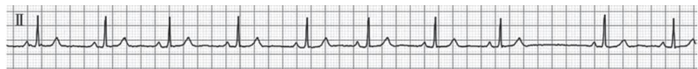  
图 3-3-7 二度 I 型窦房传导阻滞  
Ⅱ导联可见窦性 PP 间期逐渐缩短,直至出现一次长 PP 间期,长的 PP 间期(1.47 秒)短于基本 PP 间期(0.95 秒)的两倍。

## 五、病态窦房结综合征

病态窦房结综合征（sick sinus syndrome, SSS）简称病窦综合征，是由窦房结病变导致功能减退，产生多种心律失常的综合表现。病人可在不同时间出现一种以上的心律失常，常同时合并心房自律性异常，部分病人同时有房室传导功能障碍。

【病因】众多病变过程,如窦房结纤维化与脂肪浸润、硬化与退行性变、淀粉样变性、甲状腺功能减退、某些感染(布鲁氏菌病、伤寒)等均可损害窦房结,导致窦房结起搏与窦房传导功能障碍;窦房结动脉供血减少、窦房结周围神经和心房肌的病变亦是SSS的病因;颈动脉窦过敏、脑血管意外、高血钾、迷走神经张力增高、某些抗心律失常药物如洋地黄类药物、乙酰胆碱等抑制窦房结功能亦可导致窦房结功能障碍,应注意鉴别。

【临床表现】病人出现与心动过缓有关的心、脑等脏器供血不足的症状，如发作性头晕、黑朦、心悸、乏力和运动耐力下降等；严重者可出现心绞痛、心力衰竭、短暂意识障碍或晕厥，甚至猝死。如有心动过速发作，则可出现心悸、心绞痛等症状。

【心电图特征】心电图的主要表现包括:①非药物引起的持续而显著的窦性心动过缓(50次/分以下);②窦性停搏或窦性静止、窦房传导阻滞;③窦房传导阻滞与房室传导阻滞并存;④心动过缓-心动过速综合征(bradycardia-tachycardia syndrome),简称慢-快综合征,是指心动过缓与房性快速型心律失常(心房扑动、心房颤动或房性心动过速)交替发作。

病态窦房结综合征的其他心电图改变为:①未应用抗心律失常药物的情况下,心房颤动的心室率缓慢,或其发作前后有窦性心动过缓和/或一度房室传导阻滞;②变时功能不全,表现为运动后心率提高不显著;③房室交界性逸搏心律等。

根据心电图的典型表现,或临床症状与心电图改变存在明确的相关性,即可确定诊断。为确定症状与心电图改变的关系,可作单次或多次动态心电图或事件记录器检查,如晕厥等症状发作的同时记录到显著的心动过缓或心脏停搏,即可提供有力佐证。

【治疗】若病人无心动过缓相关的症状,不必治疗,仅定期随诊观察。对于有症状的病态窦房结综合征病人,应接受永久起搏器置入治疗(参考本章第八节)。

慢-快综合征病人发生心动过速，单独应用抗心动过速药物治疗可能会加重心动过缓，通常需在接受起搏治疗后才能使用此类药物。部分慢-快综合征病人在快速型心律失常得到矫正后(如导管消融房颤)，其缓慢型心律失常(包括窦性停搏、窦性心动过缓)及其症状可减轻甚至消失，因此可能无需安装永久起搏器。此外，由于慢-快综合征病人合并心房扑动或心房颤动使血栓栓塞发生率增高，应考虑抗栓治疗。

## 第三节 | 房性心律失常

## 一、房性期前收缩

房性期前收缩（premature atrial beats），也称房性早搏，简称房早，是指起源于窦房结以外心房的任何部位的心房激动，是临床上常见的心律失常。

【临床表现】主要表现为心悸，自觉有停跳感，部分伴有胸闷、乏力等；有些病人可能无任何症状。房早多为功能性，正常成人进行24小时动态心电图监测，大约60%有房早发生。在各种器质性心脏病如冠心病、肺心病、心肌病等病人中，房早发生率明显增加，并常可引起其他快速型房性心律失常。

【心电图特征】心电图表现为:①P波提前发生,与窦性P波形态不同;②PR间期>120ms;③QRS波群呈室上性,部分可有室内差异性传导;④多为不完全代偿间歇。如发生在舒张早期,适逢房室结尚未脱离前次搏动的不应期,可产生传导中断,无QRS波发生(被称为阻滞的或未下传的房早)或缓慢传导(下传的PR间期延长)现象(图3-3-8)。

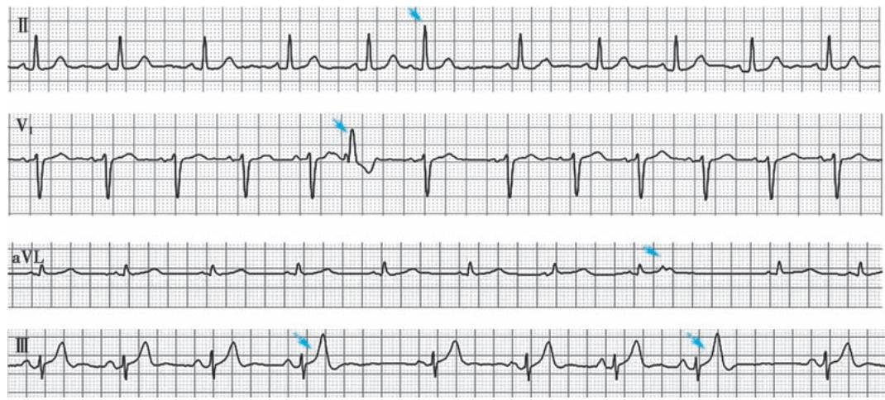  
图 3-3-8 房性期前收缩

Ⅱ导联箭头处为房早； $V_{1}$ 导联箭头处为房早伴室内差异性传导；aVL 和Ⅲ导联箭头处均为未下传的房早，aVL 导联提前出现的房性 P 波与前面的 T 波部分融合，Ⅲ导联提前出现的房性 P 波与前面的 T 波完全融合，导致 T 波高耸。

【治疗】房早通常无需治疗。吸烟、饮酒和咖啡均可诱发房早，应劝导病人戒除或减量。有症状或当房早诱发心动过速发生时，可用 $\beta$ 受体拮抗剂或非二氢吡啶类钙通道阻滞剂治疗。

## 二、房性心动过速

房性心动过速(atrial tachycardia)简称房速,指起源于心房且无需房室结参与维持的心动过速。

发生机制包括自律性增加、折返与触发活动。根据起源点不同，分为局灶性房性心动过速（focal atrial tachycardia）和多源性房性心动过速（multifocal atrial tachycardia），后者也称为紊乱性房性心动过速（chaotic atrial tachycardia），是严重肺部疾病常见的心律失常，最终可能发展为心房颤动。

【病因】冠心病、慢性肺部疾病、洋地黄中毒、大量饮酒以及各种代谢障碍均可成为致病原因。心脏外科手术或导管消融术后所致的手术瘢痕也可引起房性心动过速，亦可见于部分心脏结构正常的病人。

【临床表现】常表现为心悸、头晕、胸痛、憋气和乏力等，部分病人可能无任何症状。合并器质性心脏病的病人甚至可表现为晕厥、心肌缺血或肺水肿等。症状发作可呈短暂、间歇或持续发生。当房室传导比例发生变动时，听诊心律不恒定，第一心音强度发生变化。

【心电图特征】局灶性房速心电图特征包括:①心房率通常为150～200次/分;②P波形态与窦性P波不同;③当心房率加快时可出现二度I型或Ⅱ型房室传导阻滞,呈现2∶1房室传导亦属常见,但心动过速不受影响;④P波之间的等电线仍存在(与心房扑动时等电线消失不同);⑤刺激迷走神经不能终止心动过速,仅加重房室传导阻滞;⑥发作开始时心率逐渐加速(图3-3-9)。

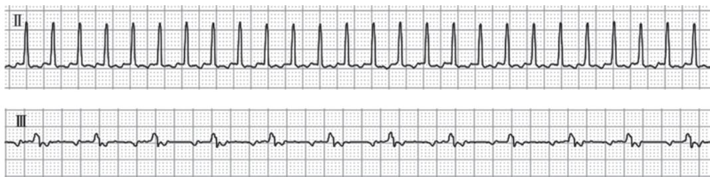  
图 3-3-9 局灶性房性心动过速  
Ⅱ导联心房率 187 次/分, 房室间呈 1:1 传导; Ⅲ导联心房率 167 次/分, 房室间呈 2:1 传导。

多源性房速心电图特征包括:①通常有3种或以上形态各异的P波,PR间期各不相同;②心房率100\~130次/分;③大多数P波能下传心室,但部分P波因过早发生而受阻,心室率不规则(图3-3-10)。

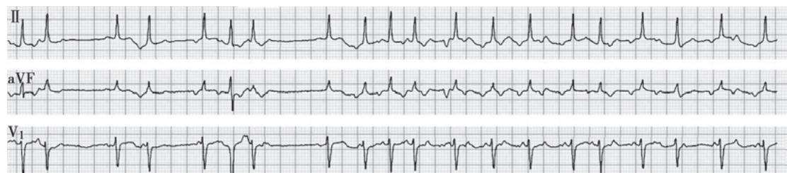  
图 3-3-10 多源性房性心动过速  
Ⅱ、aVF、 $V_{1}$ 导联 P 波呈多种形态，部分房室间呈 2:1～1:1 传导。

【治疗】 房速的处理主要取决于心室率的快慢及病人的血流动力学情况。如心室率不太快且无严重的血流动力学障碍，可选择口服β受体拮抗剂，不伴器质性心脏病，可选择非二氢吡啶类钙通道阻滞剂和Ic类(普罗帕酮)抗心律失常药。如心室率达140次/分以上，由洋地黄中毒所致或临床上有严重充血性心力衰竭或休克征象，应进行紧急治疗。其处理方法如下：①病因与诱因治疗：主要是针对基础疾病治疗。肺部疾病病人应纠正低氧血症、控制感染；如洋地黄中毒引起者，需立即停用并纠正可能伴随的电解质紊乱，特别要警惕低钾血症。②控制心室率：急性期血流动力学稳定且无失代偿性心力衰竭可静脉使用β受体拮抗剂或非二氢吡啶类钙通道阻滞剂，当药物治疗不能控制心室率时，可考虑同步直流电复律。对于药物治疗无效反复发作的多源性房性心动过速伴左心室功能不全病人，可考虑房室结消融联合永久起搏器治疗。③转复窦性心律：优先使用腺苷转复治疗，若无效，可选择 Ic(普罗帕酮)或Ⅲ类(胺碘酮、伊布利特等)抗心律失常药。血流动力学不稳定者立即行同步直流电复律。对于反复发作或引起心动过速性心肌病的局灶性房性心动过速，首选导管消融治疗。

## 三、心房扑动

心房扑动（atrial flutter）简称房扑，是介于房速和房颤之间的快速型心律失常。健康者很少见，病人多伴有器质性心脏病。

## 【病因】

多见于冠心病、瓣膜病、高血压心脏病和心肌病等器质性心脏病。此外，肺栓塞、甲状腺功能亢进、酒精中毒和心包炎等，亦可出现房扑。部分病人也可无明显病因。

【临床表现】病人的症状主要与房扑的心室率相关，心室率不快时，病人可无症状；房扑伴有极快的心室率时，可诱发心绞痛与心力衰竭。房扑往往有不稳定的倾向，可恢复窦性心律或进展为心房颤动，但亦可持续数个月或数年。房扑病人也可产生心房血栓，进而引起血栓栓塞。体格检查可见快速的颈静脉扑动。当房室传导比例发生变化时，第一心音强度亦随之变化。有时能听到心房音。

【心电图特征】心电图特征包括:①窦性P波消失,代之以振幅、间距相同的有规律的锯齿状扑动波,称为F波,扑动波之间的等电线消失,频率常为250\~350次/分;②心室率规则或不规则,取决于房室传导比例是否恒定,房扑波多以2:1和4:1交替下传;③QRS波形态多正常,当出现室内差异传导、原先有束支传导阻滞或经房室旁路下传时,QRS波增宽且形态异常(图3-3-11)。

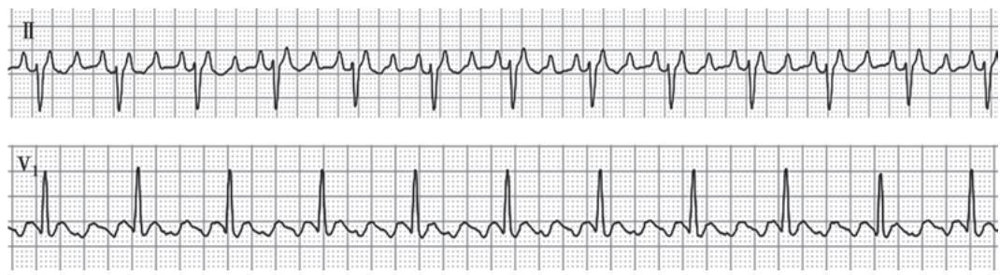  
图 3-3-11 心房扑动  
Ⅱ、 $V_{1}$ 导联均可见快速而规则的锯齿状扑动波(F 波),频率 300 次/分,RR 间期规则,房室传导比例为 3:1。

## 【治疗】

1. 药物治疗 减慢心室率的药物包括 $\beta$ 受体拮抗剂、非二氢吡啶类钙通道阻滞剂(维拉帕米、地尔硫草)或洋地黄类药物(地高辛、毛花苷丙)。转复房扑并预防复发的药物主要是Ⅲ类(伊布利特、多非利特和胺碘酮)抗心律失常药,伊布利特用于新发房扑复律治疗,禁用于严重器质性心脏病、QT间期延长和窦房结功能障碍者;多非利特亦可选用。长期维持窦性心律可选用胺碘酮、多非利特或索他洛尔等药物。

2. 非药物治疗 血流动力学不稳定的急性期病人,立即行同步直流电复律。有症状、反复发作的房扑或持续性房扑导致心动过速性心肌病的病人,应行导管消融治疗。

3. 抗凝治疗 持续性房扑的病人发生血栓栓塞的风险明显增高,应给予抗凝治疗。具体抗凝策略同心房颤动。

## 四、心房颤动

心房颤动（atrial fibrillation, AF）简称房颤，是最常见的心律失常之一，是指规则有序的心房电活动丧失，代之以快速无序的颤动波，是最严重的心房电活动紊乱。心房无序的颤动使之失去了有效的收缩与舒张，心房泵血功能恶化或丧失，加之房室结对快速心房激动的递减传导，引起心室极不规则的反应。因此，心室律(率)紊乱、心功能受损和心房附壁血栓形成是房颤病人的主要病理生理特点。

2004 年中国部分区域 30～85 岁人群的流行病学调查显示,我国房颤患病率约为 0.77%,≥80 岁人群中可高达 7.5%。2010 年,世界范围内房颤患病率约为 3%。

【病因】 房颤常发生于器质性心脏病病人,多见于冠心病、高血压心脏病、瓣膜病、心肌病以及甲状腺功能亢进,其次缩窄性心包炎、慢性肺源性心脏病、预激综合征以及高龄老人也可合并房颤。部分房颤原因不明,可见于正常人,在情绪激动、外科手术、运动或大量饮酒时发生。

【分类】一般将房颤分为阵发性房颤（paroxysmal AF）、持续性房颤（persistent AF）、持久性房颤（long-standing persistent AF）及永久性房颤（permanent AF）（表3-3-1）。

表 3-3-1 房颤的临床分类

<table><tr><td>名称</td><td>临床特点</td></tr><tr><td>阵发性房颤</td><td>持续时间≤7天(常≤48小时),能自行终止</td></tr><tr><td>持续性房颤</td><td>持续时间&gt;7天,非自限性</td></tr><tr><td>持久性房颤</td><td>持续时间≥1年,病人有转复愿望</td></tr><tr><td>永久性房颤</td><td>持续时间&gt;1年,不能终止或终止后又复发</td></tr></table>

【临床表现】房颤症状的轻重受心室率快慢的影响。心室率超过150次/分，病人可发生心绞痛与心力衰竭；心室率不快时，病人症状较轻或无症状。房颤时心房有效收缩消失，心排血量比窦性心律时减少达25%或更多。

房颤并发血栓栓塞的危险性甚大，尤以脑栓塞危害最大，常可危及生命并严重影响病人的生存质量。栓子来自左心房，多在左心耳部，因心房失去收缩力、血流淤滞所致。非瓣膜性心脏病合并房颤者发生脑栓塞的机会较无房颤者高出5～7倍；二尖瓣狭窄或二尖辨脱垂合并房颤时，脑栓塞的发生率更高。

心脏听诊第一心音强度变化不定，心律极不规则。当心室率快时可发生脉搏短绌，原因是许多心室搏动过弱以致未能开启主动脉瓣，或因动脉血压波太小，未能传导至外周动脉。

当房颤病人的心室律变得规则,应考虑以下的可能性:①恢复窦性心律;②转变为房性心动过速;③转变为房扑(固定的房室传导比率);④发生房室交界性心动过速或室性心动过速。如心室律变为慢而规则(30\~60次/分),提示可能出现完全性房室传导阻滞。心电图检查有助于确立诊断。房颤病人并发房室交界性与室性心动过速或完全性房室传导阻滞,常见原因是洋地黄中毒。

【心电图特征】心电图特征包括:①P波消失,代之以小而不规则的基线波动,形态与振幅均变化不定,称为f波;频率为350\~600次/分。②心室率极不规则。③QRS波形态通常正常,当心室率过快,发生室内差异性传导,QRS波增宽变形(图3-3-12)。

【治疗】 房颤治疗强调长期综合管理,即在治疗原发疾病和诱发因素基础上,积极预防血栓栓塞、转复并维持窦性心律及控制心室率,这是房颤治疗的基本原则。

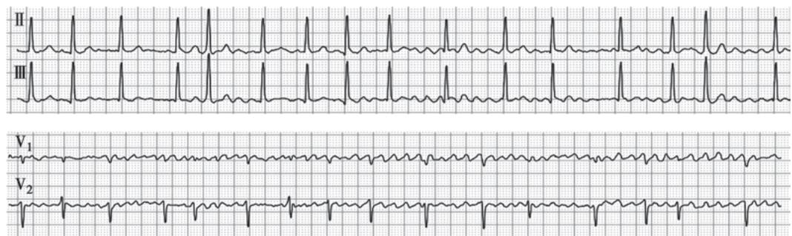  
图 3-3-12 心房颤动  
房颤波(f波)频率约375次/分,平均心室率约102次/分,RR间期极不规则。

1. 抗凝治疗 房颤病人的栓塞发生率较高,因此,抗凝治疗是房颤治疗的重要内容。非瓣膜性房颤需要使用 $CHA_{2}DS_{2}-VASc$ 评分系统进行血栓栓塞危险评估(表3-3-2)。 $CHA_{2}DS_{2}-VASc$ 评分男性≥2分或女性≥3分,应抗凝治疗;当评分男性为1分或女性为2分时,应根据获益与风险权衡,可考虑抗凝治疗;当评分男性为0分或女性为1分时,通常无需抗凝治疗。合并中重度二尖瓣狭窄或机械瓣置换术后的瓣膜性房颤病人,无需行 $CHA_{2}DS_{2}-VASc$ 评分,直接选择华法林抗凝治疗。房颤抗凝治疗前应常规进行出血风险评估,临床上常用 HAS-BLED 评分系统(表3-3-3)。HAS-BLED 评分≥3分为高出血风险。但应当注意,对于高出血风险病人应积极纠正可逆的出血危险因素,不应将 HAS-BLED 评分增高视为抗凝治疗的禁忌证。

表 3-3-2 非瓣膜病性心房颤动脑卒中危险 CHA₂DS₂-VASc 评分

<table><tr><td>危险因素</td><td>CHA2DS2-VASc/分</td></tr><tr><td>心力衰竭/左心室功能障碍(C)</td><td>1</td></tr><tr><td>高血压(H)</td><td>1</td></tr><tr><td>年龄≥75岁(A)</td><td>2</td></tr><tr><td>糖尿病(D)</td><td>1</td></tr><tr><td>脑卒中/TIA/血栓栓塞病史(S)</td><td>2</td></tr><tr><td>血管疾病(V)</td><td>1</td></tr><tr><td>年龄65~74岁(A)</td><td>1</td></tr><tr><td>性别(女性,Sc)</td><td>1</td></tr></table>

注：TIA，短暂性脑缺血发作。血管疾病包括：既往心肌梗死、外周动脉疾病、主动脉斑块。

表 3-3-3 出血风险评估 HAS-BLED 评分

<table><tr><td>临床特点</td><td>计分/分</td></tr><tr><td>未控制的高血压(H)</td><td>1</td></tr><tr><td>肝、肾功能异常(各1分,A)</td><td>1或2</td></tr><tr><td>脑卒中(S)</td><td>1</td></tr><tr><td>出血(B)</td><td>1</td></tr><tr><td>INR易波动(L)</td><td>1</td></tr><tr><td>老年(年龄&gt;65岁,E)</td><td>1</td></tr><tr><td>药物或嗜酒(各1分,D)</td><td>1或2</td></tr><tr><td>最高值</td><td>9分</td></tr></table>

注：未控制的高血压定义为收缩压 $>160\mathrm{mmHg}$ ；肝功能异常定义为慢性肝病(如肝纤维化)或胆红素 $>2$ 倍正常值上限，丙氨酸转氨酶 $>3$ 倍正常值上限；肾功能异常定义为慢性透析或肾移植或血清肌酐 $\geqslant 200\mu \mathrm{mol} / \mathrm{L}$ ；出血指既往出血史和/或出血倾向；INR易波动指INR不稳定，在治疗窗内的时间 $< 60\%$ ；药物指合并应用抗血小板药物或非甾体抗炎药。

华法林是房颤抗凝治疗的有效药物。口服华法林，使凝血酶原时间 INR 维持在 2.0～3.0 之间，能安全而有效预防脑卒中发生。合并中重度二尖瓣狭窄或心脏机械瓣置换术的病人，首选华法林。华法林抗凝治疗有效治疗窗窄，易受药物和食物等因素的影响，需加强 INR 的动态监测，提高其治疗的有效性和安全性。华法林导致严重出血者可给予维生素 $K_{1}$ 治疗。

新型口服抗凝药（non-vitamin-K-antagonist oral anticoagulants, NOAC）包括直接抑制凝血酶的达比加群，以及抑制Xa因子的利伐沙班、阿哌沙班等。NOAC具有良好的有效性和安全性。与华法林相比，NOAC不需常规监测凝血指标，无食物的相互作用，药物相互作用少，有更好的依从性；因此，非瓣膜性房颤病人首选NOAC抗凝治疗。NOAC导致的严重或致命性出血可使用依达赛珠单抗和Andexanet $\alpha$ 分别逆转达比加群和Xa因子抑制剂的抗凝活性。

房颤持续超过 48 小时的病人,在复律前应接受 3 周抗凝治疗,或经食管超声心动图除外心房血栓后再行复律,转复后继续抗凝治疗 4 周。紧急复律治疗可选用静脉注射肝素或皮下注射低分子量肝素抗凝。

经皮左心耳封堵治疗是预防卒中或体循环栓塞事件的策略之一。对于不适合长期抗凝治疗或长期规范抗凝治疗基础上仍发生脑卒中或栓塞事件、HAS-BLED评分≥3分的病人，可考虑左心耳封堵术。

2. 转复并维持窦性心律 房颤复律存在血栓栓塞的风险,复律前应充分评估血栓栓塞风险,房颤持续超过48小时的病人均应评估血栓风险,复律前给予规范抗凝治疗。房颤转复为窦性心律的方法包括药物复律、电复律及导管消融治疗。复律并维持窦性心律的主要药物是Ic类(普罗帕酮)和Ⅲ类(胺碘酮、伊布利特、决奈达隆、索他洛尔)抗心律失常药物。无器质性心脏病者可选择普罗帕酮、伊布利特,复律后窦性心律的维持可选择普罗帕酮、决奈达隆、索他洛尔;有严重器质性心脏病应选择胺碘酮复律并维持窦性心律,但在治疗中需充分考虑胺碘酮的副作用。药物复律无效时,可采用电复律;如病人房颤发作伴严重血流动力学障碍或急性心力衰竭,宜紧急施行电复律。复律治疗成功与否与房颤持续时间的长短、左心房大小和年龄有关。

导管消融的有效性和安全性已得到众多临床研究证实，与抗心律失常药物相比，在维持窦性心律方面优于药物治疗，并可显著降低房颤复发风险、改善病人的症状和生活质量。对于有症状的阵发性房颤，首选导管消融；有症状的房颤病人如药物治疗无效或不能耐受，以及左心室射血分数下降的病人，应选择导管消融治疗。此外，外科迷宫手术、房颤杂交消融手术也可用于维持窦性心律。

3. 控制心室率 房颤伴快速心室率是产生症状的主要原因,长时间的快速心室率可引起血流动力学不稳定或导致心动过速性心肌病。因此,有效控制心室率是房颤管理的重要环节。对于无症状的房颤,且左心室收缩功能正常,控制静息心室率<110次/分;对于症状性明显或出现心动过速性心肌病时,应控制静息心室率<80次/分且中等运动时心室率<110次/分。

控制心室率的药物包括 $\beta$ 受体拮抗剂、非二氢吡啶类钙通道阻滞剂、洋地黄制剂和某些抗心律失常药物(如胺碘酮)，可单用或者联合应用，但应注意这些药物的禁忌证。射血分数保留的心力衰竭病人可选择 $\beta$ 受体拮抗剂或/和非二氢吡啶类钙通道阻滞剂。射血分数下降的心力衰竭病人首选 $\beta$ 受体拮抗剂，当心室率控制不达标或 $\beta$ 受体拮抗剂有使用禁忌时，应考虑使用洋地黄类药物或/和胺碘酮。达到严格心室率控制目标后，应行24小时动态心电图监测以评估有无心动过缓和心脏停搏情况。

对于房颤伴快速心室率、药物治疗无效者，可行房室结消融联合永久性起搏器植入以控制心室率。

## 第四节 | 房室交界性心律失常

## 一、房室交界性期前收缩

房室交界性期前收缩（premature atrioventricular junctional beats）简称交界性期前收缩。其冲动起源于房室交界区，可前向和逆向传导，分别产生提前发生的QRS波与逆行P波；逆行P波可位于QRS波之前（PR间期<0.12秒）、之中或之后（RP间期<0.20秒）；QRS波形态正常(图3-3-13)，当发生室内差异性传导时，QRS波形态可有变化。

房室交界性期前收缩通常无需治疗。

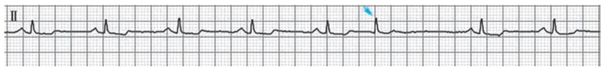  
图 3-3-13 房室交界性期前收缩  
箭头指示为房室交界性期前收缩。

## 二、房室交界性逸搏与心律

房室交界区组织在正常情况下不表现出自律性,称为潜在起搏点。下列情况时,潜在起搏点可成为主导起搏点:①由于窦房结发放冲动频率减慢,低于潜在起搏点的固有频率;②由于传导障碍,窦房结冲动不能抵达潜在起搏点部位,潜在起搏点自动除极产生逸搏。房室交界性逸搏(AV junctional escape beats)的心电图表现为在长于正常PP间期的间歇后出现一个正常的QRS波,P波缺失,或逆行P波位于QRS波之前或之后,此外,亦可见到未下传至心室的窦性P波。

房室交界性心律（AV junctional rhythm）指房室交界性逸搏连续发生而形成的节律。心电图显示正常下传的QRS波，频率为40～60次/分，可有逆行P波或存在独立、缓慢的心房电活动，从而形成房室分离，此时，心室率超过心房率(图3-3-14)。

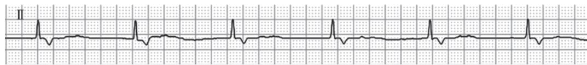  
图 3-3-14 房室交界性心律  
RR 间期 1.24 秒, 频率为 48 次/分, QRS 波群后出现逆行 P 波, RP=0.15 秒。

房室交界性逸搏或心律的出现，与迷走神经张力增高、显著的窦性心动过缓或房室传导阻滞有关，并作为防止心室停搏的生理保护机制。一般无需治疗，必要时可起搏治疗。

## 三、非阵发性房室交界性心动过速

非阵发性房室交界性心动过速（nonparoxysmal atrioventricular junctional tachycardia）的发生机制与房室交界区组织的自律性增高或触发活动有关。最常见的病因为洋地黄中毒，其次为下壁心肌梗死、心肌炎、急性风湿热或心脏瓣膜手术后等，亦偶见于正常人。

心动过速发作起始与终止时，心率逐渐变化，有别于突发突止的阵发性折返性心动过速，故称为“非阵发性”。心率70～150次/分或更快，心律通常规则，QRS波群正常，自主神经系统张力变化可影响心率快慢。如心房的电活动由窦房结或异位心房起搏点控制，可发生房室分离。洋地黄过量引起者，经常合并房室交界区文氏型传导阻滞，使心室律变得不规则。

治疗主要针对基本病因。本型心律失常通常能自行消失，如病人耐受性良好，仅需密切观察和治疗原发疾病。已用洋地黄或疑洋地黄中毒者应立即停用洋地黄，补充钾盐，不宜施行电复律；如与洋地黄无关，可应用β受体拮抗剂、非二氢吡啶类钙通道阻滞剂或洋地黄治疗。其他药物可选用Ia、Ic与Ⅲ类(胺碘酮)抗心律失常药物。

## 四、房室交界区相关的折返性心动过速

房室交界区相关的折返性心动过速主要包括房室结折返性心动过速（atrioventricular nodal reentrant tachycardia, AVNRT）和房室折返性心动过速（atrioventricular reentrant tachycardia, AVRT）两大类，临床特征表现为规律而快速的心动过速，呈突然发作与终止，心电图多表现为QRS波群形态正常、RR间期规则的快速心律，故在临床上又统称为阵发性室上性心动过速（paroxysmal supraventricular tachycardia, PSVT），简称室上速。其共同的发生机制是折返，前者的折返环路位于房室结内；后者由房室交界区、旁道与心房、心室共同组成折返环路，与预激综合征密切相关。

## 房室结折返性心动过速

【病因】病人多无器质性心脏病,常见于年轻人,相当部分病人有长期反复发作病史。

【临床表现】心动过速呈阵发性,突发突止;持续时间长短不一,可数分钟或数小时,甚者可达数天。症状包括突发的心悸、胸闷、焦虑不安、头晕、疲劳,少见有晕厥、心绞痛、心力衰竭与休克。症状轻重取决于发作时心室率加快的程度以及持续时间，亦与是否合并器质性心脏病及其严重程度相关。若发作时心室率过快，使心排血量与脑血流量锐减，或心动过速猝然终止，窦房结未能及时恢复自律性导致心搏停顿，则可发生晕厥。心动过速发作时听诊心尖区第一心音强度恒定，心律绝对规则。

【心电图特征】心电图表现为:①心率常为150～200次/分,节律规则,偶尔超过250次/分,尤其是儿童;②QRS波群形态与时限均正常,但发生室内差异性传导或束支传导阻滞时,QRS波群形态异常;③P波为逆行性(Ⅱ、Ⅲ、aVF导联倒置),常埋藏于QRS波群内或位于其终末部分,P波与QRS波保持固定关系;④起始突然,通常由一个房性期前收缩触发,其下传的PR间期显著延长,随之引起心动过速发作(图3-3-15)。

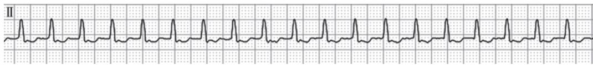  
图 3-3-15 房室结折返性心动过速  
连续快速、规则的 QRS 波群, 其形态和时限均正常, 频率 154 次/分, QRS 波群终末部分可见逆行 P 波。

【心电生理检查】心电生理检查是 AVNRT 重要的检查方法，在绝大多数病人中可发现房室结快、慢径双径(常见)或多径路前向传导的证据，即可见特征性的跳跃现象(逐渐缩短心房刺激频率至快径不应期时，心房-希氏束间期突然延长超过 50ms 的现象，提示刺激信号从快径转至慢径并下传)，随后可出现回波或发生心动过速。

根据心动过速时心房-希氏束(AH)间期和希氏束-心房(HA)间期的长短以及最早逆传心房激动部位的不同，将AVNRT分为三型，即慢快型、快慢型、慢慢型，少数病人可合并上述2种或以上类型。①慢快型：AVNRT中最常见类型，也称之为典型的AVNRT，约占 $90\%$ ，为房室结慢径前传，快径逆传，希氏束附近A波(心房波)领先，AH间期明显 $\geqslant 200\mathrm{ms}$ 。②快慢型：约占AVNRT的 $5\%$ ，为房室结快径前传，慢径逆传，冠状窦口附近A波领先，AH间期通常小于HA间期，且AH间期 $< 200\mathrm{ms}$ ，平均 $90\mathrm{ms}$ 。③慢慢型：约占AVNRT的 $5\%$ ，为房室结慢径前传，另一条慢径逆传，冠状窦口附近A波领先，AH间期通常 $\geqslant 200\mathrm{ms}$ 。通常将快慢型AVNRT和慢慢型AVNRT称为非典型AVNRT。

## 【治疗】

1. 急性发作期 应根据病人基础的心脏状况、既往发作的情况以及对心动过速的耐受程度进行适当处理，部分病人常可自行终止。

如病人心功能与血压正常,可先尝试刺激迷走神经的方法:病人取仰卧位,双下肢抬高,使用Valsalva 动作(深吸气后屏气、再用力作呼气动作)、咽刺激诱导恶心、将面部浸没于冰水内等方法可使心动过速终止。也可采取颈动脉窦按摩(每次5\~10秒,切莫双侧同时按摩,老年人及青光眼病人慎用)。多次尝试失败,应选择药物治疗或电复律。经食管快速心房起搏亦可终止心动过速发作,因多数病人不能耐受,目前临床较少使用。

药物治疗是终止心动过速发作最常用的方法。首选腺苷，起效迅速，副作用为胸部压迫感、呼吸困难、面部潮红、窦性心动过缓、房室传导阻滞等，但因腺苷半衰期短于6秒，副作用即使发生亦很快消失。腺苷无效时可改静脉注射维拉帕米、胺碘酮、地尔硫草或 $\beta$ 受体拮抗剂。如合并心力衰竭或低血压，禁止用维拉帕米和地尔硫草；失代偿性心力衰竭禁用 $\beta$ 受体拮抗剂。

血流动力学不稳定、药物不能转复或控制心动过速者，应进行电复律。

2. 导管消融 导管消融技术安全和有效, 是根治房室结折返性心动过速的首选治疗方案(参照本章第八节)。

暂时不能行导管消融术且又发作频繁和症状显著者,可考虑应用长效 $\beta$ 受体拮抗剂或长效钙通

道阻滞剂预防发作；如发作不频繁、可较好耐受、持续时间短并可自行终止者，则不必预防性用药。

## 房室折返性心动过速

房室折返性心动过速（AVRT）是通过旁道产生的心动过速。正常的心房与心室之间有纤维脂肪组织分隔，这些起绝缘作用的组织层若被心外膜下心肌束穿越，心房肌与心室肌直接相连，心房冲动就可绕过正常的房室传导系统形成旁道。旁道可为单束或多束心肌组织，主要分布在三尖瓣环旁的右心室游离壁、房室瓣环的间隔面和二尖瓣后瓣对应的左心室游离壁。最常见的是连接心房和心室之间的旁道，称为房室旁道（accessory atrioventricular pathways），又称 Kent 束；少见的旁道包括心房-希氏束旁道（atriohisian tracts pathways）、房室结-心室旁道（nodoventricular pathways）和希氏束-心室旁道（fasciculoventricular pathways）等，后两者也称为 Mahaim 束。另约 10% 的病人存在多条旁道。

旁道具有前传(房-室传导)和/或逆传(室-房传导)的电生理特性。当激动通过旁道下传,提前激动心室,窦性心律下可显示预激波(心电图δ波),该旁道称为显性旁道或显性预激(即心室预激)。当旁道无前向传导功能,只能逆传,窦性心律下无预激波时,称为隐匿性旁道。

与正常房室传导系统相比，旁道传导时间短，不应期相对长，如果一个房性期前收缩下传的时候，旁道仍处于前一次激动的不应期，而房室结已经恢复兴奋性，则激动通过房室结前传、旁道逆传，形成折返环，产生顺向型AVRT，此时心动过速的QRS波群形态正常。显性预激病人当激动通过旁道前传、房室结逆传时，引发的逆向型AVRT则表现为宽QRS心动过速，需与室性心动过速鉴别(参照本章第五节)。

当心室预激引发 AVRT 时称为预激综合征，由 Kent 束引发的预激综合征称为 Wolf-Parkinson-White（WPW）综合征，也称为典型预激综合征，是最多见的一种预激综合征，由其他少见旁道引起者称为变异型预激综合征。当预激合并房颤(房扑)时，由于旁道传导速度快，过快的心房率可引发极快的心室率；部分旁道前传不应期短的病人，激动可能全部从旁道下传，心率可超过 300 次/分，甚至演变为心室颤动。

【病因】病人大多无其他心脏异常征象。可于任何年龄经体检心电图或发作心动过速被发现。少数可见于先天性心血管病如三尖瓣下移畸形（Ebstein 畸形）、二尖瓣脱垂、各类心肌病等。

【临床表现】临床表现类似房室结折返性心动过速。症状严重程度取决于心动过速时心率的快慢、持续时间、心动过速的类型以及基础心脏病情况。当预激合并房颤(房扑)时可出现黑朦、晕厥等血流动力学不稳定表现，甚至出现阿斯综合征发作。

## 【心电图特征】

1. 房室折返性心动过速（AVRT）心电图表现为连续的、快速规则的QRS波群，频率为 $150\sim$ 220次/分，未见明确P波，多数QRS波群形态正常；少数心电图表现为宽大畸形的QRS波群，称为宽QRS心动过速。顺向型AVRT通常表现为QRS形态正常的心动过速，此型最常见，占AVRT的 $90\%$ 以上(图3-3-16)；逆向型AVRT心电图表现为宽QRS心动过速(图3-3-17)。极少数顺向型AVRT合并束支传导阻滞或室内差异性传导时，也可表现为宽QRS心动过速。预激合并房颤(房扑)时，激动分别经旁道和经房室结下传，心动过速的QRS波群形态多变，可表现为QRS波群形态正常的心动过速，也可为宽QRS心动过速(图3-3-18)。

2. 心室预激 ①PR间期短于0.12秒；②QRS波群起始部分粗钝(称δ波)，终末部分正常；③ST-T波呈继发性改变，与QRS波群主波方向相反。

根据胸导联 QRS 波群主波方向，心电图诊断命名为 A 型预激和 B 型预激：A 型预激，胸导联 QRS 主波全部向上；B 型预激， $V_{1}$ 、 $V_{2}$ 导联主波向下， $V_{4} \sim V_{6}$ 导联向上（图 3-3-19）。

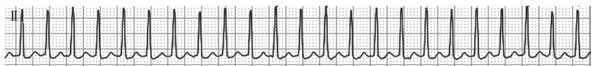  
图 3-3-16 顺向型 AVRT  
连续的快速规则的 QRS 波群, 其形态和时限均正常, 频率 200 次/分, 未见明确 P 波。

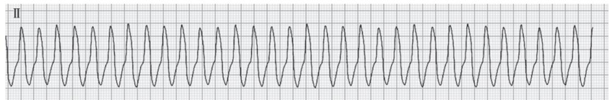  
图 3-3-17 逆向型 AVRT  
连续的、快速规则的 QRS 波群, QRS 波宽大畸形, QRS 波时间 0.13 秒, 频率 214 次/分。

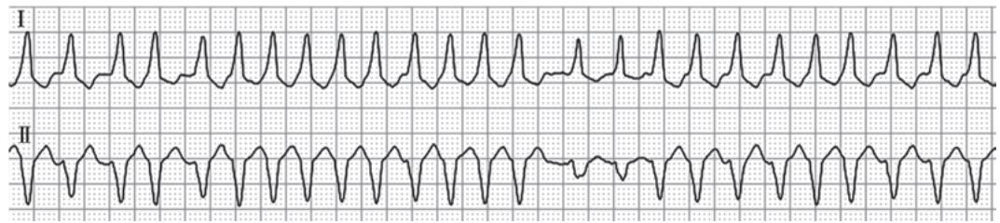  
图 3-3-18 预激合并房颤  
RR 间期不规则, QRS 波群形态多变, 其起始部有预激波, 心室率 201 次/分。

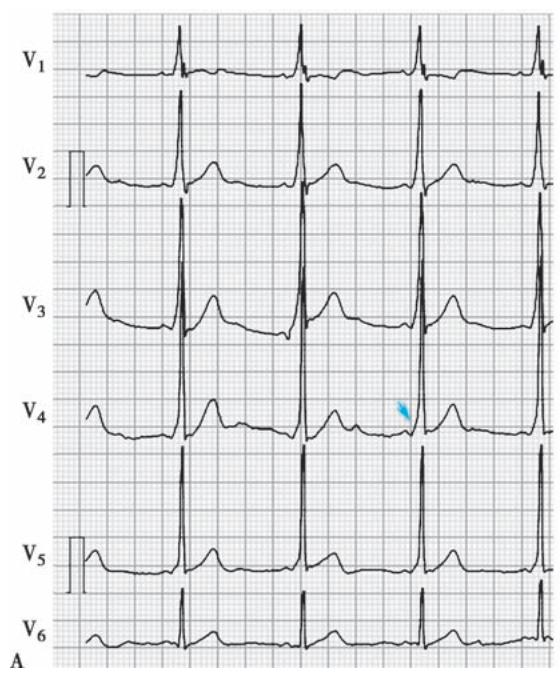

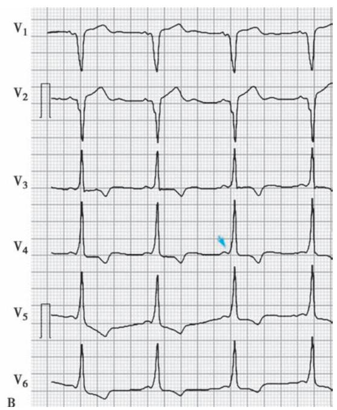  
图 3-3-19 心室预激  
A. A 型预激; B. B 型预激, 箭头指示为 $\delta$ 波。

【心电生理检查】心电生理检查可明确诊断和旁道定位，并指导经导管消融治疗。绝大多数旁道的传导速度较快(不典型旁道除外)，其电生理特征不同于正常的房室传导，一般和普通心肌类似，属于快反应细胞，传导速度快且固定，不具有递减性传导的特性，因而具有以下特征：①全或无传导(旁道的传导时间不随心室刺激的提前而逐渐延长，呈现出相对固定的VA间期，直至进入旁道不应期，心室起搏不能逆传至心房，出现A波的突然脱落)；②心室起搏时，旁道处的逆传心房激动最早(因旁道传导速度比房室结快，心室刺激可经旁道快速激动心房所致)。

下列情况应接受心电生理检查:①协助确定诊断;②确定旁道位置与数目;③确定旁道在心动过速发作时,直接参与构成折返环路的一部分或仅作为“旁观者”;④了解发作心房颤动或扑动时最高的心室率;⑤对药物、导管消融与外科手术等治疗效果作出评价;⑥显性旁道的危险分层。

【治疗】

1. 急性发作期 顺向型 AVRT, 可参照房室结折返性心动过速处理。逆向型 AVRT, 如刺激迷走神经和用腺苷无效, 应考虑静脉注射伊布利特、普鲁卡因胺、氟卡尼或普罗帕酮。

预激伴房颤(房扑)的病人,终止心动过速首选电复律,或静脉注射伊布利特或普罗帕酮,不应使用β受体拮抗剂、维拉帕米、地尔硫草、洋地黄类药物和胺碘酮,因为这些抗心律失常药可能抑制房室结传导从而加剧旁道下传,有诱发室颤的风险。

血流动力学不稳定、药物无法转复或控制心动过速者，应进行电复律。

2. 导管消融 导管消融是根治房室折返性心动过速的首选治疗方法。尤其对于心动过速发作频繁、伴发房颤或房扑的病人，应尽早行导管消融治疗。

仅有预激而未曾有心动过速发作的病人，可根据病人是否从事高危职业及电生理检查危险分层以决定是否进行导管消融，若从事高危职业或电生理检查提示高风险旁道者，应尽早行导管消融。

## 第五节 | 室性心律失常

## 一、室性期前收缩

室性期前收缩（premature ventricular beat）也称室性早搏，简称室早，是一种最常见的心律失常，指希氏束以下部位心室兴奋灶提前除极而产生的过早搏动。

【病因】常见于各种器质性心脏病，如高血压、冠心病、心肌病、心肌炎及瓣膜性心脏病等。也可见于心脏结构与功能正常者，在情绪紧张、过度劳累、过量烟酒或咖啡，以及电解质紊乱等情况下可诱发室早。某些药物因素，如洋地黄类药物、奎尼丁、三环类抗抑郁药物、抗肿瘤药物也可引起。

【临床表现】室早症状的轻重程度与期前收缩的频发程度不直接相关。病人一般表现为心悸、胸闷、类似失重感或代偿间歇后有力的心脏搏动，可伴有头晕、乏力等症状。严重器质性心脏病病人，长时间频发室早可产生心绞痛、低血压或心力衰竭等。听诊时，期前收缩后可出现较长的停歇，第二心音强度减弱，仅能听到第一心音，桡动脉搏动减弱或消失。

【心电图特征】①提前出现的宽大畸形QRS波群，时限常超过0.12秒；②T波与QRS主波方向相反；③室早与其前面的窦性搏动的间期(称为配对间期)恒定，后可出现完全性代偿间歇(图3-3-20)。

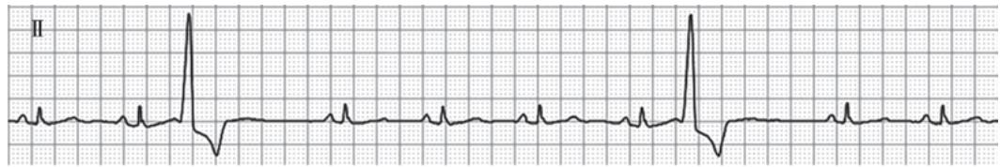  
图 3-3-20 室性期前收缩  
第 3、8 个 QRS 波群提前发生, QRS 波增宽畸形, 其前无 P 波, 其后有完全性代偿间歇。

室早的类型: 室早可孤立或规律出现。当每个窦性搏动后跟随一个室早称为二联律, 每两个窦性搏动后出现一个室早为三联律; 连续发生两个室早称成对室早, 连续三个或以上室早称室性心动过速; 如室早恰巧插入两个窦性搏动之间, 不产生期前收缩后停顿, 称为间位性室早; 同一导联内, 室早形态相同者, 为单形性室早, 形态不同者称多形性或多源性室早(图 3-3-21)。

【治疗】首先应对病人室早的类型、症状及其原有心脏病进行全面评估,根据不同的临床状况决定是否给予治疗,并制订出合理有效的治疗方案。

1. 无器质性心脏病 室早不会增加此类病人发生心源性死亡的危险性,如病人无明显症状或症状轻微,不必使用药物治疗。若病人症状明显,治疗以消除症状为目的,应特别注意对病人作好耐心的解释及关怀,说明这种情况的良性预后,减轻病人焦虑与不安;同时避免诱发因素,如吸烟、饮用咖

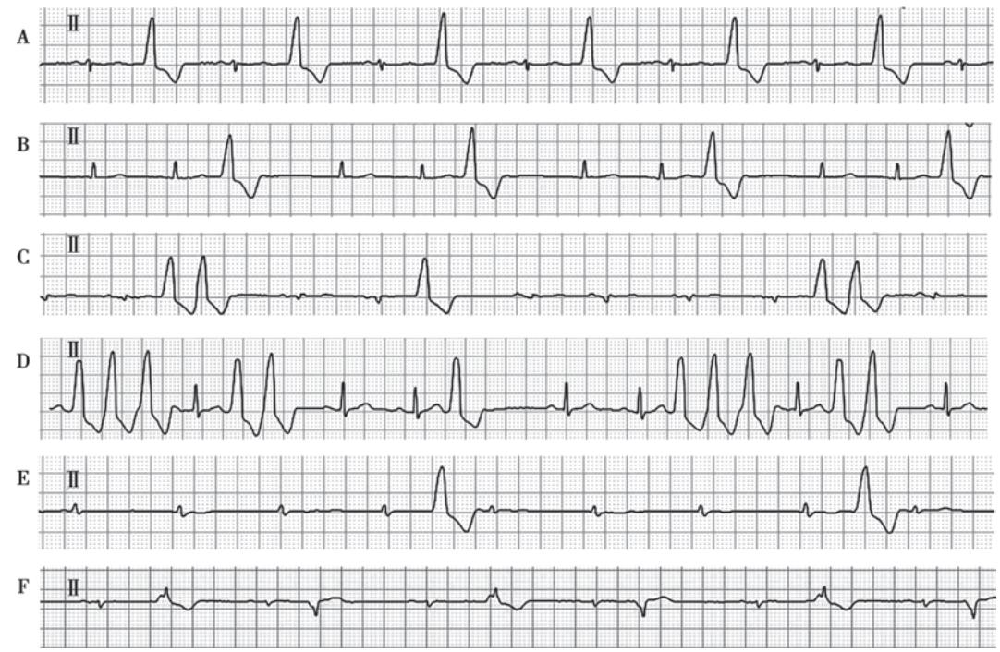  
图 3-3-21 室性期前收缩的类型

A. 每个窦性搏动后跟随一个室早, 为二联律; B. 每两个窦性搏动后跟随一个室早, 为三联律; C. 第 3、4 个 QRS 波群连续出现, 为成对室早; D. 第 1、2、3 个 QRS 波群连续出现, 为短阵室速。E. 第 5、10 个 QRS 波群提前发生, 其后无代偿间歇, 为间位性室早; F. 第 2、4 个 QRS 波群形态不一, 为多形性室早。

啡/茶、焦虑及应激等。也可选择 $\beta$ 受体拮抗剂、非二氢吡啶类钙通道阻滞剂、普罗帕酮等，联合使用中成药如稳心颗粒、参松养心胶囊等亦具有减少期前收缩和减轻症状的作用。

2. 器质性心脏病 器质性心脏病合并心功能不全者,原则上只处理心脏本身疾病,不必应用治疗室早的药物。若症状明显,可选用 $\beta$ 受体拮抗剂以及胺碘酮治疗。

急性心肌缺血合并室早的病人，首选再灌注治疗，不主张预防性应用抗心律失常药物。如果实施再灌注治疗前已出现频发室早、多源性室早，可应用β受体拮抗剂。同时注意纠正诱因，尤其是电解质紊乱如低钾、低镁血症。避免使用Ia类和Ic类抗心律失常药物，因这类药物本身具有致心律失常作用，可能导致病人总死亡率和猝死风险增加。

3. 导管消融 起源于右心室流出道或左心室后间隔的频发室早,若病人症状明显,抗心律失常药物疗效不佳,或不能耐受药物治疗,且无明显器质性心脏病,可考虑导管消融治疗,成功率较高。起源于其他部位的单形性室早,亦可选择导管消融治疗,但成功率较低。

## 二、室性心动过速

室性心动过速（ventricular tachycardia, VT）简称室速，是起源于希氏束以下的特殊传导系统或者心室肌的连续3个或3个以上的异位心搏。及时正确地判断和治疗室速具有非常重要的临床意义。

【病因】室速常发生于各种器质性心脏病病人。最常见为冠心病，其次是心肌病、心力衰竭、瓣膜性心脏病等，其他病因包括代谢障碍、电解质紊乱、洋地黄中毒等。室速偶可发生在无器质性心脏病者，称为特发性室速，其多起源于右心室流出道(右室特发性室速)、左心室间隔部(左室特发性室速)和主动脉窦部。少部分室速与遗传因素有关，又称为离子通道病，如长QT间期综合征、Brugada综合征等。

【临床表现】室速的临床症状视发作时心室率、持续时间、基础心脏病和心功能状况不同而异。非持续性室速(发作时间短于30秒,能自行终止)的病人可无明显症状。持续性室速(发作时间超过30秒,需药物或电复律终止)常伴有明显血流动力学障碍与心肌缺血,临床症状包括低血压、头晕、气促、心绞痛和晕厥等。部分多形性室速、尖端扭转型室速发作后很快蜕变为心室颤动，导致心源性晕厥、心搏骤停和猝死。

听诊心律可轻度不规则，第一、二心音分裂，收缩期血压随心搏变化。

【心电图特征】①3个或以上的室早连续出现；②心室率常为100～250次/分；③节律规则或略不规则；④心房独立活动与QRS波无固定关系，形成房室分离；⑤偶可见心室激动逆传夺获心房。

心室夺获与室性融合波: 室速发作时少数室上性冲动可下传心室, 产生心室夺获, 表现为在 P 波之后, 提前发生一次正常的 QRS 波。室性融合波的 QRS 波形态介于窦性与异位心室搏动之间, 其意义为部分夺获心室。心室夺获与室性融合波的存在对确立室速诊断提供了重要依据。按室速发作时 QRS 波的形态, 可将室速区分为单形性室速和多形性室速; QRS 主波方向呈交替变换者称双向性室速 (图 3-3-22)。室速与室上性心动过速的宽 QRS 心动过速的心电图表现十分相似, 两者的临床意义与处理截然不同, 应注意鉴别 (表 3-3-4)。

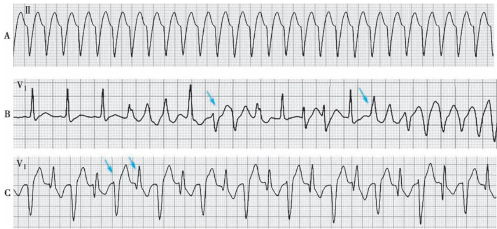  
图 3-3-22 室性心动过速

A. Ⅱ导联可见一系列快速、宽大畸形的 QRS 波，QRS 波呈一种形态，RR 间期略不规则；B. $V_{1}$ 导联 QRS 波呈不同形态，为多形性室速；C. $V_{1}$ 导联 QRS 波群主波方向出现上、下交替性变换，为双向性室速。

表 3-3-4 宽 QRS 心动过速的鉴别诊断

<table><tr><td>支持室上速(SVT)</td><td>支持室速(VT)</td></tr><tr><td>房早促发</td><td>室性融合波</td></tr><tr><td>P波与QRS波群相关,呈1:1房室比例</td><td>心室夺获</td></tr><tr><td>刺激迷走神经可减慢或终止发作</td><td>房室分离</td></tr><tr><td></td><td>全导联QRS波群主波方向呈同向性</td></tr></table>

【心电生理检查】心电生理检查对确立室速的诊断及发生部位有重要价值。若能在心动过速发作时记录到希氏束波(H)，通过分析希氏束波开始至心室波(V)开始的间期(HV间期)，有助于室上速与室速的鉴别。室上速的HV间期应大于或等于窦性心律时的HV间期，室速的HV间期小于窦性HV间期或为负值(因心室冲动通过希氏束-浦肯野纤维系统逆传)。

【治疗】室速的治疗原则是:无器质性心脏病病人发生的非持续性室速,如无症状或血流动力学影响,处理与室早相同;有器质性心脏病或有明确诱因者应首先给以针对性治疗;持续性室速发作,无论有无器质性心脏病,均应给予治疗。

1. 终止室速发作 无显著血流动力学障碍的室速,可选用胺碘酮、利多卡因或普鲁卡因胺静脉注射终止室速。如药物无效或发生低血压、休克、心绞痛、心力衰竭或脑血流灌注不足等血流动力学障碍的病人，应迅速施行直流电复律。复律成功后可静脉应用胺碘酮、利多卡因等，以防止室速短时间内复发。洋地黄中毒引起的室速，不宜用电复律，应给予药物治疗。

2. 预防复发 应努力寻找和治疗诱发与维持室速的可逆性因素,例如心肌缺血、低血压及低血钾等;治疗心力衰竭有助于减少室速发作。窦性心动过缓或房室传导阻滞时,心室率过于缓慢,亦有可能诱发室性心律失常,可给予阿托品治疗或应用心脏起搏器治疗。

急性心肌缺血合并室速的病人，首选冠状动脉血运重建，也可应用β受体拮抗剂预防室性心律失常。β受体拮抗剂能降低心肌梗死后猝死发生率，其作用可能主要通过降低交感神经活性与改善心肌缺血实现。急性心肌梗死48小时后发生的非可逆原因导致的室颤或血流动力学不稳定的室速病人，可予植入心律转复除颤器（ICD）治疗。

ICD 植入治疗可应用于持续性多形性室速及遗传性心律失常综合征病人。药物治疗后仍反复发作单形性室速或 ICD 植入后反复电击的病人可考虑导管消融治疗(参照本章第八节)。

## 【特殊类型的室性心动过速】

1. 尖端扭转型室性心动过速（torsades de pointes, TdP）是多形性室速的一个特殊类型，因发作时QRS波群的振幅与波峰呈周期性改变，宛如围绕等电位线连续扭转得名，频率200～250次/分。当室早发生在舒张晚期、落在前面T波的终末部时（R-on-T）可诱发室速，亦可进展为心室颤动和猝死。本型室速的病因可为电解质紊乱(如低钾血症、低镁血症)、抗心律失常药物(如Ia类或Ⅲ类)、吩噻嗪和三环类抗抑郁药、颅内病变、心动过缓(特别是三度房室传导阻滞)等，部分病人也可为先天性。TdP病人应努力寻找和去除导致QT间期延长的获得性的病因，停用明确或可能诱发TdP的药物。治疗上首先给予静脉注射镁盐。Ia类或Ⅲ类药物可使QT间期更加延长，故不宜应用(图3-3-23)。

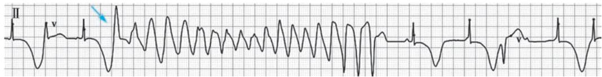  
图 3-3-23 R-on-T 现象及尖端扭转型室速  
Ⅱ导联箭头处 R 波骑跨于前一 T 波之上 (R-on-T 现象), QT 间期延长, 达 0.64 秒, 室速发作时 QRS 波群主波方向围绕等电位线连续扭转。

2. 加速性室性自主心律（accelerated idioventricular rhythm）亦称缓慢型室速，其发生机制与自律性增加有关。心电图表现为连续发生3～10个起源于心室的QRS波群，心率常为60～110次/分(图3-3-24)。心动过速的开始与终止呈渐进性，跟随于一个室早之后，或当心室起搏点加速至超过窦性频率时发生。由于心室与窦房结两个起搏点轮流控制心室节律，融合波常出现于心律失常的开始与终止时，心室夺获亦很常见。常发生于器质性心脏病病人，特别是急性心肌梗死再灌注期间、心脏手术、心肌病、风湿热与洋地黄中毒。发作短暂或间歇发生，病人一般无症状，亦不影响预后，通常无需抗心律失常治疗。

3. 特发性室性心动过速（idiopathic ventricular tachycardia, IVT）是指发生在无结构性心脏病病人中的单形性室速，多为阵发性，也可无休止发作。根据室速的起源部位可分为流出道室速、瓣环室速和分支室速。右室流出道（right ventricular outflow tract, RVOT）室速是最常见的特发性室速，心电图特征包括心前区导联移行较晚（ $V_{3}$ 或更晚）和 $V_{1}$ 、 $V_{2}$ 导联 R 波较窄。阵发性室速多由运动或压力、应激等因素诱发，可使用 $\beta$ 受体拮抗剂、维拉帕米、普罗帕酮抑制发作，大多数病人预后良好。对于有症状病人，可选择导管消融。

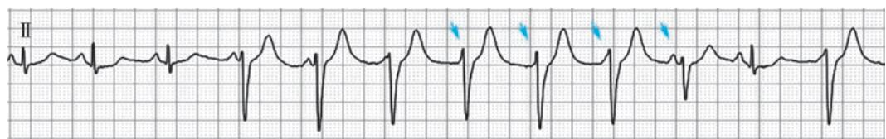  
图 3-3-24 加速性室性自主心律  
Ⅱ导联可见一系列宽大畸形QRS波群，心室率79～88次/分，可见窦性P波逐渐与QRS波群重叠(箭头处，房室分离现象)。

## 三、心室扑动与心室颤动

心室扑动(ventricular flutter, VF)与心室颤动(ventricular fibrillation, VF)简称室扑和室颤，为致死性心律失常。最常见于冠心病和各种疾病的终末期。此外，抗心律失常药物，特别是引起QT间期延长与尖端扭转型室速的药物，以及严重缺氧缺血、预激综合征合并房颤时极快的心室率、电击伤等亦可引起。

【心电图特征】心室扑动呈正弦图形,波幅大而规则,QRS波呈单形性,频率150\~300次/分(通常在200次/分以上),有时难与室速鉴别。心室颤动的波形、振幅与频率均极不规则,无法辨认QRS波群、ST段与T波,持续时间较短,如不及时抢救,一般心电活动在数分钟内迅速消失(图3-3-25)。

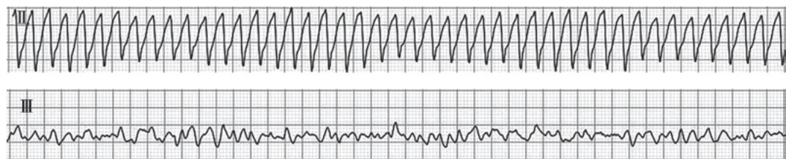  
图 3-3-25 心室扑动与心室颤动

Ⅱ导联呈连续的波动,形似正弦波,频率250次/分,无法分辨QRS波群、ST段及T波,为心室扑动;Ⅲ导联呈形态、振幅各异的不规则波动,频率约300次/分,QRS-T波群消失,为心室颤动。

【临床表现】室扑和室颤可导致头晕，紧接着意识丧失、抽搐、呼吸暂停甚至死亡。发作时心室激动程序打乱，心室肌快而微弱地规则或不规则活动，严重影响心室的排血功能，导致心室无排血，心音和脉搏消失，血压测不出，心脑等器官和外周组织血液灌注停止。心房可以以独立的节律或随心室颤动频率持续跳动一段时间。最终，心脏的电活动停止。

心室扑动与颤动的治疗参照本篇第十一章心搏骤停与心脏性猝死。

## [附] 遗传性心律失常综合征

当离子通道或调控通道的蛋白质发生基因突变时,其功能出现异常升高或降低,导致心肌细胞除极或复极过程异常,从而延长或缩短动作电位时程而产生心律失常甚至猝死,称为离子通道病。随着基因检测技术的发展,许多排除了器质性心脏病而反复出现不明原因晕厥甚至心脏性猝死的病人被证明存在基因变异,尤其是具有家族史者,目前将此类疾病统称为遗传性心律失常综合征,常见的离子通道病有:

1. 长 QT 间期综合征（long-QT syndrome, LQTS）可分为先天性和获得性。先天性大多数是由一个或多个基因突变导致的家族遗传性疾病。获得性病人也可能具有潜在的遗传易感性，其 QT 间期延长可由心肌缺血、电解质紊乱及各种药物（如奎尼丁、胺碘酮等）引起。临床表现为 LQTS 引起的晕厥和/或猝死。晕厥与运动、情绪紧张、激动有关，部分病人也可在休息或睡眠时发生。对于无症状的病人，如有复杂性室性心律失常、早发心源性猝死家族史或按心率校正的 QT 间期（QTc）>500ms，可给予最大耐受剂量非选择性 β 受体拮抗剂治疗，如普萘洛尔或纳多洛尔；对于已发生晕厥或心搏骤停者，须植入 ICD 治疗并联合使用 β 受体拮抗剂。

2. Brugada 综合征（Brugada syndrome, BrS）目前已确定家族性 Brugada 综合征存在有钠离子通道和钙离子通道的基因突变。临床表现为反复晕厥，为中青年非器质性心脏病猝死的主要原因之一。病人心脏结构大多正常，常在过量饮酒或发热时诱发。心电图可见 $V_{1} \sim V_{3}$ 导联 ST 段呈下斜形或马鞍形抬高(图 3-3-26)。对于疑似病人需行 SCN5A 基因检测。BrS 目前尚无有效的治疗手段，对于已发生晕厥、心搏骤停、心室扑动或心室颤动的病人，须行 ICD 植入治疗。ICD 植入后如频繁放电可予奎尼丁治疗。

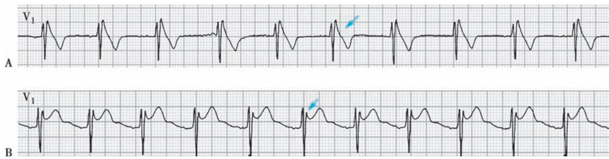  
图 3-3-26 Brugada 综合征  
A. $V_{1}$ 导联 ST 段呈下斜形(箭头处)抬高; B. $V_{1}$ 导联 ST 段呈马鞍形(箭头处)抬高。

3. 儿茶酚胺敏感性室性心动过速(catecholaminergic polymorphic ventricular tachycardia, CPVT)是一种罕见的遗传性室速，病人常无明显的结构性心脏病。该病的病因可能为细胞内钙调控的基因编码蛋白发生突变导致常染色体显性遗传。病人在儿童期即可出现心悸、晕厥或心搏骤停。症状多在运动或情绪激动时发生，部分病人静息状态下也可出现。心电图常无特异性表现。治疗上应嘱病人避免剧烈运动，并予β受体拮抗剂，当药物治疗仍不能消除室性心律失常发作时，应考虑左颈胸交感神经切断术。对于已接受了最佳药物治疗和/或左颈胸交感神经切断术，仍有心搏骤停、反复晕厥、双向性室速或多形性室速发生的病人，可考虑植入ICD治疗。

4. 短 QT 间期综合征（short-QT syndrome, SQTS）为单基因突变引起的常染色体显性遗传离子通道病。临床表现为心悸、头晕及反复发作的晕厥和/或心脏性猝死。心电图上 QTc 间期≤320ms 即可诊断，或 QTc 间期在 320～360ms 之间，且至少符合以下一条临床标准：存在致病性基因突变，40 岁之前有确诊短 QT 间期综合征或有心脏性猝死家族史，无结构性心脏病的室速/室颤幸存者。对于无症状的短 QTc 间期病人，可无需治疗。如病人已发生心搏骤停或持续性室速发作时，首选 ICD 植入，如不能植入 ICD 的病人可予奎尼丁治疗以减少室速发生。

5. 早期复极综合征（early repolarization syndrome, ERS）是心电复极异常的一种，为生理性心电图变异。心电图上2个或以上连续下壁和/或侧壁导联J点抬高 $\geqslant 1\mathrm{mm}$ ，为早期复极(图3-3-27)；大多数早期复极的病人并没有发生室性心律失常的危险，通常不会引发症状，也不需要干预。在有心搏骤停史或心电图记录到多形性室速或特发性室颤病人，可诊断早期复极综合征；对于有早发心源性猝死家族史、已发生因室性心律失常所致晕厥或心搏骤停的病人，应植入ICD治疗，同时亦可选用奎尼丁治疗复发、频发的室速或室颤。

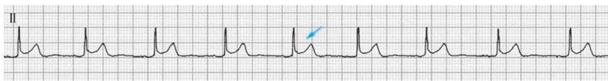  
图 3-3-27 早期复极  
Ⅱ导联箭头处示 J 点抬高。

## 第六节 | 心脏传导阻滞

心脏传导阻滞（heart conduction block）是由心脏传导系统的解剖或功能失常造成的永久性或暂时性冲动传导障碍，可发生于心脏传导系统的任何水平。如发生在窦房结与心房之间，称窦房传导阻滞，心房与心室之间称房室传导阻滞，心室内称室内传导阻滞。

窦房传导阻滞已在本章第二节叙述。

## 一、房室传导阻滞

房室传导阻滞（atrioventricular block）是指房室交界区脱离了生理不应期后，心房冲动传导延迟或不能传导至心室。房室传导阻滞可以发生在房室结、希氏束以及束支等不同的部位。房室传导阻滞根据严重程度分为三度：一度房室传导阻滞的传导时间延长，但全部冲动仍能传导至心室。二度房室传导阻滞又分为Ⅰ型(文氏阻滞)和Ⅱ型，Ⅰ型阻滞表现为传导时间进行性延长，直至一次冲动不能传导至心室；Ⅱ型阻滞表现为间歇出现的传导阻滞；两个及以上连续的冲动不能下传至心室，常称为高度房室传导阻滞。三度房室传导阻滞又称完全性房室传导阻滞，此时全部冲动不能被传导至心室，心房和心室的节律由各自独立的起搏点控制。

【病因】部分健康的成年人、儿童及运动员可发生一度或二度I型房室传导阻滞，常与静息时迷走神经张力增高有关，可为一过性的。导致房室传导阻滞的疾病有：急性心肌梗死、冠状动脉痉挛、心肌/心包炎、心肌病、急性风湿热、心脏肿瘤、先天性心血管病、黏液性水肿及心脏浸润性病变(如淀粉样变、结节病或硬皮病)；也可见于电解质紊乱(如高钾血症)、药物中毒(如洋地黄中毒)及心脏手术损伤(心脏瓣膜手术、导管消融术等)。老年持续性房室传导阻滞以原因不明的传导系统退行性变多见，如Lev病(心脏纤维支架的钙化与硬化)。

【临床表现】一度和二度Ⅰ型房室传导阻滞病人通常无症状；二度Ⅱ型房室传导阻滞引起心搏脱漏，可有心悸或主观感觉漏跳；高度房室传导阻滞可表现头晕、黑朦、乏力。三度房室传导阻滞的症状取决于心室率的快慢与伴随病变，症状包括乏力、头晕、晕厥、心绞痛、心力衰竭等，严重者因心室率过慢导致脑缺血，病人可出现暂时性意识丧失，甚至抽搐，称为 Adams-Stokes 综合征，严重者可致猝死。

一度房室传导阻滞听诊时，因 PR 间期延长，第一心音强度减弱。二度Ⅰ型房室传导阻滞第一心音强度逐渐减弱并有心搏脱漏。二度Ⅱ型房室传导阻滞亦有间歇性心搏脱漏，但第一心音强度恒定。三度房室传导阻滞因房室分离，第一心音强度经常变化，第二心音可呈正常或反常分裂，间或听到响亮亢进的第一心音（大炮音）。

【心电图特征】

(一) 一度房室传导阻滞 PR 间期超过 0.20 秒 (图 3-3-28), QRS 波群形态与时限正常。

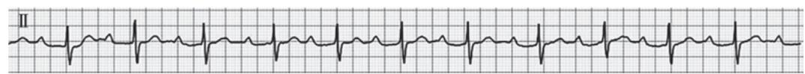  
图 3-3-28 一度房室传导阻滞, PR 间期 =0.37 秒

（二）二度房室传导阻滞 二度房室传导阻滞分为I型和Ⅱ型。I型又称文氏阻滞（Wenckebach block），是最常见的二度房室传导阻滞类型。

1. 二度I型房室传导阻滞 P波规律出现,PR间期逐渐延长,直到P波下传受阻,脱漏1个QRS波群(图3-3-29);最常见的房室传导比例为3:2和5:4。在大多数情况下,阻滞位于房室结,QRS波群正常,二度I型房室传导阻滞很少发展为三度房室传导阻滞。

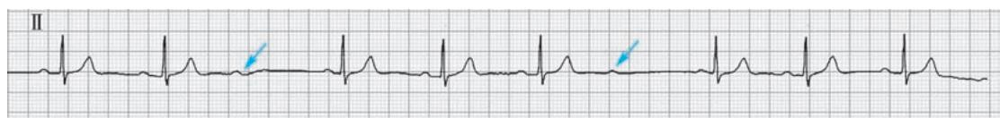  
图 3-3-29 二度 I 型房室传导阻滞  
Ⅱ导联 P 波规律出现,由左起第 3、第 7 个 P 波(箭头所指)未下传心室,房室间呈 3:2 及 4:3 传导。

2. 二度Ⅱ型房室传导阻滞 PR 间期恒定,部分 P 波后无 QRS 波群;如 QRS 波群正常,阻滞可能位于房室结(图 3-3-30);若 QRS 波群增宽,形态异常时,阻滞位于希氏束-浦肯野纤维系统。

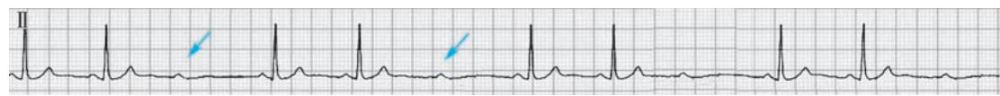  
图 3-3-30 二度Ⅱ型房室传导阻滞  
Ⅱ导联 P 波规律出现,由左起第 3、第 6 个 P 波(箭头所指)未下传心室,房室间呈 3:2 传导。

3. 高度房室传导阻滞 连续两个或者两个以上的 P 波不能下传心室者常称为高度房室传导阻滞,通常房室间呈 2:1 或 3:1 传导(图 3-3-31)。

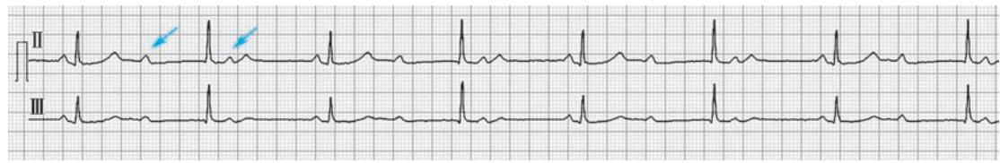  
图 3-3-31 高度房室传导阻滞,交界性逸搏  
Ⅱ、Ⅲ导联 P 波规律出现，由左起第 2、第 3 个 P 波(箭头所指)未下传心室，第 4 个 P 波下传心室，房室间呈 3:1 传导。

（三）三度(完全性)房室传导阻滞 心电图特征:①P波与QRS波群各自成节律、互不相关;②心房率快于心室率,心房冲动来自窦房结或异位心房节律(房性心动过速、心房扑动或颤动);③心室起搏点通常在阻滞部位稍下方。如位于希氏束或以上,心室率为40\~60次/分,QRS波群正常,心律亦较稳定(图3-3-32A);如位于希氏束以下,心室率可低至40次/分以下,QRS波群增宽,心室律亦常不稳定(图3-3-32B)。

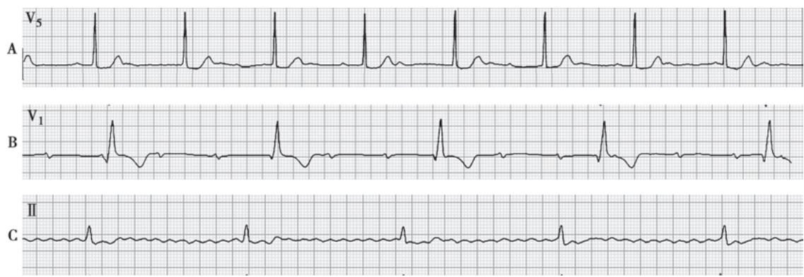  
图 3-3-32 三度房室传导阻滞

A. $V_{5}$ 导联 P 波节律轻度不规则，平均心房率 75 次/分，QRS 波群形态正常，节律规则，心室率 50 次/分。
B. $V_{1}$ 导联 P 波节律规则，心房率 83 次/分，QRS 波群增宽，节律规则，心室率 29 次/分。C. II 导联 P 波消失，代之以大小、形态、间距不一致的 f 波，伴随延缓出现增宽 QRS 波群，RR 间期大致相等，心室率为 30 次/分。

【治疗】首先应针对不同病因进行治疗。一度房室传导阻滞与二度Ⅰ型房室传导阻滞一般无需特殊治疗。对于症状明显、心室率缓慢者，应及早给予临时性或永久性心脏起搏治疗。不可逆的二度Ⅱ型、高度及三度房室传导阻滞，无论有无症状，均应行永久起搏治疗。对暂时无条件或等待起搏治疗期间，可短期应用阿托品（0.5～2.0mg，静脉注射）提高房室传导阻滞的心率；异丙肾上腺素（1～4μg/min静脉滴注）适用于任何部位的心脏传导阻滞，但急性心肌梗死时应慎用或禁用；以上药物使用超过数天，往往效果不佳且易发生严重的不良反应，仅适用于无心脏起搏条件的应急情况。

## 二、室内传导阻滞

室内传导阻滞（intraventricular block）是指希氏束以下部位的传导阻滞。室内传导系统由右束支、左前分支和左后分支三部分组成。室内传导系统的病变可波及单支、双支或三支。

右束支传导阻滞较为常见,常无临床意义。左束支传导阻滞常发生于急性心肌梗死、心肌病、药物中毒等引起心肌弥漫性病变所致。左前分支阻滞较为常见,左后分支阻滞较为少见。

单支、双支阻滞通常无临床症状。偶可听到第一、第二心音分裂。完全性三分支传导阻滞的临床表现与完全性房室传导阻滞相同。

## 【心电图特征】

1. 右束支传导阻滞（right bundle branch block, RBBB）QRS波群时限≥0.12秒。 $V_{1}$ 导联呈rsR'波形， $R'$ 波粗钝； $V_{5}$ 、 $V_{6}$ 导联呈qRS或RS(S波宽阔)波形。T波与QRS波群主波方向相反(图3-3-33A)。不完全性右束支传导阻滞的图形与上述相似，但QRS波群时限<0.12秒。

2. 左束支传导阻滞（left bundle branch block, LBBB）QRS波群时限≥0.12秒。 $V_{5}$ 、 $V_{6}$ 导联呈R波形，R波顶部有切迹或粗钝，其前无q波。 $V_{1}$ 、 $V_{2}$ 导联呈QS波形或rS波形，S波深而宽。T波与QRS波群主波方向相反(图3-3-33B)。不完全性左束支传导阻滞图形与上述相似，但QRS波群时限<0.12秒。

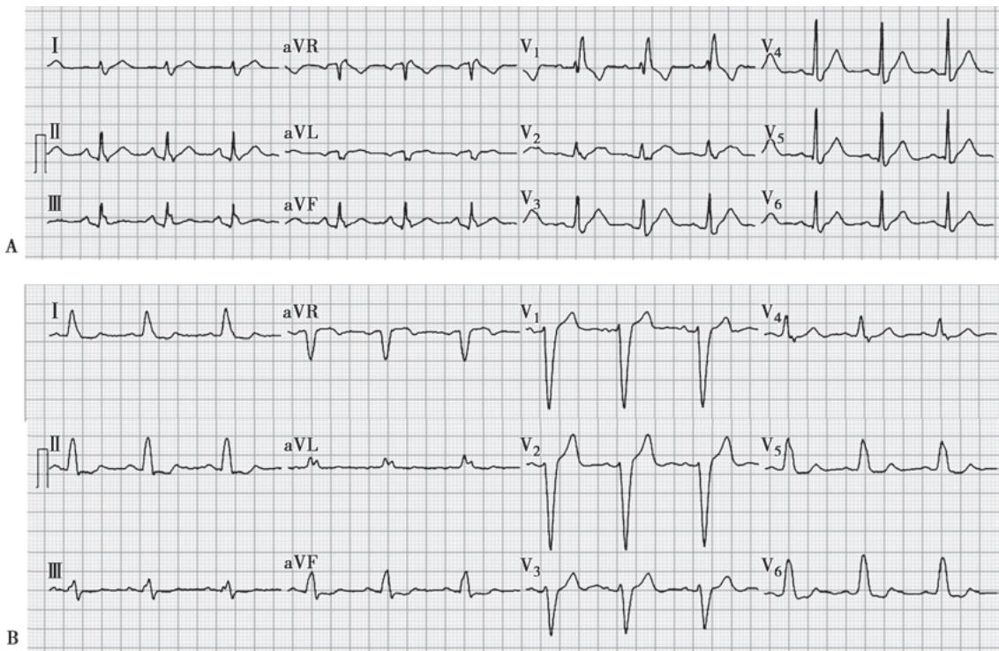  
图 3-3-33 完全性右束支传导阻滞及完全性左束支传导阻滞

A. 完全性右束支传导阻滞, 窦性心律, QRS 波群时限 0.16 秒, $V_{1}$ 导联呈 rsR' 波形, $V_{5}$ 、 $V_{6}$ 导联呈 qRs 波形, QRS 波终末增宽; B. 完全性左束支传导阻滞, 窦性心律, QRS 波群时限 0.18 秒, $V_{5}$ 、 $V_{6}$ 导联呈 R 波形, R 波有切迹, $V_{1}$ 导联呈 rS 波形, S 波深而宽。

3. 左前分支传导阻滞(left anterior fascicular block) 额面平均 QRS 电轴左偏达 $-45^{\circ} \sim -90^{\circ}$ 。I、aVL 导联呈 qR 波形，II、III、aVF 导联呈 rS 波形，QRS 时限 $< 0.12$ 秒。

4. 左后分支传导阻滞（left posterior fascicular block）额面平均 QRS 电轴右偏达 +90°～+120°（或 +80°～+140°）。I 导联呈 rS 波形，Ⅱ、Ⅲ、aVF 导联呈 qR 波形，且 R $_{Ⅲ}$ ＞R $_{Ⅱ}$ ，QRS 时限 <0.12 秒。

5. 双分支传导阻滞与三分支传导阻滞（bifascicular block and trifascicular block）前者是指室内传导系统三分支中的任何两分支同时发生阻滞，后者是指三分支同时发生阻滞，表现为完全性房室传导阻滞。由于阻滞分支的数量、程度、是否间歇发生等不同情况组合，可出现不同的心电图表现，最常见为右束支合并左前分支传导阻滞。右束支合并左后分支传导阻滞较罕见，当右束支传导阻滞与左束支传导阻滞两者交替出现时，双侧束支传导阻滞的诊断便可成立。

【治疗】慢性单侧束支传导阻滞的病人如无症状,无需接受治疗。双分支与不完全性三分支传导阻滞有可能进展为完全性房室传导阻滞,但是否一定发生以及何时发生均难以预料,不必常规预防性起搏器治疗,当伴有晕厥、Adams-Stroke综合征发作时,则应及早考虑心脏起搏治疗。

## 第七节 | 抗心律失常药物的合理应用

抗心律失常药物治疗原则:①首先评估药物治疗的必要性,无器质性心脏病或无明显症状、不影响预后的心律失常,多不需要治疗。心律失常治疗主要目的是缓解症状或减少心律失常对心功能和心肌缺血的影响,不应以消灭或减少心律失常为主要目标。②要注意兼顾基础心脏病的治疗,去除病因和诱因,权衡心律失常治疗的重要性和紧迫性,要着重考虑可改善预后的综合治疗措施,如房颤的抗凝治疗。③正确选择抗心律失常的药物,对于急性及血流动力学不稳定的心律失常,重点考虑药物的有效性,尽快终止或改善心律失常,必要时联合电复律或临时起搏治疗;而慢性心律失常的长期治疗,需要考虑药物的安全性以及基础疾病药物治疗的协同性。④协调药物治疗与非药物治疗的兼顾。⑤注意抗心律失常药物的不良反应,包括对心功能的影响、致心律失常作用和对全身其他脏器和系统的不良作用。致心律失常作用的定义是抗心律失常药物治疗可能导致新的心律失常或使原有心律失常加重,发生率为5%\~10%;如充血性心力衰竭、已应用洋地黄类药物与利尿剂、QT间期延长的病人在使用抗心律失常药物时更易发生致心律失常作用;大多数的致心律失常作用发生在开始治疗后数天或改变剂量时,较多表现为持续性室速、长QT间期与尖端扭转型室速。

【抗心律失常药物分类方法】

(一) Vaughan Williams 分类 根据药物的电生理效应将抗心律失常药物分为四类。

## 1. I类 阻滞快速钠通道。

Ia 类: 药物减慢动作电位 0 相上升速度 ( $V_{max}$ ), 延长动作电位时程, 奎尼丁、普鲁卡因胺、丙吡胺等属此类。

Ib 类: 药物不减慢 $V_{max}$ ，但缩短动作电位时程，美西律、苯妥英钠与利多卡因等属此类。

Ic 类: 药物减慢 $V_{max}$ ，减慢传导与轻微延长动作电位时程，普罗帕酮属此类。

2. Ⅱ类 拮抗 $\beta$ 肾上腺素能受体, 美托洛尔、普萘洛尔、纳多洛尔、卡维地洛、比索洛尔、阿替洛尔等属此类, 是目前已明确的可以改善病人长期预后的抗心律失常药物。

3. Ⅲ类 阻滞钾通道与延长复极,胺碘酮、决奈达隆、索他洛尔、伊布利特、多非利特等属此类。

4. IV类 阻滞慢钙通道,维拉帕米和地尔硫草等属此类。

Vaughan Williams 作为经典的心律失常药物分类法,简便实用,自 1975 年问世以来临床一直沿用此分类法。但由于分类框架过于简单,不能涵盖目前临床和研究领域的所有抗心律失常药物,许多新型药物无法进行归类,存在对抗心律失常药物作用机制和靶点欠精准等不足,已不能完全满足临床需求。

（二）新的 Vaughan Williams 分类法 是目前抗心律失常药物新的分类法，在 Vaughan Williams 经典分类的基础上进行了拓展和补充，将抗心律失常药物分成 8 大类，32 个亚类：0 类，窦房结起搏电流 (I) f 抑制剂；Ⅰ类，电压门控钠离子通道阻滞剂；Ⅱ类，交感神经抑制与激活剂；Ⅲ类，钾离子通道开放剂与阻滞剂；Ⅳ类，钙离子处理调节剂；V 类，机械力门控离子通道阻滞剂；Ⅵ类，缝隙连接通道阻滞剂；Ⅶ类，上游靶点调节剂。新分类对经典的四类药物进行了补充，增加了 Id 类晚钠电流抑制剂，纳入了洋地黄、阿托品、异丙肾上腺素和腺苷等临床常用的抗心律失常药物；拓展了异常心率 (0 类)、机械牵张 (V 类)、细胞间通信 (VI 类) 和上游靶点相关药物 (VII 类) 四个新类别。新分类法涵盖了目前临床和研究领域心脏电生理的药物靶点，弥补了传统分类的不足，但由于心律失常机制及药物的复杂性，新分类在临床的实际应用仍有待推广和完善。

【抗心律失常药物】（表 3-3-5）

表 3-3-5 常见抗心律失常药物的适应证、用法用量及注意事项

<table><tr><td>药物</td><td>适应证</td><td>用法用量</td><td>注意事项</td></tr><tr><td>奎尼丁 (quinidine)</td><td>用于治疗Brugada综合征和短QT间期综合征合并室性心律失常或特发性室颤</td><td>口服:100mg起始,观察2小时,如QT间期延长不显著,给予100~200mg/次,每8小时1次。起效时间约30分钟;达峰时间1.5~3小时;半衰期8~9小时</td><td>减慢心脏传导,可发生晕厥,多出现在服药后2~4天,一旦发生立即停药,给予硫酸镁2g,2分钟内静脉注射,随后静脉滴注3~20mg/min维持</td></tr><tr><td>普鲁卡因胺 (procainamide)</td><td>用于预激综合征伴房颤/房扑</td><td>静脉注射:负荷量15mg/kg,静脉滴注维持量2~4mg/min;起效时间10~30分钟</td><td>可导致低血压、传导阻滞及心脏停搏,禁用于系统性红斑狼疮病人</td></tr><tr><td>利多卡因 (lidocaine)</td><td>用于急性心肌梗死、洋地黄中毒、心脏外科手术及心导管术合并的室早和室速</td><td>静脉注射:负荷50~100mg,3~5分钟内静脉注射。静脉滴注维持1~3mg/min,间隔5~10分钟可重复负荷量,1小时内总量不超过300mg(4.5mg/kg)。连续应用24~48小时后应减少维持量。半衰期1.5~2小时</td><td>经肝代谢,年龄≥70岁或肝功能异常时维持量减半;禁用于中、重度心衰。不良反应:感觉异常,语言不清、意识改变、肌肉抽搐、眩晕、心动过缓等;剂量过大可引起心脏停搏</td></tr><tr><td>美西律 (mexiletine)</td><td>用于室早、室速的治疗和预防复发,利多卡因有效者美西律也常有效</td><td>口服:起始量100~150mg,每8小时1次,根据需要2~3天后可增减50mg/次。起效时间30~120分钟;达峰时间2~4小时;半衰期10~17小时,重度肝肾功能不全时半衰期延长</td><td>抑制传导及心肌收缩力,慎用或禁用于器质性心脏病,特别是心衰、二度或以上AVB及室内传导阻滞</td></tr><tr><td>普罗帕酮 (propafenone)</td><td>用于终止或预防无器质性心脏病的房扑、房颤(包括预激综合征)、阵发性室速及房早和室早的治疗</td><td>口服:50~150mg/次,每8~12小时1次,必要时3~4天后加量至200mg/次;对QRS波增宽者,剂量不超过150mg/次。静脉注射:70~150mg(1~2mg/kg),稀释后10mg/min缓慢静脉注射,单次最大量不超过150mg。口服达峰时间3.5小时;半衰期2~10小时</td><td>可诱发心动过缓,房室及室内传导阻滞,或加重原有心衰,导致心排血量降低,甚至死亡;禁用于支气管哮喘、心室肥厚≥14mm、中重度器质性心脏病、缺血性心脏病和心功能不全者</td></tr><tr><td>雷诺嗪 (ranolazine)</td><td>用于治疗慢性心肌缺血;可减少冠心病特别是非ST段抬高型心肌梗死合并室早、短阵室速和房颤</td><td>口服:500mg/次,每12小时1次,最大剂量1000mg/次。达峰时间2~5小时;半衰期7小时</td><td>主要经肝代谢,禁用于中、重度肝功能不全病人;可引起QT间期轻度延长</td></tr><tr><td>普萘洛尔 (propranolol)</td><td>用于甲状腺毒症、嗜铬细胞瘤和过度肾上腺素刺激等相关的心律失常,房扑、房颤心室率的控制,不适当窦性心动过速及症状性期前收缩;多形性及反复发作单形性室速;LQTS和儿茶酚胺敏感性室速</td><td>口服:10mg/次,每8小时1次;根据反应增至最大可耐受剂量。起效时间1~2小时;达峰时间1~4小时;半衰期3~6小时</td><td>主要经肝代谢,存在首过效应;长期大量服用后停药应缓慢减量;可加剧哮喘与COPD、雷诺现象、精神抑郁;糖尿病病人可致低血糖、低血压、心动过缓、心衰等;慎与非二氢吡啶类钙通道阻滞剂合用</td></tr><tr><td>纳多洛尔(nadolol)</td><td>主要用于治疗LQTS(特别是2型)和儿茶酚胺敏感性室速</td><td>口服:10~20mg/次起始,每日1次,逐渐加量,最大可达240mg。达峰时间3~4小时;半衰期20~24小时</td><td>与普萘洛尔类似</td></tr><tr><td>卡维地洛(carvedilol)</td><td>用于治疗窦性心动过速,特别是扩张型心肌病合并窦性心动过速</td><td>口服:3.125~25mg/次,每12小时1次,逐渐增至可耐受的剂量。起效时间≤1小时;达峰时间5小时;半衰期7~10小时</td><td>与普萘洛尔类似</td></tr><tr><td>美托洛尔(metoprolol)</td><td>主要用于甲状腺毒症、嗜铬细胞瘤和过度肾上腺素刺激等相关的心律失常,房扑、房颤心室率的控制,不适当窦性心动过速及症状性期前收缩;多形性及反复发作单形性室速;预防上述心律失常再发</td><td>酒石酸美托洛尔,口服:25~100mg/次,每12小时1次;静脉注射:5mg/次,稀释后静脉注射,必要时可间隔5分钟重复1次,最大剂量15mg琥珀酸美托洛尔缓释片,47.5~190mg/次,每日1次,较小剂量起始,逐渐加量。起效时间1小时;达峰时间1~2小时;半衰期3~4小时</td><td>与普萘洛尔类似</td></tr><tr><td>比索洛尔(bisoprolol)</td><td>同美托洛尔,特别适用于合并心肌缺血和HFrEF的病人</td><td>口服:2.5~10mg/次,每日1次;小剂量起始逐渐增至可耐受最大剂量。起效时间1~2小时;达峰时间2~4小时;半衰期9~12小时</td><td>与普萘洛尔类似</td></tr><tr><td>艾司洛尔(esmolol)</td><td>超短效β受体拮抗剂,用于终止房室与房室结折返性心动过速,房颤、房扑时的心率控制,窦性心动过速、围手术期心动过速,心律失常电风暴的治疗</td><td>静脉注射:负荷量0.5mg/kg,1分钟内静脉注射,静脉滴注维持量0.05mg/(kg·min),维持4分钟,效果不佳,可重复负荷量,将维持量增高至0.1mg/(kg·min),每隔4~5分钟可增加0.05mg/(kg·min),最大量可加至0.3mg/(kg·min),连续静脉滴注时间一般≤48小时。起效时间2~10分钟;半衰期9分钟。停药10分钟后药物作用几乎消失</td><td>出现低血压和严重心动过缓应减量或停药;可加重心衰和休克;慎用于支气管哮喘病人;漏出静脉外或高浓度给药可造成组织坏死或静脉炎症</td></tr><tr><td>胺碘酮(amiodarone)</td><td>用于室上性(除预激综合征伴房颤/房扑)和室性快速型心律失常(尤其伴有器质性心脏病),血流动力学稳定且无QT间期延长的单形或多形性室速,房颤的复律、维持窦性心律和快速心室率的控制,加强电复律和电除颤的疗效,有助于改善心搏骤停期间和复苏后室速病人的预后;口服也用于预防危及生命的室速/室颤发作,减少植入ICD后的放电次数</td><td>静脉注射:负荷量每次150~300mg(3~5mg/kg),葡萄糖溶液稀释后缓慢静脉注射10分钟,必要时10~15分钟后重复75~150mg;静脉滴注维持量1~2mg/min,静脉滴注6小时后可调量为0.5mg/min,持续2~4天。口服:每次200mg,每8小时1次,使用7~10天后减为每12小时1次,再用7~10天后给予较小有效剂量长期维持,一般为200~400mg/d或更小有效剂量。终止房颤时,负荷量同前,静脉滴注30~60分钟。静脉用量24小时一般不超过1.2g,每日最大剂量(包括静脉和口服)一般不超过2.2g。静脉给药起效迅速,达峰时间3~7小时;半衰期9~36天,甚至长达55天</td><td>静脉用药需用葡萄糖溶液而非生理盐水稀释;可引起心动过缓、房室或室内传导阻滞、QT间期延长,但TdP发生率低;可引起甲状腺功能减退或亢进、间质性肺泡炎和肺间质纤维化,呈不可逆性,一旦发生立即停药;可引起转氨酶升高;可增高华法林及新型口服抗凝药的血药浓度</td></tr><tr><td>决奈达隆(dronedarone)</td><td>用于阵发性或持续性房颤转复后维持窦性心律,减少房颤住院率和死亡率</td><td>口服:400mg/次,每12小时1次。达峰时间3~6小时;半衰期13~19小时</td><td>经肝代谢,需定期检测肝功能;禁用于QT间期延长或使用延长QT间期药物的病人、HFrEF或永久性房颤的病人,可能增加病死率;与β受体拮抗剂、洋地黄、华法林合用时,需要减少这些药物的剂量;增高口服抗凝药血药浓度,需慎重合用或调整抗凝药的种类和剂量</td></tr><tr><td>伊布利特(ibutilide)</td><td>用于房颤、房扑的急性转复,起效快,转复率高,常用于导管消融术中房颤的转复;也可用于终止预激综合征伴房颤/房扑</td><td>成人体重大于60kg时,1mg/次,静脉注射;低于60kg者,0.01mg/(kg·次),缓慢静脉注射10分钟;必要时10分钟可重复前述剂量1次。半衰期6小时</td><td>可引起QT间期延长和TdP,给药时及给药后,连续心电监护至少6小时,监测QT间期,一旦发生室性心律失常,立即静脉注射硫酸镁1~2g,必要时电复律</td></tr><tr><td>多非利特(dofetilide)</td><td>同伊布利特</td><td>口服:每次0.125~0.5mg,每12小时1次。首次给药2~3小时后,若QTc间期≥500ms或较基线延长≥15%以上,剂量应减半或停药。达峰时间2~3小时;半衰期10小时</td><td>同伊布利特</td></tr><tr><td>尼非卡兰(nifekalant)</td><td>用于危及生命的室速和室颤;可减慢房室旁道传导,有终止房颤的作用。该药起效快,不影响心肌收缩力,可用于器质性心脏病或心衰病人</td><td>静脉注射:0.3mg/kg,5分钟内静脉注射,重复静脉注射需间隔2小时以上;静脉滴注维持量0.4mg/(kg·h),最大用量不超过0.8mg/(kg·h);最高浓度&lt;2mg/ml。即刻起效,达峰时间2.5分钟;半衰期1.15~1.53小时</td><td>可引起QT间期延长和TdP,静脉注射硫酸镁有效,需连续心电监测3小时以上或至QT间期恢复正常;慎用或禁用于窦性心动过缓、AVB和室内传导阻滞</td></tr><tr><td>维纳卡兰(vernakalant)</td><td>用于转复近期发生的房颤,适用于持续时间≤7天的非术后房颤或发作≤3天的心脏术后房颤,可用于轻度心衰病人。是无器质性心脏病房颤复律的I类推荐</td><td>静脉注射:3mg/kg,10分钟静脉注射;如15分钟后未转复,可以稍低的剂量再次给药。半衰期3小时</td><td>以体重计算剂量;禁用于收缩压&lt;100mmHg、失代偿期心衰、主动脉瓣重度狭窄、二度以上AVB以及1个月内有急性冠脉综合征的病人</td></tr><tr><td>维拉帕米(verapamil)</td><td>用于房颤或房扑的心室率控制、不适当窦性心动过速,终止(静脉)和预防(口服)阵发性室上速,也可用于终止左后分支起源的特发性室速和短联律间期(340~360ms)室早诱发的室速</td><td>口服:起始剂量80~120mg/次,每6~8小时1次;可逐渐增加剂量;长期服用可使用缓释剂型,240mg,每日1次。静脉注射:终止室上速和特发性室速,每次5~10mg或0.075~0.15mg/kg,静脉注射2~5分钟,间隔15~30分钟可重复1次,最大剂量20mg。静脉注射1~5分钟起效,达峰时间5分钟。静脉滴注维持量0.005mg/(kg·min)。半衰期2.5小时</td><td>已应用β受体拮抗剂或有血流动力学障碍者易引起低血压、心动过缓、房室传导阻滞、心搏停顿;禁用于严重心衰、SSS、二度以上AVB、预激综合征伴房颤/房扑、室速,心源性休克以及其他低血压状态</td></tr><tr><td>腺苷(adenosine)</td><td>用于终止房室与房室结折返性心动过速、部分房性心动过速</td><td>静脉注射:常从6mg起始快速静脉注射,1~2分钟内无效可再静脉注射12mg,最大剂量18mg</td><td>禁用于SSS、二度以上AVB、高反应性气道疾病和预激综合征伴房颤/房扑。不良反应常见,如呼吸困难、胸闷等,持续时间仅数秒;也可引起一过性窦性心动过缓、窦性停搏及传导阻滞</td></tr><tr><td>伊伐布雷定(ivabradine)</td><td>治疗不适当窦性心动过速或HFrEF(NYHA II~IV级),在服用β受体拮抗剂最大耐受剂量后,心率仍≥75次/分的病人</td><td>口服:2.5~7.5mg/次,每12小时1次;可与β受体拮抗剂合用,静息心率控制目标值50~60次/分。起效快,达峰时间1小时;半衰期2小时</td><td>禁用于低血压、急性心衰、严重肝损害病人;可引起心动过缓,避免与地尔硫草或维拉帕米合用</td></tr><tr><td>异丙肾上腺素(isoproterenol)</td><td>用于高度或三度AVB,尤其伴阿斯综合征发作时(除外室速或室颤引起);用于LQTS(特别是2型和3型)可提高心率并缩短QT间期、抑制TdP;抑制Brugada综合征和早期复极综合征等合并室颤/室速电风暴</td><td>静脉注射:负荷量20~60μg/次,重复剂量10~20μg/次静脉滴注维持:0.5~1mg溶于5%葡萄糖溶液200~300ml缓慢静脉滴注;起始输注速度1~3μg/min,可逐渐增加,根据心率调整剂量。半衰期2.5~5分钟</td><td>禁用于交感神经兴奋相关的室性心律失常;慎用于冠心病(心肌梗死)、甲亢病人</td></tr><tr><td>地高辛(digoxin)</td><td>用于减慢房颤或房扑的快速心室率及终止室上速,尤其合并心功能不全时</td><td>口服:维持量0.125~0.25mg,每日1次静脉注射:0.25~0.5mg,5%葡萄糖溶液稀释后静脉注射,之后可每4~6小时给予0.25mg,每日总量&lt;1mg。口服起效时间0.5~2小时,静脉起效时间5~30分钟;口服半衰期35小时,约5个半衰期(7天后)达稳态血药浓度</td><td>主要经肾排泄;禁用于任何洋地黄制剂中毒、预激综合征伴房颤/房扑、肥厚型梗阻性心肌病、室速或室颤、缩窄性心包炎或二尖瓣狭窄伴窦性心律病人;慎用于急性心肌梗死、部分AVB、SSS、肾功能不全、心肌炎、低氧血症、低钾/低镁血症病人。中毒浓度&gt;2ng/ml可出现各种心律失常,须立即停药</td></tr><tr><td>去乙酰毛花苷(西地兰)(deslanoside)</td><td>同地高辛</td><td>静脉注射:0.2~0.4mg,稀释后缓慢静脉注射,必要时每2~4小时给0.2~0.4mg,总量&lt;1.2mg/d。起效时间10~30分钟;达峰时间1~3小时;半衰期36小时</td><td>需在体内代谢为地高辛后发挥药理作用。中毒、不良反应和禁忌证同地高辛,可监测地高辛血药浓度。过量或中毒反应一般在停药后1~2天可消失</td></tr></table>

## 第八节 | 心律失常的介入治疗和手术治疗

## 一、心脏电复律与电除颤

【电复律与电除颤的机制和种类】心脏电复律(cardioversion)和电除颤(defibrillation)的机制是在极短暂的时间内给心脏通以强直流电,引起心脏自律细胞在瞬间同时除极化,并使所有可能存在的折返通道全部失活,此时心脏起搏系统中具有最高自律性的起搏点(通常是窦房结)重新主导心脏节律。

根据电复律时是否识别 R 波, 分为同步电复律与非同步电除颤。

1. 同步电复律 放电时电流正好与 R 波同步,电流刺激落在 R 波降支或 R 波起始后 30ms 左右处,即心室肌绝对不应期中,从而避免在心室的易损期(相当于 T 波顶峰前 20\~30ms)放电导致室速或室颤。同步电复律主要用于除心室颤动、心室扑动以外存在 R 波的各种快速型异位心律失常,如药物治疗无效的阵发性室上性心动过速、心房扑动、心房颤动及室性心动过速。电复律前一定要核查仪器上的“同步”功能处于开启状态。

2. 非同步电除颤 临床上用于 R 波不能分辨时, 即心室颤动或心室扑动的电治疗。此时心脏的有效机械收缩消失, 已无心动周期, 也无 QRS 波, 更无需避开心室易损期, 应即刻于任何时间放电。

【适应证和禁忌证】电复律与电除颤适应证主要包括两大类:各种严重的甚至危及生命的恶性心律失常,以及各种持续时间较长的快速型心律失常。总的原则是,对于任何快速型的心律失常,若导致血流动力学障碍,且药物治疗无效者,均应考虑电复律或电除颤。

1. 室性心律失常 病人发生室速后,如果经药物治疗后不能很快纠正,或一开始血流动力学即受到严重影响,如室速伴意识障碍、严重低血压或急性肺水肿,应立即采用同步电复律,不要因反复使用抗心律失常药物而延误抢救。如果室速不能成功转复,或转复后反复发作,应注意有无缺氧、水电解质紊乱或酸碱失衡的因素;可静脉注射胺碘酮、利多卡因提高转复成功率和减少转复后的复发。

室颤和室扑病人抢救成功的关键在于及时发现和果断处理。导致电除颤成功率降低的主要因素包括时间延误、缺氧和酸中毒等，应在室颤发生1～3分钟内有效电除颤，时间越短，除颤成功率越高。对于顽固性室扑、室颤病人，必要时可静脉推注利多卡因或胺碘酮等药物。

2. 心房颤动 同步电复律是血流动力学不稳定及预激综合征旁路前传伴快速心室率的房颤病人首选的治疗手段。电复律前预先给予胺碘酮、伊布利特或维纳卡兰，可以提高转复成功率。电复律后偶可出现心动过缓，因此术前需准备阿托品、异丙肾上腺素或临时起搏器。心房颤动复律前后的抗凝治疗及注意事项参照本章第三节。

下列情况不适于紧急电复律:①心房颤动发生前心室率显著缓慢(慢-快综合征);②洋地黄中毒所引起的心房颤动;③近期有动脉栓塞或经超声心动图检查发现心房内存在血栓而未接受抗凝治疗的病人。

符合下列条件房颤病人也可考虑电转复:①房颤病史<1年者,既往窦性心率不低于60次/分;②房颤后心力衰竭或心绞痛恶化和不易控制者;③房颤伴心室率较快,且药物控制不佳者;④原发病(例如甲状腺功能亢进)已得到控制,房颤仍持续存在者;⑤风湿性心脏病瓣膜置换或修复后3\~6个月以上,先天性心脏病修补术后2\~3个月以上仍有房颤者。

3. 心房扑动 房扑是一种药物难以控制的快速型心律失常。对药物无效或伴有心室率快、血流动力学状态恶化的病人(如房扑近 1:1 传导时)，宜同步直流电复律，成功率 98%～100%。电复律是快速房扑病人的首选治疗方法。

4. 室上性心动过速 绝大多数室上速不需要首选电复律。如果其他处理不能纠正的室上速，且因发作持续时间长使血流动力学受到影响，如出现低血压时，应立即电复律。

【操作技术要点】病人仰卧于硬木板床上,连接除颤器和心电图监测仪,选择一个 R 波高耸的导联进行示波观察,设定除颤仪为同步模式。病人进入理想的麻醉状态后,充分暴露其前胸,并将两个涂有导电糊或裹有湿盐水纱布的电极板分别置于对应位置。

电极板的安放:常用的位置是将一电极板置于胸骨右缘第2、3肋间(心底部),另一个电极板置于左腋前线第5肋间(心尖部)。两个电极板之间距离不小于10cm,电极板放置要贴紧皮肤,并用一定压力用力按紧以保证其阻抗较低,有利于除颤成功。准备放电时,操作人员及其他人员不应再接触病人、病床以及同病人相连接的仪器,以免发生触电。

电复律后应立即进行心电监测，并严密观察病人的心率、心律、血压、呼吸和神志，监测应持续24小时。

电复律和电除颤的能量通常用焦耳(J)来表示,即能量(焦耳)=功率(瓦)×时间(秒)。电能高低的选择主要根据心律失常的类型和病情(表3-3-6)。

表 3-3-6 经胸壁体外电复律常用能量选择(单向波复律)

<table><tr><td>心律失常</td><td>能量/J</td><td>心律失常</td><td>能量/J</td></tr><tr><td>心房颤动</td><td>100~200</td><td>室性心动过速</td><td>100~200</td></tr><tr><td>心房扑动</td><td>50~100</td><td>心室颤动</td><td>200~360或200(双向波)</td></tr><tr><td>室上性心动过速</td><td>100~150</td><td></td><td></td></tr></table>

【电复律并发症】虽然电复律和电除颤对快速型心律失常是一种快速、安全和有效的治疗措施，但仍可有并发症发生，主要包括：诱发各种心律失常，出现急性肺水肿、低血压、体循环栓塞和肺动脉栓塞，心肌损伤(血清心肌酶增高)以及皮肤灼伤等。

## 二、心血管植入型电子器械

心血管植入型电子器械（cardiovascular implantable electronic devices, CIED）包括普通心脏起搏器（pacemaker, PM）、植入型心律转复除颤器（implantable cardioverter-defibrillator, ICD）、心脏再同步治疗（cardiac resynchronization therapy, CRT）起搏器等。心脏植入器械已从传统的治疗缓慢型心律失常的普通起搏器，扩展到治疗快速型心律失常、心力衰竭等领域的ICD和CRT等，器械植入技术日新月异地快速发展，对于改善病人的生存质量、减少心血管主要不良事件的发生起着重要的作用，同时起搏器完善的储存功能和分析诊断功能，也有助于心律失常的诊断和心脏电生理的研究。

普通心脏起搏器主要用于治疗心动过缓，而 ICD 则主要用于室性心动过速的转复及室颤的电除颤治疗。CRT 可以通过释放起搏脉冲使左右心室收缩再同步而治疗慢性心力衰竭。

（一）普通心脏起搏治疗 普通心脏起搏器（PM）是通过发放一定形式的电脉冲刺激心脏，使之激动和收缩，即模拟正常心脏的冲动形成和传导，用于治疗各类缓慢型心律失常。随着技术的发展，心脏起搏器体积日趋缩小但功能却更强大。

心脏起搏器是由电极导线和脉冲发生器组成,需要经静脉将电极导线植入到相应的心腔内膜下,连接电极导线与起搏器后,将起搏器置入于皮下囊袋。近年来开始应用于临床的无导线起搏器,是一种集脉冲发生器与电极导线于一体的新型起搏器,以微缩胶囊的形式植入病人心腔内,无需静脉植入心内膜导线及皮下囊袋,尤其适用于存在传统起搏器植入路径异常或出现既往反复起搏系统感染的病人。临时心脏起搏作为治疗危急心律失常的一项临时替代措施,主要用于有症状或有血流动力学紊乱的心动过缓,也可用于对快速型心律失常的超速抑制。临时心脏起搏器常作为急救措施使用,使用时间一般不超过2周。

## 1. 适应证

（1）有症状的窦房结功能障碍。

（2）症状性慢性双分支或三分支阻滞及二度Ⅱ型、高度、三度房室传导阻滞；持续性房颤合并症状性心动过缓。

（3）对于需要药物治疗的心律失常或其他疾病(无替代治疗方案)所致症状性窦房结功能障碍或房室传导阻滞。

（4）心脏抑制性颈动脉窦综合征或直立倾斜试验期间出现心脏停搏(持续时间>3秒)导致反复晕厥。

2. 起搏器的功能及起搏模式 随着起搏器工作方式或类型的不断增加,其各种功能日趋复杂。为便于医生、技术人员或病人间的各种交流,1985年北美心脏起搏与电生理学会(NASPE)和英国心脏起搏与电生理工作组(BPEG)共同编制了NBG编码,并于2002年进行了修订(表3-3-7)。

表 3-3-7 NBG 编码

<table><tr><td>I起搏心腔</td><td>II感知心腔</td><td>III感知后的反应</td><td>IV程控功能/频率应答</td><td>V抗快速型心律失常功能</td></tr><tr><td>V= 心室</td><td>V= 心室</td><td>T= 触发</td><td>P= 程控频率及/或输出</td><td>P= 抗心动过速起搏</td></tr><tr><td>A= 心房</td><td>A= 心房</td><td>I= 抑制</td><td>M= 多项参数程控</td><td>S= 电击</td></tr><tr><td>D= 双腔</td><td>D= 双腔</td><td>D=T+I</td><td>C= 通信</td><td>D=P+S</td></tr><tr><td>O= 无</td><td>O= 无</td><td>O= 无</td><td>R= 频率应答</td><td>O= 无</td></tr><tr><td></td><td></td><td></td><td>O= 无</td><td></td></tr></table>

了解和记忆起搏器代码的含义十分重要,例如 VVI 起搏模式代表该起搏器起搏的是心室,感知的是自身心室信号,自身心室信号被感知后抑制起搏器发放一次脉冲。DDD 起搏模式是起搏心房及心室,感知自身心房及心室信号,自身心房及心室信号被感知后抑制或触发起搏器在不应期内发放一次脉冲。AAIR 起搏模式是起搏心房,感知自身心房信号,自身心房信号被感知后抑制起搏器发放一次脉冲,并且起搏频率可根据病人的需要进行调整,即频率适应性起搏功能(第四位 R 表示)。另外还有 VDD、DDI 等起搏模式。不同起搏模式心电图上的表现见图 3-3-34。

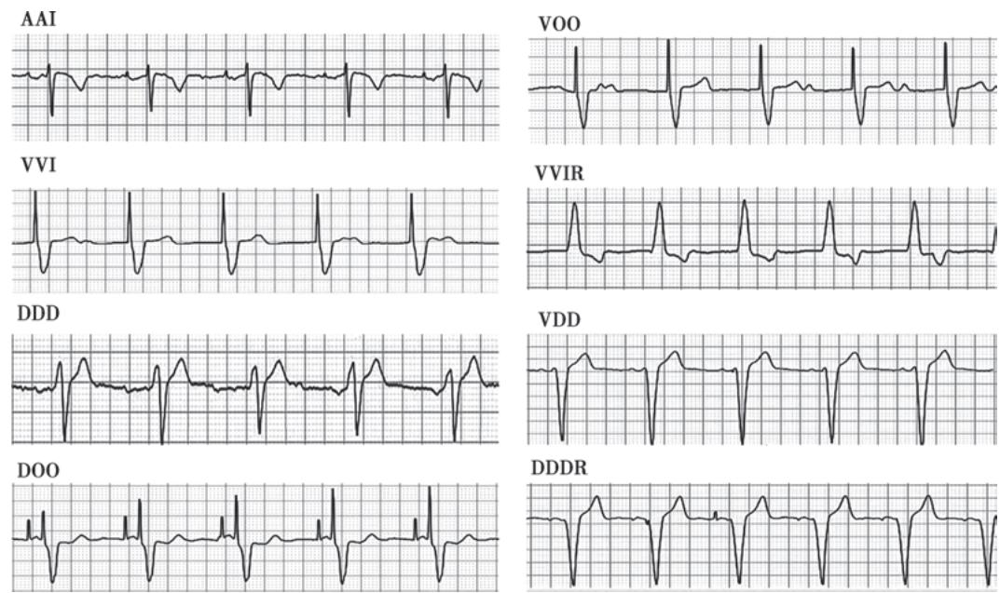  
图 3-3-34 不同起搏模式示意图

临床工作中常根据电极导线植入的部位分为:①单腔起搏器:常见的有 VVI 起搏器(电极导线常放置在右心室心尖部或间隔部或希氏束及左束支区域)和 AAI 起搏器(电极导线常放置在右心耳或低位房间隔)。根据心室率或心房率的需要进行心室或心房适时的起搏。②双腔起搏器:植入的两支电极导线分别放置在右心耳或低位房间隔(心房),以及右心室心尖部、间隔部或希氏束及左束支区域(心室),进行房室顺序起搏。

## 3. 起搏方式的选择

（1）VVI 方式:适用于所有类型的缓慢型心律失常。但有下列情况者不适宜应用:①VVI 起搏时血压下降 20mmHg 以上;②心功能代偿不良;③已知有起搏器综合征,因 VVI 起搏干扰了房室顺序收缩及室房逆传导致心排血量下降等出现的相关症状。

（2）AAI方式：保持房室顺序收缩，属生理性起搏，适用于房室传导功能正常的病态窦房结综合征。不适宜应用者：①有房室传导障碍，包括有潜在发生可能者(用心房调搏检验)；②慢性房性心律失常。

（3）DDD 方式: 是双腔起搏器中对心房和心室的起搏和感知功能最完整者。适用于房室传导阻滞伴或不伴窦房结功能障碍。不适宜应用者: 合并慢性房颤、房扑。

（4）频率自适应(R)方式:起搏器可通过感知体动、血 pH 等判断机体对心排血量的需要而自动调节起搏频率,以提高机体运动耐量,适用于需要从事中至重度体力活动者,可根据具体情况选用VVIR、AAIR、DDDR方式。若心率加快后心悸等症状加重或诱发心力衰竭、心绞痛的病人,不宜应用频率自适应起搏器。

总之,最佳起搏方式选用原则为:①窦房结功能障碍而房室传导功能正常者,以 AAI 方式最佳;②完全性房室传导阻滞而窦房结功能正常者,以 VDD 方式最佳;③窦房结功能和房室传导功能都有障碍者,DDD 方式最佳;④需要从事中至重度体力活动者,考虑加用频率适应性起搏功能。

（二）植入型心律转复除颤器 植入型心律转复除颤器（ICD）是一种终止致命性心律失常的多功能、多程控参数的电子装置，经静脉置入于心内膜除颤电极以感知室速及室颤，发放抗心动过速起搏或除颤能量以终止快速型心律失常。1980年世界上首例ICD应用于一位心脏性猝死(SCD)幸存者。目前ICD已成为预防心脏性猝死最有效的手段之一。

ICD 具备抗心动过缓起搏(anti-bradycardia pacing)、抗心动过速起搏(anti-tachycardia pacing, ATP)、低能电转复(cardioversion)和高能电除颤(defibrillation)四大功能。近几年一种全皮下 ICD (subcutaneous ICD, S-ICD) 开始应用于临床,但 S-ICD 因除颤电极和脉冲发生器均位于皮下,故不具备抗心动过缓起搏和抗心动过速起搏的功能。

## ICD 适应证如下:

1. 非可逆原因导致的血流动力学不稳定的持续性室速或室颤幸存者。

2. 心肌梗死 48 小时后发生的非可逆性的室颤或血流动力学不稳定的室速；心肌梗死 40 天后及血运重建 90 天后，经优化药物治疗后 LVEF≤35%，NYHA 心功能Ⅱ～Ⅲ级，或 LVEF≤30%、NYHA 心功能 I 级的病人。

3. 非缺血性心脏病病人,经优化药物治疗 3\~6 个月后 LVEF≤35%,心功能Ⅱ级或Ⅲ级。

4. 原因不明的晕厥病人，心电生理检查能诱发有显著血流动力学改变的持续室速或室颤。

5. 有心脏性猝死危险因素的肥厚型心肌病、扩张型心肌病及右心室发育不良型心肌病。

6. 有晕厥或室速记录的遗传性心脏病,且 $\beta$ 受体拮抗剂无效,如长 QT 间期综合征、Brugada 综合征等。

（三）心脏再同步治疗 心脏再同步治疗（CRT）是一种植入型电子装置，是在传统的右心房、右心室双心腔起搏基础上增加左心室起搏，通过设定合适的房室及左右心室电脉冲的释放时机，纠正房室和左右心室收缩的不同步，提高心脏的做功效率，增加心排血量。CRT 和 ICD 相结合的双心室同步起搏，简称为 CRT-D。目前，CRT 已成为针对合并宽 QRS 波的射血分数降低型（HFrEF）心衰病人的一种重要治疗手段，可进一步降低心衰病人的死亡率。

## CRT 适应证如下:

1. 经优化药物治疗后仍有心衰症状，QRS波呈完全性左束支传导阻滞（LBBB）（QRS波时限＞130ms）、LVEF≤35%的NYHAⅡ级或Ⅲ级的病人。

2. 经优化药物治疗后仍有心衰症状, QRS 波呈非完全性左束支传导阻滞 (QRS 波时限 $\geqslant$ 150ms)、LVEF $\leqslant$ 35% 的 NYHA II 级或 III 级的病人。

3. 具有心室起搏指征或合并高度房室传导阻滞且 LVEF<40% 的病人。

4. 针对 LVEF<40% 的持续性房颤病人, 若心室率控制欠佳且拟行房室结消融, 推荐行 CRT 治疗。

（四）起搏随访 起搏器随访的主要目的是了解病人情况，评价器械状况，关注疾病变化及相关沟通。具体包括评估器械性能和优化参数设置、识别和校正起搏器系统的异常情况、预测电池寿命并确定起搏器更换时机、保存病人及起搏器程控参数变化的记录并建立数据库，以及对病人进行沟通关怀和宣传教育。其中对于 ICD 植入病人,建议程控合适的心动过速识别参数和治疗参数,以减少 ICD 电击治疗。对于 ICD 不恰当放电或反复放电的病人,随访时应进行心理评估并对其心理异常进行干预,缓解焦虑紧张情绪,改善病人生活质量。对于 CRT 植入病人,则需优化再同步参数,保证高比例的再同步起搏,以提高 CRT 反应性。随访方案根据病人临床情况个体化制订,ICD 及 CRT 随访还需回顾心衰诊断参数(如经胸阻抗、夜间心率、心率变异性、病人活动量等),从而及时调整治疗方案,使病人得到最大获益。

起搏器随访有诊室随访和远程监测两种方式。所有心血管植入型电子器械在早期(植入后1～3个月)均需进行诊室随访；在中期建议每6～12个月进行诊室随访或远程监测；在后期(临近起搏器使用期限)则建议每1～3个月进行诊室随访或远程监测。

## 三、导管消融

导管消融（catheter ablation, CA）是将消融电极放置到与心律失常发生相关的心肌组织部位，采用能量（包括射频、冷冻、脉冲电场、激光和微波等）破坏心肌组织，改变该部位心肌自律性和传导性，从而达到治疗心律失常的目的。其中射频导管消融（radiofrequency catheter ablation, RFCA）技术自1989年应用于临床以来，是治疗快速型心律失常最常用的方法。对于房室结折返性心动过速、房室折返性心动过速及阵发性房颤，导管消融已成为安全有效的一线治疗手段。在不同能量的导管消融中，射频消融是以射频能量加热导管头端进行消融；冷冻消融则采用球囊内释放冷冻剂（液态一氧化二氮或液态氮）使周围组织冷冻消融；脉冲电场消融近年开始应用于临床，其疗效与安全性有待进一步评价和认识；激光和微波其他能源尚在研发或临床探索阶段。

## 【适应证】

1. 室上性心动过速 ①房室结或房室折返性心动过速病人；②抗心律失常药物治疗无效的有症状的室上速病人，包括局灶性或多源性房性心动过速、心房扑动。

2. 心房颤动 ①有症状的阵发性房颤病人；②持续性房颤药物治疗效果不佳或不能耐受者；③合并左心室射血分数下降的有症状的房颤病人。

3. 室性心律失常 ①右心室流出道起源的无结构性心脏病,且伴症状性频发室早病人,抗心律失常药物无效,或者不能耐受药物治疗者;②由相同形态室早反复触发多形性室速或特发性室颤。

【方法】常规经静脉路径(如股静脉或锁骨下静脉等)将高位右房电极、希氏束电极、冠状窦电极和右心室电极放置到相应位置,显示正常心脏传导顺序的心腔内电生理图;进行不同电极导管的程序性电刺激,即心内电生理检查,诱发心律失常发作以明确其发病机制,必要时行相应的鉴别检查,如拖带标测技术、希氏束旁电刺激等;根据不同的发病机制判断病变靶点位置,再经静脉或动脉途径(如股静脉或股动脉等)将消融导管送至靶点处。不同的疾病采取不同的消融术式,如慢径区改良消融、关键峡部片状或线性消融等,房颤因其发病机制的复杂性导致消融术式众多,以环肺静脉电隔离消融术式为主。最后检测是否已达到消融成功标准,如旁路传导功能消失或原有心律失常不能再诱发等。

  
本章思维导图

【并发症】导管消融并发症包括心包积液/心脏穿孔/心脏压塞、房室传导阻滞、肺静脉狭窄、左心房-食管瘘/左心房-心包瘘等，临床发生率低。

(石蓓)

## 动脉粥样硬化和冠状动脉粥样硬化性心脏病

本章数字资源

## 第一节 | 动脉粥样硬化

动脉粥样硬化（atherosclerosis）的特点是受累动脉的病变从内膜开始，局部先后发生细胞内外的脂质积聚、纤维组织增生和钙质沉着，病变内可见单核巨噬细胞及其他炎症细胞，并有平滑肌细胞的迁移和增生，大量胶原纤维、弹力纤维和蛋白多糖等结缔组织基质形成，动脉中层也可发生逐渐退变和钙化，在此基础上可发生斑块内出血、糜烂或破裂及继发局部血栓形成。由于在动脉内膜积聚的脂质外观呈黄色粥样，因此被称为动脉粥样硬化。动脉粥样硬化相关的心血管疾病被称为动脉粥样硬化性心血管疾病（atherosclerotic cardiovascular disease, ASCVD）。

【病因和危险因素】病因尚未完全确定。流行病学研究表明不少因素与本病的发生率增加相关,但并非直接因果关系,而是多种因素作用于不同环节所致,这些因素称为危险因素(risk factor)。主要的危险因素如下:

1. 年龄、性别 动脉粥样硬化的发生率随年龄而增加。临床上多见于40岁以上中老年，49岁以后进展较快，近年来发病年龄有年轻化趋势。男性发生率高于女性，发病年龄也较女性提前约10年，可能与雌激素的抗动脉粥样硬化作用有关，但女性在绝经期后发病率迅速增加。年龄和性别属于不可改变的危险因素。

2. 血脂异常 脂质代谢异常是动脉粥样硬化最重要的危险因素。动脉粥样硬化常见于高胆固醇血症，且和累积的胆固醇暴露量有关。家族性高胆固醇血症病人在青少年期就可以发生动脉粥样硬化。实验动物给予高胆固醇饲料可引起动脉粥样硬化。总胆固醇（total cholesterol, TC）、甘油三酯（triglyceride, TG）、低密度脂蛋白胆固醇（low density lipoprotein cholesterol, LDL-C）或极低密度脂蛋白胆固醇（very low density lipoprotein cholesterol, VLDL-C）增高、载脂蛋白B（apo B）增高和高密度脂蛋白胆固醇（high density lipoprotein-cholesterol, HDL-C）减低、载脂蛋白A（apo A）降低都被认为是危险因素，目前最肯定的是LDL-C致动脉粥样硬化作用，脂蛋白(a) $\left[\mathrm{Lp}(\mathrm{a})\right]$ 增高和TG增高也可能是独立的危险因素。临床实践中，LDL-C是防治ASCVD的首要干预靶点，非HDL-C为次要干预靶点。

3. 高血压病 高血压病病人动脉粥样硬化发病率明显增高,可能由于高血压内皮细胞损伤, LDL-C 易于进入动脉壁,并刺激平滑肌细胞增生,进而引起动脉粥样硬化发生及发展。60%～70% 的冠状动脉粥样硬化病人有高血压,高血压病病人患冠心病概率增高 3～4 倍。

4. 糖尿病和糖耐量异常 2型糖尿病诊断成立时，约 $50\%$ 的病人已存在动脉粥样硬化病变，2型糖尿病也被视为“冠心病等危症”。糖尿病病人动脉粥样硬化的发病率较非糖尿病者高出 $2 \sim 4$ 倍，且病变发生更早、更弥漫，进展更迅速，累及血管床更多。糖尿病病人多伴有高脂血症，常见TG升高、HDL-C降低、小而致密LDL(sdLDL)增加。如再伴有高血压，则动脉粥样硬化的发病率明显增高。糖尿病病人还常有凝血因子VIII增高及血小板功能增强，加速动脉粥样硬化血栓形成和引起管腔闭塞。糖耐量异常阶段即可增加动脉粥样硬化发生风险，近年研究认为这与胰岛素抵抗有密切关系。

5. 吸烟 与不吸烟者比较,吸烟者动脉粥样硬化的发病率和病死率增高2\~6倍,且与每日吸烟支数成正比。被动吸烟也是危险因素。烟草中有害成分可导致血管内皮损伤,前列环素释放减少,血小板易在动脉壁黏附聚集而形成血栓。吸烟还可使HDL-C降低、TC增高。另外,烟草所含尼古丁可直接作用于冠状动脉和心肌,引起动脉痉挛和心肌受损。

6. 肥胖 体重指数 (BMI) = 体重 (kg) / [身高 (m)] $^{2}$ , BMI 在 24～27.9kg/m $^{2}$ 为超重, ≥28kg/m $^{2}$ 为肥胖。肥胖可导致 TG 及胆固醇水平增高, 并常伴发高血压病、糖尿病或胰岛素抵抗, 导致动脉粥样硬化发病率明显增高。

7. 家族史 一级亲属男性<55岁、女性<65岁发生临床ASCVD者，考虑存在早发冠心病家族史。常染色体显性遗传所致的家族性高胆固醇血症是这些家族成员常见的患病因素。此外，近年已报道与人类动脉粥样硬化危险因素相关的易感或突变基因有200种以上。

其他的危险因素包括:①A型性格者:精神过度紧张者也易患病,可能与体内儿茶酚胺类物质浓度长期过高有关;②口服避孕药:长期口服避孕药可使血压升高、血脂异常、糖耐量异常,同时改变凝血机制,增加血栓形成机会;③不良生活习惯:高热量、高动物脂肪、高胆固醇、高糖饮食,缺乏体力活动等;④睡眠障碍:包括长期失眠,睡眠时间不足(每天<6小时)。

【发病机制】曾有多种学说从不同角度阐述本病发病机制。近年来比较公认的学说认为，动脉粥样硬化是内皮损伤(形态或功能)作为始动因素的一种炎症性疾病。

1856 年德国病理学家 Virchow 即提出动脉粥样硬化是动脉内膜炎症的观点,1999 年美国华盛顿大学医学院 Ross R. 教授在他的 “损伤反应学说” 的基础上明确提出 “动脉粥样硬化是一种炎症性疾病”,其发生发展始终伴随炎症反应。

正常动脉壁单层内皮细胞组成的内皮层是血液与组织之间的重要屏障。内皮细胞具有抗血栓作用，协助维持血液的流动性；合成和分泌多种血管活性物质，如一氧化氮、内皮素、前列环素等，协助调节血管平滑肌舒缩功能；分泌多种细胞因子以调节各种细胞的增殖和游走，影响血小板、白细胞黏附等。

动脉粥样硬化是血管壁细胞与血液细胞在炎症因子和增殖因子相互作用下导致的一种血管损伤过程。各种致炎因素，如病原体(肺炎衣原体、疱疹病毒等)、化学物质(氧化LDL-C、血管紧张素Ⅱ、醛固酮、尼古丁、糖基化终产物等)和物理因素(如血流切应力)等持续作用，造成内皮损伤，触发内皮表达黏附分子，如P选择素、血管细胞黏附分子-1(VCAM-1)等介导循环中的单核细胞和淋巴细胞黏附，并穿透内皮。移行至内膜的单核细胞转变成为巨噬细胞，通过清道夫受体吞噬氧化LDL-C，再转变为泡沫细胞形成最早粥样硬化病变脂质条纹，这些炎症细胞合成分泌很多细胞因子和促炎介质，包括单核细胞趋化蛋白-1(MCP-1)、血小板源生长因子(PDGF)、成纤维细胞生长因子(FGF)、肿瘤坏死因子(TNF)-α和白介素(IL)-1等，促进斑块生长和炎症反应。进入内膜的T淋巴细胞识别巨噬细胞和树突状细胞提呈的抗原(如修饰的脂蛋白)同时被激活，产生具有强烈致动脉粥样硬化的细胞因子，如干扰素-γ、TNF和淋巴毒素等，进一步募集炎症细胞，形成级联放大炎症反应。同时，在PDGF和FGF的作用下，平滑肌细胞从中膜迁移至内膜并增殖，亦吞噬脂质成为泡沫细胞的另一重要来源。此外，平滑肌细胞在成纤维介导因子作用下发生显著增殖，合成和分泌胶原蛋白、蛋白多糖和弹性蛋白等，构成斑块的细胞外基质。在上述各种机制的作用下，脂质条纹演变为纤维脂肪病变及纤维斑块。后期炎症细胞凋亡和坏死，释放基质金属蛋白酶(MMPs)，降解斑块纤维帽的胶原使纤维帽变薄，造成斑块破裂和血栓形成。临床研究证实，靶向IL-1β的单克隆抗体卡纳单抗可在不降低血脂的情况下，减少冠心病心血管事件的发生，进一步验证动脉粥样硬化的“炎症假说”。

【病理解剖和病理生理】 动脉粥样硬化主要累及体循环系统的大型肌弹力型动脉(如主动脉)和中型肌弹力型动脉(以冠状动脉和脑动脉最多,肢体各动脉、肾动脉和肠系膜动脉次之,下肢多于上肢),而肺循环动脉极少受累,常见数个组织器官的动脉同时受累。

正常动脉壁由内膜、中膜和外膜三层构成,如图 3-4-1 所示。动脉粥样硬化时相继出现脂质点和条纹、粥样和纤维粥样斑块、复合病变 3 类变化。美国心脏病学会根据其病变发展过程将其细分为以下 6 型。

I型:脂质点。动脉内膜出现小黄点,为小范围的巨噬细胞含脂滴形成泡沫细胞积聚。

Ⅱ型:脂质条纹。动脉内膜见黄色条纹,为巨噬细胞成层并含脂滴,内膜可见平滑肌细胞,也含脂显示动脉壁内膜、中膜和外膜三层结构，右下角是局部再放大示意。

  
图 3-4-1 动脉壁结构示意图

滴,有 T 淋巴细胞浸润。

Ⅲ型:斑块前期。细胞外出现较多脂滴，在内膜和中膜平滑肌层之间形成脂核，但尚未形成脂质池。

IV型:粥样斑块。脂质积聚多,形成脂质池,内膜结构破坏,动脉壁变形。

V型:纤维粥样斑块。为动脉粥样硬化最具特征性病变,呈白色斑块突入动脉腔内引起管腔狭窄。斑块表面内膜被破坏而由增生的纤维膜(帽)覆盖于脂质池之上。病变可向中膜扩展,破坏管壁,并同时可有纤维结缔组织增生、变性坏死等继发病变。

VI型:复合病变。为严重病变,由纤维斑块发生出血、坏死、溃疡、钙化和附壁血栓所形成。粥样斑块可因内膜表面破溃而形成粥样溃疡,破溃后粥样物质进入血流成为栓子。

近年来由于冠状动脉影像学尤其是包括血管内超声（IVUS）和光学相干断层扫描（OCT）在内的腔内影像学技术的进展和普及，对不同临床类型冠心病病人的斑块性状有了更直接和更清晰的认识。从临床角度来看，动脉粥样硬化斑块基本上可分为两类：一类是稳定型，即纤维帽较厚而脂质池较小的斑块；另一类是不稳定型(又称为易损型)，其纤维帽较薄，脂质池较大易于破裂。正因不稳定型斑块破裂导致急性缺血性心血管事件的发生。其他导致斑块不稳定的因素包括血流动力学变化、应激、炎症反应等，炎症反应在斑块稳定性和破裂中起着重要作用。斑块不稳定反映纤维帽的机械强度和损伤强度失平衡。斑块破裂释放组织因子和血小板活化因子，使血小板迅速聚集形成白色血栓；同时，斑块破裂导致大量炎症因子释放，上调促凝物质表达，促进纤溶酶原激活剂抑制物-1（PAI-1）的合成，从而加重血栓形成，并演变为红色血栓(图3-4-2、图3-4-3)。血栓形成使血管急性闭塞而导致严重持续性器官缺血。

从动脉粥样硬化的长期影响来看,受累动脉弹性减弱、脆性增加,其管腔逐渐变窄甚至完全闭塞,亦可扩张而形成动脉瘤。视受累动脉和侧支循环建立情况的不同,可引起整个循环系统或个别器官的功能紊乱。

1. 主动脉管壁弹性降低 心脏收缩时,主动脉管壁依靠弹性可适度扩张容纳心脏排出血液而缓冲收缩压的升高,主动脉管壁弹性降低时,该作用减弱,收缩压升高而舒张压降低,脉压增大。主动脉形成动脉瘤时,管壁为纤维组织所取代,不但失去弹性而且向外膨隆。

2. 内脏或四肢动脉管腔狭窄或闭塞 在侧支循环不能代偿的情况下,器官和组织的血液供应发生障碍,导致缺血、坏死或纤维化。

本病病理变化进展缓慢,青少年期即可开始出现脂质条纹,到中年期后开始出现明显的病变导致管腔狭窄,发生器官缺血症状。部分不稳定斑块进展迅速,易发生破裂导致急性缺血事件。现已有不少资料证明,动脉粥样硬化病变进展并非不可逆。积极控制和治疗各种危险因素一段时间后,较早期动脉粥样硬化病变可部分消退。

【临床表现】主要是相关器官受累后出现的症状。

1. 主动脉粥样硬化 大多数无特异性症状。主动脉广泛粥样硬化病变可出现主动脉弹性降低的相关表现,如收缩压升高、脉压增大等。X线检查可见主动脉结向左上方凸出,有时可见片状或弧状钙质沉着阴影。主动脉粥样硬化可以形成主动脉瘤,也可发生动脉夹层分离。

2. 冠状动脉粥样硬化 将在本章第二节详述。

  
图 3-4-2 动脉粥样硬化的发生和发展

A. 动脉粥样硬化斑块结构示意图: 显示粥样斑块的纤维帽和它所覆盖的脂质池。B. 动脉粥样硬化进展过程血管横切面结构示意图: 图中深黑色代表血栓、钙化, 淡黑色代表脂质条纹、脂质核和脂质池, 细黑点代表纤维帽。

  
图 3-4-3 主动脉粥样硬化斑块透视电镜像(×4800) 图示源于平滑肌的泡沫细胞,胞质内充满脂滴。

3. 颅脑动脉粥样硬化 最常侵犯颈内动脉、基底动脉和椎动脉。颈内动脉入脑处为好发区，病变多集中在血管分叉处。粥样斑块造成血管狭窄、脑供血不足或局部血栓形成或斑块破裂、碎片脱落造成脑梗死等脑血管意外；长期慢性脑缺血造成脑萎缩时，可发展为血管性痴呆。

4. 肾动脉粥样硬化 可引起顽固性高血压。55岁以上而突然发生高血压者，应考虑本病的可能。如发生肾动脉血栓形成可引起肾区疼痛、少尿和发热等。长期肾脏缺血可致肾萎缩并发展为肾衰竭。

5. 肠系膜动脉粥样硬化 可能引起消化不良、肠道张力减低、便秘和腹痛等症状。血栓形成时有剧烈腹痛、腹胀和发热。肠壁坏死时可引起便血、麻痹性肠梗阻和休克等。

6. 四肢动脉粥样硬化 以下肢动脉较多见。血供障碍引起下肢发凉、麻木和典型的间歇性跛行，即行走时发生腓肠肌麻木、疼痛以至痉挛，休息后消失，再走时又出现；严重者可持续性疼痛，下肢动脉尤其是足背动脉搏动减弱或消失。动脉完全闭塞可产生坏疽。

【实验室检查】本病尚缺乏敏感而特异的早期诊断方法。动脉粥样硬化病变的诊断有两个方面:一是形态学方面,包括病变所在部位、范围和程度;另一是功能学方面,评估粥样硬化病变是否导致器官的缺血。结合形态学和功能学的评估指导治疗方案的确定，包括血运重建(介入或外科治疗)的适应证和手术方法。超声可发现体表动脉如颈动脉、下肢动脉壁的斑块，多普勒超声检查有助于判断血流情况。X线检查可发现主动脉增宽、主动脉结突出、管壁钙化等。CT血管造影（CTA）和磁共振显像血管造影（MRA）无创显像动脉粥样硬化病变。结合无创影像技术的功能学方法，例如基于CTA的冠状动脉血流储备分数（CT-FFR）可评估器官缺血程度。心电图、超声心动图、放射性核素和负荷试验结果所示的特征性变化或心肌缺血证据有助于诊断冠状动脉粥样硬化性心脏病。选择性动脉造影可显示管腔狭窄或动脉瘤样病变，联合腔内影像技术和有创功能学评估可全面了解病变的形态和功能，是诊断动脉粥样硬化的最重要手段。动脉粥样硬化病人要关注血糖或脂质代谢异常相关指标。

【诊断与鉴别诊断】本病发展到出现器官缺血或坏死阶段时，诊断并不困难，但早期诊断很不容易。有动脉粥样硬化危险因素的人群，建议采用超声或其他无创性影像技术筛查动脉粥样硬化斑块，以指导早期预防和干预。年长病人发现血脂异常，X线、超声及动脉造影发现血管狭窄性或扩张性病变或钙化，应首先考虑诊断本病。

主动脉粥样硬化引起的主动脉变化和主动脉瘤，需与梅毒性主动脉炎和主动脉瘤以及纵隔肿瘤相鉴别；多发性大动脉炎、川崎病或其他一些自身免疫病等均可引起动脉管腔的狭窄或扩张，需要和本病相鉴别。各个器官出现缺血或梗死性相关症状时，除了粥样硬化外还需要考虑其他可引起管腔狭窄或闭塞的原因。

【预后】本病预后随病变部位、程度、血管狭窄发展速度、受累器官受损情况和有无并发症而不同。病变涉及心、脑、肾等重要脏器动脉者预后不良。

【防治】首先应积极预防动脉粥样硬化的发生。如已发生应积极治疗，防止病变发展并争取逆转。已发生并发症者应及时治疗，防止其恶化，延长病人寿命。

## （一）一般防治措施

1. 积极控制与本病有关的危险因素 包括高血压病、糖尿病、血脂异常、肥胖症等。

2. 合理膳食 控制膳食总热量,以维持正常体重,以 BMI 18.5\~24kg/m $^{2}$ 为正常体重;或以腰围为标准,当女性≥80cm、男性≥85cm 为超标。超重或肥胖者应减少每日进食总热量,减少胆固醇摄入,限制酒及含糖食物摄入。合并有高血压或心力衰竭病人应适量限盐。

3. 适当体力劳动和运动 参加一定的体力劳动和运动,有益于预防肥胖,调整血糖、血脂代谢,控制血压并锻炼循环系统功能等,是预防本病的一项积极措施。运动量应根据身体情况、体力活动习惯和心脏功能状态而定,以不过多增加心脏负担和不引起不适感觉为原则,通常建议每周150分钟(每周5天,每天30分钟)中等量运动,运动要循序渐进,不宜勉强做剧烈活动。

4. 合理安排工作和生活 生活要有规律,保持乐观、愉快的情绪。避免过度劳累和情绪激动。注意劳逸结合,保证充足的睡眠。

## 5. 提倡戒烟限酒

（二）药物治疗 主要是调整血脂和防止血栓形成，综合控制危险因素(降血压、控制血糖等)，有靶器官缺血者使用抗缺血药物和靶器官保护药物。

1. 调整血脂药物 目前首选 LDL-C 作为调脂治疗的首要靶点,根据病人危险分层,确定目标值。他汀类药物是首选的降低胆固醇药物,如果单药不能达标或不耐受,联合使用胆固醇吸收抑制剂,前蛋白转化酶枯草溶菌素 9 型 (PCSK9) 抑制剂,或靶向 PCSK9 蛋白合成的小干扰 RNA 药物 (具体参见本章第三节)。TG 明显升高者可用贝特类药物或大剂量鱼油。

2. 抗血小板药物 通过抗血小板黏附和聚集防止血栓形成,避免血管阻塞性病变发展,用于预防动脉血栓形成和栓塞。最常用口服药为阿司匹林、氯吡格雷、普拉格雷、替格瑞洛、吲哚布芬和西洛他唑;静脉药物包括阿昔单抗、替罗非班、埃替非巴肽等药物,临床上根据病人发生缺血事件风险,单药或联合用药。

3. 溶栓和抗凝药物 对动脉内形成血栓导致管腔狭窄或阻塞者,可用溶栓药物,包括链激酶、尿激酶、阿替普酶（rt-PA）、瑞替普酶（r-PA）、替奈普酶（TNK-tPA）、尿激酶原等。肠外抗凝药物包括普通肝素、低分子量肝素、比伐芦定、磺达肝癸钠，口服抗凝药物包括华法林及新型口服抗凝药（NOAC）。

（三）介入和外科手术 对于狭窄或闭塞血管，特别是冠状动脉、肾动脉和四肢动脉，可通过介入或外科手段进行血运重建，以恢复动脉供血。

## 第二节 | 冠状动脉粥样硬化性心脏病概述

冠状动脉粥样硬化性心脏病（coronary atherosclerotic heart disease）指冠状动脉(冠脉)发生粥样硬化引起管腔狭窄或闭塞，导致心肌缺血、缺氧或坏死而引起的心脏病，简称冠心病（coronary artery disease, CAD；或 coronary heart disease, CHD），亦称缺血性心脏病(ischemic heart disease)。

冠心病是动脉粥样硬化导致器官病变的最常见类型,严重危害人类健康。本病多发于40岁以上成人,男性发病早于女性,经济发达国家发病率较高;近年来发病呈年轻化趋势。

【临床分型】由于病理解剖和病理生理变化的不同，冠心病有不同的临床表型。1979年WHO曾将其分为五型：①隐匿型或无症状型冠心病；②心绞痛；③心肌梗死；④缺血性心肌病；⑤猝死。近年趋向于根据发病特点和治疗原则不同分为两大类：慢性冠脉综合征（chronic coronary syndrome, CCS）和急性冠脉综合征（acute coronary syndrome, ACS）。CCS也称慢性冠状动脉疾病（chronic coronary disease, CCD），病理上冠脉可有阻塞性病变或无明显阻塞性病变，CCS包括以下情况：伴稳定心绞痛症状和/或呼吸困难的疑似冠心病病人；新发心力衰竭或左心室功能障碍的疑似冠心病病人；ACS后1年内或近期血运重建的无症状或症状稳定病人；初次诊断或血运重建1年以上的无症状或有症状病人；疑似血管痉挛或微血管疾病的心绞痛病人；筛查时发现的无症状CAD病人。ACS包括不稳定型心绞痛（unstable angina, UA）、非ST段抬高型心肌梗死（non-ST-segment elevation myocardial infarction, NSTEMI）、ST段抬高型心肌梗死（ST-segment elevation myocardial infarction, STEMI）和猝死，其中猝死是冠心病中最严重的临床类型。ACS病理上大多数为冠脉粥样病变基础上继发血栓形成和/或痉挛。少部分心肌梗死者没有冠脉阻塞病变（MINOCA），原因包括痉挛、自发性夹层（spontaneous coronary artery dissection, SCAD）或壁内血肿等，以及栓塞和微血管疾病。CCS和ACS为冠心病不同演变阶段，临床表现主要取决于动脉粥样硬化斑块是否稳定，它可以有很长的稳定期，但CCS未来发生心血管事件的风险可能随着时间的推移而改变，如果危险因素控制不充分，生活方式改变和/或药物治疗不理想，或血运重建不成功，斑块发生破裂或侵蚀引起急性血栓事件时就成为ACS。

【发病机制】当冠脉供血供氧与心肌需血需氧之间发生矛盾,冠脉血流量不能满足心肌代谢的需要就可引起心肌缺血缺氧。暂时的缺血缺氧引起心绞痛,而持续严重的心肌缺血缺氧可引起心肌坏死,即为心肌梗死。

心肌能量的产生要求大量氧供，心肌细胞摄取血液氧含量达到65%～75%，明显高于其他组织。因此心肌平时对血液中氧的摄取已接近于最大量，氧需再增加时已难从血液中更多地摄取氧，只能依靠增加冠脉血流量来提供。正常情况下，冠脉循环有很大储备能力，通过神经和体液调节，其血流量可随身体的生理情况而有显著的变化，使冠脉的供血和心肌的需血保持动态平衡；在剧烈体力活动时，冠脉适当地扩张，血流量可增加到休息时的6～7倍。

决定心肌耗氧量的主要因素包括心率、心肌收缩力和心室壁张力，临床上常以“心率×收缩压”估计心肌耗氧量。由于冠脉血流灌注主要发生在舒张期，心率增加导致舒张期缩短及各种原因导致的舒张压降低显著影响冠脉灌注。冠脉固定狭窄或微血管阻力增加也可导致冠脉血流减少，当冠脉管腔存在显著固定狭窄（50%～75%），安静时尚能代偿，而运动、心动过速、情绪激动造成心肌需氧量增加时，可导致短暂心肌供氧和需氧间的不平衡，这是大多数CCS的发病机制。另一些情况下，由于不稳定性粥样硬化斑块发生破裂、糜烂、侵蚀或出血，继发血小板聚集或血栓形成导致管腔狭窄程度急剧加重，或冠脉发生痉挛，均可使心肌氧供应明显减少，这是引起ACS的主要原因。另外，即使冠脉血流灌注正常,严重贫血时心肌氧供也可显著降低。很多情况下,心肌缺血甚至坏死是需氧量增加和供氧量减少两者共同作用的结果。

心肌缺血后发生缺氧，氧化代谢受抑，致使高能磷酸化合物储备降低，细胞功能随之发生改变。产生痛觉的直接因素可能是在缺血缺氧情况下，心肌内积聚过多的代谢产物，如乳酸、丙酮酸、磷酸等酸性物质或类似激肽的多肽类物质，刺激心脏内自主神经传入纤维末梢，经1～5胸交感神经节和相应脊髓段，传至大脑产生疼痛感觉。这种痛觉反映在与自主神经进入水平相同脊髓段的脊神经所分布区域，即胸骨后及两臂的前内侧与小指，尤其左侧。

## 第三节 | 慢性冠状动脉综合征

慢性冠状动脉综合征（CCS）最常见为慢性稳定型劳力性心绞痛和以心功能不全为主要表现的缺血性心肌病，部分处于渡过ACS后或行血运重建之后稳定期，有些则为无症状隐匿型冠心病。发生心肌缺血的主要原因是存在稳定的心外膜冠脉粥样硬化造成的固定狭窄，在某些因素导致心肌耗氧量增加的情况下诱发心肌急剧暂时性缺血缺氧；但冠脉痉挛或微血管病变的病人没有心外膜血管固定狭窄临床上亦不少见。CCS病人在治疗上有共同之处，通过抗心肌缺血治疗改善症状，稳定或逆转斑块并预防血栓形成，延长病人生存期。

## 一、稳定型心绞痛

稳定型心绞痛（stable angina pectoris）也称劳力性心绞痛。其特点为阵发性的前胸部压榨性疼痛或憋闷感觉，主要位于胸骨后部，可放射至心前区和左上肢尺侧，常发生于劳力负荷增加时，持续数分钟，休息或服用硝酸酯制剂后疼痛消失。疼痛发作的程度、频度、持续时间、性质及诱发因素等在数月内无明显变化。

【发病机制】当冠脉狭窄或部分闭塞时,其血流量减少,心肌供血量相对比较固定。休息时尚能维持心肌血流的供需平衡,病人可无症状。在劳力、情绪激动、饱食、受寒等情况下,心脏负荷突然增加,使心率增快、心肌张力和收缩力增加等导致心肌氧耗量增加,而存在狭窄的冠脉供血却不能相应地增加以满足心肌需求时,即可引起心绞痛。

【病理解剖和病理生理】稳定型心绞痛病人的冠脉造影显示:有1、2或3支冠脉狭窄减少＞70%的病变者分别占25%左右,5%～10%有左冠脉主干狭窄;其余约15%的病人冠脉无显著狭窄,提示可能是冠脉痉挛、微血管病变、交感神经过度活动、儿茶酚胺分泌过多或心肌代谢异常等导致心肌血供和氧供不足。

病人心绞痛发作之前，常有血压增高、心率增快、肺动脉压和肺毛细血管楔压增高，反映心脏和肺的顺应性减低。发作时可有左心室收缩力和收缩速度降低、射血速度减慢、左心室收缩压下降、心搏出量和心排血量降低、左心室舒张末期压和血容量增加等左心室收缩和舒张功能障碍的病理生理变化。左心室壁可呈收缩不协调或部分有收缩减弱现象。

【临床表现】

(一) 症状 心绞痛以发作性胸痛为主要临床表现,疼痛特点为:

1. 诱因 常见诱因包括体力劳动或情绪激动(如愤怒、焦急、过度兴奋等),饱食、寒冷、吸烟、心动过速、休克等亦可诱发。疼痛多发生于劳力或激动的当时,而不在劳累之后。典型稳定型心绞痛常在相似的条件下重复发生。

2. 部位 主要在胸骨体后,可波及心前区,手掌大小范围,也可横贯前胸,界限不清。常放射至左肩、左臂内侧达无名指和小指,或至颈、咽或下颌部。

3. 性质 胸痛常为压迫、发闷或紧缩性，也可有烧灼感，但不像针刺或刀扎样锐性痛，偶伴濒死感。有些病人仅觉胸闷不适或呼吸困难，而非胸痛。发作时病人往往被迫停止正在进行的活动，直至症状缓解。

4. 持续时间 一般持续数分钟至十余分钟, 多为 3\~5 分钟, 不超过半小时。

5. 缓解方式 一般在停止原来诱发症状的活动后即可缓解；硝酸甘油等快速起效的硝酸酯类药物舌下含服或喷吸也能在几分钟内使之缓解。

（二）体征 平时一般无异常体征。心绞痛发作时常见心率增快、血压升高、表情焦虑、皮肤冷或出汗，有时出现第四或第三心音奔马律。可有暂时性心尖部收缩期杂音，是因乳头肌缺血致功能失调引起二尖瓣关闭不全所致。

## 【辅助检查】

（一）实验室检查 血糖、血脂检查可了解冠心病危险因素；胸痛明显者需查血清心肌损伤标志物，包括心肌肌钙蛋白I或T、肌酸激酶（CK）及同工酶（CK-MB），据此与ACS相鉴别；氨基末端脑钠肽前体（NT-proBNP）可了解病人心功能状态；血常规可了解有无贫血；必要时检查甲状腺功能。

## （二）心电图（ECG）检查

1. 静息时 ECG 约半数病人在正常范围,也可能有陈旧性心肌梗死改变或非特异性 ST 段和 T 波异常。有时出现房室或束支传导阻滞、房性或室性期前收缩等心律失常,但均非特异性。

2. 发作时 ECG 绝大多数病人可出现暂时性心肌缺血引起的 ST 段移位。因心内膜下心肌更容易缺血，故常见反映心内膜下心肌缺血的 ST 段压低 ( $\geqslant0.1mV$ )，发作缓解后恢复 (图 3-4-4)。有时也可以出现 T 波倒置。在平时有 T 波持续倒置的病人，发作时可变为直立 (“假性正常化”)。T 波改变虽然对反映心肌缺血的特异性不如 ST 段压低，但如与平时 ECG 比较有明显差别，也有助于诊断。

  
图 3-4-4 心绞痛发作时的心电图  
I、Ⅱ、Ⅲ、aVF、 $V_{4\sim6}$ 导联 ST 段压低。

3. ECG 负荷试验 最常用的是运动负荷试验,增加心脏负担以激发心肌缺血。运动方式主要为分级活动平板或踏车,其运动强度可逐步升级。前者常用,让受检查者迎着转动的平板就地踏步,以达到按年龄预计可达到的最大心率 $\left(\mathrm{HR}_{\max }\right)$ 或亚极量心率(85%\~90%的 $HR_{max}$ )为负荷目标,前者为极量运动试验,后者为亚极量运动试验。运动中应持续监测ECG改变。运动前、运动中每当运动负荷量增加一次均应记录ECG,运动终止后即刻及此后每2分钟均应重复ECG记录,直至心率恢复至运动前水平。ECG记录时应同步测定血压。运动中出现典型心绞痛、ECG改变主要以ST段水平形或下斜形压低≥0.1mV(J点后60\~80ms)持续2分钟为运动试验阳性标准(图3-4-5)。运动中出现心绞痛、步态不稳、室性心动过速或血压下降时,应立即停止运动。心肌梗死急性期、不稳定型心绞痛、明显心力衰竭、严重心律失常或急性疾病者禁做运动试验。本试验有一定比例的假阳性和假阴性,单纯结果不能作为诊断或排除冠心病的依据。

4. ECG 连续动态监测(Holter) Holter 检查可连续记录并自动分析 24 小时(或更长时间)的 ECG(双极胸导联或同步 12 导联), 可发现 ST 段、T 波改变(ST-T)和各种心律失常。将出现异常 ECG静息时心电图示Ⅱ、Ⅲ、aVF 和 $V_{5}$ 、 $V_{6}$ 导联 ST 段压低；运动时 $V_{5}$ 导联 ST 段 1 分钟开始压低，5 分 18 秒时达到 4mm；运动后 I、Ⅱ、Ⅲ、aVF、 $V_{3}$ 、 $V_{4}$ 、 $V_{5}$ 、 $V_{6}$ 导联均出现 ST 段压低，T 波倒置，8 分钟后仍未恢复，运动试验阳性。

4'  
1'  

  
静息

  
运动时

  
0'

  
2'

  
运动后

  
0'

  
2'

  
6'

  
8'  
图 3-4-5 心电图平板运动试验

表现的时间与病人活动和症状相对照。胸痛发作时相应时间的缺血性 ST-T 改变有助于确定心绞痛诊断，也可检出无痛性心肌缺血。

（三）CT 血管造影（CTA）进行冠脉二维或三维重建(图 3-4-6)，用于判断冠脉管腔狭窄程度和管壁钙化情况，对判断管壁内斑块分布范围和性质也有一定意义。冠脉 CTA 有较高阴性预测价值,若未见狭窄病变,一般可不进行有创检查;但其对狭窄程度判断仍有一定局限性,特别当钙化存在时会显著影响判断。近年来,基于冠脉CTA血流储备分数(CT-FFR)可评估冠脉狭窄病变功能,通常以CT-FFR<0.80为诊断心肌缺血界限值,需要冠脉造影进一步明确狭窄程度以决定治疗策略。

  
图 3-4-6 多层螺旋 CT 冠脉成像  
箭头所示为左前降支近段病变，左、中、右图为不同角度所示。

（四）超声心动图 多数稳定型心绞痛病人静息时超声心动图检查无异常。有陈旧性心肌梗死或严重心肌缺血病人，二维超声心动图可探测到坏死区或缺血区心室壁的运动异常。运动或药物负荷超声心动图可评价负荷状态下心肌灌注情况。超声心动图还有助于发现其他需与冠脉狭窄导致心绞痛相鉴别的疾病如肥厚型梗阻性心肌病、主动脉瓣狭窄等。

## （五）放射性核素检查

1. 心肌灌注显像及负荷试验 ${}^{201}$ Tl(铊)随冠脉血流很快被正常心肌细胞所摄取。静息时铊显像所示灌注缺损主要见于心肌梗死后瘢痕部位。运动后见明显灌注缺损心肌缺血区提示冠脉供血不足。近年来有用 ${}^{99m}$ Tc-MIBI 取代 ${}^{201}$ Tl 作心肌显像，更便于临床推广应用(图 3-4-7)。

  
图 3-4-7 心肌灌注显像

图中第一和第二行分别为负荷和静息状态下左室短轴心尖至心底部(左至右)切面,第三、四行分别为两状态下左室长轴下壁至前壁切面,第五、六行分别为两状态下左室垂直长轴间隔至侧壁切面。图示左室前壁、心尖和下壁近心尖处在负荷状态下有放射性稀疏和缺损,静息状态下再分布可见明显的放射性充填,为心肌缺血表现。

2. 放射性核素心腔造影 应用 ${}^{99m}$ Tc 进行体内红细胞标记, 得到心腔血池显影。通过对心动周期中不同时相的显影图像分析, 测定左心室射血分数及显示心肌缺血区域室壁局部运动障碍。

3. 正电子发射断层心肌显像 利用发射正电子的核素示踪剂如 ${}^{18}F$ 、 ${}^{11}C$ 、 ${}^{13}N$ 等进行心肌显像。除可判断心肌血流灌注情况外，尚可了解心肌代谢情况。通过对心肌血流灌注和代谢显像匹配分析可准确评估心肌活力。

(六) 冠脉磁共振成像 冠脉磁共振成像 (CMRA) 是冠脉成像的新方法, 无电离辐射、无创。采用呼吸和心电门控技术获得三维 CMRA 是目前最常用的方法。负荷和灌注 MRI 图像还可以显示心肌缺血。成像时间长、空间分辨率低、操作依赖性强等缺陷限制了 CMRA 的广泛应用。

## (七) 有创性检查

1. 冠脉造影 选择性冠脉造影(图 3-4-8)目前仍然是诊断冠心病的“金标准”，用特殊形状的心导管经桡动脉、股动脉或肱动脉送到主动脉根部，分别插入左、右冠脉口，注入少量含碘对比剂，在不同的投射方位下采集摄影，可使左、右冠脉及其主要分支得到清楚显影，发现狭窄性病变的部位并估计其程度。一般认为管腔直径减少70%～75%以上会严重影响血供。

  
A

  
B

  
C  
图 3-4-8 选择性冠脉造影显像

A. 正头位（AP+CRA 30°），箭头所示为左前降支中段的病变部位；B. 右前斜足位（RAO 30°+CAU 30°），箭头所示为左回旋支近中段的病变部位；C. 左前斜位（LAO 45°），箭头所示为右冠状动脉中段病变部位。

2. 其他 IVUS(图 3-4-9)、OCT、冠脉血流储备分数(fractional flow reserve, FFR)测定以及冠脉定量血流分数(quantitative flow ratio, QFR)等形态学或功能学评估技术也可用于冠心病的诊断并有助于指导介入治疗。

  
A

  
B  
图 3-4-9 冠脉心血管内超声成像  
A. 基本正常节段血管。B. 冠状动脉粥样硬化病变部位, 箭头所示为斑块; 内圈为管腔横断面, 外圈为外弹力膜, 两圈之间的环形区域为粥样硬化斑块。

（八）其他检查 胸部 X 线检查对稳定型心绞痛并无特异的诊断意义,一般情况下都是正常的。但有助于了解其他心肺疾病的情况,如有无心脏增大、心衰等。

【诊断与鉴别诊断】根据典型心绞痛的发作特点,结合年龄和存在冠心病危险因素,除外其他原因所致的心绞痛,一般即可建立诊断。心绞痛发作时 ECG 检查可见 ST-T 改变,症状消失后 ST-T 改变逐渐恢复,支持心绞痛诊断。未捕捉到发作时 ECG 者可行 ECG 负荷试验。冠脉 CTA 有助于无创性评价冠脉管腔狭窄程度及管壁病变性质和分布。冠脉造影可明确病变的严重程度和分布范围,联合腔内影像和功能学技术,有助于诊断和指导进一步治疗。

加拿大心血管病学会(CCS)把心绞痛严重程度分为四级。

I级:一般体力活动(如步行和登楼)不受限,仅在强、快或持续用力时发生心绞痛。

Ⅱ级:一般体力活动轻度受限,快步行走、饭后、寒冷或刮风中、精神应激或醒后数小时内发作心绞痛。一般情况下平地步行200m以上或登楼一层以上受限。

Ⅲ级:一般体力活动明显受限,一般情况下平地步行200m内或登楼一层引起心绞痛。

Ⅳ级:轻微活动或休息时即可发生心绞痛。

鉴别诊断要考虑下列情况：

1. 急性冠脉综合征 不稳定型心绞痛的疼痛部位、性质、发作时心电图改变等与稳定型心绞痛相似，但发作诱因不同，常在休息或较轻微活动下即可诱发。1个月内新发的或明显恶化的劳力性心绞痛也属于不稳定型心绞痛；心肌梗死的疼痛程度更剧烈，持续时间多超过30分钟，甚可长达数小时，可伴有心律失常、心力衰竭或/和休克，含用硝酸甘油多不能缓解，心电图常有典型的动态演变过程。实验室检查示心肌坏死标志物增高；可有白细胞计数增高和红细胞沉降率增快。

2. 其他疾病引起的心绞痛 严重主动脉瓣狭窄或关闭不全、风湿性冠脉炎、梅毒性主动脉炎引起冠脉口狭窄或闭塞、肥厚型心肌病、X综合征等，要根据其临床表现来进行鉴别。其中X综合征多见于女性，ECG负荷试验常阳性但冠脉造影无狭窄病变且无冠脉痉挛证据，预后良好，被认为是冠脉微循环病变所致。

3. 肋间神经痛和肋软骨炎 前者疼痛常累及1～2个肋间，但并不一定局限在胸前，为刺痛或灼痛，多为持续性而非发作性，咳嗽、用力呼吸和身体转动可使疼痛加剧，沿神经走行处有压痛，手臂上举活动时局部有牵拉疼痛；后者则在肋软骨处有压痛。

4. 心脏神经症 病人常诉胸痛,但为短暂(几秒)的刺痛或持久(几小时)的隐痛。病人常喜欢不时地吸一大口气或叹息性呼吸。胸痛部位多在左胸乳房下心尖部附近或经常变动。症状多于疲劳之后出现,而非疲劳当时。轻度体力活动反觉舒适,有时可耐受较重的体力活动而不发生胸痛或胸闷。含用硝酸甘油无效或在10多分钟后才“见效”。常伴有心悸、疲乏、头昏、失眠及其他神经症的症状。

5. 其他系统疾病导致的胸痛 还需与反流性食管炎等食管疾病、膈疝、消化性溃疡、肠道疾病、颈椎病等相鉴别。

【预后】稳定型心绞痛病人大多数能生存很多年，但有发生急性心肌梗死或猝死的危险。决定预后的主要因素为冠脉病变累及心肌供血的范围和心功能。左冠脉主干病变最为严重，国外统计年病死率可高达30%左右，此后依次为3支、2支与单支病变。左前降支病变一般较其他两支冠脉病变预后差。左心室造影、超声心动图或核素心室腔显影所示射血分数降低和室壁运动障碍也有预后意义。

【治疗】 治疗原则是改善冠脉血供和降低心肌耗氧以改善病人症状,提高生活质量,同时治疗冠脉粥样硬化,预防心肌梗死和死亡,延长生存期。

## （一）发作时治疗

1. 休息 发作时立刻休息,一般在停止活动后症状即逐渐消失。

2. 药物治疗 可使用作用较快的硝酸酯制剂。舌下含服或口腔喷剂起效最快，反复发作也可静脉使用，但要注意耐药的可能。硝酸酯类药物除扩张冠脉、降低阻力、增加冠脉循环的血流量外，还通过对周围血管扩张作用，减少静脉回心血量，降低心脏前后负荷，缓解心绞痛。

（1）硝酸甘油（nitroglycerin）:0.5mg 舌下含化或喷雾剂喷吸 1～2 次。1～2 分钟即开始起效，约半小时后作用消失。延迟见效或完全无效提示病人并非患冠心病或者是严重冠心病。与各种硝酸酯类药物一样，其副作用有头痛、面色潮红、心率反射性加快和低血压等。第一次含用硝酸甘油时应注意有可能发生直立性低血压。

（2）硝酸异山梨酯(isosorbide dinitrate):5～10mg舌下含化。2～5分钟见效，作用维持2～3小时。也有喷雾吸入制剂。

## (二) 缓解期治疗

1. 生活方式调整 尽量避免各种诱发因素。清淡饮食,进食不应过饱;戒烟限酒;减轻精神负担,保障睡眠;调整日常生活与工作量,保持适当体力活动,以不致发生疼痛症状为度;一般不需卧床休息。

## 2. 药物治疗

## (1) 改善缺血、减轻症状从而提高生活质量的药物

1）β受体拮抗剂：抑制心脏β肾上腺素能受体，减慢心率、减弱心肌收缩力、降低血压，降低心肌耗氧量、减少心绞痛发作和增加运动耐量。用药后静息心率降至55～60次/分，严重心绞痛病人如无心动过缓症状可降至50次/分。推荐使用无内在拟交感活性的选择性 $\beta_{1}$ 受体拮抗剂，剂量个体化，从较小剂量开始，逐级增加剂量。临床常用的 $\beta_{1}$ 受体拮抗剂包括美托洛尔普通片（25～100mg，每日2次）、美托洛尔缓释片（47.5～190mg，每日1次）和比索洛尔（5～10mg，每日1次）等。

有严重心动过缓和高度房室传导阻滞、窦房结功能紊乱、有明显支气管痉挛或支气管哮喘的病人禁用。外周血管疾病及严重抑郁亦是相对禁忌证。慢性肺心病病人可小心使用高度选择性的 $\beta_{1}$ 受体拮抗剂。

2）硝酸酯类药物：常用药物包括二硝酸异山梨酯(普通片5～20mg，每日3～4次；缓释片20～40mg，每日1～2次)和单硝酸异山梨酯(普通片20mg，每日2次；缓释片40～60mg，每日1次)等。每天用药时应注意给予足够的无药间期，以减少耐药性的发生。不良反应包括头痛、面色潮红、心率反射性加快和低血压等。

3）钙通道阻滞剂：阻滞钙离子进入细胞内，抑制心肌细胞兴奋-收缩偶联，从而抑制心肌收缩，减少心肌氧耗；扩张冠脉，解除痉挛，改善心内膜下心肌供血；扩张周围血管，降低动脉压，减轻心脏负荷；改善心肌微循环。常用制剂有：非二氢吡啶类药物，包括维拉帕米(普通片40～80mg，每日3次；缓释片240mg，每日1次)、地尔硫草(普通片30～60mg，每日3次；缓释片90mg，每日1次)，这两类药物有负性肌力和负性传导作用，与β受体拮抗剂联合使用需要非常谨慎。二氢吡啶类药物，包括硝苯地平(控释片30mg，每日1次)、氨氯地平（5～10mg，每日1次)等，合并高血压病人更适合。

外周水肿、便秘、心悸、面部潮红是所有钙通道阻滞剂常见副作用。其他不良反应还包括头痛、头晕、虚弱无力等。地尔硫草和维拉帕米能减慢窦房结心率和房室传导，抑制心肌收缩，不能应用于已有严重心动过缓、高度房室传导阻滞和病态窦房结综合征病人，也不建议用于左心室功能不全病人。

4）其他药物：主要用于β受体拮抗剂或者钙通道阻滞剂有禁忌、不耐受或者不能控制症状的情况下。主要有：①曲美他嗪(普通片20～60mg，每日3次；缓释剂35mg，每日2次)，抑制脂肪酸氧化和增加葡萄糖代谢，提高氧利用率而治疗心肌缺血。②尼可地尔（5mg，每日3次），是一种ATP依赖钾离子通道开放剂，除了与硝酸酯类制剂具有相似药理特性外，还可扩张微血管。③伊伐布雷定（5～7.5mg，每日2次），是第一个窦房结 $I_{f}$ 电流选择特异性抑制剂，可用于需要减慢窦性心率的稳定型心绞痛。④雷诺嗪，抑制心肌细胞晚期钠电流，防止钙超载和改善心肌代谢活性。⑤中医中药治疗目前以“活血化瘀”“芳香温通”和“祛痰通络”法最为常用。

## (2) 预防心肌梗死,改善预后的药物

## 1）抗血小板药物

环氧化酶（cycloxygenase, COX）抑制剂：阻断血栓素 $A_{2}$ 合成，达到抗血小板聚集的作用，包括不可逆 COX 抑制剂（阿司匹林）和可逆 COX 抑制剂（吲哚布芬）。阿司匹林是抗血小板治疗的基石，所有病人只要无禁忌都应该使用，最佳剂量为每日 75～150mg，主要不良反应为胃肠道出血或对阿司匹林过敏。吲哚布芬可逆性抑制 COX-1，同时减少血小板因子 3 和 4，减少血小板聚集，且对前列腺素抑制率低，胃肠反应和出血风险少，可用于有出血或消化道损伤风险的病人，维持剂量为 100mg，每日 2 次。

$P_{2}Y_{12}$ 受体拮抗剂: 抑制 ADP 诱导血小板活化。目前, 我国临床上常用氯吡格雷和替格瑞洛。氯吡格雷是第二代 $P_{2}Y_{12}$ 受体拮抗剂, 为前体药物, 需在肝脏中通过细胞色素 P450(CYP 450)酶系中的 CYP2C19 代谢而成为活性代谢物后, 才能不可逆地抑制 $P_{2}Y_{12}$ 受体, 从而抑制血小板聚集反应。主要用于支架植入后以及阿司匹林有禁忌证病人, 常用维持剂量为每日 75mg。CYP2C19 慢代谢基因型病人氯吡格雷抗血小板作用可能减弱。

## 2）调脂药物

降低 LDL-C 药物:首选他汀类,它抑制肝细胞中胆固醇合成的限速酶乙酰 CoA 还原酶,使肝细胞内胆固醇浓度降低,肝细胞膜表面的 LDL 受体表达增加,有效降低 TC 和 LDL-C,延缓斑块进展并稳定斑块。所有明确诊断为冠心病病人,无论其血脂水平如何,均应给予他汀类药物,并将 LDL-C 降至 1.8mmol/L (70mg/dl) 以下。临床常用的他汀类药物包括阿托伐他汀 (10\~80mg,每晚 1 次)、瑞舒伐他汀 (5\~20mg,每晚 1 次)、匹伐他汀 (1\~2mg,每晚 1 次)、普伐他汀 (20\~40mg,每晚 1 次)、氟伐他汀 (40\~80mg,每晚 1 次)、辛伐他汀 (20\~40mg,每晚 1 次)等,中药血脂康含有天然洛伐他汀也可有效降低胆固醇。他汀类药物的总体安全性很高,但仍应注意监测谷氨酸转氨酶及肌酸激酶等生化指标,及时发现药物可能引起的肝脏损害和肌损伤,尤其大剂量他汀药物强化调脂治疗时,更应注意监测药物安全性。其他降低胆固醇的药物包括胆固醇吸收抑制剂、前蛋白转化酶枯草溶菌素 9 (PCSK9) 抑制剂和靶向 PCSK9 的小干扰核糖核酸 (RNA) 药物英克司兰。胆固醇吸收抑制剂通过选择性抑制小肠胆固醇转运蛋白,有效减少肠道内胆固醇的吸收,降低血浆胆固醇水平以及肝脏胆固醇储量。对于单独应用他汀类药物胆固醇水平不能达标或不能耐受较大剂量他汀治疗的病人,可以联合应用,常用药物有依折麦布 (10mg,每天 1 次)、海博麦布 (10mg,每天 1 次)。PCSK9 抑制剂增加肝细胞表面 LDL 受体再循环,增加 LDL 清除,从而降低 LDL-C 水平。PCSK9 抑制剂的适应证包括杂合子家族性高胆固醇血症或 ASCVD 病人,在控制饮食和最大耐受剂量他汀类药物治疗下仍需进一步降低 LDL-C 的病人,常用药物有依洛尤单抗(皮下注射 140mg,每 2 周一次)、阿利西尤单抗(皮下注射 75mg,每 2 周一次)和托莱西单抗(皮下注射 150mg,每 2 周一次)。英克司兰精准靶向降解肝脏 PCSK9 mRNA,从上游阻断 PCSK9 蛋白合成,最长可每 6 个月皮下注射一针。

降低 TG 药物: 应在严格改变生活方式的基础上, 启动贝特类药物(非诺贝特 200mg, 每天 1 次)或处方级 $\omega-3$ 脂肪酸(如二十五碳五烯酸, 每次 2g, 每天 2 次)治疗。

3）血管紧张素转换酶抑制剂（ACEI）、血管紧张素受体拮抗剂（ARB）或血管紧张素受体脑啡肽酶抑制剂（ARNI）：能使冠心病病人心血管死亡、非致死性心肌梗死等主要终点事件的相对危险性显著降低。稳定型心绞痛合并高血压病、糖尿病、心力衰竭或左心室收缩功能不全的高危病人建议使用ACEI。常用的ACEI类药物包括卡托普利（12.5～50mg，每日3次）、依那普利（5～10mg，每日2次）、培哚普利（4～8mg，每日1次）、雷米普利（5～10mg，每日1次）、贝那普利（10～20mg，每日1次）、赖诺普利（10～20mg，每日1次）等。不能耐受ACEI类药物者可使用ARB或ARNI类药物。

4) $\beta$ 受体拮抗剂: 对心肌梗死后稳定型心绞痛病人, $\beta$ 受体拮抗剂可减少心血管事件的发生。

3. 血运重建治疗 采用药物保守治疗还是血运重建治疗(包括经皮介入治疗或者旁路移植术)需根据病人临床特征、心肌缺血客观依据、冠脉病变解剖特征以及当地医疗中心手术经验等综合判断后决定,对稳定型心绞痛病人而言,只有针对引起心肌缺血的病变进行血运重建,病人才能获益。

（1）经皮冠状动脉介入术(percutaneous coronary intervention, PCI): PCI包括经皮球囊冠脉成形术、冠脉支架植入术和斑块旋磨术、冠脉内激光成形术、冲击波球囊治疗术等。与单纯药物治疗相比，PCI术能使病人生活质量提高(活动耐量增加)，但心肌梗死发生和死亡率无显著差异。支架内再狭窄和支架内血栓是影响其疗效的主要因素。随着新技术尤其是新型药物洗脱支架及新型抗血小板药物的应用，PCI疗效不断提高。除了金属药物洗脱支架外，生物可降解支架和药物洗脱球囊在符合适应证的病人中使用，可取得与金属药物洗脱支架类似疗效，但可以达到冠脉内不长期遗留异物的效果。在没有临床缺血证据的情况下，目前推荐应用FFR或QFR等冠脉生理学技术评估临界病变的功能意义,如有缺血证据的病变(FFR 或 QFR<0.80)亦可考虑介入治疗。

（2）冠状动脉旁路移植术(coronary artery bypass graft, CABG): CABG 通过取病人自身的大隐静脉、桡动脉作为旁路移植材料，一端吻合在主动脉，另一端吻合在病变冠脉段的远端；也可游离左内乳动脉与病变前降支远端吻合，改善病变冠脉分布心肌的血流供应。术后明显改善心绞痛症状和提高病人生活质量。相对来说，CABG 术创伤较大，虽然随手术技能及器械等方面的改进，成功率已大大提高，但围手术期死亡率仍高于 PCI 术，视不同中心经验而异，为 1%～4%，与病人术前冠脉病变、心功能状态及有无其他并发症有关。移植血管还可能闭塞。因此应个体化权衡利弊，慎重选择手术适应证。

有血运重建适应证的病人选择 PCI 还是 CABG, 需要根据冠脉病变的解剖特点、病人对开胸手术的耐受程度及病人意愿等综合考虑。对全身情况能耐受开胸手术者, 左主干合并 2 支以上冠脉病变 (尤其是病变复杂程度评分, 如 SYNTAX 评分较高者), 或多支血管病变合并糖尿病, 病变严重扭曲伴重度钙化者, CABG 应为首选。

【预防】对稳定型心绞痛除应用药物防止心绞痛再次发作外，还应从阻止或逆转粥样硬化病情进展、预防心肌梗死等方面综合考虑，以改善预后。ABCDE方案指导二级预防有帮助：A.抗血小板、抗心绞痛治疗和应用ACEI/ARB；B.β受体拮抗剂和控制血压；C.控制血脂和戒烟；D.控制饮食和糖尿病治疗；E.健康教育和运动。

## 二、缺血性心肌病

缺血性心肌病（ischemic cardiomyopathy, ICM）属于冠心病的一种特殊类型或晚期阶段，临床表现为新发心衰或左心室功能障碍，可伴有各种心律失常，心脏扩大类似扩张型心肌病。其病理生理基础是冠脉粥样硬化病变使心肌长期缺血、缺氧以至心肌细胞减少、坏死、心肌纤维化、心肌瘢痕形成。

## 【临床表现】

## 1. 充血型缺血性心肌病

（1）心绞痛：常见症状之一。多有明确冠心病病史，且绝大多数有1次以上心肌梗死病史。但心绞痛并不是必备症状，有些仅表现为无症状性心肌缺血，直至出现充血型心衰。出现心绞痛病人随着病情进展，充血型心衰逐渐恶化，而心绞痛发作逐渐减轻甚至消失，仅表现为胸闷、乏力、眩晕或呼吸困难等。

（2）心力衰竭：心力衰竭往往在缺血性心肌病发展到一定阶段出现。有些在胸痛发作或心肌梗死早期即有心衰表现，另一些则在较晚期才出现。这是由于急性或慢性心肌缺血坏死引起心肌舒张和收缩功能障碍所致。常表现为劳力性呼吸困难，严重时可出现端坐呼吸和夜间阵发性呼吸困难等表现，伴有疲乏、虚弱症状。心脏听诊第一心音减弱，可闻及舒张中晚期奔马律。两肺底可闻及散在湿啰音。晚期如果合并有右心衰竭，还会出现食欲缺乏、周围性水肿和右上腹闷胀感等症状。体检可见颈静脉充盈或怒张，心界扩大，肝大、压痛，肝颈静脉回流征阳性。

（3）心律失常：长期、慢性心肌缺血导致心肌坏死、顿抑、冬眠及局灶性或弥漫性纤维化直至瘢痕形成，导致心肌电活动障碍。可出现各种类型心律失常，尤以室性期前收缩、心房颤动和束支传导阻滞多见。

（4）血栓和栓塞：心腔内形成血栓并导致栓塞的病例多见于：①心腔明显扩大者；②心房颤动而未积极抗凝治疗者；③心排血量明显降低者。

2. 限制型缺血性心肌病 尽管绝大多数缺血性心肌病病人表现类似于扩张型心肌病,但少数病人的临床表现却主要以左心室舒张功能异常为主,而收缩功能正常或仅轻度异常,类似于限制型心肌病,故被称为限制型缺血性心肌病或者硬心综合征。病人常有劳力性呼吸困难和/或心绞痛,活动受限,也可反复发生肺水肿。

【诊断】缺血性心肌病诊断需满足以下几点。

1. 有明确心肌坏死或心肌缺血证据,包括:①既往曾发生过心脏事件;②既往有血运重建病史;③虽然没有已知急性冠脉综合征病史,但临床有静息或负荷状态下心肌缺血客观证据,如 ECG 存在提示心肌坏死的病理性 Q 波,或超声心动图存在节段性室壁运动减弱或消失征象,冠脉 CTA 或冠脉造影证实存在冠脉显著狭窄。

2. 心脏明显扩大。

3. 心功能不全的临床表现和/或实验室依据。

同时需排除冠心病的某些并发症，如室间隔穿孔、心室壁瘤和乳头肌功能不全所致二尖瓣关闭不全等。除外其他心脏病或其他原因引起的心脏扩大和心衰。

【鉴别诊断】需鉴别其他引起心脏增大和心力衰竭的病因。

【防治】早期预防尤为重要,积极控制冠心病危险因素;改善心肌缺血,预防再次心肌梗死和死亡发生;纠正心律失常。积极治疗心功能不全(药物和器械治疗原则与慢性心力衰竭治疗类同,请参阅相关章节)。

对缺血区域有存活心肌者，血运重建术可显著改善心肌功能。

近年来新治疗技术如自体骨髓干细胞移植、血管内皮生长因子基因治疗等已试用于临床，为缺血性心肌病治疗带来新希望，终末期病人可考虑人工心脏或心脏移植。

## 三、隐匿型冠心病

【诊断】

1. 发病特点 隐匿型冠心病（latent coronary heart disease）或无症状性冠心病是指没有心绞痛症状，但有心肌缺血客观证据的冠心病，其心肌缺血 ECG 表现可见于静息时，也可在负荷状态下才出现，常为动态 ECG 记录所发现，也可为各种影像学检查所证实。

2. 临床表现 可分为三种类型:①有心肌缺血客观证据,但无心绞痛症状;②曾有过心肌梗死病史,现有心肌缺血客观证据,但无症状;③有心肌缺血发作,有时有症状,有时无症状,此类病人居多。糖尿病病人无症状心肌缺血更多见。应及时发现这类病人,并为其提供及早治疗,预防心肌梗死或死亡的发生。

3. 诊断方法 无创性检查是诊断心肌缺血的重要客观依据。根据病人危险度采取不同的检查方法，依据静息、动态或负荷试验 ECG 检查，或进一步颈动脉内-中膜厚度（IMT）、踝肱指数或冠脉 CTA 评估冠脉狭窄和钙化积分，另外心肌灌注显像、冠脉造影或 IVUS 检查都有重要的诊断价值。目前不主张对中低危病人进行影像学检查，也不主张对所有无症状人群进行筛查。

【鉴别诊断】各种器质性心脏病都可引起缺血性 ST-T 的改变,应加以鉴别。

【防治】明确诊断为隐匿型冠心病病人应使用药物治疗预防心肌梗死或死亡，并治疗相关危险因素，治疗建议基本同慢性稳定型心绞痛。

在无禁忌证情况下,无症状病人应使用下列药物预防心肌梗死和死亡:①有心肌梗死既往史者应使用阿司匹林和β受体拮抗剂;②确诊CAD或2型糖尿病者应用他汀类药物降脂治疗;③伴糖尿病和/或心脏收缩功能障碍病人应用RAAS抑制剂。

对慢性稳定型心绞痛病人血运重建改善预后的建议也适用于隐匿型冠心病,但目前仍缺乏直接证据。

## 第四节 | 急性冠脉综合征

急性冠脉综合征是一组由急性心肌缺血引起的临床综合征，主要包括不稳定型心绞痛（UA）、非ST段抬高型心肌梗死（NSTEMI）和ST段抬高型心肌梗死（STEMI），冠心病猝死是特殊类型ACS。临床上将急性心肌梗死（acute myocardial infarction, AMI）分为5型：1型是自发性AMI，即原发冠脉不稳定斑块发生破裂、糜烂或侵蚀继发血栓形成所致，最常见；2型是存在继发因素导致的持续性供氧不能满足耗氧所需，例如冠脉痉挛、自发性夹层或壁内血肿等，以及栓塞和微血管疾病；3型是冠心病猝死；4型是与PCI相关；5型是与CABG相关。

## 一、不稳定型心绞痛和非 ST 段抬高型心肌梗死

UA/NSTEMI 合称为非 ST 段抬高型急性冠脉综合征 (non-ST segment elevation acute coronary syndrome, NSTEACS)。UA/NSTEMI 的病因和临床表现相似但心肌缺血程度不同，UA 有新发心肌缺血 (包括静息状态下缺血) 但不伴有心肌坏死，而 NSTEMI 心肌缺血更严重，伴有心肌损害和心肌坏死标志物升高。UA 病人如果没有及时有效治疗，很可能发展成心肌梗死。

UA 没有 STEMI 的特征性 ECG 动态演变的临床特点,根据临床表现可以分为三种类型,见表 3-4-1。

表 3-4-1 不稳定型心绞痛的三种临床表现

<table><tr><td>分类</td><td>临床表现</td></tr><tr><td>静息型心绞痛 (rest angina pectoris)</td><td>发作于休息时,持续时间通常&gt;20分钟</td></tr><tr><td>初发型心绞痛 (new-onset angina pectoris)</td><td>通常在首发症状1~2个月内、很轻的体力活动可诱发(程度至少达CCSIII级)</td></tr><tr><td>恶化型心绞痛 (accelerated angina pectoris)</td><td>在相对稳定的劳力性心绞痛基础上心绞痛逐渐增强(疼痛更剧烈、时间更长或更频繁,按CCS分级至少增加一级水平,程度至少CCSIII级)</td></tr></table>

少部分 UA 病人心绞痛发作有明显诱发因素:①心肌氧耗增加:感染、甲状腺功能亢进或心律失常;②冠脉血流减少:低血压;③血液携氧能力下降:贫血和低氧血症。以上情况称为继发性 UA (secondary UA)。变异型心绞痛(variant angina pectoris)特征为静息心绞痛,表现为一过性 ST 段抬高的动态改变,是 UA 的一种特殊类型,其发病机制为冠脉痉挛。

【病因和发病机制】 UA/NSTEMI 病理机制主要为在不稳定粥样硬化斑块破裂、糜烂或侵蚀基础上血小板聚集、并发血栓形成、冠脉痉挛收缩、微血管栓塞，导致急性或亚急性心肌供氧减少和缺血加重。虽可因劳力负荷诱发，但中止后胸痛并不能立刻缓解。其中，NSTEMI 常因心肌严重的持续性缺血导致心肌坏死，病理上出现灶性或心内膜下心肌坏死。

## 【临床表现】

1. 症状 UA 病人胸部不适的性质与典型稳定型心绞痛相似,但程度更重,持续时间更长,可达数十分钟,胸痛在休息时也可发生。有如下临床表现者有助于诊断 UA:诱发心绞痛的体力活动阈值突然或持久降低;心绞痛发生频率、严重程度和持续时间增加;出现静息或夜间心绞痛;胸痛放射至新的部位;发作时伴有新的相关症状,如出汗、恶心、呕吐、心悸或呼吸困难。常规休息或舌下含服硝酸甘油只能暂时甚至不能完全缓解。但症状不典型者也不少见,尤其是老年女性和糖尿病病人。

2. 体征 体检可发现一过性第三心音或第四心音,以及由于二尖瓣反流引起的一过性收缩期杂音。

## 【实验室和辅助检查】

1. 心电图（ECG）急性胸痛病人应在首次医疗接触(first medical contact, FMC)后10分钟内记录ECG。ECG不仅可帮助诊断，而且根据其异常的范围和严重程度可提示预后。症状发作时的ECG尤其有意义，与之前ECG对比，可提高诊断价值。大多数病人胸痛发作时有一过性ST段和T波(低平或倒置)改变，其中ST段的动态改变 $(\geqslant 0.1\mathrm{mV}$ 的抬高或压低)是严重冠脉疾病的表现，可能会发生AMI或猝死。不常见ECG表现为U波倒置。

通常上述 ECG 动态改变可随着心绞痛的缓解而完全或部分消失。若 ECG 改变持续 12 小时以上，则提示 NSTEMI 的可能。若病人具有稳定型心绞痛的典型病史或明确的冠心病病史，即使没有 ECG

改变,也可以根据临床表现作出 UA 的诊断。

2. 连续心电监护 一过性急性心肌缺血并不一定表现为胸痛,出现胸痛前就可发生心肌缺血。连续心电监测可发现无症状或心绞痛发作时 ST 段改变。连续 24 小时心电监测发现有 85%～90% 的心肌缺血可不伴有心绞痛。

3. 冠脉造影和其他侵入性检查 冠脉造影能提供详细的血管相关信息,可明确诊断、指导治疗并评价预后。在长期稳定型心绞痛基础上出现 UA 病人常有多支冠脉病变,而新发静息心绞痛病人可能只有单支冠脉病变。在冠脉造影正常或无阻塞性病变的 UA 病人中,胸痛可能为冠脉痉挛、自发性夹层、冠脉内血栓自发性溶解、微循环灌注障碍所致,其余可能为误诊。

IVUS 和 OCT 可以准确提供斑块分布、性质、大小和有否斑块破溃及血栓形成等更准确的腔内影像信息。

4. 心肌损伤标志物检查 心肌肌钙蛋白(cTn)T及I较传统的CK和CK-MB更敏感、更可靠。在症状发生后24小时内，cTn的峰值超过正常对照值的99个百分位需考虑NSTEMI的诊断：高敏cTn能提高敏感性，就诊时如果指标正常者，需要间隔1～2小时复测，根据动态变化情况及时判断心肌损伤。UA的诊断主要依靠临床表现以及发作时心电图ST-T的动态改变，如cTn阳性意味该病人已发生少量心肌损伤，相比cTn阴性的病人其预后较差。

5. 其他检查 胸部 X 线、超声心动图和放射性核素检查的结果和稳定型心绞痛病人的结果相似,但阳性发现率会更高。

【诊断与鉴别诊断】根据典型的心绞痛症状、缺血性 ECG 改变(新发或一过性 ST 段压低 $\geqslant0.1mV$ 或 T 波倒置 $\geqslant0.2mV$ ) 以及心肌损伤标志物测定, 可初步作出 UA/NSTEMI 诊断。诊断未明确的症状不典型但病情稳定者, 在出院前可作负荷心电图或负荷超声心动图、心肌灌注显像、冠脉造影等检查。冠脉造影对决定治疗策略有重要意义。尽管 UA/NSTEMI 的发病机制类似 STEMI, 但两者的治疗原则有所不同, 因此需要鉴别诊断, 见本节 “STEMI” 部分。与其他疾病的鉴别诊断参见 “稳定型心绞痛” 部分。

【分级和危险分层】 UA/NSTEMI 病人临床表现严重程度不一,主要是由于基础冠脉病变严重程度和累及范围不同,同时形成急性血栓(进展至 STEMI)的危险性大小不同。Braunwald 根据心绞痛的特点和基础病因,对 UA 提出分级(Braunwald 分级)(表 3-4-2)。危险分层是选择个体化治疗方案尤其是侵入性治疗策略时机的重要参考(表 3-4-3)。GRACE 风险模型纳入了年龄、充血性心力衰竭史、心肌梗死史、静息时心率、收缩压、血肌酐、心电图 ST 段偏移、心肌损伤标志物升高以及是否行血运重建等参数,可用于 UA/NSTEMI 的风险评估。入院后 24 小时内完成的 GRACE 风险评分能评估院内死亡风险,GRACE 评分>140 分为高危,院内死亡风险>3%;109\~140 分为中危,院内死亡风险 1%\~3%;≤108 分为低危,院内死亡风险<1%。

表 3-4-2 不稳定型心绞痛严重程度分级 (Braunwald 分级)

<table><tr><td></td><td>定义</td><td>一年内死亡或心肌梗死发生率</td></tr><tr><td colspan="3">严重程度</td></tr><tr><td>I级</td><td>严重的初发型心绞痛或恶化型心绞痛,无静息疼痛</td><td>7.3%</td></tr><tr><td>II级</td><td>亚急性静息型心绞痛(一个月内发生过,但48小时内无发作)</td><td>10.3%</td></tr><tr><td>III级</td><td>急性静息型心绞痛(在48小时内有发作)</td><td>10.8%</td></tr><tr><td colspan="3">临床环境</td></tr><tr><td>A</td><td>继发性心绞痛,在冠脉狭窄基础上,存在加剧心肌缺血的冠脉以外的疾病</td><td>14.1%</td></tr><tr><td>B</td><td>原发性心绞痛,无加剧心肌缺血的冠脉以外的疾病</td><td>8.5%</td></tr><tr><td>C</td><td>心肌梗死后心绞痛,心肌梗死后两周内发生的不稳定型心绞痛</td><td>18.5%</td></tr></table>

表 3-4-3 不稳定型心绞痛或非 ST 段抬高型心肌梗死的危险分层和治疗策略建议

<table><tr><td>危险分层</td><td>临床标准</td><td>治疗策略建议</td></tr><tr><td>极高危</td><td>血流动力学不稳定或心源性休克药物治疗无效的反复发作或持续性胸痛由进行性心肌缺血导致的急性心衰致命性心律失常或心搏骤停心肌梗死合并机械并发症反复ST-T波动态改变,尤其是伴随间歇性ST段抬高,提示心肌缺血</td><td>符合任意一条者,紧急侵入治疗策略(&lt;2小时)</td></tr><tr><td>高危</td><td>肌钙蛋白上升或下降提示诊断NSTEMIGRACE评分&gt;140ST段和/或T波动态改变(有或无症状)一过性的ST段抬高</td><td>符合任意一条者,早期侵入策略(&lt;24小时)</td></tr><tr><td>中危</td><td>糖尿病肾功能不全[eGFR&lt;60ml/(min·1.73m2)]LVEF&lt;40%或慢性心衰早期心肌梗死后心绞痛PCI史CABG史109&lt;GRACE评分≤140</td><td>符合任意一条者,选择性侵入治疗策略(&lt;72小时)</td></tr><tr><td>低危</td><td>无上述任何一条危险标准和症状无反复发作的病人</td><td>建议在决定有创评估之前先行无创检查(首选影像学检查)以寻找缺血证据</td></tr></table>

## 【治疗】

（一）治疗原则 UA/NSTEMI 治疗有两个目的: 即刻缓解缺血症状和预防严重不良后果(即死亡或心肌梗死或再梗死)。治疗包括抗缺血、抗栓和根据危险度分层进行有创治疗。

对可疑 UA 者的第一步关键性治疗就是在急诊室作出恰当的检查评估,按轻重缓急送至适当的部门治疗,并立即开始抗栓和抗心肌缺血治疗;低危病人在急诊治疗观察后可进行运动试验,若结果阴性,可考虑出院继续药物治疗。大部分 UA 病人应入院治疗。对于进行性缺血且对初始药物治疗反应差以及血流动力学不稳定的病人,均应入心脏监护室(加强监测和治疗)。

（二）一般治疗 病人应立即卧床休息，消除紧张情绪和顾虑，保持环境安静，可以应用小剂量镇静剂和抗焦虑药物，约半数病人通过上述处理可减轻或缓解心绞痛。对于有发绀、呼吸困难或其他高危表现的病人，应给予吸氧，监测血氧饱和度，维持 $SaO_{2}>90\%$ 。同时积极处理可能引起心肌耗氧量增加的疾病。

## (三) 药物治疗

1. 抗心肌缺血药物 主要目的是减少心肌耗氧量(减慢心率或减弱左心室收缩力)或扩张冠脉，缓解心绞痛发作。

（1）硝酸酯类药物：心绞痛发作时，可舌下含服硝酸甘油，每次0.5mg，必要时每间隔3～5分钟重复，若连用3次仍无效，可静脉应用硝酸甘油或硝酸异山梨酯。静脉应用硝酸甘油以5～10μg/min开始，持续滴注，每5～10分钟增加10μg/min，直至症状缓解或出现明显副作用(头痛或低血压)，200μg/min为一般最大推荐剂量。目前建议静脉应用硝酸甘油，在症状消失12～24小时后改用口服制剂。持续静脉应用硝酸甘油24～48小时内可出现药物耐受。常用的口服硝酸酯类药物包括硝酸异山梨酯和5-单硝酸异山梨酯。

（2） $\beta$ 受体拮抗剂：在缓解症状的同时对改善近、远期预后均有重要作用。应尽早用于所有无禁忌证的病人。高危病人可先静脉使用，后改口服；中低度危险病人直接口服。

建议选择具有心脏 $\beta_{1}$ 受体选择性的药物。艾司洛尔是一种快速作用的 $\beta$ 受体拮抗剂，可静脉使用，安全而有效，甚至可用于左心功能减退的病人，药物作用在停药后 20 分钟内消失。口服 $\beta$ 受体拮抗剂剂量应个体化，调整病人安静心率 50～60 次/分。 $\beta$ 受体拮抗剂不单独用于冠脉痉挛。

（3）钙通道阻滞剂：足量 $\beta$ 受体拮抗剂与硝酸酯类药物治疗后仍不能控制缺血症状的病人可口服长效钙通道阻滞剂。对于血管痉挛性心绞痛的病人，可作为首选。

（4）伊伐布雷定：用于 $\beta$ 受体拮抗剂或钙通道阻滞剂有禁忌而需要降低窦性心率者。

2. 抗血小板治疗 药物选择和使用时程要根据病人耐受性、出血和缺血风险动态评估，个体化地制订方案。参见“稳定型心绞痛”部分。

（1）环氧化酶(COX)抑制剂:阿司匹林负荷量150～300mg(未服用过阿司匹林的病人),维持剂量为每日75～100mg,长期服用。对于有出血或消化道损伤风险的病人,可考虑使用吲哚布芬替代(负荷量200mg,维持剂量为每次100mg,每日2次,长期服用)。

（2） $\mathrm{P}_2\mathrm{Y}_{12}$ 受体拮抗剂：替格瑞洛可逆性抑制ADP受体，起效更快，作用更强，是UA/NSTEMI首选 $\mathrm{P}_2\mathrm{Y}_{12}$ 受体拮抗剂，首次 $180\mathrm{mg}$ 负荷量，维持剂量 $90\mathrm{mg}, 2$ 次/日，个别病人可能出现呼吸困难，心脏停搏是少见但严重的副作用，可致晕厥，一般停药后症状可消失。氯吡格雷负荷量为 $300 \sim 600\mathrm{mg}$ ，维持剂量每日 $75\mathrm{mg}$ 。无论是药物治疗还是接受介入干预，UA/NSTEMI病人均建议在阿司匹林基础上，联合应用一种 $\mathrm{P}_2\mathrm{Y}_{12}$ 受体抑制剂，双联抗血小板治疗（DAPT）的时程一般是至少12个月。如果病人有高出血风险，需要降阶治疗，即降低药物的抗血小板强度(替格瑞洛改为氯吡格雷)或缩短DAPT时程至3到6个月。

（3）血小板糖蛋白Ⅱb/Ⅲa受体拮抗剂(GPI):激活的血小板通过GPⅡb/Ⅲa受体与纤维蛋白原结合,导致血小板血栓的形成,这是血小板聚集的最后和唯一途径。阿昔单抗为直接抑制GPⅡb/Ⅲa受体的单克隆抗体,能有效地与血小板表面的GPⅡb/Ⅲa受体结合;目前国内应用替罗非班较多,具有更好的安全性。目前推荐GPI在接受PCI术中使用或保守治疗的病人使用,但不建议常规术前使用GPI。

（4）环核苷酸磷酸二酯酶抑制剂：主要包括西洛他唑和双嘧达莫。

3. 抗凝治疗 除非有禁忌,所有病人均应在抗血小板治疗基础上常规接受肠外抗凝治疗,根据治疗策略以及缺血、出血事件风险选择不同药物。保守治疗的病人抗凝治疗可维持发病后5\~7天,成功PCI术后病人无需常规抗凝治疗。

（1）普通肝素：推荐用量是静脉注射80～85IU/kg后，以15～18IU/(kg·h)静滴维持，监测激活部分凝血酶时间（APTT）调整用量，使APTT控制在50～70秒。静脉应用肝素2～5天为宜，后可改为皮下注射肝素5000～7500IU，每日2次，再治疗1～2天。由于存在发生肝素诱导血小板减少症的可能，在肝素使用过程中需监测血小板计数。

（2）低分子量肝素：与普通肝素相比，低分子量肝素在降低心脏事件发生方面有更优或相等疗效。低分子量肝素具有强烈的抗Xa因子及Ⅱa因子活性作用，并且可以根据体重和肾功能调节剂量，皮下应用，不需要实验室监测，疗效更肯定、使用方便，而且肝素诱导血小板减少症发生率更低。常用药物包括依诺肝素、达肝素和那曲肝素等。

（3）磺达肝癸钠：选择性Xa因子抑制剂，不仅能有效减少心血管事件，而且大大降低出血风险。皮下注射2.5mg，每日1次，采用保守策略的病人尤其在出血风险增加时可作为抗凝药物首选。

（4）比伐芦定：直接抗凝血酶制剂，其有效成分为水蛭素衍生物片段，直接并特异性抑制Ⅱa因子活性，使活化凝血时间明显延长而发挥抗凝作用；可预防接触性血栓形成，作用可逆而短暂，出血事件发生率低。主要用于PCI术中抗凝。先静脉推注0.75mg/kg，再静滴1.75mg/(kg·h)，维持至术后3～4小时。

4. 调脂治疗 UA/NSTEMI 为 ASCVD 中的极高危人群,无论基线血脂水平,均应尽早(24小时内)启用降脂治疗。降脂治疗目标值是 LDL-C<1.4mmol/L(55mg/dl)且与基线相比降低 50%。他汀类药物作为首选,建议使用最大可耐受剂量。单用他汀类药物不能达标或不耐受者,可以联合使用胆固醇吸收抑制剂,或 PCSK9 抑制剂,如果病人基线 LDL-C 水平较高,预估他汀类药物单药不能达标者,也可起始就采用联合降脂方案。

5. RAAS 抑制剂 长期应用 RAAS 抑制剂(包括 ACEI、ARB 或 ARNI)能降低心血管事件发生率,如果不存在低血压或其他已知的禁忌证,应该在 24 小时内给予口服 ACEI、ARB 或 ARNI。

## （四）冠状动脉血运重建术

1. 经皮冠状动脉介入术 随着 PCI 技术的迅速发展,PCI 成为 UA/NSTEMI 病人血运重建的主要方式。根据 NSTE-ACS 心血管事件危险的紧迫程度以及相关并发症的严重程度,选择不同的侵入治疗策略(参见表 3-4-3)。符合任意一条极高危标准者,推荐发病 2 小时之内行紧急冠脉造影,根据造影结果决定血运重建方法,高危病人推荐早期侵入治疗策略,即发病 24 小时内行冠脉造影,中危病人推荐住院期间择期侵入治疗策略,一般 72 小时内行冠脉造影。对于无上述危险标准和症状无反复发作的病人,建议在决定有创评估之前先行无创检查(首选影像学检查)寻找缺血证据,也可以选用冠脉 CTA 了解冠状动脉病变情况。严重左心室功能不全者行 PCI 可能需要心脏辅助装置。

2. 冠状动脉旁路移植术 选择何种血运重建策略主要根据临床因素、术者经验和冠脉病变的解剖特点，冠状动脉旁路移植术最大的受益者是病变严重 PCI 达不到完全血运重建或不适合 PCI 的病人、有多支血管病变的糖尿病病人、合并机械性并发症的病人。

## （五）预后和二级预防

UA/NESTEMI 的急性期一般在 2 个月左右，在此期间发生心肌梗死或死亡的风险最高。尽管住院期间的死亡率低于 STEMI，但其长期心血管事件发生率与 STEMI 接近，因此出院后要坚持长期二级预防药物治疗，包括服用 DAPT 通常为 12 个月，他汀类药物、 $\beta$ 受体拮抗剂和 ACEI/ARB/ARNI，严格控制危险因素，进行有计划及适当的康复和体育锻炼。

## 二、急性 ST 段抬高型心肌梗死

STEMI 是指急性心肌缺血性坏死,大多是在冠脉病变的基础上,发生冠脉血供急剧减少或中断,使相应的心肌严重而持久地急性缺血所致。常见原因为在冠脉不稳定斑块破裂、糜烂、侵蚀基础上继发血栓形成导致冠脉血管持续、完全闭塞,少部分为冠脉开口堵塞,如主动脉夹层撕裂累及冠脉开口,或医源性的,如经导管主动脉瓣植入术导致的冠脉口堵塞,其他少见的原因包括血栓栓塞、自发性夹层或持续的冠脉痉挛。

本病既往在欧美常见,但根据中国心血管病报告的数据,无论是农村还是城市,AMI 发病率在不断增高,死亡率整体呈上升趋势。

【病因和发病机制】STEMI的基本病因是冠脉粥样硬化基础上一支或多支血管管腔急性闭塞，若持续时间达到20～30分钟以上，即可发生AMI（1型心肌梗死）。大量研究证明，绝大多数STEMI是由于不稳定粥样斑块溃破，继而出血和管腔内血栓形成而使管腔闭塞。

促使斑块破裂出血及血栓形成的诱因有：

1. 晨起 6 时至 12 时交感神经活动增加,机体应激反应性增强,心肌收缩力、心率、血压增高,冠脉张力增高。

2. 在饱餐特别是进食多量脂肪后,血脂增高,血黏稠度增高。

3. 重体力活动、情绪过分激动、血压剧升或用力大便时，左心室负荷明显加重。

4. 休克、脱水、出血、外科手术或严重心律失常，致心排血量骤降，冠脉灌注量锐减。

STEMI 既可发生在频发心绞痛的病人,也可发生在既往无症状者中。STEMI 后发生的严重心律失常、休克或心衰,均可使冠脉灌流量进一步降低,心肌坏死范围扩大。

近来研究显示,约 14% 的 STEMI 病人行冠脉造影未见明显阻塞,即 MINOCA,原因包括斑块破裂或斑块侵蚀、冠脉痉挛、冠脉血栓栓塞(可自溶)、SCAD、Takotsubo 心肌病(应激性心肌病)以及其他类型的 2 型急性心肌梗死。(包括贫血、快慢综合征、呼吸衰竭、低血压、休克、伴或不伴左心室肥厚的重度高血压、重度主动脉瓣疾病、心衰、心肌病以及药物毒素损伤等), 这部分病人治疗策略与阻塞性冠脉疾病不同, 应早期发现并根据不同病因给予个体化治疗。本节主要介绍 1 型 STEMI。

【病理】

（一）冠脉病变 绝大多数STEMI病人冠脉内可见在粥样斑块的基础上有血栓形成，使管腔闭塞，但是由冠脉痉挛引起管腔闭塞者中，个别可无严重粥样硬化病变。此外，梗死的发生与原来冠脉受粥样硬化病变累及的血管数及其所造成管腔狭窄程度之间未必呈平行关系。

1. 左前降支闭塞，引起左心室前壁、心尖部、下侧壁、前间隔和二尖瓣前乳头肌梗死。

2. 右冠脉闭塞,引起左心室膈面(右冠脉占优势时)、后间隔和右心室梗死,并可累及窦房结和房室结。

3. 左回旋支闭塞, 引起左心室高侧壁、膈面 (左冠脉占优势时) 和左心房梗死, 可能累及房室结。

4. 左主干闭塞，引起左心室广泛梗死。

右心室和左、右心房梗死较少见。

（二）心肌病变 冠脉闭塞后 20～30 分钟，受其供血的心肌即有少数坏死，开始了 AMI 的病理过程。1～2 小时之间绝大部分心肌呈凝固性坏死，心肌间质充血、水肿，伴多量炎症细胞浸润。坏死的心肌纤维逐渐溶解，形成肌溶灶，随后渐有肉芽组织形成。

继发性病理变化: 在心腔内压力的作用下, 坏死心壁向外膨出, 可产生心脏破裂(心室游离壁破裂、心室间隔穿孔或乳头肌断裂)或逐渐形成心室壁瘤。坏死组织 1～2 周后开始吸收, 并逐渐纤维化, 在 6～8 周形成瘢痕愈合, 称为陈旧性心肌梗死。

【病理生理】主要出现左心室舒张和收缩功能障碍的一些血流动力学变化,其严重度和持续时间取决于梗死的部位、程度和范围。心脏收缩力减弱、顺应性减低、心肌收缩不协调,左心室压力曲线最大上升速度 $\left(\mathrm{dp}/\mathrm{dt}\right)$ 减低,左心室舒张末期压增高、舒张和收缩末期容量增多。射血分数减低,心搏出量和心排血量下降,心率增快或有心律失常,血压下降。病情严重者,动脉血氧含量降低。大面积AMI病人,可发生泵衰竭——心源性休克或急性肺水肿。右心室AMI少见,其主要病理生理改变是急性右心衰竭的血流动力学异常,右心房压力增高,高于左心室舒张末期压,心排血量减低,血压下降。

心室重构作为 AMI 的后续改变,包括左心室体积增大、形状改变及梗死节段心肌变薄和非梗死节段心肌增厚,其对心室的收缩效应及电活动均有持续不断的影响,需及时对心室重塑进行临床干预。

【临床表现】与梗死的面积大小、部位、冠脉侧支循环情况密切相关。

（一）先兆 50%～81.2% 的病人在发病前数日有乏力，胸部不适，活动时心悸、气急、烦躁、心绞痛等前驱症状，其中以初发型心绞痛或恶化型心绞痛最为突出。如及时住院处理，可使部分病人避免发生心肌梗死。

(二) 症状

1. 疼痛 是最先出现的症状,多发生于清晨,疼痛部位和性质与心绞痛相同,但诱因多不明显,且常发生于安静时,程度较重,持续时间较长,可达数小时或更长,休息和含用硝酸甘油片多不能缓解。病人常烦躁不安、出汗、恐惧,胸闷或有濒死感。少数病人无疼痛,一开始即表现为休克或急性心力衰竭。部分病人疼痛位于上腹部,易误诊为胃穿孔、急性胰腺炎等急腹症;部分病人疼痛放射至下颌、颈部、背部上方,被误认为牙痛或骨关节痛。

2. 全身症状 有发热、心动过速、白细胞增高和红细胞沉降率增快等，由坏死物质被吸收所致。一般在疼痛发生后 24～48 小时出现，程度与梗死范围常呈正相关，体温一般在 38℃ 左右，很少达到 39℃，持续约一周。

3. 胃肠道症状 疼痛剧烈时常伴有频繁的恶心、呕吐和上腹胀痛，与迷走神经受坏死心肌刺激

和心排血量降低、组织灌注不足等有关。肠胀气亦不少见。重症者可发生呃逆。

4. 心律失常 见于 75%～95% 的病人, 多发生在起病 1～2 天, 而以 24 小时内最多见, 可伴乏力、头晕、晕厥等症状。以室性心律失常最多见, 如室性期前收缩频发 (每分钟 5 次以上)、成对出现或呈短阵室速、多源性或落在前一心搏的易损期时 (R on T), 常为心室颤动的先兆。室颤是 STEMI 早期, 特别是入院前主要的死因。房室传导阻滞和束支传导阻滞也较多见, 室上性心律失常则较少, 多发生在心衰者中。前壁 AMI 如发生房室传导阻滞表明梗死范围广泛, 情况严重。

5. 低血压和休克 疼痛时血压下降常见,未必是休克。如疼痛缓解而收缩压仍低于80mmHg,有烦躁不安、面色苍白、皮肤湿冷、脉细而快、大汗淋漓、尿量减少(<20ml/h)、神志迟钝甚至晕厥者,则为休克表现。休克多在起病后数小时至数日内发生,见于约20%的病人,主要是心源性,为心肌广泛(40%以上)坏死、心排血量急剧下降所致,神经反射引起的周围血管扩张屡次要原因,有些病人尚有血容量不足的因素参与。

6. 心力衰竭 主要是急性左心衰竭, 可在起病最初几天内发生, 或在疼痛、休克好转阶段出现, 为 AMI 后心脏舒缩功能显著减弱或不协调所致, 发生率约为 32%\~48%。出现呼吸困难、咳嗽、发绀、烦躁等症状, 严重者可发生肺水肿, 随后可有颈静脉怒张、肝大、水肿等右心衰竭表现。右心室 AMI 者可一开始即出现右心衰竭表现, 伴血压下降。

根据有无心力衰竭表现及其相应血流动力学改变的严重程度,AMI引起的心力衰竭按Killip分级法可分为:

I级 尚无明显心力衰竭。

Ⅱ级 有左心衰竭,肺部啰音<50% 肺野。

Ⅲ级 有急性肺水肿,全肺大、小、干、湿啰音。

Ⅳ级 有心源性休克等不同程度或阶段的血流动力学变化。

STEMI 时,重度左心室衰竭或肺水肿与心源性休克同样是左心室排血功能障碍所引起,两者可以不同程度合并存在,常统称为心脏泵功能衰竭或泵衰竭。在血流动力学上,肺水肿是以左心室舒张末期压及左心房与肺毛细血管楔压的增高为主,而休克则以心排血量和动脉压的降低更为突出。心源性休克是较左心室衰竭程度更为严重的泵衰竭,一定水平的左心室充盈后,心排血指数比左心室衰竭时更低。

Forrester 等对上述血流动力学分级作了调整,并与临床进行对照,分为如下四类:

I类 无肺淤血和周围灌注不足;肺毛细血管楔压(PCWP)和心排血指数(CI)正常。

Ⅱ类 单有肺淤血；PCWP 增高(≥18mmHg)，CI 正常[>2.2L/(min·m²)]。

Ⅲ类 单有周围灌注不足；PCWP 正常（<18mmHg），CI 降低 [ $\leqslant$ 2.2L/(min·m $^{2}$ )]，主要与血容量不足或心动过缓有关。

Ⅳ类 合并有肺淤血和周围灌注不足；PCWP 增高（≥18mmHg），CI 降低 [≤2.2L/(min·m²)]。

在以上两种分级及分类中,都是第四类最为严重。

(三) 体征

1. 心脏体征 心脏浊音界可正常也可轻度至中度增大。心率多增快，少数也可减慢。心尖区第一心音减弱，可出现第四心音(心房性)奔马律，少数有第三心音(心室性)奔马律，提示心功能不全。 $10\% \sim 20\%$ 的病人在起病第 $2\sim 3$ 天出现心包摩擦音，为反应性纤维性心包炎所致。心尖区可出现粗糙的收缩期杂音或伴收缩中晚期喀喇音，为二尖瓣乳头肌功能失调或断裂所致，室间隔穿孔时可在胸骨左缘 $3\sim 4$ 肋间新出现粗糙的收缩期杂音伴有震颤。可有各种心律失常。AMI病人需要在病程中密切随访体征的变化，及时发现和识别机械性并发症。

2. 血压 除极早期血压可增高外,几乎所有病人都有血压降低。起病前有高血压者,血压可降至正常,且可能不再恢复到起病前的水平,提示心脏泵血功能受损。

3. 其他 可有与心律失常、休克或心力衰竭相关的其他体征。

## 【实验室和辅助检查】

（一）心电图 ECG 常有进行性动态改变。对 AMI 的诊断、定位、定范围、估计病情演变和预后都有帮助。急性胸痛病人在 FMC 后 10 分钟内行 ECG 检查的主要目的是及时确定 STEMI 的诊断。

## 1. 特征性改变

（1）ST段抬高呈弓背向上型，在面向坏死区周围心肌损伤区的导联上出现。

(2) 宽而深的 Q 波 (病理性 Q 波), 在面向透壁心肌坏死区的导联上出现。

(3) T 波倒置, 在面向损伤区周围心肌缺血区的导联上出现。

在背向 AMI 区的导联则出现相反的改变(镜像改变), 即 R 波增高、ST 段压低和 T 波直立并增高。

## 2. 动态性改变

（1）起病数小时内，可尚无异常或出现异常高大两肢不对称的 T 波，为超急性期改变。

（2）数小时后，ST段明显弓背向上抬高，与直立的T波连接，形成单相曲线。数小时～2日内出现病理性Q波，同时R波减低，是为急性期改变(图3-4-10、图3-4-11)。Q波在3～4天内稳定不变，以后70%～80%的病人永久存在。

  
图 3-4-10 急性前壁心肌梗死的心电图  
图示 $V_{1} \sim V_{5}$ 导联 QRS 波群呈 QS 型, ST 段明显抬高。

  
图 3-4-11 急性下壁心肌梗死的心电图  
图示Ⅱ、Ⅲ、aVF导联ST段抬高。

（3）如不进行治疗干预，ST段抬高持续数日至两周左右，逐渐回到基线水平，T波则变为平坦或倒置，为亚急性期改变。ST段持续抬高者要考虑室壁瘤的形成。

(4) 数周至数月后, T 波呈 V 形倒置, 两肢对称, 波谷尖锐, 为慢性期改变。T 波倒置可永久存在,

也可在数月至数年内逐渐恢复。

3. 定位和定范围 STEMI 的定位和定范围可根据出现特征性改变的导联数来判断(表 3-4-4)。

表 3-4-4 ST 段抬高型心肌梗死的心电图定位诊断

<table><tr><td>导联</td><td>前间隔</td><td>局限前壁</td><td>前侧壁</td><td>广泛前壁</td><td>下壁 $^1$ </td><td>下间壁</td><td>下侧壁</td><td>高侧壁 $^2$ </td><td>正后壁 $^3$ </td></tr><tr><td> $V_1$ </td><td>+</td><td></td><td></td><td>+</td><td></td><td>+</td><td></td><td></td><td></td></tr><tr><td> $V_2$ </td><td>+</td><td></td><td></td><td>+</td><td></td><td>+</td><td></td><td></td><td></td></tr><tr><td> $V_3$ </td><td>+</td><td>+</td><td></td><td>+</td><td></td><td>+</td><td></td><td></td><td></td></tr><tr><td> $V_4$ </td><td></td><td>+</td><td></td><td>+</td><td></td><td></td><td></td><td></td><td></td></tr><tr><td> $V_5$ </td><td></td><td>+</td><td>+</td><td>+</td><td></td><td></td><td>+</td><td></td><td></td></tr><tr><td> $V_6$ </td><td></td><td></td><td>+</td><td></td><td></td><td></td><td>+</td><td></td><td></td></tr><tr><td> $V_7$ </td><td></td><td></td><td>+</td><td></td><td></td><td></td><td>+</td><td></td><td>+</td></tr><tr><td> $V_8$ </td><td></td><td></td><td></td><td></td><td></td><td></td><td></td><td></td><td>+</td></tr><tr><td>aVR</td><td></td><td></td><td></td><td></td><td></td><td></td><td></td><td></td><td></td></tr><tr><td>aVL</td><td></td><td>±</td><td>+</td><td>±</td><td>-</td><td>-</td><td>-</td><td>+</td><td></td></tr><tr><td>aVF</td><td></td><td></td><td></td><td></td><td>+</td><td>+</td><td>+</td><td>-</td><td></td></tr><tr><td>I</td><td></td><td>±</td><td>+</td><td>±</td><td>-</td><td>-</td><td>-</td><td>+</td><td></td></tr><tr><td>II</td><td></td><td></td><td></td><td></td><td>+</td><td>+</td><td>+</td><td>-</td><td></td></tr><tr><td>III</td><td></td><td></td><td></td><td></td><td>+</td><td>+</td><td>+</td><td>-</td><td></td></tr></table>

注：①即膈面。右心室 MI 不易从心电图得到诊断，但 $CR_{4R}$ （负极置于右上肢前臂，正极置于 $V_{4}$ 部位）或 $V_{4R}$ 导联的 ST 段抬高，可作为下壁 MI 扩展到右心室的参考指标。②在 $V_{5}$ 、 $V_{6}$ 、 $V_{7}$ 导联高 1～2 肋处可能有改变。③在 $V_{1}$ 、 $V_{2}$ 、 $V_{3}$ 导联 R 波增高。同理，在前侧壁梗死时， $V_{1}$ 、 $V_{2}$ 导联 R 波也增高。“+”为正面改变，表示典型 ST 段抬高、Q 波及 T 波变化；“-”为反面改变，表示 QRS 波群主波向上，ST 段压低及与 “+” 部位的 T 波方向相反的 T 波；“±”为可能有正面改变。

（二）超声心动图 二维和 M 型超声心动图有助于了解心室壁的运动和左心室功能，诊断室壁瘤和乳头肌功能失调，检测心包积液及室间隔穿孔等并发症。

（三）CMR CMR 可评估 AMI 急性期的心肌水肿，坏死、心肌血流灌注情况和陈旧性 MI 的心肌纤维化瘢痕，评估心室大小、收缩功能和节段性室壁运动异常等，辅助诊断 AMI，检测心包积液、心脏破裂及室间隔穿孔等机械性并发症。

（四）放射性核素检查 PET 可观察心肌的代谢变化, 是目前唯一能直接评价心肌存活性的影像技术。SPECT 进行 ECG 门控的心血池显像, 可用来评估室壁运动、室壁厚度和整体功能。

## (五) 实验室检查

1. 血常规检查 起病 24～48 小时后白细胞可增至 $(10 \sim 20) \times 10^{9}/L$ ，中性粒细胞增多，嗜酸性粒细胞减少或消失；红细胞沉降率增快；C 反应蛋白（CRP）增高，均可持续 1～3 周。起病数小时至 2 日内血中游离脂肪酸增高。

2. 血清心肌坏死标志物 其增高水平与心肌坏死范围及预后明显相关。①肌红蛋白起病后2小时内升高，12小时内达高峰，24～48小时内恢复正常。②cTnI或cTnT起病3～4小时后升高，cTnI于11～24小时达高峰，7～10天降至正常；cTnT于24～48小时达高峰，10～14天降至正常。这些心肌结构蛋白含量的增高是诊断MI的敏感指标。③肌酸激酶同工酶CK-MB升高，起病后4小时内增高，16～24小时达高峰，3～4天恢复正常，其增高的程度能较准确地反映梗死的范围，其高峰出现时间是否提前有助于判断溶栓治疗是否成功。

对心肌坏死标志物的测定应进行综合评价，肌红蛋白在 AMI 后出现最早，也十分敏感，但特异性不强；cTn 出现稍延迟，而特异性很高，在症状出现后 6 小时内测定为阴性者，建议 1～2 小时后再次复查，如仍为阴性可排除 AMI，持续胸痛者，应再次复查。cTn 的缺点是 AMI 后持续升高时间可长达发病后 10～14 天,对判断在此期间是否有新的梗死不利。CK-MB 虽不如 cTnT 或 cTnI 敏感,但对早期 (<4 小时) AMI 的诊断有较重要价值,一般 3～4 天后恢复正常,若再次升高,提示再发新的梗死。AMI 导致的心肌坏死标志物升高有动态变化过程,高峰过后会降落至正常水平,如果是持续低水平的升高,要考虑其他病因,如心肌炎、某些心肌病、心力衰竭或肾功能不全等。

以往沿用多年的 AMI 心肌酶测定,包括肌酸激酶(CK)、天冬氨酸转氨酶(AST)以及乳酸脱氢酶(LDH),其特异性及敏感性均远不如上述心肌坏死标志物,已不再用于诊断 AMI。

【诊断与鉴别诊断】根据典型的临床表现,特征性的心电图改变以及实验室检查发现,诊断本病并不困难。对老年病人,突发严重心律失常、休克、心衰而原因未明,或出现较重而持久的胸闷、胸痛或呼吸困难者,都应考虑本病的可能。宜先按 AMI 来处理,并短期内进行心电图、血清心肌坏死标志物测定等动态观察以确定诊断。

鉴别诊断需要考虑以下疾病。

1. 心绞痛 鉴别要点见表 3-4-5。两者本质的区别是缺血程度不同，心绞痛病人为暂时的心肌缺血而无坏死，心肌梗死则为持续的严重缺血导致的心肌坏死。

表 3-4-5 心绞痛和急性心肌梗死的鉴别诊断要点

<table><tr><td>鉴别诊断项目</td><td>心绞痛</td><td>急性心肌梗死</td></tr><tr><td>疼痛</td><td></td><td></td></tr><tr><td>1.部位</td><td>中下段胸骨后</td><td>相同,但可在较低位置或上腹部</td></tr><tr><td>2.性质</td><td>压榨性或窒息性</td><td>相似,但程度更剧烈</td></tr><tr><td>3.诱因</td><td>劳力、情绪激动、受寒、饱食等</td><td>不常有</td></tr><tr><td>4.时限</td><td>短,1~5分钟或15分钟以内</td><td>长,数小时或1~2天</td></tr><tr><td>5.频率</td><td>频繁</td><td>发作不频繁</td></tr><tr><td>6.硝酸甘油疗效</td><td>显著缓解</td><td>作用较差或无效</td></tr><tr><td>气喘或肺水肿</td><td>极少</td><td>可有</td></tr><tr><td>血压</td><td>升高或无显著改变</td><td>可降低,甚至发生休克</td></tr><tr><td>心包摩擦音</td><td>无</td><td>可有</td></tr><tr><td>坏死物质吸收的表现</td><td></td><td></td></tr><tr><td>1.发热</td><td>无</td><td>常有</td></tr><tr><td>2.血白细胞增加(嗜酸性粒细胞减少)</td><td>无</td><td>常有</td></tr><tr><td>3.血沉增快</td><td>无</td><td>常有</td></tr><tr><td>4.血清心肌坏死标志物升高</td><td>无</td><td>有</td></tr><tr><td>心电图变化</td><td>无变化或暂时性ST段和T波变化</td><td>有特征性和动态性变化</td></tr></table>

2. 主动脉夹层 胸痛一开始即达高峰,呈撕裂样,常放射到背、肋、腹、腰和下肢,两上肢的血压和脉搏可有明显差别,可有主动脉瓣关闭不全的表现,偶有意识模糊和偏瘫等神经系统受损症状,D-二聚体可升高,但血清心肌坏死标志物一般正常或仅轻度升高,但需注意A型主动脉夹层累及冠脉开口时亦可并发AMI。超声心动图、X线胸片、胸主动脉CTA或MRA有助于诊断。

3. 急性肺动脉栓塞 可发生胸痛、咯血、呼吸困难和休克，部分可表现为晕厥。有右心负荷急剧增加的表现如发绀、 $P_{2}$ 亢进、颈静脉充盈、肝大、下肢水肿等。心电图示Ⅰ导联S波加深，Ⅲ导联Q波显著，T波倒置，胸导联过渡区左移，右胸导联T波倒置等改变，可资鉴别。常有低氧血症，核素肺通气-灌注扫描异常，超声心动图可见肺动脉压力升高和右心负荷急性增加的表现，肺动脉CTA可检出肺动脉大分支血管的栓塞。需提醒 AMI 和急性肺动脉栓塞时 D-二聚体均可升高,鉴别诊断价值不大。

4. 急腹症 急性胰腺炎、消化性溃疡穿孔、急性胆囊炎、胆石症等，均有上腹部疼痛，还有可能伴休克。仔细询问病史、体格检查、心电图、血清心肌酶和肌钙蛋白测定可协助鉴别。

5. 急性心包炎/心肌炎 尤其是急性非特异性心包炎可有较剧烈而持久的心前区疼痛。但其疼痛与发热同时出现，呼吸和咳嗽时加重，早期即有心包摩擦音，后者和疼痛在心包腔出现渗液时均消失；全身症状一般不如 AMI 严重；心电图除 aVR 导联外，其余导联均有 ST 段弓背向下的抬高，T 波倒置，无异常 Q 波出现。

6. 嗜铬细胞瘤 由于儿茶酚胺的突然升高,病人一般会出现头痛、心悸和出汗,血压波动较大,收缩压达200mmHg,血压升高后又出现急剧下降,可导致休克。儿茶酚胺大量释放可导致冠脉血管弥漫性收缩,可引起心肌缺血,出现ECG上ST段改变,心肌坏死标志物升高,但冠脉往往没有狭窄病变。ECG或超声心动图异常表现缺乏定位性,腹部B超、CT发现肾上腺周围占位性病变,结合血、尿儿茶酚胺和代谢产物的测定有助鉴别诊断。

## 【并发症】

1. 乳头肌功能失调或断裂（dysfunction or rupture of papillary muscle）总发生率可高达 $50\%$ 。二尖瓣乳头肌因缺血、坏死等使收缩功能发生障碍，造成不同程度的二尖瓣脱垂合并关闭不全，心尖区出现收缩中晚期喀喇音和吹风样收缩期杂音，第一心音可不减弱，可引起心衰。轻症者可以恢复，其杂音可消失。乳头肌整体断裂极少见，多发生在二尖瓣后乳头肌，见于下壁MI，心力衰竭明显，可迅速发生肺水肿，不能及时手术治疗者往往在数日内死亡。

2. 心脏破裂（rupture of the heart）少见，常在起病1周内出现，多为心室游离壁破裂，造成心包积血引起急性心脏压塞而猝死。偶为心室间隔破裂造成穿孔，在胸骨左缘第3～4肋间出现响亮的收缩期杂音，常伴有震颤，可引起心衰和休克而在数日内死亡。心脏破裂也可为亚急性，病人能存活数月。

3. 栓塞（embolism）发生率 1%～6%，见于起病后 1～2 周，可为左心室附壁血栓脱落所致，引起脑、肾、脾或四肢等动脉栓塞。也可因下肢静脉血栓形成部分脱落所致，产生肺动脉栓塞，大块肺栓塞可导致猝死。

4. 心室壁瘤（cardiac aneurysm）或称室壁瘤，主要见于左心室，发生率5%～20%。体格检查可见左侧心界扩大，心脏搏动范围较广，可有收缩期杂音。瘤内发生附壁血栓时，心音减弱。心电图ST段

持续抬高。超声心动图、放射性核素心血池显像以及左心室造影、心脏磁共振可见局部心缘突出，搏动减弱或有反常搏动(图3-4-12、图3-4-13)。室壁瘤可导致心功能不全、栓塞和室性心律失常。

5. 心肌梗死后综合征（post-infarction syndrome）也称 Dressler 综合征，发生率约 1%～3%，于 AMI 后数周至数月内出现，可反复发生。表现为心包炎、胸膜炎或肺炎，有发热、胸痛等症状，发病机制可能为自身免疫反应所致。

【治疗】 强调及早发现,及早住院,并加强住院前的就地处理。治疗原则是尽快恢复梗死心肌的血液灌注(FMC后30分钟内开始溶栓或90分钟内开始介入治疗)以挽救图示左心室前壁心尖部室壁瘤，瘤内有附壁血栓形成(箭头所指)。图中：LA，左心房；LV，左心室；RA，右心房；RV，右心室；TH，血栓。

  
图 3-4-12 左心室室壁瘤二维超声心动图心尖四腔心显像

  
图 3-4-13 左心室室壁瘤的选择性左心室造影  
左图为收缩期左心室显影,右图为舒张期左心室显影,心尖部收缩活动减弱,测量左心室射血分数(LVEF)为40.1%。

濒死的心肌、防止梗死扩大、缩小心肌缺血范围，保护和维持心脏功能，及时处理严重心律失常、泵衰竭和各种并发症，防止猝死；使病人不但能度过急性期，且康复后还能保持尽可能多的有功能的心肌。急性胸痛病人区域急救网络的建立和及时送至有急诊介入能力的中心救治，对病人预后有重要影响。

## （一）监护和一般治疗

1. 休息 急性期卧床休息,保持环境安静。减少探视,防止不良刺激,解除焦虑。

2. 监测 在 CCU 进行 ECG、血压和呼吸的监测，除颤仪应随时处于备用状态。对于严重泵衰竭者还需监测肺毛细血管楔压和静脉压。密切观察心律、心率、血压和心功能的变化，为适时采取治疗措施，避免猝死提供客观资料。

3. 吸氧 对有呼吸困难和血氧饱和度降低( $<90\%$ )者,最初几日间断或持续通过鼻管面罩吸氧。

4. 护理 急性期 12 小时卧床休息, 若无并发症, 24 小时内应鼓励病人在床上行肢体活动, 若无低血压, 第 3 天就可在病房内走动; 梗死后第 4\~5 天, 逐步增加活动直至每天 3 次步行 100\~150m。饮食易消化并保持大便通畅。

5. 建立静脉通道 保持给药途径畅通。

（二）解除疼痛 心肌再灌注治疗开通梗死相关血管、恢复缺血心肌的供血是解除疼痛最有效的方法，但在再灌注治疗前可选用下列药物尽快解除疼痛。

1. 吗啡或哌替啶 吗啡 2～4mg 静脉注射或哌替啶 50～100mg 肌内注射，必要时 5～10 分钟后重复，可减轻病人交感神经过度兴奋和濒死感。需注意低血压和呼吸功能抑制的副作用。

2. 硝酸酯类药物 大多数 AMI 病人有应用硝酸酯类药物指征, 而在下壁 MI、可疑右室 MI 或明显低血压的病人, 不适合使用。

3. β受体拮抗剂 能减少心肌耗氧量和改善缺血区的氧供需失衡,缩小MI面积,减少复发性心肌缺血、再梗死、室颤及其他恶性心律失常,对降低急性期病死率有肯定的疗效。无下列情况者,应在发病24小时内尽早常规口服应用:①心力衰竭;②低心排血量状态;③心源性休克危险性增高(年龄>70岁、收缩压<120mmHg、窦性心动过速>110次/分或心率<60次/分,以及距发生STEMI的时间增加);④其他使用禁忌。一般首选心脏选择性药物,从小剂量开始(相当于目标剂量的1/4),逐渐递增,使静息心率降至55\~60次/分。病人有剧烈的缺血性胸痛或伴血压显著升高且其他处理未能缓解时,也可静脉推注美托洛尔,每次5mg;每次推注后观察2\~5分钟,如果心率<60次/分或收缩压<100mmHg,则停止给药,静脉注射总量可达15mg;末次静脉注射后15分钟,继续口服剂量维持。极短作用的静脉注射制剂艾司洛尔50\~200μg/(kg·min),可治疗有β受体拮抗剂相对禁忌证而又希

望减慢心率的病人。

（三）抗血小板治疗 联合应用包括阿司匹林和 ADP 受体拮抗剂在内的口服抗血小板药物，负荷剂量后给予维持剂量。静脉应用 GPIIb/IIIa 受体拮抗剂主要用于接受直接 PCI 的病人，术中使用。STEMI 病人抗血小板药物选择和用法与 NSTEACS 相同，见本节的 UA/NSTEMI 部分。

（四）抗凝治疗 除非有禁忌,所有 STEMI 病人无论是否采用溶栓治疗,均应在抗血小板治疗的基础上常规联合抗凝治疗。抗凝治疗可建立和维持梗死相关血管的通畅,并可预防深静脉血栓形成、肺动脉栓塞和心室内血栓形成。直接 PCI 尤其出血风险高时推荐应用比伐芦定。对于 STEMI 合并心室内血栓或合并心房颤动时,需在抗血小板治疗基础上联合直接口服抗凝药抗凝治疗,但需注意出血风险。

（五）再灌注心肌治疗 起病 3～6 小时，最多在 12 小时内，开通闭塞的冠脉，使得心肌得到再灌注，挽救濒临坏死的心肌或缩小心肌梗死的范围，减轻梗死后心肌重塑，是 STEMI 最重要的治疗措施之一。

近几年新的循证医学证据均支持及时再灌注治疗的重要性。需要强调建立区域性STEMI网络管理系统的必要性，通过高效的院前急救系统制订最优化的再灌注治疗方案。

1. 经皮冠状动脉介入术 若病人在救护车上或无 PCI 能力的医院,但预计 120 分钟内可转运至有 PCI 条件的医院并完成 PCI,则首选直接 PCI 策略,力争在 90 分钟内完成再灌注;或病人在可行 PCI 的医院,则应力争在 60 分钟内完成再灌注。

（1）直接 PCI: 适应证为: ①症状发作 12 小时以内并且有持续新发的 ST 段抬高或新发左束支传导阻滞的病人; ②12～48 小时内若病人仍有心肌缺血证据 (仍然有胸痛和 ECG 变化) 亦可尽早接受介入治疗。

（2）补救性 PCI: 溶栓治疗后仍有明显胸痛, 抬高的 ST 段无明显降低者, 应尽快进行冠脉造影, 如显示 TIMI 0～Ⅱ级血流, 说明相关动脉未再通, 宜立即施行补救性 PCI。

（3）溶栓治疗再通者的 PCI: 溶栓成功后有指征实施急诊血管造影, 必要时进行梗死相关动脉血运重建治疗, 可缓解重度残余狭窄导致的心肌缺血, 降低再梗死的发生; 溶栓成功后稳定的病人, 实施血管造影的最佳时机是 2～24 小时。

2. 溶栓疗法 如果预计直接 PCI 时间大于 120 分钟, 则首选溶栓策略, 力争在 ECG 诊断明确后 10 分钟内给予病人溶栓药物。

（1）适应证：①两个或两个以上相邻导联ST段抬高(胸导联≥0.2mV，肢导联≥0.1mV)，或病史提示AMI伴左束支传导阻滞，起病时间＜12小时，病人年龄＜75岁；②ST段显著抬高的MI病人年龄＞75岁，经慎重权衡利弊仍可考虑，但建议溶栓药物剂量减半；③STEMI发病时间已达12～24小时，但如仍有进行性缺血性胸痛、广泛ST段抬高者也可考虑。

（2）禁忌证：①既往发生过出血性脑卒中，6个月内发生过缺血性脑卒中或脑血管事件；②中枢神经系统受损、颅内肿瘤或畸形；③近期（2～4周）有活动性内脏出血；④未排除主动脉夹层；⑤入院时严重且未控制的高血压（>180/110mmHg）或慢性严重高血压病史；⑥目前正在使用治疗剂量的抗凝药或已知有出血倾向；⑦近期（2～4周）创伤史，包括头部外伤、创伤性心肺复苏或较长时间（>10分钟）的心肺复苏；⑧近期（<3周）外科大手术；⑨近期（<2周）曾有在不能压迫部位的大血管行穿刺术。

（3）溶栓药物的应用：以纤维蛋白溶酶原激活剂激活血栓中纤维蛋白溶酶原，使其转变为纤维蛋白溶酶而溶解冠脉内的血栓。包括非特异性纤溶酶原激活剂和特异性纤溶酶原激活剂两大类，前者同时作用于血栓局部和全身循环中的纤溶酶原，选择性低，因而再通率低且出血风险大，主要包括尿激酶和链激酶，其中链激酶有抗原性，不能重复使用，近年临床上已基本不再使用。后者特异性作用于血栓部位的纤溶酶原，对全身纤溶活性影响较小，出血风险小，建议作为优选。常用溶栓药物和用法见表3-4-6。特异性溶栓药物使用前就需要先给予肝素类抗凝药物，而非特异性溶栓药物给药后血管再通者需要给予抗凝治疗，如果考虑未再通，应进行补救性PCI。

表 3-4-6 不同溶栓药物及其用法

<table><tr><td>药物分类及名称</td><td>用法及用量</td><td>特点</td></tr><tr><td>尿激酶(UK)</td><td>150万U溶于100ml生理盐水,30分钟内静脉滴注</td><td>非特异性溶栓药,不具有纤维蛋白选择性,再通率低</td></tr><tr><td>重组人尿激酶原(pro-UK)</td><td>5mg/支,一次用50mg,先将20mg(4支)用10ml生理盐水溶解后,3分钟静脉推注完毕,其余30mg(6支)溶于90ml生理盐水,于30分钟内静脉滴注完毕</td><td>特异性溶栓药,再通率高,脑出血发生率低</td></tr><tr><td>阿替普酶(rt-PA)</td><td>50mg/支,用生理盐水稀释后静脉注射15mg负荷剂量,后续30分钟内以0.75mg/kg静脉滴注(最多50mg),随后60分钟内以0.5mg/kg静脉滴注(最多35mg)</td><td>特异性溶栓药,再通率高,脑出血发生率低</td></tr><tr><td>瑞替普酶(r-PA)</td><td>2次静脉注射,每次1000万U负荷剂量,间隔30分钟</td><td>特异性溶栓药,两次静脉注射,使用较方便</td></tr><tr><td>替奈普酶(TNK-tPA)</td><td>16mg/支,用注射用水3ml稀释后5~10秒内静脉推注</td><td>特异性溶栓药,再通率高,一次静脉注射,使用方便,适用于院前(救护车)溶栓</td></tr></table>

（4）溶栓再通的判断标准:根据冠脉造影观察血管再通情况直接判断(TIMI分级达到Ⅱ、Ⅲ级者表明血管再通),或根据:①心电图抬高的ST段于2小时内回降>50%;②胸痛2小时内基本消失;③2小时内出现再灌注性心律失常(短暂的加速性室性自主节律,房室或束支传导阻滞突然消失,或下后壁心肌梗死的病人出现一过性窦性心动过缓、窦房传导阻滞或低血压状态);④血清CK-MB酶峰值提前出现(14小时内)等间接判断血栓是否溶解。

3. 紧急冠状动脉旁路移植术 介入治疗失败或溶栓治疗无效而有手术指征者,或合并机械性并发症需要外科手术者,宜争取6\~8小时内施行紧急CABG,但死亡率明显高于择期CABG。

再灌注损伤:急性缺血心肌再灌注时,可出现再灌注损伤,常表现为再灌注性心律失常。各种快速、缓慢型心律失常均可出现,应作好相应的抢救准备。但出现严重心律失常的情况少见,最常见的为一过性非阵发性室性心动过速,对此不必行特殊处理。

（六）肾素血管紧张素醛固酮系统拮抗剂和血管紧张素受体脑啡肽酶抑制剂 ACEI 有助于改善恢复期心肌的重塑，减少 AMI 的病死率和充血性心力衰竭的发生。除非有禁忌证，应全部选用。ARNI 药物沙库巴曲缬沙坦（25～200mg，每日 2 次）可用于抑制心肌梗死后的心室重塑，降低 MI 后心力衰竭的发生和死亡率。

（七）调脂治疗 他汀类等调脂药物的使用同 UA/NSTEMI 病人, 见本节 UA/NSTEMI 部分。

（八）抗心律失常和传导障碍治疗 心律失常必须及时消除，以免演变为严重心律失常甚至猝死(见本篇第三章)。

1. 发生室颤或持续多形性室速时，尽快采用非同步直流电除颤或同步直流电复律。单形性室速药物疗效不满意时也应及早用同步直流电复律。

2. 一旦发现室性期前收缩或室速，立即用利多卡因 50～100mg 静脉注射，每 5～10 分钟重复 1 次，至期前收缩消失或总量已达 300mg，继以 1～4mg/min 的速度静脉滴注维持。如室性心律失常反复出现可用胺碘酮治疗。

3. 对缓慢型心律失常可用阿托品 0.5～1mg 肌内或静脉注射。

4. 房室传导阻滞发展到二度或三度，伴有血流动力学障碍者，宜行临时起搏治疗，待传导阻滞消失后撤除。

5. 室上性快速型心律失常选用美托洛尔、胺碘酮等药物治疗, 若药物治疗不能控制时, 可考虑用

同步直流电复律。AMI 急性期一般不使用维拉帕米。

（九）抗休克治疗 根据休克纯属心源性，抑或尚有周围血管舒缩障碍或血容量不足等因素存在，而分别处理。

1. 补充血容量 估计有血容量不足或中心静脉压和肺动脉楔压低者，用右旋糖酐40或5%～10%葡萄糖溶液静脉滴注，输液后如中心静脉压上升 $>18cmH_{2}O$ ，PCWP>15～18mmHg，则应停止。右心室梗死时，中心静脉压升高不是补充血容量的禁忌。

2. 应用升压药 补充血容量后血压仍不升,而 PCWP 和 CI 正常时,提示周围血管张力不足,可用多巴胺[起始剂量 $3 \sim 5 \mu g/(kg \cdot min)$ ],或去甲肾上腺素 $2 \sim 8 \mu g/min$ ,亦可选用多巴酚丁胺[起始剂量 $3 \sim 10 \mu g/(kg \cdot min)$ ]静脉滴注。

3. 应用血管扩张剂 经上述处理血压仍不升,而 PCWP 增高,CI 低或周围血管显著收缩以致四肢厥冷并有发绀时,硝普钠 $15 \mu g/min$ 开始静脉滴注,每 5 分钟逐渐增量至 PCWP 降至 $15 \sim 18 mmHg$ ; 硝酸甘油 $10 \sim 20 \mu g/min$ 开始静脉滴注,每 5～10 分钟加量直至左心室充盈压下降。

4. 其他 包括纠正酸中毒、避免脑缺血、保护肾功能，必要时应用洋地黄制剂等。为了降低心源性休克的病死率，有条件的医院考虑用主动脉内球囊反搏术或左心室辅助装置进行辅助循环。

（十）抗心力衰竭治疗 主要是治疗急性左心衰竭，以应用吗啡(或哌替啶)和利尿剂为主，亦可选用血管扩张剂减轻左心室的负荷，或正性肌力药(参见本篇第二章)。洋地黄制剂可能引起室性心律失常宜慎用。梗死发生后24小时内有右心室梗死的病人应慎用利尿剂。

（十一）右心室心肌梗死的处理 治疗措施与左心室梗死略有不同。右心室心肌梗死引起右心衰竭伴低血压，而无左心衰竭的表现时，宜扩张血容量。在血流动力学监测下静脉滴注输液，直到低血压得到纠正或PCWP达15mmHg。如输液1～2L低血压仍未能纠正者可用正性肌力药，以多巴酚丁胺为优，不宜用利尿药。伴有房室传导阻滞者可予以临时起搏。

（十二）其他治疗 下列疗法可能有助于挽救濒死心肌，有防止梗死扩大、缩小缺血范围、加快愈合的作用，但尚未完全成熟或疗效尚有争论，可根据病人具体情况考虑选用。

1. 钙通道阻滞剂 早期如有心率增快等交感神经功能亢进表现,但 $\beta$ 受体拮抗剂禁忌者,可考虑使用钙通道阻滞剂中的地尔硫草,可降低心率和心肌耗氧,缩小心肌梗死面积,但要注意低血压和负性肌力作用,不推荐 AMI 病人常规使用。

2. 伊伐布雷定 $\beta$ 受体拮抗剂有禁忌或最大耐受剂量后窦性心率仍偏快者, 可使用伊伐布雷定降低窦性心率, 从而降低心肌耗氧量。

3. 极化液疗法 氯化钾 1.5g、胰岛素 10U 加入 10% 葡萄糖溶液 500ml 中, 静脉滴注, 1\~2 次/日, 7\~14 天为一疗程。可促进心肌摄取和代谢葡萄糖, 使钾离子进入细胞内, 恢复细胞膜的极化状态, 有利于心脏正常收缩、减少心律失常。

（十三）康复和出院后治疗 提倡 AMI 恢复后康复治疗，经 2～4 个月的体力活动锻炼后，酌情恢复部分工作或减轻工作负担，以后部分病人可恢复全天工作，但应避免过重体力劳动或精神过度紧张。

【预后】与梗死范围大小、侧支循环产生情况以及治疗是否及时等有关。AMI相关的死亡一半发生于送到医院前，其中院外死亡中相当高的比例为猝死。因心脏监护室、现代药物治疗进展和再灌注治疗等综合措施的使用，AMI病人的住院死亡率已经由以往的30%降低到目前直接PCI中心的4%左右。死亡多发生在第一周内，尤其在数小时内，发生严重心律失常、休克或心衰者，病死率尤高。

【预防】在正常人群中预防动脉粥样硬化和冠心病属于一级预防,已有冠心病和 MI 病史者还应预防再次梗死和其他心血管事件,称为二级预防,二级预防可参考 UA/NSTEMI 部分和 ABCDE 方案。

# 第五节 | 冠状动脉疾病的其他表现形式

## 一、冠状动脉痉挛

冠脉痉挛是一种特殊类型的冠脉疾病。造影正常血管或粥样硬化病变部位均可发生痉挛。其临床表现和治疗方案与冠心病有明显的差别。

病人常较年轻,除吸烟外,大多数病人缺乏动脉粥样硬化的经典危险因素。吸烟、酒精和毒品是冠脉痉挛的重要诱发因素。

本病表现为静息性心绞痛，无体力劳动或情绪激动等诱因。发病时间集中在午夜至上午8点之间。病人常因恶性心律失常伴发晕厥。少数病人冠脉持续严重痉挛，可发生AMI甚至猝死。

若冠脉痉挛导致血管闭塞，则临床表现为静息性心绞痛伴心电图一过性ST段抬高。该类病人临床特点鲜明，因静息性发作与稳定型心绞痛不同，因ST段抬高与稳定型心绞痛、UA和NSTEMI不同，因ST段抬高呈一过性与STEMI不同，因此可直接确立诊断(早先称为变异型心绞痛或Prinzmetal心绞痛)。但非闭塞性冠脉痉挛表现为ST段压低或T波改变，此时就难以和一般的心绞痛相鉴别。另外，冠脉痉挛一般具有自行缓解的特性，心电图和常规冠脉造影难以捕捉，长程动态ECG有助于监测到症状发作时的ST段变化，确诊常需行乙酰胆碱或麦角新碱激发试验。

在戒烟、戒酒的基础上，钙通道阻滞剂和硝酸酯类药物是治疗冠脉痉挛的主要手段，考虑微血管痉挛者，可使用尼可地尔。β受体拮抗剂可能会加重或诱发痉挛，不能单独用于变异型心绞痛病人，但伴有固定性狭窄的病人并非禁忌。冠脉痉挛一般预后良好，5年生存率可高达89%～97%，但多支血管或左主干痉挛病人预后不良。

## 二、心肌桥

冠脉通常走行于心外膜下的结缔组织中,如果一段冠脉走行于心肌内,这束心肌纤维被称为心肌桥,而走行于心肌桥下的冠脉被称为壁冠状动脉,主要见于左前降支中段。冠脉造影显示该节段血管管腔收缩期受挤压,舒张期恢复正常或受压程度明显减轻,被称为“挤奶现象”(milking effect)。冠脉造影时心肌桥检出率为0.51%\~16%,尸体解剖时检出率则高达15%\~85%,说明大部分心肌桥并没有临床意义。

由于壁冠状动脉在每一个心动周期的收缩期被挤压,如挤压严重可产生远端心肌缺血,临床上亦可表现为类似心绞痛的症状、心律失常,甚至 AMI 或猝死。另外,心肌桥导致其近端的收缩期前向血流逆转,损伤该处血管内膜,所以该处容易形成动脉粥样硬化斑块。

β受体拮抗剂及钙通道阻滞剂等降低心肌收缩力和心率的药物可有效缓解症状。植入支架会增加冠脉穿孔、内膜增生和再狭窄的发生率，因此并不提倡。手术分离壁冠状动脉(心肌桥松解术)曾被认为能根治此病，但也有再复发的病例。由于壁冠状动脉舒张期灌注压并无明显降低，因此旁路移植术后桥血管闭塞率也显著增高，因此，心肌桥应以药物治疗为主，收缩期压迫明显者避免剧烈运动，药物治疗后仍有缺血症状且壁冠状动脉舒张期也严重受压者，可考虑内乳动脉旁路移植手术。除非绝对需要，也应避免使用硝酸酯类药物及正性肌力药物。

## 三、微血管疾病

冠脉微血管疾病可单独存在或与心外膜冠脉阻塞性病变同时存在。早年将具有心绞痛或类似于心绞痛的症状，有心肌缺血客观依据而冠脉造影无心外膜血管狭窄者诊断为心脏X综合征。此类病人占因胸痛而行冠脉造影检查病人总数的 $10\% \sim 30\%$ 。本病病因尚不清楚，可能与内皮功能异常和微血管病变有关。目前认为冠脉微血管的功能和结构异常均可导致心肌缺血，大部分表现为稳定型心绞痛,也有呈现不稳定型,为 MINOCA 原因之一。

本病以绝经期前女性多见。ECG既可正常，也可有非特异性ST-T改变，近 $20\%$ 的病人可有平板运动试验阳性。运动负荷试验或心房调搏术时可检测到冠状窦乳酸含量增加。血管内超声及多普勒血流测定显示可有冠脉内膜增厚、早期动脉粥样硬化斑块形成及冠脉血流储备降低和冠脉阻力指数升高等异常。

本病的预后通常良好,但由于临床症状的存在,常使得病人反复就医,导致各种检查措施的过度应用、药品的消耗以及生活质量的下降,日常工作受影响。

本病尚无特异性治疗手段，微血管选择性扩张的药物尼可地尔可作为首选，其他抗心肌缺血药物如β受体拮抗剂、硝酸酯类以及钙通道阻滞剂和曲美他嗪也可以改善少部分病人症状，但总体效果不佳。ACEI和他汀类药物具有改善内皮功能的作用，但疗效尚不肯定。可尝试使用中药如麝香保心丸、通心络、宽胸气雾剂等缓解症状。

(钱菊英)

  
本章思维导图

## 第一节 | 原发性高血压

高血压是以体循环动脉压升高为主要临床表现的心血管综合征，可分为原发性高血压（essential hypertension）和继发性高血压（secondary hypertension）。原发性高血压，又称高血压病，是心脑血管疾病最重要的危险因素之一，常与其他心血管危险因素共存，可损伤重要脏器，如心、脑、肾的结构和功能，最终导致这些器官的功能衰竭。

【血压分类和定义】人群中血压呈连续性正态分布,高血压的诊断标准是根据临床及流行病学资料界定的。目前,血压分类和标准见表3-5-1。

表 3-5-1 血压水平分类和定义  
单位:mmHg

<table><tr><td>分类</td><td colspan="2">收缩压</td><td>舒张压</td></tr><tr><td>正常血压</td><td>&lt;120</td><td>和</td><td>&lt;80</td></tr><tr><td>正常高值血压</td><td>120~139</td><td>和/或</td><td>80~89</td></tr><tr><td>高血压</td><td>≥140</td><td>和/或</td><td>≥90</td></tr><tr><td>1级高血压(轻度)</td><td>140~159</td><td>和/或</td><td>90~99</td></tr><tr><td>2级高血压(中度)</td><td>160~179</td><td>和/或</td><td>100~109</td></tr><tr><td>3级高血压(重度)</td><td>≥180</td><td>和/或</td><td>≥110</td></tr><tr><td>单纯收缩期高血压</td><td>≥140</td><td>和</td><td>&lt;90</td></tr><tr><td>单纯舒张期高血压</td><td>&lt;140</td><td>和</td><td>≥90</td></tr></table>

注：当收缩压和舒张压分属于不同分级时，以较高的级别作为标准。以上标准适用于任何年龄的成年男性和女性。

【流行病学】高血压患病率和发病率在不同国家、地区或种族之间存在差别，工业化国家较发展中国家高。高血压患病率、发病率及血压水平随年龄增长而升高。高血压在老年人中较为常见，尤以单纯收缩期高血压为多。

我国自20世纪50年代以来进行了5次（1959年、1979年、1991年、2002年和2012年）较大规模的成人血压普查，高血压患病率分别为 $5.11\%$ 、 $7.73\%$ 、 $13.58\%$ 、 $18.80\%$ 和 $25.2\%$ ，2015年的最新调查显示高血压患病率为 $27.9\%$ ，总体呈上升趋势。然而依据2015年的调查，我国人群高血压知晓率、治疗率和控制率分别为 $51.6\%$ 、 $45.8\%$ 和 $16.8\%$ ，依然很低。

我国高血压患病率和流行存在地区、城乡和民族差别。男性高于女性，北方高于南方，大中城市患病率较高。既往城市高于农村，但2012—2015年全国调查结果显示农村地区的患病率（粗率 $28.8\%$ ，标化率 $23.4\%$ ）首次超越城市地区(粗率 $26.9\%$ ，标化率 $23.1\%$ )，不同民族间患病率有所不同。

【病因和发病机制】原发性高血压是遗传和环境因素交互作用的结果,并非一种同质性疾病,不同个体间病因和发病机制不尽相同。高血压病程较长,进展一般较缓慢,不同阶段始动、维持和加速机制不同,各种发病机制间也存在交互作用。因此,高血压是多因素、多环节、多阶段、多机制和个体差异性较大的疾病。

## （一）与高血压发病有关的因素

1. 遗传因素 高血压具有明显的家族聚集性。父母均有高血压，子女发病概率高达 $46\%$ 。约 $60\%$ 高血压病人有高血压家族史。高血压的遗传可能存在主要基因显性遗传和多基因关联遗传两种方式。在遗传表型上，不仅高血压发生率体现遗传性，而且在血压水平、并发症发生以及其他有关因素如肥胖等也存在遗传性。近年来有关高血压的基因研究较多，获得关于高血压遗传背景的已超过1000多个单核苷酸多态性。

## 2. 环境因素

（1）饮食:不同地区人群血压水平和高血压患病率与钠盐平均摄入量呈显著正相关,摄盐过多导致血压升高主要见于对盐敏感人群。钾摄入量与血压呈负相关。高蛋白质摄入属于升压因素。饮食中饱和脂肪酸较高或饱和脂肪酸/多不饱和脂肪酸比值较高也属于升压因素。饮酒量与血压水平线性相关,尤其与收缩压相关性更强。

（2）精神应激：脑力劳动者高血压患病率超过体力劳动者，从事精神紧张度高的职业者发生高血压的可能性较大，长期生活在噪声环境中听力敏感性减退者患高血压也较多。

（3）吸烟:吸烟可使交感神经末梢释放去甲肾上腺素增加而使血压增高,同时可以通过氧化应激损害一氧化氮(NO)介导的血管舒张,引起血压增高。

## 3. 其他因素

（1）体重:体重增加是血压升高的重要危险因素。肥胖的类型与高血压发生关系密切,腹型肥胖者容易发生高血压。

（2）药物：服避孕药妇女血压升高发生率及程度与服药时间长短有关。口服避孕药引起的高血压一般为轻度，并且可逆转，在终止服药后3～6个月血压常恢复正常。其他如麻黄碱、肾上腺皮质激素、非甾体抗炎药(NSAIDs)、甘草等也可使血压增高。

（3）睡眠呼吸暂停低通气综合征(sleep apnea hypopnea syndrome, SAHS): SAHS 是指睡眠期间反复发作性呼吸暂停。有中枢性和阻塞性之分。SAHS 病人 50% 有高血压，血压升高程度与 SAHS 病程和严重程度有关。

（4）大气污染：暴露于 PM2.5、PM10、 $SO_{2}$ 和 $O_{3}$ 等污染物均伴随高血压的发生风险和心血管疾病的死亡率增加。

## （二）高血压的发病机制

1. 神经机制 各种原因使大脑皮质下神经中枢功能发生变化,各种神经递质浓度与活性异常,包括去甲肾上腺素、肾上腺素、多巴胺、神经肽 Y、5-羟色胺、血管升压素、脑啡肽、脑钠肽和中枢肾素-血管紧张素系统,最终使交感神经系统活性亢进。交感神经兴奋性增高作用于心脏,可导致心率增快、心肌收缩力加强和心排血量增加;作用于血管 $\alpha$ 受体可使小动脉收缩,外周血管阻力增加和血压升高。肾交感神经活性增强可增加近端肾小管的 $\alpha_{1}$ 受体介导的钠、水重吸收,使肾血管收缩,导致肾血流量减少,还可激活 $\beta_{1}$ 受体,使肾素释放致血管紧张素(AT)Ⅱ生成,ATⅡ可使血管收缩、去甲肾上腺素释放增多和钠盐重吸收增强,还可作用于延髓头端腹外侧核引起肾交感神经的激活产生正反馈作用,这些因素均可增加心排血量及外周阻力使血压增高。

2. 肾脏机制 各种原因引起肾性水、钠潴留，增加心排血量，通过全身血流自身调节使外周血管阻力和血压升高，启动压力-利尿钠机制再将潴留的水、钠排泄出去。也可能通过排钠激素分泌释放增加，例如内源性类洋地黄物质，在排泄水、钠的同时使外周血管阻力增高而使血压增高。这个学说的理论意义在于将血压升高作为维持体内水、钠平衡的一种代偿方式。现代高盐饮食的生活方式加上遗传性或获得性肾脏排钠能力的下降，使许多高血压病人的基本病理生理异常。有较多因素可引起肾性水、钠潴留，例如亢进的交感活性使肾血管阻力增加；肾小球有微小结构病变；肾脏排钠激素（前列腺素、激肽酶、肾髓质素）分泌减少，肾外排钠激素（内源性类洋地黄物质、凝血酶调节蛋白）分泌异常，或者潴钠激素（18-羟脱氧皮质酮、醛固酮）释放增多。低出生体重儿也可以通过肾脏机制导致高血压。

3. 激素机制 肾素血管紧张素醛固酮系统（RAAS）激活。经典的 RAAS 包括：肾小球入球动脉的球旁细胞分泌肾素，激活从肝脏产生的血管紧张素原（AGT），生成血管紧张素 I（Ang I），然后经肺循环的转换酶（ACE）生成血管紧张素 II（Ang II）。Ang II 是 RAAS 的主要效应物质，作用于血管紧张素 II 受体 1（AT₁ 受体），使小动脉平滑肌收缩，刺激肾上腺皮质球状带分泌醛固酮，通过交感神经末梢突触前膜的正反馈使去甲肾上腺素分泌增加，这些均可使血压升高。近年来发现很多组织，例如血管壁、心脏、中枢神经、肾脏及肾上腺，也有 RAAS 各种组成成分。组织 RAAS 对心脏、血管的功能和结构所起的作用，可能在高血压和靶器官损害发生和维持中有更大影响。另有研究表明 Ang I 和 Ang II 可以通过多条途径产生血管紧张素片段 1～7 [Ang-(1～7)]，其通过与 G 蛋白偶联的 MAS 受体发挥扩血管及抑制血管平滑肌细胞增殖作用。

4. 血管机制 大动脉和小动脉结构与功能的变化,也就是血管重塑在高血压发病中发挥重要作用。覆盖在血管壁内表面的内皮细胞能生成、激活和释放各种血管活性物质,例如一氧化氮(NO)、前列环素(PGI₂)、内皮素(ET-1)、内皮依赖性血管收缩因子(EDCF)等,调节心血管功能。年龄增长以及各种心血管危险因素,例如血脂异常、血糖升高、吸烟、高同型半胱氨酸血症等,导致血管内皮细胞功能异常,使氧自由基产生增加,NO灭活增强,血管炎症、氧化应激反应等影响动脉的弹性功能和结构。由于大动脉弹性减退,脉搏波传导速度增快,反射波抵达中心大动脉的时相从舒张期提前到收缩期,出现收缩期延迟压力波峰,可以导致收缩压升高,舒张压降低,脉压增大。阻力小动脉结构(血管数目稀少或壁/腔比值增加)和功能(弹性减退和阻力增大)改变,影响外周压力反射点的位置或反射波强度,也对脉压增大起重要作用。

5. 胰岛素抵抗 胰岛素抵抗(insulin resistance, IR)是指必须以高于正常的血胰岛素释放水平来维持正常的糖耐量，表示机体组织对胰岛素处理葡萄糖的能力减退。约 $50\%$ 原发性高血压病人存在不同程度IR，在肥胖、血甘油三酯升高、高血压及糖耐量减低同时并存的四联症病人中最为明显。近年来认为IR是2型糖尿病和高血压发生的共同病理生理基础，IR造成继发性高胰岛素血症使肾脏水、钠重吸收增强，交感神经系统活性亢进，动脉弹性减退，从而使血压升高。在一定意义上，胰岛素抵抗所致交感活性亢进使机体产热增加，是对肥胖的一种负反馈调节，这种调节以血压升高和血脂代谢障碍为代价。

炎症、免疫反应等多因素均参与到高血压的发生以及靶器官损害中。

## （三）我国人群高血压的特点

高钠、低钾膳食是我国大多数高血压病人发病的主要危险因素之一。在盐与血压的国际协作研究（INTERMAP）中，反映膳食钠/钾量的24小时尿钠/钾比值，我国人群在6以上，而西方人群为2～3。且中国人群对盐普遍敏感。过量饮酒、超重和肥胖也是我国高血压患病率增长的重要危险因素。在高血压与心血管风险方面，我国人群监测数据显示，心脑血管死亡占总死亡人数的40%以上，其中高血压是首位危险因素。我国脑卒中的年发病率为250/10万，冠心病事件的年发病率为50/10万，脑卒中发病率是冠心病事件发病率的5倍。在临床治疗试验中，脑卒中/心肌梗死发病比值，在我国高血压人群约(5～8)：1，而在西方高血压人群约1：1。另外我国人群叶酸普遍缺乏，导致血浆同型半胱氨酸水平增高，与高血压发病呈正相关，尤其增加高血压引起脑卒中的风险，这对于制订更有效的减少我国人群心血管风险的防治策略有重要意义。

【病理生理和病理】从血流动力学角度,平均动脉血压(MBP)=心排血量(CO)×总外周血管阻力(PR)。随年龄增长常可呈现不同血流动力学特征：

1. 对于年轻高血压病人而言,血流动力学主要改变为心排血量增加和主动脉硬化,体现了交感神经系统的过度激活,一般发生于男性。

2. 对于中年(30～50岁)高血压病人而言,主要表现为舒张压增高,伴或不伴收缩压增高。单纯舒张期高血压常见于中年男性,伴随体重增加。血流动力学的主要特点为周围血管阻力增加而心排血量正常。

3. 对于老年高血压病人而言,单纯收缩期高血压是最常见的类型。流行病学显示人群收缩压随年龄增长而增高,而舒张压增长至55岁后逐渐下降。脉压的增加提示中心动脉的硬化以及周围动脉回波速度的增快导致收缩压增加。单纯收缩期高血压常见于老年人和妇女。

心脏和血管是高血压损害的主要靶器官，早期可无明显病理改变。长期高血压引起的心脏改变主要是左心室肥厚和扩大。而全身小动脉病变则主要是壁/腔比值增加和管腔内径缩小，导致重要靶器官如心、脑、肾组织缺血。长期高血压及伴随的危险因素可促进动脉粥样硬化的形成及发展。血管内皮功能障碍是高血压最早期和最重要的血管损害。

（一）心脏 长期压力负荷增高，儿茶酚胺与 ATⅡ等都可刺激心肌细胞肥大和间质纤维化引起左心室肥厚和扩张，称为高血压心脏病。左心室肥厚可以使冠状动脉血流储备下降，特别是在耗氧量增加时，导致心内膜下心肌缺血。高血压心脏病常可合并冠状动脉粥样硬化和冠状动脉微血管病变。

（二）脑 长期高血压使脑血管发生缺血与变性，形成微动脉瘤，一旦破裂可发生脑出血。高血压促使脑动脉粥样硬化，粥样斑块破裂可并发脑血栓形成。脑小动脉闭塞性病变，引起腔隙性脑梗死。高血压的脑血管病变部位，特别容易发生在大脑中动脉的豆纹动脉、基底动脉的旁正中动脉和小脑齿状核动脉。这些血管直接来自压力较高的大动脉，血管细长而且垂直穿透，容易形成微动脉瘤或闭塞性病变。因此脑卒中通常累及壳核、丘脑、尾状核、内囊等部位。

（三）肾脏 长期持续高血压使肾小球内囊压力升高，肾小球纤维化、萎缩，肾动脉硬化，导致肾实质缺血和肾单位不断减少。慢性肾衰竭是长期高血压的严重后果之一，尤其在合并糖尿病时更容易发生。恶性高血压时，入球小动脉及小叶间动脉发生增殖性内膜炎及纤维素样坏死，可在短期内出现肾衰竭。

（四）视网膜 眼底检查有助于对高血压严重程度的了解，目前采用 Keith-Wagener 眼底分级法：Ⅰ级，视网膜动脉变细、反光增强；Ⅱ级，视网膜动脉狭窄、动静脉交叉压迫；Ⅲ级，在上述病变基础上有眼底出血及棉絮状渗出；Ⅳ级，在上述基础上又出现视盘水肿。

## 【临床表现及并发症】

1. 症状 大多数高血压病人起病缓慢,缺乏特殊临床表现,导致诊断延迟,仅在测量血压时或发生心、脑、肾等并发症时才被发现。常见症状有头晕、头痛、颈项板紧、疲劳、心悸等,也可出现视物模糊、鼻出血等较重症状,典型的高血压头痛在血压下降后即可消失。高血压病人可以同时合并其他原因的头痛,往往与血压水平无关,例如精神焦虑性头痛、偏头痛、青光眼等。如果突然发生严重头晕与眩晕,要注意可能是脑血管病或者降压过度、直立性低血压。高血压病人还可以出现受累器官的症状,如胸闷、气短、心绞痛、多尿等。另外,有些症状可能是降压药的不良反应所致。

2. 体征 高血压体征一般较少。周围血管搏动、血管杂音、心脏杂音等是重点检查的项目。应重视的是颈部、背部两侧肋脊角、上腹部脐两侧、腰部肋脊处的血管杂音。心脏听诊可有主动脉瓣区第二心音亢进、收缩期杂音或收缩早期喀喇音。

有些体征常提示继发性高血压可能,例如腰部肿块提示多囊肾或嗜铬细胞瘤;股动脉搏动延迟出现或缺如,下肢血压明显低于上肢,提示主动脉缩窄;向心性肥胖、紫纹与多毛,提示皮质醇增多症。

【并发症】

1. 脑血管病，包括脑出血、脑血栓形成、腔隙性脑梗死、短暂性脑缺血发作。

2. 心力衰竭和冠心病。

3. 慢性肾衰竭。

4. 主动脉夹层。

## 【实验室检查】

1. 基本项目 血液生化(钠、钾、空腹血糖、总胆固醇、甘油三酯、高密度脂蛋白胆固醇、低密度脂蛋白胆固醇和尿酸、肌酐); 全血细胞计数、血红蛋白和血细胞比容; 尿液分析(蛋白、糖和尿沉渣镜检); 心电图。

2. 推荐项目 24 小时动态血压监测、超声心动图、颈动脉超声、餐后 2 小时血糖、血同型半胱氨酸、尿白蛋白定量、尿蛋白定量、眼底、胸部 X 线检查、脉搏波传导速度以及踝肱指数等。

动态血压监测（ambulatory blood pressure monitoring, ABPM）是由仪器自动定时测量血压，每隔15～30分钟自动测压，连续24小时或更长时间。正常人血压呈明显的昼夜节律，表现为双峰一谷，在上午6～10时及下午4～8时各有一高峰，而夜间血压明显降低。动态血压监测可诊断白大衣高血压，发现隐蔽性高血压，检查是否存在难治性高血压，评估血压升高程度、短时变异和昼夜节律以及治疗效果等。

3. 选择项目 对怀疑为继发性高血压病人,根据需要可以分别选择以下检查项目:血浆肾素活性或浓度、血和尿醛固酮、血和尿皮质醇、血和尿儿茶酚胺及其代谢产物、动脉造影、肾和肾上腺超声、肾上腺 CT 或 MRI、睡眠呼吸监测等。对有并发症的高血压病人,进行相应的心、脑和肾等检查。

【诊断与鉴别诊断】高血压诊断根据诊室测量的血压值，采用经核准的汞柱式或电子血压计，正确测量安静休息坐位时上臂肱动脉部位血压，一般需非同日测量三次血压值收缩压均≥140mmHg和/或舒张压均≥90mmHg可诊断高血压。病人既往有高血压史，正在使用降压药物，血压虽然正常，也诊断为高血压。也可参考家庭自测血压收缩压≥135mmHg和/或舒张压≥85mmHg和24小时动态血压收缩压平均值≥130mmHg和/或舒张压≥80mmHg，白天收缩压平均值≥135mmHg和/或舒张压平均值≥85mmHg，夜间收缩压平均值≥120mmHg和/或舒张压平均值≥70mmHg来诊断高血压。一般来说，左、右上臂的血压相差＜10～20mmHg。如果左、右上臂血压相差较大，要考虑一侧锁骨下动脉及远端有阻塞性病变。如疑似直立性低血压的病人还应测量平卧位和站立位血压。是否血压升高，不能仅凭1次或2次诊室血压测量值，需要经过一段时间的随访，进一步观察血压变化和总体水平。对于高血压病人的准确诊断和长期管理，除诊室血压外，要充分利用家庭自测血压和动态血压，全面评估血压状态，从而能更有效地控制血压。

根据 WHO 减少汞污染的倡议,电子血压计将是未来主要的血压测量工具。随着科学技术的发展,血压测量的准确性和便捷性将进一步改进,现在血压的远程监测和无创每搏血压的测量已初步应用于临床。

一旦诊断高血压,应鉴别是原发性还是继发性高血压。继发性高血压的诊断与治疗参见第二节和本书有关章节。

【危险评估和预后】高血压病人的预后不仅与血压水平有关，而且与是否合并其他心血管危险因素以及靶器官损害程度有关。因此从指导治疗和判断预后的角度，应对高血压病人进行心血管危险分层，将高血压病人分为低危、中危、高危和很高危。具体分层标准根据血压升高水平（1、2、3级）、其他心血管危险因素、糖尿病、慢性肾脏病（CKD）、靶器官损害以及并发症情况，见表3-5-2。用于分层的其他心血管危险因素、靶器官损害和并发症见表3-5-3。

表 3-5-2 高血压病人心血管危险分层标准

<table><tr><td rowspan="2">其他危险因素和病史</td><td rowspan="2">血压/mmHg收缩压130~139和/或舒张压85~89</td><td colspan="3">高血压</td></tr><tr><td>1级</td><td>2级</td><td>3级</td></tr><tr><td>无</td><td></td><td>低危</td><td>中危</td><td>高危</td></tr><tr><td>1~2个其他危险因素</td><td>低危</td><td>中危</td><td>中/高危</td><td>很高危</td></tr><tr><td>≥3个其他危险因素或靶器官损害或CKD 3期,无并发症的糖尿病</td><td>中/高危</td><td>高危</td><td>高危</td><td>很高危</td></tr><tr><td>临床合并症,或CKD≥4期,有并发症的糖尿病</td><td>高/很高危</td><td>很高危</td><td>很高危</td><td>很高危</td></tr></table>

表 3-5-3 影响高血压病人心血管预后的重要因素

<table><tr><td>心血管危险因素</td><td>靶器官损害</td><td>伴随临床疾病</td></tr><tr><td>高血压(1~3级)年龄&gt;55岁(男性);&gt;65岁(女性)吸烟或被动吸烟糖耐量受损和/或空腹血糖受损血脂异常TC≥5.2mmol/L(200mg/dl)或LDL-C&gt;3.4mmol/L(130mg/dl)或HDL-C&lt;1.0mmol/L(40mg/dl)早发心血管病家族史(一级亲属发病年龄&lt;50岁)腹型肥胖(腰围:男性≥90cm,女性≥85cm)或肥胖(BMI≥28kg/m2)血同型半胱氨酸升高(≥10μmol/L)</td><td>左心室肥厚心电图:Sokolow-Lyon电压&gt;3.8mV或Cornell乘积&gt;244mV·ms超声心动:LVMI≥115g/m2(男性);≥95g/m2(女性)颈动脉超声:IMT≥0.9mm或动脉粥样硬化斑块颈股动脉:PWV≥12m/sABI&lt;0.9eGFR 30~59ml/(min·1.73m2)或血肌酐轻度升高:115~133μmol/L(1.3~1.5mg/dl,男性);107~124μmol/L(1.2~1.4mg/dl,女性)尿微量白蛋白30~300mg/24h或白蛋白/肌酐≥30mg/g</td><td>脑血管病脑出血,缺血性脑卒中,短暂性脑缺血发作心脏疾病心肌梗死,心绞痛,冠状动脉血运重建,慢性心力衰竭,心房颤动肾脏疾病糖尿病肾脏病,肾功能受损,eGFR&lt;30ml/(min·1.73m2)肌酐≥133μmol/L(1.5mg/dl,男性);≥124μmol/L(1.4mg/dl,女性)尿蛋白≥300mg/24h周围血管病视网膜病变出血或渗出,视盘水肿糖尿病</td></tr></table>

注：LVMI，左心室质量指数；IMT，颈动脉内-中膜厚度；ABI，踝肱指数；PWV，脉搏波传导速度。

## 【治疗】

（一）目的与原则 原发性高血压目前尚无根治方法。临床证据表明收缩压下降10～20mmHg或舒张压下降5～6mmHg，3～5年内脑卒中、冠心病与心脑血管疾病死亡率事件分别减少38%、16%与20%，心力衰竭减少50%以上，高危病人获益更为明显。降压治疗的最终目的是减少高血压病人心、脑血管病的发生率和死亡率。

## 高血压治疗原则如下：

1. 治疗性生活方式干预 适用于所有高血压病人。①减轻体重: 将 BMI 尽可能控制在 $<24kg/m^{2}$ ; ②减少钠盐摄入: 每人每日食盐量以不超过 6g 为宜; ③补充钾盐: 每日吃新鲜蔬菜和水果; ④减少脂肪摄入: 减少食用油摄入, 少吃或不吃肥肉和动物内脏; ⑤戒烟限酒; ⑥增加运动; ⑦减轻精神压力, 保持心态平衡; ⑧必要时补充叶酸制剂等。

2. 降压药物治疗对象 生活方式改善基础上,血压仍超过 140/90mmHg 和/或目标水平的病人应给予药物治疗。①高危和很高危病人,应及时启动降压药物治疗;②中危病人,可观察数周,评估靶器官损害情况,改善生活方式,如血压仍不达标,应启动药物治疗;③低危病人,可进行 1\~3 个月的观察,密切随诊,尽可能进行诊室外血压监测,评估靶器官损害情况,改善生活方式,如血压仍不达标可开始药物治疗。

3. 血压控制目标值 目前一般主张血压控制目标值应 $< 140 / 90\mathrm{mmHg}$ 。糖尿病、慢性肾脏病、心力衰竭或病情稳定的冠心病合并高血压病人，血压控制目标值 $< 130 / 80\mathrm{mmHg}$ 。对于老年收缩期高血压病人，收缩压控制于 $150\mathrm{mmHg}$ 以下，如果能够耐受可降至 $140\mathrm{mmHg}$ 以下。应尽早将血压降低到上述目标血压水平，但并非越快越好。大多数高血压病人，应根据病情在 $4\sim 12$ 周内将血压逐渐降至目标水平。年轻、病程较短的高血压病人，可较快达标。老年人、病程较长或已有靶器官损害或并发症的病人，降压速度宜适度缓慢。

4. 多重心血管危险因素协同控制 各种心血管危险因素之间存在协同作用,大部分高血压病人合并其他心血管危险因素。降压治疗后尽管血压控制在合适范围,其他危险因素依然对预后产生重要影响,因此降压治疗应同时兼顾其他心血管危险因素控制。降压治疗方案除了必须有效控制血压,还应兼顾对血糖、血脂、尿酸和同型半胱氨酸等多重危险因素的控制。

## （二）降压药物治疗

1. 降压药物应用基本原则 使用降压药物应遵循以下4项原则,个体化、起始剂量选择、优先选择长效制剂及联合用药。

（1）个体化:根据病人具体情况、血压水平、危险分层、合并症、药物有效性和耐受性,兼顾病人经济条件及个人意愿,选择合适的降压药物,采用初始单药或者联合治疗。

（2）起始剂量选择:一般病人采用常规剂量,老年人初始治疗时通常应采用较小的有效治疗剂量。根据需要,可逐渐增加至足量,部分病人可考虑起始联合治疗。

（3）优先选择长效制剂：尽可能使用每天给药1次而有持续24小时降压作用的长效药物，从而有效控制夜间血压与晨峰血压，更能有效预防心脑血管并发症，增加治疗依从性。

（4）联合用药：可增加降压效果又不增加不良反应，在低剂量单药治疗效果不满意时，可以采用两种或两种以上降压药物联合治疗。对血压≥160/100mmHg或高于目标血压20/10mmHg或高危及以上病人，起始即可采用自由药物联合治疗或用固定复方制剂。使用单片固定复方制剂有利于提高血压达标率。

2. 降压药物种类 目前常用降压药物可归纳为六大类, 即利尿剂、 $\beta$ 受体拮抗剂、钙通道阻滞剂 (CCB)、血管紧张素转换酶抑制剂 (ACEI)、血管紧张素Ⅱ受体拮抗剂 (ARB) 和血管紧张素受体脑啡肽酶抑制剂 (ARNI), 详见表 3-5-4。

表 3-5-4 常用降压药物名称、剂量及用法

<table><tr><td>药物分类</td><td>药物名称</td><td>每日剂量/mg(起始剂量~足量)</td><td>用法</td></tr><tr><td rowspan="12">二氢吡啶类 CCB</td><td>硝苯地平片</td><td>10~60</td><td>2~3次/日</td></tr><tr><td>硝苯地平缓释片</td><td>10~60</td><td>2次/日</td></tr><tr><td>硝苯地平控释片</td><td>30~60</td><td>1次/日</td></tr><tr><td>苯磺酸氨氯地平片</td><td>2.5~10</td><td>1次/日</td></tr><tr><td>苯磺酸左旋氨氯地平片</td><td>2.5~5</td><td>1次/日</td></tr><tr><td>马来酸左氨氯地平片</td><td>2.5~5</td><td>1次/日</td></tr><tr><td>非洛地平片</td><td>2.5~10</td><td>2次/日</td></tr><tr><td>非洛地平缓释片</td><td>2.5~10</td><td>1次/日</td></tr><tr><td>拉西地平片</td><td>4~8</td><td>1次/日</td></tr><tr><td>尼群地平片</td><td>10~40</td><td>1~2次/日</td></tr><tr><td>盐酸贝尼地平片</td><td>4~8</td><td>1次/日</td></tr><tr><td>盐酸乐卡地平片</td><td>10~20</td><td>1次/日</td></tr><tr><td rowspan="3">非二氢吡啶类 CCB</td><td>盐酸维拉帕米片</td><td>80~480</td><td>3次/日</td></tr><tr><td>盐酸维拉帕米缓释片</td><td>120~480</td><td>1~2次/日</td></tr><tr><td>盐酸地尔硫草缓释胶囊</td><td>90~360</td><td>1~2次/日</td></tr><tr><td rowspan="3">噻嗪类利尿剂</td><td>氢氯噻嗪片</td><td>25~100</td><td>1~2次/日</td></tr><tr><td>吲达帕胺片</td><td>0.625~2.5</td><td>1次/日</td></tr><tr><td>吲达帕胺缓释片</td><td>1.5</td><td>1次/日</td></tr><tr><td rowspan="2">袢利尿剂</td><td>呋塞米片</td><td>40~80</td><td>1~2次/日</td></tr><tr><td>托拉塞米片</td><td>5~10</td><td>1次/日</td></tr><tr><td rowspan="2">保钾利尿剂</td><td>盐酸阿米洛利片</td><td>2.5~5</td><td>1~2次/日</td></tr><tr><td>氨苯蝶啶片</td><td>25~100</td><td>1~2次/日</td></tr><tr><td rowspan="2">醛固酮受体拮抗剂</td><td>螺内酯片</td><td>40~80</td><td>1~3次/日</td></tr><tr><td>依普利酮片</td><td>50~100</td><td>1~2次/日</td></tr><tr><td rowspan="5">β受体拮抗剂</td><td>富马酸比索洛尔片</td><td>2.5~10</td><td>1次/日</td></tr><tr><td>酒石酸美托洛尔平片</td><td>100~200</td><td>1~2次/日</td></tr><tr><td>琥珀酸美托洛尔缓释片</td><td>47.5~95</td><td>1次/日</td></tr><tr><td>阿替洛尔片</td><td>12.5~50</td><td>1~2次/日</td></tr><tr><td>盐酸普萘洛尔片</td><td>30~200</td><td>3~4次/日</td></tr><tr><td rowspan="3">α受体、β受体拮抗剂</td><td>盐酸拉贝洛尔片</td><td>200~2400</td><td>2次/日</td></tr><tr><td>卡维地洛片</td><td>12.5~50</td><td>1~2次/日</td></tr><tr><td>盐酸阿罗洛尔片</td><td>20~30</td><td>2次/日</td></tr><tr><td rowspan="8">血管紧张素转换酶抑制剂(ACEI)</td><td>卡托普利片</td><td>25~150</td><td>2~3次/日</td></tr><tr><td>马来酸依那普利片</td><td>10~40</td><td>2次/日</td></tr><tr><td>盐酸贝那普利片</td><td>10~40</td><td>1~2次/日</td></tr><tr><td>赖诺普利片</td><td>2.5~80</td><td>1次/日</td></tr><tr><td>雷米普利片</td><td>2.5~10</td><td>1次/日</td></tr><tr><td>福辛普利钠片</td><td>10~40</td><td>1次/日</td></tr><tr><td>培哚普利叔丁胺片</td><td>4~8</td><td>1次/日</td></tr><tr><td>盐酸咪达普利片</td><td>2.5~10</td><td>1次/日</td></tr><tr><td rowspan="7">血管紧张素受体拮抗剂(ARB)</td><td>氯沙坦钾片</td><td>25~100</td><td>1次/日</td></tr><tr><td>缬沙坦胶囊</td><td>80~160</td><td>1次/日</td></tr><tr><td>厄贝沙坦片</td><td>150~300</td><td>1次/日</td></tr><tr><td>替米沙坦片</td><td>20~80</td><td>1次/日</td></tr><tr><td>坎地沙坦酯片</td><td>4~12</td><td>1次/日</td></tr><tr><td>奥美沙坦酯片</td><td>20~40</td><td>1次/日</td></tr><tr><td>阿利沙坦酯片</td><td>240</td><td>1次/日</td></tr><tr><td>血管紧张素受体脑啡肽酶抑制剂(ARNI)</td><td>沙库巴曲缬沙坦钠片</td><td>50~400</td><td>1次/日</td></tr><tr><td rowspan="3"> $α_1$ 肾上腺素受体拮抗剂</td><td>甲磺酸多沙唑嗪片</td><td>1~16</td><td>1次/日</td></tr><tr><td>盐酸哌唑嗪片</td><td>1.5~15</td><td>2~3次/日</td></tr><tr><td>盐酸特拉唑嗪片</td><td>1~20</td><td>1~2次/日</td></tr><tr><td rowspan="2">中枢性作用药物</td><td>利血平片</td><td>0.1~0.5</td><td>1次/日</td></tr><tr><td>盐酸可乐定片</td><td>0.2~0.9</td><td>2~4次/日</td></tr><tr><td>血管平滑肌扩张药</td><td>盐酸肼屈嗪片</td><td>40~300</td><td>4次/日</td></tr><tr><td>肾素抑制剂</td><td>阿利吉仑片</td><td>150~300</td><td>1次/日</td></tr></table>

注:具体使用剂量及注意事项请参照药物使用说明书。

## 3. 各类降压药物作用特点

(1) 利尿剂: 有噻嗪类、袢利尿剂和保钾利尿剂三类。噻嗪类常用的有氢氯噻嗪。降压作用主要通过排钠，减少细胞外容量，降低外周血管阻力。降压起效较平稳、缓慢，持续时间相对较长。对单纯收缩期高血压、盐敏感性高血压、合并肥胖或糖尿病、合并心力衰竭和老年人高血压有较强降压效应。利尿剂可增强其他降压药的疗效。主要不良反应是低钾血症和影响血脂、血糖、血尿酸代谢，往往发生在大剂量时，因此推荐使用小剂量。其他还包括乏力、尿量增多等，痛风病人禁用。保钾利尿剂可引起高血钾，谨慎与ACEI、ARB合用，肾功能不全者慎用。袢利尿剂主要用于合并肾功能不全的高血压病人。

（2） $\beta$ 受体拮抗剂：有选择性 $(\beta_{1})$ 、非选择性 $(\beta_{1}$ 与 $\beta_{2}$ )和兼有 $\alpha$ 受体拮抗剂三类。该类药物可通过抑制中枢和周围RAAS，抑制心肌收缩力和减慢心率而发挥降压作用。降压起效较强而且迅速，不同 $\beta$ 受体拮抗剂降压作用持续时间不同。适用于心率较快的中、青年病人或合并心绞痛和慢性心力衰竭者，对老年高血压疗效相对较差。各种 $\beta$ 受体拮抗剂的药理学和药代动力学情况相差较大，临床上宜使用选择性 $\beta_{1}$ 受体拮抗剂或者兼有 $\alpha$ 受体拮抗作用的 $\beta$ 受体拮抗剂，达到能有效减慢心率的较高剂量。 $\beta$ 受体拮抗剂不仅降低静息血压，而且能抑制体力应激和运动时血压急剧升高。虽然糖尿病不是使用 $\beta$ 受体拮抗剂的禁忌证，但它增加胰岛素抵抗，可能掩盖和延长低血糖反应，使用时应注意。较高剂量治疗时突然停药可导致撤药综合征。不良反应主要有心动过缓、乏力、四肢发冷等。 $\beta$ 受体拮抗剂对心肌收缩力、窦房结及房室结功能均有抑制作用，并可增加气道阻力。急性心力衰竭、病态窦房结综合征、严重房室传导阻滞病人禁用。

（3）钙通道阻滞剂(CCB):CCB分为二氢吡啶类和非二氢吡啶类,前者以硝苯地平为代表,后者有维拉帕米和地尔硫草。根据药物作用持续时间,CCB又可分为短效和长效。长效包括长半衰期药物,例如氨氯地平、左旋氨氯地平;脂溶性膜控型药物,例如拉西地平和乐卡地平;缓释或控释制剂,例如非洛地平缓释片、硝苯地平控释片。降压作用主要通过阻滞电压依赖L型钙通道减少细胞外钙离子进入血管平滑肌细胞内,减弱兴奋收缩偶联,降低阻力血管的收缩反应。CCB还能减轻ATⅡ和 $\alpha_{1}$ 肾上腺素能受体的缩血管效应,减少肾小管钠重吸收。CCB降压起效迅速,降压疗效和幅度相对较强,疗效的个体差异性较小,与其他类型降压药物联合治疗能明显增强降压作用。CCB对血脂、血糖等无明显影响,服药依从性较好。相对于其他降压药物,CCB还具有以下优势:对老年病人有较好的降压疗效;高钠摄入和非甾体抗炎药物不影响降压疗效;对嗜酒病人也有显著降压作用;可用于合并糖尿病、冠心病或外周血管病病人;长期治疗还具有抗动脉粥样硬化作用。主要缺点是开始治疗时有反射性交感神经活性增强,引起心率增快、面部潮红、头痛、下肢水肿等,尤其使用短效制剂时。非二氢吡啶类药物抑制心肌收缩和传导功能,不宜在射血分数降低的心力衰竭、窦房结功能低下或严重心脏传导阻滞病人中应用。

（4）血管紧张素转换酶抑制剂（ACEI):降压作用主要通过抑制循环和组织 ACE,使 ATⅡ生成减少,同时抑制激肽酶使缓激肽降解减少。降压起效缓慢,3～4 周时达最大作用,限制钠盐摄入或联合使用利尿剂可使起效迅速和作用增强。ACEI 具有改善胰岛素抵抗和减少尿蛋白作用,对肥胖、糖尿病和心脏、肾脏靶器官受损的高血压病人具有较好的疗效,特别适用于伴有心力衰竭、心肌梗死、房颤、蛋白尿、糖耐量减低或糖尿病肾脏病的高血压病人。不良反应主要是刺激性干咳和血管性水肿。干咳发生率为 10%～20%,可能与体内缓激肽增多有关,停用后可消失。对于妊娠期妇女、双侧肾动脉狭窄、高钾血症和血管神经性水肿等病人应禁用。

（5）血管紧张素Ⅱ受体拮抗剂（ARB）：降压作用主要通过阻滞组织 $\mathrm{AT}_{1}$ 受体，更充分有效地阻断AngⅡ的血管收缩、水钠潴留与重塑作用。近年来的研究表明，阻滞 $\mathrm{AT}_{1}$ 受体负反馈引起AngⅡ增加，可激活血管紧张素Ⅱ受体2（ $\mathrm{AT}_{2}$ 受体)，能进一步拮抗 $\mathrm{AT}_{1}$ 受体的生物学效应。降压作用起效缓慢，但持久而平稳。低盐饮食或与利尿剂联合使用能明显增强疗效。多数ARB随剂量增大降压作用增强，治疗剂量窗较宽。最大的特点是直接与药物有关的不良反应较少，一般不引起刺激性干咳，持续治疗依从性高。治疗对象和禁忌证与ACEI相同。

(6) 血管紧张素受体脑啡肽酶抑制剂 (ARNI): 沙库巴曲缬沙坦是由脑啡肽酶抑制剂沙库巴曲和缬沙坦按摩尔比 1:1 组成的新型单一共晶体。共晶体结构相比于复方制剂，具有药物成分构成比恒定、贮存稳定性好、可显著提高药物溶解度和口服生物利用度等优势。它同时阻断血管紧张素Ⅱ对 $AT_{1}$ 受体的影响，抑制利尿钠肽的降解，增强利尿钠肽的降压作用。利钠肽可以通过促进外周血管扩张、利尿钠作用升高远曲小管钠浓度，通过管球反馈抑制 RAAS、抑制醛固酮和血管升压素增加肾脏的排钠利尿作用，以及抑制交感神经活性等发挥降压作用。治疗对象和禁忌证与 ACEI 类似。

除上述六大类主要的降压药物外，在降压药发展历史中还有一些药物，包括中枢性降压药，例如利血平、可乐定；血管平滑肌扩张药，例如肼屈嗪； $\alpha_{1}$ 受体拮抗剂，例如哌唑嗪、特拉唑嗪、多沙唑嗪，曾多年用于临床，但因副作用较多，目前不主张单独使用，但可用于复方制剂或联合治疗。直接肾素抑制剂作为一类新型降压药，可显著降低高血压病人的血压水平，但对心脑血管事件的影响尚待大规模临床试验的评估。

4. 降压治疗方案 大多数无并发症的病人可单独或联合使用噻嗪类利尿剂、 $\beta$ 受体拮抗剂、CCB、ACEI、ARB和ARNI。临床实际使用时，病人合并心血管危险因素状况、靶器官损害、并发症、降压疗效、不良反应以及药物费用等，都可能影响降压药的具体选择。目前认为，2级高血压病人在开始时就可以采用两种降压药物联合治疗，联合治疗有利于血压较快达到目标值，也利于减少不良反应。

联合治疗应采用不同降压机制的药物,我国临床主要推荐应用优化联合治疗方案是:ACEI/ARB+二氢吡啶类 CCB;ARB/ACEI+噻嗪类利尿剂;二氢吡啶类 CCB+噻嗪类利尿剂;二氢吡啶类 CCB+β 受体拮抗剂。次要推荐使用的联合治疗方案是:利尿剂 +β 受体拮抗剂;α 体受体拮抗剂 +β 受体拮抗剂;二氢吡啶类 CCB+保钾利尿剂;噻嗪类利尿剂 +保钾利尿剂。

联合治疗也可以选择单片固定复方制剂（SPC），通常由不同作用机制的两种或两种以上的降压药组成，与自由联合的降压治疗相比，SPC使用方便，可改善治疗的依从性及疗效。目前常用的SPC包括ACEI/ARB+二氢吡啶类CCB；ARB/ACEI+噻嗪类利尿剂和二氢吡啶类CCB+β受体拮抗剂。三种降压药联合治疗一般应包含利尿剂。采用合理的治疗方案和良好的治疗依从性，一般可使病人在4～12周内达到血压控制目标值。

高血压病人生活方式干预和药物治疗是基本治疗手段。经皮去肾神经术（RDN）通过介入治疗的方法降低交感神经活性。近年来，多个临床研究已经证实 RDN 治疗高血压的有效性和安全性，可应用于药物控制不佳的高血压以及难治性高血压，目前已经在多个国家临床应用。

降压治疗的益处主要是通过长期控制血压达到的,所以高血压病人需要长期降压治疗,尤其是高危和很高危病人。在每个病人确立有效治疗方案血压控制后,仍应继续治疗,不应随意停止治疗或频繁改变治疗方案。由于降压治疗的长期性,因此病人的治疗依从性十分重要。

【特殊类型高血压】

（一）老年高血压 我国流行病学调查显示，60岁以上人群高血压患病率为49%。老年人容易合并多种临床疾病，其高血压的特点是收缩压增高、舒张压下降，脉压增大；血压波动性大，容易出现直立性低血压、卧位高血压及餐后低血压；血压昼夜节律异常、白大衣高血压和假性高血压相对常见。老年高血压病人的血压应降至150/90mmHg以下，如能耐受可降至140/90mmHg以下。对于80岁以上高龄老年人降压的目标值为<150/90mmHg。老年高血压降压治疗应强调收缩压达标，同时应避免过度降舒张压；在能耐受降压治疗的前提下逐步降压达标，应避免过快降压。CCB、ACEI、ARB、利尿剂都可考虑选用。

（二）儿童与青少年高血压 儿童与青少年高血压以原发性高血压为主，表现为轻、中度血压升高，通常没有明显的临床症状，与肥胖密切相关，近一半儿童与高血压病人可发展为成人高血压，左心室肥厚是最常见的靶器官受累。儿童与青少年血压明显升高者多为继发性高血压，肾性高血压是首位病因。目前国际上统一采用不同年龄性别血压的90和95百分位数作为诊断“正常高值血压”和“高血压”的标准。儿童与青少年血压≥120/80mmHg但未达到高血压标准也视为“正常高值血压”。未合并靶器官损害的儿童与青少年高血压应将血压降至95百分位数以下；合并肾脏疾病、糖尿病或出现高血压靶器官损害时，应将血压降至90百分位数以下。绝大多数儿童与青少年高血压病人通过非药物治疗即可达到血压控制目标。但如果生活方式治疗无效，出现高血压临床症状、靶器官损害，合并糖尿病、继发性高血压等情况，应考虑药物治疗。ACEI和CCB通常作为首选的儿科抗高血压药物；利尿剂通常作为二线抗高血压药物或与其他类型药物联合使用；其他种类药物如α受体拮抗剂和β受体拮抗剂多用于联合用药。

## （三）妊娠高血压 参见《妇产科学》。

（四）难治性高血压 难治性高血压(resistant hypertension, RH)是指在改善生活方式基础上，应用了可耐受的足够剂量且合理的3种降压药物(一般应包括一种利尿剂)至少治疗4周后，诊室和诊室外(包括家庭血压或动态血压监测)血压值仍在目标水平之上，或至少需4种药物才能使血压达标的高血压。对于难治性高血压，部分病人存在遗传学和药物遗传学方面的因素，多数病人还应该寻找原因，常见原因如下。

1. 假性难治性高血压 由于血压测量错误、“白大衣现象”或治疗依从性差等导致。血压测量错误包括袖带大小不合适，袖带置于有弹性阻力的衣服外面、放气速度过快、听诊器置于袖带内、在听诊器上向下压力较大。假性难治性高血压可发生在广泛动脉粥样硬化和钙化的老年人，测量肱动脉血压时需要比硬化的动脉腔内压更高的袖带压力方能阻断血流。以下情况应怀疑假性高血压：血压明显升高而无靶器官损害；降压治疗后在无血压过度下降时产生明显的头晕、乏力等低血压症状；肱动脉处有钙化证据；肱动脉血压高于下肢动脉血压；重度单纯收缩期高血压。

2. 生活方式未获得有效改善 比如体重、食盐摄入未得到有效控制,过量饮酒、未戒烟等。

3. 降压治疗方案不合理 采用不合理的联合治疗方案;采用了对病人有明显不良反应的降压药,导致无法增加剂量提高疗效和依从性;在多种药物联合方案中未包括利尿剂。

4. 其他药物干扰降压作用 同时服用干扰降压作用的药物是血压难以控制的一个较隐蔽的原因。NSAIDs 引起水、钠潴留，增强对升压激素的血管收缩反应，可抵消除 CCB 以外各种降压药的作用。拟交感胺类药物具有激动 $\alpha$ 肾上腺素能活性作用，例如某些滴鼻液、抑制食欲的减肥药，长期使用可升高血压或干扰降压药物作用。三环类抗抑郁药阻止交感神经末梢摄取利血平、可乐定等降压药。环孢素刺激内皮素释放，增加肾血管阻力，减少水钠排泄。重组人促红细胞生成素可直接作用于血管，升高周围血管阻力。口服避孕药和糖皮质激素也可拮抗降压药的作用。

5. 容量超负荷 钠摄入过多抵消降压药作用。肥胖、糖尿病、肾脏损害时通常有容量超负荷。在一些联合治疗依然未能控制血压的病人中，常发现未使用利尿剂，或者利尿剂的使用不合理。可以采用短期强化利尿治疗试验来判断，联合服用长作用的噻嗪类利尿剂和短作用的袢利尿剂观察治疗效应。

6. 胰岛素抵抗 胰岛素抵抗是肥胖和糖尿病病人发生难治性高血压的主要原因。在降压药治疗基础上联合使用胰岛素增敏剂，可以明显改善血压控制。肥胖者减轻体重就可显著降低血压或减少降压药数量。

## 7. 继发性高血压 见本章第二节。

难治性高血压的处理应该建立在对上述可能原因评估的基础上,进行有效生活方式干预,合理制订降压方案,除外继发性高血压,增加病人依从性,大多数病人血压可以得到控制。

（五）高血压急症和亚急症 高血压急症(hypertensive emergencies)是指原发性或继发性高血压病人,在某些诱因作用下,血压突然和明显升高(一般超过180/120mmHg),伴有进行性心、脑、肾等重要靶器官功能不全的表现。高血压急症包括高血压脑病、颅内出血(脑出血和蛛网膜下腔出血)、脑梗死、急性左心衰竭、急性冠脉综合征(不稳定型心绞痛、急性非ST段抬高型和ST段抬高型心肌梗死)、主动脉夹层、子痫、急进性肾小球肾炎、胶原血管病所致肾危象、嗜铬细胞瘤危象及围手术期严重高血压等。少数病人病情急骤发展，舒张压持续≥130mmHg，并有头痛、视力模糊、眼底出血、渗出和视盘水肿，肾脏损害突出，持续蛋白尿、血尿与管型尿，称为恶性高血压。应注意血压水平的高低与急性靶器官损害的程度并非成正比，通常需要使用静脉降压药物。高血压亚急症（hypertensive urgencies）是指血压明显升高但不伴严重临床症状及进行性靶器官损害。病人可以有血压明显升高造成的症状，如头痛、胸闷、鼻出血和烦躁不安等。血压升高的程度不是区别高血压急症与亚急症的标准，区别两者的唯一标准是有无新近发生的急性进行性靶器官损害。

及时正确处理高血压急症十分重要,可在短时间内使病情缓解,预防进行性或不可逆性靶器官损害,降低死亡率。高血压急症和亚急症降压治疗的紧迫程度不同,前者需要迅速降低血压,采用静脉途径给药,去除引起血压升高的病因及诱因;后者需要在24\~48小时内降低血压,可使用快速起效的口服降压药。

## 1. 治疗原则

（1）迅速降低血压:对于高血压急症选择适宜有效的降压药物,静脉滴注给药,同时严密监测血压。如果情况允许,及早开始口服降压药治疗。

（2）控制性降压：高血压急症时短时间内血压急剧下降，有可能使重要器官的血流灌注明显减少，应采取逐步控制性降压，一般情况下，初始阶段（1小时内）血压控制的目标为平均动脉压的降低幅度不超过治疗前水平的25%。在随后的2～6小时内将血压降至较安全水平，一般为160/100mmHg左右，如果可耐受，临床情况稳定，在随后24～48小时逐步降至正常水平。如果降压后发现有重要器官缺血表现，血压降低幅度应更小。在随后的1～2周内，再将血压逐步降到正常水平。

（3）合理选择降压药：要求选用起效迅速，作用持续时间短，停药后作用消失较快，不良反应较小的药物。另外，最好在降压过程中不明显影响心率、心排血量和脑血流量。

（4）避免使用的药物:应注意有些降压药不适宜用于高血压急症,甚至有害。利血平肌内注射的降压作用起效较慢,如果短时间内反复注射可导致难以预测的蓄积效应,发生严重低血压,引起明显嗜睡反应,干扰对神志的判断。治疗开始时也不宜使用强力的利尿药,除非有心力衰竭或明显的体液容量负荷过重,因为多数高血压急症时交感神经系统和 RAAS 过度激活,外周血管阻力明显升高,体循环血容量减少,使用强力利尿存在风险。

## 2. 降压药选择与应用

（1）硝普钠：同时直接扩张静脉和动脉，降低前、后负荷。开始以 $0.3\sim 0.5\mu \mathrm{g} / (\mathrm{kg}\cdot \mathrm{min})$ 静滴，逐渐增加剂量以达到降压作用，一般临床常用最大剂量为 $10\mu \mathrm{g} / (\mathrm{kg}\cdot \mathrm{min})$ 。使用硝普钠必须密切监测血压，根据血压水平仔细调节滴注速率。停止滴注后，作用仅维持 $2\sim 10$ 分钟。硝普钠可用于各种高血压急症。在通常剂量下不良反应轻微，可有恶心、呕吐、肌肉颤动等。硝普钠在体内红细胞中代谢产生氰化物，长期或大剂量使用应注意可能发生硫氰酸中毒，尤其肾功能损害者更容易发生。

（2）硝酸甘油：扩张静脉和选择性扩张冠状动脉与大动脉，降低动脉压作用不及硝普钠。开始时以 $5\sim 10\mu \mathrm{g / min}$ 速率静滴。降压起效迅速，停药后数分钟作用消失，可用至 $100\sim 200\mu \mathrm{g / min}$ 。硝酸甘油主要用于高血压急症伴急性心力衰竭或急性冠脉综合征。不良反应有心动过速、面部潮红，头痛和呕吐等。

（3）尼卡地平：二氢吡啶类钙通道阻滞剂，作用迅速，持续时间较短，降压同时改善脑血流量。开始时从 $0.5\mu \mathrm{g} / (\mathrm{kg}\cdot \mathrm{min})$ 静脉滴注，可逐步增加剂量到 $10\mu \mathrm{g} / (\mathrm{kg}\cdot \mathrm{min})$ 。主要用于高血压急症合并急性脑血管病或其他高血压急症。不良反应有心动过速、面部潮红等。

（4）拉贝洛尔：兼有 $\alpha$ 受体拮抗作用的 $\beta$ 受体拮抗剂，起效较迅速（5～10 分钟），持续时间较长（3～6 小时）。开始时缓慢静脉注射 20～80mg，以 0.5～2mg/min 速率静脉滴注。拉贝洛尔主要用于高血压急症合并妊娠或肾功能不全病人。不良反应有头晕、直立性低血压、心脏传导阻滞等。

（六）高血压合并其他临床情况 高血压可以合并脑血管病、冠心病、心力衰竭、慢性肾功能不全和糖尿病等。急性脑卒中的血压处理尚未完全达成共识，急性缺血性脑卒中并准备溶栓者的血压应控制在 $< 180 / 110\mathrm{mmHg}$ 。急性脑出血的降压治疗：收缩压 $>220\mathrm{mmHg}$ 时，应积极使用静脉降压药物降低血压。病人收缩压 $>180\mathrm{mmHg}$ 时，可使用静脉降压药物控制血压， $160 / 90\mathrm{mmHg}$ 可作为参考的降压目标值。对于稳定期病人，降压治疗目的是减少脑卒中再发。对老年病人、双侧或颅内动脉严重狭窄者及严重直立性低血压病人，应该慎重进行降压治疗，降压过程应缓慢、平稳，最好不减少脑血流量。对于心肌梗死和心力衰竭病人合并高血压，首先考虑选择ACEI或ARB和 $\beta$ 受体拮抗剂。慢性肾功能不全合并高血压者，降压治疗的目的主要是延缓肾功能恶化，预防心、脑血管病发生。ACEI或ARB在高血压早、中期能延缓肾功能恶化，但要注意在低血容量或病情晚期有可能反而使肾功能恶化。1型糖尿病在出现蛋白尿或肾功能减退前通常血压正常，高血压是肾病的一种表现；2型糖尿病往往较早就与高血压并存。多数糖尿病合并高血压病人往往同时有肥胖、血脂代谢紊乱和较严重的靶器官损害，因此应该积极降压治疗。为达到目标水平，通常需要2种以上降压药物联合治疗。ACEI或ARB能有效减轻和延缓糖尿病肾脏病进展。SGLT2i和新型非甾体醛固酮受体拮抗剂有一定降压作用，目前证据支持应用该类药物可改善糖尿病肾脏病病人的心、肾功能预后。

## 第二节 | 继发性高血压

继发性高血压是指由某些确定的疾病或病因引起的血压升高。继发性高血压尽管所占比例并不高，但绝对人数并不少，除了高血压本身的危害以外，与之伴随的电解质紊乱、内分泌失衡、低氧血症等还可导致独立于血压之外的心血管损害，其危害程度较原发性高血压更大。某些继发性高血压，如原发性醛固酮增多症、嗜铬细胞瘤、肾血管性高血压等，可通过手术得到根治或改善。因此，及早明确诊断能提高治愈率及阻止病情进展。

临床上遇到以下情况时,要注意筛查继发性高血压:①中、重度血压升高的年轻病人;②症状、体征或实验室检查有怀疑线索,例如肢体脉搏搏动不对称性减弱或缺失,腹部听到粗糙的血管杂音,出现低钾血症等;③药物联合治疗效果差,或者治疗过程中血压曾经控制良好但近期又明显升高;④恶性高血压病人。继发性高血压的主要疾病和病因见表3-5-5,详细内容可参见本书相关章节。

表 3-5-5 继发性高血压的主要疾病和病因

<table><tr><td>肾脏疾病</td><td>绝经期综合征</td></tr><tr><td>肾小球肾炎</td><td>心血管病变</td></tr><tr><td>慢性肾盂肾炎</td><td>主动脉瓣关闭不全</td></tr><tr><td>先天性肾脏病变(多囊肾)</td><td>完全性房室传导阻滞</td></tr><tr><td>继发性肾病(结缔组织病、糖尿病肾脏病、肾淀粉样变等)</td><td>主动脉缩窄</td></tr><tr><td>肾动脉狭窄</td><td>多发性大动脉炎</td></tr><tr><td>肾肿瘤</td><td>颅脑病变</td></tr><tr><td>内分泌疾病</td><td>脑肿瘤</td></tr><tr><td>库欣综合征(皮质醇增多症)</td><td>脑外伤</td></tr><tr><td>嗜铬细胞瘤和副神经节瘤</td><td>脑干感染</td></tr><tr><td>原发性醛固酮增多症</td><td>其他</td></tr><tr><td>甲状腺功能亢进</td><td>妊娠期高血压</td></tr><tr><td>甲状腺功能减退</td><td>红细胞增多症</td></tr><tr><td>甲状旁腺功能亢进</td><td>药物(糖皮质激素、拟交感神经药、甘草)</td></tr><tr><td>腺垂体功能亢进</td><td>阻塞性睡眠呼吸暂停综合征</td></tr></table>

## 一、肾实质性高血压

肾实质性高血压包括急、慢性肾小球肾炎，糖尿病肾脏病，慢性肾盂肾炎，多囊肾和肾移植后等多种肾脏病变引起的高血压，是最常见的继发性高血压，终末期肾病80%～90%合并高血压。肾实质性高血压的发生主要是由于肾单位大量丢失，导致水钠潴留和细胞外容量增加，以及肾脏 RAAS 激活与排钠减少。高血压又进一步升高肾小球内囊压力，形成恶性循环，加重肾脏病变。

临床上有时难以将肾实质性高血压与原发性高血压伴肾脏损害完全区别开来。一般而言，除恶性高血压，原发性高血压很少出现明显的蛋白尿、血尿，肾功能减退首先从肾小管浓缩功能开始，肾小球滤过功能长期保持正常或增强，直到最后阶段才有肾小球滤过降低。肾实质性高血压往往在发现血压升高时已有蛋白尿、血尿，肾小球滤过功能和肌酐清除率下降。条件允许肾穿刺组织学检查有助于确立诊断。

肾实质性高血压必须限制钠盐摄入；通常需要联合使用降压药物治疗；如果不存在使用禁忌证，联合治疗方案中一般应包括 ACEI 或 ARB。

## 二、肾血管性高血压

肾血管性高血压是单侧或双侧肾动脉主干或分支狭窄引起的高血压。常见病因有多发性大动脉炎，肾动脉纤维肌发育不良和动脉粥样硬化。肾血管性高血压的发生是由于肾血管狭窄，导致肾脏缺血，激活 RAAS。早期解除狭窄，可使血压恢复正常；长期或高血压基础上的肾动脉狭窄，解除狭窄后血压一般也不能完全恢复正常，持久严重的肾动脉狭窄会导致患侧甚至整体肾功能的损害。

凡进展迅速或突然加重的高血压，均应怀疑本症。体检时在上腹部或背部肋脊角处可闻及血管杂音。肾动脉彩超、放射性核素肾图、肾动脉CT及MRI检查有助于诊断，肾动脉造影可明确诊断。

治疗方法可根据病情和条件选择经皮肾动脉成形术、外科手术和药物治疗。治疗的目的不仅是降低血压，还在于保护肾功能。经皮肾动脉成形及支架植入术较简便，对单侧非开口处局限性狭窄效果较好。手术治疗包括血运重建术、肾移植术和肾切除术，适用于不宜经皮肾动脉成形术病人。不适宜上述治疗的病人，可采用降压药物联合治疗。需要注意，双侧肾动脉狭窄、肾功能已受损或非狭窄侧肾功能较差病人谨慎使用ACEI或ARB。

## 三、原发性醛固酮增多症

本症是肾上腺皮质增生或肿瘤分泌过多醛固酮所致。临床上以高血压伴低血钾为特征，部分病人血钾正常。原发性醛固酮增多症在高血压人群中约占5%，在难治性高血压人群中约占7%。由于电解质代谢障碍，本症可有肌无力、烦渴、多尿等症状。血压大多为轻、中度升高，约1/3表现为顽固性高血压。实验室检查有低血钾、血钠偏高、代谢性碱中毒、血浆肾素活性降低、血浆和尿醛固酮增多。血浆醛固酮/血浆肾素活性比值增大有较高诊断敏感性和特异性。肾上腺超声、CT等可发现肾上腺占位或增生。选择性双侧肾上腺静脉取血激素测定可区分原发性醛固酮增多症有无优势分泌，对治疗方案的选择至关重要。

如果本症是肾上腺皮质腺瘤或癌所致，手术切除是最好的治疗方法。如果是肾上腺皮质增生，一般首选醛固酮受体拮抗剂，也可作肾上腺切除术，但效果相对较差。

## 四、嗜铬细胞瘤和副神经节瘤

嗜铬细胞瘤和副神经节瘤起源于肾上腺髓质、交感神经节和体内其他部位嗜铬组织，肿瘤间歇或持续释放过多肾上腺素、去甲肾上腺素与多巴胺等。临床表现多变，典型的发作表现为阵发性血压升高伴心动过速、头痛、出汗、面色苍白。诊断首选的实验室检查包括血浆游离或尿液甲氧基肾上腺素、甲氧基去甲肾上腺素浓度测定。也可以于发作期间测定血或尿儿茶酚胺或其代谢产物3-甲氧基-4-羟基苦杏仁酸（VMA），如有显著增高，提示该诊断。超声、放射性核素、CT或MRI可作定位诊断。

该症大多为良性,约 10% 为恶性,手术切除效果好。手术前或恶性病变已有多处转移无法手术者,选择 $\alpha$ 受体拮抗剂和 $\beta$ 受体拮抗剂降压治疗。

## 五、皮质醇增多症

皮质醇增多症主要是各种原因造成肾上腺分泌糖皮质激素过多所致。病人可以有高血压，同时有向心性肥胖、满月脸、水牛背、皮肤紫纹、毛发增多、血糖增高等表现。24小时尿17-羟皮质类固醇增多，尿游离皮质醇增多，地塞米松抑制试验有助于诊断。垂体MRI、肾上腺CT可确定病变部位。治疗主要采用手术、药物以及放射治疗等。

## 六、主动脉缩窄

  
本章思维导图

主动脉缩窄多为先天性，少数是多发性大动脉炎所致。临床表现为上臂血压增高，而下肢血压不高或降低。在肩胛间区、胸骨旁、腋部有侧支循环的动脉搏动和杂音。胸部X线检查可见肋骨受侧支动脉侵蚀引起的切迹。主动脉增强CT或者造影可确定诊断。治疗主要采用支架植入或外科手术。

(霍勇)

本章数字资源

心肌病（cardiomyopathy, CM）是一组病因和表型异质性高的心肌疾病，其心肌结构和/或功能异常无法以前/后负荷增加或心肌缺血等疾病来诠释。CM病因复杂，可为遗传性或获得性。遗传模式多为常染色体显性遗传，由编码心肌肌节、骨架和桥粒蛋白的基因突变分别导致以心肌肥厚、心腔扩张和心律失常为主要表型的心肌病。某些系统性疾病也与CM有表型重叠。

CM 的分类尚未统一。本章采用《2023 年欧洲心脏病学会心肌病管理指南》的分类法将其分为 5 个临床表型：肥厚型心肌病（HCM）、扩张型心肌病（DCM）、非扩张型左心室心肌病（NDLVC）、致心律失常性右心室心肌病（ARVC）和限制型心肌病（RCM）。其中，NDLVC 为新增类型。

CM 的病因复杂、表型多样,亟需规范化临床诊疗径路,其关键环节是:①将 CM 视为常见临床表现(心力衰竭、心律失常)的原因;②对疑似或确诊者,应先以超声心动图评估心脏形态和功能并初定表型,再以磁共振评估心肌组织特征界定表型并提供病因线索;③必要时作临床及家系筛查,基因及病理检测查找病因或突变基因;④按不同表型、基因型实行全生命周期综合管理及优化治疗;⑤评估表型/基因型-猝死风险、指导心源性猝死(SCD)的预防。

## 第一节 | 肥厚型心肌病

肥厚型心肌病（hypertrophic cardiomyopathy, HCM）是一类以左心室和/或右心室肥厚，伴舒张功能障碍为特征的心肌病，需排除继发于后负荷增加或系统性疾病的心肌肥厚。HCM 发病率成人为 2‰、儿童为 0.02～0.05‰，患病率为 0.29‰，临床表现差异大，部分病人以 SCD 为首发表现，是青少年和运动猝死的重要原因。

【发病机制】HCM系常染色体显性遗传,半数为家族性,已发现至少8个肌小节蛋白的编码基因突变。约60%的病人有致病/可能致病变异,其中MYH7和MYBPC3突变占70%;40%未检出变异,多为散发病例。本病表型多样,与基因及环境因素相互作用有关。

【病理改变】解剖特征:多数病例左心室肥厚,尤其是室间隔不对称性肥厚;部分病人肥厚部位不典型。病理特点:心肌细胞排列紊乱、纤维化和瘢痕形成、小血管病变。

【病理生理】左室流出道梗阻（left ventricular outflow tract obstruction, LVOTO）和心脏舒张功能障碍是本病的病理生理基础。

1. 左室流出道梗阻 室间隔增厚伴或不伴二尖瓣器异常(瓣叶冗长、瓣膜和乳头肌前移),可造成结构性 LVOTO;射血时高速血流流经梗阻处致虹吸作用使收缩期二尖瓣前叶前向运动(systolic anterior motion, SAM),也可功能性加重梗阻。

2. 二尖瓣关闭不全 可继发于 SAM 或由原发性瓣膜病变引起。

3. 心室僵硬度增加 心肌细胞肥厚、纤维化及舒张期钙再摄取异常可致室壁顺应性降低及舒张功能障碍。

4. 相对性心肌缺血 心肌增厚、微血管密度降低、冠脉血流储备受损所致。

5. 神经性调节失衡 HCM 病人运动时可出现心率、血压反应异常,表现为收缩压运动时不能升高>20mmHg、运动高峰时反而下降>20mmHg。

## 【临床表现】

1. 症状 主要有:①呼吸困难:多数为劳力性、亦可为静息性呼吸困难;②胸部闷痛:约 1/3 病人有劳力性胸闷痛;③心律失常:见于多数病人,但症状性心律失常主要是心房颤动(AF)、室性心动过速(VT)[包括持续性/非持续性(SVT/NSVT)],甚至心室颤动(VF);④心力衰竭(HF):多见于中晚期病人,可有射血分数保留型心衰(HFpEF)或射血分数降低型心衰(HFrEF)的相关症状;⑤晕厥/猝死:多由运动诱发,约 1/6 病人至少有过 1 次晕厥,SCD 可为首发症状。

2. 体征 心脏轻度增大,可闻及第四心音、胸骨左缘3\~4肋间收缩期喷射性杂音、心尖部收缩期吹风样杂音。杂音易变,凡增加心肌收缩、减轻前负荷的药物和动作如正性肌力药、站立、含硝酸甘油等可使杂音增强;反之杂音减弱。

## 【辅助检查】

1. 心电图检查 心电图(ECG)主要发现(图 3-6-1): QRS 波高电压、ST 段压低、T 波倒置、异常 q 波、室内传导阻滞及心律失常。特征是: ① 固定性 ST 段压低及 T 波倒置而有别于心肌缺血的动态变化; ② 固定性深而对称的 T 波倒置, 提示心尖肥厚; ③ 深而不宽的病理 q 波, 其出现导联与冠脉分布不符而有别于梗死 Q 波。

  
图 3-6-1 肥厚型心肌病的心电图表现

A. 1 例 56 岁男性左室流出道梗阻肥厚型心肌病病人，可见Ⅱ、Ⅲ、aVF 导联异常 q 波，I、aVL、 $V_{1\sim5}$ 导联 T 波倒置；B. 1 例 23 岁女性室间隔中部梗阻肥厚型心肌病病人，可见Ⅱ、Ⅲ、aVF、 $V_{3\sim6}$ 导联异常 q 波、 $V_{1\sim2}$ 导联 r 波递增不良；C. 1 例 74 岁女性心尖肥厚型心肌病病人，可见广泛导联 T 波倒置，尤其左胸导联固定对称性 T 波倒置；D. 1 例 81 岁女性肥厚非梗阻型心肌病病人，可见 I、aVL、 $V_{4\sim9}$ 导联窄而深的异常 q 波（ $V_{4\sim6}$ 导联未显示）。

2. 超声心动图 经胸超声心动图（TTE）为首选检查方法，可用于初始评估、定期随访、家系筛查及疗效评估。TTE 主要表现为(文末彩图 3-6-2): 室间隔不对称肥厚、LVOTO、SAM、左室舒张功能障碍。须注意: ①肥厚心肌可发生于任何部位; ②静息时无梗阻时应做激发试验, 可让病人取半仰卧位结合瓦氏动作再行多普勒超声检查; 如仍未诱发 LVOTO 压差≥50mmHg, 应做运动而非药物负荷试验。

3. 心脏磁共振 心脏磁共振成像(CMR)可准确评估肥厚心肌的厚度、部位(尤其是心尖部、右室等特殊部位)及纤维化程度。若广泛钆延迟强化(LGE)(≥15%左室质量),则猝死风险高。但CMR检查费时昂贵,适合于TTE诊断困难时。

4. 心肌活检 心内膜心肌活检(EMB)结果有助于 HCM 与其他心肌病鉴别。

5. 基因检测 家系筛查及基因检测对鉴别诊断、预后评估和生育决策有价值。肌小节8个目标基因（MYH7、MYBPC3、TNNI3、TNNT2、TPM1、MYL2、MYL3、ACTCI）应作为一线检测，若阴性可考虑外显子测序。一级亲属基因筛查适合于任何年龄，对基因型阳性、表型阴性者应每隔2～3年重复筛查直到50岁。

【诊断与鉴别诊断】影像学发现室壁增厚是诊断 HCM 的必备条件,需排除心脏后负荷增加、系统性或代谢性疾病所导致的心肌肥厚,必要时可做 EMB 和基因检测。

## (一) 诊断标准

1. 成人 ①无其他原因可稽情况下,影像学发现左室任意部位舒张末室壁厚度≥15mm 可诊断; ②有家族史或基因检测阳性者,室壁厚度≥13mm 也可诊断。

2. 儿童 ①无家族史且无症状的儿童,左室厚度 z 值(所测值偏离平均值的标准差数) > 2.5 者可诊断; ②有家族史或基因型阳性者,z 值 > 2 也可诊断。

3. 亲属 ①先证者的成年1级亲属左室壁厚度 $>13\mathrm{mm}$ 可诊断；②先证者的儿童1级亲属左室壁厚度 $z$ 值 $< 2$ 但有形态或心电异常，可疑诊但不能单独诊断。

## （二）分型诊断

1. 按血流动力学 ①梗阻型: 梗阻部位峰压差≥30mmHg, 包括静息型和动力型梗阻; ②非梗阻型: 静息或激发时梗阻部位峰压差＜30mmHg。

2. 按肥厚的部位 ①室间隔肥厚型: 最常见, 主要累及室间隔基底部; ②心尖部肥厚型, 主要累及心尖和近心尖部; ③左心室中部肥厚型: 主要累及乳头肌水平室壁; ④右心室肥厚型: 偶见。

（三）鉴别诊断 需除外较常见的左室负荷增加性心室肥厚，包括高血压、主动脉瓣狭窄、运动员心肌肥厚等。尚需除外较少见的全身性疾病引起的心肌肥厚，如淀粉样变、结节病、戈谢病、糖原贮积症、Fabry病、Danon病、血色病等。

【治疗】现有治疗方法可否改变梗阻型 HCM 的自然病程尚无定论,故治疗旨在改善症状,减少并发症和预防猝死。

## （一）症状性梗阻型 HCM 病人的药物治疗

1. $\beta$ 受体拮抗剂 $\beta$ 受体拮抗剂是一线治疗药物，包括美托洛尔和比索洛尔等，具有负性变频变力作用，可减轻LVOTO、降低心室充盈压、改善症状。应从小剂量起逐渐滴定至有效剂量或最大耐受量(静息心率 $55\sim 60$ 次/分)。

2. 肌球蛋白抑制剂 玛伐凯泰（mavacamten）是目前唯一获批的心肌肌球蛋白抑制剂，其选择性抑制心肌肌球蛋白重链ATP酶活性，可逆性抑制肌球-肌动蛋白横桥的过量形成，抑制心肌过度收缩，改善心肌顺应性及能量代谢，主要用于有症状、NYHA心功能Ⅱ～Ⅲ级的梗阻型HCM成人病人，但不适合左室射血分数（LVEF）<55%者。

3. 钙通道阻滞剂 非二氢吡啶类钙通道阻滞剂有负性变频变力作用,可减轻梗阻、改善心室充盈及症状,可作为 $\beta$ 受体拮抗剂治疗无效、不耐受或有禁忌者的替代药物,包括维拉帕米或地尔硫草。

4. 其他药物 Ia 类抗心律失常药如丙吡胺、西苯唑啉可用于 $\beta$ 受体拮抗剂和非二氢吡啶类钙通道阻滞剂充分治疗后仍有严重梗阻型 HCM 症状者。

为避免加剧 LVOTO, 应避免脱水和过量饮酒, 慎用动脉扩张剂如二氢吡啶类钙通道阻滞剂、大量利尿剂, 忌用正性肌力药及静脉扩张剂。

## （二）HCM 合并症或并发症的药物治疗

1. 合并心衰 包括 HFpEF 和 HFrEF, 其治疗方法可参阅 “心力衰竭” 部分。

2. 并发房颤 若无禁忌,均应抗凝而不必考虑 $CHA_{2}DS_{2}-VASc$ 评分。

（三）症状性梗阻型 HCM 病人的手术治疗 室间隔减容术 (SRT) 包括经皮腔内或心肌内室间隔心肌消融、外科室间隔心肌切除, 适应证为: ①临床标准: 充分药物治疗后仍有严重症状 (NYHA心功能Ⅲ～Ⅳ级),或活动相关性严重症状(如反复晕厥)且与LVOTO有关;②梗阻标准:静息或激发时LVOTO峰压差≥50mmHg且与间隔肥厚或SAM相关。对无症状的梗阻型病人或有症状但优化药物治疗有效者,则不推荐SRT。

1. 心肌消融 主要有无水乙醇间隔消融（ASA）、经胸心肌内射频消融。并发症包括传导阻滞、心肌梗死及瘢痕介导的室性心律失常等，发生率<2%。

2. 心肌切除 较之心肌消融,可更显著减轻 LVOTO 及临床症状,并发症包括传导阻滞、AF、室间隔穿孔及主动脉瓣关闭不全,相关死亡<1%。

3. 心脏起搏 人为改变心室的激动顺序以减轻梗阻及症状,但效果不确切。

4. 心脏移植 HCM 终末期病人的最后选择。

（四）运动建议 基因型阳性但表型阴性者可参加竞技体育运动,多数 HCM 病人可参加低中强度的休闲运动,严重梗阻型 HCM 病人应避免参加竞技体育运动。

（五）猝死预防 植入型心律转复除颤器（ICD）是猝死幸存者的绝对适应证（2级预防）和猝死高危者的相对适应证（1级预防），但是否植入取决于病人意愿、预测生存期（≥1年）及危险分层，这些指征原则上适合于各表型的CM病人。对HCM病人，指南推荐应用HCM Risk-SCD模型进行危险分层；临床上，猝死高危因素包括：早发家族史、心脏骤停或SVT致血流动力学不稳定史、运动或不明原因的晕厥、左心室肥厚（≥30mm）、心尖室壁瘤、LVEF＜50%、反复NSVT、LGE定量≥15%左室质量。

## 第二节 | 扩张型心肌病

扩张型心肌病（dilated cardiomyopathy, DCM）是一类以左室或双心室扩大伴收缩功能障碍为特征的心肌病，且无法以负荷异常或心肌缺血等来解释。本病发病率为 $0.13\% \sim 0.84\%$ ，预后较差，确诊后5年和10年生存率分别约 $50\%$ 和 $25\%$ 。

【病因和发病机制】病因未全明。DCM常有家族性发病趋势，遗传方式多为常染色体显性、少数为常染色体隐性或X连锁遗传。病毒感染和自身免疫等获得性病因也参与致病。

1. 基因突变 约 50% 家族性和 30% 散发性 DCM 病人可检出致病基因。较之 HCM, DCM 的致病基因更多, 已报道 50 多种基因突变。其中, 最重要的是心肌骨架蛋白的基因突变尤其是肌联蛋白基因 TTN 截短突变。尚有肌节、闰盘、桥粒、离子通道等蛋白的基因突变, 并与 HCM、ARVC、心肌离子通道病的致病基因重叠。

2. 病毒感染 直接侵袭和由此引发的急慢性炎症和免疫反应是心肌损害并发展为 DCM 的重要机制。

3. 心肌毒物 嗜酒是我国 DCM 的常见病因,化疗药物和某些心肌毒性药物如蒽环类抗肿瘤药、锂制剂、依米丁等也可导致 DCM。

4. 免疫反应 见于肉芽肿性心肌炎、过敏性心肌炎、结缔组织病等,这些疾病伴随的免疫反应可直接或间接地导致 DCM。

5. 内分泌病和代谢异常 某些维生素和微量元素如硒缺乏也能导致 DCM。甲状腺疾病、嗜铬细胞瘤等内分泌代谢性疾病也是常见病因。

6. 其他病因 神经肌肉疾病如 Duchenne、Becker 型肌营养不良也可伴发 DCM。

【病理改变和病理生理】肉眼见心室扩张、室壁变薄、瘢痕形成、附壁血栓，但瓣膜及冠脉无明显病变。组织学为非特异心肌细胞肥大、变性、坏死、纤维化，可有炎症细胞浸润。

心肌收缩减弱将触发神经-体液机制，导致水钠潴留、心率加快、血管收缩以维持循环，但过度代偿将使更多心肌受损，终因恶性循环而失代偿。

【临床表现】

1. 症状 主要表现为劳力性呼吸困难和耐力下降。晚期可有夜间阵发性呼吸困难和端坐呼吸等左心衰症状，并逐渐出现全心衰症状。合并心律失常时可出现心悸、头晕、黑朦，持续顽固低血压常是终末期表现。

2. 体征 主要为心界扩大,心音减弱,常可闻及第三或第四心音,心率快时呈奔马律,有时可闻及心尖部收缩期杂音。晚期可有左心或全心衰的体征。

## 【辅助检查】

1. 实验室检查 抗心肌抗体检查可了解 DCM 是否与自身免疫有关。脑钠肽或 N 末端 B 型利钠肽原和心肌肌钙蛋白是心功能、疗效及预后评估的重要标志物。

2. 心电图 无特异性, 可见 QRS 波增宽、R 波递增不良、异常 q 波、ST 压低和 T 波倒置、束支及室内传导阻滞、各种快速型心律失常。

3. 胸部 X 线 可见心影增大、肺淤血、肺水肿、胸腔积液等。

4. 超声心动图 TTE 是 DCM 首选的评估手段。主要表现为(图 3-6-3): 左室扩大、室壁运动减弱、LVEF 降低, 其中室壁运动弥漫性减弱是 DCM 相对特征性的超声表现, 而有别于缺血性心肌病的节段性减弱。

  
A

  
B

  
C

  
D  
图 3-6-3 扩张型心肌病超声心动图表现

1 例 32 岁男性扩张型心肌病病人。四腔心、左室长轴切面可见收缩末期左室腔显著扩张（A、B），左室短轴二尖瓣水平切面见收缩（C）和舒张（D）末期心腔面积变化小，动态观察见心室壁各节段运动普遍重度减弱，LVEF 约 10%。AO，主动脉；LA，左房；LV，左室；RA，右房；RV，右室。

5. 心脏磁共振 对诊断、鉴别诊断及预后评估均有很高价值,但其检查费时昂贵而不宜作为首选检查。CMR 不同序列成像及对比增强,除可提供类似 TTE 的诊断信息外,其较强的组织特征分辨能力可为各种心肌疾病的病因甄别提供线索。CMR-LGE 严重程度可预测全因死亡率、心衰住院率和 SCD。

6. 基因检测 目前已知 50 多种基因与 DCM 有关, 最重要的是编码细胞骨架 TTN 基因。对遗传性 DCM 的诊断, 家庭成员基因筛查有助于确诊。

## 【诊断与鉴别诊断】

1. 诊断依据 除外获得性病因后,有心腔扩大伴 LVEF 降低者可拟诊 DCM。

2. 鉴别诊断 应除外心脏扩大、收缩功能减低的其他继发原因。可通过病史、查体及 TTE、CMR、冠脉造影等检查进行鉴别，必要时做 EMB 及基因检测。

需指出，CMR 提供的心肌组织特征有助于病因鉴别诊断。CMR 发现心肌水肿，提示心肌炎的可能；CMR-LGE 检出的心肌纤维化及其程度和分布模式可协助确诊或除外心肌梗死（心内膜下或透壁分布），也可提供特定的病因线索（如心肌炎的心外膜下分布、结节病的斑片状分布、肌营养不良的广泛侧外壁分布、LMNA 基因携带者呈广泛室间隔中部分布、DSP 和 FLNC 基因截断变异携带者呈广泛环状分布）。

【治疗】 DCM 的现代治疗包括药物、器械及心脏移植等,旨在阻止基础病因介导的心肌损害,阻断心室重塑及神经体液激活,去除心衰诱因,控制心律失常和预防猝死,防治并发症,提高生活质量和延长生存。

（一）针对病因以及诱因的治疗 应积极寻找和治疗病因，如控制感染、限酒或戒酒、治疗内分泌或自身免疫病，改善营养失衡，纠正贫血、容量负荷过重及电解质紊乱等。

（二）针对心力衰竭的药物治疗 “新四联” 治疗药物包括肾素血管紧张素系统（RAS）抑制剂（ACEI、ARB、ARNI）、 $\beta$ 受体拮抗剂、SGLT2i 和盐皮质激素受体拮抗剂（MRA）。已证实应用 “新四联” 可降低死亡、改善预后，故若无禁忌，应尽早联合应用，并从低剂量起逐步递增至目标或最大耐受剂量。

1. ACEI/ARB 所有 LVEF<40% 的 HF 病人若无禁忌证均应使用 ACEI 或 ARB。

2. ARNI 经 ACEI/ARB、 $\beta$ 受体拮抗剂和 MRA 充分治疗后仍有症状的 HFrEF 病人，以 ARNI 替代 ACEI 可进一步降低心衰住院与死亡风险。

3. SGLT2i 包括达格列净和恩格列净,对有症状慢性 HFrEF 病人,无论是否存在 2 型糖尿病均推荐用 SGLT2i 以降低住院率和死亡率。

4. $\beta$ 受体拮抗剂 所有LVEF $< 40\%$ 的病人若无禁忌都应使用 $\beta$ 受体拮抗剂，包括卡维地洛、美托洛尔和比索洛尔，宜在RAS抑制剂和利尿剂基础上加用。

5. MRA 包括依普利酮和螺内酯,具有抗心肌纤维化及保钾利尿作用。在 ACEI 和 $\beta$ 受体拮抗剂治疗基础上,仍有症状且无严重肾功能不全者可使用,但应监测血钾。此类药物可致部分男性病人乳房发育及疼痛。

6. 伊伐布雷定 为窦房结 $I_{f}$ 阻滞剂，能减慢心率且无负性肌力作用。经目标剂量的 $\beta$ 受体拮抗剂、ACEI/ARB 和 MRA 治疗后仍有症状，或对 $\beta$ 受体拮抗剂不耐受或禁忌，LVEF $\leqslant$ 35% 且静息窦性心率仍 $\geqslant$ 70 次/分者，加用伊伐布雷定可改善症状与预后。

7. 利尿剂 能有效改善症状。宜从小剂量起,按尿量及体重变化调整剂量。

8. 洋地黄类 主要用于上述药物治疗后仍有症状或不耐受者。

9. 维立西呱 系可溶性鸟苷酸环化酶刺激剂, 可增加 cGMP 生成而发挥舒血管、抗心肌纤维化和抗重塑作用。对最佳药物治疗后仍有症状、NYHA 心功能仍为Ⅲ～Ⅳ级和近期症状恶化者, 维立西呱可减少 HF 住院和死亡率。

（三）针对心律失常的药物治疗 参阅“心律失常”章节。若并发 AF, 因 DCM 和 AF 均是血栓栓塞的危险因素, 故应长期服用华法林或新型口服抗凝药物。

（四）心脏再同步治疗 通过植入带左室电极的起搏器，同步起搏左、右室使心室收缩同步化，对部分 HF 病人疗效显著，适应证详见“心力衰竭”章节。

（五）心室辅助装置及心脏移植 严重 HF 内科治疗无效者可考虑心脏移植。心室辅助装置可用于移植前的桥接治疗及不适合移植晚期病人的长期支持。

(六) 猝死防治 ICD 适应证: ①心脏骤停史; ②持续性室速伴或不伴晕厥史; ③LVEF≤35%、

NYHA 心功能Ⅱ～Ⅲ级，预期生存≥1 年。须指出，携带高危致病基因（LMNA、EMD、TMEM43、DSP、RBM20、PLN、FLNC 截短变异等）的 DCM 病人应被视为猝死高危者，即使其 LVEF＞35% 也应考虑 ICD 一级预防，特别是存在其他危险因素（如室性心动过速、明显 LGE）者。

【病因明确的 DCM】以 DCM 为临床表现的部分病人,其病因明确,较为常见的有:

1. 酒精性心肌病 长期大量饮酒可能导致本病。诊断依据为:符合 DCM 的临床表现,长期过量饮酒史(WHO 标准:女性>40g/d,男性>80g/d;饮酒>5 年);既往无其他心脏病史或辅助检查能排除其他引起 DCM 的病因如结缔组织病、内分泌疾病等。若能早期戒酒,多数病人能逐渐改善或恢复。

2. 围生期心肌病 无心脏病女性妊娠最后1个月至产后5个月内发生HF,若符合DCM特点可诊断本病。发病有明显种族特点,黑种人多发。高龄、营养不良、近期妊娠高血压、双胎及宫缩抑制剂与本病发生有一定关系,再孕常可复发。

3. 心肌致密化不全 系胚胎发育中心外膜到心内膜致密化过程提前终止所致,临床表现类似DCM。TTE左室疏松层与致密层比例>2,但其准确性低;CMR是最有效的诊断工具。临床处理类似HF。

4. 心脏气球样变 发生与情绪激动或精神刺激等有关,故又称“心碎综合征”。临床表现为突发胸骨后疼痛伴心电图 ST 段抬高或压低,血管造影无明显冠脉狭窄但心室造影或 TTE 显示心室中部和心尖部收缩期膨出,多数病人经心理治疗和对症处理后左室功能可恢复正常、预后较好。

5. 心动过速性心肌病 多见于 AF 或室上性心动过速, 临床符合 DCM 特点。有效控制心室率或射频消融治疗是关键, 尚需使用阻断神经体液激活的药物。

## 第三节 | 非扩张型左心室心肌病

非扩张型左心室心肌病（non-dilated left ventricular cardiomyopathy, NDLVC）是指在无左心室扩张情况下，左心室存在着非缺血性瘢痕或脂肪替代，伴或不伴整体或局部室壁运动异常；这些心肌病变仅由负荷异常或心肌缺血无法解释。

【发病机制】遗传背景和基因突变是其主要发病机制,但与 ARVC 和 DCM 有重叠。

【临床表现】多数 NDLVC 病人无明显症状和体征,但部分病人出现与心律失常或心功能不全的相关症状,少数病人最初表现为严重心律失常如 SVT、VF,甚至猝死。

## 【辅助检查】

1. 心电图检查 本病某些心电特征可指示潜在遗传病因,如神经肌肉病变和结节病相关性NDLVC常有传导异常,DSP和PLN突变相关性NDLVC常见QRS波低电压。

2. 超声心动图 表现为左室整体或局部收缩功能降低但心腔无明显扩大。

3. 心脏磁共振 CMR-LGE 检出的非缺血性心肌纤维或/和脂肪替代是主要诊断依据, 纤维化分布模式是病因甄别的关键线索, 纤维化程度有预后价值。

4. 心肌活检 检出的心肌组织纤维和脂肪替代是诊断的“金标准”。

5. 基因检测 NDLVC 相关基因主要是 DSP、FLNC（截短变体）、DES、LMNA 或 PLN，但它们与 DCM 和 ARVC 的遗传基础多有重叠，其中 DSP 突变与本病关系最密切。

## 【诊断与鉴别诊断】

1. 诊断标准 ①影像学无明显左室扩张但存在非缺血性左室瘢痕或脂肪替代,伴或不伴整体或局部室壁运动异常;或无心肌瘢痕或脂肪替代的孤立性整体左室运动功能减退。②临床上可除外继发性、原发性和缺血性心肌病。

2. 鉴别诊断 应与心脏收缩功能减低的其他原发和继发性心肌病鉴别。

## 【临床管理】

1. 药物治疗 类似于 DCM, 主要为 $\beta$ 受体拮抗剂、ACEI、ARB, 参阅 “本章第二节”。

2. 猝死预防 类似于 DCM, ICD 植入是此表型的治疗重点。1 级预防植入 ICD 需考虑表型及基因型的猝死风险, 可适当降低植入指征: 如携带猝死高危致病基因者, 即使 LVEF > 35% 也应考虑 ICD 植入, 特别是存在其他危险因素 (如室性心动过速、明显 LGE) 者。

## 第四节 | 致心律失常性右心室心肌病

致心律失常性右心室心肌病（arrhythmogenic right ventricular cardiomyopathy, ARVC）是以进展性右心室心肌萎缩并被纤维或/和脂肪替代为特征的心肌疾病。本病发病率为 $0.2 \text{‰} \sim 1.0 \text{‰}$ ，男性易患，多在30岁左右发病，预后差。

【发病机制】多为家族性常染色体遗传但常伴差异表达和不完全外显。已发现多个连锁位点，较为明确的致病基因至少有10个，主要为5个桥粒蛋白编码基因：桥粒斑菲素蛋白2（PKP2）、桥粒斑蛋白（DSP）、桥粒芯蛋白2（DSG2）、桥粒胶蛋白2（DSC2）和斑珠蛋白（JUP），尚有非桥粒蛋白编码基因。

发病机制尚未完全明确,现认为是一种心肌桥粒病,非桥粒基因可能通过影响桥粒而发挥作用。此外,炎症反应也参与致病。

## 【临床特征】

1. 心律失常 最常见,表现为进行性心悸、气短和晕厥,情绪激动或劳累等易诱发,可为室早、VT、VF,以反复发作左束支传导阻滞型持续性/非持续性室性心动过速(SVT/NSVT)最具特征。

2. 心脏性猝死 部分病人以 SCD 为首发症状, 多为 $\leqslant$ 35 岁的青年人, 生前多无症状, 情绪激动和剧烈运动是主要诱因。

3. 心力衰竭 多为疾病晚期,年龄多在 40 岁以上,主要为右心衰的表现。

## 【辅助检查】

1. 心电图检查 复极/除极异常、心律失常是诊断本病的重要指标。体表常规或信号平均心电图可见右胸导联 T 波倒置及 Epsilon 波。室性心律失常尤其是左束支传导阻滞型 SVT/NSVT 具有诊断和预后价值。

2. 经胸超声心动图/心脏磁共振 TTE 和 CMR 是评估本病心脏结构和功能的主要方法, 特征性表现是右室壁运动减弱、反向运动或膨出, 右室射血分数 (RVEF) 降低, CMR-LGE 可检出任一心室的心肌被纤维或/和脂肪替代 (图 3-6-4)。

3. 基因检测 高达 60% 的病人可检出致病或可能致病基因突变,但其外显率不确定(取决于年龄、性别和体力活动),故应反复评估基因变异的致病性。

## 【诊断与鉴别诊断】

1. 诊断依据 对有右室扩大、左束支传导阻滞型 VT 者，结合临床、心电、影像表现可拟诊 ARVC，必要时做心内膜心肌活检（EMB）及基因检测。

2. 诊断标准 主要诊断标准:①结构功能异常:TTE 或 CMR 示右室弥漫或局限性运动障碍或室壁瘤,RVEF≤40%;②室壁组织异常:CMR 示右室游离壁心肌组织被纤维组织或/和脂肪取代;③复极异常:右胸导联 T 波倒置;④除极/传导异常:右胸导联有 Epsilon 波;⑤心律失常:左束支传导阻滞型 SVT 或 NSVT;⑥家族史:一级亲属中有符合诊断标准、尸检证实或手术病理确诊的病人,病人携带致病或可能致病基因。

3. 鉴别诊断 ①尤尔畸形(Uhl anomaly):又称羊皮纸样右心室,较少见,为先天性右室肌缺如,心室壁薄如纸,仅存心内膜和心外膜,婴幼儿多见,常早期死于HF,无家族性发病倾向;②特发性右室流出道室速:起源于右室流出道的室速,缺乏家族史且预后良好。

【治疗】主要针对 HF 及心律失常，旨在缓解症状、减少猝死。

1. 药物治疗 可经验性应用抗心律失常药物如 $\beta$ 受体拮抗剂、索他洛尔、胺碘酮、维拉帕米，或胺碘酮与 $\beta$ 受体拮抗剂联用。并发症如 HF、AF、栓塞的治疗见相关章节。

  
A

  
B

  
C

  
D

  
E

  
F  
图 3-6-4 致心律失常性右心室心肌病经胸超声心动图及心脏磁共振表现

1 例男性 70 岁致心律失常性右心室心肌病病人，已植入 ICD。经胸超声心动图胸骨旁左室长轴 [舒张期（A）、收缩期（B）]、短轴（C）、心尖四腔心（D）切面见右室腔高度扩张、室壁菲薄、运动普遍减弱。心脏磁共振钆对比增强相位敏感反转恢复序列（PSIR 序列）显像四腔心位（E）及左室短轴位（F）见右室壁菲薄及纤维组织广泛替代（箭头所指）。AO，主动脉；LA，左房；LV，左室；RA，右房；RV，右室；RVOT，右室流出道。

## 2. 手术治疗 严重右室功能不全伴难治性室性心律失常者可行心脏移植。

【猝死预防】猝死幸存者或高危病人植入 ICD 是本病的主要疗法,但是否植入还应考虑病人意愿及预测生存期( $\geqslant$ 1 年)。

高危因素:①猝死幸存者;②有晕厥或血流动力学障碍的持续性/非持续性室速;③QRS波离散度≥40ms;④影像学证实的严重右室扩张、RVEF<40%或左室也受累、LVEF<45%;⑤早期症状重、有晕厥前兆者;⑥携带猝死高危致病基因者。

## 第五节 | 限制型心肌病

限制型心肌病（restrictive cardiomyopathy, RCM）是一组以限制性心室充盈障碍为特征的混合性心肌病，其预后较差，5年生存期仅约30%。

【病因与分类】本病病因极为复杂,包括遗传性、散发性,或系统性疾病累及。

RCM可分为心肌型和心内膜心肌型。心肌型又可分为：①浸润性/贮积性：细胞内或细胞间异常物质堆积，主要包括淀粉样变、结节病、戈谢病、糖原贮积症、Fabry病、Danon病、血色病等；②非浸润性：包括家族性RCM，部分可能与轻型DCM、HCM等有表型重叠。心内膜心肌型又可分为：①闭塞性，经典的RCM主要累及心内膜，见于心内膜弹力纤维增生症、高嗜酸性粒细胞综合征、放射性损害、蒽环类药物毒性等；②非闭塞性，多为类瘤样浸润或恶性浸润所致。

心肌淀粉样变性(cardiac amyloidosis, CA)是最常见的浸润性RCM。已发现30多种致病蛋白，累及心脏的主要有2个亚型：免疫球蛋白轻链型CA(AL-CA)和甲状腺素转运蛋白型CA(ATTR-CA)，根据有无甲状腺素转运蛋白(TTR)基因突变又可将ATTR-CA分为突变型(ATTRm-CA)和野生型(ATTRwt-CA)。

【病理改变与病理生理】本病病因复杂、病理改变各异。经典 RCM 的病理改变为心内膜纤维化、钙化及附壁血栓，心内膜下心肌变性坏死及瘢痕形成；各类 RCM 有各自的病理特征，如 CA 的淀粉样物质表现为刚果红染色呈砖红色、偏振光显微镜下呈苹果绿双折光。以上改变导致室壁僵硬、心室充盈严重受限及体循环和肺循环淤血。

## 【临床表现】

1. 症状 早期主要为 HFpEF 的症状, 如活动耐量下降、呼吸困难等; 随病程进展, 逐渐出现食欲缺乏、腹胀、水肿等。右心衰症状较重为经典 RCM 的特点。

2. 体征 可闻及第四心音奔马律，血压低常预示预后不良。本病病人颈静脉怒张、肝大、腹腔积液、下肢水肿等右心衰体征也较突出。

## 【辅助检查】

1. 实验室检查 原发病相关的实验室异常,如怀疑 CA 需做血清游离轻链及血尿免疫固定蛋白电泳以寻找浆细胞病的证据;脑钠肽(BNP)、N 末端 B 型利钠肽原(NT-proBNP)和肌钙蛋白是评价 CA 严重程度的生物标志物,三者均与其预后相关。

2. 心电图检查 可见 QRS 波低电压、异常 q 波、ST-T 改变及各种心律失常，全导联低电压与影像学心肌肥厚不相称是 CA 较特殊表现。

3. 胸部 X 线/CT 心房明显增大,偶见心内膜钙化影。CT 可较好辨别心内膜或心包钙化。

4. 经胸超声心动图 TTE 结合多普勒检查是重要的诊断手段,典型表现为:心室充盈严重受限,舒张功能明显减低,双心房显著扩大。若见心肌弥漫性增厚呈毛玻璃样改变提示 CA 的可能,而应变显像(表现为纵向应变峰值绝对值降低)可更早发现收缩功能异常,尤其出现左心室基底和中段的纵向应变降低而心尖部正常(心尖保留征),有助于区分 CA 和其他原因造成的左心室肥厚。

5. 磁共振成像 CMR-LGE 可明确心内膜、心肌及心包病变是否存在及其性质，如炎症、纤维化、瘢痕。若为 CA, CMR 可见 “淀粉样 LGE 模式”，心内膜下 LGE 常见于 AL-CA，透壁 LGE 常见于 ATTR-CA。

6. 心脏核素成像 ${}^{99m}$ Tc 焦磷酸盐 ( ${}^{99m}$ Tc-PYP) 核素扫描或单光子发射计算机断层成像对 ATTR-CA 具有重要诊断价值。研究显示临床疑似 CA 病人中进行 ${}^{99m}$ Tc-PYP 核素扫描，如果心肌摄取为 2 级（与骨摄取相关）或 3 级（高于骨摄取），同时血清/尿液中单克隆免疫球蛋白阴性，可诊断 ATTR-CA，并可在超声心动图或 CMR 出现异常前识别出心肌病变。

7. 心导管检查 舒张期心室压力曲线呈现早期下陷、晚期高原波形，与缩窄性心包炎的表现相类似,但本病特点包括:①肺动脉收缩压明显增高,常>50mmHg;②右室舒张压相对较低,缩窄性心包炎达1/3收缩压峰值以上;③左右心室舒张末压差值>5mmHg。

8. 心肌活检 心肌活检是本病病因诊断的“金标准”，有助于甄别浸润性、贮积性、沉积性心肌病及心内膜心肌病。刚果红染色是目前最常用的检测淀粉样变的病理学方法，免疫组织化学、激光显微切割和/或质谱可用以确认淀粉样纤维的前体蛋白类型。

9. 基因检测 家族性 RCM 多为常染色体显性遗传。致病突变多为心肌肌钙蛋白 I(TNNI3) 和 $\beta$ 肌球蛋白重链 7(MYH7) 的编码基因。对于 ATTR-CA 病人应进行基因检测以区分 ATTRm-CA 和 ATTRwt-CA，有助于预后判定、治疗选择、家族筛查和遗传咨询。

## 【诊断与鉴别诊断】

1. 诊断依据 对以右心衰和心律失常为主、心房显著扩大者，排除继发性病因后，应考虑 RCM。TTE 限制性心室充盈障碍是主要诊断依据。

2. 鉴别诊断 首先,应在各种 RCM 类型中进行病因学甄别,此方面工作十分复杂,建议参阅相关文献。临床上,可根据 TTE 和 CMR 等影像学特征进行病因学甄别,必要时行 EMB。其次,应与缩窄性心包炎鉴别,两者临床及血流动力学表现相似,可根据影像学检查结果及心导管压力特征进行鉴别。

【治疗】多数类型 RCM 无特异疗法,仅对症处理,对部分病因明确的 RCM 可对因治疗。

1. 药物治疗 对嗜酸性粒细胞增多症者，糖皮质激素、细胞毒性药物能有效减少嗜酸性粒细胞，阻止心内膜心肌纤维化。AL-CA首选自体造血干细胞治疗，不符合移植条件者可行抗浆细胞化疗和抗淀粉样物质治疗，但疗效并不满意。ATTR-CA的药物治疗目前主要包括抑制TTR合成和稳定TTR。抑制TTR合成，包括通过小干扰RNA以及反义寡核苷酸抑制TTR基因表达，减少TTR蛋白生成。稳定TTR首选甲状腺素转运蛋白稳定剂(氯苯唑酸)，可降低 $30\%$ 全因死亡率。另外，清除TTR淀粉样纤维的药物目前也在研发中。一些遗传性酶缺乏导致的RCM可行酶替代治疗（ERT)或基因治疗，如Fabry病的特异治疗包括ERT、分子伴侣治疗以及基因治疗，ERT是其首选的治疗方法，包括阿加糖酶 $\alpha$ 和阿加糖酶 $\beta$ 。

利尿剂和血管扩张剂可降低心脏前负荷，减轻肺循环和体循环淤血，从而缓解症状，但应从小剂量开始，避免降低心室充盈而影响心排血量；非二氢吡啶类钙通道阻滞剂可改善心室顺应性；β受体拮抗剂能够减慢心率，延长心室充盈时间，降低心肌氧耗，有利于改善心室舒张功能；伴快速型AF或HF者，可小剂量应用洋地黄类药物；有附壁血栓或已发生血栓栓塞者，应予抗凝治疗。

2. 手术治疗 对严重心内膜心肌纤维化者可行心内膜剥脱术,有附壁血栓者行血栓清除术,有适应证者可植入心脏起搏器,还可行心脏移植术。

## 第六节 | 心肌炎

心肌炎（myocarditis）是指感染和非感染性心肌炎性疾病。感染性病原多为病毒，少数是细菌、真菌、立克次体、螺旋体、原虫等；非感染性病因包括理化、药物、过敏、免疫等。病毒性心肌炎（viral myocarditis, VM）是嗜心肌病毒感染引起的心肌炎症损伤。本节重点介绍 VM。

【病因】嗜心肌病毒主要包括胃肠道病毒如柯萨奇病毒 B3、埃可病毒、脊髓灰质炎病毒等，呼吸道病毒如腺病毒、流感病毒（A、B 型）、细小病毒 B19、冠状病毒（SARS-CoV）等。

【发病机制】直接作用:病毒直接损害心肌组织包括心肌细胞、间质及微血管。间接作用:病毒经由 T 淋巴细胞介导为主的免疫反应造成心肌组织损伤,尚有多种细胞因子和 NO 等也可参与心肌损害。

【病理改变】初期可见局灶或弥漫性心肌间质中性粒细胞浸润和心肌细胞变性坏死,其后代之以淋巴细胞、巨噬细胞、浆细胞浸润及肉芽组织形成,晚期有明显间质纤维化伴代偿性心肌肥厚及心腔扩大。

## 【临床表现】

## (一) 症状

1. 前驱症状 过半病人发病前 1～3 周有发热、全身酸痛、咽痛、呕吐、腹泻等上呼吸道或肠道病毒感染症状。

2. 心脏症状 轻者几乎无症状,可有胸闷胸痛、心悸气促等;重者可出现急性左心衰、肺水肿及心源性休克的症候群。

## (二) 体征

1. 心脏增大 病情轻者心脏不增大,重者可轻至中度增大。

2. 心率改变 心率增快可与体温不平行,累及传导系统可出现心动过缓。

3. 心音改变 第一心音低钝, 可闻及第三、第四心音及奔马律, 提示心肌严重受损; 并发心包炎时, 可闻及心包摩擦音。

4. 心律失常 可出现各种心律失常及不同程度房室传导阻滞。

5. 心力衰竭 可出现急性左心衰、肺水肿及心源性休克的征象。

## 【辅助检查】

1. 实验室检查 急性期白细胞计数增高、血沉增快、C反应蛋白升高，肌酸激酶同工酶及心肌肌钙蛋白增高，类似心肌梗死表现但持续时间更长。

2. 胸部 X 线检查 可见心影扩大,有心包积液时可呈烧瓶样改变。

3. 心电图检查 常见 QRS 波或 ST-T 波改变、各种心律失常，特别是室性心律失常和房室传导阻滞，偶见异常 q 波。合并急性心包炎可有 aVR 导联以外 ST 段广泛抬高。

4. 超声心动图 轻症者可正常,重症者多可见左室增大,室壁运动普遍减弱、LVEF 减低。合并心包炎者可有心包积液。

5. 心脏磁共振 对心肌炎诊断有较大价值。急性期表现为 $T_{2}$ 信号增加提示水肿，心肌早期钆增强提示心肌充血、延迟钆增强（心外膜下或心肌中层片状强化）提示心肌纤维化。

6. 血清学检测 病毒血清学仅对病因有提示作用,不能作为诊断依据。

7. 心肌活检术 EMB 主要用于病情急重、治疗反应差、原因不明的病人。确诊有赖于检出病毒颗粒、抗原、基因片段或蛋白。

## 【诊断与鉴别诊断】

1. 诊断依据 主要根据病毒感染前驱症状、心脏相关表现，结合 ECG、TTE、CMR、心肌损伤标志物升高(必要条件)、病原学等证据，排除其他疾病后，可考虑 VM。必要时可做 EMB 协助诊断。

2. 特殊类型 ①拟急性冠脉综合征型: ECG 表现酷似急性心肌梗死,但 “缺血改变” 导联不符合冠脉分布范围,肌钙蛋白升高时间更长,冠脉造影阴性。②拟心力衰竭型:无其他原因可稽,近 2 周至 3 个月新发 HF 或 HF 加重,TTE 或 CMR 示心脏收缩功能受损,但冠脉造影阴性。③暴发性重症心肌炎:暴发性发病,短暂的前驱症状后迅速进展至急性泵衰竭、心源性休克或心脏骤停或死亡。

3. 鉴别诊断 以上特殊类型 VM 极易与急性冠脉综合征、缺血性心肌病、应激性心肌病及其他疾病相混淆，亟需紧急鉴别方可作出治疗决策。

尚需与 VM 鉴别的疾病主要有: $\beta$ 受体功能亢进症、自身免疫病累及心脏、其他非感染性心肌炎（如甲状腺素或儿茶酚胺性心肌病、过敏性心肌炎）。

【治疗】目前尚无特效治疗，一般采取对症及支持治疗。

（一）一般治疗 病人应卧床休息，避免劳累，休息时长酌情而定。轻症者3个月内不参加重体力活动；重症者应限制活动3个月以上至心力衰竭好转。

## （二）药物治疗

1. 抗病毒及免疫调节 丙种球蛋白、干扰素- $\alpha$ 早期应用可抑制病毒复制,但其疗效不确切。糖皮质激素可抑制过度免疫反应性损伤,但不主张早期或常规应用,如出现严重心律失常及心源性休克

等情况则应尽早使用。

2. 心肌保护治疗 维生素 C 具有抗氧自由基和心肌保护作用。辅酶 Q 参与氧化磷酸化及能量的生成过程，并有抗氧自由基及膜稳定作用。

3. 纠正心律失常 多数病人可出现各种心律失常,若必要且无禁忌证,胺碘酮与 $\beta$ 受体拮抗剂是较好的治疗选择。缓慢型心律失常及房室传导阻滞可予临时起搏。

（三）器械治疗 暴发性重症心肌炎进展快、死亡率高，应积极进行心肺器械支持治疗，如气管插管人工通气、主动脉内球囊反搏、体外膜肺氧合等，是降低死亡率的关键。

(陈良龙)

  
本章思维导图

## 第一节 | 成人常见先天性心血管病

先天性心血管病（congenital cardiovascular diseases）是指心脏及大血管在胎儿期发育异常引起的、在出生时病变即已存在的疾病，简称先心病。在我国，先心病的发病率为0.7%～0.8%。成人常见先天性心血管病见表3-7-1。

表 3-7-1 成人常见先天性心血管病

<table><tr><td>部位</td><td>畸形</td><td>血流动力学</td></tr><tr><td rowspan="2">心房</td><td>房间隔缺损</td><td>左向右分流</td></tr><tr><td>卵圆孔未闭</td><td>房水平分流较小</td></tr><tr><td>心室</td><td>室间隔缺损</td><td>左向右分流</td></tr><tr><td rowspan="3">瓣膜</td><td>二叶主动脉瓣</td><td>无分流</td></tr><tr><td>肺动脉瓣狭窄</td><td>无分流</td></tr><tr><td>三尖瓣下移</td><td>无分流</td></tr><tr><td rowspan="4">血管</td><td>动脉导管未闭</td><td>左向右分流</td></tr><tr><td>主动脉缩窄</td><td>无分流</td></tr><tr><td>主动脉窦瘤</td><td>窦瘤破裂多发生左向右分流</td></tr><tr><td>冠状动脉瘘</td><td>多发生左向右分流</td></tr><tr><td>复杂</td><td>法洛四联症</td><td>右向左分流</td></tr></table>

## 一、房间隔缺损

房间隔缺损（atrial septal defect, ASD）是最常见的成人先天性心脏病，占成人先天性心脏病的20%～30%，男女发病率之比为1：（1.5～3），且有家族遗传倾向。

【病理解剖】房间隔缺损一般分为原发孔缺损（primum atrial septal defect）和继发孔缺损（secundum atrial septal defect）。后者又分为中央型缺损、下腔型缺损、上腔型缺损和混合型缺损，以中央型缺损最多见，也可有多个缺损同时存在。

【病理生理】房间隔缺损对血流动力学的影响主要取决于分流量的多少。持续的肺血流量增加导致肺淤血，使右心容量负荷增加，肺血管顺应性下降，从功能性肺动脉高压发展为器质性肺动脉高压，晚期可形成Eisenmenger综合征。

【临床表现】一般无症状，随病情发展可出现劳力性呼吸困难、心律失常、右心衰竭等，晚期约有15%的病人因重度肺动脉高压出现右向左分流而有青紫，形成Eisenmenger综合征。

体格检查最典型的体征为肺动脉瓣区第二心音亢进伴固定分裂,部分病人并可闻及Ⅱ～Ⅲ级收缩期吹风样杂音。

【辅助检查】

1. 心电图 可有电轴右偏、右室肥大、右束支传导阻滞等表现。

2. X 线检查 可见右房、右室增大,肺动脉段突出及肺血管影增加。

3. 超声心动图 可见房间隔处连续性中断。

【诊断与鉴别诊断】典型的心脏听诊、心电图、X线表现可提示房间隔缺损的存在，超声心动图可以确诊。应与肺静脉畸形引流、肺动脉瓣狭窄及小型室间隔缺损等鉴别。

【治疗】对于成人房间隔缺损病人,只要超声检查有右室容量负荷增加的证据,就应尽早关闭缺损。房间隔缺损的治疗方法包括介入治疗和外科开胸手术两种。

1. 介入治疗 参见本章第二节。

2. 手术治疗 在未开展介入手术治疗以前,对所有单纯房间隔缺损已引起血流动力学改变者均应手术治疗。

【预后】死亡原因常为心力衰竭,其次为肺部感染、肺动脉血栓形成或栓塞。

## 二、室间隔缺损

室间隔缺损（ventricular septal defect, VSD），也是一种常见的先天性心脏畸形，约占成人先天性心血管疾病的10%～20%。可单独存在，亦可与其他畸形合并发生。

【病理解剖】室间隔由膜部、漏斗部和肌部三部分组成。根据缺损的部位，室间隔缺损可分为：膜部缺损，最常见；漏斗部缺损，又可分为干下型和嵴内型；肌部缺损。

【病理生理】室间隔缺损必然导致心室水平的左向右分流,其血流动力学效应为:①肺循环血量增多;②左室容量负荷增大;③体循环血量下降;④晚期可形成Eisenmenger综合征。

【临床表现】一般根据血流动力学受影响的程度、症状轻重等，临床上分为大、中、小型室间隔缺损。

1. 小型室间隔缺损 此类病人通常无症状，沿胸骨左缘第3～4肋间可闻及Ⅳ～Ⅵ级全收缩期杂音伴震颤， $P_{2}$ 心音可有轻度分裂，无明显亢进。

2. 中型室间隔缺损 部分病人有劳力性呼吸困难。听诊除在胸骨左缘可闻及全收缩期杂音伴震颤外，并可在心尖区闻及舒张中期反流性杂音， $P_{2}$ 心音可轻度亢进。

3. 大型室间隔缺损 因血流动力学影响严重,存活至成人期者较少见,且常因出现右向左分流而呈现青紫;并有呼吸困难及负荷能力下降。胸骨左缘收缩期杂音常减弱至Ⅲ级左右, $P_{2}$ 心音亢进;有时可闻及因继发性肺动脉瓣关闭不全而致的舒张期杂音。

【辅助检查】

1. 心电图 可正常或电轴左偏,较大缺损时可有左室或双室肥大。

2. X 线检查 可见肺血增加,心影略向左增大;大型缺损主要表现为肺动脉及其主要分支明显扩张,肺野外 1/3 血管影突然减少,心影大小不一。

3. 超声心动图 可见室间隔处连续性中断。

【诊断与鉴别诊断】典型室间隔缺损根据临床表现及超声心动图即可确诊。需与肺动脉瓣狭窄、肥厚型心肌病鉴别，合并肺动脉高压者应与原发性肺动脉高压及法洛四联症鉴别。

【治疗】

1. 介入治疗 参见本章第二节。

2. 手术治疗 室间隔缺损修补术。伴明显肺动脉压增高，肺血管阻力>7Wood单位者不宜手术。

【预后】缺损面积较小者预后良好,较大缺损伴有严重肺动脉高压者预后极差。

## 三、动脉导管未闭

动脉导管未闭（patent ductus arteriosus, PDA）是常见的先天性心脏病之一，占先天性心脏病总数的 $12\% \sim 15\%$ ，女性约两倍于男性。约 $10\%$ 的病例并存其他心血管畸形。

【病理解剖】 动脉导管连接肺动脉总干与降主动脉,是胎儿期血液循环的主要渠道。出生后一般在数月内因废用而闭合,如1岁后仍未闭合,即为动脉导管未闭。

【病理生理】由于存在左向右分流,肺循环血流量增多,致使左心负荷加重,左心随之增大。

【临床表现】分流量小者可无症状，中等分流量者常有乏力、劳累后心悸、气喘胸闷等症状，突出的体征为胸骨左缘第二肋间及左锁骨下方可闻及连续性机械样杂音，常伴有震颤，传导范围广泛。大量分流者，常伴有继发性严重肺动脉高压导致右向左分流，多有青紫，且临床症状严重。

【辅助检查】

1. 心电图 常见的有左室大、左房大的改变,肺动脉高压时,可出现右房大、右室肥大。

2. X 线检查 透视下所见肺门舞蹈征是本病的特征性变化。

3. 超声心动图 可显示未闭动脉导管。

【诊断与鉴别诊断】根据典型杂音、X线及超声心动图表现,大部分可以作出正确诊断。需与主动脉瓣关闭不全合并室间隔缺损、主动脉窦瘤（Valsalva窦瘤）破裂等可引起双期或连续性杂音的病变鉴别。

【治疗】大多数专家认为动脉导管未闭一经诊断就必须进行治疗,而且大多数能够通过介入方法治愈。

1. 介入治疗 参见本章第二节。

2. 手术治疗 外科手术采用结扎术或切断缝合术。

【预后】除少数病例已发展至晚期失去手术介入治疗机会外，总体预后良好。本病容易合并感染性心内膜炎。

## 四、卵圆孔未闭

卵圆孔是心脏房间隔在胚胎时期的一个生理性通道,大多数人的卵圆孔在出生后一年内自行闭合,若3岁以上未能闭合则形成卵圆孔未闭(patent foramen ovale,PFO)。

【病理解剖】卵圆窝处原发隔与继发隔未能粘连融合留下一小裂隙称卵圆孔未闭。

【病理生理】PFO 对心脏的血流动力学影响小,但 PFO 与不明原因脑卒中之间存在着密切的联系。因 PFO 的存在造成 “反常栓塞”,可引起相应的临床症状。

【临床表现】当卵圆孔未闭引起明显右向左分流时，可能出现不明原因脑卒中（cryptogenic stroke, CS）或偏头痛。同时也可伴随晕厥、暂时性失语、睡眠性呼吸暂停、平卧性呼吸困难、斜卧呼吸-直立性低氧血症（platypnea-orthodeoxia syndrome, POS）等潜在症状。

【辅助检查】超声心动图:经食管超声心动图(TEE)结合右心超声造影及充分的激发试验是诊断 PFO 的“金标准”。

【诊断与鉴别诊断】卵圆孔未闭的诊断主要靠心脏超声结合右心超声造影检查来明确诊断。卵圆孔未闭应与小房间隔缺损相鉴别。

【治疗】PFO 合并不明原因脑卒中、一过性脑缺血发作（transient cerebral ischemic attack, TIA）或偏头痛等，应给予治疗，包括药物治疗（抗凝剂或抗血小板制剂）、经导管封堵 PFO、外科手术关闭 PFO。

1. 介入治疗 参见本章第二节。

2. 手术治疗 多数情况下,外科修补 PFO 已被介入治疗所替代。

【预后】本病一旦发现反常栓塞的证据应及时进行治疗,预后较好。

## 五、肺动脉瓣狭窄

先天性肺动脉瓣狭窄（congenital pulmonary valve stenosis）发病率较高，在成人先天性心脏病中可达25%。

【病理解剖】本病主要病理变化可分为三型：瓣膜型、瓣下型、瓣上型。

【病理生理】主要的病理生理为右心室的排血受阻,右室压力增高,右室代偿性肥厚,最终导致右心衰竭。

【临床表现】中度狭窄者在活动时可有呼吸困难及疲倦,严重狭窄者可因剧烈活动而导致晕厥甚至猝死。

典型的体征为胸骨左缘第二肋间收缩期喷射性杂音，传导广泛可传及颈部，整个心前区甚至背部，常伴有震颤；肺动脉瓣区第二心音减弱。

## 【辅助检查】

1. 心电图 可出现电轴右偏、右室肥大、右房增大，也可见不完全右束支传导阻滞。

2. X 线检查 可见肺动脉段突出,肺血管影细小,肺野异常清晰;心尖左移上翘,心影明显增大。

3. 超声心动图 可见右室增厚,跨瓣压力阶差增高。

【诊断与鉴别诊断】典型的杂音、X线表现及超声心动图检查可以确诊。鉴别诊断应考虑原发性肺动脉扩张，房、室间隔缺损，法洛四联症及Ebstein畸形等。

## 【治疗】

1. 介入治疗 首选方法。参见本章第二节。

2. 手术治疗 球囊扩张不成功或不宜行球囊扩张者,如狭窄上下压力阶差>40mmHg应采取手术治疗。

【预后】介入或手术治疗效果均良好。重症狭窄如不予处理，可致右心衰而死亡。

## 六、二叶主动脉瓣

先天性二叶主动脉瓣（congenital bicuspid aortic valve）是成人先天性心脏病中较常见的类型之一，在人群中的发病率约为 1%。

【病理解剖】二叶主动脉瓣为先天性两窦，两个瓣叶。随着年龄增长二叶瓣可导致主动脉瓣狭窄，及主动脉瓣关闭不全。

【病理生理】当二叶瓣引起主动脉瓣狭窄或关闭不全则可出现相应的血流动力学变化。

【临床表现】瓣膜功能正常时可无任何症状体征。瓣膜功能障碍出现狭窄或关闭不全时表现相应的症状、体征，请参阅本篇第八章心脏瓣膜病。

【辅助检查】超声心动图是诊断二叶主动脉瓣最直接、最可靠的检查方法。伴发主动脉瓣狭窄后继发左心室肥厚，或伴发主动脉瓣关闭不全继发左心室扩大，心电图及X线可有相应的表现。

【诊断与鉴别诊断】根据超声心动图所见诊断并不困难。主要应与风湿性瓣膜病及肥厚型梗阻性心肌病相鉴别。

## 【治疗】

1. 介入治疗 请参见本篇第八章心脏瓣膜病。

2. 手术治疗 对于有瓣膜狭窄且有相应症状,跨瓣压力阶差≥50mmHg时,宜行瓣膜成形或换瓣手术;对于瓣膜关闭不全,心脏进行性增大者,应考虑换瓣手术治疗。

【预后】单纯二叶主动脉瓣畸形的预后取决于并发的功能障碍的程度。此外，本病易患感染性心内膜炎，病情可因此急剧恶化。

## 七、三尖瓣下移畸形

先天性三尖瓣下移畸形多称之为 Ebstein 畸形，在先天性心脏病中属少见。

【病理解剖】本病的主要病变为三尖瓣瓣叶及其附着部位的异常,右心室被下移的三尖瓣分隔为较小的功能性右室(肌部及流出道)及房化的右室,与原有的右房共同构成一大心腔。

【病理生理】主要为三尖瓣关闭不全的病理生理变化,右房压增高。如同时有房间隔缺损,可能导致右向左分流而有青紫。

【临床表现】病人自觉症状轻重不一，可有心悸、气喘、乏力、头晕和右心衰竭等。约80%病人有青紫，有20%病人有阵发性房室折返性心动过速病史。

最突出的体征是心界明显增大，心前区搏动微弱。心脏听诊可闻及四音心律。胸骨左缘下端可闻及三尖瓣关闭不全的全收缩期杂音，颈静脉扩张性搏动及肝脏肿大伴扩张性搏动均可出现。

## 【辅助检查】

1. 心电图 常有一度房室传导阻滞、P波高尖、右束支传导阻滞。约 $25\%$ 有预激综合征(右侧房室旁路)图形。

2. X 线检查 球形巨大心影为其特征。

3. 超声心动图 具有重大诊断价值, 可见到下移的瓣膜、巨大右房、房化右室及相对甚小的功能性右室, 缺损的房间隔亦可显现。

拟行手术治疗者宜行右心导管检查。

【诊断与鉴别诊断】临床表现及超声检查可确诊。有青紫者应与其他青紫型先天性心脏病及三尖瓣闭锁鉴别；无青紫者应与扩张型心肌病和心包积液鉴别。

【治疗】症状轻微者可暂不手术，随访观察；心脏明显增大，症状较重者应行手术治疗。

## 八、先天性主动脉缩窄

先天性主动脉缩窄（congenital coarctation of the aorta）是指局限性主动脉管腔狭窄，为先天性心脏大血管畸形，在各类先天性心脏病中约占5%～8%，男女之比为 $(3\sim5)$ ：1。

【病理解剖】根据缩窄部位与动脉导管部位的关系,可分为导管前型及导管后型。

【病理生理】本病主要病理生理为体循环近端缩窄以上供血范围高血压，包括上肢血压升高而以下肢为代表的缩窄以下的血压降低。

【临床表现】成人主动脉缩窄常无症状,部分病人可出现劳力性呼吸困难、头痛、头晕、鼻出血、下肢无力、麻木、发凉甚至有间歇性跛行。

最明显的体征表现为上肢血压有不同程度的增高,下肢血压下降。心尖搏动增强,心界常向左下扩大,沿胸骨左缘到中上腹可闻及收缩中后期喷射性杂音,有时可在左侧背部闻及。约有20%的病人存在动脉导管未闭。

【辅助检查】

1. 心电图 常有左室肥大和/或心肌劳损表现。

2. X 线检查 可见左室增大、升主动脉增宽，缩窄上下血管扩张而使主动脉弓呈“3”字征。

3. 超声心动图 可测定缩窄上下压力阶差。

4. 主动脉 CTA 检查 可显示整个主动脉的解剖形态及侧支循环情况。

5. 心导管检查和主动脉造影术 可进行压力测定,显示缩窄的部位、长度以及侧支循环的情况,是否存在动脉导管未闭等。

【诊断与鉴别诊断】典型的上下肢血压的显著差别及胸部杂音可提示本病的诊断,超声心动图检查可确诊。鉴别诊断应考虑主动脉瓣狭窄、动脉导管未闭及多发性大动脉炎等。

【治疗】

1. 介入治疗 参见本章第二节。

2. 手术治疗 一般采用缩窄部位切除端端吻合或补片吻合,术后有时可有动脉瘤形成。较早手术者,预后相对较好。

【预后】成年后手术死亡率高于儿童期手术,如不手术大多死于50岁以内,其中半数以上死于30岁以内。

## 九、主动脉窦瘤

先天性主动脉窦瘤（congenital aortic sinus aneurysm）是一种少见的先天性心脏病变。此病变大多在成年时被发现，男性多于女性。

【病理解剖】本病主要在主动脉窦部，随着年龄增长瘤体常逐渐增大并突入心腔中，当瘤体增大至一定程度，瘤壁变薄而导致破裂。窦瘤可破入右心房、右心室、肺动脉、左心室或心包腔。部分病人合并有室间隔缺损。

【病理生理】根据窦瘤的部位及破入不同的腔室而有不同的病理生理变化,如破入心包则可因急骤发生的心脏压塞而迅速死亡。临床上以右冠状动脉窦瘤破入右心室更为常见,并具有典型的类似心室水平急性左向右分流的病理生理特征。

【临床表现】当窦瘤破裂后病人会出现心悸、胸痛、呼吸困难、咳嗽等急性心功能不全症状，随后逐渐出现右心衰竭的表现。体征以胸骨左缘第3、4肋间闻及连续性响亮的机器样杂音，伴有震颤为特征。

## 【辅助检查】

1. 心电图 可出现左、右室增大表现。

2. X 线检查 窦瘤破裂后,可见肺淤血,左、右心室增大。

3. 超声心动图 窦瘤未破裂前即可见到相应的窦体增大有囊状物膨出。瘤体破裂后可见裂口；多普勒超声可显示经裂口的血液分流。

4. 心导管检查 可准确判断破入的部位及分流量。

【诊断与鉴别诊断】由于影像检查技术的发展及普及,临床上发现未破裂主动脉窦瘤的概率增加。事先未发现主动脉窦瘤者,出现急性症状体征时应与急性心肌梗死、动脉导管未闭、室间隔缺损伴有主动脉瓣关闭不全等相鉴别。

【治疗】窦瘤未破裂者不予处理,随访观察。一旦破裂应该尽早治疗。

1. 介入治疗 参见本章第二节。

2. 手术治疗 开胸外科修补。

【预后】窦瘤一旦破裂预后不佳，如不能手术治疗，多在数周或数月内死于心力衰竭。

## 十、冠状动脉瘘

冠状动脉瘘（coronary artery fistulae, CAF）是指冠状动脉与心腔、冠状静脉、肺动脉等的异常连接，是一种少见的先天性心脏病，发病率为 1.3%。

【病理解剖】冠状动脉瘘可进入心脏和大血管的任何部位,右冠状动脉瘘多见(约50%\~60%),故引入右心系统最为常见(90%),依次为右室(40%)、右房(25%)、肺动脉(17%)、冠状窦(7%),较少引入左房、左室。

【病理生理】冠脉血流直接流入心腔，引起右心或左心容量负荷增加，随着年龄增长可并发充血性心力衰竭。同时冠脉远端血供减少，引起局部心肌供血不足。

【临床表现】大多数 CAF 无临床症状或体征,通常在体检时发现心脏杂音,产生大量分流的 CAF 会出现心绞痛症状。约有 75% 的 CAF 病人在 40～50 岁出现心力衰竭症状。

体征以连续性杂音伴局部震颤为特征，右心室瘘者，以胸骨左缘4、5肋间舒张期杂音最响，而瘘入右房者，则胸骨右缘第2肋间收缩期杂音最响。肺动脉或左房瘘的杂音则沿胸骨左缘第2肋间最响。

【辅助检查】

1. 心电图 可见双室肥厚表现。部分病人有心房颤动。

2. X 线检查 分流量较大者可见肺血及心影轻度增大。

3. 超声心动图 能够清楚地显示扩张的冠状动脉,并追踪冠状动脉的走向,同时用彩色多普勒超声观察,寻找瘘口的所在部位。

4. 冠脉 CTA 检查 能够显示瘘的起源、走行、终点等形态学特点,磁共振成像还能提供瘘管内血流量、心功能以及心肌厚度等。

5. 心导管检查 冠状动脉造影目前仍是 CAF 诊断的 “金标准”。

【诊断与鉴别诊断】综合症状、心前区杂音、X线、心电图及超声心动图检查，本病诊断并不困难，但需与动脉导管未闭、主动脉窦瘤、主-肺间隔缺损及室间隔缺损合并主动脉瓣关闭不全相鉴别。

## 【治疗】

1. 介入治疗 参见本章第二节。

2. 手术治疗 传统外科手术治疗方法为瘘管结扎,其他治疗方法包括经冠状动脉瘘栓塞术、冠状动脉瘘修补术。

【预后】大部分成功栓塞的 CAF 病人预后较好。

## 十一、法洛四联症

法洛四联症（congenital tetralogy of Fallot）是联合的先天性心血管畸形，包括肺动脉狭窄、室间隔缺损、主动脉右位（主动脉骑跨于缺损的室间隔上）、右室肥大四种异常，是最常见的发绀型先天性心脏病，在成人先天性心脏病中所占比例接近10%。

【病理解剖】本症主要畸形为室间隔缺损，均为大缺损，多为膜周部，左、右心室压力相等；肺动脉狭窄可为瓣膜、瓣上、瓣下型，以右室流出道漏斗部狭窄为最多；主动脉骑跨右心室所占比例可自15%～95%不等；右心室肥厚为血流动力学影响的继发改变，本症常可伴发其他畸形，如同时有房间隔缺损则称之为法洛五联症。

【病理生理】由于室间隔大缺损,左、右心室压力相等,相当于一个心室向体循环及肺循环排血,右室压力增高,但由于肺动脉狭窄,肺动脉压力不高甚至降低,大量右室血流经骑跨的主动脉进入体循环,使动脉血氧饱和度明显降低,出现青紫并继发红细胞增多症。

【临床表现】主要是自幼出现的进行性青紫和呼吸困难,易疲乏,劳累后常取蹲踞位休息。严重缺氧时可引起晕厥,长期右心压力增高及缺氧可发生心功能不全。病人除明显青紫外,常伴有杵状指(趾),心脏听诊肺动脉瓣第二心音减弱以致消失,胸骨左缘常可闻及收缩期喷射性杂音。脑血管意外(如脑梗死)、感染性心内膜炎、肺部感染为本病常见并发症。

【辅助检查】

1. 血常规检查 可显示红细胞、血红蛋白及血细胞比容均显著增高。

2. 心电图 可见电轴右偏、右心室肥厚。

3. X 线检查 主要为右心室肥厚表现,肺动脉段凹陷,形成木靴状外形,肺血管纹理减少。

4. 超声心动图 可显示右心室肥厚、室间隔缺损及主动脉骑跨。右室流出道狭窄及肺动脉瓣的情况也可以显示。

5. 磁共振检查 对于各种解剖结构异常可进一步清晰显示。

6. 心导管检查 可确定畸形的性质和程度,以及有无其他合并畸形,为制订手术方案提供依据。

【诊断与鉴别诊断】根据临床表现、X线及心电图检查可提示本症，超声心动图检查基本上可确定诊断。鉴别诊断应考虑与大动脉错位合并肺动脉瓣狭窄、右心室双出口及Eisenmenger综合征相鉴别。

【治疗】本症病人应积极接受手术治疗。近年来导管介入与外科手术相结合镶嵌治疗法洛四联症，大大提高了病人救治的机会。

【预后】儿童期未经手术治疗者预后不佳,多于20岁以前死于心功能不全或脑血管意外、感染性心内膜炎等并发症。

## 十二、艾森门格综合征

艾森门格综合征（Eisenmenger syndrome）是一组先天性心脏病发展的后果，由原来的左向右分流变成右向左分流，从无青紫发展至有青紫时，即称为 Eisenmenger 综合征。

【病理解剖】除原发的室间隔缺损、房间隔缺损或动脉导管未闭等原有畸形外，可见右心房、右心室均明显增大；肺动脉干和主要分支扩大，而肺小动脉壁增厚，内腔狭小甚至闭塞。

【病理生理】本征原有的左向右分流流量一般均较大,导致肺动脉压增高,开始为功能性肺血管收缩,持续存在的血流动力学变化,使右心室和右心房压力增高;肺动脉也逐渐发生器质性狭窄或闭塞病变,均有继发性相对性肺动脉瓣及三尖瓣关闭不全,此种情况多见于室间隔缺损者,发生时间多在20岁以后。

分流量较大的左向右分流会导致肺血流量增加,进而肺小动脉阻力进行性增高,随着病史延长,肺血管收缩由功能性变为器质性,使原来的左向右分流逆转为右向左分流而出现青紫,导致Eisenmenger综合征。

【临床表现】轻至中度青紫，于劳累后加重，逐渐出现杵状指(趾)，常伴有气急、乏力、头晕等症状，以后可出现右心衰竭的相关症状。

体征示心浊音界明显增大，心前区胸骨左缘3～4肋间有明显搏动，原有的左向右分流的杂音减弱或消失，肺动脉瓣第二心音亢进、分裂，以后可出现舒张期杂音，胸骨下段偏左部位可闻及收缩期反流性杂音。

## 【辅助检查】

1. 心电图 右室肥大劳损、右房肥大。

2. X 线检查 右室、右房增大，肺动脉干及左、右肺动脉均扩大，肺野轻度淤血或不淤血，血管纹理变细，左心情况因原发性畸形而定。

3. 超声心动图 除原有畸形表现外,肺动脉扩张及相对性肺动脉瓣及三尖瓣关闭不全支持本征诊断。

4. 心导管检查 除可见原有畸形外,可确定双向分流或右向左分流,肺动脉压力、肺血管阻力。通过血管扩张试验,评价肺血管反应性。

【诊断与鉴别诊断】根据病史及临床上晚发青紫,结合X线及超声心动图检查,诊断一般无困难。鉴别诊断主要与先天性青紫型心脏畸形鉴别,一般亦无困难。

【治疗】唯一有效的治疗方法是进行心肺联合移植或肺移植的同时修补心脏缺损。

【预后】为先天性心脏病后期已失去手术治疗机会,预后不良。

## 第二节 | 成人先天性心脏病的介入治疗

随着影像学、各种导管技术以及使用的介入器材的不断改进与发展，先心病介入治疗在一定范围内已经取代了外科手术治疗。目前，我国每年约有超过2.5万先心病病人接受介入治疗。成人先天性心脏病的介入治疗，见表3-7-2。

## 一、经皮球囊肺动脉瓣成形术

经皮球囊肺动脉瓣成形术（percutaneous balloon pulmonary valvuloplasty, PBPV）是较早应用的非手术介入性先天性心脏病的治疗措施，首例成功报告为1982年。国内也于20世纪80年代后期起步，目前已累积了较为成熟的经验，成为单纯肺动脉瓣狭窄的首选治疗方法。

1. 适应证 ①单纯肺动脉瓣狭窄,跨肺动脉瓣压差≥40mmHg;②青少年及成人病人,跨肺动脉瓣压差≥30mmHg,同时合并劳力性呼吸困难、心绞痛、晕厥或先兆晕厥等症状。

表 3-7-2 成人先天性心脏病的介入治疗

<table><tr><td>治疗方式</td><td>常见疾病</td></tr><tr><td rowspan="4">应用球囊扩张或支架解除瓣膜或血管的狭窄</td><td>肺动脉瓣狭窄</td></tr><tr><td>主动脉瓣狭窄</td></tr><tr><td>主动脉缩窄</td></tr><tr><td>肺动脉干或分支狭窄</td></tr><tr><td rowspan="6">应用封堵装置堵闭缺损或异常通道</td><td>房间隔缺损</td></tr><tr><td>室间隔缺损</td></tr><tr><td>动脉导管未闭</td></tr><tr><td>卵圆孔未闭</td></tr><tr><td>冠状动脉瘘</td></tr><tr><td>主动脉窦瘤破裂</td></tr></table>

2. 禁忌证 ①肺动脉瓣下漏斗部狭窄、肺动脉瓣狭窄伴先天性瓣下狭窄、肺动脉瓣狭窄伴瓣上狭窄；②重度发育不良型肺动脉瓣狭窄；③肺动脉瓣狭窄伴需外科处理的三尖瓣重度反流。

3. 并发症 穿刺部位血管并发症、术中心律失常、三尖瓣受损及继发性肺动脉瓣关闭不全。

4. 疗效及预后 PBPV 并发症及死亡率明显低于手术治疗, 总死亡率<0.5%。

## 二、经导管封堵术

（一）动脉导管未闭封堵术 1966 年 Porstmann 经导管闭合 PDA 获得成功,开创了先心病介入治疗的先河。1983 年国内学者首次开展 PDA 的介入治疗。目前动脉导管未闭封堵术已成为 PDA 的主要治疗方法。蘑菇伞封堵器是目前应用最为广泛的封堵器。

1. 适应证 绝大多数的 PDA 均可经介入封堵,可根据不同年龄、不同未闭导管的类型选择不同的封堵器械。

2. 禁忌证 感染性心内膜炎、心脏瓣膜或导管内有赘生物；严重肺动脉高压出现右向左分流、肺总阻力＞14Wood；合并需要外科手术矫治的心内畸形；依赖 PDA 存活的病人；合并其他不宜手术和介入治疗疾病的病人。

3. 并发症 ①封堵器的脱落: 发生率约 0.3%; ②溶血: 发生率 < 0.8%; ③残余分流和封堵器移位; ④血管并发症及术后心律失常等。

4. 疗效及预后 PDA 封堵术的成功率高达 98%, 仅有极少数病例失败。

（二）房间隔缺损封堵术 1976 年有学者报道应用双伞状封堵器封闭 ASD 成功。此后，随着介入器材的研发及影像学的发展，此技术已日臻成熟。

1. 适应证 ①继发孔型 ASD 直径≥5mm，伴右心容量负荷增加，≤36mm 的左向右分流 ASD；②缺损边缘至冠状窦，上、下腔静脉及肺静脉的距离≥5mm，至房室瓣≥7mm；③房间隔的直径＞所选用封堵伞左房侧的直径；④不合并必须外科手术的其他心脏畸形。

2. 禁忌证 ①原发孔型 ASD 及静脉窦型 ASD; ②已有右向左分流者; ③近期有感染性疾病、出血性疾病以及左心房和左心耳有血栓。

3. 并发症 ①残余分流: 即刻残余分流发生率为 $6\% \sim 40\%$ , 术后 72 小时为 $4\% \sim 12\%$ , 而 3 个月之后残余分流发生率仅为 $0.1\% \sim 5\%$ ; ②血栓或气体栓塞; ③血管并发症及感染; ④心律失常等。

4. 疗效及预后 对于条件和大小合适的 ASD, 介入封堵治疗成功率可达 100%。

（三）室间隔缺损封堵术 1988 年 Lock 等首次应用双面伞经导管成功封堵 VSD, 此后随着治疗病例的增加和封堵器的改进, VSD 介入治疗适应证范围进一步扩大, 成功率大大提高。

1. 适应证 ①有血流动力学异常的单纯性 VSD, 直径 >3mm 且 <14mm; ②VSD 上缘距主动脉右冠瓣 ≥2mm, 无主动脉右冠瓣脱入 VSD 及主动脉瓣反流; ③超声在大血管短轴五腔心切面 9～12 点位置; ④肌部 VSD >3mm; ⑤外科手术后残余分流。

2. 禁忌证 ①巨大 VSD、缺损解剖位置不良，封堵器放置后可能影响主动脉瓣或房室瓣功能；②重度肺动脉高压伴双向分流；③合并出血性疾病、感染性疾病或存在心、肝、肾功能异常以及栓塞风险等。

3. 并发症 与 ASD 介入封闭术相似。

4. 疗效及预后 介入封堵膜周部 VSD 的总体成功率在 95% 以上。严重并发症发生率为 2.61%，死亡率为 0.05%。

（四）卵圆孔未闭封堵术 2017 年多项权威的研究均证明,对于合并 PFO 的不明原因脑栓塞病人,进行卵圆孔封堵术治疗优于内科药物保守治疗。2021 年,我国最新《卵圆孔未闭相关卒中预防中国专家指南》正式发布。

1. 适应证 年龄介于 16～60 岁，血栓栓塞性脑梗死伴 PFO 病人，未发现其他脑卒中发病机制，PFO 伴房间隔膨出瘤（atrial septal aneurysm, ASA）或中至大量右向左分流（right to left shunt, RLS）或直径≥2mm，建议行经导管封堵 PFO 术。

2. 禁忌证 ①可以找到任何原因的脑栓塞；②脑卒中急性期；③心腔内血栓形成，下腔静脉或盆腔静脉血栓形成导致完全闭塞；④合并肺动脉高压或PFO为特殊通道；⑤合并出血性疾病或出血倾向；⑥合并全身或局部感染。

3. 并发症 经导管封堵 PFO 并发症(心脏压塞、房颤、肺栓塞等)很少见。

4. 疗效及预后 与药物治疗相比, PFO 封堵术对脑卒中二级预防、减少脑卒中复发的疗效已经得到证实, 并且可减少先兆型偏头痛的天数。

（五）冠状动脉瘘封堵术 1983 年 Reidy 等首次报道了经导管冠状动脉瘘封堵术（transcatheter closure of coronary arterial fistula, TCC）。目前可供临床使用的封堵器械主要包括弹簧圈、PDA 封堵器或 VSD 封堵器。

1. 适应证 ①有明显外科手术适应证的先天性 CAF, 不合并其他需要手术矫正的心脏畸形; ②易于安全到达、能够清晰显影的瘘管; ③非多发的 CAF 开口; ④冠状动脉瘘口狭窄, 瘘管瘤样扩张。

2. 禁忌证 ①拟封堵的冠状动脉分支远端有侧支发出；②受累及的冠状动脉血管极度迂曲；③右心导管检查提示右向左分流，重度肺动脉高压；④术前1个月内患有严重感染。

3. 并发症 除穿刺血管的相关并发症外,主要并发症有:封堵器脱落造成栓塞、急性心肌梗死、CAF夹层形成、一过性心律失常。

4. 疗效及预后 介入治疗可作为 CAF 的首选治疗方法。但由于术后存在瘘管再通、冠状动脉的持续扩张、血栓形成、钙化及心肌缺血等可能，应进行长期随访。

（六）主动脉窦瘤破裂封堵术 自1994年Cullen等首次成功介入封堵主动脉窦瘤破裂（ruptured sinus of Valsalva aneurysm, RSVA）至今，介入封堵术已成为有明确适应证病人的一种治疗新选择。但目前尚无专用封堵器材，多采用PDA或VSD封堵器。

1. 适应证 ①年龄＞3岁,体重＞15kg;②主动脉窦瘤破口直径在2～12mm,窦瘤破口边缘至主动脉瓣环距离≥7mm,距右冠状动脉开口距离≥5mm;③瘘口破入右心室或右心房水平的左向右分流;④心功能可耐受手术,不伴有需外科纠正的畸形。

2. 禁忌证 ①窦瘤破入左心房或左心室；②严重肺动脉高压并已导致右向左分流者；③严重主动脉瓣关闭不全；④心腔内有赘生物或血栓；⑤合并感染性心内膜炎，以及存在其他感染或出血性疾病；⑥肝肾功能严重异常、一般状况差不能耐受手术者；⑦合并其他复杂先天性心脏畸形需外科手术处理者。

3. 并发症 常见并发症有残余分流,主动脉瓣关闭不全或主动脉瓣关闭不全加重,急性左心衰,影响冠状动脉开口，封堵器释放不成功、封堵器移位或脱落，感染性心内膜炎，束支或房室传导阻滞等心律失常，心包积液，血栓事件等。

4. 疗效及预后 主动脉窦瘤破裂病人多伴有心功能不全,若适应证选择恰当,介入封堵效果确切。

## 三、先天性心脏病的其他介入治疗术

对于某些先天性心脏病不能手术纠正或暂时不宜手术者,有些介入手段可作为缓症处理,争取今后手术时机或姑息治疗以减轻症状。

1. 经皮球囊动脉扩张及支架/瓣膜植入术 可用于:①先天性主动脉缩窄;②肺动脉瓣远端单纯肺动脉干或分支狭窄;③法洛四联症,外科手术无法纠治的肺动脉分支狭窄或肺动脉瓣关闭不全;④右心室流出道重建术后并发肺动脉瓣反流。

2. 人工房间隔造口术 可用于:①新生儿或婴儿严重青紫性心脏病、室间隔完整者;②先天性二尖瓣严重狭窄或闭锁;③完全型肺静脉异位引流。

  
本章思维导图

3. 异常血管弹簧圈堵闭术 用于:①先天性肺动静脉瘘;②先天性心脏病姑息手术后的血管间异常通道。

(于波)

心脏瓣膜病（valvular heart disease, VHD）是由多种原因引起的心脏瓣膜狭窄或/和反流所致的心脏疾病。正常情况下，心脏瓣膜开放使血液向前流动，心脏瓣膜关闭则防止血液反流，从而保证心脏内血流的单向流动。当瓣膜狭窄时，心腔压力负荷增加；瓣膜反流时，心腔容量负荷增加。这些血流动力学改变可导致心房或心室结构改变及功能失常，最终出现心力衰竭、心律失常等临床表现。

心脏瓣膜病的常见病因包括炎症、老年退行性改变、先天性畸形、黏液样变性、缺血性坏死、创伤等。近年来，随着生活及医疗条件的改善，我国风湿性心脏病的患病率正在降低，老年退行性改变所致的心脏瓣膜病日益增多，但在我国年轻瓣膜病人群仍以风湿性心脏病最为常见，而随着年龄的增长，退行性变逐渐增加，成为瓣膜病的主要病因。风湿性心脏病人群中二尖瓣受累者约占70%，二尖瓣合并主动脉瓣病变者占20%～30%，单纯主动脉瓣病变占2%～5%，三尖瓣和肺动脉瓣病变者少见。老年退行性瓣膜病以主动脉瓣病变最为常见，其次是二尖瓣病变。二叶主动脉瓣畸形为最常见的心脏瓣膜先天性畸形，人群的发病率约为1%～2%，男女发病率为3∶1。心脏瓣膜病可累及一个瓣膜，也可累及两个或以上瓣膜，后者称为联合瓣膜病。

## 第一节 | 主动脉瓣狭窄

【病因】主动脉瓣狭窄（aortic stenosis）的病因有三种，即先天性病变、退行性变和炎症性病变。单纯性主动脉瓣狭窄多为先天性或退行性变，极少数为炎症性，且男性多见。

【病理】

## (一) 先天性畸形

1. 单叶瓣畸形 可引起严重的先天性主动脉瓣狭窄,是导致婴儿死亡的重要原因之一,多数在儿童时期出现症状,青春期前即需矫治。

2. 二叶瓣畸形 群体中约 $1\% \sim 2\%$ 的个体出生时呈二叶瓣畸形,男性多见。其本身不引起狭窄,随着年龄的增长,结构异常的瓣膜导致主动脉瓣血流动力学异常,损伤瓣叶,继而纤维化及钙化,瓣膜活动度逐渐减低,最后造成瓣口狭窄。约1/3瓣膜发生狭窄,另1/3发生反流,其余可能只会造成轻微的血流动力学异常。这一过程需数十年,故通常在40岁后发病。先天性二叶瓣畸形为成人孤立性主动脉瓣狭窄的常见原因,易并发感染性心内膜炎。

3. 四叶瓣畸形 由主动脉瓣先天性发育异常导致,较罕见,人群发病率约0.008%\~0.033%,男女比例相当。其异常血流动力学影响主要导致主动脉瓣反流,少部分表现为主动脉瓣狭窄。

（二）老年性主动脉瓣钙化 目前，与年龄相关的退行性主动脉瓣狭窄已成为成人最常见的主动脉瓣狭窄的原因。据估计，约有2%的65岁以上老年人患有此病，超过85岁者中则达4%。退行性病变过程包括增生性炎症、脂类聚集、血管紧张素转换酶激活、巨噬细胞和T淋巴细胞浸润，最后钙化。由于钙质沉积于瓣膜基底而使瓣叶活动受限，引起主动脉瓣口狭窄。

（三）风湿性心脏病 炎症性病变导致主动脉瓣狭窄的病因主要为风湿热(其他少见病因为结缔组织疾病)。风湿性炎症导致瓣叶交界处融合，瓣叶纤维化、钙化、僵硬和挛缩畸形，引起主动脉瓣狭窄。风湿性主动脉瓣狭窄常伴反流和二尖瓣病变。

【病理生理】正常成人主动脉瓣口面积 $3 \sim 4 \, cm^{2}$ 。主动脉瓣口面积减少至正常 1/3 前，血流动力学改变不明显。当主动脉瓣口面积 $\leqslant1.0cm^{2}$ 时，左心室和主动脉之间收缩期的压力阶差明显，致使左心室壁向心性肥厚，左心室游离壁和室间隔厚度增加，其顺应性下降，左心室壁松弛速度减慢，使左心室舒张末压进行性升高；该压力通过二尖瓣传导至左心房，使左心房后负荷增加；长期左心房负荷增加，将导致肺静脉压、肺毛细血管楔压和肺动脉压等相继增加，临床上出现左心衰竭的症状。

另外，主动脉瓣口狭窄导致的左心室收缩压增高，引起左心室肥厚、左心室射血时间延长，使心肌耗氧量增加；主动脉瓣狭窄时常因主动脉根部舒张压降低、左心室舒张末压增高压迫心内膜下血管，使冠状动脉灌注减少及脑供血不足。上述机制导致心肌缺血、缺氧和心绞痛发作，进一步损害左心功能，并可导致头晕、黑朦及晕厥等脑缺血症状。

## 【临床表现】

（一）症状 主动脉瓣狭窄病人无症状期长，直至瓣口面积 $\leqslant1.0cm^{2}$ 时才出现临床症状，呼吸困难、心绞痛和晕厥是典型主动脉瓣狭窄的常见三联征。

1. 呼吸困难 劳力性呼吸困难为晚期病人常见的首发症状，见于约 95% 有症状的病人。随病情发展，可出现阵发性夜间呼吸困难、端坐呼吸乃至急性肺水肿。

2. 心绞痛 对于重度主动脉瓣狭窄病人来说,心绞痛是最早出现也是最常见的症状,约60%有症状病人可发生。常由运动诱发,休息及含服硝酸甘油可缓解,反映了心肌需氧和供氧之间的不平衡。产生心绞痛的原因有四点:①左心室壁增厚、心室收缩压升高和射血时间延长,增加心肌耗氧量;②左心室肥厚,导致心肌毛细血管密度相对减少;③舒张期心腔内压力增高,压迫心内膜下冠状动脉,导致心肌灌注不足;④左心室舒张末压升高致舒张期主动脉-左心室压差降低,减少冠状动脉灌注压。

3. 晕厥 见于 15%～30% 有症状的病人,部分仅表现为黑矇,可为首发症状。晕厥多与劳累有关,发生于劳力当时,少数在休息时发生。机制可能为:①劳力时,外周血管扩张而心排血量不能相应增加,同时心肌缺血加重,心肌收缩力减弱引起心排血量的进一步减少;②劳力停止后回心血量减少,左心室充盈量及心排血量下降;③休息时晕厥多由于心律失常(如房颤、房室传导阻滞或室颤等)导致心排血量骤减所致。

## (二) 体征

1. 心界 正常或轻度向左扩大,心尖区可触及收缩期抬举样搏动。收缩压降低、脉压减小、脉搏细弱。在严重的主动脉瓣狭窄病人,同时触诊心尖部和颈动脉可发现颈动脉搏动明显延迟。

2. 心音 第一心音正常。如主动脉瓣严重狭窄或钙化，左心室射血时间明显延长，则主动脉瓣第二心音成分减弱或消失。由于左心室射血时间延长，第二心音中主动脉瓣成分延迟，严重狭窄者可呈逆分裂。肥厚的左心房强有力收缩产生明显的第四心音。如瓣叶活动度正常，可在胸骨右、左缘和心尖区听到主动脉瓣射流音，如瓣叶钙化僵硬则射流音消失。

3. 心脏杂音 典型杂音为: 粗糙而响亮的射流性杂音, 3/6 级以上, 呈递增-递减型, 向颈部传导, 在胸骨右缘 1\~2 肋间听诊最清楚。一般来说, 杂音愈响, 持续时间愈长, 高峰出现愈晚, 提示狭窄程度愈重。左心室衰竭或心排血量减少时, 杂音消失或减弱。长舒张期之后, 如期前收缩后的长代偿间期之后或房颤的长心动周期时, 心搏出量增加, 杂音增强。

## 【实验室和其他检查】

1. X线检查 心影一般不大,形状可略有变化,即左心缘下1/3处稍向外膨出;左心房可轻度增大,75%\~85%的病人可呈现升主动脉扩张。在侧位透视下有时可见主动脉瓣膜钙化。

2. 心电图 轻者心电图正常,中度狭窄者可出现 QRS 波群电压增高伴轻度 ST-T 改变,严重者可出现左心室肥厚伴劳损和左心房增大的表现。

3. 超声心动图 是主动脉瓣狭窄首选的评价手段。二维超声心动图可见主动脉瓣瓣叶增厚、回声增强提示瓣膜钙化，瓣叶收缩期开放幅度减小(常<15mm)，开放速度减慢。左心室后壁及室间隔对称性肥厚，左心房可增大，主动脉根部狭窄后扩张等，可发现单叶、二叶或四叶主动脉瓣畸形。彩色多普勒超声心动图上可见血流于瓣口下方加速形成五彩镶嵌的射流，连续多普勒超声可测定主动脉瓣跨瓣流速。通过测定主动脉瓣口的最大血流速度，可计算最大跨瓣压力阶差(左心室-主动脉收缩期峰压差)及瓣口面积，从而评估其狭窄程度，见表3-8-1。

表 3-8-1 主动脉瓣狭窄程度评估

<table><tr><td>狭窄程度</td><td>射流速度/(m/s)</td><td>平均压力阶差/mmHg</td><td>瓣口面积/cm2</td></tr><tr><td>轻度</td><td>&lt;3</td><td>&lt;25</td><td>1.5~2.0</td></tr><tr><td>中度</td><td>3~3.9</td><td>25~39</td><td>1.0~1.5</td></tr><tr><td>重度</td><td>≥4</td><td>≥40</td><td>≤1.0</td></tr></table>

4. 心电门控增强 CT 可以为病人治疗方案的选择提供重要的参考。可清楚地显示主动脉根部的结构包括是否存在主动脉瓣先天性畸形以及畸形的类型、主动脉瓣瓣环的大小、主动脉瓣钙化的程度以及钙化分布、是否存在瓣叶增厚、冠状动脉开口的位置和高度等。此外，增强 CT 还可明确升主动脉是否存在扩张以及扩张的程度，股动脉至主动脉内径以及扭曲程度，为介入治疗提供血管通路的相关信息。

5. 心导管检查 左心导管检查和造影可测到主动脉与左心室之间的压力阶差,反映主动脉瓣狭窄的程度。心血管造影还可判断主动脉瓣狭窄类型,即瓣下、瓣膜部和瓣上狭窄。对年龄较大者,应于换瓣术前行冠状动脉造影检查,确定是否并存冠状动脉病变,以决定手术策略。

## 【诊断与鉴别诊断】

（一）诊断 典型主动脉瓣区喷射性收缩期杂音，较易诊断主动脉瓣狭窄，确诊有赖于超声心动图。合并反流和二尖瓣病变者多为风湿性心脏瓣膜病；65岁以下、单纯主动脉瓣病变者多为先天畸形；超过65岁者以退行性老年钙化性病变多见。

（二）鉴别诊断 临床上主动脉瓣狭窄应与下列情况的主动脉瓣区收缩期杂音相鉴别，上述情况超声心动图可予以鉴别。

1. 肥厚型梗阻性心肌病 收缩期二尖瓣前叶前移,致左心室流出道梗阻,可在胸骨左缘第4肋间闻及中期或晚期射流性收缩期杂音,不向颈部和锁骨下区传,有快速上升的重搏脉。超声心动图显示左心室壁不对称肥厚,室间隔明显增厚,与左室后壁之比≥1.3。

2. 其他 先天性主动脉瓣上狭窄、先天性主动脉瓣下狭窄等均可闻及收缩期杂音，如杂音传导至胸骨左下缘或心尖区时，应与二尖瓣反流、三尖瓣反流或室间隔缺损的全收缩期杂音区别。

## 【并发症】

1. 心律失常 10% 的病人可发生房颤,可导致左心房压升高和心排血量明显减少,临床症状迅速恶化,可致严重低血压、晕厥或肺水肿。主动脉瓣钙化累及传导系统可致房室传导阻滞,左心室肥厚、心内膜下心肌缺血或冠状动脉栓塞可致室性心律失常。

2. 心脏性猝死 无症状者发生猝死少见,年发生率约1%,有症状者发生猝死风险较高,其猝死年发生率约8%\~34%。

3. 充血性心力衰竭 发生左心衰竭后自然病程缩短,若不行手术治疗,50%的病人于2年内死亡。

4. 感染性心内膜炎 不常见,先天性二叶瓣畸形病人发生率较高。

5. 体循环栓塞 少见,多见于钙化性主动脉瓣狭窄者。

6. 胃肠道出血 存在胃肠道血管发育不良者可合并胃肠道出血,称为 Heyde 综合征,较少见,发生率约 1.5%\~3%,出血多为隐匿和慢性。人工瓣膜置换术后出血可停止。

## 【治疗】

（一）一般治疗 避免过度的体力劳动和剧烈运动。定期随访对决定介入或外科手术干预的时机至关重要，应教育病人一旦出现症状立即就诊，对症状可疑者，运动负荷超声心动图有助于判断。

对无症状的重度主动脉瓣病人,至少每6个月应重新评估一次;对中度狭窄病人应每1\~2年评估一次,如存在瓣叶显著钙化,随访周期应缩短至至少1年评估一次;对轻度狭窄病人,如存在明显钙化的每年评估一次,如无明显钙化的可延长到2\~3年一次。

（二）药物治疗 药物治疗效果不明显，无特异性药物治疗。主要为对症支持治疗，包括：预防感染性心内膜炎；风湿性心脏病病人应预防风湿热；积极控制血压；心衰病人应限制钠盐摄入，可用利尿剂以及ACEI等药物治疗；积极治疗易导致血流动力学不稳定的心律失常，房颤病人可谨慎使用β受体拮抗剂及洋地黄类药物控制心室率，警惕可能出现的急性左心衰竭。血管扩张药物如硝酸酯类、硝苯地平等可降低体循环血压以及冠状动脉灌注压，应避免使用此类药物。他汀类药物对主动脉瓣狭窄的进展无明确的防治作用。

（三）手术治疗 凡出现临床症状者，均应考虑手术治疗。

1. 外科人工瓣膜置换术 为治疗成人主动脉瓣狭窄的主要方法,手术主要指征为重度狭窄伴心绞痛、晕厥或心力衰竭症状的病人。无症状病人,若伴有以下情况之一也应考虑手术:LVEF<50%,运动耐量降低或运动时体循环血压降低,极重度主动脉瓣狭窄(射流速度>5m/s 或平均跨瓣压差>60mmHg),主动脉瓣狭窄进展快(跨瓣流速年增加 0.3m/s 以上)。手术死亡率≤5%,远期预后优于二尖瓣疾病和主动脉瓣反流的换瓣病人。

2. 直视下主动脉瓣分离术 适用于儿童和青少年的非钙化性先天性主动脉瓣严重狭窄者,甚至包括无症状者。

## （四）介入治疗

1. 经导管主动脉瓣置换术（transcatheter aortic valve replacement, TAVR）自2002年首例病人接受TAVR以来，该技术已成为主动脉瓣重度狭窄病人的主要治疗手段。对年龄大于65岁老龄主动脉瓣重度狭窄病人，若瓣膜置换适应证明确、解剖学结构合适可考虑行TAVR治疗。

2. 经皮主动脉瓣球囊成形术（percutaneous balloon aortic valvuloplasty, PBAV）与经皮球囊二尖瓣成形术不同，经皮主动脉瓣球囊成形术的临床应用范围局限，其术后再狭窄发生率高，且无法降低重度主动脉瓣狭窄病人死亡率。对于血流动力学不稳定、外科手术风险高或需要紧急非心脏手术的症状性重度主动脉瓣狭窄病人，PBAV 可作为手术或 TAVR 的过渡治疗。

【预后】无症状者的存活率与正常群体相似，3%～5%的病人可发生猝死。三联征出现提示预后不良，若不行手术治疗，有心绞痛者约50%的病人5年内死亡；出现晕厥的病人，约50%的病人3年内死亡；出现充血性心力衰竭约50%的病人2年内死亡。成功的主动脉瓣置换术后，病人预后明显改善，其生活质量和远期存活率均显著优于内科保守治疗的病人。

## 第二节 | 主动脉瓣反流

【病因】主动脉瓣反流（aortic regurgitation, AR）主要由主动脉瓣膜本身病变、主动脉根部疾病所致。根据发病情况又分为急性和慢性两种。

（一）急性主动脉瓣反流 病因主要包括:①感染性心内膜炎;②胸部创伤致升主动脉根部、瓣叶支持结构和瓣叶破损或瓣叶脱垂;③主动脉夹层血肿使主动脉瓣环扩大,瓣叶或瓣环被夹层血肿撕裂;④人工瓣膜撕裂等。

## （二）慢性主动脉瓣反流

1. 主动脉瓣本身病变 包括:①风湿性心脏病:在我国约2/3主动脉瓣反流由风湿性心脏病所致,多合并主动脉瓣狭窄和二尖瓣病变;②先天性畸形:二叶瓣畸形占临床单纯性主动脉瓣反流的1/4,儿童期出现反流多由于一叶边缘有缺口或大而冗长的一叶脱垂入左心室,成人期多由于进行性瓣叶纤维化挛缩或继发于感染性心内膜炎而引起反流;③感染性心内膜炎:为单纯主动脉瓣反流的常见病因,是由于瓣膜赘生物致瓣叶破损或穿孔,瓣叶因支持结构受损而脱垂或赘生物介于瓣叶间妨碍其闭合而引起反流,即使感染已控制,瓣叶纤维化和挛缩可继续;④退行性主动脉瓣病变:75%的老年退行性钙化性主动脉瓣狭窄合并反流;⑤主动脉瓣脱垂:系主动脉瓣黏液样变性致瓣叶舒张期脱垂入左心室,偶尔合并主动脉根部中层囊性坏死,可能为先天性原因。

2. 主动脉根部扩张 引起瓣环扩大,瓣叶舒张期不能对合,为相对关闭不全。包括:①Marfan 综合征:遗传性结缔组织病,通常累及骨、关节、眼、心脏和血管,典型者四肢细长,韧带和关节过伸,晶状体脱位和升主动脉呈梭形瘤样扩张;②梅毒性主动脉炎:炎症破坏主动脉中层,致主动脉根部扩张,30% 发生主动脉瓣反流;③其他病因:高血压性主动脉环扩张、特发性升主动脉扩张、主动脉夹层形成、强直性脊柱炎、银屑病性关节炎等。

## 【病理生理】

1. 急性舒张期 主动脉血流反流入左心室，使左心室舒张末压迅速升高。收缩期，左心室难以将左心房回血及主动脉反流血充分排空，前向搏出量下降；舒张期，因舒张压迅速上升，致使二尖瓣提前关闭，有助于防止左心室压过度升高，但左心房排空受限，左心房压力增高，引起肺淤血、肺水肿。心率加快虽可代偿左心室前向排出量减少，使左心室收缩压及主动脉收缩压不致发生明显变化，但在急性主动脉瓣反流的病人，血压常明显下降，甚至发生心源性休克。

2. 慢性舒张期 主动脉内血流大量反流入左心室，使左心室舒张末容量增加。左心室对慢性容量负荷增加代偿反应为左心室扩张，舒张末压可维持正常，扩张在 Frank-Starling 曲线上升段，可以增强心肌收缩力。另外，由于血液反流，主动脉内压力下降，更有利于维持左心室泵血功能。由于左心室舒张末压不增加，左心房和肺静脉压也保持正常，故可多年不发生肺循环障碍。随病情进展，反流量增多，左心室进一步扩张，左心室舒张末容积和压力显著增加，最终导致心肌收缩力减弱，心搏出量减少，左心室功能降低，最后可发展至左心功能不全。左心室心肌肥厚使心肌耗氧量增加，同时主动脉反流致舒张压降低而使冠状动脉灌流减少，引起心肌缺血，也加速心功能恶化。

## 【临床表现】

（一）症状 慢性主动脉瓣反流可在较长时间无症状，轻症者一般可维持20年以上。随反流量增大，出现与心搏出量增大有关的症状，如心悸、心前区不适、头颈部强烈动脉搏动感等。心力衰竭的症状早期为劳力性呼吸困难，随着病情进展，可出现夜间阵发性呼吸困难和端坐呼吸。心绞痛发作较主动脉瓣狭窄时少见，晕厥罕见，改变体位时可出现头晕或眩晕。

急性主动脉瓣反流轻者可无任何症状，重者可出现突发呼吸困难，不能平卧，全身大汗，频繁咳嗽，咳白色或粉红色泡沫痰，更重者可出现烦躁不安、神志模糊，甚至昏迷。

## (二) 体征

## 1. 慢性

（1）心尖搏动向左下移位，范围较广，心界向左下扩大。心底部、胸骨柄切迹、颈动脉可触及收缩期震颤。颈动脉搏动明显增强。

（2）心音：第一心音减弱，为舒张期左心室充盈过度、二尖瓣位置高所致；主动脉瓣区第二心音减弱或消失；心尖区常可闻及第三心音，与舒张早期左心室快速充盈增加有关。

（3）心脏杂音：主动脉瓣区舒张期杂音，为一高调递减型叹气样杂音，舒张早期出现，坐位前倾位呼气末明显，向心尖区传导。轻度反流者，杂音柔和、高调，仅出现于舒张早期，只有病人取坐位前倾、呼气末才能听到；中重度反流者，杂音为全舒张期，性质较粗糙。当出现乐音性杂音时，常提示瓣叶脱垂、撕裂或穿孔。严重主动脉瓣反流，在主动脉瓣区常有收缩中期杂音，向颈部及胸骨上窝传导，为极大量心搏出量通过畸形的主动脉瓣膜所致，并非由器质性主动脉瓣狭窄所致。反流明显者，常在心尖区闻及柔和低调的隆隆样舒张期杂音（Austin-Flint 杂音），其产生机制是：①由于主动脉瓣反流，左心室血容量增多及舒张期压力增高，将二尖瓣前侧叶推起处于较高位置，引起相对二尖瓣狭窄所致。②主动脉瓣反流血液与由左心房流入的血液发生冲击、混合，产生涡流，引起杂音。

（4）周围血管征：动脉收缩压增高，舒张压降低，脉压增宽，可出现周围血管征，如点头征（De

Musset 征)、水冲脉 (water-hammer pulse)、股动脉枪击音 (Traube 征) 和毛细血管搏动征, 听诊器压迫股动脉可闻及双期杂音 (Duroziez 双重音)。

2. 急性 重者可出现面色灰暗、唇甲发绀、脉细数、血压下降等休克表现。二尖瓣提前关闭致使第一心音减弱或消失；肺动脉高压时可闻及肺动脉瓣区第二心音亢进，常可闻及病理性第三心音和第四心音。由于左心室舒张压急剧增高，主动脉和左心室压力阶差急剧下降，因而舒张期杂音柔和、短促、低音调。周围血管征不明显，心尖搏动多正常。听诊肺部可闻及哮鸣音，或在肺底闻及细小水泡音，严重者满肺均有水泡音。

## 【实验室和其他检查】

1. X 线检查 慢性主动脉瓣反流者左心室明显增大, 向左下增大, 心腰加深, 升主动脉结扩张, 呈 “主动脉型” 心脏, 即靴形心。急性者心脏大小多正常或左心房稍增大, 常有肺淤血和肺水肿表现。

2. 心电图 慢性者常见左心室肥厚劳损伴电轴左偏。如有心肌损害，可出现心室内传导阻滞、房性和室性心律失常。急性者常见窦性心动过速和非特异性ST-T改变。

3. 超声心动图 M 型超声显示舒张期二尖瓣前叶快速高频的振动,二维超声可显示主动脉瓣关闭时不能合拢。多普勒超声显示主动脉瓣下方(左心室流出道)探及全舒张期反流,为诊断主动脉瓣反流高度敏感及准确的方法,与心血管造影术有高度相关性,可定量判断其严重程度(表 3-8-2)。

表 3-8-2 主动脉反流严重程度的判定

<table><tr><td>反流程度</td><td>射流宽度</td><td>每搏反流量/ml</td><td>反流分数/%</td></tr><tr><td>轻度</td><td>&lt;左心室流出道的25%</td><td>&lt;30</td><td>&lt;30</td></tr><tr><td>中度</td><td>左心室流出道的25%~65%</td><td>30~60</td><td>30~50</td></tr><tr><td>重度</td><td>&gt;左心室流出道的65%</td><td>&gt;60</td><td>&gt;50</td></tr></table>

4. 心脏磁共振 如超声心动图评估效果欠佳或评估结果不确定,可采用心脏磁共振成像来量化反流严重程度、测定左室收缩期和舒张期容积,以及评估左心室收缩功能。心脏磁共振可量化主动脉瓣反流量和反流口面积。

5. 心导管检查 当无创技术不能确定反流程度、考虑外科手术治疗以及需要评价冠状动脉情况时，可行心导管检查。

## 【诊断与鉴别诊断】

1. 诊断 有典型主动脉瓣反流的舒张期杂音伴周围血管征,可诊断为主动脉瓣反流,超声心动图可明确诊断。慢性者合并主动脉瓣狭窄或二尖瓣病变,支持风湿性心脏病诊断。

2. 鉴别诊断 主动脉瓣反流杂音于胸骨左缘明显时，应与 Graham-Steell 杂音鉴别。Austin-Flint 杂音应与二尖瓣狭窄的心尖区舒张中晚期杂音鉴别：前者常紧随第三心音后，第一心音减弱；后者紧随开瓣音后，第一心音常亢进。

【并发症】感染性心内膜炎较常见,常加速心力衰竭发生;充血性心力衰竭:慢性者常于晚期出现,急性者出现较早;室性心律失常常见,但心脏性猝死少见。

【治疗】

## (一) 慢性

1. 一般治疗 主要包括:①慢性主动脉瓣反流病人应避免重体力活动和剧烈运动;②轻度反流者每3\~5年随访1次评估超声心动图,中度反流者每1\~2年随访1次,重度者每6\~12个月随访一次,如有进行性左室扩张应提高随访频率。

2. 药物治疗 主要包括: ①预防感染性心内膜炎, 如为风湿性心脏病应预防风湿热; ②梅毒性主动脉炎应予全疗程青霉素治疗; ③合并高血压者应积极控制血压, 推荐使用 ACEI、ARB 或二氢吡啶类钙通道阻滞剂; ④合并心衰但有手术禁忌者: 可使用 ACEI、ARB 或二氢吡啶类钙通道阻滞剂; ⑤对于主动脉瓣术后仍有心功能不全者或高血压病人,可使用β受体拮抗剂、ACEI或ARB治疗;⑥Marfan综合征病人术前及术后均应使用β受体拮抗剂治疗;⑦二叶瓣畸形合并升主动脉或主动脉根部扩张病人,建议使用ACEI、ARB或β受体拮抗剂治疗。

3. 手术治疗 慢性主动脉瓣反流病人若无症状，且左心室功能正常，可不需要手术，但要定期随访。目前外科手术仍是治疗主动脉瓣重度反流的首选方案，手术适应证包括：①伴有症状的重度主动脉瓣反流病人，无论左心功能正常与否；②无症状的重度病人，伴有以下之一：LVEF<55%，LVEF正常但合并LVESD>50mm或LVESD指数>25mm/m²，中度及以上反流病人需接受其他心脏外科手术。手术的禁忌证为：LVEF≤15%\~20%，LVEDD≥80mm或LVEDVI≥300ml/m²。目前主动脉瓣反流外科手术以主动脉瓣置换术为主，仅一部分年轻的且瓣膜解剖结构合适（升主动脉扩张引起而无瓣膜增厚、变形和钙化）的病人可考虑行主动脉瓣修补术治疗。

值得注意的是,TAVR 仍不是主动脉瓣重度反流的一线治疗方案。其原因主要在于反流病人往往缺乏瓣膜钙化,介入瓣膜定位及固定较困难。但对于外科手术禁忌同时解剖学结构合适的病人,可在介入治疗经验丰富的中心进行 TAVR 治疗。

（二）急性 急性主动脉瓣反流的危险性比慢性主动脉瓣反流高得多，因此应尽早考虑外科治疗。内科治疗一般为术前准备过渡措施，包括吸氧、镇静、静脉应用多巴胺或多巴酚丁胺，或硝普钠、呋塞米等。治疗应尽量在Swan-Ganz导管床旁血流动力学监测下进行，主要目的是降低肺静脉压、增加心排血量、稳定血流动力学。人工瓣膜置换术或主动脉瓣修复术为治疗急性主动脉瓣反流的根本措施。

【预后】急性重度主动脉瓣反流如不及时手术治疗，常死于左心衰竭。慢性者无症状期长，一旦症状出现，病情便迅速恶化。NYHA心功能Ⅱ级的主动脉瓣重度反流病人年死亡率约6%，而NYHAⅢ级或Ⅳ级病人，年死亡率接近25%。主动脉瓣置换术后存活者大部分有明显临床改善，心脏缩小、左心室重量减少，左心室功能有所恢复，但恢复程度和术后远期存活率低于主动脉瓣狭窄者。

## 第三节 | 二尖瓣狭窄

【病因】二尖瓣狭窄（mitral stenosis, MS）的主要病因为风湿热，多见于20～40岁青壮年，约70%的病人为女性，约50%的病人无急性风湿热史，但多有反复链球菌感染所致的上呼吸道感染病史。急性风湿热后，至少需要2年或更长的时间才可能形成明显的二尖瓣狭窄，多次反复发作的急性风湿热比仅有一次发作出现瓣口狭窄的病理改变要早。二尖瓣狭窄的少见病因有先天性发育异常、瓣环钙化等。

【病理】风湿性二尖瓣狭窄的病理改变有瓣叶及闭合缘的纤维增厚、钙化，瓣叶交界处的融合、增厚、纤维化，以及腱索的增粗、缩短和融合。狭窄的二尖瓣形状如同漏斗，瓣口常呈鱼嘴样改变。若以腱索的挛缩和粘连为主，则主要表现为二尖瓣反流。慢性二尖瓣狭窄可导致左心房扩大及其所致的左主支气管升高、左心房壁钙化、左心房附壁血栓形成、肺血管壁增厚、右心室肥厚和扩张等病变。单纯二尖瓣狭窄者约占风湿性心脏病的25%，二尖瓣狭窄伴有二尖瓣反流者约占40%，主动脉瓣常常同时受累。

【病理生理】正常成人二尖瓣口面积(mitral valve area, MVA)为 $4.0 \sim 6.0 \mathrm{~cm}^2$ ，瓣口面积缩小至 $2.5 \mathrm{~cm}^2$ 以上为轻度狭窄， $1.6 \sim 2.5 \mathrm{~cm}^2$ 为中度狭窄，小于 $1.5 \mathrm{~cm}^2$ 为重度狭窄。随着二尖瓣狭窄加重，跨二尖瓣压差相应增加才能使血流通过狭窄的瓣口充盈入左室，以维持正常的心排血量。

二尖瓣狭窄最早出现的血流动力学改变是由于舒张期血流流入左心室受阻而导致左心房压力升高。这种压力的改变可以传导到肺静脉系统造成肺淤血，严重时可导致大量咯血。初期，左心房压力的增高仅在心率增加时出现，如运动、激动、感染、妊娠以及快心室率房颤时；随着狭窄的加重，甚至在静息状态下正常心率时，左心房压力也持续增高，并出现劳力性呼吸困难等肺静脉压力增高的相关症状,慢性肺静脉高压可致肺血管阻力增加、肺动脉压力增加。如果二尖瓣狭窄未被纠正,肺血管系统将会发生不可逆改变,严重的肺动脉高压可导致右心室扩张和右心衰,此时肺淤血症状反而减轻,但体循环淤血症状和体征明显加重。

## 【临床表现】

（一）症状 二尖瓣狭窄的发展呈渐进性，早期为20～40年的缓慢发展期，临床症状隐匿或不明显，晚期进展迅速。

1. 呼吸困难 发生较早,早期表现为劳力性呼吸困难,晚期静息状态下亦出现呼吸困难,可表现为端坐呼吸和阵发性夜间呼吸困难。快心室率房颤、感染、发热、妊娠或分娩、运动、输液过多过快等因素,可诱发急性肺水肿。

2. 咯血 有以下几种情况:①扩张的支气管静脉破裂致突然咯大量鲜血,可为二尖瓣狭窄首发症状,多见于二尖瓣狭窄早期;②阵发性夜间呼吸困难或咳嗽时,可出现痰中带血或血痰;③急性肺水肿时,咳出大量粉红色泡沫状痰;④体静脉血栓或右房内血栓脱落致肺梗死而咯血,是二尖瓣狭窄伴有心衰的少见并发症。

3. 咳嗽 常常发生,多在夜间睡眠或劳动后出现,可能为支气管黏膜淤血、水肿造成支气管炎或因左心房增大压迫左主支气管所致。

4. 其他 严重扩张的左心房和肺动脉压迫左侧喉返神经,可导致声音嘶哑;压迫食管可引起吞咽困难。右心衰竭时可出现食欲减退、腹胀、恶心等消化道淤血症状。

（二）体征 重度二尖瓣狭窄病人常常伴有特殊的“二尖瓣面容”，双颧呈绀红色。

二尖瓣狭窄的典型体征:心尖区低调的舒张中晚期隆隆样杂音,局限不传导,左侧卧位时心尖部最明显,常可触及舒张期震颤。若心尖区闻及第一心音 $\left(\mathrm{S}_{1}\right)$ 亢进和开瓣音,提示瓣叶柔顺、活动度好。第一心音亢进是由于瓣叶在舒张期位置较低、收缩期快速闭合所致,呈拍击样;开瓣音紧随第二心音 $\left(\mathrm{S}_{2}\right)$ ,是由于二尖瓣的突然开放时发生震颤所致,呼气时明显,为二尖瓣狭窄听诊的特征性改变,上述两种征象代表瓣膜弹性较好。如瓣叶钙化僵硬、活动性明显下降,则第一心音减弱,开瓣音消失。

当出现肺动脉高压时，胸骨左下缘可扪及右心室收缩期抬举样搏动，肺动脉瓣区第二心音 $\left(\mathrm{P}_{2}\right)$ 亢进或伴分裂。由于肺动脉扩张导致相对性肺动脉瓣关闭不全时，在胸骨左缘第2～4肋间可闻及递减型吹风样舒张早期杂音（Graham-Steell杂音），需要和主动脉瓣反流杂音鉴别。右心室扩大伴三尖瓣反流时，胸骨左缘第4、5肋间可闻及全收缩期吹风样杂音，吸气时增强。

## 【实验室和辅助检查】

1. X 线检查 后前位见左心缘变直,右心缘见双心房影,左心房增大,肺动脉段隆起,主动脉结缩小,间质性肺水肿(如 Kerley B 线);左前斜位可见左心房增大使左主支气管上抬,右前斜位见左心房压迫使食管下段后移。严重者左心房、右心室扩张明显,心影呈“梨形心”。

2. 心电图 重度二尖瓣狭窄病人可出现“二尖瓣型 P 波”，P 波宽度 >0.12 秒，伴有切迹， $Ptf-V_{1}$ 终末负性向量增大；QRS 波群示电轴右偏和右心室肥厚表现。

3. 超声心动图 对评估二尖瓣的病理改变及狭窄的严重程度极有价值。M型超声心动图显示二尖瓣叶回声增强，活动度减低，前叶曲线呈“城墙样”改变，EF斜率降低，前后叶同向运动。二维超声心动图显示“穹顶状”，二尖瓣交界和腱索增厚、粘连融合，舒张期前叶呈“鱼钩样”，后叶活动度减少，瓣口面积缩小呈“鱼嘴样”；左房、右室大，左房内可有血栓回声，严重狭窄者呈巨大左心房。彩色多普勒血流显像和连续多普勒显像可探及通过狭窄的全舒张期五彩射流信号及高速正向湍流频谱。超声心动图还可为房室大小、室壁厚度和运动、心室功能、肺动脉压、其他瓣膜异常和先天性畸形等方面提供信息。连续波或脉冲波多普勒显像能较准确地测定舒张期跨二尖瓣压差和二尖瓣口面积，其结果与心导管法测定结果具有良好相关性，可较准确地判断狭窄的严重程度(表3-8-3)。经食管超声心动图能准确判断二尖瓣形态，检出左心耳及左心房附壁血栓，观察房室腔形态及功能改变。血栓诊断的敏感性及特异性均在98%以上。

表 3-8-3 超声心动图二尖瓣狭窄程度判定

<table><tr><td>狭窄程度</td><td>瓣口面积/cm2</td><td>平均压力阶差/mmHg</td><td>肺动脉压/mmHg</td></tr><tr><td>轻度</td><td>&gt;2.5</td><td>&lt;5</td><td>&lt;30</td></tr><tr><td>中度</td><td>1.6~2.5</td><td>5~9</td><td>30~&lt;50</td></tr><tr><td>重度</td><td>&lt;1.6</td><td>&gt;9</td><td>≥50</td></tr></table>

4. 心导管检查 在考虑介入或手术治疗时,可经心导管检查同步测定肺毛细血管楔压和左心室压,以确定跨瓣压差,准确判断狭窄程度。

【诊断与鉴别诊断】根据典型的心脏杂音以及超声心动图表现可明确诊断。超声心动图有助于鉴别相对性二尖瓣狭窄、左房黏液瘤、三尖瓣狭窄和原发性肺动脉高压等。

## 【并发症】

1. 房颤 常见,可为首次呼吸困难发作的诱因和病人体力活动明显受限的开始。常先有房性期前收缩,继而阵发性心房扑动和颤动,之后转为慢性房颤。房颤发作可使心排血量降低20%～25%,诱发或加重心力衰竭。

2. 急性肺水肿 突然出现的重度呼吸困难和发绀、不能平卧、咳粉红色泡沫状痰、双肺满布干湿啰音。如不及时救治，可能致死，是重度二尖瓣狭窄的严重并发症。多见于剧烈体育运动、情绪激动、感染、突发快速型心律失常、妊娠和分娩时。

3. 血栓栓塞 20% 的病人可发生体循环栓塞。80% 的体循环栓塞病人有房颤，2/3 的体循环栓塞为脑动脉栓塞，其余依次为外周动脉和内脏（脾、肾和肠系膜）动脉栓塞。偶尔左心房带蒂球状血栓或游离漂浮球状血栓可突然阻塞二尖瓣口，导致猝死。来源于右心房的栓子可造成肺栓塞。

4. 右心衰 为晚期常见的并发症。右心衰时，右心排血量明显减少，肺循环血量减少，左心房压下降，加之肺泡和肺毛细血管壁增厚，呼吸困难可有所减轻，发生急性肺水肿和大咯血的危险减少，但其代价是心排血量的降低。临床表现为右心衰的症状和体征。

5. 肺部感染 常见,肺静脉压增高和肺淤血易导致肺部感染的发生,可诱发心力衰竭。

6. 感染性心内膜炎 少见,特别是瓣叶明显钙化或房颤的病人更少发生。

【治疗】

（一）一般治疗 避免过度体力劳动和剧烈运动，定期随访。无症状的重度二尖瓣狭窄和成功实施经皮球囊二尖瓣成形术（percutaneous balloon mitral valvuloplasty, PBMV）的病人应每年进行临床随访和超声心动图检查，一旦症状出现应尽早考虑介入/外科手术治疗。对轻中度狭窄的病人，随访间隔时间可延长到每2～3年一次。

（二）药物治疗 有风湿活动者应给予抗风湿治疗，预防风湿热复发应长期甚至终身应用苄星青霉素；利尿剂、β受体拮抗剂、地高辛、非二氢吡啶类钙通道阻滞剂和伊伐布雷定可改善症状；合并房颤病人需要抗凝治疗，其中，中至重度二尖瓣狭窄病人应使用维生素K拮抗剂（VKA）抗凝而不是新型口服抗凝药（NOAC），INR目标值为2～3；窦性心律病人，如既往有血栓栓塞病史、左房存在血栓、左房内径＞50mm或容积＞60ml/m²、经食管超声心动图提示左房有自发显影时也建议抗凝治疗。

## （三）并发症的处理

1. 大量咯血 应取坐位,同时使用镇静剂及静脉利尿剂,以降低肺动脉压。

2. 急性肺水肿 处理原则与急性左心衰所致的肺水肿相似。需注意以下两点:①避免使用以扩张小动脉为主、减轻心脏后负荷的血管扩张药物,应选用扩张静脉系统、减轻心脏前负荷为主的硝酸酯类药物;②正性肌力药物对二尖瓣狭窄的肺水肿无益,仅在房颤伴快速心室率时可静脉注射毛花苷丙,以减慢心室率。

3. 心房颤动 急性快速型房颤应立即控制心室率,可先静脉注射洋地黄类药物如毛花苷丙注射液;如效果不满意,可静脉注射地尔硫草或艾司洛尔;当血流动力学不稳定时,如出现肺水肿、休克、心绞痛或晕厥者，应立即电复律。慢性房颤病人应争取介入或者手术解决狭窄，可口服β受体拮抗剂、地高辛或非二氢吡啶类钙通道阻滞剂控制心室率，使用VKA抗凝。

（四）介入治疗 经皮球囊二尖瓣成形术（PBMV）的适应证为：重度单纯二尖瓣狭窄；瓣叶柔软活动好，无明显钙化和瓣下结构无明显增厚（Wilkins超声评分≤8分）；心腔内无血栓；不合并二尖瓣反流及其他瓣膜病变；无风湿活动；有明确临床症状，心功能Ⅱ～Ⅲ级。瓣口面积＞1.5cm²的症状性MS病人，如果PAWP＞25mmHg或者运动状态下平均跨瓣压差＞15mmHg，在经验丰富的综合瓣膜病中心可行PBMV治疗。如伴有二尖瓣反流，仅限于轻度且无左室增大者。对高龄、伴有严重冠心病，因其他严重的肺、肾、肿瘤等疾病不宜手术或拒绝手术，妊娠伴严重呼吸困难，以及外科分离术后再狭窄的病人，也可选择该疗法。对于有血栓或慢性房颤的病人，应在术前充分用华法林抗凝。禁忌证包括：二尖瓣瓣口面积＞1.5cm²，近期（3个月内）有血栓栓塞史，伴中至重度二尖瓣反流、严重或双侧交界钙化、交界无粘连、合并严重的主动脉瓣或三尖瓣病变、合并冠心病需要旁路移植术、右心房明显扩大及严重的胸廓畸形等。对于左房血栓，如非紧急手术，可给予抗凝治疗2～6个月后复查经食管超声心动图，如血栓消失仍可行PBMV；如血栓仍存在考虑外科手术。PBMV手术成功率95.2%～99.3%，术后症状和血流动力学可立即改善，主要并发症包括死亡（0.12%）、中度以上二尖瓣反流（1.41%）、心脏压塞（0.81%）和血栓栓塞（0.48%）。

(五) 外科手术治疗

1. 人工瓣膜置换术 对严重的二尖瓣狭窄不适合行球囊扩张术的病人，可以进行二尖瓣置换术。适应证：①重度MS合并严重症状（NYHAⅢ～Ⅳ级)的病人，非外科手术高风险，不适合或既往PBMV失败；②中度MS病人，合并其他需要手术的心脏疾病；③严重MS病人，虽然接受充分的抗凝治疗，但仍出现复发性血栓事件。手术应在有症状而无肺动脉高压时考虑。严重肺动脉高压增加手术风险，但非手术禁忌，术后多有肺动脉高压减轻。禁忌证：①脑栓塞：是风湿性MS常见并发症之一，为避免体外循环可能增加的脑损害及术后抗凝并发症，一般宜在2～3个月后择期手术。②全身状况差，不能耐受外科手术者。高危及有手术禁忌病人，手术风险极高，术后死亡率明显上升，不适宜行外科手术治疗。③风湿活动：提示风湿性心肌炎仍持续存在，一般在控制风湿活动后3～6个月行择期手术。④小左心室：严重MS病人，如病程很长、风湿反复发作，左心室长期废用导致严重萎缩，心肌高度纤维化，此类病人术后易发生低心排血量综合征及严重心律失常，手术风险极高。人工瓣膜置换术手术死亡率和术后并发症均高于分离术。术后存活者心功能可恢复较好。

2. 直视分离术 适用于有手术指征,但伴有瓣膜严重钙化或腱索重度融合缩短,以及左心房内有血栓或再狭窄者。在体外循环下,直视分离融合的交界处、腱索和乳头肌,去除瓣叶的钙化斑,清除左心房内血栓。术后血流动力学改善好,手术死亡率低,术后并发症少,无需终身抗凝。但由于手术复发率高,已逐步淘汰。

【预后】二尖瓣狭窄出现症状，以及发生房颤、慢性心衰伴心脏扩大及有栓塞史者，预后不良。在未开展手术治疗的年代，本病10年存活率在无症状被确诊后的病人为84%，症状轻者为42%，中、重度者为15%。从发生症状到完全致残的平均时间为7.3年。手术治疗提高了病人的生活质量和存活率。

## 第四节 | 二尖瓣反流

【病因和病理】二尖瓣结构包括瓣叶、瓣环、腱索、乳头肌等四部分，正常的二尖瓣功能有赖于此四部分及左心室的结构和功能完整性，其中任何一个或多个部分发生结构异常或功能失调均可导致二尖瓣反流（mitral regurgitation, MR）。常见二尖瓣反流病因如表3-8-4所示。根据病程，可分为急性MR和慢性MR。慢性MR分为慢性原发性(退化性)MR和慢性继发性(功能性)MR。慢性原发性MR由瓣叶、瓣环、腱索和乳头肌的一项及以上发生病理学改变引起；慢性继发性MR继发于左室、左房结构或功能异常，二尖瓣膜通常是正常的。

表 3-8-4 二尖瓣反流病因分类

<table><tr><td>病变部位</td><td>慢性</td><td>急性或亚急性</td></tr><tr><td rowspan="5">瓣叶-瓣环</td><td>风湿性</td><td>感染性心内膜炎</td></tr><tr><td>黏液样变性</td><td>外伤</td></tr><tr><td>瓣环钙化</td><td>人工瓣瓣周漏</td></tr><tr><td>结缔组织疾病</td><td></td></tr><tr><td>先天性(如二尖瓣裂)</td><td></td></tr><tr><td rowspan="5">腱索-乳头肌</td><td>瓣膜脱垂(腱索或乳头肌过长)</td><td>原发性腱索断裂</td></tr><tr><td>乳头肌功能不全</td><td>继发性腱索断裂</td></tr><tr><td></td><td>感染性心内膜炎或慢性瓣膜病变所致</td></tr><tr><td></td><td>心肌梗死并发乳头肌功能不全或断裂</td></tr><tr><td></td><td>创伤所致腱索或乳头肌断裂</td></tr><tr><td rowspan="3">心肌(相对性)</td><td>扩张型心肌病</td><td></td></tr><tr><td>肥厚型梗阻性心肌病</td><td></td></tr><tr><td>冠心病</td><td></td></tr></table>

1. 瓣叶约 $30\%$ 的二尖瓣反流为风湿性损害。风湿性病变使瓣叶僵硬、变性、瓣叶边缘卷缩挛缩、连接处融合以及腱索融合缩短。其他病因可见感染性心内膜炎引起的瓣叶穿孔、赘生物附着，影响瓣膜关闭。二尖瓣原发性黏液性变性使瓣叶宽松膨大或伴腱索过长致使二尖瓣脱垂，当心脏收缩时瓣叶突入左房可致二尖瓣反流。二尖瓣脱垂亦可见于遗传性结缔组织病如Marfan综合征。肥厚型梗阻性心肌病收缩期二尖瓣前叶前向运动可导致二尖瓣反流。先天性心脏病心内膜垫缺损常合并二尖瓣前叶裂，导致反流。

2. 瓣环扩大 任何病因引起的左心室扩大、左心房扩大、二尖瓣环的退行性变和钙化，都可造成二尖瓣环扩大而导致二尖瓣反流。二尖瓣环退行性变和瓣环钙化，多见于老年女性。尸检发现70岁以上女性，二尖瓣环钙化的发生率为12%。严重二尖瓣环钙化者，50%合并主动脉瓣环钙化，大约50%的二尖瓣环钙化累及传导系统，引起不同程度的房室或室内传导阻滞。

3. 腱索 这是引起二尖瓣反流的重要原因,先天性异常、自发性断裂或继发于感染性心内膜炎、风湿热的腱索断裂均可导致二尖瓣反流。

4. 乳头肌 乳头肌功能失调可致其对腱索和瓣叶的牵制作用减弱而引起二尖瓣反流。乳头肌的血供来自冠状动脉终末分支，对缺血很敏感，冠状动脉灌注不足可引起乳头肌缺血、损伤、坏死和纤维化伴功能障碍。如乳头肌缺血短暂，可出现短暂的二尖瓣反流；如急性心肌梗死发生乳头肌坏死，则产生永久性二尖瓣反流，乳头肌坏死是心肌梗死的常见并发症，而乳头肌断裂在心肌梗死的发生率低于1%，乳头肌完全断裂可发生严重致命的急性二尖瓣反流。其他少见的疾病为先天性乳头肌畸形，如一侧乳头肌缺如，称降落伞二尖瓣综合征；罕见的乳头肌脓肿、肉芽肿、淀粉样变和结节病等。

【病理生理】急性二尖瓣反流可致左心房及左心室压力骤然上升，导致肺淤血甚至肺水肿。此外，心搏出量及心排血量的减低会导致全身血管阻力的上升，更加重了二尖瓣反流的严重程度。病人通常表现为突发的肺水肿及心源性休克。

慢性二尖瓣反流时，舒张期反流的血液再经二尖瓣充盈左心室，导致左心室容量负荷增大，早期通过左心室扩大和离心性肥厚代偿。根据 Frank-Starling 机制使左心室心搏出量增加以维持正常的前向心搏出量。慢性二尖瓣反流时左心房顺应性增加，左心房扩大和左心室于较长时间内适应容量负荷的增加，使左心房压和左心室舒张末压上升不明显，故在相当长时期内不出现肺淤血且无临床症状。但持续、严重的过度负荷，终致左心室心肌功能衰竭，左心室舒张末压和左心房压明显上升，出现肺淤血，最终出现肺动脉高压和右心衰。

## 【临床表现】

## (一) 症状

1. 急性 轻度二尖瓣反流仅有轻微劳力性呼吸困难；严重反流时(如腱索、乳头肌断裂)则很快发生急性左心衰，甚至出现急性肺水肿或心源性休克。

2. 慢性 慢性二尖瓣反流病人的临床症状轻重取决于二尖瓣反流的严重程度及进展速度、左心房和肺静脉压的高低、肺动脉压力水平及是否合并有其他瓣膜损害和冠状动脉疾病。如轻度二尖瓣反流者可以终身没有症状；对于较重的二尖瓣反流，从罹患风湿热至出现症状一般超过20年，但一旦发生心力衰竭，则进展常较迅速。

程度较重的二尖瓣反流病人，由于心排血量减少，可表现为疲乏无力，活动耐力下降；同时，肺静脉淤血导致程度不等的呼吸困难，包括劳力性呼吸困难、静息性呼吸困难、夜间阵发性呼吸困难及端坐呼吸等。发展至晚期则出现右心衰竭的体循环淤血表现。在右心衰竭出现后，左心衰竭的症状反而有所减轻。另外，合并冠状动脉疾病的病人因心排血量减少可出现心绞痛的临床症状。

## (二) 体征

1. 急性 心尖搏动呈高动力型。肺动脉瓣第二心音亢进，可见左心房强有力收缩所致的心尖区第四心音。心尖区收缩期杂音是二尖瓣反流的主要体征，可在心尖区闻及 $>3/6$ 级的收缩期粗糙的吹风样杂音，累及腱索、乳头肌时可出现乐音性杂音。由于左心房与左心室之间压力差减小，心尖区反流性杂音持续时间变短，于第二心音前终止。严重反流也可出现心尖区第三心音和短促的舒张期隆隆样杂音。

2. 慢性 心尖搏动呈抬举样，并向左下移位。重度反流时，第一心音减弱或不能闻及。二尖瓣脱垂和冠心病所致反流时第一心音多正常。由于左心室射血时间缩短、第二心音提前，心音分裂增宽。典型的二尖瓣反流杂音为心尖部全收缩期吹风样杂音，杂音强度≥3/6级，在心尖区最响，可伴有震颤，前叶损害为主时杂音向左腋部、左肩胛下区及背部传导，后叶损害为主时杂音向心底部传导。杂音的强度与左心室收缩力的强弱有关，而与反流的程度不一定成正比。因风湿性心脏病导致的二尖瓣反流，多合并典型的二尖瓣狭窄杂音。二尖瓣脱垂时可有收缩中期喀喇音。腱索断裂时杂音可似海鸥鸣或乐音性。

## 【实验室和辅助检查】

1. X 线检查 急性者心影正常,或左心房轻度增大伴明显肺淤血,甚至肺水肿征。慢性重度反流可见左心房、左心室增大,左心衰时可见肺淤血和间质性肺水肿征。二尖瓣环钙化在左侧位或右前斜位可见致密而粗的 C 形阴影。

2. 心电图 急性者正常,多表现为窦性心动过速。慢性重度二尖瓣反流可见 P 波增宽且呈双峰,提示左心房增大;部分有左心室肥厚和非特异性 ST-T 改变;少数有右心室肥厚征;常有房颤。

3. 超声心动图 M 型超声示前叶曲线 EF 斜率加快, 左心房、左心室及右心室增大。二维超声可显示二尖瓣的形态特征, 如瓣叶和瓣下结构增厚、融合、缩短和钙化、瓣叶冗长脱垂、连枷样瓣叶、瓣环扩大或钙化、赘生物、左心室扩大和室壁矛盾运动等, 有助于明确病因。

脉冲或连续波多普勒超声和彩色多普勒血流显像可于二尖瓣心房侧和左心房内探及收缩期反流束及反流频谱，其诊断二尖瓣反流的敏感性可近100%。二尖瓣反流程度分级标准见表3-8-5。

【诊断与鉴别诊断】诊断主要根据典型的心尖区收缩期吹风样杂音以及超声心动图表现。超声心动图有助于鉴别生理性杂音、三尖瓣反流、室间隔缺损、左心室或右心室流出道梗阻等。

【并发症】常有房颤；感染性心内膜炎较二尖瓣狭窄常见；体循环栓塞较二尖瓣狭窄少见；心衰在急性者早期出现，慢性者晚期发生；急性病人可出现急性左心衰甚至急性肺水肿。

## 【治疗】

（一）急性 治疗目的是降低肺静脉压，增加心排血量和纠正病因。内科治疗一般为术前过渡措施，尽可能在床旁应用Swan-Ganz导管血流动力学监测指导下进行。硝酸酯类和利尿剂可降低充盈压，静滴硝普钠扩张小动静脉，降低心脏前后负荷、减轻肺淤血、减少反流、增加心排血量。低血压和血流动力学不稳定时可使用正性肌力药物、主动脉内球囊反搏（IABP）或体外膜肺氧合（ECMO）支持。外科治疗为根本措施，视病因、病变性质、反流程度和对药物治疗的反应，进行紧急、择期人工瓣膜置换术或修复术。部分病人经药物治疗后症状完全控制，进入慢性代偿期。

表 3-8-5 二尖瓣反流程度分级标准

<table><tr><td>项目</td><td>轻度反流</td><td>中度反流</td><td>重度反流</td></tr><tr><td>结构病变</td><td></td><td></td><td></td></tr><tr><td>二尖瓣结构</td><td>瓣器结构无异常或轻微病变</td><td>瓣器结构中度异常</td><td>严重的、明显的瓣膜结构病变</td></tr><tr><td>房室腔大小</td><td>正常</td><td>正常或轻度扩大</td><td>扩大</td></tr><tr><td>彩色多普勒血流显像定性</td><td></td><td></td><td></td></tr><tr><td>彩色反流束面积</td><td>小、中心性、窄、短促</td><td>适中</td><td>大,中心性&gt;50%左心房面积,偏心性较大面积冲击左心房壁</td></tr><tr><td>反流信号汇聚</td><td>不明显</td><td>中等</td><td>明显并持续全收缩期</td></tr><tr><td>反流频谱</td><td>信号淡、不完整</td><td>中等</td><td>信号浓密、全收缩期、倒三角形</td></tr><tr><td>半定量参数</td><td></td><td></td><td></td></tr><tr><td>缩流颈宽度/cm</td><td>&lt;0.3</td><td>0.3~0.7</td><td>&gt;0.7</td></tr><tr><td>肺静脉频谱</td><td>收缩期为主</td><td>正常或收缩期减弱</td><td>几乎无收缩期波或收缩期逆流</td></tr><tr><td>二尖瓣前向频谱</td><td>A峰为主</td><td>不定</td><td>E峰为主(&gt;1.2m/s)</td></tr><tr><td>定量参数</td><td></td><td></td><td></td></tr><tr><td>有效反流口面积(EROA)/cm2</td><td>&lt;0.20</td><td>0.20~0.39</td><td>≥0.40</td></tr><tr><td>反流容积/ml</td><td>&lt;30</td><td>30~59</td><td>≥60</td></tr><tr><td>反流分数/%</td><td>&lt;30</td><td>30~49</td><td>≥50</td></tr></table>

## (二) 慢性

1. 一般治疗 在很长时间内可无症状,无需特殊治疗,主要是预防风湿热和感染性心内膜炎的发生,需定期随访。无症状、心功能正常的轻度 MR 不需要常规随访超声心动图;心功能正常的无症状中度 MR 病人,可每年临床随访 1 次,每 1\~2 年复查超声心动图;心功能正常的无症状重度 MR 病人,应每 6 个月临床随访 1 次,每年复查超声心动图;若病情出现明显变化、出现新发房颤、肺动脉压力升高、左室射血分数降低时,应避免剧烈运动,并根据需要增加随访频率,必要时给予药物、介入或外科手术治疗。

2. 药物治疗 药物治疗对原发性 MR 的作用有限, 因为不能治疗原发性病变。不使用血管扩张剂治疗慢性原发性 MR、左室收缩功能正常的无症状血压正常病人。慢性原发性 MR 合并高血压的病人可予标准降压治疗。有症状的慢性原发性 MR 且 LVEF<60% 的病人, 在等待进行瓣膜手术或不适合瓣膜手术时, 可按射血分数降低型心力衰竭的标准指南给予药物治疗。对于继发性 MR, 按照心衰管理指南的最优化药物治疗是管理的第一步也是必不可少的一步。最优化的药物治疗包括用 ACEI/ARB 或血管紧张素受体脑啡肽酶抑制剂 (ARNI)、β 受体拮抗剂、葡萄糖共转运蛋白 2 抑制剂、醛固酮受体拮抗剂, 必要时还可使用利尿治疗来减轻容量超负荷。慢性房颤、有体循环栓塞史、左心房有血栓者, 应长期抗凝治疗。

3. 外科手术治疗 外科治疗是恢复瓣膜功能的根本措施。手术适应证:①重度原发性 MR 伴有临床症状;②伴有肺动脉高压(肺动脉平均压>50mmHg)、新发心房颤动或左心功能障碍(LVEF≤60% 或 LVESD≥40mm)的无症状重度原发性 MR 病人;③重度继发性 MR,同时需行冠状动脉旁路移植手术或其他心脏外科手术。手术前应行心导管检查和心血管造影检查，以了解血流动力学情况、二尖瓣反流的程度及冠状动脉病变，便于指导手术治疗。手术方法有人工瓣膜置换术和二尖瓣修复术，后者用于非风湿性、非感染性和非缺血性病因者，如二尖瓣脱垂、腱索断裂和瓣环扩张等。二尖瓣脱垂是单纯重度 MR 最常见原因，反流症状严重且不易控制者应及时行二尖瓣修补术。由心肌梗死伴乳头肌头部断裂、二尖瓣创伤或心内膜炎引起的急性 MR、左心衰竭，进行急诊外科手术的死亡率比择期手术高。如果继发于急性心肌梗死的 MR 通过药物治疗，使病情保持稳定，则手术宜在心肌梗死后 4～6 周进行，在此期间用药物控制症状。

## 4. 介入治疗

（1）心脏再同步治疗（cardiac resynchronization therapy, CRT): CRT 通常可改善心室收缩不同步病人的继发性 MR, 推荐符合进行 CRT 条件的继发性 MR 病人行 CRT 治疗。然而, 进行 CRT 需要仔细选择病人, 特别是存在缺血性 MR 的情况下, 因为 CRT 可能无法起搏瘢痕区域。

（2）经导管二尖瓣介入治疗：二尖瓣介入技术是近年来迅猛发展的新技术，旨在针对外科手术高危病人改善重度 MR。主要有经导管二尖瓣缘对缘修复术（transcatheter edge-to-edge repair, TEER）、经导管二尖瓣人工腱索植入术、经导管二尖瓣环成形术、经导管二尖瓣置换术，其中 TEER 是目前唯一被指南推荐用于治疗 MR 的介入治疗。对于有症状的原发性 MR，外科手术禁忌或高危，解剖结构合适，可考虑行 TEER。对于有症状的重度继发性 MR 病人，若在最佳循证治疗（药物治疗 + 根据需要使用 CRT）后仍有心衰症状，外科手术禁忌或高危，解剖结构合适，可考虑行 TEER。

【预后】由各种乳头肌、腱索及瓣叶异常造成的急性严重二尖瓣反流伴血流动力学不稳定者，如不及时手术干预，死亡率极高。慢性重度MR确诊后，内科治疗5年存活率80%、10年存活率60%。单纯二尖瓣脱垂无明显反流，大多预后良好；年龄＞50岁，有明显收缩期杂音和二尖瓣反流，瓣叶冗长增厚，左心房、左心室增大者，预后较差。

## 第五节 | 多瓣膜病

多瓣膜病（multivalvular heart disease）又称联合瓣膜病，是指两个或两个以上瓣膜病变同时存在。【病因】引起多瓣膜病的病因，多数为单一病因，少数为多种病因引起。

1. 一种疾病同时损害几个瓣膜 最常见为风湿性心脏病,近一半病人有多瓣膜损害。其次为老年退行性改变、黏液样变性,可同时累及二尖瓣和三尖瓣,两者可同时发生脱垂。感染性心内膜炎也可累及多瓣膜。

2. 一个瓣膜病变致血流动力学异常引起邻近瓣膜相对性狭窄或关闭不全 如主动脉瓣膜反流使左心室容量负荷过度而扩大,产生相对性二尖瓣关闭不全。

3. 不同疾病分别导致不同瓣膜损害 如先天性肺动脉瓣狭窄伴风湿性二尖瓣病变。

【病理生理和临床表现】取决于受损瓣膜的组合形式和各瓣膜受损的相对严重程度。虽然某一瓣膜的损害可能减轻或抵消另一瓣膜病变的血流动力学变化，从而减轻临床症状，但总的来说，多瓣膜病变在病理生理上往往可使病情加重，对心功能造成综合性不良影响。常见的多瓣膜病有以下几种。

1. 二尖瓣狭窄伴主动脉瓣反流 常见于风湿性心脏病，二尖瓣狭窄可使左心室扩张延缓，周围血管征不明显，听诊二尖瓣舒张期杂音可减弱，甚至消失。

2. 二尖瓣狭窄伴主动脉瓣狭窄 若二尖瓣狭窄重于主动脉瓣狭窄,后者的一些表现常被掩盖,左心室充盈受限和左心室收缩压降低,延缓左心室肥厚和减少心肌耗氧,故心绞痛不明显;由于心排血量明显减少,跨主动脉瓣压差降低,可能导致低估主动脉瓣狭窄的严重程度。

3. 主动脉瓣狭窄伴二尖瓣反流 为危险的多瓣膜病,相对较少见。前者加重二尖瓣反流,后者减少了主动脉瓣狭窄维持左心室每搏容量必需的前负荷,致使肺淤血早期发生,短期内产生左心衰竭。

4. 二尖瓣反流伴主动脉瓣反流 左心室承受双重容量过度负荷,使左心室舒张期压力明显上升,可进一步加重二尖瓣反流,较早发生左心室衰竭。

5. 二尖瓣狭窄伴三尖瓣和/或肺动脉瓣反流 常见于晚期风湿性心脏病二尖瓣狭窄病人。

【诊断及治疗】诊断多瓣膜病必须仔细，超声心动图对诊断及评价心功能具有重要价值，必要时可行左心及右心导管术，以仔细评估瓣膜功能。多瓣膜病内科治疗同单瓣膜损害者，手术治疗为主要措施。双瓣膜置换术较单瓣膜置换术有更高的手术死亡率及远期死亡率，手术治疗前应仔细分析各瓣膜治疗的利弊。外科手术禁忌而考虑经皮介入治疗时，建议分期手术。

## 第六节 | 风湿热

风湿热(rheumatic fever)是心脏瓣膜病的主要病因之一,是由于A群乙型溶血性链球菌感染所致,其致病机制与继发于链球菌感染后异常免疫反应有关。

该细菌荚膜与关节、滑膜之间有共同抗原，细胞壁外层中M蛋白及M相关蛋白、中层多糖中N-乙酰葡萄糖胺等与心肌和心瓣膜有共同抗原，细胞膜脂蛋白与心肌纤维膜和丘脑下核、尾状核之间有共同抗原。链球菌感染后体内产生的抗链球菌抗体，可与这些共同抗原形成循环免疫复合物，沉积于关节滑膜、心肌、心瓣膜或丘脑下核、尾状核，激活补体成分产生炎性病变，从而产生相应的临床表现。

【临床表现】急性风湿热发生前2～6周常有咽峡炎或扁桃体炎等上呼吸道链球菌感染的表现，多急性起病，亦可为隐匿性进程，多为中等程度不规则发热，伴食欲减退、多汗、疲倦、面色苍白等毒血症表现。

1. 关节炎 主要累及大关节(膝、踝、腕及肘关节), 游走性、多发性, 不遗留关节畸形, 一般在数周内消失。

2. 心脏炎 为小儿风湿热的主要表现,年龄越小心脏受累的概率越高。以心肌炎、心内膜炎最多见,亦可发生心包炎,轻者无症状,严重者可导致心衰。心肌炎可导致心脏增大、心尖搏动弥散、与体温不成正比的心动过速及心音低钝,有的可闻及奔马律及心尖区收缩期杂音,75%的患儿主动脉瓣区闻及舒张中期叹气样杂音,心电图提示PR间期延长、ST-T改变或心律失常。心内膜炎主要侵犯二尖瓣,其次为主动脉瓣,导致瓣膜的关闭不全,从而产生相应的症状及体征,如心尖区向腋下传导的全收缩期吹风样杂音,主动脉瓣第二听诊区(胸骨左缘第3肋间)舒张期叹气样杂音。急性期瓣膜损害多为充血、水肿,恢复期即消失,但多次复发可造成瓣膜永久性瘢痕形成,导致风湿性心脏瓣膜病。心包炎多与心肌炎、心内膜炎同时存在,即全心炎。早期积液量少时可有心前区疼痛,有时可闻及心包摩擦音,心电图ST段广泛弓背向下抬高;积液量多时有心前区搏动消失、心音遥远、颈静脉怒张、肝大等心脏压塞表现,X线胸片示心脏烧瓶样增大,心电图示低电压,超声心动图可确诊心包积液。可伴有舞蹈病、皮下结节及环形红斑,舞蹈病病人预后良好,4\~6周后可自然痊愈,少数遗留神经精神症状。

【诊断】目前风湿热的诊断采用1992年修订的Jones诊断标准。在确定链球菌感染证据的前提下，有两个主要表现或一个主要表现及两个次要表现，即可诊断急性风湿热。主要表现包括心脏炎（胸膜炎样胸痛、心包摩擦音、心衰、二尖瓣反流）、多关节炎、舞蹈病、环形红斑、皮下结节。次要表现有发热、关节痛以及过去的风湿热病史或已知的风湿性心脏病病史(表3-8-6)。

【治疗与预防】急性期应当卧床休息，有心脏炎者待体温正常、心动过速控制、心电图改善后继续卧床3～4周后恢复活动，有关节炎者待血沉及体温恢复正常，即可开始活动。控制链球菌感染的方案包括：青霉素40万～60万U肌内注射，每天2次，或苄星青霉素60万U(体重27kg以下者)或120万U(体重27kg以上者)肌内注射，每2～4周一次。如青霉素过敏，可使用红霉素、罗红霉素、林可霉素或喹诺酮类。对于单纯累及关节者，首选非甾体抗炎药物，常用阿司匹林，小儿80～100mg/(kg·d)，成人3～4g/d，分3～4次口服；2周后开始减量，疗程4～8周。心脏炎病人宜早期使

表 3-8-6 修订的 Jones 诊断标准

<table><tr><td>主要表现</td><td>次要表现</td><td>链球菌感染证据</td></tr><tr><td>1. 心脏炎(1)杂音(2)心脏增大(3)心包炎(4)充血性心力衰竭多发性关节炎舞蹈病环形红斑皮下结节</td><td>1. 临床表现(1)既往风湿热病史(2)关节 ${\mathrm{{痛}}}^{\mathrm{a}}$ (3)发热2. 实验室检查(1)ESR 增快,CRP 阳性,白细胞增多,贫血(2)心电图 $^{\mathrm{b}}$ :PR 间期延长,QT 间期延长</td><td>1. 近期猩红热病史2. 咽拭子培养溶血性链球菌阳性3. 抗链球菌抗体滴度升高</td></tr></table>

注：a. 如关节炎已列为主要表现，则关节痛不能作为1项次要表现；b. 如心脏炎已列为主要表现，则心电图不能作为1项次要表现。如有前驱的链球菌感染证据，并有2项主要表现或1项主要表现加2项次要表现者，高度提示可能为急性风湿热。但对以下3种情况，又找不到风湿热病因者，可不必严格遵循上述诊断标准，即：以舞蹈病为唯一临床表现者；隐匿发病或缓慢发生的心脏炎；有风湿热史或现患风湿性心脏病，当再感染A群乙型溶血性链球菌时，有风湿热复发高度危险者。

用肾上腺皮质激素,泼尼松成人起始剂量30\~40mg/d,小儿1.0\~1.5mg/(kg·d),分3\~4次口服,2\~4周后开始减量,疗程8\~12周;停用激素前2周加用阿司匹林,以防止激素停止后的反跳现象。有舞蹈病病人,可加用镇静剂如地西泮、苯巴比妥等;有心功能不全者,可应用小剂量洋地黄类药物、利尿剂和血管扩张剂等治疗心衰的药物,及时纠正电解质紊乱。

一级预防包括改善社会经济状况、改善居住环境、预防营养不良、开展体育锻炼增强体质、防寒防潮、积极预防上呼吸道感染、对儿童和青少年进行链球菌性咽喉炎和风湿热相关性的卫生宣教等；在定期进行高发和易感人群普查的同时，应用一种有效的抗链球菌疫苗。二级预防是预防风湿热复发或继发性风湿性心脏病：每3～4周肌内注射苄星青霉素120万单位，预防注射期限至少5年，最好持续至25岁；有风湿性心脏病者，预防期限最少10年或至40岁，甚至终身预防；对青霉素过敏者可改用红霉素类药物口服，每月口服6～7天，持续时间同前。风湿热预后主要取决于心肌炎的严重程度，首次发作是否得到正确治疗以及是否采取二级预防措施。约70%的急性风湿热病人可在2～3个月内恢复。急性期65%左右的病人心脏受累，如不及时合理治疗，70%可发生心脏瓣膜病。舞蹈病预后良好，4～10周后可自然痊愈，少数遗留有神经精神症状。

  
本章思维导图

(王建安)

心包为双层囊袋结构，分为脏层和壁层，二者之间为心包腔，内含15～50ml浆膜液起润滑作用。心包对心脏起到固定及屏障保护作用，减少心脏与周围组织摩擦，减缓心脏收缩对周围血管的冲击，调节心室压力和容积，防止由于运动和血容量增加而导致的心腔迅速扩张或过度充盈，也能阻止炎症和恶性肿瘤向心脏转移。但心包先天缺如或手术切除通常并不会产生严重的后果。

心包疾病是由感染、肿瘤、代谢性疾病、结缔组织病、外伤、药物、放射等引起的心包病理性改变，常表现为心包炎、心包积液、缩窄性心包炎。心包炎按病程分为急性、亚急性、慢性及复发性，按病因分为感染性、非感染性。

## 第一节 | 急性心包炎

急性心包炎（acute pericarditis）为心包脏层和壁层的急性炎症性疾病。各种原因引起的心包炎症大多以胸痛、心包摩擦音、心电图改变及心包渗出后心包积液为特征。可单独存在，或是某种全身疾病累及心包的表现。

【病因】急性心包炎最常见病因为病毒感染,其他原因包括细菌感染、结缔组织病、肿瘤、尿毒症、急性心肌梗死后心包炎、主动脉夹层、胸壁外伤、心脏手术后、甲状腺功能减退等。有些病人经检查仍无法明确病因,称为特发性急性心包炎或急性非特异性心包炎。

【病理生理】急性心包炎可为浆液性、纤维素性、出血性或化脓性。炎症反应的程度和性质取决于病因及机体的反应。心外膜下心肌表层也可受累。

【临床表现】病毒感染者多为18～30岁成人，于感染症状出现1～2周后有胸痛等症状，部分病人可伴有肺炎和胸膜炎临床表现。

1. 症状 胸骨后、心前区疼痛为急性心包炎的特征，常见于纤维蛋白渗出期。疼痛可放射到颈部、左肩、背部，也可达上腹部，偶向下颌、左前臂和手放射，可为剧痛、刀割样痛，与呼吸运动相关，常因咳嗽、深呼吸、变换体位或吞咽而加重。随着病程发展，症状可由纤维素期的胸痛为主转变为渗出期的呼吸困难为主，部分病人可因中、大量心包积液造成心脏压塞，从而出现呼吸困难、烦躁不安、水肿甚至休克等一系列相关症状。感染性心包炎可伴发热、乏力等。

2. 体征 急性心包炎最具诊断价值的体征为心包摩擦音，呈抓刮样粗糙的高频音。典型的摩擦音可听到与心房收缩、心室收缩和心室舒张相一致的三个成分，称为三相摩擦音，多位于心前区，以胸骨左缘第3～4肋间、胸骨下端、剑突区较为明显，其强度受呼吸及体位变化的影响，身体前倾坐位、俯卧位、深吸气或将听诊器胸件加压后可能听到摩擦音增强。心包摩擦音可持续数小时、数天甚至数周。当积液增多将两层心包分开时，心尖搏动减弱，心脏叩诊浊音界扩大，摩擦音消失，心音低弱而遥远。如两层心包有部分粘连，虽有大量心包积液，有时仍可闻及摩擦音。

【辅助检查】

1. 实验室检查 血清学检查取决于原发病,如感染性心包炎常有白细胞及中性粒细胞计数增加、C反应蛋白增高、红细胞沉降率增快等,病毒性或特发性心包炎、急性心肌梗死有肌钙蛋白升高,结缔组织病可有免疫指标阳性,尿毒症病人可见肌酐明显升高等。

2. 心电图 心电图是诊断急性心包炎的关键检查,约 60%\~90% 病例有心电图改变,多数在胸痛后数小时或数日内出现。主要表现为:①除 aVR 和 $V_{1}$ 导联以外的所有常规导联可能出现 ST 段呈弓背向下型抬高,aVR 及 $V_{1}$ 导联 ST 段压低,这些改变可于数小时至数日后恢复;②数天后,ST 段回到基线;③逐渐出现 T 波倒置,此改变可于数周至数个月后恢复正常,也可长期存在;④T 波恢复直立;⑤常有窦性心动过速,除 aVR 及 $V_{1}$ 导联外,PR 段压低,积液量较大的情况可以出现 QRS 波电交替。

3. 胸部 X 线 胸部 X 线检查可无异常发现, 如心包积液较多, 则可见心影增大, 通常成人液体量少于 250ml、儿童少于 150ml 时, X 线难以检出其积液。

4. 超声心动图 超声心动图可确诊有无心包积液,估测积液量,协助判断临床血流动力学改变是否由心脏压塞所致。超声引导下行心包穿刺引流可以增加操作的成功率和安全性。

5. 心脏磁共振成像 心脏磁共振成像能清晰显示心包积液容量和分布情况,帮助分辨积液的性质,测量心包厚度。延迟增强扫描可见心包强化,对诊断心包炎较敏感。对于急性心肌炎、心包炎,还有助于判断心肌受累情况。

6. 心包穿刺 心包穿刺主要指征是心脏压塞,或是不能明确病因的心包炎。可以对心包积液进行常规、生化、病原学(细菌、真菌等)、细胞学相关检查。在大量心包积液导致心脏压塞时,行心包治疗性穿刺抽液减压缓解症状,或针对病因向心包腔内注入药物进行治疗。

## 【诊断与鉴别诊断】

1. 诊断标准 急性起病、典型胸痛、心包摩擦音、心电图改变包括典型的 ST 段抬高和/或 PR 段压低。超声心动图检查可以确诊并判断积液量。实验室检查炎性标志物升高。结合相关病史、全身表现及相应的辅助检查有助于对病因作出诊断。

2. 鉴别诊断 诊断急性心包炎应注意与其他可引起急性胸痛的疾病相鉴别。胸痛伴心电图ST段抬高者与急性心肌梗死鉴别，前者常有上呼吸道感染史，疼痛与体位改变有关，后者常有相邻导联ST段弓背向上抬高，ST-T动态改变可在数小时内发生。有高血压史的胸痛病人需要除外主动脉夹层动脉瘤破裂，后者疼痛为撕裂样，程度较剧烈，多位于胸骨后或背部，可向下肢放射，破口入心包腔可出现急性心包炎的心电图改变，超声心动图有助于诊断，增强CT有助于揭示破口所在位置。急性心包炎与肺栓塞相鉴别，肺栓塞多见于长期卧床及行动不便病人，可以出现胸痛、胸闷甚至晕厥等表现，伴有呼吸困难及氧分压减低，D-二聚体通常升高。心电图典型表现为 $S_{I}$ 加深、 $Q_{III}$ 显著、 $T_{III}$ 倒置，也可见ST-T改变，超声心动图示右心压力或容积增加等肺栓塞的间接征象，确诊需肺动脉CTA或肺动脉造影。

急性心包炎诊断后,尚需进一步明确其病因的鉴别诊断(表 3-9-1),为治疗提供方向。

【预后】急性心包炎的预后取决于病因。特发性急性心包炎是一种自限性疾病，病程较短，部分病人无显著并发症，长期预后良好。如若并发于急性心肌梗死、恶性肿瘤或系统性红斑狼疮等，则预后不良。

【治疗】包括病因治疗、解除心脏压塞及对症支持治疗。

病人宜卧床休息,直至胸痛消失和发热消退。疼痛时给予非甾体抗炎药如阿司匹林(750\~1 000mg,1 日 3 次),效果不佳可给予布洛芬(300\~800mg,1 日 3 次),或吲哚美辛(25\~50mg,1 日 3 次),或秋水仙碱(0.6mg,1 日 2 次,或按体重调整剂量)。治疗有效后阿司匹林每 1\~2 周减量 250\~500mg,布洛芬每 1\~2 周减量 200\~400mg。剂量可根据病人的症状严重程度及对药物的敏感度来调节,使用时间 1\~2 周或直至症状好转,实验室检查指标恢复正常。疼痛严重时还可使用吗啡类药物。

对其他药物治疗积液吸收效果不佳的病人,可给予糖皮质激素治疗(泼尼松40～80mg,1日1次)。心包渗液多引起急性心脏压塞时,需立即行心包穿刺引流。顽固性复发性心包炎病程超过2年、心包积液反复穿刺引流无法缓解、激素无法控制,或伴严重胸痛的病人可考虑外科心包切除术治疗。

【预防】积极预防病毒感染,注重增强体质,提高机体免疫力。急性期要卧床休息,密切观察病情变化,观察心包积液的增长情况,发现病情变化及早治疗。

表 3-9-1 常见心包炎的鉴别诊断及治疗

<table><tr><td></td><td>特发性</td><td>结核性</td><td>化脓性</td><td>肿瘤性</td><td>心脏损伤后综合征</td></tr><tr><td>病史</td><td>上呼吸道感染史,起病急,常反复发作</td><td>伴原发结核表现</td><td>伴原发感染病灶,或败血症表现</td><td>转移性肿瘤多见</td><td>有手术、心肌梗死等心脏损伤史,可反复发作</td></tr><tr><td>发热</td><td>持续发热</td><td>无或低热</td><td>高热</td><td>常无</td><td>常有</td></tr><tr><td>胸痛</td><td>常剧烈</td><td>常无</td><td>常有</td><td>常无</td><td>常有</td></tr><tr><td>心包摩擦音</td><td>明显,出现早</td><td>有</td><td>常有</td><td>少有</td><td>少有</td></tr><tr><td>白细胞计数</td><td>正常或增高</td><td>正常或轻度增高</td><td>明显增高</td><td>正常或轻度增高</td><td>正常或轻度增高</td></tr><tr><td>血培养</td><td>阴性</td><td>阴性</td><td>阳性</td><td>阴性</td><td>阴性</td></tr><tr><td>心包积液量</td><td>较少</td><td>常大量</td><td>较多</td><td>大量</td><td>一般中量</td></tr><tr><td>性质</td><td>草黄色或血性</td><td>多为血性</td><td>脓性</td><td>多为血性</td><td>常为浆液性</td></tr><tr><td>细胞分类</td><td>淋巴细胞较多</td><td>淋巴细胞较多</td><td>中性粒细胞较多</td><td>淋巴细胞较多</td><td>淋巴细胞较多</td></tr><tr><td>细菌</td><td>无</td><td>有时找到结核分枝杆菌</td><td>化脓性细菌</td><td>无</td><td>无</td></tr><tr><td>治疗</td><td>非甾体抗炎药</td><td>抗结核药</td><td>抗生素及心包切开</td><td>原发病治疗及心包穿刺</td><td>糖皮质激素</td></tr></table>

注：根据超声心动图心包腔内液性暗区的宽度可将心包积液量分为少量（＜10mm）、中等量（10～20mm）和大量（＞20mm）。

## 第二节 | 心包积液及心脏压塞

心包疾病或其他病因累及心包可造成心包渗出和心包积液（pericardial effusion），当积液迅速或积液量达到一定程度时，心包压增加，可造成心排血量和回心血量明显下降而产生临床症状，即心脏压塞（cardiac tamponade）。

【病因】各种病因的心包炎均可能伴有心包积液。常见的原因是肿瘤、特发性心包炎和感染性心包炎，近年来结核性心包炎造成的心包积液也有回升趋势。严重的体循环淤血也可产生漏出性心包积液；穿刺伤、心肌梗死后心肌破裂、心胸外科手术及介入操作造成的冠状动脉穿孔等可造成血性心包积液，迅速或大量心包积液可引起心脏压塞。

【病理生理】正常时心包腔平均压力接近于零或低于大气压，吸气时呈轻度负压，呼气时近于正压。心包内少量积液一般不影响血流动力学。但如果液体迅速增多，即使仅达200ml，也因为心包无法迅速伸展而使心包内压力急剧上升，即可引起心脏受压，导致心室舒张期充盈受阻，周围静脉压升高，最终使心排血量显著降低，血压下降，产生急性心脏压塞的临床表现。而慢性心包积液则由于心包逐渐伸展适应，即使积液量达2000ml也可无明显的血流动力学障碍。

【临床表现】心脏压塞的临床特征为 Beck 三联征:低血压、心音低弱、颈静脉怒张。

1. 症状 呼吸困难是心包积液最突出的症状,可能与支气管、肺、大血管受压引起肺淤血有关。呼吸困难严重时,病人可呈端坐呼吸,身体前倾、呼吸浅速、面色苍白,可有发绀。也可因压迫气管、食管而产生干咳、声音嘶哑及吞咽困难。还可出现上腹部疼痛、肝大、全身水肿、胸腔积液或腹腔积液,重症病人可出现休克。

2. 体征 心尖搏动减弱,位于心浊音界左缘的内侧或不能扪及;心脏叩诊浊音界向两侧增大,均为绝对浊音区;心音低弱而遥远。积液量大时可于左肩胛骨下出现叩诊浊音,听诊闻及支气管呼吸音,称心包积液征(Ewart征),此为肺组织受压所致。少数病例可于胸骨左缘第3\~4肋间闻及心包叩击音(见缩窄性心包炎)。大量心包积液可使收缩压降低,而舒张压变化不大,故脉压变小。依心脏压塞程度,脉搏可减弱或出现奇脉。大量心包积液影响静脉回流,出现体循环淤血表现,如颈静脉怒张、肝大、肝颈静脉回流征阳性、腹腔积液及下肢水肿等。

3. 心脏压塞 短期内出现大量心包积液可引起急性心脏压塞，表现为窦性心动过速、血压下降、脉压变小和静脉压明显升高。如果心排血量显著下降，可造成急性循环衰竭和休克。如果液体积聚较慢，则出现亚急性或慢性心脏压塞，产生体循环静脉淤血征象，表现为颈静脉怒张，Kussmaul征，即吸气时颈静脉充盈更明显。还可出现奇脉，表现为桡动脉搏动呈吸气性显著减弱或消失、呼气时恢复。奇脉也可通过血压测量来诊断，即吸气时动脉收缩压较吸气前下降10mmHg或更多。

## 【辅助检查】

1. X 线检查 X 线检查可见心影向两侧增大呈烧瓶状,心脏搏动减弱或消失。特别是肺野清晰而心影显著增大常是心包积液的有力证据,有助于鉴别心力衰竭。

2. 心电图 心包积液时心电图检查可见肢体导联 QRS 波低电压, 大量渗液时可见 P 波、QRS 波、T 波电交替, 常伴窦性心动过速。

3. 超声心动图 超声心动图对诊断心包积液简单易行,迅速可靠。心脏压塞时的特征为:整个心动周期可见脏层心包与壁层心包之间存在积液,舒张末期右心房塌陷及舒张早期右心室游离壁塌陷,主动脉瓣开放时间缩短,心脏每搏输出量减低,二尖瓣、三尖瓣与肝静脉多普勒血流频谱亦有相应的改变。此外,还可观察到吸气时右心室内径增大,左心室内径减小,室间隔左移等。超声心动图可用于心包积液定量、定位,并引导心包穿刺引流。

4. 心脏磁共振成像 心脏磁共振成像能清晰显示心包积液的位置、范围和容量，并可根据心包积液的信号强度推测积液的性质。同时能显示其他病理表现，如心包膜的增厚和心包腔内肿瘤。

5. 心包穿刺 心包穿刺术后对穿刺液行常规、生化、细菌培养和查找抗酸杆菌及细胞学检查，有助于了解心包积液的性质，明确病因。

## 【诊断与鉴别诊断】

1. 诊断标准 对于呼吸困难的病人,如查体发现低血压、颈静脉怒张、奇脉、心浊音界扩大、心音遥远等典型体征,应考虑此诊断,超声心动图见心包积液可确诊。心包积液病因诊断可根据临床表现、实验室检查、心包穿刺液检查以及是否存在其他疾病进一步明确。

2. 鉴别诊断 主要鉴别引起呼吸困难的临床情况,尤其是与心力衰竭相鉴别。根据心脏原有的基础疾病如冠心病、高血压、瓣膜病、先天性心脏病或心肌病等病史,查体闻及肺部湿啰音,并根据心音、心脏杂音和有无心包摩擦音进行判断,超声心动图有助于明确诊断。

【预后】不同病因导致的心包积液预后不同。恶性肿瘤预后差，感染性心包炎若及时有效治疗可痊愈，部分可留心肌损害或缩窄性心包炎。

【治疗】心包穿刺引流是解除心脏压塞最简单、有效的手段，对所有血流动力学不稳定的急性心脏压塞病人，均应紧急行心包穿刺或外科心包开窗引流，解除心脏压塞。对伴休克病人，需紧急扩容、升压治疗。对于血流动力学稳定的心包积液病人，应设法明确病因，针对原发病进行治疗的同时应注意监测血流动力学情况，必要时行心包减压并将引流液送实验室检查。

【预防】心包积液通常是作为其他疾病的一种并发症而存在,故对本病的预防主要是积极地治疗原发性疾病。

## 第三节 | 缩窄性心包炎

缩窄性心包炎（constrictive pericarditis）是指心脏被致密增厚的纤维化或钙化心包所包围，使心室舒张期充盈受限而产生一系列循环障碍的疾病，病程多为慢性。

【病因】大多数心包疾病都可引起缩窄性心包炎。我国缩窄性心包炎的病因以结核性为最常见，其次为特发性心包炎、化脓性心包炎或由创伤性心包炎演变而来。近年来放射性心包炎和心脏直视手术后引起者逐渐增多。其他病因包括恶性肿瘤、结缔组织病、尿毒症、药物等。

【病理生理】在心室舒张早期，血液能迅速地流入心室，但心室舒张中晚期心室的扩张突然受到心包限制，血液充盈受阻，心室内压力迅速上升，每搏输出量下降，心率代偿性增快以维持心排血量。体循环回流受阻，可出现颈静脉怒张、肝大、腹腔积液、下肢水肿等。由于吸气时周围静脉回流增多，而已缩窄的心包使心室无法适应性扩张，致使吸气时静脉压进一步升高，颈静脉怒张也更明显，出现Kussmaul征。

## 【临床表现】

1. 症状 病人常有心包炎、心包积液、恶性肿瘤、胸部放射性治疗和胸心外科手术等病史。部分病人起病隐匿，早期无明显临床症状。主要症状与心排血量下降和体循环淤血有关，表现为心悸、劳力性呼吸困难、活动耐量下降、疲乏以及肝大、腹腔积液、胸腔积液、下肢水肿等。

2. 体征 颈静脉压力升高常见,脉压常变小,奇脉不常见。心尖搏动减弱或消失,多数病人收缩期心尖呈负性搏动,心浊音界正常或稍增大,心音弱而遥远,通常无杂音,部分病人在胸骨左缘第3\~4肋间可闻及心包叩击音,即发生在第二心音后,呈拍击样,因舒张期血流突然涌入舒张受限的心室引起心室壁振动产生额外心音。心率常较快,心律可为窦性,也可为房性、室性或有期前收缩。可出现Kussmaul征阳性。

## 【辅助检查】

1. X 线检查 X 线检查多数心影轻度增大呈三角形或球形, 左右心缘变直, 主动脉弓小或难以辨认, 上腔静脉常扩张。部分病人心影大小正常, 可有心包钙化。

2. 心电图 心电图常见心动过速、QRS波低电压、T波低平或倒置。部分病人可见P波增宽有切迹。在病程长和高龄病人中有时可见心房颤动。

3. 超声心动图 M 型、二维超声心动图及多普勒超声心动图是临床最常用的无创检测手段。典型的表现为心包增厚、粘连，心脏变形，室壁活动减弱，室间隔舒张期矛盾运动，即室间隔抖动征，肝静脉及下腔静脉增宽。超声心动图可以检测心包积液的量及是否有纤维组织包裹，增强的二尖瓣和三尖瓣多普勒血流频谱 E 峰会随呼吸而变化这一特征对诊断有帮助。

4. 心脏 CT 和磁共振成像 心脏 CT 和 MRI 对慢性缩窄性心包炎的诊断价值优于超声心动图。二者均可用于评价心包受累的范围和程度、心包厚度和心包钙化等；CT 检测心包钙化的敏感性更高，MRI 可识别少量心包渗出、粘连及心包炎症。

5. 右心导管检查 当非侵入性检查手段不能明确诊断时或拟行心包切除术前可行右心导管检查。特征性表现为肺毛细血管楔压、肺动脉舒张压、右心室舒张末期压力、右心房压力和腔静脉压力均显著升高且趋于同一水平；右心房压力曲线呈 M 或 W 波形，右心室收缩压轻度升高，呈舒张早期下陷及高原形曲线。呼吸时左、右心室压力曲线变化呈矛盾性。

6. 组织活检 心包腔纤维内镜探查和活组织检查有助于了解病因。

【诊断与鉴别诊断】缩窄性心包炎多可根据典型的临床表现及辅助检查诊断。主要应与限制型心肌病相鉴别，具体见本篇第六章第五节限制型心肌病。此外，还应与其他原因引起的心力衰竭相鉴别，心力衰竭常有心界明显扩大、双下肺湿啰音等体征，血清BNP水平升高，胸部X线可见心影增大、肺淤血，超声心动图与心脏CT、MRI等影像学检查可帮助明确诊断。当本病以腹腔积液为主要表现时，应注意与肝硬化、结核性腹膜炎等相鉴别。

【预后】如能及早进行心包的彻底剥离手术,部分病人可获得满意的效果。少数病人因病程较久,有明显心肌萎缩和心源性肝硬化等严重病变,预后较差。

【治疗】多数病人会发展为慢性缩窄性心包炎,此时唯一有效的治疗方法即心包切除术,但围手术期风险很高。少部分病人心包缩窄是短期的或可逆的,故对于近期诊断且病情稳定的病人,除非出现心源性恶病质、心源性肝硬化、心肌萎缩等并发症，可尝试抗炎治疗2～3个月。对于结核性心包炎推荐抗结核治疗，延缓心包缩窄进展，术后应继续抗结核治疗1年。

  
本章思维导图

【预防】积极治疗原发病,如结核性心包炎规范抗结核治疗,化脓性心包炎积极抗感染治疗,及早切开引流等;同时应提高免疫力,减少感染的风险。

(韩清华)

感染性心内膜炎（infective endocarditis, IE）是指病原体循血行途径或直接感染心瓣膜、心内膜或邻近大血管内膜所致的感染性疾病，感染最常累及瓣膜，常伴赘生物形成、局部结构与功能受损、终末器官感染性栓塞及全身炎症反应。

近年来，IE的发病率呈增长态势，这与老年退行性瓣膜病、心脏器械植入、医疗操作、静脉药物成瘾者等增多有关。我国尚无确切的发病率数据，2019年全球估测的发病率为每年13.8/10万，男女比例 $\geqslant 2:1$ 。IE的病原谱也有显著变化，最常见病原体由既往的链球菌转变为目前的葡萄球菌(欧美以葡萄球菌居多，我国以链球菌和葡萄球菌居前)，且耐药菌株日益增多。

IE 分类: 按病情、病程急缓, 可分为急性和亚急性; 按感染获得途径, 可分为医院及卫生保健相关性(医源性)、社区获得性、不良行为相关性(如毒瘾者); 按受累瓣膜性质, 可分为自体瓣膜心内膜炎 (native valve endocarditis, NVE) 和人工瓣膜心内膜炎 (prosthetic valve endocarditis, PVE)。

## 【病因】

1. 易患因素 包括基础心脏病(瓣膜病尤其二尖瓣脱垂、先天性心脏病等)、免疫力低下疾病(艾滋病、免疫抑制、糖尿病等)、心脏器械植入(起搏器、人工瓣膜等)、医疗操作(血液透析、腔内置管和牙科治疗等)、个人行为(静脉药物成瘾、文身等)。

2. 感染病原 包括细菌、真菌、病毒、立克次体、衣原体等。约 90% 社区获得性 IE 由链球菌、葡萄球菌或肠球菌引起(前者居多)，医院获得性或静脉药物成瘾 IE 则多由金黄色葡萄球菌所致。急性 IE 主要由金黄色葡萄球菌引起，亚急性 IE 则多由草绿色链球菌致病。

【发病机制】实验模型表明,IE 遵循一个可预测的过程:心内膜损伤→血小板和纤维蛋白聚集形成无菌性赘生物→菌血症病原体在无菌性赘生物上种植形成感染性赘生物→赘生物脱落碎片随血流远处播散。同样地,临床上典型的亚急性 IE 也有类似过程,但急性 IE 起病急骤,短期内便可造成瓣膜结构破坏乃至死亡。

【病理改变】

## (一) 心脏病变

1. 赘生物形成 是最具特征的病理变化。赘生物可呈疣状、菜花状、息肉样，其大小不一、活动度较大，偶可堵塞瓣膜口。

2. 侵袭性病灶 感染可直接造成瓣膜破损、腱索断裂，致使瓣膜关闭不全；感染也可侵袭邻近结构导致瓣周、心肌或心包化脓，传导阻滞，室间隔穿孔等。

（二）心外病变

1. 体循环栓塞 左心系统的赘生物脱落碎片可造成终末脏器(如脑、肾、心、肠及周围血管)梗死、脓肿。

2. 肺循环栓塞 右心系统的赘生物碎片脱落可造成肺梗死、肺脓肿。

3. 迁移性脓肿 系菌血症血流播散至心脏外其他部位所致。

4. 血管壁损害 菌栓栓塞动脉滋养血管或管腔可致管壁坏死、动脉瘤形成。

5. 免疫性损害 系菌血症反复刺激细胞和体液免疫所致,可致脾大、肾小球肾炎、关节炎、心包炎和微血管炎等。

【临床表现】IE 起病或急或缓。急性 IE 起病急、进展快(数天即可致瓣膜破坏)、中毒症状明显、感染迁移多见,多为金黄色葡萄球菌感染;亚急性 IE 起病缓、进展慢(病程数周至数月)、中毒症状轻、感染迁移少见,病原体以草绿色链球菌多见、其次为肠球菌。临床上两者常有重叠、难以完全分开,其主要症候群如下。

1. 感染症状 几乎所有病人均有发热,典型热型为弛张热,一般<39℃。亚急性者起病隐匿,常有长程不规则低热伴乏力、食欲缺乏、盗汗、消瘦等非特异症状;急性者呈暴发性败血症过程,常有高热、寒战、头痛、背痛、肌肉关节痛。

2. 心脏杂音 高达 85% 的病人有心脏杂音, 可由基础心脏病和/或新发瓣膜损害所致。杂音强度增加、性质变化(海鸥音)或新发杂音颇具特征性, 提示瓣膜损害并导致关闭不全, 多见于急性者特别是主动脉瓣 IE。

3. 周围体征 现已少见,为非特异性,可能是免疫性微血管炎或微栓塞所致,包括:①瘀点,见于任何部位,以锁骨以上皮肤、口腔黏膜和睑结膜常见,病程长者多见;②指(趾)甲下线状出血;③Roth斑,为视网膜卵圆形出血斑,其中心呈白色,亚急性者多见;④Osler结节,为指(趾)垫豌豆大小红紫色痛性结节,亚急性者多见;⑤Janeway损害,为手掌或足底直径1\~4mm无痛性出血红斑,急性者多见。

4. 动脉栓塞 有症状者发生率约 25%，无症状者更多。左心系统赘生物主要造成体循环栓塞，可累及脑、心、肾、脾、肠系膜和四肢等，以脑栓塞最常见，占比 15%～20%；右心系统赘生物主要造成肺循环栓塞。

5. 其他症候 尚有脾大、贫血、杵状指等非特异性表现。

【并发症】急性 IE 并发症发生率高,是致死、致残的主要原因。

1. 心脏 绝大多数有心脏并发症,包括:①心力衰竭,最常见,多由瓣膜穿孔或腱索断裂并发急性瓣膜关闭不全所致,主动脉瓣受损最多,其次为二、三尖瓣;②心肌脓肿,多见于主动脉瓣周,可致传导阻滞、心包化脓;③心肌梗死,尸检高达50%,但多无症状,主动脉瓣IE多见,多由菌栓引起;④心肌炎症,较少见。

2. 脑部 多数有脑部并发症,但多无症状,仅15%\~30%病人有脑部受累表现:①脑栓塞占半数,大脑中动脉及其分支最常受累;②细菌性脑动脉瘤,除非破裂出血,多无症状;③脑出血,由脑栓塞出血性转化或细菌性动脉瘤破裂所致;④中毒性脑病、化脓性脑膜炎及脑脓肿,多见于急性金黄色葡萄球菌IE。

3. 肾脏 多数有肾损害,包括:①肾梗死,尸检检出率≥50%,但多无症状;②免疫复合物局灶/弥漫性肾小球肾炎,常见于亚急性者;③肾脓肿,少见。

4. 脾脏 脾梗死尸检检出率 44%, 但多无症状, 仅部分病人有左上腹痛伴左肩放射。

5. 肺部 右心系统 IE 肺栓塞发生率高, 易发展为肺坏死、空洞, 甚至脓气胸。

6. 血管 细菌性动脉瘤发生率 3%～5%，多见于亚急性者，受累动脉依次为主动脉近端及窦部、脑、内脏和四肢动脉。

## 【辅助检查】

## (一) 常规检验

1. 尿液 常有镜下血尿和蛋白尿。肉眼血尿提示肾梗死。红细胞管型和大量蛋白尿提示弥漫性肾小球肾炎。

2. 血液 亚急性者常见正色素正细胞性贫血、白细胞计数正常或轻度升高、轻度核左移；急性者常有白细胞计数增高和明显核左移。血沉几乎均增快。

（二）免疫学检查 25% 的病人有高丙种球蛋白血症，80% 出现循环免疫复合物，50% 类风湿因子阳性。血清补体降低见于并发弥漫性肾小球肾炎者。

（三）血培养 是诊断 IE 的主要方法。为确保血培养质量，应遵循下列规范。

1. 采血方法 对亚急性且未经抗生素治疗者,应在入院首日每隔1小时采血1次、共3次;如次日未见细菌生长,应重复采血3次后开始抗生素治疗;对已用抗生素治疗者,若病情允许建议停药2\~7天后采血培养。对急性病人,应在入院后立即每隔1小时采血1次,共3次,然后开始抗生素治疗。

2. 注意事项 本病菌血症为持续性,无需发热时采血;每次采血应更换部位并严格消毒;每次取周围静脉血 20ml 等分,作需氧和厌氧培养至少 3 周,并定期作革兰氏染色和次代培养;首次检出细菌时,2\~3 天后应再采血培养,以评估疗效。

3. 培养阴性 约 2.5%～31% 血培养阴性。常见原因是近期或正在使用抗生素，其次是真菌感染，少数为苛养菌或非典型病原体感染。对使用抗生素但病情允许者可停药并复查血培养；若怀疑真菌感染，特别是人工瓣膜置换、心脏器械植入、静脉置管、导尿及静脉药物成瘾者，应加作真菌培养；若怀疑苛养菌或非典型病原体感染，因需专门培养基且生长慢，可根据当地流行病学特点对包括 Q 热立克次体、巴尔通体、曲霉菌、肺炎支原体、布鲁氏菌、嗜肺军团菌等进行血清学检测；对血液或组织的惠普尔养障体、巴尔通体和真菌可进行特异聚合酶链反应检测。此外，宏基因组下一代测序（mNGS）不依赖于培养，可快速获得病原学诊断。

（四）心电检查 偶见急性心肌梗死、新发传导阻滞，后者提示主动脉瓣环或室间隔脓肿。

（五）影像学检查 病灶的影像特征是 IE 诊断的主要证据，也是治疗决策、疗效评估、预后判断的重要依据。用于本病的影像技术主要有：超声心动图（UCG）、X 线计算机断层成像（CT）、单光子发射计算机断层成像（SPECT/ECT）、正电子发射计算机断层成像（PET）、磁共振成像（MRI）。

1. UCG 经胸超声心动图(TTE)及经食管超声心动图(TEE)可发现赘生物、瓣器损害(瓣膜穿孔、腱索断裂、瓣膜反流)、瓣周病变(脓肿及瘘管)、人工瓣破裂等。其中,所测量的赘生物大小(长度)是并发症预测及手术决策的关键指标。TEE 检测赘生物的能力优于 TTE:敏感性分别为 96% 和 75%(NVE)、92% 和 50%(PVE),特异性均约 90%(图 3-10-1),特别是赘生物<3mm,赘生物贴附于人工瓣膜、植入器械及胸部透声差等情况下。因此,TTE 检查阴性或不确定时,应行 TEE 检查或多次复检。

  
A

  
B  
图 3-10-1 感染性心内膜炎经胸超声心动图表现

本例男性,53岁,系二尖瓣生物瓣膜置换术后病人。心尖五腔心切面见生物瓣膜增厚,附着于前瓣的菜花状赘生物舒张期(A)进入左室、收缩期(B)返回瓣口(箭头所示)。LA,左心房;LV,左心室;RA,右心房;RV,右心室。

2. CT CT 检查旨在: ①IE 和心脏并发症的诊断。对瓣周病变的检测优于 TEE, 但对赘生物 < 10mm、瓣膜穿孔和瘘管等病变的检测劣于 TEE。②远处病变和菌血症来源检测。全身和脑部 CT 可评估 IE 的系统并发症; CT 血管造影可发现血管树任何部位的细菌性动脉瘤; 全身 CT 还可发现菌血症的心外来源病灶。总之, CT 发现已被纳入 IE 的主要和次要诊断标准, 从而有助于确诊/排除 IE 及制订治疗决策。尽管 MRI 对神经系统并发症的检测优于 CT, 但在紧急情况下 CT 更可行。

3. MRI 作用类似于 CT, 主要优势在于检测神经系统及脊柱并发症, 但对心脏病变和局部并发症的诊断价值则不如 CT。

4. SPECT 和 PET ${}^{18}$ F-FDG PET-CT 或放射标记的白细胞 SPECT-CT 有可能检出心脏和心外隐蔽性病灶（如人工瓣周或心外感染灶），有助于确诊/排除 IE。

## 【诊断与鉴别诊断】

1. 疑诊线索 有易患因素者,若有不明原因的持续性发热、心脏杂音变化或新发杂音、周围体征(瘀点、Osler结节、Roth斑等),提示本病的可能。

2. 诊断标准 病理标本培养或检出病原体是诊断的“金标准”，但较难做到。血培养和超声心动图仍是临床诊断 IE 的两大基石：阳性血培养两次且为同一致病菌、超声检出赘生物是诊断的最主要证据，但两者均有一定的阴性率，故仍需结合其他指标综合判断。Duke 诊断标准曾是公认的临床综合诊断标准。在此基础上，2023 年欧洲心脏病学会（ESC）发布了新版 IE 诊断标准（表 3-10-1）。按新标准，确诊应满足：2 项主要标准，或 1 项主要标准 + 至少 3 项次要标准，或 5 项次要标准。疑诊仅满足：1 项主要标准 + 1～2 项次要标准，或 3～4 项次要标准。排除诊断：无论有 / 无确定的替代诊断指标，入院时不符合确诊或疑诊的诊断标准者。

## 表 3-10-1 2023 版 ESC 感染性心内膜炎诊断标准

## 主要标准

## (一) 血培养阳性(符合以下至少一项)

1. 两次不同时间的血培养检出符合典型 IE 的致病微生物(草绿色链球菌、牛链球菌、HACEK 菌群、金黄色葡萄球菌,或者无原发灶的社区获得性肠球菌)。

2. 多次血培养检出符合 IE 的致病微生物(任何细菌的持续性菌血症):①2 次至少间隔 12 小时的血培养阳性;②所有 3 次血培养均阳性,或≥4 次的多数血培养阳性(首次与末次采血间隔≥1 小时)。

3. Q 热立克次体 1 次血培养阳性或 I 期 IgG 抗体滴度 > 1 : 800。

（二）影像学阳性证据(符合以下任一影像技术检出的病变至少一项)

1. 超声心动图（TTE/TEE）: ①赘生物; ②脓肿、假性动脉瘤、心脏内瘘; ③瓣膜穿孔或动脉瘤; ④新发人工瓣膜部分破裂。

2. 心脏 CT/CTA: 自体/人工瓣周病灶等。

3. ${}^{18}$ F-FDG PET-CT: 自体/人工瓣周等部位活动性病灶。

4. 放射标记的白细胞 SPECT-CT: 自体/人工瓣周等部位活动性病灶。

## 次要标准

1. 易患因素: 心脏本身存在中-高危易患因素, 或静脉药物成瘾者。

2. 感染发热:体温>38℃。

3. 栓塞播散: 含影像学发现的无症状病变, 包括: ①体循环、肺循环栓塞/梗死和脓肿; ②血源性骨关节脓毒性并发症(即脊柱炎); ③细菌性动脉瘤; ④颅内缺血/出血病灶; ⑤结膜出血; ⑥Janeway 损害。

4. 免疫现象: 肾小球肾炎, Osler 结节和 Roth 斑, 类风湿因子阳性。

5. 感染证据: 血培养阳性但不符合上述主要标准, 或与 IE 一致的活性致病微生物感染的血清学证据。

3. 鉴别诊断 本病可涉及全身多脏器,临床表现多样且无特异性,需与之鉴别的疾病较多。亚急性者应与风湿热、系统性红斑狼疮、左房黏液瘤、淋巴瘤、隐蔽部位感染、结核病等鉴别;急性者还应与各种脓毒血症鉴别。

【治疗】主要包括内科及外科治疗。抗生素杀灭清除病原体是治疗成功的标志；若感染难控制、发生或可能发生并发症，则需外科治疗。

## (一) 抗生素治疗

1. 总体原则 对病原未知者、病情急重者应尽快经验治疗；对病原已知者，应遵循药敏及最小抑菌浓度（MIC）缩小治疗范围并选用经验证的特定治疗。

2. 具体原则 ①早期治疗: 连续 3～6 次血培养后即开始治疗; ②联合用药: 成功的治疗有赖于杀菌而非抑菌, 联合用药应包括 2 种具协同作用的繁殖期和静止期杀菌剂; ③长程足量: 按推荐剂量,

NVE 一般需 2～6 周、PVE 需 6～8 周；④静脉用药：以保持稳定而有效的血药浓度；⑤合理选药：根据当地流行病学及药物可得性选药。以上原则有助于消灭赘生物内致病菌、减少复发和耐药，但应注意大剂量长疗程联合用药易发生毒副作用、菌群失调、多重感染等。

3. 经验治疗 适用于病原未知而病情急危重且急需治疗者。治疗前应每隔1小时采血1次、共3次血培养；一旦确定病原体，经验治疗应切换至特定治疗。

经验治疗策略是实现对未知致病菌的充分覆盖，故方案制订应考虑：病人特点（是否用过抗生素及疗效、NVE或PVE、早或晚期PVE）、感染途径(社区获得性或医源性)、流行态势(当地优势病菌及耐药情况)。据此，对社区获得性NVE和晚期PVE，方案应覆盖葡萄球菌、链球菌和肠球菌，可选氨苄西林+耐酶青霉素+庆大霉素三联方案。若青霉素类或β-内酰胺类过敏，分别以头孢唑林或万古霉素联合庆大霉素作为替代方案。对早期PVE或医源性NVE，方案应覆盖甲氧西林耐药/敏感葡萄球菌(MRSA/MSSA)、肠球菌，最好覆盖非HACEK革兰氏阴性菌群，可选万古霉素(或达托霉素)+庆大霉素+利福平三联方案。

4. 特定治疗 适用于病原已知者。治疗策略应按血培养、药敏及 MIC 试验结果,适当缩小治疗范围并选择验证的特定治疗方案。

（1）葡萄球菌：主要根据对甲氧西林敏感与否来确定治疗方案。在获知药敏结果前，首选耐酶青霉素联合氨基糖苷类。对 MSSA，推荐氯唑西林或头孢唑林单药治疗；对青霉素过敏者，可用头孢唑林单药治疗，也可用达托霉素联合头孢唑林或磷霉素两联治疗。对 MRSA，推荐万古霉素单药治疗，也可用达托霉素联合氯唑西林、头孢唑林或磷霉素两联治疗。若为 PVE，首选万古霉素联合利福平和庆大霉素三联治疗。

（2）链球菌：主要根据对青霉素敏感与否来确定治疗方案。对敏感株，推荐青霉素G、阿莫西林或头孢曲松单药治疗。对耐药株，推荐青霉素G(需增加剂量)、阿莫西林或头孢曲松联合庆大霉素两联治疗。对β-内酰胺类过敏者，推荐万古霉素单药治疗；若为PVE，推荐万古霉素联合庆大霉素两联治疗。

（3）肠球菌：主要根据对 $\beta$ -内酰胺类和庆大霉素敏感与否来确定治疗方案。对敏感株，推荐氨苄西林或阿莫西林联合头孢曲松或氨基糖苷类。对氨基糖苷类高度耐药者，推荐氨苄西林或阿莫西林联合头孢曲松；对 $\beta$ -内酰胺类过敏或耐药者，建议万古霉素或替考拉宁联合氨基糖苷类；对万古霉素耐药者，建议达托霉素联合 $\beta$ -内酰胺类或磷霉素。

（4）革兰氏阴性菌：①HACEK 菌群：对不产 $\beta-$ 内酰胺酶者，首选氨苄西林联合庆大霉素；对产 $\beta-$ 内酰胺酶者，首选三代头孢菌素如头孢曲松，喹诺酮类如氟喹诺酮。②非 HACEK 菌群：因其罕见性和严重性，最好早期手术或延长抗生素疗程（≥6 周），药物治疗可联合应用 $\beta-$ 内酰胺类和氨基糖苷类。

（5）真菌：致死率高且抗真菌疗效差，故需降低手术门槛。对假丝酵母，可选高剂量两性霉素B，加或不加氟胞嘧啶；对曲霉菌，伏立康唑是首选药物。建议长期甚至终身口服唑类药物进行抑制性治疗。

（二）外科治疗 对存在心力衰竭并发症、感染难控及栓塞高危者，应及时考虑手术治疗。NVE 手术适应证如下：

1. 紧急手术（<24 小时）主动脉瓣或二尖瓣 IE 伴有急性重度反流、阻塞或瓣周瘘导致难治性心力衰竭、肺水肿、心源性休克。

2. 择期手术(<7天) ①主动脉瓣或二尖瓣 IE 伴急性重度反流、阻塞引起症状性心力衰竭或 UCG 提示血流动力学异常；②未能控制的局部感染灶(脓肿、假性动脉瘤、瘘、赘生物增大)；③真菌或多重耐药菌感染；④规范抗感染、抗脓毒血症转移灶治疗下血培养仍阳性；⑤二尖瓣或主动脉瓣 IE 在规范抗感染下有过≥1次栓塞事件且赘生物>10mm；⑥二尖瓣或主动脉瓣赘生物>10mm 伴严重瓣膜狭窄或反流；⑦二尖瓣或主动脉瓣 IE 伴单个巨大赘生物(>30mm)。

右心 IE 如存在难治性感染(如真菌感染)或药物治疗下菌血症仍持续>7 天、复发肺动脉栓塞后三尖瓣赘生物>20mm、继发性右心衰竭，需要手术治疗。

【预防】预防 IE 的最有效措施是良好的口腔卫生习惯和定期的牙科检查，在任何静脉导管插入或其他有创性操作过程中都必须严格无菌操作。使用抗生素预防 IE 较以往减少，对有 IE 易患因素的高危病人，操作时可预防性应用抗生素。

对高危牙科操作时需使用抗生素预防 IE 的高危病人,主要靶标是口腔链球菌,推荐操作开始前 30～60 分钟内使用 1 剂下列抗生素:阿莫西林或氨苄西林 2g,口服或静脉给药。对两药过敏者可用克林霉素 600mg,口服或静脉滴注。其他可供选择的抗生素有头孢唑林、头孢曲松、头孢氨苄。

【预后】本病预后较差，院内死亡率15%～30%。病人特征、并发症、病原体及超声心动图表现为影响预后的主要因素。死因主要为心力衰竭、肾衰竭、细菌性栓塞、细菌性动脉瘤破裂或严重感染。

## 【特殊类型 IE】

（一）人工瓣膜感染性心内膜炎 PVE 是累及人工心脏瓣膜及其周围组织的感染性疾病，最常累及主动脉瓣。近 20 年来，生物瓣膜的应用已多于机械瓣膜，经导管主动脉瓣置换（TAVR）及其他瓣膜（二尖瓣、三尖瓣、肺动脉瓣）的器械修复或瓣膜置换也处于快速发展中并可替代或部分替代外科手术，这给 IE 的临床诊治带来新挑战。

人工瓣膜病人罹患 IE 的风险是普通人群的 50 倍，PVE 的发生率为 1%～6%，年发生率为 0.3%～1.2%，机械和生物瓣膜受累概率相当。TAVR 相关 IE 的发生率首年为 1.0%，此后每年为 1.2%。

瓣膜置换术后 1 年内和 1 年后发生的 IE 分别定义为早期和晚期 PVE。早期与晚期 PVE 的致病菌不同: 早期 PVE 主要为葡萄球菌、革兰氏阴性杆菌和真菌, 而晚期 PVE 与 NVE 类似, 主要为葡萄球菌、链球菌和肠球菌。TAVR 心内膜炎常见病原菌是肠球菌和葡萄球菌, 肠球菌占多。

PVE 的临床表现常不典型、多无发热；即便有发热，也难与普通感染鉴别，尤其在术后早期。对人工瓣膜置换术后持续发热的病人，应该怀疑 PVE 的可能。此时，NVE 所有的评估手段也适合 PVE，尤其是 TEE 或 CT 对明确诊断帮助最大。同样地，也可用 ESC 诊断标准来评估疑似病人。

PVE 的抗生素治疗与 NVE 相似,但疗程需延长至 6\~8 周或更长,且任何联合治疗方案均应加庆大霉素和利福平。PVE 的手术应遵循 NVE 的一般原则,尚需去除所有的感染异物,包括已植入的人工瓣膜及既往手术遗留的瓣膜组织。有瓣膜再置换适应证者,应尽早手术,其适应证为:①瓣周漏、瓣膜关闭不全导致中-重度心力衰竭;②真菌感染;③充分抗生素治疗后仍有持续菌血症;④急性瓣膜阻塞;⑤人工瓣膜位置不稳定;⑥新发心脏传导阻滞。

PVE 是 IE 最严重的形式,住院死亡率高达 20%～40%。预后影响因素:高龄、糖尿病、医源性感染、葡萄球菌或真菌感染、早期 PVE、心力衰竭、脑卒中和心内脓肿等。其中,PVE 有合并症和葡萄球菌感染是不良预后的最强预测因素。

（二）静脉药物成瘾者感染性心内膜炎 静脉药物成瘾者感染性心内膜炎(intravenous drug abuser-associated infective endocarditis, DAIE)特指发生在静脉注射毒品者的一种主要累及右心系统的IE,最常累及三尖瓣。DAIE发病率是一般人群的30倍,尤其伴有HIV抗体阳性或免疫功能不全病人。金黄色葡萄球菌为主要致病菌(占60%\~90%,且以耐甲氧西林金黄色葡萄球菌菌株为主),其次为链球菌、革兰氏阴性杆菌和真菌。致病菌常源于皮肤,较少来自药物本身。

DAIE 主要临床表现是持续发热、菌血症和多发性感染性肺栓塞。单纯右心衰竭少见，可由肺动脉高压或严重的右心瓣膜反流或梗阻导致。一般三尖瓣受累时无心脏杂音。DAIE 区别于 NVE 的临床特征：①大多累及正常瓣膜，三尖瓣最常见，其次为肺动脉瓣，左心瓣膜较少见；②急性发病多见，常伴肺部迁移性感染灶，X 线可见肺部多处小片状浸润阴影，为三尖瓣或肺动脉瓣赘生物所致的脓毒性肺栓塞；③若亚急性发病，则多见于曾有 IE 史者。

DAIE 抗生素治疗的选择取决于致病菌、成瘾药物和溶剂类型、感染部位。对于多数单纯三尖瓣 DAIE 病人,如满足下列所有条件,可使用苯唑西林(或氯唑西林)治疗 2 周,而不联合庆大霉素:甲氧西林敏感金黄色葡萄球菌感染、无转移性感染灶或脓肿、无心内和心外并发症、无人工瓣膜或左心瓣膜感染、赘生物<20mm、无严重免疫功能低下（CD4>200/μl）。如出现下列情况之一则必须使用4～6周的标准治疗方案：①抗生素治疗后临床反应慢（>96小时）；②右心系统IE合并右心衰竭、急性呼吸衰竭、赘生物>20mm、肺外迁移感染或心外并发症；③静脉药物成瘾者合并严重免疫功能低下（CD4<200/μl）；④出现左心系统IE。

本病病人应避免外科手术,但下列情况时可考虑手术:①严重三尖瓣反流致右心衰竭且对利尿剂反应不佳;②难根除的病原菌(如真菌)感染或充分抗生素治疗至少7天后菌血症仍持续存在;③三尖瓣赘生物>20mm致反复肺动脉栓塞。

年轻伴右心金黄色葡萄球菌感染者病死率在 5% 以下。预后不良因素包括左心瓣膜(尤其是主动脉瓣)受累、赘生物>20mm、革兰氏阴性杆菌或真菌感染,以及 HIV 感染病人 CD4<200/μl。

(陈良龙)

  
本章思维导图

本章数字资源

心脏骤停（cardiac arrest, CA）是指心脏射血功能突然终止，造成全身血液循环中断、呼吸停止和意识丧失。心脏骤停发生后，由于脑血流突然中断，10秒左右病人即可出现意识丧失，如在4～6分钟黄金时段内及时救治，存活概率较高，否则将发生生物学死亡，自发逆转者罕见。按照发生地点不同，心脏骤停分为院外心脏骤停（out-of-hospital cardiac arrest, OHCA）和院内心脏骤停（in-hospital cardiac arrest, IHCA）。国家科技基础资源调查专项数据显示，我国2020年由院前医疗急救（emergency medical service, EMS）接诊的OHCA发病率为95.7/10万人口，由此推算我国每年EMS接诊的OHCA发病人数超75万例。心脏骤停常是心脏性猝死的直接原因。

心脏性猝死（sudden cardiac death, SCD）是指急性症状发作后1小时内发生的以意识突然丧失为特征的、由心脏原因引起的自然死亡。无论是否有心脏病，死亡的时间和形式未能预料。全球每年约有400万～500万人发生SCD，发病率随年龄的增长而增加，婴儿和儿童发病率较低，约为每年1/10万人口，50～60岁人群发病率为每年50/10万人口，80岁以上人群为每年200/10万人口。国家“十五”科技攻关项目资料显示，我国SCD发病率为41.84/10万，推算我国每年SCD的总人数约为54.4万人。

【病因】心脏骤停病因多样，包括病人自身疾病(心源性疾病、非心源性疾病、疾病终末期等)和外部因素(如创伤、溺水、自杀等)，其中心源性疾病为主要病因。绝大多数SCD发生在有器质性心脏病的病人。西方国家SCD中约 $80\%$ 由冠心病及其并发症引起。心肌梗死后LVEF降低是SCD的主要危险因素；频发性与复杂性室性期前收缩的存在，亦可预示心肌梗死存活者发生猝死的危险。各种心肌病引起的SCD占 $5\% \sim 15\%$ ，是冠心病易患年龄前（<35岁)SCD的主要原因，如肥厚型梗阻性心肌病、致心律失常性右心室心肌病。此外还有离子通道病，如长QT间期综合征、Brugada综合征等。另外，极度情绪变化、精神刺激即可通过兴奋交感神经、抑制迷走神经导致心脏停搏，也可通过影响呼吸中枢调节引发呼吸、心脏骤停，还可诱发原有心血管病发作，从而诱发心脏骤停，如儿茶酚胺敏感性多形室性心动过速、应激性心肌病等。

【病理】冠状动脉粥样硬化是最常见的病理表现。病理研究显示，在 SCD 病人急性冠脉内血栓形成的发生率为 15%～64%，但有急性心肌梗死表现者仅为 20% 左右。陈旧性心肌梗死亦是常见的病理表现，SCD 病人也可见左心室肥厚，左心室肥厚可与急性或慢性心肌缺血同时存在。

【病理生理】导致心脏骤停的病理生理机制最常见的为快速型室性心律失常(室颤和室速)，其次为缓慢型心律失常或心脏停搏，较少见的为无脉性电活动(pulseless electrical activity, PEA)。快速型室性心律失常的发生是冠状动脉血管事件、心肌损伤、心肌代谢异常和/或自主神经张力改变等因素相互作用引起的一系列病理生理异常的结果。但这些因素相互作用产生致死性心律失常的最终机制尚无定论。

严重缓慢型心律失常和心脏停搏的电生理机制是当窦房结和/或房室结功能异常时，次级自律细胞不能承担起心脏的起搏功能，常见于病变弥漫累及心内膜下浦肯野纤维的严重心脏疾病。

无脉性电活动,过去称电机械分离(electromechanical dissociation, EMD),是引起 SCD 的相对少见的原因,可见于急性心肌梗死时心室破裂、大面积肺梗死时。

非心律失常性 SCD 所占比例较少, 常由心脏破裂、心脏流入和流出道的急性阻塞、急性心脏压塞等导致。

【临床表现】SCD的临床经过可分为4个时期，即前驱期、终末事件期、心脏骤停与生物学死亡。

不同病人各期表现有明显差异。

1. 前驱期 在猝死前数天至数个月,有些病人可出现胸痛、气促、疲乏、心悸等非特异性症状。但亦可无前驱表现,瞬间发生心脏骤停。

2. 终末事件期是指心血管状态出现急剧变化到心脏骤停发生前的一段时间，自瞬间至持续1小时不等。SCD所定义的1小时，实质上是指终末事件期的时间在1小时内。由于猝死原因不同，终末事件期的临床表现也各异。典型的表现包括：严重胸痛，急性呼吸困难，突发心悸或眩晕等。若心脏骤停瞬间发生，事先无预兆，则绝大部分是心脏性。在猝死前数小时或数分钟内常有心电活动的改变，其中以心率加快及室性异位搏动增加最为常见。因室颤猝死的病人，常先有室性心动过速。另有少部分病人以循环衰竭发病。

3. 心脏骤停 心脏骤停后脑血流量急剧减少,可导致意识突然丧失,伴有局部或全身性抽搐。心脏停搏刚发生时脑中尚存少量含氧的血液,可短暂刺激呼吸中枢,出现呼吸断续,呈叹息样或短促痉挛性呼吸,随后呼吸停止。皮肤苍白或发绀,瞳孔散大,大小便失禁。

4. 生物学死亡 从心脏骤停至发生生物学死亡时间的长短取决于原发病的性质以及心脏骤停至复苏开始的时间。心脏骤停发生后，大部分病人将在4～6分钟内开始发生不可逆脑损害，随后经数分钟过渡到生物学死亡。心脏骤停发生后立即实施心肺复苏和尽早除颤复律，是避免发生生物学死亡的关键。心脏复苏成功后死亡的最常见原因是中枢神经系统的损伤，其他常见原因有继发感染、低心排血量及心律失常复发等。

## 【心脏骤停的处理】

心脏骤停的生存率很低,抢救成功的关键是尽早进行心肺复苏(cardiopulmonary resuscitation,CPR)和尽早进行除颤复律治疗。心肺复苏又分初级心肺复苏和高级心肺复苏,可按照以下顺序进行。

（一）识别心脏骤停 首先需要判断病人的反应，快速检查是否没有呼吸或不能正常呼吸(停止、过缓或喘息)并同时判断有无脉搏(5～10秒内完成)。确立心脏骤停诊断后，应立即开始初级心肺复苏。

（二）呼救 在不延缓实施心肺复苏的同时，应设法(打电话或呼叫他人打电话)通知并启动EMS,有条件时寻找并使用自动体外除颤仪(automated external defibrillator,AED)。

（三）初级心肺复苏 即基础生命支持（basic life support, BLS），一旦确立心脏骤停的诊断，应立即进行。首先应使病人仰卧在坚固的平面上，在病人的一侧进行复苏。主要复苏措施包括人工胸外按压（circulation）、开通气道（airway）和人工呼吸（breathing）。其中人工胸外按压最为重要，心肺复苏程序为 CAB。

1. 胸外按压和早期除颤 胸外按压是建立人工循环的主要方法,胸外按压时,血流产生的原理比较复杂,主要是基于胸泵机制和心泵机制。通过胸外按压可以使胸膜腔内压升高和直接按压心脏而维持一定的血液流动,配合人工呼吸可为心脏和脑等重要器官提供一定含氧的血流。

人工胸外按压时，病人应仰卧平躺于硬质平面，救助者跪在其旁。若胸外按压在床上进行，应在病人背部垫以硬板。胸外按压的部位是胸骨下半部，双乳头连线中点。用一只手掌根部放在胸部正中双乳头之间的胸骨上，另一手平行重叠压在手背上，保证手掌根部横轴与胸骨长轴方向一致，以手掌根部为着力点，保证手掌用力在胸骨上，不要按压剑突。施救者身体稍微前倾，使肩、肘、腕位于同一轴线，与病人身体平面垂直，按压时肘关节伸直，依靠上身重力垂直向下按压，每次按压后让胸廓完全回弹，放松时双手不要离开胸壁，按压和放松的时间大致相等(图3-11-1)。高质量的胸外按压强调快速、有力，对按压的速率和幅度都有要求，按压频率区间为 $100\sim 120$ 次/分；成人按压胸骨的幅度至少为 $5\mathrm{cm}$ 。儿童和婴儿的按压幅度至少为胸部前后径的1/3(儿童约 $5\mathrm{cm}$ ，婴儿约 $4\mathrm{cm}$ )。施救者应尽可能减少中断胸外按压的次数和时间，若因急救需求不得不中断，则应把中断时间控制在10秒以内。

胸外按压的并发症主要包括:肋骨骨折、心包积血或心脏压塞、气胸、血胸、肺挫伤、肝脾撕裂伤和脂肪栓塞。应遵循正确的操作方法,尽量避免并发症发生。

B

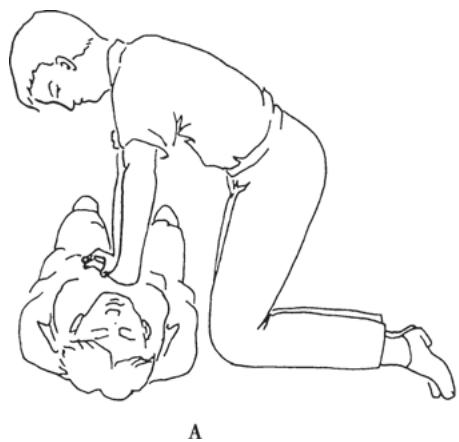

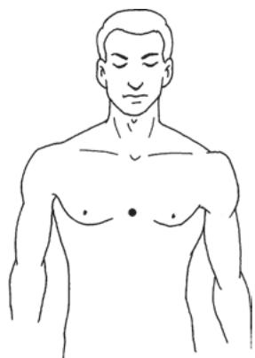  
图 3-11-1 胸外按压  
A. 操作者肩部正对病人胸骨上方, 肘部保持不动; B. 先确定按压部位, 然后正确摆放手的位置。

心脏体外电除颤是利用除颤仪在瞬间释放高压电流经胸壁到心脏，使心肌细胞瞬间同时除极，终止导致心律失常的异常折返或异位兴奋灶，从而恢复窦性心律。CPR的关键起始措施是胸外按压和早期除颤。如果具备AED，应该联合应用CPR和AED。由于AED便于携带、容易操作，能自动识别心电图并提示进行除颤，非专业人员也可以操作。施救者应尽早进行CPR直至AED准备就绪，并尽快使用AED除颤。尽可能缩短电击前后的胸外按压中断，每次电击后要立即进行胸外按压。

2. 开通气道 若病人无呼吸或出现异常呼吸,先使病人仰卧位,行30次心外按压后,再开通气道。保持呼吸道通畅是成功复苏的重要一步,若无颈部创伤,可采用仰头抬颏法开放气道。方法是:术者将一手置于病人前额用力加压,使头后仰,另一手的示指、中指抬起下颏,使下颌尖、耳垂的连线与地面呈垂直状态,以通畅气道。应清除病人口中的异物和呕吐物,若有义齿松动应取下。

3. 人工呼吸 开放气道后,首先进行2次人工呼吸,每次持续吹气时间1秒以上,保证足够的潮气量使胸廓起伏。无论是否有胸廓起伏,两次人工通气后应该立即胸外按压。

气管插管是建立人工通气的最好方法。当时间或条件不允许时，可以采用口对口、口对鼻或口对通气防护装置呼吸。首先要确保气道通畅。术者用置于病人前额手的拇指与示指捏住病人鼻孔，吸一口气，用口唇把病人的口全罩住，然后缓慢吹气，每次吹气应持续1秒以上，确保呼吸时有胸廓起伏(图3-11-2)。施救者实施人工呼吸前，正常吸气即可，无需深吸气。无论是单人还是双人进行心肺复苏时，按压和通气的比例为30：2，交替进行。上述通气方式只是临时性抢救措施，应争取马上气管插管，以人工气囊挤压或呼吸机进行辅助呼吸与输氧，纠正低氧血症，但同时应避免过度通气。与成人心脏骤停不同，儿童和婴儿心脏骤停多由各种意外(特别是窒息)导致，因此施救更重视人工通气的重要性，对于儿童与婴儿CPR时，若有2名以上施救者在场，按压和通气比例应为15：2。

  
图 3-11-2 口对口人工呼吸

（四）高级心肺复苏 即高级生命支持(advanced life support, ALS)，是在基础生命支持的基础上，应用辅助设备、特殊技术等建立更为有效的通气和血运循环。主要措施包括气管插管建立通气、除颤转复心律成为血流动力学稳定的心律、建立静脉通路并应用必要的药物维持已恢复的循环。心电图、血压、脉搏血氧饱和度、呼气末二氧化碳分压测定等必须持续监测，必要时还需要进行有创血流动力学监测。

1. 通气与氧供 如果病人自主呼吸没有恢复,应尽早行气管插管,充分通气的目的是纠正低氧血症。院外病人通常用面罩、简易球囊维持通气,医院内病人在呼吸机可用之前,使用球囊面罩通气,挤压1L容量成人球囊1/2\~2/3或2L容量成人球囊1/3量即可,气管插管后,通气频率统一为每6秒1次(每分钟10次)。呼吸机可用后,需要根据血气分析结果进行呼吸机参数调整。

2. 电除颤、复律与起搏治疗 心脏骤停时最常见的心律失常是室颤。及时的胸外按压和人工呼吸虽可部分维持心脑功能，但极少能将室颤转为窦性心律，而迅速恢复有效的心律是复苏成功至关重要的一步。终止室颤最有效的方法是电除颤，每延迟除颤1分钟，复苏成功率下降7%～10%，故尽早除颤可显著提高复苏成功率。

心脏停搏与无脉电活动时电除颤均无益。

除颤电极的位置:最常用的电极片位置是指胸骨电极片置于病人右锁骨下方,心尖电极片放在与左乳头齐平的左胸下外侧部。其他位置还有左、右外侧旁线处的下胸壁,或者心尖电极片放在标准位置,其他电极片放在左、右背部上方。若植入了置入性装置(如起搏器),应避免将电极片直接放在置入装置上。

如采用双相波电除颤,首次能量选择可根据除颤仪的品牌或型号推荐,一般为120\~200J,如使用单相波电除颤,首次能量应选择360J。第二次及后续的除颤能量应相当,而且可考虑提高能量。一次除颤后立即实施胸外按压和人工通气,5个周期的CPR后(约2分钟),再评估病人自主循环是否恢复或有无明显循环恢复征象(如呼吸、脉搏、血压等),必要时再次除颤(图3-11-3)。

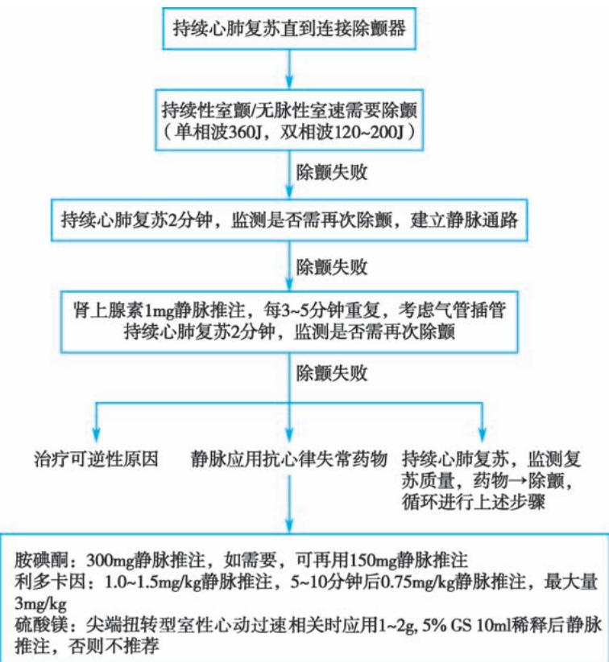  
图 3-11-3 室颤处理步骤

电除颤虽然列为高级复苏的手段,但如有条件应越早进行越好,并不拘泥于复苏的阶段。

起搏治疗:对心搏停止病人不推荐使用起搏治疗,而对有症状的心动过缓病人则考虑起搏治疗。如果病人出现严重症状,尤其是当高度房室传导阻滞发生在希氏束以下时,则应该立即施行起搏治疗。

3. 药物治疗 心脏骤停病人在进行心肺复苏时应尽早开通静脉通道。周围静脉通常选用肘前静脉或颈外静脉，中心静脉可选用颈内静脉、锁骨下静脉和股静脉。如果静脉穿刺无法完成，可考虑建立骨髓腔通路，某些复苏药物也可经气管给予，如肾上腺素、阿托品、利多卡因。

肾上腺素是 CPR 的首选药物。可用于除颤无效的室颤及无脉室速、心脏停搏或 PEA。其常规用法是 1mg 静脉推注，每 3～5 分钟重复 1 次，每次经周围静脉给药后应使用 20ml 生理盐水冲管，以保证其能够到达心脏发挥作用。血管升压素也可以作为一线药物，但不推荐与肾上腺素联合使用。严重低血压可以给予去甲肾上腺素、多巴胺、多巴酚丁胺。

复苏过程中产生的代谢性酸中毒通过改善通气通常可得到改善,不应过分积极补充碳酸氢盐纠正。早已存在代谢性酸中毒、高钾血症、三环类或苯巴比妥类药物过量病人可适当补充碳酸氢钠。对于心脏骤停时间较长的病人,在胸外心脏按压、除颤、气管插管、机械通气和血管收缩药物治疗无效时,可考虑使用碳酸氢钠。其用法是起始量1mmol/kg,在持续CPR过程中每15分钟给予1/2量,并根据血气分析结果调整剂量,避免发生碱中毒。

给予 2 次除颤加 CPR 及肾上腺素之后仍然是室颤/无脉室速,应考虑给予抗心律失常药(见图 3-11-3)。常用药物为胺碘酮,也可考虑用利多卡因。硫酸镁仅适用于尖端扭转型室速。

对于一些难治性多形性室速、尖端扭转型室速、快速单形性室速或室扑(频率>260次/分)及难治性室颤,可试用静脉给予 $\beta$ 受体拮抗剂。异丙肾上腺素或心室起搏可能有效终止心动过缓和药物诱导的尖端扭转型室速。

缓慢型心律失常、心脏停搏的处理不同于室颤(图 3-11-4)。给予基础生命支持后，应尽力设法稳定自主心律，或设法起搏心脏。上述治疗的同时应积极寻找可能存在的可逆性病因，如低血容量、低氧血症、心脏压塞、高钾血症等，并给予相应治疗。

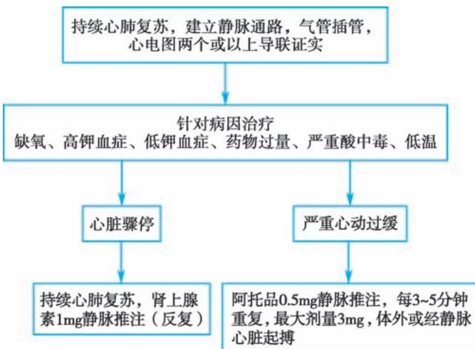  
图 3-11-4 心脏停搏和严重心动过缓处理步骤

经过心肺复苏使心脏节律恢复后,应着重维持稳定的心电与血流动力学状态。

4. 体外心肺复苏（extracorporeal cardiopulmonary resuscitation, ECPR）是指在心脏骤停病人 CPR 过程中通过体外膜肺氧合（ECMO）技术启动体外循环。ECMO 技术通常通过股动脉和股静脉连接动力泵和氧合器，进行动静脉体外循环和气体交换，是一项复杂的干预措施，需要配备专业团队、专业设备和多学科支持，且费用昂贵。成本效益、资源分配和医学伦理是应用 ECPR 前需慎重考虑的问题。目前尚没有足够的证据支持对心脏骤停病人常规使用 ECPR，对于疑似病因在短时期支持下有潜在可逆性或等待心脏移植的心脏骤停病人，可以酌情考虑行 ECPR 治疗。

【复苏后处理】心脏骤停复苏后自主循环的恢复仅是猝死幸存者复苏后治疗过程的开始。因为病人在经历全身性缺血性损伤后，将进入更加复杂的缺血再灌注损伤阶段。后者是复苏后院内死亡的主要原因，称为“心脏骤停后综合征”（post cardiac arrest syndrome）。研究表明，早期干预这一独特的、复杂的病理生理状态可有效降低病人死亡率，进而改善病人预后。

心肺复苏后的处理原则和措施包括维持有效的循环和呼吸功能,特别是脑灌注,预防再次心脏骤停,维持水、电解质和酸碱平衡,防治脑水肿、急性肾衰竭和继发感染等,其中重点是脑复苏。

1. 原发致心脏骤停疾病的治疗 应进行全面的心血管系统及相关因素的评价,仔细寻找引起心脏骤停的原因,鉴别是否存在诱发心脏骤停的5H和5T可逆病因,其中5H是指低血容量(hypovolemia)、缺氧(hypoxia)、酸中毒(hydrogenion)、低钾血症(hypokalemia)、高钾血症(hyperkalemia);5T是指张力性气胸(tension pneumothorax)、心脏压塞(cardiac tamponade)、中毒(toxins)、肺栓塞(pulmonary thrombosis)和冠脉血栓形成(coronary thrombosis),并对心脏骤停的病因和诱因进行积极的治疗。急性冠脉综合征是成人心脏骤停的常见病因之一,早期急诊冠脉造影和开通梗死血管可显著降低病死率及改善预后。病人自主循环恢复后应尽快完成12或18导联心电图检查,以明确ST段是否抬高。无论病人昏迷或清醒,对于怀疑有心脏性病因或心电图有ST段抬高的院外心脏骤停病人,都应尽快行急诊冠脉造影。对怀疑有心脏性病因但ST段未见抬高的院外心脏骤停病人,若存在血流动力学不稳定或心电不稳定,也可考虑行急诊冠脉造影。

2. 维持有效循环 心脏骤停后常出现血流动力学不稳定,其原因可能是容量不足、血管调节功能异常和心功能不全。病人收缩压需维持不低于90mmHg,平均动脉压不低于65mmHg。对于血压低于目标值的病人,应在监测心功能的同时积极进行容量复苏,并根据动脉血气分析结果纠正酸中毒。容量复苏效果不佳时,应考虑使用血管活性药物,维持目标血压。同时监测心率和心律,积极处理影响血流动力学稳定的心律失常。完善床旁心脏超声,以帮助判断是否有心脏压塞出现。

3. 维持呼吸 自主循环恢复后,病人可有不同程度的呼吸系统功能障碍,一些病人可能仍然需要机械通气和吸氧治疗。呼气末正压(PEEP)通气对呼吸功能不全合并左心衰竭的病人可能很有帮助,但需注意此时血流动力学是否稳定。临床上可以依据动脉血气结果和/或无创监测来调节吸氧浓度、PEEP和每分通气量。

4. 防治脑缺氧和脑水肿 亦称脑复苏。脑复苏是心肺复苏最后成功的关键，应重视对复苏后神经功能的连续监测和评价，积极保护神经功能。对昏迷病人应维持正常的或轻微增高的平均动脉压，降低增高的颅内压，以保证良好的脑灌注。

主要措施包括:①降温:低温治疗是保护神经系统和心脏功能的最重要治疗策略,复苏后昏迷病人应将体温降低至32\~36℃,并至少维持24小时;②脱水:应用渗透性利尿剂配合降温处理,以减轻脑组织水肿和降低颅内压,有助于大脑功能恢复;③防治抽搐:通过应用冬眠药物控制缺氧性脑损害引起的四肢抽搐以及降温过程的寒战反应;④高压氧治疗:通过增加血氧含量及弥散,提高脑组织氧分压,改善脑缺氧,降低颅内压;⑤促进早期脑血流灌注:抗凝以疏通微循环,用钙通道阻滞剂解除脑血管痉挛。

5. 防治急性肾衰竭 如果心脏骤停时间较长或复苏后持续低血压,则易发生急性肾衰竭。原有肾脏病变的老年病人尤为多见。

防治急性肾衰竭时,应注意维持有效的心脏和循环功能,避免使用对肾脏有损害的药物。若注射呋塞米后仍然无尿或少尿,则提示急性肾衰竭。此时应按急性肾衰竭处理。

6. 其他 及时发现和纠正水电解质紊乱与酸碱失衡,防治继发感染。对于肠鸣音消失和机械通气伴有意识障碍病人,应该留置胃管,并尽早地应用胃肠道营养。

【心脏骤停的预后】我国 OHCA 存活出院率为 1.2%，IHCA 存活出院率为 9%。心脏骤停复苏成功的病人，及时地评估左心室的功能非常重要。和左心室功能正常的病人相比，左心室功能减退的病人心脏骤停复发的可能性较大，对抗心律失常药物的反应较差，死亡率较高。

急性心肌梗死早期的原发性室颤为非血流动力学异常引起者，经及时除颤易获复律成功。

继发于急性大面积心肌梗死及血流动力学异常的心脏骤停,即时死亡率高达59%～89%,心脏复苏往往不易成功。即使复苏成功,亦难以维持稳定的血流动力学状态。

【SCD 的预防】 SCD 的预防,关键是识别出高危人群。除了年龄≥65 岁、男性、心率≥90 次/分、高血压、糖尿病等一般危险因素外,病史、体格检查、心电图、24 小时动态心电图、心率变异性等方法可提供一定的信息,用于评估病人发生心脏骤停的危险性。

β 受体拮抗剂能减少器质性心脏病病人 SCD 的发生。胺碘酮对心肌梗死后合并左心室功能不全或心律失常病人，能显著减少心律失常导致的死亡，但对总死亡率无明显影响。

抗心律失常的手术治疗通常包括电生理标测下的室壁瘤切除术、心室心内膜切除术及冷冻消融技术，在预防 SCD 方面的作用有限。长 QT 间期综合征病人，经 $\beta$ 受体拮抗剂足量治疗后仍有晕厥发作或不能依从药物治疗的病人，可行左侧颈胸交感神经切断术，对预防 SCD 的发生有一定作用。

  
本章思维导图

植入型心律转复除颤器（ICD）作为预防 SCD 的重要措施，正越来越多地在临床上得到应用，ICD 能在十几秒内自动识别室颤、室速并电除颤，成功率极高，是目前防治 SCD 的最有效方法。对有器质性心脏病的 SCD 高危病人或心脏骤停存活者，导管射频消融术预防 SCD 的作用有待进一步研究。

(陈玉国)

主动脉疾病包括主动脉夹层、主动脉瘤、主动脉缩窄、多发性大动脉炎等。周围血管病包括外周动脉疾病（peripheral arterial disease, PAD）、外周静脉疾病和淋巴系统疾病。本章重点讲述主动脉夹层、下肢动脉硬化闭塞症和静脉血栓症。

## 第一节 | 主动脉夹层

主动脉的血管壁由内膜、中膜和外膜三层结构组成。在各种因素导致主动脉内膜撕裂后，管腔内高速流动的血液将从撕裂口进入管壁中层，并沿血管长轴方向延伸，形成真、假两腔的病理状态，称为主动脉夹层（aortic dissection, AD）。主动脉夹层是一种心血管急危重症，具有发病急、死亡率高的特点。若未能及时诊治，48小时内死亡率高达50%，致死原因包括夹层破裂、进行性纵隔或腹膜后出血、急性心力衰竭等。部分病人出现院前死亡，未进行尸体解剖时常无法准确判断其死因，从而难以获得准确的流行病学资料。据推算，主动脉夹层的年发病率约为 $(2.6\sim3.5)/10$ 万，男性占65%～75%，冬春季发病率更高。在我国，主动脉夹层好发于50～60岁，早于欧美人群的60～70岁，可能与我国人群的高血压知晓率、控制率和达标率较低有关。

【病因、病理与发病机制】主动脉夹层的病因可分为基因异常、退行性和创伤性三类。基因异常相关的主动脉夹层可以是综合征的一部分，如 Marfan 综合征、Loeys-Dietz 综合征、血管性 Ehlers-Danlos 综合征或 Turner 综合征；也可以是非综合征型，如二叶主动脉瓣、家族性胸主动脉瘤等。退行性主动脉夹层具有散发性，临床最为常见，不与任何已知的基因异常有关。创伤性主动脉夹层可能与钝性损伤或医源性损伤（如主动脉内球囊反搏泵置入、心脏瓣膜及主动脉手术）有关。

主动脉夹层大多数是由于主动脉内膜撕裂后血液进入中层，也有部分病人是由于中层滋养动脉破裂，形成血肿后压力过高撕裂内膜所致。内膜撕裂口多位于窦管交界处或锁骨下动脉附近，这些区域具有较高的剪切力。夹层在向近端或远端延伸过程中，可能会出现真腔受压，分支血管灌注不良，造成相应的脏器缺血。

主动脉夹层的发病机制尚未完全清楚。基质金属蛋白酶活性增高，从而降解主动脉壁的结构蛋白，可能是主动脉夹层的发病机制之一。组织学可见主动脉中层胶原蛋白变性、弹力纤维断裂、平滑肌局灶性丧失、中层空泡变性并充满黏液样物质，慢性期可见纤维样改变。

【分型及分期】根据夹层起源和主动脉受累部位,可将主动脉夹层按 De Bakey 系统分为三型(图 3-12-1):

I型:夹层起源于升主动脉,扩展超过主动脉弓到降主动脉,甚至腹主动脉,此型最多见。

Ⅱ型:夹层起源并局限于升主动脉。

Ⅲ型:病变起源于降主动脉左锁骨下动脉开口远端,并向远端扩展,可直至腹主动脉(Ⅲa型:仅累及胸降主动脉;Ⅲb型:累及胸、腹主动脉)。

Stanford 分型将主动脉夹层分为 A、B 两型。无论夹层起源于哪一部位，只要累及升主动脉者称为 A 型，相当于 De Bakey I 型和 II 型；夹层起源于胸降主动脉且未累及升主动脉者称为 B 型，相当于 De Bakey III 型。

  
图 3-12-1 主动脉夹层 De Bakey 分型示意图

关于主动脉夹层的临床分期,一般认为起病2周内为急性期,2周至3个月为亚急性期,超过3个月者则为慢性期。体检偶然发现的无症状者通常归为慢性期。

【临床表现】本病临床表现取决于主动脉夹层的部位、范围和程度、主动脉分支受累情况、有无主动脉瓣关闭不全以及向外破溃等并发症。

（一）疼痛 疼痛是本病最主要和常见的表现。超过 80% 的病人有突发前胸或胸背部持续性、撕裂样或刀割样剧痛，疼痛剧烈难以忍受，部位往往与夹层病变的起源位置密切相关。Stanford A 型多表现为胸背痛；Stanford B 型则多表现为背痛、腹痛，但两者疼痛部位存在交叉。夹层撕裂累及髂动脉、股动脉时，可出现下肢疼痛。部分病人虽然发生夹层但无明显疼痛，如接受激素治疗或者起病缓慢者。

（二）血压变化 大多数病人合并高血压，且双上肢或上下肢之间血压相差较大。若出现心脏压塞、血胸或冠状动脉供血受阻而引起心肌梗死，则可能表现为低血压。夹层破裂出血表现为严重休克。

## (三) 心血管系统

1. 主动脉瓣关闭不全和心力衰竭 约半数 Stanford A 型主动脉夹层病人出现主动脉瓣关闭不全。心前区可闻及典型叹气样舒张期杂音且可发生充血型心衰，但在心衰严重或心动过速时杂音可不明显。

2. 心肌梗死 夹层近端的内膜片撕裂后,可能会遮盖冠状窦口,导致急性心肌梗死;多数影响右冠状动脉窦,因此多见下壁心肌梗死。

3. 心脏压塞 详见本篇第九章第二节。

## （四）脏器或者肢体缺血

1. 神经系统缺血 夹层累及颈动脉、无名动脉可造成脑部缺血，病人可有头晕、一过性晕厥、精神失常，严重者发生缺血性脑卒中。向下延伸至第2腰椎水平，可累及脊髓前动脉，出现截瘫、大小便失禁等。

2. 四肢缺血 累及腹主动脉或髂动脉可表现为急性下肢缺血。体检常发现脉搏减弱、消失，肢体发凉和发绀等。

3. 内脏缺血 肾动脉供血受累时，可出现腰痛、血尿、少尿、无尿以及其他肾功能损害症状。肠系膜上动脉受累可引起肠坏死。黄疸及血清氨基转移酶升高则是肝动脉闭塞缺血的表现。

（五）压迫症状 主动脉夹层进展形成夹层动脉瘤后，可出现压迫症状。如压迫颈交感神经节常出现 Horner 综合征，压迫左侧喉返神经出现声音嘶哑，压迫气管导致呼吸困难，压迫食管出现吞咽困难等。

【辅助检查】当怀疑主动脉夹层时,可用于诊断主动脉夹层的方法包括经胸主动脉彩超(TTE),经食管主动脉彩超（TEE）、CTA、MRA以及DSA。每种方式在诊断能力、速度、便利性和风险方面各有优缺点。

1. X 线胸片与心电图 无特异性诊断价值。X 线胸片可有主动脉增宽。心电图除在心包积血或夹层累及冠状动脉时，一般无特异性 ST-T 改变。

2. 超声心动图 可显示主动脉夹层真、假腔的状态及血流情况，并排查是否合并主动脉瓣关闭不全和心脏压塞等并发症。其优点是可在床旁检查，无创，无需造影剂，敏感性为 $59\% \sim 85\%$ ，特异性为 $63\% \sim 96\%$ 。受气道内空气的影响，超声探测可能漏诊。经食管超声心动图可引起干呕、心动过速、高血压等，有时需在麻醉条件下进行，临床实践中并不常用。

3. 主动脉 CTA 对比增强 CTA 是评估主动脉夹层最常用的方式, 敏感性和特异性为 98%。采用心电门控技术采集数据, 并使用薄层扫描、64 排以上的设备可减少心脏搏动带来的伪影。主动脉 CTA 可获得破口大小及位置, 夹层累及范围, 识别真腔和假腔, 主动脉分支血管的供血情况, 周围血管入路大小等。其缺点包括造影剂产生的副作用以及电离辐射。

4. 主动脉 MRA 在诊断主动脉夹层时具有很高的灵敏度和特异性。可准确评估主动脉夹层真腔、假腔和累及范围，分支血管形态等。其缺点是扫描时间较长，不适用于有幽闭恐惧症、血流动力学不稳定的病人，较少用于急性主动脉夹层的初步评估。

5. 主动脉 DSA 目前多只在腔内修复术中应用,而不作为术前常规检查手段。

【诊断与鉴别诊断】对于急性胸痛的病人,应对病人的病史、胸痛性质和体征进行评估(表3-12-1)。根据高危因素的类别(易感因素、疼痛特征、体征)进行评分,符合各类别下一种或多种特征的计为1分,类别数累计≥2分的为高危,类别数为1分的为中危,类别数为0分的属于低危。对于中高危的可疑主动脉夹层病人,应尽快安排相应的影像学检查予以明确诊断。

表 3-12-1 主动脉夹层的高危特征

<table><tr><td>高危病史</td><td>高危胸痛性质</td><td>高危体征</td></tr><tr><td>Marfan 综合征等疾病</td><td>突发性疼痛</td><td>四肢血压显著不等</td></tr><tr><td>既往曾行主动脉介入手术或外科手术</td><td>无法忍受的剧烈疼痛</td><td>低血压或休克</td></tr><tr><td>既往有胸主动脉瘤</td><td>撕裂样或刀割样疼痛</td><td>动脉搏动减弱</td></tr><tr><td>既往有主动脉瓣疾病</td><td></td><td>新发主动脉瓣杂音</td></tr><tr><td>主动脉疾病家族史</td><td></td><td>局灶性神经功能缺失</td></tr></table>

由于本病多以急性胸痛为首要症状,鉴别诊断主要考虑急性冠脉综合征和急性肺栓塞。影像学上,需与主动脉壁间血肿、主动脉穿透性溃疡进行鉴别。此外,夹层可产生多系统血管的压迫,导致组织缺血或夹层破入某些器官,需与相应疾病鉴别。

【治疗】主动脉夹层诊断明确后,需由主动脉多学科专家团队根据病人的病情、夹层累及范围、起病时间等综合评估,制订最佳治疗方案。

（一）即刻处理 严密监测血流动力学指标，包括血压、心率、心律及出入液量平衡；凡有心衰或低血压者还应监测中心静脉压、肺毛细血管楔压和心排血量。卧床休息，强效镇痛与镇静，必要时静脉注射吗啡或冬眠治疗。

## （二）随后的治疗决策应按以下原则

1. 急性期病人无论是否采取手术治疗，均应首先给予强化的内科药物治疗。

2. 升主动脉夹层特别是累及主动脉瓣或心包内有积液者宜急诊外科手术。

3. 降主动脉夹层急性期病情进展迅速,病变局部血管直径≥5cm或脏器灌注不良者,应争取介入治疗(主动脉腔内隔绝术)。

## (三) 药物治疗

1. $\beta$ 受体拮抗剂或钙通道阻滞剂在降压的同时,可降低左心室张力和心肌收缩力,减慢心率至

60～80 次/分,防止夹层进一步扩展。对于 $\beta$ 受体拮抗剂不能耐受的病人,可使用非二氢吡啶类钙通道阻滞剂。

2. 降压首选静脉应用硝普钠,迅速将收缩压降至100\~120mmHg或更低,预防夹层延伸。必要时使用其他降压药,如 $\alpha$ 受体拮抗剂、血管紧张素转换酶抑制剂、利尿剂等。血压应降至能保持重要脏器灌注的最低水平,避免出现少尿、心肌缺血及精神症状等重要脏器灌注不良的症状。

（四）介入治疗 主动脉腔内隔绝术为治疗主动脉夹层的一种有效手段。在主动脉内植入覆膜支架，封闭近端撕裂口，扩大真腔。对于解剖条件适合的 Stanford B 型主动脉夹层，该术式常作为首选策略。近年来，平行支架技术、分支支架、开窗技术和基于 3D 打印技术的定制支架，可有效处理夹层累及重要分支的病例。

（五）外科手术治疗 开胸外科手术是升主动脉夹层治疗的基石，术中可修补撕裂口、排空假腔并重建主动脉。病变累及冠状动脉或主动脉瓣膜时也可同期处理。

## 第二节 | 下肢动脉硬化闭塞症

下肢动脉硬化闭塞症是动脉粥样硬化累及下肢动脉导致动脉狭窄或闭塞而引起肢体缺血症状的慢性疾病,是全身动脉硬化性疾病在下肢的表现。

【病因和发病机制】本病是冠心病的等危症，引起冠状动脉粥样硬化的危险因素通常也会引发本病。发病机制参见本篇第四章动脉粥样硬化。吸烟使发病率增加2～5倍，糖尿病使发病率增加2～4倍。

【病理生理】产生肢体缺血症状的主要病理生理机制是肢体的血供调节功能减退，包括管腔斑块增厚、侧支循环建立不足、代偿性血管扩张不良、一氧化氮产生减少、对血管扩张剂反应减弱和循环中血栓素、血管紧张素Ⅱ、内皮素等血管收缩因子增多，以及一些血液流变学异常，由此导致血供调节失常和微血栓形成。

【临床表现】本病累及主、髂动脉者占30%，累及股、腘动脉者占80%～90%，而累及胫、腓动脉者占40%～50%。

（一）症状 典型症状是间歇性跛行和静息痛；肢体运动后引发局部疼痛、紧束、麻木或无力，停止运动后即缓解为其特点。疼痛部位常与病变血管相关；臀部、髋部及大腿部疼痛导致的间歇跛行常提示主动脉和髂动脉部分阻塞。临床最多见的为小腿疼痛性间歇性跛行，常为股、腘动脉狭窄病变。踝、趾间歇性跛行则多为胫、腓动脉病变。病变进一步加重导致血管闭塞时，可出现静息痛。目前临床常用的分期包括 Fontaine 分期和 Rutherford 分级（表 3-12-2）。

表 3-12-2 下肢动脉硬化闭塞症的临床分期

<table><tr><td colspan="2">Fontaine 分期</td><td colspan="3">Rutherford 分级</td></tr><tr><td>分期</td><td>临床表现</td><td>分级</td><td>类别</td><td>临床表现</td></tr><tr><td>I期</td><td>无症状</td><td>0级</td><td>0</td><td>无症状</td></tr><tr><td>IIa期</td><td>轻微间歇性跛行</td><td>I级</td><td>1</td><td>轻微间歇性跛行</td></tr><tr><td>IIb期</td><td>中度至重度间歇性跛行</td><td>I级</td><td>2</td><td>中度间歇性跛行</td></tr><tr><td></td><td></td><td>I级</td><td>3</td><td>重度间歇性跛行</td></tr><tr><td>III期</td><td>缺血性静息痛</td><td>II级</td><td>4</td><td>缺血性静息痛</td></tr><tr><td>IV期</td><td>溃疡或坏疽</td><td>III级</td><td>5</td><td>轻度组织丧失</td></tr><tr><td></td><td></td><td>IV级</td><td>6</td><td>溃疡或坏疽</td></tr></table>

## (二) 体征

1. 狭窄远端的动脉搏动减弱或消失,狭窄部位可闻及收缩期杂音。

2. 患肢温度较低,皮肤薄、亮、苍白,毛发稀疏,趾甲增厚,严重时有水肿、坏疽与溃疡。

3. 肢体位置改变测试。肢体自高位下垂到肤色转红时间 $>10$ 秒和表浅静脉充盈时间 $>15$ 秒，提示动脉有狭窄及侧支形成不良。

## 【辅助检查】

1. 踝肱指数（ankle brachial index, ABI）临床上最简单和常用的检查方法，为踝动脉收缩压与肱动脉收缩压的比值，正常范围为 $1.0 \sim 1.4, 0.91 \sim 0.99$ 被认为是“临界值”， $<0.90$ 提示存在 PAD。ABI > 1.40 常是血管钙化引起的。利用 ABI 诊断 PAD 的敏感性达 $95\%$ ，但严重狭窄伴侧支循环形成良好时可呈假阴性。

2. 节段性血压测量 如发现节段间有压力阶差则提示其间有动脉狭窄存在。

3. 运动平板负荷试验 以缺血症状出现的运动负荷量和时间客观评价肢体的血供状态。

4. 多普勒超声 随动脉狭窄程度的加重,多普勒血流速度曲线会趋于平坦,结合超声成像结果更可靠。

5. 磁共振血管造影和 CT 血管造影 具有确诊价值。

6. 动脉造影 对手术或经皮介入的治疗决策提供直接依据。

【诊断与鉴别诊断】当病人有典型间歇性跛行或静息痛的症状与肢体动脉搏动不对称、减弱或消失的体征，再结合危险因素分析及辅助检查的结果，诊断并不困难。但值得注意的是，在确诊病人中有典型间歇性跛行症状者不足20%。

本病应与多发性大动脉炎累及髂动脉者、血栓闭塞性脉管炎(又称 Buerger 病)相鉴别。多发性大动脉炎多见于年轻女性，活动期有全身症状，发热、血沉增快及免疫指标异常，病变部位多发，常累及肾动脉而有肾性高血压。Buerger 病好发于青年男性重度吸烟者，累及全身中、小动脉，上肢也常累及，有反复发作浅静脉炎及雷诺现象。缺血性溃疡伴有剧痛应与神经病变、下肢静脉曲张所致溃疡鉴别。此外，跛行应与椎管狭窄、关节炎、骨筋膜隔室综合征等所致的假性跛行相鉴别。

【治疗】

（一）内科治疗 戒烟、控制高血压、糖尿病及血脂异常等；清洁、保湿、预防外伤，对有静息痛者可抬高床头，以增加下肢血流，减少疼痛。

1. 运动和康复治疗 规律的有氧运动可改善最大步行距离,须在专业指导下进行,每次 30～45 分钟,每周至少 3 次,至少持续 12 周。推荐的运动方式包括行走、伸踝、屈膝运动。Fontaine IV 级病人不推荐进行常规运动治疗。

2. 抗血小板和抗凝治疗 阿司匹林、氯吡格雷等抗血小板药物可降低下肢动脉闭塞症病人发生心肌梗死、脑卒中、血管源性死亡的风险。西洛他唑具有抗血小板活性和舒张血管的特性，作为治疗间歇性跛行的一线药物。传统抗凝药(如华法林)并不能减少心血管事件的发生，反而可能增加大出血的风险。

3. 前列腺素类药物 可扩张血管,改善间歇性跛行、静息痛等症状。

4. 止痛治疗 可遵循止痛治疗的阶梯原则进行,从非甾体抗炎药开始,如无效再尝试阿片类止痛药物。

5. 抗感染治疗 对于缺血性溃疡或坏疽合并感染的病人,需在病原学检查结果指导下,针对性使用广谱、足量、足疗程的全身抗生素治疗。

（二）血运重建 经积极内科治疗后仍有静息痛、组织坏疽或生活质量降低致残者可考虑进行血运重建。腔内介入治疗包括动脉内置管溶栓、血栓抽吸、球囊扩张及支架植入等，围手术期并发症发生率低，常作为首选。但对导丝无法通过病变等情况，可选择外科手术治疗，如斑块切除术或血管旁路移植术。

（三）截肢 对于患有广泛坏死或感染性坏疽并伴有静息痛、不能行走且不适合血运重建的病人，需要进行截肢手术。

【预后】本病的预后与同时并存的冠心病、脑血管疾病密切相关。间歇性跛行病人5年生存率为70%，10年生存率为50%，大多死于冠心病和脑血管事件。伴有糖尿病及吸烟病人预后更差，约5%病人需行截肢术。

## 第三节 | 静脉血栓症

下肢浅静脉包括大隐静脉、小隐静脉及其分支；下肢深静脉与大动脉伴行。下肢静脉系统疾病以静脉血栓最具临床意义。

【深静脉血栓形成】深静脉血栓形成（deep venous thrombosis, DVT）是血液在深静脉内异常凝固引起的病症，多发生于下肢，血栓脱落可引起肺栓塞（pulmonary embolism, PE），两者合称为静脉血栓栓塞症（venous thromboembolism, VTE），是同种疾病在不同阶段的表现形式。

（一）流行病学、病因及发病机制 VTE 是继急性心肌梗死和脑卒中之后第三大常见的血管疾病，且由于人口老龄化等因素，VTE 年均患病率呈不断上升趋势。DVT 主要是由静脉壁损伤、血液淤滞及高凝状态所引起。遗传性危险因素包括抗凝血酶缺乏、C 蛋白缺乏、S 蛋白缺乏、V 因子 Leiden 突变、凝血酶原基因突变等。获得性危险因素包括高龄、VTE 个人史、恶性肿瘤、肥胖等。触发因素如手术、制动、妊娠、过量雌激素等，会增加 DVT 的风险。

（二）病理 深静脉血栓主要由红细胞组成，伴少量纤维蛋白和血小板。血栓与血管壁仅有轻度粘连，容易脱落造成肺栓塞。DVT发生后，血液回流受阻，远端组织水肿、缺氧，后期可发展为慢性静脉功能不全综合征。

（三）临床表现 根据发病时间，DVT分为急性期(发病14天内)、亚急性期(发病15～30天)和慢性期(发病超过30天)。根据DVT受累部位可分为近段DVT和远段DVT，前者指血栓累及髂静脉、股静脉和/或腘静脉，后者指血栓仅局限于小腿深静脉。

急性下肢 DVT 主要表现为受累肢体突然肿胀、疼痛，患肢皮温升高，软组织张力增大，受累区水肿，并可伴有压痛。当血栓发生在小腿肌肉静脉丛时，Homans 征阳性（患肢伸直、足被动背屈时，引起小腿后侧肌群疼痛）、Neuhof 征阳性（压迫小腿后侧肌群，引起局部疼痛）。当髂、股静脉及其属支血栓堵塞，静脉回流严重受阻时，极高的组织张力使下肢动脉受压发生肢体缺血，可形成股青肿和股白肿，若不及时处理，可发生休克和静脉性坏疽。

部分病人在慢性期,特别是起病6个月后,会出现下肢静脉功能不全,表现为患肢胀痛、静脉曲张、皮肤瘙痒、色素沉着、湿疹、溃疡等,称为血栓栓塞后综合征。

（四）诊断 DVT 的临床表现不具有特异性，需结合以下辅助检查进行诊断。

1. D-二聚体 DVT 时, 血液中 D-二聚体的浓度升高。该检测对 DVT 的敏感性超过 95%, 但特异性较低。高龄、炎症、感染、恶性肿瘤等也可使 D-二聚体升高。若 D-二聚体水平正常, 基本上可排除 DVT。

2. 加压超声检查 加压超声检查是诊断 DVT 的首选方法, 对腘静脉或更近端的血栓形成敏感性可达 95%。对于静脉超声难以诊断的病人, 可考虑 CT 或磁共振成像等替代方式。

3. 深静脉造影 临床上已被超声检查所替代,通常仅在计划行介入手术时进行静脉造影。

（五）治疗 治疗 DVT 的主要目的是预防肺栓塞,特别是病程早期,血栓与血管壁粘连不紧,极易脱落。

1. 卧床 抬高患肢超过心脏水平,直至水肿及压痛消失。

2. 抗凝 对于大多数急性近段 DVT, 为防止血栓增大, 应立即启动抗凝治疗。初始抗凝治疗的选择包括肝素、维生素 K 拮抗剂 (华法林)、口服 Xa 因子抑制剂、直接凝血酶抑制剂。具体选择通常根据临床医生的经验、出血风险、病人合并症、偏好、成本和便利性作出。当选择华法林作为长期抗凝剂时, 必须与肝素重叠用药 4\~5 天, 以确保充分抗凝。调整华法林剂量的指标为凝血酶原时间 INR维持在 2.0～3.0。急性近段 DVT 的抗凝至少 3 个月，以防复发。对复发性病例或恶性肿瘤等高凝状态不能消除的病例，抗凝治疗的持续时间可无限制。

3. 介入治疗 对存在近段 DVT 伴严重肢体肿胀或缺血者, 在起病 14 天内宜尽快行经导管接触性溶栓、经皮机械性血栓清除术。血栓清除后, 若髂静脉狭窄 >50%, 可行球囊扩张和/或支架植入术。

4. 下腔静脉滤器 存在抗凝禁忌证、抗凝治疗过程发生出血等并发症、充分抗凝治疗后仍复发VTE、静脉内有大量急性血栓或游离漂浮血栓者、急性近段DVT拟行介入治疗等情况时，为预防肺栓塞可行经皮下腔静脉滤器置入术。

（六）预防 至少一半新诊断 VTE 的门诊病人有近期住院史，且大多在住院期间未进行血栓预防。评估入院病人的 VTE 风险，如有指征，应进行适当的血栓预防。

【浅静脉血栓形成】本症是血栓性浅静脉炎的主要临床表现，在曲张的静脉中也常发生，多伴发于持久、反复静脉输液时。由于静脉壁有不同程度的炎性病变，腔内血栓常与管壁粘连，不易脱落。少部分病人的浅静脉血栓可蔓延，导致深静脉血栓。游走性浅静脉血栓往往是恶性肿瘤的征象，也可见于闭塞性血栓性脉管炎。

本症诊断较容易:沿静脉走向部位疼痛、发红,局部有条索样或结节状压痛区。

治疗多采取支持疗法:①去除病因,如停止输注刺激性液体,去除局部静脉置管的感染因素。②休息,患肢抬高,热敷。③由于本病易复发,宜穿循序减压弹力袜。④止痛:口服双氯芬酸钠或其他非甾体抗炎药、局部外用双氯芬酸钠软膏或肝素软膏,直至症状消退或应用≥2周。⑤若下肢浅静脉血栓与深静脉交汇处≥3cm,血栓长度≥5cm,建议磺达肝癸钠或低分子量肝素抗凝治疗45天;若血栓距深静脉交汇处<3cm或有高危风险因素(如恶性肿瘤、易栓症等),建议抗凝治疗3个月。

(罗建方)

  
本章思维导图

传统意义上心血管神经症（cardiovascular neurosis）是指以心血管疾病相关症状为主要表现但无器质性心脏病证据的临床综合征。该病大多发生于中、青年；女性多于男性，尤多见于围绝经期妇女。这类病人临床症状多变，临床表现不典型，尽管进行了大量的检查也较难找到器质性疾病的客观依据。由于会合并心理或精神问题，病人常常反复就诊，可严重影响正常生活和工作，甚至增加心血管事件的风险，难以实现真正意义上的健康。

【病因和发病机制】心血管神经症病因尚不清楚，可能与神经类型、环境因素、遗传因素和性格有关。病人神经类型常为抑郁、焦虑、忧愁型。当精神上受到外界环境刺激，或工作紧张、压力较大，难以适应时可能导致发病。病人的家庭成员中可有神经症，也提示本症与同一家族的神经类型及数量相当的外部环境影响有关。也有部分病人因缺乏对心脏病的认识，对疑似症状产生过度忧虑而诱发本症。发病过程中常有神经系统和内分泌系统功能失调，交感神经功能亢进，交感与副交感神经功能失平衡。病人心率在静脉滴注异丙肾上腺素时常比一般人增快明显；有时可伴有高动力循环的表现，如动脉搏动增强、左心室射血速度增快等；也可出现对运动、心理学测试或疼痛刺激的异常反应。

心理与精神问题常导致不良行为增加(包括吸烟、缺乏体育锻炼、治疗依从性差等),通过加重血管内皮功能异常、促进炎症反应、诱发血小板聚集与凝血功能异常、促发心律失常、加速动脉粥样硬化进展等,导致心血管疾病发生风险增加。

【临床表现】心血管神经症病人主诉较多,症状多变,不同症状之间缺乏内在联系,可有如下表现。

1. 心悸 自觉心脏搏动增强,常在紧张或疲劳时加重。

2. 呼吸困难 胸闷,呼吸不畅,常感觉空气不够要打开窗户或要求吸氧。不少病人经常做深呼吸或叹息样呼吸动作来缓解症状,容易导致过度换气,引起呼吸性碱中毒,使症状加重。

3. 心前区痛 与典型心绞痛不同,疼痛部位不固定,多见于心尖区及左乳房下区很小范围,亦可在胸骨下或右胸前或胸背部等;疼痛发作与劳力活动无关,多数发生在静息状态时;疼痛性质常描述为针刺样、牵扯样或刀割样;持续时间长短不等,一般较长,如发生于工作紧张或情绪激动后可持续数天或更长;含服硝酸甘油不能缓解疼痛。

4. 自主神经功能紊乱症状 失眠、多梦、焦虑、食欲缺乏、头晕、耳鸣多汗、手足发冷、双手震颤、尿频、大便次数增多或便秘等。

与较多的症状不相适应的是,病人体格检查缺乏有重要病理意义的阳性体征。可发现心率增快,心音增强,可有短促收缩期杂音或期前收缩,血压轻度升高,腱反射较活跃。心脏相关辅助检查未见显著异常。心电图可示窦性心动过速、房性或室性期前收缩和非特异性ST-T改变。

心血管疾病合并心理精神问题者一般有明确的心血管疾病如心绞痛、心力衰竭的临床表现，同时存在抑郁、压抑、焦躁不安、易怒、易疲劳等心血管疾病难以解释的躯体症状。亦可有急性发作，如惊恐障碍，表现为胸痛、心悸、呼吸困难、头晕、头痛、出汗发抖等，通常在10～20分钟达高峰，而无明确心脏、呼吸、神经系统可以支持上述临床表现的器质性病变证据。

【诊断与鉴别诊断】根据心血管神经症的临床表现,有上述症状而体征较少,不能找到器质性心脏病的证据,一般不难作出诊断。必须注意排除器质性心脏病,与心绞痛、甲状腺功能亢进、心肌炎、二尖瓣脱垂综合征及嗜铬细胞瘤等进行鉴别。

器质性心血管疾病病人可能合并心理精神问题,临床医生需要注意识别,需重视精神心理问题混淆对器质性心脏病严重程度的评估。

【治疗】心血管神经症以心理治疗为主,药物治疗为辅。首先应耐心倾听病史,了解可能的发病原因和有关因素,进行仔细的体格检查和必要的实验室检查。需通过通俗易懂地讲解疾病性质,并可用一些暗示性语言帮助病人解除顾虑。积极鼓励病人调整心态,安排好作息时间,适量进行文娱、旅游和体育活动。过度换气病人可辅导其采用腹式呼吸松弛疗法。对于心血管神经症病人合并高血压、高血脂等心血管危险因素而无明确器质性病变者,应该积极进行危险因素干预。

无论是心血管神经症还是器质性心血管疾病合并心理精神问题者，提倡双心医学的治疗模式。在积极合理治疗合并的心血管器质性疾病的同时，焦虑症状明显的病人可选用抗焦虑药物，如苯二氮䓬类抗焦虑药氯硝西泮、劳拉西泮等。伴有抑郁的病人可选用三环类抗抑郁药阿米替林、多塞平或选用选择性5-羟色胺再摄取抑制剂如氟西汀、舍曲林等。目前认为选择性5-羟色胺再摄取抑制剂对心血管系统副作用较小，安全性高于三环类抗抑郁药物。但该类药物起效较慢，一般2周开始有效，可以考虑作为伴有抑郁病人的首选。同时应该考虑进行精神心理行为治疗，如心理疏导、行为矫正、生物反馈治疗等。

(黄恺)

  
本章思维导图

本章数字资源

近年来，随着肿瘤诊疗技术的进步，恶性肿瘤病人的生存期明显延长。与此同时，肿瘤治疗相关不良反应日益凸显，其中心血管疾病成为肿瘤病人第二大死亡原因，严重影响肿瘤病人预后。一方面，肿瘤与心血管疾病之间存在许多共同的危险因素，包括肥胖、吸烟、高血压、糖尿病等，两者逐渐以共危共病的模式存在；另一方面，肿瘤治疗潜在的心血管毒性亦可损伤心血管的结构与功能；此外，某些肿瘤可累及心血管系统（如恶性肿瘤心包转移、轻链型心脏淀粉样变性等）。因此，肿瘤心脏病学（cardio-oncology）应运而生。其内涵包括：①肿瘤治疗导致的心血管毒性（cancer therapy-related cardiovascular toxicity, CTR-CVT）；②肿瘤合并心血管疾病；③肿瘤与心血管疾病的共同危险因素及干预；④心脏占位性病变。CTR-CVT包括：肿瘤治疗相关的心功能不全（cancer therapy related cardiac dysfunction, CTRCD）、冠状动脉疾病、心律失常、高血压、血栓性疾病、心脏瓣膜病、心包疾病、肺动脉高压等。

## 第一节 | 肿瘤治疗相关的心功能不全

【病因】多种肿瘤治疗药物均可能导致不同程度的 CTRCD, 常见 CTRCD 病因如下。

1. 葱环类药物相关 CTRCD 葱环类药物(如多柔比星)是多种实体肿瘤(如乳腺癌)及血液系统恶性肿瘤(如淋巴瘤、急性白血病)常用的化疗药物,可以通过氧化应激、铁代谢障碍、钙超载、抑制拓扑异构酶Ⅱβ诱导DNA损伤等机制导致心肌损伤。蒽环类药物相关 CTRCD 与累积药物剂量呈正相关,需要注意的是,这种毒性在首次用药时也可出现,并没有绝对的安全剂量。按照发生时间,可分为急性(用药后数小时或数日内发生)、慢性(多在用药后1年内发生)和迟发性(用药后数年发生)CTRCD,慢性和迟发性CTRCD常不可逆。

2. 抗人表皮生长因子受体-2靶向药物相关 CTRCD 抗人表皮生长因子受体-2(human epidermal growth factor receptor 2, HER-2)靶向药物主要包括单克隆抗体(曲妥珠单抗、帕妥珠单抗)、小分子酪氨酸激酶抑制剂(如拉帕替尼)、抗体偶联药物。目前认为其抑制 HER-2 通路、活性氧过量堆积、阻断心肌修复是导致 CTRCD 的重要机制。抗 HER-2 靶向药物所致 CTRCD 主要出现于治疗过程中或治疗结束后数月，与累积剂量无明显相关性，停药后可逆，少有远期并发症。

3. 免疫检查点抑制剂相关 CTRCD 免疫检查点抑制剂（immune-checkpoint inhibitor）可分为 3 类：①程序性细胞死亡蛋白 1（programmed cell death protein-1, PD-1）抑制剂：如帕博利珠单抗等；②程序性细胞死亡蛋白配体 1（programmed cell death-ligand 1, PD-L1）抑制剂：如阿替利珠单抗等；③细胞毒性 T 淋巴细胞相关抗原 4（cytotoxic T lymphocyte associated antigen-4, CTLA-4）抑制剂：伊匹木单抗；④淋巴细胞活化基因 -3（lymphocyte activation gene-3, LAG-3）抗体：如瑞拉利单抗。

ICIs 可导致心肌炎、心衰，ICIs 相关心肌炎的发生率为 0.06%～3.80%，而死亡率则高达 39.7%～66.0%。ICIs 相关 CTRCD 的确切机制仍不清楚，可能为应用 ICIs 后被激活的 T 淋巴细胞识别心肌与肿瘤的共有抗原，诱发自身免疫性淋巴细胞性心肌炎。ICIs 联合治疗（2 种 ICIs 联合、ICIs 联合化疗或抗血管生成药物），合并糖尿病、睡眠呼吸暂停综合征或桥本甲状腺炎，有基础心血管疾病，肥胖或高龄为 ICIs 相关心肌炎易患因素。

4. 嵌合抗原受体 T 细胞免疫治疗相关 CTRCD 嵌合抗原受体 T 细胞(chimeric antigenreceptor T-cell, CAR-T) 免疫治疗主要用于急性淋巴细胞白血病和侵袭性 B 细胞淋巴瘤, 可导致 CTRCD, 同时可伴有心律失常、心包积液和心搏骤停等。上述心血管毒性可能与细胞因子释放综合征的发生有关。

5. 造血干细胞移植相关 CTRCD 造血干细胞移植后心血管疾病患病风险显著升高,主要机制包括:①造血干细胞移植相关的肿瘤治疗可能导致心血管毒性(如联合蒽环类药物诱导方案、纵隔放疗、全身辐照或基于环磷酰胺的预处理方案等);②移植物抗宿主病;③重症感染,如败血症等。当合并心血管疾病及危险因素时,CTRCD 发生风险更高。

此外,其他化疗药物(如抗代谢药物、紫杉烷类、铂类)及血管内皮生长因子(vascular endothelial growth factor, VEGF)抑制剂(如贝伐珠单抗)等药物亦可导致 CTRCD。

【临床表现】症状和体征参见本篇第二章。

## 【辅助检查】

1. 超声心动图 若治疗过程中出现 LVEF 较基线下降超过 10%, 或 LVEF 小于 50%, 提示 CTRCD。基于二维斑点追踪技术的左室整体纵向应变 (global longitudinal strain, GLS) 敏感性更高, 可更早期发现 CTRCD, 与基线相比下降超过 15% 提示 CTRCD。

2. 心脏磁共振 CMR 可评价心肌水肿、纤维化程度, 其准确性、可重复性好, 敏感性强, 可用于 CTRCD 的早期诊断, 也是 ICIs 相关心肌炎主要临床诊断工具之一。

3. 心脏生物标志物 包括 cTnI/TnT、BNP/NT-proBNP。在出现明显的 LVEF 下降前，cTnI/TnT 即可检测到肿瘤治疗导致的早期心肌损伤。BNP/NT-proBNP 可用于 CTRCD 的辅助诊断。

4. 心内膜心肌活检 心内膜心肌活检可提供心脏结构及病理改变的组织学证据,是诊断CTRCD的“金标准”。例如,ICIs相关心肌炎可表现为多灶性炎症细胞浸润伴心肌细胞坏死。但心肌活检为有创检查,临床普遍应用受限。

【诊断】（表3-14-1）

表 3-14-1 CTRCD 的分类及诊断标准

<table><tr><td>类型及严重程度</td><td>诊断标准</td></tr><tr><td colspan="2">有症状的 CTRCD(心衰)</td></tr><tr><td>极重度</td><td>需要正性肌力药物、机械辅助循环支持治疗或考虑心脏移植的心衰</td></tr><tr><td>重度</td><td>需住院治疗的心衰</td></tr><tr><td>中度</td><td>需门诊强化利尿和心衰治疗</td></tr><tr><td>轻度</td><td>心衰症状轻微,无需强化心衰治疗</td></tr><tr><td colspan="2">无症状的 CTRCD</td></tr><tr><td>重度</td><td>新发 LVEF&lt;40%</td></tr><tr><td>中度</td><td>新发 LVEF 下降≥10%,LVEF 介于 40%~49%新发 LVEF 下降&lt;10%,LVEF 介于 40%~49%,且 GLS 较基线下降&gt;15% 或新发心脏生物标志物升高</td></tr><tr><td>轻度</td><td>LVEF≥50%,且新发 GLS 较基线下降&gt;15% 和/或新发心脏生物标志物升高</td></tr></table>

【评估与监测】肿瘤病人 CTRCD “防” 重于 “治”。所有病人在接受肿瘤治疗前，均应进行基线风险评估(表 3-14-2)，早期识别中高危病人，高危病人应予 ACEI/ARB、 $\beta$ 受体拮抗剂进行一级预防；肿瘤治疗中，应根据基线危险分层，制订个体化监测方案；肿瘤治疗结束后，也应进行长程随访，实现肿瘤病人 CTRCD 全方位、全生命周期管理。

【治疗】有症状的 CTRCD 及无症状的中重度 CTRCD，应予 ACEI/ARB/ARNI、 $\beta$ 受体拮抗剂、SGLT2i、盐皮质激素受体拮抗剂治疗。轻度无症状的 CTRCD 应考虑应用 ACEI/ARB 和/或 $\beta$ 受体拮抗剂,同时可不中断肿瘤治疗。对于蒽环类药物导致的 CTRCD,如考虑继续蒽环类药物化疗,除应用 ACEI/ARB 和 $\beta$ 受体拮抗剂外,还可通过减少蒽环类药物剂量、改用脂质体多柔比星、应用右雷佐生等措施降低 CTRCD 风险。

表 3-14-2 CTRCD 基线危险因素及危险分层

<table><tr><td>肿瘤治疗相关危险因素</td><td>病人相关危险因素</td></tr><tr><td>低危</td><td></td></tr><tr><td>应用低剂量蒽环类药物化疗(如多柔比星 $<200mg/m^{2}$ ,表柔比星 $<300mg/m^{2}$ )</td><td>年龄18~50岁</td></tr><tr><td>应用脂质体多柔比星</td><td></td></tr><tr><td>应用曲妥珠单抗前未应用蒽环类药物</td><td></td></tr><tr><td>中危</td><td></td></tr><tr><td rowspan="2">中等剂量蒽环类药物化疗(如多柔比星 $200\sim400mg/m^{2}$ ,表柔比星 $300\sim600mg/m^{2}$ )</td><td>年龄50~64岁</td></tr><tr><td>合并1~2个心血管疾病危险因素,如高血压、糖尿病/胰岛素抵抗、血脂异常、吸烟、肥胖</td></tr><tr><td>应用蒽环类药物后应用曲妥珠单抗VEGF酪氨酸激酶抑制剂第2代或第3代Bcr-abl酪氨酸激酶抑制剂蛋白酶体抑制剂联用ICIs</td><td></td></tr><tr><td>高危</td><td></td></tr><tr><td rowspan="2">同时应用蒽环类药物和曲妥珠单抗大剂量蒽环类药物化疗(多柔比星 $\geqslant400mg/m^{2}$ ,表柔比星 $\geqslant600mg/m^{2}$ )</td><td>年龄&gt;65岁</td></tr><tr><td>合并2个以上心血管疾病危险因素,如高血压、糖尿病/胰岛素抵抗、血脂异常、吸烟、肥胖</td></tr><tr><td>中等剂量蒽环类药物联合左胸部放疗蒽环类药物化疗后cTnI/TnT升高大剂量放疗(包含心脏的左胸部放疗,放疗剂量 $>30Gy$ )</td><td>合并心血管疾病,如冠心病、外周血管疾病、心肌病、严重的心脏瓣膜病、心衰、心律失常(房颤、房扑、室速等)</td></tr><tr><td>曾接受蒽环类药物化疗,应用VEGF酪氨酸激酶抑制剂</td><td>接受肿瘤治疗前LVEF&lt;55%</td></tr></table>

注：肿瘤治疗相关危险因素和病人相关危险因素中满足任意一项即可认定为相应危险分层。

对于 ICIs 相关心肌炎的病人,对症治疗基础上,首选糖皮质激素。其他治疗还包括免疫抑制剂(如吗替麦考酚酯、他克莫司)、小分子靶向药物(托法替布)、免疫球蛋白等药物治疗及血浆置换等非药物治疗。

## 第二节 | 肿瘤治疗相关的冠状动脉疾病

肿瘤病人罹患冠心病的风险增加,主要原因包括:①肿瘤与冠心病有共同的危险因素,如吸烟、肥胖、高血压、糖尿病等;②肿瘤细胞产生的促炎因子促进斑块形成;③肿瘤产生的促凝因子使血液处于高凝状态;④肿瘤治疗亦可通过不同作用机制诱发冠心病。

【发病机制】临床常见可导致冠心病的肿瘤治疗药物包括抗代谢类药物、抗微管药物、铂类、抗肿瘤抗生素、VEGF抑制剂、多靶点酪氨酸激酶抑制剂、芳香化酶抑制剂、抗雄激素/雌激素药物、促性腺激素释放激素类似物/拮抗剂、免疫调节药物(如来那度胺等)、ICIs等。上述药物诱发冠心病的主要机制包括冠脉内皮损伤、冠脉痉挛、急性血栓形成等。

放疗也可诱发冠心病，其主要机制包括冠脉内皮损伤、炎症反应、氧化应激、动脉粥样硬化进程加快、微血栓形成及斑块破裂等。放疗诱发的冠脉病变部位常见于冠脉近端或开口处。

【临床表现】症状、体征、辅助检查、诊断参见本篇第四章，需注意的是，肿瘤病人并发冠心病时胸闷不适等症状易与肿瘤相关症候群混淆，给早期诊断带来困难。

【治疗】肿瘤病人的冠心病治疗与普通人群相似,详见本篇第四章,但治疗策略上存在一些特殊性和挑战性:①如果怀疑肿瘤治疗是促成 ACS 的原因,需暂时中断肿瘤治疗。②在优化药物治疗后仍有缺血症状或 ACS 的肿瘤病人,如预期寿命>6 个月,应行个体化的冠状动脉血运重建术;如预期寿命<6 个月或出血风险极高,应考虑药物保守治疗。③因 ACS 接受 PCI 治疗、出血风险极高的肿瘤病人,如合并血小板减少,应考虑缩短双联抗血小板药物治疗时间。④在优化冠心病二级预防药物的同时,积极纠正肿瘤相关缺血诱发因素(如贫血、感染、低氧等)。

## 第三节 | 肿瘤治疗相关的心律失常

肿瘤治疗过程中可出现多种类型的心律失常，包括快速型/缓慢型心律失常、室性/室上性心律失常和传导阻滞等。这些肿瘤治疗相关的心律失常可能与放/化疗造成的直接心肌损伤、冠脉病变等相关。另外肿瘤治疗常常联用抗生素、止吐药和精神类药物等，也可诱发或加重心律失常。

（一）心房颤动 在肿瘤病人中，房颤发病率可高达 $5\% \sim 16\%$ ，高于普通人群。肿瘤合并房颤的易患因素包括：①肿瘤病人常合并心血管基础疾病及危险因素；②肿瘤相关的全身炎症反应、氧化应激等促进心房重塑；③疼痛、情绪应激等引起自主神经紊乱；④电解质紊乱、感染、贫血、低氧血症等合并症；⑤肿瘤治疗药物(如依鲁替尼)；⑥肺癌、食管癌等胸部手术；⑦少数肿瘤(如肺部、纵隔肿瘤)侵袭心肌及邻近组织。

肿瘤病人房颤的治疗详见本篇第三章。肿瘤病人需特殊考虑：①评估肿瘤合并房颤病人血栓栓塞、出血风险时还应结合肿瘤类型、分期及肿瘤治疗方案；②非瓣膜性房颤病人，可优选NOAC抗凝，但需注意，NOAC均需经P-糖蛋白转运，利伐沙班和阿哌沙班经CYP3A4代谢，对P-糖蛋白或CYP3A4有抑制或增强作用的肿瘤药物可能会影响NOAC的抗凝作用；③肿瘤治疗过程中需动态评估血栓栓塞及出血风险，并酌情调整抗凝方案；④非二氢吡啶类钙通道阻滞剂、洋地黄类药物与肿瘤治疗药物存在潜在的药物间相互作用，优选β受体拮抗剂控制心室率；⑤伊布利特不经CYP3A4、CYP2D6、P-糖蛋白代谢，可用于肿瘤病人房颤复律；胺碘酮、决奈达隆是CYP3A4和P-糖蛋白的抑制剂，普罗帕酮主要经CYP2D6代谢，应用时需注意与肿瘤治疗药物间的相互作用。

（二）QT间期延长 多种肿瘤治疗药物可导致QT间期延长，同时肿瘤病人常合并的电解质紊乱/肝肾功能不全等因素，使得QT间期延长发生率进一步增加。常见的致QT间期延长药物包括三氧化二砷、细胞周期蛋白依赖性激酶4/6抑制剂等。三氧化二砷治疗相关QTc>500ms的发生率可达25%\~60%。肿瘤病人QT间期延长的危险因素包括：女性、电解质紊乱(低钾、低钙、低镁血症)、合并心血管疾病(心衰、左心室肥厚、冠心病、心动过缓、先天性长QT间期综合征)、肝肾功能不全和肿瘤治疗合并用药(如止吐药、精神类药物等)。

肿瘤治疗前应常规行基线心电图检查,若基线 QTc>480ms,应慎用可导致 QT 间期延长的药物。肿瘤治疗期间应定期监测心电图,若 QTc 为 480\~500ms,积极纠正可导致 QT 间期延长的危险因素,动态监测心电图变化;若 QTc>500ms 或较基线延长超过 60ms,应考虑中止当前肿瘤治疗,尽量避免联用其他致 QT 间期延长药物,并参见本篇第三章 TdP 治疗。

## （三）其他类型心律失常

1. 室性心律失常 肿瘤治疗导致的心肌损伤可以增加室性心律失常发生率,同时部分室性心律失常的发生也与 QT 间期延长相关。

2. 窦房结功能障碍和传导系统异常 易导致窦房结功能障碍和传导系统异常的药物包括三氧化二砷、环磷酰胺、蒽环类药物等，放疗导致的窦房结功能障碍和传导系统异常往往不可逆转。对于这类病人的治疗应遵循个体化原则，尽量去除诱因，决定植入永久起搏器时应综合考虑病人预期寿命、生存质量及手术风险。

## 第四节 | 肿瘤治疗相关的高血压

高血压是肿瘤病人重要的合并症，部分高血压与肿瘤治疗药物相关。其中 VEGF 抑制剂与高血压的关系最为密切，其引起高血压和使原有高血压病情加重的概率高达 11%～45%。其发生机制包括内皮细胞分泌 NO 能力下降、血管收缩、外周微血管数量减少、血管弹性降低及内皮功能紊乱等。

肿瘤治疗全周期均应进行血压监测与管理。血压控制目标是 $< 140 / 90\mathrm{mmHg}$ ，如病人耐受性良好，建议控制在 $130 / 80\mathrm{mmHg}$ 以下。出现肿瘤治疗相关高血压时，如血压 $< 160 / 100\mathrm{mmHg}$ ，可首选ACEI/ARB，如血压控制不达标，再联用二氢吡啶类钙通道阻滞剂治疗；如血压 $\geqslant 160 / 100\mathrm{mmHg}$ ，应ACEI/ARB联合二氢吡啶类钙通道阻滞剂治疗；对于合并冠心病、心衰的病人，应考虑使用β受体拮抗剂；如为难治性高血压，可联用醛固酮受体拮抗剂(如螺内酯)、α受体拮抗剂、硝酸酯类药物、肼屈嗪等；如血压控制不满意，需考虑停用肿瘤治疗药物。

## 第五节 | 肿瘤治疗相关的血栓性疾病

（一）静脉血栓栓塞症 肿瘤相关静脉血栓栓塞症（VTE）包括深静脉血栓形成、肺栓塞和中心静脉导管相关血栓形成。肿瘤病人 VTE 的发生率可高达 20%，同时也是肿瘤病人外科手术后最常见的死因之一。其发生与肿瘤类型、部分肿瘤治疗药物及病人本身的血栓危险因素如高龄、卧床、肥胖、感染等相关。VTE 发生率较高的肿瘤包括：脑肿瘤、胰腺癌、胃癌、肺癌、肾癌、淋巴瘤及骨髓瘤。肿瘤通过释放促炎因子及促凝血物质、血小板增多及功能亢进、降低纤溶蛋白溶解功能使宿主处于高凝状态，诱导静脉血栓形成。VTE 的防治详见本篇第十二章。但肿瘤病人需特殊考虑：①均应进行 VTE 风险评估，高危病人如无抗凝禁忌，应给予预防性抗凝治疗；②VTE 风险较高的外科肿瘤手术（尤其是腹部或盆腔手术）病人，术后应给予 4 周的预防性抗凝；③若肿瘤治疗与 VTE 直接相关，肿瘤治疗停止后应维持抗凝治疗 3～6 个月；④对复发性 VTE 或 VTE 高危的长期带瘤生存者，抗凝疗程应达 12 个月以上，甚至终身；⑤选用抗凝药物时需注意与肿瘤治疗药物间的相互作用；⑥评估出血风险时需考虑肿瘤类型，如部分胃肠道肿瘤、泌尿系统肿瘤可增加抗凝治疗出血风险。

（二）动脉血栓性疾病 肿瘤病人的动脉血栓事件发生率约为1%，转移性胰腺癌、肺癌、乳腺癌、结直肠癌的动脉血栓发生率相对较高，并与蒽环类、顺铂及紫杉烷类药物治疗相关。血栓事件可能由上述药物的血管毒性引起，也可能继发于房颤。VEGF抑制剂也与动脉血栓形成相关，病人在接受VEGF抑制剂治疗过程中出现动脉血栓事件，应停用该药，并规范抗动脉血栓治疗。

## 第六节 | 肿瘤治疗相关的其他心血管疾病

（一）肿瘤治疗相关的心脏瓣膜病 肿瘤治疗相关的心脏瓣膜病是放疗常见的远期并发症，发生率约为10%。主要累及左心瓣膜，包括主动脉瓣根部、主动脉瓣瓣尖、二尖瓣瓣环、基底部和瓣叶。主要病理改变为瓣尖和瓣叶增厚，瓣膜钙化回缩，引起瓣膜狭窄或关闭不全。

接受纵隔放疗的病人，在放疗前和放疗后应定期(每5年1次)行超声心动图检查。因该瓣膜病常合并纵隔纤维化(影响伤口愈合)、冠脉疾病、心肌病和心包疾病，外科手术难度较大，治疗时也可选择经导管瓣膜置换。

（二）肿瘤治疗相关的心包疾病 胸部放疗(尤其是对霍奇金淋巴瘤、乳腺癌、肺癌的放疗)、细胞毒性治疗、靶向治疗和免疫治疗等多种肿瘤治疗可引起心包炎或心包积液。胸部放疗病人随访2年心包炎的发生率可高达20%，晚期心包炎可在放疗后15～20年出现。近年随着放射剂量的下降和放射技术的提高,放疗相关心包炎的发生率有所下降。大量心包积液时可行心包穿刺术,对于复发性心包积液,应考虑心包开窗术;缩窄性心包炎,可考虑心包剥脱术。

（三）肿瘤治疗相关的肺动脉高压 肿瘤病人可罹患各种类型的肺动脉高压（pulmonary hypertension, PH）。卡非佐米、达沙替尼、泊那替尼等可导致1型PH；蒽环类药物等可导致CTRCD，进而引起2型PH；博来霉素等药物、胸部放疗可通过导致肺纤维化引起3型PH；因常合并VTE，肿瘤病人4型PH最常见；肺肿瘤血栓性微血管病可导致5型PH。肿瘤病人PH诊治参见第二篇第十二章，如PH与肿瘤治疗相关，则考虑必要时停用相应抗肿瘤药物。

(夏云龙)

  
本章思维导图

## 第一节 | 糖尿病与高血压

糖尿病(本节主要探讨2型糖尿病)与高血压关系十分密切。我国约55%的糖尿病病人合并高血压，而高血压病人中糖尿病的患病率约为24%。糖尿病明显增加高血压发病风险，而高血压显著增加其心脑血管疾病事件风险。因此，对高血压和糖尿病进行共病管理对于降低心脑血管疾病风险尤为重要。

【发病机制】主要与肾素-血管紧张素-醛固酮系统（RAAS）过度激活、线粒体功能紊乱、慢性炎症等有密切的关系。

1. RAAS 过度激活 高血糖和胰岛素抵抗可引发 RAAS 过度激活,使血管紧张素Ⅱ和醛固酮水平升高,抑制胰岛素信号通路下游 PI3K/Akt 通路激活,抑制 eNOS 活化,减少一氧化氮(NO)产生,导致血管阻力增加和血压升高。

2. 线粒体功能紊乱 糖尿病和胰岛素抵抗常伴发线粒体功能障碍,导致线粒体能量合成减少,引起内皮细胞功能障碍。

3. 过高的慢性炎症水平 Toll 样受体(Toll-like receptor, TLR)介导的过量促炎信号可激活 NF- $\kappa$ B 和 c-Jun 等转录因子, 促进 IL-6、TNF- $\alpha$ 、VCAM-1 及 MCP-1 等炎症因子的释放, 通过调控胰岛素信号通路, 抑制 NO 生成, 导致血管僵硬度的增加。

【临床表现】糖尿病合并高血压病人通常有多种心血管代谢危险因素并存的表现,比如高盐高脂饮食、超重或肥胖、久坐不动的生活方式、睡眠呼吸暂停等。

【诊断与鉴别诊断】参照“高血压”“糖尿病”相关章节。

【治疗】

1. 降压目标值 降压治疗能够减少心血管复合终点事件(非致死性心肌梗死、非致死性脑卒中、心血管死亡),延缓蛋白尿和视网膜病变的进展。推荐血压控制在<130/80mmHg,对于病程长、高龄、体弱病人,血压控制目标可适当放宽。

由于 RAAS 抑制剂(包括 ACEI 和 ARB 类药物)在降低血压的同时,还有改善胰岛素抵抗、减轻内脏脂肪堆积、延缓肾病进展等作用,可作为糖尿病病人降压药物的首选。

对于起始血压较高或单药治疗不达标的病人,可考虑 RAAS 抑制剂联合钙通道阻滞剂或者利尿剂。对伴有心率增快(静息心率>80 次/分)或者合并冠心病和心力衰竭者,可考虑加用 $\beta$ 受体拮抗剂。

除上述降压药物之外,二甲双胍、胰高血糖素样肽-1(GLP-1)受体激动剂、SGLT-2i均显示一定程度的降压作用,可作为降糖治疗时的优先选择。

2. 减重手术 代谢手术可能通过减重、改善胰岛素敏感性、降低交感神经张力等机制，发挥不同程度的降压效应。对合并重度肥胖的糖尿病病人，可考虑将代谢手术作为一种治疗选择。

## 第二节 | 糖尿病与冠心病

动脉粥样硬化性心血管疾病(ASCVD)是糖尿病病人最主要的大血管并发症,超过40%的糖尿病病人死于心血管疾病,尤其是 ASCVD;在住院的冠心病病人中,合并已诊断和新诊断糖尿病的病人比例超过 40%。血糖水平与冠心病发生风险呈正相关性。

【发病机制】糖尿病导致冠心病的发病机制非常复杂,目前认为与高血糖和胰岛素抵抗引起的内皮功能紊乱、炎症水平上升、脂代谢异常、氧化应激、高凝状态等因素密切相关。

1. 内皮功能紊乱 高血糖可直接抑制内皮细胞依赖的血管舒张。高胰岛素血症通过促进内皮素-1和血管紧张素Ⅱ产生、活性氧（ROS）激活，加重内皮功能不良，导致动脉粥样硬化和血栓形成。

2. 炎症水平上升 糖基化代谢产物的堆积增加了病变部位炎症细胞浸润、炎症因子和组织因子表达增多,导致全身炎症水平上升,加速了动脉粥样硬化斑块的形成。

3. 脂代谢异常 约 60%～70% 的糖尿病病人合并脂代谢异常, 多表现为高甘油三酯、低水平 HDL-C 和高水平富含 apo B 微粒的脂蛋白。LDL-C 在糖尿病病人中更具促动脉粥样硬化性, LDL-C 水平不高的糖尿病病人也易发生动脉粥样硬化。高水平游离脂肪酸通过损害胰岛素信号, 促进炎症反应、加重促栓状态, 加速动脉粥样硬化的进展。

4. 氧化应激 糖基化终末产物（AGE）可激活其受体（RAGE），刺激还原型烟酰胺腺嘌呤二核苷酸磷酸（NADPH）氧化酶1，增加ROS产生。糖尿病病人线粒体功能障碍会进一步增加ROS的水平。ROS的异常升高导致了细胞增殖、迁徙、内质网应激、自噬、衰老和死亡的发生，在动脉粥样硬化形成和发展中起重要作用。

5. 高凝状态 高胰岛素血症和高血糖均可升高循环组织因子的促凝活性以及促栓塞蛋白（PAI-1抗原，vWF抗原，纤维蛋白原，凝血因子Ⅱ、V、Ⅶ、Ⅷ、X等）的表达，导致糖尿病病人动脉粥样斑块栓塞的发生率较高。此外，糖尿病病人可溶性P选择素和CD40配体的水平较高，导致血小板的过度激活，促进血栓形成，加速了血管狭窄及堵塞。

【临床表现】糖尿病合并冠心病的病人常常具有以下临床特点。

1. 无症状性心肌缺血 指有心肌缺血的客观证据,但是没有胸闷、胸痛等临床症状。其在糖尿病病人中的发生率明显高于非糖尿病病人,易导致冠心病的漏诊。其原因可能与糖尿病病人痛觉敏感性阈值升高、自主神经功能受损等有关。

2. 弥漫性血管病变及钙化 糖尿病合并冠心病病人常表现为弥漫的动脉粥样硬化病变、显著的血管钙化、较少的侧支循环，以及较高的左主干病变发生率。

3. 微血管病变 一部分糖尿病病人可以出现胸闷、胸痛等症状和心肌缺血客观依据，但是冠状动脉造影仅提示轻度的动脉粥样硬化表现，与临床表现严重程度不符。其原因多为微血管病变，心肌灌注显像可以帮助诊断。

【诊断与鉴别诊断】参照“冠心病”“糖尿病”相关章节。

## 【治疗】

1. 生活方式干预 生活方式干预是基础,应贯穿于治疗的全过程,包括:①低盐低脂及糖尿病膳食;②有规律的运动(一般建议每周150分钟中等强度锻炼或者75分钟高强度体育锻炼);③避免抽烟、喝酒等不良嗜好;④保持心情舒畅等。对于超重和肥胖人群,通过严格的热量摄入限制和规律锻炼以减轻体重,有益于减少心血管事件的发生。

## 2. 降糖治疗

（1）降糖目标：血糖控制目标应当遵循个体化原则。对于大多数病人，糖化血红蛋白应控制在 $< 7.0\%$ 。对于病程较长、预期寿命有限以及年老或体弱者，血糖控制目标可适当放宽。

（2）降糖药物的选择:建议优先使用经证实有心血管获益的 GLP-1R 激动剂和/或 SGLT2i,若同时合并心力衰竭或慢性肾脏病,建议优先使用 SGLT2i。若血糖控制不达标,可加用二甲双胍、DPP-4 抑制剂等其他类型具有心血管系统安全性的降糖药。

3. 冠心病的治疗 参见“冠心病”相关章节。

## 第三节 | 糖尿病与心力衰竭

糖尿病是心力衰竭(以下简称“心衰”)的独立危险因素。无论在射血分数保留型心衰(HFpEF)或射血分数下降型心衰(HFrEF)的病人中,糖尿病都增加了病人的心血管死亡风险。

【发病机制】糖尿病病人发生心衰是多种因素共同作用的结果,除了高血糖的直接和间接损害外,还包括肥胖等其他伴发代谢疾病对心肌的损害等。从病理生理学层面分析,心肌细胞代谢紊乱、钙离子调节功能障碍、线粒体功能紊乱、氧化应激损伤以及心脏微循环灌注不良、神经体液过度激活等在糖尿病病人心力衰竭的发生发展中具有重要作用。

1. 心肌细胞代谢紊乱 心肌细胞代谢的主要能量来源是游离脂肪酸和葡萄糖。饥饿状态下，心肌细胞优先利用游离脂肪酸供能；餐后、应激或者缺血情况下才利用葡萄糖。糖尿病病人因高血糖和胰岛素抵抗等原因，心肌细胞表面葡萄糖转运体（GLUT）受体表达下降，葡萄糖摄入减少，游离脂肪酸代谢增加。这不仅需要消耗更多的氧，还会导致脂质在心肌细胞蓄积，产生脂毒性，导致心肌细胞收缩和舒张功能障碍。

2. 钙离子调节功能障碍 糖尿病病人心肌组织的代谢紊乱及氧化应激损伤等因素可以损害钙通道及其相关调节蛋白的功能,引起心肌细胞质内钙超载,导致心肌收缩和舒张功能的下降。

3. 线粒体功能紊乱和氧化应激损伤 线粒体功能紊乱和氧化应激水平上升也促进了心力衰竭的发生。目前认为线粒体损伤的原因有:脂肪酸介导的线粒体解偶联导致心肌氧耗量增加,线粒体的钙离子调节功能受损,线粒体蛋白转录后修饰异常导致的蛋白质功能障碍等。线粒体功能受损导致超氧化物产生并形成氧化应激损伤,导致心肌细胞功能障碍。

4. 心脏微循环灌注不良 心脏微循环灌注不良的原因有:糖基化终末产物在小动脉沉积,导致微血管的重塑以及血管病;高血糖导致血管内皮损伤,一氧化氮合成减少,使得血管舒张功能受损,进一步导致心脏微循环灌注不良,从而加重了心肌损害。

5. 神经体液过度激活 无论糖尿病还是心衰病人都伴随着神经体液水平的异常。糖尿病病人体内 RAAS 系统过早激活，导致过量血管紧张素Ⅱ和醛固酮的产生，促进心肌细胞肥厚、胶原沉积、成纤维细胞增殖、氧化损伤以及细胞凋亡。此外，血管紧张素Ⅱ还可以通过促进心肌细胞钙超载，加重缺血心肌的损害。

【临床表现】糖尿病合并心衰病人可表现为 HFpEF 或 HFrEF。糖尿病病人可出现进行性舒张功能不全，继而发展成以舒张功能下降为主的 HFpEF；其也可出现心脏扩大伴收缩功能障碍，表现为 HFrEF。临床表现详见“心力衰竭”相关章节。

【诊断与鉴别诊断】参照“心力衰竭”和“糖尿病”相关章节。

【治疗】主要包括血糖管理、心衰控制及合并症治疗三个方面。

## 1. 血糖管理

（1）血糖控制目标:应当遵循个体化原则。对于大多数病人,糖化血红蛋白应控制在<7.0%。对于病程较长、预期寿命有限以及年老或体弱者,血糖控制目标可适当放宽。

（2）降糖药物的选择:对于合并心衰的糖尿病病人,建议优先使用经证实有心血管获益的SGLT2i,若血糖控制不达标,可加用GLP-1受体激动剂等有心血管系统保护作用或二甲双胍等心血管安全性好的降糖药。不建议在心力衰竭病人中使用噻唑烷二酮类药物(包括吡格列酮和罗格列酮),因其可增加心衰风险。

## 2. 心衰的药物治疗

（1）HFrEF的治疗：HFrEF的四联疗法包括RAAS抑制剂(优先使用ARNI或以ARNI替换ACEI/ARB)、β受体拮抗剂、醛固酮受体拮抗剂和SGLT2i。以上四类药物都具有明确的临床循证医学证据，可减少心衰住院和心血管死亡。利尿剂和地高辛可减轻心衰症状，减少心衰住院率，但不改善

远期预后。

（2）HFpEF 的治疗: 目前仅有 SGLT2i(恩格列净或达格列净)具有明确的减少心衰住院和心血管死亡的作用。利尿剂可用于存在容量负荷症状或体征的病人, 可以改善症状、增加运动耐量、减少心衰住院, 但不改善远期预后。

（3）合并慢性肾脏病的病人：在合并蛋白尿且 $eGFR \geqslant 25ml/(min \cdot 1.73m^{2})$ 时，可考虑使用非奈利酮治疗以改善心血管和肾脏结局。

3. 合并症的治疗 高血压、冠心病、肥胖、高脂血症等合并症的治疗详见相关章节。

(黄恺)

  
本章思维导图

## 推荐阅读

[1] GOLDMAN L, COONEY K A. Goldman-Cecil Medicine. 27th ed. Philadelphia: Elsevier, 2023.

[2] MANN D L, ZIPES D P, LIBBY P, et al. Braunwald's Heart Disease: A Textbook of Cardiovascular Medicine. 12th ed. Philadelphia: Elsevier, 2018.

[3] ANDREOLI T E, CARPENTER C C J, GRIGGS R C. Cecil Essentials of Medicine. 10th ed. Philadelphia: Elsevier, 2022.

[4] 王吉耀, 葛均波, 邹和建. 实用内科学. 16 版. 北京: 人民卫生出版社, 2022.

[5] 陈灏珠. 实用心脏病学. 5 版. 上海: 上海科学技术出版社, 2016.

[6] BYRNE R A, ROSSELLO X, COUGHLAN J J, et al. 2023 ESC Guidelines for the management of acute coronary syndromes. Eur Heart J, 2023, 44(38): 3720-3826.

[7] VIRANIS S, NEWBY L K, ARNOLD S V, et al. 2023 AHA/ACC/ACCP/ASPC/NLA/PCNA Guideline for the Management of Patients With Chronic Coronary Disease: A Report of the American Heart Association/American College of Cardiology Joint Committee on Clinical Practice Guidelines. Circulation, 2023, 148(9): e9-e119.

[8] HEIDENREICH P A, BOZKURT B, AGUILAR D, et al. 2022 AHA/ACC/HFSA Guideline for the Management of Heart Failure: A Report of the American College of Cardiology/American Heart Association Joint Committee on Clinical Practice Guidelines. Circulation, 2022, 145(18): e895-e1032.

[9] UNGER T, BORGHI C, CHARCHAR F, et al. 2020 International Society of Hypertension Global Hypertension Practice Guidelines. Hypertension, 2020, 75(6): 1334-1357.

[10] ARBELO E, PROTONOTARIOS A, GIMENO J R, et al. ESC Scientific Document Group. 2023 ESC Guidelines for the management of cardiomyopathies. Eur Heart J, 2023, 44(37): 3503-3626.

[11] JOGLAR J A, CHUNG M K, ARMBRUSTER A L, et al. 2023 ACC/AHA/ACCP/HRS Guideline for the Diagnosis and Management of Atrial Fibrillation: A Report of the American College of Cardiology/American Heart Association Joint Committee on Clinical Practice Guidelines. Circulation, 2024, 149(1): e1-e156.

[12] DELGADO V, AJMONE MARSAN N, de WAHA S, et al. ESC Scientific Document Group. 2023 ESC Guidelines for the management of endocarditis. Eur Heart J, 2023, 44(39): 3948-4042.

[13] LYON A R, LÓPEZ-FERNÁNDEZ T, COUCH L S, et al. ESC Scientific Document Group. 2022 ESC Guidelines on cardio-oncology developed in collaboration with the European Hematology Association (EHA), the European Society for Therapeutic Radiology and Oncology (ESTRO) and the International Cardio-Oncology Society (IC-OS). Eur Heart J, 2022, 43(41): 4229-4361.

## 第四篇消化系统疾病

本章数字资源

  
三维模型

由口腔、食管、胃、十二指肠、空肠、回肠、结直肠、肛门、肝、胆囊、胆道及胰腺构成了人体内含有最多脏器的消化系统，这些脏器的疾病常见且相互关联，有些临床表现重叠复杂，在就诊初期定位及定性不甚明确。在由表入里、由此及彼、去粗取精、去伪存真的诊治过程中，医生需要具备坚实的、不断更新的消化生理、生化、病理生理、药理、内镜和血管介入知识，需要缜密的逻辑思维，需要丰富的社会、人文知识及为病人服务的技能。消化系统疾病危急重症多，在化险为夷的紧急关头，医生高度的责任感、健康的体魄、良好的心理素质及娴熟的医疗技术均甚为重要。

## 第一节 | 常见疾病相关的消化生理、生化功能

【生理性食管抗反流防御机制】生理状态的吞咽动作,食管下括约肌(lower esophageal sphincter, LES)松弛,食物得以进入胃内;非吞咽情况下,也可发生一过性LES松弛,出现少量、短暂的胃食管反流,由于下述抗反流机制的存在,避免了胃食管反流的发生。

1. 食管-胃抗反流屏障 是食管和胃交接的解剖结构,包括 LES、膈肌脚、膈食管韧带、食管与胃底间的锐角等。LES 是食管末端约 3～4cm 长的环形肌束,其收缩产生的食管胃连接处的高压带,可防止胃内容物反流入食管。

2. 食管清除作用 正常情况下,一旦发生胃食管反流,大部分反流物通过1\~2次食管自发和继发的蠕动性收缩将反流物排入胃内,即食管廓清。剩余反流物则由唾液冲洗及中和。

3. 食管黏膜屏障 反流物进入食管后,食管黏膜屏障凭借唾液、复层鳞状上皮以及黏膜下丰富的血液供应,抵抗反流物对食管黏膜的损伤。

【胃黏膜屏障】胃黏膜上皮向内凹陷，形成胃腺。幽门腺（pyloric gland）分布于胃窦及幽门部，呈分支较多而弯曲的管状黏液腺，内有较多内分泌细胞，是分泌黏液及胃泌素（即促胃液素）的主要腺体。胃底腺（oxyntic gland）分布于胃底和胃体部，分支少，由主细胞、壁细胞、颈黏液细胞及内分泌细胞组成，是分泌胃酸、胃蛋白酶及内因子的主要腺体，也称泌酸腺。贲门腺分布于胃贲门附近，单管腺，主要分泌黏液。

胃液 pH 约为 0.9～1.5，正常人分泌量为 1.5～2.5L/d，在酸性环境下胃蛋白酶原被激活。此外，胃黏膜经常与各种病原微生物，有刺激的、损伤性的物质接触，但胃黏膜却能保持本身完整无损，使胃腔与胃黏膜内的 $H^{+}$ 浓度维持在 1000 倍之差的高梯度状态，这与胃黏膜屏障所涉及的三个层面有关。

1. 上皮前 由覆盖于胃黏膜上皮细胞表面的一层约 0.5mm 厚的黏液凝胶层及碳酸氢盐层构成，能防止胃内高浓度的盐酸、胃蛋白酶、病原微生物及其他有刺激的甚至是损伤性的物质对胃上皮细胞的伤害，保持酸性胃液与中性黏膜间的高 pH 梯度。

2. 上皮细胞 上皮细胞顶面膜及细胞间的紧密连接对酸反弥散及胃腔内的有害因素具有屏障作用。它们再生速度很快，约每隔2～3天更换1次，在其受到损伤后，可很快修复。上皮细胞可以产生炎症介质，其间有上皮间淋巴细胞，是黏膜免疫的重要组成部分。

3. 上皮后 胃黏膜细胞内的糖原储备量较少,在缺氧状态下产生能量的能力也较低。因此要保持胃黏膜的完整无损,必须供给其足够的氧和营养物质。胃黏膜丰富的毛细血管网为上皮细胞旺盛的分泌功能及自身不断更新提供足够的营养,也将局部代谢产物及反渗回黏膜的盐酸及时运走,胃黏膜的健康血液循环对保持黏膜完整甚为重要。前列腺素 E 对胃黏膜细胞具有保护作用,能促进黏膜的血液循环及黏液、碳酸氢盐的分泌,是目前认识较为充分的一类黏膜保护性分子。

【胃酸的分泌与调节】食物对胃窦的刺激促使幽门腺的 G 细胞分泌胃泌素，胃泌素以内分泌和旁分泌的方式作用于胃体的肠嗜铬样细胞（enterochromaffin-like cell），刺激其分泌组胺。组胺及胃泌素通过结合壁细胞上的组胺 $H_{2}$ 受体及胃泌素受体，共同促进壁细胞合成及分泌盐酸。胃窦 D 细胞分泌的生长抑素对上述过程中涉及的三种细胞均有负性调控作用。

胃壁细胞分泌盐酸的过程大致可分为3个主要步骤:①组胺、乙酰胆碱和胃泌素刺激壁细胞上的各自受体;②壁细胞内,在cAMP或钙离子介导下生成氢离子;③位于壁细胞分泌小管和囊泡内的 $H^{+}-K^{+}-ATP$ 酶,又称质子泵,将 $H^{+}$ 从壁细胞逆浓度梯度泵入胃腔。此外,来自肠神经系统的乙酰胆碱通过神经内分泌的方式影响壁细胞、G细胞和D细胞的功能状态,其对胃酸分泌的综合调节作用变化甚大。

【肠黏膜屏障】肠道在接触大量的食物和肠腔内微生物共生的过程中,其屏障防御体系起了重大的作用,可有效地阻挡肠腔内共生菌及其代谢物向肠腔外组织、器官移位,防止机体受内源性微生物及其毒素的侵害。肠黏膜屏障是将肠腔内物质与机体内环境相隔离,维持机体内环境稳定的结构与功能的统一体,由机械屏障、化学屏障、免疫屏障、生物屏障与肠蠕动共同构成。

1. 机械屏障 是指肠黏膜上皮细胞、细胞间紧密连接与菌膜三者构成的完整屏障，在执行肠屏障功能中最为重要。

2. 化学屏障 胃酸和胆盐可灭活经口进入肠道的大量细菌。由肠黏膜上皮分泌的黏液、消化液及肠腔内正常寄生菌产生的抑菌物质构成。

3. 免疫屏障 肠道是人体重要的外周免疫器官,由肠相关淋巴组织(上皮间淋巴细胞、固有层淋巴细胞及 Peyer 结)、肠系膜淋巴结、肝脏库普弗(Kupffer)细胞和浆细胞产生的分泌型抗体(sIgA)及免疫细胞分泌的防御素等构成。在天然免疫及获得性免疫中发挥重要作用。

肠黏膜的天然免疫是机体先天所具备的,其作用迅速,防御机制多样,但缺乏免疫记忆性,对同一病原的多次刺激反应雷同。肠道的获得性免疫由特异性淋巴细胞识别外源性抗原后开始启动,经淋巴细胞增生和分化成效应细胞后发挥功能。虽然起效慢,但具有免疫记忆性、特异性等特点,因而它具有扩大天然免疫和增强其功能的作用。

4. 生物屏障 详见“肠道微生态”。

5. 肠蠕动 肠蠕动如同肠道的清道夫,在肠梗阻、肠麻痹等情况下,常伴有小肠细菌过生长。

【肠道微生态】肠道微生态由细菌、真菌、病毒等及其代谢物共同构成，称为“人体第二基因组”。仅仅人类肠内细菌种类即超过1000种、 $10^{12}\sim10^{14}$ 个，是人自身细胞数的10倍；肠菌含基因约330万个，是人体自身基因数的150倍。肠腔内厌氧菌与需氧菌比例约为（100～1000）：1；其厌氧菌很少移位，抑制潜在致病菌生长；而需氧菌易移位，是循环中内毒素的主要来源。

肠道菌群可大致分为:①益生菌:主要是各种双歧杆菌、乳酸杆菌等厌氧菌,常紧贴黏液层,是人体健康不可缺少的要素,可以合成各种维生素,参与食物的消化,促进肠道蠕动,阻止致病菌与肠上皮细胞的接触,分解有害、有毒物质等;②机会致病菌:如大肠杆菌(大肠埃希菌)、肠球菌等具有双重作用的细菌,在正常情况下对健康有益,一旦增殖失控,或从肠道转移到身体其他部位,就可能引发疾病;③有害菌:如痢疾杆菌、沙门菌等,一旦大量生长,就会引发多种疾病,或者影响免疫系统的功能。

年龄、性别、种族遗传、地理与饮食、运动、药物等均影响肠道微生态。微生物与人类共同进化，形成了相互依赖、相互依存的共生关系。微生物之间、微生物与宿主之间的相互作用，均影响宿主的生理功能。肠黏膜屏障与肠道微生态之间具有相互影响、双向调节作用。肠道微生态影响机体的营养、代谢、免疫、发育及衰老等。值得注意的是肠道微生物的影响范围远远超出胃肠道，包括对肠-肝轴和脑-肠微生物轴的影响。

肠道微生物具备如下功能：

1. 代谢功能 可分泌复杂的蛋白酶,具有氧化还原作用,可促进分解食物中的成分,并对内源性及外源性其他物质进行分解、代谢或转化。

2. 营养功能 合成多种维生素、氨基酸、多肽、短链脂肪酸，微生物的代谢产物促进矿物质、营养物质的吸收，从而影响宿主的营养代谢。

3. 宿主免疫功能 调节宿主免疫器官的发育成熟，并作为广谱抗原刺激宿主产生免疫应答，包括体液免疫和细胞免疫。

4. 肠道防御功能 是肠黏膜屏障的重要组成部分,能阻止潜在致病菌的入侵或定植,维护肠黏膜屏障功能和结构完整性。肠道菌群的特定组分可以改变上皮细胞紧密连接蛋白的表达,微生物代谢产物如丁酸盐在维持上皮屏障中也发挥重要作用。微生物降解和代谢胆汁酸可改变胆汁酸池,如鹅脱氧胆酸和脱氧胆酸,上述胆汁酸在结肠中发挥促泌剂的作用。

肠道微生态不仅与消化系统疾病如炎症性肠病（IBD）、功能性胃肠病、乳糜泻、结直肠癌、脂肪性肝病的发生进程有关，且影响包括肥胖、2型糖尿病等代谢性疾病和心血管疾病、神经精神疾病、免疫功能紊乱相关病和多器官肿瘤等许多慢性疾病，甚至调节某些药物治疗效果等。

【胃肠多肽】散布在胃肠道的内分泌细胞可以产生50余种胃肠多肽，如缩胆囊素、生长抑素、肠血管活性多肽、P物质等，可以说消化道是体内最大的内分泌器官，这些胃肠多肽对胃肠道的分泌、动力、物质转运、免疫及肠上皮细胞的修复具有重要而复杂的调节作用，也对体内其他器官功能产生影响。

【主要营养物质的消化、吸收及肝脏的代谢作用】

1. 糖食物淀粉经过胰淀粉酶水解成双糖后，在小肠上皮细胞刷状缘的双糖酶的作用下，被消化为单糖，从小肠吸收入血；一部分为机体供能，另一部分则以糖原的方式贮存于肌肉及肝脏。肌糖原主要供肌肉收缩之急需；肝糖原则是稳定血糖的一种重要方式，这对大脑及红细胞尤为重要。当血糖浓度下降时，肝糖原分解成葡萄糖，释放入血中，以补充血糖。当禁食＞10小时，储备的肝糖原大部分被消耗，肝脏可将体内的部分蛋白质和脂肪合成为肝糖原和葡萄糖，此即糖异生作用。小肠对营养物质吸收障碍会引起营养不良，反之对糖吸收过度则会导致肥胖。当肝脏受损后，肝糖原的合成、分解以及糖异生功能受损，则血糖正常浓度难以维持，故慢性肝病容易合并糖尿病。

2. 脂肪 脂类在小肠经胆汁酸盐乳化后，被胰脂肪酶消化为甘油一酯、脂肪酸及胆固醇后，在空肠上段吸收入门静脉。在小肠上皮细胞的光面内质网内，长链脂肪酸及2-甘油一酯可被合成为甘油三酯，后者与载脂蛋白、磷脂及胆固醇结合成乳糜微粒，经淋巴管进入血液循环。真性乳糜腹腔积液是小肠淋巴管破裂后所致。除小肠外，肝及脂肪组织也是合成甘油三酯的场所，其中肝脏尤为重要。进入肝脏的甘油一酯、脂肪酸及胆固醇可通过氧化分解，产生热量以供能，也可通过糖异生作用，将多余的脂肪转化为糖原和葡萄糖。各种原因所致的脂类吸收异常、肝细胞甘油三酯合成增加及甘油三酯运出肝细胞减少是导致脂肪肝发生的重要病理生理环节。

3. 蛋白质 蛋白质在胃液和胰液蛋白酶的水解下，1/3成为氨基酸，2/3为寡肽，小肠上皮细胞刷状缘的寡肽酶可将寡肽最后水解为氨基酸，通过小肠上皮细胞的氨基酸载体蛋白的主动转运将其随 $\mathrm{Na}^{+}$ 转运入细胞， $\gamma-$ 谷氨酰基循环促进了氨基酸进入小肠细胞的转运过程。经消化被吸收的氨基酸(外源性)与体内组织蛋白质降解产生的氨基酸(内源性)混于一起，分布于体内各处，称为氨基酸代谢库，其主要功能是合成蛋白质与多肽。肝脏除了合成本身所需要的蛋白质外，还合成白蛋白、部分球蛋白、纤维蛋白原、凝血酶原及凝血因子等。氨基酸分解代谢主要通过脱氨基作用、 $\alpha-$ 酮酸代谢、多数氨在肝中被合成尿素而解毒。未被充分消化的某些蛋白质具有抗原性，是导致过敏反应或加重肠黏膜免疫疾病的原因之一。肠道细菌对未被消化的蛋白质产生腐败作用，其多数产物对人体有害。当肝脏受到严重损害时，白蛋白的合成明显降低，是形成水肿或腹腔积液的重要机制；肝细胞受到破坏时，血丙氨酸转氨酶将明显升高；清除氨的能力下降，血中的氨含量过高，是肝性脑病发生的重要机制。

【肝脏的代谢与解毒功能】肝脏是体内以代谢与解毒功能为主的一个重要器官，主要涉及4种形式的生物化学反应：①氧化，如乙醇在肝内氧化为乙醛、乙酸、二氧化碳和水，又称氧化解毒；②还原，如三氯乙醛通过还原作用，转化为三氯乙醇，失去催眠作用；③水解，水解酶将多种药物或毒物水解；④结合，是肝脏生物转化的最重要方式，使药物或毒物与葡萄糖醛酸等结合，便于从胆汁和尿中排出。由于肝内的一切生物化学反应，都需要肝细胞内各种酶系统参加，因此在严重肝病或有门静脉高压、门-体静脉分流时，应特别注意药物选择，掌握剂量，避免增加肝脏负担及药物的不良反应。

【胆道的协调运动】肝细胞生成胆汁，分泌始于胆小管（bile canaliculus）。胆小管的胆汁分泌受肝细胞顶侧膜上的胆盐依赖性/非依赖性传输系统的调控。胆小管的直径约 $1\mu \mathrm{m}$ ，以与门脉血流相逆的方向运送胆汁至肝闰管（canal of Hering），依次流经小叶间胆管、左右肝管、肝总管，肝总管与胆囊管汇合后形成胆总管，进入十二指肠。胆管上皮细胞可分泌大量的水、碳酸氢盐，汇入胆汁。上述管道与胆囊共同构成了胆汁的收集、贮存和输送系统。奥迪（Oddi）括约肌位于胆、胰管末端和十二指肠乳头之间，具有调节胆囊充盈，控制胆汁、胰液流入十二指肠，阻止十二指肠液反流及维持胆胰系统正常压力等功能。

肝脏连续不断地分泌胆汁，但是只有在消化食物时，胆汁才直接排入十二指肠。在消化间期(空腹状态)，Oddi括约肌收缩，胆总管末端闭合，管腔内压力升高，胆囊壁舒张，胆汁被动流入并充盈胆囊；胆汁中的大部分水分和电解质被胆囊吸收，胆汁浓缩，容积减少，一般胆囊可容纳20～50ml胆汁。进食后，小肠分泌的缩胆囊素在促进胆囊收缩的同时，又使Oddi括约肌松弛，胆汁便被排入十二指肠。胆石随胆汁在胆道中流动时，可出现变化多端的临床表现。由于胆总管的不可替代性，胆总管的疾病应尽可能采用微创的治疗方式。

【胰酶合成、活化及胰腺防止自身消化的生理机制】生理情况下，多种无活性的胰酶原(胰蛋白酶原、淀粉酶原、脂肪酶原、弹性蛋白酶原、磷脂酶原、糜蛋白酶原等)及溶酶体水解酶均在腺泡细胞粗面内质网合成，转运至高尔基体。溶酶体水解酶经糖基化及磷酸化后，通过与甘露糖-6磷酸化受体特异性结合，被转运到溶酶体内；胰蛋白酶原则不与甘露糖-6磷酸化受体结合。正是通过这两种不同的途径，同在粗面内质网合成的消化酶原和溶酶体水解酶被最终“分选”到不同的分泌泡内，分别形成了消化酶原颗粒和溶酶体。

腺泡细胞在各种生理刺激下，通过提升胞内钙离子浓度，促使酶原颗粒释放，经胰管、十二指肠乳头进入十二指肠，在肠激酶的作用下被激活，发挥其消化食物功能。由于胰蛋白酶可激活多种其他胰酶，因此，胰蛋白酶原活化为胰蛋白酶在多种胰酶级联激活中最为关键。在生理状态下，从腺泡细胞分泌出的胰蛋白酶原在胰腺内可有微量激活，但胰腺间质细胞所产生的酶特异性抑制物（ $\alpha_{1}$ -抗胰蛋白酶、 $\alpha_{2}$ -巨球蛋白等）可使在胰腺内提前活化的胰蛋白酶迅速失活，避免发生自身消化。

## 第二节 | 消化系统重要诊疗技术

【内镜诊断】

（一）胃镜（gastroscopy）与肠镜（colonoscopy）胃镜是食管、胃、十二指肠疾病的最常用和最准确的检查方法，结肠镜则主要用于观察从肛门到回盲瓣的所有结直肠的病变(图4-1-1)。内镜检查不仅能直视黏膜病变，还能取活检。随着内镜设备的不断改进，对病变的观察逐渐增加了色素对照、放大观察、窄带成像及共聚焦内镜等技术，有效地提高了早期肿瘤的检出率。

胃肠镜检查时,可在严密的监护下,经静脉给予适量的速效镇静剂和麻醉剂,使病人在检查过程中没有恶心、呕吐、躁动等不配合现象;还可使病人口腔分泌物减少和胃肠蠕动减少,便于观察及活检病变。胃肠镜检查结束、病人苏醒后,通常没有不适感。

在胃肠镜的直视下,可对各种出血病变进行止血治疗;取出胃内异物;对较小的或有蒂的息肉等良性肿瘤可采用圈套、电凝、氩气等将其完整切除;对较大的良性肿瘤及早期癌肿,可根据情况行内镜

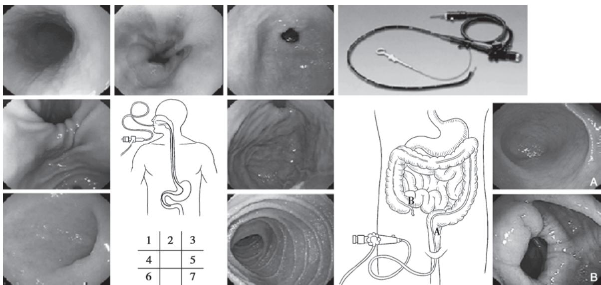  
图 4-1-1 胃、肠镜

1. 食管；2. 贲门齿状线；3. 胃窦及幽门；4. 胃角；5. 胃底；6. 十二指肠球部；7. 十二指肠降段。A. 直肠；B. 回盲部。

下黏膜切除或剥离术。内镜治疗减少了很多原本需要进行的开腹手术，使治疗更为精准和微创，有利于减少并发症、医疗费用及住院日。

（二）胶囊内镜（capsule endoscopy）由胶囊、信号接收系统及工作站构成。检查时，病人吞下一个含有微型照相装置的胶囊，随胃肠道蠕动，以2帧/秒的速度不间断拍摄，所获取的消化道腔内图像信息被同时传给信号接收系统，然后在工作站上读片。胶囊内镜能动态、清晰地显示小肠腔内病变，突破了原有的小肠检查盲区，且具有无痛苦、安全等优点，成为疑诊小肠疾病的一线检查方法。

（三）小肠镜（enteroscopy）与胶囊内镜不同的是，小肠镜因具有吸引及注气的功能，对病变的观察可以更清晰，发现病变后可以取活检及内镜下治疗；但小肠镜难以观察整个小肠，小肠病变的阳性检出率低于胶囊内镜；且由于检查耗时长，病人较痛苦。因此，多在胶囊内镜初筛发现小肠病变后，需要更直观地检查、活检或内镜治疗时才采用小肠镜。

（四）经内镜逆行胆胰管造影术(endoscopic retrograde cholangiopancreatography, ERCP)是在十二指肠镜直视下，经十二指肠乳头向胆总管或胰管内插入造影导管，逆行注入造影剂后，在X线下显示胆系和胰管形态的诊断方法(图4-1-2)。除诊断外，目前ERCP技术已更多地用于治疗胆胰管疾病，治疗性ERCP包括内镜下乳头肌切开，胆总管取石、狭窄扩张、置入支架，鼻胆管引流术等，其

微创、有效及可重复的优势减少了对传统外科手术的需求。

（五）超声内镜（endoscopic ultrasonography, EUS）将微型高频超声探头安置在内镜顶端或通过内镜孔道插入微型探头，在内镜下直接观察腔内病变的同时进行实时超声扫描，了解病变来自管道壁的某个层次及周围邻近脏器的情况。与体表超声相比较，它消除或缩短了超声源与成像器官之间的距离，缩短了声路，降低了声衰减，并排除了骨骼、脂肪、含气部位的妨碍，可以获得最清晰的回声成像。在EUS的引导下，可对病灶穿刺活检、肿瘤介入治疗、囊肿引流及施行腹腔神经丛阻断术。

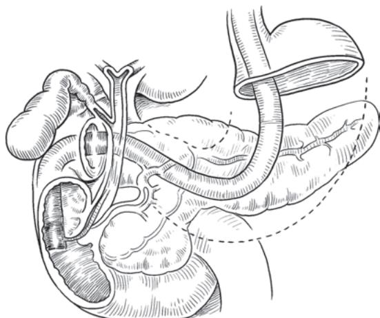  
图 4-1-2 ERCP

## 【实验室检查】

（一）乙型肝炎病毒感染的诊断 包括乙型肝炎病毒（hepatitis B virus, HBV）的5项血清免疫标志（HBsAg、HBsAb、HBeAg、HBeAb和HBcAb）检测、血清病毒检测（HBV-DNA定量检测、HBV基因分型、HBV耐药突变株检测)和组织病毒学检测(肝组织HBsAg、HBcAg、HBV-DNA)。

常用 HBV 的 5 项血清免疫标志可以了解病人是否感染了 HBV, HBV-DNA 定量检测反映病毒复制水平, 这两项检测常用于决定是否抗病毒治疗及疗效评价。

（二）幽门螺杆菌检测 幽门螺杆菌（Helicobacter pylori，Hp）检测对于胃癌前疾病及病变、消化性溃疡、胃肠黏膜相关淋巴瘤等疾病的诊疗具有重要作用。

1. 非侵入性方法 常用 ${}^{13}C-$ 或 ${}^{14}C-$ 尿素呼气试验 (Hp-urea breath test, Hp-UBT), 该检查不依赖内镜, 病人依从性好, 准确性较高, 为 Hp 检测的重要方法之一, 目前被广泛用于各医院。但 Hp-UBT 仍然存在一定的缺陷, 其结果的判定受到抗生素、铋剂、抑酸药物的干扰。采用单克隆抗体酶联免疫分析 (ELISA) 检测粪便中的 Hp 抗原, 方法简单、方便, 敏感性和准确性堪比 Hp-UBT, 但目前临床应用普及率远不如呼气试验。

2. 侵入性方法 主要包括快速尿素酶试验、胃黏膜组织切片染色镜检(如 Warthin-Starry 银染色等)及细菌培养等。采集胃黏膜进行细菌培养,一般不用于临床常规诊断,多用于科研。

## （三）肝功能评估

## 1. 肝脏合成功能

（1）血清白蛋白: 白蛋白仅由肝细胞合成, 肝脏合成功能降低时, 血清白蛋白明显降低。在病情稳定时, 部分病人血清白蛋白测值尚在正常范围内, 经历出血、感染、手术等事件后, 血清白蛋白将显著降低, 甚至难以恢复正常。

（2）血浆凝血因子：绝大部分凝血因子都在肝脏合成，其半衰期比白蛋白短得多，尤其是维生素K依赖性凝血因子（Ⅱ、Ⅶ、Ⅸ、X）。因此在肝功能受损的早期，白蛋白尚在正常水平，维生素K依赖性凝血因子即有显著降低。凝血酶原时间（prothrombin time, PT）测定、部分活化凝血酶原时间测定及凝血酶时间测定是最常用的指标。

（3）胆固醇：约 70% 的内源性胆固醇在肝脏合成，肝合成功能受损时，血胆固醇水平将降低。

2. 肝细胞损伤 丙氨酸转氨酶(alanine aminotransferase, ALT)和天冬氨酸转氨酶(aspartate aminotransferase, AST)存在于肝细胞胞质中，当肝细胞膜破裂时，ALT及AST将明显升高，因此，是反映肝细胞损伤的重要指标。由于AST也存在于骨骼肌、肾脏、心肌等组织中，因此血中以AST升高为主，则不一定是肝细胞受损。AST在肝细胞内主要位于线粒体上，在ALT升高的同时，伴有明显的AST升高，提示肝细胞严重受损。严重肝炎时，转氨酶下降而胆红素升高，此“酶胆分离”现象是肝细胞严重坏死的表现，病死率高达约 $90\%$ 。慢性肝病时，ALT和AST常呈轻、中度升高；肝硬化时，肝脏病理以肝纤维化、肝细胞萎缩为主，很多病人ALT及AST值正常。

3. 胆红素代谢 胆红素是血液循环中衰老的红细胞在肝脏、脾脏及骨髓的单核吞噬细胞系统中分解和破坏的产物。总胆红素（total bilirubin, TB）包括非结合胆红素（unconjugated bilirubin, UCB）和结合胆红素（conjugated bilirubin, CB）两种形式。非结合胆红素是血红蛋白的代谢产物，肝细胞摄取后经与葡萄糖醛酸结合成水溶性的结合胆红素从胆道排出。上述的任何一个环节出现障碍，均可出现黄疸。血清胆红素测定有助于检出肉眼尚不能观察到的黄疸，常反映肝细胞损伤或胆汁淤积。尿胆红素阳性，提示血结合胆红素增高。肝脏不能处理来自肠道重吸收的尿胆原时，经尿液排出的尿胆原增加。

上述肝功能指标与肝脏的健康与否并不完全平行,因此对肝功能的评估,应该结合病人的症状、体征、影像资料及病理综合判断,当确定有肝脏损伤及肝功能减退时,应注意寻找各种致病原因,并采用 Child-Pugh 评分(表 4-1-1)对肝功能进行分级评估,便于临床诊治决策。由于肝功能分级可随病情而波动,应灵活运用。

表 4-1-1 肝功能 Child-Pugh 评分

<table><tr><td rowspan="2">观测指标</td><td colspan="3">分数</td></tr><tr><td>1</td><td>2</td><td>3</td></tr><tr><td>肝性脑病(分期)</td><td>无</td><td>I~II</td><td>III~IV</td></tr><tr><td>腹腔积液</td><td>无</td><td>少</td><td>多</td></tr><tr><td>胆红素/(μmol/L)</td><td>&lt;34</td><td>34~51</td><td>&gt;51</td></tr><tr><td>白蛋白/(g/L)</td><td>&gt;35</td><td>28~35</td><td>&lt;28</td></tr><tr><td>PT(&gt;对照 秒)</td><td>&lt;4</td><td>4~6</td><td>&gt;6</td></tr></table>

<table><tr><td>分级</td><td>评分</td><td>1~2年存活率/%</td></tr><tr><td>A</td><td>5~6</td><td>85~100</td></tr><tr><td>B</td><td>7~9</td><td>60~80</td></tr><tr><td>C</td><td>10~15</td><td>35~45</td></tr></table>

（四）胰腺外分泌功能的分析 包括胰腺分泌的各种消化酶的检测。功能测试分为直接和间接。胰腺分泌功能的直接试验包括在静脉注射促分泌剂或多种促分泌剂后收集胰腺分泌物。胰腺分泌功能的间接试验是应用试餐刺激胰腺的分泌，测定某些胰酶分解产物，来间接了解胰腺外分泌功能的状态。

（五）自身免疫病 包括自身免疫性胃炎的壁细胞抗体、内因子抗体、胃蛋白酶原I/Ⅱ、各种自身抗体检测。

（六）微生物检测 包括血液、粪便和尿及腹腔积液中的微生物检测和培养,还包括分析微生物产生的抗体等。

（七）消化系统肿瘤的标志物 常用的消化系统肿瘤标志物包括糖类抗原甲胎蛋白（alpha-fetoprotein, AFP）、癌胚抗原（carcinoembryonic antigen, CEA）、CA19-9及CA72-4等。

## 【影像诊断】

1. 超声 超声可探查消化系统实质性脏器、胆道及腹腔内的病变,其无创、无射线、经济、方便、快速、可检测血流动力学参数等优点使其在临床上广泛使用。但超声对被气体或骨骼遮盖的组织或器官探查受限,受操作者的技能或经验影响较大。

2. CT CT 增强扫描对于消化系统脏器小病灶、等密度病灶、需定位定性的病变以及血管性病变的诊断是必不可少的一种重要检查方法，不断提高的 CT 扫描速度、分辨率及更强大的后处理软件、高效的阅片方式以及费用的逐步降低，使其在腹部疾病的诊断中具有重要作用。但该检查方法在肝肾功能不全时应慎用或禁用。

  
本章思维导图

3. MRI 适用于微小病变的观察以及病变定性诊断，特别是对鉴别肝内肝门部病变组织学来源和诊断胆道、胰腺病变具有很大价值。磁共振胆胰管成像（magnetic resonance cholangiopancreatography, MRCP）是一种利用水成像原理的无创性检查技术，在不需注射对比剂的情况下，可清楚显示含有液体的胆管和胰管管腔全貌，是胆胰疾病的重要检查方法。

(房静远)

本章数字资源

胃食管反流病（gastroesophageal reflux disease, GERD）是一种由胃十二指肠内容物反流入食管引起不适症状和/或并发症的疾病，其最常见的症状是烧心和反流，也可损伤食管邻近组织，出现食管外症状。根据是否引起食管黏膜糜烂、溃疡，GERD分为反流性食管炎（reflux esophagitis, RE）和非糜烂性反流病（nonerosive reflux disease, NERD）。

GERD 属于临床常见病,患病率随年龄增长而增加,男女无明显差异。GERD 在欧美国家患病率约为 10%\~20%,在亚洲地区约为 5%,均以 NERD 多见。

【发病机制】 GERD 是以 LES 功能障碍为主的胃食管动力障碍性疾病,主要损伤因素为胃酸、胃蛋白酶、非结合胆盐、胰酶等反流物。

（一）抗反流屏障结构与功能异常 腹内压增高(如肥胖、妊娠、便秘等)、食管裂孔疝、长期胃内压增高(如胃排空延迟、胃扩张等)及贲门失弛缓症术后,均可损伤LES结构;部分上述原因、某些激素(如缩胆囊素、胰高血糖素、血管活性肠肽等)、食物(如高脂肪、巧克力等)、药物(如钙通道阻滞剂、地西泮)等均可引起LES功能障碍或一过性松弛延长。上述情况下,当食管黏膜受到反流物损伤时,可导致GERD。

（二）食管清除作用降低 常见于导致食管蠕动异常和唾液分泌减少的疾病，如干燥综合征等。食管裂孔疝时，部分胃经膈食管裂孔进入胸腔不仅改变LES结构，还降低食管对反流物的清除作用，从而导致GERD。

（三）食管黏膜屏障功能受损 长期吸烟、饮酒、进食刺激性食物或药物可损伤食管黏膜屏障功能。

【病理】RE的大体病理详见本章内镜检查部分,其组织病理学改变为食管黏膜上皮坏死、炎症细胞浸润、黏膜糜烂及溃疡形成。NERD组织病理学改变为:①基底细胞增生;②固有层乳头延长,血管增殖;③炎症细胞浸润;④鳞状上皮细胞间隙增大。当食管远端黏膜的鳞状上皮被化生的柱状上皮替代时,称为Barrett食管。

【临床表现】

## (一) 食管症状

1. 典型症状 烧心和反流是本病最常见和典型的症状。烧心是指胸骨后或剑突下烧灼感，常由胸骨下段向上延伸。反流是指胃十二指肠内容物在无恶心和未用力的情况下涌入咽部或口腔的感觉，含酸味时称反酸。烧心和反流常发生于餐后1小时，卧位、弯腰或腹内压增高时可加重，部分病人也可发生于夜间睡眠时。

2. 非典型症状 胸痛由反流物刺激食管引起,位于胸骨后,严重时呈剧烈刺痛,可放射至心前区、后背、肩部、颈部、耳后,有时酷似心绞痛。GERD是非心源性胸痛的常见病因之一,对于不伴典型烧心和反流的胸痛病人,应先排除心脏疾病后再进行GERD的评估。吞咽困难或胸骨后异物感可能是由食管痉挛或功能紊乱所致,呈间歇性。少数病人吞咽困难是由食管狭窄引起,呈持续或进行性加重。

（二）食管外症状 由反流物刺激或损伤食管以外的组织或器官引起，如慢性咳嗽、咽喉炎、哮喘等。对于病因不明、反复发作的上述疾病病人，特别是伴有烧心和反流症状时，应考虑 GERD。严重者可发生吸入性肺炎，甚至出现肺间质纤维化。

## (三) 并发症

1. Barrett 食管 食管黏膜严重损伤所致,有恶变为腺癌的倾向。

2. 食管狭窄 食管炎反复发作引起纤维组织增生,最终导致瘢痕狭窄。

3. 上消化道出血 食管黏膜糜烂及溃疡可导致呕血和/或黑便。

## 【辅助检查】

1. 内镜检查 是诊断 RE 最准确的方法, 并能判断其严重程度和有无并发症, 结合组织病理学检查可与其他原因引起的食管炎及其他食管疾病(如食管癌等)相鉴别。内镜下 RE 分级(洛杉矶分级法, LA)如下:

正常:食管黏膜无破损。

A 级: 有一处或多处长径不超过 5mm 的食管黏膜破损。

B 级: 至少有一处长径超过 5mm 的食管黏膜破损, 但无融合性病变。

C 级:食管黏膜破损有融合,但小于 75% 食管周径。

D 级:食管黏膜破损融合,至少累及 75% 食管周径。

正常食管黏膜为复层鳞状上皮，内镜下呈均匀粉红色。Barrett食管黏膜被化生的柱状上皮替代，呈橘红色，多位于胃食管连接处的齿状线近端，呈岛状、舌形或环形。

2. 食管反流监测 包括食管 pH 监测和食管阻抗 -pH 监测, 可用于评估症状与反流的相关性, 提供反流的客观证据, 是诊断 GERD 的 “金标准”。

3. 食管测压 检测食管动力状态,可用于抗反流手术术前评估。

4. 食管钡剂造影 对诊断 GERD 的敏感性和特异性均不高,目前已不作为 GERD 的常规检查,但有助于排除食管癌等其他食管疾病。

【诊断与鉴别诊断】对于有典型烧心和反流症状的病人,可拟诊 GERD,用质子泵抑制剂(proton pump inhibitor,PPI)试验性治疗后,若症状明显缓解,则可初步诊断。

RE 和 NERD 诊断方法有所不同。RE 诊断:①有烧心和/或反流症状;②内镜下发现 RE。NERD 诊断:①有烧心和/或反流症状;②内镜检查阴性;③食管反流监测提示存在反流的客观证据;④PPI 治疗有效。

GERD需与其他食管病变(如感染性食管炎、嗜酸细胞性食管炎、药物性食管炎、贲门失弛缓症、食管癌等)、消化性溃疡、胆道疾病等相鉴别，其引起的胸痛应与心源性胸痛及其他原因引起的非心源性胸痛相鉴别。GERD还应注意与功能性疾病如功能性烧心、功能性消化不良等作鉴别。

【治疗】目的在于控制症状、愈合黏膜、减少复发以及防治并发症。

## (一) 病人教育

1. LES 结构受损或功能异常的病人,进食后不宜立即卧床。为减少卧位及夜间反流,睡前 2 小时不宜进食,睡时可抬高床头。

2. 注意减少引起腹内压增高的因素,如肥胖、便秘等;避免食用可诱发 GERD 症状的食物,如高脂肪、巧克力、咖啡等;慎用降低 LES 压力或引起胃排空延迟的药物,如硝酸甘油、钙通道阻滞剂、抗胆碱药等。

3. 戒烟及禁酒。

## （二）药物治疗

1. 抑酸药 本病关键损伤因素为胃酸及胃蛋白酶,抑制胃酸为基本治疗方案。

（1）PPI:与 $H^{+}-K^{+}-ATP$ 酶不可逆性结合,抑酸作用强,疗效确切,是治疗 GERD 的首选药物,通常疗程 4～8 周。对于重度食管炎(LA-C 和 LA-D 级)和合并食管裂孔疝的 GERD 病人,可适当延长疗程或增加剂量。

（2）钾离子竞争性酸阻滞剂（potassium-competitive acid blockers, P-CAB): 与 PPI 疗程相近。作为一种新型抑酸药，P-CAB 具有起效快、持续时间长、夜间作用确切等优势，在愈合食管黏膜和缓解反流症状等方面的疗效不亚于 PPI,但长期临床疗效和安全性有待验证。

（3） $H_{2}$ 受体拮抗剂（ $H_{2}$ -receptor antagonist, $H_{2}RA$ ）：抑酸能力较弱，适用于轻、中症病人，疗程8～12周。增加剂量可提高疗效，但同时也可能加重不良反应。

2. 促胃肠动力药 可通过增加 LES 压力、改善食管蠕动功能、促进胃排空，从而减少胃十二指肠内容物反流并缩短其在食管的暴露时间。适用于轻症病人，或作为抑酸药的辅助用药。

3. 抗酸药 仅用于症状轻、间歇发作的病人临时缓解症状。

4. 难治性 GERD 是指双倍剂量 PPI 治疗 8 周后, 烧心和/或反流等症状无明显改善。多种原因可引起难治性 GERD, 其中与反流相关的原因有: 抑酸不足、肥胖、食管裂孔疝等; 与反流无关的原因有: 食管运动障碍、其他食管炎、精神心理因素等。应根据病人具体原因调整治疗方案。

5. 维持治疗 可分为按需治疗和长期治疗。NERD 和轻度食管炎病人可按需治疗，即有症状时用药，症状消失时停药。对于停药后症状很快复发且持续、重度食管炎、食管狭窄、Barrett 食管病人，需长期治疗。PPI、P-CAB 及 $H_{2}RA$ 均可用于维持治疗，PPI 为首选药物。维持治疗的剂量因人而异，以调整至病人无症状的最低剂量为宜。

（三）抗反流手术治疗 对于经充分抑酸治疗后症状仍难以控制、抑酸治疗有效但需长期维持治疗且症状由反流所致的病人，可选择抗反流手术治疗。

抗反流手术包括内镜治疗和外科手术治疗。内镜治疗方式包括内镜下射频消融术、经口无切口胃底折叠术等。外科手术以腹腔镜胃底折叠术为主，疗效与PPI相当，但存在一定风险。

## （四）并发症治疗

1. Barrett 食管 可维持治疗。定期随访有助于早期发现异型增生和癌变，如发现重度异型增生或早期食管癌应及时行内镜或手术治疗。

2. 食管狭窄 除极少数严重瘢痕狭窄需行手术治疗外，绝大部分狭窄可行内镜下食管扩张术。为防止扩张术后狭窄复发，应予以长期维持治疗，部分年轻病人也可考虑行抗反流手术。

3. 上消化道出血 详见第二十五章。

【预后】RE的严重程度是判断其预后的重要指标,轻度食管炎(LA-A和LA-B级)病人通常在治疗4周后黏膜即可愈合,重度食管炎(LA-C和LA-D级)病人黏膜愈合通常需要8周甚至更长时间。

【预防】建立 GERD 三级预防体系对于降低其发生、发展及复发风险至关重要。其中一级预防针对一般人群，旨在阻止 GERD 发生，包括普及防病知识等。二级预防针对高危人群，旨在尽早识别 GERD 并控制其发展，包括定期社区筛查等。三级预防针对病人群体，旨在降低并发症发生及复发风险，包括治疗性生活干预等。

(董卫国)

  
本章思维导图

食管癌（carcinoma of esophagus）是原发于食管黏膜上皮的恶性肿瘤，主要为鳞癌和腺癌，临床上以进行性吞咽困难为进展期的典型症状。食管癌是世界范围内常见的恶性肿瘤，在我国恶性肿瘤中发病率居第六位，死亡率居第五位。其流行病学有以下特点：①地区性分布，我国主要以太行山、川北及闽粤交界等地区发病率高；②农村人口发病率高于城市人口；③男性发病率高于女性；④中老年易患。

【发病机制】食管癌的发生主要与以下因素相关。

## （一）亚硝胺类化合物和真菌毒素

1. 亚硝胺 在食管癌高发区,粮食和饮水中的亚硝胺含量显著高于其他地区,且与当地食管癌的患病率呈正相关。

2. 真菌毒素 霉变食物中的黄曲霉菌、镰刀菌等真菌能将硝酸盐还原为亚硝酸盐，促进亚硝胺等致癌物质的合成，常与亚硝胺协同致癌。

（二）慢性理化刺激及炎症 喜食粗糙和过烫食物、长期饮酒和吸烟等对食管黏膜的慢性理化刺激，胃食管反流病、腐蚀性食管灼伤和狭窄、贲门失弛缓症、食管憩室等慢性食管疾病引起的炎症，均可导致食管癌发生率增高。

（三）营养因素 维生素 $(A、B_{2}、C、E、叶酸等)$ 、锌、硒、钼等微量营养素缺乏是食管癌的危险因素。

（四）遗传因素 食管癌的发病常有家族聚集倾向，高发区有阳性家族史者达25%～50%。此外，在遗传与环境双重因素作用下，RB1、TP53、CDKN2A等抑癌基因失活，HRAS、MYC、DCPS等原癌基因激活及CCND1等细胞周期调节基因表达变化，均与食管癌的发生有关。

【病理解剖和病理生理】食管癌的病变部位以中段居多，下段次之，上段最少。胃贲门癌延伸至食管下段时，在临床上与食管下段癌不易区分，又称食管贲门癌。

## (一) 大体病理

1. 早期食管癌 病灶局限于黏膜层和黏膜下浅层,不伴淋巴结转移。内镜下呈充血、斑块、糜烂和乳头状。充血型(隐伏型)多为原位癌,是食管癌的早期表现;斑块型最多见,癌细胞分化较好;糜烂型次之,癌细胞分化较差;乳头型主要为早期浸润癌,癌细胞分化一般较好。

2. 进展期食管癌 癌组织逐渐累及食管全周、突入腔内或穿透管壁侵犯邻近组织或器官。根据形态特点可分为髓质型、蕈伞型、溃疡型、缩窄型和腔内型。

（二）组织病理 我国约 90% 的食管癌为鳞状细胞癌,少数为腺癌,后者多与 Barrett 食管恶变有关。

## （三）食管癌的扩散和转移方式

1. 直接蔓延 癌组织首先向黏膜下层和肌层浸润,穿透食管壁后向周围组织及器官蔓延。

2. 淋巴转移 是食管癌的主要转移方式。

3. 血行转移 晚期常转移至肝、肺、骨等处。

## 【临床表现】

（一）早期症状 早期症状多不典型，主要表现为胸骨后不适、烧灼感及针刺或牵拉样痛，可有食物通过缓慢、滞留或轻度哽噎感。早期症状时轻时重，持续时间长短不一，甚至可无症状。

## （二）进展期症状

1. 进行性吞咽困难 是进展期食管癌的典型症状,也是大多数病人就诊的主要原因,常由固体

食物咽下困难发展至液体食物也不能咽下。

2. 食物反流与呕吐 因食管梗阻的近段有扩张与潴留,可发生食物反流或呕吐,反流或呕吐物多含黏液和/或宿食,可呈血性或见溃烂组织。

3. 咽下疼痛 由食管糜烂、溃疡或近段食管炎所致，进热食或酸性食物后明显，可累及颈、肩胛、前胸及后背等部位。

4. 其他症状 肿瘤压迫喉返神经可出现声嘶、呛咳；侵犯膈神经可导致呃逆；坏死破溃或侵犯血管引起血管破裂，可出现呕血和/或黑便；出现肝转移可引起肝功能受损、黄疸，甚至肝衰竭；侵入气管、支气管可引起食管-(支)气管瘘、纵隔脓肿、肺炎、肺脓肿等，导致呼吸困难；发生骨转移可引起疼痛；侵犯主动脉可造成致死性大出血。晚期病人呈恶病质状态。

（三）体征 早期体征可缺如，晚期可出现消瘦、贫血、营养不良、脱水或恶病质等。出现转移后，常可触及肿大而质硬的浅表淋巴结或肿大而有结节的肝脏，少数病人可出现腹腔或胸腔积液。

## 【辅助检查】

1. 内镜 是食管癌的首选诊断方法,可直接观察病灶形态,并行活组织病理学检查以确诊。色素内镜、电子染色内镜(如窄带成像)、放大内镜及激光共聚焦显微内镜(CLE)等可提高早期食管癌的检出率。

2. 食管钡剂造影 当病人不宜行内镜检查时,可选用此方法。钡剂造影主要表现为:①黏膜皱襞破坏,代之以杂乱不规则的影像;②管腔局限性狭窄,病变处食管僵硬,近段食管扩张;③不规则充盈缺损或龛影。

3. CT 可清晰显示食管与邻近组织器官的解剖关系、肿瘤外侵程度及转移病灶，有助于制订外科手术方式及放疗计划，但难以发现早期食管癌。

4. EUS 有助于判断食管癌的壁内浸润深度、肿瘤对周围器官的侵犯情况以及有无异常肿大的淋巴结，对肿瘤分期、治疗方案选择及预后判断有重要意义。

5. 其他检查 PET-CT 可发现病灶，并有助于判断有无远处转移。此外，目前尚无诊断食管癌的特异性肿瘤标志物。转移性食管癌可进行分子诊断或基因检测以协助确定个体化治疗方案。

【诊断与鉴别诊断】对于有食物通过缓慢、轻度哽噎感或咽下困难者,应及时做相关检查确诊。食管癌需与下列疾病相鉴别:

1. 贲门失弛缓症 因食管神经肌间神经丛病变引起 LES 松弛障碍所致。临床表现为间歇性咽下困难、食物反流和胸骨后不适或疼痛，病程较长，一般无进行性消瘦。食管钡剂造影可见贲门梗阻呈漏斗或鸟嘴状，边缘光滑，食管下段扩张明显。

2. 胃食管反流病 胃十二指肠内容物反流入食管，引起烧心、胸痛或吞咽困难，内镜检查可见黏膜炎症、糜烂或溃疡，黏膜活检无肿瘤细胞。

3. 食管良性狭窄 有腐蚀性或反流性食管炎、长期留置胃管或食管相关手术病史。食管钡剂造影见食管狭窄、黏膜消失、管壁僵硬，无钡影残缺征。内镜检查可确诊。

4. 瘙球症 女性多见,主要症状为咽部异物感,进食时消失,常由精神因素诱发,多无器质性食管病变。

5. 其他 需与食管平滑肌瘤、食管裂孔疝、食管静脉曲张、纵隔肿瘤、食管周围淋巴结肿大、左心房增大、主动脉瘤等引起吞咽困难的疾病相鉴别。

【治疗】非转移性食管癌的治疗目标是去除病灶、防止复发、实现治愈，常采用内镜治疗、手术治疗、药物治疗、放射治疗的综合治疗方案。转移性食管癌的治疗目标是缓解症状、延长生命，可采取支持治疗和全身治疗。

## 1. 内镜治疗

（1）早期食管癌：内镜治疗是有效的治疗方式，包括：①内镜黏膜切除术（endoscopic mucosal resection, EMR），在内镜下将食管黏膜病灶整块或分块切除，用于食管浅表型肿瘤的诊断与治疗；②多环套扎内镜黏膜切除术（multi-band mucosectomy, MBM），使用改良食管曲张静脉套扎器进行多块黏膜切除；③内镜黏膜下剥离术（endoscopic submucosal dissection, ESD），将病变黏膜及黏膜下层完整剥离；④内镜下非切除治疗，如射频消融术、光动力疗法、氩离子凝固术及激光疗法等。

（2）进展期食管癌：有梗阻症状者，可通过内镜解除梗阻，包括：①单纯扩张：缓解症状持续时间短且需反复扩张，不适用于病变范围广泛者；②食管内支架置放术：可较长时间缓解梗阻，以提高病人生活质量；③内镜下癌肿消融术：可用于进展期食管癌的姑息治疗。需行胃肠内营养者，可通过经皮内镜下胃造口术改善营养状态。

2. 手术治疗 是食管癌的主要根治性手段之一,适用于早期和局部进展期病人。

3. 放射治疗 主要适用于上段食管癌及有手术禁忌者,也可用于术前或术后放疗。

4. 化学治疗 常用于不能手术或放疗的晚期病人,也可用于术前或术后化疗。多采用联合化疗方案,以避免大剂量、长疗程单一药物的毒副作用。

5. 靶向治疗和免疫治疗 对远处转移性食管癌,可以特异性分子为靶点,利用靶向药物或免疫检查点抑制剂进行个体化治疗。

【预后】早期食管癌如能及时根治预后良好,进展期食管癌整体预后不良。

  
本章思维导图

【预防】食管癌的一级预防包括改良水质、防霉去毒和改变不良饮食生活习惯等。二级预防是针对高危人群开展早期筛查，提高早期食管癌检出率。三级预防是通过规范化诊疗进一步改善食管癌病人预后。

(董卫国)

本章数字资源

胃炎（gastritis）是胃黏膜对胃内各种刺激因素的炎症反应，显微镜下表现为组织学炎症。无胃黏膜活检病理检查者，无法确定胃炎诊断。胃炎大致包括常见的急性胃炎与慢性胃炎和少见的特殊类型胃炎。但有些胃炎仅有很轻甚至无炎症细胞浸润，而以上皮和微血管的异常改变为主，则称为胃病（gastropathy）。

## 第一节 | 急性胃炎

急性胃炎一般指各种病因引起的胃黏膜急性炎症。组织学上通常可见中性粒细胞浸润。包括急性糜烂出血性胃炎（acute erosive hemorrhagic gastritis）、急性幽门螺杆菌胃炎和除Hp以外的其他急性感染性胃炎。本节主要阐述急性糜烂出血性胃炎。

## 【常见病因及病理生理机制】

1. 应激 如严重创伤、手术、多器官功能衰竭、败血症、精神紧张等，可致胃黏膜微循环障碍、缺氧，黏液分泌减少，局部前列腺素合成不足，屏障功能损坏；也可增加胃酸分泌，大量氢离子逆离散（反渗），损伤血管和黏膜，引起糜烂、出血甚至溃疡。

2. 药物 常见于非甾体抗炎药（non-steroid anti-inflammatory drugs, NSAIDs）特别是阿司匹林(最经典的 NSAIDs 之一)等非特异性环氧合酶(cyclooxygenase, COX)抑制剂。肠溶型的 NSAIDs 虽可减轻对胃黏膜的局部损伤作用，但因经小肠吸收通过血液循环后抑制黏膜细胞的 COX-1，仍可导致急性胃炎。

抗肿瘤化疗药物在抑制肿瘤生长时常对胃肠道黏膜产生细胞毒作用,导致严重的黏膜损伤,且合并细菌和病毒感染的概率增加。此外,口服铁剂、氯化钾也可致胃黏膜糜烂。

3. 乙醇 乙醇具有的亲脂性和溶脂性能,可导致胃黏膜糜烂及黏膜出血,炎症细胞浸润多不明显。

4. 创伤和物理因素 大剂量放射线照射等均可导致胃黏膜糜烂甚至溃疡。

【临床表现】常有上腹痛、胀满、恶心、呕吐和食欲缺乏等；重症可有呕血、黑粪、脱水、酸中毒或休克；NSAIDs(阿司匹林)所致者多数无症状或仅在胃镜检查时发现，少数有症状者主要表现为轻微上腹不适或隐痛。

【诊断】具有上述临床症状或兼具相关病因与诱因者应疑诊，而确诊则依靠胃镜发现糜烂及出血病灶，必要时行病理组织学检查。由于胃黏膜修复很快，当临床提示本病时，应尽早行胃镜检查确诊。

【治疗】去除病因,积极治疗原发疾病和创伤,纠正其引起的病理生理紊乱。常用抑制胃酸分泌药物,如 PPI、P-CAB 或 $H_{2}RA$ ,胃黏膜保护剂可促进胃黏膜修复和止血,详见本篇第一、五及二十章。

【预后】多数胃黏膜糜烂和出血可自行愈合及止血；少数病人黏膜糜烂可发展为溃疡，并发症增加，但通常对药物治疗反应良好。

【预防】停用不必要的 NSAIDs。严重创伤、烧伤、大手术和重要器官衰竭及需要长期服用阿司匹林或氯吡格雷等病人，可预防性给予 PPI 或 $H_{2}RA$ 。对有骨关节疾病病人，可用选择性 COX-2 抑制剂，如塞来昔布等进行抗炎治疗，减少对 COX-1 的抑制。倡导文明的饮食习惯，避免酗酒。对门静脉高压性胃病可予 PPI，严重者应考虑处理门静脉高压（详见本篇第十五章）。