## 内科学 Internal Medicine

第10版

主审 | 钟南山 陆再英

主编 | 葛均波 王辰 王建安

副主编 | 肖海鹏 胡豫 余学清 秦茵茵国家卫生健康委员会“十四五”规划教材全国高等学校教材供基础、临床、预防、口腔医学类专业用

# 内科学

## Internal Medicine

## 第 10 版

主审 | 钟南山 陆再英

主 编 | 葛均波 王 辰 王建安

副主编 | 肖海鹏 胡豫 余学清 秦茵茵

数字主编 | 葛均波 王辰

数字副主编 | 胡豫 余学清 秦茵茵 房静远

分篇负责人 | 第一篇 绪论 葛均波  
第二篇 呼吸系统疾病 王辰  
第三篇 循环系统疾病 葛均波  
第四篇 消化系统疾病 房静远  
第五篇 泌尿系统疾病 余学清  
第六篇 血液系统疾病 胡豫  
第七篇 内分泌和代谢性疾病 肖海鹏  
第八篇 风湿免疫病 曾小峰  
第九篇 理化因素所致疾病 柴艳芬

## 人民卫生出版社

·北京·

## 版权所有，侵权必究！

图书在版编目（CIP）数据

内科学 / 葛均波，王辰，王建安主编. -- 10 版. 北京：人民卫生出版社，2024. 7. --（全国高等学校五年制本科临床医学专业第十轮规划教材）. -- ISBN 978-7-117-36571-0

I. R5

中国国家版本馆 CIP 数据核字第 2024Y449X6 号

人卫智网 www.ipmph.com

医学教育、学术、考试、健康，

购书智慧智能综合服务平台

人卫官网 www.pmph.com 人卫官方资讯发布平台

内科学

Neikexue

第10版

主 编: 葛均波 王 辰 王建安

出版发行：人民卫生出版社（中继线 010-59780011）

地址: 北京市朝阳区潘家园南里 19 号

邮编：100021

E - mail: pmph @ pmph.com

购书热线：010-59787592 010-59787584 010-65264830

印刷：

经销：新华书店

开 本: 850×1168 1/16 印张: 61 插页: 2

字 数：1805 千字

版次: 1979 年 12 月第 1 版 2024 年 7 月第 10 版

印 次: 2024 年 7 月第 1 次印刷

标准书号：ISBN 978-7-117-36571-0

定 价: 148.00 元

打击盗版举报电话：010-59787491 E-mail: WQ@pmph.com

质量问题联系电话：010-59787234 E-mail: zhiliang@pmph.com

数字融合服务电话：4001118166 E-mail: zengzhi@pmph.com

于波 哈尔滨医科大学附属第二医院 陈旻湖 中山大学附属第一医院
王辰 中国医学科学院北京协和医院 罗建方 南方医科大学附属广东省人民医院
王玮 中国医科大学附属第一医院 单忠艳 中国医科大学附属第一医院
王卫庆 上海交通大学医学院附属瑞金医院 房静远 上海交通大学医学院附属仁济医院
王建安 浙江大学医学院附属第二医院 赵建平 华中科技大学同济医学院附属同济医院
毛志国 海军军医大学上海长征医院 赵家军 山东第一医科大学附属省立医院
石蓓 遵义医科大学附属医院 赵维莅 上海交通大学医学院附属瑞金医院
叶智明 南方医科大学附属广东省人民医院 赵景宏 陆军军医大学第二附属医院
田字彬 青岛大学附属医院 胡豫 华中科技大学同济医学院附属协和医院
田新平 中国医学科学院北京协和医院 侯明 山东大学齐鲁医院
付平 四川大学华西医院 姜林娣 复旦大学附属中山医院
付蓉 天津医科大学总医院 秦茵茵 广州医科大学附属第一医院
代华平 中日友好医院 秦贵军 郑州大学第一附属医院
刘苓 四川大学华西医院 夏云龙 大连医科大学附属第一医院
刘升云 郑州大学第一附属医院 柴艳芬 天津医科大学总医院
严励 中山大学孙逸仙纪念医院 钱菊英 复旦大学附属中山医院
李强 深圳大学总医院 徐军 中国医学科学院北京协和医院
李小英 复旦大学附属中山医院 徐杨 苏州大学附属第一医院
李为民 四川大学华西医院 徐钢 华中科技大学同济医学院附属同济医院
李延青 山东大学齐鲁医院 徐健 昆明医科大学第一附属医院
李启富 重庆医科大学附属第一医院 高翔 中山大学附属第六医院
杨涛 南京医科大学第一附属医院 高素君 吉林大学第一医院
杨云生 中国人民解放军总医院 郭禹标 中山大学附属第一医院
杨长青 同济大学附属同济医院 黄恺 华中科技大学同济医学院附属协和医院
杨念生 中山大学附属第一医院 葛均波 复旦大学附属中山医院
杨娉婷 中国医科大学附属第一医院 董卫国 武汉大学人民医院
肖海鹏 中山大学附属第一医院 韩飞 浙江大学医学院附属第一医院
余学清 南方医科大学附属广东省人民医院 韩清华 山西医科大学第一医院
沈华浩 浙江大学医学院附属第二医院 曾小峰 中国医学科学院北京协和医院
宋元林 复旦大学附属中山医院 詹庆元 中日友好医院
张志毅 哈尔滨医科大学附属第一医院 缪应雷 昆明医科大学第一附属医院
陈倩 华中科技大学同济医学院附属同济医院 霍勇 北京大学第一医院
陈崴 中山大学附属第一医院 穆荣 北京大学第三医院
陈玉国 山东大学齐鲁医院 瞿介明 上海交通大学医学院附属瑞金医院
陈良龙 福建医科大学附属协和医院

## 编委名单

## 编委（以姓氏笔画为序）

编写秘书 戴宇翔 复旦大学附属中山医院

数字编委

新形态教材是充分利用多种形式的数字资源及现代信息技术，通过二维码将纸书内容与数字资源进行深度融合的教材。本套教材全部以新形态教材形式出版，每本教材均配有特色的数字资源和电子教材，读者阅读纸书时可以扫描二维码，获取数字资源、电子教材。

电子教材是纸质教材的电子阅读版本,其内容及排版与纸质教材保持一致,支持手机、平板及电脑等多终端浏览,具有目录导航、全文检索功能,方便与纸质教材配合使用,进行随时随地阅读。

## 获取数字资源与电子教材的步骤

## 读者信息反馈方式

## 序言

百年大计，教育为本。教育立德树人，教材培根铸魂。

过去几年,面对突如其来的新冠疫情,以习近平同志为核心的党中央坚持人民至上、生命至上,团结带领全党全国各族人民同心抗疫,取得疫情防控重大决定性胜利。在这场抗疫战中,我国广大医务工作者为最大限度保护人民生命安全和身体健康发挥了至关重要的作用。事实证明,我国的医学教育培养出了一代代优秀的医务工作者,我国的医学教材体系发挥了重要的支撑作用。

党的二十大报告提出到 2035 年建成教育强国、健康中国的奋斗目标。我们必须深刻领会党的二十大精神，深刻理解新时代、新征程赋予医学教育的重大使命，立足基本国情，尊重医学教育规律，不断改革创新，加快建设更高质量的医学教育体系，全面提高医学人才培养质量。

尺寸教材,国家事权,国之大者。面对新时代对医学教育改革和医学人才培养的新要求,第十轮教材的修订工作落实习近平总书记的重要指示精神,用心打造培根铸魂、启智增慧、适应时代需求的精品教材,主要体现了以下特点。

1. 进一步落实立德树人根本任务。遵循《习近平新时代中国特色社会主义思想进课程教材指南》要求，努力发掘专业课程蕴含的思想政治教育资源，将课程思政贯穿于医学人才培养过程之中。注重加强医学人文精神培养，在医学院校普遍开设医学伦理学、卫生法以及医患沟通课程基础上，新增蕴含医学温度的《医学人文导论》，培养情系人民、服务人民、医德高尚、医术精湛的仁心医者。

2. 落实 “大健康” 理念。将保障人民全生命周期健康体现在医学教材中，聚焦人民健康服务需求，努力实现 “以治病为中心” 转向 “以健康为中心”，推动医学教育创新发展。为弥合临床与预防的裂痕作出积极探索，梳理临床医学教材体系中公共卫生与预防医学相关课程，建立更为系统的预防医学知识结构。进一步优化重组《流行病学》《预防医学》等教材内容，撤销内容重复的《卫生学》，推进医防协同、医防融合。

3. 守正创新。传承我国几代医学教育家探索形成的具有中国特色的高等医学教育教材体系和人才培养模式，准确反映学科新进展，把握跟进医学教育改革新趋势新要求，推进医科与理科、工科、文科等学科交叉融合，有机衔接毕业后教育和继续教育，着力提升医学生实践能力和创新能力。

4. 坚持新形态教材的纸数一体化设计。数字内容建设与教材知识内容契合，有效服务于教学应用，拓展教学内容和学习过程；充分体现“人工智能+”在我国医学教育数字化转型升级、融合发展中的促进和引领作用。打造融合新技术、新形式和优质资源的新形态教材，推动重塑医学教育教学新生态。

5. 积极适应社会发展,增设一批新教材。包括:聚焦老年医疗、健康服务需求,新增《老年医学》,维护老年健康和生命尊严,与原有的《妇产科学》《儿科学》等形成较为完整的重点人群医学教材体系;重视营养的基础与一线治疗作用,新增《临床营养学》,更新营养治疗理念,规范营养治疗路径,提升营养治疗技能和全民营养素养;以满足重大疾病临床需求为导向,新增《重症医学》,强化重症医学人才的规范化培养,推进实现重症管理关口前移,提升应对突发重大公共卫生事件的能力。

我相信，第十轮教材的修订，能够传承老一辈医学教育家、医学科学家胸怀祖国、服务人民的爱国精神，勇攀高峰、敢为人先的创新精神，追求真理、严谨治学的求实精神，淡泊名利、潜心研究的奉献精神，集智攻关、团结协作的协同精神。在人民卫生出版社与全体编者的共同努力下，新修订教材将全面体现教材的思想性、科学性、先进性、启发性和适用性，以全套新形态教材的崭新面貌，以数字赋能医学教育现代化、培养医学领域时代新人的强劲动力，为推动健康中国建设作出积极贡献。

教育部医学教育专家委员会主任委员

教育部原副部长

2024年5月

## 全国高等学校五年制本科临床医学专业第十轮 规划教材修订说明

全国高等学校五年制本科临床医学专业国家卫生健康委员会规划教材自1978年第一轮出版至今已有46年的历史。近半个世纪以来，在教育部、国家卫生健康委员会的领导和支持下，以吴阶平、裘法祖、吴孟超、陈灏珠等院士为代表的几代德高望重、有丰富的临床和教学经验、有高度责任感和敬业精神的国内外著名院士、专家、医学家、教育家参与了本套教材的创建和每一轮教材的修订工作，使我国的五年制本科临床医学教材从无到有、从少到多、从多到精，不断丰富、完善与创新，形成了课程门类齐全、学科系统优化、内容衔接合理、结构体系科学的由纸质教材与数字教材、在线课程、专业题库、虚拟仿真和人工智能等深度融合的立体化教材格局。这套教材为我国千百万医学生的培养和成才提供了根本保障，为我国培养了一代又一代高水平、高素质的合格医学人才，为推动我国医疗卫生事业的改革和发展作出了历史性巨大贡献，并通过教材的创新建设和高质量发展，推动了我国高等医学本科教育的改革和发展，促进了我国医药学相关学科或领域的教材建设和教育发展，走出了一条适合中国医药学教育和卫生事业发展实际的具有中国特色医药学教材建设和发展的道路，创建了中国特色医药学教育教材建设模式。老一辈医学教育家和科学家们亲切地称这套教材是中国医学教育的“干细胞”教材。

本套第十轮教材修订启动之时，正是全党上下深入学习贯彻党的二十大精神之际。党的二十大报告首次提出要“加强教材建设和管理”，表明了教材建设是国家事权的重要属性，体现了以习近平同志为核心的党中央对教材工作的高度重视和对“尺寸课本、国之大者”的殷切期望。第十轮教材的修订始终坚持将贯彻落实习近平新时代中国特色社会主义思想和党的二十大精神进教材作为首要任务。同时以高度的政治责任感、使命感和紧迫感，与全体教材编者共同把打造精品落实到每一本教材、每一幅插图、每一个知识点，与全国院校共同将教材审核把关贯穿到编、审、出、修、选、用的每一个环节。

本轮教材修订全面贯彻党的教育方针，全面贯彻落实全国高校思想政治工作会议精神、全国医学教育改革发展工作会议精神、首届全国教材工作会议精神，以及《国务院办公厅关于深化医教协同进一步推进医学教育改革与发展的意见》（国办发〔2017〕63号）与《国务院办公厅关于加快医学教育创新发展的指导意见》（国办发〔2020〕34号）对深化医学教育机制体制改革的要求。认真贯彻执行《普通高等学校教材管理办法》，加强教材建设和管理，推进教育数字化，通过第十轮规划教材的全面修订，打造新一轮高质量新形态教材，不断拓展新领域、建设新赛道、激发新动能、形成新优势。

## 其修订和编写特点如下：

1. 坚持教材立德树人课程思政 认真贯彻落实教育部《高等学校课程思政建设指导纲要》，以教材思政明确培养什么人、怎样培养人、为谁培养人的根本问题，落实立德树人的根本任务，积极推进习近平新时代中国特色社会主义思想进教材进课堂进头脑，坚持不懈用习近平新时代中国特色社会主义思想铸魂育人。在医学教材中注重加强医德医风教育，着力培养学生“敬佑生命、救死扶伤、甘于奉献、大爱无疆”的医者精神，注重加强医者仁心教育，在培养精湛医术的同时，教育引导学生始终把人民群众生命安全和身体健康放在首位，提升综合素养和人文修养，做党和人民信赖的好医生。

2. 坚持教材守正创新提质增效 为了更好地适应新时代卫生健康改革及人才培养需求，进一步优化、完善教材品种。新增《重症医学》《老年医学》《临床营养学》《医学人文导论》，以顺应人民健康迫切需求，提高医学生积极应对突发重大公共卫生事件及人口老龄化的能力，提升医学生营养治疗技能，培养医学生传承中华优秀传统文化、厚植大医精诚医者仁心的人文素养。同时，不再修订第9版《卫生学》，将其内容有机融入《预防医学》《医学统计学》等教材，减轻学生课程负担。教材品种的调整，凸显了教材建设顺应新时代自我革新精神的要求。

3. 坚持教材精品质量铸就经典 教材编写修订工作是在教育部、国家卫生健康委员会的领导和支持下，由全国高等医药教材建设学组规划，临床医学专业教材评审委员会审定，院士专家把关，全国各医学院校知名专家教授编写，人民卫生出版社高质量出版。在首届全国教材建设奖评选过程中，五年制本科临床医学专业第九轮规划教材共有13种教材获奖，其中一等奖5种、二等奖8种，先进个人7人，并助力人卫社荣获先进集体。在全国医学教材中获奖数量与比例之高，独树一帜，足以证明本套教材的精品质量，再造了本套教材经典传承的又一重要里程碑。

4. 坚持教材 “三基” “五性” 编写原则 教材编写立足临床医学专业五年制本科教育，牢牢坚持教材 “三基”（基础理论、基本知识、基本技能）和 “五性”（思想性、科学性、先进性、启发性、适用性）编写原则。严格控制纸质教材编写字数，主动响应广大师生坚决反对教材 “越编越厚” 的强烈呼声；提升全套教材印刷质量，在双色印制基础上，全彩教材调整纸张类型，便于书写、不反光。努力为院校提供最优质的内容、最准确的知识、最生动的载体、最满意的体验。

5. 坚持教材数字赋能开辟新赛道 为了进一步满足教育数字化需求,实现教材系统化、立体化建设,同步建设了与纸质教材配套的电子教材、数字资源及在线课程。数字资源在延续第九轮教材的教学课件、案例、视频、动画、英文索引词读音、AR互动等内容基础上,创新提供基于虚拟现实和人工智能等技术打造的数字人案例和三维模型,并在教材中融入思维导图、目标测试、思考题解题思路,拓展数字切片、DICOM等图像内容。力争以教材的数字化开发与使用,全方位服务院校教学,持续推动教育数字化转型。

第十轮教材共有 56 种,均为国家卫生健康委员会 “十四五” 规划教材。全套教材将于 2024 年秋季出版发行,数字内容和电子教材也将同步上线。希望全国广大院校在使用过程中能够多提供宝贵意见,反馈使用信息,以逐步修改和完善教材内容,提高教材质量,为第十一轮教材的修订工作建言献策。

## 主审简介

## 钟南山

中国工程院院士、广州医科大学呼吸内科教授、博士生导师，973计划首席科学家，中华医学会前会长、顾问，“共和国勋章”获得者。爱丁堡大学荣誉教授，伯明翰大学科学博士，首届“港大百周年杰出学者”，首届“英国爱丁堡大学年度国际荣誉杰出校友”。现任广州国家实验室主任、国家呼吸医学中心荣誉主任、国家呼吸系统疾病临床医学研究中心主任。2020年新冠肺炎疫情期间，担任国家卫生健康委高级别专家组组长、新冠疫情联防联控工作机制科研攻关专家组组长。

从事医教研工作超 60 年,是我国呼吸系统疾病防治的领军人物。其先后主持 WHO/GOLD 委员会全球协作课题,国家 973、863、科技攻关计划,国家自然科学基金重大项目等重大课题。在国际权威学术期刊上发表 SCI 论文 500 余篇,总引用次数超过 1 万次,是国内在 NEJM、Lancet、Lancet 子刊、JAMA 等国际 SCI 刊物上学术贡献最突出的科学家之一。出版各类专著包括《呼吸病学》《全民健康十万个为什么》《内科学》(全国规划教材)、《物联网医学》等 20 余部。获得发明专利近 60 余项,实用新型 30 余项。先后获得包括国家科学技术进步奖二等奖、教育部科学技术进步奖一等奖、广东省科技进步奖一等奖等奖励 20 余项,全国白求恩奖章、南粤功勋奖、吴阶平医学奖、中国工程院光华科技成就奖、全国高校黄大年式教师团队、改革先锋、新中国最美奋斗者、何梁何利基金“科学与技术成就奖”、全国创新争先团队奖、共和国勋章等荣誉及奖励数十项。

## 陆再英

陆再英教授毕业后留同济医院内科工作，主要从事心血管专业的医疗、教学及科研工作。她精通英语、德语，作为“改革开放”后我国第一批公派出国人员出国深造，成为中国改革开放后医学界第一位女博士，曾历任大内科主任、诊断学教研室主任。她积极撰写教材和专著，主编《内科学》《诊断学》《英汉医学词汇》等一系列医学教材和参考书籍。她为人师表，作风正派，医德高尚，严谨求实，深受广大患者、学生和同事的一致好评。曾获国家卫生部、中医院管理局和人事部共同颁发的“全国卫生系统先进工作者”“湖北省优秀教师”“湖北省三育人”等光荣称号。所主编的《内科学》（第5版、第6版）均获教育部“全国普通高等学校优秀教材一等奖”。她一直心系年轻医师的发展培养，为他们创造良好的成长环境和发展平台。她先后培养硕士和博士研究生21人，博士后2人。许多研究生在国内外医学机构及高等学府担任学术带头人和领导职务。

## 主编简介

## 葛均波

中国科学院院士,国际著名心血管病专家,长江学者特聘教授、国家杰出青年科学基金获得者。现任复旦大学附属中山医院心内科主任、教授、博士生导师,国家放射与治疗临床医学研究中心主任、上海市心血管病研究所所长、复旦大学生物医学研究院院长、中国医师协会心血管内科医师分会会长、世界心脏联盟常务理事、美国哥伦比亚大学客座教授,曾任中华医学会心血管病分会主任委员、美国心脏病学会国际顾问、亚太介入心脏病学会主席。

长期致力于推动我国重大心血管疾病诊疗技术革新和成果转化，在冠状动脉腔内影像诊断、复杂介入诊疗技术创新、新型器械研发和心血管危重症救治体系建立等方面，开展了卓有成效的研究工作。

先后荣获全国先进工作者、全国创新争先奖章、白求恩奖章、中国医师奖、中国技术市场协会金桥奖突出贡献个人奖、何梁何利基金科学与技术进步奖、中源协和生命医学奖、树兰医学奖、世界杰出华人医师霍英东奖、国际心血管创新大会（ICI）终身成就奖。担任 Cardiology Plus 主编，International Journal of Cardiology、Herz 副主编。共发表 SCI 收录的通信作者论文 600 余篇；主编英文专著 1 部、中文专著 22 部，担任主编的《内科学》(第 9 版)于 2021 年获首届全国教材建设奖全国优秀教材一等奖。作为第一完成人获得国家科技进步奖二等奖、国家技术发明奖二等奖、上海市科技功臣奖、上海市科技进步奖一等奖、上海市技术发明奖一等奖、教育部科技进步奖一等奖等科技奖项 16 项。

## 主编简介

## 王辰

呼吸病学与危重症医学专家,中国工程院院士,美国国家医学科学院、欧洲科学院外籍院士,欧洲科学与艺术学院院士,中国医学科学院学部委员。中国工程院副院长,中国医学科学院北京协和医学院院校长,国家呼吸医学中心主任。担任世界卫生组织(WHO)多项重要专业职务。Chinese Medical Journal(《中华医学杂志英文版》)总编辑。

长期从事呼吸与危重症医学临床、教学与研究工作。主要研究领域包括呼吸病学、群医学及公共卫生。在慢性气道疾病、肺栓塞、呼吸衰竭、新发呼吸道传染病、控制吸烟等领域作出多项重要创新，改善医疗卫生实践。在 New Engl J Med、Lancet 等国际权威期刊发表论文 290 余篇。获得国家科技进步奖特等奖、一等奖、二等奖。

具有中国工程院、中国医学科学院、北京协和医学院、中日友好医院、卫生部科教司、北京医院、北京朝阳医院和北京市呼吸疾病研究所的领导和管理工作经验，所负责单位的学科建设和事业发展取得显著进展。作为学科带头人以先进理念引领我国现代呼吸学科健康发展。推动创立我国住院医师和专科医师规范化培训制度、“4+4”医学教育制度、群医学学科。

## 王建安

中国科学院院士,第十四届全国政协委员,现任经血管植入器械全国重点实验室主任、浙江大学心血管病研究所所长、浙江大学医学院副院长(兼)、浙江大学医学院附属第二医院党委书记、心脏中心主任,国家重大科学研究计划首席科学家,重大专项、重点研发计划等项目负责人,《美国心脏病学会杂志(亚洲刊)》(JACC:Aisa)主编,欧洲心脏先天结构与瓣膜介入大会(CSI)共同主席,中华医学会心血管病学分会副主任委员,World Journal of Emergency Medicine 主编、《中华急诊医学杂志》顾问、《中华心血管病杂志》顾问。

从事教学工作至今30余年。长期围绕动脉粥样硬化、冠心病、心肌梗死、心力衰竭及瓣膜病的介入治疗等领域展开研究工作及临床新技术推动，以第一完成人获国家科学技术进步奖二等奖、省部级重大贡献奖和一等奖多项，以通信作者(含共同)在NEJM、Cell Research、Circulation、JACC、Circulation Research、Science Translational Medicine、PNAS等著名期刊发表论文200余篇，获何梁何利基金“科学与技术进步奖”、谈家桢临床医学奖、吴阶平医药创新奖及白求恩奖章等。

## 副主编简介

## 肖海鹏

教授,博士生导师,现为中山大学常务副校长、中山大学附属第一医院院长、内分泌科首席专家。任中国医师协会内分泌代谢科医师分会副会长、教育部“六卓越一拔尖”2.0计划新医科建设工作组成员、教育部医学教育专家委员会委员等。

从事医教研工作 30 余年,学术成果发表在 BMJ、The Lancet Digital Health 等,主持国家级和省部级等多项课题。主编国家规划教材《临床医学导论》(第 2 版)、《临床基本技能》(第 2 版)和住培教材《内科学 内分泌代谢科分册》(第 2 版),副主编《内科学》(第 9 版)、长学制《内科学》(第 4 版)等。首批全国高校黄大年式教师团队负责人,获国家级教学成果二等奖、教育部宝钢优秀教师奖、欧洲医学教育联盟 Honorary Fellowship 奖项首位中国专家称号、广东省科技进步奖一等奖。

## 胡豫

华中科技大学同济医学院附属协和医院院长，血液病学研究所所长。国家杰出青年科学基金获得者、教育部长江学者特聘教授、国家重点学科带头人。担任中华医学会血液学分会候任主任委员、血栓与止血学组组长、中华医学会内科学分会常委、中国医师协会血液科医师分会副会长、国际血栓与止血学会教育委员会委员、亚太血栓与止血协会常委等。担任本专业国际刊物 Thrombosis and Haemostasis、Thrombosis Research 副主编，《临床急诊杂志》主编、《中华血液学杂志》副主编。

获 2018 年国家科技进步奖二等奖(第一完成人)、2020 年全国创新争先奖章、2020 年全国教书育人楷模、2021 年何梁何利基金 “科学与技术进步奖”、教育部科技进步奖一等奖、湖北省科技进步奖一等奖、湖北省科技成果推广奖、湖北省高等学校教学成果特等奖。

## 副主编简介

## 余学清

广东省人民医院(广东省医学科学院)院长。担任中国生物医学工程协会副会长、中国医院协会副会长、广东省医学会副会长、中华医学会肾脏病学分会第十届委员会主任委员、中国医师协会肾脏内科医师分会第二届委员会会长;《中华肾脏病杂志》总编辑,国际腹膜透析协会(ISPD)前任主席、亚太肾脏病学会(APSN)候任主席、《美国肾脏病杂志》和《国际肾脏病杂志》编委、Nephrology主题编委。

承担各级科研基金 60 多项,包括国家重点研发计划 2 项,国家杰出青年科学基金、国家自然科学基金重点项目、教育部创新团队项目等;发表科研论文 500 多篇,其中 SCI 收录 200 多篇,以第一作者和通信作者发表论文 100 多篇,包括 Nature Genetics、Nature Communications、Cell Metabolism、Science Translational Medicine 等。出版学术专著 17 部,其中主编 8 部。荣获国家科技进步奖二等奖 1 项;中国高校科技进步一等奖;广东省科技进步奖一等奖 2 项;广东省自然科学奖一等奖。

## 秦茵茵

广州医科大学内科教授,博士生导师。广州医科大学南山学院呼吸系统课程整合模块负责人,广州呼吸健康研究院呼吸与危重症医学科病区主任;现任国家临床医学研究中心-中国呼吸肿瘤协作组青年委员会常委、广东省胸部疾病学会呼吸肿瘤全程管理专业委员会主任委员、广东省医师协会呼吸科医师分会间质病与肺癌专业组副组长等多项学术职务。

从事医教研工作28年。主持2项国家自然科学基金项目及广东省本科高校教学质量与教学改革工程建设项目、广东省教育科学“十三五”规划研究项目等省级科研教学课题多项。首批全国高校黄大年式教师团队核心成员，任课程思政案例库《内科学》主编，器官-系统整合教材《呼吸系统与疾病》(第2版)副主编及配套PBL案例库主编。获广东省科学技术奖二等奖、广东省抗击传染性非典型肺炎三等功、广东省杰出青年医学人才、南粤优秀教师等奖项。

健康,是我们人生中最为珍贵的财富,承载着无限的价值。而医学,则是人类捍卫这份珍贵财富的科学使者。在广袤的医学领域中,内科学犹如一座巍然屹立的堡垒,涵盖着人体各系统的秘密,解析着疾病的根源,指引着健康的方向。从病因到临床表现,从预防到治疗,内科学是临床医学的命脉,是医学生成长道路上的基石之一。

对怀揣医学信仰的年轻学子们，《内科学》是探索医学世界的起点，是塑造未来医者形象的摇篮。这本教材承载着历史使命，自1979年初版问世以来已有九次更新，它映照着社会和医学科学的变迁，伴随着时光的脉动，不断汲取新知，不断丰盈内核，获得广大医学院校的认可和盛誉，为我国培育医学人才作出了不可磨灭的贡献。

在全国高等学校五年制本科临床医学专业教材评审委员会和人民卫生出版社的引领与组织下，全体编委在第9版教材的坚实基础上，经过精雕细琢，铸成了第10版既有传承也有创新的面貌。新版《内科学》教材呈现如下特点：

其一,保持科学性、系统性、完整性、权威性和实用性等编写特质。充分满足内科学在教学、科研与临床实践中的多方位需求,保留并提炼内核知识,融入最新发展前沿,巧妙调整全书结构,以切合医学实践脉络。

其二,高度重视基础知识和实践技能的培养。教材概括了近年来的临床实践经验,精选了教学内容,集结成医学生必备的基石——内科学智慧。整体架构以内科各专科分支为纲,秉持“三基”原则,即基础理论、基本知识、基本技能,突显学生须掌握的常见病症、多发疾病等实用临床知识,体现了医学教育对本科生教材的要求。

其三,汇聚了国内外众多资深医学专家的集智成果,涵盖了内科学的最新演变与疾病认知。在第9版基础上,深化了各章节内容,特别是常见病诊疗部分,基于国际和国内最新指南以及循证医学证据,实施了相应更新。增添了若干崭新热门篇章,裁剪了如今不常见疾病内容,对交叉内容进行调整,以杜绝重复之弊,并对疾病名称和专业术语进行必要更替。全书力求言简意赅,焕发与时俱进之光彩。

其四,现代医学教育的发展已经进入数字化时代,本版教材融合丰富数字资源探索新形态教材模式,为学子们提供更为丰富的学习路径。通过多媒体的支持,学生们能够身临其境地感受临床实践,深入了解医学领域的创新进展。预习、复习、自主学习,都得以在丰富多样的学习资源中展开,为学生们的知识探索铺就更加宽广的道路。

这本书不仅是医学院校本科生课堂上的宝贵教材，考虑到广大临床医生的求知需求，也为他们提供了持续教育和自主学习的可靠指南。此外，它还可供正在备考执业医师资格考试、研究生入学考试等的医学界人士参考。

本教材从第 1 版至第 10 版,在充满挑战的医学世界里,每一页都凝聚了全体主编和编委的心血,每一个篇章都是他们深思熟虑的结晶。为编好这本教材,他们倾注了大量的心血、功不可没,在此谨向他们致敬。本书由戴宇翔主任医师出任学术秘书,他尽职尽责地完成了全书稿件的整理、成稿等工作,在此致以诚挚的感谢。

《内科学》第10版由葛均波、王辰、王建安院士担任主编，肖海鹏、胡豫、余学清、秦茵茵教授担任副主编，编写工作实行主编与分篇负责人分级负责制度，各篇负责人（按篇序排列）如下：葛均波（第一篇、第三篇）、王辰（第二篇）、房静远（第四篇）、余学清（第五篇）、胡豫（第六篇）、肖海鹏（第七篇）、曾小峰（第八篇）、柴艳芬（第九篇）。

在编写本教材的过程中,作者们尽一切努力完成编写工作,但难免存在一些不足之处。如果读者在使用本书的过程中发现任何问题或者错误,恳请批评指正。

2024年1月31日

## 目录

## 第一篇 绪论

绪论
1
一、内科学概况 …… 2
二、如何学习内科学 …… 6

呼吸系统疾病
9
第一章 总论 …… 10
第二章 急性上呼吸道感染和急性气管支气管炎 …… 18
第一节 急性上呼吸道感染 …… 18
[附] 流行性感冒 …… 20
第二节 急性气管支气管炎 …… 21
第三章 慢性阻塞性肺疾病 …… 23
第一节 慢性支气管炎 …… 23
第二节 慢性阻塞性肺疾病 …… 25
第四章 支气管哮喘 …… 31
第五章 支气管扩张症 …… 40
第六章 肺部感染性疾病 …… 46
第一节 肺炎概述 …… 46
第二节 细菌性肺炎 …… 50
一、肺炎链球菌肺炎 …… 50
二、葡萄球菌肺炎 …… 52
第三节 病毒性肺炎 …… 53
[附1] 严重急性呼吸综合征 …… 54
[附2] 高致病性人禽流感病毒性肺炎 …… 55
[附3] 2019冠状病毒病 …… 56
第四节 肺炎支原体肺炎、衣原体肺炎与肺军团病 …… 60
一、肺炎支原体肺炎 …… 60
二、肺炎衣原体肺炎 …… 61
三、肺军团病 …… 62
第五节 肺真菌病 …… 63
一、肺念珠菌病 …… 63
二、肺曲霉病 …… 64
三、肺隐球菌病 …… 66

四、肺孢子菌肺炎 …… 66
第七章 肺脓肿 …… 68
第八章 肺结核 …… 71
[附] 非结核分枝杆菌病 …… 84
第九章 肺癌 …… 86
第十章 间质性肺疾病 …… 99
第一节 间质性肺疾病的分类 …… 99
第二节 特发性肺纤维化 …… 102
第三节 结节病 …… 105
第四节 其他间质性肺疾病 …… 108
一、过敏性肺炎 …… 108
二、嗜酸性粒细胞性肺炎 …… 108
三、肺朗格汉斯细胞组织细胞增生症 …… 108
四、肺淋巴管平滑肌瘤病 …… 109
五、肺泡蛋白沉着症 …… 109
六、特发性肺含铁血黄素沉着症 …… 109
第十一章 肺血栓栓塞症 …… 110
第十二章 肺动脉高压 …… 118
第一节 肺动脉高压的分类 …… 118
第二节 特发性肺动脉高压 …… 119
第三节 慢性肺源性心脏病 …… 122
第十三章 胸膜疾病 …… 126
第一节 胸腔积液 …… 126
第二节 气胸 …… 132
第十四章 睡眠呼吸障碍 …… 138
第一节 概述 …… 138
第二节 阻塞性睡眠呼吸暂停 …… 139
第十五章 急性呼吸窘迫综合征 …… 143
第十六章 呼吸衰竭与呼吸支持技术 …… 148
第一节 概述 …… 148
第二节 急性呼吸衰竭 …… 150
第三节 慢性呼吸衰竭 …… 152
第四节 呼吸支持技术 …… 153
一、氧疗 …… 153
二、人工气道的建立与管理 …… 154
三、正压机械通气 …… 155
四、体外膜肺氧合 …… 156[附1] 危重症医学概要 …… 156
[附2] 呼吸康复概要 …… 161

第十七章 烟草病学概要 …… 164

推荐阅读 …… 168

循环系统疾病 169

第一章 总论 …… 170
一、心脏的解剖和生理 …… 170
二、心血管疾病的诊断 …… 171
三、心血管疾病的治疗 …… 174

第二章 心力衰竭 …… 176
第一节 心力衰竭总论 …… 176
第二节 慢性心力衰竭 …… 179
第三节 急性心力衰竭 …… 186

第三章 心律失常 …… 190
第一节 概述 …… 190
第二节 窦性心律失常 …… 195
一、窦性心动过速 …… 196
二、窦性心动过缓 …… 196
三、窦性停搏 …… 196
四、窦房传导阻滞 …… 197
五、病态窦房结综合征 …… 197

第三节 房性心律失常 …… 198
一、房性期前收缩 …… 198
二、房性心动过速 …… 198
三、心房扑动 …… 200
四、心房颤动 …… 200

第四节 房室交界性心律失常 …… 203
一、房室交界性期前收缩 …… 203
二、房室交界性逸搏与心律 …… 204
三、非阵发性房室交界性心动过速 …… 204
四、房室交界区相关的折返性心动过速 …… 204

第五节 室性心律失常 …… 208
一、室性期前收缩 …… 208
二、室性心动过速 …… 209
三、心室扑动与心室颤动 …… 212
[附] 遗传性心律失常综合征 …… 212
第六节 心脏传导阻滞 …… 213
一、房室传导阻滞 …… 214二、室内传导阻滞 …… 216
第七节 抗心律失常药物的合理应用 …… 217
第八节 心律失常的介入治疗和手术治疗 …… 221
一、心脏电复律与电除颤 …… 221
二、心血管植入型电子器械 …… 223
三、导管消融 …… 226

第四章 动脉粥样硬化和冠状动脉粥样硬化性心脏病 …… 227
第一节 动脉粥样硬化 …… 227
第二节 冠状动脉粥样硬化性心脏病概述 …… 232
第三节 慢性冠状动脉综合征 …… 233
一、稳定型心绞痛 …… 233
二、缺血性心肌病 …… 241
三、隐匿型冠心病 …… 242
第四节 急性冠脉综合征 …… 242
一、不稳定型心绞痛和非ST段抬高型心肌梗死 …… 243
二、急性ST段抬高型心肌梗死 …… 247
第五节 冠状动脉疾病的其他表现形式 …… 258
一、冠状动脉痉挛 …… 258
二、心肌桥 …… 258
三、微血管疾病 …… 258

第五章 高血压 …… 260
第一节 原发性高血压 …… 260
第二节 继发性高血压 …… 272
一、肾实质性高血压 …… 272
二、肾血管性高血压 …… 273
三、原发性醛固酮增多症 …… 273
四、嗜铬细胞瘤和副神经节瘤 …… 273
五、皮质醇增多症 …… 274
六、主动脉缩窄 …… 274

第六章 心肌疾病 …… 275
第一节 肥厚型心肌病 …… 275
第二节 扩张型心肌病 …… 278
第三节 非扩张型左心室心肌病 …… 281
第四节 致心律失常性右心室心肌病 …… 282
第五节 限制型心肌病 …… 284
第六节 心肌炎 …… 285

第七章 先天性心血管病 …… 288
第一节 成人常见先天性心血管病 …… 288
一、房间隔缺损 …… 288
二、室间隔缺损 …… 289三、动脉导管未闭 …… 289
四、卵圆孔未闭 …… 290
五、肺动脉瓣狭窄 …… 290
六、二叶主动脉瓣 …… 291
七、三尖瓣下移畸形 …… 291
八、先天性主动脉缩窄 …… 292
九、主动脉窦瘤 …… 293
十、冠状动脉瘘 …… 293
十一、法洛四联症 …… 294
十二、艾森门格综合征 …… 295
第二节 成人先天性心脏病的介入治疗 …… 295
一、经皮球囊肺动脉瓣成形术 …… 295
二、经导管封堵术 …… 296
三、先天性心脏病的其他介入治疗术 …… 298

第八章 心脏瓣膜病 …… 299
第一节 主动脉瓣狭窄 …… 299
第二节 主动脉瓣反流 …… 302
第三节 二尖瓣狭窄 …… 305
第四节 二尖瓣反流 …… 308
第五节 多瓣膜病 …… 312
第六节 风湿热 …… 313

第九章 心包疾病 …… 315
第一节 急性心包炎 …… 315
第二节 心包积液及心脏压塞 …… 317
第三节 缩窄性心包炎 …… 318

第十章 感染性心内膜炎 …… 321

第十一章 心脏骤停与心脏性猝死 …… 328

第十二章 主动脉和周围血管病 …… 335
第一节 主动脉夹层 …… 335
第二节 下肢动脉硬化闭塞症 …… 338
第三节 静脉血栓症 …… 340

第十三章 心血管神经症 …… 342

第十四章 肿瘤心脏病学 …… 344
第一节 肿瘤治疗相关的心功能不全 …… 344
第二节 肿瘤治疗相关的冠状动脉疾病 …… 346
第三节 肿瘤治疗相关的心律失常 …… 347
第四节 肿瘤治疗相关的高血压 …… 348
第五节 肿瘤治疗相关的血栓性疾病 …… 348
第六节 肿瘤治疗相关的其他心血管疾病 …… 348

## 第四篇 消化系统疾病

第十五章 其他心血管疾病 …… 350
第一节 糖尿病与高血压 …… 350
第二节 糖尿病与冠心病 …… 350
第三节 糖尿病与心力衰竭 …… 352

推荐阅读 …… 354

消化系统疾病 355

第一章 总论 …… 356
第一节 常见疾病相关的消化生理、生化功能 …… 356
第二节 消化系统重要诊疗技术 …… 359

第二章 胃食管反流病 …… 363
第三章 食管癌 …… 366
第四章 胃炎 …… 369
第一节 急性胃炎 …… 369
第二节 慢性胃炎 …… 370
第三节 特殊类型的胃炎或胃病 …… 372

第五章 消化性溃疡 …… 374
第六章 胃癌 …… 379
第七章 肠结核和结核性腹膜炎 …… 383
第一节 肠结核 …… 383
第二节 结核性腹膜炎 …… 385

第八章 炎症性肠病 …… 388
第一节 溃疡性结肠炎 …… 388
第二节 克罗恩病 …… 392

第九章 结直肠癌 …… 395
第十章 功能性胃肠病 …… 398
第一节 功能性消化不良 …… 398
第二节 肠易激综合征 …… 399

第十一章 病毒性肝炎 …… 402
第十二章 脂肪性肝病 …… 405
第一节 非酒精性脂肪性肝病 …… 405
第二节 酒精性肝病 …… 406

第十三章 自身免疫性肝病 …… 409
第一节 自身免疫性肝炎 …… 409
第二节 原发性胆汁性胆管炎 …… 410第三节 原发性硬化性胆管炎 412  
第四节 IgG4 相关肝胆疾病 413  

第十四章 药物性肝病 415  
第十五章 肝硬化 417  
第十六章 原发性肝癌 427  
第十七章 急性肝衰竭 432  
第十八章 肝外胆系结石及炎症 434  
第一节 胆囊结石及胆囊炎 434  
第二节 肝外胆管结石及胆管炎 436  
第十九章 胆道系统肿瘤 438  
第一节 胆道系统良性肿瘤 438  
第二节 胆道系统恶性肿瘤 438  
一、胆囊癌 438  
二、胆管癌 439  

第二十章 胰腺炎 441  
第一节 急性胰腺炎 441  
第二节 慢性胰腺炎 447  
第二十一章 胰腺癌 450  
第二十二章 腹痛 452  
第二十三章 慢性腹泻 455  
第二十四章 便秘 458  
第二十五章 消化道出血 460  
推荐阅读 464  

泌尿系统疾病 465  

第一章 总论 466  
第二章 原发性肾小球疾病 473  
第一节 肾小球疾病概述 473  
第二节 急性肾小球肾炎 476  
第三节 急进性肾小球肾炎 477  
第四节 IgA 肾病 478  
第五节 肾病综合征 480  
第六节 无症状性血尿和/或蛋白尿 486  
第七节 慢性肾小球肾炎 487第三章 继发性肾病 …… 490
第一节 狼疮性肾炎 …… 490
第二节 糖尿病肾脏病 …… 491
第三节 血管炎肾损害 …… 493
第四节 高尿酸肾损害 …… 494

第四章 间质性肾炎 …… 496
第一节 急性间质性肾炎 …… 496
第二节 慢性间质性肾炎 …… 497

第五章 尿路感染 …… 499

第六章 肾小管疾病 …… 505
第一节 肾小管性酸中毒 …… 505
一、远端肾小管酸中毒 …… 506
二、近端肾小管酸中毒 …… 507
三、混合型肾小管酸中毒 …… 507
四、高血钾型肾小管酸中毒 …… 507
第二节 Fanconi 综合征 …… 508

第七章 肾血管疾病 …… 509
第一节 肾动脉狭窄 …… 509
第二节 肾动脉栓塞和血栓形成 …… 510
第三节 小动脉性肾硬化症 …… 511
一、良性小动脉性肾硬化症 …… 511
二、恶性小动脉性肾硬化症 …… 512
第四节 肾静脉血栓形成 …… 512

第八章 遗传性肾病 …… 513
第一节 常染色体显性遗传性多囊肾病 …… 513
第二节 Alport 综合征 …… 515

第九章 急性肾损伤 …… 518
第十章 慢性肾衰竭 …… 525
第十一章 肾脏替代治疗 …… 533
推荐阅读 …… 538

血液系统疾病 539

第一章 总论 …… 540
第二章 贫血概述 …… 544
第三章 缺铁性贫血 …… 549

## 第六篇 血液系统疾病

第四章 巨幼细胞贫血 …… 552
第五章 再生障碍性贫血 …… 555
第六章 溶血性贫血 …… 559
第一节 概述 …… 559
第二节 遗传性球形红细胞增多症 …… 561
第三节 红细胞葡萄糖-6-磷酸脱氢酶缺乏症 …… 562
第四节 血红蛋白病 …… 563
一、珠蛋白生成障碍性贫血 …… 563
二、异常血红蛋白病 …… 564
第五节 自身免疫性溶血性贫血 …… 565
一、温抗体型 AIHA …… 565
二、冷抗体型 AIHA …… 566
第六节 阵发性睡眠性血红蛋白尿症 …… 567
第七章 白细胞减少和粒细胞缺乏症 …… 570
第八章 骨髓增生异常性肿瘤 …… 572
第九章 白血病 …… 576
第一节 概述 …… 576
第二节 急性白血病 …… 577
第三节 慢性髓系白血病 …… 585
第四节 慢性淋巴细胞白血病 …… 588
第十章 淋巴瘤 …… 591
第一节 霍奇金淋巴瘤 …… 591
第二节 非霍奇金淋巴瘤 …… 593
第十一章 多发性骨髓瘤 …… 600
第十二章 骨髓增殖性肿瘤 …… 605
第一节 真性红细胞增多症 …… 605
第二节 原发性血小板增多症 …… 606
第三节 原发性骨髓纤维化 …… 607
第十三章 脾功能亢进 …… 610
第十四章 出血性疾病概述 …… 612
第十五章 紫癜性疾病 …… 620
第一节 过敏性紫癜 …… 620
第二节 原发免疫性血小板减少症 …… 622
第三节 血栓性血小板减少性紫癜 …… 624
第十六章 凝血障碍性疾病 …… 626
第一节 血友病 …… 626第二节 血管性血友病 …… 628
第十七章 弥散性血管内凝血 …… 631
第十八章 血栓性疾病 …… 635
第十九章 输血和输血反应 …… 638
第二十章 造血干细胞移植 …… 642
第二十一章 CAR-T 细胞免疫疗法在血液病中的应用 …… 648
推荐阅读 …… 652
内分泌和代谢性疾病 653
第一章 总论 …… 654
第一节 内分泌学原理 …… 654
一、内分泌系统 …… 654
二、激素 …… 654
三、代谢 …… 657
第二节 内分泌和代谢性疾病的诊断 …… 659
一、临床表现 …… 659
二、功能诊断 …… 659
三、定位诊断 …… 660
四、病因诊断 …… 661
第三节 内分泌和代谢性疾病的治疗 …… 661
一、内分泌腺功能亢进的治疗 …… 661
二、内分泌腺功能减退的治疗 …… 662
第二章 下丘脑疾病 …… 663
一、下丘脑的解剖结构与功能 …… 663
二、下丘脑相关疾病 …… 665
第三章 垂体前叶疾病 …… 668
第一节 垂体瘤 …… 668
[附] 催乳素瘤 …… 669
第二节 肢端肥大症和巨人症 …… 671
第三节 腺垂体功能减退症 …… 674
第四节 生长激素缺乏性矮小症 …… 678
第四章 垂体后叶疾病 …… 680
第一节 尿崩症 …… 680
第二节 抗利尿不适当综合征 …… 682
第五章 甲状腺疾病 …… 686
第一节 甲状腺功能亢进症 …… 686第二节 甲状腺功能减退症 …… 693
第三节 甲状腺炎 …… 696
第四节 甲状腺肿 …… 698
第五节 甲状腺结节和甲状腺癌 …… 699
一、甲状腺结节 …… 699
二、甲状腺癌 …… 701

第六章 甲状旁腺疾病 …… 704
第一节 甲状旁腺功能亢进症 …… 704
第二节 甲状旁腺功能减退症 …… 706

第七章 肾上腺疾病 …… 709
第一节 库欣综合征 …… 709
第二节 原发性醛固酮增多症 …… 712
第三节 原发性慢性肾上腺皮质功能减退症 …… 715
第四节 先天性肾上腺皮质增生症 …… 717
一、21-羟化酶缺乏症 …… 718
二、11β-羟化酶缺乏症 …… 718
三、3β-羟类固醇脱氢酶缺陷症 …… 719
四、17α-羟化酶缺陷症 …… 719
五、先天性类脂性肾上腺增生 …… 720
六、先天性肾上腺皮质增生症的治疗 …… 720
第五节 嗜铬细胞瘤 …… 720

第八章 糖尿病 …… 724
第一节 糖尿病 …… 724
第二节 糖尿病酮症酸中毒 …… 743
第三节 高渗高血糖综合征 …… 746

第九章 低血糖症与胰岛素瘤 …… 748
第一节 低血糖症 …… 748
第二节 胰岛素瘤 …… 752

第十章 血脂异常性疾病 …… 754

第十一章 肥胖症 …… 762
[附] 代谢综合征 …… 766

第十二章 水、电解质代谢和酸碱平衡失常 …… 768
第一节 水、钠代谢失常 …… 768
一、失水 …… 769
二、水过多和水中毒 …… 771
三、低钠血症 …… 772
四、高钠血症 …… 773
第二节 钾代谢失常 …… 773
一、钾缺乏和低钾血症 …… 773二、高钾血症 …… 775
第三节 酸碱平衡失常 …… 777
一、代谢性酸中毒 …… 779
二、代谢性碱中毒 …… 779
三、呼吸性酸中毒 …… 780
四、呼吸性碱中毒 …… 780
五、混合型酸碱平衡障碍 …… 780

第十三章 高尿酸血症 …… 783
第十四章 骨质疏松症 …… 787
第十五章 性发育异常疾病 …… 791
第一节 性染色体异常疾病 …… 791
一、Klinefelter 综合征 …… 791
二、Turner 综合征 …… 792
第二节 46,XY 性发育异常 …… 793
一、睾丸发育障碍 …… 793
二、LH/HCG 受体功能缺陷 …… 793
三、雄激素合成异常 …… 793
四、雄激素作用异常 …… 794
第三节 46,XX 性发育异常 …… 794
一、卵巢发育异常 …… 794
二、雄激素过多 …… 794

第十六章 多内分泌腺体疾病 …… 795
第一节 多发性内分泌腺瘤病 …… 795
一、多发性内分泌腺瘤病 1 型 …… 795
二、多发性内分泌腺瘤病 2 型 …… 796
第二节 自身免疫性多内分泌腺综合征 …… 797
一、1 型自身免疫性多内分泌腺综合征 …… 797
二、2 型自身免疫性多内分泌腺综合征 …… 798

第十七章 神经内分泌肿瘤 …… 800
第十八章 异位激素分泌综合征 …… 803
推荐阅读 …… 806

风湿免疫病 807

第一章 总论 …… 808
第二章 类风湿关节炎 …… 814
第三章 系统性红斑狼疮 …… 820

## 第八篇 风湿免疫病

第四章 干燥综合征 …… 827
第五章 脊柱关节炎 …… 831
第一节 总论 …… 831
第二节 强直性脊柱炎 …… 832
第六章 系统性血管炎 …… 835
第一节 概论 …… 835
第二节 大动脉炎 …… 837
第三节 巨细胞动脉炎 …… 839
第四节 结节性多动脉炎 …… 840
第五节 ANCA 相关血管炎 …… 841
第六节 贝赫切特病 …… 842
第七章 特发性炎症性肌病 …… 845
第八章 系统性硬化症 …… 848
第九章 痛风 …… 851
第十章 骨关节炎 …… 855
第十一章 IgG4 相关性疾病 …… 858
第十二章 抗磷脂综合征 …… 862
第十三章 成人斯蒂尔病 …… 865
第十四章 复发性多软骨炎 …… 867
第十五章 风湿热 …… 869
第十六章 纤维肌痛综合征 …… 871
推荐阅读 …… 873

第一章 总论 876  
第二章 中毒 879  
第一节 概述 879  
第二节 农药中毒 889  
一、急性有机磷杀虫药中毒 889  
二、急性百草枯中毒 894  
三、氨基甲酸酯类杀虫剂中毒 896  
四、灭鼠药中毒 897  
第三节 急性毒品中毒 900  
第四节 急性乙醇中毒 905

第五节 镇静催眠药中毒 907  
第六节 急性一氧化碳中毒 911  
第七节 急性亚硝酸盐中毒 913  
第八节 有机溶剂中毒 915  
第九节 毒蛇咬伤中毒 917  

第三章 中暑 922  
第四章 冻僵 925  
第五章 高原病 927  
第六章 淹溺 931  
第七章 电击 934  
推荐阅读 936  

词对照索引 937  

【数字特色：AR模型】
AR模型1 气管、支气管、肺结构 11
AR模型2 心脏结构 170

【数字特色：三维模型】
三维模型1 消化系统解剖结构 356
三维模型2 泌尿系统解剖结构 466
三维模型3 甲状腺解剖结构 654

【数字创新：虚拟仿真数字人】
数字人案例1 肝硬化案例 417
数字人案例2 甲状腺功能亢进症案例 686

## 中英文名词对照索引

## 第一篇 绪论

## 一、内科学概况

## （一）人类医学发展历程

医学从远古走向现代，与人类的生存和繁衍并肩前行，它不断探索疾病的发生与发展规律，研究疾病的预防和治疗对策。遥远的蒙昧时代，先民在与自然灾害、猛兽以及疾病的搏斗中开启了医疗保健的征程，他们逐渐发现能够缓解疾病的药物和疗法，不断从生与死的边缘中积累着经验，最终构筑了初步的经验型医学体系。我国古代文献《帝王世纪》记载了伏羲氏“造书契以代结绳之政，画八卦以通神明之德，以类万物之情。所以六气、六腑、五脏、五行、阴阳、四时、水火升降，得以有象，百病之理，得以有类。乃尝味百药而制九针，以极夭枉焉。”司马迁的《史记》和朱熹的《纲鉴》记载了神农氏“神农尝百草，始有医药”。《通鉴外记》记载了黄帝所创之医，“乃上穷下际，察五色，立五运，洞性命，纪阴阳，咨于岐伯而作《内经》。”战国至秦汉时期，历代许多医家广泛收集整理当时积累的医疗经验和思想，不断丰富增补汇集而成《黄帝内经》，这是我国古代经验型医学理论的代表文献。

“医生”职业随着社会分工的发展而产生，希波克拉底（Hippocrates of Cos，约公元前460—公元前377，古希腊名医）是其中的典型代表，被西方尊为“医学之父”。希波克拉底的弟子和后人整理汇集他的医学著述并融入同时代其他古希腊医界论著而成的《希波克拉底文集》（Corpus Hippocraticum），集中代表了古希腊时期的经验型医学理论，为西方医学的发展奠定了基础。

中世纪的欧洲曾出现大规模的传染病流行，经过严格隔离才停止蔓延，这促进了“医院”的设立。1628年，哈维（William Harvey, 1578—1657, 英国医生）发表《动物心脏与血液运动的解剖实习》，论述了血液大循环理论。哈维的血液循环理论奠定了现代医学的基础理论，与哥白尼的日心说一起，标志着近代自然科学体系的开始。近代科学注重实验，从人类早期的经验型医疗知识的积累，发展为机械自然观方法论指导下的实验科学体系。例如，维萨利（Andreas Vesalius, 1514—1564, 比利时医生）在人体解剖的实验基础上发表了《论人体结构》，马尔比基（Marcello Malpighi, 1628—1694, 意大利解剖学家、医生）和列文虎克（Antonie van Leeuwenhoek, 1632—1723, 荷兰显微镜学家、微生物学家）发现了显微镜下的微观世界。19世纪后，巴斯德（Louis Pasteur, 1822—1895, 法国微生物学家、化学家）和科赫（Robert Koch, 1843—1910, 德国医生、细菌学家）在一系列微生物学实验的基础上，确立了“微生物导致传染病”的理论。

19 世纪至 20 世纪,现代医学开始分化出基础医学、临床医学以及预防医学,并进一步细化,更加专业。基础医学是研究人的生命和疾病本质及其规律的自然科学,主要采用实验手段,所研究的各种规律为其他应用医学所遵循。预防医学以人群为研究对象,主要探索疾病在人群中发生、发展和流行的规律及其预防措施,帮助制定公共卫生策略,以达到预防疾病和增进健康的目的。临床医学是研究人体疾病发生、发展规律及其临床表现、诊断、治疗和预后的科学,其直接面对疾病和病人,是医学中侧重实践活动的部分。

在临床医学领域,内科学扮演着至关重要的角色,它涵盖广泛,具有强大的整体性,所论述的内容对整个临床医学体系都具有普遍意义,可谓是各个临床学科的基石。随着时间的推移,内科学所涉及的研究和诊治范围不断扩展。自20世纪50年代起,新的亚专科不断涌现,包括呼吸病学、心血管病学、消化病学、肾病学、血液病学、内分泌病学、营养代谢病学、风湿病学、神经病学、传染病学、精神病学以及老年医学等领域。

## （二）现代内科学的演变

1. 社会发展和疾病谱变化对内科学的影响 医学的发展与社会演化和科技进步密切相关。传染性疾病因其传播面广、破坏性强，一次次给人类带来深重的灾难。历史上曾出现多次鼠疫、霍乱等急性重大传染病大流行，其传染性强、流行面广、迅速致命的特点造成亿万人死亡。即使慢性传染病如疟疾、结核等也给人类造成了持续、巨大的生命和物质损失。早期内科学亟需解决的是诊治传染性疾病占主要地位的疾病。随着医学的不断进步，针对传染病的预防和治疗手段层出不穷，各种疫苗、抗生素以及化学药物的出现使大部分传染病逐步得到了控制。世界卫生组织（World Health Organization, WHO）于1979年宣布天花在全球范围内被消灭。但是，人类对微生物的认识还是有限的，微生物作为地球上古老的成员，它们长期存在并且不断进化。细菌、病毒等微生物搭载着四通八达的交通，使传染性疾病在“地球村”的传播更快捷。人类将继续面对传染性疾病带来的挑战和威胁，需要不断总结经验，做好科学防范和应对。

社会和自然环境变迁带来新的全球健康问题,那就是与人类寿命延长、生活方式改变以及心理行为密切相关的心脑血管疾病、恶性肿瘤以及其他慢性病逐步上升为社会主要的疾病类型。WHO公布的数据显示,2019年全世界估计死亡5540万人,其中由非传染性疾病导致的占74%,比2000年的60%上升较多。四类主要非传染性疾病共造成约3330万人死亡,分别为心血管疾病(1790万)、肿瘤(930万)、慢性肺部疾病(410万)、糖尿病(200万);从具体病种来看,目前全球范围造成死亡的三大最主要疾病依次是缺血性心脏病、脑卒中以及慢性阻塞性肺疾病。因此,诊治慢性非传染性疾病成为现代医学以及内科学的重要任务。

2. 生命科学、基础医学和临床流行病学的发展对内科学的促进作用 影响现代内科学发展的另一个重要因素,是生命科学、基础医学和临床流行病学的发展。生命科学和基础医学对人类自身生命本质的认识,对内科疾病的病因和发病机制的深入阐明,促进了内科学对疾病发生、发展规律的科学理解,进而丰富了治疗手段。

在内科疾病诊断技术的发展中，细胞和分子生物学扮演了重要角色。高效液相层析、放射免疫和免疫放射测量、酶学检查技术、酶联免疫吸附试验、聚合酶链反应、生物芯片等技术的建立，使测定体液或组织中的微量物质、免疫抗体、微生物DNA或RNA等成为可能，大大提高了疾病诊断的敏感性和特异性。例如，高敏肌钙蛋白的测定使急性心肌梗死的诊断时间大大缩短，血乙肝病毒DNA载量的测定为慢性乙型肝炎的治疗提供了重要参考。2003年，人类基因组测序公布，人类基因图谱第一次被展示出来，基因组学时代正式开启。人类基因组和各种微生物基因组应用于各种场景，包括病因诊断、治疗指导、预后判断、药物反应、病原体检测、疫苗开发等。表观基因组学、微生物组学、代谢组学、暴露组学也在探索和发展过程中，用于解释和指导治疗人类复杂疾病。人类表型组国际大科学计划正在开展，贯穿和破解“基因-表型-环境、宏观-微观表型”之间的关联与调控机制，用于解释和指导治疗人类复杂疾病，实现对疾病与健康的精准干预。

医学、生命科学与物理学、化学、数学、机械工程等多学科交叉研究促成了多排螺旋 CT、磁共振、正电子发射断层成像（positron emission tomography, PET）等辅助检查技术的开发和应用，使疾病的影像诊断条件发生了翻天覆地的改变。

同时，临床流行病学的建立和发展也极大改变了内科学的面貌。临床流行病学于20世纪70年代开始兴起，是建立在临床医学基础上的一门关于临床研究的设计、测量和评价的方法学，以患病群体为研究对象，将流行病学、统计学、临床经济学以及医学社会学的原理和方法结合在一起探索疾病的病因、诊断、治疗和预后的规律。

基于生命科学、基础医学和临床流行病学的发展，临床医学远离了古代经验型医学的范式，形成了循证医学体系。循证医学（evidence-based medicine, EBM）是指在临床研究中采用前瞻性随机双盲对照及多中心研究的科学方法，将系统地收集、整理大样本研究所获得的客观证据作为医疗决策的基础。循证医学保障了临床医疗决策基于科学实验的数据支持，避免了过去仅依据医生（即使最有经验的优秀医生）个体经验积累来进行医疗决策时可能发生的偏见和失误。循证医学在日常医学实践中已成为一个越来越重要的核心组成部分，临床诊疗的实践需求促使大量指导实践的循证医学指南共识发行发布，在这些正式发行发布的诊疗指南中，对某一诊疗措施，如果已经有多个大规模前瞻性双盲对照研究得出一致性的结论，则证据水平最高，常被列为强烈推荐；如尚无循证医学证据，仅为逻辑推理，但已被临床实践接受的则证据级别水平为最低，常被列为专家共识或临床诊治参考。需要强调指出的是，循证医学研究的结论或者诊疗指南的推荐，都只能是给临床医生提供重要的参考依据，不能作为临床医疗决策的唯一依据,更不能忽视临床医生对于每一个具体病人认真的个体化分析。

3. 医学思维的演变 人类的医学思维是在医学研究和实践活动中逐渐形成的观察和处理医学领域相关问题的基本思想和基本方法,是人们处理医学问题时所遵循的总原则,反映了特定时期人们认识健康和疾病及其相互关系的哲学观点,影响着这一时期医疗活动的思维和行为方式。

医学思维伴随着科技文化的不断发展、疾病谱的演变，以及人们对医学科学认识的逐步深入而变化。从远古时代到20世纪70年代以前，人们先后经历了神灵主义的医学模式、自然哲学的医学模式、机械论的医学模式以及生物医学模式。

现代医学诞生以来，生物医学模式把疾病的诊治对象作为生物自然人个体对待，使人们对疾病发病机制和医治方法的认识不断深入，对疾病的预防和治疗更加有效，极大促进了现代医学的发展。但是，这一模式本身的缺陷也不断暴露，尤其是“心身二元论”的观点使人们忽视了人的生理、心理以及诸多社会因素之间的关系和影响，致使诸多疾病仅从生物学角度难以解释，单纯依靠生物学手段也难以达到理想疗效。1977年，美国George L. Engel教授在Science杂志撰文，评价了传统生物医学模式的局限性，提出应该用“生物-心理-社会医学模式”取代生物医学模式，在生物-心理-社会医学模式中，整体看待健康与疾病问题，既要考虑到病人自身的生物学特性，还要充分考虑到有关的心理因素及社会环境的影响；医疗工作从以疾病为主导转变为以健康为主导，从以医疗机构为基础转变为以社会为基础，从主要依靠医护人员和医学科技转变为需要全社会、多部门、多学科共同参与；卫生保健不仅面向个体更要面向群体，疾病防治的重点不仅是躯体疾病，也要重视与心理、社会和环境因素密切相关的疾病。新的医学模式的提出和建立使医疗工作发生了从局部到全身、从个体到群体、从医病到医人、从生物医学到生物-心理-社会整体医学的跨越，这对包括内科学在内的整个医学领域的发展都具有重要的理论和指导意义。

## （三）21世纪内科学的机遇和挑战

1. 转化医学、整合医学的兴起给内科学带来的变革 过去半个多世纪,生物医学的基础科学探索取得长足进展,但人们却在追问,发表了那么多高质量的论文,发现了那么多关于人类自身的新知识,为什么疾病依旧肆虐、病痛仍未解除。转化医学概念由此诞生。转化医学(translational medicine)不是新兴的单一学科,而是一种状态、一个平台,甚至是一种理念,指从实验室到临床(bench to bedside)、从临床到实验室(bedside to bench),联系基础—临床—基础的重要途径,联合基础医学研究者、医生、病人、企业甚至政府,帮助实验室研究成果转化为临床应用的产品与技术;帮助来源于临床的观察促进实验室更深入全面认识疾病,进行更优化的实验设计。它的目的是促进基础研究、提高医疗水平、解决健康问题。药物研发、分子诊断、医疗器械、生物标志物、样本库等都属于转化医学的范畴。

医学思维模式由神灵主义变迁为今天的生物-心理-社会医学模式，历经了整体一局部一整体过程，尽管含义已有不同，但对人本和疾病的关注从没有停止。在许多国家，多种医学学说并行。比如我国，中医、西医并存，中医关注脏腑经脉学说，西医目前仍以分科为基础。随着老龄社会的到来，老年病人数量呈井喷式增长，他们往往同时患有多种疾病。多种病理机制共同作用，使疾病的诊断和治疗难度显著增加。同时多种疾病又存在共同的危险因素，比如冠心病、脑血管疾病、外周动脉疾病的危险因素都是高血压、糖尿病、吸烟等，发病机制和治疗上有共同之处。整合医学（integrated medicine）应运而生，指在理念上实现医学整体和局部的统一，在策略上以病人为核心，在实践上将各种防治手段有机融合。它将医学各领域最先进的知识理论和临床各专科最有效的实践经验有机整合，并根据社会、环境、心理进行调整，使之成为更加适合人体健康和疾病治疗的新的医学体系。

整合医学的核心是团队合作、多科合作，全程关注。对慢性病病人，比如2型糖尿病病人，医生不仅要提供单次就诊意见，给予降糖治疗处方，还需要了解病人的遗传背景和生活方式，评估心、肾、血管等多处靶器官的状态，全程指导疾病二级预防。随着病人疾病状态的变化，医生随时给予诊疗方案变更，推荐病人接受其他专科诊疗。再如对泛血管疾病病人，多学科协作诊疗，统筹考虑全身性危险因素和局部血管疾病,给予全方位全周期健康管理。

2. 微创、介入技术为内科学带来的新机遇 早期内科学主要强调整体生活方式优化和药物治疗，从20世纪发展至今，介入技术、内镜技术等开启了“微创内科学”新纪元。微创内科治疗方法创伤小、疗效好、风险低、康复快，对不能耐受外科手术的病人也适用，已经成为与药物治疗、外科手术并驾齐驱的三大治疗手段之一。心血管内科是成功运用微创介入诊疗技术的典范。1929年福斯曼（Werner Forssmann, 1904—1979, 德国医生）在X线透视下通过自己的肘部静脉成功将导管亲手置入自己的右心房，并拍下了人类第一张心导管的X线片，拉开了介入心脏病学时代的序幕，他也因为这一创举获得1956年诺贝尔生理学或医学奖。之后，介入心脏病学蓬勃发展：经皮冠状动脉成形术、冠状动脉支架植入术、心律失常射频消融术、心脏起搏器植入术、先天性心脏病介入封堵术、瓣膜性心脏病介入治疗等广泛开展。心血管微创介入技术治疗了既往单靠药物难以解决的临床疾病，甚至在某些外科认为的手术禁区，也可以尝试利用内科介入方法化解难题。

呼吸内科、消化内科等也都已经广泛开展微创诊疗。例如，纤维支气管镜在呼吸系统领域不仅仅用于肺癌和病原学诊断，在肺部感染、肺不张、弥漫性肺疾病及呼吸科急诊中也得到广泛应用；支气管内超声将支气管镜与超声系统相结合，能更精准诊断呼吸系统疾病。消化内科内镜技术飞速发展，经历了硬式内镜、纤维内镜到目前电子内镜三个阶段，不仅用于诊断，还发展出内镜黏膜切除术、内镜黏膜下剥离术、内镜下全层切除术、经内镜逆行性胰胆管造影等内镜微创技术。

3. “互联网+”、大数据与精准医疗背景下的内科学 “互联网+” 指利用新型互联网技术来促进传统行业的发展,不仅是传统行业本身技术和业务的创新,更是与互联网的深度融合。“互联网+医疗”的具体形式可有:移动医疗、远程医疗、电子病历、医疗信息数据平台、智能可穿戴医疗产品、信息化服务等。

互联网、云计算、超强生物传感器、基因组测序等创造性力量喷涌而出，爆炸的数据通过云服务器集群实现无限大的计算存储能力，这些来源多样、类型多样、具有潜在价值的数据群称为“大数据”，将在医学的各方面，诸如临床研究分析、临床决策制定、疾病转归预测、个体化治疗、医疗质量管控等发挥巨大的作用。Framingham心脏研究堪称医学史上的丰碑，它是一个长期、持续的心血管病学队列研究，为心血管流行病学提供了宝贵的资料。近年来，Framingham心脏研究已进入对第三代人的观察，加入了遗传学和基因组学，在不断增加的大样本人群中进行了全基因组DNA测序，希望帮助了解人类基因组常见遗传变异与疾病的关联。部分研究者认为，大数据时代医生的日常诊疗已伴随产生大量病人信息数据，如果与他们的基因组学相结合，与他们的其他个人资料相结合，利用信息分析技术，完全可以产生有相当价值的医学信息，是一种新兴的医学研究模式。

精准医学指“集合现代科技手段与传统医学方法，科学认知人体机能和疾病本质，以最有效、最安全、最经济的医疗服务获取个体和社会健康效益最大化的新型医疗”（引自2015清华大学精准医学论坛）。简言之，根据个体情况量身定制个性化治疗方案，“个性化医疗”+遗传检测+靶向治疗。精准医学已经广泛应用于肿瘤靶向治疗和遗传病诊断。通过基因测序找到肿瘤病人基因突变的靶标，给予靶向药物，监控相关肿瘤标志物变化，结合高分辨影像学检测，精确跟踪治疗效果，并随时调整方案。对基因突变病人，精准治疗甚至可以代替传统的“地毯式”放化疗。不仅治疗效率明显提高，也可避免严重的放化疗毒副反应。

4. 人工智能+医疗的新发展 1956年,美国达特茅斯会议(Dartmouth Meeting)上一批著名科学家提出人工智能的概念,探索用计算机模拟人的智能,让机器像人一样认知、思考、学习和工作。人工智能(artificial intelligence,AI)是计算机科学的一个分支,研究、开发用于模拟、延伸和扩展人类智能的理论、方法、技术,研究目的是了解人类智能的实质,并设计制作出与人类智能相似的机器,该领域的研究包括机器人、语音识别、图像识别、自然语言处理、机器学习和专家系统等。人工智能的科学研究经历了60多年的漫长探索,21世纪后,由于云计算、大数据等软硬件技术的发展,人工智能的研究和应用进入空前高潮,正在掀起人类历史上的一次新的革命性变化,也将对医学产生革命性影响。

2017 年, 斯坦福 “人工智能百年 (AI100)” 专家小组 (非营利性项目 AI Index) 公布了一项 AI 指数报告, 评估人工智能在计算机视觉、自然语言理解等方面, 人工智能全面逼近人类能力。人工智能在医疗领域的应用包括: 人工智能辅助诊疗、人工智能辅助影像技术、智能医疗导诊专家系统、人工智能辅助药物挖掘研发、智能健康管理 (诸如疾病风险识别、虚拟护士助理、精神健康顾问、远程在线问诊、健康干预、基于精准医学的健康管理等)。目前, 最成熟、最突出的实例是人工智能辅助诊疗和人工智能辅助影像技术。

人工智能用于医学诊疗中，让计算机“深度学习”专家医生的医疗知识和经验积累，阅读海量的文献，模拟医生的思维和诊断推理，从而提供可靠性较高的诊断和治疗方案。人工智能诊疗系统融合了知识图谱、自然语言处理、认知技术、自动推理、机器学习、信息检索等技术，大数据搜集、分析、评价，快速给出诊疗决策。2023年，生成式人工智能受到广泛关注，它根据输入的信息、上下文或指令，生成新的文本、图像、音频或其他类型的创造性内容。系统利用大量的训练数据和机器学习技术，能够自主地生成具有逻辑性、准确性和连贯性的输出，仿佛是由人类创造的一样。它可以生成虚拟病历摘要，自动整理病人的症状、疾病历史和检查结果等信息，为医生提供更快速的病人情况概述。可以交互式地回答病人的一般性问题，如药物用法、饮食建议、运动处方等，在病人的健康管理中扮演重要角色。

## 二、如何学习内科学

## （一）如何学好内科学

内科学包含人体各系统和各种疾病的病因、发病机制、临床表现、诊断、治疗与预防，是整个临床医学的基础。临床医师要高度重视基础知识和技能的学习，学习过程中要善于抓住要点，总结归纳，并与临床实践紧密结合，按照“理论—实践—再理论—再实践”的认识论，不断深化对知识体系的整体把握。临床医师要掌握基于循证医学的临床诊断和治疗技术，从多元化信息资源途径获取循证医学的证据，不断更新疾病相关诊疗指南。学习从海量的数据资源中深度挖掘，发现自己需要的信息。

医生要培养临床思维，掌握医学科学思维方法。临床思维（clinical thinking）指临床医生在诊治疾病的过程中，对病例进行信息获取、分析推理、判断决策、处理治疗，分析疗效的思维活动方式与过程。它包括医生与病人沟通—获取病史和病人体征—分析与判断病人病情—根据循证医学指南数据与病人个体情况进行匹配和独立分析—医疗方案制定与实施—治疗效果评价—根据前一轮治疗效果的反馈对下一轮治疗方案进行调整，如此形成诊疗循环周期。临床思维是科学与经验相结合的实践性智慧，通过反思总结每一个病例，在临床实践中不断积累得来。

医生要拓宽视野，掌握医学的科学与艺术。随着人类科学的进步，生命科学出现细胞学、基因学等重大突破。从基因图谱，到多脏器联合移植，甚至人工心脏，医学似乎无所不能。借助新仪器、新药物，临床医生增加了对抗疾病的利器。但医生不能成为高科技的附属品，医学的最终目标是呵护健康、解除病痛。医生面对病人的时候，需要语言的交流、细致的望闻问切，不仅为全面采集病史，也为传达对病人的关怀。综合运用医学科学知识、社会知识、丰富的临床经验等进行综合判断与决策，这不仅仅是一种逻辑推理判断，甚至包括直觉与顿悟判断。这就是被人们赞誉的“医学的科学与艺术”境界。

## （二）培养优秀医生的基本素质

内科学的进步并非仅有技术的创新,更是温情与智慧的融合、对人性关怀的不断深化。医生肩负着保护人民健康的使命,需要广博的知识储备。人体是复杂而奥妙的生命体系,对疾病的理解和诊治需要建立在深厚而扎实的学识上。医学领域日新月异,医生需保持学习的激情,不断更新知识,不断提升技能。

医生需要同情心和良好的沟通能力,倾听病人的心声,化解他们的恐惧,安慰和支持病人,温暖和关怀病人。随着社会变迁,不仅医学模式发生变化,医患沟通模式也在发生改变。我国传统医学讲究“医患相得”，《素问》曰“病为本，工为标，标本不得，邪气不服”，意为病人和疾病是根本，医生和医疗技术为辅助，两者相得，疾病才能得以治疗。《类经》曰“病与医相得，则情能相浃，才能胜利，庶乎得济而病无不愈”，即医患之间相互信任，充分沟通，相互合作，疾病治疗才能取得最适合病人的理想疗效。传统医患模式主要是医生主导的家长式医疗模式。为了更好地与病人个体情况相匹配，包括文化经济状况和个人意愿，也为了更好地发挥病人自身在健康管理中的主体作用，提高依从性，近年来，“以病人为中心的协作医疗模式”在探索中成长。与病人建立信任，向他们解释疾病的情况和治疗方式，给予人文关怀，并提出专业建议和看法，期望得到病人的合作，共同参与医疗过程。同时协调多学科团队，与护士、技师和其他医疗专业人员密切合作，共同为病人提供最佳的医疗护理。

医生还应当具备判断力与决策能力,有足够的冷静和理性,作出最有利于病人的处理措施。

(葛均波)

## 第二篇呼吸系统疾病

本章数字资源

呼吸系统疾病造成严重的疾病和社会经济负担，构成对人类和我国人民健康的重大危害。WHO将慢性呼吸系统疾病与心脑血管疾病、恶性肿瘤、糖尿病与代谢性疾病一起定义为影响人类健康的四大类慢性疾病。根据近二十年的国家卫生统计数据，呼吸系统疾病所致死亡高居城乡人口死亡专率的1～4位。中国成人肺部健康研究（CPHS）显示我国20岁及以上人群慢性阻塞性肺疾病（COPD，简称慢阻肺病)患病率8.6%，总患病人数达9990万人。随着我国工业化、现代化进程的加速和生活方式的转型，空气污染、吸烟、人口老龄化等问题陆续出现，呼吸系统疾病愈发成为影响我国人民健康和生命的重大、常见、多发疾病。21世纪以来发生的多次新发呼吸道传染病疫情，如2003年的严重急性呼吸综合征（SARS）、2009年的新型甲型H1N1流感、2013年的禽流感H7N9、2015年的中东呼吸综合征（MERS）以及2019年底2020年初暴发的2019冠状病毒病（COVID-19），我国也称新冠病毒感染，旧称新型冠状病毒肺炎，无不警醒人们，新发呼吸道传染病对人类健康和社会安定的威胁一直存在，需要时刻警惕，创建平疫结合的呼吸道传染病应对体系。

呼吸学科是研究呼吸系统的健康和疾病问题,从而实现健康促进、疾病预防、诊断、控制、治疗和康复的学科。因此,本篇学习重点是掌握呼吸系统解剖和生理特点,认识呼吸系统疾病发生发展及疾病对其影响;认识和解释呼吸系统疾病的常见症状和体征,建立常见呼吸系统疾病的诊断和鉴别诊断思路;知道如何运用呼吸系统检查技术解决临床问题;掌握常见呼吸系统疾病的处理原则和常见呼吸急症的急救措施。

【呼吸系统的结构功能特点】吸入空气经过呈多级分支状的气道进入肺泡。气管进入胸腔后，分成左、右主支气管。右主支气管分出右上叶支气管和右中间段支气管，后者再分出右中叶和右下叶支气管。左主支气管分出左上叶和左下叶支气管，左上叶支气管分出固有上叶支气管和舌段支气管。这样，右肺被分为上、中、下三叶，左肺被分为上、下两叶。这些支气管再逐渐分出段、亚段支气管、细支气管、呼吸性细支气管、肺泡管、肺泡囊和肺泡。（图2-1-1）

1. 气体交换功能 呼吸系统与体外环境相通,肺具有广泛的呼吸面积,健康成人的总呼吸面积大于 $100 ~m^{2}$ 。成人在静息状态下,每天约有 10 000L 的气体进出呼吸道。氧气经呼吸道吸入,在肺脏进行气体交换,二氧化碳再经呼吸道排出体外,完成气体交换是肺脏最主要的功能。

2. 防御功能 在呼吸过程中,外界环境中的有机或无机粉尘,包括各种微生物、变应原、PM2.5、有害气体及烟草烟雾等,皆可进入呼吸道及肺引起各种疾病。“百脉归肺”,肺循环作为全身各系统血液汇集点,也使肺脏易受各系统疾病体内代谢毒物累及。呼吸系统因其结构功能特点,易受到外界和体内因素侵扰,因而呼吸系统的防御功能至关重要。呼吸系统的防御功能包括物理防御功能(鼻部加温过滤、喷嚏、咳嗽、支气管收缩、黏液纤毛运输系统)、化学防御功能(溶菌酶、乳铁蛋白、蛋白酶抑制剂、抗氧化的谷胱甘肽、超氧化物歧化酶等)、固有免疫(肺泡巨噬细胞、多形核粒细胞)及适应性免疫防御功能(B细胞分泌IgA、IgM等,T细胞免疫反应等)等。当各种原因引起防御功能下降或外界的刺激过强均可引起呼吸系统的损伤或疾病。

3. 代谢功能 肺对某些生物活性物质、脂质及蛋白质、活性氧等物质有代谢功能。

4. 循环调节作用 肺脏接受肺循环,也接受体循环供血。肺动脉从右心室发出并分支,最终形成包绕肺泡的毛细血管网,相当大的表面积有利于气体交换,完成气体交换后的富氧血经肺静脉回流入左心,经体循环支配全身,也经支气管动脉为支气管供血。肺循环具有低压(仅为体循环的 1/10)、低阻及高容的特点,接受全身血液汇集于肺泡毛细血管网,有利于气体交换。同时也通过肺循环过滤掉经静脉系统回流的颗粒物。

  
图 2-1-1 气管、支气管、肺结构示意图

  
扫描图片体验 AR

【呼吸系统疾病范畴】按照呼吸系统解剖结构和病理生理特点,呼吸系统疾病主要分为以下几类(表2-1-1):①气流受限性肺疾病;②限制性通气障碍性肺疾病;③肺血管疾病。感染、肿瘤作为常见获得性病因影响呼吸系统,导致各种病理变化。睡眠障碍也可导致呼吸系统疾病。这些疾病进展均可导致急性或慢性呼吸衰竭。

【呼吸系统疾病的诊断】呼吸系统疾病的诊断常涉及多维度。详细的病史采集和体格检查是基础；影像学检查(包括X线和CT等)和肺功能检查对呼吸系统疾病的诊断具有重要意义；实验室化验，包括常规和特殊血液和微生物检查等也对疾病诊断有重要价值；同时，支气管镜、胸腔镜等对于一些呼吸系统疾病的诊断也愈发重要。呼吸系统疾病常需要结合以上多方面信息，进行全面综合分析，总结病例特点，去伪存真、由表及里地获得客观准确的结论。

（一）病史 详细的病史有助于了解引发呼吸系统疾病的原因和疾病发生的经过，因此应按照诊断学要求详细询问病史，包括环境/职业暴露史、吸烟史、传染病接触史，既往疾病与用药史以及家族遗传疾病史等。

（二）症状 呼吸系统的局部症状主要有咳嗽、咳痰、咯血、呼吸困难和胸痛等，在不同的肺部疾病中，它们有各自的特点。

1. 咳嗽 咳嗽是呼吸系统疾病最常见的症状。咳嗽按病程分为：

（1）急性咳嗽(病程≤3周):多见于呼吸气道或肺实质的急性损伤或炎症性疾病,如急性上呼吸道感染,急性气管炎、支气管炎,肺炎。常表现急性发作的咳嗽伴发热。

(2) 亚急性咳嗽(病程 $3 \sim 8$ 周): 常见于感冒后咳嗽(又称感染后咳嗽)、细菌性鼻窦炎、哮喘等。

（3）慢性咳嗽(病程＞8周):原因较多,通常可分为两类。一类为胸部影像有明确病变,如慢阻肺病、支气管扩张、间质性肺疾病、肺结核、肺癌等,常伴有咳痰、咯血、气短等;另一类为胸部影像无明确异常,是以咳嗽为主要或唯一症状者,即通常所说的不明原因慢性咳嗽(简称慢性咳嗽),多见于上气道咳嗽综合征(upper airway cough syndrome, UACS)[既往称鼻后滴漏综合征(post-nasal drip syndrome)]、咳嗽变异性哮喘(cough variant asthma, CVA)、胃食管反流病(gastroesophageal reflux disease, GERD)、嗜酸性粒细胞支气管炎和血管紧张素转换酶抑制剂(ACEI)药物性咳嗽。

2. 咳痰 痰液量及其性状、气味对诊断也有一定帮助。白色黏液痰多见于病毒、支原体或衣原 体感染；黄色脓性痰或痰液由白色黏液状转为黄色脓性常提示细菌感染；铁锈样痰可能是肺炎链球菌感染；大量脓性痰常见于肺脓肿或支气管扩张；红棕色胶冻样痰提示可能有肺炎克雷伯菌感染；脓痰有腐臭味提示可能有厌氧菌感染；巧克力色腥味痰提示可能患肺阿米巴病。咳粉红色稀薄泡沫痰伴呼吸困难提示可能有心力衰竭和肺水肿。痰量的增减反映感染的加剧或炎症的缓解，若痰量突然减少，且出现体温升高，可能与支气管引流不畅有关。

表 2-1-1 呼吸系统疾病分类

<table><tr><td>类别</td><td>举例</td></tr><tr><td rowspan="4">气流受限性肺疾病</td><td>支气管哮喘</td></tr><tr><td>慢性阻塞性肺疾病(慢阻肺病)</td></tr><tr><td>支气管扩张</td></tr><tr><td>细支气管炎</td></tr><tr><td>限制性通气障碍性肺疾病</td><td></td></tr><tr><td>肺实质疾病</td><td>间质性肺疾病/弥漫性实质性肺疾病,包括特发性肺纤维化、结节病、过敏性肺炎、尘肺等</td></tr><tr><td rowspan="2">神经肌肉疾病</td><td>肌萎缩侧索硬化症</td></tr><tr><td>吉兰-巴雷综合征</td></tr><tr><td rowspan="3">胸壁/胸膜疾病</td><td>脊柱后、侧凸</td></tr><tr><td>胸腔积液</td></tr><tr><td>胸膜增厚</td></tr><tr><td rowspan="2">肺血管疾病</td><td>肺血栓栓塞症</td></tr><tr><td>肺动脉高压</td></tr><tr><td rowspan="5">感染性肺疾病</td><td>肺炎(社区获得性肺炎、医院获得性肺炎等)</td></tr><tr><td>肺结核</td></tr><tr><td>肺真菌病</td></tr><tr><td>新发呼吸道传染病(COVID-19等)</td></tr><tr><td>气管支气管炎</td></tr><tr><td rowspan="2">恶性肿瘤</td><td>支气管肺癌</td></tr><tr><td>肺转移瘤/癌</td></tr><tr><td>睡眠呼吸障碍性疾病</td><td>睡眠呼吸暂停综合征</td></tr><tr><td rowspan="2">呼吸衰竭</td><td>急性呼吸衰竭</td></tr><tr><td>慢性呼吸衰竭</td></tr></table>

3. 咯血是指来源于气道或肺实质的血管受损出血经咳嗽而排出，可以由很多原因引起，常见于急性支气管炎、肺炎、支气管扩张、肺结核、肺真菌病、肺癌等。咯血多是少量或中量，表现痰中带血丝、血痰或整口鲜血，但有约 $5\% \sim 15\%$ 的病人呈大咯血，甚至威胁生命，这主要与咯血量和/或咯血速度有关。对于咯血的严重程度一直没有十分一致的定义。一般认为24小时咯血量小于 $100\mathrm{ml}$ 或单次咯血量小于 $30\mathrm{ml}$ 为小量咯血，24小时咯血量大于 $500\mathrm{ml}$ 或单次咯血量大于 $100\mathrm{ml}$ 为大量咯血，常见于支气管扩张、肺结核、肺真菌病等，需要紧急处理。

4. 呼吸困难 呼吸困难常主诉为胸闷或气短，可表现在呼吸频率、深度及节律改变等方面。按其发作快慢分为急性、慢性和反复发作性。突发胸痛后出现呼吸困难需考虑气胸，若伴有咯血则要警惕急性肺栓塞。反复发作性呼吸困难且伴有哮鸣音主要见于支气管哮喘。夜间发作性呼吸困难提示左心衰竭或支气管哮喘急性发作。数日或数周内出现的渐进性呼吸困难可提示肺炎、胸腔积液。慢性进行性加重的呼吸困难多见于慢阻肺病和特发性肺纤维化等间质性肺疾病。在分析呼吸困难时还应注意是吸气性还是呼气性呼吸困难，前者见于肿瘤或异物堵塞引起的大气道狭窄，喉头水肿，喉、气管炎症等；后者主要见于支气管哮喘、慢阻肺病等。

5. 胸痛 肺实质内不存在痛觉感受器,故胸痛一般源于各种肺部疾病累及胸膜及咳嗽引起的肌肉疼痛等。胸膜性胸痛一般为单侧、吸气末明显,定位相对清晰,可继发于气胸、肺炎、肿瘤、肺栓塞等。严重肺动脉高压可导致心肌缺血,出现与呼吸无关的心前区钝痛。非呼吸系统疾病引起的胸痛中,最重要的是心绞痛和心肌梗死,其特点是胸骨后或左前胸部位的压榨性胸痛,可放射至左肩。此外,还应注意心包炎、主动脉夹层等所致的胸痛。肋间神经痛、肋软骨炎、带状疱疹、柯萨奇病毒感染引起的胸痛常表现为胸壁表浅部位的疼痛。腹部脏器疾病,如胆石症和急性胰腺炎等有时亦可表现为不同部位的胸痛,须注意鉴别。

（三）体征 呼吸系统疾病不但表现呼吸系统体征，也可以表现其他系统的体征，因此体检时既要重视胸部的体格检查，又要注意全身的体格检查，如眼、口唇、气管、颈静脉、骨关节、指(趾)等。通过视触叩听对胸部进行检查，并注意两侧对比，以发现异常征象。不同疾病或疾病的不同阶段由于病变的性质、范围不同，胸部体征可以由完全正常到明显异常。肺部听诊现在多用爆裂音（crackles）取代过去常用的啰音（rales）。细爆裂音（fine crackles）非乐音样，吸气晚期可听见，见于心力衰竭或间质性肺疾病。肺纤维化时可听到特征性的Velcro啰音。粗爆裂音（coarse crackles）听起来由口腔传来，在咳嗽后清晰，见于支气管炎等。哮鸣音（wheezes）听起来呈高调乐音样，呼气相明显，有时吸气相也可以听见，常见于哮喘和一些慢阻肺病病人。鼾音（rhonchus）呈低调乐音样，呼气相明显，有时吸气相也可以听见，通常随咳嗽而消失，常见于支气管炎病人。喘鸣音（stridor）呈高调乐音样，不用听诊器即可听到，提示上气道阻塞，如急性喉炎；气管阻塞，如气管肿块或因胸内肿瘤压迫。呼吸音消失见于气道完全阻塞或大量胸腔积液。摩擦音见于胸膜炎。

（四）实验室和辅助检查 根据病情需要选择相应实验室检查可协助明确病因，揭示疾病活动或损害程度。

## 1. 实验室检查

（1）常规检查:血常规、红细胞沉降率(ESR)、C反应蛋白(CRP)异常可提示感染或非感染性炎症,白细胞计数增高伴中性粒细胞计数增高常提示细菌感染;病毒感染可见淋巴细胞计数减低;嗜酸性粒细胞增高提示寄生虫感染或过敏性疾病。

（2）痰液检查:漱口后咳出深部痰,痰涂片在每个低倍镜视野里上皮细胞<10个,白细胞>25个或白细胞/上皮细胞>2.5为合格的痰标本。无痰病人可做高渗生理盐水雾化吸入诱导痰。

病原学检查:痰涂片革兰氏染色、抗酸染色和病原菌培养对肺部感染性疾病有重要价值。痰涂片中查到抗酸杆菌是诊断肺结核的重要依据,痰培养出结核分枝杆菌是确诊肺结核最可靠的证据。痰荧光染色检出或培养出丝状真菌一般均提示肺部丝状真菌感染。定量培养细菌 $\geqslant10^{7}cfu/ml$ 可判定为致病菌, $10^{4}\sim10^{7}cfu/ml$ 则可能为致病菌, $<10^{4}cfu/ml$ 则为口腔细菌污染。

痰细胞学检查:痰嗜酸性粒细胞升高对嗜酸性粒细胞性支气管炎有提示意义。痰脱落细胞学检查有助于肺恶性肿瘤的诊断。

（3）病原学检查：呼吸系统疾病微生物检查标本有痰液、血液、咽拭子、支气管肺泡灌洗液、支气管毛刷刷取物、活检肺组织等。检测方法包括：①常规涂片和特异染色，鉴别病原体，如革兰氏阳性菌、阴性菌，抗酸杆菌等；②微生物培养；③免疫学方法检测相应病原(病毒、支原体、军团菌、结核分枝杆菌、真菌等)的抗原/抗体或机体免疫反应，恢复期血清特异性抗体滴度成倍升高则诊断意义更大。④核酸检测，PCR或RT-PCR检测病原体核酸；⑤病原体感染血清标志物检测，如疑似细菌感染检测降钙素原(PCT)，真菌感染做G实验检测真菌表面的1,3-β-D-葡聚糖抗原、GM实验检测曲霉特异的半乳甘露聚糖抗原；⑥宏基因组（metagenomics）分析，对于一些不明原因感染或肺部炎症性病变诊断不明的病人，其检测分析结果对于明确是否感染及特定病原学有一定帮助。

（4）非感染的生物标志：如疑诊风湿免疫相关疾病，通常检测血清类风湿因子、抗核抗体、抗中性粒细胞胞质抗体（ANCA）等；如疑诊肿瘤，检测肿瘤标志物、循环肿瘤细胞等。

2. 影像学检查 影像学诊断在呼吸系统疾病诊治中具有重要意义。影像学的诊断依赖于以影像特征推测病理改变和以影像所在部位推测病变累及的组织器官,因此掌握胸部脏器的解剖、各种疾病的病理改变特点及相应的影像特征是作出正确影像学诊断的基础,影像学诊断还必须结合临床征象。

（1）胸部 X 线(胸片): 胸片常用来明确呼吸系统疾病病变部位、性质及与临床问题的关系。

（2）胸部 CT: 能发现胸片不能发现的病变, 对于明确肺部病变部位、性质以及有关气管、支气管通畅程度有重要价值。增强 CT 对淋巴结肿大、肺内占位性病变有重要的诊断提示意义。CT 肺血管造影 (CTPA) 能发现段水平甚至亚段水平的肺动脉血栓, 是确诊肺栓塞的重要手段。胸部高分辨率 CT (HRCT) 是诊断间质性肺疾病的必备工具, 也是诊断支气管扩张的重要手段。低剂量 CT 应用于肺癌早期筛查, 尽可能减少辐射。

（3）胸部 MRI: 在诊断血管、锁骨上窝区、纵隔、胸膜和胸壁等病变有其独特优势, 但其诊断肺实质疾病的作用不如 CT。

（4）放射性核素扫描:肺通气/灌注显像对肺栓塞和血管病变有诊断价值;全身骨扫描对肺恶性肿瘤骨转移的诊断也有较高参考价值。

（5）正电子发射计算机断层成像(PET-CT):通过组织对氟脱氧葡萄糖(FDG)的摄取,评价病变组织的代谢状态,确定病变的部位及累及的范围,估测病变的性质,从而可以较准确地对肺恶性肿瘤、纵隔淋巴结转移及远处转移进行鉴别诊断。

(6) 胸部超声检查: 可用于胸腔积液的诊断与穿刺定位, 以及紧贴胸膜病变的引导穿刺等。

（7）肺/支气管动脉造影术和栓塞术:对肺动脉高压的分型有指导意义,对咯血有较好的诊治价值。

3. 抗原皮肤试验 哮喘的变应原皮肤试验阳性有助于变应体质的确定和相应抗原的脱敏治疗。结核菌素（PPD）试验阳性的皮肤反应仅说明已受感染或接种过卡介苗，但并不能确定患病。

4. 呼吸生理功能测定 包括血气分析、肺功能测定、6分钟步行试验等。通过这些测定可了解呼吸系统疾病对肺功能损害的性质及程度，对某些肺部疾病的早期诊断具有重要价值。动脉血气分析可以判断是否存在低氧或呼吸衰竭、高碳酸血症和酸碱失衡。肺功能测定主要包括肺通气、肺一氧化碳弥散量（ $\mathrm{D_LCO}$ ），肺通气包括用力肺活量（FVC）、第一秒用力呼气容积（ $\mathrm{FEV}_1$ ）、呼气峰流量（PEF）等。通气功能障碍分为阻塞性、限制性和混合性。阻塞性通气功能障碍多见于小气道疾病，如慢阻肺病、哮喘等。限制性通气功能障碍见于肺组织顺应性下降的疾病，包括肺内疾病（如间质性肺疾病、结节病）和肺外疾病（如胸腔积液、胸膜肥厚、胸廓畸形、呼吸肌功能障碍）。两种通气障碍的特点见表2-1-2和最大呼气流量-容积曲线图(图2-1-2)。弥散功能测定有助于明确换气功能损害情况，以间质性肺疾病、肺血管疾病中体现明显。呼气峰流速（peak expiratory flow rate, PEFR）为是否存在气流受限的另一种测定方式，病人可以自行监测。此外，6分钟步行试验也可综合评价肺部疾患病人的心肺功能，可协助判断疾病严重程度和治疗反应。

5. 胸腔穿刺和胸膜活检 胸腔穿刺用于明确胸腔积液的性质,常规检查和生化检查中的蛋白、糖和乳酸脱氢酶(LDH)可协助明确胸腔积液为渗出性或漏出性。胸腔积液中腺苷脱氨酶水平升高或 $\gamma$ -干扰素释放试验阳性可能提示结核性胸膜炎。癌胚抗原、细胞学检查及细胞染色体分析有助于恶性胸腔积液的诊断。胸膜穿刺活检对肿瘤或结核病变有诊断价值。

## 6. 支气管镜与胸腔镜检查

（1）可弯曲纤维或电子支气管镜：能弯曲自如、深入到亚段支气管，能直视病变，还能做支气管肺泡灌洗（bronchoalveolar lavage, BAL）、支气管黏膜刷检和活检、经支气管肺活检（transbronchial lung biopsy, TBLB）、经支气管冷冻肺活检（transbronchial lung cryobiopsy, TBLC），以及超声支气管镜（endobronchial ultrasound, EBUS）引导的纵隔肿块或淋巴结的穿刺针吸活检（EBUS-transbronchial needle aspiration,

表 2-1-2 阻塞性和限制性通气功能障碍的肺容量和通气功能的特征性变化

<table><tr><td>检测指标</td><td>阻塞性</td><td>限制性</td></tr><tr><td>VC</td><td>减低或正常</td><td>减低</td></tr><tr><td>RV</td><td>增加</td><td>减低</td></tr><tr><td>TLC</td><td>正常或增加</td><td>减低</td></tr><tr><td>RV/TLC</td><td>明显增加</td><td>正常或略增加</td></tr><tr><td> $FEV_1$ </td><td>减低</td><td>正常或减低</td></tr><tr><td> $FEV_1/FVC$ </td><td>减低</td><td>正常或增加</td></tr><tr><td>MMFR</td><td>减低</td><td>正常或减低</td></tr></table>

注：VC，肺活量；RV，残气量；TLC，肺总量；MMFR，最大呼气中期流速。

  
图 2-1-2 正常人、慢阻肺病和肺纤维化病人在用力吸气和用力呼气时的典型流量-容积曲线

EBUS-TBNA)等。对取得的支气管肺泡灌洗液和支气管黏膜/肺组织进行细胞学、病理学和病原学检查分析，有助于明确疾病的诊断。新近发展的径向探头超声支气管镜(radial probe endobronchial ultrasonograph, RP-EBUS)、电磁导航支气管镜(electromagnetic navigation bronchoscope, ENB)等可引导支气管镜对外周肺病变进行活检，明确疾病性质。

纤维支气管镜还能发挥治疗作用,可通过它取出异物、止血,用高频电刀、激光、微波及药物注射治疗良、恶性肿瘤。借助纤维支气管镜的引导还可以作气管插管。

（2）硬质支气管镜：其管径较粗，现多与可弯曲支气管镜协同应用，主要用于复杂气道介入手术，如肿瘤镜下切除术、气管支架放置术等。

（3）胸腔镜：可以直视观察胸膜病变，并进行胸膜、肺活检，同时可实施胸膜固定术。

7. 肺活检 是确诊肺部疾病的重要方法。获取肺活组织标本的方法主要有以下几种:①经支气管镜、胸腔镜或纵隔镜等内镜;②在 X 线、CT 引导下进行经皮肺活检,适用于非邻近心脏和大血管的肺内病变;③在超声引导下进行经皮肺活检,适用于病变部位贴近胸膜者;④开胸肺活检或电视辅助胸腔镜肺活检,适用于部分间质性肺疾病或其他方式活检未能确诊者。

【呼吸系统疾病的治疗】呼吸系统疾病治疗方法因病而异,总体原则是“促防诊控治康”六位一体照护呼吸健康。

1. 去除病因或脱离危险因素 对于接触有害物质或刺激性物质引起的呼吸系统疾病如硅沉着病、过敏性肺炎等，病因治疗主要是脱离发病环境。

2. 止咳祛痰对症治疗 咳嗽是一种防御反射,但咳嗽严重影响生活质量,根据病情适当选用中枢镇咳或外周镇咳药物治疗。目前应用的祛痰药主要为黏液溶解剂,作用于黏蛋白的双硫链(—S—S—)使其断裂,降低痰液的黏稠度,常用药物包括氨溴索、乙酰半胱氨酸、羧甲司坦等。

## 3. 基于病因或发病机制的治疗

（1）抗生素:呼吸系统感染性疾病的病原体主要有细菌、病毒、支原体、衣原体、真菌、寄生虫等,可以根据不同的病原体选择相应的敏感抗生素。抗生素的选用不仅要参考药物敏感试验结果,还要考虑病人脏器功能状况和抗生素的药代动力学特点。详见肺部感染章节。

(2) 支气管扩张剂: 包括 $\beta_{2}$ 受体激动剂 (长效、短效)、胆碱能受体拮抗剂 (长效、短效)、茶碱类药,主要扩张支气管，用于哮喘、慢阻肺病等气流受限性疾病的治疗，根据病情选择相应的制剂、剂型和治疗方案。

（3）抗炎制剂：糖皮质激素，用于哮喘或慢阻肺病的治疗，多采用吸入剂型；用于间质性肺炎、肺血管炎等，多采用系统激素治疗。长期激素应用需要注意监测血压、血糖、血脂，口服激素超过3个月以上者，需要给予二膦酸盐预防骨质疏松症的发生。白三烯受体拮抗剂可以辅助治疗哮喘，尤其适用于阿司匹林哮喘。生物靶向药物包括抗IgE单克隆抗体、抗IL-5单克隆抗体、抗IL-5受体单克隆抗体和抗IL-4受体单克隆抗体，目前主要用于常规治疗不能控制的重度哮喘。详见相关章节。

（4）抗纤维化治疗：详见间质性肺疾病章节。

(5) 抗凝或溶栓治疗: 详见肺栓塞章节。

(6) 肺癌化疗和靶向治疗: 详见肺癌章节。

（7）呼吸介入治疗:借助支气管镜及相应技术进行气道异物取出或肿物切除,支气管狭窄的支架植入治疗等。

（8）氧疗或呼吸支持治疗：详见呼吸衰竭和睡眠呼吸障碍章节。

（9）肺移植：终末期肺疾病病人进行肺移植评估，符合指征，有条件者考虑。

（10）呼吸康复治疗：据病情给予适宜的康复治疗，有利于促进病情恢复，改善病人的生活质量。

（11）呼吸系统疾病的一、二、三级预防：吸烟是肺癌、慢阻肺病、特发性肺纤维化等疾病的重要危险因素，戒烟是预防疾病发生或减慢疾病进展的首要或根本方法。流感疫苗、肺炎疫苗、新型冠状病毒（SARS-CoV-2）疫苗接种，在老年、有基础疾病或免疫低下病人尤其重要，可以预防流感、肺炎、2019冠状病毒病或减少重症的发生。

【我国呼吸系统疾病防治形势与发展方略】

（一）呼吸系统疾病的严峻形势 呼吸系统疾病是我国常见疾病。慢性呼吸系统疾病方面，慢阻肺病患病率高，40岁及以上人群慢阻肺病病人近1亿，患病率 $13.7\%$ ，并仍呈上升趋势；我国20岁及以上人群哮喘病人总数达4570万，患病率 $4.2\%$ 。WHO已将慢性呼吸系统疾病列入“四大慢病”之一，是“健康中国”行动重点建设内容。急性呼吸系统疾病方面，新发突发呼吸道传染病如SARS-CoV-2感染等公共卫生事件对全社会造成重大影响，至今仍有诸多诊疗难题亟待解决。肺结核近年来发病率呈抬头趋势，且常用化疗药耐药率明显提高。肺癌已成为我国病死率排名第一位的恶性肿瘤。综上，按照系统统计，呼吸系统疾病是我国第一大系统性疾病，其发病率、患病率、死亡率、病死率和疾病负担巨大，对我国人民健康构成严重威胁，呼吸系统疾病的防治形势依然严峻。

（二）加强呼吸学科体系与能力建设 我国呼吸学科的发展大致可以分为三个阶段。第一个阶段(20世纪50—60年代)，结核病肆虐，该阶段以结核病防治为主要工作内容。第二个阶段(20世纪70—90年代)，以“呼吸四病”/肺源性心脏病防治为主要工作内容，是中国呼吸学科发展的重要时期，肺功能检查、血气分析、支气管镜检查等都是这个时期建设起来的。第三阶段(20世纪90年代以后)是现代呼吸病学阶段，呼吸病学各领域全面开展工作，呼吸病学和危重症医学的捆绑式发展模式已成为呼吸学科发展的基本建制。未来呼吸学科将进一步开展以下主要工作。

1. 不断加强呼吸与危重症医学(PCCM)科的规范化建设,推进呼吸病学与危重症医学的捆绑式发展,推进PCCM专科医师的规范化培训,是呼吸学科发展的定局之举。加强呼吸专病联合体建设,加强不同层级医疗机构及不同发展水平的地区协作。

2. 构建多学科立体交融的现代呼吸学科体系。现代学科交叉明显，呼吸学科需要主动承担责任，在多学科交融的呼吸系统疾病防治领域中发挥主导作用，同时也需要主动协同呼吸系统疾病防治和研究相关的学科，构建多学科立体交融的现代呼吸学科体系。

3. 携手基层医生，推动呼吸系统疾病防治，乃呼吸学科发展的定势之举。

4. 探索和建立呼吸康复治疗体系,如组织管理、宣传教育、呼吸锻炼、家庭氧疗、心理治疗等,促进呼吸系统疾病康复,提高治疗水平。

5. 建立呼吸系统疾病一二三级预防体系。呼吸系统疾病的一级预防，即加强控烟、大气污染防控、疫苗接种等措施，减少慢阻肺病、肺癌、流感、肺炎等的发生。二级预防，即强调早发现、早诊断、早治疗，如体检中肺功能检查、低剂量CT检查可以早期发现慢阻肺病、肺癌等病人，通过早期诊断和及时干预减缓肺功能下降，提高肺癌生存率。三级预防，即临床预防，加强呼吸系统疾病的规范治疗与管理，减慢进展，降低死亡，改善预后，提高生活质量。

(王辰)

  
本章思维导图

本章数字资源

## 急性上呼吸道感染和急性气管支气管炎

## 第一节 | 急性上呼吸道感染

急性上呼吸道感染（acute upper respiratory tract infection）简称上感，为鼻腔、鼻窦、咽或喉部急性炎症的总称。主要病原体是病毒，少数是细菌，也有混合感染的情况存在。通常病情较轻、病程短、有自限性，预后良好。但由于发病率高，不仅可影响工作和生活，有时还可伴有严重并发症，特别是在有基础疾病、婴幼儿、孕妇和老年人等特殊人群，并有一定的传染性，应积极防治。

【流行病学】上感是人类最常见的传染病之一,好发于冬春季节,多为散发。它主要以含有病毒的飞沫传播,或经污染的手和用具接触传播。可引起上感的病原体大多为自然界中广泛存在的病毒,健康人群亦可携带,机体感染后产生的免疫力较弱、短暂,病毒间也无交叉免疫,故可反复发病。

【病因和发病机制】大约有200种病毒可以引起上呼吸道感染，成年人平均每年发病2～4次，学龄前儿童平均每年感染次数为4～8次。急性上感约有70%～80%由病毒引起，最常见的是鼻病毒，其他还包括冠状病毒、腺病毒、流感和副流感病毒以及呼吸道合胞病毒、埃可病毒和柯萨奇病毒等。另有20%～30%的上感为细菌引起，可单纯发生或继发于病毒感染，以溶血性链球菌多见，其次为流感嗜血杆菌、肺炎链球菌和葡萄球菌等，偶见革兰氏阴性杆菌。接触病原体后是否发病，还取决于人群易感性。淋雨、受凉、气候突变、过度劳累、吸烟等可降低呼吸道局部防御功能，致使侵入的病毒或细菌迅速繁殖。老幼体弱、免疫功能低下或有慢性呼吸道疾病如哮喘、慢阻肺病、鼻窦炎、扁桃体炎者更易发病。

【病理】组织学上可无明显病理改变，亦可出现上皮细胞损伤。可有炎症因子参与发病，使上呼吸道黏膜充血、单核细胞浸润、浆液性及黏液性炎性渗出。继发细菌感染者可有中性粒细胞浸润及脓性分泌物。黏膜局部充血导致临床上出现鼻塞、咽喉疼痛，咽鼓管水肿导致听力障碍或诱发中耳炎。呼吸道上皮损伤及炎症因子的释放入血导致病人出现发热、全身肌肉酸痛等症状。

【临床表现】临床表现有以下类型。

1. 普通感冒 普通感冒（common cold）为病毒感染引起，俗称“伤风”，又称急性鼻炎或上呼吸道卡他。起病较急，主要表现为鼻部症状，如喷嚏、鼻塞、流清水样鼻涕，也可表现为咳嗽、咽干、咽痒或烧灼感，甚至鼻后滴漏感。2～3天后鼻涕变稠，可伴咽痛、头痛、流泪、味觉迟钝、呼吸不畅、声嘶等，有时可由于咽鼓管炎致听力减退。严重者有发热、轻度畏寒和头痛等。体检可见鼻腔黏膜充血、水肿、有分泌物，咽部可为轻度充血。一般5～7天痊愈，伴发并发症者可致病程迁延。

2. 急性病毒性咽炎和喉炎 由鼻病毒、腺病毒、流感病毒、副流感病毒以及肠病毒、呼吸道合胞病毒等引起。临床表现为咽痒和灼热感，咽痛不明显，咳嗽少见。急性喉炎多为流感病毒、副流感病毒及腺病毒等引起，临床表现明显声嘶、讲话困难，可有发热、咽痛或咳嗽，咳嗽又使咽痛加重。体检可见喉部充血、水肿，局部淋巴结轻度肿大和触痛，有时可闻及喉部的喘息声。

3. 急性疱疹性咽峡炎 多发于夏季,多见于儿童,偶见于成人。由柯萨奇病毒 A 引起,表现为明显咽痛、发热,病程约一周。查体可见咽部充血,软腭、腭垂、咽及扁桃体表面有灰白色疱疹及浅表溃疡,周围伴红晕。

4. 急性咽结膜炎 多发于夏季，由游泳传播，儿童多见。主要由腺病毒、柯萨奇病毒等引起。表现发热、咽痛、畏光、流泪、咽及结膜明显充血。病程4～6天。

5. 急性咽扁桃体炎 病原体多为溶血性链球菌,其次为流感嗜血杆菌、肺炎链球菌和葡萄球菌等。起病急,咽痛明显,伴发热、畏寒,体温可达39℃以上。查体可发现咽部明显充血,扁桃体肿大和充血,表面有黄色脓性分泌物,有时伴有颌下淋巴结肿大、压痛。

## 【实验室检查】

1. 血液检查 因多为病毒性感染,白细胞计数正常或偏低,伴淋巴细胞比例升高。细菌感染者可有白细胞计数与中性粒细胞增多和核左移现象。

2. 病原学检查 因病毒类型繁多,且明确类型对治疗无明显帮助,一般无需病原学检查。必要时可用鼻拭子、咽拭子或鼻咽拭子免疫荧光法、酶联免疫吸附试验、血清学诊断或病毒分离鉴定以及 PCR 分子检测等方法确定病毒的类型。细菌培养可判断细菌类型并做药物敏感试验以指导临床用药。

【并发症】少数病人可并发急性鼻窦炎、中耳炎、气管支气管炎。以咽炎为表现的上呼吸道感染，部分病人可继发溶血性链球菌引起的风湿热、肾小球肾炎等，少数病人可并发病毒性心肌炎，应予警惕。有基础疾病的病人如慢阻肺病和哮喘、支气管扩张症等，可诱发急性加重。心功能不全病人可出现心衰加重。

【诊断与鉴别诊断】根据鼻咽部症状和体征,结合血常规和阴性的胸部X线检查可作出临床诊断。一般无需病因诊断,特殊情况下可进行病原学检查,并须与初期表现为感冒样症状的其他疾病鉴别。

1. 过敏性鼻炎 起病急,常表现为鼻黏膜充血和分泌物增多,伴有突发性连续喷嚏、鼻痒、鼻塞和大量清涕,无发热,咳嗽较少。多由过敏因素如螨虫、灰尘、动物毛皮、低温等刺激引起。如脱离变应原,数分钟至1\~2小时内症状即消失。检查可见鼻黏膜苍白、水肿,鼻分泌物涂片可见嗜酸性粒细胞增多,皮肤过敏试验可明确变应原。

2. 流行性感冒 为流感病毒引起,可为散发,时有小规模流行,病毒发生变异时可大规模暴发。起病急,鼻咽部症状较轻,但全身症状较重,伴高热、全身酸痛和眼结膜炎症状。近来已有快速血清及PCR方法检查病毒,可供鉴别。

3. 急性气管支气管炎 表现为咳嗽、咳痰，血白细胞计数可升高，鼻部症状较轻，X线胸片常见肺纹理增强。

4. 急性传染病前驱症状 很多病毒感染性疾病,如麻疹、脊髓灰质炎、脑炎、肝炎和心肌炎等疾病前期表现类似。初期可有鼻塞、头痛等类似症状,应予重视。但如果在1周内呼吸道症状减轻反而出现新的症状,需进行必要的实验室检查,以免误诊。

【治疗】由于目前尚无特效抗病毒药物，以对症治疗为主，同时戒烟、注意休息、多饮水、保持室内空气流通和防治继发性细菌感染。

1. 对症治疗 对有急性咳嗽、鼻后滴漏和咽干的病人可予伪麻黄碱治疗以减轻鼻部充血，亦可局部滴鼻应用，必要时加用解热镇痛抗炎类药物，包括对乙酰氨基酚、布洛芬等。小儿感冒忌用阿司匹林，以防瑞氏（Reye）综合征。有哮喘病史者忌用阿司匹林。

2. 抗生素治疗 普通感冒无需使用抗生素。有白细胞升高、咽部脓苔、咳黄痰和流鼻涕等细菌感染证据，可根据当地流行病学史和经验选用口服青霉素类、第一代头孢菌素、大环内酯类药物或氟喹诺酮类药物。18岁以下禁用氟喹诺酮类抗生素。

3. 抗病毒药物治疗 在病毒流行期,老年人、慢性基础疾病病人、免疫缺陷人群或肥胖人群( $BMI \geqslant 28kg/m^{2}$ )等高危人群,如确诊流感或新冠病毒感染,建议尽早抗病毒治疗,如奥司他韦(oseltamivir)、玛巴洛沙韦(baloxavir)等治疗流感病毒感染,奈玛特韦、先诺特韦、氢溴酸氘瑞米德韦等治疗新冠病毒感染,可降低重症住院及死亡风险。而其他呼吸道病毒(如鼻病毒、呼吸道合胞病毒、腺病毒等)缺少有效抗病毒药物,为避免滥用造成耐药或其他不良反应,轻症病人不推荐使用没有确切疗效的药物。

4. 中药治疗 可辨证给予清热解毒或辛温解表和有抗病毒作用的中药,有助于改善症状,缩短病程。

【预防】重在预防，隔离传染源有助于避免传染。加强锻炼、增强体质、改善营养、饮食生活规律、避免受凉和过度劳累有助于降低易感性。定期接种流感疫苗，是预防上呼吸道感染最好的方法。年老体弱易感者应注意防护，上呼吸道感染流行时应戴口罩，避免在人多的公共场合出入。

## [附] 流行性感冒

流行性感冒（influenza）简称流感，是由流感病毒引起的急性呼吸道传染病。起病急，高热、头痛、乏力、眼结膜炎和全身肌肉酸痛等中毒症状明显，而呼吸道卡他症状轻微。主要通过接触及空气飞沫传播。发病有季节性，北方常在冬春季，而南方全年可以流行，由于变异率高，人群普遍易感。流感发病率高，在全世界已引起多次暴发流行，严重危害人类生命安全。2009年的新型甲型H1N1流感、2013年的禽流感H7N9等，因并发重症肺炎和急性呼吸窘迫综合征而出现死亡病例，引起了较大的关注。

【病原体】流感病毒属正黏病毒科，为RNA病毒。病毒表面有一层脂质包膜，膜上有糖蛋白突起，由血凝素和神经氨酸酶构成。根据内部抗原核蛋白抗原性不同，可将流感病毒分为感染人类的甲、乙、丙三型以及感染动物的D型，再根据外部抗原血凝素和神经氨酸酶抗原性的差异将甲型流感病毒分为不同亚型。抗原变异是流感病毒最显著的特征。甲型流感病毒极易发生变异，主要是血凝素H和神经氨酸酶N的变异。到目前为止发现的甲型流感病毒H有18种，N有11种。流感病毒可以出现抗原漂移和抗原转变，前者编码表面抗原（HA、NA）基因点突变累积导致抗原位点的改变，属量变，变异幅度小；后者由于基因组重排导致新的亚型出现，属质变，变异幅度大。动物物种之间的传播可以导致核酸片段的重组，形成新的病毒株类型，如2013年的H7N9禽流感。甲型流感可以出现大型变异（H、N均变异）、亚型变异（H大变异，N不变或小变异）和变种变异（H、N均小变异）。根据抗原变异的大小，人体的原免疫力对变异的新病毒可完全无效或部分无效，从而引起流感流行。乙型流感病毒也易发生变种变异，丙型流感病毒一般不发生变异。流感病毒的流行与病毒血凝素与呼吸上皮细胞表达的 $\alpha_{2,6}$ -唾液酸的结合效率、在宿主细胞内的转录合成效率等密切相关。

甲型流感病毒常引起大流行,病情较重,乙型和丙型流感病毒引起流行和散发,病情相对较轻。由于流感病毒抗原性变化较快,人类无法获得持久的免疫力。流感大流行时无明显季节性,散发流行以冬春季较多。病人以小儿与老年较多见。近年来出现的流感疫情,H5N1主要见于老年人;H1N1主要见于儿童;H7N9主要见于老年人,尤其是合并糖尿病和慢阻肺病的老年人。

【发病机制和病理】流感病毒主要通过空气中的病毒颗粒或密切接触进行传播。流感病毒侵入呼吸道的纤毛柱状上皮细胞内进行复制。流感病毒的RNA被转运到宿主细胞核内后，在其病毒转录酶和细胞RNA多聚酶的参与下，病毒RNA进行转录，形成与核蛋白体结合的互补RNA，即为mRNA，在复制酶的参与下利用宿主的核苷酸再复制出病毒RNA，再移行到细胞质中参加装配，最后通过神经氨酸酶的作用从细胞释放，再侵入其他上皮细胞引起病变。并发肺炎时肺充血、水肿，肺泡内含有纤维蛋白和渗出液，呈现支气管肺炎改变。部分流感病人出现重症肺炎表现，甚至快速进展为急性呼吸窘迫综合征（acute respiratory distress syndrome, ARDS）。

【临床表现】分为单纯型、胃肠型、肺炎型和中毒型。潜伏期1～3天。有明显的流行和暴发。急性起病，出现畏寒、高热、头痛、头晕、全身酸痛、乏力等中毒症状。鼻咽部症状较轻，可有食欲减退。胃肠型者伴有腹痛、腹胀、呕吐和腹泻等消化道症状，儿童多于成人。肺炎型者表现为肺炎，甚至呼吸衰竭。中毒型者有全身毒血症表现，严重者可致休克、弥散性血管内凝血、循环衰竭，直至死亡。

【实验室检查】外周血白细胞总数不高或减低，淋巴细胞减少。鼻咽分泌物、下呼吸道分泌物或口腔含漱液可用于分离流感病毒。疾病初期和恢复期双份血清抗流感病毒抗体滴度有4倍或以上升高，有助于回顾性诊断。快速鼻咽拭子或血清病毒PCR检查有助于其早期诊断，具有较高的敏感性和特异性,目前广泛用于临床流感的诊断和其他呼吸道病毒的诊断。流感诊断需要结合疾病流行情况进行判断,并考虑到病毒抗原检测的假阳性和假阴性。

【治疗】流行性感冒的治疗要点如下。

1. 隔离 应对疑似和确诊病人进行隔离。

2. 对症治疗 可应用解热镇痛抗炎药、缓解鼻黏膜充血药、止咳祛痰药等。

3. 抗病毒治疗 都应在发病 48 小时内使用。新型抗流感药物玛巴洛沙韦是一种 cap 依赖型核酸内切酶抑制剂，可以抑制流感病毒自身 mRNA 转录，使病毒失去自我复制能力，而且单一剂量（40～80mg）在发病 48 小时内服用即可抑制病毒复制。神经氨酸酶抑制剂类药物能抑制流感病毒复制，降低致病性，减轻症状，缩短病程，减少并发症。此类药毒性低，较少耐药且耐受性好。奥司他韦（oseltamivir）成人剂量每次 75mg，每日 2 次，连服至少 5 天，重症病人建议服用到病毒检测两次阴性为止。帕拉米韦（peramivir）300～600mg 静脉滴注，每日一次。扎那米韦（zanamivir）每次 5mg，每日 2 次吸入，连用 5 天，可用于成年病人和 12 岁以上青少年病人。血凝素抑制剂阿比多尔在我国用于流感的治疗。另外，离子通道 M₂ 阻滞剂金刚烷胺（amantadine）和金刚乙胺（rimantadine）因其高度耐药和副作用较大，临床上基本不用。

4. 支持治疗和预防并发症 注意休息、多饮水、增加营养，给易于消化的饮食。纠正水、电解质紊乱。密切观察、监测并预防并发症。呼吸衰竭时给予呼吸支持治疗，必要时可采用体外膜肺氧合（ECMO）。在有继发细菌感染时及时使用抗生素。

【预后和预防】病人预后与病毒毒力、自身免疫状况有关，年老体弱者易患肺炎性流感且病死率较高。单纯型流感预后较好。

应积极进行流感疫苗接种,尤其是年幼和老年病人,在一定程度上可以减轻继发流感症状。在诊断或根据接触史和流行病学史临床怀疑流感的病人服用抗流感病毒药物后可以减少或预防流感重症的发生。

## 第二节 | 急性气管支气管炎

急性气管支气管炎（acute tracheobronchitis）是由生物、理化刺激或过敏等因素引起的大气道或叶/段支气管的急性气管支气管黏膜炎症，大多1～3周自愈。多散发，每年约占人群5%，无流行倾向，年老体弱者易感。症状主要为咳嗽和咳痰，常发生于寒冷季节或气候突变时，也可由急性上呼吸道感染迁延不愈所致。有临床咳嗽症状排除肺炎后基本可以诊断。

## 【病因和发病机制】

1. 微生物 病原体与上呼吸道感染类似。病毒常为腺病毒、流感病毒(甲、乙型)、冠状病毒、鼻病毒、单纯疱疹病毒、呼吸道合胞病毒和副流感病毒。细菌常为流感嗜血杆菌、肺炎链球菌、卡他莫拉菌等。近年来衣原体和支原体感染明显增加，在病毒感染的基础上继发细菌感染亦较多见。这些病原体除了引起大气道炎症，也可以引起小气道甚至肺泡炎症，因此病人存在咳嗽、喘鸣和气急。

2. 理化因素 冷空气、粉尘、刺激性气体或烟雾(如二氧化硫、二氧化氮、氨气、氯气等)吸入,可刺激气管支气管黏膜,引起急性损伤和炎症反应。

3. 过敏反应 机体对吸入性致敏原如花粉、有机粉尘、真菌孢子、动物毛皮及排泄物等过敏，或对细菌蛋白质过敏。钩虫、蛔虫的幼虫在肺内移行也可引起气管支气管急性炎症反应。

【病理】气管、支气管黏膜充血水肿，淋巴细胞和中性粒细胞浸润，同时可伴纤毛上皮细胞损伤、脱落和黏液腺体肥大增生。合并细菌感染时，分泌物呈脓性。

【临床表现】

1. 症状 通常起病较急,全身症状较轻,可有发热。初为干咳或少量黏痰,随后痰量增多,咳嗽加剧,偶伴痰中带血。咳嗽、咳痰可延续2\~3周,如迁延不愈,可演变成慢性支气管炎。病人反复咳嗽咳痰,每年三个月,连续两年可以诊断慢性支气管炎。急性支气管炎伴支气管痉挛时,可出现程度不等的胸闷气促。

2. 体征 可无明显阳性表现,或在两肺闻及散在干、湿啰音,部位不固定,咳嗽后可减少或消失。

【实验室和其他辅助检查】外周血白细胞计数可正常,但由细菌感染引起者,可伴白细胞总数和中性粒细胞百分比升高,血沉增快,痰培养可见致病菌。X线胸片大多为肺纹理增强,少数无异常发现。

【诊断与鉴别诊断】根据病史、咳嗽和咳痰等症状，两肺散在干、湿啰音等体征，结合血常规和X线胸片，可作出临床诊断。病毒和细菌检查有助于病因诊断，需与下列疾病相鉴别。

1. 流行性感冒 起病急骤,发热较高,全身中毒症状(如全身酸痛、头痛、乏力等)明显,呼吸道局部症状较轻。流行病史、分泌物病毒分离和血清学检查有助于鉴别。

2. 急性上呼吸道感染 鼻咽部症状明显,咳嗽轻微,一般无痰,病程一周内。肺部无异常体征。胸部 X 线正常。

3. 细支气管炎 主要表现为咳嗽、胸闷或伴喘息，胸部 CT 或 X 线检查有细支气管炎的表现。

4. 其他 其他肺部疾病如支气管肺炎、肺结核、肺癌、肺脓肿、麻疹、百日咳等多种疾病可有类似的咳嗽、咳痰表现，应详细检查，以资鉴别。

## 【治疗】

1. 对症治疗 咳嗽、无痰或少痰，可用复方甲氧那明、喷托维林镇咳。咳嗽、有痰而不易咳出，可选用盐酸氨溴索、桃金娘油、桉柠蒎等化痰，也可雾化祛痰。较常用的中药为兼顾止咳和化痰的复方甘草合剂，也可选用其他中成药止咳祛痰。发生支气管痉挛时可用平喘药如茶碱、 $\beta_{2}$ 受体激动剂、胆碱能阻滞剂等。发热可用解热镇痛抗炎药对症处理。

2. 抗生素治疗 原则上仅在有细菌感染证据时使用。一般咳嗽 10 天以上，细菌、支原体、肺炎衣原体等感染的概率较大，可首选新大环内酯类，亦可选用头孢菌素类或氟喹诺酮类等药物。美国疾病控制与预防中心推荐服用阿奇霉素 5 天、克拉霉素 7 天或红霉素 14 天。多数病人口服抗生素即可，症状较重者可肌内注射或静脉滴注给药，少数病人需根据病原体培养结果指导用药。

3. 一般治疗 多休息,避免劳累,避免吸烟或接触烟雾。

  
本章思维导图

【预后】多数病人预后良好,少数体质弱者可迁延不愈,20%的病人症状超过1个月,应引起足够重视。

【预防】增强体质,避免劳累,防止感冒。改善生活卫生环境,避免接触污染空气及过敏物质。

(宋元林)

## 第一节 | 慢性支气管炎

慢性支气管炎（chronic bronchitis）简称慢支炎，是气管、支气管黏膜及其周围组织的慢性非特异性炎症。临床上以咳嗽、咳痰为主要症状，或有喘息，每年发病持续3个月或更长时间，连续2年或2年以上，并排除具有咳嗽、咳痰、喘息症状的其他疾病。

【病因和发病机制】本病的病因尚不完全清楚,可能是多种环境因素与机体自身因素长期相互作用的结果。

1. 吸烟 吸烟是最重要的环境发病因素,吸烟者慢性支气管炎的患病率比不吸烟者高2\~8倍,吸烟年龄越早,吸烟时间越长,吸烟量越大,发病的危险性就越高。烟草中的焦油、尼古丁和氢氰酸等化学物质具有多种损伤效应,如损伤气道上皮细胞和纤毛运动,使气道净化能力下降;促使支气管黏液腺和杯状细胞增生肥大,黏液分泌增多;刺激副交感神经而使支气管平滑肌收缩,气道阻力增加;使氧自由基产生增多,诱导中性粒细胞释放蛋白酶,破坏肺弹力纤维,诱发肺气肿形成等。

2. 职业/环境粉尘 职业或环境粉尘吸入,如烟雾、变应原等有害颗粒等,浓度过高或接触时间过长,均可能促进慢性支气管炎发病。

3. 空气污染 PM2.5 及大量有害气体如二氧化硫、二氧化氮、氯气等可损伤气道黏膜上皮，使纤毛清除功能下降，黏液分泌增加，为细菌感染创造条件。

4. 感染因素 病毒、支原体、细菌等感染是慢性支气管炎发生发展的重要原因之一。病毒感染以流感病毒、鼻病毒、腺病毒和呼吸道合胞病毒为常见，新型冠状病毒感染也是影响因素之一。细菌感染常继发于病毒感染，常见病原体为肺炎链球菌、流感嗜血杆菌、卡他莫拉菌和葡萄球菌等。这些感染因素同样造成气管、支气管黏膜的损伤和慢性炎症。

5. 其他因素 免疫功能紊乱、气道高反应性、自主神经功能失调、年龄增大等机体因素和气候等环境因素均与慢性支气管炎的发生和发展有关。如老年人肾上腺皮质功能减退，细胞免疫功能下降，溶菌酶活性降低，从而容易造成呼吸道的反复感染。寒冷空气可以刺激腺体增加黏液分泌，纤毛运动减弱，黏膜血管收缩，局部血液循环障碍，有利于继发感染。

【病理】支气管上皮细胞变性、坏死、脱落，后期出现鳞状上皮化生，纤毛变短、粘连、倒伏、脱失；各级支气管管壁均有多种炎症细胞浸润，以中性粒细胞、淋巴细胞为主，急性发作期可见大量中性粒细胞，严重者为化脓性炎症，黏膜充血、水肿；杯状细胞和黏液腺肥大增生、分泌旺盛，大量黏液潴留；病情继续发展，炎症由支气管壁向其周围组织扩散，黏膜下层平滑肌束可断裂萎缩，黏膜下和支气管周围纤维组织增生；支气管壁的损伤修复过程反复发生，进而引起支气管结构重塑，胶原含量增加，瘢痕形成；进一步发展成阻塞性肺气肿时见肺泡腔扩大，肺泡弹性纤维断裂。

【临床表现】

（一）症状 缓慢起病，病程长，反复急性发作而使病情加重。主要症状为咳嗽、咳痰或伴有喘息。急性加重系指咳嗽、咳痰、喘息等症状突然加重。急性加重的主要原因是呼吸道感染，病原体可以是病毒、细菌、支原体和衣原体等。

1. 咳嗽 一般晨间咳嗽为主,睡眠时有阵咳或排痰。

2. 咳痰 一般为白色黏液或浆液泡沫性,偶可带血。清晨排痰较多,起床后或体位变动可刺激排痰。

3. 喘息或气急 喘息明显者可能伴发支气管哮喘。若伴肺气肿时可表现为活动后气促。

（二）体征 早期多无异常体征。急性发作期可在背部或双肺底听到干、湿啰音，咳嗽后可减少或消失。如伴发哮喘可闻及广泛哮鸣音并伴呼气期延长。

## 【实验室和其他辅助检查】

1. X 线检查 早期可无异常。反复发作者表现为肺纹理增粗、紊乱，呈网状或条索状、斑点状阴影，以双下肺明显。

2. 肺功能检查 早期无异常。如有小气道阻塞时，最大呼气流速-容积曲线在 $75\%$ 和 $50\%$ 肺容量时，流量明显降低。当使用支气管扩张剂后第一秒用力呼气容积 $\left(\mathrm{FEV}_{1}\right)$ 与用力肺活量（FVC）的比值 $\left(\mathrm{FEV}_{1} / \mathrm{FVC}\right) < 70\%$ ，提示已发展为慢阻肺病。

3. 血液检查 细菌感染时可出现白细胞总数和/或中性粒细胞计数增高。

4. 痰液检查 可培养出致病菌。涂片可发现革兰氏阳性菌或革兰氏阴性菌，或大量破坏的白细胞和杯状细胞。

【诊断】依据咳嗽、咳痰或伴有喘息,每年发病持续3个月,连续2年或2年以上,并排除其他可以引起类似症状的慢性疾病。

## 【鉴别诊断】

1. 支气管哮喘 部分哮喘病人以刺激性咳嗽为特征,灰尘、油烟、冷空气等容易诱发咳嗽,常有家庭或个人过敏性疾病史。抗生素对其无效,支气管激发试验阳性。

2. 嗜酸性粒细胞性支气管炎 临床症状类似，X线检查无明显改变或肺纹理增加，支气管激发试验多阴性，临床上容易误诊。诱导痰检查嗜酸性粒细胞比例增加（≥3%）可以诊断。

3. 肺结核 常有发热、乏力、盗汗及消瘦等症状。痰液查找抗酸杆菌及胸部 X 线检查可以鉴别。

4. 支气管肺癌 多数有数年吸烟史,顽固性刺激性咳嗽或过去有咳嗽史,近期咳嗽性质发生改变,常有痰中带血。有时表现为反复同一部位的阻塞性肺炎,经抗生素治疗未能完全消退。痰脱落细胞学、胸部 CT 及支气管镜等检查可明确诊断。

5. 特发性肺纤维化 临床经过多缓慢,开始仅有咳嗽、咳痰,偶有气短。听诊在胸背部可闻及爆裂音(Velcro啰音)。血气分析示动脉血氧分压降低,而二氧化碳分压可不升高。高分辨率螺旋CT检查有助诊断。

6. 支气管扩张 典型者表现为反复咳嗽、咳大量脓痰或咯血。高分辨率螺旋 CT 检查可确定诊断。

7. 其他引起慢性咳嗽的疾病 慢性咽炎、上呼吸道咳嗽综合征、胃食管反流、某些心血管疾病（如二尖瓣狭窄）等。

【治疗】

## （一）急性加重期的治疗

1. 控制感染 多依据病人所在地常见病原菌经验性选用抗生素,一般口服,病情严重时静脉给药。如左氧氟沙星 0.5g,每日 1 次;阿奇霉素 0.5g,每日 1 次;头孢呋辛 0.5g,每日 2 次。如果能培养出致病菌,可按药敏试验选用抗生素。

2. 镇咳祛痰 可使用复方甘草合剂 10ml, 每日 3 次; 或溴己新 8\~16mg, 每日 3 次; 或盐酸氨溴索 30mg, 每日 3 次。干咳为主者可用镇咳药物。

3. 平喘 有气喘者可加用支气管扩张剂, 如氨茶碱 0.1g, 每日 3 次, 或用茶碱控释剂; 或 $\beta_{2}$ 受体激动剂吸入; 或抗胆碱药。

## （二）缓解期治疗

1. 应戒烟及避免吸入有害气体和其他有害颗粒。

2. 增强体质,预防感冒。

3. 反复呼吸道感染者可试用免疫调节剂(如流感疫苗、肺炎疫苗、卡介苗多糖核酸、胸腺肽等)或中药。

【预后】部分病人可控制,不影响工作、学习;部分病人可发展成慢阻肺病。

## 第二节 | 慢性阻塞性肺疾病

慢性阻塞性肺疾病(chronic obstructive pulmonary disease, COPD)简称慢阻肺病, 是一种异质性的肺部疾病, 以因气道异常(支气管炎、细支气管炎)和/或肺泡异常(肺气肿)进而引起慢性呼吸症状(呼吸困难、咳嗽、咳痰)及持续的、进行性加重的气流受限为特征。不可逆气流受限是诊断慢阻肺病的关键, 在吸入支气管扩张剂后, 第一秒用力呼气容积( $FEV_{1}$ )与用力肺活量(FVC)的比值( $FEV_{1}/FVC$ )<70%表明存在持续气流受限。

慢阻肺病与慢性支气管炎和肺气肿(emphysema)有密切关系。如本章第一节所述，慢性支气管炎是指在除外慢性咳嗽的其他已知原因后，病人每年咳嗽、咳痰3个月以上并连续2年者。肺气肿是指肺部终末细支气管远端气腔出现异常持久的扩张，并伴有肺泡和细支气管的破坏，而无明显的肺纤维化。当慢性支气管炎、肺气肿病人肺功能检查出现持续气流受限时，则能诊断为慢阻肺病；如病人只有慢性支气管炎和/或肺气肿，而无持续气流受限，则不能诊断为慢阻肺病。

一些已知病因或具有特征病理表现的疾病也可导致持续气流受限,如支气管扩张症、肺结核纤维化病变、严重的间质性肺疾病、弥漫性泛细支气管炎以及闭塞性细支气管炎等,但均不属于慢阻肺病。

慢阻肺病是呼吸系统疾病中的常见病，患病率和病死率均居高不下。1992年在我国北部和中部地区对102230名农村成年人进行了调查，慢阻肺病的患病率为 $3\%$ 。2018年发布的我国慢阻肺病流行病学调查结果显示，慢阻肺病的患病率占40岁以上人群的 $13.7\%$ 。在我国，慢阻肺病是导致慢性呼吸衰竭和慢性肺源性心脏病最常见的病因，约占全部病例的 $80\%$ 。因肺功能进行性减退，严重影响病人的劳动力和生活质量。

【病因】本病的病因与慢性支气管炎相似,可能是多种环境因素与机体自身因素长期相互作用的结果。具体见本章第一节。

## 【发病机制】

1. 炎症机制 气道、肺实质和肺血管的慢性炎症是慢阻肺病的特征性改变，中性粒细胞、巨噬细胞、T淋巴细胞等炎症细胞参与了慢阻肺病的发病过程。中性粒细胞的活化和聚集是慢阻肺病炎症过程的一个重要环节，通过释放中性粒细胞弹性蛋白酶等多种生物活性物质，引起慢性黏液高分泌状态并破坏肺实质。

2. 蛋白酶-抗蛋白酶失衡机制 蛋白水解酶对组织有损伤、破坏作用；抗蛋白酶对弹性蛋白酶等多种蛋白酶具有抑制功能，其中 $\alpha_{1}$ -抗胰蛋白酶( $\alpha_{1}$ -AT)是活性最强的一种。蛋白酶增多或抗蛋白酶不足均可导致组织结构破坏，产生肺气肿。吸入有害气体和有害物质可以导致蛋白酶产生增多或活性增强，抗蛋白酶产生减少或灭活加快；同时氧化应激、吸烟等危险因素也可以降低抗蛋白酶的活性。先天性 $\alpha_{1}$ -AT 缺乏多见于北欧血统的个体，我国尚未见正式报道。

3. 氧化应激机制 许多研究表明慢阻肺病病人的氧化应激增加。氧化物主要有超氧阴离子、羟根、次氯酸、过氧化氢和一氧化氮等。氧化物可直接作用并破坏许多生化大分子如蛋白质、脂质、核酸等，导致细胞功能障碍或细胞死亡，还可以破坏细胞外基质；引起蛋白酶-抗蛋白酶失衡；促进炎症反应，如激活转录因子NF- $\kappa$ B，参与多种炎症介质的转录，如IL-8、TNF- $\alpha$ 以及诱导型一氧化氮合酶（NOS）和环氧合物酶等的转录。

4. 其他机制 如异常肺发育、感染相关、儿童期哮喘、自主神经功能失调、营养不良、气温变化等都有可能参与慢阻肺病的发生、发展。

上述机制共同作用,最终产生两种重要病变:①小气道病变,包括小气道炎症、小气道纤维组织形成、小气道管腔黏液栓等,使小气道阻力明显升高。②肺气肿病变,使肺泡对小气道的正常拉力减小,小气道较易塌陷;同时肺气肿使肺泡弹性回缩力明显降低。这种小气道病变与肺气肿病变共同作用,造成慢阻肺病特征性的持续性气流受限。

【病理】慢阻肺病的病理改变主要表现为慢性支气管炎及肺气肿的病理变化。慢性支气管炎的病理改变见本章第一节。肺气肿的病理改变可见肺过度膨胀，弹性减退。外观灰白或苍白，表面可见多个大小不一的大疱。镜检见肺泡壁变薄，肺泡腔扩大、破裂或形成大疱，血液供应减少，弹力纤维网破坏。按照累及肺小叶的部位，可将阻塞性肺气肿分为小叶中央型(图2-3-1)、全小叶型(图2-3-2)及介于两者之间的混合型三类，其中以小叶中央型为多见。

  
图 2-3-1 小叶中央型肺气肿

  
图 2-3-2 全小叶型肺气肿

小叶中央型是由于终末细支气管或一级呼吸性细支气管炎症导致管腔狭窄，其远端的二级呼吸性细支气管呈囊状扩张，其特点是囊状扩张的呼吸性细支气管位于二级小叶的中央区。全小叶型是呼吸性细支气管狭窄，引起所属终末肺组织，即肺泡管、肺泡囊及肺泡的扩张，其特点是气肿囊腔较小，遍布于肺小叶内。有时两型存在一个肺内称混合型肺气肿，多在小叶中央型基础上，并发小叶周边区肺组织膨胀。

【病理生理】慢阻肺病特征性的病理生理变化是持续气流受限致肺通气功能障碍。随着病情的发展，肺组织弹性日益减退，肺泡持续扩大，回缩障碍，则残气量及残气量占肺总量的百分比增加。肺气肿加重导致大量肺泡周围的毛细血管受肺泡膨胀的挤压而退化，致使肺毛细血管大量减少，肺泡间的血流量减少，此时肺泡虽有通气，但肺泡壁无血液灌流，导致生理无效腔气量增大；也有部分肺区虽有血液灌流，但肺泡通气不良，不能参与气体交换，导致功能性分流增加，从而产生通气与血流比例失调。同时，肺泡及毛细血管大量丧失，弥散面积减少，进而导致换气功能发生障碍。通气和换气功能障碍引起缺氧和二氧化碳潴留，可发生不同程度的低氧血症和高碳酸血症，最终出现呼吸衰竭。

【临床表现】

（一）症状 起病缓慢，病程较长，早期可以没有自觉症状。主要症状包括：

1. 慢性咳嗽 随病程发展可终身不愈。常晨间咳嗽明显,夜间阵咳或排痰。

2. 咳痰 一般为白色黏液或浆液泡沫性痰，偶可带血丝，清晨排痰较多。急性发作期痰量增多，可有脓性痰。

3. 气短或呼吸困难 早期在较剧烈活动时出现,后逐渐加重,以致在日常活动甚至休息时也感到气短,是慢阻肺病的标志性症状。

4. 喘息和胸闷 部分病人特别是重度病人或急性加重时出现喘息。

5. 其他 晚期病人有体重下降,食欲减退等。

## (二) 体征

1. 视诊 胸廓前后径增大,肋间隙增宽,剑突下胸骨下角增宽,称为桶状胸。部分病人呼吸变浅,频率增快,严重者可有缩唇呼吸等。

2. 触诊 双侧语颤减弱。

3. 叩诊 肺部过清音,心浊音界缩小,肺下界和肝浊音界下降。

4. 听诊 两肺呼吸音减弱,呼气期延长,部分病人可闻及湿啰音和/或干啰音。

## 【实验室和其他辅助检查】

1. 肺功能检查 是判断持续气流受限的主要方法。吸入支气管扩张剂后， $FEV_{1}/FVC<70\%$ 可确定为持续气流受限。肺总量（TLC）、功能残气量（FRC）和残气量（RV）增高，肺活量（VC）减低，表明肺过度充气。

2. 胸部 X 线检查 慢阻肺病早期 X 线胸片无异常变化。以后可出现肺纹理增粗、紊乱等非特异性改变，也可出现肺气肿。X 线胸片改变对慢阻肺病诊断的特异性不高，但对于与其他肺疾病进行鉴别具有重要价值，对于明确自发性气胸、肺炎等常见并发症也十分有用。

3. 胸部 CT 检查 CT 检查可见慢阻肺病小气道病变、肺气肿以及并发症的表现,但其主要临床意义在于排除其他具有相似症状的呼吸系统疾病。高分辨率 CT 对辨别小叶中央型或全小叶型肺气肿以及确定肺大疱的大小和数量,有较高的敏感性和特异性,对预估肺大疱切除或外科减容手术等效果有一定价值。对于由吸烟导致的慢阻肺病病人,推荐以低剂量 CT 扫描进行肺癌筛查。

4. 血气分析 对确定发生低氧血症、高碳酸血症、酸碱平衡失调以及判断呼吸衰竭的类型有重要价值。

5. 其他 慢阻肺病合并细菌感染时,外周血白细胞计数增高,核左移。痰培养可用于病原菌检测。

## 【诊断与稳定期病情严重程度评估】

（一）诊断 根据吸烟等高危因素史、临床症状和体征等资料，临床可以怀疑慢阻肺病。肺功能检查确定持续气流受限是慢阻肺病诊断的必备条件，吸入支气管扩张剂后， $FEV_{1}/FVC<70\%$ 为确定存在持续气流受限的界限，若能同时排除其他已知病因或具有特征病理表现的气流受限疾病，则可明确诊断为慢阻肺病。

（二）稳定期病情严重程度评估 目前多主张对稳定期慢阻肺病采用综合指标体系进行病情严重程度评估。

1. 肺功能评估 可使用 GOLD 分级, 慢阻肺病病人吸入支气管扩张剂后 $FEV_{1}/FVC < 70\%$ , 再依据其 $FEV_{1}$ 下降幅度进行气流受限的严重程度分级, 见表 2-3-1。

2. 症状评估 可采用改良版英国医学研究委员会呼吸困难问卷(mMRC 问卷)评估呼吸困难程度(表 2-3-2),采用慢阻肺病评估测试(COPD assessment test, CAT)问卷评估慢阻肺病病人的健康损害程度。

表 2-3-1 慢阻肺病病人气流受限  
严重程度的肺功能分级

<table><tr><td>肺功能分级</td><td>病人肺功能  $FEV_1$  占预计值的百分比(%pred)</td></tr><tr><td>GOLD 1 级:轻度</td><td> $\geqslant 80$ </td></tr><tr><td>GOLD 2 级:中度</td><td>50~&lt;80</td></tr><tr><td>GOLD 3 级:重度</td><td>30~&lt;50</td></tr><tr><td>GOLD 4 级:极重度</td><td>&lt;30</td></tr></table>

3. 急性加重风险评估 上一年发生 2 次及 2 次以上中度急性加重,或 1 次及 1 次以上需要住院治疗的急性加重,均提示未来急性加重风险增加。

依据上述症状、急性加重风险和肺功能改变等，即可对稳定期慢阻肺病病人的病情严重程度作出综合性评估，并依据该评估结果选择稳定期的主要治疗药物(表2-3-3)。外周血嗜酸性粒细胞计数有可能在预估慢阻肺病急性加重风险及吸入型糖皮质激素（ICS）对急性加重的预防效果有一定价值。

表 2-3-2 mMRC 问卷

<table><tr><td>mMRC 分级</td><td>呼吸困难症状</td></tr><tr><td>0 级</td><td>剧烈活动时出现呼吸困难</td></tr><tr><td>1 级</td><td>平地快步行走或爬缓坡时出现呼吸困难</td></tr><tr><td>2 级</td><td>由于呼吸困难,平地行走时比同龄人慢或需要停下来休息</td></tr><tr><td>3 级</td><td>平地行走 100 米左右或数分钟后即需要停下来喘气</td></tr><tr><td>4 级</td><td>因严重呼吸困难而不能离开家,或在穿衣脱衣时即出现呼吸困难</td></tr></table>

表 2-3-3 稳定期慢阻肺病病人病情严重程度的综合性评估及其主要治疗药物

<table><tr><td>病人综合评估分组</td><td>特征</td><td>上一年急性加重次数</td><td>mMRC分级或CAT评分</td><td>首选治疗药物</td></tr><tr><td>A组</td><td>低风险,症状少</td><td>0或1次中度急性加重(无住院事件)</td><td>0~1级或&lt;10分</td><td>一种支气管扩张剂</td></tr><tr><td>B组</td><td>低风险,症状多</td><td>0或1次中度急性加重(无住院事件)</td><td>≥2级或≥10分</td><td>LABA+LAMA</td></tr><tr><td>E组</td><td>高风险</td><td>≥2次中度急性加重或≥1次住院事件</td><td>不考虑症状评分</td><td>LABA+LAMALABA+LAMA+ICS(血EOS≥300个/μl)</td></tr></table>

注：症状少、高风险的 C 组病人和症状多、高风险的 D 组合并为 E 组，以突出急性加重高风险临床相关性。LABA，长效 $\beta_{2}$ 受体激动剂；LAMA，长效抗胆碱药；ICS，吸入型糖皮质激素；EOS，嗜酸性粒细胞。

在对慢阻肺病病人进行病情严重程度的综合评估时,还应注意慢阻肺病病人的全身合并疾病,如心血管疾病、骨质疏松、焦虑和抑郁、肺癌、感染、代谢综合征和糖尿病等,治疗时应予兼顾。

（三）急性加重期病情严重程度评估 慢阻肺病急性加重是指14天内，出现以呼吸困难和/或咳嗽、咳痰增加为特征的事件，可伴有呼吸急促和/或心动过速，通常与感染、污染或其他气道损伤因素引起的局部和全身炎症增加有关。

根据临床征象将慢阻肺病急性加重分为 3 级(表 2-3-4)。

表 2-3-4 慢阻肺病急性加重的临床分级

<table><tr><td>分级指标</td><td>轻度</td><td>中度</td><td>重度</td></tr><tr><td>呼吸衰竭</td><td>无</td><td>有</td><td>有</td></tr><tr><td>呼吸频率/(次/分)</td><td>20~30</td><td>&gt;30</td><td>&gt;30</td></tr><tr><td>应用辅助呼吸肌群</td><td>无</td><td>有</td><td>有</td></tr><tr><td>意识状态改变</td><td>无</td><td>无</td><td>有</td></tr><tr><td>低氧血症</td><td>能通过鼻导管或文丘里面罩28%~35%浓度吸氧而改善</td><td>能通过文丘里面罩28%~35%浓度吸氧而改善</td><td>低氧血症不能通过文丘里面罩吸氧或&gt;40%吸氧浓度而改善</td></tr><tr><td>高碳酸血症</td><td>无</td><td>有, $PaCO_{2}$ 增加到50~60mmHg</td><td>有, $PaCO_{2}$ &gt;60mmHg,或存在酸中毒( $pH \leq 7.25$ )</td></tr></table>

【鉴别诊断】

1. 哮喘 慢阻肺病多为中年发病,症状缓慢进展,多有长期吸烟史。哮喘多为儿童或青少年期起病,症状起伏大,常伴有过敏史、鼻炎和/或湿疹等,部分病人有哮喘家族史。大多数哮喘病人的气流受限有显著的可逆性,合理吸入糖皮质激素等药物常能有效控制病情,是其与慢阻肺病相鉴别的一个重要特征。但是,部分病程长的哮喘病人可发生气道重塑,气流受限的可逆性减小,两者的鉴别诊断比较困难。此时应根据临床及实验室所见全面分析，进行鉴别。在少部分病人中这两种疾病可以重叠存在。

2. 其他引起慢性咳嗽、咳痰症状的疾病 如支气管扩张、肺结核、肺癌、特发性肺纤维化、弥漫性泛细支气管炎等，具体见本章第一节。

3. 其他引起劳力性气促的疾病 如冠心病、高血压心脏病、心脏瓣膜疾病等。具体见第三篇循环系统疾病。

4. 其他原因导致的呼吸气腔扩大 呼吸气腔均匀规则扩大而不伴有肺泡壁破坏时,虽不符合肺气肿的严格定义,但临床上也常习惯称为肺气肿,如代偿性肺气肿、老年性肺气肿。临床表现可以出现劳力性呼吸困难和肺气肿体征。需要综合分析临床资料以进行鉴别。

## 【并发症】

1. 慢性呼吸衰竭 常在慢阻肺病急性加重时发生,其症状明显加重,发生低氧血症和/或高碳酸血症,出现缺氧和二氧化碳潴留的临床表现。

2. 自发性气胸 如有突然加重的呼吸困难,并伴有明显发绀,患侧肺部叩诊为鼓音,听诊呼吸音减弱或消失,应考虑并发自发性气胸,通过 X 线检查可以确诊。

3. 慢性肺源性心脏病 由于慢阻肺病引起肺血管床减少及缺氧致肺动脉收缩和血管重塑,导致肺动脉高压,右心室肥厚扩大,最终发生右心功能不全。

## 【治疗】

## (一) 稳定期的治疗

1. 教育与管理 其中最重要的是劝导吸烟的病人戒烟,这是减慢肺功能损害最有效的措施,也是最难落实的措施。对吸烟的病人采用多种宣教措施,有条件者可以考虑使用辅助药物。因职业或环境粉尘、刺激性气体所致者,应脱离污染环境。

2. 支气管扩张剂 是现有控制症状的主要措施,可依据病人病情严重程度(参照表 2-3-3)、用药后病人的反应等因素选用。联合应用不同药理机制的支气管扩张剂可增加支气管扩张效果。

（1） $\beta_{2}$ 肾上腺素受体激动剂：短效制剂如沙丁胺醇（salbutamol）气雾剂，每次吸入 $100 \sim 200 \mu \mathrm{g}$ （ $1 \sim 2$ 喷），疗效持续 $4 \sim 6$ 小时，每24小时不超过 $8 \sim 12$ 喷。长效制剂如沙美特罗（salmeterol）、福莫特罗（formoterol）等，每日吸入2次，茚达特罗（indacaterol）、维兰特罗（vilanterol）每日仅吸入1次。

（2）抗胆碱药：短效制剂如异丙托溴铵（ipratropium）气雾剂，每次吸入40～80μg（每喷20μg），持续6～8小时，每天3～4次。长效制剂有噻托溴铵（tiotropium bromide）、格隆溴铵（glycopyrronium bromide）、乌美溴铵（umeclidinium bromide），每日吸入1次。

（3）茶碱类药：茶碱缓释或控释片，0.2g，每12小时1次；氨茶碱，0.1g，每天3次。

3. 吸入型糖皮质激素（ICS）对于已充分使用长效支气管扩张剂维持治疗、急性加重仍未控制的部分病人可考虑联用吸入激素治疗。临床常使用双支气管扩张剂加激素的三联剂型。使用吸入激素的指征有：有慢阻肺病急性加重住院史，每年≥2次中度急性加重，外周血嗜酸性粒细胞计数≥300个/μl，有哮喘病史或伴有哮喘特征的病人，推荐在长效支气管扩张剂基础上加用激素治疗；对于每年1次中度急性加重，外周血嗜酸性粒细胞计数为100～300个/μl的病人，可在长效支气管扩张剂基础上加用激素；对于外周血嗜酸性粒细胞计数＜100个/μl，反复发生肺炎、合并分枝杆菌感染的病人不建议使用激素。常用吸入激素有布地奈德、氟替卡松、倍氯米松。

4. 祛痰药 对痰不易咳出者可应用,常用药物有盐酸氨溴索,30mg,每日3次;乙酰半胱氨酸,0.6g,每日2次;或羧甲司坦,0.5g,每日3次。后两种药物可以降低部分病人急性加重的风险。

5. 其他药物 磷酸二酯酶-4抑制剂罗氟司特用于具有慢阻肺病频繁急性加重病史的病人,可以降低急性加重风险。有研究表明大环内酯类药物(红霉素或阿奇霉素)应用1年可以减少某些频繁急性加重的慢阻肺病病人的急性加重频率,但有可能导致细菌耐药及听力受损。

6. 长期家庭氧疗（LTOT）对慢阻肺病并发慢性呼吸衰竭者可提高生活质量和生存率，对血流动力学、运动能力和精神状态均会产生有益的影响。LTOT的使用指征为：① $PaO_{2}\leqslant55mmHg$ 或

$SaO_{2}\leqslant88\%$ ,伴或不伴高碳酸血症。② $PaO_{2}55\sim60mmHg$ ,或 $SaO_{2}<89\%$ ,伴有肺动脉高压、右心衰竭或红细胞增多症(血细胞比容>0.55)。一般用鼻导管吸氧,氧流量为1.0\~2.0L/min,吸氧时间>15h/d。目的是使病人在海平面、静息状态下,达到 $PaO_{2}\geqslant60mmHg$ 和/或使 $SaO_{2}$ 升至90%以上。

7. 康复治疗 可以使因进行性气流受限、严重呼吸困难而很少活动的病人改善活动能力、提高生活质量,是稳定期病人的重要治疗手段,具体包括呼吸生理治疗、肌肉训练、营养支持、精神治疗与教育等多方面措施。

## （二）急性加重期治疗

1. 确定急性加重的原因(最多见的原因是细菌或病毒感染)及病情的严重程度,根据病情严重程度决定门诊或住院治疗。

2. 支气管扩张剂 药物同稳定期。有严重喘息症状者可给予较大剂量雾化吸入治疗，如应用沙丁胺醇 $500 \mu g$ ，或沙丁胺醇 $1000 \mu g$ 加异丙托溴铵 $250 \sim 500 \mu g$ ，通过小型雾化器给病人吸入治疗以缓解症状。

3. 低流量吸氧 发生低氧血症者可用鼻导管吸氧,或通过文丘里(Venturi)面罩吸氧。鼻导管给氧时,吸入的氧浓度为28%\~30%,应避免吸入氧浓度过高引起二氧化碳潴留。

4. 抗生素 当病人呼吸困难加重,咳嗽伴痰量增加、有脓性痰时,应依据病人所在地常见病原菌及其药物敏感情况积极选用抗生素治疗。门诊可用阿莫西林/克拉维酸、头孢唑肟、头孢呋辛、左氧氟沙星、莫西沙星口服治疗;较重者可应用第三代头孢菌素,如头孢曲松2.0g加于生理盐水中静脉滴注,每天1次。住院病人应根据预计的病原菌及当地细菌耐药情况选用抗生素,如 $\beta$ 内酰胺类/ $\beta$ 内酰胺酶抑制剂联合大环内酯类或呼吸喹诺酮类,一般多静脉滴注给药。如果找到确切的病原菌,应根据药敏结果选用抗生素。

5. 糖皮质激素 对需要住院治疗的急性加重期病人可考虑泼尼松龙 30～40mg/d，也可静脉给予甲泼尼龙 40～80mg，每日 1 次，连续 5 天。

6. 机械通气 对于并发较严重呼吸衰竭的病人可使用机械通气治疗,具体见本篇第十六章。

7. 其他治疗措施 合理补充液体和电解质以保持身体水电解质平衡。注意补充营养,根据病人胃肠功能状况调节饮食,保证热量和蛋白质、维生素等营养素的摄入,必要时可以选用肠外营养治疗。积极排痰治疗,最有效的措施是保持机体有足够体液,使痰液变稀薄;其他措施如刺激咳嗽、叩击胸部、体位引流等方法。积极处理伴随疾病(如冠心病、糖尿病等)及并发症(如自发性气胸、休克、弥散性血管内凝血、上消化道出血、肾功能不全等)。

如病人有呼吸衰竭、肺源性心脏病、心力衰竭，具体治疗方法可参阅有关章节治疗内容。

（三）内科介入治疗 慢阻肺病的内科介入治疗主要为支气管镜介入术，可通过支气管镜介入减少严重肺气肿病人的肺过度充气。常见的支气管镜介入术包括支气管内单向活瓣、气道旁路支架、肺封堵术、热蒸汽消融术、弹簧圈肺减容术等，需结合临床和影像学进行选择。

（四）外科治疗 外科方法仅适用于少数有特殊指征的病人，选择适当病例可以取得一定疗效，使病人肺功能有所改善，呼吸困难有所减轻。鉴于较高的手术风险及昂贵的手术费用，选择手术治疗应十分谨慎。手术方式包括肺大疱切除术和肺减容手术。肺移植术为终末期慢阻肺病病人提供了一种新的治疗选择，但存在着技术要求高、供体资源有限、手术费用昂贵等诸多问题。

【预防】慢阻肺病导致不可逆的气流受限，患病后再行诊治，疗效常不理想，要遵循“促防诊控治康”全面照护的理念，将端口前移，以预防为主。戒烟是预防慢阻肺病最重要的措施，在疾病的任何阶段戒烟都有助于防止慢阻肺病的发生和发展。控制环境污染，减少有害气体或有害颗粒的吸入。积极防治婴幼儿和儿童期的呼吸系统感染。流感疫苗、肺炎链球菌疫苗、细菌溶解物、卡介苗多糖核酸等对防止慢阻肺病病人反复感染可能有益。加强体育锻炼，增强体质，可提高机体免疫力。此外，对于有慢阻肺病高危因素的人群，应定期进行肺功能监测，以尽可能早期发现慢阻肺病并及时予以干预。

(赵建平)

支气管哮喘（bronchial asthma）简称哮喘，是一种以慢性气道炎症和气道高反应性为特征的异质性疾病。临床表现为反复发作的喘息、气急、胸闷或咳嗽等症状，常在夜间及凌晨发作或加重，同时伴有可变的呼气气流受限，其呼吸道症状可随时间变化，且严重程度可变。

【流行病学】哮喘是世界上最常见的慢性疾病之一,近年来其患病率呈上升趋势。全球约有3.58亿哮喘病人,我国20岁及以上人群的哮喘患病率为4.2%,患病人数达4570万。哮喘病死率为(1.6\~36.7)/10万,目前全世界每年由哮喘导致的死亡人数约35万,多与哮喘长期控制不佳或发作时治疗不及时相关,其中大部分是可预防的。

## 【病因和发病机制】

（一）病因 哮喘是一种复杂的、具有多基因遗传倾向的疾病，其发病具有家族集聚现象，亲缘关系越近，患病率越高。近年来，全基因组关联研究（GWAS）的发展给哮喘的易感基因研究带来了革命性的突破。目前采用GWAS鉴定了多个哮喘易感基因，如TSLP、ORMDL3、GSDMB、HLA-DQ、IL-33等。具有哮喘易感基因的人群发病与否受环境因素的影响较大，深入研究基因-环境相互作用将有助于揭示哮喘发病的遗传机制。

环境因素包括变应原性因素,如室内变应原(尘螨、家养宠物、霉菌、蟑螂等)、室外变应原(草花粉、树花粉等)、职业性变应原(油漆活性染料、某些谷物及种子、洗涤剂生产以及酿造和皮革工业中使用的蛋白水解酶、化合物等)、食物(鱼、虾、蛋类、牛奶)、药物(阿司匹林、抗生素),以及非变应原性因素,如大气污染、吸烟、运动、肥胖、精神焦虑紧张等。

（二）发病机制 哮喘的发病机制尚未完全阐明，目前可概括为气道免疫-炎症机制、神经调节机制及其相互作用。

## 1. 气道免疫-炎症机制

（1）气道炎症形成机制: 气道慢性炎症反应是由多种炎症细胞、气道结构细胞、炎症介质和细胞因子共同参与、相互作用的结果。

在变应原、污染物或微生物的刺激下，气道上皮细胞释放白介素（IL）如IL-33、IL-25和胸腺基质淋巴细胞生成素（TSLP）等细胞因子，激活2型辅助性T细胞（Th2）及2型固有淋巴细胞（ILC2）。一方面，活化的Th2及ILC2产生IL-4、IL-5和IL-13等激活B淋巴细胞并合成特异性IgE，后者结合于肥大细胞和嗜碱性粒细胞等表面的IgE受体。当变应原再次进入体内，可与结合在细胞表面的IgE交联，激活肥大细胞和嗜碱性粒细胞，使其合成并释放多种活性介质，导致气道平滑肌收缩、黏液分泌增加和炎症细胞浸润，产生哮喘的临床症状，这是一个典型的变态反应过程。另一方面，活化的Th2及ILC2分泌的IL等细胞因子可直接激活肥大细胞、嗜酸性粒细胞及巨噬细胞等，并使之聚集在气道。这些细胞进一步分泌多种炎症因子如组胺、白三烯、前列腺素、活性神经肽、嗜酸性粒细胞趋化因子等，构成了一个多种炎症细胞、气道结构细胞、炎症介质相互作用的复杂网络，共同导致气道慢性炎症发生发展。近年来认识到嗜酸性粒细胞在哮喘发病中不仅发挥着终末效应细胞的作用，还具有免疫调节作用。Th17细胞在以中性粒细胞浸润为主的激素抵抗型哮喘和重度哮喘发病中起到了重要作用。

（2）气道高反应性( airway hyperresponsiveness, AHR ): 是指气道对各种刺激因子如变应原、理化因素、运动、药物等呈现的高度敏感状态, 表现为病人接触这些刺激因子时气道出现过强或过早的收缩反应。AHR 是哮喘的基本特征, 可通过支气管激发试验来量化和评估, 有症状的哮喘病人几乎都存在 AHR。当气道受到变应原或其他刺激后, 多种炎症细胞释放炎症介质和细胞因子, 引起气道上皮损伤、上皮下神经末梢裸露等, 共同导致气道慢性炎症, 是 AHR 的重要发生机制之一。长期存在无症状的气道高反应性者出现典型哮喘症状的风险明显增加。然而, 出现 AHR 者并非都是哮喘, 如长期吸烟、接触臭氧、病毒性上呼吸道感染、慢阻肺病等也可出现, 但程度相对较轻。

2. 神经调节机制 神经因素是哮喘发病的重要环节之一。支气管受复杂的自主神经支配，除肾上腺素能神经、胆碱能神经外，还有非肾上腺素能和非胆碱能（NANC）神经系统。哮喘病人 $\beta$ 肾上腺

素受体功能低下，而对吸入组胺和醋甲胆碱的气道反应性显著增高则提示存在胆碱能神经张力的增加。NANC 神经系统能释放舒张支气管平滑肌的神经介质如血管活性肠肽、一氧化氮及收缩支气管平滑肌的介质如 P 物质、神经激肽，两者平衡失调则可引起支气管平滑肌收缩。此外，从感觉神经末梢释放的 P 物质、降钙素基因相关肽、神经激肽 A 等导致血管扩张、血管通透性增加和炎症渗出，此即为神经源性炎症。神经源性炎症能通过局部轴突反射释放感觉神经肽而引起哮喘发作。

  
图 2-4-1 哮喘发病机制示意图

有关哮喘发病机制总结于图 2-4-1。

【病理】气道慢性炎症作为哮喘的基本特征,存在于所有的哮喘病人,表现为气道上皮下肥大细胞、嗜酸性粒细胞、巨噬细胞、淋巴细胞及中性粒细胞等的浸润,以及气道黏膜下组织水肿、微血管通透性增加、支气管平滑肌痉挛、纤毛上皮细胞脱落、杯状细胞增殖及气道分泌物增加等病理改变。若哮喘长期反复发作,可出现支气管平滑肌肥大/增生、气道上皮细胞黏液化生、上皮下胶原沉积和纤维化、血管增生以及基底膜增厚等气道重塑表现。

## 【临床表现】

1. 症状 典型症状为发作性伴有哮鸣音的呼气性呼吸困难，可伴有气促、胸闷或咳嗽。症状可在数分钟内发作，并持续数小时至数天，可经平喘药物治疗后缓解或自行缓解。哮喘症状可随时间变化且严重程度可变，夜间及凌晨发作或加重是哮喘的重要临床特征。有些病人尤其是青少年，其哮喘症状在运动时出现，称为运动性哮喘。此外，临床上还存在没有喘息症状的不典型哮喘，病人可表现为发作性咳嗽、胸闷或其他症状。对以咳嗽为唯一症状的不典型哮喘称为咳嗽变异性哮喘（cough variant asthma, CVA）；对以胸闷为唯一症状的不典型哮喘称为胸闷变异性哮喘（chest tightness variant asthma, CTVA）。

2. 体征 发作时典型的体征为双肺可闻及广泛的哮鸣音,呼气音延长。但非常严重的哮喘发作,哮鸣音反而减弱,甚至完全消失,表现为“沉默肺”,是病情危重的表现。非发作期体检可无异常发现,故未闻及哮鸣音不能排除哮喘。

## 【实验室和其他检查】

（一）痰嗜酸性粒细胞计数 大多数哮喘病人诱导痰中嗜酸性粒细胞计数增高( $>2.5\%$ ),且与哮喘症状相关。诱导痰嗜酸性粒细胞计数可作为评价哮喘气道炎症指标之一,也是评估糖皮质激素治疗反应性的敏感指标。

（二）外周血嗜酸性粒细胞计数 部分哮喘病人外周血嗜酸性粒细胞计数增高。虽然不能作为哮喘诊断的依据，但是外周血嗜酸性粒细胞增高可以作为判定嗜酸性粒细胞为主的哮喘临床表型，可以作为药物的选择和治疗后反应的观察指标。

## （三）肺功能检查

1. 通气功能检测 哮喘发作时呈阻塞性通气功能障碍表现,用力肺活量(FVC)正常或下降,第一秒用力呼气容积( $FEV_{1}$ )、1秒率( $FEV_{1}/FVC$ )以及呼气峰流量(PEF)均下降,残气量及残气量与肺总量比值增加。其中以 $FEV_{1}/FVC<70\%$ 为判断气流受限的最重要指标。缓解期上述通气功能指标可逐渐恢复。症状迁延、反复发作者,其通气功能可逐渐下降。

2. 支气管激发试验（BPT）用于测定气道反应性。常用吸入激发剂为醋甲胆碱和组胺。观察指标包括 $FEV_{1}$ 、PEF 等。结果判断与采用的激发剂有关，通常以使 $FEV_{1}$ 下降 20% 所需吸入醋甲胆碱或组胺累积剂量 $\left(\mathrm{PD}_{20}-\mathrm{FEV}_{1}\right)$ 或浓度 $\left(\mathrm{PC}_{20}-\mathrm{FEV}_{1}\right)$ 来表示，如 $FEV_{1}$ 下降 $\geqslant20\%$ ，判断结果为阳性，提示存在气道高反应性。BPT 适用于非哮喘发作期、 $FEV_{1}$ 在正常预计值 70% 以上病人的检查。

3. 支气管舒张试验（BDT）用于测定气道的可逆性改变。常用吸入支气管扩张剂有沙丁胺醇、特布他林。当吸入支气管扩张剂20分钟后重复测定肺功能， $\mathrm{FEV}_1$ 较用药前增加 $\geqslant 12\%$ ，且其绝对值增加 $\geqslant 200\mathrm{ml}$ ，判断结果为阳性，提示存在可逆性的气道阻塞。

4. 呼气峰流量（PEF）及其变异率测定 哮喘发作时 PEF 下降。由于哮喘有通气功能时间节律变化的特点，监测 PEF 日间、周间变异率有助于哮喘的诊断和病情评估。PEF 平均每日昼夜变异率（连续 7 天，每日 PEF 昼夜变异率之和 /7）>10%，或 PEF 周变异率 $\{(2 \text{ 周内最高 PEF 值}-\text{最低 PEF 值})/[(2 \text{ 周内最高 PEF 值}+\text{最低 PEF 值})\times1/2]\times100\%>$ 20%，提示存在气道可逆性的改变。

（四）胸部 X 线/CT 检查 哮喘发作时胸部 X 线可见两肺透亮度增加,呈过度通气状态,缓解期多无明显异常。胸部 CT 在部分病人可见支气管壁增厚、黏液阻塞。

（五）特异性变应原检测 外周血变应原特异性 IgE 增高结合病史有助于病因诊断；血清总 IgE 测定对哮喘诊断价值不大，但其增高的程度可作为重度哮喘使用抗 IgE 抗体治疗及制定剂量的依据。体内变应原试验包括变应原皮肤点刺试验和变应原激发试验。

（六）动脉血气分析 严重哮喘发作时可出现缺氧。由于过度通气可使 $PaCO_{2}$ 下降，pH 上升，表现为呼吸性碱中毒。若病情进一步恶化，可同时出现缺氧和 $CO_{2}$ 滞留，表现为呼吸性酸中毒。当 $PaCO_{2}$ 较前增高，即使在正常范围内也要警惕严重气道阻塞的发生。

（七）呼出气一氧化氮(FeNO)检测 FeNO 测定可作为评估哮喘控制水平的指标,可用于预判和评估吸入激素治疗的反应。

【诊断】

## (一) 诊断标准

## 1. 典型哮喘的临床症状和体征

（1）反复发作喘息、气急，伴或不伴胸闷或咳嗽，夜间及凌晨多发，常与接触变应原、冷空气、理化刺激以及病毒性上呼吸道感染、运动等有关。

(2) 发作时及部分未控制的慢性持续性哮喘, 双肺可闻及散在或弥漫性哮鸣音, 呼气相延长。

（3）上述症状和体征可经治疗缓解或自行缓解。

2. 可变气流受限的客观检查 ①支气管舒张试验阳性；②支气管激发试验阳性；③平均每日PEF昼夜变异率 $>10\%$ 或PEF周变异率 $>20\%$ 。

符合上述症状和体征,同时具备气流受限客观检查中的任一条,并除外其他疾病所引起的喘息、气急、胸闷和咳嗽,可以诊断为哮喘。

咳嗽变异性哮喘或胸闷变异性哮喘:指咳嗽或胸闷作为唯一或主要症状,无喘息和哮鸣音等典型哮喘的临床表现,同时具备可变气流受限客观检查中的任一条,除外其他疾病所引起的咳嗽或胸闷,且哮喘治疗有效。

（二）哮喘的分期及控制水平分级 根据临床表现,哮喘可分为急性发作期、慢性持续期和临床控制期。

1. 急性发作期 指喘息、气急、胸闷或咳嗽等症状突然发生或症状加重，伴有呼气流量降低，常因接触变应原等刺激物或治疗不当所致。哮喘急性发作时其程度轻重不一，病情加重可在数小时或数天内出现，偶尔可在数分钟内即危及生命，故应对病情作出正确评估并及时治疗。急性发作时严重程度可分为轻度、中度、重度和危重度4级。

（1）轻度：步行或上楼时气短，可有焦虑，呼吸频率轻度增加，闻及散在哮鸣音，肺通气功能和血气检查正常。

（2）中度：稍事活动感气短，讲话常有中断，时有焦虑，呼吸频率增加，可有三凹征，闻及响亮、弥漫的哮鸣音，心率增快，可出现奇脉，使用支气管扩张剂后PEF占预计值的 $60\% \sim 80\%$ ， $\mathrm{SaO}_291\% \sim 95\%$ 。

（3）重度：休息时感气短，端坐呼吸，只能发单字表达，常有焦虑和烦躁，大汗淋漓，呼吸频率＞30次/分，常有三凹征，闻及响亮、弥漫的哮鸣音，心率增快，＞120次/分，常有奇脉，使用支气管扩张剂后PEF占预计值＜60%或绝对值＜100L/min，或作用时间＜2小时， $PaO_{2}$ ＜60mmHg， $PaCO_{2}$ ＞45mmHg， $SaO_{2}$ ≤90%，pH正常或降低。

（4）危重度:病人不能讲话,嗜睡或意识模糊,胸腹矛盾运动,哮鸣音减弱甚至消失,脉率变慢或不规则,严重低氧血症和高碳酸血症,pH降低。

2. 慢性持续期 指病人虽然没有哮喘急性发作，但在相当长的时间内仍有不同频度和不同程度的喘息、咳嗽、胸闷等症状，可伴有肺通气功能下降。初始治疗时，可根据白天、夜间哮喘症状出现的频率和肺功能检查结果，将慢性持续期哮喘病情严重程度分为间歇状态、轻度持续、中度持续和重度持续4级。目前应用最为广泛的慢性持续期哮喘严重性的评估指标为哮喘控制水平，这种评估方法包括目前临床控制评估和未来风险评估，临床控制又可分为良好控制、部分控制和未控制3个等级，具体指标见表2-4-1。

表 2-4-1 哮喘控制水平的分级

<table><tr><td rowspan="2" colspan="2">A:哮喘症状控制</td><td colspan="3">哮喘症状控制水平</td></tr><tr><td>良好控制</td><td>部分控制</td><td>未控制</td></tr><tr><td>过去四周,病人存在:</td><td></td><td>无</td><td>存在1~2项</td><td>存在3~4项</td></tr><tr><td>日间哮喘症状&gt;2次/周</td><td>是□ 否□</td><td></td><td></td><td></td></tr><tr><td>夜间因哮喘憋醒</td><td>是□ 否□</td><td></td><td></td><td></td></tr><tr><td>使用缓解药次数&gt;2次/周</td><td>是□ 否□</td><td></td><td></td><td></td></tr><tr><td>哮喘引起的活动受限</td><td>是□ 否□</td><td></td><td></td><td></td></tr></table>

B: 未来风险评估(急性发作风险, 进展为持续性气流受限, 出现药物不良反应)

与未来不良事件风险增加的相关因素包括：

临床控制不佳；过去一年频繁急性发作；曾因严重哮喘住院； $\mathrm{FEV}_1$ 低；血嗜酸性粒细胞计数较高；FeNO升高；烟草暴露；肥胖；短效 $\beta_{2}$ 受体激动剂（SABA）使用率高、ICS使用不足；频繁使用口服激素、长期高剂量ICS使用

3. 临床控制期 指病人无喘息、气急、胸闷、咳嗽等症状 4 周以上, 近一年内无急性发作, 肺功能正常。

## 【鉴别诊断】

1. 左心衰竭引起的呼吸困难 该病与重症哮喘症状相似,极易混淆。鉴别要点:病人多有高血压、冠状动脉粥样硬化性心脏病、风湿性心脏病等病史和体征,突发气急,端坐呼吸,阵发性咳嗽,常咳出粉红色泡沫痰,两肺可闻及广泛的湿啰音和哮鸣音,左心界扩大,心率增快,心尖部可闻及奔马律。胸部X线检查可见心脏增大、肺淤血征。若一时难以鉴别,可雾化吸入 $\beta_{2}$ 受体激动剂或静脉注射氨茶碱缓解症状后进一步检查。忌用肾上腺素或吗啡。

2. 慢阻肺病 多见于中老年人,多有长期吸烟史或有害气体接触史,及慢性咳嗽病史,喘息长年存在,有加重期。体检双肺呼吸音明显下降,可有肺气肿体征,两肺或可闻及湿啰音。对于中老年病人,严格区分慢阻肺病和哮喘有时十分困难,用支气管扩张剂联合口服或吸入激素作诊断性治疗可能有所帮助。如病人同时具有哮喘和慢阻肺病的特征,可以诊断哮喘合并慢阻肺病。

3. 上气道阻塞 中央型支气管肺癌、气管支气管结核、复发性多软骨炎等气道疾病或异物气管吸入，导致支气管狭窄或伴发感染时，可出现喘鸣或类似哮喘样呼吸困难，肺部可闻及哮鸣音。但根据病史，特别是出现吸气性呼吸困难，结合痰细胞学或细菌学检查，胸部影像、支气管镜检查，常可明确诊断。

4. 变应性支气管肺曲霉病（ABPA）常以反复哮喘发作为特征，可咳出棕褐色黏稠痰块或树枝状支气管管型。痰嗜酸性粒细胞增加。胸部 CT 可显示近端支气管呈囊状或柱状扩张。曲霉抗原特异性 IgE 阳性，血清总 IgE 显著升高。

【并发症】严重发作时可并发气胸、纵隔气肿、肺不张；长期反复发作或感染可致慢性并发症，如慢阻肺病、支气管扩张和肺源性心脏病。

【治疗】虽然目前哮喘不能根治，但长期规范化治疗可使大多数病人达到良好或完全的临床控制。哮喘治疗的目标是长期控制症状，并最大限度地降低相关风险，包括未来哮喘相关死亡、急性发作、持续性气流受限和治疗副作用的风险。即在使用最小有效剂量药物治疗的基础上或不用药物，能使病人与正常人一样生活、学习和工作。

（一）确定并减少危险因素接触 部分病人能找到引起哮喘发作的变应原或其他非特异刺激因素，使病人脱离并长期避免接触这些危险因素是防治哮喘最有效的方法。

## （二）药物治疗

1. 药物分类和作用特点 哮喘治疗药物分为控制性药物和缓解性药物。前者指需要长期使用的药物，主要用于治疗气道慢性炎症而使哮喘维持临床控制，亦称抗炎药。后者指按需使用的药物，通过迅速解除支气管痉挛从而缓解哮喘症状，亦称支气管扩张药。各类药物介绍见表2-4-2。

表 2-4-2 哮喘治疗药物分类

<table><tr><td>缓解性药物</td><td>控制性药物</td></tr><tr><td>短效 $\beta_{2}$ 受体激动剂(SABA)</td><td>吸入型糖皮质激素(ICS)</td></tr><tr><td>短效吸入型抗胆碱药物(SAMA)</td><td>联合药物(如 ICS+LABA,ICS+LABA+LAMA)</td></tr><tr><td>ICS+福莫特罗</td><td>白三烯调节剂</td></tr><tr><td>短效茶碱</td><td>长效 $\beta_{2}$ 受体激动剂(LABA,不单独使用)</td></tr><tr><td>全身用糖皮质激素</td><td>缓释茶碱</td></tr><tr><td></td><td>抗 IgE 抗体</td></tr><tr><td></td><td>抗 IL-5 抗体/抗 IL-5R 抗体</td></tr><tr><td></td><td>抗 IL-4R 抗体</td></tr><tr><td></td><td>抗 TSLP 抗体</td></tr></table>

（1）糖皮质激素:简称激素,是目前控制哮喘最有效的药物。激素通过作用于气道炎症形成过程中的诸多环节,如抑制嗜酸性粒细胞等炎症细胞在气道的聚集、抑制炎症因子的生成和介质释放、增强平滑肌细胞 $\beta_{2}$ 受体的反应性等,有效抑制气道炎症。分为吸入、口服和静脉用药。

1）吸入：吸入型糖皮质激素（ICS）由于其局部抗炎作用强、全身不良反应少，已成为目前哮喘长期治疗的首选药物。常用药物有倍氯米松（beclomethasone）、布地奈德（budesonide）、氟替卡松（fluticasone）等。根据哮喘病情选择吸入不同ICS剂量，通常需规律吸入1～2周或以上方能起效。虽然吸入ICS全身不良反应少，但少数病人可出现口咽念珠菌感染、声音嘶哑，吸入药后用清水漱口可减轻局部反应和胃肠吸收。长期吸入较大剂量 ICS( $>1\ 000\mu g/d$ ) 者应注意预防全身性不良反应。为减少吸入大剂量激素的不良反应，可采用低、中剂量 ICS 与长效 $\beta_{2}$ 受体激动剂、白三烯调节剂或缓释茶碱联合使用。布地奈德、倍氯米松还有雾化用混悬液制剂，经以压缩空气为动力的射流装置雾化吸入，起效快，在应用短效支气管扩张剂的基础上，可用于轻、中度哮喘急性发作的治疗。

2）口服：常用泼尼松和泼尼松龙。适用于吸入激素无效或需要短期加强治疗的病人。起始30～60mg/d，症状缓解后逐渐减量至≤10mg/d，然后停用或改用吸入剂。不主张长期口服激素用于维持哮喘控制的治疗。

3）静脉：重度或严重哮喘发作时应及早静脉给予激素。可选择琥珀酸氢化可的松，常用量100～400mg/d，或甲泼尼龙，常用量80～160mg/d。地塞米松因在体内半衰期较长、不良反应较多，应慎用。无激素依赖倾向者，可在短期（3～5天）内停药；有激素依赖倾向者应适当延长给药时间，症状缓解后逐渐减量，然后改口服和吸入剂维持。

(2) $\beta_{2}$ 受体激动剂: 主要通过激动气道 $\beta_{2}$ 受体, 舒张支气管、缓解哮喘症状。分为短效 $\beta_{2}$ 受体激动剂 (SABA, 维持 4\~6 小时) 和长效 $\beta_{2}$ 受体激动剂 (LABA, 维持 10\~12 小时), LABA 又可分为快速起效 (数分钟起效) 和缓慢起效 (30 分钟起效) 两种。

1）SABA:有吸入、口服和静脉三种制剂，首选吸入给药。常用药物有沙丁胺醇（salbutamol）和特布他林（terbutaline）。吸入剂包括定量气雾剂（MDI）、干粉剂和雾化溶液。主要不良反应有心悸、骨骼肌震颤、低钾血症等。SABA应按需间歇使用，不建议单用SABA治疗，过度使用SABA会增加哮喘急性发作的风险，在处方SABA作为缓解性药物时，需要联合使用ICS。

2）LABA:与 ICS 联合是目前最常用的哮喘控制性药物。常用 LABA 有沙美特罗（salmeterol）和福莫特罗（formoterol）。福莫特罗属快速起效的 LABA，也可按需用于哮喘急性发作的治疗。目前常用 ICS 加 LABA 的联合制剂有：氟替卡松/沙美特罗吸入干粉剂、布地奈德/福莫特罗吸入干粉剂，二丙酸倍氯米松/福莫特罗气雾剂。特别注意：LABA 不能单独用于哮喘的治疗。

（3）白三烯调节剂：通过调节白三烯的生物活性而发挥抗炎作用，同时可以舒张支气管平滑肌，可作为中、重度哮喘的联合治疗用药，尤适用于阿司匹林哮喘、运动性哮喘和伴有过敏性鼻炎哮喘病人的治疗。常用药物有孟鲁司特（montelukast）。不良反应通常较轻微，少数有皮疹、血管性水肿、转氨酶升高，神经精神症状，停药后可恢复正常。

（4）茶碱类药物:通过抑制磷酸二酯酶,提高平滑肌细胞内的 cAMP 浓度,拮抗腺苷受体,增强呼吸肌的收缩力以及增强气道纤毛清除功能等,从而起到舒张支气管和气道抗炎作用。

1）口服：常用药物有氨茶碱和缓释茶碱，常用剂量每日6～10mg/kg。

2）静脉：氨茶碱首剂负荷剂量为 $4 \sim 6 \, mg/kg$ ，注射速度不宜超过 $0.25 \, \text{mg/(kg} \cdot \text{min)}$ ，维持剂量为 $0.6 \sim 0.8 \, \text{mg/(kg} \cdot \text{h)}$ 。每日最大用量一般不超过 $1.0 \, g$ 。

静脉注射茶碱速度过快可引起严重不良反应，甚至死亡。由于茶碱的“治疗窗”窄，有条件的应在用药期间监测其血药浓度，安全有效浓度为6～15mg/L。发热、妊娠、小儿或老年，患有肝、心、肾功能障碍及甲状腺功能亢进者尤需慎用。合用西咪替丁、喹诺酮类、大环内酯类药物等可影响茶碱代谢而使其排泄减慢，应减少用药量。

（5）抗胆碱药：通过阻断节后迷走神经通路，降低迷走神经张力而起到舒张支气管、减少黏液分泌的作用，但其舒张支气管的作用比 $\beta_{2}$ 受体激动剂弱。分为短效抗胆碱药（SAMA，维持 $4\sim 6$ 小时）和长效抗胆碱药（LAMA，维持24小时）。常用的SAMA异丙托溴铵（ipratropine bromide）有MDI和雾化溶液两种剂型。SAMA主要用于哮喘急性发作的治疗，多与 $\beta_{2}$ 受体激动剂联合应用。少数病人可有口苦或口干等不良反应。常用的LAMA噻托溴铵（tiotropium bromide）是选择性 $\mathbf{M}_1,\mathbf{M}_3$ 受体拮抗剂，作用更强，持续时间更久(可达24小时)。LAMA主要适用于中等剂量或高剂量ICS+LABA不能良好控制的哮喘。ICS+LABA+LAMA三联复合制剂如茚达特罗/格隆溴铵/糠酸莫米松吸入粉雾剂、糠酸氟替卡松/维兰特罗/乌美溴铵干粉剂、倍氯米松/福莫特罗/格隆溴铵等，重度哮喘病人使用吸入型三联复合制剂更为方便。

（6）生物制剂：①抗 IgE 单克隆抗体(omalizumab): 可阻断游离 IgE 与其效应细胞表面 IgE 受体的结合。适用于经高剂量 ICS+LABA 联合治疗后症状仍未控制且血清 IgE 水平增高的重度哮喘。②抗 IL-5 单克隆抗体: 如美泊利单抗(mepolizumab), 通过阻断 IL-5 的作用, 抑制体内嗜酸性粒细胞增多而治疗哮喘。③抗 IL-5 受体(IL-5R)单克隆抗体: 如贝那利珠单抗(benralizumab), 作用于嗜酸性粒细胞表面的 IL-5Rα, 通过抗体依赖的细胞毒作用直接快速地清除嗜酸性粒细胞。④抗 IL-4 受体(IL-4R)单克隆抗体: 如度普利尤单抗(dupilumab), 通过抑制 IL-4 和 IL-13 与 IL-4Rα 结合, 阻断该信号通路介导的 Th2 及 ILC2 激活、炎症介质释放、黏液高分泌、嗜酸性粒细胞聚集等反应。⑤抗 TSLP 单克隆抗体: 可直接阻断 TSLP 与其受体结合, 下调 2 型细胞因子的释放, 抑制 Th2 和 ILC2 介导的免疫炎症级联反应, 有效治疗哮喘气道炎症。目前生物制剂主要推荐用于重度哮喘的附加治疗, 建议基于生物标志物指导生物制剂个体化选择, 并预测治疗反应。

2. 急性发作期的治疗 急性发作的治疗目标是尽快缓解气道痉挛,纠正低氧血症,恢复肺功能,预防进一步恶化或再次发作,防治并发症。

（1）轻度：经 MDI 吸入 SABA，在第 1 小时内每 20 分钟吸入 1～2 喷。随后可调整为每 3～4 小时吸入 1～2 喷。在使用 SABA 时应该同时增加控制性药物 ICS 的剂量，增加的 ICS 剂量至少是基础使用剂量的两倍。如果控制性药物使用的是布地奈德/福莫特罗（160μg/4.5μg 规格），则可以直接增加该药 1～2 吸，但每天不要超过 8 吸。

（2）中度:吸入 SABA(常用雾化吸入),第 1 小时内可持续雾化吸入。联合应用雾化吸入短效抗胆碱药、激素混悬液,也可联合静脉注射茶碱类。如果治疗效果欠佳,尤其是在控制性药物治疗的基础上发生的急性发作,应尽早口服激素,同时吸氧。

（3）重度至危重度：持续雾化吸入SABA，联合雾化吸入短效抗胆碱药、激素混悬液以及静脉茶碱类药物，吸氧。尽早静脉应用激素，待病情得到控制和缓解后改为口服给药。注意维持水、电解质平衡，纠正酸碱失衡，当 $\mathrm{pH} < 7.20$ 且合并代谢性酸中毒时，应适当补碱。经过上述治疗，临床症状和肺功能无改善甚至继续恶化，应及时给予机械通气治疗，其指征主要包括：呼吸肌疲劳、 $\mathrm{PaCO_2}\geqslant 45\mathrm{mmHg}$ 、意识改变(需进行有创机械通气)。此外，应预防呼吸道感染等。

对所有急性发作的病人都应制订个体化的长期治疗方案。

3. 慢性持续期的治疗 慢性持续期的治疗应在评估和监测病人哮喘控制水平的基础上,定期根据长期治疗分级方案进行调整,以维持其控制水平。哮喘长期治疗方案分为5级,见表2-4-3。如果使用该级治疗方案不能够使哮喘得到控制,治疗方案应该升级直至达到哮喘控制为止。如果哮喘症状控制且肺功能稳定3个月以上,可考虑降级治疗。推荐的药物减量方案如下:通常为首先减少激素用量(口服或吸入),再减少使用次数(由每日2次减至每日1次),然后再减去与激素合用的控制性药物,以最低剂量ICS维持治疗直至停药。通常情况下,病人在初诊后2\~4周回访,以后每1\~3个月随访1次。出现哮喘发作时应及时就诊,哮喘发作后2周\~1个月内进行回访。

对于成人哮喘病人的初始治疗,应根据病人具体情况选择合适的级别,或在两相邻级别之间的建议选择高的级别,以保证初始治疗的成功率(表 2-4-4)。

4. 免疫疗法 变应原特异性免疫治疗在过敏起主要作用的哮喘中是一种治疗选择。目前有两种方法：皮下免疫治疗（SCIT）和舌下免疫治疗（SLIT）。对于室内尘螨致敏哮喘（合并过敏性鼻炎）的病人，可考虑在病情得到控制后添加变应原特异性免疫治疗（AIT），但前提是哮喘达到良好控制，疾病严重度为轻中度，最好 $\mathrm{FEV}_1 >$ 预计值的 $70\%$ 。

咳嗽变异性哮喘和胸闷变异性哮喘的治疗原则与典型哮喘相同。

重度哮喘是指使用最高剂量 ICS+LABA 治疗和良好管理触发因素后哮喘仍无法控制或减少高剂量治疗时哮喘恶化。治疗包括:①首先排除病人治疗依从性不佳,去除诱发因素和治疗共患疾病;

表 2-4-3 哮喘病人长期(阶梯式)治疗方案

<table><tr><td>治疗方案</td><td>第1级</td><td>第2级</td><td>第3级</td><td>第4级</td><td>第5级</td></tr><tr><td>推荐选择控制性药物</td><td>按需低剂量ICS+福莫特罗</td><td>按需低剂量ICS+福莫特罗</td><td>低剂量ICS+福莫特罗维持</td><td>中剂量ICS+福莫特罗维持</td><td>附加LAMA,评估表型,考虑高剂量ICS+福莫特罗维持、±抗IgE抗体、抗IL-5/5R抗体、抗IL-4R抗体或抗TSLP抗体</td></tr><tr><td>替代选择控制性药物</td><td>按需使用SABA时即联合低剂量ICS</td><td>低剂量ICS维持</td><td>低剂量ICS+LABA维持</td><td>中高剂量ICS+LABA维持</td><td>附加LAMA,评估表型,考虑高剂量ICS+LABA维持、±抗IgE抗体、抗IL-5/5R抗体、抗IL-4R抗体或抗TSLP抗体</td></tr><tr><td>其他选择控制性药物</td><td></td><td>按需使用SABA时即联合低剂量ICS,或每日LTRA</td><td>中等剂量ICS,或添加LTRA</td><td>添加LAMA或LTRA,或转为高剂量ICS</td><td>添加阿奇霉素或LTRA。作为最后治疗手段,考虑添加低剂量口服糖皮质激素,但需考虑副作用</td></tr><tr><td>首选缓解性药物</td><td colspan="5">按需使用低剂量ICS+福莫特罗</td></tr><tr><td>其他缓解性药物</td><td colspan="5">按需使用SABA(但需要和ICS同时使用)或按需ICS+SABA</td></tr></table>

注: ICS, 吸入型糖皮质激素; LABA, 长效 $\beta_{2}$ 受体激动剂; SABA, 短效 $\beta_{2}$ 受体激动剂; LAMA, 长效抗胆碱药; TSLP, 胸腺基质淋巴细胞生成素; LTRA, 白三烯受体拮抗剂。

表 2-4-4 初始哮喘治疗: 成人和青少年的推荐选择

<table><tr><td>存在症状</td><td>首选初始治疗</td></tr><tr><td>所有病人</td><td>不推荐仅用SABA治疗</td></tr><tr><td>哮喘症状不频繁,少于每月2次</td><td>按需低剂量ICS+福莫特罗使用SABA时同时使用ICS</td></tr><tr><td>每月2次或2次以上,但少于每周4~5天</td><td>按需低剂量ICS+福莫特罗低剂量ICS维持,且按需使用SABA</td></tr><tr><td>大多数日子有哮喘症状;或每周1次或1次以上因哮喘憋醒且肺功能低下</td><td>中等剂量ICS+福莫特罗维持治疗中/高剂量ICS+LABA作为维持治疗</td></tr><tr><td>初始表现为重度未控制的哮喘,也可能需要短期口服糖皮质激素</td><td>附加LAMA评估表型,考虑±生物制剂考虑高剂量ICS+福莫特罗或高剂量ICS+LABA</td></tr></table>

②根据哮喘表型评估结果,考虑给予高剂量 ICS 联合 LABA 或 LAMA 或 LTRA,仍未控制者,或反复急性发作的病人,建议加用生物靶向药物;③支气管热成形术;④添加低剂量口服糖皮质激素作为最后治疗手段,需考虑其副作用。

【哮喘的教育与管理】 哮喘病人的教育与管理是提高疗效、减少复发和提高病人生活质量的重要措施。为每位初诊哮喘病人制订长期防治计划，使病人在医生和专科护士指导下学会自我管理，包括了解哮喘的激发因素及避免诱因的方法、熟悉哮喘发作先兆表现及相应处理办法、学会在家中自行监测病情变化并进行评定、重点掌握峰流速仪的使用方法、坚持记哮喘日记、学会哮喘发作时进行简单的紧急自我处理方法、掌握正确的吸入技术、知道什么情况下应去医院就诊，以及和医生共同制订

防止复发、保持长期稳定的方案。

【预后】通过长期规范化治疗，儿童哮喘临床控制率可达95%，成人可达80%。轻症病人容易控制；病情重，气道反应性增高明显，出现气道重塑，或伴有其他过敏性疾病者则不易控制，若不及时规范治疗，最终可因反复急性发作危及生命或慢性并发症导致肺功能丧失，或因高剂量药物长期使用而产生副作用。

(沈华浩)

  
本章思维导图

本章数字资源

支气管扩张症（bronchiectasis）最早由Laennec描述，主要指急、慢性呼吸道感染和支气管阻塞后，反复发生支气管化脓性炎症，致使支气管壁结构破坏，管壁增厚，引起支气管异常和持久性扩张的一类异质性疾病的总称，可以是原发或继发，主要分为囊性纤维化（cystic fibrosis, CF）导致的支气管扩张症和非囊性纤维化导致的支气管扩张症。本章主要讨论非囊性纤维化导致的支气管扩张症。近年来随着急、慢性呼吸道感染的恰当治疗，其发病率有减少趋势，但随着CT的普及，尤其是高分辨率CT的应用，在某些晚期慢阻肺病病人也发现了一定比例的支气管扩张症。

【流行病学】支气管扩张症的患病率各国报道差别较大,约为(1\~52)/10万。从2000年到2007年美国每年支气管扩张症病人增加8.74%,女性多见,我国报道40岁以上人群中支气管扩张症的患病率可达到1.2%。部分慢阻肺病病人合并支气管扩张的比例高达30%。支气管扩张症病人反复发生呼吸道感染,导致肺功能下降,最后出现呼吸衰竭,整体预后较差。

【病因和发病机制】本病分为先天性和继发性。先天性支气管扩张症少见，有些病例无明显病因，但弥漫性支气管扩张常发生于有遗传、免疫或解剖缺陷的病人，如囊性纤维化、纤毛运动障碍和严重的 $\alpha_{1}$ -抗胰蛋白酶缺乏病人(表2-5-1)。局灶性支气管扩张可源于未进行治疗的肺炎或气道阻塞，例如异物或肿瘤、外源性压迫或肺叶切除后解剖移位。

支气管扩张症的发病机制有“恶性循环”学说。各种诱因导致的慢性支气管的感染，可以引起呼吸道的炎症反应，导致气道黏液高分泌，黏液清除障碍，细菌定植和繁殖，引起气道和肺的结构性破坏，肺功能恶化，促进了肺感染的进一步发生。实际上，这些因素之间都会出现相互的作用，如气道结构性破坏导致引流不通畅，促进细菌的定植和增生等。在支气管扩张症病人肺内，存在着恶性循环基础上交互作用，而治疗支气管扩张症需要在各个因素上阻断或逆转恶性循环，促进痰液引流和排出，减少细菌定植和感染，增强呼吸道防御能力，改善气道炎症，降低和预防急性加重，并改善肺功能和一定程度上的气道重塑(图2-5-1)。

上述疾病损伤了宿主气道清除和防御功能,易发生感染和炎症。

继发性大多为细菌、结核/NTM、病毒、真菌感染后出现。细菌反复感染可使充满炎症介质和病原菌黏稠脓性液体的气道逐渐扩大，形成瘢痕和扭曲。支气管壁由于水肿、炎症和新血管形成而变厚。周围间质组织和肺泡的破坏导致了纤维化、肺气肿，或二者兼有，合并肺气肿的支气管扩张症病人预后更差，5年生存率明显降低；合并铜绿假单胞菌定植的病人肺功能下降更为明显。

对下列病人考虑为高危人群,需要进行支气管扩张症的筛查:①慢性咳嗽咳痰,尤其有脓性痰或咯血病人;②慢阻肺病频繁急性加重(≥2次/年),重症哮喘或控制不佳,且曾有痰培养铜绿假单胞菌(+);③有慢性鼻窦炎、风湿性疾病或其他结缔组织疾病,出现慢性咳嗽咳痰或反复肺部感染病人;④既往HIV感染、实体器官移植、接受免疫抑制剂治疗出现慢性咳嗽咳痰病人。

【病理和病理生理】支气管扩张常常是位于段或亚段支气管管壁的破坏和炎性改变，受累管壁的结构，包括软骨、肌肉和弹性组织被破坏并被纤维组织替代，进而形成三种不同类型：①柱状扩张：支气管呈均一管形扩张且突然在一处变细，远处的小气道往往被分泌物阻塞；②囊状扩张：扩张支气管腔呈囊状改变，支气管末端的盲端也呈无法辨认的囊状结构；③不规则扩张：支气管腔呈不规则改变或串珠样改变。显微镜下可见支气管炎症和纤维化、支气管壁溃疡、鳞状上皮化生和黏液腺增生。病变支气管相邻肺实质也可有纤维化、肺气肿、支气管肺炎和肺萎陷。炎症可致支气管壁血管增多，

表 2-5-1 支气管扩张症的诱发因素

<table><tr><td>种类</td><td>诱发因素及特征</td></tr><tr><td>感染</td><td></td></tr><tr><td>细菌</td><td>铜绿假单胞菌、流感嗜血杆菌、卡他莫拉菌、肺炎克雷伯菌、金黄色葡萄球菌、百日咳杆菌</td></tr><tr><td>真菌</td><td>曲霉菌</td></tr><tr><td>分枝杆菌</td><td>结核分枝杆菌、非结核分枝杆菌(NTM)</td></tr><tr><td>病毒</td><td>腺病毒、流感病毒、单纯疱疹病毒、麻疹病毒</td></tr><tr><td>免疫缺陷或异常</td><td></td></tr><tr><td>原发性</td><td>低免疫球蛋白血症,包括IgG亚群的缺陷(IgG2、IgG4),慢性肉芽肿性疾病</td></tr><tr><td>继发性</td><td>长期服用免疫抑制药物、人类免疫缺陷病毒(HIV)感染、慢性淋巴细胞白血病、肺移植后</td></tr><tr><td>免疫异常</td><td>干燥综合征、ABPA、类风湿关节炎</td></tr><tr><td>先天性遗传疾病</td><td></td></tr><tr><td> $\alpha_{1}$ -抗胰蛋白酶缺乏</td><td>支气管扩张仅见于严重缺乏的病人</td></tr><tr><td>纤毛缺陷</td><td>原发性纤毛不动综合征(PCD)和卡塔格内(Kartagener)综合征</td></tr><tr><td>囊性纤维化</td><td>白种人常见</td></tr><tr><td>先天性结构缺损</td><td></td></tr><tr><td>淋巴管性/淋巴结</td><td>淋巴结病</td></tr><tr><td>黄甲综合征</td><td>指(趾)甲黄色、肥厚,淋巴水肿,慢性胸腔积液三联征</td></tr><tr><td>气管支气管性</td><td>巨气管支气管症、支气管软骨发育缺陷、先天性支气管发育不良、马方(Marfan)综合征</td></tr><tr><td>血管性</td><td>肺隔离症</td></tr><tr><td>其他</td><td></td></tr><tr><td>气道阻塞</td><td>外源性压迫、异物、恶性肿瘤、黏液阻塞、肺叶切除后其余肺叶纠集弯曲</td></tr><tr><td>毒性物质吸入</td><td>氨气、氯气和二氧化氮使气道直接受损,改变结构和功能</td></tr><tr><td>炎症性肠病</td><td>常见于慢性溃疡性结肠炎、肠道的切除加重肺部疾病</td></tr></table>

  
图 2-5-1 支气管扩张症的发病机制

并伴相应支气管动脉扩张及支气管动脉和肺动脉吻合。支气管扩张症是呼吸科化脓性疾病之一，由于各种致病因素导致慢性气道炎症、气道内分泌物增多、气道廓清障碍，出现痰液积聚、气道梗阻，进而出现病原微生物定植、增生及感染的概率增加，而反复的细菌感染会加重气道炎症反应及气道壁的破坏和增厚，反过来降低痰液廓清的能力。50%的支气管扩张症病人可有阻塞性通气功能障碍，限制性通气功能障碍更为常见。

【临床表现】分为稳定期和急性加重期。稳定期主要症状为持续或反复的咳嗽、咳痰或咳脓痰。痰液为黏液性、黏液脓性或脓性，可呈黄绿色，收集后分层（上层为泡沫，中间为浑浊黏液，下层为脓性成分，最下层为坏死组织）。无明显诱因者常隐匿起病，无症状或症状轻微。当支气管扩张症伴急性感染时,病人可表现为咳嗽、咳脓痰加重,伴或不伴肺炎。50%～70%的病例可发生咯血,大咯血常为小动脉被侵蚀或增生的血管被破坏所致。部分病人以反复咯血为唯一症状,称为“干性支气管扩张症”。呼吸困难和喘息常提示有广泛的支气管扩张或有潜在的慢阻肺病。体检可闻及湿啰音和干啰音。病变严重尤其是伴有慢性缺氧、慢性肺源性心脏病和右心衰竭的病人可出现杵状指(趾)及右心衰竭体征。英国胸科学会(BTS)指南将急性加重定义为48小时内出现:咳嗽程度、咳痰量、脓性痰、呼吸困难或活动耐受度下降、乏力或不适、咯血这6项中的3项及以上症状的恶化,需要进行紧急处理。

【实验室和其他辅助检查】主要影像学检查包括胸部X线和胸部高分辨率CT，实验室检查包括血常规和炎症标志物如C反应蛋白、免疫球蛋白（IgG、IgA、IgM）、微生物学检查、血气分析，还可以行肺功能检查。其他检查包括鼻窦CT、血IgE、特异性IgE、烟曲霉皮试、类风湿因子、抗核抗体、细胞免疫功能检查、CF和PCD相关检查等，必要时做纤维支气管镜检查等。

## 1. 影像学检查

（1）胸部 X 线检查: 严重的支气管扩张症可表现为“卷发征”（图 2-5-2），囊状支气管扩张的气道表现为显著的囊腔，腔内可存在气液平面。囊腔内无气液平面时，很难与大疱性肺气肿或严重肺间质病变的蜂窝肺鉴别。

（2）胸部高分辨率 CT 扫描(HRCT): HRCT 可在横断面上清楚地显示扩张的支气管(图 2-5-3A)，且兼具无创、易重复、易接受的特点，现已成为支气管扩张症的主要诊断方法，尤其是层厚≤1mm 的高分辨率 CT。正常人左、右支气管内径与并行的肺动脉直径的比值为 0.75 和 0.72，而在支气管扩张症的病人支气管内径/伴行肺动脉直径比值往往 >1。支气管可呈柱状及囊状改变，气道壁增厚(支气管内径<80% 外径)、黏液阻塞(图 2-5-3B)、树芽征及呼气相可出现“马赛克征”及气体陷闭。当 CT 扫描层面与支气管平行时，扩张的支气管呈“双轨征”或“串珠”状改变；当 CT 扫

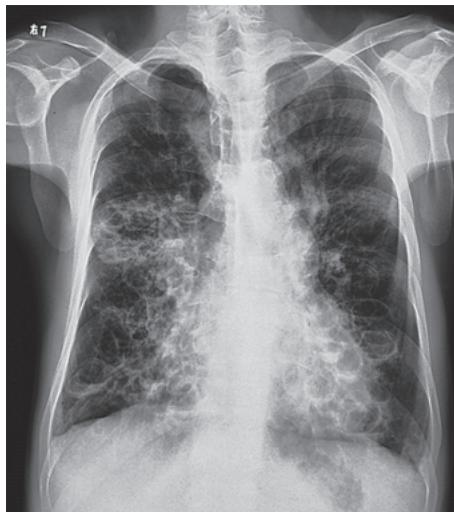  
图 2-5-2 支气管扩张 X 线胸片表现

描层面与支气管垂直时,扩张的支气管与伴行的肺动脉形成“印戒征”;当多个囊状扩张的支气管彼此相邻时,则表现为“蜂窝”状或“卷发”状改变。有部分病人合并曲霉菌感染形成曲霉菌球改变(图2-5-3C)。

（3）支气管碘油造影:可确诊支气管扩张症,但因其为创伤性检查,现已被高分辨率 CT(HRCT)所取代。

## 2. 实验室检查

（1）血常规及炎症标志物: 当细菌感染导致支气管扩张症急性加重时, 血常规白细胞计数、中性粒细胞百分比及 C 反应蛋白可升高。

(2) 血清免疫球蛋白: 合并免疫功能缺陷者可出现血清免疫球蛋白 (IgG、IgA、IgM) 缺乏。

（3）血气分析:可判断病人是否合并低氧血症和/或高碳酸血症。

（4）微生物学检查:应留取合格的痰标本送检涂片染色以及痰细菌培养,痰培养和药敏试验结果可指导抗菌药物的选择,痰液中找到抗酸杆菌时需要进一步分型是结核分枝杆菌还是非结核分枝杆菌。

（5）病因学：必要时可检测类风湿因子、抗核抗体、抗中性粒细胞胞质抗体。怀疑 ABPA 的病人可选择性进行血清 IgE 测定、烟曲霉皮试、曲霉沉淀素检查。如病人自幼起病，合并慢性鼻窦炎或中耳炎，或合并右位心，需怀疑 PCD 可能，可行鼻呼出气一氧化氮测定筛查，疑诊者需进一步取纤毛上皮行电镜检查，必要时行基因检测。

  
A

  
B

  
C  
图 2-5-3 支气管扩张 CT 表现

## 3. 其他

（1）纤维支气管镜检查:当支气管扩张呈局灶性且位于段支气管以上时,可发现弹坑样改变,可通过纤维支气管镜采样用于病原学诊断及病理诊断。纤维支气管镜检查还可明确出血、扩张或阻塞的部位。还可经纤维支气管镜进行局部灌洗,采取灌洗液标本进行涂片、细菌学和细胞学检查,协助诊断和指导治疗。

(2) 肺功能测定: 部分病人存在限制性、阻塞性或混合性通气功能障碍。

## 【诊断与鉴别诊断】

（一）诊断 根据反复咳脓痰、咯血病史和既往有诱发支气管扩张症的呼吸道感染病史，HRCT显示支气管扩张的异常影像学改变，即可明确诊断为支气管扩张症。诊断支气管扩张症的病人还应进一步仔细询问既往病史、评估呼吸道症状、根据病情完善相关检查以明确病因诊断。

## (二) 评估

1. 病人初次诊断后的评估 痰液检查,包括初诊及定期的痰涂片(包括真菌和抗酸染色),痰培养加药敏试验。肺部 CT 随访,尤其是肺内出现空洞、无法解释的咯血或痰中带血、治疗反应不佳、反复急性加重等。肺功能用于评估疾病进展程度和指导药物治疗。血气分析判断是否存在低氧血症和/或 $CO_{2}$ 潴留。实验室检查评估病人的炎症反应,免疫状态,是否合并其他病原体感染等。

2. 支气管扩张症危重程度及预后的评估 由于支气管扩张症病人的异质性较强,肺部影像学和肺功能差异较大,临床症状也有较大的差异,因此支气管扩张症病人的危重程度评估是依靠临床症状、体征、影像学、肺功能以及实验室检查等多个维度来进行综合的评估。评估方面,目前常用的是支气管扩张严重指数(bronchiectasis severity index, BSI)和支气管扩张症严重程度分级(E-FACED)评分。BSI 可用于预测支气管扩张症病人病情恶化、住院、死亡风险等。总分 0～4 分为轻度，5～8 分为中度，≥9 分为重度。E-FACED 主要用于预测未来急性加重和住院。总分 0～3 分为轻度，4～6 分为中度，7～9 分为重度。

（三）鉴别诊断 需鉴别的疾病主要为慢性支气管炎、肺脓肿、肺结核、先天性肺囊肿、弥漫性泛细支气管炎和支气管肺癌等。仔细研究病史和临床表现，参考影像学、纤维支气管镜和支气管造影的特征常可作出明确的鉴别诊断。下述要点对鉴别诊断有一定参考意义。

1. 慢性支气管炎 多发生在中年以上病人，在气候多变的冬春季节咳嗽、咳痰明显，多咳白色黏液痰，感染急性发作时可出现脓性痰，但无反复咯血史。听诊双肺可闻及散在干、湿啰音。

2. 肺脓肿 起病急,有高热、咳嗽、大量脓臭痰。X线检查可见局部浓密炎症阴影,内有空腔液平。

3. 肺结核 常有低热、盗汗、乏力、消瘦等结核毒性症状，干、湿啰音多局限于上肺，X线胸片和痰结核菌检查可作出诊断。

4. 先天性肺囊肿 X 线检查可见多个边界纤细的圆形或椭圆形阴影,壁较薄,周围组织无炎症浸润。胸部 CT 和支气管造影可协助诊断。

5. 弥漫性泛细支气管炎 有慢性咳嗽、咳痰、活动时呼吸困难及慢性鼻窦炎。X 线胸片和胸部 CT 显示弥漫分布的小结节影。大环内酯类抗生素治疗有效。

6. 支气管肺癌 多见于 40 岁以上病人, 可伴有咳嗽、咳痰、胸痛, 痰中带血。大咯血少见。影像学、痰细胞学、支气管镜检查等有助于确诊。

## 【治疗】

1. 治疗基础疾病 对活动性肺结核伴支气管扩张症应积极抗结核治疗,低免疫球蛋白血症可用免疫球蛋白替代治疗。

2. 控制感染 支气管扩张症病人出现痰量增多及其脓性成分增加等急性感染征象时，需应用抗感染药物。急性加重期开始抗菌药物治疗前应常规送痰培养，根据痰培养和药敏结果指导抗生素应用，但在等待培养结果时即应开始经验性抗菌药物治疗。无铜绿假单胞菌感染高危因素的病人应立即经验性使用对流感嗜血杆菌有活性的抗菌药物（如氨苄西林/舒巴坦、阿莫西林/克拉维酸），第二代头孢菌素，第三代头孢菌素（如头孢曲松钠、头孢噻肟），莫西沙星、左氧氟沙星。对于存在铜绿假单胞菌感染高危因素的病人[如存在以下4条中的2条：①近期住院；②每年4次以上或近3个月以内应用抗生素；③重度气流阻塞( $FEV_{1}<30\%$ 预计值)；④最近2周每日口服泼尼松>10mg]，可选择具有抗假单胞菌活性的β-内酰胺类抗生素（如头孢他啶、头孢吡肟、哌拉西林/他唑巴坦、头孢哌酮/舒巴坦），碳青霉烯类（如亚胺培南、美罗培南)，氨基糖苷类，喹诺酮类（环丙沙星或左氧氟沙星），可单独应用或联合应用。对于慢性咳脓痰病人，还可考虑使用疗程更长的抗生素，如口服阿莫西林或吸入氨基糖苷类药物，或间断并规则使用单一抗生素以及轮换使用抗生素以加强对下呼吸道病原体的清除。合并ABPA时，除一般需要糖皮质激素（泼尼松0.5～1mg/kg）外，还需要抗真菌药物（如伊曲康唑）联合治疗，疗程较长。支气管扩张症病人出现肺内空洞，尤其是内壁光滑的空洞，合并或没有合并树芽征，要考虑到不典型分枝杆菌感染的可能，可采用痰抗酸染色、痰培养及痰的微生物分子检测进行诊断。本病也容易合并结核，病人可以有肺内空洞或肺内结节，渗出合并增殖性改变等，可合并低热、夜间盗汗，需要在随访过程中密切注意上述相关的临床表现。支气管扩张症病人容易合并曲霉菌的定植和感染，表现为管腔内有曲霉球，或出现慢性纤维空洞样改变，或急性、亚急性侵袭性感染。曲霉菌的侵袭性感染治疗一般选择伏立康唑。

长期抗生素治疗: 利用十四元环、十五元环等大环内酯类抗生素, 包括阿奇霉素、克拉霉素、红霉素等具有免疫调节作用的特点, 在排除了肝肾功能障碍、心电图未见 Q-T 间期延长和听力未有明显障碍的基础上, 参照国外的研究结果, 给予长期(可达一年)的口服治疗, 在有些支气管扩张症病人可以减少急性加重的频率。治疗过程中需要监测肝肾功能、心电图和听力。雾化吸入抗生素如妥布霉素可以有效清除定植的微生物,并能减少急性加重,目前已经在临床上开始使用,但疗程上还有待进一步的探索。

病原体清除治疗:对于首次分离出铜绿假单胞菌且病情进展的病人,根据国外的研究结果,可以给予为期两周的环丙沙星(500mg,2次/日)口服治疗,并于后续三个月吸入妥布霉素治疗。合并NTM的病人,根据病人的NTM感染的危重程度,是否合并咯血和空洞等进行评估,如果考虑单纯定植,或病灶局限,病变较轻,并不需要进行抗NTM治疗。如果判断NTM促进了肺部疾病的进展或有较高的风险,可以进行至少包含三种药物的抗NTM治疗,最长疗程可达两年。部分病人因为药物的副作用往往不能耐受两年的疗程。

3. 改善气流受限 建议支气管扩张症病人常规随访肺功能的变化,尤其是已经有阻塞性通气功能障碍的病人。长效支气管扩张剂(长效 $\beta_{2}$ 受体激动剂、长效抗胆碱药、吸入糖皮质激素联合长效 $\beta_{2}$ 受体激动剂)可改善气流受限并帮助清除分泌物,对伴有气道高反应及可逆性气流受限的病人常有一定疗效。但由于缺乏循证医学的依据,在支气管扩张剂的选择上,目前并无常规推荐的指征。

4. 清除气道分泌物 包括物理排痰和化痰药物。物理排痰包括:体位引流,一般头低臀部抬高,可配合震动拍击背部协助痰液引流;气道内雾化吸入生理盐水,短时间内吸入高渗生理盐水,或吸入黏液溶解剂如乙酰半胱氨酸等,可有助于痰液的稀释和排出。其他如胸壁震荡、正压通气、主动呼吸训练等合理使用也可以起到排痰作用。药物包括黏液溶解剂、痰液促排剂、抗氧化剂等。乙酰半胱氨酸具有较强的化痰和抗氧化作用。

5. 免疫调节剂 使用一些促进呼吸道免疫增强的药物如细菌细胞壁裂解产物,可以减少支气管扩张症病人的急性发作。部分支气管扩张症病人长期使用十四元环或十五元环大环内酯类抗生素可以减少急性发作和改善病人的症状,但需要注意长期口服抗生素带来的其他副作用,包括心血管、听力、肝功能的损害及出现细菌耐药等。

6. 咯血的治疗 对反复咯血的病人,如果咯血量少,可以对症治疗或口服卡巴克洛、卡络磺钠、云南白药等。若出血量中等,可静脉给予垂体后叶素或酚妥拉明;若出血量大,经内科治疗无效,可考虑介入栓塞治疗或手术治疗。使用垂体后叶素需要注意低钠血症的产生。

7. 外科治疗 如支气管扩张为局限性,经充分内科治疗仍顽固反复发作者,可考虑外科手术切除病变肺组织。如大出血来自增生的支气管动脉,经休息和抗生素等保守治疗不能缓解仍反复大咯血时,病变局限者可考虑外科手术,否则采用支气管动脉栓塞术治疗。对于那些尽管采取了所有治疗仍致残的病例,合适者可考虑肺移植。

8. 预防 可考虑应用肺炎球菌疫苗和流感疫苗预防或减少急性发作,新冠病毒疫苗接种可以降低感染后病情的危重程度和降低病死率。免疫调节剂对于减轻症状和减少发作有一定帮助。吸烟者应予以戒烟。康复锻炼对于保持肺功能有一定作用。

【预后】支气管扩张症的预后，取决于支气管扩张范围和有无并发症。支气管扩张范围局限者，积极治疗可改善生命质量和延长寿命。支气管扩张范围广泛者易损害肺功能，甚至发展至呼吸衰竭而引起死亡。大咯血也可严重影响预后。支气管扩张症合并铜绿假单胞菌定植、肺实质损害如肺气肿和肺大疱者预后较差。慢阻肺病病人合并支气管扩张症后死亡率增加。

(宋元林)

  
本章思维导图

## 第一节 | 肺炎概述

肺炎（pneumonia）指终末气道、肺泡和肺间质的炎症，可由病原微生物、理化因素、免疫损伤、过敏及药物所致。细菌性肺炎是最常见的肺炎，也是最常见的感染性疾病之一。在抗菌药物应用以前，细菌性肺炎对儿童及老年人的健康威胁极大，抗菌药物的出现及发展曾一度使肺炎病死率明显下降。但近年来，尽管应用强力的抗菌药物和有效的疫苗，肺炎的病死率并未进一步降低，甚至有所上升。

【流行病学】社区获得性肺炎（community acquired pneumonia, CAP）和医院获得性肺炎（hospital acquired pneumonia, HAP）年发病率分别约为（5～11）/1000人口和（5～10）/1000住院病人。CAP病人门诊治疗者病死率＜1%～5%，住院治疗者平均为12%，入住重症监护病房者约为40%。由HAP引起的相关病死率为15.5%～38.2%。发病率和病死率高的原因与社会人口老龄化、吸烟、伴有基础疾病和免疫功能低下有关，如慢阻肺病、心力衰竭、肿瘤、糖尿病、尿毒症、神经系统疾病、药物成瘾、嗜酒、艾滋病、久病体衰、大型手术、应用免疫抑制剂和器官移植等。此外，亦与病原体变迁、新病原体出现、病原学诊断困难、不合理使用抗菌药物导致细菌耐药性增加，尤其是与多耐药（multidrug-resistant, MDR）病原体增加等有关。

【病因、发病机制和病理】正常的呼吸道免疫防御机制(支气管内黏液-纤毛运载系统、肺泡巨噬细胞等细胞防御的完整性等)使下呼吸道免于细菌等致病菌感染。是否发生肺炎取决于两个因素：病原体和宿主因素。如果病原体数量多、毒力强和/或宿主呼吸道局部和全身免疫防御系统损害，即可发生肺炎。病原体可通过下列途径引起社区获得性肺炎：①空气吸入；②血行播散；③邻近感染部位蔓延；④上呼吸道定植菌的误吸。医院获得性肺炎则更多是通过误吸胃肠道的定植菌(胃食管反流)和/或通过人工气道吸入环境中的致病菌引起。病原体直接抵达下呼吸道后，滋生繁殖，引起肺泡毛细血管充血、水肿，肺泡内纤维蛋白渗出及细胞浸润。除了金黄色葡萄球菌、铜绿假单胞菌和肺炎克雷伯菌等可引起肺组织的坏死性病变易形成空洞外，肺炎治愈后多不遗留瘢痕，肺的结构与功能均可恢复。

【分类】肺炎可按解剖、病因或患病环境加以分类。

## (一) 解剖分类

1. 大叶性(肺泡性)肺炎 病原体先在肺泡引起炎症,经肺泡间孔(Cohn 孔)向其他肺泡扩散,致使部分肺段或整个肺段、肺叶发生炎症。典型者表现为肺实质炎症,通常并不累及支气管。致病菌多为肺炎链球菌。X 线影像显示肺叶或肺段的实变阴影。

2. 小叶性(支气管性)肺炎 病原体经支气管入侵,引起细支气管、终末细支气管及肺泡的炎症,常继发于其他疾病,如支气管炎、支气管扩张、上呼吸道病毒感染以及长期卧床的危重病人。其病原体有肺炎链球菌、葡萄球菌、病毒、肺炎支原体以及军团菌等。X线影像显示为沿着肺纹理分布的不规则斑片状阴影,边缘密度浅而模糊,无实变征象,肺下叶常受累。

3. 间质性肺炎 以肺间质受累为主的炎症,累及支气管壁、支气管周围组织及肺泡壁,因病变仅在肺间质,故呼吸道症状较轻,病变广泛则呼吸困难明显。可由细菌、支原体、衣原体、病毒或肺孢子菌等引起。X线影像表现为一侧或双侧肺下部不规则阴影,可呈磨玻璃状、网格状,其间可有小片肺不张阴影。

（二）病因分类

1. 细菌性肺炎 如肺炎链球菌、金黄色葡萄球菌、甲型溶血性链球菌、肺炎克雷伯菌、流感嗜血杆菌、铜绿假单胞菌和鲍曼不动杆菌等。

2. 非典型病原体所致肺炎 如军团菌、支原体和衣原体等。

3. 病毒性肺炎 如冠状病毒、腺病毒、呼吸道合胞病毒、流感病毒、麻疹病毒、巨细胞病毒、单纯疱疹病毒等。

4. 肺真菌病 如念珠菌、曲霉、隐球菌、肺孢子菌、毛霉等。

5. 其他病原体所致肺炎 如立克次体(如 Q 热立克次体)、弓形体(如鼠弓形体)、寄生虫(如肺包虫、肺吸虫、肺血吸虫)等。

6. 理化因素所致肺炎 如放射性损伤引起的放射性肺炎,胃酸吸入引起的化学性肺炎,对吸入或内源性脂类物质产生炎症反应的类脂性肺炎等。通常所说的肺炎不包括理化因素所致的肺炎。

（三）患病环境分类 由于细菌学检查阳性率低，培养结果滞后，病因分类在临床上应用较为困难，目前多按肺炎的获得环境分成两类，这是因为不同场所发生的肺炎的病原学有相应的特点，因此有利于指导经验性治疗。

1. CAP 是指在医院外罹患的感染性肺实质(含肺泡壁,即广义上的肺间质)炎症,包括具有明确潜伏期的病原体感染在入院后于潜伏期内发病的肺炎。其临床诊断依据是:①社区发病。②肺炎相关临床表现:a. 新近出现的咳嗽、咳痰或原有呼吸道疾病症状加重并出现脓性痰,伴或不伴胸痛/呼吸困难/咯血;b. 发热;c. 肺实变体征和/或闻及湿啰音;d.WBC>10×10 $^{9}$ /L 或<4×10 $^{9}$ /L,伴或不伴中性粒细胞核左移。③胸部影像学检查显示片状、斑片状浸润性阴影或间质性改变,伴或不伴胸腔积液。符合①、③及②中任何 1 项,并除外肺结核、肺部肿瘤、非感染性肺间质性疾病、肺水肿、肺不张、肺栓塞、肺嗜酸性粒细胞浸润症及肺血管炎等后,可建立临床诊断。CAP 常见病原体为肺炎链球菌、支原体、衣原体、流感嗜血杆菌和呼吸道病毒(甲、乙型流感病毒,腺病毒,呼吸道合胞病毒和副流感病毒)等。

2. HAP 指病人住院期间没有接受有创机械通气,未处于病原感染的潜伏期,且入院≥48小时后在医院内新发生的肺炎。呼吸机相关性肺炎(ventilator associated pneumonia, VAP)是指气管插管或气管切开病人,接受机械通气48小时后发生的肺炎及机械通气撒机、拔管后48小时内出现的肺炎。胸部X线或CT显示新出现或进展性的浸润影、实变影、磨玻璃影,加上下列3个临床症状中2个或以上,可建立临床诊断:①发热,体温>38℃;②脓性气道分泌物;③外周血白细胞计数>10×10 $^{9}$ /L或<4×10 $^{9}$ /L。肺炎相关的临床表现中,满足的条件越多,临床诊断的准确性越高。HAP的临床表现、实验室和影像学检查特异性低,应注意与肺不张、心力衰竭和肺水肿、基础疾病肺侵犯、药物性肺损伤、肺栓塞和急性呼吸窘迫综合征等相鉴别。临床诊断HAP/VAP后,应积极留取标本行微生物学检测。非免疫缺陷的病人HAP/VAP通常由细菌感染引起,常见病原菌的分布及其耐药性特点随地区、医院等级、病人人群、暴露于抗菌药物情况不同而异,并且随时间而改变。我国HAP/VAP常见病原菌包括鲍曼不动杆菌、铜绿假单胞菌、肺炎克雷伯菌、大肠埃希菌、金黄色葡萄球菌等。需要强调的是,在经验性治疗时,了解当地医院的病原学监测数据更为重要,应根据本地区、本医院甚至特定科室的病原谱和耐药特点,结合病人个体因素来选择抗菌药物。

【临床表现】细菌性肺炎的症状可轻可重，取决于病原体和宿主的状态。常见症状为咳嗽、咳痰，或原有呼吸道症状加重，并出现脓性痰或血痰，伴或不伴胸痛。病变范围大者可有呼吸困难、呼吸窘迫。大多数病人有发热。早期肺部体征无明显异常，重症者可有呼吸频率增快、鼻翼扇动、发绀。肺实变时有典型的体征，如叩诊呈浊音、语颤增强和支气管呼吸音等，也可闻及湿啰音。并发胸腔积液者，患侧胸部叩诊呈浊音、语颤减弱、呼吸音减弱。

【诊断与鉴别诊断】肺炎的诊断程序如下。

（一）确定肺炎诊断 根据前述肺炎诊断标准确定肺炎诊断，并分类为社区获得性肺炎或医院获得性肺炎。同时需要与下列疾病进行鉴别诊断。

1. 急性上呼吸道感染与气管支气管炎 通常有咳嗽、咳痰和发热等症状,但无肺实质浸润,胸部X线检查可鉴别。

## 2. 类似肺炎的疾病

（1）肺结核：多有全身中毒症状，如午后低热、盗汗、疲乏无力、体重减轻、失眠、心悸，女性病人可有月经失调或闭经等。X线胸片见病变多在肺尖或锁骨上下，密度不匀，消散缓慢，且可形成空洞或肺内播散。痰中可找到结核分枝杆菌。一般抗菌治疗疗效不佳。

（2）肺癌：多无急性感染中毒症状，有时痰中带血丝，血白细胞计数不高。但肺癌可伴发阻塞性肺炎，经抗菌药物治疗炎症消退后肿瘤阴影渐趋明显，或可见肺门淋巴结肿大，有时出现肺不张。若抗菌药物治疗后肺部炎症不见消散，或消散后于同一部位再次出现肺炎，应密切随访。对有吸烟史及年龄较大的病人，必要时做CT、MRI、支气管镜和痰脱落细胞等检查，以免贻误诊断。

（3）肺栓塞：多有静脉血栓的危险因素，如血栓性静脉炎、心肺疾病、创伤、手术和肿瘤等病史，呼吸困难较明显，可发生咯血、晕厥。X线胸片示区域性肺血管纹理减少，有时可见尖端指向肺门的楔形阴影。动脉血气分析常见低氧血症及低碳酸血症。D-二聚体、CT肺动脉造影、放射性核素肺通气/灌注扫描和MRI等检查可帮助鉴别。

（4）非感染性肺部浸润：还需要与间质性肺炎、肺水肿、肺不张和肺血管炎等疾病鉴别。

（二）评估严重程度 如果肺炎的诊断成立，评价病情的严重程度对于决定在门诊或入院治疗甚或ICU治疗至关重要。肺炎严重性取决于3个主要因素：肺部局部炎症程度、肺部炎症的播散和全身炎症反应程度。重症肺炎目前还没有普遍认同的诊断标准，如果肺炎病人需要呼吸支持(急性呼吸衰竭、气体交换严重障碍伴高碳酸血症或持续低氧血症)、循环支持(血流动力学障碍、外周灌注不足)和加强监护与治疗可认为是重症肺炎。目前许多国家制定了重症肺炎的诊断标准，虽然有所不同，但均注重肺部病变的范围、器官灌注和氧合状态。目前我国推荐使用CURB-65作为判断CAP病人是否需要住院治疗的标准。CURB-65共五项指标，由4项指标英文首字母与年龄65岁组成，满足1项得1分：①意识障碍(confusion,C)；②尿素氮(uremia,U)>7mmol/L；③呼吸频率(respiratory rate, R)≥30次/分；④血压(blood pressure,B)，收缩压<90mmHg或舒张压≤60mmHg；⑤年龄≥65岁。评分0\~1分，原则上门诊治疗即可；2分建议住院或严格随访下的院外治疗；3\~5分应住院治疗。同时应结合病人年龄、基础疾病、社会经济状况、胃肠功能、治疗依从性等综合判断。若CAP符合下列1项主要标准或≥3项次要标准可诊断为重症肺炎，需密切观察，积极救治，有条件时收住ICU治疗。主要标准：①需要气管插管行机械通气治疗；②感染性休克经积极液体复苏后仍需要血管活性药物治疗。次要标准：①呼吸频率≥30次/分；② $PaO_{2}/FiO_{2}\leqslant250mmHg$ (1mmHg=0.133kPa)；③多肺叶浸润；④意识障碍和/或定向障碍；⑤血尿素氮≥7.14mmol/L(20mg/dl)；⑥收缩压<90mmHg需要积极的液体复苏。

（三）确定病原体 由于人上呼吸道黏膜表面及其分泌物含有许多微生物，即所谓的正常菌群，因此，途经口咽部的下呼吸道分泌物或痰无疑极易受到污染。有慢性气道疾病者、老年人和危重病病人等，其呼吸道定植菌明显增加，影响痰中致病菌的分离和判断。另外，应用抗菌药物后可影响细菌培养结果。因此，在采集呼吸道标本进行细菌培养时，尽可能在抗菌药物应用前采集，避免污染，及时送检，其结果才能起到指导治疗的作用。目前常用的方法如下。

1. 痰 采集方便,是最常用的下呼吸道病原学标本。采集后在室温下2小时内送检。先直接涂片,光镜下观察细胞数量,如每低倍视野鳞状上皮细胞<10个、白细胞>25个,或鳞状上皮细胞:白细胞<1:2.5,可作为污染相对较少的“合格”标本接种培养。痰定量培养分离的致病菌或机会致病菌浓度 $\geqslant10^{7}cfu/ml$ ,可以认为是肺部感染的致病菌; $\leqslant10^{4}cfu/ml$ 则为污染菌;介于两者之间建议重复痰培养;如连续分离到相同细菌, $10^{5}\sim10^{6}cfu/ml$ 连续2次以上,也可认为是致病菌。

2. 经支气管镜或人工气道吸引 受口咽部细菌污染的机会较咳痰为少,如吸引物细菌培养其浓度 $\geqslant10^{5}cfu/ml$ ,可认为是致病菌,低于此浓度则多为污染菌。

3. 防污染样本毛刷 如细菌≥10³cfu/ml, 可认为是致病菌。

4. 支气管肺泡灌洗 如细菌≥ $10^{4}$ cfu/ml, 防污染 BAL 标本细菌≥ $10^{3}$ cfu/ml, 可认为是致病菌。

5. 经皮细针吸检和开胸肺活检 敏感性和特异性均很好,但由于是创伤性检查,容易引起并发症,如气胸、出血等,临床一般用于对抗菌药物经验性治疗无效或其他检查不能确定者。

6. 血和胸腔积液培养 肺炎病人血和痰培养分离到相同细菌,可确定为肺炎的病原菌。胸腔积液培养到的细菌则基本可认为是肺炎的致病菌。由于血或胸腔积液标本的采集均经过皮肤,故其结果须排除操作过程中皮肤细菌的污染。

7. 尿抗原试验 包括军团菌和肺炎链球菌尿抗原。

8. 血清学检查 测定特异性 IgM 抗体滴度, 如急性期和恢复期之间抗体滴度有 4 倍增高可诊断, 例如支原体、衣原体、嗜肺军团菌和病毒感染等, 多为回顾性诊断。

9. 分子诊断学技术 核酸检测技术包括实时荧光 PCR、数字 PCR、等温扩增技术、核酸即时检测技术等，实时荧光 PCR 主要适用于门急诊、住院病人和大人群筛查，数字 PCR 可直接定量检测呼吸道标本中病原体个数，等温扩增技术、核酸即时检测技术，适用于门急诊、发热门诊呼吸道感染病人病原体核酸快速筛查。病原体宏基因组下一代测序（metagenomic next generation sequencing, mNGS）主要适用于呼吸道重症感染、疑似特殊病原体感染、聚集性呼吸道传播性感染病人，在传统微生物检验未能明确病原体或急需快速鉴别是否感染及其病原体时，有选择地使用。对于社区获得性肺炎，核酸检测技术有利于提高病原体检出率。医院获得性肺炎和呼吸机相关肺炎病原学诊断以传统培养方法为主，仅在病人有免疫缺陷、3 天内未通过传统微生物检验明确病原体且经验性抗感染治疗无效时，考虑进行以 DNA 测序为主的 mNGS。

虽然目前有许多病原学诊断方法，仍有高达 $40\% \sim 50\%$ 的肺炎不能确定相关病原体。病原体低检出率以及病原学和血清学诊断的滞后性，使大多数肺部感染治疗，特别是初始的抗菌治疗都是经验性的，而且相当一部分病人的抗菌治疗始终是在没有病原学诊断的情况下进行的。但是，对HAP、免疫抑制宿主肺炎和抗感染治疗无反应的重症肺炎等，仍应积极采用各种手段确定病原体，以指导临床的抗菌药物治疗。临床可根据各种肺炎的临床和放射学特征估计可能的病原体(表2-6-1)。

表 2-6-1 常见肺炎的症状、体征和 X 线特征

<table><tr><td>病原体</td><td>病史、症状和体征</td><td>X线征象</td></tr><tr><td>肺炎链球菌</td><td>起病急,寒战、高热、咳铁锈色痰、胸痛,肺实变体征</td><td>肺叶或肺段实变,无空洞,可伴胸腔积液</td></tr><tr><td>金黄色葡萄球菌</td><td>起病急,寒战、高热、脓血痰、气急、毒血症症状、休克</td><td>肺叶或小叶浸润,早期空洞,脓胸,可见液气囊腔</td></tr><tr><td>肺炎克雷伯菌</td><td>起病急,寒战、高热、全身衰竭、咳砖红色胶冻状痰</td><td>肺叶或肺段实变,蜂窝状脓肿,叶间隙下坠</td></tr><tr><td>铜绿假单胞菌</td><td>毒血症症状明显,脓痰,可呈蓝绿色</td><td>弥漫性支气管炎,早期肺脓肿</td></tr><tr><td>大肠埃希菌</td><td>原有慢性病,发热、脓痰、呼吸困难</td><td>支气管肺炎,脓胸</td></tr><tr><td>流感嗜血杆菌</td><td>高热、呼吸困难、衰竭</td><td>支气管肺炎,肺叶实变,无空洞</td></tr><tr><td>厌氧菌</td><td>吸入病史,高热、腥臭痰、毒血症症状明显</td><td>支气管肺炎,脓胸,脓气胸,多发性肺脓肿</td></tr><tr><td>军团菌</td><td>高热、肌痛、相对缓脉</td><td>下叶斑片浸润,进展迅速,无空洞</td></tr><tr><td>支原体</td><td>起病缓,可小流行、乏力、肌痛、头痛</td><td>下叶间质性支气管肺炎,3~4周可自行消散</td></tr><tr><td>念珠菌</td><td>慢性病史,畏寒、高热、黏痰</td><td>双下肺纹理增多,支气管肺炎或大片浸润,可有空洞</td></tr><tr><td>曲霉</td><td>免疫抑制宿主,发热、干咳或棕黄色痰、胸痛、咯血、喘息</td><td>以胸膜为基底的楔形影,结节或团块影,内有空洞;有晕轮征和新月征</td></tr></table>

【治疗】抗感染治疗是肺炎治疗的关键环节，包括经验性治疗和抗病原体治疗。前者主要根据本地区、本单位的肺炎病原体流行病学资料，选择可能覆盖病原体的抗菌药物；后者则根据病原学的培养结果或肺组织标本的培养或病理结果以及药物敏感试验结果，选择体外试验敏感的抗菌药物。此外，还应该根据病人的年龄、有无基础疾病、是否有误吸、住普通病房还是重症监护病房、住院时间长短和肺炎的严重程度等，选择抗菌药物和给药途径。

青壮年和无基础疾病的 CAP 病人, 常用青霉素类、第一代头孢菌素等。由于我国肺炎链球菌对大环内酯类耐药率高, 故对该菌所致的肺炎不单独使用大环内酯类药物治疗。对耐药肺炎链球菌可使用呼吸氟喹诺酮类药物(莫西沙星、吉米沙星和左氧氟沙星)。老年人、有基础疾病或住院的 CAP, 常用呼吸氟喹诺酮类药物, 第二、三代头孢菌素, β-内酰胺类/β-内酰胺酶抑制剂或厄他培南, 可联合大环内酯类药物。HAP 常用第二、三代头孢菌素, β-内酰胺类/β-内酰胺酶抑制剂、氟喹诺酮类或碳青霉烯类药物。

重症肺炎首先应选择广谱的强力抗菌药物，并应足量、联合用药。因为初始经验性治疗不足或不合理，或之后根据病原学培养结果调整抗菌药物，其病死率均明显高于初始治疗正确者。重症 CAP 常用 $\beta-$ 内酰胺类联合大环内酯类或氟喹诺酮类药物；青霉素过敏者用呼吸氟喹诺酮类和氨曲南。HAP 可用具有抗假单胞菌活性的 $\beta-$ 内酰胺类、广谱青霉素/ $\beta-$ 内酰胺酶抑制剂、碳青霉烯类的任何一种联合呼吸氟喹诺酮类或氨基糖苷类药物，如怀疑有 MDR 球菌感染可选择联合万古霉素、替考拉宁或利奈唑胺。

抗菌药物治疗应尽早进行，一旦怀疑为肺炎即应马上给予首剂抗菌药物，越早治疗预后越好。病情稳定后可从静脉途径转为口服治疗。抗感染治疗一般可于热退2～3天且主要呼吸道症状明显改善后停药，但疗程应视病情严重程度、缓解速度、并发症以及不同病原体而异，不必以肺部阴影吸收程度作为停用抗菌药物的指征。通常轻、中度CAP病人疗程5～7天，重症以及伴有肺外并发症病人可适当延长抗感染疗程。非典型病原体治疗反应较慢者疗程延长至10～14天。金黄色葡萄球菌、铜绿假单胞菌、克雷伯菌属或厌氧菌等容易导致肺组织坏死，抗菌药物疗程可延长至14～21天。

大多数 CAP 病人在初始治疗后 72 小时临床症状改善,表现为体温下降、症状改善、临床状态稳定,白细胞、C 反应蛋白和降钙素原逐渐降低或恢复正常,但影像学改善滞后于临床症状。应在初始治疗后 72 小时对病情进行评价,部分病人对治疗的反应相对较慢,只要临床表现无恶化,可以继续观察,不必急于更换抗感染药物。经治疗后达到临床稳定,可以认定为初始治疗有效。临床稳定标准需符合下列所有五项指标:①体温≤37.8℃;②心率≤100 次/分;③呼吸频率≤24 次/分;④收缩压≥90mmHg;⑤血氧饱和度≥90%(或者动脉血氧分压≥60mmHg,吸空气条件下)。对达到临床稳定且能接受口服药物治疗的病人,改用同类或抗菌谱相近、对致病菌敏感的口服制剂进行序贯治疗。

如 72 小时后症状无改善,其原因可能有:①药物未能覆盖致病菌,或细菌耐药;②特殊病原体感染,如结核分枝杆菌、真菌、病毒等;③出现并发症或存在影响疗效的宿主因素(如免疫抑制);④非感染性疾病误诊为肺炎;⑤药物热。需仔细分析,做必要的检查,进行相应处理。

【预防】加强体育锻炼,增强体质。减少危险因素如吸烟、酗酒。年龄大于65岁者可接种流感疫苗。对年龄大于65岁或不足65岁,但有心血管疾病、肺疾病、糖尿病、酗酒、肝硬化和免疫抑制者可接种肺炎疫苗。

## 第二节 | 细菌性肺炎

## 一、肺炎链球菌肺炎

肺炎链球菌肺炎(Streptococcal pneumoniae pneumonia)是由肺炎链球菌(Streptococcus pneumoniae, SP)或称肺炎球菌(Pneumococcal pneumoniae)所引起的肺炎,约占CAP的半数。通常急骤起病,以高热、寒战、咳嗽、血痰及胸痛为特征。胸部影像学检查呈肺段或肺叶急性炎性实变。因抗菌药物的广泛使用，使本病的起病方式、症状及X线影像改变均不典型。

【病因和发病机制】SP为革兰氏阳性球菌，多成双排列或短链排列。有荚膜，其毒力大小与荚膜中的多糖结构及含量有关。根据荚膜多糖的抗原特性，SP可分为86个血清型。成人致病菌多属1～9型及12型，以第3型毒力最强，儿童则多为6、14、19及23型。SP在干燥痰中能存活数月，但在阳光直射1小时或加热至52℃ 10分钟即可被杀灭，对苯酚等消毒剂亦甚敏感。机体免疫功能正常时，SP是寄居在口腔及鼻咽部的一种正常菌群，带菌率随年龄、季节及免疫状态的变化而有差异。机体免疫功能受损时，有毒力的SP入侵人体而致病。SP除引起肺炎外，少数可发生菌血症或感染性休克，老年人及婴幼儿的病情尤为严重。

SP 不产生毒素,不引起组织坏死或形成空洞。其致病力是由于高分子多糖体的荚膜对组织的侵袭作用,首先引起肺泡壁水肿,出现白细胞与红细胞渗出,之后含菌的渗出液经 Cohn 孔向肺的中央部分扩展,甚至累及几个肺段或整个肺叶。因病变开始于肺的外周,故肺叶间分界清楚,易累及胸膜,引起渗出性胸膜炎。

【病理】病理改变有充血期、红肝变期、灰肝变期及消散期。表现为肺组织充血水肿，肺泡内浆液渗出及红、白细胞浸润，白细胞吞噬细菌，继而纤维蛋白渗出物溶解、吸收、肺泡重新充气。肝变期病理阶段实际并无明确分界，经早期应用抗菌药物治疗，典型病理的分期已经很少见。病变消散后肺组织结构多无损坏，不留纤维瘢痕。极个别病人肺泡内纤维蛋白吸收不完全，甚至有成纤维细胞形成，形成机化性肺炎。老年人及婴幼儿感染可沿支气管分布(支气管肺炎)。若未及时治疗，5%～10%的病人可并发脓胸，10%～20%的病人因细菌经淋巴管、胸导管进入血液循环，可引起脑膜炎、心包炎、心内膜炎、关节炎和中耳炎等肺外感染。

【临床表现】冬季与初春多见，常与呼吸道病毒感染相伴行。病人多为原来健康的青壮年或老年与婴幼儿，男性较多见。吸烟者、痴呆者、慢性支气管炎、支气管扩张、充血性心力衰竭、慢性病病人以及免疫抑制者均易受SP感染。

1. 症状 发病前常有受凉、淋雨、疲劳、醉酒、病毒感染史，多有上呼吸道感染的前驱症状。起病急骤，高热、寒战，全身肌肉酸痛，体温在数小时内升至39～40℃，高峰在下午或傍晚，或呈稽留热，脉率随之增速。可有患侧胸部疼痛，放射到肩部或腹部，咳嗽或深呼吸时加剧。痰少，可带血或呈铁锈色，胃纳锐减，偶有恶心、呕吐、腹痛或腹泻，易被误诊为急腹症。

2. 体征 病人呈急性热病容，面颊绯红，鼻翼扇动，皮肤灼热、干燥，口角及鼻周有单纯疱疹；病变广泛时可出现发绀。有感染中毒症者，可出现皮肤、黏膜出血点，巩膜黄染。早期肺部体征无明显异常，仅有胸廓呼吸运动幅度减小，叩诊稍浊，听诊可有呼吸音减低及胸膜摩擦音。肺实变时叩诊呈浊音，触觉语颤增强并可闻及支气管呼吸音。消散期可闻及湿啰音。心率增快，有时心律不齐。重症病人有肠胀气，上腹部压痛多与炎症累及膈胸膜有关。重症感染时可伴休克、急性呼吸窘迫综合征及神经精神症状。

自然病程大致 1～2 周。发病 5～10 天，体温可自行骤降或逐渐消退；使用有效的抗菌药物后可使体温在 1～3 天内恢复正常。病人的其他症状与体征亦随之逐渐消失。

【并发症】SP肺炎的并发症近年已很少见。严重感染中毒症病人易发生感染性休克，尤其是老年人。表现为血压降低、四肢厥冷、多汗、发绀、心动过速、心律不齐等，而高热、胸痛、咳嗽等症状并不突出。其他并发症有胸膜炎、脓胸、心包炎、脑膜炎和关节炎等。

【实验室和其他检查】血白细胞升高，中性粒细胞多在80%以上，并有核左移。年老体弱、酗酒、免疫功能低下者的白细胞计数可不增高，但中性粒细胞百分比仍增高。痰直接涂片作革兰氏染色及荚膜染色镜检，如发现典型的革兰氏阳性、带荚膜的双球菌或链球菌，即可初步作出病原学诊断。痰培养24～48小时可以确定病原体。痰标本要及时送检，在抗菌药物应用之前漱口后采集，取深部咳出的脓性或铁锈色痰。聚合酶链反应（PCR）及荧光标记抗体检测可提高病原学诊断率。尿SP抗原可阳性。约 10%～20% 病人合并菌血症，故重症肺炎应做血培养。如合并胸腔积液，应积极抽取积液进行细菌培养。

胸部影像学检查早期仅见肺纹理增粗，或受累的肺段、肺叶稍模糊。随着病情进展，表现为大片炎症浸润阴影或实变影，在实变阴影中可见支气管充气征，肋膈角可有少量胸腔积液。在消散期，炎性浸润逐渐吸收，可有片状区域吸收较快而呈现“假空洞”征，多数病例在起病3～4周后才完全消散。老年肺炎病灶消散较慢，容易吸收不完全而成为机化性肺炎。

【诊断】根据典型症状与体征,结合胸部X线检查,容易作出初步诊断。年老体衰、继发于其他疾病或灶性肺炎表现者,临床常不典型,需认真加以鉴别。病原菌检测是确诊本病的主要依据。

## 【治疗】

1. 抗菌药物治疗 首选青霉素 G, 用药途径及剂量视病情轻重及有无并发症而定。轻症病人, 可用 240 万 U/d, 分 3 次肌内注射, 或用普鲁卡因青霉素每 12 小时肌内注射 60 万 U。病情稍重者, 宜用青霉素 G 240 万～480 万 U/d, 分次静脉滴注, 每 6～8 小时 1 次; 重症及并发脑膜炎者, 可增至 1000 万～3000 万 U/d, 分 4 次静脉滴注。鉴于目前 SP 对青霉素不敏感率的升高以及对青霉素最小抑菌浓度 (MIC) 敏感阈值的提高, 欧洲下呼吸道感染处理指南建议大剂量青霉素治疗, 对怀疑 SP 肺炎者, 青霉素 G 320 万 U, 每 4 小时 1 次, 对青霉素 MIC≤8mg/L 的 SP 有效, 并可预防由于广谱抗菌药物应用引起的耐药 SP、耐甲氧西林金黄色葡萄球菌 (MRSA) 和艰难梭菌的传播。对青霉素过敏者, 或感染耐青霉素菌株者, 用呼吸氟喹诺酮类、头孢噻肟或头孢曲松等药物, 感染 MDR 菌株者可用万古霉素、替考拉宁或利奈唑胺。

2. 支持疗法 病人卧床休息，补充足够的蛋白质、热量及维生素。密切监测病情变化，防止休克。剧烈胸痛者，可酌用少量镇痛药。不用阿司匹林或其他解热镇痛抗炎药，以免过度出汗、脱水及干扰真实热型，导致临床判断错误。鼓励饮水，每日1～2L，失水者可输液。伴低氧血症或重症病人 $\left(\mathrm{PaO}_{2}<60\mathrm{mmHg}\right.$ 或有发绀 $)$ 应吸氧。若有明显麻痹性肠梗阻或胃扩张，应暂时禁食、禁饮和胃肠减压，直至肠蠕动恢复。烦躁不安、谵妄、失眠酌用镇静药，禁用抑制呼吸的镇静药。

3. 并发症的处理 经抗菌药物治疗后，高热常在24小时内消退，或数日内逐渐下降。若体温降而复升或3天后仍不降者，应考虑SP的肺外感染，如脓胸、心包炎或关节炎等；若持续发热应寻找其他原因。约 $10\% \sim 20\%$ 的SP肺炎伴发胸腔积液，应酌情取胸液检查及培养以确定其性质。若治疗不当，约 $5\%$ 并发脓胸，应积极引流排脓。

## 二、葡萄球菌肺炎

葡萄球菌肺炎（staphylococcal pneumonia）是由葡萄球菌引起的急性肺化脓性炎症。常发生于有基础疾病如糖尿病、血液病、艾滋病、肝病、营养不良、酒精中毒、静脉吸毒或原有支气管、肺疾病者，流感后、非流感病毒性肺炎后或儿童患麻疹时也易罹患。多急骤起病，表现为高热、寒战、胸痛、脓性痰，可早期出现循环衰竭。胸部影像学表现为坏死性肺炎，如肺脓肿、肺气囊肿和脓胸。若治疗不及时或不当，病死率甚高。

【病因和发病机制】葡萄球菌为革兰氏阳性球菌，可分为凝固酶阳性的葡萄球菌(主要为金黄色葡萄球菌，简称金葡菌)及凝固酶阴性的葡萄球菌(如表皮葡萄球菌和腐生葡萄球菌等)。其致病物质主要是毒素与酶，如溶血毒素、杀白细胞素、肠毒素等，具有溶血、坏死、杀白细胞及血管痉挛等作用。葡萄球菌致病力可用血浆凝固酶来测定，阳性者致病力较强。金葡菌凝固酶为阳性，是化脓性感染的主要原因，但其他凝固酶阴性葡萄球菌亦可引起感染。随着医院内感染的增多，由凝固酶阴性葡萄球菌引起的肺炎也不断增多。HAP中葡萄球菌感染占11%～25%。近年有MRSA在医院内暴发流行的报道。另外，社区获得性MRSA（community acquired MRSA, CA-MRSA）肺炎的出现也引起高度的重视。

【病理】经呼吸道吸入的肺炎常呈大叶性分布或累及多叶段的支气管肺炎。支气管及肺泡破溃可使气体进入肺间质，并与支气管相通。当坏死组织或脓液阻塞细支气管，形成单向活瓣作用，产生张力性肺气囊肿。浅表的肺气囊肿若张力过高，可溃破形成气胸或脓气胸，并可形成支气管胸膜瘘。偶可伴发化脓性心包炎、脑膜炎等。

皮肤感染灶(疖、痈、毛囊炎、蜂窝织炎、伤口感染)中的葡萄球菌可经血液循环抵达肺部,引起多处肺实变、化脓及组织破坏,形成单个或多发性肺脓肿。

## 【临床表现】

1. 症状 起病多急骤,寒战、高热,体温多高达39\~40℃,胸痛,痰脓性,量多,带血丝或呈脓血状。全身感染中毒症状明显,全身肌肉、关节酸痛,体质衰弱,精神萎靡,病情严重者可早期出现周围循环衰竭。院内感染者通常起病较隐袭,体温逐渐上升。老年人症状可不典型。血源性葡萄球菌肺炎常有皮肤伤口、疖、痈或中心静脉导管置入等,或静脉吸毒史,较少咳脓性痰。

2. 体征 早期可无体征,常与严重的全身感染中毒症状和呼吸道症状不平行,然后可出现两肺散在性湿啰音。病变较大或融合时可有肺实变体征,气胸或脓气胸则有相应体征。血源性葡萄球菌肺炎应注意肺外病灶,静脉吸毒者多有皮肤针口和三尖瓣赘生物,可闻及心脏杂音。

【实验室和其他检查】外周血白细胞计数明显升高，中性粒细胞比例增加，核左移；部分病人因感染产杀白细胞毒素的金葡菌，出现白细胞计数降低。胸部X线检查显示肺段或肺叶实变，可早期形成空洞，或呈小叶状浸润，其中有单个或多发的液气囊腔。另一特征是X线影像阴影的易变性，表现为一处的炎性浸润消失而在另一处出现新的病灶，或很小的单一病灶发展为大片阴影。治疗有效时，病变消散，阴影密度逐渐减低，约2～4周后病变完全消失，偶可遗留少许条索状阴影或肺纹理增多等。

【诊断】根据全身感染中毒症状,咳嗽、脓血痰,白细胞计数增高、中性粒细胞比例增加、核左移并有中毒颗粒和X线影像表现,可作出初步诊断。细菌学检查是确诊的依据,可行痰、胸腔积液、血和肺穿刺物培养。

【治疗】强调早期清除和引流原发病灶，选用敏感的抗菌药物。近年来，金黄色葡萄球菌对青霉素G的耐药率已高达90%左右，因此可选用耐青霉素酶的半合成青霉素或头孢菌素，如苯唑西林钠、氯唑西林、头孢呋辛钠等，联合氨基糖苷类如阿米卡星等，亦有较好疗效。阿莫西林、氨苄西林与酶抑制剂组成的复方制剂对产酶金黄色葡萄球菌有效。对于MRSA，则应选用万古霉素、替考拉宁和利奈唑胺等，如万古霉素1.5～2.0g/d静滴，偶有药物热、皮疹、静脉炎等不良反应。临床选择抗菌药物时可参考细菌培养的药物敏感试验。

## 第三节 | 病毒性肺炎

病毒性肺炎（viral pneumonia）是由病毒侵入呼吸道上皮及肺泡上皮细胞引起的肺间质及实质性炎症。免疫功能正常或抑制的个体均可罹患。大多发生于冬春季节，暴发或散发流行。病毒是成人社区获得性肺炎除细菌外第二大常见病原体，大多可自愈。近年来，新的变异病毒(如SARS冠状病毒，H5N1、H1N1、H7N9病毒等)不断出现，产生暴发流行，死亡率较高，成为公共卫生防御的重要疾病之一。

【病因和发病机制】常见病毒为甲、乙型流感病毒，腺病毒，副流感病毒，呼吸道合胞病毒和冠状病毒等。免疫抑制宿主为疱疹病毒和麻疹病毒的易感者；骨髓移植和器官移植受者易患疱疹病毒和巨细胞病毒性肺炎。病人可同时受一种以上病毒感染，并常继发细菌感染如金葡菌感染，免疫抑制宿主还常继发真菌感染。病毒性肺炎主要为吸入性感染，通过人与人的飞沫传染，主要是由上呼吸道病毒感染向下蔓延所致，常伴气管支气管炎。偶见黏膜接触传染，呼吸道合胞病毒通过尘埃传染。器官移植的病例可以通过多次输血，甚至供者的器官引起病毒血行播散感染，通常不伴气管支气管炎。

【病理】病毒侵入细支气管上皮引起细支气管炎。感染可波及肺间质与肺泡而致肺炎。气道上皮广泛受损，黏膜发生溃疡，其上覆盖纤维蛋白被膜。单纯病毒性肺炎多为间质性肺炎，肺泡间隔有大量单核细胞浸润。肺泡水肿，被覆含蛋白及纤维蛋白的透明膜，使肺泡弥散距离增加。肺炎可为局灶性或弥漫性，也可呈实变。部分肺泡细胞及巨噬细胞内可见病毒包涵体。炎性介质释出，直接作用于支气管平滑肌，致使支气管痉挛。病变吸收后可留有肺纤维化。

【临床表现】好发于病毒疾病流行季节,症状通常较轻,与支原体肺炎的症状相似。但起病较急,发热、头痛、全身酸痛、倦怠等全身症状较突出,常在急性流感症状尚未消退时即出现咳嗽、少痰或白色黏液痰、咽痛等呼吸道症状。小儿或老年人易发生重症肺炎,表现为呼吸困难、发绀、嗜睡、精神萎靡,甚至发生休克、心力衰竭和呼吸衰竭或 ARDS 等并发症。本病常无显著的胸部体征,病情严重者有呼吸浅速、心率增快、发绀、肺部干湿啰音。

【实验室和其他检查】白细胞计数正常、稍高或偏低，血沉通常在正常范围，痰涂片所见的白细胞以单核细胞居多，痰培养常无致病细菌生长。

病毒培养较困难,不宜常规开展,肺炎病人的痰涂片仅发现散在细菌及大量有核细胞,或找不到致病菌,应怀疑病毒性肺炎的可能。用血清检测病毒的特异性 IgM 抗体,有助于早期诊断。急性期和恢复期的双份血清抗体滴度增高 4 倍或以上有确诊意义。PCR 检测病毒核酸对新发变异病毒或少见病毒有确诊价值。

胸部 X 线检查可见肺纹理增多,磨玻璃状阴影,小片状浸润或广泛浸润、实变,病情严重者显示双肺弥漫性结节性浸润,但大叶实变及胸腔积液者均不多见。病毒性肺炎的致病原不同,其 X 线征象亦有不同的特征。病毒性肺炎胸部 CT 表现多样,常见小叶分布的磨玻璃影、小结节病灶,也可表现为网织索条影,支气管、血管束增粗,叶、段实变影,可伴有纵隔淋巴结肿大,单侧或双侧少量胸腔积液。病毒性肺炎吸收慢,病程长。

【诊断】诊断依据为临床症状及X线或CT影像改变，并排除由其他病原体引起的肺炎。确诊则有赖于病原学检查，包括病毒分离、病毒核酸以及病毒抗体的检测。呼吸道分泌物中细胞核内的包涵体可提示病毒感染，但并非一定来自肺部，需进一步收集下呼吸道分泌物或肺活检标本作培养分离病毒。血清学检查常用的方法是检测特异性IgG抗体，如补体结合试验、血凝抑制试验、中和试验，作为回顾性诊断。

【治疗】以对症为主,必要时氧疗。注意隔离消毒,预防交叉感染。

目前已经证实较为有效的病毒抑制药物有:①利巴韦林,具有广谱抗病毒活性,包括呼吸道合胞病毒、腺病毒、副流感病毒和流感病毒。0.8～1.0g/d,分3～4次服用;静脉滴注或肌内注射每日10～15mg/kg,分2次。亦可用雾化吸入,每次10～30mg,加蒸馏水30ml,每日2次,连续5～7天。②阿昔洛韦,具有广谱、强效和起效快的特点,用于疱疹病毒、水痘病毒感染,尤其对免疫缺陷或应用免疫抑制者应尽早应用。每次5mg/kg,静脉滴注,一日3次,连续给药7天。③更昔洛韦,可抑制DNA合成,用于巨细胞病毒感染,7.5～15mg/(kg·d),连用10～15天。④奥司他韦,为神经氨酸酶抑制剂,对甲、乙型流感病毒均有很好的抑制作用,耐药发生率低,150mg/d,分2次,连用5天。⑤阿糖腺苷,具有广泛的抗病毒作用,多用于治疗免疫缺陷病人的疱疹病毒与水痘病毒感染,5～15mg/(kg·d),静脉滴注,每10～14天为1个疗程。原则上不宜应用抗生素预防继发性细菌感染,一旦明确已合并细菌感染,应及时选用敏感的抗生素。

糖皮质激素对病毒性肺炎疗效仍有争论,例如对传染性非典型肺炎国内报道有效,而欧洲和亚洲有报道对 H1N1 肺炎的观察证明无效,还导致病死率升高、机械通气和住院时间延长、二重感染发生率升高。因此,不同的病毒性肺炎对激素的反应可能存在差异,应酌情使用。

## [附1] 严重急性呼吸综合征

严重急性呼吸综合征（severe acute respiratory syndrome, SARS）是由SARS冠状病毒（SARS-associated coronavirus, SARS-CoV）引起的一种具有明显传染性、可累及多个器官系统的病毒性肺炎。2002年首次暴发流行。其主要临床特征为急性起病、发热、干咳、呼吸困难，白细胞不高或降低、肺部浸润和抗生素治疗无效。人群普遍易感，家庭和医院聚集性发病，多见于青壮年，儿童感染率较低。

【病原体】SARS 冠状病毒,简称 SARS 病毒,和其他人类及动物已知的冠状病毒相比较,是一种全新的冠状病毒,并非为已知的冠状病毒之间新近发生的基因重组所产生,与目前已知的三群冠状病毒均有区别,可被归为第四群。SARS 病毒在环境中较其他已知的人类冠状病毒稳定,室温 24℃下病毒在尿液里至少可存活 10 天,在痰液中和腹泻病人的粪便中能存活 5 天以上,在血液中可存活 15 天。但病毒暴露在常用的消毒剂和固定剂中即可失去感染性,56℃以上 90 分钟可灭活病毒。

【发病机制和病理】SARS 病毒通过短距离飞沫、气溶胶或接触污染的物品传播。发病机制未明，推测 SARS 病毒通过其表面蛋白与肺泡上皮等细胞上的相应受体结合，导致肺炎的发生。病理改变主要是弥漫性肺泡损伤和炎症细胞浸润，早期的特征是肺水肿、纤维素样坏死、透明膜形成、脱屑性肺炎以及灶性肺出血等病变；机化期可见到肺泡内含细胞性的纤维黏液样渗出物及肺泡间隔的成纤维细胞增生，仅部分病例出现明显的纤维增生，导致肺纤维化甚至硬化。

【临床表现】潜伏期2～10天。起病急骤，多以发热为首发症状，体温大于38℃，可有寒战，咳嗽、少痰，偶有血丝痰，心悸、呼吸困难甚或呼吸窘迫。可伴有肌肉关节酸痛、头痛、乏力和腹泻。病人多无上呼吸道卡他症状。肺部体征不明显，部分病人可闻及少许湿啰音，或有肺实变体征。

【实验室和其他检查】外周血白细胞一般不升高,或降低,常有淋巴细胞减少,可有血小板降低。部分病人血清转氨酶、乳酸脱氢酶等升高。

胸部 X 线检查早期可无异常,一般 1 周内逐渐出现肺纹理粗乱的间质性改变、斑片状或片状渗出影,典型的改变为磨玻璃影及肺实变影。可在 2\~3 天内波及一侧肺野或双肺,约半数波及双肺。病灶多位于中下叶,分布于外周。少数出现气胸和纵隔气肿。CT 还可见小叶内间隔和小叶间隔增厚(碎石路样改变)、细支气管扩张和少量胸腔积液。病变后期部分病人有肺纤维化改变。

病原诊断早期可用鼻咽部冲洗/吸引物、血、尿、粪便等标本行病毒分离和聚合酶链反应（PCR）。平行检测进展期和恢复期双份血清SARS病毒特异性IgM、IgG抗体，抗体阳转或出现4倍及以上升高，有助于诊断和鉴别诊断。常用免疫荧光抗体法（IFA）和酶联免疫吸附试验（ELISA）检测。

【诊断】有与 SARS 病人接触或传染给他人的病史,起病急、高热、有呼吸道和全身症状,血白细胞正常或降低,有胸部影像学变化,配合SARS病原学检测阳性,排除其他表现类似的疾病,可以诊断。但需和其他感染性和非感染性肺部病变鉴别,尤其注意与流感鉴别。

【治疗】一般性治疗和抗病毒治疗请参阅本节病毒性肺炎。重症病人可酌情使用糖皮质激素，具体剂量及疗程应根据病情而定，并应密切注意激素的不良反应和SARS的并发症。对出现低氧血症的病人，可使用无创机械通气，应持续使用直至病情缓解，如效果不佳或出现ARDS，应及时进行有创机械通气治疗。注意器官功能的支持治疗，一旦出现休克或多器官功能障碍综合征，应予相应治疗。

## [附 2] 高致病性人禽流感病毒性肺炎

人禽流行性感冒是由禽甲型流感病毒某些亚型中的一些毒株引起的急性呼吸道传染病，可引起肺炎和多器官功能障碍。1997年以来，高致病性禽流感病毒（H5N1）跨越物种屏障，引起许多人致病和死亡。近年又获得H9N2、H7N2、H7N3、H7N9亚型禽流感病毒感染人类的证据。WHO警告，此病可能是对人类潜在威胁最大的疾病之一。

【病原体】禽流感病毒属正黏病毒科甲型流感病毒属。感染人的禽流感病毒亚型为H5N1、H9N2、H7N7、H7N2、H7N3等，其中感染H5N1的病人病情重，病死率高，故称为高致病性禽流感病毒。近年来发现野生水禽是甲型流感病毒巨大的天然贮存库，病毒不断进化，抗原性不断改变，对环境稳定性也在增加。

禽流感病毒对乙醚、氯仿、丙酮等有机溶剂均敏感。对热也比较敏感，65℃加热30分钟或煮沸(100℃)2分钟以上可被灭活。病毒在较低温度粪便中可存活1周,在4℃水中可存活1个月,对酸性环境有一定抵抗力。裸露的病毒在直射阳光下40\~48小时即可灭活,如果用紫外线直接照射,可迅速破坏其活性。

人感染 H5N1 后发病的 1～16 天, 都可从病人鼻咽部分离物中检出病毒。大多数病人的血清和粪便以及少数病人的脑脊液都被检出病毒 RNA, 而尿标本阴性。目前尚不清楚粪便或血液是否能成为传播感染的媒介。

【发病机制和病理】人感染 H5N1 迄今的证据符合禽—人传播,可能存在环境—人传播,还有少数未得到证据支持的人—人传播。虽然人类广泛暴露于感染的家禽,但 H5N1 的发病率相对较低,表明阻碍获得禽流感病毒的物种屏障是牢固的。家族成员聚集发病可能系共同暴露所致。

尸检可见高致病性人禽流感病毒性肺炎有严重肺损伤伴弥漫性肺泡损害，包括肺泡腔充满纤维蛋白性渗出物和红细胞，透明膜形成，血管充血、肺间质淋巴细胞浸润和反应性成纤维细胞增生。

【临床表现】潜伏期1～7天，大多数在2～4天。主要症状为发热，体温大多持续在39℃以上，可伴有流涕、鼻塞、咳嗽、咽痛、头痛、肌肉酸痛和全身不适。部分病人可有恶心、腹痛、腹泻、稀水样便等消化道症状。

重症病人可高热不退，病情发展迅速，几乎所有病人都有明显的肺炎表现，可出现急性肺损伤、ARDS、肺出血、胸腔积液、全血细胞减少、多脏器衰竭、休克及瑞氏（Reye）综合征等多种并发症。可继发细菌感染，发生感染中毒症。

【实验室和其他检查】血白细胞不高或减少，尤其是淋巴细胞减少；并有血小板减少。病毒抗原及基因检测可检测甲型流感病毒核蛋白抗原（NP）或基质蛋白（M1）、禽流感病毒H亚型抗原。还可用RT-PCR法检测禽流感病毒亚型特异性H抗原基因。从病人呼吸道标本中(如鼻咽分泌物、口腔含漱液、气管吸出物或呼吸道上皮细胞)可分离出禽流感病毒。发病初期和恢复期双份血清禽流感病毒亚型毒株抗体滴度4倍或以上升高，有助于回顾性诊断。

胸部影像学检查可表现为肺内片状影。重症病人肺内病变进展迅速，呈大片状磨玻璃影或肺实变影，病变后期为双肺弥漫性实变影，可合并胸腔积液。

【治疗】凡疑诊或确诊 H5N1 感染的病人都要住院隔离,进行临床观察和抗病毒治疗。除了对症治疗以外,尽早口服奥司他韦,成人 75mg,每天 2 次,连续 5 天,年龄超过 1 岁的儿童按照体重调整每日剂量,分 2 次口服;在治疗严重感染时,可以考虑适当加大剂量,治疗 7\~10 天。

## [附3] 2019冠状病毒病

2019 冠状病毒病亦称新型冠状病毒感染，是一种急性传染性疾病。其病原体是一种先前未在人类中发现的新型冠状病毒。2020 年 2 月 11 日，WHO 将由新型冠状病毒引发的疾病命名为 2019 冠状病毒病，英文名称为 “Corona Virus Disease 2019”，简称 “COVID-19”。国际病毒命名委员会（ICTV）引入 “严重急性呼吸系统综合征冠状病毒 2”（SARS-CoV-2）来命名这一新发现的病毒。新型冠状病毒在复制过程中不断适应宿主而产生突变，2020 年 10 月在印度马哈拉施特拉邦发现德尔塔变异株，随后迅速在全球传播。2021 年 11 月 9 日在非洲南部的博茨瓦纳首次检出奥密克戎变异株。

【病原体】新型冠状病毒(以下简称新冠病毒,SARS-CoV-2)为β属冠状病毒,有包膜,颗粒呈圆形或椭圆形,直径60\~140nm,病毒颗粒中包含4种结构蛋白:刺突蛋白(spike,S)、包膜蛋白(envelope,E)、膜蛋白(membrane,M)、核壳蛋白(nucleocapsid,N)。新型冠状病毒基因组为单股正链RNA,全长约29.9kb。核壳蛋白包裹着病毒RNA形成病毒颗粒的核心结构——核衣壳,核衣壳再由双层脂膜包裹,双层脂膜上镶嵌有新冠病毒的S、M、N蛋白。新冠病毒在人群中流行和传播过程中基因频繁发生突变,当新冠病毒不同的亚型或子代分支同时感染人体时,还会发生重组,产生重组病毒株;某些突变或重组会影响病毒生物学特性,如S蛋白上特定的氨基酸突变后,导致新冠病毒与血管紧张素转换酶2(ACE2)亲和力增强,在细胞内复制和传播力增强;S蛋白一些氨基酸突变也会增加对疫苗的免疫逃逸能力和降低不同亚分支变异株之间的交叉保护能力，导致突破感染和一定比例的再感染。截至2022年底，WHO提出的“关切的变异株”（variant of concern, VOC）有5个，分别为阿尔法（Alpha, B.1.1.7）、贝塔（Beta, B.1.351）、伽玛（Gamma, P.1）、德尔塔（Delta, B.1.617.2）和奥密克戎（Omicron, B.1.1.529）。奥密克戎变异株2021年11月在人群中出现，相比Delta等其他VOC变异株，其传播力和免疫逃逸能力显著增强，在2022年初迅速取代Delta变异株成为全球绝对优势流行株。

截至 2023 年底,奥密克戎 5 个亚型(BA.1、BA.2、BA.3、BA.4、BA.5)已经先后演变成系列子代亚分支 709 个,其中重组分支 72 个。随着新冠病毒在全球的持续传播,新的奥密克戎亚分支将会持续出现。

新冠病毒对紫外线、有机溶剂(乙醚、75%乙醇、过氧乙酸和氯仿等)以及含氯消毒剂敏感,75%乙醇以及含氯消毒剂较常用于临床及实验室新冠病毒的灭活,但氯己定不能有效灭活病毒。

【发病机制和病理】新冠病毒入侵人体呼吸道后,主要依靠其表面的 S 蛋白上的受体结合域（RBD）识别宿主细胞受体 ACE2,并与之结合感染宿主细胞。

新冠病毒肺炎早期病变为病毒性间质性肺炎，肺水肿相对比较突出，部分病人肺部病变可加重合并弥漫性肺泡损伤。病理多表现为局灶肺泡腔内见蛋白性渗出物、散在分布的蛋白性小球，气腔内可见由纤维素、炎症细胞和多核巨细胞组成的肉芽肿样结节，增生的肺泡上皮细胞，有些可见可疑的病毒包涵体。

【临床表现】潜伏期多为2～4天。主要表现为咽干、咽痛、咳嗽、发热等，发热多为中低热，部分病例亦可表现为高热，热程多不超过3天；部分病人可伴有肌肉酸痛、嗅觉味觉减退或丧失、鼻塞、流涕、腹泻、结膜炎等。少数病人病情继续发展，发热持续，并出现肺炎相关表现。重症病人多在发病5～7天后出现呼吸困难和/或低氧血症。严重者可快速进展为急性呼吸窘迫综合征、感染中毒症休克、难以纠正的代谢性酸中毒和出凝血功能障碍及多器官功能衰竭等。极少数病人还可有中枢神经系统受累等表现。

## 【临床分型】

1. 轻型 以上呼吸道感染为主要表现,如咽干、咽痛、咳嗽、发热等。

2. 中型 持续高热 $>3$ 天或/和咳嗽、气促等，但呼吸频率（RR） $< 30$ 次/分、静息状态下吸空气时指氧饱和度 $>93\%$ 。影像学可见特征性新冠病毒感染肺炎表现。

3. 重型 成人符合下列任何一条且不能以新冠病毒感染外其他原因解释:①出现气促, $RR\geqslant30$ 次/分;②静息状态下,吸空气时指氧饱和度 $\leqslant93\%$ ;③动脉血氧分压 $\left(\mathrm{PaO}_{2}\right)/$ 吸入气氧浓度 $\left(\mathrm{FiO}_{2}\right)\leqslant300\mathrm{mmHg}$ ,高海拔(海拔超过1000米)地区应根据以下公式对 $PaO_{2}/FiO_{2}$ 进行校正: $PaO_{2}/FiO_{2}\times[760/大气压(mmHg)]$ ;④临床症状进行性加重,肺部影像学显示24\~48小时内病灶明显进展>50%。

4. 危重型 符合以下情况之一者: ①出现呼吸衰竭, 且需要机械通气; ②出现休克; ③合并其他器官功能衰竭需 ICU 监护治疗。

## 【实验室和其他检查】

1. 一般检查 发病早期外周血白细胞总数正常或减少,可见淋巴细胞计数减少,部分病人可出现肝酶、乳酸脱氢酶、肌酶、肌红蛋白、肌钙蛋白和铁蛋白增高。部分病人 C 反应蛋白(CRP)和血沉升高,降钙素原(PCT)正常。重型、危重型病例可见 D-二聚体升高、外周血淋巴细胞进行性减少和炎症因子升高。

## 2. 病原学及血清学检查

（1）核酸检测：可采用核酸扩增试验方法检测呼吸道标本(鼻咽拭子、咽拭子、痰、气管抽取物)或其他标本中的新冠病毒核酸。荧光定量PCR是目前最常用的新冠病毒核酸检测方法。

（2）抗原检测:采用胶体金法和免疫荧光法检测呼吸道标本中的病毒抗原,检测速度快,其敏感性与感染者病毒载量呈正相关,病毒抗原检测阳性支持诊断,但阴性不能排除。

（3）病毒培养分离：从呼吸道标本、粪便标本等可分离、培养获得新冠病毒。

（4）血清学检测:新冠病毒特异性 IgM 抗体、IgG 抗体阳性,发病 1 周内阳性率均较低。恢复期 IgG 抗体水平为急性期 4 倍或以上升高有回顾性诊断意义。

3. 胸部影像学检查 合并肺炎者早期呈现多发小斑片影及间质改变,以肺外带明显,进而发展为双肺多发磨玻璃影、浸润影,严重者可出现肺实变,胸腔积液少见。

## 【诊断】

1. 具有新冠病毒感染的相关临床表现。

2. 具有以下一种或以上病原学、血清学检查结果: ①新冠病毒核酸检测阳性; ②新冠病毒抗原检测阳性; ③新冠病毒分离、培养阳性; ④恢复期新冠病毒特异性 IgG 抗体水平为急性期 4 倍或以上升高。

## 【治疗】

## (一) 一般治疗

1. 按呼吸道传染病要求隔离治疗。保证充分能量和营养摄入，注意水、电解质平衡，维持内环境稳定。高热者可进行物理降温，应用解热镇痛抗炎药。咳嗽、咳痰严重者给予止咳祛痰药物。

2. 对重症高危人群应进行生命体征监测,特别是静息和活动后的指氧饱和度等。同时对基础疾病相关指标进行监测。

3. 根据病情进行必要的检查,如血常规、尿常规、CRP、生化指标(肝酶、心肌酶、肾功能等)、凝血功能、动脉血气分析、胸部影像学等。

4. 根据病情给予规范有效氧疗措施,包括鼻导管、面罩给氧和经鼻高流量氧疗。

5. 抗菌药物治疗: 避免盲目或不恰当使用抗菌药物, 尤其是联合使用广谱抗菌药物。

6. 有基础疾病者给予相应治疗。

## （二）抗病毒治疗

1. 奈玛特韦/利托那韦 适用人群为发病5天以内的轻、中型且伴有进展为重症高风险因素的成年病人。用法:奈玛特韦300mg与利托那韦100mg同时服用,每12小时1次,连续服用5天。使用前应详细阅读说明书,不得与哌替啶、雷诺嗪等高度依赖CYP3A进行清除且其血浆浓度升高会导致严重和/或危及生命的不良反应的药物联用。只有母亲的潜在获益大于对胎儿的潜在风险时,才能在妊娠期间使用。不建议在哺乳期使用。中度肾功能损伤者应将奈玛特韦减半服用,重度肝、肾功能损伤者不应使用。

2. 阿兹夫定 用于治疗中型新冠病毒感染的成年病人。用法: 空腹整片吞服, 每次 5mg, 每日 1 次, 疗程至多不超过 14 天。使用前应详细阅读说明书, 注意与其他药物的相互作用、不良反应等问题。不建议在妊娠期和哺乳期使用, 中重度肝、肾功能损伤病人慎用。

3. 莫诺拉韦 适用人群为发病 5 天以内的轻、中型且伴有进展为重症高风险因素的成年病人。用法:800mg,每 12 小时口服 1 次,连续服用 5 天。不建议在妊娠期和哺乳期使用。

4. 单克隆抗体 安巴韦单抗/罗米司韦单抗注射液。联合用于治疗轻、中型且伴有进展为重症高风险因素的成人和青少年（12～17岁，体重≥40kg）病人。用法：两药的剂量分别为1 000mg。在给药前两种药品分别以100ml生理盐水稀释后，经静脉序贯输注给药，以不高于4ml/min的速度静脉滴注，之间使用生理盐水100ml冲管。在输注期间对病人进行临床监测，并在输注完成后对病人进行至少1小时的观察。

5. 静脉注射 COVID-19 人免疫球蛋白 可在病程早期用于有重症高风险因素、病毒载量较高、病情进展较快的病人。使用剂量为轻型 100mg/kg、中型 200mg/kg、重型 400mg/kg，静脉输注，根据病人病情改善情况，次日可再次输注，总次数不超过 5 次。

6. 康复者恢复期血浆 可在病程早期用于有重症高风险因素、病毒载量较高、病情进展较快的病人。输注剂量为 200～500ml（4～5ml/kg），可根据病人个体情况及病毒载量等决定是否再次输注。

7. 其他抗病毒药物 国家药品监督管理局批准的其他抗新冠病毒药物。

## (三) 免疫治疗

1. 糖皮质激素 对于氧合指标进行性恶化、影像学进展迅速、机体炎症反应过度激活状态的重型和危重型病例，酌情短期内(不超过10日)使用糖皮质激素，建议地塞米松5mg/d或甲泼尼龙40mg/d，避免长时间、大剂量使用糖皮质激素，以减少副作用。

2. 白细胞介素 6(IL-6) 抑制剂 托珠单抗, 对于重型、危重型且实验室检测 IL-6 水平明显升高者可试用。用法: 首次剂量 4\~8mg/kg, 推荐剂量 400mg, 生理盐水稀释至 100ml, 输注时间大于 1 小时; 首次用药疗效不佳者, 可在首剂应用 12 小时后追加应用 1 次(剂量同前), 累计给药次数最多为 2 次, 单次最大剂量不超过 800mg。注意过敏反应, 有结核等活动性感染者禁用。

（四）抗凝治疗 用于具有重症高风险因素、病情进展较快的中型病例，以及重型和危重型病例，无禁忌证情况下可给予治疗剂量的低分子量肝素或普通肝素。发生血栓栓塞事件时，按照相应指南进行治疗。

（五）俯卧位治疗 具有重症高风险因素、病情进展较快的中型、重型和危重型病例，应当给予规范的俯卧位治疗，建议每天不少于12小时。

(六) 心理干预 病人常存在紧张焦虑情绪,应当加强心理疏导,必要时辅以药物治疗。

## （七）重型、危重型支持治疗

1. 治疗原则 在上述治疗的基础上,积极防治并发症,治疗基础疾病,预防继发感染,及时进行器官功能支持。

## 2. 呼吸支持

（1）鼻导管或面罩吸氧： $PaO_{2}/FiO_{2}$ 低于 300mmHg 的重型病例均应立即给予氧疗。接受鼻导管或面罩吸氧后，短时间（1～2 小时）密切观察，若呼吸窘迫和/或低氧血症无改善，应使用经鼻高流量氧疗（HFNC）或无创通气（NIV）。

（2）经鼻高流量氧疗或无创通气： $PaO_{2}/FiO_{2}$ 低于 200mmHg 时应用。接受 HFNC 或 NIV 的病人，无禁忌证的情况下，建议同时实施俯卧位通气，即清醒俯卧位通气，俯卧位治疗时间每天应大于 12 小时。部分病人使用 HFNC 或 NIV 治疗的失败风险高，需要密切观察病人的症状和体征。若短时间（1～2 小时）治疗后病情无改善，特别是接受俯卧位治疗后，低氧血症仍无改善，或呼吸频数、潮气量过大或吸气努力过强等，往往提示 HFNC 或 NIV 治疗疗效不佳，应及时进行有创机械通气治疗。

（3）有创机械通气：一般情况下， $\mathrm{PaO}_2 / \mathrm{FiO}_2$ 低于 $150\mathrm{mmHg}$ ，特别是吸气努力明显增强的病人，应考虑气管插管，实施有创机械通气。但鉴于部分重型、危重型病例低氧血症的临床表现不典型，不应单纯把 $\mathrm{PaO}_2 / \mathrm{FiO}_2$ 是否达标作为气管插管和有创机械通气的指征，而应结合病人的临床表现和器官功能情况实时进行评估。值得注意的是，延迟气管插管，带来的危害可能更大。

早期恰当地有创机械通气治疗是危重型病例重要的治疗手段，应实施肺保护性机械通气策略。对于中重度急性呼吸窘迫综合征病人，或有创机械通气 $\mathrm{FiO}_2$ 高于0.5时，可采用肺复张治疗，并根据肺复张的反应性，决定是否反复实施肺复张手法。应注意部分新型冠状病毒感染病人肺可复张性较差，应避免过高的呼气末正压（PEEP）导致气压伤。

（4）气道管理:加强气道湿化,建议采用主动加热湿化器,有条件的使用环路加热导丝保证湿化效果;建议使用密闭式吸痰,必要时气管镜吸痰;积极进行气道廓清治疗,如振动排痰、高频胸廓振荡、体位引流等;在氧合及血流动力学稳定的情况下,尽早开展被动及主动活动,促进痰液引流及肺康复。

（5）体外膜肺氧合(ECMO): ECMO 启动时机: 在最优的机械通气条件下( $FiO_{2}\geqslant0.8$ , 潮气量为6ml/kg 理想体重, $PEEP\geqslant5cmH_{2}O$ , 且无禁忌证), 且保护性通气和俯卧位通气效果不佳, 并符合以下之一, 应尽早考虑评估实施 ECMO。① $PaO_{2}/FiO_{2}<50mmHg$ 超过3小时; ② $PaO_{2}/FiO_{2}<80mmHg$ 超过6小时; ③动脉血 pH<7.25 且 $PaCO_{2}>60mmHg$ 超过6小时, 且呼吸频率>35次/分; ④呼吸频率>35次/分时, 动脉血 pH<7.2 且平台压>30 $cmH_{2}O$ 。

符合 ECMO 指征,且无禁忌证的危重型病例,应尽早启动 ECMO 治疗,避免延误时机,导致病人预后不良。

ECMO 模式选择:仅需呼吸支持时选用静脉-静脉方式 ECMO(VV-ECMO),是最为常用的方式;需呼吸和循环同时支持则选用静脉-动脉方式 ECMO(VA-ECMO);VA-ECMO 出现头臂部缺氧时可采用静脉-动脉-静脉方式 ECMO(VAV-ECMO)。实施 ECMO 后,严格实施保护性肺通气策略。推荐初始设置:潮气量<4\~6ml/kg 理想体重,平台压≤25cmH₂O,驱动压<15cmH₂O,PEEP 5\~15cmH₂O,呼吸频率 4\~10 次/分,FiO₂<0.5。对于氧合功能难以维持或吸气努力强、双肺重力依赖区实变明显或需气道分泌物引流的病人,应积极俯卧位通气。

3. 循环支持 危重型病例可合并休克,应在充分液体复苏的基础上,合理使用血管活性药物,密切监测病人血压、心率和尿量的变化,以及乳酸和碱剩余。必要时进行血流动力学监测。

4. 急性肾损伤和肾替代治疗 危重型病例可合并急性肾损伤,应积极寻找病因,如低灌注和药物等因素。在积极纠正病因的同时,注意维持水、电解质、酸碱平衡。连续性肾脏替代治疗(CRRT)的指征包括:高钾血症、严重酸中毒、利尿剂无效的肺水肿或水负荷过多。

5. 营养支持 应加强营养风险评估,首选肠内营养,保证热量 $25 \sim 30 \text{kcal/(kg} \cdot \text{d)}$ (1kcal=4.18kJ)、蛋白质 $>1.2 \text{g/(kg} \cdot \text{d)}$ 摄入,必要时加用肠外营养。可使用肠道微生态调节剂,维持肠道微生态平衡,预防继发细菌感染。

## 第四节 | 肺炎支原体肺炎、衣原体肺炎与肺军团病

## 一、肺炎支原体肺炎

肺炎支原体肺炎（Mycoplasma pneumoniae pneumonia）是由肺炎支原体（Mycoplasma pneumoniae，MP）引起的呼吸道和肺部的急性炎症改变，常同时有咽炎、支气管炎和肺炎。肺炎支原体是引起人类社区获得性肺炎（CAP）的重要病原体，约占所有 CAP 病原体的 5%～30%，它由口、鼻分泌物经空气传播，终年散发并可引起小流行的呼吸道感染。主要见于儿童和青少年，在成人中也较常见。支原体肺炎大多症状轻，预后较好，但肺炎支原体感染也可引起严重的双侧肺炎和其他系统的肺外并发症而导致死亡，如脑膜炎、脊髓炎、心肌炎、心包炎、免疫性溶血性贫血和肾炎等。

【病因和发病机制】MP是介于细菌和病毒之间、兼性厌氧、能独立生活的最小微生物。存在于呼吸道分泌物中的支原体随飞沫以气溶胶颗粒形式传播给密切接触者，潜伏期2～3周，传染性较小。支原体肺炎以儿童及青年人居多，婴儿间质性肺炎亦应考虑本病的可能。发病前2～3天直至病愈数周，皆可在呼吸道分泌物中发现MP。肺炎支原体入侵呼吸道后，首先借助表面蛋白与呼吸道上皮细胞表面的神经氨酸受体黏附，并移动到纤毛的基底部位，从而保护了支原体免受纤毛系统的清除。肺炎支原体通过诱导免疫损伤及释放毒性代谢产物如过氧化氢 $\left(\mathrm{H}_{2}\mathrm{O}_{2}\right)$ 和超氧化物等，引起支气管、细支气管黏膜层破坏，纤毛运动减弱甚至消失，并可累及间质，肺泡壁等。肺炎支原体感染和发病除病原体的直接致病作用外，尚存在复杂的免疫病理机制。MP感染后血清中产生特异性IgM、IgG及IgA，呼吸道局部也产生相应的分泌性抗体，后者具有较强的保护作用，在儿童或青少年可防止再感染时病变和症状加重。MP感染后IgE反应亦见增强，可出现IgE介导的超敏反应，促使哮喘病人的急性发作。肺炎支原体感染后还可以产生多种非特异性抗体，如冷凝集素、MG链球菌凝集素以及抗脑、心、肺、肝及平滑肌的自身抗体，可能与病人肺外并发症的发生有关。此外，有报道肺炎支原体肺炎病人血清中测出免疫复合物，在并发肾炎者的肾小球中测出含肺炎支原体抗原的免疫复合物。MP感染可产生特异性细胞免疫，并随年龄增长而上升，也可产生酷似结核菌素反应的迟发性变态反应。MP细胞膜与宿主细胞膜有共同抗原成分，使之逃避宿主的免疫监视，导致长期寄居。

【病理】肺部病变为支气管肺炎、间质性肺炎和细支气管炎。肺泡内可含少量渗出液，并可发生灶性肺不张。肺泡壁与间隔有中性粒细胞、单核细胞、淋巴细胞及浆细胞浸润。支气管黏膜充血，上皮细胞肿胀，胞质空泡形成，有坏死和脱落。胸腔可有纤维蛋白渗出和少量渗出液。开胸肺活检的资料表明肺炎支原体感染还可引起闭塞性细支气管炎伴机化性肺炎。

【临床表现】肺炎支原体感染起病缓慢，起初有数天至一周的无症状期，继而乏力、头痛、咽痛、肌肉酸痛，咳嗽明显，多为发作性干咳，夜间为重，也可产生脓痰，持久的阵发性剧咳为支原体肺炎较为典型的表现。一般为中等度发热，也可以不出现发热。可伴有鼻咽部和耳部的疼痛，也可伴有气促或呼吸困难。咽部和鼓膜可以见到充血，颈部淋巴结可肿大。有10%～20%的病人出现斑丘疹或多形红斑等。胸部体征不明显，与肺部病变程度不相符。可闻鼾音、笛音及湿啰音。很少出现肺实变体征，亦有在整个病程中无任何阳性体征者。

【实验室和其他检查】血白细胞总数正常或略增高，以中性粒细胞为主。起病2周后，约2/3的病人冷凝集试验阳性，滴度≥1：32，如果滴度逐步升高，更有诊断价值。如血清支原体IgM抗体≥1：64，或恢复期抗体滴度有4倍增高，可进一步确诊。直接检测呼吸道标本中肺炎支原体抗原，可用于临床早期快速诊断。单克隆抗体免疫印迹法、核酸杂交技术及PCR技术等具有高效、特异而敏感等优点。

X 线检查显示肺部多种形态的浸润影,呈节段性分布,以肺下野为多见,有的从肺门附近向外伸展。病变常经 3～4 周后自行消散。部分病人出现少量胸腔积液。

【诊断与鉴别诊断】需综合临床症状、X线影像表现及血清学检查结果作出诊断。培养分离出肺炎支原体虽对诊断有决定性意义，但其检出率较低，技术条件要求高，所需时间长。血清学试验有一定参考价值，尤其血清抗体有4倍增高者，但多为回顾性诊断。本病应与病毒性肺炎、军团菌肺炎等鉴别。外周血嗜酸性粒细胞数正常，可与嗜酸性粒细胞肺浸润相鉴别。

【治疗】早期使用适当抗生素可减轻症状及缩短病程。本病有自限性，多数病例不经治疗可自愈。大环内酯类抗生素为首选，如红霉素、罗红霉素和阿奇霉素。对大环内酯不敏感者则可选用呼吸氟喹诺酮类，如左氧氟沙星、莫西沙星等，四环素类也用于肺炎支原体肺炎的治疗。疗程一般2～3周。因肺炎支原体无细胞壁，青霉素或头孢菌素类等抗生素无效。对剧烈咳嗽者，应适当给予镇咳药。若合并细菌感染，可根据病原学检查，选用针对性的抗生素治疗。

## 二、肺炎衣原体肺炎

肺炎衣原体肺炎（Chlamydia pneumoniae pneumonia）是由肺炎衣原体（Chlamydia pneumoniae，CP）引起的急性肺部炎症，大部分为轻症，发病常隐匿，没有性别差异，四季均可发生。常累及上下呼吸道，可引起咽炎、喉炎、扁桃体炎，鼻窦炎、支气管炎和肺炎。肺炎衣原体肺炎多见于学龄儿童，但3岁以下的儿童较少患病。在半封闭的环境如家庭、学校、军队以及其他人口集中的工作区域可存在小范围的流行，占社区获得性肺炎的10%～20%。

【病因和发病机制】CP 是专性细胞内细菌样寄生物,属于衣原体科。引起人类肺炎的还有鹦鹉热衣原体。CP 具有原体 (elementary body) 和始体 (initial body) 两相生活环。原体呈致密球状,直径约 0.2～0.4μm,具有感染性;始体亦称网状体 (reticulate body),直径约 0.51μm,是衣原体的增殖型,没有感染力。CP 是一种人类致病原,属于人一人传播,可能主要是通过呼吸道的飞沫传染,也可能通过污染物传染。年老体弱、营养不良、慢阻肺病、免疫功能低下者易被感染。

【临床表现】起病多隐袭，早期表现为上呼吸道感染症状，与支原体肺炎颇为相似。通常症状较轻，伴有发热、寒战、肌痛、干咳，非胸膜炎性胸痛，头痛、不适和乏力，少有咯血。发生咽喉炎者表现为咽喉痛、声音嘶哑，有些病人可表现为双阶段病程：开始表现为咽炎，经对症处理好转；1～3周后又发生肺炎或支气管炎，咳嗽加重。少数病人可无症状。CP感染时也可伴有肺外表现，如中耳炎、关节炎、甲状腺炎、脑炎、吉兰-巴雷综合征等。体格检查肺部多无异常，偶闻及湿啰音。

【实验室和其他检查】血白细胞正常或稍高，血沉多增快。从痰、咽拭子、咽喉分泌物、支气管肺泡灌洗液中直接分离出 CP 是诊断的“金标准”。但 CP 不能体外培养，需要在呼吸道来源的细胞系（如 HEp-2 和 HL 细胞系）中接种培养，操作较烦琐，一般仅用于科学研究，大多医院难以开展。目前衣原体肺炎的诊断主要依靠血清学。原发感染者，急性期血清标本如 IgM 滴度≥1：32 或急性期和恢复期的双份血清 IgM 或 IgG 有 4 倍以上的升高可诊断。再感染者 IgG 滴度≥1：512 或 4 倍增高，或恢复期 IgM 有 4 倍以上的升高。也可用 PCR 方法对呼吸道标本进行 DNA 扩增，多用于临床流行病学调查。

X 线检查显示疾病早期以单侧、下叶肺泡渗出为主，后期可发展成双侧病变，表现为肺间质和肺泡渗出混合存在，病变可持续几周。原发感染者多为肺泡渗出，再感染者则为肺泡渗出和间质病变混合。

【诊断与鉴别诊断】应结合呼吸道和全身症状、X线检查、病原学和血清学检查作综合分析。对于应用β-内酰胺类抗生素治疗无效的肺炎病人，持续干咳时应警惕CP感染。因此病无特异的临床表现，确诊主要依据有关的特殊检查，如病原体分离和血清学检测。应注意与肺炎支原体肺炎和病毒性肺炎相鉴别。

【治疗】大环内酯类抗生素为首选,如红霉素、罗红霉素、阿奇霉素和克拉霉素。喹诺酮类(如左氧氟沙星、莫西沙星等)和四环素类(如多西环素等)也具有良好疗效。疗程均为14～21天。对发热、干咳、头痛等可对症治疗。

## 三、肺军团病

肺军团病,或称军团菌肺炎(Legionella pneumonia, LP)是嗜肺军团菌引起的以肺炎表现为主,可能合并肺外其他系统或全身多器官损害的感染性疾病,且容易进展为重症肺炎,是军团病(legionnaires disease, LD)的一种临床类型。根据 WHO 的数据,军团菌病的整体病死率在 5%～10%。对于免疫力低下人群,这种疾病死亡率可能达到 30%,若没有及时得到正确治疗,死亡率可达 40%～80%。

【病因和发病机制】军团菌为革兰氏阴性菌，主要寄生在水及土壤的原核生物中，共有52个菌种和70个血清型。与人类疾病关系最为密切的是嗜肺军团菌种（Lp），约90%的军团菌病由其引起。嗜肺军团菌可引起社区获得性和医院获得性肺炎，应考虑为非典型肺炎的病原体之一。流行病学研究显示，冷却水、淋浴水是军团菌的主要污染源，军团菌病可散发，也可暴发，大部分的军团菌病病人为散发病例。

【流行病学】接触被污染的空调或空调冷却塔、饮用水、温泉洗浴水，从事园艺、管道修理工作，淋雨，有军团菌病源地旅游史等，或通过直接吸入被污染的水源(如婴儿水中分娩时)发生感染。免疫力低下者更容易感染，而老年、免疫抑制、吸烟、合并多种基础疾病及诊治延误与其高病死率密切相关。主要的感染途径是吸入受污染水源产生的气溶胶，特别是易感的住院病人。

【临床表现】军团菌肺炎病人的临床表现差异性很大,通常在感染后2～14天出现,主要包括寒战、发热、干咳、呼吸困难等非特异性呼吸道症状及头痛、肌痛、呼吸困难、腹泻、谵妄在内的肺外器官受累症状,并有肺部(发热超过38.8℃、寒战、咳嗽、胸痛、咯血、呼吸困难)和肺外表现(腹泻、恶心或呕吐、精神异常、肌痛或关节痛、头痛)。

【实验室和其他检查】军团菌培养阳性是诊断军团菌感染的“金标准”，一般需要3～5天后能培养到军团菌菌落，一些极少分离的军团菌种可能需要孵育14天才能长出菌落。应在培养的第1～5天和第14天检视培养平皿。

军团菌血清抗体检测,需要急性期及恢复期双份血清标本呈4倍或4倍以上变化时有诊断价值。多数军团菌感染病人在感染后第3周左右才产生抗体,而且免疫抑制病人可能永久不会产生抗体。

肺军团菌尿抗原检测是最常用的诊断手段,结果不受先期抗感染治疗影响,实现15分钟内快速床旁检测,敏感性和特异性高,可用于急性期快速诊断。但仅能检测出嗜肺军团菌血清1型的感染,对由非嗜肺军团菌血清型阳性菌株引起的军团菌敏感性差。完全依赖该检测技术可能会造成漏诊,且在不同严重程度军团菌肺炎病人中的检测阳性率波动较大。合格下呼吸道标本军团菌抗原检测虽然具有快速、简便、可进行属种鉴定、可区分亚型等优点，但敏感性和特异性较差。

核酸扩增试验（nucleic acid amplification tests, NAAT）可区分嗜肺军团菌血清1型和其他血清型。传统PCR和实时PCR均可用来检测军团菌，高通量基因检测（NGS）敏感度高，可以测多种病原体，但价格昂贵，目前仍未作为临床常规检测手段。

19kD 寡聚糖相关脂蛋白(PAL)是一种通过尿液排泄的可溶性抗原,有研究提出对浓缩尿液中PAL进行检测可协助军团菌肺炎的诊断,核糖体蛋白L7/L12、白介素-17A(IL-17A)等作为军团菌检测新兴标志物的研究正在进行中。

【诊断与鉴别诊断】凡同时具有以下①、②项和③～⑦项中的任何一项即可诊断军团菌肺炎：①临床表现有发热、寒战、咳嗽、胸痛等症状；②X线胸片具有浸润性阴影或伴胸腔积液；③呼吸道分泌物、痰、血或胸腔积液在活性酵母浸膏琼脂培养基（BCYE）或其他特殊培养基培养有军团菌生长；④呼吸道分泌物用荧光抗体检查Lp阳性；⑤血间接荧光法检查相隔2～4周采集的两次标本IgG抗体升高4倍，或IgG抗体滴度持续≥1：128（已不常用）；⑥尿液抗原阳性；⑦核酸检测阳性。

对具有特定危险因素或流行病学暴露的非重症 CAP 病人,以及重症或需要住院治疗的 CAP 病人建议进行军团菌肺炎检测。

【治疗】目前可用于治疗军团菌感染的常用药物包括喹诺酮类、大环内酯类、多西环素，另外替加环素、复方磺胺甲噁唑及利福平也被证实对军团菌感染有效。近年来单药治疗军团菌肺炎的失败案例时有报道，这种情况的发生可能有以下几个原因：①军团菌肺炎病人多重菌感染；②军团菌导致肺纤维化改变；③军团菌耐药性的产生。

## 第五节 | 肺真菌病

肺真菌病是最常见的深部真菌病。近年来由于广谱抗生素、糖皮质激素、细胞毒药物及免疫抑制剂的广泛使用，器官移植的开展，以及免疫缺陷病如艾滋病的增多等，肺真菌病有增多的趋势。

真菌多在土壤中生长，孢子广泛存在于空气中，被吸入到肺部可引起肺真菌病(外源性)。有些真菌为寄生菌，当机体免疫力下降时可引起感染。体内其他部位真菌感染亦可经淋巴或血液到肺部，为继发性肺真菌病。

病理改变有过敏、化脓性炎症或形成慢性肉芽肿。X线影像表现无特征性，可为支气管肺炎、大叶性肺炎、单发或多发结节，乃至肿块状阴影和空洞。由于肺真菌病临床表现无特异性，诊断时必须综合考虑宿主因素、临床特征、微生物学检查和组织病理学资料，病理学诊断仍是肺真菌病的“金标准”。

## 一、肺念珠菌病

肺念珠菌病（pulmonary candidiasis）又称支气管-肺念珠菌病（broncho-pulmonary candidiasis），是由白念珠菌或其他念珠菌所引起的急性、亚急性或慢性下呼吸道真菌病。念珠菌有黏附黏膜组织的特性，其中白念珠菌对组织的黏附力尤强，故其致病力较其他念珠菌更强。念珠菌被吞噬后，在巨噬细胞内仍可长出芽管，穿破细胞膜并损伤巨噬细胞。念珠菌尚可产生致病性强的水溶性毒素，引起休克。肺念珠菌病在临床较为少见。但近年来非白念珠菌（如热带念珠菌、光滑念珠菌、克柔念珠菌等）感染有升高的趋势，可能与抗真菌药广泛应用有关。

念珠菌病临床可分为两种类型,亦是病程发展中的两个阶段。

1. 支气管炎型 表现为阵发性刺激性咳嗽, 咳多量似白泡沫塑料状稀痰, 偶带血丝, 随病情进展, 痰稠如糨糊状。憋喘、气短, 尤以夜间为甚。乏力、盗汗, 多无发热。X 线影像仅示两肺中下野纹理增粗。

2. 肺炎型 表现为畏寒、高热，咳白色泡沫黏痰，有酵臭味，痰或呈胶冻状，有时咯血，临床酷似急性细菌性肺炎。胸部X线检查显示双下肺纹理增多，有纤维条索影，伴散在的大小不等、形状不一的结节状阴影，呈支气管肺炎表现；或融合的均匀大片浸润，自肺门向周边扩展，可形成空洞。多为双肺或多肺叶病变，但肺尖较少受累。偶可并发胸膜炎。

诊断肺念珠菌病,要求合格的痰或支气管分泌物标本2次显微镜检酵母假菌丝或菌丝阳性以及真菌培养有念珠菌生长且两次培养为同一菌种(血行播散者除外)。另外,血清1,3- $\beta$ -D-葡聚糖抗原检测(G试验)连续2次阳性。但确诊仍需组织病理学的依据。

轻症病人在消除诱因后，病情常能逐渐好转，病情严重者则应及时应用抗真菌药物。氟康唑、伊曲康唑、伏立康唑和泊沙康唑均有效果。氟康唑每日200mg，首剂加倍，病情重者可用400mg/d，甚或更高剂量，6～12mg/(kg·d)。两性霉素B亦可用于重症病例，0.5～1.0mg/(kg·d)，但毒性反应较大。棘白菌素类抗真菌药如卡泊芬净、米卡芬净等对念珠菌也有效。临床上应根据病人的状态和真菌药敏结果选用。

## 二、肺曲霉病

肺曲霉病（pulmonary aspergillosis）可由多种曲霉引起，烟曲霉为主要致病原。烟曲霉常定植在上呼吸道，病人免疫力的高低对临床曲霉病的类型有明显的影响，如免疫力正常，可发生变应性支气管肺曲霉病和曲霉相关的过敏性肺炎，免疫力极度低下时，可致侵袭性肺曲霉病。曲霉属广泛存在于自然界，其孢子广泛存在于空气中，在秋冬及阴雨季节，储藏的谷草霉变时尤甚。吸入曲霉孢子不一定致病，如大量吸入可能引起急性气管支气管炎或肺炎。曲霉的内毒素使组织坏死，病灶可为浸润性、实变、空洞、支气管炎或粟粒状弥漫性病变。

肺曲霉病的确诊有赖于组织培养(病变器官活检标本)及组织病理学检查,镜检可见锐角分支分隔无色素沉着的菌丝,直径约2\~4μm;无菌组织或体液培养有曲霉属生长。如呼吸道标本(痰液、支气管肺泡灌洗液和支气管毛刷)镜检真菌成分显示为曲霉或培养阳性,或肺、脑、鼻窦CT或X线检查有特征性改变,病人为免疫抑制宿主应怀疑曲霉病。免疫抑制宿主侵袭性肺曲霉病其支气管肺泡灌洗液涂片、培养和/或抗原测定有很好的特异性和阳性预测值。用曲霉浸出液作抗原皮试,变应性病人有速发型反应,表明有IgE抗体存在;对曲霉过敏者血清IgE可明显升高。血、尿、脑脊液及肺泡灌洗液曲霉半乳甘露聚糖测定(GM试验)和PCR测定血中曲霉DNA对本病诊断亦有帮助,动态观察其变化对诊断更有价值。

临床上肺曲霉病可分三种类型。

1. 侵袭性肺曲霉病（invasive pulmonary aspergillosis, IPA） IPA 是最常见的类型，肺组织破坏严重，治疗困难，病死率高。侵袭性肺曲霉病多为局限性肉芽肿或广泛化脓性肺炎，伴脓肿形成。病灶呈急性凝固性坏死，伴坏死性血管炎、血栓及霉栓，甚至累及胸膜。症状以干咳、胸痛常见，部分病人有咯血，病变广泛时出现气急和呼吸困难，甚至呼吸衰竭。X 线胸片表现为以胸膜为基底的多发的楔形、结节、肿块阴影或空洞；有些病人典型的胸部 CT 表现早期为晕轮征（halo sign），即肺结节影（水肿或出血）周围环绕有低密度影（缺血），后期为新月征（crescent sign）。部分病人可有中枢神经系统感染，出现中枢神经系统的症状和体征。

2. 慢性肺曲霉病（chronic pulmonary aspergillosis, CPA） CPA 多表现为反复或长期乏力、体重下降、食欲减退等慢性消耗症状，可伴有慢性咳嗽、不明原因咯血、胸闷等非特异性症状，通过临床症状难以确诊。CPA 的起病隐匿，病情进展较慢，在临床上难以察觉，通常病人只有在出现咯血或急性加重时才就诊，漏诊、误诊率高。不同类型 CPA 的临床表现不完全相同。

（1）简单型肺曲霉球：肺曲霉球的临床表现不具有特异性，部分病人可无明显症状。最突出的临床症状是反复间歇性咯血。大多数肺曲霉球病人以少量咯血为主要表现，少数病人可出现致命性大咯血，后者最常见于结核后肺曲霉病。胸部CT上表现为单一空腔/空洞结构内出现球形结构，病灶呈类圆形,边界清楚,密度均匀,其内可以出现钙化。曲霉球与空洞壁间可见弧形含气透亮区,曲霉球可以随着体位改变而移动改变(Monad征)。增强扫描曲霉球不强化。胸部影像学改变相对稳定。

（2）慢性空洞性肺曲霉病(CCPA):CCPA病人常表现为亚急性症状,如咳嗽、胸痛和少量咯血,也有部分病人表现出与肺结核相似的症状,如发热、畏寒、盗汗和体重减轻。不同于简单的曲霉球,CCPA在胸部CT上表现为多个或一个肺空洞/空腔结构,可含有一个或多个曲霉菌球或不规则内容物;常伴有邻近胸膜的增厚改变。胸部影像可缓慢进展。

（3）慢性纤维化性肺曲霉病(CFPA):广泛的肺纤维化累及至少两个肺叶,导致病人的肺功能严重受损。除了类似CCPA的临床表现外,还有呼吸急促或呼吸困难,尤其是在运动后。影像学检查可见在严重肺纤维化的毁损肺肺叶容积缩小,邻近胸膜显著增厚,病变肺叶内可见曲霉球。

（4）曲霉结节：大多数曲霉结节病人无症状，通常通过胸部影像学检查发现。曲霉结节是CPA的少见形式，伴或不伴空洞的单个或多个结节，影像学无特征性，与结核瘤、肺肿瘤等相似，只能依靠组织病理学确诊。

（5）亚急性侵袭性肺曲霉病(SAIA):SAIA通常具有侵袭性特征,以慢性咳嗽、咳痰、发热和全身症状为特征。约15%的SAIA病人可出现咯血症状。SAIA的影像表现多样,包括空洞、结节、进展性实变伴空洞形成,空洞内可见曲霉球或者不规则内容物,空洞周围可伴有实变、小叶核心结节,邻近胸膜可见增厚改变。增强扫描曲霉球或内容物不强化,空洞壁可见强化改变。

3. 变应性支气管肺曲霉病（allergic bronchopulmonary aspergillosis, ABPA）ABPA是一种多由烟曲霉引起的气道高反应性疾病。对曲霉过敏者吸入大量孢子后，阻塞小支气管，引起短暂的肺不张和喘息的发作，亦可引起肺部反复游走性浸润。病人喘息、畏寒、发热、乏力、刺激性咳嗽、咳棕黄色脓痰，偶带血。痰中有大量嗜酸性粒细胞及曲霉菌丝，烟曲霉培养阳性。哮喘发作为其突出的临床表现，一般支气管扩张剂难以奏效。外周血嗜酸性粒细胞增多，血清 $\mathrm{IgE} > 1000\mathrm{IU / ml}$ ，曲霉速发型皮肤反应阳性，血清烟曲霉 $\mathrm{IgG}$ 抗体阳性，血清曲霉特异性 $\mathrm{IgE}$ 阳性。X线胸片或CT显示中央性支气管扩张(肺野内侧2/3的支气管)和一过性肺浸润，表现为上叶一过性实变或不张，磨玻璃阴影伴马赛克征，黏液嵌塞，可发生于双侧。

侵袭性肺曲霉病的治疗首选伏立康唑，首日剂量6mg/kg，随后4mg/kg，每12小时1次；病情好转后可转为口服，200mg每12小时1次。疗程至少6～12周。艾沙康唑与伏立康唑疗效相似，安全性和耐受性更好。使用泊沙康唑时，推荐使用针剂或肠溶片。由于新的抗真菌药的出现，目前两性霉素B脱氧胆酸盐已不作为首选，但其具有价廉、疗效好的优点。首次宜从小剂量开始，每日0.1mg/kg溶于5%葡萄糖溶液中缓慢避光静滴，逐日增加5～10mg，尽快尽可能给予最大耐受剂量 $\left[1\sim1.5\mathrm{mg}/(\mathrm{kg}\cdot\mathrm{d})\right]$ ，然后维持治疗。目前对疗程、总剂量还没有统一的意见，可根据病人病情的程度、对治疗的反应、基础疾病或免疫状态个体化给予。主要不良反应为畏寒、发热、心悸、腰痛、肝肾功能损害及顽固性低钾等。但用药过程中出现中度肾功能损害并非停药的指征。两性霉素B脂质复合体，其肾毒性较小，主要适合已有肾功能损害或应用两性霉素B后出现肾毒性的病人，剂量5mg/(kg·d)。卡泊芬净和米卡芬净等棘白菌素类药物联合伏立康唑或艾沙康唑可作为耐药、难治或进展型IPA的补救治疗。棘白菌素类也可作为唑类不耐受病人的备选药物。

当慢性肺曲霉病出现呼吸道症状加重或咯血等并发症且伴有血清学及影像学进展时建议进行抗真菌治疗，首选口服伊曲康唑200mg每日2次或伏立康唑150～200mg每日2次，并进行治疗药物监测（TDM）以达到最佳治疗效果并避免不良反应。若伊曲康唑或伏立康唑产生耐药性或出现不良反应时，可改用口服艾沙康唑或泊沙康唑作为替代药物。静脉输注棘白菌素类或两性霉素B及其衍生物作为三唑类药物治疗失败、出现耐药性或病人不耐受情况下的二线治疗方案。

肺曲霉球的治疗主要预防威胁生命的大咯血，如条件允许应行手术治疗。支气管动脉栓塞可用于大咯血的治疗。支气管内和脓腔内注入抗真菌药或口服伊曲康唑可能有效。

急性 ABPA 的治疗首选糖皮质激素, 初始可用泼尼松 $0.5 \, \text{mg/(kg} \cdot \text{d)}$ , 2 周后改为隔日 1 次。慢性

ABPA 糖皮质激素剂量 7.5～10mg/d。疗程根据情况决定，一般需 3 个月或更长。联合抗真菌药物治疗有助于减少系统性激素用量、减少侵袭性曲霉感染的发生风险。经曲霉特异性 IgE 检查证实合并曲霉致敏且经过充分治疗后仍有持续性喘息的病人或口服激素依赖的病人，可考虑抗真菌治疗。抗真菌治疗可选用伊曲康唑，200mg/d，口服，疗程大于 16 周。伏立康唑和泊沙康唑也有效。可酌情使用 $\beta_{2}$ 受体激动剂或吸入型糖皮质激素。

## 三、肺隐球菌病

肺隐球菌病（pulmonary cryptococcosis）为新型或格特隐球菌感染引起的亚急性或慢性内脏真菌病。主要侵犯肺和中枢神经系统，但也可以侵犯骨骼、皮肤、黏膜和其他脏器。本菌感染后仅引起轻度炎症反应，多发于免疫抑制宿主，如艾滋病病人；约20%发生在免疫功能正常的健康人。

隐球菌中具有致病性的主要是新型隐球菌及格特变种(目前至少有9种)，细胞多呈圆形或卵圆形，不形成菌丝和孢子，出芽生殖。新型隐球菌是一种腐物寄生性酵母菌，能在37℃生长，具有荚膜。根据其荚膜抗原分为A、B、C、D四个血清型。不同变种及不同血清型所致感染呈现一定的地域性差异。A、D型和AD型呈全球性分布，广泛存在于土壤和鸽粪中，与免疫抑制(尤其是AIDS)病人感染有关，而格特变种(B、C血清型)和上海变种(B型)则见于热带和亚热带地区。我国以A型居多，未见C型。本菌可以从土壤、鸽粪和水果中分离到，也可从健康人的皮肤、黏膜和粪便中分离出来。环境中的病原体主要通过呼吸道，也可通过皮肤或消化道进入人体引起疾病，或成为带菌者。新型隐球菌病在HIV感染病人的发生率近10%，居感染性并发症的第4位。隐球菌病可发生于任何年龄，儿童及40岁以上成人多见。新型隐球菌不产生毒素，感染不引起组织破坏、出血、梗死或坏死，也不引起纤维化和钙化。病原菌对组织的直接作用是由于酵母细胞增加占据空间和压迫所致。

肺部隐球菌感染时起病多隐匿，可有发热、咳嗽、咳少量白痰或并有气短、胸痛、咯血、体重降低、盗汗等，亦可无症状。X线胸片常见肺局限性小斑片影，多误诊为肺结核或非典型病原体肺炎。病人可在未用抗真菌药物治疗时肺病变即自行吸收，但有部分病人可缓慢发展或形成播散：缓慢发展者则渐形成慢性炎症和肉芽肿，在X线胸片上显示结节或块状影，此时易误诊肺癌；形成播散者则发生肺外感染，尚可见少数病例在肺感染已有吸收或吸收后才出现脑膜脑炎或其他部位的肺外感染。免疫功能受抑制的肺感染病人，其X线胸片呈双肺多发实质性斑片状或弥漫性间质浸润，或呈结节、斑块影，可累及胸膜而发生渗液、气胸，或伴有肺门淋巴结肿大。痰培养有隐球菌生长对肺隐球菌病的诊断很有帮助，但不足以确诊，因为它可以作为呼吸道定植菌，不一定引起发病。确诊需要从下呼吸道或肺组织直接采样培养。脑脊液可墨汁染色直接镜检，若见到外圈透光的圆形厚壁菌体即可确定新型隐球菌。组织经六铵银染色或Fontana-Masson染色（FMS），能使隐球菌选择性染色。乳胶凝集试验检测隐球菌抗原对隐球菌感染具有很高的诊断价值。

治疗上可选用氟康唑、伊曲康唑或两性霉素 B。对免疫功能正常的无症状者，可临床观察随访或口服氟康唑 200～400mg/d，疗程 3～6 个月；有症状的病人疗程 6～12 个月，重症病人尤其是合并隐球菌脑膜炎者可联合两种抗真菌药物治疗，如两性霉素 B 联合 5-氟胞嘧啶治疗。术前未经化疗而手术切除的肺隐球菌病，建议术后口服氟康唑 200～400mg/d，疗程 2～4 个月。

## 四、肺孢子菌肺炎

肺孢子菌肺炎（Pneumocystis pneumonia, PCP）是机会性感染疾病。肺孢子菌（Pneumocystis, PC）是在哺乳动物和人的呼吸道发现的单细胞真菌属，以往称为卡氏肺囊虫（Pneumocystis carinii），20世纪80年代基因组序列分析结果显示其应归属于真菌。2002年重新命名为伊氏肺孢子菌（Pneumocystis jiroveci）。

PC 有 3 种结构形态, 即滋养体、包囊和子孢子(囊内体)。PC 可寄生于多种动物, 如鼠、犬、猫、兔、羊、猪、马、猴等体内, 也可寄生于健康人体。它广泛分布于自然界, 如土壤、水等。PC 的不同株型存在宿主特异性，伊氏肺孢子菌是感染人类特异的病原体，其包囊壁薄、圆形，大小 $5\sim 8\mu \mathrm{m}$ 。PCP是免疫功能低下病人最常见、最严重的机会性感染疾病。

PCP 的感染途径为空气传播和体内潜伏状态肺孢子菌的激活。在肺内繁殖并逐渐充满整个肺泡腔，并引起肺泡上皮细胞空泡化，脱落。肺间质充血水肿、肺泡间隔增宽。间质中淋巴细胞、巨噬细胞和浆细胞浸润，亦可见中性粒细胞和嗜酸性粒细胞。

PCP 潜伏期一般为 2 周, 而艾滋病病人潜伏期约 4 周左右。发病无性别和季节差异。在不同个体及疾病的不同病程, PCP 临床表现差异甚大。

1. 流行型或经典型 主要见于早产儿、营养不良儿，年龄多在2～6个月之间，可在育婴机构内流行。起病常隐匿，进展缓慢。初期大多有拒睡、食欲减退、腹泻、低热，体重减轻，逐渐出现干咳、气急，并呈进行性加重，发生呼吸困难、鼻翼扇动和发绀。有时可发生脾大。病程一般持续3～8周，如不及时治疗，可死于呼吸衰竭，病死率为20%～50%。

2. 散发型或现代型 多见于免疫缺陷者,偶见于健康者。化疗或器官移植病人并发 PCP 时病情进展迅速,而艾滋病病人并发 PCP 时的进展较缓慢。初期表现有食欲缺乏、体重减轻。继而出现干咳、发热、发绀、呼吸困难,很快发生呼吸窘迫,未及时发现和治疗的病人其病死率高达 70%～100%。

PCP 病人常表现症状和体征分离现象,即症状虽重,体征常缺如。少数病人可有数次复发,尤其在艾滋病病人中更为常见。

外周血白细胞升高,部分病人减少,嗜酸性粒细胞增加,淋巴细胞绝对值减少。动脉血气分析示低氧血症和呼吸性碱中毒。乳酸脱氢酶明显升高。血 G 试验可升高。肺功能潮气量、肺总量和弥散量降低。

胸部 X 线检查早期典型改变为弥漫性肺泡和间质浸润性阴影,表现为双侧肺门周围弥漫性渗出,呈网状和小结节状影,然后迅速进展成双侧肺门的蝶状影,呈肺实变,可见支气管充气征。

病原学检查可用痰或诱导痰标本，经支气管镜刷检、肺活检和肺泡灌洗，经皮肺穿刺和开胸肺活检等标本染色观察包囊壁、子孢子。PCP 核酸检测对本病诊断亦有帮助。

除了对症治疗和基础病治疗之外，主要是病原治疗。首选复方磺胺甲噁唑（TMP-SMZ），TMP 15～20mg/(kg·d)或SMZ 75～100mg/(kg·d)，分3～4次口服或静脉滴注，疗程2～3周；如对TMP-SMZ耐药或不耐受，也可选用氨苯砜、克林霉素+伯氨喹、甲氧苄啶+氨苯砜、阿托伐醌等。棘白菌素类抗真菌药如卡泊芬净等对PCP也有良好的疗效。此外，糖皮质激素可抑制PCP的炎症反应，在HIV合并PCP的病人中降低病死率，但在非HIV合并PCP的病人中无明确循证医学证据。对于 $PaO_{2}\leqslant70mmHg$ 者，可尽早使用泼尼松40mg，每日2次，连续5天；随后40mg，每日1次，连续5天；然后20mg，每日1次，连续10天后停用。临床对高危人群可予预防性治疗。

(瞿介明)

  
本章思维导图

肺脓肿（lung abscess）是由多种病原体感染所引起的肺组织坏死性病变和脓腔形成。临床特征为高热、咳嗽和咳大量脓臭痰。胸部X线或CT显示一个或多发的含气液平面的空洞，如形成多个直径小于2cm的空洞，则称为坏死性肺炎。本病可见于任何年龄，以青壮年较多见，男多于女。病原体主要是厌氧菌和兼性厌氧菌，近年来需氧菌感染比率增加。

【病因和发病机制】肺脓肿的病原体与感染途径密切相关。根据感染途径,可分为以下类型。

1. 原发性肺脓肿 也称吸入性肺脓肿，主要由于吸入口鼻、咽部病原菌(厌氧菌为主)引起。误吸和气道防御清除功能降低是其发生的重要原因，常见的厌氧菌主要为消化链球菌属、普雷沃菌属、梭杆菌属和脆弱拟杆菌属等。需氧菌和兼性厌氧菌包括链球菌、金黄色葡萄球菌和铜绿假单胞菌、肺炎克雷伯菌等革兰氏阴性杆菌。脓肿常为单发，其部位与支气管解剖和体位有关。由于右主支气管较陡直，且管径较粗大，吸入物易进入右肺。仰卧位时，好发于上叶后段或下叶背段；坐位时好发于下叶后基底段；右侧卧位时，则好发于右上叶前段或后段。

2. 继发性肺脓肿 某些细菌性肺炎,如金黄色葡萄球菌、铜绿假单胞菌和肺炎克雷伯菌肺炎可继发肺脓肿。肺部基础疾病(如支气管异物阻塞、支气管扩张、支气管囊肿、支气管肺癌、肺结核空洞等)继发感染也可导致继发性肺脓肿。肺部邻近器官化脓性病变,如膈下脓肿、肾周围脓肿、脊柱脓肿或食管穿孔等波及肺也可引起肺脓肿。阿米巴肝脓肿好发于右肝顶部,易穿破膈肌至右肺下叶,形成阿米巴肺脓肿。

3. 血源性肺脓肿 因皮肤软组织感染或注射毒品、咽周间隙感染、肝脓肿播散等所致的感染中毒症，菌栓经血行播散到肺，引起小血管栓塞、炎症和坏死而形成血源性肺脓肿。金黄色葡萄球菌是皮肤软组织感染或注射毒品后感染中毒症的常见致病菌；高毒力血清型的肺炎克雷伯菌常导致肝、肺多发脓肿，病人常有糖尿病或糖耐量异常病史；咽峡炎链球菌群包括中间链球菌、咽峡炎链球菌和星座链球菌，常引起化脓性感染，特别是脑脓肿和腹腔脏器脓肿，以及口腔或呼吸道相关的感染，如咽周间隙脓肿、肺脓肿和脓胸。血源性肺脓肿影像学表现为双肺多发胸膜下楔形实变影伴脓肿形成。

【病理】感染病原体引起肺炎，阻塞细支气管，致病菌繁殖出现小血管炎性栓塞，导致肺组织坏死，肺脓肿形成，继而坏死组织液化破溃到支气管，脓液部分排出，形成有气液平面的脓腔，空洞壁表面常见残留坏死组织。病变有向周围扩展的倾向，甚至超越叶间裂和脏胸膜。若脓肿靠近胸膜，可发生局限性纤维蛋白性胸膜炎，发生胸膜粘连；如为张力性脓肿，破溃到胸膜腔，则可形成脓胸、脓气胸或支气管胸膜瘘。肺脓肿可完全吸收或仅剩少量纤维瘢痕。

急性肺脓肿通常不超过4～6周。如果治疗不彻底，或支气管引流不畅，导致大量坏死组织残留脓腔，炎症迁延3个月以上则称为慢性肺脓肿。脓腔壁成纤维细胞增生，肉芽组织使脓腔壁增厚，并可累及周围细支气管，致其变形或扩张。

【临床表现】

1. 症状 早期常为肺炎症状,病人有畏寒、高热,体温可达39\~40℃,伴有咳嗽、咳黏液痰或黏液脓痰。炎症累及胸膜可引起胸痛。同时还伴有精神不振、全身乏力、食欲减退等全身症状。约有90%的肺脓肿病人存在明显的齿龈疾病、口腔不洁或误吸的危险因素,如手术、醉酒、劳累、受凉和脑血管病等病史。单纯厌氧菌感染所致的肺脓肿可以起病隐匿。如感染不能及时控制,约1\~2周后咳嗽加剧,咳出大量脓臭痰及坏死组织,每天可达300\~500ml,静置后可分成3层。约有1/3病人有痰血或小量咯血，偶有中、大量咯血。一般在咳出大量脓痰后体温明显下降，全身毒性症状随之减轻，数周后一般情况逐渐恢复正常，获得治愈。如机体抵抗力下降和病变发展迅速时，脓肿可破溃到胸膜腔，出现突发性胸痛、气急等脓气胸症状。血源性肺脓肿多常有肺外感染史，如皮肤软组织感染、咽周间隙感染或肝脓肿等，先有原发病灶引起的局部症状，以及畏寒、高热等全身感染中毒症的症状。经数日至两周后才出现肺部症状，如咳嗽、咳痰等，痰量不多，极少咯血。

2. 体征 体征与肺脓肿大小和部位有关。疾病早期病变较小或位于肺脏深部的病变，肺部可无异常体征。病变较大时，脓肿周围可有大量炎症，可出现肺炎实变体征，可闻及支气管呼吸音。如空洞大，叩诊可出现鼓音，可有空瓮音。病变累及胸膜可闻及胸膜摩擦音或出现胸腔积液体征。慢性肺脓肿病人常呈消瘦、贫血等慢性消耗病容，可有杵状指(趾)。血源性肺脓肿大多无异常体征。

## 【实验室和其他检查】

1. 生化检查 急性肺脓肿血白细胞总数达 $(20\sim 30)\times 10^{9} / \mathrm{L}$ ，中性粒细胞在 $90\%$ 以上，核明显左移，常有毒性颗粒。慢性病人的血白细胞可稍升高或正常，红细胞和血红蛋白减少。

2. 微生物学检查 痰涂片革兰氏染色,痰液、胸腔积液和血培养(包括需氧和厌氧培养,以及抗菌药物敏感试验),有助于确定病原体和选择有效的抗生素治疗。理想的采样方式是通过经鼻支气管镜防污染毛刷或经皮肺穿刺吸引采样。合并有胸腔积液的病人,胸腔积液培养阳性对病原体的诊断价值更大。血源性肺脓肿病人的血培养可发现致病菌。

3. 胸部影像学检查 正侧位 X 线片是诊断肺脓肿最常用的手段。肺脓肿的 X 线表现可根据类型、病期、支气管的引流是否通畅以及有无胸膜并发症而有所不同。吸入性肺脓肿在早期化脓性炎症阶段，X 线表现为大片浓密模糊浸润阴影，边缘不清，或为团片状浓密阴影，分布在一个或数个肺段。在肺脓肿形成后，脓液经支气管排出，脓腔出现圆形透亮区及气液平面，其四周被浓密炎症浸润所环绕。脓腔内壁光整或略有不规则。经脓液引流和抗生素治疗后，肺脓肿周围炎症吸收，脓腔缩小甚至消失，最后仅残留纤维条索状阴影。慢性肺脓肿以厚壁空洞为主要表现，脓腔壁增厚，内壁不规则，有时呈多房性，伴有纤维组织增生及邻近胸膜增厚，并有程度不等的肺叶萎缩，纵隔可向患侧移位。并发脓胸时，患侧胸部呈大片浓密阴影；若伴发气胸可见气液平面。血源性肺脓肿表现为单侧或双侧肺周边部有多发的斑片或边缘整齐的球形或椭圆形致密阴影，大小不一，其中可见小脓腔及液平面，炎症吸收后可呈现局灶性纤维化或小气囊。

胸部 CT 检查能更准确地定位和发现体积较小的脓肿,对肺脓肿的诊断、鉴别诊断和确定治疗原则有重要意义。

4. 电子支气管镜检查 电子支气管镜检查有助于明确病因、病原学诊断及治疗。经电子支气管镜用保护性支气管针刺和保护性防污染毛刷采样，做需氧及厌氧菌培养，可明确病原体；组织活检病理检查可以与肿瘤进行鉴别；借助电子支气管镜吸引脓液和在病变部位注入抗生素，可促进支气管引流和脓腔愈合。

## 【诊断与鉴别诊断】

（一）诊断 根据病人有误吸危险因素或误吸病史，急性发作的畏寒、高热、咳嗽和咳大量脓臭痰的临床表现，外周血白细胞总数和中性粒细胞显著增高，胸部影像显示肺部大片浓密炎性阴影中有脓腔和/或液平面，可作出诊断。气道分泌物、血培养，包括需氧与厌氧菌培养，以及抗菌药物敏感试验，对确定病原体和抗菌药物的选用有重要价值。有皮肤软组织感染或注射毒品、咽周间隙感染、高毒力肺炎克雷伯菌感染播散等危险因素或肺外感染并出现发热不退、咳嗽、咳痰症状，胸部影像显示双肺多发胸膜下楔形实变影伴脓肿形成，可诊断为血源性肺脓肿。

## (二) 鉴别诊断

1. 细菌性肺炎 早期肺脓肿与细菌性肺炎在症状和 X 线胸片表现很相似。常见的肺炎链球菌肺炎多伴有口唇疱疹、铁锈色痰而无大量脓臭痰，X 线胸片示肺叶或肺段实变或呈片状淡薄炎症病变，边缘模糊不清，没有空洞形成。

本章思维导图

2. 空洞性肺结核 肺结核起病缓慢、病程长，常有午后低热、乏力、盗汗、长期咳嗽、食欲减退、反复咯血等症状。胸部影像学检查示空洞壁较厚，一般无液平面，其周围的炎性病变较少，可有不规则条索状斑点、结节状病灶和钙化斑点，有时可伴有同侧或对侧结核播散灶。痰中可找到结核分枝杆菌。

3. 支气管肺癌 肿瘤阻塞支气管可引起远端阻塞性肺炎,如果感染化脓性病原体可形成肺脓肿。其病程相对较长,脓痰量较少。由于支气管引流不畅,抗生素治疗效果差。肺鳞癌病变本身也可发生坏死液化,形成空洞,即“癌性空洞”,但一般无急性感染症状,胸部影像学显示空洞壁较厚,多呈偏心空洞,残留的肿瘤组织使空洞内壁凹凸不平,空洞周围亦较少有炎症浸润,可有肺门淋巴结肿大。故不难与肺脓肿鉴别,经电子支气管镜检查或痰中找到癌细胞,则可确定诊断。

4. 肺大疱或肺囊肿继发感染 肺大疱或肺囊肿继发感染时,肺大疱或囊肿内可见气液平面,周围炎症反应轻,无明显中毒症状和脓性痰。如有以往的影像学结果作对照,更容易鉴别。

【治疗】急性肺脓肿的治疗原则包括有效的抗感染治疗和痰液引流。

1. 一般治疗 肺脓肿病人一般多有消耗性表现,特别是体质差者应加强营养治疗,如补液、高营养、高维生素治疗;有缺氧表现时可以吸氧。

2. 抗感染治疗 吸入性肺脓肿是以厌氧菌感染为主的混合性感染,大多数厌氧菌对青霉素都敏感,可经验性选择青霉素,每天剂量120万\~1000万单位,分3\~4次静脉滴注。如青霉素疗效不佳,可用克林霉素0.6\~1.8g/d或甲硝唑1.0\~1.5g/d,分2\~3次静脉滴注。当疗效不佳时,应注意根据细菌培养的药物敏感试验结果选用合适的抗生素,也可以选择其他抗生素如碳青霉烯类或β-内酰胺类/β-内酰胺酶抑制剂。

血源性肺脓肿的病原体多为金黄色葡萄球菌、肺炎克雷伯菌或咽峡炎链球菌群。对于金黄色葡萄球菌感染，可选用耐青霉素酶的半合成青霉素如苯唑西林钠6～12g/d，分次静脉滴注；耐甲氧西林金黄色葡萄球菌（MRSA）应首选万古霉素或替考拉宁或利奈唑胺。肺炎克雷伯菌等革兰氏阴性杆菌感染时，常用第二、三代头孢菌素或碳青霉烯类，同时联合氨基糖苷类或环丙沙星抗感染治疗。咽峡炎链球菌群可首选青霉素治疗，青霉素耐药时可选择万古霉素治疗。血源性肺脓肿应选择局部药物浓度高的抗菌药物，同时积极处理原发感染灶，如皮肤软组织脓肿、咽周间隙脓肿和肝脓肿的及时切开或置管引流。

抗生素治疗的疗程一般为6～8周，直到临床症状完全消失，胸部影像学显示脓腔及炎性病变完全消失，仅残留少量条索状纤维阴影。在有效抗生素治疗下，约3～7天时体温可下降，7～14天可降至正常；3～10天内痰恶臭味消失。临床症状改善后，抗生素静脉滴注可改用肌内注射或口服。

3. 脓液引流 可以缩短病程、提高疗效。痰液黏稠不易咳出者，可予氨溴索、对乙酰半胱氨酸等加强化痰，也可雾化吸入生理盐水、支气管舒张药利于痰液的引流。对身体状况较好的病人，可采取体位引流排痰，使脓肿处于最高位置，轻拍患部，每天2～3次，每次10～15分钟；电子支气管镜冲洗及吸引也非常有效。

4. 外科治疗 手术适应证为: ①慢性肺脓肿经内科治疗3个月以上脓腔仍不缩小, 感染不能控制或反复发作或脓腔过大(5cm以上)估计不易闭合者; ②并发支气管胸膜瘘或脓胸, 经抽吸冲洗脓液疗效不佳者; ③大咯血经内科治疗无效或危及生命; ④支气管阻塞疑为支气管肺癌致引流不畅的肺脓肿。

【预防】要重视口腔、上呼吸道慢性感染病灶的治疗。口腔和胸腹手术前应注意保持口腔清洁，手术中注意清除口腔和上呼吸道血块和分泌物，鼓励病人咳嗽，及时取出呼吸道异物，保持呼吸道引流通畅。昏迷病人更要注意口腔清洁。

(郭禹标)

肺结核（pulmonary tuberculosis）在 21 世纪仍然是严重危害人类健康的主要传染病，是全球关注的公共卫生和社会问题，也是我国重点控制的主要疾病之一。

自 20 世纪 80 年代以来,结核病疫情出现明显回升并呈现全球性恶化的趋势。进入 21 世纪后,全球结核病的疫情出现缓慢下降,2005 年至 2019 年期间结核病发病率呈下降趋势。但 2021 年全球结核病发病率较 2020 年增加了 3.6%,结核病发病率下降的趋势再次发生逆转。我国作为结核病高负担国家,结核病发病例数占全球的 7.4%。

## 【流行病学】

1. 全球疫情 全球有 1/3 的人(约 20 亿)曾受到结核分枝杆菌的感染。结核病的流行状况与经济水平相关,结核病的高流行与国内生产总值(GDP)的低水平相对应。2021 年,全球新发结核病数量约为 640 万例,其中 40 万新发结核病例为 HIV 感染者(占 6.7%)。约 160 万人死于结核病,其中有 18.7 万为 HIV 感染者。2021 年全球约新发 45 万例利福平耐药结核病,全球耐药结核病的治疗成功率仍较低(60% 左右)。

2. 我国疫情 2019 年全国结核病监测数据显示,我国有 83.3 万新发结核病例,发病率为 58/10 万;其中新发 HIV 相关结核病 1.4 万例,发病率为 0.95/10 万;HIV 阴性结核病死亡 3.1 万例,HIV 阳性结核病死亡 2 200 例。新发耐多药/利福平耐药结核病(multidrug-resistant or rifampicin-resistant tuberculosis,MDR/RR-TB)6.5 万人,发病率为 4.5/10 万。2008 年后我国结核病疫情呈持续下降趋势,至 2020 年已下降至 47.76/10 万的发病率和 67.05 万的发病人数,2020 年死亡人数仅 1 367 例。2000 年以来,我国结核病的发病率下降了 38.5%,年递减率为 3.2%;死亡率下降了 70.1%,年递减率 7.7%。由于我国结核病疫情比较严重,各地区差异大,西部地区肺结核患病率明显高于全国平均水平。

【结核分枝杆菌】结核病的病原菌为结核分枝杆菌复合群，包括结核分枝杆菌（Mycobacterium tuberculosis, MTB）、牛分枝杆菌、非洲分枝杆菌和田鼠分枝杆菌。人肺结核的致病菌90%以上为结核分枝杆菌。典型的结核分枝杆菌是细长、稍弯曲、两端圆形的杆菌，痰标本中的结核分枝杆菌可呈现为T、V、Y形以及丝状、球状、棒状等多种形态。结核分枝杆菌抗酸染色呈红色，可抵抗盐酸酒精的脱色作用，故称抗酸杆菌。结核分枝杆菌对干燥、冷、酸、碱等抵抗力强，对紫外线比较敏感，太阳光直射下痰中结核分枝杆菌经2～7小时可被杀死，实验室或病房常用紫外线灯消毒，10W紫外线灯距照射物0.5～1m，照射30分钟具有明显杀菌作用。

结核分枝杆菌为专性需氧菌，营养要求高，增代时间为14～20小时，培养时间一般为2～8周。结核分枝杆菌菌体成分复杂，主要是类脂质、蛋白质和多糖类。类脂质占总量的50%～60%，其中的蜡质约占50%，与结核病的组织坏死、干酪液化、空洞发生以及结核变态反应有关。菌体蛋白质以结合形式存在，是结核菌素的主要成分，诱发皮肤变态反应。多糖类与血清反应等免疫应答有关。

【结核病在人群中的传播】结核病在人群中的传染源主要是结核病病人,即痰直接涂片阳性者。结核分枝杆菌主要通过呼吸道传播,飞沫传播是肺结核最重要的传播途径。健康人吸入病人咳嗽、打喷嚏时喷出的带菌飞沫,可引起肺部结核菌感染。经消化道和皮肤等其他途径传播现已罕见。

传染性的大小除取决于病人排出结核分枝杆菌量的多少外，还与空间含结核分枝杆菌气溶胶的密度及通风情况、接触的密切程度和时间长短以及个体免疫力的状况有关。通风换气、减少空间气溶胶的密度是减少肺结核传播的有效措施。结核感染后是否发病与宿主免疫力有关，免疫力下降是结核病发病的主要危险因素。导致宿主免疫力下降的主要危险因素包括糖尿病、HIV感染、酗酒、吸烟和营养不良等。COVID-19、硅沉着病、抗肿瘤坏死因子- $\alpha$ （TNF- $\alpha$ ）治疗、透析治疗、免疫抑制剂使用等危险因素，也增加了高危人群罹患结核病的风险。

## 【结核病在人体的发生与发展】

1. 原发感染 首次吸入含结核分枝杆菌的气溶胶后,是否感染取决于结核分枝杆菌的毒力和肺泡内巨噬细胞固有的吞噬杀菌能力。结核分枝杆菌的类脂质等成分能抵抗溶酶体酶类的破坏作用,如果结核分枝杆菌能够存活下来,并在肺泡巨噬细胞内外生长繁殖,这部分肺组织即出现炎症病变,称为原发病灶。原发病灶中的结核分枝杆菌沿着肺内引流淋巴管到达肺门淋巴结,引起淋巴结肿大。原发病灶和肿大的气管支气管淋巴结合称为原发综合征。原发病灶继续扩大,可直接或经血流播散到邻近组织器官,发生结核病。

当结核分枝杆菌首次侵入人体开始繁殖时，人体通过细胞介导的免疫系统对结核分枝杆菌产生特异性免疫，使原发病灶、肺门淋巴结和播散到全身各器官的结核分枝杆菌停止繁殖，原发病灶炎症迅速吸收或留下少量钙化灶，肿大的肺门淋巴结逐渐缩小、纤维化或钙化，播散到全身各器官的结核分枝杆菌大部分被消灭，这就是原发感染最常见的良性过程。但仍然有少量结核分枝杆菌没有被消灭，长期处于休眠期，成为继发性结核病的来源之一。肺结核的发生发展过程见图2-8-1。

  
图 2-8-1 肺结核病自然过程示意图

2. 结核病免疫和迟发性变态反应 结核分枝杆菌是胞内感染菌,结核病主要的免疫保护机制是以 T 细胞为主的细胞免疫。体液免疫对控制结核分枝杆菌感染的作用不重要。

天然免疫中巨噬细胞是结核感染的主要靶细胞，也是机体抗结核感染的最早起作用和最具有代表性的细胞群。肺泡中的巨噬细胞大量分泌白细胞介素(简称白介素)-1、白介素-6和肿瘤坏死因子(TNF)-α等细胞因子，使细胞和单核细胞聚集到结核分枝杆菌入侵部位，逐渐形成结核肉芽肿，限制结核分枝杆菌扩散并杀灭结核分枝杆菌。巨噬细胞中结核分枝杆菌通过MHCⅡ类分子的抗原提呈给CD4 $^{+}$ T细胞，CD4 $^{+}$ T细胞促进免疫反应，被早期细胞因子如IL-12、IL-18等诱导向Th1型细胞分化。这种CD4 $^{+}$ T细胞能够产生大量的γ-干扰素等细胞因子，进一步激活巨噬细胞，加速吞噬和杀灭结核分枝杆菌。另外有研究说明CD4 $^{+}$ T细胞还参与被感染的细胞的凋亡。T细胞具有独特作用，其与巨噬细胞相互作用和协调,对完善免疫保护作用非常重要。总的来说,CD4 $^{+}$ T 细胞在机体抗结核感染中起着重要作用。CD8 $^{+}$ T 细胞对结核感染的控制作用主要是产生颗粒溶素（granulysin）和穿孔素来直接杀灭结核分枝杆菌。结核病免疫保护机制十分复杂,一些确切机制尚需进一步研究。

1890 年 Koch 观察到, 将结核分枝杆菌皮下注射到未感染的豚鼠, 10～14 日后局部皮肤红肿、溃烂, 形成深的溃疡, 不愈合, 最后豚鼠因结核分枝杆菌播散到全身而死亡。而对 3～6 周前受少量结核分枝杆菌感染和结核菌素皮肤试验阳转的动物, 给予同等剂量的结核分枝杆菌皮下注射, 2～3 日后局部出现红肿, 形成表浅溃烂, 继之较快愈合, 无淋巴结肿大, 无播散和死亡。这种机体对结核分枝杆菌再感染和初感染所表现出不同反应的现象称为 Koch 现象。较快的局部红肿和表浅溃烂是由结核菌素诱导的迟发性变态反应的表现; 结核分枝杆菌无播散, 引流淋巴结无肿大以及溃疡较快愈合是免疫力的反映。免疫力与迟发性变态反应之间关系相当复杂, 尚不十分清楚, 大致认为两者既有相似的方面, 又有独立的一面, 变态反应不等于免疫力。

3. 继发性结核病 继发性结核病与原发性结核病有明显的差异,继发性结核病有明显的临床症状,容易出现空洞和排菌。有传染性继发性结核病的发病,目前认为有两种方式:原发性结核感染时期遗留下来的潜在病灶中的结核分枝杆菌重新活动而发生的结核病,此为内源性复发;据统计约10%的结核分枝杆菌感染者,在一生的某个时期发生继发性结核病。另一种方式是由于受到结核分枝杆菌的再感染而发病,称为外源性重染。两种不同发病方式主要取决于当地的结核病流行病学特点与严重程度。

## 【病理学】

1. 基本病理变化 结核病的基本病理变化是炎性渗出、增生和干酪样坏死。结核病的病理过程特点是破坏与修复常同时进行，故上述三种病理变化多同时存在，也可以某一种变化为主，且三种病理变化间可相互转化。渗出为主的病变主要出现在结核病炎症初期阶段或病变恶化复发时，可表现为局部中性粒细胞浸润，继之由巨噬细胞及淋巴细胞取代。增生为主的病变发生在机体抵抗力较强、病变恢复阶段，表现为典型的结核结节，直径约为0.1mm，数个结节融合后肉眼可见到。结核结节由淋巴细胞、上皮样细胞、朗汉斯巨细胞以及成纤维细胞组成，中间可出现干酪样坏死。大量上皮样细胞互相聚集融合形成的多核巨细胞称为朗汉斯巨细胞。干酪样坏死为主的病变多在结核分枝杆菌毒力强、感染菌量多、机体超敏反应增强、抵抗力低下等情况发生。干酪样坏死病变镜检时表现为红染、无结构的颗粒状物，含脂质多，肉眼观察呈淡黄色，状似奶酪，故称干酪样坏死。

2. 病理变化转归 抗结核化学治疗问世前，结核病的病理转归特点为吸收愈合缓慢、病情多反复恶化和播散。采用化学治疗后，早期渗出性病变可完全吸收消失或仅留下少许纤维条索。一些增生病变或较小的干酪样坏死病变在化学治疗下也可吸收缩小逐渐纤维化，或纤维组织增生将病变包围，形成散在的小硬结灶。未经化学治疗的干酪样坏死病变常发生液化坏死或形成空洞，含有大量结核分枝杆菌的液化物可经支气管播散到对侧肺或同侧肺其他部位引起新病灶。经化学治疗后，干酪样病变中的大量结核分枝杆菌被杀死，病变逐渐吸收缩小或形成钙化。

【临床表现】肺结核的临床表现不尽相同,但有共同之处。

## (一) 症状

1. 呼吸系统症状 咳嗽、咳痰两周以上或咯血是肺结核的常见可疑症状。咳嗽较轻，干咳或少量黏液痰。有空洞形成时，痰量增多，若合并其他细菌感染，痰可呈脓性。若合并支气管结核，表现为刺激性咳嗽。约 1/3 的病人有咯血，多数病人为少量咯血，少数为大咯血。结核病灶累及胸膜时可出现胸痛，为胸膜性胸痛。随呼吸运动和咳嗽加重。呼吸困难多见于干酪样肺炎和大量胸腔积液病人。

2. 全身症状 发热为最常见症状,多为长期午后潮热,即下午或傍晚开始升高,翌晨降至正常。部分病人有倦怠乏力、盗汗、食欲减退和体重减轻等。育龄期女性病人可以有月经不调。

（二）体征 多寡不一，取决于病变性质和范围。病变范围较小时，可以没有任何体征；渗出性病变范围较大或干酪样坏死时，则可以有肺实变体征。结核性胸膜炎时可出现胸腔积液体征：气管向健侧移位，患侧胸廓望诊饱满、触觉语颤减弱、叩诊实音、听诊呼吸音消失。支气管结核可有局限性哮鸣音。

少数病人可以有类似风湿热样表现,称为结核性风湿症。多见于青少年女性。常累及四肢大关节,在受累关节附近可见结节性红斑或环形红斑,间歇出现。

## 【肺结核的诊断】

（一）诊断原则 肺结核的诊断是以病原学(包括细菌学和分子生物学)检查结果为主,流行病学史、临床表现、胸部影像学和相关的辅助检查等进行综合分析判断后作出诊断。儿童肺结核的诊断，除痰液病原学检查外,还要重视胃液提取物的病原学检查。

## （二）诊断方法

1. 影像学检查 胸部影像学检查是早期发现结核病的重要工具。肺结核病影像特点是病变多发生在上叶的尖后段、下叶的背段和后基底段，呈多态性，即浸润、增殖、干酪、纤维钙化病变可同时存在。

胸部 X 线检查是诊断肺结核的常规首选方法,可以发现早期轻微的结核病变,确定病变的范围、部位、形态、密度、与周围组织的关系、病变的伴随影像征象;判断病变性质、有无活动性、有无空洞、空洞大小和洞壁特点等。

胸部 CT 能提高分辨率,对病变细微特征进行评价可早期发现肺内粟粒阴影和减少微小病变的漏诊;能清晰显示各型肺结核病变特点和性质,与支气管的关系,有无空洞以及进展恶化和吸收好转的变化;能准确显示纵隔淋巴结有无肿大。常用于对肺结核的诊断以及与其他胸部疾病的鉴别诊断,也可用于引导穿刺、引流和介入性治疗等。

2. 痰结核分枝杆菌检查 是确诊肺结核病的主要方法,也是制订化疗方案和考核治疗效果的主要依据。每一个有肺结核可疑症状或肺部有异常阴影的病人都必须查痰。

（1）痰标本的收集:肺结核病人的排菌具有间断性和不均匀性的特点,所以要多次查痰。通常初诊病人至少要送3份痰标本,包括清晨痰、夜间痰和即时痰,复诊病人每次送两份痰标本。无痰病人可采用痰诱导技术获取痰标本。

（2）痰涂片检查:是简单、快速、易行和可靠的方法,但欠敏感。每毫升痰中至少含5 000～10 000个细菌时可呈阳性结果。除常采用的齐-尼(Ziehl-Neelsen)染色法外,目前WHO推荐使用LED荧光显微镜检测抗酸杆菌,具有省时、方便的优点,适用于痰检数量较大的实验室。痰涂片检查阳性只能说明痰中含有抗酸杆菌,不能区分是结核分枝杆菌还是非结核分枝杆菌,需结合其他临床资料进一步判断其意义。

（3）培养法：结核分枝杆菌培养为肺结核病提供准确、可靠的结果，灵敏度高于涂片法，常作为结核病诊断的“金标准”。同时也为药物敏感性测定和菌种鉴定提供菌株。沿用的改良罗氏法（Lowenstein-Jensen）结核分枝杆菌培养费时较长，一般为2～8周。近期采用液体培养基和测定细菌代谢产物的BACTEC-TB960法，10日可获得结果并提高10%分离率。

（4）药物敏感性测定：结核病初治失败、复发以及其他复治病人应进行药物敏感性测定，为临床耐药病例的诊断、制订合理的化疗方案以及流行病学监测提供依据。WHO把比例法作为药物敏感性测定的“金标准”。由于采用BACTEC-TB960法以及显微镜观察药物敏感法和噬菌体生物扩增法等新生物技术，使药物敏感性测定时间明显缩短，准确性提高。

（5）分子生物学检查:结核病原学分子生物学诊断技术以 MTB 相关基因为诊断标志物,检测标本中是否含有 MTB 核酸或耐药基因。分子生物学诊断技术敏感性高,特异性强,可快速获取结果,时效性优于传统的培养方法,分子生物学阳性可作为病原学阳性的诊断依据。

目前常用的方法包括:①实时荧光定量 PCR(Xpert MTB/RIF)技术:可检测临床标本中是否存在 MTB 复合群及其对利福平的耐药性。②等温(恒温)扩增技术:主要用于检测临床标本中是否存在 MTB 复合群,包括环介导等温扩增(loop-mediated isothermal amplification,LAMP)、交叉引物扩增（crossing priming amplification, CPA）及实时荧光核酸恒温扩增检测（simultaneous amplification and testing, SAT）技术。

基于高通量测序技术的宏基因组下一代测序（mNGS）和靶向基因测序（targeted NGS, tNGS）技术不依赖于传统的微生物培养，通过对临床样本中微生物的核酸进行测序分析。此技术对结核病的诊断价值仍需进一步评价，对于MTB阳性的检测报告，需要结合临床及其他检测结果等综合判断是否诊断为结核病。

3. 电子支气管镜检查 电子支气管镜检查常应用于支气管结核和淋巴结支气管瘘的诊断，支气管结核表现为黏膜充血、溃疡、糜烂、组织增生、形成瘢痕和支气管狭窄，可以在病灶部位钳取活体组织进行病理学检查和结核分枝杆菌培养。对于肺内结核病灶，可以采集分泌物或灌洗液标本做病原体检查，也可以经支气管肺活检获取标本检查。

4. 免疫学检查 肺结核病为病原微生物感染所造成的疾病,临床上可利用免疫学实验技术检测机体对分枝杆菌,特别是结核分枝杆菌感染造成的免疫反应,帮助临床医师进行鉴别诊断。但由于结核分枝杆菌引起的人体免疫反应比较复杂,免疫学检查结果仅作为肺结核病诊断的辅助参考指标,不能作为确诊和疗效评价指标。

（1）结核菌素试验：结核菌素试验广泛应用于检出结核分枝杆菌的感染，而非检出结核病。结核菌素试验对儿童、少年和青年的结核病诊断有参考意义。由于许多国家和地区广泛推行卡介苗接种，结核菌素试验阳性不能区分是结核分枝杆菌的自然感染还是卡介苗接种的免疫反应。目前 WHO 推荐使用的结核菌素为纯蛋白衍化物（purified protein derivative, PPD）和 PPD-RT23。

结核分枝杆菌感染后需 4～8 周才能建立充分的变态反应,在此之前,结核菌素试验可呈阴性;营养不良、HIV 感染、麻疹、水痘、癌症、严重的细菌感染包括重症结核病如粟粒性肺结核和结核性脑膜炎等,结核菌素试验结果则多为阴性或弱阳性。

（2） $\gamma-$ 干扰素释放试验(interferon-gamma release assays, IGRAs): 通过特异性抗原 ESAT-6 和 GFP-10 与全血细胞共同孵育, 然后检测 $\gamma-$ 干扰素水平或采用酶联免疫斑点试验(ELISPOT)测量计数分泌 $\gamma-$ 干扰素的特异性 T 淋巴细胞, 以判断是否存在结核分枝杆菌感染。可以区分结核分枝杆菌自然感染与卡介苗接种和大部分非结核分枝杆菌感染, 因此诊断结核感染的特异性明显高于 PPD 试验。IGRAs 不能用于确诊或排除活动性结核病, 但对缺少细菌学诊断依据的活动性结核病(如菌阴肺结核等), IGRAs 可在常规诊断依据的基础上, 起到补充或辅助诊断的作用。

## （三）肺结核的诊断程序

1. 可疑症状病人的筛选 肺结核病人主要的可疑症状为: 咳嗽、咳痰持续两周以上和咯血, 其次是午后低热、乏力、盗汗、月经不调或闭经, 有肺结核接触史或肺外结核。

2. 是否为肺结核 胸部影像学检查发现肺部有异常阴影者,必须通过系统检查确定肺部病变性质为结核性或其他性质。肺结核以病原学、病理学结果作为确诊依据。如一时难以确定,可经系统抗常见病原体感染治疗10～14天后复查,大部分常见病原体感染所致肺炎的胸部影像学会有所变化,肺结核病则变化不大。

3. 有无活动性 如果诊断为肺结核,应进一步明确有无活动性。活动性结核病变在胸部影像学上通常表现为边缘模糊不清的斑片状阴影,可有中心溶解或空洞,或出现播散病灶。胸部影像学表现为钙化、硬结或纤维化,痰检查不排菌,无任何症状,考虑为无活动性肺结核。

4. 是否排菌 确定活动性后还要明确是否排菌,是确定传染源的唯一方法。

5. 是否耐药 通过药物敏感性试验确定是否耐药。

6. 明确初、复治病史询问明确初、复治病人，两者治疗方案迥然不同。

肺结核病的诊断流程见图 2-8-2。

【结核病的分类标准】根据我国实施的《结核病分类》(WS 196—2017)标准,肺结核可按不同的分类方法进行诊断分类。

  
图 2-8-2 肺结核病的诊断流程

（一）结核分枝杆菌潜伏感染者 机体内感染了结核分枝杆菌，但没有发生临床结核病，没有临床细菌学或者影像学方面活动性结核的证据。

（二）活动性结核病 具有结核病相关的临床症状和体征，结核分枝杆菌病原学、病理学、影像学等检查有活动性结核的证据。活动性结核可按照病变部位、病原学检查结果、耐药状况、既往治疗史等分类。

## 1. 按病变部位分类

（1）肺结核：肺结核病的结核病变可发生在肺、气管、支气管和胸膜等部位。按照病变部位，分为以下5种类型。

1）原发性肺结核：包括原发综合征和胸内淋巴结结核。多见于少年儿童，无症状或症状轻微，多有结核病接触史，结核菌素试验多为强阳性，X线胸片表现为哑铃形阴影，即原发病灶、引流淋巴管炎和肿大的肺门淋巴结，形成典型的原发综合征(图2-8-3)。原发病灶一般吸收较快，可不留任何痕迹。若X线胸片只有肺门淋巴结肿大，则诊断为胸内淋巴结结核。肺门淋巴结结核可呈团块状、边缘清晰和密度高的肿瘤型或边缘不清、伴有炎性浸润的炎症型。

2）血行播散性肺结核：含急性、亚急性和慢性血行播散性肺结核。急性血行播散性肺结核(急性粟粒性肺结

  
图 2-8-3 原发综合征示意图

核)多见于婴幼儿和青少年,特别是营养不良、患传染病和长期应用免疫抑制剂导致免疫力明显下降的小儿,多同时伴有原发性肺结核。成人也可发生急性粟粒性肺结核,起病急,持续高热,中毒症状严重。全身浅表淋巴结肿大,肝、脾大,有时可发现皮肤淡红色粟粒疹,可出现颈项强直等脑膜刺激征,眼底检查约1/3的病人可发现脉络膜结核结节。急性血行播散性肺结核表现为两肺均匀分布的大小、密度一致的粟粒阴影。亚急性、慢性血行播散性肺结核起病较缓,症状较轻,影像学提示双肺弥漫病灶,多分布于两肺的上中部,大小不一,密度不等,可有融合,新鲜渗出与陈旧硬结和钙化病灶共存(图2-8-4)。

3）继发性肺结核：成人肺结核的最常见类型，胸部影像表现多样，包括浸润性肺结核、干酪性肺炎、结核球、慢性纤维空洞性肺结核和毁损肺等。临床特点如下：

A. 浸润性肺结核: 浸润渗出性结核病变和纤维干酪增殖病变多发生在肺尖和锁骨下, 影像学检查表现为小片状或斑点状阴影, 可融合和形成空洞(图 2-8-5)。渗出性病变易吸收, 而纤维干酪增殖病变吸收很慢, 可长期无改变。

  
图 2-8-4 急性粟粒性肺结核 CT 表现  
两肺均匀分布的大小、密度一致的粟粒阴影。

  
图 2-8-5 浸润性肺结核 CT 改变  
双上肺渗出影，沿支气管走行，可见空洞形成，内壁光滑。

浸润性肺结核的空洞性病变,形态不一,多由干酪渗出病变溶解形成洞壁不明显的、多个空腔的虫蚀样空洞;伴有周围浸润病变的新鲜的薄壁空洞,当引流支气管壁出现炎症半堵塞时,因活瓣形成,可出现壁薄的、可迅速扩大和缩小的张力性空洞。出现空洞性病变的浸润性肺结核,多有支气管播散病变,临床症状较多,如发热、咳嗽、咳痰和咯血等,病人痰中经常排菌。应用有效的化学治疗后,出现空洞不闭合,但长期多次查痰阴性,可诊断为“净化空洞”,空洞壁由纤维组织或上皮细胞覆盖。但有些病人空洞还残留一些干酪组织,长期多次查痰阴性,临床上诊断为“开放菌阴综合征”,仍须随访。

B. 干酪性肺炎: 多发生在机体免疫力和体质衰弱、又受到大量结核分枝杆菌感染的病人, 或有淋巴结支气管瘘, 淋巴结中的大量干酪样物质经支气管进入肺内而发生。大叶性干酪性肺炎影像学检查呈大叶性密度均匀磨玻璃状阴影, 逐渐出现溶解区, 呈虫蚀样空洞, 可出现播散病灶(图 2-8-6), 痰中能查出结核分枝杆菌。小叶性干酪性肺炎的症状和体征都比大叶性干酪性肺炎轻, X 线影像呈小叶斑片播散病灶, 多发生在双肺中下部。

C. 结核球: 多由干酪样病变吸收和周边纤维膜包裹或干酪空洞阻塞性愈合而形成。结核球内有钙化灶或液化坏死形成空洞, 同时 80% 以上的结核球有卫星灶, 可作为诊断和鉴别诊断的参考。直径 2\~4cm, 多小于 3cm。

  
图 2-8-6 干酪性肺炎 CT 改变  
右上肺见大片状实变影,可见支气管充气相,局部见钙化灶。

D. 慢性纤维空洞性肺结核和毁损肺:慢性纤维空洞性肺结核和毁损肺的特点是病程长,反复进展恶化,肺组织破坏重,肺功能严重受损,双侧或单侧出现纤维厚壁空洞和广泛的纤维增生,患侧肺组织体积缩小,邻近肺门和纵隔结构牵拉移位,胸廓塌陷,胸膜增厚粘连,其他肺组织出现代偿性肺气肿

和新旧不一的支气管播散病灶等。

4）气管、支气管结核：指发生在气管、支气管的黏膜、黏膜下层的结核病，是肺结核的特殊临床类型。主要表现为气管或支气管壁不规则增厚、管腔狭窄或阻塞，狭窄支气管远端肺组织可出现肺不张或肺实变、支气管扩张及其他部位支气管播散病灶等。

5）结核性胸膜炎：含结核性干性胸膜炎、结核性渗出性胸膜炎、结核性脓胸（见本篇第十三章）。

（2）肺外结核：结核病变发生在肺以外的器官和部位。肺外结核按照病变器官及部位命名。

2. 按病原学检查结果分类 分为病原学阳性、病原学阴性和病原学未查肺结核。病原学阳性包括痰涂片阳性、培养阳性或分子生物学阳性。

痰菌检查记录格式:以涂(+)、涂(-)、培(+)、培(-)、分子生物学(+)表示。当病人无痰或未查痰时,则注明(无痰)或(未查)。

3. 按耐药状况分类 分为敏感肺结核和耐药肺结核,其中耐药肺结核又可分为:单耐药、多耐药、耐多药、广泛耐药和利福平耐药。

4. 按既往治疗史分类 分为初治肺结核和复治肺结核。

（1）初治：有下列情况之一者谓初治：①尚未开始抗结核治疗的病人；②正进行标准化疗方案用药而未满疗程的病人；③不规则化疗未满1个月的病人。

（2）复治：有下列情况之一者为复治：①初治失败的病人；②规则用药满疗程后痰菌又复阳的病人；③结核病不合理或不规律抗结核治疗≥1个月的病人。

（三）病原学检测阴性肺结核 病原学检测阴性肺结核，定义为结核病病原学检测阴性的肺结核。结核病病原学检测，包括结核分枝杆菌涂片、分离培养及核酸检测均阴性。诊断需要排除其他非结核性肺部疾病；同时符合以下标准，方可诊断为病原学检测阴性肺结核。

肺组织结核须满足以下标准:①典型肺结核胸部影像学表现;②典型肺结核临床表现;③符合任一项免疫学检查结果阳性:结核菌素试验中度以上阳性、 $\gamma$ -干扰素释放试验阳性、结核分枝杆菌抗体阳性;④肺外组织病理证实为结核病变。具备①和②～④中任一项即可诊断。

气管支气管结核须同时满足:①典型的胸部影像学表现;②支气管镜检查镜下改变符合结核病改变。

结核性胸膜炎须同时满足:①典型的胸部影像学改变;②胸腔积液为渗出液,腺苷脱氨酶升高;③符合任一项免疫学检查结果阳性:结核菌素试验中度以上阳性、 $\gamma$ -干扰素释放试验阳性、结核分枝杆菌抗体阳性。

【肺结核的记录方式】按结核病分类、病变部位、范围、痰菌情况、化疗史程序书写。如：原发性肺结核，右中肺，涂（-），初治；继发性肺结核，双上肺，涂（+），复治。血行播散性肺结核（可注明急性或慢性）；继发性肺结核（可注明浸润性、慢性纤维空洞性等）。并发症（如自发性气胸、肺不张等）、共病（如硅沉着病、糖尿病等）、手术（如肺切除术后、胸廓成形术后等）等诊断，可在化学治疗史后按并发症、共病、手术等顺序书写。

## 【鉴别诊断】

1. 浸润性肺结核的鉴别 应与细菌性肺炎、肺真菌病和肺寄生虫病等感染性肺疾病相鉴别。通过详细的病史资料、病原学检查或治疗反应可进一步鉴别。

2. 肺结核球的鉴别 应与周围型肺癌、炎性假瘤、肺错构瘤和肺隔离症等相鉴别。周围型肺癌经皮肺穿刺活检或经支气管肺活检病理检查常能确诊。炎性假瘤是一种病因不明的炎性肉芽肿病变，常有慢性肺部感染病史，抗感染治疗后病灶可逐渐缩小。肺错构瘤常为孤立病灶，呈爆米花样阴影。肺隔离症以年轻人多见，不伴肺内感染时可长期无症状，病变好发于肺下叶后基底段，左下肺多见，血管增强CT可见单独血供。

3. 血行播散性肺结核的鉴别 应与支气管肺泡癌、肺含铁血黄素沉着症和弥漫性间质性肺疾病相鉴别。

4. 支气管淋巴结结核的鉴别 应与中央型肺癌、淋巴瘤和结节病相鉴别,通常需要经支气管镜或超声内镜检查取病理确诊。

5. 肺结核空洞的鉴别 应与癌性空洞、肺囊肿和囊性支气管扩张相鉴别。癌性空洞洞壁多不规则，空洞内可见结节状突起，空洞周围无卫星灶，空洞增大速度快。肺囊肿为肺组织先天性异常，多发生在肺上野，并发感染时空腔内可见液平面，周围无卫星灶，未并发感染时可多年无症状，病灶多年无变化。囊性支气管扩张多发生在双肺中下肺野，病人常有咳大量脓痰、咯血病史，薄层CT扫描或支气管碘油造影有助于诊断。

6. 肺结核与非结核分枝杆菌肺病的鉴别 详见本章附录非结核分枝杆菌病。

7. 结核性胸膜炎的鉴别 详见第十三章第一节胸腔积液。

## 【结核病的化学治疗】

（一）化学治疗的原则 肺结核化学治疗的原则是早期、规律、全程、适量、联合。整个治疗方案分强化和巩固两个阶段。

## （二）化学治疗的主要作用

1. 杀菌作用 迅速地杀死病灶中大量繁殖的结核分枝杆菌,使病人由传染性转为非传染性,减轻组织破坏,临床上表现为痰菌迅速阴转。

2. 防止耐药菌产生 防止获得性耐药变异菌的出现是保证治疗成功的重要措施,耐药变异菌的产生不仅会造成治疗失败和复发,而且会造成耐药菌的传播。

3. 灭菌 彻底杀灭结核病变中半静止或代谢缓慢的结核分枝杆菌是化学治疗的最终目的,使完成规定疗程治疗后无复发或复发率很低。

## （三）化学治疗的生物学机制

1. 药物对不同代谢状态和不同部位的结核分枝杆菌群的作用 结核分枝杆菌根据其代谢状态分为 A、B、C、D 四个菌群。A 菌群：快速繁殖，大量的 A 菌群多位于巨噬细胞外和肺空洞干酪液化部分，占结核分枝杆菌群的绝大部分。由于细菌数量大，易产生耐药变异菌。B 菌群：处于半静止状态，多位于巨噬细胞内酸性环境和空洞壁坏死组织中。C 菌群：处于半静止状态，可有突然间歇性短暂的生长繁殖，许多生物学特点尚不十分清楚。D 菌群：处于休眠状态，不繁殖，数量很少。抗结核药物对不同菌群的作用各异。抗结核药物对 A 菌群作用强弱依次为异烟肼＞链霉素＞利福平＞乙胺丁醇；对 B 菌群依次为吡嗪酰胺＞利福平＞异烟肼；对 C 菌群依次为利福平＞异烟肼。随着药物治疗作用的发挥和病变变化，各菌群之间也互相变化。通常大多数抗结核药物可以作用于 A 菌群，异烟肼和利福平具有早期杀菌作用，即在治疗的 48 小时内迅速杀菌，使菌群数量明显减少，传染性减少或消失，痰菌阴转。这显然对防止获得性耐药的产生有重要作用。B 和 C 菌群由于处于半静止状态，抗结核药物的作用相对较差，有“顽固菌”之称。杀灭 B 和 C 菌群可以防止复发。抗结核药物对 D 菌群无作用。

2. 耐药性 耐药性是基因突变引起的药物对突变菌的效力降低。治疗过程中如单用一种敏感药，菌群中大量敏感菌被杀死，但少量的自然耐药变异菌仍存活并不断繁殖，最后逐渐完全替代敏感菌而成为优势菌群。结核病变中结核菌群数量愈大，则存在的自然耐药变异菌也愈多。现代化学治疗多采用联合用药，通过交叉杀菌作用防止耐药性产生。联合用药后中断治疗或不规律用药仍可产生耐药性。其产生机制与各种药物开始早期杀菌作用的速度差异有关，某些菌群只有一种药物起灭菌作用，而在菌群再生长期间或菌群延缓生长期间药物抑菌浓度存在差异也可产生耐药性。因此，强调在联合用药的条件下也不能随意中断治疗，短程疗法最好应用全程督导化疗。

3. 间歇化学治疗 间歇化学治疗的主要理论基础是结核分枝杆菌的延缓生长期。结核分枝杆菌接触不同的抗结核药物后产生不同时间的延缓生长期。如接触异烟肼和利福平24小时后分别可有6～9日和2～3日的延缓生长期。药物使结核分枝杆菌产生延缓生长期，就有间歇用药的可能性，而氨硫脲没有延缓生长期，就不适于间歇应用。

4. 顿服 抗结核药物血中高峰浓度的杀菌作用要优于经常性维持较低药物浓度水平的情况。每日剂量一次顿服要比一日2次或3次分服所产生的高峰血药浓度高3倍左右。临床研究已经证实顿服的效果优于分次口服。

## （四）常用抗结核病药物

1. 异烟肼（isoniazid, INH, H）异烟肼是单一抗结核药物中杀菌力特别是早期杀菌力最强者。INH对巨噬细胞内外的结核分枝杆菌均具有杀菌作用。最低抑菌浓度为0.025～0.05μg/ml。口服后迅速吸收，血中药物浓度可达最低抑菌浓度的20～100余倍。脑脊液中药物浓度也很高。用药后经乙酰化而灭活，乙酰化的速度决定于遗传因素。成人剂量每日300mg，顿服；儿童为每日5～10mg/kg，最大剂量每日不超过300mg。结核性脑膜炎和血行播散性肺结核的用药剂量可加大，儿童20～30mg/kg，成人10～20mg/kg。偶可发生药物性肝炎，肝功能异常者慎用，需注意观察。如果发生周围神经炎可服用维生素 $B_{6}$ （吡哆醇）。

2. 利福平（rifampicin，RFP，R）最低抑菌浓度为0.06～0.25μg/ml，对巨噬细胞内外的结核分枝杆菌均有快速杀菌作用，特别是对C菌群有独特的杀菌作用。INH与RFP联用可显著缩短疗程。口服1～2小时后达血药峰浓度，半衰期为3～8小时，有效血药浓度可持续6～12小时，药量加大则持续时间更长。口服后药物集中在肝脏，主要经胆汁排泄，胆汁药物浓度可达200μg/ml。未经变化的药物可再经肠吸收，形成肠肝循环，能保持较长时间的高峰血药浓度，故推荐早晨空腹或早饭前半小时服用。利福平及其代谢物为橘红色，服后大小便、眼泪等为橘红色。成人剂量为每日8～10mg/kg，体重在50kg及以下者为450mg，50kg以上者为600mg，顿服。儿童每日10～20mg/kg。间歇用药为600～900mg，每周2次或3次。用药后如出现一过性转氨酶上升可继续用药，加保肝治疗观察，如出现黄疸应立即停药。流感样症状、皮肤综合征、血小板减少多在间歇疗法出现。妊娠3个月以内者忌用，超过3个月者要慎用。其他常用利福霉素类药物有利福喷丁（rifapentine，RFT），该药血清峰浓度 $\left(\mathrm{C}_{\max }\right)$ 和半衰期分别为10～30μg/ml和12～15小时。RFT的最低抑菌浓度为0.015～0.06μg/ml，比RFP低很多。上述特点说明RFT适于间歇使用。使用剂量为450～600mg，每周2次。RFT与RFP之间完全交叉耐药。

3. 吡嗪酰胺（pyrazinamide, PZA, Z）吡嗪酰胺具有独特的杀菌作用，主要是杀灭巨噬细胞内酸性环境中的B菌群。在6个月标准短程化疗中，PZA与INH和RFP联合用药，是三个不可缺的重要药物。对于新发现初治涂阳病人，PZA仅在头两个月使用，因为使用2个月的效果与使用4个月和6个月的效果相似。成人用药为1.5g/d，每周3次用药为1.5～2.0g/d，儿童每日为30～40mg/kg。常见不良反应为高尿酸血症、肝损害、食欲缺乏、关节痛和恶心。

4. 乙胺丁醇（ethambutol, EMB, E）乙胺丁醇对结核分枝杆菌的最低抑菌浓度为 $0.95 \sim 7.5 \mu \mathrm{g} / \mathrm{ml}$ ，口服易吸收，成人剂量为 $0.75 \sim 1.0 \mathrm{~g} / \mathrm{d}$ ，每周3次用药为 $1.0 \sim 1.25 \mathrm{~g} / \mathrm{d}$ 。不良反应为视神经炎，应在治疗前测定视力与视野，治疗中密切观察，提醒病人发现视力异常应及时就医。鉴于儿童无症状判断能力，故不使用。

5. 链霉素（streptomycin, SM, S）链霉素对巨噬细胞外碱性环境中的结核分枝杆菌有杀菌作用。肌内注射，每日量为 0.75g，每周 5 次；间歇用药每次为 0.75～1.0g，每周 2～3 次。不良反应主要为耳毒性、前庭功能损害和肾毒性等，严格掌握使用剂量，儿童、老人、孕妇、听力障碍和肾功能不良等要慎用或不用。

6. 抗结核药品固定剂量复合制剂的应用 抗结核药品固定剂量复合制剂(fixed-dosecombination, FDC)由多种抗结核药品按照一定的剂量比例合理组成，由于FDC能够有效防止病人漏服某一药品，而且每次服药片数明显减少，对提高病人治疗依从性、充分发挥联合用药的优势具有重要意义，成为预防耐药结核病发生的重要手段。目前FDC的主要使用对象为初治活动性肺结核病人。复治肺结核病人、结核性胸膜炎及其他肺外结核也可以用FDC组成治疗方案。常用抗结核药物的用法、用量及主要不良反应见表2-8-1。

表 2-8-1 常用抗结核药物成人剂量和主要不良反应

<table><tr><td>药名</td><td>缩写</td><td>每日剂量/g</td><td>间歇疗法一日量/g</td><td>主要不良反应</td></tr><tr><td>异烟肼</td><td>H,INH</td><td>0.3</td><td>0.3~0.6</td><td>周围神经炎,偶有肝功能损害</td></tr><tr><td>利福平</td><td>R,RFP</td><td>0.45~0.6*</td><td>0.6~0.9</td><td>肝功能损害、过敏反应</td></tr><tr><td>利福喷丁</td><td>RFT</td><td></td><td>0.45~0.6</td><td>肝功能损害、过敏反应</td></tr><tr><td>链霉素</td><td>S,SM</td><td>0.75~1.0△</td><td>0.75~1.0</td><td>听力障碍、眩晕、肾功能损害</td></tr><tr><td>吡嗪酰胺</td><td>Z,PZA</td><td>1.5~2.0</td><td>2~3</td><td>肠胃不适、肝功能损害、高尿酸血症、关节痛</td></tr><tr><td>乙胺丁醇</td><td>E,EMB</td><td>0.75~1.0**</td><td>1.5~2.0</td><td>视神经炎</td></tr><tr><td>对氨基水杨酸钠</td><td>P,PAS</td><td>8~12***</td><td>10~12</td><td>胃肠不适、过敏反应、肝功能损害</td></tr><tr><td>乙硫异烟胺</td><td>Eto</td><td>0.5~1.0</td><td></td><td>肝、肾毒性,光敏反应</td></tr><tr><td>丙硫异烟胺</td><td>Pro</td><td>0.5~1.0</td><td>0.5~1.0</td><td>肠胃不适、肝功能损害</td></tr><tr><td>阿米卡星</td><td>Am</td><td>0.4~0.6</td><td></td><td>听力障碍、眩晕、肾功能损害</td></tr><tr><td>卡那霉素</td><td>K,Km</td><td>0.75~1.0</td><td>0.75~1.0</td><td>听力障碍、眩晕、肾功能损害</td></tr><tr><td>卷曲霉素</td><td>Cp,CPM</td><td>0.75~1.0</td><td>0.75~1.0</td><td>听力障碍、眩晕、肾功能损害</td></tr><tr><td>氧氟沙星</td><td>Ofx</td><td>0.6~0.8</td><td></td><td>肝、肾毒性,光敏反应</td></tr><tr><td>左氧氟沙星</td><td>Lfx</td><td>0.6~0.75</td><td></td><td>肝、肾毒性,光敏反应</td></tr><tr><td>莫西沙星</td><td>Mfx</td><td>0.4</td><td></td><td></td></tr><tr><td>环丝氨酸</td><td>Cs</td><td>0.5~1.0</td><td></td><td>惊厥、焦虑</td></tr><tr><td colspan="5">固定复合剂</td></tr><tr><td>卫非特(R120,H80,Z250)</td><td>Rifater</td><td>4~5片/顿服</td><td></td><td>同H、R、Z</td></tr><tr><td>卫非宁(R150,H100)</td><td>Riflnah</td><td>3片/顿服</td><td></td><td>同H、R</td></tr></table>

注：\*体重 $< 50\mathrm{kg}$ 用 $0.45\mathrm{g}, > 50\mathrm{kg}$ 用 $0.6\mathrm{g};\mathrm{S},\mathrm{Z},\mathrm{Th}$ 用量亦按体重调节；△老年人每次用 $0.75\mathrm{g}$ ；\*\*前2个月 $25\mathrm{mg / kg}$ ；\*\*\*每日分2次服用(其他药物为每日1次)。

（五）标准化学治疗方案 为充分发挥化学治疗在结核病防治工作中的作用，解决滥用抗结核药物、化疗方案不合理和混乱造成的治疗效果差、费用高、治疗期过短或过长、药物供应和资源浪费等实际问题，在全面考虑到化疗方案的疗效、不良反应、治疗费用、病人接受性和药源供应等条件下，经国内外严格对照研究证实的化疗方案，可供选择作为标准方案。实践证实，执行标准方案符合投入效益原则。

## 1. 初治活动性肺结核(含涂阳和涂阴)治疗方案

（1）2HRZE/4HR:①强化期:异烟肼、利福平、吡嗪酰胺和乙胺丁醇,顿服,2个月;②巩固期:异烟肼、利福平,顿服,4个月。

(2) $2 \mathrm{H}_{3} \mathrm{R}_{3} \mathrm{Z}_{3} \mathrm{E}_{3} / 4 \mathrm{H}_{3} \mathrm{R}_{3}$ : ①强化期: 异烟肼、利福平、吡嗪酰胺和乙胺丁醇, 隔日一次或每周 3 次, 2 个月; ②巩固期: 异烟肼、利福平, 隔日一次或每周 3 次, 4 个月。

注意:①如新涂阳肺结核病人治疗至2个月末痰菌检查仍为阳性,则应延长1个月的强化期治疗,巩固期化疗方案及疗程不变,第3个月末增加一次查痰;如第5个月末痰菌阴性,则方案为3HRZE/4HR或 $3H_{3}R_{3}Z_{3}E_{3}$ 。在治疗至第5个月末或疗程结束时痰涂片仍阳性者,为初治失败。②如新涂阴肺结核病人治疗过程中任何一次痰菌检查阳性,均为初治失败。③所有初治失败病人均应进行重新登记,分类为“初治失败”,用复治涂阳肺结核化疗方案治疗。④WHO最新指南推荐:对于≥12岁的药物敏感肺结核病人,可接受为期4个月的短程化疗方案2HPMZ/2HPM(H,异烟肼;P,利福喷丁;M,莫西沙星;Z,吡嗪酰胺);3个月至16岁的儿童和青少年患有非重症结核病,可使用4个月的短程化疗方案 2HRZ(E)/2HR。非重症结核病定义: 外周淋巴结结核; 无气道阻塞的胸内淋巴结结核; 单纯性结核性胸膜炎或非粟粒样、非空洞性、仅局限于一个肺叶的少菌型肺结核。虽然 2022 年 WHO 指南推荐了新的 4 个月短程化疗方案, 但 6 个月 2HRZE/4HR 方案仍是比较稳妥保守的选择, 仍需进一步研究探讨该方案是否适用于我国结核病人群。

2. 复治肺结核病的治疗 复治肺结核病人是指因结核病不合理或不规律抗结核治疗≥1个月，以及初治失败或复发的肺结核病人。WHO 2017年指南以及《中国结核病预防控制工作技术规范(2020年版)》提出，不再规定标准复治方案，应对所有复治肺结核病病人进行药物敏感性试验，根据耐药结果制订个体化治疗方案。分为利福平敏感肺结核和利福平耐药肺结核两大类。对于利福平敏感或耐药性未知的复治肺结核病人，首选按照初治标准化治疗方案对病人进行治疗，耐药者纳入耐药方案治疗。

【MDR-TB 或 RR-TB 的治疗】耐药结核病,特别是 MDR-TB(至少耐异烟肼和利福平)和 RR-TB(利福平耐药结核病)对全球结核病控制构成严峻的挑战。化学治疗仍然是耐多药结核病的主要治疗手段。规范地制订化疗方案是保障治疗成功的重要措施。

## （一）抗结核药品种类及用药剂量

1. 长程方案使用的抗结核药物 根据 WHO 的推荐意见, 结合我国实际情况, 将 MDR/RR-TB 长程治疗方案中使用的抗结核药物按优先顺序划分为 A、B、C 三组 (表 2-8-2)。

表 2-8-2 利福平耐药长程治疗方案药物剂量表

<table><tr><td>组别</td><td>药物(缩写)</td></tr><tr><td rowspan="3">A组:首选药物</td><td>左氧氟沙星(Lfx)/莫西沙星(Mfx)</td></tr><tr><td>贝达喹啉(Bdq)</td></tr><tr><td>利奈唑胺(Lzd)</td></tr><tr><td rowspan="2">B组:次选药物</td><td>氯法齐明(Cfz)</td></tr><tr><td>环丝氨酸(Cs)</td></tr><tr><td rowspan="10">C组:备选药物</td><td>乙胺丁醇(E)</td></tr><tr><td>德拉马尼(Dlm)</td></tr><tr><td>吡嗪酰胺(Z)</td></tr><tr><td>亚胺培南-西司他丁(Ipm-Cln)</td></tr><tr><td>美罗培南(Mpm)</td></tr><tr><td>阿米卡星(Am)</td></tr><tr><td>链霉素(S)</td></tr><tr><td>卷曲霉素(Cm)</td></tr><tr><td>丙硫异烟胺(Pto)</td></tr><tr><td>对氨基水杨酸(PAS)</td></tr></table>

2. 短程方案使用的抗结核药物 短程方案使用的抗结核药物包括: 莫西沙星 (Mfx)、氯法齐明 (Cfz)、乙胺丁醇 (E)、吡嗪酰胺 (Z)、异烟肼 (高剂量) (H)、丙硫异烟胺 (Pto)、阿米卡星 (Am)。

（二）治疗方案 治疗方案分长程治疗方案和短程治疗方案，如病人适合短程治疗方案，优先选择短程治疗方案。

1. 长程治疗方案 长程治疗方案是指至少由4种有效抗结核药物组成的18～20个月治疗方案，分为标准化或个体化治疗方案。

（1）治疗方案制订原则：方案包括所有 A 组药物和至少一种 B 组药物；当 A 组药物只能选用 1～2 种时，则选择所有 B 组药物；当 A 组和 B 组药物不能组成方案时可以添加 C 组药物。

（2）推荐的标准化治疗方案：以下为推荐标准化治疗方案，如不能适用推荐的标准化治疗方案，可根据上述治疗方案原则，制订个体化治疗方案。

## 1）氟喹诺酮类敏感

推荐标准化治疗方案:6Lfx(Mfx) Bdq Lzd(Cs) Cfz /12Lfx(Mfx) Cfz Lzd(Cs)。

## 2）氟喹诺酮类耐药

推荐标准化治疗方案:6Bdq Lzd Cfz Cs/14 Lzd Cfz Cs。

2. 短程治疗方案 短程 MDR-TB 治疗方案是指疗程为 9～12 个月的 MDR-TB 治疗方案, 这种方案大部分是标准化方案。

## (1) 治疗方案

推荐治疗方案:4\~6 Am Mfx Pto Cfz Z H(高剂量)E/5 Mfx Cfz Z E。

治疗分强化期和继续期,如果治疗4个月末痰培养阳性,强化期可延长到6个月;如果治疗6个月末痰培养阳性,判定为失败,转入个体治疗方案进行治疗。

（2）适用人群：未接受或接受短程治疗方案中的二线药物不超过1个月，并且对氟喹诺酮类和二线注射剂敏感的利福平耐药病人，同时排除以下病人：①对短程方案中的任何药物不能耐受或存在药物毒性风险(如药物间的相互作用)；②妊娠；③血行播散性结核病、脑膜或中枢神经系统结核病，或合并HIV的肺外结核病。

## 【其他治疗】

1. 对症治疗 肺结核的一般症状在合理化疗下很快减轻或消失，无需特殊处理。咯血是肺结核的常见症状，一般少量咯血，多以安慰病人、消除紧张、卧床休息为主，可用氨基己酸、氨甲苯酸、酚磺乙胺、卡巴克洛等药物止血。大咯血时可使用垂体后叶素止血治疗，垂体后叶素收缩小动脉，使肺循环血量减少而达到较好的止血效果。高血压、冠状动脉粥样硬化性心脏病、心力衰竭病人和孕妇禁用。使用垂体后叶素期间需注意低钠血症、低钾血症、腹泻、高血压等不良反应。对支气管动脉破坏造成的大咯血可考虑支气管动脉栓塞术。在大咯血时，病人突然停止咯血，并出现呼吸急促、面色苍白、口唇发绀、烦躁不安等症状时，常为咯血窒息，应及时抢救。

2. 糖皮质激素 糖皮质激素治疗结核病的应用主要是利用其抗炎、抗毒作用。仅用于结核毒性症状严重者。必须确保在有效抗结核药物治疗的情况下使用。使用剂量依病情而定，一般用泼尼松口服每日 20mg，顿服，1～2 周，以后每周递减 5mg，用药时间为 4～8 周。

3. 免疫治疗 结核病的免疫治疗（immunotherapy）是指应用免疫制剂调节机体的免疫状态，使机体对疾病产生适当的免疫应答，从而防治疾病。目前常用的免疫治疗及免疫制剂包括：注射用母牛分枝杆菌、细胞因子（IL-2、γ-干扰素）、胸腺活性提取物（胸腺肽或胸腺五肽）等。

4. 肺结核外科手术治疗 当前肺结核外科手术治疗主要的适应证是经合理化学治疗后无效、多重耐药的厚壁空洞、大块干酪灶、结核性脓胸、支气管胸膜瘘和大咯血保守治疗无效者。

## 【肺结核与相关疾病】

1. HIV/AIDS 结核病是 HIV/AIDS 最常见的机会感染性疾病, HIV/AIDS 加速了潜伏结核的发展和感染, 是增加结核病发病最危险的因素, 两者互相产生不利影响, 使机体自卫防御能力丧失, 病情迅速发展, 死亡率极高。

2. 肝炎 异烟肼、利福平和吡嗪酰胺均有潜在的肝毒性作用，用药前和用药过程中应定期监测肝功能。在传染性肝炎流行区，确定肝炎的原因比较困难。如肝炎严重，肺结核又必须治疗，可考虑使用 2SHE/10HE 方案。

3. 糖尿病 糖尿病合并肺结核有逐年增高趋势。两病互相影响，糖尿病对肺结核治疗的不利影响比较显著，肺结核的治疗必须在控制糖尿病的基础上才能奏效。

4. 硅沉着病 硅沉着病病人是并发肺结核的高危人群。Ⅲ期硅沉着病病人合并肺结核的比例可高达50%以上。硅沉着病合并肺结核的诊断强调多次查痰，特别是采用培养法。

5. COVID-19 患有结核病的 COVID-19 病人的死亡风险较高,同样,HIV 感染者和 TB/HIV 双重感染者感染 COVID-19 重症化的风险更高,病亡率也更高。其他导致 COVID-19 和结核病不良结局的主要健康危险因素包括糖尿病和吸烟。

## 【结核病控制策略与措施】

1. 全程督导化学治疗 全程督导化学治疗是指肺结核病人在治疗过程中,每次用药都必须在医务人员或经培训的家庭督导员的直接监督下进行,因故未用药时必须采取补救措施以保证按医嘱规律用药。督导化疗可以提高治疗依从性和治愈率,并减少多耐药病例的发生。

2. 病例报告和转诊 根据《中华人民共和国传染病防治法》，肺结核属于乙类传染病。各级医疗预防机构要专人负责，做到及时、准确、完整地报告肺结核疫情。同时要做好转诊工作。

3. 病例登记和管理 由于肺结核具有病程较长、易复发和具有传染性等特点,必须长期随访,掌握病人从发病、治疗到治愈的全过程。通过对确诊肺结核病例的登记,达到掌握疫情和便于管理的目的。

4. 卡介苗接种 普遍认为卡介苗接种对预防成年人肺结核的效果很差,但对预防常发生在儿童的结核性脑膜炎和粟粒性肺结核有较好作用。新生儿进行卡介苗接种后,仍须注意采取与肺结核病人隔离的措施。

5. 预防性化学治疗 对结核分枝杆菌潜伏感染者进行预防性治疗能减少该人群发生结核病的机会,是结核病预防的重要措施之一。预防性治疗的对象包括:①与病原学阳性肺结核病人密切接触的5岁以下儿童结核潜伏感染者;②HIV感染者及艾滋病病人中的结核潜伏感染者,或感染检测未检出阳性而临床医生认为确有必要进行治疗的个体;③与活动性肺结核病人密切接触的学生等新近潜伏感染者;④其他人群:需使用肿瘤坏死因子治疗、长期应用透析治疗、准备做器官移植或骨髓移植者、硅沉着病病人以及长期应用糖皮质激素或其他免疫抑制剂的结核潜伏感染者。推荐使用的结核潜伏感染者的预防性治疗方案见表2-8-3。

表 2-8-3 结核预防性治疗方案

<table><tr><td rowspan="3">治疗方案</td><td rowspan="3">药物</td><td colspan="4">剂量</td><td rowspan="3">用法</td><td rowspan="3">疗程</td></tr><tr><td colspan="2">成人/(mg/次)</td><td colspan="2">儿童</td></tr><tr><td>&lt;50kg</td><td>≥50kg</td><td>mg/(kg·次)</td><td>最大剂量/(mg/次)</td></tr><tr><td>单用异烟肼方案</td><td>异烟肼</td><td>300</td><td>300</td><td>10</td><td>300</td><td>每日1次</td><td>6~9个月</td></tr><tr><td rowspan="2">异烟肼、利福喷丁联合间歇方案</td><td>异烟肼</td><td>500</td><td>600</td><td>10~15</td><td>300</td><td>每周2次</td><td>3个月</td></tr><tr><td>利福喷丁</td><td>450</td><td>600</td><td>10(&gt;5岁)</td><td>450(&gt;5岁)</td><td></td><td></td></tr><tr><td rowspan="2">异烟肼、利福平联合方案</td><td>异烟肼</td><td>300</td><td>300</td><td>10</td><td>300</td><td>每日1次</td><td>3个月</td></tr><tr><td>利福平</td><td>450</td><td>600</td><td>10</td><td>450</td><td></td><td></td></tr><tr><td>单用利福平方案</td><td>利福平</td><td>450</td><td>600</td><td>10</td><td>450</td><td>每日1次</td><td>4个月</td></tr></table>

## [附] 非结核分枝杆菌病

非结核分枝杆菌（NTM）是指除结核分枝杆菌复合群(包括结核、牛、非洲和田鼠分枝杆菌)以外一大类分枝杆菌的总称，仅少部分对人致病，属机会致病菌。非结核分枝杆菌病(简称 NTM 病)是指人体感染了 NTM，并引起相关组织、脏器的病变，肺部是最常见的受累脏器。

## 【危险因素】

1. 宿主因素 有肺部基础疾病的人群易患 NTM 肺病, 多继发于支气管扩张、硅沉着病和肺结核病等慢性肺部疾病。胃食管反流、类风湿关节炎、营养不良、HIV 感染等均为 NTM 病的危险因素。

2. 药物因素 免疫抑制剂(包括糖皮质激素、器官移植后或自身免疫病使用的免疫抑制剂、肿瘤

坏死因子- $\alpha$ 抑制剂等)、阿奇霉素、质子泵抑制剂等长期使用可使病人易患NTM病。

3. 环境因素 NTM 在土壤和水中普遍存在,在自然界的分布受到温度和湿度等多种因素影响,分布具有地域差异性。潮热地带、沿海地区 NTM 感染多见。

【NTM 病的传播】传统观点认为,人或动物可从环境中感染 NTM 而患病,NTM 病一般不会从动物传人或人传人。但近年通过对囊性肺纤维化病人感染的脓肿分枝杆菌菌株进行全基因组测序分析后发现,这些菌株具有高度的同源性,表明脓肿分枝杆菌病可通过人与人之间进行传播,尤其是囊性肺纤维化病人,可能是通过气溶胶或污染物传播,应引起高度关注。

【NTM 肺病】 NTM 肺病是最常见的 NTM 病类型, 其表现酷似肺结核。

1. 临床表现 通常包括持续数月或数年的反复咳嗽、咳痰、咯血等。

2. 胸部影像学检查 表现多样,缺乏特异性,影像学主要有两种类型,纤维空洞性和结节性支气管扩张性,两者的表现可相互重叠。

3. 病原学检测 可采用痰液、诱导痰、肺泡灌洗液、肺活检组织、淋巴结活检组织、胸腔积液等肺内标本检测。抗酸染色涂片检查阳性，但无法区别结核分枝杆菌与非结核分枝杆菌，可通过分枝杆菌分离培养和菌种鉴定或进一步通过 mNGS 或 tNGS 来鉴别。

4. 病理改变 类似于结核病,但非结核分枝杆菌肺病的组织学上改变以类上皮细胞肉芽肿改变多见,无明显干酪样坏死。胶原纤维增生且多呈现玻璃样变,这是与结核病的组织学改变区别的主要特点。

5. 诊断 具有呼吸系统症状和/或全身症状,经胸部影像学检查发现有空洞性病变、多灶性支气管扩张及多发性小结节病变等,排除其他肺部疾病,在确保标本无外源性污染的前提下,符合以下条件之一者可作出 NTM 肺病的诊断。

(1) 痰 NTM 培养 2 次均为同一致病菌。

(2) 支气管肺泡灌洗液 (BALF) 中 NTM 培养阳性 1 次, 阳性度 $++$ 以上。

（3）BALF 中 NTM 培养阳性 1 次, 抗酸杆菌涂片阳性度 ++ 以上。

（4）经支气管镜或其他途径的肺组织活检病理改变符合NTM肺病特征性改变(肉芽肿性炎症或抗酸染色阳性)，并且NTM培养阳性。

（5）经支气管镜或其他途径的肺组织活检病理改变符合NTM肺病特征性改变(肉芽肿性炎症或抗酸染色阳性)，并且痰标本和/或BALF中NTM培养阳性 $\geqslant 1$ 次。

6. 治疗 目前尚无特效治疗 NTM 肺病的化学药物和标准的化疗方案,且多数 NTM 对抗结核药物耐药,故主张抗结核药物与其他抗生素联合使用,方案中药物以 3～5 种为宜,一般情况下,NTM 肺病在抗酸杆菌阴转后仍需继续治疗 18～24 个月,至少 12 个月,与肺结核化疗方案明显不同。

(郭禹标)

  
本章思维导图

肺癌（lung cancer）或称原发性支气管癌（primary bronchogenic carcinoma）或原发性支气管肺癌（primary bronchogenic lung cancer），WHO定义为起源于呼吸上皮细胞（支气管、细支气管和肺泡）的恶性肿瘤，是最常见的肺部原发性恶性肿瘤。根据病理类型，肺癌分为小细胞癌和非小细胞癌。发病高峰在55～65岁，男性多于女性，男女比约为2.1：1。临床症状多隐匿，以咳嗽、咳痰、咯血和消瘦等为主要表现，X线影像学主要表现为肺部结节、肿块影等。约75%病人出现症状就诊时已属肺癌晚期，整体5年生存率在20%左右。因此，要提高病人的生存率就必须重视早期诊断和规范化治疗。

【流行病学】肺癌是全球癌症相关死亡最主要的原因。根据 WHO 公布的数据（GLOBOCAN 2020），2020 年全球新发肺癌数 220.0 万，占所有癌症（不包括非黑色素瘤皮肤癌）发病人数 11.4%，肺癌死亡数 180.0 万，占所有癌症死亡人数 18.0%。过去 20 年间，西方国家男性肺癌发病率和死亡率有所下降，而发展中国家则持续上升；女性肺癌死亡率在世界大部分地区仍在上升。2022 年我国新发肺癌数 87.0 万，其中男性 57.5 万，女性 29.5 万；肺癌死亡数 76.6 万，其中男性 50.5 万，女性 26.1 万。男性发病率和死亡率在所有癌症中列首位，女性发病率仅次于乳腺癌、结肠癌列第三位，死亡率仅次于乳腺癌列第二位，与以往数据相比，发病率和死亡率均呈上升趋势。

【病因和发病机制】病因和发病机制迄今尚未明确,但有证据显示与下列因素有关。

（一）吸烟 吸烟是引起肺癌最常见的原因，约85%肺癌病人有吸烟史，包括吸烟和已戒烟者(定义为诊断前戒烟至少12个月)。吸烟20～30包-年(定义为每天1包，吸烟史20～30年)者罹患肺癌的危险性明显增加。一项来自UK Biobank的最新研究发现，无论是宫内接受烟草暴露还是出生后的吸烟行为均会增加肺癌的发生风险，并且开始吸烟年龄越小，肺癌的发生风险越大。与从不吸烟者相比，吸烟者发生肺癌的危险性平均高10倍，重度吸烟者可达10～25倍；儿童、青少年和成年时期习得吸烟行为后，肺癌发病风险分别增加14倍、8倍和5倍，肺癌死亡风险亦增加。已戒烟者罹患肺癌的危险性比那些持续吸烟者降低，但与从未吸烟者相比仍有9倍升高的危险，随着戒烟时间的延长，发生肺癌的危险性逐步降低。吸烟与肺癌之间存在着明确的关系，开始吸烟的年龄越小，吸烟时间越长，吸烟量越大，肺癌的发病率和死亡率越高。

环境烟草烟雾（environmental tobacco smoke, ETS）或称二手烟或被动吸烟也是肺癌的病因之一。来自 ETS 的危险低于主动吸烟，非吸烟者与吸烟者结婚共同生活多年后其肺癌风险增加 20%～30%，且其罹患肺癌的危险性随配偶的吸烟量而升高。烟草已列为 A 级致癌物，吸烟与所有病理类型肺癌的危险性相关。

（二）职业致癌因子 某些职业的工作环境中存在许多致癌物质。已被确认的致癌物质包括石棉、砷、双氯甲基乙醚、铬、芥子气、镍、氡、镉、铍、多环芳香烃类，以及铀、镭等放射性物质衰变时产生的氡和氡气，电离辐射和微波辐射等。二氧化硅及煤烟也是明确的肺癌致癌物质。这些因素可使肺癌发生危险性增加3～30倍。由于肺癌的形成是一个漫长的过程，其潜伏期可达20年或更久，故不少病人在停止接触致癌物质很长时间后才发生肺癌。

(三) 空气污染

1. 室外大环境污染 城市中的工业废气、汽车尾气等都有致癌物质，如苯并芘、氧化亚砷、放射性物质、镍、铬化合物、 $SO_{2}$ 、NO以及不燃的脂肪族碳氢化合物等。PM2.5又称为细颗粒物或可吸入肺颗粒物，是大气环境中化学组成最复杂、危害最大的污染物之一，与肺癌的发病率及死亡率相关，且伴随 PM2.5 浓度的升高而增加。有资料显示,城市肺癌发病率明显高于农村。

2. 室内小环境污染 室内被动吸烟、燃料燃烧和烹调过程中均可产生致癌物。室内接触煤烟或其不完全燃烧物为肺癌的危险因素，特别是对女性腺癌的影响较大。烹调时加热所释放出的油烟雾也是不可忽视的致癌因素。

（四）电离辐射 电离辐射可以是职业性或非职业性的，有来自体外或因吸入放射性粉尘和气体引起的体内照射。不同射线产生的效应也不同，如在日本广岛原子弹释放的是中子和 $\alpha$ 射线，长崎则仅有 $\alpha$ 射线，前者患肺癌的危险性高于后者。美国1978年报道，一般人群中电离辐射 $49.6\%$ 来源于自然界， $44.6\%$ 为医疗照射，其中来自X线诊断的占 $36.7\%$ 。

（五）饮食与体力活动 有研究显示，成年期水果和蔬菜的摄入量低，肺癌发生的危险性升高。血清中β胡萝卜素水平低的人，肺癌发生的危险性高。也有研究显示，中、高强度的体力活动使发生肺癌的风险下降13%～30%。

（六）遗传和基因改变 遗传因素与肺癌的相关性受到重视。例如有早期肺癌(60岁前)家族史的亲属罹患肺癌的危险性升高2倍；同样的烟草暴露水平，女性发生肺癌的危险性高于男性；仅约 $11\%$ 的重度吸烟者罹患肺癌，基因敏感性可能在其中起一定的作用。肺癌可能是外因通过内因而发病的，外因可诱发细胞的恶性转化和不可逆的基因改变，包括原癌基因（proto-oncogene）的活化、抑癌基因（tumor suppressor gene）的失活、自反馈分泌环的活化和细胞凋亡的抑制。肺癌的发生是一个多阶段逐步演变的过程，涉及一系列基因改变，多种基因变化的积累才会引起细胞生长和分化的控制机制紊乱，使细胞生长失控而癌变。与肺癌发生关系较为密切的癌基因主要有HER家族、RAS基因家族、MYC基因家族、ALK融合基因、Sox基因以及MDM2基因等。相关的抑癌基因包括TP53、RB1、CDKN2A、NME1、PTEN基因等。与肺癌发生、发展相关的分子发病机制还包括生长因子信号转导通路激活、肿瘤血管生成、细胞凋亡障碍和免疫逃避等。

（七）其他因素 美国癌症学会将结核列为肺癌的发病因素之一，其罹患肺癌的危险性是正常人群的10倍，主要组织学类型为腺癌。某些慢性肺部疾病如慢阻肺病、结节病、特发性肺纤维化、硬皮病，病毒感染、真菌(黄曲霉)感染等，与肺癌的发生可能也有一定关系。

【分类】

## （一）按解剖学部位分类

1. 中央型肺癌 发生在段及以上支气管的肺癌,以鳞状上皮细胞癌和小细胞肺癌较多见。

2. 周围型肺癌 发生在段支气管以下的肺癌,以腺癌较多见。

（二）按组织病理学分类 根据2021版WHO肺肿瘤组织学分型标准，肺癌分为非小细胞肺癌和小细胞肺癌两大类，其中，非小细胞肺癌最为常见，约占肺癌总发病率的 $85\%$ 。同时将不典型腺瘤性增生（atypical adenomatous hyperplasia, AAH)和原位腺癌（adenocarcinoma in situ, AIS)归类为腺体前驱病变。

## 1. 非小细胞肺癌（non-small cell lung cancer, NSCLC）

（1）鳞状上皮细胞癌(简称鳞癌): 目前分为鳞状细胞癌、非特指型(角化型、非角化型和基底细胞样鳞癌)和淋巴上皮癌。典型的鳞癌显示来源于支气管上皮的鳞状上皮细胞化生, 常有细胞角化和/或细胞间桥; 非角化型鳞癌因缺乏细胞角化和/或细胞间桥, 常需免疫组化证实存在鳞状分化; 基底细胞样鳞癌, 其基底细胞样癌细胞成分至少>50%。淋巴上皮癌为低分化的鳞状细胞癌伴有数量不等的淋巴细胞、浆细胞浸润, 90%以上的亚洲病例与EB病毒有关, 而欧美人群中与EB病毒相关性低; 原位杂交EBER大部分阳性, 需注意与鼻咽癌鉴别。免疫组化染色癌细胞CK5/6、p40和p63阳性。

鳞癌多起源于段或亚段的支气管黏膜，并有向管腔内生长的倾向，早期常引起支气管狭窄导致肺不张或阻塞性肺炎。癌组织易变性、坏死，形成空洞或癌性肺脓肿。常见于老年男性。一般生长较慢，转移晚，手术切除机会较多，5年生存率较高，但对化疗和放疗敏感性不如小细胞肺癌。

## (2) 腺癌

1）微浸润性腺癌（minimally invasive adenocarcinoma, MIA）：肿瘤以贴壁型成分为主，MIA 肿瘤直径≤3cm，浸润间质最大直径≤5mm，且无支气管、脉管和胸膜侵犯、肿瘤坏死以及气腔内播散。

2）浸润性非黏液腺癌：为形态学或免疫组化具有腺样分化的证据，以 $5\%$ 为标尺记录不同亚型，不再要求归类为某亚型为主的腺癌。常见亚型包括贴壁型、腺泡型、乳头型、微乳头型和实体型，常为多个亚型混合存在。早期浸润性非黏液腺癌分级方案由国际肺癌研究协会（International Association for the Study of Lung Cancer, IASLC）病理委员会提出。根据腺癌中占优势的组织学类型以及高级别结构的占比分成3级：1级为高分化，2级为中分化，3级为低分化。高分化为贴壁为主型无高级别成分，或者伴有 $\leqslant 20\%$ 高级别成分；中分化为腺泡或乳头为主型无高级别成分，或者伴有 $\leqslant 20\%$ 高级别成分；低分化为任何组织学类型腺癌伴有 $\geqslant 20\%$ 的高级别成分。

3）浸润性黏液腺癌：占肺腺癌 $3\%$ ，肿瘤细胞呈杯状细胞或柱状细胞形态，含丰富的细胞内黏液，肿瘤细胞核小，被推挤至细胞一侧，肿瘤周围肺泡内常充满黏液；常呈现为贴壁型生长，包括腺泡型、乳头型、微乳头型、实性型及筛状型等。可与非黏液腺癌混合存在。免疫组化CK7阳性、CK20及CDX2部分阳性，TTF-1及Napsin A多为阴性。

4）胶样型腺癌：发生率约占肺癌的 $0.14\% \sim 0.25\%$ ，以破坏肺泡壁的大量黏液蛋白为特征，且黏液含量一般 $>50\%$ ，免疫组化CDX-20、CK20、Villin均阳性。

5）胎儿型肺腺癌(fetal adenocarcinoma of the lung, FLAC):占肺癌的0.1%～0.5%,病理改变见由类似胎儿肺小管且富含糖原、无纤毛细胞组成的小管形成的腺样结构。分为低级别和高级别胎儿型腺癌,高级别FLAC多见于老年男性,好发年龄为60～70岁,有重度吸烟史,可能出现血清AFP升高,就诊时多为Ⅲ～Ⅳ期。低级别FLAC更多见于年轻女性,30～40岁多发,就诊时多为Ⅰ～Ⅱ期。

6）肠型腺癌（enteric-type adenocarcinoma），发病率低，镜下癌组织形态类似于结直肠腺癌，常呈规则或不规则腺管状、乳头状、筛状分布，分化差时呈实性巢团状，腺腔内常见粉尘样坏死物或明显的核碎裂，有时伴少量黏液样物。有些肠型腺癌表达肠型分化标记（CK7、CK20、CDX-2、Villin、MUC2和HNF4a），而有些病例只有肠型腺癌的形态而缺乏肠型标志物的表达，常需完善临床检查排除胃肠道腺癌。

腺癌是肺癌最常见的类型。女性多见，主要起源于支气管黏液腺，可发生于细小支气管或中央气道，临床多表现为周围型。腺癌可在气管外生长，也可循肺泡壁蔓延，常在肺边缘部形成直径2～4cm结节或肿块。由于腺癌富含血管，局部浸润和血行转移较早，易累及胸膜引起胸腔积液。

（3）大细胞癌：大细胞癌是一种未分化的非小细胞癌，较为少见，占肺癌10%以下，其在细胞学和组织结构及免疫表型等方面缺乏小细胞癌、腺癌或鳞癌的特征。诊断大细胞癌只用手术切除的标本，不适用小活检和细胞学标本。免疫组化及黏液染色鳞状上皮样及腺样分化标志物阴性。大细胞癌的转移较晚，手术切除机会较大。

（4）其他：腺鳞癌、肉瘤样癌、肺NUT癌[伴有睾丸核蛋白（the nuclear protein of the testis, NUT）基因重排]、唾液腺型癌(腺样囊性癌、黏液表皮样癌)等。

2. 小细胞肺癌（small cell lung cancer, SCLC）肺神经内分泌肿瘤包括典型类癌、不典型类癌、小细胞癌和大细胞神经内分泌癌。SCLC 是一种低分化的神经内分泌肿瘤，包括小细胞癌和复合性小细胞癌。小细胞癌细胞小，圆形或卵圆形，胞质少，细胞边缘不清。核呈细颗粒状或深染，核仁缺乏或不明显，核分裂常见。小细胞肺癌细胞质内含有神经内分泌颗粒，具有内分泌和化学受体功能，能分泌 5-羟色胺、儿茶酚胺、组胺、激肽等物质，可引起类癌综合征（carcinoid syndrome）。癌细胞常表达神经内分泌标志物如 CD56、神经细胞黏附分子、突触素和嗜铬粒蛋白。Ki-67 免疫组化对区分 SCLC 和类癌有很大帮助，SCLC 的 Ki-67 增殖指数通常为 50%～100%。

SCLC 以增殖快速和早期广泛转移为特征,初次确诊时 60%～88% 已有脑、肝、骨或肾上腺等转移,只有约 1/3 病人局限于胸内。SCLC 多为中央型,典型表现为肺门肿块和肿大的纵隔淋巴结引起

的咳嗽和呼吸困难。SCLC 对化疗和放疗较敏感。

在所有上皮细胞来源的肺癌中,鳞癌、腺癌、大细胞癌和小细胞癌是主要类型的肺癌,约占所有肺癌的 90%。

【临床表现】临床表现与肿瘤大小、类型、发展阶段、所在部位、有无并发症或转移有密切关系。5%～15%的病人无症状，仅在常规体检、胸部影像学检查时发现。其余病人或多或少表现与肺癌有关的症状与体征。

## （一）原发肿瘤引起的症状和体征

1. 咳嗽 为早期症状,常为无痰或少痰的刺激性干咳,当肿瘤引起支气管狭窄后可加重咳嗽。多为持续性,呈高调金属音性咳嗽或刺激性呛咳。黏液型腺癌可有大量黏液痰。伴有继发感染时,痰量增加,且呈黏液脓性。

2. 痰血或咯血 多见于中央型肺癌。肿瘤向管腔内生长者可有间歇或持续性痰中带血，如果表面糜烂严重侵蚀大血管，则可引起大咯血。

3. 气短或喘鸣 肿瘤向气管、支气管内生长引起部分气道阻塞，或转移到肺门淋巴结致使肿大的淋巴结压迫主支气管或隆突，或转移引起大量胸腔积液、心包积液、膈肌麻痹、上腔静脉阻塞，或广泛肺部侵犯时，可有呼吸困难、气短、喘息，偶尔表现为喘鸣，听诊时可发现局限或单侧哮鸣音。

4. 胸痛 可有胸部隐痛,与肿瘤的转移或直接侵犯胸壁无关。

5. 发热 肿瘤组织坏死可引起发热。多数发热是由于肿瘤引起的阻塞性肺炎所致,抗生素治疗效果不佳。

6. 消瘦 为恶性肿瘤常见表现,晚期由于肿瘤毒素以及感染、疼痛所致食欲减退,可表现消瘦或恶病质。

## （二）肿瘤局部扩展引起的症状和体征

1. 胸痛 肿瘤侵犯胸膜或胸壁时,产生不规则的钝痛或隐痛,或剧痛,在呼吸、咳嗽时加重。肋骨、脊柱受侵犯时可有压痛点。肿瘤压迫肋间神经,胸痛可累及其分布区域。

2. 声音嘶哑 肿瘤(多见左侧)直接或转移至纵隔淋巴结后压迫喉返神经使声带麻痹,导致声音嘶哑。

3. 吞咽困难 肿瘤侵犯或压迫食管,引起吞咽困难,尚可引起气管-食管瘘,导致纵隔或肺部感染。

4. 胸腔积液 肿瘤转移累及胸膜或肺淋巴回流受阻,可引起胸腔积液。

5. 心包积液 肿瘤可通过直接蔓延侵犯心包,亦可阻塞心脏的淋巴引流导致心包积液。迅速产生或者大量的心包积液可有心脏压塞症状。

6. 上腔静脉阻塞综合征 肿瘤直接侵犯纵隔,或转移的肿大淋巴结压迫上腔静脉,或腔静脉内癌栓阻塞,均可引起静脉回流受阻。表现上肢、颈面部水肿和胸壁静脉曲张。严重者皮肤呈暗紫色,眼结膜充血,视力模糊,头晕、头痛。

7. Horner 综合征 肺上沟瘤（Pancoast tumor）是肺尖部肺癌，可压迫颈交感神经，引起患侧眼睑下垂、瞳孔缩小、眼球内陷，同侧额部与胸壁少汗或无汗，称为 Horner 综合征。

（三）肿瘤远处转移引起的症状和体征 病理解剖发现，鳞癌病人50%以上有胸外转移，腺癌和大细胞癌病人为80%，小细胞癌病人则95%以上。约1/3有症状的病人是胸腔外转移引起的。肺癌可转移至任何器官系统，累及部位出现相应的症状和体征。

1. 中枢神经系统转移 脑转移可引起头痛、恶心、呕吐等颅内压增高的症状，也可表现眩晕、共济失调、复视、性格改变、癫痫发作，或一侧肢体无力甚至偏瘫等症状。脊髓束受压迫，出现背痛、下肢无力、感觉异常，膀胱或肠道功能失控。

2. 骨骼转移 表现为局部疼痛和压痛,也可出现病理性骨折。常见部位为肋骨、脊椎、骨盆和四肢长骨。多为溶骨性病变。

3. 腹部转移 可转移至肝脏、胰腺、胃肠道，表现为食欲减退、肝区疼痛或腹痛、黄疸、肝大、腹腔积液及胰腺炎症状。肾上腺转移亦常见。

4. 淋巴结转移 锁骨上窝淋巴结是常见部位,多位于胸锁乳突肌附着处的后下方,可单个、多个,固定质硬,逐渐增大、增多,可以融合,多无疼痛及压痛。腹膜后淋巴结转移也较常见。

（四）肺癌的胸外表现 指肺癌非转移性的胸外表现，可出现在肺癌发现的前后，称之为副肿瘤综合征（paraneoplastic syndrome）。副肿瘤综合征以 SCLC 多见，可以表现为先发症状或复发的首发征象。某些情况下其病理生理学是清楚的，如激素分泌异常；而大多数是未知的，如厌食、恶病质、体重减轻、发热和免疫抑制。

1. 内分泌综合征（endocrine syndromes）内分泌综合征系指肿瘤细胞分泌一些具有生物活性的多肽和胺类物质，如促肾上腺皮质激素（ACTH）、甲状旁腺激素（PTH）、抗利尿激素（ADH）和促性腺激素等，出现相应的临床表现。约 $12\%$ 的肺癌病人出现内分泌综合征。

（1）抗利尿激素分泌失调综合征（SIADH）：表现为低钠血症和低渗透压血症，出现厌食、恶心、呕吐等水中毒症状，还可伴有逐渐加重的嗜睡、易激动、定向障碍、癫痫样发作或昏迷等神经系统症状。低钠血症还可以由于异位心钠肽（ANP）分泌增多引起。大多数病人的症状可在初始化疗后1～4周内缓解。

（2）异位 ACTH 综合征: 表现为库欣综合征 (Cushing syndrome), 如色素沉着、水肿、肌萎缩、低钾血症、代谢性碱中毒、高血糖或高血压等, 但表现多不典型, 向心性肥胖和紫纹罕见。由 SCLC 或类癌引起。

（3）高钙血症：轻症者表现口渴和多尿；重症者可有恶心、呕吐、腹痛、便秘，甚或嗜睡、昏迷。高钙血症是恶性肿瘤最常见的威胁生命的代谢并发症。切除肿瘤后血钙水平可恢复正常。常见于鳞癌病人。

（4）其他:异位分泌促性腺激素主要表现为男性轻度乳房发育,常伴有肥大性肺性骨关节病,多见于大细胞癌。因5-羟色胺等分泌过多引起的类癌综合征,表现为喘息、皮肤潮红、水样腹泻、阵发性心动过速等,多见于SCLC和腺癌。

2. 骨骼-结缔组织综合征（skeletal-connective tissue syndromes）

（1）原发性肥大性骨关节病(hypertrophic primary osteoarthropathy):30%的病人有杵状指(趾),多为NSCLC。受累骨骼可发生骨膜炎,表现疼痛、压痛、肿胀,多在上、下肢长骨远端。X线显示骨膜增厚、新骨形成, $\gamma$ -骨显像病变部位有核素浓聚。

（2）神经-肌病综合征（neurologic-myopathic syndromes）:原因不明,可能与自身免疫反应或肿瘤产生的体液物质有关。

1）肌无力样综合征（Eaton-Lambert syndrome): 类似肌无力的症状, 即随意肌力减退。早期骨盆带肌群及下肢近端肌群无力, 反复活动后肌力可得到暂时性改善。体检腱反射减弱。有些病人化疗后症状可以改善。70% 以上病例对新斯的明试验反应欠佳, 低频反复刺激显示动作电位波幅递减, 高频刺激则引起波幅暂时性升高, 可与重症肌无力鉴别。多见于 SCLC。

2）其他：多发性周围神经炎、亚急性小脑变性、皮质变性和多发性肌炎可由各型肺癌引起；而副肿瘤性脑脊髓炎、感觉神经病变、小脑变性、边缘叶脑炎和脑干脑炎由小细胞肺癌引起，常伴有各种抗神经元抗体的出现，如抗 Hu 抗体、抗 CRMP5 和 ANNA-3 抗体。

3. 血液学异常及其他 1%～8% 的病人有凝血、血栓或其他血液学异常，包括游走性血栓性静脉炎（又称特鲁索综合征，Trousseau syndrome）、伴心房血栓的非细菌性血栓性心内膜炎、弥散性血管内凝血伴出血、贫血，粒细胞增多和红白血病（leukoerythroblastosis）。肺癌伴发血栓性疾病预后较差。

其他还有皮肌炎、黑棘皮症，发生率约1%；肾病综合征和肾小球肾炎发生率 $\leqslant$ 1%。

## 【影像学及其他检查】

## (一) 影像学检查

1. X 线胸片 发现肺癌最常用的方法之一。但分辨率低,不易检出肺部微小结节和隐蔽部位的

病灶,对早期肺癌的检出有一定的局限性。肺癌 X 线胸片常见特征如下。

（1）中央型肺癌：肿瘤生长在主支气管、叶或段支气管。①直接征象：向管腔内生长可引起支气管阻塞征象。多为一侧肺门类圆形阴影，边缘毛糙，可有分叶或切迹，与肺不张或阻塞性肺炎并存时，下缘可表现为倒S状影像，是右上叶中央型肺癌的典型征象(图2-9-1)。②间接征象：由于肿瘤在支气管内生长，可使支气管部分或完全阻塞，形成局限性肺气肿、肺不张、阻塞性肺炎和继发性肺脓肿等征象。

（2）周围型肺癌：肿瘤发生在段以下支气管。早期多呈局限性小斑片状阴影，边缘不清，密度较淡，也可呈结节、球状、网状阴影或磨玻璃影，易误诊为炎症或结核。随着肿瘤增大，阴影逐渐增大，密度增高，呈圆形或类圆形，边缘常呈分叶状，伴有脐凹征或细毛刺，常有胸膜牵拉(图2-9-2)。如肿瘤向肺门淋巴结转移，可见引流淋巴管增粗成条索状阴影伴肺门淋巴结增大。癌组织坏死与支气管相通后，表现为厚壁、偏心、内缘凹凸不平的癌性空洞(图2-9-3)。继发感染时，空洞内可出现液平面。腺癌经支气管播散后，可表现为类似支气管肺炎的斑片状浸润阴影。侵犯胸膜时引起胸腔积液。侵犯肋骨则引起骨质破坏。

  
图 2-9-1 中央型肺癌  
男性,60岁。右上肺中央型肺癌并阻塞性肺不张、阻塞性肺炎。病理为肺鳞癌。

  
图 2-9-2 周围型肺癌

男性,52岁。右下肺周围型肺癌并右肺门淋巴结、双肺转移。病理为肺高分化腺癌。

2. 胸部 CT 具有更高的分辨率, 可发现肺微小病变和普通 X 线胸片难以显示的部位(如位于心脏后、脊柱旁、肺尖、肋膈角及肋骨头等)。增强 CT 能敏感地检出肺门及纵隔淋巴结肿大, 有助于肺癌的临床分期。螺旋式 CT 可显示直径小于 5mm 的小结节、中央气道内和第 6\~7 级支气管及小血管, 明确病灶与周围气道和血管的关系。低剂量 CT 可以有效发现早期肺癌, 已经取代 X 线胸片成为较敏感的肺结节评估工具。CT 引导下经皮肺病灶穿刺活检是重要的组织学诊断技术。应用 CT 模拟成像功能, 可以引导支气管镜在气道内或经支气管壁进行病灶的活检。肺癌胸部 CT 常见表现见图 2-9-4～图 2-9-6。

3. 胸部 MRI 与 CT 相比, 在明确肿瘤与大血管之间的关系、发现脑实质或脑膜转移上有优越性, 而在发现肺部小病灶 (<5mm) 方面则不如 CT 敏感。

  
图2-9-3 癌性空洞

## 4. 核素闪烁显像

（1）骨 $\gamma$ 闪烁显像: 可以了解有无骨转移, 其敏感性、特异性和准确性分别为 91%、88% 和 89%。若采用核素标记生长抑素类似物显像则更有助于 SCLC 的分期诊断。

  
A

  
B  
图 2-9-4 小细胞肺癌  
男性，59岁。左肺中央型肺癌，累及左主支气管和上下叶支气管，左肺阻塞性肺炎，肺内多发转移灶。支气管镜病理活检为小细胞肺癌。

  
图 2-9-5 左下肺腺癌  
男性,61岁。左下肺周围型肺癌,病理为肺腺癌。

  
图 2-9-6 右下肺腺癌  
男性,32岁。右下肺周围型肺癌,病理为肺腺癌。

（2）正电子发射断层成像(PET)和PET-CT:PET通过跟踪正电子核素标记的化合物在体内的转移与转变,显示代谢物质在体内的生理变化,能无创性地显示人体内部组织与器官的功能,并可定量分析。PET-CT是将PET和CT整合在一起,病人在检查时经过快速的全身扫描,可以同时获得CT解剖图像和PET功能代谢图像,可同时获得生物代谢信息和精准的解剖定位,对发现早期肺癌和其他部位的转移灶,以及肿瘤分期与疗效评价均优于任何现有的其他影像学检查。需要注意PET-CT阳性的病人仍然需要细胞学或病理学检查进行最终确诊。

## （二）获得病理学诊断的检查

1. 痰液细胞学检查 诊断中央型肺癌最简单方便的无创诊断方法,但有一定的假阳性和假阴性可能。要提高痰检阳性率,必须获得气道深部的痰液,及时送检,至少送检3次。敏感性<70%,分型较为困难,但特异性高。

2. 胸腔积液细胞学检查 胸腔穿刺术可以获取胸腔积液进行细胞学检查,检出率40%\~90%,以明确病理和进行肺癌分期。胸腔积液离心沉淀的细胞块行石蜡包埋、切片和染色,可提高病理阳性诊断率。对位于其他部位的转移性浆膜腔积液亦可行穿刺获取病理证据。

## 3. 呼吸内镜检查

（1）支气管镜：诊断肺癌的主要方法之一。支气管镜可进入4～5级支气管，帮助肉眼观察近端约1/3的支气管黏膜，并通过活检、刷检以及灌洗等方式进行组织学或细胞学取材，活检、刷检以及灌洗联合应用可以提高检出率。荧光支气管镜是利用肿瘤组织的自体荧光特性有别于正常组织这一原理开发出的气管镜检查技术，联合常规气管镜检查可明显提高对上皮细胞癌变和浸润性肺癌的诊断。对于常规支气管镜无法观察到的病灶，可根据病灶的部位和不同单位的具体条件，通过细或超细支气管镜、X线透视、径向超声探头、电磁导航支气管镜等引导支气管镜技术以获得病理标本。超声支气管镜（EBUS）引导下针吸活检术有助于明确大气道管壁浸润病变、气道外占位性病变和纵隔淋巴结的性质，同时有助于肺癌的TNM分期；外周病变可用小超声探头引导下肺活检。

（2）胸腔镜：用于经支气管镜等方法无法取得病理标本的胸膜下的病变，并可观察胸膜有无转移病变，为制订全面治疗方案提供可靠依据。

（3）纵隔镜：纵隔镜检查取样较多，是鉴别伴纵隔淋巴结肿大的良恶性疾病的有效方法，也是评估肺癌分期和术前评估淋巴结分期的方法之一，但操作创伤及风险相对较大。

## 4. 针吸活检

（1）经胸壁穿刺肺活检：在 X 线透视、胸部 CT 或超声引导下可进行病灶针吸或切割活检。创伤小、操作简便，可迅速获得结果，适用于紧贴胸壁或离胸壁较近的肺内病灶。

（2）浅表淋巴结活检：锁骨上或腋窝肿大的浅表淋巴结可做针吸活检，也可通过手术对淋巴结活检或切除。操作简便，可在门诊进行。

5. 开胸肺活检 若经上述多项检查仍未能明确诊断,可考虑开胸肺活检。必须根据病人的年龄、肺功能等仔细权衡利弊后决定。

（三）肿瘤标志物检测 迄今尚无诊断敏感性和特异性高的肿瘤标志物。癌胚抗原（CEA）、神经特异性烯醇酶（NSE）、细胞角蛋白19片段（CYFRA21-1）和胃泌素释放肽前体（ProGRP）检测或联合检测时，对肺癌的诊断和病情的监测有一定参考价值。

（四）肺癌的基因诊断及其他 肺癌的发生认为是由于原癌基因的激活和抑癌基因的缺失所致，因此癌基因产物如MYC基因扩增，RAS基因突变，抑癌基因RB1、TP53异常等有助于诊断早期肺癌。同时，基因检测可识别靶向药物最佳用药人群。目前主要检测NSCLC病人EGFR基因突变、间变性淋巴瘤激酶（ALK)融合基因和ROS1融合基因重排、BRAF V600突变、RET重排、MET14外显子跳跃突变、NTRK1/2/3重排，扩展基因包括MET扩增或过表达、HER-2等。还可检测耐药基因，如EGFR耐药突变的T790M、C797S以及MET扩增检测等。当难以获取肿瘤组织标本时，可采用外周血游离肿瘤DNA（cell-free tumor DNA, ctDNA）作为补充标本评估基因突变状态，即所谓的“液体活检”。抗程序性细胞死亡蛋白配体1(PD-L1)免疫组化检测可筛选对免疫检查点抑制剂(immune-checkpoint inhibitor)可能获益的NSCLC病人。肿瘤突变负荷(tumor mutation burden, TMB)可能是预测免疫治疗效果的又一标志物，但目前其检测方法及阈值的选择上还无统一的标准。

## 【诊断与鉴别诊断】

## （一）诊断 肺癌诊断可按下列步骤进行。

1. CT 确定部位 有临床症状或放射学征象怀疑肺癌的病人先行胸部和腹部 CT 检查, 发现肿瘤的原发部位、纵隔淋巴结侵犯和其他解剖部位的播散情况。

2. 组织病理学诊断 怀疑肺癌的病人必须获得组织学标本诊断。肿瘤组织多可通过微创技术获取，如支气管镜、胸腔镜。但不推荐单一痰细胞学确诊肺癌。浅表可扪及的淋巴结或皮肤转移也应活检。如怀疑远处转移病变，也应获得组织标本，如软组织肿块、溶骨性病变、骨髓、胸膜或肝病灶。胸腔积液则应获得足量的细胞团，或胸腔镜检查。目前建议对高度怀疑为Ⅰ期和Ⅱ期肺癌可直接手术切除。

3. 分子病理学诊断 有条件者应在病理学确诊的同时,检测肿瘤组织的 EGFR 基因突变、ALK 融合基因、ROS1 融合基因、BRAF V600、RET、MET14 外显子跳跃突变、KRAS 和 NTRK 等,NSCLC 也可考虑检测 PD-L1 的表达水平,以利于制订个体化的治疗方案。

（二）鉴别诊断 肺癌常与某些肺部疾病共存，或其影像学的表现与某些疾病相类似，故常易误诊或漏诊，临床应与下列疾病鉴别。

## 1. 肺结核

（1）肺结核球：见于年轻病人，多无症状。病灶多位于肺上叶尖后段和下叶背段，边界清楚，密度高，可有包膜，有时含钙化点，周围有纤维结节状病灶，多年不变。

（2）肺门淋巴结结核：易与中央型肺癌相混淆，多见于儿童、青年，有发热、盗汗等结核中毒症状。结核菌素试验常阳性，抗结核治疗有效。

（3）急性粟粒性肺结核：年龄较轻，有发热、盗汗等全身中毒症状。X线影像表现为细小、分布均匀、密度较淡的粟粒样结节病灶。腺癌(旧称细支气管肺泡癌)两肺多有大小不等的结节状播散病灶，边界清楚，密度较高，进行性发展和增大。

2. 肺炎 有发热、咳嗽、咳痰等症状，抗生素治疗有效。若无中毒症状，抗生素治疗后肺部阴影吸收缓慢，或同一部位反复发生肺炎时，应考虑肺癌的可能。肺部慢性炎症机化，形成团块状的炎性假瘤，也易与肺癌相混淆。但炎性假瘤往往形态不整，边缘不齐，核心密度较高，易伴有胸膜增厚，病灶长期无明显变化。

3. 肺脓肿 起病急,中毒症状严重,寒战、高热、咳嗽、咳大量脓臭痰等症状。影像学可见均匀的大片状阴影,空洞内常见液平面。癌性空洞病人一般不发热,继发感染时,可有肺脓肿的临床表现,影像学癌肿空洞偏心、壁厚、内壁凹凸不平。支气管镜和痰脱落细胞学检查有助于鉴别。

4. 结核性胸膜炎 应与癌性胸腔积液相鉴别。可参阅本书第十三章胸膜疾病。

5. 肺隐球菌病 可肺内单发或多发结节和肿块,大多位于胸膜下,单发病变易与周围型肺癌混淆。肺活检和血清隐球菌荚膜多糖抗原检测有助于鉴别。

6. 其他 如肺良性肿瘤、淋巴瘤等,需通过组织病理学鉴别。

【肺癌临床分期】2023年国际肺癌研究学会(IASLC)公布了第9版肺癌TNM分期系统修订稿，见表2-9-1、表2-9-2。对于SCLC，亦可分为局限期和广泛期。局限期指病灶局限于同侧半胸，能安全地被单个放射野包围；广泛期指病灶超过同侧半胸，包括了恶性胸腔积液或心包积液以及血行转移等。

表 2-9-1 肺癌的 TNM 分期

原发肿瘤(T)

 $T_{X}$ :未发现原发肿瘤,或通过痰细胞学或支气管灌洗发现癌细胞,但影像学及支气管镜无法发现

 $T_{0}$ :无原发肿瘤的证据

 $T_{is}$ :原位癌

 $T_{1}$ :肿瘤最大径≤3cm,周围包绕肺组织及脏胸膜,支气管镜见肿瘤侵及叶支气管,未侵及主支气管

 $T_{1a}$ :肿瘤最大径≤1cm

 $T_{1b}$ :肿瘤最大径1~2cm

 $T_{1c}$ :肿瘤最大径&gt;2~3cm

 $T_{2}$ :肿瘤最大径&gt;3~5cm;侵犯主支气管(不常见的表浅扩散型肿瘤,不论体积大小,侵犯限于支气管壁时,虽可能侵犯主支气管,仍为 $T_{1}$ ),但未侵及隆突;侵及脏胸膜;有阻塞性肺炎或者部分或全肺不张。符合以上任何一个条件即归为 $T_{2}$ $T_{2a}$ :肿瘤最大径&gt;3~4cm

 $T_{2b}$ :肿瘤最大径&gt;4~5cm

 $T_{3}$ :肿瘤最大径&gt;5~7cm;直接侵及以下任何一个器官,包括:胸壁(包含肺上沟瘤)、膈神经、心包;全肺肺不张肺炎;同一肺叶出现孤立性癌结节。符合以上任何一个条件即归为 $T_{3}$ $T_{4}$ :肿瘤最大径&gt;7cm;无论大小,侵及以下任何一个器官,包括:纵隔、心脏、大血管、隆突、喉返神经、主气管、食管、椎体、膈肌;同侧不同肺叶内出现孤立癌结节

区域淋巴结(N)

 $N_{X}$ :区域淋巴结无法评估

 $N_{0}$ :无区域淋巴结转移

 $N_{1}$ :同侧支气管周围及(或)同侧肺门淋巴结以及肺内淋巴结转移,包括原发肿瘤直接侵及的肺内淋巴结

<table><tr><td>续表</td></tr><tr><td> $N_{2}$ :同侧纵隔内及(或)隆突下淋巴结转移</td></tr><tr><td> $N_{2a}$ :同侧纵隔内(或隆突下)淋巴结单发转移</td></tr><tr><td> $N_{2b}$ :同侧纵隔内及(或)隆突下淋巴结多发转移</td></tr><tr><td> $N_{3}$ :对侧纵隔、对侧肺门、同侧或对侧前斜角肌及锁骨上淋巴结转移</td></tr><tr><td>远处转移(M)</td></tr><tr><td> $M_{X}$ :远处转移无法评估</td></tr><tr><td> $M_{0}$ :无远处转移</td></tr><tr><td> $M_{1}$ :远处转移</td></tr><tr><td> $M_{1a}$ :局限于胸腔内,包括胸膜播散(恶性胸腔积液、心包积液或胸膜结节)以及对侧肺叶出现癌结节</td></tr><tr><td> $M_{1b}$ :远处器官单发转移灶</td></tr><tr><td> $M_{1c}$ :多个或单个器官多处转移</td></tr><tr><td> $M_{1c1}$ :单个胸腔外器官内的多发转移</td></tr><tr><td> $M_{1c2}$ :多个胸腔外器官的多发转移</td></tr></table>

表 2-9-2 TNM 与临床分期的关系

<table><tr><td>临床分期</td><td>TNM 分期</td></tr><tr><td>隐性癌</td><td> $T_{x}N_{0}M_{0}$ </td></tr><tr><td>0 期</td><td> $T_{is}N_{0}M_{0}$ </td></tr><tr><td>IA 期: IA1</td><td> $T_{1a}N_{0}M_{0}$ </td></tr><tr><td>IA2</td><td> $T_{1b}N_{0}M_{0}$ </td></tr><tr><td>IA3</td><td> $T_{1c}N_{0}M_{0}$ </td></tr><tr><td>IB 期</td><td> $T_{2a}N_{0}M_{0}$ </td></tr><tr><td>IIA 期</td><td> $T_{1}N_{1}M_{0};T_{2b}N_{0}M_{0}$ </td></tr><tr><td>IIB 期</td><td> $T_{3}N_{0}M_{0};T_{2a\sim2b}N_{1}M_{0};T_{1}N_{2a}M_{0}$ </td></tr><tr><td>IIIA 期</td><td> $T_{4}N_{0}M_{0};T_{3}N_{1\sim2a}M_{0};T_{2a\sim2b}N_{2a}M_{0};T_{1a\sim1c}N_{2b}M_{0}$ </td></tr><tr><td>IIIB 期</td><td> $T_{4}N_{2a\sim2b}M_{0};T_{3}N_{2b}M_{0};T_{1a\sim2b}N_{3}M_{0}$ </td></tr><tr><td>IIIC 期</td><td> $T_{3\sim4}N_{3}M_{0}$ </td></tr><tr><td>IVA 期</td><td> $T_{1\sim4}N_{0\sim3}M_{1a\sim1b}$ </td></tr><tr><td>IVB 期</td><td> $T_{1\sim4}N_{0\sim3}M_{1c1\sim2}$ </td></tr></table>

【治疗】肺癌的治疗应当根据病人的体力活动状态(PS)评分(表2-9-3)、病理学类型(包括分子病理诊断)、侵及范围(临床分期)，采取多学科综合治疗模式，强调个体化治疗。有计划、合理地应用手术、化疗、生物靶向、免疫治疗和放射治疗等手段，以期达到根治或最大程度控制肿瘤，提高治愈率，改善病人的生活质量，延长生存期的目的。

表 2-9-3 体力活动状态(PS)评分

<table><tr><td>评分</td><td>体力活动状态</td></tr><tr><td>0分</td><td>正常</td></tr><tr><td>1分</td><td>可自由行走或从事轻体力劳动,包括一般家务及办公室活动</td></tr><tr><td>2分</td><td>可自由行走及生活自理,但失去工作能力,日间不少于一半时间可起床活动</td></tr><tr><td>3分</td><td>生活部分自理,日间一半时间卧床</td></tr><tr><td>4分</td><td>卧床不起,生活不能自理</td></tr></table>

（一）手术治疗 是早期肺癌的最佳治疗方法,分为根治性与姑息性手术,应当力争根治性切除,以期达到切除肿瘤、减少肿瘤转移和复发的目的,并可进行 TNM 分期,指导术后综合治疗。

1. NSCLC 主要适用于I期及II期病人，根治性手术切除是首选的治疗手段， $\mathrm{T}_3\mathrm{N}_1$ 和 $\mathrm{T_4N_{0\sim 1}}$ 和部分 $\mathrm{T}_{1\sim 3}\mathrm{N}_2$ 的IIIa期病人需通过多学科讨论采取综合治疗的方法，包括手术治疗联合术后化疗或序贯放化疗，或同步放化疗等。除了I期外，Ⅱ～Ⅲ期肺癌根治性手术后需术后辅助化疗。术前化疗（新辅助化疗）可使原先不能手术的病人降低TNM分期而可以手术。术后根据病人最终病理TNM分期、切缘情况，选择再次手术、术后辅助靶向治疗、化疗、免疫治疗或放疗。对不能耐受肺叶切除的病人也可考虑行楔形切除。

2. SCLC 90% 以上就诊时已有胸内或远处转移,一般不推荐手术治疗。如经病理学纵隔分期方法如纵隔镜、纵隔切开术等检查阴性的 $T_{1\sim2}N_{0}$ 的病人,可考虑肺叶切除和淋巴结清扫,单纯手术无法根治 SCLC,因此所有术后的 SCLC 病人均需采用含铂的两药化疗方案化疗 4～6 个疗程。

（二）药物治疗 主要包括化疗、免疫治疗和靶向治疗/应用抗血管生成药，用于肺癌晚期或复发病人的治疗。化疗及免疫治疗还可用于手术后病人的辅助化疗、术前新辅助化疗及放疗的联合治疗等。

化疗应当严格掌握适应证，充分考虑病人的疾病分期、体力状况、自身意愿、药物不良反应、生活质量等，避免治疗过度或治疗不足。如病人体力状况评分≤2分，重要脏器功能可耐受者可给予化疗。常用的药物包括铂类(顺铂、卡铂)、吉西他滨、培美曲塞、紫杉类(紫杉醇、多西他赛)、长春瑞滨、依托泊苷和喜树碱类似物(伊立替康)等。目前一线化疗推荐含铂的两药联合方案，二线化疗推荐多西他赛或培美曲塞单药治疗。一般治疗2个周期后评估疗效，密切监测及防治不良反应，并酌情调整药物和/或剂量。

靶向治疗是以肿瘤组织或细胞的驱动基因变异以及肿瘤相关信号通路的特异性分子为靶点，利用分子靶向药物特异性阻断该靶点的生物学功能，选择性从分子水平逆转肿瘤细胞的恶性生物学行为，从而达到抑制肿瘤生长甚至使肿瘤消退的目的。目前靶向治疗主要应用于非小细胞肺癌中的腺癌病人，例如以EGFR突变阳性为靶点EGFR-酪氨酸激酶抑制剂（EGFR-TKI）的厄洛替尼（erlotinib）、吉非替尼（gefitinib）、阿法替尼（afatinib）、奥希替尼（osimertinib）、阿美替尼（almonertinib），ALK重排阳性为靶点的克唑替尼（crizotinib）、艾乐替尼（alectinib）、色瑞替尼（ceritinib）、洛拉替尼（loratinib）、恩沙替尼（ensartinib）等，ROS1重排阳性为靶点的克唑替尼或恩曲替尼（entrutinib），MET14外显子跳跃突变为靶点的谷美替尼（glumetinib），BRAF V600突变阳性为靶点的达拉非尼（dabrafenib）联合曲美替尼（trametinib）和RET融合基因阳性的塞普替尼（septinib）可用于一线治疗或化疗后的维持治疗，对不适合根治性治疗局部晚期和转移的NSCLC有显著的治疗作用，并可延长病人的生存期。靶向治疗成功的关键是选择特异性的标靶人群。

此外，肿瘤血管生成是恶性肿瘤十大特征之一，血管内皮生长因子（VEGF）和VEGF受体2（VEGFR2)结合所介导的信号通路可以控制血管内皮细胞的增殖、存活和迁移，最终导致新生血管形成。肿瘤的发生、发展和转移都依赖于血管生成，而抗VEGF治疗可以有效抑制肿瘤生长并阻止其转移。靶向抗血管生成是治疗肺癌的有效途径之一。目前靶向VEGF通路的血管生成抑制剂主要有以下3类：①VEGF单克隆抗体(贝伐珠单抗)；②VEGFR单克隆抗体(雷莫芦单抗)；③VEGFR酪氨酸激酶抑制剂(索拉菲尼、安罗替尼、尼达尼布、阿帕替尼、瑞戈非尼等)。近年来研究提示，抗血管生成治疗联合化疗、靶向治疗和免疫治疗或单药治疗应用于晚期肺癌均已获得明显疗效。其中贝伐珠单抗(bevacizumab)，联合化疗能明显提高晚期NSCLC的化疗效果并延长肿瘤中位进展时间；安罗替尼是我国自主研发的一种口服、新型小分子多靶点酪氨酸激酶抑制剂，具有抗肿瘤血管生成和抑制肿瘤生长的双重作用，目前对于晚期NSCLC病人三线及以上治疗可明显延长其中位无疾病进展时间及生存时间。

免疫检查点抑制剂(ICIs)采用针对免疫检查点PD-(L)1的单克隆抗体可抑制PD-1与肿瘤细胞表面的 PD-L1 结合,产生一系列抗肿瘤的免疫作用,从而达到抗肿瘤的作用。近年来,ICIs 为晚期驱动基因阴性 NSCLC 的治疗带来重大突破,病人 5 年生存率从化疗时代的 5% 提升至 13.4%～23.2%, ICIs 已成为晚期 NSCLC 的标准治疗。常用免疫检查点抑制剂包括帕博利珠单抗、阿替利珠单抗、卡瑞利珠单抗、信迪利单抗、替雷利珠单抗、舒格利单抗、特瑞普利单抗、阿得贝利单抗。

1. NSCLC 对化疗的反应较差，对于晚期和复发 NSCLC 病人联合化疗方案可缓解症状及提高生活质量，提高生存率，约 30%～40% 的部分缓解率、近 5% 的完全缓解率，中位生存期 9～10 个月，1 年生存率为 30%～40%。目前一线化疗推荐含铂两药联合化疗，如卡铂或顺铂加上紫杉醇、长春瑞滨、吉西他滨、培美曲塞或多西他赛等，治疗 4～6 个周期。对于化疗后肿瘤缓解或疾病稳定而没有发生进展的病人，可给予维持治疗。一线治疗失败者，推荐多西他赛或培美曲赛单药二线化疗，若一线治疗未接受免疫治疗者也可推荐二线治疗使用 ICIs。

对 EGFR 突变阳性的Ⅳ期 NSCLC，一线给予 EGFR-TKI（奥希替尼、阿美替尼、厄洛替尼、吉非替尼和阿法替尼）治疗较一线含铂的两药化疗方案，其治疗反应、无进展生存率（PFS）更具优势，且毒性反应更低。也可用于化疗无效的二线或三线口服治疗。如发生耐药（一般在治疗后 9～13 个月）或疾病进展，如 T790M 突变，可使用奥希替尼、阿美替尼或伏美替尼。对于 ALK 和 ROS1 重排阳性的病人可选择克唑替尼/色瑞替尼等 ALK 抑制剂治疗。对于Ⅳ期非鳞状细胞癌的 NSCLC，若病人无咯血及脑转移，可考虑在化疗基础上联合抗肿瘤血管药物如贝伐珠单抗。若 PD-L1 表达阳性（≥1%）的驱动基因阴性的 NSCLC 病人一线推荐化疗联合免疫治疗；若 PD-L1 高表达（≥50%）的驱动基因阴性的 NSCLC 病人免疫检查点抑制剂治疗获益更明显，也可免疫单药治疗。

2. SCLC 对化疗非常敏感,是治疗的基本方案。一线化疗药物包括依托泊苷或伊立替康联合顺铂或卡铂,共4～6个周期。手术切除的病人推荐辅助化疗。对于局限期SCLC(Ⅱ～Ⅲ期)病人推荐放、化疗为主的综合治疗。对于广泛期病人则以化疗联合免疫治疗为主的综合治疗,常用方案包括依托泊苷+卡铂+阿替利珠单抗、依托泊苷+铂类+度伐利尤单抗、依托泊苷+铂类+阿得贝利单抗或依托泊苷+铂类+斯鲁利单抗。广泛期和脑转移病人,取决于病人是否有神经系统症状,可在全脑放疗之前或之后给予化疗。大多数局限期和几乎所有的广泛期SCLC都会复发。复发SCLC病人根据复发类型选择二线化疗方案或一线化疗方案的再次使用。

（三）放射治疗 可分为根治性放疗、姑息性放疗、辅助放疗、新辅助化放疗和预防性放疗等。根治性放疗用于病灶局限、因解剖原因不便手术或其他原因不能手术者，若辅以化疗，可提高疗效；姑息性放疗目的在于抑制肿瘤的发展，延迟肿瘤扩散和缓解症状，对肺癌引起的顽固性咳嗽、咯血、肺不张、上腔静脉阻塞综合征有肯定疗效，也可缓解骨转移性疼痛和脑转移引起的症状。辅助放疗适用于术前放疗、术后切缘阳性的病人。预防性放疗适用于全身治疗有效的小细胞肺癌病人全脑放疗。

放疗通常联合化疗治疗肺癌，因分期、治疗目的和病人一般情况的不同，联合方案可选择同步放化疗、序贯放化疗。接受放化疗的病人，潜在毒副反应会增大，应当注意对肺、心脏、食管和脊髓的保护；治疗过程中应当尽可能避免因毒副反应处理不当导致放疗的非计划性中断。

肺癌对放疗的敏感性，以 SCLC 为最高，其次为鳞癌和腺癌，故照射剂量以 SCLC 最小，腺癌最大。一般 40～70Gy 为宜，分 5～7 周照射，常用的放射线有 $^{60}$ 钴 γ 射线，电子束 β 射线和中子加速器等。应注意减少和防止白细胞减少、放射性肺炎和放射性食管炎等放疗不良反应。对全身情况太差，有严重心、肺、肝、肾功能不全者应列为禁忌。放疗时可合理使用更安全、先进的技术，如三维适形放疗技术（3DCRT）和调强放疗技术（IMRT）等。

1. NSCLC 主要适用于:①局部晚期病人,需与化疗结合进行;②因身体原因不能手术的早期NSCLC病人的根治性治疗;③选择性病人的术前、术后辅助治疗;④局部的复发与转移治疗;⑤晚期不可治愈病人的姑息性治疗。

2. SCLC 主要适用于:①局限期 SCLC 经全身化疗后部分病人可以达到完全缓解,但胸内复发和脑转移的风险很高,加用胸部放疗和预防性颅脑放疗不仅可以显著降低局部复发率和脑转移,死亡风险也显著降低。②广泛期 SCLC 病人, 远处转移病灶经过化疗控制后, 加用胸部放疗也可以提高肿瘤控制率, 延长生存期。

## （四）介入治疗

1. 支气管动脉灌注化疗 适用于失去手术指征,全身化疗无效的晚期病人。此方法毒副作用小,可缓解症状,减轻病人痛苦。

2. 经支气管镜介入治疗 ①血卟啉染料激光治疗和 YAG 激光切除治疗: 切除气道腔内肿瘤, 解除气道阻塞和控制出血, 可延长病人的生存期。②经支气管镜行腔内放疗: 可缓解肿瘤引起的阻塞和咯血症状。③超声引导下的介入治疗: 可直接将抗肿瘤药物等注入肿瘤组织内。

（五）中医药治疗 中医有许多单方、验方，与西药协同治疗肺癌，可减少病人化疗、放疗时的不良反应，促进机体抵抗力的恢复。

【预防】肺癌预防包括三级预防措施:一级预防指病因预防,提高机体防癌能力,防患于未然。通过去除多种致癌、促癌因素,包括戒烟、改善空气污染、合理饮食、避免劳累等,改造有害环境(生活及职业环境)和改变不良的生活习惯,来消除或减少致癌、促癌因素,从而预防癌症的发生。二级预防指临床前预防。肺癌的治疗效果与预后取决于早诊早治,尽早发现高危人群尤为重要。要求对肺癌高危人群进行肿瘤的筛检普查。多年来国内外一直致力于通过筛查来实现肺癌的早诊早治,并最终降低肺癌相关死亡率。2011年美国国家肺癌筛查试验的随机对照研究结果显示,与X线摄影相比,采用低剂量计算机体层摄影(low-dose computed tomography, LDCT)对肺癌高危人群进行筛查,可使肺癌死亡率下降20%。欧美多家权威医学组织的肺癌筛查指南均推荐在高危人群中采用LDCT进行肺癌筛查。近年来,我国越来越多的医疗机构已开展或拟开展LDCT肺癌筛查,但国内对于这方面的认识及诊疗水平存在较大差异。三级预防指临床防治或康复性预防。其目的是减少癌症病人并发症,防止病情恶化,防止残疾,以提高生活质量。三项任务缺一不可,且相互联系,构成预防肺部肿瘤的全部。

  
本章思维导图

【预后】肺癌的预后取决于早发现、早诊断、早治疗。由于早期诊断不足致使肺癌的预后差，约80%的病人在确诊后5年内死亡，只有15%的病人在确诊时病变局限，其5年生存率可达50%。

(秦茵茵)

间质性肺疾病（interstitial lung disease, ILD）亦称弥漫性实质性肺疾病（diffuse parenchymal lung disease, DPLD），是一组主要累及肺间质和肺泡腔、导致肺泡-毛细血管功能单位丧失的弥漫性肺疾病。临床主要表现为进行性加重的呼吸困难、限制性通气功能障碍伴弥散功能降低、低氧血症以及影像学上的双肺弥漫性病变，ILD可最终发展为弥漫性肺纤维化和蜂窝肺，导致呼吸衰竭而死亡。

## 第一节 | 间质性肺疾病的分类

间质性肺疾病包括200多种急性和慢性肺部疾病，既有临床常见病，也有临床少见病，其中大多数疾病的病因还不明确。根据病因、临床和病理特点，2002年美国胸科学会（ATS）和欧洲呼吸学会(ERS)将ILD按以下分类：①已知原因的ILD；②特发性间质性肺炎(idiopathic interstitial pneumonia, IIP)；③肉芽肿性ILD；④其他罕见ILD(表2-10-1)。其中特发性间质性肺炎是一组病因不明的间质性肺炎。2013年ATS/ERS将IIP进一步分为三大类：①主要的特发性间质性肺炎；②少见的特发性间质性肺炎；③未能分类的特发性间质性肺炎(表2-10-2)。

## 表 2-10-1 间质性肺疾病的临床分类

## 1. 已知原因的ILD

## 1.1 职业或环境因素相关

吸入致敏原——过敏性肺炎

吸入有害粉尘——尘肺病如石棉肺、硅沉着病、硬金属尘肺等

## 1.2 药物或治疗相关

药物如胺碘酮、博来霉素、甲氨蝶呤、抗肿瘤靶向治疗(如 EGFR-TKI)、免疫治疗(如 PD-1/PD-L1 单克隆抗体),放射线治疗,高浓度氧疗

1.3 结缔组织疾病（connective tissue diseases, CTD）或血管炎相关

系统性硬化症、类风湿关节炎、特发性炎性肌病、干燥综合征、系统性红斑狼疮

ANCA 相关性血管炎: 坏死性肉芽肿性多血管炎、变应性肉芽肿性多血管炎、显微镜下多血管炎

## 2. 特发性间质性肺炎

3. 肉芽肿性 ILD
结节病(sarcoidosis)

## 4. 罕见 ILD

4.1 肺淋巴管平滑肌瘤病（pulmonary lymphangioleiomyomatosis, PLAM）

4.2 肺朗格汉斯细胞组织细胞增生症（pulmonary Langerhans cell histiocytosis, PLCH）

4.3 慢性嗜酸性粒细胞性肺炎（chronic eosinophilic pneumonia, CEP）

4.4 肺泡蛋白沉积症（pulmonary alveolar proteinosis, PAP）

4.5 特发性肺含铁血黄素沉着症（idiopathic pulmonary haemosiderosis, IPH）

4.6 肺泡微石症（pulmonary alveolar microlithiasis, PAM）

4.7 肺淀粉样变(pulmonary amyloidosis)

表 2-10-2 特发性间质性肺炎的分类

<table><tr><td></td><td>分类</td><td>临床-影像-病理诊断</td><td>相应影像和/或组织病理形态学类型</td></tr><tr><td rowspan="6">主要的IIP</td><td rowspan="2">慢性纤维化性IP</td><td>特发性肺纤维化(IPF)</td><td>普通型间质性肺炎(UIP)</td></tr><tr><td>特发性非特异性间质性肺炎(iNSIP)</td><td>非特异性间质性肺炎(NSIP)</td></tr><tr><td rowspan="2">吸烟相关性IP</td><td>呼吸性细支气管炎伴间质性肺疾病(RB-ILD)</td><td>呼吸性细支气管炎(RB)</td></tr><tr><td>脱屑性间质性肺炎(DIP)</td><td>DIP</td></tr><tr><td rowspan="2">急性/亚急性IP</td><td>隐源性机化性肺炎(COP)</td><td>机化性肺炎(OP)</td></tr><tr><td>急性间质性肺炎(AIP)</td><td>弥漫性肺泡损伤(DAD)</td></tr><tr><td rowspan="2">罕见的IIP</td><td></td><td>特发性淋巴细胞性间质性肺炎(iLIP)</td><td>LIP</td></tr><tr><td></td><td>特发性胸膜肺实质弹力纤维增生症(iPPFE)</td><td>PPFE</td></tr><tr><td colspan="4">未分类的IIP</td></tr></table>

注：IPF, idiopathic pulmonary fibrosis; NSIP, nonspecific interstitial pneumonia; COP, cryptogenic organizing pneumonia; AIP, acute interstitial pneumonia; RB-ILD, respiratory bronchiolitis-interstitial lung disease; DIP, desquamative interstitial pneumonia; LIP, lymphoid interstitial pneumonia; PPFE, pleuroparenchymal fibroelastosis; UIP, usual interstitial pneumonia; DAD: diffuse alveolar damage。

【诊断】临床诊断某一种 ILD 是一个动态的过程,需要临床、放射和病理科医生的密切合作,根据所获得的完整资料对先前的诊断进行验证或修订(图 2-10-1)。

## (一) 临床表现

1. 症状 不同 ILD 临床表现不完全一样,多数隐匿起病。呼吸困难/气短是最常见的症状,疾病早期仅在活动时出现,随着疾病进展呈进行性加重。其次是咳嗽,多为持续性干咳,少有咯血、胸痛和喘鸣。如果病人还有全身症状如发热、皮疹、肌肉关节疼痛、关节肿胀、口干、眼干等,通常提示可能存在潜在的结缔组织疾病等。

2. 相关病史 重要的既往史包括结缔组织疾病、肿瘤、脏器移植、心脏病等；药物应用史，尤其一些可以诱发肺纤维化的药物，如胺碘酮、甲氨蝶呤、抗肿瘤靶向治疗（如EGFR-TKI）、免疫治疗（如PD-1/PD-L1单克隆抗体）；肺纤维化家族史；吸烟史包括每天吸烟支数、烟龄及戒烟时间；职业或家居环境暴露史，禽类及发霉环境接触史。这些病史的详细了解对于明确ILD的病因具有重要作用。

## 3. 体征

（1）爆裂音或 Velcro 啰音:两肺底闻及的吸气末细小的干性爆裂音或 Velcro 啰音是 ILD 的常见体征,尤其是 IPF,也是早期体征。

（2）杵状指：是 ILD 病人一个比较常见的体征，通常提示长期的肺结构破坏和肺功能受损，多见于 IPF。

（3）肺动脉高压和肺心病的体征：ILD 进展到晚期，可以出现肺动脉高压和肺心病，进而表现为发绀、呼吸急促、 $P_{2}>A_{2}$ 、下肢水肿等体征。

（4）系统疾病体征：皮疹、关节肿胀、变形等可能提示结缔组织疾病等。

（二）影像学评价 绝大多数 ILD 病人 X 线胸片显示弥漫性浸润性阴影,但不具备诊断意义,X 线胸片正常也不能除外 ILD。胸部高分辨率 CT(HRCT)更能细致地显示肺实质异常的程度和性质,能发现 X 线胸片不能显示的病变,是诊断 ILD 的重要工具。ILD 的 HRCT 表现包括网格影、蜂窝影、弥漫性微结节影、牵拉性支气管扩张、磨玻璃样变、肺泡实变、小叶间隔增厚、胸膜下线、囊性病变等。

（三）肺功能 ILD 病人以限制性通气功能障碍和气体交换障碍为特征，限制性通气功能障碍表现为肺总量（TLC）、肺活量（VC）和用力肺活量（FVC）均减少，肺顺应性降低。第一秒用力呼气容积/用力肺活量 $\left(\mathrm{FEV}_{1}/\mathrm{FVC}\right)$ 正常或增加。气体交换障碍表现为肺一氧化碳弥散量 $\left(\mathrm{D}_{\mathrm{L}}\mathrm{CO}\right)$ 减少，静息时或运动时肺泡-动脉血氧分压差 $\left[\mathrm{P}_{\left(\mathrm{A}-\mathrm{a}\right)}\mathrm{O}_{2}\right]$ 增加和低氧血症。

  
图 2-10-1 间质性肺疾病的诊断流程  
UIP, 普通型间质性肺炎; RB, 呼吸性细支气管炎 (respiratory bronchiolitis); DAD, 弥漫性肺泡损伤 (diffuse alveolar damage); OP, 机化性肺炎 (organizing pneumonia)。

（四）实验室检查 常规进行全血细胞学、尿液分析、生物化学及肝肾功能、红细胞沉降率(ESR)、C反应蛋白(CRP)检查，结缔组织疾病相关的自身抗体如类风湿因子(RF)、抗核抗体(ANA)、抗中性粒细胞胞质抗体(ANCA)、抗环瓜氨酸肽抗体、炎性肌病抗体等检查。酌情进行巨细胞病毒(CMV)或肺孢子菌(机会性感染)、肿瘤细胞(怀疑肿瘤)等检查，这些检查对ILD的病因或伴随疾病具有提示作用。

（五）支气管镜检查 支气管镜检查并进行支气管肺泡灌洗(bronchoalveolar lavage, BAL)或/和经支气管肺活检(transbronchial lung biopsy, TBLB)/经支气管冷冻肺活检(transbronchial lung cryobiopsy, TBLC)对于了解弥漫性肺部渗出性病变的性质、鉴别ILD分型具有很大帮助。正常支气管肺泡灌洗液(BALF)细胞学分类为巨噬细胞 $>85\%$ ，淋巴细胞 $\leqslant 7\% \sim 15\%$ ，中性粒细胞 $\leqslant 3\%$ ，嗜酸性粒细胞 $\leqslant 1\%$ 。如果BALF细胞学分析显示淋巴细胞、嗜酸性粒细胞或中性粒细胞增加，各自具有特定的临床意义，能够帮助临床医生缩小鉴别诊断的范围。TBLB取材较小，很多情况下不足以诊断ILD的具体类型。近年来逐渐发展的TBLC可以取得较大块的肺组织，更好地观察肺脏的结构变化，对ILD诊断分型有更大帮助，显示出较好的临床应用前景。

（六）外科肺活检 外科肺活检包括开胸肺活检(open lung biopsy, OLB)和电视辅助胸腔镜肺活检(video assisted thoracoscopy surgical lung biopsy, VATS-SLB)。对于基于临床、胸部HRCT特征，甚至BAL和TBLB/TBLC等不能明确诊断的ILD，通常需要外科肺活检明确病理改变和确诊。

## 第二节 | 特发性肺纤维化

特发性肺纤维化（idiopathic pulmonary fibrosis, IPF）是一种慢性、进行性、纤维化性间质性肺炎，组织学和/或胸部 HRCT 特征性表现为 UIP，病因不清，好发于老年人。

【流行病学】IPF是临床最常见的一种特发性间质性肺炎，其发病率呈现上升趋势。美国IPF的患病率和年发病率分别是 $(14\sim 42.7) / 10$ 万人口和 $(6.8\sim 16.3) / 10$ 万人口。我国缺乏相应的流行病学资料，但是临床实践中发现近年来IPF病例呈明显增多的趋势。

【病理改变】普通型间质性肺炎（UIP）是 IPF 的特征性病理改变类型。UIP 的组织学特征是病变呈致密纤维化、斑片状分布，主要累及胸膜下或小叶间隔。低倍镜下病变时相不一，表现出纤维化病变和正常肺组织相邻存在，致密的纤维瘢痕区伴散在的成纤维细胞灶形成。

【病因和发病机制】目前为止有关 IPF 的病因仍不清楚。但是认识到遗传易感、衰老、吸烟、环境暴露、病原微生物、慢性吸入等增加 IPF 发生的风险。

IPF 的发病机制还不十分清楚。目前认为 IPF 起源于肺泡上皮反复微小损伤后的异常修复。主要机制包括:①端粒酶基因变异、端粒缩短,导致老化加速;②肺泡上皮损伤和异常激活,细胞自噬降低,产生促纤维化因子如转化生长因子 $\beta(\mathrm{TGF}-\beta)$ 、血小板源生长因子(PDGF)等形成局部促纤维化微环境,干扰上皮再生;③成纤维细胞增生激活转变为肌成纤维细胞,产生过量的细胞外基质沉积,导致纤维瘢痕与蜂窝囊形成,肺结构破坏和功能丧失。肺脏巨噬细胞 M1 型向 M2 型转化、MUC5B 和 TOLLIP 基因变异、微生态改变以及宿主对微生物的反应在肺纤维化形成中发挥了重要作用。

【临床表现】多于50岁以后发病，呈隐匿起病，主要表现为活动性呼吸困难，渐进性加重，常伴干咳。全身症状不明显，可以有不适、乏力和体重减轻等，但很少发热。75%的病人有吸烟史。

约半数病人可见杵状指,90% 的病人可在双肺基底部闻及吸气末细小的 Velcro 啰音。在疾病晚期可出现明显发绀、肺动脉高压和右心功能不全征象。

【辅助检查】

1. 胸部 X 线 通常显示双肺外带、胸膜下和基底部分布明显的网状或网结节模糊影,伴有蜂窝样变和下叶肺容积缩小(图 2-10-2)。

2. 胸部 HRCT 可以显示 UIP 的特征性改变(图 2-10-3)。HRCT 的典型 UIP 表现为:①病变呈网格、蜂窝样改变伴或不伴牵拉支气管扩张;②病变以胸膜下、基底部分布为主,与病理诊断 UIP 的符合率大于 90%。可能 UIP 表现为:①病变呈网格改变伴牵拉支气管扩张,缺乏蜂窝样改变;②病变以胸膜下、基底部分布为主,与病理诊断 UIP 的符合率达 70%\~89%,因此 HRCT 已成为诊断 IPF 的重要方法,可以替代外科肺活检。凡不符合上述 UIP 的特征性分布和表现形式则可能为不确定 UIP 或非 UIP,则需要活检病理诊断。

3. 肺功能 主要表现为限制性通气功能障碍、弥散量降低伴低氧血症或I型呼吸衰竭。早期静息肺功能可以正常或接近正常，但运动肺功能表现 $\mathrm{P}_{(\mathrm{A - a})}\mathrm{O}_2$ 增加和氧分压降低。

  
图 2-10-2 特发性肺纤维化的胸部 X 线改变 X 线胸片显示双肺弥漫网状影, 胸膜下和基底部尤为明显。

4. 血液化验 血液涎液化糖链抗原(KL-6)增高,ESR、抗核抗体和类风湿因子可能轻度异常,但没有特异性。结缔组织疾病相关自身抗体检查有助于IPF的鉴别。

  
图 2-10-3 特发性肺纤维化的胸部 HRCT 改变胸部 HRCT 显示两肺外带胸膜下分布为主的斑片性网状模糊影,伴有蜂窝状改变。

5. BALF/TBLC BALF 细胞分析多表现为中性粒细胞和/或嗜酸性粒细胞增加。TBLB 对 IPF 无诊断意义。随着 TBLC 应用的增加, 目前认为在有经验的中心可以考虑使用 TBLC 替代 SLB。

6. 外科肺活检(SLB) 对于 HRCT 呈不确定 UIP 或非 UIP 改变, 诊断不清楚, 没有手术禁忌证的病人, 应该考虑外科肺活检。IPF 的组织病理类型是 UIP, UIP 的病理诊断标准为: ①致密纤维化伴肺结构破坏(如毁损性瘢痕组织和/或蜂窝); ②胸膜下和/或间隔旁分布为主的纤维化; ③斑片肺实质纤维化; ④成纤维细胞灶。

## 【诊断】

1. IPF 诊断标准 ①ILD,但排除了其他原因(如环境、药物和结缔组织疾病等);②HRCT 表现为 UIP 或可能 UIP 型;或③联合 HRCT 和 SLB/TBLC 病理表现诊断 UIP,经过多学科讨论诊断为 IPF(图 2-10-4)。

  
图 2-10-4 IPF 的诊断流程  
MDD, 多学科讨论。

2. IPF 急性加重（acute exacerbation of IPF, AEIPF） IPF 病人出现新的弥漫性肺泡损伤导致急性或显著的呼吸困难恶化即为 AEIPF。诊断标准:①过去或现在诊断 IPF;②1 个月内发生显著的呼吸困难加重;③CT 表现为 UIP 背景下出现新的双侧磨玻璃影伴或不伴实变影;④不能完全由心衰或液体过载解释。

【鉴别诊断】IPF的诊断需要排除其他原因的ILD。UIP是诊断IPF的“金标准”，但UIP也可见于纤维化性过敏性肺炎、石棉肺病、结缔组织病所致间质性肺病（CTD-ILD）等。过敏性肺炎多有环境抗原暴露史(如饲养鸽子、霉菌接触等)，BAL细胞分析显示淋巴细胞比例增加。石棉肺、硅沉着病或其他职业尘肺多有石棉、二氧化硅或其他粉尘接触史。CTD-ILD多有皮疹、关节炎、全身多系统累及和特异性自身抗体阳性。

IPF 与其他类型 IIP 的鉴别见表 2-10-3。

表 2-10-3 特发性间质性肺炎的临床、影像、病理及预后比较

<table><tr><td>临床-影像-病理诊断</td><td>IPF</td><td>NSIP</td><td>COP</td><td>DIP</td><td>RB-ILD</td><td>LIP</td><td>AIP</td></tr><tr><td>病程</td><td>慢性(&gt;12个月)</td><td>慢性(数月~数年)</td><td>亚急性(&lt;3个月)</td><td>亚急性/慢性(数周~数月)吸烟者</td><td>慢性</td><td>慢性(&gt;12个月)</td><td>急性(1~2周)</td></tr><tr><td>发病年龄/岁</td><td>&gt;50</td><td>50</td><td>55</td><td>40~50</td><td>40~50</td><td>40~50</td><td>50</td></tr><tr><td>男:女</td><td>3:2</td><td>1:1</td><td>1:1</td><td>2:1</td><td>2:1</td><td>1:5</td><td>1:1</td></tr><tr><td rowspan="2">HRCT</td><td>外周、胸膜下、基底部明显</td><td>外周、胸膜下、基底部,对称</td><td>胸膜下、支气管周围</td><td>弥漫,外周、基底部明显</td><td>弥漫</td><td>弥漫,基底部明显</td><td>弥漫,两侧</td></tr><tr><td>网格,蜂窝肺,牵拉性支气管/细支气管扩张,肺结构变形</td><td>磨玻璃影,可有网格,实变(不常见),偶见蜂窝肺</td><td>斑片实变,常常多发,伴磨玻璃影;结节</td><td>磨玻璃影,伴网格</td><td>斑片磨玻璃影,小叶中心结节,气体陷闭,支气管和细支气管壁增厚</td><td>磨玻璃影,小叶中心结节,索条影,薄壁囊腔</td><td>斑片实变,主要影响重力依赖区,斑片磨玻璃影,间或有正常小叶,支气管扩张,肺结构变形</td></tr><tr><td>组织学类型</td><td>UIP</td><td>NSIP</td><td>OP</td><td>DIP</td><td>RB-ILD</td><td>LIP</td><td>DAD</td></tr><tr><td>组织学特征</td><td>时相不一,斑片、胸膜下纤维化,成纤维细胞灶</td><td>时相一致,轻到中度间质炎症</td><td>肺泡腔内机化,呈斑片分布,肺泡结构保持</td><td>肺泡腔巨噬细胞聚集,肺泡间隔炎症、增厚</td><td>轻度纤维化,黏膜下淋巴细胞渗出,斑片、细支气管中心分布,肺泡管内色素巨噬细胞聚集</td><td>密集的间质淋巴细胞渗出,II型肺泡上皮增生,偶见淋巴滤泡</td><td>早期:时相一致,肺泡间隔增厚,肺泡腔渗出,透明膜后期:机化,纤维化</td></tr><tr><td>治疗</td><td>对激素或细胞毒制剂反应差</td><td>对激素反应较好</td><td>对激素反应好</td><td>戒烟/激素效果好</td><td>戒烟/激素效果好</td><td>对激素反应好</td><td>对激素的效果不清楚</td></tr><tr><td>预后</td><td>差,5年病死率50%~80%</td><td>中等,5年病死率&lt;10%</td><td>好,很少死亡</td><td>好,5年病死率5%</td><td>好,5年病死率5%</td><td>中等</td><td>差,病死率&gt;50%,且多在发病后1~2个月内死亡</td></tr></table>

【治疗】IPF 不可能治愈,治疗目的是延缓疾病进展,改善生活质量,延长生存期。包括抗纤维化药物治疗、非药物治疗、合并症治疗、姑息治疗、疾病的监测、病人教育和自我管理。

1. 抗纤维化药物治疗 循证医学证据证明吡非尼酮（pirfenidone）和尼达尼布（nintedanib）治疗可以减慢IPF肺功能下降。吡非尼酮是一种多效性的吡啶化合物，具有抗炎、抗纤维化和抗氧化特性。尼达尼布是一种多靶点酪氨酸激酶抑制剂，能够抑制血小板源生长因子受体（PDGFR）、血管内皮生长因子受体（VEGFR）以及成纤维细胞生长因子受体（FGFR）。两种药物作为抗纤维化药物，已在临床广泛应用于IPF的治疗。乙酰半胱氨酸，作为一种祛痰药，高剂量（1800mg/d）具有抗氧化、进而抗纤维化作用，研究证实对部分呈TOLLIP基因CC型者可能有用。

2. 非药物治疗 IPF 病人应尽可能进行肺康复训练,静息状态下存在明显的低氧血症( $PaO_{2}<55mmHg$ 或 $SpO_{2}<88\%$ )的病人还应该实行长程氧疗,但是一般不推荐使用机械通气治疗 IPF 所致的呼吸衰竭。

3. 肺移植 IPF 肺移植的 5 年存活率超过 50%, 目前肺移植是终末期 IPF 的唯一有效治疗方法。因此, 如果可能, 应该积极推荐有指征有条件的 IPF 病人考虑肺移植。

4. 合并症治疗 治疗合并存在的胃-食管反流及其他合并症，以减轻或改善相应疾病，对 IPF 合并的肺动脉高压可以酌情选用西地那非、曲前列环素吸入治疗。

5. 对症治疗 减轻病人因咳嗽、呼吸困难、焦虑带来的痛苦,提高生活质量。

6. IPF 急性加重的治疗 由于 IPF 急性加重病情严重、病死率高，虽然缺乏随机对照研究，临床上仍然推荐高剂量激素治疗。氧疗、治疗可能合并的肺部感染、对症支持治疗是 IPF 急性加重病人的主要治疗手段。一般不推荐使用机械通气治疗 IPF 所致的呼吸衰竭，但酌情可以使用无创机械通气。

7. 加强病人教育与自我管理 建议吸烟者戒烟,预防流感和肺炎。

【自然病程与预后】IPF诊断后中位生存期为2～3年，但IPF自然病程及结局个体差异较大。大多数病人表现为缓慢逐步可预见的肺功能下降；少数病人在病程中反复出现急性加重；极少数病人呈快速进行性发展。影响IPF病人预后的因素包括：呼吸困难、肺功能下降和HRCT纤维化及蜂窝样改变的程度，6分钟步行试验(6MWT)的结果，尤其是这些参数的动态变化。基线状态下 $D_{L}CO<40\%$ 预计值和6MWT时 $SpO_{2}<88\%$ ，6～12个月内FVC绝对值降低10%以上或 $D_{L}CO$ 绝对值降低15%以上都是预测死亡风险的可靠指标。

## 第三节 | 结节病

结节病（sarcoidosis）是一种原因不明的多系统累及的肉芽肿性疾病，主要侵犯肺和淋巴系统，其次是眼部和皮肤。

【流行病学】由于部分病例无症状和可以自然痊愈,目前没有确切的流行病学数据。结节病多发于中青年(<40岁),女性发病稍高于男性,患病率从不足 $1/10^{5}$ 到高于 $40/10^{5}$ 都有报道,以斯堪的纳维亚和美籍非洲人群的患病率最高,寒冷地区多于热带地区,黑种人多于白种人,呈现出明显的地区和种族差异。

【病因和发病机制】虽然结节病的确切病因和发病机制不清楚,有待进一步研究,但是目前认为结节病是由于遗传易感者受特定的环境暴露刺激,导致受累脏器局部产生增强的 Th1/Th17 细胞免疫反应,从而形成的肉芽肿性疾病。

【病理】结节病的特征性病理改变是非干酪样坏死性上皮样细胞性肉芽肿，主要由高分化的单核吞噬细胞(上皮样细胞和巨细胞)与淋巴细胞组成。巨细胞可以有包涵体如舒曼小体(Schauman bodies)和星状小体(asteroid bodies)。肉芽肿的中心主要是 $\mathrm{CD4^{+}}$ 淋巴细胞，而外周主要是 $\mathrm{CD8^{+}}$ 淋巴细胞。结节病性肉芽肿或消散，或发展成纤维化。在肺脏 $75\%$ 的肉芽肿沿淋巴管分布，接近或位于支气管血管鞘、胸膜下或小叶间隔，开胸肺活检或尸检发现半数以上累及血管。此外，气道内或周围受累也常见。

【临床表现】结节病的临床过程表现多样,与起病的急缓和脏器受累的不同以及肉芽肿的活动性有关,还与种族和地区有关。

（一）急性结节病 急性结节病（Löfgren syndrome）表现为双肺门淋巴结肿大、关节炎和结节性红斑，常伴有发热、肌肉痛、全身不适。85%的病人于一年内自然缓解。

（二）亚急性/慢性结节病 约 50% 的结节病无症状，为体检或胸部影像学检查偶尔发现。

1. 系统症状 约 1/3 病人可以有非特异性表现, 如发热、体重减轻、乏力、全身不适和盗汗。

2. 胸内结节病 90% 以上的结节病累及肺脏。临床表现隐匿，30%～50% 有咳嗽、胸痛或呼吸困难，20% 有气道高反应性或伴喘鸣音。

3. 胸外结节病 包括淋巴结、皮肤、眼、心脏、内分泌等多系统累及。

## 【辅助检查】

## (一) 影像学检查

1. 胸部 X 线检查 90% 以上的病人表现为 X 线胸片异常, 胸片是提示诊断的敏感工具。双侧肺门淋巴结肿大 (BHL), 伴或不伴右侧气管旁淋巴结肿大, 是最常见的征象 (图 2-10-5)。临床上通常根据后前位 X 线胸片对结节病进行分期 (表 2-10-4), 该分期与疾病自然缓解率相关。

  
图 2-10-5 结节病Ⅰ期的胸部 X 线征象 36 岁病人,体检 X 线胸片发现双侧肺门淋巴结肿大,诊断结节病Ⅰ期。

表 2-10-4 结节病的胸部 X 线分期

<table><tr><td>分期</td><td>表现</td></tr><tr><td>0</td><td>无异常 X 线表现</td></tr><tr><td>I</td><td>双侧肺门淋巴结肿大,无肺部浸润影</td></tr><tr><td>II</td><td>双侧肺门淋巴结肿大,伴肺部网状、结节状或片状浸润影</td></tr><tr><td>III</td><td>肺部网状、结节状或片状浸润影,无双侧肺门淋巴结肿大</td></tr><tr><td>IV</td><td>肺纤维化,蜂窝肺,肺大疱,肺气肿</td></tr></table>

2. 胸部 CT/HRCT HRCT 的典型表现为沿着支气管血管束和小叶间隔分布的微小结节, 结节可融合。其他异常有磨玻璃样变、索条带影、蜂窝肺、牵拉性支气管扩张及血管或支气管的扭曲或变形。病变多侵犯上叶, 肺底部相对正常。可见气管前、气管旁、主动脉旁和隆突下区的淋巴结肿大(图 2-10-6)。

3. 核素显像 肉芽肿活性巨噬细胞摄取 $^{67}$ Ga 明显增加, 肉芽肿性病变可被 ${}^{67}$ Ga 显示, 典型病变显示 “熊猫征” (鼻黏膜、双侧泪腺和腮腺显影) 和 “λ” 征 (右侧气管旁和双肺门淋巴结显影), 但通常无诊断特异性。 ${}^{18}$ F-FDG PET 也可以用于结节病的诊断, 通常可发现更加隐匿显示许多微小结节沿淋巴管走行，位于支气管血管旁间质、小叶间隔和胸膜下。纵隔和肺门淋巴结肿大。

  
图 2-10-6 结节病的胸部 HRCT 表现

的病变,以及可以帮助评估心脏结节病,但 ${}^{18}$ F-FDG PET 不能鉴别恶性肿瘤、肺结核和结节病,需要结合其他检查结果。

（二）肺功能试验 80% 以上的Ⅰ期结节病病人的肺功能正常。Ⅱ期或Ⅲ期结节病的肺功能异常者占 40%～70%，特征性变化是限制性通气功能障碍和弥散量降低及氧合障碍。1/3 以上的病人同时有气流受限。

（三）支气管镜检查与支气管肺泡灌洗 支气管镜下可以见到因隆突下淋巴结肿大所致的气管隆突增宽，气管和支气管黏膜受累所致的黏膜结节。BALF 检查主要显示淋巴细胞比例增加，CD4/CD8 的比值增加（>3.5）。结节病可以通过经支气管镜活检术（TBB）、TBLB 和 EBUS-TBNA 得到诊断，这些检查的诊断率较高，风险低，成为目前肺结节病的重要确诊手段。一般不需要纵隔镜或外科肺活检。

（四）血液检查 血管紧张素转换酶（ACE）由结节病肉芽肿的类上皮细胞产生，血清 ACE 水平反映体内肉芽肿负荷，可以辅助判断疾病活动性，因缺乏足够的敏感性和特异性，不能作为诊断指标。其他疾病活动指标包括血清可溶性白介素-2 受体（sIL-2R）、血钙增高等。

（五）结核菌素试验 对 PPD 5TU 的结核菌素皮肤试验无或弱反应是结节病的特点, 可以用来鉴别结核和结节病。

【诊断】结节病的诊断应符合三个条件:①临床和胸部影像表现与结节病相符合;②活检证实有非干酪样坏死性类上皮肉芽肿;③除外其他原因。

建立诊断以后,还需要判断疾病累及的脏器范围、分期(如上述)和活动性。活动性判断缺乏严格的标准。起病急、临床症状明显、病情进展较快、重要脏器受累、血清 ACE 增高等,提示属于活动期。

## 【鉴别诊断】

1. 肺门淋巴结结核 病人较年轻,结核菌素试验多阳性。肺门淋巴结肿大一般为单侧性,有时伴有钙化,可见肺部原发病灶。CT 可见淋巴结中心区有坏死。

2. 淋巴瘤 多有发热、消瘦、贫血等。常累及上纵隔、隆突下等处的纵隔淋巴结，大多为单侧或双侧不对称肿大，淋巴结可呈现融合。结合其他检查及活组织检查可作鉴别。

3. 肺门转移性肿瘤 肺癌和肺外肿瘤转移至肺门淋巴结,均有相应的症状和体征。对可疑原发灶进行进一步的检查可助鉴别。

4. 其他肉芽肿病 过敏性肺炎、铍肺、硅沉着病以及感染性、化学性因素所致的肉芽肿，结合临床资料及相关检查的综合分析有助于与结节病进行鉴别。

【治疗】结节病近半数无症状,60%～70%的结节病可以自然缓解,慢性病程者仅占10%～30%。因此,对于无活动、无症状的结节病一般无需治疗,但需要随访观察。

结节病出现明显症状、显著肺功能异常和肺实质病变，以及合并肺外表现，尤其累及心脏、神经系统、肝、脾等，需要使用全身糖皮质激素治疗。对于肺结节病，通常起始剂量为泼尼松（或相当剂量的其他激素）0.5mg/(kg·d)或20～40mg/d，2～4周后逐渐减量，5～10mg/d维持，总疗程6～24个月。结节病的复发率为16%～74%，对于有复发倾向的病人，应该适当增加激素的剂量。当糖皮质激素不能耐受或治疗无效，可考虑使用其他免疫抑制剂如甲氨蝶呤、硫唑嘌呤、来氟米特、吗替麦考酚酯，以及生物制剂如英夫利昔单抗（infliximab）或阿达木单抗（adalimumab）。结节病治疗结束后需要每3～6个月随访一次，至少3年或直至病情稳定。

【预后】结节病的病程和预后变化很大，Ⅰ期肺结节病的自发缓解率为55%～90%，Ⅱ期肺结节病的自发缓解率为40%～70%，Ⅲ期肺结节病的自发缓解率为10%～20%。急性起病者，经治疗或自行缓解，预后较好；而慢性进行性、多脏器功能损害、肺广泛纤维化者则预后较差，总病死率1%～5%。死亡原因常为呼吸功能不全或心脏、中枢神经系统受累所致，75%的死亡与进展型肺结节病有关，但是目前还没能确定重症慢性进展型肺结节病的预后判断指标。

## 第四节 | 其他间质性肺疾病

## 一、过敏性肺炎

过敏性肺炎（HP）也称外源性过敏性肺泡炎（extrinsic allergic alveolitis, EAA），是指易感个体反复吸入有机或无机粉尘抗原后诱发的一种主要通过细胞免疫和体液免疫反应介导的肺部迟发性变态反应性疾病。病理表现为以淋巴细胞浸润为主的慢性肺泡炎症，伴细胞性细支气管炎（气道中心炎症）和散在分布的非干酪样肉芽肿为特征性病理改变。农民肺是HP的典型形式，是农民吸入发霉干草中的嗜热放线菌或热吸水链霉菌孢子所致。吸入含动物蛋白的羽毛和排泄物尘埃引起饲鸟者肺（如鸽子肺、鹦鹉肺），生活在有嗜热放线菌污染的空调或湿化器的环境引起空调器肺等。各种病因所致HP的临床表现相同，可以是急性、亚急性或慢性。

目前根据 HP 的影像学和病理学表现分为非纤维化性 HP 和纤维化性 HP。非纤维化性 HP 一般呈急性或亚急性起病，急性起病者一般在职业或家居环境抗原接触后 4～8 小时出现畏寒、发热、全身不适伴胸闷、呼吸困难和咳嗽。如果脱离抗原接触，病情可于 24～48 小时内恢复。如果持续暴露，反复急性发作导致几周或几个月内逐渐出现持续进行性发展的呼吸困难，伴体重减轻，表现为亚急性形式。纤维化性 HP 一般为慢性长期暴露于变应原，肺脏炎症反复伴异常修复导致纤维化形成，主要表现为进行性发展的呼吸困难伴咳嗽及体重减轻，肺底部可以闻及吸气末 Velcro 啰音，少数有杵状指。

根据明确的抗原接触史,典型的症状发作特点,胸部 HRCT 具有小叶中心性微结节、斑片磨玻璃影,气体陷闭形成的马赛克征、中上肺为著的肺纤维化等特征性表现,BALF 检查显示明显增加的淋巴细胞比例,可以作出相对明确的诊断。TBLB、TBLC 取得的病理资料能进一步支持诊断,一些不典型病例也可能需要外科肺活检。

HP 根本的治疗措施是脱离或避免抗原接触。对于伴有明显的肺部渗出和低氧血症者，激素治疗有助于影像学和肺功能明显改善。

## 二、嗜酸性粒细胞性肺炎

嗜酸性粒细胞性肺炎是一种以肺部嗜酸性粒细胞浸润伴有或不伴有外周血嗜酸性粒细胞增多为特征的临床综合征，既可以是已知原因所致，如单纯性肺嗜酸细胞浸润症（Löffler 综合征）、热带肺嗜酸性粒细胞增多症、变应性支气管肺曲霉病、药物或毒素诱发，又可以是原因不明的疾病，如急性嗜酸性粒细胞性肺炎、慢性嗜酸性粒细胞性肺炎、嗜酸性粒细胞性肉芽肿性多血管炎。

慢性嗜酸性粒细胞性肺炎（CEP）的发病原因不明，最常发生于中年女性，通常于数周或数个月内出现呼吸困难、咳嗽、发热、盗汗、体重减轻和喘鸣，呈现亚急性或慢性病程。X线胸片的典型表现有肺外带的致密肺泡渗出影，中心带清晰，这种表现称作“反肺水肿征”（photographic negative of pulmonary edema），而且渗出性病变多位于上叶。80%的病人有外周血嗜酸性粒细胞增多。血清IgE增高也常见。如果病人有相应的临床和影像学特征，BALF嗜酸性粒细胞大于40%，高度提示嗜酸性粒细胞性肺炎。治疗主要采用糖皮质激素。

## 三、肺朗格汉斯细胞组织细胞增生症

肺朗格汉斯细胞组织细胞增生症（PLCH）是一种多数与吸烟相关的ILD，好发于成年人，临床罕见。早期病变呈细支气管中心分布的朗格汉斯细胞（CD1a染色阳性)浸润性结节，多伴有嗜酸性粒细胞及慢性炎症细胞混合浸润，可伴囊腔形成；晚期病变朗格汉斯细胞可能较少，多形成“星形”纤维化病灶。PLCH起病隐匿，表现为咳嗽和呼吸困难，1/4为胸部影像偶然发现，也有部分病人因气胸就诊发现。X线胸片显示结节或网格结节样渗出性病变，常分布于上叶和中叶肺，肋膈角清晰。HRCT特征性地表现为多发的、大小不一的、囊壁厚薄不等的不规则囊腔，早期多伴有细支气管周围结节（直径1～4mm），主要分布于上、中肺野。主要涉及上、中肺野的多发性囊腔和结节或BALF朗格汉斯细胞超过5%高度提示PLCH的诊断。治疗为首先劝告病人戒烟。对于严重或已经戒烟但仍进行性加重的病人，还可能需要应用糖皮质激素。

## 四、肺淋巴管平滑肌瘤病

肺淋巴管平滑肌瘤病（PLAM）是一种临床罕见病，可以散发，也可以伴发于遗传疾病结节性硬化复合症（tuberous sclerosis complex, TSC）。散发的PLAM几乎只发生于育龄期妇女。病理学为肺泡壁、细支气管壁和血管壁的类平滑肌细胞（LAM细胞，HMB-45 $^{+}$ ）呈弥漫性或结节性增生，导致局限性肺气肿或薄壁囊腔形成。

临床上主要表现为进行性加重的呼吸困难、反复出现的气胸和乳糜胸，偶有咯血。肺功能呈现气流受限和气体交换障碍，晚期伴有限制性通气功能障碍。胸部 HRCT 特征性地显示大小相对均一的薄壁囊腔（直径 2～20mm）弥漫性分布于两侧肺脏。LAM 与 PLCH 在 CT 上的主要区别是 PLCH 一般不影响肋膈角，囊壁更厚且囊形状不规则，疾病早期有更多的结节。

对于 PLAM 目前尚无可逆转病情的治疗方法。近来研究显示,免疫抑制剂西罗莫司可以使一些病人的肺功能稳定或改善。终末期 PLAM 可以考虑肺移植。

## 五、肺泡蛋白沉着症

肺泡蛋白沉着症（pulmonary alveolar proteinosis, PAP）以肺泡腔内积聚大量的表面活性物质形成的脂蛋白为特征，主要是由于体内存在的抗粒细胞-巨噬细胞集落刺激因子（GM-CSF）自身抗体导致肺泡巨噬细胞对表面活性物质的清除障碍所致。PAP常隐匿起病，10%～30%诊断时无症状。常见症状是呼吸困难伴咳嗽，偶有咳痰。X线胸片显示两侧弥漫性的渗出影，分布于肺门周围，形成“蝴蝶”（butterfly）样图案。经常是广泛的肺部渗出与轻微的临床症状不匹配。胸部HRCT特征性的表现为：①磨玻璃影与正常肺组织截然分开，形成“地图”（geographic）样图案；②小叶间隔和小叶内间隔增厚，形成多边形或“不规则铺路石”（crazy paving）样图案。特征性生理功能改变是肺内分流导致的严重低氧血症。BALF特征性地表现为奶白色，稠厚且不透明，静置后沉淀分层，BALF细胞或TBLB组织的过碘酸希夫染色（PAS）阳性可以证实诊断。

1/3 的 PAP 病人可以自行缓解。对于有明显呼吸功能障碍的病人，全肺灌洗是首选和有效的治疗方法。部分病人对 GM-CSF 替代治疗(雾化吸入)的反应良好。

## 六、特发性肺含铁血黄素沉着症

特发性肺含铁血黄素沉着症（idiopathic pulmonary hemosiderosis, IPH）的发病原因不明，多发生于儿童和青少年，以反复发作的弥漫性肺泡出血导致咯血、呼吸困难和缺铁性贫血为临床特点。胸部X线的典型表现是两肺中、下肺野弥漫性分布的边缘不清的磨玻璃状阴影。

主要根据症状和影像学检查作出初步诊断。常规进行 BAL 检查确诊有无肺泡出血，并可以发现隐匿性出血。BALF 发现游离红细胞或含吞噬红细胞的肺泡巨噬细胞提示近期肺泡出血，发现许多含铁血黄素巨噬细胞提示陈旧肺泡出血。同时也应该常规检测相关循环自身抗体（如 anti-GBM、ANCA、ANA 等）以除外其他原因所致的弥漫性肺泡出血。

一般而言,IPH 的临床过程比较轻,尤其在成年人,25% 可以自行缓解。但是弥漫性肺泡出血可导致死亡。治疗以支持治疗为主。糖皮质激素治疗对于改善急性加重期的预后和预防反复出血有益,但是尚无确定的疗效判断指征。

(代华平)

肺栓塞（pulmonary embolism, PE）是以各种栓子阻塞肺动脉或其分支为发病原因的一组疾病或临床综合征的总称，包括肺血栓栓塞症（pulmonary thromboembolism, PTE）、脂肪栓塞综合征、羊水栓塞、空气栓塞、肿瘤栓塞等。

PTE 为肺栓塞最常见的类型, 是来自静脉系统或右心的血栓阻塞肺动脉或其分支所导致的以肺循环和呼吸功能障碍为主要临床及病理生理特征的疾病。引起 PTE 的血栓主要来源于深静脉血栓形成 (deep venous thrombosis, DVT)。DVT 与 PTE 实质上为一种疾病过程在不同部位、不同阶段的表现, 两者合称为静脉血栓栓塞症 (venous thromboembolism, VTE)。

肺动脉内反复血栓栓塞，以及栓塞后血栓不溶、机化，导致血管慢性化机械阻塞，称为慢性血栓栓塞性肺疾病（chronic thromboembolic pulmonary disease, CTEPD）。后期病情进展，逐渐产生肺血管重塑，导致血管进一步狭窄或闭塞，肺血管阻力（pulmonary vascular resistance, PVR）增加，肺动脉压力进行性增高，经过数月或数年，最终可引起右心室肥厚和右心衰竭，称为慢性血栓栓塞性肺动脉高压（chronic thromboembolic pulmonary hypertension, CTEPH）。

【流行病学】VTE 发病率随年龄的增加而增加, 年龄 >40 岁的病人较年轻病人风险增高, 大约每 10 年风险增加 1 倍。来自我国 90 家三级医院的统计资料显示, 基于我国住院病人信息统计的 PTE 患病率从 2007 年的 1.2/10 万上升至 2016 年的 7.1/10 万。10 年间, 各家医院诊治 PTE 与 DVT 的病例数不断攀升。

PTE 的致死率及致残率较高。一项国际注册登记研究显示，PTE 的 7 天及 30 天全因病死率分别为 1.9%～2.9% 及 4.9%～6.6%。随着国内医生对 PTE 诊治水平的提高，我国急性 PTE 的住院病死率从 2007 年的 8.5% 已下降为 2016 年的 3.9%。

【危险因素】任何可以导致静脉血流淤滞、血管内皮损伤和血液高凝状态的因素（Virchow三要素)均为VTE的危险因素，可分为遗传性和获得性两类(表2-11-1)。

遗传性危险因素指由遗传变异引起，常以反复发生的动、静脉血栓形成为主要临床表现。<50岁的病人如无明显诱因反复发生VTE或呈家族性发病倾向，需警惕易栓症的存在。

获得性危险因素指后天获得的易导致 VTE 发生的多种病理生理异常,多为暂时性或可逆性。恶性肿瘤是 VTE 重要的危险因素,肿瘤活动期 VTE 风险显著增加。VTE 与动脉性疾病有某些共同的危险因素,如吸烟、肥胖、高胆固醇血症、高血压病和糖尿病等。心肌梗死和心力衰竭也能够增加 VTE 的风险。年龄是 VTE 发生的独立危险因素,VTE 的发病率随年龄的增长逐渐增高。部分病人经较全面的检查也不能明确危险因素,称为特发性 VTE。部分特发性 VTE 病人存在隐匿性恶性肿瘤,应注意筛查和随访。

【病理和病理生理】PTE 血栓可来源于下腔静脉、上腔静脉或右心腔，其中大部分来源于下肢深静脉。约 70% 的 PTE 病人可在下肢发现 DVT，而在近端 DVT 病人中，约 50% 的病人存在症状性 PTE。PTE 的形成机制见图 2-11-1。

1. PVR 增加和心功能不全 栓子阻塞肺动脉及其分支达一定程度(30%\~50%)后,因机械阻塞作用等导致 PVR 增加,继而导致了右心室后负荷增加,肺动脉压力升高。右心扩大致室间隔左移,使左心室功能受损。因此,左心室在舒张早期发生充盈受阻,导致心排血量的降低,进而引起体循环低血压、血流动力学不稳定。心排血量下降,主动脉内低血压和右心室压升高,使冠状动脉灌注压下降,特别是右心室内膜下心肌处于低灌注状态。

表 2-11-1 静脉血栓栓塞症常见危险因素

<table><tr><td rowspan="2">遗传性危险因素</td><td colspan="3">获得性危险因素</td></tr><tr><td>血液高凝状态</td><td>血管内皮损伤</td><td>静脉血流淤滞</td></tr><tr><td>抗凝血酶缺乏</td><td>高龄</td><td rowspan="2">手术(多见于全髋关节或膝关节置换)</td><td>瘫痪</td></tr><tr><td>蛋白S缺乏</td><td>恶性肿瘤</td><td>长途航空或乘车旅行</td></tr><tr><td>蛋白C缺乏</td><td>抗磷脂综合征</td><td>创伤/骨折</td><td>急性内科疾病住院</td></tr><tr><td>V因子Leiden突变</td><td>口服避孕药</td><td>中心静脉置管</td><td>居家养老护理</td></tr><tr><td>凝血酶原20210A基因变异</td><td>妊娠/产褥期</td><td>吸烟</td><td></td></tr><tr><td>纤溶酶原缺乏</td><td>静脉血栓个人史</td><td>高同型半胱氨酸血症</td><td></td></tr><tr><td>异常纤维蛋白原血症</td><td>静脉血栓家族史</td><td>肿瘤静脉化疗</td><td></td></tr><tr><td>凝血酶调节蛋白异常</td><td>炎症性肠病</td><td></td><td></td></tr><tr><td>纤溶酶原激活物抑制因子过量</td><td>肥胖</td><td></td><td></td></tr><tr><td>VIII因子水平升高</td><td>肾病综合征</td><td></td><td></td></tr><tr><td>IX因子水平升高</td><td>真性红细胞增多症</td><td></td><td></td></tr><tr><td>XI因子水平升高</td><td>巨球蛋白血症</td><td></td><td></td></tr><tr><td>非“O”血型</td><td>植入人工假体</td><td></td><td></td></tr></table>

  
图 2-11-1 PTE 的形成机制  
外周深静脉血栓形成后脱落，随静脉血流移行至肺动脉内，形成肺动脉内血栓栓塞。

2. 呼吸功能不全 心排血量降低导致混合静脉血氧饱和度下降。PTE 导致血管阻塞、栓塞部位肺血流减少，肺泡无效腔量增大；肺内血流重新分布，而未阻塞血管灌注增加，通气血流比例失调而致低氧血症。约 1/3 的病人因右心房压力增加而出现卵圆孔再开放，产生右向左分流，可能导致严重的低氧血症（同时增加矛盾性栓塞和猝死的风险）。远端小栓子可能造成局部的出血性肺不张，即肺梗死，并引起局部肺泡出血，可表现为咯血，并可伴发胸膜炎和胸腔积液，从而对气体交换产生影响。

3. CTEPH 部分急性 PTE 经治疗后血栓不能完全溶解，血栓机化、肺动脉内膜发生慢性炎症并增厚，发展为慢性 PTE。此外，DVT 多次脱落反复栓塞肺动脉亦为慢性 PTE 形成的一个主要原因。肺动脉血栓机化的同时伴随不同程度的血管重塑、原位血栓形成，导致管腔狭窄或闭塞，PVR 和肺动脉压力逐步升高，形成肺动脉高压。多种影响因素如低氧血症可以加重这一过程，右心后负荷进一步加重，最终可致右心衰竭。

【临床表现】急性 PTE 临床表现缺乏特异性,严重程度亦有很大差别,轻者无症状,重者可以出现血流动力学不稳定、休克,甚或猝死。诊断过程中也要注意是否存在 DVT 的临床表现。

## (一) 症状

1. 呼吸困难及气促 最多见,尤以活动后明显,静息时可缓解或消失。病人有时主诉突然体位变化、便后、上楼梯时出现胸部“憋闷”。

2. 胸痛 包括胸膜炎样胸痛和心绞痛样疼痛。前者较多见,其特点为深呼吸或咳嗽时疼痛明显加重。后者仅见于少数病人,为胸骨后较剧烈的挤压痛,酷似心绞痛发作。

3. 咯血 见于约 1/3 的病人, 多发生于肺梗死后 24 小时之内, 常为小量咯血, 大咯血少见。

4. 烦躁不安、惊恐甚至濒死感 发生机制不明,可能与胸痛或低氧血症有关。

5. 咳嗽 见于约 1/3 的病人, 多为干咳或有少量白痰。

6. 晕厥 可为急性 PTE 的唯一或首发症状,主要原因是大块血栓栓塞阻塞 50% 以上的肺血管,使心排血量明显减少,引起脑供血不足。部分病人可能与神经反射有关。

各病例可出现以上症状的不同组合。临床上有时出现所谓“肺梗死三联征”，即同时出现呼吸困难、胸痛及咯血，但仅见于约20%的病人。

## (二) 体征

1. 呼吸系统 呼吸频率增快,可见发绀,肺部可闻及哮鸣音和/或细湿啰音,偶可闻及血管杂音;合并肺不张和胸腔积液时出现相应的体征。

2. 循环系统 主要是肺动脉高压、右心功能不全以及左心搏出量急剧减少的体征。窦性心动过速最常见，并可见心律失常如期前收缩、室上性心动过速、心房扑动和心房颤动等；部分病人可闻及肺动脉瓣区第二心音亢进 $\left(\mathrm{P}_{2}>\mathrm{A}_{2}\right)$ 或分裂，少数病人可闻及收缩期喷射性杂音；颈静脉充盈或异常搏动，三尖瓣区可闻及收缩期杂音，可闻及右心奔马律，肝脏增大、肝颈静脉反流征和下肢肿胀等右心衰竭的体征；少数病人有心包摩擦音；病情严重的病人可出现血压下降甚至休克。

3. 其他 可伴发热,多为低热,少数病人可有 $38^{\circ}$ C 以上的发热,可由肺梗死、肺出血、肺不张继发感染等引起,也可由下肢血栓性静脉炎引起。

（三）DVT 的临床表现 主要表现为患肢肿胀、周径增粗、疼痛或压痛、皮肤色素沉着，行走后患肢易疲劳或肿胀加重。双下肢不对称性肿胀应引起重视。可测量双侧下肢的周径来评价其差别。大、小腿周径的测量点分别为髌骨上缘以上 15cm 处、髌骨下缘以下 10cm 处，双侧相差 >1cm 即考虑有临床意义。约半数以上的下肢 DVT 病人无自觉症状和明显体征。

【诊断】诊断一般按疑诊、确诊、求因三个步骤进行。

（一）根据临床情况疑诊 PTE(疑诊) 当病人出现前述临床表现,特别是存在危险因素的病例,出现不明原因的呼吸困难、胸痛、晕厥、休克,或伴有不对称性下肢肿胀、疼痛等,应进行如下检查。

1. 血浆 D-二聚体（D-dimer）D-二聚体对急性 PTE 的诊断敏感度在 92%～100%，对于低度临床可能性疑诊 PTE 病人具有较高的阴性预测价值。采用酶联免疫吸附试验、酶联免疫荧光分析、高敏感度定量微粒凝集法和免疫化学发光分析等行 D-二聚体检测敏感性高，若 D-二聚体＜500μg/L，可基本排除急性 PTE。

D-二聚体的诊断特异性随着年龄的升高而逐渐下降，随年龄调整的 D-二聚体临界值 $[>50$ 岁病人为年龄(岁) $\times 10\mu \mathrm{g} / \mathrm{L}]$ 可使特异度增加。恶性肿瘤、炎症、出血、创伤、手术和坏死等情况可引起 D-二聚体一定水平的升高，需要动态观察，并结合临床解读。

2. 动脉血气分析 肺血管床阻塞 $15\%$ 以上就可以出现低氧血症，急性PTE常表现为低氧血症、低碳酸血症和肺泡-动脉血氧分压差 $\left[\mathrm{P}_{(\mathrm{A - a})}\mathrm{O}_2\right]$ 增大。部分病人的结果可以正常。

3. 血浆肌钙蛋白 包括肌钙蛋白 I(cardiac troponin I, cTNI) 及肌钙蛋白 T(cardiac troponin T, cTNT)。急性 PTE 并发右心功能不全(right ventricular dysfunction, RVD) 可引起肌钙蛋白升高，水平越高，提示心肌损伤程度越严重，预后不良。

4. 脑钠肽（brain natriuretic peptide, BNP）和 N 末端 B 型利钠肽原（N-terminal proBNP, NT-proBNP）BNP 和 NT-proBNP 是心室肌细胞在压力负荷增加或心室扩张时合成和分泌的心源性激素。急性 PTE 病人右心室后负荷增加，室壁张力增高，血 BNP 和 NT-proBNP 水平升高，升高的水平可反映右心功能不全及血流动力学紊乱的严重程度；若无明确心脏基础疾病病人 BNP 或 NT-proBNP 增高，需考虑 PTE 的可能。该指标也可用于评估预后。

5. 心电图 大多数病例呈非特异性的心电图异常。较为多见的是窦性心动过速、 $\mathrm{V}_{1} \sim \mathrm{V}_{4}$ 的T波改变和ST段异常；部分病例可出现 $\mathrm{S}_{\mathrm{I}} \mathrm{Q}_{\mathrm{III}} \mathrm{T}_{\mathrm{III}}$ 征（即I导联S波加深，Ⅲ导联出现Q/q波及T波倒置）。其他心电图改变包括完全或不完全右束支传导阻滞；肺型P波；电轴右偏，顺钟向转位等。心电图的动态改变较静态异常对于提示PTE有更大意义。

6. 超声心动图 在提示 PTE 诊断、发现右心室功能障碍和排除其他心血管疾病方面有重要价值。可发现右心室后负荷增加的征象，在少数 PTE 疑诊病人中，可同时发现右心房、右心室及肺动脉血栓。

通过不同的可能性评估量表可以将 PTE 疑诊病人分为不同程度的临床可能性,最常用的评估是修订版 Geneva 评分和 Wells 评分。

（二）对疑诊病例进一步明确诊断(确诊) PTE 的确诊检查包括 CT 肺动脉造影(computed tomography pulmonary angiography, CTPA)、肺通气/灌注显像(ventilation/perfusion imaging, V/Q 显像)、磁共振肺动脉造影(magnetic resonance pulmonary angiography, MRPA)、肺动脉造影等。DVT 确诊影像学检查包括加压静脉超声、CT 静脉造影、核素静脉显像、静脉造影等。

1. CTPA 可直观地显示肺动脉内血栓形态、部位及血管堵塞程度，目前已成为确诊 PTE 的首选检查方法。其直接征象为肺动脉内充盈缺损，部分或完全包围在不透光的血流之间（轨道征），或呈完全充盈缺损，远端血管不显影；间接征象包括肺野楔形、条带状密度增高影或盘状肺不张，中心肺动脉扩张及远端血管分支减少或消失等（图 2-11-2）。

2. V/Q 显像 典型征象是呈肺段分布的肺灌注缺损，并与通气显像不匹配，对远端肺栓塞诊断价值更高。由于许多疾病可以同时影响病人的肺通气和血流状况，致使 V/Q 显像在结果判定上较为复杂，需密切结合临床进行判读。

  
图 2-11-2 CTPA(右肺动脉层面)  
右肺动脉远端血栓(A)延续到右肺下叶背段动脉内(B);左肺动脉远端外侧壁附壁血栓(C)。

V/Q 显像可优先应用于临床可能性低的门

诊病人、年轻病人(尤其是女性病人)、妊娠期病人、对造影剂过敏病人、严重的肾功能不全病人等。

3. MRPA 可直接显示肺动脉内的栓子及 PTE 所致的低灌注区,但对肺段以下水平的 PTE 诊断价值有限。MRPA 无 X 线辐射,不使用含碘造影剂,可以任意方位成像,但对仪器和技术要求高,检查时间长。肾功能严重受损、对碘造影剂过敏或妊娠病人可考虑选择 MRPA。

4. 肺动脉造影 为 PTE 诊断的 “金标准”, 敏感度及特异度均较高。直接征象有肺血管内造影剂充盈缺损, 伴或不伴轨道征的血流阻断; 间接征象有肺动脉造影剂流动缓慢, 局部低灌注, 静脉回流延迟等。如缺乏 PTE 的直接征象, 则不能诊断 PTE。肺动脉造影是一种有创性检查, 发生致命或严重并发症的可能性分别为 0.1% 和 1.5%, 应严格掌握适应证。

疑诊 PTE 的病人,推荐根据是否合并血流动力学障碍采取不同的诊断策略。

（1）血流动力学不稳定的 PTE 疑诊病人: 如条件允许, 建议完善 CTPA 检查以明确诊断或排除 PTE; 如无条件或不适合行 CTPA 检查, 建议行床旁超声心动图检查, 如发现右心负荷增加和/或发现肺动脉或右心腔内血栓证据，在排除其他疾病可能性后，建议按照 PTE 进行治疗。

（2）血流动力学稳定的疑诊病人:CTPA 为首选的确诊检查手段,如存在 CTPA 检查相对禁忌(如造影剂过敏、肾功能不全、妊娠等),建议选择其他影像学确诊检查,包括 V/Q 显像、MRPA。

## （三）寻找 PTE 的成因和危险因素(求因)

1. 明确有无 DVT 对某一病例只要疑诊 PTE, 无论其是否有 DVT 症状, 均应进行下肢深静脉加压超声等检查, 以明确有无 DVT 及栓子的来源。

2. 寻找发生 DVT 和 PTE 的诱发因素 如制动、创伤、长期口服避孕药，以及导致易栓倾向的疾病，如抗磷脂综合征等。抗磷脂抗体检测包括狼疮抗凝物、抗心磷脂抗体、抗 $\beta_{2}$ 糖蛋白 1 抗体。抗磷脂综合征的诊断除临床标准外，需要满足以下实验室标准：间隔至少 12 周，两次抗磷脂抗体检测阳性的，同时排除抗凝药导致的假阳性。

也需要注意病人有无遗传性易栓症倾向,尤其是对于年龄小于50岁,复发性PTE或有突出VTE家族史的病人。中国人群中最常见的易栓症表现包括抗凝血酶、蛋白C和蛋白S遗传性缺陷。在进行抗凝蛋白活性检测及结果解读时,应注意检测的时机、抗凝药物对检测结果的影响。

对不明原因的 PTE 病人及考虑存在遗传性易栓症倾向的病人(早发、复发、少见部位 VTE、家族史)，可考虑进行基因检测；对于老年病人，应警惕潜在的恶性肿瘤并密切随访。

## 【PTE 的临床分型】

## (一) 急性肺血栓栓塞症

1. 高危 PTE 血流动力学不稳定(表 2-11-2)，提示高危 PTE。临床症状及显著的右心衰竭和血流动力学不稳定表现时，提示早期死亡的高风险(院内或发病 30 天内)。

表 2-11-2 血流动力学不稳定的定义

<table><tr><td>血流动力学不稳定*</td><td>定义</td></tr><tr><td>心搏骤停</td><td>需要心肺复苏</td></tr><tr><td>梗阻性休克</td><td>收缩压&lt;90mmHg或在血容量足够的情况下,仍需升压药物使血压≥90mmHg且外周器官低灌注状态</td></tr><tr><td>持续低血压</td><td>收缩压&lt;90mmHg或收缩压下降≥40mmHg,持续时间超过15分钟,且除外由新发心律失常、低血容量或感染中毒症引起的血压下降</td></tr></table>

注：\*具有以上三种情况中的任意一种即可诊断为血流动力学不稳定。

2. 中危 PTE 血流动力学稳定,但存在右心功能不全(RVD)的影像学证据和/或心脏生物学标志物升高。中高危:RVD 和心脏生物学标志物升高同时存在。中低危:单纯存在 RVD 或心脏生物学标志物升高。

RVD 的诊断标准: 影像学证据包括超声心动图或 CT 提示 RVD, 超声检查符合下述表现: ①右心室扩张(右心室舒张末期内径/左心室舒张末期内径>1.0); ②右心室游离壁运动幅度减低; ③三尖瓣反流速度增快; ④三尖瓣环收缩期位移减低(<17mm)。CTPA 检查符合以下条件也可诊断 RVD: 四腔心层面发现的右心室扩张(右心室舒张末期内径/左心室舒张末期内径>1.0)。

心脏生物学标志物包括 BNP、NT-proBNP、肌钙蛋白。

3. 低危 PTE 血流动力学稳定,不存在 RVD 和心脏生物学标志物升高的 PTE。

（二）慢性血栓栓塞性肺动脉高压 CTEPH 多存在慢性、进行性发展的肺动脉高压的相关临床表现，如进行性加重的呼吸困难、乏力、运动耐量下降，后期出现右心衰竭；影像学检查证实肺动脉阻塞，常呈多部位、较广泛的阻塞，可见肺动脉内贴血管壁、环绕或偏心分布、有钙化倾向的团块状物等慢性栓塞征象；常可发现 DVT 的存在；海平面，静息状态下，右心导管测量平均肺动脉压（mPAP）≥25mmHg，且除外血管炎、肺动脉肉瘤等；超声心动图检查示右心室壁增厚，符合慢性肺源性心脏病的诊断标准。

## 【鉴别诊断】

## (一) 合并胸痛的鉴别

1. 急性冠脉综合征 部分 PTE 病人可出现冠状动脉供血不足,心肌缺氧,表现为胸闷、心绞痛样胸痛,心电图有心肌缺血样改变,易误诊为冠心病所致心绞痛或心肌梗死。冠心病有其自身发病特点,心电图和心肌酶水平的动态变化,冠脉造影可以确诊。部分 PTE 与冠心病共存。

2. 动脉夹层 多有高血压,疼痛较剧烈,X线胸片常显示纵隔增宽,心血管超声和胸部CT血管造影检查可见主动脉夹层征象。

## （二）合并呼吸困难的鉴别

1. 肺炎 当 PTE 有咳嗽、咯血、呼吸困难、胸膜炎样胸痛，影像学出现肺不张、肺部阴影等表现，尤其同时合并发热时，需与肺炎鉴别。

2. 支气管哮喘 PTE 病人多有胸闷、气短等表现,需与支气管哮喘鉴别。

（三）合并胸腔积液的鉴别 PTE 病人可出现胸膜炎样胸痛，合并胸腔积液，需与结核、肺炎、肿瘤、左心功能不全等其他原因所致的胸腔积液相鉴别。

（四）合并晕厥的鉴别 PTE 有晕厥时,需要与迷走反射性、脑血管性晕厥及心律失常等其他原因所致的晕厥相鉴别。

（五）合并休克的鉴别 PTE 所致的休克属梗阻性休克，表现为动脉血压低而静脉压升高，需与心源性、低血容量性、分布性休克等相鉴别。

（六）合并咯血的鉴别 咯血见于多种疾病，需排除消化道出血导致的呕血，需与结核、支气管扩张、肿瘤、左心功能不全等疾病鉴别。

（七）其他肺动脉腔内占位性病变的鉴别 包括脂肪栓塞综合征、羊水栓塞、空气栓塞、肿瘤栓塞、异物栓塞等，此外还需鉴别肺动脉原发性恶性肿瘤、肺动脉炎等。

## 【治疗方案及原则】

（一）一般支持治疗 严密监测呼吸、心率、血压、心电图及血气的变化。

合并低氧血症者,应使用经鼻导管、面罩吸氧或经鼻高流量吸氧;合并呼吸衰竭时,可采用无创机械通气或经气管插管有创机械通气;可应用血管活性药物,如多巴胺、多巴酚丁胺或去甲肾上腺素以维持有效的血流动力学,改善右心功能。

可适当应用镇静剂及止痛剂；应注意保持大便通畅，避免用力。

## (二) 抗凝治疗

1. 抗凝治疗 为 PTE 的基础治疗手段,一旦明确急性 PTE,宜尽早启动抗凝治疗。

（1）适应证：低危 PTE 病人，应给予抗凝治疗；高危 PTE 病人，应先行溶栓治疗，随后使用抗凝治疗；中危 PTE 病人，无论是否溶栓，都应进行抗凝治疗。

（2）禁忌证和并发症：禁忌证包括活动性出血、未控制的严重高血压等，在急性 PTE 时多不是绝对禁忌证。主要并发症是出血。

## 2. 抗凝药物

(1) 胃肠外抗凝药物

1）普通肝素（UFH）：首选静脉给药，予2000～5000U或按80U/kg静脉注射后以18U/(kg·h)持续静脉泵入，后监测APTT并根据APTT调整剂量。治疗过程中需监测血小板计数，警惕肝素诱导血小板减少症。

2）低分子量肝素（LMWH）：不同种类的 LMWH 的剂量不同，一般按体重给药，1～2 次/日，皮下注射。治疗过程中亦需监测血小板计数。LMWH 由肾脏清除，肾功能不全者应慎用。

3）磺达肝癸钠：为选择性Xa因子抑制剂，通过与抗凝血酶特异性结合，介导对Xa因子的抑制作用。给药方法：5mg每天一次(体重 $< 50\mathrm{kg}$ )，7.5mg每天一次(体重 $50\sim 100\mathrm{kg}$ )，10mg每天一次(体重 $>100\mathrm{kg}$ )，皮下注射，同时根据肾功能调整剂量。

（2）口服抗凝药物：胃肠外初始抗凝治疗启动后，应根据临床情况及时桥接为口服抗凝药物。

1）华法林：最常用，初始剂量一般为3.0～5.0mg，>75岁和出血高危病人应从2.5～3.0mg起始，国际标准化比值（international normalized ratio, INR）达标之后可以每1～2周检测1次INR。推荐INR维持在2.0～3.0，稳定后可每4～12周检测1次。

2）直接口服抗凝药物（DOACs）：直接抑制凝血路径中的某一靶点产生抗凝作用，主要包括直接Xa因子抑制剂与直接凝血酶抑制剂。直接Xa因子抑制剂的代表药物是利伐沙班（rivaroxaban）、阿哌沙班（apixaban）和艾多沙班（edoxaban）等；直接凝血酶抑制剂的代表药物是达比加群酯（dabigatran etexilate）。

病人用药期间一旦发生出血事件,应立即停药,可考虑给予凝血酶原复合物、新鲜冰冻血浆等。

3. 抗凝疗程 对于明确诊断的急性 PTE, 如果无特殊情况, 均应接受至少 3 个月的抗凝治疗。继发于短暂或可逆危险因素的初发病人, 抗凝治疗满 3 个月后, 如果急性 PTE 治愈, 可考虑停药; 对于无短暂或可逆危险因素, 包括复发性 VTE (即至少有一次 PTE 或 DVT 发作)、抗磷脂综合征、遗传性易栓症的病人等, 建议延长抗凝时间; 对初发 PTE 且没有可识别的危险因素、伴持续性危险因素、伴有较轻的短暂或可逆性危险因素的病人, 可考虑延长抗凝时间, 并进一步寻找或去除相关危险因素。对于合并肿瘤的 PTE 病人, 建议长期甚至终身抗凝治疗, 直至肿瘤完全缓解。

（三）溶栓治疗 溶栓的时间窗一般定为 14 天以内, 应尽可能在急性 PTE 确诊的前提下慎重进行。

溶栓主要适用于高危急性 PTE, 此类病人只要没有溶栓治疗的禁忌证, 就应该积极、尽早地开始溶栓。对于中危 PTE, 不建议常规进行系统性溶栓, 应权衡溶栓治疗的效益和风险, 做出个体化的决定。对于低危 PTE, 不建议溶栓治疗。抗凝治疗过程中血流动力学恶化的病人建议抢救性溶栓治疗。

溶栓治疗的禁忌证分为绝对禁忌证和相对禁忌证(表 2-11-3)。对于致命性高危 PTE, 上述绝对禁忌证亦应被视为相对禁忌证。

表 2-11-3 溶栓禁忌证

<table><tr><td>绝对禁忌证</td><td>相对禁忌证</td></tr><tr><td>结构性颅内疾病</td><td>收缩压&gt;180mmHg</td></tr><tr><td>出血性脑卒中病史</td><td>舒张压&gt;110mmHg</td></tr><tr><td>3个月内缺血性脑卒中</td><td>近期非颅内出血</td></tr><tr><td>活动性出血</td><td>近期侵入性操作</td></tr><tr><td>近期脑或脊髓手术</td><td>近期手术</td></tr><tr><td>近期头部骨折性外伤或头部损伤</td><td>3个月以上缺血性脑卒中</td></tr><tr><td>出血倾向(自发性出血)</td><td>口服抗凝药物(如华法林)治疗</td></tr><tr><td></td><td>创伤性心肺复苏</td></tr><tr><td></td><td>心包炎或心包积液</td></tr><tr><td></td><td>糖尿病视网膜病变</td></tr><tr><td></td><td>妊娠</td></tr><tr><td></td><td>年龄&gt;75岁</td></tr></table>

常用的溶栓药物有尿激酶、链激酶和重组组织型纤溶酶原激活物（rt-PA）。rt-PA 可能对血栓有更快的溶解作用，低剂量溶栓（50mg rt-PA）与 FDA（美国食品药品监督管理局）推荐剂量（100mg rt-PA）相比疗效相似，而安全性更好。

溶栓治疗结束后,2 小时测定 1 次 APTT, 当其水平 < 正常值的 2 倍, 即应重新开始规范的抗凝治疗, 首选 UFH 抗凝。

溶栓治疗的主要并发症为出血。用药前应充分评估出血风险，必要时做好输血准备。溶栓前宜留置外周静脉套管针，以方便溶栓中取血监测。溶栓治疗的其他副作用还有发热、过敏反应（多见于链激酶）、低血压、恶心、呕吐、肌痛、头痛等。

（四）介入治疗 介入治疗的目的是清除血栓，以利于恢复右心功能并改善症状和生存率。介入治疗包括：经导管碎解和抽吸血栓，或同时进行局部小剂量溶栓。并发症包括：远端栓塞、肺动脉穿孔、肺出血、心脏压塞、心脏传导阻滞或心动过缓、溶血、肾功能不全以及穿刺相关并发症。

对于大多数急性 PTE 病人,不建议常规植入下腔静脉滤器。对于有抗凝禁忌的急性 PTE 病人,为防止下肢深静脉大块血栓再次脱落阻塞肺动脉,可考虑放置下腔静脉滤器,建议应用可回收滤器,通常在 2 周至 4 周之内取出。

（五）手术治疗 肺动脉血栓切除术可以作为全身溶栓的替代补救措施，适用于经积极内科或介入治疗无效的急性高危 PTE。

（六）CTEPH 的治疗 包括基础治疗、手术治疗、药物治疗和介入治疗。基础治疗主要包括长期抗凝治疗、家庭氧疗、改善心功能和康复治疗等。对 CTEPH 病人应进行长期抗凝治疗。若阻塞部位处于手术可及的肺动脉近端，首选肺动脉内膜剥脱术治疗。对于远端病变，可以考虑球囊肺动脉成形术。对于不能手术或介入，或者术后存在残余肺动脉高压的病人，可考虑给予针对肺动脉高压的靶向药物治疗。

【预防】早期识别高危病人并及时预防可以明显降低医院内 VTE 的发生率。对存在发生 DVT-PTE 危险因素的病例，应根据病情轻重、年龄、是否合并其他危险因素等来评估发生 DVT-PTE 的危险性以及出血的风险，给予相应的预防措施。主要预防措施如下。

1. 基本预防 加强健康教育; 注意活动; 避免脱水。

2. 药物预防 对于 VTE 风险高而出血风险低的病人,应考虑进行药物预防:LMWH、UFH、磺达肝癸钠、DOACs 等。对长期接受药物预防的病人,应动态评估预防的效果和潜在的出血风险。

3. 机械预防 对于 VTE 风险高,但是存在活动性出血或有出血风险的病人可给予机械预防,包括间歇充气加压泵、分级加压弹力袜和足底静脉泵等。

(王辰)

  
本章思维导图

肺动脉高压（pulmonary hypertension, PH）是由多种原因引起的肺动脉压力异常升高的一种病理生理状态，血流动力学诊断标准为：在海平面、静息状态下，右心导管测量平均肺动脉压（mean pulmonary artery pressure, mPAP)≥25mmHg。正常肺循环是一个低压系统，健康成年人在静息状态下mPAP为 $(14\pm3.3)$ mmHg，上限不超过20mmHg。2018年召开的世界肺动脉高压会议提出将PH的血流动力学诊断标准调整为mPAP>20mmHg，但由于该标准尚未得到国内广泛认可，目前临床仍沿用mPAP≥25mmHg的标准。

## 第一节 | 肺动脉高压的分类

1975 年第一次 WHO 肺动脉高压会议将肺动脉高压分为 “原发性” 和 “继发性” 两类, 1998 年根据病理学和血流动力学特点分为 5 大类, 到 2003 年肺动脉高压现代 5 分类框架基本确立并维持至今。2021 年中国肺动脉高压诊治指南修订的分类见表 2-12-1, 具有指导制订治疗方案的作用, 获得国内外学者认可。

表 2-12-1 2021 年中国肺动脉高压诊治指南修订的肺动脉高压分类

<table><tr><td>分类</td><td>亚类</td></tr><tr><td rowspan="12">1. 动脉性肺动脉高压</td><td>1.1 特发性肺动脉高压</td></tr><tr><td>1.2 遗传性肺动脉高压</td></tr><tr><td>1.3 药物和毒物相关肺动脉高压</td></tr><tr><td>1.4 疾病相关性肺动脉高压</td></tr><tr><td>1.4.1 结缔组织病</td></tr><tr><td>1.4.2 HIV 感染</td></tr><tr><td>1.4.3 门静脉高压</td></tr><tr><td>1.4.4 先天性心脏病</td></tr><tr><td>1.4.5 血吸虫病</td></tr><tr><td>1.5 对钙通道阻滞剂长期有效的肺动脉高压</td></tr><tr><td>1.6 具有明显肺静脉/肺毛细血管受累(肺静脉闭塞病/肺毛细血管瘤样增生症)的肺动脉高压</td></tr><tr><td>1.7 新生儿持续性肺动脉高压</td></tr><tr><td rowspan="4">2. 左心疾病所致肺动脉高压</td><td>2.1 射血分数保留的心力衰竭</td></tr><tr><td>2.2 射血分数降低的心力衰竭</td></tr><tr><td>2.3 瓣膜性心脏病</td></tr><tr><td>2.4 导致毛细血管后性肺动脉高压的先天性/获得性心血管病</td></tr><tr><td rowspan="5">3. 肺部疾病和/或低氧所致肺动脉高压</td><td>3.1 阻塞性肺疾病</td></tr><tr><td>3.2 限制性肺疾病</td></tr><tr><td>3.3 其他阻塞性和限制性并存的肺疾病</td></tr><tr><td>3.4 非肺部疾病导致的低氧血症</td></tr><tr><td>3.5 肺发育障碍性疾病</td></tr><tr><td>4. 慢性血栓栓塞性肺动脉高压和/或其他肺动脉阻塞性肺动脉高压</td><td>4.1 慢性血栓栓塞性肺动脉高压4.2 其他肺动脉阻塞性疾病:肺动脉肉瘤或血管肉瘤等恶性肿瘤、肺血管炎、先天性肺动脉狭窄、寄生虫(包虫病)</td></tr><tr><td>5. 未明和/或多因素所致肺动脉高压</td><td>5.1 血液系统疾病(如慢性溶血性贫血、骨髓增殖性疾病)5.2 系统性和代谢性疾病(如结节病、戈谢病、糖原贮积症)5.3 复杂性先天性心脏病5.4 其他(如纤维性纵隔炎)</td></tr></table>

动脉性肺动脉高压、肺部疾病或低氧所致肺动脉高压、CTEPH及未明多因素机制所致肺动脉高压都属于毛细血管前性肺动脉高压，血流动力学特征为 $\mathrm{mPAP} \geqslant 25\mathrm{mmHg}$ ，肺毛细血管楔压（pulmonary capillary wedge pressure, PCWP）或左心室舒张末压 $< 15\mathrm{mmHg}$ 。左心疾病所致肺动脉高压属于毛细血管后性肺动脉高压，血流动力学特征为 $\mathrm{mPAP} \geqslant 25\mathrm{mmHg}$ ，PCWP或左心室舒张末压 $\geqslant 15\mathrm{mmHg}$ 。肺动脉高压的严重程度应根据症状、6分钟步行距离、脑钠肽前体水平、心脏彩超、血流动力学等进行综合分析，可根据静息状态下 $\mathrm{mPAP}$ 水平分为“轻”（ $25 \sim 35\mathrm{mmHg}$ ）、“中”（ $>35 \sim 45\mathrm{mmHg}$ ）、“重”（ $>45\mathrm{mmHg}$ ）三度。

## 第二节 | 特发性肺动脉高压

特发性肺动脉高压（idiopathic pulmonary arterial hypertension, IPAH）是一种不明原因的肺动脉高压，过去被称为原发性肺动脉高压。病理上主要表现为“致丛性肺动脉病”，即由动脉中层肥厚、向心或偏心性内膜增生及丛状损害和坏死性动脉炎等构成的疾病。

【流行病学】欧洲资料显示成年人肺动脉高压的患病率最低估计为15/100万人，发病率最低估计为2.4/(100万人·年)，IPAH的患病率最低估计为5.9/100万人。1981年美国国立卫生院第一次注册研究数据显示IPAH的平均患病年龄为36岁，近年来老年人更多地被诊断为IPAH，最近的研究统计其平均年龄为50～65岁。目前我国尚无发病率的确切统计资料，一些研究资料表明，IPAH与家族性肺动脉高压病人1年、3年、5年的生存率分别为68%、38.9%、20.8%，接受肺动脉高压靶向药物，病人1年、3年、5年的生存率分别为84.1%、73.7%、70.6%。

【病因和发病机制】特发性肺动脉高压迄今病因不明,目前认为其发病与遗传因素、自身免疫及肺血管内皮、平滑肌功能障碍等因素有关。

1. 遗传因素 11%～40% 的散发 IPAH 存在骨形成蛋白受体 2(BMPR2) 基因变异。有些病例存在激活素受体样激酶 1(ACVRL1) 基因、endoglin、SMAD9 变异。

2. 免疫与炎症反应 免疫调节作用可能参与 IPAH 的病理过程。有 29% 的 IPAH 病人抗核抗体水平明显升高，但却缺乏结缔组织疾病的特异性抗体。IPAH 病人丛状病变内可见巨噬细胞、T 淋巴细胞和 B 淋巴细胞浸润，提示炎症细胞参与了 IPAH 的发生与发展。

3. 肺血管内皮功能障碍 肺血管收缩和舒张由肺血管内皮分泌的收缩和舒张因子共同调控,前者主要为血栓素 $A_{2}(TXA_{2})$ 和内皮素 -1(ET-1),后者主要是前列环素和一氧化氮(NO)。由于上述因子表达的不平衡,导致肺血管平滑肌收缩,从而引起肺动脉高压。

4. 血管壁平滑肌细胞钾通道缺陷 可见血管平滑肌增生肥大,电压依赖性钾 $\left(\mathrm{K}^{+}\right)$ 通道 $\left(\mathrm{Kv}\right)$ 功能缺陷, $K^{+}$ 外流减少,细胞膜处于除极状态,使 $Ca^{2+}$ 进入细胞内,从而导致血管收缩。

【临床表现】

（一）症状 IPAH 的症状缺乏特异性，早期通常无症状，仅在剧烈活动时感到不适；随着肺动脉压力的升高，可逐渐出现全身症状。

1. 呼吸困难 是最常见的症状,多为首发症状,主要表现为活动后呼吸困难,进行性加重,以至在静息状态下即感呼吸困难,与心排血量减少、肺通气血流比例失调等因素有关。

2. 胸痛 由于右心后负荷增加、耗氧量增多及冠状动脉供血减少等引起心肌缺血所致，常于活动或情绪激动时发生。

3. 头晕或晕厥 由于心排血量减少,脑组织供血突然减少所致。常在活动时出现,有时休息时也可以发生。

4. 咯血 通常为小量咯血,有时也可出现大咯血而致死亡。

其他症状包括疲乏、无力，往往容易被忽视。10% 的病人出现雷诺现象，增粗的肺动脉压迫喉返神经可引起声音嘶哑（Ortner 综合征）。

（二）体征 IPAH 的体征均与肺动脉高压和右心室负荷增加有关。

## 【辅助检查】

1. 血液检查 血红蛋白可增高,与长期缺氧代偿有关;脑钠肽可有不同程度升高,与疾病严重程度及病人预后具有一定相关性。

2. 心电图 心电图不能直接反映肺动脉压升高,但能提示右心增大或肥厚,参见肺源性心脏病部分。

3. 胸部 X 线检查 提示肺动脉高压的 X 线征象(图 2-12-1): ①右下肺动脉干扩张, 其横径≥15mm 或右下肺动脉横径与气管横径比值≥1.07, 或动态观察右下肺动脉干增宽＞2mm; ②肺动脉段明显突出或其高度≥3mm; ③中心肺动脉扩张和外周分支纤细, 形成 “残根” 征; ④圆锥部显著凸出(右前斜位 45°) 或其高度≥7mm; ⑤右心室增大。

4. 超声心动图和多普勒超声检查 是筛查肺动脉高压最重要的无创性检查方法, 多普勒超声心动图估测三尖瓣峰值流速 >3.4m/s 或肺动脉收缩压 >50mmHg 将被诊断为肺动脉高压(表 2-12-2)。

  
图 2-12-1 肺动脉高压 X 线胸片正位

表 2-12-2 超声心动图和多普勒超声在肺动脉高压中的评估及临床建议

<table><tr><td>肺动脉高压可能性</td><td>三尖瓣反流峰值流速/(m/s)</td><td>其他“PH征象”</td><td>无PAH或CTEPH危险因素或相关状况</td><td>有PAH或CTEPH危险因素或相关状况</td></tr><tr><td>低</td><td>≤2.8或测量不出</td><td>无</td><td>诊断存疑</td><td>随诊复查Echo</td></tr><tr><td rowspan="2">中</td><td>≤2.8或测量不出</td><td>有</td><td>诊断存疑、随诊</td><td rowspan="2">进一步PH相关检查(包括RHC)</td></tr><tr><td>2.9~3.4</td><td>无</td><td>或复查Echo</td></tr><tr><td rowspan="2">高</td><td>2.9~3.4</td><td>有</td><td rowspan="2">进一步PH相关检查(包括RHC)</td><td rowspan="2">进一步PH相关检查(包括RHC)</td></tr><tr><td>&gt;3.4</td><td>不必要</td></tr></table>

注:其他 PH 征象包括右心室、肺动脉、下腔静脉和右心房的超声心动图征象。

5. 肺功能测定 可有轻到中度限制性通气障碍与弥散功能障碍。

6. 血气分析 多数病人有轻、中度低氧血症，系由通气血流比例失调所致。肺泡高通气导致二氧化碳分压降低。重度低氧血症可能与心排血量下降、合并肺动脉血栓或卵圆孔开放有关。

7. 放射性核素肺通气/灌注显像 IPAH 病人可呈弥漫性稀疏或基本正常,也是排除慢性栓塞性肺动脉高压的重要手段。

8. 右心漂浮导管检查及急性血管反应试验 右心漂浮导管检查是确定肺动脉高压的“金标准”检查,可直接测量肺动脉压力,并测定心排血量,计算肺血管阻力,确定有无左向右分流等,有助于制

订治疗策略。

急性血管反应试验(acute vasoreactivity test)是评价肺血管对短效血管扩张剂的反应性,其目的是筛选出对口服钙通道阻滞剂可能有效的病人。用于该试验的药物有吸入用伊洛前列素、静脉用腺苷和吸入NO。急性血管反应试验阳性标准为mPAP下降≥10mmHg,且mPAP下降到≤40mmHg,同时心排血量增加或保持不变。一般而言,仅有10%～15%的IPAH病人可达到此标准。

【诊断与鉴别诊断】多普勒超声心动图估测肺动脉收缩压＞50mmHg，结合临床可以诊断肺动脉高压。肺动脉高压的确诊标准是右心导管检查测定平均肺动脉压≥25mmHg。而IPAH属于排除性诊断，必须在除外引起肺动脉高压的各种病因后方可作出诊断。

【治疗】 治疗策略包括:①初始治疗及支持治疗。②急性血管反应试验阳性病人给予高剂量钙通道阻滞剂类药物治疗,急性血管反应试验阴性病人给予靶向药物治疗。③对于治疗反应不佳的病人,联合药物治疗及肺移植。

（一）初始治疗 建议育龄期女性病人避孕；及时接种流感及肺炎链球菌注射疫苗；予以病人社会心理支持；体力下降病人在药物治疗的基础上进行必要的康复训练；如需要进行手术，首选硬膜外麻醉而非全麻。

## （二）支持治疗

1. 口服抗凝药物 IPAH 病人的尸检显示了血管内原位血栓形成的高患病率, 凝血及纤溶途径异常也有报道, 静脉血栓栓塞症的非特异高危因素包括心衰、制动, 以上都是其进行口服抗凝药物的理论基础。

2. 利尿剂 当失代偿性右心衰竭导致液体潴留、中心静脉压升高、肝脏淤血、腹腔积液和外周水肿时，可使用利尿剂以改善症状。

3. 氧疗 低氧刺激可引起肺血管收缩、红细胞增多而血液黏稠、肺小动脉重塑加速 IPAH 的进展。WHO 功能分级Ⅲ～Ⅳ级和动脉血氧分压持续低于 8kPa（60mmHg）的病人建议进行氧疗，以保持其动脉血氧饱和度持续大于 90%。

4. 地高辛 地高辛能迅速改善 IPAH 的心排血量,并可用于降低 PAH 病人发生房性快速型心律失常的心室率。

5. 贫血和铁状态 铁缺乏与运动能力下降有关,也可能与高死亡率相关,应对病人进行常规的铁状态监测,如有铁缺乏应继续寻找病因,并补充铁制剂。

## (三) 血管扩张药

1. 钙通道阻滞剂（CCB）急性血管反应试验结果阳性是应用 CCB 治疗的指征。CCB 仅对 10%～15% 的 IPAH 病人有效，主要包括硝苯地平、地尔硫草、氨氯地平，心动过缓者倾向于硝苯地平，心动过速者倾向于地尔硫草。需要在治疗 3～4 个月后重新评估其适用性。

2. 前列环素 不仅能扩张血管降低肺动脉压,长期应用尚可逆转肺血管重塑。常用的前列环素类似物有:依前列醇(epoprostenol)、伊洛前列素(iloprost)、贝前列素(beraprost)。另外还有前列环素受体激动剂,如司来帕格。

3. 一氧化氮（NO）NO 吸入是一种选择性地扩张肺动脉而不作用于体循环的治疗方法。但是由于 NO 的作用时间短，且可供吸入的 NO 制备不方便，临床应用尚不普遍。

4. 内皮素受体拮抗剂 常用内皮素受体拮抗剂有: 波生坦(bosentan)、安立生坦(ambrisentan)、马昔腾坦(macitentan)。

5. 磷酸二酯酶(PDE)-5抑制剂 包括西地那非(sildenafil)、他达拉非(tadalafil)、伐地那非(vardenafil)。

6. 可溶性鸟苷酸环化酶(sGC)激动剂 利奥西呱(riociguat),不推荐利奥西呱与PDE-5抑制剂联合应用。

（四）肺或心肺移植 经积极内科治疗临床效果不佳的病人可以行肺移植治疗。肺静脉闭塞病(PVOD)和肺毛细血管瘤样增生症(PCH)病人的预后差,且缺乏有效的内科治疗方法,一旦被诊断为上述两种疾病即应考虑肺移植。如同时判断伴有心脏结构或功能出现不可逆损害,可考虑行心肺联合移植。

（五）健康指导 对 IPAH 病人进行生活指导,加强相关卫生知识的宣传教育,增强病人战胜疾病的信心,预防肺部感染。

## 第三节 | 慢性肺源性心脏病

肺源性心脏病（cor pulmonale）简称肺心病，是指由支气管-肺组织、胸廓或肺血管病变致肺血管阻力增加，产生肺动脉高压，继而右心室结构或/和功能改变的疾病。根据起病缓急和病程长短，可分为急性和慢性肺心病两类。急性肺心病常见于急性大面积肺栓塞，详见本篇第十一章肺栓塞。本节重点论述慢性肺心病。

【流行病学】我国在20世纪70年代的普查结果表明，>14岁人群慢性肺心病的患病率为4.8‰。1992年在北京、湖北、辽宁农村调查102 230例居民的慢性肺心病患病率为4.4‰，其中≥15岁人群的患病率为6.7‰。慢性肺心病的患病率存在地区差异，北方地区患病率高于南方地区，农村患病率高于城市，并随年龄增长而增加。吸烟者比不吸烟者患病率明显增多，男女无明显差异。冬春季节和气候骤然变化时，易出现急性发作。

【病因】按原发病的不同部位,可分为以下几类。

1. 支气管、肺疾病 以慢阻肺病最为多见，约占 $80\% \sim 90\%$ ，其他包括间质性肺疾病、支气管哮喘、支气管扩张、肺结核等。

2. 胸廓运动障碍性疾病 较少见,严重胸廓或脊椎畸形以及神经肌肉疾病均可引起胸廓活动受限、肺受压、支气管扭曲或变形,导致肺功能受损。气道引流不畅,肺部反复感染,并发肺气肿或纤维化。

3. 肺血管疾病 特发性肺动脉高压、慢性栓塞性肺动脉高压和肺动脉炎均可引起肺血管阻力增加、肺动脉压升高和右心室负荷加重，发展成慢性肺心病。

4. 其他 原发性肺泡通气不足及先天性口咽畸形、睡眠呼吸暂停低通气综合征等均可产生低氧血症，引起肺血管收缩，导致肺动脉高压，发展成慢性肺心病。

【发病机制和病理生理改变】

## （一）肺动脉高压的形成

1. 肺血管阻力增加的功能性因素 肺血管收缩在低氧性肺动脉高压的发生中起着关键作用。缺氧、高碳酸血症和呼吸性酸中毒使肺血管收缩、痉挛，其中缺氧是肺动脉高压形成最重要的因素。

缺氧时收缩血管的活性物质增多，如白三烯、5-羟色胺（5-HT）、血管紧张素Ⅱ、血小板活化因子（PAF）等使肺血管收缩，血管阻力增加。内皮源性舒张因子（EDRF）和内皮源性收缩因子（EDCF）的平衡失调，在缺氧性肺血管收缩中也起一定作用。缺氧使平滑肌细胞膜对 $\mathrm{Ca^{2+}}$ 的通透性增加，细胞内 $\mathrm{Ca^{2+}}$ 含量增高，肌肉兴奋-收缩偶联效应增强，直接使肺血管平滑肌收缩。

高碳酸血症时,由于 $H^{+}$ 产生过多,使血管对缺氧的收缩敏感性增强,致肺动脉压增高。

2. 肺血管阻力增加的解剖学因素 解剖学因素系指肺血管解剖结构的变化,形成肺循环血流动力学障碍。主要原因如下。

（1）肺血管重塑:特发性肺动脉高压的肺动脉病变、CTEPH 的慢性血栓阻塞均是肺血管重塑的常见原因,慢阻肺病、间质性肺疾病等病人慢性缺氧可使肺血管收缩,管壁张力增高,同时缺氧时肺内产生多种生长因子(如多肽生长因子),可直接刺激管壁平滑肌细胞、内膜弹力纤维及胶原纤维增生。

（2）长期反复发作的慢阻肺病及支气管周围炎，可累及邻近肺小动脉，引起血管炎，管壁增厚、管腔狭窄或纤维化，甚至完全闭塞，使肺血管阻力增加，产生肺动脉高压。

（3）肺气肿导致肺泡内压增高，压迫肺泡毛细血管，造成毛细血管管腔狭窄或闭塞。肺泡壁破裂造成毛细血管网的毁损，肺泡毛细血管床减损超过70%时肺循环阻力增大。

（4）血栓形成: 尸检发现, 部分慢性肺心病急性发作期病人存在多发性肺微小动脉原位血栓形成, 引起肺血管阻力增加, 加重肺动脉高压。

3. 血液黏稠度增加和血容量增多 慢性缺氧产生继发性红细胞增多,血液黏稠度增加。缺氧可使醛固酮增加,导致水、钠潴留;缺氧又使肾小动脉收缩,肾血流减少也加重水、钠潴留,血容量增多。血液黏稠度增加和血容量增多,可导致肺动脉压升高。

（二）心脏病变和心力衰竭 肺循环阻力增加导致肺动脉高压，右心发挥其代偿功能，以克服升高的肺动脉阻力而发生右心室肥厚。肺动脉高压早期，右心室尚能代偿，舒张末期压仍正常。随着病情的进展，特别是急性加重期，肺动脉压持续升高，超过右心室的代偿能力，右心失代偿，右心排血量下降，右心室收缩末期残留血量增加，舒张末期压增高，促使右心室扩大和右心衰竭。

（三）其他重要脏器的损害 缺氧和高碳酸血症除影响心脏外，尚导致其他重要脏器如脑、肝、肾、胃肠及内分泌系统、血液系统等发生病理改变，引起多脏器的功能损害，详见本篇第十六章。

## 【临床表现】

## （一）肺、心功能代偿期

1. 症状 咳嗽、咳痰、气促，活动后可有心悸、呼吸困难、乏力和劳动耐力下降。少有胸痛或咯血。

2. 体征 可有不同程度的发绀，原发肺脏疾病体征，如肺气肿体征，干、湿啰音， $P_{2}>A_{2}$ ，三尖瓣区可出现收缩期杂音或剑突下心脏搏动增强，提示有右心室肥厚。部分病人因肺气肿使胸腔内压力升高，阻碍腔静脉回流，可有颈静脉充盈甚至怒张，或使横膈下降致肝界下移。

## （二）肺、心功能失代偿期

## 1. 呼吸衰竭

（1）症状：呼吸困难加重，常有头痛、失眠、食欲缺乏，白天嗜睡，部分病人甚至出现表情淡漠、神志恍惚、谵妄等肺性脑病的表现。

（2）体征：发绀明显，球结膜充血、水肿，严重时可有视网膜血管扩张、视盘水肿等颅内压升高的表现。腱反射减弱或消失，出现病理反射。因高碳酸血症可出现周围血管扩张的表现，如皮肤潮红、多汗。

## 2. 右心衰竭

(1) 症状: 明显气促, 心悸、食欲缺乏、腹胀、恶心等。

（2）体征：发绀明显，颈静脉怒张，心率增快，可出现心律失常，剑突下可闻及收缩期杂音，甚至出现舒张期杂音。肝大且有压痛，肝颈静脉回流征阳性，下肢水肿，重者可有腹腔积液。少数病人可出现肺水肿及全心衰竭的体征。

## 【辅助检查】

1. X 线检查 除肺、胸基础疾病及急性肺部感染的特征外，尚有肺动脉高压征象(图 2-12-2)。

2. 心电图检查 心电图对慢性肺心病的诊断阳性率为 60.1%～88.2%。慢性肺心病的心电图诊

断标准如下:①额面平均电轴≥+90°;② $V_{1}R/S \geqslant 1$ ;③重度顺钟向转位( $V_{5}R/S \leqslant 1$ );④ $R_{V1} + S_{V5} \geqslant 1.05mV$ ;⑤aVR导联R/S或R/Q≥1;⑥ $V_{1} \sim V_{3}$ 呈QS、Qr或qr(酷似心肌梗死,应注意鉴别);⑦肺型P波。具有一条即可诊断。典型慢性肺心病的心电图表现见图2-12-3。

3. 超声心动图检查 超声心动图诊断肺心病的阳性率为60.6%～87.0%。慢性肺心病的超声心动图诊断标准如下：①右心室流出道内径≥30mm；②右心室内径≥20mm；③右心室前壁厚度≥5mm或前壁搏动幅度增强；④左、右心室内径比值<2；⑤右肺动脉内径≥18mm或肺动脉干≥20mm；⑥右室流出道/左房内径>1.4；⑦肺动脉瓣曲线出现肺动脉高压征象者（a波低平或<2mm，或有收缩中期关闭征等）。

  
图 2-12-2 慢性肺心病 X 线胸片正位右下肺动脉干增宽(a)，肺动脉段凸出(b)，心尖上凸(c)。

  
图 2-12-3 慢性肺心病的心电图改变

  
电轴右偏,顺钟向转位,肺性 P 波, $V_{1}$ 导联 QRS 波群呈 qR, $V_{5}R/S<1$ , $R_{V1}+S_{V5}=1.5mV$ 。

4. 血气分析 可出现低氧血症甚至呼吸衰竭或合并高碳酸血症。

5. 血液化验 红细胞及血红蛋白可升高。全血黏度及血浆黏度可增加，红细胞电泳时间常延长。心功能不全时可伴有肾功能或肝功能异常。

6. 其他 疾病原学检查可以指导抗生素的选用。早期或缓解期慢性肺心病可行肺功能检查评价。

【诊断】根据病人有慢阻肺病或慢性支气管炎、肺气肿病史，或其他胸肺疾病病史，并出现肺动脉压增高、右心室增大或右心功能不全的征象，如颈静脉怒张、 $P_{2}>A_{2}$ 、剑突下心脏搏动增强、肝大压痛、肝颈静脉反流征阳性、下肢水肿等，心电图、X线胸片、超声心动图有肺动脉增宽和右心增大、肥厚的征象，可以作出诊断。

## 【鉴别诊断】

1. 冠状动脉粥样硬化性心脏病(冠心病) 慢性肺心病与冠心病均多见于老年人。冠心病多有典型的心绞痛、心肌梗死病史或心电图表现，若有左心衰竭的发作史、原发性高血压、高脂血症、糖尿病病史，则更有助于鉴别。体格检查、X线、心电图、超声心动图检查呈左心室肥厚为主的征象，冠状动脉造影提示冠状动脉狭窄可资鉴别。慢性肺心病合并冠心病时鉴别有较多困难，应详细询问病史，并结合体格检查和有关心、肺功能检查加以鉴别。

2. 风湿性心脏病 风湿性心脏病的三尖瓣疾病,应与慢性肺心病的相对三尖瓣关闭不全相鉴别。前者往往有风湿性关节炎和心肌炎病史,其他瓣膜如二尖瓣、主动脉瓣常有病变,X线、心电图、超声心动图有特殊表现。

3. 原发性心肌病 本病多为全心增大,无慢性支气管、肺疾病史,无肺动脉高压的 X 线表现等(详见第三篇第六章心肌疾病)。

【治疗】

（一）肺、心功能代偿期 可采用综合治疗措施，延缓基础支气管、肺疾病的进展，预防感染，减少或避免急性加重，加强康复锻炼和营养，需要时长期家庭氧疗或家庭无创呼吸机治疗等，以改善病人的生活质量。继发于慢阻肺病者，具体方法参阅本篇第三章。

（二）肺、心功能失代偿期 治疗原则为积极控制感染，通畅呼吸道，改善呼吸功能，纠正缺氧和/或二氧化碳潴留，控制呼吸衰竭和心力衰竭，防治并发症。

1. 控制感染 呼吸系统感染是引起慢性肺心病急性加重致肺、心功能失代偿的常见原因，需积极控制感染，抗生素选用参阅本篇第三章和第六章。

2. 控制心力衰竭 慢性肺心病病人一般在积极控制感染、改善呼吸功能、纠正缺氧和二氧化碳潴留后，心力衰竭便能得到改善，病人尿量增多，水肿消退，不需常规使用利尿药和正性肌力药。但对经上述治疗无效或严重心力衰竭病人，可适当选用利尿药、正性肌力药或扩血管药物。

（1）利尿药：通过抑制肾脏钠、水重吸收而增加尿量，消除水肿，减少血容量，减轻右心前负荷的作用。但是利尿药应用后易出现低钾、低氯性碱中毒，痰液黏稠不易排痰和血液浓缩，应注意预防。因此，原则上宜选用作用温和的利尿药，联合保钾利尿药，小剂量、短疗程使用。如氢氯噻嗪25mg，1～3次/日，联用螺内酯20～40mg，1～2次/日。

（2）正性肌力药：慢性肺心病病人由于慢性缺氧及感染，对洋地黄类药物的耐受性低，易致中毒，出现心律失常。因此是否应用应持慎重态度，指征有：①感染已控制，呼吸功能已改善，利尿治疗后右心功能无改善者；②以右心衰竭为主要表现而无明显感染的病人；③合并室上性快速型心律失常，如室上性心动过速、心房颤动(心室率＞100次/分)者；④合并急性左心衰竭的病人。原则上选用作用快、排泄快的洋地黄类药物，小剂量(常规剂量的1/2或2/3)静脉给药，常用毒毛花苷K0.125～0.25mg，或毛花苷丙0.2～0.4mg加入10%葡萄糖溶液内缓慢静脉注射。用药前应注意纠正缺氧，防治低钾血症，以免发生药物毒性反应。低氧血症、感染等均可使心率增快，故不宜以心率作为衡量洋地黄类药物的应用和疗效考核指征。

（3）血管扩张药：对于动脉性肺动脉高压、CTEPH引起的肺心病可应用靶向药物，降低肺血管阻力，但对于慢阻肺病、间质性肺病等所致肺心病者，血管扩张药有可能加重通气血流比例失调，加重缺氧，且在扩张肺动脉的同时也扩张体动脉，容易造成体循环血压下降，反射性产生心率增快、氧分压下降、二氧化碳分压上升等不良反应，因而限制了血管扩张药的临床应用。

## 3. 防治并发症

（1）肺性脑病：由于呼吸衰竭所致缺氧、二氧化碳潴留而引起的神经精神障碍综合征，常继发于慢阻肺病。诊断肺性脑病必须除外脑血管疾病、感染中毒性脑病、严重电解质紊乱等。治疗参见本篇第十六章呼吸衰竭。

（2）酸碱失衡及电解质紊乱：慢性肺心病失代偿期常合并各种类型的酸碱失衡及电解质紊乱。呼吸性酸中毒以通畅气道、纠正缺氧和解除二氧化碳潴留为主。呼吸性酸中毒合并代谢性酸中毒通常需要补碱治疗，尤其当 $\mathrm{pH} < 7.2$ 时，先补充 $5\%$ 碳酸氢钠 $100\mathrm{ml}$ ，然后根据血气分析结果酌情处理。呼吸性酸中毒合并代谢性碱中毒常合并低钠、低钾、低氯等电解质紊乱，应根据具体情况进行补充。低钾、低氯引起的代谢性碱中毒多是医源性的，应注意预防。

（3）心律失常：多表现为房性期前收缩及阵发性室上性心动过速，其中以紊乱性房性心动过速最具特征性。也可有心房扑动及心房颤动。一般的心律失常经过控制感染，纠正缺氧、酸碱失衡和电解质紊乱后，心律失常可自行消失。如果持续存在，可根据心律失常的类型选用药物，详见第三篇第三章心律失常。

（4）休克：合并休克并不多见，一旦发生则预后不良。发生原因有严重感染、失血(多由上消化道出血所致)和严重心力衰竭或心律失常。

（5）消化道出血:慢性肺心病由于感染、呼吸衰竭、心力衰竭致胃肠道淤血,以及应用糖皮质激素等,常常并发消化道出血,需要预防治疗,一旦发生需要积极处理。

(6) 弥散性血管内凝血 (DIC): 详见第六篇第十七章弥散性血管内凝血。

(7) 深静脉血栓形成: 低剂量普通肝素或低分子量肝素可用于预防。

【预后】慢性肺心病常反复急性加重,随肺功能的损害病情逐渐加重,多数预后不良,病死率约在10%～15%,但经积极治疗可以延长寿命,提高病人生活质量。

【预防】主要是防治支气管、肺和肺血管等基础疾病，预防肺动脉高压、慢性肺心病的发生发展。

(代华平)

本章数字资源

胸膜是覆盖在胸膜腔内表面的一层薄膜，由结缔组织和纤维弹力组织支持的间皮细胞层组成。脏胸膜覆盖于肺表面，而壁胸膜覆盖肋骨、膈肌和纵隔表面。脏胸膜和壁胸膜之间是连续的，闭合形成胸膜腔。壁胸膜血供来自体循环，含有感觉神经和淋巴管；而脏胸膜主要由肺循环供血，不含感觉神经。

胸膜疾病是指以胸膜腔的解剖结构和生理功能异常为特征的一系列疾病，可以原发于胸膜组织本身，也可继发于肺内、胸壁、膈肌及腹内脏器，或全身系统性疾病。主要有以下三类：①以液体为主的胸膜疾病，即胸腔积液，临床上最多见；②以气体为主的疾病，即气胸；③胸腔内还有以固体为主的疾病，主要为胸膜腔内的肿瘤，大多数为恶性，常为肺内或肺外脏器的转移瘤，或为少见的原发于胸膜的间皮细胞瘤。本章着重介绍胸腔积液、气胸。

## 第一节 | 胸腔积液

胸膜腔是位于肺和胸壁之间的潜在腔隙。正常情况下脏胸膜和壁胸膜表面上有一层很薄的液体，在呼吸运动时起润滑作用。每一次呼吸周期中，胸膜腔形状和压力均有很大变化，使胸腔内液体持续滤出和吸收，并处于动态平衡。任何因素造成胸膜腔内液体产生过快或/和吸收过缓，即产生胸腔积液（pleural effusion），俗称胸水。

【胸腔积液循环机制】胸膜腔内的液体主要在壁胸膜表面产生和吸收。在正常情况下，胸膜腔内的液体量取决于壁胸膜、脏胸膜以及胸膜腔之间的静水压和胶体渗透压的平衡。壁胸膜的血供来自体循环，而脏胸膜的血供来自肺循环和体循环的支气管动脉。体循环的压力高于肺循环，由于压力梯度，液体从壁胸膜和脏胸膜的体循环血管进入间质，部分在间质内重吸收，剩余的通过有渗漏性的胸膜间皮细胞层滤出到胸膜腔，通过壁胸膜的淋巴管微孔经淋巴管回吸收(图2-13-1)。

多种压力的平衡共同调节胸腔积液的形成, 见图 2-13-2。毛细血管内流体静水压壁胸膜与体循环相似, 约 $30 \, cmH_{2}O$ , 而脏胸膜是

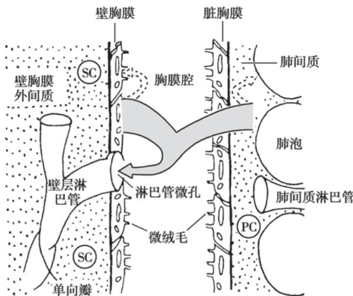  
图 2-13-1 胸膜腔结构模拟图  
SC:体循环毛细血管;PC:肺毛细血管。

$24\mathrm{cmH}_2\mathrm{O}$ ; 胶体渗透压壁胸膜和脏胸膜均为 $34\mathrm{cmH}_2\mathrm{O}$ ; 胸腔内压约为 $-5\mathrm{cmH}_2\mathrm{O}$ , 胸腔内液体因含有少量蛋白质, 其胶体渗透压为 $5\mathrm{cmH}_2\mathrm{O}$ 。液体从胸膜滤出到胸膜腔的因素包括流体静水压、胸腔内压和胸腔积液胶体渗透压, 而阻止滤出的压力为毛细血管内胶体渗透压。因此, 壁胸膜液体滤出到胸腔的压力梯度为毛细血管内流体静水压 + 胸腔内负压 + 胸液胶体渗透压 - 毛细血管内胶体渗透压, 其压力梯度为 $30 + 5 + 5 - 34 = 6\mathrm{cmH}_2\mathrm{O}$ , 液体从壁胸膜滤出到胸膜腔。脏胸膜的压力梯度是 $24 + 5 + 5 - 34 = 0\mathrm{cmH}_2\mathrm{O}$ , 其在胸腔积液的循环中作用很小。胸腔积液滤过在胸腔的上部大于下部, 吸收则主要在横膈和胸腔下部的纵隔胸膜。

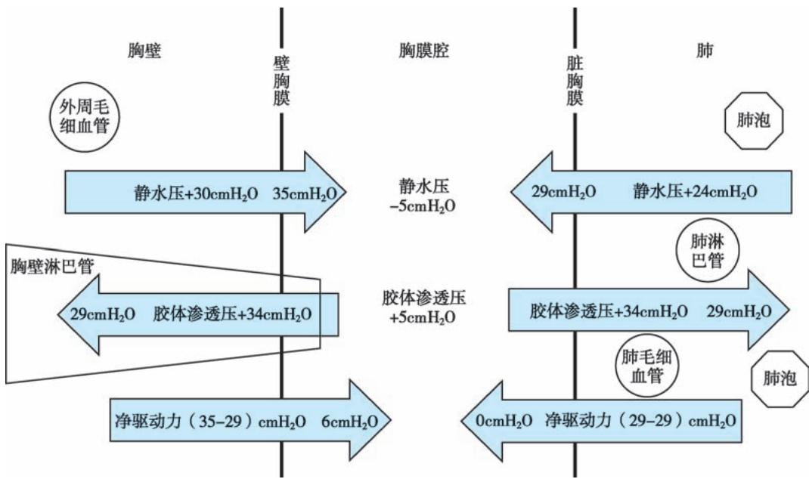  
图 2-13-2 人体正常情况下液体进出胸膜腔的压力对比

【胸腔积液的发病机制】胸腔积液临床常见,肺、胸膜和肺外疾病均可引起。常见病因和发病机制如下。

1. 胸膜毛细血管静水压升高 体循环和/或肺循环静水压增高,前者使滤至胸膜腔的液体量增加,后者使胸膜腔液体吸收减少。壁胸膜毛细血管液体大量滤出,超过液体重吸收能力,导致胸腔积液。临床上常见如充血性心力衰竭、缩窄性心包炎、血容量增加、上腔静脉或奇静脉受阻,产生胸腔漏出液。

2. 胸膜毛细血管胶体渗透压降低 当血浆白蛋白减少,血浆胶体渗透压降低时,可使壁胸膜毛细血管胶体渗透压下降、壁胸膜毛细血管滤过增加,同时脏胸膜毛细血管胶体渗透压降低,胸膜毛细血管胶体渗透压降低,胸腔液体再吸收减少,胸腔积液量增多。临床上常见如低蛋白血症、肝硬化、肾病综合征、急性肾小球肾炎、黏液性水肿等,产生胸腔漏出液。

3. 胸膜通透性增加 胸膜腔及其邻近脏器组织炎症或胸膜肿瘤时，由于胸膜直接受累或受损细胞释放各种酶、补体以及生物活性物质，如组胺等，致使胸膜毛细血管通透性增加，大量含蛋白质和细胞的液体进入胸膜腔。胸液中蛋白质含量升高，胶体渗透压增高，进一步促使胸膜腔液体积聚。临床多见如胸膜炎症(肺结核、肺炎旁胸腔积液)、结缔组织病(系统性红斑狼疮、类风湿关节炎)、胸膜肿瘤(恶性肿瘤转移、胸膜间皮瘤)、肺梗死、膈下炎症(膈下脓肿、肝脓肿、急性胰腺炎)等，产生胸腔渗出液。

4. 壁胸膜淋巴回流受阻 胸液中液体和蛋白通过淋巴系统返回循环系统,故癌性淋巴管阻塞、先天性发育异常致淋巴管引流异常,外伤致淋巴回流障碍等产生高蛋白质含量的胸腔积液。

5. 损伤 主动脉瘤破裂、食管破裂、胸导管破裂等，产生血胸、脓胸和乳糜胸。

6. 医源性 药物、放射治疗、消化内镜检查和治疗、支气管动脉栓塞术、卵巢过度刺激综合征、液体负荷过重、冠状动脉旁路移植手术、骨髓移植、中心静脉置管穿破和腹膜透析等，都可以引起渗出性或漏出性胸腔积液。

## 【临床表现】

1. 症状 症状与积液量有关,积液量少于0.3\~0.5L时症状多不明显;大量积液时,呼吸困难是最常见的症状,多伴有胸痛、咳嗽。随着胸腔积液量增加,胸痛可缓解,但随之胸闷、气促加重。

原发病不同,症状有所差别,比如结核性胸膜炎多见于青年人,常伴有发热、干咳、胸痛;心力衰竭所致的胸腔积液,有心功能不全的表现;肝脓肿伴有右侧胸腔积液可为反应性胸膜炎,亦可为脓胸,多

有发热和肝区疼痛。

2. 体征 与积液量有关。少量积液，可无明显体征，也可触及胸膜摩擦感及闻及胸膜摩擦音；中至大量积液时，患侧胸廓饱满，触觉语颤减弱，局部叩诊呈浊音，呼吸音减低或消失。可伴有气管、纵隔向健侧移位。肺外疾病如类风湿关节炎、干燥综合征等引起的胸腔积液，多有原发病的体征。

## 【实验室和其他检查】

## (一) 影像学检查

1. X线胸片 X线改变与积液量、是否有包裹、粘连有关，侧位X线胸片对诊断少量胸腔积液尤为重要。小量的游离性胸腔积液，正位X线胸片可出现肋膈角变钝或消失，积液量增多时呈向外侧、向上的弧形上缘的积液影(图2-13-3)；当大量积液时，患侧胸部致密影，气管和纵隔向健侧推动。平卧时积液散开，整个肺野透亮度降低。液气胸时有气液平面。包裹性积液不随体位改变而变动，边缘光滑饱满，多局限于叶间或肺与膈之间；肺底积液可仅有膈肌升高或形状的改变。

2. 胸部 CT 胸部 CT 可显示少量胸腔积液, 分辨包裹性积液及位置(图 2-13-4)。胸部 CT 可显示肺内、胸膜、膈肌、肺门和纵隔等部位的病变, 有助于病因诊断, 还可以评估积液量。

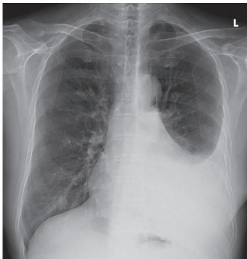  
图 2-13-3 X 线胸片示左侧胸腔积液

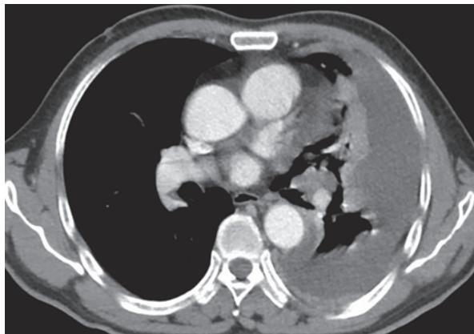  
图 2-13-4 胸部 CT 示左侧胸腔积液

3. 超声检查 探测胸腔积液的灵敏度高,可估计胸腔积液深度和积液量,协助胸腔穿刺定位,可判断积液有无包裹、分隔。超声引导下胸腔穿刺能降低操作风险。

4. 磁共振（MRI） MRI 对软组织有很高的分辨率，可协助鉴别良、恶性胸腔积液，尤其适用于对增强 CT 造影剂过敏的病人。

5. PET-CT 一种广泛应用于肿瘤领域的功能成像技术,基于正常和异常组织中糖代谢水平的差异,氟( $^{18}$ F)脱氧葡萄糖在肿瘤细胞中加速摄取,对协助鉴别良、恶性胸腔积液具有一定价值,还可以辅助肿瘤分期及寻找原发灶。

## （二）实验室检查

## 1. 一般性状检查

（1）外观:漏出液多为淡黄色,透明清亮,静置不凝固,比重<1.016\~1.018。渗出液稍混浊,易有凝块,比重>1.018。血性胸腔积液呈洗肉水样或静脉血样,多见于肿瘤、结核和肺栓塞。乳状胸腔积液多为乳糜胸,多由肿瘤、寄生虫、外伤(胸科手术、胸部外伤)或结核等原因导致胸导管压迫或破裂。巧克力色胸腔积液考虑阿米巴肝脓肿破溃入胸腔的可能。黑色胸腔积液可能为曲霉感染。黄绿色胸腔积液多见于类风湿关节炎。

(2) 气味: 厌氧菌感染胸腔积液常有臭味, 提示可能有脓胸。如积液有尿味, 可能为 “尿胸”

(urinothorax), 胸腔积液的肌酐水平常高于血清肌酐水平。

## 2. 细胞计数和分类

（1）细胞总数:胸腔积液中可见各种炎症细胞、增生与退化的间皮细胞。漏出液细胞数少于 $100\times10^{6}/L$ ;渗出液的有核细胞数常超过 $500\times10^{6}/L$ ,脓胸时有核细胞多达 $10\times10^{9}/L$ 以上。但漏出液和渗出液的细胞计数无确切分界,需综合分析。

（2）细胞分类:中性粒细胞增多常见于急性炎症。以淋巴细胞为主的胸腔积液,在结核、充血性心力衰竭和恶性肿瘤中则更常见。胸腔积液中嗜酸性粒细胞占比≥10% 可见于寄生虫感染、嗜酸性粒细胞增多症、石棉肺病、药物、肿瘤等。

## 3. 生化检查

（1）pH: 正常胸腔积液 pH 接近 7.6。pH 降低可见于脓胸、食管破裂、类风湿关节炎等，结核和恶性胸腔积液也可降低。尤其 pH<7.0 者仅见于脓胸以及食管破裂所致的胸腔积液。

（2）葡萄糖：正常胸腔积液中葡萄糖含量和外周血中含量相近，漏出液与大多数渗出液葡萄糖含量正常。结核性胸膜炎、恶性肿瘤、狼疮性胸膜炎等积液中葡萄糖可低于血糖。复杂性肺炎旁胸腔积液、脓胸和类风湿关节炎是胸腔积液中葡萄糖水平明显降低（<3.3mmol/L）的最常见原因。

（3）蛋白质：渗出液蛋白质含量较高（>30g/L），胸腔积液/血清蛋白比值>0.5；漏出液的蛋白质含量较低（<30g/L），以白蛋白为主，黏蛋白实验（Rivalta试验）阴性。

（4）酶：渗出液乳酸脱氢酶(LDH)含量增高，胸腔积液/血清LDH比值 $>0.6$ 。 $\mathrm{LDH} > 500\mathrm{IU / L}$ 常提示为恶性肿瘤或胸腔感染。

腺苷脱氨酶（ADA）是一种存在于多种细胞中的酶，尤其是在活化的T淋巴细胞中，对淋巴细胞的分化起着重要作用。结核性胸膜炎ADA水平多超过45IU/L，其诊断结核性胸膜炎的敏感度高。艾滋病病人如并发结核性胸膜炎，胸腔积液中的ADA水平常低于40IU/L。ADA升高也见于脓胸、类风湿关节炎、系统性红斑狼疮引起的胸腔积液、恶性胸腔积液等。ADA有两种同工酶，ADA1和ADA2，可用于鉴别结核性和非结核性病因。

淀粉酶升高可见于急性胰腺炎、食管破裂、恶性肿瘤等。急性胰腺炎病人约10%可并发胸腔积液，淀粉酶逸出进入胸腔积液中，甚至高于血清淀粉酶水平。

（5）类脂：乳糜性胸腔积液中含较多甘油三酯(>1.24mmol/L)，且其成分改变与饮食相关，胸腔积液苏丹Ⅲ染色呈红色，而胆固醇含量正常。在假性乳糜性胸腔积液中胆固醇含量高(>5.18mmol/L)，主要由于胆固醇积聚所致，但没有乳糜微粒，积液中甘油三酯正常，苏丹Ⅲ染色阴性，主要见于陈旧性结核性胸腔积液、类风湿关节炎性胸腔积液。

4. 肿瘤标志物 癌胚抗原(CEA)为多种肿瘤相关的标志物,胸腔积液 CEA>10μg/L 或积液/血清 CEA>1 常提示恶性胸腔积液,其特异度高、敏感度低。CEA 对于腺癌尤其是分泌 CEA 的肺腺癌、胃肠道肿瘤、乳腺癌所致胸腔积液的诊断价值更高。其他的肿瘤标志物包括癌抗原 CA125、细胞角蛋白 19 片段(CYFRA 21-1)、神经元特异性烯醇化酶等,可作为诊断的参考。

5. 免疫学检查 结核性胸膜炎胸腔积液中 $\gamma$ -干扰素、IL-27 水平增高, 其敏感性和特异性高。 $\gamma$ -干扰素释放试验 (IGRAs) 是检测结核分枝杆菌特异性抗原刺激 T 细胞产生的 IFN- $\gamma$ 水平, 胸腔积液 IGRAs 诊断结核性胸膜炎的敏感度和特异度均不高。

系统性红斑狼疮及类风湿关节炎引起的胸腔积液中补体成分(C3、C4)降低,且免疫复合物含量升高。系统性红斑狼疮胸腔积液中抗核抗体(ANA)滴度可达1:160以上。类风湿关节炎胸腔积液中类风湿因子>1:320。

6. 病原学检测 胸腔积液标本涂片行抗酸染色镜检阳性率不足 10%。胸腔积液结核分枝杆菌培养的阳性率与所使用的培养基有关，相比固体培养基，液体培养基可提高阳性率和缩短培养时间。胸腔积液标本行结核分枝杆菌核酸扩增试验诊断结核性胸膜炎的特异度超过 90%，但敏感度低。胸腔积液 Xpert MTB/RIF 诊断结核性胸膜炎具有高特异度（99%），但敏感度仅 37%～51%。

胸腔积液细菌涂片、培养、核酸扩增试验等对胸腔感染的病原体鉴别有一定帮助。将胸腔积液注入血培养瓶中进行培养可提高检出率。宏基因组下一代测序（mNGS）能够快速检测各种病原微生物，能检测到其他传统方法难以识别的病原体，包括诺卡菌、肺孢子菌、结核分枝杆菌、肠杆菌、链球菌、具核梭形杆菌、牙龈卟啉单胞菌等。相较于传统的胸腔积液微生物检测和培养，mNGS敏感性更高，但特异性低，需结合临床相关信息综合判定。

7. 脱落细胞学检查 恶性胸腔积液约 40%～87% 的病人可检出恶性细胞, 其诊断性能与原发肿瘤的类型、部位及标本的收集有关。反复多次检查有助于提高检测阳性率。

（三）胸膜活检 经皮穿刺胸膜活检对胸腔积液病因诊断有重要意义，可发现肿瘤、结核和其他胸膜肉芽肿性病变。拟诊结核性胸膜炎时，活检组织标本除做病理检查外，还可以做结核分枝杆菌DNA检测和抗酸染色，必要时还可以做结核分枝杆菌培养。胸膜穿刺活检具有简单、易行、损伤性较小的优点，CT或超声引导下胸膜活检可提高成功率。

（四）胸腔镜或开胸活检 上述检查仍不能确诊的，必要时可经胸腔镜或开胸直视下活检。胸腔镜活检诊断恶性胸腔积液的敏感度为92%～97%，特异度为99%～100%。通过胸腔镜能全面检查胸膜腔，观察病灶形态特征、分布范围及邻近器官受累情况，并在直视下多处活检。少数病人胸腔积液的病因经上述检查仍难以确定，如无特殊禁忌，可考虑剖胸探查。

（五）支气管镜 对咯血或疑有气道阻塞的病人，尤其是怀疑肺癌的病人，可行支气管镜检查协助诊断，如无上述异常病人，诊断阳性率较低。

【诊断与鉴别诊断】胸腔积液的诊断和鉴别诊断分3个步骤。

（一）确定有无胸腔积液 中量以上的胸腔积液诊断不难，症状、体征常比较明显。少量胸腔积液仅表现肋膈角变钝，有时易与胸膜粘连相混淆，可行患侧卧位X线胸片，液体可散开于肺外带。超声、CT等检查可确定有无胸腔积液。

（二）区别漏出液和渗出液 诊断性胸腔穿刺可区别积液性质，漏出液外观清澈透明，无色或浅黄色，不凝固。而渗出液外观颜色深，呈透明或混浊的草黄、棕黄色或血性，可自行凝固。可根据比重（以1.018为界）、蛋白质含量（30g/L为界）、细胞数（ $500\times10^{6}/L$ 为界），小于以上为漏出液，反之为渗出液。但诊断的敏感性和特异性较差。

Light 标准(表 2-13-1)通常用于区别漏出液和渗出液,主要测定胸腔积液中的蛋白质含量和乳酸脱氢酶(LDH)。根据 Light 标准,符合任意 1 项可判断为渗出液,3 项均不满足则为漏出液。Light 标准对渗出液的判断特异性不高,按此标准,约 25% 的漏出液被判为渗出液。

表 2-13-1 渗出液和漏出液的鉴别 (Light 标准)

<table><tr><td>指标</td><td>渗出液</td><td>漏出液</td></tr><tr><td>胸腔积液/血清蛋白比值</td><td>&gt;0.5</td><td>≤0.5</td></tr><tr><td>胸腔积液乳酸脱氢酶水平</td><td>&gt;血清正常值上限的2/3</td><td>≤血清正常值上限的2/3</td></tr><tr><td>胸腔积液/血清乳酸脱氢酶比值</td><td>&gt;0.6</td><td>≤0.6</td></tr></table>

注：符合任意1项可判断为渗出液。

## （三）寻找胸腔积液的原因

1. 漏出性胸腔积液 漏出液的主要病因有:①充血性心力衰竭:常为双侧胸腔,且右侧胸腔较多,强烈利尿可引起假性渗出液。胸腔积液的 N 末端 B 型利钠肽原(NT-proBNP) $>1500\mathrm{pg / ml}$ 对心力衰竭所致胸腔积液有很好的诊断价值。②肾病综合征:常发生于双侧胸腔,可随着蛋白质丢失的纠正而改善。③肝硬化:多伴有腹腔积液,胸腔积液大多在右侧胸腔。④其他:如急性肾小球肾炎、缩窄性心包炎、腹膜透析、黏液性水肿、药物过敏和放射反应等。

2. 渗出性胸腔积液 渗出液的病因较多,常见病因包括:肺炎旁胸腔积液、结核和恶性肿瘤。

（1）肺炎旁胸腔积液（parapneumonic effusion）：也称为类肺炎性胸腔积液，是指由肺炎、肺脓肿和支气管扩张等感染引起的胸腔积液。肺炎旁胸腔积液按发病机制可分为单纯性肺炎旁胸腔积液和复杂性肺炎旁胸腔积液。单纯性肺炎旁胸腔积液为胸膜反应性渗出所致，随着肺炎好转而吸收，但当细菌侵入胸膜腔时，可导致复杂性肺炎旁胸腔积液。病人多有发热、咳嗽、咳痰、胸痛等症状，血白细胞计数升高，中性粒细胞增加和核左移。X线或CT先有肺实质的浸润影，或肺脓肿和支气管扩张的表现，然后出现胸腔积液，积液量一般不多。复杂性肺炎旁胸腔积液多呈黄色混浊，有核细胞计数明显升高，以中性粒细胞为主，葡萄糖和pH降低，LDH升高。见表2-13-2。

表 2-13-2 肺炎旁胸腔积液和脓胸的特征

<table><tr><td>积液特征</td><td>单纯性肺炎旁胸腔积液</td><td>复杂性肺炎旁胸腔积液</td><td>脓胸</td></tr><tr><td>外观</td><td>浆液样</td><td>混浊</td><td>脓性</td></tr><tr><td>pH</td><td>&gt;7.2</td><td>&lt;7.2</td><td></td></tr><tr><td>葡萄糖</td><td>&gt;3.3mmol/L</td><td>&lt;3.3mmol/L</td><td></td></tr><tr><td>LDH</td><td>&lt;1 000IU/L</td><td>&gt;1 000IU/L</td><td></td></tr><tr><td>培养</td><td>阴性</td><td>可能阳性</td><td></td></tr></table>

脓胸是胸腔内致病菌感染造成积脓，多与未能有效控制肺部感染、致病菌直接侵袭穿破入胸腔有关。急性脓胸表现为高热、胸痛等；慢性脓胸有胸膜增厚、胸廓塌陷、慢性消耗和杵状指(趾)等。胸腔积液呈脓性、黏稠，脓液细菌培养可能阳性。

胸腔感染是指复杂性肺炎旁胸腔积液和脓胸。大多数社区获得性胸腔感染是由革兰氏阳性需氧菌引起的，包括链球菌、金黄色葡萄球菌等。革兰氏阴性菌相对少见。医院获得性胸腔感染主要是耐药革兰氏阳性菌(包括MRSA)和革兰氏阴性菌，如肠杆菌、假单胞菌等。胸腔感染多有厌氧菌参与。真菌、放线菌、诺卡菌等所致胸腔感染较为罕见。

（2）结核性胸膜炎：结核性胸膜炎可发生于任何年龄，常与肺结核或身体其他部位结核同时存在，表现为胸痛、气短，可伴有潮热、盗汗、消瘦等结核中毒症状。结核菌素试验阳性或强阳性。老年病人可无发热，结核菌素试验亦常阴性，应予注意。胸腔积液多呈黄色，少数为血性，淋巴细胞为主，间皮细胞 $< 5\%$ ，ADA、 $\gamma-$ 干扰素、IL-27水平增高。胸腔积液沉渣涂片抗酸染色镜检不足 $10\%$ ，积液结核分枝杆菌培养的阳性率 $18\% \sim 40\%$ 。核酸扩增试验、XpertMTB/RIF检测MTB的DNA及利福平耐药基因可用于结核性胸膜炎的诊断，但均敏感性较低，特异性高。

胸膜穿刺活检,尤其是 CT 或彩超引导下的胸膜穿刺活检对结核性胸膜炎的诊断颇具意义。病理可见肉芽肿,还可以做结核分枝杆菌 DNA 检测和抗酸染色,敏感度 60%～80%,活检组织结核分枝杆菌培养能进一步提升敏感度。胸腔镜下胸膜活检(病理学、DNA 检测、培养)诊断结核性胸膜炎的敏感度更高。

（3）恶性胸腔积液：是指胸膜原发恶性肿瘤或其他部位的恶性肿瘤转移至胸膜引起的胸腔积液，包括肺癌、乳腺癌、血液系统肿瘤、胃肠道肿瘤、妇科恶性肿瘤以及恶性胸膜间皮瘤等。恶性胸腔积液是晚期肿瘤的常见并发症，通常增长较快，且持续存在，治疗效果差，预后不良。以中老年人多见，主要临床表现包括呼吸困难、胸部钝痛、咳血丝痰和消瘦等症状，胸腔积液多呈血性、量大、增长迅速，CEA或其他肿瘤标志物升高，LDH多大于500IU/L。胸部影像学检查可提供诊断线索。恶性胸腔积液的确诊根据是胸腔积液样本或胸膜活检组织经病理证实存在恶性肿瘤细胞。胸腔积液脱落细胞检查、胸膜穿刺活检、支气管镜及胸腔镜等检查，有助于进一步诊断和鉴别。疑为其他器官肿瘤需进行相应检查。

【治疗】胸腔积液为胸部或全身疾病的一部分,病因治疗尤为重要,漏出液常在纠正病因后可吸收,渗出液根据不同病因处理有所差异。

（一）肺炎旁胸腔积液 单纯性肺炎旁胸腔积液一般积液量少，经抗生素治疗可吸收。胸腔感染(复杂性肺炎旁胸腔积液、脓胸)的治疗原则是控制感染、引流胸腔积液、营养支持治疗。抗生素的选择要基于感染是社区获得性还是医院获得性、当地微生物的流行情况和耐药情况，以及病人个体因素等。疗程一般为2～6周。

是否引流胸腔积液应基于胸腔积液生化检测(pH、LDH、葡萄糖等)和影像学特征(超声、CT)来综合判断,引流积液的措施包括胸腔穿刺抽液和胸腔置管引流。对于复发性或慢性胸腔感染病人,尤其是肺不张和无法手术的病人,应考虑胸腔置管引流。

慢性脓胸应改进原有的脓腔引流，多需考虑胸膜剥脱术、胸廓成形术等外科治疗策略。此外，一般支持治疗亦相当重要，应给予高能量、高蛋白及富含维生素的食物，纠正水电解质紊乱及维持酸碱平衡。

（二）结核性胸膜炎 结核性胸膜炎治疗的目标除了治疗控制结核病外，还应尽可能减轻胸腔积液吸收后残留的胸膜增厚，防止对肺功能的减弱，减少因胸膜增厚所致的后遗症。

1. 一般治疗 包括休息、营养支持和对症治疗。

2. 抽液治疗 结核性胸腔积液因为蛋白质含量高,容易引起胸膜粘连,原则上应尽快抽尽胸腔内积液或胸腔置管引流,以减轻或解除胸腔积液对心肺的压迫,减少纤维蛋白沉着,减轻结核中毒症状。首次抽液不要超过800ml,以后每次抽液量不应超过1000ml,抽液不宜过快,以免胸腔压力骤降引起休克及复张后肺水肿,表现为剧咳、气促、咳大量泡沫状痰,双肺满布湿啰音, $PaO_{2}$ 下降,X线或CT显示肺水肿征。治疗应该立即吸氧,酌情应用糖皮质激素及利尿剂,控制液体入量,严密监测病情与酸碱失衡,有时需气管插管机械通气。若抽液过程中病人出现头晕、面色苍白、出汗、心悸、四肢发凉,则考虑“胸膜反应”,应立即停止抽液,使病人平卧,必要时皮下注射0.1%肾上腺素0.5ml,密切观察病情、血压变化。一般情况下,抽胸腔积液后,没必要胸腔内注入抗结核药物,但可注入尿激酶或链激酶等防止胸膜粘连。

3. 抗结核治疗 结核性胸膜炎的化疗原则与活动性肺结核相同,也应坚持早期、规律、全程、足量、联合的原则,其中早期抗结核治疗尤为重要。

4. 糖皮质激素的应用 疗效不肯定。如全身毒性症状严重、大量胸腔积液，可在抗结核治疗的同时加用糖皮质激素。常用泼尼松 20～30mg/d，待体温正常、全身结核中毒症状减轻或消失、胸腔积液量明显减少时，即应逐渐减量以至停药，一般疗程为 4～6 周。

5. 结核性脓胸、脓气胸并胸膜支气管瘘的治疗 多数病人需外科手术治疗，术前可在全身治疗的同时行胸腔闭式引流，逐渐缩小其范围，为胸膜剥脱、肺胸膜切除术创造条件。

（三）恶性胸腔积液 包括原发病和胸腔积液的治疗。恶性胸腔积液最常见的病因是肺癌、乳腺癌，积极治疗原发肿瘤(如化疗、靶向治疗、应用抗血管生成药物、免疫治疗、放疗等)有一定疗效。胸腔积液多为晚期恶性肿瘤并发症，若病人无呼吸困难症状，则不需要行胸腔积液引流，可在治疗原发肿瘤的同时密切随访观察；如病人存在呼吸困难，建议行胸腔穿刺排液，以助于明确病人的症状是否与胸腔积液有关，并判定肺是否可复张。肺可复张者，胸腔置管引流或胸膜固定术均可作为一线治疗手段；肺不可复张的病人，首选胸腔置管引流。

胸腔内可注入化疗药、抗血管生成药物、生物制剂以协助控制积液。常用化疗药包括顺铂、洛铂等，抗血管生成药物包括重组人血管内皮抑制素、贝伐珠单抗，生物制剂包括IL-2、肿瘤坏死因子、干扰素、肿瘤浸润性淋巴细胞等。

## 第二节 | 气 胸

胸膜腔是不含气体的密闭的潜在性腔隙，正常情况下，胸膜腔内为负压，任何原因导致气体进入胸膜腔造成积气状态，称为气胸（pneumothorax）。气胸可分为自发性、外伤性和医源性三类。自发性气胸又可分为原发性和继发性，前者发生在无基础肺疾病的健康人，后者常发生在有基础肺疾病的病人。外伤性气胸系胸部外伤导致胸壁的直接或间接损伤引起。医源性气胸则由诊断或治疗操作所致。气胸是常见的内科急症，男性多于女性，原发性气胸的发病率男性为（18～28）/10万人口，女性为（1.2～6）/10万人口。发生气胸后，胸膜腔内负压可变成正压，致使静脉回心血流受阻，产生程度不同的心、肺功能障碍。本节主要叙述自发性气胸。

【病因和发病机制】正常情况下胸膜腔内没有气体,这是因为毛细血管血中各种气体分压的总和仅为706mmHg,比大气压低54mmHg。胸膜毛细血管内总气体分压低于大气压,故胸膜腔内不存在气体。并且由于胸廓向外的扩张力及肺组织向内的回缩力存在,使得整个呼吸周期胸膜腔内压均为负压。胸腔内出现气体仅在三种情况下发生:①肺泡与胸腔之间产生损伤;②胸壁与外界因创伤产生交通;③胸腔内出现产气微生物。临床上主要见于前两种原因。气胸时失去了胸腔负压对肺的牵引作用,甚至因正压对肺产生压迫,使肺失去膨胀能力,表现为肺容积缩小、肺活量减低、最大通气量降低的限制性通气功能障碍。由于肺容积缩小,初期血流量并不减少,因而通气血流比例减少,导致动静脉分流,出现低氧血症。大量气胸时,由于吸引静脉血回心的负压消失,甚至胸膜腔内正压对血管和心脏的压迫,使心脏充盈减少,心搏出量降低,引起心率加快、血压降低,甚至休克。张力性气胸可引起纵隔移位,循环障碍,或窒息死亡。

（一）原发性自发性气胸（primary spontaneous pneumothorax, PSP）发生在无明确基础肺疾病的健康人，但胸膜下微小疱和肺大疱破裂可能是气胸发生的主要机制。研究表明，吸烟、体型和家族史是危险因素。此类型多见于瘦高体型的男性青壮年，常规X线检查肺部无显著病变，但可有胸膜下肺大疱（pleural bleb），多在肺尖部。此种胸膜下肺大疱的原因尚不清楚，可能与吸烟、身高和小气道炎症有关，也可能与非特异性炎症瘢痕或弹性纤维先天性发育不良有关。

（二）继发性自发性气胸（secondary spontaneous pneumothorax, SSP）本病占我国气胸发病的首位，多见于有基础肺部疾病的病人。由于病变引起小支气管及细支气管不完全阻塞、扭曲，形成活瓣，使局部肺泡过度充气，肺泡壁破坏融合形成肺大疱。肺内压突然增高时，脏胸膜下肺大疱破裂形成气胸。如肺结核、慢阻肺病、肺癌、肺脓肿、肺纤维化、嗜酸性肉芽肿病、结节病、肺尘埃沉着症及淋巴管平滑肌瘤病等。由于基础肺部病变的存在，继发性自发性气胸临床症状较原发性自发性气胸病人严重，且对气胸的耐受性更差，故绝大多数病人都需要积极的干预。

## (三) 特殊类型的气胸

1. 月经性气胸 即与月经周期有关的反复发作的气胸,其发生率为女性自发气胸的 0.9%。月经性气胸仅在月经来潮前后 24～72 小时内发生,病理机制尚不清楚,其发生原因主要与肺、胸膜或膈肌上有异位子宫内膜结节破裂所致。

2. 妊娠期气胸 本病病人因每次妊娠而发生,根据气胸出现时间,可分为早期(妊娠3\~4个月)和后期(妊娠8个月以上)两种。其发生机制不清,可能与激素变化和胸廓顺应性改变有关。

【临床类型】根据脏胸膜破裂情况不同及其发生后对胸腔内压力的影响,自发性气胸通常分为以下三种类型。

1. 闭合性(单纯性)气胸 胸膜破裂口较小,随肺萎陷而闭合,空气不再继续进入胸膜腔。此时胸膜腔内压力接近或高于大气压,抽气后压力不再升高。

2. 开放性(交通性)气胸 破裂口较大或因两层胸膜间有粘连或牵拉,使破口持续开放,吸气与呼气时空气自由进出胸膜腔。胸膜腔内压在 $0 \, cmH_{2}O$ 上下波动;抽气后可呈负压,但观察数分钟,压力又复升至抽气前水平。

3. 张力性(高压性)气胸 破裂口呈单向活瓣或活塞作用, 吸气时胸廓扩大, 胸膜腔内压变小, 空气从破裂口处进入胸膜腔; 呼吸时胸廓缩小, 胸膜腔内压升高, 压迫活瓣使之关闭, 气体只进不出, 致使胸膜腔内空气越积越多, 内压持续升高, 使肺脏受压, 纵隔向健侧移位, 影响心脏血液回流。此型气胸胸膜腔内压测定常超过 $10cmH_{2}O$ , 甚至高达 $20cmH_{2}O$ , 抽气后胸膜腔内压可下降, 但又迅速复升, 对机体呼吸循环功能的影响最大, 必须紧急抢救处理。

【临床表现】症状轻重与有无肺的基础疾病及功能状态、气胸发生的速度、胸膜腔内积气量及其压力大小三个因素有关。

## 1. 症状

（1）呼吸困难:此症状的严重程度与基础肺功能、肺萎陷程度、发病速度都有密切关系。肺功能正常的青年,可无明显呼吸困难,而原本肺功能极差的慢阻肺病病人,即使患肺轻度压缩,也会出现明显的呼吸困难。慢性气胸时,健肺已经代偿,多表现为轻度气促。合并纵隔气肿的病人呼吸困难更加明显,甚至出现发绀。

（2）胸痛：多为突发的单侧前胸、腋下尖锐性刺痛或刀割样疼痛，持续时间短暂，吸气时加剧，有时可放射到肩部、背部、上腹部等。胸痛程度与肺压缩程度无关。

（3）刺激性干咳：气体刺激胸膜导致，多不严重，无痰或痰中带少量血丝。

继发性自发性气胸症状多重于原发性自发性气胸。张力性气胸时胸膜腔内压骤然升高，肺被压缩，纵隔移位，迅速出现严重呼吸循环障碍；病人出现高度紧张、胸闷、挣扎坐起、烦躁不安、发绀、冷汗、脉速、虚脱、心律失常，甚至发生意识不清、呼吸衰竭。

2. 体征 取决于积气量的多少。少量气胸体征不明显，尤其在肺气肿病人更难确定，听诊呼吸音减弱具有重要意义。大量气胸时，气管向健侧移位，患侧胸部隆起，呼吸运动与触觉语颤减弱，叩诊呈过清音或鼓音，心或肝浊音界缩小或消失，听诊呼吸音减弱或消失。左侧少量气胸或纵隔气肿时，有时可在左心缘处听到与心跳一致的气泡破裂音，称 Hamman 征。液气胸时，胸内有振水声。血气胸如失血量过多，可使血压下降，甚至发生失血性休克。

## 【影像学检查和其他检查】

1. X线胸片检查 立位后前位X线胸片检查是诊断气胸的重要方法，可显示肺受压程度、肺内病变情况及有无胸膜粘连、胸腔积液及纵隔移位等。气胸的典型表现为外凸弧形的细线条阴影，系肺组织和胸膜腔内空气的交界线，称为气胸线，线内是压缩的肺组织，线外透亮度增高，无肺组织(图2-13-5)。大量气胸时，肺被压缩于肺门部，呈圆球形阴影，且常有纵隔向健侧移位表现。

肺结核或肺部慢性炎症使胸膜多处粘连，气胸时多呈局限性包裹，有时气胸互相通连。气胸若延及下部胸腔，肋膈角变锐利。合并胸腔积液时，显示气液平面。局限性气胸在后前位X线胸片易遗漏，侧位X线胸片可协助诊断。

临床上可通过 X 线平片估算气胸后肺脏压缩程度。如从肺尖气胸线至胸腔顶部估计气胸大小，距离 $\geqslant 3cm$ 为

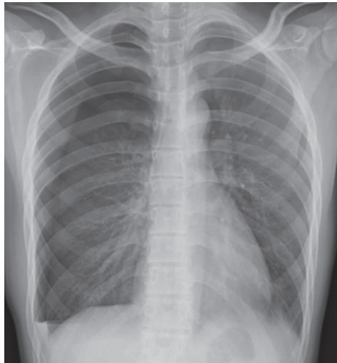  
图 2-13-5 正位 X 线胸片示右侧气胸

大量气胸, $<3cm$ 为小量气胸。在肺门水平侧胸壁至肺边缘的距离为1cm时,约占单侧胸腔容量的25%,2cm时约50%,故从侧胸壁至肺边缘的距离 $\geqslant2cm$ 为大量气胸, $<2cm$ 为小量气胸(图2-13-6)。

2. 胸部 CT 胸部 CT 对于小量气胸、局限性气胸以及肺大疱与气胸的鉴别比 X 线胸片检查更敏感和准确，对气胸量大小的评价也更为准确。表现为胸膜腔内出现极低密度气体影，伴有肺组织不同程度的压缩。

3. 血气分析和肺功能检查 多数气胸病人的动脉血气分析结果不正常,表现为 $PaO_{2}$ 降低, $PaCO_{2}$ 多正常或降低。肺功能检查对检测气胸发生或者容量的大小帮助不大,故临床诊疗中,不推荐常规进行检查。

## 【诊断与鉴别诊断】

(一) 诊断标准或诊断依据 根据临床症状、体征及影像学表现一般可以确诊气胸, X 线或 CT显示气胸线是确诊依据。若突发呼吸困难而病情危重无法搬动病人行影像学检查时，应当机立断在患侧胸腔体征最明显处试验穿刺，如抽出气体，可证实气胸的诊断。

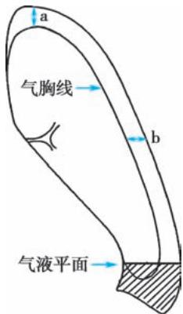  
图 2-13-6 气胸容量测定法

自发性气胸尤其是老年人和原有慢性心、肺疾病者，临床表现酷似其他心、肺急症，必须认真鉴别。

## (二) 鉴别诊断

1. 哮喘与慢阻肺病 两者急性发作时均有不同程度的呼吸困难，体征亦与自发性气胸相似。哮喘病人常有反复阵发性喘息发作史，慢阻肺病病人的呼吸困难多呈长期缓慢进行性加重。当哮喘及慢阻肺病病人突发严重呼吸困难、冷汗、烦躁，支气管扩张剂、抗感染药物等治疗效果不好且症状加剧，应考虑并发气胸的可能，X线或CT检查有助鉴别。

2. 急性心肌梗死 有突然胸痛、胸闷，甚至呼吸困难、休克等临床表现，但多合并高血压病史，动脉粥样硬化、冠状动脉粥样硬化性心脏病病史。体征、心电图、X线或CT检查、血清酶学检查有助于诊断。

3. 急性肺栓塞 大面积肺栓塞可突发起病,呼吸困难、胸痛、烦躁不安、惊恐甚或濒死感,临床上酷似自发性气胸。但病人可有咯血、低热和晕厥,并常有下肢深静脉血栓、骨折、手术后、脑卒中、心房颤动等病史,或发生于长期卧床的老年病人。CT 肺动脉造影检查可鉴别。

4. 肺大疱 位于肺周边的肺大疱，尤其是巨型肺大疱易被误认为气胸。肺大疱通常起病缓慢，呼吸困难并不严重，而气胸多突然发生。影像学上，肺大疱气腔呈圆形或椭圆形，疱内有细小的条状纹理，为肺小叶或血管的残遗物。肺大疱向周围膨胀，将肺压向肺尖区、肋膈角及心膈角。气胸则呈胸外侧的透光带，其中无肺纹理可见。从不同角度做胸部X线透视，可见肺大疱为圆形透光区，在大疱的边缘看不到发丝状气胸线。肺大疱内压力与大气压相仿，抽气后，大疱容积无明显改变。如误对肺大疱抽气测压，易引起气胸。

5. 其他 还需与消化性溃疡穿孔、胸膜炎、肋软骨炎、肺癌、膈疝等鉴别，偶可有急起的胸痛、上腹痛及气促等急腹症表现，亦应注意与自发性气胸鉴别。

（三）严重程度评估 为了便于临床观察和处理,根据临床表现把自发性气胸分成稳定型和不稳定型。符合下列所有表现者为稳定型,否则为不稳定型:呼吸频率<24次/分;心率60\~120次/分;血压正常;呼吸室内空气时 $SaO_{2}>90\%$ ;两次呼吸间隔说话成句。

【治疗】

（一）治疗目的 促进患侧肺复张，消除病因及减少复发。常用的治疗方法包括：保守治疗、胸腔减压排气(胸腔穿刺抽气和胸腔闭式引流)、胸膜固定术和手术治疗。病人个体的具体治疗方法应根据气胸的类型与病因、发作频次、肺压缩程度及病情状态及有无并发症等情况适当选择。

影响肺复张的因素包括病人年龄、基础肺疾病、气胸类型、肺萎陷时间长短以及治疗措施等。老年人肺复张的时间通常较长；交通性气胸较闭合性气胸需时更长；有基础肺疾病、肺萎陷时间长者肺复张的时间亦长；单纯卧床休息肺复张的时间较胸腔闭式引流或胸腔穿刺抽气更长。有支气管胸膜瘘、脏胸膜增厚、支气管阻塞者，均可妨碍肺复张，并易导致慢性持续性气胸。

## （二）治疗方法

1. 保守治疗 保守治疗的具体指征常有:①稳定型小量气胸,肺压缩在20%以下,无明显症状;②初次发作,CT上未发现明显肺大疱形成;③无伴随的血胸等。病人应卧床休息,可观察、吸氧并酌情给予镇静、镇痛治疗,待气体自行吸收。

自发性气胸病人每 24 小时气体吸收率(X 线胸片气胸面积)为 1.25%～2.20%。高浓度吸氧可提高血中 $PaO_{2}$ ，使氮分压下降，从而增加胸膜腔与血液间的氮分压差，促使胸膜腔内的氮气向血液传递（氮-氧转换），加快胸腔内气体的吸收，促进肺复张。经鼻导管或面罩吸入 10L/min 的氧，可取得较满意的效果。对于保守治疗的病人需密切观察病情变化，尤其在气胸发生后的24～48小时内。如病人年龄偏大，合并有肺基础疾病(如慢阻肺病)，其胸膜破裂口愈合慢，呼吸困难等症状严重，即使气胸量较小，原则上亦不主张保守治疗。

2. 排气治疗 当气胸所致肺压缩程度大于 20%, 尤其是对肺功能差或合并肺部基础疾病的病人, 排气减压是首要措施。张力性气胸和开放性气胸均应紧急排气。

（1）胸腔穿刺排气：适用于单侧肺组织压缩程度20%～50%的气胸，呼吸困难症状较轻、心肺功能尚好的闭合性气胸病人。通常选择患侧胸部锁骨中线第2前肋间为穿刺点，腋前区第4、第5或第6肋间也可作为穿刺点。局限性气胸需CT定位后进行穿刺。皮肤消毒后用气胸针或细导管直接穿刺入胸腔，连接于50ml或100ml注射器抽气，直到病人呼吸困难缓解为止。一次抽气量不宜超过1000ml，根据肺复张情况每日或隔日抽气1次。张力性气胸病情危急，应迅速解除胸腔内正压以避免发生严重并发症。如紧急情况下无胸腔置管等抽气条件时，为抢救病人生命，可用粗针头迅速刺入胸膜腔以达到减压的目的。

（2）胸腔闭式引流：适用于不稳定型气胸，呼吸困难明显、肺压缩程度较重，交通性或张力性气胸，反复发生气胸的病人。无论其气胸量大小，均应尽早行胸腔闭式引流。继发性气胸病人均需要置管，但疗效较原发性气胸病人差，甚至有的病人需要反复胸腔置管。插管部位一般多取锁骨中线外侧第2肋间，或腋前线第4～5肋间，如为局限性气胸或需引流胸腔积液，则应根据X线胸片或胸部CT检查的影像学表现选择适当部位插管。在选定部位局麻下沿肋骨上缘平行做1.5～2cm皮肤切口，用套管针穿刺进入胸膜腔，拔去针芯，通过套管将灭菌胶管插入胸腔；或经钝性分离肋间组织达胸膜，再穿破胸膜将导管直接送入胸膜腔。16～22F导管适用于大多数病人，如有支气管胸膜瘘或机械通气的病人，应选择24～28F的大导管。导管固定后，另一端连接于水封瓶的水面下1～2cm(图2-13-7)，使胸膜腔内压力保持在-1～-2cmH₂O或以下，插管成功则导管持续逸出气泡，呼吸困难迅速缓解，压缩的肺在几小时至数天内复张。对肺压缩严重、时间较长的病人，插管后应夹住引流管分次引流，避免胸腔内压力骤降产生肺复张后肺水肿。若水封瓶中导管不再有气体逸出，病人气急症状消失，继续观察24～48小时后若再无变化，可夹闭排气导管再观察24小时，病情稳定

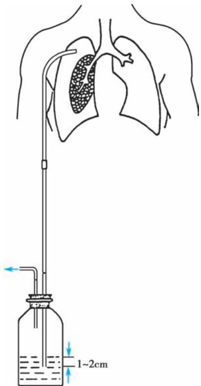  
图 2-13-7 水封瓶胸腔闭式引流装置

或 X 线胸片显示肺已全部复张时, 即可拔除导管。约 70% 的病人可在闭式引流 3 天后肺复张。有时导管虽见气泡冒出, 但病人症状缓解不明显, 应考虑为导管不通畅, 或部分滑出胸膜腔, 需及时更换导管或做其他处理。

PSP 经导管引流后, 即可使肺完全复张; SSP 常因气胸分隔, 单导管引流效果不佳, 有时需要在患侧胸腔插入多根导管。两侧同时发生气胸时, 可在双侧胸腔做插管引流。若经水封瓶引流后胸膜破口仍未愈合, 表现为水封瓶中持续气泡逸出, 可加用负压吸引装置(图 2-13-8)。用低负压吸引器, 如吸引机负压过大, 可用调压瓶调节, 一般负压为 $-10 \sim -20cmH_{2}O$ , 如果负压超过设置值, 则空气由压力调节管进入调压瓶, 因此胸腔所承受的吸引负压不会超过设置值, 可避免过大的负压吸引对肺的损伤。

闭式负压吸引宜连续,如经12小时后肺仍未复张,应查找原因。如无气泡冒出,表示肺已复张,停止负压吸引,观察2\~3天,经X线胸片证实气胸未再复发,即可拔除引流管。

水封瓶应放置于低于病人胸部的地方(如病人床下)，以免瓶内的水反流进入胸腔。应用各种插管引流排气过程中，应注意消毒，防止发生感染。

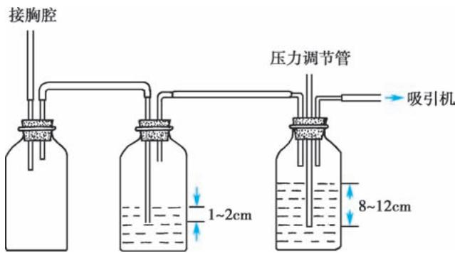  
图 2-13-8 负压吸引水瓶装置

3. 胸膜固定术(pleurodesis) 由于气胸复发率高,为了预防复发,可胸腔内注入硬化剂,产生无菌性胸膜炎症,使脏胸膜和壁胸膜粘连,消灭胸膜腔间隙,达到防止气胸复发的目的。适用于不宜手术或拒绝手术的下列病人:①持续性或复发性气胸;②双侧气胸;③合并肺大疱;④肺功能不全,不能耐受手术者。常用硬化剂如滑石粉、聚维酮碘、多西环素、四环素等,用生理盐水60\~100ml稀释后经胸腔导管注入,夹管1\~

2 小时后引流，或经胸腔镜直视下喷洒医用滑石粉。胸腔注入硬化剂前，先采用胸腔闭式引流使肺完全复张后再通过引流管注入硬化剂。为避免药物引起的局部剧痛，先注入适量利多卡因，让病人转动体位，充分麻醉胸膜，15～20 分钟后注入硬化剂。若一次无效，可重复注药。注药后观察 1～3 天，经 X 线胸片证实气胸已吸收，可拔除引流管。此法主要不良反应为胸痛、发热，滑石粉可引起急性呼吸窘迫综合征，应用时应予注意。

4. 支气管内封堵术 采用微球囊或栓子堵塞支气管，导致远端肺不张，以达到闭合肺大疱裂口的目的。无论微球囊或栓子封堵，一般应在病人肋间插管引流下进行。置入微球囊(如硅酮球囊)后观察水封瓶气泡逸出情况，如气泡不再逸出，说明封堵位置正确，可观察数天后释放气囊观察气泡情况，如不再有气泡逸出说明裂口已闭合。支气管内栓塞可用支气管内硅酮栓子、纤维蛋白胶、自体血等。

5. 外科手术治疗 大部分病人通过胸腔穿刺抽气或胸腔闭式引流可暂时治愈,但30%以上的病人气胸迁延不愈或反复发作,并随着复发次数的增加,再发气胸可能性也随之增加。对于反复发作的自发性气胸有效的治疗方式是外科手术切除肺大疱加胸膜固定术。另外,手术治疗也适用于长期气胸、血气胸、双侧气胸、复发性气胸、张力性气胸引流失败者、胸膜增厚致肺膨胀不全或影像学提示有多发肺大疱者。手术治疗成功率高,复发率低。

## （三）并发症及其处理

1. 脓气胸 由金黄色葡萄球菌、肺炎克雷伯菌、铜绿假单胞菌、结核分枝杆菌以及多种厌氧菌引起的肺炎、肺脓肿以及干酪样肺炎可并发脓气胸，也可因胸腔穿刺或肋间插管引流医源性感染所致。病情多危重，常有支气管胸膜瘘形成。脓液中可查到病原菌。除积极使用抗生素外，应插管引流，胸腔内生理盐水冲洗，必要时应根据具体情况考虑手术。

2. 血气胸 气胸伴有胸膜腔内出血常与胸膜粘连带内血管断裂有关,肺完全复张后,出血多能自行停止。若继续出血不止,除抽气排液及适当输血外,应考虑外科手术结扎出血的血管。

3. 纵隔气肿与皮下气肿 由于肺泡破裂逸出的气体进入肺间质,形成间质性肺气肿。肺间质内的气体沿血管鞘可进入纵隔,甚至进入颈部、胸部或腹部皮下组织,导致皮下气肿。张力性气胸抽气或闭式引流后,亦可沿针孔或切口出现胸壁皮下气肿,或全身皮下气肿及纵隔气肿。大多数病人并无症状,但颈部可因皮下积气而变粗。气体积聚在纵隔间隙可压迫纵隔大血管,出现干咳、呼吸困难、呕吐及胸骨后疼痛,并向双肩或双臂放射。疼痛常因呼吸运动及吞咽动作而加剧。病人发绀、颈静脉怒张、心动过速、低血压、心浊音界缩小或消失、心音遥远。X线检查于纵隔旁或心缘旁(主要为左心缘)可见透明带。皮下气肿及纵隔气肿随胸腔内气体排出减压而自行吸收。吸入浓度较高的氧气可增加纵隔内氧浓度,有利于气肿消散。若纵隔气肿张力过高影响呼吸及循环,可做胸骨上窝切开排气。

【预防】最佳预防措施是去除病因,规范治疗原发疾病。气胸病人禁止乘坐飞机,因为在高空上可加重病情,导致严重后果。肺完全复张后1周可乘坐飞机。英国胸科学会则建议,如气胸病人未接受外科手术治疗,气胸发生后1年内不要乘坐飞机。

(李为民)

## 第一节 | 概述

人的一生有三分之一时间在睡眠中度过，人体生物钟的发现让人们更加深入了解了睡眠中机体的变化规律，很多疾病也会在睡眠中发生或加重，因此，逐渐形成了探讨睡眠疾病的睡眠医学。睡眠呼吸障碍是以睡眠时呼吸异常为主要特征的一组疾病，在睡眠疾病中排名第二位。根据2014年美国睡眠医学会（AASM）发布的《睡眠疾病国际分类第三版》（ICSD-3），睡眠呼吸障碍包括阻塞性睡眠呼吸暂停（obstructive sleep apnea, OSA）、中枢性睡眠呼吸暂停（central sleep apnea, CSA）、睡眠相关肺泡低通气症、睡眠相关低氧血症、睡眠孤立症状及正常变异5个类别、17个疾病分型。其中，阻塞性睡眠呼吸暂停最为常见。

【定义】常见的睡眠时呼吸异常事件定义如下。

1. 睡眠呼吸暂停(sleep apnea) 睡眠过程中口鼻呼吸气流消失(较基线幅度下降≥90%),持续时间≥10秒,定义为一次睡眠呼吸暂停事件。根据呼吸暂停事件的表现分为两种类型:

（1）阻塞型睡眠呼吸暂停:睡眠过程中口鼻呼吸气流消失,胸、腹式呼吸仍存在,常呈现矛盾运动。

（2）中枢型睡眠呼吸暂停:睡眠过程中口鼻呼吸气流和胸、腹式呼吸运动同时消失,膈肌和肋间肌也都停止活动。

2. 低通气(hypopnea) 指睡眠过程中口鼻呼吸气流较基线水平降低≥30% 并伴有血氧饱和度下降≥4%，持续时间≥10秒；或者口鼻呼吸气流较基线水平降低≥50% 并伴血氧饱和度下降≥3%，持续时间≥10秒。

3. 睡眠呼吸暂停低通气指数（apnea-hypopnea index, AHI）睡眠中平均每小时发生呼吸暂停与低通气的次数之和。

4. 微觉醒 非快速眼球运动(NREM)睡眠过程中持续3秒以上的脑电图频率改变,包括 $\theta$ 波、 $\alpha$ 波频率>16Hz的脑电波(不包括纺锤波)。

睡眠呼吸暂停和低通气的分型见图 2-14-1。

【分类】

1. 阻塞性睡眠呼吸暂停 是以阻塞型睡眠呼吸暂停事件和低通气为主的疾病,系因睡眠中反复出现上气道阻塞所致,我国也称之为“阻塞性睡眠呼吸暂停低通气综合征”（obstructive sleep apnea hypopnea syndrome, OSAHS）。根据发生年龄又分为成人阻塞性睡眠呼吸暂停、儿童阻塞性睡眠呼吸暂停。

2. 中枢性睡眠呼吸暂停 是以中枢型睡眠呼吸暂停事件为主的疾病,常因中枢神经系统疾病、充血性心力衰竭等疾病导致呼吸中枢不能发出有效指令。根据病因不同又分为8个类型,包括中枢性睡眠呼吸暂停伴陈-施呼吸、疾病所致中枢性睡眠呼吸暂停不伴陈-施呼吸、高原型周期性呼吸所致中枢性睡眠呼吸暂停、药物或其他物质所致中枢性睡眠呼吸暂停、原发型中枢性睡眠呼吸暂停、婴儿原发型中枢性睡眠呼吸暂停、早产儿原发型中枢性睡眠呼吸暂停、治疗后中枢性睡眠呼吸暂停。

3. 睡眠相关肺泡低通气症 是以睡眠期间肺泡低通气为病理生理改变的一系列疾病。最初可仅发生在睡眠中，随着疾病的进展，可逐渐发展为白日肺泡低通气，主要包括肥胖低通气综合征、先天

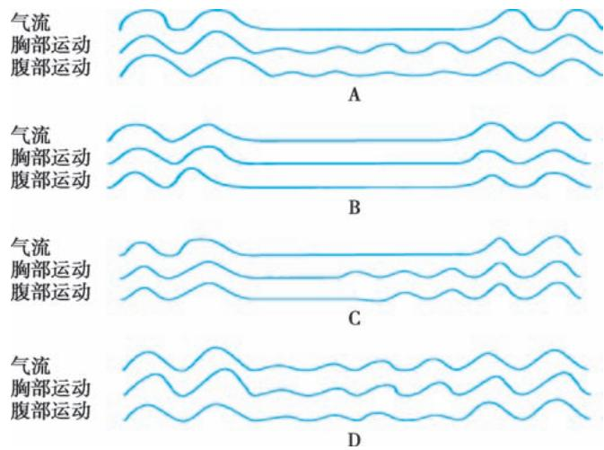  
图 2-14-1 睡眠呼吸暂停和低通气的分型

A. 阻塞性睡眠呼吸暂停: 口鼻气流消失但胸腹呼吸运动仍存在; B. 中枢性睡眠呼吸暂停: 口鼻气流及胸腹部呼吸运动同时消失; C. 混合性睡眠呼吸暂停: 呼吸暂停过程中先出现 CSA, 接着为 OSA; D. 低通气: 呼吸气流幅度降低但未完全消失。

性中枢肺泡低通气综合征、迟发性中枢肺泡低通气伴下丘脑功能障碍、特发性中枢肺泡低通气、药物或毒物致睡眠相关肺泡低通气、疾病致睡眠相关肺泡低通气。

4. 睡眠相关低氧血症 是指由全身或神经系统疾病导致的睡眠时低氧,不能被其他睡眠呼吸障碍解释,多继发于气道疾病、肺实质疾病、胸壁疾病、肺血管疾病和神经肌肉疾病等。

5. 睡眠孤立症状和正常变异 主要包括打鼾和睡眠呻吟。①打鼾:呼吸气流通过上气道狭窄部位时振动周边软组织发出的声响即为鼾声,但不伴有其他异常呼吸事件。②睡眠呻吟:为深吸气后呼气相延长并伴随像呻吟般单调的声音,多发生于年轻人,若没有合并其他症状或疾病,一般不需要治疗。

由于睡眠呼吸障碍主要发生于睡眠期间，临床表现具有隐匿性，常常被忽视或漏诊，需要在临床实践中提高对这类疾病的认识，认真询问病史，仔细甄别，及早诊治，改善病人的预后。

## 第二节 | 阻塞性睡眠呼吸暂停

阻塞性睡眠呼吸暂停是最常见的睡眠呼吸障碍,主要表现为睡眠中反复发生的上气道阻塞,是高血压、糖尿病、冠心病、脑卒中等多种全身疾病的独立危险因素,同时也是发生交通事故的重要原因之一。

【流行病学】阻塞性睡眠呼吸暂停在成人的发病率为2%～4%，目前全球约有阻塞性睡眠呼吸暂停病人9.36亿，男性多于女性，女性绝经后、老年人发病率明显升高。

【病因和发病机制】阻塞性睡眠呼吸暂停发病机制复杂,部分病人存在上气道解剖结构狭窄,如鼻息肉、鼻中隔偏曲、扁桃体肥大、舌体肥大、小颌畸形等。另外,咽部神经肌肉功能异常、局部氧化应激和炎症、遗传因素等也在发病中共同起作用。

肥胖、男性、饮酒、服用镇静催眠或肌肉松弛类药物、高龄是发生阻塞性睡眠呼吸暂停的高危因素，一些疾病如甲状腺功能减退、肢端肥大症、心功能不全、脑卒中、胃食管反流及神经肌肉疾病等易引起阻塞性睡眠呼吸暂停。

进入睡眠后,由于上述因素使上气道完全或部分阻塞,引起睡眠呼吸暂停/低通气。呼吸暂停/低通气后,体内血氧下降、二氧化碳水平升高,刺激呼吸中枢,同时出现觉醒或微觉醒反应,使上气道重新开放,呼吸暂停/低通气消失,之后血氧和二氧化碳恢复正常,再次入睡,引起下一次呼吸暂停/低通

气,这样周而复始,形成了阻塞性睡眠呼吸暂停。

【病理生理】阻塞性睡眠呼吸暂停引起的主要病理生理变化是慢性间歇低氧、睡眠片段化和交感神经兴奋，可引起呼吸、循环、内分泌等多系统受累。

1. 呼吸系统 阻塞性睡眠呼吸暂停病人多肥胖,易出现限制性通气功能障碍,引起低氧,睡眠呼吸暂停的发生会加重低氧血症,可伴或不伴高碳酸血症。久而久之,在清醒状态下,部分病人动脉血气可出现不同程度的血氧降低和二氧化碳分压升高。如病人伴有其他呼吸系统疾病如慢阻肺病、支气管哮喘,会使伴随疾病加重。

2. 循环系统 正常人睡眠时血压降低,但呼吸暂停时可出现不同程度的一过性血压升高,使血压失去正常节律,这与睡眠时反复发作的低氧血症和高碳酸血症、显著的胸腔内压力变化、频繁的觉醒反应和交感神经兴奋有关。一些阻塞性睡眠呼吸暂停病人会出现不同程度的心律失常,在呼吸暂停时一般表现为副交感神经过度兴奋,心律失常多以窦性心动过缓、窦性停搏、房室传导阻滞为主,在恢复呼吸时则表现为交感神经兴奋性增高,常出现心率加快,严重者可引起猝死。睡眠时伴随呼吸暂停引起的低氧还可使肺动脉压升高,持久的肺动脉高压能引起慢性肺源性心脏病。

3. 内分泌系统 阻塞性睡眠呼吸暂停主要引起交感神经活性增强,使下丘脑-垂体-肾上腺功能失调,激素分泌失去正常节律,因而常引起胰岛素抵抗,促进糖尿病的发生。

4. 其他系统 长期慢性间歇低氧可引起继发性红细胞增多和血栓形成。睡眠时反复觉醒、深睡眠减少、睡眠片段化会损伤脑功能，引起精神、神经和行为异常，促进认知功能障碍的发展。由于胸腔内压力波动，也可引起胃食管反流。由于反复的氧化应激和慢性炎症，阻塞性睡眠呼吸暂停也可促进肿瘤的发生和迁移。

【临床表现】阻塞性睡眠呼吸暂停的常见表现为夜间睡眠中打鼾且鼾声不规律，反复出现呼吸暂停及觉醒，晨起头痛、口干，白天嗜睡，记忆力下降，有的病人出现夜尿增多、性功能减退、遗尿，严重者可出现心理、智力、行为异常，易合并高血压、冠心病、心律失常（特别是以慢-快心律失常为主）、心力衰竭、慢性肺源性心脏病、脑卒中、2型糖尿病及胰岛素抵抗、肾功能损害以及非酒精性肝损害等。因此，对于有上述合并症的病人，应仔细询问有无阻塞性睡眠呼吸暂停的症状。

体格检查包括记录身高、体重，计算体重指数(body mass index, BMI)，测量血压(睡前及醒后血压)、颈围，评定颌面形态(重点观察有无下颌后缩、小颌畸形)，进行鼻腔及咽喉部检查(注意有无腭垂肥大、扁桃体肿大、舌体肥大及腺样体肥大等上气道狭窄)。由于易出现心脑血管并发症，故应根据临床症状进行心、肺、神经系统等相关检查。

【实验室和其他检查】辅助检查包括:①血常规:部分病人可出现红细胞和血红蛋白增高;②血糖、血脂:部分病人亦可见血糖、血脂增高;③动脉血气分析:可有不同程度的低氧血症和二氧化碳分压增高;④心电图:可出现心律失常;⑤肺功能:部分病人可表现为限制性通气功能障碍;⑥X线头影测量(包括咽喉部测量)。

多导睡眠监测（polysomnography, PSG）是诊断阻塞性睡眠呼吸暂停的“金标准”，正规监测一般不少于7小时的睡眠，同步记录病人睡眠时的脑电图、肌电图、口鼻气流、胸腹呼吸运动、血氧饱和度、心电图等指标，可准确了解病人睡眠呼吸暂停的程度和类型。如果没有条件进行多导睡眠监测，也可选用便携式监测仪进行初筛。

【诊断】本病的诊断主要根据病史、体征和多导睡眠监测结果。临床上有典型的夜间睡眠时打鼾及睡眠呼吸暂停、白天嗜睡等日间症状，多导睡眠监测显示AHI≥5次/小时、以阻塞型睡眠呼吸暂停事件为主，或虽然白天无症状但AHI≥10次/小时、以阻塞型睡眠呼吸暂停事件为主，同时发生1个或以上重要脏器损害，可诊断本病。

阻塞性睡眠呼吸暂停的病情分度如表2-14-1所示。可按照AHI和夜间最低动脉血氧饱和度 $\mathrm{(SaO_2)}$ 对病人病情分度，由于临床上有些病人AHI和血氧饱和度变化程度并不平行，因此推荐以AHI为判断病情的主要标准，同时注明低氧血症水平。

表 2-14-1 阻塞性睡眠呼吸暂停的病情分度

<table><tr><td>病情分度</td><td>AHI/(次/小时)</td><td>夜间最低 SaO2/%</td></tr><tr><td>轻度</td><td>5~15</td><td>85~90</td></tr><tr><td>中度</td><td>&gt;15~30</td><td>80~&lt;85</td></tr><tr><td>重度</td><td>&gt;30</td><td>&lt;80</td></tr></table>

【鉴别诊断】阻塞性睡眠呼吸暂停主要与打鼾、上气道阻力综合征、发作性睡病等进行鉴别。

1. 打鼾 睡眠时有明显的鼾声,规律而均匀,多导睡眠监测检查 AHI<5 次/小时,睡眠时低氧血症不明显。

2. 上气道阻力综合征 表现为睡眠中上气道阻力增加,多导睡眠监测反复出现 $\alpha$ 觉醒波,夜间微醒觉>10 次/小时,睡眠连续性中断,有疲倦及白天嗜睡,可有或无明显鼾声,无呼吸暂停和低氧血症。

3. 发作性睡病 主要表现为白天过度嗜睡、发作性猝倒、睡眠瘫痪和睡眠幻觉，多发生在青少年，少数有家族史。除典型的猝倒症状外，主要诊断依据为多次小睡睡眠潜伏期试验时平均睡眠潜伏期 $< 8$ 分钟伴 $\geqslant 2$ 次的异常快动眼睡眠。鉴别时应注意询问家族史、发病年龄、主要症状及多导睡眠监测结果，同时应注意，该病与阻塞性睡眠呼吸暂停合并发生的机会也很多，临床上不可漏诊。

【治疗】对阻塞性睡眠呼吸暂停病人进行积极治疗,不但能够提高生活质量,还能减少并发症的发生,改善预后。

1. 病因治疗 纠正引起阻塞性睡眠呼吸暂停或使之加重的基础疾病,如对甲状腺功能减退者应用甲状腺素治疗。

2. 行为干预 指导病人控制饮食减轻体重,养成良好的睡眠卫生,以侧卧位睡眠为主,避免危险因素如吸烟、饮酒(尤其在晚上)、使用镇静催眠药等。

（1）控制体重:肥胖是阻塞性睡眠呼吸暂停的重要危险因素,有效控制体重可以减轻疾病的严重程度。

（2）戒烟酒：长期吸烟刺激上气道，容易引起上气道黏膜广泛水肿，加重打鼾。酒精可降低中枢神经系统对低氧和二氧化碳的敏感性，使咽部肌张力下降，引起上气道阻塞。

（3）体位疗法：阻塞性睡眠呼吸暂停好发于仰卧位，采用侧卧位睡姿能够降低 AHI。

3. 无创气道正压通气 临床常用的无创气道正压通气包括持续气道正压（continuous positive airway pressure, CPAP）通气、自动 CPAP（auto-CPAP）通气和双水平气道正压（bi-level positive airway pressure, BiPAP）通气。CPAP 通气是中重度阻塞性睡眠呼吸暂停的一线治疗方法，其原理是持续将正压气流送入气道，使气道在整个呼吸周期处于正压状态而不出现塌陷，因此 CPAP 通气能有效改善上气道阻塞，减少心脑血管等不良事件的发生。自动 CPAP 通气和 BiPAP 通气可用于那些不能耐受 CPAP 通气治疗的病人， $CO_{2}$ 潴留明显者建议使用 BiPAP 通气。在应用无创气道正压通气前应进行压力滴定，以选择合适的通气压力和模式。

CPAP通气治疗适应证包括：①中重度阻塞性睡眠呼吸暂停；②轻度阻塞性睡眠呼吸暂停，但症状明显（如白天嗜睡、认知障碍、抑郁等），合并或并发心脑血管疾病、糖尿病等；③经过其他治疗如腭垂腭咽成形术、口腔矫治器等仍存在阻塞性睡眠呼吸暂停；④阻塞性睡眠呼吸暂停合并慢阻肺病，即“重叠综合征”；⑤阻塞性睡眠呼吸暂停的围手术期治疗。

但是,以下情况应慎用或禁用 CPAP 通气治疗:①胸部 X 线或 CT 检查发现肺大疱;②气胸或纵隔气肿;③血压明显降低或休克;④急性心肌梗死病人血流动力学指标不稳定;⑤脑脊液漏、颅脑外伤或颅内积气;⑥急性中耳炎、鼻炎、鼻窦炎感染未控制;⑦青光眼。

4. 口腔矫治器 通过佩戴一体式或分体式下颌前移器, 将下颌骨向前牵拉, 进而扩张咽部气道, 改善上气道梗阻。适用于单纯打鼾及轻中度阻塞性睡眠呼吸暂停病人, 特别是有下颌后缩者。对于不能耐受 CPAP 通气、不能手术或手术效果不佳者可试用。

5. 外科手术 考虑到获益和风险,手术不作为中重度阻塞性睡眠呼吸暂停的初始治疗,需严格掌握手术适应证。目前认为外科手术治疗仅适合于手术确实可解除上气道阻塞的病人,如上气道口咽部阻塞(包括咽部黏膜组织肥厚、咽腔狭小、腭垂肥大、软腭过低、扁桃体肥大)并且 AHI<20 次/小时者,肥胖者及 AHI>20 次/小时者均不适用。可选用的手术方式包括腭垂腭咽成形术及其改良术、下颌骨前徙术等。

  
本章思维导图

6. 其他方法 阻塞性睡眠呼吸暂停的药物治疗尚属空白。近年来，上气道肌群训练、舌下神经或上气道肌群电刺激等新方法被尝试用于治疗阻塞性睡眠呼吸暂停，但效果不一，需要进一步明确相应的治疗适应证。

(王玮)

本章数字资源

急性呼吸窘迫综合征（acute respiratory distress syndrome, ARDS）是指由各种肺内和肺外致病因素所导致的急性呼吸衰竭。ARDS 的主要病理特征是炎症反应所致急性肺损伤，表现为肺微血管内皮及肺泡上皮受损，肺微血管通透性增高，肺泡腔渗出富含蛋白质的液体，进而导致肺水肿及透明膜形成和大量肺泡不张。主要病理生理改变是肺容积缩小、肺顺应性降低和以分流为主要特征的严重通气血流比例失调。临床表现为呼吸窘迫及难治性低氧血症，肺部影像学显示双肺渗出性改变。

为了强调 ARDS 为一动态发病过程，以便早期干预、提高临床疗效，以及对不同发展阶段的病人按严重程度进行分级，1994 年的美欧 ARDS 联席会议（AECC）同时提出了急性肺损伤（acute lung injury, ALI）和 ARDS 的概念。ALI 和 ARDS 为同一疾病过程的两个阶段，ALI 代表早期和病情相对较轻的阶段，而 ARDS 代表后期病情较严重的阶段，55% 的 ALI 会在 3 天内进展为 ARDS。鉴于用不同名称区分严重程度可能给临床和研究带来困惑，2012 年发表的 ARDS 柏林定义取消了 ALI 命名，统一称为 ARDS，原 ALI 相当于轻度 ARDS。2023 年全球 ARDS 领域的专家们共同提出了 ARDS 新定义，对于 ARDS 肺部病变检测手段、氧合判断前提及标准等做出了新定义。

【病因】引起 ARDS 的病因很多,可以分为肺内因素(直接因素)和肺外因素(间接因素),但是这些直接和间接因素及其所引起的炎症反应、影像改变及病理生理反应常常相互重叠。ARDS 的常见危险因素列于表 2-15-1。近年来,社会发展和医疗进步导致 ARDS 病因分布发生变化。自 2018 年起,电子烟相关肺损伤成为青年人 ARDS 的新发病因。抗肿瘤治疗的进展使化疗药物和免疫检查点抑制剂相关肺损伤成为药物所致 ARDS 的重要病因之一。此外,病毒感染一直以来都是 ARDS 的主要病因之一,由于 SARS-CoV-2(COVID-19)的大流行,病毒感染所占 ARDS 比例显著增加。

【病理与病理生理】 ARDS 病理过程可大致分为三个阶段: 渗出期、增生期和纤维化期, 三个阶段常重叠存在。

表 2-15-1 急性呼吸窘迫综合征的常见危险因素

<table><tr><td>肺炎</td></tr><tr><td>非肺源性感染中毒症</td></tr><tr><td>胃内容物吸入</td></tr><tr><td>大面积创伤</td></tr><tr><td>肺挫伤</td></tr><tr><td>胰腺炎</td></tr><tr><td>吸入性肺损伤</td></tr><tr><td>重度烧伤</td></tr><tr><td>非心源性休克</td></tr><tr><td>药物过量</td></tr><tr><td>输血相关急性肺损伤</td></tr><tr><td>肺血管炎</td></tr><tr><td>溺水</td></tr></table>

1. 渗出期 ARDS 发病后的前 7 天, 病理上表现为渗出期。在此期, ARDS 的病理改变为弥漫性肺泡损伤 (diffuse alveolar damage, DAD), 主要表现为肺毛细血管内皮细胞和肺泡上皮细胞损伤, I 型肺泡上皮细胞受损坏死, 肺间质和肺泡腔内有富含蛋白质的水肿液及炎症细胞浸润, 肺微血管充血、出血、微血栓形成。经过约 72 小时后, 由凝结的血浆蛋白、细胞碎片、纤维素及残余的肺表面活性物质混合形成透明膜, 伴灶性或大面积肺泡萎陷。ARDS 肺大体表现为暗红色或暗紫红色的肝样变, 重量明显增加, 可见水肿、出血, 切面有液体渗出, 故有 “湿肺” 之称。由于肺泡膜通透性增加与肺表面活性物质减少, 进而引起肺间质和肺泡水肿以及小气道陷闭和肺泡萎陷不张。通过 CT 观察发现, ARDS 肺部形态改变具有两个特点, 一是肺水肿和肺不张在肺内呈 “不均一” 分布, 即在重力依赖区(dependent regions, 仰卧位时靠近背部的肺区)以肺水肿和肺不张为主, 通气功能极差, 而在非重力依赖区 (non-dependent regions, 仰卧位时靠近前胸壁的肺区) 的肺泡通气功能基本正常; 二是由于肺水肿和肺泡萎陷, 使功能残气量和有效参与气体交换的肺泡数量减少, 因而称 ARDS 病人的肺为 “婴儿肺” (baby lung) 或 “小肺” (small lung)。上述病理和肺形态改变可引起肺顺应性降低、肺内分流增加, 造成顽固性低氧血症和呼吸窘迫。呼吸窘迫的发生机制主要有: ①低氧血症刺激颈动脉体和主动脉体化学感受器, 反射性刺激呼吸中枢, 产生过度通气; ②肺充血、水肿刺激毛细血管旁 J 感受器, 反射性使呼吸加深、加快, 导致呼吸窘迫。由于呼吸的代偿, $\mathrm{PaCO}_{2}$ 最初可以表现为降低或正常。另外, 由于微血管闭塞、功能残气量减少导致的肺血管阻力增加会导致肺动脉高压及无效腔增大, 严重者可出现急性肺心病及高碳酸血症。

2. 增生期 通常为 ARDS 发病后 7～21 天, 部分病人肺损伤进一步发展, 出现早期纤维化, 典型组织学改变是炎性渗出液和肺透明膜吸收消散而修复, 亦可见肺泡渗出并机化形成, 其中淋巴细胞增多取代中性粒细胞。此外, 作为修复过程的一部分, II 型肺泡上皮细胞沿肺泡基底膜增殖, 合成分泌新的肺表面活性物质, 并可分化为 I 型肺泡上皮细胞。

3. 纤维化期 尽管多数 ARDS 病人发病 3～4 周后，肺功能得以恢复，仍有部分病人将进入纤维化期，可能需要长期机械通气和/或氧疗。组织学上，早期的肺泡炎性渗出水肿转化为肺泡腔及肺间质纤维化。腺泡结构的显著破坏导致肺组织呈肺气肿样改变和肺大疱形成。以上病理变化导致肺顺应性及可复张性下降，此阶段容易发生气压伤。同时，肺毛细血管床数量显著减少、肺泡间隔增厚、肺微血管内膜的纤维化及微血栓形成致血管闭塞均导致无效腔的增加，从而造成气体交换障碍，形成顽固的高碳酸血症。另外，由于肺微循环阻力的增加，造成了肺循环压力的升高，从而导致肺动脉高压。

【临床表现】 ARDS 大多数于原发病起病后 72 小时内发生,几乎不超过 7 天。除原发病的相应症状和体征外,最早出现的症状是呼吸增快,并呈进行性加重的呼吸困难、发绀,常伴有烦躁、焦虑、出汗等。其呼吸困难的特点是呼吸深快、费力,病人常感到胸廓紧束、严重憋气,即呼吸窘迫,不能用通常的吸氧疗法改善,亦不能用其他原发心肺疾病(如气胸、肺气肿、肺不张、肺炎、心力衰竭)解释。早期体征可无异常,或仅在双肺闻及少量细湿啰音;后期查体多可闻及水泡音,可有管状呼吸音。

【辅助检查】

1. X线胸片及CT 早期可无异常或呈轻度间质改变,表现为边缘模糊的肺纹理增多,继之出现双侧斑片状以至融合成大片状的磨玻璃或实变浸润影(图2-15-1)。其演变过程符合肺水肿的特点,快速多变;后期可出现肺间质纤维化的改变。虽然从准确性来讲CT优于X线胸片,但由于其高辐射以及危重病人转运高风险而限制了CT的广泛应用。目前,ARDS的诊断仍以X线胸片为主。

2. 肺部超声 双侧多发 B 线和/或实变征象为 ARDS 肺部超声表现。超声检查便捷、安全并可实现动态评估。其敏感性好，但特异性一般，且存在操作者间异质性，可能导致假阳性率的增加。因此，该评估需由经过规范培训的超声医师进行。

3. 动脉血气分析 典型的改变为 $PaO_{2}$ 降低， $PaCO_{2}$ 降低，pH 升高。根据动脉血气分析和吸入氧浓度

  
图 2-15-1 ARDS 病人的 X 线胸片显示两肺广泛斑片浸润影

可计算肺氧合功能指标,如氧合指数 $\left(\mathrm{PaO}_{2}/\mathrm{FiO}_{2}\right)$ 、肺泡-动脉血氧分压差 $\left[\mathrm{P}_{\left(\mathrm{A}-\mathrm{a}\right)}\mathrm{O}_{2}\right]$ 、肺内分流(QS/QT)等指标,对建立诊断、严重性分级和疗效评价等均有重要意义。目前在临床上以 $PaO_{2}/FiO_{2}$ 最为常用,正常值为400～500mmHg。早期由于过度通气而出现呼吸性碱中毒,pH可高于正常, $PaCO_{2}$ 低于正常。后期若无效腔通气增加、呼吸肌疲劳或合并代谢性酸中毒，则 $\mathrm{pH}$ 可低于正常， $\mathrm{PaCO_2}$ 高于正常。

4. $SpO_{2}/FiO_{2}$ 当 $SpO_{2}\leqslant97\%$ 时， $SpO_{2}/FiO_{2}$ 与 $PaO_{2}/FiO_{2}$ 呈良好的线性相关。因此在动脉血气无法获及的情况下，可以通过 $SpO_{2}/FiO_{2}$ 替代 $PaO_{2}/FiO_{2}$ 判断病人的氧合情况及 ARDS 严重程度。

5. 床旁呼吸功能监测 ARDS 时肺水肿、肺顺应性降低、出现明显的肺内分流,但无呼吸气流受限。床旁呼吸力学监测常提示低顺应性,阻力相对正常和有高分流率的表现。上述改变对 ARDS 疾病严重性评价和疗效判断有一定的意义。

6. 心脏超声和 Swan-Ganz 导管检查 心脏超声有助于鉴别心源性肺水肿和指导治疗，且具有无创、无辐射、可重复等优点。如条件允许，在诊断 ARDS 时应常规进行心脏超声检查。Swan-Ganz 导管测定肺动脉楔压（PAWP）>18mmHg 可以很好地提示急性左心衰和心源性肺水肿，但需要关注心源性肺水肿和 ARDS 有合并存在的可能性，因此目前认为 PAWP>18mmHg 并非 ARDS 的排除标准，如果呼吸衰竭的临床表现不能完全用左心衰竭解释时，仍应考虑 ARDS 的诊断。另 Swan-Ganz 导管置入损伤大，并发症较多，已不作为鉴别心源性肺水肿的常规检查手段。

【诊断】根据 ARDS 柏林定义,满足以下四项条件方可诊断 ARDS。

1. 明确诱因下 1 周内出现的急性或进展性呼吸困难。

2. X 线胸片 / 胸部 CT 显示双肺浸润影, 不能完全用胸腔积液、肺叶 / 全肺不张和结节影解释。

3. 呼吸衰竭不能完全用心力衰竭或液体过负荷解释。如果临床没有危险因素,需要用客观检查(如心脏超声)来评价心源性肺水肿。

4. 低氧血症 根据 $\mathrm{PaO}_2 / \mathrm{FiO}_2$ 确立 ARDS 诊断，并将其按严重程度分为轻度、中度和重度 3 种。需要注意的是上述氧合指数中的 $\mathrm{PaO}_2$ 都是在机械通气 PEEP 或 CPAP 不低于 $5\mathrm{cmH}_2\mathrm{O}$ 的条件下测得；所在地海拔超过 $1000\mathrm{m}$ 时，需对 $\mathrm{PaO}_2 / \mathrm{FiO}_2$ 进行校正，校正后的 $\mathrm{PaO}_2 / \mathrm{FiO}_2 = (\mathrm{PaO}_2 / \mathrm{FiO}_2) \times$ （所在地大气压值/760）。

轻度:200mmHg< $PaO_{2}/FiO_{2}\leqslant300mmHg$ 。

中度: $100mmHg < PaO_{2}/FiO_{2} \leq 200mmHg$ 。

重度: $PaO_{2}/FiO_{2}\leqslant100mmHg$ 。

2023 年, ATS 发布了 ARDS 新定义。该定义继续保留了柏林定义中关于在明确诱因下 1 周内出现急性或进展性呼吸困难的时间要求, 增加了可以由经过规范培训的操作者行胸部超声评估双肺病变, 不再强制要求 PEEP 或 CPAP 不低于 $5 \, cmH_{2}O$ 作为诊断的前提条件, 并且引入 $SpO_{2}/FiO_{2}$ 作为氧合评估的指标之一。具体如下:

1. 由各种急性诱发因素如肺炎、肺外感染、创伤、误吸、休克、输血等所诱发。

2. 明确诱因下 1 周内出现的急性呼吸衰竭或呼吸衰竭加重。

3. 需除外主要由心源性/液体过负荷所引起的肺水肿和主要由肺不张导致的低氧血症。

4. X 线胸片或胸部 CT 表现为双侧渗出影, 或胸部超声 (经过规范培训的医生) 提示双侧 B 线或实变征象。

## 5. 氧合指标

（1）未插管病人：HFNC 流量≥30L/min 或无创正压通气（NPPV）的呼气相气道正压（EPAP）或持续气道正压（CPAP）≥5cmH₂O 前提下，PaO₂/FiO₂≤300mmHg 或 SpO₂/FiO₂≤315mmHg（且 SpO₂≤97%）。

## (2) 插管病人

轻度 ARDS: 200mmHg < PaO₂/FiO₂ ≤ 300mmHg 或 235mmHg < SpO₂/FiO₂ ≤ 315mmHg (且 SpO₂ ≤ 97%)。
中度 ARDS: 100mmHg < PaO₂/FiO₂ ≤ 200mmHg 或 148mmHg < SpO₂/FiO₂ ≤ 235mmHg (且 SpO₂ ≤ 97%)。
重度 ARDS: PaO₂/FiO₂ ≤ 100mmHg 或 SpO₂/FiO₂ ≤ 148mmHg (且 SpO₂ ≤ 97%)。

（3）在资源有限地区，不需呼气末正压及HFNC气流量作为前提条件，仅根据 $\mathrm{SpO}_2 / \mathrm{FiO}_2 \leqslant 315\mathrm{mmHg}$ （且 $\mathrm{SpO}_2 \leqslant 97\%$ ）也可诊断ARDS。

【鉴别诊断】上述 ARDS 的诊断标准是非特异的。因 ARDS 是一组临床综合征, 其病因众多, 因此病因诊断至关重要。建立诊断时必须排除心源性肺水肿、大面积肺不张、大量胸腔积液、弥漫性肺泡出血等，通常能通过详细询问病史、体检、X线胸片、心脏超声及血液化验等作出鉴别。心源性肺水肿病人卧位时呼吸困难加重，咳粉红色泡沫样痰，肺湿啰音多在肺底部，对强心、利尿等治疗效果较好。鉴别困难时，可通过超声心动图检测心室功能等作出判断并指导治疗。

【治疗】 治疗原则包括原发病的治疗、脏器功能支持以及并发症的处理。以下按照现有循证医学证据级别，对治疗方式进行具体阐述。

（一）原发病的治疗 是治疗 ARDS 的首要原则和基础,应积极寻找 ARDS 诱因并予以充分治疗。感染是 ARDS 的最常见诱因,且 ARDS 也易继发感染,因此对所有 ARDS 病人都应怀疑感染的可能,除非有明确的其他导致 ARDS 的原因存在。治疗上宜根据宿主免疫状态、感染部位、感染严重程度、多重耐药菌感染风险等经验性选择适宜的抗生素。

（二）纠正缺氧 ARDS 病人氧疗目标为 $PaO_{2}$ 55～80mmHg 或 $SaO_{2}$ 88%～95%。应选择能达到目标氧合的最低吸氧浓度，并根据病人低氧血症的严重程度选择氧疗手段（详见本章第三节呼吸支持技术）。

（三）机械通气 尽管 ARDS 机械通气的指征尚无统一标准，多数学者认为一旦诊断为 ARDS，应尽早进行机械通气。轻度 ARDS 病人可在密切监护下试用 NPPV。若病人经高浓度吸氧或 NPPV 支持下仍无法改善低氧血症或出现明显呼吸窘迫时，应尽早行有创机械通气。机械通气的目的是维持充分的通气和氧合，以支持脏器功能。由于 ARDS 肺部病变具有 “不均一性” 和 “小肺” 的特点，因此 ARDS 机械通气的关键在于：复张萎陷的肺泡并使其维持开放状态，以增加肺容积和改善氧合，同时避免肺泡过度扩张和反复开闭所造成的损伤。ARDS 的机械通气推荐采用肺保护性通气策略，包括小潮气量通气策略、较高 PEEP、重度 ARDS 病人俯卧位通气等。

1. 小潮气量通气策略 主要指小潮气量及限制平台压。ARDS机械通气强烈推荐采用小潮气量，即 $4\sim 8\mathrm{ml / kg}$ 理想体重，同时将吸气平台压控制在 $30\mathrm{cmH_2O}$ 以下，防止肺泡过度扩张。部分病人实施保护性肺通气策略后可能出现一定程度的 $\mathrm{CO}_{2}$ 潴留和呼吸性酸中毒（ $\mathrm{pH} > 7.2$ ），接受高碳酸血症并继续实施上述通气策略称为允许性高碳酸血症，即容忍高碳酸血症的存在而非将改善高碳酸血症作为通气目标。

2. PEEP 的调节 适当水平的 PEEP 可使萎陷的小气道和肺泡开放, 增加呼气末肺容积, 并可减轻肺损伤和肺泡水肿, 从而改善肺泡弥散功能和通气血流比例, 减少肺内分流, 达到改善氧合和肺顺应性的目的。同时可防止肺泡周期性塌陷开放而产生的剪切伤。推荐对中-重度 ARDS 病人使用较高水平 PEEP。但 PEEP 通气会增加胸内正压, 减少回心血量, 并有加重肺损伤的潜在危险。最佳 PEEP 的确定方式目前还无定论, 可根据中国急性呼吸窘迫综合征研究联盟 (Chi-ARDSnet) 吸氧浓度和 PEEP 对照表格、最佳氧合法、食管压监测、电阻抗断层成像 (EIT) 等方法确定。

3. 俯卧位通气 俯卧位通气通过降低胸腔内压力梯度、使肺内液体重分布、促进分泌物引流等改善通气血流比例，从而改善氧合并降低重度 ARDS 病人的病死率。对于重度 ARDS 病人，强烈推荐每日至少 12 小时的俯卧位通气。操作过程中需密切监测气管导管、血管内置管等管路安全。严重低血压、室性心律失常、颅内压增高、颜面部创伤及不稳定的脊柱骨折等是俯卧位通气的禁忌。

4. 肺复张 为限制气道平台压而采取小潮气量通气往往不利于 ARDS 塌陷肺泡的复张，且 PEEP 维持肺泡开放的效应依赖于吸气期肺泡膨胀的程度。因此，通过短时间增加气道压力，使萎陷肺泡重新开放，从而降低肺内分流，改善氧合。

5. 神经肌肉阻滞剂 ARDS 病人过强的呼吸驱动使病人氧耗及气压伤的风险增加。神经肌肉阻滞剂通过松弛骨骼肌，改善人机协调性、降低氧耗。但长时间应用有增加 ICU 获得性衰弱及呼吸机相关肺炎的风险。对于重度 ARDS 早期伴随难治性低氧血症、人机不协调、高气压伤风险以及需要俯卧位通气的病人，可短时间（不超过 48 小时）应用。

（四）体外膜肺氧合（ECMO） ECMO 是一种体外生命支持方式，可以暂时性地支持难治性呼吸和/或循环衰竭病人。但目前针对 ECMO 的临床研究结果并不一致。对于原发病可逆的重度 ARDS 病人可考虑 ECMO 作为挽救性治疗措施。具体指征如下：机械通气时间 <7 天，在肺保护性通气联合俯卧位、神经肌肉阻滞剂及肺复张等措施下，优化呼吸机设置（ $FiO_{2} \geqslant 0.8$ ，潮气量 6ml/kg 理想体重， $PEEP \geqslant 10cmH_{2}O$ ），仍存在严重低氧血症和/或呼吸性酸中毒： $PaO_{2}/FiO_{2} < 50mmHg$ 持续 >3 小时，或 $PaO_{2}/FiO_{2} < 80mmHg$ 持续 >6 小时；或通气频率增加至 35 次/分且调整呼吸机参数使得平台压 $\leqslant 32cmH_{2}O$ 时，pH < 7.25 伴 $PaCO_{2} \geqslant 60mmHg$ 持续 >6 小时。无抗凝禁忌情况下可考虑应用 ECMO 辅助。

（五）液体管理 ARDS 的炎症反应造成毛细血管通透性增加及肺水肿的形成。与宽松的液体管理策略相比，基于中心静脉压及尿量监测等手段保证组织器官灌注前提下，实施限制性液体管理，可改善病人氧合及缩短机械通气时间，但不能降低死亡率。

（六）糖皮质激素 糖皮质激素因其强大的抗炎作用，一直以来是 ARDS 药物治疗的研究热点。COVID-19 大流行期间的一项重大进展是发现糖皮质激素对重症 COVID-19 病人有益，因此糖皮质激素是目前 COVID-19 所致 ARDS 的标准治疗之一。但糖皮质激素对于非 COVID-19 ARDS 的临床研究尚未得出一致结论，ARDS 病人不推荐常规应用糖皮质激素治疗。

（七）抗凝治疗 ARDS 病人由于严重低氧、全身炎症反应、卧床等因素导致高凝状态，易合并下肢深静脉血栓甚至肺栓塞。因此应对 ARDS 病人行血栓风险及出血风险评估，无禁忌者予以预防性抗凝治疗。

（八）营养支持治疗 ARDS 病人处于高代谢状态，应予以充足的营养支持。对于血流动力学稳定的 ARDS 病人，若无禁忌应尽早（入 ICU 后 24～48 小时内）开启肠内营养治疗。若不能开启肠内营养，可暂时予以肠外营养，并争取尽快过渡为肠内营养。实施俯卧位通气病人，优先考虑幽门后喂养以降低反流、误吸风险。

（九）呼吸机相关肺炎（VAP）的预防 呼吸机相关肺炎是 ARDS 病人最常见的并发症，对于机械通气病人应实施呼吸机相关肺炎集束化预防管理措施，以避免 VAP 发生。

（十）早期康复治疗 ARDS 病人早期康复治疗可降低 ICU 获得性衰弱的发生率，缩短机械通气时长并降低死亡率(详见第十六章附录呼吸康复概要相关内容)。

【预后】 ARDS 的病死率为 26%～44%。预后与原发病和疾病严重程度明显相关。继发于感染中毒症或免疫功能低下并发机会致病菌引起的肺炎病人预后差。ARDS 单纯死于呼吸衰竭者仅占 16%，49% 的病人死于 MODS。老年病人(年龄超过 60 岁)预后不佳。近年来 ARDS 的病死率呈现下降趋势。ARDS 存活者大部分肺脏能完全恢复，部分遗留肺纤维化。

(詹庆元)

  
本章思维导图

## 第一节 | 概述

呼吸衰竭（respiratory failure）是指原发性肺通气和/或换气功能严重损害，导致低氧血症和/或 $CO_{2}$ 潴留，并引起一系列生理功能异常和代谢紊乱的临床综合征。呼吸衰竭诊断以动脉血气为客观标准，即海平面、静息状态、呼吸空气条件下动脉血氧分压 $\left(\mathrm{PaO}_{2}\right)<60\mathrm{mmHg}$ 或二氧化碳分压 $\left(\mathrm{PaCO}_{2}\right)>50\mathrm{mmHg}$ 为呼吸衰竭。

【分类】在临床实践中,通常按动脉血气、发病急缓进行分类。

## （一）按照动脉血气分类

1. I型呼吸衰竭 即低氧性呼吸衰竭,血气分析特点是 $PaO_{2}<60mmHg$ 、 $PaCO_{2}$ 降低或正常。主要见于肺换气功能障碍(通气血流比例失调、弥散功能损害、肺动静脉分流等),如严重肺部感染性疾病、间质性肺疾病、急性肺栓塞等。

2. Ⅱ型呼吸衰竭 即高碳酸血症性呼吸衰竭, 血气分析特点是 $PaCO_{2} > 50mmHg$ 、伴或不伴低氧血症。单纯通气不足所致低氧血症和高碳酸血症的程度是平行的, 若伴有换气功能障碍, 则低氧血症更为严重。

## （二）按照发病急缓分类

1. 急性呼吸衰竭 某些急性的致病因素,如严重肺疾病、创伤、休克、电击、急性气道阻塞等,可使肺通气和/或换气功能迅速出现严重障碍,短时间内即可发生呼吸衰竭。因机体不能很快代偿,若不及时抢救,会危及病人生命。

2. 慢性呼吸衰竭 一些慢性疾病可使呼吸功能的损害逐渐加重,经过较长时间发展为呼吸衰竭。如慢阻肺病、肺结核、间质性肺疾病、神经肌肉病变等,其中以慢阻肺病最常见。早期虽有低氧血症或伴高碳酸血症,但机体通过代偿适应,生理功能障碍和代谢紊乱较轻,仍保持一定的生活活动能力,动脉血气分析 pH 在正常范围。另一种临床较常见的情况是在慢性呼吸衰竭的基础上,因合并呼吸系统感染、气道痉挛或并发气胸等,病情急性加重,在短时间内出现 $PaO_{2}$ 显著下降和/或 $PaCO_{2}$ 显著升高,称为慢性呼吸衰竭急性加重,其病理生理学改变和临床表现兼有慢性和急性呼吸衰竭的特点。

## 【病理生理机制】

（一）低氧性呼吸衰竭的病理生理机制 造成低氧性呼吸衰竭的主要原因有:吸入气氧分压 $\left(\mathrm{PiO}_{2}\right)$ 降低、肺泡通气 $\left(\mathrm{V}_{\mathrm{A}}\right)$ 减少、通气血流比例 $\left(\mathrm{V}/\mathrm{Q}\right)$ 失调、真性分流以及弥散功能障碍。

1. 吸入气体氧分压降低(low inspired oxygen) 任何原因引起吸入气体氧分压降低的情况均可导致低氧血症。根据肺泡气体公式：

$$
\mathrm{P} _ {\mathrm{A}} \mathrm{O} _ {2} = \mathrm{PiO} _ {2} - (\mathrm{P} _ {\mathrm{A}} \mathrm{CO} _ {2} / \mathrm{RQ})
$$

$P_{A}O_{2}$ 为肺泡气氧分压， $P_{A}CO_{2}$ 为肺泡气二氧化碳分压，RQ 为呼吸熵（二氧化碳产生量/氧气消耗量）是一常数。因此，当吸入气氧分压降低时引起肺泡气氧分压下降，从而导致动脉血氧分压下降。吸入气氧分压下降多见于特定情况，如海拔 3000m 以上的高空或高原、氧疗病人因氧气传输装置故障所致 $PiO_{2}$ 突然下降等。这些情况在临床中容易识别。

2. 肺泡低通气(hypoventilation) 正常成人在静息状态下有效肺泡通气量约为 4L/min。根据公式：

$$
\mathrm{P} _ {\mathrm{A}} \mathrm{CO} _ {2} = 0. 8 6 3 \times \mathrm{VCO} _ {2} / \mathrm{V} _ {\mathrm{A}}
$$

$P_{A}CO_{2}$ 是肺泡气体中二氧化碳分压。 $VCO_{2}$ 是每分钟二氧化碳产生量, 可以看作常数。由公式可得 $P_{A}CO_{2}$ 与 $V_{A}$ 呈反比关系。因此, 当肺泡低通气时, 将直接导致 $P_{A}CO_{2}$ 升高(图 2-16-1)。再根据肺泡气体公式 ( $P_{atm}$ 为大气压, $P_{H_{2}O}$ 为水蒸气分压):

$$
\mathrm{P} _ {\mathrm{A}} \mathrm{O} _ {2} = \mathrm{PiO} _ {2} - \left(\mathrm{P} _ {\mathrm{A}} \mathrm{CO} _ {2} / \mathrm{RQ}\right) = \mathrm{FiO} _ {2} \times \left(\mathrm{P} _ {\mathrm{atm}} - \mathrm{P} _ {\mathrm{H} _ {2} \mathrm{O}}\right) - \left(\mathrm{P} _ {\mathrm{A}} \mathrm{CO} _ {2} / \mathrm{RQ}\right)
$$

可得出 $P_{A}CO_{2}$ 升高会导致 $P_{A}O_{2}$ 下降,但这种下降幅度有限,且增加吸氧浓度可纠正。

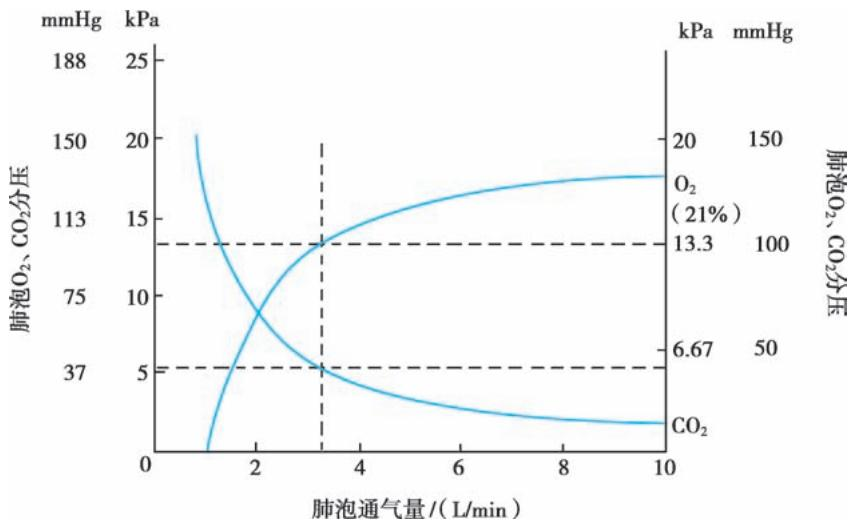  
图 2-16-1 肺泡氧分压和二氧化碳分压与肺泡通气量的关系

3. 通气血流比例失调（ventilation perfusion ratio mismatch）血液流经肺泡时能否保证血液动脉化，即得到充足的 $\mathrm{O}_2$ 并充分排出 $\mathrm{CO}_2$ ，除需有正常的肺通气功能和良好的肺泡膜弥散功能外，还取决于肺泡通气量与血流量之间的正常比例。正常成人静息状态下，通气血流比例约为0.8。肺泡通气血流比例失调有两种主要形式：①部分肺泡通气不足：肺部病变如肺泡萎陷、肺炎、肺不张、肺水肿等引起病变部位的肺泡通气不足，通气血流比例变小，部分未经充分氧合的静脉血(肺动脉血)通过肺泡的毛细血管或短路流入动脉血(肺静脉)中，称为功能性分流(functional shunt)；②部分肺泡血流不足：肺栓塞引起栓塞部位血流减少、心排血量下降所致肺血流量减少、肺气肿时过度扩张的肺泡壁使肺泡毛细血管床受压等情况，均可导致通气血流比例增大，肺泡通气不能被充分利用，又称为无效腔样通气(dead-space like ventilation)。通气血流比例失调通常对氧合的影响更大，而对二氧化碳影响较小。其原因主要是：①肺泡内二氧化碳弥散入血的速度是氧气的20倍。②氧解离曲线呈S形，正常肺泡毛细血管的血氧饱和度已处于曲线的平台段，无法携带更多的氧以代偿低 $\mathrm{PaO}_2$ 区的血氧含量下降。而 $\mathrm{CO}_2$ 解离曲线在生理范围内呈直线，有利于通气良好区对通气不足区的代偿，排出足够的 $\mathrm{CO}_2$ ，不至于出现 $\mathrm{CO}_2$ 潴留。

4. 真性分流（true shunt）真性分流也称解剖分流，指 V/Q 为 0，即肺动脉内的静脉血未经气体交换直接进入肺静脉，是 V/Q 失调的极端情况。流经分流肺泡的血流量与心排血量之比称为分流分数。正常人分流分数小于 10%。分流分数的增加，将导致病人氧合下降。真性分流因血液流经无通气的肺泡，完全未经气体交换，因此提高吸氧浓度对于纠正真性分流所致低氧无效，是临床难治性低氧的主要原因。分流分数增加的情况见于：肺泡填充性疾病（肺炎、肺水肿），肺泡塌陷（肺不张），小气道阻塞（哮喘），肺毛细血管间异常交通形成（动静脉畸形）。

5. 弥散障碍（diffusion impairment）指 $O_{2}$ 、 $CO_{2}$ 等气体通过肺泡毛细血管膜进行交换的物理弥散过程发生障碍，常见于间质性肺疾病。气体弥散的速度取决于肺泡膜两侧气体分压差，气体弥散系数，肺泡膜的弥散面积、厚度和通透性，同时气体弥散量还受血液与肺泡接触时间以及心排血量、血红蛋白含量、通气血流比例的影响。 $CO_{2}$ 的弥散系数约为 $O_{2}$ 的 20 倍，弥散膜两侧的分压差为 $O_{2}$ 的 1/10，折算后 $CO_{2}$ 实际弥散速度为 $O_{2}$ 的 2 倍，因此弥散功能障碍时，常只会引起低氧而无二氧化碳潴留。但事实上，弥散障碍很少作为单一引起严重低氧的原因。因为静息状态时，流经肺泡壁毛细血管的血液与肺泡的接触时间约为 0.72 秒，而 $O_{2}$ 完成气体交换的时间只需要 0.25～0.3 秒，说明弥散功能代偿能力很强。

（二）高碳酸血症性呼吸衰竭的发生机制 导致高碳酸血症性呼吸衰竭的原因可以分为两方面：其一是二氧化碳产生增加，如高热、过度喂养及感染中毒症等情况。但由于人体的代偿机制，当二氧化碳产生增加时，每分通气量会随之增加，使得二氧化碳排出增加。因此单纯二氧化碳产生增加所致高碳酸血症性呼吸衰竭不常见。第二种情况是肺泡通气量不足所致二氧化碳排出减少，是导致高碳酸血症性呼吸衰竭最主要的因素。根据公式：

$$
\mathrm{P} _ {\mathrm{A}} \mathrm{CO} _ {2} = 0. 8 6 3 \times \mathrm{VCO} _ {2} / \mathrm{V} _ {\mathrm{A}}
$$

因 $V_{A}=MV-VD$ ，其中 MV 为每分通气量，VD 为无效腔通气量。因此得出，肺泡通气量下降与每分通气量下降和/或无效腔量增加有关。而每分通气量下降又可以进一步分为阻塞性通气功能障碍及限制性通气功能障碍，前者如慢阻肺病、哮喘、痰堵等，后者如神经肌肉疾病所致呼吸肌无力、气胸、胸腔积液、腹腔高压、肥胖等。

## 第二节 | 急性呼吸衰竭

【病因】呼吸系统疾病如严重呼吸系统感染、急性呼吸道阻塞性病变、重度或危重哮喘、各种原因引起的急性肺水肿、肺血管疾病、胸廓外伤或手术损伤、自发性气胸和急剧增加的胸腔积液等，导致肺通气或/和换气障碍；急性颅内感染、颅脑外伤、脑血管病变(脑出血、脑梗死)等可直接或间接抑制呼吸中枢；脊髓灰质炎、重症肌无力、有机磷中毒及颈椎外伤等可损伤神经肌肉传导系统，引起肺通气不足。上述各种原因均可造成急性呼吸衰竭。

【临床表现】急性呼吸衰竭的临床表现主要是低氧血症所致的呼吸困难和多脏器功能障碍。

1. 呼吸困难 呼吸困难是呼吸衰竭最早出现的症状。多数病人有明显的呼吸困难，可表现为频率、节律和幅度的改变。较早表现为呼吸频率增快，病情加重时出现呼吸困难，辅助呼吸肌活动加强，如出现三凹征。中枢性疾病或中枢神经抑制性药物所致的呼吸衰竭，表现为呼吸节律改变，如潮式呼吸、比奥呼吸等。

2. 发绀 发绀是缺氧的典型表现,当动脉血氧饱和度低于90%时,可在口唇、指甲等处出现发绀。另应注意,因发绀的程度与还原型血红蛋白含量相关,所以红细胞增多者发绀更明显,贫血者则不明显或不出现发绀。因严重休克等引起末梢循环障碍的病人,即使动脉血氧分压尚正常,也可出现发绀,称作外周性发绀;而真正由于动脉血氧饱和度降低引起的发绀,称作中央性发绀。发绀还受皮肤色素及心功能的影响。

3. 精神神经症状 急性缺氧可出现精神错乱、躁狂、昏迷、抽搐等症状。如合并急性 $CO_{2}$ 潴留，可出现嗜睡、淡漠、扑翼样震颤，甚至呼吸骤停。

4. 循环系统表现 多数病人有心动过速；严重低氧血症和酸中毒可导致心肌损害，亦可引起周围循环衰竭、血压下降、心律失常、心搏停止。

5. 消化和泌尿系统表现 严重呼吸衰竭对肝、肾功能都有影响,部分病例可出现丙氨酸转氨酶与血浆尿素氮升高,个别病例尿中可出现蛋白、红细胞和管型。因胃肠道黏膜屏障功能受损,导致胃肠道黏膜充血水肿、糜烂渗血或发生应激性溃疡，引起消化道出血。

【诊断】除原发疾病、低氧血症及 $CO_{2}$ 潴留所致的临床表现外，呼吸衰竭的诊断主要依靠动脉血气分析。根据动脉血气分析可以明确病人呼吸衰竭的类型和严重程度。进而结合胸部影像学、肺功能、纤维支气管镜等检查明确呼吸衰竭的病因。呼吸衰竭鉴别可采取如下思路(图 2-16-2):首先根据血气分析判断是低氧性呼吸衰竭(I型呼吸衰竭)还是高碳酸血症性呼吸衰竭(Ⅱ型呼吸衰竭)。若为低氧性呼吸衰竭，最主要原因为 V/Q 失调。若胸部影像学(如 X 线胸片)大致正常，则定位于右心-肺血管疾病；若影像学明显异常，需进一步根据病史、症状、体征、危险因素、心电图、心脏超声及心肌酶等检查判断是肺源性疾病还是左心相关疾病所致肺水肿。若为高碳酸血症性呼吸衰竭，主要包括二氧化碳生成增加和二氧化碳排出减少。因人体代偿机制，单纯二氧化碳生成增加所致Ⅱ型呼吸衰竭少见，主要原因为二氧化碳排出减少，见于通气功能障碍和/或无效腔增加所致。

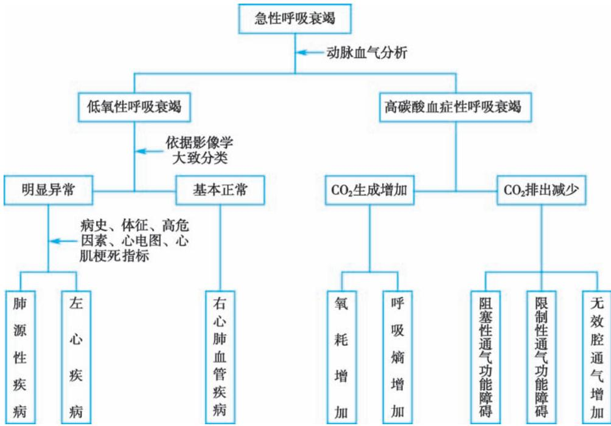  
图 2-16-2 急性呼吸衰竭诊断流程图

1. 动脉血气分析 对判断呼吸衰竭和酸碱失衡的严重程度及指导治疗均具有重要意义。pH 可反映机体的代偿状况,有助于鉴别急性或慢性呼吸衰竭。当 $PaCO_{2}$ 升高、pH 正常时,称为代偿性呼吸性酸中毒;若 $PaCO_{2}$ 升高、pH<7.35,则称为失代偿性呼吸性酸中毒。需要指出,由于血气受年龄、海拔高度、氧疗等多种因素影响,具体分析时一定要结合临床情况。

2. 肺功能检测 尽管在某些重症病人,肺功能检测受到限制,但能通过肺功能判断通气功能障碍的性质(阻塞性、限制性或混合性)及是否合并换气功能障碍,并对通气和换气功能障碍的严重程度进行判断。呼吸肌功能测定能够提示呼吸肌无力的原因和严重程度。

3. 胸部影像学检查 包括普通 X 线胸片、胸部 CT 和放射性核素肺通气/灌注扫描、肺血管造影及超声检查等。

4. 纤维支气管镜检查 对明确气道疾病和获取病理学证据具有重要意义。

【治疗】急性呼吸衰竭病因众多,不同原发病治疗方案不同。总体治疗原则包括三方面:呼吸支持、对因治疗及并发症的处理。

1. 呼吸支持 低氧血症和高碳酸血症能够影响全身各系统脏器的代谢、功能甚至使组织结构发生变化。在呼吸衰竭的初始阶段，各系统脏器的功能和代谢可发生一系列代偿性反应，以改善组织供氧、调节酸碱平衡、适应内环境的变化。当呼吸衰竭进入严重阶段时，则出现代偿不全，表现为各系统脏器严重的功能和代谢紊乱直至衰竭。因此，需尽快予以呼吸支持治疗，改善低氧及高碳酸血症状态，纠正内环境紊乱，维持循环稳定，避免进入失代偿期(详见本章第四节呼吸支持技术)。

2. 对因治疗 如前所述,引起急性呼吸衰竭的原发疾病多种多样,在解决呼吸衰竭本身所致危害的前提下,明确并针对不同病因采取适当的治疗措施十分必要,是治疗呼吸衰竭的根本所在。

3. 并发症的处理 呼吸衰竭往往会累及其他重要脏器,因此需加强对脏器功能的监测与支持,预防和治疗肺动脉高压、肺源性心脏病、肺性脑病、肾功能不全、消化道功能障碍和弥散性血管内凝血(DIC)等。

## 第三节 | 慢性呼吸衰竭

【病因】慢性呼吸衰竭多由支气管、肺疾病引起，如慢阻肺病、严重肺结核、肺间质纤维化、肺尘埃沉着症等。胸廓和神经肌肉病变，如胸部手术、外伤、广泛胸膜增厚、胸廓畸形、脊髓侧索硬化症等，亦可导致慢性呼吸衰竭。

【临床表现】慢性呼吸衰竭的临床表现与急性呼吸衰竭大致相似,但以下几方面有所不同。

1. 呼吸困难 慢阻肺病所致的呼吸困难,病情较轻时表现为呼吸费力伴呼气延长,严重时发展成浅快呼吸。若并发 $CO_{2}$ 潴留, $PaCO_{2}$ 升高过快或显著升高以致发生 $CO_{2}$ 麻醉时,病人可由呼吸过速转为浅慢呼吸或潮式呼吸。

2. 神经症状 慢性呼吸衰竭伴 $CO_{2}$ 潴留时，随 $PaCO_{2}$ 升高可表现为先兴奋后抑制现象。兴奋症状包括失眠、烦躁、躁动、夜间失眠而白天嗜睡（昼夜颠倒现象）等，但此时切忌应用镇静或催眠药，以免加重 $CO_{2}$ 潴留，诱发肺性脑病。肺性脑病主要表现为神志淡漠、肌肉震颤或扑翼样震颤、间歇抽搐、昏睡甚至昏迷等，亦可出现腱反射减弱或消失、锥体束征阳性等。此时应与合并脑部病变作鉴别。

3. 循环系统表现 $CO_{2}$ 潴留使外周体表静脉充盈、皮肤充血、温暖多汗、血压升高、心排血量增多而致脉搏洪大；多数病人心率增快；可因脑血管扩张产生搏动性头痛。

【诊断】慢性呼吸衰竭的血气分析诊断标准参见急性呼吸衰竭,但在临床上Ⅱ型呼吸衰竭病人还常见于另一种情况,即吸氧治疗后, $PaO_{2}>60mmHg$ ,但 $PaCO_{2}$ 仍高于正常水平。

【治疗】治疗原发病、保持气道通畅、恰当的氧疗等治疗原则与急性呼吸衰竭基本一致。

1. 氧疗 慢阻肺病是导致慢性呼吸衰竭的常见呼吸系统疾病,病人常伴有 $CO_{2}$ 潴留,氧疗时需注意保持低浓度吸氧,防止血氧含量过高。 $CO_{2}$ 潴留是通气功能不良的结果。慢性高碳酸血症病人呼吸中枢的化学感受器对 $CO_{2}$ 反应性差,呼吸主要靠低氧血症对颈动脉体、主动脉体化学感受器的刺激来维持。若吸入高浓度氧,使血氧迅速上升,解除了低氧对外周化学感受器的刺激,便会抑制病人呼吸,造成通气状况进一步恶化,导致 $CO_{2}$ 上升,严重时陷入 $CO_{2}$ 麻醉状态。

2. 正压机械通气 根据病情选用无创机械通气或有创机械通气。慢阻肺病急性加重早期及时应用无创机械通气可以防止呼吸功能不全加重，缓解呼吸肌疲劳，减少后期气管插管率，改善预后。

3. 抗感染 慢性呼吸衰竭急性加重的常见诱因是感染,一些非感染因素诱发的呼吸衰竭也容易继发感染。抗感染治疗抗生素的选择可以参考相关章节。

4. 纠正酸碱平衡失调 慢性呼吸衰竭常伴有 $CO_{2}$ 潴留, 导致呼吸性酸中毒。呼吸性酸中毒的发生多为慢性过程, 机体常通过增加碱储备来代偿, 以维持 pH 于相对正常水平。当以机械通气等方法较为迅速地纠正呼吸性酸中毒时, 原已增加的碱储备会使 pH 升高, 对机体造成严重危害, 故应注意纠正呼吸性酸中毒的速度, 目标是使 pH 尽快恢复至正常范围, 使 $PaCO_{2}$ 恢复至平素水平。

慢性呼吸衰竭的对因治疗和并发症处理方面与急性呼吸衰竭有类同之处,可参见相关内容。

【长期管理】慢性呼吸衰竭一般无法治愈,病人出院后常需使用家庭长期氧疗和/或家庭机械通气。需要在家庭配备氧气罐、制氧机、呼吸机等设备和呼吸管路、面罩等耗材。这些设备和材料的使用和维护具有高度专业性,需由专业的医务人员负责,一旦错误使用可能对病人产生生命威胁。这些病人病情变化快，机械通气并发症多，易发生人机不同步，居家识别和解决困难。另外，慢性呼吸衰竭病人行动不便，需由专业人员定期上门进行人工气道维护和管理、用药指导、康复训练、心理支持、戒烟宣教等。在一些发达国家，有专门的医疗机构负责管理区域内的家庭氧疗和家庭机械通气病人，负责设备和耗材的集中采购，有医疗团队负责对病人和家属进行指导和培训，为病人提供上门随访和门诊复查，病人可以在需要时联系到其所属的医疗机构。目前国内尚未建立针对慢性呼吸衰竭病人的医院-家庭闭环管理体系。

## 第四节 | 呼吸支持技术

呼吸支持技术是最重要的生命支持技术之一,是指以维持呼吸功能不全或衰竭病人的基本通气和氧合状态为主要目的的一系列技术的统称,主要包括氧气疗法、气道维护、正压机械通气和体外生命支持等技术。其临床价值在于为诊治导致呼吸衰竭的原发病争取时间,对原发病本身并无直接治疗作用。

## 一、氧疗

氧气疗法(简称氧疗),指通过不同吸氧装置增加肺泡内氧分压以纠正机体低氧血症的治疗方法。合理的氧疗能使体内可利用氧明显增加,缓解低氧血症引起的临床症状和心肺负担。

【适应证】一般而言,只要 $PaO_{2}$ 低于正常即可氧疗,但临床实践中往往采用更严格的标准。对于成年病人,特别是慢性呼吸衰竭者, $PaO_{2}<60mmHg$ 是比较公认的氧疗指征。而对于急性呼吸衰竭病人,氧疗指征应适当放宽。

【装置】氧疗需要通过给氧装置才能实现,氧疗装置有多种形式,具备不同性能。常将其分为低流量装置、储存装置和高流量装置。

1. 低流量装置 因提供的气体流量(一般低于8L/min)低于病人的吸气峰值流量,病人吸入氧气浓度易受空气的稀释作用而出现不恒定的特点。鼻塞导管是其典型代表,也是最常用的氧疗装置,优点在于廉价、舒适,病人易于接受,吸氧的同时可以进食、交谈和咳痰。吸入氧浓度受病人呼吸深度和频率影响,吸入氧浓度与氧流量的关系可以粗略计算为:吸入氧浓度(%)=21+4×氧流量(L/min)。但是,当氧流量超过8L/min时,吸入氧浓度不再明显提高,该公式不再适用。这类低流量装置提供的流量过高时对局部鼻黏膜有刺激,并可导致黏膜干燥、分泌物阻塞导管,故氧流量不能超过8L/min。

2. 储存装置 用容量较大的储氧空间扩大了固有的上呼吸道储氧空间，将病人每次呼吸之间的氧气储存起来，既可以减少外界空气对氧气的稀释，又避免了病人在呼气相时氧气的浪费。但为避免呼出二氧化碳积聚，该类装置一般要求氧流量大于6L/min。主要优点为吸氧浓度相对稳定，且对鼻黏膜刺激小；缺点为会在一定程度上影响病人进食、交谈和咳痰。一般而言，简单面罩所能提供的氧气浓度为35%～55%，部分重复呼吸储氧面罩为40%～70%，非重复呼吸储氧面罩为60%～80%。

3. 高流量装置 因提供的气体流量高于病人的流量需求,无空气的稀释作用,吸入氧浓度恒定。如空气卷吸面罩和经鼻高流量吸氧装置。

（1）空气卷吸面罩：常称为文丘里面罩，但应用的原理并非文丘里原理，其通过一小孔或喷嘴提供高速流动的氧气，喷嘴边缘的剪切力将空气卷吸进去。卷吸口越大，氧气射流速度越高，卷吸的空气越多。因此其只能提供低于100%浓度的氧，且只有在低氧浓度(一般小于35%)时才能输送高流量气体。文丘里面罩氧浓度可精确调节，更适用于需要精确控制吸氧浓度且不应出现重复呼吸的病人，如慢阻肺病病人。

（2）经鼻高流量吸氧(high flow nasal cannula, HFNC)装置: 近年来出现的一种新型的呼吸支持技术。该系统主要由3部分组成: 高流量产生装置、加温湿化装置和高流量鼻塞。HFNC可以实现气体流量和氧气浓度单独调节, 一般要求输送的最大流量至少达到60L/min, $FiO_{2}$ 调节范围0.21～1.0。该系统的主要生理学效应包括:吸入氧气浓度更加稳定;产生一定水平的气道内正压(2\~7cmH₂O),每增加10L/min的气体流量,气道内压力在张口呼吸情况下平均增加0.35cmH₂O,在闭口呼吸情况下平均增加0.69cmH₂O,因此能增加呼气末肺容积、改善气体交换和降低呼吸功耗;减低生理无效腔,改善通气效率;加强气道湿化,促进纤毛黏液系统的痰液清除能力和改善病人治疗的耐受性;促进气体分布的均一性。

其他氧疗方式还有机械通气氧疗、高压氧疗等。

【目标】机体氧气含量过低或过高都会造成伤害，必须结合病情特点，根据病情变化严格地把握氧气的吸入浓度。在急性情况下，如心跳呼吸骤停、休克、呼吸衰竭、CO中毒、严重哮喘及肺栓塞等，在未开始针对性治疗前短时间吸入60%～100%高浓度氧是必要的，与高浓度吸氧可能造成的危害相比，氧供不足会导致更差的预后。然而，高浓度氧疗对于有高碳酸血症风险的慢性呼吸系统疾病（如慢阻肺病急性加重）病人来说却是不恰当的，因为吸入氧浓度过高会降低缺氧对这类病人呼吸的刺激，加重二氧化碳潴留，对其氧疗的浓度最好从低浓度（24%～28%）开始逐渐上调。但对于严重缺氧病人，即使合并高碳酸血症，必要时也应给予高浓度氧疗以保证组织氧供，对于其引起的二氧化碳潴留加重，须行机械通气治疗。一般来说，对于无高碳酸血症风险的病人，氧疗目标建议维持 $SpO_{2}$ 94%～98%；存在高碳酸血症风险的病人，氧疗目标建议维持 $SpO_{2}$ 88%～92%。

【副作用】氧气作为一种药物,也有着药物的一切属性,既有其有益的治疗作用,又可能带来不良的作用乃至产生毒性。氧疗的副作用包括通气抑制、早产儿视网膜病变、氧中毒、吸收性肺不张和火灾危险等。

## 二、人工气道的建立与管理

在危重症急救治疗工作中,保持呼吸道通畅,保证充分的通气和换气,防治呼吸道并发症及呼吸功能不全,是关系到重要脏器功能保障和救治能否成功的重要环节。

1. 建立人工气道的目的 ①解除气道梗阻；②及时清除呼吸道内分泌物；③防止误吸；④严重低氧血症和高碳酸血症时实行正压通气治疗。

## 2. 建立人工气道的方法

（1）气道紧急处理:紧急情况下应首先保证病人有足够的通气及氧供,而不是一味强求气管插管。在某些情况下,一些简单的方法能起到重要作用,甚至能避免紧急气管插管,如迅速清除呼吸道和口咽部的分泌物或异物,头后仰,托起下颌,放置口咽通气道,用简易呼吸器经面罩加压给氧等。

（2）人工气道建立方式的选择:气道的建立分为喉上途径和喉下途径。喉上途径主要指经口或经鼻气管插管,喉下途径指环甲膜穿刺或气管切开。其他人工气道种类还包括口咽气道、鼻咽气道、喉罩和食管气管联合导管等。

（3）插管前的准备:喉镜、简易呼吸器、气管导管、负压吸引等设备。应先与家属交代清楚可能发生的意外,使其理解插管的必要性和危险性,取得一致认识。

（4）插管操作方法：有经口腔和鼻腔的插管术，具体操作方法见《麻醉学》。

（5）插管过程的监测：监测基础生命体征，如呼吸状况、血压、心电图、 $SpO_{2}$ 及呼气末二氧化碳( $ETCO_{2}$ ), $ETCO_{2}$ 对判断气管导管是否插入气管内有重要价值。

3. 气管插管的并发症 动作粗暴可造成机械性损伤,引起出血或下颌关节脱位;浅麻醉下插管可引起剧烈咳嗽或喉、支气管痉挛以及心血管反应如心动过缓、心律失常甚至心搏骤停;插管位置不当导致导管进入食管或一侧支气管内,可引起低氧血症、肺不张;在胃充盈时插管易造成呕吐和胃内容物误吸等。

4. 人工气道的管理 主要包括: 人工气道的固定和位置的维持, 以防移位或脱出; 及时清除气道内分泌物保证气道通畅; 定时口腔护理, 避免口腔病原菌大量繁殖积聚; 维持气囊内压力 25\~30cmH₂O, 避免压力过高造成气道黏膜损伤和压力过低造成误吸; 及时清除口咽部、气囊上滞留物; 对吸入气体进行加温湿化等。

## 三、正压机械通气

机械通气是在病人自然通气和/或氧合功能出现障碍时,运用器械(主要是呼吸机)使病人恢复有效通气并改善氧合的技术方法。正压通气是目前临床最为常用的机械通气技术,包括有创正压通气和无创正压通气。

（一）有创正压通气 有创正压通气是指需要建立人工气道(经口或经鼻气管插管、气管切开、喉罩等)的正压机械通气方式。其能够维持必要的肺泡通气量，降低 $PaCO_{2}$ ;改善肺的气体交换效能；使呼吸肌得以休息，有利于恢复呼吸肌功能。

1. 适应证 可用于改善具有下述病理生理状态的疾病:①通气功能障碍为主的疾病:包括慢阻肺病急性加重、哮喘急性发作、神经肌肉疾病、胸廓畸形、胸部外伤或手术后等所致外周呼吸泵衰竭,脑部炎症、外伤、肿瘤、脑血管意外、药物中毒等所致中枢性呼吸衰竭;②换气功能障碍为主的疾病:ARDS、肺炎、间质性肺病、肺栓塞等;③需强化气道管理者:保持气道通畅,防止窒息;使用某些有呼吸抑制的药物时。当符合下述条件时应实施机械通气:经积极治疗后病情恶化;意识障碍;呼吸形式严重异常,如呼吸频率>35\~40次/分或<6\~8次/分,呼吸节律异常,或自主呼吸微弱或消失;血气分析提示严重通气和/或氧合障碍, $PaO_{2}<50mmHg$ ,尤其是充分氧疗后仍 $PaO_{2}<60mmHg$ ; $PaCO_{2}$ 进行性升高,pH动态下降。

2. 禁忌证 有创正压通气没有绝对禁忌证,以下情况可视为其相对禁忌证:严重肺大疱、张力性气胸及纵隔气肿未行引流、大咯血或严重误吸引起窒息、低血容量性休克未纠正、支气管胸膜瘘。

3. 撤离 有创正压通气的撤离是逐渐降低机械通气支持水平,恢复病人自主呼吸,最终脱离呼吸机的过程。应遵循程序化撤机,在下述程序指导下尽早撤机:①每日筛查,评估撤机可能性,包括导致机械通气的病因是否好转或去除、气体交换是否充分、血流动力学是否稳定、是否有自主呼吸能力等;②进行自主呼吸试验(spontaneous breath test, SBT),在无或低水平的通气支持下,评价自主呼吸能力能否克服呼吸负荷,以判断病人能否完全脱离呼吸机;③评估能否拔除人工气道,包括上气道通畅性、气道保护能力和精神状态的评估等。对于慢性呼吸衰竭急性加重的病人,采用有创-无创序贯机械通气的方式逐渐撤机,能够减少机械通气时间,提高撤机成功率,减少并发症的发生。

4. 并发症 机械通气的并发症主要与正压通气和人工气道有关。

（1）呼吸机所致肺损伤(ventilator-induced lung injury, VILI): 包括气压-容积伤、剪切伤和生物伤。

（2）呼吸机所致膈肌功能障碍(ventilator-induced diaphragmatic dysfunction, VIDD): 机械通气导致的膈肌萎缩、损伤和肌力的降低, 易造成机械通气时间延长和脱机困难。

（3）血流动力学影响:胸腔内压力升高,心排血量减少,血压下降。

（4）呼吸机相关性肺炎(ventilator-associated pneumonia, VAP): 是指气管插管或气管切开病人在接受机械通气 48 小时后发生的肺炎, 是医院获得性肺炎的一种, 主要由口咽部病原菌的误吸导致。

（5）人工气道气囊长期压迫可造成气道黏膜缺血坏死，导致肉芽肿形成、气道狭窄，甚至造成气管软化和气管食管瘘。

（二）无创正压通气 无创正压通气（non-invasive positive pressure ventilation, NPPV）是指通过鼻罩、口鼻罩、全面罩或头罩等无创的方式将病人与呼吸机相连接进行正压通气的技术。与有创正压通气相比，具有无需建立人工气道（避免相关的并发症）、避免和减少镇静药使用、减轻病人痛苦、保留正常的吞咽和咳嗽能力、能够间歇交替应用、减少入住 ICU 的需要和降低医疗费用等优点。

1. 适应证 近年来, NPPV 已从传统的主要治疗阻塞性睡眠呼吸暂停低通气综合征 (OSAHS) 扩展为治疗多种急、慢性呼吸衰竭, 在慢阻肺病急性加重早期、慢阻肺病有创-无创序贯通气、急性心源性肺水肿、免疫力低下病人、术后预防呼吸衰竭以及家庭康复 (home care) 等方面均有良好的治疗效果。

## 2. 禁忌证

（1）绝对禁忌证：心跳呼吸骤停；自主呼吸微弱、昏迷；严重呕吐或消化道大出血/穿孔者；误吸风

险高及不能清除口咽及上呼吸道分泌物、气道保护能力差；颈面部创伤、烧伤及畸形；上气道梗阻。

（2）相对禁忌证：血流动力学不稳定(如休克、严重心律失常)；未引流的气胸或纵隔气肿；近期面部、颈部、口腔、咽腔、食管及胃部手术；不合作或极度紧张；严重低氧血症 $\left(\mathrm{PaO}_{2}<45\mathrm{mmHg}\right)$ 、严重酸中毒 $\left(\mathrm{pH}\leq7.20\right)$ ；气道分泌物多或排痰障碍。

3. 不良反应 包括胃胀气、误吸、口鼻咽干燥、鼻面部皮肤压伤、排痰障碍、不耐受、幽闭恐惧症、气压伤等。

## 四、体外膜肺氧合

体外膜肺氧合(extracorporeal membrane oxygenation, ECMO)是体外生命支持技术的一种，通过将病人静脉血引出体外后经氧合器进行充分的气体交换，然后再输入病人体内。ECMO可分为静脉-静脉方式ECMO（VV-ECMO）和静脉-动脉方式ECMO（VA-ECMO）两种。VV-ECMO是指将经过体外氧合后的静脉血重新回输至静脉，因此仅用于呼吸功能支持；而VA-ECMO是指将经过体外氧合后的静脉血回输至动脉，因减少了回心血量，可以同时起到呼吸和心脏功能支持的目的。ECMO是严重呼吸/循环衰竭的终极呼吸支持方式，可部分或全部替代心肺功能，让心肺充分休息、修复，为原发病的治疗争取更多的时间。

## [附1] 危重症医学概要

（一）危重症医学的概念 危重症医学（critical care medicine）是主要研究危重症病人脏器功能障碍或衰竭的发病机制、预防、诊断、监测、治疗与康复方法的一门临床学科。其临床处理对象为危重但经救治后有可能好转或痊愈的病人，临床基地为重症监护治疗病房，核心技术为脏器功能监测与脏器支持技术。ICU内有专门接受过危重症医学训练的医务人员，配备较为完备的医疗设施和仪器，对病人进行比在普通病房更为强化的监测和治疗。危重症医学是由医生、护士、呼吸治疗师、康复师、药剂师、微生物学家、营养师、社会工作者等多学科团队进行系统诊疗的学科。

（二）重症监护病房概述 重症监护病房(intensive care unit, ICU)是为适应危重症病人的强化医疗需要而集中必要的人员和设备所形成的医疗组织，是医院组织架构和空间地域相对独立的单元。它包括四个要素，即危重症病人、受过专门训练和富有经验的全职医护技术人员、完备的临床病理生理监测和抢救治疗设施以及严格科学的管理，其最终目的是尽可能排除人员和设备因素对治疗的限制，最大程度地体现当代医学的治疗水平，使危重症病人的预后得以改善。

ICU 可分为综合型 ICU（GICU）或专科 ICU，后者如内科 ICU（MICU）、外科 ICU（SICU）、呼吸 ICU（RICU）等，以适应不同医疗机构、不同专科危重症病人的救治需要。专职 ICU 医生的背景可能来源于呼吸科、麻醉科、心内科和外科。ICU 中最常面临的突出问题也是专业性最强的是呼吸衰竭和呼吸支持，呼吸学科与以呼吸衰竭支持为最核心技术的危重症照护有着天然、密切的联系，呼吸与危重症医学的融合（pulmonary and critical care medicine, PCCM）是呼吸病学专科发展的必然趋势。

（三）病情严重程度评估 ICU 中最为通用的病情严重程度评估系统包括急性生理和慢性健康状况Ⅱ评分(acute physiology and chronic health evaluation Ⅱ score, APACHE Ⅱ评分)(表 2-16-1)和序贯器官功能衰竭评分(sequential organ failure assessment, SOFA 评分)(表 2-16-2)。分数越高,病人预期病死率也越高。

（四）脏器功能监测技术 危重症病人的脏器功能监测包含生命体征的监测，如心率、血压、呼吸频率和血氧饱和度等。此外，针对不同脏器的功能有不同的监测手段，其中呼吸和循环系统的功能监测尤为重要。

针对呼吸系统的监测手段与技术:反映肺通气和换气功能的指标,如动脉血气分析、呼气末 $CO_{2}$ 、容积 $CO_{2}$ 等;反映呼吸力学的指标,如气道阻力、顺应性、气道压、食管压、功能残气量等;床旁影像,如肺部超声、电阻抗成像(electrical impedance tomography,EIT)等。

表 2-16-1 APACHE II评分

<table><tr><td rowspan="2">生理学指标</td><td colspan="4">高于正常范围</td><td>正常值</td><td colspan="4">低于正常范围</td></tr><tr><td>+4</td><td>+3</td><td>+2</td><td>+1</td><td>0</td><td>+1</td><td>+2</td><td>+3</td><td>+4</td></tr><tr><td>肛温/°C</td><td>≥41</td><td>39~40.9</td><td>—</td><td>38.5~38.9</td><td>36~38.4</td><td>34~35.9</td><td>32~33.9</td><td>30~31.9</td><td>≤29.9</td></tr><tr><td>MAP/mmHg</td><td>≥160</td><td>130~159</td><td>110~129</td><td>—</td><td>70~109</td><td>—</td><td>50~69</td><td>—</td><td>≤39</td></tr><tr><td>心室率/(次/分)</td><td>≥180</td><td>140~179</td><td>110~139</td><td>—</td><td>70~109</td><td>—</td><td>50~69</td><td>40~54</td><td>≤39</td></tr><tr><td>呼吸频率/(次/分)</td><td>≥50</td><td>35~49</td><td>—</td><td>25~34</td><td>12~24</td><td>10~11</td><td>6~9</td><td>—</td><td>&lt;5</td></tr><tr><td>氧合(二选一) $P_{(A-a)}O_2(FiO_2 \geq 0.5)$ </td><td>≥500</td><td>350~499</td><td>200~349</td><td>—</td><td>&lt;200</td><td>—</td><td>—</td><td>—</td><td>—</td></tr><tr><td> $PaO_2(FiO_2 < 0.5)$ </td><td>—</td><td>—</td><td>—</td><td>—</td><td>&gt;70</td><td>61~70</td><td>—</td><td>55~60</td><td>&lt;54</td></tr><tr><td>动脉血pH</td><td>≥7.7</td><td>7.6~7.69</td><td>—</td><td>7.5~7.59</td><td>7.33~7.49</td><td>—</td><td>7.25~7.32</td><td>7.15~7.24</td><td>&lt;7.15</td></tr><tr><td>血清 $Na^+/ (mmol/L)$ </td><td>≥180</td><td>160~179</td><td>155~159</td><td>150~154</td><td>130~149</td><td>—</td><td>120~129</td><td>111~119</td><td>&lt;110</td></tr><tr><td>血清 $K^+/ (mmol/L)$ </td><td>≥7</td><td>6~6.9</td><td>—</td><td>5.5~5.9</td><td>3.5~5.4</td><td>3~3.4</td><td>2.5~2.9</td><td>—</td><td>&lt;2.5</td></tr><tr><td>血清 $Cr/(mg/L)^*$ </td><td>≥3.5</td><td>2~3.4</td><td>1.5~1.9</td><td>—</td><td>0.6~1.4</td><td>—</td><td>&lt;0.6</td><td>—</td><td>—</td></tr><tr><td>HCT/%</td><td>≥60</td><td>—</td><td>50~59.9</td><td>46~49.9</td><td>30~45.9</td><td>—</td><td>20~29.9</td><td>—</td><td>&lt;20</td></tr><tr><td>WBC/ $(×10^9/L)$ </td><td>≥40</td><td>—</td><td>20~39.9</td><td>15~19.9</td><td>3~14.9</td><td>—</td><td>1~2.9</td><td>—</td><td>&lt;1</td></tr><tr><td>格拉斯哥昏迷评分(GCS) $^§$ </td><td></td><td></td><td></td><td></td><td></td><td></td><td></td><td></td><td></td></tr><tr><td colspan="10">急性生理学评分(acute physiology score,APS)=上述12项指标评分之和</td></tr><tr><td>静脉血 $HCO_3^-/(mmol/L)^#$ </td><td>≥52</td><td>41~51.9</td><td>—</td><td>32~40.9</td><td>22~31.9</td><td>—</td><td>18~21.9</td><td>15~17.9</td><td>&lt;15</td></tr></table>

A. 急性健康评分  
注：\*急性肾衰时评分加倍；#用于无血气结果时应用。

§ 格拉斯哥昏迷评分 (Glasgow coma scale, GCS)

<table><tr><td>评分</td><td>睁眼运动(E)</td><td>语言反应(V)</td><td>最佳运动反应(M)</td></tr><tr><td>6</td><td></td><td></td><td>遵嘱动作</td></tr><tr><td>5</td><td></td><td>回答准确</td><td>刺痛能定位</td></tr><tr><td>4</td><td>自主睁眼</td><td>回答错误</td><td>刺痛能躲避</td></tr><tr><td>3</td><td>呼唤睁眼</td><td>能说出单个词</td><td>刺痛时肢体屈曲(去皮质)</td></tr><tr><td>2</td><td>刺痛睁眼</td><td>只能发音</td><td>刺痛时肢体过伸</td></tr><tr><td>1</td><td>不能睁眼</td><td>不能言语</td><td>不能运动(去脑强直)</td></tr></table>

C. 慢性健康评分 如果病人有严重的器官系统功能不全病史或免疫抑制（具体定义见下述），应如下评分：①非手术或急诊手术后病人+5分；②择期术后病人+2分。器官功能不全和免疫功能抑制状态必须在此次入院前即有明显表现，并符合下列标准：①肝脏：活检证实肝硬化，明确的门静脉高压，既往由门静脉高压造成的上消化道出血；或既往发生过肝衰竭/肝性脑病/昏迷。②心血管系统：NYHA心功能IV级。③呼吸系统：慢性限制性、阻塞性或血管性疾病导致的严重活动受限，如不能上楼或从事家务劳动；或明确的慢性缺氧、高碳酸血症、继发性红细胞增多症、严重肺动脉高压（>40mmHg）、或呼吸机依赖。④肾脏：接受长期透析治疗。⑤免疫功能抑制：病人接受的治疗能抑制对感染的耐受性，如免疫抑制治疗、化疗、放疗、长期或最近大剂量类固醇药物治疗，或患有足以抑制对感染耐受性的疾病，如白血病、淋巴瘤、AIDS。APACHE II评分=急性生理学评分(A)+年龄评分(B)+慢性健康评分(C)。最低分=0分，最高分=71分，院内死亡危险性随分值增加而增加。

表 2-16-2 SOFA 评分

<table><tr><td rowspan="2">SOFA评分变量</td><td colspan="4">分值</td></tr><tr><td>1</td><td>2</td><td>3</td><td>4</td></tr><tr><td> $PaO_2/FiO_2/mmHg$ </td><td>&lt;400</td><td>&lt;300</td><td>&lt;200</td><td>&lt;100</td></tr><tr><td>血小板/(×10^9/L)</td><td>&lt;150</td><td>&lt;100</td><td>&lt;50</td><td>&lt;20</td></tr><tr><td>胆红素/(μmol/L)</td><td>20.5~32.5</td><td>34.2~100.9</td><td>102.6~203.5</td><td>&gt;205.2</td></tr><tr><td>低血压/mmHg</td><td>MAP&lt;70</td><td>DA≤5或Dobu(任何剂量)</td><td>DA&gt;5或Epi≤0.1或NE≤0.1</td><td>DA&gt;15或Epi&gt;0.1或NE&gt;0.1</td></tr><tr><td>GCS评分</td><td>13~14</td><td>10~12</td><td>6~9</td><td>&lt;6</td></tr><tr><td rowspan="2">肌酐/(μmol/L)或尿量/(ml/d)</td><td rowspan="2">106.1~168</td><td rowspan="2">176.8~300.6</td><td>309.4~433.2</td><td>&gt;442.1</td></tr><tr><td>&lt;500</td><td>&lt;200</td></tr></table>

注：MAP, 平均动脉压；DA, 多巴胺；Dobu, 多巴酚丁胺；Epi, 肾上腺素；NE, 去甲肾上腺素；单位均为 $\mu g/(kg \cdot min)$ 。血管活性药需要至少给药 1 小时。

针对循环系统的监测手段与技术:有创血流动力学监测技术,如动脉置管、深静脉置管、右心漂浮导管(Swan-Ganz catheter)、脉搏轮廓连续心排血量监测(pulse indicator continuous cardiac output, PiCCO)技术等;无创血流动力学监测技术,如经胸电阻抗法(transthoracic electrical bioimpedance, TEB)、无创心排血量(noninvasive cardiac output, NICO)监测技术等;组织灌注监测技术,如组织氧代谢监测。

其他脏器功能监测手段与技术:神经电生理(脑电图、诱发电位)、脑血流(颅内压监测、经颅多普勒超声)、脑代谢(脑氧饱和度监测、脑组织氧代谢)、膀胱压、凝血-纤溶功能等。

## （五）脏器功能支持技术

1. 呼吸支持技术 包括氧疗、无创正压通气、有创正压通气、体外膜肺氧合(ECMO)、气道管理等。

2. 循环支持技术 主动脉内球囊反搏(IABP)技术、静脉-动脉体外膜肺氧合(VA-ECMO)技术、心室辅助装置(VAD)、电除颤、电复律、临床起搏(经皮起搏、经静脉起搏)等。

3. 其他脏器功能支持技术 肠内/肠外营养、人工肝(血浆置换、血液/血浆灌流、血液滤过、血浆胆红素吸附、连续性血液透析滤过、白蛋白透析等分子吸附再循环系统)等血液净化(心肺转流术, CPB)。

（六）休克的分类 休克（shock）是 ICU 中最常见的危及生命的临床综合征。其定义为由一种或多种原因诱发的组织灌注不足导致细胞氧利用不充分的危及生命的急性循环衰竭。灌注不足使组织缺氧和营养物质供应障碍，导致细胞功能受损，诱发炎症因子的产生和释放，引起微循环的功能和结构发生改变，进一步加重灌注障碍，形成恶性循环，最终导致多器官衰竭。

休克有多种分类方法,其中 1971 年 Weil 教授基于血流动力学改变,将不同病因的休克归纳为具有共同血流动力学特点,具体分类如下。

1. 低血容量性休克（hypovolemic shock）其基本机制为有效循环血容量的绝对减少，常见于失血、胃肠道液体丢失、急性重症胰腺炎、大面积烧伤、脱水、利尿等原因。其血流动力学特点为“低排高阻，低前负荷”，即回心血量减少，低心排血量，全身血管阻力升高。通常引起容量丢失的原因去除，有效容量得到及时补充，低血容量性休克可以很快得到纠正。

2. 心源性休克(cardiogenic shock) 其基本机制为心脏泵功能衰竭,如急性大面积心肌梗死、暴发性心肌炎、严重心律失常等所致休克。其血流动力学特点为“低排高阻,高前负荷”,即心排血量下降,前负荷增加,全身血管阻力升高。心源性休克的治疗主要是病因治疗。当常规治疗方案无效时,也可考虑体外膜肺氧合为代表的机械性循环辅助装置改善病人的预后。

3. 分布性休克(distributive shock) 是休克中最为常见也是最重要的类型。其基本机制为血管收缩舒张调节功能异常,血流重新分布,其血流动力学特点为“高排低阻,低前负荷”,即全身血管阻力降低,通常伴随有高心排血量。与低血容量性休克不同的是,分布性休克的容量改变并非血容量的绝对减少,而是血容量的重新分布和相对不足。感染性休克是最常见的分布性休克,此外神经性休克、过敏性休克、内分泌性休克也属于此类。严重创伤和其他类型的休克如失血性休克的晚期也可能进展为分布性休克。分布性休克往往不能单纯通过补液而纠正,通常还需要血管活性药物改善血管张力和去除病因的治疗。

4. 梗阻性休克（obstructive shock）其基本机制为血流流动通道受到机械性阻塞，根据梗阻部位可分为心外梗阻性休克和心内梗阻性休克。心外梗阻性休克是由于心脏外的血管回路中血流受阻所致，如肺血栓栓塞症或非栓塞性急性肺动脉高压、心脏压塞、主动脉夹层、张力性气胸等。心内梗阻性休克常见于瓣膜狭窄或心室流出道梗阻等。梗阻性休克的血流动力学特点虽然也是“低排高阻”，但其治疗的基本措施是解除梗阻，如心脏压塞的心包引流、肺栓塞的溶栓治疗等。

需要关注的是很多病人发生休克时存在多种休克类型并存的情况,如感染性休克病人可能同时因感染导致心肌病而合并心源性休克。

（七）感染中毒症与感染性休克 感染中毒症(sepsis)与感染性休克(septic shock)是ICU病人常见的临床综合征，死亡率可高达30%～40%，是ICU死亡的最重要原因。1991年美国胸科医师学会和危重病学会首次提出感染中毒症定义(sepsis 1.0)，认为是感染所引起的全身炎症反应综合征（systemic inflammatory response syndrome, SIRS），具备至少以下两项即可认为SIRS:体温>38℃或<36℃；心率>90次/分；呼吸>20次/分或 $PaCO_{2}<32mmHg$ ；白细胞总数>12×10 $^{9}$ /L或<4×10 $^{9}$ /L，或未成熟(杆状核)中性粒细胞比例>10%。

严重感染中毒症(severe sepsis)定义为感染中毒症伴有其导致的器官功能障碍和/或组织灌注不足。低灌注可出现但不限于乳酸中毒、少尿或精神状态的急性改变等。而感染性休克则定义为在感染中毒症基础上，感染持续加重，经过充分容量复苏后仍发生低血压(收缩压 $< 90\mathrm{mmHg}$ ，或下降 $40\mathrm{mmHg}$ 且无其他低血压原因可循)。

sepsis 1.0 诊断标准发布后，因过于敏感而难以被临床使用，因此在 sepsis 2.0 版中增加了 20 余条器官功能评价的指标，但评估过于复杂。2016 年又推出了 sepsis 3.0 版。这一版中感染中毒症定义为机体对于感染的失控反应所导致威胁生命的器官功能障碍。sepsis 3.0 摒弃了 SIRS 这种过于宽泛和缺乏特异性的指标，也不再沿用 sepsis 2.0 过于复杂的诊断系统，而是着眼于感染和继发的脏器功能障碍，即 sepsis= 感染 + SOFA ≥ 2，废除了严重感染中毒症的概念。3.0 版感染性休克定义为感染中毒症病人经充分容量复苏后仍存在持续性低血压，需血管活性药物维持平均动脉压（MAP）≥65mmHg 且血清乳酸水平 >2mmol/L。

感染中毒症和感染性休克需多方位管理，主要包含以下措施：测定血乳酸水平，如果乳酸＞2mmol/L则需复测；应用抗生素前获取血培养；尽早（最好在诊断1小时内）应用广谱抗生素；控制感染源；对于低血压或乳酸≥4mmol/L的病人以30ml/kg开始快速补充晶体液；病人液体复苏期间或之后仍存在低血压，使用升压药（首选去甲肾上腺素）以维持平均动脉压（MAP）≥65mmHg，如果去甲肾上腺素剂量＞0.25～0.5μg/(kg·min)，建议联合使用血管升压素，应用去甲肾上腺素和血管升压素后MAP仍不达标，建议加用肾上腺素；对成人感染性休克且需要持续使用升压药的病人，建议静脉应用糖皮质激素（氢化可的松200mg/d）。

（八）ICU 并发症的防治 危重病人由于病情危重、合并免疫力低下或营养不良、合并多脏器功能不全、侵入性操作和留置导管多、使用多种药物、长期卧床等原因，易发生各种并发症，如医院获得性感染、静脉血栓栓塞、ICU 获得性衰弱（ICU acquired weakness）、应激性溃疡等。ICU 病人一旦发生并发症，不仅导致病人病死率显著上升、住院时间延长、住院费用增加，而且会导致医疗资源的浪费和公共卫生负担的增加。因此预防各种 ICU 并发症十分重要。

## [附2] 呼吸康复概要

康复医学是一门以消除和减轻功能障碍，弥补和重建功能缺失，设法改善和提高各方面功能的医学学科，是功能障碍的预防、诊断、评估、治疗、训练和处理的医学学科。呼吸康复在呼吸系统疾病的综合治疗中起着非常重要的作用，可以改善因呼吸功能障碍引发的一系列临床问题，提高日常活动及参与社会活动的能力。

（一）呼吸康复的概念和目标 呼吸康复是基于对病人的全面评估，为病人提供个体化的综合干预措施，包括但不限于运动训练、教育和行为改变，旨在改善慢性呼吸系统疾病病人生理和心理状态，促进健康增益行为的长期坚持。

呼吸康复通常由跨学科的团队共同实施完成，包括呼吸专科医师、康复治疗师、呼吸治疗师、护士、营养师、心理医师、社会工作者等。对病人的全面评估包括临床评估和功能学评估，如疾病严重程度、合并症、不良生活习惯、生活质量、心理状态、运动能力、居家环境等。通过全面的评估了解病人目前的功能障碍水平，制订合理的综合康复计划和康复目标，最终目标是使病人回归家庭和社会。呼吸康复应该贯穿病人疾病管理过程的始终，无论是稳定期还是急性加重期，无论是轻中度病人还是重度病人均可从呼吸康复中获益。呼吸康复确切的获益包括减轻呼吸困难症状，提高运动耐力，改善生活质量，增加参与社会活动的能力，促进病人自我管理，达到和维持个体最佳独立生活能力。

（二）呼吸康复的适应证和禁忌证 大多数慢性呼吸系统疾病均可以从呼吸康复中获益，包括慢阻肺病、间质性肺疾病、支气管扩张、囊性纤维化、哮喘、肺动脉高压、呼吸衰竭等；呼吸康复在围手术期管理中也发挥重要的作用，积极的呼吸康复可以减少术后并发症，改善预后，帮助病人尽早下床活动。因此，在肺癌、肺减容手术、肺移植手术前后均需要常规进行呼吸康复。

呼吸康复的禁忌证包括合并不稳定型心绞痛、严重的心律失常、心功能不全、未经控制的高血压等心血管疾病，影响运动的神经肌肉疾病、不稳定骨折、关节病变、周围血管疾病等，以及严重的认知功能障碍和精神异常。

（三）呼吸康复的主要内容 呼吸康复的主要内容包括病人评估、运动治疗、自我管理策略、营养支持和心理支持等。

1. 病人全面评估 病人的全面评估包括:临床评估(病史、症状、体格检查等)、体适能评估、呼吸肌功能评估、呼吸困难评估、吞咽功能评估、日常活动能力评估、生活质量评估、心理状态评估、营养状态评估。全面的评估是制订个体化康复方案的基础,也是衡量康复方案是否有效的标准。

（1）临床评估:临床评估的主要目的是了解病人病情和疾病严重程度,为下一步功能评估做铺垫。主要包括现病史、既往史、合并症,日常不良生活习惯如吸烟史、活动习惯、饮食习惯、睡眠情况,相关辅助检查如肺功能、近期的血气分析、胸部影像等。

（2）体适能评估:体适能是指人拥有或者后天获得的一种维持日常活动的能力。主要包括心肺耐力、肌肉力量和耐力、柔韧性和体成分分析。

心肺运动试验是评估心肺耐力的“金标准”。通过心肺运动试验可以了解病人目前心肺耐力水平，指导个体化运动处方。此外，它还可以评估病人运动的安全性，分析运动不耐受的原因，评估手术风险，评估病人治疗效果和预后。由于心肺运动试验操作复杂，需要严格培训的专业人员，在临床的应用受到一定限制。步行试验是临床上评估心肺耐力的常用测试，主要包括：6分钟步行试验（6MWT）、递增型穿梭步行试验（ISWT）、耐力往返步行试验（ESWT）和循环耐力测试等。6分钟步行试验操作简单、实用性强，在国内外指南共识上广为推荐。

（3）呼吸肌功能评估:呼吸肌功能是维持人正常肺功能的基础。评估呼吸肌功能状态指标主要包括呼吸肌力量和耐力。呼吸肌力量是指最大的呼吸肌收缩能力,评估的“金指标”是最大跨膈压,但因为其操作复杂,属于有创类检测,在临床上应用受限。临床上常使用最大吸气压(MIP)和最大呼气压(MEP)来间接测量呼吸肌力量。

呼吸肌耐力是指呼吸肌维持一定水平通气的能力。指标主要有最大自主通气量和最大维持通气量、膈肌张力-时间指数(需要测跨膈压)。

（4）日常生活活动能力评估:日常生活活动是指每天在家居环境中和户外环境里自我照料的活动,日常生活活动能力是指人们为了维持生存以及适应生存环境而每天必须反复进行的、最基本的活动,是评估病人呼吸残疾水平的一个重要指标,包括肺功能状态和呼吸困难问卷(PFSDQ)、肺功能状态量表和伦敦胸部日常生活活动量表等。

（5）生活质量评估:常用于呼吸康复生活质量评估的问卷有慢性呼吸疾病问卷(CRQ)、圣乔治呼吸问卷(SGRQ)和慢阻肺病评估测试(CAT)等。

（6）焦虑和抑郁评估：慢性呼吸系统疾病病人常常合并有心理障碍，其中焦虑和抑郁是最常见的心理问题。焦虑和抑郁也是导致病人呼吸康复参与率低，治疗依从性差的重要原因之一。评估量表有 PHQ-9 抑郁筛查量表、GAD-7 广泛焦虑量表、医院焦虑抑郁量表、汉密顿焦虑抑郁量表、贝克焦虑抑郁量表、SAS 焦虑自评量表和 SDS 抑郁自评量表等。

（7）营养状态评估:慢性呼吸系统疾病病人营养不良是导致疾病恶化、预后不良的主要原因之一。评估病人营养状态,制订个体化营养干预策略是呼吸康复的重要内容。营养评估主要包括:饮食习惯调查,简易膳食调查,营养风险筛查(NRS2002),微型营养评估表(MNA),身体测量指标、体成分测量以及必要的实验室检查。

2. 运动治疗方法 规律的运动治疗是呼吸康复的核心内容。每个病人的运动治疗计划应根据病人的全面评估结果、康复目标、康复场所以及可提供的仪器设备来决定。运动处方包括运动方式、频率、持续时间、运动强度和注意事项。为了提高心肺耐力、力量和/或柔韧性，需要各种训练模式。耐力训练、间歇训练、阻抗训练、呼吸肌训练、上肢训练都是被推荐的有效运动方式。

（1）有氧训练：又称耐力训练，指机体动用全身大肌群按照一定的负荷，维持长时间运动能力。常见的有氧运动包括骑自行车、快走、慢跑、游泳、打球等。有氧运动强度是制订运动处方的关键。强度过大，病人不耐受，运动风险增加；强度过小，运动效果欠佳。评估运动强度的方法包括：心率储备法、无氧阈法、自我感知Borg呼吸困难评分法。心率储备法：临床上最常用，目标心率 $= (\text{最大心率} - \text{静止心率}) \times$ 运动强度 $\% +$ 静止心率。无氧阈法：无氧阈水平的运动是病人最佳的运动强度，需要通过心肺运动试验评估病人无氧阈值出现对应的心率和功率负荷。自我感知劳累程度分级法多采用Borg呼吸困难评分表(0～10分)，通常建议病人在3～5分范围内运动。运动治疗一次时间建议20～60分钟，时间长短应结合病人病情和耐受程度。需要注意的是每次有氧训练的时间不低于10分钟。对于无法耐受持续有氧训练的病人，建议采用低强度耐力训练或间歇训练，同时给予氧疗以增加运动强度和持续时间。运动治疗建议每周3～5次，至少4～6周。

（2）阻抗训练:又称力量训练,是指通过重复举起一定量的负荷来训练局部肌肉群的一种运动方式。阻抗训练可以增强局部肌肉的功能(肌肉耐力和肌肉量),改善骨骼肌的氧化能力和运动耐力。阻抗训练方式通常包括器械训练和徒手训练。器械训练主要包括哑铃、弹力带、各种阻抗训练器械。徒手训练常用抗自身重力方式如深蹲、俯卧撑等。每次进行3～5组的大肌群训练,每组动作重复8～12次,间隔30秒。

（3）柔韧性训练：可以提高病人柔韧性，对于预防运动损伤、扩大关节活动范围有重要作用。柔韧训练建议每次运动结束后进行，主要牵伸全身大的关节。每个动作持续15～30秒，重复2～3遍。

（4）呼吸肌训练：呼吸肌功能下降是导致病人肺通气功能不足、气促的常见原因之一。呼吸肌耐力训练一般按照最大吸气压（MIP）的 $30\%$ 给予初始负荷，至少每天进行1次，最好是少量、多次的训练。

（5）其他运动训练：包括增量穿梭步行试验、北欧式健走锻炼、水上运动锻炼等。

3. 自我管理策略 呼吸康复应包括病人自我管理,确保病人掌握必要的自我管理策略和技巧,如有效咳嗽和排痰方法(体位引流、叩打、压迫、振动、哈气等多种气道廓清技术)、缩唇呼吸、腹式呼吸等。

4. 其他 包括营养支持、心理支持、戒烟指导、合理用药、长期氧疗等。

（四）呼吸康复周期和效果维持 呼吸康复可以在医院、门诊、社区等场所开展。根据病人病情严重程度可以选择不同的场所。病情严重病人，可住院或在专业的康复机构进行康复；而病情平稳、合并症较少的病人可在门诊或者社区康复。一般呼吸康复周期为4～6周，时间越长，效果越好。一个周期的康复锻炼其获益最多可维持6～12个月，12个月之后会回复到康复前水平。慢性呼吸系统疾病病人应该终身持续居家康复。

(詹庆元)

  
本章思维导图

本章数字资源

吸烟是一种常见的行为,是当今世界上最严重的公共卫生与医疗保健问题之一。虽然我国大部分民众对吸烟的危害有所知晓,但通常只是将吸烟当作一种可自愿选择的不良行为习惯,而对吸烟的高度成瘾性、危害的多样性和严重性缺乏深入认识,以至于我国的吸烟率居高不下,对人民健康造成极为严重的危害。基于坚实的科学证据,深刻地认识吸烟之害,掌握科学的戒烟方法,积极地投身于控制吸烟工作,是当代医学生的历史使命与责任。

【烟草病学的概念】 烟草病学（tobacco medicine）是一门研究烟草使用对健康影响的医学学科。吸烟危害健康已是20世纪不争的医学结论。进入21世纪，关于吸烟危害健康的新科学证据仍不断地被揭示出来。控制吸烟，包括防止吸烟和促使吸烟者戒烟，已经成为人群疾病预防和个体保健的重要与可行措施。如同在对感染性疾病和职业性疾病的防治中产生了感染病学与职业病学一样，在对吸烟危害健康的研究与防治实践中，已逐步形成烟草病学这样一个专门的医学体系，其学科框架主要包括烟草及吸烟行为、烟草依赖、吸烟及二手烟暴露的流行状况、吸烟对健康的危害、二手烟暴露对健康的危害、戒烟的健康益处、戒烟及烟草依赖的治疗等内容。

【烟草及吸烟行为】 烟草种植、贸易与吸烟是一种全球性的不良生产、经营与生活行为，对人类的健康和社会发展造成了严重的损害。世界上有多种烟草制品，其中大部分为可燃吸烟草制品，即以点燃后吸入烟草燃烧所产生的烟雾为吸食方式的烟草制品，卷烟是其最常见的形式。

烟草燃烧后产生的气体混合物称为烟草烟雾。吸烟者除了自己吸入烟草烟雾外，还会将烟雾向空气中播散，形成二手烟。吸入或接触二手烟称为二手烟暴露。烟草烟雾的化学成分复杂，已发现含有7000余种化学成分，其中数百种物质可对健康造成危害。有害物质中至少包括69种已知的致癌物(如苯并芘等稠环芳香烃类、N-亚硝基胺类、芳香胺类、甲醛、1,3-丁二烯等)，可对呼吸系统造成危害的有害气体(如一氧化碳、一氧化氮、硫化氢及氨等)以及具有很强成瘾性的尼古丁。“烟焦油”是燃吸烟草过程中，有机质在缺氧条件下不完全燃烧的产物，为众多烃类及烃的氧化物、硫化物及氮化物的复杂混合物。烟草公司推出“低焦油卷烟”和“中草药卷烟”以促进消费，但研究证实，这些烟草产品并不能降低吸烟对健康的危害，反而容易诱导吸烟，影响吸烟者戒烟。

【烟草依赖】吸烟可以成瘾，称为烟草依赖，是造成吸烟者持久吸烟并难以戒烟的重要原因。烟草中导致成瘾的物质是尼古丁，其药理学及行为学过程与其他成瘾性物质(如海洛因和可卡因等)类似，故烟草依赖又称尼古丁依赖。烟草依赖是一种慢性高复发性疾病[国际疾病分类（ICD-10）编码为F17.2]。根据《中国临床戒烟指南（2015年版）》，烟草依赖的诊断标准如下：

在过去 1 年内体验过或表现出下列 6 项中的至少 3 项, 可以作出诊断。

(1) 强烈渴求吸烟。

(2) 难以控制吸烟行为。

（3）当停止吸烟或减少吸烟量后，出现戒断症状。

（4）出现烟草耐受表现，即需要增加吸烟量才能获得过去吸较少量烟即可获得的吸烟感受。

（5）为吸烟而放弃或减少其他活动及喜好。

(6) 不顾吸烟的危害而坚持吸烟。

烟草依赖的临床表现分为躯体依赖和心理依赖两方面。躯体依赖表现为:吸烟者在停止吸烟或减少吸烟量后,出现一系列难以忍受的戒断症状,包括吸烟渴求、焦虑、抑郁、不安、头痛、唾液腺分泌增加、注意力不集中、睡眠障碍等。一般情况下，戒断症状可在停止吸烟后数小时开始出现，在戒烟最初14天内表现最强烈，之后逐渐减轻，直至消失。大多数戒断症状持续时间为1个月左右，但部分病人对吸烟的渴求会持续1年以上。心理依赖又称精神依赖，俗称“心瘾”，表现为主观上强烈渴求吸烟。烟草依赖者出现戒断症状后若再吸烟，会减轻或消除戒断症状，破坏戒烟进程。

对于患有烟草依赖的病人,可根据法氏烟草依赖评估量表(Fagerstrm test for nicotine dependence, FTND)(表2-17-1)和吸烟严重度指数(heaviness of smoking index, HSI)(表2-17-2)评估严重程度。两个量表的累计分值越高,说明吸烟者的烟草依赖程度越严重,该吸烟者从强化戒烟干预,特别是戒烟药物治疗中获益的可能性越大。

表 2-17-1 法氏烟草依赖评估量表(FTND)

<table><tr><td>评估内容</td><td>0分</td><td>1分</td><td>2分</td><td>3分</td></tr><tr><td>您早晨醒来后多长时间吸第一支烟?</td><td>&gt;60分钟</td><td>31~60分钟</td><td>6~30分钟</td><td>≤5分钟</td></tr><tr><td>您是否在许多禁烟场所很难控制吸烟?</td><td>否</td><td>是</td><td></td><td></td></tr><tr><td>您认为哪一支烟最不愿意放弃?</td><td>其他时间</td><td>晨起第一支</td><td></td><td></td></tr><tr><td>您每天吸多少支卷烟?</td><td>≤10支</td><td>11~20支</td><td>21~30支</td><td>&gt;30支</td></tr><tr><td>您早晨醒来后第1个小时是否比其他时间吸烟多?</td><td>否</td><td>是</td><td></td><td></td></tr><tr><td>您患病在床时仍旧吸烟吗?</td><td>否</td><td>是</td><td></td><td></td></tr></table>

注：0～3 分，轻度烟草依赖；4～6 分，中度烟草依赖；≥7 分，重度烟草依赖。

表 2-17-2 吸烟严重度指数(HSI)

<table><tr><td>评估内容</td><td>0分</td><td>1分</td><td>2分</td><td>3分</td></tr><tr><td>您早晨醒来后多长时间吸第一支烟?</td><td>&gt;60分钟</td><td>31~60分钟</td><td>6~30分钟</td><td>≤5分钟</td></tr><tr><td>您每天吸多少支卷烟?</td><td>≤10支</td><td>11~20支</td><td>21~30支</td><td>&gt;30支</td></tr></table>

注：≥4 分为重度烟草依赖。

【吸烟及二手烟暴露的流行状况】 WHO 的统计数字显示,全世界每年因吸烟死亡的人数高达800万,现在吸烟者中将会有一半因吸烟提早死亡。由于认识到吸烟的危害,近几十年来,发达国家卷烟产销量增长缓慢,世界上多个国家的吸烟流行状况逐渐得到控制。目前,我国在烟草问题上面临严峻挑战,卷烟产销量约占全球的 40%;吸烟人群逾 3 亿,15 岁以上人群吸烟率为 25.8%;每年因吸烟相关疾病所致的死亡人数超过 100 万,如对吸烟流行状况不加以控制,至 2050 年将突破 300 万。

【吸烟对健康的危害】烟草烟雾中所含有的数百种有害物质有些是以其原型损害人体,有些则是在体内外与其他物质发生化学反应,衍化出新的有害物质后损伤人体。吸烟与二手烟暴露有时作为主要因素致病(如已知的69种致癌物质可以直接导致癌症),有时则与其他因素复合致病或通过增加吸烟者对某些疾病的易感性致病(如吸烟增加呼吸道感染的风险即是通过降低呼吸道的抗病能力,使病原微生物易于侵入和感染而发病),有时则兼以上述多种方式致病。

由于吸烟对人体的危害主要是一个长期、慢性的过程，且常常作为多病因之一复合致病，同时与人体的易感性密切相关，因此，研究吸烟与二手烟暴露对人体危害的最科学、最有效、最主要的方法是基于人群的流行病学研究，包括横断面研究、病例对照研究、队列研究和Meta分析、系统评价以及人群干预研究等。鉴于人群调查是揭示人类病因的最高等级证据来源，医学上确凿证明吸烟危害健康所采用的科学证据即主要为基于人群调查的研究数据，辅以实验研究证据。

1964 年《美国卫生总监报告》首次对吸烟危害健康进行了明确阐述,此后以系列报告的形式动态发布吸烟危害健康的新科学结论。《中国吸烟危害健康报告》和《中国吸烟危害健康报告 2020》是我国针对吸烟及二手烟暴露对健康所造成危害的系列国家报告。该系列报告对大量国内外研究文献，特别是注重对华人与亚裔人群研究进行收集、整理，在科学、系统的证据评估与评价基础上撰写完成。以下即主要基于这两部报告内容以及近些年具有代表性的烟草病学研究成果，对吸烟的健康危害进行结论性概要阐述。

1. 吸烟与恶性肿瘤 烟草烟雾中含有69种已知的致癌物，这些致癌物会引发机体内关键基因突变，正常生长控制机制失调，最终导致细胞癌变和恶性肿瘤的发生。有充分证据说明吸烟可以导致肺癌、口腔癌、喉癌、食管癌、胃癌、肝癌、胰腺癌、肾癌、膀胱癌、宫颈癌等，且吸烟量越大、吸烟年限越长，疾病的发病风险越高。此外，有证据提示吸烟可以增加鼻咽癌、结直肠癌、乳腺癌、急性白血病的发病风险。

2. 吸烟与呼吸系统疾病 吸烟对呼吸道免疫功能、肺部结构和肺功能均会产生影响，引起多种呼吸系统疾病。有充分证据说明吸烟可以导致慢阻肺病、呼吸系统感染、肺结核、多种间质性肺疾病，且吸烟量越大、吸烟年限越长，疾病的发病风险越高。此外，有证据提示吸烟可以增加哮喘、小气道功能异常、静脉血栓塞症、尘肺的发病风险。

3. 吸烟与心脑血管疾病 吸烟会损伤血管内皮功能,可以导致动脉粥样硬化的发生,使动脉血管腔变窄,动脉血流受阻,引发多种心脑血管疾病。有充分证据说明吸烟可以导致动脉粥样硬化、冠状动脉粥样硬化性心脏病(冠心病)、脑卒中、外周动脉疾病等。有证据提示吸烟可以增加高血压的发病风险。

4. 吸烟与糖尿病 吸烟可使拮抗胰岛素的激素分泌增加,影响细胞胰岛素信号转导蛋白的合成,抑制胰岛素的生成,长期吸烟还可引起脂肪组织的再分布,增加胰岛素抵抗。有充分证据说明吸烟可以导致2型糖尿病,且吸烟量越大、吸烟年限越长,疾病的发病风险越高。

5. 吸烟与生殖和发育异常 烟草烟雾中含有多种可以影响人体生殖及发育功能的有害物质。吸烟会损伤遗传物质，对内分泌系统、输卵管功能、胎盘功能、免疫功能、孕妇及胎儿心血管系统及胎儿组织器官发育造成不良影响。有充分证据说明女性吸烟可以降低受孕概率，导致前置胎盘、胎盘早剥、胎儿生长受限、新生儿低出生体重以及婴儿猝死综合征。此外，有证据提示吸烟还可以导致勃起功能障碍、异位妊娠和自然流产。

6. 吸烟与其他健康问题 有充分证据说明吸烟可以导致髋部骨折、牙周炎、白内障、手术伤口愈合不良及手术后呼吸系统并发症、皮肤老化、缺勤和医疗费用增加，幽门螺杆菌感染者吸烟可以导致消化道溃疡。此外，有证据提示吸烟还可以导致痴呆。

7. 电子烟的健康危害 电子烟是不安全的,会对健康产生危害。有充分证据表明电子烟的烟液、调味剂,以及使用后产生的气溶胶和烟雾等会对健康造成危害。同时,电子烟本身会对青少年的身心健康和成长造成不良后果,同时亦会吸引青少年使用卷烟。

【二手烟暴露对健康的危害】二手烟中含有大量有害物质及致癌物，不吸烟者暴露于二手烟同样会增加多种吸烟相关疾病的发病风险。有充分的证据说明二手烟暴露可以导致肺癌、烟味反感、鼻部刺激症状和冠心病。此外，有证据提示二手烟暴露还可以导致乳腺癌、鼻窦癌、成人呼吸道症状、肺功能下降、支气管哮喘、慢阻肺病、脑卒中和动脉粥样硬化。二手烟暴露对孕妇及儿童健康造成的危害尤为严重。有充分证据说明孕妇暴露于二手烟可以导致婴儿猝死综合征和胎儿出生体重降低。此外，有证据提示孕妇暴露于二手烟还可以导致早产、新生儿神经管畸形和唇腭裂。有充分的证据说明儿童暴露于二手烟会导致呼吸道感染、支气管哮喘、肺功能下降、急性中耳炎、复发性中耳炎及慢性中耳积液等疾病。此外，有证据提示儿童暴露于二手烟还会导致多种儿童癌症，加重哮喘患儿的病情，影响哮喘的治疗效果，而母亲戒烟可以降低儿童发生呼吸道疾病的风险。

【戒烟的健康益处】吸烟会对人体健康造成严重危害,控烟是疾病预防最佳策略,戒烟是已被证实减轻吸烟危害的唯一方法。吸烟者戒烟后可获得巨大的健康益处,包括延长寿命、降低吸烟相关疾病的发病及死亡风险、改善多种吸烟相关疾病的预后等,如美国因减少吸烟与早诊早治,已导致过去

20 年癌症尤其是肺癌的死亡率显著下降。吸烟者减少吸烟量并不能降低其发病和死亡风险。任何年龄戒烟均可获益。早戒比晚戒好，戒比不戒好。与持续吸烟者相比，戒烟者的生存时间更长。

【戒烟及烟草依赖的治疗】在充分认识到吸烟对健康的危害及戒烟的健康获益后，许多吸烟者都会产生戒烟的意愿。对于没有成瘾或烟草依赖程度较低的吸烟者，可以凭毅力戒烟，但经常需要给予强烈的戒烟建议，激发其戒烟动机；对于烟草依赖程度较高者，往往需要给予更强的戒烟干预才能最终成功戒烟。

研究证明可有效提高长期戒烟率的方法包括:戒烟劝诫、戒烟咨询、戒烟热线(全国专业戒烟热线400-808-5531)以及戒烟药物治疗。目前采用的一线戒烟药物包括尼古丁替代疗法药品、盐酸安非他酮缓释片和酒石酸伐尼克兰片。戒烟门诊是对烟草依赖者进行强化治疗的有效方式。医务人员应将戒烟干预整合到日常临床工作中,使每位吸烟者都能够在就诊时获得有效的戒烟帮助。

(王辰)

  
本章思维导图

## 推荐阅读

[1] WING E J, SCHIFFMAN F J. Cecil Essentials of Medicine. 10th ed. Philadelphia: Elsevier, 2022.

[2] GOLDMAN L, SCHAFER A I. Cecil Medicine. 26th ed. Philadelphia: Elsevier, 2020.

[3] LOSCALZO J, FAUCI A S, KASPER D L, et al. Harrison's Principles of Internal Medicine. 21st ed. New York: McGraw-Hill Education, 2022.

[4] RALSTON S, PENMAN I, STRACHAN M. Davidson's Principles and Practice of Medicine. 23rd ed. Philadelphia: Elsevier, 2018.

[5] MARTIN-LOECHES I, TORRES A, NAGAVCI B, et al. ERS/ESICM/ESCMID/ALAT guidelines for the management of severe community-acquired pneumonia. Intensive Care Med, 2023, 49(6): 615-632.

[6] World Health Organization. Guidelines for treatment of tuberculosis. Geneva: WHO Press, 2021.

[7] RAGHU G, REMY-JARDIN M, RICHELDI L, et al. Idiopathic Pulmonary Fibrosis (an Update) and Progressive Pulmonary Fibrosis in Adults: An Official ATS/ERS/JRS/ALAT Clinical Practice Guideline. Am J Respir Crit Care Med, 2022, 205(9): e18-e47.

[8] 中华医学会呼吸病学分会肺栓塞与肺血管病学组,中国医师协会呼吸医师分会肺栓塞与肺血管病工作委员会,全国肺栓塞与肺血管病防治协作组. 肺血栓栓塞症诊治与预防指南. 中华医学杂志,2018,98(14):1060-1087.

[9] 中华医学会呼吸病学分会肺栓塞与肺血管病学组,中国医师协会呼吸医师分会肺栓塞与肺血管病工作委员会,全国肺栓塞与肺血管病防治协作组,等.中国肺动脉高压诊断与治疗指南(2021版).中华医学杂志,2021,101(1):11-51.

[10] 中华医学会呼吸病学分会胸膜与纵隔疾病学组(筹). 胸腔积液诊断的中国专家共识. 中华结核和呼吸杂志, 2022, 45(11): 1080-1096.

[11] 何权瀛, 陈宝元, 韩芳. 睡眠呼吸病学. 2 版. 北京: 人民卫生出版社, 2022.

[12] MATTHAY M A, ARABI Y, ARROLIGA A C, et al. A New Global Definition of Acute Respiratory Distress Syndrome. Am J Respir Crit Care Med, 2024, 209(1): 37-47.

[13] 梁宗安, 夏金根. 呼吸治疗教程. 2 版. 北京: 人民卫生出版社, 2023.

[14] EVANS L, RHODES A, ALHAZZANI W, et al. Surviving sepsis campaign: international guidelines for management of sepsis and septic shock 2021. Intensive Care Med, 2021, 47(11): 1181-1247.

[15] BOLTON C E, BEVAN-SMITH E F, BLAKEY J D, et al. British Thoracic Society guideline on pulmonary rehabilitation in adults. Thorax, 2013, 68 (Supple2): ii1-ii30.

[16] ROCHESTER C L, VOGIATZIS I, HOLLAND A E, et al. An Official American Thoracic Society/European Respiratory Society Policy Statement: Enhancing Implementation, Use, and Delivery of Pulmonary Rehabilitation. Am J Respir Crit Care Med, 2015, 192(11): 1373-1386.

[17] 国家卫生健康委员会. 中国吸烟危害健康报告 2020.(2021-05-28). http://www.nhc.gov.cn/guihuaxxs/s7788/202105/c1c6d17275d94de5a349e379bd755bf1.shtml

## 第三篇 循环系统疾病